# Open-World Attribute Mining for E-Commerce Products with Multimodal Self-Correction Instruction Tuning

Jiaqi $\mathbf { L i ^ { 1 , 3 * } }$ , Yanming $\mathbf { L i ^ { 1 , 3 * } }$ , Xiao li Shen3,4, Chuanyi Zhang², Guilin $\mathbf { Q } \mathbf { i } ^ { 3 , 4 \dagger }$ , Sheng $\mathbf { B i } ^ { 5 }$ （204 "1 School of Cyber Science and Engineering, Southeast University, Nanjing, China 2Collegeof Artifial IntelligenceadAutomation,Hohai University,Nanjing,China 3 Key Laboratory of New Generation Artificial Intelligence Technology and Its Interdisciplinary Applications (Southeast University), Ministry of Education, China 4School of Computer Science and Engineering, Southeast University, Nanjing, China 5Law and Innovation Lab, School of Law, Southeast University jqli@seu.edu.cn， liyanming@seu.edu.cn, 220232260@seu.edu.cn， 20231104@hhu.edu.( gqi@seu.edu.cn,shengbi@seu.edu.cn

# Abstract

In e-commerce,effective product Attribute Mining (AM) is essential for enhancing product features and aiding consumer decisions.However, current AM methods often focus on extracting attributes from unimodal text,underutilizing multimodal data. In this paper, we propose a novel framework called Multimodal Self-Correction Instruction Tuning (MSIT) to mine new potential attributes from images and texts with Multimodal Large Language Models (MLLMs). The tuning process involves two datasets: Attribute Generation Tuning Data (AGTD) and Chain-of-Thought Tuning Data (CTTD). AGTD is constructed utilizing incontext learning with a small set of seed attributes,aiding the MLLMs in accurately extracting attribute-value pairs from multimodal information. To introduce explicit reasoning and improve the extraction accuracy, we construct CTTD,which incorporates a structured 5-step reasoning process for self-correction. Finally, we employ a 3-stage inference process to filter out redundant attributes and sequentially validate each generated attribute. Comprehensive experimental results on two datasets show that MSIT outperforms state-of-the-art methods.We will release our code and data in the near future.

# 1 Introduction

In the realm of e-commerce,product attributes enrich product selling points, helping consumers make informed decisions (Xu et al., 2019; Yan et al.，2021； Shinzato et al., 2023). However, with the constant emergence of new products, ecommerce often struggles with incomplete attribute data. To this end, Open-World Product Attribute Mining (AM) (Zhang et al., 2022; Xu et al., 2023) technology addresses this need by extracting new potential attributes from product profiles. Although numerous works have demonstrated outstanding performance in AM, they still face the following limitations:

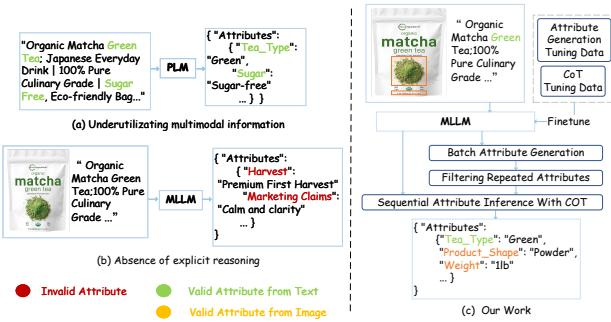  
Figure 1: Comparison of current methods and our work. (a) Current methods rely on textual data, missing out attributes present in images.(b) Existing approaches lack explicit reasoning, leading to extracting invalid attributes. (c) Our work leverages multimodal data and a chain-of-thought process for accurate attribute extraction.

1) Underutilization of multimodal information. Recent AE methods (Zhang et al., 2022; Xu et al.,2O23) rely solely on textual data, extracting potential attributes from given descriptions or titles in the product profiles. However, product images also offer valuable attributes that can enhance the shopping experience for consumers.As illustrated in Figure 1(a), current models often overlook key visual information in product images. In Figure 1(c),attributes like ‘Product_shape' and‘Weight' are visible on the packaging, but are not extracted by models that only use textual data. By integrating both textual and visual data, a more comprehensive set of attributes can be extracted.

2)Absence of explicit reasoning. Earlier works (Ghani et al., 2006; Zheng et al., 2018a; Mehta et al., 2021; Fu et al., 2022) treat AM as a classification task, leveraging pre-trained models to implicitly derive classification results. More recent researchers (Zou et al., 2O24; Shinzato et al., 2023; Zhang et al., 2023b; Li et al., 2023b; Chen, 2024; Khandelwal et al., 2023) utilize generative language models,which typically generate results directly without an explicit reasoning process. As shown in Figure 1(b), models without explicit reasoning capabilities may extract attributes like ‘Marketing Claims’ without justifying their relevance or correctness. The absence of an explicit reasoning process means these models cannot effectively validate and refine their outputs based on context and common sense,leading to suboptimal results.

To address these limitations, we propose a novel framework called Multimodal Self-Correction Instruction Tuning (MSIT） for the task of OpenWorld E-commerce Product Attribute Mining. Our approach leverages generative Multimodal Large Language Models (MLLMs) to mine new potential attributes from both images and texts. The tuning process involves two datasets: Attribute Generation Tuning Data (AGTD) and Chain-of-Thought Tuning Data (CTTD). AGTD is constructed utilizing in-context learning with a small set of seed attributes. AGTD aids MLLMs in accurately extracting attribute-value pairs from multimodal information. To address the limitation of lacking explicit reasoning, we construct CTTD to guide the MLLMs in self-correction. CTTD is created by leveraging the attributes generated in AGTD and incorporating a structured 5-step reasoning process. In the inference phase, our approach employs a 3-stage process to extract attributes accurately.

The primary contributions of our work are as follows:

· To the best of our knowledge, we are the pioneers in exploring extracting potential attributes with MLLMs,extending Attribute Mining to multimodal settings. · We propose a comprehensive framework that can discover attributes from both textual or visual information, followed by a 5-step chainof-thought reasoning process to self-correct the generated attributes.

· We expand two unimodal datasets to multimodal datasets. The experimental results on two datasets demonstrate the superiority of our method compared to existing methods.

# 2Related Work

Multi-modal Large Language Models. Multimodal Large Language Models (MLLMs) extend Large Language Models (LLMs) by integrating non-textual modalities for various tasks. BLIP2 (Li et al., 2023a) achieves state-of-the-art performance in vision-language tasks by leveraging frozen pre-trained image encoders, language models,and lightweight query transformers. InstructBLIP (Dai et al., 2023) improves upon BLIP-2 by performing vision-language instruction tuning, outperforming the Flamingo model (Alayrac et al., 2022) in zero-shot tasks. LLAVA (Liu et al., 2023) uses GPT-4(OpenAI, 2023） to generate multimodal instruction-following data and trains largescale models for general visual and language understanding.

Attribute Mining. Research in product attribute mining,particularly in e-commerce, has gained significant attention (Shinzato et al., 2O22; Karamanolakis et al., 2020; Zheng et al., 2018b). Opentag(Zheng et al., 2O18a) uses neural networks and active learning to identify missing attributes, but does not expand attribute frameworks. LATEXNumeric (Mehta et al., 2O21) extracts numerical attributes via distant supervision and multitask learning, eliminating manual labeling. CMA-CLIP (Fu et al., 2022) models attribute completion as a classification task but assume a closed-world scenario. Other approaches (Roy et al., 2021; Xu et al., 2023) treat attribute completion as a generative modeling problem, using large language models to generate attribute values, but are limited to specific product categories and do not consider personalized attribute generation.

# 3Proposed Method

In Multimodal Open-World Attribute Mining task, the $i$ -th product $\mathcal { P } _ { i }$ is composed of a text (title and bullet point) $\mathcal { T } _ { i }$ and an image $\mathcal { T } _ { i }$ . The text consists of $w _ { i }$ tokens ${ \mathcal T } _ { i } = \{ s _ { 1 } ^ { i } , s _ { 2 } ^ { i } , . . . , s _ { w _ { i } } ^ { i } \}$ Our goal is to extract a set of relevant and applicable attributes $\mathcal { A } _ { i } = \{ a _ { 1 } , a _ { 2 } , . . . , a _ { k } \}$ from the given inputs,where $k$ is the number of mined attributes. These attributes can range from basic features such as color and size to more complex attributes like material and style. Each attribute corresponds to a specific value, denoted as $\mathcal { V } _ { i } = \{ v _ { 1 } , v _ { 2 } , . . . , v _ { k } \}$ The Open-World setting requires all the attributes need to be extracted, not limited to a pre-defined schema. Our method leverages a generative Multimodal Large language model to output a sequence, where the mined attributes and corresponding values are presented in a unified format, such as $\left\{ a _ { 1 } : v _ { 1 } , a _ { 2 } : v _ { 2 } , . . . , a _ { k } : v _ { k } \right\}$ .The overall architecture of the model is shown in Figure 2. Our method utilizes a structured process for constructing highquality tuning data and employs a 3-stage inference procedure to accurately extract attributes from both images and texts.The data construction phase involves generating attributes using in-context learning, followed by creating Chain-of-Thought (CoT) tuning data with a 5-step reasoning process. During inference, the 3 stages generate attributes in batches, filter out redundant attributes,and sequentially validate each attribute.

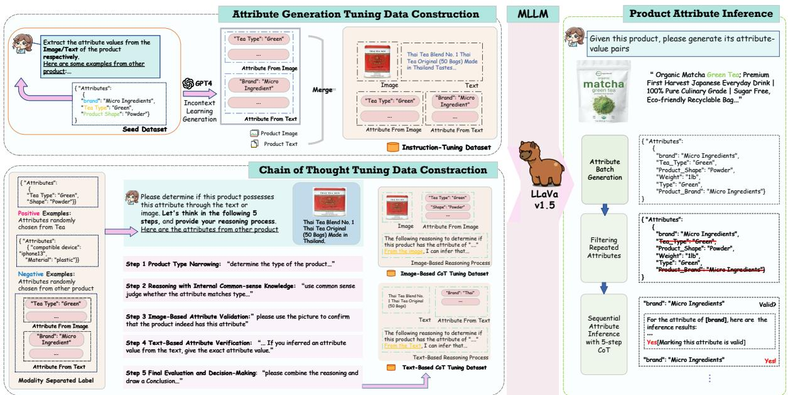  
Figure 2: The overall framework of MSIT. MSIT is divided into three main components: Atribute Generation Tuning Data (AGTD) Construction, Chain-of-Thought Tuning Data (CTTD) Construction,and Product Attribute Inference.In the first component, we construct AGTD by separately extracting atributes from images and text using in-context learning and merging them. The second component involves creating CTTD to guide the model in a structured 5-step reasoning process.Finally, the Product Atribute Inference component utilizes a 3-stage process to generate, filter,and validate attributes from multimodal data.

# 3.1Attribute Generation Tuning Data

Raw Dataset. We expand two raw unimodal datasets,WOAM (Xu et al., 2023) and OAMine (Zhang et al.，2022)， to multimodal datasets. The two datasets encompass several prevalent ecommerce product categories such as Tea, Vitamin, Sofa, and Phone Case.We collect the product images from Amazon.com corresponding to the

respective products.

Seed Dataset. For each type, the seed set includes several applicable attribute types. We manually construct and annotate the seed dataset to ensure consistency with product characteristics. This allows us to refine unclear or coarse-grained attribute types into newly defined fine-grained types.

In-Context Learning Generation. We employ In-Context Learning (Zhang et al., 2O23a) to construct Attribute Generation Tuning Data (AGTD). Specifically, a small set of seed attributes and corresponding values is selected to guide the generation of new attributes and values by GPT-4 (OpenAI, 2023). The prompts for attribute generation are listed in Appendix A.1. In the initial experiments, we observe that GPT-4 would mostly generate the attributes from text information if the images and texts are input simultaneously. To mitigate the bias of modality attention,images and text descriptions are input separately to generate potential attributes. The generated attributes are manually reviewed to filter out incorrect atributes, ensuring high-quality data for further processing. Finally,we employ GPT-4 to merge filtered attributes of images and descriptions as shown in Appendix A.2.

# 3.2Chain-of-Thought Tuning Data

To address the limitation of lacking an explicit reasoning process,we construct Chain-of-Thought (CoT) Tuning Data to be jointly trained with AGTD. Recent works (Zhang et al., 2O23c) find that vanilla form of CoT which directly lets LLM to indiscriminately output the reasoning process would decrease the performance. The phenomenon mostly results from the generation of hallucinated rationales. To alleviate the problem, we divide the reasoning process into 5 steps and specify the output targets of each step. The prompts for generating CoT data are stated in Appendix A.3.

Product Type Range Narrowing:Firstly, MLLM should judge the type of current product given the corresponding image and text to narrowing down the range of product atributes. This step provides context for subsequent reasoning.

Reasoning with Internal Common-sense Knowledge:The second step utilizes internal common sense alongside preliminary screening to determine whether a to-be-judged attribute applies to a product type. For instance, when evaluating if a specialized term like 'screen_size' is appropriate for vitamins, consider the common sense context of the product.Moreover, if the attribute's relevance is unclear, it should initially be considered unsuitable. If the meaning is clear, then common sense should guide the preliminary judgment of whether the attribute generally fits the product type.

Image-Based Attribute Validation: This step assesses whether the attribute originates from the image.If the attribute is deemed valid after initial filtering, the model infers the attribute value from the image to confirm its presence.

Text-Based Attribute Verification: This step evaluates whether the attribute is derived from the text.If the model preliminarily determines that the product may have this attribute, then it will infer whether the attribute can be judged from the text.

Final Evaluation and Decision-Making: The final step summarizes the reasoning from the previous steps and decides whether the attribute is derived from the given data, concluding with a yes or no answer.

Contrastive Chain-of-Thought Tuning Data. As the above steps employ the manually reviewed attributes to construct the CoT tuning data, the final decision for each attribute is ‘yes'. To prevent overfitting during tuning, we introduce Contrastive CoT Tuning Data. Attributes from different product types are selected as negative samples. These samples undergo a rigorous manual selection process to ensure reliability and effectiveness in training. In addition,we ensure that the number of positive and negative samples is balanced.

# 3.3Model Training

We fine-tune three strong and widely used MLLMs LLAVA-7B (Liu et al., 2023), Qwen-VL (Bai et al., 2023) and InternLM (Dong et al., 2024) with the Attribute Generation Tuning Data and Chain-ofThought Tuning Data. We adopt the Low-Rank Adaptation (LoRA) fine-tuning method. The core idea of this method is to freeze the language model and tune only the rank-decomposition module of the Transformer layer.

Formally, given the parts of instruction tuning data $\mathcal { D }$ , our training objective is to obtain a finetuned model $\mathcal { M } _ { \widehat { \theta } }$

$$
\underset { \hat { \theta } } { \arg \operatorname* { m i n } } \mathbb { E } _ { ( \mathcal { T } _ { i } , \mathcal { T } _ { i } ) \in \mathcal { D } } \bigg [ \sum _ { s = 1 } ^ { s _ { j } } \log P _ { \mathcal { M } _ { \hat { \theta } } } \left( s _ { w } ^ { i } \mid \mathcal { T } _ { i } , s _ { 1 } ^ { i } , \dots , s _ { w - 1 } ^ { i } \right) \bigg ] ,
$$

where $\mathcal { T } _ { i } = s _ { 1 } ^ { i } , s _ { 2 } ^ { i } , . . . , s _ { w } ^ { i }$ and $\hat { \theta }$ denotes the parameters of LoRA in MLLM.

# 3.43-Stage Attribute Inference

Batch Attribute Generation. In this stage, the fine-tuned MLLM generates attributes for a given sample. The model leverages its understanding of both images and text to produce a batch of relevant attributes.We extract a set of formalized attributes and values from the output texts.

Filtering Repeated Attributes. To reduce computational costs,we filter out repeated attributes of the first stage. For instance,attributes like‘type' and‘product type’ are identified as duplicates.A rule-based system is employed to eliminate these redundancies, streamlining the attribute list.

Sequential Attribute Inference with 5-step CoT. The final stage sequentially inputs each filtered attribute into the MLLM for inference using the 5- step CoT process.Whether an attribute is reserved is determined by the yes or no output in the last step of CoT.

We summarize the prompts for each inference stage in Appendix B.

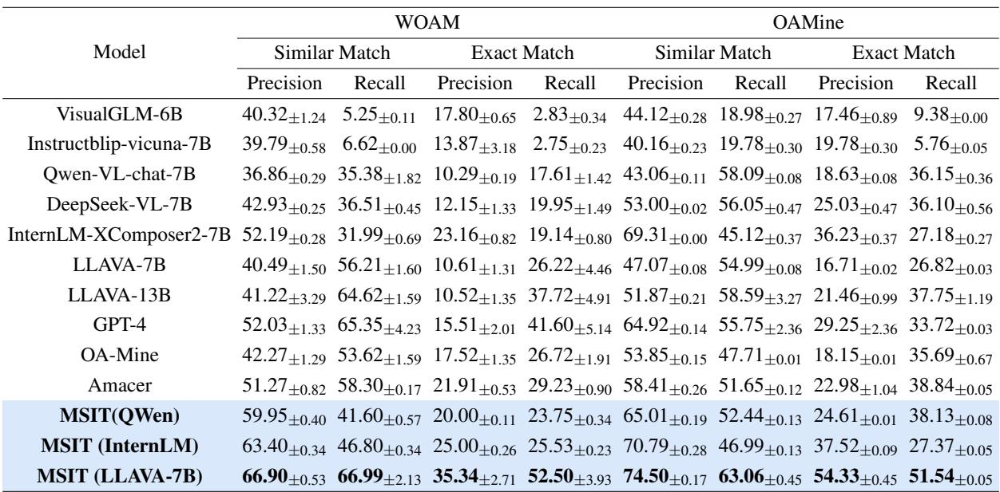
Table 1: WOAMand OAMine performance of visual language models. Results are reported in precision and recall

# 4Experiments

# 4.1Experiment Setup

Datasets.We evaluate our approach on two AM datasets: the WOAM dataset (Xu et al., 2023) and OAMine dataset (Zhang et al., 2022). The WOAM dataset covers four product categories: Tea, Vitamin,Sofa,and Phone Case, with over 9,OoO English descriptions per category. The seed attribute set contains 16.5 attribute types and 22 values per type on average.The OAMine dataset includes 100 product types,with 1,943 manually annotated test products across 10 types,averaging 11.5 attributes per type and 48.1 unique values per attribute.Both datasets are expanded to multimodal settings with images collected from Amazon.com. We use 1,000 AGTD and 30O CTTD samples for training and 1,000 samples for testing.

Evaluation Metrics. We evaluate performance using two metrics: 1) Precision, the ratio of true positives to total positive predictions,and 2) Recall, the proportion of true positives among all actual positives.We report Exact Match and Similar Match as in previous work (Roy et al., 2021; Zheng et al., 2O18a). Exact Match requires strict consistency with the gold standard, while Similar Match allows for synonyms, treating attribute predictions as correct if they match any synonym of labels.

Implementation Details. We leverage Pytorch and one Tesla A10o GPU to implement our framework and conduct experiments. The optimizer is Adam and the learning rate is set to 3e-4. LoRA is employed to fine-tune the three MLLMs as stated in

Section 3.3. We train our models for 10 epochs. During inference, we employ top_p sampling as our type of decoding. The temperature and top_p are set to O.2 and O.7 respectively. We report the means and standard deviations of 5 independent trials.For each trial, we utilize a random seed to ensure fairness.

Baselines.We compare our model with several strong MLLMs: VisualGLM-6B (Ding et al., 2021),a multimodal conversational model supporting images and both Chinese and English; InstructBLIP (Dai et al., 2023),which uses the BLIP-2 architecture for visual instruction tuning; QwenVL-chat-7B (Bai et al.,2023), a model for imagerelated reasoning in text-oriented tasks; DeepSeekVL (Lu et al., 2024),an open-source model for realworld vision-language understanding; InternLMXComposer2 (Dong et al., 2024), which specializes in text-image comprehension; LLAVA (Liu et al., 2023), another open-source MLLM of two scopes; and GPT-4 (OpenAI, 2023), a multimodal model by OpenAI. We also compare with existing AM baselines: OA-Mine (Zhang et al., 2022), which uses meta-classifiers and clustering for attribute values,and Amacer (Xu et al., 2023), which improves generalization with self-supervised regularization.

# 4.2Main Results

Table 1 presents the results of our experiments on the WOAM and OAMine datasets.We finetuned several multi-modal language models, including LLAVA-7B, Qwen, and InternLM, and compared MSIT with these baseline models. It can be observed that MSIT significantly outperforms all baseline methods in both Similar Match and Exact Match metrics across both datasets. On the WOAM dataset,MSIT achieves the highest Similar Match precision of $6 6 . 9 0 \%$ ，compared to the next best model, GPT-4,which achieves $5 2 . 0 3 \%$ . MSIT also excels in recall, with a score of $6 6 . 9 9 \%$ , far surpassing the second-best score of $6 5 . 3 5 \%$ by GPT-4. In terms of Exact Match,MSIT shows a substantial improvement with a precision of $3 5 . 3 4 \%$ and a recall of $5 2 . 5 0 \%$ , compared to GPT-4's precision of $1 5 . 5 1 \%$ and recall of $4 1 . 6 0 \%$

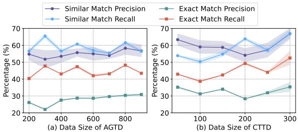  
Figure 3: Performance comparison with different data size of AGTD and CTTD on WOAM dataset.

On the OAMine dataset, MSIT maintains its superior performance with a Similar Match precision of $7 4 . 5 0 \%$ and recall of $6 3 . 0 6 \%$ . The second-best model, InternLM-XComposer2-7B,achieves a precision of $6 9 . 3 1 \%$ and recall of $4 5 . 1 2 \%$ . For Exact Match,MSIT achieves a precision of $5 4 . 3 3 \%$ and a recall of $5 1 . 5 4 \%$ , significantly higher than Amacer, which records a precision of $2 2 . 9 8 \%$ and recall of $3 8 . 8 4 \%$ ：

It could be found that MSIT improves the performance of LLAVA-7B by a large margin from $1 0 . 6 1 \%$ to $3 5 . 3 4 \%$ on the precision of Exact Match. This result demonstrates that the multimodal instruction tuning significantly elicits the attribute mining ability of MLLMs. OA-Mine and Amacer, which focus on self-supervised learning and metaclassifier techniques， show competitive performance but are still outperformed by MSIT, particularly in the Exact Match metrics.

# 4.3Ablation Study

Ablation Study Results. Table 2 shows the results of our ablation study on the WOAM and OA-Mine datasets, evaluating the impact of different MSIT components: Attribute Generation Tuning Data (AGTD), Chain-of-Thought Tuning Data (CTTD), and the 3-stage inference process.

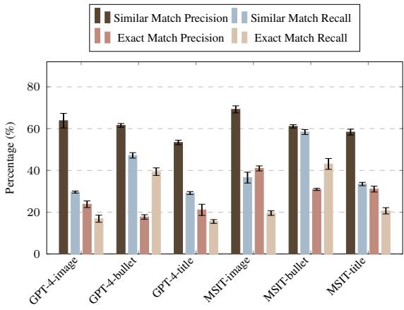  
Figure 4: Performance comparison with GPT-4 over different input.

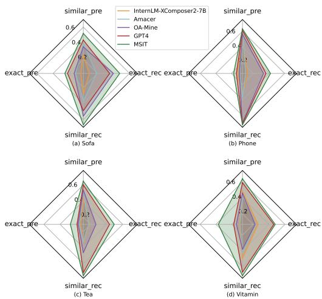  
Figure 5: Domain Adaptation performance of different methods with cross-validation on WOAM dataset.

Training Components. Using AGTD alone leads to moderate improvements in Similar Match and Exact Match metrics.For instance,on the WOAM dataset, it achieves a Similar Match precision of $6 2 . 1 5 \%$ and recall of $6 2 . 5 2 \%$ . CTTD also improves performance, but less significantly (e.g.,Similar Match precision of $5 0 . 1 5 \%$ and recall of $4 5 . 8 8 \%$ on WOAM). When combined, AGTD and CTTD produce the best results,with Similar Match precision reaching $6 3 . 8 9 \%$ and recall at $6 7 . 4 2 \%$ on WOAM.

Inference Components. Stage 1 alone provides a baseline improvement, but its effectiveness increases when combined with AGTD and CTTD (e.g., $6 3 . 8 9 \%$ Similar Match precision on WOAM). Introducing Stage 2 further enhances performance, reducing computational costs while improving precision. For example, combining Stage 2 with Stage 1,AGTD,and CTTD results in $6 3 . 7 2 \%$ Similar Match precision and $6 7 . 9 1 \%$ recall. MSIT without Stage 2 shows slightly better recall but significantly lower precision. The addition of Stage 3, incorporating 5-step chain-of-thought reasoning, boosts both precision and recall. The full combination achieves the highest performance,with Similar Match precision of $6 6 . 9 0 \%$ and recall of $6 6 . 9 9 \%$ ：

Table 2: Ablation Study on different components of MSIT on WOAM and OAMine datasets.   
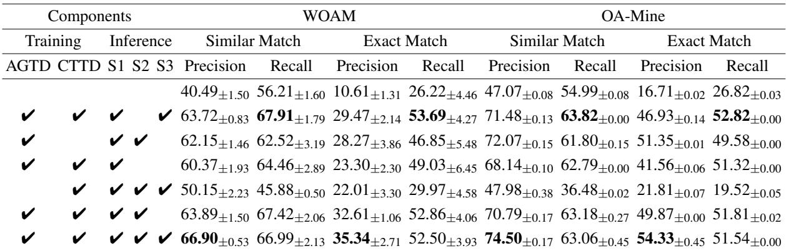

Table 3: Performance comparison on output format in AGTD.   
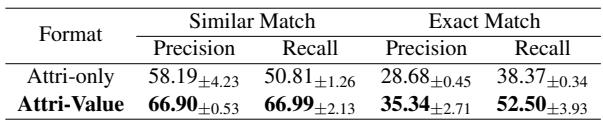

# 4.4Discussion on Output Format of AGTD

We also conduct experiments on the impact of output format of AGTD as shown in Table 3. The results indicate that including both attributes and their corresponding values in the output format of AGTD significantly enhances model performance. Specifically, when the format is changed to outputting attributes only, the Exact Match Precision and Recall would decrease $2 8 . 6 8 \%$ and $3 8 . 3 7 \%$ respectively. This demonstrates that providing attributevalue pairs rather than attributes alone improves the model's ability to extract product attributes.

# 4.5Analysis of Training Data Size

In this section,we analyze the impact of different training data sizes on the performance of our MSIT. Figure 3 (a) illustrates the performance metrics on the WOAM dataset with varying sizes of AGTD. As the data size increases from 2OO to 90o, Similar Match precision improves from $5 4 . 7 6 \%$ to $5 6 . 7 0 \%$ This result indicates that increasing AGTD size generally enhances the model's ability to identify similar attributes. Both precision and recall metrics in Exact Match show a consistent improvement with increasing data size.Precision increases from

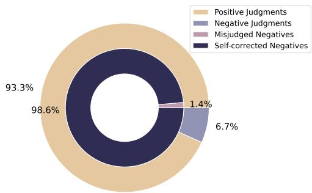  
Figure 6: Visualization of Self-Correction after 3-stage inference.

$2 6 . 1 3 \%$ to $3 0 . 8 5 \%$ ,while recall rises from $4 0 . 3 1 \%$ to $4 3 . 4 6 \%$ . The narrow error margins suggest robustness in these trends. Figure 3 (b) presents the performance metrics on the WOAM dataset with different sizes of CTTD.For Similar Match, precision rises from $6 3 . 3 6 \%$ to $6 6 . 9 0 \%$ ，and recall increases from $5 3 . 8 8 \%$ to $6 6 . 9 9 \%$ as CTTD size grows. These trends suggest that CTTD size has a substantial impact on improving the model's ability to accurately identify similar attributes. Exact Match precision improves slightly from $3 5 . 2 1 \%$ to $3 5 . 3 4 \%$ ,and recall rises from $4 2 . 8 9 \%$ to $5 2 . 5 0 \%$ The improvement indicates that explicit reasoning through CoT data significantly aids in identifying exact attribute matches.

# 4.6Analysis of Attribute Mining from Different Input

The bar chart in Figure 4 illustrates the performance of MSIT compared to GPT-4 across different input types: images, bullet points,and titles. As illustrated in Figure 4, our MSIT method generally exhibits superior performance across most metrics. For instance,MSIT achieves a notable Similar Match Precision of $6 9 . 2 1 \%$ for images, compared to GPT-4's $6 3 . 8 1 \%$ ,and an Exact Match

Precision of $4 0 . 9 6 \%$ versus GPT-4's $2 3 . 8 1 \%$ . Furthermore, MSIT outperforms GPT-4 significantly in bullet points recall, achieving a Similar Match Recall of $5 8 . 3 7 \%$ compared to GPT-4's $4 7 . 1 9 \%$ Additionally, from the recall distribution it could be observed that images consistently yield a high number of extracted attributes. This observation underscores the validity of our multimodal approach, affirming that leveraging multiple modalities can uncover an extensive range of product attributes.

# 4.7Analysis of Domain Adaptation

Our domain adaptation experiment is designed to evaluate the generalizability of our model in realworld scenarios,where it may encounter previously unseen product categories. We conduct crossvalidation on the WOAM dataset across four categories: Sofa,Phone, Tea,and Vitamin.For each experiment, we train the model using data from three categories and evaluated its performance on the fourth category. The results, depicted in Figure 5,reveal that MSIT consistently outperforms other models-InternLM, Amacer, OA-Mine,and GPT-4—across all categories. MSIT achieves the highest Similar Match Precision and ExactMatch Precision in every category,with notable performances in the Sofa $( 6 9 . 2 1 \%$ and $4 0 . 9 6 \%$ , respectively)and Tea ( $6 9 . 2 1 \%$ and $4 0 . 9 6 \%$ ,respectively) categories. The results confirm the robustness of MSIT in attribute extraction.

# 4.8Effectiveness of Self-Correction

The results shown in Figure 6 demonstrate the effectiveness of MSIT in the final inference stage by evaluating the distribution of attribute judgments. Out of a total of 1028 attributes, a significant proportion $( 9 3 . 3 \% )$ was judged as positive，with a small percentage $( 6 . 7 \% )$ labeled as negative judgments.Within these negative judgments, $9 8 . 6 \%$ were accurately self-corrected,while only $1 . 4 \%$ were misjudged. This indicates that our method effectively self-corrects nearly all incorrect negative judgments, thus enhancing overall accuracy. Although there is a slight reduction in recall, MSIT achieves the minimal trade-off in recall for substantial precision gains.

# 4.9Case Study

Figure 7 presents two examples of multimodal attribute mining with MSIT. In the ‘Packaging Type’ scenario, the system correctly identifies the attribute using visual cues,as the text lacks explicit information. Conversely, in the‘Return Policy' example, textual evidence, such as ${ \bf \dot { 9 0 } D A Y }$ MONEY BACK GUARANTEE', is used to confirm the attribute when the image is insufficient. These examples highlight MSIT's capability to handle real-world e-commerce scenarios where product information may be incomplete or ambiguous. As shown in Figure 8, we compare MSIT to other models,such as Qwen and GPT-4. For the product ‘Chiquita Banana Bread Mix', Qwen struggles to extract relevant attributes, often returning ‘Unknown’ for key information such as ‘servings’ and ‘mfg_date.' GPT-4 performs better by identifying attributes like‘Package Type’ and ‘Colors', but it misses important details about the product's contents and characteristics.In contrast, MSIT accurately extracts a comprehensive set of attributes, including the brand, product name, etc., addressing the limitations observed in Qwen and GPT-4.

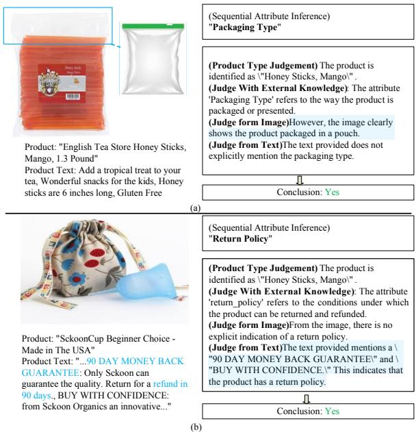  
Figure 7: Case study on Atribute Mining with MSIT.

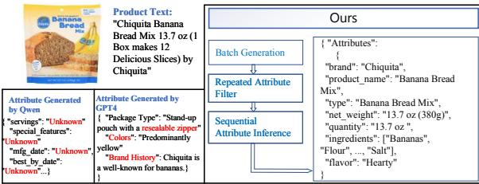  
Figure 8: Case study on comparison with other methods.

# 4.10 Conclusion

This paper presents Multimodal Self-Correct Instruction Tuning (MSIT),a novel framework for

Open-World E-commerce Product Attribute Mining. By utilizing both textual and visual data,MSIT addresses the limitations of current methods,particularly the lack of multimodal information and explicit reasoning. MSIT self-corrects the false positive attributes through a 5-step chain-of-thought reasoning.Extensive experiments on the WOAM and OAMine datasets demonstrate that MSIT significantly enhances precision and recall compared to state-of-the-art methods. Our framework also shows robustness in domain adaptation scenarios, highlighting its potential for real-world applications. In future work,we aim to explore the integration of additional modalities of MSIT to other domains that require detailed attribute analysis.

# Limitations

The main limitations of our work are related to the scope of MLLMs fine-tuning. Due to resource constraints,we conducted fine-tuning on three 7B-parameter MLLMs (LLAVA,Qwen and InternLM),without extending our efforts to largerscale MLLMs such as those with 13B parameters or beyond.

# Acknowledgement

We wish to convey our sincere appreciation to the anonymous reviewers for their valuable feedback and constructive comments.This work was supported by Southeast University-China Mobile Research Institute Joint Innovation Center, the National Natural Science Foundation of China (No.62302149,No.62372155,No.62406065, No.62206053), Changzhou science and technology project No. 2O231313,National Natural Science Foundation of China (No.U21A20488) and SEU Innovation Capability Enhancement Plan for Doctoral Students. We thank the Big Data Computing Center of Southeast University for providing the facility support on the numerical calculations in this paper.

# References

Jean-Baptiste Alayrac,Jeff Donahue,Pauline Luc, Antoine Miech,Iain Barr,Yana Hasson,Karel Lenc,Arthur Mensch,Katherine Millican,Malcolm Reynolds,Roman Ring,Eliza Rutherford,Serkan Cabi, Tengda Han, Zhitao Gong, Sina Samangooei, Marianne Monteiro,Jacob L.Menick,Sebastian Borgeaud,AndyBrock,Aida Nematzadeh, Sahand Sharifzadeh,Mikolaj Binkowski,Ricardo Barreira,

Oriol Vinyals,Andrew Zisserman,and Karén Simonyan. 2O22. Flamingo: a visual language model for few-shot learning.In NeurIPS.

Jinze Bai, Shuai Bai, Shusheng Yang, Shijie Wang, Sinan Tan, Peng Wang, Junyang Lin, Chang Zhou, and Jingren Zhou. 2023. Qwen-vl: A frontier large vision-language model with versatile abilities. CoRR, abs/2308.12966.

Huajun Chen. 2024. Large knowledge model: Perspectives and challenges. Data Intelligence, 6(3):587- 620.

Wenliang_ Dai, Junnan Li, Dongxu Li, Anthony Meng Huat Tiong, Junqi Zhao,Weisheng Wang, Boyang Li, Pascale Fung,and Steven C.H. Hoi. 2023. Instructblip: Towards general-purpose visionlanguage models with instruction tuning.In NeurIPS.

Ming Ding, Zhuoyi Yang, Wenyi Hong, Wendi Zheng, Chang Zhou, Da Yin, Junyang Lin, Xu Zou, Zhou Shao,Hongxia Yang,and Jie Tang. 2O21. Cogview: Mastering text-to-image generation via transformers. CoRR,abs/2105.13290.

Xiaoyi Dong, Pan Zhang, Yuhang Zang, Yuhang Cao, Bin Wang, Linke Ouyang, Xilin Wei, Songyang Zhang，Haodong Duan，Maosong Cao，Wenwei Zhang, Yining Li,Hang Yan,Yang Gao,Xinyue Zhang，Wei Li, Jingwen Li,Kai Chen, Conghui He,Xingcheng Zhang,Yu Qiao,Dahua Lin,and Jiaqi Wang.2024. Internlm-xcomposer2: Mastering free-form text-image composition and comprehension in vision-language large model. CoRR, abs/2401.16420.

Jinmiao Fu, Shaoyuan Xu, Huidong Liu, Yang Liu, Ning Xie, Chien-Chih Wang, Jia Liu, Yi Sun, and Bryan Wang.2022. CMA-CLIP: cross-modality attention clip for text-image classification. In ICIP, pages 2846-2850.IEEE.

Rayid Ghani, Katharina Probst, Yan Liu,Marko Krema, and Andrew E.Fano.2Oo6. Text mining for product attribute extraction. SIGKDD Explor., 8(1):41-48.

Giannis Karamanolakis, Jun Ma, and Xin Luna Dong. 2020. Txtract: Taxonomy-aware knowledge extraction for thousands of product categories.In ACL, pages 8489-8502. Association for Computational Linguistics.

Anant Khandelwal, Happy Mittal, Shreyas Sunil Kulkarni, and Deepak Gupta. 2O23. Large scale generative multimodal attribute extraction for e-commerce attributes.In ACL (industry), pages 305-312.Association for Computational Linguistics.

Junnan Li, Dongxu Li, Silvio Savarese,and Steven C.H. Hoi. 2023a. BLIP-2: bootstrapping language-image pre-training with frozen image encoders and large language models. In ICML, volume 202 of Proceedings of Machine Learning Research, pages 19730-19742. PMLR.

Yanzeng Li, Bingcong Xue, Ruoyu Zhang,and Lei Zou. 2023b. Attgen: Attribute tree generation for realworld attribute joint extraction. In ACL (I), pages 2139-2152. Association for Computational Linguistics.

Haotian Liu, Chunyuan Li, Qingyang Wu, and Yong Jae Lee.2023. Visual instruction tuning. In NeurIPS.

Haoyu Lu, Wen Liu, Bo Zhang, Bingxuan Wang, Kai Dong,Bo Liu, Jingxiang Sun,Tongzheng Ren, ZhuOshu Li, Hao Yang, Yaofeng Sun, Chengqi Deng, Hanwei Xu, Zhenda Xie,and Chong Ruan. 2024. Deepseek-vl: Towards real-world vision-language understanding. CoRR,abs/2403.05525.

Kartik Mehta,Ioana Oprea, and Nikhil Rasiwasia.2021. Latex-numeric: Language-agnostic text attribute extraction for e-commerce numeric attributes. CoRR, abs/2104.09576.

OpenAI. 2023._GPT-4 technical report.CoRR, abs/2303.08774.

Kalyani Roy, Pawan Goyal, and Manish Pandey. 2021. Atribute value generation from product title using language models. In Proceedings of The 4th Workshop on $e$ -Commerce and NLP, pages 13-17.

Keiji Shinzato, Naoki Yoshinaga, Yandi Xia, and WeiTe Chen. 2O22. Simple and effective knowledgedriven query expansion for qa-based product attribute extraction. In ACL(2), pages 227-234. Association for Computational Linguistics.

Keiji Shinzato, Naoki Yoshinaga, Yandi Xia, and WeiTe Chen. 2O23． A unified generative approach to product atribute-value identification. In Findings of the Association for Computational Linguistics:ACL 2023,Toronto, Canada, July 9-14, 2023,pages 6599- 6612.Association for Computational Linguistics.

Huimin Xu, Wenting Wang, Xin Mao, Xinyu Jiang, and Man Lan. 2019. Scaling up open tagging from tens to thousands: Comprehension empowered attribute value extraction from product title. In Proceedings of the 57th Conference of the Association for Computational Linguistics,ACL 2019,Florence,Italy, July 28- August 2, 2019, Volume 1: Long Papers, pages 5214-5223. Association for Computational Linguistics.

Liyan Xu, Chenwei Zhang, Xian Li, Jingbo Shang, and Jinho D.Choi.2023. Towards open-world product attribute mining:A lightly-supervised approach. In ACL(1), pages 12223-12239.Association for Computational Linguistics.

Jun Yan, Nasser Zalmout, Yan Liang, Christan Grant, Xiang Ren, and Xin Luna Dong. 2021. Adatag: Multi-attribute value extraction from product profiles with adaptive decoding. In Proceedings of the 59th Annual Meeting of the Association for Computational Linguistics and the 1lth International Joint Conference on Natural Language Processing,ACL/IJCNLP

2021,(Volume 1: Long Papers), Virtual Event,August 1-6,2021,pages 4694-4705. Association for Computational Linguistics.

Xinyang Zhang, Chenwei Zhang, Xian Li, Xin Luna Dong, Jingbo Shang, Christos Faloutsos,and Jiawei Han. 2022. Oa-mine: Open-world atribute mining for e-commerce products with weak supervision. In WWW, pages 3153-3161. ACM.

Yuanhan Zhang, Kaiyang Zhou,and Ziwei Liu. 2023a. What makes good examples for visual in-context learning? In NeurIPS.

Yupeng Zhang, Shensi Wang, Peiguang Li, Guanting Dong, Sirui Wang, Yunsen Xian, Zhoujun Li,and Hongzhi Zhang.2O23b． Pay attention to implicit attribute values: A multi-modal generative framework for AVE task. In ACL (Findings), pages 13139- 13151.Association for Computational Linguistics.

Zhuosheng Zhang,Aston Zhang,Mu Li, Hai Zhao, George Karypis,and Alex Smola.2023c. Multimodal chain-of-thought reasoning in language models. CoRR,abs/2302.00923.

Guineng Zheng，Subhabrata Mukherjee,Xin Luna Dong，and Feifei Li. 2018a. Opentag: Open attribute value extraction from product profiles. CoRR, abs/1806.01264.

Guineng Zheng， Subhabrata Mukherjee,Xin Luna Dong，and Feifei Li. 2018b． Opentag: Open attribute value extraction from product profiles. In KDD,pages 1049-1058.ACM.

Henry Peng Zou, Gavin Heqing Yu, Ziwei Fan, Dan Bu,Han Liu, Peng Dai,Dongmei Jia,and Cornelia Caragea. 2O24. Eiven: Efficient implicit attribute value extraction using multimodal llm. arXiv preprint arXiv:2404.08886.

# APrompts for data generation

# A.1Prompt for Generation of text attributes and image attributes

The prompt generated by the data in this stage is mainly divided into three parts. The first part is the Task Description, the second part is In-context Learning,and the third part is to provide product text or image information. Since we generate text and image attributes separately, the information in the third part is provided separately. The following shows the prompt that enables GPT4 to extract text attributes.To generate image attributes, we only need to extract image attributes in the task description and change the third part of the information to image information.

# Task Description:

You are a world-class algorithm for extracting information in structured formats.

There are some product descriptions,and your task is to extract the attribute values from the text information of the product in a JSON format.

Please provide me with the corresponding attribute value of the attribute. If there is no corresponding attribute value in the information I provide you, please do not provide me with this attribute.

{ "brand": "Rugby", "product_name": "Tab-A-Vite Multivitamin Tablets", "serving_size":"2 tablets", "number_of_servings":30, "Dosage Form":"Tablet", "Target Audience": "Adults", "Indications": "Vitamin Supplementation", "key_nutrients":[ "Thiamin (as Thiamine HCI)", "Vitamin B6 (Pyridoxine HCI)", "Calcium (as Dicalcium Phosphate)", "Magnesium (as Magnesium Oxide)" ]   
}   
{ "Type":"Phone case", "Material":"Silicone", "Design":"Transparent", "Function"："Shockproof", "Compatibility":"Compatible Models", "Color": "Black", "Thickness":"Ultra-thin", "Weight":"Lightweight", "Texture":"Smooth"   
}

# Text information of the product:

Below is the text information of the product whose attributes I want you to extract   
Title: ...   
Bullet point: ..

# In-context learning:

{ "type":"Sofa", "material_frame":"Gold legs", "style":"Modern，minimalist", "size": "Three-Seater Sofa", "color":"White", "Padding": "High-Density Foam", "Accessories":"Throw Pillows", "Special Features": "Electric Reclining", "Maintenance Requirements": "Dry Clean Only"   
人   
{ "brand":"Traditional Medicinals", "type":"herbal tea", "flavor": "eucalyptus and mint", "caffeine_content":"caffeine-free", "quantity": "16 tea bags", "Packaging Type": "Tea bags", "Storage conditions": "Dry and WellVentilated Area", "Processing Level": "Fermented", "Aroma": "Rich", "Tea Benefits": ["Refreshment"，"Digestive Aid"]   
}

# A.2Prompt for merging the text attributes and image properties of the product

In this step, we merge the image and text atributes generated separately previously.

# Task Description

The following is the information of the attribute value pairs extracted from the image and text of the same product respectively. Please help me merge them into one. The same attributes will be regarded as one after being merged.If I only provide text or image information, then there is no need to merge and directly output the text or image information I provide.If you encounter a attribute like Features, which is a bit general, try to give more detailed attribute.Please let the output follow the json format strictly and do not send me any other text.

# Image and text attributes

Imageattributes:{Attribute1:value1, Attribute2:value2,... }

Text attributes:{Attribute1:value1, tribute2:value2,... }

# A.3Prompt for Generation of Chain-of-Thought Tuning Data

# Task Description

I will provide you with product images as well as text information and attributes. Please judge whether the product has this attribute.Please follow the steps below to reason step by step and give your reasoning process.

# Five-step Chain of thought

Step 1: In this step,you need to determine the type of product based on pictures and text information, such as whether the product is a mobile phone case, tea, or other types of products.

Step 2: This step requires analyzing the meaning of the attributes. If the attribute's meaning is unclear, we will make a preliminary determination that it cannot be considered a product attribute. If the intent of the attribute is clear,use common sense to initially judge whether the attribute matches the product type,and initially explain the meaning of the attribute and why it may match the product.

Step 3: If you preliminarily judge in the second step that this type of product may have this attribute, then please use the picture I provided to guess its attribute value to confirm that the product indeed has this attribute. Since images do not provide explicit attribute value information, there is no need to derive exact attribute values. You only need to determine a rough attribute value to confirm.

Step 4: If you preliminarily judge that this type of product may have this attribute in the second step, then in this step,please use the text I provided to guess its attribute value to confirm that the product indeed has this attribute. If you inferred an attribute value from the text, give the exact attribute value

Step 5, please combine the reasoning from the above steps to draw a conclusion whether the product has this attribute.

Please mark the last paragraph with yes or no. No other text is needed in this paragraph.

The product's text and image information and the attributes that need to be judged   
Image:...   
Title: ...   
Bullet Point: ...   
The attribute i want to judge is Attributei

# BInference Instructions

# B.1Instructions for Batch Attribute Generation

The list of instructions used for Batch Attribute Generation is shown in Table 4. They present the same meaning with natural language variance.

# B.2Deletion rules for similar meaning attributes in rules

For two phrases, if the subwords of any phrase correspond one-to-one with the subwords of the other phrase, we determine that the two phrases are synonyms.

To determine whether two subwords are similar, we use the word2vec-google-news-3oo model, calculate the cosine similarity of the two subword vectors,and set the threshold.If one of the phrases has only one subword,we will set a higher threshold to determine similarity, because a subword is more likely to correspond to a subword in another phrase.

For two phrases that are judged to have similar meanings, we must choose one to delete. Our judgment rules can be summarized into the following three rules.

1.Rule 1: If there is only one attribute with one subword number of two attributes (assuming that this attribute is attribute A and the other phrase is attribute B), the attribute to be deleted depends on the number of subwords of attribute B. If it is equal to three, attribute A is deleted,and if it is greater than three, attribute Bis deleted.

2. Rule 2: If two attributes have one attribute with two subwords (assuming it is attribute A), and the other attribute has three or more subwords (assuming it is attribute B),we choose to delete attribute B.

# Instructions

·“Extract the information from the title, bullet points, and product picture into JSON for  
mat.”   
·“Convert the attribute values of the product from the provided information into JSON format.”   
·“Generate the product attribute values in JSON format based on the provided title,bullet points,and picture."   
·“Compile the product's characteristic attributes into JSON format according to the provided information."   
·“Extract the product attribute information into JSON format from the provided title, bullet points,and picture."   
·“Parse the product's features and attributes into JSON format from the given information.”   
·“Extract the product's characteristics into JSON format using the provided title, bullet points,and picture."   
· “Retrieve and organize the product's attribute values into JSON format from the provided information."   
· “Compile the product's attribute information into JSON format based on the title,bullet points, and picture content."   
·“Generate JSON-formatted product attribute data based on the provided information."

Table 4: List of instructions for Batch Attribute Generation.

3.Rule 3: If two attributes have the same number of subwords,we randomly pick one and delete it.

# B.3Instructions for Filtering Wrong Attributes

The list of instructions used for Filtering Wrong Attributes is shown in Table 5. They present the same meaning with natural language variance.

# Instructions

· “I provide you with text and image information of a product along with one attribute of this product. Please determine if this product possesses this attribute through the text and image. Let's think step by step,and please provide your reasoning process.”   
· “Here's textual and visual data about a product, along with a specific attribute. Your job is to discern if this attribute applies to the product, using both the text and the visuals.Let's methodically analyze the information, detailing your reasoning process step by step."   
· “I present you with textual and visual data about a product, along with a single attribute associated with it. Your task is to determine whether this product exhibits this attribute, utilizing both the text and the image. Let's think step by step,and please provide your reasoning process."   
· “I provide you with the text and picture information of a product and an attribute of this product, please help me judge whether this product has this attribute through the text and picture, we will think step by step, please give your reasoning process."   
· “I will give you the text and image information of a product, as well as one of its attributes. Please use the text and image to help me determine whether the product has this attribute. Let's think step by step,and please explain your reasoning process."