# ${ \bf E } ^ { 2 }$ -RAG: Towards Editable Efficient RAG by Editing Compressed KV Caches

Tongxu Luo1∗ Wenyu $\mathbf { D } \mathbf { u } ^ { 2 * }$ Hanwen Hao3 Min Zhang4 Hao Yang4   
Benyou Wang1†   
1The Chinese University of Hong Kong, Shenzhen   
2The University of Hong Kong 3Beihang University 4Huawei   
tongxuluo@gmail.com wenyu.du@dualityrl.com wangbenyou@cuhk.edu.cn

# Abstract

Retrieval-Augmented Generation (RAG) demonstrates remarkable capabilities for enhancing the performance of Large Language Models (LLMs) by integrating external knowledge. RAG introduces additional computations due to the extra retrieved context. To improve efficiency, recent studies propose compressing chunk tokens into compact forms, such as key-value (KV) caches. However, maintaining these compressed KV caches in an updated state presents a significant challenge, undermining the primary goal of RAG: acquiring up-to-date knowledge. In this work, we propose ${ \bf E } ^ { 2 }$ -RAG, the first Editable Efficient-RAG method designed to efficiently edit compressed KV caches for knowledge updates in fast updating scenarios. $\mathrm { E } ^ { \hat { 2 } }$ -RAG features an encoder-decoder architecture as efficient RAG module, along with an additional editor. The encoder-decoder compresses chunk tokens into KV caches and generates responses. The editor takes old KV caches and new knowledge tokens as inputs, enabling efficient updates to the KV caches. To formalize knowledge updating, we define three operations: INSERT, DELETE, and UPDATE. We create three sets of datasets for each operation. Through extensive experiments, $\mathrm { E } ^ { 2 }$ -RAG achieves nearly $\mathbf { 4 0 x }$ faster editing compared to recomputing KV caches while maintaining $\mathbf { 3 x }$ faster generation efficiency than standard RAG, with a performance downgrade of $1 \% { - } 5 \%$ . We also conduct ablation studies such as multi-turn editing, multi-chunk capability, and knowledge conflicts, to explore the capabilities of $\mathrm { E } ^ { 2 }$ -RAG. Our code, datasets, and models are available at https://github.com/tongxuluo/e2rag.

# 1 Introduction

Large Language Models (LLMs) exhibit impressive text generation capabilities; however, their knowledge is limited to the dataset used during pre-training. Retrieval-Augmented Generation (RAG) emerges as a promising method to address this limitation by enabling the retrieval of new knowledge from an external database (Borgeaud et al., 2022; Lewis et al., 2020; Kandpal et al., 2023). This knowledge database typically consists of numerous short chunks. When a user inputs a query, relevant chunks are fetched and combined with the user’s query to generate the answer (Lewis et al., 2020; Tao et al., 2021; Mao et al., 2024).

A critical challenge in standard RAG systems lies in the substantial computational overhead introduced by processing additional retrieved chunks in input prompts (Tay et al., 2020; Yu et al., 2024). Recent efforts in efficient RAG focus on compressing text chunks into model-specific intermediate representations, such as key-value (KV) caches (Lu et al., 2024; Sun et al., 2024). This compression enables LLMs to process knowledge through these compact representations rather than raw text, significantly accelerating generation speeds.

However, world knowledge is constantly evolving. For scenarios such as news and finance, which strongly rely on the timeliness of knowledge, maintaining up-to-date databases for RAG systems is crucial. However, for standard RAG systems, updating their databases with new world knowledge requires either manual curation or LLM-assisted modification. Efficient RAG systems, in addition, must regenerate compressed representations from edited texts. This process incurs substantial computational costs, as evidenced by Wikipedia’s 0.6 million daily edits (Wikimedia Foundation, 2025), which would require approximately 32.8 A100 GPU hours for LLM-assisted modification and KV cache regeneration (see Appendix B).

In this work, we introduce ${ \bf E } ^ { 2 }$ -RAG, an editable efficient RAG framework that directly modifies compressed knowledge representations. Inspired by fundamental database operations (ISO/IEC, 2023), we define three core edit operations: INSERT, DELETE, and UPDATE. The architecture incorporates an efficient RAG module and an editor module for modifying KV caches. The editor is a frozen LLM equipped with trainable LoRA (Hu et al., 2021) and an editing embedding, which generates offset KV caches to update the old KV cache based on the three operations.

We evaluate $\mathrm { E } ^ { 2 }$ -RAG using modified versions of QA datasets (HotpotQA (Yang et al., 2018), ASQA (Stelmakh et al., 2022), SciQ (Welbl et al., 2017), SQuAD (Rajpurkar, 2016), Drop (Dua et al., 2019)) containing 10,000 knowledge edits per operation type. Figure 1 shows one example. We compare $\mathrm { E } ^ { 2 }$ -RAG against two baselines: a standard RAG (Mao et al., 2024) and our efficient RAG module. The results indicate that $\mathrm { E } ^ { 2 }$ -RAG is three times faster in generation than the standard RAG and achieves an editing speed that is 40 times faster than the efficient RAG that re-computes KV caches, with only a $1 \% - 5 \%$ performance degradation across five QA benchmarks. Furthermore, we extend $\mathrm { E } ^ { 2 }$ -RAG to multi-turn editing and multi-chunk inference settings and discuss knowledge conflicts.

Our analysis extends to multi-edit scenarios and multi-chunk inference, revealing insights into knowledge conflict resolution during DELETE and UPDATE operations. As RAG systems increasingly adopt compressed knowledge representations, $\bar { \mathrm { E } ^ { 2 } }$ -RAG provides a scalable solution for efficient knowledge maintenance.

Our contributions can be summarized as follows:

1. We focus on the efficient editing of RAG databases in compressed KV form and provide insights into this challenge.   
2. We propose $\mathrm { E } ^ { 2 }$ -RAG, the first editable efficient RAG architecture that achieves both efficiency in editing and inference.   
3. We construct three datasets designed to evaluate three core operations: INSERT, DELETE, and UPDATE.   
4. We conduct comprehensive experiments evaluating the editability and efficiency of the proposed methods, along with further ablations and discussions.

# 2 RAG and Knowledge Updating

RAG. RAG is a ”Retrieve-Read” framework (Gao et al., 2023). The standard RAG system first splits a document into $n$ chunks $\{ D _ { i } \} _ { i = 1 } ^ { n } ,$ which are then encoded into embedding vectors $\{ E _ { i } \} _ { i = 1 } ^ { n }$ using an embedding model. These vectors and chunks construct a database $\mathbb { D } = \{ ( E _ { i } , D _ { i } ) \} _ { i = 1 } ^ { n }$ . When a user inputs a query $q ,$ the RAG system converts it into a vector $E _ { q }$ using the same embedding model and computes its similarity with $\left\{ E _ { i } \right\}$ . The top $k$ chunks with the highest similarity, $\{ \hat { D } _ { 1 } , \cdots , \hat { D } _ { k } \}$ , are retrieved (Karpukhin et al., 2020). These $k$ chunks, along with $q ,$ are then input into the LLM to generate the response.

However, a significant drawback of standard RAG is the increased computational costs during the generation phase due to the additional RAG chunks integrated into the input prompts (Khandelwal et al., 2019; Izacard & Grave, 2020; Qin et al., 2023). Consequently, various efficient RAG approaches have been proposed to alleviate this overhead (Yan et al., 2024). Among these, state-of-the-art methods compress chunk tokens into compact intermediate components in LLMs, such as KV caches (Li et al., 2024b), resulting in databases of the form $\mathbb { D } = \left\{ ( E _ { i } , ( K _ { i } , V _ { i } ) ) \} _ { i = 1 } ^ { n } \right.$ . This allows LLMs to bypass processing chunks in their raw text forms, significantly increasing generation speed compared to standard RAG. However, this also means that KV caches cannot be easily edited, which contradicts the goals of RAG. Recomputing these caches could lead to additional computational overhead.

Knowledge Update. Knowledge evolves continuously, and an active knowledge base system should track these changes. For example, Wikipedia (Wikimedia Foundation, 2025) maintains a comprehensive editing log that records all editing history. Based on these log entries, we categorize them into three types: adding new knowledge, deleting obsolete knowledge, and replacing existing knowledge 1. To align with basic SQL (ISO/IEC, 2023) operations, we refer to these three knowledge operations as INSERT, DELETE, and UPDATE. For instance, consider a document about the Olympic Games. During a major Olympic event, the list of medalists will INSERT new entries, while some outdated items may be DELETE, and certain records will be UPDATE.

Knowledge Update for RAG. Knowledge updates are straightforward for standard RAG since it can integrate up-to-date texts internally. However, this process is not simple for efficient RAG approaches that utilize compressed KV chunks. The naive method involves using the updated text to regenerate these KV caches for future RAG generation. The standard RAG solution allows for easy editing but is insufficient for generation, while the opposite is true for the latter approach. Thus, instead of the above two solutions, we investigate whether we can directly edit the existing KV caches for efficient RAG.

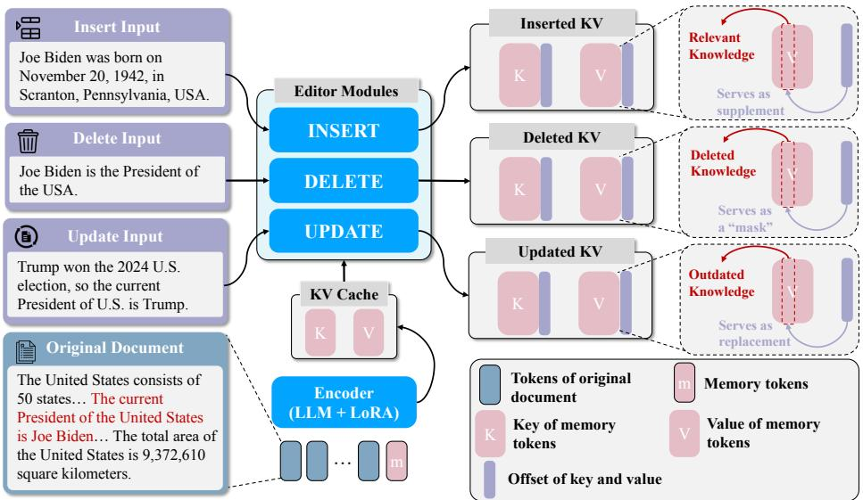  
Figure 1: The editor module. We train three separate editors for INSERT, DELETE, UPDATE respectively. And the offset KV caches appends to old KV caches but functions differently.

# 3 ${ \bf E } ^ { 2 }$ -RAG

In this section, we detail our method, $\mathrm { E } ^ { 2 }$ -RAG, which includes its efficient RAG module for pretraining to learn compression, fine-tuning for multi-chunk question answering, and the training of the $\mathrm { E } ^ { 2 }$ -RAG editor module.

# 3.1 Efficient RAG Module

$\mathrm { E } ^ { 2 }$ -RAG employs an encoder-decoder module for efficient RAG. The encoder pre-processes document chunks into compressed KV caches offline, which are then stored in a database. During online inference, the module retrieves the top- $\mathbf { \nabla } \cdot \mathbf { k }$ KV caches from the database and feeds them to the decoder. The decoder generates responses based on these compressed KV caches. Our training process consists of two stages: pretraining and fine-tuning. Pretraining focuses on learning compression capabilities, while fine-tuning focuses on the questionanswering task.

Pretraining. In this stage, we pretrain the efficient RAG module to acquire text compression capabilities. We use a frozen LLM, denoted as $\Theta _ { \mathrm { L L M } } ,$ with trainable LoRA ΘEncoderLoRA as the encoder, and the same frozen LLM as the decoder. Consider the input text tokens as $X$ . After embedding, they are concatenated with trainable memory embedding $M = ( m _ { 1 } , m _ { 2 } , \cdot \cdot \cdot , m _ { n } ) .$ , and $m _ { i } \in \mathbb { R } ^ { d }$ , where $d$ is the hidden size of the LLM. The outputs are the KV caches of $M _ { ☉ }$ , $K = [ k _ { 1 } , k _ { 2 } , \cdots , k _ { l } ] ,$ , and $k _ { i } \in \mathbb { R } ^ { h \times n \times d _ { h } }$ is the “key” of $i .$ -th attention, where $l$ is the number of layers of the LLM, $h$ is the number of attention heads, and $d _ { h }$ is the dimension of attention heads. $V = [ v _ { 1 } , v _ { 2 } , \cdot \cdot \cdot , v _ { l } ] ,$ , and $v _ { i } \in \mathbb { R } ^ { h \times n \times d _ { h } }$ is the “value” of $i .$ -th attention. Formally:

$$
\begin{array} { r c l } { E } & { = } & { \mathbb { 1 } _ { X } W _ { E } } \\ { ( K , V ) } & { = } & { \mathrm { e n c o d e r } ( [ E , M ] ; \Theta _ { \mathrm { L L M } } , \Theta _ { \mathrm { L o R A } } ^ { \mathrm { E n c o d e r } } ) } \end{array}
$$

where $\mathbb { 1 } _ { X }$ is the one-hot vector of X, $W _ { E }$ is the embedding parameter of the LLM, and $E \in \mathbb { R } ^ { T \times d }$ is the embedding of X. KV cache $( K , V )$ is then passed to the frozen decoder to reconstruct the original text $X$ . The reconstruction process minimizes the cross-entropy loss to train the LoRA ΘEncoderLoRA :

$$
\mathcal { L } = - \frac { 1 } { T } \sum _ { t = 1 } ^ { T } \log P ( x _ { t } \mid x _ { < t } ; K , V ; \Theta _ { \mathrm { L L M } } , \Theta _ { \mathrm { L o R A } } ^ { \mathrm { E n c o d e r } } )
$$

Fine-tuning. For fine-tuning, we adapt the pretrained LoRA $\Theta _ { \mathrm { L o R A } } ^ { \mathrm { E n c o d e r } }$ to perform question answering based on relevant chunks $\{ D _ { 1 } , \cdots , D _ { k } \}$ . For each chunk $D _ { i } ,$ we feed it to the encoder to obtain its KV cache, denoted as $( K _ { i } , V _ { i } )$ . We then concatenate these KV caches, resulting in a combined KV cache denoted as $( K _ { 1 : k } , V _ { 1 : k } )$ . Let the question be $Q$ and the answer be $A$ . The loss for the fine-tuning stage can be expressed as:

$$
\mathcal { L } = - \frac { 1 } { T } \sum _ { t = 1 } ^ { T } \log P ( A \mid Q ; K _ { 1 : k } , V _ { 1 : k } ; \Theta _ { \mathrm { L L M } } , \Theta _ { \mathrm { L o R A } } ^ { \mathrm { E n c o d e r } } )
$$

It is important to note that, to prevent the position embedding of the ”key” from becoming disordered (Lu et al., 2024; Sun et al., 2024), the position embedding of the ”key” must be removed when using the encoder to process chunks offline. When feeding them into the decoder, the position encoding should be reapplied according to the sorting. Details on repositioning can be found in Appendix C.

# 3.2 Editor Module

When updating the database is necessary, $\mathrm { E } ^ { 2 }$ -RAG first retrieves KV caches related to the new knowledge. The editor module then takes the new knowledge tokens as inputs and produces the offset KV for INSERT, DELETE, and UPDATE operations. Although these operations share the same architecture, their learning objectives differ.

The Architecture for the Editor. Our editor is a frozen LLM with trainable LoRA, designed to append, delete, and modify by processing the new knowledge $I$ into the offset KV cache $( \Delta \dot { K } , \dot { \Delta } V )$ , which represents the updates to the KV cache. Formally:

$$
\begin{array} { r c l } { { { \tilde { E } } } } & { { = } } & { { \mathbb { 1 } _ { I } W _ { E } } } \\ { { ( \Delta K , \Delta V ) } } & { { = } } & { { \mathrm { e d i t o r } ( [ { \tilde { E } } , C ] ; \Theta _ { \mathrm { L L M } } , \Theta _ { \mathrm { L o R A } } ^ { \mathrm { E d i t o r } } ) } } \end{array}
$$

where $C \in \mathbb { R } ^ { c \times d } .$ , where $c \ll n$ , represents the trainable editing embedding, and $( \Delta K , \Delta V )$ denotes the KV cache of C. The updated KV cache is obtained by concatenating the modifications to the original cache:

$$
\begin{array} { r c l } { { [ \tilde { K } , \Delta K ] } } & { { \to } } & { { K } } \\ { { { } } } & { { { } } } & { { { } } } \\ { { { [ \tilde { V } , \Delta V ] } } } & { { \to } } & { { V } } \end{array}
$$

To ensure that the edited KV caches can be used alongside other KV caches for multi-chunk inference, we propose maintaining a queue of KV caches to store the K and $\mathrm { V }$ values from previous batches. During each batch, we randomly sample from this queue and mix the selected KV caches. The detailed algorithm is presented in Appendix C.2.

The editor is also trained to minimize the cross-entropy loss:

$$
\mathcal { L } = - \frac { 1 } { T } \sum _ { t = 1 } ^ { T } \log P ( A \mid Q ; K , V ; \Theta _ { \mathrm { { L L M } } } , \Theta _ { \mathrm { { L o R A } } } ^ { \mathrm { { E d i t o r } } } )
$$

Different Objectives for INSERT, DELETE, UPDATE. Due to their distinct goals, all three operations—despite using the same editor architecture—have significantly different training objectives.

INSERT: This operation incorporates new knowledge. For a given question (related to the old or new knowledge), the decoder is first prefilled with the updated KV caches $( [ \tilde { K } , \Delta K ] , [ \tilde { V } , \Delta V ] )$ . The query $Q _ { i n s e r t }$ of this question then attends to both the original knowledge in the caches and the newly appended knowledge. The attention mechanism computes the attention scores as follows:

$$
[ \tilde { A } , \Delta A ] = \mathrm { s o f t m a x } \left( \frac { Q _ { i n s e r t } \cdot [ \tilde { K } ^ { \top } , \Delta K ^ { \top } ] } { \sqrt { d _ { k } } } \right)
$$

The resulting attention map $[ { \tilde { A } } , \Delta A ]$ assigns weights to the keys for both the original and new knowledge, capturing their relevance to the query.

DELETE: In contrast to INSERT, the DELETE operation applies a ”mask” to suppress specific segments of old knowledge. When a question $\boldsymbol { Q } _ { \mathrm { d e l e t e } }$ relates to the knowledge that needs to be removed, the new $\Delta \breve { V }$ acts as a ”mask” through the attention mechanism, effectively erasing the corresponding content in $\tilde { V }$ :

$$
O = ( \tilde { A } \tilde { V } + \Delta A \Delta V ) W _ { O } ^ { T }
$$

where, $O$ is the output of the attention mechanism and $W _ { O }$ is the parameter of the output projection of the attention mechanism.

UPDATE: This operation combines the functionalities of DELETE and INSERT, as it involves both removing outdated knowledge and introducing new information. However, unlike INSERT, the DELETE and UPDATE operations may lead to knowledge conflicts. We discuss this in Section 6.4.

# 4 Editing Dataset Construction

For simplicity, we select documents with a length bounded by 128 tokens (the length of a single chunk) from five document QA datasets (Welbl et al., 2017; Yang et al., 2018; Dua et al., 2019; Rajpurkar, 2016; Stelmakh et al., 2022). We first split each document into a sequence of sentences: $\{ s _ { 1 } , \cdots , s _ { n } \}$ . For each document, we create a series of questions, where the sentence $s _ { i }$ contains the knowledge necessary to answer the question $\hat { Q }$ .

INSERT. We select one sentence $s _ { j }$ from the document $\{ s _ { 1 } , \cdots , s _ { n } \}$ as the new knowledge $I _ { \cdot }$ , while the remaining sentences $\{ s _ { 1 } , \cdot \cdot \cdot , s _ { j - 1 } , s _ { j + 1 } , \cdot \cdot \cdot , s _ { n } \}$ serve as the old context. When $i = j ,$ the new knowledge $I$ is necessary for answering Q. Conversely, when $i \neq j , Q$ can only be answered using the old context. For both cases, we provide the new document to Qwen2.5-7B (Yang et al., 2024) to generate responses to the questions.

DELETE. In contrast to INSERT, $s _ { j }$ represents the sentence to be deleted, and the full set $\{ s _ { 1 } , \cdots , s _ { n } \}$ constitutes the old full document. When $i = j ,$ the sentence necessary for answering $Q$ is deleted. Therefore, we use Qwen2.5-7B to input the remaining context $\{ s _ { 1 } , \cdot \cdot \cdot , s _ { j - 1 } , s _ { j + 1 } , \cdot \cdot \cdot , s _ { n } \}$ along with the question to obtain a response indicating refusal to answer. For $i \neq j ,$ , we generate a normal response, similar to the INSERT operation.

UPDATE. Similar to DELETE, the full set $\{ s _ { 1 } , \cdots , s _ { n } \}$ serves as the old context. We use Qwen2.5-7B to generate new knowledge $\hat { s _ { j } }$ that conflicts with $s _ { j }$ and the corresponding question $\hat { Q }$ . When $i = j ,$ the question $\hat { Q }$ is based on $\hat { s _ { j } } ;$ when $i \neq j ,$ , the questions are based on the old knowledge. The former requires the new knowledge $\hat { s _ { j } } ;$ otherwise, the answer would be incorrect.

The data construction pipeline and examples of INSERT, DELETE, and UPDATE are provided in Appendix D. In the training set, both $i { \overset { \cdot } { = } } j$ and $i \neq j$ account for $5 0 \%$ , ensuring that the model learns to insert new knowledge while retaining the old knowledge. In the test set, these two cases are separated to evaluate the model’s ability to independently retain old knowledge and acquire new knowledge.

# 5 Experiments

Setup. We construct the data following the methods introduced in Section 4. Particularly, we use three datasets of HotpotQA (Yang et al., 2018), ASQA (Stelmakh et al., 2022) and Drop (Dua et al., 2019) for both training and testing, with two extra test sets of SciQ (Welbl et al., 2017) and SQuAD (Rajpurkar, 2016) for out-of-distribution (OOD) evaluation. We use Llama3.2-3B, Llama3.1-8B and Qwen2.5-7B (We present the results in Appendix H.) to train our models (Dubey et al., 2024; Yang et al., 2024). We train three separate editors for the three different types of editing operations. Training details, including hyperparameters, are provided in Appendix E. To ensure reliable evaluation, we adopt the Match metric, which checks whether the generated answer contains the golden answer as an exact match (Rau et al., 2024). This is particularly relevant since both the decoder in our method and the baseline standard RAG are frozen LLMs.

Baselines. We introduce two baselines as introduced in Section 2, standard RAG that directly updates documents in text form and our efficient RAG module that re-computes updated KV caches from edited text. As the two baselines require the edited full context, we come up with two setups.

(1) LLM to Edit Text In this baseline, we use an LLM to edit the old chunk based on the new knowledge I and then answer the question. The LLM generates an updated context by inserting, deleting, or updating parts of the old chunk. While this approach can achieve reasonable performance, it lacks efficiency as it requires regenerating the entire context.

(2) Golden Edit For the INSERT operation, the golden edit baseline assumes access to the complete and up-to-date information, represented by the full set of sentences $\{ s _ { 1 } , \cdots , s _ { n } \}$ . This serves as an upper bound for performance, as it directly provides the model with the ideal context for answering the question Q. For DELETE and UPDATE, we annotate the editing results by humans of a subset from HotpotQA. The results can be referred to in Appendix F.

# 5.1 Results on Editing Efficiency

We assess the KV cache editing speed in Figure 2. When using the Llama3.1-8B model with a batch size of 16, our editor module achieves nearly a $\mathbf { 4 0 x }$ speedup compared to re-compute

KV caches (LLM to edit text $^ +$ compress to new KV caches). This significantly reduces the time required for massive updates to the RAG database, as we perform editing at the KV cache level rather than using an LLM to edit text. We also include experiments on original document QA without editing in Appendix $G ,$ and our efficient RAG module also achieves $\mathbf { 3 x }$ speedup in response generation than standard RAG. We next evaluate the performance for three operations separately.

# 5.2 Results on INSERT Operation

Table 1: Results of INSERT operation on five document QA benchmarks and their averages. We use $\mathbf { \omega } ^ { \prime \prime } \mathbf { O l d } ^ { \prime \prime }$ and “New” to indicate whether the knowledge involved in the question is added through the INSERT operation or is inherent to the old chunk. The results indicate that our method achieves nearly lossless in inserting. The best results are in bold and the second best are with underscore.   
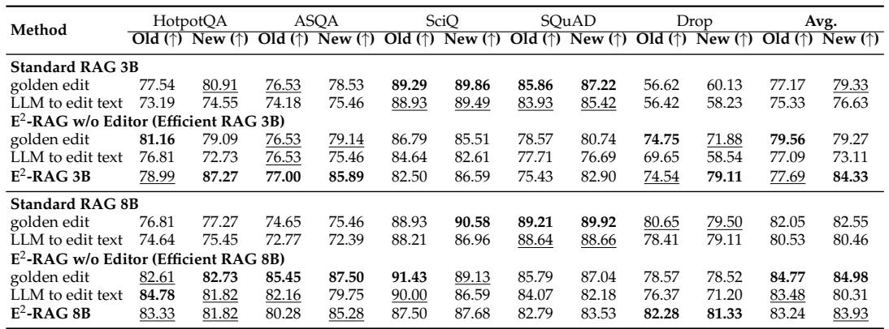

We report our results on the INSERT operation in Table 1. At both the Llama 3B and 8B sizes, our $\mathrm { E } ^ { 2 }$ -RAG achieves first or second place on most benchmarks. Notably, the average score on “New” is 84.33 (first) in the 3B setting and 83.93 (second) in the 8B setting. The results on $\mathrm { \Omega ^ { \prime \prime } O l d ^ { \prime \prime } }$ are slightly lower. We hypothesize that the KV cache for new knowledge is added after the original KV caches, bringing it closer to the query tokens, which causes the model to direct more attention toward the new knowledge. Among five benchmarks, we do not observe significant differences, indicating that our

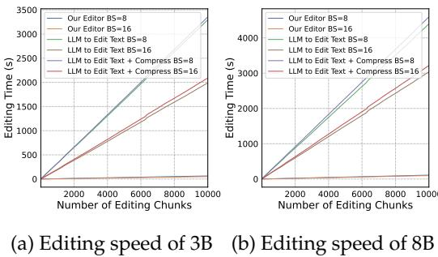  
Figure 2: Editing Time for 3B/8B LLMs

approach can also adapt to the two OOD benchmarks, SciQ and SQuAD. We find that Efficient RAG sometimes outperforms standard RAG on certain benchmarks. One possible reason for this is the vulnerability of the current standard RAG system when presented with irrelevant or misleading information. In contrast, compressing the context into KV caches effectively extracts and simplifies information, omitting less important details, which enhances the model’s retrieval ability (Cheng et al., 2024).

# 5.3 Results on DELETE Operation

The results for the DELETE operation are presented in Table 2. Unlike INSERT, $" \mathrm { R m } ^ { \prime \prime }$ represents questions that require the removed knowledge. Therefore, a lower $" \mathrm { R m } ^ { \prime \prime }$ value indicates a higher degree of knowledge removal. From the table, we observe that both the 3B and 8B models rank first or second in most benchmarks. For example, the average for $" \mathrm { R m } ^ { \prime \prime }$ in the 3B model is 28.86 (second), while the average for the 8B model is 21.68 (first). However, the performance on $\mathrm { \Omega ^ { \prime \prime } O l d } ^ { \prime \prime }$ is slightly lower, suggesting that direct concatenation of KV caches may not be the optimal solution to retain old knowledge. We leave this for future study.

Table 2: Results of DELETE operation on five document QA benchmarks and their averages. During the experiments, we apply the DELETE operation on the context in QA as described in the paper. We use $\mathbf { \omega } ^ { \prime \prime } \mathbf { O l d } ^ { \prime \prime }$ to indicate that the QA only involves knowledge that is not deleted. $\bf { \dot { \mu } } _ { u } \bf { \Lambda } _ { R m } \prime \prime$ denotes QA involving deleted knowledge, where lower scores indicate more effective deletion.   
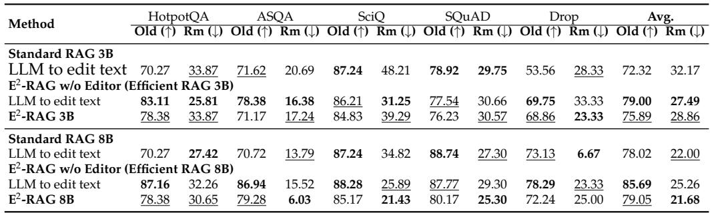

# 5.4 Results on UPDATE Operation

Table 3: Results of the UPDATE operation on five benchmarks. $\mathbf { \prime } \mathbf { \prime } \mathbf { \prime } \mathbf { \prime } \mathbf { \prime }$ (replace) denotes QA involving the updated knowledge.   
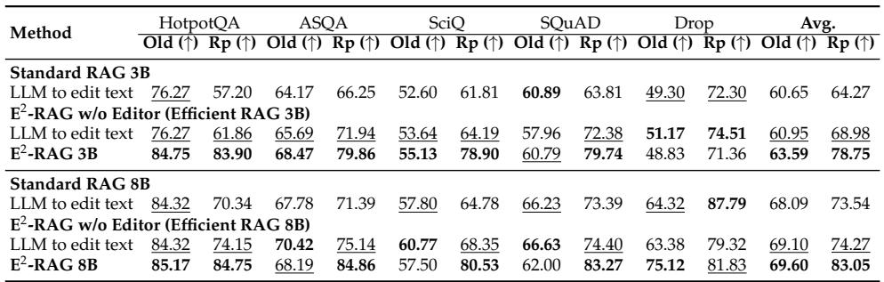

For the UPDATE operation,we present the results in Table 3. As discussed earlier, UPDATE is a combination of INSERT and DELETE, requiring both the removal of outdated knowledge and the insertion of new knowledge. This operation is inherently more challenging as it introduces potential knowledge conflicts. Notably, $\mathrm { E } ^ { 2 }$ -RAG performs well on both $\mathrm { \Omega ^ { \prime \prime } O l d } ^ { \prime \prime }$ and “New” (which require updated knowledge) for both the 3B and 8B Llama models.

# 6 Ablation and Discussion

To provide further insights into knowledge updating for RAG, we conduct a series of ablation studies on multi-turn editing and multi-chunk capability for INSERT. Additionally, we discuss knowledge conflicts that arise during the editing process for DELETE and UPDATE.

# 6.1 Multi-turn Editing

In practical applications, it is often necessary to update a specific chunk multiple times. Therefore, we conduct experiments on multi-turn editing using data from the INSERT operation on both the 3B and 8B models. We present the average results in Appendix I. Our findings indicate that as the number of editing iterations increases, both the old knowledge and the newly inserted knowledge from the first round gradually fade. Consequently, we recommend reconstructing the chunk from the original text after a maximum of three editing operations to maintain information integrity.

# 6.2 Multi-chunk Ability with Edited Chunks

Real-world applications often require models to retrieve and utilize information from multiple chunks to answer questions. As mentioned in Section 3, our editor is trained with a chunk queue to enhance its capability of handling multiple chunks effectively. To systematically evaluate this ability, we conduct experiments by introducing varying amounts of noisy chunks into the test set, ranging from 0 to 9. This evaluation covers scenarios where the total number of chunks varies from 1 to 10, corresponding to the Top-K values used in common RAG settings (Mao et al., 2024). This setup allows

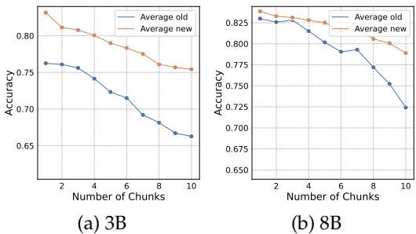  
Figure 3: Multi-chunk Ability on (a) 3B size and (b) 8B size.

us to assess how well the editor maintains knowledge consistency while retrieving relevant information in multi-chunk settings. We present the average results across five benchmarks in Figure 3, with detailed evaluation results available in Appendix J. The results indicate that as the number of chunks increases, both “Old” and “New” knowledge performance slightly decreases. This decline occurs because the increase in the number of chunks leads to more frequent errors in information retrieval. Specifically, as more chunks are involved, the model faces greater challenges in accurately retrieving relevant information. By comparing the results of the 3B and 8B models, we observe that the multi-chunk ability of the 8B model is significantly better than that of the 3B model, suggesting that multi-chunk capability is correlated with model size.

# 6.3 Robustness on Insufficient Updating

A potential issue with updating only the top- $k$ relevant entries in the database is that other outdated entries (the remaining $n \stackrel { \cdot } { - } k )$ are left unchanged. These outdated entries may degrade model performance. We conduct an experiment to investigate the robustness of our method in this scenario. Specifically, we select approximately 100 questions from the test set of Squad for the three operations and duplicate the associated information chunk five times. Subsequently, the ratio of edited (updated) chunks could be varied systematically from 0.2 (1 out of 5) to 1.0 (all 5 out of 5). This would allow for an examination of model performance under varying degrees of information conflict. We provide the results for Llama-3.2 3B and Llama-3.1 8B in Table 4.

Table 4: Performance under different ratios of edited knowledge chunks. The results demonstrate a reasonable robustness to incomplete updates.   
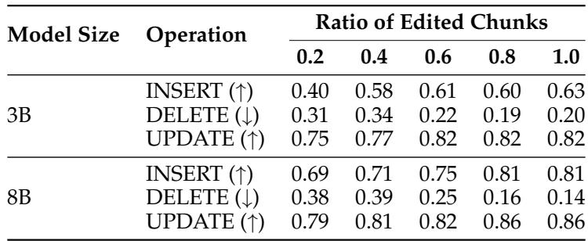

Firstly, all the models and operations demonstrate a similar trend where performance slightly drops when the ratio of edited chunks is reduced from 1.0 to 0.2. This is a reasonable result because when the number of edited chunks decreases, the model can be influenced by the unedited chunks, which may confuse the model and lead to incorrect answers. However, to our surprise, our method also shows a certain level of robustness in this scenario. Especially in the UPDATE operation, even when only $2 0 \%$ of the chunks are updated, the model can still notice the change and answer correctly. For instance, the performance of the 3B model remains at 0.75 when the ratio of edited chunks is only 0.2, compared to 0.82 when the ratio is 1.0.

We acknowledge that updating by selecting the top-k relevant outdated entries is indeed a naive method, as it can lead to the issue of incomplete updates, as you mentioned. However, since our work is the first to explore how to efficiently keep the RAG database up-to-date, we believe there will be future follow-up work to better address this challenge.

# 6.4 Knowledge Conflicts

The DELETE and UPDATE operations may result in knowledge conflicts; however, our model still performs decently. Therefore, it is important to investigate the underlying reasons. For the DELETE operation, we select two types of questions: one related to old knowledge that can be answered correctly $( ' \mathrm { O l d } ^ { \prime \prime } )$ , and another solely related to the removed knowledge $( ^ { \prime \prime } \mathrm { { R m ^ { \prime \prime } } } )$ , which cannot be answered correctly by the model. We plot the attention map of the question over the edited chunk in Figure 4. We observe that when the question pertains to the removed knowledge, the attention to $\Delta K$ significantly increases. We conduct the same experiment for the UPDATE operation, and the results are

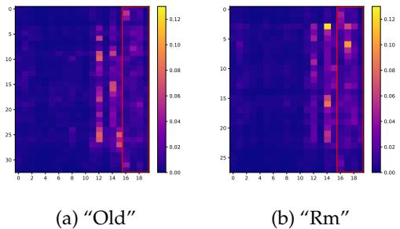  
Figure 4: Attention map of the DELETE operation, (a) The question is only related to the old knowledge. (b) The question is only related to the removed knowledge. The red box in both sub-figure means the attention of $\Delta K$ .

consistent with those of the DELETE operation. We hypothesize that in DELETE, when the question requires information from offset KV caches, $\bar { \Delta V }$ acts as a “mask” to nullify certain portions of the old knowledge’s attention “value”, while in UPDATE, it functions to replace the old knowledge.

# 7 Conclusion and Future Work

This work addresses the challenge of efficient editing in compressed KV caches of RAG. We propose $\mathrm { E } ^ { 2 }$ -RAG, the first editable efficient RAG architecture that balances both editing and inference efficiency. To evaluate our approach, we construct three datasets specifically designed to assess the basic operations of INSERT, DELETE, and UPDATE. Our comprehensive experiments demonstrate the editability and efficiency of the proposed methods, along with further ablations and discussions that provide valuable insights into the challenges associated with this problem. Our findings highlight the potential for further advancements in the editability and efficiency of RAG.

# Acknowledgment

This work was supported by Huawei, the Shenzhen Science and Technology Program (JCYJ20220818103001002), Shenzhen Doctoral Startup Funding (RCBS20221008093330065), Tianyuan Fund for Mathematics of National Natural Science Foundation of China (NSFC) (12326608), Shenzhen Science and Technology Program (Shenzhen Key Laboratory Grant No. ZDSYS20230626091302006), and Shenzhen Stability Science Program 2023, Shenzhen Key Lab of Multi-Modal Cognitive Computing.

References   
Reza Yazdani Aminabadi, Samyam Rajbhandari, Ammar Ahmad Awan, Cheng Li, Du Li, Elton Zheng, Olatunji Ruwase, Shaden Smith, Minjia Zhang, Jeff Rasley, et al. Deepspeedinference: enabling efficient inference of transformer models at unprecedented scale. In SC22: International Conference for High Performance Computing, Networking, Storage and Analysis, pp. 1–15. IEEE, 2022.   
Sebastian Borgeaud, Arthur Mensch, Jordan Hoffmann, Trevor Cai, Eliza Rutherford, Katie Millican, George Bm Van Den Driessche, Jean-Baptiste Lespiau, Bogdan Damoc, Aidan Clark, et al. Improving language models by retrieving from trillions of tokens. In International conference on machine learning, pp. 2206–2240. PMLR, 2022.   
Chi-Min Chan, Chunpu Xu, Ruibin Yuan, Hongyin Luo, Wei Xue, Yike Guo, and Jie Fu. Rq-rag: Learning to refine queries for retrieval augmented generation. arXiv preprint arXiv:2404.00610, 2024.   
Xin Cheng, Xun Wang, Xingxing Zhang, Tao Ge, Si-Qing Chen, Furu Wei, Huishuai Zhang, and Dongyan Zhao. xrag: Extreme context compression for retrieval-augmented generation with one token. arXiv preprint arXiv:2405.13792, 2024.   
Alexis Chevalier, Alexander Wettig, Anirudh Ajith, and Danqi Chen. Adapting language models to compress contexts. arXiv preprint arXiv:2305.14788, 2023.   
Tri Dao. FlashAttention-2: Faster attention with better parallelism and work partitioning. In International Conference on Learning Representations (ICLR), 2024.   
Nicola De Cao, Wilker Aziz, and Ivan Titov. Editing factual knowledge in language models. arXiv preprint arXiv:2104.08164, 2021.   
Qingxiu Dong, Damai Dai, Yifan Song, Jingjing Xu, Zhifang Sui, and Lei Li. Calibrating factual knowledge in pretrained language models. arXiv preprint arXiv:2210.03329, 2022.   
Dheeru Dua, Yizhong Wang, Pradeep Dasigi, Gabriel Stanovsky, Sameer Singh, and Matt Gardner. Drop: A reading comprehension benchmark requiring discrete reasoning over paragraphs. arXiv preprint arXiv:1903.00161, 2019.   
Abhimanyu Dubey, Abhinav Jauhri, Abhinav Pandey, Abhishek Kadian, Ahmad Al-Dahle, Aiesha Letman, Akhil Mathur, Alan Schelten, Amy Yang, Angela Fan, et al. The llama 3 herd of models. arXiv preprint arXiv:2407.21783, 2024.   
Darren Edge, Ha Trinh, Newman Cheng, Joshua Bradley, Alex Chao, Apurva Mody, Steven Truitt, and Jonathan Larson. From local to global: A graph rag approach to query-focused summarization. arXiv preprint arXiv:2404.16130, 2024.   
Yunfan Gao, Yun Xiong, Xinyu Gao, Kangxiang Jia, Jinliu Pan, Yuxi Bi, Yi Dai, Jiawei Sun, and Haofen Wang. Retrieval-augmented generation for large language models: A survey. arXiv preprint arXiv:2312.10997, 2023.   
Tao Ge, Jing Hu, Lei Wang, Xun Wang, Si-Qing Chen, and Furu Wei. In-context autoencoder for context compression in a large language model. arXiv preprint arXiv:2307.06945, 2023.   
Edward J Hu, Yelong Shen, Phillip Wallis, Zeyuan Allen-Zhu, Yuanzhi Li, Shean Wang, Lu Wang, and Weizhu Chen. Lora: Low-rank adaptation of large language models. arXiv preprint arXiv:2106.09685, 2021.   
ISO/IEC. Information Technology — Database Languages SQL Part 1: Framework (SQL/Framework). 6 edition, June 2023. International Standard published [60.60].   
Gautier Izacard and Edouard Grave. Distilling knowledge from reader to retriever for question answering. arXiv preprint arXiv:2012.04584, 2020.   
Wenqi Jiang, Shuai Zhang, Boran Han, Jie Wang, Bernie Wang, and Tim Kraska. Piperag: Fast retrieval-augmented generation via algorithm-system co-design. arXiv preprint arXiv:2403.05676, 2024.

Dongwon Jung, Qin Liu, Tenghao Huang, Ben Zhou, and Muhao Chen. Familiarity-aware evidence compression for retrieval augmented generation. arXiv preprint arXiv:2409.12468, 2024.

Nikhil Kandpal, Haikang Deng, Adam Roberts, Eric Wallace, and Colin Raffel. Large language models struggle to learn long-tail knowledge. In International Conference on Machine Learning, pp. 15696–15707. PMLR, 2023.   
Vladimir Karpukhin, Barlas Oguz, Sewon Min, Patrick Lewis, Ledell Wu, Sergey Edunov, ˘ Danqi Chen, and Wen-tau Yih. Dense passage retrieval for open-domain question answering. arXiv preprint arXiv:2004.04906, 2020.   
Urvashi Khandelwal, Omer Levy, Dan Jurafsky, Luke Zettlemoyer, and Mike Lewis. Generalization through memorization: Nearest neighbor language models. arXiv preprint arXiv:1911.00172, 2019.   
Woosuk Kwon, Zhuohan Li, Siyuan Zhuang, Ying Sheng, Lianmin Zheng, Cody Hao Yu, Joseph E. Gonzalez, Hao Zhang, and Ion Stoica. Efficient memory management for large language model serving with pagedattention. In Proceedings of the ACM SIGOPS 29th Symposium on Operating Systems Principles, 2023.   
Yaniv Leviathan, Matan Kalman, and Yossi Matias. Fast inference from transformers via speculative decoding. In International Conference on Machine Learning, pp. 19274–19286. PMLR, 2023.   
Patrick Lewis, Ethan Perez, Aleksandra Piktus, Fabio Petroni, Vladimir Karpukhin, Naman Goyal, Heinrich Kuttler, Mike Lewis, Wen-tau Yih, Tim Rockt ¨ aschel, et al. Retrieval- ¨ augmented generation for knowledge-intensive nlp tasks. Advances in Neural Information Processing Systems, 33:9459–9474, 2020.   
Zhen Li, Jing Tang, Deqing Zou, Qian Chen, Shouhuai Xu, Chao Zhang, Yichen Li, and Hai Jin. Towards making deep learning-based vulnerability detectors robust. arXiv preprint arXiv:2108.00669, 2021.   
Zhuowan Li, Cheng Li, Mingyang Zhang, Qiaozhu Mei, and Michael Bendersky. Retrieval augmented generation or long-context llms? a comprehensive study and hybrid approach. In Proceedings of the 2024 Conference on Empirical Methods in Natural Language Processing: Industry Track, pp. 881–893, 2024a.   
Zongqian Li, Yixuan Su, and Nigel Collier. 500xcompressor: Generalized prompt compression for large language models. arXiv preprint arXiv:2408.03094, 2024b.   
Stephanie Lin, Jacob Hilton, and Owain Evans. Truthfulqa: Measuring how models mimic human falsehoods. arXiv preprint arXiv:2109.07958, 2021.   
Jerry Liu. LlamaIndex, 11 2022. URL https://github.com/jerryjliu/llama index.   
Junyi Liu, Liangzhi Li, Tong Xiang, Bowen Wang, and Yiming Qian. Tcra-llm: Token compression retrieval augmented large language model for inference cost reduction. arXiv preprint arXiv:2310.15556, 2023.   
Songshuo Lu, Hua Wang, Yutian Rong, Zhi Chen, and Yaohua Tang. Turborag: Accelerating retrieval-augmented generation with precomputed kv caches for chunked text. arXiv preprint arXiv:2410.07590, 2024.   
Qianren Mao, Yangyifei Luo, Jinlong Zhang, Hanwen Hao, Zhilong Cao, Xiaolong Wang, Xiao Guan, Zhenting Huang, Weifeng Jiang, Shuyu Guo, et al. Xrag: examining the core– benchmarking foundational components in advanced retrieval-augmented generation. arXiv preprint arXiv:2412.15529, 2024.   
Kevin Meng, David Bau, Alex Andonian, and Yonatan Belinkov. Locating and editing factual associations in gpt. Advances in Neural Information Processing Systems, 35:17359–17372, 2022.

Xupeng Miao, Gabriele Oliaro, Zhihao Zhang, Xinhao Cheng, Zeyu Wang, Zhengxin Zhang, Rae Ying Yee Wong, Alan Zhu, Lijie Yang, Xiaoxiang Shi, et al. Specinfer: Accelerating generative large language model serving with tree-based speculative inference and verification. arXiv preprint arXiv:2305.09781, 2023.

Jesse Mu, Xiang Li, and Noah Goodman. Learning to compress prompts with gist tokens. Advances in Neural Information Processing Systems, 36, 2024.   
Markus Nagel, Mart van Baalen, Tijmen Blankevoort, and Max Welling. Data-free quantization through weight equalization and bias correction. In Proceedings of the IEEE/CVF International Conference on Computer Vision, pp. 1325–1334, 2019.   
Libo Qin, Wenbo Pan, Qiguang Chen, Lizi Liao, Zhou Yu, Yue Zhang, Wanxiang Che, and Min Li. End-to-end task-oriented dialogue: A survey of tasks, methods, and future directions. arXiv preprint arXiv:2311.09008, 2023.   
P Rajpurkar. Squad: $1 0 0 { , } 0 0 0 { + }$ questions for machine comprehension of text. arXiv preprint arXiv:1606.05250, 2016.   
Ori Ram, Yoav Levine, Itay Dalmedigos, Dor Muhlgay, Amnon Shashua, Kevin LeytonBrown, and Yoav Shoham. In-context retrieval-augmented language models. Transactions of the Association for Computational Linguistics, 11:1316–1331, 2023.   
David Rau, Shuai Wang, Herve D´ ejean, and St ´ ephane Clinchant. Context embeddings for ´ efficient answer generation in rag. arXiv preprint arXiv:2407.09252, 2024.   
Siddhant Ray, Rui Pan, Zhuohan Gu, Kuntai Du, Ganesh Ananthanarayanan, Ravi Netravali, and Junchen Jiang. Ragserve: Fast quality-aware rag systems with configuration adaptation. arXiv preprint arXiv:2412.10543, 2024.   
Sara Rosenthal, Avirup Sil, Radu Florian, and Salim Roukos. Clapnq: C ohesive l ong-form a nswers from p assages in natural questions for rag systems. Transactions of the Association for Computational Linguistics, 13:53–72, 2025.   
Alireza Salemi and Hamed Zamani. Evaluating retrieval quality in retrieval-augmented generation. In Proceedings of the 47th International ACM SIGIR Conference on Research and Development in Information Retrieval, pp. 2395–2400, 2024.   
Parth Sarthi, Salman Abdullah, Aditi Tuli, Shubh Khanna, Anna Goldie, and Christopher D Manning. Raptor: Recursive abstractive processing for tree-organized retrieval. arXiv preprint arXiv:2401.18059, 2024.   
Rana Shahout, Cong Liang, Shiji Xin, Qianru Lao, Yong Cui, Minlan Yu, and Michael Mitzenmacher. Efficient inference for augmented large language models. arXiv preprint arXiv:2410.18248, 2024a.   
Rana Shahout, Cong Liang, Shiji Xin, Qianru Lao, Yong Cui, Minlan Yu, and Michael Mitzenmacher. Fast inference for augmented large language models, 2024b. URL https: //arxiv.org/abs/2410.18248.   
Kaize Shi, Xueyao Sun, Qing Li, and Guandong Xu. Compressing long context for enhancing rag with amr-based concept distillation. arXiv preprint arXiv:2405.03085, 2024.   
Ivan Stelmakh, Yi Luan, Bhuwan Dhingra, and Ming-Wei Chang. Asqa: Factoid questions meet long-form answers. arXiv preprint arXiv:2204.06092, 2022.   
East Sun, Yan Wang, and Lan Tian. Block-attention for efficient rag. arXiv preprint arXiv:2409.15355, 2024.   
Chongyang Tao, Jiazhan Feng, Chang Liu, Juntao Li, Xiubo Geng, and Daxin Jiang. Building an efficient and effective retrieval-based dialogue system via mutual learning. arXiv preprint arXiv:2110.00159, 2021.   
Yi Tay, Mostafa Dehghani, Samira Abnar, Yikang Shen, Dara Bahri, Philip Pham, Jinfeng Rao, Liu Yang, Sebastian Ruder, and Donald Metzler. Long range arena: A benchmark for efficient transformers. arXiv preprint arXiv:2011.04006, 2020.   
Vinh Tong, Dat Quoc Nguyen, Trung Thanh Huynh, Tam Thanh Nguyen, Quoc Viet Hung Nguyen, and Mathias Niepert. Joint multilingual knowledge graph completion and alignment. arXiv preprint arXiv:2210.08922, 2022.   
Enayat Ullah, Tung Mai, Anup Rao, Ryan A Rossi, and Raman Arora. Machine unlearning via algorithmic stability. In Conference on Learning Theory, pp. 4126–4142. PMLR, 2021.   
Johannes Welbl, Nelson F Liu, and Matt Gardner. Crowdsourcing multiple choice science questions. arXiv preprint arXiv:1707.06209, 2017.   
Wikimedia Foundation. Wikimedia statistics, 2025. URL https://stats.wikimedia.org/#/ all-wikipedia-projects. Accessed: 2025-01-30.   
T Wolf. Huggingface’s transformers: State-of-the-art natural language processing. arXiv preprint arXiv:1910.03771, 2019.   
Shitao Xiao, Zheng Liu, Peitian Zhang, and Niklas Muennighoff. C-pack: Packaged resources to advance general chinese embedding, 2023.   
Fangyuan Xu, Weijia Shi, and Eunsol Choi. Recomp: Improving retrieval-augmented lms with compression and selective augmentation. arXiv preprint arXiv:2310.04408, 2023.   
Mengyi Yan, Weilong Ren, Yaoshu Wang, and Jianxin Li. A retrieval-augmented framework for tabular interpretation with large language model. In International Conference on Database Systems for Advanced Applications, pp. 341–356. Springer, 2024.   
An Yang, Baosong Yang, Beichen Zhang, Binyuan Hui, Bo Zheng, Bowen Yu, Chengyuan Li, Dayiheng Liu, Fei Huang, Haoran Wei, et al. Qwen2. 5 technical report. arXiv preprint arXiv:2412.15115, 2024.   
Zhilin Yang, Peng Qi, Saizheng Zhang, Yoshua Bengio, William W Cohen, Ruslan Salakhutdinov, and Christopher D Manning. Hotpotqa: A dataset for diverse, explainable multi-hop question answering. arXiv preprint arXiv:1809.09600, 2018.   
Yunzhi Yao, Peng Wang, Bozhong Tian, Siyuan Cheng, Zhoubo Li, Shumin Deng, Huajun Chen, and Ningyu Zhang. Editing large language models: Problems, methods, and opportunities. arXiv preprint arXiv:2305.13172, 2023.   
Hao Yu, Aoran Gan, Kai Zhang, Shiwei Tong, Qi Liu, and Zhaofeng Liu. Evaluation of retrieval-augmented generation: A survey. In CCF Conference on Big Data, pp. 102–120. Springer, 2024.

# A Related Work

As the context length increases (Li et al., 2024a), the inference cost of the RAG model increases significantly (Ram et al., 2023; Salemi & Zamani, 2024). To enhance the efficiency of RAG, efficient RAG methods have emerged, aiming to reduce time overhead by optimizing the entire retrieval-generation workflow.

In earlier studies, numerous approaches have been developed to enhance the efficiency of RAG. The reduction of input context as a natural method was the first to be validated. Initially, various text summarization techniques (Xu et al., 2023; Jiang et al., 2024; Edge et al., 2024; Chan et al., 2024) were introduced to minimize information loss. Knowledge distillation and filtering techniques are employed in (Shi et al., 2024; Liu et al., 2023; Sarthi et al., 2024) and (Jung et al., 2024) to compress lengthy texts and preserve essential knowledge. Furthermore, some works (Shahout et al., 2024a; Ray et al., 2024) controlled the effective length of the input by addressing information redundancy. Although these approaches effectively reduced context length, they resulted in semantic loss and poor scalability.

Recent studies (Leviathan et al., 2023; Shahout et al., 2024b; Miao et al., 2023; Nagel et al., 2019; Aminabadi et al., 2022) have aimed to enhance efficiency by focusing on the large models themselves. We emphasize works that compress the context into LLM intermediate components such as embeddings (Mu et al., 2024; Chevalier et al., 2023; Ge et al., 2023; Li et al., 2024b) and KV caches (Lu et al., 2024; Sun et al., 2024). Although these methods are effective and incur minimal loss, they are challenging to update. In contrast to prior research, our focus is on editable efficient RAG.

Previous works (De Cao et al., 2021; Dong et al., 2022; Meng et al., 2022) on knowledge editing focus on inserting or updating knowledge in LLMs. And many works (Li et al., 2021; Tong et al., 2022; Yao et al., 2023; Ullah et al., 2021) on machine unlearning aim to remove specific knowledge from LLMs. Our work applies three types of knowledge operations—INSERT, DELETE, and UPDATE —to the RAG database, ensuring that it remains up-to-date.

# B Details of GPU hours in editing

We choose Llama-3.1-8B (Dubey et al., 2024) as the editor, utilizing vllm (Kwon et al., 2023) and flash-attention-2 (Dao, 2024) to accelerate inference with bfloat16 precision. The token throughput is approximately 1300 tokens/s. Each text chunk consists of 128 tokens, and the total sum of input and output tokens is 256. Therefore, the number of tokens to be processed is $T = 0 . 6 \times 1 0 ^ { 6 } \times 2 5 6 ,$ and the required time is $\begin{array} { r } { S = { \frac { T } { 1 3 0 0 \times 6 0 \times 6 0 } } = 3 2 . 8 } \end{array}$ hours. So, the total A100 GPU time required is 32.8 hours.

# C Details of Reposition and Chunks Queue

# C.1 Reposition

One challenge in using KV caches as chunks for RAG is the confusion caused by the position embedding of the “key”. To address this, we remove the position embedding of the “key” when storing it in the database and reassign the position embedding to the key before pre-filling. We refer to this process as “Reposition”.

Consider the “query” at position $m$ as $Q _ { m } \in \mathbb { R } ^ { d }$ , and the “query” with position embedding as $\mathcal { Q } _ { m }$ . RoPE adds position encoding to $Q _ { m }$ through the following formula:

$$
\begin{array} { r l r } { \mathcal { Q } _ { m } } & { = } & { Q _ { m } \otimes \mathrm { c o s } _ { \Theta ; m } + \mathrm { R o t a r y } \ \mathrm { H a l f } ( Q _ { m } ) \otimes \mathrm { s i n } _ { \Theta ; m } } \\ & { = } & { \left( \begin{array} { c } { q _ { 0 } } \\ { q _ { 1 } } \\ { q _ { 2 } } \\ { q _ { 3 } } \\ { \vdots } \\ { q _ { d - 2 } } \\ { q _ { d - 1 } } \end{array} \right) \otimes \left( \begin{array} { c } { \mathrm { c o s } \ m \theta _ { 0 } } \\ { \mathrm { c o s } m \theta _ { 1 } } \\ { \mathrm { c o s } m \theta _ { 1 } } \\ { \vdots } \\ { \mathrm { c o s } m \theta _ { d / 2 - 1 } } \\ { \mathrm { c o s } m \theta _ { d / 2 - 1 } } \end{array} \right) + \left( \begin{array} { c } { - q _ { 1 } } \\ { q _ { 0 } } \\ { - q _ { 3 } } \\ { q _ { 2 } } \\ { \vdots } \\ { - q _ { d - 2 } } \\ { q _ { d - 2 } } \end{array} \right) \otimes \left( \begin{array} { c } { \mathrm { s i n } m \theta _ { 0 } } \\ { \mathrm { s i n } m \theta _ { 0 } } \\ { \mathrm { s i n } m \theta _ { 1 } } \\ { \mathrm { s i n } m \theta _ { 1 } } \\ { \vdots } \\ { \mathrm { s i n } m \theta _ { d / 2 - 1 } } \\ { \mathrm { s i n } m \theta _ { d / 2 - 1 } } \end{array} \right) } \end{array}
$$

For the $^ { \prime \prime } \mathrm { k e y } ^ { \prime \prime }$ at position $m , K _ { m } ,$ position encoding is added in the same manner to obtain $\kappa _ { m }$ . However, instead of adding the position encoding, our goal is to recover $K _ { m }$ given $m$ and $\kappa _ { m }$ . First, we have the formula for RoPE:

$$
\begin{array} { r c l } { { \mathcal K _ { m } } } & { { = } } & { { K _ { m } \otimes \mathrm { c o s } _ { \Theta ; m } + \mathrm { R o t a r y } \mathrm { H a l f } ( K _ { m } ) \otimes \mathrm { s i n } _ { \Theta ; m } } } \end{array}
$$

Additionally, we have the basic properties of Rotary and sine-cosine functions:

$$
\begin{array} { r c l } { { K _ { m } } } & { { = } } & { { - \mathrm { R o t a r y H a l f } ( \mathrm { R o t a r y H a l f } ( K _ { m } ) ) } } \\ { { } } & { { } } & { { } } \\ { { { \bf 1 } } } & { { = } } & { { \sin _ { \Theta ; m } ^ { 2 } + \cos _ { \Theta ; m } ^ { 2 } } } \end{array}
$$

By solving the system of these three equations, we can obtain:

$$
\begin{array} { r c l } { K _ { m } } & { = } & { { \mathcal { K } } _ { m } \otimes \mathrm { c o s } _ { \Theta ; m } - \mathrm { R o t a r y } \mathrm { H a l f } ( { \mathcal { K } } _ { m } ) \otimes \mathrm { s i n } _ { \Theta ; m } } \end{array}
$$

In this way, we can remove the position encoding from the $^ { \prime \prime } \mathrm { k e y } ^ { \prime \prime }$ .

# C.2 Chunks Queue

# Algorithm 1 Chunks Queue In Editor Training

1: Input: Batch size $B _ { \cdot }$ , queue size $q ,$ queue $\mathcal { Q }$   
2: Initialize an empty queue $\mathcal { Q }$ with maximum size $q$   
3: for each batch $b$ do   
4: Get the compressed KV $( \tilde { K } _ { b } , \tilde { V } _ { b } )$ and $( \Delta K , \Delta V )$ from editor, and update to $\left( K _ { b } , V _ { b } \right)$   
5: Randomly sample a subset $\left( K _ { 1 : r } , V _ { 1 : r } \right) \subseteq \mathcal { Q }$   
6: Construct multi-chunk KV caches and random sort: Random   
Sort $[ ( K _ { 1 } , V _ { 1 } ) , \dots , ( K _ { r } , V _ { r } ) , ( K _ { b } , V _ { b } ) ]$   
7: Enqueue $( \tilde { K } _ { b } , \tilde { V } _ { b } )$ and $\left( K _ { b } , V _ { b } \right)$ into $\mathcal { Q }$   
8: if queue size $> q$ then   
9: Remove the oldest KV caches from $\mathcal { Q }$   
10: end if   
11: end for

# D Examples of Three Type of Editing Operations

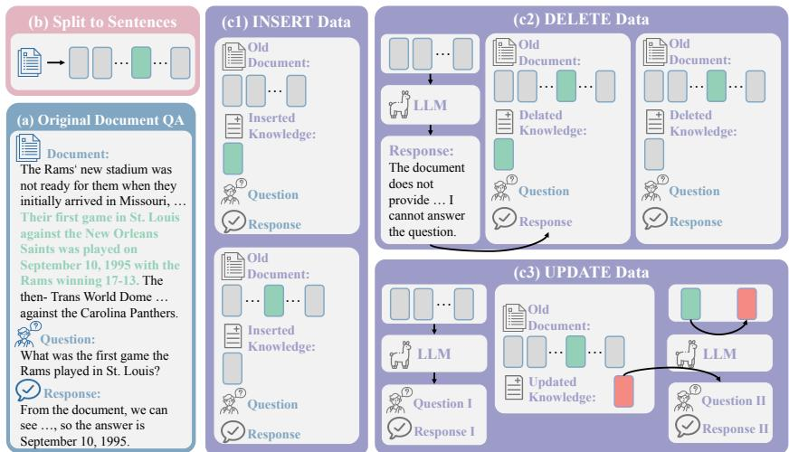  
Figure 5: The pipeline of our data creation. (a) We use the original document QA datasets, and (b) we first split the context into sentences. (c1) For the INSERT operation, we randomly select one of the sentences as new knowledge and reuse the question from the original document QA. (c2) For the DELETE operation, when the removed knowledge is related to the question, we use an LLM to generate a response that refuses to answer the question. (c3) For the UPDATE operation, we only use the context from the document QA, and then create conflicting new knowledge using an LLM. On one hand, we use this new knowledge to generate a question and its corresponding response; on the other hand, we use other sentences to generate a question unrelated to the new knowledge and its response.

# An Example of Insert Operation

# Old Document:

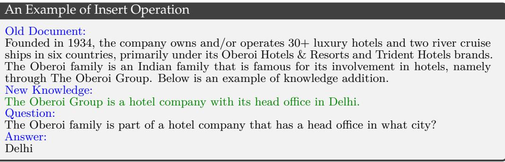  
Figure 6: An example of the data of INSERT, the question is related to the new knowledge.   
Figure 7: An example of the data of INSERT, the question is related to the old knowledge.   
Figure 8: An example of the data of DELETE, the question is related to the removed knowledge.

Bizarre was published by Dennis Publishing, and was a sister publication to the Fortean Times. Fortean Times is a British monthly magazine devoted to the anomalous phenomena popularised by Charles Fort. Previously published by John Brown Publishing (from 1991 to 2001) and then I Feel Good Publishing (2001 to 2005), it is now published by Dennis Publishing Ltd.   
New Knowledge:   
Bizarre was a British alternative magazine published from 1997 to 2015.   
Question:   
Which publishing company has published Bizarre and a sister publication devoted to the anomalous phenomena popularised by Charles Fort?   
Answer:   
Dennis Publishing

# An Example of Delete Operation

# Old Document:

Jo Ann Terry-Grissom (born August 4, 1938 in Indianapolis, Indiana) is a retired female hurdler from the United States, who represented her native country at two consecutive Summer Olympics, starting in 1960. Affiliated with the Tennessee State University she won the $8 0 ~ \mathrm { m }$ hurdles event at the 1963 Pan American Games. The 4th Pan American Games were held from April 20 to May 5, 1963, in Sao Paulo, Brazil.   
Removed Knowledge:   
The 4th Pan American Games were held from April 20 to May 5, 1963, in Sao Paulo, Brazil. Question:   
Jo Ann Terry won the $8 0 \mathrm { m }$ hurdles event at what Sao Paulo-based event from 1963? Answer:   
Pan American Games

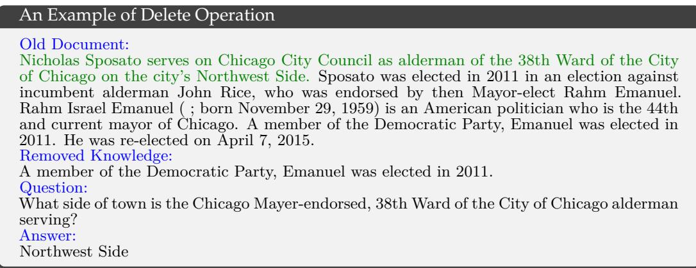  
Figure 9: An example of the data of DELETE, the question is related to the old knowledge.

# An Example of Update Operation

# Old Document:

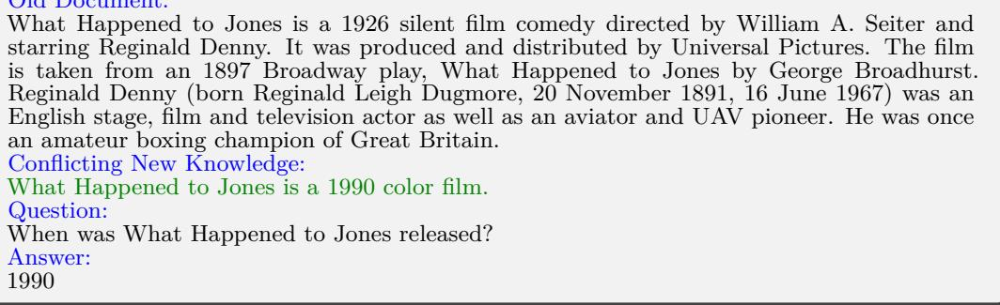  
Figure 10: An example of the data of UPDATE, the question is related to the conflicting new knowledge.

# An Example of Update Operation

# Old Document:

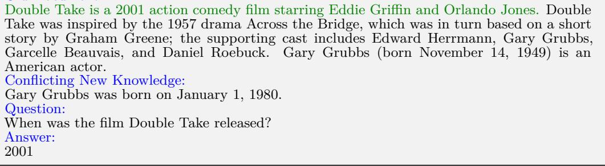  
Figure 11: An example of the data of UPDATE, the question is related to the old knowledge.

# E Training Details

We use transformers (Wolf, 2019) to train our model, and the hyperparameters are shown in Table 5. In pretraining, we only use one chunk to train models to get the ability of compression. During finetuning, we use multi-chunk data to cultivate the model to retrieve from multiple chunks and answer the question. To train the editor, we use a chunk queue to cache the chunks from previous batches which we describe in Section 3.

Table 5: Training Hyperparameters   
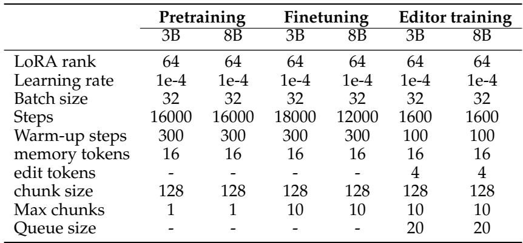

# F Results of Golden Editing by Human

Table 6: Results of HotpotQA of UPDATE and DELETE with golden editing by human.   
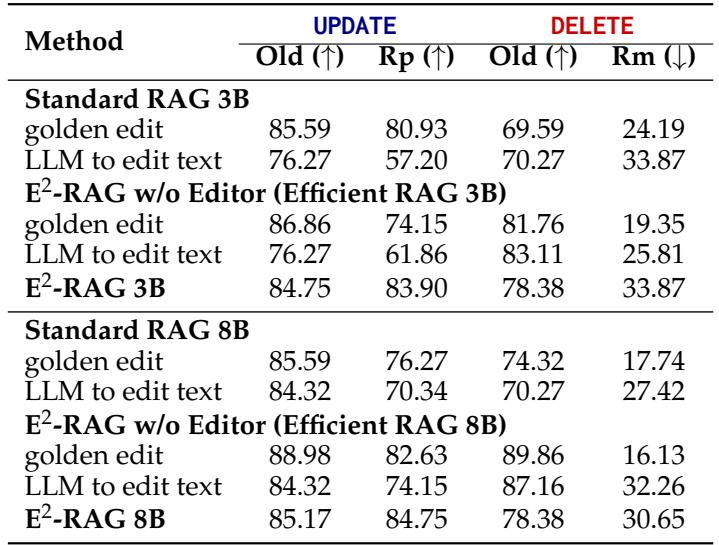

# G Results on RAG benchmarks

We use five document QA benchmarks (Welbl et al., 2017; Yang et al., 2018; Dua et al., 2019;   
Rajpurkar, 2016; Stelmakh et al., 2022) and two long-form QA benchmarks (Lin et al., 2021;   
Rosenthal et al., 2025) to comprehensively demonstrate the RAG performance of $\mathrm { E } ^ { 2 }$ -RAG.   
To evaluate the efficiency of $\mathrm { \hat { Q } A } ,$ we measure the Time To First Token (TTFT) and overall latency under varying context lengths and batch sizes.

In Table 7, we present the performance of standard RAG and $\mathrm { E } ^ { 2 }$ -RAG on various document QA benchmarks. $\mathrm { E } ^ { 2 }$ -RAG shows performance comparable to standard RAG on these tasks and even outperforms standard RAG on some benchmarks. For the long-form QA benchmarks in Table 8, $\mathrm { E } ^ { 2 }$ -RAG outperforms standard RAG in most cases. This improvement is likely due to the addition of retrieval and reasoning steps during the finetuning stage. For efficiency, first, we evaluate the TTFT across different batch sizes and varying context lengths, with the results shown in Figure 12b and Figure 12a. We observe that the TTFT of $\mathrm { E } ^ { 2 }$ -RAG remains nearly constant at a very low level. This is because $\mathrm { E } ^ { 2 }$ -RAG pre-processes the context into compressed KV caches offline. Second, we present the total inference latency for generating different numbers of tokens at a fixed context length of 2560 across various batch sizes. As shown in Figure $1 2 \mathrm { d } ,$ at the 8B model size and a batch size of 8, $\mathrm { E } ^ { 2 }$ -RAG achieves a $3 x$ speedup compared to standard RAG. This speedup increases with larger batch sizes and model sizes. The improvement is attributed to the offline prefilling process and the significant compression of the context, which reduces the context length and accelerates the next token generation.

Table 7: Experimental results of ${ \bf E } ^ { 2 }$ -RAG on five document QA benchmarks and their averages. The results show that ${ \bf E } ^ { 2 }$ -RAG incurs slight loss but overall maintains an advantage in document QA.   
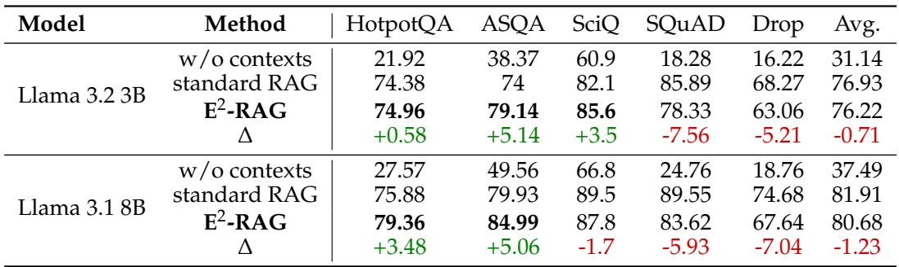

Table 8: Experimental results of ${ \bf E } ^ { 2 }$ -RAG on two long-form QA benchmarks. The results show that $\hat { \mathbf { E } } ^ { 2 }$ -RAG has a certain advantage on long-form QA benchmarks.   
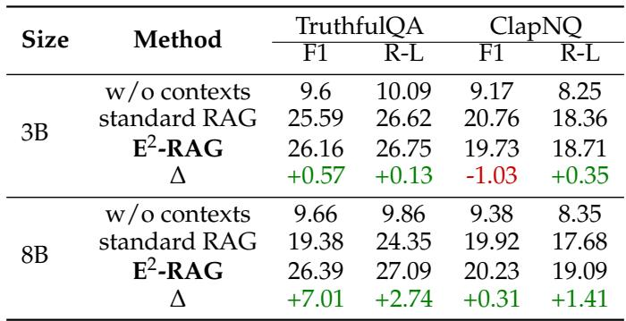

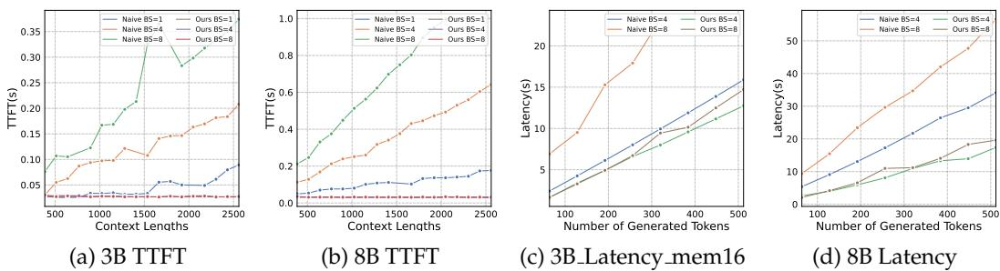  
Figure 12: The TTFT and Latency of $\mathrm { E } ^ { 2 }$ -RAG and standard RAG on both 3B and 8B.

# H Results on Qwen

To further validate our conclusions, we conduct additional experiments on Qwen2.5- 7B (Yang et al., 2024).

Table 9: Results of Qwen 2.5 7B on INSERT operation.   
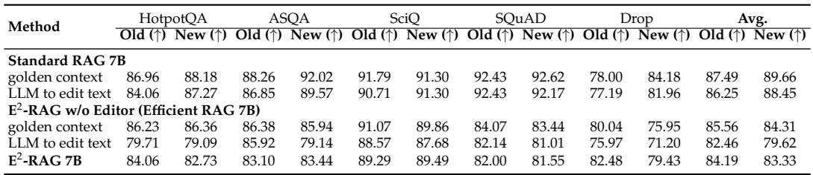

Table 10: Results of Qwen2.5-7B on DELETE operation.   
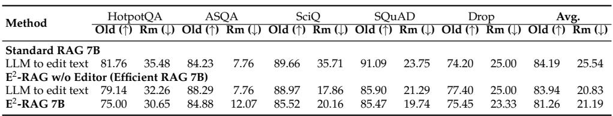

Table 11: Results of Qwen 2.5 7B on UPDATE operation.   
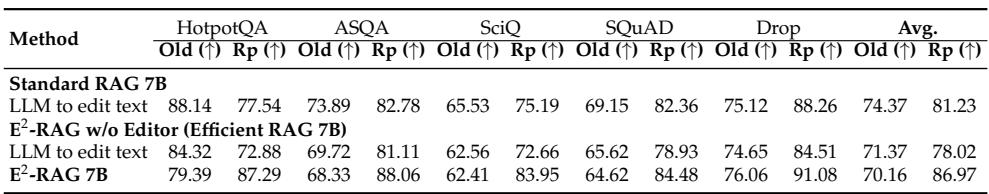

# I Evaluation of Mult-turn Editing

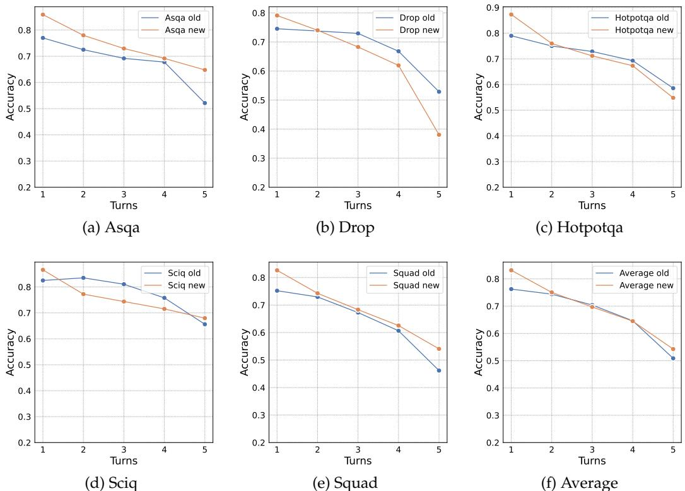  
Figure 13: The evaluation result of multi-turn editing on 3B size.

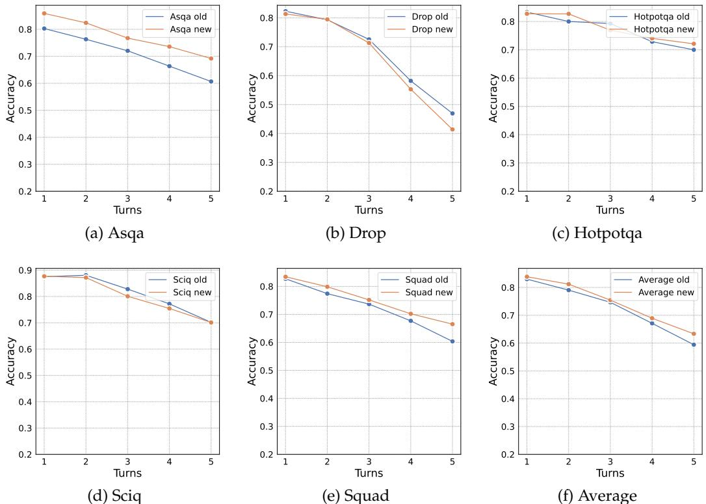  
Figure 14: The evaluation result of multi-turn editing on 8B size.

# J Evaluation of Multi-chunk Ability with Edited Chunks

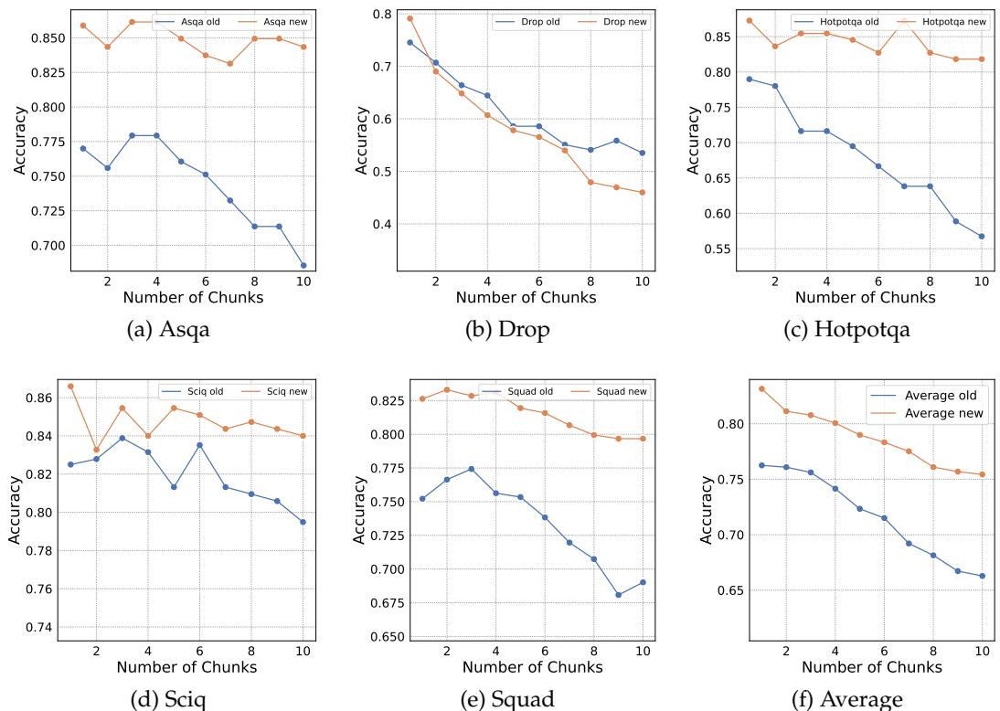  
Figure 15: The evaluation results of multi-chunk on 3B size.

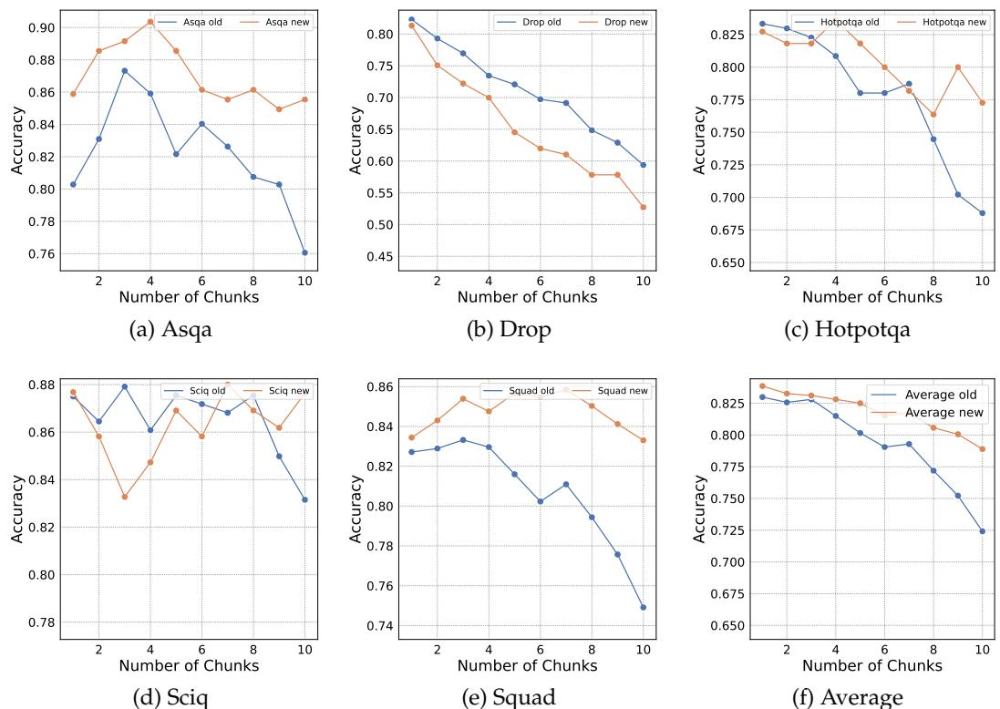  
Figure 16: The evaluation result of multi-chunk on 8B size.

# K Results on Wikipedia

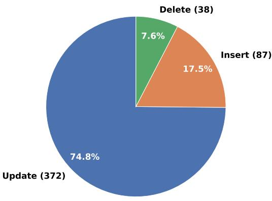  
Figure 17: Wikipedia Edit Pattern Analysis.

To evaluate our method in more practical scenarios, we build a complete RAG pipeline using LlamaIndex (Liu, 2022). For the data, we construct the database of approximately 10,000 chunks from a portion of Wikipedia, where each chunk contains up to 128 tokens. To construct the editing records, we conduct a case study on Wikipedia edit histories. Specifically, we analyze the most recent 500 revisions of the ”Machine Learning” entry in English Wikipedia. Each edit operation is categorized into three types: INSERT, DELETE, and UPDATE (Figure 17). Therefore, we construct around 1,000 editing records composed of three types of operations, along with their corresponding questions. The proportions of the operations align with the real update distributions observed in Wikipedia.

For the model, we use BGE (Xiao et al., 2023) large as the Retriever and our 3B model to generate responses. During both the editing and querying processes, we retrieve the top-1 chunk. First, we update the database using the editing records. Specifically, we retrieve the relevant chunk using the editing content and apply the edits. After all editing records have been applied to the database, we input the questions for evaluation.

Table 12: Results of Three types of operations on WikiPedia.   
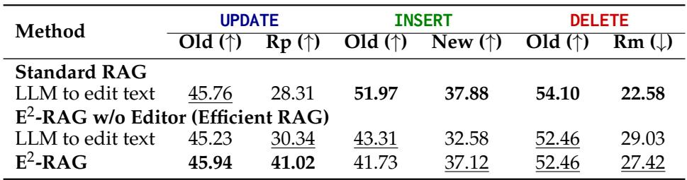