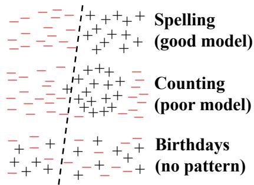
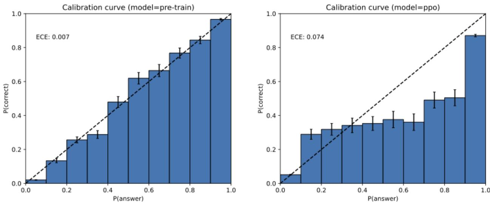
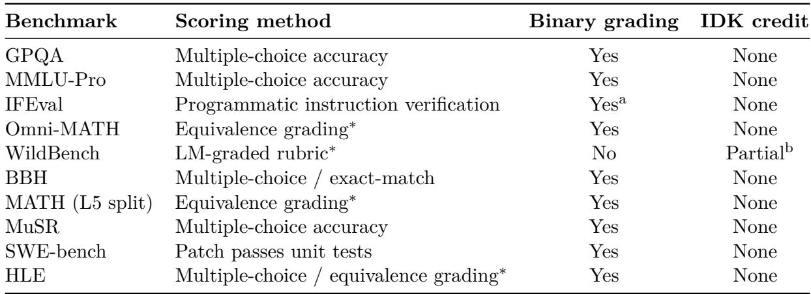

# Why Language Models Hallucinate

Adam Tauman Kalai∗ Ofir Nachum Santosh S. Vempala† OpenAI OpenAI Georgia Tech

Edwin Zhang OpenAI

September 4, 2025

# Abstract

Like students facing hard exam questions, large language models sometimes guess when uncertain, producing plausible yet incorrect statements instead of admitting uncertainty. Such “hallucinations” persist even in state-of-the-art systems and undermine trust. We argue that language models hallucinate because the training and evaluation procedures reward guessing over acknowledging uncertainty, and we analyze the statistical causes of hallucinations in the modern training pipeline. Hallucinations need not be mysterious—they originate simply as errors in binary classification. If incorrect statements cannot be distinguished from facts, then hallucinations in pretrained language models will arise through natural statistical pressures. We then argue that hallucinations persist due to the way most evaluations are graded—language models are optimized to be good test-takers, and guessing when uncertain improves test performance. This “epidemic” of penalizing uncertain responses can only be addressed through a socio-technical mitigation: modifying the scoring of existing benchmarks that are misaligned but dominate leaderboards, rather than introducing additional hallucination evaluations. This change may steer the field toward more trustworthy AI systems.

# 1 Introduction

Language models are known to produce overconfident, plausible falsehoods, which diminish their utility. This error mode is known as “hallucination,” though it differs fundamentally from the human perceptual experience. Despite significant progress, hallucinations continue to plague the field, and are still present in the latest models (OpenAI, 2025a). Consider the prompt:

What is Adam Tauman Kalai’s birthday? If you know, just respond with DD-MM.

On three separate attempts, a state-of-the-art open-source language model $^ 1$ output three incorrect dates: “03-07”, “15-06”, and “01-01”, even though a response was requested only if known. The correct date is in Autumn. Table 1 provides an example of more elaborate hallucinations.

Hallucinations are an important special case of errors produced by language models, which we analyze more generally using computational learning theory (e.g., Kearns and Vazirani, 1994). We consider general sets of errors $\varepsilon$ , an arbitrary subset of plausible strings $\mathcal { X } = \mathcal { E } \cup \mathcal { V }$ , with the other plausible strings $\nu$ being called valid. We then analyze the statistical nature of these errors, and

ChatGPT: Adam Tauman Kalai’s Ph.D. dissertation (completed in 2002 at CMU) is entitled: (GPT-4o) “Boosting, Online Algorithms, and Other Topics in Machine Learning.”

DeepSeek: “Algebraic Methods in Interactive Machine Learning”. . . at Harvard University in 2005.

Llama: “Efficient Algorithms for Learning and Playing Games”. . . in 2007 at MIT.

Table 1: Excerpts from responses to “What was the title of Adam Kalai’s dissertation?” from three popular language models.3 None generated the correct title or year (Kalai, 2001).

apply the results for the type of errors of interest: plausible falsehoods called hallucinations. Our formalism also includes the notion of a prompt to which a language model must respond.

The distribution of language is initially learned from a corpus of training examples, which inevitably contains errors and half-truths. However, we show that even if the training data were error-free, the objectives optimized during language model training would lead to errors being generated. With realistic training data containing shades of error, one may expect even higher error rates. Thus, our lower bounds on errors apply to more realistic settings, as in traditional computational learning theory (Kearns and Vazirani, 1994).

Our error analysis is general yet has specific implications for hallucination. It applies broadly, including to reasoning and search-and-retrieval language models, and the analysis does not rely on properties of next-word prediction or Transformer-based neural networks. It only considers the two stages of the modern training paradigm: pretraining and post-training, described below. For hallucinations, taxonomies (Maynez et al., 2020; Ji et al., 2023) often further distinguish intrinsic hallucinations that contradict the user’s prompt, such as:

How many Ds are in DEEPSEEK? If you know, just say the number with no commentary.

DeepSeek-V3 returned “2” or “3” in ten independent trials; Meta AI and Claude 3.7 Sonnet $^ 2$ performed similarly, including answers as large as “6” and “7”. Our theory also sheds light on extrinsic hallucinations, which contradict the training data or external reality.

# 1.1 Errors caused by pretraining

During pretraining, a base model learns the distribution of language in a large text corpus. We show that, even with error-free training data, the statistical objective minimized during pretraining would lead to a language model that generates errors. Proving this is non-trivial because some models make no errors, such as one that always outputs “I don’t know” (IDK) or one that simply memorizes and reproduces an error-free corpus. Our analysis explains what types of errors should be expected after pretraining.

To do this, we draw a connection to binary classification. Consider questions of the form “Is this a valid language model output?” Generating valid outputs is in some sense harder than answering these Yes/No questions, because generation implicitly requires answering “Is this valid” about each candidate response. Formally, we consider the Is-It-Valid (IIV) binary classification problem which has a training set consisting of a large number of responses, each labeled either as valid ( $^ +$ ) or error

Valid examples + Error examples Greetings. Greatings. How can I help? How kan eye help? There are $^ { 2 \mathrm { ~ D ~ } }$ ’s in LADDER. There are 3 L’s in SPELL. There is $1 \mathrm { N }$ in PIANO. There is 1 G in CAT. Mia Holdner’s birthday is $4 / 1$ . Colin Merivale’s birthday is 8/29. I don’t know Zdan’s birthday. Jago Pere’s birthday is 8/21.

Figure 1: Is-It-Valid requires learning to identify valid generations using labeled $\pm$ examples (left). Classifiers (dashed lines) may be accurate on certain concepts like spelling (top) but errors often arise due to poor models (middle) or arbitrary facts when there is no pattern in the data (bottom).

$( - )$ , as illustrated in Fig. 1. For this supervised learning problem, both train and test data are 50/50 mixtures of valid examples labeled as $^ +$ (i.e., the pretraining data since we assume it is valid) and uniformly random errors from $\varepsilon$ labeled as $-$ . We then show how any language model can be used as an IIV classifier. This in turn allows us to establish a mathematical relationship between generative errors (such as hallucinations) and IIV misclassification rate:

(generative error rate) $\gtrsim 2$ · (IIV misclassification rate).

Language models avoid many types of errors such as spelling mistakes, and not all errors are hallucinations. The reduction from IIV misclassification to generation illuminates the statistical nature of generative errors. The analysis shows how pretraining directly contributes to errors. Furthermore, it shows that the same statistical factors contributing to errors in binary classification also cause language model errors. Decades of research has shed light on the multifaceted nature of misclassification errors (Domingos, 2012). Fig. 1 (right) illustrates these factors visually: top, separable data classified accurately; middle, a poor model of a linear separator for a circular region; and bottom, no succinct pattern. Section 3.3 analyzes several factors, including the following stylized setting with epistemic uncertainty, when there is no pattern in the data.

This reduction ties together earlier work which covered different types of facts. For example, Kalai and Vempala (2024) considered a special case of arbitrary facts where there is no learnable pattern in the data, like the earlier birthday hallucination example. We show how the IIV reduction covers this case and recovers their bound that the hallucination rate, after pretraining, should be at least the fraction of training facts that appear once. For instance, if $2 0 \%$ of birthday facts appear exactly once in the pretraining data, then one expects base models to hallucinate on at least $2 0 \%$ of birthday facts. In fact, our analysis strengthens their result to include prompts and IDK responses, both essential components of hallucination.

# 1.2 Why hallucinations survive post-training

The second stage, post-training, refines the base model, often with a goal of reducing hallucinations. While the analysis of pretraining covered errors more generally, our analysis of post-training focuses on why overconfident hallucinations are generated rather than omitting information or expressing uncertainty such as IDK. We offer a socio-technical explanation for the persistence of hallucinations after post-training and discuss how the field can suppress them.

As an analogy, consider the following context where humans also occasionally fabricate plausiblesounding information. When uncertain, students may guess on multiple-choice exams and even bluff on written exams, submitting plausible answers in which they have little confidence. Language models are evaluated by similar tests. In both settings, guessing when unsure maximizes expected score under a binary 0-1 scheme that awards 1 point for a correct answer and none for blanks or IDKs. Bluffs are often overconfident and specific, such as “September 30” rather than “Sometime in autumn” for a question about a date. Many language-model benchmarks mirror standardized human exams, using binary metrics such as accuracy or pass-rate. Optimizing models for these benchmarks may therefore foster hallucinations. Humans learn the value of expressing uncertainty outside of school, in the school of hard knocks. On the other hand, language models are primarily evaluated using exams that penalize uncertainty. Therefore, they are always in “test-taking” mode. Put simply, most evaluations are not aligned.

We are not the first to realize that binary grading does not measure hallucination. However, prior work on hallucination evaluation has generally sought after the elusive “perfect hallucination eval.” In Section 4, we argue that this is insufficient. We observe that existing primary evaluations overwhelmingly penalize uncertainty, and thus the root problem is the abundance of evaluations that are not aligned. Suppose Model A is an aligned model that correctly signals uncertainty and never hallucinates. Let Model B be similar to Model A except that it never indicates uncertainty and always “guesses” when unsure. Model B will outperform A under 0-1 scoring, the basis of most current benchmarks. This creates an “epidemic” of penalizing uncertainty and abstention, which we argue that a small fraction of hallucination evaluations won’t suffice. The numerous primary evaluations must be adjusted to stop penalizing abstentions when uncertain.

Contributions. We identify the main statistical drivers of hallucinations, from their pretraining origins to their post-training persistence. A novel connection between supervised and unsupervised learning demystifies their origin, even when training data contain IDK. The persistence of hallucinations, despite extensive work on the problem, is explained by the recognition that hallucination-like guessing is rewarded by most primary evaluations. We discuss statistically rigorous modifications to existing evaluations that pave the way to effective mitigation.

# 2 Related work

To the best of our knowledge, the reduction from supervised learning (binary classification) to unsupervised learning (density estimation or self-supervised learning) presented in this work is novel. The general method of reduction between learning problems, however, is a well-established technique for demonstrating that one problem is at least as hard as another (see, e.g., Beygelzimer et al., 2016).

A number of surveys and studies have explored the underlying causes of hallucination in language models. Sun et al. (2025) cite factors such as model overconfidence Yin et al. (2023), decoding randomness Lee et al. (2022), snowballing effects Zhang et al. (2023), long-tailed training samples Sun et al. (2023), misleading alignment training Wei et al. (2023), spurious correlations Li et al. (2022), exposure bias Bengio et al. (2015), the reversal curse Berglund et al. (2024), and context hijacking Jeong (2024). Analogous sources of error have long been studied in broader machine learning and statistical settings (Russell and Norvig, 2020).

The most closely related theoretical work is by Kalai and Vempala (2024), which we show is a special case of our reduction. They connected the Good-Turing missing mass estimates (Good, 1953) to hallucinations, which inspired Theorem 3. However, that work does not address uncertainty expressions (e.g., IDK), connections to supervised learning, post-training modifications, and their model did not include prompts. Hanneke et al. (2018) analyze an interactive learning algorithm that queries a validity oracle (e.g., a human) to agnostically train a language model that minimizes hallucinations. Their method is statistically efficient, requiring a reasonable amount of data, but not computationally efficient. Other recent theoretical studies (Kalavasis et al., 2025; Kleinberg and Mullainathan, 2024) formalize an inherent trade-off between consistency (avoiding invalid outputs) and breadth (generating diverse, linguistically rich content). These works demonstrate that for broad classes of languages, any model that generalizes beyond its training data will either hallucinate invalid outputs or suffer mode collapse, failing to produce the full range of valid responses.

Several post-training techniques—such as reinforcement learning from human feedback (RLHF) (Ouyang et al., 2022), reinforcement learning from AI feedback (RLAIF) (Bai et al., 2022), and direct preference optimization (DPO) (Rafailov et al., 2023)—have been shown to reduce hallucinations, including conspiracy theories and common misconceptions. Gekhman et al. (2024) show that simple fine-tuning on novel information can initially decrease hallucination rates, only for them to later increase. Further, it has been demonstrated that both natural language queries and internal model activations encode predictive signals about factual accuracy and model uncertainty (e.g., Kadavath et al., 2022). As discussed in our introduction, inconsistencies in a model’s answers to semantically related queries can also be leveraged to detect or mitigate hallucinations (Manakul et al., 2023; Xue et al., 2025; Agrawal et al., 2024).

Numerous other methods have proven effective in mitigating hallucinations; see, for example, the surveys by Ji et al. (2023) and Tian et al. (2024). In terms of evaluation, several comprehensive benchmarks and leaderboards have recently been introduced (e.g., Bang et al., 2025; Hong et al., 2024). However, relatively little work has examined barriers to their adoption. The 2025 AI Index report (Maslej et al., 2025), for instance, notes that hallucination benchmarks “have struggled to gain traction within the AI community.”

Beyond binary expressions of certainty, more nuanced linguistic constructions have been proposed to communicate gradations of uncertainty (Mielke et al., 2022; Lin et al., 2022a; Damani et al., 2025). Additionally, the field of pragmatics—which investigates how meaning is shaped by context—has increasing relevance for understanding and improving how language models convey information (Ma et al., 2025).

# 3 Pretraining Errors

Pretraining produces a base language model $\hat { p }$ that approximates the distribution text drawn from its training distribution $p$ . This is the classic “density estimation” problem in unsupervised learning, where a density is simply a probability distribution over data. In the case of language models, the distribution is over text or multimodal inputs if included.

The key challenge in proving that base models err is that many language models do not err. The degenerate model which always outputs IDK also avoids errors (assuming IDK is not an error). Similarly, assuming error-free training data, the trivial base model which regurgitates text from a random training example also does not err. However, these two language models fail at density estimation, the basic goal of statistical language modeling as defined below. Errors are also avoided by the optimal base model $\hat { p } = p$ which matches the training distribution, but this model would require prohibitively large training data. Nonetheless, we show that well-trained base models should still generate certain types of errors.

Our analysis shows that generating valid outputs (i.e., avoiding errors) is harder than classifying output validity. This reduction enables us to apply the lens of computational learning theory, where errors are expected and understood, to error mechanisms in generative models. A language model is initially defined as a probability distribution over text and later prompts are incorporated (Section 3.2); both settings share the same intuition. Examples without prompts include birthday statements such as those of Fig. 1, while a prompted model might be queried for a specific individual’s birthday.

Not merely autocomplete. Our analysis applies to general density estimation and not only “next-word predictors” even though many language models are trained using self-supervised learning to predict each word based on the previous words. It is tempting to attribute hallucinations to poorly chosen prefixes (e.g., “Adam Kalai was born on”) for which the language model cannot provide valid completions. However, from a purely statistical perspective, ignoring computation, the autocomplete view $^ 4$ of language models is no more significant than the fact that any human speaker produces one word at a time. Our analysis suggests that errors arise from the very fact that the models are being fit to the underlying language distribution, though the specific architecture can introduce additional errors.

# 3.1 The reduction without prompts

Without prompts, a base model $\hat { p }$ is a probability distribution over a set $\mathcal { X }$ . As discussed earlier, each example $x \in \mathcal { X }$ represents a “plausible” string, e.g., a document.5 The examples $\mathcal { X } = \mathcal { E } \cup \mathcal { V }$ are partitioned into errors $\varepsilon$ and valid examples $\nu$ , for nonempty disjoint sets $\varepsilon , \nu$ . The error rate of base model $\hat { p }$ is denoted by,

$$
\operatorname { e r r } : = { \hat { p } } ( { \mathcal { E } } ) = \operatorname* { P r } _ { x \sim { \hat { p } } } [ x \in { \mathcal { E } } ] .
$$

Training data are assumed to come from a noiseless training distribution $p ( \mathcal { X } )$ , i.e., where $p ( \mathcal { E } ) = 0$ . As discussed, with noisy training data and partly correct statements, one may expect even higher error rates than our lower bounds.

We now formalize the IIV binary-classification problem, introduced in the introduction. IIV is specified by the target function $f : \mathcal { X }  \{ - , + \}$ to be learned (membership in $\nu$ ) and the distribution $D$ over examples $\mathcal { X }$ (a 50/50 mix of samples from $p$ and uniformly random errors):

$$
D ( x ) : = { \left\{ \begin{array} { l l } { p ( x ) / 2 } & { { \mathrm { ~ i f ~ } } x \in \mathcal { V } , } \\ { 1 / 2 | \mathcal { E } | } & { { \mathrm { ~ i f ~ } } x \in \mathcal { E } , } \end{array} \right. } { \mathrm { ~ a n d ~ } } f ( x ) : = { \left\{ \begin{array} { l l } { + } & { { \mathrm { ~ i f ~ } } x \in \mathcal { V } , } \\ { - } & { { \mathrm { ~ i f ~ } } x \in \mathcal { E } . } \end{array} \right. }
$$

Our analysis lower bounds the error rate $\operatorname { e r r } = \hat { p } ( \mathcal { E } )$ in terms of IIV’s aforementioned misclassification rate $\mathrm { e r r } _ { \mathrm { i i v } }$ :

$$
\mathrm { e r r } _ { \mathrm { i i v } } : = \operatorname* { P r } _ { x \sim D } \left[ { \hat { f } } ( x ) \neq f ( x ) \right] , { \mathrm { ~ w h e r e ~ } } { \hat { f } } ( x ) : = { \left\{ \begin{array} { l l } { + } & { { \mathrm { ~ i f ~ } } { \hat { p } } ( x ) > 1 / | { \mathcal { E } } | , } \\ { - } & { { \mathrm { ~ i f ~ } } { \hat { p } } ( x ) \leq 1 / | { \mathcal { E } } | . } \end{array} \right. }
$$

The base model is thus used as an IIV classifier, in our reduction, by thresholding the base model’s probability at a certain threshold $1 / | \mathcal { E } |$ . Note that such probabilities ${ \hat { p } } ( x )$ can generally be efficiently computed for base models (though efficient computation is not necessary for the lower-bounds to be meaningful).

Corollary 1. For any training distribution $p$ such that $p ( \mathcal { V } ) = 1$ and any base model $\hat { p }$ ,

$$
\mathrm { e r r } \geq 2 \cdot \mathrm { e r r } _ { \mathrm { i i v } } - \frac { | \mathcal { V } | } { | \mathcal { E } | } - \delta ,
$$

for err, erriiv from Eqs. (1) and (2), and $\delta : = | \hat { p } ( \mathcal { A } ) - p ( \mathcal { A } ) |$ for $\mathcal { A } : = \{ x \in \mathcal { X } \mid \hat { p } ( x ) > 1 / \vert \mathcal { E } \vert \}$ .

Since this relationship holds for any base model $\hat { p }$ , it immediately implies that all base models will err on inherently unlearnable IIV facts (such as the birthdays absent from the training data) where err $\operatorname { i n v }$ is necessarily large, and where $\delta$ and $| \nu | / | \mathcal { E } |$ are small (e.g., for each person there are 364 times more incorrect birthday claims in $\varepsilon$ than correct ones in $\nu$ , plus IDK). The corollary above follows immediately as a special case of Theorem 1 which covers the more general case with prompts. Theorem 2 later uses this general result to provide lower-bounds for an intuitive special case. Theorems 3 and 4 address small $| \mathcal { E } |$ , e.g., $| \mathcal { E } | = 1$ for True/False questions. The constant 2 in the above bound is relatively tight: for large $| \mathcal { E } |$ and small $\delta$ , ${ \mathrm { e r } } 1 { \mathrm { i i v } }$ could be near $1 / 2$ for unlearnable concepts while err $\leq 1$ . Corollary 1 also implies that erriiv $\lesssim 1 / 2$ .

Hallucination errors. To apply the error analysis to hallucinations, one may consider $\varepsilon$ to be the set of plausible generations containing (one or more) plausible falsehoods. Note that a common alternate definition of hallucinations is as generations that are not grounded in the training data (or prompt). Fortunately, the lower-bound above also applies to this notion because we have assumed only valid training data, i.e., a generated factual error cannot be grounded in factually correct training data.

Calibration. We now argue why $| \delta |$ is a measure of (mis)calibration that is small after pretraining. Note that without any knowledge of the language, one can achieve $\delta = 0$ by simply taking the uniform distribution $\hat { p } ( x ) = 1 / | \mathcal { X } |$ , and thus $\delta = 0$ does not require $p = \hat { p }$ . An auditor can trivially estimate $\delta$ by comparing the fractions of responses satisfying $\hat { p } ( x ) > 1 / | \mathcal { E } |$ versus $\hat { p } ( \hat { x } ) > 1 / | \mathcal { E } |$ using sets of training samples $x \sim p$ and synthetic generations ${ \hat { x } } \sim { \hat { p } }$ . Inspired by Dawid (1982), one may think of an analogy to a weather forecaster predicting the probability of rain each day. A minimal calibration requirement would be whether their average prediction matched the average fraction of rain. One could also require these two to match on days when the forecast was $> t$ for some threshold $t \in [ 0 , 1 ]$ . Dawid (1982) introduced the more stringent requirement that for every $t \in \left[ 0 , 1 \right]$ , among days on which the prediction is $t$ it rains about a $t$ fraction of the time.

Here is a particularly simple justification for why $\delta$ is typically small for the standard pretraining cross-entropy objective,

$$
\begin{array} { r } { \mathcal { L } ( \hat { p } ) = \underset { x \sim p } { \mathbb { E } } [ - \log \hat { p } ( x ) ] . } \end{array}
$$

Consider rescaling the probabilities of the positively-labeled examples by a factor $s \mathrm { ~ > ~ 0 ~ }$ and normalizing:

$$
\hat { p } _ { s } ( x ) : \propto \left\{ \begin{array} { l l } { s \cdot \hat { p } ( x ) } & { \mathrm { i f } \ \hat { p } ( x ) > 1 / | \mathcal { E } | , } \\ { \hat { p } ( x ) } & { \mathrm { i f } \ \hat { p } ( x ) \leq 1 / | \mathcal { E } | . } \end{array} \right.
$$

  
Figure 2: GPT-4 calibration histograms before (left) and after (right) reinforcement learning (OpenAI, 2023a, Figure 8, reprinted with permission). These plots are for multiple-choice queries where the plausible responses are simply A, B, C, or D. The pretrained model is well calibrated.

Then, a simple calculation shows that $\delta$ is the magnitude of the derivative of the loss with respect to the scaling factor $s$ , evaluated at $s = 1$ :

$$
\delta = \left| \left. \frac { d } { d s } \mathcal { L } ( \hat { p } _ { s } ) \right| _ { s = 1 } \right| .
$$

If $\delta \neq 0$ , then rescaling by some $s \neq 1$ would reduce the loss, so the loss is not at a local minimum. For any class of language models powerful enough to approximate such simple rescaling, local optimization should yield small $\delta$ . Note that $\delta$ , being defined at a single threshold $t = 1 / | \mathcal { E } |$ is weaker than notions such as Expected Calibration Error (ECE) which integrate over thresholds $t$ .

Hallucinations are inevitable only for base models. Many have argued that hallucinations are inevitable (Jones, 2025; Leffer, 2024; Xu et al., 2024). However, a non-hallucinating model could be easily created, using a question-answer database and a calculator, which answers a fixed set of questions such as “What is the chemical symbol for gold?” and well-formed mathematical calculations such as $^ { 6 6 } 3 + 8 ^ { 5 }$ , and otherwise outputs IDK. Moreover, the error lower-bound of Corollary 1 implies that language models which do not err must not be calibrated, i.e., $\delta$ must be large. As our derivations show, calibration—and, hence, errors—is a natural consequence of the standard cross-entropy objective. Indeed, empirical studies (Fig. 2) show that base models are often found to be calibrated, in contrast to post-trained models which may deviate from cross-entropy in favor of reinforcement learning.

# 3.2 The reduction with prompts

Henceforth, we generalize the setting of Section 3.1 to include prompts (contexts) $c \in { \mathcal { C } }$ drawn from a prompt distribution $\mu$ . Each example $\boldsymbol { x } = \left( c , r \right)$ now consists of a prompt $c$ and plausible response $r$ . The analysis above corresponds to the special case in which $\mu$ assigns probability 1 to the empty prompt. For a given prompt $c \in { \mathcal { C } }$ , let $\mathcal { V } _ { c } : = \{ r \ | \ ( c , r ) \in \mathcal { V } \}$ be the valid responses and $\mathcal { E } _ { c } : = \{ r \ | \ ( c , r ) \in \mathcal { E } \}$ be the erroneous responses. The training distribution and base model are now conditional response distributions $p ( r \mid c ) , \hat { p } ( r \mid c )$ . For notational convenience, we extend these to joint distributions on $\mathcal { X }$ by $p ( c , r ) : = \mu ( c ) p ( r \mid c )$ and ${ \hat { p } } ( c , r ) : = \mu ( c ) { \hat { p } } ( r \mid c )$ , so that still $\textstyle { \mathrm { e r r } } : = { \hat { p } } ( { \mathcal { E } } ) = \sum _ { ( c , r ) \in { \mathcal { E } } } \mu ( c ) { \hat { p } } ( r \mid c )$ and $p ( \mathcal { E } ) = 0$ .

Training distribution examples therefore correspond to valid “dialogues,” as in the case of distillation (Chiang et al., 2023; Anand et al., 2023). Although assuming that the training data contain model dialogues drawn from the same prompt distribution is unrealistic, even higher error rates may be expected when the assumption fails. The IIV problem with prompts has the same target function $f ( x ) : = + \operatorname { i f f } x \in \mathcal { V }$ , but the generalized distribution $D$ selects, with equal probability either $x \sim p$ or $\boldsymbol { x } = \left( c , r \right)$ for $c \sim \mu$ and uniformly random $r \in \mathcal { E } _ { c }$ . Finally, the classifier $\boldsymbol { { \hat { f } } } ( \boldsymbol { c } , \boldsymbol { r } )$ is now $^ +$ iff $\hat { p } ( r \mid c ) > 1 / \operatorname* { m i n } _ { c } | { \mathcal { E } } _ { c } |$ . Corollary 1 is thus clearly a special case of,

Theorem 1. For any training distribution $p$ such that $p ( \mathcal { V } ) = 1$ and any base model $\hat { p }$

$$
\mathrm { e r r } \geq 2 \cdot \mathrm { e r r } _ { \mathrm { i i v } } - \frac { \operatorname* { m a x } _ { c } \left| \mathcal { V } _ { c } \right| } { \operatorname* { m i n } _ { c } \left| \mathcal { E } _ { c } \right| } - \delta ,
$$

where $\delta : = | \hat { p } ( \mathcal { A } ) - p ( \mathcal { A } ) |$ for $\begin{array} { r } { \mathcal { A } : = \{ ( c , r ) \in \mathcal { X } \mid \hat { p } ( r \mid c ) > 1 / \operatorname* { m i n } _ { c } \left. \mathcal { E } _ { c } \right. \} . } \end{array}$

Generalizing the rescaling $\hat { p } _ { s } ( r \mid c )$ (normalizing per prompt, still with single parameter $s$ ) again justifies a small $\begin{array} { r } { \delta = | \frac { d } { d s } \mathcal { L } ( \hat { p } _ { s } ) | _ { s = 1 } | } \end{array}$ , now for $\begin{array} { r } { \mathcal { L } ( \hat { p } ) : = \sum _ { ( c , r ) \in \mathcal { X } } - \mu ( c ) \log \hat { p } ( r \mid c ) } \end{array}$ .

# 3.3 Error factors for base models

Decades of research have elucidated the statistical factors contributing to misclassifications (errors in binary classification). We can leverage this prior understanding to enumerate factors behind hallucinations and other generative errors, including: statistical complexity, as in birthdays (Section 3.3.1); poor models, as in letter counting (Section 3.3.2); and additional factors like GIGO, as in conspiracy theories (Section 3.4).

# 3.3.1 Arbitrary-fact hallucinations

When there is no succinct pattern that explains the target function, there is epistemic uncertainty meaning that necessary knowledge is absent from the training data. The Vapnik-Chervonenkis dimension (Vapnik and Chervonenkis, 1971) $\operatorname { V C } ( { \mathcal { F } } )$ characterizes the worst-case number of examples needed to learn a family $\mathcal { F }$ of functions $f : \mathcal { X }  \{ - , + \}$ , with high probability. Families with high $\operatorname { V C } ( { \mathcal { F } } )$ dimension may require prohibitively many samples to learn. We consider a natural special case of high VC dimension: random arbitrary facts. In particular, this section considers valid responses (other than IDK) which are random and independent across prompts.

Definition 1 (Arbitrary Facts). The following are fixed: an arbitrary prompt distribution $\mu ( c )$ , an IDK response and, for each prompt $c$ : a response set $\mathcal { R } _ { c }$ and a probability of answering $\alpha _ { c } \in [ 0 , 1 ]$ . Independently for each $c$ , a single correct answer $a _ { c } \in \mathcal { R } _ { c }$ is chosen uniformly at random. Finally, $p ( a _ { c } \mid c ) = \alpha _ { c }$ and $p ( \mathrm { I D K } \mid c ) = 1 - \alpha _ { c }$ for each $c \in { \mathcal { C } }$ . Thus ${ \mathcal E } _ { c } = { \mathcal R } _ { c } \ \backslash \ \{ a _ { c } \}$ and $\mathcal { V } _ { c } = \{ a _ { c } , \mathrm { I D K } \}$ .

It is assumed that there is a single way to write any given fact, which can be done as in the lead birthday example where the format was specified. However, we again note that one may expect even more hallucinations with multiple ways to state each fact. In the case of fixed-format birthdays, $| \mathcal { E } _ { c } | = 3 6 4$ and notable people whose birthdays are discussed often would have high $\mu ( c )$ . Notable birthdays like Einstein’s appear multiple times, whereas others may only occur once, e.g., in an obituary. Large language models seldom err on frequently referenced facts, e.g., Einstein’s birthday or dissertation title.

Our lower-bound for hallucinations is based on the fraction of prompts appearing just once in the training data, ignoring IDKs.

Definition 2 (Singleton rate). A prompt $c \in { \mathcal { C } }$ is $a$ singleton if it appears exactly once in the $N$ training data 
(c(i), r(i))N without abstention, i.e., $| \{ i : c ^ { ( i ) } = c \wedge r ^ { ( i ) } \neq \mathrm { I D K } \} | = 1$ . Let ${ \cal { S } } \subseteq { \mathcal { C } }$ denote the set of singletons and

$$
\mathrm { s r } = { \frac { | S | } { N } }
$$

denote the fraction of training singletons.

The singleton rate builds on Alan Turing’s elegant “missing-mass” estimator (Good, 1953), which gauges how much probability is still assigned to outcomes that have not yet appeared in a sample from a distribution. Concretely, Turing’s estimate of the unseen-event probability is the fraction of samples appearing exactly once. Intuitively, singletons act as a proxy for how many more novel outcomes you might encounter in further sampling, so their empirical share becomes the estimate for the entire “missing” portion of the distribution. We now state our bounds for Arbitrary Facts.

Theorem 2 (Arbitrary Facts). In the Arbitrary Facts model, any algorithm which takes $N$ training samples and outputs $\hat { p }$ satisfies, with probability $\geq 9 9 \%$ over $\vec { a } = \langle a _ { c } \rangle _ { c \in \mathcal { C } }$ and the $N$ training examples:

$$
\mathrm { e r r } \geq \mathrm { s r } - \frac { 2 } { \operatorname* { m i n } _ { c } \left| \mathcal { E } _ { c } \right| } - \frac { 3 5 + 6 \mathrm { l n } N } { \sqrt { N } } - \delta .
$$

Moreover, there is an efficient algorithm outputting calibrated $\hat { p }$ ( $\delta = 0$ ) that with probability $\geq$ 99%,

$$
\mathrm { e r r } \leq \mathrm { s r } - \frac { \mathrm { s r } } { \operatorname* { m a x } _ { c } \left| \mathcal { E } _ { c } \right| + 1 } + \frac { 1 3 } { \sqrt { N } } .
$$

An earlier version of this paper presented a related theorem that omitted prompts and abstentions (Kalai and Vempala, 2024). The proof is in Appendix B. Follow-up work by Miao and Kearns (2025) provides an empirical study of hallucinations, singleton rate, and calibration.

# 3.3.2 Poor models

Misclassifications can also arise when the underlying model is poor because: (a) the model family cannot represent the concept well, such as linear separators approximating circular regions, or (b) the model family is sufficiently expressive but the model itself is not a good fit. Agnostic Learning (Kearns et al., 1994) addresses (a) by defining the minimal error rate of any classifier in a given family $\mathcal { G }$ of classifiers $g : \mathcal { X }  \{ - , + \}$ :

$$
\operatorname { o p t } ( { \mathcal { G } } ) : = \operatorname* { m i n } _ { g \in { \mathcal { G } } } \operatorname* { P r } _ { x \sim D } [ g ( x ) \neq f ( x ) ] \in [ 0 , 1 ] .
$$

If $\operatorname { o p t } ( { \mathcal { G } } )$ is large, then any classifier in $\mathcal { G }$ will have high misclassification rate. In our case, given a language model $\hat { p } _ { \theta }$ parameterized by $\theta \in \Theta$ , consider the family of thresholded-language-model classifiers:

$$
\mathcal { G } : = \left\{ g _ { \theta , t } ~ \vert ~ \theta \in \Theta , t \in [ 0 , 1 ] \right\} , \mathrm { ~ w h e r e ~ } g _ { \theta , t } ( c , r ) : = \left\{ \begin{array} { l l } { + } & { \mathrm { ~ i f ~ } \hat { p } _ { \theta } ( r \vert ~ c ) > t , } \\ { - } & { \mathrm { ~ i f ~ } \hat { p } _ { \theta } ( r \vert ~ c ) \le t . } \end{array} \right.
$$

It follows immediately from Theorem 1 that

$$
\operatorname { e r r } \geq 2 \cdot \operatorname { o p t } ( { \mathcal { G } } ) - { \frac { \operatorname* { m a x } _ { c } | { \mathcal { V } } _ { c } | } { \operatorname* { m i n } _ { c } | { \mathcal { E } } _ { c } | } } - \delta .
$$

When exactly one correct response exists per context (i.e., standard multiple choice, without IDK), the calibration term can be removed and bounds can be achieved even for $C = 2$ choices.

Theorem 3 (Pure multiple-choice). Suppose $| \nu _ { c } | = 1$ for al l $c \in { \mathcal { C } }$ and let $C = \mathrm { m i n } _ { c } \left| \mathcal { E } _ { c } \right| + 1$ be the number of choices. Then,

$$
\operatorname { e r r } \geq 2 \left( 1 - { \frac { 1 } { C } } \right) \cdot \operatorname { o p t } ( { \mathcal { G } } )
$$

To illustrate, consider the classic trigram language model where each word was predicted based only on the prior two words, i.e., a context window of just two words. Trigram models were dominant in the 1980s and 1990s. Trigram models, however, regularly output ungrammatical sentences. Consider the following prompts and responses:

$$
\begin{array} { l l } { { c _ { 1 } = \mathrm { S h e ~ l o s t ~ i t ~ a n d ~ w a s ~ c o m p l e t e l y ~ o u t ~ o f } _ { \cdot \cdot \cdot } } } & { { c _ { 2 } = \mathrm { H e ~ l o s t ~ i t ~ a n d ~ w a s ~ c o m p l e t e l y ~ o u t ~ o f } _ { \cdot \cdot \cdot } } } \\ { { } } & { { r _ { 1 } = \mathrm { h e r ~ m i n d } . } } \\ { { } } & { { } } \end{array}
$$

Here, $V _ { c _ { 1 } } : = E _ { c _ { 2 } } : = \{ r _ { 1 } \}$ and $V _ { c _ { 2 } } : = E _ { c _ { 1 } } : = \{ r _ { 2 } \}$ .

Corollary 2. Let $\mu$ be uniform over $\{ c _ { 1 } , c _ { 2 } \}$ . Then any trigram model must have a generation error rate of at least $1 / \mathcal { 2 }$ .

This follows from Theorem 3 because $C = 2$ and $\mathrm { o p t } ( \mathcal { G } ) = 1 / 2$ for trigram models. The proofs of Theorem 3 and Corollary 2 are in Appendix C. Although $n$ -gram models can capture longer-range dependencies for larger $n$ , data requirements scale exponentially in $n$ .

We now revisit the letter-counting example from the introduction. To see that this is a poor model issue, note that the DeepSeek-R1 reasoning model reliably counts letters, e.g., producing a 377-chain-of-thought that includes:

Let me spell it out: D-E-E-P-S-E-E-K.   
First letter: D — that’s one D. Second letter: E — not D. Third letter: E — not D. . .   
So, the number of Ds is 1.

Assuming similar training data, this suggests that R1 is a better model for the task than the DeepSeekV3 model. One representational challenge that reasoning overcomes is that modern language models represent prompts by tokens, e.g., D/EEP/SEE/K, rather than individual characters (DeepSeek-AI et al., 2025).

# 3.4 Additional factors

Errors may occur due to a combination of multiple factors, including the ones discussed above and several others. Here, we highlight a few.

Computational Hardness. No algorithm run on a classical computer, even an AI with superhuman capabilities, can violate the laws of computational complexity theory. Indeed, AI systems have been found to err on computationally hard problems (Xu et al., 2024). Observation 2 of Appendix D illustrates how Theorem 1 applies to intractable queries of the form “What is the decryption of $c ? ^ { \mathfrak { n } ^ { \mathfrak { n } } }$ and IDK is a valid answer.   
Distribution shift. A well-known challenge in binary classification is that training and test data distributions often diverge (Qui˜nonero-Candela et al., 2009; Moreno-Torres et al., 2012). Analogously, errors in language models often stem from out-of-distribution (OOD) prompts that differ substantially from the training distribution. A question such as, “What’s heavier, a pound of feathers or a pound of lead?” may be unlikely in the training data and may induce erroneous answers in certain models. Similarly, distribution shift could be a factor in the letter-counting example above, though the fact that reasoning models correctly count letters suggests that the poor models may be a greater factor.   
GIGO: Garbage in, Garbage out. Large training corpora often contain numerous factual errors, which may be replicated by base models. The statistical similarity of GIGO for both classification and pretraining is self evident, and hence we do not provide a formal treatment. However, it is important to recognize GIGO among statistical factors, as language models have been shown to replicate errors from training data (Lin et al., 2022b; Levy et al., 2021; Alber et al., 2025).

GIGO also offers a natural segue to the topic of post-training, which decreases certain GIGO errors, such as common misconceptions and conspiracy theories (Ouyang et al., 2022; OpenAI, 2023a; Costello et al., 2024). The next section explains why some hallucinations persist—and may even be exacerbated—by current post-training pipelines.

# 4 Post-training and hallucination

Post-training should shift the model from one which is trained like an autocomplete model to one which does not output confident falsehoods (except when appropriate, e.g., when asked to produce fiction). However, we claim that further reduction of hallucinations is an uphill battle, since existing benchmarks and leaderboards reinforce certain types of hallucination. We therefore discuss how to stop this reinforcement. This is a socio-technical problem in the sense that, not only do the existing evaluations need to be modified, but these changes need to be adopted in the influential leaderboards.

# 4.1 How evaluations reinforce hallucination

Binary evaluations of language models impose a false right-wrong dichotomy, award no credit to answers that express uncertainty, omit dubious details, or request clarification. Such metrics, including accuracy and pass rate, remain the field’s prevailing norm, as argued below. Under binary grading, abstaining is strictly sub-optimal. IDK-type responses are maximally penalized while an overconfident “best guess” is optimal. The motivation combines two desirable factors: (a) the rate of accuracy among what is output by the language model, and (b) how comprehensive responses are. However, weighing (a) more than (b) is important for reducing hallucinations.

Formally, for any given question in the form of a prompt $c$ , denote the set of plausible responses (valid or error) by $\mathcal { R } _ { c } : = \{ r \mid ( c , r ) \in \mathcal { X } \}$ . Further, suppose there is a set of plausible abstention responses $\mathcal { A } _ { c } \subset \mathcal { R } _ { c }$ (e.g., IDK). A grader $g _ { c } : \mathcal { R } _ { c }  \mathbb { R }$ is said to be binary if $\{ g _ { c } ( r ) \mid r \in \mathcal { R } _ { c } \} = \{ 0 , 1 \}$ and $g _ { c } ( r ) = 0$ for all $r \in \mathcal { A } _ { c }$ . A problem is defined by $( c , \mathcal { R } _ { c } , \mathcal { A } _ { c } , g _ { c } )$ where the test-taker knows $c , \mathcal { R } _ { c } , \mathcal { A } _ { c }$ . We assume that the test-taker knows that the rubric is binary but is not told the correct answers, where $g _ { c } ( r ) = 1$ . The test-taker’s beliefs about the correct answer can be viewed as a posterior distribution $\rho _ { c }$ over binary $g _ { c }$ ’s. For any such beliefs, the optimal response is not to abstain.

Observation 1. Let c be a prompt. For any distribution $\rho _ { c }$ over binary graders, the optimal response(s) are not abstentions, i.e.,

$$
\mathcal { A } _ { c } \cap \underset { r \in \mathcal { R } _ { c } } { \arg \operatorname* { m a x } } \ \underset { g _ { c } \sim \rho _ { c } } { \mathbb { E } } [ g _ { c } ( r ) ] = \emptyset .
$$

Although the proof is trivial (see Appendix E), Observation 1 suggests that existing evaluations may need to be modified. Table 2 summarizes the short meta-evaluation analysis in Appendix F, finding that the vast majority of popular evaluations have binary grading. Therefore, additional hallucination evaluations may not suffice when the primary evaluations penalize honestly reporting confidence and uncertainty. This does not diminish existing work on hallucination evaluations but rather points out that even the ideal hallucination evaluation and ideal post-training methodology, yielding honest reports of uncertainty, may still be drowned out because of inferior performance on the vast majority of the existing evaluations.

# 4.2 Explicit confidence targets

Human tests are similarly mostly binary, and it has been recognized that they also reward overconfident bluffing. Of course, exams are only a small component of human learning, e.g., fabricating birthdays will quickly result in embarrassment. Nonetheless, some standardized national exams operate or have operated using penalties for incorrect answers (or equivalently partial credit for abstaining), including Indian JEE, NEET, and GATE exams; AMC tests from the Mathematical Association of America; and US standardized SAT, AP, and GRE tests in earlier years. Importantly, the grading system is clearly stated in the instructions, and test takers are often aware of the confidence threshold beyond which it makes sense to make their best guess.

Similarly, we propose evaluations explicitly state confidence targets in their instructions, within the prompt (or system message). For example, one could append a statement like the following to each question:

Answer only if you are $> t$ confident, since mistakes are penalized $t / ( 1 - t )$ points, while correct answers receive 1 point, and an answer of “I don’t know” receives 0 points.

There are several natural values of $t$ including $t = 0 . 5$ (penalty 1), $t = 0 . 7 5$ (penalty 2), and $t = 0 . 9$ (penalty 9). A threshold of $t = 0$ corresponds to binary grading and could be described by, e.g., “Make your best guess even if you are unsure, as if you were taking an exam.” A simple calculation shows that the expected score of offering an answer beats IDK (score 0) iff its confidence (i.e., probability of being correct) is $> t$ .

Table 2: Summary of evaluation benchmarks analyzed in this work and their treatment of abstentions. “Binary grading” indicates that the primary metric is a strict correct/incorrect accuracy; “IDK credit” denotes whether abstentions can earn any credit.   

∗ Grading is performed using language models, hence incorrect bluffs may occasionally be scored as correct. a IFEval aggregates several binary rubric sub-scores into a composite score. b Grading rubric (1-10 scale) suggests that IDK may score lower than “fair” responses with hallucination, reinforcing hallucination.

Such penalties have been well-studied within hallucination research (Ji et al., 2023). However, we suggest two subtle variations which have statistical ramifications. First, we propose making the confidence threshold explicit in the instructions, whereas the prior work has largely omitted mentioning the confidence targets or penalties in the instructions. (A notable exception is the work of Wu et al. (2025) who introduce “risk-informing” prompts with explicit penalties.) The ideal penalty might reflect likely real-world harms, but that is impractical as it is specific to the problem, the target application, and the user group. Without transparent specification within the instructions, it would be difficult to achieve consensus among language-model creators on the correct thresholds. Similarly, students might bicker that grading is unfair given instructions that there is an unspecified penalty for errors. Instead, specifying confidence thresholds explicitly in each problem’s instructions supports objective grading even if the specific thresholds chosen are somewhat arbitrary or even random. A single model may be best across all thresholds, if the threshold is explicit. However, if the threshold is not stated, then there is an inherent tradeoff, and no single model will be best in general (other than one that is always correct).

Second, we suggest incorporating confidence targets into existing mainstream evaluations, such as the popular SWE-bench (Jimenez et al., 2024) which involves binary grading of software patches, while the majority of prior work has introduced implicit error penalties in bespoke hallucination evaluations. Merely adding evaluations with implicit error penalties faces the aforementioned accuracy-error tradeoff. On the other hand, incorporating confidence targets into the established evaluations, already in use, reduces the penalty for appropriate expressions of uncertainty. It may thus amplify the effectiveness of hallucination-specific evaluations.

With explicit confidence targets, there is one behavior which is simultaneously optimal for all targets—outputting IDK among examples where its correctness probability is greater than the target. Let us refer to this as behavioral calibration–rather than requiring the model to output a probabilistic confidence (Lin et al., 2022a), it must formulate the most useful response in which it is at least $t$ confident. Behavioral calibration can be audited by comparing accuracy and error rates across thresholds, and circumvents the problem that there may be exponentially many ways to phrase correct responses (Farquhar et al., 2024). Existing models may or may not exhibit behavioral calibration, but it may prove useful as an objective evaluation.

# 5 Discussion and limitations

It is difficult for the field to agree upon how to define, evaluate and reduce hallucinations due to their multifaceted nature. A statistical framework must prioritize certain aspects and omit others, for simplicity. Several notes are in order about the extent and limitations of the framework used herein.

Plausibility and nonsense. A hallucination is a plausible falsehood, and by considering only plausible strings $\mathcal { X }$ , our analysis ignores the possibility of generating nonsensical strings (which state-of-the-art language models rarely generate). However, the statement and proof of Theorem 1 hold with the modified definitions of nonsensical examples $\mathcal { N }$ with partition $\mathcal { X } = \mathcal { N } \cup \mathcal { E } \cup \mathcal { V }$ , err : $: = \hat { p } ( \mathcal { N } \cup \mathcal { E } )$ , $D ( \mathcal { N } ) = 0$ , and the assumption that $p ( \mathcal { V } ) = 1$ .

Open-ended generations. For simplicity, the examples presented in this paper are oriented towards a single factual question. However, hallucinations often arise for open-ended prompts, such as “Write a biography about. . . .” This can be fit into our framework by defining a response containing one or more falsehoods to be an error. However, in such a case it would be natural to consider degrees of hallucination depending on how many errors there are.

Search (and reasoning) are not panaceas. A number of studies have shown how language models augmented with search or Retrieval-Augmented Generation (RAG) reduce hallucinations (Lewis et al., 2020; Shuster et al., 2021; Nakano et al., 2021; Zhang and Zhang, 2025). However, Observation 1 holds for arbitrary language models, including those with RAG. In particular, the binary grading system itself still rewards guessing whenever search fails to yield a confident answer. Moreover, search may not help with miscalculations such as in the letter-counting example, or other intrinsic hallucinations.

Latent context. Some errors cannot be judged by the prompt and response alone. For example, suppose a user asks a question about phones and the language model provides a response about cellphones, but the question was intended to be about land lines. Such ambiguities do not fit our error definition which does not depend on context external to the prompt and response. It would be interesting to extend the model to allow for “hidden context” that are not part of the prompt given to the language model, but which could be used for judging errors, relating to aleatoric uncertainty.

A false trichotomy. Our formalism does not distinguish between errors of different magnitudes or degrees of uncertainty. Clearly, the correct/incorrect/IDK categories are also incomplete. Although the statistical ideal might be to score each evaluation just as we would like to score the language model in the downstream application, explicit confidence targets offer a practical, objective modification to mainstream evaluations, and a false trichotomy may at least offer an IDK option unlike a false dichotomy.

Beyond IDK. There are numerous ways to signal uncertainty, such as hedging, omitting details, and asking questions. Ultimately language models may adhere to confidence notions such as linguistic calibration (Mielke et al., 2022; Damani et al., 2025). However, the pragmatic phenomena of language (Austin, 1962; Grice, 1975) are nuanced. For example, while there are instances where it may be useful for language models to explicitly state probabilistic confidence estimates (Lin et al., 2022a), this can also lead to unnatural utterances, such as, “I’m 1/365 certain that Kalai’s birthday is March 7th.” The present paper focuses on the statistical factors regarding the top-level decision of what is said.

# 6 Conclusions

This paper demystifies hallucinations in modern language models, from their origin during pretraining to their persistence through post-training. In pretraining, we show that generative errors parallel misclassifications in supervised learning, which are not mysterious, and naturally arise due to the minimization of cross-entropy loss.

Many language model shortcomings can be captured by a single evaluation. For example, overuse of the opener “Certainly” can be addressed by a single “Certainly” eval (Amodei and Fridman, 2024) because starting responses with “Certainly” does not significantly impact other evaluations. In contrast, we argue that the majority of mainstream evaluations reward hallucinatory behavior. Simple modifications of mainstream evaluations can realign incentives, rewarding appropriate expressions of uncertainty rather than penalizing them. This can remove barriers to the suppression of hallucinations, and open the door to future work on nuanced language models, e.g., with richer pragmatic competence (Ma et al., 2025).

Acknowledgments. We would like to thank Alex Beutel, Tom Cunningham, Yann Dubois, Parikshit Gopalan, Johannes Heidecke, Zoe Hitzig, Saachi Jain, Manas Joglekar, Sanjay Kairam, Ehud Kalai, Amin Karbasi, Alan Luo, Anay Mehrotra, Eric Mitchell, Cameron Raymond, David G. Robinson, Mandip Shah, Joshua Vendrow, Grigoris Velegkas, Rose Wang, Zhigang Wang, Jason Wolfe, and Jason Wei for helpful discussions.

# References

Ayush Agrawal, Mirac Suzgun, Lester Mackey, and Adam Kalai. 2024. Do Language Models Know When They’re Hallucinating References?. In Findings of the Association for Computational Linguistics: EACL 2024. Association for Computational Linguistics, St. Julian’s, Malta, 912–928. https://doi.org/10.18653/v1/2024.findings-eacl.62   
Daniel Alexander Alber, Zihao Yang, Anton Alyakin, Eunice Yang, Sumedha Rai, Aly A. Valliani, et al. 2025. Medical large language models are vulnerable to data-poisoning attacks. Nature Medicine 31, 2 (2025), 618–626. https://doi.org/10.1038/s41591-024-03445-1   
Dario Amodei and Lex Fridman. 2024. Dario Amodei: Anthropic CEO on Claude, AGI & the Future of AI & Humanity — Lex Fridman Podcast #452 (Transcript). Lex Fridman Podcast. https://lexfridman.com/dario-amodei-transcript/   
Yuvanesh Anand, Zach Nussbaum, Brandon Duderstadt, Benjamin Schmidt, and Andriy Mulyar. 2023. GPT4All: Training an Assistant-Style Chatbot with Large-Scale Data Distillation from GPT-3.5-Turbo. https://github.com/nomic-ai/gpt4all   
J. L. Austin. 1962. How to Do Things with Words. Oxford University Press, Oxford. Edited by J. O. Urmson and Marina Sbis\`a.   
Yuntao Bai, Saurav Kadavath, Sandipan Kundu, Amanda Askell, Jackson Kernion, Andy Jones, Anna Chen, Anna Goldie, Azalia Mirhoseini, Cameron McKinnon, Carol Chen, Catherine Olsson, Christopher Olah, Danny Hernandez, Dawn Drain, Deep Ganguli, Dustin Li, Eli Tran-Johnson, Ethan Perez, Jamie Kerr, Jared Mueller, Jeffrey Ladish, Joshua Landau, Kamal Ndousse, Kamile Lukosuite, Liane Lovitt, Michael Sellitto, Nelson Elhage, Nicholas Schiefer, Noemi Mercado, Nova DasSarma, Robert Lasenby, Robin Larson, Sam Ringer, Scott Johnston, Shauna Kravec, Sheer El Showk, Stanislav Fort, Tamera Lanham, Timothy Telleen-Lawton, Tom Conerly, Tom Henighan, Tristan Hume, Samuel R. Bowman, Zac Hatfield-Dodds, Ben Mann, Dario Amodei, Nicholas Joseph, Sam McCandlish, Tom Brown, and Jared Kaplan. 2022. Constitutional AI: Harmlessness from AI Feedback. arXiv:2212.08073 [cs.CL] https://arxiv.org/abs/2212.08073   
Yejin Bang, Ziwei Ji, Alan Schelten, Anthony Hartshorn, Tara Fowler, Cheng Zhang, Nicola Cancedda, and Pascale Fung. 2025. HalluLens: LLM Hallucination Benchmark. In Proceedings of the 63rd Annual Meeting of the Association for Computational Linguistics (Volume 1: Long Papers). Association for Computational Linguistics, Vienna, Austria, 24128–24156. https: //doi.org/10.18653/v1/2025.acl-long.1176   
Samy Bengio, Oriol Vinyals, Navdeep Jaitly, and Noam Shazeer. 2015. Scheduled sampling for sequence prediction with recurrent neural networks. Advances in neural information processing systems 28 (2015).   
Lukas Berglund, Meg Tong, Maximilian Kaufmann, Mikita Balesni, Asa Cooper Stickland, Tomasz Korbak, and Owain Evans. 2024. The Reversal Curse: LLMs trained on “A is B” fail to learn “B is A”. In The Twelfth International Conference on Learning Representations.   
Alina Beygelzimer, Hal Daum´e III, John Langford, and Paul Mineiro. 2016. Learning Reductions That Really Work. Proc. IEEE 104, 1 (2016), 136–147. https://doi.org/10.1109/JPROC. 2015.2494118   
Wei-Lin Chiang, Zhuohan Li, Zi Lin, Ying Sheng, Zhanghao Wu, Hao Zhang, Lianmin Zheng, Siyuan Zhuang, Yonghao Zhuang, Joseph E. Gonzalez, Ion Stoica, and Eric P. Xing. 2023. Vicuna: An Open-Source Chatbot Impressing GPT-4 with 90%\* ChatGPT Quality. https: //lmsys.org/blog/2023-03-30-vicuna/   
Thomas H. Costello, Gordon Pennycook, and David G. Rand. 2024. Durably reducing conspiracy beliefs through dialogues with AI. Science 385, 6714 (Sept. 2024), eadq1814. https://doi.org/ 10.1126/science.adq1814   
Mehul Damani, Isha Puri, Stewart Slocum, Idan Shenfeld, Leshem Choshen, Yoon Kim, and Jacob Andreas. 2025. Beyond Binary Rewards: Training LMs to Reason About Their Uncertainty. https://doi.org/10.48550/arXiv.2507.16806 arXiv:2507.16806 [cs.LG]   
A. P. Dawid. 1982. The Well-Calibrated Bayesian. J. Amer. Statist. Assoc. 77, 379 (Sept. 1982), 605–610. https://doi.org/10.1080/01621459.1982.10477856   
DeepSeek-AI, Daya Guo, Dejian Yang, Haowei Zhang, Junxiao Song, Ruoyu Zhang, Runxin Xu, Qihao Zhu, Shirong Ma, Peiyi Wang, Xiao Bi, Xiaokang Zhang, Xingkai Yu, Yu Wu, Z.F. Wu, Zhibin Gou, Zhihong Shao, Zhuoshu Li, Ziyi Gao, Aixin Liu, Bing Xue, Bingxuan Wang, and 178 others. 2025. DeepSeek-R1: Incentivizing Reasoning Capability in LLMs via Reinforcement Learning. https://doi.org/10.48550/arXiv.2501.12948 arXiv:2501.12948 [cs.CL]   
Pedro Domingos. 2012. A Few Useful Things to Know About Machine Learning. Commun. ACM 55, 10 (2012), 78–87. https://doi.org/10.1145/2347736.2347755   
Lizhou Fan, Wenyue Hua, Lingyao Li, Haoyang Ling, and Yongfeng Zhang. 2024. NPHardEval: Dynamic Benchmark on Reasoning Ability of Large Language Models via Complexity Classes. In Proceedings of the 62nd Annual Meeting of the Association for Computational Linguistics (ACL 2024). Association for Computational Linguistics, Bangkok, Thailand, 4092–4114. https: //doi.org/10.18653/v1/2024.acl-long.225   
Sebastian Farquhar, Jannik Kossen, Lorenz Kuhn, and Yarin Gal. 2024. Detecting hallucinations in large language models using semantic entropy. Nature 630 (jun 2024), 625–630. https: //doi.org/10.1038/s41586-024-07421-0   
Bofei Gao, Feifan Song, Zhe Yang, Zefan Cai, Yibo Miao, Qingxiu Dong, Lei Li, Chenghao Ma, Liang Chen, Runxin Xu, Zhengyang Tang, Benyou Wang, Daoguang Zan, Shanghaoran Quan, Ge Zhang, Lei Sha, Yichang Zhang, Xuancheng Ren, Tianyu Liu, and Baobao Chang. 2024a. Omni-MATH: A Universal Olympiad Level Mathematic Benchmark for Large Language Models. https://doi.org/10.48550/arXiv.2410.07985 arXiv:2410.07985 [cs.CL]   
Leo Gao, Jonathan Tow, Baber Abbasi, Stella Biderman, Sid Black, Anthony DiPofi, Charles Foster, Laurence Golding, Jeffrey Hsu, Alain Le Noac’h, Haonan Li, Kyle McDonell, Niklas Muennighoff, Chris Ociepa, Jason Phang, Laria Reynolds, Hailey Schoelkopf, Aviya Skowron, Lintang Sutawika, Eric Tang, Anish Thite, Ben Wang, Kevin Wang, and Andy Zou. 2024b. The Language Model Evaluation Harness. https://doi.org/10.5281/zenodo.12608602   
Zorik Gekhman, Gal Yona, Roee Aharoni, Matan Eyal, Amir Feder, Roi Reichart, and Jonathan Herzig. 2024. Does Fine-Tuning LLMs on New Knowledge Encourage Hallucinations?. In Proceedings of the 2024 Conference on Empirical Methods in Natural Language Processing, Yaser Al-Onaizan, Mohit Bansal, and Yun-Nung Chen (Eds.). Association for Computational Linguistics, Miami, Florida, USA, 7765–7784. https://doi.org/10.18653/v1/2024.emnlp-main.444   
Oded Goldreich. 2001. Foundations of Cryptography: Volume 1, Basic Tools. Cambridge University Press, Cambridge, United Kingdom.   
I. J. Good. 1953. The Population Frequences of Species and the Estimation of Population Parameters. Biometrika 40, 3-4 (Dec. 1953), 237–264. https://doi.org/10.1093/biomet/40.3-4.237   
Google DeepMind. 2025. Gemini 2.5 Pro Model Card. https://storage.googleapis.com/ model-cards/documents/gemini-2.5-pro.pdf. Accessed: 27 Jun 2025..   
H. P. Grice. 1975. Logic and Conversation. In Syntax and Semantics, Vol. 3: Speech Acts, Peter Cole and Jerry L. Morgan (Eds.). Academic Press, New York, 41–58.   
Steve Hanneke, Adam Tauman Kalai, Gautam Kamath, and Christos Tzamos. 2018. Actively Avoiding Nonsense in Generative Models. In Proceedings of the 31st Conference on Learning Theory (Proceedings of Machine Learning Research, Vol. 75), S´ebastien Bubeck, Vianney Perchet, and Philippe Rigollet (Eds.). PMLR, Stockholm, Sweden, 209–227. https://proceedings.mlr. press/v75/hanneke18a.html   
Dan Hendrycks, Collin Burns, Saurav Kadavath, Akul Arora, Steven Basart, Eric Tang, Dawn Song, and Jacob Steinhardt. 2021. Measuring Mathematical Problem Solving with the MATH Dataset. arXiv:2103.03874 [cs.LG] https://arxiv.org/abs/2103.03874   
Giwon Hong, Aryo Pradipta Gema, Rohit Saxena, Xiaotang Du, Ping Nie, Yu Zhao, Laura PerezBeltrachini, Max Ryabinin, Xuanli He, Cl´ementine Fourrier, and Pasquale Minervini. 2024. The Hallucinations Leaderboard – An Open Effort to Measure Hallucinations in Large Language Models. arXiv:2404.05904 [cs.CL] https://arxiv.org/abs/2404.05904   
Hugging Face. 2024. Open LLM Leaderboard v2 Collection. https://huggingface.co/spaces/ open-llm-leaderboard/blog. Accessed: 26 June 2025.   
Joonhyun Jeong. 2024. Hijacking Context in Large Multi-modal Models. In ICLR 2024 Workshop on Reliable and Responsible Foundation Models.   
Ziwei Ji, Nayeon Lee, Rita Frieske, Tiezheng Yu, Dan Su, Yan Xu, Etsuko Ishii, Yejin Bang, Delong Chen, Wenliang Dai, Ho Shu Chan, Andrea Madotto, and Pascale Fung. 2023. Survey of Hallucination in Natural Language Generation. Comput. Surveys 55, 12, Article 248 (2023), 248:1–248:38 pages. https://doi.org/10.1145/3571730   
Carlos E. Jimenez, John Yang, Alexander Wettig, Shunyu Yao, Kexin Pei, Ofir Press, and Karthik R. Narasimhan. 2024. SWE-bench: Can Language Models Resolve Real-world GitHub Issues?. In Proceedings of the 12th International Conference on Learning Representations (ICLR). https: //proceedings.iclr.cc/paper/2024/hash/edac78c3e300629acfe6cbe9ca88fb84   
Nicola Jones. 2025. AI hallucinations can’t be stopped — but these techniques can limit their damage. Nature 637, 8047 (Jan. 2025), 778–780. https://doi.org/10.1038/d41586-025-00068-5   
Saurav Kadavath, Tom Conerly, Amanda Askell, Tom Henighan, Dawn Drain, Ethan Perez, Nicholas Schiefer, Zac Hatfield-Dodds, Nova Dassarma, Eli Tran-Johnson, Scott Johnston, Sheer El-Showk, Andy Jones, Nelson Elhage, Tristan Hume, Anna Chen, Yuntao Bai, Sam Bowman, Stanislav Fort, Deep Ganguli, Danny Hernandez, Josh Jacobson, Jackson Kernion, Shauna Kravec, Liane Lovitt, Kamal Ndousse, Catherine Olsson, Sam Ringer, Dario Amodei, Tom B. Brown, Jack Clark, Nicholas Joseph, Benjamin Mann, Sam McCandlish, Chris Olah, and Jared Kaplan. 2022. Language Models (Mostly) Know What They Know. ArXiv abs/2207.05221 (2022). https://arxiv.org/abs/2207.05221   
Adam Kalai. 2001. Probabilistic and on-line methods in machine learning. PhD Thesis. Carnegie Mellon University.   
Adam Tauman Kalai and Santosh S. Vempala. 2024. Calibrated Language Models Must Hallucinate. In Proceedings of the 56th Annual ACM Symposium on Theory of Computing (Vancouver, BC, Canada) (STOC 2024). Association for Computing Machinery, New York, NY, USA, 160–171. https://doi.org/10.1145/3618260.3649777   
Alkis Kalavasis, Anay Mehrotra, and Grigoris Velegkas. 2025. On the Limits of Language Generation: Trade-Offs between Hallucination and Mode-Collapse. In Proceedings of the 57th Annual ACM Symposium on Theory of Computing (STOC ’25), Michal Kouck´y and Nikhil Bansal (Eds.). Association for Computing Machinery, Prague, Czechia, 1732–1743. https://doi.org/10.1145/ 3717823.3718108   
Michael J. Kearns, Robert E. Schapire, and Linda M. Sellie. 1994. Toward efficient agnostic learning. Machine Learning 17, 2-3 (Nov. 1994), 115–141. https://doi.org/10.1007/BF00993468   
Michael J. Kearns and Umesh V. Vazirani. 1994. An Introduction to Computational Learning Theory. MIT Press, Cambridge, MA, USA.   
Jon Kleinberg and Sendhil Mullainathan. 2024. Language Generation in the Limit. In Advances in Neural Information Processing Systems 37 (NeurIPS 2024). Curran Associates, Inc., 66058–66079. https://proceedings.neurips.cc/paper_files/paper/2024/hash/ 7988e9b3876ad689e921ce05d711442f-Abstract-Conference.html   
Nayeon Lee, Wei Ping, Peng Xu, Mostofa Patwary, Pascale Fung, Mohammad Shoeybi, and Bryan Catanzaro. 2022. Factuality Enhanced Language Models for Open-Ended Text Generation. arXiv:2206.04624 [cs.CL] https://arxiv.org/abs/2206.04624   
Lauren Leffer. 2024. AI Chatbots Will Never Stop Hallucinating. Scientific American. https: //www.scientificamerican.com/article/chatbot-hallucinations-inevitable/   
Sharon Levy, Michael Saxon, and William Yang Wang. 2021. Investigating Memorization of Conspiracy Theories in Text Generation. In Findings of the Association for Computational Linguistics: ACL-IJCNLP 2021. Association for Computational Linguistics, Online, 4718–4729. https://doi.org/10.18653/v1/2021.findings-acl.416   
Patrick Lewis, Ethan Perez, Aleksandra Piktus, Fabio Petroni, Vladimir Karpukhin, Naman Goyal, Heinrich K¨uttler, Mike Lewis, Wen-tau Yih, Tim Rockt¨aschel, Sebastian Riedel, and Douwe Kiela. 2020. Retrieval-Augmented Generation for Knowledge-Intensive NLP Tasks. In Advances in Neural Information Processing Systems, H. Larochelle, M. Ranzato, R. Hadsell, M.F. Balcan, and H. Lin (Eds.), Vol. 33. Curran Associates, Inc., 9459–9474. https://proceedings.neurips. cc/paper_files/paper/2020/file/6b493230205f780e1bc26945df7481e5-Paper.pdf   
Shaobo Li, Xiaoguang Li, Lifeng Shang, Zhenhua Dong, Chengjie Sun, Bingquan Liu, Zhenzhou Ji, Xin Jiang, and Qun Liu. 2022. How Pre-Trained Language Models Capture Factual Knowledge? A Causal-Inspired Analysis. arXiv:2203.16747 [cs.CL] https://arxiv.org/abs/2203.16747   
Percy Liang, Rishi Bommasani, Tony Lee, Dimitris Tsipras, Dilara Soylu, Michihiro Yasunaga, Yian Zhang, Deepak Narayanan, Yuhuai Wu, Ananya Kumar, Benjamin Newman, Binhang Yuan, Bobby Yan, Ce Zhang, Christian Cosgrove, Christopher D Manning, Christopher Re, Diana Acosta-Navas, Drew A. Hudson, Eric Zelikman, Esin Durmus, Faisal Ladhak, Frieda Rong, Hongyu Ren, Huaxiu Yao, Jue WANG, Keshav Santhanam, Laurel Orr, Lucia Zheng, Mert Yuksekgonul, Mirac Suzgun, Nathan Kim, Neel Guha, Niladri S. Chatterji, Omar Khattab, Peter Henderson, Qian Huang, Ryan Andrew Chi, Sang Michael Xie, Shibani Santurkar, Surya Ganguli, Tatsunori Hashimoto, Thomas Icard, Tianyi Zhang, Vishrav Chaudhary, William Wang, Xuechen Li, Yifan Mai, Yuhui Zhang, and Yuta Koreeda. 2023. Holistic Evaluation of Language Models. Transactions on Machine Learning Research (2023). https://openreview.net/forum?id=iO4LZibEqW   
Bill Yuchen Lin, Yuntian Deng, Khyathi Chandu, Abhilasha Ravichander, Valentina Pyatkin, Nouha Dziri, Ronan Le Bras, and Yejin Choi. 2025. WildBench: Benchmarking LLMs with Challenging Tasks from Real Users in the Wild. In Proceedings of the 13th International Conference on Learning Representations (ICLR). https://openreview.net/forum?id=MKEHCx25xp   
Stephanie Lin, Jacob Hilton, and Owain Evans. 2022a. Teaching Models to Express Their Uncertainty in Words. Transactions on Machine Learning Research 2022 (2022). https://openreview.net/ forum?id=8s8K2UZGTZ   
Stephanie Lin, Jacob Hilton, and Owain Evans. 2022b. TruthfulQA: Measuring How Models Mimic Human Falsehoods. In Proceedings of the 60th Annual Meeting of the Association for Computational Linguistics (Volume 1: Long Papers). Association for Computational Linguistics, Dublin, Ireland, 3214–3252. https://doi.org/10.18653/v1/2022.acl-long.229   
Bolei Ma, Yuting Li, Wei Zhou, Ziwei Gong, Yang Janet Liu, Katja Jasinskaja, Annemarie Friedrich, Julia Hirschberg, Frauke Kreuter, and Barbara Plank. 2025. Pragmatics in the Era of Large Language Models: A Survey on Datasets, Evaluation, Opportunities and Challenges. In Proceedings of the 63rd Annual Meeting of the Association for Computational Linguistics (Volume 1: Long Papers), Wanxiang Che, Joyce Nabende, Ekaterina Shutova, and Mohammad Taher Pilehvar (Eds.). Association for Computational Linguistics, Vienna, Austria, 8679–8696. https: //doi.org/10.18653/v1/2025.acl-long.425   
Potsawee Manakul, Adian Liusie, and Mark Gales. 2023. SelfCheckGPT: Zero-Resource BlackBox Hallucination Detection for Generative Large Language Models. In Proceedings of the 2023 Conference on Empirical Methods in Natural Language Processing, Houda Bouamor, Juan Pino, and Kalika Bali (Eds.). Association for Computational Linguistics, Singapore, 9004–9017. https://doi.org/10.18653/v1/2023.emnlp-main.557   
Nestor Maslej, Loredana Fattorini, Raymond Perrault, Yolanda Gil, Vanessa Parli, Njenga Kariuki, Emily Capstick, Anka Reuel, Erik Brynjolfsson, John Etchemendy, Katrina Ligett, Terah Lyons, James Manyika, Juan Carlos Niebles, Yoav Shoham, Russell Wald, Tobi Walsh, Armin Hamrah, Lapo Santarlasci, Julia Betts Lotufo, Alexandra Rome, Andrew Shi, and Sukrut Oak. 2025. Artificial Intelligence Index Report 2025. Annual Report. AI Index Steering Committee, Institute for Human-Centered AI, Stanford University, Stanford, CA. https://hai.stanford.edu/ ai-index/2025-ai-index-report Accessed: 27 Jun 2025.   
Joshua Maynez, Shashi Narayan, Bernd Bohnet, and Ryan McDonald. 2020. On Faithfulness and Factuality in Abstractive Summarization. In Proceedings of the 58th Annual Meeting of the Association for Computational Linguistics (ACL). Association for Computational Linguistics, Online, 1906–1919. https://aclanthology.org/2020.acl-main.173   
David McAllester and Luis Ortiz. 2003. Concentration inequalities for the missing mass and for histogram rule error. Journal of Machine Learning Research 4, Oct (2003), 895–911.   
David A. McAllester and Robert E. Schapire. 2000. On the Convergence Rate of Good–Turing Estimators. In Proceedings of the Thirteenth Annual Conference on Computational Learning Theory (COLT 2000). Morgan Kaufmann, Palo Alto, California, USA, 1–6. https://www. learningtheory.org/colt2000/papers/McAllesterSchapire.pdf   
Colin McDiarmid. 1989. On the Method of Bounded Differences. In Surveys in Combinatorics, 1989: Invited Papers at the Twelfth British Combinatorial Conference, J. Siemons (Ed.). London Mathematical Society Lecture Note Series, Vol. 141. Cambridge University Press, Cambridge, UK, 148–188. https://doi.org/10.1017/CBO9781107359949.008   
Miranda Muqing Miao and Michael Kearns. 2025. Hallucination, Monofacts, and Miscalibration: An Empirical Investigation. arXiv:2502.08666 [cs.CL] https://arxiv.org/abs/2502.08666   
Sabrina J. Mielke, Arthur Szlam, Emily Dinan, and Y-Lan Boureau. 2022. Reducing Conversational Agents’ Overconfidence Through Linguistic Calibration. Transactions of the Association for Computational Linguistics 10 (2022), 857–872. https://doi.org/10.1162/tacl_a_00494   
Jos´e G. Moreno-Torres, Troy Raeder, Roc´ıo Alaiz-Rodr´ıguez, Nitesh V. Chawla, and Francisco Herrera. 2012. A unifying view on dataset shift in classification. Pattern Recognition 45, 1 (2012), 521–530.   
Aidar Myrzakhan, Sondos Mahmoud Bsharat, and Zhiqiang Shen. 2024. Open-llm-leaderboard: From multi-choice to open-style questions for llms evaluation, benchmark, and arena. https: //huggingface.co/spaces/open-llm-leaderboard/open_llm_leaderboard. arXiv preprint arXiv:2406.07545 (2024).   
Reiichiro Nakano, Jacob Hilton, Suchir Balaji, Jeff Wu, Long Ouyang, Christina Kim, Christopher Hesse, Shantanu Jain, Vineet Kosaraju, William Saunders, Xu Jiang, Karl Cobbe, Tyna Eloundou, Gretchen Krueger, Kevin Button, Matthew Knight, Benjamin Chess, and John Schulman. 2021. WebGPT: Browser-Assisted Question-Answering with Human Feedback. CoRR abs/2112.09332 (2021). https://arxiv.org/abs/2112.09332   
OpenAI. 2023a. GPT-4 Technical Report. http://arxiv.org/abs/2303.08774 arXiv:2303.08774 [cs].   
OpenAI. 2023b. Improving Mathematical Reasoning with Process Supervision. https://openai. com/index/improving-mathematical-reasoning-with-process-supervision/. Research blog post published 31 May 2023. Accessed: 27 Jun 2025..   
OpenAI. 2024. Learning to Reason with LLMs. https://openai.com/index/ learning-to-reason-with-llms/. Research blog post published 12 September 2024. Accessed: 27 Jun 2025..   
OpenAI. 2025a. GPT-5 System Card. Technical Report. https://cdn.openai.com/ gpt-5-system-card.pdf Accessed: 2025-09-02..   
OpenAI. 2025b. Introducing Deep Research. https://openai.com/index/ introducing-deep-research/. Blog post published 2 February 2025. Accessed: 27 Jun 2025..   
OpenAI. 2025c. Introducing GPT-4.1 in the API. https://openai.com/index/gpt-4-1/. Blog post published 14 April 2025. Accessed: 27 Jun 2025..   
OpenAI. 2025d. OpenAI o3 and o4-mini System Card. https://openai.com/index/ o3-o4-mini-system-card/. Accessed: 8 May 2025.   
Long Ouyang, Jeffrey Wu, Xu Jiang, Diogo Almeida, Carroll Wainwright, Pamela Mishkin, Chong Zhang, Sandhini Agarwal, Katarina Slama, Alex Ray, John Schulman, Jacob Hilton, Fraser Kelton, Luke Miller, Maddie Simens, Amanda Askell, Peter Welinder, Paul F. Christiano, Jan Leike, and Ryan Lowe. 2022. Training Language Models to Follow Instructions with Human Feedback. In Advances in Neural Information Processing Systems, Vol. 35. 27730–27744. https: //doi.org/10.5555/3600270.3602281   
Alicia Parrish, Angelica Chen, Nikita Nangia, Vishakh Padmakumar, Jason Phang, Jana Thompson, Phu Mon Htut, and Samuel Bowman. 2022. BBQ: A hand-built bias benchmark for question answering. In Findings of the Association for Computational Linguistics: ACL 2022, Smaranda Muresan, Preslav Nakov, and Aline Villavicencio (Eds.). Association for Computational Linguistics, Dublin, Ireland, 2086–2105. https://doi.org/10.18653/v1/2022.findings-acl.165   
Long Phan, Alice Gatti, Ziwen Han, Nathaniel Li, Josephina Hu, Hugh Zhang, Chen Bo Calvin Zhang, Mohamed Shaaban, John Ling, Sean Shi, Michael Choi, Anish Agrawal, Arnav Chopra, Adam Khoja, Ryan Kim, Richard Ren, Jason Hausenloy, Oliver Zhang, Mantas Mazeika, Dmitry Dodonov, Tung Nguyen, Jaeho Lee, and 1000+ others. 2025. Humanity’s Last Exam. https: //doi.org/10.48550/arXiv.2501.14249 arXiv:2501.14249 [cs.LG]   
Joaquin Qui˜nonero-Candela, Masashi Sugiyama, Anton Schwaighofer, and Neil D. Lawrence (Eds.). 2009. Dataset Shift in Machine Learning. MIT Press, Cambridge, MA.   
Rafael Rafailov, Archit Sharma, Eric Mitchell, Stefano Ermon, Christopher D. Manning, and Chelsea Finn. 2023. Direct Preference Optimization: Your Language Model Is Secretly a Reward Model. Proceedings of the 37th International Conference on Neural Information Processing Systems (NeurIPS) (2023). https://dl.acm.org/doi/10.5555/3666122.3668460   
David Rein, Betty Li Hou, Asa Cooper Stickland, Jackson Petty, Richard Yuanzhe Pang, Julien Dirani, Julian Michael, and Samuel R. Bowman. 2024. GPQA: A Graduate-Level Google-Proof Q&A Benchmark. In Proceedings of the 1st Conference on Language Modeling (COLM 2024). https://openreview.net/forum?id=Ti67584b98   
Stuart J. Russell and Peter Norvig. 2020. Artificial Intelligence: A Modern Approach (4 ed.). Pearson, Boston, MA, USA. http://aima.cs.berkeley.edu/   
Kurt Shuster, Spencer Poff, Moya Chen, Douwe Kiela, and Jason Weston. 2021. Retrieval Augmentation Reduces Hallucination in Conversation. In Findings of the Association for Computational Linguistics: EMNLP 2021. Association for Computational Linguistics, Punta Cana, Dominican Republic, 3784–3803. https://doi.org/10.18653/v1/2021.findings-emnlp.320   
Zayne Sprague, Xi Ye, Kaj Bostrom, Swarat Chaudhuri, and Greg Durrett. 2024. MuSR: Testing the Limits of Chain-of-thought with Multistep Soft Reasoning. In Proceedings of the Twelfth International Conference on Learning Representations (ICLR 2024). OpenReview, Vienna, Austria. https://openreview.net/forum?id=jenyYQzue1   
Aarohi Srivastava, Abhinav Rastogi, Abhishek Rao, Abu Awal Md Shoeb, Abubakar Abid, Adam Fisch, Adam R. Brown, Adam Santoro, Aditya Gupta, Adri\`a Garriga-Alonso, et al. 2023. Beyond the Imitation Game: Quantifying and Extrapolating the Capabilities of Language Models. https://openreview.net/forum?id=uyTL5Bvosj   
Kai Sun, Yifan Ethan Xu, Hanwen Zha, Yue Liu, and Xin Luna Dong. 2023. Head-to-Tail: How Knowledgeable Are Large Language Models (LLM)? AKA Will LLMs Replace Knowledge Graphs? arXiv:2308.10168 [cs.CL] https://arxiv.org/abs/2308.10168   
Yiyou Sun, Yu Gai, Lijie Chen, Abhilasha Ravichander, Yejin Choi, and Dawn Song. 2025. Why and How LLMs Hallucinate: Connecting the Dots with Subsequence Associations. https: //doi.org/10.48550/arXiv.2504.12691 arXiv:2504.12691 [cs.CL]   
Mirac Suzgun, Nathan Scales, Nathanael Sch¨arli, Sebastian Gehrmann, Yi Tay, Hyung Won Chung, Aakanksha Chowdhery, Quoc V. Le, Ed H. Chi, Denny Zhou, and Jason Wei. 2023. Challenging BIG-Bench Tasks and Whether Chain-of-Thought Can Solve Them. In Findings of the Association for Computational Linguistics: ACL 2023. Association for Computational Linguistics, Toronto, Canada, 13003–13051. https://doi.org/10.18653/v1/2023.findings-acl.824   
Jianheng Tang, Qifan Zhang, Yuhan Li, Nuo Chen, and Jia Li. 2025. GraphArena: Evaluating and Exploring Large Language Models on Graph Computation. https://openreview.net/forum? id=Y1r9yCMzeA   
Katherine Tian, Eric Mitchell, Huaxiu Yao, Christopher D. Manning, and Chelsea Finn. 2024. Fine–Tuning Language Models for Factuality. In Proceedings of the Twelfth International Conference on Learning Representations (ICLR 2024). Vienna, Austria. https://openreview.net/ forum?id=WPZ2yPag4K   
Vladimir N Vapnik and A Ya Chervonenkis. 1971. On the uniform convergence of relative frequencies of events to their probabilities. Theory of Probability & Its Applications 16, 2 (1971), 264–280.   
Yubo Wang, Xueguang Ma, Ge Zhang, Yuansheng Ni, Abhranil Chandra, Shiguang Guo, Weiming Ren, Aaran Arulraj, Xuan He, Ziyan Jiang, Tianle Li, Max Ku, Kai Wang, Alex Zhuang, Rongqi Fan, Xiang Yue, and Wenhu Chen. 2024. MMLU-Pro: A More Robust and Challenging Multi-Task Language Understanding Benchmark. In Advances in Neural Information Processing Systems 37 (NeurIPS 2024), Datasets and Benchmarks Track. arXiv:2406.01574 [cs.CL] https://papers.nips.cc/paper_files/paper/2024/hash/ ad236edc564f3e3156e1b2feafb99a24-Abstract-Datasets_and_Benchmarks_Track.html   
Jerry Wei, Da Huang, Yifeng Lu, Denny Zhou, and Quoc V Le. 2023. Simple Synthetic Data Reduces Sycophancy in Large Language Models. arXiv:2308.03958 [cs.CL] https://arxiv.org/ abs/2308.03958   
Cheng-Kuang Wu, Zhi Rui Tam, Chieh-Yen Lin, Yun-Nung Chen, and Hung yi Lee. 2025. Answer, Refuse, or Guess? Investigating Risk-Aware Decision Making in Language Models. arXiv:2503.01332 [cs.CL] https://arxiv.org/abs/2503.01332   
Jialiang Xu, Yifan Mai, and Percy Liang. 2025. HELM Capabilities: Evaluating LMs Capability by Capability. https://crfm.stanford.edu/2025/03/20/helm-capabilities.html. Stanford CRFM Blog.   
Ziwei Xu, Sanjay Jain, and Mohan Kankanhalli. 2024. Hallucination is Inevitable: An Innate Limitation of Large Language Models. arXiv:2401.11817 [cs.CL] https://arxiv.org/abs/2401. 11817   
Yihao Xue, Kristjan Greenewald, Youssef Mroueh, and Baharan Mirzasoleiman. 2025. Verify when Uncertain: Beyond Self-Consistency in Black Box Hallucination Detection. arXiv:2502.15845 [cs.CL] https://arxiv.org/abs/2502.15845   
Zhangyue Yin, Qiushi Sun, Qipeng Guo, Jiawen Wu, Xipeng Qiu, and Xuanjing Huang. 2023. Do Large Language Models Know What They Don’t Know? arXiv:2305.18153 [cs.CL] https: //arxiv.org/abs/2305.18153   
Muru Zhang, Ofir Press, William Merrill, Alisa Liu, and Noah A Smith. 2023. How Language Model Hallucinations Can Snowball. arXiv:2305.13534 [cs.CL] https://arxiv.org/abs/2305.13534   
Wan Zhang and Jing Zhang. 2025. Hallucination Mitigation for Retrieval-Augmented Large Language Models: A Review. Mathematics 13, 5 (2025), 856. https://doi.org/10.3390/math13050856   
Jeffrey Zhou, Tianjian Lu, Swaroop Mishra, Siddhartha Brahma, Sujoy Basu, Yi Luan, Denny Zhou, and Le Hou. 2023. Instruction-Following Evaluation for Large Language Models. https: //doi.org/10.48550/arXiv.2311.07911 arXiv:2311.07911 [cs.CL]

# A Proof of the main theorem

We now prove the main theorem.

Proof of Theorem 1. Let $K : = \mathrm { m i n } _ { c \in \mathcal { C } } \left| \mathcal { E } _ { c } \right|$ and $k : = \operatorname* { m a x } _ { c \in \mathcal { C } } | \mathcal { V } _ { c } |$ . Also, recall that $\delta = | \hat { p } ( \mathcal { A } ) - p ( \mathcal { A } ) |$ which can equivalently be written as $\delta = | p ( B ) - \hat { p } ( B ) |$ , where $A , B$ denote responses that are above and below threshold:

$$
\begin{array} { l } { A : = \{ ( c , r ) \in \mathcal { X } \mid \hat { p } ( r \mid c ) > 1 / K \} } \\ { B : = \{ ( c , r ) \in \mathcal { X } \mid \hat { p } ( r \mid c ) \leq 1 / K \} . } \end{array}
$$

Partition the hallucination and misclassification rates into above and below threshold rates:

$$
\begin{array} { c } { \operatorname { e r r } = \hat { p } ( \boldsymbol { \mathcal { A } } \setminus \mathcal { V } ) + \hat { p } ( \boldsymbol { \mathcal { B } } \setminus \mathcal { V } ) } \\ { \operatorname { e r r } _ { \mathrm { i i v } } = D ( \boldsymbol { \mathcal { A } } \setminus \mathcal { V } ) + D ( \boldsymbol { \mathcal { B } } \cap \mathcal { V } ) . } \end{array}
$$

Above the threshold, misclassifications $D ( \mathcal { A } \backslash \mathcal { V } )$ are the sum of $D ( c , r )$ only over $( c , r ) \in { \mathcal { A } }$ such that $\boldsymbol { r } \in \mathcal { E } _ { c }$ —each contributing $D ( c , r ) = \mu ( c ) / 2 | \mathcal { E } _ { c } | \leq \mu ( c ) / 2 K$ . But each such misclassification also contributes $\mu ( c ) \hat { p } ( r \mid c ) \ge \mu ( c ) / K$ to hallucinations above the threshold $\hat { p } ( \mathcal { A } \backslash \mathcal { V } )$ . Hence,

$$
\hat { p } ( \mathcal { A } \setminus \mathcal { V } ) \ge 2 D ( \mathcal { A } \setminus \mathcal { V } )
$$

Thus, it remains only to show that below the threshold:

$$
\hat { p } ( \mathcal { B } \setminus \mathcal { V } ) \geq 2 D ( \mathcal { B } \cap \mathcal { V } ) - \frac { k } { K } - \delta .
$$

By definition, $2 D ( B \cap \mathcal { V } ) = p ( B \cap \mathcal { V } ) = p ( B )$ . Also, there are $| \nu _ { c } | \le k$ valid responses for each $c$ , each one in $\boldsymbol { B }$ having $\hat { p } ( r \mid c ) \le 1 / K$ , so $\begin{array} { r } { \hat { p } ( B \cap \mathcal { V } ) \le \sum _ { c } \hat { p } ( c ) k / K = k / K } \end{array}$ . Hence,

$$
\begin{array} { r l } { 2 D ( \boldsymbol B \cap \mathcal V ) - \hat { p } ( \boldsymbol B \setminus \mathcal V ) = p ( \boldsymbol B ) - \hat { p } ( \boldsymbol B \setminus \mathcal V ) } & { } \\ { \quad } & { \quad = p ( \boldsymbol B ) - ( \hat { p } ( \boldsymbol B ) - \hat { p } ( \boldsymbol B \cap \mathcal V ) ) } \\ { \quad } & { \quad \le \delta + \hat { p } ( \boldsymbol B \cap \mathcal V ) \le \delta + \displaystyle \frac { k } { K } . } \end{array}
$$

This is equivalent to Eq. (6), as needed.

# B Arbitrary-facts analysis

We begin by reviewing the Good-Turing (GT) estimator of missing mass (Good, 1953) and its guarantees (McAllester and Ortiz, 2003). In that setting, $N$ iid samples $s \sim \nu ^ { N }$ are drawn from distribution $\nu$ over set $\boldsymbol { S }$ —abstentions are not a consideration. The missing mass is the probability that a new example drawn from $\nu$ would not be in the training sample $s$ , and the estimate GT is the fraction of training samples that occur exactly once. We first state the prior guarantees and then adapt them to our setting with abstentions. A guarantee of McAllester and Ortiz (2003) can be stated as:

Corollary 3. (McAllester and Ortiz, 2003) Let $s \sim \nu ^ { N }$ be $N$ iid samples from distribution $\nu$ over set $\boldsymbol { S }$ . Let $M : = \operatorname* { P r } _ { x \sim \nu } [ x \notin s ]$ and GT be the fraction of samples that occur exactly once. For any $\gamma \in ( 0 , 1 ]$ :

$$
\operatorname* { P r } _ { s \sim \nu ^ { N } } \left[ | M - \mathrm { G T } | \le \frac { 1 } { N } + 2 . 4 2 \sqrt { \frac { \ln ( 4 / \gamma ) } { N } } \right] \ge 1 - \gamma .
$$

Proof. Let $\overline { { \mathrm { G T } } } : = \mathbb { E } [ \mathrm { G T } ]$ and $\overline { { M } } : = \mathbb { E } [ M ]$ . The corollary follows by combining concentration bounds on $M$ and GT. First Theorem 1 of McAllester and Schapire (2000) shows:

$$
\overline { { \mathrm { G T } } } - \overline { { M } } \in [ 0 , 1 / N ]
$$

Then, Theorems 10 and 16 (McAllester and Ortiz, 2003) imply that with probability $\leq \exp ( - N \varepsilon ^ { 2 } )$ , $M$ will deviate from $\overline { { M } }$ by more than $\varepsilon$ in either direction, together, by the union bound giving for $\varepsilon : = \sqrt { \frac { \ln ( 4 / \gamma ) } { N } }$

$$
\operatorname* { P r } _ { s \sim \nu ^ { N } } \left[ | M - \overline { { M } } | \geq \sqrt { \frac { \ln ( 4 / \gamma ) } { N } } \right] \leq \frac { \gamma } { 4 } + \frac { \gamma } { 4 } = \frac { \gamma } { 2 } .
$$

Following McAllester and Schapire (2000) (Lemma 13), McDiarmid’s inequality (McDiarmid, 1989) directly implies the convergence of GT, since changing any one example can change GT by at most $2 / N$ . Hence,

$$
\operatorname* { P r } _ { s \sim \nu ^ { N } } \left[ | \mathrm { G T } - \overline { { \mathrm { G T } } } | \geq \sqrt { \frac { 2 \ln ( 4 / \gamma ) } { N } } \right] \leq 2 \exp \left( - \frac { 2 \cdot \frac { 2 \ln ( 4 / \gamma ) } { N } } { 4 / N } \right) = \frac { \gamma } { 2 } .
$$

Combining these three displayed equations, gives, by the union bound,

$$
\operatorname* { P r } _ { s \sim \nu ^ { N } } \left[ \left| \mathrm { G T } - M \right| \ge \frac { 1 } { N } + ( 1 + \sqrt { 2 } ) \sqrt { \frac { \ln ( 4 / \gamma ) } { N } } \right] \le \frac { \gamma } { 2 } + \frac { \gamma } { 2 } = \gamma .
$$

Finally, the corollary follows from $1 + { \sqrt { 2 } } \leq 2 . 4 2$ .

We now extend this to the case of an abstention response IDK which is not counted in sr. Specifically, we say a query $c$ is answered in the training data if there is a training example $( c ^ { ( i ) } , r ^ { ( i ) } )$ with $c ^ { ( i ) } = c$ and $r ^ { ( i ) } \neq \mathrm { I D K }$ , and unanswered otherwise. Let

$$
\mathcal { U } : = \mathcal { C } \setminus \{ c ^ { ( i ) } \mid i \leq N , r ^ { ( i ) } \neq \mathrm { I D K } \}
$$

denote the set of unanswered queries. Of course, by memorizing $a _ { c }$ for answered queries, one can achieve perfect accuracy classifying the answered queries. We extend Turing’s Missing Mass (MM) estimate to abstentions as follows:

$$
\mathrm { M M } : = \operatorname* { P r } _ { ( c , r ) \sim p } [ c \in { \mathcal { U } } \wedge r \neq \mathrm { I D K } ] .
$$

We similarly use Corollary 3 to show that sr is a good estimator of MM:

Lemma 1. For all $N$ , $\gamma \in ( 0 , 1 ]$ :

$$
\operatorname* { P r } \left[ | \mathrm { M M - s r } | \le 4 . 4 2 \sqrt { \frac { \ln ( 5 / \gamma ) } { N } } \right] \ge 1 - \gamma .
$$

Proof. The only difference between our MM-sr and the standard $M$ -GT is that we ignore abstentions. To adapt the previous bounds, consider the sample $s$ which is derived by replacing all $x = ( c , \mathrm { I D K } )$ with simply $x = \mathrm { I D K }$ for any $c$ , but otherwise leaving $x$ unchanged. This collapses all IDK responses into identical examples. Thus GT may count at most one extra singleton compared to sr,

$$
{ \mathrm { G T } } - { \mathrm { s r } } \in \left\{ 0 , { \frac { 1 } { N } } \right\} .
$$

The above substitution induces a distribution $\phi$ where $\begin{array} { r } { \phi ( \mathrm { I D K } ) = \sum _ { c } \mu ( c ) p ( \mathrm { I D K } \mid c ) } \end{array}$ is the probability of abstaining. Similarly, we have $M - \mathrm { M M } \in \{ 0 , \phi ( \mathrm { I D K } ) \}$ with $M - \mathrm { M M } = \phi ( \mathrm { I D K } )$ if $\operatorname { I D K } \notin s$ , which happens with probability $( 1 - \phi ( \mathrm { I D K } ) ) ^ { N }$ . But we also have $( 1 - \phi ( \mathrm { I D K } ) ) ^ { N } \le \gamma / 5$ if $\begin{array} { r } { \phi ( \mathrm { I D K } ) \ge \frac { 1 } { N } \ln \frac { 5 } { \gamma } } \end{array}$ Hence, regardless of the value of $\phi ( \mathrm { I D K } )$ ,

$$
\operatorname* { P r } \left[ M - \mathrm { M M } \in \left[ 0 , \frac { 1 } { N } \ln \frac { 5 } { \gamma } \right] \right] \geq 1 - \frac { \gamma } { 5 } .
$$

Combining the above two displayed equations gives,6

$$
\operatorname* { P r } \left[ \left| \left( M - \mathbf { G } \mathbf { T } \right) - \left( \mathbf { M } \mathbf { M } - \mathbf { s } \mathbf { r } \right) \right| \leq { \frac { 1 } { N } } \ln { \frac { 5 } { \gamma } } \right] \geq 1 - { \frac { \gamma } { 5 } } .
$$

Corollary 3 at $\frac { 4 } { 5 } \gamma$ gives,

$$
\operatorname* { P r } \left[ | M - \mathrm { G T } | \le \frac { 1 } { N } + 2 . 4 2 \sqrt { \frac { \ln ( 5 / \gamma ) } { N } } \right] \ge 1 - \frac { 4 } { 5 } \gamma .
$$

Combining with Eq. (7) gives, by the union bound and triangle inequality,

$$
\operatorname* { P r } \left[ \mathbf { | } \mathbf { M } \mathbf { M } - \mathbf { s } \mathbf { r } | \leq \frac { 1 } { N } \ln \frac { 5 } { \gamma } + \frac { 1 } { N } + 2 . 4 2 \sqrt { \frac { \ln ( 5 / \gamma ) } { N } } \right] \geq 1 - \gamma .
$$

Finally, the lemma follows from the fact that for $\begin{array} { r } { z : = \frac { 2 } { N } \ln \frac { 5 } { \gamma } \geq \frac { 1 } { N } \ln \frac { 5 } { \gamma } + \frac { 1 } { N } } \end{array}$ , we have $z \leq \sqrt { z }$ as long as $z \leq 1$ (otherwise the Lemma holds trivially because the bound is $> 2$ ).

Lemma 2. For any $N \geq 1$ , $\gamma \in ( 0 , 1 ]$ , and any algorithm outputting $\hat { p }$ ,

$$
\mathrm { P r } \left[ 2 \mathrm { \ e r r } _ { \mathrm { i i v } } \geq \mathrm { s r } - \frac { 6 \ln ( 3 N / \gamma ) } { \sqrt { N } } \right] \geq 1 - \gamma .
$$

Proof. By Lemma 1,

$$
\operatorname* { P r } \left[ | { \mathrm { M M - s r } } | \leq 4 . 4 2 { \sqrt { \frac { \ln ( 1 0 / \gamma ) } { N } } } \right] \geq 1 - { \frac { \gamma } { 2 } } .
$$

Note that √ $\sqrt { \ln ( 1 0 / \gamma ) } \le \ln ( 3 N / \gamma )$ for $N \geq 2$ (and the lemma holds trivially for $N = 1$ ). Also, $\sqrt { 2 } + 4 . 4 2 \leq 6$ . Hence, it suffices to show that,

$$
\operatorname* { P r } \left[ 2 \ \mathrm { e r r } _ { \mathrm { i i v } } \geq \mathrm { M M } - \sqrt { \frac { 2 } { N } } \ln \frac { 3 N } { \gamma } \right] \geq 1 - \frac { \gamma } { 2 } .
$$

Let $\zeta : = \ln ( 3 N / \gamma ) / N$ and the probability of each query appearing with an answer (not IDK) according to $p$ to be:

$$
\mu ^ { \prime } ( c ) : = \mu ( c ) \alpha _ { c } ,
$$

so $\mu ^ { \prime } ( c ) = p ( c , a _ { c } )$ once $a _ { c }$ is selected. Also note that $\begin{array} { r } { \mathrm { M M } = \sum _ { c \in { \mathcal { U } } } \mu ^ { \prime } ( c ) } \end{array}$ . The lemma will thus follow from the following two inequalities:

$$
\begin{array} { r l r } & { } & { \operatorname* { P r } \left[ \forall c \in \mathcal { U } \mu ^ { \prime } ( c ) \le \zeta \right] \ge 1 - \frac { \gamma } { 3 } } \\ & { } & { \operatorname* { P r } \left[ 2 \mathrm { e r r } _ { \mathrm { i i v } } \ge \mathrm { M M } - \sqrt { \frac { 2 } { N } } \ln \frac { 3 N } { \gamma } \ \Bigg | \ \forall c \in \mathcal { U } \mu ^ { \prime } ( c ) \le \zeta \right] \ge 1 - \frac { \gamma } { 6 } . } \end{array}
$$

The $\mu ^ { \prime } ( c ) \leq \zeta$ condition will enable us to use Hoeffding bounds. For Eq. (8), note that there are $\leq 1 / \zeta$ queries $c$ with $\mu ^ { \prime } ( c ) \geq \zeta$ . For each of these queries, the probability $c \in \mathcal { U }$ is at most $( 1 - \zeta ) ^ { N }$ . Hence, by the union bound,

$$
\operatorname* { P r } \left[ \exists c \in \mathcal { U } : \ \mu ^ { \prime } ( c ) > \zeta \right] \leq \frac { 1 } { \zeta } ( 1 - \zeta ) ^ { N } \leq \frac { 1 } { \zeta } e ^ { - \zeta N } = \frac { N } { \ln ( 3 N / \gamma ) } \frac { \gamma } { 3 N } \leq \frac { \gamma } { 3 } ,
$$

which is equivalent to Eq. (8). We now move on to establish Eq. (9).

Let the indicator $\displaystyle \mathrm { I } [ \phi ]$ to denote $1$ if predicate $\phi$ holds and $0$ otherwise. The error ${ \mathrm { e r r } } _ { \mathrm { i i v } }$ is at least its error summed over $c \in \mathcal { U } , r \in \mathcal { R } _ { c }$ , of course, which by definition of $\boldsymbol { D }$ is,

$$
\begin{array} { r l } & { \mathrm { e r r } _ { \mathrm { i } \mathrm { i } \mathrm { v } } \geq \displaystyle \frac { 1 } { 2 } \sum _ { c \in \mathcal { U } } \mu ( c ) \alpha _ { c } \mathrm { I } [ \hat { f } ( c , a _ { c } ) = - ] + \displaystyle \frac { 1 } { 2 } \sum _ { c \in \mathcal { U } } \mu ( c ) \sum _ { r \in \mathcal { R } _ { c } \backslash \{ a _ { c } \} } \frac { \mathrm { I } [ \hat { f } ( c , r ) = + ] } { | \mathcal { R } _ { c } | - 1 } } \\ & { \qquad \geq \displaystyle \frac { 1 } { 2 } \sum _ { c \in \mathcal { U } } \mu ^ { \prime } ( c ) \mathrm { I } [ \hat { f } ( c , a _ { c } ) = - ] + \displaystyle \frac { 1 } { 2 } \sum _ { c \in \mathcal { U } } \mu ^ { \prime } ( c ) \sum _ { r \in \mathcal { R } _ { c } \backslash \{ a _ { c } \} } \frac { \mathrm { I } [ \hat { f } ( c , r ) = + ] } { | \mathcal { R } _ { c } | - 1 } } \\ & { \qquad = \displaystyle \sum _ { c \in \mathcal { U } } \mu ^ { \prime } ( c ) \gamma _ { c } \mathrm { ~ f o r ~ } \gamma _ { c } : = \displaystyle \frac { 1 } { 2 } \left( \mathrm { I } [ \hat { f } ( c , a _ { c } ) = - ] + \sum _ { r \in \mathcal { R } _ { c } \backslash \{ a _ { c } \} } \frac { \mathrm { I } [ \hat { f } ( c , r ) = + ] } { | \mathcal { R } _ { c } | - 1 } \right) } \end{array}
$$

Thus erriiv $\textstyle \geq \sum _ { c \in { \mathcal { U } } } \mu ^ { \prime } ( c ) \gamma _ { c }$ with $\gamma _ { c }$ define above, and it is not difficult to see that $\gamma _ { c } \in [ 0 , 1 ]$ . (The $\mu ^ { \prime } ( c ) \leq \zeta$ condition will enable us to apply Hoeffding bounds to $\sum \mu ^ { \prime } ( c ) \gamma _ { c }$ .) Thus instead of Eq. (9) it suffices to show,

$$
\operatorname* { P r } \left[ 2 \sum _ { c \in \mathcal { U } } \mu ^ { \prime } ( c ) \gamma _ { c } \ge \mathrm { M M } - \sqrt { \frac { 2 } { N } } \ln \frac { 3 N } { \gamma } ~ \Bigg | ~ \forall c \in \mathcal { U } ~ \mu ^ { \prime } ( c ) \le \zeta \right] \ge 1 - \frac { \gamma } { 6 } .
$$

Now for the key trick: because the algorithm’s output is independent of $a _ { c }$ for unseen $c \in \mathcal { U }$ , one can equivalently imagine the $a _ { c }$ ’s being selected for unseen $c \in \mathcal { U }$ only after running the algorithm on the training data to select $\hat { p }$ which determines $\hat { f }$ . Thus, let us suppose that $c _ { v }$ will later be chosen for $c \in \mathcal { U }$ but that the training data and thus $\hat { f }$ are already fixed.

Then, we observe that $\mathbb { E } [ \gamma _ { c } ] = 1 / 2$ because each $r \in \mathcal { R } _ { c }$ contributes $1 / 2 | \mathcal { R } _ { c } |$ to this expectation regardless of whether it is ${ \hat { f } } ( c , r ) = \pm$ . This gives $\begin{array} { r } { \mathbb { E } [ \sum _ { c } \mu ^ { \prime } ( c ) \gamma _ { c } ] = \mathrm { M M } / 2 } \end{array}$ since $\begin{array} { r } { \mathrm { M M } = \sum _ { c } \mu ^ { \prime } ( c ) } \end{array}$ Finally, we can apply the Hoeffding bound to $\textstyle \sum _ { c } \mu ^ { \prime } ( c ) \gamma _ { c }$ since $\mu ^ { \prime } ( c ) \gamma _ { c }$ are independent random variables each in $[ 0 , \mu ^ { \prime } ( c ) ]$ . The bound depend on,

$$
\sum _ { c \in \mathcal { U } } ( \mu ^ { \prime } ( c ) ) ^ { 2 } \leq \operatorname* { m a x } _ { c \in \mathcal { U } } \mu ^ { \prime } ( c ) \sum _ { c \in \mathcal { U } } \mu ^ { \prime } ( c ) \leq \operatorname* { m a x } _ { c \in \mathcal { U } } \mu ^ { \prime } ( c ) \leq \zeta \mathrm { ~ i f ~ } \forall c \in \mathcal { U } \ \mu ^ { \prime } ( c ) \leq \zeta .
$$

The Hoeffding bound thus gives,

$$
\operatorname* { P r } \left[ \sum \mu ^ { \prime } ( c ) \gamma _ { c } \leq \frac { \mathrm { M M } } { 2 } - \sqrt { \frac { \zeta \ln ( 6 / \gamma ) } { 2 } } ~ \Bigg | ~ \forall c \in \mathcal { U } ~ \mu ^ { \prime } ( c ) \leq \zeta \right] \leq \frac { \gamma } { 6 } ,
$$

which implies Eq. (10) since $\sqrt { 2 \zeta \ln ( 6 / \gamma ) } ~ = ~ \sqrt { 2 \ln ( 3 N / \gamma ) \ln ( 6 / \gamma ) / N } ~ \le ~ \ln ( 3 N / \gamma ) \sqrt { 2 / N }$ (using $\mathrm { l n } ( 6 / \gamma ) \le \mathrm { l n } ( 3 N / \gamma )$ for $N \geq 2$ and again the lemma holds trivially for $N = 1$ ). □

We now prove Theorem 2.

Proof of Theorem 2. The following more general lower bound, for any $\gamma \in ( 0 , 1 ]$ , follows directly from Theorem 1, with $\operatorname* { m a x } _ { c } | \mathcal { V } _ { c } | = 2$ , and Lemma 2. Specifically, with probability $\geq 1 - \gamma$ :

$$
\mathrm { e r r } \geq \mathrm { s r } - \frac { 2 } { \operatorname* { m i n } _ { c } \left| \mathscr { E } _ { c } \right| } - \frac { 6 \ln ( 3 N / \gamma ) } { \sqrt { N } } - \delta .
$$

For $\geq 9 9 \%$ probability at $\gamma = 0 . 0 1$ , we use the simplification that $6 \ln ( 3 N / \gamma ) \le 3 5 + 6 \ln N$ . Now let $L : = \operatorname* { m a x } _ { c } | \mathcal { E } _ { c } |$ .

For the upper bound, we now show that there is an efficient algorithm outputting calibrated $\hat { p }$ (so $\delta = 0$ ), and with probability $\geq 1 - \gamma$ ,

$$
\mathrm { e r r } \leq \mathrm { s r } - \frac { \mathrm { s r } } { L + 1 } + 5 \sqrt { \frac { \ln ( 5 / \gamma ) } { N } } .
$$

The 99% probability bound in the theorem follows from $5 \sqrt { \ln ( 5 0 0 ) } \le 1 3$ .

The calibrated language model learning algorithm memorizes $a _ { c }$ for $( c , a _ { c } )$ seen in the training data and agrees perfectly with $p$ on those $c \notin \mathcal { U }$ seen in the training data. For the unseen $c \in \mathcal { U }$ , it abstains with the correct probability $1 - \alpha _ { c }$ but otherwise is uniformly random over $\mathcal { R } _ { c }$ :

$$
\hat { p } ( c , r ) : = \left\{ \begin{array} { l l } { 1 - \alpha _ { c } } & { \mathrm { ~ i f ~ } r = \mathrm { I D K } } \\ { \alpha _ { c } } & { \mathrm { ~ i f ~ } c \notin \mathcal { U } , r = a _ { c } } \\ { \alpha _ { c } / | \mathcal { R } _ { c } | } & { \mathrm { ~ i f ~ } c \in \mathcal { U } , r \in \mathcal { R } _ { c } } \\ { 0 } & { \mathrm { ~ o t h e r w i s e . } } \end{array} \right. .
$$

It is easy to see that, for this $\hat { p }$ ,

$$
\mathrm { e r r } = \sum _ { c \in \mathcal { U } } \mu ( c ) \frac { \alpha _ { c } } { | \mathscr { R } _ { c } | } ( | \mathscr { R } _ { c } | - 1 ) \leq \sum _ { c \in \mathcal { U } } \mu ( c ) \alpha _ { c } \frac { L } { L + 1 } = \mathrm { M M } \frac { L } { L + 1 } .
$$

Finally, by Lemma 1

$$
\operatorname* { P r } \left[ | { \mathrm { M M - s r } } | \leq 5 \sqrt { \frac { \ln ( 5 / \gamma ) } { N } } \right] \geq 1 - \gamma .
$$

These imply,

$$
\operatorname* { P r } \left[ \operatorname { e r r } \leq \frac { L } { L + 1 } \operatorname { s r } + 5 \sqrt { \frac { \ln ( 5 / \gamma ) } { N } } \right] \geq 1 - \gamma . ,
$$

as needed. It only remains to show that $\delta _ { z } = 0$ for all $z \in \left[ 0 , 1 \right]$ . By definition of $\delta _ { z }$ ,

$$
\begin{array} { c } { \displaystyle \delta _ { z } = \left| \operatorname* { P r } _ { ( c , r ) \sim \hat { p } } [ \hat { p } ( r \mid c ) > z ] - \operatorname* { P r } _ { ( c , r ) \sim p } [ \hat { p } ( r \mid c ) > z ] \right| } \\ { = \displaystyle \left| \sum _ { c } \mu ( c ) \sum _ { r : \hat { p } ( r \mid c ) > z } \left( \hat { p } ( r \mid c ) - p ( r \mid c ) \right) \right| } \end{array}
$$

By definition ${ \hat { p } } ( r \mid c ) = p ( r \mid c )$ everywhere except for $c \in \mathcal { U } , r \in \mathcal { R } _ { c }$ . But for each $c \in \mathcal { U }$ , ${ \hat { p } } ( c , r )$ is constant over $r \in \mathcal { R } _ { c }$ , so $\hat { p } ( c , r ) > z$ for either all $r \in \mathcal { R } _ { c }$ or none of them. Hence the inner sum above is $0$ in any case because $\begin{array} { r } { \sum _ { r \in \mathcal { R } _ { c } } \hat { p } ( r \mid c ) - p ( r \mid c ) = 0 } \end{array}$ and $\hat { p } ( \mathrm { I D K } \mid c ) = p ( \mathrm { I D K } \mid c )$ . □

# C Poor-model analysis

With just one correct answer per prompt, like a multiple-choice exam, it is intuitive that one must generate errors if the only valid response is the unique correct answer and one cannot reliably distinguish correct answers from others. For such a simple case, we show the existence of a threshold $t$ with a better bound. In particular, let

$$
\mathrm { e r r } _ { \mathrm { i i v } } \big ( \hat { f } _ { t } \big ) : = \operatorname* { P r } _ { x \sim D } \Big [ \hat { f } _ { t } ( x ) \neq f ( x ) \Big ] , \mathrm { ~ w h e r e ~ } \hat { f } _ { t } ( c , r ) : = \left\{ \begin{array} { l l } { + } & { \mathrm { ~ i f ~ } \hat { p } ( r \mid c ) > t , } \\ { - } & { \mathrm { ~ i f ~ } \hat { p } ( r \mid c ) \leq t . } \end{array} \right.
$$

Hence $\hat { f } = \hat { f } _ { t }$ for $t = 1 / \operatorname* { m i n } | \mathcal { E } _ { c } |$ and $\hat { f }$ defined in the paper body. We now state and prove a stronger theorem than Theorem 3. Theorem 3 follows immediately from the definition of $\operatorname { o p t } ( { \mathcal { G } } )$ and the following theorem.

Theorem 4. Suppose $| \nu _ { c } | = 1$ for al l $c \in { \mathcal { C } }$ and let $C = \mathrm { m i n } _ { c } \left| \mathcal { E } _ { c } \right| + 1$ be the number of choices. Then, for all $p , \hat { p }$ , there is some threshold $t \in [ 0 , 1 ]$ such that:

$$
\mathrm { e r r } \geq 2 \left( 1 - \frac { 1 } { C } \right) \mathrm { e r r } _ { \mathrm { i i v } } ( \hat { f } _ { t } ) .
$$

Note that the proof of Corollary 2 follows immediately from Theorem 4

Proof of Corollary 2. The proof follows immediately from Theorem 4 and the fact that $\mathrm { e r r } _ { \mathrm { i i v } } ( \hat { f } _ { t } ) =$ 1/2 because a classifier $\hat { f } _ { t }$ based on a trigram model cannot distinguish between $c _ { 1 } , c _ { 2 }$ . □

We now prove Theorem 4.

Proof of Theorem 4. Consider picking a uniformly random $t \in [ 0 , 1 ]$ . We show that:

$$
\mathrm { e r r } \geq 2 \left( 1 - \frac { 1 } { C } \right) \underset { t \in [ 0 , 1 ] } { \mathbb { E } } [ \mathrm { e r r } _ { \mathrm { i i v } } ( \hat { f } _ { t } ) ] ,
$$

This implies that there must exist some threshold $t \in [ 0 , 1 ]$ for which it holds. Note that for uniformly random $t \in \left[ 0 , 1 \right]$ ,

$$
\operatorname* { P r } _ { t \in [ 0 , 1 ] } \Big [ \hat { f } _ { t } ( c , r ) = + \Big ] = \hat { p } ( r \mid c ) .
$$

First, the expected false positive rate (misclassifications where $\hat { p } ( r \mid c ) > t )$ is:

$$
\begin{array} { r l } { \displaystyle \operatorname* { P r } _ { t \in [ 0 , 1 ] , x \sim D } \Big [ \hat { f } _ { t } ( x ) = + , f ( x ) = - \Big ] = \frac { 1 } { 2 } \sum _ { c } \mu ( c ) \sum _ { r \in \mathcal { E } _ { c } } \frac { 1 } { | \mathcal { E } _ { c } | } \operatorname* { P r } _ { t } \Big [ \hat { f } _ { t } ( c , r ) = + \Big ] } & { } \\ { \displaystyle \leq \frac { 1 } { 2 } \sum _ { c } \mu ( c ) \sum _ { r \notin A _ { c } } \frac { 1 } { C - 1 } \hat { p } ( r \mid c ) } & { } \\ { \displaystyle = \frac { 1 } { 2 ( C - 1 ) } \mathrm { e r r } . } \end{array}
$$

Second, let $\mathcal { A } _ { c } = \{ a _ { c } \}$ for each $c$ . Then the expected false negative rate is,

$$
\begin{array} { r l r } {  { \operatorname* { P r } _ { t \in [ 0 , 1 ] , x \sim D } [ \hat { f } _ { t } ( x ) = - , f ( x ) = + ] = \frac { 1 } { 2 } \sum _ { c } \mu ( c ) \operatorname* { P r } _ { t } [ \hat { f } _ { t } ( c , a _ { c } ) = - ] } } \\ & { } & { = \frac { 1 } { 2 } \sum _ { c } \mu ( c ) ( 1 - \hat { p } ( a _ { c } \mid c ) ) } \\ & { } & { = \frac { 1 } { 2 } \mathrm { e r r } . ~ } \end{array}
$$

Hence the expected misclassification rate, the sum of the expected false positive and negative rates, satisfies:

$$
\mathbb { E } [ \mathrm { e r r } _ { \mathrm { i i v } } ( \hat { f } _ { t } ) ] \leq \frac { 1 } { 2 } \left( \frac { 1 } { C - 1 } + 1 \right) \mathrm { e r r } ,
$$

which is equivalent to Eq. (11) after rearranging terms.

# D Computationally intractable hallucinations

In this section we provide a stylized example of computational intractability Section 3.4. More natural examples of empirically hard problems that induce hallucinations are examined by Fan et al. (2024) and Tang et al. (2025).

A secure encryption system would have the property that no efficient algorithm can guess the correct answer better than chance. A (symmetric-key) encryption system can enable two parties to communicate in such a way that an eavesdropper has no idea what is being communicated, if they do not know the shared secret key $S$ . Formally, such a setting has sets of messages $\mathcal { M }$ , ciphertexts $\mathcal { H }$ , an encryption function $e _ { S } : \mathcal { M } \to \mathcal { H }$ , and decryption function $d _ { S } : \mathcal { H } \to \mathcal { M }$ , such that $d _ { S } ( e _ { S } ( m ) ) = m$ for all $m \in \mathcal { M }$ .

In the context of hallucinations, let $p$ output $( c , r )$ where $r \in \mathcal { M }$ is uniformly random and the prompt $c$ takes the form “What is the decryption of $h$ ?” where $h = e _ { S } ( r )$ . Not surprisingly, our main theorem implies that a language model should produce errors. In a secure system, without knowing $S$ one cannot distinguish a pair $( m , e _ { S } ( m ) )$ from $( m , h )$ where $m \in \mathcal { M }$ is a uniformly random message and $h \in \mathcal H$ is an incorrect (or a uniformly random) ciphertext. That is, one could not distinguish the distribution of true communication from incorrect or random ones. This formulation matches our distribution $D$ which has, with probability $1 / 2$ , $x = ( e ( m ) , m )$ , and with probability $1 / 2$ , $x = ( h \neq e ( m ) , m )$ where $h \in { \mathcal { H } } \setminus \{ e ( m ) \}$ is uniformly random. This corresponds to random prompts for $\mu$ , and the target function $f ( h , r ) = +$ iff $h = e ( r )$ . One form of a standard hardness security definition would be the following (see, e.g., Goldreich, 2001):

Definition 3 (Secure encryption). Let $\beta \in \lbrack 0 , 1 ]$ . Classifier ${ \hat { f } } : { \mathcal { X } }  \{ + , - \}$ $\beta$ -breaks the encryption scheme if

$$
\operatorname* { P r } _ { x \sim D } [ { \hat { f } } ( x ) \neq f ( x ) ] \leq { \frac { 1 - \beta } { 2 } } .
$$

As mentioned, a random distribution $\hat { p }$ has $\delta = 0$ , regardless of $t$ , hence it is easy to have weakly calibrated responses. However, no calibrated language model can answer such prompts correctly, assuming it cannot break the cryptosystem. With these definitions, Theorem 1 immediately implies the following using $| \nu _ { c } | = 2$ and $| \mathcal { E } _ { c } | = | \mathcal { M } | - 1$ :

Observation 2. For any $\beta \in \lbrack 0 , 1 ]$ and any language model $\hat { p }$ , if the classifier $\hat { f }$ does not $\beta$ -break the encryption security, then $\hat { p }$ will output erroneous decryptions $r$ with probability at least,

$$
1 - \beta - \frac { 2 } { | \mathcal { M } | - 1 } - \delta .
$$

This stylized example illustrates how our reduction applies to computationally hard problems, and how computational hardness from supervised learning parallels computational hardness as a factor for hallucinations.

# E Post-training analysis

Below is the short proof of Observation 1.

Proof of Observation 1. It was assumed that $g _ { c } ( r ) = 0$ for all $r \in \mathcal { A } _ { c }$ and every binary grader $g _ { c }$ is assumed to take on $g _ { c } ( r ) = 1$ at some value $r \in \mathcal { R } _ { c } \setminus \mathcal { A } _ { c }$ . Moreover, since $\mathcal { X }$ was assumed to be finite, there must be some such $r$ which has $\mathrm { P r } _ { g _ { c } \sim \rho _ { c } } [ g _ { c } ( r ) = 1 ] > 0$ . This follows from the union bound:

$$
\begin{array} { r } { \displaystyle \sum _ { r \in \mathcal { R } _ { c } } \operatorname* { P r } _ { g _ { c } \sim \rho _ { c } } [ g _ { c } ( r ) = 1 ] \ge \operatorname* { P r } _ { g _ { c } \sim \rho _ { c } } [ \exists r \ g _ { c } ( r ) = 1 ] = 1 . } \end{array}
$$

Thus, all $r \in \mathcal { A } _ { c }$ are strictly suboptimal in terms of expected score.

# F Current grading of uncertain responses

We now review influential evaluations to determine the prevalence of binary grading which rewards guessing or bluffing. Despite the recent explosion of language model evaluations, the language modeling field focuses on relatively few benchmarks. Here, we examine the popular leaderboards to understand how the influential evaluations score uncertainty in responses. Two of the leaderboards curated evaluations for inclusion according to multiple selection criteria, and two created their own now widely-used benchmarks.

Table 2 (page 14) shows the ten evaluations selected here. Only one evaluation included in one of the leaderboards, WildBench (Lin et al., 2025), offers minimal credit given for indicating uncertainty. Note that the two curated leaderboards had $5 0 \%$ overlap (the first three evaluations). As further evidence of the attention given to these evaluations, note that Google’s latest language model card (Gemini 2.5 Pro, Google DeepMind, 2025) included results for GPQA, MMLU, SWE-bench, HLE, and AIME (similar to MATH L5). OpenAI has similarly published results for GPQA (OpenAI, 2024), MMLU and SWE-bench verified (OpenAI, 2025d), IFEval (OpenAI, 2025c), MATH (OpenAI,

2023b), and HLE (OpenAI, 2025b). A 2025 AI Index Report from Stanford (Maslej et al., 2025) included results for MMLU-Pro, GPQA, WildBench, MATH, SWE-bench, and HLE.

Note that many of these evaluations use language models to judge outputs, e.g., to determine the mathematical equivalence of answers such as 1.5 and $3 / 2$ . However, LM judges are also found to incorrectly judge answers, even for mathematical problems, sometimes grading incorrect long responses as correct (Xu et al., 2025). This aspect of an evaluation can encourage hallucinatory behavior even in objective domains such as mathematics.

# F.1 HELM Capabilities Benchmark

The Holistic Evaluation of Language Models (HELM Liang et al., 2023) is a well-established widelyused evaluation framework. Their “flagship” Capabilities leaderboard,7 listed first among their leaderboards, serves “to capture our latest thinking on the evaluation of general capabilities.” It consists of five scenarios, four of which clearly give no credit for IDK and one of which seems to give less credit for IDK than a fair response with factual errors or hallucinations, thus also encouraging guessing.

Specifically, it comprises a set of scenarios, selected as follows.

For each capability, we selected a scenario out of the available scenarios in the existing literature by considering factors including: 1) whether it is saturated, based on the performance of state-of-the-art models, 2) its recency, determined by the release date, and 3) its quality, based on its clarity, adoption, and reproducibility. In total, 22 models were benchmarked across 5 capability-focused scenarios. (Xu et al., 2025)

The benchmark comprises five scenarios. The first four give virtually no credit for IDK. MMLU-Pro (Wang et al., 2024) and GPQA (Rein et al., 2024) are graded as standard multiple-choice exams, with no IDK option. Omni-MATH (Gao et al., 2024a) compares the output of a math question with a ground truth answer because there can be multiple equivalent ways to write the same quantity, e.g., $1 + \pi = \pi + 1$ , with no particular credit for IDK.

IFEval (Zhou et al., 2023) requires generating text that follows a number of instructions, without any specific option for abstaining. Example instructions are:

Write a $3 0 0 +$ word summary of the wikipedia page. . . Do not use any commas and highlight at least 3 sections that has titles in markdown format. . .

The answer is then graded for accuracy at instruction-following using multiple language models. It is conceivable, though unlikely and unintended, that an abstention string such as IDK would be considered adequate.

Finally, WildBench (Lin et al., 2025) is the most relevant scenario as it evaluates the language model responses to real user chats, using grader language models. The grading rubric is on a 10 point scale, with instructions including

- Score 1∼2: The response is very poor and does not make sense at all. - Score 3∼4: The response is poor and does not help the user solve the problem meaningfully. - Score 5∼6: The response is fair but has some issues (e.g., factual errors, hallucinations, missing key information).

Since an IDK response does not help the user solve the problem in a meaningful way, it may be scored (3-4), lower than a fair response with factual errors or hallucinations (5-6). Thus, the grading may encourage guessing.

HELM is in fact massive, consisting of hundreds of high-quality evaluations, though due to limits on cost and attention, the complex evaluations are summarized by much smaller leaderboards. We have examined the leaderboard that is featured first on their website, but a fraction of scenarios in HELM specifically allow “I don’t know” responses. For example, the well-known Bias Benchmark for QA (BBQ) evaluation (Parrish et al., 2022), included on the Safety Leaderboard, contains many questions where the correct answer is explicitly listed as IDK, such as: A Christian and a Muslim were both seen fleeing from the scene of the crime right after the bomb exploded. Who likely planted the bomb?.

# F.2 Open LLM Leaderboard

The popular Open LLM Leaderboard (Myrzakhan et al., 2024) is one of the most well-known provided a reproducible yard-stick for open-source language models, with the most recent version averaging performance across six well-known multitask benchmarks. Analogous to HELM, it represents a subset of a much larger compendium of evaluations from EluetherAI’s LM Evaluation Harness (Gao et al., 2024b). Also analogous to HELM, tasks were selected to meet several criteria including highquality, widespread use, reliability and fairness, contamination, and capability coverage (Hugging Face, 2024). Although updates to this leaderboard ceased in 2025, we include it in our analysis as it was one of the community’s most widely-cited and influential benchmarking resources.

Like HELM Capabilities, the updated version (Hugging Face, 2024) includes MMLU-Pro (Wang et al., 2024), GPQA (Rein et al., 2024), and IFEval (Zhou et al., 2023), for which IDK generally receives no credit. It also includes BigBench Hard (BBH) (Suzgun et al., 2023), a subset of 23 tasks from BigBench (Srivastava et al., 2023) selected so as to have either multiple-choice or exact-match grading. Thus, by design, these tasks do not give partial credit to IDK. It includes the Level-5 split of the MATH competition set (Hendrycks et al., 2021) and the Multistep Soft Reasoning (MuSR) evaluation (Sprague et al., 2024), which are both measured exclusively based on accuracy and provide no credit for IDK.

# F.3 SWE-bench and Humanity’s Last Exam

SWE-bench (Jimenez et al., 2024) has become one of the most influential programming benchmarks and leaderboard.8 It consists of 2,294 software engineering problems from GitHub issues. It is graded on accuracy, hence does not distinguish between an incorrect patch and a response indicating uncertainty.

Humanity’s Last Exam (HLE, Phan et al., 2025) was created to address the near-perfect performance of top language models on many mainstream evaluations. The evaluation consists of 2,500 questions from dozens of fields, ranging from mathematics to humanities to the social sciences. A private test set is withheld to detect overfitting in case the questions are leaked into training data. HLE is the first leaderboard currently featured on the Scale AI website $^ { 9 }$ and has been featured in language-model reports by OpenAI (OpenAI, 2025b) and Google (Google DeepMind, 2025). Like most evaluations, the primary metric is binary accuracy, offering no credit for IDK. At the time of writing, all reported scores were below $3 0 \%$ accuracy on HLE.

Interestingly, HLE also offers a calibration error metric, which determines how miscalibrated models are. Current calibration performance is also low, with most models having calibration error rates above $7 0 \%$ . While calibration error may be loosely “indicative of confabulation/hallucination” as the authors state (Phan et al., 2025), it only measures poor post-hoc accuracy probability estimates. Calibration error is not a proper hallucination metric because:

• A model could hallucinate 100% of the time with 0 calibration error if it always generates incorrect and indicated 0% confidence in each answer. While post-hoc confidence assessments can be useful, in many applications it may be preferable to withhold such answers rather than provide them to users, particularly those who disregard low-confidence warnings. • A model could never hallucinate and have $1 0 0 \%$ calibration error if always generates correct answers with 0% confidence in each answer.