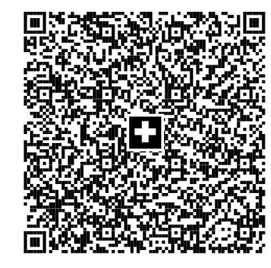

UNIVERSITAET ST.GALLEN INSTITUT FUER INFORMATIK LEHRSTUHL F. DATA SCIENCE ROSENBERGSTRASSE 30

9000 ST. GALLEN

**UBS Switzerland AG** Flughofstrasse 35

Postfach 8152 Glattbrugg

Tel. +41-44-828 37 37

Fragen und Antworten ubs.com/hilfe-karten

Kontolimite CHF 15'000 Kostenstelle 2260200 Abteilung DATA SCIENCE Rechnungsdatum 27.08.2025 Zahlbar bis 21.09.2025 Seite 1 von 9

Kartenkonto 0000 3465 9857 4355 Kontoinhaber SIEGFRIED HANDSCHUH Rechnungsperiode 28.07.2025 - 27.08.2025

# Kreditkartenabrechnung in CHF

| Buchungsdatum | Detail                                                           | Betrag CHF |
|---------------|------------------------------------------------------------------|------------|
| 28.07.2025    | Betrag letzte Rechnung                                           | 7'751.15   |
| 07.08.2025    | Ihre QR-Zahlung vom 06.08.2025                                   | -3'199.55  |
| 27.08.2025    | Kartentotal SIEGFRIED HANDSCHUH, UBS Visa Corporate Card Classic | 8'092.96   |
| 27.08.2025    | Rechnungsbetrag                                                  | 12'644.55  |

Wir bitten Sie, den Rechnungsbetrag bis zum 21.09.2025 mit der beiliegenden QR-Rechnung zu begleichen.

Falls Sie eine Zahlung mit einem Konto einer nicht-schweizerischen Bank tätigen, erfassen Sie bitte den BIC UBSWCHZH80A und das zwölfstellige Kartenkonto in der Mitteilung.

## **Rechnungskontrolle**

Bitte prüfen Sie die vorliegende Rechnung. Allfällige Unstimmigkeiten sind **innerhalb von 30 Tagen ab Rechnungsdatum** schriftlich zu melden. Das Formular finden Sie unter **ubs.com/transaktion-beanstanden**

**UBS Switzerland AG** Flughofstrasse 35 Postfach

8152 Glattbrugg

Tel. +41-44-828 37 37

Fragen und Antworten ubs.com/hilfe-karten

SIEGFRIED HANDSCHUH Rechnungsdatum 27.08.2025 Kartenkonto 0000 3465 9857 4355 Seite 2 von 9

# Abrechnungsdetails

| Buchungs datum | Detail                                                                                                                                                         |           |     |        | Betrag CHF | Persönliche Auslagen |
|-------------------|----------------------------------------------------------------------------------------------------------------------------------------------------------------|-----------|-----|--------|------------|-------------------------|
|                   | SIEGFRIED HANDSCHUH, UBS Visa Corporate Card Classic, 4857 52XX XXXX 9680                                                                                   |           |     |        |            |                         |
| 28.07.2025 OTH | Text CLAUDE.AI SUBSCRIPTION ANTHROPIC.COMUSACA Computergeschäft 26.07.2025 Kurs 0.809039584 vom 25.07.2025 Bearbeitungszuschlag 1.00%        | Beleg Nr. | USD | 216.20 | 176.66     |                         |
| 04.08.2025 OTH | Text GOOGLE*CLOUD BSJRXW CC GOOGLE.COMIRL Datenverarbeitung 01.08.2025                                                                                | Beleg Nr. |     |        | 2.78       |                         |
| 04.08.2025 OTH | Text DETECTORA SEEVETAL DEU Computergeschäft 02.08.2025 Kurs 0.9443475566 vom 31.07.2025 Bearbeitungszuschlag 1.00%                             | Beleg Nr. | EUR | 10.00  | 9.54       |                         |
| 04.08.2025 OTH | Text Google One 650-2530000 USACA Umfangreiche digitale Güter 03.08.2025                                                                              | Beleg Nr. |     |        | 17.00      |                         |
| 04.08.2025 OTH | Text LAMBDA CLOUD LAMBDA.AI USACA Computer, Peripheriegeräte u. Software 04.08.2025 Kurs 0.8284477205 vom 31.07.2025 Bearbeitungszuschlag 1.00% | Beleg Nr. | USD | 0.88   | 0.74       |                         |
| 05.08.2025 OTH | Text OPENAI OPENAI.COM USACA Computergeschäft 04.08.2025 Kurs 0.8305810797 vom 02.08.2025 Bearbeitungszuschlag 1.00%                            | Beleg Nr. | USD | 54.05  | 45.34      |                         |
| 08.08.2025 OTH | Text OPENAI *CHATGPT SUBSCR OPENAI.COM USACA Computergeschäft 07.08.2025 Kurs 0.8226520813 vom 07.08.2025 Bearbeitungszuschlag 1.00%         | Beleg Nr. | USD | 216.20 | 179.64     |                         |
|                   | Übertrag auf Seite 3                                                                                                                                           |           |     |        | 431.70     |                         |

Buchungs-

**UBS Switzerland AG**

Flughofstrasse 35 Postfach 8152 Glattbrugg

Tel. +41-44-828 37 37

Fragen und Antworten ubs.com/hilfe-karten

SIEGFRIED HANDSCHUH Rechnungsdatum 27.08.2025 Kartenkonto 0000 3465 9857 4355 Seite 3 von 9

Detail Betrag CHF Persönliche Auslagen

| datum             |                                                                                                                                              |     |          |          | Auslagen |
|-------------------|----------------------------------------------------------------------------------------------------------------------------------------------|-----|----------|----------|----------|
|                   | Übertrag von Seite 2                                                                                                                         |     |          | 431.70   |          |
|                   | Text Beleg Nr.                                                                                                                            |     |          |          |          |
| 08.08.2025 OTH | Twitter Dev Platform 141-59978762 USACA Datenverarbeitung 07.08.2025 Kurs 0.8226520813 vom 07.08.2025 Bearbeitungszuschlag 1.00% | USD | 2'265.52 | 1'882.37 |          |
|                   | Text Beleg Nr.                                                                                                                            |     |          |          |          |
| 08.08.2025 OTH | X CORP. PAID FEATURES ABOUT.X.COM USATX Digitale Güter - Apps (ausg. Spiele) 07.08.2025                                                |     |          | 356.00   |          |
|                   | Text Beleg Nr.                                                                                                                            |     |          |          |          |
| 08.08.2025 OTH | OLLAMA TORONTO CANON Computergeschäft 07.08.2025 Kurs 0.8226520813 vom 07.08.2025 Bearbeitungszuschlag 1.00%                     | USD | 20.00    | 16.62    |          |
|                   | Text Beleg Nr.                                                                                                                            |     |          |          |          |
| 11.08.2025 OTH | OPENAI OPENAI.COM USACA Computergeschäft 08.08.2025 Kurs 0.8222459616 vom 08.08.2025 Bearbeitungszuschlag 1.00%                  | USD | 48.67    | 40.42    |          |
|                   | Text Beleg Nr.                                                                                                                            |     |          |          |          |
| 11.08.2025 OTH | digitec Galaxus (Online) Zurich Warenhaus 08.08.2025                                                                                   |     |          | 87.42    |          |
|                   | Text Beleg Nr.                                                                                                                            |     |          |          |          |
| 11.08.2025 OTH | digitec Galaxus (Online) Zurich Warenhaus 08.08.2025                                                                                   |     |          | 182.00   |          |
|                   | Text Beleg Nr.                                                                                                                            |     |          |          |          |
| 11.08.2025 OTH | OPENAI OPENAI.COM USACA Computergeschäft 08.08.2025 Kurs 0.8222459616 vom 08.08.2025 Bearbeitungszuschlag 1.00%                  | USD | 49.26    | 40.91    |          |
|                   | Text Beleg Nr.                                                                                                                            |     |          |          |          |
| 11.08.2025 OTH | digitec Galaxus (Online) Zurich Warenhaus 08.08.2025                                                                                   |     |          | 237.60   |          |
|                   | Text Beleg Nr.                                                                                                                            |     |          |          |          |
| 11.08.2025 OTH | digitec Galaxus (Online) Zurich Warenhaus 08.08.2025                                                                                   |     |          | 220.19   |          |
|                   | Übertrag auf Seite 4                                                                                                                         |     |          | 3'495.23 |          |
|                   |                                                                                                                                              |     |          |          |          |

Buchungs-

OTH

OTH

OTH

OTH

**UBS Switzerland AG**

Flughofstrasse 35 Postfach 8152 Glattbrugg

Tel. +41-44-828 37 37

Fragen und Antworten ubs.com/hilfe-karten

SIEGFRIED HANDSCHUH Rechnungsdatum 27.08.2025 Kartenkonto 0000 3465 9857 4355 Seite 4 von 9

datum Auslagen **Übertrag von Seite 3 3'495.23** Text Beleg Nr. . 11.08.2025 digitec Galaxus (Online) Zurich Warenhaus 08.08.2025 248.06 Text Beleg Nr. . 11.08.2025 OPENAI OPENAI.COM USACA Computergeschäft 08.08.2025 Kurs 0.8222459616 vom 08.08.2025 Bearbeitungszuschlag 1.00% USD 48.84 40.56 Text Beleg Nr. . 11.08.2025 OPENAI OPENAI.COM USACA Computergeschäft 08.08.2025 Kurs 0.8222459616 vom 08.08.2025 Bearbeitungszuschlag 1.00% USD 49.03 40.72 Text Beleg Nr. . 11.08.2025 OPENAI OPENAI.COM USACA Computergeschäft 08.08.2025 Kurs 0.8222459616 vom 08.08.2025 Bearbeitungszuschlag 1.00% USD 49.96 41.49 Text Beleg Nr. . digitec Galaxus (Online) Zurich Warenhaus 08.08.2025 116.61

Detail Betrag CHF Persönliche

|                   | Übertrag auf Seite 5                                                                                                                |           |     |       | 4'669.46 |  |
|-------------------|-------------------------------------------------------------------------------------------------------------------------------------|-----------|-----|-------|----------|--|
| 11.08.2025 OTH | OPENAI OPENAI.COM USACA Computergeschäft 09.08.2025 Kurs 0.8222459616 vom 08.08.2025 Bearbeitungszuschlag 1.00%         |           | USD | 50.14 | 41.64    |  |
|                   | Text                                                                                                                                | Beleg Nr. |     |       |          |  |
| 11.08.2025 OTH | Text OPENAI OPENAI.COM USACA Computergeschäft 09.08.2025 Kurs 0.8222459616 vom 08.08.2025 Bearbeitungszuschlag 1.00% | Beleg Nr. | USD | 50.54 | 41.97    |  |
| OTH               | Warenhaus 08.08.2025                                                                                                             |           |     |       |          |  |
| 11.08.2025        | digitec Galaxus (Online) Zurich                                                                                                     |           |     |       | 500.25   |  |
|                   | Text                                                                                                                                | Beleg Nr. |     |       |          |  |
| 11.08.2025 OTH | digitec Galaxus (Online) Zurich Warenhaus 08.08.2025                                                                          |           |     |       | 102.93   |  |
|                   | Text                                                                                                                                | Beleg Nr. |     |       |          |  |
| 11.08.2025 OTH | digitec Galaxus (Online) Zurich Warenhaus 08.08.2025                                                                          |           |     |       | 116.61   |  |

**UBS Switzerland AG**

Flughofstrasse 35 Postfach 8152 Glattbrugg

Tel. +41-44-828 37 37

Fragen und Antworten ubs.com/hilfe-karten

SIEGFRIED HANDSCHUH Rechnungsdatum 27.08.2025

Kartenkonto 0000 3465 9857 4355 Seite 5 von 9

| Buchungs datum | Detail                                                                                                                                            |     |        | Betrag CHF | Persönliche Auslagen |
|-------------------|---------------------------------------------------------------------------------------------------------------------------------------------------|-----|--------|------------|-------------------------|
|                   | Übertrag von Seite 4                                                                                                                              |     |        | 4'669.46   |                         |
|                   | Text Beleg Nr.                                                                                                                                 |     |        |            |                         |
| 11.08.2025 OTH | OPENAI OPENAI.COM USACA Computergeschäft 09.08.2025 Kurs 0.8222459616 vom 08.08.2025 Bearbeitungszuschlag 1.00%                       | USD | 48.80  | 40.53      |                         |
|                   | Text Beleg Nr.                                                                                                                                 |     |        |            |                         |
| 11.08.2025 OTH | OPENAI OPENAI.COM USACA Computergeschäft 09.08.2025 Kurs 0.8222459616 vom 08.08.2025 Bearbeitungszuschlag 1.00%                       | USD | 48.95  | 40.65      |                         |
|                   | Text Beleg Nr.                                                                                                                                 |     |        |            |                         |
| 11.08.2025 OTH | Microsoft-G106645526 msbill.info Computer, Peripheriegeräte u. Software 09.08.2025                                                          |     |        | 1'867.50   |                         |
|                   | Text Beleg Nr.                                                                                                                                 |     |        |            |                         |
| 11.08.2025 OTH | DEEPL* SUB:BTUSOBUKPGC KOLN DEU Schule 10.08.2025 Kurs 0.9545453368 vom 08.08.2025 Bearbeitungszuschlag 1.00%                         | EUR | 4.99   | 4.81       |                         |
|                   | Text Beleg Nr.                                                                                                                                 |     |        |            |                         |
| 12.08.2025 OTH | OPENAI OPENAI.COM USACA Computergeschäft 11.08.2025 Kurs 0.8224523001 vom 09.08.2025 Bearbeitungszuschlag 1.00%                       | USD | 49.02  | 40.72      |                         |
|                   | Text Beleg Nr.                                                                                                                                 |     |        |            |                         |
| 12.08.2025 OTH | NAME-CHEAP.COM* HVB6UR WWW.NAMECHEAPUSAAZ Datenverarbeitung 12.08.2025 Kurs 0.8224523001 vom 09.08.2025 Bearbeitungszuschlag 1.00% | USD | 371.92 | 308.95     |                         |
|                   | Text Beleg Nr.                                                                                                                                 |     |        |            |                         |
| 14.08.2025 OTH | OPENAI OPENAI.COM USACA Computergeschäft 13.08.2025 Kurs 0.8264126694 vom 13.08.2025 Bearbeitungszuschlag 1.00%                       | USD | 49.06  | 40.95      |                         |
|                   | Text Beleg Nr.                                                                                                                                 |     |        |            |                         |
| 14.08.2025 OTH | OPENAI OPENAI.COM USACA Computergeschäft 14.08.2025 Kurs 0.8264126694 vom 13.08.2025 Bearbeitungszuschlag 1.00%                       | USD | 48.69  | 40.64      |                         |

**Übertrag auf Seite 6 7'054.21**

**UBS Switzerland AG**

Flughofstrasse 35 Postfach 8152 Glattbrugg

Tel. +41-44-828 37 37

Fragen und Antworten ubs.com/hilfe-karten

SIEGFRIED HANDSCHUH Rechnungsdatum 27.08.2025

Kartenkonto 0000 3465 9857 4355 Seite 6 von 9

| Buchungs datum | Detail                                                                                                                                                        |     |       | Betrag CHF | Persönliche Auslagen |
|-------------------|---------------------------------------------------------------------------------------------------------------------------------------------------------------|-----|-------|------------|-------------------------|
|                   | Übertrag von Seite 5                                                                                                                                          |     |       | 7'054.21   |                         |
|                   | Text Beleg Nr.                                                                                                                                             |     |       |            |                         |
| 15.08.2025 OTH | OPENAI OPENAI.COM USACA Computergeschäft 14.08.2025 Kurs 0.8204200615 vom 14.08.2025 Bearbeitungszuschlag 1.00%                                   | USD | 48.83 | 40.46      |                         |
|                   | Text Beleg Nr.                                                                                                                                             |     |       |            |                         |
| 15.08.2025 OTH | HUGGINGFACE HUGGINGFACE.CUSANY Computergeschäft 14.08.2025 Kurs 0.8204200615 vom 14.08.2025 Bearbeitungszuschlag 1.00%                            | USD | 9.00  | 7.46       |                         |
|                   | Text Beleg Nr.                                                                                                                                             |     |       |            |                         |
| 15.08.2025 OTH | VIKI.COM VIKI.COM USACA Telegramme 14.08.2025 Kurs 0.8204200615 vom 14.08.2025 Bearbeitungszuschlag 1.00%                                         | USD | 4.99  | 4.13       |                         |
|                   | Text Beleg Nr.                                                                                                                                             |     |       |            |                         |
| 15.08.2025 OTH | AHEAD OF AI MAGAZINE LINKEDIN.COM/USAWI Diverse Dienstleistungen 14.08.2025                                                                             |     |       | 48.00      |                         |
|                   | Text Beleg Nr.                                                                                                                                             |     |       |            |                         |
| 18.08.2025 OTH | LAMBDA CLOUD LAMBDA.AI USACA Computer, Peripheriegeräte u. Software 18.08.2025 Kurs 0.8224523001 vom 15.08.2025 Bearbeitungszuschlag 1.00%        | USD | 3.33  | 2.77       |                         |
|                   | Text Beleg Nr.                                                                                                                                             |     |       |            |                         |
| 21.08.2025 OTH | OPENAI OPENAI.COM USACA Computergeschäft 20.08.2025 Kurs 0.8218402426 vom 20.08.2025 Bearbeitungszuschlag 1.00%                                   | USD | 52.15 | 43.29      |                         |
|                   | Text Beleg Nr.                                                                                                                                             |     |       |            |                         |
| 21.08.2025 OTH | AMZ*Manning Publicat pay.amazon.coUSANY Bücher / Zeitschriften / Zeitungen 20.08.2025 Kurs 0.8218402426 vom 20.08.2025 Bearbeitungszuschlag 1.00% | USD | 35.99 | 29.87      |                         |
|                   | Text Beleg Nr.                                                                                                                                             |     |       |            |                         |
| 21.08.2025 OTH | digitec Galaxus (Online) Zurich Warenhaus 20.08.2025                                                                                                    |     |       | 46.00      |                         |
|                   | Übertrag auf Seite 7                                                                                                                                          |     |       | 7'276.19   |                         |

Buchungsdatum

**UBS Switzerland AG**

Flughofstrasse 35 Postfach 8152 Glattbrugg

Tel. +41-44-828 37 37

Fragen und Antworten ubs.com/hilfe-karten

SIEGFRIED HANDSCHUH Rechnungsdatum 27.08.2025

Kartenkonto 0000 3465 9857 4355 Seite 7 von 9

Detail Betrag CHF Persönliche Auslagen

|                   | Übertrag von Seite 6                                                                                                                                     |     |        | 7'276.19 |  |
|-------------------|----------------------------------------------------------------------------------------------------------------------------------------------------------|-----|--------|----------|--|
|                   | Text Beleg Nr.                                                                                                                                        |     |        |          |  |
| 22.08.2025 OTH | ANTHROPIC ANTHROPIC.COMUSACA Computergeschäft 21.08.2025 Kurs 0.8225521786 vom 21.08.2025 Bearbeitungszuschlag 1.00%                         | USD | 54.95  | 45.65    |  |
|                   | Text Beleg Nr.                                                                                                                                        |     |        |          |  |
| 22.08.2025 OTH | OPENAI *CHATGPT SUBSCR OPENAI.COM USACA Computergeschäft 21.08.2025 Kurs 0.8225521786 vom 21.08.2025 Bearbeitungszuschlag 1.00%           | USD | 225.53 | 187.37   |  |
|                   | Text Beleg Nr.                                                                                                                                        |     |        |          |  |
| 25.08.2025 OTH | PLANTTEXT.COM PLANTTEXT.COMUSACO Computergeschäft 22.08.2025 Kurs 0.8222459616 vom 22.08.2025 Bearbeitungszuschlag 1.00%                     | USD | 5.95   | 4.94     |  |
|                   | Text Beleg Nr.                                                                                                                                        |     |        |          |  |
| 25.08.2025 OTH | Hetzner Online GmbH Gunzenhausen DEU Computer Netzwerke/Info Services 22.08.2025 Kurs 0.9536408662 vom 22.08.2025 Bearbeitungszuschlag 1.00% | EUR | 106.06 | 102.15   |  |
|                   | Text Beleg Nr.                                                                                                                                        |     |        |          |  |
| 25.08.2025 OTH | ANTHROPIC ANTHROPIC.COMUSACA Computergeschäft 22.08.2025 Kurs 0.8222459616 vom 22.08.2025 Bearbeitungszuschlag 1.00%                         | USD | 54.05  | 44.89    |  |
|                   | Text Beleg Nr.                                                                                                                                        |     |        |          |  |
| 25.08.2025 OTH | GOOGLE *Colab G.CO/HELPPAY#IRL Digitale Güter - Apps (ausg. Spiele) 24.08.2025 Kurs 0.9536408662 vom 22.08.2025 Bearbeitungszuschlag 1.00%   | EUR | 45.67  | 43.99    |  |
|                   | Text Beleg Nr.                                                                                                                                        |     |        |          |  |
| 25.08.2025 OTH | COURSERA.ORG COURSERA.ORG USACA Schule 24.08.2025 Kurs 0.8222459616 vom 22.08.2025 Bearbeitungszuschlag 1.00%                                | USD | 49.00  | 40.69    |  |
|                   | Übertrag auf Seite 8                                                                                                                                     |     |        | 7'745.87 |  |

Buchungs-

**UBS Switzerland AG**

Flughofstrasse 35 Postfach 8152 Glattbrugg

Tel. +41-44-828 37 37

Fragen und Antworten ubs.com/hilfe-karten

SIEGFRIED HANDSCHUH Rechnungsdatum 27.08.2025

Kartenkonto 0000 3465 9857 4355 Seite 8 von 9

Detail Betrag CHF Persönliche

| datum                |                                                                                                                                                  |                                         |     |          |          | Auslagen |
|----------------------|--------------------------------------------------------------------------------------------------------------------------------------------------|-----------------------------------------|-----|----------|----------|----------|
| Übertrag von Seite 7 |                                                                                                                                                  |                                         |     | 7'745.87 |          |          |
| 25.08.2025 OTH    | Text LAMBDA CLOUD LAMBDA.AI USACA                                                                                                             | Beleg Nr.                               | USD | 3.64     | 3.02     |          |
|                      | Computer, Peripheriegeräte u. Software 25.08.2025 Kurs 0.8222459616 vom 22.08.2025 Bearbeitungszuschlag 1.00%                           |                                         |     |          |          |          |
|                      | Text                                                                                                                                             | Beleg Nr.                               |     |          |          |          |
| 26.08.2025 OTH    | Zeitschriftenhändler, Kiosk 25.08.2025 Kurs 0.9538950952 vom 23.08.2025 Bearbeitungszuschlag 1.00%                                      | Heise Medien GmbH & Co. KKN 1257776 DEU | EUR | 123.99   | 119.46   |          |
|                      | Text                                                                                                                                             | Beleg Nr.                               |     |          |          |          |
| 27.08.2025 OTH    | CLAUDE.AI SUBSCRIPTION ANTHROPIC.COMUSACA Computergeschäft 26.08.2025 Kurs 0.8203207001 vom 26.08.2025 Bearbeitungszuschlag 1.00% |                                         | USD | 216.20   | 179.13   |          |
|                      | Text                                                                                                                                             | Beleg Nr.                               |     |          |          |          |
| 27.08.2025 OTH    | ANTHROPIC ANTHROPIC.COMUSACA Computergeschäft 26.08.2025 Kurs 0.8203207001 vom 26.08.2025 Bearbeitungszuschlag 1.00%                 |                                         | USD | 54.89    | 45.48    |          |
|                      | Kartentotal                                                                                                                                      |                                         |     |          | 8'092.96 |          |

# Empfangsschein

Konto / Zahlbar an

CH93 3000 5230 0129 5305 U UBS Switzerland AG c/o UBS Card Center AG Flughofstrasse 35 8152 Glattbrugg

#### Referenz

24 47150 00000 00346 59857 43554

#### Zahlbar durch

UNIVERSITAET ST.GALLEN INSTITUT FUER INFORMATIK, LEHRSTUHL F. DATA SC.ALLEN, ROSENBERGSTRASSE 9000 ST. GALLEN

| Währung Betrag CHF |  |               |
|-----------------------|--|---------------|
|                       |  | Annahmestelle |
|                       |  |               |

### Zahlteil

1 X

Währung Betrag  $\text{CHF } \Gamma$ 

#### Konto / Zahlbar an

CH93 3000 5230 0129 5305 U UBS Switzerland AG c/o UBS Card Center AG Flughofstrasse 35 8152 Glattbrugg

#### Referenz

24 47150 00000 00346 59857 43554

### Zahlbar durch

UNIVERSITAET ST.GALLEN INSTITUT FUER INFORMATIK, LEHRSTUHL F. DATA SCIENCE, ROSENBERGSTRASSE 9000 ST. GALLEN