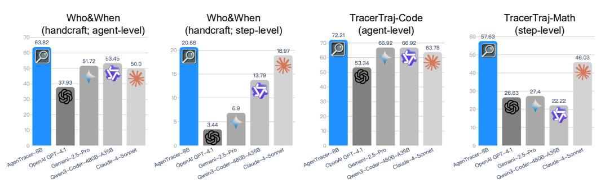
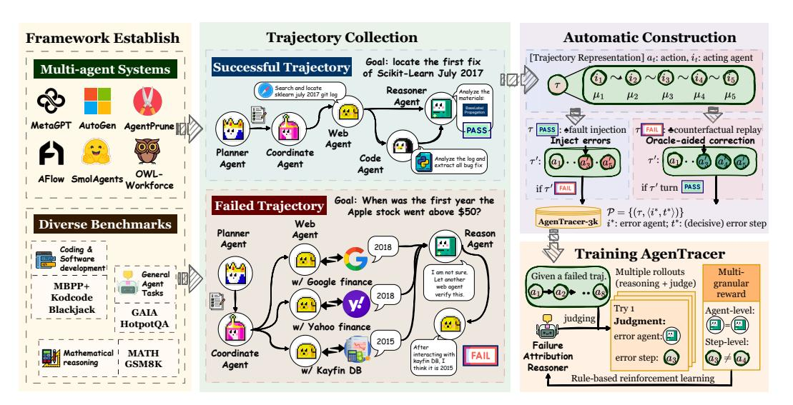
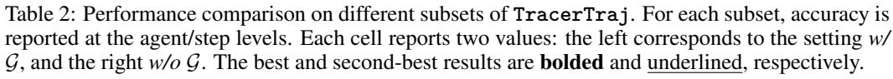
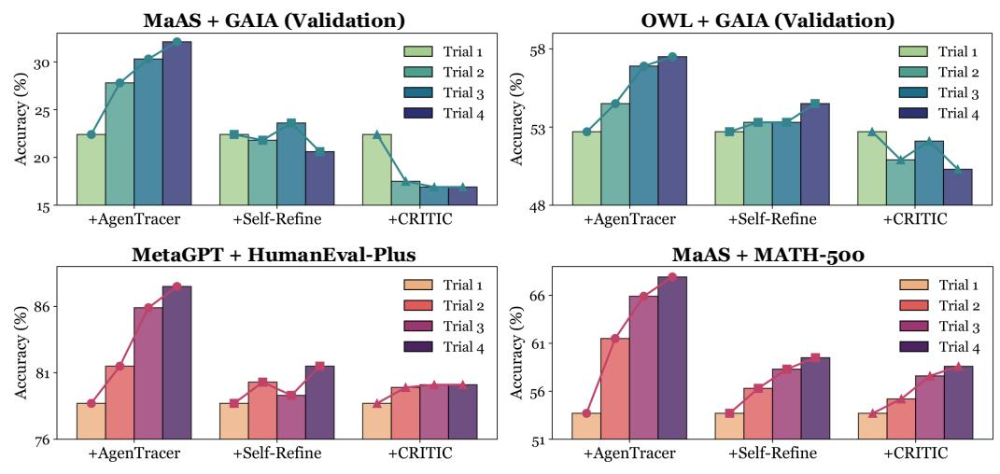
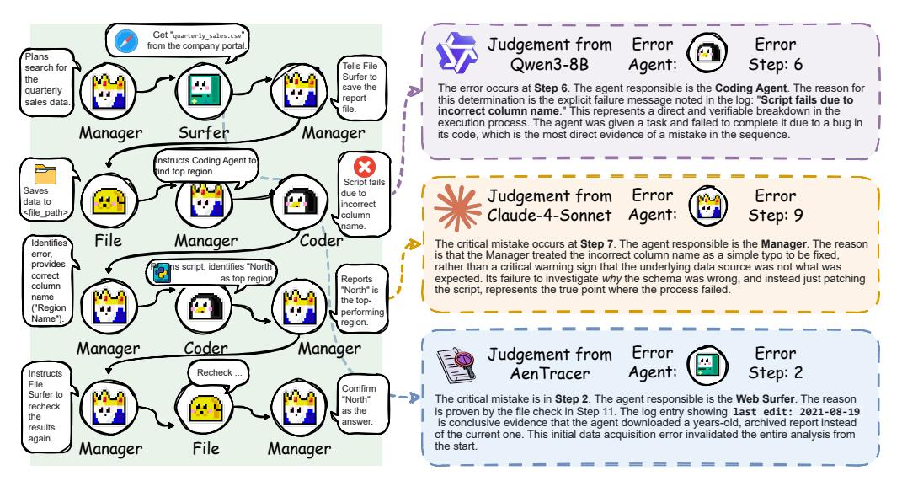

# AGENTRACER: WHO IS INDUCING FAILURE IN THE LLM AGENTIC SYSTEMS?

Guibin Zhang † , Junhao Wang † , Junjie Chen † , Wangchunshu Zhou , Kun Wang , Shuicheng Yan NUS CUHK OPPO NTU # Main Contact: guibinz@outlook.com

# ABSTRACT

Large Language Model (LLM)-based agentic systems, often comprising multiple models, complex tool invocations, and orchestration protocols, substantially outperform monolithic agents. Yet this very sophistication amplifies their fragility, making them more prone to system failure. Pinpointing the specific agent or step responsible for an error within long execution traces defines the task of agentic system failure attribution. Current state-of-the-art reasoning LLMs, however, remain strikingly inadequate for this challenge, with accuracy generally below 10%. To address this gap, we propose **AgenTracer**, the first automated framework for annotating failed multi-agent trajectories via counterfactual replay and programmed fault injection, producing the curated dataset **TracerTraj**. Leveraging this resource, we develop **AgenTracer**-8B, a lightweight failure tracer trained with multi-granular reinforcement learning, capable of efficiently diagnosing errors in verbose multi-agent interactions. On Who&When benchmark, **AgenTracer**-8B outperforms giant proprietary LLMs like Gemini-2.5-Pro and Claude-4-Sonnet by up 18.18%, setting a new standard in LLM agentic failure attribution. More importantly, **AgenTracer**-8B delivers actionable feedback to off-the-shelf multi-agent systems like MetaGPT and MaAS with 4.8 ∼ 14.2% performance gains, empowering self-correcting and self-evolving agentic AI. Our project page is at <https://bingreeky.github.io/atracer/>.



Figure 1: Benchmark performance comparison between **AgenTracer**-8B and leading industry providers.

# 1 INTRODUCTION

Large Language Model (LLM)-powered agents have exhibited exceptional proficiency across a wide array of cognitive faculties, encompassing perception [\(Driess et al.,](#page-10-0) [2023;](#page-10-0) [Wang et al.,](#page-13-0) [2024;](#page-13-0) [Zheng](#page-14-0) [et al.,](#page-14-0) [2023;](#page-14-0) [Wei et al.,](#page-13-1) [2024\)](#page-13-1), planning [\(Zhu et al.,](#page-14-1) [2024;](#page-14-1) [Erdogan et al.,](#page-10-1) [2025;](#page-10-1) [Huang et al.,](#page-11-0) [2024\)](#page-11-0), reasoning [\(Putta et al.,](#page-12-0) [2024;](#page-12-0) [Masterman et al.,](#page-12-1) [2024\)](#page-12-1), and action [\(Li et al.,](#page-11-1) [2024;](#page-11-1) [Yang et al.,](#page-14-2) [2024\)](#page-14-2). As endeavors to address increasingly intricate challenges, such as iterative tool calling, complex document analysis, and multi-step web navigation, continue to surge, the inherent limitations of relying on a single monolithic model have become increasingly conspicuous.

Consequently, numerous multi-agent frameworks, motivated by collective intelligence (Wang et al., 2025a; Zhang et al., 2024a;b) and the society of mind theory (Minsky, 1988; Li et al., 2023), have emerged, ensembling multiple LLM agents to achieve refined subtask orchestration (Zhang et al., 2025d; Hu et al., 2025), ultra-long context handling (Zhang et al., 2024d), and broader environmental perception (Jiang et al., 2024). These systems have demonstrated superior performance over single-agent counterparts across a range of complex real-world domains, including data science engineering (Hong et al., 2024), scientific discovery (Ghareeb et al., 2025; Ghafarollahi & Buehler, 2024), and software engineering (Wei et al., 2025). However, the integration of multiple autonomous agents alongside diverse auxiliary modules (e.g., external databases, tools, and memory modules) inevitably exacerbates **system fragility**. As evidence, a recent empirical study by UC Berkeley (Cemri et al., 2025) reveals alarmingly high failure rates (reaching up to  $86.7\%$ ) in popular multi-agent frameworks such as OpenHands (Wang et al., 2025b) and MetaGPT (Hong et al., 2023), with failure modes ranging from improper task decomposition to role disobedience. Such a high incidence of failure casts a long shadow over the real-world reliability of multi-agent systems.

A natural response to this challenge is **failure attribution**, *i.e.*, the precise identification of faulty components within the system upon task failure. Accurate failure attribution plays a critical role across multiple dimensions: (I) system debugging, by enabling agentic systems to perform more effective self-debugging across iterative attempts, thereby enhancing performance; (II) data effi**ciency**, by leveraging failed agent trajectories to construct more informative training data; (III) grounded self-improvement, by facilitating grounded self-correction through precise agent credit assignment. Despite its importance, this process is predominantly left as a manual endeavor, requiring considerable human effort to analyze verbose trajectory logs.

While preliminary attempts have been made toward automation, their efficacy remains limited. For instance, Zhang et al. (2025c) employed state-of-the-art models such as OpenAI-o1 and DeepSeek-R1 (DeepSeek-AI et al., 2024) to perform failure attribution over trajectories from GAIA (Mialon et al., 2023), yet achieved accuracy below  $10\%$ . More critically, existing benchmarks for agentic failure attribution remain notably constrained. To the best of our knowledge, MAST (Cemri et al., 2025) and Who&When (Zhang et al., 2025c) contain only 200 and 127 manually annotated multiagent failure trajectories, respectively, offering limited scale for systematic evaluation. Accordingly, substantial research gaps remain along two critical axes: **10 training resources**, concerning the automated construction of large-scale annotated multi-agent trajectories; and **2** methodology, on developing swift and accurate multi-agent failure localizer, which we also refer to as a *tracer*.

**Present Framework.** To address the aforementioned research gap, we present (1) AgenTracer, a fully automated pipeline for constructing well-annotated multi-agent failure trajectories, and (2) AgenTracer-8B, a lightweight failure attributor for multi-agent systems. Methodologically, AgenTracer leverages ♣ counterfactual replay, systematically replacing agent actions with oracle guidance to identify the decisive error step responsible for system failure. To enhance data diversity and ensure annotation precision, it further adopts  $\spadesuit$  **programmatic fault injection**, synthetically generating failure instances by perturbing successful trajectories through targeted corruption.

Further, we fine-tune QWEN3-8B on the curated dataset to obtain AgenTracer-8B via reinforcement learning (RL), enabling it to analyze long-horizon multi-agent collaboration traces. AgenTracer-8B takes as input the trajectory log and associated environmental feedback, and outputs the identified decisive error step. A **multi-granular reward** is designed to supervise RL training, emphasizing both *step-level* and *agent-level* attribution accuracy. During inference, AgenTracer-8B enables any malfunctioning agentic system to rapidly identify the critical failure step along with explanations, thereby facilitating automated multi-agent debugging.

Our contributions are as follows:

- **4 Automated Pipeline.** We propose AgenTracer, the first automated pipeline for annotating multi-agent system failures, curating over 2,000 high-fidelity failure trajectories across six datasets through counterfactual replay and programmatic fault injection.
- **8** Failure Tracer. We develop AgenTracer-8B, a lightweight failure tracer dedicated for LLM agentic systems, trained via a multi-granular reinforcement learning to ensure accurate attribution at both the step and agent levels, facilitating automatic agentic system debugging.
- **<sup>3</sup> Empirical Evaluation.** Experiments show that AgenTracer-8B facilitates (I) accurate attri*bution*, outperforming giant LLMs like DEEPSEEK-R1 by  $\sim 12.21\%$  and GEMINI-2.5-PRO

by ∼ 18.18% on Who&When benchmark; and *(II) self-evolution*, enabling off-the-shelf agentic systems to improve performance by 4.8 ∼ 14.2%.

# 2 RELATED WORKS

LLM-based Multi-Agent System. Contemporary multi-agent systems can be broadly categorized by their level of automation into three classes: ■ Handcrafted, where the entire system configuration (*e.g.*, LLM backbone, prompting strategies, and communication protocols) is manually specified represented by AutoGen [\(Wu et al.,](#page-13-5) [2023\)](#page-13-5), AutoGPT [\(Richards & et al.,](#page-12-4) [2023\)](#page-12-4), Camel [\(Li et al.,](#page-11-2) [2023\)](#page-11-2), and ChatDev [\(Qian et al.,](#page-12-5) [2023\)](#page-12-5); ■ Partially Automated, which automate specific system components: for example, AutoAgent [\(Chen et al.,](#page-9-2) [2023a\)](#page-9-2), LLMSelector [\(Chen et al.,](#page-9-3) [2025\)](#page-9-3), and MasRouter [\(Yue et al.,](#page-14-8) [2025\)](#page-14-8) automate agent role assignment; DsPy [\(Khattab et al.,](#page-11-7) [2023\)](#page-11-7) and TextGrad [\(Yuksekgonul et al.,](#page-14-9) [2024\)](#page-14-9) optimize prompt design; GPTSwarm [\(Zhuge et al.,](#page-14-10) [2024\)](#page-14-10) and G-Designer [\(Zhang et al.,](#page-14-4) [2024b\)](#page-14-4) adaptively construct inter-agent topologies; ■ Fully Automated, where all modules within the system are autonomously designed and evolved [\(Hu et al.,](#page-11-8) [2024a;](#page-11-8) [Zhang et al.,](#page-14-11) [2024c;](#page-14-11) [2025b;](#page-14-12) [Wu et al.,](#page-13-6) [2025;](#page-13-6) [Nie et al.,](#page-12-6) [2025;](#page-12-6) [Gao et al.,](#page-10-4) [2025;](#page-10-4) [Zhang et al.,](#page-14-13) [2025a\)](#page-14-13). Our method is designed to provide precise error tracing across this entire spectrum of agentic systems. Accordingly, we curate trajectories sampled from frameworks spanning all three categories.

Failure Attribution for Agents. As multi-agent systems become increasingly intricate, incorporating multiple intelligent agents [Wang et al.](#page-13-7) [\(2023\)](#page-13-7); [Chen et al.](#page-9-4) [\(2023b\)](#page-9-4), tool integrations [Shen et al.](#page-13-8) [\(2024\)](#page-13-8), and communication protocols [Marro et al.](#page-12-7) [\(2024\)](#page-12-7), the resulting high error rates and structural fragility have emerged as critical concerns. MAST [\(Cemri et al.,](#page-9-0) [2025\)](#page-9-0) was the first to alarmingly characterize this issue, identifying fourteen prevalent failure patterns ranging from task disobedience to reasoning-action mismatches. Building upon this, Who&When [\(Zhang et al.,](#page-14-7) [2025c\)](#page-14-7) explored the feasibility of automating failure attribution, only to reveal that even top-performing reasoning models like DeepSeek-R1 fail catastrophically in this setting. **AgenTracer** advances the field by introducing both a scalable data synthesis pipeline and a lightweight, high-accuracy failure attributor.

LLM-as-a-Judge & Credit Assignment. Two other research topics closely related to this work are: (I) LLM-as-a-Judge (LaaJ), which leverages LLMs/agents as evaluators based on pre-defined criteria for tasks such as data annotation [\(Latif et al.,](#page-11-9) [2025;](#page-11-9) [OpenAI,](#page-12-8) [2022\)](#page-12-8), value alignment [\(Ji](#page-11-10) [et al.,](#page-11-10) [2025\)](#page-11-10), reward modeling [\(Mahan et al.,](#page-12-9) [2024;](#page-12-9) [Lambert et al.,](#page-11-11) [2024\)](#page-11-11), and synthetic data generation [\(Sengupta et al.,](#page-13-9) [2025;](#page-13-9) [Hu et al.,](#page-11-3) [2025\)](#page-11-3). However, when applied to multi-LLM systems, LaaJ has shown limited effectiveness, as demonstrated in [Zhang et al.](#page-14-7) [\(2025c\)](#page-14-7); (II) Credit Assignment is a longstanding topic in multi-agent reinforcement learning (MARL), aiming to associate individual agent actions with their long-term outcomes [\(Pignatelli et al.,](#page-12-10) [2023\)](#page-12-10). Common approaches include heuristics based on temporal contiguity [\(Sutton,](#page-13-10) [1988\)](#page-13-10), value decomposition [\(Arjona-Medina et al.,](#page-9-5) [2019\)](#page-9-5), and meta-learning [\(Yin et al.,](#page-14-14) [2023\)](#page-14-14). However, this problem remains largely unexplored in the context of LLM-based multi-agent systems. The most relevant prior effort, CollabUIAgents [\(He](#page-11-12) [et al.,](#page-11-12) [2025\)](#page-11-12), relies on LLMs to generate binary scalar (0/1) rewards after each agent interaction, whose reliability is inherently questionable. In contrast, **AgenTracer** implicitly achieves grounded credit assignment for LLM agents through principled failure attribution.

# 3 PRELIMINARY

In this section, we provide a general definition of LLM-based multi-agent systems and their operational workflow, and then formally define the objective of the multi-agent failure attribution.

Notations Consider a LLM-based multi-agent system M, tasked with collaboratively resolving a user-issued query Q. The system consists of N agents, indexed by I = {1, 2, . . . , N}, operating in discrete time under a turn-based protocol, *i.e.*, only one agent is active at each time step. Formally:

$$\mathcal{M} = \langle \mathcal{I}, \mathcal{S}, \mathcal{A}, \Psi, \mu \rangle, \tag{1}$$

where S denotes the set of system states; A is the overall action space, with each agent i ∈ I having a local space A<sup>i</sup> ⊆ A; µ(t) ∈ I specifies the agent scheduled to act at time t; Ψ(st+1 | st, at, µ(t)) models the state transition dynamics given the current state st, action a<sup>t</sup> ∈ Aµ(t) , and the acting agent. At each step t, the active agent µ(t) selects an action a<sup>t</sup> ∈ Aµ(t) according to its policy πµ(t) , conditioned on the current state st, the query Q, and a subset of the prior interaction history Ht:

$$a_{t} = \pi_{\mu(t)}(s_{t}, \mathcal{H}_{t}, \mathcal{Q}), \quad \mathcal{H}_{t} \subseteq \{a_{0}, a_{1}, \dots, a_{t-1}\}.$$
 (2)

<span id="page-3-0"></span>

Figure 2: The overview of our proposed AgenTracer.

The structure of  $\mathcal{H}_t$  is implementation-dependent. In LLM Debate-style frameworks (Du et al.,  $2023$ ), it comprises the prior-round outputs from all agents; whereas in software development systems (Qian et al., 2023; Hu et al., 2024b), a tester agent may condition only on the latest code snippet submitted by a programmer agent. The full execution trajectory of the system is denoted by:

$$\tau = (s_0, a_0, s_1, a_1, \dots, s_T), \tag{3}$$

where T indicates the terminal step or stopping condition. The final response to the query  $\mathcal{Q}$  is determined by the complete trajectory  $\tau$ , encapsulating the collaborative behavior of all agents.

**Objective Formulation** A trajectory may contain multiple suboptimal actions or minor deviations, but for effective, targeted debugging, it is crucial to distinguish these from the pivotal error that renders the final outcome incorrect. Following ( $\text{Zhang et al., } 2025c$ ), we formalize this pivotal error as the **decisive error**, *i.e.*, the earliest action in the trajectory whose correction is sufficient to steer the system from failure to success. Formally, let  $\Omega(\tau) \in \{0, 1\}$  be a binary evaluation function indicating failure  $(\Omega(\tau) = 0)$  or success  $(\Omega(\tau) = 1)$ , and  $\mathcal{R}(\tau, t, a'_t)$  be an oracle rectification operator, which represents an idealized process where the original action  $a_t$  is replaced by a theoretically perfect, oracle-provided action  $a'_t$ , and all subsequent steps are re-simulated. Naturally, the set of all decisive agent-step pairs  $\mathcal{C}(\tau)$  can be expressed as:

<span id="page-3-1"></span>
$$\mathcal{C}(\tau) = \left\{ (i,t) \mid i = \mu(t) \text{ and } \Omega(\tau) = 1 \land \Omega\left(\mathcal{R}(\tau, t, a'_t)\right) = 0 \right\},\tag{4}$$

from which we select the root cause by targeting the earliest error in time. The definitive failureresponsible agent  $i^*$  and decisive error step  $t^*$  are therefore given by:

<span id="page-3-2"></span>
$$(i^*, t^*) = \underset{(i,t) \in \mathcal{C}(\tau)}{\arg\min} t. \tag{5}$$

Consequently, the goal of our failure tracer, AgenTracer, is to take a failed trajectory  $\tau$  as input and output the failure-responsible agent  $i^*$  and the decisive error step  $t^*$ .

#### 4 METHODOLOGY

Figure 2 illustrates the pipeline of AgenTracer and the training process of AgenTracer-8B. Specifically, AgenTracer aggregates trajectories from six mainstream multi-agent frameworks and six datasets, which then applies programmatic fault injection (for successful trajectories) and counterfactual corrections (for failed ones) to identify the decisive error step, yielding 2,000+ trajectory-error step pairs, collectively referred to as TracerTraj-2.5K. We then train a dedicated failure attributor, AgenTracer-8B, using RL guided by multi-grained rewards to accurately locate errors.

### 4.1 AgenTracer: AUTOMATIC TRAJECTORY ANNOTATION

**Collection.** AgenTracer begin by considering a collection of  $M(=6)$  distinct multi-agent systems,  $\{\mathcal{M}_m\}_{m=1}^M$ , and a corresponding set of queries for each system,  $\mathcal{D}_m = \{\mathcal{Q}_i^{(m)}\}_{i=1}^{n_m}$ , drawn from various task domains. For each query  $\mathcal{Q}_i^{(m)}$ ,  $\mathcal{M}_m$  executes and generates a raw trajectory  $\tau_i^{(m)}$ . For the specific frameworks and datasets used, please refer to Section 5.1. The trajectories from each system can be split into two sets, namely the successful  $(\mathcal{T}_{\text{succ}}^{(m)})$  and failure  $(\mathcal{T}_{\text{fail}}^{(m)})$  corpus:

$$\mathcal{T}_{\text{succ}}^{(m)} = \{ \tau_j^{(m)} \mid \Omega(\tau_j^{(m)}) = 1 \}, \quad \text{and} \quad \mathcal{T}_{\text{fail}}^{(m)} = \{ \tau_j^{(m)} \mid \Omega(\tau_j^{(m)}) = 0 \}. \tag{6}$$

The overall successful and failure set can be expressed as  $\mathcal{T}_{\text{succ}} = \bigcup_{m=1}^M \mathcal{T}_{\text{succ}}^{(m)}$  and  $\mathcal{T}_{\text{fail}} =$  $\bigcup_{m=1}^M \mathcal{T}_{\text{fail}}^{(m)}$ , respectively, which serve as the raw input for the subsequent annotation stages.

**Locating Decisive Errors.** To empirically identify the decisive error pair  $(i^*, t^*)$  for each failed trajectory  $\tau \in \mathcal{T}_{\text{fail}}$ , we now detail our practical implementation of the rectification operator  $\mathcal{R}$ introduced in Equation (4), which is is orchestrated by an analyzer agent  $\pi_{\text{analyzer}}$  to conduct counterfactual intervention.  $\pi_{\text{analyzer}}$  is provided with the full context of a failure: the trajectory  $\tau$ , environmental feedback  $\mathcal{F}$  (e.g., code execution errors, tool errors), and the ground-truth solution  $\mathcal{G}$  for Q. For each step t in the trajectory, the analyzer proposes a minimally invasive, corrected action  $a'_t$ designed to rectify the local error without revealing the complete solution:

<span id="page-4-2"></span>
$$a'_{t} \leftarrow \pi_{\text{analyzer}}(s_{t}, a_{t}, \mathcal{H}_{t}, \mathcal{F}, \mathcal{G}). \tag{7}$$

By sequentially applying this analyzer-driven intervention for  $t \in \{0, 1, \ldots, T\}$  and evaluating the outcome  $\Omega(\mathcal{R}(\tau, t, a'_t))$ , we can systematically search for the earliest step  $t^*$  that satisfies the condition in Equation (5). The agent active at this step,  $i^* = \mu(t^*)$ , is labeled as the problematic agent, yielding a precise annotation  $(\tau, \langle i^*, t^* \rangle)$  for our dataset. This process (as presented in Lines 1 to 8 of Algorithm 1), applied across the entire  $\mathcal{T}_{\text{fail}}$ , forms  $\mathcal{D}^- = \{(\tau, \langle i^*, t^* \rangle) \mid \tau \in \mathcal{T}_{\text{fail}}\}$ .

Utilizing Successful Trajectories. To further augment our dataset with high-precision annotations, we also leverage the corpus  $\mathcal{T}_{\text{succ}}$  through **programmatic fault injection**. Its core principle is to take a known-good trajectory and programmatically introduce a fault, thereby creating a synthetic failure instance where the decisive error is known by construction. Specifically, for each successful trajectory  $\tau \in \mathcal{T}_{\text{succ}}$ , we select a step t to serve as the injection point, at which a perturbation operator  $\Pi$  is utilized to the original action  $a_t$  to generate a corrupted action  $\tilde{a}_t = \Pi(a_t)$ . A new, synthetically-generated trajectory  $\tilde{\tau}$  is created by substituting this corrupted action:

$$\tilde{\tau} = \mathcal{R}(\tau, t, \tilde{a}_t). \tag{8}$$

If this injection process successfully induces a failure (i.e.,  $\Omega(\tilde{\tau}) = 0$ ), the pair  $\langle \mu(t), t \rangle$  is, by definition, the decisive error for  $\tilde{\tau}$ . This allows us to generate a set of positive-sample datasets  $\mathcal{D}^+$ :

<span id="page-4-3"></span>
$$\mathcal{D}^{+} = \{ (\tilde{\tau}, \langle i^*, t^* \rangle) \mid \tau \in \mathcal{T}_{\text{succ}}, \ \tilde{\tau} = \mathcal{R}(\tau, t, \Pi(a_t)), \ \Omega(\tilde{\tau}) = 0, \ \langle i^*, t^* \rangle = \langle \mu(t), t \rangle \}. \tag{9}$$

The overall process is also elaborated in Lines  $8$  to  $17$  of Algorithm 1.

Curated Dataset. By uniting the annotations derived from both failed trajectories and synthetically generated ones, we construct our final, comprehensive dataset, denoted as  $\mathcal{D}_{\text{tracer}} =$  $\mathcal{D}^- \cup \mathcal{D}^+$ , which we also refer to as TracerTraj-2.5K, comprising over 2,000 high-fidelity annotated trajectory-error pairs. Detailed statistics on the dataset's composition are placed in ??.

#### <span id="page-4-1"></span>4.2 AgenTracer-8B: TRAINING AGENTIC FAILURE TRACERS

Having curated the  $\mathcal{D}_{\text{tracer}}$  dataset, we proceed to train our failure tracer, AgenTracer-8B, whose base model is set as QWEN3-8B. This phase aims to incentivize the model's ability to accurately pinpoint decisive errors within complex, long-horizon trajectories. Since our approach is orthogonal to the RL algorithm, we conduct the experiments based on a widely used online RL method, Group Relative Policy Optimization (GRPO) (Guo et al., 2025).

**Online Reinforcement Learning.** For each trajectory  $\tau$  sampled from  $\mathcal{D}_{\text{tracer}}$ , the current policy  $\pi_{\text{old}}$  generates a group of G candidate decisive error pairs,  $\{\langle \hat{i}_k, \hat{t}_k \rangle\}_{k=1}^G$ , each of which is evaluated against the ground-truth annotation  $\langle i^*, t^* \rangle$  using a multi-granular reward function  $R_k$ , which will be detailed below. Unlike the standard GRPO, we omit the KL divergence term and introduce a dynamic clipping parameter  $B_s$ , which has been demonstrated to better balance exploration and exploitation throughout training (Liu et al.,  $2025$ ). The RL objective is thus formulated as:

<span id="page-4-0"></span>
$$\mathcal{L}_{\text{RL}} = -\mathbb{E}_{\tau, \{\hat{p}_k\}_{k=1}^G} \left[ \frac{1}{G} \sum_{k=1}^G \min(\rho_k A_k, \text{clip}(\rho_k, 1 - B_s, 1 + B_s) A_k) \right], \tag{10}$$

<span id="page-5-1"></span><span id="page-5-0"></span>**Algorithm 1:** Automated Trajectory Annotation Pipeline of AgenTracer **Input:** Corpus of failed trajectories  $\mathcal{T}_{\text{fail}}$ ; Corpus of successful trajectories  $\mathcal{T}_{\text{succ}}$ ; Analyzer agent  $\pi_{\text{analyzer}}$ ; perturbation operator  $\Pi$ ; Rectification operator  $\mathcal{R}$ Output: The curated dataset  $\mathcal{D}_{\text{tracer}}$ 1 Initialize dataset:  $\mathcal{D}^- \leftarrow \emptyset, \mathcal{D}^+ \leftarrow \emptyset$ /\* Part 1: Locate Decisive Errors via Counterfactual Intervention \*/ 2 for each trajectory  $\tau \in \mathcal{T}_{\text{fail}}$  do for  $t \leftarrow 0$  to  $T$  do 3  $a'_t \leftarrow \pi_{\text{analyzer}}(s_t, a_t, \mathcal{H}_t, \mathcal{F}, \mathcal{G})//$  Analyzer agent proposes a corrected action 4  $\tau' \leftarrow \mathcal{R}(\tau, t, a'_t) //$  Apply intervention to generate a new trajectory 5 if  $\Omega(\tau') = 1$  then 6  $i^* \leftarrow \mu(t), t^* \leftarrow t, \mathcal{D}^- \leftarrow \mathcal{D}^- \cup \{ (\tau, \langle i^*, t^* \rangle) \}$ 7 8 <pre>break // Found the earliest decisive error</pre> /\* Part 2: Generate Errors via Programmatic Fault Injection \*/ 9 **for** each trajectory  $\tau \in \mathcal{T}_{\text{succ}}$  **do** Let  $\mathcal{J} \leftarrow \{0, 1, \ldots, T\}$  be the set of possible injection points 10 Let  $\mathcal{J}_{\text{sample}} \leftarrow \text{RandomSample}(\mathcal{J}, K) \text{ // Randomly select } K \text{ steps}$ 11 12 for  $t \in \mathcal{J}_{sample}$  do  $\tilde{a}_t \leftarrow \Pi(a_t) \; \mathbin{\mathcal{I}}$  Perturb original action to create a fault 13  $\tilde{\tau} \leftarrow \mathcal{R}(\tau, t, \tilde{a}_t) \; \text{\texttt{\texttt{\texttt{--}}}} \; \text{\texttt{\texttt{--}}} \; \text{\texttt{\texttt{--}}} \; \text{\texttt{\texttt{--}}} \; \text{\texttt{\texttt{--}}} \; \text{\texttt{\texttt{--}}} \; \text{\texttt{\texttt{--}}} \; \text{\texttt{\texttt{--}}} \; \text{\texttt{--}}} \; \text{\texttt{\texttt{--}}} \; \text{\texttt{\texttt{--}}} \; \text{\texttt{--}}} \; \text{\texttt{\texttt{--}}} \; \text{\texttt{\texttt{--}}} \; \text{\texttt{\texttt{--$ 14 if  $\Omega(\tilde{\tau}) = 0$  then 15  $i^* \leftarrow \mu(t), t^* \leftarrow t, \mathcal{D}^+ \leftarrow \mathcal{D}^+ \cup \{ (\tilde{\tau}, \langle i^*, t^* \rangle) \}$ 16 break // Stop after first successful injection for this trajectory 17 18 **return** curated dataset  $\mathcal{D}_{\text{tracer}} := \mathcal{D}^- \cup \mathcal{D}^+$ 

<span id="page-5-3"></span><span id="page-5-2"></span>where  $\hat{p}_k = \langle \hat{i}_k, \hat{t}_k \rangle$ , the policy ratio is  $\rho_k = \frac{\pi_{\text{tracer}}(\hat{p}_k|\tau)}{\pi_{\text{old}}(\hat{p}_k|\tau)}$ , the estimated advantage is  $A_k = (R_k - \mu_{\text{total}})$ mean( $\{R_i\}$ ))/(std( $\{R_i\}$ ) +  $\epsilon$ ) with  $\epsilon = 1 \times 10^{-6}$  being a small constant. The dynamic clipping parameter  $B_s$  is defined as  $B_s = \max(0.2 \cdot B_0, B_0(1-\frac{s}{S_{\text{total}}}))$ , with s as the current training step and  $S_{\text{total}}$  the total number of steps. This dynamic schedule intuitively encourages broader exploration in the initial stages of training and gradually shifts to more stable exploitation as the policy converges.

Multi-Granular Reward Design. Regarding the implementation of advantage estimation in Equation  $(10)$ , we introduce a multi-granular reward designed to evaluate both the correctness of the attribution and the structural integrity of the output. The total reward  $R_k$  for a candidate prediction  $\hat{p}_k$  is a gated combination of content accuracy and format compliance:

<span id="page-5-4"></span>
$$R(\hat{p}_k) = \mathbb{I}_{\text{format}} \cdot \left(\lambda \cdot r_{\text{step}}(\hat{t}_k) + (1 - \lambda) \cdot r_{\text{agent}}(\hat{i}_k)\right),\tag{11}$$

whose components are further defined as follows:

- ▶ **Format Reward**  $\mathbb{I}_{\text{format}}$  is a strict binary reward that equals 1 if and only if the model's output adheres to the required structure: reasoning must be enclosed within  $\langle \text{think} \rangle \cdots \langle \text{/think} \rangle$  tags, followed by a final answer within  $\langle \text{answer} \rangle \cdots \langle \langle \text{answer} \rangle$  tags. Furthermore, the answer itself must be formatted as  $\langle \text{agentID} \rangle$  |  $\langle \text{stepID} \rangle$  for accurate extraction.
- ▶ Agent-Level Reward  $r_{\text{agent}}$  is a coarse-grained, binary reward that measures whether the tracer correctly identifies the failure-responsible agent  $i^*$ , defined as  $r_{\text{agent}}(\hat{i}_k) = \mathbb{I}(\hat{i}_k = i^*)$ , where  $\mathbb{I}(c)$ is a binary indicator for the accuracy of located problematic agent.
- ► **Step-Level Reward**  $r_{\text{step}}$  incentivizes temporal proximity to the true decisive error  $t^*$ . We use a Gaussian kernel where the reward decays smoothly as the predicted step  $\hat{t}_k$  moves away from  $t^*$ :

<span id="page-5-5"></span>
$$r_{\text{step}}(\hat{t}_k) = \exp\left(-\frac{(\hat{t}_k - t^*)^2}{2\sigma^2}\right),\tag{12}$$

where  $\sigma$  controls how sharply the reward penalizes distance from the correct step.

This multi-granular design creates a smoother reward landscape for failure localization, as the partial credit from  $r_{\text{step}}$  stabilizes training. Simultaneously, the hard gating from  $r_{\text{format}}$  ensures the model produces reliably parsable outputs. Through online RL with these designs, we obtain a reasoningbased multi-agent failure attributor AgenTracer-8B.

|                 |             | Who&When (handcraft) | $\overline{\text{Who\&When}}$ (automated) |             |
|-----------------|-------------|----------------------|-------------------------------------------|-------------|
| Model           | Agent-level | Step-level           | Agent-level                               | Step-level  |
| QWEN3-8B        | 42.10/39.50 | 1.72/3.45            | 58.73/60.32                               | 3.97/5.56   |
| $LLAMA-3.2-3B$  | 37.93/50.00 | 1.72/3.45            | 37.30/45.23                               | 2.38/8.73   |
| OWEN3-32B       | 44.80/44.80 | 1.72/1.72            | 63.49/57.93                               | 9.52/8.73   |
| OWEN3-CODER     | 51.72/60.35 | 8.62/13.79           | 42.86/36.50                               | 34.13/32.54 |
| GPT-4.1         | 43.10/37.93 | 3.44/3.44            | 55.55/59.52                               | 29.52/21.90 |
| DEEPSEEK-R1     | 56.90/53.44 | 13.29/6.90           | 66.67/65.08                               | 31.32/29.52 |
| GEMINI-2.5-PRO  | 51.72/51.72 | 9.72/6.90            | 61.11/57.14                               | 29.52/25.86 |
| CLAUDE-SONNET-4 | 56.90/50.00 | 17.24/18.97          | 57.93/51.11                               | 40.65/38.83 |
| AgenTracer      | 69.10/63.82 | 20.68/20.68          | 69.62/63.73                               | 42.86/37.30 |

<span id="page-6-3"></span>

| Table 1: Performance comparison on the Who&When benchmark. For each subset, evaluation is                        |
|------------------------------------------------------------------------------------------------------------------|
| conducted at both the agent and step levels. Each cell reports two values: the left corresponds to the           |
| setting $w/\mathcal{G}$ (the failure tracer has access to ground truth trajectory), and the right corresponds to |
| $w/o \mathcal{G}$ . The best and second-best results are <b>bolded</b> and underlined, respectively.             |

#### <span id="page-6-0"></span>5 EXPERIMENTS

#### 5.1 EXPERIMENTAL SETUP

**Dataset Curation.** For collecting TracerTraj-2.5K, we opt for six widely-used multi-agent systems, comprehensively incorporating all automation levels: **manually configured**, including MetaGPT (Hong et al., 2023), AutoGen (Wu et al., 2023) and Smolagents<sup>1</sup>; ■ partially auto**mated**, including AgentPrune (Zhang et al., 2024a);  $\blacksquare$  **fully automated**, including AFlow (Zhang et al., 2024c) and OWL-Workforce (Hu et al., 2025). Six benchmarks from three domains include  $\blacksquare$ **coding**, MBPP+ (Liu et al., 2023), KodCode (Xu et al., 2025) and Blackjack (Hong et al., 2023); general agentic tasks, GAIA (Mialon et al., 2023);  $\blacksquare$  mathematical reasoning, MATH (Hendrycks et al., 2021) and GSM8K (Cobbe et al., 2021).

**Environment.** All experimental results are obtained on one server with 8 NVIDIA H100 (80 GB) GPUs. For RL training in Section  $4.2$ , we use the verl<sup>2</sup> training platform.

**Model & Parameter Configuration.** The analyzer agent  $\pi_{\text{analyzer}}$  in Equation (7) and perturbation operator  $\Pi$  in Equation (9) are both based on DEEPSEEK-R1 (Guo et al., 2025) (see prompts in Appendix B). The coefficient  $\lambda$  in Equation (11) is consistently set as 0.5, and the parameter  $\sigma$  in Equation (12) equals 1. The LLM backbone used for training AgenTracer-8B is QWEN3-8B. For RL training in Section 4.2, we set batch size to 32, rollout number 8, and learning rate  $1 \times 10^{-6}$ .

**Benchmarks & Evaluation.** To evaluate the failure attribution capability of AgenTracer-8B, we adopt the Who&When benchmark (Zhang et al., 2025c), which comprises two subsets: a handcrafted set derived from Magnetic-One (Fourney et al., 2024), and an automated set constructed from AG2 (Microsoft, 2024). Both subsets provide unseen trajectories with respect to AgenTracer-8B. In addition, we sample a held-out test split from TracerTraj-2.5K using a 9:1 ratio, yielding three evaluation subsets (devided by domains): TracerTraj-code, TracerTraj-math, and TracerTrajagentic. Detailed statistics are reported in Appendix A. For evaluation, following (Zhang et al., 2025c), we adopt two primary metrics: *agent-level accuracy* and *step-level accuracy*. The former measures whether the attributor correctly identifies the faulty agent  $i^*$  within a trajectory, while the latter assesses whether the specific erroneous step  $t^*$  is localized. We consider two evaluation settings: (i)  $w/\mathcal{G}$ , where the attributor has access to the ground truth  $\mathcal{G}$  during failure attribution, and (i)  $w/o \mathcal{G}$  without such access. The latter setting is harder and particularly valuable. We follow the "all-at-once" setting introduced in MAST, where the entire trajectory is provided to the LLM in a single pass, as Zhang et al.  $(2025c)$  has demonstrated this to be the most stable and effective.

**Baselines.** We compare AgenTracer agaist LLM baselines of varying scales, encompassing small-size models such as QWEN3-8B (Yang et al., 2025) and LLAMA-3.2-3B (Grattafiori et al., 2024); medium-size models, including QWEN3-32B and QWEN3-CODER-480B-A35B-INSTRUCT (QWEN3-CODER) (Yang et al., 2025); and large-size models, which primarily consist of state-of-the-art LLMs, such as GPT-4.1 (OpenAI, 2025), GEMINI-2.5-PRO (Comanici et al., 2025), CLAUDE-4-SONNET (Anthropic, 2025) and also DEEPSEEK-R1 (Guo et al., 2025).

<span id="page-6-1"></span><sup>&</sup>lt;pre>https://github.com/huggingface/smolagents</pre>

<span id="page-6-2"></span><sup>&</sup>lt;sup>2</sup>https://github.com/volcengine/verl

|                 | Code        |             | MATH        |             | Agentic     |             |
|-----------------|-------------|-------------|-------------|-------------|-------------|-------------|
| Model           | Agent-level | Step-level  | Agent-level | Step-level  | Agent-level | Step-level  |
| QWEN3-8B        | 45.35/32.99 | 2.36/1.15   | 31.74/33.58 | 9.52/12.96  | 27.93/30.16 | 13.49/15.31 |
| LLAMA-3.2-3B    | 13.38/11.81 | 2.36/3.93   | 15.87/14.28 | 4.76/3.17   | 8.11/13.15  | 2.18/5.09   |
| QWEN3-32B       | 62.99/63.78 | 2.36/1.75   | 17.46/17.46 | 4.76/7.93   | 30.55/30.55 | 18.60/15.31 |
| QWEN3-CODER     | 69.29/66.92 | 14.96/14.17 | 28.57/33.58 | 11.11/22.22 | 40.67/43.12 | 24.99/25.69 |
| GPT-4.1         | 59.84/53.54 | 12.59/11.02 | 39.55/35.18 | 35.81/26.63 | 43.61/40.67 | 24.99/25.69 |
| DEEPSEEK-R1     | 11.81/11.81 | 10.23/10.23 | 42.68/38.58 | 29.52/18.51 | 45.12/46.19 | 27.13/21.80 |
| GEMINI-2.5-PRO  | 70.07/66.92 | 11.02/6.29  | 58.79/58.79 | 32.22/27.40 | 37.16/32.18 | 18.60/17.04 |
| CLAUDE-SONNET-4 | 65.98/63.78 | 15.51/11.02 | 46.03/50.79 | 38.10/46.03 | 55.20/49.13 | 30.33/29.80 |
| AgenTracer      | 72.95/72.21 | 18.85/18.85 | 59.32/66.10 | 57.63/57.63 | 53.28/50.61 | 36.17/35.55 |

<span id="page-7-0"></span>

<span id="page-7-1"></span>

Figure 3: The multi-turn improvement performance brought by **AgenTracer**-8B compared with classical agent reflection baselines, Self-Refine, and CRITIC.

### 5.2 MAIN RESULTS

This section provides empirical evidence that **AgenTracer***-8B outperforms substantially larger models in failure attribution within complex agentic systems.* Tables [1](#page-6-3) and [2](#page-7-0) report results on Who&When and **TracerTraj** subsets, respectively, presenting both agent-level and step-level attribution accuracy. Each table entry is divided into *w/ ground truth* G and *w/o* G during attribution.

Observation ❶: prevailing models are inadequate as failure attributors. As shown in Table [1,](#page-6-3) smaller models such as QWEN3-8B and LLAMA-3.2-3B fail to deliver meaningful judgments, with step-level accuracy on Who&When (handcrafted) remaining below 10%. Even substantially larger models like DEEPSEEK-R1 and GPT-4.1 perform unsatisfactorily, achieving only 31.32% and 29.52% step-level accuracy on Who&When (automated) despite access to ground-truth G. Notably, providing G does not consistently improve attribution accuracy; for example, on **TracerTraj**-math, CLAUDE-4-SONNET attains 46.03% (*w/* G) versus 50.79% (*w/o* G), and on Who&When (handcrafted), QWEN3-CODER achieves 51.72% versus 60.35%. This suggests that ground-truth supervision may sometimes mislead the attribution process, an observation consistent with prior findings in MAST [\(Zhang et al.,](#page-14-7) [2025c\)](#page-14-7).

Observation ❶: **AgenTracer** consistently surpasses giant proprietary LLMs such as CLAUDE-4-SONNET in both agent- and step-level attribution. Under the *w/* G setting, as shown in Table [1,](#page-6-3) **AgenTracer**-8B outperforms GPT-4.1 and CLAUDE-4-SONNET on Who&When (handcrafted) by 26.0% and 12.2% in agent-level accuracy, respectively. A similar trend is observed on **TracerTraj** (Table [2\)](#page-7-0), where **AgenTracer**-8B improves step-level accuracy on **TracerTraj**-agentic by 22.68% over its backbone QWEN3-8B, while also surpassing DEEPSEEK-R1 (+9.04%) and GEMENI-2.5- PRO (+17.57%). More importantly, in the *w/o* G setting (arguably the more realistic scenario where ground truth is unavailable), **AgenTracer**-8B remains robust: on **TracerTraj**-math, DEEPSEEK-

<span id="page-8-0"></span>

Figure 4: Case study of failure attribution in a long-chain document analysis task, comparing three models (QWEN3-8B, CLAUDE-4-SONNET, and **AgenTracer**-8B).

R1 suffers a 9.21% drop without G, whereas **AgenTracer**-8B maintains 57.63%. This strongly substantiates the real-world deployability and practical significance of **AgenTracer**-8B.

## 5.3 BOOSTING MAINSTREAM MAS

Having established the accuracy of **AgenTracer** in failure attribution, a natural question arises: *what practical value does it provide?* The most direct answer is its potential to supply actionable feedback to failing LLM-based agentic systems, thereby enabling swift self-improvement. To assess this capability, we compare **AgenTracer**-8B with two classical self-refinement approaches, Self-Refine [\(Madaan et al.,](#page-12-15) [2023\)](#page-12-15) and CRITIC [\(Gou et al.,](#page-10-9) [2024\)](#page-10-9). Specifically, when an agentic system M completes a problem-solving episode and produces a failed trajectory τ , we supply τ (*w/o* G) to either **AgenTracer**-8B or Self-Refine/CRITIC. Each method then generates reflective feedback on the failure (for **AgenTracer**-8B, this corresponds to the reasoning trace extracted from ⟨think⟩ · · · ⟨/think⟩). This feedback is subsequently injected into M during the next round of problem solving, with the aim of leveraging external critique to enhance its performance. We iterate this process for three rounds, and both Self-Refine and CRITIC are instantiated using GPT-4.1.

Observation ❸: **AgenTracer-8B** enables performance gains of up to 14% for existing agentic systems. To evaluate whether **AgenTracer** can provide beneficial feedback to both *seen* and *unseen* agentic systems and datasets, we consider three representative systems, MaAS [\(Zhang et al.,](#page-14-12) [2025b\)](#page-14-12), OWL Workforce, and MetaGPT, together with GAIA, HumanEval+ [\(Liu et al.,](#page-12-12) [2023\)](#page-12-12), and MATH-500 benchmarks. As shown in Figure [3,](#page-7-1) conventional reflection-based approaches fail to deliver meaningful insights for complex agentic trajectories. Even when powered by GPT-4.1, CRITIC consistently degrades performance (*e.g.*, CRITIC+MaAS+GAIA accuracy drops by −4.9% at iteration-2 and −5.5% at iteration-3). Conversly, **AgenTracer** steadily improves outcomes across all settings. Notably, OWL is the open-source SOTA on GAIA for June 2025, yet **AgenTracer** still manages to boost its performance by +4.8%. On MaAS+MATH-500, the gains are even more striking, reaching +14.21%, substantially surpassing both Self-Refine and CRITIC. Overall, these results demonstrate that **AgenTracer** provides reliable corrective feedback and substantial performance improvements across diverse domains for complex agentic systems.

### 5.4 CASE STUDY

Figure [4](#page-8-0) presents a comparative case study where QWEN3-8B, CLAUDE-4-SONNET, and **AgenTracer**-8B analyze the same failed trajectory. The task requires identifying the region with the highest infant formula sales in a company's Q1 2024 sales data. The final (incorrect) answer produced was "North." QWEN3-8B offers only a superficial diagnosis, mistakenly attributing the failure to a code execution error by the Coder Agent at Step 6. CLAUDE-4-SONNET goes beyond this surface-level issue and observes that the error at Step 6 may have deeper causes. In contrast, **AgenTracer**-8B precisely identifies that the root cause lies in Step 2, where the Web Surfer agent retrieved incorrect file with wrong date, an error that only becomes apparent when analyzing evidence at Step 11. This highlights the intrinsic difficulty of failure attribution in agentic systems: errors are often subtle, originate early, and remain hidden behind seemingly correct outputs.

# 6 CONCLUSION

This work establishes a principled foundation for the study of agentic system failure attribution. By introducing **AgenTracer**, we provide the first automated framework capable of systematically generating annotated failure trajectories, as well as **AgenTracer**-8B, a lightweight yet effective failure tracer that leverages multi-granular RL to achieve prevailing diagnostic accuracy. Empirical evaluation demonstrates that **AgenTracer**-8B not only surpasses state-of-the-art proprietary LLMs like GEMENI-2.5-PRO and CLAUDE-4-SONNET on the Who&When benchmark but also yields consistent performance gains when deployed within real-world multi-agent frameworks. Beyond advancing the state of failure attribution, our approach paves the way for self-correcting and self-evolving agentic systems, marking a step toward more resilient and autonomous collective intelligence.

# REFERENCES

- <span id="page-9-8"></span>Anthropic. Claude Sonnet 4. <https://www.anthropic.com/claude/sonnet>, 2025. [Accessed 31-08-2025].
- <span id="page-9-5"></span>Jose A Arjona-Medina, Michael Gillhofer, Michael Widrich, Thomas Unterthiner, Johannes Brandstetter, and Sepp Hochreiter. Rudder: Return decomposition for delayed rewards. *Advances in Neural Information Processing Systems*, 32, 2019.
- <span id="page-9-0"></span>Mert Cemri, Melissa Z Pan, Shuyi Yang, Lakshya A Agrawal, Bhavya Chopra, Rishabh Tiwari, Kurt Keutzer, Aditya Parameswaran, Dan Klein, Kannan Ramchandran, et al. Why do multi-agent llm systems fail? *arXiv preprint arXiv:2503.13657*, 2025.
- <span id="page-9-2"></span>Guangyao Chen, Siwei Dong, Yu Shu, Ge Zhang, Jaward Sesay, Borje F. Karlsson, Jie Fu, and ¨ Yemin Shi. Autoagents: A framework for automatic agent generation. *CoRR*, abs/2309.17288, 2023a. doi: 10.48550/ARXIV.2309.17288. URL [https://doi.org/10.48550/arXiv.](https://doi.org/10.48550/arXiv.2309.17288) [2309.17288](https://doi.org/10.48550/arXiv.2309.17288).
- <span id="page-9-3"></span>Lingjiao Chen, Jared Quincy Davis, Boris Hanin, Peter Bailis, Matei Zaharia, James Zou, and Ion Stoica. Optimizing model selection for compound ai systems, 2025. URL [https://arxiv.](https://arxiv.org/abs/2502.14815) [org/abs/2502.14815](https://arxiv.org/abs/2502.14815).
- <span id="page-9-4"></span>Weize Chen, Yusheng Su, Jingwei Zuo, Cheng Yang, Chenfei Yuan, Chen Qian, Chi-Min Chan, Yujia Qin, Yaxi Lu, Ruobing Xie, Zhiyuan Liu, Maosong Sun, and Jie Zhou. Agentverse: Facilitating multi-agent collaboration and exploring emergent behaviors in agents, 2023b.
- <span id="page-9-6"></span>Karl Cobbe, Vineet Kosaraju, Mohammad Bavarian, Mark Chen, Heewoo Jun, Lukasz Kaiser, Matthias Plappert, Jerry Tworek, Jacob Hilton, Reiichiro Nakano, Christopher Hesse, and John Schulman. Training verifiers to solve math word problems. *arXiv prepring*, abs/2110.14168, 2021.
- <span id="page-9-7"></span>Gheorghe Comanici, Eric Bieber, Mike Schaekermann, Ice Pasupat, Noveen Sachdeva, Inderjit Dhillon, Marcel Blistein, Ori Ram, Dan Zhang, Evan Rosen, et al. Gemini 2.5: Pushing the frontier with advanced reasoning, multimodality, long context, and next generation agentic capabilities. *arXiv preprint arXiv:2507.06261*, 2025.
- <span id="page-9-1"></span>DeepSeek-AI, Aixin Liu, Bei Feng, Bing Xue, Bingxuan Wang, Bochao Wu, Chengda Lu, Chenggang Zhao, Chengqi Deng, Chenyu Zhang, Chong Ruan, Damai Dai, Daya Guo, Dejian Yang, Deli Chen, Dongjie Ji, Erhang Li, Fangyun Lin, Fucong Dai, Fuli Luo, Guangbo Hao, Guanting Chen, Guowei Li, H. Zhang, Han Bao, Hanwei Xu, Haocheng Wang, Haowei Zhang, Honghui Ding, Huajian Xin, Huazuo Gao, Hui Li, Hui Qu, J. L. Cai, Jian Liang, Jianzhong Guo, Jiaqi Ni, Jiashi Li, Jiawei Wang, Jin Chen, Jingchang Chen, Jingyang Yuan, Junjie Qiu, Junlong Li, Junxiao Song, Kai Dong, Kai Hu, Kaige Gao, Kang Guan, Kexin Huang, Kuai Yu, Lean Wang, Lecong Zhang, Lei Xu, Leyi Xia, Liang Zhao, Litong Wang, Liyue Zhang, Meng Li, Miaojun Wang, Mingchuan Zhang, Minghua Zhang, Minghui Tang, Mingming Li, Ning Tian, Panpan Huang, Peiyi Wang, Peng Zhang, Qiancheng Wang, Qihao Zhu, Qinyu Chen, Qiushi Du, R. J. Chen, R. L. Jin, Ruiqi Ge, Ruisong Zhang, Ruizhe Pan, Runji Wang, Runxin Xu, Ruoyu Zhang,

Ruyi Chen, S. S. Li, Shanghao Lu, Shangyan Zhou, Shanhuang Chen, Shaoqing Wu, Shengfeng Ye, Shengfeng Ye, Shirong Ma, Shiyu Wang, Shuang Zhou, Shuiping Yu, Shunfeng Zhou, Shuting Pan, T. Wang, Tao Yun, Tian Pei, Tianyu Sun, W. L. Xiao, Wangding Zeng, Wanjia Zhao, Wei An, Wen Liu, Wenfeng Liang, Wenjun Gao, Wenqin Yu, Wentao Zhang, X. Q. Li, Xiangyue Jin, Xianzu Wang, Xiao Bi, Xiaodong Liu, Xiaohan Wang, Xiaojin Shen, Xiaokang Chen, Xiaokang Zhang, Xiaosha Chen, Xiaotao Nie, Xiaowen Sun, Xiaoxiang Wang, Xin Cheng, Xin Liu, Xin Xie, Xingchao Liu, Xingkai Yu, Xinnan Song, Xinxia Shan, Xinyi Zhou, Xinyu Yang, Xinyuan Li, Xuecheng Su, Xuheng Lin, Y. K. Li, Y. Q. Wang, Y. X. Wei, Y. X. Zhu, Yang Zhang, Yanhong Xu, Yanhong Xu, Yanping Huang, Yao Li, Yao Zhao, Yaofeng Sun, Yaohui Li, Yaohui Wang, Yi Yu, Yi Zheng, Yichao Zhang, Yifan Shi, Yiliang Xiong, Ying He, Ying Tang, Yishi Piao, Yisong Wang, Yixuan Tan, Yiyang Ma, Yiyuan Liu, Yongqiang Guo, Yu Wu, Yuan Ou, Yuchen Zhu, Yuduan Wang, Yue Gong, Yuheng Zou, Yujia He, Yukun Zha, Yunfan Xiong, Yunxian Ma, Yuting Yan, Yuxiang Luo, Yuxiang You, Yuxuan Liu, Yuyang Zhou, Z. F. Wu, Z. Z. Ren, Zehui Ren, Zhangli Sha, Zhe Fu, Zhean Xu, Zhen Huang, Zhen Zhang, Zhenda Xie, Zhengyan Zhang, Zhewen Hao, Zhibin Gou, Zhicheng Ma, Zhigang Yan, Zhihong Shao, Zhipeng Xu, Zhiyu Wu, Zhongyu Zhang, Zhuoshu Li, Zihui Gu, Zijia Zhu, Zijun Liu, Zilin Li, Ziwei Xie, Ziyang Song, Ziyi Gao, and Zizheng Pan. Deepseek-v3 technical report, 2024. URL <https://arxiv.org/abs/2412.19437>.

- <span id="page-10-0"></span>Danny Driess, Fei Xia, Mehdi SM Sajjadi, Corey Lynch, Aakanksha Chowdhery, Ayzaan Wahid, Jonathan Tompson, Quan Vuong, Tianhe Yu, Wenlong Huang, et al. Palm-e: An embodied multimodal language model. 2023.
- <span id="page-10-5"></span>Yilun Du, Shuang Li, Antonio Torralba, Joshua B. Tenenbaum, and Igor Mordatch. Improving factuality and reasoning in language models through multiagent debate. *CoRR*, abs/2305.14325, 2023.
- <span id="page-10-1"></span>Lutfi Eren Erdogan, Nicholas Lee, Sehoon Kim, Suhong Moon, Hiroki Furuta, Gopala Anumanchipalli, Kurt Keutzer, and Amir Gholami. Plan-and-act: Improving planning of agents for long-horizon tasks. *arXiv preprint arXiv:2503.09572*, 2025.
- <span id="page-10-7"></span>Adam Fourney, Gagan Bansal, Hussein Mozannar, Cheng Tan, Eduardo Salinas, Erkang, Zhu, Friederike Niedtner, Grace Proebsting, Griffin Bassman, Jack Gerrits, Jacob Alber, Peter Chang, Ricky Loynd, Robert West, Victor Dibia, Ahmed Awadallah, Ece Kamar, Rafah Hosn, and Saleema Amershi. Magentic-one: A generalist multi-agent system for solving complex tasks, 2024. URL <https://arxiv.org/abs/2411.04468>.
- <span id="page-10-4"></span>Hongcheng Gao, Yue Liu, Yufei He, Longxu Dou, Chao Du, Zhijie Deng, Bryan Hooi, Min Lin, and Tianyu Pang. Flowreasoner: Reinforcing query-level meta-agents, 2025. URL [https:](https://arxiv.org/abs/2504.15257) [//arxiv.org/abs/2504.15257](https://arxiv.org/abs/2504.15257).
- <span id="page-10-3"></span>Alireza Ghafarollahi and Markus J. Buehler. Sciagents: Automating scientific discovery through multi-agent intelligent graph reasoning, 2024. URL [https://arxiv.org/abs/2409.](https://arxiv.org/abs/2409.05556) [05556](https://arxiv.org/abs/2409.05556).
- <span id="page-10-2"></span>Ali Essam Ghareeb, Benjamin Chang, Ludovico Mitchener, Angela Yiu, Caralyn J. Szostkiewicz, Jon M. Laurent, Muhammed T. Razzak, Andrew D. White, Michaela M. Hinks, and Samuel G. Rodriques. Robin: A multi-agent system for automating scientific discovery, 2025. URL [https:](https://arxiv.org/abs/2505.13400) [//arxiv.org/abs/2505.13400](https://arxiv.org/abs/2505.13400).
- <span id="page-10-9"></span>Zhibin Gou, Zhihong Shao, Yeyun Gong, yelong shen, Yujiu Yang, Nan Duan, and Weizhu Chen. CRITIC: Large language models can self-correct with tool-interactive critiquing. In *The Twelfth International Conference on Learning Representations*, 2024. URL [https://openreview.](https://openreview.net/forum?id=Sx038qxjek) [net/forum?id=Sx038qxjek](https://openreview.net/forum?id=Sx038qxjek).
- <span id="page-10-8"></span>Aaron Grattafiori, Abhimanyu Dubey, Abhinav Jauhri, Abhinav Pandey, Abhishek Kadian, Ahmad Al-Dahle, Aiesha Letman, Akhil Mathur, Alan Schelten, Alex Vaughan, et al. The llama 3 herd of models. *arXiv preprint arXiv:2407.21783*, 2024.
- <span id="page-10-6"></span>Daya Guo, Dejian Yang, Haowei Zhang, Junxiao Song, Ruoyu Zhang, Runxin Xu, Qihao Zhu, Shirong Ma, Peiyi Wang, Xiao Bi, et al. Deepseek-r1: Incentivizing reasoning capability in llms via reinforcement learning. *arXiv preprint arXiv:2501.12948*, 2025.

- <span id="page-11-12"></span>Zhitao He, Zijun Liu, Peng Li, Yi R Fung, Ming Yan, Ji Zhang, Fei Huang, and Yang Liu. Advancing language multi-agent learning with credit re-assignment for interactive environment generalization, 2025. URL <https://arxiv.org/abs/2502.14496>.
- <span id="page-11-14"></span>Dan Hendrycks, Collin Burns, Saurav Kadavath, Akul Arora, Steven Basart, Eric Tang, Dawn Song, and Jacob Steinhardt. Measuring mathematical problem solving with the math dataset. *NeurIPS*, 2021.
- <span id="page-11-6"></span>Sirui Hong, Xiawu Zheng, Jonathan Chen, Yuheng Cheng, Jinlin Wang, Ceyao Zhang, Zili Wang, Steven Ka Shing Yau, Zijuan Lin, Liyang Zhou, Chenyu Ran, Lingfeng Xiao, and Chenglin Wu. Metagpt: Meta programming for multi-agent collaborative framework, August 01, 2023 2023.
- <span id="page-11-5"></span>Sirui Hong, Yizhang Lin, Bang Liu, Bangbang Liu, Binhao Wu, Ceyao Zhang, Chenxing Wei, Danyang Li, Jiaqi Chen, Jiayi Zhang, et al. Data interpreter: An llm agent for data science. *arXiv preprint arXiv:2402.18679*, 2024.
- <span id="page-11-3"></span>Mengkang Hu, Yuhang Zhou, Wendong Fan, Yuzhou Nie, Bowei Xia, Tao Sun, Ziyu Ye, Zhaoxuan Jin, Yingru Li, Qiguang Chen, Zeyu Zhang, Yifeng Wang, Qianshuo Ye, Bernard Ghanem, Ping Luo, and Guohao Li. Owl: Optimized workforce learning for general multi-agent assistance in real-world task automation, 2025. URL <https://arxiv.org/abs/2505.23885>.
- <span id="page-11-8"></span>Shengran Hu, Cong Lu, and Jeff Clune. Automated design of agentic systems. *arXiv preprint arXiv:2408.08435*, 2024a.
- <span id="page-11-13"></span>Yue Hu, Yuzhu Cai, Yaxin Du, Xinyu Zhu, Xiangrui Liu, Zijie Yu, Yuchen Hou, Shuo Tang, and Siheng Chen. Self-evolving multi-agent collaboration networks for software development. *arXiv preprint arXiv:2410.16946*, 2024b.
- <span id="page-11-0"></span>Xu Huang, Weiwen Liu, Xiaolong Chen, Xingmei Wang, Hao Wang, Defu Lian, Yasheng Wang, Ruiming Tang, and Enhong Chen. Understanding the planning of llm agents: A survey. *arXiv preprint arXiv:2402.02716*, 2024.
- <span id="page-11-10"></span>Jiaming Ji, Donghai Hong, Borong Zhang, Boyuan Chen, Juntao Dai, Boren Zheng, Tianyi Qiu, Jiayi Zhou, Kaile Wang, Boxuan Li, Sirui Han, Yike Guo, and Yaodong Yang. Pku-saferlhf: Towards multi-level safety alignment for llms with human preference, 2025. URL [https://](https://arxiv.org/abs/2406.15513) [arxiv.org/abs/2406.15513](https://arxiv.org/abs/2406.15513).
- <span id="page-11-4"></span>Bowen Jiang, Zhijun Zhuang, Shreyas S. Shivakumar, Dan Roth, and Camillo J. Taylor. Multi-agent vqa: Exploring multi-agent foundation models in zero-shot visual question answering, 2024. URL <https://arxiv.org/abs/2403.14783>.
- <span id="page-11-7"></span>Omar Khattab, Arnav Singhvi, Paridhi Maheshwari, Zhiyuan Zhang, Keshav Santhanam, Sri Vardhamanan, Saiful Haq, Ashutosh Sharma, Thomas T Joshi, Hanna Moazam, et al. Dspy: Compiling declarative language model calls into self-improving pipelines. *arXiv preprint arXiv:2310.03714*, 2023.
- <span id="page-11-11"></span>Nathan Lambert, Valentina Pyatkin, Jacob Morrison, LJ Miranda, Bill Yuchen Lin, Khyathi Chandu, Nouha Dziri, Sachin Kumar, Tom Zick, Yejin Choi, Noah A. Smith, and Hannaneh Hajishirzi. Rewardbench: Evaluating reward models for language modeling, 2024. URL <https://arxiv.org/abs/2403.13787>.
- <span id="page-11-9"></span>Siddique Latif, Muhammad Usama, Muhammad Ibrahim Malik, and Bjorn W Schuller. Can large ¨ language models aid in annotating speech emotional data? uncovering new frontiers [research frontier]. *IEEE Computational Intelligence Magazine*, 20(1):66–77, 2025.
- <span id="page-11-2"></span>Guohao Li, Hasan Hammoud, Hani Itani, Dmitrii Khizbullin, and Bernard Ghanem. CAMEL: communicative agents for "mind" exploration of large language model society. In *NeurIPS*, 2023.
- <span id="page-11-1"></span>Manling Li, Shiyu Zhao, Qineng Wang, Kangrui Wang, Yu Zhou, Sanjana Srivastava, Cem Gokmen, Tony Lee, Erran Li Li, Ruohan Zhang, et al. Embodied agent interface: Benchmarking llms for embodied decision making. *Advances in Neural Information Processing Systems*, 37:100428– 100534, 2024.

- <span id="page-12-12"></span>Jiawei Liu, Chunqiu Steven Xia, Yuyao Wang, and Lingming Zhang. Is your code generated by chatgpt really correct? rigorous evaluation of large language models for code generation, 2023. URL <https://arxiv.org/abs/2305.01210>.
- <span id="page-12-11"></span>Yue Liu, Shengfang Zhai, Mingzhe Du, Yulin Chen, Tri Cao, Hongcheng Gao, Cheng Wang, Xinfeng Li, Kun Wang, Junfeng Fang, et al. Guardreasoner-vl: Safeguarding vlms via reinforced reasoning. *arXiv preprint arXiv:2505.11049*, 2025.
- <span id="page-12-15"></span>Aman Madaan, Niket Tandon, Prakhar Gupta, Skyler Hallinan, Luyu Gao, Sarah Wiegreffe, Uri Alon, Nouha Dziri, Shrimai Prabhumoye, Yiming Yang, Shashank Gupta, Bodhisattwa Prasad Majumder, Katherine Hermann, Sean Welleck, Amir Yazdanbakhsh, and Peter Clark. Self-refine: Iterative refinement with self-feedback. In *NeurIPS*, 2023. URL [http://papers.nips.cc/paper\\_files/paper/2023/hash/](http://papers.nips.cc/paper_files/paper/2023/hash/91edff07232fb1b55a505a9e9f6c0ff3-Abstract-Conference.html) [91edff07232fb1b55a505a9e9f6c0ff3-Abstract-Conference.html](http://papers.nips.cc/paper_files/paper/2023/hash/91edff07232fb1b55a505a9e9f6c0ff3-Abstract-Conference.html).
- <span id="page-12-9"></span>Dakota Mahan, Duy Van Phung, Rafael Rafailov, Chase Blagden, Nathan Lile, Louis Castricato, Jan-Philipp Franken, Chelsea Finn, and Alon Albalak. Generative reward models, 2024. URL ¨ <https://arxiv.org/abs/2410.12832>.
- <span id="page-12-7"></span>Samuele Marro, Emanuele La Malfa, Jesse Wright, Guohao Li, Nigel Shadbolt, Michael Wooldridge, and Philip Torr. A scalable communication protocol for networks of large language models, 2024. URL <https://arxiv.org/abs/2410.11905>.
- <span id="page-12-1"></span>Tula Masterman, Sandi Besen, Mason Sawtell, and Alex Chao. The landscape of emerging ai agent architectures for reasoning, planning, and tool calling: A survey. *arXiv preprint arXiv:2404.11584*, 2024.
- <span id="page-12-3"></span>Gregoire Mialon, Cl ´ ementine Fourrier, Thomas Wolf, Yann LeCun, and Thomas Scialom. Gaia: ´ a benchmark for general ai assistants. In *The Twelfth International Conference on Learning Representations*, 2023.
- <span id="page-12-13"></span>Microsoft. GitHub - ag2ai/ag2: AG2 (formerly AutoGen): The Open-Source AgentOS. [https:](https://github.com/ag2ai/ag2) [//github.com/ag2ai/ag2](https://github.com/ag2ai/ag2), 2024. [Accessed 31-08-2025].
- <span id="page-12-2"></span>Marvin Minsky. *Society of mind*. Simon and Schuster, 1988. URL [https:](https://www.simonandschuster.com/books/Society-Of-Mind/Marvin-Minsky/9780671657130) [//www.simonandschuster.com/books/Society-Of-Mind/Marvin-Minsky/](https://www.simonandschuster.com/books/Society-Of-Mind/Marvin-Minsky/9780671657130) [9780671657130](https://www.simonandschuster.com/books/Society-Of-Mind/Marvin-Minsky/9780671657130).
- <span id="page-12-6"></span>Fan Nie, Lan Feng, Haotian Ye, Weixin Liang, Pan Lu, Huaxiu Yao, Alexandre Alahi, and James Zou. Weak-for-strong: Training weak meta-agent to harness strong executors, 2025. URL <https://arxiv.org/abs/2504.04785>.
- <span id="page-12-8"></span>OpenAI. Chatgpt: Optimizing language models for dialogue, 2022. [https://openai.com/](https://openai.com/blog/chatgpt/) [blog/chatgpt/](https://openai.com/blog/chatgpt/).
- <span id="page-12-14"></span>OpenAI. Gpt-4.1 model card. [https://platform.openai.com/docs/models/gpt-4.](https://platform.openai.com/docs/models/gpt-4.1) [1](https://platform.openai.com/docs/models/gpt-4.1), 2025. [Accessed 31-08-2025].
- <span id="page-12-10"></span>Eduardo Pignatelli, Johan Ferret, Matthieu Geist, Thomas Mesnard, Hado van Hasselt, Olivier Pietquin, and Laura Toni. A survey of temporal credit assignment in deep reinforcement learning. *arXiv preprint arXiv:2312.01072*, 2023.
- <span id="page-12-0"></span>Pranav Putta, Edmund Mills, Naman Garg, Sumeet Motwani, Chelsea Finn, Divyansh Garg, and Rafael Rafailov. Agent q: Advanced reasoning and learning for autonomous ai agents. *arXiv preprint arXiv:2408.07199*, 2024.
- <span id="page-12-5"></span>Chen Qian, Xin Cong, Cheng Yang, Weize Chen, Yusheng Su, Juyuan Xu, Zhiyuan Liu, and Maosong Sun. Communicative agents for software development, July 01, 2023 2023. 25 pages, 9 figures, 2 tables.
- <span id="page-12-4"></span>Toran Bruce Richards and et al. Auto-gpt: An autonomous gpt-4 experiment. [https://github.](https://github.com/Significant-Gravitas/Auto-GPT) [com/Significant-Gravitas/Auto-GPT](https://github.com/Significant-Gravitas/Auto-GPT), 2023.

- <span id="page-13-9"></span>Saptarshi Sengupta, Harsh Vashistha, Kristal Curtis, Akshay Mallipeddi, Abhinav Mathur, Joseph Ross, and Liang Gou. Mag-v: A multi-agent framework for synthetic data generation and verification, 2025. URL <https://arxiv.org/abs/2412.04494>.
- <span id="page-13-8"></span>Weizhou Shen, Chenliang Li, Hongzhan Chen, Ming Yan, Xiaojun Quan, Hehong Chen, Ji Zhang, and Fei Huang. Small llms are weak tool learners: A multi-llm agent, 2024. URL [https:](https://arxiv.org/abs/2401.07324) [//arxiv.org/abs/2401.07324](https://arxiv.org/abs/2401.07324).
- <span id="page-13-10"></span>Richard S Sutton. Learning to predict by the methods of temporal differences. *Machine learning*, 3 (1):9–44, 1988.
- <span id="page-13-2"></span>Junlin Wang, Roy Xie, Shang Zhu, Jue Wang, Ben Athiwaratkun, Bhuwan Dhingra, Shuaiwen Leon Song, Ce Zhang, and James Zou. Improving model alignment through collective intelligence of open-source llms, 2025a. URL <https://arxiv.org/abs/2505.03059>.
- <span id="page-13-0"></span>Shihao Wang, Zhiding Yu, Xiaohui Jiang, Shiyi Lan, Min Shi, Nadine Chang, Jan Kautz, Ying Li, and Jose M Alvarez. Omnidrive: A holistic llm-agent framework for autonomous driving with 3d perception, reasoning and planning. *arXiv preprint arXiv:2405.01533*, 2024.
- <span id="page-13-4"></span>Xingyao Wang, Boxuan Li, Yufan Song, Frank F. Xu, Xiangru Tang, Mingchen Zhuge, Jiayi Pan, Yueqi Song, Bowen Li, Jaskirat Singh, Hoang H. Tran, Fuqiang Li, Ren Ma, Mingzhang Zheng, Bill Qian, Yanjun Shao, Niklas Muennighoff, Yizhe Zhang, Binyuan Hui, Junyang Lin, Robert Brennan, Hao Peng, Heng Ji, and Graham Neubig. Openhands: An open platform for ai software developers as generalist agents, 2025b. URL <https://arxiv.org/abs/2407.16741>.
- <span id="page-13-7"></span>Zhenhailong Wang, Shaoguang Mao, Wenshan Wu, Tao Ge, Furu Wei, and Heng Ji. Unleashing cognitive synergy in large language models: A task-solving agent through multi-persona selfcollaboration, July 01, 2023 2023. work in progress.
- <span id="page-13-1"></span>Yuxi Wei, Zi Wang, Yifan Lu, Chenxin Xu, Changxing Liu, Hao Zhao, Siheng Chen, and Yanfeng Wang. Editable scene simulation for autonomous driving via collaborative llm-agents. In *Proceedings of the IEEE/CVF Conference on Computer Vision and Pattern Recognition*, pp. 15077– 15087, 2024.
- <span id="page-13-3"></span>Yuxiang Wei, Olivier Duchenne, Jade Copet, Quentin Carbonneaux, Lingming Zhang, Daniel Fried, Gabriel Synnaeve, Rishabh Singh, and Sida I. Wang. Swe-rl: Advancing llm reasoning via reinforcement learning on open software evolution, 2025. URL [https://arxiv.org/abs/](https://arxiv.org/abs/2502.18449) [2502.18449](https://arxiv.org/abs/2502.18449).
- <span id="page-13-5"></span>Qingyun Wu, Gagan Bansal, Jieyu Zhang, Yiran Wu, Shaokun Zhang, Erkang Zhu, Beibin Li, Li Jiang, Xiaoyun Zhang, and Chi Wang. Autogen: Enabling next-gen llm applications via multiagent conversation framework, August 01, 2023 2023.
- <span id="page-13-6"></span>Shirley Wu, Parth Sarthi, Shiyu Zhao, Aaron Lee, Herumb Shandilya, Adrian Mladenic Grobelnik, Nurendra Choudhary, Eddie Huang, Karthik Subbian, Linjun Zhang, et al. Optimas: Optimizing compound ai systems with globally aligned local rewards. *arXiv preprint arXiv:2507.03041*, 2025.
- <span id="page-13-11"></span>Zhangchen Xu, Yang Liu, Yueqin Yin, Mingyuan Zhou, and Radha Poovendran. Kodcode: A diverse, challenging, and verifiable synthetic dataset for coding, 2025. URL [https://arxiv.](https://arxiv.org/abs/2503.02951) [org/abs/2503.02951](https://arxiv.org/abs/2503.02951).
- <span id="page-13-12"></span>An Yang, Anfeng Li, Baosong Yang, Beichen Zhang, Binyuan Hui, Bo Zheng, Bowen Yu, Chang Gao, Chengen Huang, Chenxu Lv, Chujie Zheng, Dayiheng Liu, Fan Zhou, Fei Huang, Feng Hu, Hao Ge, Haoran Wei, Huan Lin, Jialong Tang, Jian Yang, Jianhong Tu, Jianwei Zhang, Jianxin Yang, Jiaxi Yang, Jing Zhou, Jingren Zhou, Junyang Lin, Kai Dang, Keqin Bao, Kexin Yang, Le Yu, Lianghao Deng, Mei Li, Mingfeng Xue, Mingze Li, Pei Zhang, Peng Wang, Qin Zhu, Rui Men, Ruize Gao, Shixuan Liu, Shuang Luo, Tianhao Li, Tianyi Tang, Wenbiao Yin, Xingzhang Ren, Xinyu Wang, Xinyu Zhang, Xuancheng Ren, Yang Fan, Yang Su, Yichang Zhang, Yinger Zhang, Yu Wan, Yuqiong Liu, Zekun Wang, Zeyu Cui, Zhenru Zhang, Zhipeng Zhou, and Zihan Qiu. Qwen3 technical report, 2025. URL <https://arxiv.org/abs/2505.09388>.

- <span id="page-14-2"></span>Yijun Yang, Tianyi Zhou, Kanxue Li, Dapeng Tao, Lusong Li, Li Shen, Xiaodong He, Jing Jiang, and Yuhui Shi. Embodied multi-modal agent trained by an llm from a parallel textworld. In *Proceedings of the IEEE/CVF conference on computer vision and pattern recognition*, pp. 26275– 26285, 2024.
- <span id="page-14-14"></span>Haiyan Yin, YAN Shuicheng, and Zhongwen Xu. Distributional meta-gradient reinforcement learning. In *The Eleventh International Conference on Learning Representations*, 2023.
- <span id="page-14-8"></span>Yanwei Yue, Guibin Zhang, Boyang Liu, Guancheng Wan, Kun Wang, Dawei Cheng, and Yiyan Qi. Masrouter: Learning to route llms for multi-agent systems. *arXiv preprint arXiv:2502.11133*, 2025.
- <span id="page-14-9"></span>Mert Yuksekgonul, Federico Bianchi, Joseph Boen, Sheng Liu, Zhi Huang, Carlos Guestrin, and James Zou. Textgrad: Automatic "differentiation" via text, 2024. URL [https://arxiv.](https://arxiv.org/abs/2406.07496) [org/abs/2406.07496](https://arxiv.org/abs/2406.07496).
- <span id="page-14-3"></span>Guibin Zhang, Yanwei Yue, Zhixun Li, Sukwon Yun, Guancheng Wan, Kun Wang, Dawei Cheng, Jeffrey Xu Yu, and Tianlong Chen. Cut the crap: An economical communication pipeline for llm-based multi-agent systems. *arXiv preprint arXiv:2410.02506*, 2024a.
- <span id="page-14-4"></span>Guibin Zhang, Yanwei Yue, Xiangguo Sun, Guancheng Wan, Miao Yu, Junfeng Fang, Kun Wang, Tianlong Chen, and Dawei Cheng. G-designer: Architecting multi-agent communication topologies via graph neural networks. *arXiv preprint arXiv:2410.11782*, 2024b.
- <span id="page-14-13"></span>Guibin Zhang, Kaijie Chen, Guancheng Wan, Heng Chang, Hong Cheng, Kun Wang, Shuyue Hu, and Lei Bai. Evoflow: Evolving diverse agentic workflows on the fly. *arXiv preprint arXiv:2502.07373*, 2025a.
- <span id="page-14-12"></span>Guibin Zhang, Luyang Niu, Junfeng Fang, Kun Wang, Lei Bai, and Xiang Wang. Multi-agent architecture search via agentic supernet. *arXiv preprint arXiv:2502.04180*, 2025b.
- <span id="page-14-11"></span>Jiayi Zhang, Jinyu Xiang, Zhaoyang Yu, Fengwei Teng, Xionghui Chen, Jiaqi Chen, Mingchen Zhuge, Xin Cheng, Sirui Hong, Jinlin Wang, Bingnan Zheng, Bang Liu, Yuyu Luo, and Chenglin Wu. AFlow: Automating Agentic Workflow Generation, October 2024c. URL <http://arxiv.org/abs/2410.10762>. arXiv:2410.10762.
- <span id="page-14-7"></span>Shaokun Zhang, Ming Yin, Jieyu Zhang, Jiale Liu, Zhiguang Han, Jingyang Zhang, Beibin Li, Chi Wang, Huazheng Wang, Yiran Chen, et al. Which agent causes task failures and when? on automated failure attribution of llm multi-agent systems. *arXiv preprint arXiv:2505.00212*, 2025c.
- <span id="page-14-5"></span>Wentao Zhang, Ce Cui, Yilei Zhao, Rui Hu, Yang Liu, Yahui Zhou, and Bo An. Agentorchestra: A hierarchical multi-agent framework for general-purpose task solving, 2025d. URL [https:](https://arxiv.org/abs/2506.12508) [//arxiv.org/abs/2506.12508](https://arxiv.org/abs/2506.12508).
- <span id="page-14-6"></span>Yusen Zhang, Ruoxi Sun, Yanfei Chen, Tomas Pfister, Rui Zhang, and Sercan O. Arik. Chain ¨ of agents: Large language models collaborating on long-context tasks, 2024d. URL [https:](https://arxiv.org/abs/2406.02818) [//arxiv.org/abs/2406.02818](https://arxiv.org/abs/2406.02818).
- <span id="page-14-0"></span>Sipeng Zheng, Jiazheng Liu, Yicheng Feng, and Zongqing Lu. Steve-eye: Equipping llm-based embodied agents with visual perception in open worlds. *arXiv preprint arXiv:2310.13255*, 2023.
- <span id="page-14-1"></span>Yuqi Zhu, Shuofei Qiao, Yixin Ou, Shumin Deng, Shiwei Lyu, Yue Shen, Lei Liang, Jinjie Gu, Huajun Chen, and Ningyu Zhang. Knowagent: Knowledge-augmented planning for llm-based agents. *arXiv preprint arXiv:2403.03101*, 2024.
- <span id="page-14-10"></span>Mingchen Zhuge, Wenyi Wang, Louis Kirsch, Francesco Faccio, Dmitrii Khizbullin, and Jurgen ¨ Schmidhuber. Gptswarm: Language agents as optimizable graphs. In *Forty-first International Conference on Machine Learning*, 2024.

# <span id="page-14-15"></span>A DATASET DETAILS

Table [3](#page-15-1) illustrates the detailed distribution of our **AgenTracer**-8B

| Metric / Domain      | Coding                           | Mathematical Reasoning         | General Agentic Tasks       |
|----------------------|----------------------------------|--------------------------------|-----------------------------|
| Benchmarks           | MBPP+<br>KodCode<br>Blackjack    | MATH<br>GSM8K                  | GAIA<br>HotpotQA            |
| Multi-Agent Systems  | MetaGPT<br>AutoGen<br>AgentPrune | AgentPrune<br>AFlow<br>AutoGen | Smolagents<br>OWL-Workforce |
| Curated Trajectories | 2,170                            | 1,185                          | 1,300                       |
| TracerTraj-2.5K      | 1288                             | 630                            | 558                         |
| Test Set             | 147                              | 63                             | 56                          |

<span id="page-15-1"></span>Table 3: **TracerTraj** dataset statistics and test set distribution across three domains, including the associated multi-agent systems. For each domain, we list the included benchmarks, the number of curated trajectories, and the subset of trajectories annotated with error-step pairs (**TracerTraj**-2.5K).

# <span id="page-15-0"></span>B PROMPT SET

```
Prompt for Analyzer Agent
 prompt = f"""You are a software development team tasked with diagnosing a failed
     programming task. Your goal is to identify the critical error in the
     implementation.
Task Information:
Task ID: {task_id}
Question: {question}
Ground Truth: {ground_truth}
Model Prediction: {model_prediction}
{previous_diagnosis_info}
Original Task Execution History:
{history_str}
{history_constraint}
{validation_instruction}
Your diagnosis should be in the following JSON format:
{{
    "mistake_step": <step_number>, // The step number where the error occurred
    "mistake_agent": "<the agent that made the mistake>", // The agent that made the
        mistake (e.g., "Engineer", "Architect", "ProductManager", etc.)
    "reason": <detailed_explanation>, // Detailed explanation of why this step is
        wrong
    "suggested_fix": <fix_guidance> // Guidance on how to fix the error, NOT the
        complete solution
}}
Important Guidelines:
1. DO NOT provide the complete solution in the suggested_fix. Only provide guidance on
    how to fix the error.
2. Focus on identifying the root cause of the failure.
3. The 'mistake_step' should be a number corresponding to a step in the implementation
    process.
4. The 'mistake_agent' should be the specific agent that made the mistake (e.g., "
    Engineer", "Architect", "ProductManager", "TeamLeader", "DataAnalyst").
5. The 'reason' should be detailed and explain why the current implementation is
    incorrect.
6. The 'suggested_fix' should provide clear guidance without giving away the complete
    solution.
7. Analyze the original task execution history to understand the context and identify
    where things went wrong.
8. CRITICAL: Before submitting, verify that your mistake_step exists in the history and
     your mistake_agent matches the agent that actually performed that step.
```

```
IMPORTANT: To save the diagnosis result, you MUST use the Editor.create_file command
    with the following format:
First, create the file using Editor.create_file command
{{
    "command_name": "Editor.create_file",
    "args": {{
        "filename": "{task_id.replace('/', '_')}_diagnosis.json"
    }}
}}
Then use command to modify the content.
Please analyze the task and provide your diagnosis in the specified JSON format. The
    diagnosis result should be saved to a file named '{task_id.replace('/', '_')}
    _diagnosis.json' in the workspace directory."""
```

#### Prompt for Analyzer Agent

```
prompt = f"""You are an intelligent attack expert analyzing a successful execution for
    a programming task.
Your goal is to identify the most critical step in the execution history that, if
    modified, would lead to an incorrect final result.
Task Information:
Task ID: {task_id}
Question: {success_log['question']}
Ground Truth: {success_log['ground_truth']}
Model Prediction: {success_log['model_prediction']}
{previous_attack_info}
Original Task Execution History:
{history_str}
{history_constraint}
Your attack analysis should be in the following JSON format:
{{
    "attack_step": <step_number>, // The step number where the attack should be
        applied
    "mistake_agent": "<the agent that made the mistake>", // The agent that made the
        mistake
    "original_content": "<brief description of what this step does>", // Brief
        description of the original step
    "attack_content": "<SPECIFIC, IMPLEMENTABLE attack instructions with concrete code
        changes>", // SPECIFIC attack instructions
    "reason": "<detailed explanation of why this step is critical and how the attack
        would work>" // Detailed explanation
}}
CRITICAL REQUIREMENTS FOR ATTACK_CONTENT:
1. The attack_content MUST be SPECIFIC and IMPLEMENTABLE
2. Include CONCRETE CODE CHANGES or MODIFICATIONS
3. Provide SPECIFIC instructions that can be directly executed
4. Focus on FUNCTIONALITY CHANGES that will cause the program to fail
5. Examples of good attack_content:
   - "Change the return statement from 'return tup + (dct,)' to 'return list(tup) + [
       dct]'"
   - "Modify the function to return None instead of the tuple"
   - "Add a bug: change 'return tup + (dct,)' to 'return tup + (dct, dct)' (duplicate
       the dictionary)"
   - "Change the function to ignore the dictionary: 'return tup'"
6. AVOID vague instructions like "return incorrect type" or "modify the function"
Important Guidelines:
1. Focus on identifying the root cause of potential failure, not just any step.
2. The 'attack_step' should be a number corresponding to a step in the implementation
    process.
3. The 'mistake_agent' should be the agent that made the mistake.
4. The 'original_content' should briefly describe what the step does.
5. The 'attack_content' MUST be SPECIFIC and IMPLEMENTABLE with concrete changes.
6. The 'reason' should be detailed and explain why this step is critical and how the
    attack would work.
7. Analyze the original task execution history to understand the context and identify
    where things could go wrong.
8. Focus on steps that involve code generation, implementation, or key algorithmic
    decisions.
```

```
CRITICAL REQUIREMENTS:
1. You MUST create the file FIRST using Editor.create_file
2. You MUST write the content SECOND using Editor.write
3. You MUST use the exact filename: "{task_id.replace('/', '_')}_attack_analysis.json"
4. You MUST NOT use the 'end' command until both file operations are completed
5. You MUST provide the attack analysis in valid JSON format
Step-by-step process:
1. First, create the file:
'''json
[
    {{
        "command_name": "Editor.create_file",
        "args": {{
            "filename": "{task_id.replace('/', '_')}_attack_analysis.json"
        }}
    }}
]
'''
2. Then, write the attack analysis content:
'''json
[
    {{
        "command_name": "Editor.write",
        "args": {{
            "path": "{task_id.replace('/', '_')}_attack_analysis.json",
            "content": "{{"attack_step": "...", "original_content": "...", "
                 attack_content": "SPECIFIC CODE CHANGES HERE", "reason": "..."}}"
        }}
    }}
]
'''
3. Only after both file operations are successful, use the end command:
'''json
[
    {{
        "command_name": "end"
    }}
]
'''
Please analyze the task and provide your attack analysis."""
```