# Deep sequence models tend to memorize geometrically; it is unclear why.

Shahriar Noroozizadeh ∗ †

Machine Learning Department & Heinz College Carnegie Mellon University snoroozi@cs.cmu.edu

Vaishnavh Nagarajan† Google Research vaishnavh@google.com Elan Rosenfeld Google Research elanr@google.com Sanjiv Kumar Google Research sanjivk@google.com

# Abstract

In sequence modeling, the parametric memory of atomic facts has been predominantly abstracted as a brute-force lookup of co-occurrences between entities. We contrast this *associative* view against a *geometric* view of how memory is stored. We begin by isolating a clean and analyzable instance of Transformer reasoning that is incompatible with memory as strictly a storage of the *local* co-occurrences specified during training. Instead, the model must have somehow synthesized its own geometry of atomic facts, encoding *global* relationships between all entities, including non-co-occurring ones. This in turn has simplified a hard reasoning task involving an ℓ-fold composition into an easy-to-learn 1-step geometric task.

From this phenomenon, we extract fundamental aspects of neural embedding geometries that are hard to explain. We argue that the rise of such a geometry, despite optimizing over mere local associations, cannot be straightforwardly attributed to typical architectural or optimizational pressures. Counterintuitively, an elegant geometry is learned even when it is not more succinct than a brute-force lookup of associations.

Then, by analyzing a connection to Node2Vec, we demonstrate how the geometry stems from a spectral bias that—in contrast to prevailing theories—indeed arises naturally despite the lack of various pressures. This analysis also points to practitioners a visible headroom to make Transformer memory more strongly geometric. We hope the geometric view of parametric memory encourages revisiting the default intuitions that guide researchers in areas like knowledge acquisition, capacity, discovery and unlearning.

# 1 Introduction

Neat representations materialize when a deep network needs to compress redundancies in data. On the other extreme, if the data is a set of atomic facts (like the birth date of a celebrity), the network would simply memorize these incompressible associations as a lookup table [\[126,](#page-28-0) [17\]](#page-21-0). These two narratives have so far roughly guided our understanding of how neural networks fit sequential data. This paper fleshes out a third phenomenon in sequence modeling—glimpses of which were observed recently in Khona et al. [\[76\]](#page-25-0), Ye et al. [\[172\]](#page-31-0)—where a neat representation materializes from memorizing incompressible atomic facts. We argue that this phenomenon implies a *geometric* form of parametric memory, one that encodes *global* relationships between non-co-occurring entities. We point out that this is dramatically different from the common *associative* view of parametric memory as storing mere *local* atomic co-occurrences. From this geometry of atomic facts, we extract aspects of neural geometries that are hard to explain, posing fundamental questions about memorization in deep sequence models. To these questions, we offer some preliminary answers.

∗Work done during internship at Google Research.

†Corresponding authors.

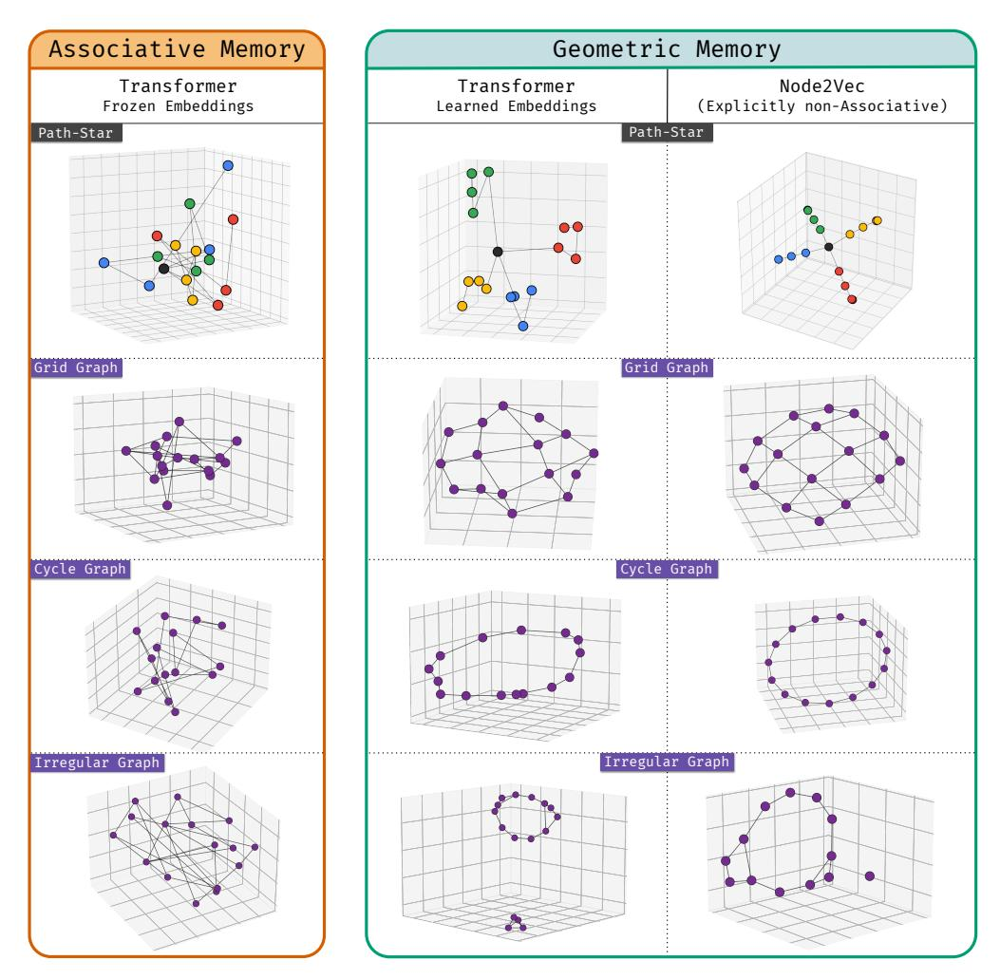

Figure 1: Associative vs. geometric memory of models trained on various graphs. Parametric memory in deep sequence models is often abstracted as if co-occurrences from atomic facts are stored in a weight matrix, while the co-occurring entities themselves are embedded arbitrarily [\[161,](#page-31-1) [46,](#page-23-0) [70,](#page-24-0) [183,](#page-32-0) [23,](#page-21-1) [111,](#page-27-0) [22,](#page-21-2) [17,](#page-21-0) [160\]](#page-31-2). (left). This *associative* view is hard to reconcile with our observation that the Transformer learns implicit reasoning on an in-weights path-star graph. In practice, the learned embeddings (middle) reflect *global* structure inferred from the *local* cooccurrences, implying a *geometric* view of memory. Both these views are valid ways to fit the training data, but it is not straightforward why the latter prevails during Transformer optimization. When associative memory is explicitly prohibited, as in a Node2Vec model (right), a more elegant geometry materializes. This points to a clear headroom to improve the geometric nature of a Transformer's memory. Details of the Transformer architecture used for this visualization are provided in [§B.2.2.](#page-34-0) Similar geometries for Mamba and neural networks are presented in [§C.3.](#page-41-0)

Our discussion starts at a seemingly tangential point. We begin by consolidating a fragmented set of recent demonstrations [\[76,](#page-25-0) [43,](#page-22-0) [172,](#page-31-0) [158\]](#page-30-0) that the Transformer exhibits some level of *implicit in-weights reasoning*, i.e., reasoning over knowledge from the weights without emitting an explicit chain of thought. We sharpen these results by crafting a scenario where this ability is less expected, plays out vividly, and can be cleanly isolated and analyzed. Specifically, we study path-finding on path-star graphs, a (symbolic) implicit reasoning task. The task was adversarially designed [\[12\]](#page-20-0) to cause failure of next-token trained deep sequence models—both the Transformer [\[156\]](#page-30-1) and Mamba [\[54\]](#page-23-1) alike. Whereas in the original task, the model is given the graph in-context, here we make the model memorize the graph's edges in its weights. Whereas in the original task, the models spectacularly fail to learn path-finding even on small graphs, in our in-weights task, our models (both the Transformer and Mamba) succeed even on massive graphs.

The success in the in-weights path-star task, we argue, is hard to reconcile within the *associative* view of parametric memory, a convenient and highly effective abstraction of neural network memory, popular in literature [17, 22, 70, 161, 46, 183, 23, 111, 160]. In this abstraction, knowledge is stored in a matrix, say  $\mathbf{W}_{assoc}$  such that if u and v co-occur in the same context during training, the quantity  $\Phi(v)^T \mathbf{W}_{assoc} \Phi(u)$  is large, for some arbitrary embedding  $\Phi$ . With such a data structure, the path-star task requires composing the aforementioned matrix operation  $\ell$  times (for path length  $\ell$ ). Unless there is step-wise supervision for each composition, learning the  $\ell$ -fold composition should intuitively be a daunting needle-in-the-haystack task demanding  $\exp(\ell)$  time. By the specific design of our task, *every possible form of step-wise guidance is eliminated*. Yet our model appears to find the needle.

This apparent paradox begins to be resolved due to salient observations in Khona et al. [76], Ye et al. [172] that the Transformer represents the nodes of their graphs with some notion of distance. We generalize this observation, pointing out that this has profound implications and is in fact non-trivial to explain. First, the existence of such node embeddings implies that atomic facts can be stored in an altogether distinct paradigm of parametric memory, a *geometric* one, which is in dramatic contrast to the associative one. In the simplest form of this view, co-occurrences are not simply stored in a matrix  $\mathbf{W}$ , but rather neatly encoded within the embeddings, say  $\Phi_{\text{geom}}$  (see Fig. 1). In fact, these embeddings are so carefully arranged that they encode *global* relationships without explicit supervision to do so: even if entities u and v never appeared in the same context, the dot-product  $\Phi_{\text{geom}}(u)^T\Phi_{\text{geom}}(v)$  captures the model's own notion of multi-hop distance between the two. This has implications on reasoning since what seemed to be a hard-to-learn  $\ell$ -fold composition of local associations, now becomes an easy-to-learn 1-step geometric task for the model.

While helping make sense of our paradox, the observed geometry raises fundamental questions. First, there must be competition between the two parametric memories, both equally valid solutions to the training objective; why does the geometric prevail over the associative? To some readers, a geometric bias may seem familiar and intuitive at first sight; but we isolate aspects that cannot be easily explained. Counterintuitively, we argue that an elegant geometry is not necessarily more succinct than a lookup of local associations. Thus, typical capacity pressures from the architecture or optimization do not explain why a highly non-trivial geometry is synthesized—that too from optimizing only over local associations. Towards understanding this, we draw connections to the simpler Node2Vec architecture, where we find that global geometries emerge from well-known spectral biases in such architectures. But, in contrast to prevailing theories (e.g., Levy and Goldberg [84]; see §5.6), we identify how the spectral bias arises naturally, independent of typically-assumed architectural or optimizational pressures. This gives us a preliminary insight into the natural rise of a geometric memory, albeit in a much simpler model, leaving open a foundational question for deep sequence models.

#### 1.1 Implications.

Although the evidence of implicit reasoning is so far limited to symbolic tasks, we believe that the geometry we isolate is a clean nucleus of geometries known to arise in language modeling e.g., [36, 102, 58]. The insights from this nucleus helps conceive broader directions, practical and theoretical. First, we find that the embeddings learned by the more naive Node2Vec models are more strongly geometric than that of Transformers; in hindsight, this points to a well-specified headroom for making Transformer memory more geometric and less associative in practice. If the geometric bias can be improved in natural language tasks, it would also benefit natural implicit reasoning tasks where results have so far been mixed [122, 18, 169, 170, 14]. Since geometric memory encodes global relationships, it could pave the way to combinational creativity [19, 40, 108]: discovering novel connections between information scattered in a large pretraining set. On the flip side, the interdependencies in geometric storage may impose limits on knowledge editing, unlearning and accurate retrieval. Another implication of our study is a support for why parametric memory may be superior to in-context memory, echoing Wang et al. [158], Geerts et al. [43]. Finally, the gap between the Transformer and Node2Vec geometries may also be of interest to practitioners in retrieval systems, when choosing between modern generative retrieval models [150, 163, 128] and traditional dual-encoder models [47, 66].

Many foundational directions also follow. Foremost are the questions of how associative and geometric memory compete under gradient descent and what optimization settings are ideal for the geometry to arise. The examples and analyses in this work may act as sandboxes to study

a variety of geometric empirical phenomena: the emergence of "world models" [\[39,](#page-22-3) [58,](#page-23-2) [138\]](#page-29-0), linear representations and superposition in interpretability [\[102,](#page-27-1) [117,](#page-28-3) [36\]](#page-22-1) and why different models share similar representations, i.e., the Platonic representation hypothesis [\[83,](#page-25-2) [67\]](#page-24-2)—and *what* these representations are. Finally, we speculate that the associative view forms the default unstated set of intuitions that guide research in numerous areas such as knowledge acquisition, discovery, unlearning, reasoning and storage capacity; the geometric view may inspire researchers to revisit, spell out and widen these latent intuitions.

# 1.2 Summary of contributions

- 1. We isolate a clean, analyzable instance of implicit in-weights reasoning, and contrast the predominant local associative memory against a global geometric view of memory in deep sequence models (simple neural networks, Transformers and Mamba).
- 2. We show why this observation is surprising, arguing that the emergence of the geometric memory over the associative memory cannot be attributed to obvious architectural, optimizational or supervisory pressures.
- 3. We connect the global geometry to the spectral bias of Node2Vec dynamics and empirically intuit how it emerges without typically assumed pressures. This makes progress towards an open question in Node2Vec and highlights significant headroom in the embedding geometry of the current architectures.

# Contents

| 1 | Introduction                                                    |                                                                           |    |  |  |  |  |
|---|-----------------------------------------------------------------|---------------------------------------------------------------------------|----|--|--|--|--|
|   | 1.1                                                             | Implications.                                                          |    |  |  |  |  |
|   | 1.2                                                             | Summary of contributions                                               | 4  |  |  |  |  |
| 2 | Experiments: Implicit in-weights reasoning is learned           |                                                                           |    |  |  |  |  |
|   | 2.1                                                             | In-weights path-star task                                                 | 7  |  |  |  |  |
|   |                                                                 | 2.1.1 Where does the path-star-failure argument go wrong in-weights?   | 8  |  |  |  |  |
|   | 2.2                                                             | The contradiction behind learning the hardest token                       | 9  |  |  |  |  |
|   | 2.3                                                             | Two competing data structures for parametric memory                    | 10 |  |  |  |  |
| 3 | The emergence of global geometric memory is not easy to explain |                                                                           |    |  |  |  |  |
|   | 3.1                                                             | Capacity pressures do not explain geometric memory                        | 12 |  |  |  |  |
|   | 3.2                                                             | Supervisory pressure does not explain geometric memory                    | 13 |  |  |  |  |
| 4 |                                                                 | Geometry arises from naturally-occurring spectral bias, without pressures |    |  |  |  |  |
| 5 | Related work                                                    |                                                                           |    |  |  |  |  |
|   | 5.1                                                             | In-weights reasoning tasks                                             | 16 |  |  |  |  |
|   | 5.2                                                             | Failure of end-to-end composition learning                             | 17 |  |  |  |  |
|   | 5.3                                                             | In-context graph tasks                                                    | 17 |  |  |  |  |
|   | 5.4                                                             | Analysis of Transformer memory                                            | 17 |  |  |  |  |
|   |                                                                 | 5.4.1 In-context vs. in-weights learning                            | 18 |  |  |  |  |
|   | 5.5                                                             | Other foundational works on generalization memorization                | 18 |  |  |  |  |
|   | 5.6                                                             | Analyses of graph and word embedding methods                           | 18 |  |  |  |  |

| 6      | Limitations                               |                                                                         |    |  |  |  |  |  |
|--------|-------------------------------------------|-------------------------------------------------------------------------|----|--|--|--|--|--|
| 7 A | Conclusion                                |                                                                         |    |  |  |  |  |  |
|        | Detailed background on the path-star task |                                                                         |    |  |  |  |  |  |
|        | A.1                                       | Failure of next-token learning in the in-context path-star task      | 34 |  |  |  |  |  |
| B      | Experimental setup                        |                                                                         |    |  |  |  |  |  |
|        | B.1                                       | Graphs, tokens, and data construction                                | 35 |  |  |  |  |  |
|        | B.2                                       | Model architecture                                                   | 35 |  |  |  |  |  |
|        |                                           | B.2.1 In-weights path-star task experiments                       | 35 |  |  |  |  |  |
|        |                                           | B.2.2 Tiny model architectures                                       | 35 |  |  |  |  |  |
|        | B.3                                       | Training and optimization                                               | 36 |  |  |  |  |  |
|        | B.4                                       | Evaluation protocols and metrics                                        | 36 |  |  |  |  |  |
|        | B.5                                       | Implementation and compute                                              | 37 |  |  |  |  |  |
| C      |                                           | Experiments on broader settings 38                                   |    |  |  |  |  |  |
|        | C.1                                       | Path-star task on Mamba SSM                                             | 38 |  |  |  |  |  |
|        | C.2                                       | Other large, harder path-finding graphs                                 | 40 |  |  |  |  |  |
|        | C.3                                       | Tiny graphs                                                          | 42 |  |  |  |  |  |
|        | C.4                                       | Additional experiments on path-star geometry                            | 45 |  |  |  |  |  |
| D      |                                           | Edge supervision and training dynamics                                  | 47 |  |  |  |  |  |
|        | D.1                                       | The role of reverse edges                                            | 47 |  |  |  |  |  |
|        |                                           | D.1.1 The critical role of reverse edges in the large path-star task | 47 |  |  |  |  |  |
|        |                                           | D.1.2 Tiny graphs with uni-directional edge-memorization          | 49 |  |  |  |  |  |
|        | D.2                                       | Pause tokens for computational slack                                    | 50 |  |  |  |  |  |
|        | D.3                                       | (Not) Interleaving edge-memorization                                 | 50 |  |  |  |  |  |
|        | D.4                                       | Learning order of tokens                                             | 51 |  |  |  |  |  |
| E      |                                           | Proofs about representational complexity                                | 52 |  |  |  |  |  |
|        | E.1                                       | Empirical failure of composition learning under associative memory   | 52 |  |  |  |  |  |
|        | E.2                                       | Succinctness does not break the tie: Proof of Proposition 1          | 52 |  |  |  |  |  |
|        | E.3                                       | Node2Vec can represent a form of associative memory                  | 53 |  |  |  |  |  |
| F      |                                           | Detailed analysis of spectral bias in Node2Vec                          | 54 |  |  |  |  |  |
|        | F.1                                       | Challenges of analyzing the dynamics                                 | 54 |  |  |  |  |  |
|        | F.2                                       | Empirical intuition of the dynamics                                  | 54 |  |  |  |  |  |
|        | F.3                                       | Mathematical description                                                | 55 |  |  |  |  |  |
|        | F.4                                       | Deriving the dynamics                                                | 58 |  |  |  |  |  |

# 2 Experiments: Implicit in-weights reasoning is learned

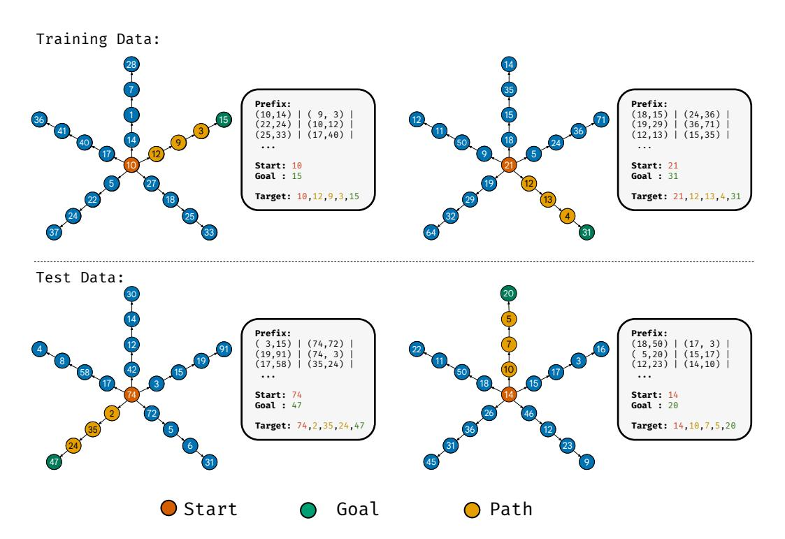

Figure 2: Overview of in-context path-star task of B&N'24. Each training and test example corresponds to a fresh, randomly-labeled path-star graph (a tree graph where only the root node branches into d paths of length  $\ell$ ). For each example, the prefix specifies a randomized adjacency list (of edge bigrams) of the corresponding graph, followed by  $(v_{\texttt{root}}, v_{\texttt{goal}})$ . The target is the full path  $(v_{\texttt{root}} \to v_{\texttt{goal}})$  in that graph.

We investigate planning on a *path-star graph*, a task designed to be adversarial towards next-token learning [12]. The task has a clear notion of a chain-of-thought, and a well-understood mechanism of failure for learning in-context reasoning; our hope is to repurpose this to cleanly analyze in-weights reasoning in a way that was not possible in earlier studies.

**Background.** The path-star topology (Fig. 2) consists of a root node with multiple disjoint (uniform-length) paths branching outwards. In the version of B&N'24, a model is given in context the adjacency list (with randomized node labeling and edges ordering, but fixed topology) and a goal leaf node; the task is to predict the unique path from the root to a specified goal node, without explicitly producing a chain-of-thought. To succeed, one merely needs to notice a simple right-to-left structure: the solution is the unique path back from the leaf node, reversed. Indeed, this is the implicit chain-of-thought required before emitting the first token.

Yet, on this simple task, left-to-right next-token learners are known to fail in-distribution. This failure unfolds in two stages during training: (1) On all but the first token, the model learns a trivial solution (termed a Clever Hans cheat) that is much simpler than planning: simply predict the token as the unique child of the previous ground-truth token that is revealed in the context. This crucially starves the first, key decision-making step of gradients from the rest of the path. (2) Consequently, the first token must be learned in isolation, which becomes a computationally hard learning  $\ell$ -hop composition problem (as detailed later). At test-time, this model defaults to guessing a random first token and continuing along that wrong path. More details of this failure are in §A.

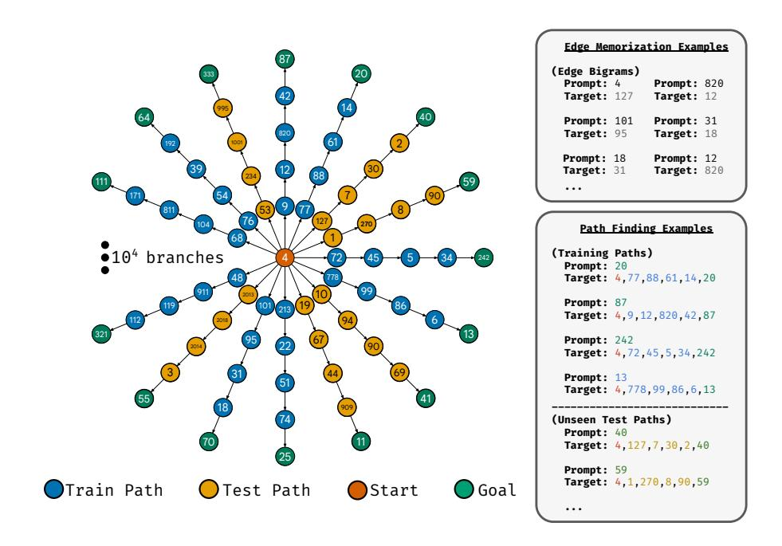

Figure 3: **Overview of our in-***weights* **path-star task.** All examples are derived from a fixed path-star graph. Training involves two types of examples: (i) **edge memorization** examples (ii) **path-finding** examples, where the prefix is some leaf, and the target is the full path. Test examples are path examples corresponding to a held-out set of leaves.

#### 2.1 In-weights path-star task.

We define an in-weights version of the above task (Fig. 3), where all examples are generated from a fixed graph  $\mathcal G$  (of degree d and path length  $\ell$ ), rather than a fresh graph per example. Here, the model is made to memorize the full graph in its weights through edge-memorization examples, where the input is some node v, and the next-token target is an adjacent node v'. Next, path-finding examples are generated from the same graph by picking as input a random leaf node  $v_{\text{leaf}}$  (a single token) and as target, the unique root-goal path (a sequence from  $v_{\text{root}}$  to  $v_{\text{leaf}}$ ). The model is trained for path-finding on a subset of such leaves from our fixed graph, and is tested on the remaining leaves. (We defer results on some harder variants of this topology to §C.2.)

Prior positive results of implicit in-weights reasoning are on small scales of 200 or fewer entities [76, 43] or on 2-hop tasks [158, 172]. Our first result below sharpens this finding: in a much larger-scale, much larger-hop path-star task that is adversarially constructed, the model learns implicit reasoning successfully.

**Setup.** We use a from-scratch, decoder-only Transformer (GPT-mid) [125]; we corroborate all our findings on Mamba in §C.1. For the most stable results, we interleave the edge-memorization and path-finding examples during training as in Fig. 3 and also use pause tokens [52]. We found it is important to provide both forward and reverse edges for edge-memorization in order to dodge the reversal curse [123, 9], but this may not be necessary for smaller graphs; see §D.1. Note that this reverse augmentation is *not* given for the path-finding examples. All details about the formatting and the hyperparameters are in §B, followed by additional analyses in §D.

**Observation 1a.** (Success of implicit in-weights reasoning) On in-weights path-star graphs of as many as  $5 \times 10^4$  nodes, trained on 75% of the total  $10^4$  paths, both the Transformer and Mamba are able to predict unseen paths when conditioned on held-out leaves with as much as 100% accuracy (see left plots of Figs. 4 and 8). Similar positive results for some harder graph topologies are in §C.2.

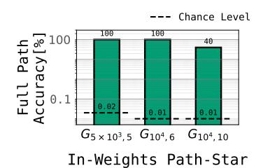

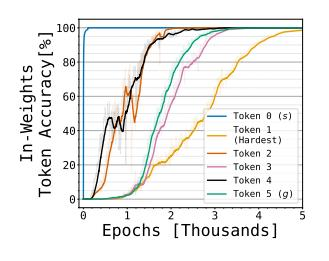

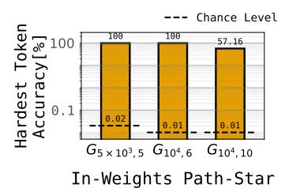

Figure 4: Success of Transformer in in-weights path-star task. (left) A next-token-trained Transformer achieves perfect or highly non-trivial accuracy on large path-star graphs  $\mathcal{G}_{d,\ell}$  (Observation 1a). (middle) Learning order of tokens. The tokens of a path are not learned in the reverse order i.e., the model does not learn the right-to-left solution. Thus, gradients from the future tokens are not critical for success (Observation 1b). (right) Success of hardest-token-only task. In fact, the hardest token (the first) given the leaf is learned in isolation to non-trivial accuracy (Observation 1c). Success of this  $\ell$ -fold composition task is hard to explain within the associative memory view (§2.2). Analogous plots for Mamba are in Fig. 8. We invite the reader to contrast these in-weights task results with the in-context task ones in Fig. 5.

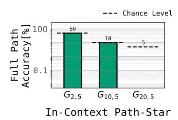

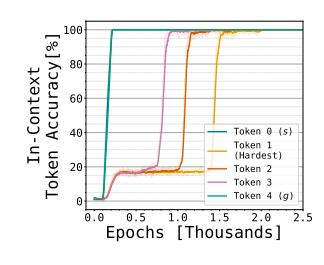

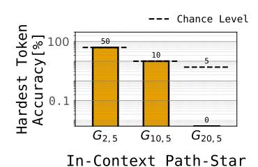

Figure 5: **Failure of Transformer in in-context path-star task.** We report the failure of next-token Transformers in the in-context version of the path-star task, reproducing results from B&N'24. (**left**) Full path accuracy remains at chance level across different small graph sizes. (**Middle**) Learning order of tokens with teacherless (multi-token-trained) objective shows a clear right-to-left learning cascade. (**right**) The hardest (first) token given the leaf fails to be learned in isolation, contrasting sharply with in-weights success shown in Fig. 4.

Shortly, we will isolate an even stronger instance of implicit reasoning from this task for analysis. To get there, let us scrutinize where the argument of B&N'24 may go differently in the in-weights setting for the model to succeed in Observation 1a.

# 2.1.1 Where does the path-star-failure argument go wrong in-weights?

Recall that the path-star failure unfolds in two stages. Perhaps one of these stages does not play out in the in-weights setting. A first possibility could be that the Clever Hans cheat is not picked up here. The cheat was a simple, left-to-right pattern that fits all but the first token as the unique neighbor of the preceding ground-truth token that was present as input. Such left-to-right cheats are simpler than the true right-to-left solution, and thus quickly learned. However, perhaps when the target we train on is an *in-weights* path, the cheat is not easy to learn—say, due to the nature of recalling from parametric memory. A complex cheat may not be learned quickly, allowing gradients from future tokens to reach the first token representation, in turn allowing the correct, right-to-left solution to compete and emerge. Indeed, such gradients, termed as pre-caching gradients [167] have been identified in a line of empirical works in natural language [114, 69, 132, 167, 99]. We summarize this hypothesis out below:

**Hypothesis 1a.** (Model may experience future-token gradients) The in-weights path-star task is solved (Observation 1a) because Clever Hans cheats are not learned quickly enough, allowing future-token gradients to persist, teaching the model to find the right-to-left solution.

We can indirectly test for this hypothesis as follows. If the model learned the right-to-left dependencies, it must also learn the tokens in the reverse order: the unique predecessor of the goal node is the easiest to identify (under the right-to-left dependencies) and will thus be learned first; the next-easiest is the next predecessor and so on, until the first node (which depends on all that has been learned so far). Indeed, in the in-context setting of B&N'24 where they explicitly switch off the Clever Hans cheat (under teacherless training), such a reverse-learning cascade is observed (Fig. 5). However, we do not see this in the in-weights setting.

**Observation 1b.** (No reverse-learning cascade) The target tokens in the in-weights path-star task are learned in no particular order by the Transformer and Mamba models (see middle plots of Figs. 4 and 8 in contrast with Fig. 5; or see Fig. 24 for side-by-side comparison).

The above observation weakens Hypothesis 1a, encouraging us to search for another one. A second possibility is that the second stage of the failure of B&N'24 does not trouble us in the in-weights task. Recall that in this stage, the first token is to be learned in isolation without future-token gradients. But this is an  $\ell$ -fold composition task, that is theoretically well-understood to be computationally hard (as we elaborate later). Perhaps, that is not the case for our in-weights task:

**Hypothesis 1b.** (First-token may be easy to learn) Learning the key decision-making token (the first token) in the in-weights path-star task is not computationally hard.

Testing Hypothesis 1b is easy: we train the model simply on the first token loss, instead of the loss over the full path sequence. We find that this task is trivial here, affirming Hypothesis 1b, and isolating a much stronger and cleaner instance of implicit in-weights reasoning, one that shortly leads us to our main insight.

**Observation 1c.** (Hardest, first token is learned in isolation) In the in-weights path-star task with edge-memorization and only first-token-training examples, both the Transformer and Mamba models learn the first token in isolation—without any intermediate supervision from other nodes in the path (Figs. 4 and 8 (right)).

# 2.2 The contradiction behind learning the hardest token

The fact that the hardest (first) token is learned (as in Observation 1c), we argue, is difficult to square with the abstraction that parametric memory strictly stores local associations. Concretely, in this abstraction, the first node requires composing a local associative recall function  $\ell$ -many times: recall the predecessor of  $v_{\text{leaf}}$  from the weights, namely  $v_{\ell-1}$ , then the predecessor of that,  $v_{\ell-2}$ , and so on. In short, one can write  $v_1 = \text{Predec}^{\ell}(v_{\text{leaf}})$ . This recall function takes the shape of a matrix operation as described below:

**Hypothesis 2a.** (Local associative parametric memory) The model has memorized the edges of  $\mathcal{G}$  such that for an edge (u, v),  $u \in \arg\max_w(\Phi(w)\mathbf{W}_{\mathsf{assoc}}\Phi(v))$  where intuitively  $\mathbf{W}_{\mathsf{assoc}}$  encodes the associations, whereas the embedding  $\Phi$  is arbitrary and by itself encodes no associations in graph  $\mathcal{G}$ . For convenience,  $\Phi$  may be abstracted as orthogonal embeddings [161, 46, 70, 183, 23] or random embeddings [111, 22, 17, 160].

With this structure however, the first-token  $\ell$ -fold composition task should intuitively require  $\Omega(\exp(\ell))$  compute to learn—just like the first token was demonstrably hard-to-learn in the incontext path-star task [B&N'24]. Specifically, learning compositions with gradient-based methods is known to be empirically hard [141, 2, 55, 49, 1, 2] and proven to be theoretically hard [97, 28, 119, 141, 164, 144] (in a certain sense¹). One way to intuit this is to notice that the optimization task is a search for a needle in the haystack: there is an  $\exp(\ell)$  space of possible discrete

&lt;sup>1Such hardness results typically only show that *some* worst-case function in a class of compositional functions is hard-to-learn; no proclamations are made about how hard it is to learn a *fixed* function we care about. Indeed, with contrived initial conditions, a singleton function class can be provably learned [4, 3, 107]. Yet, in practice, learning a fixed function is hard, proving which has been an open question—until the recent negative results of Abbe et al. [6], Shoshani and Shamir [144]. These show how the (fixed) full parity function is hard to learn with gradient descent which, through a reduction, proves that in-context composition tasks are hard to learn [65]. We leave it as an open question to link our in-weights composition task to one of these hardness results.

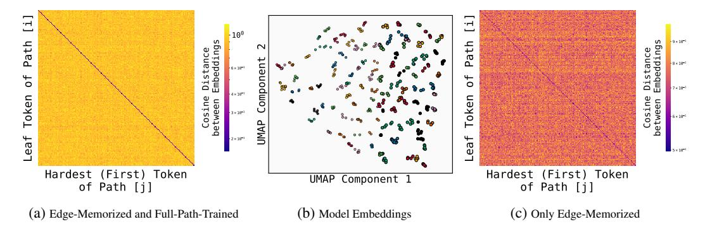

Figure 6: Evidence of global geometry of Transformer in path-star task. (a) In the heatmap, entry (i,j) is the cosine distance between the leaf embedding of path i (row) and the first-hop embedding of path j (col). The clear diagonal line implies that embeddings within each path are more aligned, reflecting global structure. (b) UMAP projection of token embeddings where each point is a node embedding; color indicates path identity. Different paths form separated clusters (see Fig. 18 for clearer image). (c) Heatmap for a model trained only on edge-memorization still reveals a level of geometry, although weaker than in (a). Analogous plots for Mamba are in Fig. 9

compositions, and all but the correct one have an equally miserable loss value; with the loss terrain rendered flat and the gradients uninformative, the learner is forced to sift through the vast hypothesis space to find a needle. As a preliminary corroboration, in §E.1, we empirically find that models fail at this task when the embeddings are frozen.

This barrier could be surmounted if, rather than providing supervision from only the end output of the composition, there was supervision from each hop, which would cast a graceful loss landscape. This could mean providing a data curriculum [136, 164, 171, 5, 32] or providing chain-of-thought supervision [165, 112] or reducing compositionality through various means. Indeed, prior positive results on implicit in-weights reasoning involve one such aid or the other. First, Khona et al. [76] have paths of varying lengths (see their Fig 11), which provides an implicit curriculum; they also provide full path supervision. Furthermore, their test and train paths overlap, reducing compositionality, potentially allowing the model to stitch substrings it has seen (an ability demonstrated as possible [161]). Other results [158, 172] are on 2-hop tasks, implying a friendly exponent. Our setting, by design, offers none of these aids. Our paths have fixed lengths (hence, no implicit curriculum), are disjoint (so, no test-train overlaps), and require as much as a 10-fold composition (so, a daunting exponent). What we isolate, therefore, is a stronger and more sterile instance of implicit in-weights reasoning, one that is cleanly inconsistent within the associative view of parametric memory.

# 2.3 Two competing data structures for parametric memory

The paradox begins to resolve with observations in Khona et al. [76], Ye et al. [172] that we will flesh out in our setting. Both find that the nodes of their (smaller) graphs are embedded in a way that reflects a notion of distance, aiding their respective implicit reasoning tasks. Before extending this to our much larger graphs, we point out that this observation has profound implications. First, this presents an altogether different view of parametric memory itself: a memory of atomic facts that does not take shape as an associative lookup (over arbitrary embeddings) but as a geometry of highly-organized embeddings. Next, importantly, whereas an associative memory only makes local information accessible, a geometric memory readily betrays global multi-hop relationships—even when trained only on local associations, as we establish shortly.

**Hypothesis 2b.** (Global geometric parametric memory) The model has memorized the edges of  $\mathcal{G}$  with embeddings  $\Phi_{\mathsf{geom}}$  such that for an edge (u,v),  $u \in \arg\max_w(\Phi_{\mathsf{geom}}(w) \cdot \Phi_{\mathsf{geom}}(v))$  but furthermore, for any non-adjacent (u,v),  $\Phi_{\mathsf{geom}}(u) \cdot \Phi_{\mathsf{geom}}(v)$  reflects some (model's own) notion of global closeness in the graph.

**The resolution.** One can view the two parametric memories of Hypotheses 2a and 2b as two competing data structures, both representable by a deep sequence model, each yielding its own learning complexity of the hardest token (much like how a heap or an array would yield different

search complexities). The local associative memory is analogous to a linked list: for the first token, this would incur a (benign) ℓ-hop lookahead step but *learning* this incurs an exponential cost. The geometric memory is powerful in that it reduces this learning complexity all the way to Θ(1). For instance, we may expect that the embeddings of all nodes in path i are clustered tightly around a unique path vector zi . In this data structure, learning the first token given the leaf node is a one-hop task: simply find a one-hop neighbor of the central node that is best-aligned with Φgeom(v (i) leaf). Such a structure indeed materializes in our massive graphs:

Observation 2. *(Evidence of global geometry) For our large path-star graphs, the (token) embeddings of the leaf and first node of a path are clustered closer to each other than those of other paths in both the Transformer and Mamba (Fig. [6](#page-9-2) and Fig. [9\)](#page-37-3).*

We corroborate similar geometries in a variety of small graphs in Fig. [1](#page-1-0) and Section [C.3](#page-41-0) through more direct visualizations. While these geometries help make sense of why implicit reasoning succeeds, it also leaves us with foundational questions, which we lay out in the next section.

# 3 The emergence of global geometric memory is not easy to explain

During training, the two types of parametric memory—two equally valid ways to fit the training data—must compete with each other. Depending on the reader's prior, the rise of the geometric memory may seem familiar especially in light of well-known geometries of high-level concepts and features [36, 117, 102]. While this impression is valid in part, this section carefully isolates aspects that are unexpected. The nuance is that, unlike known phenomena, what is observed here is in a *memorization* task that lacks statistical redundancies. This yields the insight that the geometry cannot be easily explained by well-understood learning pressures, be it from the architecture, the optimizer, or the supervision.

# 3.1 Capacity pressures do not explain geometric memory.

In theories of generalization [110, 177], representations arise from pressures to represent the data as succinctly as possible, precluding a brute-force lookup. These capacity pressures are either explicit (e.g., the architecture or the regularizers) or implicit (e.g., biases of the gradient descent optimizer). For instance, a word may co-occur with thousands of similar contexts in training. A lookup of those specific contexts is too cumbersome. But fortunately, much redundancy exists in the data. Such redundancies are compressed away by the learner. From this arises a succinct, elegant geometry of high-level embeddings—such as the ones witnessed in neural word embedding models [101]. Perhaps, a parallel logic explains our observations.

**Hypothesis 3a.** (Explicit or implicit capacity pressure) Associative memory is either explicitly impossible to represent—due to the parameter count or the design of the architecture, especially the embedding bottleneck—or is implicitly less preferred by gradient descent. This is because geometric storage is a more succinct representation of the data than associative storage.

Indeed, at first glance, associative storage seems too verbose. All vertices need to be embedded near-orthogonally—demanding a massive embedding dimension that scales with vertex count  $n \approx 10^4$  in our path-star graphs—followed by a massive  $n \times n$  associative matrix  $\mathbf{W}_{\mathtt{assoc}}$  (representing the full graph adjacency matrix). In contrast, a geometric embedding seems succinct. Each of the d paths can be arranged along a unique dimension (e.g., Fig. 1 top right), requiring only d-many dimensions in total (where  $d \ll n$ ), supporting the logic of Hypothesis 3a.

This logic can be dismantled as follows. First, we demonstrate that the learner can learn the associative model, thus questioning the role of explicit pressures. Positive theoretical results in Nichani et al. [111] (see their Theorem 2) roughly prove that, with m embedding dimensions (all frozen), the  $m^2$  parameters in  $\mathbf{W}_{\mathtt{assoc}}$  can store  $m^2$  many associations. Our models have  $m \approx 400$  which then appears reasonable to represent our large graphs associatively. However, this expressivity result is not a proper refutation: the results of Nichani et al. [111] cannot be rigorously imported to us², and besides, there may be yet other explicit pressures that discourage associative memory during optimization (e.g., normalizations, weight decay). As a definitive refutation, we make an empirical demonstration: there are optimization settings where geometric memory naturally arises, but in those very settings, an associative memory can be learned with the embeddings frozen and all else unchanged. Thus, an associative memory is artificially possible where a geometric memory naturally arose.

**Observation 3a.** (Associative memory can be artificially learned with our architectures) On various tiny graphs and various sequence models (Transformers, Mamba, neural networks) (Fig. 1 and  $\S C.3$ ), a geometric memory arises naturally even though the same setup learns to represent the data with the embeddings frozen. This representation is purely associative since only one trainable layer exists (see  $\S B.2.2$ ).

Thus explicit capacity pressures do not force a geometric memory in place. But perhaps, a geometry still arises due to implicit pressures from gradient descent to represent succinctly. To refute this, we refute the underlying premise itself: contrary to intuition, a geometric storage is not necessarily more succinct than an associative storage. To see why, we first clarify that unlike a typical natural language

&lt;sup>2Nichani et al. [111] assume one-to-one associations, but our graphs involve many-to-many associations which are intuitively harder to represent.

task, our setting must be recognized as a *memorization* task (in the sense of Feldman [\[38\]](#page-22-5)): the existence of an edge cannot be statistically surmised from the rest of the training set. In other words, while typical word embedding tasks contain statistical redundancies—which when compressed give way to simple patterns—no such redundancies exist in our task. Thus, we will show, for certain graphs, straightforward notions of succinctness does not break the tie between the two ways of representing the data. Concretely, in generalization theories, the (bit or norm) complexity of a lookup table is larger than the succinct one *by a factor that scales polynomially with the size of the training set.* In contrast, in the path-star or cycle memorization task, *this gap reduces to a constant* (that can lie in [1, 2] *independent of graph size*), implying a weak to no implicit capacity pressure:

Proposition 1. *(Geometric and associative memory are roughly equally succinct) For certain graphs, the complexity of the local associative memory both in terms of bits and* ℓ2 *norms is either equal to or at most twice that of the global geometric memory (where equality is achieved if there is no weight-tying or if only forward edges are stored*[3](#page-0-1) *). (Proof and more explanations in [§E.2\)](#page-51-2)*

# 3.2 Supervisory pressure does not explain geometric memory

Orthogonally, one could attempt to attribute the global geometry to the "global" supervision itself:

Hypothesis 3b. *(Global supervision may explain global memory) A global geometry arises over local associations since the training involves a (global) path-finding objective.*

This hypothesis however is already weakened by design in the path-star task. First, path-finding supervision is not provided for unseen paths, paths which nevertheless exhibit a global geometry. Next, in the hardest-token-only task, path-finding supervision is applied only on the end-points of the path; yet a geometry materializes on intermediate nodes (see Fig. [16b\)](#page-44-1). In fact, we give an even cleaner refutation of this hypothesis by analyzing models trained purely on local supervision (i.e., on edge memorization):

Observation 3b. *A global geometry emerges even in locally-supervised models as seen in the embeddings of tiny graphs of various architectures in Fig. [1](#page-1-0) and [§C.3](#page-41-0) and in the heatmaps for the large path-star graph (Figs. [6c](#page-9-2) and [9c\)](#page-37-3). Additionally, such a locally-supervised model can be subsequently finetuned purely on the hardest-token task and achieve high test accuracy on path-finding ([§D.3\)](#page-49-1).*

To summarize this section, what we demonstrate is a geometric representation that arises in a memorization task. This geometry can be thought of as the crux of broader geometric phenomena in language modeling, here emerging without any of the typical statistical redundancies and learning pressures. This in turn isolates a fundamental aspect of neural geometries that cannot be easily explained. A more nuanced argument is necessary, perhaps by relying on other notions of complexity (e.g., flatness or spectral norms) or by directly analyzing the dynamics.

3Note that a geometry appears even when storing only one direction of the edges in the smaller graphs where both forms of storage must be equally succinct; see [§D.1.2.](#page-48-0)

# 4 Geometry arises from naturally-occurring spectral bias, without pressures

Setting aside the competition between the two parametric memories, we can still extract a non-trivial question: how does gradient descent synthesize global information from mere local supervision, without various pressures, and what geometry does it produce? To isolate this, we turn to simpler, 1-layer, 1-hop Node2Vec models. These are equivalent to a Transformer, trained only on edge-memorization, with only an embedding and unembedding layer—thus, associative memory is architecturally prohibited.4

A precise characterization of what embeddings are learned even in such simple models is an open question, but a rich line of work (albeit with key assumptions about various pressures outlined shortly) points to a *spectral bias*: the learned embeddings often align with the top (non-degenerate) eigenvectors of the negative graph Laplacian. This indeed holds: the Node2Vec embeddings in Fig. 1 right column matches the top eigenvectors—called the Fiedler vector(s)—in Fig. 7 left column. This leads us to a few key insights. First, these eigenvectors happen to be the very source of global geometries. But secondly, these Node2Vec geometries turn out to be more well-organized than what the Transformer exhibited (in Fig. 1 middle column). Thus, we conjecture a similar but—in hindsight—somewhat "adulterated" spectral geometry in Transformers:

**Hypothesis 4.** (Spectral bias) A Transformer memorizes with a global geometry due to spectral biases; but there is significant headroom in the quality of geometry, likely because the representation is adulterated with local associative memory.

A natural next question is to wonder where the spectral bias stems from. Going back to Node2Vec theories (see §5.6), the literature suggests that similar models rely on the top eigenvectors due to the explicit pressure of a bottleneck [84, 59, 149, 68] or explicit regularization [75] or an explicitly multi-hop supervision [124]. Our setting defies all these assumptions.

A further discrepancy in existing analyses is that they are in non-cross-entropy-loss settings with simpler losses. In these systems, the dynamics simplify nicely yielding a closed-form solution for the inner products of the embeddings. However, we use the cross-entropy loss (to be faithful to how sequence models are trained), under which an expression for the inner product is evasive. The dynamics here may behave in one of many complex ways: it may simply diverge, or it may converge in direction (like in logistic regression [146]); the converged direction in turn, may be degenerate or not. Our empirical analysis points to a special dynamic: the system does converge to a meaningful zero-gradient solution, working its way towards a neat two-fold property, while exhibiting a spectral bias naturally:

Observation 4. (How spectral bias emerges without typical pressures) In a 1-layer, 1-hop Node2Vec model with the embedding  $\mathbf{V} \in \mathbb{R}^{n \times m}$  of n nodes, with the dynamics denoted as  $\dot{\mathbf{V}}(t) = \eta \mathbf{C}(t)\mathbf{V}(t)$  (where  $\mathbf{C}(t) \in \mathbb{R}^{n \times n}$  is a time-dependent co-efficient matrix), the converged solution for our small graphs is such that (a) the columns of embedding matrix  $\mathbf{V}$  span the graph's Fiedler-like vectors, and (b) the co-efficient matrix  $\mathbf{C}$  has those same vectors in its null space (Fig. 7). Crucially, this dynamic does not need a low rank constraint; the embedding size m can be larger than the graph.

We provide in §F an empirically-informed intuition for a "self-stabilizing" dynamic that gradually filters out lower eigenvectors; we leave open a formal analysis. Admittedly, neither is this analysis on a deep sequence model, nor does it divulge anything about the competition between associative and geometric memories. What it does is make progress on an open question for a simpler model. It also gives us an idea of how and what global information can arise naturally out of local supervision, devoid of any supervisory, bottleneck-driven, or regularizing pressure.

&lt;sup>4Node2Vec cannot implement associative memory at least in the form we care about. A more contrived form is possible; see §E.3.

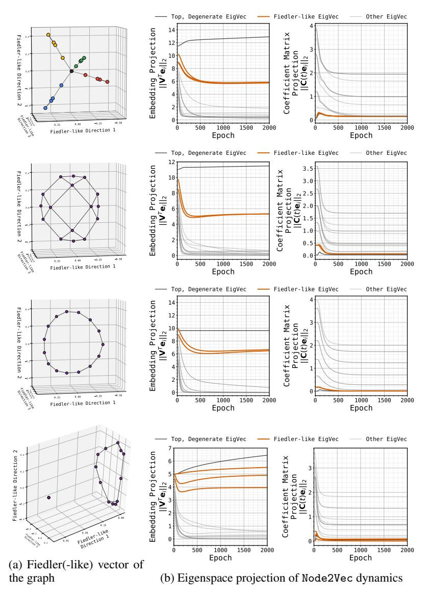

Figure 7: Spectral geometry arises in Node2Vec without low-rank pressure (Observation 4) for tiny Path-Star, Grid, Cycle, and Irregular Graphs (top to bottom). (a) The Fiedler-like vectors of the graphs encode global structure; this structure mirrors the Node2Vec embeddings shown in Fig. 1. (b; left) The evolution of eigenvector projections during training. (middle) The embedding matrix V contracts into space spanned by the Fiedler-like eigenvectors, evidenced by the projection norm  $||\mathbf{V}^T\mathbf{e}_i||_2$  converging to a stable, non-zero value; projections of other eigenvectors diminish towards zero. (b; right) Concurrently, the null space of the co-efficient matrix C subsumes the the Fiedler-like eigenvectors, in that the norm  $||\mathbf{C}\mathbf{e}_i||_2$  converges to 0. This spectral bias arises without a low dimensional constraint assumed in literature (embedding size m=100, much larger than nodes in graph).

# 5 Related work

Our work consolidates fragments of a nascent phenomenon and weaves together distinct lines of theoretical and empirical work on memorization, learning compositional functions, and interpreting model representations. We elaborate on each of these threads below.

# 5.1 In-weights reasoning tasks

Synthetic graph tasks. Our work consolidates positive results of in-weights reasoning in literature, and presents a stronger instance of it, removing various confounders that make composition-learning easy. Khona et al. [\[76\]](#page-25-0) report successful path-finding on 200 nodes-large in-weights graphs, with varying path lengths and test-train overlap. Ye et al. [\[172\]](#page-31-0), Wang et al. [\[158\]](#page-30-0) report positive results on much shorter 2-hop tasks over 1000 entities. Geerts et al. [\[43\]](#page-22-0) look at in-weights transitive inference, a special type of ℓ-fold composition query where the model is trained on local comparisons and is queried on more distant comparisons. On settings with 7 objects, Geerts et al. [\[43\]](#page-22-0) find a clear difference between an in-context version of this task (where the model struggles) and an in-weights version (where the model succeeds). Such relational queries are equivalent to giving two nodes along a path and querying which node is closer to the center of the graph. Our task of finding the first node is a much harder *search* task, where one finds the smallest node in an ordered relationship. Nagarajan et al. [\[108\]](#page-27-2) discuss the limitations of next-token prediction, including on open-ended in-weights tasks, in lower data regimes. The fact that their next-token predictor achieves non-trivial performance on their in-weights task could be attributed to the effects of a geometric memory. Tangentially related is the positive finding in Yin and Wang [\[173\]](#page-31-10) that the Transformer can compose in-weights knowledge given in-context demonstrations. It is worth noting that the (theoretical) arguments in both these works [\[108,](#page-27-2) [173\]](#page-31-10) rest on the associative memory view.

As a negative result, Wang et al. [\[161\]](#page-31-1) report that, on in-weights graphs of less than 500 nodes, models are only able to infer already-seen paths or sub-paths, but not beyond them. We suspect this may stem from the fact that their model is only trained on the paths themselves (while our work and Khona et al. [\[76\]](#page-25-0) make the model memorize edge bigrams).

Multi-hop question-answering. A line of work has looked at natural language based two-hop questions on pretrained models e.g., "What is the calling code of the birthplace of Frida Kahlo?" (example from Press et al. [\[122\]](#page-28-1)). Results here have been limited [\[122,](#page-28-1) [18\]](#page-21-3) or mixed [\[169,](#page-31-3) [170,](#page-31-4) [14\]](#page-20-1). Yao et al. [\[171\]](#page-31-8), Wang et al. [\[158\]](#page-30-0) study multi-hop queries on synthetic knowledge (with the former on 2-hop queries while the latter explore upto 4 hops) and find that these queries can be learned provided there is exponential amounts of data, or a curriculum, or very long amounts of training. Balesni et al. [\[14\]](#page-20-1) report that models are unable to compose synthetic facts, but can succeed in composing a synthetic fact with a natural one. Orthogonally, Wang et al. [\[162\]](#page-31-11) identify that such in-weights implicit reasoning can be hurt by scaling up the parameters. Perhaps some of these negative results may be attributed to the reversal curse [\[15,](#page-20-9) [9\]](#page-20-2), or the lack of extended computation e.g., we use pause tokens [\[52\]](#page-23-4). A dedicated study of this gap between our synthetic settings and these settings is important and left for future work.

Reversal curse and (a)symmetric knowledge. The reversal curse [\[15,](#page-20-9) [9\]](#page-20-2) is a well-known out-ofdistribution, in-weights failure mode of next-token-trained Transformers. Such models are unable to recall u given v, when trained to recall v given u, suggesting asymmetric storage in parametric memory. Fixes for the reversal curse have involved reversed or permuted data augmentation [\[57,](#page-23-8) [91,](#page-26-3) [79,](#page-25-4) [50\]](#page-23-9). In our settings, we find that reverse edges are critical to elicit implicit reasoning in our path-star tasks (see [§D.1\)](#page-46-1), but is not necessary to elicit a geometry in the smaller graphs.[5](#page-0-1) Various theories have been proposed to understand this failure [\[87,](#page-26-4) [183,](#page-32-0) [157\]](#page-30-5), which may be worth revisiting under a geometric view. One may also view our contrast between associative and geometric memory (of a generic graph data) as a generalization of the aforementioned contrast between the asymmetric and symmetric knowledge storage (of a more specific, disjoint set of associations). We leave it for future work to discover a nuanced connection between our work and the reversal curse.

5 It appears that the observations on small graphs in Khona et al. [\[76\]](#page-25-0) do not require memorizing the reverse edges, which aligns with our findings on small graphs.

### 5.2 Failure of end-to-end composition learning

While ℓ-fold composition functions are surprisingly easy to *express* in transformers [\[136\]](#page-29-4), empirical results have time and again demonstrated that they are hard to *learn* through gradient-based methods, both in traditional deep network settings [\[141,](#page-29-2) [2,](#page-20-3) [55,](#page-23-5) [49,](#page-23-6) [1,](#page-20-4) [2\]](#page-20-3) and more recently in language models too [\[112,](#page-27-5) [88,](#page-26-5) [30,](#page-21-6) [121,](#page-28-8) [176,](#page-32-2) [130,](#page-29-5) [30,](#page-21-6) [64,](#page-24-6) [145\]](#page-29-6). Others [\[12,](#page-20-0) [65,](#page-24-4) [142\]](#page-29-7) demonstrate how next-token learning can trap training at a stage where composition learning becomes a problem. Theoretical works have attempted to formalize these failures by demonstrating limits due to to expressivity [\[97,](#page-26-1) [28,](#page-21-5) [119\]](#page-28-6) or sample complexity [\[141\]](#page-29-2) or computational complexity [\[165,](#page-31-9) [65\]](#page-24-4) or in terms of statistical queries [\[164\]](#page-31-7). These results do not prove that a fixed composition function cannot be learned—only that a worst-case function exists for the given learning algorithm. Proving hardness for a fixed, singleton function class requires proving hardness of the full parity, a result that has only been recently proven [\[6,](#page-20-7) [144\]](#page-29-3). Finally, we note that all these results are concerned with composing in-context information; extending the negative results to composing in-weights information (within the associative view) likely requires non-trivial extensions, which we point out as an open theoretical question.

#### 5.3 In-context graph tasks

Graph tasks have been studied extensively in the setting where each context corresponds to a unique graph. We emphasize that this is a very different setting. Indeed, a takeaway from our work is to be deliberate not to conflate insights from the in-context setting with that of the in-weights setting (a distinction that is rarely made explicit in literature).

While Bachmann and Nagarajan [\[12\]](#page-20-0) identify the path-star topology as a failure case for next-token learning, Frydenlund [\[41,](#page-22-6) [42\]](#page-22-7) demarcate the extent of this failure in the same in-context setting, whereas Brinkmann et al. [\[20\]](#page-21-7) report positive path-finding results in other graph topologies. Others [\[137,](#page-29-8) [135\]](#page-29-9) study other in-context graph search and counting tasks. Connections between in-context graph tasks and spectral biases exist [\[31,](#page-22-8) [116\]](#page-27-7) but should not be confused with the spectral bias in in-weights tasks. While all these works study symbolic graph tasks, other works have empirically identified the limitations on graphs described in natural language [\[56,](#page-23-10) [159,](#page-30-6) [33\]](#page-22-9). Kim et al. [\[77\]](#page-25-5), Ying et al. [\[175\]](#page-32-3) propose algorithmic ideas for encoding graphs as inputs to Transformers. Finally, various failures [\[104,](#page-27-8) [35,](#page-22-10) [152,](#page-30-7) [153,](#page-30-8) [154,](#page-30-9) [143\]](#page-29-10) have been reported on in-context tasks, including planning tasks, framed as word problems.

# 5.4 Analysis of Transformer memory

Associative memory. The concept of associative memory dates back to theories of how information is stored in the brain [\[90,](#page-26-6) [166\]](#page-31-12). These ideas have since been explicitly modeled through various architectures such as Hopfield networks [\[63,](#page-24-7) [129\]](#page-29-11), energy-based models [\[80\]](#page-25-6), and other modern Transformer-style inventions [\[82,](#page-25-7) [62\]](#page-24-8). Closest to us are work that analyze how architectures implicitly behave as associative memory storage, such as in autoencoders [\[126\]](#page-28-0) or Transformers [\[17,](#page-21-0) [22,](#page-21-2) [111,](#page-27-0) [44,](#page-22-11) [139,](#page-29-12) [148\]](#page-30-10). We emphasize that this view is sufficient to understand Transformer behavior on disjoint facts, evidenced by the rich empirical literature built on this view. The geometric view only seems necessary when the facts become interdependent.

Expressive capacity. Theoretical works have quantified bounds on the expressive capacity of models when it comes to memorizing sequences [\[95,](#page-26-7) [73,](#page-24-9) [94,](#page-26-8) [72,](#page-24-10) [78\]](#page-25-8) as opposed to associations between pairs of bigrams. These do not comment on the learning dynamics. These works typically assume that the token embeddings are all well-separated from each other (an assumption that empirically breaks in our setting). In light of the geometric view, it is necessary to restate expressive capacity bounds in terms of geometric capacity of a network and the "geometric complexity" of the dataset.

Empirical analyses. Other works [\[10,](#page-20-10) [105,](#page-27-9) [131,](#page-29-13) [115\]](#page-27-10) have performed careful empirical analyses of scaling laws for memorization, and quantified memorization in terms of "bits per parameter count", known as bit complexity [\[155\]](#page-30-11), which is related to our notion of bit count in Lemma [1.](#page-12-1) Zucchet et al. [\[184\]](#page-32-4) empirically analyze the dynamics behind how facts are memorized in a model. Others [\[89,](#page-26-9) [178\]](#page-32-5) have proposed methodological improvements to acquiring knowledge in a Transformer; of relevance to us is the finding in Zhang et al. [\[178\]](#page-32-5) that training a model simultaneously on both facts and question-answering is a better way to integrate knowledge into the parameters.

Mechanistic interpretability. There have been mechanistic investigations into how Transformers perform fact recall [\[93,](#page-26-10) [45\]](#page-23-11) and where facts are stored in a transformer [\[44\]](#page-22-11) and how it can be edited [\[182,](#page-32-6) [100\]](#page-26-11). Similar attempts have been made in traditional classifier networks [\[13,](#page-20-11) [96,](#page-26-12) [147\]](#page-30-12). Directly related to us are the works of Khona et al. [\[76\]](#page-25-0) and Yao et al. [\[171\]](#page-31-8), Biran et al. [\[18\]](#page-21-3) who perform a mechanistic interpretability analysis of how multi-hop recall works.

# 5.4.1 In-context vs. in-weights learning

The dichotomy between drawing information from context vs. drawing information from the weights has been studied in various angles. Some have looked at this from the aspect of two competing circuits relying on one source vs. the other [\[25,](#page-21-8) [24,](#page-21-9) [109,](#page-27-11) [29\]](#page-21-10). Others have looked at it in the context of the learning paradigms of in-context learning and finetuning the weights [\[106,](#page-27-12) [81\]](#page-25-9). Closer to us, the stark in-context vs. in-weights disparity when it comes to handling global relationships has been emphasized in Wang et al. [\[158\]](#page-30-0), Geerts et al. [\[43\]](#page-22-0), for which our results provide further evidence.

# 5.5 Other foundational works on generalization memorization

Spectral and simplicity bias. The type of spectral bias we study in memorization and sequence modeling must be distinguished from the one studied in generalization and traditional classification and regression settings [\[127,](#page-28-9) [168,](#page-31-13) [74,](#page-25-10) [11,](#page-20-12) [133,](#page-29-14) [16\]](#page-21-11). In these earlier studies, the spectrum is that of a continuous function or a decision boundary (e.g., say, the Fourier components of a polynomial), whereas the spectrum we are concerned with is of a discrete, combinatorial object, namely the graph adjacency matrix. Furthermore, the core idea of these earlier studies is that the topmost eigenvectors (the lowermost frequencies) are learned first and the rest picked up later, suggesting the need to early-stop to preserve the top eigenvectors; whereas in our setting, longer training is required to filter out the bottom eigenvectors.

Memorization. Our work is also orthogonal to the seminal works of Zhang et al. [\[177\]](#page-32-1), Neyshabur et al. [\[110\]](#page-27-6) who were concerned with classical generalization tasks that possess statistical redundancies. Their argument is that explicit pressures cannot explain why representations arise in such tasks, but implicit pressures may. Our memorization task on the other hand is in sequence modeling, and lacks statistical redundancies; both explicit and implicit pressures do not suffice to explain the geometric representations. Our work is also orthogonal to the foundational work of Feldman [\[38\]](#page-22-5) who argue that memorizing the quirks of a training set can be *necessary* for generalization in long tail datasets.

### 5.6 Analyses of graph and word embedding methods

Much attention has been given to characterizing what embeddings are learned by various contrastive losses such as Node2Vec. Most of these are on losses simpler than the softmax loss. However, a recent line of work on next-token prediction with the softmax loss [\[180,](#page-32-7) [179,](#page-32-8) [151\]](#page-30-13) studies the geometry of Word2Vec models. The approach here is orthogonal to ours as they make connections to a support vector machine rather than the graph spectrum. The setting also has certain technical differences under which the training dynamics turn out to be very different e.g., the model converges in direction. The difference here likely stems from the fact that in these studies the embedding and unembedding matrices are not weight-tied and correspond to different spaces (words vs. contexts).

The connection to a graph spectrum has been made in many other analyses. These analyses focus on simpler loss called the negative sampling loss where the closed form expression for the inner products is straightforward (namely, the so-called pointwise mutual information (PMI) matrix, as discovered in Levy and Goldberg [\[84\]](#page-25-1)). This analysis does not however tell us what exactly the embeddings are. The connection between these embeddings and the graph spectrum has been established in adjacent settings, like with DeepWalk [\[124\]](#page-28-7) (where the objective is explicitly multi-hop), in low-rank settings like SimCLR [\[59,](#page-23-7) [149\]](#page-30-3) or with quadratic losses with early stopping [\[75\]](#page-25-3) or the softmax loss with rank 1 [\[68\]](#page-24-5). Other analyses of Node2Vec focus on specific types of graphs such as stochastic block models [\[34,](#page-22-12) [60\]](#page-24-11). We refer the reader to Goyal and Ferrara [\[51\]](#page-23-12) for a survey of graph embedding methods. Finally, we clarify that these methods and our insights must not be confused with graph neural networks [\[174,](#page-31-14) [181\]](#page-32-9), where the graphs are not stored in parametric memory, but presented as input.

Linear representation hypothesis. A long-studied geometric concept in language models is the concept of linear representations in analogies [\[117,](#page-28-3) [118,](#page-28-10) [36,](#page-22-1) [102\]](#page-27-1). The introduction of certain concepts often takes a linear direction, surprisingly, independent of context i.e., going from cow to calf takes the same direction as cat to kitten, independent of the source in the context, (cow, cat). This linear structure, is related, but neither reducible to nor reducible from geometric memorization. Many theories have been proposed to model the linear geometry and semantics of these embeddings [\[48,](#page-23-13) [7,](#page-20-13) [37,](#page-22-13) [8,](#page-20-14) [61,](#page-24-12) [71\]](#page-24-13). These studies are orthogonal since their contribution lies in identifying what structures exist in word-context relationships for such geometries to arise in the embeddings. This is akin to identifying structures in the adjacency matrix, while our analysis is agnostic to such structures. There are many other complementary analyses of these embeddings, both theoretical [\[53\]](#page-23-14) and empirical [\[103,](#page-27-13) [27,](#page-21-12) [26,](#page-21-13) [85\]](#page-25-11).

# 6 Limitations

- 1. Our positive result of implicit in-weights reasoning is on a purely symbolic task, and on a specific graph topology (path-star, and tree-star in [§C.2\)](#page-39-0). It is unclear how well this generalizes to other topologies, and to graphs of other sizes.
- 2. Whether our insights extend to natural language is highly non-trivial, since the way the entities are tokenized and the way relationships are presented are much more unstructured.
- 3. We use small to mid-sized Transformers trained from scratch (GPT-mid). We have not explored the effect of large model sizes or of large-scale pretraining.
- 4. We emphasize that all our arguments (e.g., about the lack of pressure) are empirical and informal. Perhaps, a slightly more nuanced form of architectural or statistical pressure (e.g., more nuanced norm complexity such as flatness of the loss) may indeed explain why associative memory is less preferred by the model. Conversely, perhaps the lack of pressures in the learning setup is indeed why the Transformer learns a sub-optimal kind of geometric memory compared to Node2Vec.
- 5. Although we illustrate a clear contrast between associative and geometric memory in their caricatured forms (i.e., as Φ(u) TWassocΦ(v) vs. Φgeom(u)· Φgeom(v)), it is unclear how to conceptually disentangle these two modes of storage in a given multi-layered deep network.

# 7 Conclusion

While the associative view of parametric memory is a simple and highly effective view of neural networks, we isolate an instance of implicit in-weights reasoning that necessitates a geometric view. The emergence of this geometry is not easily explained by various pressures in the learning setup, raising fundamental questions about neural network training. Making some progress into this, we attribute this to a spectral bias that arises even with local supervision and even independent of the embedding dimensionality.

Various practical questions arise out of these findings. The elegant geometries of Node2Vec models indicate that Transformer memory can be made much more geometric. It is also unclear whether Transformers exhibit such desirable behaviors in more complex graph topologies. Importantly, empirical works on implicit reasoning in natural language have so far been mixed [\[122,](#page-28-1) [18,](#page-21-3) [169,](#page-31-3) [170,](#page-31-4) [14\]](#page-20-1). More careful empirical research and ideation may be needed to make the geometric view more broadly applicable. Orthogonally, our findings are of relevance to making choices between parametric vs. contextual memory, and also between generative retrieval vs. dual encoder retrieval models.

Our work raises the foundational question of when and how associative and geometric memory compete with each other during optimization, and what factors—such as training time, learning rate, weight decay—can foster one over the other. To answer these, our insights into the spectral bias need to be extended from Node2Vec-style architectures (where associative memory is prohibited) to deep sequence models (where associative memory becomes a competitor). We also hope that our simple examples can be useful for orthogonal conceptual studies on interpretability, world models, and in characterizing convergent representations across model families. Broadly, we expect these findings to inspire revisiting unstated associative assumptions underlying research on knowledge and memory in language models.

Acknowledgments. We would like to thank Gaurav Ghosal, Gintare Karolina Dziugaite, George H Chen, Christina Baek, and Jacob Springer for valuable feedback on earlier versions of this draft. We are also grateful to Andrej Risteski for discussions.

# References

- [1] Emmanuel Abbe and Enric Boix-Adsera. On the non-universality of deep learning: quantifying the cost of symmetry. In *Advances in Neural Information Processing Systems*, volume 35, pages 17188–17201. Curran Associates, Inc., 2022.
- [2] Emmanuel Abbe and Colin Sandon. Poly-time universality and limitations of deep learning. *arXiv preprint arXiv:2001.02992*, 2020.
- [3] Emmanuel Abbe and Colin Sandon. On the universality of deep learning. *Advances in Neural Information Processing Systems*, 33:20061–20072, 2020.
- [4] Emmanuel Abbe, Pritish Kamath, Eran Malach, Colin Sandon, and Nathan Srebro. On the power of differentiable learning versus pac and sq learning. *Advances in Neural Information Processing Systems*, 34:24340–24351, 2021.
- [5] Emmanuel Abbe, Elisabetta Cornacchia, and Aryo Lotfi. Provable advantage of curriculum learning on parity targets with mixed inputs. *Advances in Neural Information Processing Systems*, 36:24291–24321, 2023.
- [6] Emmanuel Abbe, Elisabetta Cornacchia, Jan H ˛azła, and Donald Kougang-Yombi. Learning high-degree parities: The crucial role of the initialization. In *The Thirteenth International Conference on Learning Representations*, 2025. URL [https://openreview.net/forum?](https://openreview.net/forum?id=OuNIWgGGif) [id=OuNIWgGGif](https://openreview.net/forum?id=OuNIWgGGif).
- [7] Carl Allen and Timothy M. Hospedales. Analogies explained: Towards understanding word embeddings. In Kamalika Chaudhuri and Ruslan Salakhutdinov, editors, *Proceedings of the 36th International Conference on Machine Learning, ICML 2019, 9-15 June 2019, Long Beach, California, USA*, volume 97 of *Proceedings of Machine Learning Research*, pages 223–231. PMLR, 2019. URL <http://proceedings.mlr.press/v97/allen19a.html>.
- [8] Carl Allen, Ivana Balazevic, and Timothy M. Hospedales. What the vec? towards probabilistically grounded embeddings. In Hanna M. Wallach, Hugo Larochelle, Alina Beygelzimer, Florence d'Alché-Buc, Emily B. Fox, and Roman Garnett, editors, *Advances in Neural Information Processing Systems 32: Annual Conference on Neural Information Processing Systems 2019, NeurIPS 2019, December 8-14, 2019, Vancouver, BC, Canada*, pages 7465–7475, 2019.
- [9] Zeyuan Allen-Zhu and Yuanzhi Li. Physics of language models: Part 3.2, knowledge manipulation. *CoRR*, abs/2309.14402, 2023. doi: 10.48550/ARXIV.2309.14402. URL <https://doi.org/10.48550/arXiv.2309.14402>.
- [10] Zeyuan Allen-Zhu and Yuanzhi Li. Physics of language models: Part 3.3, knowledge capacity scaling laws. In *The Thirteenth International Conference on Learning Representations, ICLR 2025, Singapore, April 24-28, 2025*. OpenReview.net, 2025.
- [11] Devansh Arpit, Stanisław Jastrz˛ebski, Nicolas Ballas, David Krueger, Emmanuel Bengio, Maxinder S. Kanwal, Tegan Maharaj, Asja Fischer, Aaron Courville, Yoshua Bengio, and Simon Lacoste-Julien. A closer look at memorization in deep networks. In Doina Precup and Yee Whye Teh, editors, *Proceedings of the 34th International Conference on Machine Learning*, volume 70 of *Proceedings of Machine Learning Research*, pages 233–242. PMLR, 06–11 Aug 2017.
- [12] Gregor Bachmann and Vaishnavh Nagarajan. The pitfalls of next-token prediction. In *Proceedings of the 41st International Conference on Machine Learning*, volume 235 of *Proceedings of Machine Learning Research*, pages 2296–2318, 2024.
- [13] Robert J. N. Baldock, Hartmut Maennel, and Behnam Neyshabur. Deep learning through the lens of example difficulty. In Marc'Aurelio Ranzato, Alina Beygelzimer, Yann N. Dauphin, Percy Liang, and Jennifer Wortman Vaughan, editors, *Advances in Neural Information Processing Systems 34: Annual Conference on Neural Information Processing Systems 2021, NeurIPS 2021, December 6-14, 2021, virtual*, pages 10876–10889, 2021.
- [14] Mikita Balesni, Tomek Korbak, and Owain Evans. Lessons from studying two-hop latent reasoning, 2025. URL <https://arxiv.org/abs/2411.16353>.
- [15] Lukas Berglund, Meg Tong, Maximilian Kaufmann, Mikita Balesni, Asa Cooper Stickland, Tomasz Korbak, and Owain Evans. The reversal curse: Llms trained on "a is b" fail to learn "b is a". In *The Twelfth International Conference on Learning Representations, ICLR 2024,*

- *Vienna, Austria, May 7-11, 2024*. OpenReview.net, 2024. URL [https://openreview.net/](https://openreview.net/forum?id=GPKTIktA0k) [forum?id=GPKTIktA0k](https://openreview.net/forum?id=GPKTIktA0k).
- [16] Alberto Bietti and Julien Mairal. On the inductive bias of neural tangent kernels. *Advances in Neural Information Processing Systems*, 32, 2019.
- [17] Alberto Bietti, Vivien Cabannes, Diane Bouchacourt, Hervé Jégou, and Léon Bottou. Birth of a transformer: A memory viewpoint. In *Advances in Neural Information Processing Systems 36: Annual Conference on Neural Information Processing Systems 2023, NeurIPS 2023, New Orleans, LA, USA, December 10 - 16, 2023*, 2023.
- [18] Eden Biran, Daniela Gottesman, Sohee Yang, Mor Geva, and Amir Globerson. Hopping too late: Exploring the limitations of large language models on multi-hop queries. In Yaser Al-Onaizan, Mohit Bansal, and Yun-Nung Chen, editors, *Proceedings of the 2024 Conference on Empirical Methods in Natural Language Processing, EMNLP 2024, Miami, FL, USA, November 12-16, 2024*, pages 14113–14130, 2024.
- [19] Margaret A. Boden. *The Creative Mind - Myths and Mechanisms (2. ed.)*. Routledge, 2003.
- [20] Jannik Brinkmann, Abhay Sheshadri, Victor Levoso, Paul Swoboda, and Christian Bartelt. A mechanistic analysis of a transformer trained on a symbolic multi-step reasoning task. In *Findings of the Association for Computational Linguistics, ACL 2024, Bangkok, Thailand and virtual meeting, August 11-16, 2024*, pages 4082–4102. Association for Computational Linguistics, 2024.
- [21] Mikhail S Burtsev, Yuri Kuratov, Anton Peganov, and Grigory V Sapunov. Memory transformer. *arXiv preprint arXiv:2006.11527*, 2020.
- [22] Vivien Cabannes, Elvis Dohmatob, and Alberto Bietti. Scaling laws for associative memories. In *The Twelfth International Conference on Learning Representations, ICLR 2024, Vienna, Austria, May 7-11, 2024*. OpenReview.net, 2024. URL [https://openreview.net/forum?](https://openreview.net/forum?id=Tzh6xAJSll) [id=Tzh6xAJSll](https://openreview.net/forum?id=Tzh6xAJSll).
- [23] Vivien Cabannes, Berfin Simsek, and Alberto Bietti. Learning associative memories with gradient descent. In *Forty-first International Conference on Machine Learning, ICML 2024, Vienna, Austria, July 21-27, 2024*. OpenReview.net, 2024. URL [https://openreview.net/](https://openreview.net/forum?id=A9fLbXLRTK) [forum?id=A9fLbXLRTK](https://openreview.net/forum?id=A9fLbXLRTK).
- [24] Stephanie C. Y. Chan, Ishita Dasgupta, Junkyung Kim, Dharshan Kumaran, Andrew K. Lampinen, and Felix Hill. Transformers generalize differently from information stored in context vs in weights. abs/2210.05675, 2022. doi: 10.48550/ARXIV.2210.05675. URL <https://doi.org/10.48550/arXiv.2210.05675>.
- [25] Stephanie C. Y. Chan, Adam Santoro, Andrew K. Lampinen, Jane X. Wang, Aaditya K. Singh, Pierre H. Richemond, James L. McClelland, and Felix Hill. Data distributional properties drive emergent in-context learning in transformers. In *Advances in Neural Information Processing Systems 35: Annual Conference on Neural Information Processing Systems 2022, NeurIPS 2022, New Orleans, LA, USA, November 28 - December 9, 2022*, 2022.
- [26] Tyler A. Chang, Zhuowen Tu, and Benjamin K. Bergen. The geometry of multilingual language model representations. In Yoav Goldberg, Zornitsa Kozareva, and Yue Zhang, editors, *Proceedings of the 2022 Conference on Empirical Methods in Natural Language Processing, EMNLP 2022, Abu Dhabi, United Arab Emirates, December 7-11, 2022*, pages 119–136. Association for Computational Linguistics, 2022. doi: 10.18653/V1/2022.EMNLP-MAIN.9. URL <https://doi.org/10.18653/v1/2022.emnlp-main.9>.
- [27] Boli Chen, Yao Fu, Guangwei Xu, Pengjun Xie, Chuanqi Tan, Mosha Chen, and Liping Jing. Probing BERT in hyperbolic spaces. In *9th International Conference on Learning Representations, ICLR 2021, Virtual Event, Austria, May 3-7, 2021*. OpenReview.net, 2021.
- [28] Lijie Chen, Binghui Peng, and Hongxun Wu. Theoretical limitations of multi-layer transformer. *arXiv preprint arXiv:2412.02975*, 2024.
- [29] Sitao Cheng, Liangming Pan, Xunjian Yin, Xinyi Wang, and William Yang Wang. Understanding the interplay between parametric and contextual knowledge for large language models, 2024. URL <https://arxiv.org/abs/2410.08414>.
- [30] Karl Cobbe, Vineet Kosaraju, Mohammad Bavarian, Mark Chen, Heewoo Jun, Lukasz Kaiser, Matthias Plappert, Jerry Tworek, Jacob Hilton, Reiichiro Nakano, Christopher Hesse, and John

- Schulman. Training verifiers to solve math word problems. *arXiv preprint arXiv:2110.14168*, 2021.
- [31] Andrew Cohen, Andrey Gromov, Kaiyu Yang, and Yuandong Tian. Spectral journey: How transformers predict the shortest path. *CoRR*, abs/2502.08794, 2025. doi: 10.48550/ARXIV. 2502.08794. URL <https://doi.org/10.48550/arXiv.2502.08794>.
- [32] Elisabetta Cornacchia and Elchanan Mossel. A mathematical model for curriculum learning for parities. In *Proceedings of the 40th International Conference on Machine Learning*, volume 202 of *Proceedings of Machine Learning Research*, pages 6402–6423. PMLR, 23–29 Jul 2023. URL <https://proceedings.mlr.press/v202/cornacchia23a.html>.
- [33] Xinnan Dai, Qihao Wen, Yifei Shen, Hongzhi Wen, Dongsheng Li, Jiliang Tang, and Caihua Shan. Revisiting the graph reasoning ability of large language models: Case studies in translation, connectivity and shortest path, 2025. URL [https://arxiv.org/abs/2408.](https://arxiv.org/abs/2408.09529) [09529](https://arxiv.org/abs/2408.09529).
- [34] Andrew Davison, S. Carlyle Morgan, and Owen G. Ward. Community detection guarantees using embeddings learned by node2vec. In *Advances in Neural Information Processing Systems 38: Annual Conference on Neural Information Processing Systems 2024, NeurIPS 2024, Vancouver, BC, Canada, December 10 - 15, 2024*, 2024.
- [35] Nouha Dziri, Ximing Lu, Melanie Sclar, Xiang Lorraine Li, Liwei Jiang, Bill Yuchen Lin, Sean Welleck, Peter West, Chandra Bhagavatula, Ronan Le Bras, et al. Faith and fate: Limits of transformers on compositionality. *Advances in Neural Information Processing Systems*, 36, 2024.
- [36] Nelson Elhage, Tristan Hume, Catherine Olsson, Nicholas Schiefer, Tom Henighan, Shauna Kravec, Zac Hatfield-Dodds, Robert Lasenby, Dawn Drain, Carol Chen, Roger Grosse, Sam McCandlish, Jared Kaplan, Dario Amodei, Martin Wattenberg, and Christopher Olah. Toy models of superposition, 2022. URL <https://arxiv.org/abs/2209.10652>.
- [37] Kawin Ethayarajh, David Duvenaud, and Graeme Hirst. Towards understanding linear word analogies. In *Proceedings of the 57th Conference of the Association for Computational Linguistics, ACL 2019, Florence, Italy, July 28- August 2, 2019, Volume 1: Long Papers*, pages 3253–3262. Association for Computational Linguistics, 2019.
- [38] Vitaly Feldman. Does learning require memorization? a short tale about a long tail. In *Proceedings of the 52nd Annual ACM SIGACT Symposium on Theory of Computing, STOC 2020, Chicago, IL, USA, June 22-26, 2020*, pages 954–959. ACM, 2020.
- [39] Quentin RV. Ferry, Joshua Ching, and Takashi Kawai. Emergence and function of abstract representations in self-supervised transformers, 2023. URL [https://arxiv.org/abs/](https://arxiv.org/abs/2312.05361) [2312.05361](https://arxiv.org/abs/2312.05361).
- [40] Giorgio Franceschelli and Mirco Musolesi. On the creativity of large language models. *CoRR*, abs/2304.00008, 2023.
- [41] Arvid Frydenlund. The mystery of the pathological path-star task for language models. In *Proceedings of the 2024 Conference on Empirical Methods in Natural Language Processing, EMNLP 2024, Miami, FL, USA, November 12-16, 2024*, pages 12493–12516. Association for Computational Linguistics, 2024.
- [42] Arvid Frydenlund. Language models, graph searching, and supervision adulteration: When more supervision is less and how to make more more. In Wanxiang Che, Joyce Nabende, Ekaterina Shutova, and Mohammad Taher Pilehvar, editors, *Proceedings of the 63rd Annual Meeting of the Association for Computational Linguistics (Volume 1: Long Papers)*, Vienna, Austria, July 2025. Association for Computational Linguistics. URL <https://aclanthology.org/2025.acl-long.1409/>.
- [43] Jesse Geerts, Stephanie Chan, Claudia Clopath, and Kimberly Stachenfeld. Relational reasoning and inductive bias in transformers trained on a transitive inference task, 2025. URL <https://arxiv.org/abs/2506.04289>.
- [44] Mor Geva, Roei Schuster, Jonathan Berant, and Omer Levy. Transformer feed-forward layers are key-value memories. In *Proceedings of the 2021 Conference on Empirical Methods in Natural Language Processing, EMNLP 2021, Virtual Event / Punta Cana, Dominican Republic, 7-11 November, 2021*, pages 5484–5495. Association for Computational Linguistics, 2021.

- [45] Mor Geva, Jasmijn Bastings, Katja Filippova, and Amir Globerson. Dissecting recall of factual associations in auto-regressive language models. In *Proceedings of the 2023 Conference on Empirical Methods in Natural Language Processing, EMNLP 2023, Singapore, December 6-10, 2023*, pages 12216–12235. Association for Computational Linguistics, 2023.
- [46] Gaurav Rohit Ghosal, Tatsunori Hashimoto, and Aditi Raghunathan. Understanding finetuning for factual knowledge extraction. In *Forty-first International Conference on Machine Learning, ICML 2024, Vienna, Austria, July 21-27, 2024*. OpenReview.net, 2024. URL [https://](https://openreview.net/forum?id=cPsn9AcOYh) [openreview.net/forum?id=cPsn9AcOYh](https://openreview.net/forum?id=cPsn9AcOYh).
- [47] Daniel Gillick, Sayali Kulkarni, Larry Lansing, Alessandro Presta, Jason Baldridge, Eugene Ie, and Diego Garcia-Olano. Learning dense representations for entity retrieval. In Mohit Bansal and Aline Villavicencio, editors, *Proceedings of the 23rd Conference on Computational Natural Language Learning, CoNLL 2019, Hong Kong, China, November 3-4, 2019*, pages 528–537. Association for Computational Linguistics, 2019.
- [48] Alex Gittens, Dimitris Achlioptas, and Michael W. Mahoney. Skip-gram - zipf + uniform = vector additivity. In Regina Barzilay and Min-Yen Kan, editors, *Proceedings of the 55th Annual Meeting of the Association for Computational Linguistics, ACL 2017, Vancouver, Canada, July 30 - August 4, Volume 1: Long Papers*, pages 69–76. Association for Computational Linguistics, 2017.
- [49] Tobias Glasmachers. Limits of end-to-end learning. In *Proceedings of The 9th Asian Conference on Machine Learning, ACML 2017*, volume 77 of *Proceedings of Machine Learning Research*, pages 17–32. PMLR, 2017.
- [50] Olga Golovneva, Zeyuan Allen-Zhu, Jason Weston, and Sainbayar Sukhbaatar. Reverse training to nurse the reversal curse. *CoRR*, abs/2403.13799, 2024. doi: 10.48550/ARXIV.2403.13799. URL <https://doi.org/10.48550/arXiv.2403.13799>.
- [51] Palash Goyal and Emilio Ferrara. Graph embedding techniques, applications, and performance: A survey. *Knowl. Based Syst.*, 151:78–94, 2018. doi: 10.1016/J.KNOSYS.2018.03.022. URL <https://doi.org/10.1016/j.knosys.2018.03.022>.
- [52] Sachin Goyal, Ziwei Ji, Ankit Singh Rawat, Aditya Krishna Menon, Sanjiv Kumar, and Vaishnavh Nagarajan. Think before you speak: Training language models with pause tokens. *The Twelfth International Conference on Learning Representations, ICLR 2024*, 2024.
- [53] Martin Grohe. word2vec, node2vec, graph2vec, x2vec: Towards a theory of vector embeddings of structured data. In Dan Suciu, Yufei Tao, and Zhewei Wei, editors, *Proceedings of the 39th ACM SIGMOD-SIGACT-SIGAI Symposium on Principles of Database Systems, PODS 2020, Portland, OR, USA, June 14-19, 2020*, pages 1–16. ACM, 2020.
- [54] Albert Gu and Tri Dao. Mamba: Linear-time sequence modeling with selective state spaces, 2023.
- [55] Çaglar Gülçehre and Yoshua Bengio. Knowledge matters: Importance of prior information for optimization. *J. Mach. Learn. Res.*, 17:8:1–8:32, 2016.
- [56] Jiayan Guo, Lun Du, Hengyu Liu, Mengyu Zhou, Xinyi He, and Shi Han. Gpt4graph: Can large language models understand graph structured data ? an empirical evaluation and benchmarking, 2023. URL <https://arxiv.org/abs/2305.15066>.
- [57] Qingyan Guo, Rui Wang, Junliang Guo, Xu Tan, Jiang Bian, and Yujiu Yang. Mitigating reversal curse in large language models via semantic-aware permutation training. In Lun-Wei Ku, Andre Martins, and Vivek Srikumar, editors, *Findings of the Association for Computational Linguistics, ACL 2024, Bangkok, Thailand and virtual meeting, August 11-16, 2024*, pages 11453–11464. Association for Computational Linguistics, 2024. doi: 10.18653/V1/2024.FINDINGS-ACL.680. URL [https://doi.org/10.18653/v1/2024.](https://doi.org/10.18653/v1/2024.findings-acl.680) [findings-acl.680](https://doi.org/10.18653/v1/2024.findings-acl.680).
- [58] Wes Gurnee and Max Tegmark. Language models represent space and time. In *The Twelfth International Conference on Learning Representations, ICLR 2024, Vienna, Austria, May 7-11, 2024*. OpenReview.net, 2024. URL <https://openreview.net/forum?id=jE8xbmvFin>.
- [59] Jeff Z. HaoChen, Colin Wei, Adrien Gaidon, and Tengyu Ma. Provable guarantees for selfsupervised deep learning with spectral contrastive loss. In *Advances in Neural Information Processing Systems 34: Annual Conference on Neural Information Processing Systems 2021, NeurIPS 2021, December 6-14, 2021, virtual*, pages 5000–5011, 2021.

- [60] Christopher Harker and Aditya Bhaskara. Convergence guarantees for the deepwalk embedding on block models. In *Forty-first International Conference on Machine Learning, ICML 2024, Vienna, Austria, July 21-27, 2024*. OpenReview.net, 2024. URL [https://openreview.net/](https://openreview.net/forum?id=xwxUbBHC1q) [forum?id=xwxUbBHC1q](https://openreview.net/forum?id=xwxUbBHC1q).
- [61] Tatsunori B. Hashimoto, David Alvarez-Melis, and Tommi S. Jaakkola. Word embeddings as metric recovery in semantic spaces. *Trans. Assoc. Comput. Linguistics*, 4:273–286, 2016. doi: 10.1162/TACL\\_A\\_00098. URL [https://doi.org/10.1162/tacl\\_a\\_00098](https://doi.org/10.1162/tacl_a_00098).
- [62] Benjamin Hoover, Yuchen Liang, Bao Pham, Rameswar Panda, Hendrik Strobelt, Duen Horng Chau, Mohammed Zaki, and Dmitry Krotov. Energy transformer. In A. Oh, T. Naumann, A. Globerson, K. Saenko, M. Hardt, and S. Levine, editors, *Advances in Neural Information Processing Systems*, volume 36, pages 27532–27559. Curran Associates, Inc., 2023. URL [https://proceedings.neurips.cc/paper\\_files/paper/2023/file/](https://proceedings.neurips.cc/paper_files/paper/2023/file/57a9b97477b67936298489e3c1417b0a-Paper-Conference.pdf) [57a9b97477b67936298489e3c1417b0a-Paper-Conference.pdf](https://proceedings.neurips.cc/paper_files/paper/2023/file/57a9b97477b67936298489e3c1417b0a-Paper-Conference.pdf).
- [63] J J Hopfield. Neural networks and physical systems with emergent collective computational abilities. *Proceedings of the National Academy of Sciences*, 79(8):2554–2558, 1982. doi: 10.1073/pnas.79.8.2554. URL [https://www.pnas.org/doi/abs/10.1073/pnas.79.8.](https://www.pnas.org/doi/abs/10.1073/pnas.79.8.2554) [2554](https://www.pnas.org/doi/abs/10.1073/pnas.79.8.2554).
- [64] Cheng-Yu Hsieh, Chun-Liang Li, Chih-Kuan Yeh, Hootan Nakhost, Yasuhisa Fujii, Alexander Ratner, Ranjay Krishna, Chen-Yu Lee, and Tomas Pfister. Distilling step-by-step! outperforming larger language models with less training data and smaller model sizes. *arXiv preprint arXiv:2305.02301*, 2023.
- [65] Edward S. Hu, Kwangjun Ahn, Qinghua Liu, Haoran Xu, Manan Tomar, Ada Langford, Dinesh Jayaraman, Alex Lamb, and John Langford. The belief state transformer. In *The Thirteenth International Conference on Learning Representations, ICLR 2025, Singapore, April 24-28, 2025*. OpenReview.net, 2025.
- [66] Po-Sen Huang, Xiaodong He, Jianfeng Gao, Li Deng, Alex Acero, and Larry P. Heck. Learning deep structured semantic models for web search using clickthrough data. In Qi He, Arun Iyengar, Wolfgang Nejdl, Jian Pei, and Rajeev Rastogi, editors, *22nd ACM International Conference on Information and Knowledge Management, CIKM'13, San Francisco, CA, USA, October 27 - November 1, 2013*, pages 2333–2338. ACM, 2013.
- [67] Minyoung Huh, Brian Cheung, Tongzhou Wang, and Phillip Isola. Position: The platonic representation hypothesis. In *Forty-first International Conference on Machine Learning, ICML 2024, Vienna, Austria, July 21-27, 2024*. OpenReview.net, 2024. URL [https://openreview.](https://openreview.net/forum?id=BH8TYy0r6u) [net/forum?id=BH8TYy0r6u](https://openreview.net/forum?id=BH8TYy0r6u).
- [68] Ariel Jaffe, Yuval Kluger, Ofir Lindenbaum, Jonathan Patsenker, Erez Peterfreund, and Stefan Steinerberger. The spectral underpinning of word2vec, 2020.
- [69] Erik Jenner, Shreyas Kapur, Vasil Georgiev, Cameron Allen, Scott Emmons, and Stuart J. Russell. Evidence of learned look-ahead in a chess-playing neural network. In *Advances in Neural Information Processing Systems 38: Annual Conference on Neural Information Processing Systems 2024, NeurIPS 2024, Vancouver, BC, Canada, December 10 - 15, 2024*, 2024.
- [70] Yibo Jiang, Goutham Rajendran, Pradeep Ravikumar, and Bryon Aragam. Do llms dream of elephants (when told not to)? latent concept association and associative memory in transformers. In *Advances in Neural Information Processing Systems 38: Annual Conference on Neural Information Processing Systems 2024, NeurIPS 2024, Vancouver, BC, Canada, December 10 - 15, 2024*, 2024.
- [71] Yibo Jiang, Goutham Rajendran, Pradeep Kumar Ravikumar, Bryon Aragam, and Victor Veitch. On the origins of linear representations in large language models. In *Forty-first International Conference on Machine Learning, ICML 2024*, 2024.
- [72] Tokio Kajitsuka and Issei Sato. Are transformers with one layer self-attention using lowrank weight matrices universal approximators? In *The Twelfth International Conference on Learning Representations, ICLR 2024, Vienna, Austria, May 7-11, 2024*. OpenReview.net, 2024. URL <https://openreview.net/forum?id=nJnky5K944>.
- [73] Tokio Kajitsuka and Issei Sato. On the optimal memorization capacity of transformers. In *The Thirteenth International Conference on Learning Representations, ICLR 2025, Singapore,*

- *April 24-28, 2025*. OpenReview.net, 2025. URL [https://openreview.net/forum?id=](https://openreview.net/forum?id=UGVYezlLcZ) [UGVYezlLcZ](https://openreview.net/forum?id=UGVYezlLcZ).
- [74] Dimitris Kalimeris, Gal Kaplun, Preetum Nakkiran, Benjamin Edelman, Tristan Yang, Boaz Barak, and Haofeng Zhang. Sgd on neural networks learns functions of increasing complexity. *Advances in neural information processing systems*, 32, 2019.
- [75] Dhruva Karkada, James B. Simon, Yasaman Bahri, and Michael R. DeWeese. Closed-form training dynamics reveal learned features and linear structure in word2vec-like models, 2025. URL <https://arxiv.org/abs/2502.09863>.
- [76] Mikail Khona, Maya Okawa, Jan Hula, Rahul Ramesh, Kento Nishi, Robert P. Dick, Ekdeep Singh Lubana, and Hidenori Tanaka. Towards an understanding of stepwise inference in transformers: A synthetic graph navigation model. In *Forty-first International Conference on Machine Learning, ICML 2024, Vienna, Austria, July 21-27, 2024*. OpenReview.net, 2024.
- [77] Jinwoo Kim, Dat Nguyen, Seonwoo Min, Sungjun Cho, Moontae Lee, Honglak Lee, and Seunghoon Hong. Pure transformers are powerful graph learners. In *Advances in Neural Information Processing Systems 35: Annual Conference on Neural Information Processing Systems 2022, NeurIPS 2022, New Orleans, LA, USA, November 28 - December 9, 2022*, 2022.
- [78] Junghwan Kim, Michelle Kim, and Barzan Mozafari. Provable memorization capacity of transformers. In *The Eleventh International Conference on Learning Representations*, 2023. URL <https://openreview.net/forum?id=8JCg5xJCTPR>.
- [79] Ouail Kitouni, Niklas Nolte, Diane Bouchacourt, Adina Williams, Mike Rabbat, and Mark Ibrahim. The factorization curse: Which tokens you predict underlie the reversal curse and more. *CoRR*, abs/2406.05183, 2024. doi: 10.48550/ARXIV.2406.05183. URL [https:](https://doi.org/10.48550/arXiv.2406.05183) [//doi.org/10.48550/arXiv.2406.05183](https://doi.org/10.48550/arXiv.2406.05183).
- [80] Dmitry Krotov and John J. Hopfield. Dense associative memory for pattern recognition. In Daniel D. Lee, Masashi Sugiyama, Ulrike von Luxburg, Isabelle Guyon, and Roman Garnett, editors, *Advances in Neural Information Processing Systems 29: Annual Conference on Neural Information Processing Systems 2016, December 5-10, 2016, Barcelona, Spain*, pages 1172–1180, 2016. URL [https://proceedings.neurips.cc/paper/2016/hash/](https://proceedings.neurips.cc/paper/2016/hash/eaae339c4d89fc102edd9dbdb6a28915-Abstract.html) [eaae339c4d89fc102edd9dbdb6a28915-Abstract.html](https://proceedings.neurips.cc/paper/2016/hash/eaae339c4d89fc102edd9dbdb6a28915-Abstract.html).
- [81] Andrew K. Lampinen, Arslan Chaudhry, Stephanie C. Y. Chan, Cody Wild, Diane Wan, Alex Ku, Jörg Bornschein, Razvan Pascanu, Murray Shanahan, and James L. McClelland. On the generalization of language models from in-context learning and finetuning: a controlled study, 2025. URL <https://arxiv.org/abs/2505.00661>.
- [82] Hung Le, Truyen Tran, and Svetha Venkatesh. Self-attentive associative memory. In Hal Daumé III and Aarti Singh, editors, *Proceedings of the 37th International Conference on Machine Learning*, volume 119 of *Proceedings of Machine Learning Research*, pages 5682–5691. PMLR, 13–18 Jul 2020. URL <https://proceedings.mlr.press/v119/le20b.html>.
- [83] Andrew Lee, Melanie Weber, Fernanda Viégas, and Martin Wattenberg. Shared global and local geometry of language model embeddings. In *Second Conference on Language Modeling*, 2025. URL <https://openreview.net/forum?id=aJDykpJAYF>.
- [84] Omer Levy and Yoav Goldberg. Neural word embedding as implicit matrix factorization. In Zoubin Ghahramani, Max Welling, Corinna Cortes, Neil D. Lawrence, and Kilian Q. Weinberger, editors, *Advances in Neural Information Processing Systems 27: Annual Conference on Neural Information Processing Systems 2014, December 8-13 2014, Montreal, Quebec, Canada*, pages 2177–2185, 2014.
- [85] Bohan Li, Hao Zhou, Junxian He, Mingxuan Wang, Yiming Yang, and Lei Li. On the sentence embeddings from pre-trained language models. In Bonnie Webber, Trevor Cohn, Yulan He, and Yang Liu, editors, *Proceedings of the 2020 Conference on Empirical Methods in Natural Language Processing, EMNLP 2020, Online, November 16-20, 2020*, pages 9119–9130. Association for Computational Linguistics, 2020.
- [86] Hongyu Li, Liang Ding, Meng Fang, and Dacheng Tao. Revisiting catastrophic forgetting in large language model tuning. In *Findings of the Association for Computational Linguistics: EMNLP 2024, Miami, Florida, USA, November 12-16, 2024*, pages 4297–4308. Association for Computational Linguistics, 2024.

- [87] Zhengkai Lin, Zhihang Fu, Kai Liu, Liang Xie, Binbin Lin, Wenxiao Wang, Deng Cai, Yue Wu, and Jieping Ye. Delving into the reversal curse: How far can large language models generalize? In *Advances in Neural Information Processing Systems 38: Annual Conference on Neural Information Processing Systems 2024, NeurIPS 2024, Vancouver, BC, Canada, December 10 - 15, 2024*, 2024.
- [88] Wang Ling, Dani Yogatama, Chris Dyer, and Phil Blunsom. Program induction by rationale generation: Learning to solve and explain algebraic word problems. In *Proceedings of the 55th Annual Meeting of the Association for Computational Linguistics, ACL 2017, Vancouver, Canada, July 30 - August 4, Volume 1: Long Papers*, pages 158–167. Association for Computational Linguistics, 2017.
- [89] Junnan Liu, Qianren Mao, Weifeng Jiang, and Jianxin Li. Knowformer: Revisiting transformers for knowledge graph reasoning. In *Forty-first International Conference on Machine Learning, ICML 2024, Vienna, Austria, July 21-27, 2024*. OpenReview.net, 2024. URL [https://](https://openreview.net/forum?id=EncFNR3hxM) [openreview.net/forum?id=EncFNR3hxM](https://openreview.net/forum?id=EncFNR3hxM).
- [90] H. C. Longuet-Higgins, D. J. Willshaw, and O. P. Buneman. Theories of associative recall. *Quarterly Reviews of Biophysics*, 3(2):223–244, 1970. doi: 10.1017/S0033583500004583.
- [91] Zhicong Lu, Li Jin, Peiguang Li, Yu Tian, Linhao Zhang, Sirui Wang, Guangluan Xu, Changyuan Tian, and Xunliang Cai. Rethinking the reversal curse of LLMs: a prescription from human knowledge reversal. In *Proceedings of the 2024 Conference on Empirical Methods in Natural Language Processing*, November 2024.
- [92] Yun Luo, Zhen Yang, Fandong Meng, Yafu Li, Jie Zhou, and Yue Zhang. An empirical study of catastrophic forgetting in large language models during continual fine-tuning, 2025. URL <https://arxiv.org/abs/2308.08747>.
- [93] Ang Lv, Kaiyi Zhang, Yuhan Chen, Yulong Wang, Lifeng Liu, Ji-Rong Wen, Jian Xie, and Rui Yan. Interpreting key mechanisms of factual recall in transformer-based language models. *CoRR*, abs/2403.19521, 2024.
- [94] Liam Madden, Curtis Fox, and Christos Thrampoulidis. Next-token prediction capacity: General upper bounds and a lower bound for transformers. *IEEE Transactions on Information Theory*, pages 1–1, 2025.
- [95] Sadegh Mahdavi, Renjie Liao, and Christos Thrampoulidis. Memorization capacity of multihead attention in transformers. In *The Twelfth International Conference on Learning Representations, ICLR 2024, Vienna, Austria, May 7-11, 2024*. OpenReview.net, 2024.
- [96] Pratyush Maini, Michael Curtis Mozer, Hanie Sedghi, Zachary Chase Lipton, J. Zico Kolter, and Chiyuan Zhang. Can neural network memorization be localized? In *International Conference on Machine Learning, ICML 2023, 23-29 July 2023, Honolulu, Hawaii, USA*, volume 202 of *Proceedings of Machine Learning Research*, pages 23536–23557. PMLR, 2023.
- [97] Eran Malach. Auto-regressive next-token predictors are universal learners. *arXiv preprint arXiv:2309.06979*, 2023.
- [98] Leland McInnes, John Healy, and James Melville. Umap: Uniform manifold approximation and projection for dimension reduction. *arXiv preprint arXiv:1802.03426*, 2018.
- [99] Tianyi Men, Pengfei Cao, Zhuoran Jin, Yubo Chen, Kang Liu, and Jun Zhao. Unlocking the future: Exploring look-ahead planning mechanistic interpretability in large language models. In *Proceedings of the 2024 Conference on Empirical Methods in Natural Language Processing, EMNLP 2024, Miami, FL, USA, November 12-16, 2024*, pages 7713–7724. Association for Computational Linguistics, 2024.
- [100] Kevin Meng, David Bau, Alex Andonian, and Yonatan Belinkov. Locating and editing factual associations in GPT. In *Advances in Neural Information Processing Systems 35: Annual Conference on Neural Information Processing Systems 2022, NeurIPS 2022, New Orleans, LA, USA, November 28 - December 9, 2022*, 2022.
- [101] Tomás Mikolov, Kai Chen, Greg Corrado, and Jeffrey Dean. Efficient estimation of word representations in vector space. In *1st International Conference on Learning Representations, ICLR 2013, Scottsdale, Arizona, USA, May 2-4, 2013, Workshop Track Proceedings*, 2013. URL <http://arxiv.org/abs/1301.3781>.

- [102] Tomás Mikolov, Wen-tau Yih, and Geoffrey Zweig. Linguistic regularities in continuous space word representations. In Lucy Vanderwende, Hal Daumé III, and Katrin Kirchhoff, editors, *Human Language Technologies: Conference of the North American Chapter of the Association of Computational Linguistics, Proceedings, June 9-14, 2013, Westin Peachtree Plaza Hotel, Atlanta, Georgia, USA*, pages 746–751. The Association for Computational Linguistics, 2013.
- [103] David M. Mimno and Laure Thompson. The strange geometry of skip-gram with negative sampling. In Martha Palmer, Rebecca Hwa, and Sebastian Riedel, editors, *Proceedings of the 2017 Conference on Empirical Methods in Natural Language Processing, EMNLP 2017, Copenhagen, Denmark, September 9-11, 2017*, pages 2873–2878. Association for Computational Linguistics, 2017. URL <https://doi.org/10.18653/v1/d17-1308>.
- [104] Ida Momennejad, Hosein Hasanbeig, Felipe Vieira Frujeri, Hiteshi Sharma, Robert Osazuwa Ness, Nebojsa Jojic, Hamid Palangi, and Jonathan Larson. Evaluating cognitive maps and planning in large language models with cogeval. *Advances in Neural Information Processing Systems*, 36, 2023.
- [105] John X. Morris, Chawin Sitawarin, Chuan Guo, Narine Kokhlikyan, G. Edward Suh, Alexander M. Rush, Kamalika Chaudhuri, and Saeed Mahloujifar. How much do language models memorize?, 2025. URL <https://arxiv.org/abs/2505.24832>.
- [106] Marius Mosbach, Tiago Pimentel, Shauli Ravfogel, Dietrich Klakow, and Yanai Elazar. Fewshot fine-tuning vs. in-context learning: A fair comparison and evaluation. In Anna Rogers, Jordan L. Boyd-Graber, and Naoaki Okazaki, editors, *Findings of the Association for Computational Linguistics: ACL 2023, Toronto, Canada, July 9-14, 2023*, pages 12284–12314. Association for Computational Linguistics, 2023.
- [107] Ido Nachum and Amir Yehudayoff. On symmetry and initialization for neural networks. In *Latin American Symposium on Theoretical Informatics*, pages 401–412. Springer, 2020.
- [108] Vaishnavh Nagarajan, Chen Henry Wu, Charles Ding, and Aditi Raghunathan. Roll the dice & look before you leap: Going beyond the creative limits of next-token prediction. 2025.
- [109] Ella Neeman, Roee Aharoni, Or Honovich, Leshem Choshen, Idan Szpektor, and Omri Abend. Disentqa: Disentangling parametric and contextual knowledge with counterfactual question answering. In *Proceedings of the 61st Annual Meeting of the Association for Computational Linguistics (Volume 1: Long Papers), ACL 2023, Toronto, Canada, July 9-14, 2023*, pages 10056–10070. Association for Computational Linguistics, 2023.
- [110] Behnam Neyshabur, Ryota Tomioka, and Nathan Srebro. In search of the real inductive bias: On the role of implicit regularization in deep learning, 2015. URL [https://arxiv.org/](https://arxiv.org/abs/1412.6614) [abs/1412.6614](https://arxiv.org/abs/1412.6614).
- [111] Eshaan Nichani, Jason D. Lee, and Alberto Bietti. Understanding factual recall in transformers via associative memories, 2024. URL <https://arxiv.org/abs/2412.06538>.
- [112] Maxwell I. Nye, Anders Johan Andreassen, Guy Gur-Ari, Henryk Michalewski, Jacob Austin, David Bieber, David Dohan, Aitor Lewkowycz, Maarten Bosma, David Luan, Charles Sutton, and Augustus Odena. Show your work: Scratchpads for intermediate computation with language models. *arXiv preprint arXiv:2112.00114*, 2021.
- [113] Catherine Olsson, Nelson Elhage, Neel Nanda, Nicholas Joseph, Nova DasSarma, Tom Henighan, Ben Mann, Amanda Askell, Yuntao Bai, Anna Chen, et al. In-context learning and induction heads. *arXiv preprint arXiv:2209.11895*, 2022.
- [114] Koyena Pal, Jiuding Sun, Andrew Yuan, Byron C. Wallace, and David Bau. Future lens: Anticipating subsequent tokens from a single hidden state. In *Proceedings of the 27th Conference on Computational Natural Language Learning, CoNLL 2023*. Association for Computational Linguistics, 2023.
- [115] Zhixuan Pan, Shaowen Wang, and Jian Li. Understanding llm behaviors via compression: Data generation, knowledge acquisition and scaling laws, 2025. URL [https://arxiv.org/](https://arxiv.org/abs/2504.09597) [abs/2504.09597](https://arxiv.org/abs/2504.09597).
- [116] Core Francisco Park, Andrew Lee, Ekdeep Singh Lubana, Yongyi Yang, Maya Okawa, Kento Nishi, Martin Wattenberg, and Hidenori Tanaka. ICLR: in-context learning of representations. In *The Thirteenth International Conference on Learning Representations, ICLR 2025*. OpenReview.net, 2025.

- [117] Kiho Park, Yo Joong Choe, and Victor Veitch. The linear representation hypothesis and the geometry of large language models. In *Forty-first International Conference on Machine Learning, ICML 2024, Vienna, Austria, July 21-27, 2024*. OpenReview.net, 2024. URL <https://openreview.net/forum?id=UGpGkLzwpP>.
- [118] Kiho Park, Yo Joong Choe, Yibo Jiang, and Victor Veitch. The geometry of categorical and hierarchical concepts in large language models. In *The Thirteenth International Conference on Learning Representations, ICLR 2025, Singapore, April 24-28, 2025*. OpenReview.net, 2025. URL <https://openreview.net/forum?id=bVTM2QKYuA>.
- [119] Binghui Peng, Srini Narayanan, and Christos Papadimitriou. On limitations of the transformer architecture. In *First Conference on Language Modeling*, 2024. URL [https://openreview.](https://openreview.net/forum?id=KidynPuLNW) [net/forum?id=KidynPuLNW](https://openreview.net/forum?id=KidynPuLNW).
- [120] Mohammad Pezeshki, Sékou-Oumar Kaba, Yoshua Bengio, Aaron C. Courville, Doina Precup, and Guillaume Lajoie. Gradient starvation: A learning proclivity in neural networks. In *Advances in Neural Information Processing Systems 34: Annual Conference on Neural Information Processing Systems 2021, NeurIPS 2021, December 6-14, 2021, virtual*, pages 1256–1272, 2021.
- [121] Piotr Piekos, Mateusz Malinowski, and Henryk Michalewski. Measuring and improving bert's mathematical abilities by predicting the order of reasoning. In *Proceedings of the 59th Annual Meeting of the Association for Computational Linguistics and the 11th International Joint Conference on Natural Language Processing, ACL/IJCNLP 2021, (Volume 2: Short Papers), Virtual Event, August 1-6, 2021*, pages 383–394. Association for Computational Linguistics, 2021.
- [122] Ofir Press, Muru Zhang, Sewon Min, Ludwig Schmidt, Noah A. Smith, and Mike Lewis. Measuring and narrowing the compositionality gap in language models. In Houda Bouamor, Juan Pino, and Kalika Bali, editors, *Findings of the Association for Computational Linguistics: EMNLP 2023, Singapore, December 6-10, 2023*, pages 5687–5711. Association for Computational Linguistics, 2023.
- [123] Chengwen Qi, Bowen Li, Binyuan Hui, Bailin Wang, Jinyang Li, Jinwang Wu, and Yuanjun Laili. An investigation of llms' inefficacy in understanding converse relations. In Houda Bouamor, Juan Pino, and Kalika Bali, editors, *Proceedings of the 2023 Conference on Empirical Methods in Natural Language Processing, EMNLP 2023, Singapore, December 6-10, 2023*, pages 6932–6953. Association for Computational Linguistics, 2023.
- [124] Jiezhong Qiu, Yuxiao Dong, Hao Ma, Jian Li, Kuansan Wang, and Jie Tang. Network embedding as matrix factorization: Unifying deepwalk, line, pte, and node2vec. In *Proceedings of the Eleventh ACM International Conference on Web Search and Data Mining*, WSDM 2018, page 459–467. ACM, February 2018. doi: 10.1145/3159652.3159706. URL [http:](http://dx.doi.org/10.1145/3159652.3159706) [//dx.doi.org/10.1145/3159652.3159706](http://dx.doi.org/10.1145/3159652.3159706).
- [125] Alec Radford, Jeff Wu, Rewon Child, David Luan, Dario Amodei, and Ilya Sutskever. Language models are unsupervised multitask learners. 2019.
- [126] Adityanarayanan Radhakrishnan, Mikhail Belkin, and Caroline Uhler. Overparameterized neural networks implement associative memory. *Proc. Natl. Acad. Sci. USA*, 117(44):27162– 27170, 2020. doi: 10.1073/PNAS.2005013117. URL [https://doi.org/10.1073/pnas.](https://doi.org/10.1073/pnas.2005013117) [2005013117](https://doi.org/10.1073/pnas.2005013117).
- [127] Nasim Rahaman, Aristide Baratin, Devansh Arpit, Felix Draxler, Min Lin, Fred Hamprecht, Yoshua Bengio, and Aaron Courville. On the spectral bias of neural networks. In *Proceedings of the 36th International Conference on Machine Learning*, volume 97 of *Proceedings of Machine Learning Research*, pages 5301–5310. PMLR, 09–15 Jun 2019.
- [128] Shashank Rajput, Nikhil Mehta, Anima Singh, Raghunandan Hulikal Keshavan, Trung Vu, Lukasz Heldt, Lichan Hong, Yi Tay, Vinh Q. Tran, Jonah Samost, Maciej Kula, Ed H. Chi, and Mahesh Sathiamoorthy. Recommender systems with generative retrieval. In *Advances in Neural Information Processing Systems 36: Annual Conference on Neural Information Processing Systems 2023, NeurIPS 2023, New Orleans, LA, USA, December 10 - 16, 2023*, 2023.

- [129] Hubert Ramsauer, Bernhard Schäfl, Johannes Lehner, Philipp Seidl, Michael Widrich, Lukas Gruber, Markus Holzleitner, Thomas Adler, David P. Kreil, Michael K. Kopp, Günter Klambauer, Johannes Brandstetter, and Sepp Hochreiter. Hopfield networks is all you need. Open-Review.net, 2021. URL <https://openreview.net/forum?id=tL89RnzIiCd>.
- [130] Gabriel Recchia. Teaching autoregressive language models complex tasks by demonstration. *arXiv preprint arXiv:2109.02102*, 2021.
- [131] Adam Roberts, Colin Raffel, and Noam Shazeer. How much knowledge can you pack into the parameters of a language model? In *Proceedings of the 2020 Conference on Empirical Methods in Natural Language Processing, EMNLP 2020, Online, November 16-20, 2020*, pages 5418–5426. Association for Computational Linguistics, 2020. doi: 10.18653/V1/2020. EMNLP-MAIN.437. URL <https://doi.org/10.18653/v1/2020.emnlp-main.437>.
- [132] Mark Rofin, Jalal Naghiyev, and Michael Hahn. On the emergence of "useless" features in next token predictors. In *ICML 2025 Workshop on Assessing World Models*, 2025. URL <https://openreview.net/forum?id=lniwJxd2cT>.
- [133] Basri Ronen, David Jacobs, Yoni Kasten, and Shira Kritchman. The convergence rate of neural networks for learned functions of different frequencies. *Advances in Neural Information Processing Systems*, 32, 2019.
- [134] Elan Rosenfeld and Andrej Risteski. Outliers with opposing signals have an outsized effect on neural network optimization. In *The Twelfth International Conference on Learning Representations*, 2024. URL <https://openreview.net/forum?id=kIZ3S3tel6>.
- [135] Clayton Sanford, Bahare Fatemi, Ethan Hall, Anton Tsitsulin, Seyed Mehran Kazemi, Jonathan Halcrow, Bryan Perozzi, and Vahab Mirrokni. Understanding transformer reasoning capabilities via graph algorithms. abs/2405.18512, 2024.
- [136] Clayton Sanford, Daniel Hsu, and Matus Telgarsky. Transformers, parallel computation, and logarithmic depth. In *Forty-first International Conference on Machine Learning, ICML 2024, Vienna, Austria, July 21-27, 2024*. OpenReview.net, 2024. URL [https://openreview.net/](https://openreview.net/forum?id=QCZabhKQhB) [forum?id=QCZabhKQhB](https://openreview.net/forum?id=QCZabhKQhB).
- [137] Abulhair Saparov, Srushti Pawar, Shreyas Pimpalgaonkar, Nitish Joshi, Richard Yuanzhe Pang, Vishakh Padmakumar, Seyed Mehran Kazemi, Najoung Kim, and He He. Transformers struggle to learn to search, 2024. URL <https://arxiv.org/abs/2412.04703>.
- [138] Shashata Sawmya, Micah Adler, and Nir Shavit. The birth of knowledge: Emergent features across time, space, and scale in large language models, 2025. URL [https://arxiv.org/](https://arxiv.org/abs/2505.19440) [abs/2505.19440](https://arxiv.org/abs/2505.19440).
- [139] Imanol Schlag, Kazuki Irie, and Jürgen Schmidhuber. Linear transformers are secretly fast weight programmers. In Marina Meila and Tong Zhang, editors, *Proceedings of the 38th International Conference on Machine Learning*, volume 139 of *Proceedings of Machine Learning Research*, pages 9355–9366. PMLR, 18–24 Jul 2021.
- [140] Harshay Shah, Kaustav Tamuly, Aditi Raghunathan, Prateek Jain, and Praneeth Netrapalli. The pitfalls of simplicity bias in neural networks. In *Advances in Neural Information Processing Systems 33: Annual Conference on Neural Information Processing Systems 2020, NeurIPS 2020, December 6-12, 2020, virtual*, 2020.
- [141] Shai Shalev-Shwartz and Amnon Shashua. On the sample complexity of end-to-end training vs. semantic abstraction training. *arXiv preprint arXiv:1604.06915*, 2016.
- [142] Shai Shalev-Shwartz and Amnon Shashua. From reasoning to super-intelligence: A searchtheoretic perspective, 2025. URL <https://arxiv.org/abs/2507.15865>.
- [143] Parshin Shojaee, Iman Mirzadeh, Keivan Alizadeh, Maxwell Horton, Samy Bengio, and Mehrdad Farajtabar. The illusion of thinking: Understanding the strengths and limitations of reasoning models via the lens of problem complexity, 2025. URL [https://arxiv.org/](https://arxiv.org/abs/2506.06941) [abs/2506.06941](https://arxiv.org/abs/2506.06941).
- [144] Itamar Shoshani and Ohad Shamir. Hardness of learning fixed parities with neural networks. *arXiv preprint arXiv:2501.00817*, 2025.
- [145] Kumar Shridhar, Alessandro Stolfo, and Mrinmaya Sachan. Distilling reasoning capabilities into smaller language models. *arXiv preprint arXiv:2212.00193*, 2022.

- [146] Daniel Soudry, Elad Hoffer, and Nathan Srebro. The implicit bias of gradient descent on separable data. In *International Conference on Learning Representations*, 2018. URL [https:](https://openreview.net/forum?id=r1q7n9gAb) [//openreview.net/forum?id=r1q7n9gAb](https://openreview.net/forum?id=r1q7n9gAb).
- [147] Cory Stephenson, Suchismita Padhy, Abhinav Ganesh, Yue Hui, Hanlin Tang, and SueYeon Chung. On the geometry of generalization and memorization in deep neural networks. In *9th International Conference on Learning Representations, ICLR 2021, Virtual Event, Austria, May 3-7, 2021*. OpenReview.net, 2021.
- [148] Sainbayar Sukhbaatar, Edouard Grave, Guillaume Lample, Herve Jegou, and Armand Joulin. Augmenting self-attention with persistent memory, 2019. URL [https://arxiv.org/abs/](https://arxiv.org/abs/1907.01470) [1907.01470](https://arxiv.org/abs/1907.01470).
- [149] Zhiquan Tan, Yifan Zhang, Jingqin Yang, and Yang Yuan. Contrastive learning is spectral clustering on similarity graph. In *The Twelfth International Conference on Learning Representations, ICLR 2024, Vienna, Austria, May 7-11, 2024*. OpenReview.net, 2024. URL <https://openreview.net/forum?id=hLZQTFGToA>.
- [150] Yi Tay, Vinh Tran, Mostafa Dehghani, Jianmo Ni, Dara Bahri, Harsh Mehta, Zhen Qin, Kai Hui, Zhe Zhao, Jai Prakash Gupta, Tal Schuster, William W. Cohen, and Donald Metzler. Transformer memory as a differentiable search index. In *Advances in Neural Information Processing Systems 35: Annual Conference on Neural Information Processing Systems 2022, NeurIPS 2022, New Orleans, LA, USA, November 28 - December 9, 2022*, 2022.
- [151] Christos Thrampoulidis. Implicit optimization bias of next-token prediction in linear models. In Amir Globersons, Lester Mackey, Danielle Belgrave, Angela Fan, Ulrich Paquet, Jakub M. Tomczak, and Cheng Zhang, editors, *Advances in Neural Information Processing Systems 38: Annual Conference on Neural Information Processing Systems 2024, NeurIPS 2024, Vancouver, BC, Canada, December 10 - 15, 2024*, 2024.
- [152] Karthik Valmeekam, Matthew Marquez, and Subbarao Kambhampati. Can large language models really improve by self-critiquing their own plans? *arXiv preprint arXiv:2310.08118*, 2023.
- [153] Karthik Valmeekam, Matthew Marquez, Alberto Olmo, Sarath Sreedharan, and Subbarao Kambhampati. Planbench: An extensible benchmark for evaluating large language models on planning and reasoning about change, 2023.
- [154] Karthik Valmeekam, Matthew Marquez, Sarath Sreedharan, and Subbarao Kambhampati. On the planning abilities of large language models - A critical investigation. In *Advances in Neural Information Processing Systems 36: Annual Conference on Neural Information Processing Systems 2023, NeurIPS 2023, New Orleans, LA, USA, December 10 - 16, 2023*, 2023.
- [155] Gal Vardi, Gilad Yehudai, and Ohad Shamir. On the optimal memorization power of relu neural networks. In *The Tenth International Conference on Learning Representations, ICLR 2022, Virtual Event, April 25-29, 2022*. OpenReview.net, 2022. URL [https://openreview.](https://openreview.net/forum?id=MkTPtnjeYTV) [net/forum?id=MkTPtnjeYTV](https://openreview.net/forum?id=MkTPtnjeYTV).
- [156] Ashish Vaswani, Noam Shazeer, Niki Parmar, Jakob Uszkoreit, Llion Jones, Aidan N. Gomez, Lukasz Kaiser, and Illia Polosukhin. Attention is all you need. In *Advances in Neural Information Processing Systems 30: Annual Conference on Neural Information Processing Systems 2017, December 4-9, 2017, Long Beach, CA, USA*, pages 5998–6008, 2017.
- [157] Boshi Wang and Huan Sun. Is the reversal curse a binding problem? uncovering limitations of transformers from a basic generalization failure, 2025. URL [https://arxiv.org/abs/](https://arxiv.org/abs/2504.01928) [2504.01928](https://arxiv.org/abs/2504.01928).
- [158] Boshi Wang, Xiang Yue, Yu Su, and Huan Sun. Grokking of implicit reasoning in transformers: A mechanistic journey to the edge of generalization. In *Advances in Neural Information Processing Systems 38: Annual Conference on Neural Information Processing Systems 2024, NeurIPS 2024, Vancouver, BC, Canada, December 10 - 15, 2024*, 2024.
- [159] Heng Wang, Shangbin Feng, Tianxing He, Zhaoxuan Tan, Xiaochuang Han, and Yulia Tsvetkov. Can language models solve graph problems in natural language? In *Advances in Neural Information Processing Systems 36: Annual Conference on Neural Information Processing Systems 2023, NeurIPS 2023*, 2023.

- [160] Shuo Wang and Issei Sato. Rethinking associative memory mechanism in induction head. In *Second Conference on Language Modeling*, 2025. URL [https://openreview.net/forum?](https://openreview.net/forum?id=8N5H8DgfPw) [id=8N5H8DgfPw](https://openreview.net/forum?id=8N5H8DgfPw).
- [161] Siwei Wang, Yifei Shen, Shi Feng, Haoran Sun, Shang-Hua Teng, and Wei Chen. ALPINE: unveiling the planning capability of autoregressive learning in language models. In *Advances in Neural Information Processing Systems 38: Annual Conference on Neural Information Processing Systems 2024, NeurIPS 2024, Vancouver, BC, Canada, December 10 - 15, 2024*, 2024.
- [162] Xinyi Wang, Shawn Tan, Mingyu Jin, William Yang Wang, Rameswar Panda, and Yikang Shen. Do larger language models imply better generalization? a pretraining scaling law for implicit reasoning, 2025. URL <https://arxiv.org/abs/2504.03635>.
- [163] Yujing Wang, Yingyan Hou, Haonan Wang, Ziming Miao, Shibin Wu, Qi Chen, Yuqing Xia, Chengmin Chi, Guoshuai Zhao, Zheng Liu, Xing Xie, Hao Sun, Weiwei Deng, Qi Zhang, and Mao Yang. A neural corpus indexer for document retrieval. In *Advances in Neural Information Processing Systems 35: Annual Conference on Neural Information Processing Systems 2022, NeurIPS 2022, New Orleans, LA, USA, November 28 - December 9, 2022*, 2022.
- [164] Zixuan Wang, Eshaan Nichani, Alberto Bietti, Alex Damian, Daniel Hsu, Jason D. Lee, and Denny Wu. Learning compositional functions with transformers from easy-to-hard data, 2025. URL <https://arxiv.org/abs/2505.23683>.
- [165] Noam Wies, Yoav Levine, and Amnon Shashua. Sub-task decomposition enables learning in sequence to sequence tasks. In *The Eleventh International Conference on Learning Representations, ICLR 2023*, 2023.
- [166] David J Willshaw, O Peter Buneman, and Hugh Christopher Longuet-Higgins. Nonholographic associative memory. *Nature*, 222(5197):960–962, 1969.
- [167] Wilson Wu, John X. Morris, and Lionel Levine. Do language models plan ahead for future tokens? abs/2404.00859, 2024. doi: 10.48550/ARXIV.2404.00859. URL [https://doi.](https://doi.org/10.48550/arXiv.2404.00859) [org/10.48550/arXiv.2404.00859](https://doi.org/10.48550/arXiv.2404.00859).
- [168] Zhiqin John Xu. Understanding training and generalization in deep learning by fourier analysis. *arXiv preprint arXiv:1808.04295*, 2018.
- [169] Sohee Yang, Elena Gribovskaya, Nora Kassner, Mor Geva, and Sebastian Riedel. Do large language models latently perform multi-hop reasoning? In *Proceedings of the 62nd Annual Meeting of the Association for Computational Linguistics (Volume 1: Long Papers), ACL 2024, Bangkok, Thailand, August 11-16, 2024*, pages 10210–10229. Association for Computational Linguistics, 2024.
- [170] Sohee Yang, Nora Kassner, Elena Gribovskaya, Sebastian Riedel, and Mor Geva. Do large language models perform latent multi-hop reasoning without exploiting shortcuts? abs/2411.16679, 2024. doi: 10.48550/ARXIV.2411.16679. URL [https://doi.org/10.](https://doi.org/10.48550/arXiv.2411.16679) [48550/arXiv.2411.16679](https://doi.org/10.48550/arXiv.2411.16679).
- [171] Yuekun Yao, Yupei Du, Dawei Zhu, Michael Hahn, and Alexander Koller. Language models can learn implicit multi-hop reasoning, but only if they have lots of training data, 2025. URL <https://arxiv.org/abs/2505.17923>.
- [172] Jiaran Ye, Zijun Yao, Zhidian Huang, Liangming Pan, Jinxin Liu, Yushi Bai, Amy Xin, Liu Weichuan, Xiaoyin Che, Lei Hou, and Juanzi Li. How does transformer learn implicit reasoning?, 2025. URL <https://arxiv.org/abs/2505.23653>.
- [173] Yutong Yin and Zhaoran Wang. Are transformers able to reason by connecting separated knowledge in training data? In *The Thirteenth International Conference on Learning Representations*, 2025. URL <https://openreview.net/forum?id=1Xg4JPPxJ0>.
- [174] Chengxuan Ying, Tianle Cai, Shengjie Luo, Shuxin Zheng, Guolin Ke, Di He, Yanming Shen, and Tie-Yan Liu. Do transformers really perform badly for graph representation? In *Advances in Neural Information Processing Systems 34: Annual Conference on Neural Information Processing Systems 2021, NeurIPS 2021, December 6-14, 2021, virtual*, pages 28877–28888, 2021.

- [175] Chengxuan Ying, Tianle Cai, Shengjie Luo, Shuxin Zheng, Guolin Ke, Di He, Yanming Shen, and Tie-Yan Liu. Do transformers really perform bad for graph representation?, 2021. URL <https://arxiv.org/abs/2106.05234>.
- [176] Eric Zelikman, Yuhuai Wu, Jesse Mu, and Noah D. Goodman. Star: Bootstrapping reasoning with reasoning. In *Advances in Neural Information Processing Systems 35: Annual Conference on Neural Information Processing Systems 2022, NeurIPS 2022, New Orleans, LA, USA, November 28 - December 9, 2022*, 2022.
- [177] Chiyuan Zhang, Samy Bengio, Moritz Hardt, Benjamin Recht, and Oriol Vinyals. Understanding deep learning requires rethinking generalization. In *5th International Conference on Learning Representations, ICLR 2017, Toulon, France, April 24-26, 2017, Conference Track Proceedings*. OpenReview.net, 2017. URL <https://openreview.net/forum?id=Sy8gdB9xx>.
- [178] Ying Zhang, Benjamin Heinzerling, Dongyuan Li, Ryoma Ishigaki, Yuta Hitomi, and Kentaro Inui. Understanding fact recall in language models: Why two-stage training encourages memorization but mixed training teaches knowledge, 2025. URL [https://arxiv.org/abs/](https://arxiv.org/abs/2505.16178) [2505.16178](https://arxiv.org/abs/2505.16178).
- [179] Yize Zhao and Christos Thrampoulidis. On the geometry of semantics in next-token prediction, 2025. URL <https://arxiv.org/abs/2505.08348>.
- [180] Yize Zhao, Tina Behnia, Vala Vakilian, and Christos Thrampoulidis. Implicit geometry of next-token prediction: From language sparsity patterns to model representations, 2025. URL <https://arxiv.org/abs/2408.15417>.
- [181] Jie Zhou, Ganqu Cui, Shengding Hu, Zhengyan Zhang, Cheng Yang, Zhiyuan Liu, Lifeng Wang, Changcheng Li, and Maosong Sun. Graph neural networks: A review of methods and applications. *AI Open*, 1:57–81, 2020.
- [182] Chen Zhu, Ankit Singh Rawat, Manzil Zaheer, Srinadh Bhojanapalli, Daliang Li, Felix Yu, and Sanjiv Kumar. Modifying memories in transformer models, 2020. URL [https:](https://arxiv.org/abs/2012.00363) [//arxiv.org/abs/2012.00363](https://arxiv.org/abs/2012.00363).
- [183] Hanlin Zhu, Baihe Huang, Shaolun Zhang, Michael I. Jordan, Jiantao Jiao, Yuandong Tian, and Stuart J. Russell. Towards a theoretical understanding of the 'reversal curse' via training dynamics. In *Advances in Neural Information Processing Systems 38: Annual Conference on Neural Information Processing Systems 2024, NeurIPS 2024, Vancouver, BC, Canada, December 10 - 15, 2024*, 2024.
- [184] Nicolas Zucchet, Jörg Bornschein, Stephanie Chan, Andrew Lampinen, Razvan Pascanu, and Soham De. How do language models learn facts? dynamics, curricula and hallucinations, 2025. URL <https://arxiv.org/abs/2503.21676>.

# **Appendix**

# A Detailed background on the path-star task

A path-star graph  $\mathcal{G}=(V,E)$  is a special tree graph from Bachmann and Nagarajan [12] that has a central node named  $v_{\mathtt{root}}$  with multiple paths emanating from it. One of the leaf nodes is specified as  $v_{\mathtt{goal}}$ . The task is to find the unique path from  $v_{\mathtt{root}}$  to  $v_{\mathtt{goal}}$ . To solve this task, one may either plan—by searching over the paths and backtracking—or execute a much simpler solution by following the unique path back from  $v_{\mathtt{goal}}$ , and then outputting the reverse of this path. Although this solution is algorithmically straightforward, and although a Transformer can even be shown to learn this solution under a simple multi-token modification to the objective, the next-token objective itself fails to learn this task even with sufficient amounts of data. Thus, the failure comes from optimization under the next-token objective. In this sense, the path-star task is known to be a minimal textbook adversarial example to next-token learning.

**In-context path-star task.** In the in-context version of the task, the model is given the prefix  $p = (adj(\mathcal{G}), v_{root}, v_{goal})$  that provides a randomized adjacency list, and indicates the start and goal nodes, in the model's context. The model must then produce the true path as response,  $r = (v_{root}, \ldots, v_{goal})$ . To cast this as a learning task, we define a distribution  $\mathcal{D}_{d,l}$  corresponding to graphs of the same topology, degree d and path length l. To sample  $p \sim \mathcal{D}_{d,l}$ , we uniformly sample node values from a vocabulary  $\mathbb V$  to create the graph G; given this, we can randomize the adjacency list  $adj(\mathcal{G})$ . Figures 2 and 3 contrast the two evaluation regimes we use throughout: in-weights (edge memorization & path finetuning) versus in-context (graph in the prompt).

# A.1 Failure of next-token learning in the in-context path-star task

Next-token learners trained on samples from the above task are known to fail *in-distribution* i.e., even on unseen graphs of the *same* topology (with only variations in the node identities and adjacency list randomization), the model uniformly at random picks a path to follow from the center. The mechanism of failure plays out in two stages during training.

The Clever Hans Cheat. Early on during training, the model fits the later tokens in the target — concretely nodes  $v_2, \ldots, v_{\text{goal}}$  — as the unique child of the previous token provided in the input during next-token training. This is known as a *Clever Hans cheat*: the model uses a local rule that relies on witnessing part of the ground truth prefix  $(p, r_{< i})$  to predict the next token  $r_i$  — as against only using the prefix p to predict the answer tokens. Arguably, this happens because the cheat is much simpler to learn — as an induction head [113] — than the more complex solutions that rely only on p (which involves search-and-backtracking or the simpler lookahead-and-reverse). Simpler predictive features are prioritized early in training [11, 140, 134], which starves gradient signals from more complex features [120].

The Indecipherable Token. Therefore, in the second stage towards failure, the model attempts to learn the first token  $r_i$ —the key decision-making token—purely based on information about the graph in the prefix p, and without any gradient signal about the later tokens. This is however a computationally hard "needle-in-the-haystack problem" [165]: the model needs to find a complex end-to-end algorithm with  $\ell$  subroutines in it, without any intermediate supervision for those subroutines. The first token thus becomes "indecipherable" and the model simply memorizes it on the training data; during test-time the model subsequently predicts the first token as a random neighbor, and then continues following down the path by applying the local follow-the-child rule it learned through the Clever Hans cheat.

Fig. 5 demonstrates these failure modes empirically, showing that next-token prediction achieves only chance-level performance on path-star graphs of varying sizes, with the first token remaining particularly difficult to learn in isolation.

### **B** Experimental setup

# B.1 Graphs, tokens, and data construction

**Path-star graphs.** We denote by  $\mathcal{G}_{d,\ell}$  a path-star graph with central node  $v_{\mathtt{root}}$ , degree d (number of arms), and path length  $\ell$  per arm. The i-th arm consists of the node sequence  $(v_{\mathtt{root}} = v_0^{(i)}, v_1^{(i)}, \ldots, v_{\ell-1}^{(i)})$  where the last node in the sequence is  $v_{\ell-1}^{(i)} = v_{\mathtt{leaf}}^{(i)}$ .

**Vocabulary.** Each node is represented by a unique numerical token. We reserve several special tokens: [PAUSE] (a compute/pause token), [PAD] (a padding token), optional directional tokens (>, <), and task-specific prefix tokens ([EDGE], [PATH]). The effective vocabulary size is  $|\mathbb{V}| = |\text{nodes}| + 9$ .

**Edge-memorization datasets for local supervision.** We form directed bigrams (u,v) when v is a child of u to define a distribution  $\mathcal{D}_{\text{edge}}^{\leftarrow}$ . Conversely, we use examples of the form (v,u) where u is the parent of v to define  $\mathcal{D}_{\text{edge}}^{\leftarrow}$ ; and  $\mathcal{D}_{\text{edge}}$  is their union. Training sequences of edge bigrams are simple two-token sequences "u v" sampled uniformly. All these examples, be it forward or backward, provide only local supervision.

**Path-finding datasets.** We define a path distribution  $\mathcal{D}_{\mathtt{path}}^{\rightarrow}$ , where an example is the pair (p,r)

with  $\boldsymbol{p}=(v_{\mathtt{leaf}}^{(i)}, \mathtt{[PAUSE]}, \ldots, \mathtt{[PAUSE]})$  and  $\boldsymbol{r}=(v_{\mathtt{root}}, v_1^{(i)}, \ldots, v_{\ell-1}^{(i)})$ . The leaf node is sampled uniformly. We finetune on a subset of leaves and *evaluate on held-out leaves*. Unless stated otherwise, decoding is greedy (top-1). The arrow in  $\mathcal{D}_{\mathtt{path}}^{\rightarrow}$  denotes that this is the *forward* path; we also experiment with predicting the reverse goal-to-start path, denoted by the distribution  $\mathcal{D}_{\mathtt{path}}^{\leftarrow}$ .

**In-context datasets.** Adapted from Bachmann and Nagarajan [12], the prefix contains a randomized adjacency serialization and  $(v_{\text{root}}, v_{\text{goal}})$ ; the target is the full path. Where NTP fails in-context, we use the teacherless objective of Bachmann and Nagarajan [12] for comparison plots (details in §B.3).

#### **B.2** Model architecture

#### **B.2.1** In-weights path-star task experiments

**Backbone.** The main experiments appearing in §2 use a decoder-only Transformer (GPT-mid) with a causal mask, pre-norm LayerNorm, sinusoidal positional embeddings [156], GELU MLPs, and tied input/output token embeddings. Additionally, experiments in §C.1 employ a Mamba sequence model [54] of comparable scale.

#### **Default Transformer configuration.**

- Layers  $N_{\text{layer}} = 12$ , model width  $m_{\text{width}} = 384$ , heads  $m_{\text{head}} = 8$ .
- Dropout 0 on attention and MLP blocks (synthetic setting), label smoothing 0.
- Context length set to accommodate the longest training sequence (edges: 2; paths:  $\ell+1+N_{\mathtt{pause}}$ ) with margin.

**Mamba configuration.** The Mamba models in §C.1 use an equivalent depth and hidden dimension to the Transformer baseline. The sequence model parameters include the state dimension  $d_{\rm state}=16$ , convolution kernel size  $d_{\rm conv}=4$ , and expansion factor expand = 2, which follow the standard values from the original Mamba implementation.

**Embedding layer.** Token embeddings are stored in  $\mathbf{V} \in \mathbb{R}^{|\mathbb{V}| \times m_{\text{width}}}$ , with output projection weights tied to  $\mathbf{V}$ .

**Variants.** For larger graphs  $\mathcal{G}_{10^4,10}$ , we scaled  $m_{\text{width}}$  proportionally to 784 in our hyperparameter grid search. For the Mamba architecture, we also varied the expansion factor to 4 and the state dimension to 32.

#### **B.2.2** Tiny model architectures

For quicker toy experiments on small-scale graphs (§C.3, §D.1.2), including the *Tiny Path–Star*, *Tiny Grid*, *Tiny Cycle*, and *Tiny Irregular* graphs, we used reduced-size architectures.

**Models.** We evaluated three model types: (1) a Transformer (TinyGPT), (2) a feed-forward neural network with the same configuration but without attention, and (3) a Mamba model of comparable scale to (1).

**Configuration.** For the *Tiny Path–Star*, *Tiny Grid*, and *Tiny Cycle* graphs, all models used a single layer  $(N_{\text{layer}} = 1)$ , embedding dimension  $m_{\text{width}} = 32$ , and  $m_{\text{head}} = 8$ . The Mamba variant further included  $d_{\text{state}} = 8$ ,  $d_{\text{conv}} = 4$ , and expand = 2.

For the *Tiny Irregular* graphs, for all models, we used  $N_{\text{layer}}=3$ ,  $m_{\text{width}}=256$ , and the Mamba parameters  $d_{\text{state}}=8$ ,  $d_{\text{conv}}=4$ , expand =4. We use a larger number of layers since we found that otherwise the model does not achieve perfect edge-memorization with frozen embeddings.

**Additional details.** In associative-memory settings (e.g., left-column visualizations in Figure 1), token embeddings were frozen. All models employed weight tying between input and output embeddings.

# **B.3** Training and optimization

**Objective.** We use next-token cross-entropy over the causal prefix. For first-token-only experiments, the loss is restricted to the first target position. Although we train all our models to 50,000 epochs, we *only need about a couple of thousand epochs* to see accuracy gains (e.g., see the per-token accuracy plots in Fig. 4).

**Optimizer and schedule.** We use the AdamW optimizer with a weight decay of 0.01. The learning rate follows a cosine decay schedule with a linear warm-up. In the two-phased edge-memorization ablation experiment of D.3, the peak learning rate for edge memorization (Phase 1) is  $1 \times 10^{-2}$  and for path finetuning (Phase 2) is  $5 \times 10^{-5}$ .

**Batching.** We used a range of different batch sizes of  $\{64, 128, 256, 512, 1024\}$ .

PAUSE tokens. We append  $N_{\text{pause}} \in \{0, 2, 4, 6, 10\}$  pauses in  $\mathcal{D}_{\text{path}}^{\rightarrow}$  to provide compute budget (no labels on pause positions). The chosen  $N_{\text{pause}}$  for each  $\mathcal{G}_{d,\ell}$  is given in Table 1.

| Graph $\mathcal{G}_{d,\ell}$               | $N_{\mathtt{layer}}$ | $m_{\mathtt{width}}$ | $m_{\mathtt{head}}$ | $N_{\mathtt{pause}}$ | Peak LR            |
|--------------------------------------------|----------------------|----------------------|---------------------|----------------------|--------------------|
| $\mathcal{G}_{5\times10^3,5}$ (In-Weights) | 12                   | 384                  | 8                   | 5                    | $5 \times 10^{-5}$ |
| $\mathcal{G}_{10^4.6}$ (In-Weights)        | 12                   | 384                  | 8                   | 6                    | $5 \times 10^{-5}$ |
| $\mathcal{G}_{10^4,10}$ (In-Weights)       | 12                   | 784                  | 8                   | 10                   | $5 \times 10^{-5}$ |
| $\mathcal{G}_{2,5}$ (In-Context)           | 12                   | 384                  | 8                   | n/a                  | $1 \times 10^{-4}$ |
| $\mathcal{G}_{10,5}$ (In-Context)          | 12                   | 384                  | 8                   | n/a                  | $1 \times 10^{-4}$ |
| $\mathcal{G}_{20,5}$ (In-Context)          | 12                   | 784                  | 8                   | n/a                  | $1 \times 10^{-4}$ |

Table 1: Default hyperparameters by graph size. Values denote the settings used.

# **B.4** Evaluation protocols and metrics

**Forward vs. reverse.** We evaluate forward generation  $(v_{\mathtt{root}} \to v_{\mathtt{leaf}})$  and reverse generation  $(v_{\mathtt{leaf}} \to v_{\mathtt{root}})$ . Reverse is algorithmically trivial after edge memorization; forward is the non-trivial case we care about.

#### Metrics.

- Exact-match path accuracy / Full path accuracy: fraction of held-out leaves whose entire path is generated correctly.
- First-token accuracy / Hardest token accuracy: accuracy of the first hop (hardest token) given the leaf.
- *Per-token accuracy over epochs / Token accuracy*: accuracy at each target position, tracked through training (used in Fig. 24).

**Baselines.** Random choice among d branches gives 1/d first-token accuracy and near-zero exactmatch.

### B.5 Implementation and compute

Code is implemented in PyTorch with standard Transformer components. All runs fit on a single modern GPU (e.g., A100-40GB); per-figure training time depends on (d, ℓ) and batch size.

# C Experiments on broader settings

In this section, we demonstrate that our findings generalize to various other deep sequence architectures and various other large and smaller graphs.

#### C.1 Path-star task on Mamba SSM

This section demonstrates that the implicit reasoning on path-star graphs observed for Transformers in §2.1, generalizes to the Mamba SSM architecture [54] too. Fig. 8 is the counterpart of the Transformer accuracy plots in Fig. 4; Fig. 9 the counterpart to Transformer heatmaps in Fig. 16; Fig. 10 the counterpart to the UMAP topology of Transformers in Fig. 18. A notable difference here is that the Mamba model presents a strong geometry even when trained only on the edges (as seen in Fig. 9c).

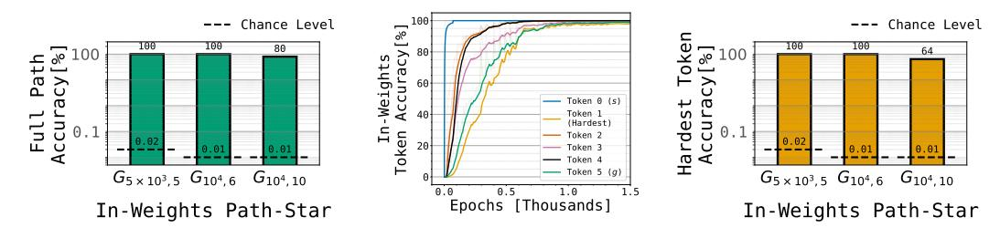

Figure 8: (left) Success of in-weights path-star task for *Mamba*. This figure is a counterpart to Fig. 4. A next-token-trained Mamba achieves perfect or highly non-trivial accuracy on large path-star graphs  $\mathcal{G}_{d,\ell}$  (Observation 1a). (middle) Learning order of tokens. The tokens of a path are not learned in the reverse order i.e., the model does not learn the right-to-left solution. Thus, gradients from the future tokens are not critical for success (Observation 1b). (right) Success of hardest-token-only task. In fact, the hardest token (the first token) given the leaf is learned in isolation to non-trivial accuracy (Observation 1c). Success of this  $\ell$ -fold composition task is hard to explain within the associative memory (§2.2).

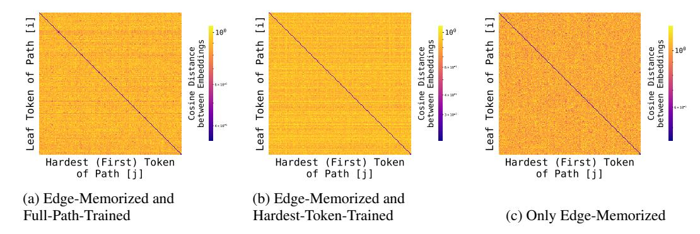

Figure 9: Evidence of global geometry in path-star task for *Mamba*. This figure is a counterpart to Figs. 6 and 16 for the Mamba SSM architecture. Recall that entry (i,j) is the mean cosine distance between the leaf token in (an unseen) path i (row) and first/hardest token on (an unseen) path j (col). Each heatmap corresponds to a different training objective: Left: trained on edges and path-finding task  $(\mathcal{D}_{\text{edge}} \cup \mathcal{D}_{\text{path}}^{\rightarrow})$ ; Middle: trained on edges and hardest-token-finding task (not presented in the main paper); Right: edges only  $(\mathcal{D}_{\text{edge}})$ . We find that even on these unseen paths, the leaf and first token embeddings cluster together, regardless of whether path-finding supervision exists. Interestingly, compared to the Transformer in Fig. 16, the Mamba trained only on local supervision (right) exhibits a much stronger geometry.

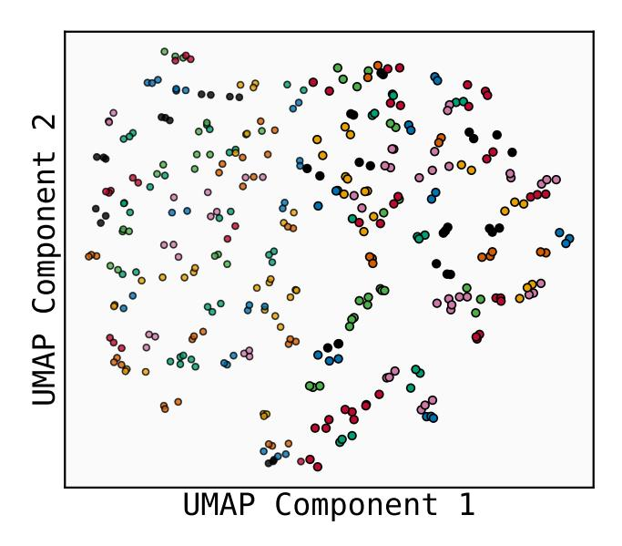

Figure 10: UMAP projection of token embeddings of Mamba exhibits path-star topology. We corroborate the UMAP [98] observations from the Transformer (Fig. 18) in Mamba SSM here. Each point is a node embedding; color indicates path identity. Different paths form separated clusters (although this clustering is weaker than for a Transformer); the central node  $v_{\mathtt{root}}$  is excluded since it is shared across all paths. The graph has degree  $10^4$  and path length 6 (including the root). Axes are UMAP components (arbitrary units). Note that we have re-used each color for multiple paths.

# C.2 Other large, harder path-finding graphs

Next, we consider variants of the path-finding graph. While the path-star graph is adversarially constructed in certain ways, there is only one decision-making step, which makes planning simpler in a certain way. To make the task harder, we introduce a branching at every node along each path. (Similar tree variants have been considered in [\[42\]](#page-22-7) for the in-context task, but we are interested in in-weights tasks.)

In the *tree*-star graph, Td,ℓ, there is a central node with degree d and each child node except the leaf has a fixed degree of 2, as visualized in Fig. [11a.](#page-40-0) The path-length from the root to any leaf is ℓ. In this graph, two types of learning tasks can be considered, depending on how we split the test and training paths. For a no-overlap setting, we could sample all training paths from one subset of trees, and the test paths from the remaining trees; we call this the *split at first token* setting, since the test/train split is determined by the first token. A second setting—-with some test-train overlap—is one where we reserve some leaves as training goals, and the rest as test-goals. Here, on any test path, a prefix may have participated in a training path. We call this the *split at leaf* setting. Note that in both variants, all nodes will be sampled as part of the edge-memorization task.

In Fig. [11b,](#page-40-0) we find that on both variants the Transformer achieves non-trivial path-finding accuracy, generalizing our results beyond the path-star task. However, we note that the test-train split at the first token is much harder to succeed at, likely due to no overlaps.

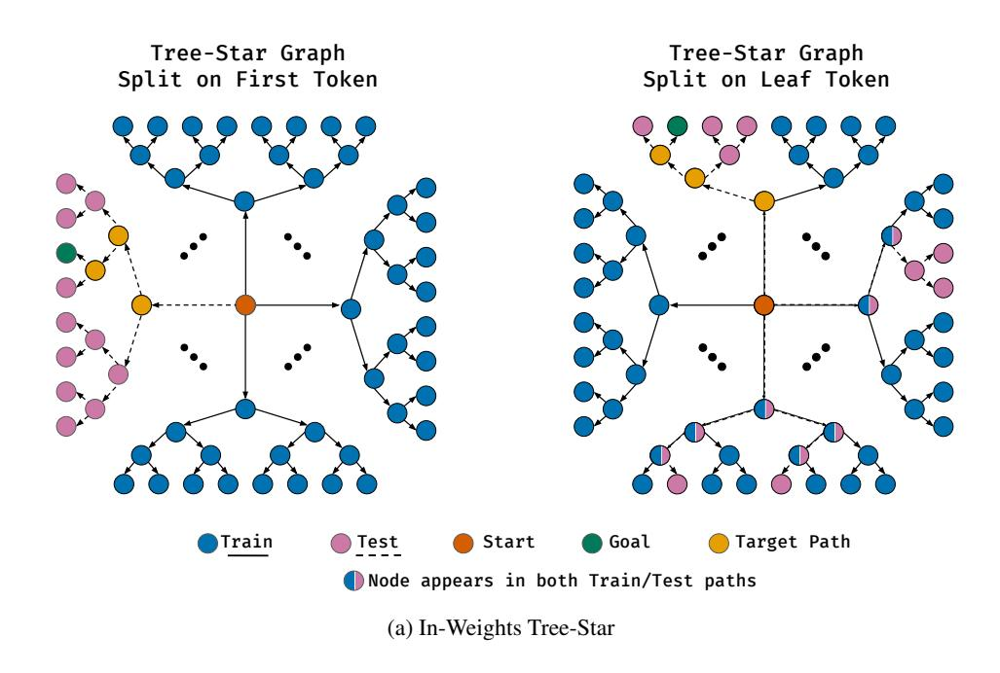

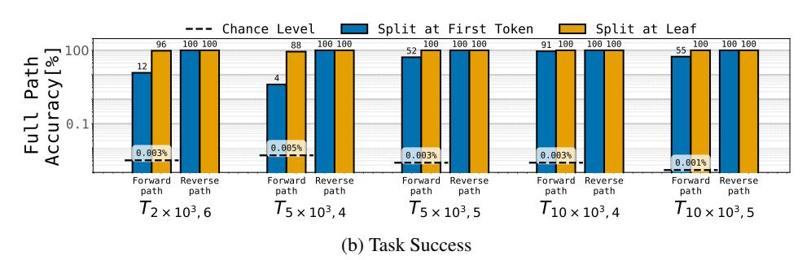

Figure 11: **Transformer achieves non-trivial accuracy on the harder in-weights tree-star task.** The tree-star task of §C.2 introduces decision-making at every step of the path, not just the first token. There are two variants of this task based on the test-train split. In the *split on first token* variant (**top-left**), we reserve some of the trees for generating training paths, and the rest for test paths. In the *split on leaf token* variant (**top-right**), we reserve some leaves for training and the rest for testing; some nodes may be sampled for path-finding during both test and train time. In both tasks, we have visualized a single target path. In the **bottom** figure, we report non-trivial path-finding accuracies on both tasks, above random chance defined as 1/num\_leaves.

# C.3 Tiny graphs

Besides the large path-star graph (of [§2\)](#page-5-0) and tree-star graphs (of [C.2\)](#page-39-0), we also report the embeddings learned on four tinier graphs for various architectures (details in [B.2.2\)](#page-34-0); the figures here are an extension of the Transformer embeddings in Fig. [1.](#page-1-0) In these experiments, we train the models purely on local supervision (the edges, presented in both directions) to 100% edge-memorization accuracy—for each vertex, we ensure that its d neighbors appear in the top d softmax probabilities. The graphs include (a) a tiny path-star graph with four paths of length 4, (b) a 4 × 4 grid graph, (c) a 15-node cycle graph and (d) an irregular graph with two asymmetryic components. Each visualization includes the embeddings from: an associative memory model (implemented with a neural network with only one trainable matrix sandwiched between (un)embedding layers), a Node2Vec model, the eigenvectors of the graph Laplacian, a Transformer's token embeddings, a neural network's first layer, and a Mamba SSM's token embeddings. For the Node2Vec model we use the top eigenvectors, and for the rest we use UMAP [\[98\]](#page-26-13) to choose the top directions.

We consolidate the various observations from these figures (Figs. [12](#page-42-0) to [15\)](#page-43-0) here:

Observation 5. *In the tiny graphs of Figs. [12](#page-42-0) to [15,](#page-43-0) on various architectures (Node2Vec, graph spectrum, Transformer, neural network, Mamba SSM), we find that:*

- *1. A geometry arises in all these architectures even without global supervision from a pathfinding task (Observation [3b\)](#page-12-2).*
- *2. The global information in these geometries can be traced back to the eigenvectors of the graph spectrum ([§4\)](#page-13-0).*
- *3. The geometry arises in all three deep sequence models (Transformer, Mamba SSM, neural network) even though these models can learn the data associatively using the same learning setup, with just the (un)embedding matrices frozen (Observation [3a\)](#page-11-3).*
- *4. The geometry of the Node2Vec model (which precludes associative memory), is much stronger than the deep sequence models, suggesting that the deep sequence models may be adulterated with associative memory (Hypothesis [4\)](#page-13-2).*
- *5. We note that similar geometries arise even with only one direction presented; see [§D.1.2.](#page-48-0) This is the scenario where both types of storage have the same bit and* ℓ2 *norm complexity; thus, there are no straightforward implicit pressures that encourage the geometry (Lemma [1\)](#page-12-1).*

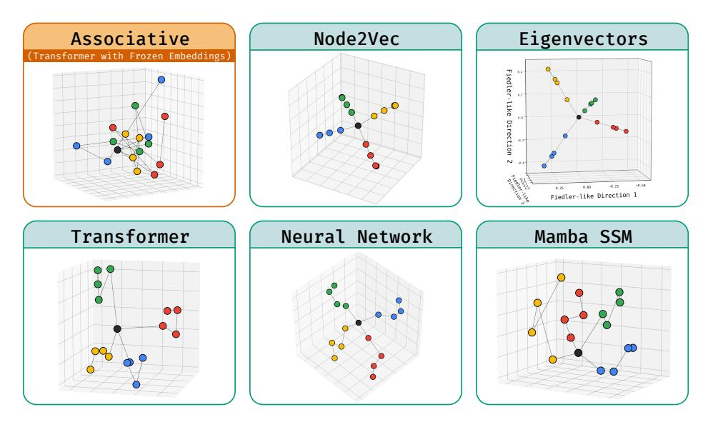

Figure 12: Tiny path-star: Geometries of various architectures on a smaller version of the path-star graph. See Observation [5.](#page-41-1)

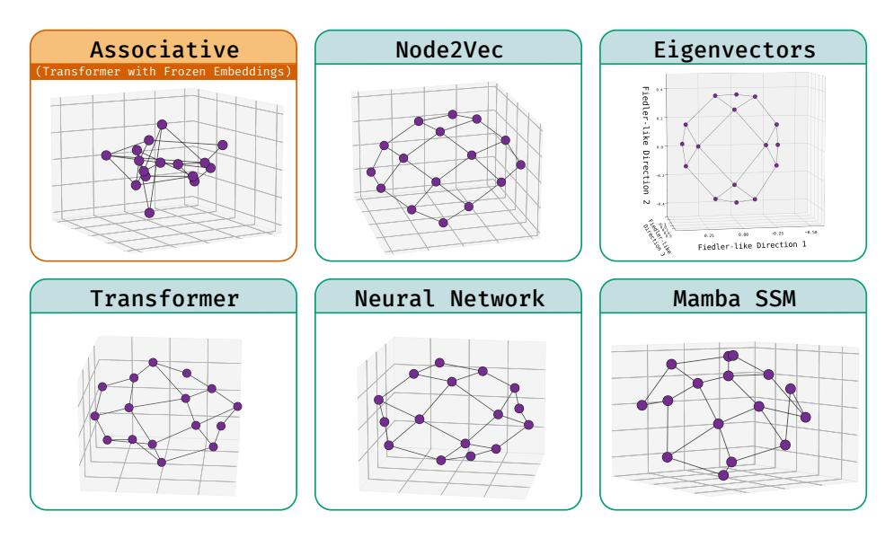

Figure 13: Tiny grid: Geometries of various architectures on a small 4 × 4 grid graph. See Observation [5.](#page-41-1)

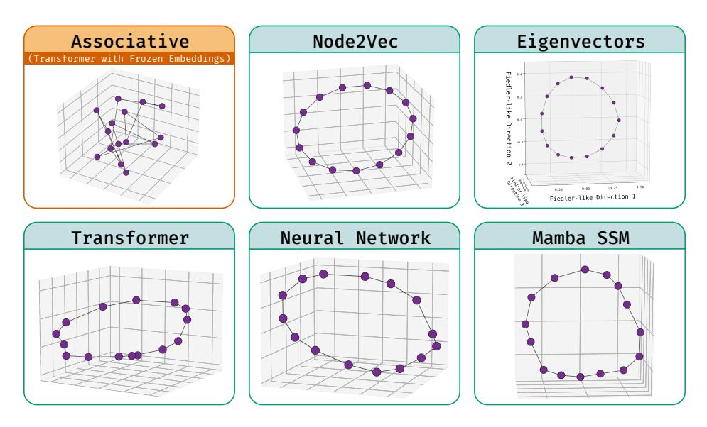

Figure 14: Tiny cycle: Geometries of various architectures on a small cycle graph. See Observation [5.](#page-41-1)

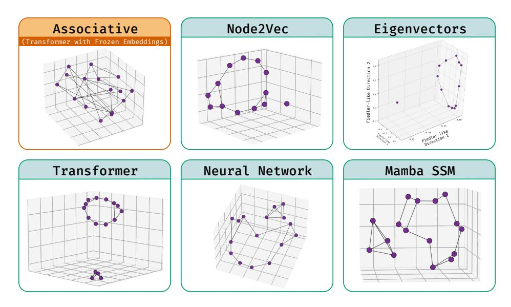

Figure 15: Tiny irregular graph: Geometries of various architectures on a small irregular graph of two connected components, both asymmetric. See Observation [5.](#page-41-1) Note that unlike in the other graphs, we do not use a 1-layer model here, but a 3-layered one.

# C.4 Additional experiments on path-star geometry

In the main paper, we present heatmaps showcasing the distance between the leaf nodes and the first node in every path. We consolidate these below and also provide an additional path-to-path distance heatmap.

**Leaf-first-hop distance** (**Fig. 16**). In Fig. 16 (an extended version of the heatmaps in Fig. 6), entry (i,j) is the cosine distance between the *leaf* embedding of path i and the *first-hop* (*indecipherable token*) embedding of path j. Diagonal entries are low (a leaf lies close to its correct first hop), while off-diagonals are higher. This structure explains why the first-token-only objective succeeds in-weights (Fig. 4-(Right)): the k-fold composition map reduces to a local geometric step in the learned representation.

**Path-by-path distance (Fig. 17).** Instead of only analyzing the distance between the leaf and first nodes, we analyze the distance across all pairs of nodes in a path. For each pair of paths (i, j), we compute the mean distance between *all* node embeddings on path i and all node embeddings on path j.

• **Diagonal** — **Intra-Path Distance** (i = j): This value is the average distance between all unique pairs of distinct nodes within a single path. It measures how tightly clustered the path's nodes are. A smaller value indicates higher cohesion.

$$D_{i,i} = \frac{1}{\binom{\ell}{2}} \sum_{1 \le k < m < \ell} d(v_k^{(i)}, v_m^{(i)})$$

• Off-diagonal — Inter-Path Distance  $(i \neq j)$ : This value is the average distance between all nodes of one path and all nodes of another. It measures how separated two distinct paths are. A larger value indicates greater separation.

$$D_{i,j} = \frac{1}{\ell^2} \sum_{k=1}^{\ell-1} \sum_{m=1}^{\ell-1} d(v_k^{(i)}, v_m^{(j)})$$

We find a similar clustering of nodes within paths here, although the diagonal is generally less vivid. For the model trained only on edge-memorization, we do not see the diagonal at all.

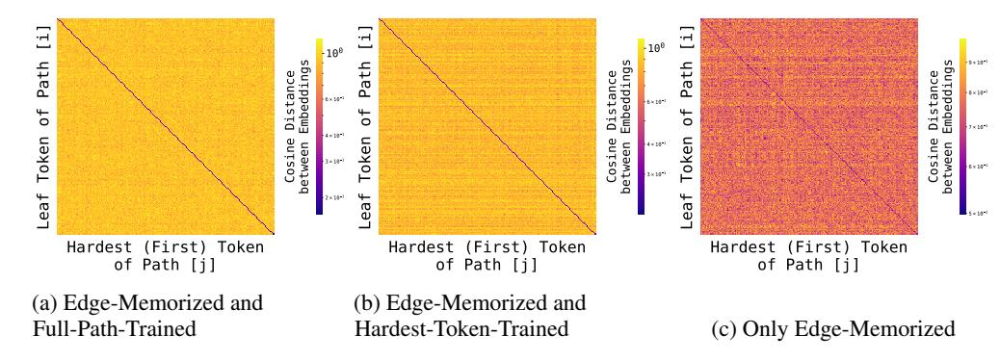

Figure 16: Evidence of global geometry in path-star task: Leaf-first-token cosine distance between node embeddings. We present again the heatmaps from Fig. 6 with an additional heatmap in the middle. Entry (i,j) is the mean cosine distance between the leaf token in (an unseen) path i (row) and first/hardest token on (an unseen) path j (col). Each heatmap corresponds to a different training objective: Left: trained on edges and path-finding task ( $\mathcal{D}_{\text{edge}} \cup \mathcal{D}_{\text{path}}^{\rightarrow}$ ); Middle: trained on edges and hardest-token-finding task (not presented in the main paper); Right: edges only ( $\mathcal{D}_{\text{edge}}$ ). We find that even on these unseen paths, the leaf and first token embeddings cluster together, regardless of whether path-finding supervision exists; however, the geometry is strongest with global supervision (however, in Mamba SSM, even the locally supervised model shows strong geometry; see Fig. 9).

UMAP **projection** (**Fig. 18**, **zoomed in version of Fig. 6**, **middle**). A different way to establish geometry is to directly visualize the paths. As done in Fig. 6, we do this by projecting the token

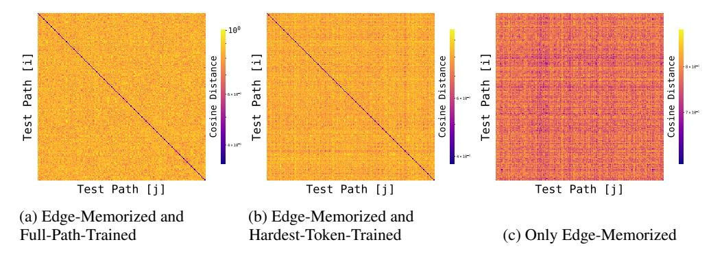

Figure 17: Evidence of global geometry in path-star task: Pathwise average cosine distance between node embeddings. While in Fig. 16, we reported the cosine distance between the embeddings of the terminal nodes of a pair of (unseen) paths, here we consider an average over all nodes in those (unseen) paths. In particular, entry (i,j) is the mean cosine distance between nodes on path i (row) and nodes on path j (col). On the first two settings, as before, we find that the diagonal cells are low, implying closer embeddings. Thus, a geometry has emerged on unseen paths. However, unlike in Fig. 6, we do not see any such signal when trained only on the edge memorization task.

embeddings of all nodes with default UMAP settings (neighbors=15, min\_dist=0.1). A zoomed in version of this is presented in Fig. 18. We exclude the root token embedding in these projections since that is common to all paths. We find that different paths form well-separated clusters, and within each path cluster, nodes tend to arrange from leaf toward  $v_{\rm root}$ .

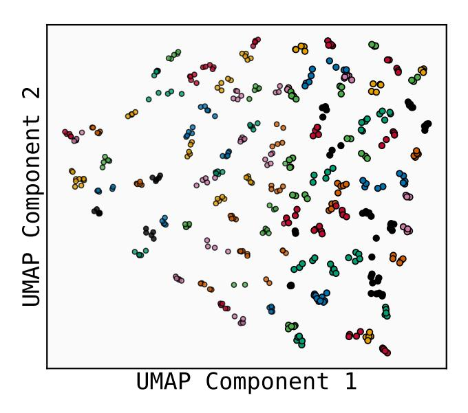

Figure 18: Zoomed in version of Fig. 6: UMAP projection of token embeddings exhibits path-star topology. Each point is a node embedding; color indicates path identity. Different paths form separated clusters; the central node  $v_{\rm root}$  is excluded since it is shared across all paths. The graph has degree  $10^4$  and path length 6 (which includes the root). Axes are UMAP components (arbitrary units). Note that we have re-used the same color for multiple paths.

# D Edge supervision and training dynamics

There are tangential aspects of our training that are worth elaborating on: the role of reverse edges (§D.1), the role of pause tokens (§D.2), and the role of interleaving edge-memorization (§D.3).

#### D.1 The role of reverse edges

Reverse edges seem to play a nuanced role in our observations. On the large path-star task in §2, we find it necessary to augment training on the reverse edges; on the other hand, for the tiny graphs, a geometry arises even without these reverse edges. Perhaps, reverse edges are needed for larger tasks; or perhaps, they are necessary to perform implicit reasoning and retrieval. We leave it for future work to gain greater clarity on this effect, which is tied to the reversal curse [15, 9].

# D.1.1 The critical role of reverse edges in the large path-star task

**Edge supervision regimes.** We evaluate three edge supervision regimes for the fixed in-weights graph: (i) *forward-only* edges  $\mathcal{D}_{\text{edge}}^{\rightarrow}$ , (ii) *backward-only* edges  $\mathcal{D}_{\text{edge}}^{\leftarrow}$ , and (iii) their mixture  $\mathcal{D}_{\text{edge}} = \mathcal{D}_{\text{edge}}^{\leftarrow} \cup \mathcal{D}_{\text{edge}}^{\leftarrow}$ , each combined with path supervision.

We consider two types of path-finding tasks. The first, as discussed in Section 2.1, is a forward generation  $(v_{\mathtt{root}} \to v_{\mathtt{leaf}})$  task defined by  $\mathcal{D}_{\mathtt{path}}^{\to}$ . Another task is reverse generation  $(v_{\mathtt{leaf}} \to v_{\mathtt{root}})$ , denoted by  $\mathcal{D}_{\mathtt{path}}^{\leftarrow}$ . Forward path generation is non-trivial to learn as it involves planning or look-ahead, and is adversarial towards next-token learning; the reverse path however is trivial to learn on path-star graphs because each node has a unique predecessor along the target path. We must also clarify that the presence of reverse edges in itself does not trivialize the forward path-finding task—these edges provide only local information; thus, the success of the global path-finding task is still non-trivial.

We enumerate our observations from these various edge-supervision regimes below:

#### **Observation 6.** (Role of reverse edges) We find in Fig. 19 that:

- 1. A Transformer trained on only the forward edges, struggles on both forward and reverse path-finding tasks (see the middle color in Fig. 19).
- 2. A Transformer trained on only the reverse edges, achieves non-trivial accuracy on the reverse path-finding task; however, it fails on the forward path-finding task (see the third color in Fig. 19).

We suspect that the lack of reverse edges either hurts the geometry *or* hurts the retrieval ability of the model. On the other hand, the success of the reverse path-finding task with reverse-only edge memorization could be explained by the fact that the task requires no planning, as discussed in the remark below.

Remark 1. We note that the asymmetry between forward and reversed path-generation tasks stems from their algorithmic complexity. The reversed path generation is algorithmically trivial on path-star graphs because each node has a unique predecessor along any target path—the model simply needs to follow the unique backward edges. Forward generation, however, requires planning (examine each outgoing path) or lookahead (track the reverse path without explicit chain-of-thought and reverse it). Indeed, for the in-context task of B&N'24, the model fails on the forward task, but strikingly succeeds on the reverse task, as corroborated in Fig. 20 (right). Even in the in-weights setting Fig. 20 (left), the reverse path is generally quicker to learn and yields higher accuracy.

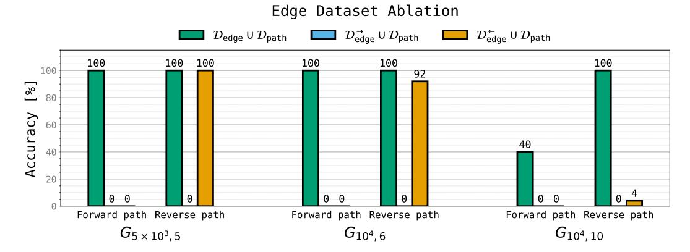

Figure 19: Mixed edge supervision enables forward path generation while forward-only fails due to reversal curse. Exact-match accuracy on held-out leaves for multiple path-star graphs (varying degree d and path length  $\ell$ ). As established, training on mixed edges  $\mathcal{D}_{edge}$  yields high non-trivial forward accuracy across graphs. But training on forward-only  $\mathcal{D}_{edge}^{\rightarrow}$  fails on both the forward and reverse tasks. This is indicative of the reversal curse. With backward-only edges ( $\mathcal{D}_{edge}^{\leftarrow}$ ) the model attains high accuracy primarily on reverse path generation for smaller graphs, This can be reconciled by noting that generating the reverse path is an easier retrieval task. Random forward path accuracy is 1/d.

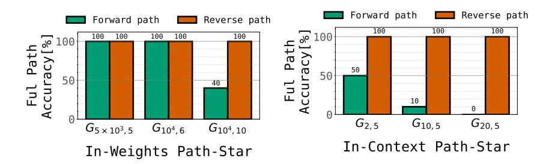

Figure 20: **Forward vs. reverse path generation:** The figure contrasts the model's performance on forward (start—leaf) and reverse (leaf—start) path generation tasks for path-star graphs learned either **in-weights** (left) or **in-context** (right). While both methods achieve perfect accuracy on the algorithmically simple reverse path task, their performance on the forward task differs dramatically. (**left**) The in-weights model succeeds at the forward task, which requires planning and look-ahead, demonstrating high accuracy even on large graphs with thousands of nodes. (**right**) In contrast, the in-context model completely fails at forward path generation. This stark difference highlights the superior capability of in-weights learning to internalize and utilize complex graph structures.

# D.1.2 Tiny graphs with uni-directional edge-memorization

In Fig. [21,](#page-48-1) we revisit our tiny graphs in [§C.3,](#page-41-0) and examine the embeddings of a Transformer when it memorizes only one direction of the edges. We find that a geometry still arises, although a bit weaker.

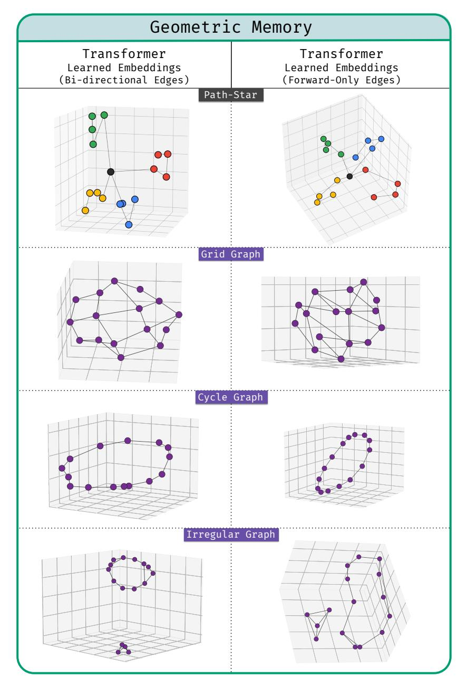

Figure 21: Embeddings of a Transformer with bi-directional vs. uni-direction edge memorization. With our smaller graphs, we find a geometry arise regardless of whether the model is made to memorize both or only one direction of each edge. However, the geometry is weaker (e.g., for the grid graph) under uni-directional memorization.

#### D.2 Pause tokens for computational slack

In the same in-weights path-finding task of §2, we find that it is helpful to insert pause tokens [21, 52] to achieve quicker accuracy gains during training. Pause tokens are added by appending dummy tokens to the prefix of the path-finding task both during training and inference.

Fig. 22 shows that adding a short sequence of pause tokens after the prompt reliably boosts exactmatch accuracy across graphs, for a given amount of training time. Increasing the number of pause tokens increases speed of convergence.

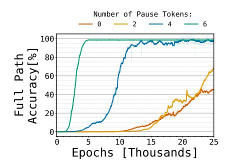

Figure 22: Pause tokens boost convergence speed of in-weights path-star path-finding task of §2.

#### D.3 (Not) Interleaving edge-memorization

In all our experiments, we have interleaved edge-memorization examples with path-finding examples. An alternative training method would be a two-phased approach, where we first enforce edge-memorization, and then follow up by finetuning on the path-finding task. We found this to be less stable, e.g., the model achieves a peak accuracy momentarily, only to deteriorate dramatically right after. This is a manifestation of the well-known effect that finetuning has on parametric memory [86, 92]. Since this is a confounding effect, we do not choose this regime for our experiments.

However, we confirm that even in this regime, our models do achieve a high peak accuracy (see Fig. 23). The fact that the composition task is learnable in this regime implies that the edge-pretrained model must have come with an adequate global geometry despite being trained only on local supervision (Observation 3b).

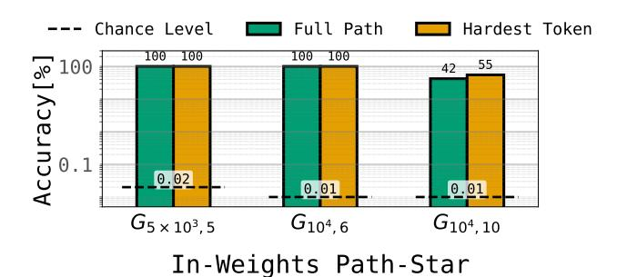

Figure 23: **Locally supervised model succeeds at path-finding task.** We report the *peak* accuracy under finetuning an edge-memorizing model on our path-finding task of §2. We emphasize that this accuracy value is only reached momentarily, and typically deteriorates quickly during further finetuning. Nevertheless, this suggests that local supervision alone was adequate to synthesize a global geometry (Observation 3b). Learning rates of the two phases are given in §B.3.

### D.4 Learning order of tokens

For clarity, in Fig. 24, we provide a side-by-side contrast between the order in which tokens are learned in the in-weights setup (with next-token prediction) and the in-context setup (with multi-token prediction).

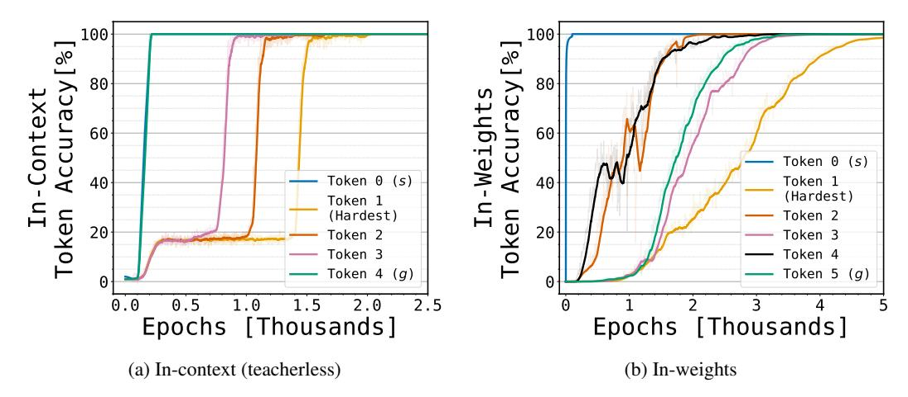

Figure 24: **Learning dynamics per token.** (a) In the in-context setting of  $\mathcal{G}_{2,5}$  (trained with a multi-token, teacherless objective since standard next-token prediction fails), later tokens are learned first indicating strong reliance on future-token signals. (b) In the in-weights setting of  $\mathcal{G}_{10^4,6}$  with next-token prediction, token accuracies rise largely in tandem (or in a somewhat confusing order); the first token is not selectively driven by future targets.

# E Proofs about representational complexity

# E.1 Empirical failure of composition learning under associative memory

As discussed in [§2.2,](#page-8-0) it is well-known that certain compositional tasks are hard to learn empirically; theoretically, this has been proven in a certain sense. However, these prior discussions involve composing information available in the context, rather than in the weights. To test this intuition in our in-weights composition task, we design an experiment where we freeze the embeddings of a Transformer and train it on our path-star task. If the model succeeded in this task, it may mean one of two things: either the model develops a geometric memory in a subsequent layer, or the model does in fact efficiently learn how to compose associative matrix operations—going against our intuition derived from prior limits on composition learning. However, we find that even after 50, 000 training epochs (using the same GPT-mid architecture described in Table [1](#page-35-2) and [§B.2.1,](#page-34-4) except with frozen token embeddings; and the optimization hyperparameter grid search reported in [§B.3\)](#page-35-0), the model fails to learn the in-weights path-star task. We believe, this is preliminary evidence that associative memory indeed struggles to learn compositional in-weights tasks. A fleshed-out proof of this negative result is left for future work.

# E.2 Succinctness does not break the tie: Proof of Proposition [1](#page-12-1)

In datasets where redundancies exist, the complexity of a lookup table scales quickly with the training set size (say n), whereas the more succinct solution does not (or at worst, grows polynomially slower). For example, if the data is linearly separable in some constant dimensionality, the linear classifier can be described in a constant number of bits, whereas a lookup table (such as a nearest neighbor model) would require n bits. However, this wide disparity in complexity does not necessarily surface in our setting, which is a *memorization* task without redundancies. Concretely, at least in terms of bits and ℓ2 norms, there are simple graphs where both the geometric and associative views are equally complex—there is no factor of n, which in our case should be the edge count or the vertex count of our graph. We informally prove this below.

We first roughly derive the bit and norm complexity for a general graph, showing how an associative memory scales with the edge count, whereas a geometric memory scales with the vertex count. Then, we argue how this resolves to similar values for graphs like the path-star or a cycle, where the edge count and the vertex count are the same (almost).

Notation. We let |V | be the number of entities and |E| the number of associations.

Proposition 2. *(Bit complexity) Storing a graph* G = (V, E)

- *with associative memory requires* |E| log |V | *many bits (with a multiplicative factor of* 2 *if both direction of the edges must be stored).*
- *with geometric memory requires* |V |m log ∆ *many bits where* m *is the embedding dimensionality, and* ∆ *is the number of cells along each dimension required to avoid collision. This is doubled if (un)embedding weights are not tied.*

*Proof.* In the local associative view, given as input any vertex u, we must be able to lookup the vertex IDs of its neighbors. Thus, at the position of this vertex, we need a total of d(u) log |V | many bits (where d(u) is the degree, and log |V | is the bit length of each ID). Summing this over all vertices gives us |E| log |V | many bits (since the sum of all degrees must equal the edge count). Note that an extra factor of 2 appears if both the direction of the edges must be stored.

In the geometric embedding, each vertex is stored as a vector in m dimensions. Each dimension must store one of ∆ values, which requires log ∆ bits. Summing this up across all dimensions and vertices gives us the result. This is doubled if the unembedding matrix is not weight-tied.

Proposition 3. *(*ℓ2 *norm complexity) Given a graph* G = (V, E)*, and without loss of generality, given the margin constraint that if* u *is a neighbor of* v*, then* f(u)[v] − arg maxw /∈*nbr*(u) f(u)[w] ≥ 1 *(*f(u)[v] *denotes the logit of predicting* v *given* u*; and* w *is a non-neighbor), then*

- 1. associative memory requires  $\ell_2$  norm of at most  $\sqrt{|E|}$  with an extra factor of  $\sqrt{2}$  if both directions must be stored.
- 2. geometric memory requires an  $\ell_2$  norm of at least  $\sqrt{|V|}$  with an extra factor of  $\sqrt{2}$  if (un)embedding weights are not tied.

*Proof.* Recall that associative memory takes the form  $f(u)[v] = \Phi(v)^T \mathbf{W}_{\mathsf{assoc}} \Phi(u)$ . Without loss of generality, if we assume that the embeddings are one-hot vectors in  $\mathbb{R}^{|V|}$ , we can set  $\mathbf{W}_{\mathsf{assoc}}$  to be the adjacency matrix to satisfy our margin constraint. The  $\ell_2$  norm (of the free parameters in  $\mathbf{W}_{\mathsf{assoc}}$ ) is  $\sqrt{|E|}$ .

In the geometric view, recall that  $f(u)[v] = \Phi_{\mathsf{geom}}(v)^T \Phi_{\mathsf{geom}}(u)$ . To have  $\Phi_{\mathsf{geom}}(v)^T \Phi_{\mathsf{geom}}(u) > 1$ , we need  $\|\Phi_{\mathsf{geom}}(v)\|^2 + \|\Phi_{\mathsf{geom}}(u)\|^2 > 2$ . Thus, roughly, all embedding norms must be at least 1, implying that  $\sum_{u} \|\Phi_{\mathsf{geom}}(u)\|^2 \geq |V|$ .

#### Proof of Main Lemma 1

*Proof.* Our proof follows from the fact that for graphs like the path-star graph and the cycle graph, the edge count and vertex count are nearly equal. Thus, both notions of complexity—the associative scaling with the edge count and the geometric with vertex count—can be shown to reduce to similar values here from the above propositions.

This is straightforward to see for  $\ell_2$  norm based complexity based on Lemma 3. For the bit complexity estimates, from Lemma 2, we know that associative memory costs  $|V|\log|E|$  many bits; for the geometry, we need to pin down the values of the embedding dimension m and the cell count  $\Delta$ .

The path-star graph can be embedded such that each path is stored along a unique dimension (thus totally m=d dimensions), and each dimension can be gridded into  $\ell$  many cells. This requires a bit complexity of  $|V|d\log\ell$ . For a more ambitious geometry, we could be further squeeze this into  $\log d$  dimensions while still keeping the paths well-separated (by the Johnson–Lindenstrauss lemma), resulting in  $|V|\log d\log\ell$  bits. This is still greater than the cost of associative memory which is approximately  $|V|(\log d\ell) = |V|(\log d + \log \ell)$ .

A similar argument works for a cycle graph. Here, we can embed in m=2 dimensions, with a cell count of |V|/2, thus totaling  $2|V|\log(|V|/2)$  bits for geometric memory, again greater than  $|V|\log|E|$  when |V|=|E|.

# E.3 Node2Vec can represent a form of associative memory

In the standard associative memory view that we have discussed, associations are represented through the function  $\Phi(v)^T \mathbf{W}_{\mathsf{assoc}} \Phi(u)$ . However, dual encoder models like Node2Vec can only represent functions of the form  $\Phi(v)^T \Phi(u)$ . While this precludes the form of associative memory we care about, it still allows a contrived form of associative memory when there is a sufficiently large embedding dimensionality. Below we show that given a set of edges E, and a dimensionality of |E|, we can construct embeddings such that the dot product of two adjacent vertices are high, but any non-adjacent vertices have zero dot product. In this sense, only local information is captured, whereas no global geometry is.

**Proposition 4.** Dual encoder models like Node2Vec can represent memory associatively with an embedding dimensionality of |E| where E is the set of pairwise associations.

*Proof.* Assume that each node is embedded in an |E|-dimensional space, where the ith dimension corresponds to the ith edge. Then, for edge (u,v) we assume that the embedding of u and v both are set to 1 along the dimension corresponding to (u,v). Notationally, if the edges are indexed as  $1,2,\ldots$ , then  $\Phi(u)_i=\mathbf{1}[u\in e_i]$ , where 1 is the indicator function. Then, we have that  $\Phi(u)\cdot\Phi(v)=\mathbf{1}[(u,v)\in E]$ . Thus, the dot products capture only local information. Any two non-adjacent vertices have a zero dot-product. No worthwhile geometry exists.

 $^6$ We suspect this should also be a lower bound i.e., such a large dimensionality must be needed to represent associatively in Node2Vec.

# F Detailed analysis of spectral bias in Node2Vec

Let G be a graph of n nodes  $\{1,2,\ldots,n\}$ . Let  $\mathbf{A} \in \mathbb{R}^{n \times n}$  be the adjacency matrix,  $\mathbf{D} \in \mathbb{R}^{n \times n}$  the diagonal degree matrix, and let the embedding of the nodes be denoted by  $\mathbf{V} \in \mathbb{R}^{n \times m}$ , where m is the embedding dimensionality. Let  $\mathbf{L} = (\mathbf{I} - \mathbf{D}^{-1}\mathbf{A}) + (\mathbf{I} - \mathbf{D}^{-1}\mathbf{A})^T$  denote the asymmetrically normalized random walk graph Laplacian. The second topmost eigenvectors of  $-\mathbf{L}$  are called the Fiedler vectors; we refer to them and the next few eigenvectors as Fiedler-like eigenvectors. The topmost eigenvector of  $-\mathbf{L}$  is a degenerate eigenvector of (approximately) all 1s.

Node2Vec setup. We consider the simplest Node2Vec model, where the embeddings are directly parameterized by V. We consider a 1-hop objective (where the neighborhood is defined by the immediate neighbors rather than by more distant ones discovered by a random walk). Note that our objective uses the full softmax loss:

$$\mathcal{J}_{\text{Node2Vec}}(\mathbf{V}) = \max_{\mathbf{V}} \sum_{i} \frac{1}{|\text{nbr}(\cdot)|} \sum_{j \in \text{nbr}(i)} \log \underbrace{\frac{\exp(\mathbf{v}_{i}^{T} \mathbf{v}_{j})}{\sum_{k} \exp(\mathbf{v}_{i}^{T} \mathbf{v}_{k})}}_{p(i,j)}, \tag{1}$$

where  $\mathtt{nbr}(\cdot)$  denotes the neighboring vertices in graph  $\mathcal{G}$ . The above (degree-normalized) objective resembles optimizing over a sequence dataset where we sample the first vertex uniformly, and the second vertex uniformly from its neighborhood.

Let  $\mathbf{P} \in \mathbb{R}^{n \times n}$  be the matrix of probabilities p(i, j), where:

$$\mathbf{P} = \texttt{row\_softmax}(\mathbf{V}\mathbf{V}^{\mathtt{T}}). \tag{2}$$

The dynamics of the Node2Vec algorithm can be expressed as below:

**Lemma 5.** The update on the representations under gradient maximization of the Node2Vec objective in Eq. 1 can be written as:

$$\Delta \mathbf{V}(t) = \eta \mathbf{C}(t)\mathbf{V}(t) \text{ where, } \mathbf{C}(t) = \underbrace{(\mathbf{D}^{-1}\mathbf{A} - \mathbf{P}(t)) + (\mathbf{D}^{-1}\mathbf{A} - \mathbf{P}(t))^{T}}_{\text{co-efficient matrix}} \tag{3}$$

We prove this in §F.4.

#### F.1 Challenges of analyzing the dynamics

Unlike previously-studied dynamics which simplify nicely, this system may behave in one of many ways. For one, it may simply diverge, but if we are a bit lucky, it may at least converge in direction (like in logistic regression [146]); but then, this direction then may be degenerate—an all-one representation could potentially be a stable direction—and perhaps nice directions are visible only if we analyze with early-stopping. One way to get a handle of this would have been to show that in the limit, we have  $\mathbf{C}(t) \to 0$ ; solving this could then spell out the (limit) probability matrix  $\mathbf{P}$ , if not the inner products  $\mathbf{V}\mathbf{V}^T$  themselves. However, we find that  $\mathbf{C}$  cannot be zero as that would require the self-probability term p(i,i)=0, which is infeasible. This closes all obvious analytical routes to understanding this system, so we turn to an empirical study.

# F.2 Empirical intuition of the dynamics

Empirically, we find that the model tends towards a gradient-zero state by working its way toward satisfying a two-fold constraint in Observation 7. First, the column space of  $\mathbf{V}(t)$  converges to the top eigenvectors of  $\mathbf{C}(0)$ —which is approximately the negative of the Laplacian  $\mathbf{L}$ . Concurrently,  $\mathbf{C}(t)$  itself converges such that its null space matches these eigenvectors. Together then, the update  $\Delta \mathbf{V}(t)$  in Lemma 5 must become zero.

**Observation 7.** We find that  $\Delta V(t) \rightarrow 0$  through the following concurrent behaviors:

• The null space of C(t) spans the top eigenvectors of -L.

• *The column space of* V(t) *converges to the top eigenvectors of* −L*.*

Crucially, we find that this can happen (a) even without a constraint on the dimensionality m and (b) this requires *no* early-stopping (see Remark [2](#page-54-1) for a more nuanced discussion of this).

We lay out our empirical intuition below, deferring a more mathematical description of the same to the following section. First, we postulate a key invariant during training: the eigenvectors of the coefficient matrix C(t), the probability matrix P(t) and the embeddings V(t) all remain (inexplicably) stable during training. In particular, since the system begins with P(0) ≈ I, and so C(0) ≈ −L all these eigenvectors are then fixed as the eigenvectors of the normalized random walk graph Laplacian .

Next, we find that the eigenvalues of the co-efficient matrix C(t) begin *negative*, gradually approaching zero. The top eigenvectors reach zero first, achieving the second condition in Observation [7.](#page-53-4) That the values begin negative follows from the fact that the co-efficient matrix begins as the negative graph Laplacian. That these values approach zero follows from the fact that embedding vectors become less orthogonal over time; this in turn reduces the eigenvalues of P(t), which increases the eigenvalues of C(t).

Next, due to the negative eigenvalues of C(t), the embeddings V along the lowermost eigendirections quickly diminish, achieving our first condition. Note that this means we do not want early-stopping; unlike in the quadratic loss formulation of Karkada et al. [\[75\]](#page-25-3), it is longer training that filters out the lower eigenvectors. (Although, the existence of a degenerate eigenvector complicates this; see Remark [2\)](#page-54-1). This achieves the first condition in Observation [7.](#page-53-4)

Observe that this argument does not require any upper bound on the size of the embedding space. It is unclear if a more succinct, margin-maximizing or norm-minimizing view of these dynamics is expressible.

Remark 2. *(The degenerate vector and early-stopping) When the graph Laplacian is symmetrically normalized (e.g.,* D−1/2AD−1/2−I*), the top-most eigenvector of the graph Laplacian is a degenerate vector that assigns a constant value to all nodes, and provably corresponds to a zero eigenvalue. However, in our setting, this eigenvalue is slightly above zero, likely due to the asymmetric nature of our Laplacian. Therefore, as we train for longer, the model would become degenerate thus requiring early-stopping. However, this is a conceptually different reason to early-stop than the one in Karkada et al. [\[75\]](#page-25-3). Here we may need to early-stop to prevent collapse to the top eigenvector, whereas in Karkada et al. [\[75\]](#page-25-3), it is to prevent expansion to bottom eigenvectors.*

# F.3 Mathematical description

Below, we provide a more mathematical description of the above summary by dividing it up into various propositions. Our proofs for these propositions are highly informal. However, our propositions hold in practice without our simplifying assumptions (at least in the graphs we study). We leave it for future work to deliver a rigorous proof and a more clearly characterized theorem statement.

First, we note that the co-efficient matrix approximately begins as the negative graph Laplacian for an appropriately large initialization. (Without this assumption, we may still make a connection to a graph Laplacian-*like* object).

Assumption 1. We assume a sufficiently large magnitude or embedding dimensionality of random initialization such that the initial embeddings are nearly orthogonal as V(0)V(0)T ≈ cI.

Fact 1. *Under Assumption [1,](#page-54-2)*

$$\mathbf{C}(0) \approx -\mathbf{L} = (\mathbf{D}^{-1}\mathbf{A} + (\mathbf{D}^{-1}\mathbf{A})^{T} - 2\mathbf{I}). \tag{4}$$

*Proof.* At time t = 0, the embeddings V(0) are all random, and hence nearly orthogonal to each other i.e., V(0)V(0)T ≈ cI, where c is some constant that depends upon the magnitude of the random initialization. Since P = row\_softmax(VV(t)), for a sufficiently large c, P(0) ≈ I, proving our claim.

Next, we make the empirical observation that the eigenvectors of P + PT match the eigenvectors of the embedding inner products VVT . Note that P is related to the inner product via a non-linear row softmax operation, rendering a proof of this observation highly non-trivial. We assume this observation (without even an intuitive proof) for the rest of our discussion.

**Observation 8.** (Eigenvectors remain unchanged under a row-softmax transform) The eigenvectors of  $\mathbf{P}(t) + \mathbf{P}(t)^T$  at any time t, are also approximately the eigenvectors of the embeddings  $\mathbf{V}(t)\mathbf{V}(t)^T$ , appearing in the same order.

From the above observation, we can conclude that the eigenvectors of the system match the Laplacian throughout training. This follows by how the updates reduce to muplications between matrices sharing the same eigenspaces.

**Proposition 6.** (Time-invariant eigenvectors match that of the Laplacian) With Assumption 1 and by assuming Observation 8 as a given, we have that for all t, the quantities  $\mathbf{C}(t)$ ,  $\mathbf{P}(t) + \mathbf{P}(t)^T$ ,  $\mathbf{V}(t)\mathbf{V}(t)^T$  have the same eigenvectors as that of the negative Laplacian  $-\mathbf{L}$ .

*Proof.* At any time t, we can write the embedding vectors as

$$\mathbf{V}(T) = \prod_{t=0}^{T-1} (1 + \eta \mathbf{C}(t)) \mathbf{V}(0), \tag{5}$$

and so the inner product as

$$\mathbf{V}(T)\mathbf{V}(T)^{T} = \prod_{t=0}^{T-1} (1 + \eta \mathbf{C}(t)) \underbrace{\mathbf{V}(0)\mathbf{V}(0)^{T}}_{\approx c\mathbf{I} \text{ by Assumption } \mathbf{I}} \prod_{t=0}^{T-1} (1 + \eta \mathbf{C}(t))^{T}$$
(6)

$$\approx c \prod_{t=0}^{T-1} (1 + \eta \mathbf{C}(t))(1 + \eta \mathbf{C}(t))^{T}.$$
 (7)

From here, we inductively prove our claim. At t=0, it is indeed the case that  $\mathbf{C}(t)$ ,  $\mathbf{P}(t)$ ,  $\mathbf{V}(t)\mathbf{V}(t)^T$  all have the same eigenvectors as  $\mathbf{L}$  either by Fact 1 for  $\mathbf{C}(0)$ , or trivially since  $\mathbf{P}(t)$  and  $\mathbf{V}(t)$  are orthogonal matrices. We assume this is true for all t until T-1. Then, by the above equation, it is also true that the inner product  $\mathbf{V}\mathbf{V}^T$  shares these eigenvectors. By invoking Observation 8, we can say that the same is true of the probability matrix  $\mathbf{P} + \mathbf{P}^T$ . Subsequently, this is true of  $\mathbf{C}(t)$ , which equals  $\mathbf{D}^{-1}\mathbf{A} + (\mathbf{D}^{-1}\mathbf{A})^T + (\mathbf{P} + \mathbf{P}^T)$ . (Note that the first term here has the same eigenvectors as  $-\mathbf{L}$  as it is off only by the identity matrix.) This proves our inductive assumption.

Next, we begin to bound the eigenvalues of the system. For the sake of our informal proofs we make some simplifying assumptions that make our matrices approximately symmetric; however, we do not need these assumptions in practice.

**Assumption 2.** For theoretical convenience, we assume that:

- $\mathbf{P} \approx \mathbf{P}^T$ .
- the embeddings (i.e., the rows of V) are of equal  $\ell_2$  norms.
- the degrees of all nodes are roughly equal.

Now, we can observe a bound on the eigenvalues of the probability matrix.

**Proposition 7.** (Eigenvalues of the probability matrix) Under Assumption 2, the eigenvalues of  $\mathbf{P}(t) + \mathbf{P}(t)^T$  are such that:

- 1. their sum is upper bounded by 2n (where n is the number of nodes).
- 2. they are each approximately bounded in [0, 2]

*Proof.* For the first result, recall the fact the sum of eigenvalues is the trace of the matrix. Since each diagonal term is at most 2 (it is 2p(i,i)), the trace is atmost 2n. This requires no special assumptions.

For the bounds on each eigenvalue, we can rely on the Gershgorin Circle theorem, which states that the eigenvalues lie in the union of discs centered at the diagonals p(i,i), each with radius equal to the sum of the absolute off-diagonal terms,  $\sum_{j\neq i} p(i,j)$ . The upper bound is then equal to the sum of the

rows. For  $\mathbf{P}(t)$ , this sum is equal to 1 due to the row-softmax operation. Assuming  $\mathbf{P}^T \approx \mathbf{P}$ —which is approximately true in practice, especially if the node degrees are uniform (but not always)—, we can conclude that the upper bound is approximately 2.

For the lower bound, if we have that the self-probabilities p(i,i) are the largest in any row, then the lower bound  $p(i,i) - \sum_{j \neq i} p(i,j)$  is at least zero. This is indeed the case if the embeddings of all nodes are of approximately equal norms, in which case the inner product  $\mathbf{V}\mathbf{V}^T$  is highest along the diagonal.

**Proposition 8.** The eigenvalues of  $\mathbf{D}^{-1}\mathbf{A} + (\mathbf{D}^{-1}\mathbf{A})^T$  approximately lie in [-2,2] assuming that the nodes have approximately uniform degree as in Assumption 2.

*Proof.* The diagonal of  $\mathbf{D}^{-1}\mathbf{A}$  is 0 (assuming no self-loops in the graph), while the off-diagonal values are all positive and sum up to 1 in each row. When the node degrees are approximately uniform,  $\mathbf{D}^{-1}\mathbf{A} \approx (\mathbf{D}^{-1}\mathbf{A})^T$ . From the Gergshgorin circle theorem, the eigenvalues lie in the union of discs centered at the diagonal (from the above, 0) with radii equal to the sum of the absolute off-diagonal terms (from the above, 2), thus proving our claim.

Now, we can establish the conditions in Observation 7, namely, the convergence of the null space of the co-efficient matrix from Observation 1c, and then the convergence of the embedding vectors.

**Proposition 9.** Under Assumption 2 and Assumption 1, at any time instant t, the eigenvalues of  $\mathbf{C}(t)$  are all strictly negative (except for the topmost eigenvalue, which is of a degenerate all-1 eigenvector, and is approximately zero), and this is so until when the top eigenvectors of the Laplacian converge into the null space of  $\mathbf{C}(t)$  (i.e., their eigenvalues become zero).

Intuition. Recall that  $\mathbf{C}(t) = \mathbf{D}^{-1}\mathbf{A} + (\mathbf{D}^{-1}\mathbf{A})^T - (\mathbf{P} + \mathbf{P}^T)$ . The eigenvalues of the first term lie approximately in [-2,2] from Lemma 8, while that of the probability term lie in [0,2], from Lemma 7. Note that eigenvalues of the probability matrix all begin uniformly at 2 in the beginning (as  $\mathbf{P}(0) = \mathbf{I}$ , by Fact 1 under Assumption 1), as a result of which the initial eigenvalues of  $\mathbf{C}(t)$  start at or below 0.

While the embeddings are initialized orthogonally under Assumption 1, they become less orthogonal during training, leading to a gradual decrease of the diagonal self-probability terms in  $\mathbf{P} + \mathbf{P}^T$ . Intuitively, this also means that the eigenvalues of  $\mathbf{P} + \mathbf{P}^T$  must themselves all decrease from the initial value of 2 (based on Lemma 7). In turn, the eigenvalues of  $\mathbf{C}(t)$ , which begin negative must gradually inch toward zero. The topmost eigenvalues—which are closest to zero—are the first to reach zero.

**Proposition 10.** (Embeddings converge to top eigenvectors) Assuming Observation 8 as a given, for a sufficiently small learning rate  $\eta$ , with increasing timestep t, the column space of  $\mathbf{V}(t)$  converges to the top eigenvectors of the negative graph Laplacian  $-\mathbf{L}$ , independent of the embedding dimensionality.

*Proof.* We can examine the dynamics of each embedding dimension separately. For the embedding dimension  $j=1,2,\ldots,m$ , let  $\mathbf{r}_j\in\mathbb{R}^n$  denote the jth column of the embedding matrix  $\mathbf{V}$ . The dynamics of this column (we drop the index j for the moment) at any timestep t can be isolated as:

$$\mathbf{r}(t) = \prod_{t=0}^{T} (1 + \eta \mathbf{C}(t))\mathbf{r}(0). \tag{8}$$

Given that C(t) have time-invariant eigenvectors (by Lemma 6), this can be further simplified as

$$\mathbf{r}(t) = \mathbf{E} \left( \prod_{t=0}^{T} (1 + \eta \mathbf{\Lambda}(t)) \right) \mathbf{E}^{T} \mathbf{r}(0).$$
 (9)

&lt;sup>7Note that this is not straightforward to show. It is possible that the even if the initial eigenvalues are very close to zero, they approach 0 slower than farther off values.

 $^8$ This is possible only in a dual-encoder, Node2Vec style architecture. In a Transformer for example, there are cross-dimensional interactions, due to the associative weight matrix  $\mathbf{W}_{\mathtt{assoc}}$  that interfaces between the embedding and unembedding layers.

Given that the eigenvalues in  $\Lambda$  are all less than or equal to zero (by Lemma 9), the term  $(1 + \eta \Lambda(t))$  must consist of a diagonal of values in [0,1] for an appropriately small learning rate. Furthermore, as T becomes large, the values of the top eigenvectors (which have the least eigenvalues, and therefore, the largest value of  $1 + \eta \lambda_i(t)$ ) must come to dominate. Then, as t increases, we can express the embedding dimension as an affine combination of some top K eigenvectors (where the coefficients depend on how the embedding dimension was initialized):

$$\mathbf{r}(t) \approx \sum_{k=1}^{K} \left( \prod_{t} (1 + \eta \lambda_k(t)) \mathbf{r}(0) \cdot \mathbf{e}_k \right) \mathbf{e}_k.$$
 (10)

# F.4 Deriving the dynamics

We provide proof of Lemma 5 which expresses the dynamical system of our Node2Vec objective in Eq 1.

*Proof.* For a pair of nodes with embeddings  $\mathbf{u} \in \mathbb{R}^m$ ,  $\mathbf{v} \in \mathbb{R}^m$ , the probability value of the edge  $(\mathbf{u}, \mathbf{v})$  can be written as:

$$p(\mathbf{u}, \mathbf{v}) = \frac{\exp(\mathbf{u} \cdot \mathbf{v})}{\sum_{\mathbf{v}'} \exp(\mathbf{u}, \mathbf{v}')}.$$
 (11)

Let N(u) denote the neighborhood of the node u, and  $N_u$ , its degree. Let  $\mathcal{J}_u$  denote the summand in the objective function specific to that node:

$$\mathcal{J}_{u}(\mathbf{V}) = \frac{1}{|N(u)|} \sum_{\mathbf{v} \in N(u)} \log p(\mathbf{u}, \mathbf{v})$$
(12)

We now compute the derivative of  $\mathcal{J}_u$  with respect to itself **u**:

$$\frac{\partial \mathcal{J}_{u}(\mathbf{V})}{\partial \mathbf{u}} = \frac{1}{N_{\mathbf{u}}} \sum_{\mathbf{v} \in N(u)} \left( \underbrace{\mathbf{v}}_{\text{numerator}} - \underbrace{\sum_{\mathbf{v}' \neq \mathbf{u}} p(\mathbf{u}, \mathbf{v}') \mathbf{v}' - 2p(\mathbf{u}, \mathbf{u}) \mathbf{u}}_{\text{denominator}} \right)$$
(13)

$$= \frac{1}{N_{\mathbf{u}}} \sum_{\mathbf{v} \in N(u)} \mathbf{v} - \sum_{\mathbf{v}' \neq \mathbf{u}} p(\mathbf{u}, \mathbf{v}') \mathbf{v}' - 2p(\mathbf{u}, \mathbf{u}) \mathbf{u}$$
(14)

Next, we compute the derivative of  $\mathcal{J}_w$  with respect to  $\mathbf{u}$  for nodes  $w \neq u$ :

$$\frac{\partial \mathcal{J}_w(\mathbf{V})}{\partial \mathbf{u}} = \frac{1}{N_w} \sum_{\mathbf{v} \in N(w)} \left( \underbrace{\mathbf{1}[u = v]\mathbf{w}}_{\text{numerator}} - \underbrace{p(\mathbf{w}, \mathbf{u})\mathbf{w}}_{\text{denominator}} \right)$$
(15)

$$= \frac{1}{N_w} \sum_{\mathbf{v} \in N(w)} \mathbf{1}[u = v] \mathbf{w} - p(\mathbf{w}, \mathbf{u}) \mathbf{w}$$
 (16)

(17)

By writing the above expressions as a matrix formula, we get the dynamical system claimed in Lemma 5.