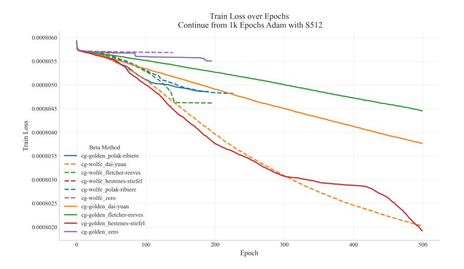
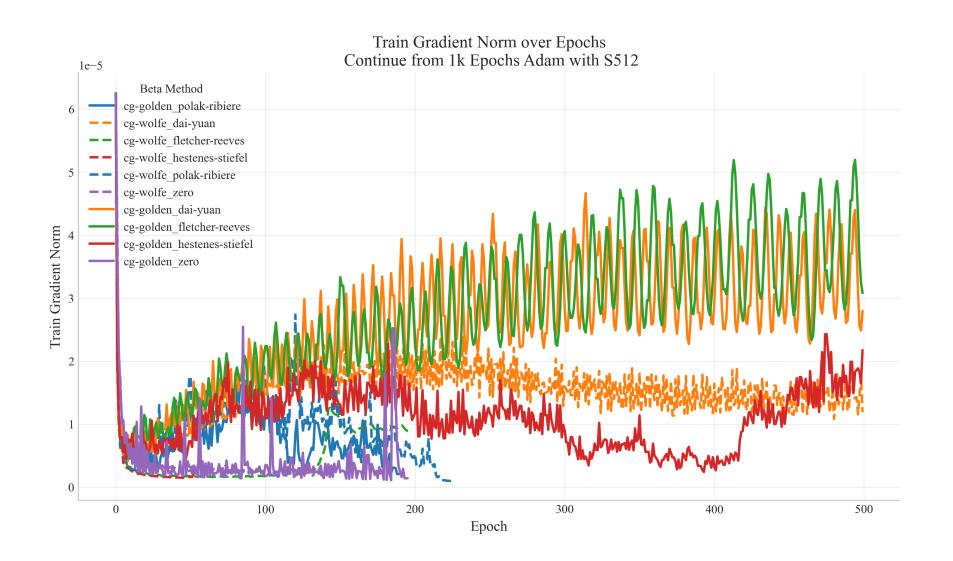
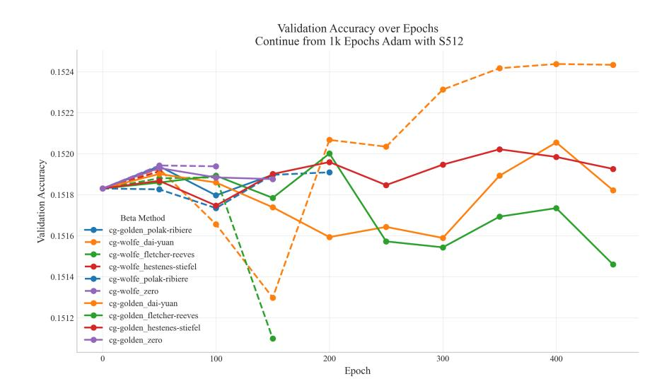
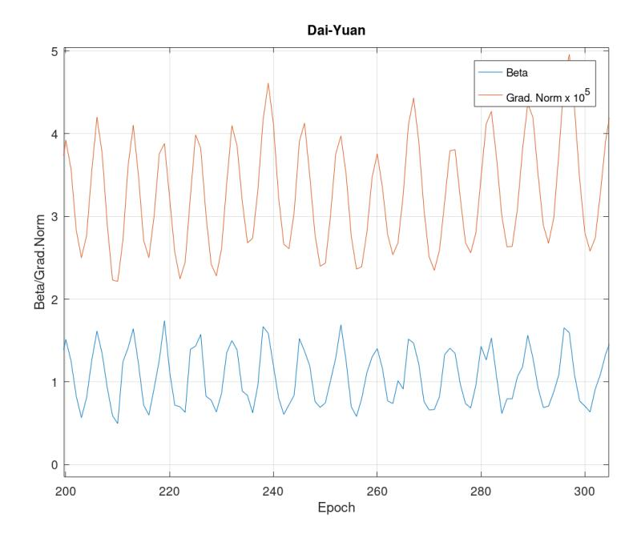

# Efficient variants of Conjugate Gradient Algorithm for Large Models

Anonymous Authors

Anonymous Institute

Abstract. Today's widespread loss minimization methods auch as Adam are the first order methods. They do not use the second order information around the local minimum for convergence improvement which may be substantial. The second order methods do this but their use has been limited by their larger computational expense. The attempts for their dedicated variants have focused on reducing this expense, neglecting the fact that they may lead to a premature termination of the algorithm, which is a more serious problem than the expense itself. We have focused on identifiying the possible causes of premature termination. One of them is using a fast but simplified line search, sacrificing its safety in reaching an improvement. The other is the method for determining the conjugate search direction. Several published alternatives are equivalent for strictly quadratic functions but exhibit different behaviour for deviations from quadratic or even locally non-convex regions. They may lead to non-descending search directions although the negative gradient itself is descending. The interaction of both leads frequently to premature stops. This theory has been verified with the help of computing experiments on a transformer-based language model and Machine Vision applications.

Keywords: Loss minimization· Convergende · Premature termination· Conjugate gradient method· Convex loss.

## 1 Introduction

Conjugate Gradient (CG) algorithm is one of the second order algorithms for minimization of convex functions. It is widely used by numerical mathematicians because of its convergence guarantees. As with other second order algorithms, the convexity of the function minimized are exploited with the help of a quadratic approximation. This is not possible with widespread first order algorithms such as Stochastic Gradient Descent (SGD) or Adam.

On the other hand, first order algorithms such as Adam have an excellent application record and are thus widely accepted in the AI community. This is why they are efficiently implemented in most AI tools.

Frequently quoted reasons for preference of the first order algorithms (such as Adam) over the second order ones (such as CG) are:

– computational expense per epoch of CG is larger than for Adam

– Adam makes optimization steps for batches (small subsets of the training set) so that there are many steps per epoch, which is expected to essentially accelerate the optimization progress

While Adam uses only a single gradient computation for an optimization step, CG subsequently performs a line search in the search direction, making a forward pass several times to evaluate the loss function. Typically about 10 such evaluations are necessary. A forward pass necessary for this takes about a third of the expense for the forward+backward pass necessary for a gradient computation. So, CG needs the quadruple (1+10/3) of a sole gradient computation per epoch. This may be substantial, but is only a constant factor which can be traded off by better convergence.

The true gradient ∇W for the training set of size K can only be exactly computed over a whole epoch. The gradient over a batch ∇bW (for batch size k) is a random approximation. The use of batch gradient is frequently justified by the fact that E [∇bW] is a good approximation of the true training set gradient ∇W, with standard deviation proportional to q K k . However, this argument is too simplistic. The same effect of following the successive approximations of the gradient can be equally reached by a large step in the direction of the true, epoch wise gradient.

Both groups of arguments have prevented CG from a wide use. Nevertheless, some modifications of CG have been attempted. The first group of arguments has nourished the assumption that the main problem of CG is its computational complexity. So, the most amendments followed the path of resource saving.

An example of this is the work of [?]. They focused on simplifying the Gauss-Newton method so that the performance is close to that of full method. The approach was with the help of preconditioning while retaining the batch concept (i.e., computing the gradient on a batch instead of the whole training set). This is a fast but rough method not compatible with any kind of line search which requires the entire training set loss.

Unfortunately, it seems that such simplifications annihilate the principal advantage of CG: its safe convergence. The most serious shortcoming is the premature termination. In the next section, the reasons for such premature stop are analyzed.

### 2 Reasons for premature termination of CG

Conjugate gradient algorithm consists of two basic steps:

- 1. determining the local loss gradient and the new conjugate search direction
- 2. line search in the search direction to find the optimum step length

The conjugate search direction is different from the steepest descent direction. It prevents spoiling the progress made in the previous iteration under the assumption, the loss can be approximated by a quadratic function.

One stopping criterion is that gradient norm is close to zero. Then, the local minimum can be assumed to be reached. This type of termination is rather scarce and mostly not premature.

Another criterion is that line search reached no significant loss improvement although the threshnold is usually set to be close to the machine precision. This can have two reasons:

- 1. line search failing to embrace the minimum
- 2. the search direction being such that no descent is possible (or too small to be measured).

Some line search procedures focus excessively on resource economy and rely on diverse assumptions such as strict convexity of the loss function. Then, an existing minimum can "slip through" the search.

With a significant gradient norm, it is, for smooth loss functions, guaranteed that a descent is possible. However, the conjugate search direction is not identical with the steepest gradient. For locally nonconvex loss functions, the search direction determined by the algorithm may exceptionally become non-descending.

This is why it is advisable to focus on line search with safe termination properties and safe search direction. This is the topic of the next two sections.

### 3 Safe line search

Most CG terminations take place within the line search. Every line search requires several evaluations of the loss function value (i.e., forward passes) and some variants also the determination of the gradient. This is why the majority of the computing time is consumed in line search.

This has put line search into the focus of attempts to reduce the resource need of CG. A typical preferred solution consists in testing the step size against Wolfe conditions (https://en.wikipedia.org/wiki/Wolfe\_conditions) instead of requiring it to be the local minimum in the search direction.

There are two conditions:

- 1. Armijo rule requiring a certain progress downwards as a predefined fraction to what could be expected by extrapolating the local gradient, and
- 2. curvature condition ensuring that the loss function downward slope becomes less steep (as expected for convex loss function)

Formally, for the search direction pi and step length αi

$$f(x_i + \alpha_i p_i) \le f(x_i) + c_1 \alpha_i p_i^T \nabla f(x_i)$$
(1)

and

$$-p_i^T \nabla f(x_i + \alpha_i p_i) \le -c_2 p_i^T \nabla f(x_i)$$
(2)

#### 4 Anonymous Authors

The meta-parameters  $0 < c_1 < 1$  and  $0 < c_2 < 1$  are set to some recomended, but otherwise arbitrary values. Candidate step sizes for testing with Wolfe conditions are generated by various schedules. However, it is not certain that some of the candidates will satisfy both conditions, which leads to (possibly premature) termination.

By contrast, there are simple procedures that determine the minimum with a predefined tolerance and do not terminate prematurely. One of the is the Golden search, described by Press et al.. Its prinicple is very simple. It starts with a set of three points (i.e., step sizes) (a,b,c) such that f(a) > f(b) and f(c) > f(b), i.e. the loss at the middle point being below that of outer points. Then a point u is set into the larger of gaps |b-a| and |c-b|, so that a quadruple (a,b,u,c) or (a,u,b,c), respectively, arises. In dependence on which of the inner points b and b has lower loss, a new triple is generated: for initial quadruple (a,b,u,c) it is (a,b,u) or (b,u,c), respectively. This triple becomes the new (a,b,c), with shrinking difference |c-a|. This is iterative continued until |c-a| becomes below the predefined tolerance. Then, the point b is the resulting optimum step size.

This procedure is safe in the sense that the approximate minimum within the initial triple (a, b, c) is always found. Of course, if an improvement (within machine precision) in the search direction does not exist, it cannot be found. This is the entry point for the discussion of safe search direction.

### 4 Safe search direction

The Conjugate Gradient algorithm has its origins in solving large linear equations Ax = b (A symmetric) with the help of minimizing  $\frac{1}{2}x^TAx - x^Tb$ . The minimum is where the gradient Ax - b is zero, which is the solution of the linear equation. This is a problem of quadratic minimization. The series of iterative solutions  $x_i$  has been determined so that the progress of past steps is not "spoiled" by the current step. The change directions with this property are the *conjugate directions* 

Later, an analogical procedure has been applied to convex minimizations of functions. In fact, it is quadratic minimization using a quadratic approximation of a convex function. In this case matrix A is unknown.

The principle of quadratic minimization is simple: the search direction  $h_i$  in the *i*-th iteration is updated with the help of the new negative gradient  $g_{i+1} = \nabla f(-x_{i+1})$  by recursive formula

$$h_{i+1} = g_{i+1} + \beta h_i \tag{3}$$

If line search has been consequently applied to find the line minimum in the preceding iterations (and the function is exactly quadratic, although its matrix A is unknown),

$$\beta_{FR} = \frac{g_{i+1}^T g_{i+1}}{g_i^T g_i} \tag{4}$$

ensures the conjugate property of consecutive search directions. Additionally, in this ideal situation, the following relationships are valid for  $i \neq j$ :

$$g_i^T g_j = 0$$
  

$$g_i^T h_j = 0$$
(5)

The definition eq. (4) is called, after its authors, the *Fletcher-Reeves* variant of  $\beta$ . It is the basic variant, perfectly appropriate for strictly quadratic functions.

However, the convex minimization is not confined to quadratic functions. Moreover, it is frequently not guaranteed that the function is everywhere convex. A locally concave function can still be optimized by gradient descent methods as long as its possesses a single local minimum. (This is to be distinguished from functions with multiple minima, which are automatically nonconvex. For this class of functions, no minimization algorithms with guaranteed convergence are available.)

Such properties of the minimized function cannot be recognized in advance and are presumably widespread in AI applications, in particular LLMs. This has been early recognized and modifications of eq. (4) have been proposed.

The best-known is the Polak-Ribière variant

$$\beta_{PR} = \frac{g_{i+1}^T(g_{i+1} - g_i)}{g_i^T g_i} = \beta_{FR} - \frac{g_{i+1}^T g_i}{g_i^T g_i} \tag{6}$$

For quadratic functions, it is identical with  $\beta_{FR}$  since the numerator of the second term is zero. With deviations from the quadratic form, there seems to be empirical evidence that this definition of  $\beta$  is more robust against such deviations than that of Fletcher-Reeves.

This robustness is essential for the termination behavior. If searching in negative gradient direction and the gradient norm is sufficiently different from zero, it is practically impossible that an improvement of the loss function is not found by line search (although this improvement may be small). In search directions different from the negative gradient, this is generally not the case. Every improvement of the  $\beta$  definition that makes this undesirable case less probable is welcome. Suggestions can be sought in related research. As mentioned above, the origin of CG has been in developing a numerically stable and efficient method for solving a linear equation system Ax = b with the help of minimizing  $\frac{1}{2}x^TAx - x^Tb$ . The gradient Ax - b is simultaneously equal to the residue r of the equation. In the pioneering work of Hestenes an Stiefel [1], an alternative  $\beta$  to eq. (6) is proposed:

$$\beta_{HS} = \frac{r_{i+1}^T A h_i}{-h_i^T A h_i} = \frac{g_{i+1}^T A h_i}{-h_i^T A h_i} \tag{7}$$

Using the equality (in terms of  $g_i$  instead of original  $r_i$ )

$$g_{i+1} = g_i + a_i A h_i \tag{8}$$

or

$$\frac{g_{i+1} - g_i}{a_i} = Ah_i \tag{9}$$

with ai being the step size to the line minimum in the direction of hi , eq. [\(10\)](#page-5-0) can be transformed to

$$\beta_{HS} = \frac{g_{i+1}^T \frac{g_{i+1} - g_i}{a_i}}{-h_i^T \frac{g_{i+1} - g_i}{a_i}} = \frac{g_{i+1}^T (g_{i+1} - g_i)}{-h_i^T (g_{i+1} - g_i)}$$
(10)

This is the formula of Hestenes-Stiefel in the form for convex minimization.

The denominator can be expanded and simplified with the help of eq. [\(3\)](#page-3-1) and eq. [\(5\)](#page-4-1) to

$$-h_i^T(g_{i+1} - g_i) = -h_i^T g_{i+1} + h_i^T g_i = h_i^T g_i$$
  
=  $(g_i + \beta h_{i-1})^T g_i = g_i^T g_i$  (11)

showing the equivalence to Polak-Ribière formula in the strictly quadratic loss function setting.

There is also further variant of β: the relatively new Dai-Yuan variant

$$\beta_{DY} = \frac{g_{i+1}^T g_{i+1}}{-h_i^T (g_{i+1} - g_i)} \tag{12}$$

with similar properties.

An ultimate help is a reset: if no progress has been reached, an attempt to search in the negative gradient direction (which is equivalent to β = 0) should be made.

In practice, different definitions lead to different convergence behavior of CG. This shows the importance of robustness again deviations from the convexity.

### 5 Computing experiments

To demonstrate the importance of a robust and safe method for computing both the search direction and the step size, a series of experiments have been done with a language model. The model is a simplified version of GPT2 architecture with a single decoder. The vocabulary matrix transforming the token IDs into embeddings has been fixed. This leads to a substantial reduction of trainable parameters. The loss has been defined as a mean square error of forecast output embedding with regard to the target embedding vectors. As a subsidiary, but not directly optimized characteristic, the accuracy of token forecast has been taken. Training set has been as subset of WikiText103 dataset.

Conjugate gradient is efficient only in convex or nearly convex settings. In (KDIR2025), we have proposed a two-phase method consisting in initial Adam optimization until the loss function reaches its approximately convex region, followed by CG optimization.

The Adam pre-training (1000 epochs) has been identical for all variants shown and is thus omitted from the plots.

CG variants have been along both the line search method and the computation of the coefficient Beta for determining the conjugate search directions. The Beta alternatives have been those of Fletcher-Reeves, Polak-Ribiere, Dai-Yuan and Hestenes-Stiefel. Additionally, the steepest descent search with Beta equal to zero is shown for comparison. The line search methods have been the Golden section search and the search using Wolfe conditions.

In fig. [1,](#page-7-0) the development of all variants is presented. The for determining Beta correspond to varying colors. The Golden search is represented by a solid line, Wolfe search by a dotted one.

It can be seen that good results can be reached by different methods as long as no premature termination takes place. All methods converge substantially better than the steepest descent (denoted as "zero"). With Golden line search, only one of four methods terminated too early. With Wolfe line search, it was three. This indicates that Golden line search is more robust against fluctuations in convexity.

Dai-Yuan and Hestenes-Stiefel Betas were the best in terminal loss value but with different line search methods: Dai-Yuan with Wolfe and Hestenes-Stiefel with Golden. Dai-Yuan lagged behind Hestenes-Stiefel with Golden while Hestenes-Stiefel has prematurely stopped with Wolfe. The most popular Polak-Riviere variant turned out to be relatively poor for both line search methods, additionally suffering from early stop.

The training set has been too small for substantial generalization. However, the accuracy on validation set shows a similar picture as that of training set loss fig. [3.](#page-8-0) The variants of Dai-Yuan and Hestenes-Stiefel are the superior ones.

An interesting supplementary viewpoint is given by the development of gradient norm fig. [2.](#page-7-1) The assumption that the initial point resulting from the Adam optimization is within the convex region around the minimum would be supported by decreasing gradient norm. This seems to be satisfied after about 80 epochs for the Polak-Ribiere variants and Dai-Yuan with Wolfe line search. The Hestenes-Stiefel variant with Golden line search follows this development only until the epoch 420 followed by a gradient norm growth.

Particularly intriguing is the gradient norm for Dai-Yuan and Fletcher-Reeves variants with Golden line search. There are distinct oscillations with a roughly constant period of ca. seven epochs. At least an intuitive insight can be given by comparing this with the development of the coefficient Beta. In fig. [4,](#page-8-1) both variables are shown for a magnified segment between Epochs 200 and 300. The oscillatory behaviour seems to be common for both. The frequency and thus period is identical, the peaks of Beta coincide with those of gradient norm. The basic definition eq. [\(4\)](#page-3-0) interpreted as the ratio of consecutive gradient norms suggests that a large increase of gradient norm would lead to a large Beta. This would correspond to beta oscillation phase leading by a quarter period before those of gradient norm. This cannot be observed in the given plot. Such modification of the phase relationship can only be caused by a feedback from Beta to the gradient norm. Since this occurred only in a small part of experiments (two out of eight), an explanation may be difficult to find. This is a topic for further research.

Fig. 1. Convergence of Conjugate Gradient Loss with various Beta for Golden and Wolfe. Training started from 1000 Epochs, Adam Pretraining with Subset-Size 512.

Fig. 2. Convergence of Conjugate Gradient method Gradient Norm of Training split with various Beta for Golden and Wolfe. Training started from 1000 Epochs, Adam Pretraining with Subset-Size 512.

Fig. 3. Convergence of Conjugate Gradient validation Accuracy with various Beta for Golden and Wolfe. Training started from 1000 Epochs, Adam Pretraining with Subset-Size 512.

Fig. 4. Development of Dai-Yuan Beta and gradient norm (multiplied by factor 102 ), magnified segment with Epoch 200 to 300.

### 6 Conclusion and further work

Some recent adaptations of the second order optimization methods, in particular of the Conjugate Gradient Algorithm, focus on more economical computations. However, such adaptations make them more prone to premature termination, which annihilates their most important advantage, a fast and accurate convergence to the minimum within a convex region of the loss function.

In face of this observation, we have focused on the opposite aspect: to look for algorithmic alternatives particularly robust against premature stops. We have identified two causes of premature termination:

- Using a fast but simplified line search, sacrificing its safety in reaching an improvement.
- Method for determining the conjugate search direction which may lead to non-descending search directions although the negative gradient itself is descending.

In the second category, there are several published alternatives which are equivalent for strictly quadratic functions but exhibit different behaviour for deviations from quadratic or even locally non-convex regions.

It is the interaction of both problem categories that frequently leads to premature stops. A large deviation of the search direction leads to a poor descent of line search which can be beyond the machine precision.

This has been verified with the help of computing experiments on a transformerbased language model and Machine Vision applications.

The task categories investigated are certainly not sufficient to make final conclusions about the algorithms. A test with genuinely large task will be addressed in future research.

One problematic occurrence seems to be a probably couter-effective oscillating behavior of gradient norm and the coefficient Beta which occurs in some algorithmic combinations for some problems. The analysis of this phenomenon is also a topic for future research.

### References

1. Hestenes, M.R., Stiefel, E.: Methods of conjugate gradients for solving linear systems, vol. 49. NBS Washington, DC (1952)