# **CHAPTER 1 Exploratory Data Analysis**

This chapter focuses on the first step in any data science project: exploring the data.

Classical statistics focused almost exclusively on *inference*, a sometimes complex set of procedures for drawing conclusions about large populations based on small sam‐ ples. In 1962, [John W. Tukey](https://oreil.ly/LQw6q) ([Figure 1-1](#page-1-0)) called for a reformation of statistics in his seminal paper "The Future of Data Analysis" [\[Tukey-1962\].](#page--1-0) He proposed a new scien‐ tific discipline called *data analysis* that included statistical inference as just one com‐ ponent. Tukey forged links to the engineering and computer science communities (he coined the terms *bit*, short for binary digit, and *soware*), and his original tenets are surprisingly durable and form part of the foundation for data science. The field of exploratory data analysis was established with Tukey's 1977 now-classic book *Explor‐ atory Data Analysis* [\[Tukey-1977\].](#page--1-0) Tukey presented simple plots (e.g., boxplots, scat‐ terplots) that, along with summary statistics (mean, median, quantiles, etc.), help paint a picture of a data set.

With the ready availability of computing power and expressive data analysis software, exploratory data analysis has evolved well beyond its original scope. Key drivers of this discipline have been the rapid development of new technology, access to more and bigger data, and the greater use of quantitative analysis in a variety of disciplines. David Donoho, professor of statistics at Stanford University and former undergradu‐ ate student of Tukey's, authored an excellent article based on his presentation at the Tukey Centennial workshop in Princeton, New Jersey [\[Donoho-2015\]](#page--1-0). Donoho traces the genesis of data science back to Tukey's pioneering work in data analysis.

<span id="page-1-0"></span>

*Figure 1-1. John Tukey, the eminent statistician whose ideas developed over 50 years ago form the foundation of data science*

# **Elements of Structured Data**

Data comes from many sources: sensor measurements, events, text, images, and vid‐ eos. The *Internet of Things* (IoT) is spewing out streams of information. Much of this data is unstructured: images are a collection of pixels, with each pixel containing RGB (red, green, blue) color information. Texts are sequences of words and nonword char‐ acters, often organized by sections, subsections, and so on. Clickstreams are sequen‐ ces of actions by a user interacting with an app or a web page. In fact, a major challenge of data science is to harness this torrent of raw data into actionable infor‐ mation. To apply the statistical concepts covered in this book, unstructured raw data must be processed and manipulated into a structured form. One of the commonest forms of structured data is a table with rows and columns—as data might emerge from a relational database or be collected for a study.

There are two basic types of structured data: numeric and categorical. Numeric data comes in two forms: *continuous*, such as wind speed or time duration, and *discrete*, such as the count of the occurrence of an event. *Categorical* data takes only a fixed set of values, such as a type of TV screen (plasma, LCD, LED, etc.) or a state name (Ala‐ bama, Alaska, etc.). *Binary* data is an important special case of categorical data that takes on only one of two values, such as 0/1, yes/no, or true/false. Another useful type of categorical data is *ordinal* data in which the categories are ordered; an example of this is a numerical rating (1, 2, 3, 4, or 5).

Why do we bother with a taxonomy of data types? It turns out that for the purposes of data analysis and predictive modeling, the data type is important to help determine the type of visual display, data analysis, or statistical model. In fact, data science software, such as *R* and *Python*, uses these data types to improve computational per‐ formance. More important, the data type for a variable determines how software will handle computations for that variable.

# **Key Terms for Data Types**

### *Numeric*

Data that are expressed on a numeric scale.

### *Continuous*

Data that can take on any value in an interval. (*Synonyms*: interval, float, numeric)

### *Discrete*

Data that can take on only integer values, such as counts. (*Synonyms*: integer, count)

### *Categorical*

Data that can take on only a specific set of values representing a set of possible categories. (*Synonyms*: enums, enumerated, factors, nominal)

### *Binary*

A special case of categorical data with just two categories of values, e.g., 0/1, true/false. (*Synonyms*: dichotomous, logical, indicator, boolean)

### *Ordinal*

Categorical data that has an explicit ordering. (*Synonym*: ordered factor)

Software engineers and database programmers may wonder why we even need the notion of *categorical* and *ordinal* data for analytics. After all, categories are merely a collection of text (or numeric) values, and the underlying database automatically han‐ dles the internal representation. However, explicit identification of data as categorical, as distinct from text, does offer some advantages:

- Knowing that data is categorical can act as a signal telling software how statistical procedures, such as producing a chart or fitting a model, should behave. In par‐ ticular, ordinal data can be represented as an ordered.factor in *R*, preserving a user-specified ordering in charts, tables, and models. In *Python*, scikit-learn supports ordinal data with the sklearn.preprocessing.OrdinalEncoder.
- Storage and indexing can be optimized (as in a relational database).
- The possible values a given categorical variable can take are enforced in the soft‐ ware (like an enum).

The third "benefit" can lead to unintended or unexpected behavior: the default behavior of data import functions in *R* (e.g., read.csv) is to automatically convert a text column into a factor. Subsequent operations on that column will assume that the only allowable values for that column are the ones originally imported, and assigning a new text value will introduce a warning and produce an NA (missing value). The pandas package in *Python* will not make such a conversion automatically. However, you can specify a column as categorical explicitly in the read\_csv function.

# **Key Ideas**

- Data is typically classified in software by type.
- Data types include numeric (continuous, discrete) and categorical (binary, ordinal).
- Data typing in software acts as a signal to the software on how to process the data.

# **Further Reading**

- The pandas [documentation](https://oreil.ly/UGX-4) describes the different data types and how they can be manipulated in *Python*.
- Data types can be confusing, since types may overlap, and the taxonomy in one software may differ from that in another. The [R Tutorial website](https://oreil.ly/2YUoA) covers the taxonomy for *R*.
- Databases are more detailed in their classification of data types, incorporating considerations of precision levels, fixed- or variable-length fields, and more; see the [W3Schools guide to SQL.](https://oreil.ly/cThTM)

# **Rectangular Data**

The typical frame of reference for an analysis in data science is a *rectangular data* object, like a spreadsheet or database table.

*Rectangular data* is the general term for a two-dimensional matrix with rows indicat‐ ing records (cases) and columns indicating features (variables); *data frame* is the spe‐ cific format in *R* and *Python*. The data doesn't always start in this form: unstructured data (e.g., text) must be processed and manipulated so that it can be represented as a set of features in the rectangular data (see ["Elements of Structured Data" on page 2\)](#page-1-0). Data in relational databases must be extracted and put into a single table for most data analysis and modeling tasks.

### **Key Terms for Rectangular Data**

#### <span id="page-4-0"></span>*Data frame*

Rectangular data (like a spreadsheet) is the basic data structure for statistical and machine learning models.

#### *Feature*

A column within a table is commonly referred to as a *feature*.

*Synonyms* attribute, input, predictor, variable

### *Outcome*

Many data science projects involve predicting an *outcome*—often a yes/no out‐ come (in [Table 1-1](#page-4-0), it is "auction was competitive or not"). The *features* are some‐ times used to predict the *outcome* in an experiment or a study.

### *Synonyms*

dependent variable, response, target, output

### *Records*

A row within a table is commonly referred to as a *record*.

### *Synonyms*

case, example, instance, observation, pattern, sample

| Category         | currency | sellerRating | Duration | endDay | ClosePrice | OpenPrice | Competitive? |
|------------------|----------|--------------|----------|--------|------------|-----------|--------------|
| Music/Movie/Game | US       | 3249         | 5        | Mon    | 0.01       | 0.01      | 0            |
| Music/Movie/Game | US       | 3249         | 5        | Mon    | 0.01       | 0.01      | 0            |
| Automotive       | US       | 3115         | 7        | Tue    | 0.01       | 0.01      | 0            |
| Automotive       | US       | 3115         | 7        | Tue    | 0.01       | 0.01      | 0            |
| Automotive       | US       | 3115         | 7        | Tue    | 0.01       | 0.01      | 0            |
| Automotive       | US       | 3115         | 7        | Tue    | 0.01       | 0.01      | 0            |
| Automotive       | US       | 3115         | 7        | Tue    | 0.01       | 0.01      | 1            |
| Automotive       | US       | 3115         | 7        | Tue    | 0.01       | 0.01      | 1            |

*Table 1-1. A typical data frame format*

In [Table 1-1,](#page-4-0) there is a mix of measured or counted data (e.g., duration and price) and categorical data (e.g., category and currency). As mentioned earlier, a special form of categorical variable is a binary (yes/no or 0/1) variable, seen in the rightmost column in [Table 1-1—](#page-4-0)an indicator variable showing whether an auction was competitive (had multiple bidders) or not. This indicator variable also happens to be an *outcome* vari‐ able, when the scenario is to predict whether an auction is competitive or not.

# **Data Frames and Indexes**

Traditional database tables have one or more columns designated as an index, essen‐ tially a row number. This can vastly improve the efficiency of certain database quer‐ ies. In *Python*, with the pandas library, the basic rectangular data structure is a DataFrame object. By default, an automatic integer index is created for a DataFrame based on the order of the rows. In pandas, it is also possible to set multilevel/hier‐ archical indexes to improve the efficiency of certain operations.

In *R*, the basic rectangular data structure is a data.frame object. A data.frame also has an implicit integer index based on the row order. The native *R* data.frame does not support user-specified or multilevel indexes, though a custom key can be created through the row.names attribute. To overcome this deficiency, two new packages are gaining widespread use: data.table and dplyr. Both support multilevel indexes and offer significant speedups in working with a data.frame.


### **Terminology Dierences**

Terminology for rectangular data can be confusing. Statisticians and data scientists use different terms for the same thing. For a sta‐ tistician, *predictor variables* are used in a model to predict a *response* or *dependent variable*. For a data scientist, *features* are used to predict a *target*. One synonym is particularly confusing: com‐ puter scientists will use the term *sample* for a single row; a *sample* to a statistician means a collection of rows.

## **Nonrectangular Data Structures**

There are other data structures besides rectangular data.

Time series data records successive measurements of the same variable. It is the raw material for statistical forecasting methods, and it is also a key component of the data produced by devices—the Internet of Things.

Spatial data structures, which are used in mapping and location analytics, are more complex and varied than rectangular data structures. In the *object* representation, the focus of the data is an object (e.g., a house) and its spatial coordinates. The *field* view, by contrast, focuses on small units of space and the value of a relevant metric (pixel brightness, for example).

Graph (or network) data structures are used to represent physical, social, and abstract relationships. For example, a graph of a social network, such as Facebook or LinkedIn, may represent connections between people on the network. Distribution hubs connected by roads are an example of a physical network. Graph structures are useful for certain types of problems, such as network optimization and recommender systems.

Each of these data types has its specialized methodology in data science. The focus of this book is on rectangular data, the fundamental building block of predictive modeling.


### **Graphs in Statistics**

In computer science and information technology, the term *graph* typically refers to a depiction of the connections among entities, and to the underlying data structure. In statistics, *graph* is used to refer to a variety of plots and *visualizations*, not just of connections among entities, and the term applies only to the visualization, not to the data structure.

### **Key Ideas**

- The basic data structure in data science is a rectangular matrix in which rows are records and columns are variables (features).
- Terminology can be confusing; there are a variety of synonyms arising from the different disciplines that contribute to data science (statistics, computer science, and information technology).

# **Further Reading**

- [Documentation on data frames in](https://oreil.ly/NsONR) *R*
- [Documentation on data frames in](https://oreil.ly/oxDKQ) *Python*

# **Estimates of Location**

Variables with measured or count data might have thousands of distinct values. A basic step in exploring your data is getting a "typical value" for each feature (variable): an estimate of where most of the data is located (i.e., its central tendency).

## **Key Terms for Estimates of Location**

#### *Mean*

The sum of all values divided by the number of values.

*Synonym*

average

#### *Weighted mean*

The sum of all values times a weight divided by the sum of the weights.

*Synonym* weighted average

#### *Median*

The value such that one-half of the data lies above and below.

*Synonym* 50th percentile

#### *Percentile*

The value such that *P* percent of the data lies below.

*Synonym* quantile

### *Weighted median*

The value such that one-half of the sum of the weights lies above and below the sorted data.

#### *Trimmed mean*

The average of all values after dropping a fixed number of extreme values.

*Synonym* truncated mean

### *Robust*

Not sensitive to extreme values.

*Synonym* resistant

### *Outlier*

A data value that is very different from most of the data.

*Synonym*

extreme value

<span id="page-8-0"></span>At first glance, summarizing data might seem fairly trivial: just take the *mean* of the data. In fact, while the mean is easy to compute and expedient to use, it may not always be the best measure for a central value. For this reason, statisticians have developed and promoted several alternative estimates to the mean.


#### **Metrics and Estimates**

Statisticians often use the term *estimate* for a value calculated from the data at hand, to draw a distinction between what we see from the data and the theoretical true or exact state of affairs. Data scien‐ tists and business analysts are more likely to refer to such a value as a *metric*. The difference reflects the approach of statistics versus that of data science: accounting for uncertainty lies at the heart of the discipline of statistics, whereas concrete business or organiza‐ tional objectives are the focus of data science. Hence, statisticians estimate, and data scientists measure.

### **Mean**

The most basic estimate of location is the mean, or *average* value. The mean is the sum of all values divided by the number of values. Consider the following set of num‐ bers: {3 5 1 2}. The mean is (3 + 5 + 1 + 2) / 4 = 11 / 4 = 2.75. You will encounter the symbol *x* (pronounced "x-bar") being used to represent the mean of a sample from a population. The formula to compute the mean for a set of *n* values *x*<sup>1</sup> , *x*2 , ..., *x<sup>n</sup>* is:

Mean = 
$$\bar{x} = \frac{\sum_{i=1}^{n} x_i}{n}$$


*N* (or *n*) refers to the total number of records or observations. In statistics it is capitalized if it is referring to a population, and lower‐ case if it refers to a sample from a population. In data science, that distinction is not vital, so you may see it both ways.

A variation of the mean is a *trimmed mean*, which you calculate by dropping a fixed number of sorted values at each end and then taking an average of the remaining val‐ ues. Representing the sorted values by *x* <sup>1</sup> , *x* <sup>2</sup> , ..., *x <sup>n</sup>* where *x* <sup>1</sup> is the smallest value and *x <sup>n</sup>* the largest, the formula to compute the trimmed mean with *p* smallest and largest values omitted is:

Trimmed mean = 
$$\bar{x} = \frac{\sum_{i=p+1}^{n-p} x_{(i)}}{n-2p}$$

<span id="page-9-0"></span>A trimmed mean eliminates the influence of extreme values. For example, in international diving the top score and bottom score from five judges are dropped, and the final score is the average of the scores from the three remaining judges. This makes it difficult for a single judge to manipulate the score, perhaps to favor their country's contestant. Trimmed means are widely used, and in many cases are preferable to using the ordinary mean—see "Median and Robust Estimates" on page 10 for further discussion.

Another type of mean is a *weighted mean*, which you calculate by multiplying each data value  $x_i$  by a user-specified weight  $w_i$  and dividing their sum by the sum of the weights. The formula for a weighted mean is:

Weighted mean = 
$$\bar{x}_w = \frac{\sum_{i=1}^{n} w_i x_i}{\sum_{i=1}^{n} w_i}$$

There are two main motivations for using a weighted mean:

- Some values are intrinsically more variable than others, and highly variable observations are given a lower weight. For example, if we are taking the average from multiple sensors and one of the sensors is less accurate, then we might downweight the data from that sensor.
- The data collected does not equally represent the different groups that we are interested in measuring. For example, because of the way an online experiment was conducted, we may not have a set of data that accurately reflects all groups in the user base. To correct that, we can give a higher weight to the values from the groups that were underrepresented.

# **Median and Robust Estimates**

The *median* is the middle number on a sorted list of the data. If there is an even number of data values, the middle value is one that is not actually in the data set, but rather the average of the two values that divide the sorted data into upper and lower halves. Compared to the mean, which uses all observations, the median depends only on the values in the center of the sorted data. While this might seem to be a disadvantage, since the mean is much more sensitive to the data, there are many instances in which the median is a better metric for location. Let's say we want to look at typical household incomes in neighborhoods around Lake Washington in Seattle. In comparing the Medina neighborhood to the Windermere neighborhood, using the mean would produce very different results because Bill Gates lives in Medina. If we use the median, it won't matter how rich Bill Gates is—the position of the middle observation will remain the same.

For the same reasons that one uses a weighted mean, it is also possible to compute a *weighted median*. As with the median, we first sort the data, although each data value has an associated weight. Instead of the middle number, the weighted median is a value such that the sum of the weights is equal for the lower and upper halves of the sorted list. Like the median, the weighted median is robust to outliers.

### **Outliers**

The median is referred to as a *robust* estimate of location since it is not influenced by *outliers* (extreme cases) that could skew the results. An outlier is any value that is very distant from the other values in a data set. The exact definition of an outlier is some‐ what subjective, although certain conventions are used in various data summaries and plots (see ["Percentiles and Boxplots" on page 20\)](#page-19-0). Being an outlier in itself does not make a data value invalid or erroneous (as in the previous example with Bill Gates). Still, outliers are often the result of data errors such as mixing data of different units (kilometers versus meters) or bad readings from a sensor. When outliers are the result of bad data, the mean will result in a poor estimate of location, while the median will still be valid. In any case, outliers should be identified and are usually worthy of further investigation.


### **Anomaly Detection**

In contrast to typical data analysis, where outliers are sometimes informative and sometimes a nuisance, in *anomaly detection* the points of interest are the outliers, and the greater mass of data serves primarily to define the "normal" against which anomalies are measured.

The median is not the only robust estimate of location. In fact, a trimmed mean is widely used to avoid the influence of outliers. For example, trimming the bottom and top 10% (a common choice) of the data will provide protection against outliers in all but the smallest data sets. The trimmed mean can be thought of as a compromise between the median and the mean: it is robust to extreme values in the data, but uses more data to calculate the estimate for location.


### **Other Robust Metrics for Location**

Statisticians have developed a plethora of other estimators for loca‐ tion, primarily with the goal of developing an estimator more robust than the mean and also more efficient (i.e., better able to discern small location differences between data sets). While these methods are potentially useful for small data sets, they are not likely to provide added benefit for large or even moderately sized data sets.

# <span id="page-11-0"></span>**Example: Location Estimates of Population and Murder Rates**

[Table 1-2](#page-11-0) shows the first few rows in the data set containing population and murder rates (in units of murders per 100,000 people per year) for each US state (2010 Census).

*Table 1-2. A few rows of the data.frame state of population and murder rate by state*

|   | State       | Population | Murder rate | Abbreviation |
|---|-------------|------------|-------------|--------------|
| 1 | Alabama     | 4,779,736  | 5.7         | AL           |
| 2 | Alaska      | 710,231    | 5.6         | AK           |
| 3 | Arizona     | 6,392,017  | 4.7         | AZ           |
| 4 | Arkansas    | 2,915,918  | 5.6         | AR           |
| 5 | California  | 37,253,956 | 4.4         | CA           |
| 6 | Colorado    | 5,029,196  | 2.8         | CO           |
| 7 | Connecticut | 3,574,097  | 2.4         | CT           |
| 8 | Delaware    | 897,934    | 5.8         | DE           |

Compute the mean, trimmed mean, and median for the population using *R*:

```
> state <- read.csv('state.csv')
> mean(state[['Population']])
[1] 6162876
> mean(state[['Population']], trim=0.1)
[1] 4783697
> median(state[['Population']])
[1] 4436370
```

To compute mean and median in *Python* we can use the pandas methods of the data frame. The trimmed mean requires the trim\_mean function in scipy.stats:

```
state = pd.read_csv('state.csv')
state['Population'].mean()
trim_mean(state['Population'], 0.1)
state['Population'].median()
```

The mean is bigger than the trimmed mean, which is bigger than the median.

This is because the trimmed mean excludes the largest and smallest five states (trim=0.1 drops 10% from each end). If we want to compute the average murder rate for the country, we need to use a weighted mean or median to account for different populations in the states. Since base *R* doesn't have a function for weighted median, we need to install a package such as matrixStats:

```
> weighted.mean(state[['Murder.Rate']], w=state[['Population']])
[1] 4.445834
> library('matrixStats')
```

```
> weightedMedian(state[['Murder.Rate']], w=state[['Population']])
[1] 4.4
```

Weighted mean is available with NumPy. For weighted median, we can use the special‐ ized package [wquantiles](https://oreil.ly/4SIPQ):

```
np.average(state['Murder.Rate'], weights=state['Population'])
wquantiles.median(state['Murder.Rate'], weights=state['Population'])
```

In this case, the weighted mean and the weighted median are about the same.

# **Key Ideas**

- The basic metric for location is the mean, but it can be sensitive to extreme values (outlier).
- Other metrics (median, trimmed mean) are less sensitive to outliers and unusual distributions and hence are more robust.

# **Further Reading**

- The Wikipedia article on [central tendency](https://oreil.ly/qUW2i) contains an extensive discussion of various measures of location.
- John Tukey's 1977 classic *Exploratory Data Analysis* (Pearson) is still widely read.

# **Estimates of Variability**

Location is just one dimension in summarizing a feature. A second dimension, *varia‐ bility*, also referred to as *dispersion*, measures whether the data values are tightly clus‐ tered or spread out. At the heart of statistics lies variability: measuring it, reducing it, distinguishing random from real variability, identifying the various sources of real variability, and making decisions in the presence of it.

# **Key Terms for Variability Metrics**

### *Deviations*

The difference between the observed values and the estimate of location.

*Synonyms*

errors, residuals

### *Variance*

The sum of squared deviations from the mean divided by *n* – 1 where *n* is the number of data values.

| Synonym<br>mean-squared-error                                                                                                              |
|--------------------------------------------------------------------------------------------------------------------------------------------|
| Standard deviation<br>The square root of the variance.                                                                                     |
| Mean absolute deviation<br>The mean of the absolute values of the deviations from the mean.                                                |
| Synonyms<br>l1-norm, Manhattan norm                                                                                                        |
| Median absolute deviation from the median<br>The median of the absolute values of the deviations from the median.                          |
| Range<br>The difference between the largest and the smallest value in a data set.                                                          |
| Order statistics<br>Metrics based on the data values sorted from smallest to biggest.                                                      |
| Synonym<br>ranks                                                                                                                           |
| Percentile<br>The value such that P<br>percent of the values take on this value or less and (100–P)<br>percent take on this value or more. |
| Synonym<br>quantile                                                                                                                        |
| Interquartile range<br>The difference between the 75th percentile and the 25th percentile.                                                 |
| Synonym<br>IQR                                                                                                                             |
|                                                                                                                                            |

Just as there are different ways to measure location (mean, median, etc.), there are also different ways to measure variability.

# **Standard Deviation and Related Estimates**

The most widely used estimates of variation are based on the differences, or *devia‐ tions*, between the estimate of location and the observed data. For a set of data {1, 4, 4}, the mean is 3 and the median is 4. The deviations from the mean are the differences: 1 – 3 = –2, 4 – 3 = 1, 4 – 3 = 1. These deviations tell us how dispersed the data is around the central value.

<span id="page-14-0"></span>One way to measure variability is to estimate a typical value for these deviations. Averaging the deviations themselves would not tell us much—the negative deviations offset the positive ones. In fact, the sum of the deviations from the mean is precisely zero. Instead, a simple approach is to take the average of the absolute values of the deviations from the mean. In the preceding example, the absolute value of the devia‐ tions is {2 1 1}, and their average is (2 + 1 + 1) / 3 = 1.33. This is known as the *mean absolute deviation* and is computed with the formula:

Mean absolute deviation 
$$=$$
  $\frac{\sum_{i=1}^{n} |x_i - \bar{x}|}{n}$ 

where *x* is the sample mean.

The best-known estimates of variability are the *variance* and the *standard deviation*, which are based on squared deviations. The variance is an average of the squared deviations, and the standard deviation is the square root of the variance:

Variance 
$$= s^2 = \frac{\sum_{i=1}^{n} (x_i - \bar{x})^2}{n-1}$$
  
Standard deviation  $= s = \sqrt{\text{Variance}}$ 

The standard deviation is much easier to interpret than the variance since it is on the same scale as the original data. Still, with its more complicated and less intuitive for‐ mula, it might seem peculiar that the standard deviation is preferred in statistics over the mean absolute deviation. It owes its preeminence to statistical theory: mathemati‐ cally, working with squared values is much more convenient than absolute values, especially for statistical models.

### **Degrees of Freedom, and** *n* **or** *n* **– 1?**

In statistics books, there is always some discussion of why we have *n* – 1 in the denominator in the variance formula, instead of *n*, leading into the concept of *degrees of freedom*. This distinction is not important since *n* is generally large enough that it won't make much difference whether you divide by *n* or *n* – 1. But in case you are interested, here is the story. It is based on the premise that you want to make esti‐ mates about a population, based on a sample.

If you use the intuitive denominator of *n* in the variance formula, you will underesti‐ mate the true value of the variance and the standard deviation in the population. This is referred to as a *biased* estimate. However, if you divide by *n* – 1 instead of *n*, the variance becomes an *unbiased* estimate.

<span id="page-15-0"></span>To fully explain why using *n* leads to a biased estimate involves the notion of degrees of freedom, which takes into account the number of constraints in computing an esti‐ mate. In this case, there are *n* – 1 degrees of freedom since there is one constraint: the standard deviation depends on calculating the sample mean. For most problems, data scientists do not need to worry about degrees of freedom.

Neither the variance, the standard deviation, nor the mean absolute deviation is robust to outliers and extreme values (see ["Median and Robust Estimates"](#page-9-0) on page 10 for a discussion of robust estimates for location). The variance and standard devia‐ tion are especially sensitive to outliers since they are based on the squared deviations.

A robust estimate of variability is the *median absolute deviation from the median* or MAD:

Median absolute deviation = Median *x*<sup>1</sup> − *m* , *x*<sup>2</sup> − *m* , ..., *x<sup>N</sup>* − *m*

where *m* is the median. Like the median, the MAD is not influenced by extreme val‐ ues. It is also possible to compute a trimmed standard deviation analogous to the trimmed mean (see ["Mean" on page 9](#page-8-0)).


The variance, the standard deviation, the mean absolute deviation, and the median absolute deviation from the median are not equiv‐ alent estimates, even in the case where the data comes from a nor‐ mal distribution. In fact, the standard deviation is always greater than the mean absolute deviation, which itself is greater than the median absolute deviation. Sometimes, the median absolute devia‐ tion is multiplied by a constant scaling factor to put the MAD on the same scale as the standard deviation in the case of a normal dis‐ tribution. The commonly used factor of 1.4826 means that 50% of the normal distribution fall within the range ±MAD (see, e.g., *<https://oreil.ly/SfDk2>*).

# **Estimates Based on Percentiles**

A different approach to estimating dispersion is based on looking at the spread of the sorted data. Statistics based on sorted (ranked) data are referred to as *order statistics*. The most basic measure is the *range*: the difference between the largest and smallest numbers. The minimum and maximum values themselves are useful to know and are helpful in identifying outliers, but the range is extremely sensitive to outliers and not very useful as a general measure of dispersion in the data.

To avoid the sensitivity to outliers, we can look at the range of the data after dropping values from each end. Formally, these types of estimates are based on differences between *percentiles*. In a data set, the  $P$ th percentile is a value such that at least  $P$  percent of the values take on this value or less and at least  $(100 - P)$  percent of the values take on this value or more. For example, to find the 80th percentile, sort the data. Then, starting with the smallest value, proceed 80 percent of the way to the largest value. Note that the median is the same thing as the 50th percentile. The percentile is essentially the same as a *quantile*, with quantiles indexed by fractions (so the .8 quantile is the same as the 80th percentile).

A common measurement of variability is the difference between the 25th percentile and the 75th percentile, called the interquartile range (or IQR). Here is a simple example:  $\{3,1,5,3,6,7,2,9\}$ . We sort these to get  $\{1,2,3,3,5,6,7,9\}$ . The 25th percentile is at 2.5, and the 75th percentile is at 6.5, so the interquartile range is  $6.5 - 2.5 = 4$ . Software can have slightly differing approaches that yield different answers (see the following tip); typically, these differences are smaller.

For very large data sets, calculating exact percentiles can be computationally very expensive since it requires sorting all the data values. Machine learning and statistical software use special algorithms, such as [Zhang-Wang-2007], to get an approximate percentile that can be calculated very quickly and is guaranteed to have a certain accuracy.


#### Percentile: Precise Definition

If we have an even number of data ( $n$  is even), then the percentile is ambiguous under the preceding definition. In fact, we could take on any value between the order statistics  $x_{(i)}$  and  $x_{(i+1)}$  where j satisfies

$$100 * \frac{j}{n} \le P < 100 * \frac{j+1}{n}$$

Formally, the percentile is the weighted average:

Percentile(*P*) = 
$$(1 - w)x_{(i)} + wx_{(i+1)}$$

for some weight *w* between 0 and 1. Statistical software has slightly differing approaches to choosing  $w$ . In fact, the R function quan tile offers nine different alternatives to compute the quantile. Except for small data sets, you don't usually need to worry about the precise way a percentile is calculated. *Python's* numpy.guantile supports five approaches, with linear interpolation being the default.

# <span id="page-17-0"></span>**Example: Variability Estimates of State Population**

[Table 1-3](#page-17-0) (repeated from [Table 1-2](#page-11-0) for convenience) shows the first few rows in the data set containing population and murder rates for each state.

|  | Table 1-3. A few rows of the data.frame state of population and murder rate by state |  |
|--|--------------------------------------------------------------------------------------|--|
|  |                                                                                      |  |

|   | State       | Population | Murder rate | Abbreviation |
|---|-------------|------------|-------------|--------------|
| 1 | Alabama     | 4,779,736  | 5.7         | AL           |
| 2 | Alaska      | 710,231    | 5.6         | AK           |
| 3 | Arizona     | 6,392,017  | 4.7         | AZ           |
| 4 | Arkansas    | 2,915,918  | 5.6         | AR           |
| 5 | California  | 37,253,956 | 4.4         | CA           |
| 6 | Colorado    | 5,029,196  | 2.8         | CO           |
| 7 | Connecticut | 3,574,097  | 2.4         | CT           |
| 8 | Delaware    | 897,934    | 5.8         | DE           |

Using *R*'s built-in functions for the standard deviation, the interquartile range (IQR), and the median absolute deviation from the median (MAD), we can compute esti‐ mates of variability for the state population data:

```
> sd(state[['Population']])
[1] 6848235
> IQR(state[['Population']])
[1] 4847308
> mad(state[['Population']])
[1] 3849870
```

The pandas data frame provides methods for calculating standard deviation and quantiles. Using the quantiles, we can easily determine the IQR. For the robust MAD, we use the function robust.scale.mad from the statsmodels package:

```
state['Population'].std()
state['Population'].quantile(0.75) - state['Population'].quantile(0.25)
robust.scale.mad(state['Population'])
```

The standard deviation is almost twice as large as the MAD (in *R*, by default, the scale of the MAD is adjusted to be on the same scale as the mean). This is not surprising since the standard deviation is sensitive to outliers.

# **Key Ideas**

- Variance and standard deviation are the most widespread and routinely reported statistics of variability.
- Both are sensitive to outliers.
- More robust metrics include mean absolute deviation, median absolute deviation from the median, and percentiles (quantiles).

# **Further Reading**

- David Lane's online statistics resource has a [section on percentiles](https://oreil.ly/o2fBI).
- Kevin Davenport has a [useful post on](https://oreil.ly/E7zcG) *R*-Bloggers about deviations from the median and their robust properties.

# **Exploring the Data Distribution**

Each of the estimates we've covered sums up the data in a single number to describe the location or variability of the data. It is also useful to explore how the data is dis‐ tributed overall.

# **Key Terms for Exploring the Distribution**

### *Boxplot*

A plot introduced by Tukey as a quick way to visualize the distribution of data.

### *Synonym*

box and whiskers plot

### *Frequency table*

A tally of the count of numeric data values that fall into a set of intervals (bins).

### *Histogram*

A plot of the frequency table with the bins on the x-axis and the count (or pro‐ portion) on the y-axis. While visually similar, bar charts should not be confused with histograms. See ["Exploring Binary and Categorical Data" on page 27](#page-26-0) for a discussion of the difference.

### *Density plot*

A smoothed version of the histogram, often based on a *kernel density estimate*.

# <span id="page-19-0"></span>**Percentiles and Boxplots**

In ["Estimates Based on Percentiles" on page 16,](#page-15-0) we explored how percentiles can be used to measure the spread of the data. Percentiles are also valuable for summarizing the entire distribution. It is common to report the quartiles (25th, 50th, and 75th per‐ centiles) and the deciles (the 10th, 20th, …, 90th percentiles). Percentiles are espe‐ cially valuable for summarizing the *tails* (the outer range) of the distribution. Popular culture has coined the term *one-percenters* to refer to the people in the top 99th per‐ centile of wealth.

[Table 1-4](#page-19-0) displays some percentiles of the murder rate by state. In *R*, this would be produced by the quantile function:

```
quantile(state[['Murder.Rate']], p=c(.05, .25, .5, .75, .95))
 5% 25% 50% 75% 95%
1.600 2.425 4.000 5.550 6.510
```

The pandas data frame method quantile provides it in *Python*:

```
state['Murder.Rate'].quantile([0.05, 0.25, 0.5, 0.75, 0.95])
```

*Table 1-4. Percentiles of murder rate by state*

| 5%   | 25%  | 50%  | 75%  | 95%  |
|------|------|------|------|------|
| 1.60 | 2.42 | 4.00 | 5.55 | 6.51 |

The median is 4 murders per 100,000 people, although there is quite a bit of variabil‐ ity: the 5th percentile is only 1.6 and the 95th percentile is 6.51.

*Boxplots*, introduced by Tukey [\[Tukey-1977\],](#page--1-0) are based on percentiles and give a quick way to visualize the distribution of data. [Figure 1-2](#page-20-0) shows a boxplot of the pop‐ ulation by state produced by *R*:

```
boxplot(state[['Population']]/1000000, ylab='Population (millions)')
```

pandas provides a number of basic exploratory plots for data frame; one of them is boxplots:

```
ax = (state['Population']/1_000_000).plot.box()
ax.set_ylabel('Population (millions)')
```

<span id="page-20-0"></span>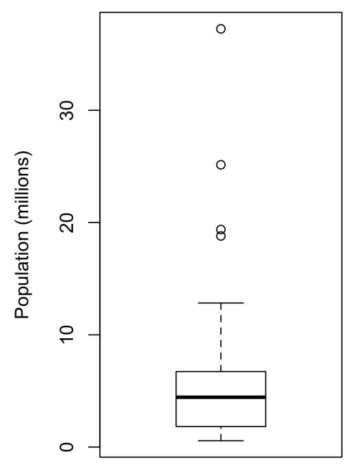

*Figure 1-2. Boxplot of state populations*

From this boxplot we can immediately see that the median state population is about 5 million, half the states fall between about 2 million and about 7 million, and there are some high population outliers. The top and bottom of the box are the 75th and 25th percentiles, respectively. The median is shown by the horizontal line in the box. The dashed lines, referred to as *whiskers*, extend from the top and bottom of the box to indicate the range for the bulk of the data. There are many variations of a boxplot; see, for example, the documentation for the *R* function boxplot [\[R-base-2015\].](#page--1-0) By default, the *R* function extends the whiskers to the furthest point beyond the box, except that it will not go beyond 1.5 times the IQR. *Matplotlib* uses the same imple‐ mentation; other software may use a different rule.

Any data outside of the whiskers is plotted as single points or circles (often consid‐ ered outliers).

# <span id="page-21-0"></span>**Frequency Tables and Histograms**

A frequency table of a variable divides up the variable range into equally spaced seg‐ ments and tells us how many values fall within each segment. [Table 1-5](#page-21-0) shows a fre‐ quency table of the population by state computed in *R*:

```
breaks <- seq(from=min(state[['Population']]),
 to=max(state[['Population']]), length=11)
pop_freq <- cut(state[['Population']], breaks=breaks,
 right=TRUE, include.lowest=TRUE)
table(pop_freq)
```

The function pandas.cut creates a series that maps the values into the segments. Using the method value\_counts, we get the frequency table:

```
binnedPopulation = pd.cut(state['Population'], 10)
binnedPopulation.value_counts()
```

| BinNumber | BinRange                  | Count | States                                                                  |
|-----------|---------------------------|-------|-------------------------------------------------------------------------|
| 1         | 563,626–4,232,658         | 24    | WY,VT,ND,AK,SD,DE,MT,RI,NH,ME,HI,ID,NE,WV,NM,NV,UT,KS,AR,MS,IA,CT,OK,OR |
| 2         | 4,232,659–<br>7,901,691   | 14    | KY,LA,SC,AL,CO,MN,WI,MD,MO,TN,AZ,IN,MA,WA                               |
| 3         | 7,901,692–<br>11,570,724  | 6     | VA,NJ,NC,GA,MI,OH                                                       |
| 4         | 11,570,725–<br>15,239,757 | 2     | PA,IL                                                                   |
| 5         | 15,239,758–<br>18,908,790 | 1     | FL                                                                      |
| 6         | 18,908,791–<br>22,577,823 | 1     | NY                                                                      |
| 7         | 22,577,824–<br>26,246,856 | 1     | TX                                                                      |
| 8         | 26,246,857–<br>29,915,889 | 0     |                                                                         |
| 9         | 29,915,890–<br>33,584,922 | 0     |                                                                         |
| 10        | 33,584,923–<br>37,253,956 | 1     | CA                                                                      |

*Table 1-5. A frequency table of population by state*

The least populous state is Wyoming, with 563,626 people, and the most populous is California, with 37,253,956 people. This gives us a range of 37,253,956 – 563,626 = 36,690,330, which we must divide up into equal size bins—let's say 10 bins. With 10 equal size bins, each bin will have a width of 3,669,033, so the first bin will span from 563,626 to 4,232,658. By contrast, the top bin, 33,584,923 to 37,253,956, has only one state: California. The two bins immediately below California are empty, until we reach Texas. It is important to include the empty bins; the fact that there are no values in those bins is useful information. It can also be useful to experiment with different bin sizes. If they are too large, important features of the distribution can be obscured. If they are too small, the result is too granular, and the ability to see the bigger picture is lost.


Both frequency tables and percentiles summarize the data by creat‐ ing bins. In general, quartiles and deciles will have the same count in each bin (equal-count bins), but the bin sizes will be different. The frequency table, by contrast, will have different counts in the bins (equal-size bins), and the bin sizes will be the same.

A histogram is a way to visualize a frequency table, with bins on the x-axis and the data count on the y-axis. In [Figure 1-3](#page-23-0), for example, the bin centered at 10 million (1e+07) runs from roughly 8 million to 12 million, and there are six states in that bin. To create a histogram corresponding to [Table 1-5](#page-21-0) in *R*, use the hist function with the breaks argument:

```
hist(state[['Population']], breaks=breaks)
```

pandas supports histograms for data frames with the DataFrame.plot.hist method. Use the keyword argument bins to define the number of bins. The various plot meth‐ ods return an axis object that allows further fine-tuning of the visualization using Matplotlib:

```
ax = (state['Population'] / 1_000_000).plot.hist(figsize=(4, 4))
ax.set_xlabel('Population (millions)')
```

The histogram is shown in [Figure 1-3.](#page-23-0) In general, histograms are plotted such that:

- Empty bins are included in the graph.
- Bins are of equal width.
- The number of bins (or, equivalently, bin size) is up to the user.
- Bars are contiguous—no empty space shows between bars, unless there is an empty bin.

<span id="page-23-0"></span>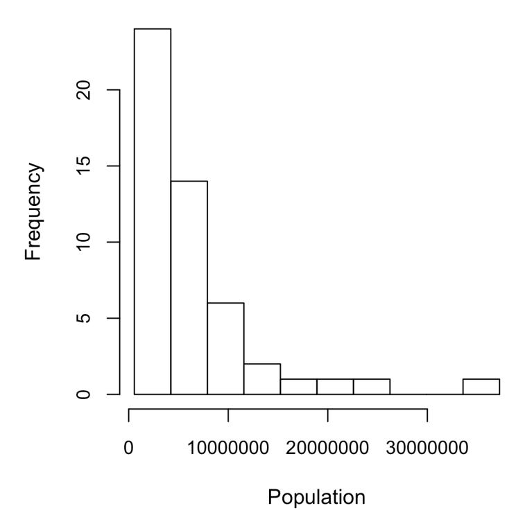

*Figure 1-3. Histogram of state populations*


### **Statistical Moments**

In statistical theory, location and variability are referred to as the first and second *moments* of a distribution. The third and fourth moments are called *skewness* and *kurtosis*. Skewness refers to whether the data is skewed to larger or smaller values, and kurtosis indicates the propensity of the data to have extreme values. Gener‐ ally, metrics are not used to measure skewness and kurtosis; instead, these are discovered through visual displays such as Fig‐ ures [1-2](#page-20-0) and [1-3](#page-23-0).

### **Density Plots and Estimates**

Related to the histogram is a density plot, which shows the distribution of data values as a continuous line. A density plot can be thought of as a smoothed histogram, although it is typically computed directly from the data through a *kernel density esti‐ mate* (see [\[Duong-2001\]](#page--1-0) for a short tutorial). [Figure 1-4](#page-24-0) displays a density estimate superposed on a histogram. In *R*, you can compute a density estimate using the density function:

```
hist(state[['Murder.Rate']], freq=FALSE)
lines(density(state[['Murder.Rate']]), lwd=3, col='blue')
```

pandas provides the density method to create a density plot. Use the argument bw\_method to control the smoothness of the density curve:

```
ax = state['Murder.Rate'].plot.hist(density=True, xlim=[0,12], bins=range(1,12))
state['Murder.Rate'].plot.density(ax=ax)
ax.set_xlabel('Murder Rate (per 100,000)')
```


Plot functions often take an optional axis (ax) argument, which will cause the plot to be added to the same graph.

A key distinction from the histogram plotted in [Figure 1-3](#page-23-0) is the scale of the y-axis: a density plot corresponds to plotting the histogram as a proportion rather than counts (you specify this in *R* using the argument freq=FALSE). Note that the total area under the density curve = 1, and instead of counts in bins you calculate areas under the curve between any two points on the x-axis, which correspond to the proportion of the distribution lying between those two points.

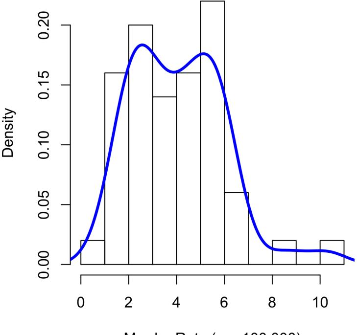

*Figure 1-4. Density of state murder rates*


### **Density Estimation**

Density estimation is a rich topic with a long history in statistical literature. In fact, over 20 *R* packages have been published that offer functions for density estimation. [\[Deng-Wickham-2011\]](#page--1-0) give a comprehensive review of *R* packages, with a particular recom‐ mendation for ASH or KernSmooth. The density estimation methods in pandas and scikit-learn also offer good implementations. For many data science problems, there is no need to worry about the various types of density estimates; it suffices to use the base functions.

# **Key Ideas**

- A frequency histogram plots frequency counts on the y-axis and variable values on the x-axis; it gives a sense of the distribution of the data at a glance.
- A frequency table is a tabular version of the frequency counts found in a histogram.
- A boxplot—with the top and bottom of the box at the 75th and 25th percentiles, respectively—also gives a quick sense of the distribution of the data; it is often used in side-by-side displays to compare distributions.
- A density plot is a smoothed version of a histogram; it requires a function to esti‐ mate a plot based on the data (multiple estimates are possible, of course).

# **Further Reading**

- A SUNY Oswego professor provides a [step-by-step guide to creating a boxplot.](https://oreil.ly/wTpnE)
- Density estimation in *R* is covered in [Henry Deng and Hadley Wickham's paper](https://oreil.ly/TbWYS) [of the same name.](https://oreil.ly/TbWYS)
- *R*-Bloggers has a [useful post on histograms in](https://oreil.ly/Ynp-n) *R*, including customization ele‐ ments, such as binning (breaks).
- *R*-Bloggers also has a [similar post on boxplots in](https://oreil.ly/0DSb2) *R*.
- Matthew Conlen published an [interactive presentation](https://oreil.ly/bC9nu) that demonstrates the effect of choosing different kernels and bandwidth on kernel density estimates.

# <span id="page-26-0"></span>**Exploring Binary and Categorical Data**

For categorical data, simple proportions or percentages tell the story of the data.

| Key Terms for Exploring Categorical Data                                                                                                    |
|---------------------------------------------------------------------------------------------------------------------------------------------|
| Mode                                                                                                                                        |
| The most commonly occurring category or value in a data set.                                                                                |
| Expected value                                                                                                                              |
| When the categories can be associated with a numeric value, this gives an average<br>value based on a category's probability of occurrence. |
| Bar charts                                                                                                                                  |
| The frequency or proportion for each category plotted as bars.                                                                              |
| Pie charts                                                                                                                                  |
| The frequency or proportion for each category plotted as wedges in a pie.                                                                   |
|                                                                                                                                             |
| Getting a summary of a binary variable or a categorical variable with a few categories                                                      |

is a fairly easy matter: we just figure out the proportion of 1s, or the proportions of the important categories. For example, [Table 1-6](#page-26-0) shows the percentage of delayed flights by the cause of delay at Dallas/Fort Worth Airport in 2010. Delays are catego‐ rized as being due to factors under carrier control, air traffic control (ATC) system delays, weather, security, or a late inbound aircraft.

*Table 1-6. Percentage of delays by cause at Dallas/Fort Worth Airport*

| Carrier | ATC   | Weather | Security | Inbound |
|---------|-------|---------|----------|---------|
| 23.02   | 30.40 | 4.03    | 0.12     | 42.43   |

Bar charts, seen often in the popular press, are a common visual tool for displaying a single categorical variable. Categories are listed on the x-axis, and frequencies or pro‐ portions on the y-axis. [Figure 1-5](#page-27-0) shows the airport delays per year by cause for Dallas/Fort Worth (DFW), and it is produced with the *R* function barplot:

```
barplot(as.matrix(dfw) / 6, cex.axis=0.8, cex.names=0.7,
 xlab='Cause of delay', ylab='Count')
```

pandas also supports bar charts for data frames:

```
ax = dfw.transpose().plot.bar(figsize=(4, 4), legend=False)
ax.set_xlabel('Cause of delay')
ax.set_ylabel('Count')
```

<span id="page-27-0"></span>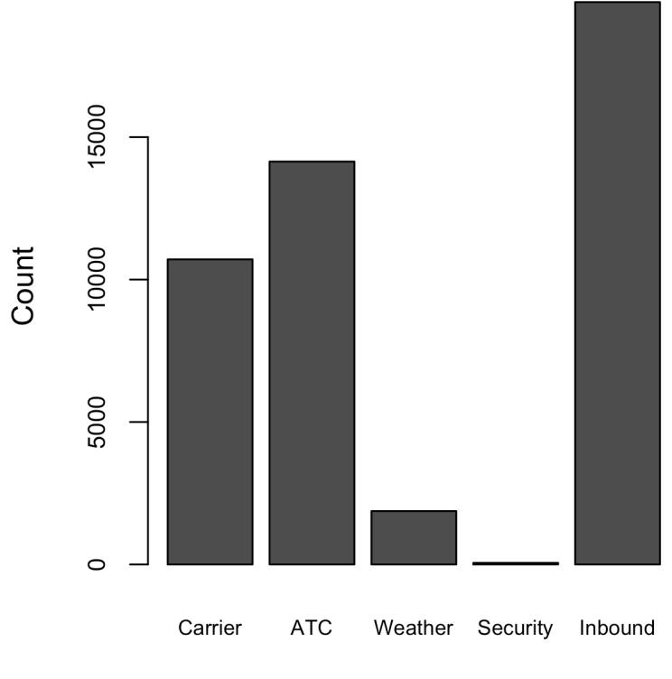

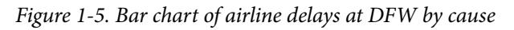

Note that a bar chart resembles a histogram; in a bar chart the x-axis represents dif‐ ferent categories of a factor variable, while in a histogram the x-axis represents values of a single variable on a numeric scale. In a histogram, the bars are typically shown touching each other, with gaps indicating values that did not occur in the data. In a bar chart, the bars are shown separate from one another.

Pie charts are an alternative to bar charts, although statisticians and data visualization experts generally eschew pie charts as less visually informative (see [\[Few-2007\]\)](#page--1-0).


### **Numerical Data as Categorical Data**

In ["Frequency Tables and Histograms" on page 22](#page-21-0), we looked at frequency tables based on binning the data. This implicitly converts the numeric data to an ordered factor. In this sense, histograms and bar charts are similar, except that the categories on the x-axis in the bar chart are not ordered. Converting numeric data to categorical data is an important and widely used step in data analysis since it reduces the complexity (and size) of the data. This aids in the dis‐ covery of relationships between features, particularly at the initial stages of an analysis.

# **Mode**

The mode is the value—or values in case of a tie—that appears most often in the data. For example, the mode of the cause of delay at Dallas/Fort Worth airport is "Inbound." As another example, in most parts of the United States, the mode for reli‐ gious preference would be Christian. The mode is a simple summary statistic for categorical data, and it is generally not used for numeric data.

# **Expected Value**

A special type of categorical data is data in which the categories represent or can be mapped to discrete values on the same scale. A marketer for a new cloud technology, for example, offers two levels of service, one priced at \$300/month and another at \$50/month. The marketer offers free webinars to generate leads, and the firm figures that 5% of the attendees will sign up for the \$300 service, 15% will sign up for the \$50 service, and 80% will not sign up for anything. This data can be summed up, for financial purposes, in a single "expected value," which is a form of weighted mean, in which the weights are probabilities.

The expected value is calculated as follows:

- 1. Multiply each outcome by its probability of occurrence.
- 2. Sum these values.

In the cloud service example, the expected value of a webinar attendee is thus \$22.50 per month, calculated as follows:

$$EV = (0.05)(300) + (0.15)(50) + (0.80)(0) = 22.5$$

The expected value is really a form of weighted mean: it adds the ideas of future expectations and probability weights, often based on subjective judgment. Expected value is a fundamental concept in business valuation and capital budgeting—for <span id="page-29-0"></span>example, the expected value of five years of profits from a new acquisition, or the expected cost savings from new patient management software at a clinic.

# **Probability**

We referred above to the *probability* of a value occurring. Most people have an intu‐ itive understanding of probability, encountering the concept frequently in weather forecasts (the chance of rain) or sports analysis (the probability of winning). Sports and games are more often expressed as odds, which are readily convertible to proba‐ bilities (if the odds that a team will win are 2 to 1, its probability of winning is 2/(2+1) = 2/3). Surprisingly, though, the concept of probability can be the source of deep philosophical discussion when it comes to defining it. Fortunately, we do not need a formal mathematical or philosophical definition here. For our purposes, the probabil‐ ity that an event will happen is the proportion of times it will occur if the situation could be repeated over and over, countless times. Most often this is an imaginary con‐ struction, but it is an adequate operational understanding of probability.

# **Key Ideas**

- Categorical data is typically summed up in proportions and can be visualized in a bar chart.
- Categories might represent distinct things (apples and oranges, male and female), levels of a factor variable (low, medium, and high), or numeric data that has been binned.
- Expected value is the sum of values times their probability of occurrence, often used to sum up factor variable levels.

# **Further Reading**

No statistics course is complete without a [lesson on misleading graphs](https://oreil.ly/rDMuT), which often involves bar charts and pie charts.

# **Correlation**

Exploratory data analysis in many modeling projects (whether in data science or in research) involves examining correlation among predictors, and between predictors and a target variable. Variables X and Y (each with measured data) are said to be posi‐ tively correlated if high values of X go with high values of Y, and low values of X go with low values of Y. If high values of X go with low values of Y, and vice versa, the variables are negatively correlated.

## **Key Terms for Correlation**

### *Correlation coefficient*

A metric that measures the extent to which numeric variables are associated with one another (ranges from –1 to +1).

### *Correlation matrix*

A table where the variables are shown on both rows and columns, and the cell values are the correlations between the variables.

### *Scatterplot*

A plot in which the x-axis is the value of one variable, and the y-axis the value of another.

Consider these two variables, perfectly correlated in the sense that each goes from low to high:

v1: {1, 2, 3} v2: {4, 5, 6}

The vector sum of products is 1 · 4 + 2 · 5 + 3 · 6 = 32. Now try shuffling one of them and recalculating—the vector sum of products will never be higher than 32. So this sum of products could be used as a metric; that is, the observed sum of 32 could be compared to lots of random shufflings (in fact, this idea relates to a resampling-based estimate; see ["Permutation Test" on page 97](#page--1-0)). Values produced by this metric, though, are not that meaningful, except by reference to the resampling distribution.

More useful is a standardized variant: the *correlation coefficient*, which gives an esti‐ mate of the correlation between two variables that always lies on the same scale. To compute *Pearson's correlation coefficient*, we multiply deviations from the mean for variable 1 times those for variable 2, and divide by the product of the standard deviations:

$$r = \frac{\sum_{i=1}^{n} (x_i - \bar{x})(y_i - \bar{y})}{(n-1)s_x s_y}$$

Note that we divide by *n* – 1 instead of *n*; see ["Degrees of Freedom, and](#page-14-0) *n* or *n* – 1?" [on page 15](#page-14-0) for more details. The correlation coefficient always lies between +1 (perfect positive correlation) and –1 (perfect negative correlation); 0 indicates no correlation.

Variables can have an association that is not linear, in which case the correlation coef‐ ficient may not be a useful metric. The relationship between tax rates and revenue <span id="page-31-0"></span>raised is an example: as tax rates increase from zero, the revenue raised also increases. However, once tax rates reach a high level and approach 100%, tax avoidance increa‐ ses and tax revenue actually declines.

[Table 1-7](#page-31-0), called a *correlation matrix*, shows the correlation between the daily returns for telecommunication stocks from July 2012 through June 2015. From the table, you can see that Verizon (VZ) and ATT (T) have the highest correlation. Level 3 (LVLT), which is an infrastructure company, has the lowest correlation with the others. Note the diagonal of 1s (the correlation of a stock with itself is 1) and the redundancy of the information above and below the diagonal.

*Table 1-7. Correlation between telecommunication stock returns*

|      | T     | CTL   | FTR   | VZ    | LVLT  |
|------|-------|-------|-------|-------|-------|
| T    | 1.000 | 0.475 | 0.328 | 0.678 | 0.279 |
| CTL  | 0.475 | 1.000 | 0.420 | 0.417 | 0.287 |
| FTR  | 0.328 | 0.420 | 1.000 | 0.287 | 0.260 |
| VZ   | 0.678 | 0.417 | 0.287 | 1.000 | 0.242 |
| LVLT | 0.279 | 0.287 | 0.260 | 0.242 | 1.000 |

A table of correlations like [Table 1-7](#page-31-0) is commonly plotted to visually display the rela‐ tionship between multiple variables. [Figure 1-6](#page-32-0) shows the correlation between the daily returns for major exchange-traded funds (ETFs). In *R*, we can easily create this using the package corrplot:

```
etfs <- sp500_px[row.names(sp500_px) > '2012-07-01',
 sp500_sym[sp500_sym$sector == 'etf', 'symbol']]
library(corrplot)
corrplot(cor(etfs), method='ellipse')
```

It is possible to create the same graph in *Python*, but there is no implementation in the common packages. However, most support the visualization of correlation matri‐ ces using heatmaps. The following code demonstrates this using the seaborn.heat map package. In the accompanying source code repository, we include *Python* code to generate the more comprehensive visualization:

```
etfs = sp500_px.loc[sp500_px.index > '2012-07-01',
 sp500_sym[sp500_sym['sector'] == 'etf']['symbol']]
sns.heatmap(etfs.corr(), vmin=-1, vmax=1,
 cmap=sns.diverging_palette(20, 220, as_cmap=True))
```

The ETFs for the S&P 500 (SPY) and the Dow Jones Index (DIA) have a high correla‐ tion. Similarly, the QQQ and the XLK, composed mostly of technology companies, are positively correlated. Defensive ETFs, such as those tracking gold prices (GLD), oil prices (USO), or market volatility (VXX), tend to be weakly or negatively correla‐ ted with the other ETFs. The orientation of the ellipse indicates whether two variables

<span id="page-32-0"></span>are positively correlated (ellipse is pointed to the top right) or negatively correlated (ellipse is pointed to the top left). The shading and width of the ellipse indicate the strength of the association: thinner and darker ellipses correspond to stronger relationships.

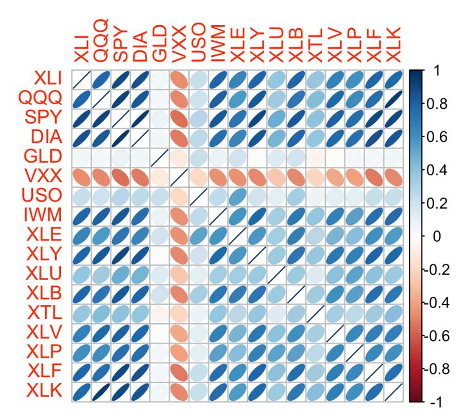

*Figure 1-6. Correlation between ETF returns*

Like the mean and standard deviation, the correlation coefficient is sensitive to outli‐ ers in the data. Software packages offer robust alternatives to the classical correlation coefficient. For example, the *R* package [robust](https://oreil.ly/isORz) uses the function covRob to compute a robust estimate of correlation. The methods in the scikit-learn module *[sklearn.covariance](https://oreil.ly/su7wi)* implement a variety of approaches.


### **Other Correlation Estimates**

Statisticians long ago proposed other types of correlation coeffi‐ cients, such as *Spearman's rho* or *Kendall's tau*. These are correla‐ tion coefficients based on the rank of the data. Since they work with ranks rather than values, these estimates are robust to outliers and can handle certain types of nonlinearities. However, data scien‐ tists can generally stick to Pearson's correlation coefficient, and its robust alternatives, for exploratory analysis. The appeal of rankbased estimates is mostly for smaller data sets and specific hypothe‐ sis tests.

# **Scatterplots**

The standard way to visualize the relationship between two measured data variables is with a scatterplot. The x-axis represents one variable and the y-axis another, and each point on the graph is a record. See [Figure 1-7](#page-34-0) for a plot of the correlation between the daily returns for ATT and Verizon. This is produced in *R* with the command:

```
plot(telecom$T, telecom$VZ, xlab='ATT (T)', ylab='Verizon (VZ)')
```

The same graph can be generated in *Python* using the pandas scatter method:

```
ax = telecom.plot.scatter(x='T', y='VZ', figsize=(4, 4), marker='$\u25EF$')
ax.set_xlabel('ATT (T)')
ax.set_ylabel('Verizon (VZ)')
ax.axhline(0, color='grey', lw=1)
ax.axvline(0, color='grey', lw=1)
```

The returns have a positive relationship: while they cluster around zero, on most days, the stocks go up or go down in tandem (upper-right and lower-left quadrants). There are fewer days where one stock goes down significantly while the other stock goes up, or vice versa (lower-right and upper-left quadrants).

While the plot [Figure 1-7](#page-34-0) displays only 754 data points, it's already obvious how diffi‐ cult it is to identify details in the middle of the plot. We will see later how adding transparency to the points, or using hexagonal binning and density plots, can help to find additional structure in the data.

<span id="page-34-0"></span>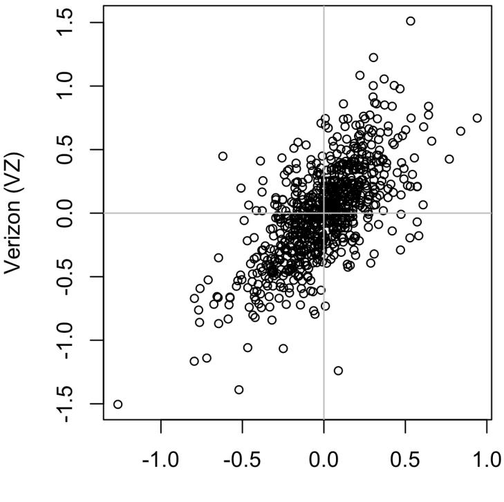

*Figure 1-7. Scatterplot of correlation between returns for ATT and Verizon*

### **Key Ideas**

- The correlation coefficient measures the extent to which two paired variables (e.g., height and weight for individuals) are associated with one another.
- When high values of v1 go with high values of v2, v1 and v2 are positively associated.
- When high values of v1 go with low values of v2, v1 and v2 are negatively associated.
- The correlation coefficient is a standardized metric, so that it always ranges from –1 (perfect negative correlation) to +1 (perfect positive correlation).
- A correlation coefficient of zero indicates no correlation, but be aware that ran‐ dom arrangements of data will produce both positive and negative values for the correlation coefficient just by chance.

# **Further Reading**

*Statistics*, 4th ed., by David Freedman, Robert Pisani, and Roger Purves (W. W. Nor‐ ton, 2007) has an excellent discussion of correlation.

# **Exploring Two or More Variables**

Familiar estimators like mean and variance look at variables one at a time (*univariate analysis*). Correlation analysis (see ["Correlation" on page 30\)](#page-29-0) is an important method that compares two variables (*bivariate analysis*). In this section we look at additional estimates and plots, and at more than two variables (*multivariate analysis*).

| Key Terms for Exploring Two or More Variables                                                 |
|-----------------------------------------------------------------------------------------------|
| Contingency table<br>A tally of counts between two or more categorical variables.             |
| Hexagonal binning<br>A plot of two numeric variables with the records binned into hexagons.   |
| Contour plot<br>A plot showing the density of two numeric variables like a topographical map. |
| Violin plot                                                                                   |
| Similar to a boxplot but showing the density estimate.                                        |

Like univariate analysis, bivariate analysis involves both computing summary statis‐ tics and producing visual displays. The appropriate type of bivariate or multivariate analysis depends on the nature of the data: numeric versus categorical.

### **Hexagonal Binning and Contours (Plotting Numeric Versus Numeric Data)**

Scatterplots are fine when there is a relatively small number of data values. The plot of stock returns in [Figure 1-7](#page-34-0) involves only about 750 points. For data sets with hun‐ dreds of thousands or millions of records, a scatterplot will be too dense, so we need a different way to visualize the relationship. To illustrate, consider the data set kc\_tax, which contains the tax-assessed values for residential properties in King County, Washington. In order to focus on the main part of the data, we strip out very expen‐ sive and very small or large residences using the subset function:

```
kc_tax0 <- subset(kc_tax, TaxAssessedValue < 750000 &
 SqFtTotLiving > 100 &
 SqFtTotLiving < 3500)
nrow(kc_tax0)
432693
```

In pandas, we filter the data set as follows:

```
kc_tax0 = kc_tax.loc[(kc_tax.TaxAssessedValue < 750000) &
 (kc_tax.SqFtTotLiving > 100) &
 (kc_tax.SqFtTotLiving < 3500), :]
kc_tax0.shape
(432693, 3)
```

[Figure 1-8](#page-37-0) is a *hexagonal binning* plot of the relationship between the finished square feet and the tax-assessed value for homes in King County. Rather than plotting points, which would appear as a monolithic dark cloud, we grouped the records into hexagonal bins and plotted the hexagons with a color indicating the number of records in that bin. In this chart, the positive relationship between square feet and tax-assessed value is clear. An interesting feature is the hint of additional bands above the main (darkest) band at the bottom, indicating homes that have the same square footage as those in the main band but a higher tax-assessed value.

[Figure 1-8](#page-37-0) was generated by the powerful *R* package ggplot2, developed by Hadley Wickham [\[ggplot2\].](#page--1-0) ggplot2 is one of several new software libraries for advanced exploratory visual analysis of data; see ["Visualizing Multiple Variables" on page 43:](#page-42-0)

```
ggplot(kc_tax0, (aes(x=SqFtTotLiving, y=TaxAssessedValue))) +
 stat_binhex(color='white') +
 theme_bw() +
 scale_fill_gradient(low='white', high='black') +
 labs(x='Finished Square Feet', y='Tax-Assessed Value')
```

In *Python*, hexagonal binning plots are readily available using the pandas data frame method hexbin:

```
ax = kc_tax0.plot.hexbin(x='SqFtTotLiving', y='TaxAssessedValue',
 gridsize=30, sharex=False, figsize=(5, 4))
ax.set_xlabel('Finished Square Feet')
ax.set_ylabel('Tax-Assessed Value')
```

<span id="page-37-0"></span>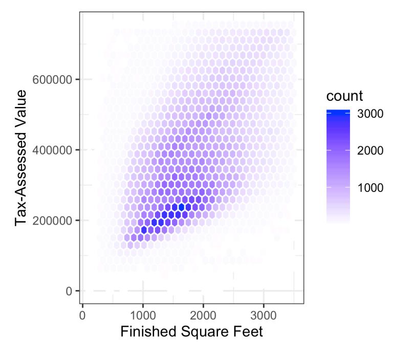

*Figure 1-8. Hexagonal binning for tax-assessed value versus finished square feet*

[Figure 1-9](#page-38-0) uses contours overlaid onto a scatterplot to visualize the relationship between two numeric variables. The contours are essentially a topographical map to two variables; each contour band represents a specific density of points, increasing as one nears a "peak." This plot shows a similar story as [Figure 1-8:](#page-37-0) there is a secondary peak "north" of the main peak. This chart was also created using ggplot2 with the built-in geom\_density2d function:

```
ggplot(kc_tax0, aes(SqFtTotLiving, TaxAssessedValue)) +
 theme_bw() +
 geom_point(alpha=0.1) +
 geom_density2d(color='white') +
 labs(x='Finished Square Feet', y='Tax-Assessed Value')
```

The seaborn kdeplot function in *Python* creates a contour plot:

```
ax = sns.kdeplot(kc_tax0.SqFtTotLiving, kc_tax0.TaxAssessedValue, ax=ax)
ax.set_xlabel('Finished Square Feet')
ax.set_ylabel('Tax-Assessed Value')
```

<span id="page-38-0"></span>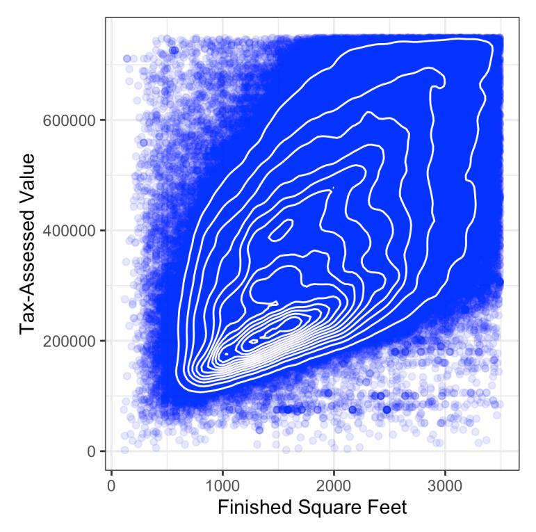

*Figure 1-9. Contour plot for tax-assessed value versus finished square feet*

Other types of charts are used to show the relationship between two numeric vari‐ ables, including *heat maps*. Heat maps, hexagonal binning, and contour plots all give a visual representation of a two-dimensional density. In this way, they are natural analogs to histograms and density plots.

# **Two Categorical Variables**

A useful way to summarize two categorical variables is a contingency table—a table of counts by category. [Table 1-8](#page-39-0) shows the contingency table between the grade of a per‐ sonal loan and the outcome of that loan. This is taken from data provided by Lending Club, a leader in the peer-to-peer lending business. The grade goes from A (high) to G (low). The outcome is either fully paid, current, late, or charged off (the balance of the loan is not expected to be collected). This table shows the count and row percen‐ tages. High-grade loans have a very low late/charge-off percentage as compared with lower-grade loans.

| Grade | Charged o' | Current | Fully paid | Late  | Total  |
|-------|------------|---------|------------|-------|--------|
| A     | 1562       | 50051   | 20408      | 469   | 72490  |
|       | 0.022      | 0.690   | 0.282      | 0.006 | 0.161  |
| B     | 5302       | 93852   | 31160      | 2056  | 132370 |
|       | 0.040      | 0.709   | 0.235      | 0.016 | 0.294  |
| C     | 6023       | 88928   | 23147      | 2777  | 120875 |
|       | 0.050      | 0.736   | 0.191      | 0.023 | 0.268  |
| D     | 5007       | 53281   | 13681      | 2308  | 74277  |
|       | 0.067      | 0.717   | 0.184      | 0.031 | 0.165  |
| E     | 2842       | 24639   | 5949       | 1374  | 34804  |
|       | 0.082      | 0.708   | 0.171      | 0.039 | 0.077  |
| F     | 1526       | 8444    | 2328       | 606   | 12904  |
|       | 0.118      | 0.654   | 0.180      | 0.047 | 0.029  |
| G     | 409        | 1990    | 643        | 199   | 3241   |
|       | 0.126      | 0.614   | 0.198      | 0.061 | 0.007  |
| Total | 22671      | 321185  | 97316      | 9789  | 450961 |
|       |            |         |            |       |        |

<span id="page-39-0"></span>*Table 1-8. Contingency table of loan grade and status*

Contingency tables can look only at counts, or they can also include column and total percentages. Pivot tables in Excel are perhaps the most common tool used to create contingency tables. In *R*, the CrossTable function in the descr package produces contingency tables, and the following code was used to create [Table 1-8:](#page-39-0)

```
library(descr)
x_tab <- CrossTable(lc_loans$grade, lc_loans$status,
 prop.c=FALSE, prop.chisq=FALSE, prop.t=FALSE)
```

The pivot\_table method creates the pivot table in *Python*. The aggfunc argument allows us to get the counts. Calculating the percentages is a bit more involved:

```
crosstab = lc_loans.pivot_table(index='grade', columns='status',
 aggfunc=lambda x: len(x), margins=True)
df = crosstab.loc['A':'G',:].copy()
df.loc[:,'Charged Off':'Late'] = df.loc[:,'Charged Off':'Late'].div(df['All'],
 axis=0)
df['All'] = df['All'] / sum(df['All'])
perc_crosstab = df
```


The margins keyword argument will add the column and row sums.

We create a copy of the pivot table, ignoring the column sums.

We divide the rows with the row sum.

<span id="page-40-0"></span>We divide the 'All' column by its sum.

## **Categorical and Numeric Data**

Boxplots (see ["Percentiles and Boxplots" on page 20\)](#page-19-0) are a simple way to visually compare the distributions of a numeric variable grouped according to a categorical variable. For example, we might want to compare how the percentage of flight delays varies across airlines. [Figure 1-10](#page-40-0) shows the percentage of flights in a month that were delayed where the delay was within the carrier's control:

```
boxplot(pct_carrier_delay ~ airline, data=airline_stats, ylim=c(0, 50))
```

The pandas boxplot method takes the by argument that splits the data set into groups and creates the individual boxplots:

```
ax = airline_stats.boxplot(by='airline', column='pct_carrier_delay')
ax.set_xlabel('')
ax.set_ylabel('Daily % of Delayed Flights')
plt.suptitle('')
```

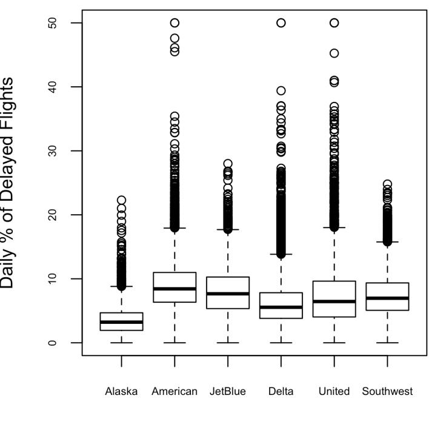

*Figure 1-10. Boxplot of percent of airline delays by carrier*

Alaska stands out as having the fewest delays, while American has the most delays: the lower quartile for American is higher than the upper quartile for Alaska.

A *violin plot*, introduced by [\[Hintze-Nelson-1998\]](#page--1-0), is an enhancement to the boxplot and plots the density estimate with the density on the y-axis. The density is mirrored and flipped over, and the resulting shape is filled in, creating an image resembling a violin. The advantage of a violin plot is that it can show nuances in the distribution that aren't perceptible in a boxplot. On the other hand, the boxplot more clearly shows the outliers in the data. In ggplot2, the function geom\_violin can be used to create a violin plot as follows:

```
ggplot(data=airline_stats, aes(airline, pct_carrier_delay)) +
 ylim(0, 50) +
 geom_violin() +
 labs(x='', y='Daily % of Delayed Flights')
```

Violin plots are available with the violinplot method of the seaborn package:

```
ax = sns.violinplot(airline_stats.airline, airline_stats.pct_carrier_delay,
 inner='quartile', color='white')
ax.set_xlabel('')
ax.set_ylabel('Daily % of Delayed Flights')
```

The corresponding plot is shown in [Figure 1-11.](#page-42-0) The violin plot shows a concentra‐ tion in the distribution near zero for Alaska and, to a lesser extent, Delta. This phe‐ nomenon is not as obvious in the boxplot. You can combine a violin plot with a boxplot by adding geom\_boxplot to the plot (although this works best when colors are used).

<span id="page-42-0"></span>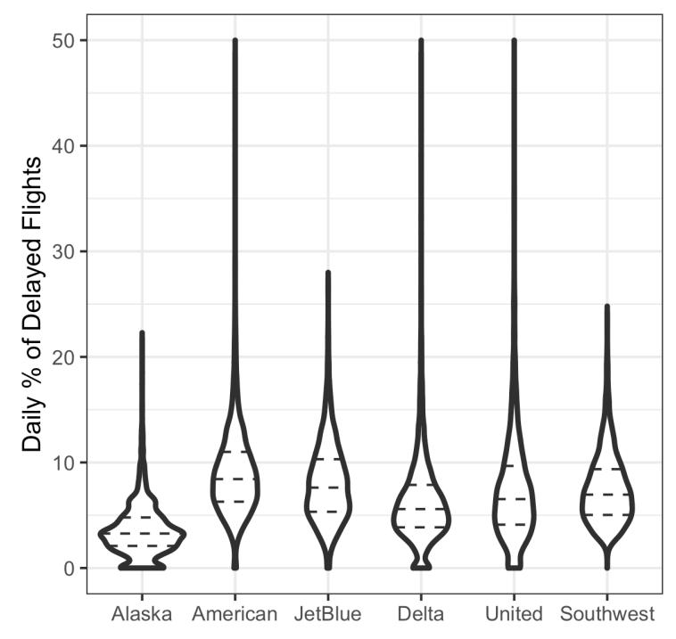

*Figure 1-11. Violin plot of percent of airline delays by carrier*

# **Visualizing Multiple Variables**

The types of charts used to compare two variables—scatterplots, hexagonal binning, and boxplots—are readily extended to more variables through the notion of *condi‐ tioning*. As an example, look back at [Figure 1-8,](#page-37-0) which showed the relationship between homes' finished square feet and their tax-assessed values. We observed that there appears to be a cluster of homes that have higher tax-assessed value per square foot. Diving deeper, [Figure 1-12](#page-43-0) accounts for the effect of location by plotting the data for a set of zip codes. Now the picture is much clearer: tax-assessed value is much higher in some zip codes (98105, 98126) than in others (98108, 98188). This disparity gives rise to the clusters observed in [Figure 1-8.](#page-37-0)

<span id="page-43-0"></span>We created [Figure 1-12](#page-43-0) using ggplot2 and the idea of *facets*, or a conditioning vari‐ able (in this case, zip code):

```
ggplot(subset(kc_tax0, ZipCode %in% c(98188, 98105, 98108, 98126)),
 aes(x=SqFtTotLiving, y=TaxAssessedValue)) +
 stat_binhex(color='white') +
 theme_bw() +
 scale_fill_gradient(low='white', high='blue') +
 labs(x='Finished Square Feet', y='Tax-Assessed Value') +
 facet_wrap('ZipCode')
```


Use the ggplot functions facet\_wrap and facet\_grid to specify the condition‐ ing variable.

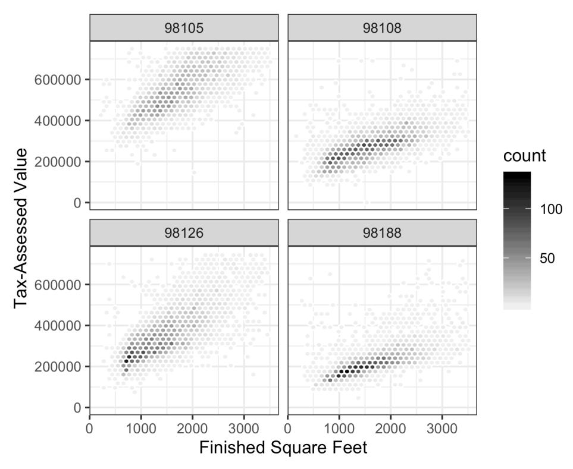

*Figure 1-12. Tax-assessed value versus finished square feet by zip code*

Most *Python* packages base their visualizations on Matplotlib. While it is in princi‐ ple possible to create faceted graphs using Matplotlib, the code can get complicated. Fortunately, seaborn has a relatively straightforward way of creating these graphs:

```
zip_codes = [98188, 98105, 98108, 98126]
kc_tax_zip = kc_tax0.loc[kc_tax0.ZipCode.isin(zip_codes),:]
kc_tax_zip
def hexbin(x, y, color, **kwargs):
 cmap = sns.light_palette(color, as_cmap=True)
 plt.hexbin(x, y, gridsize=25, cmap=cmap, **kwargs)
g = sns.FacetGrid(kc_tax_zip, col='ZipCode', col_wrap=2)
g.map(hexbin, 'SqFtTotLiving', 'TaxAssessedValue',
 extent=[0, 3500, 0, 700000])
g.set_axis_labels('Finished Square Feet', 'Tax-Assessed Value')
g.set_titles('Zip code {col_name:.0f}')
```

Use the arguments col and row to specify the conditioning variables. For a single conditioning variable, use col together with col\_wrap to wrap the faceted graphs into multiple rows.

The map method calls the hexbin function with subsets of the original data set for the different zip codes. extent defines the limits of the x- and y-axes.

The concept of conditioning variables in a graphics system was pioneered with *Trellis graphics*, developed by Rick Becker, Bill Cleveland, and others at Bell Labs [\[Trellis-](#page--1-0)[Graphics\].](#page--1-0) This idea has propagated to various modern graphics systems, such as the lattice [\[lattice\]](#page--1-0) and ggplot2 packages in *R* and the seaborn [\[seaborn\]](#page--1-0) and Bokeh [\[bokeh\]](#page--1-0) modules in *Python*. Conditioning variables are also integral to business intel‐ ligence platforms such as Tableau and Spotfire. With the advent of vast computing power, modern visualization platforms have moved well beyond the humble begin‐ nings of exploratory data analysis. However, key concepts and tools developed a half century ago (e.g., simple boxplots) still form a foundation for these systems.

# **Key Ideas**

- Hexagonal binning and contour plots are useful tools that permit graphical examination of two numeric variables at a time, without being overwhelmed by huge amounts of data.
- Contingency tables are the standard tool for looking at the counts of two catego‐ rical variables.
- Boxplots and violin plots allow you to plot a numeric variable against a categori‐ cal variable.

# **Further Reading**

- *Modern Data Science with R* by Benjamin Baumer, Daniel Kaplan, and Nicholas Horton (Chapman & Hall/CRC Press, 2017) has an excellent presentation of "a grammar for graphics" (the "gg" in ggplot).
- *ggplot2: Elegant Graphics for Data Analysis* by Hadley Wickham (Springer, 2009) is an excellent resource from the creator of ggplot2.
- Josef Fruehwald has a web-based tutorial on [ggplot2](https://oreil.ly/zB2Dz).

# **Summary**

Exploratory data analysis (EDA), pioneered by John Tukey, set a foundation for the field of data science. The key idea of EDA is that the first and most important step in any project based on data is to *look at the data*. By summarizing and visualizing the data, you can gain valuable intuition and understanding of the project.

This chapter has reviewed concepts ranging from simple metrics, such as estimates of location and variability, to rich visual displays that explore the relationships between multiple variables, as in [Figure 1-12](#page-43-0). The diverse set of tools and techniques being developed by the open source community, combined with the expressiveness of the *R* and *Python* languages, has created a plethora of ways to explore and analyze data. Exploratory analysis should be a cornerstone of any data science project.