# Mechanistic evaluation of Transformers and state space models

Aryaman Arora Neil Rathi Nikil Roashan Selvam Róbert Csordás Dan Jurafsky Christopher Potts Stanford University {aryamana,jurafsky,cgpotts}stanford.edu

# Abstract

State space models (SSMs) for language modelling promise an efficient and performant alternative to quadratic-attention Transformers, yet show variable performance on recalling basic information from the context. While performance on synthetic tasks like Associative Recall (AR) can point to this deficiency, behavioural metrics provide little information as to *why*—on a mechanistic level—certain architectures fail and others succeed. To address this, we conduct experiments on AR and find that only Transformers and Based SSM models fully succeed at AR, with Mamba a close third, whereas the other SSMs (H3, Hyena) fail. We then use causal interventions to explain why. We find that Transformers and Based learn to store key–value associations in-context using induction heads. By contrast, the SSMs compute these associations only at the last state, with only Mamba succeeding because of its short convolution component. To extend and deepen these findings, we introduce Associative Treecall (ATR), a synthetic task similar to AR based on PCFG induction. ATR introduces language-like hierarchical structure into the AR setting. We find that all architectures learn the same mechanism as they did for AR, and the same three models succeed at the task. These results reveal that architectures with similar accuracy may still have substantive differences, motivating the adoption of mechanistic evaluations.

[github.com/aryamanarora/tinylang](https://github.com/aryamanarora/tinylang)

# 1 Introduction

Transformers with quadratic attention remain the dominant architecture in language modelling despite numerous proposed efficient alternatives. Most notably, state space models (SSMs) achieve impressive perplexities and benchmark scores [e.g. [Gu and Dao,](#page-10-0) [2024\]](#page-10-0). Yet, SSMs exhibit deficiencies that benchmarks often fail to capture; for example, they struggle to perform retrieval, i.e. copying from the context [\[Jelassi et al.,](#page-10-1) [2024,](#page-10-1) [Wen et al.,](#page-13-0) [2024,](#page-13-0) [Waleffe et al.,](#page-12-0) [2024,](#page-12-0) [Bick et al.,](#page-9-0) [2025\]](#page-9-0).

Controlled synthetic tasks can make these limitations clear by isolating specific capabilities and enabling expressive experimentation at small scales across architectures. Particularly, much work has used the associative recall (AR) task as a testbed for studying in-context retrieval across architectures. In turn, AR has informed the design of novel LM architectures [e.g. Based; [Arora et al.,](#page-9-1) [2024b\]](#page-9-1).

Yet performance on synthetic tasks is measured solely via behavioural metrics like task accuracy. This is a missed opportunity: an advantage of these synthetic tasks is that they are designed to isolate a *specific behaviour* that implicates a mechanistic solution. For example, language models should solve AR by storing key–value associations in-context at the value, a mechanism termed the induction head in Transformers [\[Olsson et al.,](#page-11-0) [2022,](#page-11-0) [Fu et al.,](#page-10-2) [2023\]](#page-10-2). We should therefore directly check whether each architecture learns induction as part of performance evaluation on AR.

Here, we propose using tools from mechanistic interpretability to directly analyse the mechanisms used to solve synthetic tasks. We use causal interventions [\[Geiger et al.,](#page-10-3) [2024\]](#page-10-3) on model internals to understand how these tasks are learned and implemented across a variety of architectures ([§4\)](#page-3-0). This allows us to track the emergence (or lack thereof) of the correct association and retrieval mechanisms inside the model, beyond just observed task accuracy. Through comprehensive experiments on AR, we find that all SSMs except Based learn an inefficient direct-retrieval solution to AR, and that Mamba strongly relies on its short convolution component to perform AR.

To deepen our findings, we introduce Associative Treecall (ATR), a novel synthetic retrieval task more similar to real-world natural language retrieval than AR ([§3\)](#page-1-0). ATR uses a probabilistic contextfree grammar (PCFG) to generate hierarchical data, on which we ask AR-like queries. Since keys and values need not be adjacent to each other, ATR requires a true non-positional retrieval mechanism, which may challenge architectures that are designed for AR. Interestingly, we observe the same mechanisms are implicated across architectures on ATR as on AR, indicating that association mechanisms are not task-dependent.

Our results offer a framework for better understanding and evaluating synthetic task performance in terms of mechanistic interpretability. Mechanistic evaluations reveal fundamental differences between architectures beyond what we learn from behavioural performance, thus serving as a new tool for architecture analysis and design.

# 2 Related work

Associative Recall. Associative Recall (AR)[1](#page-1-1) is a synthetic task that evaluates in-context retrieval for language model architectures, from early work on recurrent neural networks [\[Graves et al.,](#page-10-4) [2014,](#page-10-4) [Ba et al.,](#page-9-2) [2016,](#page-9-2) [Danihelka et al.,](#page-9-3) [2016,](#page-9-3) [Zhang and Zhou,](#page-13-1) [2017\]](#page-13-1) to modern SSMs [\[Fu et al.,](#page-10-2) [2023,](#page-10-2) [Poli](#page-11-1) [et al.,](#page-11-1) [2023,](#page-11-1) [Lutati et al.,](#page-11-2) [2023,](#page-11-2) [Jelassi et al.,](#page-10-1) [2024,](#page-10-1) [Arora et al.,](#page-9-4) [2024a,](#page-9-4)[b,](#page-9-1) [Gu and Dao,](#page-10-0) [2024,](#page-10-0) [Dao](#page-9-5) [and Gu,](#page-9-5) [2024,](#page-9-5) [Trockman et al.,](#page-12-1) [2024,](#page-12-1) [Liu et al.,](#page-11-3) [2024a,](#page-11-3) [Okpekpe and Orvieto,](#page-11-4) [2025,](#page-11-4) [Li et al.,](#page-11-5) [2025b,](#page-11-5) [Wang et al.,](#page-13-2) [2025\]](#page-13-2). An AR task consists of a sequence of key–value pairs followed by a single *query* key; the goal is to produce the corresponding value. For example,

(1) A 2 **C 3** F 9 D 1 **C** → **3**

Here, the correct next token is 3, since it is the value associated with the key C in context. Despite being synthetic, AR has a direct analogue in natural language: *induction*, referring to in-context copying of sequences [\[Elhage et al.,](#page-10-5) [2021,](#page-10-5) [Olsson et al.,](#page-11-0) [2022\]](#page-11-0). [Arora et al.](#page-9-4) [\[2024a,](#page-9-4)[b\]](#page-9-1) show that architecture-level improvements on AR translate directly to natural-language induction.

Mechanistic interpretability. In order to measure the contribution of individual model components (neurons, layers, etc.) to output behaviour, we can apply causal interventions on neural network internals [\[Geiger et al.,](#page-10-6) [2021,](#page-10-6) [2024\]](#page-10-3). Informally, the core idea is to overwrite an activation at a specific component using a counterfactual input. If this changes model behaviour, then that component is causally relevant to the mechanism underlying that behaviour.

Some prior work in mechanistic interpretability has studied how some language models solve incontext retrieval tasks like induction and multiple choice question answering [\[Olsson et al.,](#page-11-0) [2022,](#page-11-0) [Lieberum et al.,](#page-11-6) [2023,](#page-11-6) [Brinkmann et al.,](#page-9-6) [2024,](#page-9-6) [Wiegreffe et al.,](#page-13-3) [2025,](#page-13-3) [Bick et al.,](#page-9-0) [2025\]](#page-9-0), as well as the training dynamics of Transformers on toy tasks using mechanistic metrics [\[Nanda et al.,](#page-11-7) [2023,](#page-11-7) [Reddy,](#page-12-2) [2024,](#page-12-2) [Singh et al.,](#page-12-3) [2024,](#page-12-3) [Edelman et al.,](#page-10-7) [2024,](#page-10-7) [Tigges et al.,](#page-12-4) [2024,](#page-12-4) [Yin and Steinhardt,](#page-13-4) [2025\]](#page-13-4). Yet thus far, *architectural comparisons* on synthetic tasks have not made use of causal interventions.

# 3 Synthetic retrieval tasks

Induction, wherein key–value associations are stored in-context, is the memory-efficient mechanism implicated for retrieval tasks like AR in quadratic attention Transformers. Yet AR can also be solved

1Also known as *associative retrieval*, *associative memory*, or *induction*.

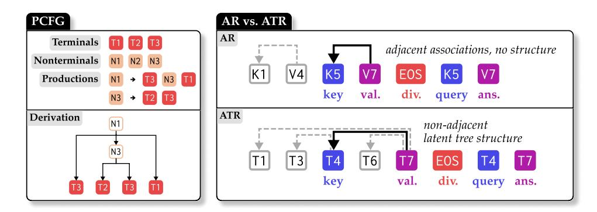

Figure 1: PCFG: An illustrative example of a PCFG and its components, with an example derivation (with final string) below. AR vs. ATR: Comparing AR and ATR using example documents; both tasks provide a document with key–value associations in-context and ask a query about one such association. However, associations in ATR need not involve adjacent tokens and are tree-structured.

through naïve positional association, and indeed SSMs theoretically learn a less efficient solution [\[Jelassi et al.,](#page-10-1) [2024\]](#page-10-1). To elucidate this, we apply our mechanistic evaluation framework to compare architectures on *two* synthetic retrieval tasks: Associative Recall and Associative *Tree*call (ATR). Compared to AR, ATR is a novel language-like task with tree structure and more parameters for controlling task difficulty ([§3.2\)](#page-2-0). Critically, ATR cannot be solved with naïve positional association, enabling us to explicitly test if models learn different mechanisms for association in the hierarchical setting. We build upon prior work on formal-language synthetic tasks [\[White and Cotterell,](#page-13-5) [2021,](#page-13-5) [Valvoda et al.,](#page-12-5) [2022,](#page-12-5) [Hahn and Goyal,](#page-10-8) [2023,](#page-10-8) [Strobl et al.,](#page-12-6) [2024,](#page-12-6) [Allen-Zhu and Li,](#page-9-7) [2024,](#page-9-7) [Akyürek](#page-9-8) [et al.,](#page-9-8) [2024,](#page-9-8) [Pandey,](#page-11-8) [2024,](#page-11-8) [Lubana et al.,](#page-11-9) [2024,](#page-11-9) *inter alia*].

### 3.1 Associative Treecall

Since a standard AR document (eq. [\(1\)](#page-1-2)) consists of *adjacent* key–value pairs, one can associate each key with its corresponding value solely using relative position. Yet many natural language retrieval tasks require association over latent hierarchical structure. For example:

### (2) *John had chicken and Mary had pork. The chicken was eaten by* → *John*

Answering this query requires associating *John* with *chicken* and *Mary* with *pork*, and then retrieving the appropriate association for *John*. A solution employing relative positional association would not robust to the possible range of variation (*John had some chicken*, *John decided to have chicken*, etc.).

This type of retrieval is widely studied in cognitive science as *binding*. The mechanisms underlying natural-language binding in neural networks/LLMs have been examined by [Greff et al.](#page-10-9) [\[2020\]](#page-10-9), [Kim](#page-10-10) [and Schuster](#page-10-10) [\[2023\]](#page-10-10), [Feng and Steinhardt](#page-10-11) [\[2024\]](#page-10-11), [Prakash et al.](#page-12-7) [\[2024\]](#page-12-7), [Li et al.](#page-10-12) [\[2025a\]](#page-10-12), [Prakash](#page-12-8) [et al.](#page-12-8) [\[2025\]](#page-12-8). Yet no synthetic analogue of this task exists to isolate this mechanism and enable direct comparison to AR. ATR thus allows us to study how different architectures implement binding, and ask if these solutions generalize from simple AR.

An ATR corpus is drawn from a synthetic probabilistic context-free grammar (PCFG) whose parameters we set. Each document consists of a string sampled from the PCFG, with latent structure made up of parent–child relations between symbols, followed by a divider token (EOS) and a query about one such relation. The PCFG has one special property which establishes the parent–child relationships: for the right-hand side of each production rule, the rightmost symbol is always a terminal, and is the *parent* of the symbols created by this production. We sample strings by selecting an iid nonterminal and recursively applying production rules according to the PCFG distribution. We show an example in Figure [1](#page-2-1) and formalise definitions in appendix [A.](#page-15-0) Since the number of tokens separating parents and their children may vary, ATR cannot be solved by a positional associative mechanism.

| Param.           | Description                                                               |
|------------------|---------------------------------------------------------------------------|
| H                | Is the head terminal at the left or the right of each production?         |
| $d_{\text{max}}$ | Maximum depth permitted for the PCFG to generate.                         |
| $L_{\text{max}}$ | Maximum number of symbols of the right-hand side of a production rule.    |
| $R_{\text{max}}$ | Maximum number of production rules for each nonterminal.                  |
| $ \mathcal{N} $  | Number of nonterminal symbols in the PCFG vocabulary.                     |
| $ \Sigma $       | Number of terminal symbols in the PCFG vocabulary.                        |
| $r_{\Sigma}$     | Relative weightage on choosing a terminal when sampling production rules. |

| Table 1: Parameters used for constructing a PCFG. We define PCFGs in Greibach Normal Form |  |  |
|-------------------------------------------------------------------------------------------|--|--|
| (GNF); see Appendix A for more details.                                                   |  |  |

### 3.2 Parameters

**PCFG** setup. For each experiment, we generate a single PCFG to use across all models to ensure fair comparisons, with parameters in Table 1. We also reject any samples that have more than  $1024$ symbols, which only affects the sampling distribution for the most complex PCFGs we use.

**Queries.** Each PCFG sample of length n provides us with a set of  $n-1$  eligible parent–child queries (i.e. a tree with  $n-1$  edges). However, terminals may occur multiple times, so a query about a specific symbol may present ambiguity; thus, when presenting a query we consider it to *only* refer to the rightmost instance of that symbol.2 Therefore, the maximum number of eligible queries over all samples is  $\min(n-1, |\Sigma|)$ . To minimise the ability to heuristically guess, we inversely weight parent-child pairs by the parent's child count when sampling queries.

### 3.3 Methodology

**Datasets.** We generate synthetic pretraining and evaluation datasets for both tasks. For each setting, the trainset has  $100,032$  examples and the eval/dev sets have  $320$  examples. In AR, we use disjoint key and value vocabularies; in ATR, keys and values are both sampled from the set of terminals. In each document, we separate the document from the query with a divider token, and provide only a single query. Example AR/ATR documents are in Figure 1; further details in appendix C.

**Models.** We pretrain models from scratch on a variety of synthetic tasks. We use the exact architecture implementations from the zoology3 library [Arora et al., 2024b], except for behaviour-preserving modification of the LM backbone to enable interventions with pyvene4 [Wu et al., 2024] on the sequence mixers, MLPs, and layer blocks. The LM backbone for all architectures is the same, with pre-norm blocks of alternating sequence mixers and MLPs (except for Mamba, which has no MLP) followed by LayerNorm at the end. We experiment with the following architectures: Attention [Vaswani et al., 2017], BaseConv [Arora et al., 2024a], Based [Arora et al., 2024b], H3 [Fu et al., 2023], Hyena [Poli et al., 2023], and Mamba [Gu and Dao, 2024]; further details on model configurations are given in appendix B.

**Training.** We minimise cross-entropy loss, and mask the loss on all tokens except the query (the underlined token in the example below). We use the AdamW optimiser with  $\beta = (0.9, 0.999), \epsilon =$  $10^{-8}$  and no weight decay. We warm up learning rate for the first  $10\%$  of training and then follow a cosine decay schedule to  $0$  for the remainder of training. We train for either  $16$  epochs (on AR) or 32 epochs (on ATR) with a batch size of 32. Each experiment trains  $\approx 200$  models over all hyperparameters. Runtime varies from  $0.5$  to 5 hours, depending on hardware, task, and architecture. Overall, we used  $< 10,000$  GPU-hours in total, on a cluster with various NVIDIA machines (with GPU memory ranging from  $12.3G$  to  $143.8G$ ).

**Behavioural metrics.** We report behavioural metrics given the model's predicted probabilities over the vocabulary  $\hat{\mathbf{v}} \in \mathbb{R}^{|\Sigma|}$  and the index of the single true answer *i*. Our main metric is accuracy:  $\mathbb{1}[\arg\max(\hat{\mathbf{y}}) = i]$ . Additionally, we compute but do not primarily report likelihood  $\hat{\mathbf{y}}_i$ .

&lt;sup>2This is the same setup as AR with rewrites [Rodkin et al., 2025].

&lt;sup>3https://github.com/HazyResearch/zoology

&lt;sup>4https://github.com/stanfordnlp/pyvene

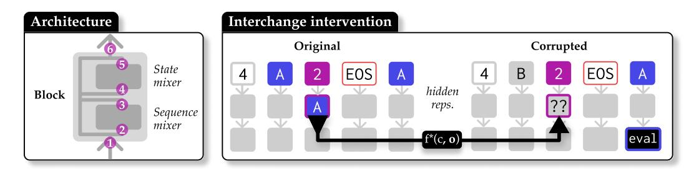

Figure 2: Our interchange intervention setup for analysing AR and ATR. Left: We intervene on input and output representations of whole blocks (1 and 6), sequence mixers (e.g. attention blocks; 2 and 3), and state mixers (4 and 5). Right: An example intervention on AR where we corrupt and attempt to restore the *key* (A) by intervening at the *value* token in an intermediate representation. We evaluate the downstream effect on the next-token prediction at the *query*.

# 4 Mechanistic metrics for AR and ATR

Behavioural metrics provide little information as to *why* certain architectures succeed or fail on tasks of interest. Mechanistic metrics, which directly measure how information flows across model components and token positions, can tell us how AR and ATR are being solved by different architectures, and thus help us understand failures. We illustrate our approach in Figure [2.](#page-4-0)

We use interchange interventions [\[Geiger et al.,](#page-10-6) [2021,](#page-10-6) [2024\]](#page-10-3) to understand and measure how solutions to AR and ATR are implemented across architectures. We introduce this operation and define the resulting metrics for our tasks below. Our implementation uses the pyvene library [\[Wu et al.,](#page-13-6) [2024\]](#page-13-6).

Interchange intervention. Consider a language model p(·) and some input b. We select a component f inside that model which computes some internal representation f(b) during the LM's forward pass. Now, consider a counterfactual input s: this produces a counterfactual representation f(s) when processed by f. We want to understand what about the output of p is dependent on f. Therefore, we perform an intervention which replaces the output f(b) with that of f(s) during the computation of p(b), with the change propagating downstream. The result is notated pf←f ∗ (b, s).

Concrete setup for AR and ATR. We take o to be a ground-truth document from our data distribution and c to be a version of that document with exactly one important token corrupted: the *key* (see Figure [2\)](#page-4-0). This corruption significantly reduces task accuracy for both AR and ATR by removing information that is necessary to answer the query.

We intervene at both the input and output each of the following model components f: each layer block, each sequence-mixer, and each state-mixer (i.e. MLP, except in Mamba which lacks this component); see Figure [2,](#page-4-0) left. We measure to what extent the intervention can restore the likelihood of the correct answer to the query, i.e. we compare restored likelihood pf←f ∗ (ytrue | c, o) with original likelihood p(ytrue | o) and corrupted likelihood p(ytrue | c).

Metrics. Given the above three quantities, we compute attribution score, or what proportion of the original likelihood was restored by the intervention:

$$\text{Attrib}(f) = \frac{p_{f \leftarrow f^*}(y_{\text{true}} \mid \mathbf{b}, \mathbf{s}) - p(y_{\text{true}} \mid \mathbf{b})}{p(y_{\text{true}} \mid \mathbf{s}) - p(y_{\text{true}} \mid \mathbf{b})}$$
(3)

For AR and ATR in particular, there are two choices for f which help us distinguish the mechanism underlying task success. To check whether induction is the underlying mechanism, we compute metrics for f being the layer 1 *block input* at the *value* token. Alternatively, we check whether other tokens at layer 1 block input mediate information flow, indicating some sort of association-less direct retrieval mechanism: the *key*, *query*, and *divider*.

# 5 Experiments

We now deploy our mechanistic metrics ([§4\)](#page-3-0) on both AR and ATR ([§3\)](#page-1-0). We follow the methodology outlined in [§3.3](#page-3-5) to create a variety of AR and ATR datasets and train models with various architectures and hyperparameter configurations. See appendix [D](#page-17-0) for additional experiments not included here.

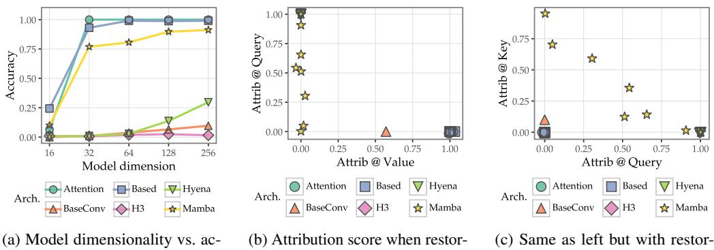

curacy after tuning learning rate for each setting.

ing the key at its *value* (induction) vs. at the *query*, for all LRs.

ing at the *query* (layer 0 direct retrieval) vs. *key* (layer 1).

Figure 3: Associative recall: Accuracy and interchange intervention results on AR with vocabulary size 8192 and key-value count of 32. SSMs (except for Based) and Transformers learn different mechanisms.

#### $5.1$ (Most) SSMs do not learn induction to solve AR

We run experiments on a relatively simple AR task and show that interchange interventions empirically confirm the same mechanisms underlying AR as proposed in existing theoretical work. We fix the total number of unique keys and values in the vocabulary to be  $8192$ , and present  $32 \text{ key}$ value pairs in context. Our trainset includes 100032 examples. We vary model dimensionality in  $\{16, 32, 64, 128, 256\}$  and sweep LR in the range  $[3 \cdot 10^{-5}, 3 \cdot 10^{-2}]$  for each architecture.

**Behavioural results.** Figure 3a demonstrates that task accuracy on AR cleanly separates Attention, which achieves  $100\%$  accuracy at  $d \ge 32$ , from nearly all SSMs. Based solves AR near-perfectly with roughly the same dimension-wise scaling curve as Attention, achieving a maximum accuracy of 99.06%. However, Mamba is a close third and clearly better than other SSMs at AR, albeit achieving a less-than-perfect  $91.25\%$  at  $d = 256$ .

**Mechanistic analysis.** We compute Attrib for layer 1 block input at the *value* token vs. *query* token for all training runs where  $p(y_{\text{true}} | \mathbf{o}) - p(y_{\text{true}} | \mathbf{c}) > 0.01$ .5 A high attribution score on the *value* token indicates **induction** as the underlying mechanism while *query* indicates **direct retrieval** at the final state, performed in layer 0. Our results in Figure 3b cleanly separate Attention (with nearly all checkpoints with  $100.00\%$  attribution at the *value*) and Based, which only perform induction, from other SSMs, which perform direct retrieval. While only a single BaseConv checkpoint passes our filter, it has the greatest attribution score on the *value*, indicating an induction mechanism.

SSMs perform direct retrieval at varying layers: the best-performing Mamba, Hyena, and H3 models almost entirely perform direct retrieval at layer 0 via the *query* token, while worse SSM checkpoints use a mix of *query* and *key* tokens, indicating delayed direct retrieval by both layer 0 and layer 1. Jelassi et al. [2024] shows that direct retrieval in SSMs has asymptotically worse capacity than the induction solution, and this is reflected in performance on AR.

### 5.2 Per-architecture mechanisms are similar between ATR and AR

We consider four initial settings to study models on ATR, over all combinations of  $L_{\text{max}} = \{5, 10\}$ and  $|\Sigma| = \{20, 8192\}$ . We keep all other parameters fixed with settings given in appendix C. Varying  $L_{\rm max}$  controls the possible distances between keys and values in the PCFG sample without affecting other properties that play a role in task difficulty (e.g. depth). Varying  $|\Sigma|$  stresses the state capacity, since more key-value pairs must be tracked, without affecting syntactic complexity. We sweep the same model dimensionalities as in §5.1, and a smaller learning rate range of  $[3 \cdot 10^{-5}, 3 \cdot 10^{-3}]$ .

Behavioural results. We report results in Figure 4a. Surprisingly, Mamba is highly successful at ATR. On the small terminal count setting ( $|\Sigma| = 20$ ) Mamba matches or outperforms all other architectures at all model dimensions, particularly with longer production rules ( $L_{\text{max}} = 10$ ) with

&lt;sup>5We filter in order to discard low-performing and noisy runs.

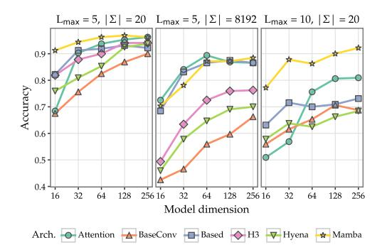

(a) Model dimensionality vs. accuracy after tuning learning rate for each setting.

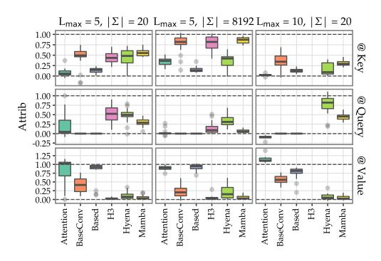

(b) Summarised attribution scores at *key*, *value*, and *query* for each setting, when restoring the key.

Figure 4: Associative Treecall: Accuracy and interchange intervention results on ATR across varying settings. The same trend as on AR holds, with Attention, Based, and Mamba achieving high performance but with entirely different mechanisms.

performance of  $92.19\%$  vs.  $80.94\%$  for Attention at  $d = 256$ . This is particularly surprising because longer production rules imply greater positional variation between keys and values, which ought to stress AR-focused SSM designs. Attention only manages to outperform Mamba slightly on the large terminal count setting ( $|\Sigma| = 8192$ ) when  $d \le 64$ .

**Mechanistic analysis.** We conduct the same analysis as for AR. We recover the same overall trends but with greater inter-architecture variance: Figure 4b shows that Attention, Based, and BaseConv all primarily learn induction mechanisms, whereas the remaining SSMs perform direct retrieval as on AR, with high attribution scores on either the *key* (indicating direct retrieval by the layer 1 sequence mixer) or the *query* (indicating the same but by layer 0).

Intriguingly, Figure 4b shows that different SSMs form different strategies across task difficulties; in particular, all direct-retrieval SSMs favour delaying retrieval to layer 1 when terminal count is large  $(|\Sigma| = 8192)$ , but use a mix of layers otherwise. Regardless, the same tendency from AR recurs: SSMs besides Based and BaseConv do not perform induction, but Mamba is still highly performant. Strikingly, as the next section shows, Mamba also achieves high generalization performance on ATR.

### 5.3 Mamba's solution to ATR does generalise

We reuse the easiest settings from our ATR experiment  $(L = 5, |\Sigma| = 20)$  and construct a new dataset with a train-test split on query-answer pairs. Specifically,  $80\%$  of possible unique query-answer pairs are provided in the training set, while  $20\%$  are only in the test set and thus never trained on. We seek to assess whether models learn a general mechanism for parent-child relations in ATR or if the impressive results of Mamba (as well as Attention and Based) are merely the result of better memorisation of the PCFG parameters. This setup is akin to Wang et al. [2024]'s technique of train-test split on multi-hop queries; we provide supervision on individual query and answer types, but not on some compositions of them.

**Behavioural results.** We select the checkpoint with the highest dev accuracy for each architectural and dimensionality setting, after sweeping LR. We plot the dev and test accuracies of each of these checkpoints in Figure 5a; all models have much lower test accuracy (e.g. Attention with  $d = 256$  has  $95.62\%$  dev and  $68.12\%$  test accuracy). Attention achieves the greatest dev accuracies on  $d > 32$ . Mamba's relative ranking is lower than on the in-distribution setting in §5.2, but it still achieves the overall second-highest dev accuracy (65.00% at  $d = 128$ ). Surprisingly, H3 generalises well despite its poor dev accuracy, beating Mamba on test accuracy in 3 out of 5 settings.

We compare dev and test accuracies across all LRs in Figure 5b. We find that while Mamba does have unusually high dev accuracy given a selected test accuracy (indicating greater memorisation than models with other architectures), its dev accuracy is still generally higher than non-Attention architectures. Interestingly, H3 has nearly Attention-level generalisation while BaseConv exhibits vanishingly little generalisation. Overall, behavioural metrics show that Mamba does nontrivially generalise on ATR, albeit not as well as Attention.

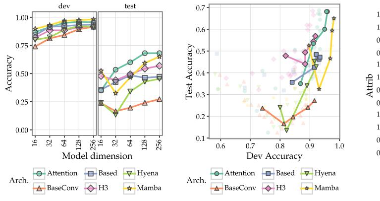

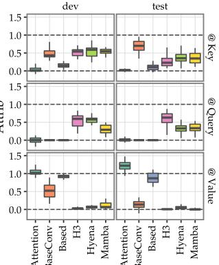

(a) Model dimensionality vs. accuracy on checkpoints with highest dev accuracy.

(b) Dev vs. test accuracy, with highest dev accuracy checkpoints at each dim. highlighted.

(c) Attribution scores for all checkpoints (except outliers), compared between dev and test sets.

Figure 5: Generalisation on Associative Treecall: Accuracy and interchange intervention results on ATR with train-test split. Scores are reported on dev (with in-distribution query-answer pairs from training) and test (OOD). We highlight the checkpoint with the best dev score in each setting.

**Mechanistic analysis.** We report a summary of attribution scores at different tokens (*key*, *query*, *value*), comparing on dev and test sets across all checkpoints in Figure 5c. We find largely consistent mechanisms underlying behaviour on both dev and test, and these match attribution scores on ATR without train-test split. The only exception is that BasedConv does induction on the dev set but not nearly as much on the test set; its induction mechanism is more brittle than Attention and Based.

Overall, the induction mechanism is not more general than the direct retrieval mechanism; both Attention and Mamba show greater generalisation than other architectures despite their entirely different solutions, and our mechanistic evaluations confirm that this solution is consistent across in-distribution and out-of-distribution queries.

### 5.4 Short convolutions enable AR and ATR in Mamba and Based

Throughout all our experiments on AR and ATR, we repeatedly observed that Attention, Based, and Mamba are the highest-performing architectures. However, their underlying mechanisms differ: Attention and Based learn **induction**, a 2-layer mechanism which stores key-value associations at the value token as an intermediate step, whereas Mamba uses **direct retrieval**, a 1-layer mechanism which directly writes an association to the query token.

Importantly, Based and Mamba share a key architectural component: short convolutions. We hypothesise that this component is necessary6 for performing association (as in AR and ATR) when using a subquadratic sequence mixer. We conduct experiments on AR where we shorten the convolution kernel size in Mamba (from the default  $d_{\text{conv}} = 4$  to  $\{3, 2, 1\}$ , and deleting it) and replace the Based short convolution with implicitly-parametrised long convolution [Poli et al., 2023].

**Results.** We report results of our ablations in Figure 6. On Mamba (Figure 6a), we find a step change in task accuracy when increasing  $d_{\rm conv}$  from 1 to 2, which introduces previous token information and thus enables AR. Without short convolution, Mamba fails to learn AR. Figure 6b further shows that larger kernel size leads to earlier (in layer 0) direct retrieval. Finally, besides  $d_{\rm conv} < 2$  like Mamba, implicit long convolution in Based also significantly harms AR performance (Figure 6c). Therefore, we conclude that short convolutions are responsible for association on AR in Mamba and Based.

#### Discussion 6

Why mechanistic evaluations over behavioural metrics? Architectural advances on language modelling are largely uncovered and presented in an empirical manner; beyond intuition, we have

&lt;sup>6Since Hyena also has a short convolution, this may not be *sufficient* for good performance on association.

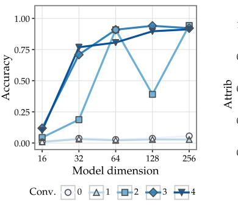

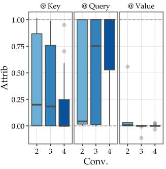

(a) Accuracy on AR (length  $32$ ) for **Mamba** when varying the kernel size of the short convolution.

(b) Summarised attribution scores across all checkpoints for Mamba when varying conv. kernel size.

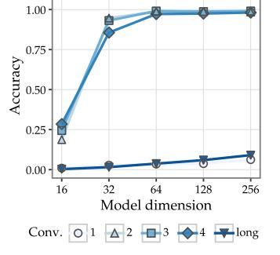

(c) Accuracy on AR for **Based** when varying conv. kernel size or using implicit long conv.

Figure 6: **Ablating short convolution**: Accuracy and interchange intervention results when ablating parameters of the short convolution component in Mamba, Based, and BaseConv.

little justification as to why a modification or innovation improves model performance. Synthetic tasks already regularly inform progress on subquadratic architecture design (such as SSMs), but treating such tasks as another downstream evaluation is loses useful signal; control over task parameters presents an opportunity to explain performance using interpretability.

ATR indicates induction is highly general. We introduced ATR to break the naïve key-value adjacency of AR, and see whether general mechanisms underlying association still emerge across architectures. We find the same induction mechanism, where the association is computed and stored at the value before retrieval, in Attention and Based for both tasks. While Olsson et al. [2022] and later works define induction on adjacent tokens, ATR is evidence that a *position-independent* and generalising ( $\S$ 5.3) notion of association can be implemented by a single attention head. Further investigation of ATR (e.g. multi-hop queries) is necessary to understand the limits of induction.

Short convolutions are key to association in SSMs. We showed that Mamba and Based rely on short convolutions to learn how to associate keys and values on AR and ATR. Several earlier works point to the importance of short convolution: Arora et al.  $[2024b]$  empirically show its utility on AR (along with sliding-window attention), Allen-Zhu and Alfarano [2025] introduce a short convolution component (Canon) in various architectures to improve synthetic and real task performance, and Olsson et al. [2022] show that 1-layer attention can learn induction if augmented with a length-2 convolution; further see Liu et al. [2024b], Dolga et al. [2024], Fu et al. [2023], Poli et al. [2023].

#### 7 Limitations

While we proposed mechanistic evaluations as a new tool, behavioural metrics like accuracy are still needed to properly contextualise results. Additionally, here we did not perform mechanistic evaluation of subcomponents of sequence mixers (e.g. the selective SSM component within Mamba), due to implementation difficulties when applying interventions within hardware-optimised operators, which are inaccessible via PyTorch hooks. Finally, we focus on synthetic tasks throughout this work; extending our analyses to real-world models would help paint a more complete picture of the differences in capabilities (and underlying mechanisms) of different architectures on real-world tasks.

#### 8 Conclusion

In this work, we introduce mechanistic evaluations as a powerful framework for comparing model architectures. This approach goes beyond high-level behavioural metrics, revealing substantive differences between architectures. Through analysis of synthetic in-context retrieval tasks, we uncover the underlying mechanisms that explain the success and failure points of various architectures. Mechanistic evaluations thus provide a useful tool for architecture design and analysis, as well as a new opportunity for interpretability research to open the blackbox of progress in AI.

# Acknowledgements

We would especially like to thank Zhengxuan Wu, Qinan Yu, Atticus Geiger, and all other attendees of the #weekly-interp-meeting at Stanford who gave feedback on an early version of this project. We also thank Yanzhe 'Sanju' Zhang, Harshit Joshi, Rohan Pandey, Justus Mattern, Ken Ziyu Liu, Julie Kallini, Chenglei Si, Bradley Brown, Jordan Juravsky, Arjun Vikram, and Christine Ye for helpful discussion and feedback at various stages of the project.

This research is supported in part by grants from Google and Open Philanthropy.

# References

- Ekin Akyürek, Bailin Wang, Yoon Kim, and Jacob Andreas. In-context language learning: Architectures and algorithms. In *Forty-first International Conference on Machine Learning, ICML 2024*, Vienna, Austria, 2024. OpenReview.net. URL <https://openreview.net/forum?id=3Z9CRr5srL>.
- Zeyuan Allen-Zhu and Alberto Alfarano. Physics of Language Models: Part 4.1, Architecture design and the magic of Canon layers. *SSRN*, 2025. URL [https://papers.ssrn.com/sol3/papers.](https://papers.ssrn.com/sol3/papers.cfm?abstract_id=5240330) [cfm?abstract\\_id=5240330](https://papers.ssrn.com/sol3/papers.cfm?abstract_id=5240330).
- Zeyuan Allen-Zhu and Yuanzhi Li. Physics of Language Models: Part 1, Learning hierarchical language structures. *arXiv:2305.13673*, 2024. URL <https://arxiv.org/abs/2305.13673>.
- Simran Arora, Sabri Eyuboglu, Aman Timalsina, Isys Johnson, Michael Poli, James Zou, Atri Rudra, and Christopher Ré. Zoology: Measuring and improving recall in efficient language models. In *The Twelfth International Conference on Learning Representations, ICLR 2024, Vienna, Austria, May 7-11, 2024*. OpenReview.net, 2024a. URL <https://openreview.net/forum?id=LY3ukUANko>.
- Simran Arora, Sabri Eyuboglu, Michael Zhang, Aman Timalsina, Silas Alberti, James Zou, Atri Rudra, and Christopher Ré. Simple linear attention language models balance the recall-throughput tradeoff. In *Forty-first International Conference on Machine Learning, ICML 2024, Vienna, Austria, July 21-27, 2024*. OpenReview.net, 2024b. URL [https://openreview.net/forum?id=](https://openreview.net/forum?id=e93ffDcpH3) [e93ffDcpH3](https://openreview.net/forum?id=e93ffDcpH3).
- Jimmy Ba, Geoffrey E. Hinton, Volodymyr Mnih, Joel Z. Leibo, and Catalin Ionescu. Using fast weights to attend to the recent past. In Daniel D. Lee, Masashi Sugiyama, Ulrike von Luxburg, Isabelle Guyon, and Roman Garnett, editors, *Advances in Neural Information Processing Systems 29: Annual Conference on Neural Information Processing Systems 2016, December 5-10, 2016, Barcelona, Spain*, pages 4331–4339, 2016. URL [https://proceedings.neurips.cc/paper/](https://proceedings.neurips.cc/paper/2016/hash/9f44e956e3a2b7b5598c625fcc802c36-Abstract.html) [2016/hash/9f44e956e3a2b7b5598c625fcc802c36-Abstract.html](https://proceedings.neurips.cc/paper/2016/hash/9f44e956e3a2b7b5598c625fcc802c36-Abstract.html).
- Aviv Bick, Eric Xing, and Albert Gu. Understanding the skill gap in recurrent language models: The role of the gather-and-aggregate mechanism. *arXiv:2504.18574*, 2025. URL [https://arxiv.](https://arxiv.org/abs/2504.18574) [org/abs/2504.18574](https://arxiv.org/abs/2504.18574).
- Jannik Brinkmann, Abhay Sheshadri, Victor Levoso, Paul Swoboda, and Christian Bartelt. A mechanistic analysis of a transformer trained on a symbolic multi-step reasoning task. In Lun-Wei Ku, Andre Martins, and Vivek Srikumar, editors, *Findings of the Association for Computational Linguistics: ACL 2024*, pages 4082–4102, Bangkok, Thailand, August 2024. Association for Computational Linguistics. doi: 10.18653/v1/2024.findings-acl.242. URL <https://aclanthology.org/2024.findings-acl.242/>.
- Ivo Danihelka, Greg Wayne, Benigno Uria, Nal Kalchbrenner, and Alex Graves. Associative long short-term memory. In Maria-Florina Balcan and Kilian Q. Weinberger, editors, *Proceedings of the 33nd International Conference on Machine Learning, ICML 2016, New York City, NY, USA, June 19-24, 2016*, volume 48 of *JMLR Workshop and Conference Proceedings*, pages 1986–1994. JMLR.org, 2016. URL <http://proceedings.mlr.press/v48/danihelka16.html>.
- Tri Dao and Albert Gu. Transformers are SSMs: Generalized models and efficient algorithms through structured state space duality. *arXiv:2405.21060*, 2024. URL [https://arxiv.org/abs/2405.](https://arxiv.org/abs/2405.21060) [21060](https://arxiv.org/abs/2405.21060).

- Rares Dolga, Lucas Maystre, Marius Cobzarenco, and David Barber. Latte: Latent attention for linear time transformers. *arXiv:2402.17512*, 2024. URL <https://arxiv.org/abs/2402.17512>.
- Ezra Edelman, Nikolaos Tsilivis, Benjamin L. Edelman, Eran Malach, and Surbhi Goel. The evolution of statistical induction heads: In-context learning markov chains. In Amir Globersons, Lester Mackey, Danielle Belgrave, Angela Fan, Ulrich Paquet, Jakub M. Tomczak, and Cheng Zhang, editors, *Advances in Neural Information Processing Systems 38: Annual Conference on Neural Information Processing Systems 2024, NeurIPS 2024*, Vancouver, BC, Canada, 2024. URL [http://papers.nips.cc/paper\\_files/paper/2024/hash/](http://papers.nips.cc/paper_files/paper/2024/hash/75b0edb869e2cd509d64d0e8ff446bc1-Abstract-Conference.html) [75b0edb869e2cd509d64d0e8ff446bc1-Abstract-Conference.html](http://papers.nips.cc/paper_files/paper/2024/hash/75b0edb869e2cd509d64d0e8ff446bc1-Abstract-Conference.html).
- Nelson Elhage, Neel Nanda, Catherine Olsson, Tom Henighan, Nicholas Joseph, Ben Mann, Amanda Askell, Yuntao Bai, Anna Chen, Tom Conerly, Nova DasSarma, Dawn Drain, Deep Ganguli, Zac Hatfield-Dodds, Danny Hernandez, Andy Jones, Jackson Kernion, Liane Lovitt, Kamal Ndousse, Dario Amodei, Tom Brown, Jack Clark, Jared Kaplan, Sam McCandlish, and Chris Olah. A mathematical framework for transformer circuits. *Transformer Circuits Thread*, 2021. URL <https://transformer-circuits.pub/2021/framework/index.html>.
- Jiahai Feng and Jacob Steinhardt. How do language models bind entities in context? In *The Twelfth International Conference on Learning Representations, ICLR 2024, Vienna, Austria, May 7-11, 2024*. OpenReview.net, 2024. URL <https://openreview.net/forum?id=zb3b6oKO77>.
- Daniel Y. Fu, Tri Dao, Khaled Kamal Saab, Armin W. Thomas, Atri Rudra, and Christopher Ré. Hungry hungry hippos: Towards language modeling with state space models. In *The Eleventh International Conference on Learning Representations, ICLR 2023, Kigali, Rwanda, May 1-5, 2023*. OpenReview.net, 2023. URL <https://openreview.net/forum?id=COZDy0WYGg>.
- Atticus Geiger, Hanson Lu, Thomas Icard, and Christopher Potts. Causal abstractions of neural networks. In M. Ranzato, A. Beygelzimer, Y. Dauphin, P.S. Liang, and J. Wortman Vaughan, editors, *Advances in Neural Information Processing Systems*, volume 34, pages 9574–9586. Curran Associates, Inc., 2021. URL [https://proceedings.neurips.cc/paper\\_files/paper/2021/](https://proceedings.neurips.cc/paper_files/paper/2021/file/4f5c422f4d49a5a807eda27434231040-Paper.pdf) [file/4f5c422f4d49a5a807eda27434231040-Paper.pdf](https://proceedings.neurips.cc/paper_files/paper/2021/file/4f5c422f4d49a5a807eda27434231040-Paper.pdf).
- Atticus Geiger, Duligur Ibeling, Amir Zur, Maheep Chaudhary, Sonakshi Chauhan, Jing Huang, Aryaman Arora, Zhengxuan Wu, Noah Goodman, Christopher Potts, and Thomas Icard. Causal abstraction: A theoretical foundation for mechanistic interpretability. *arXiv:2301.04709*, 2024. URL <https://arxiv.org/abs/2301.04709>.
- Alex Graves, Greg Wayne, and Ivo Danihelka. Neural turing machines. *arXiv:1410.5401*, 2014. URL <https://arxiv.org/abs/1410.5401>.
- Klaus Greff, Sjoerd van Steenkiste, and Jürgen Schmidhuber. On the binding problem in artificial neural networks. *arXiv:2012.05208*, 2020. URL <https://arxiv.org/abs/2012.05208>.
- Albert Gu and Tri Dao. Mamba: Linear-time sequence modeling with selective state spaces. *arXiv:2312.00752*, 2024. URL <https://arxiv.org/abs/2312.00752>.
- Michael Hahn and Navin Goyal. A theory of emergent in-context learning as implicit structure induction. *arXiv:2303.07971*, 2023. URL <https://arxiv.org/abs/2303.07971>.
- Samy Jelassi, David Brandfonbrener, Sham M. Kakade, and Eran Malach. Repeat after me: Transformers are better than state space models at copying. In *Forty-first International Conference on Machine Learning, ICML 2024, Vienna, Austria, July 21-27, 2024*. OpenReview.net, 2024. URL <https://openreview.net/forum?id=duRRoGeoQT>.
- Najoung Kim and Sebastian Schuster. Entity tracking in language models. In Anna Rogers, Jordan Boyd-Graber, and Naoaki Okazaki, editors, *Proceedings of the 61st Annual Meeting of the Association for Computational Linguistics (Volume 1: Long Papers)*, pages 3835–3855, Toronto, Canada, July 2023. Association for Computational Linguistics. doi: 10.18653/v1/2023.acl-long.213. URL <https://aclanthology.org/2023.acl-long.213/>.
- Belinda Z. Li, Zifan Carl Guo, and Jacob Andreas. (How) do language models track state? *arXiv:2503.02854*, 2025a. URL <https://arxiv.org/abs/2503.02854>.

- Mingchen Li, Xuechen Zhang, Yixiao Huang, and Samet Oymak. On the power of convolutionaugmented transformer. In Toby Walsh, Julie Shah, and Zico Kolter, editors, *AAAI-25, Sponsored by the Association for the Advancement of Artificial Intelligence, February 25 - March 4, 2025, Philadelphia, PA, USA*, pages 18393–18402. AAAI Press, 2025b. doi: 10.1609/AAAI.V39I17. 34024. URL <https://doi.org/10.1609/aaai.v39i17.34024>.
- Tom Lieberum, Matthew Rahtz, János Kramár, Neel Nanda, Geoffrey Irving, Rohin Shah, and Vladimir Mikulik. Does circuit analysis interpretability scale? evidence from multiple choice capabilities in chinchilla. *arXiv preprint arXiv:2307.09458*, 2023.
- Bo Liu, Rui Wang, Lemeng Wu, Yihao Feng, Peter Stone, and Qiang Liu. Longhorn: State space models are amortized online learners. *arXiv:2407.14207*, 2024a. URL [https://arxiv.org/abs/](https://arxiv.org/abs/2407.14207) [2407.14207](https://arxiv.org/abs/2407.14207).
- Zicheng Liu, Siyuan Li, Li Wang, Zedong Wang, Yunfan Liu, and Stan Z. Li. Short-long convolutions help hardware-efficient linear attention to focus on long sequences. In *Forty-first International Conference on Machine Learning, ICML 2024*, Vienna, Austria, 2024b. OpenReview.net. URL <https://openreview.net/forum?id=TRrXkVdhwi>.
- Ekdeep Singh Lubana, Kyogo Kawaguchi, Robert P. Dick, and Hidenori Tanaka. A percolation model of emergence: Analyzing transformers trained on a formal language. *arXiv:2408.12578*, 2024. URL <https://arxiv.org/abs/2408.12578>.
- Shahar Lutati, Itamar Zimerman, and Lior Wolf. Focus your attention (with adaptive IIR filters). In Houda Bouamor, Juan Pino, and Kalika Bali, editors, *Proceedings of the 2023 Conference on Empirical Methods in Natural Language Processing*, pages 12538–12549, Singapore, December 2023. Association for Computational Linguistics. doi: 10.18653/v1/2023.emnlp-main.772. URL <https://aclanthology.org/2023.emnlp-main.772/>.
- Neel Nanda, Lawrence Chan, Tom Lieberum, Jess Smith, and Jacob Steinhardt. Progress measures for grokking via mechanistic interpretability. In *The Eleventh International Conference on Learning Representations, ICLR 2023*, Kigali, Rwanda, 2023. OpenReview.net. URL [https://openreview.](https://openreview.net/forum?id=9XFSbDPmdW) [net/forum?id=9XFSbDPmdW](https://openreview.net/forum?id=9XFSbDPmdW).
- Franz Nowak and Ryan Cotterell. A fast algorithm for computing prefix probabilities. In Anna Rogers, Jordan Boyd-Graber, and Naoaki Okazaki, editors, *Proceedings of the 61st Annual Meeting of the Association for Computational Linguistics (Volume 2: Short Papers)*, pages 57–69, Toronto, Canada, July 2023. Association for Computational Linguistics. doi: 10.18653/v1/2023.acl-short.6. URL <https://aclanthology.org/2023.acl-short.6/>.
- Destiny Okpekpe and Antonio Orvieto. Revisiting associative recall in modern recurrent models. In *First Workshop on Scalable Optimization for Efficient and Adaptive Foundation Models*, 2025. URL <https://openreview.net/pdf?id=CcqAd5RPk5>.
- Catherine Olsson, Nelson Elhage, Neel Nanda, Nicholas Joseph, Nova DasSarma, Tom Henighan, Ben Mann, Amanda Askell, Yuntao Bai, Anna Chen, Tom Conerly, Dawn Drain, Deep Ganguli, Zac Hatfield-Dodds, Danny Hernandez, Scott Johnston, Andy Jones, Jackson Kernion, Liane Lovitt, Kamal Ndousse, Dario Amodei, Tom Brown, Jack Clark, Jared Kaplan, Sam McCandlish, and Chris Olah. In-context learning and induction heads. *arXiv:2209.11895*, 2022. URL [https:](https://arxiv.org/abs/2209.11895) [//arxiv.org/abs/2209.11895](https://arxiv.org/abs/2209.11895).
- Rohan Pandey. gzip predicts data-dependent scaling laws. *arXiv:2405.16684*, 2024. URL [https:](https://arxiv.org/abs/2405.16684) [//arxiv.org/abs/2405.16684](https://arxiv.org/abs/2405.16684).
- Michael Poli, Stefano Massaroli, Eric Nguyen, Daniel Y. Fu, Tri Dao, Stephen Baccus, Yoshua Bengio, Stefano Ermon, and Christopher Ré. Hyena hierarchy: Towards larger convolutional language models. In Andreas Krause, Emma Brunskill, Kyunghyun Cho, Barbara Engelhardt, Sivan Sabato, and Jonathan Scarlett, editors, *International Conference on Machine Learning, ICML 2023, 23-29 July 2023, Honolulu, Hawaii, USA*, volume 202 of *Proceedings of Machine Learning Research*, pages 28043–28078. PMLR, 2023. URL [https://proceedings.mlr.press/v202/](https://proceedings.mlr.press/v202/poli23a.html) [poli23a.html](https://proceedings.mlr.press/v202/poli23a.html).

- Nikhil Prakash, Tamar Rott Shaham, Tal Haklay, Yonatan Belinkov, and David Bau. Fine-tuning enhances existing mechanisms: A case study on entity tracking. In *The Twelfth International Conference on Learning Representations, ICLR 2024*, Vienna, Austria, 2024. OpenReview.net. URL <https://openreview.net/forum?id=8sKcAWOf2D>.
- Nikhil Prakash, Natalie Shapira, Arnab Sen Sharma, Christoph Riedl, Yonatan Belinkov, Tamar Rott Shaham, David Bau, and Atticus Geiger. Language models use lookbacks to track beliefs. *arXiv:2505.14685*, 2025. URL <https://arxiv.org/abs/2505.14685>.
- Gautam Reddy. The mechanistic basis of data dependence and abrupt learning in an in-context classification task. In *The Twelfth International Conference on Learning Representations, ICLR 2024*, Vienna, Austria, 2024. OpenReview.net. URL [https://openreview.net/forum?id=](https://openreview.net/forum?id=aN4Jf6Cx69) [aN4Jf6Cx69](https://openreview.net/forum?id=aN4Jf6Cx69).
- Ivan Rodkin, Yuri Kuratov, Aydar Bulatov, and Mikhail Burtsev. Associative recurrent memory transformer. *arXiv:2407.04841*, 2025. URL <https://arxiv.org/abs/2407.04841>.
- Aaditya K. Singh, Ted Moskovitz, Felix Hill, Stephanie C. Y. Chan, and Andrew M. Saxe. What needs to go right for an induction head? A mechanistic study of in-context learning circuits and their formation. In *Forty-first International Conference on Machine Learning, ICML 2024*, Vienna, Austria, 2024. OpenReview.net. URL <https://openreview.net/forum?id=O8rrXl71D5>.
- Lena Strobl, William Merrill, Gail Weiss, David Chiang, and Dana Angluin. What formal languages can transformers express? A survey. *Transactions of the Association for Computational Linguistics*, 12:543–561, 2024. doi: 10.1162/tacl\_a\_00663. URL [https://aclanthology.org/2024.](https://aclanthology.org/2024.tacl-1.30/) [tacl-1.30/](https://aclanthology.org/2024.tacl-1.30/).
- Curt Tigges, Michael Hanna, Qinan Yu, and Stella Biderman. LLM circuit analyses are consistent across training and scale. In Amir Globersons, Lester Mackey, Danielle Belgrave, Angela Fan, Ulrich Paquet, Jakub M. Tomczak, and Cheng Zhang, editors, *Advances in Neural Information Processing Systems 38: Annual Conference on Neural Information Processing Systems 2024, NeurIPS 2024*, Vancouver, BC, Canada, 2024. URL [http://papers.nips.cc/paper\\_files/](http://papers.nips.cc/paper_files/paper/2024/hash/47c7edadfee365b394b2a3bd416048da-Abstract-Conference.html) [paper/2024/hash/47c7edadfee365b394b2a3bd416048da-Abstract-Conference.html](http://papers.nips.cc/paper_files/paper/2024/hash/47c7edadfee365b394b2a3bd416048da-Abstract-Conference.html).
- Asher Trockman, Hrayr Harutyunyan, J. Zico Kolter, Sanjiv Kumar, and Srinadh Bhojanapalli. Mimetic initialization helps state space models learn to recall. *arXiv:2410.11135*, 2024. URL <https://arxiv.org/abs/2410.11135>.
- Josef Valvoda, Naomi Saphra, Jonathan Rawski, Adina Williams, and Ryan Cotterell. Benchmarking compositionality with formal languages. In Nicoletta Calzolari, Chu-Ren Huang, Hansaem Kim, James Pustejovsky, Leo Wanner, Key-Sun Choi, Pum-Mo Ryu, Hsin-Hsi Chen, Lucia Donatelli, Heng Ji, Sadao Kurohashi, Patrizia Paggio, Nianwen Xue, Seokhwan Kim, Younggyun Hahm, Zhong He, Tony Kyungil Lee, Enrico Santus, Francis Bond, and Seung-Hoon Na, editors, *Proceedings of the 29th International Conference on Computational Linguistics*, pages 6007– 6018, Gyeongju, Republic of Korea, October 2022. International Committee on Computational Linguistics. URL <https://aclanthology.org/2022.coling-1.525/>.
- Ashish Vaswani, Noam Shazeer, Niki Parmar, Jakob Uszkoreit, Llion Jones, Aidan N. Gomez, Lukasz Kaiser, and Illia Polosukhin. Attention is all you need. In Isabelle Guyon, Ulrike von Luxburg, Samy Bengio, Hanna M. Wallach, Rob Fergus, S. V. N. Vishwanathan, and Roman Garnett, editors, *Advances in Neural Information Processing Systems 30: Annual Conference on Neural Information Processing Systems 2017*, pages 5998–6008, Long Beach, CA, USA, 2017. URL [https://proceedings.neurips.cc/paper/2017/hash/](https://proceedings.neurips.cc/paper/2017/hash/3f5ee243547dee91fbd053c1c4a845aa-Abstract.html) [3f5ee243547dee91fbd053c1c4a845aa-Abstract.html](https://proceedings.neurips.cc/paper/2017/hash/3f5ee243547dee91fbd053c1c4a845aa-Abstract.html).
- Roger Waleffe, Wonmin Byeon, Duncan Riach, Brandon Norick, Vijay Korthikanti, Tri Dao, Albert Gu, Ali Hatamizadeh, Sudhakar Singh, Deepak Narayanan, Garvit Kulshreshtha, Vartika Singh, Jared Casper, Jan Kautz, Mohammad Shoeybi, and Bryan Catanzaro. An empirical study of Mambabased language models. *arXiv:2406.07887*, 2024. URL <https://arxiv.org/abs/2406.07887>.
- Boshi Wang, Xiang Yue, Yu Su, and Huan Sun. Grokking of implicit reasoning in transformers: A mechanistic journey to the edge of generalization. In Amir Globersons, Lester Mackey,

Danielle Belgrave, Angela Fan, Ulrich Paquet, Jakub M. Tomczak, and Cheng Zhang, editors, *Advances in Neural Information Processing Systems 38: Annual Conference on Neural Information Processing Systems 2024, NeurIPS 2024, Vancouver, BC, Canada, December 10 - 15, 2024*, 2024. URL [http://papers.nips.cc/paper\\_files/paper/2024/hash/](http://papers.nips.cc/paper_files/paper/2024/hash/ad217e0c7fecc71bdf48660ad6714b07-Abstract-Conference.html) [ad217e0c7fecc71bdf48660ad6714b07-Abstract-Conference.html](http://papers.nips.cc/paper_files/paper/2024/hash/ad217e0c7fecc71bdf48660ad6714b07-Abstract-Conference.html).

- Ke Alexander Wang, Jiaxin Shi, and Emily B. Fox. Test-time regression: a unifying framework for designing sequence models with associative memory. *arXiv:2501.12352*, 2025. URL [https:](https://arxiv.org/abs/2501.12352) [//arxiv.org/abs/2501.12352](https://arxiv.org/abs/2501.12352).
- Kaiyue Wen, Xingyu Dang, and Kaifeng Lyu. RNNs are not transformers (yet): The key bottleneck on in-context retrieval. *arXiv:2402.18510*, 2024. URL <https://arxiv.org/abs/2402.18510>.
- Jennifer C. White and Ryan Cotterell. Examining the inductive bias of neural language models with artificial languages. In Chengqing Zong, Fei Xia, Wenjie Li, and Roberto Navigli, editors, *Proceedings of the 59th Annual Meeting of the Association for Computational Linguistics and the 11th International Joint Conference on Natural Language Processing (Volume 1: Long Papers)*, pages 454–463, Online, August 2021. Association for Computational Linguistics. doi: 10.18653/v1/2021.acl-long.38. URL <https://aclanthology.org/2021.acl-long.38/>.
- Sarah Wiegreffe, Oyvind Tafjord, Yonatan Belinkov, Hannaneh Hajishirzi, and Ashish Sabharwal. Answer, assemble, ace: Understanding how LMs answer multiple choice questions. In *The Thirteenth International Conference on Learning Representations*, 2025. URL [https:](https://openreview.net/forum?id=6NNA0MxhCH) [//openreview.net/forum?id=6NNA0MxhCH](https://openreview.net/forum?id=6NNA0MxhCH).
- Zhengxuan Wu, Atticus Geiger, Aryaman Arora, Jing Huang, Zheng Wang, Noah Goodman, Christopher Manning, and Christopher Potts. pyvene: A library for understanding and improving PyTorch models via interventions. In Kai-Wei Chang, Annie Lee, and Nazneen Rajani, editors, *Proceedings of the 2024 Conference of the North American Chapter of the Association for Computational Linguistics: Human Language Technologies (Volume 3: System Demonstrations)*, pages 158–165, Mexico City, Mexico, June 2024. Association for Computational Linguistics. doi: 10.18653/v1/2024.naacl-demo.16. URL <https://aclanthology.org/2024.naacl-demo.16/>.
- Kayo Yin and Jacob Steinhardt. Which attention heads matter for in-context learning? *arXiv:2502.14010*, 2025. URL <https://arxiv.org/abs/2502.14010>.
- Wei Zhang and Bowen Zhou. Learning to update auto-associative memory in recurrent neural networks for improving sequence memorization. *arXiv:1709.06493*, 2017. URL [https://arxiv.](https://arxiv.org/abs/1709.06493) [org/abs/1709.06493](https://arxiv.org/abs/1709.06493).

# Appendix

# Table of Contents

| A | Formal definitions and details for ATR                                  | 16 |
|---|-------------------------------------------------------------------------|----|
|   | A.1 Additional details on ATR                                        | 16 |
| B | Model configurations                                                    | 17 |
| C | Task hyperparameters                                                    | 17 |
| D | Additional experiments on AR and ATR                                    | 18 |
|   | D.1 Attention needs position embeddings .                         | 18 |
|   | D.2 1-layer SSMs learn direct retrieval on AR and ATR                | 18 |
|   | D.3 SSMs prefer layer 0 to perform AR                                | 19 |
|   | D.4 Rightmost sibling queries are trivial for all architectures . | 19 |

# A Formal definitions and details for ATR

For reference, we provide formal definitions for PCFGs and the normal form we use in ATR.7

**Definition A.1.** A probabilistic context-free grammar is a tuple  $\mathcal{G} = \langle \mathcal{N}, \Sigma, S, \mathcal{R}, p \rangle$  where:

- $\mathcal{N}$  is a finite set of non-terminal symbols;
- $\Sigma$  is an alphabet of terminal symbols;
- $S \in \mathcal{N}$  is a start symbol;
- $\mathcal{R} \subset \mathcal{N} \times (\mathcal{N} \cup \Sigma)^*$  is a finite set of production rules, mapping a left-hand side symbol  $N \in \mathcal{N}$  to a string of symbols that may be either terminals or nonterminals; each such rule is written as  $X \to \alpha$ ;
- $p: \mathcal{R} \to [0,1]$  is a weighting function which assigns a probability to each production rule for a nonterminal; this function is locally normalised, meaning  $\{\sum_{X\to\alpha} p(X\to\alpha) = 1 \mid$  $X \in \mathcal{N}$ .

**Definition A.2.** A PCFG  $\mathcal{G} = \langle \mathcal{N}, \Sigma, S, \mathcal{R}, p \rangle$  is in **Greibach normal form (GNF)** if each production rule in  $\mathcal{R}$  is of the form  $X \to a X_1 \ldots X_n$ , where  $X_1, \ldots, X_n \in \mathcal{N}$  and  $n$  may be 0. Similarly, a PCFG is in **right-Greibach normal form** if each rule is of the form  $X \to X_1 \ldots X_n a$ .

For ATR, the PCFG is in Greibach normal form if the head is the leftmost symbol of the production rule's righthand side; similarly, if the PCFG is right-headed, it is in right-Greibach normal form.

**Definition A.3.** A derivation step  $\alpha \Rightarrow \beta$  is an operation where, given strings of symbols  $\alpha, \beta \in$  $(\mathcal{N} \cup \Sigma)^*$ , the leftmost nonterminal  $X \in \mathcal{N}$  in  $\alpha$  is rewritten using the right-hand side of a production rule  $X \to \ldots \in \mathcal{R}$  to obtain  $\beta$ .

**Definition A.4.** A **derivation** under the PCFG  $\mathcal{G}$  is a sequence of strings  $[\boldsymbol{\alpha}_0,\ldots,\boldsymbol{\alpha}_m]$  where  $\alpha_0 \in \mathcal{N}$  and each step  $\alpha_{i+1}$  is formed by a derivation step on  $\alpha_i$ . The final string  $\alpha_m \in \Sigma^*$  is the **yield** of the derivation.

Each ATR document is the yield of a derivation sampled under the GNF PCFG G.

### A.1 Additional details on ATR

**Parent terminals in GNF.** We set the left/right-most terminal in each production rule (which leads to the GNF property) the parent of all other generated terminals. This terminal is sampled specially: for each nonterminal, we independently sample a distribution over terminals from a uniform Dirichlet, and for all production rules with that nonterminal on the lefthand side we use that distribution to sample the parent terminal. This simulates how heads of phrases in natural language (analogous to our parent terminals) decide the type of the phrase they head (analogous to our nonterminals).

**Maximum depth.** To enforce maximum depth, we first assign a uniformly random depth score  $d: \mathcal{N} \to \mathbb{N} \in \{1, \dots, \text{max\_depth}\}\$  to each nonterminal in the vocabulary. Then, for each production rule for each nonterminal X, we only allow nonterminals Y with  $d(Y) > d(X)$  on the right-hand side. Note that this means no recursion is possible.

&lt;sup>7We use similar formalisations of PCFGs as previous work in NLP, e.g. Nowak and Cotterell [2023].

#### **Model configurations** B

Table 2: Default model configurations across all architectures. In experiments, we sweep learning rate and embedding dimension, reporting results from the instance with highest accuracy.

| (a) Attention                    |                         | (b) Hyena                        |                    |            | (c) BaseConv |                                             |        |                   |
|----------------------------------|-------------------------|----------------------------------|--------------------|------------|--------------|---------------------------------------------|--------|-------------------|
| Parameter Values              |                         | Parameter                        |                    | Values     | Parameter    |                                             |        | Values            |
| 0.0 dropout num_heads 1 |                         | $1_{\text{max}}$ filter_order |                    | 1024 64 |              | $1_{\text{max}}$ kernel_size             |        | 1024 $[3, -1]$ |
|                                  |                         | num heads num_blocks          |                    | 1 1     |              | <pre>implicit_long_conv</pre> $use\_act$ |        | True False     |
|                                  |                         | outer_mixing                     |                    | False      |              |                                             |        |                   |
|                                  |                         | dropout                          |                    | 0.0        |              |                                             |        |                   |
|                                  |                         | filter_dropout                   |                    | 0.0 3   |              |                                             |        |                   |
|                                  |                         | bidirectional                    | short_filter_order | False      |              |                                             |        |                   |
| (d) Based                        |                         |                                  | (e) H3             |            |              | (f) Mamba                                   |        |                   |
| Parameter                        | Values                  |                                  | Parameter          | Values     |              | Parameter                                   | Values |                   |
| BaseConv Layer                   |                         |                                  | $1_{\text{max}}$   | 1024       |              | d_conv                                      | 4      |                   |
| $1_{\text{max}}$                 | 1024                    |                                  | $d_state$          | 1024       |              |                                             |        |                   |
| kernel_size                      | 3                       |                                  | head_dim           | 1024       |              |                                             |        |                   |
| implicit_long_conv               | True                    |                                  |                    |            |              |                                             |        |                   |
| $use\_act$                       | False                   |                                  |                    |            |              |                                             |        |                   |
| Based Layer                      |                         |                                  |                    |            |              |                                             |        |                   |
| $1_{\text{max}}$                 | 1024                    |                                  |                    |            |              |                                             |        |                   |
| feature dim                      | 8                       |                                  |                    |            |              |                                             |        |                   |
| num_key_value_heads              |                         |                                  |                    |            |              |                                             |        |                   |
| num heads                        |                         |                                  |                    |            |              |                                             |        |                   |
| feature_name train_view       | taylor_exp quadratic |                                  |                    |            |              |                                             |        |                   |
|                                  |                         |                                  |                    |            |              |                                             |        |                   |

#### **Task hyperparameters** $\mathbf{C}$

Table 3: Task hyperparameters used for constructing key-value sets for AR and PCFGs for ATR. For a description of each parameter, see Table 1.

(a) Parameters used for constructing AR documents.

| Parameter                            | Values   |
|--------------------------------------|----------|
| $L_{\text{max}}$ $L_{\text{min}}$ | 32 32 |
|                                      | {8192}   |

(b) Parameters used for constructing ATR documents.

| Parameter        | Values         |
|------------------|----------------|
| H                | Right          |
| $d_{\text{max}}$ | 10             |
| $L_{\text{max}}$ | $\{5, 10\}$    |
| $R_{\text{max}}$ | 5              |
|                  | 40             |
| $\Sigma$         | $\{20, 8192\}$ |
| $r_{\Sigma}$     | 20             |

#### Additional experiments on AR and ATR D

Many parameters of synthetic tasks like AR and ATR and the model architectures we tested have interesting effects on behavioural and mechanistic metrics, but not all experiments could fit in our main text. Therefore, we include additional interesting observations in this appendix.

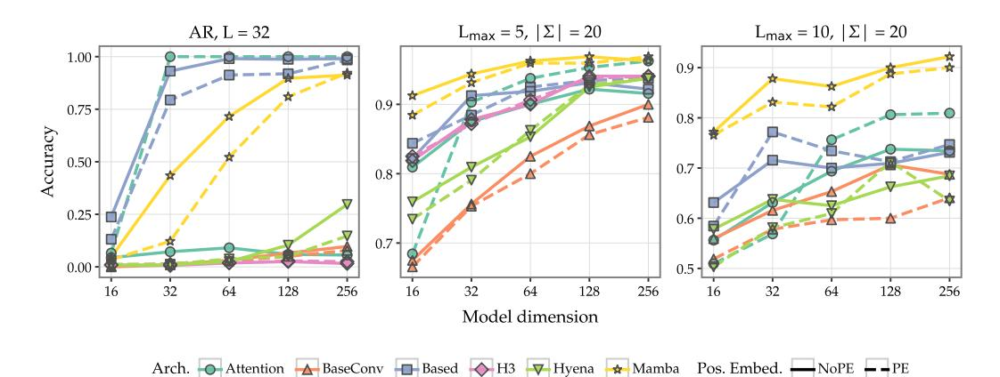

# **D.1** Attention needs position embeddings

Figure 7: Position embedding: Model accuracy on AR and two ATR settings with and without absolute position embeddings.

Due to an initial configuration mistake, we accidentally trained all architectures with absolute position embeddings; in the zoology codebase [Arora et al., 2024a], only Attention is meant to be trained in this way. Fortuitously, this resulted in an interesting ablation: do SSMs, which are usually trained without it, also benefit from position embeddings?

**Behavioural results.** Our results in Figure 7 resoundingly show no: SSMs generally perform worse with position embeddings (PE). Attention is highly dependent on PE; performance on AR drops from  $100.00\%$  to  $5.62\%$  at  $d = 256$  with NoPE. Attention lacks recurrence, unlike SSMs, so this is not surprising. However, on ATR, at smaller dimensionalities NoPE actually outperforms PE Attention. Further ablations ought to consider alternative PE methods such as RoPE and Alibi.

### D.2 1-layer SSMs learn direct retrieval on AR and ATR

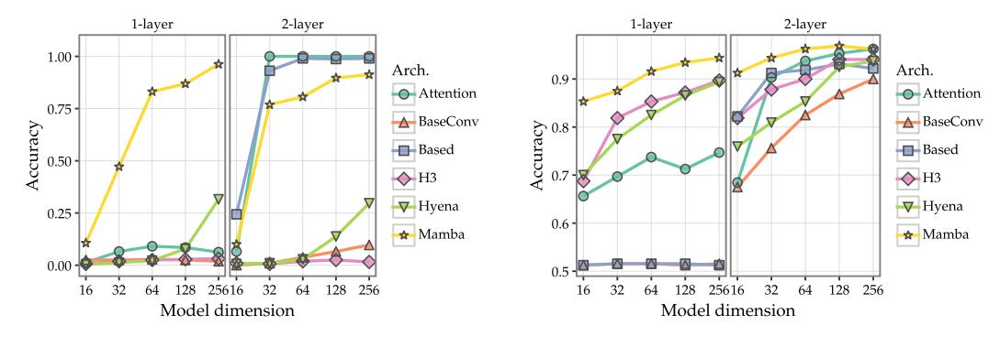

(a) Accuracy of 1-layer vs. 2-layer models on AR, 32 key-value pairs. 1-layer induction models fail.

(b) Accuracy of 1-layer vs. 2-layer models on ATR  $(L = 5, |\Sigma| = 20)$ , with Based and BaseConv failing.

Figure 8: 1-layer models on AR and ATR: Architectures that learn induction in the 2-layer setting fail to perform non-trivially with 1 layer. Mamba is highly performant with 1 layer on both tasks.

Throughout our experiments on AR and ATR, we have claimed that SSMs (except for Based and possibly BaseConv) learn a direct retrieval mechanism which does not require an intermediate step like attention, i.e. only a single SSM layer is needed to learn AR and ATR. To verify this, we repeat AR and  $L = 5$ ,  $|\Sigma| = 20$  ATR experiments (without train-test split) with 1-layer models.

**Behavioural results.** We find comparable performance for direct retrieval models between 1-layer and 2-layer settings on AR (Figure 8a). In fact, at  $d = 256$ , 1-layer Mamba (96.25%) outperforms 2-layer Mamba ( $91.25\%$ ), as does Hyena ( $31.56\%$  vs.  $29.69\%$ ). 1-layer Based and BaseConv are architecturally identical, so we only report one; that architecture and Attention, both relying on induction in the 2-layer case, fail to learn AR with one layer. On ATR (Figure 8b), we see a more noticeable difference with layer count on all architectures, but again Attention, Based, and BaseConv become the worst architectures with one layer (e.g.  $96.25\% \rightarrow 74.69\%$  for Attention at  $d = 256$ ).

#### 1-lave 2-laver 3-lave 1-lave 2-lave 3-lave 1.00 $0.8$ $0.4$ $0.0$ $0.75$ 1.2 Attrib $0.8$ Accuracy $0.4$ $0.50$ 0.0 1.2 0.8 $0.25$ $0.4$ 0.00 32 32 128 256 16 64 128 256 16 128 64 32 64 Model dimension Arch. Attention BaseConv Based H3 V Hyena Mamba Arch. Attention BaseConv Based H3 Hyena Mamba (a) Accuracy with $1-3$ layers on AR. (b) Attribution scores with $1-3$ layers on AR.

### D.3 SSMs prefer layer 0 to perform AR

Figure 9: Varying layer count on AR: Behavioural and mechanistic evaluations for models with  $1-3$ layers on AR.

Since we have confirmed that the direct retrieval mechanism in SSMs requires only a single layer, we are curious which layer this mechanism forms in if more than two layers are present. We train models with up to three layers on AR and report results.

Behavioural results. 3-layer models perform about the same on AR as 2-layer models across architectures (Figure 9a), except for a large drop in performance for Mamba when  $d = 32$ ; this may just be an optimisation failure.

**Mechanistic analysis.** For our mechanistic metric, instead of intervening on each block, we intervene at the sequence mixer's output to the *query* token in each layer; this tells us if that layer is directly responsible for writing the answer to the output position. We apply the same filter as in  $\S 5.1$ , with a threshold of  $0.01$ . Figure 9b shows that among performant models, Hyena and Mamba prefer layer 0 for performing AR no matter the layer count; however, some Mamba checkpoints learn the mechanism in the final layer as well (but never layer 1 in a 3-layer model). Attention, Based, and BaseConv prefer layer 1, which is expected since this is the second step of the induction mechanism. However, some checkpoints of Attention and Based also have non-zero attribution score at layer 2 in the 3-layer setting.

####  $\mathbf{D.4}$ Rightmost sibling queries are trivial for all architectures

Since ATR has hierarchical structure, we attempted an initial experiment with multihop queries; specifically, we present queries where the answer is that terminal's rightmost sibling terminal. Models are only trained on this type of query, not standard parent queries as reported in the main text. We train with the same settings in  $\S 3.3$ .

**Behavioural results.** In Figure 10 we show that all models (except Based and BasedConv with 1 layer, where they only have local convolutions) achieve greater than  $80\%$  accuracy at the task at all dimensionalities. We see slight improvement from 1-layer to 2-layer models but at this point performance is saturated and 3-layer does not help. Clearly, this task is extremely simple for all models, even more so than parent queries, and thus does not provide useful signal for comparing architectures.

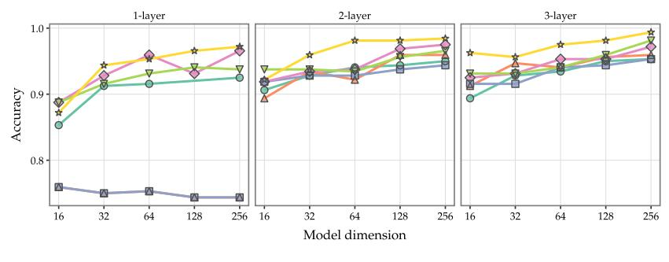

Arch. Attention BaseConv Based H3 Hyena Mamba

Figure 10: Sibling queries: Accuracy across models with 1–3 layers on ATR (Lmax = 5, |Σ| = 20) .

Why are sibling queries easy? Parent nodes are guaranteed to be special terminals in our GNF which are sampled from a nonterminal-dependent distribution (see appendix [A\)](#page-15-0). However, siblings have a large chance of being fixed terminals specified by the production rule. Additionally, the rightmost sibling of a particular terminal may be itself, if it is the rightmost terminal of its production rule. We speculate that these factors combined make sibling queries easier than parent queries, and thus not a suitable testbed for multihop reasoning.

Future work. The appropriate analogue to study multihop *reasoning* in ATR is grandparent relations (or higher up ancestors in the tree), since the grandparent is always a special head terminal (like the parent) and is always to the right of the parent and thus different from the query terminal. We leave further experiments on this to future work.