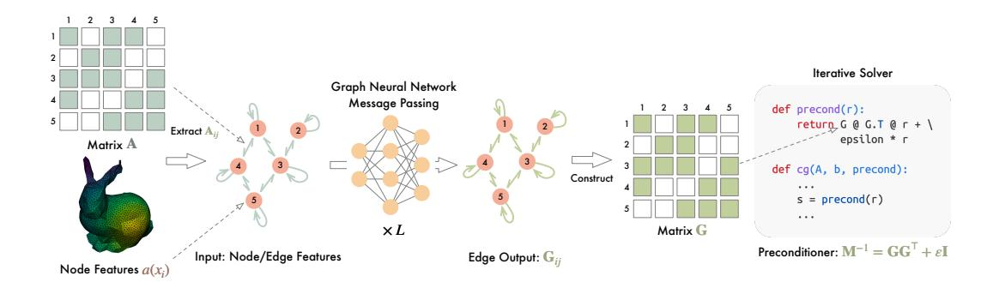
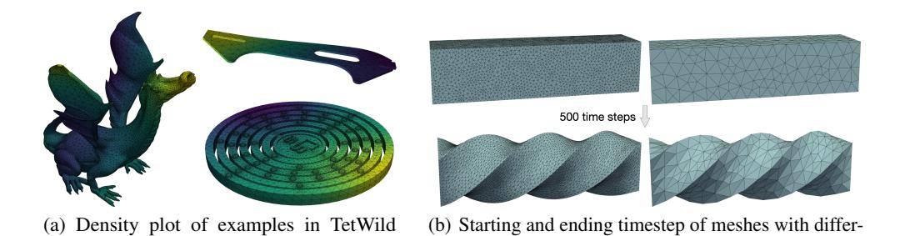
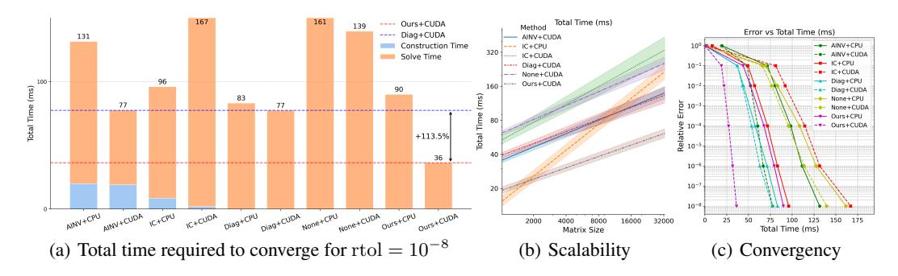
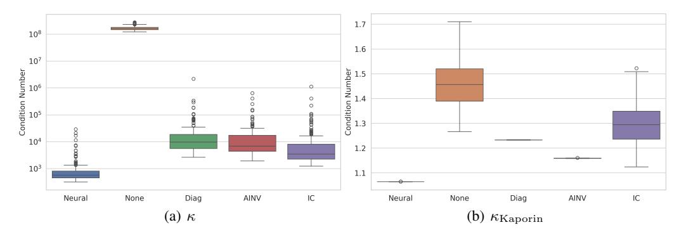

# Learning Sparse Approximate Inverse Preconditioners for Conjugate Gradient Solvers on GPUs

Zherui Yang<sup>1</sup> Zhehao Li<sup>2</sup> Kangbo Lyu3,4 Yixuan Li<sup>1</sup> Tao Du3,4 Ligang Liu1§ <sup>1</sup>University of Science and Technology of China <sup>2</sup>Stanford University <sup>3</sup>Tsinghua University <sup>4</sup>Shanghai Qi Zhi Institute

# Abstract

The conjugate gradient solver (CG) is a prevalent method for solving symmetric and positive definite linear systems Ax = b, where effective preconditioners are crucial for fast convergence. Traditional preconditioners rely on prescribed algorithms to offer rigorous theoretical guarantees, while limiting their ability to exploit optimization from data. Existing learning-based methods often utilize Graph Neural Networks (GNNs) to improve the performance and speed up the construction. However, their reliance on incomplete factorization leads to significant challenges: the associated triangular solve hinders GPU parallelization in practice, and introduces long-range dependencies which are difficult for GNNs to model. To address these issues, we propose a learning-based method to generate GPU-friendly preconditioners, particularly using GNNs to construct Sparse Approximate Inverse (SPAI) preconditioners, which avoids triangular solves and requires only two matrix-vector products at each CG step. The locality of matrix-vector product is compatible with the local propagation mechanism of GNNs. The flexibility of GNNs also allows our approach to be applied in a wide range of scenarios. Furthermore, we introduce a statistics-based scale-invariant loss function. Its design matches CG's property that the convergence rate depends on the condition number, rather than the absolute scale of A, leading to improved performance of the learned preconditioner. Evaluations on three PDE-derived datasets and one synthetic dataset demonstrate that our method outperforms standard preconditioners (Diagonal, IC, and traditional SPAI) and previous learning-based preconditioners on GPUs. We reduce solution time on GPUs by 40%-53% (68%-113% faster), along with better condition numbers and superior generalization performance.

# 1 Introduction

Solving symmetric positive definite(SPD) sparse linear systems Ax = b is essential in scientific computing and has wide applications in science and engineering, while the development of efficient numerical solvers remains a challenge. The conjugate gradient (CG) method is widely used for its efficiency, yet the convergence rate depends critically on preconditioning techniques that effectively transform the original linear system into an easier one to solve at low computational cost.

Traditional preconditioners have a long history of development and have achieved considerable success. Although modern GPUs provide massive parallelism, existing preconditioners struggle to leverage it, becoming the computational bottleneck despite their convergence benefits. The diagonal preconditioner offers a simple and GPU-friendly implementation but provides limited convergence improvement. Incomplete Cholesky (IC) demonstrates strong CPU performance and effectiveness in ill-conditioned problems [\[1\]](#page-9-0). However, its requires two triangular solves at each CG step, which are typically difficult to parallelize [\[2,](#page-9-1) [3\]](#page-9-2), hindering its performance on GPUs.

<sup>§</sup>Corresponding author: lgliu@ustc.edu.cn

Recent learning-based approaches [4–6] aim to improve traditional approaches using neural networks, particularly factorization-based methods (e.g., IC) and graph neural networks (GNNs). By substituting the sequential factorization process with a GNN evaluation, these methods reduce the computational time required for incomplete factorizations. The trainability of GNNs enables the generation of higher-quality factorizations, thereby accelerating the convergence of iterative solvers. However, these methods also come with certain limitations. Prior works inherit the limitation of factorization-based methods that involve triangular solves, restricting their GPU parallelization efficiency. The triangular solves also pose challenges for GNNs to capture long-range dependencies and global information through the elimination tree, while GNNs aggregate information from local neighborhoods and struggle to effectively model such interactions [7]. Additionally, many existing approaches require computing the solution vector  $\mathbf{x} = \mathbf{A}^{-1}\mathbf{b}$  of the original linear system for every  $\mathbf{A}$  in the dataset to evaluate their loss functions [4, 8, 9]. Generating datasets containing large matrices becomes increasingly computationally expensive. The varying scales of  $\mathbf{A}$  further pose difficulties for models in learning to improve the condition number of the preconditioned system.

To address these challenges, we present a novel approach for learning GPU-friendly preconditioners using GNNs. Our approach directly approximates the inverse  $A^{-1}$  with a sparse matrix and formulates its construction as a graph-learning problem, which shares conceptual parallels with the traditional Sparse Approximate Inverse (SPAI) preconditioner [10, 11]. The sparse matrix-vector product (SpMV) is the only routine required at each CG iteration, allowing our approach to leverage GPU acceleration throughout both the construction and CG solving phases. We argue that the local nature of SpMV naturally complements the local propagation mechanism of GNNs. Our approach avoids imposing restrictive triangular structures on the preconditioner, enabling us to preserve the sparsity pattern of A or even use a different one. This design results in improved condition numbers compared to previous SPAI and factorization-based preconditioners. Furthermore, to eliminate dependence on solution vectors and enable robust training across various datasets, we propose the Scale invariant Aligned Identity Loss (SAI loss). This loss requires only the input matrix A, and its inherent Ascale invariance aligns with the scale-invariant convergence behavior of CG solvers, yielding higher performance of learned preconditioners. Extensive experiments conducted on three PDE-derived datasets and a synthetic dataset validate the effectiveness of our approach compared to previous works. The results show that our approach achieves up to 113% speedup compared with standard traditional preconditioning techniques and previous learning-based preconditioners. Our approach also achieves a better condition number while maintaining good generalization performance.

In summary, we make the following contributions:

- 1. We propose a learning-based approach to generating GPU-friendly preconditioners, leveraging the GPU parallelism across both the construction and CG solving stages. Our approach focuses on generating the SPAI preconditioner using GNNs, exploiting the natural alignment between the local computation of SpMV and the local propagation mechanism of GNNs.
- 2. We introduce the SAI loss, a novel statistics-based and A-scale invariant loss function, which reduces datasets' generation costs and enhances the performance of learned preconditioners.
- 3. Extensive experiments on three PDE-derived datasets and a synthetic dataset demonstrate that our method achieves lower condition numbers and reduced computation time compared to existing approaches, while also maintaining generalizability, scalability, and robustness.

#### 2 Related Works

Traditional Preconditioners Preconditioners  $\mathbf{M}^{-1}$  transform the original linear system  $\mathbf{A}\mathbf{x} = \mathbf{b}$  into one easier to solve  $\mathbf{M}^{-1}\mathbf{A} = \mathbf{M}^{-1}\mathbf{b}$  for iterative solvers at low computational cost. The diagonal preconditioner scales the original system by its diagonal entries [11], offering a straightforward and GPU-friendly implementation. However, it provides limited improvement to the convergence rate. Incomplete Cholesky (IC) preconditioner [1] computes sparse and incomplete triangular factors ( $\mathbf{M} = \mathbf{L}\mathbf{L}^{\top} \approx \mathbf{A}$ ). It offers better spectral approximations but suffers from limited parallelism due to its reliance on triangular solves [12]. Sparse Approximate Inverse (SPAI) preconditioners [13–15] construct a sparse matrix  $\mathbf{M}^{-1} = \mathbf{G}\mathbf{G}^{\top} \approx \mathbf{A}^{-1}$  under sparsity constraints. At each CG step, SPAI use matrix-vector products instead of triangular solves in IC, enabling parallelism suitable for GPU architectures. However, its construction depends on sequential algorithms and often exhibits suboptimal performance. Alternative techniques, such as polynomial [11], algebraic multigrid (AMG)

[16], and domain decomposition [17] preconditioners, each balance robustness, memory usage, and parallel efficiency differently. While effective in their respective domains, they lack generality and often require careful parameter tuning to ensure performance [18, 19]. Machine learning offers a promising solution to address this limitation.

**Learning-based Preconditioners** Recent research in learning-based preconditioning has progressed across several directions. CNNs [20], GNNs [21] and neural operators [8], which directly approximate the action of matrix inversion  $NN(\mathbf{A}, \mathbf{b}) \approx \mathbf{A}^{-1}\mathbf{b}$ , are utilized as preconditioners in many iterative solvers. Although these approaches can significantly reduce the number of iterations, they involve a full forward pass through the network at each iteration, thereby increasing computational overhead. The auxiliary components in neural operators are employed as a subspace in iterative solvers [22–24]. The usage of neural operators restricts their applicability primarily to PDE-related problems, while neglecting more general problems. Li et al. [4], Häusner et al. [5], Trifonov et al. [6] have investigated the integration of machine learning and factorization-based preconditioners, specifically by training GNNs to predict the factor  $\mathbf{L}$  in IC preconditioners. However, these methods suffer from the triangular solve due to their sequential computation [10] and the theoretical challenges for GNNs to model long-range dependencies along the elimination tree [7]. Although these methods have achieved performance gains compared with the traditional alternatives, few of them consider the performance on GPUs, while our approach focuses specifically on GPU performance.

### <span id="page-2-2"></span>3 Our Approach

#### 3.1 Problem Setup

We consider solving the sparse and SPD linear system  $\mathbf{A}\mathbf{x} = \mathbf{b}$ , where  $\mathbf{A} \in \mathbb{R}^{n \times n}$  (or  $\mathbb{R}^{nb \times nb}$  for a blocked sparse matrix with b as block size<sup>1</sup>) arises from diverse applications, such as spatial discretization of PDEs using the finite element method (FEM). The matrix  $\mathbf{A}$  is associated with a graph  $\mathcal{G}_{\mathbf{A}} = (\mathcal{V}, \mathcal{E})$ , defined as follows:

- 1. Vertices V: Represent variables (e.g., mesh nodes in FEM) with features  $\mathbf{v}_i \in \mathbb{R}^d$ , that encode geometric or physical properties.
- 2. Edges  $\mathcal{E} = \{(i,j) \mid \mathbf{A}_{ij} \neq \mathbf{0}\}$ : Connect interacting variables, with edge features  $\mathbf{e}_{ij}$  representing the corresponding entries or blocks  $\mathbf{A}_{ij}$ .

To accelerate CG's convergence, a preconditioner  $\mathbf{M}^{-1}$  is introduced, which transforms the problem into an easier one to solve by modifying the search direction. The residual vector  $\mathbf{r}$  is replaced with the preconditioned direction  $\mathbf{s} = \mathbf{M}^{-1}\mathbf{r}$  at each CG step, as shown in Section A. A good preconditioner  $\mathbf{M}^{-1}$  reduces the condition number  $\kappa$  of the linear system by effectively approximating  $\mathbf{A}^{-1}$  and a lower condition number typically indicates faster CG convergence. We consider the following preconditioner construction task based on the graph and its associated features:

$$(\mathcal{G}_{\mathbf{A}}, \{\mathbf{v}_i\}, \{\mathbf{e}_{ij}\}) \xrightarrow{\text{Algorithm}} \mathbf{M}^{-1} \in \mathbb{R}^{n \times n},$$
 (1)

where "Algorithm" denotes both traditional approaches (e.g., IC, SPAI, AMG) and neural networks. Traditional approaches construct  $\mathbf{M}^{-1}$  through prescribed and heuristic rules based on the graph structure and its features, while the learning-based approaches infer the mapping from data.

#### 3.2 Graph Neural Networks for SPAI construction

### 3.2.1 Sparse Approximate Inverse Preconditioners (SPAI)

To ensure high computational efficiency, particularly on GPUs, we directly employ a sparse approximate inverse  $\mathbf{M}^{-1}$  as the preconditioner for  $\mathbf{A}^{-1}$  (SPAI). Additionally, since the convergence of CG depends on a symmetric and positive definite  $\mathbf{M}^{-1}$ , we propose to factorize the preconditioner as

<span id="page-2-1"></span>
$$\mathbf{A}^{-1} \approx \mathbf{M}^{-1} = \mathbf{G}\mathbf{G}^{\top} + \varepsilon \mathbf{I},\tag{2}$$

where the sparse matrix G is the output of the GNN and  $\varepsilon$  is a small positive constant to enforce SPD property, as shown in Figure 1. Numerous prior studies [15, 14, 13] have demonstrated that sparse

<span id="page-2-0"></span><sup>&</sup>lt;sup>1</sup>In the hyperelasticity problem, there are 3 variables to solve per node, resulting in a block size of 3.



Figure 1: Overview of our approach: By inputting the matrix's nonzero entries  $A_{ij}$  and node features  $a(x_i)$ , the GNN processes these features through message passing, and outputs the entries of  $G_{ij}$ . The sparse matrix G is assembled and then applied in the preconditioned CG solver.

<span id="page-3-0"></span> $\mathbf{M}^{-1}$  can effectively reduce the condition number, even when  $\mathbf{A}^{-1}$  is dense. As a result, at each CG iteration, the application of preconditioner  $\mathbf{s} = \mathbf{M}^{-1}\mathbf{r}$  is instantiated as two sparse matrix-vector products and a vector addition, which is both efficient on GPUs.

Previous works [4, 5] take an opposite approach to ours. Their approaches output a sparse triangular matrix  $\mathbf{L}$ , which aim to approximate  $\mathbf{A}$  with  $\mathbf{L}\mathbf{L}^{\top}$ , resulting in Incomplete Cholesky (IC) preconditioner  $\mathbf{M}^{-1} = (\mathbf{L}\mathbf{L}^{\top})^{-1}$ . The application of preconditioner  $\mathbf{L}\mathbf{L}^{\top}\mathbf{s} = \mathbf{r}$  involves two triangular solves: forward substitution  $\mathbf{L}\mathbf{y} = \mathbf{r}$  and backward substitution  $\mathbf{L}^{\top}\mathbf{s} = \mathbf{y}$ . Although triangular solves can be efficient on CPUs, the inherent sequential nature limits their performance on GPUs.

**Locality of SPAI Preconditioner** Consider the application of our preconditioner  $s = M^{-1}r$ . Suppose **G** shares the same sparsity pattern as **A**, the *j*-th entry of the output vector **s** is

<span id="page-3-1"></span>
$$\mathbf{s}_{j} = (\mathbf{M}^{-1}\mathbf{r})_{j} = \varepsilon \mathbf{r}_{j} + \sum_{\substack{l \\ \mathbf{A}_{jl} \neq 0}} \mathbf{G}_{jl} \sum_{\substack{k \\ \mathbf{A}_{kl} \neq 0}} \mathbf{G}_{kl} \mathbf{r}_{k}.$$
(3)

Since the non-zero entries of A and the entries of vectors correspond to edges and nodes in the graph, Equation (3) reveals that the output on node j depends only on its two-hop neighborhood, mediated through intermediate nodes l and source nodes k. This makes SPAI fundamentally more compatible with GNN architectures than factorization-based methods.

In contrast, in IC preconditioner, the forward substitution  $\mathbf{L}\mathbf{y} = \mathbf{r}$  and backward substitution  $\mathbf{L}^{\top}\mathbf{s} = \mathbf{y}$  propagate information along the elimination tree induced by a chosen node ordering. The forward substitution aggregates values from ancestor nodes, while backward substitution collects from descendant nodes, resulting in global dependencies. This hierarchical propagation in IC conflicts with the local aggregation mechanism of GNNs over fixed-hop neighborhoods. Furthermore, IC requires explicit directional dependencies (enforcing lower triangular  $\mathbf{L}$ ), which are inconsistent with the undirected/symmetric assumptions in existing GNN-based preconditioners.

#### 3.2.2 GNN Architecture

Our GNN follows an encoder-processor-decoder architecture, adapted from Gilmer et al. [25]. Given node features  $\mathbf{v}_i \in \mathbb{R}^{d_{\text{node}}}$  and edge features  $\mathbf{e}_{ij} \in \mathbb{R}^{d_{\text{edge}}}$ , the GNN first applies two MLPs  $E_n, E_e$  to encode the node and edge features into their hidden representations  $\mathbf{x}^{(0)}, \mathbf{h}^{(0)} \in \mathbb{R}^d$ :

$$\mathbf{x}_i^{(0)} = E_n(\mathbf{v}_i), \quad \mathbf{h}_{ij}^{(0)} = E_e(\mathbf{e}_{ij}). \tag{4}$$

Subsequently, L message-passing layers are applied. Each layer utilizes three MLPs,  $f_m^{(t)}$ ,  $f_v^{(t)}$ ,  $f_e^{(t)}$ , which serve as message functions and update functions for node and edge features:

$$\mathbf{m}^{(t)} = \sum_{j \in N(i)} f_m^{(t)}(\mathbf{x}_i^{(t-1)}, \mathbf{x}_j^{(t-1)}, \mathbf{e}_{ij}),$$

$$\mathbf{x}_i^{(t)} = \mathbf{x}_i^{(t-1)} + f_v^{(t)}(\mathbf{m}_i^{(t)}), \quad \mathbf{h}_{ij}^{(t)} = \mathbf{h}_{ij}^{(t-1)} + f_e^{(t)}(\mathbf{x}_i^{(t)}, \mathbf{x}_j^{(t)}, \mathbf{h}_{ij}^{(t-1)}).$$
(5)

Finally, a decoder MLP D is applied to the edge features of the last layer  $\mathbf{h}^{(L)}$  to get the block entries:

$$\mathbf{G}_{ij} = D(\mathbf{h}_{ij}^{(L)}) \in \mathbb{R}^{b \times b}.$$
 (6)

The global sparse matrix  $\mathbf{G} \in \mathbb{R}^{nb \times nb}$  is constructed by replacing each block  $\mathbf{A}_{ij}$  with  $\mathbf{G}_{ij}$  while preserving the original sparsity pattern.

#### <span id="page-4-1"></span>3.3 Loss Function

The loss function is crucial for learning effective preconditioners  $\mathbf{M}$ . While traditional SPAI approaches aim to minimize  $\|\mathbf{M}^{-1} - \mathbf{A}^{-1}\|_F$  or  $\|\mathbf{A}\mathbf{M}^{-1} - \mathbf{I}\|_F$ , these formulations suffer from two limitations: (1) Direct evaluation of  $\mathbf{A}\mathbf{M}^{-1}$  requires significantly larger memory and computation resources for large matrices even when both  $\mathbf{A}$  and  $\mathbf{M}$  are sparse. (2) These losses depend on the absolute magnitude of  $\mathbf{A}$ , while the convergence rate of CG solvers is invariant to the magnitude.

**Stochastic Estimation** To address the computational bottleneck, we first adopt the stochastic trace estimator [5, 26] to approximate the matrix Frobenius norm without explicitly constructing  $\mathbf{AM}^{-1}$ :

<span id="page-4-0"></span>
$$\|\mathbf{A}\mathbf{M}^{-1} - \mathbf{I}\|_F^2 = \operatorname{tr}((\mathbf{A}\mathbf{M}^{-1} - \mathbf{I})^{\top}(\mathbf{A}\mathbf{M}^{-1} - \mathbf{I})) = \mathbb{E}_{\mathbf{w}} \left[\|\mathbf{A}\mathbf{M}^{-1}\mathbf{w} - \mathbf{w}\|_2^2\right], \tag{7}$$

where  $\mathbf{w}$  is a vector of independent and identically distributed (i.i.d.) random variables drawn from the standard normal distribution  $\mathcal{N}(0,1)$ . This reduces the computation to matrix-vector products  $\mathbf{A}\mathbf{M}^{-1}\mathbf{w}$ , avoiding costly matrix-matrix products. The estimator can also be applied to  $\|\mathbf{M}^{-1} - \mathbf{A}^{-1}\|_F^2 \approx \|\mathbf{M}^{-1}\mathbf{w} - \mathbf{A}^{-1}\mathbf{w}\|_2^2$ . However, this either requires access to  $\mathbf{A}^{-1}$  or involves solving  $\mathbf{x} = \mathbf{A}^{-1}\mathbf{w}$  for each sample in the dataset, making it computationally expensive .

**Scale Invariance** The loss function in (7) exhibits scale sensitivity because it depends on the absolute magnitude of  $\mathbf{A}$ . To align with the CG solver's scale invariance property, we normalize  $\mathbf{A}$  by its norm  $\|\mathbf{A}\|$  in the loss function:

$$\mathcal{L}_{\mathrm{SAI}}(\mathbf{A}, \mathbf{M}^{-1}) = \left\| \frac{1}{\|\mathbf{A}\|} \mathbf{A} \mathbf{M}^{-1} - \mathbf{I} \right\|_{F}^{2}, \quad \mathcal{L}_{\mathrm{SAI}}(\mathbf{A}, \mathbf{M}^{-1}, \mathbf{w}) = \left\| \left( \frac{1}{\|\mathbf{A}\|} \mathbf{A} \mathbf{M}^{-1} - \mathbf{I} \right) \mathbf{w} \right\|_{2}^{2}.$$
(8)

This formulation ensures  $\mathcal{L}_{SAI}(\mathbf{A}, \mathbf{M}^{-1}, \mathbf{w}) = \mathcal{L}_{SAI}(\alpha \mathbf{A}, \mathbf{M}^{-1}, \mathbf{w})$  for any  $\alpha > 0$ . We refer to this as **Scale invariant Aligned Identity (SAI) loss**, which explicitly decouples the preconditioner learning from the matrix's absolute scale, while enforcing alignment between the scaled preconditioned matrix and the identity matrix. The condition number  $\kappa$  of  $\mathbf{AM}^{-1}$  can be estimated as

$$\kappa(\mathbf{A}\mathbf{M}^{-1}) = \frac{\sigma_{\max}(\mathbf{A}\mathbf{M}^{-1})}{\sigma_{\min}(\mathbf{A}\mathbf{M}^{-1})} = \frac{\sigma_{\max}(\mathbf{I} + \mathbf{E})}{\sigma_{\min}(\mathbf{I} + \mathbf{E})} \le \frac{1 + \sigma_{\max}(\mathbf{E})}{1 - \sigma_{\max}(\mathbf{E})} \approx 1 + 2\sigma_{\max}(\mathbf{E}) = 1 + 2\|\mathbf{E}\|_2,$$

where  $\mathbf{E} = \mathbf{A}\mathbf{M}^{-1}/\|\mathbf{A}\| - \mathbf{I}$  is the error matrix and  $\sigma$  denotes matrix singular values (see Section B for its detailed proof). This derivation shows that the SAI loss encourages  $\mathbf{M}^{-1}$  to focus on improving  $\mathbf{A}\mathbf{M}^{-1}$ 's spectral properties, while being invariant to absolute magnitude of  $\mathbf{A}$ . Although conventional matrix norms of  $\mathbf{A}$  like the Frobenius norm are theoretically valid, their scale is often sensitive to matrix dimensions and outlier entries. We therefore define a more robust and dimensionagnostic norm as  $\|\mathbf{A}\| = \max_{\mathbf{A}_{ij} \neq 0} |\mathbf{A}_{ij}|$ . This setting also ensures that the edge features of the GNN and the loss term remain on a reasonable scale, promoting more stable and efficient optimization across matrices of varying sizes.

### <span id="page-4-2"></span>4 Experimental results

We answer the following questions through our experiments: (1) How does our approach compare with traditional and learning-based approaches? (2) Is our loss more effective than those in prior works? (3) How do our approach generalize to unseen examples? (4) Does our approach yield a better condition number compared to previous methods? We describe the experiment setup in Sec. 4.1 and provide answers to these questions in Sec. 4.2 to 4.5.



Figure 2: Examples in our PDE-derived test cases.

<span id="page-5-1"></span>ent resolution in the hyperelasticity case.

# <span id="page-5-0"></span>4.1 Experiment Setup

Dataset for Heat/Poisson Equation test case.

Our experiments include three PDE-derived datasets, as well as a fully algebraic dataset composed of randomly generated matrices. As shown in Figure [2,](#page-5-1) we use FEM and tetrahedron mesh to discretize the PDEs, yielding the sparse system matrix A. The test cases considered in our study are as follows:

- 1. Heat Equation: a(x) · u<sup>t</sup> − ∆u = 0, where a(x) represents the spatially varying density (randomly sampled on the mesh, with values ranging from 1e − 4 to 5e − 4).
- 2. Poisson Equation: −∆u = f with u|<sup>D</sup> = g, where D denotes a randomly specified Dirichlet boundary.
- 3. Hyperelasticity: Mu¨ + fint(u) = fext, where M is the mass matrix, and fint, fext represent internal and external forces, respectively. The internal force fint is nonlinear and derived from a stable Neo-Hookean material model [\[27\]](#page-10-16).
- 4. Synthetic System: A = PP<sup>⊤</sup> + εI, where P is a random matrix and ε = 10<sup>−</sup><sup>4</sup> ensures the numerical positive definiteness of A.

For Heat and Poisson problems, we use 9,147 meshes with node counts ranging from 400 to 32,000 from the TetWild dataset [\[28\]](#page-10-17). All meshes are normalized to ensure the entire geometry fits within the [−1, 1]<sup>3</sup> domain. The hyperelasticity simulations involve a beam twist scene for 500 timesteps. This experiment shares the same geometry but varies in resolution and topology through remeshing with node counts ranging from 645 to 14,039 (matrix size is 3× larger). The synthetic dataset contains 1,000 matrices with a sparsity of approximately 0.12%, with matrix sizes ranging from 10,000 to 20,000. All experiments employ a 4:1 train-test split, with all reported results evaluated on the test set. Detailed problem configurations, their matrix representations and corresponding inputs of GNNs are provided in Appendix [C.2.](#page-13-0)

GNN Implementation and Training For all experiments in this work, we fixed the number of message passing steps L to 4, the number of hidden layers in all the MLPs to 1, the number of neurons d in the hidden layer to 24, and ε = 10<sup>−</sup><sup>4</sup> . The GNN has about 24k trainable parameters in total. All models are trained for 500 epochs using a batch size of 4 on a single NVIDIA A100 GPU, optimized with AdamW [\[29\]](#page-11-2) and an exponentially decaying learning rate scheduler (decay rate = 0.99).

Evaluation Metrics The constructed preconditioner M<sup>−</sup><sup>1</sup> is subsequently applied in CG to solve Ax = b. Since each CG iteration requires one preconditioner application, the total solving time is governed by:

$$T_{\text{total}} = T_{\text{construct}} + k \times (T_{\text{apply}} + T_{\text{cg}}),$$
 (10)

where k denotes iteration count, and Tconstruct, Tapply represents the preconditioner's construction time at the beginning and application time per iteration, and Tcg accounts for fixed operations per CG iteration (e.g., dot products, matrix-vector products). The primary objective of preconditioning is to minimize Ttotal. Tapply and Tconstruct rely on the computational complexity of its associated routines (such as SpMV and triangular solve), while preconditioners with better spectral approximation to A<sup>−</sup><sup>1</sup> or smaller condition number often result in lower k. This establishes a fundamental trade-off between solver efficiency and approximation quality in preconditioner design.



<span id="page-6-3"></span>Figure 3: Performance of CG with different preconditioners for the heat problem. Figure (a) compares the average total solve time Ttotal and preconditioner's construction time Tconstruct of CG with different preconditioners and devices. Figure (b) illustrates the relationship between matrix size and Ttotal, including its 95% confidence interval, demonstrating the superior scalability of our approach on GPUs. Figure (c) compares the total solve time required to achieve different rtol.

#### <span id="page-6-0"></span>4.2 Preconditioner Performance

We consider three standard traditional preconditioners on both GPU and CPU architectures, including: (1) Diagonal (Diag), (2) Incomplete Cholesky (IC), and (3) Sparse Approximate Inverse (AINV)[2](#page-6-1) . All the preconditioned CG are implemented in C++ and CUDA with OpenBLAS [\[30\]](#page-11-3), cuBLAS, cuSPARSE [\[31\]](#page-11-4), and cusplibrary [\[32\]](#page-11-5) for their high-performance linear algebra kernels and preconditioner implementations. We list their implementation details in Appendix [C.1.](#page-13-1)

Comparison to Traditional Approaches Table [1](#page-6-2) summarizes the time cost Ttotal and iteration count k for the CG method equipped with different preconditioners to converge to a relative tolerance rtol = ∥b − Ax∥/∥b∥ < 10<sup>−</sup><sup>8</sup> . The results demonstrate that our approach outperforms all baseline approaches and achieves consistent superiority across all categories of solving tasks. Additionally, we also present a comparison of our method with AMG in Appendix [D.2.](#page-14-0)

<span id="page-6-2"></span>Table 1: GPU Benchmark results across different datasets. Total time Ttotal (ms) and total iterations k (in parentheses) until relative residual norm is less than rtol = 10<sup>−</sup><sup>8</sup> are listed in the table. Lower values indicate better performance. The lowest value is in bold and the second lowest is underlined. The relative promotion (Rel. Prom.) indicates the ratio of the time saved over the second-best one.

| Test Case        | Diag      | IC         | AINV        | Ours      | Rel. Prom. (↑) |
|------------------|-----------|------------|-------------|-----------|----------------|
| Heat Equation    | 77(520)   | 167(204)   | 78(330)     | 36(197)   | 113%           |
| Poisson Equation | 45(320)   | 101(128)   | 58(217)     | 26(128)   | 73%            |
| Hyperelasticity  | 86(464)   | 202(117)   | 247(266)    | 51(175)   | 68%            |
| Synthetic System | 445(2775) | 1399(1808) | 5024(10896) | 253(1122) | 75%            |

Performance Analysis Across Convergence Thresholds Table [2](#page-7-0) summarizes the total solve time Ttotal and iteration numbers k of CG solvers using different preconditioners up to various convergence thresholds. Although the Diagonal preconditioner has the smallest construction overhead, it results in a limited improvement in convergence rate. Compared with previous preconditioners, our approach achieves the smallest Ttotal to the given rtol. We also compare the scalability of our approach with that of baseline methods in Figure [3,](#page-6-3) and our approach is still efficient as the matrix size increases.

Runtime Analysis of Routines in CG solvers Table [3](#page-7-1) breaks down the runtime of each routine in CG solvers. Our approach reduces Ttotal by balancing three key factors: low setup cost (comparable to Diag) Tconstruct, reasonable iteration counts k (similar to IC), and GPU-efficient operations Tapply. This trade-off makes our approach particularly competitive in GPU settings. Although IC achieves

<span id="page-6-1"></span>SPAI is a specific subclass of AINV preconditioners that focuses on constructing a sparse approximate inverse, whereas AINV is the general parent concept of approximate inverse techniques.

comparable iteration counts k, its computational cost for applying the preconditioner (the triangular solves) is substantially higher than ours on GPUs, resulting in degraded performance.

<span id="page-7-0"></span>Table 2: Comparison between different preconditioners for the heat problem. Total time  $T_{\rm total}$  (ms), total iterations k (in parentheses), and preconditioner's construction time  $T_{\rm construct}$  (Cons.) are listed in the table. The best value is in bold, and a lower value indicates better performance.

| Ct        |         | С       | PU       |         | GPU     |          |         |                 |
|-----------|---------|---------|----------|---------|---------|----------|---------|-----------------|
| Stage     | Diag    | IC      | AINV     | Ours    | Diag    | IC       | AINV    | Ours            |
| Cons.     | 0.126   | 8.426   | 19.308   | 0.181   | 0.196   | 1.866    | 18.924  | 0.181           |
| $10^{-2}$ | 44(309) | 57(126) | 80(199)  | 52(124) | 43(309) | 92(115)  | 52(199) | <b>22</b> (124) |
| $10^{-4}$ | 58(383) | 72(157) | 98(246)  | 68(154) | 53(384) | 114(143) | 61(246) | <b>27</b> (154) |
| $10^{-6}$ | 71(450) | 83(180) | 111(282) | 79(176) | 63(442) | 132(164) | 67(280) | <b>32</b> (176) |
| $10^{-8}$ | 83(511) | 96(205) | 132(328) | 90(197) | 77(520) | 167(204) | 78(330) | <b>36</b> (197) |

<span id="page-7-1"></span>Table 3: Time breakdown of each routine in preconditioned CG solvers on GPUs and CPUs for the heat problem. All timings are reported in milliseconds.

| Method | CPU |                     |                 |              | GPU |                     |                 |              |
|--------|-----|---------------------|-----------------|--------------|-----|---------------------|-----------------|--------------|
| Method | k   | $T_{\rm construct}$ | $T_{\rm apply}$ | $T_{\rm cg}$ | k   | $T_{\rm construct}$ | $T_{\rm apply}$ | $T_{\rm cg}$ |
| Diag   | 511 | 0.12                | 0.01            |              | 520 | 0.12                | 0.01            |              |
| IC     | 205 | 8.54                | 0.26            | 0.16         | 205 | 1.88                | 0.80            | 0.14         |
| AINV   | 328 | 19.0                | 0.17            | 0.10         | 330 | 19.0                | 0.03            | 0.14         |
| Ours   | 197 | 0.18                | 0.29            |              | 197 | 0.18                | 0.04            |              |

Comparison to Learning-based Approaches We compare our method with existing learning-based approaches on the dataset provided by previous works in Table 4. We adopt their open-source implementation with the default settings. Compared to previous learning-based methods, our approach demonstrates better performance particularly on GPUs. The matrix size provided in Li et al. [4] is sufficiently small that Diagonal preconditioner on CPUs achieves the best performance, while our approach attains the second-best performance. Compared to Häusner et al. [5], our approach achieves a lower total solve time  $(T_{\rm total})$  on GPUs.

<span id="page-7-2"></span>Table 4: Comparsion to previous works. Total time  $T_{\rm total}$  (ms) and total iterations k (in parentheses) until relative residual norm is less than  ${\rm rtol}=10^{-8}$  are listed in the table. Prev. corresponds to the performance of previous works. The lowest value is in bold and the second lowest is underlined.

| Device | Test Case          | Diag             | IC        | AINV      | Prev.     | Ours             |
|--------|--------------------|------------------|-----------|-----------|-----------|------------------|
| CPU    | Li et al. [4]      | <b>12</b> (208)  | 19(90)    | 33(108)   | 26(108)   | 17(102)          |
|        | Häusner et al. [5] | <b>799</b> (970) | 1387(438) | 3235(753) | 1139(354) | 1320(456)        |
| GPU    | Li et al. [4]      | <u>29</u> (208)  | 45(87)    | 30(108)   | 51(108)   | <b>26</b> (102)  |
|        | Häusner et al. [5] | <u>166</u> (970) | 440(385)  | 2456(753) | 1040(354) | <b>132</b> (456) |

#### 4.3 Generalizability and Robustness

We present the performance of our approach on out-of-distribution test samples in Table 5. For the heat problem, we evaluate at a fixed mesh density of 1e-3 (Heat-Density) and further assess generalization to finer meshes with more than 32k nodes (Heat-Large). For the hyperelasticity problem, we test on the same geometry with a finer mesh (22,618 nodes). For the synthetic problem, we use matrices with size ranging from 48k to 96k (Synthetic-Large). Comparing the relative promotions on each test case, our approach generalizes well to unseen resolutions and physical parameters.

<span id="page-8-1"></span>Table 5: Test on out-of-distribution data on GPUs. The total time (ms) and total iterations (in parentheses) are reported. The best value is in bold, and a lower value indicates better performance. In-distribution (In) and out-of-distribution (Out) relative promotions are recorded.

| Test Case       | Diag              | IC        | AINV        | Ours             | Rel. P | rom. (†)<br>In |
|-----------------|-------------------|-----------|-------------|------------------|--------|----------------|
| Heat-Density    | <u>62</u> (468)   | 135(175)  | 67(307)     | <b>35</b> (201)  | 80%    | 113%           |
| Heat-Large      | <u>251</u> (1033) | 808(388)  | 407(740)    | <b>154</b> (409) | 62%    | 73%            |
| Hyperelasticity | <u>326</u> (1005) | 667(287)  | 1154(496)   | <b>236</b> (359) | 72%    | 68%            |
| Synthetic-Large | <u>485</u> (1575) | 1616(781) | 19840(5591) | <b>347</b> (559) | 39%    | 75%            |

#### 4.4 Ablation Study on Loss Functions

We compare SAI loss with cosine similarity loss  $\mathcal{L}_{\mathrm{CS}} = \mathbf{w}^{\top} \mathbf{A} \mathbf{M}^{-1} \mathbf{w} / \|\mathbf{w}\| \|\mathbf{A} \mathbf{M}^{-1} \mathbf{w}\|$  [7] and the scale variant loss  $\mathcal{L}_2 = \|\mathbf{A} \mathbf{M}^{-1} \mathbf{w} - \mathbf{w}\|_2^2$ . As shown in Table 6, although  $\mathcal{L}_2$  performs similarly on the heat problem, the proposed SAI loss demonstrates better effectiveness on more difficult test cases.

<span id="page-8-2"></span>Table 6: Comparison of different losses. The average iteration counts are recorded. Since  $T_{\rm construct}$  and  $T_{\rm apply}$  are shared, a lower value indicates a better result and a smaller total solving time.

| Loss                         | Heat  | Poisson | Hyperelasticity | Synthetic |
|------------------------------|-------|---------|-----------------|-----------|
| $\mathcal{L}_2$              | 195.6 | 134.1   | 185.4           | 2109.8    |
| $\mathcal{L}_{	ext{CS}}$     | 207.3 | 133.4   | 182.5           | 2185.7    |
| $\mathcal{L}_{\mathrm{SAI}}$ | 197.4 | 128.8   | 175.7           | 1122.0    |

#### <span id="page-8-0"></span>4.5 Condition Number of Preconditioned Matrix

The condition numbers provide a theoretical measure of the preconditioner's performance. Besides the standard condition number  $\kappa$ , we also compute the Kaporin's condition number [33], which is the ratio of the arithmetic mean to the geometric mean of the matrix eigenvalues  $\lambda_i$ :

<span id="page-8-3"></span>
$$\kappa(\mathbf{A}\mathbf{M}^{-1}) = \frac{\max_{i} \lambda_{i}}{\min_{i} \lambda_{i}}, \quad \kappa_{\text{Kaporin}}(\mathbf{A}\mathbf{M}^{-1}) = \frac{(\sum_{i=1}^{N} \lambda_{i})/N}{(\lambda_{1}\lambda_{2} \cdots \lambda_{N})^{\frac{1}{N}}}.$$
 (11)

We evaluate the condition numbers on a simplified heat problem on a single mesh with 3,764 nodes and varying diffusivity coefficients. Figure 4 demonstrates that our method notably reduces the condition number when compared with earlier traditional approaches, revealing its efficacy.



Figure 4: Condition number distributions. Median, IQR, and outliers are shown. A smaller conditioner number indicates better performance of the preconditioner, and the lower bound is 1.

# 5 Conclusion

This work proposes a learning-based approach for constructing SPAI preconditioners, aiming at accelerating the convergence of CG solvers on GPUs. Our method leverages the natural alignment between the local propagation mechanism of GNNs and the localized structure of SPAI preconditioners. Furthermore, we propose the SAI loss to reduce the computational cost of training data generation and improve the quality of the learned preconditioners. Experimental results demonstrate that our approach delivers consistent speedups over traditional and existing learning-based methods, with improved robustness, generalization, and compatibility with parallel computing architectures.

<span id="page-9-9"></span>Limitations and Future Works Although our approach outperforms existing methods in accelerating CG solvers, several limitations remain. First, we enforce the sparsity pattern of G to exactly match that of A, while many existing approaches employ dynamic dropping strategies to further limit fill-in or incorporate two-hop connection in G to improve the effectiveness of preconditioner. Second, while our framework could potentially be extended to other Krylov subspace methods such as GMRES or integrated into multigrid frameworks (e.g., as a smoother), this work focuses specifically on SPD systems and the CG solver. Third, our current work is limited by the memory of a single GPU, and a promising direction for future work is to scale our approach to multi-GPU systems using techniques from distributed GNNs.

# Acknowledgments and Disclosure of Funding

This work is supported by the National Key R&D Program of China (2022YFB3303400) and the National Natural Science Foundation of China (62025207). Tao Du acknowledges the research funding support from Tsinghua University and Shanghai Qi Zhi Institute.

# References

- <span id="page-9-0"></span>[1] Chih-Jen Lin and Jorge J. Moré. Incomplete cholesky factorizations with limited memory. *SIAM J. Sci. Comput.*, 21:24–45, 1999. URL <https://api.semanticscholar.org/CorpusID:6824105>.
- <span id="page-9-1"></span>[2] Weifeng Liu, Ang Li, Jonathan D. Hogg, Iain S. Duff, and Brian Vinter. A synchronization-free algorithm for parallel sparse triangular solves. In *European Conference on Parallel Processing*, 2016. URL <https://api.semanticscholar.org/CorpusID:16983504>.
- <span id="page-9-2"></span>[3] Ichitaro Yamazaki, Sivasankaran Rajamanickam, and Nathan D. Ellingwood. Performance portable supernode-based sparse triangular solver for manycore architectures. *Proceedings of the 49th International Conference on Parallel Processing*, 2020. URL [https://api.semanticscholar.org/CorpusID:](https://api.semanticscholar.org/CorpusID:221070204) [221070204](https://api.semanticscholar.org/CorpusID:221070204).
- <span id="page-9-3"></span>[4] Yichen Li, Peter Yichen Chen, Tao Du, and Wojciech Matusik. Learning preconditioners for conjugate gradient pde solvers. In *International Conference on Machine Learning*, pages 19425–19439. PMLR, 2023.
- <span id="page-9-8"></span>[5] Paul Häusner, Ozan Öktem, and Jens Sjölund. Neural incomplete factorization: learning preconditioners for the conjugate gradient method. *Transactions on Machine Learning Research*, 2024. ISSN 2835-8856. URL <https://openreview.net/forum?id=FozLrZ3CI5>.
- <span id="page-9-4"></span>[6] Vladislav Trifonov, Alexander Rudikov, Oleg Iliev, Yuri M. Laevsky, Ivan Oseledets, and Ekaterina Muravleva. Learning from linear algebra: A graph neural network approach to preconditioner design for conjugate gradient solvers, 2025. URL <https://arxiv.org/abs/2405.15557>.
- <span id="page-9-5"></span>[7] Vladislav Trifonov, Ekaterina Muravleva, and Ivan Oseledets. Can message-passing gnn approximate triangular factorizations of sparse matrices? *arXiv preprint arXiv:2502.01397*, 2025.
- <span id="page-9-6"></span>[8] Alexander Rudikov, Vladimir Fanaskov, Ekaterina Muravleva, Yuri M. Laevsky, and Ivan Oseledets. Neural operators meet conjugate gradients: The FCG-NO method for efficient PDE solving. In Ruslan Salakhutdinov, Zico Kolter, Katherine Heller, Adrian Weller, Nuria Oliver, Jonathan Scarlett, and Felix Berkenkamp, editors, *Proceedings of the 41st International Conference on Machine Learning*, volume 235 of *Proceedings of Machine Learning Research*, pages 42766–42782. PMLR, 21–27 Jul 2024.
- <span id="page-9-7"></span>[9] Vladislav Trifonov, Alexander Rudikov, Oleg Iliev, Yuri M Laevsky, Ivan Oseledets, and Ekaterina Muravleva. Learning from linear algebra: A graph neural network approach to preconditioner design for conjugate gradient solvers. *arXiv preprint arXiv:2405.15557*, 2024.

- <span id="page-10-0"></span>[10] Jennifer A. Scott and Miroslav Tuma. Algorithms for sparse linear systems. *Neˇcas Center Series*, 2023. URL <https://api.semanticscholar.org/CorpusID:258421459>.
- <span id="page-10-1"></span>[11] Yousef Saad. *Iterative methods for sparse linear systems*. SIAM, 2003.
- <span id="page-10-2"></span>[12] Åke Björck et al. *Numerical methods in matrix computations*, volume 59. Springer, 2015.
- <span id="page-10-3"></span>[13] Robert Bridson and Wei-Pai Tang. Ordering, anisotropy, and factored sparse approximate inverses. *SIAM J. Sci. Comput.*, 21:867–882, 1999. URL <https://api.semanticscholar.org/CorpusID:14594893>.
- <span id="page-10-13"></span>[14] Michele Benzi. A sparse approximate inverse preconditioner for the conjugate gradient method. *SIAM J Sci Comput*, 17, 07 1996. doi: 10.1137/S1064827594271421.
- <span id="page-10-4"></span>[15] L. Yu. Kolotilina and A. Yu. Yeremin. Factorized sparse approximate inverse preconditionings i. theory. *SIAM Journal on Matrix Analysis and Applications*, 14(1):45–58, 1993. doi: 10.1137/0614004. URL <https://doi.org/10.1137/0614004>.
- <span id="page-10-5"></span>[16] Jinchao Xu and Ludmil Zikatanov. Algebraic multigrid methods. *Acta Numerica*, 26:591–721, 2017.
- <span id="page-10-6"></span>[17] Barry F Smith. Domain decomposition methods for partial differential equations. In *Parallel Numerical Algorithms*, pages 225–243. Springer, 1997.
- <span id="page-10-7"></span>[18] Ali Taghibakhshi, Scott MacLachlan, Luke Olson, and Matthew West. Optimization-based algebraic multigrid coarsening using reinforcement learning. In M. Ranzato, A. Beygelzimer, Y. Dauphin, P.S. Liang, and J. Wortman Vaughan, editors, *Advances in Neural Information Processing Systems*, volume 34, pages 12129–12140. Curran Associates, Inc., 2021. URL [https://proceedings.neurips.cc/paper\\_](https://proceedings.neurips.cc/paper_files/paper/2021/file/6531b32f8d02fece98ff36a64a7c8260-Paper.pdf) [files/paper/2021/file/6531b32f8d02fece98ff36a64a7c8260-Paper.pdf](https://proceedings.neurips.cc/paper_files/paper/2021/file/6531b32f8d02fece98ff36a64a7c8260-Paper.pdf).
- <span id="page-10-8"></span>[19] Haifeng Zou, Xiaowen Xu, Chen-Song Zhang, and Mo Zeyao. Autoamg(θ): An auto-tuned amg method based on deep learning for strong threshold. *Communications in Computational Physics*, 36(1):200–220, 2024. ISSN 1991-7120. doi: https://doi.org/10.4208/cicp.OA-2023-0072.
- <span id="page-10-9"></span>[20] Kai Weixian Lan, Elias Gueidon, Ayano Kaneda, Julian Panetta, and Joseph Teran. A neural-preconditioned poisson solver for mixed Dirichlet and neumann boundary conditions. In Ruslan Salakhutdinov, Zico Kolter, Katherine Heller, Adrian Weller, Nuria Oliver, Jonathan Scarlett, and Felix Berkenkamp, editors, *Proceedings of the 41st International Conference on Machine Learning*, volume 235 of *Proceedings of Machine Learning Research*, pages 25976–25994. PMLR, 21–27 Jul 2024.
- <span id="page-10-10"></span>[21] Jie Chen. Graph neural preconditioners for iterative solutions of sparse linear systems. In *International Conference on Learning Representations*, 2024.
- <span id="page-10-11"></span>[22] Jian Luo, Jie Wang, Hong Wang, Huanshuo Dong, Zijie Geng, Hanzhu Chen, and Yufei Kuang. Neural krylov iteration for accelerating linear system solving. In *Neural Information Processing Systems*, 2024. URL <https://api.semanticscholar.org/CorpusID:276318500>.
- [23] Alena Kopanicáková and George Em Karniadakis. Deeponet based preconditioning strategies for solving parametric linear systems of equations. *ArXiv*, abs/2401.02016, 2024. URL [https://api.](https://api.semanticscholar.org/CorpusID:266756024) [semanticscholar.org/CorpusID:266756024](https://api.semanticscholar.org/CorpusID:266756024).
- <span id="page-10-12"></span>[24] Enrui Zhang, Adar Kahana, Eli Turkel, Rishikesh Ranade, Jay Pathak, and George Em Karniadakis. Blending neural operators and relaxation methods in pde numerical solvers. *Nature Machine Intelligence*, 2022. URL <https://api.semanticscholar.org/CorpusID:251903572>.
- <span id="page-10-14"></span>[25] Justin Gilmer, Samuel S. Schoenholz, Patrick F. Riley, Oriol Vinyals, and George E. Dahl. Neural message passing for quantum chemistry. In Doina Precup and Yee Whye Teh, editors, *Proceedings of the 34th International Conference on Machine Learning*, volume 70 of *Proceedings of Machine Learning Research*, pages 1263–1272. PMLR, 06–11 Aug 2017.
- <span id="page-10-15"></span>[26] Michael F Hutchinson. A stochastic estimator of the trace of the influence matrix for laplacian smoothing splines. *Communications in Statistics-Simulation and Computation*, 18(3):1059–1076, 1989.
- <span id="page-10-16"></span>[27] Theodore Kim and David Eberle. Dynamic deformables: implementation and production practicalities (now with code!). *ACM SIGGRAPH 2022 Courses*, 2022. URL [https://api.semanticscholar.org/](https://api.semanticscholar.org/CorpusID:251257811) [CorpusID:251257811](https://api.semanticscholar.org/CorpusID:251257811).
- <span id="page-10-17"></span>[28] Yixin Hu, Qingnan Zhou, Xifeng Gao, Alec Jacobson, Denis Zorin, and Daniele Panozzo. Tetrahedral meshing in the wild. *ACM Trans. Graph.*, 37(4):60:1–60:14, July 2018. ISSN 0730-0301. doi: 10.1145/ 3197517.3201353. URL <http://doi.acm.org/10.1145/3197517.3201353>.

- <span id="page-11-2"></span>[29] Ilya Loshchilov and Frank Hutter. Decoupled weight decay regularization. In *International Conference on Learning Representations*, 2017. URL https://api.semanticscholar.org/CorpusID:53592270.
- <span id="page-11-3"></span>[30] Qian Wang, Xianyi Zhang, Yunquan Zhang, and Qing Yi. Augem: Automatically generate high performance dense linear algebra kernels on x86 cpus. 2013 SC - International Conference for High Performance Computing, Networking, Storage and Analysis (SC), pages 1–12, 2013. URL https://api.semanticscholar.org/CorpusID:566935.
- <span id="page-11-4"></span>[31] Nathan Bell and Michael Garland. Implementing sparse matrix-vector multiplication on throughputoriented processors. *Proceedings of the Conference on High Performance Computing Networking, Storage* and Analysis, pages 1–11, 2009. URL https://api.semanticscholar.org/CorpusID:14531936.
- <span id="page-11-5"></span>[32] Steven Dalton, Nathan Bell, Luke Olson, and Michael Garland. Cusp: Generic parallel algorithms for sparse matrix and graph computations, 2014. URL http://cusplibrary.github.io/. Version 0.5.0.
- <span id="page-11-6"></span>[33] Igor E Kaporin. New convergence results and preconditioning strategies for the conjugate gradient method. *Numerical linear algebra with applications*, 1(2):179–210, 1994.
- <span id="page-11-7"></span>[34] Richard Barrett, Michael Berry, Tony F. Chan, James Demmel, June Donato, Jack Dongarra, Victor Eijkhout, Roldan Pozo, Charles Romine, and Henk van der Vorst. *Templates for the Solution of Linear Systems: Building Blocks for Iterative Methods*. Society for Industrial and Applied Mathematics, 1994. doi: 10.1137/1.9781611971538. URL https://epubs.siam.org/doi/abs/10.1137/1.9781611971538.
- <span id="page-11-8"></span>[35] Wenzel Jakob. nanobind: tiny and efficient c++/python bindings, 2022. https://github.com/wjakob/nanobind.
- <span id="page-11-9"></span>[36] Gaël Guennebaud, Benoît Jacob, et al. Eigen v3. http://eigen.tuxfamily.org, 2010.
- <span id="page-11-10"></span>[37] Nathan Bell, Luke N. Olson, Jacob Schroder, and Ben Southworth. PyAMG: Algebraic multigrid solvers in python. *Journal of Open Source Software*, 8(87):5495, 2023. doi: 10.21105/joss.05495. URL https://doi.org/10.21105/joss.05495.
- <span id="page-11-11"></span>[38] Maxim Naumov, M. Arsaev, Patrice Castonguay, Jonathan M. Cohen, Julien Demouth, Joe Eaton, Simon K. Layton, N. Markovskiy, István Reguly, Nikolai Sakharnykh, V. Sellappan, and Robert Strzodka. Amgx: A library for gpu accelerated algebraic multigrid and preconditioned iterative methods. SIAM J. Sci. Comput., 37, 2015. URL https://api.semanticscholar.org/CorpusID:32694273.
- <span id="page-11-12"></span>[39] Hang Si. Tetgen, a delaunay-based quality tetrahedral mesh generator. ACM Transactions on Mathematical Software (TOMS), 41:1 – 36, 2015. URL https://api.semanticscholar.org/CorpusID:10022108.

#### <span id="page-11-0"></span>A Preconditioned Conjugate Gradient Algorithm

We describe the standard PCG algorithm [34] here.

### <span id="page-11-1"></span>**B** Proof of the Inequality

The inequality concerns the condition number  $\kappa(\mathbf{A}\mathbf{M}^{-1})$ . The error matrix is defined in the main text as  $\mathbf{E} = \mathbf{A}\mathbf{M}^{-1}/\|\mathbf{A}\| - \mathbf{I}$ . From this definition, we can write:

$$\mathbf{I} + \mathbf{E} = \frac{\mathbf{A}\mathbf{M}^{-1}}{\|\mathbf{A}\|}.$$
 (12)

The condition number  $\kappa(\mathbf{A}\mathbf{M}^{-1})$  is given by:

$$\kappa(\mathbf{A}\mathbf{M}^{-1}) = \frac{\sigma_{\max}(\mathbf{A}\mathbf{M}^{-1})}{\sigma_{\min}(\mathbf{A}\mathbf{M}^{-1})}.$$
(13)

Since for any non-zero scalar c,  $\kappa(c\mathbf{X}) = \kappa(\mathbf{X})$ , we have:

$$\kappa(\mathbf{A}\mathbf{M}^{-1}) = \kappa\left(\frac{\mathbf{A}\mathbf{M}^{-1}}{\|\mathbf{A}\|}\right) = \kappa(\mathbf{I} + \mathbf{E})\frac{\sigma_{\max}(\mathbf{I} + \mathbf{E})}{\sigma_{\min}(\mathbf{I} + \mathbf{E})}.$$
(14)

We use Weyl's inequality for singular values. For any square matrices X and Y of the same dimensions, Weyl's inequality states:

$$|\sigma_k(\mathbf{X} + \mathbf{Y}) - \sigma_k(\mathbf{X})| \le \sigma_{\max}(\mathbf{Y}),$$
 (15)

#### Algorithm 1 Preconditioned Conjugate Gradient

```
i \leftarrow 0
\mathbf{r} \leftarrow \mathbf{b} - A\mathbf{x}
\mathbf{d} \leftarrow M^{-1}\mathbf{r}
                                                                                                                                                         // Apply Preconditioner
 \delta_{\text{new}} \leftarrow \mathbf{r}^T \mathbf{d}
 \delta_0 \leftarrow \delta_{\text{new}}
 while i < i_{\rm max} and \delta_{\rm new} > arepsilon^2 \delta_0 do
         \mathbf{q} \leftarrow A\mathbf{d}
         \alpha \leftarrow \frac{\delta_{\text{new}}}{\mathbf{d}^T \mathbf{q}}
         \mathbf{x} \leftarrow \mathbf{x} + \alpha \mathbf{d}
         if i is divisible by 50 then
                 \mathbf{r} \leftarrow \mathbf{b} - A\mathbf{x}
         else
                \mathbf{r} \leftarrow \mathbf{r} - \alpha \mathbf{q}\mathbf{s} \leftarrow M^{-1} \mathbf{r}
                                                                                                                                                         // Apply Preconditioner
                \begin{array}{l} \mathbf{s} \leftarrow M & \mathbf{r} \\ \delta_{\text{old}} \leftarrow \delta_{\text{new}} \\ \delta_{\text{new}} \leftarrow \mathbf{r}^T \mathbf{s} \\ \beta \leftarrow \frac{\delta_{\text{new}}}{\delta_{\text{old}}} \\ \mathbf{d} \leftarrow \mathbf{s} + \beta \mathbf{d} \end{array}
         end if
         i \leftarrow i + 1
 end while
```

where  $\sigma_k(\cdot)$  is the k-th singular value and  $\sigma_{\max}(\mathbf{Y})$  is the largest singular value of  $\mathbf{Y}$  (i.e., its spectral norm  $\|\mathbf{Y}\|_2$ ).

Let X = I (the identity matrix) and Y = E. The singular values of I are all 1, so  $\sigma_k(I) = 1$  for all k. Applying Weyl's inequality to I + E:

$$|\sigma_k(\mathbf{I} + \mathbf{E}) - \sigma_k(\mathbf{I})| \le \sigma_{\max}(\mathbf{E})$$
 (16)

$$|\sigma_k(\mathbf{I} + \mathbf{E}) - 1| \le \sigma_{\max}(\mathbf{E}). \tag{17}$$

This implies that for any singular value  $\sigma_k(\mathbf{I} + \mathbf{E})$ :

$$1 - \sigma_{\max}(\mathbf{E}) \le \sigma_k(\mathbf{I} + \mathbf{E}) \le 1 + \sigma_{\max}(\mathbf{E}). \tag{18}$$

This inequality holds for both the maximum and minimum singular values of I + E:

$$\sigma_{\max}(\mathbf{I} + \mathbf{E}) \le 1 + \sigma_{\max}(\mathbf{E}) \tag{19}$$

$$\sigma_{\min}(\mathbf{I} + \mathbf{E}) \ge 1 - \sigma_{\max}(\mathbf{E}).$$
 (20)

For the lower bound on  $\sigma_{\min}(\mathbf{I} + \mathbf{E})$  to be positive, and thus for  $\mathbf{I} + \mathbf{E}$  to be invertible, we require  $\sigma_{\max}(\mathbf{E}) < 1$ . This condition is typically met when the preconditioner  $\mathbf{M}$  is effective, making  $\mathbf{A}\mathbf{M}^{-1}/\|\mathbf{A}\|$  close to  $\mathbf{I}$ .

Under the condition  $\sigma_{\text{max}}(\mathbf{E}) < 1$ , we can bound the condition number:

$$\kappa(\mathbf{A}\mathbf{M}^{-1}) = \kappa(\mathbf{I} + \mathbf{E}) = \frac{\sigma_{\max}(\mathbf{I} + \mathbf{E})}{\sigma_{\min}(\mathbf{I} + \mathbf{E})} \le \frac{1 + \sigma_{\max}(\mathbf{E})}{1 - \sigma_{\max}(\mathbf{E})}.$$
 (21)

This establishes the first part of the inequality.

For the approximation, if  $\sigma_{\max}(\mathbf{E})$  is small (i.e.,  $\sigma_{\max}(\mathbf{E}) \ll 1$ ), we can use the Taylor expansion for  $(1-x)^{-1}=1+x+x^2+\ldots$  for |x|<1. Let  $x=\sigma_{\max}(\mathbf{E})$ . Then:

$$\frac{1+x}{1-x} = (1+x)(1-x)^{-1} = (1+x)(1+x+x^2+O(x^3)) = 1+2x+2x^2+O(x^3).$$
 (22)

For  $x \ll 1$ , we can approximate this as:

$$\frac{1 + \sigma_{\text{max}}(\mathbf{E})}{1 - \sigma_{\text{max}}(\mathbf{E})} \approx 1 + 2\sigma_{\text{max}}(\mathbf{E}). \tag{23}$$

Finally, recall that the spectral norm  $\|\mathbf{E}\|_2$  is defined as  $\sigma_{\max}(\mathbf{E})$ . Therefore,

$$\kappa(\mathbf{A}\mathbf{M}^{-1}) \le \frac{1 + \sigma_{\max}(\mathbf{E})}{1 - \sigma_{\max}(\mathbf{E})} \approx 1 + 2\sigma_{\max}(\mathbf{E}) = 1 + 2\|\mathbf{E}\|_{2}.$$
 (24)

This completes the proof of the inequality chain presented in the main text.

# C Experiment details

#### <span id="page-13-1"></span>C.1 Implementation of Traditional Baselines

Traditional Baselines We implement all the preconditioned conjugate gradient solvers in C++ code with reduced function call overhead, and use nanobind [\[35\]](#page-11-8) to generate its Python binding. Even one method can have different implementations on different devices, leading to different iteration counts.

Table 7: Implementation of baseline preconditioners

| Device | Diag       | IC         | SPAI             | AMG        |
|--------|------------|------------|------------------|------------|
| CPU    | Eigen [36] | Eigen [36] | cusplibrary [32] | PyAMG [37] |
| GPU    | Custom     | cuSPARSE   | cusplibrary [32] | AMGX [38]  |

All evaluations are performed on an AMD Ryzen 5 5600 CPU and an NVIDIA GeForce RTX 3060 GPU. The CPU frequency is fixed at 4.0 GHz and the OpenMP thread count is set to 4. The source code is compiled using GCC 14.2 and CUDA 12.8.

### <span id="page-13-0"></span>C.2 Dataset Configurations

Heat Equation/Poisson Equation: The equations are discretized using the finite element method. We generate 9,147 samples on tetrahedral meshes from the TetWild dataset [\[28\]](#page-10-17), employing P1 spatial discretization. The input node features of the GNNs are the nodes' position and the density.

Hyperelasticity : We adopt standard optimization based time integration with stable Neo-Hookean material model [\[27\]](#page-10-16), ν = 0.4, and density ρ = 1.0. The geometry of the beam is defined as H × W × L = 1 × 1 × 4, with Dirichlet boundary conditions applied to the left and right boundaries. All physical parameters are specified in SI units. The domain is discretized at varying resolutions using TetGen [\[39\]](#page-11-12). The input node features are the nodes' position and one-hot vector to indicate whether the node is on the Dirichlet boundary.

Synthetic : For each sample, we first construct P with a specified sparsity of 3 × 10<sup>−</sup><sup>4</sup> . To enforce the SPD property of A, we compute A = PP<sup>⊤</sup> +εI, where ε =1e-4 is chosen for numerical stability. The resulting matrix A has sparsity of 1.2e-3 approximately. The matrix size of P is randomly selected between 12,000 and 24,000. The input node feature i is the i-th row average of matrix A.

# D Additional Experiments

#### D.1 Performance on CPUs

Table 8: Benchmark results across different datasets. Total time Ttotal (ms) and total iterations k (in parentheses) until relative residual norm is less than rtol = 10<sup>−</sup><sup>8</sup> are listed in the table. Lower values indicate better performance. The lowest value is in bold, and the second lowest is underlined.

| Device | Test Case        | Diag      | IC         | AINV         | Ours       |
|--------|------------------|-----------|------------|--------------|------------|
| GPU    | Heat Equation    | 77(520)   | 167(204)   | 78(330)      | 36(197)    |
|        | Poisson Equation | 45(320)   | 101(128)   | 58(217)      | 26(128)    |
|        | Hyperelasticity  | 86(464)   | 202(117)   | 247(266)     | 51(175)    |
|        | Synthetic System | 445(2775) | 1399(1808) | 5024(10896)  | 253(1122)  |
| CPU    | Heat Equation    | 83(511)   | 96(205)    | 132(328)     | 90(197)    |
|        | Poisson Equation | 53(331)   | 68(135)    | 94(208)      | 59(128)    |
|        | Hyperelasticity  | 287(464)  | 299(160)   | 453(266)     | 361(175)   |
|        | Synthetic System | 950(2776) | 1064(1221) | 14377(10906) | 1251(1122) |

#### <span id="page-14-0"></span>D.2 Comparison to AMG

**Algebraic Multigrid (AMG)** is a powerful tool for solving large-scale linear systems on both CPU and GPU architectures by exploiting the hierarchical structure of graph nodes. AMG can further serve as a preconditioner for CG solvers. While our method adopts a significantly different approach compared to AMG, we also include a comparison between AMG and our method on our datasets.

**Benchmark Results**: Our evaluation employs the default configurations listed in AMGX and PyAMG library for the evaluation across all datasets, while more precise settings could be applied to further improve its performance. As listed in Table 9, while effective for Heat/Poisson Equation problems, AMG can degrade the performance of CG solvers compared to other baseline preconditioners in more complex scenarios, due to challenges in selecting optimal parameters for smoothers and cycles.

<span id="page-14-1"></span>Table 9: Benchmark result across different datasets. Total time  $T_{\rm total}$  (ms) and total iterations k (in parentheses) until relative residual norm is less than  $\rm rtol = 10^{-8}$  are listed in the table. We examine two configurations: (1) AMG-preconditioned CG (AMG+CG) and (2) standalone AMG. "/" indicates that the default settings does not to converge within 10 seconds.

| Case            | AMG+CG    | CPU<br>AMG | Ours       | AMG+CG         | GPU<br>AMG     | Ours              |
|-----------------|-----------|------------|------------|----------------|----------------|-------------------|
| Heat            | 47(17)    | 117(69)    | 90(197)    | 20(27)         | <b>17</b> (18) | 36(197)           |
| Heat-Large      | 491(22)   | 1312(103)  | 1086(409)  | <b>41</b> (10) | 94(17)         | 154(409)          |
| Poisson         | 37(14)    | 67(42)     | 59(128)    | <b>10</b> (9)  | 38(30)         | 26(128)           |
| Hyperelasticity | 785(91)   | /          | 361(175)   | 286(128)       | /              | <b>51</b> (175)   |
| Synthetic       | 6970(551) | /          | 1251(1122) | /              | /              | <b>253</b> (1122) |

#### **D.3** Ablation Study on Matrix Norms

To validate the design choice of the custom matrix norm within our SAI loss, we conduct a targeted ablation study. As discussed in Section 3.3, our proposed mean norm was selected for its dimension-agnosticism, robustness to outliers, and low computational cost, offering key advantages over conventional norms such as the Frobenius and L1 norms. In this experiment, we evaluate the impact of this choice on the Heat dataset. We replace our norm with several standard alternatives while keeping all other model components and hyperparameters identical. The results are summarized in Table 10. They clearly demonstrate the superiority of our proposed norm. This represents a significant improvement over the Frobenius norm and the L1 norm. This quantitative evidence confirms that the specific properties of our chosen norm are not merely theoretical advantages but translate directly into tangible performance gains in the optimization process.

<span id="page-14-2"></span>Table 10: Ablation study on the choice of matrix norm within the SAI loss. We report the average PCG iterations required for convergence on the "Heat" dataset.

| Norm Type                        | Iterations |
|----------------------------------|------------|
| Frobenius Norm ( $\ \cdot\ _F$ ) | 222        |
| L1 Norm $(\ \cdot\ _1)$          | 231        |
| Ours                             | 197        |

#### **D.4** Sensitivity Analysis of the Hyper-parameter $\varepsilon$

This section addresses the sensitivity of our method's performance to the value of the hyper-parameter  $\varepsilon$  in (2). To evaluate this, we conducted an ablation study on the Heat dataset by using different values of  $\varepsilon$ . Table 11 summarizes the validation performance (measured in iterations) for the tested  $\varepsilon$  values. The results demonstrate that our method is robust, with stable performance across three orders of magnitude  $(3\times 10^{-4} \text{ to } 3\times 10^{-2})$ , indicating that  $\varepsilon$  requires no careful per-instance tuning. However, an excessively large value of  $\varepsilon$  (e.g.,  $3\times 10^{-1}$ ) leads to training failure. We hypothesize that such a strong regularization term over-constrains the preconditioner, causing it to deviate excessively from the intended structure and thus degrading performance.

<span id="page-15-0"></span>Table 11: Sensitivity analysis of the hyper-parameter  $\varepsilon$  on the Heat dataset. Performance is measured by the number of iterations required on the validation set.

| $\varepsilon = 3 \times 10^{-5}$ | $\varepsilon = 3 \times 10^{-4}$ | $\varepsilon = 3 \times 10^{-3}$ | $\varepsilon = 3 \times 10^{-2}$ | $\varepsilon = 3 \times 10^{-1}$ |
|----------------------------------|----------------------------------|----------------------------------|----------------------------------|----------------------------------|
| 222                              | 208                              | 197                              | 205                              | Training Failure                 |

#### D.5 Generalization Analysis Against Learning-Based Baselines

This section provides a detailed analysis to address the generalization capabilities of our method compared to other learning-based approaches.

**Comparison with Neural PCG** For this experiment, we follow the OOD setting from Table 5 in the main paper and compare against Neural PCG [4]. Specifically, we decrease the density in the heat problem to an unseen value. Table 12 presents the total time (ms) and iteration counts (in parentheses) for both in-distribution and OOD settings. Our method not only outperforms Neural PCG in the in-distribution setting but also demonstrates significantly better generalization. While all methods experience performance degradation in the OOD setting, our method remains the most efficient.

<span id="page-15-1"></span>Table 12: OOD generalization comparison with Neural PCG [4]. Total time (ms) and total iterations k (in parentheses) are reported. The best and second-best results are bolded and underlined, respectively.

| Setting                             | IC       | Diagonal        | AINV              | Neural PCG [4] | Ours      |
|-------------------------------------|----------|-----------------|-------------------|----------------|-----------|
| In-Distribution Out-of-Distribution | 45(87)   | <u>29</u> (208) | 30(108)           | 51(108)        | 26(102)   |
|                                     | 337(876) | 262(1956)       | <u>179</u> (1039) | 268(743)       | 167(1022) |

Comparison with Neural IF We further test generalization against Neural IF [5] by increasing the sparsity of the synthesized matrix from  $10^{-3}$  to  $2\times 10^{-3}$ . The results are summarized in Table 13. Again, our method exhibits superior performance and robustness. In the more challenging OOD setting, our approach achieves a remarkable speedup over Neural IF, confirming its strong generalization capability.

<span id="page-15-2"></span>Table 13: OOD generalization comparison with Neural IF [5]. The best and second-best results are bolded and underlined, respectively.

| Setting                             | IC       | Diagonal          | AINV      | Neural IF [5] | Ours             |
|-------------------------------------|----------|-------------------|-----------|---------------|------------------|
| In-Distribution Out-of-Distribution | 440(385) | <u>166</u> (970)  | 2456(753) | 1040(354)     | <b>132</b> (456) |
|                                     | 616(414) | <u>207</u> (1040) | 3220(804) | 1222(375)     | <b>168</b> (470) |

# NeurIPS Paper Checklist

#### 1. Claims

Question: Do the main claims made in the abstract and introduction accurately reflect the paper's contributions and scope?

Answer: [Yes]

Justification: The main algorithm and theoretical claims are outlined and analyzed in Section [3.](#page-2-2) The effectiveness of our method is validated and discussed in Section [4.](#page-4-2)

### Guidelines:

- The answer NA means that the abstract and introduction do not include the claims made in the paper.
- The abstract and/or introduction should clearly state the claims made, including the contributions made in the paper and important assumptions and limitations. A No or NA answer to this question will not be perceived well by the reviewers.
- The claims made should match theoretical and experimental results, and reflect how much the results can be expected to generalize to other settings.
- It is fine to include aspirational goals as motivation as long as it is clear that these goals are not attained by the paper.

#### 2. Limitations

Question: Does the paper discuss the limitations of the work performed by the authors?

Answer: [Yes]

Justification: The paper discusses the limitations of the proposed method in Section [5,](#page-9-9) including the fixed sparsity pattern constraint and the focus on SPD systems and CG solvers.

#### Guidelines:

- The answer NA means that the paper has no limitation while the answer No means that the paper has limitations, but those are not discussed in the paper.
- The authors are encouraged to create a separate "Limitations" section in their paper.
- The paper should point out any strong assumptions and how robust the results are to violations of these assumptions (e.g., independence assumptions, noiseless settings, model well-specification, asymptotic approximations only holding locally). The authors should reflect on how these assumptions might be violated in practice and what the implications would be.
- The authors should reflect on the scope of the claims made, e.g., if the approach was only tested on a few datasets or with a few runs. In general, empirical results often depend on implicit assumptions, which should be articulated.
- The authors should reflect on the factors that influence the performance of the approach. For example, a facial recognition algorithm may perform poorly when image resolution is low or images are taken in low lighting. Or a speech-to-text system might not be used reliably to provide closed captions for online lectures because it fails to handle technical jargon.
- The authors should discuss the computational efficiency of the proposed algorithms and how they scale with dataset size.
- If applicable, the authors should discuss possible limitations of their approach to address problems of privacy and fairness.
- While the authors might fear that complete honesty about limitations might be used by reviewers as grounds for rejection, a worse outcome might be that reviewers discover limitations that aren't acknowledged in the paper. The authors should use their best judgment and recognize that individual actions in favor of transparency play an important role in developing norms that preserve the integrity of the community. Reviewers will be specifically instructed to not penalize honesty concerning limitations.

### 3. Theory assumptions and proofs

Question: For each theoretical result, does the paper provide the full set of assumptions and a complete (and correct) proof?

Answer: [Yes]

Justification: All theorems include clearly stated assumptions and complete proofs in Section [3.](#page-2-2) Supporting lemmas and prior results are properly referenced.

#### Guidelines:

- The answer NA means that the paper does not include theoretical results.
- All the theorems, formulas, and proofs in the paper should be numbered and crossreferenced.
- All assumptions should be clearly stated or referenced in the statement of any theorems.
- The proofs can either appear in the main paper or the supplemental material, but if they appear in the supplemental material, the authors are encouraged to provide a short proof sketch to provide intuition.
- Inversely, any informal proof provided in the core of the paper should be complemented by formal proofs provided in appendix or supplemental material.
- Theorems and Lemmas that the proof relies upon should be properly referenced.

#### 4. Experimental result reproducibility

Question: Does the paper fully disclose all the information needed to reproduce the main experimental results of the paper to the extent that it affects the main claims and/or conclusions of the paper (regardless of whether the code and data are provided or not)?

Answer: [Yes]

Justification: Section [4.1](#page-5-0) provides detailed descriptions of the experimental setup, including model architecture, training procedure, datasets, and evaluation metrics.

### Guidelines:

- The answer NA means that the paper does not include experiments.
- If the paper includes experiments, a No answer to this question will not be perceived well by the reviewers: Making the paper reproducible is important, regardless of whether the code and data are provided or not.
- If the contribution is a dataset and/or model, the authors should describe the steps taken to make their results reproducible or verifiable.
- Depending on the contribution, reproducibility can be accomplished in various ways. For example, if the contribution is a novel architecture, describing the architecture fully might suffice, or if the contribution is a specific model and empirical evaluation, it may be necessary to either make it possible for others to replicate the model with the same dataset, or provide access to the model. In general. releasing code and data is often one good way to accomplish this, but reproducibility can also be provided via detailed instructions for how to replicate the results, access to a hosted model (e.g., in the case of a large language model), releasing of a model checkpoint, or other means that are appropriate to the research performed.
- While NeurIPS does not require releasing code, the conference does require all submissions to provide some reasonable avenue for reproducibility, which may depend on the nature of the contribution. For example
- (a) If the contribution is primarily a new algorithm, the paper should make it clear how to reproduce that algorithm.
- (b) If the contribution is primarily a new model architecture, the paper should describe the architecture clearly and fully.
- (c) If the contribution is a new model (e.g., a large language model), then there should either be a way to access this model for reproducing the results or a way to reproduce the model (e.g., with an open-source dataset or instructions for how to construct the dataset).
- (d) We recognize that reproducibility may be tricky in some cases, in which case authors are welcome to describe the particular way they provide for reproducibility. In the case of closed-source models, it may be that access to the model is limited in some way (e.g., to registered users), but it should be possible for other researchers to have some path to reproducing or verifying the results.

#### 5. Open access to data and code

Question: Does the paper provide open access to the data and code, with sufficient instructions to faithfully reproduce the main experimental results, as described in supplemental material?

Answer: [Yes]

Justification: Yes, the code will be made publicly available upon publication, along with detailed instructions to reproduce all main experimental results.

### Guidelines:

- The answer NA means that paper does not include experiments requiring code.
- Please see the NeurIPS code and data submission guidelines ([https://nips.cc/](https://nips.cc/public/guides/CodeSubmissionPolicy) [public/guides/CodeSubmissionPolicy](https://nips.cc/public/guides/CodeSubmissionPolicy)) for more details.
- While we encourage the release of code and data, we understand that this might not be possible, so "No" is an acceptable answer. Papers cannot be rejected simply for not including code, unless this is central to the contribution (e.g., for a new open-source benchmark).
- The instructions should contain the exact command and environment needed to run to reproduce the results. See the NeurIPS code and data submission guidelines ([https:](https://nips.cc/public/guides/CodeSubmissionPolicy) [//nips.cc/public/guides/CodeSubmissionPolicy](https://nips.cc/public/guides/CodeSubmissionPolicy)) for more details.
- The authors should provide instructions on data access and preparation, including how to access the raw data, preprocessed data, intermediate data, and generated data, etc.
- The authors should provide scripts to reproduce all experimental results for the new proposed method and baselines. If only a subset of experiments are reproducible, they should state which ones are omitted from the script and why.
- At submission time, to preserve anonymity, the authors should release anonymized versions (if applicable).
- Providing as much information as possible in supplemental material (appended to the paper) is recommended, but including URLs to data and code is permitted.

#### 6. Experimental setting/details

Question: Does the paper specify all the training and test details (e.g., data splits, hyperparameters, how they were chosen, type of optimizer, etc.) necessary to understand the results?

Answer: [Yes]

Justification: Section [4.1](#page-5-0) provides detailed descriptions of the experimental setup, including model architecture, training procedure, datasets, and evaluation metrics.

#### Guidelines:

- The answer NA means that the paper does not include experiments.
- The experimental setting should be presented in the core of the paper to a level of detail that is necessary to appreciate the results and make sense of them.
- The full details can be provided either with the code, in appendix, or as supplemental material.

#### 7. Experiment statistical significance

Question: Does the paper report error bars suitably and correctly defined or other appropriate information about the statistical significance of the experiments?

Answer: [Yes]

Justification: The paper reports error bars for all key experimental results.

# Guidelines:

- The answer NA means that the paper does not include experiments.
- The authors should answer "Yes" if the results are accompanied by error bars, confidence intervals, or statistical significance tests, at least for the experiments that support the main claims of the paper.
- The factors of variability that the error bars are capturing should be clearly stated (for example, train/test split, initialization, random drawing of some parameter, or overall run with given experimental conditions).

- The method for calculating the error bars should be explained (closed form formula, call to a library function, bootstrap, etc.)
- The assumptions made should be given (e.g., Normally distributed errors).
- It should be clear whether the error bar is the standard deviation or the standard error of the mean.
- It is OK to report 1-sigma error bars, but one should state it. The authors should preferably report a 2-sigma error bar than state that they have a 96% CI, if the hypothesis of Normality of errors is not verified.
- For asymmetric distributions, the authors should be careful not to show in tables or figures symmetric error bars that would yield results that are out of range (e.g., negative error rates).
- If error bars are reported in tables or plots, The authors should explain in the text how they were calculated and reference the corresponding figures or tables in the text.

### 8. Experiments compute resources

Question: For each experiment, does the paper provide sufficient information on the computer resources (type of compute workers, memory, time of execution) needed to reproduce the experiments?

Answer: [Yes]

Justification: Section [4.1](#page-5-0) and Appendix [C.1](#page-13-1) provides detailed descriptions of our experiment environments.

#### Guidelines:

- The answer NA means that the paper does not include experiments.
- The paper should indicate the type of compute workers CPU or GPU, internal cluster, or cloud provider, including relevant memory and storage.
- The paper should provide the amount of compute required for each of the individual experimental runs as well as estimate the total compute.
- The paper should disclose whether the full research project required more compute than the experiments reported in the paper (e.g., preliminary or failed experiments that didn't make it into the paper).

#### 9. Code of ethics

Question: Does the research conducted in the paper conform, in every respect, with the NeurIPS Code of Ethics <https://neurips.cc/public/EthicsGuidelines>?

Answer: [Yes]

Justification: We confirm that this research complies with the NeurIPS Code of Ethics.

# Guidelines:

- The answer NA means that the authors have not reviewed the NeurIPS Code of Ethics.
- If the authors answer No, they should explain the special circumstances that require a deviation from the Code of Ethics.
- The authors should make sure to preserve anonymity (e.g., if there is a special consideration due to laws or regulations in their jurisdiction).

#### 10. Broader impacts

Question: Does the paper discuss both potential positive societal impacts and negative societal impacts of the work performed?

Answer: [NA]

Justification: The work is primarily focused on improving numerical methods for solving linear systems and does not involve direct human interaction, personal data, or deployment in societal contexts. While the method may inspire future research and contribute to computational efficiency in scientific computing, no specific societal impacts are foreseeable at this stage.

# Guidelines:

• The answer NA means that there is no societal impact of the work performed.

- If the authors answer NA or No, they should explain why their work has no societal impact or why the paper does not address societal impact.
- Examples of negative societal impacts include potential malicious or unintended uses (e.g., disinformation, generating fake profiles, surveillance), fairness considerations (e.g., deployment of technologies that could make decisions that unfairly impact specific groups), privacy considerations, and security considerations.
- The conference expects that many papers will be foundational research and not tied to particular applications, let alone deployments. However, if there is a direct path to any negative applications, the authors should point it out. For example, it is legitimate to point out that an improvement in the quality of generative models could be used to generate deepfakes for disinformation. On the other hand, it is not needed to point out that a generic algorithm for optimizing neural networks could enable people to train models that generate Deepfakes faster.
- The authors should consider possible harms that could arise when the technology is being used as intended and functioning correctly, harms that could arise when the technology is being used as intended but gives incorrect results, and harms following from (intentional or unintentional) misuse of the technology.
- If there are negative societal impacts, the authors could also discuss possible mitigation strategies (e.g., gated release of models, providing defenses in addition to attacks, mechanisms for monitoring misuse, mechanisms to monitor how a system learns from feedback over time, improving the efficiency and accessibility of ML).

#### 11. Safeguards

Question: Does the paper describe safeguards that have been put in place for responsible release of data or models that have a high risk for misuse (e.g., pretrained language models, image generators, or scraped datasets)?

Answer: [NA]

Justification: The paper does not involve the release of models or datasets with high risk for misuse. The proposed method is a numerical solver technique and does not generate content, process personal data, or operate in safety-critical domains without human oversight. Therefore, no specific safeguards are required.

### Guidelines:

- The answer NA means that the paper poses no such risks.
- Released models that have a high risk for misuse or dual-use should be released with necessary safeguards to allow for controlled use of the model, for example by requiring that users adhere to usage guidelines or restrictions to access the model or implementing safety filters.
- Datasets that have been scraped from the Internet could pose safety risks. The authors should describe how they avoided releasing unsafe images.
- We recognize that providing effective safeguards is challenging, and many papers do not require this, but we encourage authors to take this into account and make a best faith effort.

#### 12. Licenses for existing assets

Question: Are the creators or original owners of assets (e.g., code, data, models), used in the paper, properly credited and are the license and terms of use explicitly mentioned and properly respected?

Answer: [Yes]

Justification: Yes, as the paper uses existing software libraries including cuSPARSE, Eigen, cusplibrary, AMGX, and PyAMG. All libraries are used in compliance with their respective licenses, and proper citations to the corresponding projects and documentation are provided in the manuscript.

### Guidelines:

- The answer NA means that the paper does not use existing assets.
- The authors should cite the original paper that produced the code package or dataset.

- The authors should state which version of the asset is used and, if possible, include a URL.
- The name of the license (e.g., CC-BY 4.0) should be included for each asset.
- For scraped data from a particular source (e.g., website), the copyright and terms of service of that source should be provided.
- If assets are released, the license, copyright information, and terms of use in the package should be provided. For popular datasets, <paperswithcode.com/datasets> has curated licenses for some datasets. Their licensing guide can help determine the license of a dataset.
- For existing datasets that are re-packaged, both the original license and the license of the derived asset (if it has changed) should be provided.
- If this information is not available online, the authors are encouraged to reach out to the asset's creators.

### 13. New assets

Question: Are new assets introduced in the paper well documented and is the documentation provided alongside the assets?

Answer: [Yes]

Justification: The code is well-documented, including instructions for setup, training, and evaluation, along with descriptions of dependencies, limitations, and licensing information. Documentation and code will be made open-source upon publication.

#### Guidelines:

- The answer NA means that the paper does not release new assets.
- Researchers should communicate the details of the dataset/code/model as part of their submissions via structured templates. This includes details about training, license, limitations, etc.
- The paper should discuss whether and how consent was obtained from people whose asset is used.
- At submission time, remember to anonymize your assets (if applicable). You can either create an anonymized URL or include an anonymized zip file.

#### 14. Crowdsourcing and research with human subjects

Question: For crowdsourcing experiments and research with human subjects, does the paper include the full text of instructions given to participants and screenshots, if applicable, as well as details about compensation (if any)?

Answer: [NA]

Justification: The paper does not involve crowdsourcing or human subjects. It focuses on algorithmic development and numerical experiments for solving sparse linear systems, with no data collected from human participants.

# Guidelines:

- The answer NA means that the paper does not involve crowdsourcing nor research with human subjects.
- Including this information in the supplemental material is fine, but if the main contribution of the paper involves human subjects, then as much detail as possible should be included in the main paper.
- According to the NeurIPS Code of Ethics, workers involved in data collection, curation, or other labor should be paid at least the minimum wage in the country of the data collector.

### 15. Institutional review board (IRB) approvals or equivalent for research with human subjects

Question: Does the paper describe potential risks incurred by study participants, whether such risks were disclosed to the subjects, and whether Institutional Review Board (IRB) approvals (or an equivalent approval/review based on the requirements of your country or institution) were obtained?

Answer: [NA]

Justification: The paper does not involve research with human subjects. The work is focused on algorithmic development and numerical experiments for sparse linear systems.

#### Guidelines:

- The answer NA means that the paper does not involve crowdsourcing nor research with human subjects.
- Depending on the country in which research is conducted, IRB approval (or equivalent) may be required for any human subjects research. If you obtained IRB approval, you should clearly state this in the paper.
- We recognize that the procedures for this may vary significantly between institutions and locations, and we expect authors to adhere to the NeurIPS Code of Ethics and the guidelines for their institution.
- For initial submissions, do not include any information that would break anonymity (if applicable), such as the institution conducting the review.

## 16. Declaration of LLM usage

Question: Does the paper describe the usage of LLMs if it is an important, original, or non-standard component of the core methods in this research? Note that if the LLM is used only for writing, editing, or formatting purposes and does not impact the core methodology, scientific rigorousness, or originality of the research, declaration is not required.

Answer: [NA]

Justification: The core methodology of this research does not involve the use of large language models (LLMs).

#### Guidelines:

- The answer NA means that the core method development in this research does not involve LLMs as any important, original, or non-standard components.
- Please refer to our LLM policy (<https://neurips.cc/Conferences/2025/LLM>) for what should or should not be described.