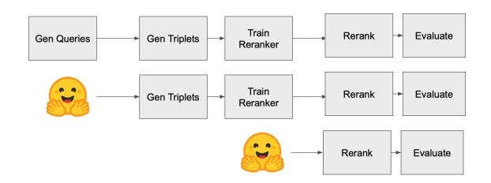
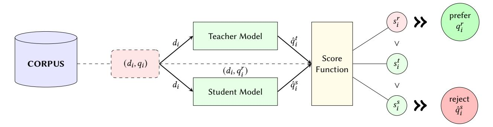
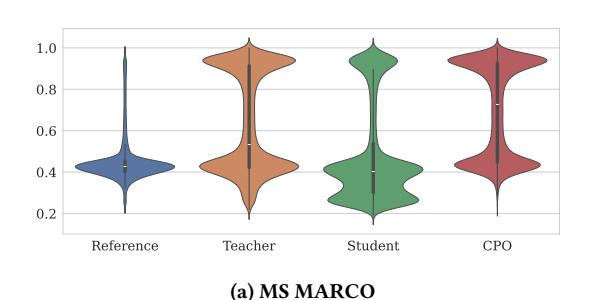
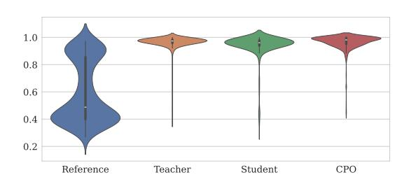
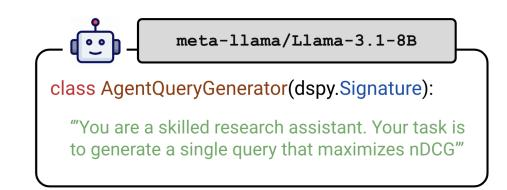
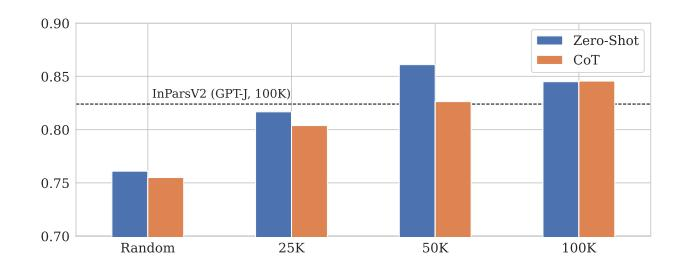

# InPars+: Supercharging Synthetic Data Generation for Information Retrieval Systems

Matey Krastev∗ University of Amsterdam Amsterdam, the Netherlands

Miklos Hamar∗ University of Amsterdam Amsterdam, the Netherlands

Danilo Toapanta∗ University of Amsterdam Amsterdam, the Netherlands

Jesse Brouwers∗ University of Amsterdam Amsterdam, the Netherlands

Yibin Lei∗ University of Amsterdam Amsterdam, the Netherlands

## Abstract

This work revisits and extends synthetic query generation pipelines for Neural Information Retrieval (NIR) by leveraging the InPars Toolkit, a reproducible, end-to-end framework for generating training data using large language models (LLMs). We first assess the reproducibility of the original InPars, InPars-V2, and Promptagator pipelines on the SciFact benchmark and validate their effectiveness using open-source reranker and generator models. Building on this foundation, we introduce two key extensions to the pipeline: (1) fine-tuning a query generator LLM via Contrastive Preference Optimization (CPO) to improve the signal quality in generated queries, and (2) replacing static prompt templates with dynamic, Chain-of-Thought (CoT) optimized prompts using the DSPy framework. Our results show that both extensions reduce the need for aggressive filtering while improving retrieval performance. All code, models, and synthetic datasets are publicly released to support further research: [https://github.com/danilotpnta/IR2-project.](https://github.com/danilotpnta/IR2-project)

## Keywords

Synthetic Data Generation, LLM's, Reranking, CPO, Information Retrieval

## 1 Introduction

The training of Neural Information Retrieval (NIR) models requires a substantial amount of annotated data. Typically, a dataset is a collection of documents, paired with queries and human-labelled relevance judgments that connect the two. These relevance judgements, however, are hard and costly to acquire. For example, a human annotator typically requires at least one minute on average to assess the relevance of a query-document pair [\[Boytsov et al.](#page-7-0) [2023\]](#page-7-0).

To address this challenge, prior research has explored leveraging multi-billion-parameter Large Language Models (LLMs) to generate relevant queries synthetically. Notable examples include InPars [\[Bonifacio et al. 2022\]](#page-7-1), its extensions InPars-V2 [\[Jeronymo et al.](#page-7-2) [2023\]](#page-7-2) and InPars-light [\[Boytsov et al. 2023\]](#page-7-0), as well as Promptagator [\[Dai et al. 2022\]](#page-7-3). These approaches are commonly referred to as QGen pipelines[\[Chaudhary et al. 2023\]](#page-7-4), where a document (re-)ranking model, such as MonoT5 [\[Nogueira et al. 2020\]](#page-7-5), is finetuned using the synthetic data to improve downstream retrieval performance. These pipelines show promising results, which motivate further experimentation in this direction.

While these methods offer researchers flexible pipelines for enhancing Neural Information Retrieval (NIR) models in data-scarce

scenarios, reproducing and utilising the aforementioned QGen pipelines remains a challenging task. To address this issue, Abonizio et al. introduced InPars Toolkit [\[Abonizio et al. 2023\]](#page-7-6), an opensource end-to-end pipeline for synthetic data generation with GPU support. The toolkit enables researchers and practitioners to efficiently experiment with and implement IR pipelines, significantly reducing the initial implementation complexity.

In the first part of this study, we aim to reproduce their results. Specifically, we aim to validate the following claims:

- (1) InPars Toolkit is an end-to-end reproducible pipeline for synthetic data generation.
- (2) It provides a comprehensive guideline for reproducing in full InPars-V1 [\[Bonifacio et al. 2022\]](#page-7-1), InPars-V2 [\[Jeronymo](#page-7-2) [et al. 2023\]](#page-7-2), as well as in part Promptagator [\[Dai et al. 2022\]](#page-7-3).
- (3) The toolkit has plug-and-play functionality, allowing for seamless integration of alternative LLMs.

In doing so, we aim to validate the transparency and reliability of adopting and extending the InPars Toolkit for future research.

Secondly, a common key insight from these studies is that the synthetically generated data need certain filtering mechanisms to ensure high-quality training data for the downstream model. In our study, we found that this filtering step is computationally expensive and can result in a significant amount of generated data being discarded [\[Bonifacio et al. 2022;](#page-7-1) [Dai et al. 2022\]](#page-7-3).

To address this, we propose two main extensions to the InPars Toolkit: (1) fine-tuning the generator model using Contrastive Preference Optimization (CPO) [\[Xu et al. 2024\]](#page-7-7) to improve the quality of generated queries, and (2) employing dynamic prompt optimization using DSPy [\[Khattab et al. 2024\]](#page-7-8) to enhance the prompt templates used in the data generation process.

By fine-tuning the generator model with CPO, we aim to reduce the noise in the generated queries, thereby increasing the proportion of high-quality queries and minimizing the need for extensive filtering. This approach leverages a preference-based optimization technique to guide the generator model towards producing more relevant and useful queries.

Additionally, by integrating DSPy for dynamic prompt optimization, we aim to replace the static prompt templates currently used in the InPars Toolkit with more adaptive and contextually appropriate prompts. This method utilizes the LLM's own capabilities to determine what constitutes a relevant query, potentially improving the overall quality of the generated data and further reducing the reliance on filtering.

Our contributions can be summarised as follows:

- We validate the main claims of [Abonizio et al. 2023] and the InPars Toolkit.
- We use a Llama3.1-8B model to generate synthetic data for Scifact, and finetune MonoT5-3B reranker models on the generated sets of synthetic data.
- We extend the InPars Toolkit with a query generator finetuning stage, where we finetune an LLM on a subset of MS-Marco [Bajaj et al. 2016] using a CPO training scheme [Xu et al. 2024].
- We explore the application of DSPy in the synthetic data generation pipeline, aiming to improve upon the currently used static prompt templates.
- We make the synthetic data and models generated in this study publicly available at: huggingface.co/inpars-plus.

## 2 Background and Preliminaries

In this section, we summarise the key concepts behind the QGen pipelines and the methods used in the InPars Toolkit. We also briefly introduce the main contributions of the InPars Toolkit and highlight the key limitations that motivate this work. Finally, we give a summary of the relevant literature we used in our extensions.

# 2.1 QGen Pipelines

All synthetic query generation (QGen) pipelines considered in this work, as well as in [Abonizio et al. 2023], have a similar structure. First, a generator LLM is presented with a prompt containing a target document and a set of relevant query-document pairs. The generator LLM is then invoked to generate a relevant query for this document. This process is repeated for each document in the dataset. The generated queries are subsequently filtered based on a scoring mechanism, and the high-quality queries are used to fine-tune a reranker model. At the end of the pipeline, the fine-tuned reranker model is evaluated on some test data and various retrieval metrics are reported.

Depending on which LLMs are used for query generation, which prompting strategies are employed as well as the filtering mechanism, the InPars Toolkit [Abonizio et al. 2023] considers the following three QGen pipelines: InPars-V1 [Bonifacio et al. 2022], InPars-V2[Jeronymo et al. 2023], and Promptagator[Dai et al. 2022].

#### 2.2 InPars

The initial InPars paper, later referred to as InPars-V1, proposed by Bonifacio et al. 2022, introduced an effective method for leveraging large LLMs in retrieval by utilizing them as generators of synthetic data. The authors identified that using LLMs directly during the retrieval stage is infeasible; thus, they proposed shifting the computational cost to the synthetic data generation process for training.

The InPars method creates a prompt by concatenating a static prefix t with a document from the target domain d. InPars considers two different (fixed) prompt templates: a vanilla template and a guided by bad question (GBQ) template. The vanilla template consists of a fixed set of 3 pairs of queries and their relevant documents, sampled from the MS MARCO [Bajaj et al. 2016] dataset. The GBQ prompt extends this format by posing the original query to be a bad question, in contrast with a good question manually

constructed by the authors. Feeding this prefix-target document pair t||q to the LLM is then expected to output a novel query  $q^*$  likely to be relevant to the target document. Thousands of these positive examples are generated for the target domain, and are later used to fine-tune a monoT5 reranker model [Nogueira et al. 2020].

However, the authors identified that using this full set of generations for training does not yield optimal results. This is likely owed to the poor quality of a large portion of the generated examples. Therefore, the authors propose to apply a scoring mechanism to select the top K of generations based on the following score:

$$p_q = \frac{1}{|q|} \sum_{i=1}^{|q|} \log p(q_i|t, d, q_{< i})$$
 (1)

where  $p(q_i|t,d,q_{< i})$  represents the probability of generating token i from generated query q assigned by the generator LLM, GPT-3 in the case of InPars.

As a folloup work, InPars-v2 [Jeronymo et al. 2023] extends the original InPars by replacing the scoring metric with a relevance score provided by a monoT5-3B reranker model. Additionally, the authors switch the generator LLM to GPT-J [B. Wang and Komatsuzaki 2021].

In both works, the authors prompt the generator model 100 000 times for synthetic queries but only keep the top 10 000 highest scoring instances. This means that 90% of the generated queries are discarded. It should be noted that the authors provide no substantiation or ablation for this setting.

# 2.3 Promptagator

The Promptagator method, proposed by Dai et al. 2022, operates similarly to the InPars method. Promptagator prompts the 137B-parameter model FLAN [Wei, Bosma, et al. 2021] with eight query-document examples, followed by a target document, to generate a relevant query for the target document. Unlike InPars, which uses a fixed prompt template, Promptagator employs a dataset-specific prompt template tailored to the target dataset's retrieval task.

Subsequently, high-quality generations are filtered from the batch of outputs using a process called consistency filtering [Alberti et al. 2019; Lewis et al. 2021]. Consistency filtering ensures that a query is answered by the passage from which it was generated. To this end, a retrieval model is invoked and the generated query is only accepted if the target document appears in the top-K retrieved documents.

Abonizio et al. (2023) highlight several limitations in these works. Firstly, neither InPars nor Promptagator are fully reproducible, partly due to the use of models that are not publicly available. Additionally, the InPars models are restricted to specific hardware (TPUs), making them difficult to adapt to other models. Lastly, the Promptagator method lacks a public code base entirely. To address these limitations, Abonizio et al. introduce the InPars Toolkit, an open-source end-to-end and fully reproducible pipeline for synthetic data generation with GPU support (via PyTorch [Paszke et al. 2019]).

## 2.4 Contrastive Preference optimization

To address the performance gap between moderate-sized LLMs (7–13 billion parameters) and state-of-the-art large LLMs, such as

GPT-4 [OpenAI 2023], in the task of machine translation, Xu et al. proposed Contrastive Preference optimization (CPO) [Xu et al. 2024].

The goal of CPO is to overcome two key shortcomings of supervised fine-tuning. First, the performance of supervised fine-tuning is limited by the quality of gold-standard human-annotated reference translations. Second, supervised fine-tuning cannot reject errors present in the provided gold-standard translations.

CPO addresses these limitations by introducing a training schema that utilises triplets comprising reference translations, translations from a teacher model (e.g., GPT-4), and those from the student model. Reference-free evaluation models are employed to score the translations, and these scores are subsequently used to guide the student model toward generating preferred translations.

In practice, contrastive preference optimization forms an approximation of Direct Policy Optimization by instead minimizing its upper bound.

Given a set of source sentences  $\mathcal{X}$ , alongside preferred targets  $\mathcal{Y}_w$  and less preferred ones  $\mathcal{Y}_l$ , we can construct a triplet dataset of input, preferred output, and dispreferred output, which we denote as  $\mathcal{D} = \{x^{(i)}, y_w^{(i)}, y_l^{(i)}\}_{i=1}^N$ . Then, the preference optimization loss term is defined as:

$$\begin{split} L(\pi_{\theta}; U) &= -\mathbb{E}_{(x, y_w, y_l) \sim \mathcal{D}} \big[ \log \sigma(\beta \log \pi_{\theta}(y_w | x) \\ &- \beta \log \pi_{\theta}(y_l | x)) \big] \end{split}$$

where U is a uniform prior policy which replaces  $\pi_{\rm ref}$  in classical DPO. This relaxation allows for only storing and requiring computations for the target policy model – effectively reducing computational and memory requirements in half. More importantly, because the preferred and dispreferred targets are determined by an objective (reference-free) metric, they are potentially able to approximate better the optimal policy  $\pi^*$ . In the context of machine translation, this trains the model to avoid generating adequate but imperfect outputs.

Furthermore, the authors [Xu et al. 2024] incorporate a behaviourcloning (BC) regularizer such that the distribution of the target model's generations does not deviate too far from the distribution of the teacher model's generations, which is defined as:

$$\mathcal{L}_{NLL} = \mathbb{E}_{(x,y_w) \sim D} \left[ \log \pi_{\theta}(y_w|x) \right]$$

Thus, the final CPO objective is defined as:

$$\min_{\theta} \underbrace{L(\pi_{\theta}, U)}_{\mathcal{L}_{\text{prefer}}} - \underbrace{\mathbb{E}_{(x, y_w) \sim D} \left[\log \pi_{\theta}(y_w | x)\right]}_{\mathcal{L}_{\text{NLL}}}$$

#### 2.5 **DSPy**

The rise of promptable LLMs has inevitably led the research community to explore techniques for effectively prompting these models. Consequently, LLM pipelines often rely on hard-coded prompt templates, of which the InPars Toolkit is an example. To address this limitation, Khattab et al. introduced DSPy [Khattab et al. 2024], a programming model that offers a more systematic approach to optimizing LLM pipelines. DSPy brings the construction and optimization of LLM pipelines closer to traditional programming, where

a compiler automatically constructs prompts and invocation strategies by optimizing the weights of general-purpose layers following a program.

## 2.6 Research Gap

In light of the previously discussed studies, it becomes apparent that synthetic data generation pipelines, such as InPars and Promptagator, have proven to be effective strategies for improving Neural Information Retrieval models. Previous studies have focused on enhancing different components of these pipelines. For instance, InPars-V2 has improved the scoring mechanism used for synthetic data filtering, InPars-light has enhanced overall efficiency by exclusively using more lightweight, open-source models, and InRanker has addressed the reranking bottleneck by distilling knowledge from a large MonoT5-3B model specialized in the ranking task into smaller counterparts while utilizing synthetic data from InPars.

However, to the best of our knowledge, no work has addressed the issue of reducing noise in the generated queries. In the case of InPars, 90% of the generated queries are filtered out and not used in subsequent stages of the pipeline. Since query generation comprises one of the most computationally expensive stages, this study aims to mitigate this inefficiency. We explore replacing the static prompt templates used in the InPars Toolkit pipeline with DSPy prompt optimization, with the aim of improving the query generation process. Additionally, we investigate applying a knowledge distillation strategy, somewhat similar to InRanker, to the generator LLM using a CPO fine-tuning procedure.

## 3 Methodology

In this section, we begin by discussing our approach to ensuring reproducibility of the claims of the original authors, then we outline our methodology for extending the work of the original authors.

## 3.1 Reproducibility

As specified in Section 1, we start by assessing the reproducibility of InPars Toolkit. To this end, we aim to verify the validity of the three main claims we have identified: (1) the InPars Toolkit is an end-to-end reproducible pipeline; (2) it provides a comprehensive guide for reproducing InPars-V1, InPars-V2, and partially Promptagator; and (3) the toolkit has plug-and-play functionality. Given the substantial computational resources required to fully reproduce all experiments on the 18 BEIR benchmark datasets as proposed by Abonizio et al. [Abonizio et al. 2023]—approximately 2000 GPU hours—we opted for a more efficient approach. Fortunately, the authors have made a significant portion of the synthetic data and fine-tuned models publicly available 1. To reduce the energy footprint of this reproducibility study, we propose conducting three different types of reproduction experiments on the smallest dataset in the BEIR benchmark—SciFact [Wadden et al. 2020].

Our first experiment will be a full end-to-end reproduction of the InPars Toolkit methodology for reproducing InPars-V1, InPars-V2, and partially Promptagator, thereby assessing the validity of Claims

&lt;sup>1InPars on HuggingFace InPars fine-tuned monoT5 models Listed resource on the GitHub repository

Figure 1: Diagram of the three different reproducibility experiments.

1 and 2. Secondly, we skip the expensive data generation stage by downloading the synthetic data made publicly available by the authors. By doing so, we assess the validity of the published resources while providing additional evidence of the InPars Toolkit's reproducibility. Finally, we will utilise the pre-trained ranker models published by the authors for reranking.

A minor issue with the published resources is that not all of them were found, despite the authors claiming to have published them. Specifically, we were unable to locate the synthetic data generated using the Promptagator prompt templates specified in the InPars Toolkit, nor did we find the pre-trained reranker models trained on InPars-v1 generations. Consequently, these experiments were not conducted.

To assess the validity of claim 3, regarding plug-and-play functionality, we additionally perform a full end-to-end run of the QGen pipeline using a newer LLM, namely Llama 3.1 [Grattafiori et al. 2024] for query generation. Since the original authors experiment with the GPT-J-6B model, we attempt to match this with the 8B parameters version of LLama 3.1. We expect this model to seamlessly integrate into the InPars Toolkit pipeline and potentially improve downstream performance.

To further reduce the computational workload, all experiments are run using half precision (FP16). Furthermore, we use the default parameters specified by the authors in the reproducibility guide and the published code.

## 3.2 Extending InPars-toolkit

3.2.1 Fine-tuning the Generator. We hypothesize that targetting the generator model for fine-tuning individually will result in better retrieval performance, and will alleviate the issue of wasted compute. Furthermore, given high enough quality, we may even omit filtering altogether.

Since our main goal is to reduce the total cost of the QGen pipeline, we experiment with CPO to obtain a model that generalizes to the task of query generation across different target domains. This approach aims to minimize wasteful computation and hopefully eliminates the need to re-train the model for each target dataset.

Following Xu et al. 2024, we adapt the triplet data generation pipeline by proposing the following modifications for synthetic query generation (also pictured in Fig. 2).

(1) Sample N pairs of *relevant* query-document pairs, preferably with all available documents in the corpus.

- (2) Using two models one teacher and one student, generate predicted queries for each document. Here we also employ targeted prompt templates, as described in §3.2.2.
- (3) Compute a relevance score between the three queries (one from student, one from teacher, and one as the reference) and document, as described in §3.2.3.
- (4) Filter out irrelevant data samples for which all scores lie within preset margins  $L < s^i_{s/t/r} < H$ . This aims to reduce degenerate cases where the model outputs copies of the document or irrelevant queries. We use L=0.3 and H=0.7.
- (5) Select the query corresponding to the highest relevant score as the "preferred" example to optimize for, and the query corresponding to the lowest score as the "dispreferred" example.
- (6) Train using CPO, following Xu et al [Xu et al. 2024].

The trained generator model can then be used in zero-shot fashion in order to produce higher quality queries, enhancing downstream performance.

For our study, we employ Llama 3.1 8B Instruct2, as well as Llama 3.1 Nemotron 70B Instruct3 [Grattafiori et al. 2024] for our student and teacher models, respectively. We hypothesize that the knowledge distillation effect of preference-based optimization will be strongest on models of similar architecture. We fine-tune a single student model on 100,000 samples from the MS MARCO passage dataset and aim to evaluate its QGen performance on a subset of the BEIR benchmark.

3.2.2 Targeted Prompt Templates. Furthermore, we incorporate targeted prompt templates inspired by Promptagator and enhance them by providing K in-distribution examples, following the In-Pars method. We also refer to this prompting strategy as InPars+prompts.

Due to time and budget constraints, we opt to not use the CoT methodology outlined in §2.5 to build the prompts for generator fine-tuning. However, any observed benefits of the DSPy method can potentially carry over well, as the two approaches carry theoretically multiplicative benefits.

3.2.3 Query Evaluation. Preference optimization in general requires a scoring mechanism that determines the weight of the preferred or dispreferred option. In the context of information retrieval, we employ a scoring function combining Siamese networks for retrieval with normalized BM25 scores. The latter serves to alleviate some of the issues of using bi-encoders for similarity scoring. The text encoder score  $s_{enc} \in [0,1]$  is defined as

$$s_{enc}(\text{doc, query}) = 1 + \frac{h_{\text{doc}} \cdot h_{\text{query}}}{2||h_{\text{doc}}|| \cdot ||h_{\text{query}}||}$$

where  $s_{enc}$  is the re-scaled cosine similarity between the embedding vectors produced by the Siamese networks for query and document. In our experiments, we employ Sentence Transformer [Reimers and Gurevych 2019] encoder where the output of the last

 $^2 https://hugging face.co/neural magic/Meta-Llama-3.1-8 B-Instruct-FP8$ 

 $^3 https://hugging face.co/neural magic/Llama-3.1-Nemotron-70 B-Instruct-HF-FP 8-dynamic$ 

Figure 2: Data generation for CPO-based fine-tuning. A relevant document-query pair is sampled from the dataset. Both teacher and student models generate queries for the given document, yielding three queries:  $q_i^r$ ,  $\hat{q}_i^t$ , and  $\hat{q}_i^s$ . These queries are scored for similarity against the target document, with the highest-scoring query designated as preferred and the lowest-scoring as rejected. This procedure is applied across all relevant query-document pairs in the corpus.

Transformer layer is aggregated with a mean pooling layer. Document embeddings are precomputed and stored in an embedding table to accelerate retrieval.

In a similar fashion, we precompute the IDF index for BM25, and compute BM25 scores across the batch of queries on-the-fly. Because BM-25 scores are inherently not normalized, we take the softmax across the entire corpus and only get the score corresponding to the target query-document pair. The final score *s* is calculated as:

$$s(\text{doc, query}) = 0.5 \cdot s_{enc}(\text{doc, query}) + 0.5 \cdot s_{BM25}(\text{doc, query})$$

- 3.2.4 Pipeline Enhancements. In addition, we implement many other enhancements to better utilize the available resources on the system running InPars.
  - Higher CPU utilization during prompt generation using the Prompt builder class. On systems with high number of logical processing cores, this substantially reduces the time required for generating prompts.
  - Additional caching and intermediate result backup, allowing easy recovery from program crashes.
  - Enhanced inference using vLLM [Kwon et al. 2023], enabling significant speed-ups and better memory utilization for multi-billion parameter models. In particular, this also allows scaling up the number of synthetic queries within a similar budget which can in turn yield improvements in downstream retrieval performance.
- 3.2.5 DSPy for Enhanced Prompt Generation. To further improve the quality of generated queries, we also study incorporating the DSPy framework [Khattab et al. 2024]. Traditional synthetic data generation approaches, such as InPars, rely on static, handcrafted prompt templates that do not scale well to unseen datasets. To address this issue, we leverage the LLM's own capabilities to determine what constitutes a relevant query. We utilize Chain of Thought (CoT) reasoning to guide the LLM in breaking down the document's content into a series of logical steps before formulating the final query. Prior work has shown that CoT reasoning can enhance performance by encouraging more structured, contextually appropriate outputs [Wei, X. Wang, et al. 2022].

(b) SCIFACT

Figure 3: Comparison of similarity score distribution with query evaluation applied on two sample datasets using Llama 3.1 70B as the teacher model and Llama 3.1 8B as the student model. In a very noisy dataset such as MS MARCO, both teacher and student are able to generate higher- or similar-quality queries compared to the reference. Post-CPO, the student is able to generate queries with a higher mode.

Following this approach, we treat the LLM as an agent by providing it a set of instructions to aid its adaptive query generation, ensuring the model reasons about what is relevant to the dataset.

Figure 4 illustrates the signature that configures the LLM as an agent. Rather than relying on a fixed prompt template, DSPy uses this signature to dynamically create a prompt, embedding the agent's instructions directly into the model's reasoning steps.

Figure 4: Module definition for AgentQueryGenerator, a DSPy signature that prompts a meta-llama/Llama-3.1-8B model to behave as a skilled research assistant.

While CoT allows the model to analyze the document systematically before generating queries, this came at the cost of additional computations.

Furthermore, the model demonstrated a tendency to deviate from its primary task – instead producing outputs which resemble a continuation or extrapolation of the document and prompt. To alleviate this, we introduce stopping words which ensures adherence to the task while preserving the integrity of the CoT approach.

3.2.6 Impact of Filtering. Finally, we hypothesize that an improved query generation process should enable reduced filtering, leading to greater computational efficiency. Thus, we analyze the effect of filtering using Zero-Shot and CoT strategies by conducting a full end-to-end experiment, reducing the number of generated queries from 100k to 10k, 25k, and 50k, thereby simulating scenarios where significantly fewer or no generations are removed by filtering.

## 4 Results

In the following sections, we describe the reproduction of the original InPars results and discuss the effects of our extensions.

# 4.1 Reproduction Experiments

The results of the reproductions are listed in Table [1.](#page-5-1) We observe slight delta between our reproduction from scratch (experiment 1) and results reported by the authors, where our results are consistently lower for the target dataset.

With the synthetic query dataset provided by the authors (experiment 2), our results are approaching the reported ones, which might indicate some inconsistencies stemming from the dataset generation procedure. This assumption is validated when we also utilize their fine-tuned reranker (experiment 3), where both results match the reported results for the InPars-V2 pipeline.

Furthermore, using a bigger and more selectively trained model [\[Grattafiori et al. 2024\]](#page-7-17), yields some marginal gains in downstream performance, as seen in the columns listing the downstream results of using synthetic queries generated by GPT-J and LLaMA.

In summary, our results largely match the original authors', despite some minor inconsistencies. This validates the identified claims that the pipeline is end-to-end reproducible and does incorporate plug-and-play functionality for different generator and reranker models with minimal modifications.

## 4.2 Extensions and Ablations

4.2.1 Impact of Filtering. To evaluate the effectiveness of DSPy prompts and the impact of filtering, we propose an experiment

Table 1: Results of the reproduction experiments for the SciFact dataset. The † symbol indicates experiments using Promptagator templates. The number (1) in the second and third columns indicate we have conducted experiment 1: full pipeline.

|            | InPars | GPT-J (1) | LLaMA (1) | Exp.(2) | Exp.(3) |
|------------|--------|-----------|-----------|---------|---------|
| BM25       | 0.678  | 0.679     | 0.679     | 0.679   | 0.679   |
| InPars-V1  | 0.774  | 0.758     | 0.759     | 0.770   | –       |
| InPars-V2  | 0.774  | 0.752     | 0.759     | 0.770   | 0.770   |
| InPars-V1† | 0.790  | 0.766     | 0.778     | –       | –       |
| InPars-V2† | 0.790  | 0.769     | 0.786     | –       | 0.782   |
| Average    | 0.782  | 0.761     | 0.771     | 0.770   | 0.776   |

simulating low-resource settings. All fine-tuned reranker models in our experiments were trained on a subset of 10,000 synthetic queries. In the original experiment proposed by the authors of InPars, 100k query generations were filtered to produce a smaller subset of 10k queries. To investigate the effects of filtering and assess the potential efficiency gains of using DSPy for prompt construction, we propose reducing the initial pool of 100k generations to smaller random samples of 10k (no filtering), 25k, and 50k queries, thereby adjusting the filter ratio from 90% to 0%, 60%, and 80%, respectively.

In this experiment, (Fig. [5\)](#page-6-0), we adopt the InPars-V2 strategy, where the top 10k queries are selected based on scores generated by a MonoT5-3B reranker model. We experiment with the Trec-Covid dataset.

We find that filtering from larger subsets generally enhances the quality of the trained reranker. This improvement likely stems from the larger pool of instances, offering more opportunities to select high-quality queries. Notably, the same results indicate that CoT-produced prompts lead to degraded performance. Furthermore, we observe an unexplained bump in performance when filtering from the 50k subset, which persists across different seeds. Overall, the results demonstrate that our proposed CoT prompting strategy, combined with the 8B model, achieves performance comparable to the original InPars-V2 results while using only a quarter of the queries. These results suggest that CoT can enhance efficiency and, under equivalent resource conditions, even improve downstream performance.

It is important to note that comparing experiments conducted with Llama to those using GPT-J is not a direct one-to-one comparison and may influence the results.

4.2.2 Results in CPO. We observe that a trained student was able to learn to generate generally higher scoring queries (Fig. [3\)](#page-4-1), pushing the score distribution upwards. However, as we observe in our experimental results, bigger models do not necessarily produce better outputs and this is also reflected on the CPO learner.

The model trained on the MS MARCO subset seems to perform reasonably well as a generalist generator. Furthermore, we observe that filtering for these models resulted in generally worse performance for the reranker. As above, we hypothesize that we are

Table 2: Main experimental results. We generate 10,000 synthetic queries using the model specified in the first column with InPars-V2 filtering (SC, Sec[.2.2\)](#page-1-0) and fine-tune a monoT5 reranker for one epoch. For each test query, we sample the top-1000 documents via BM25 and rerank using the fine-tuned monoT5. (1) indicates no reranking baseline. For (5): the first row shows our fine-tuned LLama3.1 8B model using CPO on MSMARCO with original InPars prompting; the second row employs InPars+ prompts (Se[c3.2.2\)](#page-3-0); the third row uses CoT prompting.

|                | Method                                         | Filter         | Cov                     | NFC                     | Arg                     | Scifact                 | Avg                     |
|----------------|------------------------------------------------|----------------|-------------------------|-------------------------|-------------------------|-------------------------|-------------------------|
| (1)            | BM25                                           | N/A            | 0.595                   | 0.322                   | 0.397                   | 0.679                   | 0.498                   |
| (2)            | GPT-J 6B                                       | SC             | 0.824                   | 0.373                   | 0.105                   | 0.770                   | 0.518                   |
| (3.1) (3.2) | Llama 3.1 8B Llama 3.1 70B                  | SC SC       | 0.845 0.708          | 0.380 0.378          | 0.126 0.113          | 0.759 0.754          | 0.531 0.488          |
| (4)            | Llama 3.1 8B + CoT                             | SC             | 0.856                   | 0.390                   | 0.368                   | 0.786                   | 0.600                   |
| (5)            | CPO @ MSMARCO w/ IP+ prompts w/ DSPy CoT | SC SC SC | 0.778 0.769 0.867 | 0.372 0.368 0.371 | 0.253 0.609 0.417 | 0.746 0.749 0.761 | 0.490 0.622 0.604 |

Figure 5: Impact of filtering for zero-shot generation and CoTderived generation using monoT5 as reranker (K=1000). The dotted line represents the baseline performance using the top 10,000 queries from GPT-J, while the bars depict results for queries generated by Llama 3.1 8B across various subsets.

likely removing useful training signal. This seems particularly pronounced for datasets such as Arguana, as there is only a limited set of training data available.

4.2.3 DSPy results. Similarly, the use of dynamic prompt optimization combined with Chain-of-Thought (CoT) consistently improves performance across datasets. When compared to the baseline, it is clear that the base Llama model, when used with DSPy and InPars-V2 score-based filtering, achieves the highest average score. Notably, for the Arguana dataset, although BM25 still outperforms the other baselines, the CoT approach significantly enhances performance, raising the nDCG score from 0.126 to 0.368, which is an improvement of 27 nDCG@10 points.

4.2.4 Impact of Reranker model. To further investigate the effectiveness of our approaches, we target ranking fewer documents ( = 100) and using a much smaller reranker model, in our case miniLM[4](#page-6-1) , which has been shown to work comparatively well for how lightweight it is[\[Boytsov et al. 2023\]](#page-7-0). We observe a similar trend (Fig. [3\)](#page-6-2) as with reranking = 1000 documents and monoT5 – filtering can be beneficial for some domains and harmful for others. Furthermore, bigger and theoretically more capable models do not necessarily result in improved downstream performance.

Table 3: nDCG@10 results for Scifact and TREC-Covid using MiniLM and reranking the top-100 documents. NF stands for no filter, and SC stands for "scores" filtering adapted from InPars-V2 [\[Jeronymo et al. 2023\]](#page-7-2)

| Generator     | Filter | Scifact | Covid |
|---------------|--------|---------|-------|
| Llama 3.1 8B  | NF     | 0.707   | 0.775 |
|               | SC     | 0.719   | 0.733 |
| Llama 3.1 70B | NF     | 0.700   | 0.763 |
|               | SC     | 0.745   | 0.728 |

## 5 Discussion

## 5.1 Query Evaluation

We provide a quantitative demonstration of the query evaluation framework in Figure [3](#page-4-1) and contextualized samples in Table [4.](#page-7-21) Although the fine-tuned model is able to learn to generate better quality queries, it can occasionally repeat the entire document, which is not useful for training but results in a high query evaluation score (See Sec [3.2.3\)](#page-3-1). To mitigate this, we introduced a maximum threshold for the query evaluation score to avoid training on such false-positives. For future work, we aim to explore more sophisticated approaches for query evaluation.

# 5.2 Contrastive Preference Optimization

One key assumption we made throughout this paper was that using better generator models will translate into higher quality of downstream performance for our reranker using synthetic data. However, this does not hold true in general, as seen in rows (3.1) and (3.2) in Table [2.](#page-6-3)

We determine that further research is essential to determine the potential impact of optimizing synthetic data generator models for information retrieval. In particular, we plan to investigate better ways to generate training datasets to encourage more appropriate query generation.

4https://huggingface.co/cross-encoder/ms-marco-MiniLM-L-6-v2

## 5.3 CoT Prompts

As shown in Table 2, incorporating a guided process improves query quality; however, this comes with trade-offs and requires careful consideration of certain aspects.

While we anticipated that applying CoT would improve query quality and reduce the number of instances required for training, this was not consistently observed, particularly for the TREC-Covid dataset in figure 5. This could be due to several factors:

- The TREC-Covid dataset represents a corpus of 171k documents. Training on a subset of the highest scoring documents seems to decrease the performance of the reranker. Training on higher number of samples, instead of filtering, seems to provide better training signal translated into better downstream performance.
- Although CoT reasoning introduces guided steps for query generation, this can sometimes result in diminished performance. CoT prompts may lead the model to generalize in a way that detracts from the relevance of the generated queries.
   For instance, in some cases, the reasoning steps cause the model to focus on peripheral concepts rather than extracting keywords or core topics directly relevant to the document.

These results, however, relate to the specific the datasets we test on. Further investigation across a larger pool of corpora is still needed. To answer then the question whether a filtering strategy is needed, the answer seems not evident as of now. Nonetheless, we note that using dynamic prompts instead of a static hardcoded template does improves the downstream performance of the reranker model, as indicated in the top scores for the 4 datasets shown.

Table 4: Sample document from Scifact with its reference query (finding) and queries from the generator models.

|                      | Text                                                                              | Score |
|----------------------|-----------------------------------------------------------------------------------|-------|
| Document             | Myelodysplastic syndromes (MDS) are age- dependent stem cell malignancies that | 100   |
| Reference Finding | Toll-like receptor (TLR) signaling is involved in the pathogenesis of human MDS.  |       |
| Teacher Finding      | Myeloid-derived suppressor cells (MDSC) are hematopoiesis. MSDC expansion         | 96.3  |
| Student Finding   | Myeloid-derived suppressor cells (MDSC) are of ineffective hematopoiesis.         | 94.2  |
| CPO Finding       | Myelodysplastic syndromes (MDS) are age- dependent stem cell malignancies that | 99.6  |

#### 6 Conclusion

In this study, we reproduce and verify the main claims of InPars Toolkit, confirming its claims of providing an end-to-end reproducible pipeline and a clear guide for reproducing InPars-V1, InPars-V2, and partially Promptagator. We also validate the pipeline's plugand-play capability by integrating LLaMA 3.1 8B as the generator model. Our results closely match the ones reported by the original authors, supporting the toolkit's reliability.

Beyond reproduction, we extend the toolkit in two ways. First, we apply Contrastive Preference Optimization (CPO) to fine-tune the

generator LLM to guide the model into generating generally better queries. Second, we apply CoT for dynamic prompt optimization in lieu of fixed templates. This generally improved query quality, though some cases revealed complexities which deserve further investigation.

Overall, our reproductions and extension experiments build upon the versatility of the InPars Toolkit and highlight practical pathways for future research.

#### References

- Hugo Abonizio, Luiz Bonifacio, Vitor Jeronymo, Roberto Lotufo, Jakub Zavrel, and Rodrigo Nogueira. 2023. "Inpars toolkit: A unified and reproducible synthetic data generation pipeline for neural information retrieval." arXiv preprint arXiv:2307.04601.
- Chris Alberti, Daniel Andor, Emily Pitler, Jacob Devlin, and Michael Collins. 2019. "Synthetic QA corpora generation with roundtrip consistency." arXiv preprint arXiv:1906.05416.
- Payal Bajaj et al.. 2016. "Ms marco: A human generated machine reading comprehension dataset." arXiv preprint arXiv:1611.09268.
- Luiz Bonifacio, Hugo Abonizio, Marzieh Fadaee, and Rodrigo Nogueira. 2022. "Inpars: Unsupervised dataset generation for information retrieval." In: Proceedings of the 45th International ACM SIGIR Conference on Research and Development in Information Retrieval, 2387–2392.
- Leonid Boytsov, Preksha Patel, Vivek Sourabh, Riddhi Nisar, Sayani Kundu, Ramya Ramanathan, and Eric Nyberg. 2023. "Inpars-light: Cost-effective unsupervised training of efficient rankers." arXiv preprint arXiv:2301.02998.
- Aditi Chaudhary, Karthik Raman, and Michael Bendersky. 2023. It's All Relative! — A Synthetic Query Generation Approach for Improving Zero-Shot Relevance Prediction. (2023). https://arxiv.org/abs/2311.07930 arXiv: 2311.07930 [cs.CL].
- Zhuyun Dai et al.. 2022. "Promptagator: Few-shot dense retrieval from 8 examples." arXiv preprint arXiv:2209.11755.
- Aaron Grattafiori et al.. 2024. The Llama 3 Herd of Models. (2024). https://arxiv.org/abs/2407.21783 arXiv: 2407.21783 fcs.AIJ.
- Vitor Jeronymo, Luiz Bonifacio, Hugo Abonizio, Marzieh Fadaee, Roberto Lotufo, Jakub Zavrel, and Rodrigo Nogueira. 2023. "Inpars-v2: Large language models as efficient dataset generators for information retrieval." arXiv preprint arXiv:2301.01820.
- Omar Khattab et al.. 2024. "DSPy: Compiling Declarative Language Model Calls into Self-Improving Pipelines." In.
- Woosuk Kwon, Zhuohan Li, Siyuan Zhuang, Ying Sheng, Lianmin Zheng, Cody Hao Yu, Joseph E. Gonzalez, Hao Zhang, and Ion Stoica. 2023. "Efficient Memory Management for Large Language Model Serving with PagedAttention." In: Proceedings of the ACM SIGOPS 29th Symposium on Operating Systems Principles.
- Patrick Lewis, Yuxiang Wu, Linqing Liu, Pasquale Minervini, Heinrich Küttler, Aleksandra Piktus, Pontus Stenetorp, and Sebastian Riedel. 2021. "PAQ: 65 million probably-asked questions and what you can do with them." Transactions of the Association for Computational Linguistics, 9, 1098–1115.
- Rodrigo Nogueira, Zhiying Jiang, and Jimmy Lin. 2020. "Document ranking with a pretrained sequence-to-sequence model." arXiv preprint arXiv:2003.06713.
- R OpenAI. 2023. "Gpt-4 technical report. arxiv 2303.08774." View in Article, 2, 5.
- Adam Paszke et al.. 2019. PyTorch: An Imperative Style, High-Performance Deep Learning Library. (2019). https://arxiv.org/abs/1912.01703 arXiv: 1912.01703 [cs.LG].
- Nils Reimers and Iryna Gurevych. Nov. 2019. "Sentence-BERT: Sentence Embeddings using Siamese BERT-Networks." In: Proceedings of the 2019 Conference on Empirical Methods in Natural Language Processing and the 9th International Joint Conference on Natural Language Processing (EMNLP-IJCNLP). Ed. by Kentaro Inui, Jing Jiang, Vincent Ng, and Xiaojun Wan. Association for Computational Linguistics, Hong Kong, China, (Nov. 2019), 3982–3992. DOI: 10.18653/v1/D19-1410.
- David Wadden, Shanchuan Lin, Kyle Lo, Lucy Lu Wang, Madeleine van Zuylen, Arman Cohan, and Hannaneh Hajishirzi. Nov. 2020. "Fact or Fiction: Verifying Scientific Claims." In: Proceedings of the 2020 Conference on Empirical Methods in Natural Language Processing (EMNLP). Ed. by Bonnie Webber, Trevor Cohn, Yulan He, and Yang Liu. Association for Computational Linguistics, Online, (Nov. 2020), 7534–7550. DOI: 10.18653/v1/2020.emnlp-main.609.
- Ben Wang and Aran Komatsuzaki. 2021. GPT-J-6B: A 6 billion parameter autoregressive language model. (2021).
- Jason Wei, Maarten Bosma, Vincent Y Zhao, Kelvin Guu, Adams Wei Yu, Brian Lester, Nan Du, Andrew M Dai, and Quoc V Le. 2021. "Finetuned language models are zero-shot learners." arXiv preprint arXiv:2109.01652.
- Jason Wei, Xuezhi Wang, Dale Ŝchuurmans, Maarten Bosma, Brian Ichter, Fei Xia, Ed H Chi, Quoc V Le, and Denny Zhou. 2022. "Chain of Thought Prompting Elicits Reasoning in Large Language Models." arXiv preprint arXiv:2201.11903.
- Haoran Xu, Amr Sharaf, Yunmo Chen, Weiting Tan, Lingfeng Shen, Benjamin Van Durme, Kenton Murray, and Young Jin Kim. 2024. "Contrastive preference optimization: Pushing the boundaries of llm performance in machine translation." arXiv preprint arXiv:2401.08417.