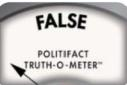
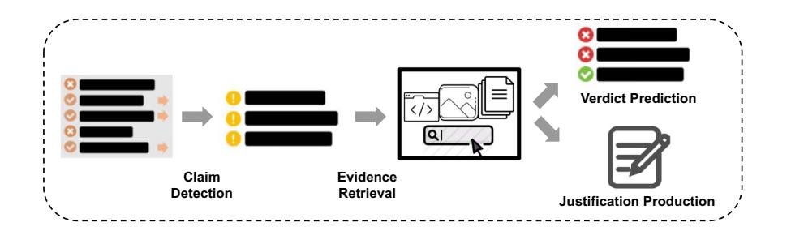

# A Survey on Automated Fact-Checking

Zhijiang Guo∗ , Michael Schlichtkrull∗, Andreas Vlachos

Department of Computer Science and Technology University of Cambridge, UK {zg283,mss84,av308}@cam.ac.uk

# Abstrac[t](mailto:zg283@cam.ac.uk)

Fact-checking has become increasingly important due to the speed with which both information and misinformation can spread in the modern media ecosystem. Therefore, researchers have been exploring how factchecking can be automated, using techniques based on natural language processing, machine learning, knowledge representation, and databases to automatically predict the veracity of claims. In this paper, we survey automated fact-checking stemming from natural language processing, and discuss its connections to related tasks and disciplines. In this process, we present an overview of existing datasets and models, aiming to unify the various definitions given and identify common concepts. Finally, we highlight challenges for future research.

# 1 Introduction

Fact-checking is the task of assessing whether claims made in written or spoken language are true. This is an essential task in journalism, and is commonly conducted manually by dedicated organizations such as PolitiFact. In addition to *external* fact-checking, *internal* fact-checking is also performed by publishers of newspapers, magazines, and books prior to publishing in order to promote truthful reporting. Figure 1 shows an example from PolitiFact, together with the evidence (summarized) and the verdict.

Fact-checking is a time-consuming task. To assess the claim in Figure 1, [a](#page-1-0) [journalis](#page-1-0)t would need to search through potentially many sources to find job gains under Trump and Obama, evaluate the reliability of each source, and make a comparison. This pr[ocess](#page-1-0) [can](#page-1-0) take professional factcheckers several hours or days (Hassan et al., 2015; Adair et al., 2017). Compounding the problem, fact-checkers often work under strict and [tig](mailto:av308@cam.ac.uk)ht deadlines, especially in the case of internal processes (Borel, 2016; Godler and Reich, 2017), and some studies have shown that less than half of all published articles have been subject to verification (Lewis et al., 2008). Given the amount of new infor[mation](#page-14-0) [that](#page-14-0) [a](#page-14-0)[ppears](#page-16-0) [and](#page-16-0) [the](#page-16-0) [speed](#page-16-0) [wit](#page-16-0)h which it spreads, manual validation is insufficient.

Auto[mating the fact-chec](#page-19-0)king process has been discussed in the context of computational journalism (Flew et al., 2010; Cohen et al., 2011; Graves, 2018), and has received significant attention in the artificial intelligence community. Vlachos and Riedel (2014) proposed structuring it as a sequence [of co](#page-16-2)[mponents—identi](#page-16-1)[fying](#page-14-1) [claims](#page-14-1) [to](#page-14-1) [be](#page-14-1) [checked,](#page-16-2) finding appropriate evidence, producing verdicts —that can be modeled as natural l[anguage](#page-25-0) [pro](#page-25-0)[cessing](#page-25-0) [\(NLP](#page-26-0)) tasks. This motivated the development of automated pipelines consisting of subtasks that can be mapped to tasks well-explored in the NLP community. Advances were made possible by the development of datasets, consisting of either claims collected from fact-checking websites, for example Liar (Wang, 2017), or purposemade for research, for example, FEVER (Thorne et al., 2018a).

A growing body of research is exploring the various tasks and subt[asks](#page-26-1) [necessar](#page-26-1)y for the automation of fact checking, and to meet t[he](#page-25-1) [need](#page-25-1) [for](#page-25-1) [ne](#page-25-1)[w](#page-25-2) [meth](#page-25-2)ods to address emerging challenges. Early developments were surveyed in Thorne and Vlachos (2018), which remains the closest to an exhaustive overview of the subject. However, their proposed framework does not include work on determining *which* claims to verify [\(i.e.,](#page-25-3) [claim](#page-25-3) [detection](#page-25-3)[\),](#page-25-4) [nor](#page-25-4) does their survey include the recent work on producing explainable, convincing verdicts (i.e., justification production).

Several recent papers have surveyed research focusing on individual components of the task. Zubiaga et al. (2018) and Islam et al. (2020) focus on identifying rumors on social media, Kuc¨¸uk and Can (2020) and Hardalov et al. (2021) ¨

∗ [Eq](#page-17-0)[ual contribution.](#page-12-0)

Figure 1: An example of a fact-checked statement. Referring to the manufacturing sector, Donald Trump said *''I brought back 700,000 jobs. Obama and Biden brought back nothing.''* The fact-checker gave the verdict *False* based on the collected evidence.

on detecting the stance of a given piece of evidence towards a claim, and Kotonya and Toni (2020a) on producing explanations and justifications for fact-checks. Finally, Nakov et al. (2021a) surveyed automated approaches to assist factchecking by humans. While [these](#page-19-2) [surveys](#page-19-2) [are](#page-19-2) [extreme](#page-19-2)ly useful in understanding various aspects of fact-checking technology, [they](#page-21-0) [are](#page-21-0) [fragmented](#page-21-0) and focused on specific subtasks and components; our aim is to give a comprehensive and exhaustive birds-eye view of the subject as a whole.

A number of papers have surveyed related tasks. Lazer et al. (2018) and Zhou and Zafarani (2020) surveyed work on fake news, including descriptive work on the problem, as well as work seeki[ng to counteract fak](#page-19-3)e ne[ws through compu](#page-28-1)tational means. A comprehensive review of NLP [approa](#page-28-1)ches to fake news detection was also provided in Oshikawa et al. (2020). However, fake news detection differs in scope from fact checking, as the former focuses on assessing news articles, and includes labeling items based on aspects not relat[ed](#page-22-0) [to](#page-22-0) [veracity,](#page-22-0) [such](#page-22-0) [as](#page-22-0) satire detection (Oshikawa et al., 2020; Zhou and Zafarani, 2020). Furthermore, other factors—such as the audience reached by the claim, and the intentions and forms [of the claim—are often](#page-22-0) [considered. These factor](#page-28-1)s also feature in the context of propaganda detection, recently surveyed by Da San Martino et al. (2020b). Unlike these efforts, the works discussed in this survey concentrate on assessing veracity of general-domain claims. Fi[nally, Shu et al. \(2017\)](#page-14-2) and da Silva et al. (2019) surveyed research on fake news detection and fact checking with a focus on social media data, while this survey covers fact checking across do[mains](#page-14-3) and sources, including new[swire,](#page-14-3) [science,](#page-14-3) etc.

In this survey, we present a comprehensive and up-to-date survey of automated fact-checking, unifying various definitions developed in previous research into a common framework. We begin by defining the three stages of our fact-checking framework—claim detection, evidence retrieval, and claim verification, the latter consisting of verdict prediction and justification production. We then give an overview of the existing datasets and modeling strategies, taxonomizing these and contextualizing them with respect to our framework. We finally discuss key research challenges that have been addressed, and give directions for challenges that we believe should be tackled by future research. We accompany the survey with a repository,1 which lists the resources mentioned in our survey.

# 2 Task [D](#page-1-1)efinition

Figure 2 shows a NLP framework for automated fact-checking consisting of three stages: (i) *claim detection* to identify claims that require verification; (ii) *evidence retrieval* to find sources [supportin](#page-2-0)g or refuting the claim; and (iii) *claim verification* to assess the veracity of the claim based on the retrieved evidence. Evidence retrieval and claim verification are sometimes tackled as a single task referred to as*factual verification*, while claim detection is often tackled separately. Claim verification can be decomposed into two parts that can be tackled separately or jointly: *verdict prediction*, where claims are assigned truthfulness labels, and *justification production*, where explanations for verdicts must be produced.

# 2.1 Claim Detection

The first stage in automated fact-checking is claim detection, where claims are selected for verification. Commonly, detection relies on the concept of check-worthiness. Hassan et al. (2015) defined check-worthy claims as those for which the general public would be interested in knowing the truth. For example, *''over [six m](#page-17-0)illion Americans had COV[ID-19](#page-17-0) [in](#page-17-0) [Janu](#page-17-0)ary''* would

1www.github.com/Cartus/Automated-Fact -Checking-Resources.

Figure 2: A natural language processing framework for automated fact-checking.

be check-worthy, as opposed to *''water is wet''*. This can involve a binary decision for each potential claim, or an importance-ranking of claims (Atanasova et al., 2018; Barron-Cede ´ no et al., ˜ 2020). The latter parallels standard practice in internal journalistic fact-checking, where deadlines often require fact-[check](#page-12-1)e[rs to employ a triage](#page-13-0) [s](#page-13-0)[ystem](#page-12-1) [\(Borel,](#page-12-1) [201](#page-12-1)6).

Another instantiation of claim detection based on check-worthiness is rumor detection. A rumor can be defined as an unverified story or statement ci[rculating](#page-14-0) [\(typ](#page-14-0)ically on social media) (Ma et al., 2016; Zubiaga et al., 2018). Rumor detection considers language subjectivity and growth of readership through a social network (Qazvinian et al., [2011](#page-20-1))[. Typical input to a](#page-28-0) rumor detec[tion](#page-20-0) [system](#page-20-0) is a stream of social media posts, whereupon a binary classifier has to determine if each post is rumorous. Metadata, such as t[he](#page-23-0) [number](#page-23-0) [of](#page-23-0) [lik](#page-23-0)[es](#page-23-1) [and](#page-23-1) re-posts, is often used as features to identify rumors (Zubiaga et al., 2016; Gorrell et al., 2019; Zhang et al., 2021).

Check-worthiness and rumorousness can be subjective. For exa[mple, the importance](#page-28-2) placed on co[unteri](#page-16-4)[ng COVID-19 mis](#page-27-0)informatio[n](#page-16-3) [is](#page-16-3) [not](#page-16-3) [unifor](#page-16-3)m across every social group. The checkworthiness of each claim also varies over time, as countering misinformation related to current events is in many cases understood to be more important than countering older misinformation (e.g., misinformation about COVID-19 has a greater societal impact in 2021 than misinformation about the Spanish flu). Furthermore, older rumors may have already been debunked by journalists, reducing their impact. Misinformation that is harmful to marginalized communities may also be judged to be less check-worthy by the general public than misinformation that targets the majority. Conversely, claims *originating from* marginalized groups may be subject to greater scrutiny than claims originating from the majority; for example, journalists have been shown to assign greater trust and therefore lower need for verification to stories produced by male sources (Barnoy and Reich, 2019). Such biases could be replicated in datasets that capture the (often implicit) decisions made by journalists about which claims to prioritize.

Instead o[f](#page-13-1) [using](#page-13-1) subjective concepts, Konstantinovskiy et al. (2021) framed claim detection as whether a claim makes an assertion about the world that is checkable, that is, whether it is verifiable with readil[y avai](#page-19-5)lable evidence. Cl[aims](#page-19-4) [based](#page-19-4) [on](#page-19-4) [personal](#page-19-4) [ex](#page-19-4)periences or opinions are uncheckable. For example, *''I woke up at 7 am today''* is not checkable because appropriate evidence cannot be collected; *''cubist art is beautiful''* is not checkable because it is a subjective statement.

### 2.2 Evidence Retrieval

Evidence retrieval aims to find information beyond the claim—for example, text, tables, knowledge bases, images, relevant metadata—to indicate veracity. Some earlier efforts do not use any evidence beyond the claim itself (Wang, 2017; Rashkin et al., 2017; Volkova et al., 2017; Dungs et al., 2018). Relying on surface patterns of claims without considering the state of the [world](#page-26-1) f[ails to](#page-26-1) identify well-presented misinformation, including [machine-generated](#page-23-2) [c](#page-23-2)[laims](#page-26-2) [\(Schuste](#page-26-2)r [et](#page-26-2) [al.](#page-26-2), [2020\).](#page-15-0) [Recen](#page-15-0)[t](#page-15-1) [dev](#page-15-1)elopments in natural language generation have exacerbated this issue (Radford et al., 2019; Brown et al., 2020), with machine-generated text sometimes being perce[ived](#page-24-0) [as](#page-24-0) [more](#page-24-0) [trustwor](#page-24-0)thy than human-written text (Zellers et al., 2019). In addition to enabling verificati[on,](#page-23-3) [evidence](#page-23-3) [is](#page-23-3) [essen](#page-23-3)[tial](#page-14-4) [for](#page-14-4) [generating](#page-14-4) verdict justifications to convince users of fact-checks.

*Stance detection* can be [viewed](#page-27-1) [as](#page-27-1) [an](#page-27-1) [in](#page-27-1)stantiation of evidence retrieval, which typically assumes a more limited amount of potential evidence and predicts its stance towards the claim. For example, Ferreira and Vlachos (2016) used news article headlines from the Emergent project2 as evidence to predict whether articles supported, refuted, or merely reported a claim. The Fake News Challe[nge](#page-16-5) [\(Pomerleau](#page-16-5) [and](#page-16-5) [Rao,](#page-16-5) 2017) further used entire documents, allowing for e[v](#page-3-0)idence from multiple sentences. More recently, Hanselowski et al. (2019) filtered out irrelevant sentences in the su[mmaries](#page-22-1) [of](#page-22-1) [fact-check](#page-22-1)i[ng](#page-22-1) [ar](#page-22-1)ticles to obtain fine-grained evidence via stance [detection. While b](#page-17-2)o[th sta](#page-17-2)nce detection and evidence retrieval in the context of claim verification are classification tasks, what is considered evidence in the former is broader, including, for example, a social media post responding *''@AJE-News @germanwings yes indeed:-(.''* to a claim (Gorrell et al., 2019).

A fundamental issue is that not all available information is trustworthy. Most fact-checking [approaches implicit](#page-16-4)ly assume access to a trusted information source such as encyclopedias (e.g., Wikipedia [Thorne et al., 2018a]) or results provided (and thus vetted) by search engines (Augenstein et al., 2019). *Evidence* is then defined as inf[ormation that c](#page-25-2)an be retrieved from this source, and *veracity* as [cohere](#page-25-2)nce with the evidence. For real-world applications, evidence [must](#page-13-2) [be](#page-13-2) [curated](#page-13-2) [t](#page-13-2)h[rough](#page-13-2) the manual efforts of journalists (Borel, 2016), automated means (Li et al., 2015), or their combination. For example, Full Fact uses tables and legal documents from government [organ](#page-14-0)i[zation](#page-14-0)s as evidence.3

### [2.3](#page-19-6) [Verdi](#page-20-2)ct Prediction

Given an identified claim and the pi[ec](#page-3-1)es of evidence retrieved for it, verdict prediction attempts to determine the veracity of the claim. The simplest approach is binary classification, for example, labeling a claim as true or false (Nakashole and Mitchell, 2014; Popat et al., 2016; Potthast et al., 2018). When evidence is used to verify the claim, it is often preferable to use supported/refuted (by evidence[\) inste](#page-21-2)[ad of true/fa](#page-22-2)l[se res](#page-22-2)[pectively,](#page-21-1)[as](#page-21-1)[in](#page-21-1) [many](#page-21-1) [cas](#page-21-1)es the evidence itself is not assessed by the systems. More broadly it would be dangerous to make such strong claims about the world given the well-known limitations (Graves, 2018).

Many versions of the task employ finer-grained classification schemes. A simple extension is to use an additional label denoting a lack of information to predict the veracity of the claim (Thorne et al., 2018a). Beyond that, some datasets and systems follow the approach taken by journalistic fact-checking agencies, employing multi-class labels representing degrees of truthfulness [\(Wang,](#page-25-1) [2017;](#page-25-1) [Alhind](#page-25-2)i et al., 2018; Shahi and Nandini, 2020; Augenstein et al., 2019).

#### [2.4](#page-26-1) [Justification P](#page-12-2)r[oduct](#page-12-2)i[on](#page-24-1)

[Justif](#page-24-1)[ying decisions is an](#page-13-2) important part of journalistic fact-checking, as fact-checkers need to convince readers of their interpretation of the evidence (Uscinski and Butler, 2013; Borel, 2016). Debunking purely by calling something *false* often fails to be persuasive, and can induce a ''backfire'' effect where belief in the erroneous claim is reinf[orced](#page-25-5) [\(Lewandowsky](#page-25-5) [et](#page-25-5) [al.,](#page-25-5) [2012\).](#page-14-0) [This](#page-14-0) need is even greater for automated factchecking, which may employ black-box components. When develo[pers deploy black-box](#page-19-7) [model](#page-19-7)s whose decision-making processes cannot be understood, these artefacts can lead to unintended, harmful consequences (O'Neil, 2016). Developing techniques that explain model predictions has been suggested as a potential remedy to this problem (Lipton, 2018), and recent [work h](#page-22-4)as focused on the generation of *ju[stificati](#page-22-4)ons* (see Kotonya and Toni's [2020a] survey of explainable claim verif[ication\)](#page-20-3). [Rese](#page-20-3)arch so far has focused on justification production for claim verification, as the latter is often the most scrutinized stage in fact-checkin[g.](#page-19-2) [Nev](#page-19-2)ertheless, explainability may also be desirable and necessary for the other stages in our framework.

Justification production for claim verification typically relies on one of four strategies. First, attention weights can be used to highlight the salient parts of the evidence, in which case justifications typically consist of scores for each evidence token (Popat et al., 2018; Shu et al., 2019; Lu and Li, 2020). Second, decision-making processes can be designed to be understandable by human experts, f[or example, by relyi](#page-22-5)[ng on logic](#page-24-2)based systems (Gad-Elrab et al., 2019; Ahmadi [et](#page-24-2) [al](#page-24-2).[,](#page-20-4) [2019\);](#page-20-4) [in](#page-20-4) [this](#page-20-4) case, the justification is typically the derivation for the veracity of the claim. Finally, the task can be modeled as a form [of sum](#page-12-3)[mariza](#page-12-4)tio[n,](#page-16-6) [where](#page-16-6) [systems](#page-16-6) [genera](#page-16-6)t[e](#page-12-3) [textual](#page-12-3)

2www.cjr.org/tow center reports/craig silverman lies damn lies viral content.php.

3www.fullfact.org/abo[ut/frequently](#page-16-2)-asked -questions.

| Dataset                                                                                  | Type             | Input                    | #Inputs          | Evidence  | Verdict                | Sources            | Lang        |
|------------------------------------------------------------------------------------------|------------------|--------------------------|------------------|-----------|------------------------|--------------------|-------------|
|                                                                                          |                  |                          |                  |           |                        |                    |             |
| CredBank (Mitra and Gilbert, 2015)                                                       | Worthy           | Aggregate                | 1,049            | Meta      | 5 Classes              | Twitter            | En          |
| Weibo (Ma et al., 2016)                                                                  | Worthy           | Aggregate                | 5,656            | Meta      | 2 Classes              | Twitter/Weibo      | En/Ch       |
| PHEME (Zubiaga et al., 2016)                                                             | Worthy           | Individual               | 330              | Text/Meta | 3 Classes              | Twitter            | En/De       |
| RumourEval19 (Gorrell et al., 2019)                                                      | Worthy           | Individual               | 446              | Text/Meta | 3 Classes              | Twitter/Reddit     | En          |
| DAST (Lillie et al., 2019)                                                               | Worthy           | Individual               | 220              | Text/Meta | 3 Classes              | Reddit             | Da          |
| Suspicious (Volkova et al., 2017) CheckThat20-T1 (Barron-Cede ´ no et al., 2020) ˜ | Worthy Worthy | Individual Individual | 131,584 8,812 | ✗ ✗    | 2/5 Classes Ranking | Twitter Twitter | En En/Ar |
| CheckThat21-T1A (Nakov et al., 2021b)                                                    | Worthy           | Individual               | 17,282           | ✗         | 2 Classes              | Twitter            | Many        |
| Debate (Hassan et al., 2015)                                                             | Worthy           | Statement                | 1,571            | ✗         | 3 Classes              | Transcript         | En          |

Table 1: [Summary of cla](#page-16-7)im detection datasets. Input can be a set of posts (aggregate) or an individual post from so[cial](#page-12-1) [media,](#page-12-1) [or](#page-12-1) [a](#page-12-1) [st](#page-12-1)atement. Evidence include text and metadata. Verdict can be a multi-class label o[r a rank list.](#page-19-5)

explanations for their decisions (Atanasova et al., 2020b). While some of these justification types require additional components, we did not introduce a fourth stage in our framework as in some cases the decision-making proce[ss](#page-13-3) [of](#page-13-3) [the](#page-13-3) [model](#page-13-3) [is](#page-13-3) [self-ex](#page-13-3)planatory (Gad-Elrab et al., 2019; Ahmadi et al., 2019).

A basic form of justification is to show which pieces of eviden[ce were used to reach a](#page-16-6) [verdict.](#page-12-3) How[ever, a](#page-12-4) justification must also explain *how* [the](#page-12-3) [re](#page-12-3)trieved evidence was used, explain any assumptions or commonsense facts employed, and show the reasoning process taken to reach the verdict. Presenting the evidence returned by a retrieval system can as such be seen as a rather weak baseline for justification production, as it does not explain the process used to reach the verdict. There is furthermore a subtle difference between evaluation criteria for evidence and justifications: Good evidence facilitates the production of a correct verdict; a good justification accurately reflects the reasoning of the model through a readable and plausible explanation, *regardless* of the correctness of the verdict. This introduces different considerations for justification production, for example, *readability* (how accessible an explanation is to humans), *plausibility* (how convincing an explanation is), and *faithfulness* (how accurately an explanation reflects the reasoning of the model) (Jacovi and Goldberg, 2020).

# 3 Datasets

Dataset[s](#page-18-0) [can](#page-18-0) [be](#page-18-0) [analyzed](#page-18-0) [along](#page-18-0) [thre](#page-18-0)e axes aligned with three stages of the fact-checking framework (Figure 2): the input, the evidence used, and verdicts and justifications that constitute the output. In this section we bring together efforts that emerged in different communities using different terminologies, but nevertheless could be used to develop and evaluate models for the same task.

### 3.1 Input

We first consider the inputs to claim detection (summarized in Table 1) as their format and content influences the rest of the process. A typical input is a social media post with textual content. Zubiaga et al. (2016) constructed PHEME based on sourc[e](#page-4-0) [tweets](#page-4-0) in English and German that sparked a high number of retweets exceeding a predefined threshold. Derczynski et al. (2017) intro[duced](#page-28-2) [the](#page-28-2) [shared](#page-28-2) [task](#page-28-2) RumourEval using the English section of PHEME; for the 2019 iteration of the shared task, this dataset was further expanded to include Red[dit](#page-15-2) [and](#page-15-2) [new](#page-15-2) [Twitter](#page-15-2) [posts](#page-15-2) (Gorrell et al., 2019). Following the same annotation strategy, Lillie et al. (2019) constructed a Danish dataset by collecting posts from Reddit. Instead of considering only source tweets, subtasks [in](#page-16-4) [CheckThat](#page-16-4) [\(Barron](#page-16-4)-Cede ´ no et al., 2020; Nakov ˜ et al., 2021b) [viewed](#page-20-5) [ever](#page-20-5)y [post](#page-20-5) as part of the input. A set of auxiliary questions, such as *''does it contain a factual claim?''*, *''is it of general interest?''*, were [created](#page-13-0) [to](#page-13-0) [help](#page-13-0) [annotators](#page-13-0) i[dentify](#page-21-4) [check-](#page-21-4)[worthy](#page-21-5) posts. Since an individual post may contain limited context, other works (Mitra and Gilbert, 2015; Ma et al., 2016; Zhang et al., 2021) represented each claim by a set of relevant posts, for example, the thread they originate from.

The second type of textual input [is](#page-21-6) [a](#page-21-6) [docu](#page-21-6)[ment](#page-21-6) [co](#page-21-6)[nsisti](#page-21-3)[ng](#page-20-1) [of](#page-20-1) [multiple](#page-20-1) [claims.](#page-27-0) [For](#page-27-0) [Debate](#page-27-0) (Hassan et al., 2015), professionals were asked to

| Dataset                                                                  | Input                  | #Inputs        | Evidence     | Verdict                | Sources            | Lang     |
|--------------------------------------------------------------------------|------------------------|----------------|--------------|------------------------|--------------------|----------|
| CrimeVeri (Bachenko et al., 2008)                                        | Statement              | 275            | ✗            | 2 Classes              | Crime              | En       |
| Politifact (Vlachos and Riedel, 2014)                                    | Statement              | 106            | Text/Meta    | 5 Classes              | Fact Check         | En       |
| StatsProperties (Vlachos and Riedel, 2015)                               | Statement              | 7,092          | KG           | Numeric                | Internet           | En       |
| Emergent (Ferreira and Vlachos, 2016)                                    | Statement              | 300            | Text         | 3 Classes              | Emergent           | En       |
| CreditAssess (Popat et al., 2016)                                        | Statement              | 5,013          | Text         | 2 Classes              | Fact Check/Wiki    | En       |
| PunditFact (Rashkin et al., 2017)                                        | Statement              | 4,361          | ✗            | 2/6 Classes            | Fact Check         | En       |
| Liar (Wang, 2017)                                                        | Statement              | 12,836         | Meta         | 6 Classes              | Fact Check         | En       |
| Verify (Baly et al., 2018)                                               | Statement              | 422            | Text         | 2 Classes              | Fact Check         | Ar/En    |
| CheckThat18-T2 (Barron-Cede ´ no et al., 2018) ˜                      | Statement              | 150            | ✗            | 3 Classes              | Transcript         | En       |
| Snopes (Hanselowski et al., 2019)                                        | Statement              | 6,422          | Text         | 3 Classes              | Fact Check         | En       |
| MultiFC (Augenstein et al., 2019)                                        | Statement              | 36,534         | Text/Meta    | 2–27 Classes           | Fact Check         | En       |
| Climate-FEVER (Diggelmann et al., 2020) SciFact (Wadden et al., 2020) | Statement Statement | 1,535 1,409 | Text Text | 4 Classes 3 Classes | Climate Science | En En |
| PUBHEALTH (Kotonya and Toni, 2020b)                                      | Statement              | 11,832         | Text         | 4 Classes              | Fact Check         | En       |
| COVID-Fact (Saakyan et al., 2021)                                        | Statement              | 4,086          | Text         | 2 Classes              | Forum              | En       |
| X-Fact (Gupta and Srikumar, 2021)                                        | Statement              | 31,189         | Text         | 7 Classes              | Fact Check         | Many     |
| cQA (Mihaylova et al., 2018)                                             | Answer                 | 422            | Meta         | 2 Classes              | Forum              | En       |
| AnswerFact (Zhang et al., 2020)                                          | Answer                 | 60,864         | Text         | 5 Classes              | Amazon             | En       |
| NELA (Horne et al., 2018)                                                | Article                | 136,000        | ✗            | 2 Classes              | News               | En       |
| BuzzfeedNews (Potthast et al., 2018)                                     | Article                | 1,627          | Meta         | 4 Classes              | Facebook           | En       |
| BuzzFace (Santia and Williams, 2018)                                     | Article                | 2,263          | Meta         | 4 Classes              | Facebook           | En       |

Table 2: [Summary](#page-23-5) [of](#page-23-5) [factual](#page-23-5) [v](#page-23-5)erification datasets with natural inputs. KG denotes knowledge graphs. ChectT[hat18](#page-23-6) [has](#page-24-3) [been](#page-24-3) [ext](#page-24-3)ended later (Hasanain et al., 2019; Barron-Cede ´ no et al., 2020; Nakov et al., ˜ 2021b). [NELA has been](#page-24-1) [upda](#page-24-1)ted by adding more data from more diverse sources (Nørregaard et al., 2019; Gruppi et al., 2020, 2021).

[selec](#page-22-6)[t](#page-21-5) [check-worthy claim](#page-16-8)[s from](#page-16-9) U.S. presidential debates to ensure good agreement and shared understanding of the assumptions. On the other hand, Konstantinovskiy et al. (2021) collected checkable claims from transcripts by crowd-sourcing, where workers labeled claims based on a predefined tax[onomy. Different from prio](#page-19-5)r works focused on the political domain, Redi et al. (2019) sampled sentences that contain citations from Wikipedia articles, and asked crowd-workers to annotate them based on citation policies.

Next, we discuss t[he](#page-23-7) [inputs](#page-23-7) [to](#page-23-7) [factua](#page-23-7)l verification. The most popular type of input to verification is textual claims, which is expected given they are often the output of claim detection. These tend to be sentence-level statements, which is a practice common among fact-checkers in order to include only the context relevant to the claim (Mena, 2019). Many existing efforts (Vlachos and Riedel, 2014; Wang, 2017; Hanselowski et al., 2019; Augenstein et al., 2019) constructed datasets by crawling real-world claims from dedicate[d](#page-20-7) [web](#page-20-7)[sites](#page-20-7) (e.g., Politifact) due to t[heir](#page-26-0) [availability](#page-26-0) [\(see](#page-26-0) [Table 2\). Unlik](#page-13-2)[e](#page-26-1) [prev](#page-13-2)[ious](#page-17-2) [work](#page-17-2) [that](#page-17-2) [fo](#page-17-2)c[us](#page-17-2) [on](#page-17-2) English, Gupta and Srikumar [\(2021\)](#page-22-6) [collected](#page-22-6) non-English claims from 25 languages.

Others extract claims from specific domains, such as science (Wadden et al., 2020), climate (Diggel[mann](#page-17-3) [et](#page-17-3) [al.,](#page-17-3) [2020\),](#page-17-3) [a](#page-17-3)n[d](#page-17-3) [pub](#page-17-3)lic health (Kotonya and Toni, 2020b). Alternative forms of sentence-level in[puts, such as answers fr](#page-26-4)om ques[tion answering forum](#page-15-3)s[, have](#page-15-3) also been considered (Mihaylova et al., 2018; Zhang et al., 2020). There [have](#page-19-8) [been](#page-19-8) [approaches](#page-19-8) [tha](#page-19-8)t consider a passage (Mihalcea and Strapparava, 2009; Perez-Rosas ´ et al., 2018) or an entire article (Horne et al., 2018; [Santia](#page-20-6) [and](#page-20-6) [Williams,](#page-20-6) [20](#page-20-6)[18;](#page-27-2) [Shu](#page-27-2) [et](#page-27-2) [al.,](#page-27-2) [2020](#page-27-2)) as input. However, the implicit assumption that every [claim](#page-20-8) [in](#page-20-8) [it](#page-20-8) [is](#page-20-8) [either](#page-20-8) [factually](#page-20-8) c[orrect](#page-20-8) or incorrect is probl[ematic](#page-22-7), and thus rarely p[ractised](#page-17-4)[by](#page-17-4)[human](#page-17-4) [fact-checkers](#page-23-5) [\(Uscinski](#page-23-5) [an](#page-23-5)[d](#page-24-3) [Butler,](#page-24-3) [2](#page-24-3)013).

In order to better control the complexity of the task, efforts listed in Table 3 created claims artificially. Thorne et al. (2018a) had annotators mutate s[entences](#page-25-5) [from](#page-25-5) [Wik](#page-25-5)i[pedia](#page-25-5) articles to create claims. Following the same approach, Khouja (2020) and Nørr[egaard](#page-6-0) [a](#page-6-0)nd Derczynski (2021) con[structed](#page-25-2) [Arabic](#page-25-2) [and](#page-25-2) [Da](#page-25-2)nish datasets,

| Dataset                                                                                   | Input              | #Inputs    | Evidence | Verdict                | Sources          | Lang     |
|-------------------------------------------------------------------------------------------|--------------------|------------|----------|------------------------|------------------|----------|
|                                                                                           |                    |            |          |                        |                  |          |
| KLinker (Ciampaglia et al., 2015)                                                         | Triple             | 10,000     | KG       | 2 Classes              | Google/Wiki      | En       |
| PredPath (Shi and Weninger, 2016)                                                         | Triple             | 3,559      | KG       | 2 Classes              | Google/Wiki      | En       |
| KStream (Shiralkar et al., 2017)                                                          | Triple             | 18,431     | KG       | 2 Classes              | Google/Wiki/WSDM | En       |
| UFC (Kim and Choi, 2020)                                                                  | Triple             | 1,759      | KG ✗  | 2 Classes              | Wiki             | En       |
| LieDetect (Mihalcea and Strapparava, 2009) FakeNewsAMT (Perez-Rosas et al., 2018) ´ | Passage Passage | 600 680 | ✗        | 2 Classes 2 Classes | News News     | En En |
| FEVER (Thorne et al., 2018a)                                                              | Statement          | 185,445    | Text     | 3 Classes              | Wiki             | En       |
| HOVER (Jiang et al., 2020)                                                                | Statement          | 26,171     | Text     | 3 Classes              | Wiki             | En       |
| WikiFactCheck (Sathe et al., 2020)                                                        | Statement          | 124,821    | Text     | 2 Classes              | Wiki             | En       |
| VitaminC (Schuster et al., 2021)                                                          | Statement          | 488,904    | Text     | 3 Classes              | Wiki             | En       |
| TabFact (Chen et al., 2020)                                                               | Statement          | 92,283     | Table    | 2 Classes              | Wiki             | En       |
| InfoTabs (Gupta et al., 2020)                                                             | Statement          | 23,738     | Table    | 3 Classes              | Wiki             | En       |

Table 3: S[ummary of fac](#page-26-5)tual verification datasets with artificial inputs. Google denotes Google Relation Extractio[n](#page-12-5) [Corpora,](#page-12-5) [a](#page-12-5)nd WSDM means the WSDM Cup 2017 Triple Scoring challenge.

respectively. Another frequently considered option is subject-predicate-object triples, for example, *(London, city in, UK)*. The popularity of triples as input stems from the fact that they facilitate fact-checking against knowledge bases (Ciampaglia et al., 2015; Shi and Weninger, 2016; Shiralkar et al., 2017; Kim and Choi, 2020) such as DBpedia (Auer et al., 2007), SemMedDB (Kilicoglu et al., 2012), and KBox (Nam et al., [2018\).](#page-14-5) [However,](#page-14-5) [such](#page-14-5) [approaches](#page-24-4) [implicitly](#page-24-4) [as](#page-24-4)[sume](#page-24-5) [the](#page-24-5) [non-t](#page-24-5)[ri](#page-13-7)[vial](#page-24-5) [co](#page-13-7)[nversion](#page-18-2)[of](#page-18-2)[text](#page-18-2) [into](#page-18-2) [tr](#page-18-2)iples.

#### [3.2 Evidence](#page-18-4)

[A](#page-21-7) [po](#page-21-7)pular type of evidence often considered is metadata, such as publication date, sources, user profiles, and so forth. However, while it offers information complementary to textual sources or structural knowledge which is useful when the latter are unavailable (Wang, 2017; Potthast et al., 2018), it does not provide evidence grounding the claim.

Textual sources, s[uch as news](#page-26-1) [articles, aca](#page-22-3)[demi](#page-22-3)c papers, and Wikipedia documents, are one of the most commonly used types of evidence for fact-checking. Ferreira and Vlachos (2016) used the headlines of selected news articles, and Pomerleau and Rao (2017) used the entire articles instead as the evid[ence for the same claims. In](#page-16-5)stead of using news articles, Alhindi et al. (2018) [and Hanselowski et al.](#page-22-1) (2019) extracted summaries accompanying fact-checking articles about the claims as evidence. Documents from specialized domains such as scien[ce](#page-12-2) [and](#page-12-2) [public](#page-12-2) [health](#page-12-2) have [also](#page-17-2) [been](#page-17-2) [considere](#page-17-2)d [\(Wad](#page-17-2)den et al., 2020; Kotonya and Toni, 2020b; Zhang et al., 2020).

The aforementioned works assume that evidence is given for every claim, which is not conducive to developing systems that need to retrieve evidence from a large knowledge source. Therefore, Thorne et al. (2018a) and Jiang et al. (2020) considered Wikipedia as the source of evidence and annotated the sentences supporting or refuting each claim. Schuster et al. (2021) constructed V[itaminC](#page-25-2) [based](#page-25-2) [on](#page-25-2) [fac](#page-25-2)tual [revisions](#page-18-3) [to](#page-18-3) [Wikip](#page-18-3)edia, in which evidence pairs are nearly identical in language and content, with the exception that one sup[ports](#page-23-9) [a](#page-23-9) [claim](#page-23-9) [wh](#page-23-9)i[le](#page-23-9) [the](#page-23-9) other does not. However, these efforts restricted world knowledge to a single source (Wikipedia), ignoring the challenge of retrieving evidence from heterogeneous sources on the web. To address this, other works (Popat et al., 2016; Baly et al., 2018; Augenstein et al., 2019) retrieved evidence from the Internet, but the search results were not annotated. Thus, it is possible that irrelevant information is prese[nt](#page-22-2) [in](#page-22-2) [the](#page-22-2) [evidence,](#page-22-2) [while](#page-13-5) [information](#page-13-5) [that](#page-13-2) [is](#page-13-2) [necessary](#page-13-2) [for](#page-13-2) [veri](#page-13-2)fication is missing.

Though the majority of studies focus on unstructured evidence (i.e., textual sources), structured knowledge has also been used. For example, the truthfulness of a claim expressed as an edge in a knowledge base (e.g., DBpedia) can be predicted by the graph topology (Ciampaglia et al., 2015; Shi and Weninger, 2016; Shiralkar et al., 2017). However, while graph topology can be an indicator of plausibility, it does not provide conclusive evidence. A claim that is [not](#page-14-5) [represented](#page-14-5) [by](#page-14-5) [a](#page-14-5) [path](#page-14-5) [in](#page-24-4) [the](#page-24-4) [graph,](#page-24-4) [or](#page-24-4) [that](#page-24-4) [is](#page-24-4) [rep](#page-24-4)[resented](#page-24-5) [by](#page-24-5) [an](#page-24-5) [unlikel](#page-24-5)y path, is not necessarily false. The knowledge base approach assumes that true facts relevant to the claim are present in the graph; but given the incompleteness of even the largest knowledge bases, this is not realistic (Bordes et al., 2013; Socher et al., 2013).

Another type of structural knowledge is semistructured data (e.g., [tables\), which is ub](#page-14-6)iquitous thank[s to i](#page-24-7)ts ability to convey importan[t](#page-24-6) [infor](#page-24-6)[matio](#page-24-6)n in a concise and flexible manner. Early work by Vlachos and Riedel (2015) used tables extracted from Freebase (Bollacker et al., 2008) to verify claims retrieved from the web about statistics of countries such as population, inflation, and [so](#page-26-3) [on.](#page-26-3) [Chen](#page-26-3) [et](#page-26-3) [al.](#page-26-3) [\(2020](#page-26-3)) and Gupta et al. (2020) studied fact-[checking](#page-13-8) [textual](#page-13-8) [claims](#page-13-8) against tables and info-boxes from Wikipedia. Wang et al. (20[21\) extracted](#page-14-7) [tables](#page-14-7) from scientific a[rticles](#page-17-6) and required evidence selec[tion in](#page-17-5) [the](#page-17-5) [fo](#page-17-5)rm of cells selected from tables. Aly et al. (2021) further considered both text and table for [factual](#page-26-5) [verification,](#page-26-5) while explicitly requiring the retrieval of evidence.

# [3.3 V](#page-12-5)erdict and Justification

The verdict in early efforts (Bachenko et al., 2008; Mihalcea and Strapparava, 2009) is a binary label (i.e., *true*/*false*). However, fact-checkers usually employ multi-class labels [to represent d](#page-13-4)egrees of truthfulness (*true*, *mostly-true*, *mixture*, [etc.\),4](#page-13-4) [which](#page-20-8) [were](#page-20-8) [considered](#page-20-8) [by](#page-20-8) [Vla](#page-20-8)chos and Riedel (2014) and Wang (2017). Recently, Augenstein et al. (2019) collected claims from different sources, where the number of labels vary greatl[y,](#page-7-0) [rangin](#page-26-0)g fro[m 2 to 27. D](#page-26-1)u[e](#page-26-0) [to](#page-26-0) [the](#page-26-0) [difficulty](#page-26-0) [of](#page-26-0) mappin[g vera](#page-13-2)city labels onto the sam[e scale, they](#page-13-9) [didn't](#page-13-9) attempt to harmonize them across sources. On the other hand, other efforts (Hanselowski et al., 2019; Kotonya and Toni, 2020b; Gupta and Srikumar, 2021) performed normalization by post-processing the labels based on rules to simplify the vera[city label. For examp](#page-19-8)l[e,](#page-19-8) [Hanselowski](#page-17-7) [et](#page-17-7) [al.](#page-17-7) [\(](#page-17-7)[2019\)](#page-17-2) [mapped](#page-17-3) *mixture*, *unproven*, and *[un](#page-17-8)[determined](#page-17-8)* onto *not enough information*.

Unlike prior datasets that only required outputtin[g verd](#page-17-2)icts, FEVER (Thorne [et](#page-17-7) [al.,](#page-17-7) [2018a\)](#page-17-7) [expec](#page-17-7)ted the output to contain both sentences forming the evidence and a label (e.g., support, refute, not enough information). Later datasets with both natural (Hanselowski [et](#page-25-2) [al.,](#page-25-2) [2019;](#page-25-2) [Wadden](#page-25-2) et al., 2020) and artificial claims (Jiang et al., 2020; Schuster et al., 2021) also adopted this scheme, where the output expected is a combination of multi-class labels and extracted evidence.

Most existing datasets do not contain textual explanations provided by journalists as justification for verdicts. Alhindi et al. (2018) extended the Liar dataset with summaries extracted from fact-checking articles. While originally intended as an auxiliary ta[sk to improve c](#page-12-2)l[aim ve](#page-12-2)rification, these justifications have been used as explanations (Atanasova et al., 2020b). Recently, Kotonya and Toni (2020b) constructed the first dataset that explicitly includes gold explanations. These consist of fact-checking articles and other news items[,](#page-13-3) [which](#page-13-3) [can](#page-13-3) [be](#page-13-3) [used](#page-13-3) [t](#page-13-3)o train nat[ural](#page-19-9) [lan](#page-19-9)[guage](#page-19-9) [gen](#page-19-9)[eration](#page-19-8) models to provide post-hoc justifications for the verdicts, However, using fact-checking articles is not realistic, as they are not available during inference, which makes the trained system unable to provide justifications based on retrieved evidence.

# 4 Modeling Strategies

We now turn to surveying modeling strategies for the various components of our framework. The most common approach is to build separate models for each component and apply them in pipeline fashion. Nevertheless, joint approaches have also been developed, either through end-to-end learning or by modeling the joint output distributions of multiple components.

## 4.1 Claim Detection

Claim detection is typically framed as a classification task, where models predict whether claims are checkable or check-worthy. This is challenging, especially in the case of check-worthiness: Rumorous and non-rumorous information is often difficult to distinguish, and the volume of claims analyzed in real-world scenarios (e.g., all posts published to a social network every day) prohibits the retrieval and use of evidence. Early systems employed supervised classifiers with feature engineering, relying on surface features like Reddit karma and up-votes (Aker et al., 2017), Twitter-specific types (Enayet and El-Beltagy, 2017), named entities and verbal forms in political transcripts (Zuo et al., [2018\), or lex](#page-12-6)i[cal an](#page-12-6)d syntactic features (Zhou et al., 2020).

Neural network appro[aches](#page-15-4) [based](#page-15-4) [on](#page-15-4) [sequence](#page-15-4)[or](#page-15-4) [gr](#page-15-4)aph-modelin[g have recently](#page-28-3) become popular, as they allow [models to use th](#page-28-4)e context of

4www.snop[es.com/fact-check-ratin](#page-17-2)[gs](#page-26-6).

surrounding social media activity to inform decisions. This can be highly beneficial, as the ways in which information is discussed and shared by users are strong indicators of rumorousness (Zubiaga et al., 2016). Kochkina et al. (2017) employed an LSTM (Hochreiter and Schmidhuber, 1997) to model branches of tweets, Ma et al. (2018) used Tree-LSTMs (Tai et al., 2015) to [directly](#page-28-2) [encode](#page-28-2) [th](#page-28-2)[e structure of threads, and](#page-17-9) Guo et al. (2018) modeled the hierarchy by using [atten](#page-17-9)[ti](#page-20-9)on networks. Recent [work explo](#page-25-6)[red](#page-20-9)[fusing](#page-20-9) more domain-specific features into neural models (Zhang et al., 2021). Another popular approach is [to](#page-16-10) [use](#page-16-10) [Graph](#page-16-10) [Neu](#page-16-10)ral Networks (Kipf and Welling, 2017) to model the propagation behaviour of a potentially rumorous claim (Monti et al., 2019; Li [et](#page-27-0) [al.,](#page-27-0) [2020;](#page-27-0) [Yang](#page-27-0) [e](#page-27-0)t al., 2020a).

Some works tackle claim d[etection](#page-18-6) [and](#page-18-6) [claim](#page-18-6) [verifi](#page-18-6)cation jointly, labelin[g potential claims](#page-21-8) [as](#page-19-10) *true r[umors](#page-19-11)*, *[false rumor](#page-27-3)s*, or *non-rumors*(Buntain [and](#page-19-10) [G](#page-19-10)olbeck, 2017; Ma [et](#page-27-3) [al.,](#page-27-3) 2018). This allows systems to exploit specific features useful for both tasks, such as the different spreading patterns of false and true rumors (Zubiaga et al[.,](#page-14-8) [2016\).](#page-14-8) [Veracity](#page-14-8) [pred](#page-14-8)[iction](#page-14-9)[s](#page-20-9) [made](#page-20-9) [by](#page-20-9) [such](#page-20-9) systems are to be considered preliminary, as they are made without evidence.

# 4.2 Evidence Retrieval and Claim Verification

As mentioned in Section 2, evidence retrieval and claim verification are commonly addressed together. Systems mostly operate as a pipeline consisting of an evidence retrieval module and a verification mod[ule](#page-1-2) [\(Thorn](#page-1-2)e et al., 2018b), but there are exceptions where these two modules are trained jointly (Yin and Roth, 2018).

Claim verification [can be seen as a for](#page-25-7)m of Recognizing Textual Entailment (RTE; Dagan et al., 2010; [Bowman et al](#page-27-4).[, 201](#page-27-4)5), predicting whether the evidence supports or refutes the claim. Typical retrieval strategies include commercial search APIs, Lucene indices, entity link[ing,](#page-15-5) [or](#page-15-5) [rankin](#page-15-5)[g](#page-15-6) [func](#page-15-6)t[ions](#page-14-10) [like](#page-14-10) [dot-products](#page-14-10) of TF-IDF vectors (Thorne et al., 2018b). Recently, dense retrievers employing learned representations and fast dot-product indexing (Johnson et al., 2017) have shown strong performance (Lewis et al., 2020; [Maillard](#page-25-7) [et](#page-25-7) [al.,](#page-25-7) [2021\).](#page-25-7) [T](#page-25-7)o improve precision, more complex models—for example, stance detection systems—can b[e](#page-18-7) [deploye](#page-18-7)[d as second,](#page-19-12) fine-grained filters to re-rank retrieved evidence (Thorne et al., 2018b; Nie et al., 2019b,a; Hanselowski et al., 2019). Similarly, evidence can be re-ranked implicitly during verification in late-fusion systems (Ma et al., 2019; Schlichtkrull [et](#page-25-7) [al.,](#page-25-7) [2021\).](#page-25-7) [A](#page-25-7)n [alterna](#page-25-7)t[ive](#page-21-9) [approach](#page-21-9) [was](#page-21-9) [pr](#page-21-9)[o](#page-21-10)[posed](#page-17-2) [by](#page-17-2) [Fan](#page-17-2) [et](#page-17-2) [al.](#page-17-2) [\(2020\),](#page-17-2) [w](#page-17-2)ho retrieved evidence using question gene[ration and quest](#page-20-10)ion answering via se[arch e](#page-23-11)ngine results. Some wo[rk](#page-23-10) [avoids](#page-23-10) [re](#page-23-10)[trieval](#page-23-10) by making a *closed-domain assumption* and evaluati[ng](#page-16-11) [in](#page-16-11) [a](#page-16-11) [sett](#page-16-11)i[ng](#page-16-11) [wh](#page-16-11)ere appropriate evidence has already been found (Ferreira and Vlachos, 2016; Chen et al., 2020; Zhong et al., 2020a; Yang et al., 2020b; Eisenschlos et al., 2020); this, however, is unrealistic. Finally, Allein et al. (2021) took into account the tim[estamp](#page-16-5) [of](#page-16-5) [the](#page-16-5) [evidence](#page-16-5) [in](#page-16-5)[or](#page-16-5)[de](#page-27-5)[r](#page-14-7)[to](#page-14-7) [improve](#page-14-7) [v](#page-15-7)[erac](#page-14-7)[ity](#page-15-7) [prediction](#page-28-5)[a](#page-28-5)[cc](#page-15-7)[uracy.](#page-28-5)

If only a single evidence doc[ument is ret](#page-12-7)r[ieved](#page-12-7), verification can be directly modeled as RTE. However, both real-world claims (Augenstein et al., 2019; Hanselowski et al., 2019; Kotonya and Toni, 2020b), as well as those created for research purposes (Thorne et al., 2018a; Jiang et al., 2020; Schuster et al., 2021) often req[uire](#page-13-2) [reasoning](#page-13-2) [over](#page-13-2) [and](#page-13-2) [c](#page-13-2)[ombining](#page-17-2) [multiple](#page-17-2) [piec](#page-17-2)[es](#page-19-8) [of](#page-19-8) [evidence.](#page-19-8) [A](#page-19-8) [simple](#page-19-8) approach is to treat multiple pieces of evi[dence as one](#page-23-9) [b](#page-25-2)[y co](#page-23-9)[ncatenatin](#page-25-2)[g](#page-18-3) [them](#page-18-3) [into](#page-18-3) [a](#page-18-3) [single](#page-18-3) string (Luken et al., 2018; Nie et al., 2019a), and then employ a textual entailment model to infer whether the evidence supports or refutes the claim. More recent systems employ specialized components [to](#page-20-11) [aggregate](#page-20-11) [multip](#page-20-11)[le](#page-21-10) [pieces](#page-21-10) [of](#page-21-10) [evid](#page-21-10)ence. This allows the verification of more complex claims where several pieces of information must be combined, and addresses the case where the retrieval module returns several highly related documents all of which *could* (but might not) contain the right evidence (Yoneda et al., 2018; Zhou et al., 2019; Ma et al., 2019; Liu et al., 2020; Zhong et al., 2020b; Schlichtkrull et al., 2021).

Some early work does not include evidence retrieval at all, performing [verification](#page-27-6) [pu](#page-27-6)r[ely](#page-27-6) [on](#page-27-6) [the](#page-28-6) [basis](#page-28-6) [of](#page-28-6) [surf](#page-28-6)[ace](#page-20-10) [forms](#page-20-10) [and](#page-20-10) [m](#page-20-10)[etadata](#page-20-12) [\(Wang](#page-20-12), [2017;](#page-28-7) [Rashkin](#page-28-7) [et](#page-28-7) [a](#page-28-7)l[.,](#page-23-11) [2017;](#page-23-11) [Dungs](#page-23-11) [et](#page-23-11) [al.,](#page-23-11) [20](#page-23-11)18). Recently, Lee et al. (2020) considered using the information stored in the weights of a large pretrained language model—BERT (Devlin [et](#page-26-1) [al.,](#page-26-1) [2019](#page-26-1))[—as](#page-23-2) [the](#page-23-2) [only](#page-23-2) [source](#page-23-2) [of](#page-15-1) [evidence,](#page-15-1) [as](#page-15-1) [it](#page-15-1) [ha](#page-15-1)s been sho[wn](#page-19-13) [competi](#page-19-13)t[ive](#page-19-13) [in](#page-19-13) knowledge base completion (Petroni et al., 2019). Without explicitly considering evidence such approa[ches](#page-15-8) [are](#page-15-8) [likely](#page-15-8) [to](#page-15-8) [pr](#page-15-8)opagate biases learned during training, and render justification production impossible (Lee et al., 2021; Pan et al., 2021).

# 4.3 Justification Production

Approaches for justification production can be separ[ated](#page-19-14) [i](#page-19-14)[nto](#page-22-8) [three](#page-22-8) [catego](#page-22-8)ries, which we examine along the three dimensions discussed in Section 2.4—readability, plausibility, and faithfulness. First, some models include components that can be analyzed as justifications by human experts, primarily attention modules. Popat et al. [\(2018\)](#page-3-2) [selec](#page-3-2)ted evidence tokens that have higher attention weights as explanations. Similarly, coattention (Shu et al., 2019; Lu and Li, 2020) and [self-at](#page-22-5)tention (Yang et al., 2019) w[ere](#page-22-5) [used](#page-22-5) [to](#page-22-5) highlight the salient excerpts from the evidence. Wu et al. (2020b) further combined decision trees and atten[tion](#page-24-2) [weights](#page-24-2) [to](#page-24-2) [explain](#page-20-4) [which](#page-20-4) [to](#page-20-4)kens were salient, a[nd](#page-26-7) [how](#page-26-7) [they](#page-26-7) [influen](#page-26-7)ced predictions. Recent studies have shown the use of attention [as](#page-26-8) [explanation](#page-26-8) [t](#page-26-8)o be problematic. Some tokens with high attention scores can be removed without affecting predictions, while some tokens with low (non-zero) scores turn out to be crucial (Jain and Wallace, 2019; Serrano and Smith, 2019; Pruthi et al., 2020). Explanations provided by attention may therefore not be sufficiently faithful. Furthermore, as they are difficult for non-exper[ts](#page-18-8) [and/or](#page-18-8) [those](#page-18-8) [not](#page-18-8) [well](#page-18-9)-[versed](#page-24-8) [in](#page-24-8) [the](#page-24-8) [archi](#page-24-8)t[ecture](#page-24-8) [of](#page-22-9) [the](#page-22-9) [model](#page-22-9) [to](#page-22-10) [gra](#page-22-10)sp, they lack readability.

Another approach is to construct decisionmaking processes that can be fully grasped by human experts. Rule-based methods use Horn rules and knowledge bases to mine explanations (Gad-Elrab et al., 2019; Ahmadi et al., 2019), which can be directly understood and verified. These rules are mined from a pre-constructed knowledge base, such as DBpedia (Auer et al., [2007\).](#page-16-6) [This](#page-16-6) [limits](#page-16-6) [what](#page-16-6) [can](#page-12-4) [be](#page-12-4) [fact-checked](#page-12-4) [t](#page-12-4)o claims that are representable as triples, and to information present in the (often manu[ally curated\)](#page-13-7) [know](#page-13-7)ledge base.

Finally, some recent work has focused on building models which—like human experts—can generate textual explanations for their decisions. Atanasova et al. (2020b) used an extractive approach to generate summaries, while Kotonya and Toni (2020b) adopted the abstractive approach. A potential issue is that such models can gener[ate](#page-13-3) [explanations](#page-13-3) t[hat](#page-13-3) [do](#page-13-3) [n](#page-13-3)ot represent their actual veracity prediction process, but whi[ch](#page-19-9) [are](#page-19-9) [never](#page-19-9)[theles](#page-19-9)[s](#page-19-8) [plausi](#page-19-8)ble with respect to the decision. This is especially an issue with abstractive models, where hallucinations can produce very misleading justifications (Maynez et al., 2020). Also, the model of Atanasova et al. (2020b) assumes fact-checking articles provided as input during inference, which is [unrealistic.](#page-20-13)

# 5 Related [Tasks](#page-13-3)

Misinformation and Disinformation Misinformation is defined as constituting a claim that contradicts or distorts common understandings of verifiable facts (Guess and Lyons, 2020). On the other hand, disinformation is defined as the subset of misinformation that is deliberately propagated. This is a question of intent: disinformation is meant to deceiv[e,](#page-16-12) [while](#page-16-12) [misinformation](#page-16-12) may be inadvertent or unintentional (Tucker et al., 2018). Fact-checking can help detect misinformation, but not distinguish it from disinformation. A recent survey (Alam et al., 2021) proposed to integrate both factuality and harmfu[lness](#page-25-8) [into](#page-25-8) [a](#page-25-8) [frame](#page-25-8)work for multi-modal disinformation detection. Althou[gh misinformation a](#page-12-8)nd conspiracy theories overlap conceptually, conspiracy theories do not hinge exclusively on the truth value of the claims being made, as they are sometimes proved to be true (Sunstein and Vermeule, 2009). A related problem is *propaganda detection*, which overlaps with disinformation detection, but also includes identifying particular techniques such as appeals to e[motion,](#page-25-9) [logical](#page-25-9) [fallacies,](#page-25-9) [whata](#page-25-9)boutery, or cherry-picking (Da San Martino et al., 2020b).

Propaganda and the deliberate or accidental dissemination of misleading information has been studied e[xtensively. Jowett and O'Don](#page-14-2)nell (2019) address the subject from a communications perspective, Taylor (2003) provides a historical approach, and Goldman and O'Connor (2021) tackle the related subjec[t](#page-18-10) [of](#page-18-10) [epistemology](#page-18-10) [and](#page-18-10) [trust](#page-18-10) [i](#page-18-10)n soci[al settings from](#page-25-10) a philosophical perspective. For fa[ct-checking and the identi](#page-16-13)fi[cation](#page-16-13) of misinformation by journalists, we direct the reader to Silverman (2014) and Borel (2016).

Detecting Previously Fact-checked Claims While in this survey we focus on methods for verifying [claims](#page-24-9) [by](#page-24-9) [findi](#page-24-9)ng t[he](#page-14-0) [evidence](#page-14-0) [r](#page-14-0)ather than relying on previously conducted fact checks, misleading claims are often repeated (Hassan et al., 2017); thus it is useful to detect whether a claim has already been fact-checked. Shaar et al. (2020) formulated this task recently as ranking, and constructed two datasets. The social media version of the task then featured at the shared task CheckThat! (Barron-Cede ´ no et al., 2020; Nakov ˜ [et](#page-24-10) [al.,](#page-24-10) 2021b). This task was also explored by Vo and Lee (2020) from a multi-modal perspective, where claims about images were matched against previously f[act-checked](#page-13-0) [claims.](#page-13-0) [More](#page-13-0) [r](#page-13-0)[ecently,](#page-21-4) [Sheng](#page-21-4) [et](#page-21-5) [a](#page-21-5)[l. \(20](#page-26-10)21) and Kazemi et al. (2021) c[on](#page-26-9)[structed](#page-26-9) datasets for this task in languages beyond English. Hossain et al. (2020) detected misinformation by adopting a similar strategy. If a tweet [was](#page-24-11) [matched](#page-24-11) [to](#page-24-11) [a](#page-24-11)ny [known](#page-18-11) [COVID-19](#page-18-11) [r](#page-18-11)elated misconceptions, then it would be classified as misinfor[mative.](#page-17-10) [Match](#page-17-10)i[ng](#page-17-10) [cl](#page-17-10)aims against previously verified ones is a simpler task that can often be reduced to sentence-level similarity (Shaar et al., 2020), which is well studied in the context of textual entailment. Nevertheless, new claims and evidence emerge regularly. Previous factchecks can be useful, but they can becom[e](#page-24-12) [out](#page-24-12)[dated](#page-24-12) [and](#page-24-10) [p](#page-24-10)otentially misleading over time.

# 6 Research Challenges

Choice of Labels The use of fine-grained labels by fact-checking organizations has recently come under criticism (Uscinski and Butler, 2013). In-between labels like *''mostly true''* often represent ''meta-ratings'' for composite claims consisting of multiple elementary claims of different veracity. For example, a [politician](#page-25-5) [might](#page-25-5) [claim](#page-25-5) [impro](#page-25-5)vements to unemployment and productivity; if one part is true and the other false, a fact-checker might label the full statement *''half true''*. Noisy labels resulting from composite claims could be avoided by intervening at the dataset creation stage to manually split such claims, or by learning to do so automatically. The separation of claims into *truth* and *falsehood* can be too simplistic, as true claims can still mislead. Examples include cherry-picking, where evidence is chosen to suggest a misleading *trend* (Asudeh et al., 2020), and technical truth, where true information is presented in a way that misleads (e.g., *''I have never lost a game of chess''* is also true [if th](#page-12-9)e speaker has never played [chess\).](#page-12-9) [A](#page-12-9) [maj](#page-12-9)or challenge is integrating analysis of such claims into the existing frameworks. This could involve new labels identifying specific forms of deception, as is done in propaganda detection (Da San Martino et al., 2020a), or a greater focus on producing justifications to show *why* claims are misleading (Atanasova et al., 2020b; Kotonya and Toni, 2020b).

Sources and Subjectivity Not all information is equally trustworthy, and sometimes trustworthy sources contrad[ict](#page-13-3) [each](#page-13-3) [other. This challe](#page-19-9)[nges](#page-19-8) [th](#page-19-8)e assumptions made by most current fact-checking research relying on a single source considered authoritative, such as Wikipedia. Methods must be developed to address the presence of disagreeing or untrustworthy evidence. Recent work proposed integrating credibility assessment as a part of the fact-checking task (Wu et al., 2020a). This could be done, for example, by assessing the agreement between evidence sources, or by assessing the degree to which sources cohere with known facts (Li et al., [2015;](#page-26-11) [Don](#page-26-11)g [et](#page-26-11) [al.,](#page-26-11) 2015; Zhang et al., 2019). Similarly, check-worthiness is a subjective concept varying along axes including target audience, recency, and geography. One solution is to [focus](#page-20-2) [solely](#page-20-2) [o](#page-20-2)[n](#page-15-9) [objective](#page-15-9) [checka](#page-15-9)[bility](#page-28-8) [\(Konstantino](#page-28-8)vskiy et al., 2021). However, the practical limitations of fact-checking (e.g., the deadlines of journalists and the time-constraints of media consumers) often force the use of a triage [system](#page-19-5) [\(Borel,](#page-19-5) [2016\).](#page-19-5) [This](#page-19-5) [ca](#page-19-5)n introduce biases regardless of the intentions of journalists and system-developers to use objective criteria (Uscinski and [Butler, 201](#page-14-0)3; Uscinski, 2015). Addressing this challenge will require the development of systems allowing for real-time in[teraction with users t](#page-25-5)o [take](#page-25-5) i[nto account thei](#page-25-11)r evolving needs.

Dataset Artefacts and Biases Synthetic datasets constructed through crowd-sourcing are common (Zeichner et al., 2012; Hermann et al., 2015; Williams et al., 2018). It has been shown that models tend to rely on biases in these datasets, without learning the underlying task (Gururangan et al., 20[18;](#page-27-7) [Poliak](#page-27-7) [et](#page-27-7) [al](#page-27-7).[,](#page-27-7) [201](#page-27-7)8[;](#page-17-11) [McCoy](#page-17-11) [et](#page-17-11) [al.,](#page-17-11) [2019](#page-17-11))[.](#page-26-12) [For](#page-26-12) [fact-check](#page-26-12)i[ng,](#page-26-12) [S](#page-26-12)chuster et al. (2019) showed that the predictions of models trained on F[EVER](#page-17-12) [\(Thorne](#page-17-12) [et](#page-17-12) [al.,](#page-17-12) [2018a\)](#page-17-12) [w](#page-17-12)ere largely [drive](#page-20-14)n [by](#page-17-12) [ind](#page-17-12)[icative](#page-22-11) [claim](#page-22-11) [words. The FE](#page-24-13)[VE](#page-20-14)[R 2.](#page-24-13)[0](#page-20-14) shared task explored how to generate adversarial claims and b[uild systems resilient](#page-25-2) to such attacks (Thorne et al., 2019). Alleviating such biases and increasing the robustness to adversarial examples remains an open question. Potential solutions include leveraging better modeling approaches [\(Utama](#page-25-12) [et](#page-25-12) [al.](#page-25-12), [2020](#page-25-12)a,b; Karimi Mahabadi et al., 2020; Thorne and Vlachos, 2021), collecting data by adversarial games (Eisenschlos et al., 2021), or context-sensitive inference (Schuster [et al.,](#page-18-12) [2021\).](#page-25-13)

Multimodality Information [\(either](#page-15-10) [in](#page-15-10) [claims](#page-15-10) [or](#page-15-10) [ev](#page-15-10)idence) can be conveyed through [multiple](#page-23-12) [moda](#page-23-12)[lities](#page-23-9) such as text, tables, images, audio, or video. Though the majority of existing works have focused on text, some efforts also investigated how to incorporate multimodal information, including claim detection with misleading images (Zhang et al., 2018), propaganda detection over mixed images and text (Dimitrov et al., 2021), and claim verification for images (Zlatkova et al., 2019; Nakamura et al., 2020). Monti et al. (2019) [argued](#page-27-8) [that](#page-27-8) [ru](#page-27-8)[mors](#page-27-9) sho[uld be seen as](#page-15-11) [signal](#page-15-11)s propagating through a social netw[ork. Rumor dete](#page-28-9)c[tion is](#page-28-9) therefore inherently multimodal, requiring anal[ysis](#page-21-11) [of](#page-21-11) [both](#page-21-11) [graph](#page-21-11) [str](#page-21-11)[ucture](#page-21-8) [and](#page-21-8) [text.](#page-21-8) [A](#page-21-8)vailable multimodal corpora are either small in size (Zhang et al., 2018; Zlatkova et al., 2019) or constructed based on distant supervision (Nakamura et al., 2020). The construction of large-scale annotated datasets paired with evidence beyond m[etadata](#page-27-8) [will](#page-27-8) [f](#page-27-8)[acilita](#page-27-9)[te](#page-28-9) [the](#page-28-9) [development](#page-28-9) [of multimodal](#page-21-11) [fact-c](#page-21-11)hecking systems.

Multilinguality Claims can occur in multiple languages, often different from the one(s) evidence is available in, calling for multilingual fact-checking systems. While misinformation spans both geographic and linguistic boundaries, most work in the field has focused on English. A possible approach for multilingual verification is to use translation systems for existing methods (Dementieva and Panchenko, 2020), but relevant datasets in more languages are necessary for testing multilingual models' performance within each language, and ideally also for training. Currently, [there](#page-15-12) [exist](#page-15-12) [a](#page-15-12) [handful](#page-15-12) [of](#page-15-12) [datasets](#page-15-12) [for](#page-15-12) factual verification in languages other than English (Baly et al., 2018; Lillie et al., 2019; Khouja, 2020; Shahi and Nandini, 2020; Nørregaard and Derczynski, 2021), but they do not offer a cross-l[ingual set](#page-13-5)[up. M](#page-13-5)[ore recently, Gupta](#page-20-5) [and Sri](#page-18-1)k[umar](#page-18-1) (2021) introduced a [multili](#page-24-1)[ngual dataset covering 25 lan](#page-22-12)guages, but found that adding training data from [other](#page-22-12) languages did not improve performance. How to effectively [align,](#page-17-3) [coordinate,](#page-17-3) [and](#page-17-3) [lever](#page-17-3)age resources from different languages remains an open question. One promising direction is to distill knowledge from high-resource to low-resource languages (Kazemi et al., 2021).

Faithfulness A significant unaddressed challenge in justification production is faithfulness. As we disc[uss](#page-18-11) [in](#page-18-11) [Section](#page-18-11) [4.3,](#page-18-11) [s](#page-18-11)ome justifications —such as those generated abstractively (Maynez et al., 2020)—may not be faithful. This can be highly problematic, especially if these justifications are used to [convince](#page-9-0) [use](#page-9-0)rs of the validity of model predictions (Lertvittayakumjorn a[nd](#page-20-15) [Toni,](#page-20-15) [2019\).](#page-20-15) [Faith](#page-20-13)fulness is difficult to evaluate for, as human evaluators and human-produced gold standards often struggle to separate highly plausible, unfaithful e[xplanations](#page-19-15) [from](#page-19-15) [faithful](#page-19-15) [ones](#page-19-15) [\(Jaco](#page-19-15)vi and Goldberg, 2020). In the model interpretability domain, several recent papers have introduced strategies for testing or guaranteeing faithfulness. These include introducing formal cri[teria](#page-18-0) [that](#page-18-0) [models](#page-18-0) [should](#page-18-0) [upho](#page-18-0)ld (Yu et al., 2019), measuring the accuracy of predictions after removing some or all of the predicted non-salient input elements (Yeh et al., 2019; DeYoung et al., 2020; Atanasova et al., 20[20a\),](#page-27-10) [or](#page-27-10) [disprov](#page-27-10)ing the faithfulness of techniques by counterexample (Jain and Wallace, 2019; Wiegreffe and Pinter[, 2019](#page-15-13)[\). Further work](#page-13-10) [is](#page-27-11) [need](#page-13-10)[ed](#page-27-11) to develop such techniques for justification production.

From [Debunking](#page-18-9) [to](#page-18-9) [Early](#page-18-9) [In](#page-18-9)tervention and Prebu[nking](#page-26-13) The prevailing application of automated fact-checking is to discover and intervene against circulating misinformation, also referred to as debunking. Efforts have been made to respond quickly after the appearance of a piece of misinformation (Monti et al., 2019), but common to all approaches is that intervention takes place *reactively* after misinformation has already been introduced to th[e public. NLP tech](#page-21-8)nology could also be leveraged in *proactive* strategies. Prior work has employed network analysis and similar techniques to identify key actors for intervention in social networks (Farajtabar et al., 2017); using NLP, such techniques could be extended to take into account the information shared by these actors, in addition [to graph-based](#page-16-14) f[eature](#page-16-14)s (Nakov, 2020; Mu and Aletras, 2020). Another direction is to disseminate countermessaging before misinformation can spread widely; this is also known as *pre*-bunking, and has been shown [to](#page-21-12) [be](#page-21-12) [more](#page-21-12) [e](#page-21-12)f[fective](#page-21-13) [than](#page-21-13) [pos](#page-21-13)t[-hoc](#page-21-13) debunking (van der Linden et al., 2017; Roozenbeek et al., 2020; Lewandowsky and van der Linden, 2021). NLP could play a crucial role both in early detection and in the creation of relevant countermessaging. Finally, training people to *create* [misin](#page-23-13)[formation](#page-19-16) [has](#page-19-16) [been](#page-19-16) [shown](#page-19-16) [to](#page-19-16) [increase](#page-19-16) [resis](#page-19-16)tance towards false claims (Roozenbeek and van der Linden, 2019). NLP could be used to facilitate this process, or to provide an adversarial opponent for gamifying the creation of misinformation. This could be seen as a form of dialogue agent to educate us[ers,](#page-23-14) [h](#page-23-14)owever there are as of yet no resources for the development of such systems.

# 7 Conclusion

We have reviewed and evaluated current automated fact-checking research by unifying the task formulations and methodologies across different research efforts into one framework comprising claim detection, evidence retrieval, verdict prediction, and justification production. Based on the proposed framework, we have provided an extensive overview of the existing datasets and modeling strategies. Finally, we have identified vital challenges for future research to address.

# Acknowledgments

Zhijiang Guo, Michael Schlichtkrull, and Andreas Vlachos are supported by the ERC grant AVeriTeC (GA 865958), The latter is further supported by the EU H2020 grant MONITIO (GA 965576). The authors would like to thank Rami Aly, Christos Christodoulopoulos, Nedjma Ousidhoum, and James Thorne for useful comments and suggestions.

# References

- Bill Adair, Chengkai Li, Jun Yang, and Cong Yu. 2017. Progress toward ''the holy grail'': The continued quest to automate fact-checking. In *Proceedings of the 2017 Computation+Journalism Symposium*.
- Naser Ahmadi, Joohyung Lee, Paolo Papotti, and Mohammed Saeed. 2019. Explainable fact checking with probabilistic answer set programming. In *Proceedings of the 2019 Truth and Trust Online Conference (TTO 2019),*

*London, UK, October 4–5, 2019*. https:// doi.org/10.36370/tto.2019.15

- Ahmet Aker, Leon Derczynski, and Kalina Bontcheva. 2017. Simple open st[ance classi](https://doi.org/10.36370/tto.2019.15)[fication for rumor analysis. In](https://doi.org/10.36370/tto.2019.15) *Proceedings of the International Conference Recent Advances in Natural Language Processing, RANLP* 2017, pages 31–39, Varna, Bulgaria. INCOMA Ltd.
- Firoj Alam, Stefano Cresci, Tanmoy Chakraborty, Fabrizio Silvestri, Dimiter Dimitrov, Giovanni Da San Martino, Shaden Shaar, Hamed Firooz, and Preslav Nakov. 2021. A survey on multimodal disinformation detection. *arXiv preprint arXiv:2103.12541*. https://doi.org/10 .26615/978-954-452-049-6\_005
- Tariq Alhindi, Savvas Petridis, and Smaranda Muresan. 2018. [Where is your evidence:](https://doi.org/10.26615/978-954-452-049-6_005) [Improving fact-checking by justification m](https://doi.org/10.26615/978-954-452-049-6_005)odeling. In *Proceedings of the First Workshop on Fact Extraction and VERification (FEVER)*, pages 85–90, Brussels, Belgium. Association for Computational Linguistics. https:// doi.org/10.18653/v1/W18-5513
- Liesbeth Allein, Isabelle Augenstein, and Marie-Francine Moens. 2021. Time-aw[are evidence](https://doi.org/10.18653/v1/W18-5513) [ranking for fact-checking.](https://doi.org/10.18653/v1/W18-5513) *Web Semantics*.
- Rami Aly, Zhijiang Guo, M. Schlichtkrull, James Thorne, Andreas Vlachos, Christos Christodoulopoulos, O. Cocarascu, and Arpit Mittal. 2021. FEVEROUS: Fact Extraction and VERification over unstructured and structured information. *35th Conference on Neural Information Processing Systems (NeurIPS 2021) Track on Datasets and Benchmarks*. https:// doi.org/10.1016/j.websem.2021 .100663
- Abolfazl Asudeh, H. V. Jagadish, [You \(Will\)](https://doi.org/10.1016/j.websem.2021.100663) [Wu, and Cong Yu. 2020. On detecting cherry](https://doi.org/10.1016/j.websem.2021.100663)[picked tren](https://doi.org/10.1016/j.websem.2021.100663)dlines. *Proceedings of the VLDB Endowment*, 13(6):939–952. https://doi .org/10.14778/3380750.3380762
- Pepa Atanasova, Llu´ıs Marquez, Alberto Barr ` on- ´ Cedeno, Tamer Elsayed, Reem [Suwaileh, Wajdi](https://doi.org/10.14778/3380750.3380762) ˜ [Zaghouani, Spas Kyuchukov, Giovanni](https://doi.org/10.14778/3380750.3380762) Da San Martino, and Preslav Nakov. 2018. Overview of the CLEF-2018 CheckThat! lab on automatic identification and verification of political claims. task 1: Check-worthiness. In *Working Notes of CLEF 2018 - Conference and Labs*

*of the Evaluation Forum, Avignon, France, September 10–14, 2018*, volume 2125 of *CEUR Workshop Proceedings*. CEUR-WS.org. https://doi.org/10.1007/978-3-319 -98932-7 32

- Pepa Atanasova, Jakob Grue Simonsen, Christina [Lioma, and Isabelle Augenstein. 2020a. A diag](https://doi.org/10.1007/978-3-319-98932-7_32)[nostic study of](https://doi.org/10.1007/978-3-319-98932-7_32) explainability techniques for text classification. In *Proceedings of the 2020 Conference on Empirical Methods in Natural Language Processing (EMNLP)*, pages 3256–3274, Online. Association for Computational Linguistics. https://doi.org/10.18653/v1 /2020.emnlp-main.263
- Pepa Atanasova, Jakob Grue Simonsen, Christina Liom[a, and Isabelle Augenstein. 2020b. Gen](https://doi.org/10.18653/v1/2020.emnlp-main.263)[erating fact checking explan](https://doi.org/10.18653/v1/2020.emnlp-main.263)ations. In *Proceedings of the 58th Annual Meeting of the Association for Computational Linguistics*, pages 7352–7364, Online. Association for Computational Linguistics. https://doi.org /10.18653/v1/2020.acl-main.656
- Soren Auer, Christian Bizer, Georgi Kobilarov, ¨ Jens Lehmann, Richard [Cyganiak, and Zachary](https://doi.org/10.18653/v1/2020.acl-main.656) [G. Ives. 2007. DBpedia: A nucleus for a we](https://doi.org/10.18653/v1/2020.acl-main.656)b of open data. In *The Semantic Web, 6th International Semantic Web Conference, 2nd Asian Semantic Web Conference, ISWC* 2007 + *ASWC 2007, Busan, Korea, November 11–15, 2007*, volume 4825 of *Lecture Notes in Computer Science*, pages 722–735. Springer. https://doi.org/10.1007/978-3-540 -76298-0 52
- Isabelle Augenstein, Christina Lioma, Dongsheng [Wang, Lucas Chaves Lima, Casper Hansen,](https://doi.org/10.1007/978-3-540-76298-0_52) [Christian Hans](https://doi.org/10.1007/978-3-540-76298-0_52)en, and Jakob Grue Simonsen. 2019. MultiFC: A real-world multi-domain dataset for evidence-based fact checking of claims. In *Proceedings of the 2019 Conference on Empirical Methods in Natural Language Processing and the 9th International Joint Conference on Natural Language Processing (EMNLP-IJCNLP)*, pages 4685–4697, Hong Kong, China. Association for Computational Linguistics. https://doi.org/10 .18653/v1/D19-1475
- Joan Bachenko, Eileen Fitzpatrick, and Michael Schonwetter. 2008. [Verification and implemen](https://doi.org/10.18653/v1/D19-1475)[tation of language-based d](https://doi.org/10.18653/v1/D19-1475)eception indicators

in civil and criminal narratives. In *Proceedings of the 22nd International Conference on Computational Linguistics (Coling 2008)*, pages 41–48, Manchester, UK. Coling 2008 Organizing Committee. https://doi.org /10.3115/1599081.1599087

- Ramy Baly, Mitra Mohtarami, James Glass, Llu´ıs Marquez, Aless[andro Moschitti, and](https://doi.org/10.3115/1599081.1599087) ` [Preslav Nakov. 2018. Integrating](https://doi.org/10.3115/1599081.1599087) stance detection and fact checking in a unified corpus. In *Proceedings of the 2018 Conference of the North American Chapter of the Association for Computational Linguistics: Human Language Technologies, Volume 2 (Short Papers)*, pages 21–27, New Orleans, Louisiana. Association for Computational Linguistics. https:// doi.org/10.18653/v1/N18-2004
- Aviv Barnoy and Zvi Reich. 2019. The When, Why, How and So-What of Verific[ations. vol](https://doi.org/10.18653/v1/N18-2004)[ume 20, pages 2312–2330. Taylor & F](https://doi.org/10.18653/v1/N18-2004)rancis. https://doi.org/10.1080/1461670X .2019.1593881
- Alberto Barron-Cede ´ no, Tamer Elsayed, Preslav ˜ [Nakov, Giovanni Da San Martino, Maram](https://doi.org/10.1080/1461670X.2019.1593881) [Hasanain, Reem S](https://doi.org/10.1007/978-3-030-58219-7_17)uwaileh, Fatima Haouari, Nikolay Babulkov, Bayan Hamdan, Alex Nikolov, Shaden Shaar, and Zien Sheikh Ali. 2020. Overview of CheckThat! 2020: Automatic identification and verification of claims in social media. In *Experimental IR Meets Multilinguality, Multimodality, and Interaction - 11th International Conference of the CLEF Association, CLEF 2020, Thessaloniki, Greece, September 22–25, 2020, Proceedings*, volume 12260 of *Lecture Notes in Computer Science*, pages 215–236. Springer.
- Alberto Barron-Cede ´ no, Tamer Elsayed, Reem ˜ Suwaileh, Llu´ıs Marquez, Pepa Atanasova, ` Wajdi Zaghouani, Spas Kyuchukov, Giovanni Da San Martino, and Preslav Nakov. 2018. Overview of the CLEF-2018 CheckThat! lab on automatic identification and verification of political claims. task 2: Factuality. In *Working Notes of CLEF 2018 - Conference and Labs of the Evaluation Forum, Avignon, France, September 10–14, 2018*, volume 2125 of *CEUR Workshop Proceedings*. CEUR-WS.org.
- Kurt D. Bollacker, Colin Evans, Praveen Paritosh, Tim Sturge, and Jamie Taylor. 2008. Freebase: A collaboratively created graph database for

structuring human knowledge. In *Proceedings of the ACM SIGMOD International Conference on Management of Data, SIGMOD 2008, Vancouver, BC, Canada, June 10–12, 2008*, pages 1247–1250. ACM. https://doi.org /10.1145/1376616.1376746

- Antoine Bordes, Nicolas Usunier, Alberto Garc´ıa-Duran, Jason Weston, an[d Oksana Yakhnenko.](https://doi.org/10.1145/1376616.1376746) ´ [2013. Translating embeddings f](https://doi.org/10.1145/1376616.1376746)or modeling multi-relational data. In *Advances in Neural Information Processing Systems 26: 27th Annual Conference on Neural Information Processing Systems 2013. Proceedings of a meeting held December 5–8, 2013, Lake Tahoe, Nevada, United States*, pages 2787–2795.
- Brooke Borel. 2016. *The Chicago Guide to Fact-checking*. University of Chicago Press. https://doi.org/10.7208/chicago /9780226291093.001.0001
- Samuel R. Bowman, Gabor Angeli, Christopher [Potts, and Christopher D. Manning. 2015. A](https://doi.org/10.7208/chicago/9780226291093.001.0001) [large annotated corpus for learning](https://doi.org/10.7208/chicago/9780226291093.001.0001) natural language inference. In *Proceedings of the 2015 Conference on Empirical Methods in Natural Language Processing*, pages 632–642, Lisbon, Portugal. Association for Computational Linguistics. https://doi.org/10.18653 /v1/D15-1075
- Tom B. Brown, Benjamin Mann, Nick Ryder, Melanie [Subbiah, Jared Kaplan, Prafulla](https://doi.org/10.18653/v1/D15-1075) [Dhariwal, Arvind N](https://doi.org/10.18653/v1/D15-1075)eelakantan, Pranav Shyam, Girish Sastry, Amanda Askell, Sandhini Agarwal, Ariel Herbert-Voss, Gretchen Krueger, Tom Henighan, Rewon Child, Aditya Ramesh, Daniel M. Ziegler, Jeffrey Wu, Clemens Winter, Christopher Hesse, Mark Chen, Eric Sigler, Mateusz Litwin, Scott Gray, Benjamin Chess, Jack Clark, Christopher Berner, Sam McCandlish, Alec Radford, Ilya Sutskever, and Dario Amodei. 2020. Language models are few-shot learners. In *Advances in Neural Information Processing Systems 33: Annual Conference on Neural Information Processing Systems 2020, NeurIPS 2020, December 6–12, 2020, virtual*.
- Cody Buntain and Jennifer Golbeck. 2017. Automatically identifying fake news in popular twitter threads. In *2017 IEEE International Conference on Smart Cloud (SmartCloud)*,

pages 208–215. IEEE. https://doi.org /10.1109/SmartCloud.2017.40

- Wenhu Chen, Hongmin Wang, Jianshu Chen, Yunkai Zhang, Hong W[ang, Shiyang Li, Xiyou](https://doi.org/10.1109/SmartCloud.2017.40) [Zhou, and William Yang Wang. 2020. Ta](https://doi.org/10.1109/SmartCloud.2017.40)bFact: A large-scale dataset for table-based fact verification. In *8th International Conference on Learning Representations, ICLR 2020*. Addis Ababa, Ethiopia.
- Giovanni Luca Ciampaglia, Prashant Shiralkar, Luis M. Rocha, Johan Bollen, Filippo Menczer, and Alessandro Flammini. 2015. Computational fact checking from knowledge networks. *PloS One*, 10(6):e0128193. https://doi .org/10.1371/journal.pone.0128193, PubMed: 26083336
- Sarah Cohen, Chengkai Li, Jun [Yang, and Cong](https://doi.org/10.1371/journal.pone.0128193) [Yu. 2011. Computational journalism: A call](https://doi.org/10.1371/journal.pone.0128193) to arms [to databa](https://pubmed.ncbi.nlm.nih.gov/26083336)se researchers. In *CIDR 2011, Fifth Biennial Conference on Innovative Data Systems Research, Asilomar, CA, USA, January 9–12, 2011, Online Proceedings*, pages 148–151. www.cidrdb.org.
- Giovanni Da San Martino, Alberto Barron- ´ Cedeno, Henning Wachsmuth, Rostislav Petrov, ˜ and Preslav [Nakov. 2020a. SemE](www.cidrdb.org)val-2020 task 11: Detection of propaganda techniques in news articles. In *Proceedings of the Fourteenth Workshop on Semantic Evaluation*, pages 1377–1414, Barcelona (Online). International Committee for Computational Linguistics. https://doi.org/10.18653/v1 /2020.semeval-1.186
- Giovanni Da San Martino, Stefano Cresci, Alberto Barron-Cede ´ [no, Seunghak Yu, Roberto Di](https://doi.org/10.18653/v1/2020.semeval-1.186) ˜ [Pietro, and Preslav Nakov. 20](https://doi.org/10.18653/v1/2020.semeval-1.186)20b. A survey on computational propaganda detection. In *Proceedings of the Twenty-Ninth International Joint Conference on Artificial Intelligence, IJCAI 2020*, pages 4826–4832. ijcai.org. https://doi.org/10.24963/ijcai.2020 /672
- Fernando Cardoso Durier da Silva, [Rafael Vieira,](https://ijcai.org) [and Ana Cristina Bicharra Garcia. 2019. Can](https://doi.org/10.24963/ijcai.2020/672) [machi](https://doi.org/10.24963/ijcai.2020/672)nes learn to detect fake news? A survey focused on social media. In *52nd Hawaii International Conference on System Sciences, HICSS* 2019, Grand Wailea, Maui, Hawaii,

USA, January 8–11, 2019, pages 1–8. Scholar-Space.https://doi.org/10.24251/HICSS .2019.332

- Ido Dagan, Bill Dolan, Bernardo Magnini, and Dan [Roth. 2010. Recognizing textual entail](https://doi.org/10.24251/HICSS.2019.332)[ment: Ratio](https://doi.org/10.24251/HICSS.2019.332)nal, evaluation and approaches. *Natural Language Engineering*, 16(1):105. https://doi.org/10.1017/S1351324909 990234
- Daryna Dementieva and A. Panchenko. 2020. [Fake news detection using multilingual evi](https://doi.org/10.1017/S1351324909990234)[dence.](https://doi.org/10.1017/S1351324909990234) *2020 IEEE 7th International Conference on Data Science and Advanced Analytics (DSAA)*, pages 775–776. https://doi.org /10.1109/DSAA49011.2020.00111
- Leon Derczynski, Kalina Bontcheva, Maria Liakata, Rob Procter, G[eraldine Wong Sak Hoi,](https://doi.org/10.1109/DSAA49011.2020.00111) [and Arkaitz Zubiaga. 2017. SemEval-2017 t](https://doi.org/10.1109/DSAA49011.2020.00111)ask 8: RumourEval: Determining rumour veracity and support for rumours. In *Proceedings of the 11th International Workshop on Semantic Evaluation (SemEval-2017)*, pages 69–76, Vancouver, Canada. Association for Computational Linguistics. https://doi.org/10 .18653/v1/S17-2006
- Jacob Devlin, Ming-Wei Chang, Kenton Lee, and Kristina Toutanova[. 2019. BERT: Pre-training](https://doi.org/10.18653/v1/S17-2006) [of deep bidirectional transfo](https://doi.org/10.18653/v1/S17-2006)rmers for language understanding. In *Proceedings of the 2019 Conference of the North American Chapter of the Association for Computational Linguistics: Human Language Technologies, Volume 1 (Long and Short Papers)*, pages 4171–4186, Minneapolis, Minnesota. Association for Computational Linguistics.
- Jay DeYoung, Sarthak Jain, Nazneen Fatema Rajani, Eric Lehman, Caiming Xiong, Richard Socher, and Byron C. Wallace. 2020. ERASER: A benchmark to evaluate rationalized NLP models. In *Proceedings of the 58th Annual Meeting of the Association for Computational Linguistics*, pages 4443–4458, Online. Association for Computational Linguistics. https://doi.org/10.18653/v1/2020 .acl-main.408
- Thomas Diggelmann, Jordan L. Boyd-Graber, [Jannis Bulian, Massimiliano Ciaramita, and](https://doi.org/10.18653/v1/2020.acl-main.408) [Markus Leippold.](https://doi.org/10.18653/v1/2020.acl-main.408) 2020. CLIMATE-FEVER: A dataset for verification of real-world climate claims. *CoRR*, abs/2012.00614.

- Dimitar Dimitrov, Bishr Bin Ali, Shaden Shaar, Firoj Alam, Fabrizio Silvestri, Hamed Firooz, Preslav Nakov, and Giovanni Da San Martino. 2021. Detecting propaganda techniques in memes. In *Proceedings of the 59th Annual Meeting of the Association for Computational Linguistics and the 11th International Joint Conference on Natural Language Processing (Volume 1: Long Papers)*, pages 6603–6617, Online. Association for Computational Linguistics. https://doi.org/10.18653 /v1/2021.acl-long.516
- Xin Luna Dong, Evgeniy Gabrilovich, Kevin Murphy, [Van Dang, Wilko Horn, Camillo](https://doi.org/10.18653/v1/2021.acl-long.516) [Lugaresi, Shaohua Sun, and We](https://doi.org/10.18653/v1/2021.acl-long.516)i Zhang. 2015. Knowledge-based trust: Estimating the trustworthiness of web sources. *Proceedings of the VLDB Endowment*, 8(9):938–949. https:// doi.org/10.14778/2777598.2777603
- Sebastian Dungs, Ahmet Aker, Norbert Fuhr, and Kalina Bontcheva. 2018. Can ru[mour stance](https://doi.org/10.14778/2777598.2777603) [alone predict veracity? In](https://doi.org/10.14778/2777598.2777603) *Proceedings of the 27th International Conference on Computational Linguistics*, pages 3360–3370, Santa Fe, New Mexico, USA. Association for Computational Linguistics.
- Julian Eisenschlos, Bhuwan Dhingra, Jannis Bulian, Benjamin Borschinger, and Jordan ¨ Boyd-Graber. 2021. Fool Me Twice: Entailment from Wikipedia gamification. In *Proceedings of the 2021 Conference of the North American Chapter of the Association for Computational Linguistics: Human Language Technologies*, pages 352–365, Online. Association for Computational Linguistics. https:// doi.org/10.18653/v1/2021.naacl -main.32
- Julian Eisenschlos, Syrine Krichene, [and Thomas](https://doi.org/10.18653/v1/2021.naacl-main.32) [Muller. 2020. Understanding tables with inter-](https://doi.org/10.18653/v1/2021.naacl-main.32) ¨ [mediate pre-t](https://doi.org/10.18653/v1/2021.naacl-main.32)raining. In *Findings of the Association for Computational Linguistics: EMNLP 2020*, pages 281–296, Online. Association for Computational Linguistics. https://doi .org/10.18653/v1/2020.findings -emnlp.27
- Omar Enayet and Samhaa R. [El-Beltagy. 2017.](https://doi.org/10.18653/v1/2020.findings-emnlp.27) [NileTMRG at SemEval-2017 task 8: Determin](https://doi.org/10.18653/v1/2020.findings-emnlp.27)[ing rumour an](https://doi.org/10.18653/v1/2020.findings-emnlp.27)d veracity support for rumours on Twitter. In *Proceedings of the 11th International Workshop on Semantic Evaluation*

*(SemEval-2017)*, pages 470–474, Vancouver, Canada. Association for Computational Linguistics. https://doi.org/10.18653 /v1/S17-2082

- Angela Fan, Aleksandra Piktus, Fabio Petroni, Guillaume [Wenzek, Marzieh Saeidi, Andreas](https://doi.org/10.18653/v1/S17-2082) [Vlachos, Antoine B](https://doi.org/10.18653/v1/S17-2082)ordes, and Sebastian Riedel. 2020. Generating fact checking briefs. In *Proceedings of the 2020 Conference on Empirical Methods in Natural Language Processing (EMNLP)*, pages 7147–7161, Online. Association for Computational Linguistics.
- Mehrdad Farajtabar, Jiachen Yang, Xiaojing Ye, Huan Xu, Rakshit Trivedi, Elias Khalil, Shuang Li, Le Song, and Hongyuan Zha. 2017. Fake news mitigation via point process based intervention. In *Proceedings of the 34th International Conference on Machine Learning*, volume 70 of *Proceedings of Machine Learning Research*, pages 1097–1106. PMLR.
- William Ferreira and Andreas Vlachos. 2016. Emergent: a novel data-set for stance classification. In *Proceedings of the 2016 Conference of the North American Chapter of the Association for Computational Linguistics: Human Language Technologies*, pages 1163–1168, San Diego, California. Association for Computational Linguistics. https://doi.org/10 .18653/v1/N16-1138
- Terry Flew, Christina Spurgeon, Anna Daniel, and Adam Swift. 20[10. The promise of com](https://doi.org/10.18653/v1/N16-1138)[putational journalism.](https://doi.org/10.18653/v1/N16-1138) *Journalism Practice*, 6:157–171. https://doi.org/10.1080 /17512786.2011.616655
- Mohamed H. Gad-Elrab, Daria Stepanova, Jacopo Urbani, and [Gerhard Weikum. 2019. ExFaKT:](https://doi.org/10.1080/17512786.2011.616655) [A framework for explaining fac](https://doi.org/10.1080/17512786.2011.616655)ts over knowledge graphs and text. In *Proceedings of the Twelfth ACM International Conference on Web Search and Data Mining, WSDM 2019, Melbourne, VIC, Australia, February 11–15, 2019*, pages 87–95. ACM. https://doi.org/10 .1145/3289600.3290996
- Pepa Gencheva, Preslav Nakov, Llu´ıs Marquez, ` Alberto Barron-Cede ´ [no, and Ivan Koychev.](https://doi.org/10.1145/3289600.3290996) ˜ [2017. A context-aware approa](https://doi.org/10.1145/3289600.3290996)ch for detecting worth-checking claims in political debates. In *Proceedings of the International Conference Recent Advances in Natural Language Processing, RANLP 2017*, pages 267–276, Varna,

Bulgaria. INCOMA Ltd. https://doi.org /10.26615/978-954-452-049-6\_037

- Yigal Godler and Zvi Reich. 2017. Journalistic evidence: Cross-[verification as a con](https://doi.org/10.26615/978-954-452-049-6_037)[stituent of mediated knowledge.](https://doi.org/10.26615/978-954-452-049-6_037) *Journalism*, 18(5):558–574. https://doi.org/10.1177 /1464884915620268
- Alvin Goldman and Cailin O'Connor. 2021. Social Epistem[ology. In Edward N. Zalta, edi](https://doi.org/10.1177/1464884915620268)tor, *[The Stanford Ency](https://doi.org/10.1177/1464884915620268)clopedia of Philosophy*, Spring 2021 edition. Metaphysics Research Lab, Stanford University.
- Genevieve Gorrell, Ahmet Aker, Kalina Bontcheva, Leon Derczynski, Elena Kochkina, Maria Liakata, and Arkaitz Zubiaga. 2019. SemEval-2019 task 7: RumourEval, determining rumour veracity and support for rumours. In *Proceedings of the 13th International Workshop on Semantic Evaluation, SemEval@NAACL-HLT 2019, Minneapolis, MN, USA, June 6–7, 2019*, pages 845–854. Association for Computational Linguistics. https://doi.org/10 .18653/v1/S19-2147
- Lucas Graves. 2018. Understanding the promise and limits of autom[ated fact-checking.](https://doi.org/10.18653/v1/S19-2147) *Reuters [Institute for the Study of Jou](https://doi.org/10.18653/v1/S19-2147)rnalism*.
- Maur´ıcio Gruppi, Benjamin D. Horne, and Sibel Adali. 2020. NELA-GT-2019: A large multilabeled news dataset for the study of misinformation in news articles. *CoRR*, abs/2003.08444.
- Maur´ıcio Gruppi, Benjamin D. Horne, and Sibel Adali. 2021. NELA-GT-2020: A large multilabeled news dataset for the study of misinformation in news articles. *CoRR*, abs/2102.04567.
- Andrew M. Guess and Benjamin A. Lyons. 2020. Misinformation, disinformation, and online propaganda. In Nathaniel Persily and Joshua A. Tucker, editors, *Social Media and Democracy: The State of the Field, Prospects for Reform*, pages 10–33. Cambridge University Press. https://doi.org/10.1017 /9781108890960.003
- Han Guo, Juan Cao, Yazi Zhang, Junbo Guo, and Jintao Li. 2[018. Rumor detection with hierar](https://doi.org/10.1017/9781108890960.003)[chical social attention netw](https://doi.org/10.1017/9781108890960.003)ork. In *Proceedings of the 27th ACM International Conference on Information and Knowledge Management, CIKM 2018, Torino, Italy, October 22–26,*

*2018*, pages 943–951. ACM. https://doi .org/10.1145/3269206.3271709

- Ashim Gupta and Vivek Srikumar. 2021. X-Fact: A new benchmark dataset for [multilingual fact](https://doi.org/10.1145/3269206.3271709) checking. In *[Proceedings of the 59th An](https://doi.org/10.1145/3269206.3271709)nual Meeting of the Association for Computational Linguistics and the 11th International Joint Conference on Natural Language Processing (Volume 2: Short Papers)*, pages 675–682, Online. Association for Computational Linguistics. https://doi.org/10.18653 /v1/2021.acl-short.86
- Vivek Gupta, Maitrey Mehta, Pegah Nokhiz, and Vivek Sri[kumar. 2020. INFOTABS: Infer](https://doi.org/10.18653/v1/2021.acl-short.86)[ence on tables as semi-structure](https://doi.org/10.18653/v1/2021.acl-short.86)d data. In *Proceedings of the 58th Annual Meeting of the Association for Computational Linguistics*, pages 2309–2324, Online. Association for Computational Linguistics. https://doi .org/10.18653/v1/2020.acl-main.210
- Suchin Gururangan, Swabha Swayamdipta, Omer Levy, Roy Schwartz, [Samuel Bowman,](https://doi.org/10.18653/v1/2020.acl-main.210) [and Noah A. Smith. 2018, Jun. Annotation](https://doi.org/10.18653/v1/2020.acl-main.210) artifacts in natural language inference data. In *Proceedings of the 2018 Conference of the North American Chapter of the Association for Computational Linguistics: Human Language Technologies, Volume 2 (Short Papers)*, pages 107–112, New Orleans, Louisiana. Association for Computational Linguistics. https://doi.org/10.18653/v1/N18 -2017
- Andreas Hanselowski, Christian Stab, Claudia [Schulz, Zile Li, and Iryna Gurevych. 2019.](https://doi.org/10.18653/v1/N18-2017) [A richly](https://doi.org/10.18653/v1/N18-2017) annotated corpus for different tasks in automated fact-checking. In *Proceedings of the 23rd Conference on Computational Natural Language Learning (CoNLL)*, pages 493–503, Hong Kong, China. Association for Computational Linguistics. https://doi.org/10 .18653/v1/K19-1046
- Momchil Hardalov, Arnav Arora, Preslav Nakov, and Isabelle Auge[nstein. 2021. A survey on](https://doi.org/10.18653/v1/K19-1046) [stance detection for mis-](https://doi.org/10.18653/v1/K19-1046) and disinformation identification. *ArXiv*, abs/2103.00242.
- Maram Hasanain, Reem Suwaileh, Tamer Elsayed, Alberto Barron-Cede ´ no, and Preslav ˜ Nakov. 2019. Overview of the CLEF-2019 CheckThat! lab: Automatic identification and

verification of claims. task 2: Evidence and factuality. In *Working Notes of CLEF 2019 - Conference and Labs of the Evaluation Forum, Lugano, Switzerland, September 9–12, 2019*, volume 2380 of *CEUR Workshop Proceedings*. CEUR-WS.org.

- Naeemul Hassan, Chengkai Li, and Mark Tremayne. 2015. Detecting check-worthy factual claims in presidential debates. In *Proceedings of the 24th ACM International Conference on Information and Knowledge Management, CIKM 2015, Melbourne, VIC, Australia, October 19–23, 2015*, pages 1835–1838. ACM. https://doi.org/10.1145/2806416 .2806652
- Naeemul Hassan, Gensheng Zhang, Fatma [Arslan, Josue Caraballo, Damian Jimenez,](https://doi.org/10.1145/2806416.2806652) [Siddhant Ga](https://doi.org/10.1145/2806416.2806652)wsane, Shohedul Hasan, Minumol Joseph, Aaditya Kulkarni, Anil Kumar Nayak, Vikas Sable, Chengkai Li, and Mark Tremayne. 2017. ClaimBuster: The first-ever end-to-end fact-checking system. *Proceedings of the VLDB Endowment*, 10(12):1945–1948. https:// doi.org/10.14778/3137765.3137815
- Karl Moritz Hermann, Tomas Kocisk ´ y, Edward ´ Grefenstette, Lasse Espeholt, [Will Kay,](https://doi.org/10.14778/3137765.3137815) [Mustafa Suleyman, and Phil Blunsom. 2015.](https://doi.org/10.14778/3137765.3137815) Teaching machines to read and comprehend. In *Advances in Neural Information Processing Systems 28: Annual Conference on Neural Information Processing Systems 2015, December 7–12, 2015, Montreal, Quebec, Canada*, pages 1693–1701.
- Sepp Hochreiter and Jurgen Schmidhuber. 1997. ¨ Long short-term memory. *Neural Computation*, 9(8):1735–1780. https://doi.org/10 .1162/neco.1997.9.8.1735, PubMed: 9377276
- Benjamin D. Horne, [Sara Khedr, and Sibel](https://doi.org/10.1162/neco.1997.9.8.1735) [Adali. 2018. Sampling the news pro](https://doi.org/10.1162/neco.1997.9.8.1735)ducers: A [large new](https://pubmed.ncbi.nlm.nih.gov/9377276)s and feature data set for the study of the complex media landscape. In *Proceedings of the Twelfth International Conference on Web and Social Media, ICWSM* 2018, Stanford, California, USA, June 25-28, 2018, pages 518–527. AAAI Press.
- Tamanna Hossain, Robert L. Logan IV, Arjuna Ugarte, Yoshitomo Matsubara, Sean Young,

and Sameer Singh. 2020. COVIDLies: Detecting COVID-19 misinformation on social media. In *Proceedings of the 1st Workshop on NLP for COVID-19 (Part 2) at EMNLP 2020*, Online. Association for Computational Linguistics. https://doi.org/10.18653 /v1/2020.nlpcovid19-2.11

- Md. Rafiqul Islam, Shaowu Liu, Xianzhi Wang, and Guand[ong Xu. 2020. Deep learning for](https://doi.org/10.18653/v1/2020.nlpcovid19-2.11) [misinformation detection on onlin](https://doi.org/10.18653/v1/2020.nlpcovid19-2.11)e social networks: a survey and new perspectives. *Social Network Analysis and Mining*, 10(1):82. https://doi.org/10.1007/s13278 -020-00696-x, PubMed: 33014173
- Alon Jacovi and Yoav Goldberg. 2020. Towards [faithfully interpretable NLP systems: How](https://doi.org/10.1007/s13278-020-00696-x) [should we define a](https://doi.org/10.1007/s13278-020-00696-x)nd evalua[te faithfuln](https://pubmed.ncbi.nlm.nih.gov/33014173)ess? In *Proceedings of the 58th Annual Meeting of the Association for Computational Linguistics*, pages 4198–4205, Online. Association for Computational Linguistics. https://doi.org /10.18653/v1/2020.acl-main.386
- Sarthak Jain and Byron C. Wallace. 2019. Attention is not Explanation. In *[Proceedings of](https://doi.org/10.18653/v1/2020.acl-main.386) [the 2019 Conference of the North American](https://doi.org/10.18653/v1/2020.acl-main.386) Chapter of the Association for Computational Linguistics: Human Language Technologies, Volume 1 (Long and Short Papers)*, pages 3543–3556, Minneapolis, Minnesota. Association for Computational Linguistics.
- Yichen Jiang, Shikha Bordia, Zheng Zhong, Charles Dognin, Maneesh Singh, and Mohit Bansal. 2020. HoVer: A dataset for many-hop fact extraction and claim verification. In *Findings of the Association for Computational Linguistics: EMNLP 2020*, pages 3441–3460, Online. Association for Computational Linguistics. https://doi.org/10.18653 /v1/2020.findings-emnlp.309
- Jeff Johnson, Matthijs Douze, and Herve J ´ egou. ´ 2017. Bil[lion-scale similarity search with](https://doi.org/10.18653/v1/2020.findings-emnlp.309) GPUs. *CoRR*[, abs/1702.08734.](https://doi.org/10.18653/v1/2020.findings-emnlp.309)
- Garth S. Jowett and Victoria O'Donnell. 2019. *Propaganda & Persuasion*, 7th edition. SAGE Publications.
- Rabeeh Karimi Mahabadi, Yonatan Belinkov, and James Henderson. 2020. End-to-end bias mitigation by modelling biases in corpora. In *Proceedings of the 58th Annual Meeting*

*of the Association for Computational Linguistics*, pages 8706–8716, Online. Association for Computational Linguistics. https://doi .org/10.18653/v1/2020.acl-main .769

- Ashkan Kazemi, Kiran Garimell[a, Devin Gaffney,](https://doi.org/10.18653/v1/2020.acl-main.769) [and Scott Hale. 2021. Claim matching beyond](https://doi.org/10.18653/v1/2020.acl-main.769) [Englis](https://doi.org/10.18653/v1/2020.acl-main.769)h to scale global fact-checking. In *Proceedings of the 59th Annual Meeting of the Association for Computational Linguistics and the 11th International Joint Conference on Natural Language Processing (Volume 1: Long Papers)*, pages 4504–4517, Online. Association for Computational Linguistics. https://doi.org/10.18653/v1/2021 .acl-long.347
- Jude Khouja. 2020. Stance prediction and [claim verification: An Arabic perspective.](https://doi.org/10.18653/v1/2021.acl-long.347) In *[Proceedings of](https://doi.org/10.18653/v1/2021.acl-long.347) the Third Workshop on Fact Extraction and VERification (FEVER)*, pages 8–17, Online. Association for Computational Linguistics. https://doi.org/10 .18653/v1/2020.fever-1.2
- Halil Kilicoglu, Dongwook Shin, Marcelo Fiszman, Graciela [Rosemblat, and Thomas C.](https://doi.org/10.18653/v1/2020.fever-1.2) [Rindflesch. 2012. SemMedDB: A](https://doi.org/10.18653/v1/2020.fever-1.2) PubMedscale repository of biomedical semantic predications. *Bioinformatics*, 28(23):3158–3160. https://doi.org/10.1093/bioinformatics /bts591, PubMed: 23044550
- Jiseong Kim and Key-sun Choi. 2020. Unsu[pervised fact checking by counter-weighted](https://doi.org/10.1093/bioinformatics/bts591) [positive](https://doi.org/10.1093/bioinformatics/bts591) and nega[tive eviden](https://pubmed.ncbi.nlm.nih.gov/23044550)tial paths in a knowledge graph. In *Proceedings of the 28th International Conference on Computational Linguistics*, pages 1677–1686, Barcelona, Spain (Online). International Committee on Computational Linguistics.
- Thomas N. Kipf and Max Welling. 2017. Semi-supervised classification with graph convolutional networks. In *5th International Conference on Learning Representations, ICLR 2017, Toulon, France, April 24–26, 2017, Conference Track Proceedings*. OpenReview.net.
- Elena Kochkina, Maria Liakata, and Isabelle Augenstein. 2017. Turing at SemEval-2017 task 8: Sequential approach to rumor stance classification with branch-LSTM. In *Proceedings of the 11th International Workshop on Semantic Evaluation (SemEval-2017)*, pages 475–480,

Vancouver, Canada. Association for Computational Linguistics. https://doi.org/10 .18653/v1/S17-2083

- Lev Konstantinovskiy, Oliver Price, Mevan Babakar, and Arka[itz Zubiaga. 2021. Toward](https://doi.org/10.18653/v1/S17-2083) [automated factchecking: D](https://doi.org/10.18653/v1/S17-2083)eveloping an annotation schema and benchmark for consistent automated claim detection. *Digital Threats: Research and Practice*, 2(2):1–16. https:// doi.org/10.1145/3412869
- Neema Kotonya and Francesca Toni. 2020a. Explainable automated fact-check[ing: A sur](https://doi.org/10.1145/3412869)vey. In *[Proceedings of the 28th](https://doi.org/10.1145/3412869) International Conference on Computational Linguistics*, pages 5430–5443, Barcelona, Spain (Online). International Committee on Computational Linguistics. https://doi.org/10.18653 /v1/2020.coling-main.474
- Neema Kotonya and Francesca Toni. 2020b. Explainabl[e automated fact-checking for](https://doi.org/10.18653/v1/2020.coling-main.474) [public health claims. In](https://doi.org/10.18653/v1/2020.coling-main.474) *Proceedings of the 2020 Conference on Empirical Methods in Natural Language Processing (EMNLP)*, pages 7740–7754, Online. Association for Computational Linguistics.
- Dilek Kuc¨¸uk and Fazli Can. 2020. Stance de- ¨ tection: A survey. *ACM Computing Surveys*, 53(1):12:1–12:37.
- David M. J. Lazer, Matthew A. Baum, Yochai Benkler, Adam J. Berinsky, Kelly M. Greenhill, Filippo Menczer, Miriam J. Metzger, Brendan Nyhan, Gordon Pennycook, David Rothschild, Michael Schudson, Steven A. Sloman, Cass R. Sunstein, Emily A. Thorson, Duncan J. Watts, and Jonathan L. Zittrain. 2018. The science of fake news. *Science*, 359(6380):1094–1096. https://doi.org/10.1126/science .aao2998, PubMed: 29590025
- Nayeon Lee, Yejin Bang, Andrea Madotto, and [Pascale Fung. 2021. Towards few-shot fact](https://doi.org/10.1126/science.aao2998)[checking vi](https://doi.org/10.1126/science.aao2998)a perplex[ity. In](https://pubmed.ncbi.nlm.nih.gov/29590025) *Proceedings of the 2021 Conference of the North American Chapter of the Association for Computational Linguistics: Human Language Technologies*, pages 1971–1981, Online. Association for Computational Linguistics.
- Nayeon Lee, Belinda Z. Li, Sinong Wang, Wen-tau Yih, Hao Ma, and Madian Khabsa. 2020. Language models as fact checkers?

In *Proceedings of the Third Workshop on Fact Extraction and VERification (FEVER)*, pages 36–41, Online. Association for Computational Linguistics.

- Piyawat Lertvittayakumjorn and Francesca Toni. 2019. Human-grounded evaluations of explanation methods for text classification. In *Proceedings of the 2019 Conference on Empirical Methods in Natural Language Processing and the 9th International Joint Conference on Natural Language Processing (EMNLP-IJCNLP)*, pages 5195–5205, Hong Kong, China. Association for Computational Linguistics. https:// doi.org/10.18653/v1/D19-1523
- Stephan Lewandowsky, Ullrich K. H. Ecker, Colleen M. Seifert, Norbert Schwa[rz, and John](https://doi.org/10.18653/v1/D19-1523) [Cook. 2012. Misinformation and its corre](https://doi.org/10.18653/v1/D19-1523)ction: Continued influence and successful debiasing. *Psychological Science in the Public Interest, Supplement*, 13(3):106–131. https://doi.org /10.1177/1529100612451018, PubMed: 26173286
- Stephan Lewandowsky an[d Sander van der](https://doi.org/10.1177/1529100612451018) [Linden. 2021. Countering misinform](https://doi.org/10.1177/1529100612451018)ation and [fake news](https://pubmed.ncbi.nlm.nih.gov/26173286) through inoculation and prebunking. *European Review of Social Psychology*, 0(0):1–38. https://doi.org/10.1080 /10463283.2021.1876983
- Justin Matthew Wren Lewis, Andy Williams, Robert Art[hur Franklin, James Thomas, and](https://doi.org/10.1080/10463283.2021.1876983) [Nicholas Alexander Mosdell. 20](https://doi.org/10.1080/10463283.2021.1876983)08. The quality and independence of british journalism. *Mediawise*.
- Patrick S. H. Lewis, Ethan Perez, Aleksandra Piktus, Fabio Petroni, Vladimir Karpukhin, Naman Goyal, Heinrich Kuttler, Mike Lewis, ¨ Wen-tau Yih, Tim Rocktaschel, Sebastian ¨ Riedel, and Douwe Kiela. 2020. Retrievalaugmented generation for knowledge-intensive NLP tasks. In *Advances in Neural Information Processing Systems 33: Annual Conference on Neural Information Processing Systems 2020, NeurIPS 2020, December 6–12, 2020, virtual*.
- Jiawen Li, Yudianto Sujana, and Hung-Yu Kao. 2020. Exploiting microblog conversation structures to detect rumors. In *Proceedings of the 28th International Conference on Computational Linguistics*, pages 5420–5429, Barcelona, Spain (Online). International Committee on Computational Linguistics.

- Yaliang Li, Jing Gao, Chuishi Meng, Qi Li, Lu Su, Bo Zhao, Wei Fan, and Jiawei Han. 2015. A survey on truth discovery. *SIGKDD Explorations*, 17(2):1–16. https://doi.org/10.1145 /2897350.2897352
- Anders Edelbo Lillie, Emil Refsgaard Middelboe, and Leon D[erczynski. 2019. Joint rumour stance](https://doi.org/10.1145/2897350.2897352) [and veracity prediction.](https://doi.org/10.1145/2897350.2897352) In *Proceedings of the 22nd Nordic Conference on Computational Linguistics*, pages 208–221, Turku, Finland. Linkoping University Electronic Press. ¨
- Zachary C. Lipton. 2018. The mythos of model interpretability. *Communications of ACM*, 61(10):36–43. https://doi.org /10.1145/3233231
- Zhenghao Liu, Chenyan Xiong, Maosong Sun, and Zhiyuan Liu. 2020. [Fine-grained fact ver](https://doi.org/10.1145/3233231)[ification with kernel gra](https://doi.org/10.1145/3233231)ph attention network. In *Proceedings of the 58th Annual Meeting of the Association for Computational Linguistics*, pages 7342–7351, Online. Association for Computational Linguistics.
- Yi-Ju Lu and Cheng-Te Li. 2020. GCAN: Graph-aware co-attention networks for explainable fake news detection on social media. In *Proceedings of the 58th Annual Meeting of the Association for Computational Linguistics*, pages 505–514, Online. Association for Computational Linguistics.
- Jackson Luken, Nanjiang Jiang, and Marie-Catherine de Marneffe. 2018. QED: A fact verification system for the FEVER shared task. In *Proceedings of the First Workshop on Fact Extraction and VERification (FEVER)*, pages 156–160, Brussels, Belgium. Association for Computational Linguistics. https:// doi.org/10.18653/v1/W18-5526
- Jing Ma, Wei Gao, Shafiq Joty, and Kam-Fai Wong. 2019. Sentence-level evid[ence embed](https://doi.org/10.18653/v1/W18-5526)[ding for claim verification with hierarchi](https://doi.org/10.18653/v1/W18-5526)cal attention networks. In *Proceedings of the 57th Annual Meeting of the Association for Computational Linguistics*, pages 2561–2571, Florence, Italy. Association for Computational Linguistics.
- Jing Ma, Wei Gao, Prasenjit Mitra, Sejeong Kwon, Bernard J. Jansen, Kam-Fai Wong, and Meeyoung Cha. 2016. Detecting rumors from microblogs with recurrent neural networks. In

*Proceedings of the Twenty-Fifth International Joint Conference on Artificial Intelligence, IJCAI 2016, New York, NY, USA, 9-15 July 2016*, pages 3818–3824. IJCAI/AAAI Press.

- Jing Ma, Wei Gao, and Kam-Fai Wong. 2018. Rumor detection on Twitter with tree-structured recursive neural networks. In *Proceedings of the 56th Annual Meeting of the Association for Computational Linguistics (Volume 1: Long Papers)*, pages 1980–1989, Melbourne, Australia. Association for Computational Linguistics.
- Jean Maillard, Vladimir Karpukhin, Fabio Petroni, Wen-tau Yih, Barlas Oguz, Veselin Stoyanov, and Gargi Ghosh. 2021. Multi-task retrieval for knowledge-intensive tasks. In *Proceedings of the 59th Annual Meeting of the Association for Computational Linguistics and the 11th International Joint Conference on Natural Language Processing (Volume 1: Long Papers)*, pages 1098–1111, Online. Association for Computational Linguistics. https://doi .org/10.18653/v1/2021.acl-long.89
- Joshua Maynez, Shashi Narayan, Bernd Bohnet, and Ryan McDonald. 2020. [On faithfulness](https://doi.org/10.18653/v1/2021.acl-long.89) [and factuality in abstractive summarization. In](https://doi.org/10.18653/v1/2021.acl-long.89) *Proceedings of the 58th Annual Meeting of the Association for Computational Linguistics*, pages 1906–1919, Online. Association for Computational Linguistics. https://doi .org/10.18653/v1/2020.acl-main.173
- Tom McCoy, Ellie Pavlick, and Tal Linzen. 2019. Right for the wrong reasons: [Diagnosing syn](https://doi.org/10.18653/v1/2020.acl-main.173)[tactic heuristics in natural language inference.](https://doi.org/10.18653/v1/2020.acl-main.173) In *Proceedings of the 57th Annual Meeting of the Association for Computational Linguistics*, pages 3428–3448, Florence, Italy. Association for Computational Linguistics. https:// doi.org/10.18653/v1/P19-1334
- Paul Mena. 2019. Principles and boundaries of fact-checking: Journalists' perceptions. *[Jour](https://doi.org/10.18653/v1/P19-1334)nalism Practice*[, 13\(6\):657–672.](https://doi.org/10.18653/v1/P19-1334)
- Rada Mihalcea and Carlo Strapparava. 2009. The lie detector: Explorations in the automatic recognition of deceptive language. In *Proceedings of the ACL-IJCNLP 2009 Conference Short Papers*, pages 309–312, Suntec, Singapore. Association for Computational Linguistics.
- Tsvetomila Mihaylova, Preslav Nakov, Llu´ıs Marquez, Alberto Barr ` on-Cede ´ no, Mitra ˜

Mohtarami, Georgi Karadzhov, and James R. Glass. 2018. Fact checking in community forums. In *Proceedings of the Thirty-Second AAAI Conference on Artificial Intelligence, (AAAI-18), the 30th innovative Applications of Artificial Intelligence (IAAI-18), and the 8th AAAI Symposium on Educational Advances in Artificial Intelligence (EAAI-18), New Orleans, Louisiana, USA, February 2–7, 2018*, pages 5309–5316. AAAI Press.

- Tanushree Mitra and Eric Gilbert. 2015. CRED-BANK: A large-scale social media corpus with associated credibility annotations. In *Proceedings of the Ninth International Conference on Web and Social Media, ICWSM 2015, University of Oxford, Oxford, UK, May 26–29, 2015*, pages 258–267. AAAI Press.
- Federico Monti, Fabrizio Frasca, Davide Eynard, Damon Mannion, and Michael M. Bronstein. 2019. Fake news detection on social media using geometric deep learning. *CoRR*, abs/1902 .06673.
- Yida Mu and Nikolaos Aletras. 2020. Identifying twitter users who repost unreliable news sources with linguistic information. *PeerJ Computer Science*, 6. https://doi.org/10.7717 /peerj-cs.325, PubMed: 33816975
- Kai Nakamura, Sharon Levy, and William Yang Wang. 20[20. Fakeddit: A new multimodal](https://doi.org/10.7717/peerj-cs.325) [benchmark dataset f](https://doi.org/10.7717/peerj-cs.325)or fine-gr[ained fake](https://pubmed.ncbi.nlm.nih.gov/33816975) news detection. In *Proceedings of The 12th Language Resources and Evaluation Conference, LREC 2020, Marseille, France, May 11-16, 2020*, pages 6149–6157. European Language Resources Association.
- Ndapandula Nakashole and Tom M. Mitchell. 2014. Language-aware truth assessment of fact candidates. In *Proceedings of the 52nd Annual Meeting of the Association for Computational Linguistics (Volume 1: Long Papers)*, pages 1009–1019, Baltimore, Maryland. Association for Computational Linguistics. https://doi.org/10.3115/v1/P14-1095
- Preslav Nakov. 2020. Can we spot the ''fake news'' before it was even written? *CoRR*, [abs/2008.04374.](https://doi.org/10.3115/v1/P14-1095)
- Preslav Nakov, David P. A. Corney, Maram Hasanain, Firoj Alam, Tamer Elsayed, Alberto

Barron-Cede ´ no, Paolo Papotti, Shaden Shaar, ˜ and Giovanni Da San Martino. 2021a. Automated fact-checking for assisting human factcheckers. *CoRR*, abs/2103.07769. https:// doi.org/10.24963/ijcai.2021/619

- Preslav Nakov, Giovanni Da San Martino, Tamer Elsayed, Alberto Barron-Cede ´ n[o, Rub](https://doi.org/10.24963/ijcai.2021/619) ˜ en´ [M´ıguez, Shaden Shaar, Firoj Alam, Fa](https://doi.org/10.24963/ijcai.2021/619)tima Haouari, Maram Hasanain, Nikolay Babulkov, Alex Nikolov, Gautam Kishore Shahi, Julia Maria Struß, and Thomas Mandl. 2021b. The CLEF-2021 CheckThat! lab on detecting check-worthy claims, previously fact-checked claims, and fake news. In *Advances in Information Retrieval - 43rd European Conference on IR Research, ECIR 2021, Virtual Event, March 28 - April 1, 2021, Proceedings, Part II*, volume 12657 of *Lecture Notes in Computer Science*, pages 639–649. Springer. https:// doi.org/10.1007/978-3-030-72240-1 75
- Sangha Nam, Eun-Kyung Kim, Jiho Kim, Yoosung Jung, Kijong Han, and Ke[y-Sun Choi.](https://doi.org/10.1007/978-3-030-72240-1_75) [2018. A korean knowledge extraction sys](https://doi.org/10.1007/978-3-030-72240-1_75)tem for enriching a kbox. In *COLING 2018, The 27th International Conference on Computational Linguistics: System Demonstrations, Santa Fe, New Mexico, August 20–26, 2018*, pages 20–24. Association for Computational Linguistics.
- Yixin Nie, Haonan Chen, and Mohit Bansal. 2019a. Combining fact extraction and verification with neural semantic matching networks. In *The Thirty-Third AAAI Conference on Artificial Intelligence, AAAI 2019, The Thirty-First Innovative Applications of Artificial Intelligence Conference, IAAI 2019, The Ninth AAAI Symposium on Educational Advances in Artificial Intelligence, EAAI 2019, Honolulu, Hawaii, USA, January 27 - February 1, 2019*, pages 6859–6866. AAAI Press. https://doi .org/10.1609/aaai.v33i01.33016859
- Yixin Nie, Songhe Wang, and Mohit Bansal. 2019b. Revealing the importa[nce of seman](https://doi.org/10.1609/aaai.v33i01.33016859)[tic retrieval for machine reading at scale.](https://doi.org/10.1609/aaai.v33i01.33016859) In *Proceedings of the 2019 Conference on Empirical Methods in Natural Language Processing and the 9th International Joint Conference on Natural Language Processing (EMNLP-IJCNLP)*, pages 2553–2566, Hong Kong,

China. Association for Computational Linguistics. https://doi.org/10.18653/v1 /D19-1258

- Jeppe Nørregaard and Leon Derczynski. 2021. DanF[EVER: Claim verification dataset for dan](https://doi.org/10.18653/v1/D19-1258)ish. In *[Procee](https://doi.org/10.18653/v1/D19-1258)dings of the 23rd Nordic Conference on Computational Linguistics, NoDaLiDa 2021, Reykjavik, Iceland (Online), May 31 - June 2, 2021*, pages 422–428. Linkoping Uni- ¨ versity Electronic Press, Sweden.
- Jeppe Nørregaard, Benjamin D. Horne, and Sibel Adali. 2019. NELA-GT-2018: A large multi-labeled news dataset for the study of misinformation in news articles. In *Proceedings of the Thirteenth International Conference on Web and Social Media, ICWSM* 2019, Munich, Germany, June 11–14, 2019, pages 630–638. AAAI Press.
- Cathy O'Neil. 2016. *Weapons of Math Destruction: How Big Data Increases Inequality and Threatens Democracy*. Crown Publishing Group, USA.
- Ray Oshikawa, Jing Qian, and William Yang Wang. 2020. A survey on natural language processing for fake news detection. In *Proceedings of the 12th Language Resources and Evaluation Conference*, pages 6086–6093, Marseille, France. European Language Resources Association.
- Liangming Pan, Wenhu Chen, Wenhan Xiong, Min-Yen Kan, and William Yang Wang. 2021. Zero-shot fact verification by claim generation. In *Proceedings of the 59th Annual Meeting of the Association for Computational Linguistics and the 11th International Joint Conference on Natural Language Processing, ACL/IJCNLP 2021, (Volume 2: Short Papers), Virtual Event, August 1–6, 2021*, pages 476–483. Association for Computational Linguistics.
- Veronica P ´ erez-Rosas, Bennett Kleinberg, ´ Alexandra Lefevre, and Rada Mihalcea. 2018. Automatic detection of fake news. In *Proceedings of the 27th International Conference on Computational Linguistics*, pages 3391–3401, Santa Fe, New Mexico, USA. Association for Computational Linguistics.
- Fabio Petroni, Tim Rocktaschel, Sebastian Riedel, ¨ Patrick Lewis, Anton Bakhtin, Yuxiang Wu, and Alexander Miller. 2019. Language models

as knowledge bases? In *Proceedings of the 2019 Conference on Empirical Methods in Natural Language Processing and the 9th International Joint Conference on Natural Language Processing (EMNLP-IJCNLP)*, pages 2463–2473, Hong Kong, China. Association for Computational Linguistics. https://doi.org/10 .18653/v1/D19-1250

- Adam Poliak, Jason Naradowsky, Aparajita Haldar, Rachel Ru[dinger, and Benjamin Van](https://doi.org/10.18653/v1/D19-1250) [Durme. 2018. Hypothesis](https://doi.org/10.18653/v1/D19-1250) only baselines in natural language inference. In *Proceedings of the Seventh Joint Conference on Lexical and Computational Semantics*, pages 180–191, New Orleans, Louisiana. Association for Computational Linguistics. https://doi.org /10.18653/v1/S18-2023
- Dean Pomerleau and Delip Rao. 2017. The fake news challenge: Explo[ring how artificial in](https://doi.org/10.18653/v1/S18-2023)[telligence technologies could b](https://doi.org/10.18653/v1/S18-2023)e leveraged to combat fake news. *Fake News Challenge*.
- Kashyap Popat, Subhabrata Mukherjee, Jannik Strotgen, and Gerhard Weikum. 2016. Credi- ¨ bility assessment of textual claims on the web. In *Proceedings of the 25th ACM International Conference on Information and Knowledge Management, CIKM 2016, Indianapolis, IN, USA, October 24–28, 2016*, pages 2173–2178. ACM. https://doi.org/10.1145/2983323 .2983661
- Kashyap Popat, Subhabrata Mukherjee, Andrew Yates, [and Gerhard Weikum. 2018. DeClarE:](https://doi.org/10.1145/2983323.2983661) [Debunking](https://doi.org/10.1145/2983323.2983661) fake news and false claims using evidence-aware deep learning. In *Proceedings of the 2018 Conference on Empirical Methods in Natural Language Processing*, pages 22–32, Brussels, Belgium. Association for Computational Linguistics. https://doi.org/10 .18653/v1/D18-1003
- Martin Potthast, Johannes Kiesel, Kevin Reinartz, Janek Bevendorff, [and Benno Stein. 2018.](https://doi.org/10.18653/v1/D18-1003) [A stylometric inquiry into](https://doi.org/10.18653/v1/D18-1003) hyperpartisan and fake news. In *Proceedings of the 56th Annual Meeting of the Association for Computational Linguistics (Volume 1: Long Papers)*, pages 231–240, Melbourne, Australia. Association for Computational Linguistics. https:// doi.org/10.18653/v1/P18-1022
- Danish Pruthi, Mansi Gupta, Bhuwan Dhingra, Graham Neubig, and Zachary C. Li[pton. 2020.](https://doi.org/10.18653/v1/P18-1022)

Learning to deceive with attention-based explanations. In *Proceedings of the 58th Annual Meeting of the Association for Computational Linguistics*, pages 4782–4793, Online. Association for Computational Linguistics. https://doi.org/10.18653/v1/2020 .acl-main.432

- Vahed Qazvinian, Emily Rosengren, Dragomir R. [Radev, and Qiaozhu Mei. 2011. Rumor has it:](https://doi.org/10.18653/v1/2020.acl-main.432) [Identifying misinfo](https://doi.org/10.18653/v1/2020.acl-main.432)rmation in microblogs. In *Proceedings of the 2011 Conference on Empirical Methods in Natural Language Processing*, pages 1589–1599, Edinburgh, Scotland, UK. Association for Computational Linguistics.
- Alec Radford, Jeffrey Wu, Rewon Child, David Luan, Dario Amodei, and Ilya Sutskever. 2019. Language models are unsupervised multitask learners. *OpenAI blog*, 1(8):9.
- Hannah Rashkin, Eunsol Choi, Jin Yea Jang, Svitlana Volkova, and Yejin Choi. 2017. Truth of varying shades: Analyzing language in fake news and political fact-checking. In *Proceedings of the 2017 Conference on Empirical Methods in Natural Language Processing*, pages 2931–2937, Copenhagen, Denmark. Association for Computational Linguistics. https://doi.org/10.18653/v1/D17 -1317
- Miriam Redi, Besnik Fetahu, Jonathan T. [Morgan, and Dario Taraborelli. 2019. Citation](https://doi.org/10.18653/v1/D17-1317) [Needed:](https://doi.org/10.18653/v1/D17-1317) A taxonomy and algorithmic assessment of wikipedia's verifiability. In *The World Wide Web Conference, WWW 2019, San Francisco, CA, USA, May 13–17, 2019*, pages 1567–1578. ACM. https://doi.org /10.1145/3308558.3313618
- Jon Roozenbeek and Sander van der Linden. 2019. The fake news ga[me: Actively inoculat](https://doi.org/10.1145/3308558.3313618)[ing against the risk of misinforma](https://doi.org/10.1145/3308558.3313618)tion. *Journal of Risk Research*, 22(5):570–580.
- Jon Roozenbeek, Sander van der Linden, and Thomas Nygren. 2020. Prebunking interventions based on the psychological theory of ''inoculation'' can reduce susceptibility to misinformation across cultures. *The Harvard Kennedy School Misinformation Review*, 1(2). https://doi.org/10.1080/13669877 .2018.1443491
- Arkadiy Saakyan, Tuhin Chakrabarty, and [Smaranda Muresan. 2021. COVID-Fact: Fact](https://doi.org/10.1080/13669877.2018.1443491)

extraction and verification of real-world claims on COVID-19 pandemic. In *Proceedings of the 59th Annual Meeting of the Association for Computational Linguistics and the 11th International Joint Conference on Natural Language Processing, ACL/IJCNLP 2021, (Volume 1: Long Papers), Virtual Event, August 1–6, 2021*, pages 2116–2129. Association for Computational Linguistics. https://doi.org/10 .18653/v1/2021.acl-long.165

- Fatima K. Abu Salem, Roaa Al Feel, Shady Elbassuoni, Moha[mad Jaber, and May Farah.](https://doi.org/10.18653/v1/2021.acl-long.165) [2019. FA-KES: A fake news dataset arou](https://doi.org/10.18653/v1/2021.acl-long.165)nd the syrian war. In *Proceedings of the Thirteenth International Conference on Web and Social Media, ICWSM 2019, Munich, Germany, June 11–14, 2019*, pages 573–582. AAAI Press.
- Giovanni C. Santia and Jake Ryland Williams. 2018. BuzzFace: A news veracity dataset with facebook user commentary and egos. In *Proceedings of the Twelfth International Conference on Web and Social Media, ICWSM 2018, Stanford, California, USA, June 25–28, 2018*, pages 531–540. AAAI Press.
- Aalok Sathe, Salar Ather, Tuan Manh Le, Nathan Perry, and Joonsuk Park. 2020. Automated fact-checking of claims from wikipedia. In *Proceedings of The 12th Language Resources and Evaluation Conference, LREC 2020, Marseille, France, May 11–16, 2020*, pages 6874–6882. European Language Resources Association.
- Michael Sejr Schlichtkrull, Vladimir Karpukhin, Barlas Oguz, Mike Lewis, Wen-tau Yih, and Sebastian Riedel. 2021. Joint verification and reranking for open fact checking over tables. In *Proceedings of the 59th Annual Meeting of the Association for Computational Linguistics and the 11th International Joint Conference on Natural Language Processing (Volume 1: Long Papers)*, pages 6787–6799, Online. Association for Computational Linguistics. https://doi.org/10.18653 /v1/2021.acl-long.529
- Tal Schuster, Adam Fisch, and Regina Barzilay. 2021. Get [your Vitamin C! robust fact verifica](https://doi.org/10.18653/v1/2021.acl-long.529)[tion with contrastive evidence.](https://doi.org/10.18653/v1/2021.acl-long.529) In *Proceedings of the 2021 Conference of the North American Chapter of the Association for Computational Linguistics: Human Language Technologies*,

pages 624–643, Online. Association for Computational Linguistics. https://doi.org /10.18653/v1/2021.naacl-main.52

- Tal Schuster, Roei Schuster, Darsh J. Shah, and Regina Bar[zilay. 2020. The limi](https://doi.org/10.18653/v1/2021.naacl-main.52)[tations of stylometry for detecting machine](https://doi.org/10.18653/v1/2021.naacl-main.52)generated fake news. *Computational Linguistics*, 46(2):499–510. https://doi.org/10.1162 /coli a 00380
- Tal Schuster, Darsh Shah, Yun Jie Serene Yeo, Daniel Roberto [Filizzola Ortiz, Enrico Santus,](https://doi.org/10.1162/coli_a_00380) [and Regina Bar](https://doi.org/10.1162/coli_a_00380)zilay. 2019. Towards debiasing fact verification models. In *Proceedings of the 2019 Conference on Empirical Methods in Natural Language Processing and the 9th International Joint Conference on Natural Language Processing (EMNLP-IJCNLP)*, pages 3419–3425, Hong Kong, China. Association for Computational Linguistics. https:// doi.org/10.18653/v1/D19-1341
- Sofia Serrano and Noah A. Smith. 2019. Is attention interpretable? In *Proceedi[ngs of the](https://doi.org/10.18653/v1/D19-1341) [57th Annual Meeting of the Associ](https://doi.org/10.18653/v1/D19-1341)ation for Computational Linguistics*, pages 2931–2951, Florence, Italy. Association for Computational Linguistics. https://doi.org/10.18653 /v1/P19-1282
- Shaden Shaar, Nikolay Babulkov, Giovanni Da San Mart[ino, and Preslav Nakov. 2020. That](https://doi.org/10.18653/v1/P19-1282) [is a known lie:](https://doi.org/10.18653/v1/P19-1282) Detecting previously factchecked claims. In *Proceedings of the 58th Annual Meeting of the Association for Computational Linguistics*, pages 3607–3618, Online. Association for Computational Linguistics. https://doi.org/10.18653/v1/2020 .acl-main.332
- Gautam Kishore Shahi and Durgesh Nandini. [2020. FakeCovid – a multilingual cross-domain](https://doi.org/10.18653/v1/2020.acl-main.332) [fact check news dat](https://doi.org/10.18653/v1/2020.acl-main.332)aset for covid-19. In *Workshop Proceedings of the 14th International AAAI Conference on Web and Social Media*.
- Qiang Sheng, Juan Cao, Xueyao Zhang, Xirong Li, and Lei Zhong. 2021. Article reranking by memory-enhanced key sentence matching for detecting previously fact-checked claims. In *Proceedings of the 59th Annual Meeting of the Association for Computational Linguistics and the 11th International Joint Conference on Natural Language Processing (Volume 1: Long Papers)*, pages 5468–5481,

Online. Association for Computational Linguistics. https://doi.org/10.18653/v1 /2021.acl-long.425

- Baoxu Shi and Tim Weninger. 2016. Discriminative [predicate path mining for fact checking](https://doi.org/10.18653/v1/2021.acl-long.425) [in knowledge graphs.](https://doi.org/10.18653/v1/2021.acl-long.425) *Knowledge Based Systems*, 104:123–133. https://doi.org/10 .1016/j.knosys.2016.04.015
- Prashant Shiralkar, Alessandro Flammini, Filippo Menczer, and Giova[nni Luca Ciampaglia. 2017.](https://doi.org/10.1016/j.knosys.2016.04.015) [Finding streams in knowledge graphs to](https://doi.org/10.1016/j.knosys.2016.04.015) support fact checking. In *2017 IEEE International Conference on Data Mining, ICDM 2017, New Orleans, LA, USA, November 18–21, 2017*, pages 859–864. IEEE Computer Society. https://doi.org/10.1109/ICDM.2017 .105
- Kai Shu, Limeng Cui, Suhang Wang, Dongwon [Lee, and Huan Liu. 2019. dEFEND: Explain](https://doi.org/10.1109/ICDM.2017.105)[able fa](https://doi.org/10.1109/ICDM.2017.105)ke news detection. In *Proceedings of the 25th ACM SIGKDD International Conference on Knowledge Discovery & Data Mining, KDD 2019, Anchorage, AK, USA, August 4–8, 2019*, pages 395–405. ACM. https://doi.org /10.1145/3292500.3330935
- Kai Shu, Deepak Mahudeswaran, Suhang Wang, Dongwon Lee, and Hua[n Liu. 2020. FakeNews-](https://doi.org/10.1145/3292500.3330935)[Net: A data repository with news con](https://doi.org/10.1145/3292500.3330935)tent, social context, and spatiotemporal information for studying fake news on social media. *Big Data*, 8(3):171–188. https://doi.org/10.1109 /ICDM.2017.105, PubMed: 32491943
- Kai Shu, Amy Sliva, Suhang Wang, Jiliang Tang, and Huan Liu. [2017. Fake news detection on so](https://doi.org/10.1089/big.2020.0062)[cial media: A data m](https://doi.org/10.1089/big.2020.0062)ining pers[pective.](https://pubmed.ncbi.nlm.nih.gov/32491943) *SIGKDD Explorations*, 19(1):22–36. https://doi .org/10.1145/3137597.3137600
- Craig Silverman. 2014. *Verification Handbook: An Ultimate Guideline on Di[gital Age Sourc](https://doi.org/10.1145/3137597.3137600)[ing for Emergency Coverage](https://doi.org/10.1145/3137597.3137600)*, European Journalism Centre.
- Richard Socher, Danqi Chen, Christopher D. Manning, and Andrew Y. Ng. 2013. Reasoning with neural tensor networks for knowledge base completion. In *Advances in Neural Information Processing Systems 26: 27th Annual Conference on Neural Information Processing Systems 2013. Proceedings of a meeting held December 5–8, 2013, Lake Tahoe, Nevada, United States*, pages 926–934.

- Cass R. Sunstein and Adrian Vermeule. 2009. Conspiracy theories: Causes and cures. *Journal of Political Philosophy*, 17(2):202–227. https://doi.org/10.1111/j.1467 -9760.2008.00325.x
- Kai Sheng Tai, Richard Socher, and Christopher [D. Manning. 2015. Improved semantic repre](https://doi.org/10.1111/j.1467-9760.2008.00325.x)[sentations from tree-structur](https://doi.org/10.1111/j.1467-9760.2008.00325.x)ed long short-term memory networks. In *Proceedings of the 53rd Annual Meeting of the Association for Computational Linguistics and the 7th International Joint Conference on Natural Language Processing (Volume 1: Long Papers)*, pages 1556–1566, Beijing, China. Association for Computational Linguistics.
- Philip M. Taylor. 2003. *Munitions of the mind: A history of propaganda from the ancient world to the present era*, 3rd edition. Manchester University Press.
- James Thorne and Andreas Vlachos. 2018. Automated fact checking: Task formulations, methods and future directions. In *Proceedings of the 27th International Conference on Computational Linguistics*, pages 3346–3359, Santa Fe, New Mexico, USA. Association for Computational Linguistics.
- James Thorne and Andreas Vlachos. 2021. Elastic weight consolidation for better bias inoculation. In *Proceedings of the 16th Conference of the European Chapter of the Association for Computational Linguistics: Main Volume*, pages 957–964, Online. Association for Computational Linguistics. https://doi.org /10.18653/v1/2021.eacl-main.82
- James Thorne, Andreas Vlachos, Christos Christodoulopoulos, an[d Arpit Mittal. 2018a.](https://doi.org/10.18653/v1/2021.eacl-main.82) [FEVER: A large-scale dataset for fact ex](https://doi.org/10.18653/v1/2021.eacl-main.82)traction and VERification. In *Proceedings of the 2018 Conference of the North American Chapter of the Association for Computational Linguistics: Human Language Technologies, Volume 1 (Long Papers)*, pages 809–819, New Orleans, Louisiana. Association for Computational Linguistics. https://doi.org/10 .18653/v1/N18-1074
- James Thorne, Andreas Vlachos, Oana Cocarascu, Christos Christodo[ulopoulos, and Arpit Mittal.](https://doi.org/10.18653/v1/N18-1074) [2018b. The fact extractio](https://doi.org/10.18653/v1/N18-1074)n and VERification (FEVER) shared task. In *Proceedings of the First Workshop on Fact Extraction and*

*VERification (FEVER)*, pages 1–9, Brussels, Belgium. Association for Computational Linguistics. https://doi.org/10.18653 /v1/W18-5501

- James Thorne, Andreas Vlachos, Oana Cocarascu, Christos C[hristodoulopoulos, and Arpit Mittal.](https://doi.org/10.18653/v1/W18-5501) [2019. The FEVER](https://doi.org/10.18653/v1/W18-5501)2.0 shared task. In *Proceedings of the Second Workshop on Fact Extraction and VERification (FEVER)*, pages 1–6, Hong Kong, China. Association for Computational Linguistics. https://doi.org/10 .18653/v1/D19-6601
- Joshua A. Tucker, Andrew Guess, Pablo Barbera,´ Cristian Vaccari, [Alexandra Siegel, Sergey](https://doi.org/10.18653/v1/D19-6601) [Sanovich, Denis Stukal, an](https://doi.org/10.18653/v1/D19-6601)d Brendan Nyhan. 2018. Social media, political polarization, and political disinformation: A review of the scientific literature. *Political Polarization, and Political Disinformation: A Review of the Scientific Literature (March 19, 2018)*. https://doi .org/10.2139/ssrn.3144139
- Joseph E. Uscinski. 2015. The epistemology of fact checking (is still n[a`ıve\): Rejoinder](https://doi.org/10.2139/ssrn.3144139) to amazeen. *Critical Review*, 27(2):243–252. [https://doi.org/10.1080/08](https://doi.org/10.2139/ssrn.3144139)913811 .2015.1055892
- Joseph E. Uscinski and Ryden W. Butler. 2013. [The epistemology of fact checking.](https://doi.org/10.1080/08913811.2015.1055892) *Critical Review*[, 25\(2\):162–](https://doi.org/10.1080/08913811.2015.1055892)180.
- Prasetya Ajie Utama, Nafise Sadat Moosavi, and Iryna Gurevych. 2020a. Mind the trade-off: Debiasing NLU models without degrading the in-distribution performance. In *Proceedings of the 58th Annual Meeting of the Association for Computational Linguistics*, pages 8717–8729, Online. Association for Computational Linguistics.
- Prasetya Ajie Utama, Nafise Sadat Moosavi, and Iryna Gurevych. 2020b. Towards debiasing NLU models from unknown biases. In *Proceedings of the 2020 Conference on Empirical Methods in Natural Language Processing (EMNLP)*, pages 7597–7610, Online. Association for Computational Linguistics.
- Sander van der Linden, Anthony Leiserowitz, Seth Rosenthal, and Edward Maibach. 2017. Inoculating the public against misinformation about climate change. *Global Challenges*, 1(2):1600008. https://doi.org/10.1002 /gch2.201600008, PubMed: 31565263

- Andreas Vlachos and Sebastian Riedel. 2014. Fact checking: Task definition and dataset construction. In *Proceedings of the ACL 2014 Workshop on Language Technologies and Computational Social Science*, pages 18–22, Baltimore, MD, USA. Association for Computational Linguistics. https://doi.org/10 .3115/v1/W14-2508
- Andreas Vlachos and Sebastian Riedel. 2015. Identification and [verification of simple](https://doi.org/10.3115/v1/W14-2508) [claims about statistical pro](https://doi.org/10.3115/v1/W14-2508)perties. In *Proceedings of the 2015 Conference on Empirical Methods in Natural Language Processing*, pages 2596–2601, Lisbon, Portugal. Association for Computational Linguistics. https:// doi.org/10.18653/v1/D15-1312
- Nguyen Vo and Kyumin Lee. 2020. Where are the facts? searching for fact-che[cked infor](https://doi.org/10.18653/v1/D15-1312)[mation to alleviate the spread of fak](https://doi.org/10.18653/v1/D15-1312)e news. In *Proceedings of the 2020 Conference on Empirical Methods in Natural Language Processing (EMNLP)*, pages 7717–7731, Online. Association for Computational Linguistics.
- Svitlana Volkova, Kyle Shaffer, Jin Yea Jang, and Nathan Hodas. 2017. Separating facts from fiction: Linguistic models to classify suspicious and trusted news posts on Twitter. In *Proceedings of the 55th Annual Meeting of the Association for Computational Linguistics (Volume 2: Short Papers)*, pages 647–653, Vancouver, Canada. Association for Computational Linguistics. https://doi.org/10 .18653/v1/P17-2102
- David Wadden, Shanchuan Lin, Kyle Lo, Lucy Lu Wang, Madel[eine van Zuylen, Arman](https://doi.org/10.18653/v1/P17-2102) [Cohan, and Hannaneh Ha](https://doi.org/10.18653/v1/P17-2102)jishirzi. 2020. Fact or Fiction: Verifying scientific claims. In *Proceedings of the 2020 Conference on Empirical Methods in Natural Language Processing (EMNLP)*, pages 7534–7550, Online. Association for Computational Linguistics. https:// doi.org/10.18653/v1/2020.emnlp-main .609
- Nancy Xin Ru Wang, Diwakar [Mahajan,](https://doi.org/10.18653/v1/2020.emnlp-main.609) [Marina Danilevsky, and Sara Rosenthal. 2021.](https://doi.org/10.18653/v1/2020.emnlp-main.609) [SemE](https://doi.org/10.18653/v1/2020.emnlp-main.609)val-2021 task 9: Fact verification and evidence finding for tabular data in scientific documents (SEM-TAB-FACTS). In *Proceedings of the 15th International Workshop on Semantic Evaluation, SemEval@ACL/IJCNLP*

*2021, Virtual Event / Bangkok, Thailand, August 5-6, 2021*, pages 317–326. Association for Computational Linguistics.

- William Yang Wang. 2017. ''Liar, Liar Pants on Fire'': A new benchmark dataset for fake news detection. In *Proceedings of the 55th Annual Meeting of the Association for Computational Linguistics (Volume 2: Short Papers)*, pages 422–426, Vancouver, Canada. Association for Computational Linguistics. https:// doi.org/10.18653/v1/P17-2067
- Sarah Wiegreffe and Yuval Pinter. 2019. Attention is not not explanation. In *Pro[ceedings of](https://doi.org/10.18653/v1/P17-2067) [the 2019 Conference on Empirical Me](https://doi.org/10.18653/v1/P17-2067)thods in Natural Language Processing and the 9th International Joint Conference on Natural Language Processing (EMNLP-IJCNLP)*, pages 11–20, Hong Kong, China. Association for Computational Linguistics. https://doi.org/10 .18653/v1/D19-1002
- Adina Williams, Nikita Nangia, and Samuel Bowman. 2018. A [broad-coverage challenge](https://doi.org/10.18653/v1/D19-1002) [corpus for sentence unde](https://doi.org/10.18653/v1/D19-1002)rstanding through inference. In *Proceedings of the 2018 Conference of the North American Chapter of the Association for Computational Linguistics: Human Language Technologies, Volume 1 (Long Papers)*, pages 1112–1122, New Orleans, Louisiana. Association for Computational Linguistics. https://doi.org/10.18653 /v1/N18-1101
- Lianwei Wu, Yuan Rao, Xiong Yang, Wanzhen [Wang, and Ambreen Nazir. 2020a.](https://doi.org/10.18653/v1/N18-1101) [Evidence-aware hi](https://doi.org/10.18653/v1/N18-1101)erarchical interactive attention networks for explainable claim verification. Christian Bessiere, editor, In *Proceedings of the Twenty-Ninth International Joint Conference on Artificial Intelligence, IJCAI-20*, pages 1388–1394. International Joint Conferences on Artificial Intelligence Organization.
- Lianwei Wu, Yuan Rao, Yongqiang Zhao, Hao Liang, and Ambreen Nazir. 2020b. DTCA: Decision tree-based co-attention networks for explainable claim verification. In *Proceedings of the 58th Annual Meeting of the Association for Computational Linguistics*, pages 1024–1035, Online. Association for Computational Linguistics.
- Fan Yang, Shiva K. Pentyala, Sina Mohseni, Mengnan Du, Hao Yuan, Rhema Linder,

Eric D. Ragan, Shuiwang Ji, and Xia (Ben) Hu. 2019. XFake: Explainable fake news detector with visualizations. In *The World Wide Web Conference, WWW 2019, San Francisco, CA, USA, May 13–17, 2019*, pages 3600–3604. ACM. https://doi .org/10.1145/3308558.3314119

- Xiaoyu Yang, Yuefei Lyu, Tian Tian, Yifei Liu, Yudong Liu, and Xi Zhang[.](https://doi.org/10.1145/3308558.3314119) [2020a.](https://doi.org/10.1145/3308558.3314119) [Rumor](https://doi.org/10.1145/3308558.3314119) [detection on social media with graph s](https://doi.org/10.1145/3308558.3314119)tructured adversarial learning. Christian Bessiere, editor, In *Proceedings of the Twenty-Ninth International Joint Conference on Artificial Intelligence, IJCAI 2020*, pages 1417–1423. ijcai.org. https://doi.org/10.24963 /ijcai.2020/197
- Xiaoyu Yang, Feng Nie, Yufei Feng, Quan Liu, Zhiga[ng](https://doi.org/10.24963/ijcai.2020/197) [Chen,](https://doi.org/10.24963/ijcai.2020/197) [and](https://doi.org/10.24963/ijcai.2020/197) [Xiaodan](https://doi.org/10.24963/ijcai.2020/197) [Zhu.](https://doi.org/10.24963/ijcai.2020/197) [2020b.](https://doi.org/10.24963/ijcai.2020/197) [Program enhanced f](https://doi.org/10.24963/ijcai.2020/197)act verification with verbalization and graph attention network. In *Proceedings of the 2020 Conference on Empirical Methods in Natural Language Processing (EMNLP)*, pages 7810–7825, Online. Association for Computational Linguistics. https://doi.org/10.18653/v1/2020 .emnlp-main.628
- Chih-Kuan Yeh, Cheng-Yu Hsieh, Arun Sai [Suggala, David I. Inouye, and Pradeep](https://doi.org/10.18653/v1/2020.emnlp-main.628) [Ravikumar.](https://doi.org/10.18653/v1/2020.emnlp-main.628) [2019.](https://doi.org/10.18653/v1/2020.emnlp-main.628) [On](https://doi.org/10.18653/v1/2020.emnlp-main.628) [t](https://doi.org/10.18653/v1/2020.emnlp-main.628)he (in)fidelity and sensitivity of explanations. In *Advances in Neural Information Processing Systems 32: Annual Conference on Neural Information Processing Systems 2019, NeurIPS 2019, December 8–14, 2019, Vancouver, BC, Canada*, pages 10965–10976.
- Wenpeng Yin and Dan Roth. 2018. TwoWingOS: A two-wing optimization strategy for evidential claim verification. In *Proceedings of the 2018 Conference on Empirical Methods in Natural Language Processing, Brussels, Belgium, October 31 - November 4, 2018*, pages 105–114. Association for Computational Linguistics.
- Takuma Yoneda, Jeff Mitchell, Johannes Welbl, Pontus Stenetorp, and Sebastian Riedel. 2018. UCL machine reading group: Four factor framework for fact finding (HexaF). In *Proceedings of the First Workshop on Fact Extraction*

*and VERification (FEVER)*, pages 97–102, Brussels, Belgium. Association for Computational Linguistics. https://doi.org/10 .18653/v1/W18-5515

- Mo Yu, Shiyu Chang, Yang Zhang, and Tommi Jaakkola. 2019. Re[thinking cooperative ratio](https://doi.org/10.18653/v1/W18-5515)[nalization: Introspective ex](https://doi.org/10.18653/v1/W18-5515)traction and complement control. In *Proceedings of the 2019 Conference on Empirical Methods in Natural Language Processing and the 9th International Joint Conference on Natural Language Processing (EMNLP-IJCNLP)*, pages 4094–4103, Hong Kong, China. Association for Computational Linguistics. https://doi.org/10 .18653/v1/D19-1420
- Naomi Zeichner, Jonathan Berant, and Ido Dagan. 2012. Crowdsourc[ing inference-rule evalua](https://doi.org/10.18653/v1/D19-1420)tion. In *[Proceedings of](https://doi.org/10.18653/v1/D19-1420) the 50th Annual Meeting of the Association for Computational Linguistics (Volume 2: Short Papers)*, pages 156–160, Jeju Island, Korea. Association for Computational Linguistics.
- Rowan Zellers, Ari Holtzman, Hannah Rashkin, Yonatan Bisk, Ali Farhadi, Franziska Roesner, and Yejin Choi. 2019. Defending against neural fake news. In *Advances in Neural Information Processing Systems 32: Annual Conference on Neural Information Processing Systems 2019, NeurIPS 2019, December 8–14, 2019, Vancouver, BC, Canada*, pages 9051–9062.
- Daniel Yue Zhang, Lanyu Shang, Biao Geng, Shuyue Lai, Ke Li, Hongmin Zhu, Md. Tanvir Al Amin, and Dong Wang. 2018. FauxBuster: A content-free fauxtography detector using social media comments. In *IEEE International Conference on Big Data, Big Data 2018, Seattle, WA, USA, December 10–13, 2018*, pages 891–900. IEEE.
- Wenxuan Zhang, Yang Deng, Jing Ma, and Wai Lam. 2020. AnswerFact: Fact checking in product question answering. In *Proceedings of the 2020 Conference on Empirical Methods in Natural Language Processing (EMNLP)*, pages 2407–2417, Online. Association for Computational Linguistics.
- Xueyao Zhang, Juan Cao, Xirong Li, Qiang Sheng, Lei Zhong, and Kai Shu. 2021. Mining dual emotion for fake news detection. In *WWW '21: The Web Conference 2021, Virtual*

*Event / Ljubljana, Slovenia, April 19–23, 2021*, pages 3465–3476. ACM / IW3C2. https:// doi.org/10.1145/3442381.3450004

- Yi Zhang, Zachary Ives, and Dan Roth. 2019. Evidence-based trustworthiness. In *[Proceed](https://doi.org/10.1145/3442381.3450004)[ings of the 57th Annual Meeting of th](https://doi.org/10.1145/3442381.3450004)e Association for Computational Linguistics*, pages 413–423, Florence, Italy. Association for Computational Linguistics. https://doi .org/10.18653/v1/P19-1040
- Wanjun Zhong, Duyu Tang, Zhangyin Feng, Nan Duan, Ming Zhou, Mi[ng Gong, Linjun](https://doi.org/10.18653/v1/P19-1040) [Shou, Daxin Jiang, Jiahai Wang,](https://doi.org/10.18653/v1/P19-1040) and Jian Yin. 2020a. LogicalFactChecker: Leveraging logical operations for fact checking with graph module network. In *Proceedings of the 58th Annual Meeting of the Association for Computational Linguistics*, pages 6053–6065, Online. Association for Computational Linguistics. https://doi.org/10.18653 /v1/2020.acl-main.539
- Wanjun Zhong, Jingjing Xu, Duyu Tang, Zenan Xu, Nan [Duan, Ming Zhou, Jiahai Wang, and](https://doi.org/10.18653/v1/2020.acl-main.539) [Jian Yin. 2020b. Reasoning over](https://doi.org/10.18653/v1/2020.acl-main.539) semantic-level graph for fact checking. In *Proceedings of the 58th Annual Meeting of the Association for Computational Linguistics*, pages 6170–6180, Online. Association for Computational Linguistics. https://doi.org/10.18653 /v1/2020.acl-main.549
- Jie Zhou, Xu Han, Cheng Yang, Zhiyuan Liu, Lifeng W[ang, Changcheng Li, and Maosong](https://doi.org/10.18653/v1/2020.acl-main.549) [Sun. 2019. GEAR: Graph-b](https://doi.org/10.18653/v1/2020.acl-main.549)ased evidence aggregating and reasoning for fact verification. In *Proceedings of the 57th Annual Meeting of the Association for Computational Linguistics*, pages 892–901, Florence, Italy. Association for Computational Linguistics. https://doi.org/10.18653/v1/P19 -1085

- Xinyi Zhou, Atishay Jain, Vir V. Phoha, and Reza Zafarani, New York, NY, USA. 2020. Fake news early detection: A theory-driven model. *Digital Threats: Research and Practice*, 1(2). https://doi.org/10.1145/3377478
- Xinyi Zhou and Reza Zafarani. 2020. A survey of fake news: Fundamental theories, detection [methods, and opportunities.](https://doi.org/10.1145/3377478) *ACM Computing Surveys*, 53(5):109:1–109:40. https://doi .org/10.1145/3395046
- Dimitrina Zlatkova, Preslav Nakov, and Ivan Koychev. 2019. Fact-checkin[g meets fauxtog](https://doi.org/10.1145/3395046)[raphy: Verifying claims about](https://doi.org/10.1145/3395046) images. In *Proceedings of the 2019 Conference on Empirical Methods in Natural Language Processing and the 9th International Joint Conference on Natural Language Processing (EMNLP-IJCNLP)*, pages 2099–2108, Hong Kong, China. Association for Computational Linguistics. https:// doi.org/10.18653/v1/D19-1216
- Arkaitz Zubiaga, Ahmet Aker, Kalina Bontcheva, Maria Liakata, and Rob Procter. [2018. De](https://doi.org/10.18653/v1/D19-1216)[tection and resolution of rumors in](https://doi.org/10.18653/v1/D19-1216) social media: A survey. *ACM Computing Surveys*, 51(2):32:1–32:36. https://doi.org/10 .1145/3161603
- Arkaitz Zubiaga, Maria Liakata, Rob Procter, Geraldine Wong S[ak Hoi, and Peter Tolmie.](https://doi.org/10.1145/3161603) [2016. Analysing h](https://doi.org/10.1145/3161603)ow people orient to and spread rumors in social media by looking at conversational threads. *PloS One*, 11(3):e0150989. https://doi.org/10.1371/journal .pone.0150989, PubMed: 26943909
- Chaoyuan Zuo, Ayla Karakas, and Ritwik [Banerjee. 2018. A hybrid recognition system](https://doi.org/10.1371/journal.pone.0150989) [for check-worthy c](https://doi.org/10.1371/journal.pone.0150989)laims usi[ng heuristic](https://pubmed.ncbi.nlm.nih.gov/26943909)s and supervised learning. In *Working Notes of CLEF 2018 - Conference and Labs of the Evaluation Forum, Avignon, France, September 10–14, 2018*, volume 2125 of *CEUR Workshop Proceedings*. CEUR-WS.org.