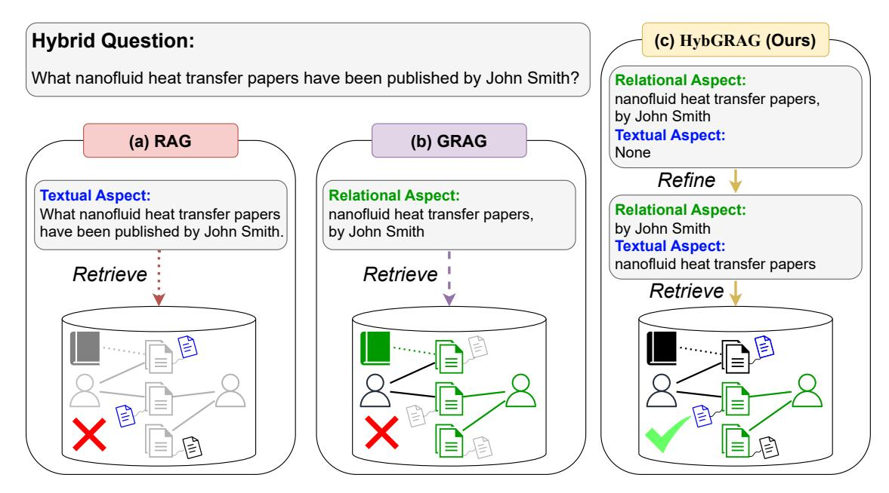
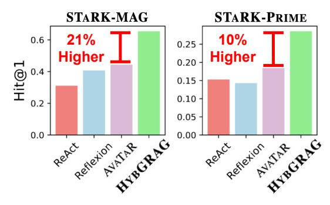
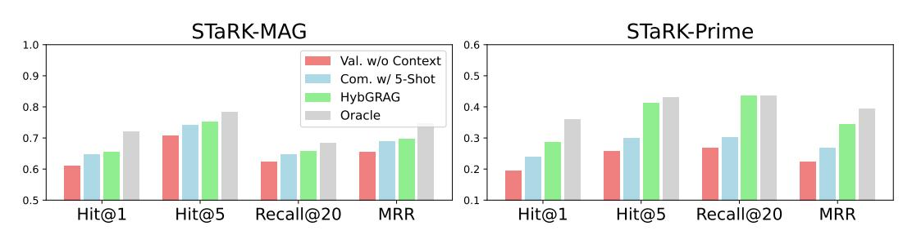
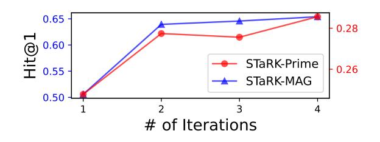
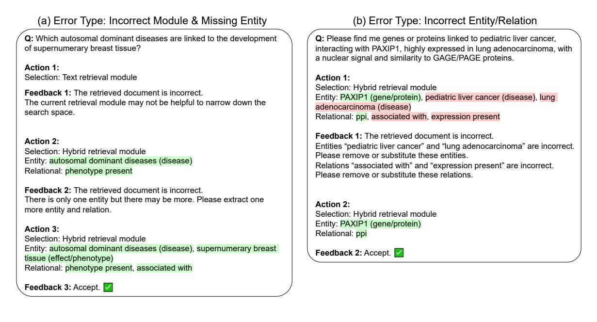

# <span id="page-0-0"></span>HYBGRAG: Hybrid Retrieval-Augmented Generation on Textual and Relational Knowledge Bases

Meng-Chieh Lee1[,\\*](#page-0-0) , Qi Zhu2[,†](#page-0-0) , Costas Mavromatis<sup>2</sup> , Zhen Han<sup>2</sup> , Soji Adeshina<sup>2</sup> , Vassilis N. Ioannidis2,†, Huzefa Rangwala<sup>2</sup> , Christos Faloutsos1,2,†

<sup>1</sup>Carnegie Mellon University, <sup>2</sup>Amazon

{mengchil,christos}@cs.cmu.edu,

{qzhuamzn,mavrok,zhenhz,adesojia,ivasilei,rhuzefa}@amazon.com

## Abstract

Given a semi-structured knowledge base (SKB), where text documents are interconnected by relations, how can we effectively retrieve relevant information to answer user questions? Retrieval-Augmented Generation (RAG) retrieves documents to assist large language models (LLMs) in question answering; while Graph RAG (GRAG) uses structured knowledge bases as its knowledge source. However, many questions require both textual and relational information from SKB — referred to as "hybrid" questions — which complicates the retrieval process and underscores the need for a hybrid retrieval method that leverages both information. In this paper, through our empirical analysis, we identify key insights that show why existing methods may struggle with hybrid question answering (HQA) over SKB. Based on these insights, we propose HYBGRAG for HQA, consisting of a retriever bank and a critic module, with the following advantages: (1) Agentic, it automatically refines the output by incorporating feedback from the critic module, (2) Adaptive, it solves hybrid questions requiring both textual and relational information with the retriever bank, (3) Interpretable, it justifies decision making with intuitive refinement path, and (4) Effective, it surpasses all baselines on HQA benchmarks. In experiments on the STARK benchmark, HYBGRAG achieves significant performance gains, with an average relative improvement in Hit@1 of *51%*.

## 1 Introduction

Retrieval-Augmented Generation (RAG) [\(Lewis](#page-8-0) [et al.,](#page-8-0) [2020;](#page-8-0) [Guu et al.,](#page-8-1) [2020\)](#page-8-1) enables large language models (LLMs) to access the information from an unstructured document database. This allows LLMs to address unknown facts and solve Open-Domain Question Answering (ODQA) with additional textual information. Graph RAG

†Corresponding authors.

(GRAG) has extended this concept by retrieving information from structured knowledge bases, where documents are interconnected by relationships. Existing GRAG methods focus on two directions: extracting relational information from knowledge graphs (KGs) and leveraging LLMs for Knowledge Base Question Answering (KBQA) [\(Yasunaga](#page-9-0) [et al.,](#page-9-0) [2021;](#page-9-0) [Sun et al.,](#page-9-1) [2024;](#page-9-1) [Jin et al.,](#page-8-2) [2024;](#page-8-2) [Mavro](#page-9-2)[matis and Karypis,](#page-9-2) [2024\)](#page-9-2), and building relationships between documents in the database to improve ODQA performance [\(Li et al.,](#page-8-3) [2024a;](#page-8-3) [Dong](#page-8-4) [et al.,](#page-8-4) [2024;](#page-8-4) [Edge et al.,](#page-8-5) [2024\)](#page-8-5).

Recently, an emerging problem concentrates on "*hybrid*" question answering (HQA), where a question requires both relational and textual information to be answered correctly, given a semi-structured knowledge base (SKB) [\(Wu et al.,](#page-9-3) [2024b\)](#page-9-3). SKB consists of a structured knowledge base, i.e., knowledge graph (KG), and unstructured text documents, where the text documents are associated with entities of KG. In Fig. [1](#page-1-0) top, an example of hybrid questions is given, which involves both the textual aspect (paper topic) and the relational aspect (paper author), and SKBs are the cylinders.

Nevertheless, through our empirical analysis, we uncover two critical insights showing that existing methods that perform RAG or GRAG cannot effectively tackle HQA, which requires a synergy between the two retrieval methods. First, they focus solely on retrieving either textual or relational information. As shown in Fig. [1\(](#page-1-0)a) and (b), this limitation reduces their applicability when the synergy between the two modalities is required. Second, in hybrid questions, the aspects required to retrieve different types of information may not be easily distinguishable. In Fig. [1\(](#page-1-0)c), question routing [\(Li](#page-9-4) [et al.,](#page-9-4) [2024b\)](#page-9-4) is performed to identify the aspects of the question. However, in an unsuccessful routing, confusion between the textual aspect "nanofluid heat transfer papers" and the relational aspect "by John Smith", leads to incorrect retrieval.

<sup>\*</sup>The work is done while being an intern at Amazon.

<span id="page-1-0"></span>

Figure 1: HYBGRAG solves hybrid questions in SKB, which are semi-structured, involving textual and relational aspects. (a) RAG overlooks the interconnections between documents and does not meet the requirements specified by the relational aspect. (b) GRAG relies solely on the relational aspect and misidentifies the textual aspect as part of the relational one. (c) HYBGRAG refines the question routing through self-reflection and successfully retrieves the target document in SKB, addressing both textual and relational aspects.

<span id="page-1-1"></span>Table 1: HYBGRAG matches all properties, while baselines miss more than one property.

|                  | Property               | Regular RAG | Think | AVATAR | YBGRA |
|------------------|------------------------|-------------|-------|--------|-------|
| 1. Agentic       |                        |             |       |        |       |
|                  | 2.1. Questions in ODQA |             |       |        |       |
| 2. Adaptive      | 2.2. Questions in KBQA |             |       |        |       |
|                  | 2.3. Questions in HQA  |             |       |        |       |
| 3. Interpretable |                        |             |       |        |       |

To solve HOA in SKB, we propose HYBGRAG. HYBGRAG handles hybrid questions with a retriever bank, which leverages both textual and relational information simultaneously. To improve the accuracy of the retrieval, HYBGRAG performs self-reflection (Renze and Guven, 2024), which iteratively improves its question routing based on feedback from a carefully designed critic module. Similarly to chain-of-thought (CoT) (Wei et al.,  $2022$ ), which is widely regarded as interpretable, HYB-GRAG's refinement path provides intuitive explanations for the performance improvement. Last but not least, the framework of HYBGRAG is designed to be flexible, and can easily be adapted to different problems. We summarize the contributions of HYBGRAG as follows:



Figure 2: **HYBGRAG wins** in STARK, outperforming baselines by up to  $21\%$  in Hit@1.

- 1. *Agentic*: it automatically refines the question routing with self-reflection;
- 2. *Adaptive*: it solves textual, relational and hybrid questions with a unified framework;
- 3. *Interpretable*: it justifies the decision making with intuitive refinement path; and
- 4. *Effective*: it outperforms all baselines on realworld HQA benchmarks.

As shown in Table 1, HYBGRAG is the only work that satisfies all the properties and solves HQA in SKB. As shown in Fig. 2, when evaluated on the HQA benchmark STARK, HYBGRAG outperforms the second-best baseline, achieving relative improvements in Hit@1 of 47% on STARK-MAG and 55% on STARK-PRIME, respectively.

#### 2 **Proposed Insights: Challenges in HQA**

What new challenges in HQA over SKB remain unsolved by existing methods? In this section, we first define the problem HQA, and then conduct experiments to uncover two critical insights, laying the foundation for designing our method for HQA.

#### $2.1$ **Problem Definition**

A semi-structured knowledge base (SKB) consists of a KG  $G = (\mathcal{E}, \mathcal{R})$ , where  $\mathcal{E}$  and  $\mathcal{R}$  represent the sets of entities and relations. It also includes a set of text documents  $\mathcal{D} = \bigcup_{i \in \mathcal{E}} D_i$ , where  $D_i$ is the document associated with entity  $i$ . Entity and relation types are denoted by  $\mathcal{T}_E$  and  $\mathcal{T}_R$ , respectively. Each hybrid question  $q$  in SKB involves semi-structured information, namely, textual and relational information. We define hybrid question answering (HQA) as follows:

- Given a SKB consisting of  $G = (\mathcal{E}, \mathcal{R})$  and  $\mathcal{D}$ , and a hybrid question q.
- **Retrieve** a set of documents  $\mathcal{X} \subset \mathcal{E}$ , where each document satisfies the requirements specified by the relational and textual aspects of  $q$ .

### 2.2 C1: Hybrid-Sourcing Question

To investigate if it is necessary to leverage both textual and relational information to answer hybrid questions, we conduct an experiment to show that text documents and KG contain useful but nonoverlapping information. As a retriever that uses only textual information, vector similarity search (VSS) (Karpukhin et al., 2020) performs retrieval and ranking by comparing the question and documents in the embedding space (" $ada-002$ "); as a retriever that uses only relational information, Personalized PageRank (PPR) (Andersen et al., 2006) performs random walks from the topic entities identified by an LLM (Claude 3 Sonnet) and ranks neighboring entities based on their connectivity in KG.

In Table 2, the text and the graph retrievers have competitive performance. Interestingly, if an optimal routing always picks the retriever that gives the correct result, the performance is significantly higher, indicating little overlap between the strengths of the text and graph retrievers. This highlights the importance of a solution to leverage both textual and relational information simultaneously by synergizing these two retrievers. In Fig.  $1(c)$ , we show a hybrid question that requires both textual and relational information to be answered. Based on this observation, we uncover the first challenge:

<span id="page-2-0"></span>Table 2: Textual and relational information are both useful to answer hybrid question in STARK-MAG.

| Method               | Hit@1 Hit@5 |        |
|----------------------|-------------|--------|
| Text Retriever: VSS  | 0.2908      | 0.4961 |
| Graph Retriever: PPR | 0.2533      | 0.5523 |
| Optimal Routing      | 0.4522      | 0.7463 |

<span id="page-2-1"></span>Table 3: LLMs frequently extracts a subgraph from KG in SKB without target entities in STARK-MAG.

| # of Iterations   Feedback Type   Hit Rate |        |  |  |
|--------------------------------------------|--------|--|--|
| N/A                                        | 0.6769 |  |  |
| Simple                                     | 0.7914 |  |  |
| Corrective                                 | 0.9231 |  |  |

<span id="page-2-2"></span>Challenge 1 (Hybrid-Sourcing Question). In HQA, there are questions that require both textual and relational information to be answered.

#### **C2: Refinement-Required Question** 2.3

The success of KBQA often relies on the assumption that the target entities are within an extracted subgraph from KG (Lan et al., 2022). Similarly, answering a question in HQA requires extracting a subgraph from KG in SKB. As hybrid questions involve both textual and relational aspects, they can be challenging for an LLM to comprehend. To study this, we test if an LLM can extract a subgraph from KG that contains the target entities (hit). More specifically, an LLM (Claude 3 Sonnet) is prompted to identify the relational aspect in the question, i.e. topic entities and useful relations used to extract the subgraph. An oracle is used to instruct LLM to perform an extra iteration with feedback if the target entities are not included in the subgraph.

In Table 3, if the result is incorrect, simply prompting LLM to redo the extraction gives a much better hit ratio. Moreover, if the LLM receives feedback that points out the erroneous part of the extraction (e.g., extracted topic entity is wrong), it significantly improves the result. This is because in hybrid questions that contain both textual and relational aspects, LLM can falsely identify the textual aspect as the relational one. In Fig.  $1$  (c), there is an error in retrieving the correct reference from LLM, as it confuses the textual aspect as an entity of type "field of study" on the first attempt. Based on this observation, we uncover the second challenge:

<span id="page-2-3"></span>Challenge 2 (Refinement-Required Question). In HQA, LLM struggles to distinguish between the textual and relational aspects of the question on the first attempt, necessitating further refinements.

#### 3 **Proposed Method: HYBGRAG**

To solve HQA, we propose HYBGRAG, consisting of the *retriever bank* and the *critic module*, to address Challenge 1 and Challenge 2, respectively.

### 3.1 Retriever Bank (for C1)

To solve Challenge 1, we propose the retriever bank, composed of multiple retrieval modules and a router. Given a question  $q$ , the router determines the selection and usage of the retrieval module, a process known as question routing. The selected retrieval module then retrieves the top- $K$  references  $\mathcal{X}$ , as elaborated in the next paragraph.

**Retrieval Modules** We design two retrieval modules, namely text and hybrid retrieval modules, to retrieve information from text documents and SKB, respectively. Each retrieval module includes a retriever and a ranker, which offers the flexibility to cover a wide range of questions.

The text retrieval module retrieves documents using similarity search for a given question  $q$ , such as dense retrieval, which is designed to directly find answers within text documents. We use VSS between question  $q$  and documents  $\mathcal{D}$  in the embedding space as both the retriever and the ranker. This is typically used when nothing can be extracted from the hybrid retrieval module.

The hybrid retrieval module takes the identified topic entities  $\hat{\mathcal{E}}$  and useful relations  $\hat{\mathcal{R}}$  as input. It uses a graph retriever to extract entities in the egograph of  $\hat{\mathcal{E}}$ , connected by  $\hat{\mathcal{R}}$ . For example, in Fig. 1,  $\{\hat{\mathcal{E}} = \{\text{John Smith}\}, \hat{\mathcal{R}} = \{\text{author writes paper}\}\}\$ and the graph retriever extracts the entities/papers connected by the path "John Smith -> author writes paper -> {paper(s)}". If more than one ego-graph is extracted, their intersection is used as the final result. Finally, to solve hybrid questions, we propose ranking the documents associated with the extracted entities using a VSS ranker between question q and documents  $\mathcal{D}$ . This ensures the synergy between the relational and textual information.

**Router** Given a question  $q$ , the LLM router performs question routing to determine the selection and usage of the retrieval module. More specifically, the router first identifies the relational aspect, i.e., topic entities  $\hat{\mathcal{E}}$  and useful relations  $\hat{\mathcal{R}}$  based on the types of entities  $\mathcal{T}_E$  and the types of relation  $\mathcal{T}_R$ using few shot examples (Brown, 2020). The router then makes the selection  $s_t$ , determining whether to use a text or a hybrid retrieval module. Identifying

 $\hat{\mathcal{E}}$  and  $\hat{\mathcal{R}}$  before determining  $s_t$  improves the quality of  $s_t$ . For example, if there is no entity extracted  $\hat{\mathcal{E}} = \emptyset$ , a text retrieval module is a better option.

### 3.2 Critic Module (for C2)

Given a hybrid question  $q$ , the router is asked to perform question routing, including identifying topic entities  $\hat{\mathcal{E}}$  and useful relations  $\hat{\mathcal{R}}$ . However, as mentioned in Challenge 2, they may be incorrectly identified in the first iteration.

To solve this, we propose the critic module, which provides feedback to help the router perform better question routing. Instead of using a single LLM to complete this complicated task, we divide the critic into two parts, an LLM validator  $C_{val}$  to validate the correctness of the retrieval  $\mathcal{X}$ , and an LLM commenter  $C_{com}$  to provide feedback  $f_t$  if the retrieval is incorrect. This divide-and-conquer step, similar to previous works (Gao et al., 2022; Asai et al., 2024), is crucial to our critic module, offering two key advantages: (1) By breaking a difficult task into two easier ones, we can now leverage pre-trained LLMs to solve them while maintaining good performance. This resolves the issue when the labels are not available for fine-tuning an LLM critic. (2) Since the tasks of  $C_{val}$  and  $C_{com}$  are independent, they can each have their own exclusive contexts, preventing the inclusion of irrelevant information and avoiding the "lost in the middle" phenomenon (Shi et al., 2023; Liu et al., 2024).

**Validator** The LLM validator  $C_{val}$  aims to validate if the top references retrieved  $\mathcal{X}$  meet the requirements specified by the question  $q$ , which is a binary classification task. To improve accuracy, we provide an additional validation context for the validator. We use the reasoning paths between topic entities and entities in the extracted ego-graph as the validation context, which are used to verify whether the output satisfies certain requirements in the question. The reasoning paths are verbalized as "{topic entity}  $\rightarrow$  {useful relation}  $\rightarrow$ ...  $\rightarrow$  {useful relation}  $\rightarrow$ {neighboring entity}". For example, if a hybrid question asks for a paper (i.e. a document) from a specific author, then the context including the reasoning paths "{author}  $\rightarrow$  {writes}  $\rightarrow$ {paper}" is essential for verification.

**Commenter** The LLM commenter  $C_{com}$  aims to provide feedback  $f$  to help the router refine question routing. To effectively guide the router, we construct *corrective* feedback that it can easily understand. In more detail, it points out the error(s) in

<span id="page-4-0"></span>

| Error Source   | Error Type                 | Feedback                                                                                                        |  |  |  |
|----------------|----------------------------|-----------------------------------------------------------------------------------------------------------------|--|--|--|
| Identification | Incorrect Entity/Relation  | $\text{Entity/relation } \{\text{name}\}\text{ is incorrect. Please remove or substitute this entity/relation.$ |  |  |  |
|                | Missing Entity             | There is only one entity but there may be more. Please extract one more entity and relation.                    |  |  |  |
|                | No Entity                  | There is no entity extracted. Please extract at least one entity and one relation.                              |  |  |  |
|                | No Intersection            | There is no intersection between the entities. Please remove or substitute one entity and                       |  |  |  |
|                |                            | relation.                                                                                                       |  |  |  |
|                | Incorrect Intersection     | There is an intersection between the entities, but the answer is not within it. Please remove                   |  |  |  |
|                |                            | or substitute one entity and relation.                                                                          |  |  |  |
| Selection      |                            | The retrieved document is incorrect. The current retrieval module may not be helpful to                         |  |  |  |
|                | Incorrect Retrieval Module | narrow down the search space.                                                                                   |  |  |  |

Table 4: Corrective feedback of the critic module in HYBGRAG for STARK.

each action, such as incorrect identification of topic entities, as shown in Table 4. Unlike natural language feedback, which may cause uncertainty or inconsistency depending on the LLM used, our corrective feedback provides clear guidance on how to refine the question routing. Furthermore, it leverages in-context learning (ICL) to provide sophisticated feedback. We collect a small number of successful experiences ( $\approx 30$ ) in the training set as examples, with each experience  $\{s_t, \hat{\mathcal{E}}_t, \hat{\mathcal{R}}_t, f_{t+1}\}$ comprising a pair of router action and feedback, which is verified by ground truth. During inference, the commenter gives high-quality feedback based on multiple pre-collected examples.

## 3.3 Overall Algorithm

The algorithm of HYBGRAG is in Algo. 1. Given a question  $q$ , in iteration  $t$ , the router determines  $s_t$ ,  $\mathcal{E}_t$  and  $\mathcal{R}_t$  to retrieve the references  $\mathcal{X}_t$  from both  $G$  and  $\mathcal{D}$  in SKB, or only  $\mathcal{D}$ , with the selected retrieval module. The validator  $C_{val}$  in the critic module then decides whether to accept  $\mathcal{X}_t$  as the final answer or reject it. If  $\mathcal{X}_t$  is rejected, the commenter  $C_{com}$  generates feedback  $f_{t+1}$  for the router to assist in refining its action in iteration  $t + 1$ .

#### 4 Experiments

We conduct experiments to answer the following research questions (RO):

- RQ1. **Effectiveness:** How well does HYBGRAG perform in real-world benchmarks?
- RQ2. Ablation Study: Are all the design choices in HYBGRAG necessary?
- RQ3. Interpretability: How does HYBGRAG refine its question routing based on feedback?

**Benchmarks** We conduct experiments on two QA benchmarks:  $STARK<sup>1</sup>$  (Wu et al., 2024b), which serves as the primary evaluation benchmark

#### **Algorithm 1: HYBGRAG**

<span id="page-4-1"></span>

|    | <b>Input:</b> Question q, a SKB with G and $\mathcal{D}$ ,                                      |
|----|-------------------------------------------------------------------------------------------------|
|    | Entity Types $\mathcal{T}_E$ , Relation Types $\mathcal{T}_R$ ,                                 |
|    | and Maximum Iterations $T$                                                                      |
|    | 1 $f_1 = ""$ ;                                                                                  |
|    | 2 for $t = 1, , T$ do                                                                           |
| 3  | /* Retriever Bank<br>$\star$ /                                                                  |
| 4  | $s_t, \hat{\mathcal{E}}_t, \hat{\mathcal{R}}_t = Router(q, \mathcal{T}_E, \mathcal{T}_R, f_t);$ |
| 5  | <b>if</b> $s_t$ is hybrid retrieval module <b>then</b>                                          |
| 6  | $\mathcal{X}_t = HybridRM(q, G, \mathcal{D}, \hat{\mathcal{E}}_t, \hat{\mathcal{R}}_t);$        |
| 7  | else                                                                                            |
| 8  | $\mathcal{X}_t = TextRM(q, \mathcal{D});$                                                       |
| 9  | $\prime \ast$ Validator<br>$\star$ /                                                            |
| 10 | if $C_{val}(q, \mathcal{X}_t) = True$ then                                                      |
| 11 | Return $\mathcal{X}_t$ ;                                                                        |
| 12 | else                                                                                            |
| 13 | $\star$ /                                                                                       |
| 14 | /* Commenter $f_{t+1} = C_{com}(q, s_t, \hat{\mathcal{E}}_t, \hat{\mathcal{R}}_t);$             |
|    | 15 Return $\mathcal{X}_t$ ;                                                                     |

and focuses on retrieval, and CRAG (Yang et al.,  $2024$ ), a complementary benchmark to evaluate end-to-end RAG performance. While STARK focuses on HQA, CRAG encompasses both ODQA and KBQA as sub-problems. Detailed benchmark descriptions are provided in Appx. A.

#### 4.1 Retrieval Evaluation on STARK

We use the default evaluation metrics provided by STARK, which are Hit@1, Hit@5, Recall@20 and mean reciprocal rank (MRR), to evaluate the performance of the retrieval task. We compare HYBGRAG with various baselines, including recent GRAG methods (QAGNN (Yasunaga et al., 2021) and Think-on-Graph (Sun et al., 2024)); traditional RAG approaches; and self-reflective LLMs (ReAct (Yao et al., 2023), Reflexion (Shinn et al., 2023), and AVATAR (Wu et al., 2024a)). The details of the implementation are in Appx. C.

<span id="page-4-2"></span><sup>&</sup>lt;sup>1</sup>Due to legal issue, only STARK-MAG and STARK-PRIME are used in this article.

|                                                                                 | STARK-MAG |        |           |        | STARK-PRIME |        |           |        |
|---------------------------------------------------------------------------------|-----------|--------|-----------|--------|-------------|--------|-----------|--------|
| Method                                                                          | Hit@1     | Hit@5  | Recall@20 | MRR    | Hit@1       | Hit@5  | Recall@20 | MRR    |
| OAGNN                                                                           | 0.1288    | 0.3901 | 0.4697    | 0.2912 | 0.0885      | 0.2123 | 0.2963    | 0.1473 |
| Think-on-Graph <sup>*</sup>                                                     | 0.1316    | 0.1617 | 0.1130    | 0.1418 | 0.0607      | 0.1571 | 0.1307    | 0.1017 |
| Dense Retriever                                                                 | 0.1051    | 0.3523 | 0.4211    | 0.2134 | 0.0446      | 0.2185 | 0.3013    | 0.1238 |
| VSS (Text Retrieval Module)                                                     | 0.2908    | 0.4961 | 0.4836    | 0.3862 | 0.1263      | 0.3149 | 0.3600    | 0.2141 |
| Multi-VSS                                                                       | 0.2592    | 0.5043 | 0.5080    | 0.3694 | 0.1510      | 0.3356 | 0.3805    | 0.2349 |
| VSS w/ LLM Reranker*                                                            | 0.3654    | 0.5317 | 0.4836    | 0.4415 | 0.1779      | 0.3690 | 0.3557    | 0.2627 |
| ReAct                                                                           | 0.3107    | 0.4949 | 0.4703    | 0.3925 | 0.1528      | 0.3195 | 0.3363    | 0.2276 |
| Reflexion                                                                       | 0.4071    | 0.5444 | 0.4955    | 0.4706 | 0.1428      | 0.3499 | 0.3852    | 0.2482 |
| AVATAR                                                                          | 0.4436    | 0.5966 | 0.5063    | 0.5115 | 0.1844      | 0.3673 | 0.3931    | 0.2673 |
| Hybrid Retrieval Module (Ours)                                                  | 0.5028    | 0.5820 | 0.5031    | 0.5373 | 0.2492      | 0.3274 | 0.3366    | 0.2842 |
| $\mathbf{H}\mathbf{Y}\mathbf{B}\mathbf{G}\mathbf{R}\mathbf{A}\mathbf{G}$ (Ours) | 0.6540    | 0.7531 | 0.6570    | 0.6980 | 0.2856      | 0.4138 | 0.4358    | 0.3449 |
| Relative Improvement                                                            | 47.4%     | 26.2%  | 29.3%     | 36.5%  | 54.9%       | 12.7%  | 10.9%     | 29.0%  |

<span id="page-5-0"></span>Table 5: Retrieval Evaluation on STARK: HYBGRAG wins. '\*' denotes that only 10% of the testing questions are evaluated due to the high latency and cost of the methods. denotes our proposed method.

<span id="page-5-1"></span>

Figure 3: Design choices in HYBGRAG are necessary in STARK. We compare HYBGRAG with two variants: a validator without validation context, and a commenter with only 5-shot. Oracle uses ground truth during inference.

<span id="page-5-2"></span>

Figure 4: HYBGRAG improves its question routing thanks to the critic module.

<span id="page-5-3"></span>Table 6: HYBGRAG maintains strong performance with a less powerful LLM model in STARK-MAG.

| Base Model   Hit@1 Hit@5 Recall@20 MRR   Speedup                     |  |        |                           |
|----------------------------------------------------------------------|--|--------|---------------------------|
|                                                                      |  | 0.6067 | $0.6483 \mid 1.96 \times$ |
| Claude 3 Haiku 0.6019 0.7084<br>Claude 3 Sonnet <b>0.6540 0.7531</b> |  | 0.6570 | $0.6980 \mid 1.00 \times$ |

## 4.1.1 Effectiveness (RQ1)

In Table 5, HYBGRAG outperforms all baselines significantly in both datasets in STARK. Most baselines are designed to handle ODQA and KBQA, and the results have shown that they cannot handle HQA effectively (Challenge 1). Our hybrid retrieval module is the second-best performing method, highlighting the importance of designing a synergized retrieval module that uses both textual

<span id="page-5-4"></span>Table 7: HYBGRAG performs best with multi-agent design in STARK-MAG. "Router for SR" baseline performs self-reflection using a single LLM router.

| Method        |                            |  | Setting   Hit@1 Hit@5 Recall@20 | MRR    |
|---------------|----------------------------|--|---------------------------------|--------|
| Hybrid RM     | No-Agent 0.5028 0.5820     |  | 0.5031                          | 0.5373 |
| Router for SR | Single-Agent 0.6206 0.7069 |  | 0.6187                          | 0.6587 |
| HYBGRAG       | Multi-Agent 0.6540 0.7531  |  | 0.6570                          | 0.6980 |

and relational information simultaneously. In addition, HYBGRAG performs significantly better than the hybrid retrieval module, indicating that the extracted entity and relation are frequently incorrect in the first iteration (Challenge 2). By tackling Challenge 1 and 2 with our retriever bank and critic module respectively, HYBGRAG has a significant improvement in performance.

## 4.1.2 Ablation Study (RQ2)

**Critic Module** We compare HYBGRAG variants with a validator without validation context, a commenter with only five shots, and those with oracles. The oracle has access to the ground truth, which gives the optimal judgement on the correctness of the output and the error type of question routing, if there is any. In Fig. 3, we show that HYBGRAG

<span id="page-6-1"></span>

| (a) Error Type: Incorrect Entity/Relation                                                                                                                                                                                                                                                    | (b) Error Type: Missing Entity                                                                                                                                                                                                                                                  |
|----------------------------------------------------------------------------------------------------------------------------------------------------------------------------------------------------------------------------------------------------------------------------------------------|---------------------------------------------------------------------------------------------------------------------------------------------------------------------------------------------------------------------------------------------------------------------------------|
| <b>Q:</b> Any 2012 publications from Netaji Subhash Engineering<br>College on optical TALU implementations in electronic circuits?                                                                                                                                                           | <b>Q:</b> Are there any 2016 publications by co-authors of "A Low Abundance of<br>135Cs in the Early Solar System from Barium Isotopic Signatures" which<br>discuss the comparison of Earth's chemical composition with that of chondrites?                                     |
| Action 1:<br>Selection: Hybrid retrieval module<br>Entity: Netaji Subhash Engineering College (institution), optical<br>TALU implementations in electronic circuits (field of study)<br>Relation: author affiliated with institution, author writes paper,<br>paper has topic field of study | Action 1:<br>Selection: Hybrid retrieval module<br>Entity: A Low Abundance of 135Cs in the Early Solar System from Barium<br>Isotopic Signatures (paper)<br>Relation: author writes paper                                                                                       |
| Feedback 1: The retrieved document is incorrect.<br>Entity "optical TALU implementations in electronic circuits" and<br>relation "paper has topic field of study" are incorrect. Please<br>remove or substitute one entity and relation.                                                     | Feedback 1: The retrieved document is incorrect.<br>There is only one entity but there may be more. Please extract one more entity<br>and relation.                                                                                                                             |
| Action 2:<br>Selection: Hybrid retrieval module<br>Entity: Netaji Subhash Engineering College (institution)<br>Relational: author affiliated with institution, author writes paper<br>Feedback 2: Accept.                                                                                    | Action 2:<br>Selection: Hybrid retrieval module<br>Entity: A Low Abundance of 135Cs in the Early Solar System from Barium<br>Isotopic Signatures (paper), chondrites (field of study)<br>Relational: author writes paper, paper has topic field of study<br>Feedback 2: Accept. |

Figure 5: **HYBGRAG** is interpretable. In examples from STARK-MAG, HYBGRAG successfully refines its entity and relation extraction based on corrective feedback from the critic module.

<span id="page-6-2"></span>Table 8: End-to-End RAG Evaluation on CRAG: HYBGRAG wins. All baselines (except CoT LLM) share our retriever bank, but use different critics to provide feedback. denotes our proposed method.

| Method                | Llama $3.1\ 70B$    |                      |         |                      | Claude 3 Sonnet            |                      |         |                    |
|-----------------------|---------------------|----------------------|---------|----------------------|----------------------------|----------------------|---------|--------------------|
|                       | Accuracy $\uparrow$ | Halluc. $\downarrow$ | Missing | $Score_{a} \uparrow$ | $\text{Accuracy} \uparrow$ | Halluc. $\downarrow$ | Missing | $Score_a \uparrow$ |
| CoT LLM               | 0.4607              | 0.5026               | 0.0367  | $-0.0419$            | 0.3910                     | 0.4052               | 0.2038  | $-0.0142$          |
| Text-Only RAG         | 0.4105              | 0.3685               | 0.2210  | 0.0420               | 0.5034                     | 0.3955               | 0.1011  | 0.1079             |
| Graph-Only RAG        | 0.4861              | 0.4442               | 0.0697  | 0.0419               | 0.5303                     | 0.2974               | 0.1723  | 0.2329             |
| Text & Graph RAG      | 0.4120              | 0.3790               | 0.2090  | 0.0330               | 0.5820                     | 0.3416               | 0.0764  | 0.2404             |
| ReAct                 | 0.1745              | 0.2360               | 0.5895  | $-0.0615$            | 0.4352                     | 0.4075               | 0.1573  | 0.0277             |
| Corrective RAG        | 0.4509              | 0.4652               | 0.0839  | $-0.0143$            | 0.4674                     | 0.3333               | 0.1993  | 0.1341             |
| <b>HYBGRAG</b> (Ours) | 0.5206              | 0.3588               | 0.1206  | 0.1618               | 0.6322                     | 0.2959               | 0.0719  | 0.3363             |

performs the best with all our design choices, approaching the performance of an oracle.

**Self-Reflection** In Fig. 4, we demonstrate that with more self-reflection iterations, the performance of HYBGRAG improves further. Performance improves significantly when increasing the number of iterations from 1 to 2, where no self-reflection is performed in iteration 1. It is also shown that a few iterations are sufficient, as the improvement diminishes over iterations.

**Model Size** Although we do not have access to Claude 3 Opus, we conduct experiments with Claude 3 Haiku, a more cost-efficient but less powerful alternative to Claude 3 Sonnet<sup>2</sup>. In Table 6, HYBGRAG maintains strong performance even with Claude 3 Haiku. The results also follow the scaling law of LLMs (Kaplan et al., 2020).

Multi-Agent Perspective Since HYBGRAG can be interpreted as a multi-agent system, we add a single-agent baseline, which relies on the router to make decisions and provide feedback for self-

<span id="page-6-0"></span><sup>2</sup>https://www.anthropic.com/news/claude-3-family

reflection. In Table 7, HYBGRAG outperforms both single-agent and no-agent baselines. This highlights that self-reflection is essential for achieving strong performance in HQA, as pointed out in Challenge 2. Moreover, unlike the plain text feedback generated by the single-agent baseline, the feedback generated by HYBGRAG more effectively guides the router in refining its decision, thanks to our carefully designed critic module.

### 4.1.3 Interpretability (RQ3)

Fig. 5 illustrates examples of the interaction between the router in the retriever bank and the critic module in STARK-MAG. In the first iteration of Fig.  $5(a)$ , the router misidentifies a "optical TALU implementations in electronic circuits" as a topic entity representing the field of study (relational aspect). Since the ego-graph extracted based on this entity has no intersection with the ego-graph extracted based on "Netaji Subhash Engineering College", the critic module recognizes that the former entity has a higher chance of being a textual aspect. Thus, it gives the feedback to the router, and

<span id="page-7-0"></span>Table 9: Number of API calls and tokens for STARK.

| HYBGRAG<br>Component | API Call #<br>per<br>Iteration | Token # for<br>for<br>Prompts | Token # for<br>Examples<br>in MAG | Token # for<br>Examples<br>in Prime |
|----------------------|--------------------------------|-------------------------------|-----------------------------------|-------------------------------------|
| Router               |                                | 159                           | 2709                              | 3018                                |
| Validator            |                                | 39                            | 1383                              | 2107                                |
| Commenter            |                                | 52                            | 1215                              | 1583                                |

the router addresses it accordingly. This refinement path of HYBGRAG is similar to CoT, making it interpretable and easy for the user to understand. Examples in STARK-Prime are given in Appx. B.1.

#### 4.2 End-to-End RAG Evaluation on CRAG

We modify HYBGRAG to adapt to CRAG (details in Appx.  $C$ ). We use default evaluation metrics with an LLM evaluator to label answers as accurate (1), incorrect/hallucination  $(-1)$ , or missing  $(0)$ , yielding Score<sub>a</sub>. We compare HYBGRAG with CoT LLM, text-only RAG, graph-only RAG, and RAG that concatenates text and graph references. We include an agentic LLM (ReAct) and a selfreflective LLM (Corrective RAG), both of which share our retriever bank but use different critics.

In Table 8, HYBGRAG outperforms all baselines in CRAG. RAGs with a single retrieval module cannot handle both types of questions. RAG with a concatenated reference also distracts by irrelevant content in the long reference. Although our retriever bank is provided, agentic and selfreflective baselines still struggle to refine their actions. Since ReAct relies on the LLM's ability to think and provide natural language feedback, it often lacks clear guidance. Without a fine-tuned retrieval evaluator, Corrective RAG cannot effectively identify the usefulness of a reference.

#### 4.3 Model Cost Analysis

We report the number of API calls and token consumption (excluding references) for each step in an iteration of HYBGRAG in Table 9 and 14 for STARK and CRAG, respectively. While most of the token consumption arises from the examples used for ICL, the prompts themselves require very few tokens. Moreover, since HYBGRAG uses the chat LLM as the router, the examples for ICL only need to be given once. Compared to the state-of-the-art baseline AVATAR in STARK, which requires at least 500 API calls during training, our hybrid retrieval module achieves a relative improvement  $24\%$  in Hit@1 with only 2 API calls, while HYBGRAG achieves 51% with at most 14 API calls, both without training.

#### 5 **Related Works**

Graph RAG (GRAG) Various settings have been explored for GRAG (Peng et al., 2024), and can be roughly divided into three directions. The first focuses on KBQA, taking advantage of the LLM capability (Yasunaga et al., 2021; Sun et al., 2024; Jin et al., 2024; Mavromatis and Karypis, 2024). The second focuses on ODQA, building relationships between documents to improve retrieval (Li et al., 2024a; Dong et al., 2024; Edge et al., 2024). The last assumes that a subgraph is given when answering a question (He et al., 2024; Hu et al., 2024). In contrast, this paper focuses on solving HQA in SKB, and previous GRAG methods are not easily generalized to HQA.

Agentic and Self-Reflective LLMs LLM agents (Yao et al., 2023; Wu et al., 2024a) facilitate planning in complex reasoning tasks. Among them, AVATAR is the most recent, proposing iterative prompt optimization via contrastive reasoning. However, they may still struggle to generate the correct output on the first attempt. Self-reflection addresses this limitation by iteratively optimizing the output based on feedback, typically provided by a critic implemented using various approaches: pretrained LLMs (Shinn et al., 2023; Madaan et al., 2023), external tools (Gou et al., 2024; Qiao et al., 2024), or fine-tuned LLMs (Paul et al., 2024; Asai et al., 2024; Yan et al., 2024). Nevertheless, they do not generalize to HQA for two reasons. First, they lack appropriate retrieval tools and guidance on how to refine retrieval effectively. Second, in the absence of external tools or labels for fine-tuning, using pre-trained LLMs as critics without careful design results in suboptimal self-evaluation and overly implicit feedback.

#### 6 Conclusions

To solve hybrid question answering (HQA), we propose HYBGRAG, driven by insights from our empirical analysis, which has following advantages:

- 1. *Agentic*: it refines question routing with selfreflection by our critic module;
- 2. Adaptive: it solves textual, relational and hybrid questions by our retriever bank;
- 3. *Interpretable*: it justifies the decision making with intuitive refinement path; and
- 4. *Effective*: it significantly outperforms all the baselines on HOA benchmarks.

Applied on STARK, HYBGRAG achieves an average relative improvement  $51\%$  in Hit@1.

## Limitations

While HYBGRAG is capable of outperforming existing RAG and GRAG methods on HQA, it still has some limitations: (1) HYBGRAG uses only the simplest retrieval modules, and various alternatives are not explored. For example, the ranker in the retrieval modules could be replaced with a cross-encoder ranker, and the retriever in the hybrid retrieval module could use the top-K entities from PPR instead. (2) HYBGRAG does not offer significant advantages in terms of domain adaptation. In experiments, although HYBGRAG outperforms baselines, its performance on STARK-Prime is worse than in STARK-MAG, where the academic domain is generally considered less complex than the medicinal domain. (3) The commentor in HYBGRAG selects random experiences when performing ICL. For example, selecting experiences with questions most relevant to the current one may yield better performance. Although these limitations point out areas for potential improvement, they also present future directions to further enhance the capabilities of HYBGRAG.

## References

- <span id="page-8-7"></span>Reid Andersen, Fan Chung, and Kevin Lang. 2006. Local graph partitioning using pagerank vectors. In *2006 47th Annual IEEE Symposium on Foundations of Computer Science (FOCS'06)*, pages 475–486. IEEE.
- <span id="page-8-11"></span>Akari Asai, Zeqiu Wu, Yizhong Wang, Avirup Sil, and Hannaneh Hajishirzi. 2024. Self-RAG: Learning to retrieve, generate, and critique through self-reflection. In *The Twelfth International Conference on Learning Representations*.
- <span id="page-8-9"></span>Tom B Brown. 2020. Language models are few-shot learners. *arXiv preprint arXiv:2005.14165*.
- <span id="page-8-16"></span>Jianlv Chen, Shitao Xiao, Peitian Zhang, Kun Luo, Defu Lian, and Zheng Liu. 2024. Bge m3-embedding: Multi-lingual, multi-functionality, multi-granularity text embeddings through self-knowledge distillation. *arXiv preprint arXiv:2402.03216*.
- <span id="page-8-4"></span>Jialin Dong, Bahare Fatemi, Bryan Perozzi, Lin F Yang, and Anton Tsitsulin. 2024. Don't forget to connect! improving rag with graph-based reranking. *arXiv preprint arXiv:2405.18414*.
- <span id="page-8-5"></span>Darren Edge, Ha Trinh, Newman Cheng, Joshua Bradley, Alex Chao, Apurva Mody, Steven Truitt, and Jonathan Larson. 2024. From local to global: A graph rag approach to query-focused summarization. *arXiv preprint arXiv:2404.16130*.

- <span id="page-8-10"></span>Luyu Gao, Zhuyun Dai, Panupong Pasupat, Anthony Chen, Arun Tejasvi Chaganty, Yicheng Fan, Vincent Y Zhao, Ni Lao, Hongrae Lee, Da-Cheng Juan, et al. 2022. Rarr: Researching and revising what language models say, using language models. *arXiv preprint arXiv:2210.08726*.
- <span id="page-8-15"></span>Zhibin Gou, Zhihong Shao, Yeyun Gong, yelong shen, Yujiu Yang, Nan Duan, and Weizhu Chen. 2024. CRITIC: Large language models can self-correct with tool-interactive critiquing. In *The Twelfth International Conference on Learning Representations*.
- <span id="page-8-1"></span>Kelvin Guu, Kenton Lee, Zora Tung, Panupong Pasupat, and Mingwei Chang. 2020. Retrieval augmented language model pre-training. In *International conference on machine learning*, pages 3929–3938. PMLR.
- <span id="page-8-13"></span>Xiaoxin He, Yijun Tian, Yifei Sun, Nitesh V Chawla, Thomas Laurent, Yann LeCun, Xavier Bresson, and Bryan Hooi. 2024. G-retriever: Retrieval-augmented generation for textual graph understanding and question answering. *arXiv preprint arXiv:2402.07630*.
- <span id="page-8-14"></span>Yuntong Hu, Zhihan Lei, Zheng Zhang, Bo Pan, Chen Ling, and Liang Zhao. 2024. Grag: Graph retrieval-augmented generation. *arXiv preprint arXiv:2405.16506*.
- <span id="page-8-2"></span>Bowen Jin, Chulin Xie, Jiawei Zhang, Kashob Kumar Roy, Yu Zhang, Suhang Wang, Yu Meng, and Jiawei Han. 2024. Graph chain-of-thought: Augmenting large language models by reasoning on graphs. *arXiv preprint arXiv:2404.07103*.
- <span id="page-8-12"></span>Jared Kaplan, Sam McCandlish, Tom Henighan, Tom B Brown, Benjamin Chess, Rewon Child, Scott Gray, Alec Radford, Jeffrey Wu, and Dario Amodei. 2020. Scaling laws for neural language models. *arXiv preprint arXiv:2001.08361*.
- <span id="page-8-6"></span>Vladimir Karpukhin, Barlas Oguz, Sewon Min, Patrick ˘ Lewis, Ledell Wu, Sergey Edunov, Danqi Chen, and Wen-tau Yih. 2020. Dense passage retrieval for open-domain question answering. *arXiv preprint arXiv:2004.04906*.
- <span id="page-8-8"></span>Yunshi Lan, Gaole He, Jinhao Jiang, Jing Jiang, Wayne Xin Zhao, and Ji-Rong Wen. 2022. Complex knowledge base question answering: A survey. *IEEE Transactions on Knowledge and Data Engineering*, 35(11):11196–11215.
- <span id="page-8-0"></span>Patrick Lewis, Ethan Perez, Aleksandra Piktus, Fabio Petroni, Vladimir Karpukhin, Naman Goyal, Heinrich Küttler, Mike Lewis, Wen-tau Yih, Tim Rocktäschel, et al. 2020. Retrieval-augmented generation for knowledge-intensive nlp tasks. *Advances in Neural Information Processing Systems*, 33:9459–9474.
- <span id="page-8-3"></span>Shilong Li, Yancheng He, Hangyu Guo, Xingyuan Bu, Ge Bai, Jie Liu, Jiaheng Liu, Xingwei Qu, Yangguang Li, Wanli Ouyang, et al. 2024a. Graphreader: Building graph-based agent to enhance long-context abilities of large language models. *arXiv preprint arXiv:2406.14550*.

- <span id="page-9-4"></span>Zhuowan Li, Cheng Li, Mingyang Zhang, Qiaozhu Mei, and Michael Bendersky. 2024b. Retrieval augmented generation or long-context llms? a comprehensive study and hybrid approach. In *Proceedings of the 2024 Conference on Empirical Methods in Natural Language Processing: Industry Track*, pages 881– 893.
- <span id="page-9-8"></span>Nelson F Liu, Kevin Lin, John Hewitt, Ashwin Paranjape, Michele Bevilacqua, Fabio Petroni, and Percy Liang. 2024. Lost in the middle: How language models use long contexts. *Transactions of the Association for Computational Linguistics*, 12:157–173.
- <span id="page-9-14"></span>Aman Madaan, Niket Tandon, Prakhar Gupta, Skyler Hallinan, Luyu Gao, Sarah Wiegreffe, Uri Alon, Nouha Dziri, Shrimai Prabhumoye, Yiming Yang, Shashank Gupta, Bodhisattwa Prasad Majumder, Katherine Hermann, Sean Welleck, Amir Yazdanbakhsh, and Peter Clark. 2023. Self-refine: Iterative refinement with self-feedback. In *Thirty-seventh Conference on Neural Information Processing Systems*.
- <span id="page-9-2"></span>Costas Mavromatis and George Karypis. 2024. Gnnrag: Graph neural retrieval for large language model reasoning. *arXiv preprint arXiv:2405.20139*.
- <span id="page-9-16"></span>Debjit Paul, Mete Ismayilzada, Maxime Peyrard, Beatriz Borges, Antoine Bosselut, Robert West, and Boi Faltings. 2024. Refiner: Reasoning feedback on intermediate representations. In *Proceedings of the 18th Conference of the European Chapter of the Association for Computational Linguistics (Volume 1: Long Papers)*, pages 1100–1126.
- <span id="page-9-13"></span>Boci Peng, Yun Zhu, Yongchao Liu, Xiaohe Bo, Haizhou Shi, Chuntao Hong, Yan Zhang, and Siliang Tang. 2024. Graph retrieval-augmented generation: A survey. *arXiv preprint arXiv:2408.08921*.
- <span id="page-9-15"></span>Shuofei Qiao, Ningyu Zhang, Runnan Fang, Yujie Luo, Wangchunshu Zhou, Yuchen Eleanor Jiang, Chengfei Lv, and Huajun Chen. 2024. Autoact: Automatic agent learning from scratch via self-planning. *arXiv preprint arXiv:2401.05268*.
- <span id="page-9-5"></span>Matthew Renze and Erhan Guven. 2024. Self-reflection in llm agents: Effects on problem-solving performance. *arXiv preprint arXiv:2405.06682*.
- <span id="page-9-7"></span>Freda Shi, Xinyun Chen, Kanishka Misra, Nathan Scales, David Dohan, Ed H. Chi, Nathanael Schärli, and Denny Zhou. 2023. Large language models can be easily distracted by irrelevant context. In *Proceedings of the 40th International Conference on Machine Learning*, volume 202 of *Proceedings of Machine Learning Research*, pages 31210–31227. PMLR.
- <span id="page-9-11"></span>Noah Shinn, Federico Cassano, Ashwin Gopinath, Karthik R Narasimhan, and Shunyu Yao. 2023. Reflexion: language agents with verbal reinforcement learning. In *Thirty-seventh Conference on Neural Information Processing Systems*.

- <span id="page-9-1"></span>Jiashuo Sun, Chengjin Xu, Lumingyuan Tang, Saizhuo Wang, Chen Lin, Yeyun Gong, Lionel Ni, Heung-Yeung Shum, and Jian Guo. 2024. Think-on-graph: Deep and responsible reasoning of large language model on knowledge graph. In *The Twelfth International Conference on Learning Representations*.
- <span id="page-9-6"></span>Jason Wei, Xuezhi Wang, Dale Schuurmans, Maarten Bosma, Fei Xia, Ed Chi, Quoc V Le, Denny Zhou, et al. 2022. Chain-of-thought prompting elicits reasoning in large language models. *Advances in neural information processing systems*, 35:24824–24837.
- <span id="page-9-12"></span>Shirley Wu, Shiyu Zhao, Qian Huang, Kexin Huang, Michihiro Yasunaga, Kaidi Cao, Vassilis N Ioannidis, Karthik Subbian, Jure Leskovec, and James Zou. 2024a. Avatar: Optimizing llm agents for tool-assisted knowledge retrieval. *arXiv preprint arXiv:2406.11200*.
- <span id="page-9-3"></span>Shirley Wu, Shiyu Zhao, Michihiro Yasunaga, Kexin Huang, Kaidi Cao, Qian Huang, Vassilis N Ioannidis, Karthik Subbian, James Zou, and Jure Leskovec. 2024b. Stark: Benchmarking llm retrieval on textual and relational knowledge bases. *arXiv preprint arXiv:2404.13207*.
- <span id="page-9-17"></span>Shi-Qi Yan, Jia-Chen Gu, Yun Zhu, and Zhen-Hua Ling. 2024. Corrective retrieval augmented generation. *arXiv preprint arXiv:2401.15884*.
- <span id="page-9-9"></span>Xiao Yang, Kai Sun, Hao Xin, Yushi Sun, Nikita Bhalla, Xiangsen Chen, Sajal Choudhary, Rongze Daniel Gui, Ziran Will Jiang, Ziyu Jiang, et al. 2024. Crag–comprehensive rag benchmark. *arXiv preprint arXiv:2406.04744*.
- <span id="page-9-10"></span>Shunyu Yao, Jeffrey Zhao, Dian Yu, Nan Du, Izhak Shafran, Karthik R Narasimhan, and Yuan Cao. 2023. React: Synergizing reasoning and acting in language models. In *The Eleventh International Conference on Learning Representations*.
- <span id="page-9-0"></span>Michihiro Yasunaga, Hongyu Ren, Antoine Bosselut, Percy Liang, and Jure Leskovec. 2021. Qa-gnn: Reasoning with language models and knowledge graphs for question answering. In *North American Chapter of the Association for Computational Linguistics (NAACL)*.

## <span id="page-10-0"></span>A Appendix: Benchmarks

## A.1 STARK

We use two datasets from the STARK benchmark, STARK-MAG and STARK-PRIME. Each dataset contains a knowledge graph (KG) and unstructured documents associated with some types of entities. The task is to retrieve a set of documents from the database that satisfy the requirements specified in the question. Noting that the majority of questions are hybrid questions, and there are very few textual questions. We use the testing set from STARK for evaluation, which contains 2665 and 2801 questions for STARK-MAG and STARK-PRIME, respectively. The KG of STARK-MAG is an academic KG, and the one of STARK-PRIME is a precision medicine KG. Their types of entity and relations are provided in the benchmark.

## A.2 CRAG

In the CRAG benchmark, there are KGs from 5 different domains that can be utilized to retrieve useful reference. For each question, a database that includes 50 retrieved web pages and all 5 KGs is given, but the answer is not guaranteed to be on the web pages, KGs, or both. The task is to generate the answer to the question, with or without the help of the retrieved reference. There are textual and relational questions, covering various question types, such as simple, simple with condition, comparison, and multi-hop. We use the testing set from CRAG for evaluation. There are 1335 textual and relation questions, covering various question types, such as simple, comparison, and multi-hop.

## B Appendix: Experiments

### <span id="page-10-2"></span>B.1 Interpretability (RQ3) in STARK-Prime

Fig. [6](#page-11-0) shows two examples that HYBGRAG refines its question routing in STARK-Prime. In the example of Fig. [6\(](#page-11-0)a), HYBGRAG selects to use the text retrieval module in the first iteration, and the retrieved document is rejected by the validator. HYBGRAG then takes the feedback from the commentor and turns to using the hybrid retrieval module, and refines the extraction of topic entities and useful relations in the next two iterations.

### B.2 Ablation Study on Critic Module

We compare HYBGRAG variants with validators without validator context, commentors with few or zero shots, and those with oracles. The oracle has access to the ground truth, which gives the optimal judgement on the correctness of the output and the error type of the action, if there is any. In Table [10](#page-11-1) and [11,](#page-12-0) we show that HYBGRAG performs the best with all our design choices, approaching the performance of an oracle.

## <span id="page-10-1"></span>C Appendix: Reproducibility

### C.1 Experimental Details

All the experiments are conducted on an AWS EC2 P4 instance with NVIDIA A100 GPUs. Most LLMs are implemented with Amazon Bedrock[3](#page-10-3) , and Llama 3.1 is implemented with Ollama[4](#page-10-4) .

### C.1.1 HYBGRAG Implementation

STARK The examples in the prompts are collected from the training set provided by STARK. We use the default entity and relation types provided by STARK. The radius of the extracted egograph is no more than two. Four self-reflection iterations have been done. When extracting the entity name from the question, multiple entities in the knowledge base may have exactly the same name. In these cases, we select the entity that has the answer in its one-hop neighborhood for disambiguation, since it is not the focus of our paper. Moreover, these cases rarely happen, where only 3.83% and 0.07% of questions have this issue in STARK-MAG and STARK-PRIME, respectively.

CRAG In the text retrieval module, the web search based on the question is used as the retriever, which is done by CRAG ahead of time. The VSS ranker ranks the web pages based on their similarity to the question in the embedding space. In this module, we provide an additional choice for the router. If the output generated based on the current batch of retrieved web pages is rejected by the validator, the router can choose to move on to the next batch in the ranking list. In CRAG, since there is no hybrid question, the hybrid retrieval module is replaced by the graph retrieval module to be prepared for relational questions. In the graph retrieval module, the retriever extracts the ego-graph connected by the useful relations for each topic entity. As there is no document associated with entity, the retriever retrieves the reasoning paths from topic entities to entities in the extracted egographs. Reasoning paths are verbalized as "{topic

<span id="page-10-4"></span><span id="page-10-3"></span><sup>3</sup> <https://aws.amazon.com/bedrock/> 4 <https://github.com/ollama/ollama>

<span id="page-11-0"></span>

Figure 6: HYBGRAG is interpretable. In examples from STARK-PRIME, HYBGRAG successfully refines its entity and relation extraction based on corrective feedback from the critic module.

<span id="page-11-1"></span>Table 10: The design choices in HYBGRAG are necessary in STARK. denotes the settings of HYBGRAG, and denotes the baseline that use ground truth during inference.

| Validator   | Commentor | STARK-MAG |        |           |        | STARK-PRIME |        |           |        |
|-------------|-----------|-----------|--------|-----------|--------|-------------|--------|-----------|--------|
|             |           | Hit@1     | Hit@5  | Recall@20 | MRR    | Hit@1       | Hit@5  | Recall@20 | MRR    |
| w/o Context | ICL       | 0.6105    | 0.7073 | 0.6245    | 0.6541 | 0.1946      | 0.2592 | 0.2685    | 0.2251 |
| w/ Context  | 5-Shot    | 0.6465    | 0.7407 | 0.6458    | 0.6884 | 0.2406      | 0.3006 | 0.3038    | 0.2676 |
| w/ Context  | ICL       | 0.6540    | 0.7531 | 0.6570    | 0.6980 | 0.2856      | 0.4138 | 0.4358    | 0.3449 |
| Oracle      | Oracle    | 0.7193    | 0.7824 | 0.6840    | 0.7479 | 0.3606      | 0.4320 | 0.4358    | 0.3932 |

entity} →{useful relation} →... →{useful relation} →{neighboring entity}", and ranked by VSS.

The retrieved reference is used as the validation context to check if it is reliable to answer the question. The validator takes the output of the generator and the validation context as the input. As the prompts for the generator and the validator are specialized for different tasks, this allows the validator to offer meaningful validation. Although the ground truth of the retrieval is not available in CRAG, we construct corrective feedback based on the router's action and the evaluation, as shown in Table [12.](#page-12-1) If the graph retrieval module is used and the evaluation is incorrect, then either the retrieval input (extracted entity and relation or the domain) is incorrect, or selecting graph retrieval module is incorrect; if the text retrieval module is used and the evaluation is incorrect, then the information in the current batch of documents is considered as not useful to answer the question.

the validation set provided by CRAG. Since the entity and relation types are not given by CRAG, and the KGs are only accessible with the provided API, we collect them from the questions in the validation set, as shown in Table [13.](#page-13-0) The radius of the extracted ego-graph is no more than two. Four self-reflection iterations have been done. A batch contains five web pages.

#### C.1.2 Baseline Implementation

STARK We use "ada-002" as the embedding model for dense retrieval and ranking, as used in the paper. HYBGRAG uses Claude 3 Sonnet as the base model, while ReAct, Reflexion, AVATAR, and VSS with LLM reranker use Claude 3 Opus, which is designed to be more powerful than Claude 3 Sonnet[5](#page-11-2) . For QAGNN and Dense Retriever, because of the need of training, RoBERTa is used as the base model. In experiments where the base LLM is not specified, we default to using Claude 3

The examples in the prompts are collected from

<span id="page-11-2"></span><sup>5</sup> <https://www.anthropic.com/news/claude-3-family>

<span id="page-12-0"></span>Table 11: The design choices in HYBGRAG are necessary in CRAG. denotes the settings of HYBGRAG, and denotes the baseline that use ground truth during inference.

| Validator   | Commentor | Accuracy ↑ | Halluc. ↓ | Missing | Scorea<br>↑ |
|-------------|-----------|------------|-----------|---------|-------------|
| w/o Context | ICL       | 0.5581     | 0.3461    | 0.0958  | 0.2120      |
| w/ Context  | 0-Shot    | 0.6277     | 0.3004    | 0.0719  | 0.3273      |
| w/ Context  | ICL       | 0.6322     | 0.2959    | 0.0719  | 0.3363      |
| Oracle      | Oracle    | 0.7813     | 0.1640    | 0.0547  | 0.6173      |

Table 12: Design of critic module in HYBGRAG for CRAG.

<span id="page-12-1"></span>

| Error Source<br>Error Type              |                               | Feedback                                                                                                                                                                                                                                          |  |
|-----------------------------------------|-------------------------------|---------------------------------------------------------------------------------------------------------------------------------------------------------------------------------------------------------------------------------------------------|--|
| Input                                   | Incorrect Question Type       | The predicted question type is wrong. Please answer again. Which<br>type is this question?                                                                                                                                                        |  |
|                                         | Incorrect Question Dynamism   | The predicted dynamism of the question is wrong. Please answer                                                                                                                                                                                    |  |
|                                         |                               | again. Which dynamism is this question?                                                                                                                                                                                                           |  |
|                                         | Incorrect Question Domain     | The predicted domain of the question is wrong. Please answer again.                                                                                                                                                                               |  |
|                                         |                               | Which domain is this question from?                                                                                                                                                                                                               |  |
|                                         | Incorrect Entity and Relation | The topic entities and useful information extracted from the question                                                                                                                                                                             |  |
|                                         |                               | are incorrect. Please extract them again.                                                                                                                                                                                                         |  |
| Incorrect Retrieval Module<br>Selection |                               | The reference does not contain useful information for solving the<br>question. Should we use knowledge graph as reference source based<br>on newly extracted entity and relation, or use the next batch of text<br>documents as reference source? |  |

Sonnet. We implement Think-on-Graph with their provided code[6](#page-12-2) , using Claude 3 Sonnet as the base model. As running the full experiment takes more than a week, we evaluated it with only 10% of the testing data, as is done for the LLM reranker in the STARK paper.

CRAG We use Claude 3 Sonnet as the LLM evaluator, and CoT prompting [\(Wei et al.,](#page-9-6) [2022\)](#page-9-6) for all generator LLMs. We use "BAAI/bge-m3" [\(Chen et al.,](#page-8-16) [2024\)](#page-8-16) as the embedding model for dense retrieval and ranking. ReAct and Corrective RAG share the same backbone with HYBGRAG, while having different critics. ReAct has three actions, "search web", "search KG", and "extract entity relation domain", and is given some examples. The process iterates among action, observation, and thought for four iterations as HYBGRAG. While Corrective RAG requires a fine-tuned retrieval evaluator, we implement a version with only a pre-trained LLM. It starts with the text retrieval module and validates if the retrieved reference is correct, ambiguous, or incorrect. If incorrect, it uses the graph retrieval module instead. An final answer is generated based on the reference with CoT prompting.

## C.2 Prompts

STARK The prompt of the router for the first decision making is:

You are a helpful, pattern-following assistant. Given the following question, extract the information from the question as requested. Rules: 1. The Relational information must come from the given relational types. 2. Each entity must exactly have one category in the parentheses. <<<{10 examples for entity and relation extraction}>>>

Given the following question, based on the entity type and the relation type, extract the topic entities and useful relations from the question. Entity Type: <<<{entity types}>>> Relation Type: <<<{relation types}>>> Question: <<<{question}>>>

Documents are required to answer the given question, and the goal is to search the useful documents. Each entity in the knowledge graph is associated with a document. Based on the extracted entities and relations, is knowledge graph or text documents helpful to narrow down the search space? You must answer with either of them with no more than two words.

The prompt of the router for reflection is:

<span id="page-12-2"></span><sup>6</sup> <https://github.com/GasolSun36/ToG>

<span id="page-13-0"></span>

| Domain       | Type     | Content                                                                                                                                                                                                                                                                                                                                                                                |  |  |
|--------------|----------|----------------------------------------------------------------------------------------------------------------------------------------------------------------------------------------------------------------------------------------------------------------------------------------------------------------------------------------------------------------------------------------|--|--|
| Finance      | Entity   | company_name, ticker_symbol, market_capitalization, earnings_per_share, price_to_earnings_ratio, datetime                                                                                                                                                                                                                                                                              |  |  |
|              | Relation | get_company_ticker, get_ticker_dividends, get_ticker_market_capitalization, get_ticker_earnings_per_share,<br>get_ticker_price_to_earnings_ratio, get_ticker_history_last_year_per_day,<br>get_ticker_history_last_week_per_minute, get_ticker_open_price, get_ticker_close_price, get_ticker_high_price,<br>get_ticker_low_price, get_ticker_volume, get_ticker_financial_information |  |  |
| Sports       | Entity   | nba_team_name, nba_player, soccer_team_name, datetime_day, datetime_month, datetime_year                                                                                                                                                                                                                                                                                               |  |  |
|              | Relation | get nba game on date, get soccer previous games on date, get soccer future games on date,<br>get_nba_team_win_by_year                                                                                                                                                                                                                                                                  |  |  |
| Music        | Entity   | artist, lifespan, song, release_date, release_country, birth_place, birth_date, grammy_award_count, grammy_year                                                                                                                                                                                                                                                                        |  |  |
|              | Relation | grammy_get_best_artist_by_year, grammy_get_award_count_by_artist, grammy_get_award_count_by_song,<br>grammy get_best_song_by_year, grammy_get_award_date_by_artist, grammy_get_best_album_by_year,<br>get_artist_birth_place, get_artist_birth_date, get_members, get_lifespan, get_song_author,<br>get_song_release_country, get_song_release_date, get_artist_all_works              |  |  |
| Movie        | Entity   | actor, movie, release_date, original_title, original_language, revenue, award_category                                                                                                                                                                                                                                                                                                 |  |  |
|              | Relation | act_movie, has_birthday, has_character, has_release_date, has_original_title, has_original_language, has_revenue,<br>has_crew, has_job, has_award_winner, has_award_category                                                                                                                                                                                                           |  |  |
| Encyclopedia | Entity   | encyclopedia entity                                                                                                                                                                                                                                                                                                                                                                    |  |  |
|              | Relation | get_entity_information                                                                                                                                                                                                                                                                                                                                                                 |  |  |

Table 13: Type of entity and relation in the CRAG benchmark.

The retrieved document is incorrect. Feedback: <{feedback on extracted entity and relation}>>> Question: <{question}>>>

The retrieved document is incorrect. Answer again based on newly extracted topic entities and useful relations. Is knowledge graph or text documents helpful to narrow down the search space? You must answer with either of them with no more than two words.

The prompt of the validator is:

You are a helpful, pattern-following assistant.  $<<$ {examples for retrieval validation, 2 for each type of entity}>>>

### Question: <{question}>>> ### Document: <{{content of document and reasoning paths $\}>>$ ### Task: Is the document aligned with the requirements of the question? Reply with only yes or no.

The prompt of the commentor is:

You are a helpful, pattern-following assistant.  $<<$ {30 examples of action and feedback pair}>>>

Question: <{question}>>> Topic Entities: <{extracted entities}>>> Useful Relations:  $<<$ {extracted relations} $>>$ Please point out the wrong entity or relation extracted from the question, if there is any.

**CRAG** The prompt of the router for the first decision making is:

You are a helpful, pattern-following assistant. Given the following question, extract the information from the question as requested. Rules: 1. Each entity must exactly have one category in the parentheses. 2. Strictly follow the examples.  $<<$ {examples of entity and relation extraction, 5 for each domain}>>>

### Question Type: simple, simple\_w\_condition, set, comparison, aggregation, multi\_hop, post processing, false premise. ### Question: <{question}>>> ### Task: Which type is this question? Answer must be one of them.

### Dynamism: real-time, fast-changing, slow-changing, static. ### Question: <{question}>>> ### Task: Which category of dynamism is this question? Answer with one word and the answer must be one of them.

### Domain: music, movie, finance, sports, encyclopedia. ### Question: <{question}>>> ### Task: Which domain is this question from? Answer with one word and the answer must be one of them.

Given the following question, based on the entity type and the relation type, extract the topic entities and useful relations from the question. Entity Type: <{entity types}>>> Relation Type: <{relation types}>>> Question: <{question}>>>

### Reference Source: knowledge graph, text documents. ### Question: <{question}>>> ### Task: Based on the extracted entity, which reference source is useful to answer the question? You must pick one of them and answer with no more than two words.

The prompt of the router for reflection is:

### Question Type: simple, simple\_w\_condition, set, comparison, aggregation, multi\_hop, <pre>post\_processing, false\_premise.</pre> ### Ouestion: <{question}>>>

### Task: The predicted question type is wrong. Please answer again. Which type is this question? Answer with one word and the answer must be one of them.

### Dynamism: real-time, fast-changing, slow-changing, static.

### Question: <{question}>>>

### Task: The predicted dynamism of the question is wrong. Please answer again. Which dynamism is this question? Answer with one word and the answer must be one of them.

### Domain: music, movie, finance, sports, encyclopedia.

### Ouestion: <{{question}>>>

### Task: The predicted domain of the question is wrong. Please answer again. Which domain is this question from? Answer with one word and the answer must be one of them.

The topic entities and useful information extracted from the question are incorrect. Please extract them again. Given the following question, based on the entity type and the relation type, extract the topic entities and useful relations from the question.

Entity Type: <{entity types}>>> Relation Type: <{relation types}>>> Question: <{question}>>>

### Reference Source: knowledge graph, text documents.

### Question: <{question}>>>

### Task: The answer is incorrect. The reference does not contain useful information for solving the question. Please answer again, should we use knowledge graph as reference source based on newly extracted entity and relation, or use the next batch of text documents as reference source? You must pick one of them and answer with no more than two words.

The prompt of the validator is:

### Reference: <{reference}>>> ### Prediction: <{{output of generator}>>> ### Question: <{question}>>> ### Query Time: <{{question time}>>> ### Task: The prediction is generated based on the reference. Does the prediction answer the question? Answer with one word, yes or no.

You are a helpful, pattern-following assistant.  $<<$ {5 examples of action and feedback pair}>>>

### Reference Source: <{source}>>> ### Question: <{question}>>> ### Query Time: <{question time}>>> ### Query Type: <{question type}>>> ### Query Dynamism: <{dynamism}>>> ### Query Domain: <{domain}>>> ### Task: Please point out the wrong information about the question (Reference Source, Query Type, Query Dynamism, Query Domain), if there is any. The answer must be one of them.

The prompt of the generator is:

You are a helpful, pattern-following assistant.  $<<$ {1 chain-of-though prompt example} $>>$ 

### Reference: <{reference}>>> ### Reference Source: <{source}>>> ### Question: <{question}>>> ### Ouery Time: <{question time}>>> ### Query Type: <{question type}>>> ### Ouery Dynamism: <{dvnamism}>>> ### Query Domain: <{domain}>>> ### Task: You are given a Ouestion, References and the time when it was asked in the Pacific Time Zone (PT), referred to as Query Time. The query time is formatted as mm/dd/yyyy, hh:mm:ss PT. The reference may help answer the question. If the question contains a false premise or assumption, answer "invalid question". First, list systematically and in detail all the problems in this problem that need to be solved before we can arrive at the correct answer. Then, solve each sub problem using the answers of previous problems and reach a final solution.

What is the final answer?

The prompt of the evaluator is:

```
### Question: <{question}>>>
### True Answer:
                     <<{ground truth
answer}>>>
### Predicted Answer:
                         <{output of
generator}>>>
### Task: Based on the question and the
true answer, is the predicted answer accurate,
incorrect, or missing? The answer must be one of
them and is in one word.
```

<span id="page-14-0"></span>Table 14: Number of API calls and tokens for CRAG.

| HYBGRAG   API Call # Token # for<br>Component | / Iteration | Prompts | Token # for<br>Examples |
|-----------------------------------------------|-------------|---------|-------------------------|
| Router                                        |             | 266     | 5752                    |
| Validator                                     |             | 56      |                         |
| Commenter                                     |             | 78      | 598                     |
| Generator                                     |             | 168     | 553                     |

The prompt of the commentor is: