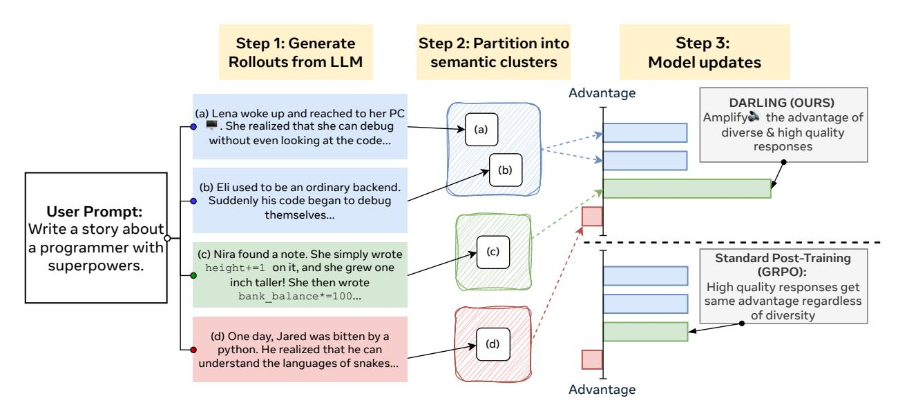
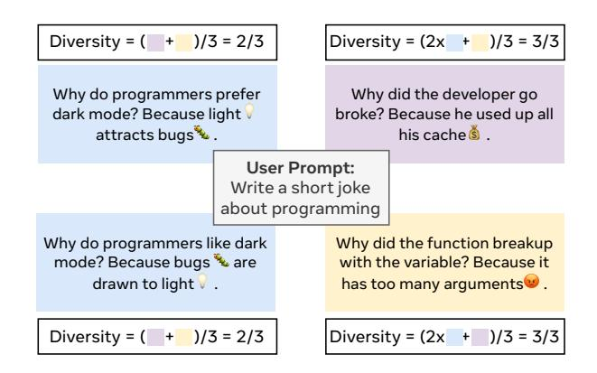
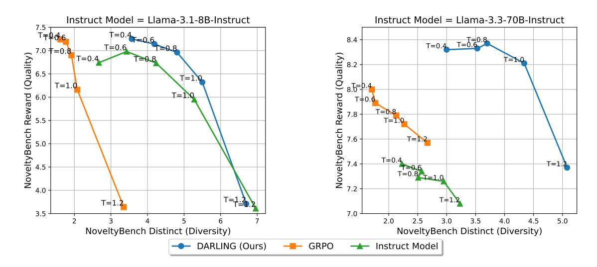
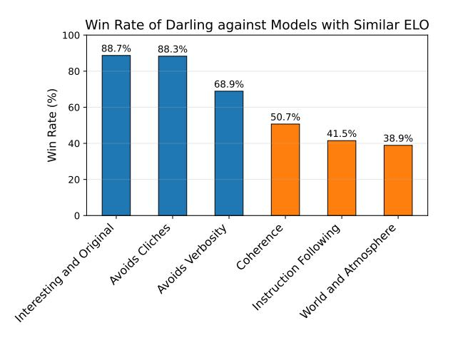
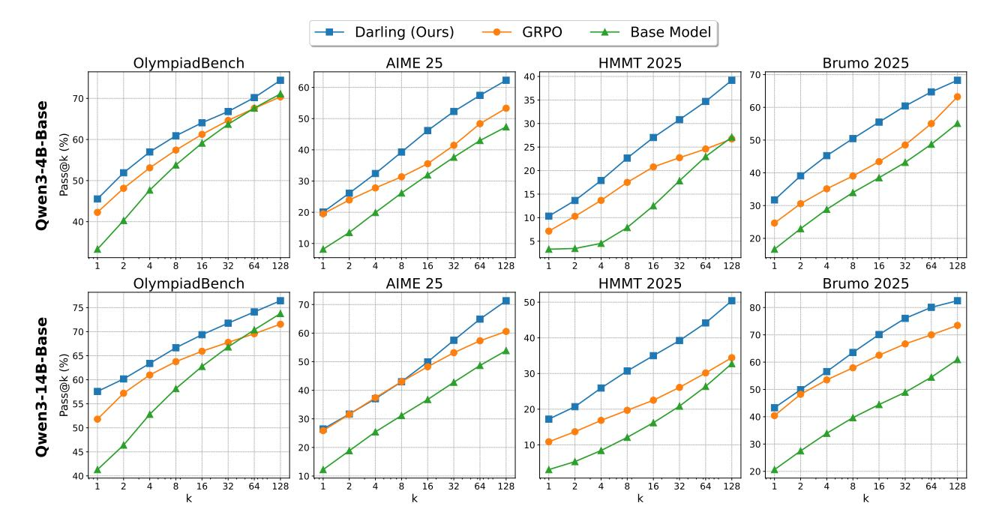
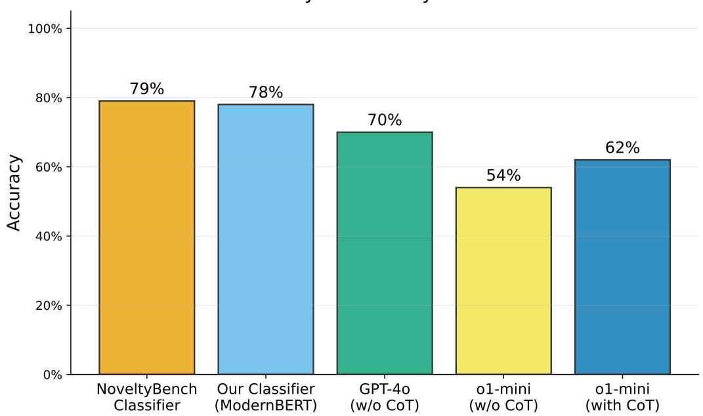

# Jointly Reinforcing Diversity and Quality in Language Model Generations

Tianjian Li $^{\heartsuit \diamondsuit \dagger}$  Yiming Zhang $^{\heartsuit \clubsuit \dagger}$  Ping Yu $^{\heartsuit}$  Swarnadeep Saha $^{\heartsuit}$  Daniel Khashabi $^{\diamondsuit}$  Jason Weston Jack Lanchantin $^{\heartsuit}$  Tianlu Wang $^{\heartsuit}$ 

 $^{\heartsuit}$ Meta FAIR  $^{\clubsuit}$ Carnegie Mellon University  $^{\diamondsuit}$ Johns Hopkins University †Work done during an internship at Meta

Post-training of Large Language Models (LMs) often prioritizes accuracy and helpfulness at the expense of diversity. This creates a tension: while post-training improves response quality, it also sharpens output distributions and reduces the range of ideas, limiting the usefulness of LMs in creative and exploratory tasks such as brainstorming, storytelling, or problem solving. We address this challenge with Diversity-Aware Reinforcement Learning (DARLING), a framework that jointly optimizes for response quality and semantic diversity. At its core, DARLING introduces a learned partition function to measure diversity beyond surface-level lexical variations. This diversity signal is then combined with a quality reward during online reinforcement learning, encouraging models to generate outputs that are both high-quality and distinct. Experiments across multiple model families and sizes show that DARLING generalizes to two regimes: non-verifiable tasks (instruction following and creative writing) and verifiable tasks (competition math). On five benchmarks in the first setting, DARLING consistently outperforms quality-only RL baselines, producing outputs that are simultaneously of higher quality and novelty. In the second setting, it achieves higher pass@1 (solution quality) and pass $@k$  (solution variety). Most strikingly, explicitly optimizing for diversity catalyzes exploration in online RL, which manifests itself as higher-quality responses.

**Date:** September 3, 2025 Correspondence: Tianjian Li tli104@jhu.edu, Tianlu Wang tianluwang@meta.com Code: https://github.com/facebookresearch/darling

#### Introduction 1

Diversity plays a critical role in numerous real-world applications ( $\text{Lu et al., 2025}$ ), directly influencing their effectiveness, utility, and innovation potential (Nagarajan et al., 2025; Zhang et al., 2025b). For example, in scientific discovery, diverse hypotheses or experimental outcomes enable researchers to explore a broader solution space, potentially uncovering novel insights and breakthroughs (Gruver et al., 2023; Romera-Paredes et al., 2024; Si et al., 2025). Similarly, in other tasks such as creative writing (Fan et al., 2018) and natural conversations (Li et al.,  $2016a$ ), diverse outputs are essential for innovation that requires avoiding repetitive or predictable outcomes. In reinforcement learning (RL) and self-training loops of LMs, diversity is also crucial. Policies that produce diverse outputs enable thorough exploration of the action space, critical for discovering novel and effective strategies (Chen et al., 2025a; Cheng et al., 2025; Wu et al., 2025a; He et al., 2025a).

However, recent developments in Language Models (LMs) have revealed a significant issue: post-training of LMs often result in overly sharpened output distributions (Huang et al., 2025; Li et al., 2025b), leading to significant reduction of diversity among generated responses (Padmakumar and He, 2024; Shypula et al.,  $2025$ ), even sharing identical prefixes (Ji et al., 2025) or becoming near duplicates (Mahony et al., 2024; Zhang et al., 2024), reducing the overall informativeness of outputs (Lin et al., 2021; Kirk et al., 2024; West and Potts, 2025; Yang and Holtzman, 2025; Yun et al., 2025).

To address the loss of diversity during LM post-training, we propose Diversity-Aware Reinforcement Learning  $(DARLING)$ , an online RL objective that (a) measures diversity at the *semantic* level via a learned classifier, and (b) fuses diversity and quality to condition gradient updates on "usefully different" trajectories. As illustrated in Figure 1, DARLING first partitions rollouts from a single user prompt into distinct semantic clusters

Figure 1 Diversity-Aware Reinforcement Learning (DARLING): We first partition LLM generations into semantically equivalent clusters (represented by colors). While standard GRPO (Shao et al., 2024) increases probabilities based on response quality only, DARLING amplifies the increase in probability of diverse and high-quality responses.

using a semantic classifier, capturing diversity beyond superficial lexical differences ( $\S 3.1$ ). It then combines (multiplies) the diversity assessment with a quality reward, amplifying the advantage of log-probabilities for responses that are both high-quality and semantically diverse  $\S 3.2$ .

We validate DARLING's effectiveness and generalizability across both non-verifiable and verifiable tasks, using various language model families and sizes. Experimental results demonstrate that DARLING preserves the original model's diversity and achieves improved benchmark performance in both non-verifiable instructionfollowing and creative writing tasks, as well as verifiable math problems.

In summary, our contributions are three-fold:

- (1) We propose DARLING, an RL framework that simultaneously optimizes quality and diversity, preventing diversity collapse during post-training.
- (2) We demonstrate that a learned semantic classifier can serve as a scalable and generalizable signal of diversity to integrate into online RL training.
- (3) We show that explicitly optimizing for diversity promotes greater exploration, often leading to improvements in quality in both non-verifiable (creative writing) and verifiable (competition math) benchmarks.

#### **Notations and Preliminaries** 2

Let S denote the set of natural language token sequences, a language model  $\pi(\cdot \mid x)$  takes a token sequence  $x \in \mathcal{S}$  as its input and outputs a probability distribution over  $\mathcal{S}$ . We denote the probability of a specific token sequence  $y \in \mathcal{S}$  as  $\pi(y \mid x)$  and denote the token at position t as  $y^t$ . Given a reward function  $r: \mathcal{S} \times \mathcal{S} \to \mathbb{R}$ which maps a pair of natural language instructions and responses  $x, y \in \mathcal{S}$  to a scalar value  $r(x, y) \in \mathbb{R}$ , LM post-training aims to solve the following KL constrained optimization problem:

$$\max_{\pi} \mathbb{E}_{x \sim \mathcal{D}, y \sim \pi(\cdot \mid x)} \left[ r(x, y) - \beta \frac{\pi(y \mid x)}{\pi_{\text{ref}}(y \mid x)} \right] = \max_{\pi} \mathbb{E}_{x \sim \mathcal{D}, y \sim \pi(\cdot \mid x)} [r(x, y)] - \beta \mathbb{D}_{\text{KL}} \left( \pi(\cdot \mid x) || \pi_{\text{ref}}(\cdot \mid x) \right), \quad (1)$$

where  $\mathcal{D}$  is a dataset of prompts and  $\pi_{\text{ref}}$  is a reference model from which we do not want to deviate too much, usually implemented as the LM before the optimization process. Group Relative Policy Optimization (Shao

et al.,  $2024$ ) optimizes (1) by maximizing the following objective:

$$\mathbb{E}_{x \sim \mathcal{D}, \{y_i\}_{i=1}^n \sim \pi_{\text{act}}(\cdot | x)} \left[ \frac{1}{n} \sum_{i=1}^n \frac{1}{|y_i|} \sum_{t=1}^{|y_i|} \left( \min\left( \text{IS}_{i,t} \cdot A_{i,t}, \ \text{clip}(\text{IS}_{i,t}, 1-\varepsilon, 1+\varepsilon) \cdot A_{i,t} \right) - \beta \mathbb{D}_{\text{KL}}(\pi_\theta || \pi_{\text{ref}}) \right) \right] \tag{2}$$

where  $n$  is the number of responses per prompt, and

$$\text{IS}_{i,t} = \frac{\pi_{\theta}(y_i^t \mid y_i^{< t}, x_i)}{\pi_{\text{act}}(y_i^t \mid y_i^{< t}, x_i)}$$

is the importance sampling (Kloek and van Dijk, 1978) ratio between the current policy  $\pi_{\theta}$  and the actor  $\pi_{\text{act}}$ (the model used to generate  $y_i$ ), and

$$A_{i,t} = \frac{r(x,y_i) - \text{mean}_{j=1}^n(r(x,y_j))}{\text{std}_{i=1}^n(r(x,y_i))}$$
(3)

is the advantage of the response  $y_i$ , measuring how much better (or worse) is  $y_i$  over an average response, and  $\varepsilon$  is a hyperparameter preventing the importance sampling term ISi,t from being too large or small. GRPO and its variants (Yu et al., 2025; Liu et al., 2025c; Hu, 2025) are widely adopted as some of the go-to algorithms for LM post-training (DeepSeek-AI et al., 2025; Liu et al., 2025a; Yang et al., 2025a) due to its simplicity and stability. In our work, we use GRPO as our starting baseline.

#### 3 Method: DARLING

Figure 1 illustrates our method DARLING (Diversity Aware Reinforcement Learning). We first partition the responses using our developed classifier  $\S 3.1$  that captures semantic similarity, then combine diversity and quality signals in an RL framework to generate diverse and high-quality responses  $(\S 3.2)$ .

#### 3.1 Partitioning the Responses into Semantic Equivalence Classes

We begin by formally defining *diversity*, as used in our work: Given a pairwise distance metric  $d: \mathcal{S} \times$  $\mathcal{S} \to \mathbb{R}^+$  between two generations, and a group of  $n$ generations  $y_1, \dots, y_n$  we define the diversity of a generation  $y_i$  with respect to all other generations as the average pairwise distance between  $y_i$  and all other generations  $y_j$   $(j \neq i)$ :

$$\text{Div}_{d}(y_{i} \mid y_{1}, \cdots, y_{n}) = \frac{1}{n-1} \sum_{\substack{j=1 \ j \neq i}}^{n} d(y_{i}, y_{j}). \quad (4)$$

We aim to incorporate a scalable metric of semantic diversity that captures deeper differences beyond surface-level variation into our training process. Following Zhang et al.  $(2025b)$ , we train a binary classifier to determine whether two responses con- $\text{vey equivalent semantics:}$ 

Figure 2 Example of partitioning a group of responses into semantically equivalent subgroups and evaluating diversity.  $Diversity$  is calculated as the normalized count of responses that is distinct from a given response.

**classify** $(y_i, y_i) = \mathbf{1}(y_i \text{ semantically equivalent to } y_i).$ 

Responses predicted as equivalent are clustered to form a partition of all responses into semantic clusters, where multiple members provide little additional value beyond a single representative.

We directly set diversity metric  $d = \text{classify}(\cdot, \cdot)$ . Figure 2 illustrates an example of our diversity calculation from partitions. For a single prompt "Write a short joke about programming.", responses in the left column (blue) are classified as semantically equivalent, both utilizing that the word "bug" has multiple meanings. The responses in the right column (purple and yellow) are distinct from the three other responses. For each of the individual responses in blue boxes, there are only two other responses that are distinct: purple and yellow. Therefore, using [\(4\)](#page-2-2), we derive the diversity of both blue responses as 2/3. Similarly, the yellow and purple responses have diversity 3/3 because they are distinct from all other responses.

#### 3.2 DARLING: Diversity Aware Reinforcement Learning

Given a diversity function Divd and a reward function r, we define the diversity-aware reward rdarling as

$$r_{\text{darling}}(x, y_i \mid y_1, \cdots, y_n) := r(x, y_i) \times \text{Norm}\big(\text{Div}_d(y_i \mid y_1, \cdots, y_n)\big),\tag{5}$$

where Norm(·) normalizes diversity values to be between 0 and 1.

We choose to multiply the two reward scores instead of adding them. While simply adding the quality and diversity rewards is an alternative approach, this method poses challenges due to the differing scales of the two rewards. Naively summing the two rewards can lead the model to prioritize one reward over the other. An ablation study of varying methods for fusing reward scores is provided in [§6.1.](#page-7-0)

Darling plugs [\(5\)](#page-3-1) into [\(1\)](#page-1-1), which amplifies the effective reward rdarling of high reward responses that are diverse from others. Motivated by prior work [\(Liu et al.,](#page-14-3) [2025c;](#page-14-3) [Yu et al.,](#page-17-4) [2025\)](#page-17-4), we also make the following modifications: changing sequence-level loss averaging to token-level averaging in [\(2\)](#page-2-3) as the former exhibits bias towards longer sequences, and removing normalization by standard deviation in [\(3\)](#page-2-4) since it amplifies the noise in dense rewards. We leave detailed ablations on the effect of normalization to [§6.3.](#page-9-0)

The overall loss function for Darling is thus defined as:

$$\mathbb{E}_{x \sim \mathcal{D}, \{y_i\}_{i=1}^n \sim \pi_{\text{act}}(\cdot | x)} \left[ \frac{1}{\sum_{i=1}^n |y_i|} \sum_{t=1}^{|y_i|} \left( \min \left( \text{IS}_{i,t} \cdot A_{i,t}, \ \text{clip}(\text{IS}_{i,t}, 1-\varepsilon, 1+\varepsilon) \cdot A_{i,t} \right) - \beta \mathbb{D}_{\text{KL}}(\pi_\theta || \pi_{\text{ref}}) \right) \right], \tag{6}$$

where we use the diversity aware reward rdarling as the effective reward:

$$A_{i,t} = r_{\text{darling}}(x, y_i \mid y_1, \cdots, y_n) - \text{mean}_{j=1}^n \big( r_{\text{darling}}(x, y_j \mid y_1, \cdots, y_n) \big).$$

Compared to standard GRPO, our main modification is that we multiply a normalized diversity reward Norm Divd(yi | y1, · · · , yn) by the quality reward r(x, y) to promote high-quality and diverse rewards during training. This amplifies the increase in the log-likelihood of responses that are both of high-quality and diverse — jointly reinforcing quality and diversity.

# 4 DARLING on Non-verifiable Tasks

We first show the experimental effectiveness of Darling on general non-verifiable instruction following tasks. We describe our setup in [§4.1.](#page-3-2) We show and analyze our results in [§4.2.](#page-4-0)

#### 4.1 Setup

Models and Baselines We use Llama-3.1-8B-Instruct and Llama-3.3-70B-Instruct [\(Llama Team,](#page-14-5) [2024\)](#page-14-5) as reference models and perform training on top of them. We train on a randomly sampled subset of 10k prompts in WildChat [\(Zhao et al.,](#page-17-5) [2024\)](#page-17-5), which is the same setup as used in [Lanchantin et al.](#page-13-5) [\(2025a\)](#page-13-5). We use Nexusflow/Athene-RM-8B [\(Frick et al.,](#page-12-6) [2024\)](#page-12-6) as the reward function in [\(5\)](#page-3-1) for quality. We use a batch size of {32 (8B), 64 (70B)} prompts × 8 rollouts per prompt, and a max rollout length of 1024 tokens. Other training hyperparameters can be found in [Appendix B.](#page-19-0)

We compare our method against the following baselines:

• GRPO [\(Shao et al.,](#page-16-4) [2024\)](#page-16-4): The standard GRPO method described in [§2,](#page-1-1) with token-level mean aggregation;

- • DivPO [\(Lanchantin et al.,](#page-13-5) [2025a\)](#page-13-5): a DPO-based [\(Rafailov et al.,](#page-15-2) [2024\)](#page-15-2) optimization method that selects the most diverse response among the high-quality ones as the chosen response and the least diverse response as the rejected response;
- GRPO-Unlikeliness [\(He et al.,](#page-12-2) [2025a\)](#page-12-2): a revised GRPO algorithm that re-weights the rewards of responses according to their likelihood. Responses that have a low likelihood receive a higher reward.

We implement Darling using the verl codebase [\(Sheng et al.,](#page-16-6) [2024\)](#page-16-6), using vLLM [\(Kwon et al.,](#page-13-6) [2023\)](#page-13-6) for inference and FSDP [\(Zhao et al.,](#page-17-6) [2023\)](#page-17-6) for training. The original classifier of [Zhang et al.](#page-17-0) [\(2025b\)](#page-17-0) was limited to a context length of 512 tokens[1](#page-4-1) . In our work, we extend their method by training a classifier with an 8192-token context window, using the same human-annotated data. Details of this training procedure are provided in Appendix [A.1.](#page-18-0)

Evaluation Benchmarks and Metrics For evaluating response quality, we employ standard benchmarks: AlpacaEval 2.0 [\(Li et al.,](#page-13-7) [2023;](#page-13-7) [Dubois et al.,](#page-12-7) [2024\)](#page-12-7), ArenaHard v2.0 [\(Li et al.,](#page-13-8) [2025a\)](#page-13-8), and EQ-Bench (Creative Writing) [\(Paech,](#page-15-3) [2023\)](#page-15-3). We report the length-controlled win rate (LCWR) for AlpacaEval 2.0 and the win rate with style control (markdown, length) for ArenaHard v2.0 on the creative writing prompts. We report the normalized ELO score for EQ-Bench. For both AlpacaEval and ArenaHard, we follow [\(Lanchantin](#page-13-9) [et al.,](#page-13-9) [2025b\)](#page-13-9) and use GPT-4o [\(OpenAI et al.,](#page-14-6) [2024\)](#page-14-6) as the judge. For EQ-bench, we use Claude 3.7 Sonnet [\(Anthropic,](#page-11-3) [2024\)](#page-11-3) as the judge. For evaluating diversity, we use NoveltyBench [\(Zhang et al.,](#page-17-0) [2025b\)](#page-17-0). We report the number of semantically distinct generations (Distinct) and the average number of distinct 4grams (Distinct-4) normalized by length. We provide detailed descriptions of the benchmarks in [Appendix D.](#page-24-0)

|                        | AE 2.0*  | AH v2.0* | AH v1.0* | EQ-Bench |              | NoveltyBench   |
|------------------------|----------|----------|----------|----------|--------------|----------------|
|                        | LCWR (%) | WR (%)   | WR (%)   | ELO      | Distinct (#) | Distinct-4 (%) |
| Llama-3.1-8B-Instruct  | 31.9     | 7.1      | 30.9     | 636      | 5.28         | 93.9           |
| GRPO                   | 48.7     | 61.1     | 45.5     | 659      | 2.08         | 92.8           |
| DivPO                  | 43.5     | 54.4     | 39.7     | 639      | 4.34         | 94.1           |
| GRPO-Unlikeliness      | 45.6     | 59.5     | 46.2     | 724      | 3.53         | 93.2           |
| Darling                | 55.2     | 68.8     | 63.7     | 905      | 5.49         | 96.0           |
| Llama-3.3-70B-Instruct | 44.6     | 17.7     | 64.9     | 737      | 2.95         | 91.7           |
| GRPO                   | 73.3     | 89.7     | 79.2     | 1261     | 2.31         | 94.6           |
| GRPO-Unlikeliness      | 69.5     | 84.2     | 76.4     | 1346     | 3.15         | 95.2           |
| Darling                | 80.4     | 91.2     | 85.7     | 1531     | 4.26         | 95.3           |

## 4.2 Experimental Results

Table 1 Non-verifiable Task Evaluations. For each method, we train a single model on 10,000 WildChat prompts. We evaluate the models on AE (AlpacaEval 2.0 Length-Controlled Win Rate), AH v2.0/v1.0 (ArenaHard, creative writing subset), EQ-Bench (ELO), and NoveltyBench. \* indicates we used GPT-4o as the judge. All metrics are the higher the better. We find that models trained with Darling achieve the best quality measured by both AlpacaEval/ArenaHard win rates and EQ-Bench ELO, and simultaneously are the most diverse, as measured by NoveltyBench.

DARLING achieves both the best quality and diversity across all benchmarks. [Table 1](#page-4-2) shows our main results: we observe that Darling is able to jointly optimize for both quality and diversity. Specifically, Darling results in the best quality scores (AlpacaEval and ArenaHard win rates) across our baselines, while also achieving the best diversity in both semantic level (Distinct) and lexical level (Distinct-4), showcasing the effectiveness of our method. Moreover, although we did not explicitly train on creative writing prompts, Darling achieves the best ELO score compared to all baselines in EQ-Bench (creative writing), demonstrating the effectiveness of improving diversity on creative tasks.

DARLING improves the pareto front between quality and diversity by varying sampling temperature. We further investigate the effect of sampling temperature on the quality-diversity pareto front. We vary the

1https://github.com/novelty-bench/novelty-bench/blob/main/src/partition.py#L69

sampling temperature  $(T = \{0.2, 0.4, 0.6, 0.8, 1.2\})$  of two models (Llama-3.1-8B-Instruct and Llama-3.3-70B-Instruct), after being trained with GRPO and DARLING. Figure 3 shows that DARLING (blue) exhibits both better quality and better diversity than both the baseline (green) and GRPO (orange) at both scales, pushing forward the pareto-front of the "quality-diversity tradeoff" (Zhang et al., 2021; Padmakumar et al., 2025).

**Figure 3** The quality-diversity tradeoff when using different sampling temperatures  $(T)$  for models (at 8B and 70B scales) trained with standard GRPO and DARLING, X-axis: Distinct metric in NoveltyBench; Y-axis: Reward score used in NoveltyBench measuring quality of responses. DARLING (blue) simultaneously achieves better quality (y-axis) and diversity (x-axis) as demonstrated by the improved Pareto fronts on both the 8B and 70B scale.

#### 4.3 **Qualitative Analysis**

We show qualitative analysis on  $EQ\text{-}Bench$  (Paech,  $2023$ ). EQ-bench provides detailed evaluation rubrics and asks Claude- $3.7$ -Sonnet to score model generations according to these rubrics. We breakdown the rubrics where DARLING has the most and least win rates over models with similar ELO in Figure 4. DARLING's strength lies in being able to generate diverse outputs, thus it wins the most on being "Interesting and Original" and "Avoids Cliche". We show the output for a creative writing prompt generated by our model trained with DARLING in Appendix  $C.1$ .

We further illustrate these findings with qualitative examples from NoveltyBench ( $\text{Zhang et al., 2025b}$ ), shown in Figure 5 and Appendix  $C.2$ . Across four parallel generations, models trained with DARLING consistently exhibit higher semantic diversity. Even when repetitions occur—for example, in the second and fourth generations of Figure  $5$ —the outputs remain meaningfully distinct: both suggest Bellroy,

**Figure 4** Detailed win rates of the  $\text{top-3}$  and the  $\text{bottom-}$ 3 rubrics of Llama-3.1-8B-Instruct trained with DAR-LING against models with similar ELO points. DARLINGS strength lies in being "Interesting and Original" and "Avoids Cliche" due to being able to generate creative responses.

yet each provides a different rationale. A similar trend appears in the examples in Appendix C.2, where DARLING-trained models not only produce more diverse generations overall, but also introduce variation in their explanations when repeating simple outputs such as random numbers or animals.

#### DARLING Example in NoveltyBench (4 parallel generations)

**Prompt:** I am doing online shopping for a new leather wallet. What's the first store/website I should check out? Please just give me one suggestion; I don't need to hear your whole thought process.

Llama-3.3-70B-Instruct: 1. Amazon. 2. Amazon. 3. Amazon. 4. Amazon.

#### Llama-3.3-70B-Instruct with DARLING:

1. Fossil. They specialize in leather goods, offer a huge variety (slim to traditional, many colors), high-quality reputation, and crucially, detailed photos including interior and customer reviews directly on the site to help with most common decisions like card space and feel.

2. Bellroy. They're highly regarded not just for quality leather that ages well, but also very thoughtful design slim profiles, specific card slots to prevent stretching, RFID blocking where it matters but not everywhere to keep cost and bulk down. Reviews often mention it still looks and functions great years later. Direct from their site usually also includes a 3-year warranty.

3. Coach.com. They're not just a brand name; consistently, their site offers high-quality photos, detailed leather descriptions (finishing, thickness, exact type like full-grain vs. bonded), and crucially, a compare feature.

4. Bellroy. They specialize in leather goods, offer a wide, well-curated range of wallet styles (minimalist to travel wallets), excellent photos, detailed material info (including tannage method which heavily affects durability and feel), and a strong warranty. Direct from them usually beats resellers on price too.

**Figure 5** Example generations of Llama-3.3-70B-Instruct before and after DARLING training. We sample 4 parallel generations with temperature=1.0 for both models. Models trained with DARLING exhibit better diversity.

#### 5 DARLING on Verifiable Tasks

In this section we present experimental results of DARLING on verifiable math problems. We describe our setup in  $\S 5.1$  and show our results in  $\S 5.2$ .

#### 5.1 Setup

Models, Baselines, and Benchmarks We train models on top of Qwen3-4B-Base and Qwen3-14B-Base (Yang et al., 2025a) using the the DeepscaleR dataset (Luo et al., 2025), where we first filter out questions that are unanswerable due to missing figures, and then subsample 10,000 examples. We compare our method against GRPO (Shao et al.,  $2024$ ) on four competition math benchmarks: AIME25 (Art of Problem Solving, 2025), OlympiadBench (He et al., 2024), HMMT 2025 (Balunović et al., 2025), and Brumo 2025 (Balunović et al.,  $2025$ ). We delibrately choose these benchmarks because they were released concurrently with Qwen3, preventing the effect of potential data contamination. We use the Hugging Face Math-Verify2 library to automatically check the correctness of model answers, assigning a binary reward of  $r=1$  for correct and  $r=0$ for incorrect solutions. We report pass@1 scores as a measure of quality and pass@k scores as a measure of diversity. To evaluate pass@k up to  $k = 128$ , we sample  $n = 256$  responses for each prompt, and we average the performance of the 256 examples for calculating pass@1 to account for the variance introduced by the relatively small sizes of these benchmarks. We use the method in Chen et al.  $(2021)$  for an unbiased estimate of pass@k from  $n = 256$  examples:

$$pass@k := \mathbb{E}\left[1 - \frac{\binom{n-c}{k}}{\binom{n}{k}}\right],\tag{7}$$

where  $c$  is the number of correct generations. With increased diversity, we expect to see an improved performance of pass $@k$  as the model is more likely to hit the correct answer when it generates more diverse responses. Additional hyperparameters can be found at Appendix  $B$ .

 $^{2}$ https://github.com/huggingface/Math-Verify

**Training an equivalence classifier for math** For building the diversity classifier, Zhang et al.  $(2025b)$  collected annotated training data which are sampled prompts from WildChat (Zhao et al., 2024) filtered for nonverifiable tasks. To adapt their method to math, we sample prompts from DeepscaleR and collect trajectories generated by 8 different models spanning multiple model families and sizes. We annotate whether a pair of trajectories is semantically equivalent using Llama-3.3-70B-Instruct (Llama Team,  $2024$ ). We then finetune a Qwen3-Embedding-4B ( $\text{Zhang et al., } 2025a$ ) model using the annotations to obtain our math semantic equivalence classifier. Details on how we perform trajectory sampling, annotations, and classifier training can be found in Appendix  $A.2$ .

#### 5.2 Experimental Results

DARLING improves both pass@1 and pass@k in competition math. Figure 6 shows our main results: we plot  $pass@k$  from k=1 to k=128. We observe that DARLING outperforms the GRPO baseline in both quality and diversity. First, for pass@1 (as a measure of quality), DARLING outperforms GRPO by  $+3.51/1.90\%$  averaged across 4 benchmarks for 4B and 14B models respectively. Next, for pass@ $128$  (as a measure of diversity), DARLING outperforms GRPO by  $+7.62/10.16\%$ . This shows that by jointly reinforcing quality and diversity, DARLING is able to achieve the best of both worlds in competition math benchmarks  $-$  simultaneously achieving better pass $@1$  and pass $@k$ . Furthermore, we observe the largest gains on HMMT, the most challenging of the four datasets, suggesting that enhanced exploration yields greater improvements on harder datasets. We report accuracy for each of the datasets in Appendix  $E$ .

**Figure 6** Comparison of different pass $@k$  values by applying GRPO and DARLING on Qwen3-4B-Base and Qwen3-14B-Base on competition math benchmarks. DARLING outperforms GRPO simultaneously for pass@1  $(+3.51/+1.9\%)$ on avg.) and pass@128 ( $+7.62/10.16\%$  on avg.) on 4B and 14B models respectively. DARLING simultaneously achieves the best quality and diversity averaged across 4 competition math benchmarks.

#### Ablations 6

In this section, we perform ablations on the design choices of DARLING. In particular, we compare additive aggregation of quality and diversity rewards v.s. multiplicative aggregation (ours) in  $\S 6.1$ . We compare our partition classifier which measures semantic diversity with traditional lexical diversity in  $\S6.2$  and we ablate the effect of the standard deviation term in GRPO normalization  $(3)$  in  $\S 6.3$ .

### 6.1 Ablations on Multiplicative v.s. Additive Aggregation

A naive aggregation of the quality reward r and the diversity signal Divd is to add the two rewards, as many existing works perform additive aggregation of the quality-based reward and auxiliary rewards such as length [\(Aggarwal and Welleck,](#page-11-7) [2025;](#page-11-7) [Liu et al.,](#page-14-8) [2025b\)](#page-14-8), entropy [\(Cheng et al.,](#page-11-1) [2025\)](#page-11-1), and format [\(Wu et al.,](#page-16-7) [2025b\)](#page-16-7).

We ablate the effect of adding or multiplying the quality reward r and the diversity reward Norm(Div) in equation [5](#page-3-1) in our non-verifiable setting and report the results in [Table 2.](#page-8-1) To aggregate the two rewards, we manually normalize (subtract mean and divide by standard deviation) both r (the quality reward) and Divd.

|                                                                     | AlpacaEval 2.0          |                         | ArenaHard v2.0                                                | NoveltyBench                                                  |                      |
|---------------------------------------------------------------------|-------------------------|-------------------------|---------------------------------------------------------------|---------------------------------------------------------------|----------------------|
|                                                                     | LCWR(%)                 | WR(%)                   | creative writing                                              | hard prompts                                                  | Distinct (#)         |
| Llama-3.1-8B-Instruct Quality only (GRPO) Quality + partition | 31.92 48.74 53.17 | 32.61 57.01 60.82 | 7.1 (-1.4 / +1.8) 61.1 (-3.5 / +4.5) 69.2 (-3.6 / +3.9) | 6.4 (-0.8 / +1.3) 33.9 (-2.3 / +2.5) 32.7 (-3.2 / +2.9) | 5.28 2.08 5.23 |
| Darling =Quality × partition                                     | 55.15                   | 65.34                   | 68.8 (-3.3 / +2.9)                                            | 31.1 (-2.0 / +2.1)                                            | 5.49                 |

Table 2 Ablation comparing the way we aggregate the quality and diversity reward: additive v.s. multiplicative in [Equation 5,](#page-3-1) evaluating on AlpacaEval 2.0, ArenaHard v2.0 (with Style Control), and NoveltyBench.

We observe that multiplicative aggregation (Darling) outperforms additive aggregation in AlpacaEval 2.0, and performs similarly in ArenaHard v2.0 and NoveltyBench. We opt for multiplicative aggregation due to its simplicity as it does not require additional handling of mismatched reward scales and hyperparameter tuning of mixing weights on individual rewards.

### 6.2 Ablations on Lexical Metrics for Diversity

We study whether our proposed partition classifier can be replaced by a simple lexical diversity metric. We replace our semantic equivalence classifier with the number of distinct N-grams in online RL training. Specifically, we set the diversity of a response yi w.r.t all other responses for the same input prompt as:

$$\text{Div}_{\text{ngram}}(y_i \mid y_1, \cdots, y_n) = \frac{\text{number of distinct } N\text{-grams that only appear in } y_i}{\text{total number of } N\text{-grams in } y_i}.$$

This means that if no N-gram in yi appears in any other response yj (j ≠ i), then the diversity DivN-gram(yi | y1, · · · , yn) = 1. Similarly, DivN-gram(yi | y1, · · · , yn) = 0 if all N-grams in yi appear in at least one other response. In our experiments, we set N = 4 and denote this setting as "Quality × 4gram". We report experimental results on non-verifiable tasks in [Table 3.](#page-8-2)

|                                 | AlpacaEval 2.0 |       | ArenaHard v2.0     | NoveltyBench       |              |
|---------------------------------|----------------|-------|--------------------|--------------------|--------------|
|                                 | LCWR(%)        | WR(%) | creative writing   | hard prompts       | Distinct (#) |
| Llama-3.1-8B-Instruct           | 31.92          | 32.61 | 7.1 (-1.4 / +1.8)  | 6.4 (-0.8 / +1.3)  | 5.28         |
| Quality only (GRPO)             | 48.74          | 57.01 | 61.1 (-3.5 / +4.5) | 33.9 (-2.3 / +2.5) | 2.08         |
| Quality × 4gram                 | 53.82          | 66.46 | 71.9 (-3.3 / +3.6) | 31.3 (-2.3 / +2.9) | 3.59         |
| Darling =Quality × partition | 55.15          | 65.34 | 68.8 (-3.3 / +2.9) | 31.1 (-2.0 / +2.1) | 5.49         |

Table 3 Comparison of N-gram diversity loss to Darling. The N-gram diversity loss (N=4) performs similarly to Darling in terms of quality, but underperforms Darling in terms of diversity in NoveltyBench.

We observe that while 4gram diversity integrated with quality is able to match the performance of Darling in LM-as-a-Judge evaluations (AlpacaEval 2.0, ArenaHard v2.0), it significantly underperforms Darling in semantic diversity assessment (NoveltyBench).

Additionally, we evaluate the performance of using 4gram diversity in competition math and report the results in [Table 4.](#page-9-1) We found that in math questions, using lexical diversity as a reward underperforms the GRPO baseline in terms of pass@1 performance. We analyze the the generations and observe that the policy often hacks the ngram diversity reward by generating texts that are of a different language, or self-reflections about the difficulty of the problem. We provide an example of such ngram reward hacking in [Appendix G.](#page-27-0)

|                                                         | Pass@128                |                         |                          |                         | Pass@1                  |                        |                      |                          |                         |                         |
|---------------------------------------------------------|-------------------------|-------------------------|--------------------------|-------------------------|-------------------------|------------------------|----------------------|--------------------------|-------------------------|-------------------------|
| Model                                                   |                         |                         | AIME HMMT Olympiad Brumo |                         | Avg.                    |                        |                      | AIME HMMT Olympiad Brumo |                         | Avg.                    |
| Qwen3-4B-Base Quality only (GRPO) Quality × 4gram | 47.35 53.33 57.47 | 27.12 26.72 32.35 | 71.11 70.37 67.47  | 55.10 63.24 60.55 | 50.17 53.42 54.46 | 8.17 19.51 17.44 | 1.28 7.14 6.95 | 31.13 42.27 40.03  | 16.68 24.66 25.55 | 14.32 23.40 22.49 |
| Darling =Quality × partition                         | 62.28                   | 39.19                   | 74.41                    | 68.27                   | 61.04                   | 20.06                  | 10.32                | 45.53                    | 31.73                   | 26.91                   |

Table 4 Comparison of n-gram diversity loss to Darling on Competition Math. Using 4gram as the diversity reward underperforms the baseline GRPO (no diversity reward), indicating that lexical diversity reward can harm performance in Competition Math tasks.

#### 6.3 Ablations on Advantage Normalization in GRPO

[Liu et al.](#page-14-3) [\(2025c\)](#page-14-3) show that in equation [\(3\)](#page-2-4), dividing by stdn j=1(r(x, yj )) effectively upweights prompts whose rewards have low variance (e.g., when rewards are nearly all 1 or all 0). We extend their analysis to a more general setting where rewards are arbitrary scalars, as is typical in Bradley–Terry style reward models.

Formally, let the reward for response yi be

$$r_i = f_i + \varepsilon_i,$$

where fi is the true underlying utility and εi is noise with variance τ 2 . GRPO with normalization computes

$$\hat{r}_i = \frac{r_i - \bar{r}}{\sigma_r}, \quad \sigma_r^2 \approx \text{Var}(f) + \tau^2,$$

so each prompt contributes unit variance to the gradient update. This has the effect of amplifying noise when τ 2 is large relative to Var(f) (dense but noisy rewards), because even very small differences between responses get magnified into values of order one. By contrast, removing the normalization yields

$$\tilde{r}_i = r_i - \bar{r},$$

which preserves the true scale of reward differences. Thus, normalization is helpful when rewards are reliable (high signal-to-noise ratio), but harmful when they are noisy and tightly clustered.

Empirically, we find that removing the standard deviation term improves performance in settings with dense and noisy rewards. [Table 5](#page-10-0) shows results in our non-verifiable setting with a Bradley–Terry style reward: removing normalization ("w/o norm") improves not only quality (AlpacaEval and Arena-Hard win rates) but also diversity (NoveltyBench Distinct and distinct n-grams).

In contrast, in settings where the reward is sparse and noise-free, normalization has little effect. [Appendix F](#page-26-0) reports results on Math, where rewards are binary (0, 1) and deterministic. In this case, the variance comes entirely from the true differences, so normalization is neither helpful nor harmful.

# 7 Related Work

In this section, we provide an overview of previous work that elicits diverse responses from LMs during training and inference, and clarify the distinction from our work. We defer additional related work on diversity evaluation metrics and RL for LMs to [Appendix H.](#page-27-1) For a more comprehensive survey on LM creativity, we also refer readers to [Ismayilzada et al.](#page-12-9) [\(2024\)](#page-12-9).

|                                               | AlpacaEval $2.0^*$ |          | ArenaHard $v2.0^*$                                                                                               | NoveltyBench            |                                   |  |
|-----------------------------------------------|--------------------|----------|------------------------------------------------------------------------------------------------------------------|-------------------------|-----------------------------------|--|
|                                               | $LCWR(\%)$         | $WR(\%)$ | Creative Writing $(\%)$                                                                                          |                         | Distinct $(\#)$ Distinct-4 $(\%)$ |  |
| $\text{GRPO}$ $\text{GRPO (w/o norm)}$     | 48.74              | 57.01    | $61.1 \; (-3.5 \; / \; +4.5)$ $52.57 \; (+3.83) \; 61.18 \; (+4.17) \; 68.1 \; (-3.5 \; / \; +2.7) \; (+7.0)$ | 2.08 $2.28\;(+0.20)$ | 92.84 $94.05\;(+1.21)$         |  |
| $4 \text{gram}$ $4 \text{gram (w/o norm)}$ | 48.48              | 57.76    | $65.3 \; (-3.3 \; / \; +3.6)$ $53.82\;(+5.34)\;66.46\;(+8.70)\;71.9\;(-3.3\;/\;+3.6)\;(+6.6)$                 | 2.79 $3.59\;(+0.80)$ | 93.87 $95.63\;(+1.76)$         |  |
| $\text{partition}$                            | 51.64              | 62.17    | $69.7 \ (-3.3 \ / \ +4.0)$                                                                                       | 3.35                    | 94.93                             |  |
| Darling $=$ partition (w/o norm)           |                    |          | $55.15\;(+3.51)$ $65.34\;(+3.17)$ $68.8\;(-3.3\;/\;+2.9)$ $(-0.9)$ $5.49\;(+2.14)$ $96.04\;(+1.11)$              |                         |                                   |  |

**Table 5** Ablation study on normalization: Results for GRPO baseline, 4-gram, and partition mixing, each with and without normalization. All metrics are the higher the better. \* indicates GPT-40 was used as the judge. Removing normalization  $(w/o \ norm)$  prevents the amplification of tiny differences in dense rewards, resulting in improved performance on both quality and diversity metrics.

**Training-time strategies for diversity** Neural language models often generate repetitive outputs, a long-standing challenge in the community (Li et al., 2016b; Zhang et al., 2021). Prior work addresses this by modifying the maximum likelihood training objective to encourage diversity. For example, Li et al.  $(2016b)$  maximize mutual information to avoid generic responses (e.g.,  $I \text{ don't know}$ ). Welleck et al. (2020) penalize repetitions to improve lexical variety within a response. Other approaches smoothen or modify the one-hot target distribution: Li et al.  $(2020)$  introduce a Gaussian prior, Zhang et al.  $(2024)$  match outputs to high-entropy distributions, and Li et al.  $(2025b)$  apply sparse logit updates. Beyond cross-entropy, DivPO (Lanchantin et al., 2025a) and its "soft" variants (Chung et al., 2025; Ismayilzada et al., 2025) optimize preferences for both quality and diversity. In online RL, He et al.  $(2025a)$  perform re-weighting of rewards by likelihood to promote diverse proofs, Lanchantin et al.  $(2025b)$  show that using simple entropy regularization is a non-trivial task, and Slocum et al.  $(2025)$  attribute diversity loss to KL regularization and decouple its terms. Concurrent to our work, Chen et al.  $(2025a)$  down-weigh uncertain model solutions in math. In contrast, our work measures uncertainty at the trajectory level and up-weigh diverse responses. DARLING also differs from other approaches in two important ways: (1) it employs a semantic-level diversity signal, going beyond surface-level lexical variations, and  $(2)$  it directly shapes the reward during online RL, unlike prior work that modifies cross-entropy loss in pre-training (Li et al., 2020) or offline fine-tuning (Li et al., 2025b; Lanchantin et al.,  $2025a$ ; Chung et al.,  $2025$ ; Ismayilzada et al.,  $2025$ ).

**Inference-time strategies for diversity** Decoding diverse outputs from neural LMs has been a well-studied problem in the literature. A body of prior work has proposed modifications to beam search (Cho, 2016; Li and Jurafsky, 2016; Li et al., 2016b; Vijayakumar et al., 2018; Kulikov et al., 2019). Ippolito et al. (2019a), in their work, compare such methods with those that simply increase the sampling temperature (Peeperkorn et al., 2024; Shur-Ofry et al., 2024). Apart from modifying the beam search process, many methods have proposed to harness the prompt to elicit diverse responses, which includes conditioning on random seeds (Nagarajan et al.,  $2025$ ), on different persona (Shur-Ofry et al., 2024; Ge et al., 2025), on past generations (Lu et al., 2024), and directly prompting the model to "be diverse" (Zhang et al.,  $2025b$ ). Both Padmakumar et al. ( $2025$ ) and Zhang et al.  $(2025b)$  present a comprehensive evaluation of such prompting methods, revealing improved diversity often comes at the cost of degraded quality. Our work directly modifies the training objective which is orthogonal to and compatible with decoding methods that elicit diversity at test time.

#### 8 Conclusion

In this work we introduced DARLING, an online RL method that jointly optimizes for both quality and diversity. Unlike prior RL approaches that often lead to diversity collapse, DARLING effectively preserves diversity in model generations. Through various qualitative and quantitative experiments, we demonstrated its effectiveness with different model families and sizes across both verifiable and non-verifiable tasks.

# References

- Pranjal Aggarwal and Sean Welleck. L1: Controlling how long a reasoning model thinks with reinforcement learning. In Second Conference on Language Modeling, 2025. <https://arxiv.org/abs/2503.04697>. Cited on page [9.](#page-8-3)
- Chenxin An, Zhihui Xie, Xiaonan Li, Lei Li, Jun Zhang, Shansan Gong, Ming Zhong, Jingjing Xu, Xipeng Qiu, Mingxuan Wang, and Lingpeng Kong. Polaris: A post-training recipe for scaling reinforcement learning on advanced reasoning models, 2025. <https://hkunlp.github.io/blog/2025/Polaris>. Cited on page [29.](#page-28-0)
- Anthropic. Claude 3.7 sonnet system card, 2024. [https://assets.anthropic.com/m/785e231869ea8b3b/original/](https://assets.anthropic.com/m/785e231869ea8b3b/original/claude-3-7-sonnet-system-card.pdf) [claude-3-7-sonnet-system-card.pdf](https://assets.anthropic.com/m/785e231869ea8b3b/original/claude-3-7-sonnet-system-card.pdf). Cited on page [5.](#page-4-3)
- Art of Problem Solving. Aime problems and solutions, 2025. [https://artofproblemsolving.com/wiki/index.php/](https://artofproblemsolving.com/wiki/index.php/AIME_Problems_and_Solutions) [AIME\\_Problems\\_and\\_Solutions](https://artofproblemsolving.com/wiki/index.php/AIME_Problems_and_Solutions). Cited on pages [7,](#page-6-3) [23,](#page-22-0) and [26.](#page-25-1)
- Mislav Balunović, Jasper Dekoninck, Ivo Petrov, Nikola Jovanović, and Martin Vechev. Matharena: Evaluating llms on uncontaminated math competitions, February 2025. <https://matharena.ai/>. Cited on pages [7,](#page-6-3) [23,](#page-22-0) and [26.](#page-25-1)
- Mark Chen, Jerry Tworek, Heewoo Jun, Qiming Yuan, Henrique Ponde de Oliveira Pinto, Jared Kaplan, Harri Edwards, Yuri Burda, Nicholas Joseph, Greg Brockman, Alex Ray, Raul Puri, Gretchen Krueger, and Michael Petrov et al. Evaluating large language models trained on code, 2021. <https://arxiv.org/abs/2107.03374>. Cited on page [7.](#page-6-3)
- Minghan Chen, Guikun Chen, Wenguan Wang, and Yi Yang. Seed-grpo: Semantic entropy enhanced grpo for uncertainty-aware policy optimization, 2025a. <https://arxiv.org/abs/2505.12346>. Cited on pages [1](#page-0-0) and [11.](#page-10-1)
- Zhipeng Chen, Xiaobo Qin, Youbin Wu, Yue Ling, Qinghao Ye, Wayne Xin Zhao, and Guang Shi. Pass@k training for adaptively balancing exploration and exploitation of large reasoning models, 2025b. [https://arxiv.org/abs/2508.](https://arxiv.org/abs/2508.10751) [10751](https://arxiv.org/abs/2508.10751). Cited on page [29.](#page-28-0)
- Daixuan Cheng, Shaohan Huang, Xuekai Zhu, Bo Dai, Wayne Xin Zhao, Zhenliang Zhang, and Furu Wei. Reasoning with exploration: An entropy perspective, 2025. <https://arxiv.org/abs/2506.14758>. Cited on pages [1](#page-0-0) and [9.](#page-8-3)
- Kyunghyun Cho. Noisy parallel approximate decoding for conditional recurrent language model, 2016. [https:](https://arxiv.org/abs/1605.03835) [//arxiv.org/abs/1605.03835](https://arxiv.org/abs/1605.03835). Cited on page [11.](#page-10-1)
- John Joon Young Chung, Vishakh Padmakumar, Melissa Roemmele, Yuqian Sun, and Max Kreminski. Modifying large language model post-training for diverse creative writing, 2025. <https://arxiv.org/abs/2503.17126>. Cited on page [11.](#page-10-1)
- Ganqu Cui, Yuchen Zhang, Jiacheng Chen, Lifan Yuan, Zhi Wang, Yuxin Zuo, Haozhan Li, Yuchen Fan, Huayu Chen, Weize Chen, Zhiyuan Liu, Hao Peng, Lei Bai, Wanli Ouyang, Yu Cheng, Bowen Zhou, and Ning Ding. The entropy mechanism of reinforcement learning for reasoning language models, 2025. <https://arxiv.org/abs/2505.22617>. Cited on page [28.](#page-27-2)
- DeepSeek-AI, Daya Guo, Dejian Yang, Haowei Zhang, Junxiao Song, Ruoyu Zhang, Runxin Xu, Qihao Zhu, Shirong Ma, Peiyi Wang, Xiao Bi, Xiaokang Zhang, Xingkai Yu, Yu Wu, Z. F. Wu, Zhibin Gou, Zhihong Shao, Zhuoshu Li, Ziyi Gao, Aixin Liu, Bing Xue, Bingxuan Wang, Bochao Wu, Bei Feng, Chengda Lu, Chenggang Zhao, Chengqi Deng, Chenyu Zhang, Chong Ruan, Damai Dai, Deli Chen, Dongjie Ji, Erhang Li, Fangyun Lin, Fucong Dai, Fuli Luo, Guangbo Hao, Guanting Chen, Guowei Li, H. Zhang, Han Bao, Hanwei Xu, Haocheng Wang, Honghui Ding, Huajian Xin, Huazuo Gao, Hui Qu, Hui Li, Jianzhong Guo, Jiashi Li, Jiawei Wang, Jingchang Chen, Jingyang Yuan, Junjie Qiu, Junlong Li, J. L. Cai, Jiaqi Ni, Jian Liang, Jin Chen, Kai Dong, Kai Hu, Kaige Gao, Kang Guan, Kexin Huang, Kuai Yu, Lean Wang, Lecong Zhang, Liang Zhao, Litong Wang, Liyue Zhang, Lei Xu, Leyi Xia, Mingchuan Zhang, Minghua Zhang, Minghui Tang, Meng Li, Miaojun Wang, Mingming Li, Ning Tian, Panpan Huang, Peng Zhang, Qiancheng Wang, Qinyu Chen, Qiushi Du, Ruiqi Ge, Ruisong Zhang, Ruizhe Pan, Runji Wang, R. J. Chen, R. L. Jin, Ruyi Chen, Shanghao Lu, Shangyan Zhou, Shanhuang Chen, Shengfeng Ye, Shiyu Wang, Shuiping Yu, Shunfeng Zhou, Shuting Pan, S. S. Li, Shuang Zhou, Shaoqing Wu, Shengfeng Ye, Tao Yun, Tian Pei, Tianyu Sun, T. Wang, Wangding Zeng, Wanjia Zhao, Wen Liu, Wenfeng Liang, Wenjun Gao, Wenqin Yu, Wentao Zhang, W. L. Xiao, Wei An, Xiaodong Liu, Xiaohan Wang, Xiaokang Chen, Xiaotao Nie, Xin Cheng, Xin Liu, Xin Xie, Xingchao Liu, Xinyu Yang, Xinyuan Li, Xuecheng Su, Xuheng Lin, X. Q. Li, Xiangyue Jin, Xiaojin Shen, Xiaosha Chen, Xiaowen Sun, Xiaoxiang Wang, Xinnan Song, Xinyi Zhou, Xianzu Wang, Xinxia Shan, Y. K. Li, Y. Q. Wang, Y. X. Wei, Yang Zhang, Yanhong Xu, Yao Li, Yao Zhao, Yaofeng Sun, Yaohui Wang, Yi Yu, Yichao Zhang, Yifan Shi, Yiliang Xiong, Ying He, Yishi Piao, Yisong Wang, Yixuan Tan, Yiyang Ma, Yiyuan Liu, Yongqiang Guo, Yuan Ou, Yuduan Wang, Yue Gong, Yuheng Zou, Yujia He, Yunfan Xiong, Yuxiang Luo, Yuxiang You, Yuxuan Liu, Yuyang Zhou, Y. X. Zhu, Yanhong Xu, Yanping Huang, Yaohui Li, Yi Zheng, Yuchen Zhu, Yunxian Ma, Ying Tang, Yukun Zha, Yuting Yan, Z. Z. Ren, Zehui Ren, Zhangli Sha, Zhe Fu, Zhean Xu, Zhenda Xie, Zhengyan Zhang, Zhewen Hao,

Zhicheng Ma, Zhigang Yan, Zhiyu Wu, Zihui Gu, Zijia Zhu, Zijun Liu, Zilin Li, Ziwei Xie, Ziyang Song, Zizheng Pan, Zhen Huang, Zhipeng Xu, Zhongyu Zhang, and Zhen Zhang. Deepseek-r1: Incentivizing reasoning capability in llms via reinforcement learning, 2025. <https://arxiv.org/abs/2501.12948>. Cited on page [3.](#page-2-5)

- Yann Dubois, Balázs Galambosi, Percy Liang, and Tatsunori B Hashimoto. Length-controlled alpacaeval: A simple way to debias automatic evaluators. arXiv preprint arXiv:2404.04475, 2024. Cited on pages [5,](#page-4-3) [23,](#page-22-0) and [26.](#page-25-1)
- Angela Fan, Mike Lewis, and Yann Dauphin. Hierarchical neural story generation. In Iryna Gurevych and Yusuke Miyao, editors, Proceedings of the 56th Annual Meeting of the Association for Computational Linguistics (Volume 1: Long Papers), pages 889–898, Melbourne, Australia, July 2018. Association for Computational Linguistics. doi: 10.18653/v1/P18-1082. <https://aclanthology.org/P18-1082/>. Cited on page [1.](#page-0-0)
- Evan Frick, Peter Jin, Tianle Li, Karthik Ganesan, Jian Zhang, Jiantao Jiao, and Banghua Zhu. Athene-70b: Redefining the boundaries of post-training for open models, July 2024. <https://nexusflow.ai/blogs/athene>. Cited on page [4.](#page-3-3)
- Tao Ge, Xin Chan, Xiaoyang Wang, Dian Yu, Haitao Mi, and Dong Yu. Scaling synthetic data creation with 1,000,000,000 personas, 2025. <https://arxiv.org/abs/2406.20094>. Cited on page [11.](#page-10-1)
- Nate Gruver, Samuel Don Stanton, Nathan C. Frey, Tim G. J. Rudner, Isidro Hotzel, Julien Lafrance-Vanasse, Arvind Rajpal, Kyunghyun Cho, and Andrew Gordon Wilson. Protein design with guided discrete diffusion. In Thirty-seventh Conference on Neural Information Processing Systems, 2023. <https://openreview.net/forum?id=MfiK69Ga6p>. Cited on page [1.](#page-0-0)
- Andre He, Daniel Fried, and Sean Welleck. Rewarding the unlikely: Lifting grpo beyond distribution sharpening, 2025a. <https://arxiv.org/abs/2506.02355>. Cited on pages [1,](#page-0-0) [5,](#page-4-3) [11,](#page-10-1) and [28.](#page-27-2)
- Chaoqun He, Renjie Luo, Yuzhuo Bai, Shengding Hu, Zhen Thai, Junhao Shen, Jinyi Hu, Xu Han, Yujie Huang, Yuxiang Zhang, Jie Liu, Lei Qi, Zhiyuan Liu, and Maosong Sun. OlympiadBench: A challenging benchmark for promoting AGI with olympiad-level bilingual multimodal scientific problems. In Lun-Wei Ku, Andre Martins, and Vivek Srikumar, editors, Proceedings of the 62nd Annual Meeting of the Association for Computational Linguistics (Volume 1: Long Papers), pages 3828–3850, Bangkok, Thailand, August 2024. Association for Computational Linguistics. doi: 10.18653/v1/2024.acl-long.211. <https://aclanthology.org/2024.acl-long.211/>. Cited on pages [7,](#page-6-3) [23,](#page-22-0) and [26.](#page-25-1)
- Jujie He, Jiacai Liu, Chris Yuhao Liu, Rui Yan, Chaojie Wang, Peng Cheng, Xiaoyu Zhang, Fuxiang Zhang, Jiacheng Xu, Wei Shen, Siyuan Li, Liang Zeng, Tianwen Wei, Cheng Cheng, Bo An, Yang Liu, and Yahui Zhou. Skywork open reasoner 1 technical report, 2025b. <https://arxiv.org/abs/2505.22312>. Cited on page [28.](#page-27-2)
- Jian Hu. Reinforce++: A simple and efficient approach for aligning large language models. arXiv preprint arXiv:2501.03262, 2025. Cited on page [3.](#page-2-5)
- Audrey Huang, Adam Block, Dylan J Foster, Dhruv Rohatgi, Cyril Zhang, Max Simchowitz, Jordan T. Ash, and Akshay Krishnamurthy. Self-Improvement in Language Models: The Sharpening Mechanism. In International Conference on Learning Representations (iclr), 2025. <https://openreview.net/forum?id=WJaUkwci9o>. Cited on page [1.](#page-0-0)
- Daphne Ippolito, Reno Kriz, João Sedoc, Maria Kustikova, and Chris Callison-Burch. Comparison of diverse decoding methods from conditional language models. In Anna Korhonen, David Traum, and Lluís Màrquez, editors, Proceedings of the 57th Annual Meeting of the Association for Computational Linguistics, pages 3752–3762, Florence, Italy, July 2019a. Association for Computational Linguistics. doi: 10.18653/v1/P19-1365. <https://aclanthology.org/P19-1365/>. Cited on page [11.](#page-10-1)
- Daphne Ippolito, Reno Kriz, João Sedoc, Maria Kustikova, and Chris Callison-Burch. Comparison of Diverse Decoding Methods from Conditional Language Models. In Annual Meeting of the Association for Computational Linguistics (ACL), 2019b. Cited on page [28.](#page-27-2)
- Mete Ismayilzada, Debjit Paul, Antoine Bosselut, and Lonneke van der Plas. Creativity in ai: Progresses and challenges, 2024. <https://arxiv.org/abs/2410.17218>. Cited on page [10.](#page-9-2)
- Mete Ismayilzada, Antonio Laverghetta Jr., Simone A. Luchini, Reet Patel, Antoine Bosselut, Lonneke van der Plas, and Roger Beaty. Creative preference optimization, 2025. <https://arxiv.org/abs/2505.14442>. Cited on page [11.](#page-10-1)
- Ke Ji, Jiahao Xu, Tian Liang, Qiuzhi Liu, Zhiwei He, Xingyu Chen, Xiaoyuan Liu, Zhijie Wang, Junying Chen, Benyou Wang, et al. The first few tokens are all you need: An efficient and effective unsupervised prefix fine-tuning method for reasoning models. arXiv preprint arXiv:2503.02875, 2025. Cited on page [1.](#page-0-0)

- Jaehun Jung, Seungju Han, Ximing Lu, Skyler Hallinan, David Acuna, Shrimai Prabhumoye, Mostafa Patwary, Mohammad Shoeybi, Bryan Catanzaro, and Yejin Choi. Prismatic synthesis: Gradient-based data diversification boosts generalization in llm reasoning, 2025. <https://arxiv.org/abs/2505.20161>. Cited on page [28.](#page-27-2)
- Robert Kirk, Ishita Mediratta, Christoforos Nalmpantis, Jelena Luketina, Eric Hambro, Edward Grefenstette, and Roberta Raileanu. Understanding the effects of RLHF on LLM generalisation and diversity. In International Conference on Learning Representations (iclr), 2024. <https://openreview.net/forum?id=PXD3FAVHJT>. Cited on pages [1](#page-0-0) and [29.](#page-28-0)
- T. Kloek and H. K. van Dijk. Bayesian estimates of equation system parameters: An application of integration by monte carlo. Econometrica, 46(1):1–19, 1978. ISSN 00129682, 14680262. <http://www.jstor.org/stable/1913641>. Cited on page [3.](#page-2-5)
- Ilia Kulikov, Alexander Miller, Kyunghyun Cho, and Jason Weston. Importance of search and evaluation strategies in neural dialogue modeling. In Kees van Deemter, Chenghua Lin, and Hiroya Takamura, editors, Proceedings of the 12th International Conference on Natural Language Generation, pages 76–87, Tokyo, Japan, October–November 2019. Association for Computational Linguistics. doi: 10.18653/v1/W19-8609. <https://aclanthology.org/W19-8609/>. Cited on page [11.](#page-10-1)
- Woosuk Kwon, Zhuohan Li, Siyuan Zhuang, Ying Sheng, Lianmin Zheng, Cody Hao Yu, Joseph E. Gonzalez, Hao Zhang, and Ion Stoica. Efficient memory management for large language model serving with pagedattention. In Proceedings of the ACM SIGOPS 29th Symposium on Operating Systems Principles, 2023. Cited on pages [5](#page-4-3) and [23.](#page-22-0)
- Jack Lanchantin, Angelica Chen, Shehzaad Dhuliawala, Ping Yu, Jason Weston, Sainbayar Sukhbaatar, and Ilia Kulikov. Diverse preference optimization, 2025a. <https://arxiv.org/abs/2501.18101>. Cited on pages [4,](#page-3-3) [5,](#page-4-3) [11,](#page-10-1) [28,](#page-27-2) and [29.](#page-28-0)
- Jack Lanchantin, Angelica Chen, Janice Lan, Xian Li, Swarnadeep Saha, Tianlu Wang, Jing Xu, Ping Yu, Weizhe Yuan, Jason E Weston, et al. Bridging offline and online reinforcement learning for llms. arXiv preprint arXiv:2506.21495, 2025b. Cited on pages [5](#page-4-3) and [11.](#page-10-1)
- Jiwei Li and Dan Jurafsky. Mutual information and diverse decoding improve neural machine translation, 2016. <https://arxiv.org/abs/1601.00372>. Cited on page [11.](#page-10-1)
- Jiwei Li, Michel Galley, Chris Brockett, Jianfeng Gao, and Bill Dolan. A diversity-promoting objective function for neural conversation models. In Kevin Knight, Ani Nenkova, and Owen Rambow, editors, Proceedings of the 2016 Conference of the North American Chapter of the Association for Computational Linguistics: Human Language Technologies, pages 110–119, San Diego, California, June 2016a. Association for Computational Linguistics. doi: 10.18653/v1/N16-1014. <https://aclanthology.org/N16-1014/>. Cited on pages [1](#page-0-0) and [28.](#page-27-2)
- Jiwei Li, Michel Galley, Chris Brockett, Jianfeng Gao, and Bill Dolan. A diversity-promoting objective function for neural conversation models, 2016b. <https://arxiv.org/abs/1510.03055>. Cited on pages [11](#page-10-1) and [28.](#page-27-2)
- Tianle Li, Wei-Lin Chiang, Evan Frick, Lisa Dunlap, Tianhao Wu, Banghua Zhu, Joseph E. Gonzalez, and Ion Stoica. From crowdsourced data to high-quality benchmarks: Arena-hard and benchbuilder pipeline. In Forty-second International Conference on Machine Learning, 2025a. <https://openreview.net/forum?id=KfTf9vFvSn>. Cited on pages [5,](#page-4-3) [23,](#page-22-0) and [26.](#page-25-1)
- Xuechen Li, Tianyi Zhang, Yann Dubois, Rohan Taori, Ishaan Gulrajani, Carlos Guestrin, Percy Liang, and Tatsunori B. Hashimoto. Alpacaeval: An automatic evaluator of instruction-following models. [https://github.com/tatsu-lab/](https://github.com/tatsu-lab/alpaca_eval) [alpaca\\_eval](https://github.com/tatsu-lab/alpaca_eval), 5 2023. Cited on page [5.](#page-4-3)
- Ziniu Li, Congliang Chen, Tian Xu, Zeyu Qin, Jiancong Xiao, Zhi-Quan Luo, and Ruoyu Sun. Preserving diversity in supervised fine-tuning of large language models. In The Thirteenth International Conference on Learning Representations, 2025b. <https://openreview.net/forum?id=NQEe7B7bSw>. Cited on pages [1](#page-0-0) and [11.](#page-10-1)
- Zuchao Li, Rui Wang, Kehai Chen, Masso Utiyama, Eiichiro Sumita, Zhuosheng Zhang, and Hai Zhao. Data-dependent gaussian prior objective for language generation. In International Conference on Learning Representations, 2020. <https://openreview.net/forum?id=S1efxTVYDr>. Cited on page [11.](#page-10-1)
- Xiao Liang, Zhongzhi Li, Yeyun Gong, Yelong Shen, Ying Nian Wu, Zhijiang Guo, and Weizhu Chen. Beyond pass@1: Self-play with variational problem synthesis sustains rlvr, 2025. <https://arxiv.org/abs/2508.14029>. Cited on page [29.](#page-28-0)
- Xiang Lin, Simeng Han, and Shafiq Joty. Straight to the gradient: Learning to use novel tokens for neural text generation. In Marina Meila and Tong Zhang, editors, Proceedings of the 38th International Conference on Machine

Learning, volume 139 of Proceedings of Machine Learning Research, pages 6642–6653. PMLR, 18–24 Jul 2021. <https://proceedings.mlr.press/v139/lin21b.html>. Cited on page [1.](#page-0-0)

- Mingjie Liu, Shizhe Diao, Ximing Lu, Jian Hu, Xin Dong, Yejin Choi, Jan Kautz, and Yi Dong. Prorl: Prolonged reinforcement learning expands reasoning boundaries in large language models. arXiv preprint, 2025a. [https:](https://arxiv.org/abs/2505.24864) [//arxiv.org/abs/2505.24864](https://arxiv.org/abs/2505.24864). Cited on pages [3,](#page-2-5) [28,](#page-27-2) and [29.](#page-28-0)
- Wei Liu, Ruochen Zhou, Yiyun Deng, Yuzhen Huang, Junteng Liu, Yuntian Deng, Yizhe Zhang, and Junxian He. Learn to reason efficiently with adaptive length-based reward shaping, 2025b. <https://arxiv.org/abs/2505.15612>. Cited on page [9.](#page-8-3)
- Zichen Liu, Changyu Chen, Wenjun Li, Penghui Qi, Tianyu Pang, Chao Du, Wee Sun Lee, and Min Lin. Understanding r1-zero-like training: A critical perspective. arXiv preprint arXiv:2503.20783, 2025c. Cited on pages [3,](#page-2-5) [4,](#page-3-3) and [10.](#page-9-2)
- Zihe Liu, Jiashun Liu, Yancheng He, Weixun Wang, Jiaheng Liu, Ling Pan, Xinyu Hu, Shaopan Xiong, Ju Huang, Jian Hu, Shengyi Huang, Siran Yang, Jiamang Wang, Wenbo Su, and Bo Zheng. Part i: Tricks or traps? a deep dive into rl for llm reasoning, 2025d. <https://arxiv.org/abs/2508.08221>. Cited on pages [27](#page-26-1) and [29.](#page-28-0)
- Llama Team. The llama 3 herd of models, 2024. <https://arxiv.org/abs/2407.21783>. Cited on pages [4](#page-3-3) and [8.](#page-7-3)
- Ximing Lu, Melanie Sclar, Skyler Hallinan, Niloofar Mireshghallah, Jiacheng Liu, Seungju Han, Allyson Ettinger, Liwei Jiang, Khyathi Chandu, Nouha Dziri, and Yejin Choi. AI as humanity's salieri: Quantifying linguistic creativity of language models via systematic attribution of machine text against web text. In The Thirteenth International Conference on Learning Representations, 2025. <https://openreview.net/forum?id=ilOEOIqolQ>. Cited on pages [1](#page-0-0) and [29.](#page-28-0)
- Yining Lu, Dixuan Wang, Tianjian Li, Dongwei Jiang, and Daniel Khashabi. Benchmarking language model creativity: A case study on code generation. arXiv preprint arXiv:2407.09007, 2024. <https://arxiv.org/abs/2407.09007>. Cited on pages [11](#page-10-1) and [29.](#page-28-0)
- Michael Luo, Sijun Tan, Justin Wong, Xiaoxiang Shi, William Tang, Manan Roongta, Colin Cai, Jeffrey Luo, Tianjun Zhang, Erran Li, Raluca Ada Popa, and Ion Stoica. Deepscaler: Surpassing o1-preview with a 1.5b model by scaling rl. [https://pretty-radio-b75.notion.site/](https://pretty-radio-b75.notion.site/DeepScaleR-Surpassing-O1-Preview-with-a-1-5B-Model-by-Scaling-RL-19681902c1468005bed8ca303013a4e2) [DeepScaleR-Surpassing-O1-Preview-with-a-1-5B-Model-by-Scaling-RL-19681902c1468005bed8ca303013a4e2](https://pretty-radio-b75.notion.site/DeepScaleR-Surpassing-O1-Preview-with-a-1-5B-Model-by-Scaling-RL-19681902c1468005bed8ca303013a4e2), 2025. Notion Blog. Cited on pages [7,](#page-6-3) [19,](#page-18-2) [22,](#page-21-0) and [27.](#page-26-1)
- Laura O'Mahony, Leo Grinsztajn, Hailey Schoelkopf, and Stella Biderman. Attributing Mode Collapse in the fine-tuning of Large Language Models. In ICLR 2024 Workshop on Mathematical and Empirical Understanding of Foundation Models, 2024. <https://openreview.net/forum?id=3pDMYjpOxk>. Cited on page [1.](#page-0-0)
- Tomas Mikolov, Kai Chen, Greg Corrado, and Jeffrey Dean. Efficient estimation of word representations in vector space. In International Conference on Learning Representations (iclr), 2013. <https://arxiv.org/abs/1301.3781>. Cited on page [28.](#page-27-2)
- Vaishnavh Nagarajan, Chen Henry Wu, Charles Ding, and Aditi Raghunathan. Roll the dice & look before you leap: Going beyond the creative limits of next-token prediction. In Forty-second International Conference on Machine Learning, 2025. <https://openreview.net/forum?id=Hi0SyHMmkd>. Cited on pages [1,](#page-0-0) [11,](#page-10-1) and [29.](#page-28-0)
- OpenAI, :, Aaron Hurst, Adam Lerer, Adam P. Goucher, Adam Perelman, Aditya Ramesh, Aidan Clark, AJ Ostrow, Akila Welihinda, Alan Hayes, Alec Radford, Aleksander Mądry, Alex Baker-Whitcomb, Alex Beutel, Alex Borzunov, Alex Carney, Alex Chow, Alex Kirillov, Alex Nichol, Alex Paino, Alex Renzin, Alex Tachard Passos, Alexander Kirillov, Alexi Christakis, Alexis Conneau, Ali Kamali, Allan Jabri, Allison Moyer, Allison Tam, Amadou Crookes, Amin Tootoochian, Amin Tootoonchian, Ananya Kumar, Andrea Vallone, Andrej Karpathy, Andrew Braunstein, Andrew Cann, Andrew Codispoti, Andrew Galu, Andrew Kondrich, Andrew Tulloch, Andrey Mishchenko, Angela Baek, Angela Jiang, Antoine Pelisse, Antonia Woodford, Anuj Gosalia, Arka Dhar, Ashley Pantuliano, Avi Nayak, Avital Oliver, Barret Zoph, Behrooz Ghorbani, Ben Leimberger, Ben Rossen, Ben Sokolowsky, Ben Wang, Benjamin Zweig, Beth Hoover, Blake Samic, Bob McGrew, Bobby Spero, Bogo Giertler, Bowen Cheng, Brad Lightcap, Brandon Walkin, Brendan Quinn, Brian Guarraci, Brian Hsu, Bright Kellogg, Brydon Eastman, Camillo Lugaresi, Carroll Wainwright, Cary Bassin, Cary Hudson, Casey Chu, Chad Nelson, Chak Li, Chan Jun Shern, Channing Conger, Charlotte Barette, Chelsea Voss, Chen Ding, Cheng Lu, Chong Zhang, Chris Beaumont, Chris Hallacy, Chris Koch, Christian Gibson, Christina Kim, Christine Choi, Christine McLeavey, Christopher Hesse, Claudia Fischer, Clemens Winter, Coley Czarnecki, Colin Jarvis, Colin Wei, Constantin Koumouzelis, Dane Sherburn, Daniel Kappler, Daniel Levin, Daniel Levy, David Carr, David Farhi, David Mely, David Robinson, David Sasaki, Denny Jin, Dev Valladares, Dimitris Tsipras, Doug Li, Duc Phong Nguyen, Duncan Findlay, Edede Oiwoh, Edmund Wong, Ehsan Asdar, Elizabeth Proehl, Elizabeth Yang, Eric Antonow, Eric Kramer, Eric Peterson, Eric Sigler, Eric Wallace, Eugene

Brevdo, Evan Mays, Farzad Khorasani, Felipe Petroski Such, Filippo Raso, Francis Zhang, Fred von Lohmann, Freddie Sulit, Gabriel Goh, Gene Oden, Geoff Salmon, Giulio Starace, Greg Brockman, Hadi Salman, Haiming Bao, Haitang Hu, Hannah Wong, Haoyu Wang, Heather Schmidt, Heather Whitney, Heewoo Jun, Hendrik Kirchner, Henrique Ponde de Oliveira Pinto, Hongyu Ren, Huiwen Chang, Hyung Won Chung, Ian Kivlichan, Ian O'Connell, Ian O'Connell, Ian Osband, Ian Silber, Ian Sohl, Ibrahim Okuyucu, Ikai Lan, Ilya Kostrikov, Ilya Sutskever, Ingmar Kanitscheider, Ishaan Gulrajani, Jacob Coxon, Jacob Menick, Jakub Pachocki, James Aung, James Betker, James Crooks, James Lennon, Jamie Kiros, Jan Leike, Jane Park, Jason Kwon, Jason Phang, Jason Teplitz, Jason Wei, Jason Wolfe, Jay Chen, Jeff Harris, Jenia Varavva, Jessica Gan Lee, Jessica Shieh, Ji Lin, Jiahui Yu, Jiayi Weng, Jie Tang, Jieqi Yu, Joanne Jang, Joaquin Quinonero Candela, Joe Beutler, Joe Landers, Joel Parish, Johannes Heidecke, John Schulman, Jonathan Lachman, Jonathan McKay, Jonathan Uesato, Jonathan Ward, Jong Wook Kim, Joost Huizinga, Jordan Sitkin, Jos Kraaijeveld, Josh Gross, Josh Kaplan, Josh Snyder, Joshua Achiam, Joy Jiao, Joyce Lee, Juntang Zhuang, Justyn Harriman, Kai Fricke, Kai Hayashi, Karan Singhal, Katy Shi, Kavin Karthik, Kayla Wood, Kendra Rimbach, Kenny Hsu, Kenny Nguyen, Keren Gu-Lemberg, Kevin Button, Kevin Liu, Kiel Howe, Krithika Muthukumar, Kyle Luther, Lama Ahmad, Larry Kai, Lauren Itow, Lauren Workman, Leher Pathak, Leo Chen, Li Jing, Lia Guy, Liam Fedus, Liang Zhou, Lien Mamitsuka, Lilian Weng, Lindsay McCallum, Lindsey Held, Long Ouyang, Louis Feuvrier, Lu Zhang, Lukas Kondraciuk, Lukasz Kaiser, Luke Hewitt, Luke Metz, Lyric Doshi, Mada Aflak, Maddie Simens, Madelaine Boyd, Madeleine Thompson, Marat Dukhan, Mark Chen, Mark Gray, Mark Hudnall, Marvin Zhang, Marwan Aljubeh, Mateusz Litwin, Matthew Zeng, Max Johnson, Maya Shetty, Mayank Gupta, Meghan Shah, Mehmet Yatbaz, Meng Jia Yang, Mengchao Zhong, Mia Glaese, Mianna Chen, Michael Janner, Michael Lampe, Michael Petrov, Michael Wu, Michele Wang, Michelle Fradin, Michelle Pokrass, Miguel Castro, Miguel Oom Temudo de Castro, Mikhail Pavlov, Miles Brundage, Miles Wang, Minal Khan, Mira Murati, Mo Bavarian, Molly Lin, Murat Yesildal, Nacho Soto, Natalia Gimelshein, Natalie Cone, Natalie Staudacher, Natalie Summers, Natan LaFontaine, Neil Chowdhury, Nick Ryder, Nick Stathas, Nick Turley, Nik Tezak, Niko Felix, Nithanth Kudige, Nitish Keskar, Noah Deutsch, Noel Bundick, Nora Puckett, Ofir Nachum, Ola Okelola, Oleg Boiko, Oleg Murk, Oliver Jaffe, Olivia Watkins, Olivier Godement, Owen Campbell-Moore, Patrick Chao, Paul McMillan, Pavel Belov, Peng Su, Peter Bak, Peter Bakkum, Peter Deng, Peter Dolan, Peter Hoeschele, Peter Welinder, Phil Tillet, Philip Pronin, Philippe Tillet, Prafulla Dhariwal, Qiming Yuan, Rachel Dias, Rachel Lim, Rahul Arora, Rajan Troll, Randall Lin, Rapha Gontijo Lopes, Raul Puri, Reah Miyara, Reimar Leike, Renaud Gaubert, Reza Zamani, Ricky Wang, Rob Donnelly, Rob Honsby, Rocky Smith, Rohan Sahai, Rohit Ramchandani, Romain Huet, Rory Carmichael, Rowan Zellers, Roy Chen, Ruby Chen, Ruslan Nigmatullin, Ryan Cheu, Saachi Jain, Sam Altman, Sam Schoenholz, Sam Toizer, Samuel Miserendino, Sandhini Agarwal, Sara Culver, Scott Ethersmith, Scott Gray, Sean Grove, Sean Metzger, Shamez Hermani, Shantanu Jain, Shengjia Zhao, Sherwin Wu, Shino Jomoto, Shirong Wu, Shuaiqi, Xia, Sonia Phene, Spencer Papay, Srinivas Narayanan, Steve Coffey, Steve Lee, Stewart Hall, Suchir Balaji, Tal Broda, Tal Stramer, Tao Xu, Tarun Gogineni, Taya Christianson, Ted Sanders, Tejal Patwardhan, Thomas Cunninghman, Thomas Degry, Thomas Dimson, Thomas Raoux, Thomas Shadwell, Tianhao Zheng, Todd Underwood, Todor Markov, Toki Sherbakov, Tom Rubin, Tom Stasi, Tomer Kaftan, Tristan Heywood, Troy Peterson, Tyce Walters, Tyna Eloundou, Valerie Qi, Veit Moeller, Vinnie Monaco, Vishal Kuo, Vlad Fomenko, Wayne Chang, Weiyi Zheng, Wenda Zhou, Wesam Manassra, Will Sheu, Wojciech Zaremba, Yash Patil, Yilei Qian, Yongjik Kim, Youlong Cheng, Yu Zhang, Yuchen He, Yuchen Zhang, Yujia Jin, Yunxing Dai, and Yury Malkov. Gpt-4o system card, 2024. <https://arxiv.org/abs/2410.21276>. Cited on page [5.](#page-4-3)

- Vishakh Padmakumar and He He. Does writing with language models reduce content diversity? In The Twelfth International Conference on Learning Representations, 2024. <https://openreview.net/forum?id=Feiz5HtCD0>. Cited on page [1.](#page-0-0)
- Vishakh Padmakumar, Chen Yueh-Han, Jane Pan, Valerie Chen, and He He. Beyond memorization: Mapping the originality-quality frontier of language models, 2025. <https://arxiv.org/abs/2504.09389>. Cited on pages [6](#page-5-2) and [11.](#page-10-1)
- Samuel J. Paech. Eq-bench: An emotional intelligence benchmark for large language models, 2023. Cited on pages [5,](#page-4-3) [6,](#page-5-2) [23,](#page-22-0) and [26.](#page-25-1)
- Max Peeperkorn, Tom Kouwenhoven, Dan Brown, and Anna Jordanous. Is temperature the creativity parameter of large language models?, 2024. <https://arxiv.org/abs/2405.00492>. Cited on page [11.](#page-10-1)
- Rafael Rafailov, Archit Sharma, Eric Mitchell, Christopher D Manning, Stefano Ermon, and Chelsea Finn. Direct preference optimization: Your language model is secretly a reward model. Advances in Neural Information Processing Systems (NeurIPS), 36, 2024. <https://arxiv.org/abs/2305.18290>. Cited on page [5.](#page-4-3)
- Bernardino Romera-Paredes, Mohammadamin Barekatain, Alexander Novikov, Matej Balog, M. Pawan Kumar, Emilien Dupont, Francisco J. R. Ruiz, Jordan S. Ellenberg, Pengming Wang, Omar Fawzi, Pushmeet Kohli, and Alhussein Fawzi. Mathematical discoveries from program search with large language models. Nat., 625(7995):468–475, January 2024. <https://doi.org/10.1038/s41586-023-06924-6>. Cited on page [1.](#page-0-0)

- Gerard Salton and Christopher Buckley. Term-weighting approaches in automatic text retrieval. Information Processing & Management, 24(5):513–523, 1988. ISSN 0306-4573. doi: https://doi.org/10.1016/0306-4573(88)90021-0. <https://www.sciencedirect.com/science/article/pii/0306457388900210>. Cited on page [28.](#page-27-2)
- Zhihong Shao, Peiyi Wang, Qihao Zhu, Runxin Xu, Junxiao Song, Mingchuan Zhang, Y.K. Li, Y. Wu, and Daya Guo. Deepseekmath: Pushing the limits of mathematical reasoning in open language models, 2024. [https:](https://arxiv.org/abs/2402.03300) [//arxiv.org/abs/2402.03300](https://arxiv.org/abs/2402.03300). Cited on pages [2,](#page-1-2) [4,](#page-3-3) and [7.](#page-6-3)
- Guangming Sheng, Chi Zhang, Zilingfeng Ye, Xibin Wu, Wang Zhang, Ru Zhang, Yanghua Peng, Haibin Lin, and Chuan Wu. Hybridflow: A flexible and efficient rlhf framework. arXiv preprint arXiv: 2409.19256, 2024. Cited on pages [5,](#page-4-3) [21,](#page-20-0) and [22.](#page-21-0)
- Michal Shur-Ofry, Bar Horowitz-Amsalem, Adir Rahamim, and Yonatan Belinkov. Growing a tail: Increasing output diversity in large language models, 2024. <https://arxiv.org/abs/2411.02989>. Cited on page [11.](#page-10-1)
- Alexander Shypula, Shuo Li, Botong Zhang, Vishakh Padmakumar, Kayo Yin, and Osbert Bastani. Evaluating the diversity and quality of llm generated content. In Conference on Language Modeling, 2025. [https://arxiv.org/abs/](https://arxiv.org/abs/2504.12522) [2504.12522](https://arxiv.org/abs/2504.12522). Cited on pages [1](#page-0-0) and [28.](#page-27-2)
- Chenglei Si, Diyi Yang, and Tatsunori Hashimoto. Can LLMs generate novel research ideas? a large-scale human study with 100+ NLP researchers. In The Thirteenth International Conference on Learning Representations, 2025. <https://openreview.net/forum?id=M23dTGWCZy>. Cited on pages [1](#page-0-0) and [29.](#page-28-0)
- Stewart Slocum, Asher Parker-Sartori, and Dylan Hadfield-Menell. Diverse preference learning for capabilities and alignment. In The Thirteenth International Conference on Learning Representations, 2025. [https://openreview.](https://openreview.net/forum?id=pOq9vDIYev) [net/forum?id=pOq9vDIYev](https://openreview.net/forum?id=pOq9vDIYev). Cited on page [11.](#page-10-1)
- Ashwin K Vijayakumar, Michael Cogswell, Ramprasaath R. Selvaraju, Qing Sun, Stefan Lee, David Crandall, and Dhruv Batra. Diverse beam search: Decoding diverse solutions from neural sequence models. In Conference on Artificial Intelligence (AAAI), 2018. Cited on page [11.](#page-10-1)
- Benjamin Warner, Antoine Chaffin, Benjamin Clavié, Orion Weller, Oskar Hallström, Said Taghadouini, Alexis Gallagher, Raja Biswas, Faisal Ladhak, Tom Aarsen, Nathan Cooper, Griffin Adams, Jeremy Howard, and Iacopo Poli. Smarter, better, faster, longer: A modern bidirectional encoder for fast, memory efficient, and long context finetuning and inference, 2024. <https://arxiv.org/abs/2412.13663>. Cited on page [19.](#page-18-2)
- Sean Welleck, Ilia Kulikov, Stephen Roller, Emily Dinan, Kyunghyun Cho, and Jason Weston. Neural Text Generation With Unlikelihood Training. In International Conference on Learning Representations (iclr), 2020. [https://](https://openreview.net/forum?id=SJeYe0NtvH) [openreview.net/forum?id=SJeYe0NtvH](https://openreview.net/forum?id=SJeYe0NtvH). Cited on page [11.](#page-10-1)
- Peter West and Christopher Potts. Base models beat aligned models at randomness and creativity, 2025. [https:](https://arxiv.org/abs/2505.00047) [//arxiv.org/abs/2505.00047](https://arxiv.org/abs/2505.00047). Cited on page [1.](#page-0-0)
- John Wieting and Kevin Gimpel. ParaNMT-50M: Pushing the limits of paraphrastic sentence embeddings with millions of machine translations. In Iryna Gurevych and Yusuke Miyao, editors, Proceedings of the 56th Annual Meeting of the Association for Computational Linguistics (Volume 1: Long Papers), pages 451–462, Melbourne, Australia, July 2018. Association for Computational Linguistics. doi: 10.18653/v1/P18-1042. <https://aclanthology.org/P18-1042/>. Cited on page [28.](#page-27-2)
- John Wieting, Taylor Berg-Kirkpatrick, Kevin Gimpel, and Graham Neubig. Beyond BleU: Training Neural Machine Translation with Semantic Similarity. In Annual Meeting of the Association for Computational Linguistics (ACL), 2019. Cited on page [28.](#page-27-2)
- Fang Wu, Weihao Xuan, Ximing Lu, Zaid Harchaoui, and Yejin Choi. The invisible leash: Why rlvr may not escape its origin, 2025a. <https://arxiv.org/abs/2507.14843>. Cited on page [1.](#page-0-0)
- Yuhao Wu, Yushi Bai, Zhiqiang Hu, Roy Ka-Wei Lee, and Juanzi Li. Longwriter-zero: Mastering ultra-long text generation via reinforcement learning, 2025b. <https://arxiv.org/abs/2506.18841>. Cited on pages [9](#page-8-3) and [29.](#page-28-0)
- An Yang, Anfeng Li, Baosong Yang, Beichen Zhang, Binyuan Hui, Bo Zheng, Bowen Yu, Chang Gao, Chengen Huang, Chenxu Lv, Chujie Zheng, Dayiheng Liu, Fan Zhou, Fei Huang, Feng Hu, Hao Ge, Haoran Wei, Huan Lin, Jialong Tang, Jian Yang, Jianhong Tu, Jianwei Zhang, Jianxin Yang, Jiaxi Yang, Jing Zhou, Jingren Zhou, Junyang Lin, Kai Dang, Keqin Bao, Kexin Yang, Le Yu, Lianghao Deng, Mei Li, Mingfeng Xue, Mingze Li, Pei Zhang, Peng Wang, Qin Zhu, Rui Men, Ruize Gao, Shixuan Liu, Shuang Luo, Tianhao Li, Tianyi Tang, Wenbiao Yin, Xingzhang Ren, Xinyu Wang, Xinyu Zhang, Xuancheng Ren, Yang Fan, Yang Su, Yichang Zhang, Yinger Zhang, Yu Wan,

Yuqiong Liu, Zekun Wang, Zeyu Cui, Zhenru Zhang, Zhipeng Zhou, and Zihan Qiu. Qwen3 technical report, 2025a. <https://arxiv.org/abs/2505.09388>. Cited on pages [3](#page-2-5) and [7.](#page-6-3)

- Chenghao Yang and Ari Holtzman. How alignment shrinks the generative horizon, 2025. [https://arxiv.org/abs/2506.](https://arxiv.org/abs/2506.17871) [17871](https://arxiv.org/abs/2506.17871). Cited on pages [1](#page-0-0) and [29.](#page-28-0)
- Zhicheng Yang, Zhijiang Guo, Yinya Huang, Yongxin Wang, Dongchun Xie, Yiwei Wang, Xiaodan Liang, and Jing Tang. Depth-breadth synergy in rlvr: Unlocking llm reasoning gains with adaptive exploration, 2025b. <https://arxiv.org/abs/2508.13755>. Cited on page [29.](#page-28-0)
- Qiying Yu, Zheng Zhang, Ruofei Zhu, Yufeng Yuan, Xiaochen Zuo, Yu Yue, Weinan Dai, Tiantian Fan, Gaohong Liu, Lingjun Liu, Xin Liu, Haibin Lin, Zhiqi Lin, Bole Ma, Guangming Sheng, Yuxuan Tong, Chi Zhang, Mofan Zhang, Wang Zhang, Hang Zhu, Jinhua Zhu, Jiaze Chen, Jiangjie Chen, Chengyi Wang, Hongli Yu, Yuxuan Song, Xiangpeng Wei, Hao Zhou, Jingjing Liu, Wei-Ying Ma, Ya-Qin Zhang, Lin Yan, Mu Qiao, Yonghui Wu, and Mingxuan Wang. Dapo: An open-source llm reinforcement learning system at scale, 2025. <https://arxiv.org/abs/2503.14476>. Cited on pages [3,](#page-2-5) [4,](#page-3-3) [28,](#page-27-2) and [29.](#page-28-0)
- Longfei Yun, Chenyang An, Zilong Wang, Letian Peng, and Jingbo Shang. The price of format: Diversity collapse in llms, 2025. <https://arxiv.org/abs/2505.18949>. Cited on page [1.](#page-0-0)
- Weihao Zeng, Yuzhen Huang, Lulu Zhao, Yijun Wang, Zifei Shan, and Junxian He. B-STar: Monitoring and balancing exploration and exploitation in self-taught reasoners. In The Thirteenth International Conference on Learning Representations, 2025. <https://openreview.net/forum?id=P6dwZJpJ4m>. Cited on page [29.](#page-28-0)
- Hugh Zhang, Daniel Duckworth, Daphne Ippolito, and Arvind Neelakantan. Trading off diversity and quality in natural language generation. In Anya Belz, Shubham Agarwal, Yvette Graham, Ehud Reiter, and Anastasia Shimorina, editors, Proceedings of the Workshop on Human Evaluation of NLP Systems (HumEval), pages 25–33, Online, April 2021. Association for Computational Linguistics. <https://aclanthology.org/2021.humeval-1.3/>. Cited on pages [6](#page-5-2) and [11.](#page-10-1)
- Yanzhao Zhang, Mingxin Li, Dingkun Long, Xin Zhang, Huan Lin, Baosong Yang, Pengjun Xie, An Yang, Dayiheng Liu, Junyang Lin, Fei Huang, and Jingren Zhou. Qwen3 embedding: Advancing text embedding and reranking through foundation models. arXiv preprint arXiv:2506.05176, 2025a. Cited on pages [8](#page-7-3) and [19.](#page-18-2)
- Yiming Zhang, Avi Schwarzschild, Nicholas Carlini, J Zico Kolter, and Daphne Ippolito. Forcing Diffuse Distributions out of Language Models. In Conference on Language Modeling, 2024. <https://openreview.net/forum?id=9JY1QLVFPZ>. Cited on pages [1,](#page-0-0) [11,](#page-10-1) and [29.](#page-28-0)
- Yiming Zhang, Harshita Diddee, Susan Holm, Hanchen Liu, Xinyue Liu, Vinay Samuel, Barry Wang, and Daphne Ippolito. Noveltybench: Evaluating language models for humanlike diversity. In Conference on Language Modeling, 2025b. <https://arxiv.org/abs/2504.05228>. Cited on pages [1,](#page-0-0) [3,](#page-2-5) [5,](#page-4-3) [6,](#page-5-2) [8,](#page-7-3) [11,](#page-10-1) [19,](#page-18-2) [23,](#page-22-0) [26,](#page-25-1) [28,](#page-27-2) and [29.](#page-28-0)
- Wenting Zhao, Xiang Ren, Jack Hessel, Claire Cardie, Yejin Choi, and Yuntian Deng. Wildchat: 1m chatGPT interaction logs in the wild. In The Twelfth International Conference on Learning Representations, 2024. [https:](https://openreview.net/forum?id=Bl8u7ZRlbM) [//openreview.net/forum?id=Bl8u7ZRlbM](https://openreview.net/forum?id=Bl8u7ZRlbM). Cited on pages [4,](#page-3-3) [8,](#page-7-3) [19,](#page-18-2) and [26.](#page-25-1)
- Yanli Zhao, Andrew Gu, Rohan Varma, Liang Luo, Chien-Chin Huang, Min Xu, Less Wright, Hamid Shojanazeri, Myle Ott, Sam Shleifer, Alban Desmaison, Can Balioglu, Pritam Damania, Bernard Nguyen, Geeta Chauhan, Yuchen Hao, Ajit Mathews, and Shen Li. Pytorch fsdp: Experiences on scaling fully sharded data parallel, 2023. <https://arxiv.org/abs/2304.11277>. Cited on page [5.](#page-4-3)
- Yaoming Zhu, Sidi Lu, Lei Zheng, Jiaxian Guo, Weinan Zhang, Jun Wang, and Yong Yu. Texygen: A benchmarking platform for text generation models. In The 41st International ACM SIGIR Conference on Research & Development in Information Retrieval, SIGIR '18, page 1097–1100, New York, NY, USA, 2018. Association for Computing Machinery. ISBN 9781450356572. doi: 10.1145/3209978.3210080. <https://doi.org/10.1145/3209978.3210080>. Cited on page [28.](#page-27-2)

# Appendix

# A Partitioning the Responses

## A.1 Classifier for Non-verifiable Tasks

[Zhang et al.](#page-17-0) [\(2025b\)](#page-17-0) had human annotators judge whether pairs of model-generated responses were semantically equivalent, across 1,100 prompts (2,200 responses in total). We directly use their annotations and concatenate the two responses to be classified as semantically similar or not:

### [CLS] response 1 [SEP] response 2 [CLS]

and perform classification on top of the second [CLS] token. We train a ModernBERT-base [\(Warner et al.,](#page-16-12) [2024\)](#page-16-12) model with 1000 NoveltyBench annotations (2000 responses) to support a max context length of 8192 tokens. We evaluate the performance of the classifier using an held out set of 100 prompts (200 responses) and plot the performance in [Figure 7.](#page-18-3) We found that (1) Our trained classifier (Acc.=78%) achieves similar performance with the original NoveltyBench classifier (Acc.=79%), and (2) Using proprietary models (e.g. GPT-4o and o1-mini) performs worse in terms of determining whether two responses are semantically equivalent to humans. We provide the detailed prompt we used for asking an LM to determine whether two responses are semantically similar in [Figure 8.](#page-19-1)

# Accuracy of Diversity Evaluation

Figure 7 Performance of different classifiers on 100 held out human annotated data of whether two responses are similar. Classifier based approaches outperform proprietary models in determining whether two responses are semantically similar to humans.

## A.2 Classifier for Verifiable Tasks

The original NoveltyBench [\(Zhang et al.,](#page-17-0) [2025b\)](#page-17-0) only supports non-verifiable tasks as the prompts was filtered to only be creative-writing prompts from WildChat [\(Zhao et al.,](#page-17-5) [2024\)](#page-17-5). Therefore, we additionally trained a classifier using Qwen3-4B-Embeddings [\(Zhang et al.,](#page-17-8) [2025a\)](#page-17-8) on top of model generated solution traces. In particlular, we performed inference using prompts from DeepscaleR [\(Luo et al.,](#page-14-7) [2025\)](#page-14-7) with the following models: Qwen3-4B-Base, Qwen3-8B-Base, Qwen3-4B (without thinking), Qwen3-8B (without thinking), OctoThinker-8B-Long-Base, Qwen2.5-Math-7B-Instruct, QwQ-32B, and Llama-4-Maverick to

## Prompt for LM-as-a-diversity-judge (with CoT)

You are given the original prompt and two model-generated responses. Determine whether these responses are semantically equivalent, based on whether reading the second response would provide the reader with substantially new or different information compared to the first.

Original prompt: """ {prompt} """ Generation 0: """ {gen0} """ Generation 1: """ {gen1} """ Question: Are Generation 0 and Generation 1 semantically equivalent?

Think briefly step-by-step:

Core Meaning: Do both responses essentially communicate the same key points or concepts?

Additional Information: Would reading the second response significantly add new ideas, examples, or important details beyond the first?

Briefly provide your reasoning, then explicitly conclude:

[[Yes]]: The second response does not significantly add new information or insights.

[[No]]: The second response introduces meaningful new or distinct ideas, insights, or details.

Figure 8 The prompt with chain-of-thought to ask an language model whether two responses are semantically similar.

cover diverse solution traces with different model types (base, instruct), families and sizes. We prompted Llama-3.3-70B-Instruct using the prompt in [Figure 9](#page-19-2) as the ground-truth of whether two math solutions are similar. Our trained classifier achieves a 89% accuracy on a held out validation set of 200 examples.

## Math Prompt for LM-as-a-diversity-judge (with CoT)

You are given the original prompt and two model-generated responses. Determine whether the two responses use different strategies to solve the problem. Use the following guidelines:

- Different solution methods: Clearly different approaches (e.g., algebraic vs. geometric, analytical vs. numerical). - Critical reasoning divergence: Significant differences in key reasoning steps or assumptions, even if final answers match. - Conceptual differences: Distinct underlying concepts or representations (e.g., probability vs. combinatorics).

\*\*Also label as different if:\*\* The two responses share the same general approach but differ meaningfully in specific intermediate steps or manipulations crucial to the solution.

Original prompt: {prompt} Generation 0: {gen0} Generation 1: {gen1}

Question: Do Generation 0 and Generation 1 use different strategies? You may first generate a short reasoning, then respond with "[[yes]]" if the generations use different strategies or "[[no]]" if they do not.

Figure 9 Prompt to Llama-3.3-70B-Instruct on whether two math solution traces are similar.

# B Hyperparameters

Hyperparameters for Non-verifiable Tasks [Table 6](#page-20-1) shows key hyperparameters for our GRPO training on non-verifiable tasks (WildChat). We train our models using 1 nodes / 4 nodes of NVIDIA H200 for the 8B and 70B model, respectively.

| Category     | Hyperparameter          | Value                     |  |  |
|--------------|-------------------------|---------------------------|--|--|
|              | Train file              | WildChat                  |  |  |
|              | Max prompt length       | 512                       |  |  |
| Data         | Max response length     | 1024                      |  |  |
|              | Filter overlong prompts | True                      |  |  |
|              | Base model 1            | Llama-3.1-8B-Instruct     |  |  |
|              | Base model 2            | Llama-3.3-70B-Instruct    |  |  |
|              | LR                      | 1 × 10−6                  |  |  |
| Actor Model  | KL loss coefficient β   | 0.001                     |  |  |
|              | KL loss type            | low_var_kl                |  |  |
|              | Use dynamic batch size  | True                      |  |  |
|              | Rollout engine          | vllm                      |  |  |
|              | GPU mem utilization     | 0.8                       |  |  |
| Rollout      | Train rollout n         | 8                         |  |  |
|              | Temperature             | 1.0                       |  |  |
| Reward Model | RM model                | Athene-RM-8B              |  |  |
|              | Mini Batch size         | 32 & 64                   |  |  |
| Trainer      | Full Batch size         | 32 & 64 (Fully on-policy) |  |  |
|              | Critic Warmup           | 0                         |  |  |
|              | GPUs/node               | 8                         |  |  |
|              | Nodes                   | 1 (8B), 4 (70B)           |  |  |
|              | Total epochs            | 10                        |  |  |
|              |                         |                           |  |  |

Table 6 Key hyperparameters used for GRPO training for non-verifiable tasks used in the verl [\(Sheng et al.,](#page-16-6) [2024\)](#page-16-6) framework.

Training Hyperparameters for Verifiable Tasks (Math) [Table 7](#page-21-1) shows key hyperparameters for our GRPO training on verifiable tasks (Math).

Hyperparameters for Evaluations [Table 8](#page-22-1) shows the hyperparameters we used for evaluation. We used the official code-bases for each benchmark except competition math, which we adopt the Qwen2.5-Math codebase for evaluation.

| Category     | Hyperparameter                                                                                          | Value                                                            |
|--------------|---------------------------------------------------------------------------------------------------------|------------------------------------------------------------------|
| Data         | Train file Max prompt length Max response length Filter overlong prompts                       | DeepscaleR (10k) 1024 8192 True                         |
| Actor Model  | Base model 1 Base model 2 LR KL loss coefficient β KL loss type Use dynamic batch size   | Qwen3-4B-Base Qwen3-14B-Base 1 × 10−6 0 N/A True  |
| Rollout      | Rollout engine GPU mem utilization Train rollout n Temperature                                 | vllm 0.7 8 1.0                                          |
| Reward Model | Rule Based                                                                                              | Math_Verify                                                      |
| Trainer      | Mini Batch size Full Batch size Critic Warmup GPUs/node Nodes Total epochs Clip Ratio | 64 256 (4 step off-policy) 0 8 8 10 (0.2, 0.2) |

Table 7 Key hyperparameters used for GRPO training on DeepScaleR [\(Luo et al.,](#page-14-7) [2025\)](#page-14-7) in the verl [\(Sheng et al.,](#page-16-6) [2024\)](#page-16-6) framework. We use the huggingface math\_verify library to extract and verify whether the model response matches the ground-truth answer.

| Category                    | Hyperparameter        | Value                                  |
|-----------------------------|-----------------------|----------------------------------------|
|                             | Judge                 | GPT-4o                                 |
| AlpacaEval 2.0              | Max generation length | 8192                                   |
| (Dubois et al., 2024)       | Temperature           | 0.6                                    |
|                             | Top-p                 | 0.9                                    |
|                             | Judge                 | GPT-4o                                 |
| ArenaHard v1.0/v2.0         | Max generation length | 8192                                   |
| (Li et al., 2025a)          | Temperature           | 0.6                                    |
|                             | Top-p                 | 0.9                                    |
|                             | Judge                 | Claude-3.7-Sonnet                      |
| EQ-Bench (Creative Writing) | Max generation length | 4096                                   |
| (Paech, 2023)               | Temperature           | 1.0                                    |
|                             | Min-p                 | 0.1                                    |
|                             | Temperature           | 1.0                                    |
|                             | Max generation length | 4096                                   |
| NoveltyBench                | Patience              | 1.0                                    |
| (Zhang et al., 2025b)       | Partition model       | deberta-v3-large-generation-similarity |
|                             | Reward model          | Skywork-Reward-Gemma-2-27B-v0.2        |
|                             | Temperature           | 0.6                                    |
| Competition Math            | Top-p                 | 0.95                                   |
|                             | Max generation length | 12000                                  |

Table 8 Evaluation parameters by benchmark. Competition Math contains 4 benchmarks: OlympiadBench [\(He et al.,](#page-12-8) [2024\)](#page-12-8), AIME25 [\(Art of Problem Solving,](#page-11-4) [2025\)](#page-11-4), Brumo Math [\(Balunović et al.,](#page-11-5) [2025\)](#page-11-5) and HMMT [\(Balunović et al.,](#page-11-5) [2025\)](#page-11-5). We used vLLM [\(Kwon et al.,](#page-13-6) [2023\)](#page-13-6) for inference.

# C Generation Examples

# C.1 Example Generation in EQBench

## Darling Example in Creative Writing (EQBench)

Prompt (summarized): First-person, 1000 words. Dani (25), bold art student, is paired with Elliot (19), soft-spoken nu-goth classmate, for a late-night darkroom project. Under red light, Elliot admits he's questioning gender identity. Explore Dani's attraction—her usual dominance softened by protectiveness, her excitement at his self-discovery, and confusion about her own orientation. Capture the intimate, awkward dialogue, Dani's internal conflict between leading and giving Elliot agency, and the uncharted chemistry that emerges. End tenderly, unresolved but hopeful.

Llama-3.1-405B-Instruct: . . . But it's when Elliot hesitates, his voice barely above a whisper, that I feel my heart skip a beat. "Hey, Dani? Can I tell you something?" he asks, his eyes darting around the room as if searching for an escape route. I nod, my assertiveness momentarily tempered by a desire to protect him. "Of course, Elliot. What's up? "He takes a deep breath, his shoulders squaring as if preparing for a fight. "I've been thinking a lot about my gender identity and expression. I don't know if I'm... if I'm a boy, or if I'm something else entirely..."

Llama-3.1-8B-Instruct with DARLING: . . . He blinked, as if she'd surprised him. Then, slowly, he talked — about masks he'd worn, about the way people expected him to look like some "nu-goth" caricature, and how photographs sometimes told more truth than he could. Later, as they worked, she helped him develop a near-transparent photo where pale flowers seemed to grow inside skin. "It's like growth is a light from within," she said. He looked at her, and she realized she'd chosen an exposure that matched exactly what he'd been hoping for.

Figure 10 Example outputs from Llama-3.1-405B-Instruct and Llama-3.1-8B-Instruct enhanced with Darling. The former produces plain conversations, while models trained with Darling use art metaphors.

# C.2 Example generations in NoveltyBench

## Darling Example in NoveltyBench (4 parallel generations)

Prompt: Pick a number between 1 and 100. Now tell me what you picked.

Llama-3.3-70B-Instruct: 1. I picked the number 53. 2. I picked the number 53. 3. I've picked the number... 53! 4. I've picked a number... and it's... 53!

## Llama-3.3-70B-Instruct with DARLING:

1. I've generated one: 53. It's truly random, not a common human bias¨choice like 42 or exactly halfway ¨ (50). Algorithms can produce better randomness than intuition; this came from a cryptographically strong pseudorandom number generator. Want to play with it, guess characteristics, or use it for something specific?

2. A classic challenge. I didn't "pick" like a human would; I generated one to meet criteria often implicit in these games: not too obvious (like 50), spread out probability, and avoiding common biases people have.I generated: 73.

3. To make it genuinely random rather than a fixed choice, I used a cryptographically strong pseudorandom number generator (the same kind browsers use for secure connections). I picked: 67. Not only is it well away from round, obvious choices like 50, but statistical tests would treat 67 as indistinguishable from a truly random draw. Want a reason or another roll?

4. I've generated one: 53. It's not just random. I used a cryptographically strong pseudorandom number generator, which is much fairer (less predictable patterns) than most quick ¨random¨functions, especially important if this picked number had stakes like a game.

# Darling Example in NoveltyBench (4 parallel generations)

Prompt: Pick a random animal.

Llama-3.3-70B-Instruct: 1. Quokka 2. The animal I've randomly chosen is... a \*\*quokka\*\*! 3. The random animal I picked is... \*\*Quokka\*\*! 4. The random animal I've chosen is... the Quokka!

## Llama-3.3-70B-Instruct with DARLING:

1. The axolotl. It's far more interesting than just being "random." Axolotls are fully aquatic salamanders, native only to certain lakes and canals in Mexico City.

2. Quokka. They're not just famously "smiley"; unique traits make them far more interesting than the photo op.

3. Quokka. They're quite unique and often more interesting than their famous smile. A few key, lesser-known facts: 1. \*\*Habitat, crucial and very limited\*\*: Most people think Rottnest Island, Australia, which is true and where photos usually come from. It's about 11km2. But the main, healthier population (and where conservation focuses) is actually much larger on nearby Bald Island and even more significantly, the mainland in a narrow strip of southwestern WA. Mainland quokkas face totally different threats like cars and especially feral cats...

4. I randomly picked the Narwhal. They're often referred to as the "unicorns of the sea" due to their distinctive tusks, which are actually modified teeth that can grow up to 10 feet long. Narwhals are found in the Arctic waters of Canada, Greenland, and Russia, and are known for their elusive nature. Would you like to know more about these mysterious creatures?

# D Benchmark Descriptions

Non-verifiable We provide detailed descriptions and statistics of the benchmarks in our non-verifiable task experiments ([§4\)](#page-3-4):

- AlpacaEval 2.0 [\(Dubois et al.,](#page-12-7) [2024\)](#page-12-7) is a benchmark of 805 prompts, each paired with a GPT-4-turbo response. To evaluate a model, it generates responses to the same prompts, and a judge compares them against the GPT-4-turbo outputs. Higher win rate (WR) or length-controlled win rate (LCWR) indicates better performance.
- Arena-Hard v1.0/v2.0 [\(Li et al.,](#page-13-8) [2025a\)](#page-13-8) is a benchmark of 750 prompts, evenly split between challenging math/coding tasks and creative writing tasks. As in AlpacaEval 2.0, a judge compares model responses against a baseline, with higher win rates indicating stronger performance.
- EQBench (Creative Writing v3) [\(Paech,](#page-15-3) [2023\)](#page-15-3) evaluates models on 32 creative writing prompts, judged by Claude Sonnet. Responses are scored both by rubric and through pairwise comparisons, with Elo ratings computed from the latter. The benchmark emphasizes challenging prompts (e.g., humor, romance, unusual perspectives) to expose weaknesses, and higher Elo or rubric scores indicate stronger creative writing ability.
- NoveltyBench [\(Zhang et al.,](#page-17-0) [2025b\)](#page-17-0) consists of 1,100 prompts from WildChat [\(Zhao et al.,](#page-17-5) [2024\)](#page-17-5) that require diverse responses. Diversity is measured using a partition classifier (deberta-v3-largegeneration-similarity), while response quality is assessed with a reward model (Skywork/Skywork-Reward-Gemma-2-27B-v0.2). In our work, we primarily use the distinct classifier, as it is trained on human annotations, whereas the reward model is vulnerable to reward hacking.

Verifiable We used 4 competition math benchmarks in [§5:](#page-5-3) OlympiadBench [\(He et al.,](#page-12-8) [2024\)](#page-12-8) contains 675 questions, AIME 25 [\(Art of Problem Solving,](#page-11-4) [2025\)](#page-11-4), Brumo [\(Balunović et al.,](#page-11-5) [2025\)](#page-11-5) and HMMT [\(Balunović](#page-11-5) [et al.,](#page-11-5) [2025\)](#page-11-5) each contains 30 examples.

# E Full Results on Math

[Table 9](#page-25-2) and [Table 10](#page-26-2) shows the Math results for training on Qwen-4B-Base and Qwen-14B-Base, respectively.

| Experiment    | Dataset       | Pass@1 | Pass@2 | Pass@4 | Pass@8 | Pass@16 | Pass@32 | Pass@64 | Pass@128 |
|---------------|---------------|--------|--------|--------|--------|---------|---------|---------|----------|
| Qwen3-4B-Base | Olympiadbench | 33.30  | 40.29  | 47.68  | 53.80  | 59.12   | 63.71   | 67.63   | 71.11    |
| Qwen3-4B-Base | AIME 25       | 8.17   | 13.52  | 19.92  | 26.16  | 31.95   | 37.63   | 42.98   | 47.35    |
| Qwen3-4B-Base | Brumo 25      | 16.68  | 22.95  | 28.85  | 33.98  | 38.51   | 43.19   | 48.73   | 55.10    |
| Qwen3-4B-Base | HMMT 25       | 3.30   | 3.45   | 4.54   | 7.90   | 12.52   | 17.84   | 22.98   | 27.12    |
| GRPO          | Olympiadbench | 42.27  | 48.12  | 53.10  | 57.42  | 61.25   | 64.63   | 67.59   | 70.37    |
| GRPO          | AIME 25       | 19.51  | 23.93  | 27.79  | 31.36  | 35.55   | 41.44   | 48.37   | 53.33    |
| GRPO          | Brumo 25      | 24.66  | 30.58  | 35.12  | 39.03  | 43.42   | 48.51   | 55.03   | 63.24    |
| GRPO          | HMMT 25       | 7.14   | 10.29  | 13.67  | 17.50  | 20.78   | 22.74   | 24.59   | 26.72    |
| Darling       | Olympiadbench | 45.53  | 51.90  | 56.97  | 60.90  | 64.07   | 66.80   | 70.19   | 74.41    |
| Darling       | AIME 25       | 20.06  | 26.11  | 32.42  | 39.29  | 46.17   | 52.29   | 57.45   | 62.28    |
| Darling       | Brumo 25      | 31.73  | 39.09  | 45.25  | 50.46  | 55.49   | 60.42   | 64.72   | 68.27    |
| Darling       | HMMT 25       | 10.32  | 13.65  | 17.90  | 22.66  | 27.03   | 30.82   | 34.69   | 39.19    |

Table 9 Full math results of training on Qwen3-4B-Base. Values represent pass@k performance (up to pass@128).

| Experiment     | Dataset       | Pass@1 | Pass@2 | Pass@4 | Pass@8 | Pass@16 | Pass@32 | Pass@64 | Pass@128 |
|----------------|---------------|--------|--------|--------|--------|---------|---------|---------|----------|
| Qwen3-14B-Base | Olympiadbench | 41.30  | 46.41  | 52.81  | 58.16  | 62.77   | 66.83   | 70.39   | 73.78    |
| Qwen3-14B-Base | AIME 25       | 12.23  | 18.84  | 25.44  | 31.17  | 36.77   | 42.81   | 48.68   | 53.88    |
| Qwen3-14B-Base | Brumo 25      | 20.62  | 27.48  | 33.93  | 39.66  | 44.45   | 48.96   | 54.48   | 60.94    |
| Qwen3-14B-Base | HMMT 25       | 3.05   | 5.30   | 8.41   | 12.10  | 16.20   | 20.86   | 26.38   | 32.77    |
| GRPO           | Olympiadbench | 51.80  | 57.19  | 60.99  | 63.77  | 65.93   | 67.77   | 69.57   | 71.56    |
| GRPO           | AIME 25       | 25.87  | 31.57  | 37.41  | 42.99  | 48.24   | 53.15   | 57.32   | 60.59    |
| GRPO           | Brumo 25      | 40.41  | 48.22  | 53.50  | 57.92  | 62.53   | 66.68   | 70.01   | 73.45    |
| GRPO           | HMMT 25       | 10.86  | 13.68  | 16.86  | 19.69  | 22.51   | 26.11   | 30.16   | 34.44    |
| Darling        | Olympiadbench | 57.56  | 60.17  | 63.39  | 66.66  | 69.37   | 71.77   | 74.11   | 76.44    |
| Darling        | AIME 25       | 26.46  | 31.67  | 37.05  | 42.99  | 49.93   | 57.50   | 64.91   | 71.34    |
| Darling        | Brumo 25      | 43.29  | 49.91  | 56.54  | 63.53  | 70.11   | 76.04   | 80.08   | 82.50    |
| Darling        | HMMT 25       | 17.21  | 20.70  | 25.93  | 30.71  | 35.00   | 39.24   | 44.19   | 50.41    |

Table 10 Full math results of training on Qwen3-14B-Base. Values represent pass@k performance (up to pass@128).

# F Removing Normalization in Math Tasks

[Table 11](#page-26-3) shows the result of GRPO with and without the "divide by standard deviation" trick on 4 competition math benchmarks. Normalization has little effect under this setting. For a more comprehensive study on the effect of normalization, we refer the readers to [Liu et al.](#page-14-10) [\(2025d\)](#page-14-10).

|                                             | Pass@128       |                |                |                |                | Pass@1         |              |                          |                |                |
|---------------------------------------------|----------------|----------------|----------------|----------------|----------------|----------------|--------------|--------------------------|----------------|----------------|
| Model=Qwen-4B-Base AIME HMMT Olympiad Brumo |                |                |                |                | Avg.           |                |              | AIME HMMT Olympiad Brumo |                | Avg.           |
| GRPO GRPO (w/o norm)                     | 53.33 55.13 | 26.72 25.45 | 70.37 69.89 | 63.24 63.02 | 53.42 53.37 | 19.51 21.15 | 7.14 7.04 | 42.27 41.36           | 24.66 24.45 | 23.40 23.50 |

Table 11 Ablation study of GRPO normalization on Math tasks. Training is performed on Qwen-4B-Base using the DeepscaleR [\(Luo et al.,](#page-14-7) [2025\)](#page-14-7) dataset. In contrast to [Table 5,](#page-10-0) removing normalization has little to no effect, since the rewards here are binary (0 or 1), sparse, and noise-free.

# G Diversity Reward Hacking

We provide an excerpt of Qwen-4B-Base trained with GRPO + ngram diversity reward in [Figure 11.](#page-27-3) The model hacks the ngram diversity reward by generating text after the final answer that are reflections of its own performance and the difficulty of the question.

### Excerpt of Reward Hacking of Ngram diversity in Math tasks

The final answer is 8 .

...

Identifying Tough Parts The part about deciding which way to orient the 3D coordinates (which wall becomes which axis) was fuzzy. I just chose them based on "first wall" and "other wall", which seems off to me now. If I had to do it over, I'd probably number the walls or something.

What I Learned I gained more confidence in translating 3D geometry problems into equations. I also realized I can apply the Pythagorean theorem in more than two dimensions, which is neat. For the AMC 8 level, I think I'm ready for similar 3D geometry problems.

#### Similar Problems and Wider Topic

I've often dealt with right triangles and distances on the plane. This is like that but extended to three dimensions. I'd expect more problems asking to find cube or rectangular box dimensions given distances from a point, or locating a point based on distances. Maybe even building on this to 4D someday!

Score Prediction If I were to rate myself super-easy, easy, hard, or super-hard, I'd put this in the easy to hard range, but given time, I can see how to work through it. For the AMC 8, where time is tight, this might be on the harder side of easy. I think I'm comfortable enough putting in the work here.

Figure 11 Example of the model hacking the ngram diversity reward: the model starts to generate reflections after the final answer, which are irrelevant to solving the problem.

# H Additional Related Works

Evaluating Diversity in Text There is a long history of studies that tries to measure diversity among a collection of text. Traditional methods look at individual words and how often they appear: e.g. TF-IDF [\(Salton](#page-16-13) [and Buckley,](#page-16-13) [1988\)](#page-16-13) and Distinct-n [\(Li et al.,](#page-13-10) [2016b\)](#page-13-10). However, traditional methods does not take the fact that different words and orders could convey similar meaning, prompting the design of Neural methods such as embedding distance [\(Mikolov et al.,](#page-14-11) [2013\)](#page-14-11). Past work that evaluate textual diversity have designed the distance function using lexical metrics such as the number of distinct n-grams [\(Li et al.,](#page-13-0) [2016a;](#page-13-0) [Ippolito et al.,](#page-12-13) [2019b\)](#page-12-13) and Self-BLEU [\(Zhu et al.,](#page-17-9) [2018\)](#page-17-9), and neural metrics such as embedding similarity [\(Wieting and](#page-16-14) [Gimpel,](#page-16-14) [2018;](#page-16-14) [Wieting et al.,](#page-16-15) [2019\)](#page-16-15), difference in their log-likelihoods [\(He et al.,](#page-12-2) [2025a\)](#page-12-2), gradient similarity [\(Jung et al.,](#page-13-14) [2025\)](#page-13-14), or evaluated by an LM-judge [\(Lanchantin et al.,](#page-13-5) [2025a\)](#page-13-5). While LM-judge approaches offer more flexibility and intricacy in what aspect the model should focus on when evaluating diversity, it induces too much computational overhead to integrate into online training. Therefore, in our work, we decided to adopt the method in [Zhang et al.](#page-17-0) [\(2025b\)](#page-17-0) fine-tune a classifier for integration of the diversity function into online training. Similarly, [\(Shypula et al.,](#page-16-2) [2025\)](#page-16-2) also partitions the responses into semantic equivalent subgroups, but decide to define semantic equivalency in code: if two LM generated programs produces the same output for all test inputs, then they are defined as equivalent.

Exploration in RL for Language Models Concurrent to our work, there are many work that induces more exploration during RL for LMs. Some work finds that tuning default hyper-parameters such as clipping ratio [\(Yu et al.,](#page-17-4) [2025\)](#page-17-4), the KL contraint with respect to a reference policy [\(Liu et al.,](#page-14-4) [2025a;](#page-14-4) [Cui et al.,](#page-11-10) [2025\)](#page-11-10) or the entropy loss [\(He et al.,](#page-12-14) [2025b\)](#page-12-14) can enhance exploration. Other works finds that you can induce more exploration by using pass@k as the reward [\(Chen et al.,](#page-11-11) [2025b\)](#page-11-11) or adjust the data generation process [\(Yang](#page-17-10) [et al.,](#page-17-10) [2025b;](#page-17-10) [Liang et al.,](#page-13-15) [2025\)](#page-13-15). However, [Liu et al.](#page-14-10) [\(2025d\)](#page-14-10) finds that there a only few tricks that generalizes across different model types (base v.s. instruct) and sizes. A higher entropy (more exploration) does not always translate to better performance [\(Liu et al.,](#page-14-4) [2025a\)](#page-14-4). Our work mainly differs in that we do not make adjustments to the data generation or induce additional hyperparameters: we propose a simple weighting mechanism to the rewards to explicitly incentivize larger gradient updates on responses that are high-quality and diverse.

Diversity Collapse in Post-Training LMs are often critiqued to be lacking diversity [\(Zhang et al.,](#page-17-1) [2024;](#page-17-1) [Nagarajan](#page-14-1) [et al.,](#page-14-1) [2025\)](#page-14-1) and creativity [\(Lu et al.,](#page-14-9) [2024,](#page-14-9) [2025\)](#page-14-0). The LM post-training optimization process aims to steer the policy towards a concentrated high reward region, therefore it is often accompanied by a significant loss of both lexical [\(Kirk et al.,](#page-13-3) [2024;](#page-13-3) [Yang and Holtzman,](#page-17-2) [2025;](#page-17-2) [Lanchantin et al.,](#page-13-5) [2025a\)](#page-13-5) and semantic [\(Zhang et al.,](#page-17-0) [2025b\)](#page-17-0) variation, exacerbating the lack of diversity. However, as diversity is crucial not just in applications that demand creativity [\(Wu et al.,](#page-16-7) [2025b\)](#page-16-7) or exploration [\(Si et al.,](#page-16-0) [2025\)](#page-16-0), LM post-training itself also relies on diversity among generations during rollouts [\(Yu et al.,](#page-17-4) [2025;](#page-17-4) [Zeng et al.,](#page-17-11) [2025;](#page-17-11) [An et al.,](#page-11-12) [2025\)](#page-11-12), enhancing diversity between generations remains a fundamental challenge.