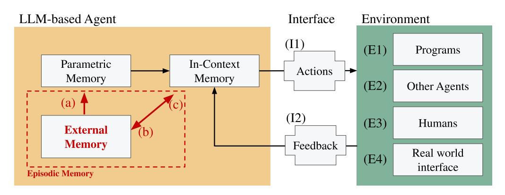

Mathis Pink 1 Qinyuan Wu 1 Vy Ai Vo 2 Javier Turek 3 Jianing Mu 4 Alexander Huth 4 Mariya Toneva 1

# Abstract

As Large Language Models (LLMs) evolve from text-completion tools into fully fledged agents operating in dynamic environments, they must address the challenge of continuous learning and long-term knowledge retention. Many biological systems solve these challenges with episodic memory, which supports single-shot learning of instance-specific contexts. Inspired by this, we present a framework for LLM agents, centered around five key properties of episodic memory that underlie adaptive and context-sensitive behavior. With various research efforts already covering portions of these properties, this position paper argues that now is the right time for an explicit, integrated focus on episodic memory to catalyze the development of long-term agents. To this end, we outline a roadmap that unites several research directions under the goal to support all five properties of episodic memory for more efficient long-term LLM agents.

# 1. Introduction

Large Language Models (LLMs) are rapidly expanding beyond their origins as text-completion engines. Instead, they are evolving into agentic systems capable of taking meaningful actions in complex environments [\(Xi et al.,](#page-12-0) [2023\)](#page-12-0). This transformation can enable a range of real-world applications, including autonomous research assistance [\(Schmidgall et al.,](#page-11-0) [2025\)](#page-11-0), aiding in literature reviews, data analysis, and hypothesis generation; personalized customer support [\(Li et al.,](#page-10-0) [2024b\)](#page-10-0), where they can recall prior interactions to provide consistent and tailored assistance; and interactive tutoring systems [\(Lin et al.,](#page-10-1) [2023\)](#page-10-1), which track learning progress, and revisit challenging concepts to ensure effective and personalized education. These diverse applications hint at a vast potential of LLMs to enable intelligent agents capable of meaningful and context-sensitive interaction.

Ongoing research directions attack the problem of longterm retention and adaptation from different angles and have made impressive progress. However, we are still lacking approaches that maintain relevant contextualized information over long time frames at a constant cost without degrading performance—necessities for a widespread adoption of LLM agents in many long-term settings.

Meanwhile, many biological systems solve the demands for acting in a continually evolving environment with a dedicated memory system that allows for both fast and slow learning: episodic memory [\(McClelland et al.,](#page-10-2) [1995;](#page-10-2) [Schwartz & Evans,](#page-11-1) [2001;](#page-11-1) [O'Reilly & Norman,](#page-11-2) [2002;](#page-11-2) [O'Reilly et al.,](#page-11-3) [2014;](#page-11-3) [Kumaran et al.,](#page-9-0) [2016;](#page-9-0) [Liao & Loson](#page-10-3)[czy,](#page-10-3) [2024\)](#page-10-3). In this position paper, we argue that the growing demand for LLM agents to operate effectively over extended timescales, alongside ongoing advances in long-context models, external memory systems, and efficient fine-tuning methods, makes episodic memory a timely framework to unify efforts for enabling truly long-term LLM agents.

To lay out the argument for this position, we proceed as follows: In Section [2,](#page-1-0) we operationalize the concept of episodic memory for LLM agents by highlighting five key properties that distinguish it from other biological types of memory that are also desirable for LLM agents. We proceed to argue in Section [3](#page-2-0) for episodic memory as a unifying goal

\*Equal contribution 1Max Planck Institute for Software Systems 2 3EarthDynamics.ai 4University of Texas at Austin. Correspondence to: Mathis Pink <mpink@mpi-sws.org>.

Operating and reasoning over extended timescales in dynamic interactive contexts demands that an agent not only recalls what happened, but also when, how, why, and involving whom. Such rich traces of past events, motivations, and outcomes form the basis of context-sensitive behavior—especially crucial in large-scale projects involving human stakeholders and multiple actors. For example, a future long-term LLM agent that is supposed to assist in the ongoing development of a massive software project such as Linux—which has spanned decades, encompasses over 40 million lines of code, and additionally involves countless past contributions, issues, comments, notes, and feature requests—would need to continuously integrate and reason about a vast, evolving historical context while adapting to new requirements. Core necessities for this kind of system are constant computational cost per new token and a stable or improving performance over time.

Figure 1. LLM-Agents with an Episodic Memory system. The LLM agent acts on and gets feedback from an environment. Feedback can come in the form of outputs from programs (E1), from other agents (E2), humans (E3), as well as external real-world data (E4). Actions can modify parts of the environment, and provide feedback for humans or other agents in the environment. Within the agent, an external memory system acts as a bridge between parametric and in-context memory while allowing for fast *encoding* of and *retrieval* into in-context memory (the LLM's context window). (a) *Consolidation*: Episodes in the external memory are consolidated into a model's broader parametric memory to avoid capacity limitations and allow for generalization to new semantic knowledge and procedural skills based on specific instances. (b) *Encoding*: Limited in-context memory can offload its content into external memory. (c) *Retrieval*: Stored episodes can later be retrieved and used to reinstate representations into in-context memory.

by showing how various existing approaches to improve LLM memory target different properties that are united in episodic memory. In Section [4,](#page-6-0) we highlight how unifying these threads under a common goal can spur more holistic progress and outline a roadmap toward implementing episodic memory. Lastly, in Section [5,](#page-7-0) we discuss alternative views under which episodic memory would not be necessary for long-term LLM agents.

# 2. Operationalizing EM for LLMs

To transfer the concept of episodic memory from cognitive science to the context of LLM agents, we highlight five properties of episodic memory that are useful for LLM agents, and that distinguish episodic memory from other memory types in animals and humans. These five properties naturally cluster into two categories: properties that concern the way that the system operates with the memory namely, long-term storage, explicit reasoning, and singleshot learning, and properties that concern the content of the stored memory—namely, instance-specific and contextualized memories. We first discuss how the combination of these five properties distinguishes episodic memory from other types of memories in animals and humans, and then detail each property and its utility for LLM agents.

#### 2.1. Unique Combination of EM Properties

Episodic memory is one of multiple memory systems that exist in animals and humans, distinguished by its unique combination of properties (Table [1\)](#page-1-1). Other biological memory systems that share some, but not all, properties of episodic

memory are 1) procedural memory [\(Milner,](#page-10-4) [1962;](#page-10-4) [Cohen](#page-8-0) [& Squire,](#page-8-0) [1980\)](#page-8-0), which allows for long-term storage of memories for implicit operations or task behaviors, such as producing a sequence of a particular type, rather than reasoning about the sequence; 2) semantic memory [\(Collins](#page-8-1) [& Quillian,](#page-8-1) [1969;](#page-8-1) [Tulving,](#page-11-4) [1972\)](#page-11-4), which allows for longterm storage of factual knowledge and explicit reasoning with these stored memories, but lacks specificity to single instances of acquired information and its context; and 3) working memory [\(Baddeley,](#page-8-2) [1986;](#page-8-2) [Baddeley & Hitch,](#page-8-3) [1974\)](#page-8-3), which can share many of the highlighted properties of episodic memory except for the important fact that it does not allow for long-term storage. The unique combination of important properties in episodic memory makes it a promising candidate for translation to AI systems.

#### 2.2. Importance of EM Properties for LLM Agents

#### 2.2.1. EPISODIC MEMORY OPERATIONS

Long-term storage. In humans and other animals, episodic memory functions as a form of long-term memory, capable

Table 1. Properties of episodic memory in comparison to other relevant forms of memory in animals and humans.

| Memory Type | Long term | Explicit Single | shot | Instance specific | Contextual relations |
|-------------|--------------|-----------------|------|----------------------|-------------------------|
| Episodic    | !            | !               | !    | !                    | !                       |
| Procedural  | !            | ×               | ×    | ×                    | ×                       |
| Semantic    | !            | !               | ×    | ×                    | ×                       |
| Working     | ×            | !               | !    | !                    | !                       |

of storing knowledge throughout an individual's lifetime [\(Conway,](#page-8-4) [2001;](#page-8-4) [Mayes & Roberts,](#page-10-5) [2001;](#page-10-5) [Squire & Zola,](#page-11-5) [1996;](#page-11-5) [Hampton & Schwartz,](#page-9-1) [2004\)](#page-9-1). This distinguishes it from working memory, which is transient. For LLM agents, an effective episodic memory system must similarly support memory retrieval across any number of tokens. This requires mechanisms for long-term memory that maintain an agent's performance throughout a continual interaction with an environment. An adaptive long-term agent should not only prevent a degradation in performance over timeit should also be able to improve by learning new general knowledge and skills.

Explicit reasoning. In classical theories of human memory, episodic memory is described as a subset of declarative or explicit memory [\(Squire & Zola,](#page-11-5) [1996;](#page-11-5) [Hampton &](#page-9-1) [Schwartz,](#page-9-1) [2004\)](#page-9-1). A defining feature of explicit memory is the ability to reflect and reason about the memory content. In the context of LLM agents, the explicitness of memory is necessary as agents need to be able to answer direct queries about stored information or use this information in explicit internal reasoning processes.

Single-shot learning. A key characteristic of episodic memory, as emphasized in complementary learning systems theory, is its ability to be acquired based on a single exposure [\(Liao & Losonczy,](#page-10-3) [2024;](#page-10-3) [Schwartz & Evans,](#page-11-1) [2001;](#page-11-1) [O'Reilly](#page-11-2) [& Norman,](#page-11-2) [2002;](#page-11-2) [O'Reilly et al.,](#page-11-3) [2014;](#page-11-3) [McClelland et al.,](#page-10-2) [1995;](#page-10-2) [Kumaran et al.,](#page-9-0) [2016;](#page-9-0) [Das et al.,](#page-8-5) [2024b\)](#page-8-5). This fast learning enables the rapid encoding of unique experiences or events. For LLM agents, this capability is particularly crucial in environments where continual deployment may not provide multiple variations or repetitions of specific events. Certain occurrences in an environment may happen only once, necessitating an episodic memory system that is capable of effectively capturing and utilizing information from single exposures.

#### 2.2.2. EPISODIC MEMORY CONTENT

Instance-specific memories. Episodic memory stores information specific to an individual sequence of events along with their distinct temporal contexts [\(Sugar & Moser,](#page-11-6) [2019;](#page-11-6) [Colgin et al.,](#page-8-6) [2008\)](#page-8-6). This specificity allows episodic memory to capture details unique to a particular occurrence, enabling its application in agentic environments where reasoning about specific past actions and their consequences matters. This can include past lines of reasoning that were associated with a decision to be made by an LLM agent.

Contextual memories. Episodic memory binds context to its memory content, such as when, where, and why an event was encountered [\(Eichenbaum & Cohen,](#page-9-2) [2014;](#page-9-2) [O'Keefe &](#page-11-7) [Nadel,](#page-11-7) [1978;](#page-11-7) [Eichenbaum,](#page-9-3) [2015\)](#page-9-3). The ability to store many contextual relations associated with a specific event enables retrieval based on contextual cues as well as explicit recall

Table 2. Methods for in-context, external, and parametric memory do not cover all features of episodic memory. ∼ is used for cases where it is unclear whether an aspect of episodic memory is properly satisfied by a method.

| Memory Approach |                       | Long-term | Explicit | Single-shot | Inst.-specific | rel. Contextual |
|-----------------|-----------------------|-----------|----------|-------------|----------------|--------------------|
| In-Context      | KV-Compression        | ×         | !        | !           | !              | !                  |
|                 | State-space-model     | ×         | !        | !           | !              | !                  |
| External        | RAG                   | !         | !        | ∼           | ∼              | ×                  |
|                 | GraphRAG              | !         | !        | ∼           | ∼              | ∼                  |
| Parametric      | Efficient Fine-tuning | !         | !        | ×           | ×              | ×                  |
|                 | Knowledge Editing     | !         | ∼        | ×           | ∼              | ×                  |
|                 | Context Distillation  | !         | !        | ×           | !              | ×                  |

of context. For LLM agents, this property is important to not only remember that a specific event happened in the past, but also when, why, and in which broader context it happened.

# 3. Current Approaches

While many methods currently exist to modify and augment LLM memory, we argue that they fall short of the memory properties that would enable effective, long-term LLM agents. We group existing methods that seek to improve the memory of LLMs into three categories that are relevant to episodic memory:

- 1. In-Context Memory methods extend the effective context length by optimizing computational efficiency and length generalization;
- 2. External Memory methods augment a model's incontext memory capacity with a separate module, often with reduced GPU memory requirements and/or computational cost;
- 3. Parametric Memory methods modify the LLM parameters that encode memories (primarily learned from the language modeling training data).

In this section, we discuss examples in each category that capture different properties of episodic memory (Table [2\)](#page-2-1). More importantly, we highlight their shortcomings in supporting episodic memory for LLM agents in isolation.

### 3.1. In-Context Memory

In-context memory (ICM) allows LLMs to perform singleshot, instance-specific, and contextualized learning by enabling them to directly attend to representations of encountered sequences (Table [2\)](#page-2-1). ICM capacity is either tightly

limited or extensible but expensive to scale, often requiring sequence parallelization. Recent works seek to extend it by increasing the context window, but models struggle with length generalization beyond training exposures. We review existing methods and their limitations in addressing these challenges.

One active research direction focuses on extending the incontext window to handle significantly longer sequences, enabling LLMs to perform reasoning over extended contexts. This advancement brings LLMs closer to mimicking episodic memory, as it allows models to retain and utilize information across longer contexts. However, transformerbased LLMs face significant challenges, including the high computational cost of processing long sequences and limitations in length generalization. Recent research has sought to address these challenges by reducing memory usage, optimizing inference time, and improving long-sequence generation. Despite these advancements, current methods have yet to achieve robust, persistent memory capabilities necessary for long-term, open-ended, and context-aware reasoning. Below, we briefly review existing methods and their limitations.

Memory reduction. For transformer-based LLMs, several methods aim to reduce memory and computation costs.

Sparsification and compression methods selectively retain relevant information to optimize memory usage. Sparsification strategies optimize memory by restricting attention computations to the most relevant parts of the sequence [\(Lou](#page-10-6) [et al.,](#page-10-6) [2024\)](#page-10-6), reducing both storage and computational overhead. Similarly, forgetting mechanisms remove less useful tokens to maintain efficiency [\(Anonymous,](#page-8-7) [2024\)](#page-8-7). Other compression-based approaches dynamically reduce KV cache size by storing only the most important tokens and key-value pairs [\(Liu et al.,](#page-10-7) [2023b;](#page-10-7) [Ge et al.,](#page-9-4) [2024;](#page-9-4) [Tang](#page-11-8) [et al.,](#page-11-8) [2024\)](#page-11-8). Adaptive strategies further refine compression across layers [\(Yang et al.,](#page-12-1) [2024a;](#page-12-1) [Nawrot et al.,](#page-11-9) [2024\)](#page-11-9) or merge similar states to minimize redundancy [\(Liu et al.,](#page-10-8) [2024a\)](#page-10-8).

Quantization methods reduce memory footprints by lowering precision or selectively storing information. Quantization techniques store key-value pairs at reduced precision [\(Liu et al.,](#page-10-9) [2024c;](#page-10-9) [Hooper et al.,](#page-9-5) [2024;](#page-9-5) [Yue et al.,](#page-13-0) [2024;](#page-13-0) [Duanmu et al.,](#page-8-8) [2024\)](#page-8-8), allowing for larger context windows with a relatively minimal performance degradation.

Inference time reduction. Efficiency improvements during inference focus on optimizing KV cache management and parallelization. Techniques such as paged caching [\(Kwon](#page-9-6) [et al.,](#page-9-6) [2023;](#page-9-6) [Lee et al.,](#page-10-10) [2024;](#page-10-10) [Zheng et al.,](#page-13-1) [2024\)](#page-13-1) dynamically allocate memory to accommodate longer sequences without excessive overhead. Other methods leverage GPU memory pooling and adaptive chunking [\(Lin et al.,](#page-10-11) [2024;](#page-10-11) [Agrawal](#page-8-9) [et al.,](#page-8-9) [2024\)](#page-8-9) to process extended contexts efficiently while maintaining fast retrieval and computation speeds. Other strategies improve efficiency by reusing KV tensors across layers [\(Ye et al.,](#page-12-2) [2024a;](#page-12-2) [Brandon et al.,](#page-8-10) [2024\)](#page-8-10)

Recent work has aimed to introduce episodic memory in LLMs by structuring token sequences into retrievable events [\(Fountas et al.,](#page-9-7) [2024\)](#page-9-7), enhancing long-context reasoning and outperforming retrieval-based models. However, a fundamental challenge remain the increasing memory and retrieval costs: maintaining the full KV-Cache for an entire interaction history can quickly become impractical, especially in large-scale, long-duration, and multimodal applications. This limitation is inherent to KV-Cache management systems, which must retain the entire cache, leading to significant storage and computational overhead.

Transformer alternatives to reduce both memory and inference time. In addition to optimizing KV cache storage and management, alternative architectures have been proposed to address the limitations of standard transformers in both memory and inference time.

Linear attention [\(Li et al.,](#page-10-12) [2020;](#page-10-12) [Katharopoulos et al.,](#page-9-8) [2020\)](#page-9-8) approximates full self-attention using kernel-based or lowrank transformations, significantly reducing computational complexity and improving efficiency for long-sequence processing. State-space models (SSMs) [\(Peng et al.,](#page-11-10) [2023;](#page-11-10) [Gu & Dao,](#page-9-9) [2023\)](#page-9-9) further achieve linear scaling for sequence handling by maintaining a fixed-size representation, making them inherently memory-efficient. Hybrid architectures [\(Goldstein et al.,](#page-9-10) [2024\)](#page-9-10) combine these techniques with transformers to compress KV-cache sizes while preserving strong performance. Other alternatives restructure the transformer architecture itself to enhance efficiency. Some models [\(Sun et al.,](#page-11-11) [2024a\)](#page-11-11) modify the decoder structure to reduce memory usage and latency, while others [\(Pang](#page-11-12) [et al.,](#page-11-12) [2024\)](#page-11-12) compress sequence information into compact representations to improve inference speed and scalability.

These methods enhance ICM efficiency, but their reliance on compression, approximation, and selective retention comes with limited support for long-term reasoning with episodic memory. This limitation highlights the need for an external memory structure that retains past information. Methods of KV-cache optimization can also discard older context, leading to irreversible information loss and different model behavior [\(Kirsten et al.,](#page-9-11) [2024\)](#page-9-11). Generally, methods with a constant cost, like SSMs, struggle to handle a continually expanding interaction history in dynamic environments, while methods with an increasing state representation increase in both inference time and GPU memory requirements.

Length Generalization. Length generalization refers to a model's ability to maintain understanding over long sequences, preventing degradation of performance such as

forgetting or losing context midway through processing [\(Liu](#page-10-13) [et al.,](#page-10-13) [2024b\)](#page-10-13). In essence, humans avoid SSMs' trade-offs by storing compressed representations and retrieving knowledge adaptively, allowing us to manage expanding information effortlessly.

To address this, lightweight solutions [\(Yen et al.,](#page-12-3) [2024;](#page-12-3) [Xiao](#page-12-4) [et al.,](#page-12-4) [2024\)](#page-12-4) create adapters to process and retrieve long inputs before passing the content to the LLM. Other approaches [\(Han et al.,](#page-9-12) [2024\)](#page-9-12) refine attention patterns and positional encodings to enhance long-context comprehension. Alternative architectures [\(Ye et al.,](#page-12-5) [2024b;](#page-12-5) [Dai et al.,](#page-8-11) [2019\)](#page-8-11) improve long-context learning through mechanisms like differential attention and segment-level recurrence. Another promising approach embeds test-time information into the model's parameters, creating a form of long-term memory [\(Sun et al.,](#page-11-13) [2024b;](#page-11-13) [Behrouz et al.,](#page-8-12) [2024\)](#page-8-12), combining attention with neural memory modules, enabling adaptability for long contexts but at the cost of increased inference overhead. These approaches have limited capacity and still face eventual forgetting over very long sequences.

#### 3.2. External Memory

Many methods propose a separate memory module that stores information when it exceeds the effective operating span of the model. These augmented memory models are usually evaluated on tasks which require using that stored information. As such, these methods typically have longterm and explicit memory (Table [2\)](#page-2-1). However, they often lack information that relates the stored memories to one another—especially contextual details on how the model acquired the memory, or details to help differentiate specific instances. They are typically not evaluated for single-shot learning, especially for specific instances. And finally, there is a lack of proposals to generalize information from these instances and update parametric memory (Figure [1a](#page-1-2)). Below we review some relevant external memory methods and elaborate on key examples to illustrate these shortcomings.

Slot-based memory with recurrent controllers. A key advance in memory augmentation in the pre-transformer era was the formulation of learnable memory modules external to the main neural network [\(Bordes et al.,](#page-8-13) [2015;](#page-8-13) [Graves](#page-9-13) [et al.,](#page-9-13) [2014;](#page-9-13) [Sukhbaatar et al.,](#page-11-14) [2015\)](#page-11-14). External memories were stored in individual slots and updated via a recurrent memory controller. These models were shown to retain longer-term information than vanilla long-short term memory (LSTM) networks. Similar memory augmentation methods have been adapted for transformers [\(Wu et al.,](#page-12-6) [2022a\)](#page-12-6). However, these methods lack a way to store contextual details that LLM agents would need in an episodic memory, as they strongly depend on the details available in the input data. One exception devised a method to record temporal relationships between memories [\(Graves et al.,](#page-9-14) [2016\)](#page-9-14), but

this has yet to be seen in augmented LLMs.

Distributed vs. slot memory. An issue with slot-based memory modules is that they are capacity-limited, both by the number of slots and the dimensionality of each slot representation. While these models adopt forgetting mechanisms to mitigate this, the capacity limit still affects how long memories can be stored. Another approach addresses this downside by storing external memories in a sparse, distributed fashion [\(Wu et al.,](#page-12-7) [2018\)](#page-12-7) instead of in slots. Recent work [\(Das et al.,](#page-8-14) [2024a\)](#page-8-14) integrated distributed memory in an LLM, and showed that the model can recall a greater number of facts over longer contexts, compared to baseline LLMs. While they demonstrate how they can perform oneshot memory updates (fact-editing), they do not evaluate single-shot learning of novel facts.

RAG and GraphRAG methods. Retrieval Augmented Generation (RAG) methods maintain an external database of information that is added to the input data to augment LLM generation. Naive RAG implementations encode chunks of text using embedding models [\(Gao et al.,](#page-9-15) [2023\)](#page-9-15), typically without much metadata or contextual detail about the original text. (One exception is work that preserves the order of retrieved text from the database [\(Yu et al.,](#page-13-2) [2024\)](#page-13-2).) And while text embedding models can capture some similarity relationships between embeddings, they do not encompass the rich set of relationships that LLM agents will likely need for most applications. GraphRAG models replace the vector embedding database with a structured graph that explicitly encodes relationships as connections between nodes [\(Peng](#page-11-15) [et al.,](#page-11-15) [2024\)](#page-11-15). Still, these graphs encode a limited number of relationship types, even when researchers branch out beyond pre-existing datasets and learn to build the graphs directly from the input text [\(Li et al.,](#page-10-14) [2024a;](#page-10-14) [Edge et al.,](#page-9-16) [2024;](#page-9-16) [Gutierrez et al.](#page-9-17) ´ , [2025\)](#page-9-17). As such, they also lack rich contextual detail.

External storage of past LLM inputs and outputs. Another type of approach maintains a database of pasts LLM inputs to avoid recomputing predictions to similar future inputs [\(Wu et al.,](#page-12-8) [2022b;](#page-12-8) [Khandelwal et al.,](#page-9-18) [2020;](#page-9-18) [Yogatama](#page-12-9) [et al.,](#page-12-9) [2021\)](#page-12-9). Here, contextual information (e.g. details that differentiate specific instances) will only be stored when explicitly given in the LLM input text. That is, the memory is much more dependent on input data, limiting test-time generalization. One proposal to mitigate this formulates a long-term memory module for context that is updated with LLM activations based on the current inputs [\(Behrouz et al.,](#page-8-12) [2024\)](#page-8-12). Other approaches additionally store LLM outputs, such as generated text [\(Cheng et al.,](#page-8-15) [2023\)](#page-8-15), summarizations [\(Wang et al.,](#page-12-10) [2024a;](#page-12-10) [Lee et al.,](#page-10-15) [2023\)](#page-10-15), chain-of-thought steps [\(Liu et al.,](#page-10-16) [2023a;](#page-10-16) [Lu et al.,](#page-10-17) [2023\)](#page-10-17), and extracted relation triples [\(Modarressi et al.,](#page-11-16) [2025\)](#page-11-16). One approach specialized for chat interactions stores timestamps and user personality

profiles as context [\(Zhong et al.,](#page-13-3) [2024\)](#page-13-3). These modifications enable storage of contextual details useful for LLM agents. However, specifying the type of contextual detail is restrictive, so it is preferable to combine this with a more learnable and flexible mechanism for storing context.

Learning to interact with external memory. The approaches described above may fine-tune or instruct the LLM to interact with and update external memory. That is, the LLM learns the functions of a memory controller. For example, several RAG approaches fine-tune the LLM to make better use of the retrieved content [\(Gao et al.,](#page-9-15) [2023\)](#page-9-15). Other approaches define how LLMs should interact with memory, requiring them to learn specific API calls [\(Modarressi](#page-11-16) [et al.,](#page-11-16) [2025\)](#page-11-16) or memory hierarchies [\(Packer et al.,](#page-11-17) [2024\)](#page-11-17). These provide possible mechanisms to add information to external memory, such as contextual details and specific instances. However, most current work does not consider how to modify the LLM to generalize across specific instances to store new knowledge in LLM parameters (Figure [1a](#page-1-2)). [Behrouz et al.](#page-8-12) [\(2024\)](#page-8-12) propose one way to generalize across instances by adding a data-independent memory system (a.k.a. meta-memory, persistent memory) in addition to a more data-dependent memory module. However, the data-independent memory is considered to be closer to task memory than knowledge distillation, and the meta-memory parameters are kept separate from the LLM itself.

#### 3.3. Parametric Memory

This type of memory allows LLMs to process the information in the input to obtain well-suited output. Parametric memory values are initially learned through backpropagation with a pretraining dataset. During this process, the parametric memory tends to capture general knowledge and rules ranging from syntax to common sense and factual knowledge. Due to the sheer size of the parametric memory, the amount of data needed for pre-training is usually very large, following power laws [\(Kaplan et al.,](#page-9-19) [2020\)](#page-9-19). Generally, parametric memory is fixed after training, i.e., does not change with the input at inference time.

A relevant research direction in parametric memory focuses on adapting LLM parameters to specific domains, tasks, or applications when given limited resources. Efficient fine-tuning methods have been developed in recent years to tackle the runtime and memory consumption of this process. Alternatively, distillation techniques have been proposed to update knowledge and propagate it through a model. A key challenge is the need for updating specific factual knowledge without interfering with other knowledge. Some facts may change over time, requiring surgical precision to update the parameters of a model. The line of work that proposes these updates is known as knowledge editing.

Efficient Fine-tuning. Various works have been proposed

to reduce the computational needs (hardware memory) of updating a model to a specific domain. Among these, Low-Rank Adaptation (LoRA) [\(Hu et al.,](#page-9-20) [2022\)](#page-9-20) applies additive low-rank approximation updates to shift the model parameters. Several methods proposed other ways to further improve efficiency by reducing and localizing updates [\(Wang](#page-12-11) [et al.,](#page-12-11) [2024b;](#page-12-11) [Valipour et al.,](#page-12-12) [2022;](#page-12-12) [Xu et al.,](#page-12-13) [2021;](#page-12-13) [Yin et al.,](#page-12-14) [2024\)](#page-12-14). Other work learned modifications on representations instead of parameters [\(Wu et al.,](#page-12-15) [2024;](#page-12-15) [Yin et al.,](#page-12-14) [2024\)](#page-12-14). In all cases, fine-tuning methods require a dataset to adapt a model for a specific task or domain, i.e. they are not capable of single-shot learning or capturing instance-specific and contextually rich information. On the other hand, additional fine-tuned adapter parameters are often frozen after the fine-tuning process, supporting the long term storage of information. Moreover, these methods tend to preserve the reasoning capabilities while updating the model with newly captured information [\(Wu et al.,](#page-12-15) [2024\)](#page-12-15).

Knowledge Editing. As the environment evolves over time, some factual knowledge becomes outdated (e.g., the president of a country may change after the elections). Knowledge editing methods aim to make modifications to the factual knowledge in parametric memory with targeted updates while avoiding interference with other facts. In ROME [\(Meng et al.,](#page-10-18) [2023a\)](#page-10-18) and MEM-IT [\(Meng et al.,](#page-10-19) [2023b\)](#page-10-19), the first step is to find relevant parameters (in MLPs) that influence the specific fact through causal interventions and then update the related parameters with low-rank model edits. An alternative research direction proposes to train a hypernetwork [\(Cao et al.,](#page-8-16) [2021;](#page-8-16) [Tan et al.,](#page-11-18) [2024\)](#page-11-18) that predicts the amount of change for each parameter given the knowledge to be edited. A different method, SERAC, stores the set of edits in an external memory, combined with a scope detector and a counter-factual model to decide when and how to apply the edits[\(Mitchell et al.,](#page-10-20) [2022\)](#page-10-20). All knowledge editing methods work on facts which are inherently context-free, making it impossible to contextualize the edited knowledge in the history of the agent-environment interaction. However, they mimic the episodic memory traits of learning from a single instance, while enabling long-term retention.

The problem of knowledge editing has been extended to a continual learning setting, where edits are required sequentially over time to correct a model. This leads to the sequential editing problem: hyper-network prediction quality decreases because they fail to reflect the updated model, and low-rank parameter updates interfere with one another causing catastrophic forgetting [\(Gupta et al.,](#page-9-21) [2024\)](#page-9-21). MELO [\(Yu et al.,](#page-13-4) [2023\)](#page-13-4) adapts dynamic LoRA to this problem and introduces a vector database to search the selections of the blocks to be dynamically activated within the LoRA matrices for each layer. WISE [\(Wang et al.,](#page-12-16) [2024c\)](#page-12-16) adds duplicates of the MLP's output parameters for some layers in the network, and updates them with each new edit set. A

routing mechanism decides whether to use the original layer or the updated one. It further uses sharding and merging [\(Yadav et al.,](#page-12-17) [2023\)](#page-12-17) to distribute the edits into random subspaces to improve generalization and parameter utilization.

While continual learning-based knowledge editing allows models to integrate updates over time, it has fundamental limitations. Edited knowledge often lacks generalization, struggling with inferring new relationships or reasoning over multiple steps [\(Berglund et al.,](#page-8-17) [2023;](#page-8-17) [Yang et al.,](#page-12-18) [2024b\)](#page-12-18). This highlights a key challenge—knowledge editing methods can introduce updates but do not always ensure deeper understanding or adaptability.

Context Distillation. The idea behind these techniques is to transfer in-context learned information, abilities, and task-understanding by distilling them into model parameters. [Snell et al.](#page-11-19) [\(2022\)](#page-11-19) proposed to use distillation when the teacher and the student are in the same model, but less in-context information is given to the student. This would enable the student to learn skills and express knowledge that would otherwise depend on including information and instances in costly and limited in-context memory. Further, [Padmanabhan et al.](#page-11-20) [\(2023\)](#page-11-20) proposes to exploit context distillation to inject and propagate knowledge through a model. The original model is provided with new definitions and continuations. The distillation process updates a copy of the model with only the generated continuation, conditioning the updated model to the new entities implicitly. This helps to propagate the information into the parameters (i.e., consolidating it) and thus improving inference with such entities.

# 4. Episodic Memory as a Unifying Framework

Although current work has advanced context-sensitive LLMs that are capable of handling longer sequences, it does not yet deliver efficient learning that could support long-term LLM agents. Existing methods—which extend in-context (working) memory, integrate external memory, or update parametric memory—only address subsets of episodic memory's five essential properties, as discussed in Section [3.](#page-2-0) These approaches remain fragmented, impeding the immediate assimilation of new experiences and gradual improvement over time.

We propose that enabling episodic memory offers a unifying perspective that will combine and extend existing methods to advance the capabilities of LLM agents. By incorporating long in-context memory, external memory, and mechanisms for updating parametric memory, agents can more seamlessly adapt to new information, consolidate it, and prevent escalating costs or performance degradation during extended interactions with an environment. This view is based on Complementary Learning Systems Theory [\(O'Reilly et al.,](#page-11-3)

[2014;](#page-11-3) [Kumaran et al.,](#page-9-0) [2016;](#page-9-0) [Arani et al.,](#page-8-18) [2022\)](#page-8-18), in which episodic memory is part of a fast-learning system that stores information from individual instances. Over time, that information is consolidated into a slow-learning system that stores more stable, durable knowledge.

In Figure [1,](#page-1-2) we present a general architecture and framework that combines these elements under the overarching goal of enabling all five key features of episodic memory for LLM agents as detailed in Section [2.](#page-1-0) As a roadmap to enable episodic memory in LLM agents, we specifically call for four main research directions (encoding, retrieval, consolidation, and benchmarks), and formulate six research questions under these areas below.

### 4.1. Encoding

RQ1: *How to store information from in-context memory in a long-term external memory store?*

An external memory store is essential for retaining experience in a structured way that preserves the context of individual instances (Fig[.1,](#page-1-2) arrow (b)). A straightforward approach is to store text chunks or embeddings in a non-parametric RAG-like database, potentially augmented with metadata for context [\(Mombaerts et al.,](#page-11-21) [2024\)](#page-11-21). More structured representations, such as GraphRAG, could also facilitate contextsensitive retrieval. However, capacity constraints on these types of databases may make it necessary to rely on more compressed parametric representations.

RQ2: *How to segment continuous input into discrete episodes, and when to store them in an external memory?*

A major design question is *when and how to segment* a continuous stream of agent experience into episodes to be encoded into an external memory. LLMs have already been shown to be capable of segmenting text into meaningful events, in a way that is similar to humans [\(Michelmann et al.,](#page-10-21) [2023\)](#page-10-21), and recent approaches show that further bundling related segments based on model surprise can improve longterm modeling [\(Behrouz et al.,](#page-8-12) [2024;](#page-8-12) [Fountas et al.,](#page-9-7) [2024\)](#page-9-7).

*Leveraging long-context advances* can further improve encoding by providing a space in which new episodes can be equipped with a rich contextualization. Large hidden states or extended attention windows help capture high-fidelity contextual information, which can then be encoded into an external memory in a compressed format for future retrieval.

### 4.2. Retrieval

RQ3: *Given an external memory, how to select relevant past episodes for retrieval and reinstatement into in-context memory for the purpose of explicit reasoning?*

To employ past experiences in current tasks, an agent must *retrieve* relevant episodes at the right time and *reintegrate* them into its in-context memory with an adequate mechanism (Fig[.1,](#page-1-2) arrow (c)). Common strategies include prepending retrieved text tokens to the input sequence (as in RAG), manipulating representational states within the transformer (e.g., memory tokens [\(Bulatov et al.,](#page-8-19) [2022\)](#page-8-19)), or adapting internal representations [\(Wu et al.,](#page-12-15) [2024\)](#page-12-15).

RQ4: *How can retrieval mechanisms in long-context LLMs improve and accelerate the optimization of external memory retrieval and reinstatement?*

*Long-context advances* can be leveraged to inform when and what to retrieve at sequence lengths that are still feasible. Future research could explore tight integration of external memory with the model's forward pass [\(Berges et al.,](#page-8-20) [2024\)](#page-8-20) and adopt cross-architecture distillation [\(Wang et al.,](#page-12-19) [2025\)](#page-12-19) to accelerate the development of external memory structures that retain many of the desirable properties of in-context memory while reducing the resource cost.

### 4.3. Consolidation

RQ5: *How to periodically consolidate external memory contents into the LLM's base parameters without forgetting previous knowledge?*

Eventually, merging external memory contents into the model's parameters (Fig[.1,](#page-1-2) arrow (a)) promises to allow new generalized knowledge to be used without explicit retrieval. This process both prevents external memory overflow and supports continuous adaptation of the agent's semantic and procedural backbone to the environment. Relevant techniques include context distillation, parametric knowledge editing, and localized fine-tuning methods that capture newly encountered information without catastrophic interference with other knowledge. Open questions remain about how to decide when to consolidate and how to compress many episodic instances into more abstract parametric knowledge while also retaining previous knowledge and skills.

#### 4.4. Benchmarks

### RQ6: *What new types of benchmarks are needed to assess episodic memory in LLM agents?*

Finally, *evaluating* episodic memory effectiveness requires new tasks and metrics. Studies should test the recall of contextualized events after long delays, assessing how well agents remember when, where, and how events occurred. An example of such a study is the testing of instance-specific temporal order memory proposed by [Pink et al.](#page-11-22) [\(2024\)](#page-11-22). Beyond controlled probes, benchmarks must incorporate real-world complexities: agents should demonstrate an improving task performance that is linked to encoding, retrieval, and consolidation of past experiences over extended timescales.

# 5. Alternative Views

While we argue that an explicit episodic memory framework is necessary for effective long-term and context-sensitive behavior, there are alternative perspectives suggesting that current or emerging methods might suffice in the future without the need for the concept of episodic memory to provide guidance.

Scaling in-context memory will be sufficient. One view suggests that advances in long-context methods—such as improved transformers, state-space models, or other architectures with extended context windows—will enable practically unlimited access to past information. Proponents claim that better positional encodings, modified attention mechanisms, and other in-context memory extensions will cover most relevant applications for LLM-based agents.

Contextualized external memory will be sufficient. A second view holds that external memory structures—such as knowledge graphs or retrieval-augmented generation (RAG) systems—could eliminate the need for an episodic memory framework. By contextualizing data chunks and storing them in structured graphs, these systems aim to incorporate past context into current tasks effectively.

"Infinite" in-context memory remains a speculative prospect. Extending limited context windows to include all information needed by an agent requires foreknowledge of the maximum timespan of relevant information. For very long timespans, this will either incur prohibitive computational costs or require compression methods that may lose key details. Only relying on external memory will still incur high storage costs, and require forgetting mechanisms. An episodic memory framework addresses these constraints by periodically consolidating information into high-capacity parametric memory (Figure [1,](#page-1-2) arrow (a)). This has the added benefit of enabling LLM agents to slowly improve over time, as they continue to learn from the past before they forget it.

# 6. Conclusion

This position paper argues that to fully realize efficient long-term LLM agents, we must endow LLM agents with episodic memory. We operationalize episodic memory—a term borrowed from cognitive science—for LLMs by highlighting five key characteristics that distinguish episodic memory from other types of memory in biological systems, and argue for why each property is also important for LLM agents. We position the call for episodic memory in LLM agents in the current literature and discuss how episodic memory can serve as a unifying goal for existing research directions. Lastly, we provide a roadmap of research questions towards implementing episodic memory in LLMs. By describing the potential of this research direction, we aim to spark a community-wide shift in how we conceive and

engineer long-term memory in the move towards agentic AI—one that more deeply integrates lessons from cognitive science and brings together existing approaches in ML under a unifying goal with strong promise.

# References

- Agrawal, A., Chen, J., ´Inigo Goiri, Ramjee, R., Zhang, ˜ C., Tumanov, A., and Choukse, E. Mnemosyne: Parallelization strategies for efficiently serving multi-million context length llm inference requests without approximations, 2024. URL [https://arxiv.org/abs/](https://arxiv.org/abs/2409.17264) [2409.17264](https://arxiv.org/abs/2409.17264).
- Anonymous. Forgetting transformer: Softmax attention with a forget gate. In *Submitted to The Thirteenth International Conference on Learning Representations*, 2024. URL [https://openreview.net/forum?](https://openreview.net/forum?id=q2Lnyegkr8) [id=q2Lnyegkr8](https://openreview.net/forum?id=q2Lnyegkr8). under review.
- Arani, E., Sarfraz, F., and Zonooz, B. Learning fast, learning slow: A general continual learning method based on complementary learning system, 2022. URL <https://arxiv.org/abs/2201.12604>.
- Baddeley, A. D. *Working Memory*. Clarendon Press, Oxford, UK, 1986.
- Baddeley, A. D. and Hitch, G. J. Working memory. In Bower, G. H. (ed.), *The Psychology of Learning and Motivation: Advances in Research and Theory*, volume 8, pp. 47–89. Academic Press, New York, 1974.
- Behrouz, A., Zhong, P., and Mirrokni, V. Titans: Learning to memorize at test time, 2024. URL [https://arxiv.](https://arxiv.org/abs/2501.00663) [org/abs/2501.00663](https://arxiv.org/abs/2501.00663).
- Berges, V.-P., Oguz, B., Haziza, D., tau Yih, W., Zettle- ˘ moyer, L., and Ghosh, G. Memory layers at scale, 2024. URL <https://arxiv.org/abs/2412.09764>.
- Berglund, L., Tong, M., Kaufmann, M., Balesni, M., Stickland, A. C., Korbak, T., and Evans, O. The reversal curse: Llms trained on" a is b" fail to learn" b is a". *arXiv preprint arXiv:2309.12288*, 2023.
- Bordes, A., Usunier, N., Chopra, S., and Weston, J. Large-scale simple question answering with memory networks, 2015. URL [https://arxiv.org/abs/](https://arxiv.org/abs/1506.02075) [1506.02075](https://arxiv.org/abs/1506.02075).
- Brandon, W., Mishra, M., Nrusimha, A., Panda, R., and Kelly, J. R. Reducing transformer key-value cache size with cross-layer attention. *arXiv preprint arXiv:2405.12981*, 2024.
- Bulatov, A., Kuratov, Y., and Burtsev, M. S. Recurrent memory transformer, 2022. URL [https://arxiv.](https://arxiv.org/abs/2207.06881) [org/abs/2207.06881](https://arxiv.org/abs/2207.06881).

- Cao, N. D., Aziz, W., and Titov, I. Editing factual knowledge in language models, 2021. URL [https://arxiv.](https://arxiv.org/abs/2104.08164) [org/abs/2104.08164](https://arxiv.org/abs/2104.08164).
- Cheng, X., Luo, D., Chen, X., Liu, L., Zhao, D., and Yan, R. Lift yourself up: Retrieval-augmented text generation with self-memory. In Oh, A., Naumann, T., Globerson, A., Saenko, K., Hardt, M., and Levine, S. (eds.), *Advances in Neural Information Processing Systems*, volume 36, pp. 43780–43799. Curran Associates, Inc., 2023.
- Cohen, N. J. and Squire, L. R. Preserved learning and retention of pattern-analyzing skill in amnesia: Dissociation of "knowing how" and "knowing that". *Science*, 210(4466): 207–210, 1980.
- Colgin, L., Moser, E., and Moser, M. Understanding memory through hippocampal remapping. *Trends in Neurosciences*, 2008.
- Collins, A. M. and Quillian, M. R. Retrieval time from semantic memory. *Journal of Verbal Learning and Verbal Behavior*, 8(2):240–247, 1969.
- Conway, M. Sensory–perceptual episodic memory and its context: Autobiographical memory. *Philosophical Transactions of the Royal Society of London. Series B: Biological Sciences*, 2001.
- Dai, Z., Yang, Z., Yang, Y., Carbonell, J., Le, Q., and Salakhutdinov, R. Transformer-XL: Attentive language models beyond a fixed-length context. In Korhonen, A., Traum, D., and Marquez, L. (eds.), ` *Proceedings of the 57th Annual Meeting of the Association for Computational Linguistics*, pp. 2978–2988, Florence, Italy, July 2019. Association for Computational Linguistics. doi: 10.18653/v1/P19-1285. URL [https:](https://aclanthology.org/P19-1285/) [//aclanthology.org/P19-1285/](https://aclanthology.org/P19-1285/).
- Das, P., Chaudhury, S., Nelson, E., Melnyk, I., Swaminathan, S., Dai, S., Lozano, A., Kollias, G., Chenthamarakshan, V., Jiˇr´ı, Navratil, Dan, S., and Chen, P.-Y. Lari- ´ mar: Large language models with episodic memory control, 2024a. URL [https://arxiv.org/abs/](https://arxiv.org/abs/2403.11901) [2403.11901](https://arxiv.org/abs/2403.11901).
- Das, P., Chaudhury, S., Nelson, E., et al. Larimar: Large language models with episodic memory control. In *Proceedings of the 41st International Conference on Machine Learning (ICML)*, 2024b.
- Duanmu, H., Yuan, Z., Li, X., Duan, J., Zhang, X., and Lin, D. Skvq: Sliding-window key and value cache quantization for large language models, 2024. URL <https://arxiv.org/abs/2405.06219>.

- Edge, D., Trinh, H., Cheng, N., Bradley, J., Chao, A., Mody, A., Truitt, S., and Larson, J. From local to global: A graph rag approach to query-focused summarization, 2024. URL <https://arxiv.org/abs/2404.16130>.
- Eichenbaum, H. The hippocampus as a cognitive map . . . of social space. *Neuron*, 2015.
- Eichenbaum, H. and Cohen, N. Can we reconcile the declarative memory and spatial navigation views on hippocampal function? *Neuron*, 2014.
- Fountas, Z., Benfeghoul, M. A., Oomerjee, A., Christopoulou, F., Lampouras, G., Bou-Ammar, H., and Wang, J. Human-like episodic memory for infinite context llms, 2024. URL [https://arxiv.org/abs/](https://arxiv.org/abs/2407.09450) [2407.09450](https://arxiv.org/abs/2407.09450).
- Gao, T., Yen, H., Yu, J., and Chen, D. Enabling large language models to generate text with citations, 2023. URL <https://arxiv.org/abs/2305.14627>.
- Ge, S., Zhang, Y., Liu, L., Zhang, M., Han, J., and Gao, J. Model tells you what to discard: Adaptive kv cache compression for llms, 2024. URL [https://arxiv.](https://arxiv.org/abs/2310.01801) [org/abs/2310.01801](https://arxiv.org/abs/2310.01801).
- Goldstein, D., Obeid, F., Alcaide, E., Song, G., and Cheah, E. Goldfinch: High performance rwkv/transformer hybrid with linear pre-fill and extreme kv-cache compression, 2024. URL [https://arxiv.org/abs/2407.](https://arxiv.org/abs/2407.12077) [12077](https://arxiv.org/abs/2407.12077).
- Graves, A., Wayne, G., and Danihelka, I. Neural turing machines, 2014. URL [https://arxiv.org/abs/](https://arxiv.org/abs/1410.5401) [1410.5401](https://arxiv.org/abs/1410.5401).
- Graves, A., Wayne, G., Reynolds, M., Harley, T., Danihelka, I., Grabska-Barwinska, A., Colmenarejo, S. G., ´ Grefenstette, E., Ramalho, T., Agapiou, J., et al. Hybrid computing using a neural network with dynamic external memory. *Nature*, 538(7626):471–476, 2016.
- Gu, A. and Dao, T. Mamba: Linear-time sequence modeling with selective state spaces. *arXiv preprint arXiv:2312.00752*, 2023.
- Gupta, A., Rao, A., and Anumanchipalli, G. Model editing at scale leads to gradual and catastrophic forgetting, 2024. URL <https://arxiv.org/abs/2401.07453>.
- Gutierrez, B. J., Shu, Y., Gu, Y., Yasunaga, M., and Su, Y. ´ Hipporag: Neurobiologically inspired long-term memory for large language models, 2025. URL [https:](https://arxiv.org/abs/2405.14831) [//arxiv.org/abs/2405.14831](https://arxiv.org/abs/2405.14831).
- Hampton, R. and Schwartz, B. Episodic memory in nonhumans: what, and where, is when? *Current Opinion in Neurobiology*, 2004.

- Han, C., Wang, Q., Peng, H., Xiong, W., Chen, Y., Ji, H., and Wang, S. LM-infinite: Zero-shot extreme length generalization for large language models. In Duh, K., Gomez, H., and Bethard, S. (eds.), *Proceedings of the 2024 Conference of the North American Chapter of the Association for Computational Linguistics: Human Language Technologies (Volume 1: Long Papers)*, pp. 3991–4008, Mexico City, Mexico, June 2024. Association for Computational Linguistics. doi: 10.18653/v1/2024.naacl-long. 222. URL [https://aclanthology.org/2024.](https://aclanthology.org/2024.naacl-long.222/) [naacl-long.222/](https://aclanthology.org/2024.naacl-long.222/).
- Hooper, C., Kim, S., Mohammadzadeh, H., Mahoney, M. W., Shao, Y. S., Keutzer, K., and Gholami, A. Kvquant: Towards 10 million context length llm inference with kv cache quantization, 2024. URL [https:](https://arxiv.org/abs/2401.18079) [//arxiv.org/abs/2401.18079](https://arxiv.org/abs/2401.18079).
- Hu, E. J., Shen, Y., Wallis, P., Allen-Zhu, Z., Li, Y., Wang, S., Wang, L., and Chen, W. LoRA: Low-rank adaptation of large language models. In *International Conference on Learning Representations*, 2022. URL [https://](https://openreview.net/forum?id=nZeVKeeFYf9) [openreview.net/forum?id=nZeVKeeFYf9](https://openreview.net/forum?id=nZeVKeeFYf9).
- Kaplan, J., McCandlish, S., Henighan, T., Brown, T. B., Chess, B., Child, R., Gray, S., Radford, A., Wu, J., and Amodei, D. Scaling laws for neural language models, 2020. URL [https://arxiv.org/abs/2001.](https://arxiv.org/abs/2001.08361) [08361](https://arxiv.org/abs/2001.08361).
- Katharopoulos, A., Vyas, A., Pappas, N., and Fleuret, F. Transformers are rnns: Fast autoregressive transformers with linear attention. In *International conference on machine learning*, pp. 5156–5165. PMLR, 2020.
- Khandelwal, U., Levy, O., Jurafsky, D., Zettlemoyer, L., and Lewis, M. Generalization through memorization: Nearest neighbor language models. In *International Conference on Learning Representations*, 2020. URL [https://](https://openreview.net/forum?id=HklBjCEKvH) [openreview.net/forum?id=HklBjCEKvH](https://openreview.net/forum?id=HklBjCEKvH).
- Kirsten, E., Habernal, I., Nanda, V., and Zafar, M. B. The impact of inference acceleration strategies on bias of llms. *arXiv preprint arXiv:2410.22118*, 2024.
- Kumaran, D., Hassabis, D., and McClelland, J. L. What learning systems do intelligent agents need? complementary learning systems theory updated. *Trends in Cognitive Sciences*, 20(7):512–534, July 2016. ISSN 1364- 6613. doi: 10.1016/j.tics.2016.05.004. URL [http://](http://dx.doi.org/10.1016/j.tics.2016.05.004) [dx.doi.org/10.1016/j.tics.2016.05.004](http://dx.doi.org/10.1016/j.tics.2016.05.004).
- Kwon, W., Li, Z., Zhuang, S., Sheng, Y., Zheng, L., Yu, C. H., Gonzalez, J., Zhang, H., and Stoica, I. Efficient memory management for large language model serving with pagedattention. In *Proceedings of the 29th Symposium on Operating Systems Principles*, SOSP '23, pp.

611–626. ACM, October 2023. doi: 10.1145/3600006. 3613165. URL [http://dx.doi.org/10.1145/](http://dx.doi.org/10.1145/3600006.3613165) [3600006.3613165](http://dx.doi.org/10.1145/3600006.3613165).

- Lee, G., Hartmann, V., Park, J., Papailiopoulos, D., and Lee, K. Prompted llms as chatbot modules for long opendomain conversation. In *Findings of the Association for Computational Linguistics: ACL 2023*. Association for Computational Linguistics, 2023. doi: 10.18653/v1/ 2023.findings-acl.277. URL [http://dx.doi.org/](http://dx.doi.org/10.18653/v1/2023.findings-acl.277) [10.18653/v1/2023.findings-acl.277](http://dx.doi.org/10.18653/v1/2023.findings-acl.277).
- Lee, W., Lee, J., Seo, J., and Sim, J. Infinigen: Efficient generative inference of large language models with dynamic kv cache management, 2024. URL [https:](https://arxiv.org/abs/2406.19707) [//arxiv.org/abs/2406.19707](https://arxiv.org/abs/2406.19707).
- Li, R., Su, J., Duan, C., and Zheng, S. Linear attention mechanism: An efficient attention for semantic segmentation. *arXiv preprint arXiv:2007.14902*, 2020.
- Li, S., He, Y., Guo, H., Bu, X., Bai, G., Liu, J., Liu, J., Qu, X., Li, Y., Ouyang, W., Su, W., and Zheng, B. Graphreader: Building graph-based agent to enhance long-context abilities of large language models, 2024a. URL <https://arxiv.org/abs/2406.14550>.
- Li, Y., Wen, H., Wang, W., Li, X., Yuan, Y., Liu, G., Liu, J., Xu, W., Wang, X., Sun, Y., Kong, R., Wang, Y., Geng, H., Luan, J., Jin, X., Ye, Z., Xiong, G., Zhang, F., Li, X., Xu, M., Li, Z., Li, P., Liu, Y., Zhang, Y.-Q., and Liu, Y. Personal llm agents: Insights and survey about the capability, efficiency and security, 2024b. URL [https:](https://arxiv.org/abs/2401.05459) [//arxiv.org/abs/2401.05459](https://arxiv.org/abs/2401.05459).
- Liao, Z. and Losonczy, A. Learning, fast and slow: Singleand many-shot learning in the hippocampus. *Annual Review of Neuroscience*, 2024.
- Lin, B., Zhang, C., Peng, T., Zhao, H., Xiao, W., Sun, M., Liu, A., Zhang, Z., Li, L., Qiu, X., Li, S., Ji, Z., Xie, T., Li, Y., and Lin, W. Infinite-llm: Efficient llm service for long context with distattention and distributed kvcache, 2024. URL <https://arxiv.org/abs/2401.02669>.
- Lin, C.-C., Huang, A. Y., and Lu, O. H. Artificial intelligence in intelligent tutoring systems toward sustainable education: a systematic review. *Smart Learning Environments*, 10(1):41, 2023.
- Liu, A., Liu, J., Pan, Z., He, Y., Haffari, G., and Zhuang, B. Minicache: Kv cache compression in depth dimension for large language models, 2024a. URL [https://arxiv.](https://arxiv.org/abs/2405.14366) [org/abs/2405.14366](https://arxiv.org/abs/2405.14366).
- Liu, L., Yang, X., Shen, Y., Hu, B., Zhang, Z., Gu, J., and Zhang, G. Think-in-memory: Recalling and postthinking enable llms with long-term memory, 2023a. URL <https://arxiv.org/abs/2311.08719>.

- Liu, N. F., Lin, K., Hewitt, J., Paranjape, A., Bevilacqua, M., Petroni, F., and Liang, P. Lost in the middle: How language models use long contexts. *Transactions of the Association for Computational Linguistics*, 12:157–173, 2024b.
- Liu, Z., Desai, A., Liao, F., Wang, W., Xie, V., Xu, Z., Kyrillidis, A., and Shrivastava, A. Scissorhands: Exploiting the persistence of importance hypothesis for llm kv cache compression at test time. In Oh, A., Naumann, T., Globerson, A., Saenko, K., Hardt, M., and Levine, S. (eds.), *Advances in Neural Information Processing Systems*, volume 36, pp. 52342–52364. Curran Associates, Inc., 2023b.
- Liu, Z., Yuan, J., Jin, H., Zhong, S., Xu, Z., Braverman, V., Chen, B., and Hu, X. Kivi: A tuning-free asymmetric 2bit quantization for kv cache. *arXiv preprint arXiv:2402.02750*, 2024c.
- Lou, C., Jia, Z., Zheng, Z., and Tu, K. Sparser is faster and less is more: Efficient sparse attention for long-range transformers. *arXiv preprint arXiv:2406.16747*, 2024.
- Lu, J., An, S., Lin, M., Pergola, G., He, Y., Yin, D., Sun, X., and Wu, Y. Memochat: Tuning llms to use memos for consistent long-range open-domain conversation, 2023. URL <https://arxiv.org/abs/2308.08239>.
- Mayes, A. and Roberts, N. Theories of episodic memory. *Philosophical Transactions of the Royal Society of London. Series B: Biological Sciences*, 2001.
- McClelland, J., McNaughton, B., and O'Reilly, R. Why there are complementary learning systems in the hippocampus and neocortex: Insights from the successes and failures of connectionist models of learning and memory. *Psychological Review*, 1995.
- Meng, K., Bau, D., Andonian, A., and Belinkov, Y. Locating and editing factual associations in gpt, 2023a. URL <https://arxiv.org/abs/2202.05262>.
- Meng, K., Sharma, A. S., Andonian, A., Belinkov, Y., and Bau, D. Mass-editing memory in a transformer, 2023b. URL <https://arxiv.org/abs/2210.07229>.
- Michelmann, S., Kumar, M., Norman, K. A., and Toneva, M. Large language models can segment narrative events similarly to humans, 2023. URL [https://arxiv.](https://arxiv.org/abs/2301.10297) [org/abs/2301.10297](https://arxiv.org/abs/2301.10297).
- Milner, B. Les troubles de la memoire accompagnant ´ des lesions hippocampiques bilat ´ erales. ´ *Psychologie Medicale ´* , 51:39–52, 1962.
- Mitchell, E., Lin, C., Bosselut, A., Manning, C. D., and Finn, C. Memory-based model editing at scale, 2022. URL <https://arxiv.org/abs/2206.06520>.

- Modarressi, A., Koksal, A., Imani, A., Fayyaz, M., and ¨ Schutze, H. Memllm: Finetuning llms to use an explicit ¨ read-write memory, 2025. URL [https://arxiv.](https://arxiv.org/abs/2404.11672) [org/abs/2404.11672](https://arxiv.org/abs/2404.11672).
- Mombaerts, L., Ding, T., Banerjee, A., Felice, F., Taws, J., and Borogovac, T. Meta knowledge for retrieval augmented large language models, 2024. URL [https:](https://arxiv.org/abs/2408.09017) [//arxiv.org/abs/2408.09017](https://arxiv.org/abs/2408.09017).
- Nawrot, P., Łancucki, A., Chochowski, M., Tarjan, D., and ´ Ponti, E. M. Dynamic memory compression: Retrofitting llms for accelerated inference, 2024. URL [https://](https://arxiv.org/abs/2403.09636) [arxiv.org/abs/2403.09636](https://arxiv.org/abs/2403.09636).
- O'Reilly, R. and Norman, K. Hippocampal and neocortical contributions to memory: Advances in the complementary learning systems framework. *Trends in Cognitive Sciences*, 2002.
- O'Reilly, R., Bhattacharyya, R., Howard, M., and Ketz, N. Complementary learning systems. *Cognitive Science*, 2014.
- O'Keefe, J. and Nadel, L. *The Hippocampus as a Cognitive Map*. Oxford: Clarendon Press, 1978.
- Packer, C., Wooders, S., Lin, K., Fang, V., Patil, S. G., Stoica, I., and Gonzalez, J. E. Memgpt: Towards llms as operating systems, 2024. URL [https://arxiv.](https://arxiv.org/abs/2310.08560) [org/abs/2310.08560](https://arxiv.org/abs/2310.08560).
- Padmanabhan, S., Onoe, Y., Zhang, M., Durrett, G., and Choi, E. Propagating knowledge updates to lms through distillation. In Oh, A., Naumann, T., Globerson, A., Saenko, K., Hardt, M., and Levine, S. (eds.), *Advances in Neural Information Processing Systems*, volume 36, pp. 47124–47142. Curran Associates, Inc., 2023.
- Pang, J., Ye, F., Wong, D. F., He, X., Chen, W., and Wang, L. Anchor-based large language models, 2024. URL <https://arxiv.org/abs/2402.07616>.
- Peng, B., Alcaide, E., Anthony, Q., Albalak, A., Arcadinho, S., Biderman, S., Cao, H., Cheng, X., Chung, M., Grella, M., GV, K. K., He, X., Hou, H., Lin, J., Kazienko, P., Kocon, J., Kong, J., Koptyra, B., Lau, H., Mantri, K. S. I., Mom, F., Saito, A., Song, G., Tang, X., Wang, B., Wind, J. S., Wozniak, S., Zhang, R., Zhang, Z., Zhao, Q., Zhou, P., Zhou, Q., Zhu, J., and Zhu, R.-J. Rwkv: Reinventing rnns for the transformer era, 2023. URL <https://arxiv.org/abs/2305.13048>.
- Peng, B., Zhu, Y., Liu, Y., Bo, X., Shi, H., Hong, C., Zhang, Y., and Tang, S. Graph retrieval-augmented generation: A survey, 2024. URL [https://arxiv.org/abs/](https://arxiv.org/abs/2408.08921) [2408.08921](https://arxiv.org/abs/2408.08921).

- Pink, M., Vo, V. A., Wu, Q., Mu, J., Turek, J. S., Hasson, U., Norman, K. A., Michelmann, S., Huth, A., and Toneva, M. Assessing episodic memory in llms with sequence order recall tasks, 2024. URL [https://arxiv.org/](https://arxiv.org/abs/2410.08133) [abs/2410.08133](https://arxiv.org/abs/2410.08133).
- Schmidgall, S., Su, Y., Wang, Z., Sun, X., Wu, J., Yu, X., Liu, J., Liu, Z., and Barsoum, E. Agent laboratory: Using llm agents as research assistants. *arXiv preprint arXiv:2501.04227*, 2025.
- Schwartz, B. and Evans, S. Episodic memory in primates. *American Journal of Primatology: Official Journal of the American Society of Primatologists*, 2001.
- Snell, C., Klein, D., and Zhong, R. Learning by distilling context, 2022. URL [https://arxiv.org/abs/](https://arxiv.org/abs/2209.15189) [2209.15189](https://arxiv.org/abs/2209.15189).
- Squire, L. and Zola, S. Structure and function of declarative and nondeclarative memory systems. *PNAS*, 1996.
- Sugar, J. and Moser, M. Episodic memory: Neuronal codes for what, where, and when. *Hippocampus*, 2019.
- Sukhbaatar, S., Szlam, A., Weston, J., and Fergus, R. Endto-end memory networks. In Cortes, C., Lawrence, N., Lee, D., Sugiyama, M., and Garnett, R. (eds.), *Advances in Neural Information Processing Systems*, volume 28. Curran Associates, Inc., 2015. URL [https://arxiv.](https://arxiv.org/abs/1503.08895) [org/abs/1503.08895](https://arxiv.org/abs/1503.08895).
- Sun, Y., Dong, L., Zhu, Y., Huang, S., Wang, W., Ma, S., Zhang, Q., Wang, J., and Wei, F. You only cache once: Decoder-decoder architectures for language models, 2024a. URL [https://arxiv.org/abs/2405.](https://arxiv.org/abs/2405.05254) [05254](https://arxiv.org/abs/2405.05254).
- Sun, Y., Li, X., Dalal, K., Xu, J., Vikram, A., Zhang, G., Dubois, Y., Chen, X., Wang, X., Koyejo, S., Hashimoto, T., and Guestrin, C. Learning to (learn at test time): Rnns with expressive hidden states, 2024b. URL [https:](https://arxiv.org/abs/2407.04620) [//arxiv.org/abs/2407.04620](https://arxiv.org/abs/2407.04620).
- Tan, C., Zhang, G., and Fu, J. Massive editing for large language models via meta learning, 2024. URL [https:](https://arxiv.org/abs/2311.04661) [//arxiv.org/abs/2311.04661](https://arxiv.org/abs/2311.04661).
- Tang, H., Lin, Y., Lin, J., Han, Q., Hong, S., Yao, Y., and Wang, G. Razorattention: Efficient kv cache compression through retrieval heads, 2024. URL [https://arxiv.](https://arxiv.org/abs/2407.15891) [org/abs/2407.15891](https://arxiv.org/abs/2407.15891).
- Tulving, E. Episodic and semantic memory. In Tulving, E. and Donaldson, W. (eds.), *Organization of Memory*, pp. 381–403. Academic Press, New York, 1972.

- Valipour, M., Rezagholizadeh, M., Kobyzev, I., and Ghodsi, A. Dylora: Parameter efficient tuning of pre-trained models using dynamic search-free low rank adaptation, 2022.
- Wang, B., Liang, X., Yang, J., Huang, H., Wu, S., Wu, P., Lu, L., Ma, Z., and Li, Z. Enhancing large language model with self-controlled memory framework, 2024a. URL <https://arxiv.org/abs/2304.13343>.
- Wang, H., Liu, T., Li, R., Cheng, M., Zhao, T., and Gao, J. Roselora: Row and column-wise sparse low-rank adaptation of pre-trained language model for knowledge editing and fine-tuning, 2024b. URL [https:](https://arxiv.org/abs/2406.10777) [//arxiv.org/abs/2406.10777](https://arxiv.org/abs/2406.10777).
- Wang, J., Paliotta, D., May, A., Rush, A. M., and Dao, T. The mamba in the llama: Distilling and accelerating hybrid models, 2025. URL [https://arxiv.org/](https://arxiv.org/abs/2408.15237) [abs/2408.15237](https://arxiv.org/abs/2408.15237).
- Wang, P., Li, Z., Zhang, N., Xu, Z., Yao, Y., Jiang, Y., Xie, P., Huang, F., and Chen, H. Wise: Rethinking the knowledge memory for lifelong model editing of large language models, 2024c. URL [https://arxiv.org/abs/](https://arxiv.org/abs/2405.14768) [2405.14768](https://arxiv.org/abs/2405.14768).
- Wu, Q., Lan, Z., Qian, K., Gu, J., Geramifard, A., and Yu, Z. Memformer: A memory-augmented transformer for sequence modeling. In *Findings of the Association for Computational Linguistics: AACL-IJCNLP 2022*, pp. 308–318. Association for Computational Linguistics, November 2022a. doi: 10.18653/v1/2022.findings-aacl. 29. URL [https://aclanthology.org/2022.](https://aclanthology.org/2022.findings-aacl.29/) [findings-aacl.29/](https://aclanthology.org/2022.findings-aacl.29/).
- Wu, Y., Wayne, G., Graves, A., and Lillicrap, T. The kanerva machine: A generative distributed memory. In *International Conference on Learning Representations*, 2018. URL [https://openreview.net/forum?](https://openreview.net/forum?id=S1HlA-ZAZ) [id=S1HlA-ZAZ](https://openreview.net/forum?id=S1HlA-ZAZ).
- Wu, Y., Rabe, M. N., Hutchins, D., and Szegedy, C. Memorizing transformers. In *International Conference on Learning Representations*, 2022b. URL [https:](https://openreview.net/forum?id=TrjbxzRcnf-) [//openreview.net/forum?id=TrjbxzRcnf-](https://openreview.net/forum?id=TrjbxzRcnf-).
- Wu, Z., Arora, A., Wang, Z., Geiger, A., Jurafsky, D., Manning, C. D., and Potts, C. Reft: Representation finetuning for language models, 2024. URL [https:](https://arxiv.org/abs/2404.03592) [//arxiv.org/abs/2404.03592](https://arxiv.org/abs/2404.03592).
- Xi, Z., Chen, W., Guo, X., He, W., Ding, Y., Hong, B., Zhang, M., Wang, J., Jin, S., Zhou, E., Zheng, R., Fan, X., Wang, X., Xiong, L., Zhou, Y., Wang, W., Jiang, C., Zou, Y., Liu, X., Yin, Z., Dou, S., Weng, R., Cheng, W., Zhang, Q., Qin, W., Zheng, Y., Qiu, X., Huang, X.,

and Gui, T. The rise and potential of large language model based agents: A survey, 2023. URL [https:](https://arxiv.org/abs/2309.07864) [//arxiv.org/abs/2309.07864](https://arxiv.org/abs/2309.07864).

- Xiao, C., Zhang, P., Han, X., Xiao, G., Lin, Y., Zhang, Z., Liu, Z., and Sun, M. Infllm: Training-free longcontext extrapolation for llms with an efficient context memory, 2024. URL [https://arxiv.org/abs/](https://arxiv.org/abs/2402.04617) [2402.04617](https://arxiv.org/abs/2402.04617).
- Xu, R., Luo, F., Zhang, Z., Tan, C., Chang, B., Huang, S., and Huang, F. Raise a child in large language model: Towards effective and generalizable fine-tuning. In Moens, M.-F., Huang, X., Specia, L., and Yih, S. W.-t. (eds.), *Proceedings of the 2021 Conference on Empirical Methods in Natural Language Processing*, pp. 9514–9528, Online and Punta Cana, Dominican Republic, November 2021. Association for Computational Linguistics. doi: 10.18653/v1/2021.emnlp-main. 749. URL [https://aclanthology.org/2021.](https://aclanthology.org/2021.emnlp-main.749/) [emnlp-main.749/](https://aclanthology.org/2021.emnlp-main.749/).
- Yadav, P., Tam, D., Choshen, L., Raffel, C., and Bansal, M. TIES-merging: Resolving interference when merging models. In *Thirty-seventh Conference on Neural Information Processing Systems*, 2023. URL [https:](https://openreview.net/forum?id=xtaX3WyCj1) [//openreview.net/forum?id=xtaX3WyCj1](https://openreview.net/forum?id=xtaX3WyCj1).
- Yang, D., Han, X., Gao, Y., Hu, Y., Zhang, S., and Zhao, H. Pyramidinfer: Pyramid kv cache compression for high-throughput llm inference, 2024a. URL [https:](https://arxiv.org/abs/2405.12532) [//arxiv.org/abs/2405.12532](https://arxiv.org/abs/2405.12532).
- Yang, S., Gribovskaya, E., Kassner, N., Geva, M., and Riedel, S. Do large language models latently perform multi-hop reasoning? *arXiv preprint arXiv:2402.16837*, 2024b.
- Ye, L., Tao, Z., Huang, Y., and Li, Y. Chunkattention: Efficient self-attention with prefix-aware kv cache and two-phase partition, 2024a. URL [https://arxiv.](https://arxiv.org/abs/2402.15220) [org/abs/2402.15220](https://arxiv.org/abs/2402.15220).
- Ye, T., Dong, L., Xia, Y., Sun, Y., Zhu, Y., Huang, G., and Wei, F. Differential transformer, 2024b. URL [https:](https://arxiv.org/abs/2410.05258) [//arxiv.org/abs/2410.05258](https://arxiv.org/abs/2410.05258).
- Yen, H., Gao, T., and Chen, D. Long-context language modeling with parallel context encoding, 2024. URL <https://arxiv.org/abs/2402.16617>.
- Yin, F., Ye, X., and Durrett, G. Lofit: Localized fine-tuning on llm representations, 2024. URL [https://arxiv.](https://arxiv.org/abs/2406.01563) [org/abs/2406.01563](https://arxiv.org/abs/2406.01563).
- Yogatama, D., de Masson d'Autume, C., and Kong, L. Adaptive semiparametric language models. *Transactions of the Association for Computational Linguistics*, 9:362–373, 04

2021. ISSN 2307-387X. doi: 10.1162/tacl a 00371. URL [https://doi.org/10.1162/tacl\\_a\\_00371](https://doi.org/10.1162/tacl_a_00371).

- Yu, L., Chen, Q., Zhou, J., and He, L. Melo: Enhancing model editing with neuron-indexed dynamic lora, 2023. URL <https://arxiv.org/abs/2312.11795>.
- Yu, T., Xu, A., and Akkiraju, R. In defense of rag in the era of long-context language models, 2024. URL [https:](https://arxiv.org/abs/2409.01666) [//arxiv.org/abs/2409.01666](https://arxiv.org/abs/2409.01666).
- Yue, Y., Yuan, Z., Duanmu, H., Zhou, S., Wu, J., and Nie, L. Wkvquant: Quantizing weight and key/value cache for large language models gains more, 2024. URL [https:](https://arxiv.org/abs/2402.12065) [//arxiv.org/abs/2402.12065](https://arxiv.org/abs/2402.12065).
- Zheng, L., Yin, L., Xie, Z., Sun, C., Huang, J., Yu, C. H., Cao, S., Kozyrakis, C., Stoica, I., Gonzalez, J. E., et al. Sglang: Efficient execution of structured language model programs. *arXiv preprint arXiv:2312.07104*, 2024.
- Zhong, W., Guo, L., Gao, Q., Ye, H., and Wang, Y. Memorybank: Enhancing large language models with long-term memory. *Proceedings of the AAAI Conference on Artificial Intelligence*, 38(17), Mar. 2024. doi: 10.1609/ aaai.v38i17.29946. URL [https://ojs.aaai.org/](https://ojs.aaai.org/index.php/AAAI/article/view/29946) [index.php/AAAI/article/view/29946](https://ojs.aaai.org/index.php/AAAI/article/view/29946).