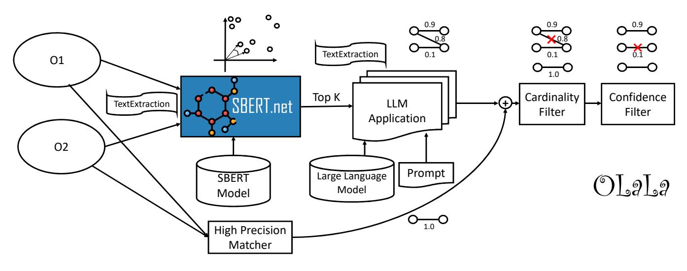

# OLaLa: Ontology Matching with Large Language Models

[Sven Hertling](https://orcid.org/0000-0003-0333-5888)

[Heiko Paulheim](https://orcid.org/0000-0003-4386-8195) sven@informatik.uni-mannheim.de heiko@informatik.uni-mannheim.de Data and Web Science Group, University of Mannheim Mannheim, Germany

### ABSTRACT

Ontology (and more generally: Knowledge Graph) Matching is a challenging task where information in natural language is one of the most important signals to process. With the rise of Large Language Models, it is possible to incorporate this knowledge in a better way into the matching pipeline. A number of decisions still need to be taken, e.g., how to generate a prompt that is useful to the model, how information in the KG can be formulated in prompts, which Large Language Model to choose, how to provide existing correspondences to the model, how to generate candidates, etc. In this paper, we present a prototype that explores these questions by applying zero-shot and few-shot prompting with multiple open Large Language Models to different tasks of the Ontology Alignment Evaluation Initiative (OAEI). We show that with only a handful of examples and a well-designed prompt, it is possible to achieve results that are en par with supervised matching systems which use a much larger portion of the ground truth.

### CCS CONCEPTS

• Computing methodologies → Knowledge representation and reasoning; • Information systems → Semantic web description languages; Entity resolution.

### KEYWORDS

Large Language Model, Ontology Matching, Entity Resolution

### ACM Reference Format:

Sven Hertling and Heiko Paulheim. 2023. OLaLa: Ontology Matching with Large Language Models. In Knowledge Capture Conference 2023 (K-CAP '23), December 5–7, 2023, Pensacola, FL, USA. ACM, New York, NY, USA, [9](#page-8-0) pages. <https://doi.org/10.1145/3587259.3627571>

### 1 INTRODUCTION

From the first days of the Semantic Web and Linked Open Data, data integration has played a crucial role. Due to the open Web nature, everybody is able to create their own datasets and concept URIs without relying on a central instance. Thus everyone can create their own URI for the same real-world concept (a.k.a. non-unique name assumption). As a consequence, it is necessary to specify that two different URIs actually represent the same concept. In

K-CAP '23, December 5–7, 2023, Pensacola, FL, USA

© 2023 Copyright held by the owner/author(s).

ACM ISBN 979-8-4007-0141-2/23/12.

<https://doi.org/10.1145/3587259.3627571>

Ontology or more general Knowledge Graph Matching, the task is to automatically find a set of correspondences between classes, properties, and instances of two different KGs such that the links are only generated if the corresponding concepts are equal.

In ontologies, the semantics are described with 1) natural language texts (e.g. rdfs:label or rdfs:comment) and 2) relations to other concepts and formal axioms (e.g. taxonomies, domain and range definitions for properties). For a long time, the first was deemed to be only human interpretable, while the second was interpretable by humans and machines alike. Now with the arrival of large language models, this assumption is questionable, since computers are also able to process and interpret textual descriptions.

Thus, with the rise of transformer-based models [\[28\]](#page-8-1), textual descriptions play an increasingly important role in Ontology Matching systems [\[4,](#page-6-0) [10,](#page-6-1) [17\]](#page-6-2). However, there are still a lot of disadvantages in using those models. The first one is the need for large training data. Most of the used language models are pre-trained and need a so-called head (usually a simple dense layer at the very end) to be used in a classification setting. This neural network layer is initialized randomly and needs training to differentiate between matches and non-matches. This approach is usually referred to as fine tuning. Another disadvantage is the restricted amount of tokens (words/ pieces of text) that can be processed in such models. Thus the descriptions of concepts need to be short and precise.

With the development of Large Language Models (LLMs), it is possible to better capture the meaning of a text and also allow to reason about it. One of the most famous models, ChatGPT[1](#page-0-0) , was developed by OpenAI and launched on November 30, 2022 to the public. The interface (input and output) is purely based on texts which allows humans to have a chat with the bot. Due to its capabilities, it is applied in closely related fields, such as product matching [\[20\]](#page-6-3).

There are also disadvantages for ChatGPT when applied to tasks such as KG matching. The most important drawback is that it is not open source, but hidden behind an API. Thus, all achieved results are not reproducible (because OpenAI might change the model behind the API or even shut down a model that is afterwards not available anymore). Furthermore, it is not possible to have full access to the model, and thus no intermediate scores can be retrieved. Moreover, the company providing the closed-source models can charge the user with some cost per query. If the number of queries increases (e.g. with larger ontologies), it is questionable whether the use of ChatGPT is still economically sensible. For those reasons, we will apply only open-source large language models to the task of Ontology Matching.

Permission to make digital or hard copies of part or all of this work for personal or classroom use is granted without fee provided that copies are not made or distributed for profit or commercial advantage and that copies bear this notice and the full citation on the first page. Copyrights for third-party components of this work must be honored. For all other uses, contact the owner/author(s).

1<https://chat.openai.com/>

Applying LLMs for ontology matching requires a number of design decisions, including (1) the selection of models that actually perform best for this task, (2) how to present the matching task to the system, (3) how to generate candidates, (4) how to translate concepts into natural language text, (5) which prompts to use, and (6) detection of the final answer and extraction of confidences. In this work, we provide a system that allows for systematic experimentation on all those questions. We show how to apply open-source LLMs to the task of ontology matching.

The contributions of this paper is as follows:

- (1) implementation of different LLM-based matching components in MELT[\[9\]](#page-6-4)
- (2) evaluation of an LLM-based system against in OAEI tracks
- (3) analysis of the main driving factors for good results

We show that with only a handful of examples for few-shot prompting and a well-designed prompt, it is possible to achieve results that are en par with supervised matching systems using a much larger portion of the ground truth.

The paper is structured as follows: We briefly review related work in section [2.](#page-1-0) We present our approach coined OLaLa in section [3,](#page-1-1) followed by an evaluation, including an extensive ablation study, in section [4.](#page-3-0) We conclude the paper with an outlook on future research.

### 2 RELATED WORK

This section is divided into two parts. We first show approaches based on pre-trained language model which are related to the ontology matching task and afterwards we list related work based on large language models (both ChatGPT and open-source LLMs).

# 2.1 Pretrained Language Models for Ontology Matching

One of the first systems which applied transformer-based models to ontology matching was DITTO [\[12\]](#page-6-5) in 2020. They used BERT [\[3\]](#page-6-6), DistilBERT [\[23\]](#page-8-2), and RoBERTa [\[15\]](#page-6-7) to detect if two entities are similar. One difference is that the schema is fixed (meaning that each entity has the same attributes). They overcome the issue of small input sizes by reducing the amount of text with tf-idf weighting. Neutel et al. [\[17\]](#page-6-2) provides a system based on BERT but mainly for the automatic alignment of two occupation ontologies. The BERTMap [\[4\]](#page-6-0) system evaluates on datasets from the Ontology Alignment Evaluation Initiative (OAEI) [\[21\]](#page-6-8). It includes a fine-tuning of the LMs and finally repairs the mapping in case of inconsistencies. The corresponding candidates are generated by sub-word inverted indices (which only include entity pairs that share many (sub-)words. Our previous approach KERMIT [\[10\]](#page-6-1) is also fine-tuned either supervised (based on a fraction of the reference alignment) or unsupervised (based on a high precision matcher). One difference to BERTMap is that the candidates are generated with Sentence-BERT [\[22\]](#page-8-3). This embedding-based retrieval system can also include matching candidates that do not share any tokens (such as synonyms).

For ontology and KG integration, it is not only important to find equivalence relations between concepts and especially between classes but also other types of relations such as subsumption or meronymy relations. He et al. [\[6\]](#page-6-9) thus applied a language model to detect also the type of relation whereas [\[8\]](#page-6-10) provides an already fine-tuned model based on various KGs such as DBpedia [\[1\]](#page-6-11) and Wikidata. [\[24\]](#page-8-4) used BERT models to predict subsumption relations in the e-commerce setting.

# 2.2 Large Language Models for Ontology Matching

Due to the fact that large language models (LLMs) are relatively new, only a few papers already exist. We first present papers using ChatGPT: Peeters et al. [\[20\]](#page-6-3) use the chatbot to check if two product descriptions refer to the same product. [\[18\]](#page-6-12) use ChatGPT for ontology alignment by providing the whole source and target ontology to the bot and asking for the final alignment between them. They applied their approach to the conference track of OAEI (the ontologies are rather small) and achieved a high recall but the final F1 score is below the baseline (string equivalence) because of a low precision. For ontology engineering, Mateiu et al. [\[16\]](#page-6-13) tuned a GPT-3 model to translate between natural language text and OWL Functional Syntax. Thus it is used mainly to add axioms to an ontology and enrich it. The closest related work is from Wang et al. [\[29\]](#page-8-5). They apply LLaMa 65B [\[26\]](#page-8-6), GPT3.5, and GPT4 to the Biomedical Datasets for Equivalence and Subsumption Matching [\[5\]](#page-6-14). The candidate generation is done by computing top k neighbors in an embedding space generated out of SapBERT [\[13\]](#page-6-15) (a pre-trained BERT model designed for the biomedical domain). It is shown that especially GPT4 can outperform the state-of-the-art by a large margin. Pan et al. [\[19\]](#page-6-16) provide an overview of how LLMs can be used for Knowledge Graphs in general. Section 4.1.1 discusses the application of entity resolution and matching and section 4.3.3 ontology alignment.

Most of the presented approaches use closed-source LLMs. This means that the results might not be reproducible after OpenAI discontinues some models or changes the models behind the API. Thus we focus in this work on open-source models and present the system OLaLa.

### 3 APPROACH

Figure [1](#page-2-0) shows an overview of the architecture of the OLaLa system. All components are implemented in MELT [\[9\]](#page-6-4), a framework for matcher development and evaluation. MELT is also used by the OAEI to package, submit, and evaluate the systems. Thus, it is possible for the ontology matching community to reuse and customize each component in their own matching pipeline. The implementation of OLaLa is publicly available, and we provide a command line application[2](#page-1-2) which allows to run the system and modify the most important parameters.

At the beginning, matching candidates need to be extracted from the two given input ontologies O1 and O2. Afterwards, those candidates are included in the user-defined prompt and presented to the LLM. Two options are possible: 1) each correspondence is analyzed independently of each other 2) given a source entity, all possible target entities are presented and the LLM needs to decide which one is correct (or none of them). The output of the high-precision matcher is added to ensure that the simple matches are included as well. Finally, some filters are applied to fulfill the usual requirements for an alignment such as a 1:1 mapping (cardinality filter).

2<https://github.com/dwslab/melt/tree/master/examples/llm-transformers>

OLaLa: Ontology Matching with Large Language Models

Figure 1: An overview of the OLaLa system.

The confidence filter at the end ensures that only correspondences with reasonably high confidence are returned. In the following sections, we will describe each step in more detail.

#### $3.1$ Candidate Generation

Due to the fact that the LLMs can usually not analyze the input ontologies as a whole (except small ontologies like those in the OAEI conference track, see [18]), some correspondence candidates need to be generated. In this stage, only the recall is relevant and the higher the recall the better. Some of the related approaches apply an inverted index to find possible similar entities. This requires some textual overlap of those concepts. In OLaLa, the well-known Sentence BERT models (SBERT) are used to generate those candidates. This allows a higher recall because it can also find similar entities without any textual overlap. The trained SBERT models are finetuned siamese BERT models on a huge set of paraphrases [22]. SBERT as well as all LLMs only process text, but the input is an ontology. Thus it is necessary to verbalize the concepts into some natural language text. In MELT they are called TextExtractors (see section 3.3).

For the candidate generation step, we use the so-called Text-ExtractorSet. It extracts all texts of a resource which are either labels (e.g. rdfs:label, skos:prefLabel, schema:name) or descriptions (e.g. rdfs:comment, dc:description, schema:comment). In addition to that, the URI fragment is extracted in case it does not contain more than 50% digits. As a last step, all annotation properties are followed recursively and all labels of those resources are added as well.

All those extracted texts for each resource are embedded, and a semantic search is executed. It computes the cosine similarity between a list of query embeddings and a list of corpus embeddings and returns the top-k neighbors for each text. From those, we select the top-k best neighbors per resource. This procedure is repeated twice so that each of the input ontologies serves once as a query and one as a corpus.

### 3.2 LLM Application

There are two principal approaches how the candidates are presented to the LLM. The first one is *binary decisions*, i.e., deciding whether one candidate is correct or not; the second is multiple choice decisions, i.e., selecting the most likely correspondence for one concept from a set of possible targets.

3.2.1 Binary Decisions. Binary decisions are implemented in the class LLMBinaryFilter. For each candidate correspondence, the source and target entity are verbalized as text and replaced in the prompt given by the user. The output of generative models, such as the ones applied in this work, is always natural language text. To convert this into a binary decision, the following technique is applied: We search for target tokens/words that indicate the result (e.g. true/yes or false/no). If such a token is found, the generation process is directly stopped. Due to the high computation cost, such an early stopping approach is useful to process a large number of candidates. Up to now, only the decision is extracted and in case the model generates other texts like "This is a correct match", we fail at detection.

To overcome this issue and also extract a specific confidence, we do the following. If any of the target tokens is detected, then we retrieve the scores of the complete vocabulary and apply the softmax function to it. This corresponds to the probability that the word is generated at this position. We check the probability for all words in the positive class (e.g. yes, true) and take the maximum value which is normalized by the maximum value of the negative class (e.g.  $\frac{0.4}{0.4 \pm 0.1}$  = 0.8 where 0.4 corresponds to the probability of one token in the positive class like yes and 0.1 corresponds to the maximum negative class tokens probability). Thereby, we get a confidence between zero and one, and every confidence above 0.5 is a predicted positive token.

In case no positive or negative token is generated, the probabilities at the first generated token are used. All those computations would not be possible with a model accessed by an API such as

 $ChatGPT.3$ The default generation strategy $^4$  is greedy such that each token with the highest probability is chosen and the generation process is

continued with this text. The implementation also allows to switch to e.g. contrastive search [25] but due to the usual short answers, it is neither necessary nor helpful.

3.2.2 *Multiple Choice Decisions.* Multiple choice decisions are implemented in the class LLMChooseGivenEntityFilter. It provides the LLM with more context such that for a given source entity all possible target entities with identifying letters are also shown. The task is to pick the one that represents the same entity or to generate a default answer such as "none". Confidences are extracted in the same ways as before. The normalization is applied to all possible outcomes including "none". There is also the possibility to use it directly for filtering such that the one with the highest confidence is kept and all others are removed. In case of a "none" prediction, all correspondences are removed.

#### TextExtractors / Verbalizers 33

In all the above cases, the extracted/verbalized texts for a given resource should be only one text and not multiple texts as for the candidate generation step. Thus some of the possible extractors are now explained.

In addition to combining all texts from the TextExtractorSet explained before, an even simpler extractor called TextExtractor-OnlyLabels is implemented. It extracts only one textual label which can originate from the following properties(in decreasing importance): skos:prefLabel, rdfs:label, URI fragment, skos:alt-Label, skos:hiddenLabel. This means if a skos:prefLabel is detected, only this label is used.

Including more context in those examples is achieved by the TextExtractorVerbalizedRDF. It selects all RDF triples from the corresponding KG where the resource is in the subject position. Those triples are verbalized - meaning that each subject, predicate, and object is replaced by the text of OnlyLabels extractor. All triples with a label-like property are skipped because the information is already included. As an example, the statement ":MA\_0000002 rdfs:subClassOf :MA\_0001112" is converted to "spinal cord grey matter sub class of grey matter".

As a variation of the previous extractor, it is also tried out to provide the triples directly as serialized RDF. The default of the ResourceDescriptionInRDF extractor is to serialize to turtle format where the prefixes are used but the prefix definition is excluded from the generated text to make it shorter (other serializations can also be configured). If there are resources in the object position of the triples, they will be also replaced by a literal containing the corresponding label.

### 3.4 High-Precision Matcher

The high-precision matcher is a simple matcher in MELT that efficiently searches for concepts with the exact same normalized label (or URI fragment if a label is not available).5 The normalization includes lowercasing, camel case, and deletion of non alpha-numeric characters. If there is only one such candidate for a concept, then it is matched.

## 3.5 Postprocessing

After the application of the LLM, the resulting alignment is further post-processed by filters. To keep the matching pipeline simple, only two additional filters are applied. The cardinality filter ensures a one-to-one mapping which is usually required. To solve the assignment problem, it is reduced to the maximum weight matching in a bipartite graph [2] (class MaxWeightBipartiteExtractor in MELT).

To further improve the alignment and remove correspondences that are likely to be incorrect, the confidence filter is applied. All correspondences that do not have a higher or the same confidence as a predefined threshold value are excluded.

#### **EVALUATION** 4

We evaluate our approach on the anatomy, biodiv, and commonkg tracks of OAEI6. Moreover, we show results on the Knowledge Graph track [7], where only class correspondences are considered. For all tracks, we compare *OLaLa* against the three best-performing systems in the different OEAI tracks in the 2022 edition of the OAEI [21]. The evaluation was performed using the MELT framework on a server running RedHat with 256 GB of RAM, 2x64 CPU cores (2.6 GHz), and 4 Nvidia A100 (40GB) graphics cards.

### 4.1 Final Configuration

For the final configuration, a lot of parameters need to be fixed. The SBERT model for the candidate generation step is set to multi-qa $m\text{pnet-base-dot-v1}$ ,7 and the value k during the top-k neighbors search is set to five. This gives a balance between the number of generated correspondences as well as the achieved recall. The Text-ExtractorSet is used to generate multiple text representations of the resource to run the search in the embedding space.

The LLM model is set to upstage/Llama-2-70b-instruct- $v2^8$ and to generate the text in prompt 7 (see table 6), i.e., a few-shot prompt with three positive and negative examples each $^{9}$ , Text-ExtractorOnlyLabels is used. With this prompt, the binary decision approach is automatically selected. For the text generation, the  $maximum number of tokens (max_new\_tokens^{10})$  is set to 10 but this number of tokens is usually not reached because a positive or negative word is detected before. The next parameter which is fixed is the temperature. The lower the value, the more deterministic the results are (the token with the highest probability is chosen

 $^3\mathrm{We}$  also explored prompt engineering as an alternative to get to confidences, using prompts such as "and also provide a confidence score with your answer", but we observed that the LLM will often respond that it is not able to provide a specific confidence value, and even if it does, it is not easy to extract it out of the generated text. Therefore, we discarded that idea again.

&lt;sup>4https://huggingface.co/docs/transformers/main/en/generation\_strategies

 $^5\hbox{https://dwslab.github.io/melt/matcher-components/full-matcher-list}$ 6http://oaei.ontologymatching.org/

 $^7\rm{https://huggingface.co/sentence-transformers/multi-qa-mpnet-base-dot-v1}$  $^8$  https://huggingface.co/upstage/Llama-2-70b-instruct-v2

&lt;sup>9The positive and negative examples are taken from the anatomy track and used across all tracks.

&lt;sup>10https://huggingface.co/docs/transformers/main/en/main\_classes/text\_generation# transformers.GenerationConfig

OLaLa: Ontology Matching with Large Language Models K-CAP '23, December 5–7, 2023, Pensacola, FL, USA

Table 1: Overall Results of the default configuration of OLaLa, compared to the respective three best systems in different OAEI test cases

| Test case    | System                               | Prec      | Rec   | 𝐹1            | Size | Time    |  |
|--------------|--------------------------------------|-----------|-------|---------------|------|---------|--|
| Anatomy      |                                      |           |       |               |      |         |  |
|              | Matcha                               | 0.951     | 0.930 | 0.941         | 1482 | 0:00:37 |  |
|              | SEBMatcher                           | 0.945     | 0.874 | 0.908         | 1402 | 9:53:22 |  |
| mouse-human  | OLaLa                                | 0.914     | 0.891 | 0.902         | 1478 | 2:41:23 |  |
|              | LogMapBio                            | 0.873     | 0.919 | 0.895         | 1596 | 0:19:43 |  |
|              | String Baseline                      | 0.997     | 0.622 | 0.766         | 946  | -       |  |
|              |                                      | Common KG |       |               |      |         |  |
|              | OLaLa                                | 1.000     | 0.922 | 0.960         | 120  | 0:06:34 |  |
|              | KGMatcher+                           | 1.000     | 0.910 | 0.950         | 117  | 2:43:50 |  |
| nell-dbpedia | Matcha                               | 1.000     | 0.910 | 0.900         | 104  | 0:01:00 |  |
|              | ATMatcher                            | 1.000     | 0.800 | 0.890         | 104  | 0:03:10 |  |
|              | String Baseline                      | 1.000     | 0.600 | 0.750         | 78   | 0:00:37 |  |
|              | Knowledge Graph (only class matches) |           |       |               |      |         |  |
|              | OLaLa                                | 1.000     | 1.000 | 1.000         | 11   | 0:17:40 |  |
| marvel       | ATMatcher                            | 1.000     | 1.000 | 1.000         | 11   | 0:04:36 |  |
| cinematic    | LogMap                               | 1.000     | 1.000 | 1.000         | 10   | 0:32:40 |  |
| marvel       | LSMatch                              | 1.000     | 1.000 | 1.000         | 8    | 1:46:01 |  |
|              | String Baseline                      | 1.000     | 0.600 | 0.750         | 8    | 0:02:40 |  |
|              | ATMatcher                            | 0.830     | 0.710 | 0.770         | 39   | 0:03:23 |  |
|              | LogMap                               | 0.880     | 0.500 | 0.640         | 21   | 0:05:09 |  |
| memoryalpha  | OLaLa                                | 1.000     | 0.350 | 0.530         | 24   | 0:35:03 |  |
| memorybeta   | LSMatch                              | 1.000     | 0.290 | 0.440         | 26   | 0:57:37 |  |
|              | String Baseline                      | 1.000     | 0.290 | 0.440         | 19   | 0:01:50 |  |
|              | ATMatcher                            | 1.000     | 0.770 | 0.870         | 34   | 0:02:04 |  |
| memoryalpha  | OLaLa                                | 1.000     | 0.540 | 0.700         | 28   | 0:29:41 |  |
| stexpanded   | KGMatcher                            | 1.000     | 0.540 | 0.700         | 29   | 0:25:42 |  |
|              | LSMatch                              | 1.000     | 0.540 | 0.700         | 25   | 0:20:38 |  |
|              | String Baseline                      | 1.000     | 0.460 | 0.630         | 19   | 0:01:11 |  |
|              | LogMap                               | 1.000     | 0.800 | 0.890         | 12   | 0:07:44 |  |
| starwars     | OLaLa                                | 1.000     | 0.600 | 0.750         | 13   | 0:38:49 |  |
| swg          | ATMatcher                            | 1.000     | 0.600 | 0.750         | 13   | 0:04:24 |  |
|              | LSMatch                              | 1.000     | 0.600 | 0.750         | 19   | 0:38:50 |  |
|              | String Baseline                      | 1.000     | 0.400 | 0.570         | 9    | 0:02:52 |  |
|              | ATMatcher                            | 1.000     | 0.870 | 0.930         | 31   | 0:04:20 |  |
| starwars     | KGMatcher                            | 1.000     | 0.870 | 0.930         | 30   | 0:43:57 |  |
| swtor        | String Baseline                      | 1.000     | 0.800 | 0.890         | 27   | 0:02:51 |  |
|              | OLaLa                                | 0.920     | 0.800 | 0.860         | 30   | 0:45:47 |  |
|              | LogMap                               | 1.000     | 0.730 | 0.850         | 28   | 0:07:10 |  |
| Biodiv       |                                      |           |       |               |      |         |  |
|              | LogMap                               | 0.781     | 0.656 | 0.713         | 676  | 0:00:25 |  |
| envo         | LogMapBio                            | 0.753     | 0.652 | 0.699         | 697  | 1:00:03 |  |
| sweet        | LogMapLt                             | 0.829     | 0.594 | 0.692         | 576  | 0:07:32 |  |
|              | OLaLa                                | 0.431     | 0.613 | 0.510 1145 |      | 6:55:19 |  |
|              | AML (2021)                           | 0.976     | 0.764 | 0.839         | 359  | 0:00:21 |  |
| gemet        | ATMatcher (2021)                     | 0.631     | 0.919 | 0.748         | 486  | 0:00:08 |  |
| anaee        | OLaLa                                | 0.565     | 0.916 | 0.699         | 542  | 4:28:07 |  |
|              | LogMapLt                             | 0.840     | 0.458 | 0.593         | 182  | 0:00:03 |  |

as the predicted token). With increased temperature, the outputs are more randomized (resulting in more creative texts). We set the temperature to zero such that the results are reproducible. Other generation parameters are set to their default values.

The cardinality filter does not require any parameters, and the value of the confidence filter is set to 0.5. With this setting, we filter out all correspondences where the LLM predicts a negative word (such as "no" or "false"). Thus we do not need to tune the confidence value and do not require any training alignment for it.

Table 2: Performance of zero-shot bi-encoders (SBERT models) on the anatomy track. The best recall per is highlighted with bold print. Time is measured in seconds.

| k  | Model                      | Prec  | Rec   | 𝐹1    | Size   | Time |
|----|----------------------------|-------|-------|-------|--------|------|
|    | multi-qa-mpnet-base-dot-v1 | 0.034 | 0.985 | 0.066 | 43,786 | 8    |
|    | all-mpnet-base-v2          | 0.034 | 0.983 | 0.066 | 43,625 | 8    |
| 10 | multi-qa-distilbert-cos-v1 | 0.035 | 0.985 | 0.067 | 43,071 | 8    |
|    | all-distilroberta-v1       | 0.034 | 0.981 | 0.066 | 43,567 | 8    |
|    | all-MiniLM-L12-v2          | 0.034 | 0.983 | 0.066 | 43,399 | 8    |
|    | multi-qa-mpnet-base-dot-v1 | 0.066 | 0.978 | 0.124 | 22,338 | 8    |
|    | all-mpnet-base-v2          | 0.066 | 0.972 | 0.124 | 22,204 | 8    |
| 5  | multi-qa-distilbert-cos-v1 | 0.067 | 0.973 | 0.125 | 22,025 | 7    |
|    | all-distilroberta-v1       | 0.066 | 0.968 | 0.123 | 22,366 | 6    |
|    | all-MiniLM-L12-v2          | 0.066 | 0.974 | 0.124 | 22,229 | 6    |
|    | multi-qa-mpnet-base-dot-v1 | 0.107 | 0.964 | 0.193 | 13,649 | 8    |
|    | all-mpnet-base-v2          | 0.108 | 0.966 | 0.194 | 13,543 | 7    |
| 3  | multi-qa-distilbert-cos-v1 | 0.108 | 0.963 | 0.194 | 13,553 | 6    |
|    | all-distilroberta-v1       | 0.106 | 0.958 | 0.191 | 13,696 | 7    |
|    | all-MiniLM-L12-v2          | 0.107 | 0.964 | 0.193 | 13,611 | 7    |
| 1  | multi-qa-mpnet-base-dot-v1 | 0.306 | 0.931 | 0.461 | 4,612  | 8    |
|    | all-mpnet-base-v2          | 0.307 | 0.935 | 0.463 | 4,615  | 14   |
|    | multi-qa-distilbert-cos-v1 | 0.307 | 0.935 | 0.463 | 4,620  | 6    |
|    | all-distilroberta-v1       | 0.292 | 0.904 | 0.442 | 4,692  | 6    |
|    | all-MiniLM-L12-v2          | 0.306 | 0.933 | 0.461 | 4,620  | 7    |

## 4.2 Results and Discussion

Table [1](#page-4-0) shows the overall results of OLaLa across the different tracks in the configuration above. Although it might be possible to tweak the parameters per track to achieve better results, we use only one configuration across all tracks in order to show a fair comparison.

We can see that in many test cases, OLaLa scores among the top 3 systems, delivering good results with an out-of-the-box setup. It is worth mentioning that the other approaches often use domainspecific knowledge (especially in the biomedical domain) and/or extensively utilize the structure of the ontologies, while OLaLa solely relies on the textual descriptions of entities.[11](#page-4-1)

At the same time, it can be observed that the runtimes utilizing LLMs are very often much higher than those for other models. This can be observed in particular in the Biodiv track, where the runtime of OLaLa is often a few hours, compared to other systems which can solve the respective tasks in under a minute.

### 4.3 Ablation Study

In this section, we investigate the impact of the different parts and parameters of the system on the final result. Due to the fact that all combinations on all tracks would drastically increase the number of experiments, we restrict ourselves to the anatomy track and only modify one component while keeping the rest of the system stable to the final configuration introduced in section [4.1.](#page-3-10)

4.3.1 Candidate generation. In this stage, the SBERT model and corresponding k value for neighbor search need to be selected. The available pretrained models are already evaluated on 14 datasets which checks the performance of the sentence embeddings as well

11For reasons of completeness, we should mention that we use three examples from the anatomy track for our few-shot prompt. Thus, one could argue that there is minimal information leakage for the anatomy track. However, given the alignment size, we consider this neglectable. Moreover, we could have used examples from other tracks for anatomy, but we wanted to keep the prompt constant across all tracks.

Table 3: Performance impact of using different LLM models on the anatomy track.

| Model                                  | Prec  | Rec            | 𝐹1    | Size  | Time    |
|----------------------------------------|-------|----------------|-------|-------|---------|
| meta-llama/ Llama-2-7b-hf           | 0.932 | 0.640 0.759 |       | 1,041 | 7:50:33 |
| meta-llama/ Llama-2-13b-hf          | 0.806 | 0.820          | 0.813 | 1,543 | 1:35:15 |
| meta-llama/ Llama-2-70b-hf          | 0.946 | 0.860          | 0.901 | 1,378 | 6:45:13 |
| meta-llama/ Llama-2-70b-chat-hf     | 0.663 | 0.801          | 0.725 | 1,832 | 3:55:57 |
| jondurbin/ airoboros-l2-70b-2.1     | 0.804 | 0.877          | 0.839 | 1,654 | 4:00:12 |
| upstage/ Llama-2-70b instruct-v2 | 0.914 | 0.891          | 0.902 | 1,479 | 2:40:18 |

as on six datasets for the performance of semantic search[12](#page-5-0). The best three models of each evaluation are selected to be tested on the anatomy track. All models are publicly available via the huggingface model hub. Table [2](#page-4-2) shows the results grouped by the value k. On the one hand, with increasing k, the number of generated candidates gets also much higher and results in a large runtime of the following LLM model. On the other hand, all correspondences which are not found in this stage cannot be part of the final result. Thus, only the recall value and alignment size are important at this step. The results correlate with the performance on the semantic search datasets which is why the multi-qa-mpnet-base-dot-v1 is selected (the top performing system on those 6 datasets). The parameter k is set to five because recall could be increased by 1.2 (from k=3 to k=5), whereas changing from k=5 to k=10 only increases the recall marginally, but nearly doubles the amount of marginally candidates.

4.3.2 LLM Model. Table [3](#page-5-1) shows the performance achieved with different LLM models. The selection of the analyzed models is done with the help of the huggingface LLM leaderboard[13](#page-5-2). Many of those models are based on LLama2 [\[27\]](#page-8-8) and fine-tuned on a specialized dataset. As of 01/09/2023, model jondurbin/airoborosl2-70b-2.1 is the leading system whereas upstage/Llama-2-70binstruct-v2 is a general model which was also the leader of the board at the time of release.

It can be observed that the F-measure increases with the model size except for the chat variant of LLama2. The reason might be that prompt 7 is more designed for completion than a chat. Model upstage/Llama-2-70b-instruct-v2 is selected due to a high Fmeasure as well as a low runtime.

For all models, the following parameters for loading the models are used: device\_map is set to " auto", torch\_dtype is set to "float16", and load\_in\_8bit is set to "true". With those settings, the memory footprint of the models is reduced such that the 7B and 13B variants fit on one A100 (40GB) GPU and the 70B variants on 2 GPUs of the same type.

Table 4: Performance impact of using different text extraction strategies on the anatomy track.

| Text Extractor   | Prec  | 𝐹1 Rec |       | Size | Time    |  |
|------------------|-------|-----------|-------|------|---------|--|
| OnlyLabels       | 0.914 | 0.891     | 0.902 | 1478 | 2:41:23 |  |
| VerbalizedRDF    | 0.929 | 0.884     | 0.906 | 1443 | 3:57:46 |  |
| DescriptionInRDF | 0.943 | 0.915     | 0.929 | 1471 | 9:02:24 |  |

Table 5: Impact of the LLM and the different post processing pipelines on the anatomy track. HP represents the highprecision matcher.

| Postprocessing           | Prec  | Rec   | 𝐹1    | Size   | Time    |  |
|--------------------------|-------|-------|-------|--------|---------|--|
| Candidates               | 0.066 | 0.978 | 0.125 | 22,289 | 0:00:37 |  |
| + Cardinality            | 0.385 | 0.693 | 0.495 |        | 0:00:37 |  |
| + Confidence             | 0.387 | 0.693 | 0.497 | 2,715  | 0:00:37 |  |
| + LLM + Cardinality      | 0.591 | 0.919 | 0.719 | 2,357  | 2:37:51 |  |
| + Confidence             | 0.911 | 0.889 | 0.900 | 1,480  | 2:37:51 |  |
| + LLM + HP + Cardinality | 0.593 | 0.921 | 0.721 | 2,356  | 2:37:51 |  |
| + Confidence             | 0.914 | 0.891 | 0.902 | 1,478  | 2:37:51 |  |

4.3.3 Text Extractors. Table [4](#page-5-3) shows the results if the text extractor is modified. The OnlyLabel extractor is the worst in terms of F-Measure but it is also the fastest one (due to the small size of the input that needs to be processed). It is nice to see that the LLM can easily deal with RDF serializations (as produced by Description-InRDF extractor) and achieve an even higher F-Measure than SEB-Matcher and close to Matcha. For the final configuration, the Only-Label extractor is used to decrease the runtime even though other extractors could improve the final results.

The few-shot prompts also contain verbalizations of concepts. Those are created according to the selected text extractor. We also tested to keep the original prompt but achieved better results by using the same text extractor for example creation and testing.

4.3.4 Prompts. Table [6](#page-7-0) shows the prompts used. Prompts 0-4 are zero-shot, meaning that no examples were provided. Prompt one tests if additional context information (e.g. what are the topics of the ontologies) improves the results. Prompts 2, 3, and 4 further try to guide the model to answer with yes/no. Prompt 5 uses one positive and one negative correspondence whereas prompt 6 uses three positives and three negatives. With those added examples it is possible to reach the best precision but the overall best F-Measure is achieved by adding a description of the task at the very beginning (prompt 7). However, it is remarkable that the second best results are achieved with a simple zero-shot prompt (prompt 0).

Prompts 8 and 9 are multiple-choice decisions, which are observed to be inferior to single decision ones.

The runtimes vary drastically. The main reason is that for some prompts the target tokens (like yes/no etc.) are generated very late or not at all. In such cases, the text completion takes rather long (even though the maximum number of new tokens is set to 10). Overall 22,288 examples are classified whereas the multiple choice decisions only need to predict 6,035 examples. Multiple choice prompts can reduce the runtimes, but achieve less good results.

12[https://www.sbert.net/docs/pretrained\\_models.html](https://www.sbert.net/docs/pretrained_models.html)

13[https://huggingface.co/spaces/HuggingFaceH4/open\\_llm\\_leaderboard](https://huggingface.co/spaces/HuggingFaceH4/open_llm_leaderboard)

4.3.5 Postprocessing. In this section, the influence of the postprocessing is analyzed. Table [5](#page-5-4) shows the results when only the candidate generation step is executed and when each filter is additionally added. Without the LLM model, we achieve an F-Measure of 0.497 when the full filter chain is applied.

When using the LLM and the cardinality filter, the F-Measure is already increased to 0.719. Still, there are a lot of incorrect correspondences even though one entity is only mapped to a maximum of one other entity. Thus, the confidence filter is applied which lifts the F-Measure to 0.9. Adding the results of the high-precision matcher provides a slight increase in both precision and recall.

### 5 CONCLUSION AND OUTLOOK

In this paper, we presented OLaLa, an ontology matching system that is built on top of open-source large language models. We have shown that using such a model, especially in a few-shot setting, can yield competitive results, even if only based on textual descriptions.

In our ablation study, we have observed that model and parameter combinations can have a strong impact on the overall results, and it is likely that there is no one-parameterization-fits-all solution, i.e., different parameter sets might deliver optimal results for different matching problems. Therefore, we plan to more closely examine the automatic parameterization of our system.

OLaLa provides an experimentation base for different variations, such as new prompts (prompt engineering), and also prompting techniques, like generating knowledge in the form of text that is used as additional information during classification [\[14\]](#page-6-19) or Chainof-Thought prompting [\[11\]](#page-6-20) that also allows to generate an explanation why two concepts are the same. In early experiments, we have observed that generating additional explanations for all candidates results in large runtimes (for anatomy, the expected runtime exceeds four days) but it could be useful to generate explanations for the final alignment which contains way less correspondences, or creating explanations on demand.

As already shown, the text extractors make a huge difference in terms of F-Measure. The RDF serialization works best but also generates a lot of tokens which could be reduced by selecting important properties to be included.

Finally, the system should be more scalable such that it can also be applied to large KGs with instance matching (which is technically possible, but with large runtimes). This could be achieved, e.g., by using a fast high-precision matcher to first find easy matches, and applying the LLM model only to edge cases.

### ACKNOWLEDGMENTS

The authors acknowledge support by the state of Baden-Württemberg through bwHPC and the German Research Foundation (DFG) through grant INST 35/1597-1 FUGG.

### REFERENCES

- [1] Sören Auer, Christian Bizer, Georgi Kobilarov, Jens Lehmann, Richard Cyganiak, and Zachary Ives. 2007. Dbpedia: A nucleus for a web of open data. In international semantic web conference. Springer, Springer, Heidelberg, Germany, 722–735.
- [2] Isabel F. Cruz, Flavio Palandri Antonelli, and Cosmin Stroe. 2009. Efficient Selection of Mappings and Automatic Quality-Driven Combination of Matching Methods. In Proceedings of the 4th International Conference on Ontology Matching - Volume 551 (Chantilly) (OM'09). CEUR-WS.org, Aachen, DEU, 49–60.
- [3] Jacob Devlin, Ming-Wei Chang, Kenton Lee, and Kristina Toutanova. 2019. BERT: Pre-training of Deep Bidirectional Transformers for Language Understanding. In

Proceedings of the 2019 Conference of the North American Chapter of the Association for Computational Linguistics: Human Language Technologies, NAACL-HLT 2019, Minneapolis, MN, USA, June 2-7, 2019, Volume 1 (Long and Short Papers), Jill Burstein, Christy Doran, and Thamar Solorio (Eds.). Association for Computational Linguistics, 4171–4186.<https://doi.org/10.18653/V1/N19-1423>

- [4] Yuan He, Jiaoyan Chen, Denvar Antonyrajah, and Ian Horrocks. 2022. BERTMap: a BERT-based ontology alignment system. In Proceedings of the AAAI Conference on Artificial Intelligence, Vol. 36. AAAI Press, Palo Alto, California USA, 5684– 5691.
- [5] Yuan He, Jiaoyan Chen, Hang Dong, Ernesto Jiménez-Ruiz, Ali Hadian, and Ian Horrocks. 2022. Machine Learning-Friendly Biomedical Datasets for Equivalence and Subsumption Ontology Matching. In The Semantic Web – ISWC 2022. Springer, Cham, 575–591.
- [6] Yuan He, Jiaoyan Chen, Ernesto Jimenez-Ruiz, Hang Dong, and Ian Horrocks. 2023. Language Model Analysis for Ontology Subsumption Inference. In Findings of the Association for Computational Linguistics: ACL 2023. Association for Computational Linguistics, Toronto, Canada, 3439–3453. [https://doi.org/10.18653/v1/](https://doi.org/10.18653/v1/2023.findings-acl.213) [2023.findings-acl.213](https://doi.org/10.18653/v1/2023.findings-acl.213)
- [7] Sven Hertling and Heiko Paulheim. 2020. The Knowledge Graph Track at OAEI - Gold Standards, Baselines, and the Golden Hammer Bias. In The Semantic Web - 17th International Conference, ESWC 2020, Heraklion, Crete, Greece, May 31-June 4, 2020, Proceedings (Lecture Notes in Computer Science, Vol. 12123). Springer, Heidelberg, Germany, 343–359. [https://doi.org/10.1007/978-3-030-49461-2\\_20](https://doi.org/10.1007/978-3-030-49461-2_20)
- [8] Sven Hertling and Heiko Paulheim. 2023. Transformer Based Semantic Relation Typing for Knowledge Graph Integration. In The Semantic Web - 20th International Conference, ESWC 2023, Hersonissos, Crete, Greece, May 28 - June 1, 2023, Proceedings (Lecture Notes in Computer Science, Vol. 13870). Springer, Heidelberg, Germany, 105–121. [https://doi.org/10.1007/978-3-031-33455-9\\_7](https://doi.org/10.1007/978-3-031-33455-9_7)
- [9] Sven Hertling, Jan Portisch, and Heiko Paulheim. 2019. MELT - Matching EvaLuation Toolkit. In Semantic Systems. The Power of AI and Knowledge Graphs. Springer, Heidelberg, Germany, 231–245.
- [10] Sven Hertling, Jan Portisch, and Heiko Paulheim. 2022. KERMIT - A Transformer-Based Approach for Knowledge Graph Matching. CoRR abs/2204.13931 (2022). <https://doi.org/10.48550/ARXIV.2204.13931> arXiv[:2204.13931](https://arxiv.org/abs/2204.13931)
- [11] Takeshi Kojima, Shixiang Shane Gu, Machel Reid, Yutaka Matsuo, and Yusuke Iwasawa. 2022. Large language models are zero-shot reasoners. Advances in neural information processing systems 35 (2022), 22199–22213.
- [12] Yuliang Li, Jinfeng Li, Yoshihiko Suhara, AnHai Doan, and Wang-Chiew Tan. 2020. Deep Entity Matching with Pre-Trained Language Models. Proc. VLDB Endow. 14, 1 (2020), 50–60.<https://doi.org/10.14778/3421424.3421431>
- [13] Fangyu Liu, Ehsan Shareghi, Zaiqiao Meng, Marco Basaldella, and Nigel Collier. 2021. Self-Alignment Pretraining for Biomedical Entity Representations. In Proceedings of the 2021 Conference of the North American Chapter of the Association for Computational Linguistics: Human Language Technologies, NAACL-HLT 2021, Online, June 6-11, 2021. Association for Computational Linguistics, 4228–4238. <https://doi.org/10.18653/V1/2021.NAACL-MAIN.334>
- [14] Jiacheng Liu, Alisa Liu, Ximing Lu, Sean Welleck, Peter West, Ronan Le Bras, Yejin Choi, and Hannaneh Hajishirzi. 2022. Generated Knowledge Prompting for Commonsense Reasoning. In Annual Meeting of the Association for Computational Linguistics ACL. ACL, 3154–3169.<https://doi.org/10.18653/v1/2022.acl-long.225>
- [15] Yinhan Liu, Myle Ott, Naman Goyal, Jingfei Du, Mandar Joshi, Danqi Chen, Omer Levy, Mike Lewis, Luke Zettlemoyer, and Veselin Stoyanov. 2019. RoBERTa: A Robustly Optimized BERT Pretraining Approach. CoRR abs/1907.11692 (2019). arXiv[:1907.11692](https://arxiv.org/abs/1907.11692)<http://arxiv.org/abs/1907.11692>
- [16] Patricia Mateiu and Adrian Groza. 2023. Ontology engineering with Large Language Models. CoRR abs/2307.16699 (2023). [https://doi.org/10.48550/ARXIV.](https://doi.org/10.48550/ARXIV.2307.16699) [2307.16699](https://doi.org/10.48550/ARXIV.2307.16699) arXiv[:2307.16699](https://arxiv.org/abs/2307.16699)
- [17] Sophie Neutel and Maaike H. T. de Boer. 2021. Towards Automatic Ontology Alignment using BERT. In Proceedings of the AAAI 2021 Spring Symposium on Combining Machine Learning and Knowledge Engineering (AAAI-MAKE 2021), Stanford University, Palo Alto, California, USA, March 22-24, 2021 (CEUR Workshop Proceedings, Vol. 2846). CEUR-WS.org.<https://ceur-ws.org/Vol-2846/paper28.pdf>
- [18] Sanaz Saki Norouzi, Mohammad Saeid Mahdavinejad, and Pascal Hitzler. 2023. Conversational Ontology Alignment with ChatGPT. CoRR abs/2308.09217 (2023). <https://doi.org/10.48550/ARXIV.2308.09217> arXiv[:2308.09217](https://arxiv.org/abs/2308.09217)
- [19] Jeff Z. Pan, Simon Razniewski, Jan-Christoph Kalo, Sneha Singhania, Jiaoyan Chen, Stefan Dietze, Hajira Jabeen, Janna Omeliyanenko, Wen Zhang, Matteo Lissandrini, Russa Biswas, Gerard de Melo, Angela Bonifati, Edlira Vakaj, Mauro Dragoni, and Damien Graux. 2023. Large Language Models and Knowledge Graphs: Opportunities and Challenges. CoRR abs/2308.06374 (2023). [https:](https://doi.org/10.48550/ARXIV.2308.06374) [//doi.org/10.48550/ARXIV.2308.06374](https://doi.org/10.48550/ARXIV.2308.06374) arXiv[:2308.06374](https://arxiv.org/abs/2308.06374)
- [20] Ralph Peeters and Christian Bizer. 2023. Using ChatGPT for Entity Matching. arXiv preprint arXiv:2305.03423 (2023).
- [21] Mina Abd Nikooie Pour, Alsayed Algergawy, Patrice Buche, Leyla Jael Castro, Jiaoyan Chen, Hang Dong, Omaima Fallatah, Daniel Faria, Irini Fundulaki, Sven Hertling, Yuan He, Ian Horrocks, Martin Huschka, Liliana Ibanescu, Ernesto Jiménez-Ruiz, Naouel Karam, Amir Laadhar, Patrick Lambrix, Huanyu Li, Ying Li, Franck Michel, Engy Nasr, Heiko Paulheim, Catia Pesquita, Tzanina Saveta, Pavel

### Table 6: Examples of the prompts used and the results achieved on the anatomy track.

| Zero-Shot Classify if the following two concepts are the same.\n 0 0.853 0.866 0.861 1535 4:19:12 ### First concept:\n{left}\n### Second concept:\n{right}\n### Answer: Classify if two concepts refer to the same real word entity. This is an ontology matching task between the anatomy of human and mouse.\n 1 0.541 0.715 0.616 2002 2:18:22 First concept:{left}\n Second concept:{right}\nAnswer: 2 Is {left} and {right} the same? The answer which can be yes or no is 0.354 0.633 0.454 2709 11:46:12 The task is ontology matching. Given two concepts, the task is to classify if they are the same or not.\n 3 0.754 0.830 0.791 1669 2:16:27 The first concept is:{left}\n The second concept is:{right}\n The answer which can be yes or no is: Given two concepts decide if they match or not.\n 4 0.520 0.704 0.598 2052 2:14:51 First concept:{left}\n Second concept:{right}\nAnswer(yes or no): Few-Shot ### Concept one: endocrine pancreas secretion ### Concept two: Pancreatic Endocrine Secretion ### Answer: yes\n ### Concept one: urinary bladder urothelium 5 0.751 0.762 0.757 1537 5:24:22 ### Concept two: Transitional Epithelium ### Answer: no\n ### Concept one: {left} ### Concept two: {right} ### Answer: ### Concept one: endocrine pancreas secretion ### Concept two: Pancreatic Endocrine Secretion ### Answer: yes\n ### Concept one: urinary bladder urothelium ### Concept two: Transitional Epithelium ### Answer: no\n ### Concept one: trigeminal V nerve ophthalmic division ### Concept two: Ophthalmic Nerve ### Answer: yes\n ### Concept one: foot digit 1 phalanx 6 0.979 0.687 0.807 1063 2:44:41 ### Concept two: ### Answer: no\n ### Concept one: large intestine ### Concept two: Colon ### Answer: no\n ### Concept one: ocular refractive media ### Concept two: Refractile Media ### Answer: yes\n ### Concept one: {left} ### Concept two: {right} ### Answer: Classify if two descriptions refer to the same real world entity (ontology matching).\n 7 0.914 0.891 0.902 1478 2:37:51 {prompt 6} Multiple Choice Decisions Zero-Shot The task is ontology matching (find the description which refer to the same real world entity). 8 Which of the following descriptions 0.656 0.769 0.708 1778 1:06:04 fits best to this description: {left}?\n {candidates} Answer with the corresponding letter or "none" if no description fits. Answer: Multiple Choice Decisions Few-Shot The task is ontology matching (find the description which refer to the same real world entity). Which of the following descriptions fits best to this description: endocrine pancreas secretion?\n \t a) Islet of Langerhans\n \t b) Pancreatic Secretion\n 9 0.648 0.770 0.703 1802 0:43:47 \t c) Pancreatic Endocrine Secretion\n \t d) Delta Cell of the Pancreas\n Answer with the corresponding letter or "none" if no description fits. Answer: c\n Which of the following descriptions fits best to this description: {left}?\n {candidates} | ID | prompt                                                                         | Prec | Rec | 𝐹1 | Size | Time |  |  |
|------------------------------------------------------------------------------------------------------------------------------------------------------------------------------------------------------------------------------------------------------------------------------------------------------------------------------------------------------------------------------------------------------------------------------------------------------------------------------------------------------------------------------------------------------------------------------------------------------------------------------------------------------------------------------------------------------------------------------------------------------------------------------------------------------------------------------------------------------------------------------------------------------------------------------------------------------------------------------------------------------------------------------------------------------------------------------------------------------------------------------------------------------------------------------------------------------------------------------------------------------------------------------------------------------------------------------------------------------------------------------------------------------------------------------------------------------------------------------------------------------------------------------------------------------------------------------------------------------------------------------------------------------------------------------------------------------------------------------------------------------------------------------------------------------------------------------------------------------------------------------------------------------------------------------------------------------------------------------------------------------------------------------------------------------------------------------------------------------------------------------------------------------------------------------------------------------------------------------------------------------------------------------------------------------------------------------------------------------------------------------------------------------------------------------------------------------------------------------------------------------------------------------------------------------------------------------------------------------------------------------------------------------------------------------------------------------------------------------------------------------------------------------------------------------------------------------------------------------------------------------------------------------------------------------------------------------------------------------------------------------------------------------------------------------------------------------------------------------------------------------------------------------------------------------------------------------------------------------------------------------------------------------------------------------------------------------------------------|----|--------------------------------------------------------------------------------|------|-----|----|------|------|--|--|
|                                                                                                                                                                                                                                                                                                                                                                                                                                                                                                                                                                                                                                                                                                                                                                                                                                                                                                                                                                                                                                                                                                                                                                                                                                                                                                                                                                                                                                                                                                                                                                                                                                                                                                                                                                                                                                                                                                                                                                                                                                                                                                                                                                                                                                                                                                                                                                                                                                                                                                                                                                                                                                                                                                                                                                                                                                                                                                                                                                                                                                                                                                                                                                                                                                                                                                                                                |    |                                                                                |      |     |    |      |      |  |  |
|                                                                                                                                                                                                                                                                                                                                                                                                                                                                                                                                                                                                                                                                                                                                                                                                                                                                                                                                                                                                                                                                                                                                                                                                                                                                                                                                                                                                                                                                                                                                                                                                                                                                                                                                                                                                                                                                                                                                                                                                                                                                                                                                                                                                                                                                                                                                                                                                                                                                                                                                                                                                                                                                                                                                                                                                                                                                                                                                                                                                                                                                                                                                                                                                                                                                                                                                                |    |                                                                                |      |     |    |      |      |  |  |
|                                                                                                                                                                                                                                                                                                                                                                                                                                                                                                                                                                                                                                                                                                                                                                                                                                                                                                                                                                                                                                                                                                                                                                                                                                                                                                                                                                                                                                                                                                                                                                                                                                                                                                                                                                                                                                                                                                                                                                                                                                                                                                                                                                                                                                                                                                                                                                                                                                                                                                                                                                                                                                                                                                                                                                                                                                                                                                                                                                                                                                                                                                                                                                                                                                                                                                                                                |    |                                                                                |      |     |    |      |      |  |  |
|                                                                                                                                                                                                                                                                                                                                                                                                                                                                                                                                                                                                                                                                                                                                                                                                                                                                                                                                                                                                                                                                                                                                                                                                                                                                                                                                                                                                                                                                                                                                                                                                                                                                                                                                                                                                                                                                                                                                                                                                                                                                                                                                                                                                                                                                                                                                                                                                                                                                                                                                                                                                                                                                                                                                                                                                                                                                                                                                                                                                                                                                                                                                                                                                                                                                                                                                                |    |                                                                                |      |     |    |      |      |  |  |
|                                                                                                                                                                                                                                                                                                                                                                                                                                                                                                                                                                                                                                                                                                                                                                                                                                                                                                                                                                                                                                                                                                                                                                                                                                                                                                                                                                                                                                                                                                                                                                                                                                                                                                                                                                                                                                                                                                                                                                                                                                                                                                                                                                                                                                                                                                                                                                                                                                                                                                                                                                                                                                                                                                                                                                                                                                                                                                                                                                                                                                                                                                                                                                                                                                                                                                                                                |    |                                                                                |      |     |    |      |      |  |  |
|                                                                                                                                                                                                                                                                                                                                                                                                                                                                                                                                                                                                                                                                                                                                                                                                                                                                                                                                                                                                                                                                                                                                                                                                                                                                                                                                                                                                                                                                                                                                                                                                                                                                                                                                                                                                                                                                                                                                                                                                                                                                                                                                                                                                                                                                                                                                                                                                                                                                                                                                                                                                                                                                                                                                                                                                                                                                                                                                                                                                                                                                                                                                                                                                                                                                                                                                                |    |                                                                                |      |     |    |      |      |  |  |
|                                                                                                                                                                                                                                                                                                                                                                                                                                                                                                                                                                                                                                                                                                                                                                                                                                                                                                                                                                                                                                                                                                                                                                                                                                                                                                                                                                                                                                                                                                                                                                                                                                                                                                                                                                                                                                                                                                                                                                                                                                                                                                                                                                                                                                                                                                                                                                                                                                                                                                                                                                                                                                                                                                                                                                                                                                                                                                                                                                                                                                                                                                                                                                                                                                                                                                                                                |    |                                                                                |      |     |    |      |      |  |  |
|                                                                                                                                                                                                                                                                                                                                                                                                                                                                                                                                                                                                                                                                                                                                                                                                                                                                                                                                                                                                                                                                                                                                                                                                                                                                                                                                                                                                                                                                                                                                                                                                                                                                                                                                                                                                                                                                                                                                                                                                                                                                                                                                                                                                                                                                                                                                                                                                                                                                                                                                                                                                                                                                                                                                                                                                                                                                                                                                                                                                                                                                                                                                                                                                                                                                                                                                                |    |                                                                                |      |     |    |      |      |  |  |
|                                                                                                                                                                                                                                                                                                                                                                                                                                                                                                                                                                                                                                                                                                                                                                                                                                                                                                                                                                                                                                                                                                                                                                                                                                                                                                                                                                                                                                                                                                                                                                                                                                                                                                                                                                                                                                                                                                                                                                                                                                                                                                                                                                                                                                                                                                                                                                                                                                                                                                                                                                                                                                                                                                                                                                                                                                                                                                                                                                                                                                                                                                                                                                                                                                                                                                                                                |    |                                                                                |      |     |    |      |      |  |  |
|                                                                                                                                                                                                                                                                                                                                                                                                                                                                                                                                                                                                                                                                                                                                                                                                                                                                                                                                                                                                                                                                                                                                                                                                                                                                                                                                                                                                                                                                                                                                                                                                                                                                                                                                                                                                                                                                                                                                                                                                                                                                                                                                                                                                                                                                                                                                                                                                                                                                                                                                                                                                                                                                                                                                                                                                                                                                                                                                                                                                                                                                                                                                                                                                                                                                                                                                                |    |                                                                                |      |     |    |      |      |  |  |
|                                                                                                                                                                                                                                                                                                                                                                                                                                                                                                                                                                                                                                                                                                                                                                                                                                                                                                                                                                                                                                                                                                                                                                                                                                                                                                                                                                                                                                                                                                                                                                                                                                                                                                                                                                                                                                                                                                                                                                                                                                                                                                                                                                                                                                                                                                                                                                                                                                                                                                                                                                                                                                                                                                                                                                                                                                                                                                                                                                                                                                                                                                                                                                                                                                                                                                                                                |    |                                                                                |      |     |    |      |      |  |  |
|                                                                                                                                                                                                                                                                                                                                                                                                                                                                                                                                                                                                                                                                                                                                                                                                                                                                                                                                                                                                                                                                                                                                                                                                                                                                                                                                                                                                                                                                                                                                                                                                                                                                                                                                                                                                                                                                                                                                                                                                                                                                                                                                                                                                                                                                                                                                                                                                                                                                                                                                                                                                                                                                                                                                                                                                                                                                                                                                                                                                                                                                                                                                                                                                                                                                                                                                                |    |                                                                                |      |     |    |      |      |  |  |
|                                                                                                                                                                                                                                                                                                                                                                                                                                                                                                                                                                                                                                                                                                                                                                                                                                                                                                                                                                                                                                                                                                                                                                                                                                                                                                                                                                                                                                                                                                                                                                                                                                                                                                                                                                                                                                                                                                                                                                                                                                                                                                                                                                                                                                                                                                                                                                                                                                                                                                                                                                                                                                                                                                                                                                                                                                                                                                                                                                                                                                                                                                                                                                                                                                                                                                                                                |    |                                                                                |      |     |    |      |      |  |  |
|                                                                                                                                                                                                                                                                                                                                                                                                                                                                                                                                                                                                                                                                                                                                                                                                                                                                                                                                                                                                                                                                                                                                                                                                                                                                                                                                                                                                                                                                                                                                                                                                                                                                                                                                                                                                                                                                                                                                                                                                                                                                                                                                                                                                                                                                                                                                                                                                                                                                                                                                                                                                                                                                                                                                                                                                                                                                                                                                                                                                                                                                                                                                                                                                                                                                                                                                                |    |                                                                                |      |     |    |      |      |  |  |
|                                                                                                                                                                                                                                                                                                                                                                                                                                                                                                                                                                                                                                                                                                                                                                                                                                                                                                                                                                                                                                                                                                                                                                                                                                                                                                                                                                                                                                                                                                                                                                                                                                                                                                                                                                                                                                                                                                                                                                                                                                                                                                                                                                                                                                                                                                                                                                                                                                                                                                                                                                                                                                                                                                                                                                                                                                                                                                                                                                                                                                                                                                                                                                                                                                                                                                                                                |    |                                                                                |      |     |    |      |      |  |  |
|                                                                                                                                                                                                                                                                                                                                                                                                                                                                                                                                                                                                                                                                                                                                                                                                                                                                                                                                                                                                                                                                                                                                                                                                                                                                                                                                                                                                                                                                                                                                                                                                                                                                                                                                                                                                                                                                                                                                                                                                                                                                                                                                                                                                                                                                                                                                                                                                                                                                                                                                                                                                                                                                                                                                                                                                                                                                                                                                                                                                                                                                                                                                                                                                                                                                                                                                                |    |                                                                                |      |     |    |      |      |  |  |
|                                                                                                                                                                                                                                                                                                                                                                                                                                                                                                                                                                                                                                                                                                                                                                                                                                                                                                                                                                                                                                                                                                                                                                                                                                                                                                                                                                                                                                                                                                                                                                                                                                                                                                                                                                                                                                                                                                                                                                                                                                                                                                                                                                                                                                                                                                                                                                                                                                                                                                                                                                                                                                                                                                                                                                                                                                                                                                                                                                                                                                                                                                                                                                                                                                                                                                                                                |    |                                                                                |      |     |    |      |      |  |  |
|                                                                                                                                                                                                                                                                                                                                                                                                                                                                                                                                                                                                                                                                                                                                                                                                                                                                                                                                                                                                                                                                                                                                                                                                                                                                                                                                                                                                                                                                                                                                                                                                                                                                                                                                                                                                                                                                                                                                                                                                                                                                                                                                                                                                                                                                                                                                                                                                                                                                                                                                                                                                                                                                                                                                                                                                                                                                                                                                                                                                                                                                                                                                                                                                                                                                                                                                                |    |                                                                                |      |     |    |      |      |  |  |
|                                                                                                                                                                                                                                                                                                                                                                                                                                                                                                                                                                                                                                                                                                                                                                                                                                                                                                                                                                                                                                                                                                                                                                                                                                                                                                                                                                                                                                                                                                                                                                                                                                                                                                                                                                                                                                                                                                                                                                                                                                                                                                                                                                                                                                                                                                                                                                                                                                                                                                                                                                                                                                                                                                                                                                                                                                                                                                                                                                                                                                                                                                                                                                                                                                                                                                                                                |    |                                                                                |      |     |    |      |      |  |  |
|                                                                                                                                                                                                                                                                                                                                                                                                                                                                                                                                                                                                                                                                                                                                                                                                                                                                                                                                                                                                                                                                                                                                                                                                                                                                                                                                                                                                                                                                                                                                                                                                                                                                                                                                                                                                                                                                                                                                                                                                                                                                                                                                                                                                                                                                                                                                                                                                                                                                                                                                                                                                                                                                                                                                                                                                                                                                                                                                                                                                                                                                                                                                                                                                                                                                                                                                                |    |                                                                                |      |     |    |      |      |  |  |
|                                                                                                                                                                                                                                                                                                                                                                                                                                                                                                                                                                                                                                                                                                                                                                                                                                                                                                                                                                                                                                                                                                                                                                                                                                                                                                                                                                                                                                                                                                                                                                                                                                                                                                                                                                                                                                                                                                                                                                                                                                                                                                                                                                                                                                                                                                                                                                                                                                                                                                                                                                                                                                                                                                                                                                                                                                                                                                                                                                                                                                                                                                                                                                                                                                                                                                                                                |    |                                                                                |      |     |    |      |      |  |  |
|                                                                                                                                                                                                                                                                                                                                                                                                                                                                                                                                                                                                                                                                                                                                                                                                                                                                                                                                                                                                                                                                                                                                                                                                                                                                                                                                                                                                                                                                                                                                                                                                                                                                                                                                                                                                                                                                                                                                                                                                                                                                                                                                                                                                                                                                                                                                                                                                                                                                                                                                                                                                                                                                                                                                                                                                                                                                                                                                                                                                                                                                                                                                                                                                                                                                                                                                                |    |                                                                                |      |     |    |      |      |  |  |
|                                                                                                                                                                                                                                                                                                                                                                                                                                                                                                                                                                                                                                                                                                                                                                                                                                                                                                                                                                                                                                                                                                                                                                                                                                                                                                                                                                                                                                                                                                                                                                                                                                                                                                                                                                                                                                                                                                                                                                                                                                                                                                                                                                                                                                                                                                                                                                                                                                                                                                                                                                                                                                                                                                                                                                                                                                                                                                                                                                                                                                                                                                                                                                                                                                                                                                                                                |    |                                                                                |      |     |    |      |      |  |  |
|                                                                                                                                                                                                                                                                                                                                                                                                                                                                                                                                                                                                                                                                                                                                                                                                                                                                                                                                                                                                                                                                                                                                                                                                                                                                                                                                                                                                                                                                                                                                                                                                                                                                                                                                                                                                                                                                                                                                                                                                                                                                                                                                                                                                                                                                                                                                                                                                                                                                                                                                                                                                                                                                                                                                                                                                                                                                                                                                                                                                                                                                                                                                                                                                                                                                                                                                                |    |                                                                                |      |     |    |      |      |  |  |
|                                                                                                                                                                                                                                                                                                                                                                                                                                                                                                                                                                                                                                                                                                                                                                                                                                                                                                                                                                                                                                                                                                                                                                                                                                                                                                                                                                                                                                                                                                                                                                                                                                                                                                                                                                                                                                                                                                                                                                                                                                                                                                                                                                                                                                                                                                                                                                                                                                                                                                                                                                                                                                                                                                                                                                                                                                                                                                                                                                                                                                                                                                                                                                                                                                                                                                                                                |    |                                                                                |      |     |    |      |      |  |  |
|                                                                                                                                                                                                                                                                                                                                                                                                                                                                                                                                                                                                                                                                                                                                                                                                                                                                                                                                                                                                                                                                                                                                                                                                                                                                                                                                                                                                                                                                                                                                                                                                                                                                                                                                                                                                                                                                                                                                                                                                                                                                                                                                                                                                                                                                                                                                                                                                                                                                                                                                                                                                                                                                                                                                                                                                                                                                                                                                                                                                                                                                                                                                                                                                                                                                                                                                                |    |                                                                                |      |     |    |      |      |  |  |
|                                                                                                                                                                                                                                                                                                                                                                                                                                                                                                                                                                                                                                                                                                                                                                                                                                                                                                                                                                                                                                                                                                                                                                                                                                                                                                                                                                                                                                                                                                                                                                                                                                                                                                                                                                                                                                                                                                                                                                                                                                                                                                                                                                                                                                                                                                                                                                                                                                                                                                                                                                                                                                                                                                                                                                                                                                                                                                                                                                                                                                                                                                                                                                                                                                                                                                                                                |    |                                                                                |      |     |    |      |      |  |  |
|                                                                                                                                                                                                                                                                                                                                                                                                                                                                                                                                                                                                                                                                                                                                                                                                                                                                                                                                                                                                                                                                                                                                                                                                                                                                                                                                                                                                                                                                                                                                                                                                                                                                                                                                                                                                                                                                                                                                                                                                                                                                                                                                                                                                                                                                                                                                                                                                                                                                                                                                                                                                                                                                                                                                                                                                                                                                                                                                                                                                                                                                                                                                                                                                                                                                                                                                                |    |                                                                                |      |     |    |      |      |  |  |
|                                                                                                                                                                                                                                                                                                                                                                                                                                                                                                                                                                                                                                                                                                                                                                                                                                                                                                                                                                                                                                                                                                                                                                                                                                                                                                                                                                                                                                                                                                                                                                                                                                                                                                                                                                                                                                                                                                                                                                                                                                                                                                                                                                                                                                                                                                                                                                                                                                                                                                                                                                                                                                                                                                                                                                                                                                                                                                                                                                                                                                                                                                                                                                                                                                                                                                                                                |    |                                                                                |      |     |    |      |      |  |  |
|                                                                                                                                                                                                                                                                                                                                                                                                                                                                                                                                                                                                                                                                                                                                                                                                                                                                                                                                                                                                                                                                                                                                                                                                                                                                                                                                                                                                                                                                                                                                                                                                                                                                                                                                                                                                                                                                                                                                                                                                                                                                                                                                                                                                                                                                                                                                                                                                                                                                                                                                                                                                                                                                                                                                                                                                                                                                                                                                                                                                                                                                                                                                                                                                                                                                                                                                                |    |                                                                                |      |     |    |      |      |  |  |
|                                                                                                                                                                                                                                                                                                                                                                                                                                                                                                                                                                                                                                                                                                                                                                                                                                                                                                                                                                                                                                                                                                                                                                                                                                                                                                                                                                                                                                                                                                                                                                                                                                                                                                                                                                                                                                                                                                                                                                                                                                                                                                                                                                                                                                                                                                                                                                                                                                                                                                                                                                                                                                                                                                                                                                                                                                                                                                                                                                                                                                                                                                                                                                                                                                                                                                                                                |    |                                                                                |      |     |    |      |      |  |  |
|                                                                                                                                                                                                                                                                                                                                                                                                                                                                                                                                                                                                                                                                                                                                                                                                                                                                                                                                                                                                                                                                                                                                                                                                                                                                                                                                                                                                                                                                                                                                                                                                                                                                                                                                                                                                                                                                                                                                                                                                                                                                                                                                                                                                                                                                                                                                                                                                                                                                                                                                                                                                                                                                                                                                                                                                                                                                                                                                                                                                                                                                                                                                                                                                                                                                                                                                                |    |                                                                                |      |     |    |      |      |  |  |
|                                                                                                                                                                                                                                                                                                                                                                                                                                                                                                                                                                                                                                                                                                                                                                                                                                                                                                                                                                                                                                                                                                                                                                                                                                                                                                                                                                                                                                                                                                                                                                                                                                                                                                                                                                                                                                                                                                                                                                                                                                                                                                                                                                                                                                                                                                                                                                                                                                                                                                                                                                                                                                                                                                                                                                                                                                                                                                                                                                                                                                                                                                                                                                                                                                                                                                                                                |    |                                                                                |      |     |    |      |      |  |  |
|                                                                                                                                                                                                                                                                                                                                                                                                                                                                                                                                                                                                                                                                                                                                                                                                                                                                                                                                                                                                                                                                                                                                                                                                                                                                                                                                                                                                                                                                                                                                                                                                                                                                                                                                                                                                                                                                                                                                                                                                                                                                                                                                                                                                                                                                                                                                                                                                                                                                                                                                                                                                                                                                                                                                                                                                                                                                                                                                                                                                                                                                                                                                                                                                                                                                                                                                                |    |                                                                                |      |     |    |      |      |  |  |
|                                                                                                                                                                                                                                                                                                                                                                                                                                                                                                                                                                                                                                                                                                                                                                                                                                                                                                                                                                                                                                                                                                                                                                                                                                                                                                                                                                                                                                                                                                                                                                                                                                                                                                                                                                                                                                                                                                                                                                                                                                                                                                                                                                                                                                                                                                                                                                                                                                                                                                                                                                                                                                                                                                                                                                                                                                                                                                                                                                                                                                                                                                                                                                                                                                                                                                                                                |    |                                                                                |      |     |    |      |      |  |  |
|                                                                                                                                                                                                                                                                                                                                                                                                                                                                                                                                                                                                                                                                                                                                                                                                                                                                                                                                                                                                                                                                                                                                                                                                                                                                                                                                                                                                                                                                                                                                                                                                                                                                                                                                                                                                                                                                                                                                                                                                                                                                                                                                                                                                                                                                                                                                                                                                                                                                                                                                                                                                                                                                                                                                                                                                                                                                                                                                                                                                                                                                                                                                                                                                                                                                                                                                                |    |                                                                                |      |     |    |      |      |  |  |
|                                                                                                                                                                                                                                                                                                                                                                                                                                                                                                                                                                                                                                                                                                                                                                                                                                                                                                                                                                                                                                                                                                                                                                                                                                                                                                                                                                                                                                                                                                                                                                                                                                                                                                                                                                                                                                                                                                                                                                                                                                                                                                                                                                                                                                                                                                                                                                                                                                                                                                                                                                                                                                                                                                                                                                                                                                                                                                                                                                                                                                                                                                                                                                                                                                                                                                                                                |    |                                                                                |      |     |    |      |      |  |  |
|                                                                                                                                                                                                                                                                                                                                                                                                                                                                                                                                                                                                                                                                                                                                                                                                                                                                                                                                                                                                                                                                                                                                                                                                                                                                                                                                                                                                                                                                                                                                                                                                                                                                                                                                                                                                                                                                                                                                                                                                                                                                                                                                                                                                                                                                                                                                                                                                                                                                                                                                                                                                                                                                                                                                                                                                                                                                                                                                                                                                                                                                                                                                                                                                                                                                                                                                                |    |                                                                                |      |     |    |      |      |  |  |
|                                                                                                                                                                                                                                                                                                                                                                                                                                                                                                                                                                                                                                                                                                                                                                                                                                                                                                                                                                                                                                                                                                                                                                                                                                                                                                                                                                                                                                                                                                                                                                                                                                                                                                                                                                                                                                                                                                                                                                                                                                                                                                                                                                                                                                                                                                                                                                                                                                                                                                                                                                                                                                                                                                                                                                                                                                                                                                                                                                                                                                                                                                                                                                                                                                                                                                                                                |    |                                                                                |      |     |    |      |      |  |  |
|                                                                                                                                                                                                                                                                                                                                                                                                                                                                                                                                                                                                                                                                                                                                                                                                                                                                                                                                                                                                                                                                                                                                                                                                                                                                                                                                                                                                                                                                                                                                                                                                                                                                                                                                                                                                                                                                                                                                                                                                                                                                                                                                                                                                                                                                                                                                                                                                                                                                                                                                                                                                                                                                                                                                                                                                                                                                                                                                                                                                                                                                                                                                                                                                                                                                                                                                                |    |                                                                                |      |     |    |      |      |  |  |
|                                                                                                                                                                                                                                                                                                                                                                                                                                                                                                                                                                                                                                                                                                                                                                                                                                                                                                                                                                                                                                                                                                                                                                                                                                                                                                                                                                                                                                                                                                                                                                                                                                                                                                                                                                                                                                                                                                                                                                                                                                                                                                                                                                                                                                                                                                                                                                                                                                                                                                                                                                                                                                                                                                                                                                                                                                                                                                                                                                                                                                                                                                                                                                                                                                                                                                                                                |    |                                                                                |      |     |    |      |      |  |  |
|                                                                                                                                                                                                                                                                                                                                                                                                                                                                                                                                                                                                                                                                                                                                                                                                                                                                                                                                                                                                                                                                                                                                                                                                                                                                                                                                                                                                                                                                                                                                                                                                                                                                                                                                                                                                                                                                                                                                                                                                                                                                                                                                                                                                                                                                                                                                                                                                                                                                                                                                                                                                                                                                                                                                                                                                                                                                                                                                                                                                                                                                                                                                                                                                                                                                                                                                                |    |                                                                                |      |     |    |      |      |  |  |
|                                                                                                                                                                                                                                                                                                                                                                                                                                                                                                                                                                                                                                                                                                                                                                                                                                                                                                                                                                                                                                                                                                                                                                                                                                                                                                                                                                                                                                                                                                                                                                                                                                                                                                                                                                                                                                                                                                                                                                                                                                                                                                                                                                                                                                                                                                                                                                                                                                                                                                                                                                                                                                                                                                                                                                                                                                                                                                                                                                                                                                                                                                                                                                                                                                                                                                                                                |    |                                                                                |      |     |    |      |      |  |  |
|                                                                                                                                                                                                                                                                                                                                                                                                                                                                                                                                                                                                                                                                                                                                                                                                                                                                                                                                                                                                                                                                                                                                                                                                                                                                                                                                                                                                                                                                                                                                                                                                                                                                                                                                                                                                                                                                                                                                                                                                                                                                                                                                                                                                                                                                                                                                                                                                                                                                                                                                                                                                                                                                                                                                                                                                                                                                                                                                                                                                                                                                                                                                                                                                                                                                                                                                                |    |                                                                                |      |     |    |      |      |  |  |
|                                                                                                                                                                                                                                                                                                                                                                                                                                                                                                                                                                                                                                                                                                                                                                                                                                                                                                                                                                                                                                                                                                                                                                                                                                                                                                                                                                                                                                                                                                                                                                                                                                                                                                                                                                                                                                                                                                                                                                                                                                                                                                                                                                                                                                                                                                                                                                                                                                                                                                                                                                                                                                                                                                                                                                                                                                                                                                                                                                                                                                                                                                                                                                                                                                                                                                                                                |    |                                                                                |      |     |    |      |      |  |  |
|                                                                                                                                                                                                                                                                                                                                                                                                                                                                                                                                                                                                                                                                                                                                                                                                                                                                                                                                                                                                                                                                                                                                                                                                                                                                                                                                                                                                                                                                                                                                                                                                                                                                                                                                                                                                                                                                                                                                                                                                                                                                                                                                                                                                                                                                                                                                                                                                                                                                                                                                                                                                                                                                                                                                                                                                                                                                                                                                                                                                                                                                                                                                                                                                                                                                                                                                                |    |                                                                                |      |     |    |      |      |  |  |
|                                                                                                                                                                                                                                                                                                                                                                                                                                                                                                                                                                                                                                                                                                                                                                                                                                                                                                                                                                                                                                                                                                                                                                                                                                                                                                                                                                                                                                                                                                                                                                                                                                                                                                                                                                                                                                                                                                                                                                                                                                                                                                                                                                                                                                                                                                                                                                                                                                                                                                                                                                                                                                                                                                                                                                                                                                                                                                                                                                                                                                                                                                                                                                                                                                                                                                                                                |    |                                                                                |      |     |    |      |      |  |  |
|                                                                                                                                                                                                                                                                                                                                                                                                                                                                                                                                                                                                                                                                                                                                                                                                                                                                                                                                                                                                                                                                                                                                                                                                                                                                                                                                                                                                                                                                                                                                                                                                                                                                                                                                                                                                                                                                                                                                                                                                                                                                                                                                                                                                                                                                                                                                                                                                                                                                                                                                                                                                                                                                                                                                                                                                                                                                                                                                                                                                                                                                                                                                                                                                                                                                                                                                                |    |                                                                                |      |     |    |      |      |  |  |
|                                                                                                                                                                                                                                                                                                                                                                                                                                                                                                                                                                                                                                                                                                                                                                                                                                                                                                                                                                                                                                                                                                                                                                                                                                                                                                                                                                                                                                                                                                                                                                                                                                                                                                                                                                                                                                                                                                                                                                                                                                                                                                                                                                                                                                                                                                                                                                                                                                                                                                                                                                                                                                                                                                                                                                                                                                                                                                                                                                                                                                                                                                                                                                                                                                                                                                                                                |    |                                                                                |      |     |    |      |      |  |  |
|                                                                                                                                                                                                                                                                                                                                                                                                                                                                                                                                                                                                                                                                                                                                                                                                                                                                                                                                                                                                                                                                                                                                                                                                                                                                                                                                                                                                                                                                                                                                                                                                                                                                                                                                                                                                                                                                                                                                                                                                                                                                                                                                                                                                                                                                                                                                                                                                                                                                                                                                                                                                                                                                                                                                                                                                                                                                                                                                                                                                                                                                                                                                                                                                                                                                                                                                                |    | Answer with the corresponding letter or "none" if no description fits. Answer: |      |     |    |      |      |  |  |

Shvaiko, Cássia Trojahn, Chantelle Verhey, Mingfang Wu, Beyza Yaman, Ondrej Zamazal, and Lu Zhou. 2022. Results of the Ontology Alignment Evaluation Initiative 2022. In Proceedings of the 17th International Workshop on Ontology Matching (OM 2022) co-located with the 21th International Semantic Web Conference (ISWC 2022), Hangzhou, China, held as a virtual conference, October 23, 2022 (CEUR Workshop Proceedings, Vol. 3324). CEUR-WS.org, 84–128. [https://ceur-ws.org/Vol-](https://ceur-ws.org/Vol-3324/oaei22_paper0.pdf)[3324/oaei22\\_paper0.pdf](https://ceur-ws.org/Vol-3324/oaei22_paper0.pdf)

- [22] Nils Reimers and Iryna Gurevych. 2019. Sentence-BERT: Sentence Embeddings using Siamese BERT-Networks. In Proceedings of the 2019 Conference on Empirical Methods in Natural Language Processing and the 9th International Joint Conference on Natural Language Processing, EMNLP-IJCNLP 2019, Hong Kong, China, November 3-7, 2019. Association for Computational Linguistics, 3980–3990. <https://doi.org/10.18653/V1/D19-1410>
- [23] Victor Sanh, Lysandre Debut, Julien Chaumond, and Thomas Wolf. 2019. DistilBERT, a distilled version of BERT: smaller, faster, cheaper and lighter. arXiv preprint arXiv:1910.01108 (2019).
- [24] Jingchuan Shi, Jiaoyan Chen, Hang Dong, Ishita Khan, Lizzie Liang, Qunzhi Zhou, Zhe Wu, and Ian Horrocks. 2023. Subsumption Prediction for E-Commerce Taxonomies. In The Semantic Web - 20th International Conference, ESWC 2023, Hersonissos, Crete, Greece, May 28 - June 1, 2023, Proceedings (Lecture Notes in

Computer Science, Vol. 13870). Springer, 244–261. [https://doi.org/10.1007/978-3-](https://doi.org/10.1007/978-3-031-33455-9_15) [031-33455-9\\_15](https://doi.org/10.1007/978-3-031-33455-9_15)

- [25] Yixuan Su, Tian Lan, Yan Wang, Dani Yogatama, Lingpeng Kong, and Nigel Collier. 2022. A contrastive framework for neural text generation. Advances in Neural Information Processing Systems 35 (2022), 21548–21561.
- [26] Hugo Touvron, Thibaut Lavril, Gautier Izacard, Xavier Martinet, Marie-Anne Lachaux, Timothée Lacroix, Baptiste Rozière, Naman Goyal, Eric Hambro, Faisal Azhar, et al. 2023. Llama: Open and efficient foundation language models. arXiv preprint arXiv:2302.13971 (2023).
- [27] Hugo Touvron, Louis Martin, Kevin Stone, Peter Albert, Amjad Almahairi, Yasmine Babaei, Nikolay Bashlykov, Soumya Batra, Prajjwal Bhargava, Shruti Bhosale, et al. 2023. Llama 2: Open foundation and fine-tuned chat models. arXiv preprint arXiv:2307.09288 (2023).
- [28] Ashish Vaswani, Noam Shazeer, Niki Parmar, Jakob Uszkoreit, Llion Jones, Aidan N Gomez, Łukasz Kaiser, and Illia Polosukhin. 2017. Attention is all you need. Advances in neural information processing systems 30 (2017).
- [29] Qinyong Wang, Zhenxiang Gao, and Rong Xu. 2023. Exploring the In-context Learning Ability of Large Language Model for Biomedical Concept Linking. arXiv preprint arXiv:2307.01137 (2023).