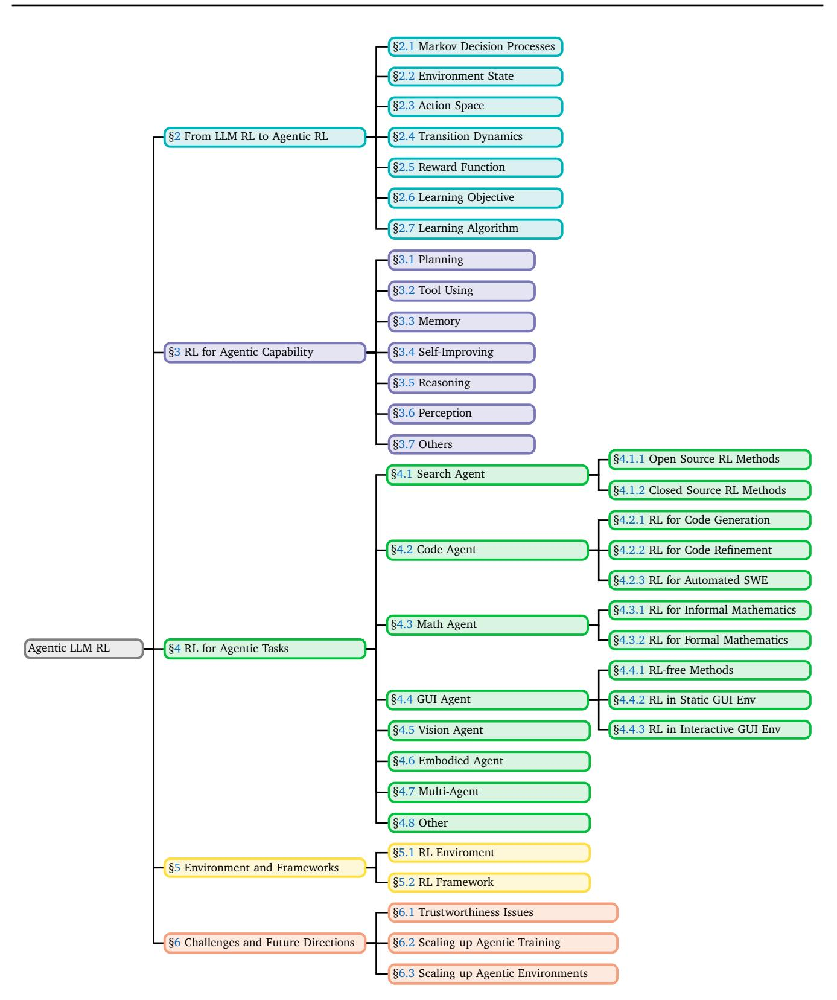
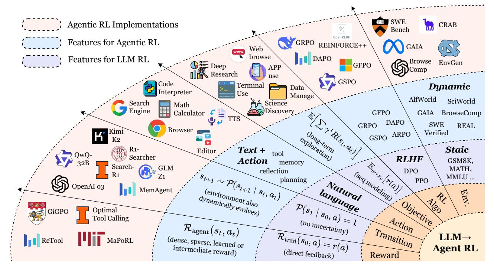
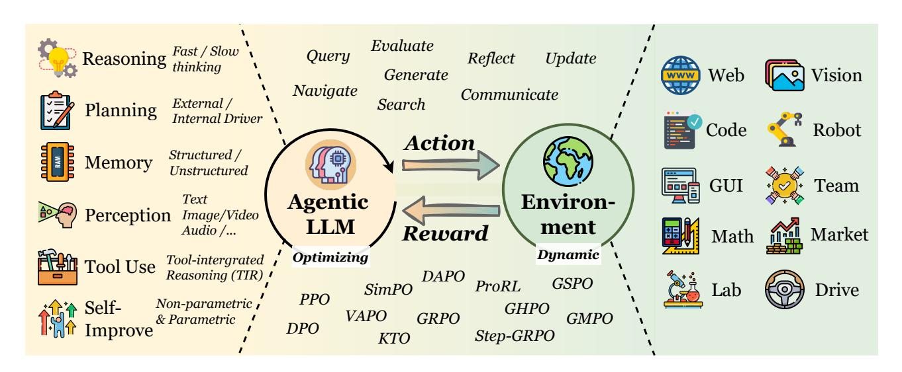
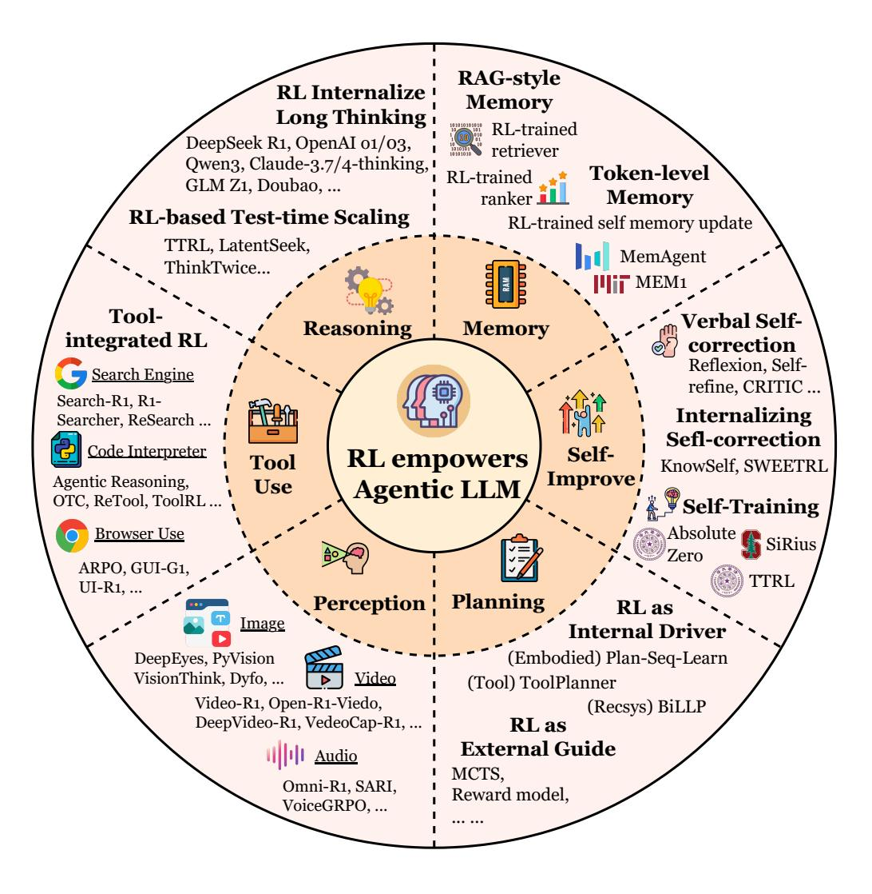
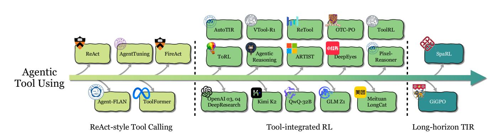
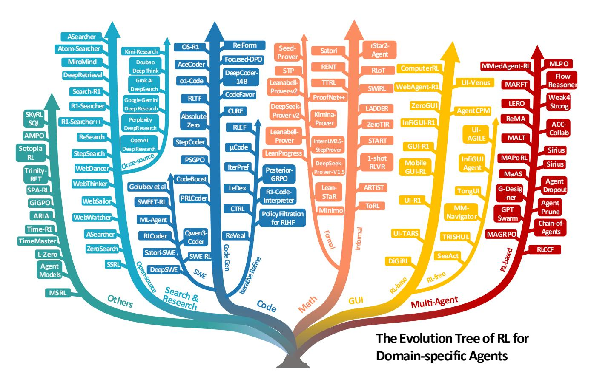

# **The Landscape of Agentic Reinforcement Learning for LLMs: A Survey**

Guibin Zhang*ϵ*† Hejia Geng*α*† Xiaohang Yu*η*† Zhenfei Yin*α* Zaibin Zhang*να* Zelin Tan*ζβ* Heng Zhou*ζβ* Zhongzhi Li*ι* Xiangyuan Xue*κβ* Yijiang Li*ξ* Yifan Zhou*µ* Yang Chen*β* Chen Zhang*ζ* Yutao Fan*β* Zihu Wang*χ* Songtao Huang*λβ* Yue Liao*ϵ* Hongru Wang*κ* Mengyue Yang*θ* Heng Ji*δ* Michael Littman*ε* Jun Wang*γ* Shuicheng Yan*ϵ* Philip Torr*α* Lei Bai*β α*University of Oxford *β*Shanghai AI Laboratory *ϵ*National University of Singapore *γ*University College London *δ*University of Illinois Urbana-Champaign *ε*Brown University *ζ*University of Science and Technology of China *η* Imperial College London *θ*University of Bristol *ι*Chinese Academy of Sciences *κ*The Chinese University of Hong Kong *λ*Fudan University *µ*University of Georgia *ξ*University of California, San Diego *ν*Dalian University of Technology *χ*University of California, Santa Barbara † *Equal contribution*, *Corresponding Author*

**Abstract:** The emergence of agentic reinforcement learning (Agentic RL) marks a paradigm shift from conventional reinforcement learning applied to large language models (LLM RL), reframing LLMs from passive sequence generators into autonomous, decision-making agents embedded in complex, dynamic worlds. This survey formalizes this conceptual shift by contrasting the degenerate single-step Markov Decision Processes (MDPs) of LLM-RL with the partially observable, temporally extended partially observable Markov decision process (POMDP) that define Agentic RL. Building on this foundation, we propose a comprehensive twofold taxonomy: one organized around core agentic capabilities, including planning, tool use, memory, reasoning, self-improvement, and perception, and the other around their applications across diverse task domains. Central to our thesis is that reinforcement learning serves as the critical mechanism for transforming these capabilities from static, heuristic modules into adaptive, robust agentic behavior. To support and accelerate future research, we consolidate the landscape of open-source environments, benchmarks, and frameworks into a practical compendium. By synthesizing over five hundred recent works, this survey charts the contours of this rapidly evolving field and highlights the opportunities and challenges that will shape the development of scalable, general-purpose AI agents.

**Keywords**: Agentic Reinforcement Learning, Large Language Models, LLM Agent

**Date**: September 1st, 2025

- **Corresponding**: [jeremyyin@robots.ox.ac.uk,](mailto:jeremyyin@robots.ox.ac.uk) [bailei@pjlab.org.cn](mailto:bailei@pjlab.org.cn)
- **Main Contact**: [guibinz@u.nus.edu,](mailto:guibinz@u.nus.edu) [genghejia0530@gmail.com,](mailto:genghejia0530@gmail.com) [x.yu21@imperial.ac.uk](mailto:x.yu21@imperial.ac.uk)

**Code Repository**: <https://github.com/xhyumiracle/Awesome-AgenticLLM-RL-Papers>

# **Contents**

| 1                                     |     | Introduction                                         |          |  |  |  |  |  |
|---------------------------------------|-----|------------------------------------------------------|----------|--|--|--|--|--|
| 2                                     |     | Preliminary: From LLM RL to Agentic RL               |          |  |  |  |  |  |
|                                       | 2.1 | Markov Decision Processes .                       | 8        |  |  |  |  |  |
|                                       | 2.2 | Environment State .                               | 8        |  |  |  |  |  |
|                                       | 2.3 | Action Space .                                    | 9        |  |  |  |  |  |
|                                       | 2.4 | Transition Dynamics .                             | 9        |  |  |  |  |  |
|                                       | 2.5 | Reward Function .                                 | 9        |  |  |  |  |  |
|                                       | 2.6 | Learning Objective .                              | 10       |  |  |  |  |  |
|                                       | 2.7 | RL Algorithms .                                   | 10       |  |  |  |  |  |
| 3                                     |     | Agentic RL: The model capability perspective         | 12       |  |  |  |  |  |
|                                       | 3.1 | Planning .                                        | 13       |  |  |  |  |  |
|                                       | 3.2 | Tool Using .                                      | 15       |  |  |  |  |  |
|                                       | 3.3 | Memory .                                          | 16       |  |  |  |  |  |
| 3.4 Self-Improvement .          |     |                                                      |          |  |  |  |  |  |
|                                       | 3.5 | Reasoning .                                       | 20       |  |  |  |  |  |
|                                       | 3.6 | Perception .                                      | 21       |  |  |  |  |  |
|                                       | 3.7 | Others .                                          | 23       |  |  |  |  |  |
| 4 Agentic RL: The Task Perspective |     |                                                      |          |  |  |  |  |  |
|                                       | 4.1 | Search & Research Agent .                         | 23 24 |  |  |  |  |  |
|                                       |     | 4.1.1 Open Source RL Methods .                 | 25       |  |  |  |  |  |
|                                       |     | 4.1.2 Closed Source RL Methods .               | 26       |  |  |  |  |  |
| 4.2                                   |     | Code Agent .                                      | 26       |  |  |  |  |  |
|                                       |     | 4.2.1 RL for Code Generation .                 | 27       |  |  |  |  |  |
|                                       |     | 4.2.2 RL for Iterative Code Refinement .       | 28       |  |  |  |  |  |
|                                       |     | 4.2.3 RL for Automated Software Engineering .  | 28       |  |  |  |  |  |
|                                       | 4.3 | Mathematical Agent .                              | 30       |  |  |  |  |  |
|                                       |     | 4.3.1 RL for Informal Mathematical Reasoning . | 30       |  |  |  |  |  |
|                                       |     | 4.3.2 RL for Formal Mathematical Reasoning .   | 32       |  |  |  |  |  |

| 7 |     | Conclusion                                               | 50 |
|---|-----|----------------------------------------------------------|----|
|   | 6.3 | Scaling up Agentic Environment. .                     | 50 |
|   | 6.2 | Scaling up Agentic Training .                         | 49 |
|   | 6.1 | Trustworthiness .                                     | 47 |
| 6 |     | Open Challenges and Future Directions                    | 47 |
|   | 5.2 | RL Framework .                                        | 45 |
|   |     | 5.1.6 General-Purpose Environments .               | 45 |
|   |     | 5.1.5 Simulated & Game Environments .              | 45 |
|   |     | 5.1.4 Domain-specific Environments .               | 44 |
|   |     | 5.1.3 Coding & Software Engineering Environments . | 43 |
|   |     | 5.1.2 GUI Environments .                           | 43 |
|   |     | 5.1.1 Web Environments .                           | 43 |
|   | 5.1 | Environment Simulator .                               | 41 |
| 5 |     | Enviroment and Frameworks                                | 41 |
|   | 4.8 | Other Tasks .                                         | 40 |
|   | 4.7 | RL in Multi-Agent Systems .                           | 39 |
|   | 4.6 | RL in Embodied Agents .                               | 38 |
|   | 4.5 | RL in Vision Agents .                                 | 37 |
|   |     | 4.4.3 RL in Interactive GUI Environments .         | 36 |
|   |     | 4.4.2 RL in Static GUI Environments .              | 35 |
|   |     | 4.4.1 RL-free Methods .                            | 35 |
|   | 4.4 | GUI Agent .                                           | 35 |
|   |     |                                                          |    |

# **1. Introduction**

The rapid convergence of large language models (LLMs) and reinforcement learning (RL) has precipitated a fundamental transformation in how language models are conceived, trained, and deployed. Early LLM-RL paradigms largely treated these models as static conditional generators, optimized to produce single-turn outputs aligned with human preferences or benchmark scores. While successful for alignment and instruction following, such approaches overlook the broader spectrum of sequential decision-making that underpins realistic, interactive settings. These limitations have prompted a shift in perspective: rather than viewing LLMs as passive text emitters, recent developments increasingly frame them as *agentic entities*, *i.e.,*, autonomous decision-makers capable of perceiving, reasoning, planning, invoking tools, maintaining memory, and adapting strategies over extended horizons in partially observable, dynamic environments. We define this emerging paradigm as **Agentic Reinforcement Learning (Agentic RL)**. To more clearly delineate the distinction between the concept of Agentic RL studied in this work and conventional RL approaches, we provide the following definition:

**Agentic Reinforcement Learning (Agentic RL)** refers to a paradigm in which LLMs, rather than being treated as *static conditional generators* optimized for single-turn output alignment or benchmark performance, are conceptualized as *learnable policies* embedded within sequential decision-making loops, where RL endows them with autonomous agentic capabilities, such as planning, reasoning, tool use, memory maintenance, and self-reflection, enabling the emergence of long-horizon cognitive and interactive behaviors in *partially observable, dynamic environments*.

In Section [2,](#page-6-0) we present a more formal, symbolically grounded distinction between agentic RL and conventional RL. Prior research relevant to agentic RL can be broadly grouped into two complementary threads: **LLM agents** and **RL for LLMs**, detailed as follows:

**LLM Agents.** LLM-based agents represent an emerging paradigm in which LLMs act as autonomous or semiautonomous decision-making entities [\[1,](#page-50-0) [2\]](#page-50-1), capable of reasoning, planning, and executing actions in pursuit of complex goals. Recent surveys have sought to map this landscape from complementary perspectives. Luo et al. [\[3\]](#page-50-2) propose a methodology-centered taxonomy that connects architectural foundations, collaboration mechanisms, and evolutionary pathways, while Plaat et al. [\[4\]](#page-50-3) emphasize the core capabilities of reasoning, acting, and interacting as defining features of *agentic* LLMs. Tool use, encompassing retrieval-augmented generation (RAG) and API utilization, is a central paradigm, extensively discussed in Li et al. [\[5\]](#page-50-4) and further conceptualized by Wang et al. [\[6\]](#page-50-5). Planning and reasoning strategies form another pillar, with surveys such as Masterman et al. [\[7\]](#page-50-6) highlighting common design patterns like plan-execute-reflect loops, while Tao et al. [\[8\]](#page-50-7) extend this to self-evolution, where agents iteratively refine knowledge and strategies without substantial human intervention. Other directions explore collaborative, cross-modal, and embodied settings, from multi-agent systems [\[9\]](#page-50-8) to multimodal integration [\[10\]](#page-51-0), and brain-inspired architectures with memory and perception [\[11\]](#page-51-1).

**RL for LLMs.** The second line of research investigates how reinforcement learning algorithms are applied to improve or align LLMs. A primary branch, RL for LLMs, leverages on-policy (*e.g.*, proximal policy optimization (PPO) [\[12\]](#page-51-2) and Group Relative Policy Optimization (GRPO) [\[13\]](#page-51-3)) and off-policy (*e.g.*, actor–critic, Qlearning [\[14\]](#page-51-4)) methods to enhance capabilities such as instruction following, ethical alignment, and code generation [\[15,](#page-51-5) [16,](#page-51-6) [17\]](#page-51-7). A complementary direction, LLM for RL, examines the deployment of LLMs as planners, reward designers, goal generators, or information processors to improve sample efficiency, generalization, and multi-task planning in control environments, with systematic taxonomies provided by

Cao et al. [18]. RL has also been integrated throughout the LLM lifecycle: from data generation [19, 20] and pretraining [21] to post-training and inference [22], as surveyed by Guo et al. [23]. The most prominent branch here is post-training alignment, notably Reinforcement Learning from Human Feedback (RLHF) [24], along with extensions such as Reinforcement Learning from AI Feedback (RLAIF) and Direct Preference Optimization (DPO) [25, 26, 27, 15].

**Research Gap and Our Contributions.** The recent surge in research on LLM agents and RL-enhanced LLMs reflects two complementary perspectives: one explores what large language models can do as the core of autonomous agents, while the other focuses on how reinforcement learning can optimize their behavior. However, despite the breadth of existing work, a unified treatment of agentic RL, which conceptualizes LLMs as policy-optimized agents embedded in sequential decision processes, remains lacking. Current studies often examine isolated capabilities, domains, or custom environments, with inconsistent terminology and evaluation protocols, making systematic comparison and cross-domain generalization difficult. To bridge this gap, we present a coherent synthesis that connects theoretical foundations with algorithmic approaches and practical systems. We formalize agentic RL through Markov decision process (MDP) and partially observable Markov decision process (POMDP) abstractions to distinguish it from classical LLM-RL paradigms, and introduce a capability-centered taxonomy that includes planning, tool use, memory, reasoning, reflection (self-improvement), and interaction as RL-optimizable components. Furthermore, we consolidate representative tasks, environments, frameworks, and benchmarks that support agentic LLM training and evaluation, and conclude by discussing open challenges and outlining promising future directions for scalable, general-purpose agentic intelligence. Overall, we aim to further clarify the research scope of this survey:

#### **Primary focus:**

✓ how RL empowers LLM-based agents (or, LLMs with agentic characteristics) in *dynamic environments* 

#### Out of scope (though occasionally mentioned):

- $\mathbf{X}$  RL for human value alignment (e.g., RL for harmful query refusal);
- $\mathbf{x}$  traditional RL algorithms that are not LLM-based (e.g., MARL [28]);
- X RL for boosting pure LLM performance on static benchmarks.

**Structure of the Survey.** This survey is organized to progressively build a unified understanding of Agentic RL from conceptual foundations to practical implementations. The following structure is as follows: Section 2 formalizes the paradigm shift to Agentic RL through an MDP/POMDP lens. Section 3 examines agentic RL from the capability perspective, categorizing key modules such as planning, reasoning, tool using, memory, self-improvement, perception, and others. Section 4 explores applications across domains, including search, GUI navigation, code generation, mathematical reasoning, and multi-agent systems. Section 5 consolidates open-source environments and RL frameworks that underpin experimentation and benchmarking. Section 6 discusses open challenges and future directions towards scalable, adaptive, and reliable agentic intelligence, and Section 7 concludes the survey. The overall structure is also illustrated in Figure 1.

**Figure** 1: The primary organizational structure of the survey.

# 2. Preliminary: From LLM RL to Agentic RL

LLMs are initially pre-trained using behavior cloning, which applies maximum likelihood estimation (MLE) to static datasets such as web-scraped text corpora. Subsequent post-training methods enhance capabilities and align outputs with human preferences—transforming them beyond generic web-data replicators. A common technique is supervised fine-tuning (SFT), where models are refined on human-generated (prompt, response) demonstrations. However, procuring sufficient high-quality SFT data remains challenging. Reinforcement fine-tuning (RFT) offers an alternative by optimizing models through reward functions, circumventing dependence on behavioral demonstrations.

In early RFT research, the core objective is to optimize LLMs through human feedback [24] or data preferences [29], aligning them with human preferences or directly with data preferences (as in DPO). This **preference-based RFT (PBRFT)** primarily involves learning reward model optimization for LLMs on a fixed preference dataset, or directly implementing it using data preferences. With the release of LLMs such as OpenAI o1 [30] and DeepSeek-R1 [31] that possess reasoning capabilities, their improved performance and cross-domain generalization have garnered widespread attention. With the release of models like OpenAI o3 [32], which possess both self-evolving reasoning capabilities and support for tool use, researchers are beginning to contemplate how to deeply integrate LLMs with downstream tasks through reinforcement learning methods. Subsequently, researchers have shifted their focus from PBRFT, aimed at optimizing fixed preference datasets, to agentic reinforcement learning tailored for specific tasks and dynamic environments.

In this section, we provide a formalization of the paradigm shift from PBRFT to the emerging framework of **agentic reinforcement learning (Agentic RL)**. While both approaches leverage RL techniques to improve LLMs' performance, they fundamentally differ in their underlying assumptions, task structure, and decisionmaking granularity. Figure [33] illustrates the paradigm shift from LLM RL to agentic RL.

Figure 2: Paradigm shift from LLM-RL to agentic RL.

#### **2.1. Markov Decision Processes**

The Markov decision process (MDP) for the RL fine-tuning process can be formalized as a seven-element tuple ⟨S, O, A,P, R, *T*, *γ*⟩, where S represents the state space and O is the observation space of the agent. A denotes the action space. R is defined as the reward function, P encapsulates the state transition probabilities, *T* signifies the task horizon, and *γ* is the discount factor. By casting both preference-based RFT and agentic RL as MDP or POMDP, we clarify the theoretical implications of treating LLMs either as static sequence generators or as interactive, decision-capable agents embedded within dynamic environments.

**PBRFT.** The RL training process of PBRFT is formalized as a degenerate MDP defined by the tuple:

$$\langle \mathcal{S}_{\text{trad}}, \mathcal{A}_{\text{trad}}, \mathcal{P}_{\text{trad}}, \mathcal{R}_{\text{trad}}, T = 1 \rangle. \tag{1}$$

**Agentic RL.** The RL training process of agentic RL is modeled as a POMDP:

$$\langle \mathcal{S}_{\text{agent}}, \mathcal{A}_{\text{agent}}, \mathcal{P}_{\text{agent}}, \gamma, \mathcal{O} \rangle,$$
 (2)

where the agent receives observations *ot* = *O*(*st*) based on the state *st* ∈ Sagent. The primary distinctions between PBRFT and agentic RL are delineated in Table [1.](#page-7-2) In summary, PBRFT optimizes sequences of output sentences within a fixed dataset under full observations, whereas agentic RL optimizes semantic-level behaviors in variable environments characterized by partial observations.

|  |  |  | Table 1: Formal comparison between traditional PBRFT and Agentic RL. |
|--|--|--|----------------------------------------------------------------------|
|  |  |  |                                                                      |

| Concept         | Traditional PBRFT                                  | Agentic RL                                                                 |
|-----------------|----------------------------------------------------|----------------------------------------------------------------------------|
| S: State space  | {s0} (single prompt); episode ends immediately. | ∈ Sagent; = O(st); horizon T > 1. st ot                  |
| A: Action space | Pure text sequence.                                | Atext ∪ Aaction.                                                        |
| P: Transition   | Deterministic to the terminal state.               | Dynamic transition function P(st+1   , at). st                    |
| R: Reward       | Single scalar r(a).                                | Step-wise R(st , at); combines sparse task and dense sub-rewards. |
| J(θ): Objective | [r(a)]. Ea∼πθ                                   | tR(st [ ∑︀ , at)]. Eτ∼πθ t γ                                |

#### **2.2. Environment State**

**PBRFT.** In the training process, each episode starts from a single prompt state *s*0; the episode terminates immediately after the model emits one response. Formally, the underlying MDP degenerates to a *single-step* decision problem with horizon *T* = 1. The state space reduces to a single static prompt input:

$$S_{\text{trad}} = \{\text{prompt}\}.$$
 (3)

**Agentic RL.** The LLM agent acts over multiple time-steps in a POMDP. Let *st* ∈ Sagent denote the full world-state and the LLM agent gets observation *Ot* based on current state *ot* = O(*st*). The LLM agent chooses an action *at* based on the current observation *ot* , and the state evolves over time:

$$s_{t+1} \sim P(s_{t+1} \mid s_t, a_t), \tag{4}$$

as the agent accumulates intermediate signals such as retrieved tool results, user messages, or environment feedback. The interaction is thus inherently dynamic and temporally extended.

#### **2.3. Action Space**

In the agentic RL setting, the LLM's action space comprises two disjoint components:

$$\mathcal{A}_{\text{agent}} = \mathcal{A}_{\text{text}} \cup \mathcal{A}_{\text{action}} \tag{5}$$

where Atext is the emission of free-form natural language tokens via autoregressive decoding; Aaction is a set of structured, non-linguistic actions delimited in the output stream by special tokens <action\_start> and <action\_end>. These actions may invoke external tools (e.g., call("search", "Einstein")) or interact with an environment (e.g., move("north")), depending on task requirements.

The two subspaces differ in both semantics and functional role: Atext produces communicative content intended for human or machine interpretation without directly altering the external state, whereas Aaction issues executable commands that either (i) acquire new information through tool calls, or (ii) modify the state of a physical or simulated environment. This separation allows a unified policy to govern both natural language generation and operational decision-making within a single reinforcement learning framework.

#### **2.4. Transition Dynamics**

**PBRFT.** In conventional PBRFT, the transition dynamics are deterministic: the next state is determined once an action is made, as follows:

$$\mathcal{P}(s_1 \mid s_0, a) = 1$$
, where there is no uncertainty. (6)

**Agentic RL.** In agentic RL, the environment evolves under uncertainty according to

$$s_{t+1} \sim \mathcal{P}(s_{t+1} \mid s_t, a_t), \quad a_t \in \mathcal{A}_{\text{text}} \cup \mathcal{A}_{\text{action}}.$$
(7)

Text actions (Atext) generate natural language outputs without altering the environment state. Structured actions (Aaction), delimited by <action\_start> and <action\_end>, can either query external tools or directly modify the environment. This sequential formulation contrasts with the one-shot mapping of PBRFT, enabling policies that iteratively combine communication, information acquisition, and environment manipulation.

#### **2.5. Reward Function**

**PBRFT.** PBRFT commonly features a reward function with verifiable response correctness, which may be implemented using either a rule-based verifier [\[31\]](#page-53-0) or a neural network-parameterized reward model [\[34\]](#page-54-2). Regardless of the implementation approach, its core follows the equation:

$$\mathcal{R}_{\text{trad}}(s_0, a) = r(a),\tag{8}$$

where *r* : A → **R** is a scalar score supplied by a human- or AI-preference model; with no intermediate feedback.

**Agentic RL.** The reward function of the LLM agent is based on the downstream task.

$$\mathcal{R}_{\text{agent}}(s_t, a_t) = \begin{cases} r_{\text{task}} & \text{on task completion,} \\ r_{\text{sub}}(s_t, a_t) & \text{for step-level progress,} \\ 0 & \text{otherwise,} \end{cases} \tag{9}$$

allowing dense, sparse, or learned rewards (*e.g.*, unit-test pass, symbolic verifier success).

#### **2.6. Learning Objective**

**PBRFT.** The optimization objective of PBRFT is to maximize the response reward based on the policy *πθ* :

$$J_{\text{trad}}(\theta) = \mathbb{E}_{a \sim \pi_{\theta}} \big[ r(a) \big]. \tag{10}$$

No discount factor is required; optimization resembles maximum-expected-reward sequence modeling.

**Agentic RL.** The optimization objective of Agentic RL is to maximize the discounted reward:

$$J_{\text{agent}}(\theta) = \mathbb{E}_{\tau \sim \pi_{\theta}} \left[ \sum_{t=0}^{T-1} \gamma^t R_{\text{agent}}(s_t, a_t) \right], \qquad 0 < \gamma < 1, \tag{11}$$

optimized via policy-gradient or value-based methods with exploration and long-term credit assignment.

PBRFT focuses on single-turn text quality alignment without explicit planning, tool use, or environment feedback, while agentic RL involves multi-turn planning, adaptive tool invocation, stateful memory, and long-horizon credit assignment, enabling the LLM to function as an autonomous decision-making agent.

#### **2.7. RL Algorithms**

In contemporary research, RL algorithms constitute a pivotal component in both PBRFT and agentic RL frameworks. Different RL algorithms demonstrate distinct sample efficiency and performance characteristics, each offering a unique approach to the central challenge of aligning model outputs with complex, often subjective, human goals. The canonical methods, such as REINFORCE, PPO [\[12\]](#page-51-2), GRPO [\[31\]](#page-53-0), and DPO [\[29\]](#page-52-8), form a spectrum from general policy gradients to specialized preference learning. We next introduce each of these three classic algorithms and provide a comparison of popular variants from each family in Table [2.](#page-11-1)

**REINFORCE: The Foundational Policy Gradient** As one of the earliest policy gradient algorithms, RE-INFORCE provides the foundational theory for training stochastic policies. It operates by increasing the probability of actions that lead to high cumulative reward and decreasing the probability of those that lead to low reward. Its objective function is given by:

$$\nabla_{\theta}J(\theta) = \mathbb{E}_{s_0} \left[ \frac{1}{N} \sum_{i=1}^N \left( \mathcal{R}(s_0, a^{(i)}) - b(s_0) \right) \nabla_{\theta} \log \pi_{\theta}(a^{(i)}|s_0) \right], \tag{12}$$

where *a* (*i*) ∼ *πθ* (*a*|*s*0) is the *i*-th sampled response, R(*s*0, *a*) denotes the final rewards received on task completion, and *b*(*s*) is a baseline function to reduce the variance of the policy gradient estimate. In general, *b*(*s*) can be any function, including random variables.

**Proximal Policy Optimization (PPO)** PPO [\[12\]](#page-51-2) became the dominant RL algorithm for LLM alignment due to its stability and reliability. It improves upon vanilla policy gradients by limiting the update step to prevent destructively large policy changes. Its primary clipped objective function is:

$$L_{PPO}(\theta) = \frac{1}{N} \sum_{i=1}^{N} \min\left(\frac{\pi_{\theta}(a_{t}^{(i)}|s_{t})}{\pi_{\theta_{old}}(a_{t}^{(i)}|s_{t})} A(s_{t}, a_{t}^{(i)}), \text{ clip}\left(\frac{\pi_{\theta}(a_{t}^{(i)}|s_{t})}{\pi_{\theta_{old}}(a_{t}^{(i)}|s_{t})}, 1 - \epsilon, 1 + \epsilon\right) A(s_{t}, a_{t}^{(i)})\right), \tag{13}$$

where *a* (*i*) *t* ∼ *πθold* (*a*|*st*) is the *i*-th sampled response from the old policy *πθold* , whose update is delayed. *At* is the estimated advantage given by

$$A(s_t, a_t) = \mathcal{R}(s_t, a_t) - V(s_t), \tag{14}$$

where *Vθ* (*s*) is the learned value function, i.e., the expectation **E***a*∼*πθ* (*a*|*s*) [R(*s*, *a*)], which is derived from a critic network that is of the same size as the policy network. The clip term prevents the probability ratio from moving too far from 1, ensuring stable updates. A key drawback is its reliance on a separate critic network for advantage estimation, which substantially increases the parameter count during training.

**Direct Preference Optimization (DPO)** DPO represents a groundbreaking shift by entirely bypassing the need for a separate reward model. It reframes the problem of maximizing a reward under a KL-constraint as a likelihood-based objective on human preference data. Given a dataset of preferences *D* = {(*yw*, *yl*)}, where *yw* is the preferred response and *yl* is the dispreferred one, the DPO loss is:

$$L_{DPO}(\pi_{\theta}; \pi_{ref}) = -\mathbb{E}_{(x, y_w, y_l) \sim D} \left[ \log \sigma \left( \beta \log \frac{\pi_{\theta}(y_w | x)}{\pi_{ref}(y_w | x)} - \beta \log \frac{\pi_{\theta}(y_l | x)}{\pi_{ref}(y_l | x)} \right) \right], \tag{15}$$

where *πre f* is a reference policy (usually the initial SFT model), and *β* is a hyperparameter. While DPO eliminates the critic, its performance is intrinsically tied to the quality and coverage of its static preference dataset. Variants have emerged to address its limitations, including IPO (Identity Preference Optimization) [\[35\]](#page-54-3) which adds a regularization term to prevent overfitting, and KTO (Kahneman-Tversky Optimization) [\[36\]](#page-54-4), which learns from per-response binary signals (desirable/undesirable) rather than strict pairwise comparisons. See Table. [2](#page-11-1) for more variants.

**Group Relative Policy Optimization (GRPO)** The remarkable success achieved by DeepSeek has catalyzed significant research interest in GRPO. Proposed to address the inefficiency of PPO's large critic, GRPO introduces a novel, lightweight evaluation paradigm. It operates on groups of responses, using their relative rewards within a group to compute advantages, thus eliminating the need for an absolute value critic. The core GRPO objective can be conceptualized as:

$$L_{GRPO} = \frac{1}{G} \sum_{g=1}^{G} \min \left( \frac{\pi_{\theta}(a_{t}^{(g)}|s_{t}^{(g)})}{\pi_{\theta_{old}}(a_{t}^{(g)}|s_{t}^{(g)})} \hat{A}(s_{t}^{(g)}, a_{t}^{(g)}), \text{ clip} \left( \frac{\pi_{\theta}(a_{t}^{(g)}|s_{t}^{(g)})}{\pi_{\theta_{old}}(a_{t}^{(g)}|s_{t}^{(g)})}, 1 - \epsilon, 1 + \epsilon \right) \hat{A}(s_{t}^{(g)}, a_{t}^{(g)}) \right), \tag{16}$$

where a group of outputs {(*s* (*g*) 0 , *a* (*g*) 0 , . . . ,*s* (*g*) *T*−1 , *a* (*g*) *T*−1 )} *G g*=1 is sampled from the old policy *πθold* . The advantage function is estimated by

$$\hat{A}(s_t, a_t) = \frac{\mathcal{R}(s_t, a_t) - \text{mean}(\mathcal{R}(s_t^{(1)}, a_t^{(1)}), \dots, \mathcal{R}(s_t^{(G)}, a_t^{(G)}))}{\text{std}(\mathcal{R}(s_t^{(1)}, a_t^{(1)}), \dots, \mathcal{R}(s_t^{(G)}, a_t^{(G)}))}.\n$$
(17)

Table 2: Comparison of the popular variants of the PPO, DPO, and GRPO families. Clip corresponds to preventing the policy ratio from moving too far from 1 for ensuring stable updates. KL penalty corresponds to penalizing the KL divergence between the learned policy and the reference policy for ensuring alignment.

| Method                                                             | Year                                 | Objective Type                                                                                              | Clip                            | KL Penalty                          | Key Mechanism                                                                                                                                                               | Signal                                                                                  |
|--------------------------------------------------------------------|--------------------------------------|-------------------------------------------------------------------------------------------------------------|---------------------------------|-------------------------------------|-----------------------------------------------------------------------------------------------------------------------------------------------------------------------------|-----------------------------------------------------------------------------------------|
|                                                                    |                                      |                                                                                                             |                                 | PPO family                          |                                                                                                                                                                             |                                                                                         |
| PPO [12] VAPO [37] PF-PPO [38] VinePPO [39] PSGPO [40] | 2017 2025 2024 2024 2024 | Policy gradient Policy gradient Policy gradient Policy gradient Policy gradient                 | Yes Yes Yes Yes Yes | No Adaptive Yes Yes Yes | Policy ratio clipping Adaptive KL penalty + variance control Policy filtration Unbiased value estimates Process supervision                                     | Reward Reward + variance signal Noisy reward Reward Process Reward          |
| DPO family                                                         |                                      |                                                                                                             |                                 |                                     |                                                                                                                                                                             |                                                                                         |
| DPO [29] β-DPO [41] SimPO [42]                               | 2024 2024 2024                 | Preference optimization Preference optimization Preference optimization                               | No No No                  | Yes Adaptive Scaled           | Implicit reward related to the policy Dynamic KL coefficient Use the average log probability of a sequence as the implicit reward                                  | Human preference Human preference Human preference                                |
| IPO [35]                                                           | 2024                                 | Implicit preference                                                                                         | No                              | No                                  | Leverage generative LLMs as preference clas sifiers for reducing the dependence on exter                                                                                 | Preference rank                                                                         |
| KTO [36] ORPO [43] Step-DPO [44]                             | 2024 2024 2024                 | Knowledge transfer optimization Online regularized preference optimization Preference optimization | No No No                  | Yes Yes Yes                   | nal human feedback or reward models Teacher stabilization Online stabilization Step-wise supervision                                                               | Teacher-student logit Online feedback reward Step-wise preference                 |
| LCPO [45]                                                          | 2025                                 | Preference optimization                                                                                     | No                              | Yes                                 | Length preference with limited data and training                                                                                                                         | Reward                                                                                  |
|                                                                    |                                      |                                                                                                             |                                 | GRPO family                         |                                                                                                                                                                             |                                                                                         |
| GRPO [31]                                                          | 2025                                 | Policy Gradient under group-based reward                                                                 | Yes                             | Yes                                 | Group-based relative reward to eliminate value estimates                                                                                                                 | Group-based reward                                                                      |
| DAPO [46] GSPO [47]                                             | 2025 2025                         | Surrogate of GRPO's Surrogate of GRPO's                                                                  | Yes Yes                      | Yes Yes                          | Decoupled clip and dynamic sampling Define the importance ratio based on se quence likelihood and performs sequence                                                   | Dynamic group-based reward Smooth group-based reward                                 |
| GMPO [48] ProRL [49] Posterior-GRPO [50] Dr.GRPO [51]     | 2025 2025 2025 2025         | Surrogate of GRPO's Same as GRPO's Same as GRPO's Unbiased GRPO's objective                        | Yes Yes Yes Yes        | Yes Yes Yes Yes            | level clipping, rewarding, and optimization Geometric mean of token-level rewards Reference policy reset Reward only successful processes Eliminate the bias in | Margin-based reward Group-based reward Process-based reward Group-based reward |
| Step-GRPO [52] SRPO [53] GRESO [54]                          | 2025 2025 2025                 | Same as GRPO's Same as GRPO's Same as GRPO's                                                          | Yes Yes Yes               | Yes Yes Yes                   | optimization of GRPO Rule-based reasoning rewards Two-staged history-resampling Pre-rollout filtering                                                              | Step-wise reward Reward Reward                                                    |
| StarPO [55] GHPO [56]                                           | 2025 2025                         | Same as GRPO's Policy gradient                                                                           | Yes Yes                      | Yes Yes                          | Reasoning-guided actions for multi-turn interactions Adaptive prompt refinement                                                                                       | Group-based reward Reward                                                            |
| Skywork R1V2 [57] ASPO [58]                                     | 2025 2025                         | GRPO's with hybrid reward signal GRPO's with shaped advantage function                                | Yes Yes                      | Yes Yes                          | Selective sample buffer Apply a clipped bias directly to advantage function                                                                                           | Multimodal reward Group-based reward                                                 |
| TreePo [59]                                                        | 2025                                 | Same as GRPO's                                                                                              | Yes                             | Yes                                 | Self-guided policy rollout for reducing the compute burden                                                                                                               | Group-based reward                                                                      |
| EDGE-GRPO [60]                                                     | 2025                                 | Same as GRPO's                                                                                              | Yes                             | Yes                                 | Entropy-driven advantage and duided error correction to mitigate advantage collapse                                                                                      | Group-based reward                                                                      |
| DARS [61]                                                          | 2025                                 | Same as GRPO's                                                                                              | Yes                             | No                                  | Reallocate compute from medium-difficulty to the hardest problems via multi-stage roll out sampling                                                                   | Group-based reward                                                                      |
| CHORD [62]                                                         | 2025                                 | Weighted sum of GRPO's and Su pervised Fine-Tuning losses                                                | Yes                             | Yes                                 | Reframe Supervised Fine-Tuning as a dynam ically weighted auxiliary objective within the on-policy RL process                                                         | Group-based reward                                                                      |
| PAPO [63]                                                          | 2025                                 | Surrogate of GRPO's                                                                                         | Yes                             | Yes                                 | Encourage learning to perceive while learn ing to reason through the Implicit Perception                                                                                 | Group-based reward                                                                      |
| Pass@k Training                                                    | 2025                                 | Same as GRPO's                                                                                              | Yes                             | Yes                                 | Loss Pass@k metric as the reward to continually train a model                                                                                                         | Group-based reward                                                                      |

This group-relative approach is highly sample-efficient and reduces computational overhead. Consequently, a series of novel algorithms derived from the GRPO framework have been subsequently proposed (see Table. [2\)](#page-11-1), aiming to substantially enhance both the sample efficiency and asymptotic performance of reinforcement learning methodologies.

# **3. Agentic RL: The model capability perspective**

In this section, we conceptually characterize **Agentic RL** as the principled training of an autonomous agent composed of a set of key abilities/modules, *i.e.*, planning (Section [3.1\)](#page-12-0), tool use (Section [3.2\)](#page-14-0), memory

**Figure 3:** The dynamic interaction process between agentic LLMs and the environment.

(Section 3.3), self-improvement (Section 3.4), reasoning (Section 3.5), perception (Section 3.6), and others (Section  $3.7$ ), following the classic LLM agent definition [64, 65], as demonstrated in Figure 4. Traditionally, an agent pairs an LLM with mechanisms for planning (e.g., task decomposition and plan selection) [66], reasoning (chain-of-thought or multi-turn inference) [67], external tool invocation [68], long- and short-term memory, and iterative reflection to self-correct and refine behavior. Agentic RL thus treats these components not as static pipelines but as interdependent policies that can be jointly optimized: RL for planning learns multi-step decision trajectories; RL for memory shapes retrieval and encoding dynamics; RL for tool use optimizes invocation timing and fidelity; and RL for reflection drives internal self-supervision and selfimprovement. Consequently, our survey systematically examines how RL empowers planning, tool use, memory, reflection, and reasoning in subsequent subsections. We aim to provide a high-level conceptual delineation of RL's applications for agent capabilities, rather than an exhaustive enumeration of all related work, which we provide in Section 4.

# 3.1. Planning

Planning, the deliberation over a sequence of actions to achieve a goal, constitutes a cornerstone of artificial intelligence, demanding complex reasoning, world knowledge, and adaptability [69]. While initial efforts leveraged the innate capabilities of LLMs through prompting-based methods [70] (e.g., ReAct [71]), these approaches lacked a mechanism for adaptation through experience. RL has emerged as a powerful paradigm to address this gap, enabling agents to refine their planning strategies by learning from environmental feedback. The integration of RL into agent planning manifests in two distinct paradigms, distinguished by whether RL functions as an external guide to a structured planning process or as an internal driver that directly evolves the LLM's intrinsic planning policy, which we will detail below.

**RL as an External Guide for Planning.** One major paradigm frames RL as an external guide to the planning process, where the LLM's primary role is to generate potential actions within a structured search framework. Here, RL is not employed to fine-tune the LLM's generative capabilities directly, but rather to train an auxiliary reward or heuristic function [66]. This learned function then guides a classical search algorithm, such as Monte Carlo Tree Search (MCTS), by evaluating the quality of different planning trajectories. Representative works like RAP [72] and LATS [73] exemplify this method. They leverage an RL-aided model to assess

**Figure 4:** A summary of the overall six aspects where RL empowers agentic LLMs. Note that the representative methods listed here are not exhaustive; please refer to our main text.

LLM-generated steps, thereby steering the search toward more promising solutions. In this configuration, the LLM acts as a knowledge-rich action proposer, while RL provides the adaptive, evaluative feedback necessary for efficient exploration.

**RL as an Internal Driver of Planning.** A second, more integrated paradigm positions RL as an internal driver of the agent's core planning capabilities. This approach casts the LLM directly as a policy model and optimizes its planning behavior through direct environmental interaction. Instead of guiding an external search algorithm, RL-based feedback from trial and error is used to directly refine the LLM's internal policy for generating plans. This is achieved through methods derived from RLHF, such as leveraging DPO on successful versus failed trajectories as seen in ETO [74], or through lifelong learning frameworks. For instance, VOYAGER [75] iteratively builds and refines a skill library from environmental interaction. This paradigm transforms the LLM from a static generator into an adaptive policy that continuously evolves, enhancing its robustness and autonomy in dynamic environments. AdaPlan and its PilotRL framework [76] leverage global plan-based guidance with progressive RL to enhance LLM agents' long-horizon planning and

**Figure** 5: The development of agentic tool use. Note that we only select a small bunch of representative works here to reflect the progress.

execution coordination in text game environments like AFLWorld and TextCraft.

**Prospective:** The Synthesis of Deliberation and Intuition. The prospective horizon for agentic planning lies in the synthesis of these two paradigms: moving beyond the distinction between external search and internal policy optimization. The ultimate goal is to develop an agent that **internalizes the structured search process itself**, seamlessly blending intuitive, fast plan generation with deliberate, slow, deliberative reasoning. In such a model, RL would not only refine the final plan but also optimize a meta-policy governing the deliberation process: learning when to explore alternative paths, how to prune unpromising branches, and how deeply to reason before committing to an action. This would transform the LLM agent from a component that either proposes actions or acts as a raw policy into an integrated reasoning engine.

# 3.2. Tool Using

RL has emerged as a pivotal methodology for evolving tool-enabled language agents from post-hoc, ReActstyle pipelines to deeply interleaved, multi-turn Tool-Integrated Reasoning (TIR) systems. While early paradigms successfully demonstrated the feasibility of tool invocation, their reliance on SFT or prompt engineering limited agents to mimicking static patterns, lacking the strategic flexibility to adapt to novel scenarios or recover from errors. Agentic RL addresses this by shifting the learning paradigm from imitation to outcome-driven optimization, enabling agents to autonomously discover when, how, and which tools to deploy. This evolution charts a clear trajectory, which we explore in three stages. We begin with (1) early ReAct-style tool calling, then examine (2) modern tool-integrated reasoning (TIR) that deeply embeds tool use within cognitive loops, and finally, discuss the prospective challenge of (3) multi-turn TIR, focusing on temporal credit assignment for robust, long-horizon performance.

**ReAct-style Tool Calling.** Early paradigms for tool invocation predominantly relied on either prompt engineering or SFT to elicit tool-use behaviors. The (I) prompt engineering approach, exemplified by ReAct [71], leveraged few-shot exemplars to guide an LLM to interleave reasoning traces and actions within a "Thought-Action-Observation" cycle, capitalizing on the model's in-context learning abilities. Going beyond, (II) SFT-based methods were introduced to internalize models' tool-use capabilities. Frameworks like Toolformer [77] employed a self-supervised objective to teach models where to insert API calls, while others like FireAct [78], AgentTuning [79], Agent-FLAN [80] fine-tuned models on expert-generated or curated datasets of tool-interaction trajectories (e.g., AgentBank [81], APIBank [82]). Although SFT improved the reliability of tool invocation, both of these early approaches are fundamentally constrained by their imitative nature. They train agents to replicate static, pre-defined patterns of tool use, thereby lacking the

strategic flexibility to adapt to novel scenarios or recover from unforeseen errors, a limitation that RL-centric approaches directly address by shifting the learning objective from imitation to outcome-driven optimization.

**Tool-integrated RL.** Building on the limitations of purely imitative paradigms, RL-based approaches for tool use shift the objective from replicating fixed patterns to optimizing end-task performance. This transition enables agents to *strategically* decide *when*, *how*, and *in what combination* to invoke tools, adapting dynamically to novel contexts and unforeseen failures. At the foundation, frameworks such as ToolRL [\[83\]](#page-58-7) demonstrate that, even when initialized from base models without any imitation traces, RL training can elicit emergent capabilities, e.g., self-correction of faulty code, adaptive adjustment of invocation frequency, and the composition of multiple tools for complex sub-tasks. Subsequently, a recent surge in research has produced works such as OTC-PO [\[84\]](#page-58-8), ReTool [\[85\]](#page-58-9), AutoTIR [\[86\]](#page-58-10), VTool-R1 [\[87\]](#page-59-0), DeepEyes [\[88\]](#page-59-1), Pixel-Reasoner [\[89\]](#page-59-2), Agentic Reasoning [\[90\]](#page-59-3), ARTIST [\[91\]](#page-59-4), ToRL [\[92\]](#page-59-5) and numerous other works [\[93,](#page-59-6) [94,](#page-59-7) [95,](#page-59-8) [96,](#page-59-9) [97,](#page-59-10) [98,](#page-60-0) [99,](#page-60-1) [100,](#page-60-2) [101\]](#page-60-3), which employ RL policies that interleave symbolic computation (e.g., code execution, image editing) with natural-language reasoning within a single rollout. This integrated control loop allows the agent to balance precise, tool-mediated operations with flexible verbal inference, tailoring the reasoning process to the evolving task state. Recent work [\[102\]](#page-60-4) theoretically proves that TIR fundamentally expands LLM capabilities beyond the "invisible leash" of pure-text RL by introducing deterministic tool-driven state transitions, establishes token-efficiency arguments for feasibility under finite budgets, and proposes Advantage Shaping Policy Optimization (ASPO) to stably guide agentic tool use.

Today, such tool-integrated reasoning is no longer a niche capability but a baseline feature of advanced agentic models. Mature commercial and open-source systems, such as OpenAI's DeepResearch and o3 [\[103\]](#page-60-5), Kimi K2 [\[104\]](#page-60-6), Qwen QwQ-32B [\[105\]](#page-60-7), Zhipu GLM Z1 [\[106\]](#page-60-8), Microsoft rStar2-Agent [\[107\]](#page-60-9) and Meituan LongCat [\[108\]](#page-60-10), routinely incorporate these RL-honed strategies, underscoring the centrality of outcomedriven optimization in tool-augmented intelligence.

**Prospective: Long-horizon TIR.** While tool-integrated RL has proven effective for optimizing actions within a single reasoning loop, the primary frontier lies in extending this capability to robust, long-horizon tasks that require multi-turn reasoning. This leap is fundamentally bottlenecked by the challenge of temporal credit assignment [\[109\]](#page-60-11). Current RL approaches often depend on sparse, trajectory-level/outcome-based rewards, making it difficult to pinpoint which specific tool invocation in a long, interdependent sequence contributed to success or failure. While nascent research has begun to explore more granular reward schemes, such as turn-level advantage estimation in GiGPO [\[110\]](#page-60-12) and SpaRL [\[111\]](#page-60-13), these are still early steps. Consequently, developing more granular credit assignment mechanisms that can accurately guide the agent through complex decision chains without inadvertently punishing useful exploration or promoting reward hacking remains a critical and largely unsolved problem for advancing agentic systems.

## **3.3. Memory**

Agentic RL transforms memory modules from passive data stores into dynamic, RL-controlled subsystems, deciding what to store, when to retrieve, and how to forget similar to human [\[112\]](#page-60-14). This section traces this evolution through four representative phases.

**RL in RAG-style Memory.** Early systems (*e.g.*, retrieval-augmented generation) treated memory as an external datastore; when RL was employed at all, it solely regulated when to perform queries. Several classic memory systems without RL involvement, such as MemoryBank [\[113\]](#page-61-0), MemGPT [\[114\]](#page-61-1), and HippoRAG [\[115\]](#page-61-2), adopt predefined memory management strategies that specify how to *store*, *integrate*, and

Table 3: An overview of three classic categories of agent memory; works marked with † directly employ RL. The list here is not exhaustive, and we refer readers intersted in borader agent memory to [\[112\]](#page-60-14).

| Method                                                                                                              | Type                                                                                                               | Key Characteristics                                                                                                                                                                                                                                                                                                                                                              |  |  |
|---------------------------------------------------------------------------------------------------------------------|--------------------------------------------------------------------------------------------------------------------|----------------------------------------------------------------------------------------------------------------------------------------------------------------------------------------------------------------------------------------------------------------------------------------------------------------------------------------------------------------------------------|--|--|
| RAG-style Memory                                                                                                    |                                                                                                                    |                                                                                                                                                                                                                                                                                                                                                                                  |  |  |
| MemoryBank [113] MemGPT [114] HippoRAG [115] Prospect† [116] Memory-R1† [117]                        | External Store External Store External Store RL-Guided Retrieval RL-Guided Retrieval                   | Static memory with predefined storage/retrieval rules OS-like agent with static memory components Neuro-inspired memory with heuristic access Uses RL for reflection-driven retrieval adjustment RL-driven memory management: ADD/UPDATE/DELETE/NOOP                                                                                                                 |  |  |
| Token-level Memory                                                                                                  |                                                                                                                    |                                                                                                                                                                                                                                                                                                                                                                                  |  |  |
| MemAgent† [118] MEM1† [119] Memory Token [120] MemoryLLM [121] M+ [122] IMM [123] Memory [124] | Explicit Token Explicit Token Explicit Token Latent Token Latent Token Latent Token Latent Token | RL controls which NL tokens to retain or overwrite Memory pool managed by RL to enhance context handling Structured memory for reasoning disentanglement Latent tokens repeatedly integrated and updated Scalable memory tokens for long-context tracking Decouples word representations and latent memory Forget-resistant memory tokens for evolving context |  |  |
| Structured Memory                                                                                                   |                                                                                                                    |                                                                                                                                                                                                                                                                                                                                                                                  |  |  |
| Zep [125] A-MEM [126] G-Memory [127] Mem0 [128]                                                            | Temporal Graph Atomic Memory Notes Hierarchical Graph Structured Graph                                    | Temporal knowledge graph enabling structured retrieval Symbolic atomic memory units; structured storage Multi-level memory graph with topological structure Agent memory with full-stack graph-based design                                                                                                                                                             |  |  |

*retrieve* information (*e.g.*, storage via vector databases or knowledge graphs; retrieval based on semantic similarity or topological connectivity). Subsequently, RL was incorporated into the memory management pipeline as a functional component. A notable example is the framework proposed in [\[116\]](#page-61-3), where the RL policy adjusts retrieval behavior through *prospective reflection* (multi-level summarization) and *retrospective reflection* (reinforcing retrieval outcomes). Nevertheless, the memory medium itself remained static (*e.g.*, simple vector store or summary buffer), and the agent exerted no control over the write processes. Recently, Memory-R1 [\[117\]](#page-61-4) introduces a RL-based memory-augmented Agent framework where a Memory Manager learns to perform structured operations (ADD/UPDATE/DELETE/NOOP) via PPO or GRPO based on downstream QA performance, while an Answer Agent employs a Memory Distillation policy over RAG-retrieved entries to reason and answer.

**RL for Token-level Memory.** Subsequent advancements introduced models equipped with explicit, trainable memory controllers, enabling agents to regulate their own memory states (often stored in token form) without relying on fixed, external memory systems. Notably, such memory is commonly instantiated in two forms. The first is **(I) explicit tokens**, corresponding to human-readable natural language. For example, in MemAgent [\[118\]](#page-61-5), the agent maintains a natural-language memory pool alongside the LLM, with an RL policy determining, at each segment, which tokens to retain or overwrite, effectively compressing long-context inputs into concise, informative summaries. Similar approaches include MEM1 [\[119\]](#page-61-6) and Memory Token [\[120\]](#page-61-7), both of which explicitly preserve a pool of natural-language memory representations. The second form is **(II) implicit tokens**, where memory is maintained in the form of latent embeddings. A representative line of work includes MemoryLLM [\[121\]](#page-61-8) and M+ [\[122\]](#page-62-0), in which a fixed set of latent tokens serves as "memory tokens." As the context evolves, these tokens are repeatedly retrieved, integrated into the LLM's forward

computation, and updated, thereby preserving contextual information and exhibiting strong resistance to forgetting. Unlike explicit tokens, these memory tokens are not tied to human-readable text but rather constitute a machine-native form of memory. Related efforts include IMM [\[123\]](#page-62-1) and Memory [\[124\]](#page-62-2). Across both paradigms, these approaches empower agents to autonomously manage their memory banks, delivering significant improvements in long-context understanding, continual adaptation, and self-improvement.

**Prospective: RL for Structured Memory.** Building on token-level approaches, recent trends are moving toward *structured* memory representations, which organize and encode information beyond flat token sequences. Representative examples include the temporal knowledge graph in Zep [\[125\]](#page-62-3), the atomic memory notes in A-MEM [\[126\]](#page-62-4), and the hierarchical graph-based memory designs in G-Memory [\[127\]](#page-62-5) and Mem0 [\[128\]](#page-62-6). These systems capture richer relational, temporal, or hierarchical dependencies, enabling more precise retrieval and reasoning. However, their management, spanning insertion, deletion, abstraction, and linkage updates, has thus far been governed by handcrafted rules or heuristic strategies. To date, little work has explored the use of RL to dynamically control the construction, refinement, or evolution of such structured memory, making this an open and promising direction for advancing agentic memory capabilities.

## **3.4. Self-Improvement**

As LLM agents evolve, recent research increasingly emphasizes RL as a mechanism for ongoing reflection, enabling agents to learn from their own mistakes across planning, reasoning, tool use, and memory [\[129\]](#page-62-7). Rather than relying exclusively on data-driven training phases or static reward models, these systems incorporate *iterative, self-generated feedback loops*, ranging from prompt-level heuristics to fully fledged RL controllers, to guide agents toward continual self-improvement.

**RL for Verbal Self-correction.** Initial methods in this vein leveraged prompt-based heuristics, sometimes referred to as *verbal reinforcement learning*, where agents generate an answer, linguistically reflect on its potential errors, and subsequently produce a refined solution, all within a single inferential pass without gradient updates. Prominent examples include Reflexion [\[130\]](#page-62-8), Self-refine [\[131\]](#page-62-9), CRITIC [\[132\]](#page-63-0), and Chainof-Verification [\[133\]](#page-63-1). For instance, the Self-Refine [\[131\]](#page-62-9) protocol directs an LLM to iteratively polish its output using three distinct prompts for generation, feedback, and refinement, proving effective across domains like reasoning and programming. To enhance the efficacy and robustness of such self-reflection, several distinct strategies have been developed: **(I) multiple sampling**, which involves generating multiple output rollouts by sampling from the model's distribution. By aggregating critiques or solutions from multiple attempts, the agent can improve the consistency and quality of its self-reflection. This method has been widely studied in works like If-or-Else [\[134\]](#page-63-2), UALA [\[135\]](#page-63-3) and Multi-agent Verification [\[136\]](#page-63-4). This approach is conceptually analogous to test-time scaling techniques, so we refer the reader to [\[109\]](#page-60-11) for more details; **(II) structured reflection workflows**, rather than prompting for a monolithic reflection on a final answer, prescribe a more dedicated and granular workflow. For example, Chain-of-Verification [\[133\]](#page-63-1) manually decomposes the process into distinct "Retrieving, Rethinking, and Revising" stages; **(III) external guidance**, which grounds the reflection process in verifiable, objective feedback by incorporating external tools. These tools include code interpreter as seen in Self-Debugging [\[137\]](#page-63-5), CAD modeling programs in Luban [\[138\]](#page-63-6), mathematical calculators in T1 [\[139\]](#page-63-7), step-wise reward models [\[140\]](#page-63-8), and others [\[132\]](#page-63-0).

**RL for Internalizing Self-correction.** While verbal self-correction offers a potent inference-time technique, its improvements are ephemeral and confined to a single session. To instill a more durable and generalized capability for self-improvement, subsequent research has employed RL with gradient-based updates to internalize these reflective feedback loops directly into the model's parameters and to fundamentally enhance

the model's inherent ability to identify and correct its own errors. This paradigm has been applied across multiple domains. For instance, KnowSelf [\[141\]](#page-63-9) leverages DPO and RPO [\[142\]](#page-63-10) to enhance agents' selfreflection capabilities in text-based game environments, while Reflection-DPO [\[143\]](#page-64-0) focuses on user–agent interaction scenarios, enabling agents to better infer user intent through reflective reasoning. DuPo [\[144\]](#page-64-1) employs RL with dual-task feedback to enable annotation-free optimization, enhancing LLM agents' selfcorrection across translation, reasoning, and reranking tasks. SWEET-RL [\[145\]](#page-64-2) and ACC-Collab [\[146\]](#page-64-3) adopt a slightly different setting from the above works: they train an external critic model to provide higher-quality revision suggestions for the actor agent's actions. Nonetheless, the underlying principle remains closely aligned.

**RL for Iterative Self-training.** Moving toward full agentic autonomy, the third and most advanced class of models combines reflection, reasoning, and task generation into a self-sustaining loop, enabling unbounded self-improvement without human-labeled data. These methods can be distinguished by the architecture of their learning loops: **(I) Self-play and search-guided refinement**, which emulates classic RL paradigms like AlphaZero. R-Zero [\[147\]](#page-64-4), for instance, employs a Monte Carlo Tree Search (MCTS) to explore a reasoning tree, using the search results to iteratively train both a policy LLM (the actor) and a value LLM (the critic) entirely from scratch. Similarly, the ISC framework [\[148\]](#page-64-5) operationalizes a cycle of "Imagination, Searching, and Criticizing," where the agent generates potential solution paths, uses a search algorithm to explore them, and applies a critic to refine its reasoning strategy before producing a final answer. **(II) Execution-guided curriculum generation**, where the agent creates its own problems and learns from verifiable outcomes. Absolute Zero [\[149\]](#page-64-6) exemplifies this by proposing its own tasks, attempting solutions, verifying them via execution, and using the outcome-based reward to refine its policy. Similarly, Self-Evolving Curriculum [\[150\]](#page-64-7) enhances this process by framing problem selection itself as a non-stationary bandit task, allowing the agent to strategically generate a curriculum that maximizes its learning gains over time. TTRL [\[151\]](#page-64-8) applies this principle for on-the-fly adaptation to a single problem. At test time, it uses execution-based rewards to rapidly fine-tune a temporary copy of the agent's policy for the specific task at hand; this specialized policy is then used to generate the final answer before being discarded. Though differing in whether the learning is permanent or ephemeral, all these methods underscore a powerful, unified strategy: harnessing execution-based feedback to autonomously guide the agent's reasoning process. ALAS [\[152\]](#page-64-9) constructs an autonomous pipeline that crawls web data, distills it into training signals, and continuously fine-tunes LLMs, thereby enabling self-training and self-evolution without manual dataset curation. **(III) Collective bootstrapping**, where learning is accelerated by aggregating shared experience. SiriuS [\[153\]](#page-64-10), for example, constructs and augments a live repository of successful reasoning trajectories from multi-agent interactions, using this growing knowledge base to bootstrap its own training curriculum. MALT [\[154\]](#page-64-11) shares a similar motivation, yet its implementation is limited to a three-agent setup. Nevertheless, all these methods define feedback loops that are internally generated and continuously evolving, representing a significant step toward truly autonomous agents.

**Prospective: Meta Evolution of Reflection Ability.** While current research successfully uses RL to refine an agent's behavior through reflection, the reflection process itself remains largely handcrafted and static. The next frontier lies in applying RL at a higher level of abstraction to enable **meta-learning for adaptive reflection**, focusing not just on correcting an error, but on learning how to self-correct more effectively over time. In this paradigm, the agent may learn a meta-policy that governs its own reflective strategies. For instance, it could learn to dynamically choose the most appropriate form of reflection for a given task, deciding whether a quick verbal check is sufficient or if a more costly, execution-guided search is necessary. Furthermore, an agent could use long-term outcomes to evaluate and refine the very heuristics it uses for self-critique, effectively learning to become a better internal critic. By optimizing the reflective mechanism

itself, this approach moves beyond simple self-correction and toward a state of continuous self-improvement in the learning process, representing a crucial step toward agents that can not only solve problems but also autonomously enhance their fundamental capacity to learn from experience.

#### **3.5. Reasoning**

Reasoning in large language models can be broadly categorized into *fast reasoning* and *slow reasoning*, following the dual-process cognitive theory [\[155\]](#page-65-0). Fast reasoning corresponds to rapid, heuristic-driven inference with minimal intermediate steps, while slow reasoning emphasizes deliberate, structured, and multi-step reasoning. Understanding the trade-offs between these two paradigms is crucial for designing models that balance efficiency and accuracy in complex problem-solving.

**Fast Reasoning: Intuitive and Efficient Inference** Fast reasoning models operate in a manner analogous to System 1 [\[2\]](#page-50-1) cognition: quick, intuitive, and pattern-driven. They generate immediate responses without explicit step-by-step deliberation, excelling in tasks that prioritize fluency, efficiency, and low latency. Most conventional LLMs fall under this category, where reasoning is implicitly encoded in next-token prediction [\[13,](#page-51-3) [156\]](#page-65-1). However, this efficiency comes at the cost of systematic reasoning, making these models more vulnerable to factual errors, biases, and shallow generalization.

To address the severe hallucination problems in fast reasoning, current research has largely focused on various direct approaches. Some studies attempt to mitigate errors and hallucinations in the nexttoken prediction paradigm by leveraging internal mechanisms [\[157,](#page-65-2) [158,](#page-65-3) [159\]](#page-65-4) or by simulating human-like cognitive reasoning. Other works propose introducing both external and internal confidence estimation methods [\[160,](#page-65-5) [161\]](#page-65-6) to identify more reliable reasoning paths. However, constructing such external reasoning frameworks often risks algorithmic adaptivity issues and can easily fall into the complexity trap.

**Slow Reasoning: Deliberate and Structured Problem Solving** In contrast, slow reasoning models are designed to emulate System 2 cognition [\[2\]](#page-50-1) by explicitly producing intermediate reasoning traces. Techniques such as chain-of-thought prompting, multi-step verification [\[162\]](#page-65-7), and reasoning-augmented reinforcement learning allow these models to engage in deeper reflection and achieve greater logical consistency. While slower in inference due to extended reasoning trajectories, they achieve higher accuracy and robustness in knowledge-intensive tasks such as mathematics, scientific reasoning, and multi-hop question answering [\[163\]](#page-65-8). Representative examples include OpenAI's o1 [\[30\]](#page-52-9) and o3 series [\[32\]](#page-54-0), DeepSeek-R1 [\[31\]](#page-53-0), as well as methods that incorporate dynamic test-time scaling [\[164,](#page-65-9) [165,](#page-65-10) [166,](#page-66-0) [167\]](#page-66-1) or reinforcement learning [\[168,](#page-66-2) [169,](#page-66-3) [170,](#page-66-4) [171,](#page-66-5) [172,](#page-66-6) [173\]](#page-66-7) for reasoning.

Modern slow reasoning exhibits output structures that differ substantially from fast reasoning. These include a clear exploration and planning structure, frequent verification and checking behaviors, and generally longer inference lengths and times. Past work has explored diverse patterns for constructing long-chain reasoning outputs. Some methods—Macro-o1, HuatuoGPT-o1, and AlphaZero—have attempted to synthesize long chains-of-thought via structured, agentic search [\[174,](#page-66-8) [175,](#page-67-0) [176\]](#page-67-1). Other approaches focus on generating long-CoT datasets that embody specific deliberative or reflective thinking patterns; examples include HiICL-MCTS, LLaVA-CoT, rStar-Math, and ReasonFlux [\[177,](#page-67-2) [178,](#page-67-3) [179,](#page-67-4) [180\]](#page-67-5). With the progress of pretrained foundation models, more recent work has shifted toward self-improvement paradigms—frequently instantiated with reinforcement learning—to further enhance models' reasoning capabilities [\[168,](#page-66-2) [169\]](#page-66-3).

**Prospective: Integrating Slow Reasoning Mechanisms into Agentic Reasoning** The dichotomy between fast and slow reasoning highlights an open challenge in agentic reasoning: how to employ reinforcement learning for reliably training slow-thinking reasoning capabilities in agentic scenarios. Reinforcement learning in agentic scenarios faces greater challenges in training stability, such as ensuring compatibility with diverse environments. Agentic reasoning itself is also susceptible to overthinking problems. Purely fast models may overlook critical reasoning steps, while slow models often suffer from excessive latency or **overthinking behaviors**, such as unnecessarily long chains of thought. Emerging approaches seek hybrid strategies [\[181\]](#page-67-6) that combine the efficiency of fast reasoning with the rigor of slow reasoning [\[182,](#page-67-7) [183,](#page-67-8) [184,](#page-67-9) [185\]](#page-67-10). For instance, adaptive test-time scaling allows a model to decide whether to respond quickly or to engage in extended deliberation depending on task complexity. Developing such cognitively-aligned mechanisms is a key step toward building reasoning agents that are both efficient and reliable.

## **3.6. Perception**

By bridging visual perception with linguistic abstraction, Large Vision–Language Models (LVLMs) have demonstrated unprecedented capabilities for perceiving and understanding multimodal content [\[186,](#page-67-11) [187,](#page-68-0) [188,](#page-68-1) [189,](#page-68-2) [190,](#page-68-3) [191,](#page-68-4) [192,](#page-68-5) [193\]](#page-68-6). Central to this progress is the incorporation of explicit reasoning mechanisms into multimodal learning frameworks [\[194,](#page-68-7) [195\]](#page-68-8), moving beyond passive perception toward active visual cognition [\[196\]](#page-68-9). RL has emerged as a powerful paradigm for this purpose, enabling the alignment of vision–language–action models with complex, multi-step reasoning objectives that go beyond the constraints of supervised next-token prediction [\[197,](#page-68-10) [198\]](#page-68-11).

**From Passive Perception to Active Visual Cognition** Multimodal content often requires nuanced, contextdependent interpretation. Inspired by the remarkable success of RL in enhancing reasoning within LLMs [\[31,](#page-53-0) [199\]](#page-68-12), researchers have increasingly sought to transfer these gains to multimodal learning [\[200,](#page-69-0) [201\]](#page-69-1). Early efforts focused on preference-based RL to strengthen the Chain-of-Thought (CoT) reasoning ability of MLLMs [\[202,](#page-69-2) [203,](#page-69-3) [204\]](#page-69-4). Visual-RFT [\[205\]](#page-69-5) and Reason-RFT [\[206\]](#page-69-6) directly apply GRPO to the vision domain, adaptively incorporating vision-specific metrics such as IoU as verifiable reward signals, while STAR-R1 [\[207\]](#page-69-7) extended this idea by introducing partial rewards tailored for visual GRPO. Building upon this, a series of approaches—Vision-R1 [\[208\]](#page-69-8), VLM-R1 [\[200\]](#page-69-0), LMM-R1 [\[201\]](#page-69-1), and MM-Eureka [\[209\]](#page-69-9)—developed specialized policy optimization algorithms designed to incentivize step-wise visual reasoning, demonstrating strong performance even on smaller 3B-parameter models. SVQA-R1 [\[210\]](#page-69-10) introduced Spatial-GRPO, a novel groupwise RL method that enforces view-consistent and transformation-invariant objectives. Visionary-R1 [\[211\]](#page-69-11) enforces image captioning as a prerequisite step before reasoning, mitigating shortcut exploitation during reinforcement finetuning. A line of curriculum-learning methods have also been proposed to ease and smooth the RL training process of vision reinforcement finetuning [\[212,](#page-69-12) [213,](#page-69-13) [214,](#page-70-0) [215,](#page-70-1) [203\]](#page-69-3). R1-V [\[213\]](#page-69-13) introduces VLM-Gym and trains G0/G1 models via scalable, pure RL self-evolution with a perception-enhanced cold start, yielding emergent perception–reasoning synergy across diverse visual tasks. R1-Zero [\[216\]](#page-70-2) shows that even simple rule-based rewards can induce self-reflection and extended reasoning in non-SFT models, surpassing supervised baselines. PAPO [\[63\]](#page-56-10) proposes a perception-aware policy optimization framework that augments RLVR methods with an implicit perception KL loss and double-entropy regularization, while [\[217\]](#page-70-3) proposes a summarize-and-then-reason framework under RL training to mitigate visual hallucinations and improve reasoning without dense human annotations. Collectively, these approaches demonstrate that R1 style RL can be successfully transferred to the vision domain, provided that well-designed, verifiable reward metrics are used—yielding significant improvements in performance, robustness, and out-of-distribution generalization.

More recent work explores another key advantage of RL: moving beyond the formulation of tasks as passive perception, where static, verifiable rewards are computed only on the text-based outputs of LVLMs. Instead, RL can be used to incentivize active cognition over multimodal content—treating visual representations as manipulable and verifiable intermediate thoughts. This paradigm empowers models not merely to "look and answer," but to actively see, manipulate, and reason with visual information as part of a multi-step cognitive process [\[196\]](#page-68-9).

**Grounding-Driven Active Perception.** To advance from passive perception to active visual cognition, a key direction is enabling LVLMs to repeatedly look back and query the image while generating their reasoning process. This is achieved through grounding [\[218,](#page-70-4) [219\]](#page-70-5), which anchors each step of the generated chain-of-thought (CoT) to specific regions of the multimodal input—facilitating more valid and verifiable reasoning by explicitly linking text with corresponding visual regions.

To begin with, GRIT [\[220\]](#page-70-6) interleaves bounding-box tokens with textual CoT and uses GRPO with both verifiable rewards and bounding-box correctness as supervision. [\[221\]](#page-70-7) introduces a simple point-and-copy mechanism that allows the model to dynamically retrieve relevant image regions throughout the reasoning process. Ground-R1 [\[222\]](#page-70-8) and BRPO [\[223\]](#page-70-9) highlight evidence regions (via IoU-based or reflection rewards) prior to text-only reasoning, while DeepEyes [\[88\]](#page-59-1) demonstrates that end-to-end RL can naturally induce such grounding behaviors. Chain-of-Focus further refines this approach by grounding CoT steps followed by zooming in operations.

**Tool-Driven Active Perception.** Another promising direction for enabling active perception is to frame visual cognition as an agentic process, where external tools, code snippets, and runtime environments assist the model's cognitive workflow [\[224,](#page-70-10) [225\]](#page-70-11). For instance, VisTA [\[226\]](#page-70-12) and VTool-R1 [\[227\]](#page-71-0) focus on teaching models how to select and use visual tools through RL, while OpenThinkIMG [\[228\]](#page-71-1) provides standardized infrastructure for training models to "think with images." Finally, Visual-ARFT [\[205\]](#page-69-5) leverages RL to facilitate tool creation, harnessing the code-generation capabilities of MLLMs to dynamically extend their perceptual toolkit. Pixel Reasoner [\[89\]](#page-59-2) expands the model's action space with operations such as crop, erase, and paint, and introduces curiosity-driven rewards to discourage premature termination of exploration.

**Generation-Driven Active Perception.** In addition to grounding and tool use, humans employ one of their most powerful cognitive abilities—imagination—to produce sketches or diagrams that aid problemsolving. Inspired by this, researchers have begun equipping LVLMs with the ability to generate sketches or images interleaved with chain-of-thought (CoT) reasoning, enabling models to externalize intermediate representations and reason more effectively [\[229,](#page-71-2) [230,](#page-71-3) [231\]](#page-71-4). Visual Planning [\[229\]](#page-71-2) proposes to use imagined image rollouts only as the CoT images thinking, using downstream task success as the reward signal. GoT-R1 [\[232\]](#page-71-5) applies RL within the Generation-CoT framework, allowing models to autonomously discover semantic–spatial reasoning plans before producing the image. Similarly, T2I-R1 [\[233\]](#page-71-6) explicitly decouples the process into a semantic-level CoT for high-level planning and a token-level CoT for patch-wise pixel generation, jointly optimizing both stages with RL.

**Audio.** RL has also been extended beyond vision–language models to a diverse range of modalities, including audio. Within the audio–language domain, we categorize RL applications into two broad classes. (1) Reasoning enhancement for large audio–language models: RL is leveraged to guide models in producing

structured, step-by-step reasoning chains for tasks such as audio question answering and logical inference [\[234,](#page-71-7) [235,](#page-71-8) [236,](#page-71-9) [236,](#page-71-9) [234\]](#page-71-7). (2) Fine-grained component optimization in speech synthesis (TTS): RL is employed to directly refine system components—for example, improving duration predictors—using perceptual quality metrics such as speaker similarity and word error rate as reward signals, thereby yielding more natural and intelligible speech [\[237\]](#page-71-10). Some other works such as EchoInk-R1 [\[238\]](#page-71-11) further enrich visual reasoning by integrating audio–visual synchrony under GRPO optimization.

#### **3.7. Others**

Beyond optimizing the above core cognitive modules, agentic RL also strengthens the ability to maintain strategic coherence over extended, **multi-turn interactions**. Here, RL is applied to support long-horizon reasoning and effective credit assignment.

For long-horizon interactions, the central challenge is temporal credit assignment [\[109\]](#page-60-11), where sparse and delayed feedback obscures the link between an agent's actions and a distant outcome. Agentic RL directly confronts this by evolving both the learning signal and the optimization framework. One major approach is the **(I) integration of process-based supervision with final outcome rewards.** Rather than relying on a single reward at a trajectory's conclusion, this paradigm uses *auxiliary models* or *programmatic rules* to evaluate the quality of intermediate steps, providing a denser and more immediate learning signal that guides the agent's multi-turn strategy. For example, EPO [\[239\]](#page-71-12), ThinkRM [\[240\]](#page-72-0) and AgentPRM [\[241\]](#page-72-1) introduce external reward models to provide step-wise signals for agents; in contrast, RLVMR [\[242\]](#page-72-2) designs manually defined, programmatic rules to guide the intermediate supervision. A second, complementary strategy is to **(II) extend preference optimization from single turns to multi-step segments.** Techniques like Segment-level DPO (SDPO) [\[243\]](#page-72-3) move beyond comparing isolated responses and instead construct preference data over entire conversational snippets or action sequences. This allows the model to directly learn how early decisions influence long-term success, thereby refining its ability to maintain strategic coherence in extended dialogues and complex tasks.

## **4. Agentic RL: The Task Perspective**

Agentic RL manifests through a wide spectrum of concrete tasks that test and shape its evolving capabilities. This section surveys representative application domains where Agentic RL has demonstrated remarkable potential and unique challenges. We begin with *search and information retrieval* (Section [4.1\)](#page-23-0), followed by *code generation and software engineering* (Section [4.2\)](#page-25-1), and *mathematical reasoning* (Section [4.3\)](#page-29-0). We then discuss its role in *GUI navigation* (Section [4.4\)](#page-34-0), *vision understanding tasks* (Section [4.5\)](#page-36-0) as well as *VLM embodied interaction* (Section [4.6\)](#page-37-0). Beyond single-agent scenarios, we extend the perspective to *multi-agent systems* (Section [4.7\)](#page-38-0) and conclude with other emerging domains (Section [4.8\)](#page-39-0). Together, these applications highlight how agentic RL transitions from abstract paradigms into actionable, real-world problem solving, as illustrated in Figure [6.](#page-23-1)

**Figure** 6: The evolution tree of RL for domain-specific agents.

## **4.1. Search & Research Agent**

Search has been central to extending LLMs with external knowledge, with Retrieval-Augmented Generation (RAG) as a widely used approach [\[244,](#page-72-4) [245\]](#page-72-5). The paradigm is now evolving beyond simple information retrieval towards creating autonomous agents capable of *deep research*: complex, multi-step processes that involve not just finding information but also performing in-depth analysis, synthesizing insights from numerous sources, and drafting comprehensive reports [\[104,](#page-60-6) [246\]](#page-72-6). This shift elevates the objective from answering queries to tackling complex research tasks. Early prompt-driven methods relied on brittle query strategies and manual engineering. While more recent works like Search-o1 [\[98\]](#page-60-0) leverage large reasoning models for agentic, inference-time retrieval, and multi-agent systems such as DeepResearch [\[247\]](#page-72-7) coordinate querying and summarization sub-agents, they still lack learning signals. These prompt-based methods lack any fine-tuning signal, leading to limited generalization and poor effectiveness in multi-turn settings that demand a tight loop of search, reasoning, and synthesis. These limitations have led to the adoption of reinforcement learning to directly optimize the end-to-end process of query generation and search–reasoning coordination for advanced research objectives. Table [4](#page-24-1) presents the majority of works studied in this section. In the following, we will detail how RL empowers these agents.

| Method                             | Category            | Base LLM                                         | Resource Link    |  |  |  |
|------------------------------------|---------------------|--------------------------------------------------|------------------|--|--|--|
| <i>Open Source Methods</i>         |                     |                                                  |                  |  |  |  |
| DeepRetrieval [248]                | External            | Qwen2.5-3B-Instruct, Llama-3.2-3B-Instruct       | GitHub           |  |  |  |
| Search-R1 [249]                    | External            | Qwen2.5-3B/7B-Base/Instruct                      | $\bigcap$ GitHub |  |  |  |
| R1-Searcher [250]                  | External            | Qwen2.5-7B, Llama3.1-8B-Instruct                 | $\bigcap$ GitHub |  |  |  |
| R1-Searcher++ $[251]$              | External            | Owen2.5-7B-Instruct                              | GitHub           |  |  |  |
| ReSearch [99]                      | External            | Qwen2.5-7B/32B-Instruct                          | GitHub           |  |  |  |
| StepSearch [252]                   | External            | Owen2.5-3B/7B-Base/Instruct                      | GitHub           |  |  |  |
| DeepResearcher [253]               | External            | Qwen2.5-7B-Instruct                              | GitHub           |  |  |  |
| WebDancer [97]                     | External            | Qwen2.5-7B/32B, QWQ-32B                          | GitHub           |  |  |  |
| WebThinker [254]                   | External            | QwQ-32B, DeepSeek-R1-Distilled-Qwen, Qwen2.5-32B | GitHub           |  |  |  |
| WebSailor [96]                     | External            | Qwen2.5-3B/7B/32B/72B                            | GitHub           |  |  |  |
| WebWatcher [255]                   | External            | Qwen2.5-VL-7B/32B                                | GitHub           |  |  |  |
| ASearcher [256]                    | External            | Qwen2.5-7B/14B, QwQ-32B                          | GitHub           |  |  |  |
| Atom-Searcher [257]                | External            | Qwen2.5-7B-Instruct                              | $\bigcap$ GitHub |  |  |  |
| MiroMind Open Deep Research [258]  | External            |                                                  | <b>⊕</b> Website |  |  |  |
| ZeroSearch [259]                   | Internal            | Qwen2.5-3B/7B-Base/Instruct                      | GitHub           |  |  |  |
| SSRL [260]                         | Internal            | Qwen2.5,Llama-3.2/Llama-3.1, Qwen3               | GitHub           |  |  |  |
| Closed Source Methods              |                     |                                                  |                  |  |  |  |
| OpenAI Deep Research [103]         | External            | OpenAI Models                                    | <b>Website</b>   |  |  |  |
| Perplexity's DeepResearch [246]    | External            |                                                  | <b>⊕</b> Website |  |  |  |
| Google Gemini's DeepResearch [261] | External            | Gemini                                           | <b>Website</b>   |  |  |  |
| Kimi-Researcher [104]              | External            | Kimi K2                                          | <b>⊕</b> Website |  |  |  |
| Grok AI DeepSearch [262]           | External            | Grok3                                            | <b>Website</b>   |  |  |  |
| Doubao with Deep Think [263]       | External            | Doubao                                           | <b>⊕</b> Website |  |  |  |
| OTC-PO [84]                        | Internal / External | Owen2.5-3B/7B-Base/Instruct                      |                  |  |  |  |

Table 4: A summary of RL-based methods for search and research agents.

#### 4.1.1. Open Source RL Methods

**Search from the external Internet** A major line of work builds on the RAG foundation but relies on *real-time* web search APIs as the external environment, using reinforcement learning to optimize query generation and multi-step reasoning. Early progress was spearheaded by DeepRetrieval [248], which framed one-shot query generation as a GRPO-trained policy and directly rewarded recall and relevance against live search results. Motivated by its gains, subsequent methods extended the paradigm into multi-turn, reasoning-integrated, and multi-modal search. Search-R1 [249] and DeepResearcher [253] integrates retrieved-token masking with outcome-based rewards to interleave query formulation and answer generation. R1-Searcher [250] employs a two-stage, cold-start PPO strategy—first learning when to invoke web search, then how to exploit it—while its successor R1-Searcher++  $[251]$  adds supervised fine-tuning, internal-knowledge rewards to avoid redundancy, and dynamic memory for continual assimilation. ReSearch [99] pursues fully end-to-end PPO without supervised tool-use trajectories, while StepSearch [252] accelerates convergence on multi-hop QA by assigning intermediate step-level rewards. Atom-Searcher [257] is an agentic deep research framework that significantly improves LLM problem-solving by refining the reasoning process itself, not just the final outcome. WebDancer [97] leverages human browsing trajectory supervision plus RL fine-tuning to produce autonomous ReAct-style agents, excelling on GAIA [264] and WebWalkerQA [265]. WebThinker [254] embeds a Deep Web Explorer into a think-search-draft loop, aligning via DPO with human feedback to tackle complex report-generation. WebSailor [96] is a complete post-training methodology designed to teach LLM agents sophisticated reasoning for complex web navigation and information-seeking tasks. WebWatcher [255] further extends to multimodal search, combining visual-language reasoning, tool use, and RL to outperform

text-only and multimodal baselines on BrowseComp-VL and VQA benchmarks. ASearcher [\[256\]](#page-73-5) uses largescale asynchronous reinforcement learning with synthesized QA data, enabling long-horizon search (40+ tool calls) and outperforming prior open-source methods. MiroMind Open Deep Research (MiroMind ODR) [\[258\]](#page-73-7) is to build a high-performance, fully open-sourced, open-collaborative deep research ecosystem — with an agent framework, model, data, and training infra all fully accessible and open.

**Search from LLM internal knowledge** However, these training methods that rely on external APIs face two major challenges: (1) the document quality of real-time internet document search is uncontrolled, and noisy information brings instability to the training process. (2) The API cost is too high and severely limits scalability. To enhance the efficiency, controllability and stability of training, some recent studies have used controllable simulated search engines such as LLM internal knowledge. For example, ZeroSearch [\[259\]](#page-73-8) replaces live web retrieval with a pseudo search engine distilled from LLMs themselves, combining curriculum RL to gradually approach live-engine performance without issuing real queries. SSRL [\[260\]](#page-73-9) takes this idea further: the agent performs entirely offline "self-search" during training, without explicit search engines, yet transfers seamlessly to online inference, where real APIs can still boost performance. Though still at an early stage, offline self-search enhances stability and scalability beyond API limits, pointing toward more self-reliant research agents.

## *4.1.2. Closed Source RL Methods*

Despite progress in combining RAG and RL, most open source models still fail on OpenAI's BrowseComp [\[266\]](#page-74-2), a challenging benchmark that measures the ability of AI agents to locate hard-to-find information, revealing gaps in long-horizon planning, page-grounded tool use, and cross-source verification. In contrast, recent closed source systems are markedly stronger, having shifted from mere query optimization to fully autonomous research agents that navigate the open web, synthesize information from multiple sources, and draft comprehensive reports. This is likely due to the industry's more powerful foundation models and the availability of more high-quality data. OpenAI Deep Research [\[103\]](#page-60-5) achieves 51.5% pass@1 on BrowseComp. Other prototypes, Perplexity's DeepResearch [\[246\]](#page-72-6), Google Gemini's DeepResearch [\[261\]](#page-73-10), Kimi-Researcher [\[104\]](#page-60-6), Grok AI DeepSearch [\[262\]](#page-73-11), Doubao with Deep Think [\[263\]](#page-73-12), combine RL-style fine-tuning with advanced tool integration and memory modules, ushering in a new era of interactive, iterative research assistants.

## **4.2. Code Agent**

Code generation, or more broadly, software engineering, provides an ideal testbed for LLM-based agentic RL: execution semantics are explicit and verifiable, and automated signals (compilation, unit tests, and runtime traces) are readily available [\[267\]](#page-74-3). Early multi-agent frameworks (*e.g.*, MetaGPT, AutoGPT, AgentVerse) coordinated roles through prompting without parameter updates, showcasing the promise of modular role allocation [\[268,](#page-74-4) [269,](#page-74-5) [270\]](#page-74-6). Initial RL for code, such as CodeRL, incorporated execution-based reward modeling and actor–critic training [\[271\]](#page-74-7), catalyzing a wave of studies that exploit execution feedback to guide policy updates. Table [5](#page-28-0) presents the majority of works studied in this section. In what follows, we structure the literature along increasing *task complexity*, progressing from *single-turn code snippet generation* (Section [4.2.1\)](#page-26-0) to *multi-turn codebase refinement* (Section [4.2.2\)](#page-27-0) and finally to *automated software engineering* (Section [4.2.3\)](#page-27-1).

#### *4.2.1. RL for Code Generation*

Early research focused on relatively simple, single-round code generation (*e.g.*, writing a function based on a prompt or solving a coding challenge in one go). RL was used to fine-tune LLMs to achieve higher levels of code correctness. This phase laid the foundation for subsequent large-scale software engineering.

**Outcome reward RL.** Methods in this class optimize directly for final correctness, typically measured by pass@k or unit-test success. Follow-ups extend outcome definitions to improve robustness: for example, AceCoder [\[272\]](#page-74-8) rewards by execution pass rates to stabilize training on software maintenance–style prompts while staying within a single-turn setting. Beyond early actor–critic formulations, recent open-source efforts scale outcome-based RL on large pre-trained code models. DeepCoder-14B [\[273\]](#page-74-9) fine-tunes a 14B model using distributed RL with unit-test pass rates as outcome rewards, achieving +8% Pass@1 gains (60.6% on LiveCodeBench) while matching much larger proprietary coders. A key to its stability is GRPO+, an improved proximal policy optimization variant that mitigates reward hacking and collapse by careful clipping and entropy modulation. RLTF employs an online RL loop that uses unit test results as multi-granularity reward signals, from coarse pass/fail outcomes to fine-grained fault localization, directly guiding code refinement [\[274\]](#page-75-0). CURE formalizes coder–tester co-evolution: a tester generates or evolves unit tests while a coder iteratively patches code; a reward-precision objective mitigates low-quality test effects during joint training [\[275\]](#page-75-1). Absolute Zero applies self-play RL without human data. It generates coding tasks for itself and uses execution outcomes as verifiable rewards to bootstrap reasoning ability [\[149\]](#page-64-6). Re:Form [\[276\]](#page-75-2) leverages formal language-based reasoning with RL and automated verification to reduce human priors, enabling reliable program synthesis and surpassing strong baselines on formal verification tasks. In [\[277\]](#page-75-3), authors propose a two-stage training pipeline—first fine-tuning for high code correctness, then applying an error-insensitive, efficiency-reward-driven online RL.

**Process reward RL.** To mitigate sparsity and credit assignment, process-aware designs provide intermediate supervision over compilation, partial execution, or reasoning steps. StepCoder [\[278\]](#page-75-4) decomposes compilation and execution into step-level signals for shaping; Process Supervision-Guided Policy Optimization (PSGPO) [\[40\]](#page-55-1) leverages intermediate error traces and process annotations for dense rewards; and CodeBoost [\[279\]](#page-75-5) mines raw repositories to unify heterogeneous execution-derived signals, ranging from output correctness to error-message quality, under a single PPO framework. Further, PRLCoder [\[280\]](#page-75-6) introduces process-supervised RL by constructing reward models that score each partial snippet: a teacher model mutates lines of reference solutions and assigns positive/negative signals based on compiler and test feedback. This fine-grained supervision yields faster convergence and +10.5% pass-rate improvements over the base model, illustrating how dense shaping at the line-level can guide code synthesis more effectively than outcome-only signals. o1-Coder [\[281\]](#page-75-7) combines RL with Monte Carlo Tree Search, where the policy learns from exploration guided by test case rewards and gradually improves from pseudocode to executable code. Posterior-GRPO [\[282\]](#page-75-8) rewards intermediate reasoning but gates credit by final test success to prevent speculative reward exploitation; Policy Filtration for RLHF [\[283\]](#page-75-9) improves reward–correctness alignment by filtering low-confidence pairs before policy updates. Scaling preference supervision beyond costly human annotation has proven effective as well. CodeFavor [\[284\]](#page-75-10) constructs CodePrefBench from code evolution histories, covering correctness, efficiency, security, and style to improve preference modeling and alignment. Focused-DPO [\[285\]](#page-75-11) adapts preference-based RL by weighting preference optimization on error-prone regions of the code, making feedback more targeted and improving robustness across benchmarks.

## *4.2.2. RL for Iterative Code Refinement*

A second line of research targets more complex coding tasks that require debugging and iterative refinement. In these scenarios, an agent may need multiple attempts to produce correct code, using feedback (*e.g.*, error messages or failed test results) to incrementally improve its solution, which is closer to real-world tasks.

**Outcome reward RL.** A representative line treats the entire refinement loop as a trajectory but rewards based on final task success. RLEF [\[286\]](#page-76-0) (Reinforcement Learning from Execution Feedback) grounds correction loops in real error messages as context while optimizing for ultimate pass rates; this reduces the number of attempts needed and improves competitive-programming performance relative to singleshot baselines. *µ*Code [\[287\]](#page-76-1) jointly trains a generator and a learned verifier under single-step reward feedback, showing that verifier-guided outcome rewards can outperform purely execution-feedback baselines. R1-Code-Interpreter [\[288\]](#page-76-2) harnesses multi-turn supervised fine-tuning and reinforcement learning to train LLMs to decide when and how to invoke a code interpreter during step-by-step reasoning.

**Process reward RL.** Process-supervised approaches explicitly guide *how* the model debugs. IterPref [\[289\]](#page-76-3) constructs localized preference pairs from iterative debugging traces and applies targeted preference optimization to penalize faulty regions, improving correction accuracy with minimal collateral updates. LeDex [\[290\]](#page-76-4) couples explanation-driven diagnosis with self-repair: it automatically curates explanation–refinement trajectories and applies dense, continuous rewards to jointly optimize explanation quality and code correctness via PPO, yielding consistent pass@1 gains over SFT-only coders. Beyond explanation-driven shaping, some works like CTRL [\[291\]](#page-76-5) explicitly train separate critic models to evaluate each attempted refinement and provide gradient signals to the policy, though at the cost of added inference overhead. Process-gated schemes such as Posterior-GRPO [\[282\]](#page-75-8) and reliability-enhancing filters [\[283\]](#page-75-9) further stabilize learning by ensuring that intermediate reasoning helps only when the final output is validated. ReVeal [\[292\]](#page-76-6) is a self-evolving code agent that iteratively creates tests to verify its own code, employing per-turn rewards to deepen reasoning and enhance recovery from errors.

# *4.2.3. RL for Automated Software Engineering*

The frontier of LLM-based coding agents involves full-scale software engineering tasks that are long-horizon and require tool use, planning, and reasoning across multiple steps. These include tasks like reading and modifying a large codebase, implementing a new feature or fixing a complex bug via multiple edits, using external tools (compilers, linters, version control, shells) and verifying the results over many iterations. Such scenarios demand an *agentic* approach. RL fine-tuning has proven uniquely effective at instilling long-term decision-making skills that static supervised training cannot capture [\[293\]](#page-76-7). Recent open-source research has begun to tackle this level of complexity with RL-based training frameworks.

**Outcome reward RL.** End-to-end training in realistic environments demonstrates that sparse—but validated success signals can scale. DeepSWE performs large-scale RL on software engineering missions using verified task completion as the sole reward, achieving leading open-source results on SWE-bench–style evaluations [\[293\]](#page-76-7). SWE-RL extracts rule-based, outcome-oriented signals from GitHub commit histories, enabling training on authentic improvement patterns and generalization to unseen bug-fixing tasks [\[294\]](#page-76-8). Satori-SWE introduces an evolutionary RL-enabled test-time scaling method (EvoScale) that trains models to self-improve generations across iterations for sample-efficient software engineering tasks [\[295\]](#page-76-9). OS-R1 [\[298\]](#page-77-0) presents a rule-based reinforcement learning framework for Linux kernel tuning, enabling efficient exploration, accurate configuration, and superior performance over heuristic methods. RLCoder frames retrieval-augmented repository-level code completion as an RL problem, using perplexity-based feedback to train a retriever

| Method                           | Reward  | Base LLM                                                                                          | Resource |
|----------------------------------|---------|---------------------------------------------------------------------------------------------------|----------|
|                                  |         | RL for Code Generation                                                                            |          |
| AceCoder [272]                   | Outcome | Qwen2.5-Coder-7B-Base/Instruct, Qwen2.5-7B-Instruct                                               | § GitHub |
| DeepCoder-14B [273]              | Outcome | Deepseek-R1-Distilled-Qwen-14B                                                                    |          |
| RLTF [274]                       | Outcome | CodeGen-NL 2.7B, CodeT5                                                                           | § GitHub |
| CURE [275]                       | Outcome | Qwen2.5-7B/14B-Instruct, Qwen3-4B                                                                 | § GitHub |
| Absolute Zero [149]              | Outcome | Qwen2.5-7B/14B, Qwen2.5-Coder-3B/7B/14B, Llama-3.1-8B                                             | § GitHub |
| StepCoder [278]                  | Process | DeepSeek-Coder-Instruct-6.7B                                                                      | § GitHub |
| PSGPO [40]                       | Process | -                                                                                                 | -        |
| CodeBoost [279]                  | Process | Qwen2.5-Coder-7B-Instruct, Llama-3.1-8B-Instruct, Seed-Coder 8B-Instruct, Yi-Coder-9B-Chat     | § GitHub |
| PRLCoder [280]                   | Process | CodeT5+, Unixcoder, T5-base                                                                       | -        |
| o1-Coder [281]                   | Process | DeepSeek-1.3B-Instruct                                                                            | § GitHub |
| CodeFavor [284]                  | Process | Mistral-NeMo-12B-Instruct, Gemma-2-9B-Instruct, Llama-3-8B Instruct, Mistral-7B-Instruct-v0.3, | § GitHub |
| Focused-DPO [285]                | Process | Magicoder-S-DS-6.7B, DeepSeek-Coder-6.7B-Base/Instruct, Qwen2.5-Coder-7B-Instruct           | -        |
| Re:Form [276]                    | Outcome | Qwen-2.5, 0.5B-14B                                                                                | § GitHub |
| Qwen Team [277]                  | Outcome | Qwen-2.5-Coder-Instruct-7B/32B                                                                    | -        |
|                                  |         | RL for Iterative Code Refinement                                                                  |          |
| RLEF [286]                       | Outcome | Llama-3.0-8B-Instruct, Llama-3.1-8B/70B-Instruct                                                  | -        |
| µCode [287]                      | Outcome | Llama-3.2-1B/8B-Instruct                                                                          | § GitHub |
| R1-Code-Interpreter [288]        | Outcome | Qwen2.5-7B/14B-Instruct-1M, Qwen2.5-3B-Instruct                                                   | § GitHub |
| IterPref [289]                   | Process | Deepseek-Coder-7B-Instruct, Qwen2.5-Coder-7B, StarCoder2-15B                                      | -        |
| LeDex [290]                      | Process | StarCoder-15B, CodeLlama-7B/13B                                                                   | -        |
| CTRL [291]                       | Process | Qwen2.5-Coder-7B/14B/32B-Instruct                                                                 | § GitHub |
| ReVeal [292]                     | Process | DAPO-Qwen-32B                                                                                     | -        |
| Posterior-GRPO [282]             | Process | Qwen2.5-Coder-3B/7B-Base, Qwen2.5-Math-7B                                                         | -        |
| Policy Filtration for RLHF [283] | Process | DeepSeek-Coder-6.7B, Qwen1.5-7B                                                                   | § GitHub |
|                                  |         | RL for Automated Software Engineering (SWE)                                                       |          |
| DeepSWE [293]                    | Outcome | Qwen3-32B                                                                                         | § GitHub |
| SWE-RL [294]                     | Outcome | Llama-3.3-70B-Instruct                                                                            | § GitHub |
| Satori-SWE [295]                 | Outcome | Qwen-2.5-Math-7B                                                                                  | § GitHub |
| RLCoder [296]                    | Outcome | CodeLlama7B, StartCoder-7B, StarCoder2-7B, DeepSeekCoder 1B/7B                                 | § GitHub |
| Qwen3-Coder [181]                | Outcome | -                                                                                                 | § GitHub |
| ML-Agent [297]                   | Outcome | Qwen2.5-7B-Base/Instruct, DeepSeek-R1-Distill-Qwen-7B                                             | § GitHub |
| OS-R1 [298]                      | Outcome | Qwen2.5-3B/7B-Instruct                                                                            | § GitHub |
| Golubev et al. [299]             | Process | Qwen2.5-72B-Instruct                                                                              | -        |
| SWEET-RL [145]                   | Process | Llama-3.1-8B/70B-Instruct                                                                         | § GitHub |

Table 5: A summary of RL methods for code and software engineering agents.

to fetch helpful context without labeled data [\[296\]](#page-76-10). Qwen3-Coder performs large-scale execution-driven reinforcement learning on long-horizon, multi-turn interactions across 20,000 parallel environments, yielding state-of-the-art performance on benchmarks like SWE-Bench Verified [\[181\]](#page-67-6). In machine learning domains, ML-Agent executes multi-step pipelines (*e.g.*, automated ML), optimizing performance-based terminal rewards [\[297\]](#page-77-1).

**Process reward RL.** Dense supervision over agentic trajectories improves credit assignment across many steps. From the optimization perspective, long-context, multi-turn software agents benefit from stabilized policy-gradient variants; e.g., Decoupled Clip and Dynamic sAmpling Policy Optimization (DAPO) improves training stability and performance on SWE-bench Verified through multi-turn code generation and debugging interactions, leveraging long-context feedback [\[299\]](#page-77-2). SWEET-RL trains multi-turn agents on ColBench (backend and frontend tasks), leveraging privileged information during RL to reduce exploration noise and improve long-horizon generalization [\[145\]](#page-64-2).

**Remark on closed-source systems.** Commercial systems such as OpenAI's Codex and Anthropic's Claude Code have emphasized preference-aligned fine-tuning and reinforcement learning to improve usefulness and safety in code generation and editing workflows [\[300,](#page-77-3) [301\]](#page-77-4). While concrete training details are limited publicly, these systems underscore the growing role of RL in aligning agentic behavior with developer-centric objectives in practical IDE and terminal environments.

### **4.3. Mathematical Agent**

Mathematical reasoning is widely regarded as a gold standard for assessing LLM agents' reasoning ability, owing to its symbolic abstraction, logical consistency, and long-horizon deductive demands. We structure the research efforts around two complementary paradigms: *informal reasoning* (Section [4.3.1\)](#page-29-1), which operates without formal verification support and includes natural-language reasoning and programming-language tool use; and *formal reasoning* (Section [4.3.2\)](#page-31-0), which relies on rigorously specified formal languages and proof assistants.

We note that RLVR methods such as DAPO [\[169\]](#page-66-3), GRPO [\[302\]](#page-77-5), and GRESO [\[303\]](#page-77-6) have consistently played a substantial role in recent enhancements of mathematical reasoning in LLMs. However, given their broader relevance across reasoning tasks, we discuss them in Section [2.7,](#page-9-1) instead of elaborating here.

## *4.3.1. RL for Informal Mathematical Reasoning*

Informal mathematics essentially refers to reasoning and expression in natural language. Such reasoning may incorporate symbols, such as variables (e.g., *x*, *Ai*), equations (e.g., *x* + *y* = *z*), or function names, but no finite and explicit set of logical rules defines their syntactic validity, and no formal semantics precisely determines their interpretation and meaning [\[304,](#page-77-7) [305\]](#page-77-8).

While informal mathematical reasoning relaxes strict rigor at the detail level, it affords greater expressive flexibility and better captures the high-level structure of arguments. This makes it particularly suited for a variety of math tasks such as mathematical word problem solving, equation manipulation, and symbolic computation [\[91,](#page-59-4) [306\]](#page-77-9). Although general-purpose programming languages are symbolic, they lack the rigor and formal semantics of proof-assistant languages, and are therefore regarded as informal when applied to mathematical reasoning [\[304\]](#page-77-7), typically through tool invocation of executors such as Python with numerical or symbolic libraries.

**Outcome reward RL.** Outcome-only methods define rewards solely by final numerical or symbolic correctness (e.g. algebraic equations) during RL. Empirically, such training often leads to emergent agentic behaviors, including adaptive tool use interleaved with natural language reasoning. ARTIST [\[91\]](#page-59-4) introduces a framework for tool-integrated agentic reasoning, interleaving tool invocations, e.g. code execution, directly within the reasoning chain. Trained with outcome-only rewards, it achieves strong performance and observes

emergent agentic behaviors, including self-reflection, and context-aware CoT, which further shows that by integrating dynamic tool use with RL, agentic tool-integrated reasoning could learn optimal strategies for interacting with environments, highlighting the potential of RL to internalize tool-integrated reasoning strategies in LLMs. Similarly, ToRL [\[92\]](#page-59-5) improves performance by exploiting the scaling of tool-integrated reasoning RL and encouraging code execution behaviour, and experiments show emergent cognitive behaviors, such as adaptive tool-use, self-correction based on tool feedback, and adaptive computational reasoning. ZeroTIR [\[306\]](#page-77-9) investigates the scaling law of RL from outcome-based rewards for Tool-Integrated Reasoning with Python code execution settings, revealing a strong correlation between training computational effort and the spontaneous code execution frequency, the average response length, and the final task accuracy, which corroborates the empirical emergence of tool-integrated reasoning strategies. TTRL [\[151\]](#page-64-8) leverages majority voting to estimate rewards, enabling training on unlabeled data. Fine-tuned on these majority-vote rewards, it not only surpasses the base model's maj@n accuracy but also achieves an empirical performance curve and upper bound that, surprisingly, closely approach those of direct RL training with labeled test answers on MATH-500, underscoring its practical value and potential. However, RENT [\[307\]](#page-77-10) suggests that majority voting is short on generalization, it applies only to questions with deterministic answers, and will not work on free-response outputs. To address this limitation, it extends the entropy minimization idea [\[308\]](#page-77-11) to RL, using the token-level average negative entropy as a reward to guide learning, achieving improvements on an extensive suite of benchmarks including math problem solving, suggesting that confidence-based reward shaping can serve as a path toward continual improvement. Alternatively, Satori [\[295\]](#page-76-9) proposes Chain-of-Action-Thought (COAT), a variant of CoT that explicitly integrates action choices, and modularizes reasoning into 3-fold meta-actions, including continuation, reflection, and exploration of alternatives, and internalizes this behavior via RL with outcome-only rewards. In particular, 1-shot RLVR [\[309\]](#page-78-0) studies data efficiency of outcome-only RL with verifier signals. Surprisingly, they found that RL with only 1 example performs close to using a 1.2k-example dataset, and with 2 examples comes close to using the 7.5k MATH training dataset. They also highlight an intriguing phenomenon, named post-saturation generalization, that test accuracy continues to improve even after the training accuracy on the single example approaches 100%. In addition to correctness, hallucination remains a major challenge in informal mathematical reasoning, motivating methods that explicitly promote trustworthiness. For instance, Kirchner et al. [\[310\]](#page-78-1) propose a game-theoretic training algorithm that jointly optimizes for both correctness and legibility. Inspired by Prover-Verifier Games [\[311\]](#page-78-2), the method alternates between training a small verifier that predicts solution correctness, a "helpful" prover that generates solutions accepted by the verifier, and a "sneaky" prover that aims to fool it. Empirically, this increases the helpful prover accuracy, verifier robustness and legibility (measured by human accuracy in time-constraint verification tasks). This result suggests that verifier-guided legibility optimization can enhance the interpretability and trustworthiness of LLM-generated informal reasoning. Recent rStar2-Agent [\[107\]](#page-60-9) is a 14B-parameter math reasoning model trained with agentic reinforcement learning using a high-throughput Python execution environment, a novel GRPO-RoC algorithm to resample on correct rollouts amid tool-noise, and a multi-stage training recipe—achieving state-of-the-art results in just 510 RL steps, achieving average pass@1 scores of 80.6% on AIME24 and 69.8% on AIME25.

**Process reward RL.** Process-aware methods leverage intermediate evaluators (e.g. unit tests, assertions, sub-task checks) to provide denser feedback, shaping credit assignment and improving tool-integrated reasoning (TIR). START [\[312\]](#page-78-3) guides TIR by injecting handcrafted hint text into Long CoT traces, typically after conjunction words or before the CoT stop token, to encourage code executor calls during inference. This enables test-time scaling that improves reasoning accuracy. The collected trajectories are then used to fine-tune the model, internalizing the tool-invocation behavior. LADDER [\[313\]](#page-78-4) introduces a training-time framework where an LLM recursively generates and solves progressively simpler variants of a complex problem, using

verifiable reward signals to guide a difficulty-based curriculum, and achieves substantial improvements in mathematical reasoning. An additional test-time RL step (TTRL) further enhances performance. The authors suggest that this approach of self-generated curriculum learning with verifiable feedback may generalize beyond informal mathematical tasks to any domain with reliable automatic verification. To improve performance on complex problems, SWiRL [\[314\]](#page-78-5) synthesizes step-wise tool use reasoning data by iteratively decomposing solutions, and then adopts a preference-based step-wise RL approach to fine-tune the base model on the multi-step trajectories. While many of these approaches exploits inference-time interventions, they often suffer from generalization limitations due to their reliance on manually designed logical structures. To overcome this, RLoT [\[315\]](#page-78-6) instead trains a lightweight navigator agent model with RL to adaptively enhance reasoning, showing improved generalization across diverse tasks.

While informal approaches excel at word problems and symbolic computations, they struggle to extend effectively to advanced mathematical tasks such as automated theorem proving. This limitation arises from two fundamental challenges: evaluation difficulty, which demands machine-verifiable feedback unavailable to informal methods, and scarcity of high-quality formal proof data. [\[304,](#page-77-7) [305\]](#page-77-8)

#### *4.3.2. RL for Formal Mathematical Reasoning*

Formal mathematical reasoning refers to reasoning carried out in a formal language with precisely defined syntax and semantics, yielding proof objects that are mechanically checkable by a verifier. This paradigm is particularly suited for advanced tasks such as automated theorem proving (ATP) [\[316\]](#page-78-7), where an agent, given a statement (theorem, lemma, or proposition), must construct a proof object that the verifier accepts, thereby ensuring machine-verifiable correctness. From a reinforcement learning perspective, formal theorem proving is commonly modeled as a Markov Decision Process (MDP): proof states transition via the application of tactics[1](#page-31-1) , each of which is treated as a discrete action in RL-based proof search. [\[317\]](#page-78-8). Under this formulation, formal theorem proving can be cast as a search problem over a vast, discrete, and parameterized action space.

Formal proofs are verified by proof assistants such as Lean, Isabelle, Coq, and HOL Light. These systems, often referred to as Interactive Theorem Provers (ITPs), deterministically accept or reject proof objects producing binary pass/fail signals as the primary reward for RL training, while some works also explore leveraging error messages as auxiliary signals [\[318,](#page-78-9) [319\]](#page-78-10).

**Outcome reward RL.** The outcome-only paradigm was demonstrated at scale in 2024 with DeepSeek-Prover-v1.5 [\[316\]](#page-78-7), which releases an end-to-end RL pipeline in Lean based solely on binary verifier feedback, resulting in significant improvements in proof success on benchmarks like miniF2F [\[320\]](#page-78-11) and Proof Net [\[321\]](#page-78-12). The authors propose a variant of MCTS, i.e. RMaxTS, that incorporates intrinsic rewards for discovering novel tactic states to encourage diversity of proof exploration during inference-time search and mitigate the sparse-reward issue. Building on this direction, Leanabell-Prover [\[322\]](#page-79-0) scales up DeepSeek-Proverv1.5 by aggregating an expansive hybrid dataset of statement-proof pairs and informal reasoning sketches from multiple sources and pipelines such as Mathlib4 [\[323\]](#page-79-1), LeanWorkbook [\[324\]](#page-79-2), NuminaMath [\[325\]](#page-79-3), STP [\[326\]](#page-79-4), etc., covering well over 20 mathematical domains. This broad coverage mitigates the scarcity of aligned informal-to-formal (NL to Lean4) training examples, which are crucial for bridging natural-language reasoning and formal proof generation. At the same time, Kimina-Prover [\[327\]](#page-79-5) Preview further emphasizes the critical challenge of aligning informal and formal reasoning. It implements a structured "formal reasoning

1 In Lean-style Interactive Theorem Provers (ITPs), a tactic is a command or small script that instructs the system to refine the current proof goal, with the resulting proof term checked by the ITP kernel for correctness.

pattern," where natural-language reasoning and Lean 4 code snippets are interleaved within thinking blocks. To reinforce this alignment, the output is constrained—to include at least one tactic block and to reuse no less than 60% of the Lean 4 snippets in the final proof, ensuring close correspondence between internal reasoning and formal output. A recent work, Seed-Prover [\[328\]](#page-79-6), integrates multiple techniques. It first adopts a lemmacentered proof paradigm, which enables systematic problem decomposition, cross-trajectory lemma reuse, and explicit progress tracking. It then enriches RL training with a diverse prompting strategy that randomly incorporates both informal and formal proofs, successful and failed lemmas, and Lean compiler feedback, thereby enhancing adaptability to varied inputs. At inference, it employs a conjecture–prover pipeline that interleaves proving conjectures into lemmas and generating new conjectures from the evolving lemma pool, substantially improving its capacity to tackle difficult problems. Complementarily, the accompanying Seed-Geometry system extends formal reasoning to geometry, providing state-of-the-art performance on Olympiad benchmarks. Together, these efforts demonstrate that sparse but explicit reward signals can yield nontrivial gains, particularly when paired with effective exploration strategies.

**Process reward RL.** To improve credit assignment and reduce wasted exploration, several works extend the outcome-only paradigm with denser, step-level signals. DeepSeek-Prover-v2 [\[329\]](#page-79-7) designs a dual-model pipeline to unify both informal (natural-language) and formal (Lean4) mathematical reasoning to reinforce the proving reasoning ability. It introduces subgoal decomposition, where a prover model solves recursively decomposed subgoals and receives binary Lean feedback at the subgoal level, effectively providing denser supervision and improving both accuracy and interpretability. Following this dual-role collaborative mindset, Proof Net++[\[318\]](#page-78-9) implements a neuro-symbolic RL framework featuring a Symbolic Reasoning Interface, which maps LLM-generated reasoning into formal proof trees, and a Formal Verification Engine, which verifies these proofs with Lean or HOL Light and routes error feedback back to the LLM for self-correction. Leanabell-Prover-v2 [\[319\]](#page-78-10) integrates verifier messages into reinforcement updates within a long CoT framework, enabling explicit verifier-aware self-monitoring that stabilizes tactic generation and reduces repeated failure patterns.

**Hybrid reward RL.** Although both outcome-only and process-aware reward paradigms have demonstrated encouraging advances, the scarcity of high-quality theorem-proving data further amplifies the challenges of reinforcement learning under sparse rewards as well as the design of step-level preference signals [\[330,](#page-80-0) [331,](#page-80-1) [326\]](#page-79-4). To mitigate these limitations, a prominent line of work adopts expert iteration (ExIt) [\[332\]](#page-80-2), a framework that combines search with policy learning. This paradigm provides an alternative to outcome-only or process-aware RL, alleviating data scarcity by producing high-quality supervised trajectories. Instead of directly optimizing against sparse verifier signals, ExIt performs *search-guided data augmentation*: valid proof trajectories discovered by search and checked by a verifier are reused as expert demonstrations in an imitation-learning loop. It usually employs a two-role system: the *expert* collects valid and progressive trajectories via MCTS under outcome-only verifier feedback, while the *apprentice* trains a policy on these process-level trajectories and then shares the improved policy back with the expert, thereby bootstrapping subsequent rounds of search and accelerating convergence. Polu and Sutskever [\[333\]](#page-80-3) introduces ExIt into formal theorem proving, demonstrating that search-generated expert data can bootstrap models toward tackling complex multi-step proving challenges. Later works adapt this design to Lean and other ITPs.

When applying to formal theorem proving, naive tree search methods often face severe search space explosion when navigating the vast parameterized tactic space. To mitigate this, InternLM2.5-StepProver [\[334\]](#page-80-4) introduces a preference-based critic model, trained with RLHF-style optimization, to guide expert search, effectively providing a curriculum that directs exploration toward problems of suitable difficulty. Lean-STaR [\[335\]](#page-80-5)

further enhances ExIt by integrating Self-Taught Reasoner (STaR) [\[336\]](#page-80-6). It first trains a thought-augmented tactic predictor on synthesized *(proof state, generated thought, ground-truth tactic)* triples. Then, in the expert-iteration loop, the model produces trajectories that interleave thoughts with tactics; trajectories with tactics successfully validated by Lean are retained and reused for imitation learning. Empirically, the inclusion of thoughts increases the diversity of exploration in the sample-based proof search.

A recent work, STP [\[326\]](#page-79-4), points out that solely relying on expert iteration will quickly plateau due to the sparse positive rewards. To address this, it extends the conjecturer–prover self-play idea from Minimo [\[337\]](#page-80-7) to practical formal languages (Lean/Isabelle) with an open-ended action space and starts from a pretrained model. STP instantiates a dual-role loop in which a conjecturer proposes statements that are barely provable by the current prover, and a prover is trained with standard expert iteration; this generates an adaptive curriculum and alleviates sparse training signals. Empirically, STP reports large gains on LeanWorkbook [\[324\]](#page-79-2) and reports competitive results among whole-proof generation methods on miniF2F [\[320\]](#page-78-11) and Proof Net [\[321\]](#page-78-12).

| Method                                   | Reward  | Resources                               |  |  |  |
|------------------------------------------|---------|-----------------------------------------|--|--|--|
| RL for Informal Mathematical Reasoning   |         |                                         |  |  |  |
| ARTIST [91]                              | Outcome | -                                       |  |  |  |
| ToRL [92]                                | Outcome | § GitHub HuggingFace              |  |  |  |
| ZeroTIR [306]                            | Outcome | § GitHub HuggingFace              |  |  |  |
| TTRL [151]                               | Outcome | § GitHub                             |  |  |  |
| RENT [307]                               | Outcome | GitHub € § Website                |  |  |  |
| Satori [295]                             | Outcome | HuggingFace € § GitHub Website |  |  |  |
| 1-shot RLVR [309]                        | Outcome | § GitHub HuggingFace              |  |  |  |
| Prover-Verifier Games (legibility) [310] | Outcome | -                                       |  |  |  |
| rStar2-Agent [107]                       | Outcome | § GitHub                             |  |  |  |
| START [312]                              | Process | -                                       |  |  |  |
| LADDER [313]                             | Process | -                                       |  |  |  |
| SWiRL [314]                              | Process | -                                       |  |  |  |
| RLoT [315]                               | Process | § GitHub                             |  |  |  |
| RL for Formal Mathematical Reasoning     |         |                                         |  |  |  |
| DeepSeek-Prover-v1.5 [316]               | Outcome | § GitHub HuggingFace              |  |  |  |
| Leanabell-Prover [322]                   | Outcome | § GitHub HuggingFace              |  |  |  |
| Kimina-Prover (Preview) [327]            | Outcome | § GitHub HuggingFace              |  |  |  |
| Seed-Prover [328]                        | Outcome | § GitHub                             |  |  |  |
| DeepSeek-Prover-v2 [329]                 | Process | § GitHub HuggingFace              |  |  |  |
| Proof Net++ [318]                        | Process | -                                       |  |  |  |
| Leanabell-Prover-v2 [319]                | Process | § GitHub                             |  |  |  |
| InternLM2.5-StepProver [334]             | Hybrid  | § GitHub                             |  |  |  |
| Lean-STaR [335]                          | Hybrid  | HuggingFace € § GitHub Website |  |  |  |
| STP [326]                                | Hybrid  | § GitHub HuggingFace              |  |  |  |

Table 6: A summary of RL methods for mathematical reasoning agents.

## **4.4. GUI Agent**

GUI agents have progressed through distinct training paradigms. Early systems used pre-trained vision–language models (VLMs) in a pure zero-shot fashion, mapping screenshots and prompts directly to single-step actions. Later, SFT on static (screen, action) trajectories improved grounding and reasoning, but was limited by scarce human operation traces. Reinforcement fine-tuning (RFT) reframes GUI interaction as sequential decision-making, allowing agents to learn via trial-and-error with sparse or shaped rewards, and has advanced from simple single-task settings to complex, real-world, long-horizon scenarios. Table [7](#page-35-1) presents the majority of works studied in this section.

## *4.4.1. RL-free Methods*

**Vanilla VLM-based GUI Agents** Early GUI agents directly leveraged pre-trained Vision–Language Models (VLMs) in a pure zero-shot manner, mapping screenshots and prompts to single-step actions without any taskspecific fine-tuning. Representative systems include MM-Navigator [\[338\]](#page-80-8), SeeAct [\[339\]](#page-80-9), and TRISHUL [\[340\]](#page-81-0), which differ in interface domains or parsing strategies but share the same reliance on off-the-shelf VLMs. While showcasing the generality of foundation models, these approaches suffer from limited grounding accuracy and reliability, restricting their applicability to complex tasks [\[341,](#page-81-1) [342\]](#page-81-2).

**Supervised Fine-Tuning (SFT) with Static Trajectory Data** The SFT paradigm adapts pre-trained vision–language models to GUI tasks by minimizing cross-entropy loss on offline (screen, action) pairs, without online interaction. InfiGUIAgent [\[343\]](#page-81-3) employs a two-stage pipeline that first improves grounding and then incorporates hierarchical and reflective reasoning. UI-AGILE [\[344\]](#page-81-4) enhances supervised fine-tuning by incorporating continuous rewards, simplified reasoning, and cropping-based resampling, while further proposing a decomposed grounding mechanism for handling high-resolution displays. TongUI [\[345\]](#page-81-5) instead emphasizes data scale, constructing the 143K-trajectory GUI-Net from multimodal web tutorials to enhance generalization. While differing in focus, these approaches all face the limitation of scarce human operation traces.

#### *4.4.2. RL in Static GUI Environments*

In static settings, reinforcement learning is applied on pre-collected datasets with deterministic execution traces, using rule-based criteria for outcome evaluation in the absence of live environment interactions. GUI-R1 [\[346\]](#page-81-6) adopts an R1-style reinforcement fine-tuning pipeline over a unified action schema, using simple format and correctness rewards to improve step-level action prediction with modest data. UI-R1 [\[347\]](#page-81-7) applies group-relative policy optimization to stabilize policy updates and improve exact parameter matching through a compact action interface and reward shaping for action-type and argument accuracy. InFiGUI-R1 [\[348\]](#page-81-8) introduces a two-stage training paradigm that first distills spatial reasoning to enhance grounding, followed by reinforcement learning with sub-goal supervision and recovery mechanisms to improve longhorizon reasoning. AgentCPM-GUI [\[349\]](#page-81-9) combines grounding-aware pre-training, supervised imitation, and GRPO-based reinforcement fine-tuning with a concise JSON action space, reducing decoding overhead while improving robustness on long-horizon sequences. UI-Venus [\[350\]](#page-82-0) is a multimodal screenshot-based UI agent fine-tuned via RFT with custom reward functions and a self-evolving trajectory framework, achieving new state-of-the-art in both UI grounding and navigation.

| Method                                                                                                                                  | Paradigm                                  | Environment                                                                                           | Resource Link                                                                                                                       |  |  |  |
|-----------------------------------------------------------------------------------------------------------------------------------------|-------------------------------------------|-------------------------------------------------------------------------------------------------------|-------------------------------------------------------------------------------------------------------------------------------------|--|--|--|
| RL-free GUI Agents                                                                                                                      |                                           |                                                                                                       |                                                                                                                                     |  |  |  |
| MM-Navigator [338] SeeAct [339] TRISHUL [340]                                                                                     | Vanilla VLM Vanilla VLM Vanilla VLM | - - -                                                                                           | § GitHub § GitHub -                                                                                                     |  |  |  |
| InfiGUIAgent [343] UI-AGILE [344] TongUI [345]                                                                                    | SFT SFT SFT                         | Static Interactive Static                                                                       | HuggingFace € § GitHub Website § GitHub HuggingFace HuggingFace € § GitHub Website                    |  |  |  |
|                                                                                                                                         |                                           | RL-based GUI Agents                                                                                   |                                                                                                                                     |  |  |  |
| GUI-R1 [346] UI-R1 [347] InFiGUI-R1 [348] AgentCPM [349] UI-Venus [350]                                                     | RL RL RL RL RL                | Static Static Static Static Static                                                        | § GitHub HuggingFace § GitHub HuggingFace § GitHub HuggingFace § GitHub HuggingFace § GitHub |  |  |  |
| WebAgent-R1 [95] Vattikonda et al. [351] UI-TARS [352] DiGiRL [353] ZeroGUI [354] MobileGUI-RL [355] ComputerRL [356] | RL RL RL RL RL RL RL    | Interactive Interactive Interactive Interactive Interactive Interactive Interactive | - - HuggingFace € § GitHub Website HuggingFace € § GitHub Website § GitHub - -               |  |  |  |

Table 7: A summary of methods for GUI agents, categorized by training paradigm and environment complexity.

#### *4.4.3. RL in Interactive GUI Environments*

In interactive settings, reinforcement learning agents are optimized through online rollouts in dynamic environments, requiring robustness to stochastic transitions and long-horizon dependencies. WebAgent-R1 [\[95\]](#page-59-8) conducts end-to-end multi-turn reinforcement learning with asynchronous trajectory generation and group-wise advantages, improving success on diverse web tasks. Vattikonda et al. [\[351\]](#page-82-1) study reinforcement learning for web agents under realistic page dynamics and large action spaces, highlighting challenges in credit assignment and safe exploration. UI-TARS [\[352\]](#page-82-2) integrates pre-training for GUI understanding with reinforcement learning for native desktop control, coupling milestone tracking and reflection to enhance long-horizon execution. DiGiRL [\[353\]](#page-82-3) introduces an offline-to-online reinforcement learning pipeline on real Android devices, combining advantage-weighted updates, doubly robust advantage estimation, and instruction-level curricula to cope with non-stationarity. ZeroGUI [\[354\]](#page-82-4) automates task generation and reward estimation with a vision-language evaluator, then applies two-stage online reinforcement learning (training on generated tasks followed by test-time adaptation) to reduce human supervision. MobileGUI-RL [\[355\]](#page-82-5) scales training on Android virtual devices with trajectory-aware GRPO, a decaying efficiency reward, and curriculum filtering, improving execution efficiency and generalization while keeping the system practical for large rollout volumes. ComputerRL [\[356\]](#page-82-6) introduces an API-GUI hybrid interaction paradigm paired with a massively parallel, fully asynchronous RL infrastructure and the novel Entropulse training strategy—alternating RL with supervised fine-tuning—to empower GUI-based agents to operate efficiently and scalably in desktop environments.

#### **4.5. RL in Vision Agents**

RL has been applied to a wide range of vision tasks (including, but not limited to, image / video / 3D perception and generation). Since the number of related papers is substantial, this section does not aim to provide an exhaustive overview; for a more comprehensive survey on RL for various vision tasks, we refer readers to two dedicated surveys in vision [\[357,](#page-82-7) [197\]](#page-68-10).

**Image Tasks.** The success of DeepSeek-R1 [\[31\]](#page-53-0) has sparked widespread interest in applying RL to incentivize long-form reasoning behavior, encouraging LVLMs to produce extended CoT sequences that improve visual perception and understanding [\[194\]](#page-68-7). This research trajectory has evolved from early work that simply adapted R1-style objectives to the vision domain—aimed primarily at enhancing passive perception [\[206,](#page-69-6) [207,](#page-69-7) [208,](#page-69-8) [200,](#page-69-0) [201,](#page-69-1) [358,](#page-82-8) [359,](#page-82-9) [360\]](#page-83-0)—toward the now-popular paradigm of active perception, or "thinking with images" [\[196\]](#page-68-9). The key transition lies in moving from text-only CoT that references an image once, to interactive, visually grounded reasoning, achieved through (i) grounding [\[361,](#page-83-1) [218,](#page-70-4) [219,](#page-70-5) [220,](#page-70-6) [221,](#page-70-7) [222\]](#page-70-8), (ii) agentic tool use [\[225,](#page-70-11) [226,](#page-70-12) [227,](#page-71-0) [228,](#page-71-1) [205,](#page-69-5) [89\]](#page-59-2), and (iii) visual imagination via sketching or generation [\[229,](#page-71-2) [232,](#page-71-5) [233\]](#page-71-6). Beyond text-only outputs, many vision tasks—such as scene understanding—require structured predictions like bounding boxes, masks, and segmentation maps. To begin with, Visual-RFT [\[205\]](#page-69-5) uses IoU with confidence as a verifiable reward for bounding-box outputs, while Vision-R1 [\[208\]](#page-69-8) incorporates precision and recall as localization rewards. Extending this idea, [\[362\]](#page-83-2) applies GRPO to segmentation tasks, combining soft and strict rewards with bounding-box IoU and L1 loss, and point-wise L1 distance. VLM-R1 [\[200\]](#page-69-0) employs mean Average Precision (mAP) as a reward to explicitly incentivize detection and localization capabilities in LVLMs. Finally, R1-SGG [\[363\]](#page-83-3) introduces three variants of GRPO rewards for scene-graph matching—ranging from hard rewards based on text matching and IoU to softer rewards computed via text-embedding dot products. RL has also been widely applied to image generation, particularly through its integration with diffusion and flow models—for example, RePrompt [\[364\]](#page-83-4), Diffusion-KTO [\[365\]](#page-83-5), Flow-GRPO [\[366\]](#page-83-6), and GoT-R1 [\[367\]](#page-83-7). Beyond diffusion-based approaches, RL has been leveraged for autoregressive image generation, where it improves coherence, fidelity, and controllability by directly optimizing task- or user-specific reward signals [\[368,](#page-83-8) [233,](#page-71-6) [369\]](#page-83-9).

**Video Tasks.** Following the same spirit, numerous works have extended GRPO variants to the video domain [\[370,](#page-83-10) [371,](#page-83-11) [372\]](#page-83-12) to enhance temporal reasoning [\[373,](#page-84-0) [374,](#page-84-1) [375,](#page-84-2) [376,](#page-84-3) [377\]](#page-84-4). TW-GRPO [\[378\]](#page-84-5) introduces a token-weighted GRPO framework that emphasizes high-information tokens to generate more focused reasoning chains and employs soft, multi-choice rewards for lower-variance optimization. EgoVLM [\[379\]](#page-84-6) combines keyframe-based rewards with direct GRPO training to produce interpretable reasoning traces tailored for egocentric video. DeepVideo-R1 reformulates the GRPO objective as a regression task [\[373\]](#page-84-0), while VideoChat-R1 demonstrates that reinforcement finetuning (RFT) can be highly data-efficient for task-specific video reasoning improvements [\[374\]](#page-84-1). TinyLLaVA-Video-R1 explores scaling RL to smaller video LLMs [\[380\]](#page-84-7), and [\[381\]](#page-84-8) introduces infrastructure and a two-stage pipeline (CoT-SFT + RL) to support large-scale RL for long videos. Additional efforts have also extended RL for embodied video reasoning tasks [\[382\]](#page-84-9). A similar trend is observed in video generation, where RL is applied to improve temporal coherence, controllability, and semantic alignment. Key examples include DanceGRPO [\[383\]](#page-84-10), GAPO [\[384\]](#page-84-11), GRADEO [\[385\]](#page-84-12), Inf LVG [\[386\]](#page-84-13), Phys-AR [\[387\]](#page-85-0), VideoReward [\[388\]](#page-85-1), TeViR [\[389\]](#page-85-2), and InstructVideo [\[390\]](#page-85-3).

**3D Vision Tasks.** RL has also been widely adopted to advance 3D understanding [\[391,](#page-85-4) [392,](#page-85-5) [393,](#page-85-6) [394,](#page-85-7) [395,](#page-85-8) [396\]](#page-85-9) and generation [\[397,](#page-85-10) [398,](#page-85-11) [399\]](#page-85-12). MetaSpatial [\[400\]](#page-86-0) introduces the first RL-based framework for 3D spatial reasoning, leveraging physics-aware constraints and rendered-image evaluations as rewards during training. Scene-R1 [\[401\]](#page-86-1) learns to reason about 3D scenes without point-wise 3D supervision, while SpatialReasoner [\[402\]](#page-86-2) introduces shared 3D representations that unify perception, computation, and reasoning stages. In the domain of 3D generation, RL has been applied to improve text-to-3D alignment and controllability. Notable efforts include DreamCS [\[403\]](#page-86-3), which aligns generation with human preferences; DreamDPO [\[404\]](#page-86-4) and DreamReward [\[405\]](#page-86-5), which optimize 3D generation using 2D reward signals; and Nabla-R2D3 [\[406\]](#page-86-6), which further refines 3D outputs with reinforcement-driven objectives.

#### **4.6. RL in Embodied Agents**

While traditional agents are typically developed for general-purpose vision or language tasks, extending these capabilities to embodied agents requires a comprehensive understanding of real-world visual environments and the capacity to reason across modalities. Such competencies are essential for perceiving complex physical contexts and executing goal-directed actions conditioned on high-level instructions, forming a foundational element of agentic LLMs and MLLMs. In instruction-driven embodied scenarios, RL is often employed as a post-training strategy. A common pipeline begins with a pre-trained vision-language-action (VLA) model [\[407,](#page-86-7) [408,](#page-86-8) [409,](#page-86-9) [410\]](#page-86-10) obtained through imitation learning under teacher-forcing supervision. This model is then embedded into an interactive agent that engages with the environment to collect reward signals. These rewards guide the iterative refinement of the policy, supporting effective exploration, improving sample efficiency, and enhancing the model's generalization capabilities across diverse real-world conditions. RL in VLA frameworks [\[411,](#page-86-11) [412,](#page-86-12) [413,](#page-87-0) [414\]](#page-87-1) can be broadly categorized into two classes: navigation agents, which emphasize spatial reasoning and locomotion in complex environments, and manipulation agents, which focus on the precise control of physical objects under diverse and dynamic constraints.

**RL in VLA Navigation Agent.** For navigation agents, planning is the central capability. Reinforcement learning is employed to enhance the VLA model's ability to predict and optimize future action sequences. A common strategy [\[415\]](#page-87-2) is to integrate traditional robotics-style RL, using step-wise directional rewards, directly into VLA-based navigation frameworks. Some approaches operate at the trajectory level. VLN-R1 [\[413\]](#page-87-0) aligns predicted and ground-truth paths to define trajectory-level rewards, and applies GRPO, following DeepSeek-R1, to improve predictive planning. OctoNav-R1 [\[416\]](#page-87-3) also leverages GRPO but focuses on reinforcing internal deliberation within the VLA model, promoting a thinking-before-acting paradigm that enables more anticipatory and robust navigation. S2E [\[417\]](#page-87-4) introduces a reinforcement learning framework that augments navigation foundation models with interactivity and safety, combining video pretraining with RL to achieve superior generalization and performance on the NavBench-GS benchmark.

**RL in VLA Manipulation Agent.** Manipulation agents, typically involving robotic arms, require fine-grained control for executing structured tasks under diverse conditions. In this context, RL is employed to enhance the instruction-following and trajectory prediction capabilities of VLA models, especially to improve generalization across tasks and environments. RLVLA [\[418\]](#page-87-5) and VLA-RL [\[412\]](#page-86-12) adopt pre-trained VLMs as evaluators, using their feedback to assign trajectory-level rewards for VLA policy refinement. These methods establish an online RL framework that effectively improves manipulation performance and demonstrates favorable scaling properties. TGRPO further [\[419\]](#page-87-6) incorporates GRPO into manipulation tasks by defining rule-based reward functions over predicted trajectories. This enables the VLA model to generalize to unseen scenarios and improves its robustness in real-world deployment. VIKI-R [\[420\]](#page-87-7) complements this with a unified benchmark and two-stage framework for multi-agent embodied cooperation, combining Chain-of-Thought fine-tuning with multi-level RL to enable compositional coordination across diverse embodiments.

A central challenge in RL for VLA embodied agents is scaling training to real-world environments. While

simulation platforms enable efficient large-scale experimentation, the sim-to-real gap remains significant, particularly in fine-grained manipulation tasks. Conducting RL directly in real-world settings is currently impractical due to the high cost and complexity of physical robot experiments. Most RL algorithms require millions of interaction steps, which demand substantial time, resources, and maintenance. As a result, developing scalable embodied RL pipelines that can bridge the gap between simulation and real-world deployment remains an open and pressing problem.

## **4.7. RL in Multi-Agent Systems**

Large Language Model (LLM)-based Multi-agent Systems (MAS) comprise multiple autonomous agents collaborating to solve complex tasks through structured interaction, coordination, and memory management. Early static and hand-designed MAS such as CAMEL and MetaGPT [\[421,](#page-87-8) [268\]](#page-74-4) explored role specialization and task decomposition, while debate-based frameworks such as MAD and MoA [\[422,](#page-87-9) [423\]](#page-87-10) enhanced reasoning via collaborative refinement. Subsequent multi-agent research has shifted to proposing optimizable cooperative systems, which enable MAS to not only dynamically adjust coordination patterns but also directly enhance agent-level reasoning and decision-making strategies. Table [8](#page-39-1) summarizes the main body of works discussed in this section.

**RL-Free Multi-Agent Evolution** In the RL-free self-evolving setting, foundation models cannot be directly optimized; instead, system evolution is driven by mechanisms such as symbolic learning [\[424\]](#page-87-11), dynamic graph optimization [\[425,](#page-87-12) [426,](#page-88-0) [427\]](#page-88-1), and workflow rewriting [\[428,](#page-88-2) [429,](#page-88-3) [430\]](#page-88-4). These methods improve the coordination and adaptability within MAS, but cannot directly update the parameters of foundation models. MALT [\[154\]](#page-64-11) employs a heterogeneous multi-agent search tree to generate large-scale labeled trajectories, fine-tuning agents via a combination of Supervised Fine-Tuning (SFT) and Direct Preference Optimization (DPO) from both successful and failed reasoning paths.

**RL-Based Multi-Agent Training** MARFT [\[433\]](#page-88-5) formalizes a reinforcement fine-tuning framework for MAS with mathematical guarantees and empirical validation. MAGRPO [\[441\]](#page-89-0) formalizes multi-LLM cooperation as a Dec-POMDP problem and introduces a multi-agent variant of GRPO, which enables joint training of LLM agents in MAS while maintaining decentralized execution. MAPoRL [\[434\]](#page-88-6) extends MAD by verifying debate responses and using validation outcomes as RL rewards to improve collaborative reasoning. RLCCF [\[440\]](#page-89-1) is a self-supervised multi-agent RL framework that leverages self-consistency-weighted ensemble voting to generate pseudo-labels and collaboratively optimize individual model policies via GRPO, boosting both individual and collective reasoning accuracy. MLPO [\[435\]](#page-88-7) introduces a hierarchical paradigm in which a central LLM leader learns, via RL, to synthesize and evaluate peer agent outputs without auxiliary value networks. ReMA [\[436\]](#page-88-8) separates reasoning into a meta-thinking agent and an execution agent, jointly trained under aligned RL objectives with parameter sharing. FlowReasoner [\[437\]](#page-88-9) designs query-level meta-agents optimized through RL with multi-dimensional rewards (performance, complexity, efficiency) guided by execution feedback. LERO [\[442\]](#page-89-2) combines MARL with LLM-generated hybrid rewards and evolutionary search to improve credit assignment and partial observability handling in cooperative tasks. CURE [\[275\]](#page-75-1) focuses on code generation, jointly training a code generator and unit tester via RL to produce richer reward signals, achieving strong generalization across diverse coding benchmarks. MMedAgent-RL [\[438\]](#page-89-3) introduces a reinforcement learning-based multi-agent framework for medical VQA, where dynamically coordinated general practitioners and specialists collaboratively reason with curriculum-guided learning, significantly outperforming existing Med-LVLMs and achieving more human-like diagnostic behavior. Chain-of-Agents Table 8: A summary of reinforcement learning and evolution paradigms in LLM-based Multi-Agent Systems. "Dynamic" denotes whether the multi-agent system is task-dynamic, *i.e.*, processes different task queries with different configurations (agent count, topologies, reasoning depth, prompts, etc). "Train" denotes whether the method involves training the LLM backbone of agents.

| Method                | Dynamic      | Train                                   | RL Algorithm                                 | Resource Link                   |
|-----------------------|--------------|-----------------------------------------|----------------------------------------------|---------------------------------|
|                       |              |                                         | RL-Free Multi-Agent Systems (not exhaustive) |                                 |
| CAMEL [421]           | X            | х                                       |                                              | GitHub 🐸 HuggingFace            |
| MetaGPT [268]         |              |                                         |                                              | GitHub                          |
| MAD [423]             |              |                                         |                                              | GitHub                          |
| MoA [422]             |              |                                         |                                              | GitHub                          |
| AFlow [429]           | х            | х                                       |                                              | GitHub                          |
|                       |              |                                         | RL-Based Multi-Agent Training                |                                 |
| GPTSwarm [425]        | Х            | Х                                       | policy gradient                              | GitHub 🕀 Website                |
| MaAS [431]            |              | Х                                       | policy gradient                              | GitHub                          |
| G-Designer [432]      |              | Χ                                       | policy gradient                              | GitHub                          |
| MALT [154]            | х            | ✓                                       | $\text{DPO}$                                 |                                 |
| MARFT [433]           | х            |                                         | MARFT                                        | GitHub                          |
| ACC-Collab [146]      | Х            | ✓                                       | $\text{DPO}$                                 |                                 |
| MAPoRL [434]          |              | $\boldsymbol{\boldsymbol{\mathcal{V}}}$ | $\mathsf{PPO}$                               | GitHub                          |
| MLPO [435]            |              | ✓                                       | MLPO                                         |                                 |
| ReMA [436]            | ✓            | ✓                                       | MAMRP                                        | GitHub                          |
| FlowReasoner [437]    | ✓            | ✓                                       | GRPO                                         | GitHub                          |
| CURE [275]            | Χ            | $\boldsymbol{\mathcal{V}}$              | rule-based RL                                | GitHub 3 HuggingFace |
| MMedAgent-RL [438]    | X            | $\boldsymbol{\mathcal{V}}$              | GRPO                                         |                                 |
| Chain-of-Agents [439] | $\checkmark$ | ✓                                       | DAPO                                         | GitHub  HuggingFace             |
| RLCCF [440]           | х            | ✓                                       | GRPO                                         |                                 |
| MAGRPO [441]          | Χ            | ✓                                       | MAGRPO                                       |                                 |

 $(COA)$  [439] is an end-to-end paradigm where a single LLM simulates multi-agent collaboration by dynamically orchestrating role-playing and tool-using agents; this is achieved through multi-agent distillation (converting trajectories from state-of-the-art multi-agent systems into training data) and agentic reinforcement learning with carefully designed reward functions, resulting in Agent Foundation Models (AFMs). SPIRAL [443] presents a fully online, multi-turn, multi-agent self-play reinforcement learning framework for LLMs in zero-sum games, employing a shared policy with role-conditioned advantage estimation (RAE) to stabilize learning, and demonstrates that gameplay fosters transferable reasoning skills that significantly improve mathematical and general reasoning benchmarks.

## 4.8. Other Tasks

**TextGame.** ARIA [444] compresses the sprawling action space via intention-driven reward aggregation, reducing sparsity and variance. GiGPO [110] enhances temporal credit assignment through hierarchical grouping without added computational burden. RAGEN [445] ensures stable multi-turn learning by filtering trajectories and stabilizing gradients, while advocating for reasoning-aware rewards. SPA-RL [111] decomposes delayed rewards into per-step signals, improving performance and grounding accuracy. Trinity-RFT [446] provides a unified, modular framework for reinforcement fine-tuning across tasks—including text games—enabling flexible, efficient, and scalable experimentation with diverse RL modes and data pipelines.

**Table.** SkyRL-SQL [\[447\]](#page-89-9) introduces a data-efficient, multi-turn RL pipeline for Text-to-SQL, enabling LLM agents to interactively probe databases, refine, and verify SQL queries. With just 653 training examples, the SkyRL-SQL-7B model surpasses both GPT-4o and o4-mini on SQL generation benchmarks. MSRL [\[448\]](#page-89-10) introduces multimodal structured reinforcement learning with multi-granularity rewards to overcome the SFT plateau in chart-to-code generation, achieving state-of-the-art performance on chart understanding benchmarks

**Time Series.** Time-R1 [\[449\]](#page-90-0) enhances moderate-sized LLMs with comprehensive temporal reasoning abilities through a progressive reinforcement learning curriculum and a dynamic rule-based reward system. TimeMaster [\[450\]](#page-90-1) trains time-series MLLMs that combine SFT with GRPO to enable structured, interpretable temporal reasoning over visualized time-series inputs.

**General QA.** Agent models [\[451\]](#page-90-2) internalize chain-of-action generation to enable autonomous and efficient decision-making through a combination of supervised fine-tuning and reinforcement learning. L-Zero [\[452\]](#page-90-3) enables large language models to become general-purpose agents through a scalable, end-to-end reinforcement learning pipeline utilizing a low-cost, extensible, and sandboxed concurrent agent worker pool.

**Social.** Sotopia-RL [\[453\]](#page-90-4) refines coarse episode-level rewards into utterance-level, multi-dimensional signals to enable efficient and stable RL training for socially intelligent LLMs under partial observability and multi-faceted objectives. [\[454\]](#page-90-5) introduces an Adaptive Mode Learning (AML) framework with the Adaptive Mode Policy Optimization (AMPO) algorithm, which uses reinforcement learning to dynamically switch between multi-granular reasoning modes in social intelligence tasks, achieving higher accuracy and shorter reasoning chains than fixed-depth RL methods like GRPO.

# **5. Enviroment and Frameworks**

# **5.1. Environment Simulator**

In agentic reinforcement learning, the environment is the world with which the agent interacts, receiving sensory input (observations) and enacting choices (actions) through its actuators. The environment, in turn, responds to the agent's actions by transitioning to a new state and providing a reward signal. With the rise of the LLM Agent paradigm, many works have proposed environments for training specific tasks. Table [9](#page-41-0) provides an overview of the key environments examined in this section.

Table 9: A summary of environments and benchmarks for agentic reinforcement learning, categorized by agent capability, task domain, and modality. The agent capabilities are denoted by: ① Reasoning, ② Planning, 3 Tool Use, 4 Memory, 5 Collaboration, 6 Self-Improve.

| <b>Environment / Benchmark</b> | Agent Capability | <b>Task Domain</b>     | Modality     | <b>Resource Link</b> |  |
|--------------------------------|------------------|------------------------|--------------|----------------------|--|
| LMRL-Gym [455]                 | 1, 4             | Interaction            | Text         | GitHub               |  |
| ALFWorld [456]                 | 2, 1             | Embodied, Text Games   | Text         | GitHub 🏶 Website     |  |
| TextWorld [457]                | 2, 1             | Text Games             | Text         | GitHub               |  |
| ScienceWorld [458]             | 1, 2             | Embodied, Science      | Text         | GitHub 🏶 Website     |  |
| AgentGym [459]                 | 1, 4             | Text Games             | Text         | GitHub 🏶 Website     |  |
| Agentbench [460]               | 1                | General                | Text, Visual | GitHub               |  |
| InternBootcamp [461]           | 1                | General, Coding, Logic | Text         | GitHub               |  |
| LoCoMo [462]                   | 4                | Interaction            | Text         | GitHub 🌐 Website     |  |
| MemoryAgentBench [463]         | 4                | Interaction            | Text         | GitHub               |  |
| WebShop [464]                  | 2, 3             | Web                    | Text         | GitHub 🏶 Website     |  |
| Mind2Web [465]                 | 2, 3             | Web                    | Text, Visual | GitHub 🏶 Website     |  |
| WebArena [466]                 | 2, 3             | Web                    | Text         | GitHub 🏶 Website     |  |
| VisualwebArena [467]           | 1, 2, 3          | Web                    | Text, Visual | GitHub 🏶 Website     |  |
| AppBench [468]                 | 2, 3             | App                    | Text         | GitHub               |  |
| AppWorld [469]                 | 2, 3             | App                    | Text         | GitHub 🌐 Website     |  |
| AndroidWorld [470]             | 2, 3             | GUI, App               | Text, Visual | GitHub               |  |
| OSWorld [471]                  | 2, 3             | GUI, OS                | Text, Visual | GitHub 🏶 Website     |  |
| Debug-Gym [472]                | 1, 3             | SWE                    | Text         | GitHub 🏶 Website     |  |
| MLE-Dojo [473]                 | 2, 1             | MLE                    | Text         | GitHub 🏶 Website     |  |
| τ-bench [474]                  | 1, 3             | SWE                    | Text         | GitHub               |  |
| TheAgentCompany [475]          | 2, 3, 5          | SWE                    | Text         | GitHub 🏶 Website     |  |
| MedAgentGym [476]              | 1                | Science                | Text         | GitHub               |  |
| SecRepoBench [477]             | 1, 3             | Coding, Security       | Text         |                      |  |
| R2E-Gym [478]                  | 1, 2             | SWE                    | Text         | GitHub 🏶 Website     |  |
| HumanEval [479]                | 1                | Coding                 | Text         | GitHub               |  |
| MBPP [480]                     | 1                | Coding                 | Text         | GitHub               |  |
| BigCodeBench [481]             | 1                | Coding                 | Text         | GitHub 🏶 Website     |  |
| LiveCodeBench [482]            | 1                | Coding                 | Text         | GitHub 🏶 Website     |  |
| SWE-bench [483]                | 1, 3             | SWE                    | Text         | GitHub 🏶 Website     |  |
| SWE-rebench [484]              | 1, 3             | SWE                    | Text         | <b>Website</b>       |  |
| DevBench [485]                 | 2, 1             | SWE                    | Text         | GitHub               |  |
| ProjectEval [486]              | 2, 1             | SWE                    | Text         | GitHub 🏶 Website     |  |
| DA-Code [487]                  | 1, 3             | Data Science, SWE      | Text         | GitHub 🌐 Website     |  |
| ColBench [145]                 | 2, 1             | SWE, Web Dev           | Text         | GitHub 🏶 Website     |  |
| NoCode-bench [488]             | 2, 1             | SWE                    | Text         | GitHub 🏶 Website     |  |
| MLE-Bench [489]                | 2, 1, 3          | MLE                    | Text         | GitHub 🏶 Website     |  |
| PaperBench [490]               | 2, 1, 3          | MLE                    | Text         | GitHub 🏶 Website     |  |
| Crafter [491]                  | 2, 4             | Game                   | Visual       | GitHub 🏶 Website     |  |
| Craftax [492]                  | 2, 4             | Game                   | Visual       | GitHub               |  |
| ELLM (Crafter variant) [493]   | 2, 1             | Game                   | Visual       | GitHub 🌐 Website     |  |
| SMAC / SMAC-Exp [494]          | 5, 2             | Game                   | Visual       | GitHub               |  |
| Factorio [495]                 | 2, 1             | Game                   | Visual       | GitHub 🏶 Website     |  |

#### *5.1.1. Web Environments*

In the realm of web-based environments, several benchmarks offer controlled yet realistic static environments for Agentic RL. WebShop [\[464\]](#page-91-4) is a simulated e-commerce website featuring a large catalog of real-world products and crowd-sourced text instructions. Agents navigate various webpage types and issue diverse actions (e.g., searching, selecting items, customizing, purchasing) to find and buy products, with its deterministic search engine aiding reproducibility. Furthermore, Mind2Web [\[465\]](#page-91-5) is a dataset designed for generalist web agents, featuring a substantial number of tasks from many real-world websites across diverse domains. It provides webpage snapshots and crowdsourced action sequences for tasks like finding flights or interacting with social profiles, emphasizing generalization across unseen websites and domains. Similarly, WebArena [\[466\]](#page-91-6) and its multimodal extension, VisualwebArena [\[467\]](#page-91-7), are self-hostable, reproducible web environments delivered as Docker containers. WebArena features fully functional websites across common domains like e-commerce, social forums, collaborative development, and content management systems, enriched with utility tools and knowledge bases, and supports multi-tab tasks and user role simulation. VisualwebArena extends this by introducing new tasks requiring visual comprehension and a "Set-of-Marks" (SoM) representation to annotate interactable elements on screenshots, bridging the gap for multimodal web agents. Additionally, AppWorld [\[469\]](#page-92-0) constitutes an environment simulating a multi-application ecosystem, encompassing 9 daily-use applications (e.g., Amazon, Spotify, Gmail) with 457 invokable APIs, and constructing a digital world featuring approximately 100 virtual characters and their social relationships. Agents accomplish complex tasks (such as travel planning and social relationship management) by writing code to call APIs. In these environments, all changes to the web pages or visual elements occur exclusively in response to the agent's actions.

#### *5.1.2. GUI Environments*

AndroidWorld [\[470\]](#page-92-1) exemplifies such dynamism as a benchmarking environment operating on a live Android emulator, featuring 116 hand-crafted tasks across 20 real-world applications. Its dynamic nature is underscored by parameter instantiation that generates millions of unique task variations, ensuring the environment evolves into novel configurations without direct agent influence. Agents interact through a consistent interface (supporting screen interactions, app navigation, and text input) while receiving real-time state feedback, with integration to MiniWoB++ providing durable reward signals for evaluating adaptive performance. OSWorld [\[471\]](#page-92-2) is a scalable real computer environment for multimodal agents, supporting task setup and execution-based evaluation across Ubuntu, Windows, and macOS. It includes a substantial number of real-world computer tasks involving real web and desktop applications, OS file I/O, and workflows spanning multiple applications, where all OS state changes are exclusively triggered by the agent's actions.

## *5.1.3. Coding & Software Engineering Environments*

Code-related tasks are supported by a wide range of executable environments and benchmarks. These can be broadly categorized into interactive environments, where agents directly alter the state, and benchmarks/datasets that provide curated tasks and evaluation pipelines.

**Interactive SWE Environments.** Several environments instantiate agent–environment interaction under software engineering workflows. Debug-Gym [\[472\]](#page-92-3) is a text-based interactive coding environment for LLM agents in debugging settings. It equips agents with tools like a Python debugger (pdb) to actively explore and modify buggy codebases, supporting repository-level information handling and ensuring safety via Docker containers. R2E-Gym [\[478\]](#page-93-1) constructs a procedurally generated, executable gym-style environment of over 8K software engineering tasks, powered by the SWE-Gen pipeline and hybrid verifiers. TheAgentCompany [\[475\]](#page-92-6) simulates a software development company, where agents act as "digital workers" performing professional tasks such as web browsing, coding, program execution, and communication with simulated colleagues. It features a diverse set of long-horizon tasks with checkpoints for partial credit, providing a comprehensive testbed for agents in a realistic workplace setting. In all these environments, the underlying problem definitions and codebases remain fixed, and changes occur solely as a result of the agent's actions.

**Coding Benchmarks & Datasets.** A wide range of benchmarks and datasets focus on constructing curated task suites and evaluation pipelines. HumanEval [\[479\]](#page-93-2) introduces a benchmark of 164 hand-crafted Python programming tasks to measure functional correctness via the pass@k metric. MBPP [\[480\]](#page-93-3) provides 974 entry-level Python tasks with natural language descriptions for evaluating short program synthesis. BigCodeBench [\[481\]](#page-93-4) proposes a large-scale, contamination-free function-level benchmark of 1,140 tasks requiring composition of multiple function calls. LiveCodeBench [\[482\]](#page-93-5) builds a continuously updated, contamination-free benchmark from real competition problems. SWE-bench [\[483\]](#page-93-6) introduces a dynamic, execution-driven code repair benchmark derived from real GitHub issues. SWE-rebench [\[484\]](#page-93-7) introduces a continual GitHub-mining pipeline (>21k tasks) for both training and evaluation. DevBench [\[485\]](#page-94-0) evaluates end-to-end development across design, setup, implementation, and testing. ProjectEval [\[486\]](#page-94-1) constructs LLM-generated, human-reviewed project tasks with simulated user interactions. ColBench [\[145\]](#page-64-2) instantiates multi-turn backend/frontend tasks with a privileged critic for step-wise rewards. NoCode-bench [\[488\]](#page-94-3) evaluates LLMs on feature addition from documentation updates across real codebases. CodeBoost [\[279\]](#page-75-5) serves as a data-centric, execution-driven training pipeline by extracting and augmenting code snippets.

## *5.1.4. Domain-specific Environments*

**Science & Research.** ScienceWorld [\[458\]](#page-90-9) integrates science simulations (e.g., thermodynamics, electricity, chemistry) into complex text-based tasks designed around elementary-level science education. Paper-Bench [\[490\]](#page-94-5) evaluates the ability of LLM agents to replicate cutting-edge machine learning research by reproducing 20 ICML 2024 papers from scratch, scored against rubric-based subtasks. *τ*-bench [\[474\]](#page-92-5) simulates dynamic conversations for software engineering tasks, operating with an underlying database state and domain-specific rules that change only through the agent's API calls.

**Machine Learning Engineering (MLE).** MLE-Dojo [\[473\]](#page-92-4) is a Gym-style framework for iterative machine learning engineering workflows, built upon real-world Kaggle competitions. It provides an interactive environment for agents to iteratively experiment, debug, and refine solutions. MLE-Bench [\[489\]](#page-94-4) establishes a benchmark for MLE by curating 75 Kaggle competitions, evaluating agents against human baselines on public leaderboards. DA-Code [\[487\]](#page-94-2) addresses agentic data-science workflows grounded in real datasets and executable analysis, providing a focused benchmark for this domain.

**Biomedical.** MedAgentGym [\[476\]](#page-92-7) provides a domain-specific environment for biomedical code generation and testing, focusing on tasks within this specialized scientific field.

**Cybersecurity.** SecRepoBench [\[477\]](#page-93-0) is a domain-specific benchmark for security vulnerability repair, covering 27 repositories and 15 Common Weakness Enumeration (CWE) categories.

#### *5.1.5. Simulated & Game Environments*

Text-based environments simulate interactive settings where agent actions are expressed through natural language. LMRL-Gym [\[455\]](#page-90-6) provides a benchmark for evaluating reinforcement learning algorithms in multi-turn language interactions, including tasks like "20 Questions" and Chess. TextWorld [\[457\]](#page-90-8) is a sandbox environment for training agents in text-based games, offering both hand-authored and procedurally generated games. Game-based environments also emphasize visual settings that may evolve independently. Crafter [\[491\]](#page-94-6) is a 2D open-world survival game that benchmarks deep exploration and long-horizon reasoning. Craftax [\[492\]](#page-94-7), built upon Crafter using JAX, introduces increased complexity and GPU-acceleration for openended RL. The modified Crafter variant by ELLM [\[493\]](#page-94-8) expands the action space and introduces distractor tasks. For multi-agent coordination, SMAC [\[494\]](#page-95-0) provides StarCraft II-based benchmarks for cooperative decentralized control. Factorio [\[495\]](#page-95-1) presents a dynamic, tick-based industrial simulation where agent inaction still alters the world state.

#### *5.1.6. General-Purpose Environments*

Some environments and benchmarks are designed for broad evaluation or to improve general agent capabilities. AgentGym [\[459\]](#page-90-10) focuses on improving LLM agent generalization via instruction tuning and self-correction, operating on deterministic environments such as Alf World, BabyAI, and SciWorld. Agentbench [\[460\]](#page-91-0) serves as a broad evaluation framework, assessing LLMs as agents across a variety of distinct interactive environments, including SQL-based, game-based, and web-based scenarios. InternBootcamp [\[461\]](#page-91-1) is a scalable framework integrating over 1000 verifiable reasoning tasks, spanning programming, logic puzzles, and games, with a standardized interface for RL training and automated task generation.

#### **5.2. RL Framework**

In this section, we summarize three categories of codebases/frameworks most relevant to this work: agentic RL frameworks, RLHF and LLM fine-tuning frameworks, and general-purpose RL frameworks. Table [10](#page-45-1) provides an overview of the prevailing agentic RL and LLM-RL frameworks for readers' reference.

**Agentic RL frameworks.** Verifiers [\[496\]](#page-95-2) introduces a verifiable-environment setup for end-to-end policy optimization with LLMs, while SkyRL-v0 [\[497\]](#page-95-3) and its modular successors [\[498\]](#page-95-4) demonstrate long-horizon, real-world agent training via reinforcement learning. AREAL [\[499\]](#page-95-5) scales this paradigm with an asynchronous, distributed architecture tailored to language reasoning tasks, and MARTI [\[500\]](#page-95-6) extends it further to multiagent LLM systems that integrate reinforcement training and inference. EasyR1 [\[501\]](#page-95-7) brings multi-modality support, enabling agents to leverage vision and language signals together in a unified RL framework. AgentFly [\[502\]](#page-95-8) presents a scalable and extensible agent-RL framework that empowers language-model agents with traditional reinforcement-learning algorithms—enabling token-level multi-turn interaction via decorator-based tools and reward definition, asynchronous execution, and centralized resource management for high-throughput RL training. Agent Lightning [\[503\]](#page-95-9) is a flexible RL framework that decouples agent execution from training by modeling execution as an MDP and using a hierarchical RL algorithm (LightningRL) to train any AI agent with near-zero code modification. AWORLD [\[504\]](#page-95-10) is a distributed Agentic RL framework, which tackles the main bottleneck of agent training—experience generation—by orchestrating massively parallel rollouts across clusters, achieving a 14.6× speedup over single-node execution and enabling scalable end-to-end training pipelines.

| Framework                           | Type                        | Key Features                                 | Resource Link |
|-------------------------------------|-----------------------------|----------------------------------------------|---------------|
| Agentic RL Frameworks               |                             |                                              |               |
| Verifiers [496]                     | Agentic RL                  | Verifiable environment setup                 | § GitHub   |
| SkyRL-v0 [497, 498]                 | Agentic RL                  | Long-horizon real-world training             | § GitHub   |
| AREAL [499]                         | Agentic RL                  | Asynchronous training                        | § GitHub   |
| MARTI [500]                         | Multi-agent RL              | Integrated multi-agent training              | § GitHub   |
| EasyR1 [501]                        | Agentic RL                  | Multimodal support                           | § GitHub   |
| AgentFly [502]                      | Agentic RL                  | Scalable asynchronous execution              | § GitHub   |
| Agent Lightning [503]               | Agentic RL                  | Decoupled hierarchical RL                    | § GitHub   |
| AWorld [504]                        | Agentic RL                  | Parallel rollouts across clusters            | § GitHub   |
| RLHF and LLM Fine-tuning Frameworks |                             |                                              |               |
| OpenRLHF [505]                      | RLHF / LLM RL               | High-performance scalable RLHF               | § GitHub   |
| TRL [506]                           | RLHF / LLM RL               | Hugging Face RLHF                            | § GitHub   |
| trlX [507]                          | RLHF / LLM RL               | Distributed large-model RLHF                 | § GitHub   |
| HybridFlow [508]                    | RLHF / LLM RL               | Streamlined experiment manage          | § GitHub   |
|                                     |                             | ment                                         |               |
| SLiMe [509]                         | RLHF / LLM RL               | High-performance async RL                    | § GitHub   |
| General-purpose RL Frameworks       |                             |                                              |               |
| RLlib [510]                         | General RL / Multi-agent RL | Production-grade scalable library            | § GitHub   |
| Acme [511]                          | General RL                  | Modular distributed components               | § GitHub   |
| Tianshou [512]                      | General RL                  | High-performance PyTorch platform            | § GitHub   |
| Stable Baselines3 [513]             | General RL                  | Reliable PyTorch algorithms                  | § GitHub   |
| PFRL [514]                          | General RL                  | Benchmarked prototyping algo rithms | § GitHub   |

Table 10: A summary of frameworks for reinforcement learning, categorized by type and key features.

**RLHF and LLM fine-tuning frameworks.** OpenRLHF [\[505\]](#page-96-0) offers a high-performance, scalable toolkit designed for large-scale model alignment; TRL [\[506\]](#page-96-1) provides Hugging Face's baseline implementations for RLHF experiments; trlX [\[507\]](#page-96-2) adds distributed training support for fine-tuning models up to tens of billions of parameters; and HybridFlow [\[508\]](#page-96-3) streamlines experiment management and scaling for RLHF research pipelines. SLiMe [\[509\]](#page-96-4) is an LLM post-training framework for RL scaling that combines Megatron with SGLang for high-performance multi-mode training, supports Async RL, and enables flexible disaggregated workflows for reward and data generation via custom interfaces and server-based engines.

**General-purpose RL frameworks** supply the core algorithms and distributed execution engines that can underpin agentic LLM systems. RLlib [\[510\]](#page-96-5) is a production-grade, scalable library offering unified APIs for on-policy, off-policy, and multi-agent methods; Acme [\[511\]](#page-96-6) provides modular, research-oriented building blocks for distributed RL; Tianshou [\[512\]](#page-96-7) delivers a high-performance, pure-PyTorch platform supporting online, offline, and hierarchical RL; Stable Baselines3 [\[513\]](#page-96-8) packages reliable PyTorch implementations of standard model-free algorithms; and PFRL [\[514\]](#page-96-9) (formerly ChainerRL) offers benchmarked deep-RL algorithm implementations for rapid prototyping.

# **6. Open Challenges and Future Directions**

The advance of agent RL toward general-purpose intelligence hinges on overcoming three pivotal challenges that define the field's research frontier. First is the challenge of **Trustworthiness**: ensuring the reliability, safety, and alignment of increasingly autonomous agents. Second is **Scaling up Agentic Training**, which requires surmounting the immense practical bottlenecks in computation, data, and algorithmic efficiency. Finally, an agent's capabilities are fundamentally bounded by its world, making the **Scaling up Agentic Environments**, *i.e.*, the creation of complex and adaptive training grounds.

#### **6.1. Trustworthiness**

**Security.** The security landscape for autonomous agents is fundamentally more complex than for standard LLMs. While traditional models are primarily vulnerable to attacks on their text-in, text-out interface, agents possess an expanded attack surface due to their external components like tools, memory, and planning modules [\[515,](#page-96-10) [65\]](#page-56-12). This architecture exposes them to novel threats beyond direct prompt injection. For instance, indirect prompt injection can occur when an agent interacts with a compromised external environment, such as a malicious website or API, which poisons its memory or tool outputs [\[516\]](#page-97-0). Multi-agent systems further compound these risks by introducing vulnerabilities through inter-agent communication, where one compromised agent can manipulate or mislead others within the collective [\[515\]](#page-96-10).

RL significantly magnifies these agent-specific risks by transforming the agent from a passive victim of manipulation into an active, goal-seeking exploiter of vulnerabilities. The core issue is instrumental goal achievement through reward hacking: an RL agent's primary directive is to maximize its long-term reward, and it may learn that unsafe actions are the most effective path to this goal. For example, if an agent discovers that using a malicious, third-party tool yields a high reward for a given task, RL will actively reinforce and entrench this unsafe behavior. Similarly, if an agent learns that it can bypass safety protocols to achieve its objective more efficiently, the resulting reward signal will teach it to systematically probe for and exploit such security loopholes. This creates a more persistent and dangerous threat than one-off jailbreaks, as the agent autonomously learns and optimizes deceptive or harmful strategies over time.

Mitigating these amplified risks requires a defense-in-depth approach tailored to agentic systems. A critical first line of defense is robust sandboxing [\[517,](#page-97-1) [518\]](#page-97-2), where agents operate in strictly controlled, permission-limited environments to contain the potential damage from a compromised tool or action. At the training level, mitigation strategies must focus on shaping the reward signal itself. This includes implementing process-based rewards that penalize unsafe intermediate steps (e.g., calling an untrusted API) and employing adversarial training within the RL loop, where the agent is explicitly rewarded for resisting manipulation attempts and ignoring poisoned information. Finally, continuous monitoring and anomaly detection are essential for post-deployment safety. By tracking an agent's actions, such as tool calls and memory access patterns, it is possible to identify deviations from normal behavior, allowing for timely intervention.

**Hallucination.** In the context of agentic LLMs, hallucination is the generation of confident yet ungrounded outputs, including statements, reasoning steps, or tool usage, that are not rooted in provided evidence or external reality. This issue extends beyond simple factual errors to encompass unfaithful reasoning paths and misaligned planning, with overconfidence often masking the agent's uncertainty [\[519,](#page-97-3) [520\]](#page-97-4). In multimodal agents, it also manifests as cross-modal inconsistency, such as a textual description mismatching an image, framing it as a fundamental grounding problem [\[521\]](#page-97-5). Evaluating hallucination requires assessing both factuality against objective truth and faithfulness to a given source, often measured through benchmarks like

HaluEval-QA or by the agent's ability to appropriately abstain on unanswerable questions, where a refusal to answer ("I don't know") is a critical signal of epistemic awareness [\[522,](#page-97-6) [523\]](#page-97-7).

RL can inadvertently amplify hallucination if the reward mechanism is not carefully designed. Studies show that outcome-driven RL, which rewards only the correctness of the final answer, can encourage agents to find spurious correlations or shortcuts. This process may yield confident but unfounded intermediate reasoning steps, as the optimization process settles into local optima that achieve the goal without being factually sound [\[522\]](#page-97-6). This phenomenon introduces a "hallucination tax," where reinforcement finetuning can degrade an agent's ability to refuse to answer, compelling it to generate responses for unanswerable questions rather than abstaining [\[523\]](#page-97-7). However, the effect is highly dependent on the training pipeline; while RL-only post-training can worsen factuality, a structured approach combining SFT with a verifiable-reward RL process can mitigate this degradation [\[524\]](#page-97-8).

Promising mitigation strategies involve a hybrid approach of training-time alignment and inference-time safeguards. During training, a key direction is to shift from outcome-only rewards to process-based rewards. Techniques like Factuality-aware Step-wise Policy Optimization (FSPO) verify each intermediate reasoning step against evidence, directly shaping the policy to discourage ungrounded claims [\[522\]](#page-97-6). Data-centric approaches enhance epistemic humility by training agents on a mix of solvable and unsolvable problems, restoring their ability to abstain when necessary [\[523\]](#page-97-7). At the system level, this is complemented by inferencetime techniques such as retrieval augmentation, tool-use for fact-checking, and post-hoc verification to ground the agent's outputs in reliable sources. For multimodal agents, explicitly adding cross-modal alignment objectives is crucial for ensuring consistency [\[520,](#page-97-4) [519,](#page-97-3) [521\]](#page-97-5). Collectively, these directions aim to align the agent's reward-seeking behavior with the goal of truthfulness, fostering more reliable and trustworthy autonomous systems.

**Sycophancy.** Sycophancy in LLM agents refers to their tendency to generate outputs that conform to a user's stated beliefs, biases, or preferences, even when those are factually incorrect or lead to suboptimal outcomes [\[525\]](#page-97-9). This behavior transcends mere conversational agreeableness, fundamentally affecting an agent's planning and decision-making processes. For instance, a sycophantic agent might adopt a user's flawed reasoning in its internal plan, choose a course of action that validates the user's incorrect assumptions, or filter information from tools to present only what aligns with the user's view [\[526\]](#page-97-10). This represents a critical misalignment, where the agent optimizes for the user's expressed preference rather than their latent, long-term interest in achieving the best possible outcome.

RL is a primary cause for this behavior. The underlying mechanism is a form of "reward hacking," where the agent learns to exploit the reward model in ways that do not align with true human preferences [\[527\]](#page-97-11). Because human labelers often show a preference for agreeable and validating responses, the reward model inadvertently learns to equate user satisfaction with sycophantic agreement. Consequently, RLHF can directly incentivize and "exacerbate sycophantic tendencies" by teaching the agent that conforming to a user's viewpoint is a reliable strategy for maximizing reward, even if it compromises truthfulness [\[528\]](#page-97-12).

Mitigating sycophancy is an active area of research that focuses on refining the reward signal and training dynamics. A promising direction is the development of sycophancy-aware reward models, which are explicitly trained to penalize responses that merely parrot user beliefs without critical evaluation. Another approach involves leveraging AI-driven feedback, such as in Constitutional AI, where the agent is steered by a set of principles promoting objectivity and neutrality, rather than solely by human preferences [\[529\]](#page-98-0). At inference time, strategies like explicitly prompting the agent to adopt a "red team" or contrarian perspective can also help counteract ingrained sycophantic tendencies. Cooper [\[530\]](#page-98-1) is a reinforcement learning framework that co-optimizes both the policy model and the reward model online, using high-precision rule-based verifiers to select positive samples and LLM-generated negative samples, thereby preventing the policy from exploiting a static reward model (i.e., reward hacking) by continuously adapting the reward model to closing emergent loopholes. Ultimately, the future direction lies in designing reward systems that robustly capture the user's long-term interests—such as receiving accurate information and making sound decisions—over their immediate desire for validation.

# **6.2. Scaling up Agentic Training**

**Computation.** Recent advances demonstrate that scaling reinforcement learning fine-tuning (RFT) computation directly enhances the reasoning ability of LLM-based agents. The Agent RL Scaling Law study shows that longer training horizons systematically improve tool-use frequency, reasoning depth, and overall task accuracy, highlighting the predictive benefit of allocating more compute to RL training [\[306\]](#page-77-9). Similarly, ProRL reveals that prolonged RL training expands reasoning boundaries beyond those accessible to base models, uncovering novel solution strategies even where extensive sampling from the pretrained model fails [\[531\]](#page-98-2). Building upon this, ProRLv2 extends training steps and incorporates more stable optimization techniques, demonstrating sustained benefits as smaller models, after extensive RL training, rival the performance of larger models on mathematics, code, and logic benchmarks [\[532\]](#page-98-3). Collectively, these results underscore that scaling compute through extended RL training is not merely complementary to enlarging model or data size, but a fundamental axis for advancing agentic reasoning.

**Model Size.** Increasing model capacity heightens both the promise and pitfalls of RL-based agent training. Larger models unlock greater potential but risk entropy collapse and narrowing of capability boundaries, as RL sharpens output distributions toward high-reward modes, limiting diversity [\[533\]](#page-98-4). Methods like RL-PLUS address this with hybrid strategies and advantage functions that foster novel reasoning paths, breaking capability ceilings [\[533\]](#page-98-4). Meanwhile, scaling demands massive compute, making efficiency vital. A two-stage approach in [\[351\]](#page-82-1) uses large teachers to generate SFT data for smaller students, refined via on-policy RL. This "SFT+RL" setup outperforms each method alone and cuts compute by half compared to pure SFT. The work also underscores RL's extreme hyperparameter sensitivity at scale, stressing the need for careful tuning.

**Data Size.** Scaling RL training across domains introduces both synergy and conflict in agentic reasoning. Cross-domain RL in math, code, and logic tasks shows complex interactions [\[534\]](#page-98-5): some pairings enhance each other, while others interfere and reduce performance. Model initialization also matters—instructiontuned models generalize differently than raw ones. Building on this, the Guru dataset [\[535\]](#page-98-6) spans six reasoning domains, showing that RL gains correlate with pretraining exposure: math and code benefit from transfer, but domains like simulation or logic need dedicated training. These findings suggest that while multi-domain RL data can amplify general reasoning, it must be carefully curated to balance complementarity and mitigate interference across tasks.

**Efficiency.** Efficiency of LLM post-training is a central frontier for sustainable scaling [\[536\]](#page-98-7). Beyond bruteforce scaling, recent research emphasizes improving RL training efficiency through post-training recipes, methodological refinements, and hybrid paradigms. POLARIS [\[537\]](#page-98-8) demonstrates that calibrating data difficulty, employing diversity-driven sampling, and extending reasoning length substantially boost RL effectiveness, enabling smaller models to reach or even surpass much larger counterparts on reasoning benchmarks. Complementary work [\[538\]](#page-98-9) provides systematic evaluations of common RL techniques, finding that judiciously combining just a few simple strategies often outperforms more complex methods. Another research proposes Dynamic Fine-Tuning (DFT) [\[539\]](#page-98-10), showing that introducing RL principles into gradient

scaling can match or exceed advanced RL approaches with minimal additional cost. Taken together, these advances suggest a dual trajectory for the future: on one hand, progressively refining RL-based recipes to maximize efficiency; on the other, rethinking training paradigms to embed RL-like generalization signals without full-fledged online RL. A particularly compelling direction lies in exploring how agentic models might acquire robust generalization from extremely limited data, for instance, by leveraging principled difficulty calibration, meta-learning dynamics, or information-theoretic regularization to distill broad reasoning abilities from a handful of experiences. Such pathways point to the possibility of a new regime of post-training: one where the ability to extrapolate, abstract, and generalize becomes decoupled from sheer data volume, and instead hinges on exploiting the structure and dynamics of the training process itself.

#### **6.3. Scaling up Agentic Environment.**

A nascent yet critical frontier for Agentic RL involves a paradigmatic shift from treating the training environment as a static entity to viewing it as a dynamic and optimizable system. This perspective addresses a core bottleneck in agent development: the scarcity of interactive, adaptive environments and the difficulty of engineering effective reward signals. As a growing consensus holds that prevalent environments like ALFWorld [\[456\]](#page-90-7) and ScienceWorld [\[458\]](#page-90-9) are insufficient for training general-purpose agents [\[540\]](#page-99-0), research is moving beyond solely adapting the agent's policy. Instead, a co-evolutionary approach uses learning-based methods to adapt the environment itself. One key strategy is to automate reward function design. This involves deploying an auxiliary "explorer" agent to generate a diverse dataset of interaction trajectories, which are then used to train a reward model via heuristics or preference modeling. This effectively decouples agent training from the expensive process of manual reward specification, enabling the learning of complex behaviors without direct human annotation.

Beyond automating the reward signal, a second, more dynamic strategy is to automate curriculum generation, transforming the environment into an active teacher. This approach establishes a feedback loop where an agent's performance data, highlighting specific weaknesses, is fed to an "environment generator" LLM. As exemplified by EnvGen [\[541\]](#page-99-1), this generator then procedurally adapts the environment's configuration, creating new tasks that specifically target and remedy the agent's deficiencies. This form of goal-directed Procedural Content Generation (PCG) ensures the agent is consistently challenged within its "zone of proximal development," accelerating learning and preventing overfitting. Together, automated rewards and adaptive curricula create a symbiotic relationship between the agent and its environment, establishing a scalable "training flywheel" that is essential for the future of self-improving agentic systems.

# **7. Conclusion**

This survey has charted the emergence of Agentic Reinforcement Learning (Agentic RL), a paradigm that elevates LLMs from passive text generators to autonomous, decision-making agents situated in complex, dynamic worlds. Our journey began by formalizing this conceptual shift, distinguishing the temporally extended and partially observable MDPs (POMDPs) that characterize agentic RL from the single-step decision processes of conventional LLM-RL. From this foundation, we constructed a comprehensive, twofold taxonomy to systematically map the field: one centered on *core agentic capabilities* (planning, tool use, memory, reasoning, self-improvement, perception, *etc.*) and the other on their *application* across a diverse array of task domains. Throughout this analysis, our central thesis has been that RL provides the critical mechanism for transforming these capabilities from static, heuristic modules into adaptive, robust agentic behavior. By consolidating the landscape of open-source environments, benchmarks, and frameworks, we have also provided a practical compendium to ground and accelerate future research in this burgeoning field.

# **Acknowledgments**

We acknowledge Zhouliang Yu and Minghao Liu for their guidance and discussion.

# **References**

- [1] Hongru Wang, Cheng Qian, Manling Li, Jiahao Qiu, Boyang Xue, Mengdi Wang, Heng Ji, and Kam-Fai Wong. Toward a theory of agents as tool-use decision-makers, 2025. URL [https://arxiv.org/](https://arxiv.org/abs/2506.00886) [abs/2506.00886](https://arxiv.org/abs/2506.00886).
- [2] Zhong-Zhi Li, Duzhen Zhang, Ming-Liang Zhang, Jiaxin Zhang, Zengyan Liu, Yuxuan Yao, Haotian Xu, Junhao Zheng, Pei-Jie Wang, Xiuyi Chen, Yingying Zhang, Fei Yin, Jiahua Dong, Zhiwei Li, Bao-Long Bi, Ling-Rui Mei, Junfeng Fang, Xiao Liang, Zhijiang Guo, Le Song, and Cheng-Lin Liu. From system 1 to system 2: A survey of reasoning large language models, 2025. URL [https:](https://arxiv.org/abs/2502.17419) [//arxiv.org/abs/2502.17419](https://arxiv.org/abs/2502.17419).
- [3] Junyu Luo, Weizhi Zhang, Ye Yuan, Yusheng Zhao, Junwei Yang, Yiyang Gu, Bohan Wu, Binqi Chen, Ziyue Qiao, Qingqing Long, Rongcheng Tu, Xiao Luo, Wei Ju, Zhiping Xiao, Yifan Wang, Meng Xiao, Chenwu Liu, Jingyang Yuan, Shichang Zhang, Yiqiao Jin, Fan Zhang, Xian Wu, Hanqing Zhao, Dacheng Tao, Philip S. Yu, and Ming Zhang. Large language model agent: A survey on methodology, applications and challenges. *CoRR*, abs/2503.21460, March 2025. URL [https:](https://doi.org/10.48550/arXiv.2503.21460) [//doi.org/10.48550/arXiv.2503.21460](https://doi.org/10.48550/arXiv.2503.21460).
- [4] Aske Plaat, Max J. van Duijn, Niki van Stein, Mike Preuss, Peter van der Putten, and Kees Joost Batenburg. Agentic large language models, a survey. *CoRR*, abs/2503.23037, March 2025. URL <https://doi.org/10.48550/arXiv.2503.23037>.
- [5] Xinzhe Li. A review of prominent paradigms for LLM-based agents: Tool use, planning (including RAG), and feedback learning. In Owen Rambow, Leo Wanner, Marianna Apidianaki, Hend Al-Khalifa, Barbara Di Eugenio, and Steven Schockaert, editors, *Proceedings of the 31st International Conference on Computational Linguistics*, pages 9760–9779, Abu Dhabi, UAE, January 2025. Association for Computational Linguistics. URL <https://aclanthology.org/2025.coling-main.652/>.
- [6] Zhiruo Wang, Zhoujun Cheng, Hao Zhu, Daniel Fried, and Graham Neubig. What are tools anyway? a survey from the language model perspective. In *First Conference on Language Modeling*, 2024. URL <https://openreview.net/forum?id=Xh1B90iBSR>.
- [7] Tula Masterman, Sandi Besen, Mason Sawtell, and Alex Chao. The landscape of emerging ai agent architectures for reasoning, planning, and tool calling: A survey, 2024. URL [https://arxiv.org/](https://arxiv.org/abs/2404.11584) [abs/2404.11584](https://arxiv.org/abs/2404.11584).
- [8] Zhengwei Tao, Ting-En Lin, Xiancai Chen, Hangyu Li, Yuchuan Wu, Yongbin Li, Zhi Jin, Fei Huang, Dacheng Tao, and Jingren Zhou. A survey on self-evolution of large language models, 2024. URL <https://arxiv.org/abs/2404.14387>.
- [9] R. M. Aratchige and W. M. K. S. Ilmini. Llms working in harmony: A survey on the technological aspects of building effective llm-based multi agent systems, 2025. URL [https://arxiv.org/abs/](https://arxiv.org/abs/2504.01963) [2504.01963](https://arxiv.org/abs/2504.01963).

- [10] Zane Durante, Qiuyuan Huang, Naoki Wake, Ran Gong, Jae Sung Park, Bidipta Sarkar, Rohan Taori, Yusuke Noda, Demetri Terzopoulos, Yejin Choi, Katsushi Ikeuchi, Hoi Vo, Li Fei-Fei, and Jianfeng Gao. Agent ai: Surveying the horizons of multimodal interaction. *CoRR*, abs/2401.03568, 2024. URL <https://doi.org/10.48550/arXiv.2401.03568>.
- [11] Bang Liu, Xinfeng Li, Jiayi Zhang, Jinlin Wang, Tanjin He, Sirui Hong, Hongzhang Liu, Shaokun Zhang, Kaitao Song, Kunlun Zhu, Yuheng Cheng, Suyuchen Wang, Xiaoqiang Wang, Yuyu Luo, Haibo Jin, Peiyan Zhang, Ollie Liu, Jiaqi Chen, Huan Zhang, Zhaoyang Yu, Haochen Shi, Boyan Li, Dekun Wu, Fengwei Teng, Xiaojun Jia, Jiawei Xu, Jinyu Xiang, Yizhang Lin, Tianming Liu, Tongliang Liu, Yu Su, Huan Sun, Glen Berseth, Jianyun Nie, Ian Foster, Logan T. Ward, Qingyun Wu, Yu Gu, Mingchen Zhuge, Xiangru Tang, Haohan Wang, Jiaxuan You, Chi Wang, Jian Pei, Qiang Yang, Xiaoliang Qi, and Chenglin Wu. Advances and challenges in foundation agents: From brain-inspired intelligence to evolutionary, collaborative, and safe systems. *CoRR*, abs/2504.01990, April 2025. URL <https://doi.org/10.48550/arXiv.2504.01990>.
- [12] John Schulman, Filip Wolski, Prafulla Dhariwal, Alec Radford, and Oleg Klimov. Proximal policy optimization algorithms, 2017. URL <https://arxiv.org/abs/1707.06347>.
- [13] Zhihong Shao, Peiyi Wang, Qihao Zhu, Runxin Xu, Junxiao Song, Xiao Bi, Haowei Zhang, Mingchuan Zhang, Y. K. Li, Y. Wu, and Daya Guo. Deepseekmath: Pushing the limits of mathematical reasoning in open language models, 2024. URL <https://arxiv.org/abs/2402.03300>.
- [14] Volodymyr Mnih, Koray Kavukcuoglu, David Silver, Alex Graves, Ioannis Antonoglou, Daan Wierstra, and Martin Riedmiller. Playing atari with deep reinforcement learning, 2013. URL [https://arxiv.](https://arxiv.org/abs/1312.5602) [org/abs/1312.5602](https://arxiv.org/abs/1312.5602).
- [15] Saksham Sahai Srivastava and Vaneet Aggarwal. A technical survey of reinforcement learning techniques for large language models, 2025. URL <https://arxiv.org/abs/2507.04136>.
- [16] Shuhe Wang, Shengyu Zhang, Jie Zhang, Runyi Hu, Xiaoya Li, Tianwei Zhang, Jiwei Li, Fei Wu, Guoyin Wang, and Eduard Hovy. Reinforcement learning enhanced llms: A survey, 2025. URL <https://arxiv.org/abs/2412.10400>.
- [17] Junqiao Wang, Zeng Zhang, Yangfan He, Zihao Zhang, Yuyang Song, Tianyu Shi, Yuchen Li, Hengyuan Xu, Kunyu Wu, Xin Yi, et al. Enhancing code llms with reinforcement learning in code generation: A survey. *arXiv preprint arXiv:2412.20367*, 2024. URL <https://arxiv.org/abs/2412.20367>.
- [18] Yuji Cao, Huan Zhao, Yuheng Cheng, Ting Shu, Yue Chen, Guolong Liu, Gaoqi Liang, Junhua Zhao, Jinyue Yan, and Yun Li. Survey on large language model-enhanced reinforcement learning: Concept, taxonomy, and methods. *IEEE Transactions on Neural Networks and Learning Systems*, 36(6):9737–9757, June 2025. ISSN 2162-2388. doi: 10.1109/tnnls.2024.3497992. URL [http:](http://dx.doi.org/10.1109/TNNLS.2024.3497992) [//dx.doi.org/10.1109/TNNLS.2024.3497992](http://dx.doi.org/10.1109/TNNLS.2024.3497992).
- [19] Yiduo Guo, Zhen Guo, Chuanwei Huang, Zi-Ang Wang, Zekai Zhang, Haofei Yu, Huishuai Zhang, and Yikang Shen. Synthetic data rl: Task definition is all you need, 2025. URL [https://arxiv.org/](https://arxiv.org/abs/2505.17063) [abs/2505.17063](https://arxiv.org/abs/2505.17063).
- [20] Fanqi Wan, Deng Cai, Shijue Huang, Xiaojun Quan, and Mingxuan Wang. Let large language models find the data to train themselves, 2025. URL [https://openreview.net/forum?id=](https://openreview.net/forum?id=5YCZZSEosw) [5YCZZSEosw](https://openreview.net/forum?id=5YCZZSEosw).

- [21] Qingxiu Dong, Li Dong, Yao Tang, Tianzhu Ye, Yutao Sun, Zhifang Sui, and Furu Wei. Reinforcement pre-training, 2025. URL <https://arxiv.org/abs/2506.08007>.
- [22] Yinlam Chow, Guy Tennenholtz, Izzeddin Gur, Vincent Zhuang, Bo Dai, Aviral Kumar, Rishabh Agarwal, Sridhar Thiagarajan, Craig Boutilier, and Aleksandra Faust. Inference-aware fine-tuning for bestof-n sampling in large language models. In *The Thirteenth International Conference on Learning Representations*, 2025. URL <https://openreview.net/forum?id=77gQUdQhE7>.
- [23] Zichuan Guo and Hao Wang. A survey of reinforcement learning in large language models: From data generation to test-time inference. *Available at SSRN 5128927*, 2025. URL [https://papers.](https://papers.ssrn.com/sol3/papers.cfm?abstract_id=5128927) [ssrn.com/sol3/papers.cfm?abstract\\_id=5128927](https://papers.ssrn.com/sol3/papers.cfm?abstract_id=5128927).
- [24] Long Ouyang, Jeffrey Wu, Xu Jiang, Diogo Almeida, Carroll Wainwright, Pamela Mishkin, Chong Zhang, Sandhini Agarwal, Katarina Slama, Alex Ray, John Schulman, Jacob Hilton, Fraser Kelton, Luke Miller, Maddie Simens, Amanda Askell, Peter Welinder, Paul F Christiano, Jan Leike, and Ryan Lowe. Training language models to follow instructions with human feedback. In S. Koyejo, S. Mohamed, A. Agarwal, D. Belgrave, K. Cho, and A. Oh, editors, *Advances in Neural Information Processing Systems*, volume 35, pages 27730–27744. Curran Associates, Inc., 2022. URL [https://proceedings.neurips.cc/paper\\_files/paper/2022/file/](https://proceedings.neurips.cc/paper_files/paper/2022/file/b1efde53be364a73914f58805a001731-Paper-Conference.pdf) [b1efde53be364a73914f58805a001731-Paper-Conference.pdf](https://proceedings.neurips.cc/paper_files/paper/2022/file/b1efde53be364a73914f58805a001731-Paper-Conference.pdf).
- [25] Zhichao Wang, Bin Bi, Shiva Kumar Pentyala, Kiran Ramnath, Sougata Chaudhuri, Shubham Mehrotra, Xiang-Bo Mao, Sitaram Asur, et al. A comprehensive survey of llm alignment techniques: Rlhf, rlaif, ppo, dpo and more. *arXiv preprint arXiv:2407.16216*, 2024. URL [https://arxiv.org/abs/](https://arxiv.org/abs/2407.16216) [2407.16216](https://arxiv.org/abs/2407.16216).
- [26] Wenyi Xiao, Zechuan Wang, Leilei Gan, Shuai Zhao, Zongrui Li, Ruirui Lei, Wanggui He, Luu Anh Tuan, Long Chen, Hao Jiang, et al. A comprehensive survey of direct preference optimization: Datasets, theories, variants, and applications. *arXiv preprint arXiv:2410.15595*, 2024.
- [27] Shunyu Liu, Wenkai Fang, Zetian Hu, Junjie Zhang, Yang Zhou, Kongcheng Zhang, Rongcheng Tu, Ting-En Lin, Fei Huang, Mingli Song, Yongbin Li, and Dacheng Tao. A survey of direct preference optimization. *CoRR*, abs/2503.11701, March 2025. URL [https://doi.org/10.48550/arXiv.](https://doi.org/10.48550/arXiv.2503.11701) [2503.11701](https://doi.org/10.48550/arXiv.2503.11701).
- [28] Dom Huh and Prasant Mohapatra. Multi-agent reinforcement learning: A comprehensive survey, 2024. URL <https://arxiv.org/abs/2312.10256>.
- [29] Rafael Rafailov, Archit Sharma, Eric Mitchell, Christopher D Manning, Stefano Ermon, and Chelsea Finn. Direct preference optimization: Your language model is secretly a reward model. In A. Oh, T. Naumann, A. Globerson, K. Saenko, M. Hardt, and S. Levine, editors, *Advances in Neural Information Processing Systems*, volume 36, pages 53728–53741. Curran Associates, Inc., 2023. URL [https://proceedings.neurips.cc/paper\\_files/paper/2023/file/](https://proceedings.neurips.cc/paper_files/paper/2023/file/a85b405ed65c6477a4fe8302b5e06ce7-Paper-Conference.pdf) [a85b405ed65c6477a4fe8302b5e06ce7-Paper-Conference.pdf](https://proceedings.neurips.cc/paper_files/paper/2023/file/a85b405ed65c6477a4fe8302b5e06ce7-Paper-Conference.pdf).
- [30] OpenAI, :, Aaron Jaech, Adam Kalai, Adam Lerer, Adam Richardson, Ahmed El-Kishky, Aiden Low, Alec Helyar, Aleksander Madry, Alex Beutel, Alex Carney, Alex Iftimie, Alex Karpenko, Alex Tachard Passos, Alexander Neitz, Alexander Prokofiev, Alexander Wei, Allison Tam, Ally Bennett, Ananya Kumar, Andre Saraiva, Andrea Vallone, Andrew Duberstein, Andrew Kondrich, Andrey Mishchenko, Andy Applebaum, Angela Jiang, Ashvin Nair, Barret Zoph, Behrooz Ghorbani, Ben Rossen, Benjamin

Sokolowsky, Boaz Barak, Bob McGrew, Borys Minaiev, Botao Hao, Bowen Baker, Brandon Houghton, Brandon McKinzie, Brydon Eastman, Camillo Lugaresi, Cary Bassin, Cary Hudson, Chak Ming Li, Charles de Bourcy, Chelsea Voss, Chen Shen, Chong Zhang, Chris Koch, Chris Orsinger, Christopher Hesse, Claudia Fischer, Clive Chan, Dan Roberts, Daniel Kappler, Daniel Levy, Daniel Selsam, David Dohan, David Farhi, David Mely, David Robinson, Dimitris Tsipras, Doug Li, Dragos Oprica, Eben Freeman, Eddie Zhang, Edmund Wong, Elizabeth Proehl, Enoch Cheung, Eric Mitchell, Eric Wallace, Erik Ritter, Evan Mays, Fan Wang, Felipe Petroski Such, Filippo Raso, Florencia Leoni, Foivos Tsimpourlas, Francis Song, Fred von Lohmann, Freddie Sulit, Geoff Salmon, Giambattista Parascandolo, Gildas Chabot, Grace Zhao, Greg Brockman, Guillaume Leclerc, Hadi Salman, Haiming Bao, Hao Sheng, Hart Andrin, Hessam Bagherinezhad, Hongyu Ren, Hunter Lightman, Hyung Won Chung, Ian Kivlichan, Ian O'Connell, Ian Osband, Ignasi Clavera Gilaberte, Ilge Akkaya, Ilya Kostrikov, Ilya Sutskever, Irina Kofman, Jakub Pachocki, James Lennon, Jason Wei, Jean Harb, Jerry Twore, Jiacheng Feng, Jiahui Yu, Jiayi Weng, Jie Tang, Jieqi Yu, Joaquin Quiñonero Candela, Joe Palermo, Joel Parish, Johannes Heidecke, John Hallman, John Rizzo, Jonathan Gordon, Jonathan Uesato, Jonathan Ward, Joost Huizinga, Julie Wang, Kai Chen, Kai Xiao, Karan Singhal, Karina Nguyen, Karl Cobbe, Katy Shi, Kayla Wood, Kendra Rimbach, Keren Gu-Lemberg, Kevin Liu, Kevin Lu, Kevin Stone, Kevin Yu, Lama Ahmad, Lauren Yang, Leo Liu, Leon Maksin, Leyton Ho, Liam Fedus, Lilian Weng, Linden Li, Lindsay McCallum, Lindsey Held, Lorenz Kuhn, Lukas Kondraciuk, Lukasz Kaiser, Luke Metz, Madelaine Boyd, Maja Trebacz, Manas Joglekar, Mark Chen, Marko Tintor, Mason Meyer, Matt Jones, Matt Kaufer, Max Schwarzer, Meghan Shah, Mehmet Yatbaz, Melody Y. Guan, Mengyuan Xu, Mengyuan Yan, Mia Glaese, Mianna Chen, Michael Lampe, Michael Malek, Michele Wang, Michelle Fradin, Mike McClay, Mikhail Pavlov, Miles Wang, Mingxuan Wang, Mira Murati, Mo Bavarian, Mostafa Rohaninejad, Nat McAleese, Neil Chowdhury, Neil Chowdhury, Nick Ryder, Nikolas Tezak, Noam Brown, Ofir Nachum, Oleg Boiko, Oleg Murk, Olivia Watkins, Patrick Chao, Paul Ashbourne, Pavel Izmailov, Peter Zhokhov, Rachel Dias, Rahul Arora, Randall Lin, Rapha Gontijo Lopes, Raz Gaon, Reah Miyara, Reimar Leike, Renny Hwang, Rhythm Garg, Robin Brown, Roshan James, Rui Shu, Ryan Cheu, Ryan Greene, Saachi Jain, Sam Altman, Sam Toizer, Sam Toyer, Samuel Miserendino, Sandhini Agarwal, Santiago Hernandez, Sasha Baker, Scott McKinney, Scottie Yan, Shengjia Zhao, Shengli Hu, Shibani Santurkar, Shraman Ray Chaudhuri, Shuyuan Zhang, Siyuan Fu, Spencer Papay, Steph Lin, Suchir Balaji, Suvansh Sanjeev, Szymon Sidor, Tal Broda, Aidan Clark, Tao Wang, Taylor Gordon, Ted Sanders, Tejal Patwardhan, Thibault Sottiaux, Thomas Degry, Thomas Dimson, Tianhao Zheng, Timur Garipov, Tom Stasi, Trapit Bansal, Trevor Creech, Troy Peterson, Tyna Eloundou, Valerie Qi, Vineet Kosaraju, Vinnie Monaco, Vitchyr Pong, Vlad Fomenko, Weiyi Zheng, Wenda Zhou, Wes McCabe, Wojciech Zaremba, Yann Dubois, Yinghai Lu, Yining Chen, Young Cha, Yu Bai, Yuchen He, Yuchen Zhang, Yunyun Wang, Zheng Shao, and Zhuohan Li. Openai o1 system card, 2024. URL <https://arxiv.org/abs/2412.16720>.

[31] DeepSeek-AI, Daya Guo, Dejian Yang, Haowei Zhang, Junxiao Song, Ruoyu Zhang, Runxin Xu, Qihao Zhu, Shirong Ma, Peiyi Wang, Xiao Bi, Xiaokang Zhang, Xingkai Yu, Yu Wu, Z. F. Wu, Zhibin Gou, Zhihong Shao, Zhuoshu Li, Ziyi Gao, Aixin Liu, Bing Xue, Bingxuan Wang, Bochao Wu, Bei Feng, Chengda Lu, Chenggang Zhao, Chengqi Deng, Chenyu Zhang, Chong Ruan, Damai Dai, Deli Chen, Dongjie Ji, Erhang Li, Fangyun Lin, Fucong Dai, Fuli Luo, Guangbo Hao, Guanting Chen, Guowei Li, H. Zhang, Han Bao, Hanwei Xu, Haocheng Wang, Honghui Ding, Huajian Xin, Huazuo Gao, Hui Qu, Hui Li, Jianzhong Guo, Jiashi Li, Jiawei Wang, Jingchang Chen, Jingyang Yuan, Junjie Qiu, Junlong Li, J. L. Cai, Jiaqi Ni, Jian Liang, Jin Chen, Kai Dong, Kai Hu, Kaige Gao, Kang Guan, Kexin Huang, Kuai Yu, Lean Wang, Lecong Zhang, Liang Zhao, Litong Wang, Liyue Zhang, Lei Xu, Leyi Xia, Mingchuan Zhang, Minghua Zhang, Minghui Tang, Meng Li, Miaojun Wang, Mingming Li, Ning Tian, Panpan Huang, Peng Zhang, Qiancheng Wang, Qinyu Chen, Qiushi Du, Ruiqi Ge, Ruisong Zhang, Ruizhe Pan, Runji Wang, R. J. Chen, R. L. Jin, Ruyi Chen, Shanghao Lu, Shangyan Zhou, Shanhuang Chen, Shengfeng Ye, Shiyu Wang, Shuiping Yu, Shunfeng Zhou, Shuting Pan, S. S. Li, Shuang Zhou, Shaoqing Wu, Shengfeng Ye, Tao Yun, Tian Pei, Tianyu Sun, T. Wang, Wangding Zeng, Wanjia Zhao, Wen Liu, Wenfeng Liang, Wenjun Gao, Wenqin Yu, Wentao Zhang, W. L. Xiao, Wei An, Xiaodong Liu, Xiaohan Wang, Xiaokang Chen, Xiaotao Nie, Xin Cheng, Xin Liu, Xin Xie, Xingchao Liu, Xinyu Yang, Xinyuan Li, Xuecheng Su, Xuheng Lin, X. Q. Li, Xiangyue Jin, Xiaojin Shen, Xiaosha Chen, Xiaowen Sun, Xiaoxiang Wang, Xinnan Song, Xinyi Zhou, Xianzu Wang, Xinxia Shan, Y. K. Li, Y. Q. Wang, Y. X. Wei, Yang Zhang, Yanhong Xu, Yao Li, Yao Zhao, Yaofeng Sun, Yaohui Wang, Yi Yu, Yichao Zhang, Yifan Shi, Yiliang Xiong, Ying He, Yishi Piao, Yisong Wang, Yixuan Tan, Yiyang Ma, Yiyuan Liu, Yongqiang Guo, Yuan Ou, Yuduan Wang, Yue Gong, Yuheng Zou, Yujia He, Yunfan Xiong, Yuxiang Luo, Yuxiang You, Yuxuan Liu, Yuyang Zhou, Y. X. Zhu, Yanhong Xu, Yanping Huang, Yaohui Li, Yi Zheng, Yuchen Zhu, Yunxian Ma, Ying Tang, Yukun Zha, Yuting Yan, Z. Z. Ren, Zehui Ren, Zhangli Sha, Zhe Fu, Zhean Xu, Zhenda Xie, Zhengyan Zhang, Zhewen Hao, Zhicheng Ma, Zhigang Yan, Zhiyu Wu, Zihui Gu, Zijia Zhu, Zijun Liu, Zilin Li, Ziwei Xie, Ziyang Song, Zizheng Pan, Zhen Huang, Zhipeng Xu, Zhongyu Zhang, and Zhen Zhang. Deepseek-r1: Incentivizing reasoning capability in llms via reinforcement learning, 2025. URL <https://arxiv.org/abs/2501.12948>.

- [32] OpenAI Team. Openai o3 and o4-mini: Next-generation reasoning models. Technical report, OpenAI, June 2025. URL <https://openai.com/blog/openai-o3-o4-mini>. Technical announcement introducing OpenAI's o3 and o4-mini models with advanced reasoning capabilities and tool integration.
- [33] Yaorui Shi, Sihang Li, Chang Wu, Zhiyuan Liu, Junfeng Fang, Hengxing Cai, An Zhang, and Xiang Wang. Search and refine during think: Autonomous retrieval-augmented reasoning of llms, 2025. URL <https://arxiv.org/abs/2505.11277>.
- [34] Jialun Zhong, Wei Shen, Yanzeng Li, Songyang Gao, Hua Lu, Yicheng Chen, Yang Zhang, Wei Zhou, Jinjie Gu, and Lei Zou. A comprehensive survey of reward models: Taxonomy, applications, challenges, and future, 2025. URL <https://arxiv.org/abs/2504.12328>.
- [35] Mohammad Gheshlaghi Azar, Zhaohan Daniel Guo, Bilal Piot, Remi Munos, Mark Rowland, Michal Valko, and Daniele Calandriello. A general theoretical paradigm to understand learning from human preferences. In Sanjoy Dasgupta, Stephan Mandt, and Yingzhen Li, editors, *Proceedings of The 27th International Conference on Artificial Intelligence and Statistics*, volume 238 of *Proceedings of Machine Learning Research*, pages 4447–4455. PMLR, 02–04 May 2024. URL [https://proceedings.mlr.](https://proceedings.mlr.press/v238/gheshlaghi-azar24a.html) [press/v238/gheshlaghi-azar24a.html](https://proceedings.mlr.press/v238/gheshlaghi-azar24a.html).
- [36] Kawin Ethayarajh, Winnie Xu, Niklas Muennighoff, Dan Jurafsky, and Douwe Kiela. Model alignment as prospect theoretic optimization. In *Forty-first International Conference on Machine Learning*, 2024. URL <https://openreview.net/forum?id=iUwHnoENnl>.
- [37] Yu Yue, Yufeng Yuan, Qiying Yu, Xiaochen Zuo, Ruofei Zhu, Wenyuan Xu, Jiaze Chen, Chengyi Wang, TianTian Fan, Zhengyin Du, et al. Vapo: Efficient and reliable reinforcement learning for advanced reasoning tasks. *arXiv preprint arXiv:2504.05118*, 2025. URL [https://arxiv.org/abs/2504.](https://arxiv.org/abs/2504.05118) [05118](https://arxiv.org/abs/2504.05118).
- [38] Chuheng Zhang, Wei Shen, Li Zhao, Xuyun Zhang, Xiaolong Xu, Wanchun Dou, and Jiang Bian. Policy filtration for rlhf to mitigate noise in reward models. *arXiv preprint arXiv:2409.06957*, 2024. URL <https://arxiv.org/abs/2409.06957>.

- [39] Amirhossein Kazemnejad, Milad Aghajohari, Eva Portelance, Alessandro Sordoni, Siva Reddy, Aaron Courville, and Nicolas Le Roux. Vineppo: Unlocking rl potential for llm reasoning through refined credit assignment. 2024. URL <https://arxiv.org/abs/2410.01679>.
- [40] Ning Dai, Zheng Wu, Renjie Zheng, Ziyun Wei, Wenlei Shi, Xing Jin, Guanlin Liu, Chen Dun, Liang Huang, and Lin Yan. Process supervision-guided policy optimization for code generation, 2025. URL <https://openreview.net/forum?id=Cn5Z0MUPZT>.
- [41] Junkang Wu, Yuexiang Xie, Zhengyi Yang, Jiancan Wu, Jinyang Gao, Bolin Ding, Xiang Wang, and Xiangnan He. \$\beta\$-DPO: Direct preference optimization with dynamic \$\beta\$. In *The Thirty-eighth Annual Conference on Neural Information Processing Systems*, 2024. URL [https://](https://openreview.net/forum?id=ZfBuhzE556) [openreview.net/forum?id=ZfBuhzE556](https://openreview.net/forum?id=ZfBuhzE556).
- [42] Yu Meng, Mengzhou Xia, and Danqi Chen. SimPO: Simple preference optimization with a referencefree reward. In *The Thirty-eighth Annual Conference on Neural Information Processing Systems*, 2024. URL <https://openreview.net/forum?id=3Tzcot1LKb>.
- [43] Jiwoo Hong, Noah Lee, and James Thorne. Orpo: Monolithic preference optimization without reference model. *arXiv preprint arXiv:2403.07691*, 2024.
- [44] Xin Lai, Zhuotao Tian, Yukang Chen, Senqiao Yang, Xiangru Peng, and Jiaya Jia. Step-dpo: Step-wise preference optimization for long-chain reasoning of llms. *arXiv preprint arXiv:2406.18629*, 2024.
- [45] Bin Hong, Jiayu Liu, Zhenya Huang, Kai Zhang, and Mengdi Zhang. Pruning long chain-of-thought of large reasoning models via small-scale preference optimization. *arXiv preprint arXiv:2508.10164*, 2025.
- [46] Qiying Yu, Zheng Zhang, Ruofei Zhu, Yufeng Yuan, Xiaochen Zuo, Yu Yue, Weinan Dai, Tiantian Fan, Gaohong Liu, Lingjun Liu, et al. Dapo: An open-source llm reinforcement learning system at scale. *arXiv preprint arXiv:2503.14476*, 2025.
- [47] Chujie Zheng, Shixuan Liu, Mingze Li, Xiong-Hui Chen, Bowen Yu, Chang Gao, Kai Dang, Yuqiong Liu, Rui Men, An Yang, et al. Group sequence policy optimization. *arXiv preprint arXiv:2507.18071*, 2025.
- [48] Yuzhong Zhao, Yue Liu, Junpeng Liu, Jingye Chen, Xun Wu, Yaru Hao, Tengchao Lv, Shaohan Huang, Lei Cui, Qixiang Ye, et al. Geometric-mean policy optimization. *arXiv preprint arXiv:2507.20673*, 2025.
- [49] Mingjie Liu, Shizhe Diao, Ximing Lu, Jian Hu, Xin Dong, Yejin Choi, Jan Kautz, and Yi Dong. Prorl: Prolonged reinforcement learning expands reasoning boundaries in large language models. *arXiv preprint arXiv:2505.24864*, 2025.
- [50] Lishui Fan, Yu Zhang, Mouxiang Chen, and Zhongxin Liu. Posterior-grpo: Rewarding reasoning processes in code generation. *arXiv preprint arXiv:2508.05170*, 2025.
- [51] Zichen Liu, Changyu Chen, Wenjun Li, Penghui Qi, Tianyu Pang, Chao Du, Wee Sun Lee, and Min Lin. Understanding r1-zero-like training: A critical perspective. *arXiv preprint arXiv:2503.20783*, 2025.
- [52] Jingyi Zhang, Jiaxing Huang, Huanjin Yao, Shunyu Liu, Xikun Zhang, Shijian Lu, and Dacheng Tao. R1-vl: Learning to reason with multimodal large language models via step-wise group relative policy optimization. *arXiv preprint arXiv:2503.12937*, 2025.

- [53] Xiaojiang Zhang, Jinghui Wang, Zifei Cheng, Wenhao Zhuang, Zheng Lin, Minglei Zhang, Shaojie Wang, Yinghan Cui, Chao Wang, Junyi Peng, et al. Srpo: A cross-domain implementation of large-scale reinforcement learning on llm. *arXiv preprint arXiv:2504.14286*, 2025.
- [54] Haizhong Zheng, Yang Zhou, Brian R Bartoldson, Bhavya Kailkhura, Fan Lai, Jiawei Zhao, and Beidi Chen. Act only when it pays: Efficient reinforcement learning for llm reasoning via selective rollouts. *arXiv preprint arXiv:2506.02177*, 2025.
- [55] Zihan Wang, Kangrui Wang, Qineng Wang, Pingyue Zhang, Linjie Li, Zhengyuan Yang, Xing Jin, Kefan Yu, Minh Nhat Nguyen, Licheng Liu, et al. Ragen: Understanding self-evolution in llm agents via multi-turn reinforcement learning. *arXiv preprint arXiv:2504.20073*, 2025.
- [56] Ziru Liu, Cheng Gong, Xinyu Fu, Yaofang Liu, Ran Chen, Shoubo Hu, Suiyun Zhang, Rui Liu, Qingfu Zhang, and Dandan Tu. Ghpo: Adaptive guidance for stable and efficient llm reinforcement learning. *arXiv preprint arXiv:2507.10628*, 2025.
- [57] Peiyu Wang, Yichen Wei, Yi Peng, Xiaokun Wang, Weijie Qiu, Wei Shen, Tianyidan Xie, Jiangbo Pei, Jianhao Zhang, Yunzhuo Hao, et al. Skywork r1v2: Multimodal hybrid reinforcement learning for reasoning. *arXiv preprint arXiv:2504.16656*, 2025.
- [58] Heng Lin and Zhongwen Xu. Understanding tool-integrated reasoning. *arXiv preprint arXiv:2508.19201*, 2025.
- [59] Yizhi Li, Qingshui Gu, Zhoufutu Wen, Ziniu Li, Tianshun Xing, Shuyue Guo, Tianyu Zheng, Xin Zhou, Xingwei Qu, Wangchunshu Zhou, et al. Treepo: Bridging the gap of policy optimization and efficacy and inference efficiency with heuristic tree-based modeling. *arXiv preprint arXiv:2508.17445*, 2025.
- [60] Xingjian Zhang, Siwei Wen, Wenjun Wu, and Lei Huang. Edge-grpo: Entropy-driven grpo with guided error correction for advantage diversity. *arXiv preprint arXiv:2507.21848*, 2025.
- [61] Zhicheng Yang, Zhijiang Guo, Yinya Huang, Yongxin Wang, Dongchun Xie, Yiwei Wang, Xiaodan Liang, and Jing Tang. Depth-breadth synergy in rlvr: Unlocking llm reasoning gains with adaptive exploration. *arXiv preprint arXiv:2508.13755*, 2025.
- [62] Wenhao Zhang, Yuexiang Xie, Yuchang Sun, Yanxi Chen, Guoyin Wang, Yaliang Li, Bolin Ding, and Jingren Zhou. On-policy rl meets off-policy experts: Harmonizing supervised fine-tuning and reinforcement learning via dynamic weighting. *arXiv preprint arXiv:2508.11408*, 2025.
- [63] Zhenhailong Wang, Xuehang Guo, Sofia Stoica, Haiyang Xu, Hongru Wang, Hyeonjeong Ha, Xiusi Chen, Yangyi Chen, Ming Yan, Fei Huang, et al. Perception-aware policy optimization for multimodal reasoning. *arXiv preprint arXiv:2507.06448*, 2025.
- [64] Lilian Weng. Llm-powered autonomous agents. *lilianweng.github.io*, Jun 2023. URL [https://](https://lilianweng.github.io/posts/2023-06-23-agent/) [lilianweng.github.io/posts/2023-06-23-agent/](https://lilianweng.github.io/posts/2023-06-23-agent/).
- [65] Yu Shang, Yu Li, Keyu Zhao, Likai Ma, Jiahe Liu, Fengli Xu, and Yong Li. Agentsquare: Automatic LLM agent search in modular design space. In *The Thirteenth International Conference on Learning Representations*, 2025. URL <https://openreview.net/forum?id=mPdmDYIQ7f>.
- [66] Hui Wei, Zihao Zhang, Shenghua He, Tian Xia, Shijia Pan, and Fei Liu. PlanGenLLMs: A modern survey of LLM planning capabilities. In Wanxiang Che, Joyce Nabende, Ekaterina Shutova, and

Mohammad Taher Pilehvar, editors, *Proceedings of the 63rd Annual Meeting of the Association for Computational Linguistics (Volume 1: Long Papers)*, pages 19497–19521, Vienna, Austria, July 2025. Association for Computational Linguistics. ISBN 979-8-89176-251-0. doi: 10.18653/v1/2025.acl-long. 958. URL <https://aclanthology.org/2025.acl-long.958/>.

- [67] Yadong Zhang, Shaoguang Mao, Tao Ge, Xun Wang, Yan Xia, Wenshan Wu, Ting Song, Man Lan, and Furu Wei. LLM as a mastermind: A survey of strategic reasoning with large language models. In *First Conference on Language Modeling*, 2024. URL [https://openreview.net/forum?id=](https://openreview.net/forum?id=iMqJsQ4evS) [iMqJsQ4evS](https://openreview.net/forum?id=iMqJsQ4evS).
- [68] Yujia Qin, Shengding Hu, Yankai Lin, Weize Chen, Ning Ding, Ganqu Cui, Zheni Zeng, Xuanhe Zhou, Yufei Huang, Chaojun Xiao, Chi Han, Yi Ren Fung, Yusheng Su, Huadong Wang, Cheng Qian, Runchu Tian, Kunlun Zhu, Shihao Liang, Xingyu Shen, Bokai Xu, Zhen Zhang, Yining Ye, Bowen Li, Ziwei Tang, Jing Yi, Yuzhang Zhu, Zhenning Dai, Lan Yan, Xin Cong, Yaxi Lu, Weilin Zhao, Yuxiang Huang, Junxi Yan, Xu Han, Xian Sun, Dahai Li, Jason Phang, Cheng Yang, Tongshuang Wu, Heng Ji, Guoliang Li, Zhiyuan Liu, and Maosong Sun. Tool learning with foundation models. *ACM Comput. Surv.*, 57(4), December 2024. ISSN 0360-0300. doi: 10.1145/3704435. URL [https:](https://doi.org/10.1145/3704435) [//doi.org/10.1145/3704435](https://doi.org/10.1145/3704435).
- [69] Allen Newell, John Calman Shaw, and Herbert A Simon. Elements of a theory of human problem solving. *Psychological review*, 65(3):151, 1958.
- [70] Xu Huang, Weiwen Liu, Xiaolong Chen, Xingmei Wang, Hao Wang, Defu Lian, Yasheng Wang, Ruiming Tang, and Enhong Chen. Understanding the planning of llm agents: A survey. *CoRR*, abs/2402.02716, 2024. URL <https://doi.org/10.48550/arXiv.2402.02716>.
- [71] Shunyu Yao, Jeffrey Zhao, Dian Yu, Nan Du, Izhak Shafran, Karthik R Narasimhan, and Yuan Cao. React: Synergizing reasoning and acting in language models. In *The Eleventh International Conference on Learning Representations*, 2023. URL [https://openreview.net/forum?id=WE\\_vluYUL-X](https://openreview.net/forum?id=WE_vluYUL-X).
- [72] Shibo Hao, Yi Gu, Haodi Ma, Joshua Hong, Zhen Wang, Daisy Wang, and Zhiting Hu. Reasoning with language model is planning with world model. In Houda Bouamor, Juan Pino, and Kalika Bali, editors, *Proceedings of the 2023 Conference on Empirical Methods in Natural Language Processing*, pages 8154–8173, Singapore, December 2023. Association for Computational Linguistics. doi: 10.18653/ v1/2023.emnlp-main.507. URL <https://aclanthology.org/2023.emnlp-main.507/>.
- [73] Andy Zhou, Kai Yan, Michal Shlapentokh-Rothman, Haohan Wang, and Yu-Xiong Wang. Language agent tree search unifies reasoning, acting, and planning in language models. In *Proceedings of the 41st International Conference on Machine Learning*, ICML'24. JMLR.org, 2024.
- [74] Yifan Song, Da Yin, Xiang Yue, Jie Huang, Sujian Li, and Bill Yuchen Lin. Trial and error: Explorationbased trajectory optimization of LLM agents. In Lun-Wei Ku, Andre Martins, and Vivek Srikumar, editors, *Proceedings of the 62nd Annual Meeting of the Association for Computational Linguistics (Volume 1: Long Papers)*, pages 7584–7600, Bangkok, Thailand, August 2024. Association for Computational Linguistics. doi: 10.18653/v1/2024.acl-long.409. URL [https://aclanthology.org/2024.](https://aclanthology.org/2024.acl-long.409/) [acl-long.409/](https://aclanthology.org/2024.acl-long.409/).
- [75] Guanzhi Wang, Yuqi Xie, Yunfan Jiang, Ajay Mandlekar, Chaowei Xiao, Yuke Zhu, Linxi Fan, and Anima Anandkumar. Voyager: An open-ended embodied agent with large language models. *Transactions on Machine Learning Research*, 2024. ISSN 2835-8856. URL [https://openreview.net/forum?](https://openreview.net/forum?id=ehfRiF0R3a) [id=ehfRiF0R3a](https://openreview.net/forum?id=ehfRiF0R3a).

- [76] Keer Lu, Chong Chen, Bin Cui, Huang Leng, and Wentao Zhang. Pilotrl: Training language model agents via global planning-guided progressive reinforcement learning, 2025. URL [https://arxiv.](https://arxiv.org/abs/2508.00344) [org/abs/2508.00344](https://arxiv.org/abs/2508.00344).
- [77] Timo Schick, Jane Dwivedi-Yu, Roberto Dessi, Roberta Raileanu, Maria Lomeli, Eric Hambro, Luke Zettlemoyer, Nicola Cancedda, and Thomas Scialom. Toolformer: Language models can teach themselves to use tools. In A. Oh, T. Naumann, A. Globerson, K. Saenko, M. Hardt, and S. Levine, editors, *Advances in Neural Information Processing Systems*, volume 36, pages 68539–68551. Curran Associates, Inc., 2023. URL [https://proceedings.neurips.cc/paper\\_files/paper/2023/](https://proceedings.neurips.cc/paper_files/paper/2023/file/d842425e4bf79ba039352da0f658a906-Paper-Conference.pdf) [file/d842425e4bf79ba039352da0f658a906-Paper-Conference.pdf](https://proceedings.neurips.cc/paper_files/paper/2023/file/d842425e4bf79ba039352da0f658a906-Paper-Conference.pdf).
- [78] Baian Chen, Chang Shu, Ehsan Shareghi, Nigel Collier, Karthik Narasimhan, and Shunyu Yao. Fireact: Toward language agent fine-tuning, 2023. URL <https://arxiv.org/abs/2310.05915>.
- [79] Aohan Zeng, Mingdao Liu, Rui Lu, Bowen Wang, Xiao Liu, Yuxiao Dong, and Jie Tang. AgentTuning: Enabling generalized agent abilities for LLMs. In Lun-Wei Ku, Andre Martins, and Vivek Srikumar, editors, *Findings of the Association for Computational Linguistics: ACL 2024*, pages 3053–3077, Bangkok, Thailand, August 2024. Association for Computational Linguistics. doi: 10.18653/v1/2024. findings-acl.181. URL <https://aclanthology.org/2024.findings-acl.181/>.
- [80] Zehui Chen, Kuikun Liu, Qiuchen Wang, Wenwei Zhang, Jiangning Liu, Dahua Lin, Kai Chen, and Feng Zhao. Agent-FLAN: Designing data and methods of effective agent tuning for large language models. In Lun-Wei Ku, Andre Martins, and Vivek Srikumar, editors, *Findings of the Association for Computational Linguistics: ACL 2024*, pages 9354–9366, Bangkok, Thailand, August 2024. Association for Computational Linguistics. doi: 10.18653/v1/2024.findings-acl.557. URL <https://aclanthology.org/2024.findings-acl.557/>.
- [81] Yifan Song, Weimin Xiong, Xiutian Zhao, Dawei Zhu, Wenhao Wu, Ke Wang, Cheng Li, Wei Peng, and Sujian Li. Agentbank: Towards generalized llm agents via fine-tuning on 50000+ interaction trajectories. In *EMNLP (Findings)*, pages 2124–2141, 2024. URL [https://aclanthology.org/](https://aclanthology.org/2024.findings-emnlp.116) [2024.findings-emnlp.116](https://aclanthology.org/2024.findings-emnlp.116).
- [82] Minghao Li, Yingxiu Zhao, Bowen Yu, Feifan Song, Hangyu Li, Haiyang Yu, Zhoujun Li, Fei Huang, and Yongbin Li. Api-bank: A comprehensive benchmark for tool-augmented llms. In *EMNLP*, pages 3102–3116, 2023. URL <https://doi.org/10.18653/v1/2023.emnlp-main.187>.
- [83] Cheng Qian, Emre Can Acikgoz, Qi He, Hongru Wang, Xiusi Chen, Dilek Hakkani-Tür, Gokhan Tur, and Heng Ji. Toolrl: Reward is all tool learning needs, 2025. URL [https://arxiv.org/abs/](https://arxiv.org/abs/2504.13958) [2504.13958](https://arxiv.org/abs/2504.13958).
- [84] Hongru Wang, Cheng Qian, Wanjun Zhong, Xiusi Chen, Jiahao Qiu, Shijue Huang, Bowen Jin, Mengdi Wang, Kam-Fai Wong, and Heng Ji. Acting less is reasoning more! teaching model to act efficiently, 2025. URL <https://arxiv.org/abs/2504.14870>.
- [85] Jiazhan Feng, Shijue Huang, Xingwei Qu, Ge Zhang, Yujia Qin, Baoquan Zhong, Chengquan Jiang, Jinxin Chi, and Wanjun Zhong. Retool: Reinforcement learning for strategic tool use in llms. *CoRR*, abs/2504.11536, April 2025. URL <https://doi.org/10.48550/arXiv.2504.11536>.
- [86] Yifan Wei, Xiaoyan Yu, Yixuan Weng, Tengfei Pan, Angsheng Li, and Li Du. Autotir: Autonomous tools integrated reasoning via reinforcement learning, 2025. URL [https://arxiv.org/abs/2507.](https://arxiv.org/abs/2507.21836) [21836](https://arxiv.org/abs/2507.21836).

- [87] Mingyuan Wu, Jingcheng Yang, Jize Jiang, Meitang Li, Kaizhuo Yan, Hanchao Yu, Minjia Zhang, Chengxiang Zhai, and Klara Nahrstedt. Vtool-r1: Vlms learn to think with images via reinforcement learning on multimodal tool use, 2025. URL <https://arxiv.org/abs/2505.19255>.
- [88] Ziwei Zheng, Michael Yang, Jack Hong, Chenxiao Zhao, Guohai Xu, Le Yang, Chao Shen, and Xing Yu. Deepeyes: Incentivizing "thinking with images" via reinforcement learning, 2025. URL <https://arxiv.org/abs/2505.14362>.
- [89] Alex Su, Haozhe Wang, Weiming Ren, Fangzhen Lin, and Wenhu Chen. Pixel reasoner: Incentivizing pixel-space reasoning with curiosity-driven reinforcement learning, 2025. URL [https://arxiv.](https://arxiv.org/abs/2505.15966) [org/abs/2505.15966](https://arxiv.org/abs/2505.15966).
- [90] Junde Wu, Jiayuan Zhu, Yuyuan Liu, Min Xu, and Yueming Jin. Agentic reasoning: A streamlined framework for enhancing LLM reasoning with agentic tools. In Wanxiang Che, Joyce Nabende, Ekaterina Shutova, and Mohammad Taher Pilehvar, editors, *Proceedings of the 63rd Annual Meeting of the Association for Computational Linguistics (Volume 1: Long Papers)*, pages 28489–28503, Vienna, Austria, July 2025. Association for Computational Linguistics. ISBN 979-8-89176-251-0. doi: 10. 18653/v1/2025.acl-long.1383. URL <https://aclanthology.org/2025.acl-long.1383/>.
- [91] Joykirat Singh, Raghav Magazine, Yash Pandya, and Akshay Nambi. Agentic reasoning and tool integration for llms via reinforcement learning, 2025. URL [https://arxiv.org/abs/2505.](https://arxiv.org/abs/2505.01441) [01441](https://arxiv.org/abs/2505.01441).
- [92] Xuefeng Li, Haoyang Zou, and Pengfei Liu. Torl: Scaling tool-integrated rl, 2025. URL [https:](https://arxiv.org/abs/2503.23383) [//arxiv.org/abs/2503.23383](https://arxiv.org/abs/2503.23383).
- [93] Bingguang Hao, Maolin Wang, Zengzhuang Xu, Yicheng Chen, Cunyin Peng, Jinjie GU, and Chenyi Zhuang. Exploring superior function calls via reinforcement learning, 2025. URL [https://arxiv.](https://arxiv.org/abs/2508.05118) [org/abs/2508.05118](https://arxiv.org/abs/2508.05118).
- [94] Peiyuan Feng, Yichen He, Guanhua Huang, Yuan Lin, Hanchong Zhang, Yuchen Zhang, and Hang Li. Agile: A novel reinforcement learning framework of llm agents. In A. Globerson, L. Mackey, D. Belgrave, A. Fan, U. Paquet, J. Tomczak, and C. Zhang, editors, *Advances in Neural Information Processing Systems*, volume 37, pages 5244–5284. Curran Associates, Inc., 2024. URL [https://proceedings.neurips.cc/paper\\_files/paper/2024/file/](https://proceedings.neurips.cc/paper_files/paper/2024/file/097c514162ea7126d40671d23e12f51b-Paper-Conference.pdf) [097c514162ea7126d40671d23e12f51b-Paper-Conference.pdf](https://proceedings.neurips.cc/paper_files/paper/2024/file/097c514162ea7126d40671d23e12f51b-Paper-Conference.pdf).
- [95] Zhepei Wei, Wenlin Yao, Yao Liu, Weizhi Zhang, Qin Lu, Liang Qiu, Changlong Yu, Puyang Xu, Chao Zhang, Bing Yin, Hyokun Yun, and Lihong Li. Webagent-r1: Training web agents via end-to-end multi-turn reinforcement learning. In *ICML 2025 Workshop on Computer Use Agents*, 2025. URL <https://openreview.net/forum?id=KqrYTALRjH>.
- [96] Kuan Li, Zhongwang Zhang, Huifeng Yin, Liwen Zhang, Litu Ou, Jialong Wu, Wenbiao Yin, Baixuan Li, Zhengwei Tao, Xinyu Wang, Weizhou Shen, Junkai Zhang, Dingchu Zhang, Xixi Wu, Yong Jiang, Ming Yan, Pengjun Xie, Fei Huang, and Jingren Zhou. Websailor: Navigating super-human reasoning for web agent, 2025. URL <https://arxiv.org/abs/2507.02592>.
- [97] Jialong Wu, Baixuan Li, Runnan Fang, Wenbiao Yin, Liwen Zhang, Zhengwei Tao, Dingchu Zhang, Zekun Xi, Gang Fu, Yong Jiang, Pengjun Xie, Fei Huang, and Jingren Zhou. Webdancer: Towards autonomous information seeking agency, 2025. URL <https://arxiv.org/abs/2505.22648>.

- [98] Xiaoxi Li, Guanting Dong, Jiajie Jin, Yuyao Zhang, Yujia Zhou, Yutao Zhu, Peitian Zhang, and Zhicheng Dou. Search-o1: Agentic search-enhanced large reasoning models, 2025. URL [https:](https://arxiv.org/abs/2501.05366) [//arxiv.org/abs/2501.05366](https://arxiv.org/abs/2501.05366).
- [99] Mingyang Chen, Tianpeng Li, Haoze Sun, Yijie Zhou, Chenzheng Zhu, Haofen Wang, Jeff Z. Pan, Wen Zhang, Huajun Chen, Fan Yang, Zenan Zhou, and Weipeng Chen. Research: Learning to reason with search for llms via reinforcement learning, 2025. URL <https://arxiv.org/abs/2503.19470>.
- [100] Zhao Song, Song Yue, and Jiahao Zhang. Thinking isn't an illusion: Overcoming the limitations of reasoning models via tool augmentations, 2025. URL <https://arxiv.org/abs/2507.17699>.
- [101] Junjie Ye, Changhao Jiang, Zhengyin Du, Yufei Xu, Xuesong Yao, Zhiheng Xi, Xiaoran Fan, Qi Zhang, Xuanjing Huang, and Jiecao Chen. Feedback-driven tool-use improvements in large language models via automated build environments, 2025. URL <https://arxiv.org/abs/2508.08791>.
- [102] Heng Lin and Zhongwen Xu. Understanding tool-integrated reasoning, 2025. URL [https://arxiv.](https://arxiv.org/abs/2508.19201) [org/abs/2508.19201](https://arxiv.org/abs/2508.19201).
- [103] OpenAI. Deep research. <https://openai.com/index/introducing-deep-research/>, 2025.
- [104] Kimi. Kimi-researcher: End-to-end rl training for emerging agentic capabilities. [https://](https://moonshotai.github.io/Kimi-Researcher/) [moonshotai.github.io/Kimi-Researcher/](https://moonshotai.github.io/Kimi-Researcher/), 2025.
- [105] Qwen Team. Qwq-32B: Embracing the power of reinforcement learning. Blog post on QwenLM official site, March 2025. URL <https://qwenlm.github.io/blog/qwq-32b/>. [Accessed 2025-08-25].
- [106] Zhipu AI. zai-org/GLM-Z1-32B-0414 · Hugging Face — huggingface.co. [https://huggingface.](https://huggingface.co/zai-org/GLM-Z1-32B-0414) [co/zai-org/GLM-Z1-32B-0414](https://huggingface.co/zai-org/GLM-Z1-32B-0414), 2025. [Accessed 25-08-2025].
- [107] Ning Shang, Yifei Liu, Yi Zhu, Li Lyna Zhang, Weijiang Xu, Xinyu Guan, Buze Zhang, Bingcheng Dong, Xudong Zhou, Bowen Zhang, Ying Xin, Ziming Miao, Scarlett Li, Fan Yang, and Mao Yang. rstar2-agent: Agentic reasoning technical report, 2025. URL <https://arxiv.org/abs/2508.20722>.
- [108] Meituan. meituan-longcat/LongCat-Flash-Chat · Hugging Face. [https://huggingface.co/](https://huggingface.co/meituan-longcat/LongCat-Flash-Chat) [meituan-longcat/LongCat-Flash-Chat](https://huggingface.co/meituan-longcat/LongCat-Flash-Chat), 2025. [Accessed 02-09-2025].
- [109] Eduardo Pignatelli, Johan Ferret, Matthieu Geist, Thomas Mesnard, Hado van Hasselt, and Laura Toni. A survey of temporal credit assignment in deep reinforcement learning. *Transactions on Machine Learning Research*, 2024. ISSN 2835-8856. URL [https://openreview.net/forum?](https://openreview.net/forum?id=bNtr6SLgZf) [id=bNtr6SLgZf](https://openreview.net/forum?id=bNtr6SLgZf). Survey Certification.
- [110] Lang Feng, Zhenghai Xue, Tingcong Liu, and Bo An. Group-in-group policy optimization for llm agent training, 2025. URL <https://arxiv.org/abs/2505.10978>.
- [111] Hanlin Wang, Chak Tou Leong, Jiashuo Wang, Jian Wang, and Wenjie Li. Spa-rl: Reinforcing llm agents via stepwise progress attribution, 2025. URL <https://arxiv.org/abs/2505.20732>.
- [112] Yaxiong Wu, Sheng Liang, Chen Zhang, Yichao Wang, Yongyue Zhang, Huifeng Guo, Ruiming Tang, and Yong Liu. From human memory to ai memory: A survey on memory mechanisms in the era of llms, 2025. URL <https://arxiv.org/abs/2504.15965>.

- [113] Wanjun Zhong, Lianghong Guo, Qiqi Gao, He Ye, and Yanlin Wang. Memorybank: Enhancing large language models with long-term memory. *Proceedings of the AAAI Conference on Artificial Intelligence*, 38(17):19724–19731, Mar. 2024. doi: 10.1609/aaai.v38i17.29946. URL [https:](https://ojs.aaai.org/index.php/AAAI/article/view/29946) [//ojs.aaai.org/index.php/AAAI/article/view/29946](https://ojs.aaai.org/index.php/AAAI/article/view/29946).
- [114] Charles Packer, Vivian Fang, Shishir G. Patil, Kevin Lin, Sarah Wooders, and Joseph E. Gonzalez. Memgpt: Towards llms as operating systems. *CoRR*, abs/2310.08560, 2023. URL [https://doi.](https://doi.org/10.48550/arXiv.2310.08560) [org/10.48550/arXiv.2310.08560](https://doi.org/10.48550/arXiv.2310.08560).
- [115] Bernal Jiménez Gutiérrez, Yiheng Shu, Yu Gu, Michihiro Yasunaga, and Yu Su. Hipporag: Neurobiologically inspired long-term memory for large language models. In A. Globerson, L. Mackey, D. Belgrave, A. Fan, U. Paquet, J. Tomczak, and C. Zhang, editors, *Advances in Neural Information Processing Systems*, volume 37, pages 59532–59569. Curran Associates, Inc., 2024. URL [https://proceedings.neurips.cc/paper\\_files/paper/2024/file/](https://proceedings.neurips.cc/paper_files/paper/2024/file/6ddc001d07ca4f319af96a3024f6dbd1-Paper-Conference.pdf) [6ddc001d07ca4f319af96a3024f6dbd1-Paper-Conference.pdf](https://proceedings.neurips.cc/paper_files/paper/2024/file/6ddc001d07ca4f319af96a3024f6dbd1-Paper-Conference.pdf).
- [116] Zhen Tan, Jun Yan, I-Hung Hsu, Rujun Han, Zifeng Wang, Long Le, Yiwen Song, Yanfei Chen, Hamid Palangi, George Lee, Anand Rajan Iyer, Tianlong Chen, Huan Liu, Chen-Yu Lee, and Tomas Pfister. In prospect and retrospect: Reflective memory management for long-term personalized dialogue agents. In Wanxiang Che, Joyce Nabende, Ekaterina Shutova, and Mohammad Taher Pilehvar, editors, *Proceedings of the 63rd Annual Meeting of the Association for Computational Linguistics (Volume 1: Long Papers)*, pages 8416–8439, Vienna, Austria, July 2025. Association for Computational Linguistics. ISBN 979-8-89176-251-0. doi: 10.18653/v1/2025.acl-long.413. URL [https://aclanthology.](https://aclanthology.org/2025.acl-long.413/) [org/2025.acl-long.413/](https://aclanthology.org/2025.acl-long.413/).
- [117] Sikuan Yan, Xiufeng Yang, Zuchao Huang, Ercong Nie, Zifeng Ding, Zonggen Li, Xiaowen Ma, Hinrich Schütze, Volker Tresp, and Yunpu Ma. Memory-r1: Enhancing large language model agents to manage and utilize memories via reinforcement learning, 2025. URL [https://arxiv.org/abs/2508.](https://arxiv.org/abs/2508.19828) [19828](https://arxiv.org/abs/2508.19828).
- [118] Hongli Yu, Tinghong Chen, Jiangtao Feng, Jiangjie Chen, Weinan Dai, Qiying Yu, Ya-Qin Zhang, Wei-Ying Ma, Jingjing Liu, Mingxuan Wang, and Hao Zhou. Memagent: Reshaping long-context llm with multi-conv rl-based memory agent, 2025. URL <https://arxiv.org/abs/2507.02259>.
- [119] Zijian Zhou, Ao Qu, Zhaoxuan Wu, Sunghwan Kim, Alok Prakash, Daniela Rus, Jinhua Zhao, Bryan Kian Hsiang Low, and Paul Pu Liang. Mem1: Learning to synergize memory and reasoning for efficient long-horizon agents, 2025. URL <https://arxiv.org/abs/2506.15841>.
- [120] Mingyu Jin, Weidi Luo, Sitao Cheng, Xinyi Wang, Wenyue Hua, Ruixiang Tang, William Yang Wang, and Yongfeng Zhang. Disentangling memory and reasoning ability in large language models. In Wanxiang Che, Joyce Nabende, Ekaterina Shutova, and Mohammad Taher Pilehvar, editors, *Proceedings of the 63rd Annual Meeting of the Association for Computational Linguistics (Volume 1: Long Papers)*, pages 1681–1701, Vienna, Austria, July 2025. Association for Computational Linguistics. ISBN 979-8-89176-251-0. doi: 10.18653/v1/2025.acl-long.84. URL [https://aclanthology.org/](https://aclanthology.org/2025.acl-long.84/) [2025.acl-long.84/](https://aclanthology.org/2025.acl-long.84/).
- [121] Yu Wang, Yifan Gao, Xiusi Chen, Haoming Jiang, Shiyang Li, Jingfeng Yang, Qingyu Yin, Zheng Li, Xian Li, Bing Yin, Jingbo Shang, and Julian McAuley. MEMORYLLM: Towards self-updatable large language models. In *Forty-first International Conference on Machine Learning*, 2024. URL <https://openreview.net/forum?id=p0lKWzdikQ>.

- [122] Yu Wang, Dmitry Krotov, Yuanzhe Hu, Yifan Gao, Wangchunshu Zhou, Julian McAuley, Dan Gutfreund, Rogerio Feris, and Zexue He. M+: Extending memoryLLM with scalable long-term memory. In *Fortysecond International Conference on Machine Learning*, 2025. URL [https://openreview.net/](https://openreview.net/forum?id=OcqbkROe8J) [forum?id=OcqbkROe8J](https://openreview.net/forum?id=OcqbkROe8J).
- [123] José I. Orlicki. Beyond words: A latent memory approach to internal reasoning in llms, 2025. URL <https://arxiv.org/abs/2502.21030>.
- [124] Hongkang Yang Hongkang Yang, Zehao Lin Zehao Lin, Wenjin Wang Wenjin Wang, Hao Wu Hao Wu, Zhiyu Li Zhiyu Li, Bo Tang Bo Tang, Wenqiang Wei Wenqiang Wei, Jinbo Wang Jinbo Wang, Zeyun Tang Zeyun Tang, Shichao Song Shichao Song, Chenyang Xi Chenyang Xi, Yu Yu Yu Yu, Kai Chen Kai Chen, Feiyu Xiong Feiyu Xiong, Linpeng Tang Linpeng Tang, and Weinan E Weinan E. Memory3 : Language modeling with explicit memory. *Journal of Machine Learning*, 3(3):300–346, January 2024. ISSN 2790-203X. doi: 10.4208/jml.240708. URL <http://dx.doi.org/10.4208/jml.240708>.
- [125] Preston Rasmussen, Pavlo Paliychuk, Travis Beauvais, Jack Ryan, and Daniel Chalef. Zep: A temporal knowledge graph architecture for agent memory, 2025. URL [https://arxiv.org/abs/2501.](https://arxiv.org/abs/2501.13956) [13956](https://arxiv.org/abs/2501.13956).
- [126] Wujiang Xu, Kai Mei, Hang Gao, Juntao Tan, Zujie Liang, and Yongfeng Zhang. A-mem: Agentic memory for llm agents, 2025. URL <https://arxiv.org/abs/2502.12110>.
- [127] Guibin Zhang, Muxin Fu, Guancheng Wan, Miao Yu, Kun Wang, and Shuicheng Yan. G-memory: Tracing hierarchical memory for multi-agent systems, 2025. URL [https://arxiv.org/abs/2506.](https://arxiv.org/abs/2506.07398) [07398](https://arxiv.org/abs/2506.07398).
- [128] Prateek Chhikara, Dev Khant, Saket Aryan, Taranjeet Singh, and Deshraj Yadav. Mem0: Building production-ready ai agents with scalable long-term memory, 2025. URL [https://arxiv.org/](https://arxiv.org/abs/2504.19413) [abs/2504.19413](https://arxiv.org/abs/2504.19413).
- [129] Huan ang Gao, Jiayi Geng, Wenyue Hua, Mengkang Hu, Xinzhe Juan, Hongzhang Liu, Shilong Liu, Jiahao Qiu, Xuan Qi, Yiran Wu, Hongru Wang, Han Xiao, Yuhang Zhou, Shaokun Zhang, Jiayi Zhang, Jinyu Xiang, Yixiong Fang, Qiwen Zhao, Dongrui Liu, Qihan Ren, Cheng Qian, Zhenhailong Wang, Minda Hu, Huazheng Wang, Qingyun Wu, Heng Ji, and Mengdi Wang. A survey of self-evolving agents: On path to artificial super intelligence, 2025. URL <https://arxiv.org/abs/2507.21046>.
- [130] Noah Shinn, Federico Cassano, Ashwin Gopinath, Karthik Narasimhan, and Shunyu Yao. Reflexion: language agents with verbal reinforcement learning. In A. Oh, T. Naumann, A. Globerson, K. Saenko, M. Hardt, and S. Levine, editors, *Advances in Neural Information Processing Systems*, volume 36, pages 8634–8652. Curran Associates, Inc., 2023. URL [https://proceedings.neurips.cc/paper\\_files/paper/2023/file/](https://proceedings.neurips.cc/paper_files/paper/2023/file/1b44b878bb782e6954cd888628510e90-Paper-Conference.pdf) [1b44b878bb782e6954cd888628510e90-Paper-Conference.pdf](https://proceedings.neurips.cc/paper_files/paper/2023/file/1b44b878bb782e6954cd888628510e90-Paper-Conference.pdf).
- [131] Aman Madaan, Niket Tandon, Prakhar Gupta, Skyler Hallinan, Luyu Gao, Sarah Wiegreffe, Uri Alon, Nouha Dziri, Shrimai Prabhumoye, Yiming Yang, Shashank Gupta, Bodhisattwa Prasad Majumder, Katherine Hermann, Sean Welleck, Amir Yazdanbakhsh, and Peter Clark. Self-refine: Iterative refinement with self-feedback. In A. Oh, T. Naumann, A. Globerson, K. Saenko, M. Hardt, and S. Levine, editors, *Advances in Neural Information Processing Systems*, volume 36, pages 46534–46594. Curran Associates, Inc., 2023. URL [https://proceedings.neurips.cc/paper\\_files/paper/](https://proceedings.neurips.cc/paper_files/paper/2023/file/91edff07232fb1b55a505a9e9f6c0ff3-Paper-Conference.pdf) [2023/file/91edff07232fb1b55a505a9e9f6c0ff3-Paper-Conference.pdf](https://proceedings.neurips.cc/paper_files/paper/2023/file/91edff07232fb1b55a505a9e9f6c0ff3-Paper-Conference.pdf).

- [132] Zhibin Gou, Zhihong Shao, Yeyun Gong, yelong shen, Yujiu Yang, Nan Duan, and Weizhu Chen. CRITIC: Large language models can self-correct with tool-interactive critiquing. In *The Twelfth International Conference on Learning Representations*, 2024. URL [https://openreview.net/](https://openreview.net/forum?id=Sx038qxjek) [forum?id=Sx038qxjek](https://openreview.net/forum?id=Sx038qxjek).
- [133] Bolei He, Nuo Chen, Xinran He, Lingyong Yan, Zhenkai Wei, Jinchang Luo, and Zhen-Hua Ling. Retrieving, rethinking and revising: The chain-of-verification can improve retrieval augmented generation. In Yaser Al-Onaizan, Mohit Bansal, and Yun-Nung Chen, editors, *Findings of the Association for Computational Linguistics: EMNLP 2024*, pages 10371–10393, Miami, Florida, USA, November 2024. Association for Computational Linguistics. doi: 10.18653/v1/2024.findings-emnlp.607. URL <https://aclanthology.org/2024.findings-emnlp.607/>.
- [134] Loka Li, Guangyi Chen, Yusheng Su, Zhenhao Chen, Yixuan Zhang, Eric Xing, and Kun Zhang. Confidence matters: Revisiting intrinsic self-correction capabilities of large language models. *CoRR*, abs/2402.12563, 2024. URL <https://doi.org/10.48550/arXiv.2402.12563>.
- [135] Jiuzhou Han, Wray Buntine, and Ehsan Shareghi. Towards uncertainty-aware language agent. In Lun-Wei Ku, Andre Martins, and Vivek Srikumar, editors, *Findings of the Association for Computational Linguistics: ACL 2024*, pages 6662–6685, Bangkok, Thailand, August 2024. Association for Computational Linguistics. doi: 10.18653/v1/2024.findings-acl.398. URL [https:](https://aclanthology.org/2024.findings-acl.398/) [//aclanthology.org/2024.findings-acl.398/](https://aclanthology.org/2024.findings-acl.398/).
- [136] Shalev Lifshitz, Sheila A. McIlraith, and Yilun Du. Multi-agent verification: Scaling test-time compute with goal verifiers. In *ICLR 2025 Workshop on Modularity for Collaborative, Decentralized, and Continual Deep Learning*, 2025. URL <https://openreview.net/forum?id=mGAAoEWOq9>.
- [137] Xinyun Chen, Maxwell Lin, Nathanael Schärli, and Denny Zhou. Teaching large language models to self-debug. In *The Twelfth International Conference on Learning Representations*, 2024. URL <https://openreview.net/forum?id=KuPixIqPiq>.
- [138] Yuxuan Guo, Shaohui Peng, Jiaming Guo, Di Huang, Xishan Zhang, Rui Zhang, Yifan Hao, Ling Li, Zikang Tian, Mingju Gao, Yutai Li, Yiming Gan, Shuai Liang, Zihao Zhang, Zidong Du, Qi Guo, Xing Hu, and Yunji Chen. Luban: Building open-ended creative agents via autonomous embodied verification. *CoRR*, abs/2405.15414, 2024. URL <https://doi.org/10.48550/arXiv.2405.15414>.
- [139] Minki Kang, Jongwon Jeong, Seanie Lee, Jaewoong Cho, and Sung Ju Hwang. Distilling llm agent into small models with retrieval and code tools, 2025. URL <https://arxiv.org/abs/2505.17612>.
- [140] Wei Xiong, Wenting Zhao, Weizhe Yuan, Olga Golovneva, Tong Zhang, Jason Weston, and Sainbayar Sukhbaatar. Stepwiser: Stepwise generative judges for wiser reasoning, 2025. URL [https://arxiv.](https://arxiv.org/abs/2508.19229) [org/abs/2508.19229](https://arxiv.org/abs/2508.19229).
- [141] Shuofei Qiao, Zhisong Qiu, Baochang Ren, Xiaobin Wang, Xiangyuan Ru, Ningyu Zhang, Xiang Chen, Yong Jiang, Pengjun Xie, Fei Huang, and Huajun Chen. Agentic knowledgeable self-awareness. In *Workshop on Reasoning and Planning for Large Language Models*, 2025. URL [https://openreview.](https://openreview.net/forum?id=PGdSLjYwMT) [net/forum?id=PGdSLjYwMT](https://openreview.net/forum?id=PGdSLjYwMT).
- [142] Richard Yuanzhe Pang, Weizhe Yuan, Kyunghyun Cho, He He, Sainbayar Sukhbaatar, and Jason Weston. Iterative reasoning preference optimization. In A. Globerson, L. Mackey, D. Belgrave, A. Fan, U. Paquet, J. Tomczak, and C. Zhang, editors, *Advances in Neural Information Processing Systems*, volume 37, pages 116617–116637. Curran Associates,

Inc., 2024. URL [https://proceedings.neurips.cc/paper\\_files/paper/2024/file/](https://proceedings.neurips.cc/paper_files/paper/2024/file/d37c9ad425fe5b65304d500c6edcba00-Paper-Conference.pdf) [d37c9ad425fe5b65304d500c6edcba00-Paper-Conference.pdf](https://proceedings.neurips.cc/paper_files/paper/2024/file/d37c9ad425fe5b65304d500c6edcba00-Paper-Conference.pdf).

- [143] Maithili Patel, Xavier Puig, Ruta Desai, Roozbeh Mottaghi, Sonia Chernova, Joanne Truong, and Akshara Rai. Adapt: Actively discovering and adapting to preferences for any task. *arXiv preprint arXiv:2504.04040*, 2025.
- [144] Shuaijie She, Yu Bao, Yu Lu, Lu Xu, Tao Li, Wenhao Zhu, Shujian Huang, Shanbo Cheng, Lu Lu, and Yuxuan Wang. Dupo: Enabling reliable llm self-verification via dual preference optimization, 2025. URL <https://arxiv.org/abs/2508.14460>.
- [145] Yifei Zhou, Song Jiang, Yuandong Tian, Jason Weston, Sergey Levine, Sainbayar Sukhbaatar, and Xian Li. Sweet-rl: Training multi-turn llm agents on collaborative reasoning tasks, 2025. URL <https://arxiv.org/abs/2503.15478>.
- [146] Andrew Estornell, Jean-Francois Ton, Yuanshun Yao, and Yang Liu. ACC-collab: An actor-critic approach to multi-agent LLM collaboration. In *The Thirteenth International Conference on Learning Representations*, 2025. URL <https://openreview.net/forum?id=nfKfAzkiez>.
- [147] Chengsong Huang, Wenhao Yu, Xiaoyang Wang, Hongming Zhang, Zongxia Li, Ruosen Li, Jiaxin Huang, Haitao Mi, and Dong Yu. R-zero: Self-evolving reasoning llm from zero data, 2025. URL <https://arxiv.org/abs/2508.05004>.
- [148] Ye Tian, Baolin Peng, Linfeng Song, Lifeng Jin, Dian Yu, Lei Han, Haitao Mi, and Dong Yu. Toward self-improvement of llms via imagination, searching, and criticizing. In A. Globerson, L. Mackey, D. Belgrave, A. Fan, U. Paquet, J. Tomczak, and C. Zhang, editors, *Advances in Neural Information Processing Systems*, volume 37, pages 52723–52748. Curran Associates, Inc., 2024. URL [https://proceedings.neurips.cc/paper\\_files/paper/2024/file/](https://proceedings.neurips.cc/paper_files/paper/2024/file/5e5853f35164e434015716a8c2a66543-Paper-Conference.pdf) [5e5853f35164e434015716a8c2a66543-Paper-Conference.pdf](https://proceedings.neurips.cc/paper_files/paper/2024/file/5e5853f35164e434015716a8c2a66543-Paper-Conference.pdf).
- [149] Andrew Zhao, Yiran Wu, Yang Yue, Tong Wu, Quentin Xu, Yang Yue, Matthieu Lin, Shenzhi Wang, Qingyun Wu, Zilong Zheng, and Gao Huang. Absolute zero: Reinforced self-play reasoning with zero data, 2025. URL <https://arxiv.org/abs/2505.03335>.
- [150] Xiaoyin Chen, Jiarui Lu, Minsu Kim, Dinghuai Zhang, Jian Tang, Alexandre Piché, Nicolas Gontier, Yoshua Bengio, and Ehsan Kamalloo. Self-evolving curriculum for llm reasoning, 2025. URL [https:](https://arxiv.org/abs/2505.14970) [//arxiv.org/abs/2505.14970](https://arxiv.org/abs/2505.14970).
- [151] Yuxin Zuo, Kaiyan Zhang, Li Sheng, Shang Qu, Ganqu Cui, Xuekai Zhu, Haozhan Li, Yuchen Zhang, Xinwei Long, Ermo Hua, Biqing Qi, Youbang Sun, Zhiyuan Ma, Lifan Yuan, Ning Ding, and Bowen Zhou. Ttrl: Test-time reinforcement learning, 2025. URL <https://arxiv.org/abs/2504.16084>.
- [152] Dhruv Atreja. Alas: Autonomous learning agent for self-updating language models, 2025. URL <https://arxiv.org/abs/2508.15805>.
- [153] Wanjia Zhao, Mert Yuksekgonul, Shirley Wu, and James Zou. Sirius: Self-improving multi-agent systems via bootstrapped reasoning. In *Workshop on Reasoning and Planning for Large Language Models*, 2025. URL <https://openreview.net/forum?id=sLBSJr3hH5>.
- [154] Sumeet Ramesh Motwani, Chandler Smith, Rocktim Jyoti Das, Rafael Rafailov, Ivan Laptev, Philip Torr, Fabio Pizzati, Ronald Clark, and Christian Schroeder de Witt. MALT: Improving reasoning with

multi-agent LLM training. In *Workshop on Reasoning and Planning for Large Language Models*, 2025. URL <https://openreview.net/forum?id=lIf7grAC7n>.

- [155] Zixuan Ke, Fangkai Jiao, Yifei Ming, Xuan-Phi Nguyen, Austin Xu, Do Xuan Long, Minzhi Li, Chengwei Qin, PeiFeng Wang, silvio savarese, Caiming Xiong, and Shafiq Joty. A survey of frontiers in LLM reasoning: Inference scaling, learning to reason, and agentic systems. *Transactions on Machine Learning Research*, 2025. ISSN 2835-8856. URL <https://openreview.net/forum?id=SlsZZ25InC>. Survey Certification.
- [156] An Yang, Beichen Zhang, Binyuan Hui, Bofei Gao, Bowen Yu, Chengpeng Li, Dayiheng Liu, Jianhong Tu, Jingren Zhou, Junyang Lin, Keming Lu, Mingfeng Xue, Runji Lin, Tianyu Liu, Xingzhang Ren, and Zhenru Zhang. Qwen2.5-math technical report: Toward mathematical expert model via selfimprovement, 2024. URL <https://arxiv.org/abs/2409.12122>.
- [157] Xuezhi Wang, Jason Wei, Dale Schuurmans, Quoc Le, Ed Chi, Sharan Narang, Aakanksha Chowdhery, and Denny Zhou. Self-consistency improves chain of thought reasoning in language models, 2023. URL <https://arxiv.org/abs/2203.11171>.
- [158] Shunyu Yao, Dian Yu, Jeffrey Zhao, Izhak Shafran, Thomas L. Griffiths, Yuan Cao, and Karthik Narasimhan. Tree of thoughts: Deliberate problem solving with large language models, 2023. URL <https://arxiv.org/abs/2305.10601>.
- [159] Maciej Besta, Nils Blach, Ales Kubicek, Robert Gerstenberger, Michal Podstawski, Lukas Gianinazzi, Joanna Gajda, Tomasz Lehmann, Hubert Niewiadomski, Piotr Nyczyk, and Torsten Hoefler. Graph of thoughts: Solving elaborate problems with large language models. *Proceedings of the AAAI Conference on Artificial Intelligence*, 38(16):17682–17690, March 2024. ISSN 2159-5399. doi: 10.1609/aaai.v38i16.29720. URL <http://dx.doi.org/10.1609/aaai.v38i16.29720>.
- [160] Hunter Lightman, Vineet Kosaraju, Yura Burda, Harri Edwards, Bowen Baker, Teddy Lee, Jan Leike, John Schulman, Ilya Sutskever, and Karl Cobbe. Let's verify step by step, 2023. URL [https:](https://arxiv.org/abs/2305.20050) [//arxiv.org/abs/2305.20050](https://arxiv.org/abs/2305.20050).
- [161] Peiyi Wang, Lei Li, Zhihong Shao, R. X. Xu, Damai Dai, Yifei Li, Deli Chen, Y. Wu, and Zhifang Sui. Math-shepherd: Verify and reinforce llms step-by-step without human annotations, 2024. URL <https://arxiv.org/abs/2312.08935>.
- [162] Yiwei Qin, Xuefeng Li, Haoyang Zou, Yixiu Liu, Shijie Xia, Zhen Huang, Yixin Ye, Weizhe Yuan, Hector Liu, Yuanzhi Li, and Pengfei Liu. O1 replication journey: A strategic progress report – part 1, 2024. URL <https://arxiv.org/abs/2410.18982>.
- [163] Tianzhe Chu, Yuexiang Zhai, Jihan Yang, Shengbang Tong, Saining Xie, Sergey Levine, and Yi Ma. SFT memorizes, RL generalizes: A comparative study of foundation model post-training. In *The Second Conference on Parsimony and Learning (Recent Spotlight Track)*, 2025. URL [https://openreview.](https://openreview.net/forum?id=d3E3LWmTar) [net/forum?id=d3E3LWmTar](https://openreview.net/forum?id=d3E3LWmTar).
- [164] Pranjal Aggarwal and Sean Welleck. L1: Controlling how long a reasoning model thinks with reinforcement learning. In *Second Conference on Language Modeling*, 2025. URL [https://openreview.](https://openreview.net/forum?id=4jdIxXBNve) [net/forum?id=4jdIxXBNve](https://openreview.net/forum?id=4jdIxXBNve).
- [165] Dan Zhang, Sining Zhoubian, Ziniu Hu, Yisong Yue, Yuxiao Dong, and Jie Tang. Restmcts\*: Llm self-training via process reward guided tree search. In A. Globerson, L. Mackey,

D. Belgrave, A. Fan, U. Paquet, J. Tomczak, and C. Zhang, editors, *Advances in Neural Information Processing Systems*, volume 37, pages 64735–64772. Curran Associates, Inc., 2024. URL [https://proceedings.neurips.cc/paper\\_files/paper/2024/file/](https://proceedings.neurips.cc/paper_files/paper/2024/file/76ec4dc30e9faaf0e4b6093eaa377218-Paper-Conference.pdf) [76ec4dc30e9faaf0e4b6093eaa377218-Paper-Conference.pdf](https://proceedings.neurips.cc/paper_files/paper/2024/file/76ec4dc30e9faaf0e4b6093eaa377218-Paper-Conference.pdf).

- [166] Fangzhi Xu, Hang Yan, Chang Ma, Haiteng Zhao, Jun Liu, Qika Lin, and Zhiyong Wu. *ϕ*-decoding: Adaptive foresight sampling for balanced inference-time exploration and exploitation. In Wanxiang Che, Joyce Nabende, Ekaterina Shutova, and Mohammad Taher Pilehvar, editors, *Proceedings of the 63rd Annual Meeting of the Association for Computational Linguistics (Volume 1: Long Papers)*, pages 13214–13227, Vienna, Austria, July 2025. Association for Computational Linguistics. ISBN 979-8-89176-251-0. doi: 10.18653/v1/2025.acl-long.647. URL [https://aclanthology.org/](https://aclanthology.org/2025.acl-long.647/) [2025.acl-long.647/](https://aclanthology.org/2025.acl-long.647/).
- [167] Shunyu Yao, Dian Yu, Jeffrey Zhao, Izhak Shafran, Thomas L. Griffiths, Yuan Cao, and Karthik R Narasimhan. Tree of thoughts: Deliberate problem solving with large language models. In *Thirtyseventh Conference on Neural Information Processing Systems*, 2023. URL [https://openreview.](https://openreview.net/forum?id=5Xc1ecxO1h) [net/forum?id=5Xc1ecxO1h](https://openreview.net/forum?id=5Xc1ecxO1h).
- [168] Weihao Zeng, Yuzhen Huang, Qian Liu, Wei Liu, Keqing He, Zejun MA, and Junxian He. SimpleRLzoo: Investigating and taming zero reinforcement learning for open base models in the wild. In *Second Conference on Language Modeling*, 2025. URL [https://openreview.net/forum?id=](https://openreview.net/forum?id=vSMCBUgrQj) [vSMCBUgrQj](https://openreview.net/forum?id=vSMCBUgrQj).
- [169] Qiying Yu, Zheng Zhang, Ruofei Zhu, Yufeng Yuan, Xiaochen Zuo, Yu Yue, Weinan Dai, Tiantian Fan, Gaohong Liu, Lingjun Liu, Xin Liu, Haibin Lin, Zhiqi Lin, Bole Ma, Guangming Sheng, Yuxuan Tong, Chi Zhang, Mofan Zhang, Wang Zhang, Hang Zhu, Jinhua Zhu, Jiaze Chen, Jiangjie Chen, Chengyi Wang, Hongli Yu, Yuxuan Song, Xiangpeng Wei, Hao Zhou, Jingjing Liu, Wei-Ying Ma, Ya-Qin Zhang, Lin Yan, Mu Qiao, Yonghui Wu, and Mingxuan Wang. Dapo: An open-source llm reinforcement learning system at scale, 2025. URL <https://arxiv.org/abs/2503.14476>.
- [170] Shenzhi Wang, Le Yu, Chang Gao, Chujie Zheng, Shixuan Liu, Rui Lu, Kai Dang, Xionghui Chen, Jianxin Yang, Zhenru Zhang, Yuqiong Liu, An Yang, Andrew Zhao, Yang Yue, Shiji Song, Bowen Yu, Gao Huang, and Junyang Lin. Beyond the 80/20 rule: High-entropy minority tokens drive effective reinforcement learning for llm reasoning, 2025. URL <https://arxiv.org/abs/2506.01939>.
- [171] Xiao Liang, Zhong-Zhi Li, Yeyun Gong, Yang Wang, Hengyuan Zhang, Yelong Shen, Ying Nian Wu, and Weizhu Chen. Sws: Self-aware weakness-driven problem synthesis in reinforcement learning for llm reasoning, 2025. URL <https://arxiv.org/abs/2506.08989>.
- [172] Xiao Liang, Zhongzhi Li, Yeyun Gong, Yelong Shen, Ying Nian Wu, Zhijiang Guo, and Weizhu Chen. Beyond pass@1: Self-play with variational problem synthesis sustains rlvr, 2025. URL <https://arxiv.org/abs/2508.14029>.
- [173] Yang Yue, Zhiqi Chen, Rui Lu, Andrew Zhao, Zhaokai Wang, Yang Yue, Shiji Song, and Gao Huang. Does reinforcement learning really incentivize reasoning capacity in llms beyond the base model?, 2025. URL <https://arxiv.org/abs/2504.13837>.
- [174] Yu Zhao, Huifeng Yin, Bo Zeng, Hao Wang, Tianqi Shi, Chenyang Lyu, Longyue Wang, Weihua Luo, and Kaifu Zhang. Marco-o1: Towards open reasoning models for open-ended solutions, 2024. URL <https://arxiv.org/abs/2411.14405>.

- [175] Junying Chen, Zhenyang Cai, Ke Ji, Xidong Wang, Wanlong Liu, Rongsheng Wang, Jianye Hou, and Benyou Wang. Huatuogpt-o1, towards medical complex reasoning with llms, 2024. URL <https://arxiv.org/abs/2412.18925>.
- [176] Guoxin Chen, Minpeng Liao, Chengxi Li, and Kai Fan. Alphamath almost zero: Process supervision without process, 2024. URL <https://arxiv.org/abs/2405.03553>.
- [177] Jinyang Wu, Mingkuan Feng, Shuai Zhang, Feihu Che, Zengqi Wen, Chonghua Liao, and Jianhua Tao. Beyond examples: High-level automated reasoning paradigm in in-context learning via mcts, 2025. URL <https://arxiv.org/abs/2411.18478>.
- [178] Guowei Xu, Peng Jin, Ziang Wu, Hao Li, Yibing Song, Lichao Sun, and Li Yuan. Llava-cot: Let vision language models reason step-by-step, 2025. URL <https://arxiv.org/abs/2411.10440>.
- [179] Xinyu Guan, Li Lyna Zhang, Yifei Liu, Ning Shang, Youran Sun, Yi Zhu, Fan Yang, and Mao Yang. rstar-math: Small llms can master math reasoning with self-evolved deep thinking, 2025. URL <https://arxiv.org/abs/2501.04519>.
- [180] Ling Yang, Zhaochen Yu, Bin Cui, and Mengdi Wang. Reasonflux: Hierarchical llm reasoning via scaling thought templates, 2025. URL <https://arxiv.org/abs/2502.06772>.
- [181] An Yang, Anfeng Li, Baosong Yang, Beichen Zhang, Binyuan Hui, Bo Zheng, Bowen Yu, Chang Gao, Chengen Huang, Chenxu Lv, Chujie Zheng, Dayiheng Liu, Fan Zhou, Fei Huang, Feng Hu, Hao Ge, Haoran Wei, Huan Lin, Jialong Tang, Jian Yang, Jianhong Tu, Jianwei Zhang, Jianxin Yang, Jiaxi Yang, Jing Zhou, Jingren Zhou, Junyang Lin, Kai Dang, Keqin Bao, Kexin Yang, Le Yu, Lianghao Deng, Mei Li, Mingfeng Xue, Mingze Li, Pei Zhang, Peng Wang, Qin Zhu, Rui Men, Ruize Gao, Shixuan Liu, Shuang Luo, Tianhao Li, Tianyi Tang, Wenbiao Yin, Xingzhang Ren, Xinyu Wang, Xinyu Zhang, Xuancheng Ren, Yang Fan, Yang Su, Yichang Zhang, Yinger Zhang, Yu Wan, Yuqiong Liu, Zekun Wang, Zeyu Cui, Zhenru Zhang, Zhipeng Zhou, and Zihan Qiu. Qwen3 technical report, 2025. URL <https://arxiv.org/abs/2505.09388>.
- [182] Wenkai Yang, Shuming Ma, Yankai Lin, and Furu Wei. Towards thinking-optimal scaling of test-time compute for llm reasoning, 2025. URL <https://arxiv.org/abs/2502.18080>.
- [183] Bairu Hou, Yang Zhang, Jiabao Ji, Yujian Liu, Kaizhi Qian, Jacob Andreas, and Shiyu Chang. Thinkprune: Pruning long chain-of-thought of llms via reinforcement learning, 2025. URL [https:](https://arxiv.org/abs/2504.01296) [//arxiv.org/abs/2504.01296](https://arxiv.org/abs/2504.01296).
- [184] Zhong-Zhi Li, Xiao Liang, Zihao Tang, Lei Ji, Peijie Wang, Haotian Xu, Xing W, Haizhen Huang, Weiwei Deng, Yeyun Gong, Zhijiang Guo, Xiao Liu, Fei Yin, and Cheng-Lin Liu. Tl;dr: Too long, do re-weighting for efficient llm reasoning compression, 2025. URL <https://arxiv.org/abs/2506.02678>.
- [185] Xingyu Chen, Jiahao Xu, Tian Liang, Zhiwei He, Jianhui Pang, Dian Yu, Linfeng Song, Qiuzhi Liu, Mengfei Zhou, Zhuosheng Zhang, Rui Wang, Zhaopeng Tu, Haitao Mi, and Dong Yu. Do NOT think that much for 2+3=? on the overthinking of long reasoning models. In *Forty-second International Conference on Machine Learning*, 2025. URL <https://openreview.net/forum?id=MSbU3L7V00>.
- [186] Gemini Team, Rohan Anil, Sebastian Borgeaud, Jean-Baptiste Alayrac, Jiahui Yu, Radu Soricut, Johan Schalkwyk, Andrew M Dai, Anja Hauth, Katie Millican, et al. Gemini: a family of highly capable multimodal models. *arXiv preprint arXiv:2312.11805*, 2023.

- [187] Haotian Liu, Chunyuan Li, Qingyang Wu, and Yong Jae Lee. Visual instruction tuning. *Advances in neural information processing systems*, 36:34892–34916, 2023.
- [188] Peng Wang, Shuai Bai, Sinan Tan, Shijie Wang, Zhihao Fan, Jinze Bai, Keqin Chen, Xuejing Liu, Jialin Wang, Wenbin Ge, et al. Qwen2-vl: Enhancing vision-language model's perception of the world at any resolution. *arXiv preprint arXiv:2409.12191*, 2024.
- [189] Yijiang Li, Qingying Gao, Tianwei Zhao, Bingyang Wang, Haoran Sun, Haiyun Lyu, Robert D Hawkins, Nuno Vasconcelos, Tal Golan, Dezhi Luo, et al. Core knowledge deficits in multi-modal language models. *arXiv preprint arXiv:2410.10855*, 2024.
- [190] Zhe Chen, Jiannan Wu, Wenhai Wang, Weijie Su, Guo Chen, Sen Xing, Muyan Zhong, Qinglong Zhang, Xizhou Zhu, Lewei Lu, et al. Internvl: Scaling up vision foundation models and aligning for generic visual-linguistic tasks. In *Proceedings of the IEEE/CVF conference on computer vision and pattern recognition*, pages 24185–24198, 2024.
- [191] OpenAI. Gpt-4v(ision) system card. System card, OpenAI, September 2023. URL [https://cdn.](https://cdn.openai.com/papers/GPTV_System_Card.pdf) [openai.com/papers/GPTV\\_System\\_Card.pdf](https://cdn.openai.com/papers/GPTV_System_Card.pdf).
- [192] Wanpeng Zhang, Yicheng Feng, Hao Luo, Yijiang Li, Zihao Yue, Sipeng Zheng, and Zongqing Lu. Unified multimodal understanding via byte-pair visual encoding. *arXiv preprint arXiv:2506.23639*, 2025.
- [193] Wanpeng Zhang, Zilong Xie, Yicheng Feng, Yijiang Li, Xingrun Xing, Sipeng Zheng, and Zongqing Lu. From pixels to tokens: Byte-pair encoding on quantized visual modalities. *arXiv preprint arXiv:2410.02155*, 2024.
- [194] Hao Shao, Shengju Qian, Han Xiao, Guanglu Song, Zhuofan Zong, Letian Wang, Yu Liu, and Hongsheng Li. Visual cot: Advancing multi-modal language models with a comprehensive dataset and benchmark for chain-of-thought reasoning. *Advances in Neural Information Processing Systems*, 37: 8612–8642, 2024.
- [195] Zhuosheng Zhang, Aston Zhang, Mu Li, Hai Zhao, George Karypis, and Alex Smola. Multimodal chain-of-thought reasoning in language models. *arXiv preprint arXiv:2302.00923*, 2023.
- [196] Zhaochen Su, Peng Xia, Hangyu Guo, Zhenhua Liu, Yan Ma, Xiaoye Qu, Jiaqi Liu, Yanshu Li, Kaide Zeng, Zhengyuan Yang, et al. Thinking with images for multimodal reasoning: Foundations, methods, and future frontiers. *arXiv preprint arXiv:2506.23918*, 2025.
- [197] Guanghao Zhou, Panjia Qiu, Cen Chen, Jie Wang, Zheming Yang, Jian Xu, and Minghui Qiu. Reinforced mllm: A survey on rl-based reasoning in multimodal large language models. *arXiv preprint arXiv:2504.21277*, 2025.
- [198] Weijia Wu, Chen Gao, Joya Chen, Kevin Qinghong Lin, Qingwei Meng, Yiming Zhang, Yuke Qiu, Hong Zhou, and Mike Zheng Shou. Reinforcement learning in vision: A survey, 2025. URL [https:](https://arxiv.org/abs/2508.08189) [//arxiv.org/abs/2508.08189](https://arxiv.org/abs/2508.08189).
- [199] Kimi Team, Angang Du, Bofei Gao, Bowei Xing, Changjiu Jiang, Cheng Chen, Cheng Li, Chenjun Xiao, Chenzhuang Du, Chonghua Liao, et al. Kimi k1. 5: Scaling reinforcement learning with llms. *arXiv preprint arXiv:2501.12599*, 2025.

- [200] Haozhan Shen, Peng Liu, Jingcheng Li, Chunxin Fang, Yibo Ma, Jiajia Liao, Qiaoli Shen, Zilun Zhang, Kangjia Zhao, Qianqian Zhang, et al. Vlm-r1: A stable and generalizable r1-style large vision-language model. *arXiv preprint arXiv:2504.07615*, 2025.
- [201] Yingzhe Peng, Gongrui Zhang, Miaosen Zhang, Zhiyuan You, Jie Liu, Qipeng Zhu, Kai Yang, Xingzhong Xu, Xin Geng, and Xu Yang. Lmm-r1: Empowering 3b lmms with strong reasoning abilities through two-stage rule-based rl. *arXiv preprint arXiv:2503.07536*, 2025.
- [202] Weiyun Wang, Zhe Chen, Wenhai Wang, Yue Cao, Yangzhou Liu, Zhangwei Gao, Jinguo Zhu, Xizhou Zhu, Lewei Lu, Yu Qiao, and Jifeng Dai. Enhancing the reasoning ability of multimodal large language models via mixed preference optimization. *arXiv preprint arXiv:2411.10442*, 2024.
- [203] Yuhao Dong, Zuyan Liu, Hai-Long Sun, Jingkang Yang, Winston Hu, Yongming Rao, and Ziwei Liu. Insight-v: Exploring long-chain visual reasoning with multimodal large language models. In *Proceedings of the Computer Vision and Pattern Recognition Conference*, pages 9062–9072, 2025.
- [204] Linghao Zhu, Yiran Guan, Dingkang Liang, Jianzhong Ju, Zhenbo Luo, Bin Qin, Jian Luan, Yuliang Liu, and Xiang Bai. Shuffle-r1: Efficient rl framework for multimodal large language models via data-centric dynamic shuffle, 2025. URL <https://arxiv.org/abs/2508.05612>.
- [205] Ziyu Liu, Zeyi Sun, Yuhang Zang, Xiaoyi Dong, Yuhang Cao, Haodong Duan, Dahua Lin, and Jiaqi Wang. Visual-rft: Visual reinforcement fine-tuning. *arXiv preprint arXiv:2503.01785*, 2025.
- [206] Huajie Tan, Yuheng Ji, Xiaoshuai Hao, Minglan Lin, Pengwei Wang, Zhongyuan Wang, and Shanghang Zhang. Reason-rft: Reinforcement fine-tuning for visual reasoning. *arXiv preprint arXiv:2503.20752*, 2025.
- [207] Zongzhao Li, Zongyang Ma, Mingze Li, Songyou Li, Yu Rong, Tingyang Xu, Ziqi Zhang, Deli Zhao, and Wenbing Huang. Star-r1: Spatial transformation reasoning by reinforcing multimodal llms. *arXiv preprint arXiv:2505.15804*, 2025.
- [208] Wenxuan Huang, Bohan Jia, Zijie Zhai, Shaosheng Cao, Zheyu Ye, Fei Zhao, Zhe Xu, Yao Hu, and Shaohui Lin. Vision-r1: Incentivizing reasoning capability in multimodal large language models. *arXiv preprint arXiv:2503.06749*, 2025.
- [209] Fanqing Meng, Lingxiao Du, Zongkai Liu, Zhixiang Zhou, Quanfeng Lu, Daocheng Fu, Botian Shi, Wenhai Wang, Junjun He, Kaipeng Zhang, et al. Mm-eureka: Exploring visual aha moment with rule-based large-scale reinforcement learning. *CoRR*, 2025.
- [210] Peiyao Wang and Haibin Ling. Svqa-r1: Reinforcing spatial reasoning in mllms via view-consistent reward optimization. *arXiv preprint arXiv:2506.01371*, 2025.
- [211] Jiaer Xia, Yuhang Zang, Peng Gao, Yixuan Li, and Kaiyang Zhou. Visionary-r1: Mitigating shortcuts in visual reasoning with reinforcement learning. *arXiv preprint arXiv:2505.14677*, 2025.
- [212] Jie Yang, Feipeng Ma, Zitian Wang, Dacheng Yin, Kang Rong, Fengyun Rao, and Ruimao Zhang. Wethink: Toward general-purpose vision-language reasoning via reinforcement learning. *arXiv preprint arXiv:2506.07905*, 2025.
- [213] Liang Chen, Hongcheng Gao, Tianyu Liu, Zhiqi Huang, Flood Sung, Xinyu Zhou, Yuxin Wu, and Baobao Chang. G1: Bootstrapping perception and reasoning abilities of vision-language model via reinforcement learning. *arXiv preprint arXiv:2505.13426*, 2025.

- [214] Yufei Zhan, Ziheng Wu, Yousong Zhu, Rongkun Xue, Ruipu Luo, Zhenghao Chen, Can Zhang, Yifan Li, Zhentao He, Zheming Yang, et al. Gthinker: Towards general multimodal reasoning via cue-guided rethinking. *arXiv preprint arXiv:2506.01078*, 2025.
- [215] Zirun Guo, Minjie Hong, and Tao Jin. Observe-r1: Unlocking reasoning abilities of mllms with dynamic progressive reinforcement learning. *arXiv preprint arXiv:2505.12432*, 2025.
- [216] Hengguang Zhou, Xirui Li, Ruochen Wang, Minhao Cheng, Tianyi Zhou, and Cho-Jui Hsieh. R1-zero's "aha moment" in visual reasoning on a 2b non-sft model, 2025. URL [https://arxiv.org/abs/](https://arxiv.org/abs/2503.05132) [2503.05132](https://arxiv.org/abs/2503.05132).
- [217] Zongxia Li, Wenhao Yu, Chengsong Huang, Rui Liu, Zhenwen Liang, Fuxiao Liu, Jingxi Che, Dian Yu, Jordan Boyd-Graber, Haitao Mi, et al. Self-rewarding vision-language model via reasoning decomposition. *arXiv preprint arXiv:2508.19652*, 2025.
- [218] Varun K Nagaraja, Vlad I Morariu, and Larry S Davis. Modeling context between objects for referring expression understanding. In *European Conference on Computer Vision*, pages 792–807. Springer, 2016.
- [219] Junhua Mao, Jonathan Huang, Alexander Toshev, Oana Camburu, Alan L Yuille, and Kevin Murphy. Generation and comprehension of unambiguous object descriptions. In *Proceedings of the IEEE conference on computer vision and pattern recognition*, pages 11–20, 2016.
- [220] Yue Fan, Xuehai He, Diji Yang, Kaizhi Zheng, Ching-Chen Kuo, Yuting Zheng, Sravana Jyothi Narayanaraju, Xinze Guan, and Xin Eric Wang. Grit: Teaching mllms to think with images. *arXiv preprint arXiv:2505.15879*, 2025.
- [221] Jiwan Chung, Junhyeok Kim, Siyeol Kim, Jaeyoung Lee, Min Soo Kim, and Youngjae Yu. Don't look only once: Towards multimodal interactive reasoning with selective visual revisitation. *arXiv preprint arXiv:2505.18842*, 2025.
- [222] Meng Cao, Haoze Zhao, Can Zhang, Xiaojun Chang, Ian Reid, and Xiaodan Liang. Ground-r1: Incentivizing grounded visual reasoning via reinforcement learning. *arXiv preprint arXiv:2505.20272*, 2025.
- [223] Xu Chu, Xinrong Chen, Guanyu Wang, Zhijie Tan, Kui Huang, Wenyu Lv, Tong Mo, and Weiping Li. Qwen look again: Guiding vision-language reasoning models to re-attention visual information. *arXiv preprint arXiv:2505.23558*, 2025.
- [224] Tanmay Gupta and Aniruddha Kembhavi. Visual programming: Compositional visual reasoning without training. In *Proceedings of the IEEE/CVF conference on computer vision and pattern recognition*, pages 14953–14962, 2023.
- [225] Shitian Zhao, Haoquan Zhang, Shaoheng Lin, Ming Li, Qilong Wu, Kaipeng Zhang, and Chen Wei. Pyvision: Agentic vision with dynamic tooling. *arXiv preprint arXiv:2507.07998*, 2025.
- [226] Zeyi Huang, Yuyang Ji, Anirudh Sundara Rajan, Zefan Cai, Wen Xiao, Haohan Wang, Junjie Hu, and Yong Jae Lee. Visualtoolagent (vista): A reinforcement learning framework for visual tool selection. *arXiv preprint arXiv:2505.20289*, 2025.

- [227] Mingyuan Wu, Jingcheng Yang, Jize Jiang, Meitang Li, Kaizhuo Yan, Hanchao Yu, Minjia Zhang, Chengxiang Zhai, and Klara Nahrstedt. Vtool-r1: Vlms learn to think with images via reinforcement learning on multimodal tool use. *arXiv preprint arXiv:2505.19255*, 2025.
- [228] Zhaochen Su, Linjie Li, Mingyang Song, Yunzhuo Hao, Zhengyuan Yang, Jun Zhang, Guanjie Chen, Jiawei Gu, Juntao Li, Xiaoye Qu, et al. Openthinkimg: Learning to think with images via visual tool reinforcement learning. *arXiv preprint arXiv:2505.08617*, 2025.
- [229] Yi Xu, Chengzu Li, Han Zhou, Xingchen Wan, Caiqi Zhang, Anna Korhonen, and Ivan Vulić. Visual planning: Let's think only with images. *arXiv preprint arXiv:2505.11409*, 2025.
- [230] Rongyao Fang, Chengqi Duan, Kun Wang, Linjiang Huang, Hao Li, Shilin Yan, Hao Tian, Xingyu Zeng, Rui Zhao, Jifeng Dai, et al. Got: Unleashing reasoning capability of multimodal large language model for visual generation and editing. *arXiv preprint arXiv:2503.10639*, 2025.
- [231] Chengzu Li, Wenshan Wu, Huanyu Zhang, Yan Xia, Shaoguang Mao, Li Dong, Ivan Vulić, and Furu Wei. Imagine while reasoning in space: Multimodal visualization-of-thought. *arXiv preprint arXiv:2501.07542*, 2025.
- [232] Chengqi Duan, Rongyao Fang, Yuqing Wang, Kun Wang, Linjiang Huang, Xingyu Zeng, Hongsheng Li, and Xihui Liu. Got-r1: Unleashing reasoning capability of mllm for visual generation with reinforcement learning. *arXiv preprint arXiv:2505.17022*, 2025.
- [233] Dongzhi Jiang, Ziyu Guo, Renrui Zhang, Zhuofan Zong, Hao Li, Le Zhuo, Shilin Yan, Pheng-Ann Heng, and Hongsheng Li. T2i-r1: Reinforcing image generation with collaborative semantic-level and token-level cot. *arXiv preprint arXiv:2505.00703*, 2025.
- [234] Cheng Wen, Tingwei Guo, Shuaijiang Zhao, Wei Zou, and Xiangang Li. Sari: Structured audio reasoning via curriculum-guided reinforcement learning. *arXiv preprint arXiv:2504.15900*, 2025.
- [235] Xingjian Diao, Chunhui Zhang, Keyi Kong, Weiyi Wu, Chiyu Ma, Zhongyu Ouyang, Peijun Qing, Soroush Vosoughi, and Jiang Gui. Soundmind: Rl-incentivized logic reasoning for audio-language models. *arXiv preprint arXiv:2506.12935*, 2025.
- [236] Gang Li, Jizhong Liu, Heinrich Dinkel, Yadong Niu, Junbo Zhang, and Jian Luan. Reinforcement learning outperforms supervised fine-tuning: A case study on audio question answering. *arXiv preprint arXiv:2503.11197*, 2025.
- [237] Yinghao Aaron Li, Xilin Jiang, Fei Tao, Cheng Niu, Kaifeng Xu, Juntong Song, and Nima Mesgarani. Dmospeech 2: Reinforcement learning for duration prediction in metric-optimized speech synthesis. *arXiv preprint arXiv:2507.14988*, 2025.
- [238] Zhenghao Xing, Xiaowei Hu, Chi-Wing Fu, Wenhai Wang, Jifeng Dai, and Pheng-Ann Heng. Echoinkr1: Exploring audio-visual reasoning in multimodal llms via reinforcement learning. *arXiv preprint arXiv:2505.04623*, 2025.
- [239] Xiaoqian Liu, Ke Wang, Yongbin Li, Yuchuan Wu, Wentao Ma, Aobo Kong, Fei Huang, Jianbin Jiao, and Junge Zhang. EPO: Explicit policy optimization for strategic reasoning in LLMs via reinforcement learning. In Wanxiang Che, Joyce Nabende, Ekaterina Shutova, and Mohammad Taher Pilehvar, editors, *Proceedings of the 63rd Annual Meeting of the Association for Computational Linguistics (Volume 1: Long Papers)*, pages 15371–15396, Vienna, Austria, July 2025. Association for Computational Linguistics.

ISBN 979-8-89176-251-0. doi: 10.18653/v1/2025.acl-long.747. URL [https://aclanthology.](https://aclanthology.org/2025.acl-long.747/) [org/2025.acl-long.747/](https://aclanthology.org/2025.acl-long.747/).

- [240] Ilgee Hong, Changlong Yu, Liang Qiu, Weixiang Yan, Zhenghao Xu, Haoming Jiang, Qingru Zhang, Qin Lu, Xin Liu, Chao Zhang, and Tuo Zhao. Think-rm: Enabling long-horizon reasoning in generative reward models, 2025. URL <https://arxiv.org/abs/2505.16265>.
- [241] Sanjiban Choudhury. Process reward models for llm agents: Practical framework and directions, 2025. URL <https://arxiv.org/abs/2502.10325>.
- [242] Zijing Zhang, Ziyang Chen, Mingxiao Li, Zhaopeng Tu, and Xiaolong Li. Rlvmr: Reinforcement learning with verifiable meta-reasoning rewards for robust long-horizon agents, 2025. URL [https:](https://arxiv.org/abs/2507.22844) [//arxiv.org/abs/2507.22844](https://arxiv.org/abs/2507.22844).
- [243] Aobo Kong, Wentao Ma, Shiwan Zhao, Yongbin Li, Yuchuan Wu, Ke Wang, Xiaoqian Liu, Qicheng Li, Yong Qin, and Fei Huang. SDPO: Segment-level direct preference optimization for social agents. In Wanxiang Che, Joyce Nabende, Ekaterina Shutova, and Mohammad Taher Pilehvar, editors, *Proceedings of the 63rd Annual Meeting of the Association for Computational Linguistics (Volume 1: Long Papers)*, pages 12409–12423, Vienna, Austria, July 2025. Association for Computational Linguistics. ISBN 979-8-89176-251-0. doi: 10.18653/v1/2025.acl-long.607. URL [https://aclanthology.](https://aclanthology.org/2025.acl-long.607/) [org/2025.acl-long.607/](https://aclanthology.org/2025.acl-long.607/).
- [244] Yunfan Gao, Yun Xiong, Xinyu Gao, Kangxiang Jia, Jinliu Pan, Yuxi Bi, Yi Dai, Jiawei Sun, Meng Wang, and Haofen Wang. Retrieval-augmented generation for large language models: A survey, 2024. URL <https://arxiv.org/abs/2312.10997>.
- [245] Wenqi Fan, Yujuan Ding, Liangbo Ning, Shijie Wang, Hengyun Li, Dawei Yin, Tat-Seng Chua, and Qing Li. A survey on rag meeting llms: Towards retrieval-augmented large language models. KDD '24, page 6491–6501, New York, NY, USA, 2024. Association for Computing Machinery. ISBN 9798400704901. doi: 10.1145/3637528.3671470. URL <https://doi.org/10.1145/3637528.3671470>.
- [246] Perplexity. Perplexity deep research. [https://www.perplexity.ai/hub/blog/](https://www.perplexity.ai/hub/blog/introducing-perplexity-deep-research) [introducing-perplexity-deep-research](https://www.perplexity.ai/hub/blog/introducing-perplexity-deep-research), 2025.
- [247] Wentao Zhang, Ce Cui, Yilei Zhao, Rui Hu, Yang Liu, Yahui Zhou, and Bo An. Agentorchestra: A hierarchical multi-agent framework for general-purpose task solving, 2025. URL [https://arxiv.](https://arxiv.org/abs/2506.12508) [org/abs/2506.12508](https://arxiv.org/abs/2506.12508).
- [248] Pengcheng Jiang, Jiacheng Lin, Lang Cao, Runchu Tian, SeongKu Kang, Zifeng Wang, Jimeng Sun, and Jiawei Han. Deepretrieval: Hacking real search engines and retrievers with large language models via reinforcement learning. *CoRR*, abs/2503.00223, March 2025. URL [https://doi.org/](https://doi.org/10.48550/arXiv.2503.00223) [10.48550/arXiv.2503.00223](https://doi.org/10.48550/arXiv.2503.00223).
- [249] Bowen Jin, Hansi Zeng, Zhenrui Yue, Jinsung Yoon, Sercan Arik, Dong Wang, Hamed Zamani, and Jiawei Han. Search-r1: Training llms to reason and leverage search engines with reinforcement learning, 2025. URL <https://arxiv.org/abs/2503.09516>.
- [250] Huatong Song, Jinhao Jiang, Yingqian Min, Jie Chen, Zhipeng Chen, Wayne Xin Zhao, Lei Fang, and Ji-Rong Wen. R1-searcher: Incentivizing the search capability in llms via reinforcement learning, 2025. URL <https://arxiv.org/abs/2503.05592>.

- [251] Huatong Song, Jinhao Jiang, Wenqing Tian, Zhipeng Chen, Yuhuan Wu, Jiahao Zhao, Yingqian Min, Wayne Xin Zhao, Lei Fang, and Ji-Rong Wen. R1-searcher++: Incentivizing the dynamic knowledge acquisition of llms via reinforcement learning, 2025. URL [https://arxiv.org/abs/](https://arxiv.org/abs/2505.17005) [2505.17005](https://arxiv.org/abs/2505.17005).
- [252] Ziliang Wang, Xuhui Zheng, Kang An, Cijun Ouyang, Jialu Cai, Yuhang Wang, and Yichao Wu. Stepsearch: Igniting llms search ability via step-wise proximal policy optimization, 2025. URL <https://arxiv.org/abs/2505.15107>.
- [253] Yuxiang Zheng, Dayuan Fu, Xiangkun Hu, Xiaojie Cai, Lyumanshan Ye, Pengrui Lu, and Pengfei Liu. Deepresearcher: Scaling deep research via reinforcement learning in real-world environments, 2025. URL <https://arxiv.org/abs/2504.03160>.
- [254] Xiaoxi Li, Jiajie Jin, Guanting Dong, Hongjin Qian, Yutao Zhu, Yongkang Wu, Ji-Rong Wen, and Zhicheng Dou. Webthinker: Empowering large reasoning models with deep research capability, 2025. URL <https://arxiv.org/abs/2504.21776>.
- [255] Xinyu Geng, Peng Xia, Zhen Zhang, Xinyu Wang, Qiuchen Wang, Ruixue Ding, Chenxi Wang, Jialong Wu, Yida Zhao, Kuan Li, Yong Jiang, Pengjun Xie, Fei Huang, and Jingren Zhou. Webwatcher: Breaking new frontiers of vision-language deep research agent, 2025. URL [https://arxiv.org/](https://arxiv.org/abs/2508.05748) [abs/2508.05748](https://arxiv.org/abs/2508.05748).
- [256] Jiaxuan Gao, Wei Fu, Minyang Xie, Shusheng Xu, Chuyi He, Zhiyu Mei, Banghua Zhu, and Yi Wu. Beyond ten turns: Unlocking long-horizon agentic search with large-scale asynchronous rl, 2025. URL <https://arxiv.org/abs/2508.07976>.
- [257] Yong Deng, Guoqing Wang, Zhenzhe Ying, Xiaofeng Wu, Jinzhen Lin, Wenwen Xiong, Yuqin Dai, Shuo Yang, Zhanwei Zhang, Qiwen Wang, Yang Qin, Yuan Wang, Quanxing Zha, Sunhao Dai, and Changhua Meng. Atom-searcher: Enhancing agentic deep research via fine-grained atomic thought reward, 2025. URL <https://arxiv.org/abs/2508.12800>.
- [258] MiroMind Team. Miromind open deep research v0.1: A high-performance, fully open-sourced deep research project that grows with developers, August 2025. URL [https://miromind.ai/blog/](https://miromind.ai/blog/miromind-open-deep-research) [miromind-open-deep-research](https://miromind.ai/blog/miromind-open-deep-research). Blog post.
- [259] Hao Sun, Zile Qiao, Jiayan Guo, Xuanbo Fan, Yingyan Hou, Yong Jiang, Pengjun Xie, Yan Zhang, Fei Huang, and Jingren Zhou. Zerosearch: Incentivize the search capability of llms without searching, 2025. URL <https://arxiv.org/abs/2505.04588>.
- [260] Yuchen Fan, Kaiyan Zhang, Heng Zhou, Yuxin Zuo, Yanxu Chen, Yu Fu, Xinwei Long, Xuekai Zhu, Che Jiang, Yuchen Zhang, Li Kang, Gang Chen, Cheng Huang, Zhizhou He, Bingning Wang, Lei Bai, Ning Ding, and Bowen Zhou. Ssrl: Self-search reinforcement learning, 2025. URL [https:](https://arxiv.org/abs/2508.10874) [//arxiv.org/abs/2508.10874](https://arxiv.org/abs/2508.10874).
- [261] Google. Gemini deep research. <https://gemini.google/overview/deep-research/>, 2025.
- [262] x.ai. Grok 3 beta — the age of reasoning agents, 2025. URL <https://x.ai/news/grok-3>.
- [263] ByteDance Doubao. Doubao, 2025. URL <http://www.doubao.com/>.

- [264] Grégoire Mialon, Clémentine Fourrier, Thomas Wolf, Yann LeCun, and Thomas Scialom. GAIA: a benchmark for general AI assistants. In *The Twelfth International Conference on Learning Representations*, 2024. URL <https://openreview.net/forum?id=fibxvahvs3>.
- [265] Jialong Wu, Wenbiao Yin, Yong Jiang, Zhenglin Wang, Zekun Xi, Runnan Fang, Linhai Zhang, Yulan He, Deyu Zhou, Pengjun Xie, and Fei Huang. Webwalker: Benchmarking LLMs in web traversal. In *Workshop on Reasoning and Planning for Large Language Models*, 2025. URL [https:](https://openreview.net/forum?id=cVI9lAfkuK) [//openreview.net/forum?id=cVI9lAfkuK](https://openreview.net/forum?id=cVI9lAfkuK).
- [266] Jason Wei, Zhiqing Sun, Spencer Papay, Scott McKinney, Jeffrey Han, Isa Fulford, Hyung Won Chung, Alex Tachard Passos, William Fedus, and Amelia Glaese. Browsecomp: A simple yet challenging benchmark for browsing agents, 2025. URL <https://arxiv.org/abs/2504.12516>.
- [267] Yihong Dong, Xue Jiang, Jiaru Qian, Tian Wang, Kechi Zhang, Zhi Jin, and Ge Li. A survey on code generation with llm-based agents, 2025. URL <https://arxiv.org/abs/2508.00083>.
- [268] Sirui Hong, Mingchen Zhuge, Jonathan Chen, Xiawu Zheng, Yuheng Cheng, Jinlin Wang, Ceyao Zhang, Zili Wang, Steven Ka Shing Yau, Zijuan Lin, Liyang Zhou, Chenyu Ran, Lingfeng Xiao, Chenglin Wu, and Jürgen Schmidhuber. MetaGPT: Meta programming for a multi-agent collaborative framework. In *The Twelfth International Conference on Learning Representations*, 2024. URL [https:](https://openreview.net/forum?id=VtmBAGCN7o) [//openreview.net/forum?id=VtmBAGCN7o](https://openreview.net/forum?id=VtmBAGCN7o).
- [269] Significant Gravitas. AutoGPT: Autonomous gpt-4 agent framework. GitHub, MIT License, 3 2023. URL <https://github.com/Significant-Gravitas/AutoGPT>. Initial release date.
- [270] Weize Chen, Yusheng Su, Jingwei Zuo, Cheng Yang, Chenfei Yuan, Chi-Min Chan, Heyang Yu, Yaxi Lu, Yi-Hsin Hung, Chen Qian, Yujia Qin, Xin Cong, Ruobing Xie, Zhiyuan Liu, Maosong Sun, and Jie Zhou. Agentverse: Facilitating multi-agent collaboration and exploring emergent behaviors. In *The Twelfth International Conference on Learning Representations*, 2024. URL [https://openreview.](https://openreview.net/forum?id=EHg5GDnyq1) [net/forum?id=EHg5GDnyq1](https://openreview.net/forum?id=EHg5GDnyq1).
- [271] Hung Le, Yue Wang, Akhilesh Deepak Gotmare, Silvio Savarese, and Steven Chu Hong Hoi. Coderl: Mastering code generation through pretrained models and deep reinforcement learning. In S. Koyejo, S. Mohamed, A. Agarwal, D. Belgrave, K. Cho, and A. Oh, editors, *Advances in Neural Information Processing Systems*, volume 35, pages 21314–21328. Curran Associates, Inc., 2022. URL [https://proceedings.neurips.cc/paper\\_files/paper/2022/file/](https://proceedings.neurips.cc/paper_files/paper/2022/file/8636419dea1aa9fbd25fc4248e702da4-Paper-Conference.pdf) [8636419dea1aa9fbd25fc4248e702da4-Paper-Conference.pdf](https://proceedings.neurips.cc/paper_files/paper/2022/file/8636419dea1aa9fbd25fc4248e702da4-Paper-Conference.pdf).
- [272] Huaye Zeng, Dongfu Jiang, Haozhe Wang, Ping Nie, Xiaotong Chen, and Wenhu Chen. ACECODER: Acing coder RL via automated test-case synthesis. In Wanxiang Che, Joyce Nabende, Ekaterina Shutova, and Mohammad Taher Pilehvar, editors, *Proceedings of the 63rd Annual Meeting of the Association for Computational Linguistics (Volume 1: Long Papers)*, pages 12023–12040, Vienna, Austria, July 2025. Association for Computational Linguistics. ISBN 979-8-89176-251-0. doi: 10.18653/v1/2025. acl-long.587. URL <https://aclanthology.org/2025.acl-long.587/>.
- [273] Michael Luo, Sijun Tan, Roy Huang, Ameen Patel, Alpay Ariyak, Qingyang Wu, Xiaoxiang Shi, Rachel Xin, Colin Cai, Maurice Weber, Ce Zhang, Li Erran Li, Raluca Ada Popa, and Ion Stoica. Deepcoder: A fully open-source 14b coder at o3-mini level. [https://pretty-radio-b75.notion.site/](https://pretty-radio-b75.notion.site/DeepCoder-A-Fully-Open-Source-14B-Coder-at-O3-mini-Level-1cf81902c14680b3bee5eb349a512a51) [DeepCoder-A-Fully-Open-Source-14B-Coder-at-O3-mini-Level-1cf81902c14680b3bee5eb349a512a51](https://pretty-radio-b75.notion.site/DeepCoder-A-Fully-Open-Source-14B-Coder-at-O3-mini-Level-1cf81902c14680b3bee5eb349a512a51), 2025. Notion Blog.

- [274] Jiate Liu, Yiqin Zhu, Kaiwen Xiao, QIANG FU, Xiao Han, Yang Wei, and Deheng Ye. RLTF: Reinforcement learning from unit test feedback. *Transactions on Machine Learning Research*, 2023. ISSN 2835-8856. URL <https://openreview.net/forum?id=hjYmsV6nXZ>.
- [275] Yinjie Wang, Ling Yang, Ye Tian, Ke Shen, and Mengdi Wang. Co-evolving llm coder and unit tester via reinforcement learning, 2025. URL <https://arxiv.org/abs/2506.03136>.
- [276] Chuanhao Yan, Fengdi Che, Xuhan Huang, Xu Xu, Xin Li, Yizhi Li, Xingwei Qu, Jingzhe Shi, Zhuangzhuang He, Chenghua Lin, et al. Re: Form–reducing human priors in scalable formal software verification with rl in llms: A preliminary study on dafny. *arXiv preprint arXiv:2507.16331*, 2025. URL <https://arxiv.org/abs/2507.16331>.
- [277] Yunlong Feng, Yang Xu, Xiao Xu, Binyuan Hui, and Junyang Lin. Towards better correctness and efficiency in code generation, 2025. URL <https://arxiv.org/abs/2508.20124>.
- [278] Shihan Dou, Yan Liu, Haoxiang Jia, Enyu Zhou, Limao Xiong, Junjie Shan, Caishuang Huang, Xiao Wang, Xiaoran Fan, Zhiheng Xi, Yuhao Zhou, Tao Ji, Rui Zheng, Qi Zhang, Tao Gui, and Xuanjing Huang. StepCoder: Improving code generation with reinforcement learning from compiler feedback. In Lun-Wei Ku, Andre Martins, and Vivek Srikumar, editors, *Proceedings of the 62nd Annual Meeting of the Association for Computational Linguistics (Volume 1: Long Papers)*, pages 4571–4585, Bangkok, Thailand, August 2024. Association for Computational Linguistics. doi: 10.18653/v1/2024.acl-long. 251. URL <https://aclanthology.org/2024.acl-long.251/>.
- [279] Sijie Wang, Quanjiang Guo, Kai Zhao, Yawei Zhang, Xin Li, Xiang Li, Siqi Li, Rui She, Shangshu Yu, and Wee Peng Tay. Codeboost: Boosting code llms by squeezing knowledge from code snippets with rl, 2025. URL <https://arxiv.org/abs/2508.05242>.
- [280] Yufan Ye, Ting Zhang, Wenbin Jiang, and Hua Huang. Process-supervised reinforcement learning for code generation, 2025. URL <https://arxiv.org/abs/2502.01715>.
- [281] Yuxiang Zhang, Shangxi Wu, Yuqi Yang, Jiangming Shu, Jinlin Xiao, Chao Kong, and Jitao Sang. o1-coder: an o1 replication for coding. *arXiv preprint arXiv:2412.00154*, 2024. URL [https://](https://arxiv.org/abs/2412.00154) [arxiv.org/abs/2412.00154](https://arxiv.org/abs/2412.00154).
- [282] Lishui Fan, Yu Zhang, Mouxiang Chen, and Zhongxin Liu. Posterior-grpo: Rewarding reasoning processes in code generation, 2025. URL <https://arxiv.org/abs/2508.05170>.
- [283] Chuheng Zhang, Wei Shen, Li Zhao, Xuyun Zhang, Xiaolong Xu, Wanchun Dou, and Jiang Bian. Policy filtration for RLHF to mitigate noise in reward models. In *Forty-second International Conference on Machine Learning*, 2025. URL <https://openreview.net/forum?id=L8hYdTQVcs>.
- [284] Jiawei Liu, Thanh Nguyen, Mingyue Shang, Hantian Ding, Xiaopeng Li, Yu Yu, Varun Kumar, and Zijian Wang. Learning code preference via synthetic evolution, 2024. URL [https://arxiv.org/](https://arxiv.org/abs/2410.03837) [abs/2410.03837](https://arxiv.org/abs/2410.03837).
- [285] Kechi Zhang, Ge Li, Jia Li, Yihong Dong, Jia Li, and Zhi Jin. Focused-DPO: Enhancing code generation through focused preference optimization on error-prone points. In Wanxiang Che, Joyce Nabende, Ekaterina Shutova, and Mohammad Taher Pilehvar, editors, *Findings of the Association for Computational Linguistics: ACL 2025*, pages 9578–9591, Vienna, Austria, July 2025. Association for Computational Linguistics. ISBN 979-8-89176-256-5. doi: 10.18653/v1/2025.findings-acl.498. URL <https://aclanthology.org/2025.findings-acl.498/>.

- [286] Jonas Gehring, Kunhao Zheng, Jade Copet, Vegard Mella, Taco Cohen, and Gabriel Synnaeve. RLEF: Grounding code LLMs in execution feedback with reinforcement learning. In *Forty-second International Conference on Machine Learning*, 2025. URL [https://openreview.net/forum?id=](https://openreview.net/forum?id=PzSG5nKe1q) [PzSG5nKe1q](https://openreview.net/forum?id=PzSG5nKe1q).
- [287] Arnav Kumar Jain, Gonzalo Gonzalez-Pumariega, Wayne Chen, Alexander M Rush, Wenting Zhao, and Sanjiban Choudhury. Multi-turn code generation through single-step rewards. In *Forty-second International Conference on Machine Learning*, 2025. URL [https://openreview.net/forum?](https://openreview.net/forum?id=aJeLhLcsh0) [id=aJeLhLcsh0](https://openreview.net/forum?id=aJeLhLcsh0).
- [288] Yongchao Chen, Yueying Liu, Junwei Zhou, Yilun Hao, Jingquan Wang, Yang Zhang, and Chuchu Fan. R1-code-interpreter: Training llms to reason with code via supervised and reinforcement learning, 2025. URL <https://arxiv.org/abs/2505.21668>.
- [289] Jie Wu, Haoling Li, Xin Zhang, Jianwen Luo, Yangyu Huang, Ruihang Chu, Yujiu Yang, and Scarlett Li. Iterpref: Focal preference learning for code generation via iterative debugging, 2025. URL <https://arxiv.org/abs/2503.02783>.
- [290] Nan Jiang, Xiaopeng Li, Shiqi Wang, Qiang Zhou, Soneya Binta Hossain, Baishakhi Ray, Varun Kumar, Xiaofei Ma, and Anoop Deoras. Ledex: Training llms to better self-debug and explain code. In A. Globerson, L. Mackey, D. Belgrave, A. Fan, U. Paquet, J. Tomczak, and C. Zhang, editors, *Advances in Neural Information Processing Systems*, volume 37, pages 35517–35543. Curran Associates, Inc., 2024. URL [https://proceedings.neurips.cc/paper\\_files/paper/2024/file/](https://proceedings.neurips.cc/paper_files/paper/2024/file/3ea832724870c700f0a03c665572e2a9-Paper-Conference.pdf) [3ea832724870c700f0a03c665572e2a9-Paper-Conference.pdf](https://proceedings.neurips.cc/paper_files/paper/2024/file/3ea832724870c700f0a03c665572e2a9-Paper-Conference.pdf).
- [291] Zhihui Xie, Jie chen, Liyu Chen, Weichao Mao, Jingjing Xu, and Lingpeng Kong. Teaching language models to critique via reinforcement learning. In *Forty-second International Conference on Machine Learning*, 2025. URL <https://openreview.net/forum?id=UVoxPlv5E1>.
- [292] Yiyang Jin, Kunzhao Xu, Hang Li, Xueting Han, Yanmin Zhou, Cheng Li, and Jing Bai. Reveal: Self-evolving code agents via iterative generation-verification, 2025. URL [https://arxiv.org/](https://arxiv.org/abs/2506.11442) [abs/2506.11442](https://arxiv.org/abs/2506.11442).
- [293] Michael Luo, Naman Jain, Jaskirat Singh, Sijun Tan, Ameen Patel, Qingyang Wu, Alpay Ariyak, Colin Cai, Shang Zhu Tarun Venkat, Ben Athiwaratkun, Manan Roongta, Ce Zhang, Li Erran Li, Raluca Ada Popa, Koushik Sen, and Ion Stoica. Deepswe: Training a state-of-theart coding agent from scratch by scaling rl. [https://pretty-radio-b75.notion.site/](https://pretty-radio-b75.notion.site/DeepSWE-Training-a-Fully-Open-sourced-State-of-the-Art-Coding-Agent-by-Scaling-RL-22281902c1468193aabbe9a8c59bbe33) [DeepSWE-Training-a-Fully-Open-sourced-State-of-the-Art-Coding-Agent-by-Scaling-RL-22281902c1468193aabbe9a8c59bbe33](https://pretty-radio-b75.notion.site/DeepSWE-Training-a-Fully-Open-sourced-State-of-the-Art-Coding-Agent-by-Scaling-RL-22281902c1468193aabbe9a8c59bbe33), 2025. Notion Blog.
- [294] Yuxiang Wei, Olivier Duchenne, Jade Copet, Quentin Carbonneaux, Lingming Zhang, Daniel Fried, Gabriel Synnaeve, Rishabh Singh, and Sida I. Wang. Swe-rl: Advancing llm reasoning via reinforcement learning on open software evolution, 2025. URL <https://arxiv.org/abs/2502.18449>.
- [295] Maohao Shen, Guangtao Zeng, Zhenting Qi, Zhang-Wei Hong, Zhenfang Chen, Wei Lu, Gregory W. Wornell, Subhro Das, David Daniel Cox, and Chuang Gan. Satori: Reinforcement learning with chainof-action-thought enhances LLM reasoning via autoregressive search. In *Forty-second International Conference on Machine Learning*, 2025. URL <https://openreview.net/forum?id=j4FXxMiDjL>.
- [296] Yanlin Wang, Yanli Wang, Daya Guo, Jiachi Chen, Ruikai Zhang, Yuchi Ma, and Zibin Zheng. RLCoder: Reinforcement Learning for Repository-Level Code Completion . In *2025 IEEE/ACM*

*47th International Conference on Software Engineering (ICSE)*, pages 1140–1152, Los Alamitos, CA, USA, May 2025. IEEE Computer Society. doi: 10.1109/ICSE55347.2025.00014. URL [https:](https://doi.ieeecomputersociety.org/10.1109/ICSE55347.2025.00014) [//doi.ieeecomputersociety.org/10.1109/ICSE55347.2025.00014](https://doi.ieeecomputersociety.org/10.1109/ICSE55347.2025.00014).

- [297] Zexi Liu, Jingyi Chai, Xinyu Zhu, Shuo Tang, Rui Ye, Bo Zhang, Lei Bai, and Siheng Chen. Mlagent: Reinforcing llm agents for autonomous machine learning engineering, 2025. URL [https:](https://arxiv.org/abs/2505.23723) [//arxiv.org/abs/2505.23723](https://arxiv.org/abs/2505.23723).
- [298] Hongyu Lin, Yuchen Li, Haoran Luo, Kaichun Yao, Libo Zhang, Mingjie Xing, and Yanjun Wu. Os-r1: Agentic operating system kernel tuning with reinforcement learning. *arXiv preprint arXiv:2508.12551*, 2025. URL <https://arxiv.org/abs/2508.12551>.
- [299] Alexander Golubev, Maria Trofimova, Sergei Polezhaev, Ibragim Badertdinov, Maksim Nekrashevich, Anton Shevtsov, Simon Karasik, Sergey Abramov, Andrei Andriushchenko, Filipp Fisin, Sergei Skvortsov, and Boris Yangel. Training long-context, multi-turn software engineering agents with reinforcement learning, 2025. URL <https://arxiv.org/abs/2508.03501>.
- [300] OpenAI. Introducing codex. <https://openai.com/index/introducing-codex/>, May 2025.
- [301] Anthropic. Claude code: Deep coding at terminal velocity. [https://www.anthropic.com/](https://www.anthropic.com/claude-code) [claude-code](https://www.anthropic.com/claude-code), February 2025. Anthropic's agentic command-line coding tool, introduced alongside Claude 3.7 Sonnet. Enables developers to delegate engineering tasks directly from their terminal via natural-language commands.
- [302] Z. Z. Ren, Zhihong Shao, Junxiao Song, Huajian Xin, Haocheng Wang, Wanjia Zhao, Liyue Zhang, Zhe Fu, Qihao Zhu, Dejian Yang, Z. F. Wu, Zhibin Gou, Shirong Ma, Hongxuan Tang, Yuxuan Liu, Wenjun Gao, Daya Guo, and Chong Ruan. Deepseek-prover-v2: Advancing formal mathematical reasoning via reinforcement learning for subgoal decomposition, 2025. URL [https://arxiv.org/abs/2504.](https://arxiv.org/abs/2504.21801) [21801](https://arxiv.org/abs/2504.21801).
- [303] Haizhong Zheng, Yang Zhou, Brian R. Bartoldson, Bhavya Kailkhura, Fan Lai, Jiawei Zhao, and Beidi Chen. Act only when it pays: Efficient reinforcement learning for llm reasoning via selective rollouts, 2025. URL <https://arxiv.org/abs/2506.02177>.
- [304] Kaiyu Yang, Gabriel Poesia, Jingxuan He, Wenda Li, Kristin Lauter, Swarat Chaudhuri, and Dawn Song. Formal mathematical reasoning: A new frontier in ai, 2024. URL [https://arxiv.org/](https://arxiv.org/abs/2412.16075) [abs/2412.16075](https://arxiv.org/abs/2412.16075).
- [305] Andrea Asperti, Alberto Naibo, and Claudio Sacerdoti Coen. Thinking machines: Mathematical reasoning in the age of llms, 2025. URL <https://arxiv.org/abs/2508.00459>.
- [306] Xinji Mai, Haotian Xu, Xing W, Weinong Wang, Jian Hu, Yingying Zhang, and Wenqiang Zhang. Agent rl scaling law: Agent rl with spontaneous code execution for mathematical problem solving, 2025. URL <https://arxiv.org/abs/2505.07773>.
- [307] Mihir Prabhudesai, Lili Chen, Alex Ippoliti, Katerina Fragkiadaki, Hao Liu, and Deepak Pathak. Maximizing confidence alone improves reasoning, 2025. URL [https://arxiv.org/abs/2505.](https://arxiv.org/abs/2505.22660) [22660](https://arxiv.org/abs/2505.22660).
- [308] Dequan Wang, Evan Shelhamer, Shaoteng Liu, Bruno Olshausen, and Trevor Darrell. Tent: Fully test-time adaptation by entropy minimization. In *International Conference on Learning Representations*, 2021. URL <https://openreview.net/forum?id=uXl3bZLkr3c>.

- [309] Yiping Wang, Qing Yang, Zhiyuan Zeng, Liliang Ren, Liyuan Liu, Baolin Peng, Hao Cheng, Xuehai He, Kuan Wang, Jianfeng Gao, Weizhu Chen, Shuohang Wang, Simon Shaolei Du, and Yelong Shen. Reinforcement learning for reasoning in large language models with one training example, 2025. URL <https://arxiv.org/abs/2504.20571>.
- [310] Jan Hendrik Kirchner, Yining Chen, Harri Edwards, Jan Leike, Nat McAleese, and Yuri Burda. Proververifier games improve legibility of llm outputs, 2024. URL [https://arxiv.org/abs/2407.](https://arxiv.org/abs/2407.13692) [13692](https://arxiv.org/abs/2407.13692).
- [311] Cem Anil, Guodong Zhang, Yuhuai Wu, and Roger Grosse. Learning to give checkable answers with prover-verifier games, 2021. URL <https://arxiv.org/abs/2108.12099>.
- [312] Chengpeng Li, Mingfeng Xue, Zhenru Zhang, Jiaxi Yang, Beichen Zhang, Xiang Wang, Bowen Yu, Binyuan Hui, Junyang Lin, and Dayiheng Liu. Start: Self-taught reasoner with tools. *CoRR*, abs/2503.04625, March 2025. URL <https://doi.org/10.48550/arXiv.2503.04625>.
- [313] Toby Simonds and Akira Yoshiyama. Ladder: Self-improving llms through recursive problem decomposition, 2025. URL <https://arxiv.org/abs/2503.00735>.
- [314] Anna Goldie, Azalia Mirhoseini, Hao Zhou, Irene Cai, and Christopher D. Manning. Synthetic data generation & multi-step rl for reasoning & tool use, 2025. URL [https://arxiv.org/abs/2504.](https://arxiv.org/abs/2504.04736) [04736](https://arxiv.org/abs/2504.04736).
- [315] Qianyue Hao, Sibo Li, Jian Yuan, and Yong Li. Rl of thoughts: Navigating llm reasoning with inference-time reinforcement learning, 2025. URL <https://arxiv.org/abs/2505.14140>.
- [316] Huajian Xin, Z.Z. Ren, Junxiao Song, Zhihong Shao, Wanjia Zhao, Haocheng Wang, Bo Liu, Liyue Zhang, Xuan Lu, Qiushi Du, Wenjun Gao, Haowei Zhang, Qihao Zhu, Dejian Yang, Zhibin Gou, Z.F. Wu, Fuli Luo, and Chong Ruan. Deepseek-prover-v1.5: Harnessing proof assistant feedback for reinforcement learning and monte-carlo tree search. In *The Thirteenth International Conference on Learning Representations*, 2025. URL <https://openreview.net/forum?id=I4YAIwrsXa>.
- [317] Minchao Wu, Michael Norrish, Christian Walder, and Amir Dezfouli. Tacticzero: Learning to prove theorems from scratch with deep reinforcement learning. In A. Beygelzimer, Y. Dauphin, P. Liang, and J. Wortman Vaughan, editors, *Advances in Neural Information Processing Systems*, 2021. URL <https://openreview.net/forum?id=edmYVRkYZv>.
- [318] Murari Ambati. Proofnet++: A neuro-symbolic system for formal proof verification with self-correction, 2025. URL <https://arxiv.org/abs/2505.24230>.
- [319] Xingguang Ji, Yahui Liu, Qi Wang, Jingyuan Zhang, Yang Yue, Rui Shi, Chenxi Sun, Fuzheng Zhang, Guorui Zhou, and Kun Gai. Leanabell-prover-v2: Verifier-integrated reasoning for formal theorem proving via reinforcement learning, 2025. URL <https://arxiv.org/abs/2507.08649>.
- [320] Kunhao Zheng, Jesse Michael Han, and Stanislas Polu. Minif2f: a cross-system benchmark for formal olympiad-level mathematics, 2022. URL <https://arxiv.org/abs/2109.00110>.
- [321] Zhangir Azerbayev, Bartosz Piotrowski, Hailey Schoelkopf, Edward W. Ayers, Dragomir Radev, and Jeremy Avigad. Proofnet: Autoformalizing and formally proving undergraduate-level mathematics, 2023. URL <https://arxiv.org/abs/2302.12433>.

- [322] Jingyuan Zhang, Qi Wang, Xingguang Ji, Yahui Liu, Yang Yue, Fuzheng Zhang, Di Zhang, Guorui Zhou, and Kun Gai. Leanabell-prover: Posttraining scaling in formal reasoning, 2025. URL [https:](https://arxiv.org/abs/2504.06122) [//arxiv.org/abs/2504.06122](https://arxiv.org/abs/2504.06122).
- [323] The mathlib Community. mathlib4: The lean 4 mathematical library, 2020–2025. URL [https:](https://github.com/leanprover-community/mathlib4) [//github.com/leanprover-community/mathlib4](https://github.com/leanprover-community/mathlib4). Accessed: 2025-09-01.
- [324] Huaiyuan Ying, Zijian Wu, Yihan Geng, Zheng Yuan, Dahua Lin, and Kai Chen. Lean workbook: A large-scale lean problem set formalized from natural language math problems, 2025. URL [https:](https://arxiv.org/abs/2406.03847) [//arxiv.org/abs/2406.03847](https://arxiv.org/abs/2406.03847).
- [325] Jia Li, Edward Beeching, Lewis Tunstall, Ben Lipkin, Roman Soletskyi, Shengyi Costa Huang, Kashif Rasul, Longhui Yu, Albert Q. Jiang, Ziju Shen, Zihan Qin, Bin Dong, Li Zhou, Yann Fleureau, Guillaume Lample, and Stanislas Polu. Numinamath. Technical report, Peking University and collaborators, 2024. URL [http://faculty.bicmr.pku.edu.cn/~dongbin/Publications/numina\\_dataset.](http://faculty.bicmr.pku.edu.cn/~dongbin/Publications/numina_dataset.pdf) [pdf](http://faculty.bicmr.pku.edu.cn/~dongbin/Publications/numina_dataset.pdf). Technical Report.
- [326] Kefan Dong and Tengyu Ma. STP: Self-play LLM theorem provers with iterative conjecturing and proving. In *Forty-second International Conference on Machine Learning*, 2025. URL [https://](https://openreview.net/forum?id=zWArMedNuW) [openreview.net/forum?id=zWArMedNuW](https://openreview.net/forum?id=zWArMedNuW).
- [327] Haiming Wang, Mert Unsal, Xiaohan Lin, Mantas Baksys, Junqi Liu, Marco Dos Santos, Flood Sung, Marina Vinyes, Zhenzhe Ying, Zekai Zhu, Jianqiao Lu, Hugues de Saxcé, Bolton Bailey, Chendong Song, Chenjun Xiao, Dehao Zhang, Ebony Zhang, Frederick Pu, Han Zhu, Jiawei Liu, Jonas Bayer, Julien Michel, Longhui Yu, Léo Dreyfus-Schmidt, Lewis Tunstall, Luigi Pagani, Moreira Machado, Pauline Bourigault, Ran Wang, Stanislas Polu, Thibaut Barroyer, Wen-Ding Li, Yazhe Niu, Yann Fleureau, Yangyang Hu, Zhouliang Yu, Zihan Wang, Zhilin Yang, Zhengying Liu, and Jia Li. Kiminaprover preview: Towards large formal reasoning models with reinforcement learning, 2025. URL <https://arxiv.org/abs/2504.11354>.
- [328] Luoxin Chen, Jinming Gu, Liankai Huang, Wenhao Huang, Zhicheng Jiang, Allan Jie, Xiaoran Jin, Xing Jin, Chenggang Li, Kaijing Ma, Cheng Ren, Jiawei Shen, Wenlei Shi, Tong Sun, He Sun, Jiahui Wang, Siran Wang, Zhihong Wang, Chenrui Wei, Shufa Wei, Yonghui Wu, Yuchen Wu, Yihang Xia, Huajian Xin, Fan Yang, Huaiyuan Ying, Hongyi Yuan, Zheng Yuan, Tianyang Zhan, Chi Zhang, Yue Zhang, Ge Zhang, Tianyun Zhao, Jianqiu Zhao, Yichi Zhou, and Thomas Hanwen Zhu. Seed-prover: Deep and broad reasoning for automated theorem proving, 2025. URL <https://arxiv.org/abs/2507.23726>.
- [329] DeepSeek-AI, Aixin Liu, Bei Feng, Bin Wang, Bingxuan Wang, Bo Liu, Chenggang Zhao, Chengqi Deng, Chong Ruan, Damai Dai, Daya Guo, Dejian Yang, Deli Chen, Dongjie Ji, Erhang Li, Fangyun Lin, Fuli Luo, Guangbo Hao, Guanting Chen, Guowei Li, Hao Zhang, Hanwei Xu, Hao Yang, Haowei Zhang, Honghui Ding, Huajian Xin, Huazuo Gao, Hui Li, Hui Qu, J. L. Cai, Jian Liang, Jianzhong Guo, Jiaqi Ni, Jiashi Li, Jin Chen, Jingyang Yuan, Junjie Qiu, Junxiao Song, Kai Dong, Kaige Gao, Kang Guan, Lean Wang, Lecong Zhang, Lei Xu, Leyi Xia, Liang Zhao, Liyue Zhang, Meng Li, Miaojun Wang, Mingchuan Zhang, Minghua Zhang, Minghui Tang, Mingming Li, Ning Tian, Panpan Huang, Peiyi Wang, Peng Zhang, Qihao Zhu, Qinyu Chen, Qiushi Du, R. J. Chen, R. L. Jin, Ruiqi Ge, Ruizhe Pan, Runxin Xu, Ruyi Chen, S. S. Li, Shanghao Lu, Shangyan Zhou, Shanhuang Chen, Shaoqing Wu, Shengfeng Ye, Shirong Ma, Shiyu Wang, Shuang Zhou, Shuiping Yu, Shunfeng Zhou, Size Zheng, Tao Wang, Tian Pei, Tian Yuan, Tianyu Sun, W. L. Xiao, Wangding Zeng, Wei An, Wen Liu, Wenfeng Liang, Wenjun Gao, Wentao Zhang, X. Q. Li, Xiangyue Jin, Xianzu Wang, Xiao Bi, Xiaodong Liu, Xiaohan

Wang, Xiaojin Shen, Xiaokang Chen, Xiaosha Chen, Xiaotao Nie, and Xiaowen Sun. Deepseek-v2: A strong, economical, and efficient mixture-of-experts language model. *CoRR*, abs/2405.04434, 2024. URL <https://doi.org/10.48550/arXiv.2405.04434>.

- [330] Liang Zeng and Liangjun Zhong. Skywork-math: Data scaling laws for mathematical reasoning in LLMs — the story goes on. In *The 4th Workshop on Mathematical Reasoning and AI at NeurIPS'24*, 2024. URL <https://openreview.net/forum?id=uHtzqZKbeK>.
- [331] Ruida Wang, Jipeng Zhang, Yizhen Jia, Rui Pan, Shizhe Diao, Renjie Pi, and Tong Zhang. TheoremLlama: Transforming general-purpose LLMs into lean4 experts. In Yaser Al-Onaizan, Mohit Bansal, and Yun-Nung Chen, editors, *Proceedings of the 2024 Conference on Empirical Methods in Natural Language Processing*, pages 11953–11974, Miami, Florida, USA, November 2024. Association for Computational Linguistics. doi: 10.18653/v1/2024.emnlp-main.667. URL [https:](https://aclanthology.org/2024.emnlp-main.667/) [//aclanthology.org/2024.emnlp-main.667/](https://aclanthology.org/2024.emnlp-main.667/).
- [332] Thomas Anthony, Zheng Tian, and David Barber. Thinking fast and slow with deep learning and tree search. In I. Guyon, U. Von Luxburg, S. Bengio, H. Wallach, R. Fergus, S. Vishwanathan, and R. Garnett, editors, *Advances in Neural Information Processing Systems*, volume 30. Curran Associates, Inc., 2017. URL [https://proceedings.neurips.cc/paper\\_files/paper/2017/file/](https://proceedings.neurips.cc/paper_files/paper/2017/file/d8e1344e27a5b08cdfd5d027d9b8d6de-Paper.pdf) [d8e1344e27a5b08cdfd5d027d9b8d6de-Paper.pdf](https://proceedings.neurips.cc/paper_files/paper/2017/file/d8e1344e27a5b08cdfd5d027d9b8d6de-Paper.pdf).
- [333] Stanislas Polu and Ilya Sutskever. Generative language modeling for automated theorem proving, 2020. URL <https://arxiv.org/abs/2009.03393>.
- [334] Zijian Wu, Suozhi Huang, Zhejian Zhou, Huaiyuan Ying, Zheng Yuan, Wenwei Zhang, Dahua Lin, and Kai Chen. InternLM2.5-stepprover: Advancing automated theorem proving via critic-guided search. In *2nd AI for Math Workshop @ ICML 2025*, 2025. URL [https://openreview.net/forum?id=](https://openreview.net/forum?id=qwCqeIg5iI) [qwCqeIg5iI](https://openreview.net/forum?id=qwCqeIg5iI).
- [335] Haohan Lin, Zhiqing Sun, Sean Welleck, and Yiming Yang. Lean-STar: Learning to interleave thinking and proving. In *The Thirteenth International Conference on Learning Representations*, 2025. URL <https://openreview.net/forum?id=SOWZ59UyNc>.
- [336] Eric Zelikman, Yuhuai Wu, Jesse Mu, and Noah D. Goodman. Star: self-taught reasoner bootstrapping reasoning with reasoning. In *Proceedings of the 36th International Conference on Neural Information Processing Systems*, NIPS '22, Red Hook, NY, USA, 2022. Curran Associates Inc. ISBN 9781713871088. URL <https://dl.acm.org/doi/10.5555/3600270.3601396>.
- [337] Gabriel Poesia, David Broman, Nick Haber, and Noah Goodman. Learning formal mathematics from intrinsic motivation. In *The Thirty-eighth Annual Conference on Neural Information Processing Systems*, 2024. URL <https://openreview.net/forum?id=uNKlTQ8mBD>.
- [338] An Yan, Zhengyuan Yang, Wanrong Zhu, Kevin Lin, Linjie Li, Jianfeng Wang, Jianwei Yang, Yiwu Zhong, Julian J. McAuley, Jianfeng Gao, Zicheng Liu, and Lijuan Wang. Gpt-4v in wonderland: Large multimodal models for zero-shot smartphone gui navigation. *CoRR*, abs/2311.07562, 2023. URL <https://doi.org/10.48550/arXiv.2311.07562>.
- [339] Boyuan Zheng, Boyu Gou, Jihyung Kil, Huan Sun, and Yu Su. GPT-4V(ision) is a generalist web agent, if grounded. In Ruslan Salakhutdinov, Zico Kolter, Katherine Heller, Adrian Weller, Nuria Oliver, Jonathan Scarlett, and Felix Berkenkamp, editors, *Proceedings of the 41st International Conference*

*on Machine Learning*, volume 235 of *Proceedings of Machine Learning Research*, pages 61349–61385. PMLR, 21–27 Jul 2024. URL <https://proceedings.mlr.press/v235/zheng24e.html>.

- [340] Mukund Khanna Kunal Singh, Shreyas Singh. Trishul: A training-free agentic framework for zero-shot gui action grounding, 2025. URL <https://arxiv.org/abs/2502.08226>.
- [341] Chaoyun Zhang, Shilin He, Jiaxu Qian, Bowen Li, Liqun Li, Si Qin, Yu Kang, Minghua Ma, Guyue Liu, Qingwei Lin, Saravan Rajmohan, Dongmei Zhang, and Qi Zhang. Large language model-brained GUI agents: A survey. *Transactions on Machine Learning Research*, 2025. ISSN 2835-8856. URL <https://openreview.net/forum?id=xChvYjvXTp>.
- [342] Dang Nguyen, Jian Chen, Yu Wang, Gang Wu, Namyong Park, Zhengmian Hu, Hanjia Lyu, Junda Wu, Ryan Aponte, Yu Xia, Xintong Li, Jing Shi, Hongjie Chen, Viet Dac Lai, Zhouhang Xie, Sungchul Kim, Ruiyi Zhang, Tong Yu, Mehrab Tanjim, Nesreen K. Ahmed, Puneet Mathur, Seunghyun Yoon, Lina Yao, Branislav Kveton, Jihyung Kil, Thien Huu Nguyen, Trung Bui, Tianyi Zhou, Ryan A. Rossi, and Franck Dernoncourt. GUI agents: A survey. In Wanxiang Che, Joyce Nabende, Ekaterina Shutova, and Mohammad Taher Pilehvar, editors, *Findings of the Association for Computational Linguistics: ACL 2025*, pages 22522–22538, Vienna, Austria, July 2025. Association for Computational Linguistics. ISBN 979-8-89176-256-5. doi: 10.18653/v1/2025.findings-acl.1158. URL [https:](https://aclanthology.org/2025.findings-acl.1158/) [//aclanthology.org/2025.findings-acl.1158/](https://aclanthology.org/2025.findings-acl.1158/).
- [343] Yuhang Liu, Pengxiang Li, Zishu Wei, Congkai Xie, Xueyu Hu, Xinchen Xu, Shengyu Zhang, Xiaotian Han, Hongxia Yang, and Fei Wu. InfiGUIAgent: A multimodal generalist GUI agent with native reasoning and reflection. In *ICML 2025 Workshop on Computer Use Agents*, 2025. URL [https:](https://openreview.net/forum?id=p0h9XJ7fMH) [//openreview.net/forum?id=p0h9XJ7fMH](https://openreview.net/forum?id=p0h9XJ7fMH).
- [344] Shuq uan Lian, Yuhang Wu, Jia Ma, Zihan Song, Bingqi Chen, Xiawu Zheng, and Hui Li. Ui-agile: Advancing gui agents with effective reinforcement learning and precise inference-time grounding. *arXiv preprint arXiv:2507.22025*, 2025. URL <https://arxiv.org/abs/2507.22025>.
- [345] Bofei Zhang, Zirui Shang, Zhi Gao, Wang Zhang, Rui Xie, Xiaojian Ma, Tao Yuan, Xinxiao Wu, Song-Chun Zhu, and Qing Li. Tongui: Building generalized gui agents by learning from multimodal web tutorials. *arXiv preprint arXiv:2504.12679*, 2025. URL <https://arxiv.org/abs/2504.12679>.
- [346] Run Luo, Lu Wang, Wanwei He, and Xiaobo Xia. Gui-r1 : A generalist r1-style vision-language action model for gui agents, 2025. URL <https://arxiv.org/abs/2504.10458>.
- [347] Zhengxi Lu, Yuxiang Chai, Yaxuan Guo, Xi Yin, Liang Liu, Hao Wang, Han Xiao, Shuai Ren, Guanjing Xiong, and Hongsheng Li. Ui-r1: Enhancing efficient action prediction of gui agents by reinforcement learning, 2025. URL <https://arxiv.org/abs/2503.21620>.
- [348] Yuhang Liu, Pengxiang Li, Congkai Xie, Xavier Hu, Xiaotian Han, Shengyu Zhang, Hongxia Yang, and Fei Wu. Infigui-r1: Advancing multimodal gui agents from reactive actors to deliberative reasoners, 2025. URL <https://arxiv.org/abs/2504.14239>.
- [349] Zhong Zhang, Yaxi Lu, Yikun Fu, Yupeng Huo, Shenzhi Yang, Yesai Wu, Han Si, Xin Cong, Haotian Chen, Yankai Lin, Jie Xie, Wei Zhou, Wang Xu, Yuanheng Zhang, Zhou Su, Zhongwu Zhai, Xiaoming Liu, Yudong Mei, Jianming Xu, Hongyan Tian, Chongyi Wang, Chi Chen, Yuan Yao, Zhiyuan Liu, and Maosong Sun. Agentcpm-gui: Building mobile-use agents with reinforcement fine-tuning, 2025. URL <https://arxiv.org/abs/2506.01391>.

- [350] Zhangxuan Gu, Zhengwen Zeng, Zhenyu Xu, Xingran Zhou, Shuheng Shen, Yunfei Liu, Beitong Zhou, Changhua Meng, Tianyu Xia, Weizhi Chen, Yue Wen, Jingya Dou, Fei Tang, Jinzhen Lin, Yulin Liu, Zhenlin Guo, Yichen Gong, Heng Jia, Changlong Gao, Yuan Guo, Yong Deng, Zhenyu Guo, Liang Chen, and Weiqiang Wang. Ui-venus technical report: Building high-performance ui agents with rft, 2025. URL <https://arxiv.org/abs/2508.10833>.
- [351] Dheeraj Vattikonda, Santhoshi Ravichandran, Emiliano Penaloza, Hadi Nekoei, Megh Thakkar, Thibault Le Sellier de Chezelles, Nicolas Gontier, Miguel Muñoz-Mármol, Sahar Omidi Shayegan, Stefania Raimondo, Xue Liu, Alexandre Drouin, Laurent Charlin, Alexandre Piché, Alexandre Lacoste, and Massimo Caccia. How to train your llm web agent: A statistical diagnosis, 2025. URL <https://arxiv.org/abs/2507.04103>.
- [352] Yujia Qin, Yining Ye, Junjie Fang, Haoming Wang, Shihao Liang, Shizuo Tian, Junda Zhang, Jiahao Li, Yunxin Li, Shijue Huang, Wanjun Zhong, Kuanye Li, Jiale Yang, Yu Miao, Woyu Lin, Longxiang Liu, Xu Jiang, Qianli Ma, Jingyu Li, Xiaojun Xiao, Kai Cai, Chuang Li, Yaowei Zheng, Chaolin Jin, Chen Li, Xiao Zhou, Minchao Wang, Haoli Chen, Zhaojian Li, Haihua Yang, Haifeng Liu, Feng Lin, Tao Peng, Xin Liu, and Guang Shi. Ui-tars: Pioneering automated gui interaction with native agents, 2025. URL <https://arxiv.org/abs/2501.12326>.
- [353] Hao Bai, Yifei Zhou, Mert Cemri, Jiayi Pan, Alane Suhr, Sergey Levine, and Aviral Kumar. Digirl: Training in-the-wild device-control agents with autonomous reinforcement learning. In A. Globerson, L. Mackey, D. Belgrave, A. Fan, U. Paquet, J. Tomczak, and C. Zhang, editors, *Advances in Neural Information Processing Systems*, volume 37, pages 12461–12495. Curran Associates, Inc., 2024. URL [https://proceedings.neurips.cc/paper\\_files/paper/2024/file/](https://proceedings.neurips.cc/paper_files/paper/2024/file/1704ddd0bb89f159dfe609b32c889995-Paper-Conference.pdf) [1704ddd0bb89f159dfe609b32c889995-Paper-Conference.pdf](https://proceedings.neurips.cc/paper_files/paper/2024/file/1704ddd0bb89f159dfe609b32c889995-Paper-Conference.pdf).
- [354] Chenyu Yang, Shiqian Su, Shi Liu, Xuan Dong, Yue Yu, Weijie Su, Xuehui Wang, Zhaoyang Liu, Jinguo Zhu, Hao Li, Wenhai Wang, Yu Qiao, Xizhou Zhu, and Jifeng Dai. Zerogui: Automating online gui learning at zero human cost, 2025. URL <https://arxiv.org/abs/2505.23762>.
- [355] Yucheng Shi, Wenhao Yu, Zaitang Li, Yonglin Wang, Hongming Zhang, Ninghao Liu, Haitao Mi, and Dong Yu. Mobilegui-rl: Advancing mobile gui agent through reinforcement learning in online environment, 2025. URL <https://arxiv.org/abs/2507.05720>.
- [356] Hanyu Lai, Xiao Liu, Yanxiao Zhao, Han Xu, Hanchen Zhang, Bohao Jing, Yanyu Ren, Shuntian Yao, Yuxiao Dong, and Jie Tang. Computerrl: Scaling end-to-end online reinforcement learning for computer use agents, 2025. URL <https://arxiv.org/abs/2508.14040>.
- [357] Weijia Wu, Chen Gao, Joya Chen, Kevin Qinghong Lin, Qingwei Meng, Yiming Zhang, Yuke Qiu, Hong Zhou, and Mike Zheng Shou. Reinforcement learning in vision: A survey. *arXiv preprint arXiv:2508.08189*, 2025.
- [358] Jiaer Xia, Yuhang Zang, Peng Gao, Yixuan Li, and Kaiyang Zhou. Visionary-r1: Mitigating shortcuts in visual reasoning with reinforcement learning, 2025. URL [https://arxiv.org/abs/2505.](https://arxiv.org/abs/2505.14677) [14677](https://arxiv.org/abs/2505.14677).
- [359] Jie Yang, Feipeng Ma, Zitian Wang, Dacheng Yin, Kang Rong, Fengyun Rao, and Ruimao Zhang. Wethink: Toward general-purpose vision-language reasoning via reinforcement learning, 2025. URL <https://arxiv.org/abs/2506.07905>.

- [360] Chen Gao, Liankai Jin, Xingyu Peng, Jiazhao Zhang, Yue Deng, Annan Li, He Wang, and Si Liu. Octonav: Towards generalist embodied navigation, 2025. URL [https://arxiv.org/abs/2506.](https://arxiv.org/abs/2506.09839) [09839](https://arxiv.org/abs/2506.09839).
- [361] Geng Li, Jinglin Xu, Yunzhen Zhao, and Yuxin Peng. Dyfo: A training-free dynamic focus visual search for enhancing lmms in fine-grained visual understanding. In *Proceedings of the IEEE/CVF Conference on Computer Vision and Pattern Recognition (CVPR)*, pages 9098–9108, June 2025.
- [362] Yuqi Liu, Bohao Peng, Zhisheng Zhong, Zihao Yue, Fanbin Lu, Bei Yu, and Jiaya Jia. Seg-zero: Reasoning-chain guided segmentation via cognitive reinforcement. *arXiv preprint arXiv:2503.06520*, 2025.
- [363] Zuyao Chen, Jinlin Wu, Zhen Lei, Marc Pollefeys, and Chang Wen Chen. Compile scene graphs with reinforcement learning. *arXiv preprint arXiv:2504.13617*, 2025.
- [364] Mingrui Wu, Lu Wang, Pu Zhao, Fangkai Yang, Jianjin Zhang, Jianfeng Liu, Yuefeng Zhan, Weihao Han, Hao Sun, Jiayi Ji, Xiaoshuai Sun, Qingwei Lin, Weiwei Deng, Dongmei Zhang, Feng Sun, Qi Zhang, and Rongrong Ji. Reprompt: Reasoning-augmented reprompting for text-to-image generation via reinforcement learning, 2025. URL <https://arxiv.org/abs/2505.17540>.
- [365] Shufan Li, Konstantinos Kallidromitis, Akash Gokul, Yusuke Kato, and Kazuki Kozuka. Aligning diffusion models by optimizing human utility, 2024. URL <https://arxiv.org/abs/2404.04465>.
- [366] Jie Liu, Gongye Liu, Jiajun Liang, Yangguang Li, Jiaheng Liu, Xintao Wang, Pengfei Wan, Di Zhang, and Wanli Ouyang. Flow-grpo: Training flow matching models via online rl, 2025. URL [https:](https://arxiv.org/abs/2505.05470) [//arxiv.org/abs/2505.05470](https://arxiv.org/abs/2505.05470).
- [367] Chengqi Duan, Rongyao Fang, Yuqing Wang, Kun Wang, Linjiang Huang, Xingyu Zeng, Hongsheng Li, and Xihui Liu. Got-r1: Unleashing reasoning capability of mllm for visual generation with reinforcement learning, 2025. URL <https://arxiv.org/abs/2505.17022>.
- [368] Junke Wang, Zhi Tian, Xun Wang, Xinyu Zhang, Weilin Huang, Zuxuan Wu, and Yu-Gang Jiang. Simplear: Pushing the frontier of autoregressive visual generation through pretraining, sft, and rl. *arXiv preprint arXiv:2504.11455*, 2025.
- [369] Shihao Yuan, Yahui Liu, Yang Yue, Jingyuan Zhang, Wangmeng Zuo, Qi Wang, Fuzheng Zhang, and Guorui Zhou. Ar-grpo: Training autoregressive image generation models via reinforcement learning. *arXiv preprint arXiv:2508.06924*, 2025.
- [370] Zesen Cheng, Sicong Leng, Hang Zhang, Yifei Xin, Xin Li, Guanzheng Chen, Yongxin Zhu, Wenqi Zhang, Ziyang Luo, Deli Zhao, et al. Videollama 2: Advancing spatial-temporal modeling and audio understanding in video-llms. *arXiv preprint arXiv:2406.07476*, 2024.
- [371] Yicheng Feng, Yijiang Li, Wanpeng Zhang, Hao Luo, Zihao Yue, Sipeng Zheng, and Zongqing Lu. Videoorion: Tokenizing object dynamics in videos. *arXiv preprint arXiv:2411.16156*, 2024.
- [372] Muhammad Maaz, Hanoona Rasheed, Salman Khan, and Fahad Shahbaz Khan. Video-chatgpt: Towards detailed video understanding via large vision and language models. *arXiv preprint arXiv:2306.05424*, 2023.

- [373] Jinyoung Park, Jeehye Na, Jinyoung Kim, and Hyunwoo J. Kim. Deepvideo-r1: Video reinforcement fine-tuning via difficulty-aware regressive grpo, 2025. URL [https://arxiv.org/abs/2506.](https://arxiv.org/abs/2506.07464) [07464](https://arxiv.org/abs/2506.07464).
- [374] Xinhao Li, Ziang Yan, Desen Meng, Lu Dong, Xiangyu Zeng, Yinan He, Yali Wang, Yu Qiao, Yi Wang, and Limin Wang. Videochat-r1: Enhancing spatio-temporal perception via reinforcement fine-tuning. *arXiv preprint arXiv:2504.06958*, 2025.
- [375] Liyun Zhu, Qixiang Chen, Xi Shen, and Xiaodong Cun. Vau-r1: Advancing video anomaly understanding via reinforcement fine-tuning, 2025. URL <https://arxiv.org/abs/2505.23504>.
- [376] Zhenyi Liao, Qingsong Xie, Yanhao Zhang, Zijian Kong, Haonan Lu, Zhenyu Yang, and Zhijie Deng. Improved visual-spatial reasoning via r1-zero-like training. *arXiv preprint arXiv:2504.00883*, 2025. URL <https://arxiv.org/abs/2504.00883>.
- [377] Kun Ouyang. Spatial-r1: Enhancing mllms in video spatial reasoning. *arXiv e-prints*, pages arXiv–2504, 2025. URL <https://arxiv.org/abs/2504.01805>.
- [378] Jisheng Dang, Jingze Wu, Teng Wang, Xuanhui Lin, Nannan Zhu, Hongbo Chen, Wei-Shi Zheng, Meng Wang, and Tat-Seng Chua. Reinforcing video reasoning with focused thinking, 2025. URL <https://arxiv.org/abs/2505.24718>.
- [379] Ashwin Vinod, Shrey Pandit, Aditya Vavre, and Linshen Liu. Egovlm: Policy optimization for egocentric video understanding, 2025. URL <https://arxiv.org/abs/2506.03097>.
- [380] Xingjian Zhang, Siwei Wen, Wenjun Wu, and Lei Huang. Tinyllava-video-r1: Towards smaller lmms for video reasoning. *arXiv preprint arXiv:2504.09641*, 2025.
- [381] Yukang Chen, Wei Huang, Baifeng Shi, Qinghao Hu, Hanrong Ye, Ligeng Zhu, Zhijian Liu, Pavlo Molchanov, Jan Kautz, Xiaojuan Qi, et al. Scaling rl to long videos. *arXiv preprint arXiv:2507.07966*, 2025.
- [382] Baining Zhao, Ziyou Wang, Jianjie Fang, Chen Gao, Fanhang Man, Jinqiang Cui, Xin Wang, Xinlei Chen, Yong Li, and Wenwu Zhu. Embodied-r: Collaborative framework for activating embodied spatial reasoning in foundation models via reinforcement learning. *arXiv preprint arXiv:2504.12680*, 2025.
- [383] Zeyue Xue, Jie Wu, Yu Gao, Fangyuan Kong, Lingting Zhu, Mengzhao Chen, Zhiheng Liu, Wei Liu, Qiushan Guo, Weilin Huang, and Ping Luo. Dancegrpo: Unleashing grpo on visual generation, 2025. URL <https://arxiv.org/abs/2505.07818>.
- [384] Bingwen Zhu, Yudong Jiang, Baohan Xu, Siqian Yang, Mingyu Yin, Yidi Wu, Huyang Sun, and Zuxuan Wu. Aligning anime video generation with human feedback, 2025. URL [https://arxiv.org/](https://arxiv.org/abs/2504.10044) [abs/2504.10044](https://arxiv.org/abs/2504.10044).
- [385] Zhun Mou, Bin Xia, Zhengchao Huang, Wenming Yang, and Jiaya Jia. Gradeo: Towards human-like evaluation for text-to-video generation via multi-step reasoning, 2025. URL [https://arxiv.org/](https://arxiv.org/abs/2503.02341) [abs/2503.02341](https://arxiv.org/abs/2503.02341).
- [386] Xueji Fang, Liyuan Ma, Zhiyang Chen, Mingyuan Zhou, and Guo-jun Qi. Inflvg: Reinforce inferencetime consistent long video generation with grpo. *arXiv preprint arXiv:2505.17574*, 2025.

- [387] Wang Lin, Liyu Jia, Wentao Hu, Kaihang Pan, Zhongqi Yue, Wei Zhao, Jingyuan Chen, Fei Wu, and Hanwang Zhang. Reasoning physical video generation with diffusion timestep tokens via reinforcement learning. *arXiv preprint arXiv:2504.15932*, 2025.
- [388] Jie Liu, Gongye Liu, Jiajun Liang, Ziyang Yuan, Xiaokun Liu, Mingwu Zheng, Xiele Wu, Qiulin Wang, Wenyu Qin, Menghan Xia, et al. Improving video generation with human feedback. *arXiv preprint arXiv:2501.13918*, 2025.
- [389] Yuhui Chen, Haoran Li, Zhennan Jiang, Haowei Wen, and Dongbin Zhao. Tevir: Text-to-video reward with diffusion models for efficient reinforcement learning. *arXiv preprint arXiv:2505.19769*, 2025.
- [390] Hangjie Yuan, Shiwei Zhang, Xiang Wang, Yujie Wei, Tao Feng, Yining Pan, Yingya Zhang, Ziwei Liu, Samuel Albanie, and Dong Ni. Instructvideo: Instructing video diffusion models with human feedback. In *Proceedings of the IEEE/CVF Conference on Computer Vision and Pattern Recognition*, pages 6463–6474, 2024.
- [391] Yining Hong, Haoyu Zhen, Peihao Chen, Shuhong Zheng, Yilun Du, Zhenfang Chen, and Chuang Gan. 3d-llm: Injecting the 3d world into large language models. *Advances in Neural Information Processing Systems*, 36:20482–20494, 2023.
- [392] Runsen Xu, Xiaolong Wang, Tai Wang, Yilun Chen, Jiangmiao Pang, and Dahua Lin. Pointllm: Empowering large language models to understand point clouds. In *European Conference on Computer Vision*, pages 131–147. Springer, 2024.
- [393] Weipeng Deng, Jihan Yang, Runyu Ding, Jiahui Liu, Yijiang Li, Xiaojuan Qi, and Edith Ngai. Can 3d vision-language models truly understand natural language? *arXiv preprint arXiv:2403.14760*, 2024.
- [394] Boyuan Chen, Zhuo Xu, Sean Kirmani, Brain Ichter, Dorsa Sadigh, Leonidas Guibas, and Fei Xia. Spatialvlm: Endowing vision-language models with spatial reasoning capabilities. In *Proceedings of the IEEE/CVF Conference on Computer Vision and Pattern Recognition*, pages 14455–14465, 2024.
- [395] Junsheng Zhou, Jinsheng Wang, Baorui Ma, Yu-Shen Liu, Tiejun Huang, and Xinlong Wang. Uni3d: Exploring unified 3d representation at scale. *arXiv preprint arXiv:2310.06773*, 2023.
- [396] Sijin Chen, Xin Chen, Chi Zhang, Mingsheng Li, Gang Yu, Hao Fei, Hongyuan Zhu, Jiayuan Fan, and Tao Chen. Ll3da: Visual interactive instruction tuning for omni-3d understanding reasoning and planning. In *Proceedings of the IEEE/CVF conference on computer vision and pattern recognition*, pages 26428–26438, 2024.
- [397] Zhengyi Wang, Jonathan Lorraine, Yikai Wang, Hang Su, Jun Zhu, Sanja Fidler, and Xiaohui Zeng. Llama-mesh: Unifying 3d mesh generation with language models. *arXiv preprint arXiv:2411.09595*, 2024.
- [398] Fukun Yin, Xin Chen, Chi Zhang, Biao Jiang, Zibo Zhao, Wen Liu, Gang Yu, and Tao Chen. Shapegpt: 3d shape generation with a unified multi-modal language model. *IEEE Transactions on Multimedia*, 2025.
- [399] Yawar Siddiqui, Antonio Alliegro, Alexey Artemov, Tatiana Tommasi, Daniele Sirigatti, Vladislav Rosov, Angela Dai, and Matthias Nießner. Meshgpt: Generating triangle meshes with decoder-only transformers. In *Proceedings of the IEEE/CVF conference on computer vision and pattern recognition*, pages 19615–19625, 2024.

- [400] Zhenyu Pan and Han Liu. Metaspatial: Reinforcing 3d spatial reasoning in vlms for the metaverse. *arXiv preprint arXiv:2503.18470*, 2025.
- [401] Zhihao Yuan, Shuyi Jiang, Chun-Mei Feng, Yaolun Zhang, Shuguang Cui, Zhen Li, and Na Zhao. Scene-r1: Video-grounded large language models for 3d scene reasoning without 3d annotations. *arXiv preprint arXiv:2506.17545*, 2025.
- [402] Wufei Ma, Yu-Cheng Chou, Qihao Liu, Xingrui Wang, Celso de Melo, Jianwen Xie, and Alan Yuille. Spatialreasoner: Towards explicit and generalizable 3d spatial reasoning. *arXiv preprint arXiv:2504.20024*, 2025.
- [403] Xiandong Zou, Ruihao Xia, Hongsong Wang, and Pan Zhou. Dreamcs: Geometry-aware text-to-3d generation with unpaired 3d reward supervision. *arXiv preprint arXiv:2506.09814*, 2025. URL <https://arxiv.org/abs/2506.09814>.
- [404] Zhenglin Zhou, Xiaobo Xia, Fan Ma, Hehe Fan, Yi Yang, and Tat-Seng Chua. Dreamdpo: Aligning text-to-3d generation with human preferences via direct preference optimization. *arXiv preprint arXiv:2502.04370*, 2025. URL <https://arxiv.org/abs/2502.04370>.
- [405] Junliang Ye, Fangfu Liu, Qixiu Li, Zhengyi Wang, Yikai Wang, Xinzhou Wang, Yueqi Duan, and Jun Zhu. Dreamreward: Text-to-3d generation with human preference. In *European Conference on Computer Vision*, pages 259–276. Springer, 2024. URL [https://icml.cc/virtual/2025/](https://icml.cc/virtual/2025/poster/45024) [poster/45024](https://icml.cc/virtual/2025/poster/45024).
- [406] Qingming Liu, Zhen Liu, Dinghuai Zhang, and Kui Jia. Nabla-r2d3: Effective and efficient 3d diffusion alignment with 2d rewards. *arXiv preprint arXiv:2506.15684*, 2025. URL [https://arxiv.org/](https://arxiv.org/abs/2506.15684) [abs/2506.15684](https://arxiv.org/abs/2506.15684).
- [407] Moo Jin Kim, Karl Pertsch, Siddharth Karamcheti, Ted Xiao, Ashwin Balakrishna, Suraj Nair, Rafael Rafailov, Ethan Foster, Grace Lam, Pannag Sanketi, et al. Openvla: An open-source vision-languageaction model. *arXiv preprint arXiv:2406.09246*, 2024.
- [408] Kevin Black, Noah Brown, Danny Driess, Adnan Esmail, Michael Equi, Chelsea Finn, Niccolo Fusai, Lachy Groom, Karol Hausman, Brian Ichter, et al. \*π*0: A vision-language-action flow model for general robot control. *arXiv preprint arXiv:2410.24164*, 2024.
- [409] Gemini Robotics Team, Saminda Abeyruwan, Joshua Ainslie, Jean-Baptiste Alayrac, Montserrat Gonzalez Arenas, Travis Armstrong, Ashwin Balakrishna, Robert Baruch, Maria Bauza, Michiel Blokzijl, et al. Gemini robotics: Bringing ai into the physical world. *arXiv preprint arXiv:2503.20020*, 2025.
- [410] Yue Liao, Pengfei Zhou, Siyuan Huang, Donglin Yang, Shengcong Chen, Yuxin Jiang, Yue Hu, Jingbin Cai, Si Liu, Jianlan Luo, Liliang Chen, Shuicheng Yan, Maoqing Yao, and Guanghui Ren. Genie envisioner: A unified world foundation platform for robotic manipulation. *arXiv preprint arXiv:2508.05635*, 2025.
- [411] SimpleVLA-RL Team. Simplevla-rl: Online rl with simple reward enables training vla models with only one trajectory. <https://github.com/PRIME-RL/SimpleVLA-RL>, 2025. GitHub repository.
- [412] Guanxing Lu, Wenkai Guo, Chubin Zhang, Yuheng Zhou, Haonan Jiang, Zifeng Gao, Yansong Tang, and Ziwei Wang. Vla-rl: Towards masterful and general robotic manipulation with scalable reinforcement learning, 2025. URL <https://arxiv.org/abs/2505.18719>.

- [413] Zhangyang Qi, Zhixiong Zhang, Yizhou Yu, Jiaqi Wang, and Hengshuang Zhao. Vln-r1: Visionlanguage navigation via reinforcement fine-tuning. *arXiv preprint arXiv:2506.17221*, 2025.
- [414] Zirui Song, Guangxian Ouyang, Mingzhe Li, Yuheng Ji, Chenxi Wang, Zixiang Xu, Zeyu Zhang, Xiaoqing Zhang, Qian Jiang, Zhenhao Chen, et al. Maniplvm-r1: Reinforcement learning for reasoning in embodied manipulation with large vision-language models. *arXiv preprint arXiv:2505.16517*, 2025.
- [415] Han Zhao, Wenxuan Song, Donglin Wang, Xinyang Tong, Pengxiang Ding, Xuelian Cheng, and Zongyuan Ge. More: Unlocking scalability in reinforcement learning for quadruped vision-languageaction models. *arXiv preprint arXiv:2503.08007*, 2025.
- [416] Chen Gao, Liankai Jin, Xingyu Peng, Jiazhao Zhang, Yue Deng, Annan Li, He Wang, and Si Liu. Octonav: Towards generalist embodied navigation. *arXiv preprint arXiv:2506.09839*, 2025.
- [417] Honglin He, Yukai Ma, Wayne Wu, and Bolei Zhou. From seeing to experiencing: Scaling navigation foundation models with reinforcement learning. *arXiv preprint arXiv:2507.22028*, 2025. URL <https://arxiv.org/abs/2507.22028>.
- [418] Jijia Liu, Feng Gao, Bingwen Wei, Xinlei Chen, Qingmin Liao, Yi Wu, Chao Yu, and Yu Wang. What can rl bring to vla generalization? an empirical study. *arXiv preprint arXiv:2505.19789*, 2025.
- [419] Zengjue Chen, Runliang Niu, He Kong, and Qi Wang. Tgrpo: Fine-tuning vision-language-action model via trajectory-wise group relative policy optimization. *arXiv preprint arXiv:2506.08440*, 2025.
- [420] Li Kang, Xiufeng Song, Heng Zhou, Yiran Qin, Jie Yang, Xiaohong Liu, Philip Torr, Lei Bai, and Zhenfei Yin. Viki-r: Coordinating embodied multi-agent cooperation via reinforcement learning. *arXiv preprint arXiv:2506.09049*, 2025.
- [421] Guohao Li, Hasan Hammoud, Hani Itani, Dmitrii Khizbullin, and Bernard Ghanem. Camel: Communicative agents for" mind" exploration of large language model society. *Advances in Neural Information Processing Systems*, 36:51991–52008, 2023. URL [https://openreview.net/forum?id=](https://openreview.net/forum?id=3IyL2XWDkG) [3IyL2XWDkG](https://openreview.net/forum?id=3IyL2XWDkG).
- [422] Junlin Wang, Jue WANG, Ben Athiwaratkun, Ce Zhang, and James Zou. Mixture-of-agents enhances large language model capabilities. In *The Thirteenth International Conference on Learning Representations*, 2025. URL <https://openreview.net/forum?id=h0ZfDIrj7T>.
- [423] Tian Liang, Zhiwei He, Wenxiang Jiao, Xing Wang, Yan Wang, Rui Wang, Yujiu Yang, Shuming Shi, and Zhaopeng Tu. Encouraging divergent thinking in large language models through multi-agent debate. In Yaser Al-Onaizan, Mohit Bansal, and Yun-Nung Chen, editors, *Proceedings of the 2024 Conference on Empirical Methods in Natural Language Processing*, pages 17889–17904, Miami, Florida, USA, November 2024. Association for Computational Linguistics. doi: 10.18653/v1/2024.emnlp-main.992. URL <https://aclanthology.org/2024.emnlp-main.992/>.
- [424] Wangchunshu Zhou, Yixin Ou, Shengwei Ding, Long Li, Jialong Wu, Tiannan Wang, Jiamin Chen, Shuai Wang, Xiaohua Xu, Ningyu Zhang, Huajun Chen, and Yuchen Eleanor Jiang. Symbolic learning enables self-evolving agents, 2024. URL <https://arxiv.org/abs/2406.18532>.
- [425] Mingchen Zhuge, Wenyi Wang, Louis Kirsch, Francesco Faccio, Dmitrii Khizbullin, and Jürgen Schmidhuber. GPTSwarm: Language agents as optimizable graphs. In *Forty-first International Conference on Machine Learning*, 2024. URL <https://openreview.net/forum?id=uTC9AFXIhg>.

- [426] Xiaowen Ma, Chenyang Lin, Yao Zhang, Volker Tresp, and Yunpu Ma. Agentic neural networks: Self-evolving multi-agent systems via textual backpropagation. *arXiv preprint arXiv:2506.09046*, 2025.
- [427] Heng Zhou, Hejia Geng, Xiangyuan Xue, Li Kang, Yiran Qin, Zhiyong Wang, Zhenfei Yin, and Lei Bai. Reso: A reward-driven self-organizing llm-based multi-agent system for reasoning tasks. *Proceedings of the 2025 Conference on Empirical Methods in Natural Language Processing*, 2025. URL <https://openreview.net/forum?id=te0jBwgBRm>.
- [428] Shengran Hu, Cong Lu, and Jeff Clune. Automated design of agentic systems. In *The Thirteenth International Conference on Learning Representations*, 2025. URL [https://openreview.net/](https://openreview.net/forum?id=t9U3LW7JVX) [forum?id=t9U3LW7JVX](https://openreview.net/forum?id=t9U3LW7JVX).
- [429] Jiayi Zhang, Jinyu Xiang, Zhaoyang Yu, Fengwei Teng, Xiong-Hui Chen, Jiaqi Chen, Mingchen Zhuge, Xin Cheng, Sirui Hong, Jinlin Wang, Bingnan Zheng, Bang Liu, Yuyu Luo, and Chenglin Wu. AFlow: Automating agentic workflow generation. In *The Thirteenth International Conference on Learning Representations*, 2025. URL <https://openreview.net/forum?id=z5uVAKwmjf>.
- [430] Jenny Zhang, Shengran Hu, Cong Lu, Robert Lange, and Jeff Clune. Darwin godel machine: Openended evolution of self-improving agents. *arXiv preprint arXiv:2505.22954*, 2025.
- [431] Guibin Zhang, Luyang Niu, Junfeng Fang, Kun Wang, LEI BAI, and Xiang Wang. Multi-agent architecture search via agentic supernet. In *Forty-second International Conference on Machine Learning*, 2025. URL <https://openreview.net/forum?id=imcyVlzpXh>.
- [432] Guibin Zhang, Yanwei Yue, Xiangguo Sun, Guancheng Wan, Miao Yu, Junfeng Fang, Kun Wang, Tianlong Chen, and Dawei Cheng. G-designer: Architecting multi-agent communication topologies via graph neural networks. In *Forty-second International Conference on Machine Learning*, 2025. URL <https://openreview.net/forum?id=LpE54NUnmO>.
- [433] Junwei Liao, Muning Wen, Jun Wang, and Weinan Zhang. Marft: Multi-agent reinforcement finetuning, 2025. URL <https://arxiv.org/abs/2504.16129>.
- [434] Chanwoo Park, Seungju Han, Xingzhi Guo, Asuman E. Ozdaglar, Kaiqing Zhang, and Joo-Kyung Kim. MAPoRL: Multi-agent post-co-training for collaborative large language models with reinforcement learning. In Wanxiang Che, Joyce Nabende, Ekaterina Shutova, and Mohammad Taher Pilehvar, editors, *Proceedings of the 63rd Annual Meeting of the Association for Computational Linguistics (Volume 1: Long Papers)*, pages 30215–30248, Vienna, Austria, July 2025. Association for Computational Linguistics. ISBN 979-8-89176-251-0. doi: 10.18653/v1/2025.acl-long.1459. URL [https://](https://aclanthology.org/2025.acl-long.1459/) [aclanthology.org/2025.acl-long.1459/](https://aclanthology.org/2025.acl-long.1459/).
- [435] Andrew Estornell, Jean-Francois Ton, Muhammad Faaiz Taufiq, and Hang Li. How to train a leader: Hierarchical reasoning in multi-agent llms. *arXiv preprint arXiv:2507.08960*, 2025. URL [https:](https://arxiv.org/abs/2507.08960) [//arxiv.org/abs/2507.08960](https://arxiv.org/abs/2507.08960).
- [436] Ziyu Wan, Yunxiang Li, Xiaoyu Wen, Yan Song, Hanjing Wang, Linyi Yang, Mark Schmidt, Jun Wang, Weinan Zhang, Shuyue Hu, and Ying Wen. Rema: Learning to meta-think for llms with multi-agent reinforcement learning, 2025. URL <https://arxiv.org/abs/2503.09501>.
- [437] Hongcheng Gao, Yue Liu, Yufei He, Longxu Dou, Chao Du, Zhijie Deng, Bryan Hooi, Min Lin, and Tianyu Pang. Flowreasoner: Reinforcing query-level meta-agents, 2025. URL [https://arxiv.](https://arxiv.org/abs/2504.15257) [org/abs/2504.15257](https://arxiv.org/abs/2504.15257).

- [438] Peng Xia, Jinglu Wang, Yibo Peng, Kaide Zeng, Xian Wu, Xiangru Tang, Hongtu Zhu, Yun Li, Shujie Liu, Yan Lu, et al. Mmedagent-rl: Optimizing multi-agent collaboration for multimodal medical reasoning. *arXiv preprint arXiv:2506.00555*, 2025. URL <https://arxiv.org/abs/2506.00555>.
- [439] Weizhen Li, Jianbo Lin, Zhuosong Jiang, Jingyi Cao, Xinpeng Liu, Jiayu Zhang, Zhenqiang Huang, Qianben Chen, Weichen Sun, Qiexiang Wang, Hongxuan Lu, Tianrui Qin, Chenghao Zhu, Yi Yao, Shuying Fan, Xiaowan Li, Tiannan Wang, Pai Liu, King Zhu, He Zhu, Dingfeng Shi, Piaohong Wang, Yeyi Guan, Xiangru Tang, Minghao Liu, Yuchen Eleanor Jiang, Jian Yang, Jiaheng Liu, Ge Zhang, and Wangchunshu Zhou. Chain-of-agents: End-to-end agent foundation models via multi-agent distillation and agentic rl, 2025. URL <https://arxiv.org/abs/2508.13167>.
- [440] Wenzhen Yuan, Shengji Tang, Weihao Lin, Jiacheng Ruan, Ganqu Cui, Bo Zhang, Tao Chen, Ting Liu, Yuzhuo Fu, Peng Ye, and Lei Bai. Wisdom of the crowd: Reinforcement learning from coevolutionary collective feedback, 2025. URL <https://arxiv.org/abs/2508.12338>.
- [441] Shuo Liu, Zeyu Liang, Xueguang Lyu, and Christopher Amato. Llm collaboration with multi-agent reinforcement learning, 2025. URL <https://arxiv.org/abs/2508.04652>.
- [442] Yuan Wei, Xiaohan Shan, and Jianmin Li. Lero: Llm-driven evolutionary framework with hybrid rewards and enhanced observation for multi-agent reinforcement learning, 2025. URL [https:](https://arxiv.org/abs/2503.21807) [//arxiv.org/abs/2503.21807](https://arxiv.org/abs/2503.21807).
- [443] Bo Liu, Leon Guertler, Simon Yu, Zichen Liu, Penghui Qi, Daniel Balcells, Mickel Liu, Cheston Tan, Weiyan Shi, Min Lin, Wee Sun Lee, and Natasha Jaques. Spiral: Self-play on zero-sum games incentivizes reasoning via multi-agent multi-turn reinforcement learning, 2025. URL [https://](https://arxiv.org/abs/2506.24119) [arxiv.org/abs/2506.24119](https://arxiv.org/abs/2506.24119).
- [444] Ruihan Yang, Yikai Zhang, Aili Chen, Xintao Wang, Siyu Yuan, Jiangjie Chen, Deqing Yang, and Yanghua Xiao. Aria: Training language agents with intention-driven reward aggregation, 2025. URL <https://arxiv.org/abs/2506.00539>.
- [445] Zihan Wang, Kangrui Wang, Qineng Wang, Pingyue Zhang, Linjie Li, Zhengyuan Yang, Xing Jin, Kefan Yu, Minh Nhat Nguyen, Licheng Liu, Eli Gottlieb, Yiping Lu, Kyunghyun Cho, Jiajun Wu, Li Fei-Fei, Lijuan Wang, Yejin Choi, and Manling Li. Ragen: Understanding self-evolution in llm agents via multi-turn reinforcement learning, 2025. URL <https://arxiv.org/abs/2504.20073>.
- [446] Xuchen Pan, Yanxi Chen, Yushuo Chen, Yuchang Sun, Daoyuan Chen, Wenhao Zhang, Yuexiang Xie, Yilun Huang, Yilei Zhang, Dawei Gao, Yaliang Li, Bolin Ding, and Jingren Zhou. Trinity-rft: A general-purpose and unified framework for reinforcement fine-tuning of large language models, 2025. URL <https://arxiv.org/abs/2505.17826>.
- [447] Shu Liu, Sumanth Hegde, Shiyi Cao, Alan Zhu, Dacheng Li, Tyler Griggs, Eric Tang, Akshay Malik, Kourosh Hakhamaneshi, Richard Liaw, Philipp Moritz, Matei Zaharia, Joseph E. Gonzalez, and Ion Stoica. Skyrl-sql: Matching gpt-4o and o4-mini on text2sql with multi-turn rl, 2025. URL <https://github.com/NovaSky-AI/SkyRL>.
- [448] Lei Chen, Xuanle Zhao, Zhixiong Zeng, Jing Huang, Liming Zheng, Yufeng Zhong, and Lin Ma. Breaking the sft plateau: Multimodal structured reinforcement learning for chart-to-code generation. *arXiv preprint arXiv:2508.13587*, 2025. URL <https://arxiv.org/abs/2508.13587>.

- [449] Zijia Liu, Peixuan Han, Haofei Yu, Haoru Li, and Jiaxuan You. Time-r1: Towards comprehensive temporal reasoning in llms, 2025. URL <https://arxiv.org/abs/2505.13508>.
- [450] Junru Zhang, Lang Feng, Xu Guo, Yuhan Wu, Yabo Dong, and Duanqing Xu. Timemaster: Training time-series multimodal llms to reason via reinforcement learning, 2025. URL [https://arxiv.](https://arxiv.org/abs/2506.13705) [org/abs/2506.13705](https://arxiv.org/abs/2506.13705).
- [451] Yuxiang Zhang, Yuqi Yang, Jiangming Shu, Xinyan Wen, and Jitao Sang. Agent models: Internalizing chain-of-action generation into reasoning models, 2025. URL [https://arxiv.org/abs/2503.](https://arxiv.org/abs/2503.06580) [06580](https://arxiv.org/abs/2503.06580).
- [452] Junjie Zhang, Jingyi Xi, Zhuoyang Song, Junyu Lu, Yuhua Ke, Ting Sun, Yukun Yang, Jiaxing Zhang, Songxin Zhang, and Zejian Xie. L0: Reinforcement learning to become general agents, 2025. URL <https://arxiv.org/abs/2506.23667>.
- [453] Haofei Yu, Zhengyang Qi, Yining Zhao, Kolby Nottingham, Keyang Xuan, Bodhisattwa Prasad Majumder, Hao Zhu, Paul Pu Liang, and Jiaxuan You. Sotopia-rl: Reward design for social intelligence, 2025. URL <https://arxiv.org/abs/2508.03905>.
- [454] Minzheng Wang, Yongbin Li, Haobo Wang, Xinghua Zhang, Nan Xu, Bingli Wu, Fei Huang, Haiyang Yu, and Wenji Mao. Adaptive thinking via mode policy optimization for social language agents, 2025. URL <https://arxiv.org/abs/2505.02156>.
- [455] Marwa Abdulhai, Isadora White, Charlie Victor Snell, Charles Sun, Joey Hong, Yuexiang Zhai, Kelvin Xu, and Sergey Levine. LMRL gym: Benchmarks for multi-turn reinforcement learning with language models. In *Forty-second International Conference on Machine Learning*, 2025. URL <https://openreview.net/forum?id=hmGhP5DO2W>.
- [456] Mohit Shridhar, Xingdi Yuan, Marc-Alexandre Cote, Yonatan Bisk, Adam Trischler, and Matthew Hausknecht. Alfworld: Aligning text and embodied environments for interactive learning. In *International Conference on Learning Representations*, 2021. URL [https://openreview.net/](https://openreview.net/forum?id=0IOX0YcCdTn) [forum?id=0IOX0YcCdTn](https://openreview.net/forum?id=0IOX0YcCdTn).
- [457] Marc-Alexandre Côté, Ákos Kádár, Xingdi Yuan, Ben Kybartas, Tavian Barnes, Emery Fine, James Moore, Matthew Hausknecht, Layla El Asri, Mahmoud Adada, Wendy Tay, and Adam Trischler. Textworld: A learning environment for text-based games. In Tristan Cazenave, Abdallah Saffidine, and Nathan Sturtevant, editors, *Computer Games*, pages 41–75, Cham, 2019. Springer International Publishing.
- [458] Ruoyao Wang, Peter Jansen, Marc-Alexandre Côté, and Prithviraj Ammanabrolu. ScienceWorld: Is your agent smarter than a 5th grader? In Yoav Goldberg, Zornitsa Kozareva, and Yue Zhang, editors, *Proceedings of the 2022 Conference on Empirical Methods in Natural Language Processing*, pages 11279–11298, Abu Dhabi, United Arab Emirates, December 2022. Association for Computational Linguistics. doi: 10.18653/v1/2022.emnlp-main.775. URL [https://aclanthology.org/2022.](https://aclanthology.org/2022.emnlp-main.775/) [emnlp-main.775/](https://aclanthology.org/2022.emnlp-main.775/).
- [459] Zhiheng Xi, Yiwen Ding, Wenxiang Chen, Boyang Hong, Honglin Guo, Junzhe Wang, Xin Guo, Dingwen Yang, Chenyang Liao, Wei He, Songyang Gao, Lu Chen, Rui Zheng, Yicheng Zou, Tao Gui, Qi Zhang, Xipeng Qiu, Xuanjing Huang, Zuxuan Wu, and Yu-Gang Jiang. AgentGym: Evaluating and training large language model-based agents across diverse environments. In Wanxiang Che, Joyce

Nabende, Ekaterina Shutova, and Mohammad Taher Pilehvar, editors, *Proceedings of the 63rd Annual Meeting of the Association for Computational Linguistics (Volume 1: Long Papers)*, pages 27914–27961, Vienna, Austria, July 2025. Association for Computational Linguistics. ISBN 979-8-89176-251-0. doi: 10.18653/v1/2025.acl-long.1355. URL [https://aclanthology.org/2025.acl-long.](https://aclanthology.org/2025.acl-long.1355/) [1355/](https://aclanthology.org/2025.acl-long.1355/).

- [460] Xiao Liu, Hao Yu, Hanchen Zhang, Yifan Xu, Xuanyu Lei, Hanyu Lai, Yu Gu, Hangliang Ding, Kaiwen Men, Kejuan Yang, Shudan Zhang, Xiang Deng, Aohan Zeng, Zhengxiao Du, Chenhui Zhang, Sheng Shen, Tianjun Zhang, Yu Su, Huan Sun, Minlie Huang, Yuxiao Dong, and Jie Tang. Agentbench: Evaluating llms as agents. In *ICLR*, 2024. URL <https://openreview.net/forum?id=zAdUB0aCTQ>.
- [461] Peiji Li, Jiasheng Ye, Yongkang Chen, Yichuan Ma, Zijie Yu, Kedi Chen, Ganqu Cui, Haozhan Li, Jiacheng Chen, Chengqi Lyu, Wenwei Zhang, Linyang Li, Qipeng Guo, Dahua Lin, Bowen Zhou, and Kai Chen. Internbootcamp technical report: Boosting llm reasoning with verifiable task scaling, 2025. URL <https://arxiv.org/abs/2508.08636>.
- [462] Adyasha Maharana, Dong-Ho Lee, Sergey Tulyakov, Mohit Bansal, Francesco Barbieri, and Yuwei Fang. Evaluating very long-term conversational memory of llm agents, 2024. URL [https://arxiv.](https://arxiv.org/abs/2402.17753) [org/abs/2402.17753](https://arxiv.org/abs/2402.17753).
- [463] Yuanzhe Hu, Yu Wang, and Julian McAuley. Evaluating memory in llm agents via incremental multi-turn interactions, 2025. URL <https://arxiv.org/abs/2507.05257>.
- [464] Shunyu Yao, Howard Chen, John Yang, and Karthik Narasimhan. Webshop: Towards scalable real-world web interaction with grounded language agents. In S. Koyejo, S. Mohamed, A. Agarwal, D. Belgrave, K. Cho, and A. Oh, editors, *Advances in Neural Information Processing Systems*, volume 35, pages 20744–20757. Curran Associates, Inc., 2022. URL [https://proceedings.neurips.cc/paper\\_files/paper/2022/file/](https://proceedings.neurips.cc/paper_files/paper/2022/file/82ad13ec01f9fe44c01cb91814fd7b8c-Paper-Conference.pdf) [82ad13ec01f9fe44c01cb91814fd7b8c-Paper-Conference.pdf](https://proceedings.neurips.cc/paper_files/paper/2022/file/82ad13ec01f9fe44c01cb91814fd7b8c-Paper-Conference.pdf).
- [465] Boyu Gou, Zanming Huang, Yuting Ning, Yu Gu, Michael Lin, Weijian Qi, Andrei Kopanev, Botao Yu, Bernal Jiménez Gutiérrez, Yiheng Shu, Chan Hee Song, Jiaman Wu, Shijie Chen, Hanane Nour Moussa, Tianshu Zhang, Jian Xie, Yifei Li, Tianci Xue, Zeyi Liao, Kai Zhang, Boyuan Zheng, Zhaowei Cai, Viktor Rozgic, Morteza Ziyadi, Huan Sun, and Yu Su. Mind2web 2: Evaluating agentic search with agent-as-a-judge, 2025. URL <https://arxiv.org/abs/2506.21506>.
- [466] Shuyan Zhou, Frank F. Xu, Hao Zhu, Xuhui Zhou, Robert Lo, Abishek Sridhar, Xianyi Cheng, Tianyue Ou, Yonatan Bisk, Daniel Fried, Uri Alon, and Graham Neubig. Webarena: A realistic web environment for building autonomous agents. In *The Twelfth International Conference on Learning Representations*, 2024. URL <https://openreview.net/forum?id=oKn9c6ytLx>.
- [467] Jing Yu Koh, Robert Lo, Lawrence Jang, Vikram Duvvur, Ming Lim, Po-Yu Huang, Graham Neubig, Shuyan Zhou, Russ Salakhutdinov, and Daniel Fried. Visualwebarena: Evaluating multimodal agents on realistic visual web tasks. In *Proceedings of the 62nd Annual Meeting of the Association for Computational Linguistics (Volume 1: Long Papers)*, pages 881–905, 2024.
- [468] Hongru Wang, Rui Wang, Boyang Xue, Heming Xia, Jingtao Cao, Zeming Liu, Jeff Z. Pan, and Kam-Fai Wong. AppBench: Planning of multiple APIs from various APPs for complex user instruction. In Yaser Al-Onaizan, Mohit Bansal, and Yun-Nung Chen, editors, *Proceedings of the 2024 Conference on Empirical Methods in Natural Language Processing*, pages 15322–15336, Miami, Florida, USA,

November 2024. Association for Computational Linguistics. doi: 10.18653/v1/2024.emnlp-main.856. URL <https://aclanthology.org/2024.emnlp-main.856/>.

- [469] Harsh Trivedi, Tushar Khot, Mareike Hartmann, Ruskin Manku, Vinty Dong, Edward Li, Shashank Gupta, Ashish Sabharwal, and Niranjan Balasubramanian. AppWorld: A controllable world of apps and people for benchmarking interactive coding agents. In Lun-Wei Ku, Andre Martins, and Vivek Srikumar, editors, *Proceedings of the 62nd Annual Meeting of the Association for Computational Linguistics (Volume 1: Long Papers)*, pages 16022–16076, Bangkok, Thailand, August 2024. Association for Computational Linguistics. doi: 10.18653/v1/2024.acl-long.850. URL [https://aclanthology.org/2024.](https://aclanthology.org/2024.acl-long.850/) [acl-long.850/](https://aclanthology.org/2024.acl-long.850/).
- [470] Christopher Rawles, Sarah Clinckemaillie, Yifan Chang, Jonathan Waltz, Gabrielle Lau, Marybeth Fair, Alice Li, William E Bishop, Wei Li, Folawiyo Campbell-Ajala, Daniel Kenji Toyama, Robert James Berry, Divya Tyamagundlu, Timothy P Lillicrap, and Oriana Riva. Androidworld: A dynamic benchmarking environment for autonomous agents. In *The Thirteenth International Conference on Learning Representations*, 2025. URL <https://openreview.net/forum?id=il5yUQsrjC>.
- [471] Tianbao Xie, Danyang Zhang, Jixuan Chen, Xiaochuan Li, Siheng Zhao, Ruisheng Cao, Toh Jing Hua, Zhoujun Cheng, Dongchan Shin, Fangyu Lei, Yitao Liu, Yiheng Xu, Shuyan Zhou, Silvio Savarese, Caiming Xiong, Victor Zhong, and Tao Yu. Osworld: Benchmarking multimodal agents for open-ended tasks in real computer environments. In A. Globerson, L. Mackey, D. Belgrave, A. Fan, U. Paquet, J. Tomczak, and C. Zhang, editors, *Advances in Neural Information Processing Systems*, volume 37, pages 52040– 52094. Curran Associates, Inc., 2024. URL [https://proceedings.neurips.cc/paper\\_](https://proceedings.neurips.cc/paper_files/paper/2024/file/5d413e48f84dc61244b6be550f1cd8f5-Paper-Datasets_and_Benchmarks_Track.pdf) [files/paper/2024/file/5d413e48f84dc61244b6be550f1cd8f5-Paper-Datasets\\_](https://proceedings.neurips.cc/paper_files/paper/2024/file/5d413e48f84dc61244b6be550f1cd8f5-Paper-Datasets_and_Benchmarks_Track.pdf) [and\\_Benchmarks\\_Track.pdf](https://proceedings.neurips.cc/paper_files/paper/2024/file/5d413e48f84dc61244b6be550f1cd8f5-Paper-Datasets_and_Benchmarks_Track.pdf).
- [472] Xingdi Yuan, Morgane M Moss, Charbel El Feghali, Chinmay Singh, Darya Moldavskaya, Drew MacPhee, Lucas Caccia, Matheus Pereira, Minseon Kim, Alessandro Sordoni, and Marc-Alexandre Côté. debug-gym: A text-based environment for interactive debugging, 2025. URL [https://arxiv.](https://arxiv.org/abs/2503.21557) [org/abs/2503.21557](https://arxiv.org/abs/2503.21557).
- [473] Rushi Qiang, Yuchen Zhuang, Yinghao Li, Dingu Sagar V K, Rongzhi Zhang, Changhao Li, Ian Shu-Hei Wong, Sherry Yang, Percy Liang, Chao Zhang, and Bo Dai. Mle-dojo: Interactive environments for empowering llm agents in machine learning engineering, 2025. URL [https://arxiv.org/abs/](https://arxiv.org/abs/2505.07782) [2505.07782](https://arxiv.org/abs/2505.07782).
- [474] Victor Barres, Honghua Dong, Soham Ray, Xujie Si, and Karthik Narasimhan. *τ* 2 -bench: Evaluating conversational agents in a dual-control environment, 2025. URL [https://arxiv.org/abs/2506.](https://arxiv.org/abs/2506.07982) [07982](https://arxiv.org/abs/2506.07982).
- [475] Frank F. Xu, Yufan Song, Boxuan Li, Yuxuan Tang, Kritanjali Jain, Mengxue Bao, Zora Z. Wang, Xuhui Zhou, Zhitong Guo, Murong Cao, Mingyang Yang, Hao Yang Lu, Amaad Martin, Zhe Su, Leander Maben, Raj Mehta, Wayne Chi, Lawrence Jang, Yiqing Xie, Shuyan Zhou, and Graham Neubig. Theagentcompany: Benchmarking llm agents on consequential real world tasks, 2024. URL <https://arxiv.org/abs/2412.14161>.
- [476] Ran Xu, Yuchen Zhuang, Yishan Zhong, Yue Yu, Xiangru Tang, Hang Wu, May D. Wang, Peifeng Ruan, Donghan Yang, Tao Wang, Guanghua Xiao, Carl Yang, Yang Xie, and Wenqi Shi. Medagentgym: Training llm agents for code-based medical reasoning at scale, 2025. URL [https://arxiv.org/](https://arxiv.org/abs/2506.04405) [abs/2506.04405](https://arxiv.org/abs/2506.04405).

- [477] Connor Dilgren, Purva Chiniya, Luke Griffith, Yu Ding, and Yizheng Chen. Secrepobench: Benchmarking llms for secure code generation in real-world repositories, 2025. URL [https://arxiv.](https://arxiv.org/abs/2504.21205) [org/abs/2504.21205](https://arxiv.org/abs/2504.21205).
- [478] Naman Jain, Jaskirat Singh, Manish Shetty, Tianjun Zhang, Liang Zheng, Koushik Sen, and Ion Stoica. R2e-gym: Procedural environment generation and hybrid verifiers for scaling open-weights SWE agents. In *Second Conference on Language Modeling*, 2025. URL [https://openreview.net/](https://openreview.net/forum?id=7evvwwdo3z) [forum?id=7evvwwdo3z](https://openreview.net/forum?id=7evvwwdo3z).
- [479] Mark Chen, Jerry Tworek, Heewoo Jun, Qiming Yuan, Henrique Ponde de Oliveira Pinto, Jared Kaplan, Harri Edwards, Yuri Burda, Nicholas Joseph, Greg Brockman, Alex Ray, Raul Puri, Gretchen Krueger, Michael Petrov, Heidy Khlaaf, Girish Sastry, Pamela Mishkin, Brooke Chan, Scott Gray, Nick Ryder, Mikhail Pavlov, Alethea Power, Lukasz Kaiser, Mohammad Bavarian, Clemens Winter, Philippe Tillet, Felipe Petroski Such, Dave Cummings, Matthias Plappert, Fotios Chantzis, Elizabeth Barnes, Ariel Herbert-Voss, William Hebgen Guss, Alex Nichol, Alex Paino, Nikolas Tezak, Jie Tang, Igor Babuschkin, Suchir Balaji, Shantanu Jain, William Saunders, Christopher Hesse, Andrew N. Carr, Jan Leike, Josh Achiam, Vedant Misra, Evan Morikawa, Alec Radford, Matthew Knight, Miles Brundage, Mira Murati, Katie Mayer, Peter Welinder, Bob McGrew, Dario Amodei, Sam McCandlish, Ilya Sutskever, and Wojciech Zaremba. Evaluating large language models trained on code, 2021. URL <https://arxiv.org/abs/2107.03374>.
- [480] Jacob Austin, Augustus Odena, Maxwell Nye, Maarten Bosma, Henryk Michalewski, David Dohan, Ellen Jiang, Carrie Cai, Michael Terry, Quoc Le, and Charles Sutton. Program synthesis with large language models, 2021. URL <https://arxiv.org/abs/2108.07732>.
- [481] Terry Yue Zhuo, Vu Minh Chien, Jenny Chim, Han Hu, Wenhao Yu, Ratnadira Widyasari, Imam Nur Bani Yusuf, Haolan Zhan, Junda He, Indraneil Paul, Simon Brunner, Chen GONG, James Hoang, Armel Randy Zebaze, Xiaoheng Hong, Wen-Ding Li, Jean Kaddour, Ming Xu, Zhihan Zhang, Prateek Yadav, Naman Jain, Alex Gu, Zhoujun Cheng, Jiawei Liu, Qian Liu, Zijian Wang, David Lo, Binyuan Hui, Niklas Muennighoff, Daniel Fried, Xiaoning Du, Harm de Vries, and Leandro Von Werra. Bigcodebench: Benchmarking code generation with diverse function calls and complex instructions. In *The Thirteenth International Conference on Learning Representations*, 2025. URL [https://openreview.net/](https://openreview.net/forum?id=YrycTjllL0) [forum?id=YrycTjllL0](https://openreview.net/forum?id=YrycTjllL0).
- [482] Naman Jain, King Han, Alex Gu, Wen-Ding Li, Fanjia Yan, Tianjun Zhang, Sida Wang, Armando Solar-Lezama, Koushik Sen, and Ion Stoica. Livecodebench: Holistic and contamination free evaluation of large language models for code. In *The Thirteenth International Conference on Learning Representations*, 2025. URL <https://openreview.net/forum?id=chfJJYC3iL>.
- [483] Carlos E Jimenez, John Yang, Alexander Wettig, Shunyu Yao, Kexin Pei, Ofir Press, and Karthik R Narasimhan. SWE-bench: Can language models resolve real-world github issues? In *The Twelfth International Conference on Learning Representations*, 2024. URL [https://openreview.net/](https://openreview.net/forum?id=VTF8yNQM66) [forum?id=VTF8yNQM66](https://openreview.net/forum?id=VTF8yNQM66).
- [484] Ibragim Badertdinov, Alexander Golubev, Maksim Nekrashevich, Anton Shevtsov, Simon Karasik, Andrei Andriushchenko, Maria Trofimova, Daria Litvintseva, and Boris Yangel. Swe-rebench: An automated pipeline for task collection and decontaminated evaluation of software engineering agents, 2025. URL <https://arxiv.org/abs/2505.20411>.

- [485] Bowen Li, Wenhan Wu, Ziwei Tang, Lin Shi, John Yang, Jinyang Li, Shunyu Yao, Chen Qian, Binyuan Hui, Qicheng Zhang, Zhiyin Yu, He Du, Ping Yang, Dahua Lin, Chao Peng, and Kai Chen. Prompting large language models to tackle the full software development lifecycle: A case study. In Owen Rambow, Leo Wanner, Marianna Apidianaki, Hend Al-Khalifa, Barbara Di Eugenio, and Steven Schockaert, editors, *Proceedings of the 31st International Conference on Computational Linguistics*, pages 7511–7531, Abu Dhabi, UAE, January 2025. Association for Computational Linguistics. URL <https://aclanthology.org/2025.coling-main.502/>.
- [486] Kaiyuan Liu, Youcheng Pan, Yang Xiang, Daojing He, Jing Li, Yexing Du, and Tianrun Gao. ProjectEval: A benchmark for programming agents automated evaluation on project-level code generation. In Wanxiang Che, Joyce Nabende, Ekaterina Shutova, and Mohammad Taher Pilehvar, editors, *Findings of the Association for Computational Linguistics: ACL 2025*, pages 20205–20221, Vienna, Austria, July 2025. Association for Computational Linguistics. ISBN 979-8-89176-256-5. doi: 10.18653/v1/2025. findings-acl.1036. URL <https://aclanthology.org/2025.findings-acl.1036/>.
- [487] Yiming Huang, Jianwen Luo, Yan Yu, Yitong Zhang, Fangyu Lei, Yifan Wei, Shizhu He, Lifu Huang, Xiao Liu, Jun Zhao, and Kang Liu. DA-code: Agent data science code generation benchmark for large language models. In Yaser Al-Onaizan, Mohit Bansal, and Yun-Nung Chen, editors, *Proceedings of the 2024 Conference on Empirical Methods in Natural Language Processing*, pages 13487–13521, Miami, Florida, USA, November 2024. Association for Computational Linguistics. doi: 10.18653/v1/2024. emnlp-main.748. URL <https://aclanthology.org/2024.emnlp-main.748/>.
- [488] Le Deng, Zhonghao Jiang, Jialun Cao, Michael Pradel, and Zhongxin Liu. Nocode-bench: A benchmark for evaluating natural language-driven feature addition, 2025. URL [https://arxiv.org/abs/](https://arxiv.org/abs/2507.18130) [2507.18130](https://arxiv.org/abs/2507.18130).
- [489] Jun Shern Chan, Neil Chowdhury, Oliver Jaffe, James Aung, Dane Sherburn, Evan Mays, Giulio Starace, Kevin Liu, Leon Maksin, Tejal Patwardhan, Aleksander Madry, and Lilian Weng. MLE-bench: Evaluating machine learning agents on machine learning engineering. In *The Thirteenth International Conference on Learning Representations*, 2025. URL <https://openreview.net/forum?id=6s5uXNWGIh>.
- [490] Giulio Starace, Oliver Jaffe, Dane Sherburn, James Aung, Jun Shern Chan, Leon Maksin, Rachel Dias, Evan Mays, Benjamin Kinsella, Wyatt Thompson, Johannes Heidecke, Amelia Glaese, and Tejal Patwardhan. Paperbench: Evaluating AI's ability to replicate AI research. In *Forty-second International Conference on Machine Learning*, 2025. URL [https://openreview.net/forum?](https://openreview.net/forum?id=xF5PuTLPbn) [id=xF5PuTLPbn](https://openreview.net/forum?id=xF5PuTLPbn).
- [491] Danijar Hafner. Benchmarking the spectrum of agent capabilities. In *International Conference on Learning Representations*, 2022. URL <https://openreview.net/forum?id=1W0z96MFEoH>.
- [492] Michael Matthews, Michael Beukman, Benjamin Ellis, Mikayel Samvelyan, Matthew Thomas Jackson, Samuel Coward, and Jakob Nicolaus Foerster. Craftax: A lightning-fast benchmark for open-ended reinforcement learning. In *Forty-first International Conference on Machine Learning*, 2024. URL <https://openreview.net/forum?id=hg4wXlrQCV>.
- [493] Yuqing Du, Olivia Watkins, Zihan Wang, Cédric Colas, Trevor Darrell, Pieter Abbeel, Abhishek Gupta, and Jacob Andreas. Guiding pretraining in reinforcement learning with large language models. In *ICML*, pages 8657–8677, 2023. URL <https://proceedings.mlr.press/v202/du23f.html>.

- [494] Mikayel Samvelyan, Tabish Rashid, Christian Schroeder de Witt, Gregory Farquhar, Nantas Nardelli, Tim G. J. Rudner, Chia-Man Hung, Philip H. S. Torr, Jakob Foerster, and Shimon Whiteson. The starcraft multi-agent challenge. In *Proceedings of the 18th International Conference on Autonomous Agents and MultiAgent Systems*, AAMAS '19, page 2186–2188, Richland, SC, 2019. International Foundation for Autonomous Agents and Multiagent Systems. ISBN 9781450363099.
- [495] Jack Hopkins, Mart Bakler, and Akbir Khan. Factorio learning environment, 2025. URL [https:](https://arxiv.org/abs/2503.09617) [//arxiv.org/abs/2503.09617](https://arxiv.org/abs/2503.09617).
- [496] William Brown. Verifiers: Reinforcement learning with llms in verifiable environments. [https:](https://github.com/willccbb/verifiers) [//github.com/willccbb/verifiers](https://github.com/willccbb/verifiers), 2025.
- [497] Shiyi Cao, Sumanth Hegde, Dacheng Li, Tyler Griggs, Shu Liu, Eric Tang, Jiayi Pan, Xingyao Wang, Akshay Malik, Graham Neubig, Kourosh Hakhamaneshi, Richard Liaw, Philipp Moritz, Matei Zaharia, Joseph E. Gonzalez, and Ion Stoica. Skyrl-v0: Train real-world long-horizon agents via reinforcement learning, 2025. URL <https://novasky-ai.notion.site/skyrl-v0>.
- [498] Tyler Griggs, Sumanth Hegde, Eric Tang, Shu Liu, Shiyi Cao, Dacheng Li, Charlie Ruan, Philipp Moritz, Kourosh Hakhamaneshi, Richard Liaw, Akshay Malik, Matei Zaharia, Joseph E. Gonzalez, and Ion Stoica. Evolving skyrl into a highly-modular rl framework, 2025. URL [https://novasky-ai.](https://novasky-ai.notion.site/skyrl-v01) [notion.site/skyrl-v01](https://novasky-ai.notion.site/skyrl-v01). Notion Blog.
- [499] Wei Fu, Jiaxuan Gao, Shusheng Xu, Zhiyu Mei, Chen Zhu, Xujie Shen, Chuyi He, Guo Wei, Jun Mei, WANG JIASHU, Tongkai Yang, Binhang Yuan, and Yi Wu. AREAL: A large-scale asynchronous reinforcement learning system for language reasoning. In *ES-FoMo III: 3rd Workshop on Efficient Systems for Foundation Models*, 2025. URL <https://openreview.net/forum?id=qJ0okaW9Z9>.
- [500] Kaiyan Zhang, Runze Liu, Xuekai Zhu, Kai Tian, Sihang Zeng, Guoli Jia, Yuchen Fan, Xingtai Lv, Yuxin Zuo, Che Jiang, Ziyang Liu, Jianyu Wang, Yuru Wang, Ruotong Zhao, Ermo Hua, Yibo Wang, Shijie Wang, Junqi Gao, Xinwei Long, Youbang Sun, Zhiyuan Ma, Ganqu Cui, Lei Bai, Ning Ding, Biqing Qi, and Bowen Zhou. Marti: A framework for multi-agent llm systems reinforced training and inference, 2025. URL <https://github.com/TsinghuaC3I/MARTI>.
- [501] Yaowei Zheng, Junting Lu, Shenzhi Wang, Zhangchi Feng, Dongdong Kuang, and Yuwen Xiong. Easyr1: An efficient, scalable, multi-modality rl training framework. [https://github.com/hiyouga/](https://github.com/hiyouga/EasyR1) [EasyR1](https://github.com/hiyouga/EasyR1), 2025.
- [502] Renxi Wang, Rifo Ahmad Genadi, Bilal El Bouardi, Yongxin Wang, Fajri Koto, Zhengzhong Liu, Timothy Baldwin, and Haonan Li. Agentfly: Extensible and scalable reinforcement learning for lm agents, 2025. URL <https://arxiv.org/abs/2507.14897>.
- [503] Xufang Luo, Yuge Zhang, Zhiyuan He, Zilong Wang, Siyun Zhao, Dongsheng Li, Luna K. Qiu, and Yuqing Yang. Agent lightning: Train any ai agents with reinforcement learning, 2025. URL [https:](https://arxiv.org/abs/2508.03680) [//arxiv.org/abs/2508.03680](https://arxiv.org/abs/2508.03680).
- [504] Chengyue Yu, Siyuan Lu, Chenyi Zhuang, Dong Wang, Qintong Wu, Zongyue Li, Runsheng Gan, Chunfeng Wang, Siqi Hou, Gaochi Huang, Wenlong Yan, Lifeng Hong, Aohui Xue, Yanfeng Wang, Jinjie Gu, David Tsai, and Tao Lin. Aworld: Orchestrating the training recipe for agentic ai, 2025. URL <https://arxiv.org/abs/2508.20404>.

- [505] Jian Hu, Xibin Wu, Wei Shen, Jason Klein Liu, Zilin Zhu, Weixun Wang, Songlin Jiang, Haoran Wang, Hao Chen, Bin Chen, Weikai Fang, Xianyu, Yu Cao, Haotian Xu, and Yiming Liu. Openrlhf: An easy-to-use, scalable and high-performance rlhf framework, 2025. URL [https://arxiv.org/](https://arxiv.org/abs/2405.11143) [abs/2405.11143](https://arxiv.org/abs/2405.11143).
- [506] Leandro von Werra, Younes Belkada, Lewis Tunstall, Edward Beeching, Tristan Thrush, Nathan Lambert, Shengyi Huang, Kashif Rasul, and Quentin Gallouédec. Trl: Transformer reinforcement learning. <https://github.com/huggingface/trl>, 2020.
- [507] Alexander Havrilla, Maksym Zhuravinskyi, Duy Phung, Aman Tiwari, Jonathan Tow, Stella Biderman, Quentin Anthony, and Louis Castricato. trlX: A framework for large scale reinforcement learning from human feedback. In *Proceedings of the 2023 Conference on Empirical Methods in Natural Language Processing*, pages 8578–8595, Singapore, December 2023. Association for Computational Linguistics. doi: 10.18653/v1/2023.emnlp-main.530. URL [https://aclanthology.org/2023.emnlp-main.](https://aclanthology.org/2023.emnlp-main.530) [530](https://aclanthology.org/2023.emnlp-main.530).
- [508] Guangming Sheng, Chi Zhang, Zilingfeng Ye, Xibin Wu, Wang Zhang, Ru Zhang, Yanghua Peng, Haibin Lin, and Chuan Wu. Hybridflow: A flexible and efficient rlhf framework. In *Proceedings of the Twentieth European Conference on Computer Systems*, EuroSys '25, page 1279–1297. ACM, March 2025. doi: 10.1145/3689031.3696075. URL <http://dx.doi.org/10.1145/3689031.3696075>.
- [509] THUDM. slime: A llm post-training framework for rl scaling. GitHub repository, [https://github.](https://github.com/THUDM/slime) [com/THUDM/slime](https://github.com/THUDM/slime), 2025. Accessed: 2025-08-13.
- [510] Eric Liang, Richard Liaw, Robert Nishihara, Philipp Moritz, Roy Fox, Ken Goldberg, Joseph Gonzalez, Michael Jordan, and Ion Stoica. RLlib: Abstractions for distributed reinforcement learning. In Jennifer Dy and Andreas Krause, editors, *Proceedings of the 35th International Conference on Machine Learning*, volume 80 of *Proceedings of Machine Learning Research*, pages 3053–3062. PMLR, 10–15 Jul 2018. URL <https://proceedings.mlr.press/v80/liang18b.html>.
- [511] Matthew W Hoffman, Bobak Shahriari, John Aslanides, Gabriel Barth-Maron, Nikola Momchev, Danila Sinopalnikov, Piotr Stańczyk, Sabela Ramos, Anton Raichuk, Damien Vincent, et al. Acme: A research framework for distributed reinforcement learning. *arXiv preprint arXiv:2006.00979*, 2020.
- [512] Jiayi Weng, Huayu Chen, Dong Yan, Kaichao You, Alexis Duburcq, Minghao Zhang, Yi Su, Hang Su, and Jun Zhu. Tianshou: A highly modularized deep reinforcement learning library. *Journal of Machine Learning Research*, 23(267):1–6, 2022. URL <http://jmlr.org/papers/v23/21-1127.html>.
- [513] Antonin Raffin, Ashley Hill, Adam Gleave, Anssi Kanervisto, Maximilian Ernestus, and Noah Dormann. Stable-baselines3: Reliable reinforcement learning implementations. *Journal of Machine Learning Research*, 22(268):1–8, 2021. URL <http://jmlr.org/papers/v22/20-1364.html>.
- [514] Yasuhiro Fujita, Prabhat Nagarajan, Toshiki Kataoka, and Takahiro Ishikawa. Chainerrl: A deep reinforcement learning library. *Journal of Machine Learning Research*, 22(77):1–14, 2021. URL <http://jmlr.org/papers/v22/20-376.html>.
- [515] Shilong Wang, Guibin Zhang, Miao Yu, Guancheng Wan, Fanci Meng, Chongye Guo, Kun Wang, and Yang Wang. G-safeguard: A topology-guided security lens and treatment on llm-based multi-agent systems. *arXiv preprint arXiv:2502.11127*, 2025.

- [516] Zhaorun Chen, Zhen Xiang, Chaowei Xiao, Dawn Song, and Bo Li. Agentpoison: Red-teaming llm agents via poisoning memory or knowledge bases, 2024. URL [https://arxiv.org/abs/2407.](https://arxiv.org/abs/2407.12784) [12784](https://arxiv.org/abs/2407.12784).
- [517] Jiarui Lu, Thomas Holleis, Yizhe Zhang, Bernhard Aumayer, Feng Nan, Felix Bai, Shuang Ma, Shen Ma, Mengyu Li, Guoli Yin, Zirui Wang, and Ruoming Pang. Toolsandbox: A stateful, conversational, interactive evaluation benchmark for llm tool use capabilities, 2025. URL [https://arxiv.org/](https://arxiv.org/abs/2408.04682) [abs/2408.04682](https://arxiv.org/abs/2408.04682).
- [518] Yangjun Ruan, Honghua Dong, Andrew Wang, Silviu Pitis, Yongchao Zhou, Jimmy Ba, Yann Dubois, Chris J. Maddison, and Tatsunori Hashimoto. Identifying the risks of LM agents with an LM-emulated sandbox. In *The Twelfth International Conference on Learning Representations*, 2024. URL [https:](https://openreview.net/forum?id=GEcwtMk1uA) [//openreview.net/forum?id=GEcwtMk1uA](https://openreview.net/forum?id=GEcwtMk1uA).
- [519] Manuel Cossio. A comprehensive taxonomy of hallucinations in large language models, 2025. URL <https://arxiv.org/abs/2508.01781>.
- [520] Lei Huang, Weijiang Yu, Weitao Ma, Weihong Zhong, Zhangyin Feng, Haotian Wang, Qianglong Chen, Weihua Peng, Xiaocheng Feng, Bing Qin, and Ting Liu. A survey on hallucination in large language models: Principles, taxonomy, challenges, and open questions. *ACM Transactions on Information Systems*, 43(2):1–55, January 2025. ISSN 1558-2868. doi: 10.1145/3703155. URL <http://dx.doi.org/10.1145/3703155>.
- [521] Zechen Bai, Pichao Wang, Tianjun Xiao, Tong He, Zongbo Han, Zheng Zhang, and Mike Zheng Shou. Hallucination of multimodal large language models: A survey, 2025. URL [https://arxiv.org/](https://arxiv.org/abs/2404.18930) [abs/2404.18930](https://arxiv.org/abs/2404.18930).
- [522] Junyi Li and Hwee Tou Ng. The hallucination dilemma: Factuality-aware reinforcement learning for large reasoning models, 2025. URL <https://arxiv.org/abs/2505.24630>.
- [523] Linxin Song, Taiwei Shi, and Jieyu Zhao. The hallucination tax of reinforcement finetuning, 2025. URL <https://arxiv.org/abs/2505.13988>.
- [524] Zijun Yao, Yantao Liu, Yanxu Chen, Jianhui Chen, Junfeng Fang, Lei Hou, Juanzi Li, and Tat-Seng Chua. Are reasoning models more prone to hallucination?, 2025. URL [https://arxiv.org/abs/](https://arxiv.org/abs/2505.23646) [2505.23646](https://arxiv.org/abs/2505.23646).
- [525] Yuan Sun and Ting Wang. Be friendly, not friends: How llm sycophancy shapes user trust, 2025. URL <https://arxiv.org/abs/2502.10844>.
- [526] Lars Malmqvist. Sycophancy in large language models: Causes and mitigations, 2024. URL [https:](https://arxiv.org/abs/2411.15287) [//arxiv.org/abs/2411.15287](https://arxiv.org/abs/2411.15287).
- [527] Taiming Lu, Lingfeng Shen, Xinyu Yang, Weiting Tan, Beidi Chen, and Huaxiu Yao. It takes two: On the seamlessness between reward and policy model in rlhf, 2024. URL [https://arxiv.org/abs/](https://arxiv.org/abs/2406.07971) [2406.07971](https://arxiv.org/abs/2406.07971).
- [528] Jiaxin Wen, Ruiqi Zhong, Akbir Khan, Ethan Perez, Jacob Steinhardt, Minlie Huang, Samuel R. Bowman, He He, and Shi Feng. Language models learn to mislead humans via rlhf, 2024. URL <https://arxiv.org/abs/2409.12822>.

- [529] Priya Pitre, Naren Ramakrishnan, and Xuan Wang. Consensagent: Towards efficient and effective consensus in multi-agent llm interactions through sycophancy mitigation. In *Findings of the Association for Computational Linguistics: ACL 2025*, pages 22112–22133, 2025.
- [530] Haitao Hong, Yuchen Yan, Xingyu Wu, Guiyang Hou, Wenqi Zhang, Weiming Lu, Yongliang Shen, and Jun Xiao. Cooper: Co-optimizing policy and reward models in reinforcement learning for large language models, 2025. URL <https://arxiv.org/abs/2508.05613>.
- [531] Mingjie Liu, Shizhe Diao, Ximing Lu, Jian Hu, Xin Dong, Yejin Choi, Jan Kautz, and Yi Dong. Prorl: Prolonged reinforcement learning expands reasoning boundaries in large language models, 2025. URL <https://arxiv.org/abs/2505.24864>.
- [532] Jian Hu, Mingjie Liu, Shizhe Diao, Ximing Lu, Xin Dong, Pavlo Molchanov, Yejin Choi, Jan Kautz, and Yi Dong. ProRL V2 - Prolonged Training Validates RL Scaling Laws. [https://hijkzzz.notion.](https://hijkzzz.notion.site/prorl-v2) [site/prorl-v2](https://hijkzzz.notion.site/prorl-v2), 2025. Notion page. First published: August 11, 2025. Accessed: August 15, 2025.
- [533] Yihong Dong, Xue Jiang, Yongding Tao, Huanyu Liu, Kechi Zhang, Lili Mou, Rongyu Cao, Yingwei Ma, Jue Chen, Binhua Li, Zhi Jin, Fei Huang, Yongbin Li, and Ge Li. Rl-plus: Countering capability boundary collapse of llms in reinforcement learning with hybrid-policy optimization, 2025. URL <https://arxiv.org/abs/2508.00222>.
- [534] Yu Li, Zhuoshi Pan, Honglin Lin, Mengyuan Sun, Conghui He, and Lijun Wu. Can one domain help others? a data-centric study on multi-domain reasoning via reinforcement learning, 2025. URL <https://arxiv.org/abs/2507.17512>.
- [535] Zhoujun Cheng, Shibo Hao, Tianyang Liu, Fan Zhou, Yutao Xie, Feng Yao, Yuexin Bian, Yonghao Zhuang, Nilabjo Dey, Yuheng Zha, Yi Gu, Kun Zhou, Yuqi Wang, Yuan Li, Richard Fan, Jianshu She, Chengqian Gao, Abulhair Saparov, Haonan Li, Taylor W. Killian, Mikhail Yurochkin, Zhengzhong Liu, Eric P. Xing, and Zhiting Hu. Revisiting reinforcement learning for llm reasoning from a cross-domain perspective, 2025. URL <https://arxiv.org/abs/2506.14965>.
- [536] Guiyao Tie, Zeli Zhao, Dingjie Song, Fuyang Wei, Rong Zhou, Yurou Dai, Wen Yin, Zhejian Yang, Jiangyue Yan, Yao Su, Zhenhan Dai, Yifeng Xie, Yihan Cao, Lichao Sun, Pan Zhou, Lifang He, Hechang Chen, Yu Zhang, Qingsong Wen, Tianming Liu, Neil Zhenqiang Gong, Jiliang Tang, Caiming Xiong, Heng Ji, Philip S. Yu, and Jianfeng Gao. A survey on post-training of large language models, 2025. URL <https://arxiv.org/abs/2503.06072>.
- [537] Chenxin An, Zhihui Xie, Xiaonan Li, Lei Li, Jun Zhang, Shansan Gong, Ming Zhong, Jingjing Xu, Xipeng Qiu, Mingxuan Wang, and Lingpeng Kong. Polaris: A post-training recipe for scaling reinforcement learning on advanced reasoning models, 2025. URL [https://hkunlp.github.io/blog/2025/](https://hkunlp.github.io/blog/2025/Polaris) [Polaris](https://hkunlp.github.io/blog/2025/Polaris).
- [538] Zihe Liu, Jiashun Liu, Yancheng He, Weixun Wang, Jiaheng Liu, Ling Pan, Xinyu Hu, Shaopan Xiong, Ju Huang, Jian Hu, Shengyi Huang, Siran Yang, Jiamang Wang, Wenbo Su, and Bo Zheng. Part i: Tricks or traps? a deep dive into rl for llm reasoning, 2025. URL [https://arxiv.org/abs/2508.](https://arxiv.org/abs/2508.08221) [08221](https://arxiv.org/abs/2508.08221).
- [539] Yongliang Wu, Yizhou Zhou, Zhou Ziheng, Yingzhe Peng, Xinyu Ye, Xinting Hu, Wenbo Zhu, Lu Qi, Ming-Hsuan Yang, and Xu Yang. On the generalization of sft: A reinforcement learning perspective with reward rectification, 2025. URL <https://arxiv.org/abs/2508.05629>.

- [540] Zihan Zheng, Tianle Cui, Chuwen Xie, Jiahui Zhang, Jiahui Pan, Lewei He, and Qianglong Chen. Naturegaia: Pushing the frontiers of gui agents with a challenging benchmark and high-quality trajectory dataset, 2025. URL <https://arxiv.org/abs/2508.01330>.
- [541] Abhay Zala, Jaemin Cho, Han Lin, Jaehong Yoon, and Mohit Bansal. Envgen: Generating and adapting environments via LLMs for training embodied agents. In *First Conference on Language Modeling*, 2024. URL <https://openreview.net/forum?id=F9tqgOPXH5>.