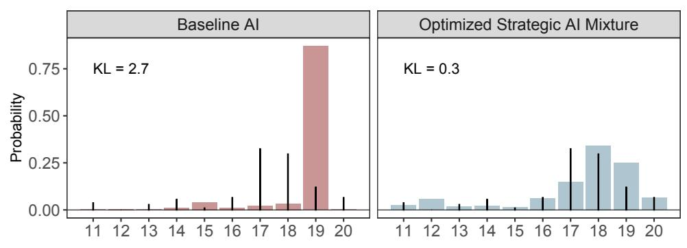
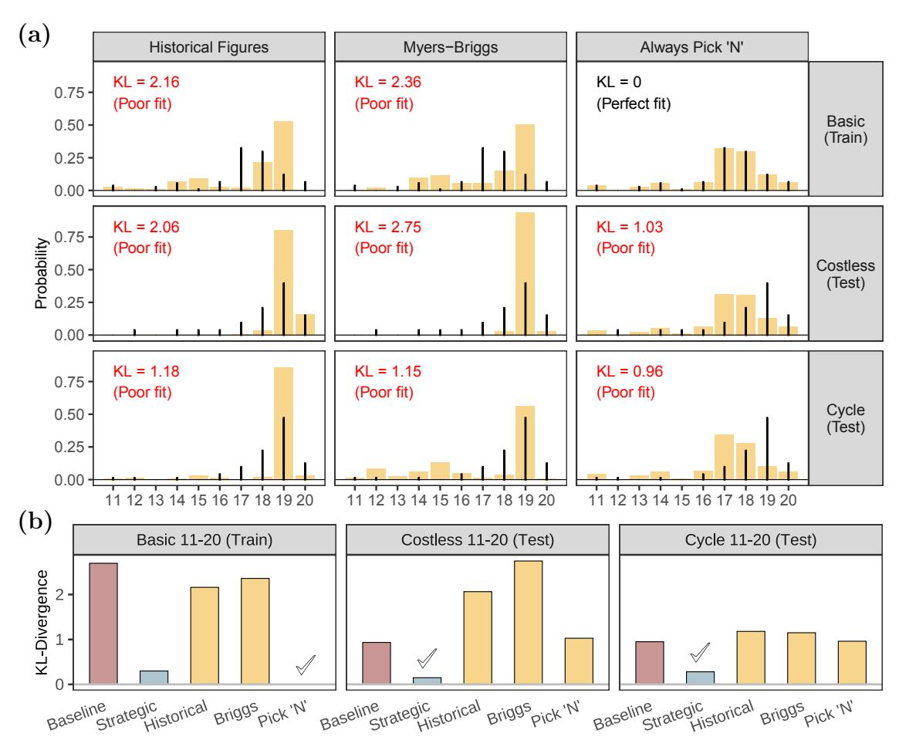
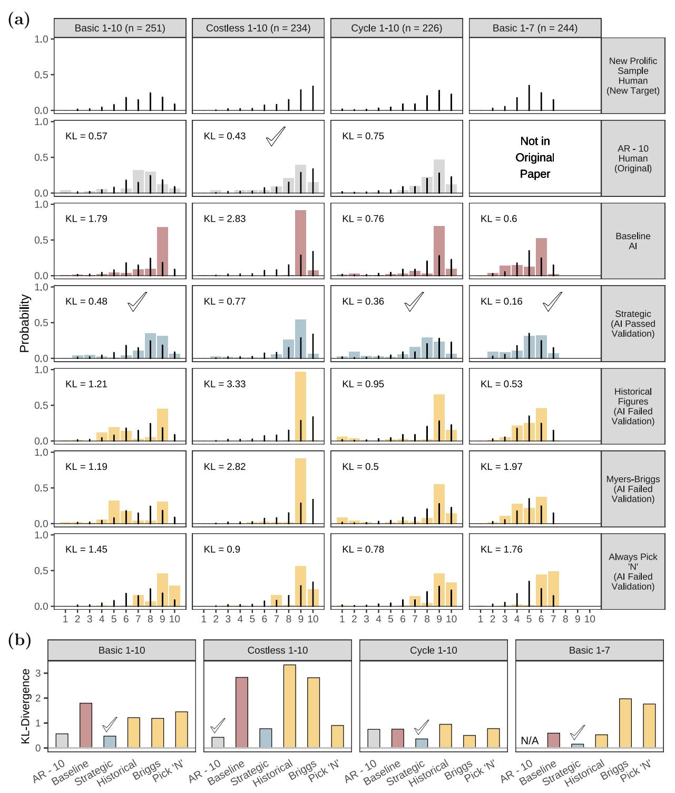
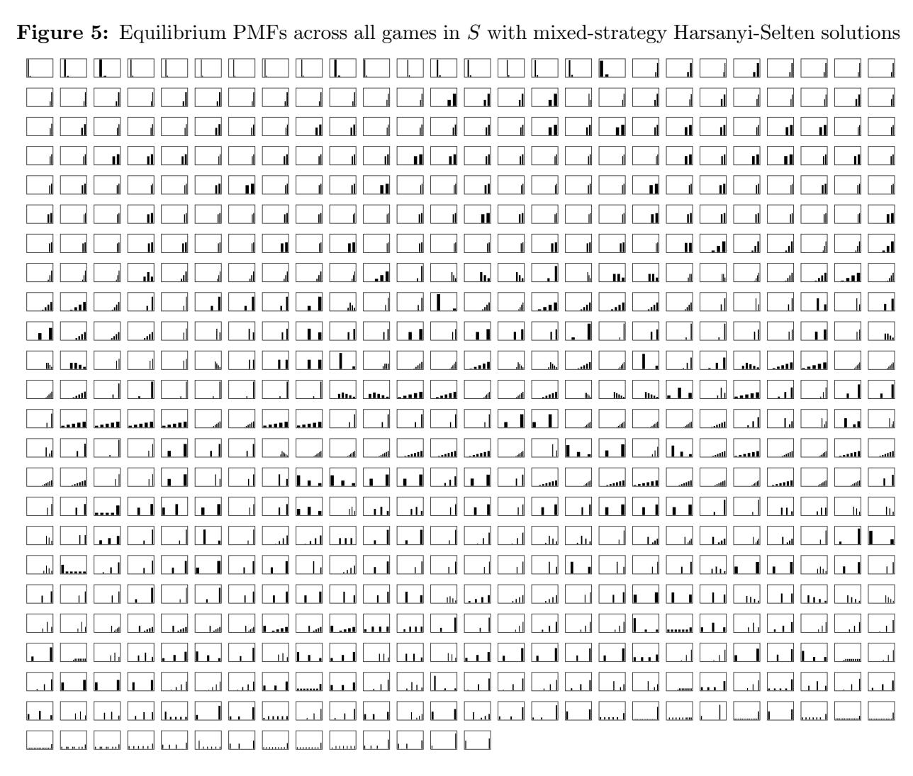
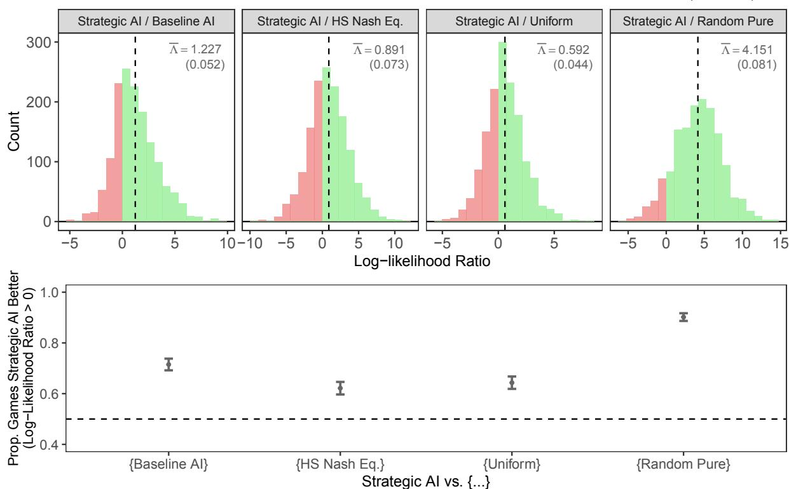
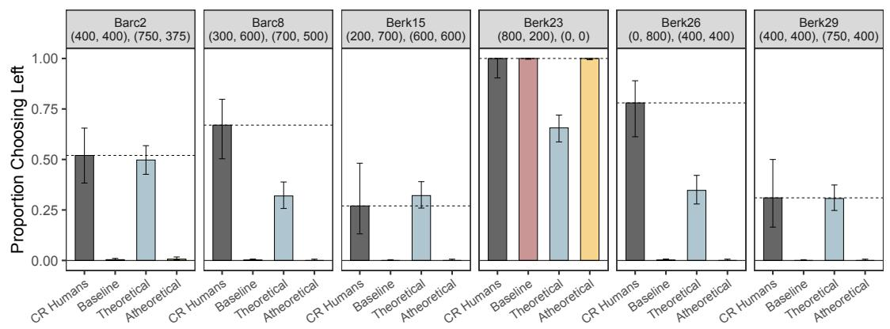
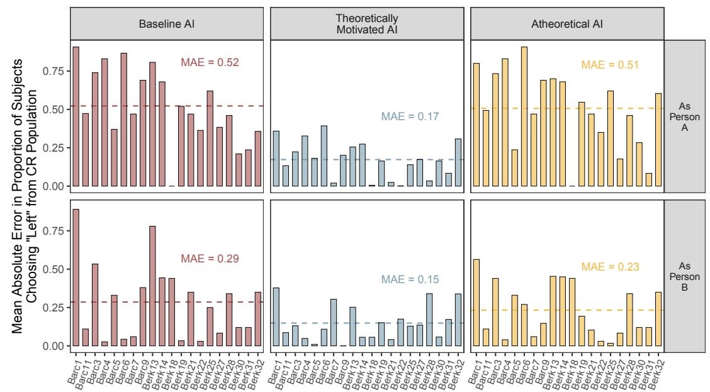
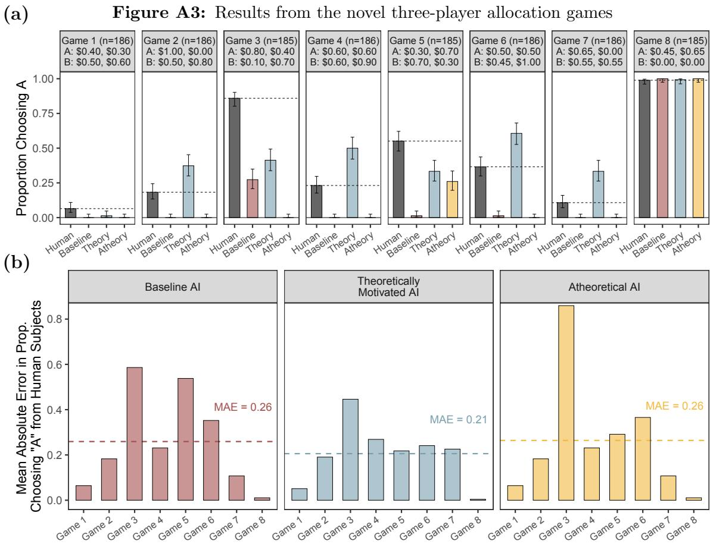
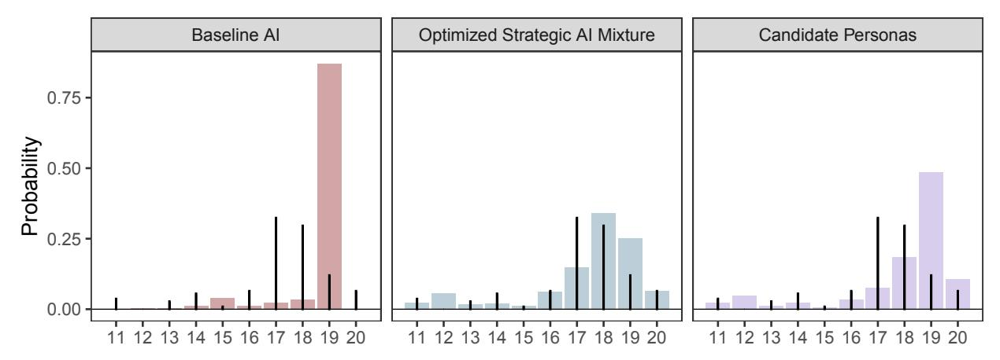
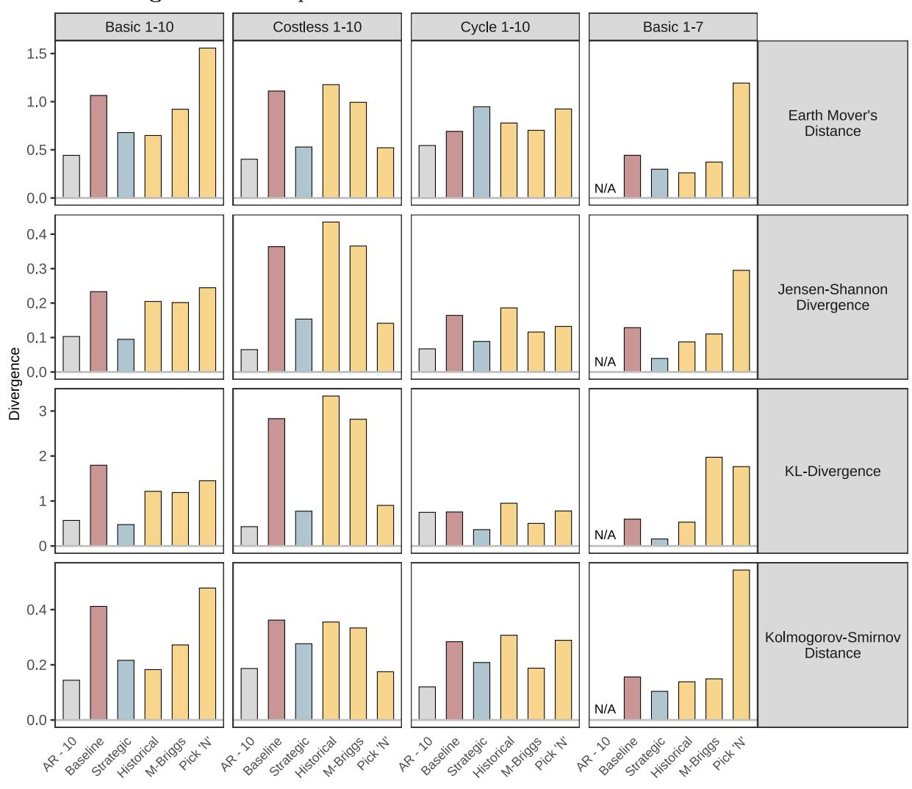

# General Social Agents∗

Benjamin S. Manning MIT

John J. Horton MIT & NBER

September 1, 2025

#### Abstract

Useful social science theories predict behavior across settings. However, applying a theory to make predictions in new settings is challenging: rarely can it be done without ad hoc modifications to account for setting-specific factors. We argue that AI agents put in simulations of those novel settings offer an alternative for applying theory, requiring minimal or no modifications. We present an approach for building such "general" agents that use theory-grounded natural language instructions, existing empirical data, and knowledge acquired by the underlying AI during training. To demonstrate the approach in settings where no data from that data-generating process exists—as is often the case in applied prediction problems—we design a highly heterogeneous population of 883,320 novel games. AI agents are constructed using human data from a small set of conceptually related, but structurally distinct "seed" games. In preregistered experiments, on average, agents predict human play better than (i) game-theoretic equilibria and (ii) out-of-the-box agents in a random sample of 1,500 games from the population. For a small set of separate novel games, these simulations predict responses from a new sample of human subjects better even than the most plausibly relevant published human data.

∗Thanks to Tyler Cowen and the Mercatus Center for generous funding and intellectual support. Thanks to Alex Moehring, Kehang Zhu, David Hotz, Daniel Rock, Michael Zhao, Jessica Hullman, and Seth Benzell for helpful comments. We are deeply grateful to Reanna Ishmael for software development support. The experiments in this paper were preregistered on <https://aspredicted.org/> numbers 222695, 231091, and 241394. Author contact information, code, and data are currently or will be available at <http://www.benjaminmanning.io/>. Both authors have a financial interest in <https://www.expectedparrot.com/>. Horton is an economic advisor to Anthropic. In preparing this paper, the authors utilized generative AI models extensively as tools to assist with editing and evaluation. The authors retain full responsibility for all content and conclusions presented herein.

# 1 Introduction

A general, low-cost method for accurately simulating human behavior with AI agents would have wide application in the social sciences [\(Charness et al.,](#page-37-0) [2025;](#page-37-0) [Jackson et al.,](#page-39-0) [2025\)](#page-39-0). Recognizing this potential, a growing literature explores whether large language models (LLMs) can simulate human responses in various settings.[1](#page-0-0) Across dozens of experiments, samples of these "AI subjects" respond with remarkable similarity to humans—even when simulating novel experiments that did not appear in the underlying LLM's training corpus [\(Hewitt et al.,](#page-38-0) [2024;](#page-38-0) [Binz et al.,](#page-36-0) [2024;](#page-36-0) [Li et al.,](#page-40-0) [2024;](#page-40-0) [Suh et al.,](#page-42-0) [2025\)](#page-42-0). Yet within this literature, others find settings where the very same models are poor human proxies.[2](#page-0-0) This inconsistency poses a challenge for AI simulations as robust and credible predictive models. The core challenge is not simply achieving a close match between AI and human responses in one setting, but building agents that will generalize reliably.

A natural starting point is improving the instructions given to agents. These instructions, or "prompts," are written descriptions given to the LLM specifying who it is, what it believes, or how it should behave and reason. Such second-person instructions (e.g., "You respond as a type-X person") can profoundly affect output distributions because advanced LLMs have been explicitly fine-tuned to follow instructions [\(Bai et al.,](#page-36-1) [2022;](#page-36-1) [Ouyang et al.,](#page-41-0) [2022\)](#page-41-0). With an appropriate prompt (which can now be massive), many highly capable models can perform complex reasoning and mathematical tasks at levels sometimes better even than that of highly skilled humans.[3](#page-0-0)

Despite the existence of these powerful, steerable models, constructing agents whose behavior is similar to that of real humans in a wide variety of settings is nontrivial—even when human data are available to guide the search. The set of possible prompts is vast, ranging from simple combinations of social or demographic traits to complex programmatic instructions related to how humans make decisions [\(Zhu et al.,](#page-43-0) [2025;](#page-43-0) [Xie et al.,](#page-43-1) [2025\)](#page-43-1). As in other machine-learning applications, the challenge is not only to avoid underfitting but also to guard against overfitting. By iterating through enough prompts, one can almost always find some arbitrary prompt that shifts the LLM's responses to closely match a given human distribution. For example, an LLM instructed "you randomly offer between \$6 and \$9" may perfectly reproduce a distribution of human responses in a \$20 dictator game, but such a prompt would be nonsensical for a \$5 dictator game. In contrast, a persona grounded in the underlying behavioral drivers—e.g., "you are self-interested but fair"—can perform well in-sample and plausibly extend to a range of allocation games. Standard data-driven approaches, such as a train-test split within a single dataset, cannot reliably distinguish between these two cases; the latter appears better only when tested in truly new environments. If the goal is to predict behavior in settings with no prior human data, how should researchers construct and evaluate prompts?

1 [\(Horton,](#page-39-1) [2023;](#page-39-1) [Argyle et al.,](#page-35-0) [2022;](#page-35-0) [Aher et al.,](#page-35-1) [2023;](#page-35-1) [Mei et al.,](#page-40-1) [2024;](#page-40-1) [Wang et al.,](#page-43-2) [2025;](#page-43-2) [Park et al.,](#page-41-1) [2024,](#page-41-1) [2023;](#page-41-2) [Chang et al.,](#page-37-1) [2024;](#page-37-1) [Binz and Schulz,](#page-36-2) [2023,](#page-36-2) [2024;](#page-36-3) [Cerina and Duch,](#page-37-2) [2025;](#page-37-2) [Manning et al.,](#page-40-2) [2024;](#page-40-2) [Capra et al.,](#page-37-3) [2024;](#page-37-3) [Shah et al.,](#page-42-1) [2025;](#page-42-1) [Anthis et al.,](#page-35-2) [2025;](#page-35-2) [Tranchero et al.,](#page-43-3) [2024;](#page-43-3) [Hansen et al.,](#page-38-1) [2024;](#page-38-1) [Broska et al.,](#page-36-4) [2025\)](#page-36-4)

2 [\(Santurkar et al.,](#page-42-2) [2023;](#page-42-2) [Atari et al.,](#page-36-5) [2023;](#page-36-5) [Cheng et al.,](#page-37-4) [2023;](#page-37-4) [Gao et al.,](#page-38-2) [2024;](#page-38-2) [Gui and Toubia,](#page-38-3) [2023\)](#page-38-3)

3To date, Google's Gemini 1.5 can accommodate 10 million tokens [\(Gemini Team,](#page-42-3) [2024\)](#page-42-3). This is roughly equivalent to 15,000 pages, or about 20 copies of the Handbook of Experimental Economics [\(Kagel and Roth,](#page-39-2) [1995\)](#page-39-2).

In this paper, we build agents whose behavior in simulations usefully generalizes to what we see from humans across entire domains. Our approach mirrors what researchers generally try to do in social science, but in reverse. Rather than testing a theory with empirical data, theory is embedded in agents (via natural language instructions), which are then used to generate candidate data. The theory and agent composition is then optimized to reduce error with respect to real-world data from a domain where predictions are desired. Human data from distinct but conceptually similar settings serve as held-out test sets or are incorporated into training to improve generalization. We show that "general" agents constructed and validated in this way can improve the predictive power of AI subjects in novel settings. Both steps are essential: without theoretical grounding, optimized prompts may fail to meaningfully improve even in-sample predictions, and without cross-setting validation, they are prone to overfit.

The approach uses three kinds of data:

- 1. Training data (existing): Human data used to optimize AI simulations.
- 2. Validation or test data (existing): Human data generated from a distinct but presumably similar data-generation process as the training data. It is used to evaluate optimized agents.
- 3. Target data (novel): New human data not in the LLM's training corpus, where we want to make predictions—from a presumably similar domain as the training and validation data.

The first step of the approach is to limit the "space" of prompts to a subset motivated by some economic theory or causal mechanism relevant to the novel setting of interest. This theorygrounding is analogous to constraining the functional form of the hypothesis class in machine learning. Continuing with the dictator game example, where social preferences likely determine behavior, one might choose the candidate set of prompts characterized by known drivers of the relevant preferences (e.g., "You are {level}" for all levels in {self-interested but fair, altruistic, selfish}).

The second step is to optimize over this set to best match the human training data—there is an active literature on optimizing prompts [\(Khattab et al.,](#page-39-3) [2024\)](#page-39-3). We employ two optimization methods: (i) a selection method that identifies the optimal mixture of prompts from the candidate set [\(Xie et al.,](#page-43-1) [2025;](#page-43-1) [Leng et al.,](#page-40-3) [2024;](#page-40-3) [Bui et al.,](#page-36-6) [2025\)](#page-36-6), and (ii) a construction method that optimizes numerical parameters embedded directly in the prompts. Both methods are akin to the tuning of a machine learning model where the model's parameters are optimized to best predict training data—or in this case, identify prompts that collectively best predict the human training data. This step produces a final set of prompts that we have reason to believe will generalize, because they achieve good in-sample fit while remaining grounded in theory. Poor fit suggests that the chosen theory does not adequately capture the relevant behavior.

We assess whether prompts generalize using a train-test split approach inspired by the principles of invariant risk minimization [\(Peters et al.,](#page-42-4) [2016;](#page-42-4) [Heinze-Deml et al.,](#page-38-4) [2018;](#page-38-4) [Arjovsky et al.,](#page-35-3) [2020\)](#page-35-3). The final set of prompts is validated using settings distinct from the training data, where we also expect the same theory relevant to the target data to hold (e.g., optimize on a \$20 dictator game, but test on a \$5 dictator game). To be clear, this means the validation set necessarily comes from a distinct data-generation process from that which produced the training data. By construction, prompts with strong testing performance are then those that capture generalizable relationships predictive of human behavior across contexts. Consequently, if the novel target setting is governed by the same theory or causal mechanism used to construct the optimized prompts (e.g., the target is a \$50 dictator game), we may gain confidence that they will better predict human responses in that setting.

We illustrate this approach and provide evidence of its efficacy with training and validation data drawn from experiments in the behavioral economics literature applied to AI subjects. All simulations use GPT-4o with temperature set to 1, though the approach is agnostic to the choice of model and hyperparameters.[4](#page-0-0) We first apply the selection method to [Arad and Rubinstein](#page-35-4) [\(2012\)](#page-35-4)'s 11-20 money request game, where participants request an amount and receive a bonus if they choose exactly one less than their opponent. We use only the original dataset from the paper, which contained fewer than 200 observations. This setting is appealing to study because optimal play depends not only on the focal agent's capabilities, but also on their beliefs about others' strategic reasoning. Endowing AI subjects with distinct prompts corresponding to varying degrees of strategic reasoning—the theoretical focus of [Arad and Rubinstein—](#page-35-4)produces a mixture that closely matches the original human data.

When we validate these optimized samples on distinct variants of the 11-20 money request game, they are better predictors of human responses than baseline AI subjects with no additional instructions. By contrast, scientifically meaningless, or "atheoretical" AI subjects derived from historical figures, pseudo-scientific Myers-Briggs personality types, and those instructed to select particular numbers can sometimes match human distributions in one variant of the game but fail to generalize across others.

We next test the predictive power of the optimized agents in settings where no prior human data exist. To do so, we construct four new games and collect responses from samples of preregistered crowdsourced participants [\(Horton et al.,](#page-39-4) [2011\)](#page-39-4) on Prolific. These games are derived from the original 11-20 game (and its variants), but adapted to other numeric ranges (1-10 and 1-7). The optimized sample of theoretically-motivated prompts produces responses that predict the new human data far better than the off-the-shelf baseline. Prediction error is decreased by 53%-73% across the games. Furthermore, these simulations predict the results of the new experiments in some games better than the most plausibly relevant human data from [Arad and Rubinstein;](#page-35-4) in one case, the KL divergence is halved. By contrast, the alignment of the atheoretical prompts—which failed validation—with the new human data is often similar to or worse than the baseline AI.

What statistical guarantees does this approach afford? Without a correctly specified causal model, no statistical procedure can guarantee performance in arbitrary new environments [\(Pearl,](#page-42-5) [2009\)](#page-42-5). Formal guarantees with existing data, like those required for prediction-powered inference [\(Angelopoulos et al.,](#page-35-5) [2023\)](#page-35-5) and other related methods [\(Egami et al.,](#page-37-5) [2023;](#page-37-5) [Hardy et al.,](#page-38-5) [2025\)](#page-38-5), would

4Gpt-4o, among the most widely used LLMs, and the temperature setting are defaults for the software used to run our simulations [\(Horton and Horton,](#page-39-5) [2024\)](#page-39-5).

require a strictly firewalled validation set: data never used in the construction of the underlying LLM [\(Ludwig et al.,](#page-40-4) [2024;](#page-40-4) [Sarkar and Vafa,](#page-42-6) [2024;](#page-42-6) [Mullainathan and Spiess,](#page-41-3) [2017;](#page-41-3) [Modarressi et](#page-41-4) [al.,](#page-41-4) [2025\)](#page-41-4). This is a tall order impossible to meet in practice, even with existing public weight LLMs, never mind private models. However, what we can guarantee is prediction performance over a pre-committed family of settings.

The first step is to establish a clearly defined space of experimental settings—for example, variants of public goods games, dictator games, or other allocation games differentiated by instructions, parameters, or other structural features. This idea is similar to that in the literature on program evaluation and external validity, where population-level treatment effects can be estimated by randomizing over a defined set of possible samples [\(Hotz et al.,](#page-39-6) [2005;](#page-39-6) [Allcott,](#page-35-6) [2015\)](#page-35-6). From this space, a random subset of settings is drawn and randomly assigned to human subjects, who provide responses.[5](#page-0-0) By comparing these human responses with LLM-generated predictions, we can make externally valid estimates across the entire space.

A key distinction from the setup laid out in [Hotz et al.](#page-39-6) and [Allcott](#page-35-6) is that appropriate coverage does not require that the family of settings share a data-generation process or that the underlying samples of human subjects are from the same population. Indeed, the variance of estimates naturally reflects how closely the held-out settings resemble those sampled. If all scenarios are variants of a single setting—e.g., a dictator game with different monetary amounts—performance is tightly bounded; if they span disparate domains—e.g., many types of allocation games—estimates are likely less precise. Note that even if a setting inadvertently appears in the model's pre-training data, the random sampling procedure still accounts for its contribution—such cases may merely reduce prediction error.

We explore this approach to inference by constructing a population of 883,320 novel strategic games. These were inspired by the original 11-20 game but were modified along several dimensions, such as support of possible choices, the size and nature of the bonus, the manner in which money is allocated, etc. The population of games is the full factorial combination of these dimensions. The resulting games differed substantively from each other; in some cases, they were cooperative, others adversarial, many had a dominant strategy equilibrium, while some had no dominant strategies at all. The vast majority are surely not in any LLM's training corpus to date. From the population, we sample 1,500 unique games and have 4,500 human subjects each play a game in a final preregistered experiment. We take the theoretically-grounded level-k agents—agents constructed months before the novel set of 883,320 games existed—and evaluate their ability to predict the human responses.

In a final preregistered experiment, these theory-grounded agents are far better predictors of the human data than the baseline AI off-the-shelf. In the average game, they assign 3.41 times more probability to the actions actually taken by human subjects. The optimized agents are similarly effective (2.44 times) compared to the unique Harsanyi-Selten-selected equilibria [\(Harsanyi and](#page-38-6) [Selten,](#page-38-6) [1988\)](#page-38-6) calculated for each of the 1,500 games. Because the games were randomly sampled, the corresponding confidence intervals over the relative predictive power are externally valid for the

5This setup is also akin to the integrative experiment designs of [Almaatouq et al.](#page-35-7) [\(2024\)](#page-35-7).

much larger population.

The goal of AI simulations in this paper is to harness two extensive sources of information to create better predictive agents: i) well-established theoretical models from the social sciences, and ii) the immense knowledge about human behavior that LLMs have implicitly learned during training [\(Lindsey et al.,](#page-40-5) [2025;](#page-40-5) [Ameisen et al.,](#page-35-8) [2025\)](#page-35-8). In a sense, AI agents are a general vessel through which theory can be flexibly applied to any setting. Our approach aims to generate such agents by conducting a structured trial run across various settings, building evidence that theoretically-grounded prompts generalize effectively to similar yet distinct environments. These principles can be applied to any domain where relevant human data exists—even those with multiple interacting agents. One can imagine iteratively identifying novel scenarios where predictions are needed, finding the closest relevant existing data, and continuously optimizing and calibrating agents as needed.[6](#page-0-0) Our main contribution is to systematize these ideas for constructing agents and then provide empirical evidence that they can substantially improve the predictive power of AI simulations in new settings.

The remainder of this paper is organized as follows. Section [2](#page-5-0) begins with a concrete example of identifying generalizable relationships and constructing prompts that better predict human subjects in new settings. We then describe the idea more generally and specify the optimization methods. Section [3](#page-12-0) illustrates the approach and demonstrates its efficacy empirically with several experiments. Section [4](#page-22-0) demonstrates how agents can be used in a pre-committed setting to provide externally valid statistical estimates of predictive accuracy at scale. The paper concludes in Section [5.](#page-33-0)

# 2 Building prompts that generalize

This section explains the approach for constructing AI subjects that better approximate human response distributions in new environments. We begin with an extended example of predicting behavior in a novel public goods game where no previous human data exists. We then discuss the importance of validating across distinct data-generation processes and grounding candidate prompts in relevant social science theories. The section concludes with a summary of the approach and a brief description of the optimization methods used to construct agents.

## 2.1 A motivating example

Suppose we want to predict how people will share resources in a novel public goods game (as they do in [Alsobay et al.](#page-35-9) [\(2025\)](#page-35-9)). In this new game, for which we have no previous data, three participants will be endowed with \$5 and can choose to contribute any portion of their endowment, which will be multiplied by 3 and then divided equally among all participants. While we do not have any prior public-goods game data, we do have human data from a related \$20 dictator game. It is related in the sense that one might reasonably expect some generalizable features of human choice to affect allocations in both games. The observed human offers from the dictator game are {6,6,7,7,8,8,9,9}.

6LLMs could automatically construct candidate prompts as input to such feedback loops [\(Xie et al.,](#page-43-1) [2025\)](#page-43-1).

Before LLMs, one might have tried to train a standard machine learning model (e.g., decision trees or regression) solely on these dictator game offers. However, such models would struggle to transfer to the structurally distinct public goods game, as they cannot adapt across different game formats without retraining. LLMs offer a more flexible alternative. Rather than training a new model from scratch, we can prompt an existing LLM to simulate responses by instructing it to behave as a human participant. For instance, we might use a baseline system prompt: "You are a human." We can then append game-specific prompts such as "You are playing a dictator game with \$20..." or "You are playing a public goods game with \$5..." without any additional training.

Suppose that, prompted with the dictator game instructions, the LLM produces a response distribution {3,3,3,3,3,4,4,4}. Although well within the allowable offers, this distribution clearly diverges from the observed human data ({6,6,7,7,8,8,9,9}) and leaves us with little hope that it could effectively predict responses to the novel public goods game. Thus, even though the model may capture some general aspects of human behavior as a baseline, i.e., a tendency to offer nontrivial amounts [\(Henrich et al.,](#page-38-7) [2001\)](#page-38-7), it does so imperfectly.

One might think this problem could be addressed by first randomly splitting the human sample of dictator game offers into training and testing sets. Then identifying the best-performing prompts on the training set, and validating their performance on the test set [\(Mullainathan and Spiess,](#page-41-3) [2017;](#page-41-3) [Ludwig et al.,](#page-40-4) [2024\)](#page-40-4). Indeed, an LLM instructed "You randomly choose numbers between 6 and 9" could reasonably predict both training and testing sets for any split of the human data better than the baseline LLM with no persona. However, such an approach will almost certainly fail to generalize beyond the specific data-generation process that produced the dictator game offers. It has, in effect, still overfit. Rather than overfitting to the training data, it has overfit to the whole data-generation process.

Now, consider a more theoretically grounded prompt: "You are self-interested but fair." Suppose an LLM endowed with this prompt also generates offers in the 6-9 range for the \$20 dictator game. Crucially, this prompt aligns with known causal factors that drive human sharing behavior more broadly, like behavioral parameters in empirically tested theoretical models (e.g., [Charness](#page-37-6) [and Rabin](#page-37-6) [\(2002\)](#page-37-6)). It is a flexible decision-making program that can be effectively applied to various types of allocation games. Yet, without explicit knowledge of the causal drivers governing behavior in the new public goods game, nothing in the data produced by either prompt alone rules out the atheoretical random-number prompt. This illustrates the core challenge. We seek to construct and select prompts that do not overfit to a single data-generating process, but instead capture the stable behavioral drivers relevant across settings. Then, we might gain confidence that they will better predict human responses in novel target settings governed by the same drivers.

#### 2.2 Identifying generalizable behavioral relationships

As our motivating example illustrates, a traditional train-test split does not adequately guard against overfitting to a single data-generating process. This approach is statistically valid only when training and testing samples are independently drawn from the same distribution [\(Vapnik,](#page-43-4) [1998\)](#page-43-4). However, our objective differs fundamentally: we seek prompts that remain predictive even when the underlying data-generating process shifts. By "data-generating process," we refer specifically to the experimental setting (the environment in which behavior occurs), the population from which behavior is observed, and the outcomes they generate. In econometric terms, two processes diverge when the given input covariates appear with different distributions of values or when the covariates themselves are entirely different random variables. For example, a model trained on \$20 dictator games may fail on \$5 dictator games due to different stake values (covariate shift) or when moving from dictator to public goods games (structural shift).

Without direct training data from the novel target setting, no standard statistical procedure ensures predictive accuracy [\(Ben-David et al.,](#page-36-7) [2010;](#page-36-7) [Klivans et al.,](#page-39-7) [2024\)](#page-39-7). Theoretically, only a fully specified causal model could guarantee accurate predictions [\(Pearl,](#page-42-5) [2009\)](#page-42-5). In practice, however, constructing or inferring such causal models generally requires strong, often unverifiable assumptions, which are rarely feasible in complex social science contexts.

Instead, we propose leveraging principles from invariant risk minimization [\(Arjovsky et al.,](#page-35-3) [2020\)](#page-35-3) to identify behavioral relationships that remain stable despite shifts in the data-generating process. Rather than splitting a single dataset, we deliberately choose training data from one data-generation process (or several related processes) and validate using data from a related but distinct process from those used for training. Prompts that consistently predict behavior across these distinct datasets likely capture generalizable, and possibly causal [\(Peters et al.,](#page-42-4) [2016;](#page-42-4) [Heinze-](#page-38-4)[Deml et al.,](#page-38-4) [2018\)](#page-38-4), drivers of behavior. As a result, these validated prompts should be more effective in predicting human responses in novel but theoretically similar settings.

Returning to our motivating example, suppose we have additional human data from a \$5 dictator game, with observed offers {1,1,1,2,2,2}. Although stakes differ, both the \$20 and \$5 dictator games likely share a common decision-making process: individuals give slightly less than half the available amount, a reasonable balance more similar to what is observed in humans [\(Henrich et al.,](#page-38-7) [2001\)](#page-38-7). By using the \$20 dictator game as training data and the \$5 dictator game for testing, we are implicitly filtering for prompts based on their capacity to predict this proportional response. The earlier atheoretical prompt "You randomly choose numbers between 6 and 9," still fits the \$20 game perfectly, but clearly fails validation on the \$5 game. By contrast, the theoretically-motivated prompt "You are self-interested but fair," likely generalizes effectively across both settings, and most importantly, the novel public goods game.

This validation process becomes even more robust when multiple distinct but theoreticallyrelated datasets are available. Imagine dictator-game responses from \$1, \$5, \$10, \$20, \$50, and \$100 games, all exhibiting offers slightly below half. Optimizing and validating across these multiple settings reduces the risk of overfitting. With each new training data-generation process, it is less likely that an arbitrary prompt will generalize in-sample.[7](#page-0-0) Thus, if the underlying relationship governing these settings also holds for a novel target setting, the validated prompts should robustly

7We do not offer empirical examples of optimizing over multiple training settings in the main text (only single settings in Section [3\)](#page-12-0). Appendix [A](#page-44-0) provides such analyses, including an additional preregistered experiment.

predict behavior there as well.

Yet, even with an effective validation method, a fundamental practical challenge remains: identifying the initial set of candidate prompts. While our motivating example made this step appear straightforward, selecting plausible prompts in more complex settings can be far less obvious. In a perfect world, an optimization procedure would take in a massive set of prompts and filter them down to a smaller set that generalizes. However, this does not yet work in practice because many different prompts can be used to generate the same behavior in a given setting. For example, the number of possible natural language prompts that get an LLM to respond with numbers between 6 and 9 is enormous. If we were to start from a large pool of prompts, then the optimization procedure might endlessly produce sets of prompts that fit in-sample but fail on the validation set. For now, it is essential to ground the candidate prompts with a principled starting point, which we argue, and later demonstrate empirically, that economic and behavioral theories offer.

#### 2.3 Theory as guide towards generalizability

A core function of economics is to construct models that capture causal and generalizable relationships that remain stable across environments. For example, the idea that humans make reference-dependent utility choices is not specific to one particular economic environment, but has been shown to broadly apply to decision-making under uncertainty [\(Kahneman and Tversky,](#page-39-8) [1979\)](#page-39-8). Conveniently, these are exactly the types of generalizable relationships that we would expect to better predict human behavior in new settings when supplied to an LLM. Our approach is to narrow the search space of possible prompts by grounding candidate prompts in such theories. By doing so, we might increase the likelihood of identifying prompts that we have prior reason to believe reflect genuine, stable behavioral patterns. Without doing so, we risk dramatically underfitting and failing even to accurately predict the training data.

Economic theories—and theories from other social sciences that embrace methodological individualism [\(Friedman,](#page-38-8) [1953\)](#page-38-8)—are well-suited to be cast into prompts precisely because good theory requires that they be grounded only in the choices and actions of individuals. Specifically, we consider a prompt to be "theoretically grounded" when it instructs the LLM to make predictions about how a human would respond based on some underlying theory or model of human behavior. For example, a utility function that trades off one's own payoff against inequality might become "You value your own earnings but dislike outcomes where you earn far more than others." A highly capable and tool-using LLM could even be given that utility function and parameters directly (e.g., u(xself , xother) = . . .). A prospect-theoretic model reasonably maps to "You are risk averse in gains, risk seeking in losses, and probability weight the very likely and very unlikely outcomes" and of course these could be parameterized as well.

This definition is necessarily broad because what constitutes a theory is also broad. One might consider good theories to be those that are parsimonious, predictive, and interpretable. We view these as effective guides for constructing prompts that are grounded in theory. But just as there is no universal rule as to what makes a theory good, there is not a singular all-encompassing playbook for candidate prompts. Here, the researcher must leverage their expertise appropriately to determine which theories are most relevant to the domain where predictions are desired. This should be relatively straightforward in practice. One can even simply ask an LLM to construct a candidate set of agents based on a given paper and then adjust the prompts accordingly. For example, the attached notebook—which took 15 minutes to code—contains an example where we take PDFs of 5 well-known papers in the behavioral economics literature and generate 10 agents from each.[8](#page-0-0) Whether these agents are effective is an empirical question, but one that is easily testable.

Once a set of prompts is defined, we can optimize them against an appropriate sample of relevant human decisions. This may involve searching for an optimal mixture of prompts, or adding continuous parameters directly in a single prompt and adjusting them until the simulated distribution aligns with the training data. From a machine learning perspective, the candidate set of prompts defines the functional form of our hypothesis class, with theory guiding this specification to effectively navigate the bias-variance tradeoff.[9](#page-0-0) The set is then pruned (or tuned, depending on the method) to best fit the training data.

As an example, consider the extensive theoretical and empirical economic literature studying how people reason strategically [\(Stahl and Wilson,](#page-42-7) [1994,](#page-42-7) [1995;](#page-42-8) [Arad and Rubinstein,](#page-35-4) [2012;](#page-35-4) [Camerer](#page-37-7) [et al.,](#page-37-7) [2004\)](#page-37-7). Level-k models, for instance, predict that individuals best respond based on their beliefs about others' levels of reasoning. In the 2 3 guessing game, players aim to pick 2 3 of the average number chosen by the group [\(Nagel,](#page-41-5) [1995;](#page-41-5) [Keynes,](#page-39-9) [1936\)](#page-39-9). If we had human data from such a game, we could construct a series of prompts that specify different levels of strategic thinking (e.g., "You are a level-0 reasoner," "You are a level-1 reasoner," etc.). We then identify the mixture that best fits the training distribution and test whether it generalizes to other variants of the game (e.g., different values than 2 3 ). Then, the optimized prompts can be used to predict other related distributions in new settings.

Of course, constructing and validating these prompts is not a perfectly specified problem. There are various ways to translate a theory into natural language, and multiple theories may apply to a given setting. The boundaries of a theory and the settings it plausibly governs are not always well-defined. Nor can we guarantee that the data-generating processes of the training and testing sets are either sufficiently similar or sufficiently distinct to yield reliable validation. Yet, as we will show empirically, these challenges can be overcome in practice, at least in some domains.

Ultimately, applying a prompt—or a set of prompts—to a new environment requires an unavoidable inductive leap. What we can do is try to make the leap explicit and interpretable. LLMs are extremely good at following explicit, well-defined instructions. Because each prompt is a set of these flexible natural language instructions, researchers can both evaluate performance and reason-

8 <https://expectedparrot.com/content/32751dae-7a69-430d-9f1a-0c3f50ccef5b>

9One could imagine an "oracle" prompt akin to a perfect program, describing every preference, heuristic, and belief update rule—allowing the LLM to accurately produce responses in all contexts for a person. In effect, our approach is to identify portions of this oracle that are most relevant to the given training and testing data. Increasing context windows suggest that such highly generalizable agents may be possible in the not-so-distant future.

ably assess its relevance for a new setting.[10](#page-0-0) This mirrors how economic theory is used more broadly with real humans: it is tested against data, observed where it succeeds or fails, and cautiously extrapolated to settings just beyond current evidence. When a new tariff is proposed, for example, the theory motivating the tariff is not known to be universally "correct" in a complex dynamic world ex ante—it is a disciplined guess, shaped by assumptions and previous evidence. Theory-guided prompts, validated across environments, bring the same kind of disciplined reasoning to LLM-based predictions of human behavior.

#### 2.4 A brief summary of the approach

We can summarize our approach into the following steps.

- 1. Select Training and Testing Data. Identify distinct samples of human-generated data that are presumably generated by the same mechanisms as the novel target setting(s) of interest. When possible, use multiple distinct datasets for both training and testing to increase confidence and minimize the possibility of selecting spurious prompts.
- 2. Propose Theory-Driven Candidate prompts. Generate a broad set of prompts that are plausibly consistent with the proposed theory (or causal mechanisms if known) related to the training, testing, and novel settings.
- 3. Optimize prompts on Training Data. Optimize the given prompts to best match the training data. This might involve selecting a mixture of prompts or adjusting trait parameters to minimize some statistical distance from observed responses. Confirm that the optimized sample outperforms the baseline LLM off-the-shelf on the training data.
- 4. Validate prompts on Testing Data. Apply the optimized prompts to the testing data and evaluate their performance relative to the baseline LLM.

Broadly speaking, our approach provides a disciplined "trial run" to confirm whether a given sample of AI subjects can reliably predict human behavior across multiple related settings. Similar to applying economic models estimated from past data to inform predictions in new but structurally similar environments, the success of our approach depends critically on identifying and leveraging underlying stable behavioral relationships.

In Section [3,](#page-12-0) we demonstrate the approach empirically on a set of strategic games using training data from [Arad and Rubinstein](#page-35-4) [\(2012\)](#page-35-4). Appendix [A](#page-44-0) provides another example using training data from [\(Charness and Rabin,](#page-37-6) [2002\)](#page-37-6) and allocation games. Both applications show that the approach substantially reduces prediction error relative to baseline LLM predictions in preregistered experiments with novel human samples. We emphasize throughout that the two key elements of the approach—grounding candidate prompts in economic or behavioral theories, and validating across

10Such flexibility also makes AI agents less susceptible to the Lucas critique [\(Lucas,](#page-40-6) [1976\)](#page-40-6)—if at all. Unlike traditional agent-based models or mathematical theories, which have hard-coded predetermined processes to generate predictions, LLMs can, as we will show, interpret new policies in context, reason through their implications, and adaptively formulate responses.

distinct but related datasets—each independently address critical pitfalls. Without theoretical grounding, optimized prompts may fail to meaningfully improve even in-sample predictions; without validating across multiple related settings, optimized prompts are prone to overfitting a single training context.

#### 2.5 Methods for optimizing prompts in-sample

We briefly describe two methods for optimizing prompts with a given set of training data. The first, the selection method, assumes we have a finite library of candidate prompts and selects (or mixes) them to best fit the training data. We apply this method to the experiments presented in Section 3 with data from Arad and Rubinstein (2012). An early version of this idea was suggested by Horton (2023), and several others have explored applications (Leng et al., 2024; Xie et al., 2025; Bui et al., 2025). The second, the construction method, parametrizes a prompt template with numeric trait dimensions and optimizes those parameters. To the best of our knowledge, this method is novel. An application of the method is presented in Appendix A using data from Charness and Rabin (2002).

**Selection Method.** A finite set of unique candidate natural language prompts is first specified. For each prompt  $\theta \in \Theta$ , the LLM is used to generate a predicted distribution  $\hat{P}_{\theta}$ . Let P represent the observed ground-truth human distribution. The objective is to solve

$$\min_{\mathbf{w}} d\left(P, \sum_{\theta \in \Theta} w_{\theta} \hat{P}_{\theta}\right) \text{ subject to } \sum_{\theta \in \Theta} w_{\theta} = 1, \quad w_{\theta} \ge 0,$$

where d is a chosen distance measure (e.g., KL divergence or the mean absolute distance between distributions). Once solved, these weights can be used to scale the appropriate mixture of prompts (i.e.,  $\theta^*$ ) and applied to new settings.

Construction Method. Alternatively, a prompt template can be parameterized by numeric trait variables. This is best illustrated with an example. Suppose  $\phi_1$  and  $\phi_2$  capture degrees of self-interest and inequity aversion, respectively. For instance, the prompt could be:

 $\theta(\phi_1, \phi_2) =$  "You weigh your own payoff with weight  $\{\phi_1\}$ , and you dislike creating disadvantageous inequality at level  $\{\phi_2\}$ . Please respond accordingly."

 $\hat{P}_{\theta}$  denotes the distribution induced by the LLM under parameter vector  $\theta = (\phi_1, \phi_2)$ . Given an observed human distribution P, the optimal parameters are found by solving  $\min_{\theta} d(P, \hat{P}_{\theta})$ . In practice, this can be solved using any derivative-free optimization algorithm, such as Bayesian optimization or evolutionary algorithms.

Measuring Performance. Let  $\hat{P}_{\theta^*}$  denote the LLM's distribution of responses under  $\theta^*$ , and  $\hat{P}_0$  the baseline LLM off-the-shelf without any additional prompting. Training loss is  $d(P, \hat{P}_{\theta^*})$  and validation loss is defined analogously on the held-out test setting.

To assess whether θ ⋆ generalizes, we compare predictive fit against the baseline Pˆ 0. This is especially appealing because many measures of distances between distributions (like the KLdivergence) are not easily interpretable. Furthermore, improvement over the baseline provides direct evidence that designing and optimizing prompts is a worthwhile endeavor in the first place.[11](#page-0-0)

Relative improvement can be computed as a difference-in-distances: d P, Pˆ 0 − d P, Pˆ θ⋆ . A positive difference indicates that the prompts provide better predictive power than the baseline. When we optimize a prompt, we seek those that yield this positive difference on both the training and testing data—that would suggest that the set of prompts generalizes.

The same framework applies across multiple training and evaluation settings, with optimization performed by averaging distances if needed. It also allows direct comparison of optimized prompts to alternative prompt sets or benchmark models (e.g., game-theoretic equilibria) using the same measurement tools.

# 3 Predicting behavior in novel strategic games

Thus far, we have argued that theoretically-motivated prompts, validated on distinct but related datasets, offer an approach for predicting human responses in entirely novel settings. To empirically test the efficacy of our approach, we now turn to predicting human behavior in a set of strategic games adapted from [Arad and Rubinstein](#page-35-4) [\(2012\)](#page-35-4)'s (AR) study of strategic reasoning.

We begin by briefly reviewing the level-k model of strategic reasoning that originally motivated AR. This model provides plausible theoretical underpinnings linking the training, testing, and novel games in this section. We then describe the structure of the original 11-20 money request game and outline our procedure for constructing theoretically-motivated AI subjects, optimizing their parameters on human data from AR's original experiment, and validating their predictive performance on distinct but related variants also studied by AR. Finally, we introduce an entirely new set of games adapted from AR's original setup but featuring distinct numeric ranges and a novel participant sample recruited from Prolific. Agents are evaluated on their ability to predict human behavior in these never-before-seen games.

Although this section focuses on strategic-reasoning games, the same procedure can be applied in any setting. In Appendix [A,](#page-44-0) we replicate the process using the allocation games from [Charness](#page-37-6) [and Rabin](#page-37-6) [\(2002\)](#page-37-6), which explore social preferences. Two additional important differences in that section are that we: i) optimize across multiple related settings rather than a single training setting, and ii) utilize the construction method to build agents. Using a preregistered experiment with entirely novel human responses as the target data, we find similar improvements.

#### 3.1 [Arad and Rubinstein](#page-35-4) [\(2012\)](#page-35-4)'s 11-20 money request game

The level-k model posits that players differ in how many steps ahead they consider when forming their strategies [\(Nagel,](#page-41-5) [1995;](#page-41-5) [Stahl and Wilson,](#page-42-7) [1994,](#page-42-7) [1995\)](#page-42-8). The model defines different types of

11This strong baseline simply reflects the LLM's already high off-the-shelf predictive ability.

players, from level-0 to level-k. Level-0 players use some pre-defined arbitrary decision rule, while level-k players (k ≥ 1) best respond assuming others are level-(k − 1) reasoners. Such a model highlights the idea that players' behavior depends not only on their decisions but also on their beliefs about how other people think.

To measure the distribution of level-k thinkers in human populations, AR developed the 11-20 game. The instructions are:

You and another player are playing a game in which each player requests an amount of money. The amount must be (an integer) between 11 and 20 shekels. Each player will receive the amount he requests. A player will receive an additional amount of 20 shekels if he asks for exactly one shekel less than the other player. What amount of money would you request?

This basic version of the game clearly maps players' levels of reasoning to their choices. A natural starting point is to choose 20 shekels. This maximizes the guaranteed payment and provides an obvious starting point for level-0 thinking. Next, level-1 players, anticipating level-0 players, will choose 20, best respond by requesting 19 shekels to earn the bonus. Level-2 players, expecting level-1 behavior, choose 18 shekels, and this pattern continues down to the minimum of 11. More generally, a player choosing (20 − k) shekels plausibly reveals themselves as a level-k thinker.

Interestingly, the 11-20 game does not have a pure strategy Nash equilibrium. The best response to any choice greater than 11 is to undercut the opponent by 1. But if the other player chooses 11, also selecting 11 is strictly dominated by every other strategy. The top row of Table [1](#page-13-0) shows the unique symmetric mixed strategy Nash equilibrium for the game, with most of its density lying between 15-17 (levels 3 to 5).

| Shekels Requested       | 11 | 12 | 13 | 14 | 15 | 16 | 17 | 18 | 19 | 20 |
|-------------------------|----|----|----|----|----|----|----|----|----|----|
| Level-k                 | L9 | L8 | L7 | L6 | L5 | L4 | L3 | L2 | L1 | L0 |
| Nash Eq. Prediction (%) | 0  | 0  | 0  | 0  | 25 | 25 | 20 | 15 | 10 | 5  |
| Basic (n = 108) (%)     | 4  | 0  | 3  | 6  | 1  | 6  | 32 | 30 | 12 | 6  |
| Cycle (n = 72) (%)      | 1  | 1  | 0  | 1  | 0  | 4  | 10 | 22 | 47 | 13 |
| Nash Eq. Prediction (%) | 0  | 0  | 0  | 10 | 15 | 15 | 15 | 15 | 15 | 15 |
| Costless (n = 53) (%)   | 0  | 4  | 0  | 4  | 4  | 4  | 9  | 21 | 40 | 15 |

Table 1: Original Results from [Arad and Rubinstein](#page-35-4) [\(2012\)](#page-35-4)

Notes: This table reports the empirical PMFs for three versions of the 11-20 game from [Arad and Rubinstein.](#page-35-4) In the basic version of this game, two players each request a number between 11-20 shekels and they receive that amount. If a player requests exactly one less than their opponent, they win their request plus a 20 shekel bonus. In the cycle version, players also receive a 20 shekel bonus if they select 20 and their opponent selects 11. The costless version is identical to the basic version, except that players receive 17 shekels if they select any amount other than 20. The basic and cycle versions of the game share a unique symmetric mixed strategy Nash equilibrium, which is shown in the first row. The unique mixed strategy Nash equilibrium for the costless version is shown in the 4th row.

Table [1](#page-13-0) also shows that when AR tested this game on pairs of college students, they deviated significantly from the Nash equilibrium (see row titled Basic). Most notably, 73% of participants chose between 17 and 19 shekels, whereas only 45% of the density for the mixed strategy Nash is on these values.

Finally, Table [1](#page-13-0) provides results from two additional variants of the game from AR. Both variants of the game still involve two players selecting numbers between 11 and 20. They differ from the basic version in their payouts (see Appendix [B](#page-50-0) for the full instructions). In the cycle version, players can earn a bonus of 20 shekels by undercutting the other's request by exactly one or by selecting 20 when the other selects 11. This version has the same unique mixed-strategy Nash Equilibrium as the basic game because the only affected strategy profiles are (20,11) and (11,20), which are outside the equilibrium support. However, if there is a distribution of level-k thinkers—as opposed to perfectly rational game-theoretic best-responders—such a change might significantly impact play.

The costless version has the same bonus structure as the basic game, but with a different payout for choices below 20. Here, requesting 20 yields 20 shekels outright, while choosing a lower amount guarantees 17 shekels plus a 20-shekel bonus if the lower request is exactly one less than the other player's. It is comparatively "costless" to continue undercutting. This game induces a symmetric mixed strategy Nash equilibrium that is more uniform across the choice set than the basic versions.

The human responses from these game variants, also from a similar sample of college students, are noticeably shifted towards 18-20 shekels—even with the basic and cycle sharing an equilibrium. AR attributes this to the increased salience and payoff of selecting a higher number. AR concluded that the collective results from these three experiments are best explained by a mix of strategic types consisting of level-0, level-1, level-2, level-3, and random choosers.

The empirical human distributions from these three games comprise our training (the basic version) and validation (the costless and cycle versions) data. The games are distinct enough such that the human response distributions are different, but still all likely well-explained by similar underlying human choice processes.

#### 3.2 Optimizing AI subjects in-sample

We begin by eliciting the baseline AI's response distribution (Pˆ 0). We prompt Gpt-4o to play the basic version of the game 1,000 times without any additional instructions, setting the temperature to 1. Figure [1](#page-15-0) displays the results. The left panel shows the empirical PMF of the baseline AI responses (red), along with the empirical human distribution P from AR's original experiment (vertical black lines). The baseline AI almost exclusively selects 19 shekels (87%), demonstrating limited variability. Using the forward KL-divergence as d(·, ·) with the human distribution as the reference, the difference between these distributions is d(P, Pˆ 0) = 2.7.

Such a poor baseline result is unsurprising. In a related exercise, [Gao et al.](#page-38-2) [\(2024\)](#page-38-2) also elicit responses from various LLMs playing the same 11-20 game. Even after applying diverse prompting strategies, fine-tuning, and endowing agents with distributions of demographic traits, they similarly find that LLMs strongly index on choosing 19 shekels. While this outcome is not inherently problematic—19 shekels lies within the support of both the Nash equilibrium and the empirical human distribution—it underscores a limitation: demographic prompts (and the other techniques they employ) alone provide little leverage in predicting strategic human reasoning. They do not

Figure 1: Response distributions for the basic version of the 11-20 game

Notes: This figure displays empirical PMFs for three samples playing the basic 11-20 money request game: human subjects from [Arad and Rubinstein](#page-35-4) (the vertical black lines in both panels), the off-the-shelf baseline (left panel), and responses from our selected AI subjects based on the weights (right panel).

provide any reliable, flexible program for the LLM to follow, nor do they allow for heterogeneity within the simulated sample. In contrast, the level-k model implies that optimal predictions require explicitly accounting for how individuals reason about others' decisions. And because we know from AR that there is likely a distribution of reasoning levels in their human sample, we should apply various levels of reasoning to construct a heterogeneous sample of agents. This may, in turn, better reflect the distribution of human strategic reasoning processes.

To operationalize the level-k reasoning explicitly, we construct a set of natural language prompts (ΘStrategic) corresponding to varying levels of strategic reasoning. These candidate prompts, listed in Table [2,](#page-16-0) specify how far ahead each AI subject reasons about the opponent's decisions, effectively encoding beliefs about others' strategies.

We elicit response distributions Pˆ θ for each candidate prompt θ ∈ ΘStrategic by prompting Gpt-4o 100 times per prompt.[12](#page-0-0) We then employ the selection method to identify the optimal mixture of prompts (Pˆ θ's) that minimizes the absolute difference between the CDFs implied by the empirical distribution of the human responses (P). This distance can be minimized using simple non-linear programming techniques. The weights w∗ corresponding to the optimal mixture appear in the second column of Table [2.](#page-16-0) [13](#page-0-0)

Most mass concentrates on two prompts: one that reasons between levels 1 and 3 (47%), and another varying more broadly from levels 0 to 5 (34%). The remaining weight falls on more extreme behaviors (random choices or the safest guaranteed option). This aligns closely with AR's findings, whose human subjects predominantly exhibited level-0 through level-3 reasoning or made random choices.

12We then elicit each AI subject's responses using Chain-of-Thought prompting, which encourages step-by-step reasoning before producing a final answer [\(Wei et al.,](#page-43-5) [2024\)](#page-43-5). We implement this through two sequential prompts. Prompt 1: {11-20 game instructions}. Reason out a few settings according to your personality and how others might respond. Prompt 2: {11-20 game instructions}. You previously had the following thoughts: {Response to prompt 1}. What amount of money would you request?. This procedure creates the agents (and their response distributions) over which we then optimize.

13See <https://www.expectedparrot.com/content/6f58d11f-98cc-4de5-bb89-edcf78042d79> for the agents.

Table 2: Proposed AI subject prompts and resulting mixture weights from the selection method

| Persona                                                                                | Weight |
|----------------------------------------------------------------------------------------|--------|
| You are generally a 0-level thinker—picking the option with the most guaranteed money. | 0.065  |
| You vary between a 0 and 1-level thinker.                                              | 0.000  |
| You vary between a 1 and 2-level thinker.                                              | 0.000  |
| You vary between a 0, 1, and 2-level thinker.                                          | 0.000  |
| You vary between a 0, 1, 2, and 3-level thinker.                                       | 0.000  |
| You vary between a 1, 2, and 3-level thinker.                                          | 0.469  |
| You vary between a 0, 1, 2, 3, and 4-level thinker.                                    | 0.013  |
| You vary between a 0, 1, 2, 3, 4 and 5-level thinker.                                  | 0.339  |
| You randomly pick between lower numbers because you think that's the best way to win.  | 0.114  |
| You are Homo Economicus.                                                               | 0.000  |

Notes: This table shows the set of prompts ΘStrategic used as input to the selection method. The right column shows the optimized mixture weights w∗ that minimize the absolute difference between the CDFs of the human distribution Ps and the distribution of responses from the AI subjects. Prepended to all the prompts is: You are a human being with all the cognitive biases and heuristics that come with it. We also include an explanation in the prompts for k-level reasoning for all prompts besides the random one: A k-level thinker thinks k steps ahead. A 0-level thinker thinks 0 steps and would, therefore, just select the maximum amount that guarantees money.

Using these weights, we generate the sample θ ∗ of 1,000 AI subjects by assigning each agent to one of the 10 prompts with probability equal to its corresponding weight in Table [2.](#page-16-0) The resulting empirical distribution of responses Pˆ θ∗ produced by this sample of 1,000 agents θ ∗ appears in the right panel of Figure [1](#page-15-0) (blue). The improvement over the baseline AI is substantial: d(P, Pˆ θ∗ ) = 0.3 is 89% smaller than d(P, Pˆ 0) = 2.7, demonstrating a strong in-sample fit.

#### 3.3 Validation using game variants

To validate these prompts, we elicit their response distributions to the costless and cycle versions of the game. Both games maintain the fundamental requirement of similar, but distinct datageneration processes. They involve reasoning well-explained by level-k thinking, but feature payoff structures and incentives that differ from the basic game, leading to notably shifted human response distributions (see Table [1\)](#page-13-0). Thus, effective predictions in these distinct games would serve as a valuable indicator that our optimized AI subjects capture generalizable patterns rather than merely replicating responses from the original training scenario.

We elicit responses from all 1,000 AI subjects in our optimized sample θ ∗ for both the costless and cycle versions of the game. As a benchmark for evaluating relative performance, we also elicit responses from the baseline AI 1,000 times per game. Figure [2](#page-17-0) presents these results, comparing the empirical distributions from AR's original human experiments (black lines) with those generated by the baseline AI (red) and the optimized mixture of theoretically-motivated AI subjects (blue).

Consistent with the basic version of the game and [Gao et al.](#page-38-2) [\(2024\)](#page-38-2), the baseline AI overwhelmingly selects 19 shekels in both variants, a considerable divergence from AR's human subjects. In contrast, θ ∗ is a far better predictor of both validation settings. The costless game in particular shows substantial improvement, with the KL-divergence decreasing by 84% (d(P, Pˆ θ∗ ) = 0.15 vs. baseline d(P, Pˆ 0) = 0.93). It is almost perfectly predictive of the human responses when comparing

KL = 0.93 KL = 0.95 KL = 0.15 KL = 0.28 Baseline AI Optimized Strategic AI Mixture Costless 11−20 Cycle 11−20 11 12 13 14 15 16 17 18 19 20 11 12 13 14 15 16 17 18 19 20 0.0 0.2 0.4 0.6 0.8 0.0 0.2 0.4 0.6 0.8 Probability

Figure 2: Response distributions for the cycle and costless versions of the 11-20 game

Notes: This figure displays empirical PMFs for the costless (top row) and cycle (bottom row) variants of the 11-20 game. The columns correspond to the Baseline (red), the Optimized AI subjects (blue). Within each panel, the empirical PMFs from [Arad and Rubinstein](#page-35-4) are imposed in black. The KL-divergence between each human and the AI response distribution is displayed in each panel. For both variants of the game, the selected AI subjects (blue) are far closer to the human distribution than the baseline (red), even though the selected AI subjects are constructed using only the basic version of the game.

the empirical PMFs. In the cycle game, the KL-divergence between the optimized AI and human responses is also reduced substantially, by 71% relative to the baseline (d(P, Pˆ θ∗ ) = 0.28 vs. d(P, Pˆ 0) = 0.95). Taken together, these results are interpreted as evidence that θ ∗ has effectively generalized to the validation data—data that was not used to construct its mixture. We therefore gain confidence that these agents may better predict entirely new settings that call for similar strategic reasoning.

#### 3.4 Optimizing among atheoretical prompts

We now generate sets of arbitrary, atheoretical AI subjects using the basic version of the game, which ultimately fail validation on the cycle and costless versions. These agents will offer a substantial contrast with θ ∗ when applied to entirely novel games in the next subsection. This exercise also highlights two potential pitfalls of AI simulations addressed by our approach: (i) that without theoretically motivated candidate prompts, optimization may fail entirely to even produce improved in-sample predictive power over the baseline, (ii) that atheoretical candidate sets can be optimized to effectively match particular samples of human data—even when such samples are obviously overfitting. The former is addressed by using samples of AI subjects grounded in plausible theoretical mechanisms, and the latter is addressed by using training and testing data from distinct settings (or training and testing both across many different settings).

To illustrate these points concretely, we introduce three new sets of candidate prompts, none having any plausible relationship to strategic reasoning or the choices made in the different 11-20 games. These are shown in Table D1 in the appendix. The first set consists of historical figures  $(\Theta_{Hist})$ ;14 the second has the 16 Myers-Briggs personality types  $(\Theta_{MB})$ ; and the third set comprises 10 "Always Pick 'N"' agents  $(\Theta_N)$ , each of which is instructed to exclusively select a given integer from 11 to 20.15 We apply the exact same selection procedure used in Section 3.2 to find optimized weights for each set, using only the human data from the basic version of the 11-20 game.

Table D1 also shows the resulting weights. For the historical figures, nearly all weight (89.1%) collapses onto Julius Caesar and a small remainder on Confucius (10.1%). In the Myers-Briggs set, all weight concentrates on ENFP. While Julius Caesar is historically renowned for his strategic military prowess, it is unclear how a generic reference to his name translates into a meaningful prompt for this game. Likewise, Myers-Briggs constructs are widely considered to be pseudo-scientific and meaningless.

Figure 3a shows that these two selected samples do not even offer a good in-sample fit. Each row corresponds to a different variant of the game—the top row is the basic. The columns represent different AI subject types, with the empirical PMFs from AR superimposed in black. The KL-divergence between the distributions in each panel is shown in the top left of each panel. After optimization, the in-sample KL-divergence between the selected AI subjects and the humans in AR is  $d(P, \hat{P}_{\theta_{Hist}^*}) = 2.16$  and  $d(P, \hat{P}_{\theta_{MB}^*}) = 2.36$  for the historical figures and Myers-Briggs, respectively. These are not much better than the baseline  $d(P, \hat{P}_0) = 2.7$  and far worse than the strategic AI subjects  $d(P, \hat{P}_{\theta_*}) = 0.3$ .

The core issue is that these "theories" are bad: historical personas and pseudo-scientific personality types are not causally related to how humans play these games, which means the prompts cannot generate meaningful variation in the dependent variable. The hypothesis classes are not flexible enough, and the optimization produces a predictive model that severely underfits. To make an analogy, if x covaries with y, then y = mx + b may effectively fit a range of (x, y) pairs, but y = b cannot.

When validated out-of-sample on the costless and cycle variants (Figure 3a, bottom rows), these atheoretical personas perform even worse relative to the baseline. Both historical figures and Myers-Briggs types simply default to selecting 19 shekels, severely diverging from the shifted human response distributions.

The third atheoretical set ('Always Pick 'N"') initially appears successful, achieving a perfect in-sample fit  $(d(P, \hat{P}_{\theta_N^*}) = 0)$ . However, this is misleading—such personas offer no flexibility. Each agent always selects its assigned integer, between 11 and 20, regardless of setting changes, clearly overfitting to the training data. Unsurprisingly, when validated on the human data from the new variants, these largely fail to improve over the baseline, merely reproducing their training distribution and failing to capture shifts in human responses (rightmost column of Figure 3a).

&lt;sup>14Cleopatra, Julius Caesar, Confucius, Joan of Arc, Nelson Mandela, Mahatma Gandhi, Harriet Tubman, Leonardo da Vinci, Albert Einstein, Marie Curie, Genghis Khan, Mother Teresa, Martin Luther King, Frida Kahlo, George Washington, Winston Churchill, Mansa Musa, Sacagawea, Emmeline Pankhurst, and Socrates.

&lt;sup>15These agents all take the form of "You always pick N" for  $N \in \{11, ..., 20\}$ .

&lt;sup>16ENFP is Extraversion, Intuition, Feeling, Perceiving (wikipedia.org/wiki/Myers-Briggs\_Type\_Indicator).

Figure 3: Response distributions for the 11-20 games with atheoretical AI subjects

Notes: (a) shows empirical PMFs for three variants of the 11-20 game from [Arad and Rubinstein,](#page-35-4) compared to selected atheoretical AI subject samples optimized using only the basic version. Rows correspond to game variants, and columns correspond to AI subject types, with human data superimposed in black. Historical figures and Myers-Briggs subjects poorly match human distributions across all variants. The "Always Pick 'N"' set matches human data perfectly in-sample but fails to generalize. (b) shows KL-divergence between human and AI responses for games from [Arad and Rubinstein.](#page-35-4) The lowest KL-divergence in each panel is indicated by a checkmark. Only the strategically-selected AI subjects consistently improve over the baseline in all games.

Figure [3b](#page-19-1) succinctly compares these results with the optimized mixture of strategic AI subjects and the baseline, marking the best-performing sample in each setting. Only θ ∗ consistently outperforms the baseline and generalizes across all settings. All three atheoretical samples are strictly worse than the baseline on both validation games.

These results underscore the importance of theory-driven candidate prompts and validation across related but distinct settings. We next show that failure to pass validation bodes poorly for predicting responses in new settings.

#### 3.5 Predicting the new games

We now introduce the four novel games which provide us with an unequivocally novel testing ground for the AI subjects we have explored so far. Three of the games parallel AR's games in strategic structure but modify the implementation: participants choose between 1 and 10 (rather than 11 and 20) and earn points instead of shekels. The instructions for the "basic" version of this 1-10 game highlight these differences:

You are going to play a game where you must select a whole number between 1 and 10. You will receive a number of points equivalent to that number. After you tell us your number, we will randomly pair you with another player who is also playing this game. They will also have chosen a number between 1 and 10. If either of you selects a number exactly one less than the other player's number, the player with the lower number will receive an additional 10 points.

We adapted the costless and cycle variants similarly. The fourth "1-7 game" introduces an entirely new variant with a restricted choice set (see Appendix [B](#page-50-0) for the full instructions for all games).

Of the 1,000 participants we recruited from Prolific, 955 passed the validation check and were randomly distributed across the four games. To ensure incentive compatibility, participants were paid \$1 for completion and had a 10% chance of receiving the dollar value of their earned points from the single game they played. We preregistered our complete experimental design, including all prompts for both the baseline and selected AI subjects—the latter using only the weights optimized on the basic 11-20 game. We have θ ∗ , θ ∗ Hist, θ ∗ MB, and θ ∗ N , and the baseline play each game. All AI subject responses are elicited using Gpt-4o with the temperature set to 1. All AI subject samples played these games before the human subjects' data was collected. To the best of our knowledge, these variants have never been studied and, therefore, should not be in the LLM's training corpus.

Figure [4](#page-21-0) presents the responses of all subject samples—both human and AI—across the four novel games. Panel (a) plots empirical distributions for human subjects (top two rows) and AI samples (remaining rows). The responses from AR are all shifted down by 10 for ease of comparison—20 is now 10, 19 is 9, etc. Response distributions from the Prolific sample (thin black bars) are superimposed on all other samples.

The Prolific responses differ notably from AR's original results. Specifically, in the basic 1-10 game, the Prolific sample's distribution is more uniform, with a modal choice at 8 rather than AR's mode at 7; in the costless variant, Prolific responses peak at 10 instead of AR's 9 and 8; and the cycle variant yields a more uniform distribution relative to AR's original sample. The newly introduced 1-7 game lacks an analogous comparison in AR, but the modal response is 5, and most other choices are on 4, 6, and 7.

Assuming the difference is not due to sampling variation, the gap between the Prolific data and [Arad and Rubinstein](#page-35-4) is somewhat surprising. Both sets of games share the same fundamental strategic structure. Although the games differ in their Nash equilibria (which we know is not how actual humans play anyway), a fixed set of k-level reasoners would play them identically: level-0 would naturally choose the highest number (10), level-1 the second-highest (9), and so on. The

Figure 4: Analysis of novel 1-10 games: response distributions and KL divergences

Notes: (a) plots human and AI response distributions for the four games. Prolific data are in black superimposed on all other distributions. [Arad and Rubinstein](#page-35-4) data occupy the second row, shifted down by 10 to fit the 1-10 format. The remaining rows show the various AI subject samples named in the right-hand column. (b) Reports the KL divergence between Prolific data and each other distribution. The minimum in each panel is flagged by a checkmark. divergence may therefore reflect contextual effects or differences in beliefs about others' reasoning. These are precisely the kind of contextual factors that otherwise make theory difficult to apply. In the end, even highly relevant human data proves to be an imperfect predictor.

Moving down Figure [4,](#page-21-0) the remaining rows show response distributions from various AI samples. Whether or not the AI sample successfully passed validation on the costless and cycle games is indicated below the sample name. Panel (b) reports the KL-divergence between the Prolific data and each AI-generated distribution. The baseline AI (red) generally provides a poor fit to the Prolific data, frequently concentrating choices on 9. The notable exception is the 1-7 game, where it disperses responses across several choices.

Critically, the optimized sample of strategically-motivated AI subjects robustly generalizes to these novel settings.[17](#page-0-0) These being the only sample of AI subjects which were validated on all of the data from AR's original games (the atheoretical samples failed to improve in at least one of these games). Panel (b) summarizes KL-divergence across games: these strategically-informed agents consistently outperform the baseline AI (which primarily selects 9) by at least 53% in every variant. Especially notable is the strategic agents' near-perfect alignment in the entirely novel 1-7 game (KL-divergence = 0.16). Indeed, the strategically motivated AI even outperforms AR's original human data in predicting our Prolific participants' responses in the basic and cycle games.

In stark contrast, atheoretical AI subjects fail to generalize. All arbitrary samples predict the human responses no better than the baseline in at least two of the four games (including Myers-Briggs in the costless games, which is unchanged). The "Always Pick 'N"' agents are particularly nonsensical as they are solely instructed to select integers between 11 and 20, highlighting a severe case of overfitting to a particular data-generating process.

Overall, these results underscore our central claim: carefully identifying theoretically-grounded candidate prompts and validating their predictive utility in related but distinct contexts can substantially enhance predictive accuracy in novel, unseen settings. Only agents subject to this approach generalized to the novel strategic games.

# 4 External validity in pre-committed novel settings

We now turn to making guarantees about inference in novel settings. This is made possible when we have a pre-committed family of settings from which we can randomly sample. In particular, this framework allows us to compare the relative accuracy of two models in predicting human responses even for unsampled settings—where we have no previous data—within the same general domain.

The setup is similar to that of [Allcott](#page-35-6) [\(2015\)](#page-35-6) and [Hotz et al.](#page-39-6) [\(2005\)](#page-39-6), where treatment effects from various "sites" are used to evaluate the external validity of a given intervention at the population level. However, they assume a common underlying intervention—analogous to a single setting in our framework—across all sites. And when there are heterogeneous interventions, only special instances with strong additional assumptions allow for appropriate inference. The following requires no such

17These results hold across several alternative preregistered distance metrics (see Figure [D2\)](#page-56-0).

assumptions.

Let  $X = \{x_1, ..., x_M\}$  denote the pool of candidate settings for which we wish to make predictions. P(y|x) denotes the true human response distribution for  $y \in Y$ —the set of allowable responses. We define a predictive distribution for some flexible model  $\theta$ —an AI model, a theoretical model, etc.—as  $\hat{P}_{\theta}(y|x)$ . For a given setting x, the expected log-likelihood that the human distribution could have been produced by  $\theta$  is

$$\ell(x; \theta) = \mathbb{E}_{y \sim P(\cdot|x)} [\log \hat{P}_{\theta}(y|x)]$$

Then the comparative predictive power of two models  $\theta'$  and  $\theta''$  can be measured via

$$\Lambda(x) = \ell(x; \theta') - \ell(x; \theta'') \tag{1}$$

Positive  $\Lambda(x)$  means that  $\theta'$  assigns more probability mass to the human responses than  $\theta''$  for x. Averaging over all settings in X yields the population estimand

$$\bar{\Lambda} = \mathbb{E}_{x \sim \pi} [\Lambda(x)], \tag{2}$$

where  $\pi$  is some distribution over the full support of X. A positive  $\bar{\Lambda}$  is interpreted as evidence that  $\theta'$  is, on average, more predictive of human behavior than  $\theta''$  across the entire population of X.

Suppose we observe a sample  $S = \{s_1, \ldots, s_n\} \subset X$  and, for each  $s \in S$ , independent human responses  $y_s = (y_{s,1}, \ldots, y_{s,m_s})$ . Identification to estimate equations 1 and 2 from these samples requires the following assumptions.

**Assumption 1.** (Unconfounded settings). The observed settings  $S = \{s_1, \ldots, s_n\}$  are randomly sampled from distribution  $\pi$  over X such that  $\pi(x) > 0$  for all  $x \in X$ .

**Assumption 2.** (Random assignment and within-setting independence). Humans are randomly assigned to settings in S. Human responses within a setting are independent draws from  $P(y \mid s)$ .

**Assumption 3.** (Positivity and finite second moment). Whenever  $P(y \mid x) > 0$ , then  $\hat{P}_{\theta'}(y \mid x) > 0$  and  $\hat{P}_{\theta''}(y \mid x) > 0$ . Moreover,  $\mathbb{E}_{x \sim \pi} \left\{ \mathbb{E}_{y \sim P(\cdot \mid x)} \left[ (\log \hat{P}_{\theta'}(y \mid x) - \log \hat{P}_{\theta''}(y \mid x))^2 \right] \right\} < \infty$ .

The first two assumptions are basically identical to the assumptions of *unconfounded location* and *random assignment* in Hotz et al.. The first part of Assumption 3 is similar to the covariate overlap assumption in causal inference; without it, some observed responses would have log 0. The second portion of Assumption 3 is a standard finite second-moment condition.

For every setting  $s \in S$ , define the sample analogue to equation 1 as:

$$\hat{\Lambda}_{s} = \frac{1}{m_{s}} \sum_{i=1}^{m_{s}} \left[ \log \hat{P}_{\theta'}(y_{s,j} \mid s) - \log \hat{P}_{\theta''}(y_{s,j} \mid s) \right].$$
 (3)

Aggregate across settings to produce the sample analogue to equation 2:

$$\bar{\Lambda}_S = \frac{1}{n} \sum_{s \in S} \hat{\Lambda}_s. \tag{4}$$

**Proposition 1** (Unbiasedness and asymptotic normality). Suppose Assumptions 1–3 hold. Then

$$\mathbb{E}[\bar{\Lambda}_S] = \bar{\Lambda} \quad \text{and} \quad \sqrt{n} (\bar{\Lambda}_S - \bar{\Lambda}) \xrightarrow{d} \mathcal{N}(0, \sigma^2),$$

where 
$$\sigma^2 = \operatorname{Var}_{x \sim \pi} [\Lambda(x)] + \mathbb{E}_{x \sim \pi} \left[ \frac{1}{m_x} V_x \right]$$
 and  $V_x = \operatorname{Var}_{y \sim P(\cdot \mid x)} \left[ \log \hat{P}_{\theta'}(y \mid x) - \log \hat{P}_{\theta''}(y \mid x) \right]$ .

Notably, this does not rely on a large sample size of humans for any particular setting. The asymptotic variance in Proposition 1 decomposes into two conceptually distinct parts. The first term,  $\operatorname{Var}_{x \sim \pi} \left[ \Lambda(x) \right]$ , reflects heterogeneity in model performance across settings. The second term,  $\mathbb{E}_{x \sim \pi} \left[ \frac{1}{m_x} V_x \right]$ , is sampling noise that arises because we estimate  $\Lambda(x)$  with a finite number  $m_x$  of human draws. As long as  $m_x \geq 1$ , this component is finite. Consequently, once at least one human observation is obtained per setting, the precision of  $\bar{\Lambda}_S$  is governed primarily by n because each setting contributes only a single observation  $\hat{\Lambda}_s$ . This also means there is no within-cluster correlation left to adjust for, so the usual sample variance across settings already yields valid standard errors without needing to adjust for clustering. As such, standard z-tests or Wald confidence intervals follow immediately when estimating equation 4 using the sample variance:  $\hat{\sigma}^2 = \frac{1}{n-1} \sum_{s \in S} (\hat{\Lambda}_s - \bar{\Lambda}_S)^2$  as input for standard error calculations.

Crucially, this construction imposes no assumption that all settings share a single data-generating process. The settings can be an arbitrarily eclectic mixture—public-goods games, dictator games, or entirely unrelated tasks. Inference remains valid even when the model's performance differs sharply across sub-domains; the variability of estimates widens (or narrows) in proportion to the observed heterogeneity.

The remainder of this section is devoted to implementing the above framework on a precommitted family of strategic games. This set comprises 883,320 novel and unique permutations of Arad and Rubinstein's money request game. We randomly sample 1,500 of these games for human subjects and AI subjects to play in a preregistered experiment. We use this data to estimate the relative capacity of different AI subjects to predict human responses at scale. In particular, we return to the strategic sample of optimized level-k AI subjects presented in Table 2 from Section 3. We compare these agents' ability to predict human responses across the 1,500 games to the baseline AI. We also calculate the unique symmetric Nash equilibria mechanically produced by a slightly modified version of the procedure in Harsanyi and Selten (1988) for each game and

 $^{18}Proof.$  (Unbiasedness). For any setting s, Assumption 2 implies  $\mathbb{E}[\hat{\Lambda}_s \mid s] = \Lambda(s)$ . Hence  $\mathbb{E}[\bar{\Lambda}_S \mid S] = \frac{1}{n} \sum_{s \in S} \Lambda(s)$ . Taking expectation over the i.i.d. draw of the settings (Assumption 1) yields  $\mathbb{E}[\bar{\Lambda}_S] = \bar{\Lambda}$ . (Asymptotic normality). The random variables  $\{\hat{\Lambda}_s\}_{s \in S}$  are i.i.d. across settings with finite variance  $\operatorname{Var}(\hat{\Lambda}_s) = \operatorname{Var}_{x \sim \pi}[\Lambda(x)] + \mathbb{E}_{x \sim \pi}[\frac{1}{m_x}V_x] < \infty$ , where the decomposition follows from the law of total variance and the independence of human draws within each setting. Because the moment condition guarantees  $V_x < \infty$ , the central-limit theorem gives  $\sqrt{n}(\bar{\Lambda}_S - \bar{\Lambda}) \stackrel{d}{\to} \mathcal{N}(0, \sigma^2)$ . (Regularity). Assumption 3 ensures  $\log \hat{P}_{\theta'}(y \mid x)$  and  $\log \hat{P}_{\theta''}(y \mid x)$  are finite, so all moments used above exist.

compare these theoretical predictions to the AI subjects. Because the games (and human subjects) are randomly sampled from the population according to a known distribution, confidence intervals over the comparisons are valid over the 883,320 games.

## 4.1 A pre-committed family of strategic games

The pre-committed family of games generalizes the original 11-20 money request game by parametrizing it into six independently variable components.[19](#page-0-0) Each symmetric game preserves the core structure: two players simultaneously select a whole number between specified bounds, earning guaranteed points based on their individual choice plus a potential bonus determined by both players' choices. The six parameters—lower bound, upper bound, gap to achieve the bonus, bonus size, rule to award guaranteed points, and bonus rule—are detailed in Table [3.](#page-25-0) The table's upper portion enumerates the possible values for the first five parameters, while the bottom section presents the eleven possible bonus rules.

Table 3: Game Parameters and Possible Values

| Parameter                                                      | Possible Values                                                                                                                | Description                                                                                                                                                                                                                                        |
|----------------------------------------------------------------|--------------------------------------------------------------------------------------------------------------------------------|----------------------------------------------------------------------------------------------------------------------------------------------------------------------------------------------------------------------------------------------------|
| Lower Bound Upper Bound Bonus Size Gap Points Rule | {1, 2, , 20} lower bound + {4, 5, , 20} {1, 2, , 20} {1, 2, 3, 4} {# - 2, # - 1, #, # + 1, # + 2, costless - 2} | The minimum number players can select Maximum number players can select Points awarded when bonus condition is met Difference parameter used in certain bonus rules Rules to award guaranteed points (# is number participants select) |

#### Bonus Rules (When additional points are awarded)

- 1. Player gets bonus if they select a number exactly {gap} less than the opponent
- 2. Player gets bonus if they select a number exactly {gap} more than the opponent
- 3. Player gets bonus if the difference between their number and the opponent's is exactly {gap}
- 4. Player gets bonus if the difference between their number and the opponent's is more than {gap}
- 5. Player gets bonus if their number is equal to the opponent's
- 6. Player gets bonus if they select a number different from the opponent's
- 7. Player gets bonus if sum of their number and the opponent's is even
- 8. Player gets bonus if sum of their number and the opponent's is odd
- 9. Player gets bonus if sum of their number and the opponent's equals the upper bound
- 10. Player gets bonus if sum of their number and the opponent's is less than the upper bound
- 11. Player gets bonus if both players select the lower bound

Notes: This table shows the possible values for the six parameters of the pre-committed family of games. The naive Cartesian product of all parameter values yields 20 × 16 × 4 × 20 × 6 × 11 = 1,689,600 combinations. However, seven of the eleven bonus rules do not use the gap parameter; for these rules, varying the gap value produces mechanically identical games. Collapsing such duplicates leaves 883,320 unique games in final population X.

To illustrate how these parameters translate into actual games, consider the following example. If the lower bound is 5, upper bound is 14, gap is 6, bonus size is 10, points rule is # - 2, and bonus rule is the 3rd rule, participants see:

You are going to play a game where you must select a whole number between 5 and 14. A player will receive a number of points equivalent to that number minus two. After you tell us your number, we will randomly pair you with another Prolific worker who is also playing this same game. They will also have chosen a number between 5 and 14.

19[Alsobay et al.](#page-35-9) [\(2025\)](#page-35-9) similarly generate public goods games across many parameters.

Both players will receive an additional 10 points if their requested numbers differ from each other by exactly 6. What number would you request?

The full factorial product of this parameterization yields 1,689,600 games. However, many of these games are mechanically identical because seven of the bonus rules do not use the gap parameter. Accounting for these duplicates, we have 883,320 unique games in total—the pool of candidate settings X. This family includes the original [Arad and Rubinstein](#page-35-4) game as a special case (lower bound 11, upper bound 20, bonus 20, gap 1, points rule #, first bonus rule). Besides the original 11-20 money request game, to the best of our knowledge, all of these games are novel. They cannot be found in Gpt-4o's training data—the model we use to generate AI responses.

Notably, the games exhibit dramatic variation in strategic difficulty. With bonus rules like number 6 (different numbers), most players receive bonuses even with random selection. Conversely, rule 9 (sum equals upper bound) often makes bonuses impossible when the lower bound exceeds half the upper bound. This heterogeneity creates a particularly stringent test of agents' predictive power, as successful generalization demands flexibility.

To construct the analysis set S, we randomly sampled 1,500 games from X. The intended design was uniform sampling across all 883,320 unique games. A very minor miscalculation in the deduplication process caused small deviations from uniformity: the seven bonus rules that do not use the gap parameter were each sampled with probability ≈ 0.086, while the four gap-using bonus rules were each sampled with probability ≈ 0.010.[20](#page-0-0) For points rules, the "costless" variant was sampled with probability ≈ 0.095, and each of the remaining rules with probability ≈ 0.18. All other parameters were sampled uniformly. Consequently, the estimand in this section is technically the expected relative predictive power of the models over the 883,320 games under this slightly non-uniform distribution. However, robustness checks will later show that the relative predictive power of the models is not particularly sensitive to the points rule or bonus rule, indicating that this minor departure from uniformity has no substantive effect on our conclusions.

## 4.2 Eliciting AI subject responses

We generate AI responses for each of the 1,500 games in the set S using two distinct samples of AI subjects. As a baseline sample, we prompt Gpt-4o at temperature 1 to independently play each game 100 times, without providing any additional instructions. For the optimized strategic sample, we use the same 10 prompts from Table [2,](#page-16-0) which were optimized using human experimental data from [Arad and Rubinstein.](#page-35-4) To generate this strategic sample, we proportionally scale the optimized persona weights to create a total of 100 AI subjects, each of which plays each game exactly once using Gpt-4o (the "strategic" sample of AI subjects hereinafter).[21](#page-0-0)

20This miscalculation was only noticed after the experiment. As such, the preregistration (aspredicted #241394) states that we were sampling from a larger number of games. The only difference is that the correct number is 883,320. The random sample of 1,500 was still chosen before the experiment and is available here: [www.expectedparrot.com/](www.expectedparrot.com/content/db984e24-2810-4b21-be4e-91efde378e21) [content/db984e24-2810-4b21-be4e-91efde378e21](www.expectedparrot.com/content/db984e24-2810-4b21-be4e-91efde378e21)—the same link given in the preregistration.

21A very small fraction (less than 0.1%) of the AI subject responses were invalid due to stochasticity inherent to the LLM at temperature 1. Following our preregistered analysis plan, we discard these invalid responses without resampling.

This procedure produces an empirical distribution for both the strategic level-k sample Pˆ θ∗ and the baseline AI Pˆ 0 for every game s ∈ S. These samples correspond exactly to those described in Section [3,](#page-12-0) differing only in the number of agents—here, each distribution is generated with 100 agents rather than 1,000. To be clear, these agents were constructed months before they played any of the 1,500 games. In total, the elicitation procedure produces approximately 300,000 individual AI subject responses.

#### 4.3 Harsanyi-Selten Nash equilibria as a benchmark

A key limitation of our statistical framework is that comparing the predictive power of different AI simulations provides no absolute benchmark for how well these samples predict human responses in general. Thus, we require a suitable theoretical or statistical benchmark for a more comprehensive analysis. However, due to the scale and heterogeneity of our games, several appealing benchmarks are impractical.

Ideally, we would apply the standard level-k model from Section [3](#page-12-0) to generate predictions across these games. Unfortunately, no existing mechanical method reliably identifies which choices correspond to specific levels of reasoning across such diverse contexts. For example, the "obvious" choice for a level-0 player is not always the highest number—particularly when bonuses are large, bounds are tight, and the bonus rule involves selecting number 11. Consequently, higher-level reasoning does not follow the intuitive progression observed in simpler or more conventional settings.

Alternative hierarchical models, such as those proposed by [Camerer et al.](#page-37-7) [\(2004\)](#page-37-7); [Stahl and](#page-42-7) [Wilson](#page-42-7) [\(1994,](#page-42-7) [1995\)](#page-42-8), partially address this issue by assuming level-0 players choose uniformly at random. However, these models still require specifying an ex-ante distribution over reasoning levels. The choice of distribution parameters, such as λ for the Poisson model in [Camerer et al.,](#page-37-7) is crucial for predictive accuracy, yet no clear method exists for selecting appropriate values in our context. Indeed, even within [Camerer et al.,](#page-37-7) parameter estimates vary considerably across a relatively small number of different games. Given the greater heterogeneity of our game set S, we lack a sufficiently representative sample from which to estimate such a distribution.

Another seemingly attractive alternative would be to follow the approaches of [Fudenberg and](#page-38-9) [Liang](#page-38-9) [\(2019\)](#page-38-9) or [Hirasawa et al.](#page-39-10) [\(2022\)](#page-39-10), who train a bespoke supervised machine-learning model on past game data to predict responses. But, this method suffers from the same problem as the hierarchical models: it also relies heavily on having access to a large and representative dataset, which we currently do not possess.

We instead use symmetric Nash equilibria as our theoretical benchmark. This choice offers several advantages: (i) this solution concept exists for any symmetric two-player game with a finite number of actions [\(Nash,](#page-41-6) [1951\)](#page-41-6); (ii) it can be computed systematically across all game types in our dataset; and (iii) all games are played independently by participants (AI and human), making symmetry a natural assumption. It suggests a "consistent common belief" across the population [\(Stahl and Wilson,](#page-42-7) [1994\)](#page-42-7).

Since many games have multiple symmetric Nash equilibria, we require a systematic method

to select a single equilibrium prediction. Indeed, one game in S has 10, 051 symmetric equilibria. Unfortunately, there is no universally agreed-upon criterion for selecting the "optimal" symmetric equilibrium across all games [\(Camerer,](#page-37-8) [2003;](#page-37-8) [Tadelis,](#page-42-9) [2013\)](#page-42-9).

We employ a slightly modified version of the equilibrium selection procedure developed by [Harsanyi and Selten](#page-38-6) [\(1988\)](#page-38-6), which provides a principled approach grounded in stability and focalpoint considerations. It is particularly well-suited for our analysis for several reasons. First, it guarantees the selection of a Nash equilibrium for every game in our dataset and can be slightly modified to ensure symmetry. Second, this procedure prioritizes equilibria that are stable in the sense of [Schelling](#page-42-10) [\(1960\)](#page-42-10), specifically favoring equilibria that are either payoff dominant (maximizing joint welfare) or risk dominant (robust to strategic uncertainty). This is appealing because many of the games—particularly those with bonus rules numbered 5 and 11—have clear equilibria that are both payoff and risk dominant. Extensive literature documents that humans tend to select such equilibria in one-shot symmetric two-player games [\(Camerer,](#page-37-8) [2003\)](#page-37-8). Third, the procedure is mechanical, so it does not affect statistical inference.

The Harsanyi-Selten procedure operates through a multi-stage filtering process, progressively narrowing the set of candidate equilibria. The procedure first identifies all Nash equilibria, then applies filters based on Pareto efficiency, symmetry requirements, and risk dominance, and finally employs tracing methods to resolve any remaining ties. Complete mathematical details of our implementation are provided in Appendix [C.](#page-53-0)

To implement this, we first calculate all Nash equilibria for the 1,500 games in set S using open-source software [\(Savani and Turocy,](#page-42-11) [2025\)](#page-42-11). We then apply the Harsanyi-Selten procedure to each game's set of equilibria, producing a single equilibrium distribution PˆNash per game. This produced sets of equilibria for 1,487 games.[22](#page-0-0) Of these 1,487 games, 467 have unique symmetric equilibria. The selection procedure was unnecessary in these cases. Among the remaining games with multiple symmetric equilibria, the procedure selects payoff-dominant equilibria—those Pareto superior to all alternatives—in 328 games, and risk-dominant equilibria in 1,026 games. Finally, 59% of the equilibria selected by the Harsanyi-Selten procedure involve pure strategies, with the remainder employing mixed strategies.

Figure [5](#page-29-0) illustrates the impressive diversity of equilibria across games. It shows the PMFs of all games with mixed strategy Harsanyi-Selten equilibria. Each panel corresponds to a distinct game and the x-axis is scaled freely so games with different action spaces (e.g., 5 versus 20 options) fill in the same horizontal space. The 612 games shown are ordered from top-left to bottom-right by the variance of their equilibrium distribution. The remaining 900-plus games are not visualized, as the procedure yielded pure-strategy equilibria in which all probability mass falls on a single action. These would-be lone vertical bars are sometimes at the maximum numbered action, but often in the middle or bottom, depending on the bonus rule.

From the modest natural-language permutations in Table [3,](#page-25-0) we obtain a striking range of equilib-

22In fewer than 1% of the games, degeneracy issues prevented the code from converging. Following our preregistration, we discard these games in our analysis when comparing the equilibria to the strategic AI subjects.

Notes: Each panel displays the PMF of the Harsanyi-Selten equilibrium for a unique game in S. Panels are ordered left to right, top to bottom, by the variance of the equilibrium distribution. The x-axis is scaled freely, so games with different action spaces (e.g., 5 versus 20 options) occupy the same horizontal width. A total of 612 games with mixed-strategy equilibria are shown. The remaining games in S admit pure-strategy equilibria and therefore collapse to a single vertical bar (not displayed).

rium structures. Some equilibria spread probability across many options, while others concentrate only on the extremes—the highest and lowest actions. A few resemble uniform distributions, others exhibit sharp spikes on a small set of actions, and still others increase monotonically with the action number across many strategies.

#### 4.4 Eliciting human responses

We collected human data from a sample of 4,500 Prolific workers using a custom online survey platform, which allows us to generate any game programmatically [\(Horton and Horton,](#page-39-5) [2024\)](#page-39-5). This human data supplies ys for each game s ∈ S, with which we can then estimate the relative predictive power of the different AI models and equilibria. The entire experimental design, all AI subject responses, and the statistical analysis in this section were preregistered before collecting the human subjects' data. Each prolific worker was randomly assigned one of the 1,500 sampled games such that each game had approximately three human players.

The survey flow began with a very simple attention check. Next, the survey introduced each worker to the rules of their game with another comprehension check, asking participants to calculate the correct number of points for a hypothetical outcome of their assigned game. They were then asked to make their strategic choice. Participants received a fixed payment of \$0.50 for completing the survey. To align incentives with the game structure, they were also eligible for randomly awarded performance-based bonus payments, with each point earned in their assigned game converted to US dollars at a 1:1 rate.

After a preregistered filtering based on the first attention check, removing participants who timed out on our platform, or those who selected a final number outside of the range of their game or did not select a whole number, our final sample size was 4,249, each playing one of the 1,490 unique games. These 1,490 games comprise the sample S we use for analysis.

## 4.5 Estimation

We estimate the relative predictive power of the different AI samples and the theoretical benchmark in three steps. These are: (i) construct smoothed predictive distributions for every model in every sampled game; (ii) evaluate the strategic sample of AI subjects compared to each other model with per-game log-likelihoods and their paired differences; (iii) attach sampling-error bounds that are externally valid for the full population of nearly one million games. We address these steps in turn.

Many of the Harsanyi-Selten equilibria—mainly those pure strategies—and to a lesser extent the samples of AI subject place zero probability on strategies that humans sometimes take. For these models, the product of all likelihoods would be zero, making the log-likelihood −∞ and violating Assumption [3.](#page-23-2) Dropping these games would heavily bias the results away from any pure strategy equilibria or the samples of AI subject where the agents mostly pick a single action—even when most people do select that action.

To address this, we follow the convention in game theory where players are assumed to follow the equilibrium strategy with probability 1 − ε and choose uniformly at random the remaining ε of the time. Mathematically, this is: P˜(a | s) = (1 − ε) P(a | s) + ε Ks , where Ks is the number of feasible actions in game s. Setting ε = 0.2 implies that players follow their model 80% of the time and choose uniformly at random the remaining 20%.

This additional smoothing is not without both empirical and theoretical support [\(McKelvey](#page-40-7) [and Palfrey,](#page-40-7) [1992,](#page-40-7) [1995\)](#page-40-8). In the original 11-20 money request game, [Arad and Rubinstein](#page-35-4) estimate that 32% of participants choose uniformly at random in their best fitting model. In [Stahl and](#page-42-7) [Wilson,](#page-42-7) at most one out of 40 participants is best explained by random choosing. In a larger meta-analysis of several dozen strategic games, [Camerer et al.](#page-37-7) estimate that a Poisson cognitive hierarchy model with approximately 20% of the probability mass on players choosing uniformly at random best fits their data. We report all main results with ε = 0.2 but provide robustness checks with ε ∈ {0.05, 0.1, 0.3} in Appendix [D.](#page-55-0)

For each game s, we calculate Equation [3](#page-23-5) four times. In all four cases, θ ′—the numerator of the log-likelihood ratio Λˆ s—is the sample of strategic AI subjects (Pˆ θ∗ ). The denominator θ ′′ is one of four reference distributions: i) the baseline AI (Pˆ 0), ii) the Harsanyi-Selten Nash equilibria (PˆNash), iii) a uniform distribution over all possible strategies (Pˆ Unif ), or iv) a randomly selected pure strategy distribution (Pˆ P ure). To be clear, this means all comparisons are made with respect to the strategic sample. We then take the average across the games to estimate Λ¯ S from Equation [4](#page-24-1) for each comparison.

Proposition [1](#page-24-0) holds for each of these sample averages. Games were drawn via a known distribution from the population X (Assumption [1\)](#page-23-3). Human respondents were randomly assigned these games, and their answers were independent (Assumption [2\)](#page-23-4). Smoothing guarantees the first part of Assumption [3,](#page-23-2) and the possible human responses form bounded, discrete distributions—so the required second-moment condition is satisfied. This means that confidence intervals must cover appropriately, and the results are externally valid for the population of all 883,320 games.

We report bootstrapped confidence intervals for the four ΛS values and provide robustness checks with Wilcoxon and random-sign permutation tests. We also report the proportion of games for which the strategic AI subject is the best predictor—i.e. P s∈S 1{Λˆ s > 0}/|S|—with its exact Clopper-Pearson 95% interval. Such intervals are valid following a nearly identical argument leading to Proposition [1.](#page-24-0)

## 4.6 Results

The top panel of Figure [6](#page-32-0) shows the estimation results. Each panel provides the histogram of the game-by-game log-likelihood ratios (Λˆ s) for each comparison. The vertical dashed black lines indicate the means of the log-likelihood ratios (Λ¯ S), which are also given in the upper right corner of each panel. Bootstrapped standard errors are in parentheses. Green indicates ratios greater than zero, where the optimized AI has more predictive power, and red is the converse.

With ε = 0.2, the strategic sample of AI subject is, on average, significantly more predictive than any of the other reference distributions (p < 0.001 for all comparisons). These differences are substantial. Starting with the leftmost panel, across all human observations in the dataset, the strategic sample of AI subjects achieves an average per-observation likelihood ratio of e 1.23 = 3.41 in favor of the model, relative to the baseline AI. That is, the likelihood of the observed human data under the strategic AI subject model is, on average, 3.41 times larger per observation than under the baseline. Moving right, the corresponding average likelihood ratios are e 0.89 = 2.44 against the Harsanyi–Selten-selected equilibria—this predictive edge is extant for both pure and mixed strategy equilibria (Table [D5\)](#page-60-0)—and e 0.59 = 1.81 against the uniform reference distribution. In the rightmost panel, the advantage over the random pure-strategy benchmark is largest, with an average per-observation likelihood ratio of e 4.15 = 63.47. These results are robust to Wilcoxon and random-sign permutation tests (Table [D5\)](#page-60-0).

The bottom panel of Figure [6](#page-32-0) shows the proportion of games for which the sample of strategic

Figure 6: Predictive power of Strategic AI subjects compared to other models (ε = 0.2)

Notes: The top panel shows the distribution of the log-likelihood ratios for each comparison. The vertical black line indicates the mean, which is also provided in the upper right corner of each panel. The respective bootstrapped standard errors are in parentheses. Green indicates ratios greater than zero, where the optimized AI has more predictive power, and red is the converse. The bottom panel shows the proportion of games for which the sample of strategic AI subjects is the best predictor. Standard errors are 95% Clopper-Pearson intervals.

AI subjects is the best predictor—i.e. P s∈S 1{Λˆ s > 0}/|S|. The results are consistent with the top panel. The theoretically-motivated sample of strategic AI subjects better predicts the human responses in more games than any other model. This proportion is large and significant for the baseline (0.715). It is smaller, although still greater than 50%, for the Harsanyi-Selten Nash equilibria (0.622).

Tables [D3,](#page-59-0) [D4,](#page-59-1) and [D6](#page-60-1) provide the same statistical analyses for ε ∈ {.05, 0.1, 0.3}, respectively. The above results are robust to these additional sensitivity checks. Λ¯ S > 0 for all comparisons, and the proportions of games for which the optimized AI subject is the best predictor are all greater than 50%. Tables [D8,](#page-61-0) [D9,](#page-62-0) [D10,](#page-63-0) and [D11](#page-64-0) further show that the relative predictive power of the models is not particularly sensitive to the bonus or points rule. The strategic AI subjects are almost universally superior.

Importantly, the strategic AI subjects also demonstrate impressive predictive power in the absolute. Without any smoothing, 24% of human respondents selected the strategy for which the optimized AI subject assigns the most density. Given that the number of possible strategies per game varied evenly between 5 and 20, this is notable. Furthermore, 53% of human respondents selected one of the top three strategies for which the strategic AI subject assigns the most density. And maybe most surprisingly, for 86% of games, all human respondents selected a strategy within the support of the strategic AI subject.

# 5 Conclusion

The great promise of AI subjects lies in their potential to accurately predict human behavior in novel settings. Realizing this capability could transform social science research and public policy. It could provide the social science equivalent of a lab bench in the physical sciences: an accurate, scalable playground to test ideas before large-scale and expensive implementation with humans.[23](#page-0-0) Yet, as with the current state-of-the-art foundation models, AI subjects are not yet reliable enough to be used in this way out of the box.

In this paper, we explored an approach to address this shortcoming. Our approach relies on two key principles: (i) grounding candidate AI subjects in theories expected to drive human behavior in the target setting, and (ii) optimizing and then validating AI subjects in distinct but related settings presumed to share underlying behavioral mechanisms. Without theoretical grounding, optimized prompts may fail to meaningfully improve even in-sample predictions. Without validation across distinct but related datasets, optimized prompts are prone to overfit a particular data-generating process. Just as economists carefully extend established theories to novel policy contexts—relying on accumulated empirical validation rather than absolute certainty—optimizing theoretically-grounded AI subjects to match samples of human data, and then validating them in distinct but related settings, provides a principled foundation for predicting humans in new settings.

The improvements in predictive power yielded by this approach are substantial. In four novel and preregistered strategic games derived from [Arad and Rubinstein'](#page-35-4)s 11-20 money request game, theoretically motivated AI subjects, optimized and validated through our methodology, reduced prediction errors by approximately 53-73% compared to baseline AI predictions. Remarkably, these theoretically-grounded agents predicted the results in some of the games better than the original human data from [Arad and Rubinstein.](#page-35-4) Importantly, our results are not confined to games involving strategic reasoning. In Appendix [A,](#page-44-0) we apply the same procedure to the allocation games from [Charness and Rabin,](#page-37-6) and using data from a preregistered experiment with entirely novel human responses, find substantial improvements.

Although this approach provides no statistical guarantees for arbitrary novel settings—indeed, no procedure can guarantee predictive power in entirely novel domains without a fully specified and correct causal model—we demonstrated that we can make externally valid inferences within a pre-committed family of settings. Using novel data from 4,249 participants playing 1,490 games randomly sampled from a heterogeneous population of 883,320 strategic games, we found that the strategic level-k agents generalized effectively across this broad domain. In 86% of games, all human subjects chose actions within the support of the optimized AI subject responses. These

23This could be even more powerful given the often observed researcher inability to predict results of their own experiments [\(DellaVigna et al.,](#page-37-9) [2019;](#page-37-9) [Milkman et al.,](#page-41-7) [2021;](#page-41-7) [Duckworth et al.,](#page-37-10) [2025;](#page-37-10) [Gandhi et al.,](#page-38-10) [2024,](#page-38-10) [2023\)](#page-38-11).

general agents substantially outperformed the baseline AI off-the-shelf, the Harsanyi-Selten theoretical predictions, and several other benchmarks. The results were robust to several alternative specifications. Because the games were randomly sampled under the assumptions stated in Section [4.5,](#page-30-0) these results are externally valid for the entire population of 883,320 games. While we can only guarantee validity within this specific population, the strong performance of theoretically motivated AI subjects across such a diverse set of strategic games suggests that similar approaches would likely generalize to other game-theoretic settings.

Looking ahead, an exciting research direction would be to automate the theory-predictiontesting loop. Such a system would start with novel human data and relevant experimental settings, iteratively generate theory-informed candidate personas, optimize their parameters, and systematically evaluate their generalizability across samples. One can also imagine just starting with a novel setting, having an AI system actually search for the relevant training data and validation data, and then executing our approach. Recent research supports the feasibility of these ideas [\(Xie](#page-43-1) [et al.,](#page-43-1) [2025;](#page-43-1) [Zhu et al.,](#page-43-0) [2025\)](#page-43-0). In particular, [Manning et al.](#page-40-2) [\(2024\)](#page-40-2) demonstrate AI systems capable of automating the full social scientific workflow—from hypothesis generation to experimental simulation and data analysis.

More generally, the results in this paper linking theoretically motivated AI subjects to robust generalizability in novel settings, and atheoretical AI subjects to failure, are notable for reasons beyond prediction [\(Hofman et al.,](#page-39-11) [2021\)](#page-39-11). They suggest that the underlying LLM has correctly learned the relevant relationships between the AI subjects and human responses to the given setting. This is even more notable given that it is highly unlikely that such a mapping was explicitly specified during training. Such a finding aligns with recent evidence that LLMs form rich internal representations of their human-generated training corpus rather than merely memorizing it [\(Lindsey](#page-40-5) [et al.,](#page-40-5) [2025;](#page-40-5) [Ameisen et al.,](#page-35-8) [2025\)](#page-35-8). If true for LLMs and human behavior more generally, our prompt-alignment-generalizability exercises may offer more than improved predictive power. If an LLM armed with a particular theoretically-motivated prompt matches human data particularly well across a wide range of related settings, it might be evidence that the theory has a lot of explanatory power for the underlying human sample. Building on a young social scientific literature [\(Si et al.,](#page-42-12) [2024;](#page-42-12) [Ludwig and Mullainathan,](#page-40-9) [2024;](#page-40-9) [Mullainathan and Rambachan,](#page-41-8) [2024;](#page-41-8) [Batista and Ross,](#page-36-8) [2024;](#page-36-8) [Enke and Shubatt,](#page-38-12) [2023;](#page-38-12) [Peterson et al.,](#page-42-13) [2021;](#page-42-13) [Movva et al.,](#page-41-9) [2025\)](#page-41-9), this could, in turn, provide researchers with robust machine-learning methods to rapidly and efficiently inform promising new hypotheses.

# References

- Aher, Gati, Rosa I. Arriaga, and Adam Tauman Kalai, "Using large language models to simulate multiple humans and replicate human subject studies," in "Proceedings of the 40th International Conference on Machine Learning" ICML'23 JMLR.org 2023.
- Allcott, Hunt, "Site Selection Bias in Program Evaluation \*," The Quarterly Journal of Economics, 03 2015, 130 (3), 1117–1165.
- Almaatouq, Abdullah, Thomas L. Griffiths, Jordan W. Suchow, Mark E. Whiting, James Evans, and Duncan J. Watts, "Beyond playing 20 questions with nature: Integrative experiment design in the social and behavioral sciences," Behavioral and Brain Sciences, 2024, 47, e33.
- Alsobay, Mohammed, David G. Rand, Duncan J. Watts, and Abdullah Almaatouq, "Integrative Experiments Identify How Punishment Impacts Welfare in Public Goods Games," Preprint, August 2025. Draft version.
- Ameisen, Emmanuel, Jack Lindsey, Adam Pearce, Wes Gurnee, Nicholas L. Turner, Brian Chen, Craig Citro, David Abrahams, Shan Carter, Basil Hosmer, Jonathan Marcus, Michael Sklar, Adly Templeton, Trenton Bricken, Callum McDougall, Hoagy Cunningham, Thomas Henighan, Adam Jermyn, Andy Jones, Andrew Persic, Zhenyi Qi, T. Ben Thompson, Sam Zimmerman, Kelley Rivoire, Thomas Conerly, Chris Olah, and Joshua Batson, "Circuit Tracing: Revealing Computational Graphs in Language Models," Transformer Circuits Thread, 2025.
- Angelopoulos, Anastasios N., Stephen Bates, Clara Fannjiang, Michael I. Jordan, and Tijana Zrnic, "Prediction-powered inference," Science, 2023, 382 (6671), 669–674.
- Anthis, Jacy Reese, Ryan Liu, Sean M Richardson, Austin C. Kozlowski, Bernard Koch, Erik Brynjolfsson, James Evans, and Michael S. Bernstein, "Position: LLM Social Simulations Are a Promising Research Method," in "Forty-second International Conference on Machine Learning Position Paper Track" 2025.
- Arad, Ayala and Ariel Rubinstein, "The 11-20 Money Request Game: A Level-k Reasoning Study," American Economic Review, December 2012, 102 (7), 3561–73.
- Argyle, Lisa P, Ethan C Busby, Nancy Fulda, Joshua Gubler, Christopher Rytting, and David Wingate, "Out of One, Many: Using Language Models to Simulate Human Samples," arXiv preprint arXiv:2209.06899, 2022.
- Arjovsky, Martin, L´eon Bottou, Ishaan Gulrajani, and David Lopez-Paz, "Invariant Risk Minimization," 2020.

- Atari, M., M. J. Xue, P. S. Park, D. E. Blasi, and J. Henrich, "Which Humans?," Technical Report, Arxiv 09 2023. https://doi.org/10.31234/osf.io/5b26t.
- Bai, Yuntao, Andy Jones, Kamal Ndousse, Amanda Askell, Anna Chen, Nova Das-Sarma, Dawn Drain, Stanislav Fort, Deep Ganguli, Tom Henighan, Nicholas Joseph, Saurav Kadavath, Jackson Kernion, Tom Conerly, Sheer El-Showk, Nelson Elhage, Zac Hatfield-Dodds, Danny Hernandez, Tristan Hume, Scott Johnston, Shauna Kravec, Liane Lovitt, Neel Nanda, Catherine Olsson, Dario Amodei, Tom Brown, Jack Clark, Sam McCandlish, Chris Olah, Ben Mann, and Jared Kaplan, "Training a Helpful and Harmless Assistant with Reinforcement Learning from Human Feedback," 2022.
- Batista, Rafael and James Ross, "Words that Work: Using Language to Generate Hypotheses," July 01 2024. Available at SSRN: <https://ssrn.com/abstract=4926398> or [http://dx.doi.](http://dx.doi.org/10.2139/ssrn.4926398) [org/10.2139/ssrn.4926398](http://dx.doi.org/10.2139/ssrn.4926398).
- Ben-David, S., J. Blitzer, K. Crammer, A. Kulesza, F. Pereira, and J. W. Vaughan, "A theory of learning from different domains," Machine Learning, 2010, 79 (1).
- Binz, Marcel and Eric Schulz, "Using cognitive psychology to understand GPT-3," Proceedings of the National Academy of Sciences, 2023, 120 (6), e2218523120.
- and , "Turning large language models into cognitive models," in "The Twelfth International Conference on Learning Representations" 2024.
- , Elif Akata, Matthias Bethge, Franziska Br¨andle, Fred Callaway, Julian Coda-Forno, Peter Dayan, Can Demircan, Maria K. Eckstein, No´emi Eltet˝o, Thomas L. Grif- ´ fiths, Susanne Haridi, Akshay K. Jagadish, Li Ji-An, Alexander Kipnis, Sreejan Kumar, Tobias Ludwig, Marvin Mathony, Marcelo Mattar, Alireza Modirshanechi, Surabhi S. Nath, Joshua C. Peterson, Milena Rmus, Evan M. Russek, Tankred Saanum, Natalia Scharfenberg, Johannes A. Schubert, Luca M. Schulze Buschoff, Nishad Singhi, Xin Sui, Mirko Thalmann, Fabian Theis, Vuong Truong, Vishaal Udandarao, Konstantinos Voudouris, Robert Wilson, Kristin Witte, Shuchen Wu, Dirk Wulff, Huadong Xiong, and Eric Schulz, "Centaur: a foundation model of human cognition," 2024.
- Broska, David, Michael Howes, and Austin van Loon, "The Mixed Subjects Design: Treating Large Language Models as Potentially Informative Observations," Sociological Methods & Research, 2025, 54 (3), 1074–1109.
- Bui, Ngoc, Hieu Trung Nguyen, Shantanu Kumar, Julian Theodore, Weikang Qiu, Viet Anh Nguyen, and Rex Ying, "Mixture-of-Personas Language Models for Population Simulation," 2025.

- Camerer, Colin F., Behavioral Game Theory: Experiments in Strategic Interaction, Princeton, NJ: Princeton University Press, March 2003.
- , Teck-Hua Ho, and Juin-Kuan Chong, "A Cognitive Hierarchy Model of Games\*," The Quarterly Journal of Economics, 08 2004, 119 (3), 861–898.
- Capra, C. Monica, Augusto Gonzalez-Bonorino, and Emilio Pantoja, "LLMs Model Non-WEIRD Populations: Experiments with Synthetic Cultural Agents," SSRN Electronic Journal December 2024.
- Cerina, Roberto and Raymond Duch, "The 2024 US Presidential Election PoSSUM Poll," PS: Political Science & Politics, 2025, 58 (2), 286–297.
- Chang, Serina, Alicja Chaszczewicz, Emma Wang, Maya Josifovska, Emma Pierson, and Jure Leskovec, "LLMs generate structurally realistic social networks but overestimate political homophily," 2024.
- Charness, Gary and Matthew Rabin, "Understanding social preferences with simple tests," The quarterly journal of economics, 2002, 117 (3), 817–869.
- , B. Jabarian, and John A. List, "The next generation of experimental research with LLMs," Nature Human Behaviour, 2025, 9, 833–835.
- Cheng, Myra, Tiziano Piccardi, and Diyi Yang, "CoMPosT: Characterizing and Evaluating Caricature in LLM Simulations," ArXiv, 2023, abs/2310.11501.
- DellaVigna, Stefano, Devin Pope, and Eva Vivalt, "Predict science to improve science," Science, 2019, 366 (6464), 428–429.
- Duckworth, Angela L., Ahra Ko, Katherine L. Milkman, Joseph S. Kay, Eugen Dimant, Dena M. Gromet, Aden Halpern, Youngwoo Jung, Madeline K. Paxson, Ramon A. Silvera Zumaran, Ron Berman, Ilana Brody, Colin F. Camerer, Elizabeth A. Canning, Hengchen Dai, Marcos Gallo, Hal E. Hershfield, Matthew D. Hilchey, Ariel Kalil, Kathryn M. Kroeper, Amy Lyon, Benjamin S. Manning, Nina Mazar, Michelle Michelini, Susan E. Mayer, Mary C. Murphy, Philip Oreopoulos, Sharon E. Parker, Renante Rondina, Dilip Soman, and Christophe Van den Bulte, "A national megastudy shows that email nudges to elementary school teachers boost student math achievement, particularly when personalized," Proceedings of the National Academy of Sciences, 2025, 122 (13), e2418616122.
- Egami, Naoki, Musashi Hinck, Brandon Stewart, and Hanying Wei, "Using Imperfect Surrogates for Downstream Inference: Design-based Supervised Learning for Social Science Applications of Large Language Models," in A. Oh, T. Naumann, A. Globerson, K. Saenko, M. Hardt, and S. Levine, eds., Advances in Neural Information Processing Systems, Vol. 36 Curran Associates, Inc. 2023, pp. 68589–68601.

- Enke, Benjamin and Cassidy Shubatt, "Quantifying Lottery Choice Complexity," Working Paper 31677, National Bureau of Economic Research September 2023.
- Friedman, Milton, The Methodology of Positive Economics, Chicago: University of Chicago Press, 1953.
- Fudenberg, Drew and Annie Liang, "Predicting and Understanding Initial Play," American Economic Review, December 2019, 109 (12), 4112–41.
- Gandhi, Linnea, Anoushka Kiyawat, Colin F. Camerer, and Duncan J. Watts, "Hypothetical Nudges Provide Misleading Estimates of Real Behavior Change," Technical Report, University of Pennsylvania 2023. Available at OSF Preprints: [https://osf.io/preprints/](https://osf.io/preprints/psyarxiv/c7mkf) [psyarxiv/c7mkf](https://osf.io/preprints/psyarxiv/c7mkf).
- , Benjamin S. Manning, and Angela L. Duckworth, "Effect Size Magnification: No Variable Is as Important as the One You're Thinking About—While You're Thinking About It," Current Directions in Psychological Science, 2024, 33 (6), 347–354.
- Gao, Yuan, Dokyun Lee, Gordon Burtch, and Sina Fazelpour, "Take Caution in Using LLMs as Human Surrogates: Scylla Ex Machina," 2024.
- Gui, George and Olivier Toubia, "The Challenge of Using LLMs to Simulate Human Behavior: A Causal Inference Perspective," SSRN Electronic Journal, 2023.
- Hansen, Anne Lundgaard, John J. Horton, Sophia Kazinnik, Daniela Puzzello, and Ali Zarifhonarvar, "Simulating the Survey of Professional Forecasters," Available at SSRN, December 2024.
- Hardy, Mathew D., Sam Zhang, Jessica Hullman, Jake M. Hofman, and Daniel G. Goldstein, "Improving out-of-population prediction: The complementary effects of model assistance and judgmental bootstrapping," International Journal of Forecasting, 2025, 41 (2), 689– 701.
- Harsanyi, John C. and Reinhard Selten, A General Theory of Equilibrium Selection in Games, Cambridge, MA: MIT Press, 1988.
- Heinze-Deml, Christina, Jonas Peters, and Nicolai Meinshausen, "Invariant Causal Prediction for Nonlinear Models," Journal of Causal Inference, 2018, 6 (2), 20170016.
- Henrich, Joseph, Robert Boyd, Samuel Bowles, Colin F. Camerer, Ernst Fehr, Herbert Gintis, and Richard McElreath, "In Search of Homo Economicus: Behavioral Experiments in 15 Small-Scale Societies," The American Economic Review, 2001, 91 (2), 73–78.
- Hewitt, Luke, Ashwini Ashokkumar, Isaias Ghezae, and Robb Willer, "Predicting Results of Social Science Experiments Using Large Language Models," Preprint, August 2024.

- Hirasawa, Toshihiko, Michihiro Kandori, and Akira Matsushita, "Using Big Data and Machine Learning to Uncover How Players Choose Mixed Strategies," June 2022. Preliminary.
- Hofman, Jake M., Duncan J. Watts, Susan Athey, Filiz Garip, Thomas L. Griffiths, Jon Kleinberg, Helen Margetts, Sendhil Mullainathan, Matthew J. Salganik, Simine Vazire, Alessandro Vespignani, and Tal Yarkoni, "Integrating explanation and prediction in computational social science," Nature, 2021, 595, 181–188.
- Horton, John J., "Large language models as simulated economic agents: What can we learn from homo silicus?," Technical Report, National Bureau of Economic Research 2023.
- and Robin Horton, "EDSL: Expected Parrot Domain Specific Language for AI Powered Social Science," Whitepaper, Expected Parrot 2024.
- , David G. Rand, and Richard J. Zeckhauser, "The online laboratory: conducting experiments in a real labor market," Experimental Economics, 2011, 14, 399–425.
- Hotz, V. Joseph, Guido W. Imbens, and Julie H. Mortimer, "Predicting the efficacy of future training programs using past experiences at other locations," Journal of Econometrics, 2005, 125 (1), 241–270.
- Jackson, Matthew O., Qiaozhu Mei, Stephanie W. Wang, Yutong Xie, Walter Yuan, Seth Benzell, Erik Brynjolfsson, Colin F. Camerer, James Evans, Brian Jabarian, Jon Kleinberg, Juanjuan Meng, Sendhil Mullainathan, Asu Ozdaglar, Thomas Pfeiffer, Moshe Tennenholtz, Robb Willer, Diyi Yang, and Teng Ye, "AI Behavioral Science," August 2025. This paper grew out of a workshop of the same name held at CASBS in spring 2025.
- Kagel, John H. and Alvin E. Roth, The Handbook of Experimental Economics, Princeton University Press, 1995.
- Kahneman, Daniel and Amos Tversky, "Prospect theory: An analysis of decision under risk," Econometrica, 1979, 47 (2), 263–291. Accessed: 18 Oct. 2024.
- Keynes, John Maynard, The General Theory of Employment, Interest, and Money, London: Macmillan Cambridge University Press, 1936.
- Khattab, Omar, Arnav Singhvi, Paridhi Maheshwari, Zhiyuan Zhang, Keshav Santhanam, Sri Vardhamanan, Saiful Haq, Ashutosh Sharma, Thomas T. Joshi, Hanna Moazam, Heather Miller, Matei Zaharia, and Christopher Potts, "DSPy: Compiling Declarative Language Model Calls into Self-Improving Pipelines," in "The Twelfth International Conference on Learning Representations" 2024.
- Klivans, Adam, Konstantinos Stavropoulos, and Arsen Vasilyan, "Testable Learning with Distribution Shift," in Shipra Agrawal and Aaron Roth, eds., Proceedings of Thirty Seventh

- Conference on Learning Theory, Vol. 247 of Proceedings of Machine Learning Research PMLR 30 Jun–03 Jul 2024, pp. 2887–2943.
- Leng, Yan, Yunxin Sang, and Ashish Agarwal, "Reduce Disparity Between LLMs and Humans: Optimal LLM Sample Calibration," April 20 2024. Available at SSRN: [https:](https://ssrn.com/abstract=4802019) [//ssrn.com/abstract=4802019](https://ssrn.com/abstract=4802019) or <http://dx.doi.org/10.2139/ssrn.4802019>.
- Li, Peiyao, Noah Castelo, Zsolt Katona, and Miklos Sarvary, "Frontiers: Determining the Validity of Large Language Models for Automated Perceptual Analysis," Marketing Science, 2024, 0 (0), null.
- Lindsey, Jack, Wes Gurnee, Emmanuel Ameisen, Brian Chen, Adam Pearce, Nicholas L. Turner, Craig Citro, David Abrahams, Shan Carter, Basil Hosmer, Jonathan Marcus, Michael Sklar, Adly Templeton, Trenton Bricken, Callum Mc-Dougall, Hoagy Cunningham, Thomas Henighan, Adam Jermyn, Andy Jones, Andrew Persic, Zhenyi Qi, T. Ben Thompson, Sam Zimmerman, Kelley Rivoire, Thomas Conerly, Chris Olah, and Joshua Batson, "On the Biology of a Large Language Model," Transformer Circuits Thread, 2025.
- Lucas, Robert E., "Econometric policy evaluation: A critique," Carnegie-Rochester Conference Series on Public Policy, January 1976, 1 (1), 19–46.
- Ludwig, Jens and Sendhil Mullainathan, "Machine Learning as a Tool for Hypothesis Generation\*," The Quarterly Journal of Economics, January 2024, p. qjad055. eprint: https://academic.oup.com/qje/advance-articlepdf/doi/10.1093/qje/qjad055/56324173/qjad055.pdf.
- , , and Ashesh Rambachan, "Large Language Models: An Applied Econometric Framework," 2024.
- Manning, Benjamin S., Kehang Zhu, and John J. Horton, "Automated Social Science: Language Models as Scientist and Subjects," Technical Report, NBER 3 2024. Accessed: 2024- 03-12.
- McKelvey, Richard D. and Thomas R. Palfrey, "An Experimental Study of the Centipede Game," Econometrica, July 1992, 60 (4), 803–836.
- and , "Quantal Response Equilibria for Normal Form Games," Games and Economic Behavior, 1995, 10 (1), 6–38. Received March 18, 1994.
- Mei, Qiaozhu, Yutong Xie, Walter Yuan, and Matthew O. Jackson, "A Turing test of whether AI chatbots are behaviorally similar to humans," Proceedings of the National Academy of Sciences, 2024, 121 (9), e2313925121.

- Milkman, Katherine L., Dena Gromet, Hung Ho, Joseph S. Kay, Timothy W. Lee, Pepi Pandiloski, Yeji Park, Aneesh Rai, Max Bazerman, John Beshears, Lauri Bonacorsi, Colin F. Camerer, Edward Chang, Gretchen Chapman, Robert Cialdini, Hengchen Dai, Lauren Eskreis-Winkler, Ayelet Fishbach, James J. Gross, Samantha Horn, Alexa Hubbard, Steven J. Jones, Dean Karlan, Tim Kautz, Erika Kirgios, Joowon Klusowski, Ariella Kristal, Rahul Ladhania, George Loewenstein, Jens Ludwig, Barbara Mellers, Sendhil Mullainathan, Silvia Saccardo, Jann Spiess, Gaurav Suri, Joachim H. Talloen, Jamie Taxer, Yaacov Trope, Lyle Ungar, Kevin G. Volpp, Ashley Whillans, Jonathan Zinman, and Angela L. Duckworth, "Megastudies improve the impact of applied behavioural science," Nature, December 2021, 600 (7889), 478–483.
- Modarressi, Iman, Jann Spiess, and Amar Venugopal, "Causal Inference on Outcomes Learned from Text," 2025.
- Movva, Rajiv, Kenny Peng, Nikhil Garg, Jon Kleinberg, and Emma Pierson, "Sparse Autoencoders for Hypothesis Generation," 2025.
- Mullainathan, Sendhil and Ashesh Rambachan, "From Predictive Algorithms to Automatic Generation of Anomalies," Working Paper 32422, National Bureau of Economic Research May 2024.
- and Jann Spiess, "Machine Learning: An Applied Econometric Approach," Journal of Economic Perspectives, May 2017, 31 (2), 87–106.
- Nagel, Rosemarie, "Unraveling in Guessing Games: An Experimental Study," The American Economic Review, 1995, 85 (5), 1313–1326.
- Nash, John, "Non-Cooperative Games," Annals of Mathematics, 1951, 54 (2), 286–295.
- Ouyang, Long, Jeff Wu, Xu Jiang, Diogo Almeida, Carroll L. Wainwright, Pamela Mishkin, Chong Zhang, Sandhini Agarwal, Katarina Slama, Alex Ray, John Schulman, Jacob Hilton, Fraser Kelton, Luke Miller, Maddie Simens, Amanda Askell, Peter Welinder, Paul Christiano, Jan Leike, and Ryan Lowe, "Training Language Models to Follow Instructions with Human Feedback," in "Advances in Neural Information Processing Systems" 2022.
- Park, Joon Sung, Carolyn Q. Zou, Aaron Shaw, Benjamin Mako Hill, Carrie Cai, Meredith Ringel Morris, Robb Willer, Percy Liang, and Michael S. Bernstein, "Generative Agent Simulations of 1,000 People," 2024.
- , Joseph C O'Brien, Carrie J Cai, Meredith Ringel Morris, Percy Liang, and Michael S Bernstein, "Generative agents: Interactive simulacra of human behavior," arXiv preprint arXiv:2304.03442, 2023.

- Pearl, Judea, Causality: Models, Reasoning and Inference, 2nd ed., USA: Cambridge University Press, 2009.
- Peters, Jonas, Peter B¨uhlmann, and Nicolai Meinshausen, "Causal Inference by using Invariant Prediction: Identification and Confidence Intervals," Journal of the Royal Statistical Society Series B: Statistical Methodology, 10 2016, 78 (5), 947–1012.
- Peterson, Joshua C., David D. Bourgin, Mayank Agrawal, Daniel Reichman, and Thomas L. Griffiths, "Using large-scale experiments and machine learning to discover theories of human decision-making," Science, 2021, 372 (6547), 1209–1214.
- Santurkar, Shibani, Esin Durmus, Faisal Ladhak, Cinoo Lee, Percy Liang, and Tatsunori Hashimoto, "Whose opinions do language models reflect?," in "Proceedings of the 40th International Conference on Machine Learning" ICML'23 JMLR.org 2023.
- Sarkar, Suproteem and Keyon Vafa, "Lookahead Bias in Pretrained Language Models," SSRN Electronic Journal, 06 2024.
- Savani, Rahul and Theodore L. Turocy, "Gambit: The package for computation in game theory," 2025. Version 16.3.0.
- Schelling, Thomas C., The Strategy of Conflict, Cambridge, MA: Harvard University Press, 1960.
- Shah, Anand, Kehang Zhu, Yanchen Jiang, Jeffrey G. Wang, Arif K. Dayi, John J. Horton, and David C. Parkes, "Learning from Synthetic Labs: Language Models as Auction Participants," 2025.
- Si, Chenglei, Diyi Yang, and Tatsunori Hashimoto, "Can LLMs Generate Novel Research Ideas? A Large-Scale Human Study with 100+ NLP Researchers," 2024.
- Stahl, Dale O. and Paul W. Wilson, "Experimental Evidence on Players' Models of Other Players," Journal of Economic Behavior & Organization, 1994, 25 (3), 309–327.
- and , "On Players' Models of Other Players: Theory and Experimental Evidence," Games and Economic Behavior, 1995, 10 (1), 218–254.
- Suh, Joseph, Erfan Jahanparast, Suhong Moon, Minwoo Kang, and Serina Chang, "Language Model Fine-Tuning on Scaled Survey Data for Predicting Distributions of Public Opinions," 2025.
- Tadelis, Steven, Game Theory: An Introduction, Princeton, New Jersey: Princeton University Press, 2013.
- Team, Google Gemini, "Gemini 1.5: Unlocking multimodal understanding across millions of tokens of context," 2024.

- Tranchero, Matteo, Cecil-Francis Brenninkmeijer, Arul Murugan, and Abhishek Nagaraj, "Theorizing with Large Language Models," Working Paper 33033, National Bureau of Economic Research October 2024.
- Vapnik, Vladimir N., Statistical Learning Theory, John Wiley & Sons, 1998.
- Wang, Mengxin, Dennis J. Zhang, and Heng Zhang, "Large Language Models for Market Research: A Data-augmentation Approach," 2025.
- Wei, Jason, Xuezhi Wang, Dale Schuurmans, Maarten Bosma, Brian Ichter, Fei Xia, Ed H. Chi, Quoc V. Le, and Denny Zhou, "Chain-of-thought prompting elicits reasoning in large language models," in "Proceedings of the 36th International Conference on Neural Information Processing Systems" NIPS '22 Curran Associates Inc. Red Hook, NY, USA 2024.
- Xie, Yutong, Qiaozhu Mei, Walter Yuan, and Matthew O. Jackson, "Using Language Models to Decipher the Motivation Behind Human Behaviors," 2025.
- Zhu, Jian-Qiao, Hanbo Xie, Dilip Arumugam, Robert C. Wilson, and Thomas L. Griffiths, "Using Reinforcement Learning to Train Large Language Models to Explain Human Decisions," 2025.

# A Predicting behavior in novel allocation games

We further test the robustness of our approach by predicting human behavior on a set of novel allocation games. Unlike the strategic reasoning games studied in Sections [3](#page-12-0) and [4,](#page-22-0) these games—adapted from [Charness and Rabin](#page-37-6) [\(2002\)](#page-37-6)'s (CR) experiments on social preferences—require individuals to balance their own monetary payoffs against those of others. They offer a distinct theoretical and empirical context for validating the generalizability of prompts identified using our approach. In addition to this new context, there are two key technical differences from the previous section. First, samples of agents are optimized over several training settings simultaneously. This further decreases the likelihood of overfitting on idiosyncratic features of any particular setting. Second, we employ the novel construction method and parameterize a prompt template to optimize the agents in-sample.

We follow the same analytical structure and use similar notation as in Section [3.](#page-12-0) We first briefly describe the dictator settings originally explored by CR, as these form our training dataset. Next, we detail our procedure for optimizing samples of AI subjects, where the motivating theory is drawn directly from the social-preference models in CR. We then validate these subjects on a distinct set of two-player games studied by CR and demonstrate the pitfalls of optimizing over atheoretical prompts. Finally, we introduce a new series of structurally distinct allocation games and use them to illustrate the empirical efficacy of our approach in unequivocally novel games.

### A.1 [Charness and Rabin](#page-37-6) [\(2002\)](#page-37-6)'s unilateral dictator games

CR study a set of simple allocation decisions in which one player (the dictator) chooses between two ways of splitting money with a passive recipient. In one version of these games, for example, the dictator (Person B) unilaterally decides between the options "Left" and "Right":

$$\underbrace{\begin{array}{cccc} (\underbrace{400} \ , \ \underline{600} \ ) & \text{vs.} & \underbrace{\begin{array}{cccc} (\underline{700} \ , \ \underline{300} \ ). \\ \text{``Left''} & & \underbrace{\begin{array}{cccc} To \ A & To \ B \\ \text{``Right''} \end{array}}_{\text{``Right''}}$$

CR collected human responses for six variations of this basic dictator setting, each featuring different payoff distributions. These six settings constitute our training dataset from which we derive the joint empirical distribution P of choosing Left.

Figure [A1](#page-45-0) shows the original results from CR. The columns represent different settings and show the payoffs for each player depending on the dictator's choice of "Left" or "Right". The y-axis shows the proportion of the sample that chose "Left" for each setting, and the black bars correspond to the distribution of human responses from CR. Besides the Pareto-dominated Berk23 setting, where everyone chooses "Right," the human data is balanced across the two options.

To establish the baseline (Pˆ 0), we elicited 1,000 responses per setting from Gpt-4o, without any additional instructions.[24](#page-0-0) The red bars in Figure [A1](#page-45-0) represent these baseline AI responses.

24[Horton](#page-39-1) [\(2023\)](#page-39-1) also explore the baseline for the same games. Although their goal is to provide an early demonstration of AI simulation more generally.

**Figure A1:** Distribution of responses for the single-stage training dictator games

Notes: This figure reports the results of replications of the unilateral dictator games from Charness and Rabin (2002). Columns each represent a different game, and the x-axis corresponds to different samples of subjects playing each game. The y-axis shows the proportion of that sample choosing the option "Left." The black bars (and the dashed black lines) are the human responses from the original paper, red is the baseline AI subjects, blue are the agents optimized using efficiency, self-interest, inequity aversion as parameters, and the yellow are atheoretical agents with preferences for the TV show new girl, taxidermy, and swimming. Error bars report 95% Wilson confidence intervals.

Notably, the baseline AI strongly favors choosing "Right" in nearly every setting, diverging sharply from the balanced human distributions. Quantitatively, this mismatch is substantial: using mean absolute error (MAE) as our distance metric, we find  $\frac{1}{6} \sum_{s \in S} d(P_s, \hat{P}_0) = 0.42$ . Given that the maximum possible MAE is 1, this indicates very poor baseline predictive accuracy.

#### A.2 Constructing the sample of AI subjects

CR hypothesize that a combination of efficiency concerns, inequity aversion, and self-interest is a key determinant of dictators' choices. To construct the sample of AI subjects to better match the human data from these six settings simultaneously, we build a prompt template that incorporates these three traits as our theoretical motivation for the agents. Specifically, we parameterize each trait in the following prompt:

 $\theta(\phi_{eff}, \phi_{self}, \phi_{ineq}) = On \ a \ scale \ from \ 1 \ to \ 10, \ your \ efficiency \ level \ is: \ \{\phi_{eff}\}. \ 10 \ means \ you \ strongly \ prioritize \ maximizing \ combined \ payoffs, \ and \ 1 \ means \ you \ don't \ care. \ On \ a \ scale \ from \ 1 \ to \ 10, \ your \ inequity \ aversion \ level \ is: \ \{\phi_{ineq}\}. \ 10 \ means \ you \ strongly \ prioritize \ fairness \ between \ players, \ and \ 1 \ means \ you \ don't \ care.$ 

Our goal is to identify the parameter vector (or combination of vectors) that generates AI response distributions closely matching the observed human data. To do this, we create sets of k=3 agents, each with a distinct parameter vector  $\phi$ . Thus, each agent's prompt is  $\theta(\phi)$ , where  $\phi = (\phi_{eff}, \phi_{self}, \phi_{ineq})$ . We begin by randomly sampling 5 initial triples from the feasible space  $\Phi = \{1, \ldots, 10\}^3$ . For each sampled combination, we query the model 30 times per agent, producing the empirical distribution of responses P.

We then employ Bayesian optimization to iteratively search the parameter space, evaluating an additional 15 sets of parameter combinations (for a total of 20). Using mean absolute error to measure divergence from human data, this optimization identifies the optimal parameter vectors as: ϕ ∗ 1 , ϕ ∗ 2 , ϕ ∗ 3 = (7, 10, 10), (3, 1, 3), (1, 10, 2) . Assigning these parameters to three AI subjects forms the optimized sample θ ∗ . As shown by the blue bars in Figure [A1,](#page-45-0) the resulting distribution aligns much closer with the human responses: 1 6 P s∈S d(Ps, Pˆ θ∗ ) = 0.2. This divergence represents a significant improvement, more than halving the baseline AI's error (baseline MAE = 0.42).

## A.3 Validation using two-stage games from [Charness and Rabin](#page-37-6) [\(2002\)](#page-37-6)

To validate whether θ ∗ generalizes to new tasks, we apply the same prompt template and the values to a new set of more complicated sequential two-stage games from CR—the test set. Like the validation variants from AR (costless and cycle), these games are plausibly driven by similar underlying mechanisms as the training games, but are still different enough to provide a nontrivial test of generalization. In the first stage, Person A chooses either a given allocation or lets Person B choose one of two other known allocations. Person B chooses an allocation but is not informed of Person A's choice—until the payoffs are realized. Interestingly, the players' beliefs about the other player matter. For example, in one game, players are shown the following options:

.

Stage 1 (Person A chooses): 
$$(\underbrace{500}_{\text{To A To B}}, \underbrace{500}_{\text{Ueft"}})$$
 vs.  $\underbrace{(400, 600)}_{\text{Let Person B choose}}$  vs.  $\underbrace{(400, 600)}_{\text{Right"}}$  vs.  $\underbrace{(700, 300)}_{\text{Right"}}$  Stage 2 (Person B chooses):  $\underbrace{(400, 600)}_{\text{Ueft"}}$  vs.  $\underbrace{(700, 300)}_{\text{Right"}}$ .

Table [D2](#page-58-0) in Appendix [D](#page-55-0) provides all 20 versions of these two-stage games (each with a different set of payoffs), along with the human results from CR.

As a baseline, we elicit GPT-4o's responses to these 20 games 150 times each with the temperature set to 1. We then do the same for the theoretically-motivated sample θ ∗—each of the three agents in the mixture plays each game 50 times.

Figure [A2](#page-47-0) shows the results. The top row shows the responses for the AI subjects as Person A, and the bottom row for Person B. Each column corresponds to a different sample of subjects. The x-axis shows the setting name and the y-axis shows the mean absolute difference between the fraction of AI subjects choosing "Left" and the fraction of human subjects choosing "Left" in [Charness and Rabin.](#page-37-6) The difference between the baseline (red) and selected AI subjects (blue) is substantial. The MAE between the baseline and the human subjects as Player A (0.52) is three times larger than that for the optimized agents relative to the humans (0.17). The difference in MAE is twice as large for Player B (0.29 vs. 0.15).

Figure A2: Distances between human and AI subjects for the two-stage dictator games

Notes: This figure reports the results of replications of the sequential two-player games from Charness and Rabin (2002) with AI subjects. Each row shows responses from either Person A (left) or Person B (right), while each column corresponds to a different set of subjects. The x-axis shows the game, and the y-axis shows the mean absolute difference between the fraction of AI subjects choosing "Left" and the fraction of human subjects choosing "Left" in Charness and Rabin. The left column displays the baseline AI subjects (red), the middle column is the selected AI subjects (blue), and the right column shows the atheoretical AI subjects (yellow). The horizontal dashed lines show the mean absolute error in each pane.

This predictive improvement is robust across settings. In 31 of the 40 total decisions (20 settings, each played as Person A and Person B), the optimized theory-grounded agents more accurately matched human behavior than the baseline AI.

#### A.4 Optimizing among atheoretical prompts

Similarly to our study of AR, we show how grounding a prompt template in theoretically-motivated parameters is important for generalization. We do this via negative example. Specifically, without a theoretical grounding, the optimization procedure may fail to find a prompt that even fits in-sample.

Unlike in the Section 3 with the Always Pick 'N' agents, we do not offer an analogous overfitting example. Because human data from multiple games is used for optimization, finding a sample of AI subjects which overfits requires finding prompts which overfit to all six settings. This is a much more difficult task than finding a prompt which overfits to a single game. Indeed, this is an attractive feature of using multiple training samples to construct and validate agent samples.

To generate samples of arbitrary agents, we repeat the entire process from Section A.2 but replace the theoretically-motivated attributes (i.e., efficiency, inequity aversion, and self-interest) with wholly unscientific ones: a self-reported fondness for the TV show *New Girl*, an enthusiasm for taxidermy, and swimming ability. This new prompt template is:

θ(ϕng, ϕtax, ϕswim) = On a scale from 1 to 10, you think the show New Girl is: {ϕng}. 10 means you love New Girl, and 1 means you hate it. On a scale from 1 to 10, your passion for taxidermy is: {ϕtax}. 10 means you love taxidermy, and 1 means you hate it. On a scale from 1 to 10, your ability to swim is: {ϕswim}. 10 means you are a great swimmer, and 1 means you can't swim.

Using identical hyperparameters and the same Bayesian optimization procedure, we search over this atheoretical space to see if any combination of (ϕng, ϕtax, ϕswim) (each a sample of 3 agents with their own parameter vector) could even match the original single-stage dictator games in-sample. The resulting atheoretical parameter vector was: ϕ ∗ ath−1 , ϕ ∗ ath−2 , ϕ ∗ ath−3 = (5, 7, 1), (9, 9, 5), (7, 6, 8) . As shown in Figure [A1](#page-45-0) (yellow), θ ∗ ath constructed using these parameters and template failed to beat even the baseline AI subjects' performance. In fact, throughout the search, no parameter combination for "loving New Girl," "passion for taxidermy," or "swimming skill" ever produced a distribution of choices that aligned more closely with real humans. This result demonstrates the importance of grounding AI subjects in theoretical constructs.

This lack of improvement persisted in the two-stage validation games as well (Figure [A2;](#page-47-0) rightmost column). The atheoretical AI subjects and the baseline were effectively indistinguishable in their distribution of responses as Player A, and the atheoretical subjects were only a little better as Player B. Overall, the atheoretical AI subjects were far less aligned than the selected AI subjects. They were closer to the human data than the baseline in 32.5% of the settings, worse than the baseline in 22.5% of the settings, and identical in the remaining games. The only way these arbitrary prompts generalize is that their poor performance is consistent across settings.

## A.5 Predicting the novel three-player games

We conclude this section by introducing a set of 8 novel three-player allocation games to evaluate θ ∗ and θ ∗ ath in new settings with a new participant pool. We recruited n = 494 participants from Prolific to make three allocation decisions drawn from eight distinct settings, each involving a choice between two monetary allocations. Participants were paid \$1.00 and could earn a bonus of up to an additional \$1.00, depending on their own or others' choices. A representative setting is:

Option A: 
$$\begin{cases} \$1.00 & \text{To Selected} \\ \$0.75 & \text{To Each Other Player} \end{cases}$$
 Option B: 
$$\begin{cases} \$0.50 & \text{To Selected} \\ \$1.00 & \text{To Each Other Player} \end{cases}$$

After completion, one of the three decisions was randomly selected for payment. Participants were then randomly grouped into triads, with one member randomly chosen as the Selected Player. All three members received bonuses according to the allocation chosen by their group's Selected Player.[25](#page-0-0) Multiple attention checks confirmed participants understood the instructions and the

25Suppose you, the reader, are completing this task and choose option A in the above setting. If after the survey is completed, the decision above is selected for payment and you are randomly chosen as the Selected Player, you will receive a \$1.00 bonus, and the other two players each receive an extra \$0.75. However, if another player was chosen as the Selected Player and they had picked Option A, then you would receive a \$0.75 bonus payment.

payoffs. Participants' decisions only determined payments if they were the Selected Player. Uncertainty over selection ensured choices reflected genuine social preferences.

The entire experimental design—including settings, procedures, and the optimized AI subject parameters—was preregistered prior to data collection with human participants. Figure B1 in the Appendix B shows the full instructions for an example setting. To the best of our knowledge, games with these exact payoffs have never been used in an experiment with publicly available data.26

Figure A3a shows the results for all four subject samples: human participants (black), baseline AI subjects (red), theoretically-motivated AI subjects ( $\theta^*$  in blue), and atheoretically-motivated AI subjects ( $\theta^*_{ath}$  in yellow). Each column corresponds to a setting with the relevant options indicated, with the y-axis indicating the proportion of subjects choosing Option A.

Notes: Panel (a) shows the proportion of choices for Option A across eight novel three-player allocation settings. Human responses are depicted in black (with the dashed lines), baseline AI in red, theoretically motivated AI in blue, and atheoretical AI in yellow. Error bars indicate 95% Wilson confidence intervals. Panel (b) presents the absolute error between human and AI choices across the settings, with dashed lines marking the MAE.

Human responses generally reflect a fairly even split between options, except for the extreme setting 8, where participants unanimously select Option A. The baseline AI consistently diverges from human behavior, disproportionately favoring Option B in nearly every setting (MAE = 0.259).

&lt;sup>26CR tested some 3-player games, but these had different payoffs, bonus rules, and involved imperfect information.

Atheoretical AI subjects offer no relative improvement, with a slightly worse fit (MAE = 0.264).

On average, θ ∗ better approximates human choices across settings (MAE = 0.206)—about 21% less than the baseline. This improvement is emphasized in Figure [A3b,](#page-19-1) showing the per-game absolute error along with the MAE. Importantly, this performance improvement is not driven by a few outliers: the theoretically motivated sample matches or exceeds both baseline and atheoretical AI subjects in five settings. And in the games where the baseline AI and atheoretical AI subjects are better, the difference is not large.

As with the results in Section [3,](#page-12-0) these findings demonstrate that theoretically grounded AI subjects, optimized and then validated on data from related but distinct data-generation processes, can significantly improve the predictive power of AI simulations in novel settings.

# B All game instructions

## Basic 11-20 Game

You and another player are playing a game in which each player requests an amount of money. The amount must be (an integer) between 11 and 20 shekels. Each player will receive the amount he requests. A player will receive an additional amount of 20 shekels if he asks for exactly one shekel less than the other player. What amount of money would you request?

#### Cycle 11-20 Game

You and another player are playing a game in which each player requests an amount of money. The amount must be (an integer) between 11 and 20 shekels. Each player will receive the amount of money he requests. A player will receive an additional amount of 20 shekels if: (i) he asks for exactly one shekel less than the other player or (ii) he asks for 20 shekels and the other player asks for 11 shekels. What amount of money would you request?

#### Costless 11-20 Game

You and another player are playing a game in which each player chooses an integer in the range 11-20. A player who chooses 20 will receive 20 shekels (regardless of the other player's choice). A player who chooses any other number in this range will receive three shekels less than in the case where he chooses 20. However, he will receive an additional amount of 20 shekels if he chooses a number that is one less than that chosen by the other player. Which number would you choose?

#### Basic 1-10 Game

You are going to play a game where you must select a whole number between 1 and 10. You will receive a number of points equivalent to that number. For example, if you select 3, you will get 3 points. If you select 7, you will get 7 points, etc. After you tell us your number, we will randomly pair you with another Prolific worker who is also playing this game. They will also have chosen a number between 1 and 10. If either of you select a number exactly one less than the other player's number, than the player with the lower number will receive an additional 10 points. Please choose a number between 1 and 10.

#### Cycle 1-10 Game

You are going to play a game where you must select a whole number between 1 and 10. You will receive a number of points equivalent to that number. For example, if you select 3, you will get 3 points. If you select 7, you will get 7 points, etc. After you tell us your number, we will randomly pair you with another Prolific worker who is also playing this game. They will also have chosen a number between 1 and 10. There are 2 ways to win an additional 10 points based on both yours and the other player's choice: 1. If either of you select a number exactly one less than the other player's number, then the player with the lower number will receive an additional 10 points. 2. If either of you select 10 and the other selects 1, then the player who chose 10 will receive an additional 10 points. Please choose a number between 1 and 10.

#### Costless 1-10 Game

You are going to play a game where you must select a whole number between 1 and 10. You will receive 10 points if you select the number 10 and you will receive 7 points for selecting any other number. After you tell us your number, we will randomly pair you with another Prolific worker who is also playing this game. They will also have chosen a number between 1 and 10. If either of you select a number exactly one less than the other player's number, than the player with the lower number will receive an additional 10 points. Please choose a number between 1 and 10.

## 1-7 Game

You are going to play a game where you must select a whole number between 1 and 7. You will receive a number of points equivalent to that number. For example, if you select 3, you will get 3 points. If you select 6, you will get 6 points, etc. After you tell us your number, we will randomly pair you with another Prolific worker who is also playing this game. They will also have chosen a number between 1 and 7. If either of you select a number exactly one less than the other player's number, than the player with the lower number will receive an additional 10 points. Please choose a number between 1 and 7.

Figure B1: Screenshot of the three-player game instructions

#### Instructions

In this survey, you will be asked to make 3 decisions allocating money.

All decisions require a choice between two options like so:

#### Option A:

The Selected Player gets \$1.00. The other two players each get \$0.75.

#### Option B:

The Selected Player gets \$0.50. The other two players each get \$1.00

#### **How Bonus Payment Works:**

- 1. After the survey you finish the survey, we will randomly select 1 of the 3 decision tasks to count for payment.
- 2. We will than randomly match you with 2 other Prolific workers who responded to the same decision tasks.
- 3. One of you will be randomly selected as the "The Selected Player."
- 4. Everyone will be paid a bonus according to what the The Selected Player chose for that decision.

#### **Payment Example**

- After the survey is completed, suppose the decision above is selected for payment and **you are randomly chosen as the Selected Player**. If you had chosen option A, you will receive a \$1.00 bonus, and the other two players each receive an extra \$0.75.
- However, **if another player was chosen as the Selected Player** and they had picked Option A, then you would receive a \$0.75 bonus payment.

Notes: This figure shows the instructions for the novel three-player allocation game presented to participants.

**Figure B2:** Bonus opportunity for the games in Section 4

#### **Bonus Opportunity**

Some participants will be randomly selected to receive real money for their points. This bonus is in addition to the \$0.50 you will be paid for playing the game.

If selected, **you will receive \$1 for each point earned.** For example, if you earned 22 points and are selected for payment, **you will receive an additional \$22.** 

This means you should try to earn as many points as possible.

Choose 'Yes' to confirm you understand the bonus opportunity.

 $\bigcirc$  No

O Yes

Next

Notes: This shows the instructions for the bonus opportunity presented to participants for the novel sample of 1,500 games.

Figure B3: Choosing a number for the assigned game in Section [4](#page-22-0)

Notes: This figure shows an example screenshot of participants selecting their number for their assigned game from the set of 1,500 games.

# C Harsanyi–Selten selector implementation details

Let E be the finite set of Nash equilibria of a simultaneous, two-player normal-form game that is symmetric, so that the row player's payoff matrix is U and the column player's payoff matrix is U ⊤. Harsanyi and Selten's four-stage procedure [\(Harsanyi and Selten,](#page-38-6) [1988\)](#page-38-6) deterministically selects a single equilibrium. For the vast majority of games in our setting, an equilibrium is selected in one of the first three steps. The fourth is barely used and is more a formality.

Our implementation follows that blueprint with two minimal deviations that (1) protect symmetric components in the Pareto filter and (2) enforce symmetry in the reported profile after tracing. The procedure deterministically returns a single selection; in symmetric games, and when the tracing routine returns normally, the selected profile is symmetric. The code is or will soon be available at <https://benjaminmanning.io/>. The following broadly outlines the procedure.

Step 1 (component decomposition). Two equilibria e = (σ r , σc ) and e ′ = (τ r , τ c ) are adjacent when they differ in exactly one player's strategy. The connected components of the resulting graph—call them C1, . . . , CK—are the equilibrium components.

Step 2 (Pareto filter with symmetry safeguard). For each component Ck compute its security vector v(Ck) = mine∈Ck u1(e), mine∈Ck u2(e) , where u1(e) = σ r⊤Uσc and u2(e) = σ r⊤U ⊤σ c . Delete Ck if some Cℓ is strictly better in both coordinates. Any component that contains at least one symmetric equilibrium is protected against domination by a purely asymmetric component. [27](#page-0-0)

Step 3 (symmetry filter and risk dominance). Discard all remaining components that contain no symmetric equilibrium. If multiple components survive, choose the one whose representative symmetric equilibrium (the first symmetric equilibrium encountered when iterating the component) minimises the usual risk-dominance index

$$R(\sigma) = \sum_{i \neq j} \sigma_i \sigma_j \left[ U_{ii} - U_{ji} \right] \left[ U_{ii} - U_{ij} \right].$$

If two or more symmetric components attain exactly the same minimal value, we keep the first one encountered in iteration order. If no symmetric components remain after the symmetry filter, we select the first Pareto-surviving component as a fallback before Step 4.

Step 4 (alpha-tracing). Let the winning component be the one selected in Step 3 (or the first Pareto-surviving component if no symmetric component remains).

- If the winning component is a singleton that already contains a symmetric equilibrium, we return it directly (no tracing).
- Otherwise, we run Gambit's logit α-tracing procedure on the full game—not restricted to the winning component—starting from the uniform prior. We follow the path to α = 1 and take the resulting profile as the candidate equilibrium. To guard against numerical asymmetries, we then enforce symmetry in the reported profile by setting σ r = σ c equal to the traced row strategy. Because the prior and the game are symmetric, the traced profile is generically symmetric; the coercion is a safeguard.
- Deviation 2 (singleton asymmetric case). If the winning component is a singleton asymmetric equilibrium, we run the same α-tracing procedure and then report the coerced symmetric profile as above. If the tracing routine raises an exception, the unique equilibrium is returned unchanged.
- If the logit tracing call raises an exception when the winning component has more than one equilibrium, we substitute the first equilibrium in that component and report the symmetric profile that assigns both players its row strategy. This preserves determinism but the reported symmetric profile need not itself be a Nash equilibrium.

27If [Harsanyi and Selten](#page-38-6) had restricted attention to symmetric games, this refinement would be redundant; it matters only because we run the same code on possibly asymmetric input matrices during robustness checks.

# D Additional Figures

Figure D1: Response Distributions for the Basic Version for the 11-20 Game with raw candidate responses

Notes: This figure displays empirical PMFs for three samples playing the basic 11-20 money request game: human subjects from [Arad and Rubinstein](#page-35-4) (left panel), the naive baseline (center-left panel), responses from our selected AI subjects based on the weights in Table [2](#page-16-0) (center-right panel), and responses based on the unweighted and evenly distributed prompts in Table [2](#page-16-0) (right panel).

Figure D2: Comparison of novel 1-10 for alternative distance metrics

Notes: Reports the divergence between human and each AI distribution for the novel games accross various additional distance metrics. For three of the four metrics, the optimized strategic agents are better than the baseline. Only in the costless version of the game with the Earth Mover's distance as the metric is the baseline slightly better.

Table D1: Atheoretical AI subjects and resulting mixture weights

| Historical Figures         |        |                            |        |  |  |  |
|----------------------------|--------|----------------------------|--------|--|--|--|
| Persona                    | Weight | Persona                    | Weight |  |  |  |
| Cleopatra                  | 0.000  | Genghis Khan               | 0.000  |  |  |  |
| Julius Caesar              | 0.891  | Mother Teresa              | 0.000  |  |  |  |
| Confucius                  | 0.109  | Martin Luther King         | 0.000  |  |  |  |
| Joan of Arc                | 0.000  | Frida Kahlo                | 0.000  |  |  |  |
| Nelson Mandela             | 0.000  | George Washington          | 0.000  |  |  |  |
| Mahatma Gandhi             | 0.000  | Winston Churchill          | 0.000  |  |  |  |
| Harriet Tubman             | 0.000  | Mansa Musa                 | 0.000  |  |  |  |
| Leonardo da Vinci          | 0.000  | Sacagawea                  | 0.000  |  |  |  |
| Albert Einstein            | 0.000  | Emmeline Pankhurst         | 0.000  |  |  |  |
| Marie Curie                | 0.000  | Socrates                   | 0.000  |  |  |  |
|                            |        | MBTI Types                 |        |  |  |  |
| Type                       | Weight | Type                       | Weight |  |  |  |
| You are an ESTJ            | 0.000  | You are an ISTJ            | 0.000  |  |  |  |
| You are an ESTP            | 0.000  | You are an ISTP            | 0.000  |  |  |  |
| You are an ESFJ            | 0.000  | You are an ISFJ            | 0.000  |  |  |  |
| You are an ESFP            | 0.000  | You are an ISFP            | 0.000  |  |  |  |
| You are an ENTJ            | 0.000  | You are an INTJ            | 0.000  |  |  |  |
| You are an ENTP            | 0.000  | You are an INTP            | 0.000  |  |  |  |
| You are an ENFJ            | 0.000  | You are an INFJ            | 0.000  |  |  |  |
| You are an ENFP            | 1.000  | You are an INFP            | 0.000  |  |  |  |
| Always Pick 'N'            |        |                            |        |  |  |  |
| Number                     | Weight | Number                     | Weight |  |  |  |
| You always like to pick 11 | 0.037  | You always like to pick 16 | 0.065  |  |  |  |
| You always like to pick 12 | 0.000  | You always like to pick 17 | 0.324  |  |  |  |
| You always like to pick 13 | 0.028  | You always like to pick 18 | 0.296  |  |  |  |
| You always like to pick 14 | 0.056  | You always like to pick 19 | 0.120  |  |  |  |
|                            |        |                            |        |  |  |  |

Notes: This table displays three sets of arbitrary prompts—each a different Θ. The weights columns display the optimized weights w∗ when performing the selection method on the basic version of the 11-20 game. Weights sum to 1 within each set. For the historical figures, each prompt is told "You are X" where X is a historical figure. For the Myers-Briggs set, each prompt is also told that the four letters are in references to the Myers-Briggs personality type indicator.

You always like to pick 15 0.009 You always like to pick 20 0.065

Table D2: Human subjects results for two-person response games in [Charness and Rabin](#page-37-6) [\(2002\)](#page-37-6)

|        |                                                                  | Human Subject Responses |       |      |       |
|--------|------------------------------------------------------------------|-------------------------|-------|------|-------|
| Game   | Description                                                      | Out                     | Enter | Left | Right |
|        | Panel A: B's payoffs identical                                   |                         |       |      |       |
| Barc7  | A chooses (750,0) or lets B choose (400,400) vs. (750,400)    | .47                     | .53   | .06  | .94   |
| Barc5  | A chooses (550,550) or lets B choose (400,400) vs. (750,400)  | .39                     | .61   | .33  | .67   |
| Berk28 | A chooses (100,1000) or lets B choose (75,125) vs. (125,125)  | .50                     | .50   | .34  | .66   |
| Berk32 | A chooses (450,900) or lets B choose (200,400) vs. (400,400)  | .85                     | .15   | .35  | .65   |
|        | Panel B: B's sacrifice helps A                                   |                         |       |      |       |
| Barc3  | A chooses (725,0) or lets B choose (400,400) vs. (750,375)    | .74                     | .26   | .62  | .38   |
| Barc4  | A chooses (800,0) or lets B choose (400,400) vs. (750,375)    | .83                     | .17   | .62  | .38   |
| Berk21 | A chooses (750,0) or lets B choose (400,400) vs. (750,375)    | .47                     | .53   | .61  | .39   |
| Barc6  | A chooses (750,100) or lets B choose (300,600) vs. (700,500)  | .92                     | .08   | .75  | .25   |
| Barc9  | A chooses (450,0) or lets B choose (350,450) vs. (450,350)    | .69                     | .31   | .94  | .06   |
| Berk25 | A chooses (450,0) or lets B choose (350,450) vs. (450,350)    | .62                     | .38   | .81  | .19   |
| Berk19 | A chooses (700,200) or lets B choose (200,700) vs. (600,600)  | .56                     | .44   | .22  | .78   |
| Berk14 | A chooses (800,0) or lets B choose (0,800) vs. (400,400)      | .68                     | .32   | .45  | .55   |
| Barc1  | A chooses (550,550) or lets B choose (400,400) vs. (750,375)  | .96                     | .04   | .93  | .07   |
| Berk13 | A chooses (550,550) or lets B choose (400,400) vs. (750,375)  | .86                     | .14   | .82  | .18   |
| Berk18 | A chooses (0,800) or lets B choose (0,800) vs. (400,400)      | .00                     | 1.00  | .44  | .56   |
|        | Panel C: B's sacrifice hurts A                                   |                         |       |      |       |
| Barc11 | A chooses (375,1000) or lets B choose (400,400) vs. (350,350) | .54                     | .46   | .89  | .11   |
| Berk22 | A chooses (375,1000) or lets B choose (400,400) vs. (250,350) | .39                     | .61   | .97  | .03   |
| Berk27 | A chooses (500,500) or lets B choose (800,200) vs. (0,0)      | .41                     | .59   | .91  | .09   |
| Berk31 | A chooses (750,750) or lets B choose (800,200) vs. (0,0)      | .73                     | .27   | .88  | .12   |
| Berk30 | A chooses (400,1200) or lets B choose (400,200) vs. (0,0)     | .77                     | .23   | .88  | .12   |

Notes: This table presents the complete set of two-person response games from [Charness and Rabin](#page-37-6) along with human subject responses. This figure is identical to the one they show in the original paper. For each game, we show the proportion of subjects choosing each option. "Out" and "Enter" refer to Person A's initial choice, while "Left" and "Right" refer to Person B's choice if given the opportunity. All payoff values are in experimental currency units.

Table D3: Statistical Tests Comparing Strategic AI subjects vs Other Models (ε = 0.05)

| Comparison (n Games) | Λ¯ S                | Wilcoxon    | Permutation Test | 1{Λˆs P > 0}/ S  s∈S |
|----------------------|---------------------|-------------|------------------|-------------------------------|
| Baseline AI          | 1.903*** (0.080) | p < .001*** | p < .001***      | 0.726*** (0.012)           |
| Harsanyi-Selten Nash | 2.587*** (0.105) | p < .001*** | p < .001***      | 0.730*** (0.012)           |
| Mixed                | 2.302*** (0.136) | p < .001*** | p < .001***      | 0.732*** (0.018)           |
| Pure                 | 2.788*** (0.149) | p < .001*** | p < .001***      | 0.728*** (0.015)           |
| Random Pure Strategy | 7.413*** (0.122) | p < .001*** | p < .001***      | 0.942*** (0.006)           |
| Uniform              | 0.335*** (0.058) | p < .001*** | p < .001***      | 0.598*** (0.013)           |

Notes: This table shows the results of the statistical tests comparing the strategic AI subjects to the other models for ε = 0.05. The first column shows the comparison model. The second presents e Λ¯S with bootstrap confidence intervals comparing the strategic AI subjects to the other models. The third and fourth columns present p-values for the Wilcoxon rank-sum test and random-sign permutation test, respectively. The fifth column presents the proportion of games for which the strategic AI subjects is the best predictor with its 95% Clopper-Pearson interval. Significance Indicator: ∗∗∗p<0.001, ∗∗p<0.01, ∗p<0.05.

Table D4: Statistical Tests Comparing Optimized vs Other Models (ε = 0.1)

| Comparison (n Games) | Λ¯ S                | Wilcoxon    | Permutation Test | 1{Λˆs P > 0}/ S  s∈S |
|----------------------|---------------------|-------------|------------------|-------------------------------|
| Baseline AI          | 1.588*** (0.063) | p < .001*** | p < .001***      | 0.724*** (0.012)           |
| Harsanyi-Selten Nash | 1.713*** (0.089) | p < .001*** | p < .001***      | 0.679*** (0.012)           |
| Mixed                | 1.562*** (0.111) | p < .001*** | p < .001***      | 0.691*** (0.019)           |
| Pure                 | 1.819*** (0.127) | p < .001*** | p < .001***      | 0.671*** (0.016)           |
| Random Pure Strategy | 5.779*** (0.103) | p < .001*** | p < .001***      | 0.928*** (0.007)           |
| Uniform              | 0.468*** (0.051) | p < .001*** | p < .001***      | 0.611*** (0.013)           |

Notes: This table shows the results of the statistical tests comparing the strategic AI subjects to the other models for ε = 0.1. The first column shows the comparison model. The second presents e Λ¯S with bootstrap confidence intervals comparing the strategic AI subjects to the other models. The third and fourth columns present p-values for the Wilcoxon rank-sum test and random-sign permutation test, respectively. The fifth column presents the proportion of games for which the strategic AI subjects is the best predictor with its 95% Clopper-Pearson interval. Significance Indicator: ∗∗∗p<0.001, ∗∗p<0.01, ∗p<0.05.

Table D5: Statistical Tests Comparing Optimized vs Other Models (ε = 0.2)

| Comparison (n Games) | Λ¯ S                | Wilcoxon    | Permutation Test | 1{Λˆs P > 0}/ S  s∈S |
|----------------------|---------------------|-------------|------------------|-------------------------------|
| Baseline AI          | 1.227*** (0.050) | p < .001*** | p < .001***      | 0.715*** (0.012)           |
| Harsanyi-Selten Nash | 0.891*** (0.072) | p < .001*** | p < .001***      | 0.622*** (0.013)           |
| Mixed                | 0.878*** (0.087) | p < .001*** | p < .001***      | 0.647*** (0.019)           |
| Pure                 | 0.899*** (0.104) | p < .001*** | p < .001***      | 0.604*** (0.017)           |
| Random Pure Strategy | 4.151*** (0.083) | p < .001*** | p < .001***      | 0.902*** (0.008)           |
| Uniform              | 0.592*** (0.044) | p < .001*** | p < .001***      | 0.643*** (0.012)           |

Notes: This table shows the results of the statistical tests comparing the strategic AI subjects to the other models for ε = 0.2. The first column shows the comparison model. The second presents e Λ¯S with bootstrap confidence intervals comparing the strategic AI subjects to the other models. The third and fourth columns present p-values for the Wilcoxon rank-sum test and random-sign permutation test, respectively. The fifth column presents the proportion of games for which the strategic AI subjects is the best predictor with its 95% Clopper-Pearson interval. Significance Indicator: ∗∗∗p<0.001, ∗∗p<0.01, ∗p<0.05.

Table D6: Statistical Tests Comparing Optimized vs Other Models (ε = 0.3)

| Comparison (n Games) | Λ¯ S                | Wilcoxon    | Permutation Test | 1{Λˆs P > 0}/ S  s∈S |
|----------------------|---------------------|-------------|------------------|-------------------------------|
| Baseline AI          | 0.985*** (0.042) | p < .001*** | p < .001***      | 0.705*** (0.012)           |
| Harsanyi-Selten Nash | 0.446*** (0.062) | p < .001*** | p < .001***      | 0.575*** (0.013)           |
| Mixed                | 0.517*** (0.073) | p < .001*** | p < .001***      | 0.611*** (0.020)           |
| Pure                 | 0.396*** (0.090) | p < .001*** | p < .001***      | 0.551** (0.017)            |
| Random Pure Strategy | 3.191*** (0.070) | p < .001*** | p < .001***      | 0.884*** (0.008)           |
| Uniform              | 0.642*** (0.039) | p < .001*** | p < .001***      | 0.666*** (0.012)           |

Notes: This table shows the results of the statistical tests comparing the strategic AI subjects to the other models for ε = 0.3. The first column shows the comparison model. The second presents e Λ¯S with bootstrap confidence intervals comparing the strategic AI subjects to the other models. The third and fourth columns present p-values for the Wilcoxon rank-sum test and random-sign permutation test, respectively. The fifth column presents the proportion of games for which the strategic AI subjects is the best predictor with its 95% Clopper-Pearson interval. Significance Indicator: ∗∗∗p<0.001, ∗∗p<0.01, ∗p<0.05.

Table D7: Summary statistics comparing human responses with model-predicted supports ε = 0.

|                                               | Optimized AI | Baseline AI | HS Nash Eq. |
|-----------------------------------------------|--------------|-------------|-------------|
| % Humans Choose Max Prob. Strategy            | 24.3         | 16.8        | 30.4        |
| % Humans Choose Top 3 Prob. Strategy          | 52.9         | 39.1        | 49.6        |
| % Humans Choose Pos. Prob. Strategy           | 94.3         | 81.9        | 46.4        |
| % Games Any Human Chooses Pos. Prob. Strategy | 99.3         | 93.7        | 74.7        |
| % Games All Humans Choose Pos. Prob. Strategy | 86.3         | 65.3        | 17.7        |

Notes: Each column reports regression estimates within a subgroup defined by the points rule or bonus rule. We report Huber-White robust standard errors. The reference categories are the "normal" points rule and the "coordinate low" bonus rule.

Table D8: Log-Likelihood Ratio Regressions Across Game Types (ε = 0.05)

|                             | Log-Likelihood Ratio |                   |  |
|-----------------------------|----------------------|-------------------|--|
|                             | Baseline AI          | HS Nash Eq.       |  |
|                             | (1)                  | (2)               |  |
| Normal -1 (Pts)             | −0.878∗∗∗ (0.260)    | 0.419 (0.348)     |  |
| Normal -2 (Pts)             | −1.148∗∗∗ (0.256)    | 0.290 (0.340)     |  |
| Normal +1 (Pts)             | −0.692∗∗ (0.267)     | 0.510 (0.340)     |  |
| Normal +2 (Pts)             | −0.680∗∗ (0.258)     | 0.250 (0.343)     |  |
| Two Less Max Costless (Pts) | −0.899∗∗ (0.308)     | −1.147∗∗ (0.384)  |  |
| Equal (Bonus)               | −0.439 (0.414)       | −0.341 (0.521)    |  |
| Gap Absolute (Bonus)        | −0.705 (0.420)       | 0.151 (0.492)     |  |
| Gap Higher (Bonus)          | −1.573∗∗∗ (0.392)    | 0.591 (0.528)     |  |
| Gap Lower (Bonus)           | −1.130∗∗ (0.415)     | −0.139 (0.473)    |  |
| Less Upper (Bonus)          | 0.340 (0.438)        | 1.270∗ (0.537) |  |
| More Than (Bonus)           | −0.916∗ (0.414)   | 1.880∗∗∗ (0.511)  |  |
| Sum Even (Bonus)            | −1.190∗∗ (0.400)     | 1.160∗ (0.547) |  |
| Sum Odd (Bonus)             | −0.942∗ (0.414)   | 0.442 (0.535)     |  |
| Sum Upper (Bonus)           | 0.726 (0.461)        | 0.957 (0.574)     |  |
| Unequal (Bonus)             | −0.545 (0.429)       | 0.045 (0.514)     |  |
| Constant                    | 3.202∗∗∗ (0.388)     | 1.859∗∗∗ (0.448)  |  |
| Observations                | 1,477                | 1,477             |  |
| 2 R                      | 0.070                | 0.039             |  |
| Adjusted R2                 | 0.061                | 0.029             |  |

Notes: Each column reports regression estimates within a subgroup defined by the points rule or bonus rule. We report Huber-White robust standard errors. The reference categories are the "normal" points rule and the "coordinate low" bonus rule. Significance Indicator: ∗∗∗p<0.001, ∗∗p<0.01, ∗p<0.05.

Table D9: Log-Likelihood Ratio Regressions Across Game Types (ε = 0.1)

|                             | Log-Likelihood Ratio |                    |  |
|-----------------------------|----------------------|--------------------|--|
|                             | Baseline AI          | HS Nash Eq.        |  |
|                             | (1)                  | (2)                |  |
| Normal -1 (Pts)             | −0.724∗∗∗ (0.219)    | 0.387 (0.294)      |  |
| Normal -2 (Pts)             | −0.927∗∗∗ (0.216)    | 0.270 (0.287)      |  |
| Normal +1 (Pts)             | −0.586∗∗ (0.226)     | 0.444 (0.288)      |  |
| Normal +2 (Pts)             | −0.567∗∗ (0.220)     | 0.214 (0.292)      |  |
| Two Less Max Costless (Pts) | −0.824∗∗ (0.255)     | −0.826∗ (0.328) |  |
| Equal (Bonus)               | −0.104 (0.351)       | −0.493 (0.441)     |  |
| Gap Absolute (Bonus)        | −0.383 (0.352)       | 0.123 (0.416)      |  |
| Gap Higher (Bonus)          | −1.086∗∗∗ (0.325)    | 0.275 (0.453)      |  |
| Gap Lower (Bonus)           | −0.711∗ (0.344)   | −0.097 (0.401)     |  |
| Less Upper (Bonus)          | 0.300 (0.364)        | 0.930∗ (0.458)  |  |
| More Than (Bonus)           | −0.622 (0.345)       | 1.408∗∗ (0.432)    |  |
| Sum Even (Bonus)            | −0.745∗ (0.337)   | 0.781 (0.468)      |  |
| Sum Odd (Bonus)             | −0.516 (0.351)       | 0.267 (0.452)      |  |
| Sum Upper (Bonus)           | 0.593 (0.379)        | 0.637 (0.492)      |  |
| Unequal (Bonus)             | −0.288 (0.359)       | 0.105 (0.431)      |  |
| Constant                    | 2.510∗∗∗ (0.322)     | 1.181∗∗ (0.383)    |  |
| Observations                | 1,477                | 1,477              |  |
| 2 R                      | 0.056                | 0.033              |  |
| Adjusted R2                 | 0.046                | 0.023              |  |

Notes:Each column reports regression estimates within a subgroup defined by the points rule or bonus rule. We report Huber-White robust standard errors. The reference categories are the "normal" points rule and the "coordinate low" bonus rule. Significance Indicator: ∗∗∗p<0.001, ∗∗p<0.01, ∗p<0.05.

Table D10: Log-Likelihood Ratio Regressions Across Game Types (ε = 0.2)

|                             | Log-Likelihood Ratio |                 |
|-----------------------------|----------------------|-----------------|
|                             | Baseline AI          | HS Nash Eq.     |
|                             | (1)                  | (2)             |
| Normal -1 (Pts)             | −0.553∗∗ (0.174)     | 0.349 (0.239)   |
| Normal -2 (Pts)             | −0.686∗∗∗ (0.174)    | 0.247 (0.234)   |
| Normal +1 (Pts)             | −0.467∗ (0.182)   | 0.373 (0.234)   |
| Normal +2 (Pts)             | −0.441∗ (0.178)   | 0.182 (0.239)   |
| Two Less Max Costless (Pts) | −0.727∗∗∗ (0.201)    | −0.512 (0.271)  |
| Equal (Bonus)               | 0.180 (0.284)        | −0.629 (0.361)  |
| Gap Absolute (Bonus)        | −0.079 (0.280)       | 0.124 (0.342)   |
| Gap Higher (Bonus)          | −0.631∗ (0.256)   | 0.005 (0.377)   |
| Gap Lower (Bonus)           | −0.315 (0.270)       | −0.011 (0.329)  |
| Less Upper (Bonus)          | 0.236 (0.288)        | 0.599 (0.376)   |
| More Than (Bonus)           | −0.365 (0.272)       | 0.964∗∗ (0.352) |
| Sum Even (Bonus)            | −0.354 (0.269)       | 0.400 (0.387)   |
| Sum Odd (Bonus)             | −0.154 (0.282)       | 0.111 (0.368)   |
| Sum Upper (Bonus)           | 0.455 (0.295)        | 0.338 (0.407)   |
| Unequal (Bonus)             | −0.071 (0.284)       | 0.175 (0.347)   |
| Constant                    | 1.791∗∗∗ (0.253)     | 0.536 (0.317)   |
| Observations                | 1,477                | 1,477           |
| 2 R                      | 0.042                | 0.027           |
| Adjusted R2                 | 0.032                | 0.017           |

Notes: Each column reports regression estimates within a subgroup defined by the points rule or bonus rule. We report Huber-White robust standard errors. The reference categories are the "normal" points rule and the "coordinate low" bonus rule. Significance Indicator: ∗∗∗p<0.001, ∗∗p<0.01, ∗p<0.05.

Table D11: Log-Likelihood Ratio Regressions Across Game Types (ε = 0.3)

|                             | Log-Likelihood Ratio |                    |
|-----------------------------|----------------------|--------------------|
|                             | Baseline AI          | HS Nash Eq.        |
|                             | (1)                  | (2)                |
| Normal -1 (Pts)             | −0.439∗∗ (0.146)     | 0.321 (0.205)      |
| Normal -2 (Pts)             | −0.531∗∗∗ (0.146)    | 0.230 (0.201)      |
| Normal +1 (Pts)             | −0.386∗ (0.153)   | 0.328 (0.200)      |
| Normal +2 (Pts)             | −0.355∗ (0.150)   | 0.165 (0.206)      |
| Two Less Max Costless (Pts) | −0.648∗∗∗ (0.166)    | −0.335 (0.235)     |
| Equal (Bonus)               | 0.308 (0.239)        | −0.691∗ (0.312) |
| Gap Absolute (Bonus)        | 0.089 (0.235)        | 0.146 (0.296)      |
| Gap Higher (Bonus)          | −0.382 (0.211)       | −0.116 (0.329)     |
| Gap Lower (Bonus)           | −0.098 (0.224)       | 0.069 (0.284)      |
| Less Upper (Bonus)          | 0.189 (0.241)        | 0.416 (0.325)      |
| More Than (Bonus)           | −0.228 (0.225)       | 0.731∗ (0.303)  |
| Sum Even (Bonus)            | −0.157 (0.225)       | 0.184 (0.337)      |
| Sum Odd (Bonus)             | 0.019 (0.237)        | 0.041 (0.316)      |
| Sum Upper (Bonus)           | 0.377 (0.243)        | 0.182 (0.354)      |
| Unequal (Bonus)             | 0.035 (0.236)        | 0.224 (0.296)      |
| Constant                    | 1.347∗∗∗ (0.210)     | 0.179 (0.276)      |
| Observations                | 1,477                | 1,477              |
| 2 R                      | 0.035                | 0.026              |
| Adjusted R2                 | 0.025                | 0.016              |

Notes: Each column reports regression estimates within a subgroup defined by the points rule or bonus rule. We report Huber-White robust standard errors. The reference categories are the "normal" points rule and the "coordinate low" bonus rule. Significance Indicator: ∗∗∗p<0.001, ∗∗p<0.01, ∗p<0.05.