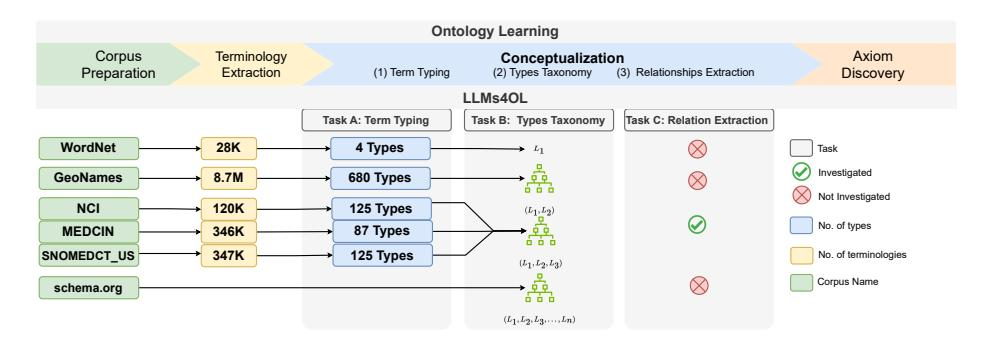
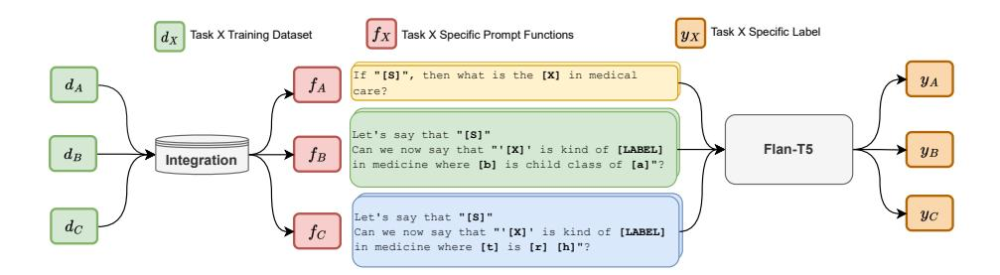

# LLMs4OL: Large Language Models for Ontology Learning

Hamed Babaei Giglou[0000 −0003 −3758 −1454], Jennifer D'Souza[0000 −0002 −6616 −9509], and S¨oren Auer[0000 −0002 −0698 −2864]

TIB Leibniz Information Centre for Science and Technology, Hannover, Germany {hamed.babaei,jennifer.dsouza,auer}@tib.eu

Abstract. We propose the LLMs4OL approach, which utilizes Large Language Models (LLMs) for Ontology Learning (OL). LLMs have shown significant advancements in natural language processing, demonstrating their ability to capture complex language patterns in different knowledge domains. Our LLMs4OL paradigm investigates the following hypothesis: Can LLMs effectively apply their language pattern capturing capability to OL, which involves automatically extracting and structuring knowledge from natural language text? To test this hypothesis, we conduct a comprehensive evaluation using the zero-shot prompting method. We evaluate nine different LLM model families for three main OL tasks: term typing, taxonomy discovery, and extraction of non-taxonomic relations. Additionally, the evaluations encompass diverse genres of ontological knowledge, including lexicosemantic knowledge in WordNet, geographical knowledge in GeoNames, and medical knowledge in UMLS. The obtained empirical results show that foundational LLMs are not sufficiently suitable for ontology construction that entails a high degree of reasoning skills and domain expertise. Nevertheless, when effectively fine-tuned they just might work as suitable assistants, alleviating the knowledge acquisition bottleneck, for ontology construction.

Keywords: Large Language Models · LLMs · Ontologies · Ontology Learning · Prompting · Prompt-based Learning.

# 1 Introduction

Ontology Learning (OL) is an important field of research in artificial intelligence (AI) and knowledge engineering, as it addresses the challenge of knowledge acquisition and representation in a variety of domains. OL involves automatically identifying terms, types, relations, and potentially axioms from textual information to construct an ontology [\[29\]](#page-16-0). Numerous examples of human-expert created ontologies exist, ranging from general-purpose ontologies to domain-specific ones, e.g., Unified Medical Language System (UMLS) [\[8\]](#page-15-0), WordNet [\[40\]](#page-16-1), GeoNames [\[52\]](#page-17-0), Dublin Core Metadata Initiative (DCMI) [\[64\]](#page-18-0), schema.org [\[19\]](#page-15-1), etc. Traditional ontology creation relies on manual specification by domain experts, which can be time-consuming, costly, error-prone, and impractical when knowledge constantly evolves or domain experts are unavailable. Consequently, OL

techniques have emerged to automatically acquire knowledge from unstructured or semi-structured sources, such as text documents and the web, and transform it into a structured ontology. A quick review of the field shows that traditional approaches to OL are based on lexico-syntactic pattern mining and clustering [\[65](#page-18-1)[,41,](#page-16-2)[36,](#page-16-3)[25,](#page-16-4)[4](#page-14-0)[,20,](#page-15-2)[59,](#page-18-2)[53,](#page-17-1)[27](#page-16-5)[,2,](#page-14-1)[23,](#page-15-3)[22\]](#page-15-4). In contrast, recent advances in natural language processing (NLP) through Large Language Models (LLMs) [\[45\]](#page-17-2) offer a promising alternative to traditional OL methods. The ultimate goal of OL is to provide a cost-effective and scalable solution for knowledge acquisition and representation, enabling more efficient and effective decision-making in a range of domains. To this end, we introduce the LLMs4OL paradigm and empirically ground it as a foundational first step.

Currently, there is no research explicitly training LLMs for OL. Thus to test LLMs for OL for the first time, we made some experimental considerations. The first being: Do the characteristics of LLMs justify ontology learning? First, LLMs are trained on extensive and diverse text, similar to domain-specific knowledge bases [\[50\]](#page-17-3). This aligns with the need for ontology developers to have extensive domain knowledge. Second, LLMs are built on the core technology of transformers that have enabled their higher language modeling complexity by facilitating the rapid scaling of their parameters. These parameters represent connections between words, enabling LLMs to comprehend the meaning of unstructured text like sentences or paragraphs. Further, by extrapolating complex linguistic patterns from word connections, LLMs exhibit human-like response capabilities across various tasks, as observed in the field of "emergent" AI. This behavior entails performing tasks beyond their explicit training, such as generating executable code, diverse genre text, and accurate text summaries [\[57,](#page-17-4)[62\]](#page-18-3). Such ability of LLMs to extrapolate patterns from simple word connections, encoding language semantics, is crucial for OL. Ontologies often rely on analyzing and extrapolating structured information connections, such as term-type taxonomies and relations, from unstructured text [\[17\]](#page-15-5). Thus LLMs4OL hypothesis of LLMs' fruitful application for OL appeared conceptually justified.

LLMs are being developed at a rapid pace. At the time of writing of this work, at least 60 different LLMs are reported [\[5\]](#page-14-2). This led to our second main experimental consideration. Which LLMs to test for the LLMs4OL task hypothesis? Empirical validation of various LLMs is crucial for NLP advancements and selecting suitable models for research tasks. Despite impressive performances in diverse NLP tasks, LLM effectiveness varies. For the foundational groundwork of LLMs4OL, we comprehensively selected eight diverse model families based on architecture and reported state-of-the-art performances at the time of this writing. The three main LLM architectures are encoder, decoder, and encoder-decoder. The selected LLMs for validation are: BERT [\[15\]](#page-15-6) (encoder-only); BLOOM [\[55\]](#page-17-5), MetaAI's LLaMA [\[58\]](#page-17-6), OpenAI's GPT-3 [\[9\]](#page-15-7), GPT-3.5 [\[45\]](#page-17-2), GPT-4 [\[46\]](#page-17-7) (all decoder-only); and BART [\[32\]](#page-16-6) and Google's Flan-T5 [\[10\]](#page-15-8) (encoder-decoder). Recent studies show that BERT excels in text classification and named entity recognition [\[15\]](#page-15-6), BART is effective in text generation and summarization [\[32\]](#page-16-6), and LLaMA demonstrates high accuracy in various NLP tasks, including reasoning, question answering, and code generation [\[58\]](#page-17-6). Flan-T5 emphasizes instruction tuning and exhibits strong multi-task performance [\[10\]](#page-15-8). BLOOM's unique multilingual approach achieves robust performance in tasks like text classification and sequence tagging [\[55\]](#page-17-5). Lastly, the GPT series stands out for its humanlike text generation abilities [\[9](#page-15-7)[,45,](#page-17-2)[46\]](#page-17-7). In this work, we aim to comprehensively unify these LLMs for their effectiveness under the LLMs4OL paradigm for the first time.

With the two experimental considerations in place, we now introduce the LLMs4OL paradigm and highlight our contributions. LLMs4OL is centered around the development of ontologies that comprise the following primitives [\[38\]](#page-16-7): 1. a set of strings that describe terminological lexical entries L for conceptual types; 2. a set of conceptual types T; 3. a taxonomy of types in a hierarchy HT ; 4. a set of non-taxonomic relations R described by their domain and range restrictions arranged in a heterarchy of relations HR; and 5. a set of axioms A that describe additional constraints on the ontology and make implicit facts explicit. The LLMs4OL paradigm, introduced in this work, addresses three core aspects of OL as tasks, outlined as the following research questions (RQs).

- RQ1: Term Typing Task How effective are LLMs for automated type discovery to construct an ontology?
- RQ2: Type Taxonomy Discovery Task How effective are LLMs to recognize a type taxonomy i.e. the "is-a" hierarchy between types?
- RQ3: Type Non-Taxonomic Relation Extraction Task How effective are LLMs to discover non-taxonomic relations between types?

The diversity of the empirical tests of this work are not only w.r.t. LLMs considered, but also the ontological knowledge domains tested for. Specifically, we test LLMs for lexico-semantic knowledge in WordNet [\[40\]](#page-16-1), geographical knowledge in GeoNames [\[1\]](#page-14-3), biomedical knowledge in UMLS [\[7\]](#page-14-4), and web content type representations in schema.org [\[47\]](#page-17-8). For our empirical validation of LLMs4OL, we seize the opportunity to include PubMedBERT [\[18\]](#page-15-9), a domain-specific LLM designed solely for the biomedical domain and thus applicable only to UMLS. This addition complements the eight domain-independent model families introduced earlier as a ninth model type. Summarily, our main contributions are:

- The LLMs4OL task paradigm as a conceptual framework for leveraging LLMs for OL.
- An implementation of the LLMs4OL concept leveraging tailored prompt templates for zero-shot OL in the context of three specific tasks, viz. term typing, type taxonomic relation discovery, and type non-taxonomic relation discovery. These tasks are evaluated across unique ontological sources wellknown in the community. Our code source with templates and datasets per task are released here [https://github.com/HamedBabaei/LLMs4OL.](https://github.com/HamedBabaei/LLMs4OL)
- A thorough out-of-the-box empirical evaluation of eight state-of-the-art domainindependent LLM types (10 models) and a ninth biomedical domain-specific LLM type (11th model) for their suitability to the various OL tasks considered in this work. Furthermore, the most effective overall LLM is finetuned and subsequently finetuned LLM results are reported for our three OL tasks.

# 2 Related Work

There are three avenues of related research: ontology learning from text, prompting LLMs for knowledge, and LLM prompting methods or prompt engineering. Ontology Learning from Text. One of the earliest approaches [\[22\]](#page-15-4) used lexicosyntactic patterns to extract new lexicosemantic concepts and relations from large collections of unstructured text, enhancing WordNet [\[40\]](#page-16-1). WordNet is a lexical database comprising a lexical ontology of concepts (nouns, verbs, etc.) and lexico-semantic relations (synonymy, hyponymy, etc.). Hwang [\[23\]](#page-15-3) proposed an alternative approach for constructing a dynamic ontology specific to an application domain. The method involved iteratively discovering types and taxonomy from unstructured text using a seed set of terms representing high-level domain types. In each iteration, newly discovered specialized types were incorporated, and the algorithm detected relations between linguistic features. The approach utilized a simple ontology algebra based on inheritance hierarchy and set operations. Agirre et al.[\[2\]](#page-14-1) enhanced WordNet by extracting topically related words from web documents. This unique approach added topical signatures to enrich WordNet. Kietz et al.[\[27\]](#page-16-5) introduced the On-To-Knowledge system, which utilized a generic core ontology like GermaNet [\[21\]](#page-15-10) or WordNet as the foundational structure. It aimed to discover a domain-specific ontology from corporate intranet text resources. For concept extraction and pruning, it employed statistical term frequency count heuristics, while association rules were applied for relation identification in corporate texts. Roux et al.[\[53\]](#page-17-1) proposed a method to expand a genetics ontology by reusing existing domain ontologies and enhancing concepts through verb patterns extracted from unstructured text. Their system utilized linguistic tools like part-of-speech taggers and syntactic parsers. Wagner [\[59\]](#page-18-2) employed statistical analysis of corpora to enrich WordNet in non-English languages by discovering relations, adding new terms to concepts, and acquiring concepts through the automatic acquisition of verb preferences. Moldovan and Girju [\[42\]](#page-17-9) introduced the Knowledge Acquisition from Text (KAT) system to enrich WordNet's finance domain coverage. Their method involved four stages: (1) discovering new concepts from a seed set of terms, expanding the concept list using dictionaries; (2) identifying lexical patterns from new concepts; (3) discovering relations from lexical patterns; and (4) integrating extracted information into WordNet using a knowledge classification algorithm. In [\[4\]](#page-14-0), an unsupervised method is presented to enhance ontologies with domain-specific information using NLP techniques such as NER and WSD. The method utilizes a general NER system to uncover a taxonomic hierarchy and employs WSD to enrich existing synsets by querying the internet for new terms and disambiguating them through cooccurrence frequency. Khan and Luo [\[25\]](#page-16-4) employed clustering techniques to find new terms, utilizing WordNet for typing. They used the self-organizing tree algorithm [\[16\]](#page-15-11), inspired by molecular evolution, to establish an ontology hierarchy. Additionally, Xu et al. [\[65\]](#page-18-1) focused on automatically acquiring domainspecific terms and relations through a TFIDF-based single-word term classifier, a lexico-syntactic pattern finder based on known relations and collocations, and a relation extractor utilizing discovered lexico-syntactic patterns.

Predominantly, the approaches for OL [\[60\]](#page-18-4) that stand out so far are based on lexico-syntactic patterns for term and relation extraction as well as clustering for type discovery. Otherwise, they build on seed-term-based bootstrapping methods. The reader is referred to further detailed reviews [\[6,](#page-14-5)[37\]](#page-16-8) on this theme for a comprehensive overall methodological picture for OL. Traditional NLP was defined by modular pipelines by which machines were equipped step-wise with annotations at the linguistic, syntactic, and semantic levels to process text. LLMs have ushered in a new era of possibilities for AI systems that obviate the need for modular NLP systems to understand natural language which we tap into for the first time for the OL task in this work.

Prompting LLMs for Knowledge. LLMs can process and retrieve facts based on their knowledge which makes them good zero-shot learners for various NLP tasks. Prompting LLMs means feeding an input x using a template function fprompt(x), a textual string prompt input that has some unfilled slots, and then the LLMs are used to probabilistically fill the unfilled information to obtain a final string x ′ , from which the final output y can be derived [\[34\]](#page-16-9). The LAMA: LAnguage Model Analysis [\[51\]](#page-17-10) benchmark has been introduced as a probing technique for analyzing the factual and commonsense knowledge contained in unidirectional LMs (i.e. Transformer-XL [\[12\]](#page-15-12)) and bidirectional LMs (i.e. BERT and ELMo [\[48\]](#page-17-11)) with cloze prompt templates from knowledge triples. They demonstrated the potential of pre-trained language models (PLMs) in probing facts – where facts are taken into account as subject-relation-object triples or questionanswer pairs – with querying LLMs by converting facts into a cloze template which is used as an input for the LM to fill the missing token. Further studies extended LAMA by the automated discovery of prompts [\[24\]](#page-15-13), finetuning LLMs for better probing [\[3](#page-14-6)[,31,](#page-16-10)[66\]](#page-18-5), or a purely unsupervised way of probing knowledge from LMs [\[49\]](#page-17-12). These studies analyzed LLMs for their ability to encode various linguistic and non-linguistic facts. This analysis was limited to predefined facts that reinforce the traditional linguistic knowledge of the LLMs, and as a result do not reflect how concepts are learned by the LLMs. In response to this limitation, Dalvi et al. [\[13\]](#page-15-14) put forward a proposal to explore and examine the latent concepts learned by LLMs, offering a fresh perspective on BERT. They defined concepts as "a group of words that are meaningful," i.e. that can be clustered based on relations such as lexical, morphological, etc. In another study [\[54\]](#page-17-13), they propose the framework ConceptX by extending their studies on seven LLMs in latent space analysis with the alignment of the grouped concepts to human-defined concepts. These works show that using LLMs and accessing the concept's latent spaces, allows us to group concepts and align them to predefined types and type relations discovery.

Prompt Engineering. As a novel discipline, prompt engineering focuses on designing optimal instructions for LLMs to enable successful task performance. Standard prompting [\[61\]](#page-18-6) represents a fundamental approach for instructing LLMs. It allows users to craft their own customized "self-designed prompts" to effectively interact with LLMs [\[9\]](#page-15-7) and prompt them to respond to the given prompt instruction straightaway with an answer. Consider the manually crafted FLAN

collection [\[35\]](#page-16-11) addressing diverse NLP tasks other than OL as an exemplar. Notably, the nature of some problems naturally encompass a step-by-step thought process for arriving at the answer. In other words, the problem to be solved can be decomposed as a series of preceding intermediate steps before arriving at the final solution. E.g., arithmetic or reasoning problems. Toward explainability and providing language models in a sense "time to think" helping it respond more accurately, there are advanced prompt engineering methods as well. As a first, as per the Chain-of-Thought (CoT) [\[63\]](#page-18-7) prompting method, the prompt instruction is so crafted that the LLM is instructed to break down complex tasks as a series of incremental steps leading to the solution. This helps the LLM to reason stepby-step and arrive at a more accurate and logical conclusion. On the other hand Tree-of-Thoughts (ToT) [\[67\]](#page-18-8) has been introduced for tasks that require exploration or strategic lookahead. ToT generalizes over CoT prompting by exploring thoughts that serve as intermediate steps for general problem-solving with LLMs. Both CoT and ToT unlock complex reasoning capabilities through intermediate reasoning steps in combination with few-shot or zero-shot [\[28\]](#page-16-12) prompting. Another approach for solving more complex tasks is using decomposed prompting [\[26\]](#page-16-13), where we can further decompose tasks that are hard for LLMs into simpler solvable sub-tasks and delegate these to sub-task-specific LLMs.

Given the LLMs4OL task paradigm introduced in this work, complex prompting is not a primary concern, as our current focus is on the initial exploration of the task to identify the areas where we need further improvement. We want to understand how much we have accomplished so far before delving into more complex techniques like CoT, ToT, and decomposed prompting. Once we have a clearer picture of the model's capabilities and limitations in a standard prompting setting, we can then consider other than standard prompt engineering approaches by formulating OL as a stepwise reasoning task.

# 3 The LLMs4OL Task Paradigm

The Large Language Models for Ontology Learning (LLMs4OL) task paradigm offers a conceptual framework to accelerate the time-consuming and expensive construction of ontologies exclusively by domain experts to a level playing field involving powerful AI methods such as LLMs for high-quality OL results; consequently and ideally involving domains experts only in validation cycles. In theory, with the right formulations, all tasks pertinent to OL fit within the LLMs4OL task paradigm. OL tasks are based on ontology primitives [\[38\]](#page-16-7), including lexical entries L, conceptual types T, a hierarchical taxonomy of types HT , non-taxonomic relations R in a heterarchy HR, and a set of axioms A to describe the ontology's constraints and inference rules. To address these primitives, OL tasks [\[44\]](#page-17-14) include: 1) Corpus preparation - selecting and collecting source texts for ontology building. 2) Terminology extraction - identifying and extracting relevant terms. 3) Term typing - grouping similar terms into conceptual types. 4) Taxonomy construction - establishing "is-a" hierarchies between types. 5) Relationship extraction - identifying semantic relationships beyond "is-

Fig. 1. The LLMs4OL task paradigm is an end-to-end framework for ontology learning in various knowledge domains, i.e. lexicosemantics (WordNet), geography (GeoNames), biomedicine (NCI, MEDICIN, SNOMEDCT), and web content types (schema.org). The three OL tasks empirically validated in this work are depicted within the blue arrow, aligned with the greater LLMs4OL paradigm.

a." 6) Axiom discovery - finding constraints and inference rules for the ontology. This set of six tasks forms the LLMs4OL task paradigm. See [Figure 1](#page-6-0) for the proposed LLMs4OL conceptual framework.

In this work, we empirically ground three core OL tasks using LLMs as a foundational basis for future research. However, traditional AI paradigms rely on testing models only on explicitly trained tasks, which is not the case for LLMs. Instead, we test LLMs for OL as an ["emergent"](https://www.quantamagazine.org/the-unpredictable-abilities-emerging-from-large-ai-models-20230316/) behavior [\[57](#page-17-4)[,62\]](#page-18-3), where they demonstrate the capacity to generate responses on a wide range of tasks despite lacking explicit training. The key to unraveling the emergent abilities of LLMs is to prompt them for their knowledge, as popularized by GPT-3 [\[9\]](#page-15-7), via carefully designed prompts. As discussed earlier (see [section 2\)](#page-3-0), prompt engineering for LLMs is a new AI sub-discipline. In this process, a pre-trained language model receives a prompt, such as a natural language statement, to generate responses without further training or gradient updates to its parameters [\[34\]](#page-16-9). Prompts can be designed in two main types based on the underlying LLM pretraining objective: cloze prompts [\[50,](#page-17-3)[11\]](#page-15-15), which involve filling in blanks in an incomplete sentence or passage and suit masked language modeling pre-training; and prefix prompts [\[33](#page-16-14)[,30\]](#page-16-15), which generate text following a given starting phrase and offer more design adaptability to the underlying model. The earlier introduced LLMs4OL paradigm is empirically validated for three select OL tasks using respective prompt functions fprompt(.) suited to each task and model.

Task A - Term Typing. A generalized type is discovered for a lexical term.

The generic cloze prompt template is f A c−prompt(L) := [S?]. [L] [Pdomain] is a [MASK]. where S is an optional context sentence, L is the lexical term prompted for, Pdomain is a domain specification, and the special MASK token is the type output expected from the model. Since prompt design is an important factor that determines how the LLM responds, eight different prompt template instantiations of the generic template were leveraged with final results reported for the best template. E.g., if WordNet is the base ontology, the part-of-speech type for the lexical term is prompted. In this case, template 1 is "[S]. [L] POS is a [MASK]." Note here "[Pdomain]" is POS. Template 2 is "[S]. [L] part of speech is a [MASK]." Note here "[Pdomain]" is "part of speech." In a similar manner, eight different prompt variants from the generic template were created. However, the specification of "[Pdomain]" depended on the ontology's knowledge domain.

The prefix prompt template reuses the cloze prompt template but appends an additional "instruction" sentence and replaces the special [MASK] token with a blank or a "?" symbol. Generically, it is f A p−prompt(T) = [instruction] + f A c−prompt(T), where the instruction is "Perform a sentence completion on the following sentence:" Based on the eight variations created from the generic cloze template prompt, subsequently eight template variations were created for the prefix prompting of the LLMs as well with best template results reported.

Task B - Taxonomy Discovery. Here a taxonomic hierarchy between pairs of types is discovered.

The generic cloze prompt template is f B c−prompt(a, b) := [a|b] is [Phierarchy] of [b|a]. T his statement is [MASK]. Where (a, b) or (b, a) are type pairs, Phierarchy indicates superclass relations if the template is initialized for top-down taxonomy discovery, otherwise indicates subclass relations if the template is initialized for bottom-up taxonomy discovery. In Task B, the expected model output for the special [MASK] token for a given type pair was true or false.

Similar to term typing, eight template variations of the generic template were created. Four of which were predicated on the top-down taxonomy discovery. E.g., "[a] is the superclass of [b]. This statement is [MASK]." Note here, [Phierarchy] is "superclass". Other three templates were based on [Phierarchy] ∈ parent class, supertype, ancestor class. And four more template instantiations predicated on the bottom-up taxonomy discovery were based on [Phierarchy] ∈ subclass, child class, subtype, descendant class. Thus eight experiments per template instantiation for the applicable LLM were run and the results from the best template were reported.

The prefix prompt template, similarly, reuses the cloze prompt template with the [MASK] token replaced with a blank or "?" symbol. It is f B p−prompt(a, b) = [instruction] + f B c−prompt(a, b), with instruction "Identify whether the following statement is true or false:"

Task C - Non-Taxonomic Relation Extraction. This task discovers non-taxonomic semantic heterarchical relations between types.

The cloze prompt template is f C c−prompt(h, r, t) := [h] is [r] [t]. T his statement is [MASK]. Where h is a head type, t is a tail type, and r is a non-taxonomic relationship between h and r. To support the discovery of a heterarchy that can consist of a 1-M relational cardinality, for a given relation, all possible type pairs of the ontology were created. The expected output for the [MASK] token was again true or false. Note, unlike in Task A and B, the given template was used as is and no variations of it were created.

Again, the prefix prompt template reuses the cloze prompt template as the other tasks, with instructions similar to task B. It is f C p−prompt(h, r, t) = [instruction] + f C c−prompt(h, r, t)

# 4 LLMs4OL - Three Ontology Learning Tasks Evaluations

### 4.1 Evaluation Datasets - Ontological Knowledge Sources

To comprehensively assess LLMs for the three OL tasks presented in the previous section, we cover a variety of ontological knowledge domain sources. Generally, across the tasks, four knowledge domains are represented, i.e. lexicosemantic – WordNet [\[40\]](#page-16-1), geographical – GeoNames [\[1\]](#page-14-3), biomedicine – Unified Medical Language System (UMLS) [\[7\]](#page-14-4) teased out as the National Cancer Institute (NCI) [\[43\]](#page-17-15), MEDCIN [\[39\]](#page-16-16), and Systematized Nomenclature of Medicine – Clinical Terms United States (SNOMEDCT US) [\[56\]](#page-17-16) subontologies, and content representations in the web – schema.org [\[47\]](#page-17-8). Tasks A, B, and C applied only to UMLS. In other words, the ontology has a supporting knowledge base with terms that can be leveraged in the test prompts for term typing as Task A, taxonomic hierarchical relational prompts as Task B, and non-taxonomic heterarchical relational prompts as Task C. The GeoNames source came with a knowledge base of terms instantiated for types and taxonomic relations, therefore, was leveraged in the Task A and B as OL tests with LLMs of this work. The WordNet source could be leveraged only in Task A since it came with an instantiated collection of lexical terms for syntactic types. It was not applicable in the Tasks B and C for OL defined in this work since the semantic relations in WordNet are lexicosemantic, in other words, between terms directly and not their types. Finally, since the schema.org source offered only typed taxonomies as standardized downloads, it was leveraged only in the OL Task B of this work. In this case, we refrained from scraping the web for instantiations of the schema.org taxonomy. For all other ontological knowledge sources considered in this work that were relevant to Task A, the term instantiations were obtained directly from the source. This facilitates replicating our Task A dataset easily. Detailed information on the ontological knowledge sources per task with relevant dataset statistics are presented next.

Task A Datasets. [Table 1](#page-9-0) shows statistical insights for the Task A dataset where we used terms from WordNet, GeoNames, and UMLS. For WordNet we used the WN18RR data dump [\[14\]](#page-15-16) that is derived from the original WordNet but released as a benchmark dataset with precreated train and test splits. Overall, it consists of 40,943 terms with 18 different relation types between the terms and four term types (noun, verb, adverb, adjective). We combined the original validation and test sets as a single test dataset. GeoNames comprises 680 categories of geographical locations, which are classified into 9 higher-level categories, e.g. H for stream, lake, and sea, and R for road and railroad. UMLS contains almost three million concepts from various sources which are linked together by semantic relationships. UMLS is unique in that it is a greater semantic ontological network that subsumes other biomedical problem-domain restricted subontolo-

Table 1. Task A term typing dataset counts across three core ontological knowledge sources, i.e. WordNet, GeoNames, and UMLS, where for Task A UMLS is represented only by the NCI, MEDCIN, and SNOMEDCT US subontological sources. The unique term types per source that defined Task A Ontology Learning is also provided.

| Parameter      |        | WordNet GeoNames |     |         | NCI MEDCIN SNOMEDCT US |
|----------------|--------|------------------|-----|---------|------------------------|
| Train Set Size | 40,559 | 8,078,865 96,177 |     | 277,028 | 278,374                |
| Test Set Size  | 9,470  | 702,510 24,045   |     | 69,258  | 69,594                 |
| Types          | 4      | 680              | 125 | 87      | 125                    |

gies. We grounded the term typing task to the semantic spaces of three select subontological sources,i.e. NCI, MEDCIN, and SNOMEDCT US.

The train datasets were reserved for LLM fine-tuning. Among the 11 models, we selected the most promising one based on its zero-shot performance. The test datasets were used for evaluations in both zero-shot and fine-tuned settings. Task B Datasets. From GeoNames, UMLS, and schema.org we obtained 689, 127, and 797 term types forming type taxonomies. Our test dataset was con-

structed as type pairs, where half represented the taxonomic hierarchy while the other half were not in a taxonomy. This is based on the following formulations.

$$\forall (a \in T_n, b \in T_{n+1}) \longmapsto (aRb \wedge b\neg Ra)$$
$$\forall (a \in T_n, b \in T_{n+1}, c \in T_{n+2}); (aRb \wedge bRc) \longmapsto aRc$$
$$\forall (a \in T_n, b \in T_{n+1}, c \in T_{n+2}); (c\neg Rb \wedge b\neg Ra) \longmapsto c\neg Ra$$

Where a, b, and c are types at different levels in the hierarchy. T is a collection of types at a particular level in the taxonomy, where n + 2 > n + 1 > n and n is the root. The symbol R represents "a is a super class of type b" as a true taxonomic relation. Conversely, the ¬R represents "b is a super class of type a" as a false taxonomic relation. Furthermore, transitive taxonomic relations, (aRb∧bRc) 7−→ aRc, were also extracted as true relations, while their converse, i.e. (c¬Rb ∧ b¬Ra) 7−→ c¬Ra were false relations.

Task C Datasets. As alluded to earlier, Task C evaluations, i.e. non-taxonomic relations discovery, were relegated to the only available ontological knowledge source among those we considered i.e. UMLS. It reports 53 non-taxonomic relations across its 127 term types. The testing dataset comprised all pairs of types for each relation, where for any given relation some pairs are true while the rest are false candidates. Task B and Task C datasets' statistics are in [Table 2.](#page-10-0)

### 4.2 Evaluation Models - Large Language Models (LLMs)

As already introduced earlier, in this work, we comprehensively evaluate eight main types of domain-independent LLMs reported as state-of-the-art for different tasks in the community. They are: BERT [\[15\]](#page-15-6) as an encoder-only architecture, BLOOM [\[55\]](#page-17-5), LLaMA [\[58\]](#page-17-6), GPT-3 [\[9\]](#page-15-7), GPT-3.5 [\[45\]](#page-17-2), and GPT-4 [\[46\]](#page-17-7) as decoderonly models, and finally BART [\[32\]](#page-16-6) and Flan-T5 [\[10\]](#page-15-8) as encoder-decoder models.

| Task   | Parameter                 | GeoNames  | UMLS        | schema.org  |
|--------|---------------------------|-----------|-------------|-------------|
|        | Types                     | 689       | 127         | 797         |
| Task B | Levels                    | 2         | 3           | 6           |
|        | Positive/Negative Samples | 680/680   | 254/254     | 2,670/2,670 |
|        | Train/Test split          | 272/1,088 | 101/407     | 1,086/4,727 |
|        | Non-Taxonomic Relations   | -         | 53          | -           |
| Task C | Positive/Negative Samples | -         | 5,641/1,896 | -           |
|        | Train/Test Split          | -         | 1,507/6,030 | -           |

Table 2. Dataset statistics as counts per reported parameter for Task B type taxonomic hierarchy discovery and Task C type non-taxonomic heterarchy discovery across the pertinent ontological knowledge sources respectively per task.

Note these LLMs are released at varying parameter sizes. Thus qualified by the size in terms of parameters written in parenthesis, in all, we evaluate seven LLMs: 1. BERT-Large (340M), 2. BART-Large (400M), 3. Flan-T5-Large (780M), 4. Flan-T5-XL (3B), 5. BLOOM-1b7 (1.7B), 6. BLOOM-3b (3B), 7. GPT-3 (175B), 8. GPT-3.5 (174B), 9. LLaMA (7B), and GPT-4 (>1T). Additionally, we also test an eleventh biomedical domain-specific model PubMedBERT [\[18\]](#page-15-9).

In this work, since we propose the LLMs4OL paradigm for the first time, in a sense postulating OL as an emergent ability of LLMs, it is important for us to test different LLMs on the new task. Evaluating different LLMs supports: 1) Performance comparison - this allows us to identify which models are effective for OL, 2) Model improvement - toward OL one can identify areas where the models need improvement, and 3) Research advancement - with our results from testing and comparing different models, researchers interested in OL could potentially identify new areas of research and develop new techniques for improving LLMs.

### 4.3 Evaluations

Metrics. Evaluations for Task A are reported as the mean average precision at k (MAP@K), where k = 1, since this metric was noted as being best suited to the task. Specifically, in our case, for term typing, MAP@1 measures the average precision of the top-1 ranked term types returned by an LLM for prompts initialized with terms from the evaluation set. And evaluations for Tasks B and C are reported in terms of the standard F1-score based on precision and recall.

Results - Three Ontology Learning Tasks Zero-shot Evaluations. The per task overall evaluations are reported in [Table 3.](#page-11-0) The three main rows of the table marked by alphabets A, B, and C correspond to term typing, type taxonomy discovery, and type non-taxonomic relational hetrarchy discovery results, respectively. The five subrows against Task A shows term typing results for Word-Net, GeoNames, and the three UMLS subontologies, viz. NCI, SNOMEDCT US, and MEDCIN. The three subrows against Task B shows type taxonomy discovery results for GeoNames, UMLS, and schema.org, respectively. Task C evaluation

Table 3. Zero-shot results across 11 LLMs and finetuned Flan-T5-Large and Flan-T5- XL LLMs results reported for ontology learning Task A i.e. term typing in MAP@1, and as F1-score for Task B i.e. type taxonomy discovery, and Task C i.e. type nontaxonomic relation extraction. The results are in percentages.

|      | Zero-Shot Testing                                                  |                |                    |                    |               | Finetuned      |                   |                                                        |       |         |                  |          |                    |                     |
|------|--------------------------------------------------------------------|----------------|--------------------|--------------------|---------------|----------------|-------------------|--------------------------------------------------------|-------|---------|------------------|----------|--------------------|---------------------|
| Task | Dataset                                                            | RT-Large BE | RT MedBE Pub | RT-Large A B | Flan-T5-Large | XL Flan-T5- | M-1b7 O BLO | M-3b O BLO                                       | GPT-3 | GPT-3.5 | A-7B M LLa | GPT-4    | ∗ Flan-T5-Large | ∗ XL Flan-T5- |
|      | WordNet                                                            | 27.9           | -                  |                    |               |                |                   | 2.2 31.3 52.2 79.2 79.1 37.9 91.7 81.4 90.1            |       |         |                  |          |                    | 76.9 86.3           |
|      | GeoNames                                                           | 38.3           |                    |                    |               |                |                   | - 23.2 13.2 33.8 28.5 28.8 22.4 35.0 29.5 43.3         |       |         |                  |          | 16.9               | 18.4                |
| A    | NCI                                                                | 11.1           | 5.9                | 9.9                | 9.0           |                |                   | 9.8 12.4 15.6 12.7 14.7                                |       |         |                  | 7.7 16.1 |                    | 31.9 32.8           |
|      | SNOMEDCT US 21.1 28.5 19.8 24.3 31.6 37.0 37.7 24.4 25.0 13.8 27.8 |                |                    |                    |               |                |                   |                                                        |       |         |                  |          |                    | 33.4 43.4           |
|      | MEDCIN                                                             |                |                    |                    |               |                |                   | 8.7 15.6 12.7 13.0 18.5 28.8 29.8 25.7 23.9            |       |         |                  | 4.9 23.7 |                    | 38.4 51.8           |
|      | GeoNames                                                           | 54.5           |                    |                    |               |                |                   | - 55.4 59.6 52.4 36.7 48.3 53.2 67.8 33.5 55.4         |       |         |                  |          | 62.5               | 59.1                |
| B    | UMLS                                                               |                |                    |                    |               |                |                   | 48.2 33.7 49.9 55.3 64.3 38.3 37.5 51.6 70.4 32.3 78.1 |       |         |                  |          |                    | 53.4 79.3           |
|      | schema.org                                                         | 44.1           |                    |                    |               |                |                   | - 52.9 54.8 42.7 48.6 51.3 51.0 74.4 33.8 74.3         |       |         |                  |          |                    | 91.7 91.7           |
| C    | UMLS                                                               |                |                    |                    |               |                |                   | 40.1 42.7 42.4 46.0 49.5 43.1 42.7 38.8 37.5 20.3 41.3 |       |         |                  |          |                    | 49.1 53.1           |

results are provided only for UMLS. We first examine the results in the zero-shot setting, i.e. for LLMs evaluated out-of-the-box, w.r.t. three RQs.

RQ1: How effective are LLMs for Task A, i.e. automated type discovery? We examine this question given the results in 5 subrows against the row A, i.e. corresponding to the various ontological datasets evaluated for Task A. Of the five ontological sources, the highest term typing results were achieved on the 4-typed WordNet at 91.7% MAP@1 by GPT-3.5. This high performance can be attributed in part to the simple type space of WordNet with only 4 types. However, looking across the other LLMs evaluated on WordNet, in particular even GPT-3, scores in the range of 30% MAP@1 seem to be the norm with a low of 2.2% by BART-Large. Thus LLMs that report high scores on WordNet should be seen as more amenable to syntactic typing regardless of the WordNet simple type space. Considering all the ontological sources, Geonames presents the most fine-grained types taxonomy of 680 types. Despite this, the best result obtained on this source is 39.4% from GPT-4 with BERT-Large second at a close 38.3%. This is better than the typing evaluations on the three biomedical datasets. Even the domain-specific PubMedBERT underperforms. In this regard, domain-independent models with large-scale parameters such a BLOOM (3B) are more amenable to this complex task. Since biomedicine entails deeper domain-specific semantics, we hypothesize better performance not just from domain-specific finetuning but also strategically for task-specific reasoning.

The results overview is: 91.7% WordNet by GPT-3.5 > 39.4% GeoNames by GPT-4 > 37.7% SNOMEDCT US by BLOOM-3b > 29.8% MEDCIN by BLOOM-3b > 16.1% NCI by GPT-4.

RQ2: How effective are LLMs to recognize a type taxonomy i.e. the "is-a" hierarchy between types? We examine this question given the results in the 3 subrows against the main row B, i.e. corresponding to the three ontological sources evaluated for Task B. The highest result was achieved for UMLS by GPT-4 at 78.1%. Of the open-source models, Flan-T5-XL achieved the best result at 64.3%. Thus for the term taxonomy discovery LLMs on average have proven most effective in the zero-shot setting on the biomedical domain.

The results overview is: 78.1% UMLS by GPT-4 > 74.4% schema.org by GPT-3.5 > 67.8% GeoNames by GPT-3.5. Note the three GPT models were not open-sourced and thus we tested them with a paid subscription. For the opensource models, the results overview is: 64.3% UMLS by Flan-T5-XL > 59.6% GeoNames by Flan-T5-XL > 54.8% schema.org by Flan-T5-Large.

RQ3: How effective are LLMs to discover non-taxonomic relations between types? We examine this question given the results in [Table 3](#page-11-0) row for Task C, i.e. for UMLS. The best result achieved is 49.5% by Flan-T5-XL. We consider this a fairly good result over a sizeable set of 7,537 type pairs that are in true non-taxonomic relations or are false pairs.

Finally, over all the three tasks considered under the LLMs4OL paradigm, term typing proved the hardest obtaining the lowest overall results for most of its ontological sources tested including the biomedical domain in particular. Additionally in our analysis, GPT, Flan-T5, and BLOOM variants showed improved scores with increase in parameters, respectively. This held true for the closed-sourced GPT models, i.e. GPT-3 (175B) and GPT-3.5 (175B) to GPT-4 (>1T) and the open-sourced models, i.e. Flan-T5-Large (780M) to Flan-T5-XL (3B) and BLOOM from 1.7B to 3B. Thus it seems apparent that with an increased number of LLM parameters, we can expect an improvement in ontology learning.

Fig. 2. An illustration of the LLM finetuning workflow on tasks for ontology learning.

Results - Three Ontology Learning Tasks Finetuned LLM Evaluations. Our zero-shot test results indicate that while LLMs seem promising for OL they would need task-specific finetuning to be a practically viable solution. To this

end, we adopt the method of "instruction tuning" proposed as the [FLAN col](https://github.com/google-research/FLAN/blob/main/flan/templates.py)[lection](https://github.com/google-research/FLAN/blob/main/flan/templates.py) which is the only known systematically deconstructed, effective way to finetune LLMs [\[35\]](#page-16-11). For finetuning, we choose the Flan-T5 LMM for two reasons: 1) it is open-source: we intend to foster future research directions for models unhidden behind paywalls to aid in democratizing LLM research, and 2) it showed consistently good performance across all tasks. The finetuning instructions were instantiated from a small selection of eight samples of each knowledge source' reserved training set and fed in a finetuning workflow shown in [Figure 2.](#page-12-0) The finetuned Flan models' results (see last two columns in [Table 3\)](#page-11-0) are significantly boosted across almost all tasks. For task A, we observed an average improvement of 25% from zero-shot to the finetuned model for both Flan-T5 variants. Notably, SNOMEDCT US showed least improvement of 9%, while the WordNet showed the most improvement of 45%. For task B we marked an average improvement of 18%, and for task C 3%. Given an illustration of the results in ?? shows that on average finetuned models, even with fewer parameters outperforms models with 1000x or more parameters across the three OL tasks. These insights appear crucial to expedite developmental research progress for practical tools for OL using LLMs which we plan to leverage in our future work.

# 5 Conclusions and Future Directions

Various initiatives benchmark LLM performance, revealing new task abilities [\[57](#page-17-4)[,62\]](#page-18-3). These benchmarks advance computer science's understanding of LLMs. We explore LLMs' potential for Ontology Learning [\[17](#page-15-5)[,38\]](#page-16-7) through our introduced conceptual framework, LLMs4OL. Extensive experiments on 11 LLMs across three OL tasks demonstrate the paradigm's proof of concept. Our [code](https://github.com/HamedBabaei/LLMs4OL)[base](https://github.com/HamedBabaei/LLMs4OL) facilitates replication and extension of methods for testing new LLMs. Our empirical results are promising to pave future work for OL.

Future research directions in the field of OL with LLMs can focus on several key areas. First, there is a need to enhance LLMs specifically for ontology learning tasks, exploring novel architectures and fine-tuning to capture ontological structures better. Second, expanding the evaluation to cover diverse knowledge domains beyond the ones examined in the current work would provide a broader understanding of LLMs' generalizability. Third, hybrid approaches that combine LLMs with traditional ontology learning techniques, such as lexico-syntactic pattern mining and clustering, could lead to more accurate and comprehensive ontologies. Fourth, further research can delve into the extraction of specific semantic relations, like part-whole relationships or causality, to enhance the expressiveness of learned ontologies. Standardizing evaluation metrics, creating benchmark datasets, exploring dynamic ontology evolution, and domain-specific learning are important directions. Additionally, integrating human-in-the-loop approaches with expert involvement would enhance ontology relevance and accuracy. Exploring these research directions will advance LLM-based ontology learning, enhancing knowledge acquisition and representation across domains.

Supplemental Material Statement: Our LLM templates, detailed results, and codebase are publicly released as supplemental material on Github [https://](https://github.com/HamedBabaei/LLMs4OL) [github.com/HamedBabaei/LLMs4OL.](https://github.com/HamedBabaei/LLMs4OL)

# Author Contributions

Hamed Babaei Giglou: Conceptualization, Methodology, Software, Validation, Investigation, Resources, Data Curation, Writing - Original Draft, Visualization. Jennifer D'Souza: Conceptualization, Methodology, Investigation, Resources, Writing - Original Draft, Writing - Review & Editing, Supervision, Project administration, Funding acquisition. S¨oren Auer: Conceptualization, Methodology, Investigation, Resources, Review & Editing, Supervision, Project administration, Funding acquisition.

# Acknowledgements

A 16-page final version of this paper has been accepted for publication in the research track of the 22nd International Semantic Web Conference (ISWC 2023). We thank the anonymous reviewers for their detailed and insightful comments on an earlier draft of the paper. This work was jointly supported by the German BMBF project SCINEXT (ID 01lS22070), DFG NFDI4DataScience (ID 460234259), and ERC ScienceGraph (ID 819536).

# References

- 1. Geonames geographical database (2023), <http://www.geonames.org/>
- 2. Agirre, E., Ansa, O., Hovy, E., Mart´ınez, D.: Enriching very large ontologies using the www. In: Proceedings of the First International Conference on Ontology Learning-Volume 31. pp. 25–30 (2000)
- 3. Akkalyoncu Yilmaz, Z., Wang, S., Yang, W., Zhang, H., Lin, J.: Applying BERT to document retrieval with birch. In: Proceedings of the 2019 Conference on Empirical Methods in Natural Language Processing and the 9th International Joint Conference on Natural Language Processing (EMNLP-IJCNLP): System Demonstrations. pp. 19–24. Association for Computational Linguistics, Hong Kong, China (Nov 2019). [https://doi.org/10.18653/v1/D19-3004,](https://doi.org/10.18653/v1/D19-3004) <https://aclanthology.org/D19-3004>
- 4. Alfonseca, E., Manandhar, S.: An unsupervised method for general named entity recognition and automated concept discovery. In: Proceedings of the 1st international conference on general WordNet, Mysore, India. pp. 34–43 (2002)
- 5. Amatriain, X.: Transformer models: an introduction and catalog. arXiv preprint arXiv:2302.07730 (2023)
- 6. Asim, M.N., Wasim, M., Khan, M.U.G., Mahmood, W., Abbasi, H.M.: A survey of ontology learning techniques and applications. Database 2018, bay101 (2018)
- 7. Bodenreider, O.: The Unified Medical Language System (UMLS): integrating biomedical terminology. Nucleic Acids Research 32(suppl 1), D267–D270 (01 2004). [https://doi.org/10.1093/nar/gkh061,](https://doi.org/10.1093/nar/gkh061) <https://doi.org/10.1093/nar/gkh061>

- 16 Babaei Giglou et al.
- 8. Bodenreider, O.: The unified medical language system (umls): integrating biomedical terminology. Nucleic acids research 32(suppl 1), D267–D270 (2004)
- 9. Brown, T.B., Mann, B., Ryder, N., Subbiah, M., Kaplan, J., Dhariwal, P., Neelakantan, A., Shyam, P., Sastry, G., Askell, A., Agarwal, S., Herbert-Voss, A., Krueger, G., Henighan, T., Child, R., Ramesh, A., Ziegler, D.M., Wu, J., Winter, C., Hesse, C., Chen, M., Sigler, E., Litwin, M., Gray, S., Chess, B., Clark, J., Berner, C., McCandlish, S., Radford, A., Sutskever, I., Amodei, D.: Language models are few-shot learners (2020)
- 10. Chung, H.W., Hou, L., Longpre, S., Zoph, B., Tay, Y., Fedus, W., Li, Y., Wang, X., Dehghani, M., Brahma, S., Webson, A., Gu, S.S., Dai, Z., Suzgun, M., Chen, X., Chowdhery, A., Castro-Ros, A., Pellat, M., Robinson, K., Valter, D., Narang, S., Mishra, G., Yu, A., Zhao, V., Huang, Y., Dai, A., Yu, H., Petrov, S., Chi, E.H., Dean, J., Devlin, J., Roberts, A., Zhou, D., Le, Q.V., Wei, J.: Scaling instructionfinetuned language models (2022)
- 11. Cui, L., Wu, Y., Liu, J., Yang, S., Zhang, Y.: Template-based named entity recognition using bart. arXiv preprint arXiv:2106.01760 (2021)
- 12. Dai, Z., Yang, Z., Yang, Y., Carbonell, J., Le, Q.V., Salakhutdinov, R.: Transformer-xl: Attentive language models beyond a fixed-length context (2019)
- 13. Dalvi, F., Khan, A.R., Alam, F., Durrani, N., Xu, J., Sajjad, H.: Discovering latent concepts learned in BERT. In: International Conference on Learning Representations (2022), <https://openreview.net/forum?id=POTMtpYI1xH>
- 14. Dettmers, T., Pasquale, M., Pontus, S., Riedel, S.: Convolutional 2d knowledge graph embeddings. In: Proceedings of the 32th AAAI Conference on Artificial Intelligence. pp. 1811–1818 (February 2018), <https://arxiv.org/abs/1707.01476>
- 15. Devlin, J., Chang, M.W., Lee, K., Toutanova, K.: Bert: Pre-training of deep bidirectional transformers for language understanding (2019)
- 16. Dopazo, J., Carazo, J.M.: Phylogenetic reconstruction using an unsupervised growing neural network that adopts the topology of a phylogenetic tree. Journal of molecular evolution 44(2), 226–233 (1997)
- 17. Gruber, T.R.: Toward principles for the design of ontologies used for knowledge sharing? International journal of human-computer studies 43(5-6), 907–928 (1995)
- 18. Gu, Y., Tinn, R., Cheng, H., Lucas, M., Usuyama, N., Liu, X., Naumann, T., Gao, J., Poon, H.: Domain-specific language model pretraining for biomedical natural language processing. ACM Transactions on Computing for Healthcare (HEALTH) 3(1), 1–23 (2021)
- 19. Guha, R.V., Brickley, D., Macbeth, S.: Schema. org: evolution of structured data on the web. Communications of the ACM 59(2), 44–51 (2016)
- 20. Hahn, U., Mark´o, K.G.: Joint knowledge capture for grammars and ontologies. In: Proceedings of the 1st international conference on Knowledge capture. pp. 68–75 (2001)
- 21. Hamp, B., Feldweg, H.: Germanet-a lexical-semantic net for german. In: Automatic information extraction and building of lexical semantic resources for NLP applications (1997)
- 22. Hearst, M.A.: Automated discovery of wordnet relations. WordNet: an electronic lexical database 2 (1998)
- 23. Hwang, C.H.: Incompletely and imprecisely speaking: using dynamic ontologies for representing and retrieving information. In: KRDB. vol. 21, pp. 14–20. Citeseer (1999)
- 24. Jiang, Z., Xu, F.F., Araki, J., Neubig, G.: How can we know what language models know? Transactions of the Association for Computational Linguistics 8, 423–

438 (2020). [https://doi.org/10.1162/tacl](https://doi.org/10.1162/tacl_a_00324) a 00324, [https://aclanthology.org/2020.](https://aclanthology.org/2020.tacl-1.28) [tacl-1.28](https://aclanthology.org/2020.tacl-1.28)

- 25. Khan, L., Luo, F.: Ontology construction for information selection. In: 14th IEEE International Conference on Tools with Artificial Intelligence, 2002.(ICTAI 2002). Proceedings. pp. 122–127. IEEE (2002)
- 26. Khot, T., Trivedi, H., Finlayson, M., Fu, Y., Richardson, K., Clark, P., Sabharwal, A.: Decomposed prompting: A modular approach for solving complex tasks (2023)
- 27. Kietz, J.U., Maedche, A., Volz, R.: A method for semi-automatic ontology acquisition from a corporate intranet. In: EKAW-2000 Workshop "Ontologies and Text", Juan-Les-Pins, France, October 2000 (2000)
- 28. Kojima, T., Gu, S.S., Reid, M., Matsuo, Y., Iwasawa, Y.: Large language models are zero-shot reasoners (2023)
- 29. Konys, A.: Knowledge repository of ontology learning tools from text. Procedia Computer Science 159, 1614–1628 (2019)
- 30. Lester, B., Al-Rfou, R., Constant, N.: The power of scale for parameter-efficient prompt tuning. arXiv preprint arXiv:2104.08691 (2021)
- 31. Levy, O., Seo, M., Choi, E., Zettlemoyer, L.: Zero-shot relation extraction via reading comprehension. In: Proceedings of the 21st Conference on Computational Natural Language Learning (CoNLL 2017). pp. 333–342. Association for Computational Linguistics, Vancouver, Canada (Aug 2017). [https://doi.org/10.18653/v1/K17-](https://doi.org/10.18653/v1/K17-1034) [1034,](https://doi.org/10.18653/v1/K17-1034) <https://aclanthology.org/K17-1034>
- 32. Lewis, M., Liu, Y., Goyal, N., Ghazvininejad, M., Mohamed, A., Levy, O., Stoyanov, V., Zettlemoyer, L.: Bart: Denoising sequence-to-sequence pre-training for natural language generation, translation, and comprehension (2019)
- 33. Li, X.L., Liang, P.: Prefix-tuning: Optimizing continuous prompts for generation. arXiv preprint arXiv:2101.00190 (2021)
- 34. Liu, P., Yuan, W., Fu, J., Jiang, Z., Hayashi, H., Neubig, G.: Pre-train, prompt, and predict: A systematic survey of prompting methods in natural language processing. ACM Comput. Surv. 55(9) (jan 2023). [https://doi.org/10.1145/3560815,](https://doi.org/10.1145/3560815) [https:](https://doi.org/10.1145/3560815) [//doi.org/10.1145/3560815](https://doi.org/10.1145/3560815)
- 35. Longpre, S., Hou, L., Vu, T., Webson, A., Chung, H.W., Tay, Y., Zhou, D., Le, Q.V., Zoph, B., Wei, J., et al.: The flan collection: Designing data and methods for effective instruction tuning. arXiv preprint arXiv:2301.13688 (2023)
- 36. Lonsdale, D., Ding, Y., Embley, D.W., Melby, A.: Peppering knowledge sources with salt: Boosting conceptual content for ontology generation. In: Proceedings of the AAAI Workshop on Semantic Web Meets Language Resources, Edmonton, Alberta, Canada (2002)
- 37. Lourdusamy, R., Abraham, S.: A survey on methods of ontology learning from text. In: Intelligent Computing Paradigm and Cutting-edge Technologies: Proceedings of the First International Conference on Innovative Computing and Cutting-edge Technologies (ICICCT 2019), Istanbul, Turkey, October 30-31, 2019 1. pp. 113–123. Springer (2020)
- 38. Maedche, A., Staab, S.: Ontology learning for the semantic web. IEEE Intelligent systems 16(2), 72–79 (2001)
- 39. Medicomp Systems: MEDCIN (January 2023), <https://medicomp.com>
- 40. Miller, G.A.: Wordnet: a lexical database for english. Communications of the ACM 38(11), 39–41 (1995)
- 41. Missikoff, M., Navigli, R., Velardi, P.: The usable ontology: An environment for building and assessing a domain ontology. In: The Semantic Web—ISWC 2002: First International Semantic Web Conference Sardinia, Italy, June 9–12, 2002 Proceedings. pp. 39–53. Springer (2002)

- 18 Babaei Giglou et al.
- 42. Moldovan, D.I., GiRJU, R.C.: An interactive tool for the rapid development of knowledge bases. International Journal on Artificial Intelligence Tools 10(01n02), 65–86 (2001)
- 43. National Cancer Institute, National Institutes of Health: NCI Thesaurus (September 2022), <http://ncit.nci.nih.gov>
- 44. Noy, N.F., McGuinness, D.L., et al.: Ontology development 101: A guide to creating your first ontology (2001)
- 45. OpenAI: Chatgpt. <https://openai.com/chat-gpt/> (2023), accessed May 5, 2023
- 46. OpenAI: Gpt-4 technical report (2023)
- 47. Patel-Schneider, P.F.: Analyzing schema.org. In: Mika, P., Tudorache, T., Bernstein, A., Welty, C., Knoblock, C., Vrandeˇci´c, D., Groth, P., Noy, N., Janowicz, K., Goble, C. (eds.) The Semantic Web – ISWC 2014. pp. 261–276. Springer International Publishing, Cham (2014)
- 48. Peters, M.E., Neumann, M., Iyyer, M., Gardner, M., Clark, C., Lee, K., Zettlemoyer, L.: Deep contextualized word representations. In: Proceedings of the 2018 Conference of the North American Chapter of the Association for Computational Linguistics: Human Language Technologies, Volume 1 (Long Papers). pp. 2227– 2237. Association for Computational Linguistics, New Orleans, Louisiana (Jun 2018). [https://doi.org/10.18653/v1/N18-1202,](https://doi.org/10.18653/v1/N18-1202) <https://aclanthology.org/N18-1202>
- 49. Petroni, F., Lewis, P., Piktus, A., Rockt¨aschel, T., Wu, Y., Miller, A.H., Riedel, S.: How context affects language models' factual predictions. In: Automated Knowledge Base Construction (2020), <https://openreview.net/forum?id=025X0zPfn>
- 50. Petroni, F., Rockt¨aschel, T., Lewis, P., Bakhtin, A., Wu, Y., Miller, A.H., Riedel, S.: Language models as knowledge bases? arXiv preprint arXiv:1909.01066 (2019)
- 51. Petroni, F., Rockt¨aschel, T., Riedel, S., Lewis, P., Bakhtin, A., Wu, Y., Miller, A.: Language models as knowledge bases? In: Proceedings of the 2019 Conference on Empirical Methods in Natural Language Processing and the 9th International Joint Conference on Natural Language Processing (EMNLP-IJCNLP). Association for Computational Linguistics (2019)
- 52. Rebele, T., Suchanek, F., Hoffart, J., Biega, J., Kuzey, E., Weikum, G.: Yago: A multilingual knowledge base from wikipedia, wordnet, and geonames. In: The Semantic Web–ISWC 2016: 15th International Semantic Web Conference, Kobe, Japan, October 17–21, 2016, Proceedings, Part II 15. pp. 177–185. Springer (2016)
- 53. Roux, C., Proux, D., Rechenmann, F., Julliard, L.: An ontology enrichment method for a pragmatic information extraction system gathering data on genetic interactions. In: ECAI Workshop on Ontology Learning (2000)
- 54. Sajjad, H., Durrani, N., Dalvi, F., Alam, F., Khan, A.R., Xu, J.: Analyzing encoded concepts in transformer language models (2022)
- 55. Scao, T.L., Fan, A., Akiki, C., Pavlick, E., Ili´c, S., Hesslow, D., Castagn´e, R., Luccioni, A.S., Yvon, F., Gall´e, M., et al.: Bloom: A 176b-parameter open-access multilingual language model. arXiv preprint arXiv:2211.05100 (2022)
- 56. SNOMED International: US Edition of SNOMED CT (March 2023), [https://www.](https://www.nlm.nih.gov/healthit/snomedct/us_edition.html) [nlm.nih.gov/healthit/snomedct/us](https://www.nlm.nih.gov/healthit/snomedct/us_edition.html) edition.html
- 57. Srivastava, A., Rastogi, A., Rao, A., Shoeb, A.A.M., Abid, A., Fisch, A., Brown, A.R., Santoro, A., Gupta, A., Garriga-Alonso, A., et al.: Beyond the imitation game: Quantifying and extrapolating the capabilities of language models. arXiv preprint arXiv:2206.04615 (2022)
- 58. Touvron, H., Lavril, T., Izacard, G., Martinet, X., Lachaux, M.A., Lacroix, T., Rozi`ere, B., Goyal, N., Hambro, E., Azhar, F., et al.: Llama: Open and efficient foundation language models. arXiv preprint arXiv:2302.13971 (2023)

- 59. Wagner, A.: Enriching a lexical semantic net with selectional preferences by means of statistical corpus analysis. In: ECAI Workshop on Ontology Learning. vol. 61. Citeseer (2000)
- 60. W¸atr´obski, J.: Ontology learning methods from text-an extensive knowledge-based approach. Procedia Computer Science 176, 3356–3368 (2020)
- 61. Wei, J., Bosma, M., Zhao, V., Guu, K., Yu, A.W., Lester, B., Du, N., Dai, A.M., Le, Q.V.: Finetuned language models are zero-shot learners. In: International Conference on Learning Representations (2022), [https://openreview.net/forum?id=](https://openreview.net/forum?id=gEZrGCozdqR) [gEZrGCozdqR](https://openreview.net/forum?id=gEZrGCozdqR)
- 62. Wei, J., Tay, Y., Bommasani, R., Raffel, C., Zoph, B., Borgeaud, S., Yogatama, D., Bosma, M., Zhou, D., Metzler, D., et al.: Emergent abilities of large language models. arXiv preprint arXiv:2206.07682 (2022)
- 63. Wei, J., Wang, X., Schuurmans, D., Bosma, M., ichter, b., Xia, F., Chi, E., Le, Q.V., Zhou, D.: Chain-of-thought prompting elicits reasoning in large language models. In: Koyejo, S., Mohamed, S., Agarwal, A., Belgrave, D., Cho, K., Oh, A. (eds.) Advances in Neural Information Processing Systems. vol. 35, pp. 24824– 24837. Curran Associates, Inc. (2022), [https://proceedings.neurips.cc/paper](https://proceedings.neurips.cc/paper_files/paper/2022/file/9d5609613524ecf4f15af0f7b31abca4-Paper-Conference.pdf) files/ [paper/2022/file/9d5609613524ecf4f15af0f7b31abca4-Paper-Conference.pdf](https://proceedings.neurips.cc/paper_files/paper/2022/file/9d5609613524ecf4f15af0f7b31abca4-Paper-Conference.pdf)
- 64. Weibel, S.L., Koch, T.: The dublin core metadata initiative. D-lib magazine 6(12), 1082–9873 (2000)
- 65. Xu, F., Kurz, D., Piskorski, J., Schmeier, S.: A domain adaptive approach to automatic acquisition of domain relevant terms and their relations with bootstrapping. In: LREC (2002)
- 66. Yang, W., Zhang, H., Lin, J.: Simple applications of bert for ad hoc document retrieval (2019)
- 67. Yao, S., Yu, D., Zhao, J., Shafran, I., Griffiths, T.L., Cao, Y., Narasimhan, K.: Tree of thoughts: Deliberate problem solving with large language models (2023)

# A Apendix

### A.1 Task A

Prompt Templates for WordNet Dataset. Templates for WordNet in zeroshot testing for Task A are presented in [Table 4.](#page-19-0)

Prompt Templates for GeoNames Dataset. Templates for GeoNames in zero-shot testing for Task A are presented in [Table 5.](#page-20-0) As a sentence S, we used [L] is a place in [COUNT RY ]. template.

Prompt Templates for UMLS Dataset. Templates for UMLS sources (NCI, MEDCIN, and SNOMEDCT US) in zero-shot testing for Task A are presented in [Table 6.](#page-21-0)

### A.2 Task B

Templates for GeoNames, UMLS, and Schema.Org in zero-shot testing for Task B is for LLMs are presented in [Table 7.](#page-22-0)

Table 4. The WordNet zero-shot testing prompt templates for task A. L represents lexical entries, S represents sentence containing L. In the BERT/BART LLMs, for BART the [MASK] is being replaced by < mask > ".

| LLMs        | Prompt Templates                                                  |
|-------------|-------------------------------------------------------------------|
|             | [S]. [L] POS is a [MASK] .                                        |
| BERT/BART   | [S]. [L] part of speech is a [MASK] .                             |
|             | [S]. '[L]' POS is a [MASK] .                                      |
|             | [S]. '[L]' part of speech is a [MASK] .                           |
|             | [L] POS is a [MASK] .                                             |
|             | [L] part of speech is a [MASK] .                                  |
|             | '[L]' POS is a [MASK] .                                           |
|             | '[L]' part of speech is a [MASK] .                                |
|             | [S]. [L] POS is a ?                                               |
|             | [S]. [L] part of speech is a ?                                    |
|             | [S]. '[L]' POS is a ?                                             |
|             | [S]. '[L]' part of speech is a ?                                  |
| Flan-T5     | [L] POS is a ?                                                    |
|             | [L] part of speech is a ?                                         |
|             |                                                                   |
|             | '[L]' POS is a ?                                                  |
|             | '[L]' part of speech is a ?                                       |
|             | Perform a sentence completion on the following sentence: \n       |
|             | Sentence: [S]. [L] POS is a                                       |
|             | Perform a sentence completion on the following sentence: \n       |
|             | Sentence: [S]. [L] part of speech is a                            |
|             | Perform a sentence completion on the following sentence: \n       |
|             | Sentence: [S]. '[L]' POS is a                                     |
|             | Perform a sentence completion on the following sentence: \n       |
| BLOOM/GPT-3 | Sentence: [S]. '[L]' part of speech is a                          |
|             | Perform a sentence completion on the following sentence: \n       |
|             | Sentence: [L] POS is a                                            |
|             | Perform a sentence completion on the following sentence: \n       |
|             | Sentence: [L] part of speech is a                                 |
|             | Perform a sentence completion on the following sentence: \n       |
|             | Sentence: '[L]' POS is a                                          |
|             | Perform a sentence completion on the following sentence: \n       |
|             | Sentence: '[L]' part of speech is a                               |
|             | Perform a sentence completion on the following sentence: [S]. [L] |
|             | . \n The answer is POS is a                                    |
| LLaMA       | Perform a sentence completion on the following sentence: [S]. [L] |
|             | part of speech is a . \n The answer is                         |
|             | Perform a sentence completion on the following sentence: [S].     |
|             | '[L]' POS is a . \n The answer is                              |
|             | Perform a sentence completion on the following sentence: [S].     |
|             | '[L]' part of speech is a . \n The answer is                   |
|             | Perform a sentence completion on the following sentence: [L]      |
|             | . \n The answer is POS is a                                    |
|             | Perform a sentence completion on the following sentence: [L]      |
|             | part of speech is a . \n The answer is                         |
|             | Perform a sentence completion on the following sentence: '[L]'    |
|             | POS is a . \n The answer is                                    |
|             | Perform a sentence completion on the following sentence: '[L]'    |
|             | part of speech is a . \n The answer is                         |

Table 5. The GeoNames zero-shot testing prompt templates for task A. L represents lexical entries, S represents sentence containing L. In the BERT/BART LLMs, for BART the [MASK] is being replaced by < mask > ".

| LLMs        | Prompt Templates                                                                                                                                                                                                                                                                                                                                                                                                                                                                                                                                                                                                                                                                                                                                                                                                                                                                    |
|-------------|-------------------------------------------------------------------------------------------------------------------------------------------------------------------------------------------------------------------------------------------------------------------------------------------------------------------------------------------------------------------------------------------------------------------------------------------------------------------------------------------------------------------------------------------------------------------------------------------------------------------------------------------------------------------------------------------------------------------------------------------------------------------------------------------------------------------------------------------------------------------------------------|
| BERT/BART   | [S]. [L] is a [MASK] . [S]. [L] geographically is a [MASK] . [S]. '[L]' is a [MASK] . [S]. '[L]' geographically is a [MASK] . [L] is a [MASK] . [L] geographically is a [MASK] . '[L]' is a [MASK] . '[L]' geographically is a [MASK] .                                                                                                                                                                                                                                                                                                                                                                                                                                                                                                                                                                                                                        |
| Flan-T5     | [S]. [L] is a ? [S]. [L] geographically is a ? [S]. '[L]' is a ? [S]. '[L]' geographically is a ? [L] is a ? [L] geographically is a ? '[L]' is a ? '[L]' geographically is a ?                                                                                                                                                                                                                                                                                                                                                                                                                                                                                                                                                                                                                                                                                |
| BLOOM/GPT-3 | Perform a sentence completion on the following sentence: \n Sentence: [S]. [L] is a Perform a sentence completion on the following sentence: \n Sentence: [S]. [L] geographically is a Perform a sentence completion on the following sentence: \n Sentence: [S]. '[L]' is a Perform a sentence completion on the following sentence: \n Sentence: [S]. '[L]' geographically is a Perform a sentence completion on the following sentence: \n Sentence: [L] is a Perform a sentence completion on the following sentence: \n Sentence: [L] geographically is a Perform a sentence completion on the following sentence: \n Sentence: '[L]' is a Perform a sentence completion on the following sentence: \n Sentence: '[L]' geographically is a                                                                                        |
| LLaMA       | Perform a sentence completion on the following sentence: [S]. [L] is a . \n The answer is Perform a sentence completion on the following sentence: [S]. [L] . \n The answer is geographically is a Perform a sentence completion on the following sentence: [S]. '[L]' is a . \n The answer is Perform a sentence completion on the following sentence: \n [S]. '[L]' geographically is a . \n The answer is Perform a sentence completion on the following sentence: \n [L] is a . \n The answer is Perform a sentence completion on the following sentence: \n [L] . \n The answer is geographically is a Perform a sentence completion on the following sentence: \n '[L]' is a . \n The answer is Perform a sentence completion on the following sentence: \n '[L]' geographically is a . \n The answer is |

Table 6. The UMLS zero-shot testing prompt templates for task A. L represents lexical entries, S represents sentence containing L. In the BERT/BART LLMs, for BART the [MASK] is being replaced by < mask > ".

| LLMs        | Prompt Templates                                                  |
|-------------|-------------------------------------------------------------------|
|             | [S]. [L] in medicine is a [MASK] .                                |
| BERT/BART   | [S]. [L] in biomedicine is a [MASK] .                             |
|             | [S]. '[L]' in medicine is a [MASK] .                              |
|             | [S]. '[L]' in biomedicine is a [MASK] .                           |
|             | [L] in medicine is a [MASK] .                                     |
|             | [L] in biomedicine is a [MASK] .                                  |
|             | '[L]' is a [MASK] .                                               |
|             | '[L]' in biomedicine is a [MASK] .                                |
|             | [S]. [L] in medicine is a ?                                       |
|             | [S]. [L] in biomedicine is a ?                                    |
|             | [S]. '[L]' in medicine is a ?                                     |
|             | [S]. '[L]' in biomedicine is a ?                                  |
| Flan-T5     | [L] in medicine is a ?                                            |
|             | [L] in biomedicine is a ?                                         |
|             | '[L]' in medicine is a ?                                          |
|             | '[L]' in biomedicine is a ?                                       |
|             | Perform a sentence completion on the following sentence: \n       |
|             | Sentence: [S]. [L] in medicine is a                               |
|             | Perform a sentence completion on the following sentence: \n       |
|             | Sentence: [S]. [L] in biomedicine is a                            |
|             | Perform a sentence completion on the following sentence: \n       |
|             | Sentence: [S]. '[L]' in medicine is a                             |
|             | Perform a sentence completion on the following sentence: \n       |
|             | Sentence: [S]. '[L]' in biomedicine is a                          |
| BLOOM/GPT-3 | Perform a sentence completion on the following sentence: \n       |
|             | Sentence: [L] in medicine is a                                    |
|             | Perform a sentence completion on the following sentence: \n       |
|             | Sentence: [L] in biomedicine is a                                 |
|             | Perform a sentence completion on the following sentence: \n       |
|             | Sentence: '[L]' in medicine is a                                  |
|             | Perform a sentence completion on the following sentence: \n       |
|             | Sentence: '[L]' in biomedicine is a                               |
|             | Perform a sentence completion on the following sentence: Sen      |
| LLaMA       | tence: [S]. [L] in medicine is a . \n The answer is            |
|             | Perform a sentence completion on the following sentence: [S]. [L] |
|             | in biomedicine is a . \n The answer is                         |
|             | Perform a sentence completion on the following sentence: [S].     |
|             | '[L]' in medicine is a . \n The answer is                      |
|             | Perform a sentence completion on the following sentence: [S].     |
|             | '[L]' in biomedicine is a . \n The answer is                   |
|             | Perform a sentence completion on the following sentence: [L] in   |
|             | . \n The answer is medicine is a                               |
|             | Perform a sentence completion on the following sentence: [L] in   |
|             | biomedicine is a . \n The answer is                            |
|             | Perform a sentence completion on the following sentence: '[L]'    |
|             | in medicine is a . \n The answer is                            |
|             | Perform a sentence completion on the following sentence: '[L]'    |
|             | in biomedicine is a . \n The answer is                         |

| Table 7. The GeoNames, UMLS, and Schema.Org zero-shot testing prompt templates    |  |
|-----------------------------------------------------------------------------------|--|
| for task B. In the type pairs (a, b) or (b, a), where a is parent and b is child. |  |

| LLMs        | Prompt Templates                                                   |
|-------------|--------------------------------------------------------------------|
|             | [a] is the superclass of [b]. This statement is a [MASK] .         |
|             | [b] is a subclass of [a]. This statement is a [MASK] .             |
|             | [a] is the parent class of [b]. This statement is a [MASK] .       |
|             | [b] is a child class of [a]. This statement is a [MASK].           |
| BERT        | [a] is a supertype of [b]. This statement is a [MASK] .            |
|             | [b] is a subtype of [a]. This statement is a [MASK] .              |
|             | [a] is an ancestor class of [b]. This statement is a [MASK] .      |
|             | [b] is a descendant class of [a]. This statement is a [MASK] .     |
|             | [a] is the superclass of [b]. This statement is a < mask > .       |
|             | [b] is a subclass of [a]. This statement is a < mask > .           |
|             | [a] is the parent class of [b]. This statement is a < mask > .     |
|             | [b] is a child class of [a]. This statement is a < mask >.         |
| BART        | [a] is a supertype of [b]. This statement is a < mask > .          |
|             | [b] is a subtype of [a]. This statement is a < mask > .            |
|             | [a] is an ancestor class of [b]. This statement is a < mask > .    |
|             | [b] is a descendant class of [a]. This statement is a < mask > .   |
|             | [a] is the superclass of [b]. This statement is a                  |
|             | [b] is a subclass of [a]. This statement is a                      |
|             | [a] is the parent class of [b]. This statement is a                |
|             | [b] is a child class of [a]. This statement is a                   |
| Flan-T5     | [a] is a supertype of [b]. This statement is a                     |
|             | [b] is a subtype of [a]. This statement is a                       |
|             | [a] is an ancestor class of [b]. This statement is a               |
|             | [b] is a descendant class of [a]. This statement is a              |
|             | Identify whether the following statement is true or false: \n      |
|             | Statement: [a] is the superclass of [b]. \n This statement is a    |
|             | Identify whether the following statement is true or false: \n      |
|             | Statement: [b] is a subclass of [a]. \n This statement is a        |
|             | Identify whether the following statement is true or false: \n      |
|             | Statement: [a] is the parent class of [b]. \n This statement is    |
|             | a                                                                  |
|             | Identify whether the following statement is true or false: \n      |
|             | Statement: [b] is a child class of [a]. \n This statement is a     |
| BLOOM/GPT-3 | Identify whether the following statement is true or false: \n      |
|             | Statement: [a] is a supertype of [b]. \n This statement is a       |
|             | Identify whether the following statement is true or false: \n      |
|             | Statement: [b] is a subtype of [a]. \nThis statement is a          |
|             | Identify whether the following statement is true or false: \n      |
|             | Statement: [a] is an ancestor class of [b]. \n This statement is a |
|             | Identify whether the following statement is true or false: \n      |
|             | Statement: [b] is a descendant class of [a]. \n This statement     |
|             | is a                                                               |
|             |                                                                    |

# B Flan-T5 Training Setups and Hyperparameters

We finetune Flan-T5 LM on three tasks and evaluate them on all three tasks using zero-shot testing. It involved employing different sources, i.e. WordNet (task A), GeoNames (task A and B), UMLS (the NCI source representing medical sources in task A, B, and C), and schema.org (task B). Considering task A as an 8-shot instance for training we combined samples task B and C training with the condition that only samples that are in the task A 8-shot instances are considered for inclusion. Next, using task-specific prompt templates, Flan-T5 inputs are generated for finetuning. Following, using designed prompt templates Flan-T5 is fine-tuned.

We utilized a consistent training strategy for all datasets and models, except for a few hyperparameters: batch size and finetuning steps. All the models were trained using AdamW optimizer with a learning rate of 1e-5. For the Flan-T5- Large model, a batch size of 8 is used during training, while for the Flan-T5- XL model, a batch size of 4 is employed on all datasets. The WordNet and Schema.Org datasets were finetuned for 5 training epochs on both models, similarly, UMLS was finetuned using 10 epochs, while GeoNames was finetuned on Flan-T5-Large for 10 epochs and on Flan-T5-XL for 6 epochs.

# C Detailed Results

The [Table 8](#page-24-0) and [Table 9](#page-25-0) represent prompt template results across all the templates and LLMs for term typing. While the [Table 10](#page-26-0) represents prompt template results across all the templates and LLMs for taxonomy discovery.

| Dataset  | LLMs            | Prompt Templates |                                                 |                   |       |      |             |                         |             |
|----------|-----------------|------------------|-------------------------------------------------|-------------------|-------|------|-------------|-------------------------|-------------|
|          |                 | t1               | t2                                              | t3                | t4    | t5   | t6          | t7                      | t8          |
|          | BERT-Large      | 2.19             | 9.36                                            | 9.18              | 19.41 | 4.72 | 19.34       | 9.93                    | 27.85       |
|          | BART-Large      | 0.01             | 0.28                                            | 0.22              | 2.16  | 0.01 | 0.03        | 0.0                     | 0.19        |
|          | Flan-T5-Large   | 0.17             | 19.70                                           | 5.54              | 31.26 | 0.0  | 3.03        | 5.70                    | 26.80       |
|          | BLOOM-1b7       |                  | 66.83 71.53 79.20 76.84 40.08 61.96 68.39 70.03 |                   |       |      |             |                         |             |
| WordNet  | Flan-T5-XL      | 2.81             |                                                 | 40.26 17.83 52.21 |       | 0.01 | 7.75        |                         | 18.47 18.85 |
|          | BLOOM-3b        |                  | 63.33 75.29 79.08 77.06 37.40 65.32 68.99 71.62 |                   |       |      |             |                         |             |
|          | LLaMA-7B        |                  | 37.26 74.61 70.16 75.97 24.28 76.61 67.41 81.38 |                   |       |      |             |                         |             |
|          | GPT-3           |                  | 15.32 26.55 37.86 27.57                         |                   |       | 8.47 |             | 27.13 27.51 24.65       |             |
|          | GPT-3.5         |                  | 24.27 80.81 89.46 91.72                         |                   |       | 0.81 |             | 60.76 49.38 82.41       |             |
|          | GPT-4           | -                | -                                               | -                 | 90.11 | -    | -           | -                       | -           |
|          | Flan-T5-Large ∗ |                  | 73.32 76.74 54.57 76.90 10.83 61.36 54.29 69.32 |                   |       |      |             |                         |             |
|          | Flan-T5-XL ∗    |                  | 84.51 84.77 77.27 86.28 50.23 76.46 72.38 80.51 |                   |       |      |             |                         |             |
| GeoNames | BERT-Large      |                  | 38.34 29.79 30.86 35.32 23.61 25.66 11.32 30.44 |                   |       |      |             |                         |             |
|          | BART-Large      | 8.47             | 0.57                                            | 2.23              | 0.98  |      | 21.48 20.51 | 7.83                    | 23.21       |
|          | Flan-T5-Large   | 11.55            | 3.57                                            | 13.16             | 4.68  | 9.45 | 6.05        | 8.17                    | 7.38        |
|          | BLOOM-1b7       | 2.71             | 2.54                                            | 2.89              | 3.20  |      |             | 28.51 18.38 25.86 19.80 |             |
|          | Flan-T5-XL      |                  | 33.81 15.71 19.77 20.78 15.36 12.41 18.43 15.82 |                   |       |      |             |                         |             |
|          | BLOOM-3b        | 3.76             | 4.70                                            | 2.64              | 3.43  |      |             | 28.84 18.08 25.64 20.71 |             |
|          | LLaMA-7B        |                  | 29.49 14.16 25.54 15.95 13.91                   |                   |       |      | 9.44        |                         | 17.79 16.79 |
|          | GPT-3           | 22.42            | 8.72                                            | -                 | 7.50  | -    | -           | -                       | -           |
|          | GPT-3.5         | 35.00            | -                                               | -                 | -     | -    | -           | -                       | -           |
|          | GPT-4           | 43.28            | -                                               | -                 | -     | -    | -           | -                       | -           |
|          | Flan-T5-Large ∗ |                  | 15.08 15.17 14.93 15.12 15.77 16.28 15.93 16.91 |                   |       |      |             |                         |             |
|          | Flan-T5-XL ∗    |                  | 18.35 18.12 18.12 17.91 17.26 17.32 17.45 17.64 |                   |       |      |             |                         |             |

Table 8. The detailed results of zero-shot testing and finetuning across seven LLMs reported for ontology learning Task A, term typing in MAP@1. The results are in percentages. The ∗ denotes finetuning model results. Results for WordNet and GeoName datasets.

and MEDCIN datasets. Dataset LLMs Prompt Templates t1 t2 t3 t4 t5 t6 t7 t8 NCI BERT-Large 9.94 9.76 2.61 2.90 11.09 10.96 1.12 1.36 PubMedBERT 5.87 5.36 4.52 2.79 3.36 1.61 1.33 0.65 BART-Large 7.09 7.87 5.14 6.32 9.10 9.94 7.24 8.26 Flan-T5-Large 4.59 5.06 7.53 8.96 3.06 4.25 5.48 5.84 BLOOM-1b7 12.03 12.10 11.22 12.43 10.95 10.45 11.13 11.49 Flan-T5-XL 4.44 5.65 7.41 9.83 2.12 3.29 3.87 6.28 BLOOM-3b 13.77 14.35 12.94 14.41 14.26 14.06 14.92 15.56 LLaMA-7B 3.78 4.05 3.24 4.77 3.67 3.92 5.25 7.71 GPT-3 9.30 9.17 11.03 12.74 9.37 8.75 9.14 9.11 GPT-3.5 11.04 9.52 14.70 14.22 8.56 8.13 12.68 11.24 GPT-4 - - 16.05 - - - - - Flan-T5-Large ∗ 30.60 31.59 31.32 31.92 29.11 29.28 31.29 30.79 Flan-T5-XL ∗ 31.51 30.99 32.78 32.05 30.01 29.70 31.76 31.35 SNOMEDCT BERT-Large 19.83 8.02 1.06 0.12 21.10 12.76 0.45 0.04 PubMedBERT 28.48 22.47 13.91 5.70 7.96 3.58 2.29 1.51 BART-Large 19.16 19.81 4.16 4.04 17.54 17.89 10.06 9.43 Flan-T5-Large 19.26 19.89 21.04 24.32 8.07 8.90 11.54 12.92 BLOOM-1b7 32.43 37.02 13.78 19.97 29.48 30.40 31.24 33.86 Flan-T5-XL 25.21 26.23 30.09 31.65 7.21 8.22 15.58 17.22 BLOOM-3b 34.26 37.69 27.18 27.87 31.06 32.21 33.29 35.47 LLaMA-7B 7.56 6.75 7.89 8.06 10.74 10.80 13.15 13.81 GPT-3 21.06 20.33 22.73 24.36 19.20 18.99 20.20 20.09 GPT-3.5 21.81 17.99 25.02 24.50 18.24 15.71 22.71 19.87 GPT-4 - - 22.36 27.83 - - - - Flan-T5-Large ∗ 32.27 31.99 31.56 31.36 32.00 31.50 33.39 33.05 Flan-T5-XL ∗ 43.39 42.03 42.76 41.75 40.89 40.31 42.60 42.48 MEDCIN BERT-Large 7.33 1.25 0.14 0.05 8.71 1.19 0.08 0.01 PubMedBERT 15.62 9.71 5.20 1.58 5.68 2.32 1.27 0.61 BART-Large 11.67 12.65 2.27 2.31 9.40 9.22 5.47 4.82 Flan-T5-Large 9.30 8.08 10.97 12.96 2.89 3.59 6.71 6.78 BLOOM-1b7 27.58 28.67 2.70 4.97 26.38 28.76 26.89 26.69 Flan-T5-XL 15.24 15.89 18.04 18.51 4.47 5.44 11.14 11.09 BLOOM-3b 23.05 28.31 14.39 10.82 22.58 24.23 27.30 29.81 LLaMA-7B 3.40 2.80 3.37 3.73 4.90 4.47 3.17 3.80 GPT-3 22.40 22.56 25.72 24.91 19.75 17.80 19.92 18.57 GPT-3.5 22.51 22.06 23.92 23.58 20.46 19.84 22.37 20.23 GPT-4 - - 21.25 23.61 - - - - Flan-T5-Large ∗ 38.37 36.37 37.43 35.86 31.26 30.00 33.11 31.91

51.80 50.90 51.80 51.16 47.88 45.38 49.86 49.09

Flan-T5-XL ∗

Table 9. The detailed results of zero-shot testing and finetuning across seven LLMs reported for ontology learning Task A, term typing in MAP@1. The results are in percentages. The ∗ denotes finetuning model results. Results for NCI, SNOMEDCT US,

|            | LLMs           | Prompt Templates |                                                 |    |    |    |    |    |    |
|------------|----------------|------------------|-------------------------------------------------|----|----|----|----|----|----|
| Dataset    |                | t1               | t2                                              | t3 | t4 | t5 | t6 | t7 | t8 |
|            | BERT-Large     |                  | 41.00 51.69 40.55 48.70 37.16 41.07 41.70 54.54 |    |    |    |    |    |    |
|            | BART-Large     |                  | 38.11 41.03 40.55 52.50 39.09 45.80 36.67 55.40 |    |    |    |    |    |    |
|            | Flan-T5-Large  |                  | 59.63 48.24 54.08 48.24 44.40 51.30 36.40 38.44 |    |    |    |    |    |    |
|            | BLOOM-1b7      |                  | 33.16 31.04 33.16 32.83 33.77 33.53 36.67 32.92 |    |    |    |    |    |    |
| GeoNames   | Flan-T5-XL     |                  | 49.37 44.05 45.09 52.41 43.92 46.34 49.98 44.29 |    |    |    |    |    |    |
|            | BLOOM-3b       |                  | 35.85 39.12 53.92 30.22 35.62 33.60 48.26 37.73 |    |    |    |    |    |    |
|            | LLaMA-7B       |                  | 33.49 33.49 33.49 33.49 33.49 33.49 33.49 33.49 |    |    |    |    |    |    |
|            | GPT-3          |                  | 43.43 51.74 42.70 53.20 46.04 52.56 45.49 52.62 |    |    |    |    |    |    |
|            | GPT-3.5        |                  | 59.40 47.79 67.78 41.95 48.02 51.72 45.25 43.86 |    |    |    |    |    |    |
|            | GPT-4          |                  | 38.56 52.46 34.00 38.89 44.06 55.43 33.78 36.23 |    |    |    |    |    |    |
|            | Flan-T5-Large∗ |                  | 42.53 59.40 40.29 62.46 46.03 57.41 42.49 62.04 |    |    |    |    |    |    |
|            | Flan-T5-XL∗    |                  | 48.41 34.80 55.23 46.96 57.48 36.29 59.05 49.26 |    |    |    |    |    |    |
|            | BERT-Large     |                  | 48.21 38.84 41.46 40.41 45.88 40.91 41.04 42.92 |    |    |    |    |    |    |
| UMLS       | PubMedBERT     |                  | 33.71 33.71 33.71 33.71 33.71 33.71 33.71 33.71 |    |    |    |    |    |    |
|            | BART-Large     |                  | 36.02 48.21 41.42 49.90 39.37 47.47 42.39 45.46 |    |    |    |    |    |    |
|            | Flan-T5-Large  |                  | 47.55 51.22 55.32 40.94 49.45 50.87 44.23 42.90 |    |    |    |    |    |    |
|            | BLOOM-1b7      |                  | 33.71 36.18 33.71 38.26 33.71 35.89 33.27 33.60 |    |    |    |    |    |    |
|            | Flan-T5-XL     |                  | 64.25 46.53 51.00 41.54 60.07 42.83 51.25 41.18 |    |    |    |    |    |    |
|            | BLOOM-3b       |                  | 33.16 37.23 34.82 35.77 33.16 35.89 33.05 37.48 |    |    |    |    |    |    |
|            | LLaMA-7B       |                  | 32.94 32.94 32.94 32.94 32.94 32.94 32.94 32.94 |    |    |    |    |    |    |
|            | GPT-3          |                  | 51.58 49.41 49.86 42.90 50.57 46.07 45.36 46.72 |    |    |    |    |    |    |
|            | GPT-3.5        |                  | 61.38 70.38 63.91 66.82 63.14 67.27 56.64 64.41 |    |    |    |    |    |    |
|            | GPT-4          |                  | 41.19 76.99 42.55 63.88 50.28 78.11 36.59 60.72 |    |    |    |    |    |    |
|            | Flan-T5-Large∗ |                  | 37.17 48.66 36.07 42.12 48.39 46.65 53.42 35.97 |    |    |    |    |    |    |
|            | Flan-T5-XL∗    |                  | 63.69 50.04 36.91 41.34 78.12 50.12 79.25 39.27 |    |    |    |    |    |    |
|            | BERT-Large     |                  | 43.85 41.17 44.06 43.20 43.70 40.05 42.15 43.72 |    |    |    |    |    |    |
|            | BART-Large     |                  | 34.62 38.69 39.28 52.90 38.20 41.17 43.26 42.74 |    |    |    |    |    |    |
|            | Flan-T5-Large  |                  | 46.98 49.92 46.11 54.78 40.27 54.47 42.06 47.93 |    |    |    |    |    |    |
|            | BLOOM-1b7      |                  | 33.39 47.83 33.39 39.77 38.92 48.56 44.35 39.57 |    |    |    |    |    |    |
| schema.org | Flan-T5-XL     |                  | 42.70 33.45 33.59 42.76 36.69 34.04 33.75 36.45 |    |    |    |    |    |    |
|            | BLOOM-3b       |                  | 41.64 47.16 47.98 45.25 39.73 40.75 51.28 48.73 |    |    |    |    |    |    |
|            | LLaMA-7B       |                  | 33.37 33.37 33.37 33.37 33.37 33.37 33.37 33.37 |    |    |    |    |    |    |
|            | GPT-3          |                  | 49.64 49.28 50.97 48.03 47.19 48.63 48.87 49.48 |    |    |    |    |    |    |
|            | GPT-3.5        |                  | 56.84 74.38 58.52 70.16 53.35 72.35 54.16 71.03 |    |    |    |    |    |    |
|            | GPT-4          |                  | 58.47 72.82 65.83 63.30 50.56 74.24 57.45 63.69 |    |    |    |    |    |    |
|            | Flan-T5-Large∗ |                  | 35.35 85.43 29.82 89.24 41.30 91.68 42.46 56.39 |    |    |    |    |    |    |
|            | Flan-T5-XL∗    |                  | 91.06 57.46 74.68 65.32 91.54 50.63 91.70 33.33 |    |    |    |    |    |    |

Table 10. The detailed results of zero-shot testing and finetuning across seven LLMs reported for ontology learning Task B, type taxonomy discovery in F1-score. The results are in percentages. The ∗ denotes finetuning model results.