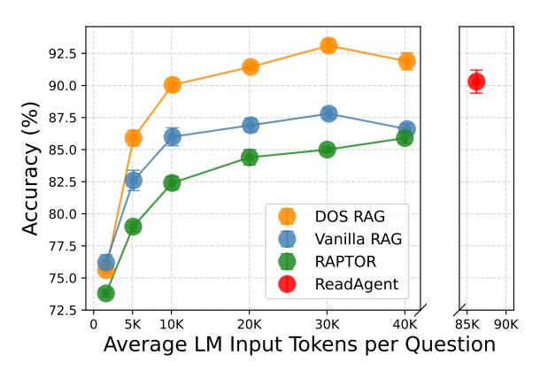
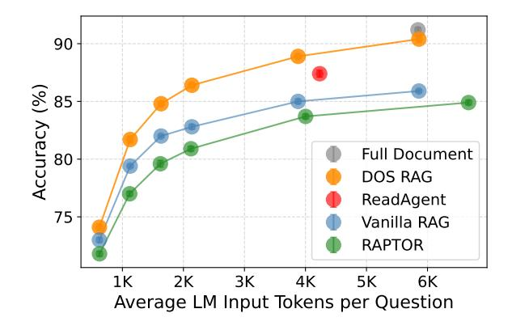
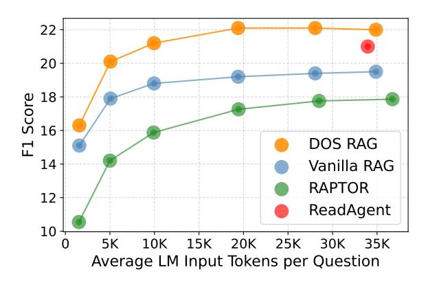
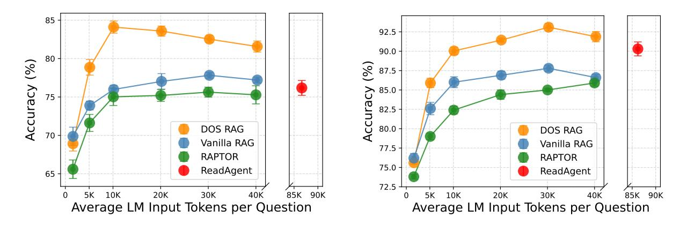
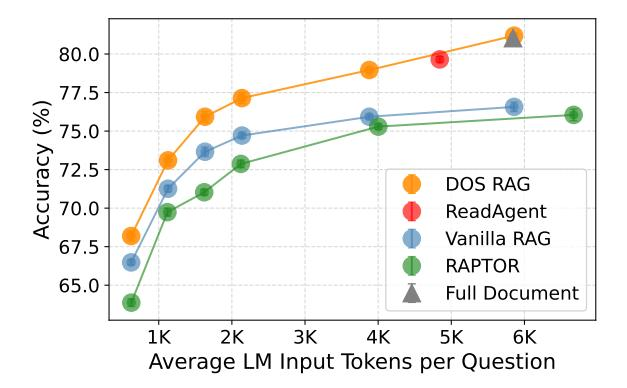

# **Stronger Baselines for Retrieval-Augmented Generation** with Long-Context Language Models

Alex Laitenberger and Christopher D. Manning and Nelson F. Liu

Stanford University, USA alaiten@stanford.edu

#### Abstract

With the rise of long-context language models (LMs) capable of processing tens of thousands of tokens in a single pass, do multistage retrieval-augmented generation (RAG) pipelines still offer measurable benefits over simpler, single-stage approaches? To assess this question, we conduct a controlled evaluation for QA tasks under systematically scaled token budgets, comparing two recent multistage pipelines, ReadAgent and RAPTOR, against three baselines, including DOS RAG (Document's Original Structure RAG), a simple retrieve-then-read method that preserves original passage order. Despite its straightforward design, DOS RAG consistently matches or outperforms more intricate methods on multiple long-context QA benchmarks. We recommend establishing DOS RAG as a simple yet strong baseline for future RAG evaluations, pairing it with emerging embedding and language models to assess trade-offs between complexity and effectiveness as model capabilities evolve.1

#### 1 Introduction

Recent advances in long-context language models (LMs), such as GPT-40, have expanded the token processing capabilities of LMs, enabling them to handle tens of thousands of tokens in a single pass. This raises a pivotal question: Are complex. multi-stage retrieval-augmented generation (RAG) pipelines still necessary when simpler, single-stage methods can now leverage these extended contexts effectively?

Retrieval-augmented generation (RAG) systems traditionally combine a *retriever*, which selects passages from a large corpus relevant to a given query, and a *reader*, typically a language model, to generate a final answer. (Lewis et al., 2020). Prior

Figure 1:  $\infty$ Bench En.MC performance of various multi-stage RAG systems and long-context baselines (mean  $\pm$  standard deviation over five runs). All methods use GPT-40 as the underlying reader. For token budgets greater than 5K, DOS RAG outperforms the complex multi-stage retrieval methods (ReadAgent and RAPTOR) by 2-8 points.

work has proposed a variety of retrieval strategies to circumvent the limited long-context reasoning ability of earlier reader LMs. For example, abstractive preprocessing, iterative chunk summarization, and agent-based retrieval loops have been used to compress or reason over texts that might otherwise exceed the input limits of early LMs (Chen et al., 2023; Sarthi et al., 2024; Lee et al., 2024; Sun et al., 2024, *inter alia*). While effective, these pipelines often introduce significant complexity and computational overhead.

In contrast, modern long-context LMs can now process substantial input sizes directly, suggesting that simpler retrieve-then-read strategies might suffice in certain settings. To assess the relevance of multi-stage pipelines under these new conditions, we conduct a controlled evaluation in which we systematically increase token budgets, analyzing how effectively each approach leverages extended contexts using a modern long-context LM (GPT-40) as the downstream reader. We compare two

 $^{1}\mathrm{We}$  release our code at https://github.com/ alex-laitenberger/stronger-baselines-rag.

recent multi-stage pipelines (ReadAgent and RAP-TOR; [Lee et al.,](#page-4-3) [2024;](#page-4-3) [Sarthi et al.,](#page-4-2) [2024\)](#page-4-2) against three baselines, including DOS RAG (Document's Original Structure RAG).

DOS RAG maintains a simple retrieve-then-read strategy and presents retrieved passages in their original document order. Despite its simplicity, our findings across three QA benchmarks (∞Bench, QuALITY, NarrativeQA) indicate that DOS RAG can match or even outperform more complex multistage pipelines on all evaluated retrieval token budgets (Figure [1,](#page-0-1) Figure [2,](#page-2-0) Figure [3\)](#page-2-1).

This work advocates for establishing DOS RAG as a simple yet strong baseline for RAG evaluations, pairing it with emerging embedding and language models to benchmark trade-offs between complexity and effectiveness as model capabilities continue to evolve.

## 2 Experimental Setup

We compare the performance of two recent multistage RAG pipelines (ReadAgent and RAPTOR) against three baselines (Vanilla RAG, the fulldocument baseline, and DOS RAG) on three long-context question-answering tasks (∞Bench, QuALITY and NarrativeQA). See Appendix [A](#page-4-5) for further details about experimental setup, implementation, and used prompts.

#### 2.1 Benchmarks

∞Bench. We evaluate systems on the English multiple-choice (En.MC) subset of ∞Bench [\(Zhang et al.,](#page-4-6) [2024\)](#page-4-6). The benchmark contains 229 multiple-choice questions on 58 documents (average length of 184K tokens).

QuALITY. We use the QuALITY benchmark [\(Pang et al.,](#page-4-7) [2022\)](#page-4-7), a multiple-choice questionanswering dataset over English context passages containing between 2K to 8K tokens. We evaluate systems on the development set, which contains 115 documents and 2,086 questions.

NarrativeQA. The NarrativeQA benchmark is a long-document question-answering dataset in English that challenges models to answer questions about stories by reading entire books or movie scripts [\(Kociský et al.](#page-4-8) ˇ , [2018\)](#page-4-8). We evaluate on the test set, which contains 355 stories (average length of 57K tokens) and 10,557 questions. Each story's questions are constructed such that high performance requires understanding the underlying

narrative, versus relying on shallow pattern matching.

#### 2.2 Multi-Stage RAG Pipelines

ReadAgent. ReadAgent handles long input contexts with a method inspired by human reading strategies [\(Lee et al.,](#page-4-3) [2024\)](#page-4-3). Concretely, ReadAgent prompts the LM with three steps: (1) episode pagination, where the LM forms a sequence of pages by identifying natural breakpoints in the text; (2) memory gisting, which compresses the content of each page into shorter "gist" summaries; and (3) interactive look-up, where the LM uses the query and the gists to identify pages to re-read and use to solve the final query. This approach extends the language model's context window by offloading the document's full detail into a page-wise gisted memory, retrieving original text only when needed.

RAPTOR. RAPTOR handles long documents by recursively organizing the text into a tree of hierarchical summaries [\(Sarthi et al.,](#page-4-2) [2024\)](#page-4-2). Concretely, it partitions the text into sentence-level chunks, clusters related chunks, and uses a language model to summarize each cluster. This process repeats, generating higher-level summaries until a final set of root nodes represents the entire document. At inference time, RAPTOR retrieves from different levels of the summary tree, balancing broad coverage against local detail.

#### 2.3 Baselines

Our three baselines are designed to benefit from and scale with stronger language models with improved long-context reasoning abilities.

Vanilla RAG. In our implementation the corpus is first split into chunks capped at 100 tokens, while preserving sentence boundaries where possible. We use neural retrieval with a sentence embedding model (Snowflake Arctic-embed-m 1.5 by [Merrick,](#page-4-9) [2024\)](#page-4-9) to encode both the query and the resulting text chunks into a shared embedding space. At inference time, chunks are ranked by cosine similarity to the query embedding, with the top-ranked chunks retrieved until a fixed input token budget (e.g., 10K tokens) is reached. The selected chunks, ordered by decreasing similarity, are then concatenated with the query to construct the input to the language model.

Full-Document Baseline. The full-document baseline prompts the model with *all* available text, preserving passage continuity and reducing the risk of missing key information through retrieval errors. We evaluate it only on the OuALITY benchmark. where document lengths fit within the model's context window.

Using the Document's Original Structure (DOS RAG). DOS RAG follows the same retrieval and embedding process as Vanilla RAG, but with one key difference: retrieved chunks are reordered to match their original document order, not sorted by similarity score. This reordering, achieved by tracking chunk positions, preserves passage continuity like the full-document baseline while still filtering irrelevant content like Vanilla RAG.

#### 3 Results

On all of ∞Bench, QuALITY, and NarrativeQA we find that DOS RAG performance consistently surpasses or matches complex multi-stage systems. See Appendix C for full results tables for all evaluated methods and benchmarks.

 $\infty$ **Bench.** Figure 1 summarizes performance under varying retrieval token budgets (from 1.5K to 40K tokens) when using GPT-4o as the reader.

At 30K tokens, DOS RAG achieves 93.1%, outperforming Vanilla RAG (87.8%) and both multistage methods by  $2-8$  points. Despite consuming more tokens (86K on average), ReadAgent underperforms DOS RAG at moderate budgets (20K), highlighting the diminishing returns of multi-stage complexity when a single-pass prompt can already incorporate the relevant context.

Finally, we see that DOS RAG performance begins to plateau as the retrieval budget grows beyond 30K tokens, while Vanilla RAG and RAPTOR also saturate at lower accuracies.

**QuALITY.** Figure 2 shows performance on the QuALITY benchmark, again with GPT-40 as the reader model. In this setting, we see that all approaches see a steady rise in accuracy as the retrieval budget grows. In particular, full-document baseline with GPT-4o achieves 91.2%, outperforming the best retrieval-augmented systems. Among the retrieval-augmented methods, DOS RAG again achieves the highest performance for token budgets of up to  $8K$ .

NarrativeQA. Figure 3 presents the results for NarrativeQA across retrieval token budgets ranging

Figure 2: QuALITY performance of various multi-stage RAG systems and long-context baselines. All methods use GPT-40 as the underlying reader. Prompting longcontext language models with entire documents (the fulldocument baseline) outperforms retrieval-augmented approaches, while DOS RAG performs the best under token budget constraints.

Figure 3: NarrativeQA performance of various multistage RAG systems and long-context baselines. All methods use GPT-4o-mini as the underlying reader. At each evaluated token budget, DOS RAG outperforms multi-stage retrieval systems and Vanilla RAG.

from 1.5K to 40K, with GPT-4o-mini as the reader. Once again, we find that ReadAgent and RAPTOR consistently underperform DOS RAG. In particular, DOS RAG achieves superior results while using only one third of the tokens required by ReadAgent. These trends remain consistent across five different evaluation metrics (see Table 5 in Appendix C for detailed results).

#### Analysis 4

Why is DOS RAG outperforming other exam**ined methods?** We identify four key strategies that underlie DOS RAG's performance and align with empirical findings from our evaluation:

1. Retrieving from *original passages* rather than generated summaries, thereby preserving source information, as in Vanilla RAG and the full-document baseline: We implemented Vanilla RAG as an exact ablation of RAPTOR that excludes generated summaries from the retrieval process. Vanilla RAG consistently outperforms RAPTOR across datasets and retrieval sizes, reinforcing our hypothesis that retrieving directly from original passages results in more robust QA, particularly as long-context LMs reduce the need for intermediate abstraction.

2. Prioritizing *retrieval recall over precision* while staying within the LM's *effective context size*: DOS RAG's performance increases consistently as the retrieval budget expands up to 30K tokens, after which it plateaus and declines, aligning with prior findings that LMs' effective context length remains limited [\(Liu et al.,](#page-4-10) [2024\)](#page-4-10). For shorter documents (6k–8k tokens), the full-document baseline outperforms all methods, indicating that maximizing recall, by including critical information *anywhere* in the input, can be more effective than precision filtering. However, beyond the effective context window, eliminating irrelevant chunks remains essential to maintain performance.

3. *Reordering retrieved passages* to maintain narrative and argument continuity: Vanilla RAG serves as an exact ablation of DOS RAG, excluding the reordering step. Across all benchmarks and retrieval budgets, DOS RAG consistently outperforms Vanilla RAG, underscoring the benefits of preserving passage order. Performance gain is especially high when the retrieval budget is expanded to tens of thousands of tokens. Retrieving more chunks brings us closer to the original document, but without order, the input becomes a disjointed, shuffled version.

4. *Simple vs. complex*: Multi-stage, agentic approaches like ReadAgent decompose QA into multiple LM calls, increasing token usage and latency. However, our evaluation shows that this added complexity does not necessarily improve performance. ReadAgent underperforms compared to DOS RAG at lower token budgets, highlighting the effectiveness of simpler RAG pipelines that use strong embedding models and long-context LMs.

## 5 Related Work

Our results contribute to a growing body of work on comparing and combining retrieval-augmented methods against and with long-context LMs.

In particular, a variety of past work has studied whether retrieval remains necessary in the retrieve-

then-read setting as language models gain better long-context reasoning capabilities. However, conclusions differ over time depending on the longcontext abilities of the specific LMs used in experiments. For example, [Xu et al.](#page-4-11) [\(2024\)](#page-4-11) show that a 4K-context LM (Llama2-70B) with simple retrieval augmentation matches the performance of a context-extended 16K-context Llama2-70B model prompted with the full document, while using far less computation. [Li et al.](#page-4-12) [\(2024\)](#page-4-12) revisit this question with a stronger long-context language model (GPT-4, with 32K token context) and find that directly prompting it with entire documents outperforms retrieval-augmented methods on several benchmarks, but at the cost of requiring substantially higher input token budgets. Finally, work by [Yu et al.](#page-4-13) [\(2024\)](#page-4-13) shows that preserving the original document order when prompting (i.e., as done in our DOS RAG baseline) improves retrievalaugmented performance beyond the long-context full-document baseline.

In contrast, rather than debating the merits of retrieval vs. long-context language models, our work compares the *combination* of retrieval and longcontext language models (e.g., DOS RAG) against more-complex multi-stage retrieval systems (i.e., ReadAgent and RAPTOR) to draw conclusions about design priorities for next-generation RAG systems. We believe that retrieval and long-context LMs are complementary in a variety of real-world applications.

#### 6 Conclusion

This work examined whether complex multi-stage retrieval pipelines still justify their added complexity given the emergence of long-context LMs capable of processing tens of thousands of tokens. Our controlled evaluation under systematically scaled token budgets shows that simpler methods like DOS RAG can effectively match or even outperform multi-stage pipelines such as ReadAgent and RAPTOR in QA tasks, without intermediate summarization or agentic processing. Based on these findings, we recommend establishing DOS RAG as a simple yet strong baseline for future RAG evaluations, pairing it with emerging embedding and language models to systematically assess trade-offs between complexity and effectiveness as model capabilities evolve.

#### Limitations

Although our results indicate that simpler retrievalthen-read approaches can match or outperform more intricate multi-stage RAG pipelines when paired with long-context language models, our study has several limitations that qualify the generality of these findings.

Our experiments focus on multiple-choice and short-answer reading comprehension tasks on single long input documents. While these settings provide useful testbeds for long-context reasoning, it is unclear whether the trends hold for more diverse tasks such as open-ended generation, tasks that require reasoning over multiple documents, or complex reasoning that requires specialized domain knowledge (e.g., in scientific or legal domains). Future work should investigate whether the benefits of simply preserving document continuity extend to these settings and whether specialized retrieval or summarization steps prove more valuable.

In addition, cost and latency considerations factor heavily into whether large-context prompting offers a practical alternative to complex multi-stage RAG pipelines in practice. While our comparisons accounted for comparable input token budgets during inference, they did not comprehensively assess efficiency across the full processing pipeline, including the costs of embedding and preprocessing documents. We estimate that more complex preprocessing translates into higher cost, but further work is needed to quantify these trade-offs systematically, particularly for high-throughput or resource-limited settings.

## References

- Howard Chen, Ramakanth Pasunuru, Jason Weston, and Asli Celikyilmaz. 2023. Walking down the memory maze: Beyond context limit through interactive reading. ArXiv:2310.05029.
- Tomáš Kociský, Jonathan Schwarz, Phil Blunsom, Chris ˇ Dyer, Karl Moritz Hermann, Gábor Melis, and Edward Grefenstette. 2018. [The NarrativeQA reading](https://doi.org/10.1162/tacl_a_00023) [comprehension challenge.](https://doi.org/10.1162/tacl_a_00023) *Transactions of the Association for Computational Linguistics*, 6:317–328.
- Kuang-Huei Lee, Xinyun Chen, Hiroki Furuta, John Canny, and Ian Fischer. 2024. A human-inspired reading agent with gist memory of very long contexts. In *Proc. of ICML*.
- Patrick Lewis, Ethan Perez, Aleksandra Piktus, Fabio Petroni, Vladimir Karpukhin, Naman Goyal, Heinrich Küttler, Mike Lewis, Wen tau Yih, Tim Rocktäschel, Sebastian Riedel, and Douwe Kiela. 2020.

Retrieval-augmented generation for knowledgeintensive NLP tasks. In *Proc. of NeurIPS*.

- Zhuowan Li, Cheng Li, Mingyang Zhang, Qiaozhu Mei, and Michael Bendersky. 2024. Retrieval augmented generation or long-context LLMs? a comprehensive study and hybrid approach. In *Proc. of EMNLP: Industry Track*.
- Nelson F. Liu, Kevin Lin, John Hewitt, Ashwin Paranjape, Michele Bevilacqua, Fabio Petroni, and Percy Liang. 2024. Lost in the middle: How language models use long contexts. *Transactions of the Association for Computational Linguistics*, 12:157–173.
- Luke Merrick. 2024. Embedding and clustering your data can improve contrastive pretraining. ArXiv:2407.18887.
- Richard Yuanzhe Pang, Alicia Parrish, Nitish Joshi, Nikita Nangia, Jason Phang, Angelica Chen, Vishakh Padmakumar, Johnny Ma, Jana Thompson, He He, and Samuel R. Bowman. 2022. QuALITY: Question answering with long input texts, yes! In *Proc. of NAACL*.
- Parth Sarthi, Salman Abdullah, Aditi Tuli, Shubh Khanna, Anna Goldie, and Christopher D. Manning. 2024. RAPTOR: Recursive abstractive processing for tree-organized retrieval. In *Proc. of ICLR*.
- Simeng Sun, Yang Liu, Shuohang Wang, Dan Iter, Chenguang Zhu, and Mohit Iyyer. 2024. PEARL: Prompting large language models to plan and execute actions over long documents. In *Proc. of EACL*.
- Peng Xu, Wei Ping, Xianchao Wu, Lawrence McAfee, Chen Zhu, Zihan Liu, Sandeep Subramanian, Evelina Bakhturina, Mohammad Shoeybi, and Bryan Catanzaro. 2024. Retrieval meets long context large language models. In *Proc. of ICLR*.
- Tan Yu, Anbang Xu, and Rama Akkiraju. 2024. In defense of RAG in the era of long-context language models. ArXiv:2409.01666.
- Xinrong Zhang, Yingfa Chen, Shengding Hu, Zihang Xu, Junhao Chen, Moo Khai Hao, Xu Han, Zhen Leng Thai, Shuo Wang, Zhiyuan Liu, and Maosong Sun. 2024. ∞bench: Extending long context evaluation beyond 100K tokens. In *Proc. of ACL*.

#### A Experimental Setup Details

#### A.1 Models and Computational Resources

Throughout our experiments, we use the Snowflake Arctic-embed-m 1.5 model to embed queries and documents for retrieval, which has a size of 109M parameters [\(Merrick,](#page-4-9) [2024\)](#page-4-9).

To better understand the effect of reader capability, we conduct experiments with GPT-4omini ("gpt-4o-mini-2024-07-18") and GPT-4o

("gpt-4o-2024-11-20") as the reader language models. OpenAI does not publicly disclose the number of parameters for these models.

All experiments use greedy decoding for response generation. Our computational budget primarily consisted of API calls to OpenAI, with an estimated total token usage of 2 billion tokens (2B) across all experiments. Since inference was conducted via API, no local GPUs were used for model execution.

For retrieval and preprocessing, we used a local Macbook. The total compute time for retrieval and data preparation was approximately 12 CPU hours.

## A.2 Benchmark Licensing and Usage

The benchmarks used in this study have the following license terms:

- ∞Bench: MIT License
- QuALITY: CC BY 4.0
- NarrativeQA: Apache-2.0 License

These datasets have been used strictly in accordance with their intended research purposes, as specified by their respective licenses. No modifications were made that would alter their intended scope or permitted usage. All evaluations conducted in this study fall within standard research practices, and no dataset derivatives have been deployed outside of a research context.

We did not conduct separate checks for personally identifiable information (PII) or offensive content beyond the dataset providers' original curation efforts. The responsibility for anonymization and content moderation lies with the original dataset creators. However, we relied on the fact that these benchmarks are widely used in research and released under established licenses, which include ethical considerations in their curation.

No personal data was stored, processed, or collected as part of this work. Additionally, no dataset derivatives were created, ensuring that any potential privacy risks remain within the scope of the original dataset publication.

## A.3 Hyperparameters

In this study, we analyze the impact of retrieval hyperparameters on RAG performance. Unlike prior work, we do not train new models but instead evaluate how different retrieval depth, input token length, and chunking strategies influence final performance.

The primary hyperparameters studied include the maximum input length to the reader model. It varied from 500, 1K, 1.5K, 2K, 4K, 6K, 8K, 10K, 20K, 30K, 40K tokens.

## A.4 Parameters for Packages

For sentence segmentation, we use NLTK with its default model. For evaluation, we use the 'evaluate' package (evaluate.load()), computing the following metrics with default parameters:

- F1-score
- BLEU-1, BLEU-4
- METEOR
- ROUGE-L

All implementations are taken from the Hugging Face evaluate library, using the latest available version at the time of the experiments (evaluate==0.4.3). No modifications were made to the implementations.

## A.5 Use of AI Assistance

During this research, we used ChatGPT to assist with coding, debugging, and editing. Specifically:

- Coding and Debugging: ChatGPT was used as a coding assistant for troubleshooting errors, generating boilerplate code, and refining scripts.
- Paper Writing and Editing: ChatGPT was used for grammar suggestions, phrasing improvements, and structural refinements of the paper. All technical content and research contributions were fully authored by the authors.

The final decisions on all implementations and manuscript edits were made by the authors.

# A.6 ReadAgent

In our experiments, we adapt ReadAgent from its official public demo notebook with minimal changes. Since many of the documents in our benchmarks do not contain reliable paragraph boundaries, we use individual sentences as the smallest unit for pre-processing and building ReadAgent's "pages". Following [Lee et al.](#page-4-3) [\(2024\)](#page-4-3), we allow ReadAgent to look up between 1 and 6 pages during inference (the best-performing range in the original paper). In rare cases where the shortened pages plus gists still exceeded the token limit, we omitted those queries from evaluation (for instance, one document in ∞Bench was dropped).

# A.7 RAPTOR

We implement RAPTOR using the official repository. To match our other systems, we use the NLTK library for sentence segmentation and the Snowflake Arctic-embed-m 1.5 embedding model [\(Merrick,](#page-4-9) [2024\)](#page-4-9) to embed and cluster text chunks. In all experiments, we use GPT-4o-mini to build the tree of hierarchical summaries to reduce API costs (though note that we experiment with both GPT-4omini and GPT-4o as the downstream reader).

## A.8 Prompting

| Prompt A.1: multiple-choice QA                                                                                                                                                                                                                                                                                                                                                                                                                                   |
|------------------------------------------------------------------------------------------------------------------------------------------------------------------------------------------------------------------------------------------------------------------------------------------------------------------------------------------------------------------------------------------------------------------------------------------------------------------|
| [Start of Context]: {context} [End of Context] [Start of Question]: {questionAndOptions} [End of Question] [Instructions:] Based on the context provided, select the most accurate answer to the question from the given op tions. Start with a short explanation and then provide your answer as [[1]] or [[2]] or [[3]] or [[4]]. For example, if you think the most accurate answer is the first option, respond with [[1]]. |
|                                                                                                                                                                                                                                                                                                                                                                                                                                                                  |
| Prompt A.2: QA generation                                                                                                                                                                                                                                                                                                                                                                                                                                        |
|                                                                                                                                                                                                                                                                                                                                                                                                                                                                  |

| [Start of Context]:                                                                                   |
|-------------------------------------------------------------------------------------------------------|
| {context}                                                                                             |
| [End of Context]                                                                                      |
| [Start of Question]:                                                                                  |
| {question}                                                                                            |
| [End of Question]                                                                                     |
| [Instructions:] - Answer the question **only** based on                                               |
| the provided context.                                                                                 |
| - Keep the answer **short and factual** (preferably be                                                |
| tween 1-20 words).                                                                                    |
| - Do **not** provide explanations or additional details                                               |
| beyond what is necessary.                                                                             |
| - If the answer is **not explicitly stated** in the context, respond with: "Not found in context." |
|                                                                                                       |

# B Comparing GPT-4o-mini to GPT-4o

Figure [4](#page-7-0) provides a side-by-side comparison of GPT-4o-mini and GPT-4o for the ∞Bench results.

# C Full Results

∞Bench Results. Table [1](#page-7-1) presents the ∞Bench results for various systems and baselines using GPT-4o-mini. Table [2](#page-8-0) reports the same results with GPT-4o.

QuALITY Results. Table [3](#page-8-1) presents the QuAL-ITY results for various systems and baselines using GPT-4o-mini. Figure [5](#page-7-2) illustrates the accuracy progression as LM input tokens increase. Table [4](#page-8-2)

reports the same results but with GPT-4o as the reader.

NarrativeQA Results. Table [5](#page-9-0) presents the results for the NarrativeQA test set across various systems and baselines, using GPT-4o-mini as the reader. Due to issues with the original NarrativeQA download script, three out of 355 stories from the test set were inaccessible, as their document files were empty. Consequently, our results are reported for 352 documents and 10,391 questions for all methods.

Figure 4:  $\infty$ Bench En.MC performance of various multi-stage RAG systems and long-context baselines (mean  $\pm$  standard deviation over five runs). Comparison between GPT-4o-mini (left) and GPT-4o (right) as the reader. GPT-4o generally achieves higher accuracy, with DOS RAG peaking at a higher LM input token count, suggesting a larger effective context size. The ReadAgent results further indicate that GPT-4o can better utilize large context sizes, reaching performance levels generally comparable to the DOS RAG results despite using an excessive number of input tokens.

|                        | Maximum Retrieval Token Budget           |                                      |                                      |                                      |                                      |                                      |
|------------------------|------------------------------------------|--------------------------------------|--------------------------------------|--------------------------------------|--------------------------------------|--------------------------------------|
| Method                 | 1.5K                                     | 5K                                   | 10K                                  | 20K                                  | 30K                                  | 40K                                  |
| Vanilla RAG DOS RAG | $69.9\% + 1.2\%$ $68.9\% + 1.0\%$     | $73.9\% + 0.6\%$ $78.9\% + 1.0\%$ | $76.0\% + 0.5\%$ $84.1\% + 0.8\%$ | $77.0\% + 1.0\%$ $83.6\% + 0.7\%$ | $77.8\% + 0.4\%$ $82.5\% + 0.4\%$ | $77.2\% + 0.4\%$ $81.6\% + 0.7\%$ |
| RAPTOR                 | $65.6\% \pm 1.2\%$                       | $71.6\% + 1.1\%$                     | $75.0\% + 1.1\%$ $75.2\% + 0.8\%$    |                                      | $75.6\% + 0.7\%$                     | $75.3\% + 1.2\%$                     |
| ReadAgent              | (Avg. Tokens: 86K) $76.2\% \pm 1.0\%$ |                                      |                                      |                                      |                                      |                                      |

Table 1:  $\infty$ Bench En.MC performance of various systems with GPT-4o-mini (mean  $\pm$  standard deviation over five runs). ReadAgent uses its default configuration, and its average tokens-per-query is shown for comparison. DOS RAG consistently outperforms all other methods for retrieval budgets of 5K tokens and above being the preferred choice in terms of both performance and efficiency.

Figure 5: Accuracy progression with increasing LM input tokens for the QuALITY development set with GPT-4o-mini (mean  $\pm$  standard deviation over five runs)

|                        | Maximum Retrieval Token Budget |                              |                              |                              |                              |                              |
|------------------------|--------------------------------|------------------------------|------------------------------|------------------------------|------------------------------|------------------------------|
| Method                 | 1.5K                           | 5K                           | 10K                          | 20K                          | 30K                          | 40K                          |
| Vanilla RAG DOS RAG | 76.2% ± 0.6% 75.6% ± 0.2%   | 82.6% ± 0.8% 85.9% ± 0.6% | 86.0% ± 0.7% 90.0% ± 0.5% | 86.9% ± 0.5% 91.4% ± 0.2% | 87.8% ± 0.4% 93.1% ± 0.5% | 86.6% ± 0.4% 91.9% ± 0.7% |
| RAPTOR                 | 73.8% ± 0.3%                   | 79.0% ± 0.4%                 | 82.4% ± 0.5%                 | 84.4% ± 0.6%                 | 85.0% ± 0.2%                 | 85.9% ± 0.4%                 |
| ReadAgent              |                                |                              | 90.3% ± 0.9%                 | (Avg. Tokens: 86K)           |                              |                              |

Table 2: ∞Bench En.MC performance of various systems with GPT-4o (mean ± standard deviation over five runs). ReadAgent uses its default configuration, and its average tokens-per-query is shown for comparison. DOS RAG consistently outperforms all other methods for retrieval budgets of 5K tokens and above being the preferred choice in terms of both performance and efficiency.

|                        | Maximum Retrieval Token Budget      |                              |                              |                              |                              |                              |
|------------------------|-------------------------------------|------------------------------|------------------------------|------------------------------|------------------------------|------------------------------|
| Method                 | 500                                 | 1K                           | 1.5K                         | 2K                           | 4K                           | 8K                           |
| Vanilla RAG DOS RAG | 66.5% ± 0.2% 68.2% ± 0.3%        | 71.3% ± 0.2% 73.1% ± 0.3% | 73.7% ± 0.3% 75.9% ± 0.4% | 74.7% ± 0.2% 77.1% ± 0.4% | 75.9% ± 0.2% 79.0% ± 0.1% | 76.6% ± 0.3% 81.2% ± 0.2% |
| RAPTOR                 | 63.9% ± 0.3%                        | 69.7% ± 0.3%                 | 71.0% ± 0.2%                 | 72.9% ± 0.3%                 | 75.3% ± 0.2%                 | 76.3% ± 0.4%                 |
| ReadAgent              | 79.7% ± 0.2% (Avg. Tokens: 4.8K) |                              |                              |                              |                              |                              |
| Full Document          |                                     |                              | 81.0% ± 0.3%                 | (Avg. Tokens: 5.8K)          |                              |                              |

Table 3: QuALITY development set performance of various systems with GPT-4o-mini (mean ± standard deviation over five runs). ReadAgent uses its default configuration, and its average tokens-per-query is shown for comparison. Full document augmentation (DOS RAG 8K tokens) achieves the highest performance on QuALITY, making retrieval unnecessary in this setting, while DOS RAG remains the best choice when retrieval token budgets are applied.

|                        | Maximum Retrieval Token Budget      |                              |                              |                              |                              |                              |
|------------------------|-------------------------------------|------------------------------|------------------------------|------------------------------|------------------------------|------------------------------|
| Method                 | 500                                 | 1K                           | 1.5K                         | 2K                           | 4K                           | 8K                           |
| Vanilla RAG DOS RAG | 73.0% ± 0.2% 74.1% ± 0.3%        | 79.4% ± 0.1% 81.7% ± 0.3% | 82.0% ± 0.1% 84.8% ± 0.1% | 82.8% ± 0.2% 86.4% ± 0.1% | 85.0% ± 0.2% 88.9% ± 0.2% | 85.9% ± 0.1% 90.4% ± 0.3% |
| RAPTOR                 | 71.8% ± 0.2%                        | 77.0% ± 0.2%                 | 79.6% ± 0.3%                 | 80.9% ± 0.2%                 | 83.7% ± 0.2%                 | 84.9% ± 0.2%                 |
| ReadAgent              | 87.4% ± 0.3% (Avg. Tokens: 4.2K) |                              |                              |                              |                              |                              |
| Full Document          |                                     |                              | 91.2% ± 0.2%                 | (Avg. Tokens: 5.8K)          |                              |                              |

Table 4: QuALITY development set performance of various systems with GPT-4o (mean ± standard deviation over five runs). ReadAgent uses its default configuration, and its average tokens-per-query is shown for comparison. Full document augmentation (DOS RAG 8K tokens) achieves the highest performance on QuALITY, making retrieval unnecessary in this setting, while DOS RAG remains the best choice when retrieval token budgets are applied.

| Method      | Token              | Metric |        |        |         |        |
|-------------|--------------------|--------|--------|--------|---------|--------|
|             | Avg Spent / Budget | F1     | Bleu-1 | Bleu-4 | Rogue-L | Meteor |
| Vanilla RAG | 1.5K / 1.5K        | 15.1   | 20.0   | 3.7    | 15.6    | 21.3   |
|             | 5K / 5K            | 17.9   | 21.1   | 4.3    | 18.4    | 24.5   |
|             | 10K / 10K          | 18.8   | 21.3   | 4.4    | 19.3    | 25.7   |
|             | 19K / 20K          | 19.2   | 21.4   | 4.5    | 19.8    | 26.3   |
|             | 28K / 30K          | 19.4   | 21.5   | 4.5    | 19.9    | 26.6   |
|             | 35K / 40K          | 19.5   | 21.6   | 4.6    | 19.9    | 26.6   |
| DOS RAG     | 1.5K / 1.5K        | 16.3   | 20.4   | 3.9    | 16.8    | 22.5   |
|             | 5K / 5K            | 20.1   | 21.7   | 4.5    | 20.6    | 27.0   |
|             | 10K / 10K          | 21.2   | 22.2   | 4.8    | 21.7    | 28.5   |
|             | 19K / 20K          | 22.1   | 22.6   | 5.0    | 22.5    | 29.6   |
|             | 28K / 30K          | 22.1   | 22.7   | 5.0    | 22.5    | 29.8   |
|             | 35K / 40K          | 22.0   | 22.7   | 5.1    | 22.3    | 29.6   |
| RAPTOR      | 1.5K / 1.5K        | 10.5   | 18.1   | 2.9    | 10.7    | 16.4   |
|             | 5K / 5K            | 14.2   | 19.6   | 3.5    | 14.5    | 20.3   |
|             | 10K / 10K          | 15.9   | 20.2   | 3.9    | 16.2    | 22.3   |
|             | 19K / 20K          | 17.3   | 20.8   | 4.2    | 17.6    | 23.8   |
|             | 28K / 30K          | 17.8   | 20.9   | 4.3    | 18.1    | 24.5   |
|             | 37K / 40K          | 17.9   | 21.1   | 4.4    | 18.2    | 24.7   |
| ReadAgent   | 34K / —            | 21.0   | 22.2   | 4.8    | 21.4    | 28.7   |

Table 5: NarrativeQA test set performance of various systems and metrics with GPT-4o-mini as the reader. The average spent tokens and budget per question are displayed for comparison. DOS RAG, with a token budget of 20-40K, outperforms all other methods on all metrics.