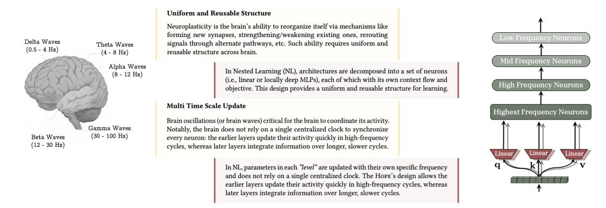
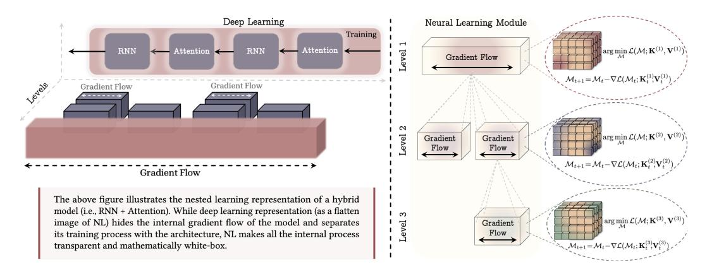
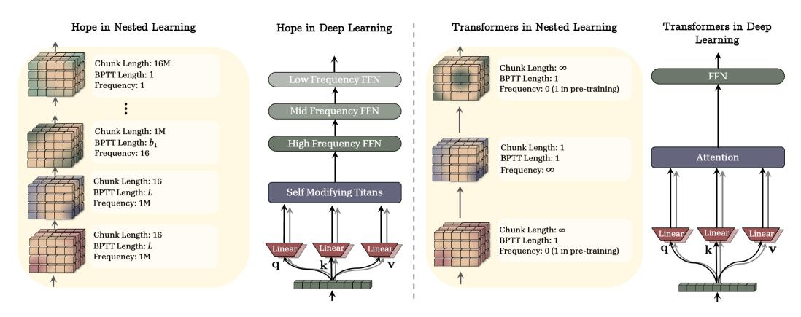

# Nested Learning: The Illusion of Deep Learning Architectures

Ali Behrouz

Google Research USA alibehrouz@google.com Meisam Razaviyayn

Google Research USA rezavyayn@google.com

Peiling Zhong Google Research

USA peilinz@google.com

Vahab Mirrokni

Google Research USA mirrokni@google.com

# Abstract

Over the last decades, developing more powerful neural architectures and simultaneously designing optimization algorithms to effectively train them have been the core of research efforts to enhance the capability of machine learning models. Despite the recent progresses, particularly in developing Language Models (LMs), there are fundamental challenges and unanswered questions about how such models can *continually learn/memorize, self-improved, and find "effective solutions,"*. In this paper, we present a new learning paradigm, called Nested Learning (NL), that coherently represents a model with a set of nested, multi-level, and/or parallel optimization problems, each of which with its own "*context flow*". NL reveals that existing deep learning methods learns from data through *compressing* their own context flow, and explain how *in-context learning* emerges in large models. NL suggests a path (a new dimension to deep learning) to design more expressive learning algorithms with more "*levels*", resulting in higher-order in-context learning abilities. In addition to its neuroscientifically plausible and mathematically white-box nature, we advocate for its importance by presenting three core contributions: (1) Deep Optimizers: Based on NL, we show that well-known gradient-based optimizers (e.g., Adam, SGD with Momentum, etc.) are in fact associative memory modules that aim to compress the gradients with gradient descent. Building on this insight, we present a set of more expressive optimizers with deep memory and/or more powerful learning rules; (2) Self-Modifying Titans: Taking advantage of NL's insights on learning algorithms, we present a novel sequence model that learns how to modify itself by learning its own update algorithm; and (3) Continuum Memory System: We present a new formulation for memory system that generalizes the traditional viewpoint of "long-term/short-term memory". Combining our self-modifying sequence model with the continuum memory system, we present a learning module, called HOPE, showing promising results in language modeling, continual learning, and long-context reasoning tasks.

# 1 Introduction

This version of the paper has been extensively summarized to fit the page limit of NeurIPS camera ready, and some materials, experiments, discussions, and methods are moved to appendix, which might make some parts hard to follow or cause inconsistencies. To avoid such cases, please read our arXiv version instead [\[1\]](#page-10-0).

Figure 1: The uniform and reusable structure as well as multi time scale update in the brain are the key components to unlock the continual learning in humans. Nested Learning (NL) allows for multi time-scale update for each component of the brain, while showing that well-known architectures such as Transformers are in fact linear layers with different frequency updates.

For decades, AI research has focused on designing machine learning algorithms that learn from data [\[2–](#page-10-1)[5\]](#page-10-2) or experience [\[6–](#page-10-3)[8\]](#page-10-4); often by optimizing an objective L(θ) over parameters θ ∈ Θ with gradient-based methods. While traditional machine learning techniques required careful engineering and domain expertise to design feature extractors, limiting their ability to directly process and learn from natural data [\[9\]](#page-10-5), deep representation learning offered a fully automated alternative to discover the representations needed for the task. Thereafter, deep learning has been an inseparable part of the large-scale computational models with seminal success in chemistry and biology [\[10\]](#page-10-6), games [\[11,](#page-10-7) [12\]](#page-10-8), computer vision [\[13,](#page-10-9) [14\]](#page-10-10), and multimodal and natural language understanding [\[15](#page-10-11)[–17\]](#page-10-12).

Stacking of multiple layers, as it is done in deep learning models, provides the models with larger capacity, better expressive power in representing complex features, and more internal computations (e.g., #FLOPS) [\[18](#page-11-0)[–20\]](#page-11-1), all of which are critical and desirable characteristics for static tasks that require in-distribution predictions over a previously fixed set. This deep design, however, is not a universal solution to all the challenges and cannot help the expressive power of the models in multiple aspects, for example: (i) The computational depth of deep models might not change with more layers [\[21,](#page-11-2) [22\]](#page-11-3), leaving their ability to implement complex algorithms untouched compared to traditional shallow approaches [\[23\]](#page-11-4); (ii) The capacity of some class of parameters might show marginal improvement with increasing the depth/width of the model [\[24\]](#page-11-5); (iii) The training process might converge to a suboptimal solution, mainly due to the suboptimal choice of the optimizer or its hyperparameters; and (iv) The model's ability to fast adapt to a new task, continually learn, and/or generalize to out-of-distribution data might not changed with stacking more layers and requires more careful designs.

The core part of the efforts to overcome the above challenges and to enhance the capability of deep learning models concentrate on: (1) developing more expressive class of parameters (i.e., neural architectures) [\[13,](#page-10-9) [25](#page-11-6)[–28\]](#page-11-7); (2) introducing objectives that can better model the tasks [\[29–](#page-11-8) [32\]](#page-11-9); (3) designing more efficient/effective optimization algorithms to find better solutions or with more resilience to forgetting [\[33–](#page-11-10)[36\]](#page-12-0); and (4) scaling the model size to enhance its expressivity, when the "right" choice of architecture, objective, and optimization algorithms are made [\[24,](#page-11-5) [37,](#page-12-1) [38\]](#page-12-2). Collectively, these advancements and new findings on scaling patterns of deep models have established the foundations upon which Large Language Models (LLMs) have been built.

The development of LLMs marks a pivotal milestone in deep learning research: a paradigm shift from task-specific models to more general-purpose systems with various emergent capabilities as a result of scaling the "right" architectures [\[38,](#page-12-2) [39\]](#page-12-3). Despite all their success and remarkable capabilities in diverse sets of tasks [\[15,](#page-10-11) [40,](#page-12-4) [41\]](#page-12-5), LLMs are largely static after their initial deployment phase, meaning that they successfully perform tasks learned during pre- or post-training, but are unable to continually acquire new capabilities beyond their immediate context. The only adaptable component of LLMs is their *in-context learning* ability–a (known to be emergent) characteristic of LLMs that enables fast adaption to the context and so perform zero- or few-shot tasks [\[38\]](#page-12-2). Beyond in-context learning, recent efforts to overcome the static nature of LLMs either are computationally expensive, require external components, lack generalization, and/or might suffer from catastrophic forgetting [\[42](#page-12-6)[–44\]](#page-12-7), which has led researchers to question if there is a need to revisit how to design machine learning

models and if a new learning paradigm beyond stacking of layers is required to unleash the capabilities of LLMs in continual setups.

Current Models only Experience the Immediate Present. As an analogy and to better illustrate the static nature of LLMs, we use the example of anterograde amnesia–a neurological condition where a person cannot form new long-term memories after the onset of the disorder, while existing memories remain intact [\[45\]](#page-12-8). This condition limits the person's knowledge and experiences to a short window of present and long past–before the onset of the disorder–which results in continuously experiencing the immediate present as if it were always new. The memory processing system of current LLMs suffer from a similar pattern. Their knowledge is limited to either, the immediate context that fits into their context window, or the knowledge in MLP layers that stores long-past, before the onset of *"end of pre-training."* This analogy, has motivated us to take inspiration from neurophysiology literature and how brain consolidate its short-term memories:

# 1.1 Human Brain Perspective and Neurophysiological Motivation

Human brain is highly efficient and effective when it comes to continual learning (a.k.a. effective context management), which is often attributed to neuroplasticity—the brain's remarkable capacity to change itself in response to new experiences, memories, learning, and even damage [\[46,](#page-12-9) [47\]](#page-12-10). Recent studies support that the formation of Long-term memory involves at least two distinct but complementary consolidation processes [\[48–](#page-12-11)[50\]](#page-13-0): (1) A rapid "online" consolidation (also known as synaptic consolidation) phase occurs immediately or soon after learning, even during wakefulness. This is when new and initially fragile memory traces are stabilized and begin transferring from short-term to long-term storage; (2) An "offline" consolidation (also known as systems consolidation) process repeats the replay of the recently encoded patterns—during sharp-wave ripples (SWRs) in the hippocampus, coordinated with cortical sleep spindles and slow oscillations—strengthens and reorganizes the memory and supports transfer to cortical sites [\[51–](#page-13-1)[53\]](#page-13-2).

Coming back to the analogy of anterograde amnesia, evidence indicates that the condition can impact both stages, but especially the online consolidation phase, mainly due to the fact that hippocampus is the gateway for encoding new declarative memories, and so its damage means new information never will be stored in long-term memory. As mentioned above, the design of LLMs, and more specifically Transformer-based backbones, suffers from a similar condition after the pre-training phase. That is, the information provided in the context, never impacts the long-term memory parameters (e.g., feedforward layers), and so the model is not capable of acquiring new knowledge or skill, unless the information is still stored in the short-term memory (e.g., attention). To this end, although the second stage is equally, or even more, crucial for the consolidation of memories, and its absence can damage the process and might cause loss of memory [\[54,](#page-13-3) [55\]](#page-13-4), in this work, we focus on the first stage: memory consolidation as an online process. We provide additional discussion on human brain perspective and its connection to NL in Appendix A.

Notations. We let x ∈ R N×din be the input, Mt represent the state of memory/model M at time t, K be the keys, V be the values, and Q be the query matrices. We use bold lowercase letters with subscript t to refer to the vector corresponds to the input t (i.e., kt, vt, and qt). We further refer to the distribution of any entities f as p(f). Through the paper, we use simple MLPs with LM ≥ 1 layers and residual connection as the architecture of the memory module M(·). When it is needed, we parameterized the memory module with θM ⊇ {W1, W2, . . . , WLM}, which at least includes the parameters of linear layers in the MLP. We use superscript with parenthesis to refer to parameters in different *levels* of nested learning (different update frequency): i.e., W(ℓ) .

# 2 Nested Learning

This section discusses the motivations, formal definitions, and general high-level implications of Nested Learning (NL). We start with a formulation of associative memory and then by using stepby-step examples, we build the intuition behind architecture decomposition and its connection to modeling a neural network as an integrated system of optimization problems. We aim to first show how existing methods and concepts in deep learning fall under the NL paradigm and then we present new formulations that go beyond traditional methods and/or provide insights on how to improve existing algorithms and designs.

Figure 2: Nested Learning Paradigm that represent a machine learning model and its training procedure as a set of nested optimization problems. (Left) An example of Hybrid architecture. While deep learning perspective, as the flattened image of NL, does not provide insight about the depth of computation in the blocks, NL transparently represent all the inner gradient flows. (Right) A Neural Learning Module: A computational model that learns how to compress its own context flow. For example, the first level corresponds to the model's the most outer-loop training, often refer to as "*pre-training*" step.

# 2.1 Associative Memory

Associative memory—the ability to form and retrieve connections between events—is a fundamental mental process and is an inseparable component of human learning [\[56\]](#page-13-5). Often in the literature, the concept of memorization and learning are used interchangeably; in neuropsychology literature, however, these two are clearly distinguished. More specifically, following neuropsychology literature [\[57\]](#page-13-6), we build our terminology based on the following definition of memory and learning:

#### Learning vs. Memorization:

*Memory is a neural update caused by an input, and learning is the process for acquiring effective and useful memory.*

In this work, our goal is to first show that all the elements of a computational sequence model, including optimizers and neural networks, are *associative memory systems* that compress their own *context flow*. Broadly speaking, associative memory is an operator that maps a set of keys to a set of values. We follow the general definition of associative memory by Behrouz et al. [\[58\]](#page-13-7):

Definition 1 (Associative Memory). *Given a set of keys* K ⊆ R dk *and values* V ⊆ R dv *, associative memory is an operator* M : K → V *that maps two sets of keys* K *and values* V*. To learn such mapping from the data, an objective* L˜(·; ·) *measures the quality of the mapping and* M *can be defined as:*

$$\mathcal{M}^* = \arg\min_{\mathcal{M}} \quad \tilde{\mathcal{L}}(\mathcal{M}(\mathcal{K}); \mathcal{V}). \tag{1}$$

While the operator itself is a memory and the mapping acts as a memorization process (i.e., memorizing the connections of events in the context), acquiring such effective operator based on the data, is a learning process. It is notable that, here, keys and values can be any arbitrary events that memory aims to map them and are not limited to tokens. Later in this section, we will discuss that given a context flow, keys and values might be tokens, gradients, sub-sequences, etc. Furthermore, while the term of associative memory is more common in neuroscience and neuropsychology literature, the above formulation is also closely related to data compression and low-dimensional representation. That is, one can interpret the optimization process in [Equation 1](#page-3-0) as the training process of a network M(.) that aims to compress the mappings into its parameters and so represent them in a lower dimensional space.

In sequence modeling, where keys and values are input tokens (e.g., tokenized text), the choice of objective and the optimization process for solving [Equation 1](#page-3-0) can result in distinct sequence modeling architectures (see [59] and [58]) such as global/local softmax attention [27], or other modern recurrent models [28, 60, 61]. This simple formulation of sequence models provides us with better understanding of their internal process and also a tool to simply compare their modeling power based on their objective and optimization process. In the following, using step-by-step examples, we discuss how this formulation can be applied to all components of a neural architecture (including its optimization process in pre-training) and in fact, how a model is an integrated system of multi-level, nested, and or parallel memories, each of which with its own context flow.

A Simple Example of MLP Training. We start with a simple example, in which we aim to train a 1-layer MLP (parameterized with W) for task  $\mathcal{T}$  and on dataset  $\mathcal{D}_{\text{train}} = \{x_1, \dots, x_{|\mathcal{D}_{\text{train}}|}\}$  by optimizing the objective  $\mathcal{L}(\cdot; \cdot)$  with gradient descent. In this case, the training process is equivalent to the following optimization problem:

$$W^* = \arg\min_{W} \ \mathcal{L}(W; \mathcal{D}_{\text{train}}), \tag{2}$$

whose optimization by gradient descent results in a weight update rule equivalent to:

$$W_{t+1} = W_t - \eta_{t+1} \nabla_{W_t} \mathcal{L}(W_t; x_{t+1})$$
(3)

$$= W_t - \eta_{t+1} \nabla_{y_{t+1}} \mathcal{L}(W_t; x_{t+1}) \otimes x_{t+1}, \quad \text{where } x_{t+1} \sim \mathcal{D}_{\text{train}}, \tag{4}$$

where  $y_{t+1} = Wx_{t+1}$  is the output of the model for input  $x_{t+1}$ . Given this formulation, one can let  $u_{t+1} = \nabla_{y_{t+1}} \mathcal{L}(W_t; x_{t+1})$  and reformulate the backpropagation process as the solution to an optimization problem on finding an optimal associative memory that maps input data points  $\mathcal{D}_{\text{train}} = \{x_t\}_{t=1}^{|\mathcal{D}_{\text{train}}|}$  to their corresponding  $u_{t+1} = \nabla_{y_{t+1}} \mathcal{L}(W_t; x_{t+1})$ . That is, we let  $\mathcal{M}(\cdot) = W_t$  parametrizes the memory, and use dot-product similarity to measure the quality of  $W_t$ 's mapping between  $x_{t+1}$  and  $\nabla_{y_{t+1}} \mathcal{L}(W_t; x_{t+1})$ :

$$W_{t+1} = \arg\min_{W} \langle Wx_{t+1}, u_{t+1} \rangle + \frac{1}{2\eta_{t+1}} \|W - W_{t}\|_{2}^{2}$$
 (5)

$$= \arg \min_{W} \langle W x_{t}, \nabla_{y_{t+1}} \mathcal{L}(W_{t}; x_{t+1}) \rangle + \frac{1}{2\eta_{t+1}} \|W - W_{t}\|_{2}^{2}.$$
 (6)

In the above formulation,  $u_{t+1} = \nabla_{y_{t+1}} \mathcal{L}(W_t; x_{t+1})$  can be interpreted as a *local surprise signal in representation space* that quantifies the mismatch between the current output and the structure the objective  $\mathcal{L}(\cdot;\cdot)$  enforces. Therefore, this formulation translates the training phase of the model as a process of acquiring effective memory that maps data samples to their Local Surprise Signal (LSS) in representation space—defined as the mismatch between the current output and the structure enforced by the objective  $\mathcal{L}(\cdot;\cdot)$ . Accordingly, in this example, our model has a *single gradient flow* over the data samples, which is only active over dataset  $\mathcal{D}_{\text{train}} = \{x_1, \dots, x_{|\mathcal{D}_{\text{train}}|}\}$  and will be frozen for any other data samples afterwards (a.k.a inference or test time).

Next, in the above example, we replace the gradient descent algorithm with its enhanced momentumbased variant, resulting in an update rule of:

$$W_{t+1} = W_t - \mathbf{m}_{t+1},\tag{7}$$

$$\mathbf{m}_{t+1} = \mathbf{m}_t - \eta_{t+1} \nabla_{W_t} \mathcal{L}(W_t; x_{t+1}) = \mathbf{m}_t - \eta_{t+1} \nabla_{u_{t+1}} \mathcal{L}(W_t; x_{t+1}) \otimes x_{t+1}. \tag{8}$$

In Equation 8, given the previous state of Equation 7 (at time t), the value of  $\nabla_{W_t} \mathcal{L}(W_t; x_{t+1})$  or similarly  $\nabla_{y_{t+1}} \mathcal{L}(W_t; x_{t+1})$  are independent of recurrence in Equation 8 and so can be pre-computed beforehand. To this end, we let  $u_{t+1} = \nabla_{W_t} \mathcal{L}(W_t; x_{t+1})$ , and so Equation 8 can be reformulated as:

$$W_{t+1} = W_t - \mathbf{m}_{t+1},\tag{9}$$

$$\mathbf{m}_{t+1} = \arg\min_{\mathbf{m}} -\langle \mathbf{m}, \nabla_{W_t} \mathcal{L}(W_t; x_{t+1}) \rangle + \eta_{t+1} \|\mathbf{m} - \mathbf{m}_t\|_2^2$$
(10)

$$= \arg\min_{\mathbf{m}} -\langle \mathbf{m} \, x_{t+1}, \nabla_{y_{t+1}} \mathcal{L}(W_t; x_{t+1}) \rangle + \eta_{t+1} \, \|\mathbf{m} - \mathbf{m}_t\|_2^2, \tag{11}$$

where the optimization problem in Equation 10 is equivalent to on step of gradient descent with adaptive learning rate of  $\eta_{t+1}$ . Given these formulation, one can interpret the momentum term as either: (1) a key-less associative memory that compress the gradients into its parameters, or (2) an associative memory that learns how to map data points to their corresponding LSS-value. Interestingly, this formulation reveals that gradient descent with momentum is indeed a two-level

optimization process, where the memory is optimized by simple gradient descent algorithm. This process is closely related to Fast Weight Programs (FWPs) [62], where the weight update process (i.e., Equation 9) is the slow network that its momentum weight is generated by a fast network (i.e., Equation 10).

Concluding the above examples, we observed that the training process of a 1-layer MLP with: (1) Gradient descent is a 1-level associative memory that learns how to map data points to their corresponding LSS-value; and (2) Gradient descent with momentum is a 2-level associative memory (or optimization process) that the inner-level learns to store gradient values into its parameters, and then the outer-level updates the slow weight (i.e.,  $W_t$ ) with the value of the inner-level memory. While these are the most simple examples with respect to both architecture and optimizer algorithms, one might ask if similar conclusion can be made in more complex setups.

An Example of Architectural Decomposition. In the next example, we replace the MLP module with a linear attention [60]. That is, we aim to train a 1-layer linear attention for task  $\mathcal T$  and on a sequence of  $\mathcal D_{\text{train}} = \{x_1, \dots, x_{|\mathcal D_{\text{train}}|}\}$  by optimizing the objective  $\mathcal L$  with gradient descent. Recalling the unnormalized linear attention formulation:

$$\mathbf{k}_t = x_t W_{\mathbf{k}}, \qquad \mathbf{v}_t = x_t W_{\mathbf{v}}, \qquad \mathbf{q}_t = x_t W_{\mathbf{q}},$$
 (12)

$$\mathcal{M}_t = \mathcal{M}_{t-1} + \mathbf{v}_t \mathbf{k}_t^{\top}, \tag{13}$$

$$y_t = \mathcal{M}_t \mathbf{q}_t . \tag{14}$$

As discussed in earlier studies [58, 59], the recurrence in Equation 13 can be reformulated as the optimization process of a matrix-valued associative memory  $\mathcal{M}_t(\cdot)$ , in which, it aims to compress the mappings of keys and values into its parameters. In more details, in Definition 1, if we let  $\tilde{\mathcal{L}}(\mathcal{M}_{t-1}; \mathbf{k}_t, \mathbf{v}_t) := -\langle \mathcal{M}_{t-1} \mathbf{k}_t, \mathbf{v}_t \rangle$  and aim to optimize the memory with gradient descent, the memory update rule is: (Note that  $\nabla \tilde{\mathcal{L}}(\mathcal{M}_{t-1}; \mathbf{k}_t, \mathbf{v}_t) = \mathbf{v}_t \mathbf{k}_t^{\top}$  and we let learning rate  $\eta_t = 1$ )

$$\mathcal{M}_{t+1} = \arg\min_{\mathcal{M}} \left\langle \mathcal{M} \mathbf{k}_{t+1}, \mathbf{v}_{t+1} \right\rangle + \|\mathcal{M} - \mathcal{M}_{t}\|_{2}^{2} \quad \text{with gradient descent}, \tag{15}$$

$$\Rightarrow \mathcal{M}_{t+1} = \mathcal{M}_t - \nabla \tilde{\mathcal{L}}(\mathcal{M}_t; \mathbf{k}_{t+1}, \mathbf{v}_{t+1}) = \mathcal{M}_t + \mathbf{v}_{t+1} \mathbf{k}_{t+1}^{\mathsf{T}}, \tag{16}$$

which is equivalent to the update rule of an unnormalized linear attention in Equation 13. Also, note that as we observed in the first example, training a linear layer with gradient descent is a 1-layer optimization problem of an associative memory (see Equation 3) and so the general training/updating process of projection layers (i.e.,  $W_{\mathbf{k}}, W_{\mathbf{v}}$ , and  $W_{\mathbf{q}}$ ) is itself an optimization process of associative memory. Accordingly, this setup, i.e., training a linear attention with gradient descent, can be seen as a two-level optimization process, where the outer-loop (also known as training process) optimizes the projection layers with gradient descent, while the inner-loop optimizes the inner memory of  $\mathcal{M}_t$  with gradient descent.

Note that, as discussed above, here, we have two associative memories, and so each of which has their own optimization process and gradient flow. That is, in the optimization of outer-level parameters of  $W_{\mathbf{k}}, W_{\mathbf{v}}$ , and  $W_{\mathbf{q}}$  there is no gradient with respect to parameter  $\mathcal{M}(\cdot)$  and so there is no backpropagation through it. Similarly, in the inner-level, there is no backpropagation through projection layers and they are considered frozen. Furthermore, it is notable that in this example, the above formulation is also closely connected to FWPs perspective of linear attentions [63], where projections are considered slow weights, and memory update in Equation 13 is the fast weight update rule.

Architectural Decomposition with More Levels. In both above examples, we discussed simple cases, where they can be translated into 2-level optimization processes, which also coincides with their FWPs interpretations. In practice, however, we need to use more powerful optimization algorithms to train the model, and/or use more powerful recurrent update rule for memory. As a simple example, assume we use gradient descent with momentum to train a linear attention model. In the above examples, we show that how the linear attention component can be decomposed into two nested optimization problem. Similarly, here the model can be represented as a 2-level optimization problem, where (1) the inner level optimizes the memory to compress the context using gradient descent (see Equation 15), and (2) the outer level optimizes the projection layers with gradient descent with momentum. Interestingly, from the first example, we know that "gradient descent with momentum" algorithm itself is indeed a 2-level optimization problem where the momentum term itself is an associative memory that compress the past gradients into its parameters.

### 2.2 Nested Optimization Problems

In the previous section, we provided examples to demonstrate how one can decompose a machine learning model into a set of nested or multi-level optimization problems. Next, we first aim to present a formal formulation for nested learning problems and then define Neural Learning Module–an integrated computational system that learns from data.

As we observed in the previous section, while we decomposed the model into a set of optimization process, it is still unclear if we can define a hierarchy (or order) over these problems, and uniquely represent the model in this format. Inspired by the hierarchy of brain waves that indicates the information processing frequency rate of each part (discussed in [Section 1\)](#page-0-0), we use the update rate of each optimization problem to order the components in multiple levels. To this end, we let the one update step over one data point to be the unit of time, and define the update frequency rate of each component as:

Definition 2 (Update Frequency). *For any component of* A*, which can be a parametric component (e.g., learnable weights or momentum term in gradient descent in momentum) or a non-parametric component (e.g., attention block), we define its frequency, denoted as* fA*, as its number of updates per unit of time.*

Given the above update frequency, we can order the components of a machine learning algorithm based on operator (· ≻ ·). We let A to be faster than B and denote A ≻ B if: (1) fA > fB, or (2) fA = fB but the computation of the B's state at time t requires the computation of A's state at time t. In this definition, when A ⊁ B and B ⊁ A, we let A f = B, which indicates that A and B has the same frequency update, but their computation is independent of each other (Later, we provide an example of this cases in AdamW optimizer). Based on the above operator, we sort the components into an ordered set of "*levels*", where (1) components in the same level have the same frequency update, and (2) the higher the level is, the lower its frequency. Notably, based on the above definition, each component has its own optimization problem and so context. While we optimize the component's inner objective with gradient-based optimizers, the above statement is equivalent to having exclusive gradient flow for each component in the model. In general case, however, one can use non-parametric solution (as we later discuss about attention).

Neural Learning Module. Given the above definition of nested learning problems, we define neural learning module as a new way of representation of machine learning models that shows the model as an interconnected system of components, each of which with its own gradient flow. Note that, orthogonal to deep learning, nested learning allows us to define neural learning models with more levels, resulting in more expressive architecture.

*Nested learning allows computational models that are composed of multiple (multi-layer) levels to learn from and process data with different levels of abstraction and time-scales.*

Next, we study optimizers and well-known deep learning architectures from the nested learning perspective, and provide examples that how NL can help to enhance those components.

### 2.3 Optimizers as Learning Modules

In this section, we start by understanding how well-known optimizers and their variants are special instances of nested learning. Recall the gradient descent method with momentum,

$$W_{i+1} = W_i + \mathbf{m}_{i+1}$$
  
$$\mathbf{m}_{i+1} = \alpha_{i+1} \mathbf{m}_i - \eta_t \nabla \mathcal{L}(W_i; x_i),$$
 (17)

where matrix (or vector) mi is the momentum at state i and αi and ηi are adaptive learning and momentum rates, respectively. Assuming αi+1 = 1, the momentum term can be viewed as the result of optimizing the following objective with gradient descent:

$$\min_{\mathbf{m}} \langle \mathbf{m} \, \nabla \mathcal{L}(W_i; x_i)^{\top}, \mathbf{I} \rangle. \tag{18}$$

This interpretation shows that momentum can indeed be viewed as a meta memory module that learns how to memorize gradients of the objective into its parameters. Building on this intuition, in Section C.4 we show that Adam with a small modification is the optimal associative memory for the models' gradients. Next, we show that how this perspective can result in designing more expressive optimizers:

**Extension: More Expressive Association.** As discussed earlier, momentum is a value-less associative memory and so has limited expressive power. To address this issue, following the original definition of associative memory (i.e., mapping keys to values), we let value parameter  $\mathbf{v}_i = \mathbf{P}_i$  and so the momentum aims to minimize:

$$\min_{\mathbf{m}} \langle \mathbf{m} \, \nabla \mathcal{L}(W_i; x_i)^\top, \mathbf{P}_i \rangle, \tag{19}$$

using gradient descent, resulting in the update rule:

$$W_{i+1} = W_i + \mathbf{m}_{i+1}$$
  
$$\mathbf{m}_{i+1} = \alpha_{i+1} \mathbf{m}_i - \eta_t \mathbf{P}_i \nabla \mathcal{L}(W_i; x_i).$$
 (20)

This formulation is equivalent to using preconditioning the momentum GD. In fact, preconditioning means that the momentum term is an associative memory that learns how to compress the mappings between  $\mathbf{P}_i$  and the gradient term  $\nabla \mathcal{L}(W_i;x_i)$ . While any reasonable choice (e.g., random features) of preconditioning can improve the expressivity of the initial version of GD with momentum per se is a value-less memory (i.e., mapping all gradients to a single value), the above perspective gives more intuition about what preconditioning are more useful. That is, the momentum acts as a memory that aims to map gradients to their corresponding values, and so a function of gradients (e.g., information about Hessian) can provide the memory with a more meaningful mappings.

**Extension:** More Expressive Objectives. As discussed by Behrouz et al. [58], optimizing an inner objective of dot-product similarity results in Hebbian-like update rule, which can cause the memory to be less effective. A natural extension of this internal objective is to use  $\ell_2(\cdot)$  regression loss (for measuring the corresponding key-value mapping fitness) and minimize the loss function  $\|\mathbf{m}\nabla \mathcal{L}(W_i; x_i)^\top - \mathbf{P}_i\|_2^2$ , resulting in the update rule of:

$$W_{i+1} = W_i + \mathbf{m}_{i+1},\tag{21}$$

$$\mathbf{m}_{i+1} = \left(\alpha_{i+1}\mathbf{I} - \nabla \mathcal{L}\left(W_i; x_i\right)^{\top} \nabla \mathcal{L}\left(W_i; x_i\right)\right) \mathbf{m}_i - \eta_t \mathbf{P}_i \nabla \mathcal{L}\left(W_i; x_i\right), \tag{22}$$

This update is based on delta-rule [64] and so it allows the memory (momentum) to better manage its limited capacity and better memorize the series of past gradients.

**Extension:** More Expressive Memory. As discussed earlier, momentum can be viewed as a meta memory model that uses a linear layer (i.e., matrix-valued) to compress the past gradient values. Due to the linear nature of momentum, only linear functions of past gradients can be learned by its internal objective. To increase the learning capacity of this module, one alternative is to use alternative powerful persistent learning modules: i.e., replacing a linear matrix-valued memory for momentum with an MLP. Therefore, momentum as the a memory for the past gradients, has more capacity to capture the underlying dynamics of the gradients. To this end, we extend the formulation in Equation 17 as:

$$W_{i+1} = W_i + \mathbf{m}_{i+1} (\mathbf{u}_i), \quad \text{and} \quad \mathbf{m}_{i+1} = \alpha_{i+1} \mathbf{m}_i - \eta_t \nabla \mathcal{L}^{(2)}(\mathbf{m}_i; \mathbf{u}_i, \mathbf{I}), \tag{23}$$

where  $\mathbf{u}_i = \nabla \mathcal{L}(W_i; x_i)$  and  $\nabla \mathcal{L}^{(2)}(\cdot)$  is the internal objective of momentum (e.g., dot product similarity  $\langle \mathbf{m}(\mathbf{u}_i^{\mathsf{T}}), \mathbf{1} \rangle$ ). We refer to this variant as Deep Momentum Gradient Descent (DMGD).

**Extension:** None Linear Outputs. Building upon the above perspective, in which we see the momentum as a neural architecture, one common technique to enhance the representation power of momentum memory module is to use non-linearity on top of its output [28, 65]. That is, we re-formulate Equation 23 as:

$$W_{i+1} = W_i + \sigma\left(\mathbf{m}_{i+1}\left(\mathbf{u}_i\right)\right), \text{ and } \mathbf{m}_{i+1} = \alpha_{i+1}\mathbf{m}_i - \eta_t \nabla \mathcal{L}^{(2)}(\mathbf{m}_i; \mathbf{u}_i, \mathbf{I}),$$
 (24)

where  $\sigma(\cdot)$  is an arbitrary non-linearity. As an example, we let  $\sigma(\cdot) = \text{Newton-Schulz}(\cdot)$ , where  $\text{Newton-Schulz}(\cdot)$  is the iterative Newton-Schulz method [66], and  $\mathbf{m}(\cdot)$  be a linear layer; the resulted optimizer is equivalent to Muon optimizer [34].

Going Beyond Simple Backpropagation. As discussed earlier in Section 2.1, the pre-training process and backpropagation is a form of associative memory, where input data is mapped to the surprised caused by its predicted output  $\nabla_{u_t} \mathcal{L}(W_t; x_t)$ :

$$W_{t+1} = W_t - \eta_{t+1} \nabla_{W_t} \mathcal{L}(W_t; x_t) = W_t - \eta_{t+1} \nabla_{y_t} \mathcal{L}(W_t; x_t) \otimes x_t, \quad \text{where } x_t \sim \mathcal{D}_{\text{train}}, \quad (25)$$

which from the associative memory perspective is equivalent to one step of gradient descent in optimization process of:

$$\min_{W} \langle Wx_t, \nabla_{y_t} \mathcal{L}(W_t; x_t) \rangle. \tag{26}$$

As we discussed in Appendix C, the above formulation cause ignoring the dependencies of data samples like  $x_t$ . To extend it to a more powerful formulation where it also consider the dependencies of data points (which is extremely important when we use optimizer in the token space as they are not independent), we use  $L_2$  regression objective with one step of gradient descent as follows:

$$\min_{W} \|Wx_{t} - \nabla_{y_{t}} \mathcal{L}(W_{t}; x_{t})\|_{2}^{2}. \tag{27}$$

This formulation results in a new variant of gradient descent, which can be simplified as follows:

$$W_{t+1} = W_t \left( \mathbf{I} - x_t x_t^{\top} \right) - \eta_{t+1} \nabla_{W_t} \mathcal{L}(W_t; x_t)$$
(28)

$$= W_t \left( \mathbf{I} - x_t x_t^{\top} \right) - \eta_{t+1} \nabla_{y_t} \mathcal{L}(W_t; x_t) \otimes x_t, \quad \text{where } x_t \sim \mathcal{D}_{\text{train}},$$
 (29)

Later, we use this optimizer as the internal optimizer of our HOPE architecture.

# 3 HOPE: A Self-Referential Learning Module with Continuum Memory

Existing architectural backbones consist of (1) a *working memory* module (e.g., attention), which is responsible to actively fuse the information across sequence length, and (2) a feed-forward layer (e.g., MLP) that fuse information across features and acts as the persistent memory or knowledge storage of pre-training phase. From the NL perspective, pre-training is the phase that the most outer level of the learning module is updated over its *limited* context flow. Accordingly, in the continual setup, such pre-training phase is also rarely updated over time, and so its corresponding knowledge storage needs to rarely be updated over time. Given this intuition, we extend the traditional view-point of long-term/short-term memory system and suggest a knowledge storage feed-forward for each level (frequency domain).

Given the definition of frequency, Continuum Memory System (CMS) is formalized as a chain of MLP blocks  $\mathtt{MLP}^{(f_1)}(\cdot), \ldots, \mathtt{MLP}^{(f_k)}(\cdot)$ , each of which associated with a chunk size of  $C^{(\ell)} := \frac{\max_{\ell} C^{(\ell)}}{f_{\ell}}$  such that given input  $x = \{x_1, \ldots, x_T\}$  the output of the chain is calculated as (we disregard normalizations for the sake of clarity):

$$y_t = \text{MLP}^{(f_k)}(\text{MLP}^{(f_{k-1})}(\cdots \text{MLP}^{(f_1)}(x_t))),$$
 (30)

where the parameters of  $\ell$ -th MLP block, i.e.,  $\theta^{(f_{\ell})}$ , are updated every  $C^{(\ell)}$  steps:

$$\boldsymbol{\theta}_{i+1}^{(f_{\ell})} = \boldsymbol{\theta}_{i}^{(f_{\ell})} - \begin{cases} \sum_{t=i-C^{(\ell)}}^{i} \eta_{t}^{(\ell)} f(\boldsymbol{\theta}_{t}^{(f_{\ell})}; x_{t}) & \text{if } i \equiv 0 \pmod{C^{(\ell)}}, \\ 0 & \text{otherwise.} \end{cases}$$
(31)

In Appendix B.1, we discuss different variants of this formulation, including fully nested MLP layers. Here  $\eta_t^{(\ell)}$  are learning rates corresponds to  $\boldsymbol{\theta}^{(f_\ell)}$ , and  $f(\cdot)$  is the error component of an arbitrary optimizer (e.g.,  $\nabla \mathcal{L}(\boldsymbol{\theta}_t^{(f_\ell)}; x_t)$  in gradient descent). The conventional Transformer block [27] is a special instance of this formulation, where k=1. It is notable that Equation 31 provides an important interpretation: parameters  $\boldsymbol{\theta}_t^{(f_\ell)}$  are responsible for compressing their own context into the their parameters and so they are a representative of abstract knowledge of their context.

**HOPE.** We further present a self-referential learning module based on Titans [28] and our variant of gradient descent in Section B.1. Combining this self-referential sequence model with continuum memory system results in HOPE architecture.

Figure 3: A comparison of Hope architectural backbone with Transformers (Normalization and potential data-dependent components are removed for the sake of clarity).

Table 1: Performance of HOPE and baselines on language modeling and common-sense reasoning tasks. Hybrid models are marked with \*.

| Model                                                 | <b>Wiki.</b>   ppl↓                             | <b>LMB.</b> ppl↓                                   | LMB. acc ↑                                      | PIQA acc ↑                                      | Hella. acc_n↑                                   | Wino. acc ↑                                     | ARC-e acc ↑                                     | ARC-c acc_n ↑                                   | SIQA acc ↑                                      | BoolQ acc ↑                                     | Avg. ↑                                             |
|-------------------------------------------------------|----------------------------------------------------|----------------------------------------------------|----------------------------------------------------|----------------------------------------------------|----------------------------------------------------|----------------------------------------------------|----------------------------------------------------|----------------------------------------------------|----------------------------------------------------|----------------------------------------------------|----------------------------------------------------|
| HOPE (ours)                                           | 26.05                                              | 29.38                                              | 35.40                                              | 64.62                                              | 40.11                                              | 51.19                                              | 56.92                                              | 28.49                                              | 38.33                                              | 60.12                                              | 46.90                                              |
| 760M params / 30B tokens                              |                                                    |                                                    |                                                    |                                                    |                                                    |                                                    |                                                    |                                                    |                                                    |                                                    |                                                    |
| Transformer++ RetNet DeltaNet TTT Samba* Titans (LMM) | 25.21 26.08 24.37 24.17 20.63 20.04 | 27.64 24.45 24.60 23.51 22.71 21.96 | 35.78 34.51 37.06 34.74 39.72 37.40 | 66.92 67.19 66.93 67.25 69.19 69.28 | 42.19 41.63 41.98 43.92 47.35 48.46 | 51.95 52.09 50.65 50.99 52.01 52.27 | 60.38 63.17 64.87 64.53 66.92 66.31 | 32.46 32.78 31.39 33.81 33.20 35.84 | 39.51 38.36 39.88 40.16 38.98 40.13 | 60.37 57.92 59.02 59.58 61.24 62.76 | 48.69 48.46 48.97 47.32 51.08 51.56 |
| HOPE (ours)                                           | 20.53                                              | 20.47                                              | 39.02                                              | 70.13                                              | 49.21                                              | 52.70                                              | 66.89                                              | 36.05                                              | 40.71                                              | 63.29                                              | 52.26                                              |
| 1.3B params / 100B tokens                             |                                                    |                                                    |                                                    |                                                    |                                                    |                                                    |                                                    |                                                    |                                                    |                                                    |                                                    |
| Transformer++ RetNet DeltaNet Samba* Titans (LMM)     | 18.53 19.08 17.71 16.13 15.60          | 18.32 17.27 16.88 13.29 11.41          | 42.60 40.52 42.46 44.94 49.14          | 70.02 70.07 70.72 70.94 73.09          | 50.23 49.16 50.93 53.42 56.31          | 53.51 54.14 53.35 55.56 59.81          | 68.83 67.34 68.47 68.81 72.43          | 35.10 33.78 35.66 36.17 40.82          | 40.66 40.78 40.22 39.96 42.05          | 57.09 60.39 55.29 62.11 60.97          | 52.25 52.02 52.14 54.00 56.82          |
| HOPE (ours)                                           | 15.11                                              | 11.63                                              | 50.01                                              | 73.29                                              | 56.84                                              | 60.19                                              | 72.30                                              | 41.24                                              | 42.52                                              | 61.46                                              | 57.23                                              |

# 4 Experiments

For the sake of space, in the main paper, we report the results of the HOPE's evaluation on language modeling, and common-sense reasoning, tasks. However, we report an extensive set of results, including on experiments on optimizers, emergence of in-context learning, continual learning abilities of HOPE, ablation studies, long-context tasks, etc. in the appendix. Details about the experimental setups and other used datasets are in Appendix G

Language Modeling and Common-sense Reasoning. We follow recent sequence modeling studies [28, 67, 68] and report the results of HOPE and baselines with size of 340M, 760M, and 1.3B on language modeling and also commonsense reasoning downstream tasks. These results are reported in Table 1. HOPE demonstrate a very good perfomance across all the scales and benchmark tasks, outperforming both Transformers and recent modern recurrent neural networks, including Gated DeltaNet and Titans. Comparing HOPE to Titans and Gated DeltaNet, we can see that dynamically changing the key, value, and query projections based on the context as well a deep memory module can result in a model with lower perplexity and higher accuracy in benchmark results.

# References

- [1] Ali Behrouz, Meisam Razaviyayn, Peilin Zhong, and Vahab Mirrokni. Nested learning: The illusion of deep learning architectures. *arXiv preprint arXiv*.
- [2] Walter Pitts. The linear theory of neuron networks: The dynamic problem. *The bulletin of mathematical biophysics*, 5:23–31, 1943.
- [3] Warren S McCulloch. The brain computing machine. *Electrical Engineering*, 68(6):492–497, 1949.
- [4] Warren S McCulloch and Walter Pitts. The statistical organization of nervous activity. *Biometrics*, 4(2):91–99, 1948.
- [5] Arthur L Samuel. Some studies in machine learning using the game of checkers. *IBM Journal of research and development*, 3(3):210–229, 1959.
- [6] David Silver and Richard S Sutton. Welcome to the era of experience. *Google AI*, 1, 2025.
- [7] Richard S Sutton, Andrew G Barto, et al. *Reinforcement learning: An introduction*, volume 1. 1998.
- [8] Jonathan H. Connell and Sridhar Mahadevan. Robot learning. *Robotica*, 17(2):229–235, 1999. doi: 10.1017/S0263574799271172.
- [9] Yann LeCun, Yoshua Bengio, and Geoffrey Hinton. Deep learning. *nature*, 521(7553):436–444, 2015.
- [10] John Jumper, Richard Evans, Alexander Pritzel, Tim Green, Michael Figurnov, Olaf Ronneberger, Kathryn Tunyasuvunakool, Russ Bates, Augustin Žídek, Anna Potapenko, et al. Highly accurate protein structure prediction with alphafold. *nature*, 596(7873):583–589, 2021.
- [11] David Silver, Aja Huang, Chris J Maddison, Arthur Guez, Laurent Sifre, George Van Den Driessche, Julian Schrittwieser, Ioannis Antonoglou, Veda Panneershelvam, Marc Lanctot, et al. Mastering the game of go with deep neural networks and tree search. *nature*, 529(7587):484–489, 2016.
- [12] David Silver, Thomas Hubert, Julian Schrittwieser, Ioannis Antonoglou, Matthew Lai, Arthur Guez, Marc Lanctot, Laurent Sifre, Dharshan Kumaran, Thore Graepel, et al. A general reinforcement learning algorithm that masters chess, shogi, and go through self-play. *Science*, 362(6419):1140–1144, 2018.
- [13] Alex Krizhevsky, Ilya Sutskever, and Geoffrey E Hinton. Imagenet classification with deep convolutional neural networks. *Advances in neural information processing systems*, 25, 2012.
- [14] Alexey Dosovitskiy, Lucas Beyer, Alexander Kolesnikov, Dirk Weissenborn, Xiaohua Zhai, Thomas Unterthiner, Mostafa Dehghani, Matthias Minderer, Georg Heigold, Sylvain Gelly, Jakob Uszkoreit, and Neil Houlsby. An image is worth 16x16 words: Transformers for image recognition at scale. In *International Conference on Learning Representations*, 2021. URL <https://openreview.net/forum?id=YicbFdNTTy>.
- [15] Gheorghe Comanici, Eric Bieber, Mike Schaekermann, Ice Pasupat, Noveen Sachdeva, Inderjit Dhillon, Marcel Blistein, Ori Ram, Dan Zhang, Evan Rosen, et al. Gemini 2.5: Pushing the frontier with advanced reasoning, multimodality, long context, and next generation agentic capabilities. *arXiv preprint arXiv:2507.06261*, 2025.
- [16] Aixin Liu, Bei Feng, Bing Xue, Bingxuan Wang, Bochao Wu, Chengda Lu, Chenggang Zhao, Chengqi Deng, Chenyu Zhang, Chong Ruan, et al. Deepseek-v3 technical report. *arXiv preprint arXiv:2412.19437*, 2024.
- [17] Josh Achiam, Steven Adler, Sandhini Agarwal, Lama Ahmad, Ilge Akkaya, Florencia Leoni Aleman, Diogo Almeida, Janko Altenschmidt, Sam Altman, Shyamal Anadkat, et al. Gpt-4 technical report. *arXiv preprint arXiv:2303.08774*, 2023.

- [18] Guido Montúfar, Razvan Pascanu, Kyunghyun Cho, and Yoshua Bengio. On the number of linear regions of deep neural networks. *Advances in neural information processing systems*, 27, 2014.
- [19] Ben Poole, Subhaneil Lahiri, Maithra Raghu, Jascha Sohl-Dickstein, and Surya Ganguli. Exponential expressivity in deep neural networks through transient chaos. *Advances in neural information processing systems*, 29, 2016.
- [20] Joel Hestness, Sharan Narang, Newsha Ardalani, Gregory Diamos, Heewoo Jun, Hassan Kianinejad, Md Mostofa Ali Patwary, Yang Yang, and Yanqi Zhou. Deep learning scaling is predictable, empirically. *arXiv preprint arXiv:1712.00409*, 2017.
- [21] William Merrill, Ashish Sabharwal, and Noah A Smith. Saturated transformers are constantdepth threshold circuits. *Transactions of the Association for Computational Linguistics*, 10: 843–856, 2022.
- [22] Clayton Sanford, Daniel Hsu, and Matus Telgarsky. Transformers, parallel computation, and logarithmic depth. In *Forty-first International Conference on Machine Learning*, 2024. URL <https://openreview.net/forum?id=QCZabhKQhB>.
- [23] William Merrill, Jackson Petty, and Ashish Sabharwal. The illusion of state in state-space models. In *Forty-first International Conference on Machine Learning*, 2024. URL [https:](https://openreview.net/forum?id=QZgo9JZpLq) [//openreview.net/forum?id=QZgo9JZpLq](https://openreview.net/forum?id=QZgo9JZpLq).
- [24] Jared Kaplan, Sam McCandlish, Tom Henighan, Tom B Brown, Benjamin Chess, Rewon Child, Scott Gray, Alec Radford, Jeffrey Wu, and Dario Amodei. Scaling laws for neural language models. *arXiv preprint arXiv:2001.08361*, 2020.
- [25] Juergen Schmidhuber and Sepp Hochreiter. Long short-term memory. *Neural Computation MIT-Press*, 1997.
- [26] Kunihiko Fukushima. Neocognitron: A self-organizing neural network model for a mechanism of pattern recognition unaffected by shift in position. *Biological cybernetics*, 36(4):193–202, 1980.
- [27] Ashish Vaswani, Noam Shazeer, Niki Parmar, Jakob Uszkoreit, Llion Jones, Aidan N Gomez, Ł ukasz Kaiser, and Illia Polosukhin. Attention is all you need. In I. Guyon, U. Von Luxburg, S. Bengio, H. Wallach, R. Fergus, S. Vishwanathan, and R. Garnett, editors, *Advances in Neural Information Processing Systems*, volume 30. Curran Associates, Inc., 2017. URL [https://proceedings.neurips.cc/paper\\_files/paper/2017/file/](https://proceedings.neurips.cc/paper_files/paper/2017/file/3f5ee243547dee91fbd053c1c4a845aa-Paper.pdf) [3f5ee243547dee91fbd053c1c4a845aa-Paper.pdf](https://proceedings.neurips.cc/paper_files/paper/2017/file/3f5ee243547dee91fbd053c1c4a845aa-Paper.pdf).
- [28] Ali Behrouz, Peilin Zhong, and Vahab Mirrokni. Titans: Learning to memorize at test time. *arXiv preprint arXiv:2501.00663*, 2024.
- [29] David E Rumelhart, Geoffrey E Hinton, and Ronald J Williams. Learning representations by back-propagating errors. *nature*, 323(6088):533–536, 1986.
- [30] Ian Goodfellow, Jean Pouget-Abadie, Mehdi Mirza, Bing Xu, David Warde-Farley, Sherjil Ozair, Aaron Courville, and Yoshua Bengio. Generative adversarial networks. *Communications of the ACM*, 63(11):139–144, 2020.
- [31] Shaden Alshammari, John Hershey, Axel Feldmann, William T Freeman, and Mark Hamilton. I-con: A unifying framework for representation learning. *arXiv preprint arXiv:2504.16929*, 2025.
- [32] R Devon Hjelm, Alex Fedorov, Samuel Lavoie-Marchildon, Karan Grewal, Phil Bachman, Adam Trischler, and Yoshua Bengio. Learning deep representations by mutual information estimation and maximization. In *International Conference on Learning Representations*, 2019. URL <https://openreview.net/forum?id=Bklr3j0cKX>.
- [33] Diederik P Kingma and Jimmy Ba. Adam: A method for stochastic optimization. *arXiv preprint arXiv:1412.6980*, 2014.

- [34] K Jordan, Y Jin, V Boza, Y Jiacheng, F Cecista, L Newhouse, and J Bernstein. Muon: An optimizer for hidden layers in neural networks, 2024b. *URL https://kellerjordan. github. io/posts/muon*, 2024.
- [35] Vineet Gupta, Tomer Koren, and Yoram Singer. Shampoo: Preconditioned stochastic tensor optimization. In *International Conference on Machine Learning*, pages 1842–1850. PMLR, 2018.
- [36] Nikhil Vyas, Depen Morwani, Rosie Zhao, Itai Shapira, David Brandfonbrener, Lucas Janson, and Sham M. Kakade. SOAP: Improving and stabilizing shampoo using adam for language modeling. In *The Thirteenth International Conference on Learning Representations*, 2025. URL <https://openreview.net/forum?id=IDxZhXrpNf>.
- [37] Jordan Hoffmann, Sebastian Borgeaud, Arthur Mensch, Elena Buchatskaya, Trevor Cai, Eliza Rutherford, Diego de Las Casas, Lisa Anne Hendricks, Johannes Welbl, Aidan Clark, et al. Training compute-optimal large language models. *arXiv preprint arXiv:2203.15556*, 2022.
- [38] Tom Brown, Benjamin Mann, Nick Ryder, Melanie Subbiah, Jared D Kaplan, Prafulla Dhariwal, Arvind Neelakantan, Pranav Shyam, Girish Sastry, Amanda Askell, et al. Language models are few-shot learners. *Advances in neural information processing systems*, 33:1877–1901, 2020.
- [39] Rylan Schaeffer, Brando Miranda, and Sanmi Koyejo. Are emergent abilities of large language models a mirage? *Advances in neural information processing systems*, 36:55565–55581, 2023.
- [40] Erik Nijkamp, Bo Pang, Hiroaki Hayashi, Lifu Tu, Huan Wang, Yingbo Zhou, Silvio Savarese, and Caiming Xiong. Codegen: An open large language model for code with multi-turn program synthesis. In *The Eleventh International Conference on Learning Representations*, 2023. URL [https://openreview.net/forum?id=iaYcJKpY2B\\_](https://openreview.net/forum?id=iaYcJKpY2B_).
- [41] Wenhai Wang, Zhe Chen, Xiaokang Chen, Jiannan Wu, Xizhou Zhu, Gang Zeng, Ping Luo, Tong Lu, Jie Zhou, Yu Qiao, et al. Visionllm: Large language model is also an open-ended decoder for vision-centric tasks. *Advances in Neural Information Processing Systems*, 36: 61501–61513, 2023.
- [42] Sabri Eyuboglu, Ryan Ehrlich, Simran Arora, Neel Guha, Dylan Zinsley, Emily Liu, Will Tennien, Atri Rudra, James Zou, Azalia Mirhoseini, et al. Cartridges: Lightweight and generalpurpose long context representations via self-study. *arXiv preprint arXiv:2506.06266*, 2025.
- [43] hongzhou yu, Tianhao Cheng, Yingwen Wang, Wen He, Qing Wang, Ying Cheng, Yuejie Zhang, Rui Feng, and Xiaobo Zhang. FinemedLM-o1: Enhancing medical knowledge reasoning ability of LLM from supervised fine-tuning to test-time training. In *Second Conference on Language Modeling*, 2025. URL <https://openreview.net/forum?id=7ZwuGZCopw>.
- [44] Ekin Akyürek, Mehul Damani, Adam Zweiger, Linlu Qiu, Han Guo, Jyothish Pari, Yoon Kim, and Jacob Andreas. The surprising effectiveness of test-time training for few-shot learning. In *Forty-second International Conference on Machine Learning*, 2024.
- [45] William Beecher Scoville and Brenda Milner. Loss of recent memory after bilateral hippocampal lesions. *Journal of neurology, neurosurgery, and psychiatry*, 20(1):11, 1957.
- [46] Alvaro Pascual-Leone, Amir Amedi, Felipe Fregni, and Lotfi B Merabet. The plastic human brain cortex. *Annu. Rev. Neurosci.*, 28(1):377–401, 2005.
- [47] Michael V Johnston. Plasticity in the developing brain: implications for rehabilitation. *Developmental disabilities research reviews*, 15(2):94–101, 2009.
- [48] Akihiro Goto, Ayaka Bota, Ken Miya, Jingbo Wang, Suzune Tsukamoto, Xinzhi Jiang, Daichi Hirai, Masanori Murayama, Tomoki Matsuda, Thomas J. McHugh, Takeharu Nagai, and Yasunori Hayashi. Stepwise synaptic plasticity events drive the early phase of memory consolidation. *Science*, 374(6569):857–863, 2021. doi: 10.1126/science.abj9195. URL <https://www.science.org/doi/abs/10.1126/science.abj9195>.
- [49] Uwe Frey and Richard GM Morris. Synaptic tagging and long-term potentiation. *Nature*, 385 (6616):533–536, 1997.

- [50] Wannan Yang, Chen Sun, Roman Huszár, Thomas Hainmueller, Kirill Kiselev, and György Buzsáki. Selection of experience for memory by hippocampal sharp wave ripples. *Science*, 383 (6690):1478–1483, 2024.
- [51] Daoyun Ji and Matthew A Wilson. Coordinated memory replay in the visual cortex and hippocampus during sleep. *Nature neuroscience*, 10(1):100–107, 2007.
- [52] Adrien Peyrache, Mehdi Khamassi, Karim Benchenane, Sidney I Wiener, and Francesco P Battaglia. Replay of rule-learning related neural patterns in the prefrontal cortex during sleep. *Nature neuroscience*, 12(7):919–926, 2009.
- [53] David J Foster and Matthew A Wilson. Reverse replay of behavioural sequences in hippocampal place cells during the awake state. *Nature*, 440(7084):680–683, 2006.
- [54] Sean PA Drummond, Gregory G Brown, J Christian Gillin, John L Stricker, Eric C Wong, and Richard B Buxton. Altered brain response to verbal learning following sleep deprivation. *Nature*, 403(6770):655–657, 2000.
- [55] Seung-Schik Yoo, Peter T Hu, Ninad Gujar, Ferenc A Jolesz, and Matthew P Walker. A deficit in the ability to form new human memories without sleep. *Nature neuroscience*, 10(3):385–392, 2007.
- [56] W Scott Terry. *Learning and memory: Basic principles, processes, and procedures*. Routledge, 2017.
- [57] Hideyuki Okano, Tomoo Hirano, and Evan Balaban. Learning and memory. *Proceedings of the National Academy of Sciences*, 97(23):12403–12404, 2000.
- [58] Ali Behrouz, Meisam Razaviyayn, Peilin Zhong, and Vahab Mirrokni. It's all connected: A journey through test-time memorization, attentional bias, retention, and online optimization. *arXiv preprint arXiv:2504.13173*, 2025.
- [59] Bo Liu, Rui Wang, Lemeng Wu, Yihao Feng, Peter Stone, and Qiang Liu. Longhorn: State space models are amortized online learners. *arXiv preprint arXiv:2407.14207*, 2024.
- [60] Angelos Katharopoulos, Apoorv Vyas, Nikolaos Pappas, and François Fleuret. Transformers are rnns: Fast autoregressive transformers with linear attention. In *International conference on machine learning*, pages 5156–5165. PMLR, 2020.
- [61] Yutao Sun, Li Dong, Shaohan Huang, Shuming Ma, Yuqing Xia, Jilong Xue, Jianyong Wang, and Furu Wei. Retentive network: A successor to transformer for large language models. *arXiv preprint arXiv:2307.08621*, 2023.
- [62] Juergen Schmidhuber. Learning to control fast-weight memories: An alternative to recurrent nets. accepted for publication in. *Neural Computation*, 1992.
- [63] Imanol Schlag, Kazuki Irie, and Juergen Schmidhuber. Linear transformers are secretly fast weight programmers. In *International Conference on Machine Learning*, pages 9355–9366. PMLR, 2021.
- [64] DL Prados and SC Kak. Neural network capacity using delta rule. *Electronics Letters*, 25(3): 197–199, 1989.
- [65] Yu Sun, Xinhao Li, Karan Dalal, Jiarui Xu, Arjun Vikram, Genghan Zhang, Yann Dubois, Xinlei Chen, Xiaolong Wang, Sanmi Koyejo, et al. Learning to (learn at test time): Rnns with expressive hidden states. *arXiv preprint arXiv:2407.04620*, 2024.
- [66] Nicholas J Higham. *Functions of matrices: theory and computation*. SIAM, 2008.
- [67] Songlin Yang, Jan Kautz, and Ali Hatamizadeh. Gated delta networks: Improving mamba2 with delta rule. *arXiv preprint arXiv:2412.06464*, 2024.
- [68] Songlin Yang, Bailin Wang, Yu Zhang, Yikang Shen, and Yoon Kim. Parallelizing linear transformers with the delta rule over sequence length. *Advances in Neural Information Processing Systems*, 37:115491–115522, 2024.

- [69] Matteo Tiezzi, Michele Casoni, Alessandro Betti, Tommaso Guidi, Marco Gori, and Stefano Melacci. On the resurgence of recurrent models for long sequences: Survey and research opportunities in the transformer era. *arXiv preprint arXiv:2402.08132*, 2024.
- [70] Bo Peng, Eric Alcaide, Quentin Gregory Anthony, Alon Albalak, Samuel Arcadinho, Stella Biderman, Huanqi Cao, Xin Cheng, Michael Nguyen Chung, Leon Derczynski, Xingjian Du, Matteo Grella, Kranthi Kiran GV, Xuzheng He, Haowen Hou, Przemyslaw Kazienko, Jan Kocon, Jiaming Kong, Bartłomiej Koptyra, Hayden Lau, Jiaju Lin, Krishna Sri Ipsit Mantri, Ferdinand Mom, Atsushi Saito, Guangyu Song, Xiangru Tang, Johan S. Wind, Stanisław Wozniak, Zhenyuan Zhang, Qinghua Zhou, Jian Zhu, and Rui-Jie Zhu. RWKV: Reinventing RNNs for the transformer era. In *The 2023 Conference on Empirical Methods in Natural Language Processing*, 2023. URL <https://openreview.net/forum?id=7SaXczaBpG>.
- [71] Jimmy T.H. Smith, Andrew Warrington, and Scott Linderman. Simplified state space layers for sequence modeling. In *The Eleventh International Conference on Learning Representations*, 2023. URL <https://openreview.net/forum?id=Ai8Hw3AXqks>.
- [72] Ramin Hasani, Mathias Lechner, Tsun-Hsuan Wang, Makram Chahine, Alexander Amini, and Daniela Rus. Liquid structural state-space models. In *The Eleventh International Conference on Learning Representations*, 2023. URL [https://openreview.net/forum?id=](https://openreview.net/forum?id=g4OTKRKfS7R) [g4OTKRKfS7R](https://openreview.net/forum?id=g4OTKRKfS7R).
- [73] Ali Behrouz, Michele Santacatterina, and Ramin Zabih. Mambamixer: Efficient selective state space models with dual token and channel selection. *arXiv preprint arXiv:2403.19888*, 2024.
- [74] Bo Peng, Daniel Goldstein, Quentin Anthony, Alon Albalak, Eric Alcaide, Stella Biderman, Eugene Cheah, Xingjian Du, Teddy Ferdinan, Haowen Hou, et al. Eagle and finch: Rwkv with matrix-valued states and dynamic recurrence. *arXiv preprint arXiv:2404.05892*, 2024.
- [75] Bo Peng, Ruichong Zhang, Daniel Goldstein, Eric Alcaide, Haowen Hou, Janna Lu, William Merrill, Guangyu Song, Kaifeng Tan, Saiteja Utpala, et al. Rwkv-7" goose" with expressive dynamic state evolution. *arXiv preprint arXiv:2503.14456*, 2025.
- [76] Julien Siems, Timur Carstensen, Arber Zela, Frank Hutter, Massimiliano Pontil, and Riccardo Grazzi. Deltaproduct: Increasing the expressivity of deltanet through products of householders. *arXiv preprint arXiv:2502.10297*, 2025.
- [77] John J Hopfield. Neural networks and physical systems with emergent collective computational abilities. *Proceedings of the national academy of sciences*, 79(8):2554–2558, 1982.
- [78] Juergen Schmidhuber. Reducing the ratio between learning complexity and number of time varying variables in fully recurrent nets. In *ICANN'93: Proceedings of the International Conference on Artificial Neural Networks Amsterdam, The Netherlands 13–16 September 1993 3*, pages 460–463. Springer, 1993.
- [79] Donald Olding Hebb. *The organization of behavior: A neuropsychological theory*. Psychology press, 2005.
- [80] Tsendsuren Munkhdalai and Hong Yu. Neural semantic encoders. In *Proceedings of the conference. Association for Computational Linguistics. Meeting*, volume 1, page 397. NIH Public Access, 2017.
- [81] Tsendsuren Munkhdalai, Alessandro Sordoni, Tong Wang, and Adam Trischler. Metalearned neural memory. *Advances in Neural Information Processing Systems*, 32, 2019.
- [82] Kazuki Irie, Imanol Schlag, Robert Csordas, and Juergen Schmidhuber. Going beyond linear transformers with recurrent fast weight programmers. *Advances in neural information processing systems*, 34:7703–7717, 2021.
- [83] Ke Alexander Wang, Jiaxin Shi, and Emily B Fox. Test-time regression: a unifying framework for designing sequence models with associative memory. *arXiv preprint arXiv:2501.12352*, 2025.

- [84] Kazuki Irie, Robert Csordas, and Juergen Schmidhuber. The dual form of neural networks revisited: Connecting test time predictions to training patterns via spotlights of attention. In *International Conference on Machine Learning*, pages 9639–9659. PMLR, 2022.
- [85] Kazuki Irie, Imanol Schlag, Róbert Csordás, and Juergen Schmidhuber. A modern selfreferential weight matrix that learns to modify itself. In *International Conference on Machine Learning*, pages 9660–9677. PMLR, 2022.
- [86] Jongho Park, Jaeseung Park, Zheyang Xiong, Nayoung Lee, Jaewoong Cho, Samet Oymak, Kangwook Lee, and Dimitris Papailiopoulos. Can mamba learn how to learn? a comparative study on in-context learning tasks. In *Forty-first International Conference on Machine Learning*, 2024. URL <https://openreview.net/forum?id=GbFluKMmtE>.
- [87] Stephen Merity, Caiming Xiong, James Bradbury, and Richard Socher. Pointer sentinel mixture models. In *International Conference on Learning Representations*, 2017. URL [https://](https://openreview.net/forum?id=Byj72udxe) [openreview.net/forum?id=Byj72udxe](https://openreview.net/forum?id=Byj72udxe).
- [88] Denis Paperno, German Kruszewski, Angeliki Lazaridou, Ngoc Quan Pham, Raffaella Bernardi, Sandro Pezzelle, Marco Baroni, Gemma Boleda, and Raquel Fernandez. The LAMBADA dataset: Word prediction requiring a broad discourse context. In Katrin Erk and Noah A. Smith, editors, *Proceedings of the 54th Annual Meeting of the Association for Computational Linguistics (Volume 1: Long Papers)*, pages 1525–1534, Berlin, Germany, August 2016. Association for Computational Linguistics. doi: 10.18653/v1/P16-1144. URL <https://aclanthology.org/P16-1144/>.
- [89] Yonatan Bisk, Rowan Zellers, Jianfeng Gao, Yejin Choi, et al. Piqa: Reasoning about physical commonsense in natural language. In *Proceedings of the AAAI conference on artificial intelligence*, volume 34, pages 7432–7439, 2020.
- [90] Rowan Zellers, Ari Holtzman, Yonatan Bisk, Ali Farhadi, and Yejin Choi. HellaSwag: Can a machine really finish your sentence? In Anna Korhonen, David Traum, and Lluis Marquez, editors, *Proceedings of the 57th Annual Meeting of the Association for Computational Linguistics*, pages 4791–4800, Florence, Italy, July 2019. Association for Computational Linguistics. doi: 10.18653/v1/P19-1472. URL <https://aclanthology.org/P19-1472/>.
- [91] Keisuke Sakaguchi, Ronan Le Bras, Chandra Bhagavatula, and Yejin Choi. Winogrande: An adversarial winograd schema challenge at scale. *Communications of the ACM*, 64(9):99–106, 2021.
- [92] Peter Clark, Isaac Cowhey, Oren Etzioni, Tushar Khot, Ashish Sabharwal, Carissa Schoenick, and Oyvind Tafjord. Think you have solved question answering? try arc, the ai2 reasoning challenge. *arXiv preprint arXiv:1803.05457*, 2018.
- [93] Maarten Sap, Hannah Rashkin, Derek Chen, Ronan Le Bras, and Yejin Choi. Social IQa: Commonsense reasoning about social interactions. In Kentaro Inui, Jing Jiang, Vincent Ng, and Xiaojun Wan, editors, *Proceedings of the 2019 Conference on Empirical Methods in Natural Language Processing and the 9th International Joint Conference on Natural Language Processing (EMNLP-IJCNLP)*, pages 4463–4473, Hong Kong, China, November 2019. Association for Computational Linguistics. doi: 10.18653/v1/D19-1454. URL <https://aclanthology.org/D19-1454/>.
- [94] Christopher Clark, Kenton Lee, Ming-Wei Chang, Tom Kwiatkowski, Michael Collins, and Kristina Toutanova. BoolQ: Exploring the surprising difficulty of natural yes/no questions. In Jill Burstein, Christy Doran, and Thamar Solorio, editors, *Proceedings of the 2019 Conference of the North American Chapter of the Association for Computational Linguistics: Human Language Technologies, Volume 1 (Long and Short Papers)*, pages 2924–2936, Minneapolis, Minnesota, June 2019. Association for Computational Linguistics. doi: 10.18653/v1/N19-1300. URL <https://aclanthology.org/N19-1300/>.
- [95] Michael Poli, Armin W Thomas, Eric Nguyen, Pragaash Ponnusamy, Björn Deiseroth, Kristian Kersting, Taiji Suzuki, Brian Hie, Stefano Ermon, Christopher Ré, et al. Mechanistic design and scaling of hybrid architectures. *arXiv preprint arXiv:2403.17844*, 2024.

# NeurIPS Paper Checklist

### 1. Claims

Question: Do the main claims made in the abstract and introduction accurately reflect the paper's contributions and scope?

Answer: [Yes]

Justification: The abstract and introduction both accurately state the main theoretical contributions of the paper and accurately discuss our experimental results.

# Guidelines:

- The answer NA means that the abstract and introduction do not include the claims made in the paper.
- The abstract and/or introduction should clearly state the claims made, including the contributions made in the paper and important assumptions and limitations. A No or NA answer to this question will not be perceived well by the reviewers.
- The claims made should match theoretical and experimental results, and reflect how much the results can be expected to generalize to other settings.
- It is fine to include aspirational goals as motivation as long as it is clear that these goals are not attained by the paper.

### 2. Limitations

Question: Does the paper discuss the limitations of the work performed by the authors?

Answer: [Yes]

Justification: We discuss the limitations of our method in the main text, including its scope, assumptions, and potential areas for future improvement.

#### Guidelines:

- The answer NA means that the paper has no limitation while the answer No means that the paper has limitations, but those are not discussed in the paper.
- The authors are encouraged to create a separate "Limitations" section in their paper.
- The paper should point out any strong assumptions and how robust the results are to violations of these assumptions (e.g., independence assumptions, noiseless settings, model well-specification, asymptotic approximations only holding locally). The authors should reflect on how these assumptions might be violated in practice and what the implications would be.
- The authors should reflect on the scope of the claims made, e.g., if the approach was only tested on a few datasets or with a few runs. In general, empirical results often depend on implicit assumptions, which should be articulated.
- The authors should reflect on the factors that influence the performance of the approach. For example, a facial recognition algorithm may perform poorly when image resolution is low or images are taken in low lighting. Or a speech-to-text system might not be used reliably to provide closed captions for online lectures because it fails to handle technical jargon.
- The authors should discuss the computational efficiency of the proposed algorithms and how they scale with dataset size.
- If applicable, the authors should discuss possible limitations of their approach to address problems of privacy and fairness.
- While the authors might fear that complete honesty about limitations might be used by reviewers as grounds for rejection, a worse outcome might be that reviewers discover limitations that aren't acknowledged in the paper. The authors should use their best judgment and recognize that individual actions in favor of transparency play an important role in developing norms that preserve the integrity of the community. Reviewers will be specifically instructed to not penalize honesty concerning limitations.

# 3. Theory assumptions and proofs

Question: For each theoretical result, does the paper provide the full set of assumptions and a complete (and correct) proof?

Answer: [Yes]

Justification: All assumptions are stated in the body of the theorems directly. As much of the proofs as possible is provided in the main paper text. We provided all detailed proofs of lemmas and theorems introducing this work.

# Guidelines:

- The answer NA means that the paper does not include theoretical results.
- All the theorems, formulas, and proofs in the paper should be numbered and crossreferenced.
- All assumptions should be clearly stated or referenced in the statement of any theorems.
- The proofs can either appear in the main paper or the supplemental material, but if they appear in the supplemental material, the authors are encouraged to provide a short proof sketch to provide intuition.
- Inversely, any informal proof provided in the core of the paper should be complemented by formal proofs provided in appendix or supplemental material.
- Theorems and Lemmas that the proof relies upon should be properly referenced.

### 4. Experimental result reproducibility

Question: Does the paper fully disclose all the information needed to reproduce the main experimental results of the paper to the extent that it affects the main claims and/or conclusions of the paper (regardless of whether the code and data are provided or not)?

Answer: [Yes]

Justification: This paper fully discloses all the information needed to reproduce the main experimental results.

- The answer NA means that the paper does not include experiments.
- If the paper includes experiments, a No answer to this question will not be perceived well by the reviewers: Making the paper reproducible is important, regardless of whether the code and data are provided or not.
- If the contribution is a dataset and/or model, the authors should describe the steps taken to make their results reproducible or verifiable.
- Depending on the contribution, reproducibility can be accomplished in various ways. For example, if the contribution is a novel architecture, describing the architecture fully might suffice, or if the contribution is a specific model and empirical evaluation, it may be necessary to either make it possible for others to replicate the model with the same dataset, or provide access to the model. In general. releasing code and data is often one good way to accomplish this, but reproducibility can also be provided via detailed instructions for how to replicate the results, access to a hosted model (e.g., in the case of a large language model), releasing of a model checkpoint, or other means that are appropriate to the research performed.
- While NeurIPS does not require releasing code, the conference does require all submissions to provide some reasonable avenue for reproducibility, which may depend on the nature of the contribution. For example
- (a) If the contribution is primarily a new algorithm, the paper should make it clear how to reproduce that algorithm.
- (b) If the contribution is primarily a new model architecture, the paper should describe the architecture clearly and fully.
- (c) If the contribution is a new model (e.g., a large language model), then there should either be a way to access this model for reproducing the results or a way to reproduce the model (e.g., with an open-source dataset or instructions for how to construct the dataset).
- (d) We recognize that reproducibility may be tricky in some cases, in which case authors are welcome to describe the particular way they provide for reproducibility. In the case of closed-source models, it may be that access to the model is limited in some way (e.g., to registered users), but it should be possible for other researchers to have some path to reproducing or verifying the results.

### 5. Open access to data and code

Question: Does the paper provide open access to the data and code, with sufficient instructions to faithfully reproduce the main experimental results, as described in supplemental material?

Answer: [Yes]

Justification: We plan to provide data and code via Github after the paper is made publicly available online.

# Guidelines:

- The answer NA means that paper does not include experiments requiring code.
- Please see the NeurIPS code and data submission guidelines ([https://nips.cc/](https://nips.cc/public/guides/CodeSubmissionPolicy) [public/guides/CodeSubmissionPolicy](https://nips.cc/public/guides/CodeSubmissionPolicy)) for more details.
- While we encourage the release of code and data, we understand that this might not be possible, so "No" is an acceptable answer. Papers cannot be rejected simply for not including code, unless this is central to the contribution (e.g., for a new open-source benchmark).
- The instructions should contain the exact command and environment needed to run to reproduce the results. See the NeurIPS code and data submission guidelines ([https:](https://nips.cc/public/guides/CodeSubmissionPolicy) [//nips.cc/public/guides/CodeSubmissionPolicy](https://nips.cc/public/guides/CodeSubmissionPolicy)) for more details.
- The authors should provide instructions on data access and preparation, including how to access the raw data, preprocessed data, intermediate data, and generated data, etc.
- The authors should provide scripts to reproduce all experimental results for the new proposed method and baselines. If only a subset of experiments are reproducible, they should state which ones are omitted from the script and why.
- At submission time, to preserve anonymity, the authors should release anonymized versions (if applicable).
- Providing as much information as possible in supplemental material (appended to the paper) is recommended, but including URLs to data and code is permitted.

### 6. Experimental setting/details

Question: Does the paper specify all the training and test details (e.g., data splits, hyperparameters, how they were chosen, type of optimizer, etc.) necessary to understand the results?

Answer:[Yes]

Justification: Detailed descriptions of the experiment and the associated code are provided in the supplementary materials.

# Guidelines:

- The answer NA means that the paper does not include experiments.
- The experimental setting should be presented in the core of the paper to a level of detail that is necessary to appreciate the results and make sense of them.
- The full details can be provided either with the code, in appendix, or as supplemental material.

### 7. Experiment statistical significance

Question: Does the paper report error bars suitably and correctly defined or other appropriate information about the statistical significance of the experiments?

Answer: [Yes]

Justification: To account for variability and support statistical validity, we report standard deviations computed over multiple runs.

- The answer NA means that the paper does not include experiments.
- The authors should answer "Yes" if the results are accompanied by error bars, confidence intervals, or statistical significance tests, at least for the experiments that support the main claims of the paper.

- The factors of variability that the error bars are capturing should be clearly stated (for example, train/test split, initialization, random drawing of some parameter, or overall run with given experimental conditions).
- The method for calculating the error bars should be explained (closed form formula, call to a library function, bootstrap, etc.)
- The assumptions made should be given (e.g., Normally distributed errors).
- It should be clear whether the error bar is the standard deviation or the standard error of the mean.
- It is OK to report 1-sigma error bars, but one should state it. The authors should preferably report a 2-sigma error bar than state that they have a 96% CI, if the hypothesis of Normality of errors is not verified.
- For asymmetric distributions, the authors should be careful not to show in tables or figures symmetric error bars that would yield results that are out of range (e.g. negative error rates).
- If error bars are reported in tables or plots, The authors should explain in the text how they were calculated and reference the corresponding figures or tables in the text.

### 8. Experiments compute resources

Question: For each experiment, does the paper provide sufficient information on the computer resources (type of compute workers, memory, time of execution) needed to reproduce the experiments?

Answer: [Yes]

Justification: To facilitate reproducibility, we report accelerator type, memory capacity, and runtime for key experiments.

### Guidelines:

- The answer NA means that the paper does not include experiments.
- The paper should indicate the type of compute workers CPU or GPU, internal cluster, or cloud provider, including relevant memory and storage.
- The paper should provide the amount of compute required for each of the individual experimental runs as well as estimate the total compute.
- The paper should disclose whether the full research project required more compute than the experiments reported in the paper (e.g., preliminary or failed experiments that didn't make it into the paper).

# 9. Code of ethics

Question: Does the research conducted in the paper conform, in every respect, with the NeurIPS Code of Ethics <https://neurips.cc/public/EthicsGuidelines>?

Answer: [Yes]

Justification: There are no violations of the NeurIPS Code of Ethics in this paper.

# Guidelines:

- The answer NA means that the authors have not reviewed the NeurIPS Code of Ethics.
- If the authors answer No, they should explain the special circumstances that require a deviation from the Code of Ethics.
- The authors should make sure to preserve anonymity (e.g., if there is a special consideration due to laws or regulations in their jurisdiction).

# 10. Broader impacts

Question: Does the paper discuss both potential positive societal impacts and negative societal impacts of the work performed?

Answer: [Yes]

Justification: We provided a discussion in the Appendix about the impact of the work.

# Guidelines:

• The answer NA means that there is no societal impact of the work performed.

- If the authors answer NA or No, they should explain why their work has no societal impact or why the paper does not address societal impact.
- Examples of negative societal impacts include potential malicious or unintended uses (e.g., disinformation, generating fake profiles, surveillance), fairness considerations (e.g., deployment of technologies that could make decisions that unfairly impact specific groups), privacy considerations, and security considerations.
- The conference expects that many papers will be foundational research and not tied to particular applications, let alone deployments. However, if there is a direct path to any negative applications, the authors should point it out. For example, it is legitimate to point out that an improvement in the quality of generative models could be used to generate deepfakes for disinformation. On the other hand, it is not needed to point out that a generic algorithm for optimizing neural networks could enable people to train models that generate Deepfakes faster.
- The authors should consider possible harms that could arise when the technology is being used as intended and functioning correctly, harms that could arise when the technology is being used as intended but gives incorrect results, and harms following from (intentional or unintentional) misuse of the technology.
- If there are negative societal impacts, the authors could also discuss possible mitigation strategies (e.g., gated release of models, providing defenses in addition to attacks, mechanisms for monitoring misuse, mechanisms to monitor how a system learns from feedback over time, improving the efficiency and accessibility of ML).

### 11. Safeguards

Question: Does the paper describe safeguards that have been put in place for responsible release of data or models that have a high risk for misuse (e.g., pretrained language models, image generators, or scraped datasets)?

Answer: [NA]

Justification: This paper poses no such risks.

# Guidelines:

- The answer NA means that the paper poses no such risks.
- Released models that have a high risk for misuse or dual-use should be released with necessary safeguards to allow for controlled use of the model, for example by requiring that users adhere to usage guidelines or restrictions to access the model or implementing safety filters.
- Datasets that have been scraped from the Internet could pose safety risks. The authors should describe how they avoided releasing unsafe images.
- We recognize that providing effective safeguards is challenging, and many papers do not require this, but we encourage authors to take this into account and make a best faith effort.

### 12. Licenses for existing assets

Question: Are the creators or original owners of assets (e.g., code, data, models), used in the paper, properly credited and are the license and terms of use explicitly mentioned and properly respected?

Answer: [Yes]

Justification: We properly credit all external assets and explicitly acknowledge their licenses and terms of use.

- The answer NA means that the paper does not use existing assets.
- The authors should cite the original paper that produced the code package or dataset.
- The authors should state which version of the asset is used and, if possible, include a URL.
- The name of the license (e.g., CC-BY 4.0) should be included for each asset.
- For scraped data from a particular source (e.g., website), the copyright and terms of service of that source should be provided.

- If assets are released, the license, copyright information, and terms of use in the package should be provided. For popular datasets, <paperswithcode.com/datasets> has curated licenses for some datasets. Their licensing guide can help determine the license of a dataset.
- For existing datasets that are re-packaged, both the original license and the license of the derived asset (if it has changed) should be provided.
- If this information is not available online, the authors are encouraged to reach out to the asset's creators.

### 13. New assets

Question: Are new assets introduced in the paper well documented and is the documentation provided alongside the assets?

Answer: [No]

Justification: This paper does not introduce new assets.

### Guidelines:

- The answer NA means that the paper does not release new assets.
- Researchers should communicate the details of the dataset/code/model as part of their submissions via structured templates. This includes details about training, license, limitations, etc.
- The paper should discuss whether and how consent was obtained from people whose asset is used.
- At submission time, remember to anonymize your assets (if applicable). You can either create an anonymized URL or include an anonymized zip file.

### 14. Crowdsourcing and research with human subjects

Question: For crowdsourcing experiments and research with human subjects, does the paper include the full text of instructions given to participants and screenshots, if applicable, as well as details about compensation (if any)?

Answer: [NA]

Justification: This paper does not involve such experiments.

# Guidelines:

- The answer NA means that the paper does not involve crowdsourcing nor research with human subjects.
- Including this information in the supplemental material is fine, but if the main contribution of the paper involves human subjects, then as much detail as possible should be included in the main paper.
- According to the NeurIPS Code of Ethics, workers involved in data collection, curation, or other labor should be paid at least the minimum wage in the country of the data collector.

### 15. Institutional review board (IRB) approvals or equivalent for research with human subjects

Question: Does the paper describe potential risks incurred by study participants, whether such risks were disclosed to the subjects, and whether Institutional Review Board (IRB) approvals (or an equivalent approval/review based on the requirements of your country or institution) were obtained?

Answer: [NA]

Justification: This paper does not involve any user studies.

- The answer NA means that the paper does not involve crowdsourcing nor research with human subjects.
- Depending on the country in which research is conducted, IRB approval (or equivalent) may be required for any human subjects research. If you obtained IRB approval, you should clearly state this in the paper.

- We recognize that the procedures for this may vary significantly between institutions and locations, and we expect authors to adhere to the NeurIPS Code of Ethics and the guidelines for their institution.
- For initial submissions, do not include any information that would break anonymity (if applicable), such as the institution conducting the review.

### 16. Declaration of LLM usage

Question: Does the paper describe the usage of LLMs if it is an important, original, or non-standard component of the core methods in this research? Note that if the LLM is used only for writing, editing, or formatting purposes and does not impact the core methodology, scientific rigorousness, or originality of the research, declaration is not required.

Answer: [NA]

Justification: No usage of LLMs in the methodology or experiments.

- The answer NA means that the core method development in this research does not involve LLMs as any important, original, or non-standard components.
- Please refer to our LLM policy (<https://neurips.cc/Conferences/2025/LLM>) for what should or should not be described.