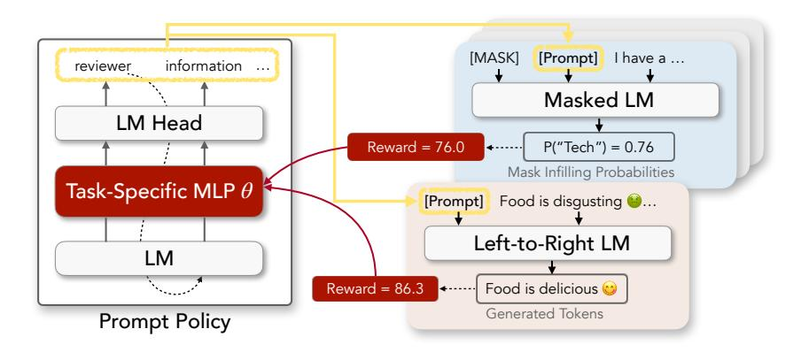
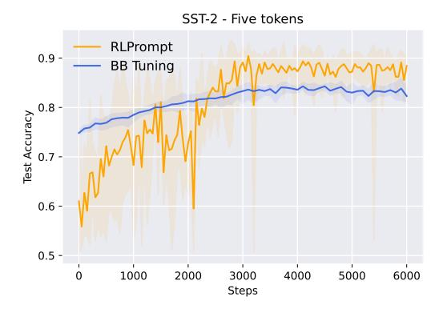
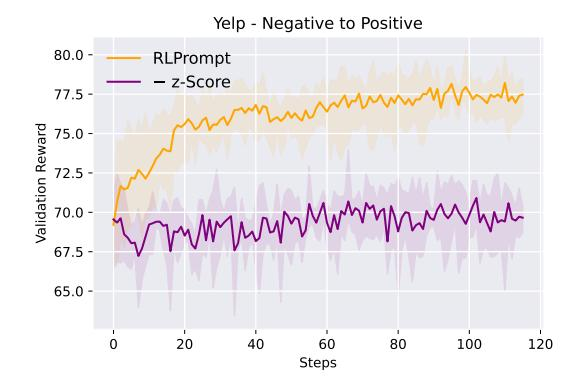
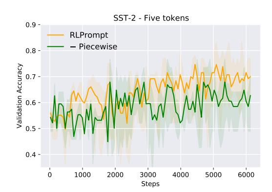
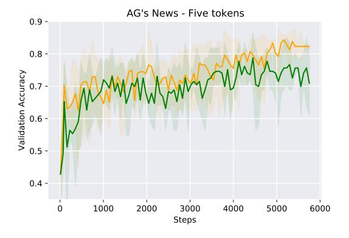
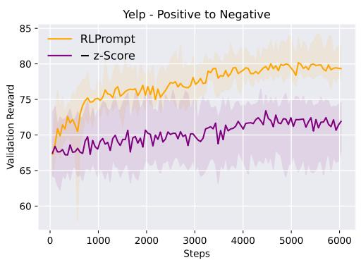
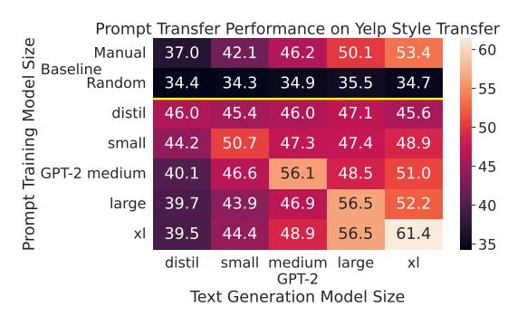

# RLPROMPT: Optimizing Discrete Text Prompts with Reinforcement Learning

Mingkai Deng1∗ [,](#page-0-0) Jianyu Wang2∗ , Cheng-Ping Hsieh2∗ , Yihan Wang2 , Han Guo1 , Tianmin Shu3 , Meng Song2 , Eric P. Xing1,4,5 , Zhiting Hu2

1Carnegie Mellon University, 2UC San Diego,

3MIT, 4Mohamed bin Zayed University of Artificial Intelligence, 5Petuum Inc.

{mingkaid,hanguo}@cs.cmu.edu, {jiw102,c2hsieh,yiw007,zhh019}@ucsd.edu

## Abstract

Prompting has shown impressive success in enabling large pre-trained language models (LMs) to perform diverse NLP tasks, especially with only few downstream data. Automatically finding the optimal prompt for each task, however, is challenging. Most existing work resorts to tuning *soft* prompts (e.g., embeddings) which fall short of interpretability, reusability across LMs, and applicability when gradients are not accessible. *Discrete* prompts, on the other hand, are difficult to optimize, and are often created by "enumeration (e.g., paraphrasing)-then-selection" heuristics that do not explore the prompt space systematically. This paper proposes RLPROMPT, an efficient discrete prompt optimization approach with reinforcement learning (RL). RLPROMPT formulates a parameter-efficient policy network that generates the optimized discrete prompt after training with reward. To harness the complex and stochastic reward signals from the large LM environment, we incorporate effective reward stabilization that substantially enhances training efficiency. RLPROMPT is flexibly applicable to different types of LMs, such as masked (e.g., BERT) and left-to-right models (e.g., GPTs), for both classification and generation tasks. Experiments on few-shot classification and unsupervised text style transfer show superior performance over a wide range of existing fine-tuning or prompting methods. Interestingly, the resulting optimized prompts are often ungrammatical gibberish text; and surprisingly, those gibberish prompts are transferrable between different LMs to retain significant performance, indicating that LM prompting may not follow human language patterns[.](#page-0-1)1

### 1 Introduction

Prompting has emerged as a promising approach to solving a wide range of NLP problems using large

pre-trained language models (LMs), including leftto-right models such as GPTs [\(Radford et al.,](#page-11-0) [2019;](#page-11-0) [Brown et al.,](#page-9-0) [2020\)](#page-9-0) and masked LMs such as BERT [\(Devlin et al.,](#page-9-1) [2019\)](#page-9-1), RoBERTa [\(Liu et al.,](#page-11-1) [2019\)](#page-11-1), etc. Compared to conventional fine-tuning that expensively updates the massive LM parameters for each downstream task, prompting concatenates the inputs with an additional piece of text that steers the LM to produce the desired outputs. A key question with prompting is how to find the optimal prompts to improve the LM's performance on various tasks, often with only a few training examples.

One of the most popular scheme is to tune *soft* prompts (i.e., continuous embedding vectors) as they are amenable to gradient descent [\(Li and](#page-10-0) [Liang,](#page-10-0) [2021;](#page-10-0) [Vu et al.,](#page-12-0) [2021;](#page-12-0) [Gu et al.,](#page-9-2) [2021;](#page-9-2) [Liu](#page-11-2) [et al.,](#page-11-2) [2021d;](#page-11-2) [Mokady et al.,](#page-11-3) [2021;](#page-11-3) [Qian et al.,](#page-11-4) [2022;](#page-11-4) [An et al.,](#page-9-3) [2022,](#page-9-3) etc.). However, the resulting prompts are, by their nature, hard for humans to understand [\(Khashabi et al.,](#page-10-1) [2021;](#page-10-1) [Lester et al.,](#page-10-2) [2021;](#page-10-2) [Hambardzumyan et al.,](#page-10-3) [2021\)](#page-10-3) and incompatible for use with other LMs. Besides, the required LM internal gradients are often expensive to compute, or simply unavailable for LMs deployed with only inference APIs (e.g., GPT-3). It is thus often desirable to use *discrete* prompts which consist of concrete tokens from a vocabulary. However, their discrete nature renders the optimization very difficult. Previous work has typically relied on manual engineering [\(Petroni et al.,](#page-11-5) [2019;](#page-11-5) [Brown et al.,](#page-9-0) [2020;](#page-9-0) [Schick and Schütze,](#page-12-1) [2021a;](#page-12-1) [Tam et al.,](#page-12-2) [2021\)](#page-12-2), or selecting from multiple paraphrased/generated prompts [\(Jiang et al.,](#page-10-4) [2020;](#page-10-4) [Gao et al.,](#page-9-4) [2021;](#page-9-4) [Liu](#page-10-5) [et al.,](#page-10-5) [2021b;](#page-10-5) [Prasad et al.,](#page-11-6) [2022;](#page-11-6) [Hao et al.,](#page-10-6) [2022\)](#page-10-6). AutoPrompt [\(Shin et al.,](#page-12-3) [2020\)](#page-12-3) uses gradient information to edit the prompt tokens, which suffers from training instability as well as the same applicability issue as gradient-based soft prompting, showing limited effectiveness in practice.

This paper presents RLPROMPT, a new discrete prompt optimization approach based on reinforce-

∗Equal contribution

1Code available at [https://github.com/mingkaid/](https://github.com/mingkaid/rl-prompt) [rl-prompt](https://github.com/mingkaid/rl-prompt)

| Methods                        | Frozen LMs | Automated | Gradient- Free | Guided Optimize | Few- Shot | Zero- Shot | Transferrable b/w LMs | Interpret- -ability |
|--------------------------------|---------------|-----------|-------------------|--------------------|--------------|---------------|--------------------------|------------------------|
| Fine-Tuning                    | Х             | ✓         | X                 | <b>✓</b>           | Х            | Х             | X                        | X                      |
| Manual Prompt                  | ✓             | X         | ✓                 | X                  | 1            | <b>/</b>      | ✓                        | <b>✓</b>               |
| Instructions                   | ✓             | X         | ✓                 | X                  | 1            | <b>/</b>      | ✓                        | <b>✓</b>               |
| In-Context Demonstration       | ✓             | ✓         | ✓                 | X                  | 1            | X             | ✓                        | <b>✓</b>               |
| Soft Prompt Tuning             | ✓             | ✓         | X                 | ✓                  | 1            | X             | X                        | X                      |
| Discrete Prompt Enumeration    | ✓             | ✓         | ✓                 | X                  | 1            | <b>/</b>      | ✓                        | <b>✓</b>               |
| AutoPrompt (Shin et al., 2020) | ✓             | ✓         | X                 | ✓                  | ✓            | X             | ✓                        | ✓                      |
| RLPrompt (Ours)                | ✓             | ✓         | ✓                 | ✓                  | ✓            | ✓             | ✓                        | ✓                      |

Table 1: Comparison of different (prompting) paradigms for using pre-trained LMs on downstream tasks, in terms of several desirable properties. *Gradient-Free* methods do not require gradient information from the prompted LMs, which may be inaccessible or expensive to compute. *Guided Optimize* means the optimization/search is guided by gradient or reward signals, which tends to be more efficient than otherwise (e.g., enumeration). Prompts of discrete tokens (as opposed to embeddings) are often *transferrable*/reusable by different LMs. Our approach with RL can optimize prompts using rewards without supervised data (*zero-shot*). *Discrete Prompt Enumeration* selects the best prompt from a large number of candidates (e.g., from paraphrasing or generation, Jiang et al., 2020; Gao et al., 2021; Liu et al., 2021b; Prasad et al., 2022). *AutoPrompt* (Shin et al., 2020) uses gradients to edit the discrete prompt tokens. See §4 and Appendix §C for more discussion.

ment learning (RL). This approach brings together a wide range of desirable properties for efficient use on diverse tasks and LMs (Table 1). Crucially, rather than directly editing the discrete tokens, which has been difficult and inefficient, RL-PROMPT trains a policy network that generates the desired prompts. Discrete prompt optimization thus amounts to learning a small number of policy parameters which we set as an MLP layer inserted into a frozen compact model such as distilGPT-2 (HuggingFace, 2019). This formulation also allows us to employ off-the-shelf RL algorithms (e.g., Guo et al., 2021) that learn the policy with arbitrary reward functions—defined either with available data (e.g., in few-shot classification) or other weak signals when no supervised data is accessible (e.g., in controllable text generation).

On the other hand, RL for prompt optimization poses new challenges to learning efficiency: the large black-box LM presents a highly complex environment that, given the prompt (i.e., actions), goes through a long series of complex transitions (e.g., reading the input and inferring the output) before computing the rewards. This makes the reward signals extremely unstable and hard to learn from. To overcome this difficulty, we propose two simple yet surprisingly effective ways to stabilize the rewards and improve the optimization efficiency.

Experiments on few-shot classification and unsupervised text style transfer show our approach improves over a wide range of fine-tuning and prompting methods (e.g., those described in Table 1), and is robust to different modeling choices (e.g., verbalizers in classification). The resulting discrete prompts also facilitate rich interpretations and analyses for new insights into LM prompting.

In particular, the optimized prompts, though inducing strong task performance, tend to be gibberish text without clear human-understandable meaning, echoing recent research (Webson and Pavlick, 2021; Zhao et al., 2021; Prasad et al., 2022) that LMs making use of prompts do not necessarily follow human language patterns. Perhaps surprisingly, those gibberish prompts learned with one LM can be used in other LMs for significant performance, indicating that those different pre-trained LMs have grasped shared structures for prompting.

### 2 Discrete Prompt Optimization with RL

We present RLPROMPT, a framework for learning prompts of discrete tokens for pre-trained LMs to succeed in a wide range of NLP tasks.

As discussed in §1, discrete prompts can be easier to interpret and use than continuous prompts, but also more challenging to learn due to intractable optimization over discrete tokens. To solve this difficulty, we formulate discrete prompt optimization as an RL problem, using a continuous policy network to explore the prompt space. The network is highly parameter-efficient, only training a small MLP over a frozen compact LM (e.g., distilGPT-2).

Below, we present our RL formulation of discrete prompt optimization (§2.1-2.2). We then discuss the design of our policy network (§2.3). Finally, we describe our reward engineering techniques to improve RL training (§2.4).

### 2.1 Discrete Prompt Optimization Problem

Extensive recent work (Brown et al., 2020; Jiang et al., 2020; Khashabi et al., 2021; Gao et al., 2021) has shown it is possible to combine discrete text prompt **z** with input **x** to directly perform vari-

Figure 1: Overview of RLPROMPT for discrete prompt optimization. All LMs (white boxes) are frozen. We build our policy network by training a task-specific MLP module inserted into a frozen pre-trained LM. The figure above illustrates generation of a prompt (left), example usages in a masked LM for classification and a left-to-right LM for generation (top-right and bottom-right, respectively), and update of the MLP using RL reward signals.

ous NLP tasks using a pre-trained LM's generative distribution  $P_{LM}(\mathbf{y}|\mathbf{z},\mathbf{x})$ , without needing to fine-tune the model. For instance, in classification, the LM can be a masked language model (MLM) such as BERT (Devlin et al., 2019), and  $\mathbf{y}$  is the class-label token (a.k.a. verbalizer like positive or negative) in the mask position; in a generation task, the LM can be a left-to-right model such as GPT-2 (Radford et al., 2019), and  $\mathbf{y}$  is the generated text. See Figure 1 for illustrative examples. We use  $\mathbf{y}_{LM}(\mathbf{z},\mathbf{x})$  to denote the LM output on  $\mathbf{x}$  prompted by  $\mathbf{z}$ .

Our goal is to find the optimal discrete prompt  $\mathbf{z}^*$  from vocabulary  $\mathcal{V}$  to maximize some downstream performance measure R of  $\mathbf{y}_{LM}(\mathbf{z}^*, \mathbf{x}).^2$  The metric  $R(\mathbf{y})$  can be as simple as match with gold label  $\mathbf{y}^*$  (e.g., in classification when data is available), but can also be more complex like the success criteria of controllable text generation, which composes aspects such as style accuracy, language quality, and content preservation. Assuming the prompts have fixed length T, we write the task of discrete prompt optimization in the general format below:

$$\max_{\mathbf{z} \in \mathcal{V}^T} R\left(\mathbf{y}_{\mathsf{LM}}(\mathbf{z}, \mathbf{x})\right). \tag{1}$$

The optimization above, however, can be intractable because  $\mathbf{z}$ 's discrete tokens are not amenable to gradient-based optimization, while brute-force search has the exponential complexity of  $\mathcal{O}(|\mathcal{V}|^T)$ . Previous work has to either approximate gradients over  $\mathbf{z}$  using continuous LM embeddings (Shin et al., 2020) or tweak human-written prompts with heuristics (Jiang et al., 2020; Mishra et al., 2021a; Prasad et al., 2022).

### 2.2 The Reinforcement Learning Formulation

To overcome the difficulty, we formulate discrete text prompt optimization as an RL problem, in which an agent selects prompt tokens  $[z_1,\ldots,z_T]$  one by one to maximize the reward  $R(\mathbf{y}_{LM}(\mathbf{z},\mathbf{x}))$ . At time step t, the agent receives previous prompt tokens  $\mathbf{z}_{< t}$  and generates the next prompt token  $z_t$  according to a policy  $\pi(z_t|\mathbf{z}_{< t})$ . After the agent finishes the entire prompt  $\hat{\mathbf{z}}$ , it receives the task reward  $R(\mathbf{y}_{LM}(\hat{\mathbf{z}},\mathbf{x}))$ . Parameterizing the policy with  $\theta$ , we can rewrite the problem above as

$$\max_{\boldsymbol{\theta}} R(\mathbf{y}_{LM}(\hat{\mathbf{z}}, \mathbf{x})), \ \hat{\mathbf{z}} \sim \prod_{t=1}^{T} \pi_{\boldsymbol{\theta}}(z_t | \mathbf{z}_{< t}).$$
 (2)

Compared to typical (soft) prompt tuning approaches, the RL formulation above has the key advantage of not needing gradient access to the LM, treating it instead as a black-box function. This enables us to optimize prompts for LMs whose gradients are too expensive to compute, or LMs that are solely available as inference APIs (e.g., GPT-3). Compared to previous discrete prompt enumeration/paraphrasing, the RL approach explores the prompt space more efficiently guided by the reward signals. The policy network also brings added flexibility, e.g., it can take other information such as the input x, leading to input-specific prompts (e.g., as used in text style transfer in §2.4).

During training, we explore the prompt space by sampling from the policy network. After the policy is trained, we select tokens greedily during inference to produce a deterministic prompt. The reward objective in Eq.(2) can be optimized with any off-the-shelf RL algorithm. We use the latest soft Q-learning (SQL, Guo et al., 2021) which has shown advanced learning efficiency and performance on various text generation problems, with

 $^2$ Technically  $\mathcal V$  can be any set of tokens. Here we simply use the downstream LM's vocabulary.

open-source implementation.[3](#page-3-2) Specifically, we use only its on-policy component. We refer interested readers to [Guo et al.](#page-9-5) [\(2021\)](#page-9-5) for more details.

### 2.3 Efficient Parameterization of Policy

We present an efficient parameterization of the policy network πθ, which adapts a frozen pre-trained LM (i.e., policy LM) with a simple MLP layer that contains all the parameters θ to be trained. The policy LM need not be the same as the LM we optimize the prompt for (i.e., task LM). Figure [1](#page-2-1) (left) illustrates the policy LM architecture. Specifically, we use the LM to extract contextual embeddings of partial prompt zˆ<t, apply the added task-specific MLP layer to compute the adapted embeddings, and pass the output into the model's original LM head to obtain the next prompt token probabilities. We describe more implementation details in Appendix [§A.1.](#page-14-0) During training, we compute the MLP gradients by back-propagating through the policy LM. Our experiments ([§3\)](#page-3-3) show that changing only the small set of MLP parameters is sufficient for producing strong performance. After training, we discard the MLP and simply use the learned discrete text prompt for inference.

### 2.4 Reward Engineering and Stabilization

Proper design of reward functions, a.k.a. reward engineering, is crucial to training efficiency and success in RL [\(Sutton and Barto,](#page-12-5) [2018\)](#page-12-5). Discrete prompt optimization, in particular, poses new challenges due to its highly complex reward functions, which involve multiple steps (e.g., combining with input, passing through a black-box LM, and inferring the outputs), each introducing its own variations. This makes the reward signal unstable and difficult to assess progress towards the task goal. To solve these difficulties, we propose two simple reward engineering techniques that effectively encourage and stabilize the RL training.

Input-Specific z-Score Reward Different inputs can have different levels of difficulty for reasoning and prediction. Prompted LMs can thus see different reward scales for different inputs. In text style transfer ([§3.2\)](#page-5-0), for instance, some sentences may only require changing a few words to alter the style, so the LM naturally achieves higher rewards on them than on other more complex sentences. Naively optimizing for all inputs with the

same reward scale, therefore, can lead to training bias and instability. To mitigate this problem, we propose to use input-specific z-score, which normalizes the rewards by input-specific means and standard deviations. This can be seen as a case of adaptive reward normalization, a commonlyused technique in RL [\(van Hasselt et al.,](#page-12-6) [2016\)](#page-12-6). Formally, during prompt optimization, we sample a batch of prompts Z(x) for each input x, and compute the reward R(yLM(z, x)) for each prompt z ∈ Z(x). After that, we compute the reward z-scores across prompts Z(x). Using the shorthand Rx(z) for R(yLM(z, x)), namely the reward prompt z receives for input x, we write the transformation as below:

$$z\text{-score}(\mathbf{z}, \mathbf{x}) = \frac{R_{\mathbf{x}}(\mathbf{z}) - \operatorname{mean}_{\mathbf{z}' \in Z(\mathbf{x})} R_{\mathbf{x}}(\mathbf{z}')}{\operatorname{stdev}_{\mathbf{z}' \in Z(\mathbf{x})} R_{\mathbf{x}}(\mathbf{z}')}.$$
(3)

To distinguish the z-scores of different inputs in the same batch, we condition our policy network on the inputs, i.e., πθ(z|x).

Piecewise Reward If a reward function is misspecified or vulnerable, the policy may maximize it without moving towards the desired goal. For example, while learning classification using the ground-truth probability as reward function, the policy may find adversarial prompts [\(Wallace et al.,](#page-12-7) [2019;](#page-12-7) [Xu et al.,](#page-12-8) [2022\)](#page-12-8) that lead to very high probabilities for a single class given arbitrary inputs. To overcome the issue, we propose to design piecewise reward functions [\(Yu et al.,](#page-13-1) [2020;](#page-13-1) [Rengarajan](#page-12-9) [et al.,](#page-12-9) [2022\)](#page-12-9) with both smooth and disjoint components to better express the task priorities and improve robustness. Typically, we can include a dense, quantitative signal (e.g., label probability) to measure fine-grained progress towards the goal, and a sparse, qualitative signal only when certain states are achieved (e.g., certain accuracy on each class) by applying a large sudden increase in the reward. We illustrate an example design of piecewise reward in text classification ([§3.1\)](#page-4-0).

### 3 Experiments

The proposed RLPROMPT is generally applicable to various types of LMs for performing different NLP tasks using diverse prompt formats (Figure [1\)](#page-2-1). We evaluate our approach on both classification (in few-shot setting, [§3.1\)](#page-4-0) and generation (unsupervised text style transfer, [§3.2\)](#page-5-0), and perform rich analyses for new insights on LM prompting ([§3.3\)](#page-7-0). We will release all code and data upon acceptance.

3Our preliminary experiments indicate SQL often achieves superior performance than common policy gradient methods.

#### 3.1 Few-Shot Text Classification

Learning text classification with few labeled examples has been a problem of interest in many applications (Xu et al., 2018; Yu et al., 2018). We adopt the typical prompting setting (Brown et al., 2020; Schick and Schütze, 2021b) which solves classification by token infilling for an MLM like BERT or next-token prediction for a left-to-right LM like GPT-2. Classification, therefore, amounts to selecting tokens that correspond to a set of predetermined class labels, a.k.a., verbalizers (e.g., "great" for positive sentiment and "terrible" for negative sentiment). For instance, to classify the sentiment of an input sentence "food is delicious" using an MLM, we first fill our prompt and the input into a template "[Input] [Prompt] [MASK]", and then select the verbalizer token with the highest probability of filling into the [MASK] position.

Reward Function The text classification task aims to correctly assign input text x to its ground truth label c from a set of classes C. To mitigate the adversarial cases discussed in §2.4, we design a piecewise reward function that encourages prompts to classify each examples correctly. Given prompt z and training example (x, c), we compute the reward similarly to hinge loss as the gap between the label probability and the highest probability from other classes. Using the short hand  $P_{\mathbf{z}}(c) := P_{LM}(c|\mathbf{z}, \mathbf{x})$  to denote the probability of label c, we can write the gap as  $Gap_{\mathbf{z}}(c) :=$  $P_{\mathbf{z}}(c) - \max_{c' \neq c} P_{\mathbf{z}}(c')$ . The gap value is positive when the prediction is correct, and negative otherwise. We denote Correct :=  $\mathbb{1}[Gap_{\mathbf{z}}(c) > 0]$ . For a correct prediction, we multiply the positive reward by a large number to signal its desirability. The resulting reward function is as below:

$$R(\mathbf{x}, c) = \lambda_1^{1-\text{Correct}} \lambda_2^{\text{Correct}} \text{Gap}_{\mathbf{z}}(c),$$
 (4)

We describe more details and present ablations on reward design in Appendix §A.2.

**Datasets** Following previous work (Gao et al., 2021; Sun et al., 2022), we experiment on a wide range of popular few-shot classification tasks including sentiment classification such as SST-2 (Socher et al., 2013), Yelp Polarity (Zhang et al., 2015), MR (PANG, 2005), CR (Hu and Liu, 2004), SST-5 (Socher et al., 2013), and Yelp (Zhang et al., 2015), and topic classification such as AG's News (Zhang et al., 2015). We additionally experiment on Subj (Pang and Lee, 2004),

TREC (Voorhees and Tice, 2000), Yahoo (Zhang et al., 2015), and DBPedia (Lehmann et al., 2015), which we present in Appendix §A.2 due to space restriction. We describe the dataset statistics in Table 7 in the appendix. We train with 16 examples per class, and validate using the same number of examples, in keeping with the standard few-shot setting (Perez et al., 2021).

**Baselines** We compare our approach with representative methods in the diverse training and prompting paradigms shown in Table 1. Additionally, we compare with the latest Black-Box (BB) Tuning (Sun et al., 2022), which mixes discrete and soft prompts and tunes the soft part. We describe more details in Appendix §A.2.

**Experiment Setup** We use RoBERTa-large (Liu et al., 2019) as our backbone model. For our approach, we experiment with prompt lengths  $T \in \{2,5\}$ , and insert the prompt tokens at the same positions with our manual prompts (Schick and Schütze, 2021a; Tam et al., 2021).4 Please see Appendix §A.2 for more training details.

**Results** We present our few-shot classification results in Table 2. Our method (5 tokens) outperforms Manual Prompt and Instructions on all datasets, as well as In-Context Demonstration and Fine-Tuning on all but 1 and 2 datasets, respectively. Compared to Prompt Tuning, our method achieves higher average accuracy with lower standard deviations, showing our approach is less sensitive to various training factors, a common issue for few-shot prompt tuning (Li and Liang, 2021; Gu et al., 2021). Our approach substantially outperforms BB Tuning with soft prompts, and is slightly better even after BB Tuning uses mixed discrete/soft prompts with 50 soft tokens. Compared to previous discrete prompt optimization methods such as GrIPS (Prasad et al., 2022) and AutoPrompt (Shin et al., 2020), our method reaches superior accuracy on all benchmarks. On the additional datasets which tend to be multi-way (e.g., 16-class), Fine-Tuning shows higher performance, but our method continues the lead over prompting baselines, as we describe in more detail in Appendix §A.2.

**Training Efficiency** To assess the training efficiency of our method, we compare our test accuracy

&lt;sup>4It is known that increasing prompt length and/or inserting prompt tokens in multiple positions can often lead to improved performance. We leave further experiments to the future.

|                                     | SST-2             | Yelp P.           | MR                | CR                | SST-5             | Yelp              | AG's News         | Avg.        |
|-------------------------------------|-------------------|-------------------|-------------------|-------------------|-------------------|-------------------|-------------------|-------------|
| Fine-Tuning                         | 80.6 (3.9)        | 88.7 (4.7)        | 67.4 (9.7)        | 73.3 (7.5)        | 40.7 (3.0)        | <b>51.0</b> (2.2) | <b>84.9</b> (3.6) | 69.5        |
| Manual Prompt                       | 82.8              | 83.0              | 80.9              | 79.6              | 34.9              | 42.1              | 76.9              | 68.6        |
| Instructions                        | 89.0              | 84.4              | 85.2              | 80.8              | 29.8              | 43.0              | 54.8              | 58.5        |
| In-Context Demonstration            | 85.9 (0.7)        | 89.6 (0.4)        | 80.6 (1.4)        | 85.5 (1.5)        | 39.3 (0.9)        | 49.4 (0.3)        | 74.9 (0.8)        | 72.2        |
| Prompt Tuning (Soft Prompt Tuning)  | 73.8 (10.9)       | 88.6 (2.1)        | 74.1 (14.6)       | 75.9 (11.8)       | 40.2 (6.5)        | 49.1 (3.1)        | 82.6 (0.9)        | 69.2        |
| BB Tuning (2 soft tokens)           | 83.2 (3.5)        | 86.0 (1.6)        | 77.1 (3.9)        | 83.2 (2.5)        | 39.2 (2.4)        | 41.5 (1.9)        | 74.0 (1.9)        | 69.2        |
| BB Tuning (5 soft tokens)           | 84.6 (4.0)        | 78.7 (2.3)        | 79.8 (1.5)        | 82.9 (3.6)        | 36.6 (2.1)        | 33.7 (2.3)        | 73.6 (3.6)        | 67.1        |
| BB Tuning (Mixed, 50 soft tokens)   | 89.1 (0.9)        | 93.2 (0.5)        | 86.6 (1.3)        | 87.4 (1.0)        | 38.4 (1.1)        | 44.8 (1.3)        | 83.5 (0.9)        | 74.7        |
| GrIPS (Discrete Prompt Enumeration) | 87.1 (1.5)        | 88.2 (0.1)        | 86.1 (0.3)        | 80.0 (2.5)        | 32.0 (1.8)        | 47.2 (0.5)        | 65.4 (9.8)        | 69.4        |
| AutoPrompt                          | 75.0 (7.6)        | 79.8 (8.3)        | 62.0 (0.8)        | 57.5 (5.8)        | 27.8 (3.3)        | 29.0 (5.0)        | 65.7 (1.9)        | 56.7        |
| RLPrompt (Ours, 2 discrete tokens)  | 90.3 (1.3)        | 94.1 (0.8)        | 86.5 (1.2)        | 87.4 (1.7)        | 40.1 (1.9)        | 45.6 (3.8)        | 76.8 (1.4)        | 74.4        |
| RLPrompt (Ours, 5 discrete tokens)  | <b>92.5</b> (0.8) | <b>95.1</b> (1.0) | <b>87.1</b> (0.4) | <b>89.5</b> (0.6) | <b>41.4</b> (3.2) | 44.8 (4.3)        | 80.2 (0.7)        | <b>75.8</b> |

Table 2: Results of few-shot text classification. The last column shows the average accuracy across all datasets in this table. Additional results can be found in Table 8.

across training steps with BB Tuning, which is also a gradient-free method but optimizes soft prompts. As Figure 2 shows, our RL-based method is as efficient as soft prompt tuning without access to LM gradients, converging in similar number of steps to BB Tuning, but with superior performance. Our training is also relatively stable, for even the worst prompts encountered after convergence perform comparably to BB Tuning on average.

### 3.2 Unsupervised Text Style Transfer

Text style transfer (TST) (Jin et al., 2022) is a challenging problem, whose goal is to rewrite an input sentence into a desired style, usually without supervised training data. For instance, in a sentiment transfer task, given a negative sentence "The food is disgusting", the model should generate a positive sentence "The food is delicious", without training on such paired data.

Even without supervision data, our method can learn prompts with weak reward signals, which is not possible for most previous prompt optimization methods. Compared to previous TST work that trained models from scratch (Hu et al., 2017; Shen et al., 2017, etc.) or fine-tuned pre-trained LMs (Krishna et al., 2020; Liu et al., 2021e; Hu and Li, 2021), our method presents a more efficient solution that learns discrete prompts for a LM without updating the massive parameters.

**Reward Function** Given input sentence x, the goal of TST is to generate output y that preserves the information in x while showing style attribute s. Following these priorities, we define the task reward as a simple sum of content preservation and target style intensity, described formally below:

$$R(\mathbf{x}, \mathbf{y}, s) = \text{Content}(\mathbf{x}, \mathbf{y}) + \text{Style}(\mathbf{y}, s).$$
 (5)

Figure 2: Comparison of our method (orange) and Black-Box (BB) Tuning (Sun et al., 2022) (blue) in terms of training efficiency. The solid curves are the mean and the shaded regions are the maximum and minimum test accuracy over 5 trials.

We implement the reward using common model-based metrics, described with more detail in Appendix A.3. Because the reward shows different scales across inputs, we normalize the rewards using input-specific z-score as discussed in 2.4, and present ablation studies on reward design along with our results.

**Datasets** Due to space restriction, in the main paper we evaluate on the popular Yelp sentiment transfer dataset (Shen et al., 2017). To further demonstrate our approach in few-shot setting, we include experiments on Shakespeare authorship transfer (Xu et al., 2012) in Appendix §A.3.

**Baselines** We evaluate our method against both training and prompting baselines. We compare with two strong training methods, Style Transformer (Dai et al., 2019) and DiRR (Liu et al., 2021e). In particular, DiRR fine-tunes GPT-2 (Radford et al., 2019) with RL signals, which can be seen as a full-model tuning analogue to our method. For the prompting baselines, we compare with (1) Null Prompt, which does not use

| Model              | Content      | Style      | Fluency    | J(C,S,F)   | GM(C, S, F) |
|--------------------|--------------|------------|------------|------------|-------------|
| Training Baselines |              |            |            |            |             |
| Style Transformer  | 75.2         | 96.4       | 58.6       | 46.1       | 75.2        |
| DiRR               | 78.8         | 97.7       | 75.6       | 59.6       | 83.5        |
| Prompting Baseline | s (GPT-2-xl) | )          |            |            |             |
| Null Prompt        | 37.4         | 94.8       | 97.6       | 33.6       | 70.2        |
| Random Prompt      | 39.6         | 93.8       | 97.8       | 34.7       | 71.3        |
| Manual Prompt      | 64.2 (6.8)   | 91.5 (3.6) | 93.2 (1.4) | 53.4 (7.9) | 81.8 (3.4)  |
| RLPROMPT (Ours     | ·)           |            |            |            |             |
| distilGPT-2        | 57.3 (1.7)   | 96.5 (0.1) | 85.3 (1.3) | 46.0 (0.9) | 77.9 (0.4)  |
| GPT-2-small        | 60.0 (0.4)   | 96.4 (0.3) | 89.0 (2.8) | 50.7 (1.3) | 80.1 (0.8)  |
| GPT-2-medium       | 65.7 (1.4)   | 95.2 (1.2) | 89.3 (0.1) | 56.1 (1.0) | 82.3 (0.4)  |
| GPT-2-large        | 65.1 (1.8)   | 94.6 (2.3) | 91.6 (0.8) | 56.5 (1.3) | 82.6 (0.7)  |
| GPT-2-x1           | 72.1 (1.5)   | 94.2 (2.4) | 89.5 (0.5) | 61.4 (2.2) | 84.7 (1.0)  |

Table 3: Automatic evaluation of our method vs. baselines on the Yelp (Shen et al., 2017) sentiment transfer dataset.  $J(\cdot)$  is our main metric which measures the average joint sentence-level scores of Content, Style, and Fluency as defined in §3.2. We also report the geometric mean (GM) of the three aspects. Numbers in (parentheses) are standard deviations across 3 sets of prompts.

| Model                                    | Content               | Style                 | Fluency                            | GM(C, S, F)                 |
|------------------------------------------|-----------------------|-----------------------|------------------------------------|-----------------------------|
| DiRR Manual Prompt RLPROMPT (Ours) | <b>4.83</b> 4.25 4.41 | <b>4.69</b> 4.38 4.68 | 4.64 <b>4.86</b> <u>4.80</u> | <b>4.72</b> 4.49 4.63 |

Table 4: Human evaluation on Yelp on 5-Likert scale where the best result on each aspect is **bolded** and the second best result <u>underscored</u>. DiRR relies on model fine-tuning.

any prompt, (2) Random Prompt, which samples 5 tokens from the vocabulary as prompts, and (3) Manual Prompt, which averages the performance of 3 human-written templates, one by Reif et al. (2021) and two written for this experiment.

**Experiment Setup** We experiment with GPT-2 of varying sizes, ranging from the smallest distilGPT-2 with 82M parameters to the largest GPT-2-xl with 1.5B parameters. We fix the prompt length T=5. To generate output  $\hat{\mathbf{y}}$ , for all comparison methods, we sample 32 candidates from the respective models, and select the one with the highest reward. More details are in Appendix §A.3.

**Evaluation** Following previous work, we perform both automatic and human evaluation on the content preservation, style accuracy, and fluency of model outputs. For automatic evaluation, we measure *Content* by the state-of-the-art input-output alignment (Deng et al., 2021) using pre-trained LM, *Style* by fine-tuned style classifiers, and *Fluency* by a grammaticality classifier (Krishna et al., 2020). To aggregate the quality dimensions, we average the joint sentence-level scores of examples x from the test set  $\mathcal{X}$ , strictly following Krishna et al. (2020)'s protocol defined below:

$$J(Content, Style, Fluency) =$$

$$mean_{\mathbf{x} \in \mathcal{X}} (Content(\mathbf{x}) \cdot Style(\mathbf{x}) \cdot Fluency(\mathbf{x})),$$
(6)

Figure 3: Comparison of our method with (orange) and without (purple) z-score reward normalization. The format is the same as Figure 2. Additional comparisons are in Figure 6.

which requires each sentence to preserve input content, have the correct style, and be fluent. We also report the geometric mean (GM) of the three overall aspect scores. We conduct human evaluation for Yelp by rating 100 outputs from each model with 5 annotators. We describe more evaluation metrics and results in Appendix §A.3.

**Results** We present the automatic evaluation results for Yelp in Table 3. Compared to the expensive training baselines (Style Transformer and DiRR), our method with GPT-2-xl shows slightly lower content preservation and style accuracy, but have markedly better fluency, which leads to higher or competitive overall joint score  $J(\cdot)$  and geometric mean  $GM(\cdot)$ . This may be because our method better preserves the LM's fluent generation capability by freezing its parameters. Relative to prompting baselines, our optimization strongly improves the default performance. In particular, our trained prompts performs better on average with lower variance than manual prompts, which sees performance vary wildly across prompts with similar meanings. We present all manual and learned

| Method                | Prompt PPL $\downarrow$          | Content                      | Style | Fluency | $J(\mathbf{C},\mathbf{S},\mathbf{F})$ | GM(C, S, F) |
|-----------------------|----------------------------------|------------------------------|-------|---------|---------------------------------------|-------------|
| RLPROMPT + Fluency | 254K (238K) <b>82.1</b> (2.4) | <b>72.1</b> (1.5) 52.4 (1.5) |       |         |                                       |             |

Table 5: Comparison of prompt optimization with fluency constraint vs no constraint on the Yelp dataset. Both experiments use GPT-2-xl as the text generation model. Prompt PPL is the prompt's perplexity under a GPT-2 language model. The text style transfer metrics are the same as in Table 3.

| Prompt Transfer Performance on SST-2 Classifica                                         |        |      |      |      |      |      |      |      |  |      |
|-----------------------------------------------------------------------------------------|--------|------|------|------|------|------|------|------|--|------|
| Size                                                                                    | distil | 78.5 | 79.5 | 77.2 | 65.5 | 59.3 | 61.4 | 59.8 |  | -90  |
| RoBERTa base OM large bu distil                                                         | a base | 71.3 | 88.2 | 89.9 | 67.7 | 75.4 | 83.2 | 87.8 |  | -85  |
|                                                                                         | large  | 76.8 | 84.6 | 90.7 | 68.8 | 75.9 | 80.9 | 78.8 |  | -80  |
|                                                                                         | distil | 73.1 | 77.5 | 82.5 | 72.2 | 75.3 | 75.8 | 75.4 |  | - 75 |
|                                                                                         | small  | 79.3 | 80.9 | 86.7 | 66.7 | 80.5 | 75.1 | 83.8 |  | - 70 |
|                                                                                         | nedium | 74.3 | 79.9 | 90.5 | 72.9 | 73.4 | 82.1 | 85.5 |  | -65  |
| Pror                                                                                    | large  | 69.0 | 81.0 | 87.8 | 65.5 | 69.6 | 82.5 | 88.1 |  | -60  |
| distil base large distil small med. large RoBERTa GPT-2 Classification Model Size |        |      |      |      |      |      |      |      |  |      |

Figure 4: Heatmap of sentiment analysis performance with transferred discrete prompts of 2 tokens. The columns represent the models used to learn the prompts, and the rows represent the models we perform classification with. Brighter color represents higher accuracy.

prompts along with their performance in Table 15 in appendix. Within our own method, we can see the performance increasing monotonically from the smallest distilGPT-2 to the largest GPT-2-xl. Human evaluation results (Table 4) show similar conclusions, where our method is competitive with the costly training method DiRR by obtaining slightly lower content and style scores but higher fluency. On Shakespeare, our method shows similar performance patterns even under the few-shot setting, which we discuss in more detail in Appendix §A.3.

**Ablation Study** As discussed earlier, we transform the reward function for TST using inputspecific z-score to mitigate the training instabilities caused by the different scales of reward across inputs. To study the impact of this technique on RL training, we compare our training success with and without z-score normalization. Specifically, we test on Yelp (Shen et al., 2017) using the distilGPT-2 model as an example. Following typical practice in RL, we run 5 experiments for each variant using different random seeds and compute the validation reward every 50 training steps. As the visualized results in Figures 3 and 6 show, z-score normalization achieves both superior performance and more stable improvement across random seeds and training tasks. Because training easily collapsed without z-score using the original hyperparameters, we tuned the reward shaping scheme to transform a scale of [50,100] into [-50,50], which substantially improved training stability and results.

| Verbalizers        | RLPROMPT   | Manual |
|--------------------|------------|--------|
| terrible, great    | 92.8 (0.8) | 82.8   |
| bad, good          | 91.2 (1.4) | 79.7   |
| negative, positive | 92.2 (0.6) | 76.8   |

Table 6: Comparison of RLPROMPT and manual prompt on SST-2 using different verbalizers.

### 3.3 Analysis

Fluent vs. Gibberish Prompts We study the interaction of prompt fluency with downstream task performance, because fluent prompts are valuable for interpretability and insights into useful task instructions for LMs. Our results show that good optimized prompts for the downstream task are often incoherent gibberish. For instance, one learned prompt for sentiment transfer is "Parameters Comparison )=( Compare either". The observation suggests that pre-trained LMs make use of prompts differently from humans, in line with previous discoveries in prompt-based fine-tuning (Webson and Pavlick, 2021). To understand how prompt fluency could impact the model performance, we evaluate on text style transfer (§3.2). Specifically, we optimize *fluent* prompts by constraining the prompt policy's action space (see Appendix §B for the constraint), and compare with our standard method (without fluency constraint) in Table 5. Results show that the fluency-constrained prompts have remarkably lower perplexity, which indicates higher language coherence. For instance, one fluent prompt we learned for to-positive transfer is "I love my life (". However, these prompts receive much lower task performance in terms of  $J(\cdot)$  and  $GM(\cdot)$ . We present the learned fluent and gibberish prompts in Table 15 in the appendix.

**Transferring Prompts across LMs** One unique advantage of discrete prompts over soft prompts is they are transferrable across models, due to the common text space instead of the model-specific latent space. This enables us to study the connections between different LMs by comparing the transfer performance of prompts trained from these models (e.g., taking a prompt trained on distilGPT-2, and applying it to GPT-2-x1). Interestingly, experiments show that the *optimized prompts, though* 

*largely gibberish text, can indeed retain significant performance after transferring to different LMs*. Furthermore, *prompts can transfer from smaller to larger models for similar or even better performance*. More concretely, for this study, we use both few-shot classification ([§3.1\)](#page-4-0) and style transfer ([§3.2\)](#page-5-0). Specifically for classification, we train prompts on various sizes of RoBERTa and GPT-2 and apply them to every other model for classification. We tabulate the average performance over 5 runs in the heatmap of Figure [4.](#page-7-2) Overall, all prompts can transfer between models, but the success depends on both the source and target LMs. For example, prompts learned from larger models see sharp performance declines when applied to smaller models, indicating that the structures they activate in large LMs may be less present in smaller ones. In contrast, prompts learned from smaller models reach similar or better performance on larger models (e.g., RoBERTa-base to -large). Experiments on TST exhibit similar patterns as shown in Figure [7](#page-18-1) in Appendix [§B.](#page-17-0) Perhaps surprisingly, prompts learned from MLMs like RoBERTa transfer well to left-to-right LMs like GPT-2 and vice versa, showing the LM structures they activate are largely shared across model types. These findings open up a promising and exciting direction for future research—enabled by the transferrability across LMs, we may learn a prompt cheaply from smaller models, and apply it to a larger, more powerful model for inference.

Robustness to Classification Verbalizers It is known that prompted classification is sensitive to verbalizer choices. Manual design requires domain expertise and understanding of the base LMs. Previous research devised various methods for automatic verbalizer search [\(Schick et al.,](#page-12-16) [2020;](#page-12-16) [Shin](#page-12-3) [et al.,](#page-12-3) [2020;](#page-12-3) [Gao et al.,](#page-9-4) [2021\)](#page-9-4). In few-shot classification, our method can discover well-performing prompts given a wide variety of verbalizers. Table [6](#page-7-3) shows the results on SST-2 with several intuitive verbalizers, averaged over 3 random seeds for each verbalizer pair. Across different verbalizers, our prompts consistently outperform manual prompt with smaller variation, showing our approach is robust to the choice of verbalizers. We report similar results on AG's News in Table [11](#page-18-2) in the appendix.

## 4 Related Work

We discuss briefly the various prompting paradigms in previous work, and provide more comprehen-

sive discussion in Appendix [§C.](#page-18-0) The conventional usage for pre-trained LMs is *fine-tuning* on downstream datasets [\(Devlin et al.,](#page-9-1) [2019;](#page-9-1) [Lewis et al.,](#page-10-14) [2020,](#page-10-14) *etc.*), which expensively updates all model parameters and shows limited success with small datasets. [Brown et al.](#page-9-0) [\(2020\)](#page-9-0) show that *manual prompts* can steer large LMs to perform NLP tasks without any training [\(Raffel et al.,](#page-11-13) [2020;](#page-11-13) [Schick and](#page-12-1) [Schütze,](#page-12-1) [2021a;](#page-12-1) [Sanh et al.,](#page-12-17) [2021\)](#page-12-17). Another line of work [\(Weller et al.,](#page-12-18) [2020;](#page-12-18) [Efrat and Levy,](#page-9-8) [2020;](#page-9-8) [Mishra et al.,](#page-11-14) [2021b;](#page-11-14) [Wang et al.,](#page-12-19) [2022\)](#page-12-19) develop *instructional prompts* which provide task descriptions instead of fill-in-the-blank questions. With few-shot training examples, [Brown et al.](#page-9-0) [\(2020\)](#page-9-0) and follow-ups [\(Gao et al.,](#page-9-4) [2021;](#page-9-4) [Liu et al.,](#page-10-5) [2021b;](#page-10-5) [Lu et al.,](#page-11-15) [2021;](#page-11-15) [Min et al.,](#page-11-16) [2022\)](#page-11-16) achieve remarkable performance by inserting *in-context demonstrations*. Replacing discrete prompts with continuous embeddings, several works [\(Qin and Eisner,](#page-11-17) [2021;](#page-11-17) [Li and Liang,](#page-10-0) [2021;](#page-10-0) [Liu et al.,](#page-11-2) [2021d\)](#page-11-2) *tune soft prompts* using gradient descent. By their continuous nature, however, soft prompts are difficult to understand [\(Lester et al.,](#page-10-2) [2021;](#page-10-2) [Hambardzumyan](#page-10-3) [et al.,](#page-10-3) [2021;](#page-10-3) [Khashabi et al.,](#page-10-1) [2021\)](#page-10-1), require expensive gradient information [\(Sun et al.,](#page-12-12) [2022;](#page-12-12) [Diao](#page-9-9) [et al.,](#page-9-9) [2022\)](#page-9-9) and are incompatible for reuse across models due to mismatched latent spaces [\(Su et al.,](#page-12-20) [2021\)](#page-12-20). Some existing works seek to locate better discrete prompts by *augmenting human-written prompts with heuristics* such as paraphrasing [\(Jiang](#page-10-4) [et al.,](#page-10-4) [2020\)](#page-10-4), editing [\(Prasad et al.,](#page-11-6) [2022\)](#page-11-6), and reframing [\(Mishra et al.,](#page-11-7) [2021a\)](#page-11-7), and selecting by some downstream metric. *AutoPrompt* [\(Shin et al.,](#page-12-3) [2020\)](#page-12-3) edits discrete prompts with guidance from model gradients, which sees some success with large training data but limited general applicability due to unstable approximations.

## 5 Conclusion

We have presented RLPROMPT, an efficient and flexible approach for discrete prompt optimization using RL, which improves over a wide range of fine-tuning and prompting methods in experiments on few-shot classification and unsupervised text style transfer. Analysis reveals that strong optimized prompts are incoherent but transferrable between LMs for remarkable performance. The observation opens up many promising possibilities for prompting, such as learning prompts cheaply from smaller models and performing inference with larger models. We are excited to explore further.

## 6 Limitations

While our prompt optimization method performs well on regular-sized LMs like RoBERTa and GPT-2, we have not experimented with more recent huge models like GPT-3 [\(Brown et al.,](#page-9-0) [2020\)](#page-9-0). As is the case for typical RL methods, designing reward functions may need domain expertise. However, we may solve this problem using techniques such as inverse RL, which learns the reward function from data. In terms of transferrability across models, we have not looked closely into the patterns of the learned prompts, or so-called "secret language" of LMs. We look forward to studying all these questions in future work.

### Acknowledgements

We thank all reviewers for their invaluable comments and feedback. Mingkai Deng and Han Guo are supported by US NGA NURI No. HM0476-20- 1-0002 and the National Science Foundation under Grant No. IIS-15-63887, CCF-16-29559, IIS-16-17583, IIS-19-55532, CNS-20-08248, IIS-21- 23952, and BCS-20-40381. Any opinions, findings, and conclusions or recommendations expressed in this material are those of the authors and do not necessarily reflect the views of the NGA or the U.S. Government.

### Ethics Statement

We acknowledge the ACL Code of Ethics and the ACM Code of Ethics and Professional Conduct and strictly adhere to the rules throughout the course of this research. We would like to note that massive pre-trained language models (with prompting or not) could be used maliciously to generate fake, toxic, or offensive content. On the other hand, we hope the proposed prompting technique can be useful for harnessing and controlling the LMs from the unethical behaviors.

## References

- Shengnan An, Yifei Li, Zeqi Lin, Qian Liu, Bei Chen, Qiang Fu, Weizhu Chen, Nanning Zheng, and Jian-Guang Lou. 2022. Input-tuning: Adapting unfamiliar inputs to frozen pretrained models. *arXiv preprint arXiv:2203.03131*.
- Tom Brown, Benjamin Mann, Nick Ryder, Melanie Subbiah, Jared D Kaplan, Prafulla Dhariwal, Arvind Neelakantan, Pranav Shyam, Girish Sastry, Amanda Askell, et al. 2020. Language models are few-shot learners. *NeurIPS*, pages 1877–1901.

- Jordan Clive, Kris Cao, and Marek Rei. 2021. Control prefixes for text generation. *arXiv preprint arXiv:2110.08329*.
- Ning Dai, Jianze Liang, Xipeng Qiu, and Xuan-Jing Huang. 2019. Style transformer: Unpaired text style transfer without disentangled latent representation. In *ACL*, pages 5997–6007.
- Giannis Daras and Alexandros G. Dimakis. 2022. Discovering the hidden vocabulary of dalle-2. *ArXiv*, abs/2206.00169.
- Mingkai Deng, Bowen Tan, Zhengzhong Liu, Eric Xing, and Zhiting Hu. 2021. [Compression, transduction,](https://doi.org/10.18653/v1/2021.emnlp-main.599) [and creation: A unified framework for evaluating](https://doi.org/10.18653/v1/2021.emnlp-main.599) [natural language generation.](https://doi.org/10.18653/v1/2021.emnlp-main.599) In *Proceedings of the 2021 Conference on Empirical Methods in Natural Language Processing*, pages 7580–7605, Online and Punta Cana, Dominican Republic. Association for Computational Linguistics.
- Jacob Devlin, Ming-Wei Chang, Kenton Lee, and Kristina Toutanova. 2019. [BERT: Pre-training of](https://doi.org/10.18653/v1/N19-1423) [deep bidirectional transformers for language under](https://doi.org/10.18653/v1/N19-1423)[standing.](https://doi.org/10.18653/v1/N19-1423) In *Proceedings of the 2019 Conference of the North American Chapter of the Association for Computational Linguistics: Human Language Technologies, Volume 1 (Long and Short Papers)*, pages 4171–4186, Minneapolis, Minnesota. Association for Computational Linguistics.
- Shizhe Diao, Xuechun Li, Yong Lin, Zhichao Huang, and Tong Zhang. 2022. Black-box prompt learning for pre-trained language models. *arXiv preprint arXiv:2201.08531*.
- Ning Ding, Yujia Qin, Guang Yang, Fuchao Wei, Zonghan Yang, Yusheng Su, Shengding Hu, Yulin Chen, Chi-Min Chan, Weize Chen, et al. 2022. Delta tuning: A comprehensive study of parameter efficient methods for pre-trained language models. *arXiv preprint arXiv:2203.06904*.
- Avia Efrat and Omer Levy. 2020. The turking test: Can language models understand instructions? *arXiv preprint arXiv:2010.11982*.
- Joseph L Fleiss and Jacob Cohen. 1973. The equivalence of weighted kappa and the intraclass correlation coefficient as measures of reliability. *Educational and psychological measurement*, 33(3):613–619.
- Tianyu Gao, Adam Fisch, and Danqi Chen. 2021. Making pre-trained language models better few-shot learners. In *ACL*, pages 3816–3830.
- Yuxian Gu, Xu Han, Zhiyuan Liu, and Minlie Huang. 2021. Ppt: Pre-trained prompt tuning for few-shot learning. *arXiv preprint arXiv:2109.04332*.
- Han Guo, Bowen Tan, Zhengzhong Liu, Eric P Xing, and Zhiting Hu. 2021. Text generation with efficient (soft) q-learning. *arXiv preprint arXiv:2106.07704*.

- Karen Hambardzumyan, Hrant Khachatrian, and Jonathan May. 2021. Warp: Word-level adversarial reprogramming. In *ACL-IJCNLP*, pages 4921–4933.
- Shibo Hao, Bowen Tan, Kaiwen Tang, Hengzhe Zhang, Eric P Xing, and Zhiting Hu. 2022. BertNet: Harvesting knowledge graphs from pretrained language models. *arXiv preprint arXiv:2206.14268*.
- Junxian He, Xinyi Wang, Graham Neubig, and Taylor Berg-Kirkpatrick. 2020. A probabilistic formulation of unsupervised text style transfer. *arXiv preprint arXiv:2002.03912*.
- Junxian He, Chunting Zhou, Xuezhe Ma, Taylor Berg-Kirkpatrick, and Graham Neubig. 2021. Towards a unified view of parameter-efficient transfer learning. *arXiv preprint arXiv:2110.04366*.
- Peter Henderson, Riashat Islam, Philip Bachman, Joelle Pineau, Doina Precup, and David Meger. 2018. Deep reinforcement learning that matters. In *AAAI*, volume 32.
- Neil Houlsby, Andrei Giurgiu, Stanislaw Jastrzebski, Bruna Morrone, Quentin De Laroussilhe, Andrea Gesmundo, Mona Attariyan, and Sylvain Gelly. 2019. Parameter-efficient transfer learning for nlp. In *ICML*, pages 2790–2799. PMLR.
- Minqing Hu and Bing Liu. 2004. Mining and summarizing customer reviews. In *KDD*, pages 168–177.
- Zhiting Hu and Li Erran Li. 2021. A causal lens for controllable text generation. *Advances in Neural Information Processing Systems*, 34:24941–24955.
- Zhiting Hu, Zichao Yang, Xiaodan Liang, Ruslan Salakhutdinov, and Eric P Xing. 2017. Toward controlled generation of text. In *International conference on machine learning*, pages 1587–1596. PMLR.
- HuggingFace. 2019. Distilgpt2. [https://](https://huggingface.co/distilgpt2.) [huggingface.co/distilgpt2.](https://huggingface.co/distilgpt2.)
- Harsh Jhamtani, Varun Gangal, Eduard Hovy, and Eric Nyberg. 2017. [Shakespearizing modern language](https://doi.org/10.18653/v1/W17-4902) [using copy-enriched sequence to sequence models.](https://doi.org/10.18653/v1/W17-4902) In *Proceedings of the Workshop on Stylistic Variation*, pages 10–19, Copenhagen, Denmark. Association for Computational Linguistics.
- Zhengbao Jiang, Frank F Xu, Jun Araki, and Graham Neubig. 2020. How can we know what language models know? *TACL*, 8:423–438.
- Di Jin, Zhijing Jin, Zhiting Hu, Olga Vechtomova, and Rada Mihalcea. 2022. Deep learning for text style transfer: A survey. *Computational Linguistics*, 48(1):155–205.
- Nitish Shirish Keskar, Bryan McCann, Lav R Varshney, Caiming Xiong, and Richard Socher. 2019. Ctrl: A conditional transformer language model for controllable generation. *arXiv preprint arXiv:1909.05858*.

- Daniel Khashabi, Shane Lyu, Sewon Min, Lianhui Qin, Kyle Richardson, Sameer Singh, Sean Welleck, Hannaneh Hajishirzi, Tushar Khot, Ashish Sabharwal, et al. 2021. Prompt waywardness: The curious case of discretized interpretation of continuous prompts. *arXiv preprint arXiv:2112.08348*.
- Diederik P Kingma and Jimmy Ba. 2014. Adam: A method for stochastic optimization. *arXiv preprint arXiv:1412.6980*.
- Kalpesh Krishna, John Wieting, and Mohit Iyyer. 2020. [Reformulating unsupervised style transfer as para](https://doi.org/10.18653/v1/2020.emnlp-main.55)[phrase generation.](https://doi.org/10.18653/v1/2020.emnlp-main.55) In *Proceedings of the 2020 Conference on Empirical Methods in Natural Language Processing (EMNLP)*, pages 737–762, Online. Association for Computational Linguistics.
- Jens Lehmann, Robert Isele, Max Jakob, Anja Jentzsch, Dimitris Kontokostas, Pablo N Mendes, Sebastian Hellmann, Mohamed Morsey, Patrick Van Kleef, Sören Auer, et al. 2015. Dbpedia–a large-scale, multilingual knowledge base extracted from wikipedia. *Semantic web*, 6(2):167–195.
- Brian Lester, Rami Al-Rfou, and Noah Constant. 2021. The power of scale for parameter-efficient prompt tuning. In *EMNLP*, pages 3045–3059.
- Yoav Levine, Itay Dalmedigos, Ori Ram, Yoel Zeldes, Daniel Jannai, Dor Muhlgay, Yoni Osin, Opher Lieber, Barak Lenz, Shai Shalev-Shwartz, et al. 2022. Standing on the shoulders of giant frozen language models. *arXiv preprint arXiv:2204.10019*.
- Mike Lewis, Yinhan Liu, Naman Goyal, Marjan Ghazvininejad, Abdelrahman Mohamed, Omer Levy, Veselin Stoyanov, and Luke Zettlemoyer. 2020. Bart: Denoising sequence-to-sequence pre-training for natural language generation, translation, and comprehension. In *ACL*, pages 7871–7880.
- Juncen Li, Robin Jia, He He, and Percy Liang. 2018. [Delete, retrieve, generate: a simple approach to senti](https://doi.org/10.18653/v1/N18-1169)[ment and style transfer.](https://doi.org/10.18653/v1/N18-1169) In *Proceedings of the 2018 Conference of the North American Chapter of the Association for Computational Linguistics: Human Language Technologies, Volume 1 (Long Papers)*, pages 1865–1874, New Orleans, Louisiana. Association for Computational Linguistics.
- Xiang Lisa Li and Percy Liang. 2021. Prefix-tuning: Optimizing continuous prompts for generation. In *ACL*, pages 4582–4597.
- Alisa Liu, Maarten Sap, Ximing Lu, Swabha Swayamdipta, Chandra Bhagavatula, Noah A Smith, and Yejin Choi. 2021a. Dexperts: Decoding-time controlled text generation with experts and antiexperts. In *ACL-IJCNLP*, pages 6691–6706.
- Jiachang Liu, Dinghan Shen, Yizhe Zhang, Bill Dolan, Lawrence Carin, and Weizhu Chen. 2021b. What makes good in-context examples for gpt-3? *arXiv preprint arXiv:2101.06804*.

- Xiao Liu, Kaixuan Ji, Yicheng Fu, Zhengxiao Du, Zhilin Yang, and Jie Tang. 2021c. P-tuning v2: Prompt tuning can be comparable to fine-tuning universally across scales and tasks. *arXiv preprint arXiv:2110.07602*.
- Xiao Liu, Yanan Zheng, Zhengxiao Du, Ming Ding, Yujie Qian, Zhilin Yang, and Jie Tang. 2021d. Gpt understands, too. *arXiv preprint arXiv:2103.10385*.
- Yinhan Liu, Myle Ott, Naman Goyal, Jingfei Du, Mandar Joshi, Danqi Chen, Omer Levy, Mike Lewis, Luke Zettlemoyer, and Veselin Stoyanov. 2019. Roberta: A robustly optimized bert pretraining approach. *arXiv preprint arXiv:1907.11692*.
- Yixin Liu, Graham Neubig, and John Wieting. 2021e. On learning text style transfer with direct rewards. In *NAACL*, pages 4262–4273.
- Yao Lu, Max Bartolo, Alastair Moore, Sebastian Riedel, and Pontus Stenetorp. 2021. Fantastically ordered prompts and where to find them: Overcoming few-shot prompt order sensitivity. *arXiv preprint arXiv:2104.08786*.
- Sewon Min, Xinxi Lyu, Ari Holtzman, Mikel Artetxe, Mike Lewis, Hannaneh Hajishirzi, and Luke Zettlemoyer. 2022. Rethinking the role of demonstrations: What makes in-context learning work? *arXiv preprint arXiv:2202.12837*.
- Remi Mir, Bjarke Felbo, Nick Obradovich, and Iyad Rahwan. 2019. [Evaluating style transfer for text.](https://doi.org/10.18653/v1/N19-1049) In *Proceedings of the 2019 Conference of the North American Chapter of the Association for Computational Linguistics: Human Language Technologies, Volume 1 (Long and Short Papers)*, pages 495–504, Minneapolis, Minnesota. Association for Computational Linguistics.
- Swaroop Mishra, Daniel Khashabi, Chitta Baral, Yejin Choi, and Hannaneh Hajishirzi. 2021a. Reframing instructional prompts to gptk's language. *arXiv preprint arXiv:2109.07830*.
- Swaroop Mishra, Daniel Khashabi, Chitta Baral, and Hannaneh Hajishirzi. 2021b. Cross-task generalization via natural language crowdsourcing instructions. *arXiv peprints arXiv:2104.08773*.
- Ron Mokady, Amir Hertz, and Amit H Bermano. 2021. Clipcap: Clip prefix for image captioning. *arXiv preprint arXiv:2111.09734*.
- Bo PANG. 2005. Seeing stars: Exploiting class relationships for sentiment categorization with respect to rating scales. In *ACL*.
- Bo Pang and Lillian Lee. 2004. A sentimental education: Sentiment analysis using subjectivity summarization based on minimum cuts. *arXiv preprint cs/0409058*.
- Ethan Perez, Saffron Huang, Francis Song, Trevor Cai, Roman Ring, John Aslanides, Amelia Glaese, Nat

- McAleese, and Geoffrey Irving. 2022. Red teaming language models with language models. *arXiv preprint arXiv:2202.03286*.
- Ethan Perez, Douwe Kiela, and Kyunghyun Cho. 2021. True few-shot learning with language models. *NeurIPS*, 34.
- Matthew E. Peters, Mark Neumann, Mohit Iyyer, Matt Gardner, Christopher Clark, Kenton Lee, and Luke Zettlemoyer. 2018. [Deep contextualized word repre](https://doi.org/10.18653/v1/N18-1202)[sentations.](https://doi.org/10.18653/v1/N18-1202) In *Proceedings of the 2018 Conference of the North American Chapter of the Association for Computational Linguistics: Human Language Technologies, Volume 1 (Long Papers)*, pages 2227–2237, New Orleans, Louisiana. Association for Computational Linguistics.
- Fabio Petroni, Tim Rocktäschel, Sebastian Riedel, Patrick Lewis, Anton Bakhtin, Yuxiang Wu, and Alexander Miller. 2019. Language models as knowledge bases? In *EMNLP-IJCNLP*, pages 2463–2473.
- Matt Post. 2018. [A call for clarity in reporting BLEU](https://doi.org/10.18653/v1/W18-6319) [scores.](https://doi.org/10.18653/v1/W18-6319) In *Proceedings of the Third Conference on Machine Translation: Research Papers*, pages 186– 191, Brussels, Belgium. Association for Computational Linguistics.
- Archiki Prasad, Peter Hase, Xiang Zhou, and Mohit Bansal. 2022. Grips: Gradient-free, edit-based instruction search for prompting large language models. *arXiv preprint arXiv:2203.07281*.
- Jing Qian, Li Dong, Yelong Shen, Furu Wei, and Weizhu Chen. 2022. Controllable natural language generation with contrastive prefixes. In *Findings of ACL*, pages 2912–2924.
- Guanghui Qin and Jason Eisner. 2021. [Learning how](https://doi.org/10.18653/v1/2021.naacl-main.410) [to ask: Querying LMs with mixtures of soft prompts.](https://doi.org/10.18653/v1/2021.naacl-main.410) In *Proceedings of the 2021 Conference of the North American Chapter of the Association for Computational Linguistics: Human Language Technologies*, pages 5203–5212, Online. Association for Computational Linguistics.
- Lianhui Qin, Sean Welleck, Daniel Khashabi, and Yejin Choi. 2022. COLD decoding: Energy-based constrained text generation with langevin dynamics. *arXiv preprint arXiv:2202.11705*.
- Alec Radford, Jeffrey Wu, Rewon Child, David Luan, Dario Amodei, Ilya Sutskever, et al. 2019. Language models are unsupervised multitask learners. *OpenAI blog*, 1(8):9.
- Colin Raffel, Noam Shazeer, Adam Roberts, Katherine Lee, Sharan Narang, Michael Matena, Yanqi Zhou, Wei Li, and Peter J Liu. 2020. Exploring the limits of transfer learning with a unified text-to-text transformer. *JMLR*, 21:1–67.
- Emily Reif, Daphne Ippolito, Ann Yuan, Andy Coenen, Chris Callison-Burch, and Jason Wei. 2021. A recipe for arbitrary text style transfer with large language models. *arXiv preprint arXiv:2109.03910*.

- Desik Rengarajan, Gargi Nikhil Vaidya, Akshay Sarvesh, Dileep M. Kalathil, and Srinivas Shakkottai. 2022. Reinforcement learning with sparse rewards using guidance from offline demonstration. In *ICLR*.
- Victor Sanh, Albert Webson, Colin Raffel, Stephen H Bach, Lintang Sutawika, Zaid Alyafeai, Antoine Chaffin, Arnaud Stiegler, Teven Le Scao, Arun Raja, et al. 2021. Multitask prompted training enables zero-shot task generalization. *arXiv preprint arXiv:2110.08207*.
- Timo Schick, Helmut Schmid, and Hinrich Schütze. 2020. [Automatically identifying words that can serve](https://doi.org/10.18653/v1/2020.coling-main.488) [as labels for few-shot text classification.](https://doi.org/10.18653/v1/2020.coling-main.488) In *Proceedings of the 28th International Conference on Computational Linguistics*, pages 5569–5578, Barcelona, Spain (Online). International Committee on Computational Linguistics.
- Timo Schick and Hinrich Schütze. 2021a. Exploiting cloze-questions for few-shot text classification and natural language inference. In *EACL*, pages 255–269.
- Timo Schick and Hinrich Schütze. 2021b. [It's not just](https://doi.org/10.18653/v1/2021.naacl-main.185) [size that matters: Small language models are also few](https://doi.org/10.18653/v1/2021.naacl-main.185)[shot learners.](https://doi.org/10.18653/v1/2021.naacl-main.185) In *Proceedings of the 2021 Conference of the North American Chapter of the Association for Computational Linguistics: Human Language Technologies*, pages 2339–2352, Online. Association for Computational Linguistics.
- Tianxiao Shen, Tao Lei, Regina Barzilay, and Tommi Jaakkola. 2017. Style transfer from non-parallel text by cross-alignment. *Advances in neural information processing systems*, 30.
- Taylor Shin, Yasaman Razeghi, Robert L Logan IV, Eric Wallace, and Sameer Singh. 2020. Autoprompt: Eliciting knowledge from language models with automatically generated prompts. In *EMNLP*, pages 4222–4235.
- Richard Socher, Alex Perelygin, Jean Wu, Jason Chuang, Christopher D Manning, Andrew Y Ng, and Christopher Potts. 2013. Recursive deep models for semantic compositionality over a sentiment treebank. In *EMNLP*, pages 1631–1642.
- Yusheng Su, Xiaozhi Wang, Yujia Qin, Chi-Min Chan, Yankai Lin, Zhiyuan Liu, Peng Li, Juanzi Li, Lei Hou, Maosong Sun, et al. 2021. On transferability of prompt tuning for natural language understanding. *arXiv preprint arXiv:2111.06719*.
- Tianxiang Sun, Yunfan Shao, Hong Qian, Xuanjing Huang, and Xipeng Qiu. 2022. Black-box tuning for language-model-as-a-service. *arXiv preprint arXiv:2201.03514*.
- Richard S Sutton and Andrew G Barto. 2018. *Reinforcement learning: An introduction*. MIT press.
- Derek Tam, Rakesh R Menon, Mohit Bansal, Shashank Srivastava, and Colin Raffel. 2021. Improving and simplifying pattern exploiting training. In *EMNLP*, pages 4980–4991.

- Zhixing Tan, Xiangwen Zhang, Shuo Wang, and Yang Liu. 2022. [MSP: Multi-stage prompting for mak](https://aclanthology.org/2022.acl-long.424)[ing pre-trained language models better translators.](https://aclanthology.org/2022.acl-long.424) In *Proceedings of the 60th Annual Meeting of the Association for Computational Linguistics (Volume 1: Long Papers)*, pages 6131–6142, Dublin, Ireland. Association for Computational Linguistics.
- Hado P van Hasselt, Arthur Guez, Matteo Hessel, Volodymyr Mnih, and David Silver. 2016. Learning values across many orders of magnitude. *Advances in neural information processing systems*, 29.
- Ellen M Voorhees and Dawn M Tice. 2000. Building a question answering test collection. In *Proceedings of the 23rd annual international ACM SIGIR conference on Research and development in information retrieval*, pages 200–207.
- Tu Vu, Brian Lester, Noah Constant, Rami Al-Rfou, and Daniel Cer. 2021. Spot: Better frozen model adaptation through soft prompt transfer. *arXiv preprint arXiv:2110.07904*.
- Eric Wallace, Shi Feng, Nikhil Kandpal, Matt Gardner, and Sameer Singh. 2019. Universal adversarial triggers for attacking and analyzing nlp. In *EMNLP*.
- Yizhong Wang, Swaroop Mishra, Pegah Alipoormolabashi, Yeganeh Kordi, Amirreza Mirzaei, Anjana Arunkumar, Arjun Ashok, Arut Selvan Dhanasekaran, Atharva Naik, David Stap, et al. 2022. Benchmarking generalization via in-context instructions on 1,600+ language tasks. *arXiv preprint arXiv:2204.07705*.
- Albert Webson and Ellie Pavlick. 2021. Do promptbased models really understand the meaning of their prompts? *arXiv preprint arXiv:2109.01247*.
- Jason Wei, Maarten Bosma, Vincent Zhao, Kelvin Guu, Adams Wei Yu, Brian Lester, Nan Du, Andrew M. Dai, and Quoc V Le. 2022a. [Finetuned language](https://openreview.net/forum?id=gEZrGCozdqR) [models are zero-shot learners.](https://openreview.net/forum?id=gEZrGCozdqR) In *International Conference on Learning Representations*.
- Jason Wei, Xuezhi Wang, Dale Schuurmans, Maarten Bosma, Ed Chi, Quoc Le, and Denny Zhou. 2022b. Chain of thought prompting elicits reasoning in large language models. *arXiv preprint arXiv:2201.11903*.
- Orion Weller, Nicholas Lourie, Matt Gardner, and Matthew E Peters. 2020. Learning from task descriptions. In *EMNLP*, pages 1361–1375.
- Hu Xu, Bing Liu, Lei Shu, and Philip S Yu. 2018. Lifelong domain word embedding via meta-learning. *arXiv preprint arXiv:1805.09991*.
- Lei Xu, Yangyi Chen, Ganqu Cui, Hongcheng Gao, and Zhiyuan Liu. 2022. Exploring the universal vulnerability of prompt-based learning paradigm. *arXiv preprint arXiv:2204.05239*.

- Wei Xu, Alan Ritter, Bill Dolan, Ralph Grishman, and Colin Cherry. 2012. [Paraphrasing for style.](https://aclanthology.org/C12-1177) In *Proceedings of COLING 2012*, pages 2899–2914, Mumbai, India. The COLING 2012 Organizing Committee.
- Mo Yu, Xiaoxiao Guo, Jinfeng Yi, Shiyu Chang, Saloni Potdar, Yu Cheng, Gerald Tesauro, Haoyu Wang, and Bowen Zhou. 2018. Diverse few-shot text classification with multiple metrics. *arXiv preprint arXiv:1805.07513*.
- Tianhe Yu, Deirdre Quillen, Zhanpeng He, Ryan C. Julian, Karol Hausman, Chelsea Finn, and Sergey Levine. 2020. Meta-world: A benchmark and evaluation for multi-task and meta reinforcement learning. In *CoRL*, pages 1094–1100. PMLR.
- Tianyi Zhang, Varsha Kishore, Felix Wu, Kilian Q Weinberger, and Yoav Artzi. 2019. Bertscore: Evaluating text generation with bert. *arXiv preprint arXiv:1904.09675*.
- Xiang Zhang, Junbo Zhao, and Yann LeCun. 2015. Character-level convolutional networks for text classification. *NeurIPS*, 28.
- Zihao Zhao, Eric Wallace, Shi Feng, Dan Klein, and Sameer Singh. 2021. Calibrate before use: Improving few-shot performance of language models. In *ICML*, pages 12697–12706. PMLR.
- Ruiqi Zhong, Kristy Lee, Zheng Zhang, and Dan Klein. 2021. [Adapting language models for zero-shot learn](https://doi.org/10.18653/v1/2021.findings-emnlp.244)[ing by meta-tuning on dataset and prompt collections.](https://doi.org/10.18653/v1/2021.findings-emnlp.244) In *Findings of the Association for Computational Linguistics: EMNLP 2021*, pages 2856–2878, Punta Cana, Dominican Republic. Association for Computational Linguistics.
- Kaiyang Zhou, Jingkang Yang, Chen Change Loy, and Ziwei Liu. 2022. Conditional prompt learning for vision-language models. *arXiv preprint arXiv:2203.05557*.
- Daniel M Ziegler, Nisan Stiennon, Jeffrey Wu, Tom B Brown, Alec Radford, Dario Amodei, Paul Christiano, and Geoffrey Irving. 2019a. Fine-tuning language models from human preferences. *arXiv preprint arXiv:1909.08593*.
- Zachary M Ziegler, Luke Melas-Kyriazi, Sebastian Gehrmann, and Alexander M Rush. 2019b. Encoderagnostic adaptation for conditional language generation. *arXiv preprint arXiv:1908.06938*.
- Xu Zou, Da Yin, Qingyang Zhong, Hongxia Yang, Zhilin Yang, and Jie Tang. 2021. Controllable generation from pre-trained language models via inverse prompting. In *Proceedings of the 27th ACM SIGKDD Conference on Knowledge Discovery & Data Mining*, pages 2450–2460.

### **A** Experiment Details

### A.1 Policy Network

For all tasks, we uniformly use distilGPT-2 ((HuggingFace, 2019)) with 82M parameters as a compact policy LM, and implement a generously parameterized MLP with 1 hidden layer and 2048 hidden states. Given distilGPT-2's hidden size of 768, we only add 3.1M parameters, or 3.8% of the LM parameters.

#### A.2 Few-Shot Text Classification

**Reward Function Details** During training, we compute the reward for prompt z by averaging over all our few-shot training examples. We set the balancing weights  $\lambda_1 = 180$  and  $\lambda_2 = 200$  by tuning on the validation set.

**Baseline Implementation Details** For Manual Prompt, we take the hand-crafted prompts from Schick and Schütze (2021a). For Instructions, we manually create task descriptions and label definitions following Mishra et al. (2021b)'s protocol (shown in Table 14) and prepend the instructions to the inputs. For In-Context Demonstration (Brown et al., 2020), we randomly select one training example per class and concatenate them with the input texts. For Prompt Tuning (Lester et al., 2021), we replace the Manual Prompt tokens with five soft tokens in the same positions for fair comparison, and optimize them using Adam optimizer with learning rate  $1 \times 10^{-2}$  and batch size 16 for 400 epochs. For Black-Box Tuning (Sun et al., 2022) with mixed prompt, we use 50 soft tokens and 8,000 budget following the default setting. For its soft-prompt-only setting, we also optimize with the same budget. For Fine-Tuning, we train with Adam optimizer with learning rate  $1 \times 10^{-5}$  and batch size 16 for 100 epochs. For Discrete Prompt Enumeration, we take GrIPS (Prasad et al., 2022) as a state-of-the-art example. For AutoPrompt (Shin et al., 2020), we use 5 prompt tokens and perform prompt search with a batch size of 16 using the few-shot training examples. For each baseline, we pick the model with the best validation accuracy for evaluation.

**Additional Training Details** During training, we explore the prompt space using top-256 sampling from the policy network, whose input is just one placeholder word "classification". To update the parameters, we use an Adam (Kingma and Ba, 2014) optimizer with learning rate  $5 \times 10^{-5}$ . Furthermore, we multiply all rewards by 5 to increase the

Figure 5: Comparison of our method with (orange) and without (green) piecewise reward function for few-shot classification. The format is the same as Figure 2.

reward scale of well-performing prompts, and apply z-score normalization ( $\S 2.4$ ) across prompts for more efficient learning. We train the policy with 16 prompts per batch for 6K steps for 2 tokens, 12k steps for 5 tokens, and compute validation performance every 10 steps. Using an NVIDIA GeForce RTX 3090 GPU, each experiment typically takes from 1.5 hours using distilRoBERTabase to 4 hours using RoBERTa-large. During evaluation, we average the performance of 3 prompts with the highest validation accuracy for each experiment. Due to the instability and inherent randomness of the few-shot setup (Henderson et al., 2018; Gao et al., 2021), we sample 5 different training and validation sets, run 3 experiments per set with different random seeds, and report the average accuracy and standard deviation.

Additional Results We present our results on the additional datasets described in Section §3.1 in Table 8. Again, our method outperforms prompting baselines on average. Methods tuning continuous parameters such as Fine-Tuning, Prompt Tuning, and BB Tuning show better performance on Yahoo and DBPedia, both multi-way datasets which have much more training data under our setting

| Dataset   | Туре                         | C  | Train = Dev     | Test | Manual template                       | Label words                                                                                                                       |
|-----------|------------------------------|----|-----------------|------|---------------------------------------|-----------------------------------------------------------------------------------------------------------------------------------|
| SST-2     | Sentiment (Movie reviews)    | 2  | $16 \times  C $ | 1.8k | <s> It was [MASK].</s>                | terrible, great                                                                                                                   |
| Yelp P.   | Sentiment (Yelp reviews)     | 2  | $16\times  C $  | 38k  | <s> It was [MASK].</s>                | terrible, great                                                                                                                   |
| MR        | Sentiment (Movie reviews)    | 2  | $16\times  C $  | 2k   | <s> It was [MASK].</s>                | terrible, great                                                                                                                   |
| CR        | Sentiment (Product reviews)  | 2  | $16\times  C $  | 2k   | <s> It was [MASK].</s>                | terrible, great                                                                                                                   |
| SST-5     | Sentiment (Movie reviews)    | 5  | $16\times  C $  | 2.2k | <s> It was [MASK].</s>                | terrible, bad, okay, good, great                                                                                                  |
| Yelp      | Sentiment (Yelp reviews)     | 5  | $16\times  C $  | 50k  | <s> It was [MASK].</s>                | terrible, bad, okay, good, great                                                                                                  |
| Subj      | Subjectivity (Movie reviews) | 2  | $16\times  C $  | 2k   | <S> This is [MASK].                   | subjective, objective                                                                                                             |
| AG's News | Topic (News articles)        | 4  | $16\times  C $  | 7.6k | [MASK] News: <s></s>                  | World, Sports, Business, Tech                                                                                                     |
| TREC      | Topic (Question types)       | 6  | $16\times  C $  | 0.5k | [MASK]: <s></s>                       | Description, Entity, Expression, Human, Location, Number                                                                       |
| DBPedia   | Topic (Wikipedia ontologies) | 14 | $16\times  C $  | 70k  | <pre>[Category: [MASK]] <s></s></pre> | Company, Education, Artist, Sports, Office, Transportation, Building, Natural, Village, Animal, Plant, Album, Film, Written |
| Yahoo     | Topic (Question types)       | 10 | $16\times  C $  | 60k  | Topic [MASK]: <s></s>                 | culture, science, health, education, computer, sports, business, music, family, politics                                          |

Table 7: Main datasets evaluated in this work. |C|: # of classes for classification tasks. <S>: input sentence. All our label words have a prepended special character  $\dot{G}$  to represent a space before a word. Note that we follow the true few-shot learning setting (Perez et al., 2021) by taking the same number of validation and training, which is consistent with previous prompting works.

|                                     | Subj              | TREC              | Yahoo             | DBPedia           | Avg.        |
|-------------------------------------|-------------------|-------------------|-------------------|-------------------|-------------|
| Fine-Tuning                         | <b>89.0</b> (3.5) | <b>83.9</b> (5.5) | <b>65.6</b> (2.4) | <b>97.7</b> (0.8) | 84.1        |
| Manual Prompt                       | 51.5              | 31.8              | 18.1              | 59.2              | 40.2        |
| Instructions                        | 50.4              | 26.2              | 21.4              | 15.9              | 28.5        |
| In-Context Demonstration            | 51.9 (1.3)        | 29.2 (2.0)        | 36.7 (2.1)        | 76.6 (0.4)        | 48.6        |
| Prompt Tuning (Soft Prompt Tuning)  | 73.0 (7.3)        | 49.6 (6.1)        | <u>59.7</u> (1.3) | 84.2 (5.3)        | 66.6        |
| BB Tuning (2 soft tokens)           | 75.7 (3.4)        | 40.4 (2.5)        | 41.7 (1.4)        | 60.9 (6.0)        | 54.7        |
| BB Tuning (5 soft tokens)           | 75.8 (4.4)        | 39.8 (4.6)        | 38.2 (1.8)        | 62.7 (4.1)        | 54.1        |
| BB Tuning (Mixed, 50 soft tokens)   | 71.8 (5.1)        | 46.4 (8.2)        | 50.0 (0.9)        | 90.2 (0.8)        | 64.6        |
| GrIPS (Discrete Prompt Enumeration) | 74.8 (1.1)        | 9.5 (0.2)         | 22.5 (0.4)        | 22.1 (2.9)        | 32.2        |
| AutoPrompt                          | 78.9 (4.5)        | 38.8 (4.3)        | 35.5 (2.0)        | 63.1 (2.0)        | 54.1        |
| RLPrompt (2 discrete tokens)        | 81.9 (1.2)        | 60.5 (3.3)        | 48.6 (0.6)        | 76.0 (0.6)        | 66.8        |
| RLPrompt (5 discrete tokens)        | 81.2 (1.7)        | 57.6 (4.6)        | 48.6 (1.0)        | 84.6 (1.9)        | <u>68.0</u> |

Table 8: Additional results of few-shot text classification. The best result on each dataset is **bolded** and the second best result underscored. The remaining format follows Table 2.

(e.g., Yahoo with 16 classes has 256 training examples, whereas SST-2 with 2 classes has only 32 examples). Expensively updating all parameters, Fine-Tuning achieves the highest average accuracy on these larger datasets.

Ablation Study As mentioned before (§2.4), misspecified or vulnerable reward functions can prevent the policy from discovering truly strong-performing prompts. To address this challenge, we propose to design piecewise reward functions that provide bonus to qualitative behaviors such as achieving certain accuracies on each class. As our reward function for few-shot classification adopts this design, we assess its effectiveness by ablating the piecewise component. Specifically, we test on SST-2 (Socher et al., 2013) and AG's News (Zhang et al., 2015) using 5 prompt tokens with

the distilRoBERTa-base model as an example. We run 5 RL experiments on the same few-shot dataset using different random seeds, and compute the validation accuracy every 50 steps. As the results in Figure 5 show, our piecewise reward function improves training stability by leading to strong-performing prompts more consistently, resulting in better average performance across random seeds and datasets.

### A.3 Text Style Transfer

Reward Function Details We implement our content preservation reward using its CTC metric (Deng et al., 2021), which measures the bidirectional information alignment between input x and output y. We compute the alignment by matching token embeddings from RoBERTa-large

|                            |                                |            |            | <b>-</b> / \      | <b>~</b>    |            | Preservation | Fluency    |
|----------------------------|--------------------------------|------------|------------|-------------------|-------------|------------|--------------|------------|
| Model                      | Content                        | Style      | Fluency    | J(C, S, F)        | GM(C, S, F) | BLEU       | BERTScore    | PPL↓       |
| Training Baseline          | Training Baselines (Full Data) |            |            |                   |             |            |              |            |
| Deep Latent                | 47.1                           | 70.8       | 49.8       | 17.8              | 55.0        | 19.2       | 38.3         | 78.2       |
| STRAP                      | 54.6                           | 69.3       | 85.0       | 30.3              | 68.5        | 16.3       | 46.3         | 33.3       |
| Prompting Baseli           | nes (GPT-2-                    | -xl)       |            |                   |             |            |              |            |
| Null Prompt                | 41.9 (2.4)                     | 56.1 (5.0) | 87.6 (1.1) | 17.3 (1.2)        | 59.0 (0.8)  | 9.3 (0.8)  | 32.7 (1.0)   | 48.1 (1.4) |
| Random Prompt              | 46.8 (2.6)                     | 55.0 (4.7) | 89.4 (0.8) | 17.7 (1.3)        | 61.2 (0.8)  | 10.9 (0.7) | 34.8 (1.0)   | 50.5 (1.6) |
| Manual Prompt              | <b>58.8</b> (2.7)              | 52.9 (4.5) | 82.2 (1.7) | 22.2 (1.9)        | 63.4 (1.5)  | 14.0 (0.7) | 40.4 (0.7)   | 62.4 (1.5) |
| RLPROMPT (Ours – 100-Shot) |                                |            |            |                   |             |            |              |            |
| GPT-2-xl                   | 51.8 (1.5)                     | 65.1 (2.7) | 85.2 (0.3) | <u>26.7</u> (1.3) | 66.0 (0.9)  | 13.1 (0.4) | 39.0 (0.8)   | 63.2 (1.3) |

Table 9: Automatic evaluation of our method vs. baselines on the Shakespeare (Xu et al., 2012) authorship transfer dataset. For this dataset, our method only uses 100 examples per style, and numbers in (parentheses) are standard deviations across 3 randomly-drawn training sets. The metrics are the same as Tables 3 and 10.

| Model              | Content l BLEU | Fluency PPL↓ |            |
|--------------------|-------------------|-----------------|------------|
| Training Baselines |                   |                 |            |
| Style Transformer  | 27.6              | 56.1            | 78.2       |
| DiRR               | 30.0              | 61.7            | 40.6       |
| Prompting Baseline | s (GPT-2-x        | <i>l</i> )      |            |
| Null Prompt        | 6.6               | 35.8            | 59.5       |
| Random Prompt      | 7.3               | 37.4            | 60.5       |
| Manual Prompt      | 19.2 (4.1)        | 53.1 (5.0)      | 35.5 (9.0) |
| RLPROMPT (Ours     | r)                |                 |            |
| distilGPT-2        | 15.7 (0.7)        | 49.1 (0.6)      | 43.6 (0.6) |
| GPT-2-small        | 16.5 (0.4)        | 51.3 (0.6)      | 37.8 (4.8) |
| GPT-2-medium       | 20.0 (1.2)        | 55.1 (1.1)      | 34.4 (0.8) |
| GPT-2-large        | 19.8 (0.5)        | 54.7 (0.7)      | 34.9 (1.4) |
| GPT-2-xl           | 24.2 (1.2)        | 59.0 (0.8)      | 34.3 (0.9) |

Table 10: Additional automatic evaluation results on Yelp (Shen et al., 2017) sentiment transfer. BLEU and BERTScore are computed between outputs and references. PPL is the perplexity under a GPT-2 language model. Numbers in (parentheses) are standard deviations across 3 sets of prompts.

similarly to BERTScore (Zhang et al., 2019), a technique that shows the highest correlation with human judgments. For the style reward, we compute the target style probability under a BERT-base-uncased classifier learned from the training data.

Dataset Statistics (1) Yelp (Shen et al., 2017) contains 266K positive and 177K negative reviews for training, 38K and 25K for validation, and 76K and 50K for testing, respectively. We perform evaluation on a separate dataset consisting of 500 reviews for each sentiment, with reference outputs collected by Li et al. (2018). (2) We use the Shakespeare (Xu et al., 2012) dataset compiled by Jhamtani et al. (2017), which contains 18K parallel sentence pairs from Shakespeare's plays and their modern translations for training, 1.2K for validation, and 1.4K for testing. We treat the dataset as a non-parallel corpus for training, but use the paired sentences as reference during evaluation. We pre-

Figure 6: Additional comparison of our method with (orange) and without (purple) z-score reward normalization. The format is the same as Figure 2.

process both datasets with a simple text cleaning function to remove tokenization artifacts (e.g., "it's great."). We include the function in our public codebase for reproducibility.

**Additional Training Details** In training, we sample 4 prompts for each input using top-50 sampling from our policy network. During sampling, we bias all logits by -10 to encourage exploration. For each prompt, we generate outputs using top-10 sampling, and bootstrap the reward 4 times to reduce variance. For SQL training, we set the target learning rate to be  $10^{-3}$ , and shape the reward from a scale of [0,1] to [-20,80]. We optimize the prompt generator using an Adam optimizer with learning rate  $10^{-4}$ , except for Yelp negative-to-positive and Shakespeare using GPT-2-large and GPT-2-xl models, which we train with learning rate  $5 \times 10^{-5}$ . We train 2 inputs per batch for 6K steps if learning rate is  $10^{-4}$ , and 12K steps if the learning rate is  $5 \times 10^{-5}$ . Also using the RTX 3090 GPU, each experiment typically takes from 10 hours using distilGPT-2 to 1 day using GPT-2-xl. To reduce the performance variance caused by sample selection and RL initialization, we average the performance from 5 evaluation runs for each of 3 RL experiments using our own method. Additionally, we perform the same sample selection for all our baselines for comparable performance. For Shakespeare training baselines, we do not perform sample selection in order to avoid biasing the full-dataset models with our few-shot style classifiers.

Evaluation Details For automatic evaluation, We measure Content using the CTC metric [\(Deng et al.,](#page-9-7) [2021\)](#page-9-7) discussed earlier. To compute Style, we train BERT-base-uncased classifiers on both training and testing data, with validation accuracies of 98.4% and 93.7% on Yelp and Shakespeare, respectively. To evaluate Fluency, we rate output grammaticality using the classifier from [Krishna et al.](#page-10-12) [\(2020\)](#page-10-12).[5](#page-17-1) We also report popular metrics such as BLEU (using sacreBLEU, [Post,](#page-11-18) [2018\)](#page-11-18) and BERTScore [\(Zhang](#page-13-5) [et al.,](#page-13-5) [2019\)](#page-13-5) for content preservation, and perplexity (PPL) for fluency. To compute PPL, we fine-tune GPT-2 LMs on each TST dataset. For human evaluation, we enlist 5 graduate students who are fluent in English to rate Content, Style, and Fluency on a Likert scale of 1-5, and collect 3 ratings for each output. The average inter-rater agreement is 0.35 in terms of Fleiss' kappa [\(Fleiss and Cohen,](#page-9-10) [1973\)](#page-9-10), which is fair and similar to previous work [\(Mir](#page-11-19) [et al.,](#page-11-19) [2019\)](#page-11-19).

Few-Shot Experiment Details As discussed before, we experiment with few-shot text style transfer on the Shakespeare dataset. For the training baselines, we compare with Deep Latent [\(He et al.,](#page-10-19) [2020\)](#page-10-19) and STRAP [\(Krishna et al.,](#page-10-12) [2020\)](#page-10-12), both trained on the full data. STRAP fine-tunes a GPT-2 [\(Radford et al.,](#page-11-0) [2019\)](#page-11-0) with self-supervised paraphrasing signals, which can be seen as a full-model tuning analogue to our method. We also compare with the same prompting baselines tested for Yelp. Both prompting baselines and our method use GPT-2-xl as the task LM.

Few-Shot Experiment Results We present the automatic evaluation results for Shakespeare in Table [9](#page-16-2) to illustrate our few-shot performance. Even with only 100 training examples and no update to the model, our method outperforms or gets close to training baselines using the full dataset such as Deep Latent and STRAP. STRAP is also limited to a subset of styles (e.g., authorship and formality), whereas our method accommodates a wider range of styles. Compared to prompting baselines, our method not only improves the performance, but also shows higher robustness to randomly-drawn training sets, as evidenced by the lower standard deviations for Content and Style.

## B Additional Analysis

Fluent vs. Gibberish Prompts We propose to optimize fluent prompts with top-k filtering [\(Qin](#page-11-20) [et al.,](#page-11-20) [2022\)](#page-11-20). That is, we limit our policy's action space at each step t to the tokens with top-20 probabilities under a GPT-2 LM, conditioning on the previous prompt tokens z<t. Other than that, we train the policy using the same routine. To evaluate prompt perplexity, we use an out-of-the-box GPT-2 model.

Transferring Prompts across LMs Previously, we presented our prompt transfer results for fewshot classification in Section [§3.3.](#page-7-0) For text style transfer, We use the prompts trained for each size of GPT-2 (from the smallest distil to the largest xl) to perform generation using every other model, and present the average performance over 5 evaluations in the heatmap of Figure [7.](#page-18-1) We also include Manual Prompt for comparison and Random Prompt for the baseline performance without transfer. Manual Prompt shows uniformly worse performance than learned prompts with smaller models like distilGPT-2 and GPT-2-small, but generally better results with larger models like GPT-2-large and -xl, suggesting that human-written prompts may better activate larger models. Overall, all optimized prompts see some transfer, as evidenced by the uniformly better performance than Random Prompt, and the level of success depends on both the prompt training and generation models, similarly to classification.

Qualitative Analysis of Prompt Tokens Empowered by the transparency of discrete tokens, we investigate the prompts we learned for classification to characterize the similar patterns learned by different LMs discovered by the prompt trasfer analysis ([§3.3\)](#page-7-4). In particular, we frequently find semantically similar tokens among our learned prompts, which we name "strong words" and list in Table [12.](#page-18-3) These strong words make sense in the context of their specific tasks, indicating the LMs may indeed capture certain human-understandable patterns during pre-training. For instance, "abso-

5 [https://huggingface.co/cointegrated/](https://huggingface.co/cointegrated/roberta-large-cola-krishna2020) [roberta-large-cola-krishna2020](https://huggingface.co/cointegrated/roberta-large-cola-krishna2020)

Figure 7: Heatmap of Yelp style transfer performance with transferred discrete prompts. The columns represent the models used to learn the prompts, and the rows represent the models we perform text generation with. Manual and Random refer to the baselines presented in Table 3. Brighter color represents better joint score  $J(\cdot)$ .

| Verbalizers                            | RLPROMPT          | Manual |
|----------------------------------------|-------------------|--------|
| World, Sports, Business, Tech          | <b>77.6</b> (1.5) | 76.9   |
| Global, Athletics, Finance, Technology | <b>65.3</b> (0.5) | 63.5   |

Table 11: Comparison of our method vs. Manual Prompt on AG's News using different verbalizers. The manual prompt is "News:" and our prompts consist of 2 tokens.

lutely" may signal strong opinion before judging a sentence as positive or negative, whereas "News" appears to be a hint for classifying the topic of a news piece. Besides these semantically meaningful prompt tokens, we also find some unintelligible prompts that nevertheless achieve good performance on downstream tasks, or so-called "secret language (Daras and Dimakis, 2022) of the LM" (e.g., "imentariesariesaryary" can reach 80% accuracy with RoBERTa-large on AG's News).

Beyond finding strong words, we also study whether we can construct strong-performing prompts by arbitrarily composing these strong words, which can provide insight into whether LMs use these strong words compositionally. To this end, we construct several prompts, evaluate their downstream performance, and tabulate the results in Table 13. Interestingly, composing more strong words indeed can lead to improved performance, but the level of success is sensitive to various factors, such as word order and the specific tokens we choose, indicating that existing LMs are still brittle even when responding to discrete tokens learned from optimization.

| Task Category       | Strong Words                                                                           |
|---------------------|----------------------------------------------------------------------------------------|
| Sentiment Analysis  | Absolutely, absolutely, Totally, downright, profoundly, VERY, Very, Really, highly     |
| News Classification | News, Reviewer, Reports, reported, Staff, Information, Statement, Stories, Guide, say, |

Table 12: Strong words from RLPROMPT for different task categories. The words are all sensitive to cases and to whether we prepend the special character G.

| Template                                                     | RoBERTa | GPT-2 |
|--------------------------------------------------------------|---------|-------|
| SST-2                                                        |         |       |
| <s> downright [MASK] .</s>                                   | 80.6    | 86.7  |
| <s> Really downright [MASK] .</s>                            | 90.4    | 89.1  |
| <s> Absolutely [MASK].</s>                                   | 91.7    | 87.8  |
| <s> Absolutely Absolutely [MASK].</s>                        | 89.2    | 72.3  |
| <s> Absolutely VERY absolute VERY absolute [MASK] .</s>  | 92.7    | 73.8  |
| AG's News                                                    |         |       |
| [MASK] Reviewer <s></s>                                      | 74.5    | _     |
| [MASK] Reviewer Stories <s></s>                              | 81.0    | _     |
| [MASK] StaffInformationStatement <s></s>                     | 76.8    | _     |
| [MASK] StaffInformationStatement Reviewer Stories <s></s> | 79.8    | _     |

Table 13: The performance of manual prompt examples by composing strong words from Table 12 for both sentiment analysis and news topic classification across RoBERTa-large and GPT-2-large.

### C Additional Related Work

### **C.1** Prompting Paradigms

Fine-Tuning The conventional approach to using pre-trained LMs is fine-tuning model parameters on downstream datasets (Devlin et al., 2019; Liu et al., 2019; Lewis et al., 2020; Raffel et al., 2020; Radford et al., 2019). While driving progress in a wide range of NLP tasks, fine-tuning expensively updates all model parameters and shows limited success with small datasets. Prompt-based fine-tuning (Gao et al., 2021; Schick and Schütze, 2021b) uses prompting to improve few-shot performance, but the problem of costly training remains unsolved.

Manual Prompt As LMs show remarkable progress in understanding natural language (Peters et al., 2018; Devlin et al., 2019), researchers first use hand-crafted fill-in-the-blank prompts to extract knowledge from pre-trained LMs for probing analyses (Petroni et al., 2019; Jiang et al., 2020). Later on, Brown et al. (2020) show that using manually-written prompts, large LMs can perform a number of NLU and NLG tasks without any training examples. Meanwhile, other studies (Raffel et al., 2020; Schick and Schütze, 2021a; Sanh et al., 2021) formulate various NLP tasks as

manual prompts.

Instructions Separate from but related to manual prompts, another line of work [\(Weller et al.,](#page-12-18) [2020;](#page-12-18) [Efrat and Levy,](#page-9-8) [2020;](#page-9-8) [Mishra et al.,](#page-11-14) [2021b;](#page-11-14) [Wang](#page-12-19) [et al.,](#page-12-19) [2022\)](#page-12-19) makes use of instructional prompts which provide task descriptions instead of fill-inthe-blank questions. In particular, instruction metatuning [\(Mishra et al.,](#page-11-14) [2021b;](#page-11-14) [Zhong et al.,](#page-13-6) [2021;](#page-13-6) [Wei et al.,](#page-12-21) [2022a\)](#page-12-21) trains models on some tasks with instructions and supervised data in order to generalize to unseen tasks formulated as instructions without training examples.

In-Context Demonstration Besides zero-shot learning, [Brown et al.](#page-9-0) [\(2020\)](#page-9-0) achieve more remarkable performance on few-shot learning by inserting training examples into the input context. More recent works [\(Gao et al.,](#page-9-4) [2021;](#page-9-4) [Liu et al.,](#page-10-5) [2021b;](#page-10-5) [Lu et al.,](#page-11-15) [2021;](#page-11-15) [Min et al.,](#page-11-16) [2022\)](#page-11-16) further explore the selection and analysis of in-context demonstrations. [Reif et al.](#page-11-12) [\(2021\)](#page-11-12) propose augmented zeroshot learning, which inserts training examples from related tasks as demonstrations for tasks without supervised training data, such as text style transfer.

Discrete Prompt Enumeration Because discrete prompts are difficult to optimize and susceptible to small design variations [\(Zhao et al.,](#page-13-0) [2021;](#page-13-0) [Webson and Pavlick,](#page-12-4) [2021;](#page-12-4) [Lu et al.,](#page-11-15) [2021\)](#page-11-15), a number of existing works seek to locate better prompts by augmenting human-written prompts with heuristics such as paraphrasing [\(Jiang et al.,](#page-10-4) [2020;](#page-10-4) [Gao](#page-9-4) [et al.,](#page-9-4) [2021\)](#page-9-4), editing [\(Prasad et al.,](#page-11-6) [2022\)](#page-11-6), and reframing [\(Mishra et al.,](#page-11-7) [2021a\)](#page-11-7). The final prompt is typically selected to maximize some downstream performance metric.

AutoPrompt [Shin et al.](#page-12-3) [\(2020\)](#page-12-3) optimize discrete prompts by editing prompt tokens with guidance from model gradients. While seeing some success with large training data, the method relies heavily on approximation, which leads to less stable training and limited applicability to few-shot settings.

Soft Prompt Tuning Replacing discrete prompts with continuous embeddings, several parallel works [\(Qin and Eisner,](#page-11-17) [2021;](#page-11-17) [Li and Liang,](#page-10-0) [2021;](#page-10-0) [Liu et al.,](#page-11-2) [2021d\)](#page-11-2) propose to optimize soft prompts with gradient-based tuning. Soft prompt tuning can be seen as a variant of parameter-efficient transfer learning [\(Houlsby et al.,](#page-10-20) [2019;](#page-10-20) [He et al.,](#page-10-21) [2021;](#page-10-21) [Ding et al.,](#page-9-12) [2022\)](#page-9-12), and inspires a number of followup works that boost its performance (e.g., [Liu et al.,](#page-11-22)

[2021c;](#page-11-22) [Gu et al.,](#page-9-2) [2021;](#page-9-2) [Vu et al.,](#page-12-0) [2021;](#page-12-0) [Clive et al.,](#page-9-13) [2021\)](#page-9-13) or explore novel applications (e.g., [Tan et al.,](#page-12-22) [2022;](#page-12-22) [Zhou et al.,](#page-13-7) [2022;](#page-13-7) [Levine et al.,](#page-10-22) [2022\)](#page-10-22). By its nature, however, soft prompts are difficult for humans to understand because of its continuous form [\(Khashabi et al.,](#page-10-1) [2021;](#page-10-1) [Lester et al.,](#page-10-2) [2021;](#page-10-2) [Ham](#page-10-3)[bardzumyan et al.,](#page-10-3) [2021;](#page-10-3) [Mokady et al.,](#page-11-3) [2021\)](#page-11-3). Defined in the latent space of specific models, learned prompts are also virtually impossible to use with a different model. Furthermore, their training typically requires gradient information from the models they prompt, which can be expensive to compute or simply inaccessible for models deployed as inference API, such as GPT-3 [\(Brown et al.,](#page-9-0) [2020\)](#page-9-0). [Sun](#page-12-12) [et al.](#page-12-12) [\(2022\)](#page-12-12) and [Diao et al.](#page-9-9) [\(2022\)](#page-9-9) propose blackbox tuning, which updates continuous prompts using gradient-free techniques to some success.

## C.2 Controllable Text Generation

Current state-of-the-art models typically fine-tune entire pre-trained LMs (e.g., [Ziegler et al.,](#page-13-8) [2019a;](#page-13-8) [Keskar et al.,](#page-10-23) [2019;](#page-10-23) [Ziegler et al.,](#page-13-9) [2019b;](#page-13-9) [Liu et al.,](#page-11-11) [2021e\)](#page-11-11). Recent work instead employs various prompts to steer the LM to generate text with properties such as topic [\(Guo et al.,](#page-9-5) [2021;](#page-9-5) [Qian et al.,](#page-11-4) [2022\)](#page-11-4) and (lack of) toxicity [\(Liu et al.,](#page-10-24) [2021a;](#page-10-24) [Perez](#page-11-23) [et al.,](#page-11-23) [2022\)](#page-11-23), or from modalities such as image [\(Mokady et al.,](#page-11-3) [2021;](#page-11-3) [Zhou et al.,](#page-13-7) [2022\)](#page-13-7), structured data [\(Li and Liang,](#page-10-0) [2021;](#page-10-0) [An et al.,](#page-9-3) [2022\)](#page-9-3), and numbers [\(Wei et al.,](#page-12-23) [2022b\)](#page-12-23). However, these works either control simple attributes, perform no explicit prompt optimization, or have access to supervised data. For unsupervised tasks with more complex requirements such as text style transfer [\(Hu et al.,](#page-10-11) [2017;](#page-10-11) [Jin et al.,](#page-10-10) [2022\)](#page-10-10), [Reif et al.](#page-11-12) [\(2021\)](#page-11-12) proposed augmented zero-shot prompting, which achieves some success using huge LMs (e.g., GPT-3). Complementary to the works above which focus on finding prompts, [Zou et al.](#page-13-10) [\(2021\)](#page-13-10) augment the generation decoding objective using the prompt, leading to improved performance in poetry generation and long-form QA.

| Dataset                                             | SST-2                                                                                                                                                                                                                                                                                                                                  |
|-----------------------------------------------------|----------------------------------------------------------------------------------------------------------------------------------------------------------------------------------------------------------------------------------------------------------------------------------------------------------------------------------------|
| Instruction                                         | In this task, you are given sentences from movie reviews. The task is to classify a sentence as "great" if the sentiment of the sentence is positive or as "terrible" if the sentiment of the sentence is negative.                                                                                                                    |
| RLPROMPT 2 token template                           | <s> VERY Absolutely [MASK] .</s>                                                                                                                                                                                                                                                                                                       |
| RLPROMPT 5 token template                           | <s> AgentMediaGradeOfficials Grade [MASK] .</s>                                                                                                                                                                                                                                                                                        |
| Dataset                                             | Yelp P.                                                                                                                                                                                                                                                                                                                                |
| Instruction                                         | In this task, you are given Yelp reviews. The task is to classify a review as "great" if the overall sentiment of the review is positive or as "terrible" if the overall sentiment of the review is negative.                                                                                                                          |
| RLPROMPT 2 token template                           | <s> Rating Absolutely [MASK] . 65 Product Condes Timpoput Absolutely, Absolutely, [MASK]</s>                                                                                                                                                                                                                                           |
| RLPROMPT 5 token template                           | <s> ProductGradeTimeoutAbsolutely Absolutely [MASK] .</s>                                                                                                                                                                                                                                                                              |
| Dataset Instruction                              | MR In this task, you are given sentences from movie reviews. The task is to classify a sentence as "great" if the sentiment of the sentence is positive or as "terrible" if the sentiment of the sentence is negative                                                                                                                  |
| RLPROMPT 2 token template                           | <s> downright absolutely [MASK] .</s>                                                                                                                                                                                                                                                                                                  |
| RLPROMPT 5 token template                           | <s> ouslyicals downright certainly consistently [MASK] .</s>                                                                                                                                                                                                                                                                           |
| Dataset                                             | CR                                                                                                                                                                                                                                                                                                                                     |
| Instruction                                         | In this task, you are given sentences from customer reviews. The task is to classify a sentence as "great" if the sentiment of the sentence is positive or as "terrible" if the sentiment of the sentence is negative.                                                                                                                 |
| RLPROMPT 2 token template RLPROMPT 5 token template | <s> ITNESSALLY [MASK] . <s> absoluteliterally absolute downright downright [MASK] .</s></s>                                                                                                                                                                                                                                            |
| •                                                   |                                                                                                                                                                                                                                                                                                                                        |
| Dataset Instruction                              | SST-5 In this task, you are given sentences from movie reviews. Based on the given review, classify it to one of the five classes: (1) terrible, (2) bad, (3) okay, (4) good, and (5) great.                                                                                                                                           |
| RLPROMPT 2 token template                           | <s> Movie entirely [MASK] .</s>                                                                                                                                                                                                                                                                                                        |
| RLPROMPT 5 token template                           | <s> iciticititableually immediately [MASK] .</s>                                                                                                                                                                                                                                                                                       |
| Dataset                                             | Yelp                                                                                                                                                                                                                                                                                                                                   |
| Instruction                                         | In this task, you are given Yelp reviews. Based on the given review, classify it to one of the five classes (1) terrible, (2) bad, (3) okay, (4) good, and (5) great.                                                                                                                                                                  |
| RLPROMPT 2 token template                           | <s> =-=- Totally [MASK] .</s>                                                                                                                                                                                                                                                                                                          |
| RLPROMPT 5 token template                           | <s> imalimalimalivable Totally [MASK] .</s>                                                                                                                                                                                                                                                                                            |
| Dataset Instruction                              | AG's News In this task, you are given a news article. Your task is to classify the article to one out of the four topics "World", "Sports", "Business", "Tech" if the article"s main topic is relevant to the world, sports, business and technology, correspondingly. If you are not sure about the topic, choose the closest option. |
| RLPROMPT 2 token template RLPROMPT 5 token template | [MASK] Reviewer Information <s> . [MASK] StaffAreaFocusHardware Advisory <s> .</s></s>                                                                                                                                                                                                                                                 |
| Dataset                                             | Subj                                                                                                                                                                                                                                                                                                                                   |
| Instruction                                         | In this task, you are given sentences from reviews. The task is to classify a sentence as "subjective" if the opinion of the sentence is subjective or as "objective" if the opinion of the sentence is objective.                                                                                                                     |
| RLPROMPT 2 token template RLPROMPT 5 token template | <s> Friends pleasantly [MASK] . <s> BufferActionDialogDialog downright [MASK] .</s></s>                                                                                                                                                                                                                                                |
| Dataset                                             | TREC                                                                                                                                                                                                                                                                                                                                   |
| Instruction                                         | You are given a question. You need to detect which category better describes the question. Answer with "Description", "Entity", "Expression", "Human", "Location", and "Number".                                                                                                                                                       |
| RLPROMPT 2 token template RLPROMPT 5 token template | <s> DeveloperTermin [MASK] . <s> BufferHttpRuntimeRunnerostics [MASK] .</s></s>                                                                                                                                                                                                                                                        |
| Dataset                                             | Yahoo                                                                                                                                                                                                                                                                                                                                  |
| Instruction                                         | You are given a passage. Using the information present in the passage, you need to classify it into one of the 10 topics: 0 - Culture, 1 - Science, 2 - Health, 3 - Education, 4 - Computers, 5 - Sports, 6 - Business, 7 Music 2 - Family 0 - Politics                                                                                |
| RLPROMPT 2 token template RLPROMPT 5 token template | - Music, 8 - Family, 9 - Politics. <s> Source Ireland [MASK] .  <s> AlertSource mentioning Besidesadays [MASK] .</s></s>                                                                                                                                                                                                               |
| Dataset                                             | DBPedia                                                                                                                                                                                                                                                                                                                                |
| Instruction                                         | You are given a passage. Using the information present in the passage, you need to classify it into one of                                                                                                                                                                                                                             |
|                                                     | the 10 topics: 0 - Culture, 1 - Science, 2 - Health, 3 - Education, 4 - Computers, 5 - Sports, 6 - Business, 7 - Music, 8 - Family, 9 - Politics.                                                                                                                                                                                      |
| RLPROMPT 2 token template RLPROMPT 5 token template | typeSection [MASK] : <s> .  CommonExamplesSenate Similar comparable [MASK] : <s> .</s></s>                                                                                                                                                                                                                                             |

Table 14: Manual instructions (following *natural instructions* (Mishra et al., 2021b)) we tested with in our baseline implementation and some template cases we learned by RLPROMPT for specific datasets.

|   | ID Template [to negative   to positive]                                                                                                            | Content | Style                            | Fluency |            | J(C, S, F) GM(C, S, F) BLEU |                       | BERTScore PPL↓ |                       |
|---|-------------------------------------------------------------------------------------------------------------------------------------------------------|---------|----------------------------------|---------|------------|-----------------------------|-----------------------|----------------|-----------------------|
|   | Null Prompt                                                                                                                                           |         |                                  |         |            |                             |                       |                |                       |
| 1 | "{input}" "                                                                                                                                           |         | 37.4 (0.1) 94.8 (0.1) 97.6 (0.1) |         | 33.6 (0.1) | 70.2 (0.1)                  | 6.6 (0.1)             |                | 35.8 (0.1) 59.5 (2.0) |
|   | Manual Prompt                                                                                                                                         |         |                                  |         |            |                             |                       |                |                       |
| 1 | Here is some text: "{input}". Here is a rewrite of the text, which is more [negative   positive]: "                                          |         | 72.1 (0.1) 94.8 (0.3) 91.6 (0.1) |         | 62.3 (0.2) |                             | 85.6 (0.1) 23.9 (0.1) |                | 58.8 (0.1) 29.6 (0.3) |
| 2 | Change the following sentence from [positive   negative] sentiment to [negative   positive] sentiment but keep its semantics. "{input}" " |         | 60.4 (0.1) 91.9 (0.2) 94.0 (0.1) |         | 50.5 (0.1) |                             | 80.5 (0.1) 17.4 (0.1) |                | 51.3 (0.1) 31.0 (0.4) |
| 3 | "{input}". Rewrite the sentence to be [sadder   happier] but have the same meaning. "                                                           |         | 60.2 (0.2) 87.7 (0.4) 94.0 (0.2) |         | 47.4 (0.3) |                             | 79.2 (0.1) 16.2 (0.1) |                | 49.3 (0.1) 45.8 (0.7) |
|   | Fluent Prompt                                                                                                                                         |         |                                  |         |            |                             |                       |                |                       |
| 1 | [I don't like having   I love my life (] "{input}" "                                                                                               |         | 54.1 (0.5) 95.2 (0.4) 93.9 (0.7) |         | 47.4 (0.4) |                             | 78.5 (0.3) 13.4 (0.4) |                | 45.7 (0.2) 52.3 (1.9) |
| 2 | [ This is not an example   The best is good\n] "{input}" "                                                                                         |         | 51.5 (0.1) 96.8 (0.4) 94.2 (0.6) |         | 46.0 (0.4) |                             | 77.7 (0.1) 11.9 (0.3) |                | 46.2 (0.2) 35.4 (2.3) |
| 3 | [I don't like   I love my work (] "{input}" "                                                                                                      |         | 51.5 (0.4) 96.6 (0.7) 95.7 (0.5) |         | 46.7 (0.5) |                             | 78.1 (0.2) 12.3 (0.3) |                | 46.2 (0.3) 43.5 (1.3) |
|   | RLPROMPT (Ours)                                                                                                                                       |         |                                  |         |            |                             |                       |                |                       |
| 1 | [Fixed (− contrasts (− contrasts   Dutch English excellent Correct (>] "{input}" "                                                              |         | 71.5 (0.1) 96.6 (0.2) 90.1 (0.2) |         | 62.8 (0.9) |                             | 85.4 (0.1) 23.5 (0.1) |                | 58.7 (0.1) 34.1 (0.2) |
| 2 | [Fixed RemovedChanged Prevent outcomes   Parameters Comparison )=( Compare either] "{input}" "                                            |         | 71.0 (0.1) 91.9 (0.3) 89.3 (0.2) |         | 58.9 (1.1) |                             | 83.5 (0.1) 23.7 (0.1) |                | 58.3 (0.1) 35.3 (0.5) |
| 3 | [Affect differed judgments (− analysis   Difference experiences (− contrasting experience] "{input}" "                                       |         | 73.8 (0.1) 94.0 (0.2) 89.2 (0.2) |         | 62.6 (1.1) |                             | 85.2 (0.1) 25.6 (0.1) |                | 59.9 (0.1) 33.5 (0.5) |

Table 15: Text style transfer performance for various baseline and learned prompts. Manual refers to manuallywritten prompts, with 1 from [\(Reif et al.,](#page-11-12) [2021\)](#page-11-12) and 2-3 written for this experiment. Fluent refers to prompts learned using our method with fluency constraint ([§3.3\)](#page-7-0). RL refers to our main prompt optimization method. The metrics are the same as in Table [3.](#page-6-0) All outputs are generated using GPT-2-xl and metrics are averaged over 5 runs. Numbers in (parentheses) are standard errors of the averaged metrics.

|   | ID Template [to old   to modern]                                                                                              | Content | Style                            | Fluency |            | J(C, S, F) GM(C, S, F) BLEU |                       | BERTScore PPL↓        |  |
|---|----------------------------------------------------------------------------------------------------------------------------------|---------|----------------------------------|---------|------------|-----------------------------|-----------------------|-----------------------|--|
|   | Null Prompt                                                                                                                      |         |                                  |         |            |                             |                       |                       |  |
| 1 | "{input}" "                                                                                                                      |         | 41.9 (0.6) 56.1 (1.3) 87.6 (0.3) |         | 17.3 (0.3) | 59.0 (0.2)                  | 9.3 (0.2)             | 32.7 (0.3) 48.1 (0.4) |  |
|   | Manual Prompt                                                                                                                    |         |                                  |         |            |                             |                       |                       |  |
| 1 | Here is some text: "{input}". Here is a rewrite of the text, which is [old   modern] English: "                         |         | 61.5 (0.2) 51.0 (1.1) 80.1 (0.1) |         | 22.6 (0.6) |                             | 63.1 (0.5) 14.6 (0.1) | 40.9 (0.1) 62.6 (0.2) |  |
| 2 | Change the following sentence from [modern   old] English to [old   modern] English but keep its semantics. "{input}" " |         | 56.0 (0.9) 54.1 (2.3) 83.3 (0.4) |         | 21.4 (0.8) |                             | 63.1 (0.7) 13.4 (0.3) | 39.7 (0.3) 61.8 (0.9) |  |
| 3 | "{input}". Rewrite the sentence to be [old   new] English but have the same meaning. "                                     |         | 58.9 (0.7) 53.5 (2.4) 83.2 (0.6) |         | 22.5 (1.1) |                             | 63.9 (0.9) 13.9 (0.3) | 40.7 (0.2) 62.8 (0.7) |  |
|   | RLPROMPT (Ours)                                                                                                                  |         |                                  |         |            |                             |                       |                       |  |
| 1 | [Measure·Psal Sanskrit thereto∗   TacomaExcellent happiness verbs positives] "{input}" "                                |         | 49.9 (0.1) 67.3 (0.4) 85.3 (0.1) |         | 26.4 (0.1) |                             | 65.9 (0.1) 12.6 (0.1) | 38.0 (0.1) 64.5 (0.4) |  |
| 2 | [Character Psal Quran verbsð   Verb Effect verb Effect verb] "{input}" "                                                   |         | 52.2 (0.0) 61.7 (0.4) 85.0 (0.2) |         | 25.4 (0.1) |                             | 64.9 (0.1) 13.3 (0.1) | 39.0 (0.1) 63.2 (0.3) |  |
| 3 | [search (< Psal Ethiop differentiate   Meaning Usage phr phr phr] "{input}" "                                              |         | 53.3 (0.1) 66.3 (0.3) 85.3 (0.1) |         | 28.3 (0.1) |                             | 67.1 (0.1) 13.3 (0.0) | 39.9 (0.1) 61.9 (0.3) |  |

Table 16: Text style transfer performance for various baseline and learned prompts on Shakespeare [\(Xu et al.,](#page-13-4) [2012\)](#page-13-4). The metrics and format are the same as Table [15.](#page-21-0) ∗The dot in this prompt should be the "dagesh" character in Hebrew, with unicode number U+05BC. Here we use \cdot for easier rendering.