# <span id="page-0-0"></span>RAG-Critic: Leveraging Automated Critic-Guided Agentic Workflow for **Retrieval Augmented Generation**

# Guanting Dong, Jiajie Jin, Xiaoxi Li, Yutao Zhu Zhicheng Dou<sup>\*</sup>, Ji-Rong Wen

Gaoling School of Artificial Intelligence, Renmin University of China Beijing Key Laboratory of Research on Large Models and Intelligent Governance {dongguanting, dou}@ruc.edu.cn

#### Abstract

Retrieval-augmented generation (RAG) has emerged as a pivotal technology in natural language processing, owing to its efficacy in generating factual content. However, its informative inputs and complex paradigms often lead to a greater variety of errors. Consequently, achieving automated on-policy assessment and error-oriented correction remains an unresolved issue. In this paper, we propose RAG-Critic, a novel framework that leverages a critic-guided agentic workflow to improve RAG capabilities autonomously. Specifically, we initially design a data-driven error mining pipeline to establish a hierarchical RAG error system. Based on this system, we progressively align an errorcritic model using a coarse-to-fine training objective, which automatically provides finegrained error feedback. Finally, we design a critic-guided agentic RAG workflow that customizes executor-based solution flows based on the error-critic model's feedback, facilitating an error-driven self-correction process. Experimental results across seven RAG-related datasets confirm the effectiveness of RAG-Critic, while qualitative analysis offers practical insights for achieving reliable RAG systems. Our dataset and code are available at https: //github.com/RUC-NLPIR/RAG-Critic.

#### 1 Introduction

Recent advancements in large language models (LLMs) have demonstrated remarkable performance across a wide range of downstream tasks (OpenAI, 2023; Dubey et al., 2024; Chen et al., 2021; Wei et al., 2022; Dong et al., 2024d; Zhu et al., 2023, 2024). However, LLMs remain prone to hallucinations and factual inconsistencies (Zhang et al., 2023b), which undermine the reliability of generated responses. Retrievalaugmented generation (RAG) has emerged as a promising approach (Lewis et al., 2020; Shuster

<span id="page-0-1"></span>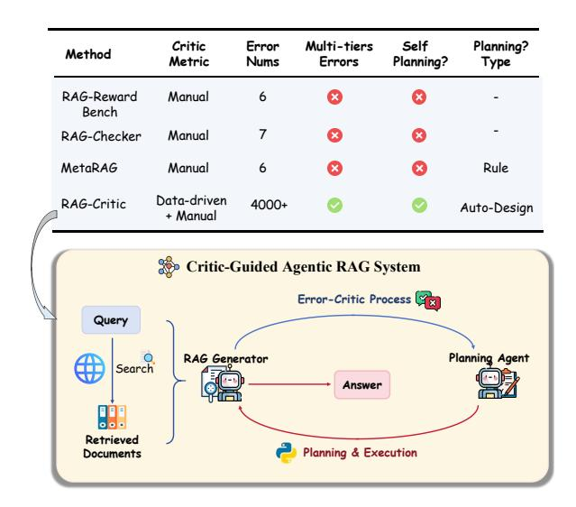

Figure 1: The comparison between RAG-Critic and other methods (Upper part). The overview of our Critic-Guided Agentic RAG framework (bottom part).

et al., 2021), enhancing LLM outputs by incorporating information from retrieved documents to produce more contextually grounded responses.

In practical RAG applications, the absence of golden responses necessitates automated evaluation strategies. Foundational studies leverage LLMs as judgment tools (Zheng et al., 2023; Li et al., 2024a), automating the evaluation of model outputs and generating critical feedback. However, due to the complexity of RAG tasks and their knowledgeintensive nature, errors in retrieved and generated content tend to be more fine-grained compared to other tasks (e.g., factual inaccuracies in specific details). Therefore, relying solely on a single LLM for evaluation often fails to provide precise and reliable judgments.

To address this challenge, recent studies (Ru et al., 2024; Jin et al., 2024b) have explored comprehensive error evaluation in RAG. Beyond error evaluation, critic-based RAG approaches (Zhou et al., 2024; Asai et al., 2024) attempt to refine model out-

<sup>\*</sup>Correpsonding author.

puts by empirically defining error categories and corresponding corrective strategies. While these approaches have demonstrated some effectiveness, several limitations remain:

- Insufficient Generalization: Predefined error categories and correction strategies often fail to adapt to the diverse nature of RAG tasks and the wide range of possible error patterns.
- Lacks Granularity & High Cost: Manually designed error taxonomies struggle to capture fine-grained errors in RAG outputs, while their implementation demands substantial computational and human annotation costs.

Consequently, automating the construction of a well-structured, comprehensive error categorization system remains a fundamental challenge for the practical deployment of RAG systems. Notably, the development of such a system relies on diverse erroneous responses across different domains and styles. However, the field currently lacks highquality, error-annotated datasets, hindering the creation of a universal error-aware model capable of both identifying and mitigating errors in RAG.

In this paper, we propose RAG-Critic, a framework aimed at systematically establishing a hierarchical error categorization system based on practical RAG error responses, enabling LLMs to autonomously customize solutions based on identified errors. Specifically, RAG-Critic comprises three key components: (1) Hierarchical Error System Construction: we carefully select 9 RAG-related datasets and 15 LLMs of varying parameter sizes to sample error responses, which ensures comprehensive coverage of RAG task types and response styles. Moreover, we employ LLMs and clustering algorithms for data-driven annotation as the foundation, while manual summaries at the top address the limitations of mechanized labeling. This process ultimately establishes the first hierarchical RAG error system, encompassing 3 error tiers and over 4,000 unique error types. (2) Alignment of RAG Error-Critic: Leveraging our high-quality error system, we progressively align a RAG error-critic model using a coarse-to-fine training objective to facilitate automated error feedback. (3) Critic-Guided Agentic RAG: To improve the RAG performance from identified errors, as shown in [Fig. 1,](#page-0-1) we design a critic-guided agentic RAG workflow to customize and execute solution flows based on the error-critic model's feedback. We first define a series of action

function codes covering over 15 specific functionalities. Unlike previous rule-based planning, we further introduce a planning model that autonomously selects and arranges action functions, generating corresponding inputs to create executable solution programs. Subsequently, a Python executor executes these programs to implement an automated error-driven self-correction process.

In summary, our contributions are as follows:

- We propose a universal RAG error mining pipeline that leverages an LLM pool to sample errors from extensive RAG datasets, combining data-driven annotations with manual summaries to achieve systematic RAG error categorization.
- We establish the first hierarchical RAG error system, encompassing 3 error tiers with over 4,000 fine-grained labels. Guided by this system, we progressively align an error critique model using a coarse-to-fine training objective, automatically providing fine-grained error feedback.
- We design a critic-guided agentic RAG framework, enabling the planning agent to customize executor-based solution programs based on the error-critic model's feedback, facilitating an automated error-driven self-correction process.
- Experimental results across 7 RAG-related datasets confirm the effectiveness of RAG-Critic. Furthermore, we synthesize an RAG error benchmark based on our error system, verifying the advantages of the RAG-Critic due to its remarkable fine-grained error-critic capabilities.

# 2 Related work

## 2.1 LLM-as-Judges

LLM-as-judges utilize large language models to assess outputs based on predefined criteria [\(Zheng](#page-14-2) [et al.,](#page-14-2) [2023;](#page-14-2) [Li et al.,](#page-12-1) [2024b\)](#page-12-1). These methods include: (1) Instruction-based Methods guide LLMs through In-Context Learning [\(Renze and](#page-13-3) [Guven,](#page-13-3) [2024;](#page-13-3) [Gou et al.,](#page-10-2) [2024;](#page-10-2) [Lin and Chen,](#page-12-2) [2023\)](#page-12-2) and Step-by-step Chain-of-Thought (CoT) reasoning [\(Liu et al.,](#page-12-3) [2023;](#page-12-3) [Yi et al.,](#page-14-4) [2024\)](#page-14-4). (2) Training-based Methods fine-tune LLMs using specialized datasets to enhance evaluation adaptability. Score-based Tuning adjusts models based on human-annotated scores [\(Yue et al.,](#page-14-5) [2023;](#page-14-5) [Jiang](#page-11-2) [et al.,](#page-11-2) [2024\)](#page-11-2), and Preference-based Learning trains models using human preferences [\(Wu et al.,](#page-14-6) [2024;](#page-14-6)

<span id="page-2-0"></span>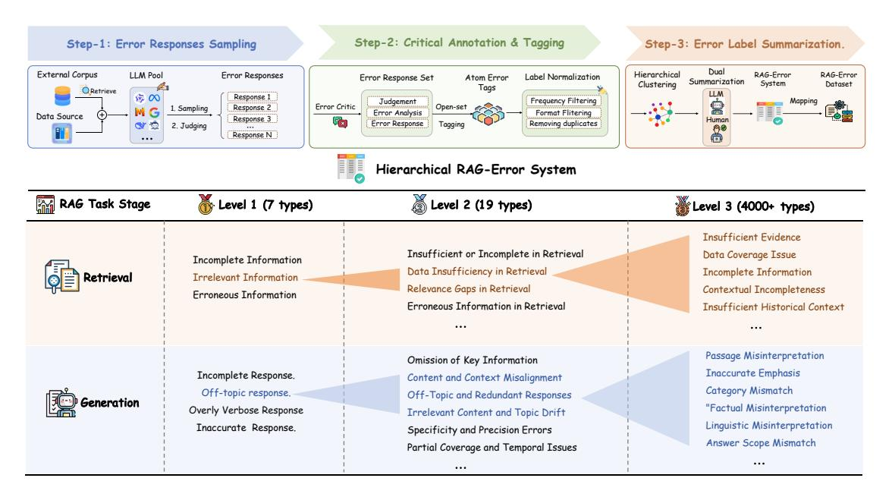

Figure 2: The overview of our hierarchical RAG-Error system. The upper part illustrates the 3-step pipeline for error response sampling and annotation. The bottom part displays the three tiers of labels in our error system.

Ke et al., 2024). (3) Multi-agent Methods enhance evaluation reliability by leveraging the collaboration (Zhang et al., 2023a) or competition (Zhao et al., 2024; Chan et al., 2024) between multiple LLMs. Due to the complexity of the RAG domain, applying LLM as judges is still challenging.

#### 2.2 **Critical Alignment for RAG**

Retrieval-augmented generation (RAG) has emerged as a promising approach (Lewis et al., 2020; Shuster et al., 2021; Dong et al., 2023a; Zhu et al., 2025; Lei et al., 2023; Li et al., 2025a,b; Dong et al., 2024f; Tan et al., 2025; Dong et al., 2023b; Luo et al., 2024), enhancing LLM outputs by incorporating information from retrieved documents to produce more contextually grounded responses. Moreover, critical alignment for RAG involves methods that ensure accurate responses through assessment and reflection mechanisms. Self-RAG (Asai et al., 2024) and MetaRAG (Zhou et al., 2024) introduce dynamic self-evaluation, enabling RAG systems to continuously monitor and optimize retrieval and generation processes. The Corrective RAG framework (Yan et al., 2024) enhances system robustness by evaluating and refining retrieved content. For detailed diagnostics, RAGChecker (Ru et al., 2024) offers granular assessments at the claim level, focusing on retrieval and generation quality. Recently, RAG-RewardBench (Jin et al., 2024b) has established a comprehensive benchmark for

reward models, assessing multi-hop reasoning and citation accuracy. The lack of a fine-grained error system makes it difficult for such methods to generalize across a wide range of RAG tasks.

#### 3 Methodology

**Overview.** In this section, we propose the RAG-Critic framework to enhance the universal RAG capabilities of LLMs through critical feedback. As shown in Fig. 2 & Fig. 3, we approach our RAG-Critic from three aspects: 1) We devise a threestep pipeline for error response mining and annotation  $(\S3.1)$ , establishing a hierarchical RAG error categorization system. 2) Leveraging the high-quality error system, we further align an RAG error-critic model ( $\S3.2$ ) through a Coarse-to-Fine training objective. 3) We introduce the criticguided agentic framework, which facilitates an error-driven correction procedure by autonomously customizing and designing executor-based solution flows based on error feedback ( $\S3.3$ ). Below, we will delve into the specifics of our approach.

### <span id="page-2-1"></span>3.1 Hierarchical Error System Construction

In this section, we introduce our three-step pipeline for establishing a hierarchical RAG error system:

### 3.1.1 Step-1: Error Responses Sampling.

To achieve general RAG error recognition, we first need to construct a comprehensive and diverse set of erroneous responses. Therefore, we consider

<span id="page-3-0"></span>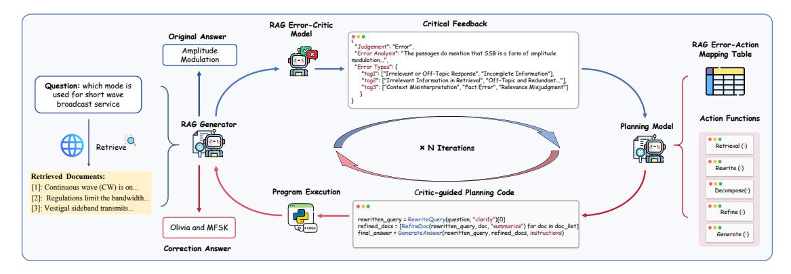

Figure 3: The overview of the automatic critical-guided agentic RAG workflow.

both data sources and model sampling aspects:

Data Source. To balance data scale and diversity while maintaining accessibility, we source a mixed dataset  $D_{raw}$  from train sets of 9 knowledgeintensive open-source datasets, which encompasses 6 task paradigms (Tab. 1). Afterward, we retrieve relevant external knowledge for the dataset  $D_{raw}$ . Given the task query  $q$ , we use a dense retriever to recall the Top- $K$  relevant passages  $D_q$  from the Wikipedia corpus, which comprises  $N$  documents. The process can be formulated as follows:

$$D_q = \text{argtop-}k \left[ E_{\mathsf{d}}(d_i)^{\top} \cdot E_{\mathsf{q}}(q) \mid i = \{1 \dots N\} \right].$$

Therefore, we form our mixed RAG dataset  $D_{\text{RAG}}$ .

Model Sampling. To mitigate inherent biases in responses from the same LLM, we select a diverse pool  $M$  of 15 open-source models from 9 series, with parameter sizes ranging from 3B to  $70B<sup>1</sup>$ . As shown in Fig. 2, we employ the same sampling hyperparameters, allowing each model in  $M$  to sample responses from  $D_{\text{RAG}}$ .

Considering that rule-based metrics cannot evaluate the correctness of responses at the high-level semantics, inspired by CriticBench (Lin et al.,  $2024$ ), we utilize the strong supervision model Owen2.5-72B as a critique, filtering out erroneous samples and providing detailed error rationales. Then we obtain a comprehensive and diverse error response set  $D_{\text{error}} = \{(q, D_q, y, p, e)_i\}_{i=1}^k$ , where  $y, p$  represents the golden answer and model prediction.  $e$  denotes the detailed error analysis rationale. This error pool  $D_{\text{error}}$  establishes a solid foundation for the subsequent error alignment of RAG.

### 3.1.2 Step-2: Critical Annotation & Tagging.

In real-world RAG scenarios, response errors often exhibit multi-faceted and fine-grained characteris-

<span id="page-3-1"></span>

| Dataset      | Task                      | # Train |
|--------------|---------------------------|---------|
| NO           | Single-hop QA             | 79.1k   |
| TriviaOA     | Single-hop QA             | 78.7k   |
| HotpotQA     | Multi-hop QA              | 90.4k   |
| 2Wiki        | Multi-hop QA              | 15.0k   |
| ASOA         | Long-form QA              | 4.3k    |
| ELI5         | Long-form QA              | 272k    |
| $\text{WoW}$ | Dialogue Generation       | 63.7k   |
| FEVER        | Fact Verification         | 104.9k  |
| WikiASP      | Open-domain Summarization | 30k     |

Table 1: The statistics of RAG related data source.

tics. Therefore, accurately distinguishing subtle differences among erroneous responses requires the error annotations process that captures atomic intentions. Inspired by the data selection effort (Lu et al., 2023), we utilize open-set annotations and normalization techniques to tackle this challenge.

Open-set Annotation. Our goal is to generate diverse and meaningful labels for the identified errors. Unlike previous critic-based RAG works (Zhou et al., 2024), we do not provide predefined labels during the labeling process; instead, we adopt an open-set annotation. This choice allows for greater flexibility in covering the diverse errors present in open-domain RAG tasks. Specifically, we design a critical prompt to guide Qwen2.5-72B in analyzing the error rationales of  $D_{\text{error}}$ , generating a set of parsable JSON format labels. Notably, each question is assigned multiple open labels, ultimately resulting in over 20,000 atomic error labels.

**Label Normalization.** Importantly, we observe significant noise in the original atom tags, primarily due to long-tail effects and instruction compliance issues. To ensure their high quality and relevance, we implement two normalization strategies: 1) Removing long-tail labels with a frequency below a specified threshold  $\alpha$ , as well as deleting atomic labels that exceed 25 tokens in length; 2) Filtering

<sup>&</sup>lt;sup>1</sup>The display of our LLM pool  $M$  are listed in Appx.  $A.5$ 

out empty responses not adhering to JSON format. After this denoising process, we successfully obtain 4,000 atomic labels, which contribute to a bottomtier error taxonomy for our RAG error system.

## 3.1.3 Step-3: Error Label Summarization.

To hierarchically categorize the atomic error label set, we adopt a data-driven automated annotation mechanism as the foundation, complemented by manual summarization at the top level, thereby achieving an efficient labeling process while minimizing human intervention.

Clustering and LLM Categorization. Given the atomic error label set, we apply hierarchical clustering (Ward Jr. 1963), resulting in 20 class centers. Then we trace back the sample sets covered by each cluster and randomly select 50 labels. With GPT-40 as a supervised model, we summarize the central error type for each cluster, ultimately resulting in 20 second-tier error types.

Manual Summarization. Relying solely on automated summarization from LLMs may lead to mechanical text and biases. To mitigate this, we employ three well-educated annotators, each tasked with categorizing the 20 second-tier labels and summarizing the top-tier error types. Subsequently, the annotators engage in cross-validation and discussion, culminating in a comprehensive hierarchical error system that comprises 7 top-tier labels, 19 second-tier labels, and over 4,000 tertiary labels, thus enhancing the granularity of error categorization. As shown in Fig. 2, it is noteworthy that there is a mapping relationship between the high and low-tier labels in our hierarchical error system.

Ultimately, we reverse-map the three-tier labels according to our error system to annotate  $D_{\text{error}}$ , synthesizing the first fine-grained error identification QA dataset for the RAG domain:

$$D_{\text{Error}}^{\text{QA}} = \{ (x, y)_i \mid x \in (q, D_q, p), \ y \in (\{T_j\}_{j=1}^3, e) \}_{i=1}^k, \tag{1}$$

where each x contains RAG input  $(q, D_q)$  and model prediction  $p.$   $y$  denotes the critical feedback, including 3-tier error labels  $\{T_j\}_{j=1}^3$  and a binary error judgment label  $e$ .

#### <span id="page-4-0"></span>RAG Error-Critic Alignment 3.2

After thoroughly analyzing the RAG error system, our immediate goal is to distill its knowledge into a critic model for automated error labeling. Notably, our error-critic process in stage 2 naturally generates numerous positive and negative response

<span id="page-4-1"></span>Table 2: The definitions of 5 action functions.

| Function                                                                                          | Definitions                                                                                                                                       |
|---------------------------------------------------------------------------------------------------|---------------------------------------------------------------------------------------------------------------------------------------------------|
| $Retrieval(\cdot)$<br>$Rewrite(\cdot)$<br>$Decompose(\cdot)$<br>$\overline{\text{Refine}(\cdot)}$ | Retrieve relevant documents.<br>Clarify or expand the given query.<br>Break query into smaller sub-queries.<br>Explain or summarize the document. |
| $\text{Generate}(\cdot)$                                                                          | Generate final answer.                                                                                                                            |

samples, allowing us to design two training objectives for progressive alignment:

Supervised Fine-tuning (SFT). To maintain a balance between error and correct responses, we first randomly select several correct samples equal to that in  $D_{\rm Error}^{\rm QA}$  to construct the SFT dataset  $D_{\text{Error}}^{\text{SFT}}$ . Given  $(x_i, y_i) \in D_{\text{Error}}^{\text{SFT}}$ , we apply the standard Supervised Fine-tuning objective on the base model P with parameters  $\theta$ :  $\mathcal{L}(\boldsymbol{\theta})$  =  $\sum_{(x_i, y_i) \in \mathcal{D}_{\text{train}}} \log \mathbb{P}_{\theta}(y_i \mid x_i) \text{ , where } x_i \text{ denotes the } i\text{-th input. To simulate the real-world RAG sce$ nario,  $x_i$  does not contain the golden answer. Ultimately, the final output  $y$  of our error-critic model will follow a JSON format, including a binary error judgment e and 3-tier error tags  $\{T_j\}_{j=1}^3$ .

Coarse-to-Fine DPO Alignment. To achieve excellent error alignment, an ideal RAG error-critic model should feature two key capabilities: 1) the ability to coarse-grain distinguish between correct and incorrect responses, and 2) the ability to finely label three-tier error labels from the error system.

To unleash the LLM's potential, we randomly sample  $k$  response samples as negative examples  $y_i^-$  from both the correct and error pools for each sample  $x$  respectively. The first set helps the LLM learn coarse distinctions between correct and error responses, while the second captures fine differences among various error responses. Ultimately, we merge the two negative samples to formulate the pairwise preference set  $D^{\text{pref}} =$  $(y_i^+, y_i^-)_{i=1}^k$ , following Direct Preference Optimization (DPO) (Rafailov et al., 2023) to achieve coarse-to-fine alignment:

$$\begin{split} \mathcal{L}_{\text{SDPO}}(\pi_{\theta}; \pi_{\text{ref}}) &= -\mathbb{E}_{(x, y^{+}, y^{-}) \sim \mathcal{D}^{\text{pref}}}[\text{log}\sigma(\beta \text{log} \ \frac{\pi_{\theta}(y^{+}|x)}{\pi_{\theta}(y^{+}|x)} - \beta \text{log}\frac{\pi_{\text{ref}}(y^{-}|x)}{\pi_{\text{ref}}(y^{-}|x)})], \end{split}$$

where the reference model  $\pi_{\text{ref}}$  is initially set to  $\pi^{\rm SFT}_{\scriptscriptstyle{A}}$  and remains fixed. The hyperparameter  $\beta$  and the sigmoid function  $\sigma$  are used. The objective  $\mathcal{L}_{\text{DPO}}$  aims to maximize the log probability of the preferred  $y^+$  over the dispreferred  $y^-$ .


<span id="page-5-1"></span>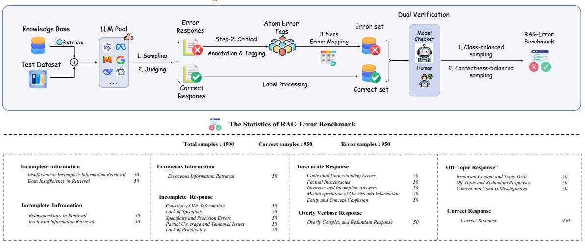

Figure 4: The overview of RAG-Error Benchmark.

#### <span id="page-5-0"></span>**Critic-guided Agentic RAG Framework** 3.3

Our ultimate goal is to improve the LLM's RAG performance by leveraging critic feedback from the error-critic model. To achieve this, we propose the "Error-Action Mapping" and the "Critic-Guided Agentic Workflow", integrating both offline and online strategies for error-driven corrections.

### 3.3.1 Error-Action Mapping.

Based on the error system, it is crucial to formulate corresponding solutions for each error type. We employ GPT-40 to summarize offline solutions for first- and second-tier errors, followed by manual optimization to create the Error-Action mapping table  $T$ . This table serves as a guide for on-policy planning, which is listed in Appx. §A.6.

#### 3.3.2 Critic-Guided Agentic Workflow

In this section, we design the "Generate-Critic-**Planning-Execution'** workflow to facilitate automated problem solving.

Action Design. Guided by the critic feedback and the Error-Action mapping, we aim to automate solution planning and execution. Drawing inspiration from code execution efforts (Le et al., 2022; Qiao et al., 2024b; Dong et al., 2024a,b), we break down each solution path into several sub-actions, each corresponding to a fine-grained problem-solving strategy (e.g., re-retrieval, specific document deletion). We further define an action function set  $F$ containing 5 different functions (Tab. 2), implementing over 15 fine-grained sub-actions based on varying inputs (Tab. 12).

Critic-Guided Planning. In real-world scenarios, merely adhering to predefined offline solutions often fails to flexibly address the diverse challenges of RAG tasks. To overcome this, we further introduce the planning agent  $\pi_{\beta}$  for automated solution planning in inference. In detail, given the  $(q, D_q) \in D_{\text{test}}$ , we first utilize the RAG generator  $\pi_{\alpha}$  to generate the prediction  $p \sim \pi_{\alpha}(x)$ . Furthermore, we employ the aligned RAG errorcritic model  $\pi_{\theta}$  to generate the critical feedback  $y \sim \pi_{\theta}(y \mid q, D_q, p)$ . Using the same input  $(q, D_q, p)$ , the critic feedback y, the predefined mapping table  $T$ , and action functions  $F$ , the planning model  $\pi_{\beta}$  autonomously selects and sequences the necessary solution actions under the guidance of the critic signal, generating the planning programs  $p$  for each function. The process can be formulated as:

$$\hat{p} = \arg\max \pi_{\beta} \left( q, D_q, p, y, F, T \right), \qquad (2)$$

Notably, if the judgment of the critic signal  $y$  is correct, we will skip this process.

**Execution-based Correction.** Once the planning programs  $\hat{p}$  for correction is generated, we utilize a Python execution environment to sequentially execute these action functions, generating the correction answer  $\hat{y}$ . Notably, the model optimization and inference processes required by the programs will utilize the original RAG model  $\pi_{\alpha}$  to enable automated self-correction. The detailed algorithm workflow is illustrated in algorithm 1.

#### <span id="page-5-2"></span>**RAG-Error Benchmark** 3.4

To enhance error judgment and fine-grained recognition in RAG, we introduce the RAG-Error benchmark, detailing the following two aspects:

| <b>Algorithm 1:</b> Critical-guided Agentic RAG |  |  |
|-------------------------------------------------|--|--|
|-------------------------------------------------|--|--|

|    | <b>Input</b> :RAG inputs $x \in D_{test}$ , RAG model $\pi_{\alpha}$ , |  |  |  |  |  |  |  |
|----|------------------------------------------------------------------------|--|--|--|--|--|--|--|
|    | Aligned critic model $\pi_{\theta}$ , Planning model                   |  |  |  |  |  |  |  |
|    | $\pi_{\beta}, D_{test}$ Size N                                         |  |  |  |  |  |  |  |
|    | <b>Output</b> : Correction output set $Y$                              |  |  |  |  |  |  |  |
|    | <b>Initialize:</b> Error mapping table $T$ , Action function set       |  |  |  |  |  |  |  |
|    | F                                                                      |  |  |  |  |  |  |  |
|    | $1 \quad Y \leftarrow \emptyset;$                                      |  |  |  |  |  |  |  |
|    | 2 for $i \leftarrow 1$ to $n$ do                                       |  |  |  |  |  |  |  |
| 3  | $p \leftarrow \pi_{\alpha}(q, D_q)$ ; // RAG Answer Generation         |  |  |  |  |  |  |  |
| 4  | $y \leftarrow \pi_{\theta}(q, D_q, p)$ ; // Critical Feedback          |  |  |  |  |  |  |  |
|    | Generation                                                             |  |  |  |  |  |  |  |
| 5  | if $y == Error$ then                                                   |  |  |  |  |  |  |  |
| 6  | $\hat{p} \leftarrow \pi_{\beta}(q, D_q, p, y, F, T)$ ;                 |  |  |  |  |  |  |  |
|    | <pre>// Critic-guided Planning</pre>                                   |  |  |  |  |  |  |  |
| 7  | $\hat{y} \leftarrow \text{Executor}(\hat{p})$ ;<br>// Program          |  |  |  |  |  |  |  |
|    | Execution                                                              |  |  |  |  |  |  |  |
| 8  | $Y \leftarrow Y \cup \{\hat{y}\};$<br>// Output Update                 |  |  |  |  |  |  |  |
| 9  | else                                                                   |  |  |  |  |  |  |  |
| 10 | Continue;                                                              |  |  |  |  |  |  |  |
|    |                                                                        |  |  |  |  |  |  |  |
|    | 11 return $Y$ ;                                                        |  |  |  |  |  |  |  |

<span id="page-6-0"></span>**Data Construction.** As outlined in Figure 4, based on our comprehensive error system, we follow the process in Section  $3.1$  to resample the test set from the data pool  $D_{\text{Error}}$  by using 5 advanced LLMs (Owen 2.5 (7B, 70B), Llama 3.1 (8B, 70B), Mistral  $v0.3$  (7B)). Next, we map three levels of error labels according to the predefined framework and employ dual verification with LLM and human evaluation, retaining only correctly marked samples to create a high-quality  $D_{\text{Error}}^{\text{test}}$ . For maintaining data balance, we consider two aspects:

- **Error Type Balance.** Using 19 secondary labels as a basis, we conduct balanced sampling of  $D_{\text{Error}}^{\text{test}}$  to ensure each category appears at least 50 times, totaling 950 samples.
- **Correctness Balance.** We randomly sample 950 labeled instances from step-2 to balance positive and negative samples.

Evaluation Protocol. After obtaining LLM outputs, we evaluate performance from two aspects:

- **Error Identification:** We calculate accuracy metrics to assess the model's judgment correctness, reporting overall and per-label accuracy.
- Fine-grained Error Classification: For each level and label category, we use the F1 score to measure annotation accuracy across different error types and compute the average accuracy.

Data Statistics. We construct the RAG-Error benchmark, which is derived from 5 LLMs, 9

data sources, and dual verification. To ensure balanced sampling across categories, we sampled 50 instances from each fine-grained category, resulting in a total of 950 error samples. To maintain the balance between correct and incorrect samples, we also included 950 correct samples. Ultimately, RAG-Error benchmark includes 1,900 samples, encompassing 9 coarse-grained and 19 fine-grained error categories, addressing both error discrimination and fine-grained annotation assessment.

#### 4 Experiment

#### $4.1$ **Experimental Setup**

**Datasets.** We evaluate six datasets covering four distinct task types, including (1) Single-hop QA represented by NQ (Kwiatkowski et al., 2019) and TriviaQA (Joshi et al., 2017); (2) Multi-hop QA includes HotpotQA (Yang et al., 2018) and 2WikimultihopQA (Ho et al., 2020); (3) Long-form QA contains the ASQA (Stelmakh et al., 2022); (4) Dialogue Generation includes the WoW (Dinan et al., 2018). For evaluation metrics, we use EM

for the accuracy of the top-ranked response and F1 score to assess the similarity to the ground truth.

RAG-Error Benchmark. To assess the error identification and classification capabilities of LLMs, we evaluate existing LLMs on our RAG-Error benchmark. Notably, we evaluate the critic performance of LLMs from (1) Error Identification and (2) **Error Classification** as section 3.4.

**Baselines.** In our experiments, we primarily evaluate two categories of baselines: (1) **Proprietary Models:** o1-preview (Jaech et al., 2024), GPT-40 (OpenAI et al., 2024), Claude3.5-sonnet (Anthropic, 2024), Qwen2.5 (Yang et al., 2024) (3B-70B) and Llama3.1 (Meta, 2024) (8B,70B) (2) Critical RAG Baselines: Selfseries. RAG (Asai et al., 2024), FLARE (Jiang et al., 2023b), MetaRAG (Zhou et al., 2024) and Self-Refine (Madaan et al., 2023). More detailed implementations are listed in Appx. §B.

### 4.2 Main Result.

Our main results are presented in Tab. 3. Overall, RAG-Critic consistently outperforms all baselines, decisively establishing its superiority. Furthermore, we have identified the following insights:

1) Existing critic-based RAG methods struggle to correct complex QA errors. Compared to standard RAG, Self-Refine and FLARE do

<span id="page-7-0"></span>Table 3: Overall performance on 7 RAG related datasets, including single-hop, multi-hop, long-form QA and dialogue Generation tasks. The best two results are in bold and underlined. The overall result improvement / decrease of each method compared to the standard RAG with the same backbone is calculated in parentheses.

| Method             | Backbone     | NQ |      | TriviaQA |      | HotpotQA |      | 2Wiki |      | ASQA | WOW  | ELI5 | Overall     |
|--------------------|--------------|----|------|----------|------|----------|------|-------|------|------|------|------|-------------|
|                    |              | EM | F1   | EM       | F1   | EM       | F1   | EM    | F1   | F1   | F1   | F1   | F1          |
| Standard RAG       | Llama3.1-8B  | 23 | 38.3 | 44       | 55.3 | 27       | 35.2 | 18    | 30.1 | 11.5 | 10.2 | 20.1 | 28.7        |
| Standard RAG       | Qwen2.5-7B   | 18 | 33.2 | 41       | 52.1 | 32       | 43.5 | 21    | 28.2 | 21.3 | 13.3 | 20.5 | 30.3        |
| Standard RAG       | Llama3.1-70B | 26 | 40.1 | 51       | 60.1 | 37       | 47.0 | 21    | 29.8 | 14.3 | 9.6  | 20.8 | 31.7        |
| Standard RAG       | Qwen2.5-72B  | 25 | 41.2 | 42       | 54.3 | 28       | 39.0 | 22    | 31.2 | 17.1 | 14.1 | 21.3 | 31.2        |
| Critical-based RAG |              |    |      |          |      |          |      |       |      |      |      |      |             |
| Self-Refine        | Llama3.1-8B  | 10 | 22.3 | 20       | 32.3 | 15       | 24.7 | 12    | 23.1 | 19.0 | 11.7 | 22.6 | 22.2 (-6.5) |
| FLARE              | Llama3.1-8B  | 12 | 19.8 | 48       | 57.1 | 20       | 25.8 | 10    | 22.7 | 10.5 | 4.2  | 19.7 | 22.8 (-5.9) |
| Self-RAG           | Llama3.1-8B  | 27 | 32.3 | 24       | 35.7 | 9        | 17.6 | 4     | 18.9 | 29.3 | 17.4 | 21.8 | 24.7 (-4.0) |
| MetaRAG            | Llama3.1-8B  | 22 | 40.2 | 50       | 59.2 | 37       | 47.0 | 20    | 29.2 | 12.0 | 6.2  | 20.3 | 30.6 (+1.9) |
| Ours               |              |    |      |          |      |          |      |       |      |      |      |      |             |
| RAG-Critic         | Llama3.1-8B  | 27 | 42.0 | 50       | 60.1 | 40       | 51.2 | 21    | 33.1 | 19.0 | 11.6 | 21.2 | 34.0 (+5.3) |
| RAG-Critic         | Qwen2.5-7B   | 22 | 37.3 | 53       | 58.5 | 37       | 48.8 | 25    | 32.8 | 24.3 | 14.4 | 22.6 | 34.1 (+3.8) |
| RAG-Critic         | Llama3.1-70B | 30 | 45.4 | 52       | 62.2 | 41       | 51.8 | 23    | 31.5 | 17.9 | 10.7 | 22.5 | 34.6 (+2.9) |
| RAG-Critic         | Qwen2.5-72B  | 26 | 43.1 | 46       | 58.8 | 29       | 44.7 | 22    | 34.3 | 19.2 | 14.8 | 23.1 | 34.0 (+2.8) |

<span id="page-7-1"></span>Table 4: Ablation study of RAG-Critic (Llama3.1-8B).

| Method            | NQ          | TrivaQA     | HotpotQA    |  |  |
|-------------------|-------------|-------------|-------------|--|--|
|                   | F1          | F1          | F1          |  |  |
| RAG-Critic        | 42.0        | 60.1        | 51.2        |  |  |
| w/o Data-driven   | 38.7 (-3.3) | 58.5 (-1.6) | 48.8 (-2.4) |  |  |
| w/o Manual Sum.   | 40.1 (-1.9) | 59.2 (-0.9) | 47.0 (-4.2) |  |  |
| w/o Auto-Planning | 39.2 (-2.8) | 57.2 (-2.9) | 45.5 (-5.7) |  |  |
| w/o Critic Model  | 37.0 (-5.0) | 56.5 (-3.6) | 47.0 (-4.2) |  |  |

not achieve consistent improvements across all datasets, with declines exceeding 5% observed in Multi-Hop QA (HotpotQA & 2wiki). This underscores the lack of an effective method for errororiented correction in complex RAG scenarios.

2) Our proposed model RAG-Critic exhibits exceptional alignment capabilities across various datasets. Compared to critic-based RAG methods, RAG-Critic (Llama3.1-8B) achieves the best overall performance across all datasets (5.3%↑). Moreover, RAG-Critic maintains a stable improvement over standard RAG baselines in each dataset, validating the superior error correction capability of our automated critic workflow.

3) RAG-Critic is a versatile plug-and-play solution compatible with various LLM backbones. Regardless of varying parameter sizes (7B, 70B) or different LLM backbone series (Llama3.1, Qwen2.5), RAG-Critic consistently delivers improvements over standard RAG baselines, highlighting its flexible application potential in realworld RAG systems.

Ablation Study. To investigate the effectiveness of various modules in RAG-Critic, we perform an ablation study in [Tab. 4.](#page-7-1) We use "w/o"

<span id="page-7-2"></span>Table 5: Overall performance on RAG-Error Benchmark. The top 1/2 results are bolded/underlined.

| Method             | Identification                    |      |      | Classification |      |      |  |
|--------------------|-----------------------------------|------|------|----------------|------|------|--|
|                    | Correct Error Avg. Tag1 Tag2 Avg. |      |      |                |      |      |  |
| Closed-source LLMs |                                   |      |      |                |      |      |  |
| o1-preview         | 79.0                              | 59.4 | 69.2 | 23.6           | 7.4  | 15.5 |  |
| GPT4-o             | 77.9                              | 78.1 | 78.0 | 38.5           | 15.4 | 26.9 |  |
| Claude 3.5         | 46.7                              | 89.3 | 68.2 | 32.2           | 10.6 | 21.3 |  |
| Open-source LLMs   |                                   |      |      |                |      |      |  |
| Qwen2.5-72B        | 79.8                              | 79.8 | 79.8 | 45.5           | 17.4 | 31.5 |  |
| Llama3.1-70B       | 95.2                              | 42.7 | 68.9 | 25.7           | 10.0 | 17.8 |  |
| Ours               |                                   |      |      |                |      |      |  |
| RAG-Critic (3B)    | 95.8                              | 96.6 | 96.2 | 65.2           | 42.4 | 58.3 |  |

to denote variants without specific modules. The results reveal that (1) The performance declines when any part of the design is removed, indicating that all components are highly effective. (2) In the error system construction, removing either the datadriven or manual components significantly impacts performance. This aligns with our motivation: the data-driven approach captures more fine-grained error types from the responses pool, while manual summarization overcomes the mechanization of automated processes. (3) The most significant performance drop occurs when the error-critic model is removed, underscoring that high-quality feedback is fundamental to the error-critic process.

### 4.3 Analysis in RAG-Error Benchmark.

To delve deeper into the fine-grained error-critic capabilities of RAG-Critic and existing LLMs, we analyze RAG-Error bench's results in two aspects:

Coarse-Grained Identification. As shown in [Tab. 5,](#page-7-2) Current LLMs do not perform well in coarse-grained error identification, particularly Claude-3.5 and Llama3.1-70B, which struggle around borderline accuracy (<70% in Avg.). Despite their poor performance, these two LLMs excel at identifying correct and incorrect samples (>95%). This result reveals a bias in existing LLMs towards over-predicting either the correct or incorrect categories in error identification. In contrast, our RAG-Critic achieves exceptional performance (95%) in all categories, which we attribute to our robust error system and progressive training objectives.

Fine-Grained Classification. The RAG-Error bench requires LLMs to select a series of tags from 1st-tier (7 categories) and 2nd-tier (20 categories) error labels for fine-grained labeling. As illustrated in [Tab. 5](#page-7-2) and [Fig. 5,](#page-8-0) such a challenging task has led to struggles for both strong closedsource LLMs (o1-preview, GPT-4o) and opensource LLMs (Qwen2.5-70B, Llama3.3-70B), especially with 2nd-tier labeling, where accuracy falls below 40%. Notably, our RAG-Critic model with only 3B parameters achieves an over 50% accuracy score, surpassing powerful models with over 70B parameters, thus realizing a lightweight and efficient RAG error-critic process [2](#page-0-0) .

#### 4.4 Error Statistics & Analysis.

To deepen our understanding of the deficiencies exposed in current RAG tasks, as shown in [Fig. 6,](#page-8-1) we analyze the occurrence of 1st-tier error types (7 categories) in Qwen2.5-7B and Llama3.1-8B across 9 datasets evaluated in the main results. Overall, errors during the generation phase of LLMs (58.7%) are more frequent than those during the retrieval (41.3%). Notably, over 40% of errors involved incomplete information or responses. To further investigate specific errors, we provide a detailed discussion of 2nd-tier error types in the Appx. [§A.4,](#page-17-0) revealing that information noise in the retrieval and factual inaccuracies in the generation are core issues hindering task generalization in RAG. This suggests that providing more accurate information for both retrieval and reasoning in the RAG domain is more urgent than merely improving the reasoning capabilities of the RAG generator.

## 5 Conclusion

In this paper, we introduce RAG-Critic, a novel framework that utilizes a critic-guided agentic

<span id="page-8-0"></span>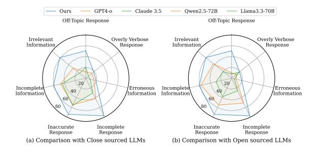

Figure 5: The results of LLMs on RAG-Error bench.

<span id="page-8-1"></span>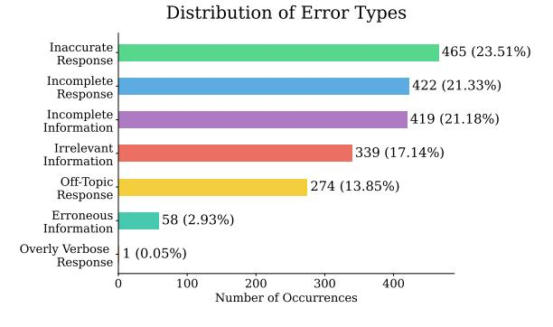

Figure 6: The statistics of different error types in RAG.

workflow to autonomously enhance RAG capabilities. We first design a data-driven error mining pipeline to establish a hierarchical RAG error system. Using this system, we progressively align an error-critic model with a coarse-to-fine training objective, automating the fine-grained error feedback. We then introduce the critic-guided agentic workflow, which facilitates an error-driven correction by autonomously customizing executor-based solution flows based on error feedback. Experimental results across seven RAG-related datasets demonstrate the effectiveness of RAG-Critic, while qualitative analysis provides valuable insights for building reliable RAG systems.

## Acknowledgments

This work was supported by Beijing Natural Science Foundation No. L233008, Beijing Municipal Science and Technology Project No. Z231100010323009, National Science and Technology Major Project No. 2022ZD0120103, National Natural Science Foundation of China No. 62272467, and the fund for building world-class universities (disciplines) of Renmin University of China. The work was partially done at the Engineering Research Center of Next-Generation Intelligent Search and Recommendation, MOE.

<sup>2</sup>Due to the limited space, results of computation cost, iteration exploration are in Appx. [§A.](#page-16-0)

# References

- <span id="page-9-5"></span>Marah I Abdin, Sam Ade Jacobs, Ammar Ahmad Awan, Jyoti Aneja, Ahmed Awadallah, Hany Awadalla, Nguyen Bach, Amit Bahree, Arash Bakhtiari, Harkirat S. Behl, Alon Benhaim, Misha Bilenko, Johan Bjorck, Sébastien Bubeck, Martin Cai, Caio César Teodoro Mendes, Weizhu Chen, Vishrav Chaudhary, Parul Chopra, Allie Del Giorno, Gustavo de Rosa, Matthew Dixon, Ronen Eldan, Dan Iter, Amit Garg, Abhishek Goswami, Suriya Gunasekar, Emman Haider, Junheng Hao, Russell J. Hewett, Jamie Huynh, Mojan Javaheripi, Xin Jin, Piero Kauffmann, Nikos Karampatziakis, Dongwoo Kim, Mahoud Khademi, Lev Kurilenko, James R. Lee, Yin Tat Lee, Yuanzhi Li, Chen Liang, Weishung Liu, Eric Lin, Zeqi Lin, Piyush Madan, Arindam Mitra, Hardik Modi, Anh Nguyen, Brandon Norick, Barun Patra, Daniel Perez-Becker, Thomas Portet, Reid Pryzant, Heyang Qin, Marko Radmilac, Corby Rosset, Sambudha Roy, Olatunji Ruwase, Olli Saarikivi, Amin Saied, Adil Salim, Michael Santacroce, Shital Shah, Ning Shang, Hiteshi Sharma, Xia Song, Masahiro Tanaka, Xin Wang, Rachel Ward, Guanhua Wang, Philipp Witte, Michael Wyatt, Can Xu, Jiahang Xu, Sonali Yadav, Fan Yang, Ziyi Yang, Donghan Yu, Chengruidong Zhang, Cyril Zhang, Jianwen Zhang, Li Lyna Zhang, Yi Zhang, Yue Zhang, Yunan Zhang, and Xiren Zhou. 2024. [Phi-3 technical report: A](https://doi.org/10.48550/ARXIV.2404.14219) [highly capable language model locally on your phone.](https://doi.org/10.48550/ARXIV.2404.14219) *CoRR*, abs/2404.14219.
- <span id="page-9-3"></span>AI Anthropic. 2024. Claude 3.5 sonnet model card addendum. *Claude-3.5 Model Card*, 3(6).
- <span id="page-9-1"></span>Akari Asai, Zeqiu Wu, Yizhong Wang, Avirup Sil, and Hannaneh Hajishirzi. 2024. [Self-rag: Learning to](https://openreview.net/forum?id=hSyW5go0v8) [retrieve, generate, and critique through self-reflection.](https://openreview.net/forum?id=hSyW5go0v8) In *The Twelfth International Conference on Learning Representations, ICLR 2024, Vienna, Austria, May 7-11, 2024*. OpenReview.net.
- <span id="page-9-4"></span>Xiao Bi, Deli Chen, Guanting Chen, Shanhuang Chen, Damai Dai, Chengqi Deng, Honghui Ding, Kai Dong, Qiushi Du, Zhe Fu, Huazuo Gao, Kaige Gao, Wenjun Gao, Ruiqi Ge, Kang Guan, Daya Guo, Jianzhong Guo, Guangbo Hao, Zhewen Hao, Ying He, Wenjie Hu, Panpan Huang, Erhang Li, Guowei Li, Jiashi Li, Yao Li, Y. K. Li, Wenfeng Liang, Fangyun Lin, Alex X. Liu, Bo Liu, Wen Liu, Xiaodong Liu, Xin Liu, Yiyuan Liu, Haoyu Lu, Shanghao Lu, Fuli Luo, Shirong Ma, Xiaotao Nie, Tian Pei, Yishi Piao, Junjie Qiu, Hui Qu, Tongzheng Ren, Zehui Ren, Chong Ruan, Zhangli Sha, Zhihong Shao, Junxiao Song, Xuecheng Su, Jingxiang Sun, Yaofeng Sun, Minghui Tang, Bingxuan Wang, Peiyi Wang, Shiyu Wang, Yaohui Wang, Yongji Wang, Tong Wu, Y. Wu, Xin Xie, Zhenda Xie, Ziwei Xie, Yiliang Xiong, Hanwei Xu, R. X. Xu, Yanhong Xu, Dejian Yang, Yuxiang You, Shuiping Yu, Xingkai Yu, B. Zhang, Haowei Zhang, Lecong Zhang, Liyue Zhang, Mingchuan Zhang, Minghua Zhang, Wentao Zhang, Yichao Zhang, Chenggang Zhao, Yao Zhao, Shangyan Zhou, Shunfeng Zhou, Qihao Zhu, and Yuheng Zou. 2024.

[Deepseek LLM: scaling open-source language mod](https://doi.org/10.48550/ARXIV.2401.02954)[els with longtermism.](https://doi.org/10.48550/ARXIV.2401.02954) *CoRR*, abs/2401.02954.

- <span id="page-9-8"></span>Lars Buitinck, Gilles Louppe, Mathieu Blondel, Fabian Pedregosa, Andreas Mueller, Olivier Grisel, Vlad Niculae, Peter Prettenhofer, Alexandre Gramfort, Jaques Grobler, Robert Layton, Jake VanderPlas, Arnaud Joly, Brian Holt, and Gaël Varoquaux. 2013. API design for machine learning software: experiences from the scikit-learn project. In *ECML PKDD Workshop: Languages for Data Mining and Machine Learning*, pages 108–122.
- <span id="page-9-6"></span>Zheng Cai, Maosong Cao, Haojiong Chen, Kai Chen, Keyu Chen, Xin Chen, Xun Chen, Zehui Chen, Zhi Chen, Pei Chu, Xiaoyi Dong, Haodong Duan, Qi Fan, Zhaoye Fei, Yang Gao, Jiaye Ge, Chenya Gu, Yuzhe Gu, Tao Gui, Aijia Guo, Qipeng Guo, Conghui He, Yingfan Hu, Ting Huang, Tao Jiang, Penglong Jiao, Zhenjiang Jin, Zhikai Lei, Jiaxing Li, Jingwen Li, Linyang Li, Shuaibin Li, Wei Li, Yining Li, Hongwei Liu, Jiangning Liu, Jiawei Hong, Kaiwen Liu, Kuikun Liu, Xiaoran Liu, Chengqi Lv, Haijun Lv, Kai Lv, Li Ma, Runyuan Ma, Zerun Ma, Wenchang Ning, Linke Ouyang, Jiantao Qiu, Yuan Qu, Fukai Shang, Yunfan Shao, Demin Song, Zifan Song, Zhihao Sui, Peng Sun, Yu Sun, Huanze Tang, Bin Wang, Guoteng Wang, Jiaqi Wang, Jiayu Wang, Rui Wang, Yudong Wang, Ziyi Wang, Xingjian Wei, Qizhen Weng, Fan Wu, Yingtong Xiong, Xiaomeng Zhao, and et al. 2024. [Internlm2 technical report.](https://doi.org/10.48550/ARXIV.2403.17297) *CoRR*, abs/2403.17297.
- <span id="page-9-2"></span>Chi-Min Chan, Weize Chen, Yusheng Su, Jianxuan Yu, Wei Xue, Shanghang Zhang, Jie Fu, and Zhiyuan Liu. 2024. [Chateval: Towards better llm-based eval](https://openreview.net/forum?id=FQepisCUWu)[uators through multi-agent debate.](https://openreview.net/forum?id=FQepisCUWu) In *The Twelfth International Conference on Learning Representations, ICLR 2024, Vienna, Austria, May 7-11, 2024*. OpenReview.net.
- <span id="page-9-0"></span>Mark Chen, Jerry Tworek, Heewoo Jun, Qiming Yuan, Henrique Pondé de Oliveira Pinto, Jared Kaplan, Harrison Edwards, Yuri Burda, Nicholas Joseph, Greg Brockman, Alex Ray, Raul Puri, Gretchen Krueger, Michael Petrov, Heidy Khlaaf, Girish Sastry, Pamela Mishkin, Brooke Chan, Scott Gray, Nick Ryder, Mikhail Pavlov, Alethea Power, Lukasz Kaiser, Mohammad Bavarian, Clemens Winter, Philippe Tillet, Felipe Petroski Such, Dave Cummings, Matthias Plappert, Fotios Chantzis, Elizabeth Barnes, Ariel Herbert-Voss, William Hebgen Guss, Alex Nichol, Alex Paino, Nikolas Tezak, Jie Tang, Igor Babuschkin, Suchir Balaji, Shantanu Jain, William Saunders, Christopher Hesse, Andrew N. Carr, Jan Leike, Joshua Achiam, Vedant Misra, Evan Morikawa, Alec Radford, Matthew Knight, Miles Brundage, Mira Murati, Katie Mayer, Peter Welinder, Bob McGrew, Dario Amodei, Sam McCandlish, Ilya Sutskever, and Wojciech Zaremba. 2021. [Evaluat](https://arxiv.org/abs/2107.03374)[ing large language models trained on code.](https://arxiv.org/abs/2107.03374) *CoRR*, abs/2107.03374.
- <span id="page-9-7"></span>Yiruo Cheng, Kelong Mao, Ziliang Zhao, Guanting Dong, Hongjin Qian, Yongkang Wu, Tetsuya Sakai,

Ji-Rong Wen, and Zhicheng Dou. 2024. [CORAL:](https://doi.org/10.48550/ARXIV.2410.23090) [benchmarking multi-turn conversational retrieval](https://doi.org/10.48550/ARXIV.2410.23090)[augmentation generation.](https://doi.org/10.48550/ARXIV.2410.23090) *CoRR*, abs/2410.23090.

- <span id="page-10-11"></span>Tri Dao. 2023. Flashattention-2: Faster attention with better parallelism and work partitioning. *CoRR*.
- <span id="page-10-9"></span>Emily Dinan, Stephen Roller, Kurt Shuster, Angela Fan, Michael Auli, and Jason Weston. 2018. Wizard of wikipedia: Knowledge-powered conversational agents. In *International Conference on Learning Representations*.
- <span id="page-10-13"></span>Guanting Dong, Yifei Chen, Xiaoxi Li, Jiajie Jin, Hongjin Qian, Yutao Zhu, Hangyu Mao, Guorui Zhou, Zhicheng Dou, and Ji-Rong Wen. 2025. [Tool](https://arxiv.org/abs/2505.16410)[star: Empowering llm-brained multi-tool reasoner via](https://arxiv.org/abs/2505.16410) [reinforcement learning.](https://arxiv.org/abs/2505.16410) *Preprint*, arXiv:2505.16410.
- <span id="page-10-3"></span>Guanting Dong, Rumei Li, Sirui Wang, Yupeng Zhang, Yunsen Xian, and Weiran Xu. 2023a. [Bridging the](https://doi.org/10.1145/3583780.3615150) [kb-text gap: Leveraging structured knowledge-aware](https://doi.org/10.1145/3583780.3615150) [pre-training for KBQA.](https://doi.org/10.1145/3583780.3615150) In *Proceedings of the 32nd ACM International Conference on Information and Knowledge Management, CIKM 2023, Birmingham, United Kingdom, October 21-25, 2023*, pages 3854– 3859. ACM.
- <span id="page-10-5"></span>Guanting Dong, Rumei Li, Sirui Wang, Yupeng Zhang, Yunsen Xian, and Weiran Xu. 2023b. Bridging the kb-text gap: Leveraging structured knowledge-aware pre-training for kbqa. In *Proceedings of the 32nd ACM International Conference on Information and Knowledge Management*, pages 3854–3859.
- <span id="page-10-6"></span>Guanting Dong, Keming Lu, Chengpeng Li, Tingyu Xia, Bowen Yu, Chang Zhou, and Jingren Zhou. 2024a. [Self-play with execution feedback: Improv](https://doi.org/10.48550/ARXIV.2406.13542)[ing instruction-following capabilities of large lan](https://doi.org/10.48550/ARXIV.2406.13542)[guage models.](https://doi.org/10.48550/ARXIV.2406.13542) *CoRR*, abs/2406.13542.
- <span id="page-10-7"></span>Guanting Dong, Xiaoshuai Song, Yutao Zhu, Runqi Qiao, Zhicheng Dou, and Ji-Rong Wen. 2024b. [Toward general instruction-following alignment](https://doi.org/10.48550/ARXIV.2410.09584) [for retrieval-augmented generation.](https://doi.org/10.48550/ARXIV.2410.09584) *CoRR*, abs/2410.09584.
- <span id="page-10-10"></span>Guanting Dong, Xiaoshuai Song, Yutao Zhu, Runqi Qiao, Zhicheng Dou, and Ji-Rong Wen. 2024c. [Toward general instruction-following alignment](https://doi.org/10.48550/ARXIV.2410.09584) [for retrieval-augmented generation.](https://doi.org/10.48550/ARXIV.2410.09584) *CoRR*, abs/2410.09584.
- <span id="page-10-1"></span>Guanting Dong, Hongyi Yuan, Keming Lu, Chengpeng Li, Mingfeng Xue, Dayiheng Liu, Wei Wang, Zheng Yuan, Chang Zhou, and Jingren Zhou. 2024d. [How](https://doi.org/10.18653/V1/2024.ACL-LONG.12) [abilities in large language models are affected by](https://doi.org/10.18653/V1/2024.ACL-LONG.12) [supervised fine-tuning data composition.](https://doi.org/10.18653/V1/2024.ACL-LONG.12) In *Proceedings of the 62nd Annual Meeting of the Association for Computational Linguistics (Volume 1: Long Papers), ACL 2024, Bangkok, Thailand, August 11-16, 2024*, pages 177–198. Association for Computational Linguistics.
- <span id="page-10-12"></span>Guanting Dong, Chenghao Zhang, Mengjie Deng, Yutao Zhu, Zhicheng Dou, and Ji-Rong Wen. 2024e.

Progressive multimodal reasoning via active retrieval. *arXiv preprint arXiv:2412.14835*.

- <span id="page-10-4"></span>Guanting Dong, Yutao Zhu, Chenghao Zhang, Zechen Wang, Zhicheng Dou, and Ji-Rong Wen. 2024f. [Un](https://doi.org/10.48550/ARXIV.2406.18676)[derstand what LLM needs: Dual preference align](https://doi.org/10.48550/ARXIV.2406.18676)[ment for retrieval-augmented generation.](https://doi.org/10.48550/ARXIV.2406.18676) *CoRR*, abs/2406.18676.
- <span id="page-10-0"></span>Abhimanyu Dubey, Abhinav Jauhri, Abhinav Pandey, Abhishek Kadian, Ahmad Al-Dahle, Aiesha Letman, Akhil Mathur, Alan Schelten, Amy Yang, Angela Fan, Anirudh Goyal, Anthony Hartshorn, Aobo Yang, Archi Mitra, Archie Sravankumar, Artem Korenev, Arthur Hinsvark, Arun Rao, Aston Zhang, Aurélien Rodriguez, Austen Gregerson, Ava Spataru, Baptiste Rozière, Bethany Biron, Binh Tang, Bobbie Chern, Charlotte Caucheteux, Chaya Nayak, Chloe Bi, Chris Marra, Chris McConnell, Christian Keller, Christophe Touret, Chunyang Wu, Corinne Wong, Cristian Canton Ferrer, Cyrus Nikolaidis, Damien Allonsius, Daniel Song, Danielle Pintz, Danny Livshits, David Esiobu, Dhruv Choudhary, Dhruv Mahajan, Diego Garcia-Olano, Diego Perino, Dieuwke Hupkes, Egor Lakomkin, Ehab AlBadawy, Elina Lobanova, Emily Dinan, Eric Michael Smith, Filip Radenovic, Frank Zhang, Gabriel Synnaeve, Gabrielle Lee, Georgia Lewis Anderson, Graeme Nail, Grégoire Mialon, Guan Pang, Guillem Cucurell, Hailey Nguyen, Hannah Korevaar, Hu Xu, Hugo Touvron, Iliyan Zarov, Imanol Arrieta Ibarra, Isabel M. Kloumann, Ishan Misra, Ivan Evtimov, Jade Copet, Jaewon Lee, Jan Geffert, Jana Vranes, Jason Park, Jay Mahadeokar, Jeet Shah, Jelmer van der Linde, Jennifer Billock, Jenny Hong, Jenya Lee, Jeremy Fu, Jianfeng Chi, Jianyu Huang, Jiawen Liu, Jie Wang, Jiecao Yu, Joanna Bitton, Joe Spisak, Jongsoo Park, Joseph Rocca, Joshua Johnstun, Joshua Saxe, Junteng Jia, Kalyan Vasuden Alwala, Kartikeya Upasani, Kate Plawiak, Ke Li, Kenneth Heafield, Kevin Stone, and et al. 2024. [The llama 3 herd of models.](https://doi.org/10.48550/ARXIV.2407.21783) *CoRR*, abs/2407.21783.
- <span id="page-10-2"></span>Zhibin Gou, Zhihong Shao, Yeyun Gong, Yelong Shen, Yujiu Yang, Nan Duan, and Weizhu Chen. 2024. [CRITIC: large language models can self-correct with](https://openreview.net/forum?id=Sx038qxjek) [tool-interactive critiquing.](https://openreview.net/forum?id=Sx038qxjek) In *The Twelfth International Conference on Learning Representations, ICLR 2024, Vienna, Austria, May 7-11, 2024*. Open-Review.net.
- <span id="page-10-14"></span>Daya Guo, Dejian Yang, Haowei Zhang, Junxiao Song, Ruoyu Zhang, Runxin Xu, Qihao Zhu, Shirong Ma, Peiyi Wang, Xiao Bi, et al. 2025. Deepseek-r1: Incentivizing reasoning capability in llms via reinforcement learning. *arXiv preprint arXiv:2501.12948*.
- <span id="page-10-8"></span>Xanh Ho, Anh-Khoa Duong Nguyen, Saku Sugawara, and Akiko Aizawa. 2020. [Constructing A multi-hop](https://doi.org/10.18653/V1/2020.COLING-MAIN.580) [QA dataset for comprehensive evaluation of reason](https://doi.org/10.18653/V1/2020.COLING-MAIN.580)[ing steps.](https://doi.org/10.18653/V1/2020.COLING-MAIN.580) In *Proceedings of the 28th International Conference on Computational Linguistics, COLING 2020, Barcelona, Spain (Online), December 8-13, 2020*, pages 6609–6625. International Committee on Computational Linguistics.

- <span id="page-11-8"></span>Aaron Jaech, Adam Kalai, Adam Lerer, Adam Richardson, Ahmed El-Kishky, Aiden Low, Alec Helyar, Aleksander Madry, Alex Beutel, Alex Carney, Alex Iftimie, Alex Karpenko, Alex Tachard Passos, Alexander Neitz, Alexander Prokofiev, Alexander Wei, Allison Tam, Ally Bennett, Ananya Kumar, Andre Saraiva, Andrea Vallone, Andrew Duberstein, Andrew Kondrich, Andrey Mishchenko, Andy Applebaum, Angela Jiang, Ashvin Nair, Barret Zoph, Behrooz Ghorbani, Ben Rossen, Benjamin Sokolowsky, Boaz Barak, Bob McGrew, Borys Minaiev, Botao Hao, Bowen Baker, Brandon Houghton, Brandon McKinzie, Brydon Eastman, Camillo Lugaresi, Cary Bassin, Cary Hudson, Chak Ming Li, Charles de Bourcy, Chelsea Voss, Chen Shen, Chong Zhang, Chris Koch, Chris Orsinger, Christopher Hesse, Claudia Fischer, Clive Chan, Dan Roberts, Daniel Kappler, Daniel Levy, Daniel Selsam, David Dohan, David Farhi, David Mely, David Robinson, Dimitris Tsipras, Doug Li, Dragos Oprica, Eben Freeman, Eddie Zhang, Edmund Wong, Elizabeth Proehl, Enoch Cheung, Eric Mitchell, Eric Wallace, Erik Ritter, Evan Mays, Fan Wang, Felipe Petroski Such, Filippo Raso, Florencia Leoni, Foivos Tsimpourlas, Francis Song, Fred von Lohmann, Freddie Sulit, Geoff Salmon, Giambattista Parascandolo, Gildas Chabot, Grace Zhao, Greg Brockman, Guillaume Leclerc, Hadi Salman, Haiming Bao, Hao Sheng, Hart Andrin, Hessam Bagherinezhad, Hongyu Ren, Hunter Lightman, Hyung Won Chung, Ian Kivlichan, Ian O'Connell, Ian Osband, Ignasi Clavera Gilaberte, and Ilge Akkaya. 2024. [Openai o1 system card.](https://doi.org/10.48550/ARXIV.2412.16720) *CoRR*, abs/2412.16720.
- <span id="page-11-10"></span>Albert Q. Jiang, Alexandre Sablayrolles, Arthur Mensch, Chris Bamford, Devendra Singh Chaplot, Diego de Las Casas, Florian Bressand, Gianna Lengyel, Guillaume Lample, Lucile Saulnier, Lélio Renard Lavaud, Marie-Anne Lachaux, Pierre Stock, Teven Le Scao, Thibaut Lavril, Thomas Wang, Timothée Lacroix, and William El Sayed. 2023a. [Mistral](https://doi.org/10.48550/ARXIV.2310.06825) [7b.](https://doi.org/10.48550/ARXIV.2310.06825) *CoRR*, abs/2310.06825.
- <span id="page-11-2"></span>Dongfu Jiang, Yishan Li, Ge Zhang, Wenhao Huang, Bill Yuchen Lin, and Wenhu Chen. 2024. [Tigerscore:](https://openreview.net/forum?id=EE1CBKC0SZ) [Towards building explainable metric for all text gen](https://openreview.net/forum?id=EE1CBKC0SZ)[eration tasks.](https://openreview.net/forum?id=EE1CBKC0SZ) *Trans. Mach. Learn. Res.*, 2024.
- <span id="page-11-9"></span>Zhengbao Jiang, Frank F. Xu, Luyu Gao, Zhiqing Sun, Qian Liu, Jane Dwivedi-Yu, Yiming Yang, Jamie Callan, and Graham Neubig. 2023b. [Active retrieval](https://doi.org/10.18653/V1/2023.EMNLP-MAIN.495) [augmented generation.](https://doi.org/10.18653/V1/2023.EMNLP-MAIN.495) In *Proceedings of the 2023 Conference on Empirical Methods in Natural Language Processing, EMNLP 2023, Singapore, December 6-10, 2023*, pages 7969–7992. Association for Computational Linguistics.
- <span id="page-11-11"></span>Jiajie Jin, Yutao Zhu, Xinyu Yang, Chenghao Zhang, and Zhicheng Dou. 2024a. [Flashrag: A modular](https://doi.org/10.48550/ARXIV.2405.13576) [toolkit for efficient retrieval-augmented generation](https://doi.org/10.48550/ARXIV.2405.13576) [research.](https://doi.org/10.48550/ARXIV.2405.13576) *CoRR*, abs/2405.13576.
- <span id="page-11-1"></span>Zhuoran Jin, Hongbang Yuan, Tianyi Men, Pengfei Cao, Yubo Chen, Kang Liu, and Jun Zhao. 2024b. [Rag](https://doi.org/10.48550/ARXIV.2412.13746)[rewardbench: Benchmarking reward models in re-](https://doi.org/10.48550/ARXIV.2412.13746)

[trieval augmented generation for preference align](https://doi.org/10.48550/ARXIV.2412.13746)[ment.](https://doi.org/10.48550/ARXIV.2412.13746) *CoRR*, abs/2412.13746.

- <span id="page-11-7"></span>Mandar Joshi, Eunsol Choi, Daniel S. Weld, and Luke Zettlemoyer. 2017. [Triviaqa: A large scale distantly](https://doi.org/10.18653/V1/P17-1147) [supervised challenge dataset for reading comprehen](https://doi.org/10.18653/V1/P17-1147)[sion.](https://doi.org/10.18653/V1/P17-1147) In *Proceedings of the 55th Annual Meeting of the Association for Computational Linguistics, ACL 2017, Vancouver, Canada, July 30 - August 4, Volume 1: Long Papers*, pages 1601–1611. Association for Computational Linguistics.
- <span id="page-11-3"></span>Pei Ke, Bosi Wen, Andrew Feng, Xiao Liu, Xuanyu Lei, Jiale Cheng, Shengyuan Wang, Aohan Zeng, Yuxiao Dong, Hongning Wang, Jie Tang, and Minlie Huang. 2024. [Critiquellm: Towards an infor](https://doi.org/10.18653/V1/2024.ACL-LONG.704)[mative critique generation model for evaluation of](https://doi.org/10.18653/V1/2024.ACL-LONG.704) [large language model generation.](https://doi.org/10.18653/V1/2024.ACL-LONG.704) In *Proceedings of the 62nd Annual Meeting of the Association for Computational Linguistics (Volume 1: Long Papers), ACL 2024, Bangkok, Thailand, August 11-16, 2024*, pages 13034–13054. Association for Computational Linguistics.
- <span id="page-11-6"></span>Tom Kwiatkowski, Jennimaria Palomaki, Olivia Redfield, Michael Collins, Ankur P. Parikh, Chris Alberti, Danielle Epstein, Illia Polosukhin, Jacob Devlin, Kenton Lee, Kristina Toutanova, Llion Jones, Matthew Kelcey, Ming-Wei Chang, Andrew M. Dai, Jakob Uszkoreit, Quoc Le, and Slav Petrov. 2019. [Natu](https://doi.org/10.1162/TACL_A_00276)[ral questions: a benchmark for question answering](https://doi.org/10.1162/TACL_A_00276) [research.](https://doi.org/10.1162/TACL_A_00276) *Trans. Assoc. Comput. Linguistics*, 7:452– 466.
- <span id="page-11-12"></span>Woosuk Kwon, Zhuohan Li, Siyuan Zhuang, Ying Sheng, Lianmin Zheng, Cody Hao Yu, Joseph Gonzalez, Hao Zhang, and Ion Stoica. 2023. [Efficient mem](https://doi.org/10.1145/3600006.3613165)[ory management for large language model serving](https://doi.org/10.1145/3600006.3613165) [with pagedattention.](https://doi.org/10.1145/3600006.3613165) In *Proceedings of the 29th Symposium on Operating Systems Principles, SOSP 2023, Koblenz, Germany, October 23-26, 2023*, pages 611– 626. ACM.
- <span id="page-11-5"></span>Hung Le, Yue Wang, Akhilesh Deepak Gotmare, Silvio Savarese, and Steven C. H. Hoi. 2022. [Coderl:](https://arxiv.org/abs/2207.01780) [Mastering code generation through pretrained mod](https://arxiv.org/abs/2207.01780)[els and deep reinforcement learning.](https://arxiv.org/abs/2207.01780) *Preprint*, arXiv:2207.01780.
- <span id="page-11-4"></span>Shanglin Lei, Guanting Dong, Xiaoping Wang, Keheng Wang, and Sirui Wang. 2023. [Instructerc: Reforming](https://doi.org/10.48550/ARXIV.2309.11911) [emotion recognition in conversation with a retrieval](https://doi.org/10.48550/ARXIV.2309.11911) [multi-task llms framework.](https://doi.org/10.48550/ARXIV.2309.11911) *CoRR*, abs/2309.11911.
- <span id="page-11-0"></span>Patrick S. H. Lewis, Ethan Perez, Aleksandra Piktus, Fabio Petroni, Vladimir Karpukhin, Naman Goyal, Heinrich Küttler, Mike Lewis, Wen-tau Yih, Tim Rocktäschel, Sebastian Riedel, and Douwe Kiela. 2020. [Retrieval-augmented generation for](https://proceedings.neurips.cc/paper/2020/hash/6b493230205f780e1bc26945df7481e5-Abstract.html) [knowledge-intensive NLP tasks.](https://proceedings.neurips.cc/paper/2020/hash/6b493230205f780e1bc26945df7481e5-Abstract.html) In *Advances in Neural Information Processing Systems 33: Annual Conference on Neural Information Processing Systems 2020, NeurIPS 2020, December 6-12, 2020, virtual*.

- <span id="page-12-0"></span>Dawei Li, Bohan Jiang, Liangjie Huang, Alimohammad Beigi, Chengshuai Zhao, Zhen Tan, Amrita Bhattacharjee, Yuxuan Jiang, Canyu Chen, Tianhao Wu, Kai Shu, Lu Cheng, and Huan Liu. 2024a. [From gen](https://doi.org/10.48550/ARXIV.2411.16594)[eration to judgment: Opportunities and challenges of](https://doi.org/10.48550/ARXIV.2411.16594) [llm-as-a-judge.](https://doi.org/10.48550/ARXIV.2411.16594) *CoRR*, abs/2411.16594.
- <span id="page-12-1"></span>Haitao Li, Qian Dong, Junjie Chen, Huixue Su, Yujia Zhou, Qingyao Ai, Ziyi Ye, and Yiqun Liu. 2024b. [Llms-as-judges: A comprehensive survey on llm](https://doi.org/10.48550/ARXIV.2412.05579)[based evaluation methods.](https://doi.org/10.48550/ARXIV.2412.05579) *CoRR*, abs/2412.05579.
- <span id="page-12-4"></span>Xiaoxi Li, Guanting Dong, Jiajie Jin, Yuyao Zhang, Yujia Zhou, Yutao Zhu, Peitian Zhang, and Zhicheng Dou. 2025a. [Search-o1: Agentic search-enhanced](https://doi.org/10.48550/ARXIV.2501.05366) [large reasoning models.](https://doi.org/10.48550/ARXIV.2501.05366) *CoRR*, abs/2501.05366.
- <span id="page-12-5"></span>Xiaoxi Li, Jiajie Jin, Guanting Dong, Hongjin Qian, Yutao Zhu, Yongkang Wu, Ji-Rong Wen, and Zhicheng Dou. 2025b. [Webthinker: Empowering large rea](https://doi.org/10.48550/ARXIV.2504.21776)[soning models with deep research capability.](https://doi.org/10.48550/ARXIV.2504.21776) *CoRR*, abs/2504.21776.
- <span id="page-12-12"></span>Xiaoxi Li, Jiajie Jin, Yujia Zhou, Yongkang Wu, Zhonghua Li, Qi Ye, and Zhicheng Dou. 2024c. Retrollm: Empowering large language models to retrieve fine-grained evidence within generation. *arXiv preprint arXiv:2412.11919*.
- <span id="page-12-2"></span>Yen-Ting Lin and Yun-Nung Chen. 2023. [Llm-eval:](https://doi.org/10.48550/ARXIV.2305.13711) [Unified multi-dimensional automatic evaluation for](https://doi.org/10.48550/ARXIV.2305.13711) [open-domain conversations with large language mod](https://doi.org/10.48550/ARXIV.2305.13711)[els.](https://doi.org/10.48550/ARXIV.2305.13711) *CoRR*, abs/2305.13711.
- <span id="page-12-7"></span>Zicheng Lin, Zhibin Gou, Tian Liang, Ruilin Luo, Haowei Liu, and Yujiu Yang. 2024. [Criticbench:](https://doi.org/10.18653/V1/2024.FINDINGS-ACL.91) [Benchmarking llms for critique-correct reasoning.](https://doi.org/10.18653/V1/2024.FINDINGS-ACL.91) In *Findings of the Association for Computational Linguistics, ACL 2024, Bangkok, Thailand and virtual meeting, August 11-16, 2024*, pages 1552–1587. Association for Computational Linguistics.
- <span id="page-12-3"></span>Yang Liu, Dan Iter, Yichong Xu, Shuohang Wang, Ruochen Xu, and Chenguang Zhu. 2023. [G-eval:](https://doi.org/10.18653/V1/2023.EMNLP-MAIN.153) [NLG evaluation using gpt-4 with better human align](https://doi.org/10.18653/V1/2023.EMNLP-MAIN.153)[ment.](https://doi.org/10.18653/V1/2023.EMNLP-MAIN.153) In *Proceedings of the 2023 Conference on Empirical Methods in Natural Language Processing, EMNLP 2023, Singapore, December 6-10, 2023*, pages 2511–2522. Association for Computational Linguistics.
- <span id="page-12-8"></span>Keming Lu, Hongyi Yuan, Zheng Yuan, Runji Lin, Junyang Lin, Chuanqi Tan, Chang Zhou, and Jingren Zhou. 2023. [#instag: Instruction tagging for analyz](https://doi.org/10.48550/ARXIV.2308.07074)[ing supervised fine-tuning of large language models.](https://doi.org/10.48550/ARXIV.2308.07074) *CoRR*, abs/2308.07074.
- <span id="page-12-6"></span>Haoran Luo, Haihong E, Zichen Tang, Shiyao Peng, Yikai Guo, Wentai Zhang, Chenghao Ma, Guanting Dong, Meina Song, Wei Lin, Yifan Zhu, and Anh Tuan Luu. 2024. [ChatKBQA: A generate-then](https://aclanthology.org/2024.findings-acl.122)[retrieve framework for knowledge base question an](https://aclanthology.org/2024.findings-acl.122)[swering with fine-tuned large language models.](https://aclanthology.org/2024.findings-acl.122) In *Findings of the Association for Computational Linguistics ACL 2024*, pages 2039–2056, Bangkok, Thailand and virtual meeting. Association for Computational Linguistics.

- <span id="page-12-11"></span>Aman Madaan, Niket Tandon, Prakhar Gupta, Skyler Hallinan, Luyu Gao, Sarah Wiegreffe, Uri Alon, Nouha Dziri, Shrimai Prabhumoye, Yiming Yang, Shashank Gupta, Bodhisattwa Prasad Majumder, Katherine Hermann, Sean Welleck, Amir Yazdanbakhsh, and Peter Clark. 2023. [Self-refine: Itera](http://papers.nips.cc/paper_files/paper/2023/hash/91edff07232fb1b55a505a9e9f6c0ff3-Abstract-Conference.html)[tive refinement with self-feedback.](http://papers.nips.cc/paper_files/paper/2023/hash/91edff07232fb1b55a505a9e9f6c0ff3-Abstract-Conference.html) In *Advances in Neural Information Processing Systems 36: Annual Conference on Neural Information Processing Systems 2023, NeurIPS 2023, New Orleans, LA, USA, December 10 - 16, 2023*.
- <span id="page-12-10"></span>Meta. 2024. [Introducing meta llama 3: The most capa](https://ai.meta.com/blog/meta-llama-3/)[ble openly available llm to date.](https://ai.meta.com/blog/meta-llama-3/)
- <span id="page-12-9"></span>OpenAI, :, Aaron Jaech, Adam Kalai, Adam Lerer, Adam Richardson, Ahmed El-Kishky, Aiden Low, Alec Helyar, Aleksander Madry, Alex Beutel, Alex Carney, Alex Iftimie, Alex Karpenko, Alex Tachard Passos, Alexander Neitz, Alexander Prokofiev, Alexander Wei, Allison Tam, Ally Bennett, Ananya Kumar, Andre Saraiva, Andrea Vallone, Andrew Duberstein, Andrew Kondrich, Andrey Mishchenko, Andy Applebaum, Angela Jiang, Ashvin Nair, Barret Zoph, Behrooz Ghorbani, Ben Rossen, Benjamin Sokolowsky, Boaz Barak, Bob McGrew, Borys Minaiev, Botao Hao, Bowen Baker, Brandon Houghton, Brandon McKinzie, Brydon Eastman, Camillo Lugaresi, Cary Bassin, Cary Hudson, Chak Ming Li, Charles de Bourcy, Chelsea Voss, Chen Shen, Chong Zhang, Chris Koch, Chris Orsinger, Christopher Hesse, Claudia Fischer, Clive Chan, Dan Roberts, Daniel Kappler, Daniel Levy, Daniel Selsam, David Dohan, David Farhi, David Mely, David Robinson, Dimitris Tsipras, Doug Li, Dragos Oprica, Eben Freeman, Eddie Zhang, Edmund Wong, Elizabeth Proehl, Enoch Cheung, Eric Mitchell, Eric Wallace, Erik Ritter, Evan Mays, Fan Wang, Felipe Petroski Such, Filippo Raso, Florencia Leoni, Foivos Tsimpourlas, Francis Song, Fred von Lohmann, Freddie Sulit, Geoff Salmon, Giambattista Parascandolo, Gildas Chabot, Grace Zhao, Greg Brockman, Guillaume Leclerc, Hadi Salman, Haiming Bao, Hao Sheng, Hart Andrin, Hessam Bagherinezhad, Hongyu Ren, Hunter Lightman, Hyung Won Chung, Ian Kivlichan, Ian O'Connell, Ian Osband, Ignasi Clavera Gilaberte, Ilge Akkaya, Ilya Kostrikov, Ilya Sutskever, Irina Kofman, Jakub Pachocki, James Lennon, Jason Wei, Jean Harb, Jerry Twore, Jiacheng Feng, Jiahui Yu, Jiayi Weng, Jie Tang, Jieqi Yu, Joaquin Quiñonero Candela, Joe Palermo, Joel Parish, Johannes Heidecke, John Hallman, John Rizzo, Jonathan Gordon, Jonathan Uesato, Jonathan Ward, Joost Huizinga, Julie Wang, Kai Chen, Kai Xiao, Karan Singhal, Karina Nguyen, Karl Cobbe, Katy Shi, Kayla Wood, Kendra Rimbach, Keren Gu-Lemberg, Kevin Liu, Kevin Lu, Kevin Stone, Kevin Yu, Lama Ahmad, Lauren Yang, Leo Liu, Leon Maksin, Leyton Ho, Liam Fedus, Lilian Weng, Linden Li, Lindsay Mc-Callum, Lindsey Held, Lorenz Kuhn, Lukas Kondraciuk, Lukasz Kaiser, Luke Metz, Madelaine Boyd, Maja Trebacz, Manas Joglekar, Mark Chen, Marko Tintor, Mason Meyer, Matt Jones, Matt Kaufer, Max Schwarzer, Meghan Shah, Mehmet Yatbaz,

Melody Y. Guan, Mengyuan Xu, Mengyuan Yan, Mia Glaese, Mianna Chen, Michael Lampe, Michael Malek, Michele Wang, Michelle Fradin, Mike Mc-Clay, Mikhail Pavlov, Miles Wang, Mingxuan Wang, Mira Murati, Mo Bavarian, Mostafa Rohaninejad, Nat McAleese, Neil Chowdhury, Neil Chowdhury, Nick Ryder, Nikolas Tezak, Noam Brown, Ofir Nachum, Oleg Boiko, Oleg Murk, Olivia Watkins, Patrick Chao, Paul Ashbourne, Pavel Izmailov, Peter Zhokhov, Rachel Dias, Rahul Arora, Randall Lin, Rapha Gontijo Lopes, Raz Gaon, Reah Miyara, Reimar Leike, Renny Hwang, Rhythm Garg, Robin Brown, Roshan James, Rui Shu, Ryan Cheu, Ryan Greene, Saachi Jain, Sam Altman, Sam Toizer, Sam Toyer, Samuel Miserendino, Sandhini Agarwal, Santiago Hernandez, Sasha Baker, Scott McKinney, Scottie Yan, Shengjia Zhao, Shengli Hu, Shibani Santurkar, Shraman Ray Chaudhuri, Shuyuan Zhang, Siyuan Fu, Spencer Papay, Steph Lin, Suchir Balaji, Suvansh Sanjeev, Szymon Sidor, Tal Broda, Aidan Clark, Tao Wang, Taylor Gordon, Ted Sanders, Tejal Patwardhan, Thibault Sottiaux, Thomas Degry, Thomas Dimson, Tianhao Zheng, Timur Garipov, Tom Stasi, Trapit Bansal, Trevor Creech, Troy Peterson, Tyna Eloundou, Valerie Qi, Vineet Kosaraju, Vinnie Monaco, Vitchyr Pong, Vlad Fomenko, Weiyi Zheng, Wenda Zhou, Wes McCabe, Wojciech Zaremba, Yann Dubois, Yinghai Lu, Yining Chen, Young Cha, Yu Bai, Yuchen He, Yuchen Zhang, Yunyun Wang, Zheng Shao, and Zhuohan Li. 2024. [Ope](https://arxiv.org/abs/2412.16720)[nai o1 system card.](https://arxiv.org/abs/2412.16720) *Preprint*, arXiv:2412.16720.

- <span id="page-13-0"></span>OpenAI. 2023. [GPT-4 technical report.](https://doi.org/10.48550/ARXIV.2303.08774) *CoRR*, abs/2303.08774.
- <span id="page-13-8"></span>Runqi Qiao, Qiuna Tan, Guanting Dong, Minhui Wu, Chong Sun, Xiaoshuai Song, Zhuoma Gongque, Shanglin Lei, Zhe Wei, Miaoxuan Zhang, Runfeng Qiao, Yifan Zhang, Xiao Zong, Yida Xu, Muxi Diao, Zhimin Bao, Chen Li, and Honggang Zhang. 2024a. [We-math: Does your large multimodal model](https://doi.org/10.48550/ARXIV.2407.01284) [achieve human-like mathematical reasoning?](https://doi.org/10.48550/ARXIV.2407.01284) *CoRR*, abs/2407.01284.
- <span id="page-13-6"></span>Shuofei Qiao, Honghao Gui, Chengfei Lv, Qianghuai Jia, Huajun Chen, and Ningyu Zhang. 2024b. [Mak](https://arxiv.org/abs/2305.13068)[ing language models better tool learners with execu](https://arxiv.org/abs/2305.13068)[tion feedback.](https://arxiv.org/abs/2305.13068) *Preprint*, arXiv:2305.13068.
- <span id="page-13-5"></span>Rafael Rafailov, Archit Sharma, Eric Mitchell, Stefano Ermon, Christopher D. Manning, and Chelsea Finn. 2023. Direct preference optimization: Your language model is secretly a reward model.
- <span id="page-13-10"></span>Jeff Rasley, Samyam Rajbhandari, Olatunji Ruwase, and Yuxiong He. 2020. Deepspeed: System optimizations enable training deep learning models with over 100 billion parameters. KDD '20.
- <span id="page-13-3"></span>Matthew Renze and Erhan Guven. 2024. [Self-reflection](https://doi.org/10.48550/ARXIV.2405.06682) [in LLM agents: Effects on problem-solving perfor](https://doi.org/10.48550/ARXIV.2405.06682)[mance.](https://doi.org/10.48550/ARXIV.2405.06682) *CoRR*, abs/2405.06682.
- <span id="page-13-9"></span>Morgane Rivière, Shreya Pathak, Pier Giuseppe Sessa, Cassidy Hardin, Surya Bhupatiraju, Léonard

Hussenot, Thomas Mesnard, Bobak Shahriari, Alexandre Ramé, Johan Ferret, Peter Liu, Pouya Tafti, Abe Friesen, Michelle Casbon, Sabela Ramos, Ravin Kumar, Charline Le Lan, Sammy Jerome, Anton Tsitsulin, Nino Vieillard, Piotr Stanczyk, Sertan Girgin, Nikola Momchev, Matt Hoffman, Shantanu Thakoor, Jean-Bastien Grill, Behnam Neyshabur, Olivier Bachem, Alanna Walton, Aliaksei Severyn, Alicia Parrish, Aliya Ahmad, Allen Hutchison, Alvin Abdagic, Amanda Carl, Amy Shen, Andy Brock, Andy Coenen, Anthony Laforge, Antonia Paterson, Ben Bastian, Bilal Piot, Bo Wu, Brandon Royal, Charlie Chen, Chintu Kumar, Chris Perry, Chris Welty, Christopher A. Choquette-Choo, Danila Sinopalnikov, David Weinberger, Dimple Vijaykumar, Dominika Rogozinska, Dustin Herbison, Elisa Bandy, Emma Wang, Eric Noland, Erica Moreira, Evan Senter, Evgenii Eltyshev, Francesco Visin, Gabriel Rasskin, Gary Wei, Glenn Cameron, Gus Martins, Hadi Hashemi, Hanna Klimczak-Plucinska, Harleen Batra, Harsh Dhand, Ivan Nardini, Jacinda Mein, Jack Zhou, James Svensson, Jeff Stanway, Jetha Chan, Jin Peng Zhou, Joana Carrasqueira, Joana Iljazi, Jocelyn Becker, Joe Fernandez, Joost van Amersfoort, Josh Gordon, Josh Lipschultz, Josh Newlan, Ju-yeong Ji, Kareem Mohamed, Kartikeya Badola, Kat Black, Katie Millican, Keelin McDonell, Kelvin Nguyen, Kiranbir Sodhia, Kish Greene, Lars Lowe Sjösund, Lauren Usui, Laurent Sifre, Lena Heuermann, Leticia Lago, and Lilly Mc-Nealus. 2024. [Gemma 2: Improving open language](https://doi.org/10.48550/ARXIV.2408.00118) [models at a practical size.](https://doi.org/10.48550/ARXIV.2408.00118) *CoRR*, abs/2408.00118.

- <span id="page-13-2"></span>Dongyu Ru, Lin Qiu, Xiangkun Hu, Tianhang Zhang, Peng Shi, Shuaichen Chang, Cheng Jiayang, Cunxiang Wang, Shichao Sun, Huanyu Li, Zizhao Zhang, Binjie Wang, Jiarong Jiang, Tong He, Zhiguo Wang, Pengfei Liu, Yue Zhang, and Zheng Zhang. 2024. [Ragchecker: A fine-grained framework for](https://doi.org/10.48550/ARXIV.2408.08067) [diagnosing retrieval-augmented generation.](https://doi.org/10.48550/ARXIV.2408.08067) *CoRR*, abs/2408.08067.
- <span id="page-13-1"></span>Kurt Shuster, Spencer Poff, Moya Chen, Douwe Kiela, and Jason Weston. 2021. [Retrieval augmentation](https://doi.org/10.18653/V1/2021.FINDINGS-EMNLP.320) [reduces hallucination in conversation.](https://doi.org/10.18653/V1/2021.FINDINGS-EMNLP.320) In *Findings of the Association for Computational Linguistics: EMNLP 2021, Virtual Event / Punta Cana, Dominican Republic, 16-20 November, 2021*, pages 3784– 3803. Association for Computational Linguistics.
- <span id="page-13-7"></span>Ivan Stelmakh, Yi Luan, Bhuwan Dhingra, and Ming-Wei Chang. 2022. [ASQA: factoid questions meet](https://doi.org/10.18653/V1/2022.EMNLP-MAIN.566) [long-form answers.](https://doi.org/10.18653/V1/2022.EMNLP-MAIN.566) In *Proceedings of the 2022 Conference on Empirical Methods in Natural Language Processing, EMNLP 2022, Abu Dhabi, United Arab Emirates, December 7-11, 2022*, pages 8273–8288. Association for Computational Linguistics.
- <span id="page-13-4"></span>Jiejun Tan, Zhicheng Dou, Wen Wang, Mang Wang, Weipeng Chen, and Ji-Rong Wen. 2025. Htmlrag: Html is better than plain text for modeling retrieved knowledge in rag systems. In *Proceedings of the ACM on Web Conference 2025*, pages 1733–1746.

- <span id="page-14-15"></span>Liang Wang, Nan Yang, Xiaolong Huang, Binxing Jiao, Linjun Yang, Daxin Jiang, Rangan Majumder, and Furu Wei. 2022. [Text embeddings by](https://doi.org/10.48550/ARXIV.2212.03533) [weakly-supervised contrastive pre-training.](https://doi.org/10.48550/ARXIV.2212.03533) *CoRR*, abs/2212.03533.
- <span id="page-14-10"></span>Joe H Ward Jr. 1963. Hierarchical grouping to optimize an objective function. *Journal of the American statistical association*, 58(301):236–244.
- <span id="page-14-0"></span>Jason Wei, Xuezhi Wang, Dale Schuurmans, Maarten Bosma, Brian Ichter, Fei Xia, Ed H. Chi, Quoc V. Le, and Denny Zhou. 2022. [Chain-of-thought prompting](http://papers.nips.cc/paper_files/paper/2022/hash/9d5609613524ecf4f15af0f7b31abca4-Abstract-Conference.html) [elicits reasoning in large language models.](http://papers.nips.cc/paper_files/paper/2022/hash/9d5609613524ecf4f15af0f7b31abca4-Abstract-Conference.html) In *Advances in Neural Information Processing Systems 35: Annual Conference on Neural Information Processing Systems 2022, NeurIPS 2022, New Orleans, LA, USA, November 28 - December 9, 2022*.
- <span id="page-14-6"></span>Tianhao Wu, Weizhe Yuan, Olga Golovneva, Jing Xu, Yuandong Tian, Jiantao Jiao, Jason Weston, and Sainbayar Sukhbaatar. 2024. [Meta-rewarding language](https://doi.org/10.48550/ARXIV.2407.19594) [models: Self-improving alignment with llm-as-a](https://doi.org/10.48550/ARXIV.2407.19594)[meta-judge.](https://doi.org/10.48550/ARXIV.2407.19594) *CoRR*, abs/2407.19594.
- <span id="page-14-17"></span>Shitao Xiao, Zheng Liu, Peitian Zhang, and Niklas Muennighof. 2023. [C-pack: Packaged resources](https://doi.org/10.48550/ARXIV.2309.07597) [to advance general chinese embedding.](https://doi.org/10.48550/ARXIV.2309.07597) *CoRR*, abs/2309.07597.
- <span id="page-14-9"></span>Shi-Qi Yan, Jia-Chen Gu, Yun Zhu, and Zhen-Hua Ling. 2024. [Corrective retrieval augmented generation.](https://doi.org/10.48550/ARXIV.2401.15884) *CoRR*, abs/2401.15884.
- <span id="page-14-12"></span>An Yang, Baosong Yang, Beichen Zhang, Binyuan Hui, Bo Zheng, Bowen Yu, Chengyuan Li, Dayiheng Liu, Fei Huang, Haoran Wei, Huan Lin, Jian Yang, Jianhong Tu, Jianwei Zhang, Jianxin Yang, Jiaxi Yang, Jingren Zhou, Junyang Lin, Kai Dang, Keming Lu, Keqin Bao, Kexin Yang, Le Yu, Mei Li, Mingfeng Xue, Pei Zhang, Qin Zhu, Rui Men, Runji Lin, Tianhao Li, Tingyu Xia, Xingzhang Ren, Xuancheng Ren, Yang Fan, Yang Su, Yichang Zhang, Yu Wan, Yuqiong Liu, Zeyu Cui, Zhenru Zhang, and Zihan Qiu. 2024. [Qwen2.5 technical report.](https://doi.org/10.48550/ARXIV.2412.15115) *CoRR*, abs/2412.15115.
- <span id="page-14-11"></span>Zhilin Yang, Peng Qi, Saizheng Zhang, Yoshua Bengio, William W. Cohen, Ruslan Salakhutdinov, and Christopher D. Manning. 2018. [Hotpotqa: A dataset](https://doi.org/10.18653/V1/D18-1259) [for diverse, explainable multi-hop question answer](https://doi.org/10.18653/V1/D18-1259)[ing.](https://doi.org/10.18653/V1/D18-1259) In *Proceedings of the 2018 Conference on Empirical Methods in Natural Language Processing, Brussels, Belgium, October 31 - November 4, 2018*, pages 2369–2380. Association for Computational Linguistics.
- <span id="page-14-4"></span>Seungjun Yi, Jaeyoung Lim, and Juyong Yoon. 2024. [Protocollm: Automatic evaluation framework of llms](https://doi.org/10.48550/ARXIV.2410.04601) [on domain-specific scientific protocol formulation](https://doi.org/10.48550/ARXIV.2410.04601) [tasks.](https://doi.org/10.48550/ARXIV.2410.04601) *CoRR*, abs/2410.04601.
- <span id="page-14-13"></span>Alex Young, Bei Chen, Chao Li, Chengen Huang, Ge Zhang, Guanwei Zhang, Heng Li, Jiangcheng Zhu, Jianqun Chen, Jing Chang, Kaidong Yu, Peng Liu, Qiang Liu, Shawn Yue, Senbin Yang, Shiming

Yang, Tao Yu, Wen Xie, Wenhao Huang, Xiaohui Hu, Xiaoyi Ren, Xinyao Niu, Pengcheng Nie, Yuchi Xu, Yudong Liu, Yue Wang, Yuxuan Cai, Zhenyu Gu, Zhiyuan Liu, and Zonghong Dai. 2024. [Yi: Open](https://doi.org/10.48550/ARXIV.2403.04652) [foundation models by 01.ai.](https://doi.org/10.48550/ARXIV.2403.04652) *CoRR*, abs/2403.04652.

- <span id="page-14-5"></span>Xiang Yue, Boshi Wang, Ziru Chen, Kai Zhang, Yu Su, and Huan Sun. 2023. [Automatic evaluation of attri](https://doi.org/10.18653/V1/2023.FINDINGS-EMNLP.307)[bution by large language models.](https://doi.org/10.18653/V1/2023.FINDINGS-EMNLP.307) In *Findings of the Association for Computational Linguistics: EMNLP 2023, Singapore, December 6-10, 2023*, pages 4615– 4635. Association for Computational Linguistics.
- <span id="page-14-14"></span>Aohan Zeng, Bin Xu, Bowen Wang, Chenhui Zhang, Da Yin, Diego Rojas, Guanyu Feng, Hanlin Zhao, Hanyu Lai, Hao Yu, Hongning Wang, Jiadai Sun, Jiajie Zhang, Jiale Cheng, Jiayi Gui, Jie Tang, Jing Zhang, Juanzi Li, Lei Zhao, Lindong Wu, Lucen Zhong, Mingdao Liu, Minlie Huang, Peng Zhang, Qinkai Zheng, Rui Lu, Shuaiqi Duan, Shudan Zhang, Shulin Cao, Shuxun Yang, Weng Lam Tam, Wenyi Zhao, Xiao Liu, Xiao Xia, Xiaohan Zhang, Xiaotao Gu, Xin Lv, Xinghan Liu, Xinyi Liu, Xinyue Yang, Xixuan Song, Xunkai Zhang, Yifan An, Yifan Xu, Yilin Niu, Yuantao Yang, Yueyan Li, Yushi Bai, Yuxiao Dong, Zehan Qi, Zhaoyu Wang, Zhen Yang, Zhengxiao Du, Zhenyu Hou, and Zihan Wang. 2024. [Chatglm: A family of large language mod](https://doi.org/10.48550/ARXIV.2406.12793)[els from GLM-130B to GLM-4 all tools.](https://doi.org/10.48550/ARXIV.2406.12793) *CoRR*, abs/2406.12793.
- <span id="page-14-7"></span>Xinghua Zhang, Bowen Yu, Haiyang Yu, Yangyu Lv, Tingwen Liu, Fei Huang, Hongbo Xu, and Yongbin Li. 2023a. [Wider and deeper LLM networks are](https://doi.org/10.48550/ARXIV.2308.01862) [fairer LLM evaluators.](https://doi.org/10.48550/ARXIV.2308.01862) *CoRR*, abs/2308.01862.
- <span id="page-14-1"></span>Yue Zhang, Yafu Li, Leyang Cui, Deng Cai, Lemao Liu, Tingchen Fu, Xinting Huang, Enbo Zhao, Yu Zhang, Yulong Chen, Longyue Wang, Anh Tuan Luu, Wei Bi, Freda Shi, and Shuming Shi. 2023b. [Siren's song](https://doi.org/10.48550/ARXIV.2309.01219) [in the AI ocean: A survey on hallucination in large](https://doi.org/10.48550/ARXIV.2309.01219) [language models.](https://doi.org/10.48550/ARXIV.2309.01219) *CoRR*, abs/2309.01219.
- <span id="page-14-16"></span>Yuyao Zhang, Zhicheng Dou, Xiaoxi Li, Jiajie Jin, Yongkang Wu, Zhonghua Li, Qi Ye, and Ji-Rong Wen. 2025. Neuro-symbolic query compiler. *arXiv preprint arXiv:2505.11932*.
- <span id="page-14-8"></span>Ruochen Zhao, Wenxuan Zhang, Yew Ken Chia, Deli Zhao, and Lidong Bing. 2024. [Auto arena of llms:](https://doi.org/10.48550/ARXIV.2405.20267) [Automating LLM evaluations with agent peer-battles](https://doi.org/10.48550/ARXIV.2405.20267) [and committee discussions.](https://doi.org/10.48550/ARXIV.2405.20267) *CoRR*, abs/2405.20267.
- <span id="page-14-2"></span>Lianmin Zheng, Wei-Lin Chiang, Ying Sheng, Siyuan Zhuang, Zhanghao Wu, Yonghao Zhuang, Zi Lin, Zhuohan Li, Dacheng Li, Eric P. Xing, Hao Zhang, Joseph E. Gonzalez, and Ion Stoica. 2023. [Judging](http://papers.nips.cc/paper_files/paper/2023/hash/91f18a1287b398d378ef22505bf41832-Abstract-Datasets_and_Benchmarks.html) [llm-as-a-judge with mt-bench and chatbot arena.](http://papers.nips.cc/paper_files/paper/2023/hash/91f18a1287b398d378ef22505bf41832-Abstract-Datasets_and_Benchmarks.html) In *Advances in Neural Information Processing Systems 36: Annual Conference on Neural Information Processing Systems 2023, NeurIPS 2023, New Orleans, LA, USA, December 10 - 16, 2023*.
- <span id="page-14-3"></span>Yujia Zhou, Zheng Liu, Jiajie Jin, Jian-Yun Nie, and Zhicheng Dou. 2024. [Metacognitive retrieval](https://doi.org/10.1145/3589334.3645481)[augmented large language models.](https://doi.org/10.1145/3589334.3645481) In *Proceedings of*

*the ACM on Web Conference 2024, WWW 2024, Singapore, May 13-17, 2024*, pages 1453–1463. ACM.

- <span id="page-15-2"></span>Yutao Zhu, Zhaoheng Huang, Zhicheng Dou, and Ji-Rong Wen. 2025. [One token can help! learning](https://doi.org/10.1609/AAAI.V39I24.34813) [scalable and pluggable virtual tokens for retrieval](https://doi.org/10.1609/AAAI.V39I24.34813)[augmented large language models.](https://doi.org/10.1609/AAAI.V39I24.34813) In *AAAI-25, Sponsored by the Association for the Advancement of Artificial Intelligence, February 25 - March 4, 2025, Philadelphia, PA, USA*, pages 26166–26174. AAAI Press.
- <span id="page-15-0"></span>Yutao Zhu, Huaying Yuan, Shuting Wang, Jiongnan Liu, Wenhan Liu, Chenlong Deng, Zhicheng Dou, and Ji-Rong Wen. 2023. [Large language models for infor](https://doi.org/10.48550/ARXIV.2308.07107)[mation retrieval: A survey.](https://doi.org/10.48550/ARXIV.2308.07107) *CoRR*, abs/2308.07107.
- <span id="page-15-1"></span>Yutao Zhu, Peitian Zhang, Chenghao Zhang, Yifei Chen, Binyu Xie, Zheng Liu, Ji-Rong Wen, and Zhicheng Dou. 2024. [INTERS: unlocking the power of large](https://doi.org/10.18653/V1/2024.ACL-LONG.154) [language models in search with instruction tuning.](https://doi.org/10.18653/V1/2024.ACL-LONG.154) In *Proceedings of the 62nd Annual Meeting of the Association for Computational Linguistics (Volume 1: Long Papers), ACL 2024, Bangkok, Thailand, August 11-16, 2024*, pages 2782–2809. Association for Computational Linguistics.

## Appendix

| A |     | Detailed Experiments of RAG-Critic     | 17 |
|---|-----|----------------------------------------|----|
|   | A.1 | Computation Cost                       | 17 |
|   | A.2 | Iteration Exploration of RAG-Critic    | 17 |
|   | A.3 | Detailed<br>Results<br>of<br>RAG-Error |    |
|   |     | Benchmark<br>.                         | 18 |
|   | A.4 | Detailed Error Statistics & Analysis   | 18 |
|   | A.5 | LLM Pool for Response Sampling         | 19 |
|   | A.6 | Error-Action Mappping Table<br>. .     | 19 |
|   | A.7 | Action Functions<br>.                  | 19 |
| B |     | Details of Experimental Settings       | 20 |
|   | B.1 | Datasets<br>.                          | 20 |
|   | B.2 | Implementation Details                 | 20 |
|   | B.3 | Baselines<br>.                         | 22 |
|   | B.4 | Case Study<br>.                        | 22 |
|   | B.5 | Prompt Template<br>.                   | 23 |
| C |     | Limitations                            | 24 |

## <span id="page-16-0"></span>A Detailed Experiments of RAG-Critic

### <span id="page-16-1"></span>A.1 Computation Cost

To verify the computational cost rationality of RAG-Critic, as shown in [Tab. 8,](#page-17-2) we compare the inference costs of RAG-Critic and the strong baseline MetaRAG during the inference process. The statistics show that in the planning and final generation stages, both methods execute based on solutions. MetaRAG first requires a planning model to assess whether its knowledge is sufficient to answer the question, then executes a rule-based preset solution; On the other hand, RAG-Critic executes a solution customized by the planning model. Therefore, in this respect, the consumption difference between the two is minimal.

Regarding the model's judgment capability, RAG-Critic requires only a 3B model for a single inference, while MetaRAG requires a 70B model for triple critique verification, including: 1) assessing if the response contains errors; 2) verifying if external documents support the question's inference; 3) evaluating whether the model's knowledge is sufficient for direct inference. Notably, in finegrained error detection, RAG-Critic demonstrates greater accuracy with a smaller model size. This indicates that, compared to critique-based RAG methods, we maintain reasonable resource consumption while ensuring performance.

<span id="page-16-3"></span>Table 6: Performance of Different LLMs with N Iterations in the RAG-Critic Workflow. The values in parentheses represent the performance increase or decrease for each round.

| Model          | NQ          | TQ          | ASQA        | Wow         |
|----------------|-------------|-------------|-------------|-------------|
| Llama3-8B      | 38.3        | 55.3        | 11.5        | 10.2        |
| + 1 iteration  | 42.0 (+3.7) | 60.1 (+4.9) | 19.0 (+7.5) | 11.6 (+1.4) |
| + 2 iterations | 42.4 (+0.4) | 60.4 (+0.0) | 19.6 (+0.6) | 12.5 (+0.9) |
| Llama3-70B     | 40.1        | 60.1        | 14.3        | 9.6         |
| + 1 iteration  | 45.4 (+5.3) | 62.2 (+2.1) | 17.9 (+3.6) | 10.7 (+1.1) |
| + 2 iterations | 44.8 (-0.7) | 62.2 (+0.0) | 19.0 (+1.1) | 11.6 (+0.9) |

<span id="page-16-4"></span>Table 7: Overall performance on RAG-Error Benchmark. The top2 results are in bold and underlined.

| Method                 |                                   | Identification |                | Classification |                          |          |
|------------------------|-----------------------------------|----------------|----------------|----------------|--------------------------|----------|
|                        | Correct Error Avg. Tag1 Tag2 Avg. |                |                |                |                          |          |
| Closed-source LLMs     |                                   |                |                |                |                          |          |
| o1-preview             | 79.0                              |                | 59.4 69.2 23.6 |                |                          | 7.4 15.5 |
| o1-mini                | 89.3                              |                | 42.9 66.1 17.7 |                |                          | 5.6 11.7 |
| GPT4-o                 | 77.9                              |                |                |                | 78.1 78.0 38.5 15.4 26.9 |          |
| Claude 3.5             | 46.7                              |                |                |                | 89.3 68.2 32.2 10.6 21.3 |          |
| Open-source LLMs       |                                   |                |                |                |                          |          |
| Qwen2.5-72B            | 79.8                              |                |                |                | 79.8 79.8 45.5 17.4 31.5 |          |
| Llama3.1-70B           | 95.2                              |                |                |                | 42.7 68.9 25.7 10.0 17.8 |          |
| Qwen2.5-7B             | 58.5                              |                |                |                | 85.6 72.3 41.8 21.9 31.9 |          |
| Llama3.1-8B            | 98.7                              |                |                |                | 27.8 63.3 26.0 18.4 22.2 |          |
| Deepseek-R1-Distill-7B | 78.7                              |                | 43.6 61.2 14.2 |                |                          | 8.3 11.3 |
| Phi-3.5-mini           | 46.5                              |                |                |                | 8.37 27.4 27.9 12.6 20.3 |          |
| Ours                   |                                   |                |                |                |                          |          |
| RAG-Critic (3B)        | 95.8                              |                |                |                | 96.6 96.2 65.2 42.4 58.3 |          |

### <span id="page-16-2"></span>A.2 Iteration Exploration of RAG-Critic

As shown in [Fig. 3,](#page-3-0) the unique design of the RAG-Critic workflow allows for iterative error-oriented correction. Therefore, this section further explores the performance trends of Llama3.1-8B and Llama3-70B under multiple rounds of RAG-Critic. As indicated in [Tab. 6,](#page-16-3) RAG-Critic demonstrates significant improvements across various datasets in the first round of iterations, confirming its effectiveness. In the second round, Llama3.1-8B still achieves improvements in challenging tasks such as ASQA and WOW, while performance gains in simpler QA tasks like NQ and TQ remain minimal. Llama3-70B exhibits a similar trend, with a slight decline in performance on NQ. This suggests that iterations provide more substantial performance gains for RAG-Critic in difficult tasks, but achieving further improvements in simpler RAG tasks proves challenging.

<span id="page-17-3"></span><span id="page-17-2"></span>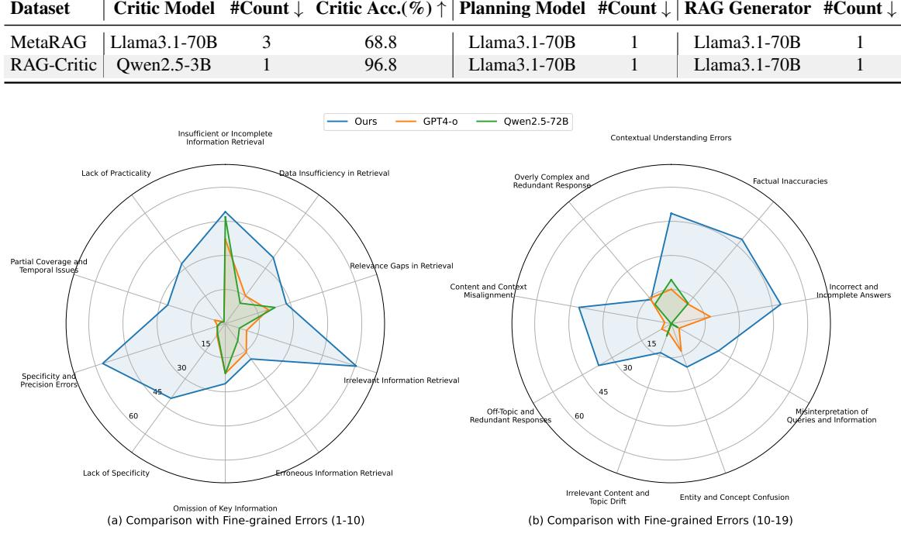

Table 8: The comparison between MetaRAG and RAG-Critic in computation costs.

Figure 7: The Fine-grained errors (20 categries) of RAG-Error Benchmark.

# <span id="page-17-1"></span>A.3 Detailed Results of RAG-Error Benchmark

In this section, we present more granular results from the RAG-Error Benchmark, analyzed from two perspectives:

Coarse-Grained Identification. As shown in Table [7,](#page-16-4) we first present results from additional closed-source and open-source LLMs, including the newly added o1-mini, Deepseek-R1-Distill-7B, Qwen2.5-7B, Llama3.1-8B, and Phi-3.5-mini. Consistent with the main experimental conclusions, these models also exhibit the tendency to over-predict correct labels, as seen in o1-mini, Llama3.1-8B, Deepseek-R1-Distill-7B, and Phi-3.5-mini. This phenomenon indicates that existing LLMs struggle to achieve stable error-critique capabilities in RAG tasks. Notably, RAG Critic maintains optimal performance with only 3B parameters, demonstrating its advantage in parameter efficiency.

Fine-Grained Classification. As outlined in [Fig. 7,](#page-17-3) we also present the evaluation results for the recognition ability of fine-grained error types (20 categories) in the RAG-Error benchmark. Our RAG-Critic shows comprehensive and outstanding capabilities in fine-grained error identification, significantly surpassing the strong closed-

source model GPT4-o and the open-source model Qwen2.5-72B. This further validates that the errororiented correction ability of the RAG-Critic framework greatly benefits from its precise and detailed error classification. In summary, RAG-Critic not only excels in parameter efficiency but also demonstrates strong potential in fine-grained error recognition, providing important insights for future research and applications.

## <span id="page-17-0"></span>A.4 Detailed Error Statistics & Analysis

To explore the most common fine-grained RAG errors across models with different parameter sizes more deeply, follow WE-MATH [\(Qiao](#page-13-8) [et al.,](#page-13-8) [2024a\)](#page-13-8), we sample 100 responses from each dataset, specifically Qwen2.5 (7B, 72B) and Llama3.1 (8B, 70B), as shown in Figure [8](#page-18-3) to [11.](#page-18-4) We utilize RAG-Critic for both coarse and finegrained error labeling and present the error types in tier-2 for the top-5 error frequencies. The results indicate that irrelevant information and insufficient information retrieval are the most prevalent issues, showing consistency across the Qwen and Llama series. In the generation phase, besides insufficient information to support reasoning, the problem of factual inaccuracies is also quite significant. This suggests that providing more accurate information for both retrieval and reasoning in the RAG do-


<span id="page-18-3"></span>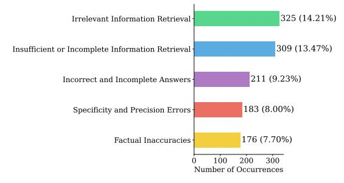

Figure 8: The statistic of fine-grained RAG error types in Llama3.1-8B.

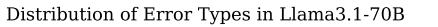

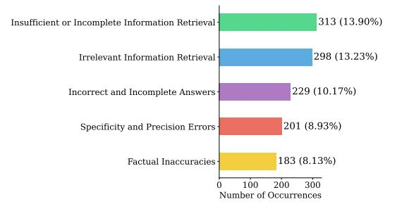

Figure 9: The statistic of fine-grained RAG error types in Llama3.1-70B.

<span id="page-18-5"></span>Table 9: The display of our LLM pool for sampling

| #Param sizes | Model                                                                                                                                                                          |  |  |  |
|--------------|--------------------------------------------------------------------------------------------------------------------------------------------------------------------------------|--|--|--|
| 70B          | Qwen2.5-70B-Instruct, llama3.3-70B<br>Instruct                                                                                                                                 |  |  |  |
| 32B - 34B    | Qwen2.5-32B-Instruct,<br>Yi-1.5-34B<br>Chat                                                                                                                                    |  |  |  |
| 27B          | Gemma-2-27b-it                                                                                                                                                                 |  |  |  |
| 20B          | InternLM2.5-20B-Chat                                                                                                                                                           |  |  |  |
| 14B          | Qwen2.5-14B-Instruct                                                                                                                                                           |  |  |  |
| 7B - 9B      | Llama3.1-8B-Instruct, Qwen2.5-7B<br>Instruct,<br>Mistral-v0.3-7B-Instruct,<br>GLM-4-9B-Chat,<br>InternLM2.5-7B<br>Chat, Yi-1.5-9B-Chat, Gemma-2-9b-it,<br>Deepseek-llm-7b-chat |  |  |  |
| 3B           | Llama3.2-3B-Instruct, Qwen2.5-3B<br>Instruct, Phi-3.5-mini-instruct                                                                                                            |  |  |  |

main is more urgent than merely improving the reasoning capabilities of the RAG generator.

### <span id="page-18-0"></span>A.5 LLM Pool for Response Sampling

In this section, we present the LLMs utilized in constructing the hierarchical RAG error system. As shown in Table [9,](#page-18-5) we select a diverse pool M of 15 open-source models from 9 series, with parameter sizes ranging from 3B to 70B. The model pool M includes Qwen2.5 [\(Yang et al.,](#page-14-12) [2024\)](#page-14-12), Llama3 [\(Meta,](#page-12-10) [2024\)](#page-12-10), Deepseek [\(Bi et al.,](#page-9-4) [2024\)](#page-9-4), Yi [\(Young et al.,](#page-14-13) [2024\)](#page-14-13), Phi3 [\(Abdin et al.,](#page-9-5) [2024\)](#page-9-5),


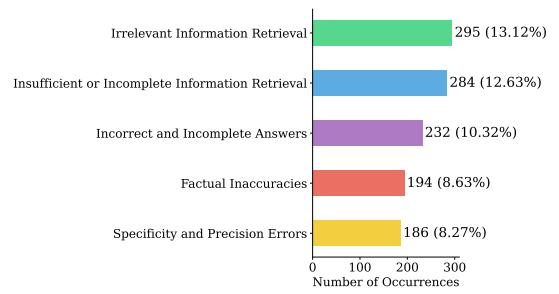

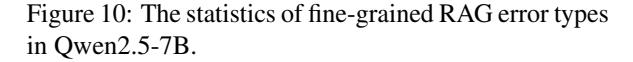

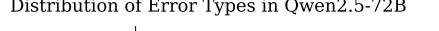

<span id="page-18-4"></span>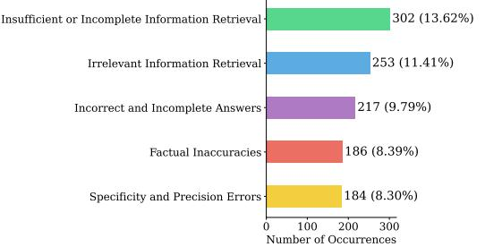

Figure 11: The statistics of fine-grained RAG error types in Qwen2.5-72B.

Gemma2 [\(Rivière et al.,](#page-13-9) [2024\)](#page-13-9), Mistral [\(Jiang](#page-11-10) [et al.,](#page-11-10) [2023a\)](#page-11-10), InternLM2.5 [\(Cai et al.,](#page-9-6) [2024\)](#page-9-6) and GLM4 [\(Zeng et al.,](#page-14-14) [2024\)](#page-14-14). This way effectively mitigates response bias and overly uniform errors typically associated with single-series models.

#### <span id="page-18-1"></span>A.6 Error-Action Mappping Table

In this section, we present the Action-Error Mapping Table that we constructed offline. As shown in [Tab. 11,](#page-20-1) for each error type at the first-tier, we provide recommended actions as solutions through LLMs and manual design. This table will serve as a reference for the planning agent in developing the executor-based solution flow.

### <span id="page-18-2"></span>A.7 Action Functions

In this section, we present the 15 fine-grained functionalities corresponding to the five Action functions. As shown in [Tab. 12,](#page-20-0) for each Action function, we can control the execution of 15 different actions by allowing the large model to autonomously input various function inputs, facilitating an automated, efficient, and flexible error correction process.

<span id="page-19-3"></span>Table 10: The statistics of datasets in our main result.

| Dataset  | Task                | # Train #Dev #Test |       |       |
|----------|---------------------|--------------------|-------|-------|
| NQ       | Single-hop QA       | 79.1k              | 8.7k  | 3.6k  |
| TriviaQA | Single-hop QA       | 78.7k              | 8.8k  | 11.3k |
| HotpotQA | Multi-hop QA        | 90.4k              | 7.4k  | -     |
| 2Wiki    | Multi-hop QA        | 15.0k              | 12.5k | -     |
| WoW      | Dialogue Generation | 63.7k              | 3.0k  | -     |
| ASQA     | Long-form QA        | 4.3k               | 9.4k  | -     |
| ELI5     | Long-form QA        | 272k               | 1.5k  | -     |

## <span id="page-19-0"></span>B Details of Experimental Settings

### <span id="page-19-1"></span>B.1 Datasets

In our main experiment, we utilize six datasets covering four distinct task types, including Single-hop QA, Multi-hop QA, Long-form QA, and Dialogue Generation, as shown in [Tab. 10.](#page-19-3) Single-hop QA includes NQ [\(Kwiatkowski et al.,](#page-11-6) [2019\)](#page-11-6) and TriviaQA [\(Joshi et al.,](#page-11-7) [2017\)](#page-11-7), where the questions are fact-based and don't require complex reasoning. Multi-hop QA includes HotpotQA [\(Yang et al.,](#page-14-11) [2018\)](#page-14-11) and 2WikimultihopQA [\(Ho et al.,](#page-10-8) [2020\)](#page-10-8), with questions that needed multiple information points to answer. Long-form QA contains the ASQA [\(Stelmakh et al.,](#page-13-7) [2022\)](#page-13-7) dataset, which requires comprehensive answers to given questions, thus possibly necessitating richer background information. The dialogue generation task includes the WoW [\(Dinan et al.,](#page-10-9) [2018\)](#page-10-9) dataset, whose objective is to continue a given dialogue and generate content that fits the context and dialogue background. Due to the multiple stages of response verification involved in critic-based RAG baselines, we sample 100 samples from the test set of each dataset to evaluate all the baselines and our RAG-Critic.

#### <span id="page-19-2"></span>B.2 Implementation Details

Retrieval Setting. We implement the retriever based on the FlashRAG framework [\(Jin et al.,](#page-11-11) [2024a\)](#page-11-11). We use E5-base-v2 [\(Wang et al.,](#page-14-15) [2022\)](#page-14-15) as the embedding model and Wikipedia-2018 as the retrieval document corpus. For the naive RAG, we retrieve the top-5 passages for each question as input.

Error System Construction Settings. For all datasets, we sample from the corresponding training set portions using the vLLM framework [\(Kwon](#page-11-12) [et al.,](#page-11-12) [2023\)](#page-11-12) for efficient sampling, with the temperature set to 0.1 and the maximum context length set to 4096 tokens. All error type annotation models are based on Qwen 2.5-72B and utilize the int8

version for lightweight deployment.

In terms of manual summarization, we employ three PhD students in computer science, adhering to local salary standards. The entire annotation process takes only half an hour, demonstrating that the RAG-Critic framework requires minimal human effort, with the error sampling process largely automated.

RAG-Error Benchmark Settings. For the RAG-Error Bench, we use the test set of the corresponding dataset and follow the aforementioned error system annotation process, subsequently applying the error system's label mapping. The difference is that we employ GPT-4o and additionally hire a PhD student in computer science for dual verification, with the temperature set to 0.1; To ensure the high quality of the bench, inspired by the FollowRAG benchmark [\(Dong et al.,](#page-10-10) [2024c\)](#page-10-10), any annotation deemed incorrect by either party is discarded. After dual uniform sampling, we ultimately establish the RAG-Error Bench.

Training for RAG Error-Critic Model. In the SFT phase, we perform full fine-tuning on Qwen2.5-3B-instruct with a learning rate of 7e-6, using a linear scheduler with 20 warm-up steps. All models are trained with DeepSpeed ZeRO Stage 3 [\(Rasley et al.,](#page-13-10) [2020\)](#page-13-10) and Flash-Attention 2 [\(Dao,](#page-10-11) [2023\)](#page-10-11). We use a global batch size of 128, a weight decay of 0.1, and train for 3 epochs, saving checkpoints every 200 steps. Mixed precision training with bf16 is used, and the maximum context length is set to 2048 tokens. For Qwen2-72B and Llama3- 70B, the global batch size is 512. Our training setup is aligned with previous RAG work [\(Dong](#page-10-12) [et al.,](#page-10-12) [2024e;](#page-10-12) [Zhang et al.,](#page-14-16) [2025;](#page-14-16) [Li et al.,](#page-12-12) [2024c;](#page-12-12) [Cheng et al.,](#page-9-7) [2024;](#page-9-7) [Dong et al.,](#page-10-13) [2025;](#page-10-13) ?, [2024b\)](#page-10-7).

In the DPO phase, the learning rate is set to 5e-7 with a cosine scheduler and a 0.1 warm-up ratio. We use DeepSpeed ZeRO Stage 3 and Flash-Attention 2 for efficiency, with a global batch size of 64. Training utilizes a sigmoid loss function with a beta value of 0.3 and spans 2 epochs. Mixed precision training with bf16 is employed, and the maximum context length is 4096 tokens.

Notably, we run all our experiments on 8 NVIDIA A800s. We report averaged performance from five randomly seeded experiments.

Clustering Settings. In order to organize and cluster the types of errors obtained, we first use the BGE-M3 model [\(Xiao et al.,](#page-14-17) [2023\)](#page-14-17) to obtain the

<span id="page-20-1"></span>

| Error Type              | Actions                                                                       |
|-------------------------|-------------------------------------------------------------------------------|
| Incomplete Information  | - Re-retrieval: Rewrite the query for supplementary retrieval.                |
|                         | - Rewriting the input: Refine the retrieved knowledge.                        |
| Irrelevant Information  | - Re-retrieval: Perform replacement retrieval using the same query.           |
|                         | - Rewriting the input: Correct the retrieved knowledge.                       |
| Erroneous Information   | - Rewriting the input: Correct the retrieved knowledge.                       |
|                         | - Rewriting the reasoning answer: Correct the reasoning part.                 |
| Incomplete Response     | - Re-retrieval: Perform supplementary retrieval using the same query.         |
|                         | - Rewriting the input: Provide examples for the retrieved knowledge.          |
| Inaccurate Response     | - Rewriting the reasoning answer: Refine the reasoning part.                  |
|                         | - Rewriting the input: Explain the retrieved knowledge.                       |
| Off-Topic Response      | - Re-retrieval: Rewrite the query for replacement retrieval.                  |
|                         | - Rewriting the query: Break down the query into sub-questions.               |
| Overly Verbose Response | - Rewriting the input: Refine the retrieved knowledge.                        |
|                         | - Rewriting the reasoning answer: Do not rely on the original reasoning part. |

Table 11: The illustration of our Error-Action mapping table.

Table 12: The illustration of 15 functionalities corresponding to our 5 Action functions.

<span id="page-20-0"></span>

| Error Type   | Actions                                                  |
|--------------|----------------------------------------------------------|
| Retrieval(·) | 1. Perform supplementary retrieval using the same query. |
|              | 2. Perform replacement retrieval using the same query.   |
|              | 3. Rewrite the query for supplementary retrieval.        |
|              | 4. Rewrite the query for replacement retrieval.          |
|              | 1. Expand the query.                                     |
| Rewrite(·)   | 2. Refine the query.                                     |
|              | 4. Summarize the query.                                  |
|              | 5. Clarify or explain the query.                         |
| Decompose(·) | - Break down the query into sub-questions.               |
|              | 1. Explain the retrieved knowledge.                      |
| Refine(·)    | 2. Refine the retrieved knowledge.                       |
|              | 3. Correct the retrieved knowledge.                      |
|              | 4. Delete the specific retrieved knowledge.              |
|              | 5. Provide examples for the retrieved knowledge.         |
|              | 6. Summarize the retrieved knowledge.                    |
| Generate(·)  | - Generate the final answer.                             |

embedding vectors for the error causes of each case. We standardize all the embedding data and perform hierarchical clustering. Hierarchical clustering is performed using the sklearn library [\(Buitinck et al.,](#page-9-8) [2013\)](#page-9-8) with the Ward linkage method and Euclidean distance metric. We cluster all the data into 20 clusters.

Human Annotators. There are two instances involving minimal human annotation: the construction of the error system and the RAG-Error bench.

In the first part, we employ three well-educated PhD students in computer science, adhering to local salary standards. The entire annotation process takes only half an hour, demonstrating that the RAG-Critic framework requires minimal human effort, with the error sampling process largely automated.

In the second part, we only need one PhD student to conduct a round of annotation screening, performing binary classification on the annotation results from Qwen2.5-72B. The entire process takes less than an hour, and we ensure that the values match the labels assigned by GPT-4o.

Our human annotation does not involve any po-

tential risks. First, the datasets are sourced from open-source collections, as shown in [Tab. 10.](#page-19-3) Secondly, the annotation for the error system construction only involves high-level label creation, as illustrated in [Fig. 2.](#page-2-0) Finally, our RAG error bench requires human input solely for binary judgments, without any risk of content modification.

# <span id="page-21-0"></span>B.3 Baselines

This section details the baselines referenced in Section [4.1.](#page-7-1) We categorize these into proprietary models and critical RAG systems.

# Proprietary Models:

- OpenAI o1 Series [\(Jaech et al.,](#page-11-8) [2024\)](#page-11-8) The o1 model series uses large-scale reinforcement learning to enhance safety and robustness through chain-of-thought reasoning. These models effectively reason about safety policies in context when responding to potentially unsafe prompts, achieving excellent performance in benchmarks for generating illicit advice, selecting stereotyped responses, and resisting known jailbreaks.
- GPT-4o [\(OpenAI,](#page-13-0) [2023\)](#page-13-0). GPT-4o is a multimodal model by OpenAI that excels not only in text generation but also in handling image and audio inputs. It offers near-human conversational experiences with extremely low latency responses.
- Claude 3.5 [\(Anthropic,](#page-9-3) [2024\)](#page-9-3) is an advanced AI language model by Anthropic, known for its contextual understanding and coherent responses. It prioritizes safety and ethical use, making it suitable for various applications like content creation and summarization, all while ensuring user-friendly interactions.
- Qwen2.5 Series [\(Yang et al.,](#page-14-12) [2024\)](#page-14-12). Developed by Alibaba Cloud, the Qwen2.5 series includes a range of open-source large language models from 0.5B to 72B parameters, optimized for knowledge acquisition, programming capabilities, and mathematical task performance.
- Llama3.x Series [\(Meta,](#page-12-10) [2024\)](#page-12-10). The Llama3 series from Meta AI employs Grouped Query Attention (GQA) and an expanded vocabulary size of 128K tokens, significantly enhancing inference speed and downstream performance.

- Mistral Series [\(Jiang et al.,](#page-11-10) [2023a\)](#page-11-10). Mistral-7B, despite having fewer parameters, outperforms larger models like Llama2-13B in various benchmarks, utilizing Sliding Window Attention (SWA) to maintain high performance with reduced hardware requirements.
- Deepseek-R1-Distill [\(Guo et al.,](#page-10-14) [2025\)](#page-10-14). DeepSeek-R1-Distill leverages reinforcement learning and distillation techniques to enhance the reasoning capabilities of smaller models, enabling efficient operation even under resource constraints.

In our experiments, all the open-source LLMs are used in their instruction or chat versions, to ensure sufficient instruction-following capability.

# Critical RAG Baselines:

- Self-RAG [\(Asai et al.,](#page-9-1) [2024\)](#page-9-1). Self-RAG introduces reflection tokens that allow LLMs to control retrieval behavior as needed, improving factual accuracy and citation reliability in generated content.
- FLARE [\(Jiang et al.,](#page-11-9) [2023b\)](#page-11-9). FLARE employs a forward-looking active retrieval strategy, dynamically retrieving information multiple times during the generation process to effectively reduce hallucinations in the output.
- MetaRAG [\(Zhou et al.,](#page-14-3) [2024\)](#page-14-3). MetaRAG integrates metacognitive concepts, enabling the model to monitor and adjust its cognitive processes, thereby enhancing reasoning accuracy in complex tasks.
- Self-Refine [\(Madaan et al.,](#page-12-11) [2023\)](#page-12-11) involves an iterative process where the model reviews its own output to gather feedback and proposes improvements based on that feedback. This cycle continues until the evaluation shows that no errors remain.

# <span id="page-21-1"></span>B.4 Case Study

To gain a deeper understanding of how RAG-Critic employs a "Generate-Critic-Planning-Execution" workflow to facilitate automated problem solving, we conduct case studies in [Tab. 13](#page-22-1) and [Tab. 14](#page-23-1) that illustrate each sub-output of the entire inference process.

<span id="page-22-1"></span>Question: Who has trained the most Melbourne Cup winners?

#### Retrieved Docs:

- [1] Etienne L. de Mestre...

- [2] Melbourne Cup...

- [3] David Joseph Hall...

- [4] In 2004, Makybe Diva became the first mare to win two cups...

- [5] Colin Sidney Hayes...

#### Judgement Result: The answer is incorrect.

The passages provided do not explicitly state the number of Melbourne Cup wins for each trainer, which led to the model's misinterpretation. Etienne L. de Mestre is mentioned as having won the first two Melbourne Cups, but this does not necessarily mean he trained the most winners overall. The model should have recognized the need for additional information to accurately answer the question.

#### Critic Tags:

Tag1: ["Irrelevant or Off-Topic Response", "Incomplete Information", "Irrelevant Information"]

Tag2: ["Insufficient or Incomplete Information Retrieval", "Irrelevant Content and Topic Drift", "Irrelevant Information Retrieval"]

Tag3: ["Overreliance on Partial Information", "Insufficient Information Handling", "Lack of Contextual Understanding", "Factual Inaccuracy"]

#### Agent Output:

clarified\_query = RewriteQuery(query=question, instruction="clarify") retrieved\_documents = Retrieval(query=clarified\_query[0], topk=5) summarized\_documents = [ RefineDoc(query=question, doc=doc, instruction="summarize") for doc in retrieved\_documents ] final\_answer = GenerateAnswer( query=question, docs=summarized\_documents, additional\_instruction="Ensure the answer is accurate and provides the name of the trainer with the most Melbourne Cup wins." )

New Answer: To answer the question of who has trained the most Melbourne Cup winners, let's break down the information provided in the passage.

Step 1: Identify the trainers mentioned in the passage who have won the Melbourne Cup.

- Etienne L. de Mestre (5 wins)

- Bart Cummings (12 wins)

Step 2: Determine the number of Melbourne Cup wins for each trainer.

- Etienne L. de Mestre: 5 wins

- Bart Cummings: 12 wins

Step 3: Compare the number of wins to determine who has trained the most Melbourne Cup winners.

- Bart Cummings has 12 wins, which is more than Etienne L. de Mestre's 5 wins.

Therefore, the answer is: Bart Cummings.

Final Answer: Bart Cummings

#### <span id="page-22-0"></span>B.5 Prompt Template

Annotation Instruction In the hierarchical error system setup phase, we sample from the model pool in Step-1, with the relevant prompt template provided in Prompt A. Additionally, in Steps 1 and 2, we use Qwen2.5-72B-Instruct for annotating open-set labels, and the prompts used are detailed in Prompt B and Prompt C.

Evaluation Instruction For the evaluation of the RAG task, our method uses the same generation prompts as all baselines to ensure fairness. The specific prompts can be found in Prompt A. For short-form datasets, we instruct the model to output responses with a fixed prefix (e.g., "So the final

answer is"), and we extract the corresponding short answers using regular expressions for evaluation. For long-form datasets, due to the more extensive nature of the responses, the outputs generated by the model are used directly for final evaluation without additional processing.

Training and Deployment Instruction For the RAG error-critic mode, we use Prompt D for training. Subsequently, we utilize the generated outputs along with the original RAG inputs, following Prompt F for executor-based planning. For the RAG reward benchmark, our method uses the same generation prompts as all baselines, as detailed in Prompt E.

<span id="page-23-1"></span>Question: Who is the spouse of the director of film Eden And After?

#### Retrieved Docs:

- [1] After the Wedding (2017 film)...

- [2] Paul Almond...

- [3] Afterwards is a 2008 English-language psychological thriller film...

- [4] Eden (2014 French film)...
- [5] Waiting for Eden...

Original Answer: There is no information available about the film "Eden And After" or its director's spouse.

#### Judgement Result: The answer is incorrect.

The model's error likely stems from the fact that it did not have the correct information in the provided passages and may have relied on external information that was not accurate or up-to-date.

#### Critic Tags:

Tag1: ["Erroneous Information", "Incomplete or Missing Response", "Irrelevant Information"] Tag2: ["Specificity and Precision Errors", "Erroneous Information Retrieval", "Irrelevant Information Retrieval"] Tag3: ["External Knowledge Misuse", "Factually Incorrect", "Data Mismatch"]

#### Agent Output:

```
clarified_query = RewriteQuery(query=question, instruction="clarify")
retrieved_documents = Retrieval(query=clarified_query[0], topk=5)
summarized_documents = [
RefineDoc(query=question, doc=doc, instruction="summarize") for doc in retrieved_documents
]
final_answer = GenerateAnswer(
query=question,
docs=summarized_documents,
additional_instruction="Provide more specific and relevant information about the director of the film
'Eden And After' and their spouse."
)
```

Final Answer: Bart Cummings

## <span id="page-23-0"></span>C Limitations

Despite our best efforts to optimize the RAG-Critic process, there are still several limitations and areas for improvement.

Firstly, Since RAG-Critic is a critic-based correction method, its computational cost is higher compared to the standard RAG system, which is a shared problem. We discuss this in Appx. [§A.1.](#page-16-1) On the engineering side, we have already used the vLLM framework and a lightweight 3B critic model to accelerate inference, and we will consider more optimization methods in the future.

Secondly, expanding the experimental coverage to include a broader range of RAG scenarios is another area for optimization. RAG-Critic samples nine datasets related to RAG and used Wikipedia as the retrieval corpus. In the future, we aim to explore the application of our research in industrial-level queries and databases to enhance the generalization capability of our approach.

# Prompt A: Responses Sampling (Stage-1)

Find the useful content from the provided documents, then answer the question. Answer the question directly. Your response should be very concise. Please provide the final answer is:' as a prefix for the final answer. The following are the given documents.

# Passage: {Top-K Retrieved Passages}

Answer the question directly. Your response should be very concise. Please use 'So the final answer is:' as a prefix for the final answer. \*\*Question\*\*: {Question} \*\*Response\*\*:

# Prompt B: Generating Detailed Error Rationale (Stage-1)

You are an expert in error analysis for retrieval-augmented generation tasks. We will provide you with a prompt that includes both the question and relevant knowledge, along with a model's prediction and the golden answer. The details are as follows:

# Prompt: {RAG inputs}

# Model's Prediction: {RAG model's prediction}

# Golden Answer: {Golden answer}

If the model's prediction is incorrect, please respond with a single JSON including the judgement in key 'Judgement' and a detailed error analysis in key 'Error analysis'. Here is an example of output JSON format:

```
{'Judgement ': " incorrect ",
'Error analysis ': " The model 's prediction is incorrect because ... "}
```

If the model's prediction is correct, please respond with a single JSON as follows:

{'Judgement ': " Correct ", 'Error analysis ': " None "}

# Prompt C: Open-set Annotation (Stage-2)

You are a tagging system designed to provide useful error type tags for retrieval-augmented generation (RAG) tasks. Your goal is to assist in detailed error analysis to improve the performance of AI assistants. Below is a detailed error analysis:

# {Detailed error analysis}

Please provide fine-grained error tags to identify the main error types in the analysis. Your response should be a list that includes the titles of the error tags along with a brief explanation for each tag. Please adhere strictly to the following JSON format:

{"tag ": "", " explanation ": ""}

Please respond in English.

Prompt D: Fine-tuning Template of RAG-Critic

You are a critical system designed to provide useful error type tags for retrieval-augmented generation (RAG) tasks. Your goal is to assist in detailed error analysis to improve the performance of AI assistants. Below are the [Question], the top-5 retrieved relevant [Passages], and the [Model's Prediction] for the RAG tasks.

Question: {Question}

Passage: {Top-K Retrieved Passages}

```
Model's Prediction: {RAG model's prediction}
```

Please first determine whether the model's prediction is correct. If it is correct, output it as follows:

```
{" Judgement ": " Correct "}
```

If it is incorrect, please identify the error tags at three levels, from coarse to fine, and provide a detailed error analysis. Adhere strictly to the following JSON format:

```
{" Judgement ": " Error ",
" Error analysis ": "",
" tag1 ": [] ,
" tag2 ": [] ,
" tag3 ": []}
```

# Prompt E: Evaluation Template of RAG-Error Bench

You are a critical system designed to provide useful error type tags for retrieval-augmented generation (RAG) tasks. Your goal is to assist in detailed error analysis to improve the performance of AI assistants. Below are the [Question], the top-5 retrieved relevant [Passages], and the [Model's Prediction] for the RAG tasks.

# Question: {Question}

Passage: {Top-K Retrieved Passages}

# Model's Prediction: {RAG model's prediction}

Please first determine whether the model's prediction is correct. If it is correct, output it as follows:

{" Judgement ": " Correct "}

If it is incorrect, give these error types, tag1 corresponds to tag2 one-to-one:

```
tag1= [list of error types in Tag1]
```

```
tag2 = [list of error types in Tag2]
```

Please identify the error tags at three levels, from coarse to fine, and provide a detailed error analysis. Adhere strictly to the following JSON format:

```
{" Judgement ": " Error ",
" Error analysis ": "",
" tag1 ": [] ,
" tag2 ": [] ,
" tag3 ": []}
```

# Prompt F: Executor-based Planning

You are an agent tasked with optimizing a Retrieval-Augmented Generation process. The goal is to improve the model's predictions by addressing issues flagged in the error type. You are given the results from an initial RAG process, including a query, a list of retrieved documents, a prediction, and the identified error type. Your task is to optimize the current RAG process by selecting the

appropriate functions and generating the corresponding Python code to fix the problem. Available Functions

Retrieval ( query : **str** , topk : **int**) -> List [ **str** ]\*\*

\*\*Purpose\*\*: Retrieves the top-k most relevant documents for a given query from the corpus. \*\*Parameters\*\*:

- 'query' ('str'): The input query string to retrieve relevant documents.

- 'topk' ('int'): The number of top documents to return.

\*\*Returns\*\*:

- A list of 'topk' relevant document strings, sorted by relevance.

`RewriteQuery ( query : **str** , instruction : **str** ) -> List [ **str** ]`\*\*

\*\*Purpose\*\*: Rewrites the query based on the provided instruction to better match relevant documents.

\*\*Parameters\*\*:

- 'query' ('str'): The original query string to be rewritten.

- 'instruction' ('str'): The instruction for rewriting the query. Possible instructions include:

- '"clarify"': Make the query more specific.

- '"expand"': Add more context or related terms to the query.

\*\*Returns\*\*:

- A list of rewritten query strings, each representing a possible version of the query.

DecomposeQuery ( query : **str**) -> List [ **str**]

\*\*Purpose\*\*: Breaks down the input query into smaller, more specific sub-queries.

\*\*Parameters\*\*:

- 'query' ('str'): The original query string to decompose.

\*\*Returns\*\*:

- A list of sub-query strings, which represent different aspects or more specific details of the original query.

RefineDoc ( query : **str** , doc : **str** , instruction : **str**) -> **str**

\*\*Purpose\*\*: Refine a document in the doc list (index starts from 0) based on the query. Use this function when you find some document in the doc list is not relevant to the question.

\*\*Parameters\*\*:

- 'query' ('str'): The input query string.

- 'doc' ('str'): The document to refine.

- 'instruction' ('str'): The instruction for refining the document. Supported instructions include:

- '"explain"': Provide a detailed explanation of the document.

- '"summarize"': Summarize the document.

\*\*Returns\*\*:

- The refined document as a string, which could be either an explanation or a summary.

```
GenerateAnswer ( query : str , docs : List [ str] , additional_instruction : str = None
    ) -> str
```

\*\*Purpose\*\*: Generates an answer based on the query and relevant documents, incorporating additional instructions for answer improvement.

\*\*Parameters\*\*:

- 'query' ('str'): The input query string.

- 'docs' ('List[str]'): A list of relevant documents used to generate the answer.

- 'additional instruction' ('str'): Additional instruction describing issues in the previous answer and desired improvements (e.g., requirements for precision, conciseness, or additional information). \*\*Returns\*\*:

- A generated answer string, potentially incorporating information from the documents, adjusted according to the provided instruction.

You can directly use the variables I provide to act as the input of the functions. You can freely combine the functions to improve the performance.