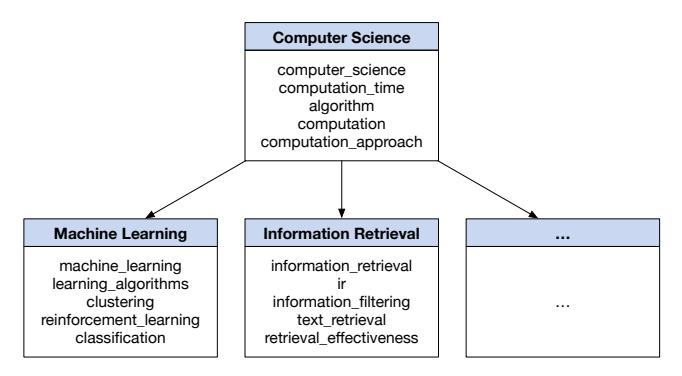
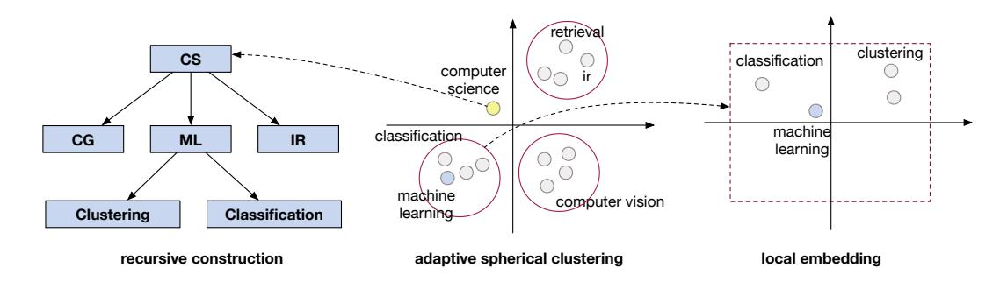
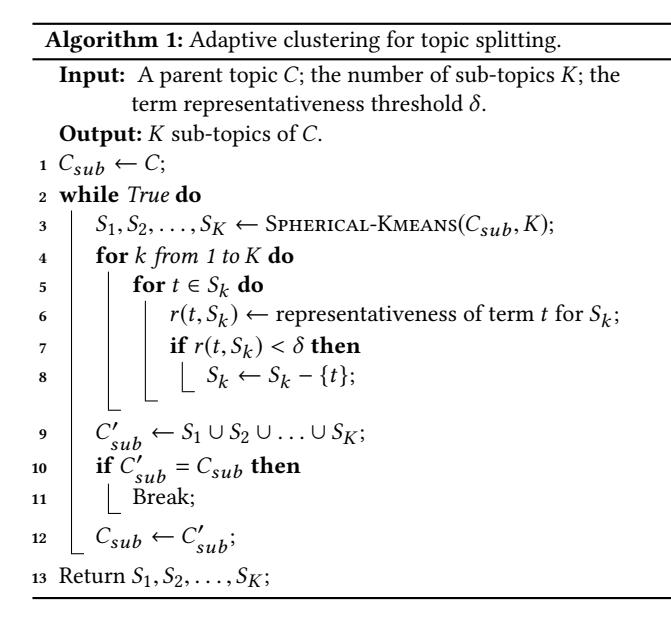
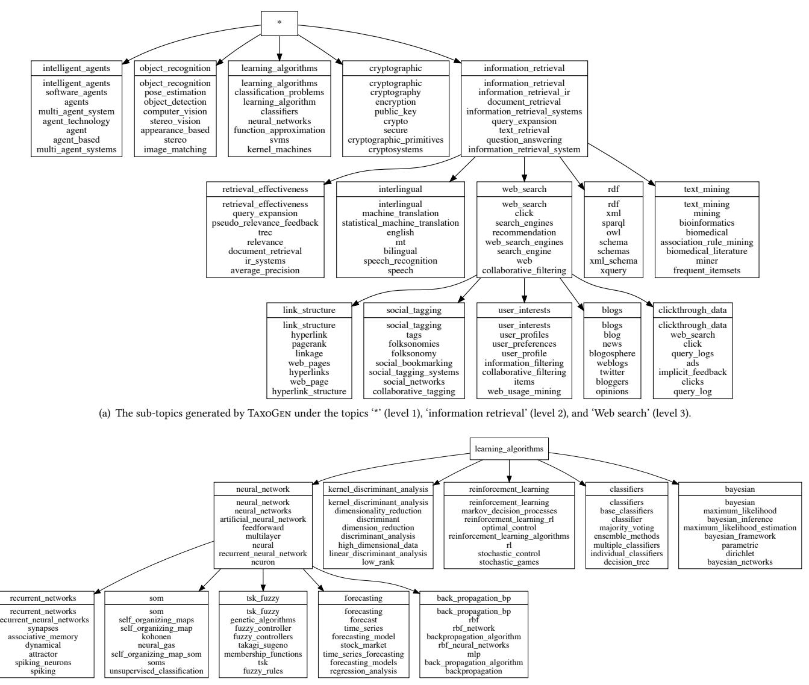
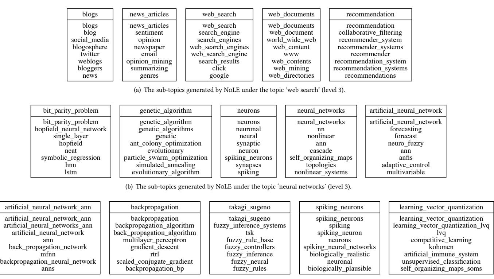
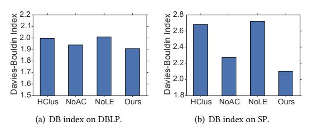

# TaxoGen: Unsupervised Topic Taxonomy Construction by **Adaptive Term Embedding and Clustering**

Chao Zhang1, Fangbo Tao2, Xiusi Chen3, Jiaming Shen1, Meng Jiang4,

Brian Sadler5, Michelle Vanni5, and Jiawei Han1

1Dept. of Computer Science, University of Illinois at Urbana-Champaign, Urbana, IL, USA

2Facebook Inc., Menlo Park, CA, USA

3Dept. of Computer Science and Technology, Peking University, Beijing, China

4Dept. of Computer Science and Engineering, University of Notre Dame, Notre Dame, IN, USA

5U.S. Army Research Laboratory, Adelphi, MD, USA

1{czhang82, js2, hanj}@illinois.edu 2fangbo.tao@gmail.com 3xiusi0721@gmail.com 4mjiang2@nd.edu 5{brian.m.sadler6.civ, michelle.t.vanni.civ}@mail.mil

## ABSTRACT

Taxonomy construction is not only a fundamental task for semantic analysis of text corpora, but also an important step for applications such as information filtering, recommendation, and Web search. Existing pattern-based methods extract hypernym-hyponym term pairs and then organize these pairs into a taxonomy. However, by considering each term as an independent concept node, they overlook the topical proximity and the semantic correlations among terms. In this paper, we propose a method for constructing topic taxonomies, wherein every node represents a conceptual topic and is defined as a cluster of semantically coherent concept terms. Our method, TAXOGEN, uses term embeddings and hierarchical clustering to construct a topic taxonomy in a recursive fashion. To ensure the quality of the recursive process, it consists of: (1) an adaptive spherical clustering module for allocating terms to proper levels when splitting a coarse topic into fine-grained ones; (2) a local embedding module for learning term embeddings that maintain strong discriminative power at different levels of the taxonomy. Our experiments on two real datasets demonstrate the effectiveness of TAXOGEN compared with baseline methods.

### **ACM Reference Format:**

Chao Zhang1, Fangbo Tao2, Xiusi Chen3, Jiaming Shen1, Meng Jiang4, Brian Sadler5, Michelle Vanni5, and Jiawei Han1. 2018. TaxoGen: Unsupervised Topic Taxonomy Construction by Adaptive Term Embedding and Clustering. In KDD 2018: 24th ACM SIGKDD International Conference on Knowledge Discovery & Data Mining, August 19-23, 2018, London, United Kingdom. ACM, New York, NY, USA, 9 pages. https://doi.org/10.1145/3219819.3220064

### 1 INTRODUCTION

Automatic taxonomy construction from a text corpus is a fundamental task for semantic analysis of text data and plays an important role in many applications. For example, organizing a massive news

KDD 2018, August 19-23, 2018, London, United Kingdom

© 2018 Association for Computing Machinery.

ACM ISBN 978-1-4503-5552-0/18/08...\$15.00

https://doi.org/10.1145/3219819.3220064

Figure 1: An example topic taxonomy. Each node is a cluster of semantically coherent concept terms representing a conceptual topic.

corpus into a well-structured taxonomy allows users to quickly navigate to their interested topics and easily acquire useful information. As another example, many recommender systems involve items with textual descriptions, and a taxonomy for these items can help the system better understand user interests to make more accurate recommendations [33].

Existing methods mostly generate a taxonomy wherein each node is a single term representing an independent concept [14, 19]. They use pre-defined lexico-syntactic patterns (e.g., A such as B, A is a B) to extract hypernym-hyponym term pairs, and then organize these pairs into a concept taxonomy by considering each term as a node. Although they can achieve high precision for the extracted hypernym-hyponym pairs, considering each term as an independent concept node causes three critical problems to the taxonomy: (1) low coverage: Since term correlations are not considered, only the pairs exactly matching the pre-defined patterns are extracted, which leads to low coverage of the result taxonomy. (2) high redundancy: As one concept can be expressed in different ways, the taxonomy is highly redundant because many nodes are just different expressions of the same concept ( $e.g.,$  'information retrieval' and 'ir'). (3) limited informativeness: Representing a node with a single term provides limited information about the concept and causes ambiguity.

Permission to make digital or hard copies of all or part of this work for personal or classroom use is granted without fee provided that copies are not made or distributed for profit or commercial advantage and that copies bear this notice and the full citation on the first page. Copyrights for components of this work owned by others than ACM must be honored. Abstracting with credit is permitted. To copy otherwise, or republish, to post on servers or to redistribute to lists, requires prior specific permission and/or a fee. Request permissions from permissions@acm.org.

We study the problem of topic taxonomy construction from an input text corpus. In contrast to term-level taxonomies, each node in our topic taxonomy represents a conceptual topic, defined as a cluster of semantically coherent concept terms. Figure [1](#page-0-0) shows an example. Given a collection of computer science research papers, we build a tree-structured hierarchy. The root node is the general topic 'computer science', which is further split into sub-topics like 'machine learning' and 'information retrieval'. For every topical node, we describe it with multiple concept terms that are semantically relevant. For instance, for the 'information retrieval' node, its associated terms include not only synonyms of 'information retrieval' (e.g., 'ir'), but also different facets of the IR area (e.g., 'text retrieval' and 'retrieval effectiveness').

We propose an unsupervised method named TaxoGen for constructing topic taxonomies. It embeds the concept terms into a latent space to capture their semantics, and uses term embeddings to recursively construct the taxonomy based on hierarchical clustering. While the idea of combining term embedding and hierarchical clustering is intuitive by itself, two key challenges need to be addressed for building high-quality taxonomies. First, it is nontrivial to determine the proper granularity levels for different concept terms. When splitting a coarse topical node into fine-grained ones, not all the concept terms should be pushed down to the child level. For example, when splitting the computer science topic in Figure [1,](#page-0-0) general terms like 'cs' and 'computer science' should remain in the parent instead of being allocated into any child topics. Therefore, it is problematic to directly group parent terms to form child topics, but necessary to allocate different terms to different levels. Second, global embeddings have limited discriminative power at lower levels. Term embeddings are typically learned by collecting the context evidence from the corpus, such that terms sharing similar contexts tend to have close embeddings. However, as we move down in the hierarchy, the term embeddings learned based on the entire corpus have limited power in capturing subtle semantics. For example, when splitting the machine learning topic, the terms 'machine learning' and 'reinforcement learning' have close global embeddings, and it is hard to discover quality sub-topics for the machine learning topic.

TaxoGen consists of two modules for tackling the above challenges. The first is an adaptive spherical clustering module for allocating terms to proper levels when splitting a coarse topic. Relying on a ranking function that measures the representativeness of different terms to each child topic, the clustering module iteratively detects general terms that should remain in the parent topic and keeps refining the clustering boundaries of the child topics. The second is a local term embedding module. To enhance the discriminative power of term embeddings at lower levels, TaxoGen employs an existing technique [\[13\]](#page-8-4) that uses topic-relevant documents to learn local embeddings for the terms in each topic. The local embeddings capture term semantics at a finer granularity and are less constrained by the terms irrelevant to the topic. As such, they are discriminative enough to separate the terms with different semantics even at lower levels of the taxonomy.

We perform extensive experiments on two real data sets. Our qualitative results show that TaxoGen can generate high-quality topic taxonomies, and our quantitative analysis based on user study shows that TaxoGen outperforms baseline methods significantly.

## 2 RELATED WORK

In this section, we review existing taxonomy construction methods, including (1) pattern-based methods, (2) clustering-based methods, and (3) supervised methods.

## 2.1 Pattern-Based Methods

A considerable number of pattern-based methods have been proposed to construct hypernym-hyponym taxonomies wherein each node in the tree is an entity, and each parent-child pair expresses the "is-a" relation. Typically, these works first use pre-defined lexical patterns to extract hypernym-hyponym pairs from the corpus, and then organize all the extracted pairs into a taxonomy tree. In pioneering studies, Hearst patterns like "NP such as NP, NP, and NP" were proposed to automatically acquire hyponymy relations from text data [\[14\]](#page-8-2). Then more kinds of lexical patterns have been manually designed and used to extract relations from the web corpus [\[24,](#page-8-5) [26\]](#page-8-6) or Wikipedia [\[12,](#page-8-7) [25\]](#page-8-8). With the development of the Snowball framework, researchers teach machines how to propagate knowledge among the massive text corpora using statistical approaches [\[1,](#page-8-9) [34\]](#page-8-10); Carlson et al. proposed a learning architecture for Never-Ending Language Learning (NELL) in 2010 [\[5\]](#page-8-11). PATTY leveraged parsing structures to derive relational patterns with semantic types and organizes the patterns into a taxonomy [\[23\]](#page-8-12). The recent MetaPAD [\[15\]](#page-8-13) used context-aware phrasal segmentation to generate quality patterns and group synonymous patterns together for a large collection of facts. Pattern-based methods have demonstrated their effectiveness in finding particular relations based on hand-crafted rules or generated patterns. However, they are not suitable for constructing a topic taxonomy because of two reasons. First, different from hypernym-hyponym taxonomies, each node in a topic taxonomy can be a group of terms representing a conceptual topic. Second, pattern-based methods often suffer from low recall due to the large variation of expressions in natural language on parent-child relations.

## 2.2 Clustering-Based Methods

A great number of clustering methods have been proposed for constructing taxonomy from text corpus. These methods are more closely related to our problem of constructing a topic taxonomy. Generally, the clustering approaches first learn the representation of words or terms and then organize them into a structure based on their representation similarity [\[3\]](#page-8-14) and cluster separation measures [\[8\]](#page-8-15). Fu et al. identified whether a candidate word pair has hypernym-hyponym ("is-a") relation by using the word-embeddingbased semantic projections between words and their hypernyms [\[11\]](#page-8-16). Luu et al. proposed to use dynamic weighting neural network to identify taxonomic relations via learning term embeddings [\[20\]](#page-8-17). Our method differs from these existing ones in two aspects. First, we do not need labeled hypernym-hyponym pairs as supervision for learning either semantic projections or dynamic weighting neural network. Second, we employ a technique called local embedding [\[13\]](#page-8-4) to learn embeddings for each topic using only topic-relevant documents. The local embedding technique was first proposed by Gui et al. [\[13\]](#page-8-4). It captures fine-grained term semantics with a local corpus and thus well separates terms with subtle semantic differences. On the term organizing end, Ciniano et al. used a comparative

measure to perform conceptual, divisive, and agglomerative clustering for taxonomy learning [6]. Yang et al. also used an ontology metric, a score indicating semantic distance, to induce taxonomy [31]. Liu et al. used Bayesian rose tree to hierarchically cluster a given set of keywords into a taxonomy [18]. Wang et al. adopted a recursive way to construct topic hierarchies by clustering domain keyphrases [28]. Also, quite a number of hierarchical topic models have been proposed for term organization [4, 10, 22]. In our TAXO-GEN, we develop an *adaptive spherical clustering* module to allocate terms into proper levels when we split a coarse topic. The module well groups terms of the same topic together and separates child topics (as term clusters) with significant distances.

#### **Supervised Methods** $2.3$

There have also been (semi-)supervised learning methods for taxonomy construction [16, 17]. Basically these methods extract lexical features and learn a classifier that categorizes term pairs into relations or non-relations, based on curated training data of hypernymhyponym pairs [7, 18, 27, 31], or syntactic contextual information harvested from NLP tools [19, 30]. Recent techniques [2, 11, 20, 29, 32] in this category leverage pre-trained word embeddings and then use curated hypernymy relation datasets to learn a relation classifier. However, the training data for all these methods are limited to extracting hypernym-hyponym relations and cannot be easily adapted for constructing a topic taxonomy. Furthermore, for massive domain-specific text data (like scientific publication data we used in this work), it is hardly possible to collect a rich set of supervised information from experts. Therefore, we focus on technical developments in unsupervised taxonomy construction.

#### PROBLEM DESCRIPTION 3

The input for constructing a topic taxonomy includes two parts: (1) a corpus  $\mathcal D$  of documents; and (2) a set  $\mathcal T$  of seed terms. The seed terms in  $\mathcal{T}$  are the key terms from  $\mathcal{D}$ , representing the terms of interest for taxonomy construction1. Given the corpus  $\mathcal{D}$  and the term set  $\mathcal{T}$ , we aim to build a tree-structured hierarchy  $\mathcal{H}.$  Each node  $C \in \mathcal{H}$  denotes a conceptual topic, which is described by a set of terms  $\mathcal{T}_C \in \mathcal{T}$  that are semantically coherent. Suppose a node C has a set of children  $\mathcal{S}_C = \{S_1, S_2, \ldots, S_N\}$ , then each  $S_n(1 \le n \le N)$  should be a sub-topic of C, and have the same semantic granularity with its siblings in  $\mathcal{S}_C$ .

### $\mathbf{4}$ THE TAXOGEN METHOD

In this section, we describe our proposed TAXOGEN method. We first give an overview of it in Section 4.1. Then we introduce the details of the adaptive spherical clustering and local embedding modules in Section 4.2 and 4.3, respectively.

### 4.1 Method Overview

In a nutshell, TAXOGEN embeds all the concept terms into a latent space to capture their semantics, and uses the term embeddings to build the taxonomy recursively. As shown in Figure 2, at the top level, we initialize a root node containing all the terms from  $\mathcal{T}$ , which represents the most general topic for the given corpus

 $\mathcal{D}$ . Starting from the root node, we generate fine-grained topics level by level via top-down spherical clustering. The top-down construction process continues until a maximum number of levels  $L_{max}$  is reached.

Given a topic  $C$ , we use spherical clustering to split  $C$  into a set of fine-grained topics  $\mathcal{S}_C = \{S_1, S_2, \ldots, S_N\}$ . As mentioned earlier, there are two challenges that need to be addressed in the resursive construction process: (1) when splitting a topic  $C$ , it is problematic to directly divide the terms in  $C$  into sub-topics, because general terms should remain in the parent topic  $C$  instead of being allocated to any sub-topics; (2) when we move down to lower levels, global term embeddings learned on the entire corpus are inadequate for capturing subtle term semantics. In the following, we introduce the adaptive clustering and local embedding modules in TAXOGEN for addressing these two challenges.

### 4.2 Adaptive Spherical Clustering

The adaptive clustering module in TAXOGEN is designed to split a coarse topic  $C$  into fine-grained ones. It is based on the spherical  $K$ -means algorithm [9], which groups a given set of term embeddings into  $K$  clusters such that the terms in the same cluster have similar embedding directions. Our choice of the spherical  $K$ -means algorithm is motivated by the effectiveness of the cosine similarity [21] in quantifying the similarities between word embeddings. The center direction of a topic acts as a semantic focus on the unit sphere, and the member terms of that topic falls around the center direction to represent a coherent semantic meaning.

4.2.1 The adaptive clustering process. Given a coarse topic  $C$ , a straightforward idea for generating the sub-topics of  $C$  is to directly apply spherical K-means to  $C$ , such that the terms in  $C$  are grouped into  $K$  clusters to form  $C$ 's sub-topics. Nevertheless, such a straightforward strategy is problematic because not all the terms in  $C$  should be allocated into the child topics. For example, in Figure 2, when splitting the root topic of computer science, terms like 'computer science' and 'cs' are general - they do not belong to any specific child topics but instead should remain in the parent. Furthermore, the existence of such general terms makes the clustering process more challenging. As such general terms can co-occur with various contexts in the corpus, their embeddings tend to fall on the boundaries of different sub-topics. Thus, the clustering structure for the sub-topics is blurred, making it harder to discover clear sub-topics.

Motivated by the above, we propose an adaptive clustering module in TAXOGEN. As shown in Figure 2, the key idea is to iteratively identify general terms and refine the sub-topics after pushing general terms back to the parent. Identifying general terms and refining child topics are two operations that can mutually enhance each other: excluding the general terms in the clustering process can make the boundaries of the sub-topics clearer; while the refined sub-topics boundaries enable detecting additional general terms.

Algorithm 1 shows the process for adaptive spherical clustering. As shown, given a parent topic  $C$ , it first puts all the terms of  $C$  into the sub-topic term set  $C_{sub}$ . Then it iteratively identifies general terms and refines the sub-topics. In each iteration, it computes the representativeness score of a term  $t$  for the sub-topic  $S_k$ , and excludes t if its representativeness is smaller than a threshold  $\delta$ .

&lt;sup>1The term set can be either specified by end users or extracted from the corpus. In our experiments, we extract frequent noun phrases from  $\mathcal D$  to form the term set  $\mathcal T.$ 

Figure 2: An overview of TAxoGen. It uses term embeddings to construct the taxonomy in a top-down manner, with two novel components for ensuring the quality of the resursive process: (1) an adaptive clustering module that allocates terms to proper topic nodes; and (2) a local embedding module for learning term embeddings on topic-relevant documents (courtesy of [13]).

After pushing up general terms, it re-forms the sub-topic term set  $C_{sub}$  and prepares for the next spherical clustering operation. The iterative process terminates when no more general terms can be detected, and the final set of sub-topics  $S_1, S_2, \ldots, S_K$  are returned.

4.2.2 Measuring term representativeness. In Algorithm 1, the key question is how to measure the representativeness of a term  $t$  for a sub-topic  $S_k$ . While it is tempting to measure the representativeness of t by its closeness to the center of  $S_k$  in the embedding space, we find such a strategy is unreliable: general terms may also fall close to the cluster center of  $S_k$ , which renders the embedding-based detector inaccurate.

Our insight for addressing this problem is that, a representative term for  $S_k$  should appear frequently in  $S_k$  but not in the sibling topics of  $S_k$ . We hence measure term representativeness using the documents that belong to  $S_k$ . Based on the cluster memberships of terms, we first use the TF-IDF scheme to obtain the documents belonging to each topic  $S_k$ . With these  $S_k$ -related documents, we consider the following two factors for computing the representativeness of a term *t* for topic  $S_k$ :

- **Popularity**: A representative term for  $S_k$  should appear frequently in the documents of  $S_k$ .
- **Concentration**: A representative term for  $S_k$  should be much more relevant to  $S_k$  compared to the sibling topics of  $S_k$ .

To combine the above two factors, we notice that they should have conjunctive conditions, namely a representative term should be both popular and concentrated for  $S_k$ . Thus we define the representativeness of term t for topic  $S_k$  as

$$r(t, S_k) = \sqrt{pop(t, S_k) \cdot con(t, S_k)} \tag{1}$$

where  $pop(t, S_k)$  and  $con(t, S_k)$  are the popularity and concentration scores of t for  $S_k$ . Let  $\mathcal{D}_k$  denotes the documents belonging to  $S_k$ , we define  $pop(t, S_k)$  as the normalized frequency of t in  $\mathcal{D}_k$ :

$$pop(t, S_k) = \frac{\log(tf(t, \mathcal{D}_k) + 1)}{\log tf(\mathcal{D}_k)},$$

where  $tf(t, \mathcal{D}_k)$  is number of occurrences of term  $t$  in  $\mathcal{D}_k$ , and  $tf(\mathcal{D}_k)$  is the total number of tokens in  $\mathcal{D}_k$ .

To compute the concentration score, we first form a pseudo document  $D_k$  for each sub-topic  $S_k$  by concatenating all the documents in  $\mathcal{D}_k$ . Then we define the concentration of term t on  $S_k$  based on its relevance to the pseudo document  $D_k$ :

$$con(t, S_k) = \frac{\exp(rel(t, D_k))}{1 + \sum\limits_{1 \le j \le K} \exp(rel(t, D_j))}$$

where  $rel(p, D_k)$  is the BM25 relevance of term t to the pseudo document  $D_k$ .

Example 4.1. Figure 2 shows the adaptive clustering process for splitting the computer science topic into three sub-topics: computer graphics (CG), machine learning (ML), and information retrieval (IR). Given a sub-topic, for example ML, terms (e.g., 'clustering', 'classificiation') that are popular and concentrated in this cluster receive high representativeness scores. In contrast, terms (e.g., 'computer science') that are not representative for any sub-topics are considered as general terms and pushed back to the parent.

#### Local Embedding [13] $4.3$

The recursive taxonomy construction process of TAXOGEN relies on term embeddings, which encode term semantics by learning fixed-size vector representations for the terms. We use the Skip-Gram model [21] for learning term embeddings. Given a corpus, SkipGram models the relationship between a term and its context terms in a sliding window, such that the terms that share similar contexts tend to have close embeddings in the latent space. The result embeddings can well capture the semantics of different terms and been demonstrated useful for various NLP tasks.

Formally, given a corpus  $\mathcal{D}$ , for any token  $t$ , we consider a sliding window centered at t and use  $W_t$  to denote the tokens appearing in the context window. Then we define the log-probability of observing the contextual terms as

$$\log p(W_t|t) = \sum_{w \in W_t} \log p(w|t) = \sum_{w' \in W_t} \log \frac{\mathbf{v}_t \mathbf{v}'_w}{\sum_{w' \in V} \mathbf{v}_t \mathbf{v}'_{w'}}$$

where  $\mathbf{v}_t$  is the embedding for term  $t, \mathbf{v}'_w$  is the contextual embedding for the term  $w$ , and  $V$  is the vocabulary of the corpus  $\mathcal{D}$ . Then the overall objective function of SkipGram is defined over all the tokens in  $\mathcal{D}$ , namely

$$L = \sum_{t \in \mathcal{D}} \sum_{w \in W_t} \log p(w|t)$$

and the term embeddings can be learned by maximizing the objective with stochastic gradient descent and negative sampling [21].

However, when we use the term embeddings trained on the entire corpus  $\mathcal{D}$  for taxonomy construction, one drawback is that these global embeddings have limited discriminative power at lower levels. Let us consider the term 'reinforcement learning' in Figure 2. In the entire corpus  $\mathcal{D}$ , it shares a lot of similar contexts with the term 'machine learning', and thus has an embedding close to 'machine learning' in the latent space. The proximity with 'machine learning' makes it successfully assigned into the machine learning topic when we are splitting the root topic. Nevertheless, as we move down to split the machine learning topic, the embeddings of 'reinforcement learning' and other machine learning terms are entangled together, making it difficult to discover sub-topics for machine learning.

As introduced in [13], local embedding is able to capture the semantic information of terms at finer granularity. Therefore, we employ it to enhance the discriminative power of term embeddings at lower levels of the taxonomy. Here we describe how to use it for obtaining discriminative embeddings for the taxonomy construction task. For any topic  $C$  that is not the root topic, we learn local term embeddings for splitting  $C$ . Specifically, we first create a sub-corpus  $\mathcal{D}_C$  from  $\mathcal{D}$  that is relevant to the topic C. To obtain the sub-corpus  $\mathcal{D}_C$ , we employ the following two strategies: (1) Clustering-based. We derive the cluster membership of each document  $d \in \mathcal{D}$  by aggregating the cluster memberships of the terms in  $d$  using TF-IDF weight. The documents that are clustered into topic C are collected to form the sub-corpus  $\mathcal{D}_C$ . (2) Retrieval-based. We compute the embedding of any document  $d \in \mathcal{D}$  using TF-IDF weighted average of the term embeddings in  $d$ . Based on the obtained document embeddings, we use the mean direction of the topic  $C$  as a query vector to retrieve the top- $M$  closest documents and form the sub-corpus  $\mathcal{D}_C$ . In practice, we use the first strategy as the main one to obtain  $\mathcal{D}_C$ , and apply the second strategy for expansion if the clustering-based subcorpus is not large enough. Once the sub-corpus  $\mathcal{D}_C$  is retrieved, we apply the SkipGram model

to the sub-corpus  $\mathcal{D}_C$  to obtain term embeddings that are tailored for splitting the topic  $C$ .

Example 4.2. Consider Figure 2 as an example, when splitting the machine learning topic, we first obtain a sub-corpus  $\mathcal{D}_{ml}$  that is relevant to machine learning. Within  $\mathcal{D}_{ml}$ , terms reflecting general machine learning topics such as 'machine learning' and 'ml' appear in a large number of documents. They become similar to stopwords and can be easily separated from more specific terms. Meanwhile, for those terms that reflect different machine learning sub-topics (e.g., 'classification' and 'clustering'), they are also better separated in the local embedding space. Since the local embeddings are trained to preserve the semantic information for topic-related documents, different terms have more freedom to span in the embedding space to reflect their subtle semantic differences.

#### 5 EXPERIMENTS

#### **Experimental Setup** $5.1$

5.1.1 Datasets. We use two datasets in our experiments: (1) DBLP contains around 1,889,656 titles of computer science papers from the areas of information retrieval, computer vision, robotics, security & network, and machine learning. From those paper titles, we use an existing NP chunker to extract all the noun phrases and then remove infrequent ones to form the term set, resulting in 13,345 distinct terms; (2) SP contains 94,476 paper abstracts from the area of signal processing. Similarly, we extract all the noun phrases in those abstracts to form the term set and obtain 6,982 different terms.2

5.1.2 Compared Methods. We compare TAXOGEN with the following baseline methods that are capable of generating topic taxonomies:

- (1) HLDA (hierarchical Latent Dirichlet Allocation) [4] is a nonparametric hierarchical topic model. It models the probability of generating a document as choosing a path from the root to a leaf and sampling words along the path. We apply HLDA for topic-level taxonomy construction by regarding each topic in HLDA as a topic.
- (2) HPAM (hierarchical Pachinko Allocation Model) is a stateof-the-art hierarchical topic model [22]. Different from TAx-OGEN that generates the taxonomy recursively, HPAM takes all the documents as its input and outputs a pre-defined number of topics at different levels based on the Pachinko Allocation Model.
- (3) HCLUs (hierarchical clustering) uses hierarchical clustering for taxonomy construction. We first apply the SkipGram model on the entire corpus to learn term embeddings, and then use spherical k-means to cluster those embeddings in a top-down manner.
- (4) NoAC is a variant of TAXOGEN without the adaptive clustering module. In other words, when splitting one coarse topic into fine-grained ones, it simply performs spherical clustering to group parent terms into child topics.
- NoLE is a variant of TAXOGEN without the local embedding module. During the recursive construction process, it uses

 $^{2}$ The code and data are available at https://github.com/franticnerd/taxogen/.

the global embeddings that are learned on the entire corpus throughout the construction process.

5.1.3 *Parameter Settings*. We use the methods to generate a fourlevel taxonomy on DBLP and a three-level taxonomy on SP. There are two key parameters in TAXOGEN: the number  $K$  for splitting a coarse topic and the representativeness threshold  $\delta$  for identifying general terms. We set  $K = 5$  as we found such a setting matches the intrinsic taxonomy structures well on both DBLP and SP. For  $\delta$ , we set it to 0.25 on DBLP and 0.15 on SP after tuning, because we observed such a setting can robustly detect general terms that belong to parent topics at different levels in the construction process. For HLDA, it involves three hyper-parameters: (1) the smoothing parameter  $\alpha$  over level distributions; (2) the smoothing parameter  $\gamma$ for the Chinese Restaurant Process; and (3) the smoothing parameter  $\eta$  over topic-word distributions. We set  $\alpha = 0.1$ ,  $\gamma = 1.0$ ,  $\eta = 1.0$ . Under such a setting, HLDA generates a comparable number of topics with TAXOGEN on both datasets. The method HPAM requires to set the mixture priors for super- and sub-topics. We find that the best values for these two priors are 1.5 and 1.0 on DBLP and SP, respectively. The remaining three methods (HCLUS, NoAC, and NoLE) have a subset of the parameters of TAXOGEN, and we set them to the same values as TAXOGEN.

#### $5.2$ **Qualitative Results**

In this subsection, we demonstrate the topic taxonomies generated by different methods on DBLP. We apply each method to generate a four-level taxonomy on DBLP, and each parent topic is split into five child topics by default (except for HLDA, which automatically determines the number of child topics based on the Chinese Restaurant Process).

Figure 3 shows parts of the taxonomy generated by TAXOGEN. As shown in Figure 3(a), given the DBLP corpus, TAXOGEN splits the root topic into five sub-topics: 'intelligent agents', 'object recognition', 'learning algorithms', 'cryptographic', and 'information retrieval'. The labels for those topics are generated automatically by selecting the term that is most representative for a topic (Equation 1). We find those labels are of good quality and precisely summarize the major research areas covered by the DBLP corpus. The only minor flaw for the five labels is 'object recognition', which is too specific for the computer vision area. The reason is probably because the term 'object recognition' is too popular in the titles of computer vision papers, thus attracting the center of the spherical cluster towards itself.

In Figure 3(a) and 3(b), we also show how TAXOGEN splits leveltwo topics 'information retrieval' and 'learning algorithms' into more fine-grained topics. Taking 'information retrieval' as an example: (1) at level three, TAXOGEN can successfully find major areas in information retrieval: retrieval effectiveness, interlingual, Web search, rdf & xml query, and text mining; (2) at level four, TAXOGEN splits the Web search topic into more fine-grained problems: link analysis, social tagging, recommender systems & user profiling, blog search, and clickthrough models. Similarly for the machine learning topic (Figure 3(b)), TAXOGEN can discover level-three topics like 'neural network' and level-four topic like 'recurrent neural network'. Moreover, the top terms for each topic are of good quality

 $-$  they are semantically coherent and cover different aspects and expressions of the same topic.

We have also compared the taxonomies generated by TAXOGEN and other baseline methods, and found that TAXOGEN offers clearly better taxonomies from the qualitative perspective. Due to the space limit, we only show parts of the taxonomies generated by NoAC and NoLE to demonstrate the effectiveness of TAXOGEN. As shown in Figure 4(a), NoLE can also find several sensible child topics for the parent topic (e.g., 'blogs' and 'recommender system' under 'Web search'), but the major disadvantage is that a considerable number of the child topics are false positives. Specifically, a number of parent-child pairs ('web search' and 'web search', 'neural networks' and 'neural networks') actually represent the same topic instead of true hypernym-hyponym relations. The reason behind is that NoLE uses global term embeddings at all levels, and thus the terms for different semantic granularities have close embeddings and hard to be separated at lower levels. Such a problem also exists for NoAC, but with a different reason: NoAC does not leverage adaptive clustering to push up the terms that belong to the parent topic. Consequently, at fine-grained levels, terms that have different granularities are all involved in the clustering step, making the clustering boundaries less clear compared to TAXOGEN. Such qualitative results clearly show the advantages of TAXOGEN over the baseline methods, which are the key factors that leads to the performance gaps between them in our quantitative evaluation.

Table 1 further compares global and local term embeddings for similarity search tasks. As shown, for the given two queries, the topfive terms retrieved with global embeddings (i.e., the embeddings trained on the entire corpus) are relevant to the queries, yet they are semantically dissimilar if we inspect them at a finer granularity. For example, for the query 'information extraction', the top-five similar terms cover various areas and semantic granularities in the NLP area, such as 'text mining', 'named entity recognition', and 'natural language processing'. In contrast, the results returned based on local embeddings are more coherent and of the same semantic granularity as the given query.

### 5.3 Quantitative Analysis

In this subsection, we quantitatively evaluate the quality of the constructed topic taxonomies by different methods. The evaluation of a taxonomy is a challenging task, not only because there are no ground-truth taxonomies for our used datasets, but also that the quality of a taxonomy should be judged from different aspects. In our study, we consider the following aspects for evaluating a topic-level taxonomy:

- **Relation Accuracy** aims at measuring the portions of the true positive parent-child relations in a given taxonomy.
- Term Coherency aims at quantifying how semantically coherent the top terms are for a topic.
- **Cluster Quality** examines whether a topic and its siblings form quality clustering structures that are well separated in the semantic space.

We instantiate the evaluations of the above three aspects as follows. First, for the relation accuracy measure, we take all the parent-child pairs in a taxonomy and perform user study to judge these pairs. Specifically, we recruited 10 doctoral and post-doctoral

(b) The sub-topics generated by TAXOGEN under the topics 'learning algorithms' (level 2) and 'neural network' (level 3).

### Figure 3: Parts of the taxonomy generated by TAXOGEN on the DBLP dataset. For each topic, we show its label and the topeight representative terms generated by the ranking function of TAXOGEN. All the labels and terms are returned by TAXOGEN automatically without manual selection or filtering.

researchers in Computer Science as human evaluators. For each parent-child pair, we show the parent and child topics (in the form of top-five representative terms) to at least three evaluators, and ask whether the given pair is a valid parent-child relation. After collecting the answers from the evaluators, we simply use majority voting to label the pairs and compute the ratio of true positives. Second, to measure term coherency, we perform a term intrusion user study. Given the top five terms for a topic, we inject into these terms a fake term that is randomly chosen from a sibling topic. Subsequently, we show these six terms to an evaluator and ask which one is the injected term. Intuitively, the more coherent the top terms are, the more likely an evaluator can correctly identify the

injected term, and thus we compute the ratio of correct instances as the term coherency score. Finally, to quantify cluster quality, we use the Davies-Bouldin (DB) Index measure: For any cluster  $C$ , we first compute the similarities between  $C$  and other clusters and assign the largest value to  $C$  as its cluster similarity. Then the DB index is obtained by averaging all the cluster similarities [8]. The smaller the DB index is, the better the clustering result is.

Table 2 shows the relation accuracy and term coherency of different methods. As shown, TAXOGEN achieves the best performance in terms of both measures. TAXOGEN significantly outperforms topic modeling methods as well as other embedding-based baseline methods. Comparing the performance of TAXOGEN, NoAC, and NoLE,

(c) The sub-topics generated by NoAC under the topic 'neural network' (level 3).

Figure 4: Example topics generated by NoLE and NoAC on the DBLP dataset. Again, we show the label and the top-eight representative terms for each topic.

Table 1: Similarity searches on DBLP for: (1) Q1 = 'pose\_estimation'; and (2) Q2 = 'information\_extraction'. For both queries, we use cosine similarity to retrieve the top-five terms in the vocabulary based on global and local embeddings. The local embedding results for 'pose\_estimation' are obtained in the 'object\_recognition' sub-topic, while the results for 'information\_extraction' are obtained in the 'learning\_algorithms' sub-topic.

| Query | Global Embedding            | Local Embedding             |
|-------|-----------------------------|-----------------------------|
| Q1    | pose_estimation             | pose_estimation             |
|       | single_camera               | camera_pose_estimation      |
|       | monocular                   | dof                         |
|       | d_reconstruction            | dof_pose_estimation         |
|       | visual_servoing             | uncalibrated                |
| Q2    | information_extraction      | information_extraction      |
|       | information_extraction_ie   | information_extraction_ie   |
|       | text_mining                 | ie                          |
|       | named_entity_recognition    | extracting_information_from |
|       | natural_language_processing | question_anwering_qa        |

we can see both the adaptive clustering and the local embedding modules play an important role in improving the quality of the result taxonomy: the adaptive clustering module can correctly push background terms back to parent topics; while the local embedding

Table 2: Relation accuracy and term coherency of different methods on the DBLP and SP datasets.

|         | Relation Accuracy |       | Term Coherency |       |
|---------|-------------------|-------|----------------|-------|
| Method  | DBLP              | SP    | DBLP           | SP    |
| HPAM    | 0.109             | 0.160 | 0.173          | 0.163 |
| HLDA    | 0.272             | 0.383 | 0.442          | 0.265 |
| HClus   | 0.436             | 0.240 | 0.467          | 0.571 |
| NoAC    | 0.563             | 0.208 | 0.35           | 0.428 |
| NoLE    | 0.645             | 0.240 | 0.704          | 0.510 |
| TaxoGen | 0.775             | 0.520 | 0.728          | 0.592 |

strategy can better capture subtle semantic differences of terms at lower levels. For both measures, the topic modeling methods (HLDA and HPAM) perform significantly worse than embeddingbased methods, especially on the short-document dataset DBLP. The reason is two-fold. First, HLDA and HPAM make stronger assumptions on document-topic and topic-term distributions, which may not fit the empirical data well. Second, the representative terms of topic modeling methods are selected purely based on the learned multinomial distributions, whereas embedding-based methods perform distinctness analysis to select terms that are more representative.

Figure [5](#page-8-35) shows the DB index of all the embedding-based methods. TaxoGen achieves the smallest DB index (the best clustering result)

Figure 5: The Davies-Bouldin index of embedding-based methods on DBLP and SP.

among these four methods. Such a phenomenon further validates the fact that both the adaptive clustering and local embedding modules are useful in producing clearer clustering structures: (1) The adaptive clustering process gradually identifies and eliminates the general terms, which typically lie in the boundaries of different clusters; (2) The local embedding module is capable of refining term embeddings using a topic-constrained sub-corpus, allowing the subtopics to be well separated from each other at a finer granularity.

#### CONCLUSION AND DISCUSSION 6

We studied the problem of constructing topic taxonomies from a given text corpus. Our proposed method TAXOGEN relies on term embedding and spherical clustering to construct a topic taxonomy in a recursive way. It consists of an adaptive clustering module that allocates terms to proper levels when splitting a coarse topic, as well as a local embedding module that learns term embeddings to maintain strong discriminative power at lower levels. In our experiments, we have demonstrated that both two modules are useful in improving the quality of the resultant taxonomy, which renders TAXOGEN advantages over existing methods for building topic taxonomies. One limitation of the current version of TAXOGEN is that it requires a pre-specified number of clusters when splitting a coarse topic into fine-grained ones. In the future, it is interesting to extend TAXOGEN to allow it to automatically determine the optimal number of children for each parent topic in the construction process.

**Acknowledgements:** This work was sponsored in part by U.S. Army Research Lab. under Cooperative Agreement No. W911NF-09-2-0053 (NSCTA), DARPA under Agreement No. W911NF-17-C-0099, National Science Foundation IIS 16-18481, IIS 17-04532, and IIS-17-41317, DTRA HDTRA11810026, and grant 1U54GM114838 awarded by NIGMS through funds provided by the trans-NIH Big Data to Knowledge (BD2K) initiative (www.bd2k.nih.gov). Any opinions, findings, and conclusions or recommendations expressed in this document are those of the author(s) and should not be interpreted as the views of any funding agencies.

### REFERENCES

- [1] E. Agichtein and L. Gravano. Snowball: Extracting relations from large plain-text collections. In ACM DL, pages 85-94, 2000.
- L. E. Anke, J. Camacho-Collados, C. D. Bovi, and H. Saggion. Supervised distri-[2] butional hypernym discovery via domain adaptation. In *EMNLP*, pages 424–435. 2016.

- [3] M. Bansal, D. Burkett, G. de Melo, and D. Klein. Structured learning for taxonomy induction with belief propagation. In ACL, pages 1041-1051, 2014.
- [4] D. M. Blei, T. L. Griffiths, M. I. Jordan, and J. B. Tenenbaum. Hierarchical topic
- models and the nested chinese restaurant process. In *NIPS*, pages 17–24, 2003. A. Carlson, J. Betteridge, B. Kisiel, B. Settles, E. R. Hruschka Jr, and T. M. Mitchell. [5] Toward an architecture for never-ending language learning. In AAAI, volume 5, page 3, 2010.
- [6] P. Cimiano, A. Hotho, and S. Staab. Comparing conceptual, divisive and agglomerative clustering for learning taxonomies from text. In ECAI, pages 435-439, 2004.
- B. Cui, J. Yao, G. Cong. and Y. Huang. Evolutionary taxonomy construction from [7] dynamic tag space. In WISE, pages 105-119, 2010.
- [8] D. L. Davies and D. W. Bouldin. A cluster separation measure. IEEE Trans. Pattern Anal. Mach. Intell., 1(2):224-227, 1979.
- [9] I. S. Dhillon and D. S. Modha. Concept decompositions for large sparse text data using clustering. Machine Learning, 42(1/2):143-175, 2001.
-  $[10]$ D. Downey, C. Bhagavatula, and Y. Yang. Efficient methods for inferring large sparse topic hierarchies. In ACL, 2015.
- [11] R. Fu, J. Guo, B. Qin, W. Che, H. Wang, and T. Liu. Learning semantic hierarchies via word embeddings. In ACL, pages 1199–1209, 2014.
- [12] Inriasac: Simple hypernym extraction methods. G. Grefenstette. In SemEval@NAACL-HLT, 2015.
-  $[13]$ H. Gui, Q. Zhu, L. Liu, A. Zhang, and J. Han. Expert finding in heterogeneous bibliographic networks with locally-trained embeddings. CoRR, abs/1803.03370, 2018.
- [14] M. A. Hearst. Automatic acquisition of hyponyms from large text corpora. In COLING, pages 539-545, 1992.
- [15] M. Jiang, J. Shang, T. Cassidy, X. Ren, L. M. Kaplan, T. P. Hanratty, and J. Han. Metapad: Meta pattern discovery from massive text corpora. In KDD, 2017.
- Z. Kozareva and E. H. Hovy. A semi-supervised method to learn and construct [16] taxonomies using the web. In ACL, pages 1110-1118, 2010.
- [17] R. Kumar, P. Raghavan, S. Rajagopalan, and A. Tomkins. On semi-automated web taxonomy construction. In WebDB, pages 91-96, 2001.
- [18] X. Liu, Y. Song, S. Liu, and H. Wang. Automatic taxonomy construction from keywords. In KDD, pages 1433-1441, 2012.
- [19] A. T. Luu, J. Kim, and S. Ng. Taxonomy construction using syntactic contextual evidence. In EMNLP, pages 810-819, 2014.
- [20] A. T. Luu, Y. Tay, S. C. Hui, and S. Ng. Learning term embeddings for taxonomic relation identification using dynamic weighting neural network. In EMNLP, pages 403-413, 2016.
- [21] T. Mikolov, I. Sutskever, K. Chen, G. S. Corrado, and J. Dean. Distributed representations of words and phrases and their compositionality. In NIPS, pages 3111-3119, 2013.
-  $\mathrm{D.~M.~Mimno,~W.~Li,~and~A.~McCallum.~Mixtures~of~hierarchical~topics~with}$ [22] pachinko allocation. In ICML, pages 633-640, 2007.
- [23] N. Nakashole, G. Weikum, and F. Suchanek. Patty: A taxonomy of relational patterns with semantic types. In EMNLP, pages 1135-1145, 2012.
- [24] A. Panchenko, S. Faralli, E. Ruppert, S. Remus, H. Naets, C. Fairon, S. P. Ponzetto, and C. Biemann. Taxi at semeval-2016 task 13: a taxonomy induction method based on lexico-syntactic patterns, substrings and focused crawling. In SemEval@NAACL-HLT, 2016.
- [25] S. P. Ponzetto and M. Strube. Deriving a large-scale taxonomy from wikipedia. In AAAI, 2007.
- [26] J. Seitner, C. Bizer, K. Eckert, S. Faralli, R. Meusel, H. Paulheim, and S. P. Ponzetto. A large database of hypernymy relations extracted from the web. In LREC, 2016.
- [27] R. Shearer and I. Horrocks. Exploiting partial information in taxonomy construction. The Semantic Web-ISWC 2009, pages 569-584, 2009.
- [28] C. Wang, M. Danilevsky, N. Desai, Y. Zhang, P. Nguyen, T. Taula, and J. Han. A phrase mining framework for recursive construction of a topical hierarchy. In KDD, 2013.
- [29] J. Weeds, D. Clarke, J. Reffin, D. J. Weir, and B. Keller. Learning to distinguish hypernyms and co-hyponyms. In COLING, 2014.
-  $[30]\;$  W. Wu, H. Li, H. Wang, and K. Q. Zhu. Probase: A probabilistic taxonomy for text understanding. In SIGMOD, pages 481-492. ACM, 2012.
- [31] H. Yang and J. Callan. A metric-based framework for automatic taxonomy induction. In ACL, pages 271-279, 2009
- [32] Z. Yu, H. Wang, X. Lin, and M. Wang. Learning term embeddings for hypernymy identification. In IJCAI, 2015.
- [33] Y. Zhang, A. Ahmed, V. Josifovski, and A. J. Smola. Taxonomy discovery for personalized recommendation. In WSDM, 2014.
- [34] J. Zhu, Z. Nie, X. Liu, B. Zhang, and J.-R. Wen. Statsnowball: a statistical approach to extracting entity relationships. In WWW, 2009.