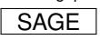
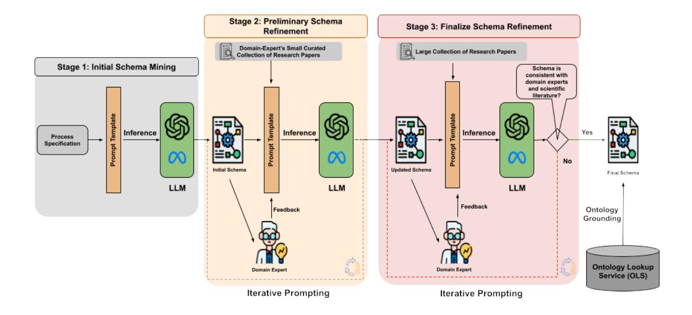
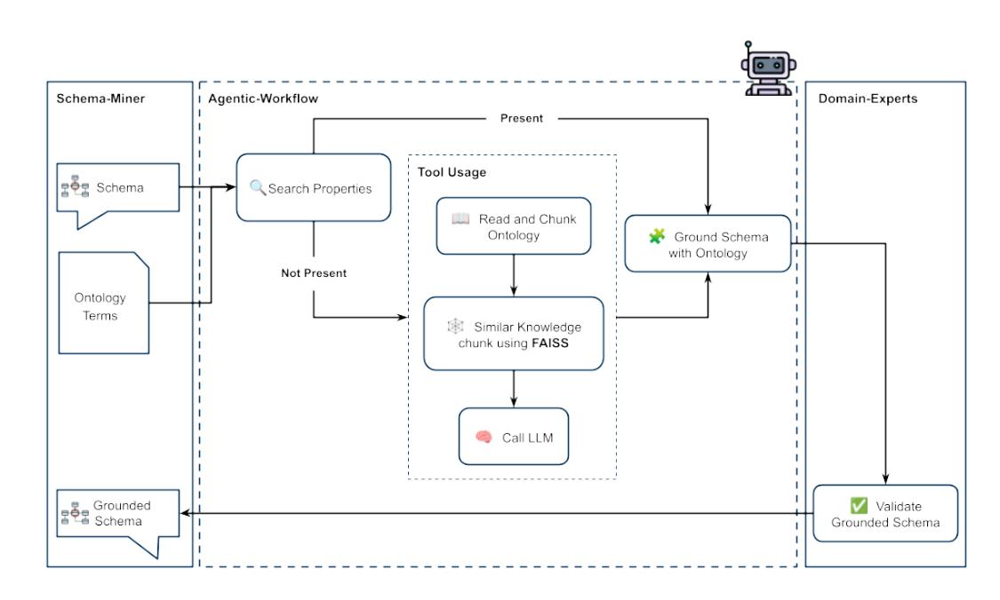
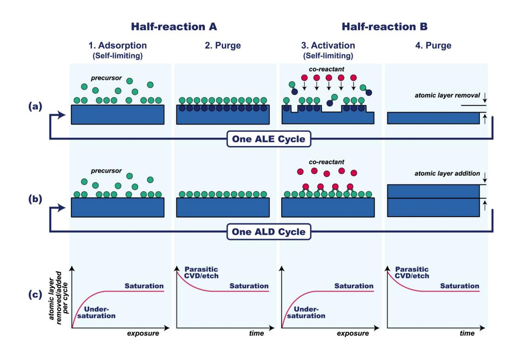
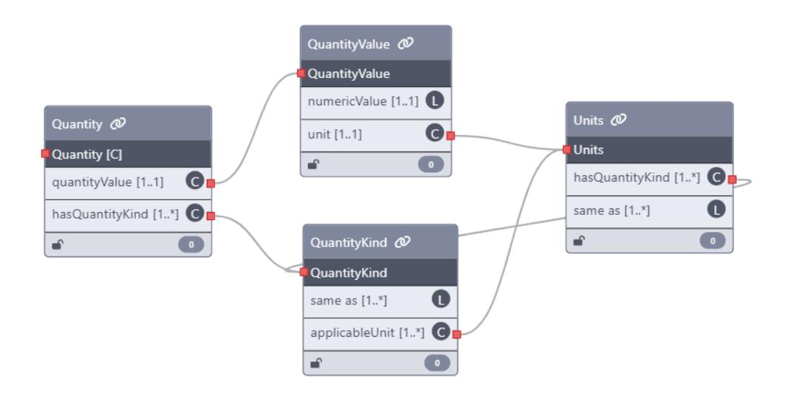
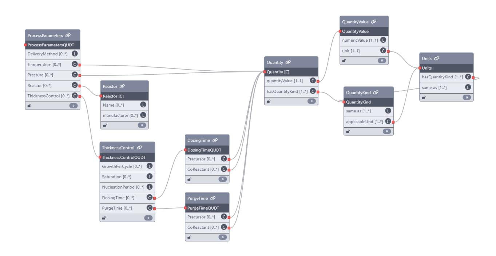
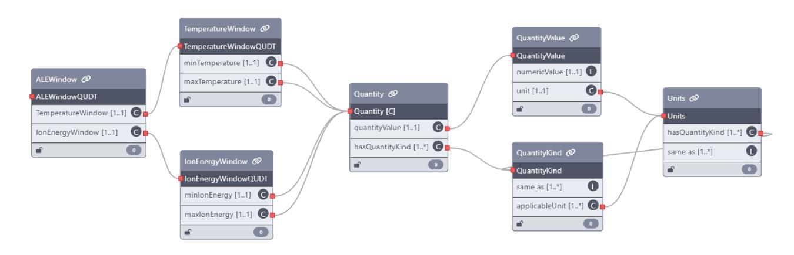
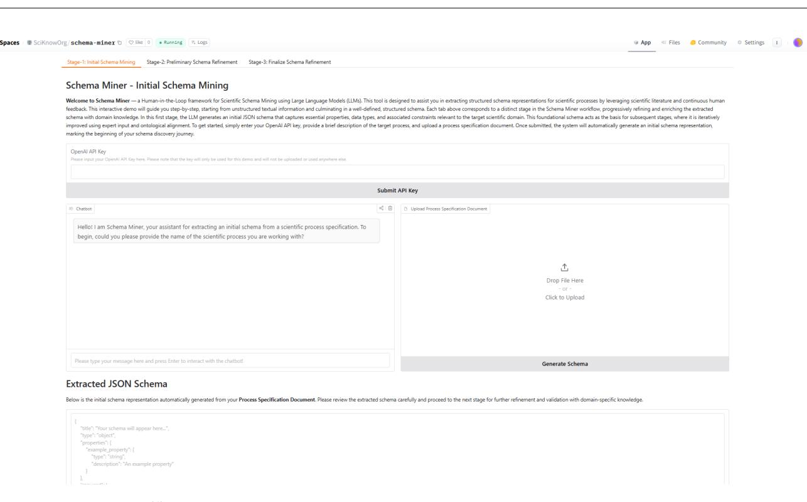

# **SCHEMA-MINER**pro**: Agentic AI for Ontology Grounding over LLM-Discovered Scientific Schemas in a Human-in-the-Loop Workflow**

Semantic Web Journal XX(X)[:1–](#page-0-0)[25](#page-21-0) ©The Author(s) 2025 Reprints and permission: sagepub.co.uk/journalsPermissions.nav DOI: 10.1177/ToBeAssigned www.sagepub.com/



**Sameer Sadruddin<sup>1</sup> , Jennifer D'Souza<sup>1</sup> , Eleni Poupaki<sup>2</sup> , Alex Watkins<sup>3</sup> , Bora Karasulu<sup>3</sup> , Soren Auer ¨ 1,4, Adrie Mackus<sup>2</sup> and Erwin Kessels<sup>2</sup>**

#### <span id="page-0-0"></span>**Abstract**

Scientific processes are often described in free text, making it difficult to represent and reason over them computationally. We present SCHEMA-MINERpro, a human-in-the-loop framework that automatically extracts and grounds structured schemas from scientific literature. Our approach combines large language models for schema extraction with an agent-based system that aligns extracted elements to external ontologies through interpretable, multi-step reasoning. The agent leverages lexical heuristics, semantic similarity, and expert feedback to ensure accurate grounding. We demonstrate the framework on two semiconductor manufacturing workflows—Atomic Layer Deposition (ALD) and Atomic Layer Etching (ALE)—mapping process parameters and outputs to the QUDT ontology. By producing ontology-aligned, semantically precise schemas, SCHEMA-MINERpro lays the groundwork for machineactionable scientific knowledge and automated reasoning across disciplines.

#### **Keywords**

Schema Discovery, Scientific Schema, Large Language Models, Human-in-the-loop Workflow, AI Agents, QUDT Ontology

#### **Introduction**

Extracting structured information from scientific publications is essential for modeling complex real-world processes, yet most scientific knowledge remains locked in unstructured prose. In the context of the Semantic Web vision, there is a large semantic gap between the volume of unstructured literature and the available structured data [\(38\)](#page-22-0). Information Extraction (IE) methods aim to bridge this gap by converting text into formal representations [\(17;](#page-21-1) [59\)](#page-23-0), but traditional IE approaches require extensive labeled corpora and hand-engineered patterns, which are laborious in domains like materials science [\(59\)](#page-23-0), life sciences, medicine, engineering, etc. [\(47\)](#page-23-1). Recent advances show that large language models (LLMs) can significantly aid this effort: for example, LLM-based pipelines have mined millions of polymer–property records from materials literature [\(25\)](#page-22-1). Nevertheless, the highly specialized language and reporting conventions of scientific manuscripts continue to impede fully automated schema discovery or induction. A further challenge is semantic interoperability: terms and units often vary across publications. Ontologies of quantities (e.g., the OWL Ontology of Units of Measure) were developed to make quantitative data explicit for integration and reuse [\(46\)](#page-23-2). However, without systematic grounding of text-derived concepts in such ontologies, automatically extracted information remains fragmented and ambiguous. Together, these factors motivate the need for methods that can discover high-quality domain schemas from literature and explicitly link them to formal ontologies.

Agent-based workflows introduce a transformative capability to Semantic Web technologies by embedding autonomy, memory, and modular reasoning into information

#### **Corresponding author:**

Sameer Sadruddin, sameer.sadruddin@tib.eu Jennifer D'Souza, jennifer.dsouza@tib.eu

<sup>1</sup>TIB Leibniz Information Centre for Science and Technology, Hannover, Germany

<sup>2</sup>TU/e Eindhoven University of Technology, Netherlands

<sup>3</sup>University of Warwick, United Kingdom

<sup>4</sup>L3S Research Center, Leibniz University of Hannover, Germany

extraction and grounding tasks. For the Semantic Web community, this signals a shift from static, rule-based knowledge population toward dynamic, explainable, and reproducible schema engineering. The integration of agentic systems with LLMs [\(22\)](#page-22-2) allows for semantically rich, ontology-grounded structures to be created with high precision and interpretability—traits critical for maintaining FAIR principles (Findability, Accessibility, Interoperability, and Reusability) [\(56\)](#page-23-3) and for scaling the population of Linked Open Data (LOD) resources across scientific domains. By supporting tool augmentation (e.g., embeddings-based vector search) and human validation, agent-based workflows exemplify how intelligent agents can act as semantic intermediaries, fostering stronger alignment between unstructured scientific discourse and formal knowledge graphs [\(23\)](#page-22-3).

Existing work on schema discovery and ontology learning has progressed from rule-based and statistical methods to neural approaches. However, most prior efforts target general or narrative text and do not fully address the complexity of scientific processes. In our prior work, we introduced the LLMs4SchemaDiscovery approach (implemented in the SCHEMA-MINER software or tool), a human-in-the-loop workflow that uses LLMs to extract candidate schemas from materials science papers [\(48\)](#page-23-4), as an exemplary, while discussing its broader scientific applicability to other domains. SCHEMA-MINER organized properties induced from the unstructured text input into a structured schema and incorporated expert feedback for refinement. It also allowed experts to link schema terms to existing ontologies, adding semantic depth. While this approach yielded semantically rich schemas for the materials science process tested, viz. atomic layer deposition, it had practical limitations: the software was only accessible via a command-line interface, and ontology grounding was performed manually or in an adhoc way. These constraints limited the tool's usability and the reproducibility of its grounding results, indicating a need for a more integrated AI-based solution.

Thus, as a systematic extension to our prior work, in this paper we present SCHEMA-MINERpro—a significantly enhanced framework that augments the original SCHEMA-MINER pipeline with agentic AI capabilities specifically for the ontology grounding stage. Unlike a purely promptbased approach in which a large language model is queried to align extracted schema elements to ontological concepts in a single pass, our agentic workflow decomposes the alignment task into structured, tool-augmented steps. The agent iteratively performs heuristic string matching and embedding-based semantic search to identify candidate ontology classes or properties for each schema element. Crucially, it can maintain internal state, reason over intermediate results, invoke specialized tools (e.g., lexical lookup, FAISS search), and solicit expert validation in a modular, extensible loop. This design leads to greater transparency, controllability, and reproducibility compared to end-to-end prompting, which often lacks interpretability and is prone to hallucination.

In addition to this architectural enhancement, we evaluate SCHEMA-MINERpro in a significantly broader experimental setting. We demonstrate its end-to-end capabilities across two complex and complementary semiconductor process categories—Atomic Layer Deposition (ALD) and Atomic Layer Etching (ALE, the reverse of ALD)—using both experimental and simulation literature corpora. These diverse use cases test the system's robustness across distinct process descriptions and vocabulary. To further improve usability, especially for domain experts unfamiliar with command-line tools, we introduce a web-based chat interface deployed on the Hugging Face platform. This interface enables users to interactively explore, edit, and validate the discovered schemas via conversational dialogue, thereby substantially improving accessibility and expert engagement compared to the previous command-line-based workflow.

At a high level, SCHEMA-MINERpro follows an iterative, human-in-the-loop pipeline. It begins by prompting one or more LLMs to generate a draft process schema by extracting relevant entities and properties—such as materials, parameters, or measurements—from a curated set of scientific texts. Domain experts then refine the provisional schema by correcting inaccuracies or adding missing elements. At this point, the ontology grounding agent takes over: for each schema element, it first attempts to identify corresponding ontology classes using lexical heuristics (e.g., label and synonym matching). If no confident match is found, it proceeds to semantic search using vector embeddings to retrieve conceptually similar candidates from a pre-indexed ontology space. The agent then ranks and proposes candidate alignments—such as linking a "temperature" parameter to the QUDT class for temperature, linking a "growthPerCycle" parameter to QUDT class for Length—while allowing the expert to accept or revise the mappings.

This agentic design contrasts with naive prompting strategies in which ontology alignment is attempted through single-turn LLM queries, which are difficult to trace, evaluate, or debug. In contrast, our approach leverages the explicit orchestration of reasoning and tool use, allowing the agent to make informed decisions across multiple subtasks and ensuring greater consistency and explainability in the grounding process. Through iterative cycles of LLMbased schema induction, expert validation, and agentic grounding, SCHEMA-MINERpro converges on a high-quality, semantically rich, and human-validated process schema. This final output—whose entities and units are grounded in formal ontologies—enables downstream tasks such as semantic integration, automated reasoning, and scientific knowledge reuse at scale.

In summary, the key contributions of SCHEMA-MINERpro are:

- Agentic Ontology Grounding: We introduce an LLM-driven, tool-augmented agentic workflow that combines heuristic matching and semantic vector search to align schema elements with ontology concepts, integrating expert validation for highprecision grounding.
- End-to-End Application to ALD/ALE: We demonstrate the full workflow on two complex semiconductor processes—Atomic Layer Deposition and Atomic Layer Etching—showing its effectiveness across both experimental and simulation literature.
- Interactive Web Interface: We develop a publicly available chat-based interface ([https:](https://huggingface.co/spaces/SciKnowOrg/schema-miner) [//huggingface.co/spaces/SciKnowOrg/](https://huggingface.co/spaces/SciKnowOrg/schema-miner) [schema-miner](https://huggingface.co/spaces/SciKnowOrg/schema-miner)) enabling domain experts to engage with schema discovery through natural language, lowering the barrier for adoption and enhancing expert–AI collaboration.
- Comprehensive Evaluation: We conduct in-depth quantitative and qualitative analysis across LLM variants, schema stages, and grounding effectiveness using QUDT. Our evaluation highlights the stability and utility of LLMs and the impact of agentic grounding via FAISS-based semantic search.

The remainder of the paper is organized as follows. Section 2 surveys related work on schema learning which is a type of structured information extraction. Section 3 describes the SCHEMA-MINERpro system and workflow in detail. Section 4 presents our experiments and evaluation on the ALD and ALE case studies. Section 5 concludes with a summary of findings and directions for future work. The code and resources for SCHEMA-MINERpro are publicly available at [https://github.](https://github.com/sciknoworg/schema-miner) [com/sciknoworg/schema-miner](https://github.com/sciknoworg/schema-miner).

## **Related Work**

The SCHEMA-MINERpro approach builds upon and extends several research directions including schema discovery from unstructured text, LLMs for IE, human-in-the-loop workflows, and ontology grounding. This section reviews relevant prior work in these areas, highlighting the novel contributions of our approach.

*Schema induction or schema discovery from text.* Early research on schema discovery explored how structured representations could be derived from raw text, often through rule-based or handcrafted techniques. Embley et al. [\(20\)](#page-21-2) proposed foundational methods to identify record boundaries in web documents, contributing to early data integration pipelines. In the scientific domain, Kononova et al. [\(30\)](#page-22-4) introduced a domain-specific pipeline to mine synthesis protocols from materials science literature, converting thousands of paragraphs into structured "codified recipes." Although impactful, these approaches required extensive manual curation or domain-specific engineering, highlighting the need for generalizable, scalable solutions.

Schema induction has also been studied in NLP as a way to learn structured event or relational representations from unstructured narratives. Chambers and Jurafsky [\(8\)](#page-21-3) pioneered script learning from co-occurring event sequences. More recent methods emphasize "complex event schema induction," where schemas are modeled as graphs over events and participants. For instance, Hao et al. [\(26\)](#page-22-5) propose a discrete diffusion approach guided by LLMgenerated knowledge to induce causal and hierarchical relations among events. Dror et al. [\(15\)](#page-21-4) use GPT-3 to synthesize artificial narratives from a high-level topic (e.g., "pandemic outbreak") and then extract structured schemas from them, demonstrating that zero-shot LLM methods can exceed manual baselines. Regan et al. [\(45\)](#page-23-5) focus on causal schema induction in news data, modeling cause-effect chains using annotated graphs and discourse-level features.

These works illustrate the evolution from rule-based to neural schema discovery techniques, increasingly leveraging generative models to produce interpretable and composable structures. However, most focus on general or narrative domains and rarely address the complexities of scientific literature, which involves dense terminology, multi-step processes, and deep domain knowledge.

*LLMs for schema and ontology learning.* The emergence of LLMs has accelerated progress in schema induction and ontology engineering. In materials science, Dagdelen et al. [\(10\)](#page-21-5) fine-tune GPT-3 and Llama-2 on a few annotated papers to jointly perform named-entity recognition and relation extraction, producing structured JSON records of host materials, dopants, compositions, etc. Similarly, Xie et al. [\(58\)](#page-23-6) introduce ByteScience, an automated AWS-based pipeline that fine-tunes a domain-specific LLM (DARWIN) with minimal annotations to extract complex scientific facts from literature. These works show that LLMs can be adapted to convert specialized text (chemistry, materials science) into structured form with high accuracy given only a small labeled seed. In ontology learning, Bakker et al. [\(6\)](#page-21-6) explore using GPT-4o to induce an ontology from news text: they compare direct, sequential, and sentencelevel prompting strategies to extract classes, individuals, and relations, and then evaluate the LLM-generated ontology against a human-created ground truth. The authors find that multi-step prompting improves consistency and reliability of the induced ontology. Such studies suggest that LLMs can serve as "ontology generators" or knowledge graph learners, albeit often producing taxonomic or relational structures rather than full-fledged ontologies.

Schilling-Wilhelmi et al. [\(49\)](#page-23-7) provide a comprehensive review of how LLMs can facilitate chemical informatics. They highlight that modern LLMs enable even nonexperts to extract structured chemical knowledge from text, provided that domain expertise is used to guide and validate the LLM's outputs. The chemical domain's emphasis on precise terminology and context echoes the review's recommendation that LLM-driven extraction be coupled with expert oversight to ensure accuracy and relevance.

Our prior work, SCHEMA-MINER [\(48\)](#page-23-4), introduced an LLM-powered, human-in-the-loop pipeline tailored for scientific schema extraction. It applied large language models to collections of research papers (e.g., on atomic layer deposition) to induce reusable schema components. The workflow included expert-in-the-loop stages for refining schema proposals and grounding schema nodes in scientific ontologies. SCHEMA-MINER demonstrated that combining LLM suggestions with domain expert validation significantly improved the precision and reusability of the resulting schemas.

The present work, SCHEMA-MINERpro, builds directly on this foundation. It generalizes the method to support schema discovery across scientific domains, integrates agentic AI workflows for managing and orchestrating the pipeline, and supports versioning and schema evolution across iterations. Our system offers a modular architecture for plugging in LLMs, grounding APIs, and user feedback interfaces, making it an extensible platform for semantic schema engineering.

D'Souza et al. [\(16\)](#page-21-7) present a related system in the ecology domain, where GPT-4 is used to induce and populate schemas capturing species, habitat, and ecosystem interactions from a large corpus of invasion biology literature. Their multi-stage approach combines schema discovery with large-scale fact extraction, resulting in a sizable ecological knowledge base. While their system automates many of the same tasks, SCHEMA-MINERpro distinguishes itself through its generality, agentic coordination, and grounding capabilities.

*Human-in-the-loop knowledge extraction.* Because fully automated induction can err, several recent systems integrate human oversight to refine schemas or extractions. Zhang et al. [\(65\)](#page-24-0) describe an interactive schema induction system where GPT-3 initially proposes schema "steps" (events) and tuple nodes, which human experts can edit via a graphical interface before assembling them into a schema graph. Their system allows prompt-based generation of candidate elements, manual curation of those elements, and conversion into a final graph, leading to more accurate schemas with less manual effort compared to previous IRonly methods. Similarly, Chang et al. [\(9\)](#page-21-8) present an endto-end event-schema curation tool: LLMs propose event sequences and relations, but users can correct extracted tuples or relations at each stage. This pipeline includes a entity extraction and representation using entity mention detection. These human-in-loop designs demonstrate that user feedback and ontology linking can greatly improve the precision and interpretability of induced schemas.

Human expertise plays a central role in refining schemaminer's outputs. In contrast to earlier efforts that relied heavily on post-hoc correction, our prior work SCHEMA-MINER [\(48\)](#page-23-4) included expert input at both the refinement and generalization stages, ensuring correctness, completeness, and domain alignment. Feedback is provided in descriptive and direct-edit modes and is incorporated into iterative runs, with measurable impact on output quality. This distinguishes the schema-miner tool including the advancements proposed in this paper as SCHEMA-MINERpro, from approaches that treat human validation as a separate post-processing step.

Other work has also explored interactive paradigms. OntoChat [\(63\)](#page-23-8) enables ontology engineers to iteratively codevelop ontologies with LLMs via multi-turn conversation. These approaches, like SCHEMA-MINER, illustrate the value of augmenting LLM outputs with human knowledge to mitigate hallucinations and ensure interpretability in highstakes scientific contexts.

*Ontology grounding and alignment.* Mapping schema components to standardized ontologies ensures interoperability and supports downstream reasoning. Historically, ontology alignment tools were benchmarked in OAEI tracks. More recently, He et al. [\(27\)](#page-22-6) and Amini et al. [\(4\)](#page-21-9) demonstrated that zero-shot and prompted LLMs outperform classical methods like BERTMap on various ontology matching tasks. Babaei et al. [\(5;](#page-21-10) [24\)](#page-22-7) developed OntoAligner,[\\*](#page-4-0) a modular Python toolkit that integrates retrieval-augmented LLM prompting and classical matching algorithms for complex alignment problems.

SCHEMA-MINER incorporated a grounding module to match extracted schema elements to domain ontologies via API-based services. In SCHEMA-MINERpro, this component is extended through agentic control: autonomous agents orchestrate grounding attempts, collect ranked candidate matches, and solicit expert confirmation, ensuring consistent and high-confidence mappings.

Foundational theories on schema mapping and conceptual model integration (e.g., [\(19;](#page-21-11) [18\)](#page-21-12)) remain relevant as underlying frameworks. Our agent-enhanced grounding design introduced as SCHEMA-MINERpro extends these ideas by embedding them in a practical pipeline supported by stateof-the-art AI components. This step is essential for ensuring that newly induced schemas are not isolated artifacts but connectable to the Linked Open Data cloud or domainspecific graphs.

*Summary.* To our knowledge, no existing system offers an end-to-end, domain-agnostic, human- and agent-inthe-loop workflow for schema induction, refinement, and ontology grounding from scientific literature. Existing systems address schema induction in specific domains, ontology alignment in isolation, or omit human oversight. SCHEMA-MINERpro builds on our prior work and integrates these components into a unified, extensible framework for semantic schema engineering at scale.

#### **SCHEMA-MINER - Overview**

In our prior work, we introduced the SCHEMA-MINER tool [\(48\)](#page-23-4) [\(Figure 1\)](#page-5-0). It implements a human-in-theloop, iterative workflow for scientific schema mining and ontology grounding, utilizing large language models (LLMs) and domain expertise. The workflow comprises three main stages: initial schema mining, preliminary schema refinement and final schema refinement.

The schema discovery is initiated by a process specification document, which is iteratively refined using a curated collection of scientific publications and structured domainexpert feedback. This iterative, human-guided approach enhances both the structural and semantic characterization of the processes in the target domain. The final schema is grounded with established ontology using the ontology lookup service API, thereby facilitating interoperability and knowledge integration within the Semantic Web ecosystem. In the subsequent sections, we briefly describe each stage of the workflow to establish the foundation for the extended version of the framework, SCHEMA-MINERpro

#### *Stage 1: Initial Schema Mining*

In the first stage, SCHEMA-MINER begins with the automated extraction of essential properties from unstructured process specification document. This document is authored by domain experts, which is provided to the LLM to generate an initial JSON schema which encompasses essential properties with its corresponding description, data type, and unit of measurement if applicable. The LLM is instructed using a structured prompt that contains a system prompt and a user prompt. The *system prompt* assigns the LLM a specific role (for example, as a schema design expert in scientific process modeling), outlines the primary objectives (such as generating a JSON schema that captures essential properties, data types, units, and property relationships) and specifies the required output format, ensuring consistency and adherence to schema design best practices. The *user prompt* then gives the process specification and contextual instructions, guiding the LLM to extract relevant schema elements and conform to the specified JSON structure. The initial schema is evaluated by the domain experts, who evaluate its completeness, correctness, and semantic clarity. Their feedback is very important for informing subsequent refinement steps.

#### *Stage 2: Preliminary Schema Refinement*

The second stage is an iterative refinement of the initial schema, using a curated high-quality corpus of domainrelevant scientific literature and domain-expert feedback. A small collection of research papers is curated by the domainexperts of around 1-10 papers which are considered to be state-of-the-art and highly specialized publications for the target process. The purpose of this highly focused collection is to allow LLM to extract properties and their relationship which are highly relevant for describing that process. This will help LLM in generating schema which are both specific

<span id="page-4-0"></span><sup>∗</sup><https://ontoaligner.readthedocs.io/index.html>

<span id="page-5-0"></span>

**Figure 1.** Overview of the LLMs4SchemaDiscovery workflow implemented in the SCHEMA-MINER tool [\(48\)](#page-23-4). The diagram illustrates a three-stage process followed by an ontology grounding phase. Stage 1 generates an initial process schema using domain-specific specifications. In Stage 2, this schema is refined using a small, curated scientific corpus, and in Stage 3, further enriched using a larger, non-curated corpus. The final stage involves manual grounding of properties using ontology lookup service.

and generalizable with semantic consistency across various research scenarios.

The LLM is tasked with refining the schema by extracting additional properties, updating or clarifying property descriptions, incorporating missing constraints, and aligning terminologies with those used in the literature. An optional domain-expert feedback is requested based on the guideline provided to them, which defines two ways to provide a comprehensive feedback for the LLM to improve schema:

- 1. The first way is the descriptive text where the domain experts address questions like property merging, property grouping into a single unit, missing essential properties, and adequate property descriptions.
- 2. The other method is through direct edits to the schema, where they can directly modify properties, constraints, and relationships as needed.

## *Stage 3: Finalize Schema Refinement*

In the third stage, the schema undergoes further generalization and validation using a substantially larger and more heterogeneous corpus of scientific publications, which can comprise up to 100 papers. The non-curated corpus of scientific papers exposes the schema to a broader array of process descriptions, terminologies, and domain-specific edge cases. The primary objective is to ensure that the schema is not only robust and semantically precise but also generalizable across diverse representations of the target scientific process.

The LLM is instructed to incorporate new properties, correct omissions or inaccuracies in property descriptions, and improve semantic coherence across the schema. While stage 2 emphasizes domain grounding and precision via a curated literature set, stage 3 prioritizes scalability and generalizability, capturing a wider spectrum of process variations and terminological differences. The resulting schema is therefore validated for both its foundational accuracy and its applicability to a diverse range of real-world scientific scenarios.

# **SCHEMA-MINERpro - Agent-based Ontology Grounding over Scientific Schemas**

In this work, we extend the SCHEMA-MINER tool with an agent-based ontology grounding stage that aligns schema properties with established ontologies through a toolaugmented, agentic workflow. This enhancement ensures semantic interoperability and facilitates alignment with domain knowledge structures. We refer to this extended version as SCHEMA-MINERpro. The agent-based component is designed to be modular and adaptable, enabling the grounding of schema elements across diverse domain ontologies.

<span id="page-6-0"></span>

**Figure 2.** Overview of the AI agent-based ontology grounding. The agent receives a process schema and performs a lexical search on each property to determine if it exists in ontology. If not, the agent invokes a tool that uses FAISS for semantic search over the ontology to retrieve the most relevant chunk associated with the property. Based on this, it recommends the appropriate metadata, which are then validated by domain experts for correctness.

#### *Agentic Workflows*

Agentic workflows represent a paradigm in which LLMs are embedded within structured, goal-driven processes that support autonomous decision-making, iterative reasoning, and adaptive interaction with dynamic environments. In such systems, AI agents plan, decide, and act through sequences of goal-oriented steps, incorporating memory, feedback, and tool use to iteratively refine their behavior [\(61\)](#page-23-9). Unlike conventional LLM workflows—typically based on direct prompt-response interactions or static chain-ofthought sequences—agentic workflows maintain persistent stage management, integrate environmental feedback, and dynamically adjust task strategies [\(36\)](#page-22-8). These capabilities allow agentic systems to go beyond reactive text generation, engaging instead in multistep, context-sensitive reasoning using various tools to refine both internal representations and external outputs. As such, agentic workflows provide a robust foundation for ontology grounding by enabling the alignment of schema properties with ontological concepts in a principled and adaptable manner.

A key motivation for adopting an agentic workflow—rather than relying exclusively on LLM-based prompting—is the need for improved modularity, transparency, and scalability in the grounding process. While LLMs exhibit strong performance in tasks involving text understanding and concept matching, they are susceptible to known limitations such as hallucinations and restricted context windows, particularly when used in monolithic, promptbased settings [\(40\)](#page-22-9). Recent studies indicate that purely LLMbased approaches, such as LLMs4OM, can achieve high recall on ontology alignment tasks but still require substantial human-in-the-loop validation to ensure precision [\(5\)](#page-21-10).

Agentic workflows offer an alternative by decomposing the ontology grounding task into smaller, manageable subtasks, each potentially handled by a dedicated agent. This modular architecture allows each agent to integrate specialized tools—such as memory, external knowledge graphs, or FAISS-based semantic retrieval [\(14\)](#page-21-13)—and to apply task-specific reasoning strategies. For example, Wu et al. [\(57\)](#page-23-10) implement a multi-agent system to extend a medical symptom ontology, where distinct agents perform roles including extraction, validation, and classification. Their framework demonstrates that agentic workflows are flexible, scalable, and amenable to domain customization in ways that are difficult to replicate using purely LLM-based methods.

Compared to traditional manual ontology grounding, as used in our prior work [\(48\)](#page-23-4), the agentic approach introduced here offers a more efficient and reproducible alternative. Manual grounding is labor-intensive, error-prone, and difficult to scale across diverse scientific domains. In contrast, agent-based systems automate significant portions of the ontology alignment process while retaining the opportunity for expert oversight and feedback. This semiautonomous design strikes a balance between automation and expert control, and is particularly well-suited to knowledge integration in complex, high-stakes domains.

## *The* SCHEMA-MINER*pro Agentic Workflow*

Building on the strengths of agentic workflows, SCHEMA-MINERpro incorporates an autonomous ontology-grounding agent to semantically align extracted process schemas with domain ontologies (Figure [2\)](#page-6-0). By embedding a goal-driven agent within the schema refinement pipeline, our approach advances beyond the manual grounding strategy employed in the original SCHEMA-MINER tool.

Our implementation adopts a single-agent architecture using the LangChain Agent framework[†](#page-7-0) . This agent is responsible for completing the grounding process for all schema properties. Its behavior is governed by a system prompt[‡](#page-7-1) that specifies the agent's objectives, required inputs, and expected outputs—including conditional logic, such as returning an empty JSON object when the input property does not correspond to a physical quantity.

The agent operates according to a heuristic-based execution strategy: it initially attempts to resolve schema properties through direct matching against ontology terms. When ambiguity is detected or no direct match is found, the agent invokes a semantic search tool to retrieve relevant ontology candidates. This staged approach promotes efficiency by minimizing unnecessary tool usage.

To support traceability and iterative reasoning, the agent maintains a message history and an internal scratchpad for storing intermediate results. The following sections describe the detailed design, operational stages, and evaluation of this agentic component within the SCHEMA-MINERpro system.

#### *Step 1: Ontology and Schema Input*

The first stage of the ontology grounding workflow in SCHEMA-MINERpro is the Ontology and Schema Input phase, where the agent prepares the necessary resources to initiate the grounding process. This step involves three key inputs: (1) the schema output from Stage 3 of SCHEMA-MINER, (2) a domain-specific statement providing contextual information about the schema, and (3) the target ontology for grounding.

The input schema contains semantically enriched properties that must be aligned with corresponding ontology concepts. The agent also receives a machine-readable ontology, either via a URL or in a standard RDF serialization (e.g., Turtle or RDF/XML), which defines the relevant domain's concepts, relationships, and metadata.

The third input is a concise textual description of the scientific domain or process associated with the schema. This description provides essential context for disambiguating schema properties during ontology lookup. For example, a statement such as *"Atomic Layer Etching – Atomic Layer Etching (ALE) is a highly controlled, layer-by-layer etching process used in semiconductor fabrication to achieve atomicscale precision in material removal."* helps guide the agent's interpretation of domain-specific terminology during the grounding process.

#### *Step 2: Property Matching*

The second stage of the ontology grounding workflow, Property Matching, focuses on aligning each property in the extracted schema with its corresponding concept in the target ontology. To balance efficiency and precision, we implement a two-tiered, rule-based strategy. This design is informed by observations that certain schema properties can be directly and unambiguously mapped to ontology terms without requiring complex reasoning. Such properties are identified in advance and grounded immediately, bypassing any further tool invocation.

For properties that are ambiguous or lack a clear match in the ontology, the agent engages a specialized tool to resolve the semantic uncertainty. This process begins by partitioning the ontology's knowledge base into smaller, overlapping chunks, motivated by the token limitations of large language models during inference. These chunks are indexed using Facebook AI Similarity Search (FAISS) [\(14\)](#page-21-13), enabling fast, vector-based semantic retrieval.

When grounding an ambiguous schema property, the agent queries the FAISS index to retrieve the most semantically similar chunk. This chunk, along with the property in question, is then passed to an LLM, which selects the most appropriate ontology concept. The LLM is guided by a structured prompt[§](#page-7-2) that specifies the required input format (property and ontology chunk) and output structure. If the property does not represent a physical quantity within the ontology's domain, the agent returns an empty JSON object; otherwise, the output includes relevant metadata such as *quantityKind*, *unit*, and ontology URIs. The prompt also

<span id="page-7-0"></span><sup>†</sup>[https://api.python.langchain.com/en/latest/](https://api.python.langchain.com/en/latest/langchain/agents.html) [langchain/agents.html](https://api.python.langchain.com/en/latest/langchain/agents.html)

<span id="page-7-1"></span><sup>‡</sup>[https://github.com/sciknoworg/schema-miner/blob/](https://github.com/sciknoworg/schema-miner/blob/main/src/prompts/ontology_grounding/agent_qudt_prompt2.py) [main/src/prompts/ontology\\_grounding/agent\\_qudt\\_](https://github.com/sciknoworg/schema-miner/blob/main/src/prompts/ontology_grounding/agent_qudt_prompt2.py) [prompt2.py](https://github.com/sciknoworg/schema-miner/blob/main/src/prompts/ontology_grounding/agent_qudt_prompt2.py)

<span id="page-7-2"></span><sup>§</sup>[https://github.com/sciknoworg/schema-miner/blob/](https://github.com/sciknoworg/schema-miner/blob/main/src/prompts/ontology_grounding/agent_qudt_prompt1.py) [main/src/prompts/ontology\\_grounding/agent\\_qudt\\_](https://github.com/sciknoworg/schema-miner/blob/main/src/prompts/ontology_grounding/agent_qudt_prompt1.py) [prompt1.py](https://github.com/sciknoworg/schema-miner/blob/main/src/prompts/ontology_grounding/agent_qudt_prompt1.py)

includes examples and instructs the LLM to use semantic reasoning and synonym recognition to improve mapping accuracy to formal QUDT concepts.

#### *Step 3: Schema Integration*

The third stage of the ontology grounding workflow, Schema Integration, focuses on incorporating the matched ontology concepts into the process schema to ensure semantic completeness and interoperability. Once a schema property has been successfully grounded—i.e., linked to an ontology term along with its corresponding URI and associated predicates—the relevant ontology subgraph is integrated into the schema using a user-defined template.

This integration template provides a structural specification for representing ontology-derived metadata within the schema. For instance, a user may define a JSON schema format that includes fields such as *description*, *URI*, *sameAs*, and other metadata extracted from the ontology. The agent populates these fields based on the matched ontology class or property.

This template-based approach ensures both flexibility—allowing for adaptation across diverse domains—and consistency, enabling the generation of machine-readable, semantically enriched schemas. The resulting output is wellsuited for downstream applications such as knowledge graph construction, semantic search, and automated reasoning.

## *Step 4: Domain-Expert Validation*

The final stage of the ontology grounding workflow, Domain-Expert Validation, ensures that the semantically enriched schema aligns with domain knowledge and experimental practice. In this step, domain experts review the grounded schema to evaluate the correctness and relevance of the matched ontology terms. Based on their feedback, the agent iteratively revises the grounding to resolve any misalignments or semantic inaccuracies.

This human-in-the-loop mechanism is essential for maintaining the validity of the schema, particularly in domains where subtle terminological or contextual nuances may influence downstream interpretation. By incorporating expert feedback into the refinement loop, the workflow enhances the precision of ontology grounding and allows the schema to evolve alongside domain knowledge.

The following pseudocode summarizes the complete agentic workflow implemented in SCHEMA-MINERpro for ontology grounding.

```
AGENT GroundSchema
INPUT:
```

ontology, process\_schema, chunk\_size, overlap\_size

#### #Step 1

Download OR Load ontology from URL/RDF File

```
Chunk ontology content into overlapping text
Embed each chunk into a vector
   representation
Index all embeddings into a FAISS vector
   store
```

```
#Step 2
```

FOR each property IN process\_schema DO IF property matches a known ontology term THEN Assign ontology metadata to property ELSE Use property as query in FAISS vector store Retrieve top-k similar ontology chunks prompt: includes property + ontology chunk Pass prompt to LLM with grounding instructions IF LLM returns valid grounding metadata THEN Assign metadata (e.g., quantityKind, unit) ELSE Mark property as ungroundable(not a physical quantity) END IF END IF END FOR #Step 3 Integrate grounded properties into process\_schema #Step 4 Collect feedback and corrections from domain experts Apply corrections to the schema

```
END AGENT
```

With expert validation complete, the refined schema is ready for practical use. In the next section, we demonstrate its utility in a materials science use case, showing how semantic grounding enhances process understanding, interoperability, and analysis in thin-film fabrication.

<span id="page-9-0"></span>

**Figure 3.** Schematic illustration of one complete cycle of (**a**) atomic layer etching (ALE) and (**b**) atomic layer deposition (ALD). Every cycle consists of two half-cycles: the precursor is dosed in the reactor and reacts with the surface in the first step, and then a co-reactant is introduced in the second half-cycle. These steps are separated by purge steps to remove any leftover chemicals and reaction products from the reactor, ensuring clean and controlled growth. A complete cycle removes or adds an atomic layer from or to the film for ALE and ALD respectively. In (**c**), the saturation curves for each step of the ALE and ALD processes are depicted. © The Electrochemical Society. Reproduced by permission of IOP Publishing Ltd. All rights reserved [\(21\)](#page-22-10)

#### <span id="page-9-1"></span>**Application: Material Science Use Case**

#### *Atomic Layer Deposition and Etching Processes*

Atomic Layer Deposition (ALD) is a nanofabrication technique that enables the precise and uniform preparation of thin films of materials at the nanometer scale. It is a chemical process that takes place in a reactor and relies on self-limiting, sequential cycles in which thin films are built atomic layer by atomic layer until the desired thickness is achieved [\(29\)](#page-22-11). Each ALD cycle consists of two half-cycles: a precursor reacts with the surface in the first step, followed by a co-reactant in the second. These steps are conducted under controlled conditions and are separated by purge steps to remove excess reactants and by-products from the reactor (Figure [3](#page-9-0) (b)) [\(51\)](#page-23-11). Beyond the deposition of material at the atomic scale, the removal of material—commonly referred to as "etching"—is also a critical technique in the fabrication of devices with high variability. Atomic Layer Etching (ALE) is a precise etching method, analogous to ALD, which removes thin layers of material through self-limiting reactions, as depicted in Figure [3](#page-9-0) (a). A typical ALE process consists of two half-reactions, based on self-limiting surface chemistry, that take place cycle-wise [\(28\)](#page-22-12).

In both ALD and ALE, the self-limiting nature of the reactions is the key property that ensures exceptional control

*Prepared using sagej.cls*

over film thickness, composition, and uniformity. These characteristics make ALD and ALE critical technologies for the production of cutting-edge electronic devices. Their applications extend beyond electronics to fields such as optics, photovoltaics, batteries, catalysis, and more [\(3\)](#page-21-14). While the fundamental principles of ALD and ALE—self-limiting, sequential chemical processes—may seem straightforward, developing a successful ALD or ALE process requires careful design and execution. Conducting such experiments involves a series of steps to optimize parameters and ensure reliable outcomes [\(51;](#page-23-11) [54\)](#page-23-12). Initially, researchers must define the intended application and accordingly select suitable precursors, co-reactants, and substrates. It is necessary to determine optimal pulse and purge durations, select an appropriate reactor type, and choose suitable process conditions such as temperature and pressure. Repeating experiments to validate results and ensure reproducibility is essential for establishing a robust ALD or ALE process.

Characterization of the results is another critical aspect. This includes determining the growth per cycle (for ALD) or the etch per cycle (for ALE), confirming the self-limiting nature of the process, and assessing material properties such as film structure (composition, crystallinity, density) and morphology (surface roughness, texture, film uniformity and continuity, conformality). Addressing these factors enables researchers to produce high-quality films tailored for advanced applications in material science [\(29\)](#page-22-11).

Computational simulations can further deepen our understanding of ALD and ALE processes and materials. These simulations are often combined with experimental studies to explain underlying mechanisms, but they can also serve as standalone research tools for investigating a wide range of properties. Simulations span various size scales, from atomistic simulations that explore mechanisms, reaction energies, and material properties of ALD [\(37\)](#page-22-13), to continuum modeling that examines reactor-scale phenomena such as the effect of gas flows on the processes [\(60\)](#page-23-13). Across these simulation scales, certain properties are consistently studied—whether it's the energy of a reaction step [\(37\)](#page-22-13) or the growth/etch rate of a film in kinetic Monte Carlo simulations [\(50;](#page-23-14) [62\)](#page-23-15). These properties play a crucial role in supporting process development efforts in experimental research.

#### *Suitability of Application for This Work*

The study of ALD and ALE processes, ranging from experimental process development data to simulation calculations, generates vast amounts of data, much of it remaining unexploited. In combination with the reproducibility of results across studies, the ALD and ALE processes make a suitable use case for the technology of the semantic web. The extraction of this key information into a structured format would allow the efficient study of literature around a certain process, material or even simulation type.

A major issue hindering the creation of a structured format of information is the unstructured method of reporting data found in scientific papers, especially those pertaining to ALD/E. There are many different ways used to report the same information, usually with no standard practice in place. This makes searching for literature and the comparison between studies more time-consuming and difficult than it should be. Therefore, the use of this methodology to allow extraction from unstructured to structured information would greatly improve the method of literature searching in this area, as well as in others.

An excellent starting point for this is the AtomicLimits ALD and ALE Database developed by TU/e in 2019 [\(1\)](#page-21-15). This open-access, crowd-sourced platform contains extensive information on ALD and ALE processes, including deposited materials, precursors, co-reactants and corresponding references to literature. By leveraging this well-established database, further advancements can be made to enrich its capabilities and enable the integration of predictive AI models, driving innovation in material discovery, process optimization and sustainable manufacturing methods.

It is evident that ALD and ALE have some clear similarities, but also differences. For example, for the ALD processes, conformality (a uniform thickness across the substrate surface for 3D structured surfaces) is a key characteristic, while for ALE this is not always the case. For the latter, choosing the right co-reactant will lead either to an anisotropic etching (etching of vertical structures) or to isotropic etching (etching of three-dimensional structures) [\(33\)](#page-22-14) For that reason, it's necessary for the context of this work to produce two types of schemas for the data extraction from ALD and ALE papers, respectively.

#### **Experiments and Results**

We evaluate SCHEMA-MINERpro on Atomic Layer Deposition (ALD) and Atomic Layer Etching (ALE) processes, using both experimental and simulation-based literature to discover their underlying schemas. All process specifications and related scientific papers are available in our public repository ([https://github.com/](https://github.com/sciknoworg/schema-miner/tree/main/data) [sciknoworg/schema-miner/tree/main/data](https://github.com/sciknoworg/schema-miner/tree/main/data)). The following sections describe the experimental setup, the ontology grounding of extracted schemas to the QUDT ontology, and the quantitative and qualitative evaluation results.

#### *Experimental Setup*

Our tool was implemented in Python using the [LangChain](https://www.langchain.com/langchain) [framework](https://www.langchain.com/langchain) to interface with both closed-source and opensource LLMs. All schema extraction experiments were run on a machine with a 16-core CPU and 32 GB of RAM. No dedicated GPU was used, as all LLM inferences were executed via cloud services. Users running open-source models locally may require significantly higher compute resources, as noted in each model's documentation.

SCHEMA-MINER supports multiple LLMs. For schema discovery (Stages 1–3), we experimented with GPT-4o, GPT-4-turbo, and LLaMA 3.1 (8B). The OpenAI models were accessed using LangChain's ChatOpenAI class, while LLaMA 3.1 was accessed via the Scalable AI Accelerator (SAIA) platform [\(13\)](#page-21-16), which offers open-source models through OpenAI-compatible APIs. Additionally, SCHEMA-MINER integrates with Ollama[¶](#page-11-0) and Hugging Face[||](#page-11-1), allowing users to run a broader range of open-source models.

Following our prior work, we evaluated schema discovery using two types of expert feedback: descriptive text and direct schema edits. Accordingly, SCHEMA-MINER was applied to ALD and ALE processes under four experimental configurations:

- 1. Experiment 1: Descriptive text provided once or in every iteration.
- 2. Experiment 2: Expert-edited schema provided once or in every iteration.
- 3. Experiment 3: Both feedback types provided once or in every iteration.
- 4. Experiment 4: No expert feedback (baseline).

These configurations were designed to assess the impact of different feedback modalities on schema quality. Based on domain expert evaluations, Experiment 3—which included both feedback types in every iteration—yielded the most accurate results for both ALD and ALE processes. In total, 21 experiments were conducted across the three LLMs (seven per model) to assess the consistency and generalizability of the findings.

# *Ontology Grounded Schema Refinement with QUDT*

To enhance the semantic interoperability and machinereadability of the extracted or induced or discovered schemas from the LLM-based 3-stage workflow, as a novel contribution as described in this work, we incorporated an ontology grounding stage. For this we specifically chose the QUDT ontology. Specifically, for both ALD and ALE processes, the QUDT ontology was utilized to ground relevant physical quantities—such as temperature, pressure, and energy—providing consistent definitions and unit representations across the schema.

*QUDT Ontology.* The Quantities, Units, Dimensions, and Data Types (QUDT) ontology [\(42\)](#page-22-15) is a widely adopted semantic model for representing physical quantities, units of measurement, and dimensional relationships. QUDT defines a rich vocabulary covering over 800 units and quantity kinds across both SI and non-SI systems. It is designed to support semantic interoperability in scientific, engineering, and industrial contexts where quantitative data is critical.

Key constructs such as *qudt:QuantityKind* (e.g., Temperature, Pressure, FlowRate) and *qudt:Unit* (e.g., Celsius, Pascal, Second) enable consistent data interpretation, unit conversion, and validation in machine-readable form. QUDT aligns with international standards (e.g., SI, ISO) and is compatible with RDF/OWL models, making it a foundational component in domains such as manufacturing, materials science, and semantic web integration [\(31\)](#page-22-16).

*Importance of QUDT in Materials Science.* The materials science domain is inherently quantitative, relying on precise measurements of properties such as temperature, pressure, energy, and deposition rate. In this context, QUDT plays a critical role in enabling standardized, machine-readable representations of physical quantities across experimental and computational workflows.

By providing a formal vocabulary for quantities and units, QUDT ensures consistency when integrating heterogeneous data sources—such as synthesis protocols, simulations, and characterization results—where units often differ in notation or scale. It enables automated unit conversion, dimensional validation, and semantic integration of data from diverse systems [\(31\)](#page-22-16).

Recent initiatives in materials informatics and scientific knowledge graphs, such as the Materials Data Science Ontology (MDS-Onto), have adopted QUDT as a midlevel ontology to bridge domain-specific concepts with foundational semantics, improving coherence and crossdataset searchability [\(43\)](#page-22-17).

In process-driven domains like ALD and ALE, where experimental parameters are tightly controlled and often vary across publications or tools, QUDT supports precise encoding of properties like *etch rate* and *ion energy*. This enables machine-actionable comparisons across diverse settings and enhances reproducibility, interoperability, and integration—key pillars of semantic materials science in the era of open data and AI-driven discovery.

*QUDT Schema Structure for Grounding a Physical Quantity* To systematically integrate physical quantities from ALD and ALE process schemas, we designed a dedicated schema structure for grounding properties using the QUDT ontology. The primary objective is to map each relevant physical property in the schema to its corresponding *qudt:QuantityKind*[\\*\\*](#page-11-2) and *qudt:Unit*[††](#page-11-3), where applicable.

During the grounding process, we observed two common cases. In the first case, several physical properties—such

<span id="page-11-0"></span><sup>¶</sup><https://ollama.com/>

<span id="page-11-1"></span><sup>∥</sup><https://huggingface.co/models>

<span id="page-11-2"></span><sup>∗∗</sup><http://qudt.org/3.1.1/vocab/quantitykind>

<span id="page-11-3"></span><sup>††</sup><http://qudt.org/3.1.1/vocab/unit>

<span id="page-12-0"></span>

**Figure 4.** Overview of the structured *Quantity* schema used to integrate physical properties from ALD and ALE process schemas with QUDT ontology. The schema captures key semantic components, including the numerical value, unit of measurement, and (optionally) the associated quantity kind. <https://orkg.org/template/R1377474>

as *Temperature*, *Pressure*, and *Flow Rate*—could be clearly and directly linked to both a well-defined quantity kind (e.g., [http://qudt.org/vocab/](http://qudt.org/vocab/quantitykind/Temperature) [quantitykind/Temperature](http://qudt.org/vocab/quantitykind/Temperature)) and a valid unit (e.g., [http://qudt.org/vocab/unit/DEG\\_C](http://qudt.org/vocab/unit/DEG_C)). These cases represent straightforward mappings fully supported by the QUDT ontology. An example RDF representation for such a mapping is shown below:

```
[Quantity1] (class qudt:Quantity)
qudt:quantityValue->[quantityValue1](class
   qudt:QuantityValue)
qudt:unit->[DEG_C](class qudt:unit)
qudt:numericValue->[10]datatype:decimal
qudt:hasQuantityKind->[Temperature](class
   qudt:Temperature)
```

However, a second class of properties emerged that posed greater semantic ambiguity. Certain domain-specific properties, such as *GrowthPerCycle*, lack a direct match to any *[qudt:QuantityKind](http://qudt.org/3.1.1/vocab/quantitykind)*. For these cases, while appropriate QUDT units (e.g., [http://qudt.org/vocab/unit/](http://qudt.org/vocab/unit/NanoM) [NanoM](http://qudt.org/vocab/unit/NanoM)) could be identified, no explicit quantity kind was defined in the ontology. We can represent this as an example in encoded RDF representation as:

```
[Quantity2] (class qudt:Quantity)
qudt:quantityValue -> [quantityValue2] (
   class qudt:QuantityValue)
qudt:unit -> [NanoM] (class qudt:unit)
qudt:numericValue -> [2] datatype:decimal
```

To address ambiguous cases, the agent was allowed to infer a semantically related quantity kind—such as [http:](http://qudt.org/vocab/quantitykind/Length) [//qudt.org/vocab/quantitykind/Length](http://qudt.org/vocab/quantitykind/Length)

for the property *GrowthPerCycle*—based on contextual relevance and expert feedback. When no suitable alternative existed, the schema permitted the *quantityKind* field to remain optional. This empirical differentiation informed a flexible schema design that accommodates both welldefined and ambiguous mappings. Specifically, making the *quantityKind* metadata optional allowed physical properties to be grounded without compromising the structural integrity of the schema when a quantity kind was unavailable.

To support this flexibility, we developed a dedicated sub-schema representation (Figure [4\)](#page-12-0), referred to as the "Quantity" node. This serves as the foundation for linking physical properties in the ALD and ALE schemas to semantic concepts in the QUDT ontology.

The Quantity sub-schema comprises several nested components that collectively capture the semantics of a physical measurement. The *QuantityValue* object holds the numerical value along with its associated *unit*. The *Unit* object formally links this value to a QUDT concept, containing a *quantityKind* field that specifies the type of quantity measured (e.g., temperature, pressure) and a *sameAs* field linking to the canonical QUDT unit definition (e.g., [http://qudt.org/vocab/unit/DEG\\_C](http://qudt.org/vocab/unit/DEG_C)).

The *QuantityKind* object defines the broader category of the quantity (e.g., Temperature or FlowRate), includes a list of applicable units, and provides a *sameAs* field pointing to the corresponding QUDT ontology concept (e.g., [http://](http://qudt.org/vocab/quantitykind/Temperature) [qudt.org/vocab/quantitykind/Temperature](http://qudt.org/vocab/quantitykind/Temperature)).

This structured approach ensures consistent and semantically grounded integration of physical quantities while offering the flexibility required for domain-specific scenarios frequently encountered in ALD and ALE process data.

*QUDT Ontology Grounding for ALD Process Schema.* Building on the foundational role of the QUDT ontology in grounding physical quantities, we applied this framework to the extracted ALD process schema to semantically enrich and standardize all identified physical properties with their corresponding quantity kinds and units. A portion of the grounded ALD experimental schema is shown in Figure [5,](#page-14-0) highlighting key process parameters such as *delivery method*, *temperature*, *pressure*, *reactor*, and *thickness control*. The *reactor* and *thickness control* fields are nested objects that include important experimental properties like *growth per cycle*, *saturation*, *nucleation period*, *dosing time*, and *purge time*.

As part of the SCHEMA-MINERpro workflow, these properties were passed to the ontology-grounding agent, which identified physical quantities and retrieved the corresponding *quantityKind* and *unit* from QUDT. Properties such as *[temperature](http://qudt.org/vocab/quantitykind/Temperature)* and *[pressure](http://qudt.org/vocab/quantitykind/Pressure)* were directly mapped to QUDT concepts, while others—like *[growth per cycle](http://qudt.org/vocab/quantitykind/Length)*, *[nucleation period](https://qudt.org/vocab/quantitykind/Count)*, *[dosing time](https://qudt.org/vocab/quantitykind/Time)*, and *[purge time](https://qudt.org/vocab/quantitykind/Time)*—were inferred via the semantic search tool. Each grounded property was linked to a corresponding *Quantity* object within the schema, as illustrated in Figure [5.](#page-14-0)

Following grounding, the augmented schema was reviewed by domain experts to verify that the assigned units and quantity kinds aligned with experimental standards reported in the literature. One key insight from this validation phase concerned unit granularity. For example, while the agent correctly suggested "seconds" as the unit for *dosing time*, domain experts recommended "milliseconds" due to the fine temporal resolution typical of ALD experiments. This feedback was incorporated into the workflow, enabling the agent to return the revised, domain-appropriate unit.

The final, validated JSON schemas for both experimental and simulation cases in ALD are publicly available at: [https://github.com/sciknoworg/](https://github.com/sciknoworg/schema-miner/tree/main/results/Ideal%20Schema/Atomic-Layer-Deposition) [schema-miner/tree/main/results/Ideal%](https://github.com/sciknoworg/schema-miner/tree/main/results/Ideal%20Schema/Atomic-Layer-Deposition) [20Schema/Atomic-Layer-Deposition](https://github.com/sciknoworg/schema-miner/tree/main/results/Ideal%20Schema/Atomic-Layer-Deposition).

*QUDT Ontology Grounding for ALE Process Schema.* We applied the QUDT ontology grounding process to the ALE process schemas—covering both experimental and simulation use cases—using the same agentic workflow employed for ALD. A portion of the grounded ALE experimental schema is shown in Figure [6,](#page-14-1) and the [complete version](https://github.com/sciknoworg/schema-miner/blob/main/results/Ideal%20Schema/Atomic-Layer-Etching/Ideal-ALE-Experimental-Schema-with-qudt.json) in our Github repository. This schema segment defines the ALE window properties typically used during experimentation,

These four properties were processed by the ontologygrounding agent, which successfully identified them as physical quantities and linked them to appropriate QUDT concepts. Specifically, the agent assigned the quantity kind [http://qudt.org/vocab/](http://qudt.org/vocab/quantitykind/Temperature) [quantitykind/Temperature](http://qudt.org/vocab/quantitykind/Temperature) to the temperaturerelated properties, using the unit [http://qudt.org/](http://qudt.org/vocab/unit/DEG_C) [vocab/unit/DEG\\_C](http://qudt.org/vocab/unit/DEG_C), and the quantity kind [http:](http://qudt.org/vocab/quantitykind/Energy) [//qudt.org/vocab/quantitykind/Energy](http://qudt.org/vocab/quantitykind/Energy)

to the ion energy-related properties, with the unit <http://qudt.org/vocab/unit/KiloJ>.

The grounded properties were then reviewed by domain experts, who again raised concerns about unit granularity—similar to observations made during ALD schema validation. While the assigned units were semantically correct, smaller-scale units were preferred to better reflect standard experimental practice. This feedback was incorporated into the agent's refinement loop to adjust and improve unit selection.

The final, expert-validated ALE schemas for both experimental and simulation contexts are available at: [https://github.com/sciknoworg/](https://github.com/sciknoworg/schema-miner/tree/main/results/Ideal%20Schema/Atomic-Layer-Etching) [schema-miner/tree/main/results/Ideal%](https://github.com/sciknoworg/schema-miner/tree/main/results/Ideal%20Schema/Atomic-Layer-Etching) [20Schema/Atomic-Layer-Etching](https://github.com/sciknoworg/schema-miner/tree/main/results/Ideal%20Schema/Atomic-Layer-Etching).

#### *Results*

In this section, we evaluate the performance of the SCHEMA-MINERpro framework through both quantitative and qualitative analyses. The quantitative evaluation focuses on surface-level variance across schemas generated by different LLMs at various stages of the workflow. The qualitative evaluation captures domain expert observations regarding schema quality, semantic accuracy, and agentic implementation aspects.

*Quantitative Results.* The objective of the quantitative evaluation is to evaluate property variance and structural differences across the schemas generated by three LLMs: GPT-4o, GPT-4-turbo, and LLaMA 3.1 (8B), over the three stages of schema refinement. We aim to measure how closely aligned the schemas are across models, and how they evolve from the initial stage to the final stage. Here, we present the quantitative results only for the experimental use cases of ALD and ALE processes. However, all generated schemas

<span id="page-14-0"></span>

**Figure 5.** Ontology-grounded schema fragment for the ALD experimental process, enriched using the QUDT ontology within the SCHEMA-MINERpro workflow. The diagram illustrates key process parameters such as temperature, pressure, and dosing time, each linked to their respective Quantity representations, including *quantityKind* and *unit* identifiers from QUDT. <https://orkg.org/template/R1366244>

<span id="page-14-1"></span>

**Figure 6.** Ontology-grounded schema fragment for the ALE experimental process, enriched using the QUDT ontology within the SCHEMA-MINERpro workflow. The diagram illustrates key properties related to ALE Window such as temperature window and Ion energy window, each linked to their respective *Quantity* representations, including *quantityKind* and *unit* identifiers from QUDT. <https://orkg.org/template/R1379646>

for each stage are made publicly available in our public repository.

To evaluate schema similarity, we used three commonly used text generation metrics: 1. ROUGE-L: Measures recall and the longest common subsequence overlap, highlighting structural alignment [\(34\)](#page-22-18). 2. BLEU Score: Captures precision-based n-gram overlap, often used in translation and summarization tasks [\(41\)](#page-22-19). 3. BERTScore: Uses BERT embeddings to compute semantic similarity between schema outputs [\(64\)](#page-23-16). Each comparison here considers the output of one LLM as the candidate schema and the other as the reference schema.

*ALD experimental schemas.* In Stage 1, ROUGE-L scores shows differences between schemas across LLMs. GPT-4-turbo achieved a ROUGE-L of 0.4118 against LLaMA 3.1 (8B), indicating higher structural coherence. In contrast, LLaMA 3.1 (8B) scored only 0.3100 against GPT-4o. GPT-4o maintained a balanced structural similarity with GPT-4-turbo, scoring 0.3428. BERTScores were consistently high across all model pairs, ranging from 0.8044 to 0.8098, indicating strong semantic similarity. In Stage 2, GPT-4 turbo demonstrated strong semantic alignment with GPT-4o, achieving a BLEU score of 0.4515, while LLaMA 3.1

| Stage 1        |        |            |         |             |            |         |                |            |         |
|----------------|--------|------------|---------|-------------|------------|---------|----------------|------------|---------|
|                | GPT-4o |            |         | GPT-4-turbo |            |         | LLama-3.1-8B   |            |         |
|                | RougeL | Bleu Score | BERT-F1 | RougeL      | Bleu Score | BERT-F1 | RougeL         | Bleu Score | BERT-F1 |
| GPT-4o         |        |            |         | 0.3428      | 0.4022     | 0.8098  | 0.3100         | 0.2862     | 0.8044  |
| GPT-4-turbo    | 0.3428 | 0.3916     | 0.8098  |             |            |         | 0.4118         | 0.3481     | 0.7765  |
| $LLama-3.1-8B$ | 0.3100 | 0.2649     | 0.8044  | 0.4118      | 0.3443     | 0.7765  |                |            |         |
| Stage 2        |        |            |         |             |            |         |                |            |         |
|                | GPT-4o |            |         | GPT-4-turbo |            |         | $LLama-3.1-8B$ |            |         |
|                | RougeL | Bleu Score | BERT-F1 | RougeL      | Bleu Score | BERT-F1 | RougeL         | Bleu Score | BERT-F1 |
| GPT-4o         |        |            |         | 0.3071      | 0.4515     | 0.8094  | 0.3535         | 0.3316     | 0.8112  |
| GPT-4-turbo    | 0.3071 | 0.4501     | 0.8094  |             |            |         | 0.3363         | 0.2803     | 0.7695  |
| $LLama-3.1-8B$ | 0.3535 | 0.3319     | 0.8112  | 0.3363      | 0.2825     | 0.7695  |                |            |         |
| Stage 3        |        |            |         |             |            |         |                |            |         |
|                | GPT-4o |            |         | GPT-4-turbo |            |         | $LLama-3.1-8B$ |            |         |
|                | RougeL | Bleu Score | BERT-F1 | RougeL      | Bleu Score | BERT-F1 | RougeL         | Bleu Score | BERT-F1 |
| GPT-4o         |        |            |         | 0.3690      | 0.4151     | 0.8046  | 0.3337         | 0.3397     | 0.7716  |
| GPT-4-turbo    | 0.3690 | 0.4151     | 0.8046  |             |            |         | 0.2891         | 0.2392     | 0.7560  |
| $LLama-3.1-8B$ | 0.3337 | 0.3493     | 0.7716  | 0.2891      | 0.2458     | 0.7560  |                |            |         |

Table 1. Quantitative schema variance across Stages 1, 2, and 3 of SCHEMA-MINER for ALD experimental processes. evaluated using ROUGE-L, BLEU, and BERTScore metrics, comparing schemas from GPT-4o, GPT-4-turbo, and LLaMA 3.1 (8B).

(8B) scored **0.3316** against GPT-4o. This suggests that GPT-4-turbo produced semantically rich but structurally variable schemas relative to LLaMA 3.1 (8B). In Stage 3, GPT-4turbo and GPT-40 maintained strong alignment with a BLEU score of **0.4151** and BERTScore of **0.8046**, showing model robustness even with increased data complexity.

ALE experimental schemas. In Stage 1, GPT-4o achieved a ROUGE-L of **0.3758** compared to GPT-4-turbo, reflecting good structural similarity. However, similarity with LLaMA 3.1 (8B) was lower at 0.2732. BERTScore between GPT-4o and GPT-4-turbo was 0.7764, indicating high semantic consistency. In Stage 2, Structural similarity remained strong between GPT-4o and GPT-4-turbo with a ROUGE-L of **0.3865** and BERTScore of **0.7879**. Similarity with LLaMA 3.1 (8B) improved slightly but remained weaker than that of the OpenAI models. Finally, in stage 3, semantic and structural alignment between GPT-40 and GPT-4-turbo dropped slightly (ROUGE-L: **0.3552**, BERTScore:  $0.7370$ ) due to the broader scope of the scientific corpus introduced in this stage.

Overall, for ALD experimental schemas, GPT-40 and LLaMA 3.1 (8B) demonstrated strong performance, with consistent semantic comprehension and structural robustness. While for ALE experimental schemas, GPT-40 and GPT-4-turbo emerged as the most reliable models, with superior performance in capturing the nuances and structure of the ALE processes.

#### Qualitative Results.

**LLM stability.** The stability of an LLM refers to its ability to produce consistent outputs across multiple runs and avoid introducing irrelevant modification during schema refinement, particularly in stage 2 and stage 3 of the workflow. Through domain expert feedback for both the

ALD and ALE processes, we observed notable difference in model behavior.

For the ALD process, both GPT-4o and LLaMA 3.1 (8B) demonstrated high stability, maintaining a coherent schema structure throughout the refinement stages. GPT-4-turbo, on the other hand exhibited instability, frequently introducing overly specific properties that were not validated by our domain experts.

In the case of the ALE process, GPT-4o and GPT-4-turbo were found to be relatively stable, while LLaMA 3.1 (8B) generated several irrelevant schema properties, particularly during the third stage of the workflow. These inconsistencies often detracted from the semantic accuracy of the extracted schema.

Effect of different experimental settings for domain **feedback.** As part of our evaluation, we investigated how different methods of domain expert feedback (descriptive text and direct schema edits) as introduced in SCHEMA-MINER, impacted the quality and structure of the extracted schemas. The experiments were designed to compare four settings, with varying combinations of feedback integration during the schema refinement stages.

Among all, experiment type-3, which incorporated both descriptive text and expert edited schema at every iteration, consistently outperformed the others for both ALD and ALE processes. This hybrid approach provided the LLMs with richer contextual and structural semantic information with concrete structural corrections, resulting in more accurate and meaningful schema refinements. In contrast, experiment type-4, where no domain feedback was provided, gave the least satisfactory results. The schemas generated under this condition lacked semantic coherence and often introduced irrelevant or redundant properties. This performance gap strongly reinforces the importance of domain expert involvement in guiding and constraining the schema discovery process, especially in complex scientific domains.

*Effect of using process specification document in stage 1.* The process specification document during stage 1 plays an important role in the schema extraction workflow by providing a foundational structure which LLMs can build upon. In both the ALD and ALE schema extraction tasks, the inclusion of these documents significantly enhanced the LLMs ability to generate coherent and semantically rich initial schemas. Each process specification document contains essential properties required to effectively model the respective processes, along with procedural descriptions outlining how these processes are been executed. This structured, domain-specific information allows the LLMs to ground their outputs and generalize effectively when identifying key concepts and relationships.

For instance, the ALD specification document includes properties such as *precursors*, *co-reactants*, *growth rate*, and various material properties. Similarly, the ALE document defines properties like *thickness*, *etch rate*, *synergy*, and other relevant properties. The presence of these properties enables the LLMs to construct well-formed initial schemas that capture essential physical and procedural characteristics for these processes.

These foundational schemas serve as a strong starting points for next refinement stages. When combined with scientific literature and expert feedback in stages 2 and 3, they help maintain structural integrity and prevent semantic drift, ensuring that the final schema remains aligned with the core domain knowledge.

*Effect of using small scientific corpus in stage 2.* In Stage-2 of the SCHEMA-MINER workflow, we used a small curated, yet focused collection of scientific papers (ranging from 1-10 papers) for both ALD and ALE processes. The objective of this stage was to enrich the foundational schema with additional properties and semantic relationship, while preserving its core structure established in Stage 1.

This curated corpus helped the language models to refine and enhance the schema without deviating from the domain-relevant semantic framework. By integrating this carefully chosen literature, the LLMs were able to extract key properties that were not explicitly present in the initial process specification document but were critical to scientific reporting and comprehension.

For example, during the iterative refinement of the ALD process schema, LLM particularly GPT-4o and LLaMA 3.1 successfully incorporated properties such as material deposited and optical properties. Domain experts validated these additions as essential for accurately characterizing ALD procedures. Moreover, the semantic structure of the schema, including the relationships among properties, became more coherent and aligned with how domain experts conceptualize these processes.

*Effect of large scientific corpus in stage 3.* In Stage-3 of the SCHEMA-MINER workflow, we introduced a broader corpus of scientific literature, including review papers on ALD and ALE processes. This larger corpus was designed to show LLMs to a wider range of domain-specific properties and experimental variations.

For most of the experiments, this broader perspective offered valuable diversity, it also introduced potential risks related to schema over-specialization. In some experiments, the inclusion of this corpus led LLMs to incorporate highly specific properties into the schema that while scientifically accurate, were not generalizable to core conceptual representation of ALD or ALE processes. For instance, the ALE schema proposed by LLaMA 3.1 (8b) added a property called, *diketoneEtchingMechanism*, which represents a very specialized etching mechanism and cannot be generalized to all the ALE processes. Among the models tested for ALE, LLaMA 3.1 (8b) was particularly affected. It sometimes deviated from the original schema structure and produced highly specialized schemas.

*Comprehension of ALD and ALE processes.* A main objective for applying SCHEMA-MINER was to assess how effectively different LLMs comprehend the ALD and ALE processes. This was primarily evaluated through domain expert assessments of the extracted schemas, focusing on the relevance, completeness, and organization of the properties identified by the models. Table [3](#page-18-0) presents an example illustrating how the ALD experimental process schema evolved through each stage of the SCHEMA-MINER workflow. It highlights how domain expert feedback contributed to refining property names, structuring nested relationships, and improving overall accuracy.

For the ALD process, both GPT-4o and LLaMA 3.1 (8B) demonstrated strong comprehension. They not only identified the key properties of ALD but also structured them in a semantically meaningful way and the resulting schemas were well-aligned with expert expectations.

In contrast, for the ALE process, GPT-4o and GPT-4 turbo outperformed LLaMA 3.1 (8B). While these models produced coherent and generalizable schemas, LLaMA 3.1 introduced an highly specific properties, which limited the schema's interpretability. These issues suggest that although LLaMA 3.1 showed promise for ALD, its performance on

| Stage 1        |        |            |         |             |            |         |                |            |         |
|----------------|--------|------------|---------|-------------|------------|---------|----------------|------------|---------|
|                | GPT-4o |            |         | GPT-4-turbo |            |         | $LLama-3.1-8B$ |            |         |
|                | RougeL | Bleu Score | BERT-F1 | RougeL      | Bleu Score | BERT-F1 | RougeL         | Bleu Score | BERT-F1 |
| GPT-4o         |        |            |         | 0.3758      | 0.3317     | 0.7764  | 0.2732         | 0.1766     | 0.7497  |
| GPT-4-turbo    | 0.3758 | 0.3608     | 0.7764  |             |            |         | 0.3542         | 0.2705     | 0.7485  |
| LLama-3.1-8B   | 0.2732 | 0.1953     | 0.7497  | 0.3542      | 0.2706     | 0.7485  |                |            |         |
| Stage 2        |        |            |         |             |            |         |                |            |         |
|                | GPT-4o |            |         | GPT-4-turbo |            |         | $LLama-3.1-8B$ |            |         |
|                | RougeL | Bleu Score | BERT-F1 | RougeL      | Bleu Score | BERT-F1 | RougeL         | Bleu Score | BERT-F1 |
| GPT-4o         |        |            |         | 0.3865      | 0.4612     | 0.7879  | 0.2683         | 0.2123     | 0.7738  |
| GPT-4-turbo    | 0.3865 | 0.4611     | 0.7879  |             |            |         | 0.2838         | 0.2139     | 0.7524  |
| $LLama-3.1-8B$ | 0.2683 | 0.2353     | 0.7738  | 0.2838      | 0.2409     | 0.7524  |                |            |         |
| Stage 3        |        |            |         |             |            |         |                |            |         |
|                | GPT-4o |            |         | GPT-4-turbo |            |         | $LLama-3.1-8B$ |            |         |
|                | RougeL | Bleu Score | BERT-F1 | RougeL      | Bleu Score | BERT-F1 | RougeL         | Bleu Score | BERT-F1 |
| GPT-4o         |        |            |         | 0.3552      | 0.3488     | 0.7631  | 0.2793         | 0.2458     | 0.7370  |
| GPT-4-turbo    | 0.3552 | 0.3629     | 0.7631  |             |            |         | 0.3203         | 0.2693     | 0.7505  |
| $LLama-3.1-8B$ | 0.2793 | 0.2492     | 0.7370  | 0.3203      | 0.2677     | 0.7505  |                |            |         |

Table 2. Quantitative schema variance across Stages 1, 2, and 3 of SCHEMA-MINER for ALE experimental processes, evaluated using ROUGE-L, BLEU, and BERTScore metrics, comparing schemas from GPT-4o, GPT-4-turbo, and LLama 3.1 (8B).

ALE was less consistent, likely due to its sensitivity to broader or more complex input corpora.

Difference between ALD and ALE process schema. An ideal schema representations for both ALD and ALE processes were derived from the output of stage-3 of SCHEMA-MINER and expert feedback. These schemas reflect optimal structures for modeling the respective processes and incorporate semantic grounding through the QUDT ontology, ensuring scientific data representation.

As discussed in Section Application: Material Science Use Case, ALD and ALE represent fundamentally opposite physical processes, where ALD is focused on the deposition of material layers, while ALE is concerned with the removal of material. Despite their opposing goals, the schemas for ALD and ALE share a subset of common properties, such as reactants, precursors, and substrates, which are essential to both processes. However, each process also has domain-specific properties that uniquely characterize it. For example, ALD schema (https://orkg.org/ template/R1366244) typically include metrics like *growth per cycle*, whereas ALE schema (https://orkg. org/template/R1379646) uses properties such as etch *per cycle*. The schema differences underscore the importance of process-specific modeling, even within closely related domains.

Impact of using a hybrid heuristic approach for grounding schemas with QUDT. To semantically enrich the extracted schemas, SCHEMA-MINER<sup>pro</sup> used an agentic workflow to ground physical quantities using the QUDT ontology. To optimize this grounding process, we implemented a hybrid heuristic approach within the agent, combining predefined mappings with LLM-based inference.

Specifically, the agent was provided with QUDT ontology and a process schema to be grounded. For all the unambiguous properties, the agent was able to perform direct lookup through the ontology without needing to invoke the LLM for each grounding task. This hybrid strategy significantly improved efficiency by reducing the number of API calls to the LLM for ontology concept retrieval and reasoning. It allowed the agent to ground many standard physical properties quickly, reserving LLM calls for less common or more ambiguous cases.

Impact of using FAISS for semantic search. For all the ambiguous physical properties which cannot be directly mapped with any ontology term, the agent uses a semantic search mechanism to retrieve relevant ontology information for grounding. This is achieved through the integration of FAISS  $(14)$ , a vector-based search library designed for efficient similarity matching over large corpora.

Because of this approach of dividing the ontology into multiple chunks and allowing the agent to perform semantic search on these chunks, it significantly reduces the computational overhead of loading and parsing the full ontology during runtime, which would otherwise be infeasible due to its size and complexity.

Correctness of QUDT grounding with Al agent. To assess the accuracy of the semantic grounding process, the QUDT grounded schemas generated for ALD and ALE processes were reviewed and validated by domain experts. The goal was to evaluate both the correctness of the assigned quantityKind and the associated unit for each physical property.

Overall, the AI agent demonstrated a high level of accuracy in detecting and grounding all physical properties present in the schemas. However, some issues were observed with the selection of units, particularly in terms of practical suitability within experimental contexts. For example, in the ALD simulation schema, the property flowRate was correctly assigned a quantityKind and matched to the unit Liter-Per-Minute, which is semantically accurate. However, domain

<span id="page-18-0"></span>

|                | Extracted Properties                                                                                                                                                                                                                                                                                                              | Expert Feedback                                                                                                                                                   |
|----------------|-----------------------------------------------------------------------------------------------------------------------------------------------------------------------------------------------------------------------------------------------------------------------------------------------------------------------------------|-------------------------------------------------------------------------------------------------------------------------------------------------------------------|
| Stage-1 Schema | Reactants, Process Conditions, Film Properties, Safety And Stability                                                                                                                                                                                                                                                              | Missing Property:<br>ALD Method, Material Deposited, Carrier Gas<br>, Bubbler Temperatures, Reactor, Substrate,<br>Nucleation period, Crystallinity, Film Density |
| Stage-2 Schema | ALD Method, Material Deposited,<br>Reactants (Contains Carrier Gas, Bubbler Temperature),<br>Process Conditions (Contains Reactor, Substrate, Nucleation Period),<br>Film Properties (Contains Crystallinity, Density) , Optical Properties ,<br>Electrical Properties, Safety And Stability                                      | Merge Properties:<br>Growth Per Cycle, Nucleation Period,<br>Self Limiting Growth into<br>Growth Behavior information unit                                        |
| Stage-3 Schema | ALD Method, Material Deposited, Reactants,<br>Process Conditions (Removed Growth Per Cycle and Nucleation Period),<br>Growth Behavior (Contains Growth Per Cycle, Nucleation Period, Self Limiting Growth),<br>Film Properties, Optical Properties , Electrical Properties,<br>Safety And Stability, Diffusion Barrier Properties | None Needed                                                                                                                                                       |

**Table 3.** Evolution of selected ALD experimental schema properties across three key stages of the SCHEMA-MINER workflow. The table highlights changes in property extraction and representation introduced by each stage. Only top-level properties are shown, but optional nested properties are included to illustrate the significant role of domain-expert feedback.

experts noted that in practice, this unit is too big to be used in ALD experiments. A more appropriate unit, such as CentiCubicMeter-Per-Minute (cM³/min), would better align with experimental practices. Overall, the domain expert had to correct around 30% property units suggested by agent.

# **Discussion: Generalizability of SCHEMA-MINERpro**

SCHEMA-MINERpro was explicitly designed as a domainagnostic schema discovery workflow, even though our experiments focused on materials science (ALD/ALE processes). The method employs a plug-and-play LLMdriven pipeline with stages for initial schema generation, refinement, and grounding in ontologies. In principle, it makes no hard-coded assumptions about materials or the processes. Indeed, schema mining in science is often "fragmented [and] domain-specific, and. . . lacking generalizability" [\(48\)](#page-23-4), and our goal was to overcome that. The SCHEMA-MINERpro workflow can be applied to any structured process text: it takes as input a domain specification document (describing the kind of process and data one expects) and a corpus of related documents, and then iteratively extracts schema elements with optional expert feedback. Because all core steps rely on general LLM capabilities and an ontology-lookup component, the same machinery can handle biomedical protocols, chemical syntheses, engineering processes, etc., with only domainrelevant prompts and ontologies swapped in.

For example, SCHEMA-MINERpro could be applied to biomedical protocols (e.g., clinical workflows or lab procedures). Laboratories and hospitals already document complex procedures in prose (e.g., SOPs, clinical trial protocols) where steps like "add reagent," "incubate," or "monitor vital signs" appear. In such cases, one could specify a biomedical context in the initial prompt and feed a small set of representative protocol documents. The LLM would then propose schema elements (actions, parameters, materials) which could be grounded to biomedical ontologies. Domain vocabularies like the Unified Medical Language System (UMLS) [\(7\)](#page-21-17) or Medical Subject Headings (MeSH) [\(35\)](#page-22-20) would allow grounding drugs, diseases, or procedures to standard concepts, while specialized ontologies like EXACT2 (EXperimental ACTions) provide structure for protocol steps [\(53\)](#page-23-17). In fact, the EXACT2 ontology has been demonstrated to capture the "essential information about biomedical protocols" in a machine-processable way, and has been used as a reference model for text-mining of experimental actions and their properties. Grounding SCHEMA-MINERpro's output to UMLS/MeSH/EXACT2 would thus embed rich biomedical semantics into the extracted schema.

Similarly, chemistry synthesis procedures are a natural application. Published experimental procedures (e.g. for organic syntheses) describe sequences like "*dissolve 5g of X in solvent Y, heat at 80°C, then add reagent Z*." An LLM-based schema extractor can identify the stepwise actions (dissolve, heat, add) and entities (compounds, solvents), and an ontology lookup can link chemicals to standardized classes. For instance, ChEBI (Chemical Entities of Biological Interest) is a well-known ontology of small molecules [\(12\)](#page-21-18). SCHEMA-MINERpro could ground each mentioned reagent or product to ChEBI entries. For reactions, the Name Reaction Ontology [\(RXNO\)](https://github.com/rsc-ontologies/rxno) defines hundreds of reaction classes (e.g. Diels–Alder cyclization), which could be used to label transformation steps. In short, using ChEBI and RXNO (and related chemoinformatics ontologies) would turn raw synthesis text into a semanticallyrich workflow schema.

Engineering and environmental workflows are another illustrative domain. Consider workflows in environmental engineering (e.g., water treatment procedures [\(52\)](#page-23-18)) or mechanical assembly lines. Relevant ontologies like SWEET (Semantic Web for Earth and Environmental Terminology) cover environmental science concepts and units [\(44\)](#page-23-19), and engineering-specific vocabularies can capture mechanical processes and equipment. SCHEMA-MINERpro could consume, say, an environmental impact report or a factory standard operating procedure, and extract structured steps (monitor pollutant level, adjust flow valve, inspect component, etc.). These can be grounded to SWEET concepts (e.g. "WaterQualityObservation") or to engineering domain ontologies (for example, systems engineering ontologies or building information models). While the specific ontologies for mechanical engineering may be fewer, one can also use general vocabularies (units from QUDT [\(52\)](#page-23-18) or SWEET, materials from [EMMO](https://github.com/emmo-repo/EMMO/) the Elementary Multiperspective Material Ontology, etc.) to cover many aspects of engineering processes.

Importantly, adapting SCHEMA-MINERpro to these domains would require minimal modifications to the pipeline. The core workflow remains the same: supply a domain-specific prompt or specification, select a suitable LLM (via the plug-in interface), and feed in the new corpus. No algorithmic changes are needed. In practice, one would "prompt-tune" by phrasing instructions about clinical protocols or chemical syntheses, and one would seed the ontology lookup with relevant ontologies (e.g. UMLS/MeSH for biomedicine, ChEBI/RXNO for chemistry, SWEET/engineering ontologies for environmental/mechanical) instead of only the materials ontologies we used. The iterative human-in-the-loop refinement still applies: domain experts would verify or correct the candidate schema. In sum, the pipeline is inherently reusable across domains: its steps for initial schema induction, refinement from example documents, and ontology grounding do not depend on material-specific code. Only the *inputs* (prompts, document sets, ontologies) change, which is a lightweight adaptation.

Finally, even within materials science, there is room to enhance semantic grounding by incorporating additional ontologies. In our ALD/E use cases we grounded to QUDT for units [\(52\)](#page-23-18). But many ontologies are relevant to materials and processes. For example, ChEBI (already mentioned) could cover any molecular precursors or by-products involved in deposition processes [\(12\)](#page-21-18). The Materials Design Ontology (MDO) defines concepts for solid-state physics and materials structures [\(32\)](#page-22-21), and linking process parameters to MDO classes could capture highlevel design intent. The European Materials and Modeling Ontology (EMMO; [https://emmo-repo.github.](https://emmo-repo.github.io/versions/1.0.0-beta/emmo.html) [io/versions/1.0.0-beta/emmo.html](https://emmo-repo.github.io/versions/1.0.0-beta/emmo.html)) provides a unified framework for physics, chemistry and materials concepts; grounding to EMMO would align our schemas with a broad community standard. In fact, past studies have noted that combining QUDT with other vocabularies (e.g. SWEET or domain-specific ontologies) is desirable future work for richer models. Integrating these ontologies into SCHEMA-MINERpro's lookup stage would enrich the schemas with concepts like materials' intrinsic properties or chemical identities, beyond the units currently captured. Such multiontology grounding is well supported by our existing workflow (which already handles dozens of ontologies in Materials terminologies) and could be undertaken without changing the core system.

In summary, SCHEMA-MINERpro's methodology – iterative LLM-based extraction plus ontology grounding – is not tied to materials science. It can be redirected to any domain of structured procedures by adjusting prompts, corpora, and ontology inputs. The biomedical, chemical, and engineering examples above illustrate this flexibility. We plan to pursue these extensions in future work. Doing so will fully confirm the approach's promised generality, and will also help build richer, cross-domain semantic schemas by leveraging ontologies beyond those we have used so far

#### **HuggingFace Chat Application**

To enhance the usability and adoption of the SCHEMA-MINERpro tool, we developed a web-based chat application hosted on Hugging Face Spaces. While the original version of SCHEMA-MINER was designed as a command-line interface (CLI) tool primarily for technical users, this new graphical user interface significantly lowers the barrier to entry by allowing non-technical users, including domain experts and researchers, to engage with schema extraction and refinement workflows without the need to interact directly with code or local dependencies.

This user-facing interface is particularly valuable for facilitating iterative refinement cycles, a core design philosophy behind the SCHEMA-MINER workflow. Through an intuitive chat-driven interaction model, the application guides users through the three-stage SCHEMA-MINER pipeline, where the user initiate schema extraction from a process specification document and iteratively incorporates additional scientific



**Figure 7.** SCHEMA-MINERpro Chat application hosted on Hugging Face Spaces. The interface enables users to extract and refine process schemas through three-stage workflow using graphical user interface. The application is accessible at: <https://huggingface.co/spaces/SciKnowOrg/schema-miner>

literature and domain expert feedback. This conversational paradigm enables users to assess intermediate schema outputs and make informed adjustments, leading to more accurate and semantically aligned process representations.

The application is implemented using the GRADIO library, a Python-based framework designed for building interactive data science and machine learning applications with minimal overhead. Gradio provides rapid prototyping capabilities and flexible UI components, making it the best choice for deploying LLM-powered systems. Its integration with Hugging Face Spaces further facilitates public sharing and reproducibility of AI applications.

Currently, the chat interface supports schema extraction using OpenAI-based models such as GPT-4o via secure API access. Future updates will expand support to include open-source LLMs (e.g., Hugging Face Transformers) to ensure broader accessibility and to reduce dependency on proprietary services. Importantly, the application is modelagnostic and can generalize to any domain involving structured process documentation, making it a powerful tool for fields such as materials science, biomedical workflows, manufacturing protocols, and beyond.

#### **Conclusion**

In this work, we presented SCHEMA-MINERpro, an extensible framework for scientific schema discovery and agent-based ontology grounding. Beyond its demonstrated utility in semiconductor manufacturing processes (ALD/ALE), our approach offers substantial contributions to the Semantic Web vision. The ontology-grounded schemas produced by our framework are machine-actionable and reusable across scientific domains, laying a foundation for reproducible scientific workflows, automated reasoning, and semantic interoperability.

For example, an ontology-grounded ALD schema can be directly used to annotate experimental datasets, support unit-consistent comparisons, or integrate with domainspecific knowledge graphs, enabling semantic queries such as "*Find all ALD processes operating below 200°C using trimethylaluminum precursors*". These capabilities extend the reach of our work into AI4Science, where automated, trustworthy, and interpretable systems are central to scientific discovery.

Looking ahead, our next steps include aligning discovered schemas with Wikidata [\(55\)](#page-23-20) to link process-level knowledge to broader scientific entities, and expanding schema mining to biology and environmental science, where similar challenges of unstructured reporting and semantic fragmentation persist [\(39;](#page-22-22) [2\)](#page-21-19). We also envision integrating SCHEMA-MINERpro with active LOD initiatives and FAIR digital objects [\(56;](#page-23-3) [11\)](#page-21-20), contributing toward a shared, structured, and queryable infrastructure for open science.

#### **Acknowledgements**

This work was supported by the AWASES project (funded by Merck and Intel), the KISSKI AI Service Center (BMBF, Grant ID: 01IS22093C) and [SCINEXT](https://scinext-project.github.io/) (BMBF, Grant ID: 01IS22070).

#### <span id="page-21-0"></span>**References**

- <span id="page-21-15"></span>[1] Atomiclimits. Website. https://doi.org/10.6100/alddatabase, <http://www.AtomicLimits.com>, accessed: May 4, 2025
- <span id="page-21-19"></span>[2] Akanbi, A.K., Masinde, M.: Semantic interoperability middleware architecture for heterogeneous environmental data sources. In: 2018 IST-Africa Week Conference (IST-Africa). pp. Page–1. IEEE (2018)
- <span id="page-21-14"></span>[3] Alvaro, E., Yanguas-Gil, A.: Characterizing the field of atomic layer deposition: Authors, topics, and collaborations. PLOS ONE 13(1), 1–19 (01 2018). https://doi.org/10.1371/journal.pone.0189137, [https:](https://doi.org/10.1371/journal.pone.0189137) [//doi.org/10.1371/journal.pone.0189137](https://doi.org/10.1371/journal.pone.0189137)
- <span id="page-21-9"></span>[4] Amini, R., Norouzi, S.S., Hitzler, P., Amini, R.: Towards complex ontology alignment using large language models. In: International Knowledge Graph and Semantic Web Conference. pp. 17–31. Springer (2024)
- <span id="page-21-10"></span>[5] Babaei Giglou, H., D'Souza, J., Engel, F., Auer, S.: Llms4om: Matching ontologies with large language models. In: Merono Pe ˜ nuela, A., Corcho, O., Groth, P., Simperl, E., ˜ Tamma, V., Nuzzolese, A.G., Poveda-Villalon, M., Sabou, M., ´ Presutti, V., Celino, I., Revenko, A., Raad, J., Sartini, B., Lisena, P. (eds.) The Semantic Web: ESWC 2024 Satellite Events. pp. 25–35. Springer Nature Switzerland, Cham (2025)
- <span id="page-21-6"></span>[6] Bakker, R.M., Di Scala, D.L., de Boer, M.H.: Ontology learning from text: an analysis on llm performance. In: Proceedings of the 3rd NLP4KGC International Workshop on Natural Language Processing for Knowledge Graph Creation, colocated with Semantics. pp. 17–19 (2024)
- <span id="page-21-17"></span>[7] Bodenreider, O.: The unified medical language system (umls): integrating biomedical terminology. Nucleic acids research 32(suppl 1), D267–D270 (2004)
- <span id="page-21-3"></span>[8] Chambers, N., Jurafsky, D.: Unsupervised learning of narrative schemas and their participants. In: Proceedings of the Joint Conference of the 47th Annual Meeting of the ACL and the 4th International Joint Conference on Natural Language Processing of the AFNLP. pp. 602–610 (2009)
- <span id="page-21-8"></span>[9] Chang, M., Fokoue, A., Uceda-Sosa, R., Awasthy, P., Barker, K., Kumaravel, S., Hassanzadeh, O., Soares, E., Gao, T., Bhattacharjya, D., et al.: Chronos: A schema-based event understanding and prediction system. In: Proceedings of the AAAI Conference on Artificial Intelligence. vol. 38, pp.

22871–22877 (2024)

- <span id="page-21-5"></span>[10] Dagdelen, J., Dunn, A., Lee, S., Walker, N., Rosen, A.S., Ceder, G., Persson, K.A., Jain, A.: Structured information extraction from scientific text with large language models. Nature Communications 15(1), 1418 (2024)
- <span id="page-21-20"></span>[11] De Smedt, K., Koureas, D., Wittenburg, P.: Fair digital objects for science: From data pieces to actionable knowledge units. Publications 8(2), 21 (2020)
- <span id="page-21-18"></span>[12] Degtyarenko, K., De Matos, P., Ennis, M., Hastings, J., Zbinden, M., McNaught, A., Alcantara, R., Darsow, M., ´ Guedj, M., Ashburner, M.: Chebi: a database and ontology for chemical entities of biological interest. Nucleic acids research 36(suppl 1), D344–D350 (2007)
- <span id="page-21-16"></span>[13] Doosthosseini, A., Decker, J., Nolte, H., Kunkel, J.M.: Chat ai: A seamless slurm-native solution for hpc-based services. arXiv preprint arXiv:2407.00110 (2024)
- <span id="page-21-13"></span>[14] Douze, M., Guzhva, A., Deng, C., Johnson, J., Szilvasy, G., Mazare, P.E., Lomeli, M., Hosseini, L., J ´ egou, H.: The faiss ´ library. arXiv preprint arXiv:2401.08281 (2024)
- <span id="page-21-4"></span>[15] Dror, R., Wang, H., Roth, D.: Zero-shot on-the-fly event schema induction. In: Findings of the Association for Computational Linguistics: EACL 2023. pp. 705–725 (2023)
- <span id="page-21-7"></span>[16] D'Souza, J., Laubach, Z., Mustafa, T.A., Zarrieß, S., Fruhst ¨ uckl, R., Illari, P.: Mining for species, locations, ¨ habitats, and ecosystems from scientific papers in invasion biology: A large-scale exploratory study with large language models. In: Basile, V., Bosco, C., Grasso, F., Ibrohim, M.O., Skeppstedt, M., Stede, M. (eds.) Proceedings of the 1st Workshop on Ecology, Environment, and Natural Language Processing (NLP4Ecology2025). pp. 16–23. University of Tartu Library, Tallinn, Estonia (Mar 2025), [https://](https://aclanthology.org/2025.nlp4ecology-1.6/) [aclanthology.org/2025.nlp4ecology-1.6/](https://aclanthology.org/2025.nlp4ecology-1.6/)
- <span id="page-21-1"></span>[17] D'Souza, J., Auer, S., Pedersen, T.: Semeval-2021 task 11: Nlpcontributiongraph-structuring scholarly nlp contributions for a research knowledge graph. In: 15th International Workshop on Semantic Evaluation, SemEval 2021. pp. 364– 376. Association for Computational Linguistics (ACL) (2021)
- <span id="page-21-12"></span>[18] Embley, D.W., Campbell, D.M., Jiang, Y.S., Liddle, S.W., Lonsdale, D.W., Ng, Y.K., Smith, R.D.: Conceptual-modelbased data extraction from multiple-record web pages. Data & Knowledge Engineering 31(3), 227–251 (1999)
- <span id="page-21-11"></span>[19] Embley, D.W., Fuhr, N., Klas, C.P., Rolleke, T.: Ontology ¨ suitability for uncertain extraction of information from multirecord web documents. Datenbank Rundbrief 24, 48–53 (1999)
- <span id="page-21-2"></span>[20] Embley, D.W., Jiang, Y., Ng, Y.K.: Record-boundary discovery in web documents. In: Proceedings of the 1999 ACM SIGMOD international conference on Management of

data. pp. 467–478 (1999)

- <span id="page-22-10"></span>[21] Faraz, T., Roozeboom, F., Knoops, H.C.M., Kessels, W.M.M.: Atomic layer etching: What can we learn from atomic layer deposition? ECS Journal of Solid State Science and Technology 4(6), N5023 (mar 2015). https://doi.org/10.1149/2.0051506jss, [https://dx.doi.](https://dx.doi.org/10.1149/2.0051506jss) [org/10.1149/2.0051506jss](https://dx.doi.org/10.1149/2.0051506jss)
- <span id="page-22-2"></span>[22] Gao, C., Lan, X., Li, N., Yuan, Y., Ding, J., Zhou, Z., Xu, F., Li, Y.: Large language models empowered agentbased modeling and simulation: A survey and perspectives. Humanities and Social Sciences Communications 11(1), 1–24 (2024)
- <span id="page-22-3"></span>[23] Gao, S., Fang, A., Huang, Y., Giunchiglia, V., Noori, A., Schwarz, J.R., Ektefaie, Y., Kondic, J., Zitnik, M.: Empowering biomedical discovery with ai agents. Cell 187(22), 6125–6151 (2024)
- <span id="page-22-7"></span>[24] Giglou, H.B., D'Souza, J., Karras, O., Auer, S.: Ontoaligner: A comprehensive modular and robust python toolkit for ontology alignment. arXiv preprint arXiv:2503.21902 (2025)
- <span id="page-22-1"></span>[25] Gupta, S., Mahmood, A., Shetty, P., Adeboye, A., Ramprasad, R.: Data extraction from polymer literature using large language models. Communications Materials 5(1), 269 (2024)
- <span id="page-22-5"></span>[26] Hao, Y., Cao, P., Chen, Y., Liu, K., Xu, J., Li, H., Jiang, X., Zhao, J.: Complex event schema induction with knowledge-enriched diffusion model. In: Bouamor, H., Pino, J., Bali, K. (eds.) Findings of the Association for Computational Linguistics: EMNLP 2023. pp. 4809–4825. Association for Computational Linguistics, Singapore (Dec 2023). https://doi.org/10.18653/v1/2023.findingsemnlp.319, [https://aclanthology.org/2023.](https://aclanthology.org/2023.findings-emnlp.319/) [findings-emnlp.319/](https://aclanthology.org/2023.findings-emnlp.319/)
- <span id="page-22-6"></span>[27] He, Y., Chen, J., Dong, H., Horrocks, I.: Exploring large language models for ontology alignment. arXiv preprint arXiv:2309.07172 (2023)
- <span id="page-22-12"></span>[28] Kanarik, K.J., Lill, T., Hudson, E.A., Sriraman, S., Tan, S., Marks, J., Vahedi, V., Gottscho, R.A.: Overview of atomic layer etching in the semiconductor industry. Journal of Vacuum Science Technology A 33(2), 020802 (03 2015). https://doi.org/10.1116/1.4913379, [https://doi.](https://doi.org/10.1116/1.4913379) [org/10.1116/1.4913379](https://doi.org/10.1116/1.4913379)
- <span id="page-22-11"></span>[29] Knoops, H., Potts, S., Bol, A., Kessels, W.: Atomic layer deposition, pp. 1101–1134. Elsevier, Netherlands (2015). https://doi.org/10.1016/B978-0-444-63304-0.00027-5
- <span id="page-22-4"></span>[30] Kononova, O., Huo, H., He, T., Rong, Z., Botari, T., Sun, W., Tshitoyan, V., Ceder, G.: Text-mined dataset of inorganic materials synthesis recipes. Scientific data 6(1), 203 (2019)

- <span id="page-22-16"></span>[31] Lambrix, P., Armiento, R., Li, H., Hartig, O., Abd Nikooie Pour, M., Li, Y.: The materials design ontology. Semantic Web 15(2), 481–515 (2024)
- <span id="page-22-21"></span>[32] Li, H., Armiento, R., Lambrix, P.: An ontology for the materials design domain. In: International Semantic Web Conference. pp. 212–227. Springer (2020)
- <span id="page-22-14"></span>[33] Lill, T., Kanarik, K., Tan, S., Shen, M., Hudson, E., Pan, Y., Marks, J., Vahedi, V., Gottscho, R.: Directional Atomic Layer Etching (12 2016). https://doi.org/10.1081/E-EPLT-120053939
- <span id="page-22-18"></span>[34] Lin, C.Y.: Rouge: A package for automatic evaluation of summaries. In: Text summarization branches out. pp. 74–81 (2004)
- <span id="page-22-20"></span>[35] Lipscomb, C.E.: Medical subject headings (mesh). Bulletin of the Medical Library Association 88(3), 265 (2000)
- <span id="page-22-8"></span>[36] Liu, X., Yu, H., Zhang, H., Xu, Y., Lei, X., Lai, H., Gu, Y., Ding, H., Men, K., Yang, K., et al.: Agentbench: Evaluating llms as agents. arXiv preprint arXiv:2308.03688 (2023)
- <span id="page-22-13"></span>[37] Mameli, A., Merkx, M.J.M., Karasulu, B., Roozeboom, F., Kessels, W.E.M.M., Mackus, A.J.M.: Areaselective atomic layer deposition of sio2 using acetylacetone as a chemoselective inhibitor in an abc-type cycle. ACS Nano 11(9), 9303–9311 (2017). https://doi.org/10.1021/acsnano.7b04701, [https:](https://doi.org/10.1021/acsnano.7b04701) [//doi.org/10.1021/acsnano.7b04701](https://doi.org/10.1021/acsnano.7b04701), pMID: 28850774
- <span id="page-22-0"></span>[38] Martinez-Rodriguez, J.L., Hogan, A., Lopez-Arevalo, I.: Information extraction meets the semantic web: a survey. Semantic Web 11(2), 255–335 (2020)
- <span id="page-22-22"></span>[39] Mons, B., Neylon, C., Velterop, J., Dumontier, M., da Silva Santos, L.O.B., Wilkinson, M.D.: Cloudy, increasingly fair; revisiting the fair data guiding principles for the european open science cloud. Information Services and Use 37(1), 49–56 (2017)
- <span id="page-22-9"></span>[40] Norouzi, S.S., Mahdavinejad, M.S., Hitzler, P.: Conversational ontology alignment with chatgpt. arXiv preprint arXiv:2308.09217 (2023)
- <span id="page-22-19"></span>[41] Papineni, K., Roukos, S., Ward, T., Zhu, W.J.: Bleu: a method for automatic evaluation of machine translation. In: Proceedings of the 40th annual meeting of the Association for Computational Linguistics. pp. 311–318 (2002)
- <span id="page-22-15"></span>[42] QUDT.org: Qudt ontologies specification (2023), available at <https://qudt.org/>
- <span id="page-22-17"></span>[43] Rajamohan, B.P., Bradley, A.C.H., Tran, V.D., Gordon, J.E., Caldwell, H.W., Mehdi, R., Ponon, G., Tran, Q.D., Dernek, O., Kaltenbaugh, J., et al.: Materials data science ontology (mds-onto): Unifying domain knowledge in materials and applied data science. Scientific Data 12(1), 628 (2025)

- <span id="page-23-19"></span>[44] Raskin, R.G., Pan, M.J.: Knowledge representation in the semantic web for earth and environmental terminology (sweet). Computers & geosciences 31(9), 1119–1125 (2005)
- <span id="page-23-5"></span>[45] Regan, M., Hwang, J.D., Sakaguchi, K., Pustejovsky, J.: Causal schema induction for knowledge discovery. arXiv preprint arXiv:2303.15381 (2023)
- <span id="page-23-2"></span>[46] Rijgersberg, H., Van Assem, M., Top, J.: Ontology of units of measure and related concepts. Semantic Web 4(1), 3–13 (2013)
- <span id="page-23-1"></span>[47] Rula, A., D'Souza, J.: Procedural text mining with large language models. In: Proceedings of the 12th Knowledge Capture Conference 2023. p. 9–16. K-CAP '23, Association for Computing Machinery, New York, NY, USA (2023). https://doi.org/10.1145/3587259.3627572, [https://doi.](https://doi.org/10.1145/3587259.3627572) [org/10.1145/3587259.3627572](https://doi.org/10.1145/3587259.3627572)
- <span id="page-23-4"></span>[48] Sadruddin, S., D'Souza, J., Poupaki, E., Watkins, A., Giglou, H.B., Rula, A., Karasulu, B., Auer, S., Mackus, A., Kessels, E.: Llms4schemadiscovery: A human-in-the-loop workflow for scientific schema mining with large language models. arXiv preprint arXiv:2504.00752 (2025)
- <span id="page-23-7"></span>[49] Schilling-Wilhelmi, M., R´ıos-Garc´ıa, M., Shabih, S., Gil, M.V., Miret, S., Koch, C.T., Marquez, J.A., Jablonka, K.M.: ´ From text to insight: large language models for chemical data extraction. Chemical Society Reviews (2025)
- <span id="page-23-14"></span>[50] Sengupta, D., Mazumder, S., Kuykendall, W., Lowry, S.A.: Combined ab initio quantum chemistry and computational fluid dynamics calculations for prediction of gallium nitride growth. Journal of Crystal Growth 279(3), 369–382 (2005). https://doi.org/https://doi.org/10.1016/j.jcrysgro.2005.02.036, [https://www.sciencedirect.com/science/](https://www.sciencedirect.com/science/article/pii/S0022024805002149) [article/pii/S0022024805002149](https://www.sciencedirect.com/science/article/pii/S0022024805002149)
- <span id="page-23-11"></span>[51] Shahmohammadi, M., Mukherjee, R., Sukotjo, C., Diwekar, U.M., Takoudis, C.G.: Recent advances in theoretical development of thermal atomic layer deposition: A review. Nanomaterials 12(5) (2022). https://doi.org/10.3390/nano12050831, <https://www.mdpi.com/2079-4991/12/5/831>
- <span id="page-23-18"></span>[52] Simons, B., Yu, J., Cox, S., Piantadosi, J., Anderssen, R., Boland, J.: Defining a water quality vocabulary using qudt and chebi. In: Proceedings of the 20th International Congress on Modelling and Simulation. pp. 2548–2554. Modelling and Simulation Society of Australia and New Zealand, Adelaide . . . (2013)
- <span id="page-23-17"></span>[53] Soldatova, L.N., Nadis, D., King, R.D., Basu, P.S., Haddi, E., Baumle, V., Saunders, N.J., Marwan, W., Rudkin, ´ B.B.: Exact2: the semantics of biomedical protocols. BMC bioinformatics 15, 1–11 (2014)
- <span id="page-23-12"></span>[54] Vos, M., Mackus, A., Kessels, W.: Atomic layer deposition process development - 10 steps to successfully develop,

optimize and characterize ald recipes. AtomicLimits 3 (2019), [https://www.atomiclimits.com/2019/02/12/](https://www.atomiclimits.com/2019/02/12/atomic-layer-deposition-process-development-10-steps-to-successfully-develop-optimize-and-characterize-ald-recipes/) [atomic-layer-deposition-process-development-10-steps-to-successfully-develop-optimize-and-characterize-ald-recipes/](https://www.atomiclimits.com/2019/02/12/atomic-layer-deposition-process-development-10-steps-to-successfully-develop-optimize-and-characterize-ald-recipes/)

- <span id="page-23-20"></span>[55] Vrandeciˇ c, D., Kr ´ otzsch, M.: Wikidata: a free collaborative ¨ knowledgebase. Communications of the ACM 57(10), 78–85 (2014)
- <span id="page-23-3"></span>[56] Wilkinson, M.D., Dumontier, M., Aalbersberg, I.J., Appleton, G., Axton, M., Baak, A., et al.: The fair guiding principles for scientific data management and stewardship. Scientific data 3(1), 1–9 (2016)
- <span id="page-23-10"></span>[57] Wu, G., Ling, C., Graetz, I., Zhao, L.: Ontology extension by online clustering with large language model agents. Frontiers in Big Data 7, 1463543 (2024)
- <span id="page-23-6"></span>[58] Xie, T., Zhang, H., Wang, S., Wan, Y., Razzak, I., Kit, C., Zhang, W., Hoex, B.: Bytescience: Bridging unstructured scientific literature and structured data with auto finetuned large language model in token granularity. In: 2024 IEEE International Conference on Data Mining Workshops (ICDMW). pp. 907–911. IEEE (2024)
- <span id="page-23-0"></span>[59] Yan, R., Jiang, X., Wang, W., Dang, D., Su, Y.: Materials information extraction via automatically generated corpus. Scientific Data 9(1), 401 (2022)
- <span id="page-23-13"></span>[60] Yanguas-Gil, A., Libera, J.A., Elam, J.W.: Reactor scale simulations of ald and ale: Ideal and non-ideal self-limited processes in a cylindrical and a 300 mm wafer crossflow reactor. Journal of Vacuum Science Technology A 39(6), 062404 (09 2021). https://doi.org/10.1116/6.0001212, <https://doi.org/10.1116/6.0001212>
- <span id="page-23-9"></span>[61] Yao, S., Zhao, J., Yu, D., Du, N., Shafran, I., Narasimhan, K., Cao, Y.: React: Synergizing reasoning and acting in language models. In: International Conference on Learning Representations (ICLR) (2023)
- <span id="page-23-15"></span>[62] Yun, S., Tom, M., Ou, F., Orkoulas, G., Christofides, P.D.: Multiscale computational fluid dynamics modeling of thermal atomic layer etching: Application to chamber configuration design. Computers Chemical Engineering 161, 107757 (2022). https://doi.org/https://doi.org/10.1016/j.compchemeng.2022.107757, [https://www.sciencedirect.com/science/](https://www.sciencedirect.com/science/article/pii/S0098135422000989) [article/pii/S0098135422000989](https://www.sciencedirect.com/science/article/pii/S0098135422000989)
- <span id="page-23-8"></span>[63] Zhang, B., Carriero, V.A., Schreiberhuber, K., Tsaneva, S., Gonzalez, L.S., Kim, J., de Berardinis, J.: Ontochat: a ´ framework for conversational ontology engineering using language models. In: European Semantic Web Conference. pp. 102–121. Springer (2024)
- <span id="page-23-16"></span>[64] Zhang, T., Kishore, V., Wu, F., Weinberger, K.Q., Artzi, Y.: Bertscore: Evaluating text generation with bert. arXiv preprint arXiv:1904.09675 (2019)

<span id="page-24-0"></span>[65] Zhang, T., Tham, I., Hou, Z., Ren, J., Zhou, L., Xu, H., Zhang, L., Martin, L.J., Dror, R., Li, S., et al.: Human-in-the-loop schema induction. In: 61st Annual Meeting of the Association for Computational Linguistics, ACL-DEMO 2023. pp. 1–10. Association for Computational Linguistics (ACL) (2023)