https://doi.org/10.1038/s44387-025-00031-9

# **How large language models encode** theory-of-mind: a study on sparse parameter patterns

Check for updates

Yuheng Wu1, Wentao Guo2, Zirui Liu3, Heng Ji4, Zhaozhuo Xu5 ⊠ & Denghui Zhang6 ⊠

This paper investigates the emergence of Theory-of-Mind (ToM) capabilities in large language models (LLMs) from a mechanistic perspective, focusing on the role of extremely sparse parameter patterns. We introduce a novel method to identify ToM-sensitive parameters and reveal that perturbing as little as 0.001% of these parameters significantly degrades ToM performance while also impairing contextual localization and language understanding. To understand this effect, we analyze their interactions with core architectural components of LLMs. Our findings demonstrate that these sensitive parameters are closely linked to the positional encoding module, particularly in models using Rotary Position Embedding (RoPE), where perturbations disrupt dominant frequency activations critical for contextual processing. Furthermore, we show that perturbing ToM-sensitive parameters affects LLMs' attention mechanism by modulating the angle between queries and keys under positional encoding. These insights provide a deeper understanding of how LLMs acquire social reasoning abilities, bridging AI interpretability with cognitive science.

Theory-of-Mind (ToM) refers to the ability to infer and reason about the mental states of others, which is a fundamental aspect of human cognition1,2. ToM evaluation tasks have been widely used in cognitive and developmental psychology to assess social reasoning abilities, particularly in early childhood and neurodevelopmental studies3.

A typical ToM task involves reasoning about the discrepancy between reality and an agent's beliefs. For example, in Fig. 1, Sam (protagonist) encounters a bag labeled "chocolate," but the bag contains popcorn. LLMs (the ToM task taker) should be able to infer from the story that: (a) the bag contains popcorn, and  $(b)$  the protagonist believes the bag contains chocolate.

Understanding how ToM-like reasoning emerges in Large Language Models (LLMs) is a critical area of research, with significant implications for the cognitive modeling of artificial intelligence (AI)4. By exploring how LLMs develop the ability to infer mental states, we can better align LLM systems with human social cognition, fostering more trustworthy and interpretable interactions. Recent studies have found that to some extent, ToM capabilities already emerge in LLMs5-8. However, existing research on ToM in LLMs primarily treats LLMs as black boxes, either evaluating their ToM performance across different scenarios9-12 or leveraging ToM for prompt engineering13-15. To date, few works have explored the emergence of ToM capabilities at the parameter level; the underlying mechanisms in LLM architecture that give rise to ToM capabilities remain unclear. This gap raises two key questions:

- Which parameters in LLMs are sensitive to ToM capabilities?
- How do these parameters influence ToM reasoning performance?

In this paper, we investigate the internal structures of LLMs that encode ToM capabilities, moving beyond task-based evaluation to analyze the specific parameters sensitive to ToM-related behavior. We introduce a novel framework to identify extremely sparse and low-rank ToM-sensitive parameter patterns, uncovering a strong connection between ToM-related performance and the LLM's positional encoding mechanisms. In particular, we demonstrate that these sensitive parameters influence ToM capabilities by modulating the positional encoding process, which alters the attention mechanism's internal dynamics. Our key contributions include:

- Sparse parameter sensitivity: We propose a method to identify an extremely sparse, low-rank, ToM-sensitive parameter pattern in LLMs. Perturbing as little as 0.001% of model parameters leads to significant changes in ToM capabilities.
- Connection to positional encoding: We demonstrate that the functionality of the observed ToM-sensitive parameter pattern is tightly

1Department of Electrical Engineering, Stanford University, Stanford, CA, USA. 2Department of Computer Science, Princeton University, Princeton, NJ, USA. 3Department of Computer Science & Engineering, University of Minnesota Twin Cities, Minneapolis, MN, USA. 4Department of Computer Science, University of Illinois Urbana-Champaign, Champaign, IL, USA. 6Department of Computer Science, Stevens Institute of Technology, Hoboken, NJ, USA. 6School of Business, Stevens Institute of Technology, Hoboken, NJ, USA. ⊠e-mail: zxu79@stevens.edu; dzhang42@stevens.edu

Fig. 1 | A ToM task from5. In Question (a), LLMs should fill in the blank with "popcorn." In Question (b), the blank should be filled with "chocolate."

#### False Belief ToM Task

1 Here is a bag filled with popcorn. 2 Yet the label on the bag says chocolate. ③ Sam finds the bag and reads the label. ④ Sam doesn't open the bag and doesn't look inside

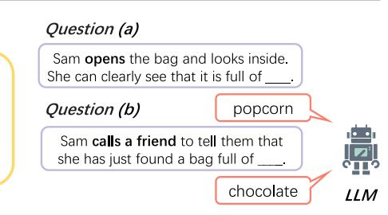

linked to Rotary Position Embedding (RoPE)16-based positional encoding in LLMs. Specifically, perturbing these parameters disrupts dominant frequency activations critical for contextual reasoning. In contrast, models without this frequency-dependent activation structure exhibit distinct sensitivity patterns.

Impact on attention mechanisms: We show that perturbing the ToMsensitive parameter pattern alters the geometric relationship between queries and keys under positional encoding, leading to shifts in attention sinks. These shifts degrade the model's ability to form coherent representations, impairing its language understanding capabilities.

Our findings contribute to advancing the interpretability of LLM systems and deepen the understanding of how ToM-like reasoning emerges in LLMs. By identifying sparse, low-rank parameter patterns sensitive to ToM capabilities and uncovering their connection to positional encoding and attention mechanisms, we provide new insights into the functionality of LLM architectures in supporting social reasoning behavior. These discoveries have significant implications for LLM alignment and the development of society-aware AI systems. Our work not only bridges the gap between task-based evaluation and mechanistic understanding of ToM in LLMs but also paves the way for future research on controllable and interpretable social reasoning in AI.

#### Results

## ToM tasks for LLMs

ToM tasks assess an agent's ability to infer and reason about others' mental states. In evaluating LLMs, a variety of ToM tasks have been employed, each targeting different aspects of social reasoning. Among these, false-belief tasks (FB) are the most widely used. FB tasks assess whether an LLM can understand that an agent may hold a belief that differs from the actual state of the world. Two classic forms of FB tasks are unexpected contents and unexpected transfer tasks.

- Unexpected contents task: This task involves an agent encountering an object with misleading packaging (e.g., a chocolate box containing popcorn). Participants must infer both the true content and the agent's false belief. We illustrate this task in Fig. 1 of the introduction.
- Unexpected transfer task: This task evaluates whether an LLM can infer that an agent will act based on their outdated belief about an object's location

## Here is an unexpected transfer task sample.

Context: James puts his car keys in the drawer before heading out to exercise. While James is out, his wife Linda decides to clean the house. She finds the car keys in the drawer and thinks they would be safer in the key cabinet. She moves them there and continues cleaning. Later, James returns from his run and wants to get his car keys.

- Prompt 1: The keys will be taken out of the **key cabinet**.
- *• Prompt 2: James will look for the keys in the drawer.*

During testing, the context is concatenated with each prompt separately to form two distinct inputs, and the LLM generates responses autoregressively for each. We evaluate the model's response by checking the first generated token using an exact match. To pass the test, the LLM must

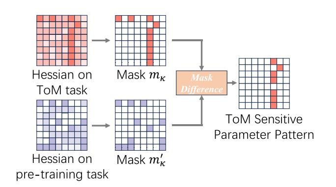

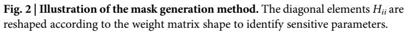

correctly understand both that (a) the keys were moved to the key cabinet and  $(**b**)$  James is unaware of this change.

Additionally, true-control tasks are used to verify that LLMs are not simply responding based on surface-level word associations. For instance, if James had witnessed Linda moving the keys before leaving, the correct response to both prompts should be key cabinet instead of drawer. Further examples and variations of this test can be found in Section B of supplementary information.

Beyond false-belief tasks, ToM reasoning extends to more complex social scenarios, such as:

- Faux pas tasks: Can the LLM detect when someone has made an inappropriate or socially awkward remark?
- Irony tasks: Can the LLM distinguish between a literal statement and a sarcastic or ironic remark?

In this study, we focus on false belief tasks (unexpected contents and unexpected transfer tasks) because they have clear, objective answers. In contrast, tasks such as faux pas and irony detection involve some degree of subjectivity6, making automatic evaluation more challenging.

#### Methods and findings overview

To investigate the mechanistic basis of ToM capabilities in LLMs, we developed an analysis framework that connects LLMs' behavior when answering ToM-related questions to their internal computational workflow involving model parameters. Using a Hessian-based sensitivity analysis, we identified an extremely sparse subset of LLM parameters (at the 0.001% level of all parameters) in linear transformation parameter matrices in LLMs, including  $W_{\mathbf{Q}}$ ,  $W_{\mathbf{K}}$ ,  $W_{\mathbf{V}}$ ,  $W_{\mathbf{O}}$ ,  $W_{\text{Gate}}$ ,  $W_{\mathbf{Up}}$ , and  $W_{\text{Down}}$ . We denote these selected LLM parameters as ToM-sensitive parameters. Next, to isolate the functionality of these ToM-sensitive parameters, we perturbed them by replacing each identified parameter with the average value of other nonsensitive parameters in the same matrix. This method (illustrated in Fig. 2) allows us to pinpoint LLM behaviors specific to the ToM-sensitive parameters. We applied this approach to four LLM families: Llama17, Qwen18, DeepSeek19, and Jamba20.

Under the proposed perturbation, we observe the resulting changes in both LLMs' behaviors and their internal states given the same input.

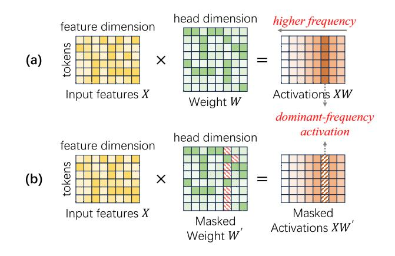

Fig. 3 | Activation calculations. a Original. We observe dominant frequency activations introduced by RoPE. b Perturbing ToM-sensitive parameters (the squares with red diagonal lines in  $\mathbf{W}'$ ). We observe that the ToM parameter pattern is highly frequency-sensitive and specifically affects dominant frequency activations.

Our results show that even when only a tiny fraction of ToM-sensitive parameters are altered, the LLMs suffer a significant drop in ToMrelated performance, an effect not seen when we randomly select the same amount of parameters and perturb as a control. This stark contrast indicates that the identified parameters play a critical role in the LLMs' capacity for ToM. Further analysis suggests that the performance impairment arises because the LLM loses its ability to localize context and maintain proper language understanding once those weights are perturbed. To understand why, we then examine the underlying mechanism driving this effect.

Next, we examined how these sparse ToM-sensitive parameters interact with the core architectural components of the LLMs. Our results show that the ToM-sensitive parameters predominantly influence the positional encoding mechanism. In LLMs using RoPE, the positional encoding naturally produces activation patterns concentrated at specific dominant frequencies. We found that the ToM-sensitive parameters align precisely with these frequency patterns, perturbing the sensitive parameters selectively disrupted the dominant frequency activations (Fig. 3). This finding explains the earlier noted loss of contextual localization: by breaking the frequency-based structure that normally underpins positional relationships in the sequence, the perturbation prevents the model from accurately anchoring tokens to their positions in context.

Importantly, this phenomenon is architecture-dependent. LLMs that do not use RoPE-based positional encoding do not exhibit the same concentrated frequency pattern and do not show such extreme sensitivity to perturbations in a tiny subset of parameters. This contrast confirms that the observed ToM-sensitive parameter effect is tightly linked to the RoPE positional encoding scheme.

Finally, our framework reveals how perturbations in positional encoding propagate into the model's attention mechanism, altering the geometry of query-key interactions. The ToM-sensitive parameters regulate the relationship between certain query and key vectors: they affect the angle between the current token's query vector  $(q)$  and the beginning-of-sequence key vector ( $\mathbf{k}_{\text{BOS}}$ ). Under normal conditions, RoPE ensures that  $\mathbf{q}$  and  $\mathbf{k}_{\text{BOS}}$ are non-orthogonal, creating a stable "attention sink" at the BOS token. However, when we perturb the ToM-sensitive parameters, we observe that  $\mathbf{k}_{\text{BOS}}$  rotates toward orthogonality relative to  $\mathbf{q}.$  This rotation destabilizes the previously stable attention sink, causing the model's attention weights to shift and spread toward irrelevant positions in the sequence (see Figs. 4 and 5). Such a geometric disruption in attention directly degrades the model's language understanding: without a stable attention sink, the model struggles to maintain coherent relationships between tokens, leading to a breakdown in its ability to form consistent and accurate interpretations of the input.

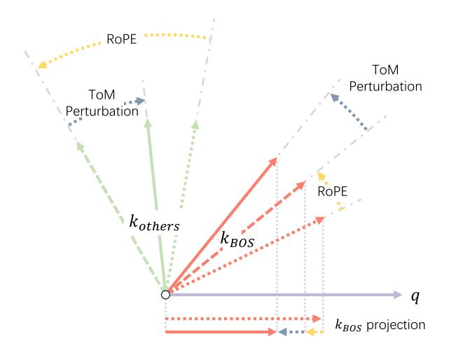

Fig. 4 | Visualization of the vector relationships between  $\mathbf q$  and  $\mathbf k_{\rm BOS}$ , as well as between  $\mathbf{q}$  and other tokens in  $\mathbf{K}$ , under both positional encoding and ToM perturbation.

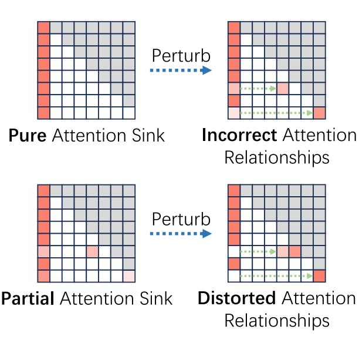

Fig. 5 | Attention sink shift. Shifting pure attention sinks introduces incorrect attention relationships, while shifting partial attention sinks distorts the original attention patterns. Attention sink shift degrades the model's language understanding capabilities evaluated by MMLU.

## Sensitivity to perturbations and its impact on ToM and language processing

Firstly, we show that even at an extreme sparsity level  $\kappa$  (10-5), perturbing ToM-sensitive parameters causes a significant decline in ToM performance across all RoPE-based models while having minimal impact on perplexity (Table 1). This contrast underscores the specialized role of these parameters in ToM reasoning. In comparison, random perturbations produce no measurable effect, further highlighting the structured nature of ToM-related computations. Details on the search process for the optimal  $\kappa$  and results on random perturbations can be found in Section B of supplementary information. For more results on additional ToM Benchmark12, please refer to Section B of supplementary information. For a detailed analysis of how varying perturbation strength affects ToM performance and language perplexity, please also refer to Section B of supplementary information.

Secondly, we show that perturbing ToM-sensitive parameters not only affects ToM tasks but also degrades contextual localization and language understanding. As shown in Fig. 6, RoPE-based models struggle to maintain

#### Table 1 | Performance of different models across ToM tasks and perplexity

|          | Model        | Unexpected Contents |       |       |       | Unexpected Transfer |       |       |       | Avg(↑) | PPL(↓) |
|----------|--------------|---------------------|-------|-------|-------|---------------------|-------|-------|-------|--------|--------|
|          |              | FB                  | CL    | IP    | OC    | FB                  | NT    | IP    | PP    |        |        |
| Llama    | 3-8B         | 66.00               | 83.50 | 94.50 | 42.00 | 48.00               | 63.00 | 73.00 | 23.50 | 61.69  | 6.14   |
|          | 3-8B-P       | 32.00               | 82.50 | 81.50 | 50.00 | 20.00               | 50.50 | 50.50 | 25.00 | 49.00  | 7.46   |
|          | 3-8B-Ins     | 87.50               | 74.00 | 89.50 | 41.00 | 68.00               | 60.50 | 47.00 | 19.00 | 60.81  | 8.30   |
|          | 3-8B-Ins-P   | 96.00               | 63.50 | 66.50 | 17.00 | 64.00               | 60.50 | 23.00 | 23.00 | 51.69  | 8.25   |
|          | 3.1-8B       | 68.50               | 80.50 | 94.50 | 40.50 | 46.00               | 61.00 | 73.50 | 20.00 | 60.56  | 6.25   |
|          | 3.1-8B-P     | 67.00               | 64.50 | 69.00 | 33.00 | 39.00               | 56.50 | 53.50 | 25.00 | 50.94  | 6.44   |
|          | 3.1-8B-Ins   | 81.50               | 69.00 | 79.00 | 61.00 | 63.50               | 64.50 | 71.00 | 29.50 | 64.88  | 7.22   |
|          | 3.1-8B-Ins-P | 43.00               | 62.00 | 61.50 | 48.00 | 27.00               | 53.50 | 59.00 | 29.00 | 47.88  | 8.37   |
|          | 3.2-1B       | 20.50               | 82.00 | 89.00 | 44.00 | 18.50               | 43.50 | 78.00 | 38.00 | 51.69  | 9.77   |
|          | 3.2-1B-P     | 17.50               | 58.50 | 74.50 | 39.00 | 10.00               | 35.50 | 60.00 | 22.00 | 39.62  | 10.46  |
|          | 3.2-1B-Ins   | 20.00               | 99.00 | 97.50 | 63.50 | 14.50               | 47.00 | 72.00 | 39.50 | 56.63  | 13.18  |
|          | 3.2-1B-Ins-P | 13.50               | 79.00 | 86.50 | 35.00 | 11.00               | 40.00 | 36.50 | 20.00 | 40.19  | 14.79  |
|          | 3.2-3B       | 59.00               | 55.00 | 81.50 | 43.50 | 31.00               | 47.00 | 70.00 | 18.00 | 50.63  | 7.82   |
|          | 3.2-3B-P     | 48.00               | 60.00 | 72.00 | 33.00 | 25.00               | 41.00 | 49.50 | 15.00 | 42.94  | 7.86   |
|          | 3.2-3B-Ins   | 56.00               | 66.50 | 92.00 | 61.50 | 29.00               | 62.00 | 71.50 | 44.50 | 60.38  | 11.06  |
|          | 3.2-3B-Ins-P | 50.00               | 60.50 | 81.00 | 44.00 | 24.50               | 51.50 | 61.00 | 36.00 | 51.06  | 11.44  |
| Qwen     | 2-7B         | 50.00               | 87.50 | 87.50 | 75.00 | 27.50               | 72.50 | 75.00 | 42.50 | 64.69  | 7.14   |
|          | 2-7B-P       | 52.50               | 67.50 | 52.50 | 40.00 | 25.00               | 65.00 | 50.00 | 30.00 | 47.81  | 7.70   |
|          | 2-7B-Ins     | 42.50               | 85.50 | 83.50 | 66.50 | 24.00               | 66.00 | 64.50 | 38.50 | 58.88  | 7.60   |
|          | 2-7B-Ins-P   | 47.50               | 67.00 | 64.00 | 38.50 | 12.00               | 47.00 | 43.00 | 31.50 | 43.81  | 8.53   |
|          | 2.5-7B       | 55.00               | 75.00 | 92.50 | 80.00 | 42.50               | 62.50 | 70.00 | 57.50 | 66.88  | 6.85   |
|          | 2.5-7B-P     | 25.00               | 62.50 | 65.00 | 52.50 | 12.50               | 42.50 | 55.00 | 32.50 | 43.44  | 8.12   |
|          | 2.5-7B-Ins   | 18.50               | 47.00 | 77.00 | 58.00 | 10.50               | 35.50 | 47.50 | 12.00 | 38.25  | 7.46   |
|          | 2.5-7B-Ins-P | 54.50               | 56.00 | 40.00 | 45.50 | 13.00               | 41.50 | 39.50 | 15.00 | 38.13  | 8.20   |
| DeepSeek | Llama-8B     | 28.00               | 71.50 | 82.50 | 65.50 | 25.50               | 74.50 | 65.00 | 27.50 | 55.00  | 13.15  |
|          | Llama-8B-P   | 16.50               | 49.00 | 85.00 | 62.00 | 19.00               | 67.00 | 62.50 | 29.00 | 48.75  | 14.53  |
|          | Qwen-7B      | 26.50               | 91.50 | 90.00 | 63.00 | 16.00               | 63.00 | 46.50 | 6.50  | 50.38  | 25.06  |
|          | Qwen-7B-P    | 20.00               | 79.00 | 85.50 | 52.50 | 16.50               | 52.50 | 25.50 | 9.50  | 42.63  | 28.30  |
| Jamba    | 1.5-Mini     | 74.00               | 45.50 | 93.00 | 50.50 | 60.50               | 65.50 | 77.50 | 28.00 | 61.81  | 7.77   |
|          | 1.5-Mini-P   | 73.00               | 53.00 | 90.00 | 41.00 | 62.50               | 77.00 | 78.50 | 32.50 | 63.44  | 7.67   |

P denotes the version with the sensitive pattern perturbed, and Ins represents the Instruct-tuned variant of the model. The abbreviations for ToM tasks are as follows: FB False Belief, CL Correct Label, IP Informed Protagonist, OC Open Container, NT No Transfer, and PP Present Protagonist. Underlined values indicate a decline in model performance after perturbation.

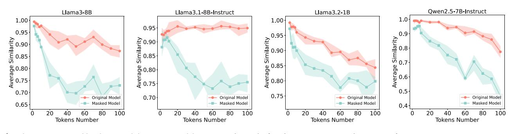

Fig. 6 | Evaluating contextual localization ability across models. More results can be found in Section B in supplementary information.

positional accuracy, especially in longer token sequences. The impact extends to language understanding, as seen in the decline in MMLU benchmark performance (Fig. [7\)](#page-4-0), with ToM-relevant categories such as business ethics experiencing the sharpest drop (Fig. [8\)](#page-4-0).

Thirdly, unlike RoPE-based architectures, non-RoPE models do not exhibit clear ToM-sensitive parameter patterns. Notably, perturbations in models such as Jamba-1.5-Mini resulted in improved ToM task performance alongside reduced perplexity, suggesting an alternative strategy for encoding ToM reasoning. The absence of RoPE prevents dominant frequency activations, rendering the perturbation approach ineffective in disrupting positional encoding. This distinction underscores fundamental differences in how these architectures internalize and process ToM-related intelligence. For more information about RoPE and dominant frequency activations, please refer to Section "Rotary positional encoding". More results are provided in Section B in supplementary information.

Findings 1. An extremely sparse ToM-sensitive parameter pattern exists, whose perturbation significantly affects RoPE-based models' ToM capabilities, while random perturbations do not. Our experiments further demonstrate that this degradation is linked to a reduction in contextual localization and language understanding.

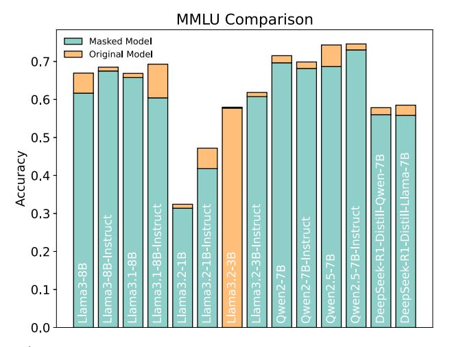

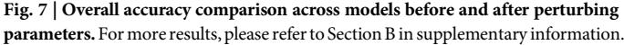

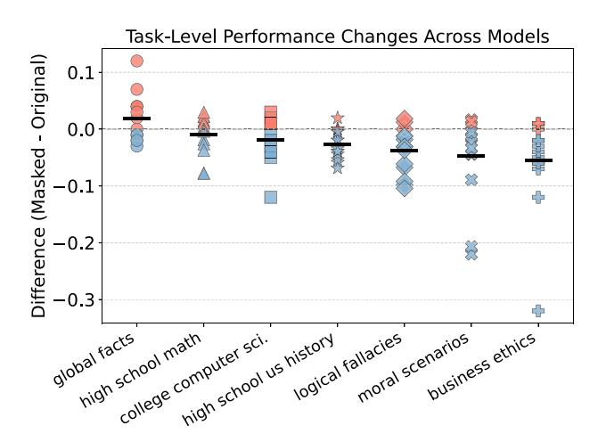

Fig. 8 | Task-level performance differences across selected tasks. The black horizontal bars indicate the average difference for each task.

#### Characteristics of ToM-sensitive parameters and their impact on positional encoding

Firstly, we show that ToM-sensitive parameter pattern exhibits strong sparsity and low-rank structure, with significant perturbations concentrated in the  $W_{\mathbf{Q}}$  and  $W_{\mathbf{K}}$  matrices. In Llama3-8B, the average rank of the masked parameters in these matrices is 21.69 and 10.5, respectively, highlighting a structured low-rank nature. Moreover, perturbed weights in  $W_{\rm O}$  and  $W_{\rm K}$ are significantly larger than those in other matrices, indicating a link between ToM-related computations and the attention mechanism. For detailed results, please refer to Section B in supplementary information.

Secondly, as shown in Fig. 9, the ToM-sensitive parameter pattern primarily perturbs dominant frequency activations, which closely align with the frequencies exhibiting the highest activation norm. This suggests that these parameters modulate positional encoding by selectively targeting key frequency components. However, this alignment is absent in Jamba, which does not employ RoPE and lacks a clear dominant frequency structure. Consequently, perturbing the ToM-sensitive parameter pattern in Jamba might not affect contextual localization through positional encoding. Visualizations are provided in Section B in supplementary information.

Findings 2. The functionality of the ToM-sensitive parameter pattern relates to the positional encoding module in LLM architectures. Perturbing the proposed ToM-sensitive parameter pattern in LLMs with RoPE disrupts dominant frequency activations induced by positional encoding, thereby impairing contextual localization. In contrast, LLMs without RoPE lack this frequency-dependent activation structure and exhibit different sensitivity patterns.

#### From positional encoding to attention map

We next investigate how these effects propagate from positional encoding to the attention map. Recent studies have identified a phenomenon known as attention sinks in LLMs, where attention maps across layers and heads predominantly focus on the relationship between the query token and  $\mathbf{k}_{\text{BOS}}$ . This appears as a pronounced vertical stripe in the first column of the attention map21,22. Despite its smaller norm compared to other tokens,  $\mathbf{k}_{\text{BOS}}$ occupies a distinct manifold, allowing it to act as a bias that absorbs excess attention scores, thereby stabilizing attention dynamics23.

Perturbing the ToM-sensitive parameter pattern leads to significant shifts in attention sinks. Using a threshold of 0.01 to define a shift, we find that over 30% of attention sinks in layer 10 are displaced (Fig. 10), severely disrupting the attention structure. This perturbation causes the model to incorrectly select irrelevent features in  $W_{\mathbf{V}}$ , impairing language understanding by selecting irrelevant features.

We analyze the  $\mathbf{q}$  tokens at positions where attention sink shifts occur, computing their angles with  $\mathbf{k}_{\text{BOS}}$  and  $\mathbf{k}_{\text{others}}$ . As shown in Table 2, we find that the magnitudes of the vectors remain largely unchanged before and after perturbation, and  $\mathbf{q}$  remains nearly orthogonal to  $\mathbf{k}_{\text{others}}$ , with little change in their inner product. However, for the angle between  $\mathbf{q}$  and  $\mathbf{k}_{\text{BOS}}$ , we observe that the change introduced by RoPE is minimal, whereas the ToM perturbation causes a significant angular shift. This perturbation completely overwhelms the positional information encoded by RoPE,

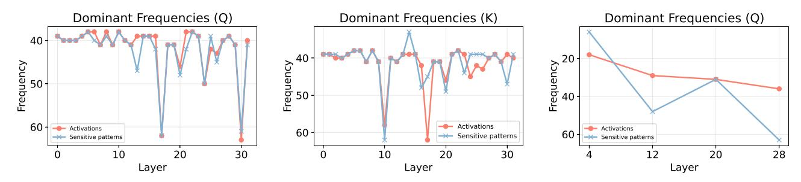

Fig. 9 | Comparison of dominant frequencies in the activation map and the ToM-sensitive parameter pattern. The figures depict the feature frequency corresponding to the maximum activation norm and the closest frequency among the three most frequently perturbed frequencies in the ToM-sensitive parameter pattern.

explaining the decline in the model's contextual localization ability. Additionally, it leads to a smaller inner product between q and kBOS, destabilizing the attention sink and causing shifts that further degrade language understanding.

As shown in Fig. 11, perturbing ToM-sensitive parameters introduces two key distortions. First, incorrect attention relationships emerge: an attention head originally attending to function words such as "the" (article), "of" (preposition), and "-lest" (subordinating conjunction) begins misallocating attention to punctuation marks like commas. Second, existing attention relationships are distorted: the attention scores assigned to certain tokens are altered, which undermine the model's ability to maintain stable feature representations, impairing its overall language understanding capabilities.

Findings 3. Perturbing ToM-sensitive parameter patterns affects the attention mechanism, therebyinfluencing language understanding. Perturbing the ToM-sensitive parameter pattern alters the angle between q and kBOS under

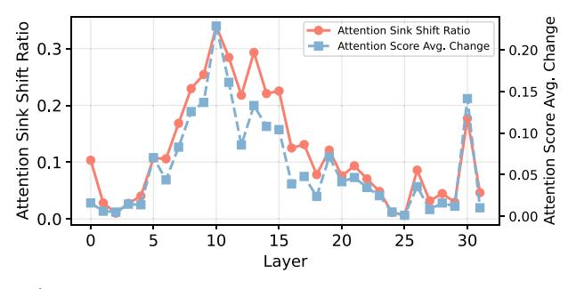

Fig. 10 |Attention sink shift ratio and first token attention score change across layers.

## Table 2 | Amplitude and angle of activation embeddings before RoPE, after RoPE, and after Perturbation

|               | Before   | After    | After        | Change  | Change  |
|---------------|----------|----------|--------------|---------|---------|
|               | RoPE (0) | RoPE (1) | Perturb. (2) | (0 → 1) | (1 → 2) |
| ∥q∥2          | 12.95    | 12.95    | 12.76        | 0.00    | −0.19   |
| ∥kBOS∥2       | 4.22     | 4.22     | 3.91         | 0.00    | −0.31   |
| ∥kothers∥2    | 22.48    | 22.48    | 22.19        | 0.00    | −0.30   |
| ∠(q, kBOS)    | 66.35    | 66.46    | 69.22        | 0.11    | 2.77    |
| ∠(q, kothers) | 93.34    | 96.81    | 95.20        | 3.47    | −1.62   |

positional encoding. This disruption breaks the RoPE encoding, causing q and kBOS to become more orthogonal. As a result, the attention sink is destabilized, distorting the attention matrix and impairing the model's ability to capture correct feature relationships, ultimately diminishing its ToM capabilities.

## Discussion

Our study uncovers afundamental link between sparse parameter structures and ToM capabilities in LLMs, demonstrating that social reasoning behaviors are governed by a highly localized and low-rank subset of model weights. A key insight from our findings is the pivotal role of positional encoding, particularly RoPE, in shaping ToM-related inferences. We observe that ToM-sensitive parameters modulate dominant frequency activations, influencing geometric relationships in the attention mechanism and ultimately shifting attention sinks. This mechanistic perspective suggests that LLMs leverage structured positional and relational representations to model implicit beliefs and perform ToM-related reasoning.

While our findings offer new insights into the structural basis of ToM reasoning in LLMs, our study does not exhaustively evaluate the full spectrum of ToM abilities. We primarily focus on unexpected transfer and unexpected contents tasks, which are among the most rigorous ToM benchmarks. However, future work is needed to assess whether similar parameter structures support a broader range of social reasoning skills. At the same time, our analysis of ToM-sensitive parameters provides a broader perspective, revealing their role beyond ToM tasks in contextual localization and language understanding. This suggests that ToM reasoning may not be an isolated cognitive faculty but rather an emergent property of general mechanisms underlying token positioning and meaning construction.

Beyond theoretical implications, our results raise important considerations for AI interpretability and controllability. The ability to identify and manipulate ToM-sensitive parameters opens avenues for designing models that can adaptively regulate their social reasoning behaviors—an essential feature for AI systems deployed in high-stakes domains such as healthcare, legal analysis, and human-AI collaboration. However, this structural localization also presents risks: if ToM capabilities are concentrated in a sparse parameter subset, adversarial interventions could be used to either suppress or exaggerate social reasoning, potentially leading to deceptive or manipulative AI behaviors.

Our findings also open several promising avenues for future investigation. Firstly, for targeted model alignment, can ToM-sensitive parameters be leveraged to ensure AI systems align with human ethical norms while mitigating unintended social biases? Secondly, for comparative cognitive

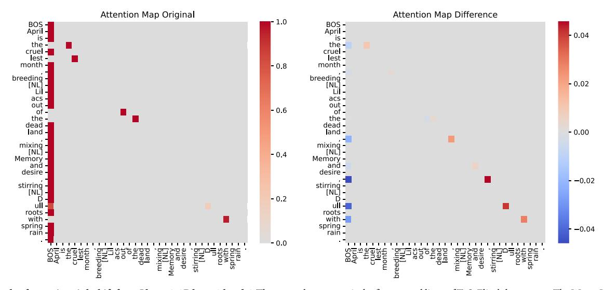

Fig. 11 | Example of attention sink shift from Llama 3-8B layer 0 head 6. The example sentence is the first several lines of T. S. Eliot's long poem The Waste Land. Note that for visualization purposes, the attention values are not divided by the scaling factor before the softmax operation.

modeling, how do the identified sparse parameter structures compare to neural representations of ToM in the human brain? Could similar mechanisms underlie social reasoning across biological and artificial systems? Thirdly, for robustness and adversarial testing, if ToM capabilities depend on sparse and structured parameter subsets, could targeted attacks degrade LLM reasoning abilities? Understanding these vulnerabilities is critical for developing more resilient AI architectures.

While our work centers on ToM reasoning in LLMs, we acknowledge the potential to extend our framework to multimodal settings such as visual question answering (VQA)24-26. In VQA, some studies have explored the impact of language priors27 (e.g., ESC-Net28) and robustness under perturbations (e.g.,  $R-VQA^{25}$ ), which align with our broader interest in how small parameter changes affect reasoning behavior. These connections suggest possible directions for future work beyond the language-only setting.

By illuminating the structural underpinnings of social intelligence in AI, our study bridges the gap between deep learning, cognitive science, and AI ethics. As LLMs continue to evolve, understanding how they acquire, encode, and manipulate social reasoning will be essential for ensuring their transparency, reliability, and alignment with human values.

## Methods

## Sparse ToM-sensitive parameter patterns

In this subsection, we identify sparse parameter patterns critical for ToM capabilities. Using the Fisher information matrix, we derive a binary mask  $\mathbf{m}_{\kappa}$  to isolate ToM-sensitive parameters. We further combine this with a pretraining task performance mask  $\mathbf{m}'_{\kappa}$  to ensure perturbations specifically impair ToM capabilities without degrading overall language performance.

We start with an introduction of Fisher information matrix. Let  $\mathcal{D}_{\text{ToM-Train}} = \{(x_i, y_i)\}_{i=1}^n$  be a dataset with loss

$$\mathcal{L}(\boldsymbol{\theta}; \mathcal{D}_{\text{ToM-Train}}) = \frac{1}{n} \sum_{i=1}^{n} \ell(\boldsymbol{\theta}; x_i, y_i).$$

In the later stage of training, the first-order gradient term of the loss  $\mathcal{L}$  is nearly zero, so the second-order term, governed by the Hessian matrix, primarily determines how the loss increases under small parameter perturbations29. We denote the Hessian of the loss  $\mathcal{L}$  at parameters  $\boldsymbol{\theta}$  by  $H(\boldsymbol{\theta})$ . In practice, this Hessian is often approximated by the Fisher information matrix  $F$ , which can be estimated via the *empirical Fisher*  $\hat{F}$ . Concretely, let  $\mathbf{g}_i = \nabla_{\boldsymbol{\theta}} \ell(\boldsymbol{\theta}; x_i, y_i)$ , then in the late-training regime, we approximate the overall gradient and Hessian of  $\mathcal{L}$  by

$$\nabla_{\boldsymbol{\theta}} \mathcal{L}(\boldsymbol{\theta}) \approx \frac{1}{n} \sum_{i=1}^{n} \mathbf{g}_{i}, \quad H \approx F \approx \widehat{F} = \frac{1}{n} \sum_{i=1}^{n} \mathbf{g}_{i} \mathbf{g}_{i}^{\top}.$$
 (1)

In practical scenarios, we further simplify  $\widehat{F}$  by ignoring its off-diagonal elements, focusing only on the diagonal entries as a per-parameter sensitivity estimates30,31. Under this approximation, larger diagonal values indicate that the corresponding parameters have a greater impact on the  $model's performance^{32}$ 

Next, we showcase how to identify ToM-sensitive parameter patterns. Let  $d$  be the number of parameters in the current layer or matrix being analyzed. We seek a sparse binary mask  $\mathbf{m}_{\kappa} \in \{0, 1\}^{d}$  with exactly  $\kappa d$  nonzero entries ( $\kappa \in [0, 1]$  is the proportion) such that it maximizes the total sensitivity.

**Definition 1.** (ToM-sensitive Parameters). Using the Hessian  $H$  from Equation (1), a sensitive parameter mask  $\mathbf{m}_{\kappa} \in \{0, 1\}^{d}$  with  $\kappa d$  nonzero entries is defined by

$$\mathbf{m}_{\kappa} = \arg \max_{\mathbf{m}_{\kappa} \in \{0,1\}^{d}} \sum_{i=1}^{d} \mathbf{m}_{\kappa}(i) H_{ii}$$

We applied  $\mathbf{m}_{\kappa}$  directly to the model and observed that while the model's ToM capabilities diminished, the model's perplexity also increased significantly. We hypothesize that this occurs because  $\mathbf{m}_{\kappa}$  includes not only parameters relevant to ToM-related tasks but also those essential for maintaining the model's language processing capabilities.

Inspired by33,34, to prevent degradation of these language capabilities, we employ another dataset  $\mathcal{D}_{\text{pre-training}}$  to derive  $\mathbf{m}'_{\kappa}$ , identifying parameters critical for overall language modeling performance. The final ToM-sensitive pattern is then defined as:

$$\mathbf{m}_{\kappa}^{"}=\mathbf{m}_{\kappa}\odot\overline{\mathbf{m}_{\kappa}^{"}}.$$

Here,  $\overline{\mathbf{m}'_{\kappa}}$  represents the complement of  $\mathbf{m}'_{\kappa}$ , and  $\odot$  denotes element-wise product. This formulation isolates parameters specifically sensitive to ToM tasks while preserving those vital for language processing, ensuring that applying  $\mathbf{m}_{\kappa}^{"}$  impairs ToM capabilities without substantially affecting the model's overall linguistic performance.

#### Rotary positional encoding

For Transformer decoder-based models, a widely used positional encoding method is  $\text{RoPE}^{16}$ .

We start by introducing RoPE and feature frequencies. RoPE applies token position-dependent rotations to feature pairs in activations  $\mathbf{Q}$  and  $\mathbf{K}$ . Formally, RoPE defines a rotational encoding angle as:

$$\theta(p,m) = p \cdot \left(\frac{1}{50000}\right)^{\frac{2m}{d_h}},$$

where  $p$  is the token position,  $m$  is the feature index within an attention head,  $d_h$  denotes the per-head feature dimension. The encoding applies a rotation matrix  $M(p, m)$  to each feature pair  $\mathbf{x}_{p}^{m} \in \mathbb{R}^{2}$ :

$$\operatorname{Enc}(\mathbf{x}_{p}^{m}, p, m) = \begin{bmatrix} \cos(\theta(p, m)) & -\sin(\theta(p, m)) \\ \sin(\theta(p, m)) & \cos(\theta(p, m)) \end{bmatrix} \cdot \mathbf{x}_{p}^{m}$$
$$= M(p, m) \cdot \mathbf{x}_{p}^{m}.$$

Given two token activations  $\mathbf{q}_i, \mathbf{k}_i \in \mathbb{R}^{d_h}$ , their RoPE-encoded activation interaction is:

$$\begin{array}{rcl} \text{RoPE}(\mathbf{q}_{i},\mathbf{k}_{j}) &=& \displaystyle \sum_{m=0}^{d_{h}/2-1} \left( \text{Enc}(\mathbf{q}_{i}^{m},i,m) \right)^{\top} \cdot \text{Enc}(\mathbf{k}_{j}^{m},j,m) \\ &=& \displaystyle \sum_{m=0}^{d_{h}/2-1} \left( \mathbf{q}_{i}^{m} \right)^{\top} \cdot M(j-i,m) \cdot \mathbf{k}_{j}^{m} . \end{array}$$

This formulation shows that RoPE assigns smaller encoding angles to later feature dimensions in  $Q$  and  $K$ , meaning that these dimensions rotate more slowly across token positions. As a result, lower-indexed dimensions correspond to higher frequencies, while higher-indexed dimensions correspond to lower frequencies in the positional encoding.

Recent studies35,36 have shown that activations tend to concentrate at certain frequencies, with *low-frequency components* of  $\mathbf{Q} = XW_{\mathbf{Q}}$  and  $\mathbf{K} =$  $XW_{\mathbf{K}}$  exhibiting higher magnitudes. One possible explanation is that lowfrequency dimensions rotate more slowly, which may allow them to encode information more stably over longer token dependencies35. We observe that this phenomenon occurs specifically in models using RoPE, while it is absent in models without RoPE.

#### **Data availability**

The models developed for this study are publicly available on the Hugging Face platform. The evaluation datasets used in our experiments can be accessed at https://huggingface.co/datasets/cais/mmlu and https://osf.io/ csdhb/. Detailed descriptions of the model architectures and dataset configurations are provided in supplementary information. We plan to release the core code associated with this manuscript as open-source uponpublication. In the interim, researchers may access the code supporting this study's findings by submitting a reasonable request to the corresponding author.

# Code availability

The code supporting the findings of this study is publicly available at: [https://](https://github.com/joel-wu/how-large-language-models-encode-theory-of-mind) [github.com/joel-wu/how-large-language-models-encode-theory-of-mind](https://github.com/joel-wu/how-large-language-models-encode-theory-of-mind).

Received: 5 April 2025; Accepted: 4 August 2025;

# References

- 1. Premack, D. & Woodruff, G. Does the chimpanzee have a theory of mind? Behav. Brain Sci. 1, 515–526 (1978).
- 2. C. Dennett, D. Beliefs about beliefs. Behav. Brain Sci. 1, 568 (1978).
- 3. Baron-Cohen, S., Leslie, A. M. & Frith, U. Does the autistic child have a "theory of mind"? Cognition 21, 37–46 (1985).
- 4. Street, W. Llm theory of mind and alignment: Opportunities and risks <https://arxiv.org/pdf/2405.08154> (2024).
- 5. Kosinski, M. Evaluating large language models in theory of mind tasks. Proceedings of the National Academy of Sciences 121 (2024).
- 6. Strachan, J. W. A. et al. Testing theory of mind in large language models and humans. Nature human behaviour (2024).
- 7. Street, W. et al. Llms achieve adult human performance on higherorder theory of mind tasks. arXiv (Cornell University) (2024).
- 8. Wilf, A., Lee, S., Liang, P. P. & Morency, L.-P. Think twice: Perspective-taking improves large language models' theory-of-mind capabilities. arXiv (Cornell University) 8292–8308 (2024).
- 9. Wu, Y. et al. Hi-tom: A benchmark for evaluating higher-order theory of mind reasoning in large languagemodels. arXiv (Cornell University) (2023).
- 10. Xu, H., Zhao, R., Zhu, L., Du, J. & He, Y. Opentom: A comprehensive benchmark for evaluating theory-of-mind reasoning capabilities of large language models. arXiv (Cornell University) 8593–8623 [https://](https://aclanthology.org/2024.acl-long.466/) [aclanthology.org/2024.acl-long.466/](https://aclanthology.org/2024.acl-long.466/) (2024).
- 11. Soubki, A. et al. Views are my own, but also yours: Benchmarking theory of mind using common ground. Findings of the Association for Computational Linguistics: ACL 2022 14815–14823 (2024).
- 12. Chen, Z. et al. Tombench: Benchmarking theory of mind in large language models. arXiv (Cornell University) 15959–15983 (2024).
- 13. Moghaddam, S. R. & Honey, C. J. Boosting theory-of-mind performance in large language models via prompting [https://arxiv.](https://arxiv.org/abs/2304.11490) [org/abs/2304.11490](https://arxiv.org/abs/2304.11490) (2023).
- 14. Lee, N., Ajanthan, T. & H. S. Torr, P. Snip: Single-shot network pruning based on connection sensitivity. arXiv.org [https://arxiv.org/abs/1810.](https://arxiv.org/abs/1810.02340) [02340](https://arxiv.org/abs/1810.02340) (2018).
- 15. Wagner, E., Alon, N., Barnby, J. M. & Abend, O. Mind your theory: Theory of mind goes deeper than reasoning. arXiv (Cornell University) (2024).
- 16. Su, J., Lu, Y., Pan, S.-F., Wen, B. & Liu, Y. Roformer: Enhanced transformer with rotary position embedding. arXiv (Cornell University) (2021).
- 17. Meta. The llama 3 herd of models <https://arxiv.org/abs/2407.21783> (2024).
- 18. Qwen. Qwen2.5 technical report <https://arxiv.org/abs/2412.15115> (2024).
- 19. DeepSeek-AI. Deepseek-r1: Incentivizing reasoning capability in llms via reinforcement learning <https://arxiv.org/abs/2501.12948> (2025).
- 20. Lieber, O. et al. Jamba: A hybrid transformer-mamba language model <https://arxiv.org/abs/2403.19887> (2024).
- 21. Xiao, G., Tian, Y., Chen, B., Han, S. & Lewis, M. Efficient streaming language models with attention sinks. arXiv (Cornell University) (2023).
- 22. Cancedda, N. Spectral filters, dark signals, and attention sinks. arXiv (Cornell University) 4792–4808 (2024).
- 23. Gu, X. et al. When attention sink emerges in language models: An empirical view <https://arxiv.org/abs/2410.10781> (2024).

- 24. Antol, S. et al. Vqa: Visual question answering. In Proceedings of the IEEE international conference on computer vision, 2425–2433 (2015).
- 25. Chowdhury, S. & Soni, B. R-vqa: A robust visual question answering model. Knowl.-Based Syst. 309, 112827 (2025).
- 26. Chowdhury, S. & Soni, B. Envqa: Improving visual question answering model by enriching the visual feature. Eng. Appl. Artif. Intell. 142, 109948 (2025).
- 27. Chowdhury, S. & Soni, B. Handling language prior and compositional reasoning issues in visual question answering system. Neurocomputing 635, 129906 (2025).
- 28. Chowdhury, S. & Soni, B. Beyond words: Esc-net revolutionizes vqa by elevating visual features and defying language priors. Computational Intell. 40, e70010 (2024).
- 29. LeCun, Y., Denker, J. & Solla, S. Optimal brain damage. Advances in Neural Information Processing Systems 2 [https://proceedings.](https://proceedings.neurips.cc/paper_files/paper/1989/hash/6c9882bbac1c7093bd25041881277658-Abstract.html) neurips.cc/paper\_fi[les/paper/1989/hash/6c9882bbac1c7093bd2](https://proceedings.neurips.cc/paper_files/paper/1989/hash/6c9882bbac1c7093bd25041881277658-Abstract.html) [5041881277658-Abstract.html](https://proceedings.neurips.cc/paper_files/paper/1989/hash/6c9882bbac1c7093bd25041881277658-Abstract.html) (1989).
- 30. Sung, Y.-L., Nair, V. & Raffel, C. Training neural networks with fixed sparse masks <https://arxiv.org/abs/2111.09839> (2021).
- 31. Guo, W. et al. Zeroth-order fine-tuning of llms with extreme sparsity <https://arxiv.org/abs/2406.02913> (2024).
- 32. Kim, S. et al. Squeezellm: Dense-and-sparse quantization [https://](https://arxiv.org/abs/2306.07629) [arxiv.org/abs/2306.07629](https://arxiv.org/abs/2306.07629) (2023).
- 33. Qian, C., Liu, D., Zhang, J., Liu, Y. & Shao, J. Dean: Deactivating the coupled neurons to mitigate fairness-privacy conflicts in large language models. arXiv (Cornell University) (2024).
- 34. Wei, B. et al. Assessing the brittleness of safety alignment via pruning and low-rank modifications <https://arxiv.org/abs/2402.05162> (2024).
- 35. Barbero, F., Vitvitskyi, A., Perivolaropoulos, C., Pascanu, R. & Veličković, P. Round and round we go! what makes rotary positional encodings useful? <https://arxiv.org/abs/2410.06205> (2024).
- 36. Hua, E. et al. Fourier position embedding: Enhancing attention's periodic extension for length generalization [https://arxiv.org/abs/](https://arxiv.org/abs/2412.17739) [2412.17739](https://arxiv.org/abs/2412.17739) (2024).

# Acknowledgements

This work was supported by fund from Stevens Institute of Technology.

# Author contributions

Y.W. conceived and designed the methodology, conducted the experiments, and wrote the initial draft of the manuscript. W.G. developed the Fisher information matrix-based method for the theoretical framework. Z.L. performed the analysis of RoPE. H.J. proposed key revision ideas and revised the manuscript. Z.X. and D.Z. proposed the research topic, supervised the entire research process, and contributed to revising the manuscript. All authors reviewed and approved the final manuscript.

# Competing interests

The authors declare no competing interests.

# Additional information

Supplementary information The online version contains supplementary material available at <https://doi.org/10.1038/s44387-025-00031-9>.

Correspondence and requests for materials should be addressed to Zhaozhuo Xu or Denghui Zhang.

Reprints and permissions information is available at <http://www.nature.com/reprints>

Publisher's note Springer Nature remains neutral with regard to jurisdictional claims in published maps and institutional affiliations. Open Access This article is licensed under a Creative Commons Attribution-NonCommercial-NoDerivatives 4.0 International License, which permits any non-commercial use, sharing, distribution and reproduction in any medium or format, as long as you give appropriate credit to the original author(s) and the source, provide a link to the Creative Commons licence, and indicate if you modified the licensed material. You do not have permission under this licence to share adapted material derived from this article or parts of it. The images or other third party material in this article are included in the article's Creative Commons licence, unless indicated otherwise in a credit line to the material. If material is not included in the article's Creative Commons licence and your intended use is not permitted by statutory regulation or exceeds the permitted use, you will need to obtain permission directly from the copyright holder. To view a copy of this licence, visit [http://creativecommons.org/licenses/by](http://creativecommons.org/licenses/by-nc-nd/4.0/)[nc-nd/4.0/](http://creativecommons.org/licenses/by-nc-nd/4.0/).

© The Author(s) 2025