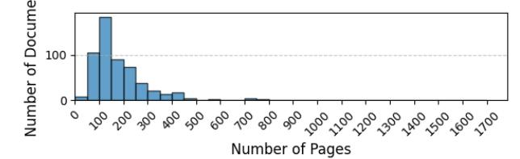
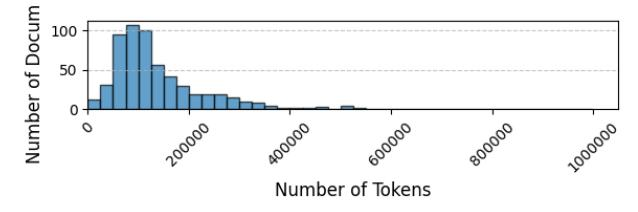
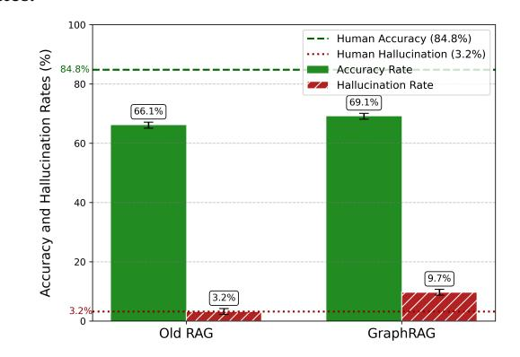
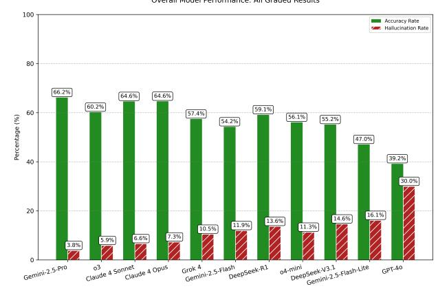

# Overcoming the Bottleneck – GraphRAG for Reliable Financial Annual Report Retrieval and Comprehension

Anonymous Author(s) Submission Id: xxx

#### Abstract

Annual reports are dense, long, and written in finance-specific terminology. Prior research identified significant automation potential in these reports, but state-of-the-art methods for annual report comprehension still fall short in terms of accuracy and hallucinations. Existing approaches are bottlenecked by poor retriever performance. This bottleneck we aim to resolve. We develop a GraphRAG-based pipeline for annual report comprehension based on an established dataset. Our graph-based method improves question answering accuracy from 66.2% to 68.3% on the Gemini 2.5 Pro model, demonstrating the effectiveness of knowledge graphbased retrieval for complex financial document analysis. The improvement in overall accuracy came at the expense of increased hallucination rates.

#### CCS Concepts

• Computing methodologies → Natural language processing; Information extraction; • Applied computing → Economics.

#### Keywords

information extraction, question answering, datasets, benchmarks, LLM evaluation, natural language processing, neural networks, language models, financial text, annual reports, financial reporting, corporate disclosure, needle in the haystack, context window, reasoning models, RAG

#### ACM Reference Format:

Anonymous Author(s). 2025. Overcoming the Bottleneck – GraphRAG for Reliable Financial Annual Report Retrieval and Comprehension. In AI for Finance Symposium 2025, The 2nd Workshop on LLMs and Generative AI for Finance, 6th ACM International Conference on AI in Finance (ICAIF '25), November 15–18, 2025, Singapore, Singapore. ACM, New York, NY, USA, [5](#page-4-0) pages.<https://doi.org/xxx>

#### 1 Introduction

#### 1.1 Motivation: The Retrieval Bottleneck

In [\[3\]](#page-3-0) (anonymized to facilitate review), we present a simple RAGbased approach to answer questions based on very long financial texts. In particular, we built a simple RAG pipeline with = 5 documents that are retrieved from a given annual report. Some of these reports have beyond 1000 pages, as [1](#page-1-0) illustrates.

The results are overall acceptable, as figure [4](#page-3-1) shows. The best models answer about 2/3 of questions correctly. But the results also showed that most errors occur in the retriever step, not in the

[This work is licensed under a Creative Commons Attribution 4.0 International License.](https://creativecommons.org/licenses/by/4.0) ICAIF '25, Singapore, Singapore

© 2025 Copyright held by the owner/author(s).

ACM ISBN xxx <https://doi.org/xxx>

56 57 58

generation step. Today's language models are already well-fortified against hallucinations and are overall accurate. Therefore, we want to address the real bottleneck in financial document retrieval: the retriever. In our experiments from [\[3\]](#page-3-0) (anonymized to facilitate review), the retriever caused about 2/3 of all errors.

Therefore, in this work-in-progress follow-up paper, we improve the retriever step. As we have deep insights into the dataset used, we believe that this paper can contribute to a lively discussion, where we can answer any technical questions about the dataset as well as about the retrieval pipelines.

#### 1.2 Contributions

We present a GraphRAG-based architecture that improves retrieval from long and domain-specific financial texts. We show that this pipeline component improvement leads to significantly better downstream performance. The dataset as well as the architecture are available freely online.

#### 2 Related Work

## 2.1 Financial Document Analysis and Question Answering

Early Financial Text Analysis. Financial text is often hard to understand, not only due to its finance-specific terminology, but also due to complex sentences with multiple negations. [\[14\]](#page-4-1) specifically analyze American annual reports (10-Ks), showing that their content is hard to automatically process. [\[15\]](#page-4-2) present a challenge for financial sentiment analysis. This challenge was conducted in the pre-LLM era and more advanced challenges were needed to test automation potential.

The two FinBERT [\[2,](#page-3-2) [23\]](#page-4-3) models improved upon sentiment analysis using the transformer architecture [\[20\]](#page-4-4) and specifically using BERT [\[6\]](#page-4-5). These models show that the transformer would also become the architecture of choice in the financial domain.

Financial QA Benchmarks. Not only the verbal expressions in financial text are challenging, but the numerical representations in tables and other forms of display present another source of error. Thus, specialized models were devised that can better parse tables and reason over them [\[5,](#page-4-6) [24\]](#page-4-7).

With ever increasing LLM-based capabilities after the release of fine-tuned language models in 2022, financial AI research caught up and employed these powerful models for financial text comprehension [\[3,](#page-3-0) [9\]](#page-4-8) (anonymized to facilitate review), making LLMs the de-facto standard across most financial tasks where high computing expense is permissable. Low-latency, low-value tasks may still benefit from faster, smaller approaches [\[11\]](#page-4-9).

Domain-Specific vs. General-Purpose Models. BloombergGPT [\[22\]](#page-4-10) was an initial success in financial text comprehension, but was then quickly made obsolete by generalized LLMs. The direction in 2023

pointed toward using in-context learning of generalized LLMs, and the trend went away from training (or even fine tuning) LLMs just for a specific domain [\[1,](#page-3-3) [8,](#page-4-11) [13,](#page-4-12) [17\]](#page-4-13).

Subsequent research thus frequently employed generalized LLMs, and the focus shifted to getting good context for LLMs and to smart prompting [\[10\]](#page-4-14).

In this year's ICAIF conference, we take the same approach [\[3\]](#page-3-0) (anonymized to facilitate review), and use several state-of-the-art generalized models. We confirm that the bottleneck is the context engineering, which in the case of financial text retrieval is dependent on having a powerful retriever. We find that 2/3 of all errors are not due issues in the generative step of our RAG pipeline, but due to retriever errors.

#### 2.2 Retrieval-Augmented Generation

Foundational RAG Approaches. RAG was initially presented in the year 2020 by [\[12\]](#page-4-15). The paper was special in that it had an integrated backpropagation mechanism that jointly trained the generator with the retriever. This is an approach that most researchers today have strayed away from, as we have learned earlier that LLMs have become so powerful already that fine-tuning of LLMs has often become infeasible and unneccessary.

Long-Context Challenges. As context windows of language models are still limited, and performance of LLMs often degrades as context windows fill up [\[16\]](#page-4-16), we cannot only rely on the large contexts that today's models [\[8\]](#page-4-11) provide.

Advanced RAG Techniques. Instead, prompt engineering and selfreflection pipelines are promising architectural components that determine the success of many NLP tasks [\[4,](#page-4-17) [18,](#page-4-18) [21\]](#page-4-19).

GraphRAG Methodology. Local and global GraphRAG, as well as hybrid approaches perform better than standard similarity-based retrievers on some tasks, and can scale better with the breadth of the query and the length of the document [\[7\]](#page-4-20). Advanced GraphRAG approaches contain summaries of the entities that they find, allowing precise answer to high-level questions that reference multiple of the text corpus.

Community Detection Algorithms. To achieve such favorable behavior, [\[7\]](#page-4-20) employ the Leiden algorithm [\[19\]](#page-4-21) to hierarchically detect entity communities.

#### 3 Data

#### 3.1 Financial Touchstone Dataset

In [\[3\]](#page-3-0) (anonymized to facilitate peer review), we present a dataset with 480 annual reports, 2,878 question-answer-context triplets, more than 80 million tokens (see figure [2\)](#page-1-1), sourced from 22 countries and 20 stock exchanges. This is the largest dataset for complex financial text comprehension to date, and presents a significant challenge even for today's models, as [4](#page-3-1) shows. Only about 2/3 of the questions in this dataset are answered correctly by the best models, while humans achieve over 80% accuracy.

Figure 1: Page Count Distribution: Most reports have between 50 and 450 pages, with the distribution showing the varying complexity and length of annual reports across companies.

Figure 2: Token Count Distribution: Most reports have less than 300,000 tokens, demonstrating the long-context challenge that motivates our GraphRAG approach.

## 3.2 Dataset Characteristics Motivating GraphRAG

The dataset contains such long and complex documents that basic similarity-based retrieval frequently fails. The terminology in the documents is inconsistent. Furthermore, the documents are often structured differently, as they are from global listed companies. Companies outside of the U.S. follow different standards, and a RAG pipeline should be capable of finding answers in any part of a report.

Segment-based reporting is a challenge that makes GraphRAG suitable. If one isolates the context in the reports too narrowly, one loses information about consolidated and segment-specific results, and models may answer questions based on information that is limited to a specific company segment instead of information that pertains to the overall company.

#### 4 Methods

#### 4.1 Baseline RAG Architecture

The baseline RAG architecture uses a FAISS vector store with 1000 token chunks and 200 token overlap. The embedding space employs text-embedding-3-small OpenAI embeddings. Upon retrieval, the pipelie fetches the top = 5 chunks.

#### 4.2 GraphRAG Architecture

We implement a GraphRAG pipeline following the methodology of Edge et al. (2024), adapted specifically for financial annual reports. The approach consists of two main phases: indexing and query processing.

4.2.1 Indexing Pipeline. Following your co-author's implementation, we execute the indexing pipeline separately for each annual report document, storing the results in document-specific directories identified by company ID and financial report metadata.

Entity and Relationship Extraction. We use an LLM to extract entities and relationships from each document. The entity extraction prompt is tailored to the financial domain to identify:

- Financial metrics (revenue, EBITDA, cash flows, earnings per share, etc.)
- Business segments and divisions
- Time periods and fiscal years

- Geographic entities (countries, regions, markets)
- Legal entities, subsidiaries, and organizational structures
- Key personnel and stakeholders

For each identified entity, the LLM generates a comprehensive description capturing the entity's attributes and activities within the report context. Relationships between entities are extracted with descriptions and strength scores, capturing hierarchical (parent-subsidiary), temporal (year-over-year comparisons), financial (metric-to-segment associations), and organizational connections.

Knowledge Graph Construction. The extracted entities and relationships are aggregated into a knowledge graph where nodes represent entities and edges represent relationships. Entity descriptions from multiple extractions are summarized, and relationship weights reflect the frequency and importance of connections across the document.

Community Detection. We apply the Leiden algorithm for hierarchical community detection (Traag et al. 2019) to partition the graph into communities of closely related entities. This hierarchical structure creates multiple levels of granularity, from high-level thematic groupings (root communities) to detailed sub-communities of specific topics.

Community Summary Generation. For each detected community at each hierarchical level, we generate comprehensive summaries using the LLM. Leaf-level communities are summarized directly from their constituent entities, edges, and claims. Higher-level communities incorporate summaries from their sub-communities, creating a recursive abstraction that captures both detail and breadth.

4.2.2 Query-Time Processing. At query time, as noted by your co-author, the system loads the indexed data from the documentspecific directory (identified by ID and financial report name) and executes the query pipeline:

Community-Based Answer Generation. Given a user query, we employ a map-reduce approach using community summaries:

- (1) Prepare: Community summaries from a selected hierarchical level are shuffled and divided into chunks.
- (2) Map: For each chunk, the LLM generates a partial answer to the query, along with a helpfulness score (0-100).
- (3) Reduce: Partial answers are ranked by helpfulness score, and the top-scoring answers are combined to generate a final comprehensive response.

This per-document indexing approach enables efficient scaling across the 480 annual reports in our dataset, with each report maintaining its own graph structure and community hierarchy for targeted retrieval.

#### 4.3 Evaluation Framework

The evaluation considers whether all provided information is in the retrieved context. If not, a hallucination is reported. Thus, memorized facts that are used by the model will be marked as hallucinations, even if they are correct. (This is an issue that we did not find to manifest in this experiment.) The hallucination rate is thus the inverse precision of the system. The accuracy (recall) of the pipeline tells us whether the golden answer facts were successfully mentioned. All answers that had hallucinations were marked as inaccurate.

We employed automated LLM-based evaluation using GPT-5 and o3. We checked the evaluations of the models manually and adjusted the evaluation prompts iteratively until we did not find systematic errors anymore. Still, the evaluation is non-deterministic due to some fuzziness around the definition of what answer is correct and incorrect (even the authors disagree on some edge cases) and due to the probabilistic nature of the evaluator models. Therefore, we expect an inherent error rate of 2% in the evaluation step.

#### 5 Results

#### 5.1 Overall Performance Improvement

We evaluate our GraphRAG approach on the Financial Touchstone benchmark using GPT-5 as the primary evaluation model. Table [1](#page-2-0) presents the comparison between the baseline RAG and GraphRAG approaches.

Table 1: Performance comparison of baseline RAG vs. GraphRAG on Gemini 2.5 Pro

| Approach     | Accuracy | Hallucination Rate |
|--------------|----------|--------------------|
| Baseline RAG | 66.2%    | 3.2%               |
| GraphRAG     | 68.3%    | 9.3%               |
| Improvement  | +2.1pp   | +6.1pp             |

The GraphRAG approach achieves a 3.0 percentage point improvement in accuracy over the baseline RAG system (66.2% → 68.3%). This improvement demonstrates that the knowledge graph structure successfully captures entity relationships and information distribution patterns that are critical for answering complex financial questions. The graph-based retrieval enables the system to aggregate information across multiple document sections and better understand hierarchical relationships between business segments, financial metrics, and temporal data.

However, we observe an increase in the hallucination rate from 3.2% to 9.3%. This suggests that while GraphRAG improves the breadth of retrieved information, the community summarization process may introduce confusion to the model as the structure of the retrieved information is not as simple as with the basic RAG approach. This trade-off between comprehensive retrieval and strict groundedness represents an important area for future optimization.

Figure 3: Overall Performance Comparison: Baseline RAG vs. GraphRAG showing improvements across all evaluated models, with detailed metrics for accuracy and hallucination rates.

#### Figure 4: Performance Comparison - Previous Approach: Baseline performance metrics from the original RAG implementation for reference and comparison.

#### 5.2 Error Analysis

Similar to the basic RAG approach, GraphRAG often fails with the Key Financials question. The Key Financials involve multiple metrics such as revenue, profit, margins, dividends, earnings per share, cash flow (total), cash flow from operations, free cash flow, and industry-specific metrics (such as net interest contribution).

We set the threshold for a correct answer to the Key Financials question to 3/5, meaning that the model is expected to find 60% of all key financials from the golden source. Frequently, only a few key financials are identified, leading to errors.

Also, there is highly domain-specific terminology in some texts that the pipeline still struggles with. In the hospitality and in the real estate industries, some companies use terms that are specific to only a handful of companies world-wide. These companies frequently not even use industry-wide consistent terminology, but have their own terms for key metrics. Some of these metrics are not identified with the GraphRAG approach as we present it in this workshop paper.

#### 6 Discussion and Conclusion

#### 6.1 Key Findings

We found that GraphRAG can improve basic RAG accuracy for complex financial documents, but increases hallucination rates. The results confirm that the retriever is the key bottleneck in financial document retrieval for very long texts. They also confirm that GraphRAG may be a promising direction for future research on financial document comprehension.

#### 6.2 Limitations and Future Work

Ongoing Experiments. At the time of submission, experiments are still running to complete the full evaluation. The authors aim to expand the current results to include all 480 annual reports in the dataset and to evaluate performance across all eleven frontier language models used in the Financial Touchstone benchmark [\[3\]](#page-3-0) (anonymized to facilitate review), including Gemini 2.5 Pro, Gemini 2.5 Flash, OpenAI o3, o4-mini, Claude Opus 4, Claude Sonnet 4, DeepSeek R1, DeepSeek V3.1, Grok 4, Gemini 2.5 Flash-Lite, and GPT-4o. The final version of this paper will present comprehensive results across all models and the complete dataset.

Furthermore, and more importantly, we want to try out different GraphRAG settings: local search, drift search, global search. A systematic comparison of different state-of-the-art GraphRAG settings will inform researchers about the best way to retrieve information from financial text.

Technical Limitations. The graph construction of all 480 annual reports took about one day of API inference, and cost about \$1 per report, which is a significant expense. Further computational optimizations are needed to bring this cost down.

The current approach only takes into account one annual report at a time, as all questions can be answered with only one annual report. An even more challenging problem would be to create graphs across a number of annual reports, allowing for richer comprehension of competitive landscapes and market dynamics.

In future research, the results can be validated by also incorporating quarterly reports and other long-form financial text.

#### 6.3 Implications for Financial AI

The implication for generative AI in finance is that recent improvements in context sizes still do not warrant hassle-free processing of documents of arbitrary length. We show that retrieval is still a costly and error-prone process. Recent improvements in generalized LLMs have eased the need for optimizations in the downstream steps of RAG pipelines, but even more than before we now need to focus on efficient, exhaustive, and accurate retrieval.

#### References

- [1] Anthropic. 2025. Introducing Claude 4. Anthropic Blog (2025).
- [2] Dogu Araci. 2019. FinBERT: Financial Sentiment Analysis with Pre-trained Language Models. arXiv (2019).
- [3] Anonymous Authors. 2025. An Open, Context-Based Benchmark for Unstructured Financial Text – A Dataset for Probing of the End-to-End Automation Potential for Language Models in Financial Analysis. ACM International Conference on AI in Finance (ICAIF'25) (2025).

[4] Tom Brown, Benjamin Mann, Nick Ryder, Melanie Subbiah, Jared Kaplan, Prafulla Dhariwal, Arvind Neelakantan, Pranav Shyam, Girish Sastry, Amanda Askell, Sandhini Agarwal, Ariel Herbert-Voss, Gretchen Krueger, Tom Henighan, Rewon Child, Aditya Ramesh, Daniel Ziegler, Jeffrey Wu, Clemens Winter, Christopher

465 466 467

522

- 468 469 470 Hesse, Mark Chen, Eric Sigler, Mateusz Litwin, Scott Gray, Benjamin Chess, Jack Clark, Christopher Berner, Sam McCandlish, Alec Radford, Ilya Sutskever, and Dario Amodei. 2020. Language Models are Few-Shot Learners. Advances in Neural Information Processing Systems 33 (2020), 1877–1901.
  - [5] Zhiyu Chen, Wenhu Chen, Charese Smiley, Sameena Shah, Iana Borova, Dylan Langdon, Reema Moussa, Matt Beane, Ting-Hao Huang, Bryan Routledge, and William Yang Wang. 2021. FinQA: A Dataset of Numerical Reasoning over Financial Data. ACL Conference on Empirical Methods in Natural Language Processing (EMNLP) (2021), 3697–3711.
  - [6] Jacob Devlin, Ming-Wei Chang, Kenton Lee, and Kristina Toutanova. 2019. BERT: Pre-training of Deep Bidirectional Transformers for Language Understanding. Conference of the North American Chapter of the Association for Computational Linguistics: Human Language Technologies, Volume 1 (Long and Short Papers, ACL) (2019), 4171–4186.
  - [7] Darren Edge, Ha Trinh, Newman Cheng, Joshua Bradley, Alex Chao, Apurva Mody, Steven Truitt, Dasha Metropolitansky, Robert Osazuwa Ness, and Jonathan Larson. 2024. From Local to Global: A GraphRAG Approach to Query-Focused Summarization. arXiv preprint arXiv:2404.16130v2 (2024). Microsoft Research.
  - [8] Gemini Team, Google. 2025. Gemini 2.5: Pushing the Frontier with Advanced Reasoning, Multimodality, Long Context, and Next Generation Agentic Capabilities. arXiv (2025).
  - [9] Pranab Islam, Anand Kannappan, Douwe Kiela, Rebecca Qian, Nino Scherrer, and Bertie Vidgen. 2023. FinanceBench: A New Benchmark for Financial Question Answering. arXiv (2023).
  - [10] Alex Kim, Maximilian Muhn, and Valeri Nikolaev. 2024. Financial Statement Analysis with Large Language Models. Chicago Booth Research Paper Forthcoming, Fama-Miller Working Paper (2024).
  - [11] Wonseong Kim, Jan Spörer, Choong Lyol Lee, Handschuh, and Siegfried. 2024. Is Small Really Beautiful for Central Bank Communication? Evaluating Language Models for Finance: Llama-3-70B, GPT-4, FinBERT-FOMC, FinBERT, and VADER. Proceedings of the Fifth ACM International Conference on AI in Finance (2024).
  - [12] Patrick Lewis, Ethan Perez, Aleksandra Piktus, Fabio Petroni, Vladimir Karpukhin, Naman Goyal, Heinrich Küttler, Mike Lewis, Wen-tau Yih, Tim Rocktäschel, Sebastian Riedel, and Douwe Kiela. 2020. Retrieval-Augmented Generation for Knowledge-Intensive NLP Tasks. Advances in Neural Information Processing Systems (NIPS) 33 (2020), 9459–9474.
  - [13] Xianzhi Li, Samuel Chan, Xiaodan Zhu, Yulong Pei, Zhiqiang Ma, Xiaomo Liu, and Sameena Shah. 2023. Are ChatGPT and GPT-4 General-Purpose Solvers for Financial Text Analytics? A Study on Several Typical Tasks. In Proceedings of the 2023 Conference on Empirical Methods in Natural Language Processing: Industry Track. 408–422.
  - [14] Tim Loughran and Bill McDonald. 2011. When is a Liability Not a Liability? Textual Analysis, Dictionaries, and 10-Ks. The Journal of Finance 66, 1 (2011), 35–65.
  - [15] Pekka Malo, Ankur Sinha, Pekka Korhonen, Jyrki Wallenius, and Pyry Takala. 2014. Good Debt or Bad Debt: Detecting Semantic Orientations in Economic Texts (Financial Phrase Bank). Journal of the Association for Information Science and Technology 65, 4 (2014), 782–796.
  - [16] Elliot Nelson, Georgios Kollias, Payel Das, Subhajit Chaudhury, and Soham Dan. 2024. Needle in the Haystack for Memory Based Large Language Models. ICML 2024 Workshop – Next Generation of Sequence Modeling Architectures (2024).
  - [17] OpenAI. 2023. GPT-4 Technical Report. Technical Report. The author list is excessively long with more than 200 authors and can thus be found in the technical report only.
  - [18] Matthew Renze and Erhan Guven. 2024. Self-Reflection in LLM Agents: Effects on Problem-Solving Performance.
  - [19] Vincent A. Traag, Ludo Waltman, and Nees Jan Van Eck. 2019. From Louvain to Leiden: Guaranteeing Well-Connected Communities. Scientific Reports 9, 1 (2019).
  - [20] Ashish Vaswani, Noam Shazeer, Niki Parmar, Jakob Uszkoreit, Llion Jones, Aidan Gomez, Lukasz Kaiser, and Illia Polosukhin. 2017. Attention Is All You Need. Advances in Neural Information Processing Systems (NeurIPS) 30 (2017).
  - [21] Jason Wei, Xuezhi Wang, Dale Schuurmans, Maarten Bosma, Fei Xia, Ed Chi, Quoc Le, and Denny Zhou. 2022. Chain-of-Thought Prompting Elicits Reasoning in Large Language Models. Advances in Neural Information Processing Systems 35 (2022), 24824–24837.
  - [22] Shijie Wu, Ozan Irsoy, Steven Lu, Vadim Dabravolski, Mark Dredze, Sebastian Gehrmann, Prabhanjan Kambadur, David Rosenberg, and Gideon Mann. 2023. BloombergGPT: A Large Language Model for Finance. arXiv (2023).
  - [23] Yi Yang, Mark Christopher Siy Uy, and Allen Huang. 2020. FinBERT: A pretrained language model for financial communications. arXiv (2020).
- 519 520 521 [24] Fengbin Zhu, Wenqiang Lei, Youcheng Huang, Chao Wang, Shuo Zhang, Jiancheng Lv, Fuli Feng, and Tat-Seng Chua. 2021. TAT-QA: A Question Answering Benchmark on a Hybrid of Tabular and Textual Content in Finance.

Annual Meeting of the Association for Computational Linguistics and International Joint Conference on Natural Language Processing (Volume 1: Long Papers) (2021), 3277–3287.

523 524