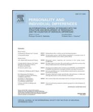
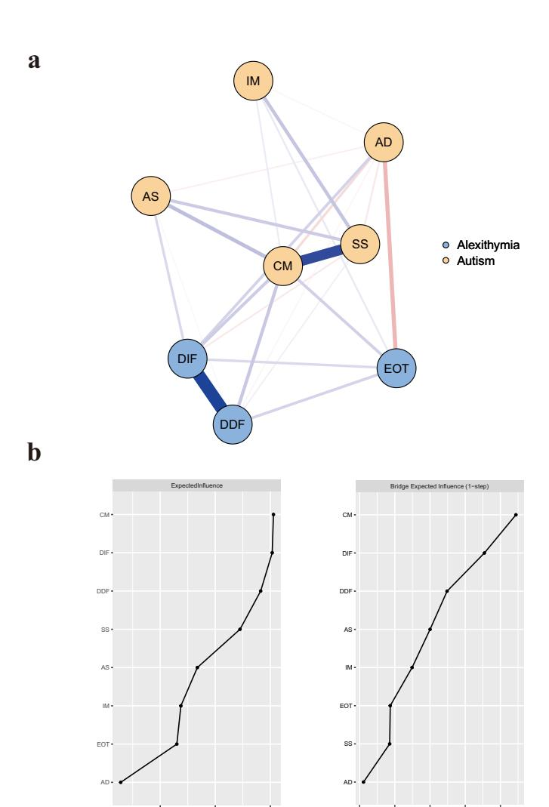
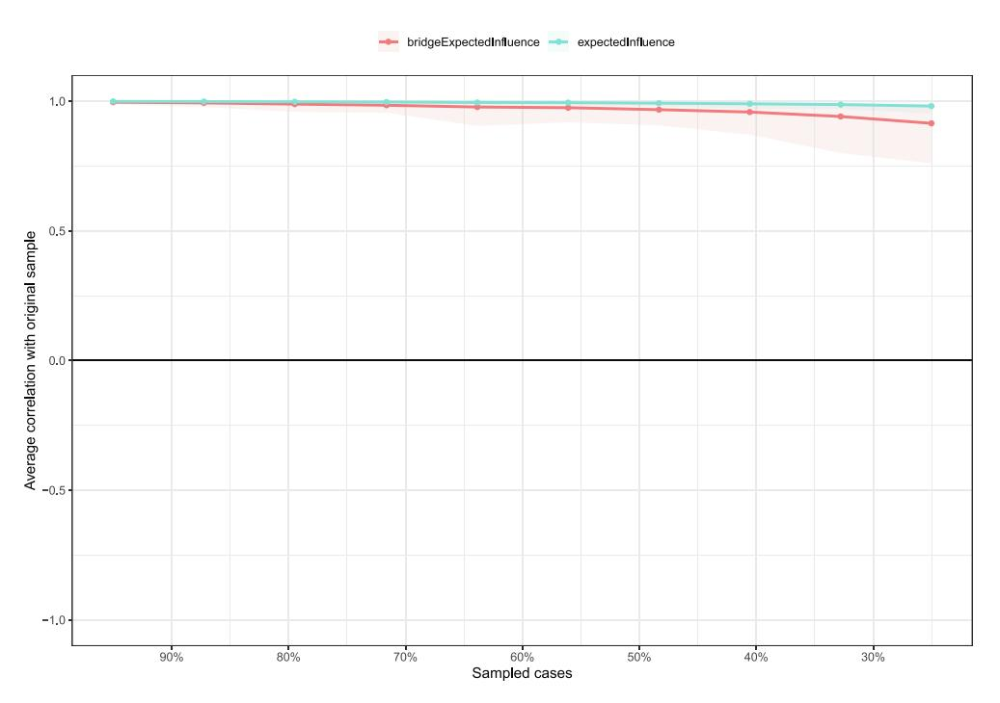
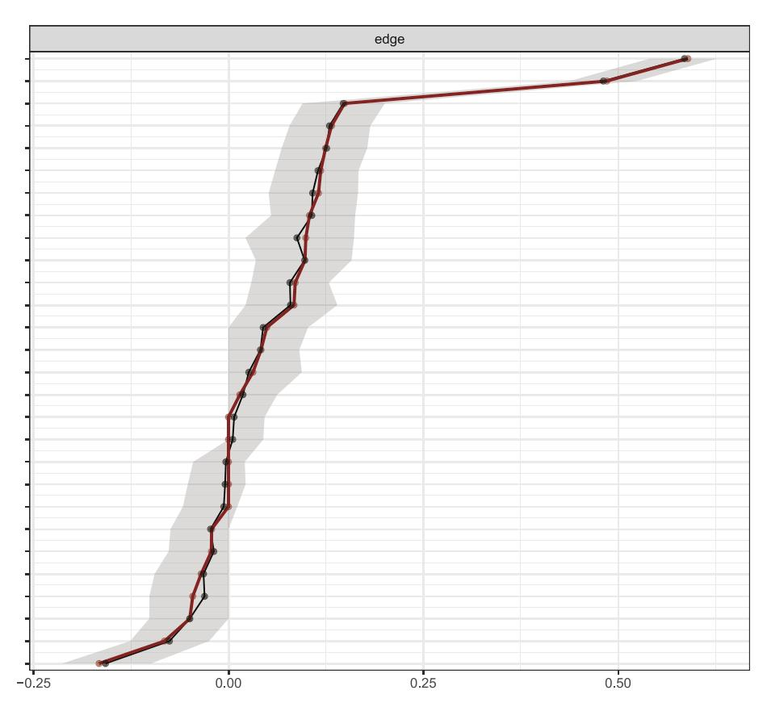
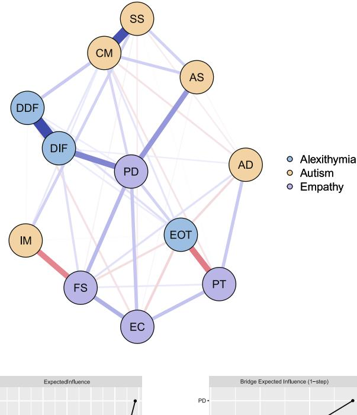
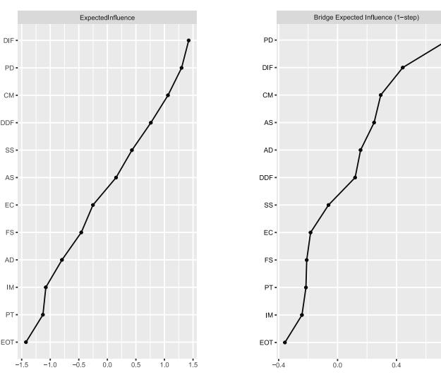
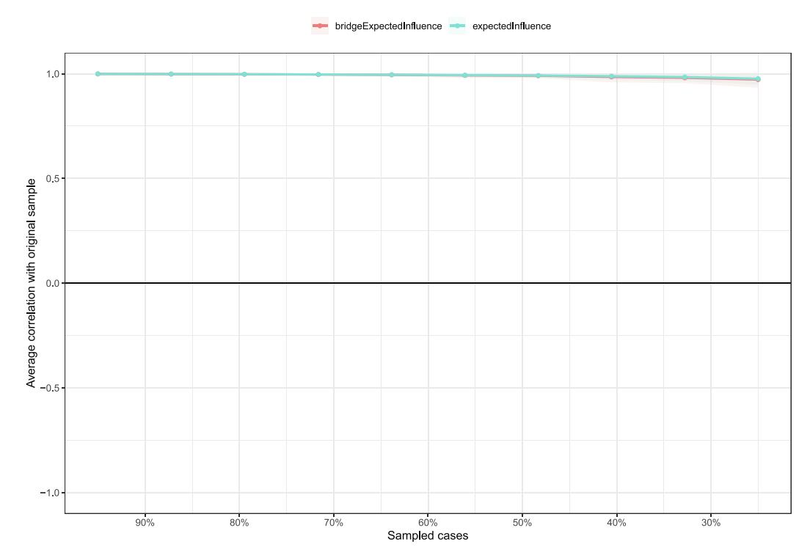
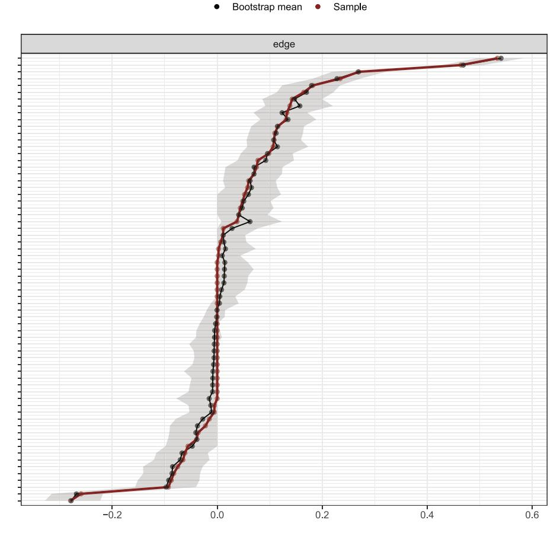

Contents lists available at [ScienceDirect](www.sciencedirect.com/science/journal/01918869)

# Personality and Individual Differences

journal homepage: [www.elsevier.com/locate/paid](https://www.elsevier.com/locate/paid)

# Exploring the interactions between autistic traits, alexithymia and empathy: A network analysis

Siyu Di , Yanjiao Wu , Xuejing Zou , Han Xiao , Hailu Wang \* , Haiying Qu \*

*School of Special Education and Rehabilitation, Binzhou Medical University, Yantai, China*

ARTICLE INFO

*Keywords:* Autistic traits Alexithymia Empathy Network analysis

#### ABSTRACT

Altered empathy is highly prevalent in individuals with autism spectrum disorder (ASD) and is closely related to social impairments. However, the relationships between autistic traits and various dimensions of empathy remain controversial. Alexithymia might play a pivotal role in this relationship, given its role in the socialemotional process and high co-occurrence with ASD. The current study employed a network analysis approach to investigate the intricate relationships between autistic traits, alexithymia, and empathy in 1223 college students. Results indicated that difficulties in identifying and describing feelings and communication were crucial bridging nodes of the co-occurrence of autistic traits and alexithymia. The self- and other-oriented components of empathy exhibited different patterns in their relationships with autistic traits and alexithymia. Self-oriented personal distress may have positive interactions with difficulties in communication and emotional identification, as well as difficulty in attention shifting. In contrast, other-centered cognitive empathy and empathic concern may negatively interact with external-oriented thinking. Our results highlight the potential benefits of interventions targeting emotion awareness, language skills, and attention switching in improving empathy and social interaction in individuals with ASD.

## **1. Introduction**

Empathy, the tendency to understand or vicariously experience the mental states of others and respond appropriately while maintaining self-other distinction (Oliveira-Silva & [Gonçalves, 2011\)](#page-7-0), is crucial for social interaction. Alterations in empathy can have a significant impact on one's socio-emotional cognition and interpersonal interactions, as is the case in multiple psychological disorders, including Autism Spectrum Disorder (hereinafter referred to as ASD) [\(Zhang et al., 2022\)](#page-7-0).

Autistic traits, including social communication and interaction impairments, along with repetitive and stereotyped behaviors, interests, and activities, are the core characteristics of ASD and extend beyond the ASD population to exist on a continuum within the general population (De Groot & [Van Strien, 2017\)](#page-7-0). Non-clinical individuals with high autistic traits share sub-threshold genetic, cognitive, and behavioral similarities with those with ASD ([Sucksmith et al., 2011](#page-7-0)), including their performance in empathy, which is considered to contribute to their impairments in the social domain.

Empathy is widely considered a multifaceted social-emotional construct encompassing cognitive and affective components. Cognitive empathy involves understanding and inferring others' beliefs, intentions, and feelings [\(Decety et al., 2016](#page-7-0)). Affective empathy involves two distinct aspects: affective sharing, characterized by personal distress in response to others' suffering ([Jordan et al., 2016](#page-7-0)), and empathic concern, marked by feelings of compassion toward others in distress ([Stocks et al., 2011](#page-7-0)). Recent research suggests that the concept of empathy deficits in ASD is overly simplistic, as individuals with high autistic traits exhibit a more nuanced and varied empathy profile across different dimensions [\(Song et al., 2019](#page-7-0)).

The self-to-other model (Bird & [Viding, 2014](#page-7-0)) proposes that individuals with ASD have typical or elevated self-oriented emotional sharing, but struggle with other-oriented cognitive empathy and empathic concern due to difficulties in self-other switch. While the negative relationship between autistic traits and cognitive empathy is relatively consistent across studies [\(Minio-Paluello et al., 2009;](#page-7-0) [Rogers](#page-7-0)  [et al., 2007](#page-7-0)), the link between autistic traits and affective empathy remains controversial. A majority of studies indicate elevated levels of personal distress in autistic individuals compared to typical developing (TD) controls ([Raman et al., 2023;](#page-7-0) [Rogers et al., 2007;](#page-7-0) [Zhang et al.,](#page-7-0)  [2023\)](#page-7-0), while a few others suggest comparable or even reduced levels of

\* Corresponding authors at: No. 566 Phoenix Avenue, Laishan District, Yantai City, Shandong Province 264003, China. *E-mail addresses:* [wanghailu@bzmc.edu.cn](mailto:wanghailu@bzmc.edu.cn) (H. Wang), [qhy8949@163.com](mailto:qhy8949@163.com) (H. Qu).

distress [\(Chen et al., 2017](#page-7-0); [Minio-Paluello et al., 2009\)](#page-7-0) . Results for empathic concern are also heterogeneous, with some indicating that individuals with high autistic traits exhibit impaired empathic concern ([Zhang et al., 2022\)](#page-7-0), while others suggest a comparable level of performance with TD individuals ([Zhang et al., 2023](#page-7-0)).

Several theoretical hypotheses have been proposed to explain the inconsistent relationships between autistic traits and empathy, notably the alexithymia hypothesis, which attributes the social-emotional deficits in ASD to co-occurring alexithymia rather than ASD per se [\(Bird](#page-7-0) & [Cook, 2013](#page-7-0)). Alexithymia is characterized by difficulties identifying and describing feelings, distinguishing between feelings and the bodily sensations associated with emotional arousal, and an externally oriented thinking style ([Sifneos, 1973\)](#page-7-0). The self-to-other model (Bird & [Viding,](#page-7-0)  [2014\)](#page-7-0) suggests that alexithymia implies a deficit in the affective representation system, which leads to difficulties in identifying one's own emotions and, subsequently, difficulties in perceiving and recognizing emotions in others, therefore compromising empathy. A variety of psychiatric conditions featuring empathy deficits exhibit co-occurring alexithymia, such as psychopathy, narcissistic personality disorder, and borderline personality disorder [\(Valdespino et al., 2017](#page-7-0)). Some studies have confirmed the role of alexithymia in the empathy deficits of these disorders. For instance, [Flasbeck et al. \(2017\)](#page-7-0) found that alexithymia mediated the relationship between early adverse experiences and empathy for psychological pain in individuals with borderline personality disorder. Research in the general population has consistently shown a negative association between alexithymia and cognitive empathy. While the relationship between alexithymia and affective empathy is more complex ([Di Tella et al., 2024](#page-7-0)), with some indicating that alexithymia is negatively correlated with other-oriented empathic concern, but positively correlated with self-oriented personal distress ([Diotaiuti et al., 2021](#page-7-0); [Himichi et al., 2021\)](#page-7-0). Other studies have found no significant associations [\(Christensen et al., 2018;](#page-7-0) [Lyvers et al., 2020](#page-7-0)). Furthermore, the different dimensions of alexithymia exhibit complex relationships with different dimensions of empathy [\(Diotaiuti et al.,](#page-7-0)  [2021;](#page-7-0) Herrero-Fern´ [andez et al., 2022](#page-7-0)), suggesting that the relationship between alexithymia and empathy is multifaceted and warrants further investigation.

A review ([Kinnaird et al., 2019](#page-7-0)) demonstrated that up to 50 % of individuals with ASD exhibit comorbid alexithymia. Many studies exploring the empathy of autistic individuals have incorporated alexithymia as a critical factor. However, the results have been inconsistent. An fMRI study [\(Bird et al., 2010](#page-7-0)) found that alexithymia positively predicted brain activation associated with pain empathy in both ASD and control groups. When controlling for alexithymia, the difference in empathic brain activation between the two groups became nonsignificant, suggesting that alexithymia might be a key factor contributing to empathy deficits in ASD. However, a subsequent study ([Shah et al.,](#page-7-0)  [2019\)](#page-7-0) identified autistic traits as a stronger predictor of empathy deficits. The mixed findings may be due to the heterogeneity of alexithymia levels in samples and the diverse methods used to assess empathy, which may tap into different aspects of empathetic abilities and the relationship between alexithymia and empathy may vary depending on the specific dimension of empathy being examined.

Elucidating the interplay between autistic traits, alexithymia, and empathy necessitates a nuanced understanding of the complex relationships between these multidimensional constructs. Traditional latent variable models, which examine pairwise relationships between variables, may not fully capture their nuanced relationships. In contrast, a novel network analysis approach offers a more comprehensive framework for examining the intricate relationships between autistic traits, alexithymia, and empathy, offering a more precise understanding of their interactions.

In network analysis, constitutive elements of autistic traits, alexithymia, and empathy are represented as "nodes" connected by "edges", with edge thickness (or weight) indicating the strength of the relationships. The association between two nodes can be tested directly after accounting for the influence of all other nodes.

Previous network analyses of multiple psychological constructs primarily focused on nodes that bridge one construct to others, as quantified by bridge centrality indices. Identifying nodes with high bridge centrality can help reveal which components contribute to the cooccurrence of autistic traits and alexithymia and how specific components of autistic traits and alexithymia, respectively, influence different aspects of empathy.

Such inquiry helps clarify several theoretical questions: What underlies the co-occurrence of autistic traits and alexithymia? How do distinct components of autistic traits and alexithymia interact with different facets of empathy? Answers to these questions have important clinical implications for identifying core targets for improving altered empathy in ASD (particularly those comorbid with alexithymia) and for enhancing social skills.

In the current study, we initially computed a network comprising autistic traits and alexithymia to explore which components contributed to their co-occurrence. Subsequently, we expanded this network to incorporate empathy, enabling us to examine the intricate interactions among different aspects of those constructs.

### **2. Methods**

## *2.1. Participants and procedure*

The study recruited participants from a university in eastern China through an online platform. The exclusion criteria were as follows: psychology students, individuals with a current diagnosis of psychiatric or neurological disorders, and those currently taking medication. Participants who met the inclusion criteria and provided informed consent completed a battery of standardized questionnaires. Initially, 1278 questionnaires were distributed, but 47 were excluded due to exhibiting a regular response pattern. The final sample consisted of 1223 college students (405 males; age range: 18–24 years, M = 18.77, SD = 0.99). Among all participants, 768 (62.80 %) were in their first year, and 455 (37.20 %) were in their second year. Additionally, 366 (29.93 %) were only children in their families, and 621 (50.78 %) came from urban areas. The study was conducted by the Declaration of Helsinki and approved by the local ethics committee (Reference Number: 2023-365).

## *2.2. Measures*

## *2.2.1. Autism Spectrum Quotient (AQ)*

Autistic traits were assessed using the Autism Spectrum Quotient (AQ) [\(Baron-Cohen et al., 2001](#page-7-0)), a 50-item scale applicable to both the general and ASD populations. The AQ evaluates autistic traits across five domains: social skills (SS), attention switching (AS), attention to detail (AD), communication (CM), and imagination (IM). Each item is rated on a 4-point Likert scale, with higher scores indicating more pronounced autistic traits. The Cronbach's alpha for the present dataset was 0.72.

## *2.2.2. The 20-item Toronto Alexithymia Scale (TAS-20)*

Alexithymic traits were assessed using the Toronto Alexithymia Scale (TAS-20) [\(Bagby et al., 1994\)](#page-7-0), a widely used 20-item scale with three subscales: difficulty identifying feelings (DIF), difficulty describing feelings (DDF), and externally oriented thinking (EOT), measuring four aspects of alexithymia, with the EOT capturing both externally-oriented thinking and restricted imaginative processes. Each item is rated on a 5 point Likert scale, with higher scores indicating more severe alexithymia traits. The Cronbach's alpha for the present dataset was 0.82.

## *2.2.3. The Interpersonal Reactivity Index (IRI)*

Empathy was measured using the Interpersonal Reactivity Index (IRI) [\(Davis, 1983\)](#page-7-0), a 28-item self-report scale with four subscales: perspective-taking (PT), fantasy (FS), empathic concern (EC), and personal distress (PD). Each item is rated on a 5-point Likert scale, with

higher scores reflecting higher empathy. The Cronbach's alpha for the present dataset was 0.73.

#### *2.3. Statistical analyses*

Network analysis was conducted using R packages in R version 4.4.1, including network estimation and visualization, centrality measurement, accuracy and stability estimation.

#### *2.3.1. Network estimation and visualization*

Due to non-normal data distribution, we applied a nonparanormal transformation using the huge package [\(Zhao et al., 2012\)](#page-7-0). We then employed the EBICglasso function from the qgraph package ([Epskamp](#page-7-0)  [et al., 2012](#page-7-0)) to estimate the Gaussian Graphical Model (GGM) network. This approach utilized the gLASSO method to compute regularized networks and selected the optimal model via the Extended Bayesian Information Criterion (EBIC), preserving only the most significant associations. The resulting network represented questionnaire subscales as nodes connected by edges, with edge thickness indicating correlation magnitude after controlling for other nodes' influences. Blue lines depicted positive correlations, while red lines represented negative relationships.

#### *2.3.2. Network centrality*

We computed one-step Expected Influence (EI) using the networktools package [\(Jones, 2018\)](#page-7-0) to quantify node centrality. One-step EI calculates the sum of signed edges between a node and its direct neighbors. It outperforms other centrality indices when the estimated network contains both positive and negative correlations [\(Robinaugh](#page-7-0)  [et al., 2016\)](#page-7-0). Nodes exhibiting higher one-step EI values possess higher influence within the network.

To identify the bridge nodes that contribute to the co-occurrence of autistic traits and alexithymia, we calculated the one-step Bridge Expected Influence (BEI) of nodes in the AQ-TAS network using the qgraph package. One-step BEI measures the sum of signed edges between a node and its directly connected neighbors from outside its own community. A high positive BEI value indicates a significant contribution of the node to the co-occurrence of the psychological constructs it connects.

We also calculated the BEI of nodes in the AQ-TAS-IRI network. IRI nodes with high positive BEI values indicated a positive association between empathy components and specific components of autistic traits and alexithymia. Conversely, IRI nodes with negative BEI values suggested more negative connections between empathy components and the other two constructs. Identifying such nodes enables us to explore the intricate relationship patterns between the three psychological constructs.

### *2.3.3. Network accuracy and stability*

The stability of the EI and BEI was assessed by calculating the correlation stability coefficient (CS coefficient) using the bootnet package ([Epskamp et al., 2018\)](#page-7-0). CS values above 0.25 are acceptable, while those over 0.5 indicate good stability. Edge-weight accuracy was evaluated by computing the 95 % bootstrap confidence intervals (CIs). We also performed bootstrap difference tests to assess significant differences in centrality indices and component relationships.

## **3. Results**

## *3.1. Descriptive statistics*

Since the sample data exhibited a non-normal distribution, Table 1 presents a key of node names and the median scores and quartiles of each node.

**Table 1**  Descriptions and univariate statistics for network nodes.

| Name | Element                           | M (Q1,Q3)  |
|------|-----------------------------------|------------|
| SS   | Difficulty in social skills       | 5 (3,7)    |
| AS   | Difficulty in attention switching | 6 (4,7)    |
| AD   | Attention to detail               | 5 (4,7)    |
| CM   | Difficulty in communication       | 3 (2,5)    |
| IM   | Lack of imagination               | 3 (2,4)    |
| DIF  | Difficulty identifying feelings   | 20 (17,24) |
| DDF  | Difficulty describing feelings    | 15 (13,17) |
| EOT  | Externally oriented thinking      | 21 (19,23) |
| PT   | Perspective-taking                | 17 (15,20) |
| EC   | Empathic concern                  | 18 (16,20) |
| PD   | Personal distress                 | 15 (12,17) |
| FS   | Fantasy                           | 17 (14,21) |

\*M = Median; Q1 = first quartile; Q2 = third quartile.

**Fig. 1.** Regularized partial correlation network for autistic traits and alexithymia and centrality indices. Note. (a) Each node represents a subscale. Edge thickness indicates the strength of the association. The blue and red edges represent the positive and negative correlations, respectively. SS = difficuty in social skills, AS = difficulty in attention switching, AD = attention to detail, CM = difficulty in communication, IM = lack of imagination, DIF = difficulty identifying feelings, DDF = difficulty describing feelings, EOT = externally oriented thinking. (b) one-step expected influence(EI) and bridge expected influence(BEI) for each node.

−1 0 1

−0.1 0.0 0.1 0.2 0.3

### *3.2. The AQ-TAS network*

#### *3.2.1. Network estimation*

The estimated network of autistic traits and alexithymia is shown in [Fig. 1a](#page-2-0). The network analysis revealed 23 non-zero edges out of 28 possible connections, comprising 16 positive and seven negative edges. Among the sub-components of autistic traits, the strongest edge was between CM and SS (0.49). Among the sub-components of alexithymia, the strongest edge was between DIF and DDF (0.59). The strongest connections bridging autistic traits and alexithymia were between CM and DDF and between CM and DIF, with comparable weights (both 0.12).

#### *3.2.2. Network centrality*

As depicted in [Fig. 1b](#page-2-0), CM, DIF, and DDF exhibited the highest EI and BEI values in the network.

## *3.2.3. Network accuracy and stability*

EI and BEI indices both showed a CS value of 0.75, demonstrating robust stability (Fig. 2). The estimation of edge weights was also reliable, as indicated by the small CIs obtained from the edge-weight accuracy test ([Fig. 3](#page-4-0)). The bootstrap difference test (Fig.S1) also showed significant differences in EI and BEI values between the top three nodes (CM, DIF, and DDF) and the others.

### *3.3. The AQ-TAS-IRI network*

## *3.3.1. Network estimation*

The estimated network of autistic traits, alexithymia, and empathy is shown in [Fig. 4](#page-5-0)a. The network analysis revealed 45 non-zero connections out of 66 potential edges, comprising 30 positive and 15 negative edges. The strongest connection among the sub-components of autistic traits was between CM and SS (0.46). And among alexithymia subcomponents, the strongest edge connected DDF and DIF (0.53). Among empathy sub-components, the most robust association emerged between EC and FS (0.18). As for the edges bridging different communities, PD exhibited strong positive connections to both DIF (0.27) and AS (0.23). In contrast, EOT showed negative correlations with PT

(− 0.28), EC (− 0.09), and FS (− 0.08), but a positive relationship with PD (0.11). A negative correlation was also observed between IM and FS (− 0.26).

## *3.3.2. Network centrality*

As depicted in [Fig. 4b](#page-5-0), nodes with the highest EI values were DIF, PD, CM, and DDF. The PD, DIF, and CM also ranked as the top three nodes in BEI, with AS coming in next.

Interestingly, EOT, PT, EC, and FS exhibited negative BEI values, indicating a potentially negative interaction between externally oriented thinking style and other-oriented empathy.

#### *3.3.3. Network accuracy and stability*

Centrality and bridge centrality indices showed robust stability ([Fig. 5](#page-6-0)), with CS values of 0.75. The estimation of edge weights was also reliable, depicted by narrow CIs obtained from the edge-weight accuracy test ([Fig. 6](#page-6-0)). Furthermore, the bootstrap difference tests confirmed the reliability of the EI, BEI, and edge weight estimations (Fig.S1).

#### **4. Discussion**

In the current study, we initially conducted an AQ-TAS network to identify the vital bridging nodes in the co-occurrence of autistic traits and alexithymia. We then expanded the network to incorporate empathy, aiming to elucidate the interrelated associations among the respective components of autistic traits, alexithymia, and empathy.

In the AQ-TAS network, difficulties in identifying and describing feelings, along with difficulty in communication emerged as critical bridging factors in the co-occurrence of autistic traits and alexithymia. According to the self-to-other model (Bird & [Viding, 2014](#page-7-0)), individuals who struggle to identify and describe their own emotions lack opportunities to link affective cues from others to their own affective representations, impairing their ability to identify and describe emotions in others, which is essential for social interactions. As posited by the process model of emotion regulation ([Gross, 1998, 2015\)](#page-7-0), emotion awareness is a fundamental prerequisite for successful emotion regulation. Therefore, difficulties in identifying and describing emotions may hinder individuals' ability to employ effective emotion regulation

**Fig. 2.** Stability of the expected influence and bridge expected influence indices of the AQ-TAS network.

**Fig. 3.** The 95 % bootstrap confidence intervals of the edge weights of the AQ-TAS network. Note. Each horizontal line represents an edge of the network. The red line represents the edge weights estimated by the actual sample, while the mean edge weights obtained through bootstrapping are indicated by the black line. The gray area indicates the bootstrapped confidence intervals.

strategies, leading to challenges in processing negative emotions that arise in social interactions. This, in turn, can create obstacles in interpersonal communication. Furthermore, appropriately describing one's emotions requires proficient language skills. The language impairment, prevalent in ASD might also serve as an intrinsic mechanism linking emotional awareness deficits and communication difficulties. Our research highlighted the potentially critical role of the ability to recognize, regulate, and communicate emotions in bridging autistic traits and alexithymia, which may provide promising clinical targets for deactivating comorbidity.

When we expanded the AQ-TAS network to include empathy, the component of empathy that exhibited the highest positive interactions (i.e., presented as high positive BEI values) with autistic traits and alexithymia was personal distress, consistent with the notion that individuals with ASD tend to experience more personal distress when witnessing others' suffering ([Raman et al., 2023;](#page-7-0) [Rogers et al., 2007](#page-7-0); [Zhang et al., 2023](#page-7-0)). Personal distress exhibited strong positive relationships with difficulties in identifying emotions and attention switching. As discussed above, difficulties in emotion awareness might jeopardize one's ability to regulate emotions [\(Gross, 1998, 2015](#page-7-0)), leading to overwhelming personal distress in negative social situations. Impairment in attention switching may exacerbate the situation by negatively predicting cognitive reappraisal, an adaptive emotional regulation strategy [\(Gong et al., 2022\)](#page-7-0). It may prevent individuals from shifting their attention away from negative emotions. Overall, being overly immersed in one's own negative emotions impairs individuals' performances in social communication.

Notably, the perspective-taking, empathic concern and fantasy components of empathy showed negative BEI values on autistic traits

and alexithymia, consistent with the notion that ASD individuals tend to exhibit impaired cognitive empathy ([Minio-Paluello et al., 2009; Rogers](#page-7-0)  [et al., 2007\)](#page-7-0). Our results also suggested possible negative associations between autistic traits, alexithymia, and empathic concern. Interestingly, these components exhibited robust negative correlations with the externally oriented thinking style of alexithymia. Empathy involves not only automatic emotional resonance but also a voluntary shift in perspective to understand others' mental states, which requires a genuine interest in and concern for others' internal experiences. In contrast, an externally oriented thinking style is characterized by excessively focusing on the concrete details of the external world instead of the internal states (Taylor & [Bagby, 2020\)](#page-7-0). Individuals with this thinking style tend to lack the inclination and capacity to infer others' internal experiences, impeding their performances in other-oriented empathy.

The self-to-other model (Bird & [Viding, 2014\)](#page-7-0) conceptualizes empathy as a multifaceted process encompassing both self and otheroriented psychological components. Our study indicates that the interplay between autistic traits, alexithymia, and empathy is marked by distinct patterns in self- and other-oriented empathy. Difficulties in identifying and describing one's own emotions affect emotional regulation, exacerbating self-centered personal distress. An externally oriented thinking style leads to a lack of interest in emotions and others' inner worlds, resulting in reduced sympathy and compassion toward others' suffering. Overall, excessive preoccupation with one's own negative emotions and difficulties in interpreting social cues and understanding others' mental states can significantly impact individuals' social interactions.

From a clinical perspective, the current research points out

**Fig. 4.** Regularized partial correlation network for autistic traits, alexithymia and empathy and centrality indices. Note. (a) Each node represents a subscale. Edge thickness indicates the strength of the association. The blue and red edges represent the positive and negative correlations, respectively. SS = difficuty in social skills, AS = difficulty in attention switching, AD = attention to detail, CM = difficulty in communication, IM = lack of imagination, DIF = difficulty identifying feelings, DDF = difficulty describing feelings, EOT = externally oriented thinking, PT = perspective taking, FS = fantasy, EC = empathic concern, PD = personal distress. (b) one-step expected influence(EI) and bridge expected influence(BEI) for each node.

promising targets for improving interpersonal interactions of individuals with co-occurring ASD and alexithymia. Dysfunctional emotion regulation may play a crucial role in empathy alterations, which can be improved through training in emotional awareness, attention switching, and language skills enhancement. Previous social interaction training for individuals with ASD has primarily focused on enhancing their ability to recognize and imitate others' emotions ([Golan](#page-7-0)  [et al., 2010](#page-7-0); Lewis & [Dunn, 2017\)](#page-7-0),while paying relatively less attention to the individuals' ability to reflect on and understand their own and others' emotions. Mindfulness-based interventions have been found to improve emotional awareness and emotional regulation abilities in individuals with ASD and also have a positive impact on attention switching [\(Simione et al., 2024\)](#page-7-0). Additionally, mindfulness meditation training involves deliberately focusing attention on bodily sensations, which can enhance awareness of interoceptive experiences. Therefore, we propose that this training method may also improve the externally oriented thinking style of individuals with ASD and co-occurring alexithymia, allowing them to focus more on their own and others' internal worlds. Future research can further investigate the effects and mechanisms of mindfulness-based and other related interventions in mitigating the co-occurring impact of autistic traits and alexithymia on empathy.

### **5. Limitations and future directions**

Our research has several limitations. First, the gender imbalance in the current sample (66.88 % females) may restrict the generalizability of our results. To address this concern, we conducted separate network analyses for male and female participants (Fig.S2 and Fig.S3 in Supplementary Material) and compared the results using the Network-ComparisonTest package ([van Borkulo et al., 2023\)](#page-7-0). No significant differences were found in network structure (AQ-TAS Network: S = 0.11, *p* = 0.47; AQ-TAS-IRI Network: S = 0.11, *p* = 0.77) and global strength (AQ-TAS Network: S = 0.16, *p* = 0.68; AQ-TAS-IRI Network: S = 0.06, *p* = 0.92) between the male and female networks. Nevertheless, future research should strive to use gender-balanced samples to test the replicability of our results.

Moreover, since our data were cross-sectional, it precluded the establishment of causal associations. The causal directions suggested by the current study should be explained with caution and further verified by future research using longitudinal data or experimental methods.

Additionally, another limitation of our study is the exclusive use of self-report measures, which may be subject to bias, such as social desirability bias and recall bias. Future research should consider incorporating multiple assessment methods, such as behavioral observations or experiments, to provide a more comprehensive understanding of the relationships between autistic traits, alexithymia, and empathy.

Finally, it is essential to note that our research precluded individuals with clinical ASD diagnoses. Whether the patterns identified would vary across the autism severity spectrum should be examined in future studies.

## **6. Conclusion**

The current study highlights the complex interplay between autistic traits, alexithymia, and empathy. Specifically, difficulties in emotional identification and description are associated with increased selfcentered distress, while an externally oriented thinking style is correlated with decreased other-oriented empathy. Therefore, we recommend interventions aimed at improving emotional awareness, interoception, and attention-shifting abilities to improve emotion regulation, mitigate personal distress, and enhance other-oriented empathy in autistic individuals with co-occurring alexithymia, which may ultimately improve their social interactions.

### **CRediT authorship contribution statement**

**Siyu Di:** Writing – review & editing, Writing – original draft, Visualization, Validation, Software, Methodology, Investigation, Formal analysis, Conceptualization. **Yanjiao Wu:** Formal analysis. **Xuejing Zou:** Formal analysis. **Han Xiao:** Validation. **Hailu Wang:** Writing – review & editing, Supervision, Resources. **Haiying Qu:** Writing – review & editing, Validation, Supervision, Resources, Project administration, Funding acquisition, Conceptualization.

#### **Declaration of competing interest**

None.

**Fig. 5.** Stability of the expected influence and bridge expected influence indices of the AQ-TAS-IRI network.

**Fig. 6.** The 95 % bootstrap confidence intervals of the edge weights of the AQ-TAS-IRI network. Note. Each horizontal line represents an edge of the network. The red line represents the edge weights estimated by the actual sample, while the mean edge weights obtained through bootstrapping are indicated by the black line. The gray area indicates the bootstrapped confidence intervals.

### Appendix A. Supplementary data

Supplementary data to this article can be found online at https://doi.org/10.1016/j.paid.2025.113073.

#### Data availability

Data will be made available on request.

#### References

- Bagby, R. M., Parker, J. D. A., & Taylor, G. J. (1994). The twenty-item Toronto alexithymia scale—I. Item selection and cross-validation of the factor structure. *Journal of Psychosomatic Research*, 38(1), 23–32. https://doi.org/10.1016/0022-3999(94)90005-1
- Baron-Cohen, S., Wheelwright, S., Skinner, R., Martin, J., & Clubley, E. (2001). The Autism-Spectrum Quotient (AQ): Evidence from asperger syndrome/highfunctioning autism, males and females, scientists and mathematicians. *Journal of Autism and Developmental Disorders*, 31, 5–17. https://doi.org/10.1023/ A1005653411471
- Bird, G., & Cook, R. (2013). Mixed emotions: The contribution of alexithymia to the emotional symptoms of autism. *Translational Psychiatry*, 3(7), e285. https://doi.org/ 10.1038/tp.2013.61
- Bird, G., Silani, G., Brindley, R., White, S., Frith, U., & Singer, T. (2010). Empathic brain responses in insula are modulated by levels of alexithymia but not autism. *Brain*, 133 (5), 1515–1525. https://doi.org/10.1093/brain/awq060
- Bird, G., & Viding, E. (2014). The self to other model of empathy: Providing a new framework for understanding empathy impairments in psychopathy, autism, and alexithymia. *Neuroscience and Biobehavioral Reviews*, 47, 520–532. https://doi.org/ 10.1016/j.neubiorev.2014.09.021
- Chen, C., Hung, A.-Y., Fan, Y.-T., Tan, S., Hong, H., & Cheng, Y. (2017). Linkage between pain sensitivity and empathic response in adolescents with autism spectrum conditions and conduct disorder symptoms: Pain thresholds and empathic response. *Autism Research*, 10(2), 267–275. https://doi.org/10.1002/aur.1653
- Christensen, J. F., Gaigg, S. B., & Calvo-Merino, B. (2018). I can feel my heartbeat: Dancers have increased interoceptive accuracy. *Psychophysiology*, 55(4), Article e13008. https://doi.org/10.1111/psyp.13008
- Davis, M. H. (1983). Measuring individual differences in empathy: Evidence for a multidimensional approach. *Journal of Personality and Social Psychology*, 44(1), 113–126. https://doi.org/10.1037//0022-3514.44.1.113
- De Groot, K., & Van Strien, J. W. (2017). Evidence for a broad autism phenotype.

  Advances in Neurodevelopmental Disorders, 1(3), 129–140. https://doi.org/10.1007/s41252-017-0021-9
- Decety, J., Bartal, I. B., Uzefovsky, F., & Knafo-Noam, A. (2016). Empathy as a driver of prosocial behaviour: Highly conserved neurobehavioural mechanisms across species. *Philosophical Transactions of the Royal Society, B: Biological Sciences, 371*(1686), 20150077. https://doi.org/10.1098/rstb.2015.0077
- Di Tella, M., Benfante, A., Castelli, L., Adenzato, M., & Ardito, R. B. (2024). On the relationship between alexithymia and social cognition: A systematic review. *Clinical Neuropsychiatry*, 21(4), 236–265. https://doi.org/10.36131/ cnfioritieditore20240402
- Diotaiuti, P., Valente, G., Mancone, S., Grambone, A., & Chirico, A. (2021). Metric goodness and measurement invariance of the Italian brief version of interpersonal reactivity index: A study with young adults. Frontiers in Psychology, 12, Article 773363. https://doi.org/10.3389/fpsyg.2021.773363
- Epskamp, S., Borsboom, D., & Fried, E. I. (2018). Estimating psychological networks and their accuracy: A tutorial paper. *Behavior Research Methods*, 50(1), 195–212. https://doi.org/10.3758/s13428-017-0862-1
- Epskamp, S., Cramer, A. O. J., Waldorp, L. J., Schmittmann, V. D., & Borsboom, D. (2012). qgraph: Network visualizations of relationships in psychometric data. *Journal of Statistical Software*, 48, 1–18, https://doi.org/10.18637/iss.v048.i04
- Flasbeck, V., Enzi, B., & Brüne, M. (2017). Altered empathy for psychological and physical pain in borderline personality disorder. *Journal of Personality Disorders*, 31 (5), 689–708. https://doi.org/10.1521/pedi\_2017\_31\_276
- Golan, O., Ashwin, E., Granader, Y., McClintock, S., Day, K., Leggett, V., & Baron-Cohen, S. (2010). Enhancing emotion recognition in children with autism spectrum conditions: An intervention using animated vehicles with real emotional faces. *Journal of Autism and Developmental Disorders*, 40(3), 269–279. https://doi.org/10.1007/s10803-009-0862-9
- Gong, J., He, Y., Zhou, L., Mo, Y., Yu, F., Liu, M., Yang, L., & Liu, J. (2022). Associations of autistic traits, executive dysfunction and the FKBP5 gene with emotion regulation in Chinese college students. *Personality and Individual Differences*, 186, Article 111293. https://doi.org/10.1016/j.paid.2021.111293
- Gross, J. J. (1998). The emerging field of emotion regulation: An integrative review. Review of General Psychology, 2(3), 271–299. https://doi.org/10.1037/1089-2680.2.3.271
- Gross, J. J. (2015). Emotion regulation: Current status and future prospects. *Psychological Inquiry*, 26(1), 1–26. https://doi.org/10.1080/1047840X.2014.940781

- Herrero-Fernández, D., Parada-Fernández, P., Rodríguez-Arcos, I., Amaya-Carrillo, L., González-Sáez, M. E., & Rubio-González, M. (2022). The mediation effect of mentalization in the relationship between attachment and aggression on the road. Transportation Research Part F: Traffic Psychology and Behaviour, 86, 345–355. https://doi.org/10.1016/j.trf.2022.03.009
- Himichi, T., Osanai, H., Goto, T., Fujita, H., Kawamura, Y., Smith, A., & Nomura, M. (2021). Exploring the multidimensional links between trait mindfulness and trait empathy. Frontiers in Psychiatry, 12. https://doi.org/10.3389/fpsyt.2021.498614
- Jones, P., 2018. Package 'networktools'. https://CRAN.R-project.org/ package=networktools (accessed 2018-06-05).
- Jordan, M. R., Amir, D., & Bloom, P. (2016). Are empathy and concern psychologically distinct? Emotion, 16, 1107–1116. https://doi.org/10.1037/emo0000228
- Kinnaird, E., Stewart, C., & Tchanturia, K. (2019). Investigating alexithymia in autism: A systematic review and meta-analysis. *European Psychiatry*, 55, 80–89. https://doi. org/10.1016/j.eurpsy.2018.09.004
- Lewis, M. B., & Dunn, E. (2017). Instructions to mimic improve facial emotion recognition in people with sub-clinical autism traits. *Quarterly Journal of Experimental Psychology*, 70(11), 2357–2370. https://doi.org/10.1080/ 17470218.2016.1238950
- Lyvers, M., Cotterell, S., & Thorberg, F. A. (2020). "Music is my drug": Alexithymia, empathy, and emotional responding to music. *Psychology of Music*, 48(5), 626–641. https://doi.org/10.1177/0305735618816166
- Minio-Paluello, I., Baron-Cohen, S., Avenanti, A., Walsh, V., & Aglioti, S. M. (2009).
  Absence of embodied empathy during pain observation in asperger syndrome.
  Biological Psychiatry, 65(1), 55–62. https://doi.org/10.1016/j.biopsych.2008.08.08
- Oliveira-Silva, P., & Gonçalves, Ó. F. (2011). Responding empathically: A question of heart, not a question of skin. Applied Psychophysiology and Biofeedback, 36(3), 201–207. https://doi.org/10.1007/s10484-011-9161-2
- Raman, N., Ringold, S. M., Jayashankar, A., Butera, C. D., Kilroy, E., Harrison, L., ... Aziz-Zadeh, L. (2023). Relationships between affect recognition, empathy, alexithymia, and co-occurring conditions in autism. *Brain Sciences*, 13(8), 1161. https://doi.org/10.3390/brainsci13081161
- Robinaugh, D. J., Millner, A. J., & McNally, R. J. (2016). Identifying highly influential nodes in the complicated grief network. *Journal of Abnormal Psychology*, 125(6), 747–757. https://doi.org/10.1037/abn0000181
- Rogers, K., Dziobek, I., Hassenstab, J., Wolf, O. T., & Convit, A. (2007). Who cares? Revisiting empathy in asperger syndrome. *Journal of Autism and Developmental Disorders*, 37(4), 709–715. https://doi.org/10.1007/s10803-006-0197-8
- Shah, P., Livingston, L. A., Callan, M. J., & Player, L. (2019). Trait autism is a better predictor of empathy than alexithymia. *Journal of Autism and Developmental Disorders*, 49(10), 3956–3964. https://doi.org/10.1007/s10803-019-04080-3
- Sifneos, P. E. (1973). The prevalence of 'alexithymic' characteristics in psychosomatic patients. Psychotherapy and Psychosomatics, 22(2–6), 255–262. https://doi.org/ 10.1159/000286529
- Simione, L., Frolli, A., Sciattella, F., & Chiarella, S. G. (2024). Mindfulness-based interventions for people with autism spectrum disorder: A systematic literature review. *Brain Sciences*, *14*(10), 1001. https://doi.org/10.3390/brainsci14101001
- Song, Y., Nie, T., Shi, W., Zhao, X., & Yang, Y. (2019). Empathy impairment in individuals with autism spectrum conditions from a multidimensional perspective: A meta-analysis. Frontiers in Psychology, 10, 1902. https://doi.org/10.3389/ fpsyg.2019.01902
- Stocks, E. L., Lishner, D. A., Waits, B. L., & Downum, E. M. (2011). I'm embarrassed for you: The effect of valuing and perspective taking on empathic embarrassment and empathic concern. *Journal of Applied Social Psychology*, 41(1), 1–26. https://doi.org/10.1111/j.1559-1816.2010.00699.x
- Sucksmith, E., Roth, I., & Hoekstra, R. A. (2011). Autistic traits below the clinical threshold: Re-examining the broader autism phenotype in the 21st century. *Neuropsychology Review*, 21(4), 360–389. https://doi.org/10.1007/s11065-011-9183-9
- Taylor, G. J., & Bagby, R. M. (2020). Examining proposed changes to the conceptualization of the alexithymia construct: The way forward tilts to the past. *Psychotherapy and Psychosomatics*, 90(3), 145–155. https://doi.org/10.1159/ 000511988
- Valdespino, A., Antezana, L., Ghane, M., & Richey, J. A. (2017). Alexithymia as a transdiagnostic precursor to empathy abnormalities: The functional role of the insula. Frontiers in Psychology, 8, 2234. https://doi.org/10.3389/fpsyg.2017.02234
- van Borkulo, C. D., van Bork, R., Boschloo, L., Kossakowski, J. J., Tio, P., Schoevers, R. A., ... Waldorp, L. J. (2023). Comparing networks structures on three aspects: A permutation test. *Psychological Methods*, 28(6), 1273–1285. https://doi. org/10.1037/met0000476
- Zhang, W., Zhuo, S., Li, X., & Peng, W. (2022). Autistic traits and empathy for others' pain among the general population: Test of the mediating effects of first-hand pain sensitivity. *Journal of Autism and Developmental Disorders*, 53(5), 2006–2020. https://doi.org/10.1007/s10803-022-05471-9
- Zhang, W., Zhuo, S., Zheng, Q., Guan, Y., & Peng, W. (2023). Autistic traits influence pain empathy: The mediation role of pain-related negative emotion and cognition. *Acta Psychologica Sinica*, 55(9), 1–17. https://doi.org/10.3724/SP. J.1041.2023.01501
- Zhao, T., Liu, H., Roeder, K., Lafferty, J., & Wasserman, L. (2012). The huge package for high-dimensional undirected graph estimation in R. *The Journal of Machine Learning Research*, 13(1), 1059–1062.