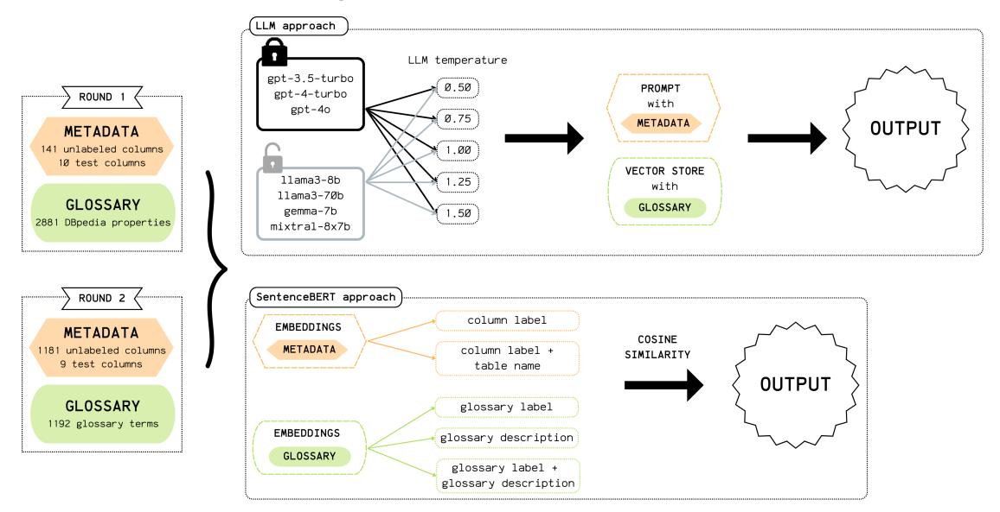

# **Closed-Source vs Open-Source RAGs: lessons learned from the SemTab challenge**

Margherita Martorana\* , Xueli Pan, Benno Kruit, Tobias Kuhn and Jacco van Ossenbruggen

*Department of Computer Science, Vrije Universiteit Amsterdam, De Boelelaan 1105, Amsterdam, The Netherlands*

### **Abstract**

With the rise of advanced Large Language Models (LLMs), there has also been an increase in the use and application of Retrieval-Augmented Generation (RAG) systems. Such systems combine generative models with information retrieval, allowing access to external resources to enhance the quality and accuracy of responses. RAG systems are becoming integral across various fields, not only improving the capabilities of LLMs but also enabling more efficient and context-aware outputs. Some RAG systems are readily accessible through APIs, such as those provided by OpenAI, while others can be custom-built to meet specific research or application needs.

This work is an extension of the research conducted as part of the "Metadata to Knowledge Graph" track of the SemTab24 challenge, which involved classifying column headers of tabular data using controlled vocabularies. For the challenge, we employed seven different LLMs: three closed-source models (gpt-3.5-turbo-0.125, gpt-4, and gpt-4-turbo) and four open-source models (llama3-80b, llama3-7b, gemma-7b, and mixtral-8x7b). For the GPT models, we leveraged the RAG system provided by OpenAI, while for the open-source models, we employed LLamaIndex. Additionally, we evaluated the impact of different temperature settings (0.5, 0.75, 1.0, 1.25, and 1.5) on model performance.

In this paper we present a preliminary study that highlights the observations and findings from our participation in the SemTab challenge, offering valuable insights into the capabilities and performance of RAG systems. We also discuss specific challenges related to vectorizing data for RAG systems and the role of assistant instructions. Our findings suggest that the nature of the input data can significantly influence the effectiveness of RAG systems, and that tailored approaches may be required for optimal results.

#### **Keywords**

Large Language Models, Retrieval Augmented Generation, Closed vs. Open-Source LLMs, Semantic Table Interpretation, Semantic Web

## **1. Introduction**

Retrieval-Augmented Generation (RAG) systems represent a significant advancement in the field of natural language processing (NLP), enhancing the capabilities of large language models (LLMs) by combining the strength of retrieval and generation models [\[1\]](#page-7-0). The integration of these two components enables RAG systems to generate responses that are more accurate,

*ISWC 2024*

\*Corresponding author.

\$ [m.martorana@vu.nl](mailto:m.martorana@vu.nl) (M. Martorana); [x.pan2@vu.nl](mailto:x.pan2@vu.nl) (X. Pan); [b.b.kruit@vu.nl](mailto:b.b.kruit@vu.nl) (B. Kruit); [t.kuhn@vu.nl](mailto:t.kuhn@vu.nl) (T. Kuhn); [j.r.van.ossenbruggen@vu.nl](mailto:j.r.van.ossenbruggen@vu.nl) (J. v. Ossenbruggen)

[0000-0001-8004-0464](https://orcid.org/0000-0001-8004-0464) (M. Martorana); [0000-0002-3736-7047](https://orcid.org/0000-0002-3736-7047) (X. Pan); [0000-0002-1267-0234](https://orcid.org/0000-0002-1267-0234) (T. Kuhn); [0000-0002-7748-4715](https://orcid.org/0000-0002-7748-4715) (J. v. Ossenbruggen)

© 2022 Copyright for this paper by its authors. Use permitted under Creative Commons License Attribution 4.0 International (CC BY 4.0).

informative, and contextually relevant compared to standalone LLMs. While traditional LLMs rely solely on their inherent knowledge, RAG systems can access external information, making them particularly useful in situations where up-to-date or domain-specific knowledge is required. In fact, RAGs have been found to help reducing hallucinations [\[2,](#page-7-1) [3\]](#page-7-2), knowledge grounding [\[4,](#page-7-3) [5\]](#page-7-4) and personalisation [\[6,](#page-7-5) [7\]](#page-7-6). Due to the popularity of RAG systems, numerous solutions are now available, both open-source and commercial. Recent studies have introduced benchmarks and best practices for evaluating RAG systems [\[8,](#page-7-7) [9,](#page-7-8) [10,](#page-7-9) [11\]](#page-8-0) and comparing open-source and closed-source systems [\[12,](#page-8-1) [13,](#page-8-2) [14,](#page-8-3) [15\]](#page-8-4).

Recently, we - the authors of this paper - participated in the "Metadata to Knowledge Graph (KG)" track of the SemTab Challenge (detailed further in section [3\)](#page-2-0). This track focused on mapping column metadata to relevant KG terms based on semantic relevance, even when direct data access was not available. To address this challenge, we suggested solutions that use both commercial and open-source LLMs and RAGs, and other traditional semantic similarity approach. In this paper, we revisit and build upon our approaches from the SemTab Challenge, contributing a comparison and discussion on the performance of commercial and open-source LLMs and RAGs, highlighting the observed differences. Full details of the approaches we used for the SemTab Challenge can be found at [\[16\]](#page-8-5).

## **2. Retrieval-Augmented Generation**

Large Language Models (LLMs) have demonstrated promising abilities in natural language understanding tasks such as classification [\[17\]](#page-8-6), entity linking [\[18\]](#page-8-7), and question answering [\[19\]](#page-8-8). However, they often struggle with issues such as hallucinations and limited capacity to access and interact with external resources [\[20\]](#page-8-9). Retrieval-Augmented Generation (RAG) [\[5\]](#page-7-4) has been introduced as a solution to overcome these limitations, enabling LLMs to access domain-specific knowledge more effectively. In a RAG pipeline, external resources are embedded as vectors and stored in vector databases like Chroma, Weaviate, Pinecone, or OpenAI's built-in vector store within the Assistant API, enabling more precise and contextually accurate responses by linking relevant information during generation.

The landscape of RAGs and LLMs is divided into open-source and closed-source systems, each with distinct implications for accessibility, cost, flexibility, and performance. Open-source RAGs and LLMs are publicly available, allowing developers and researchers to access, modify, and improve the underlying models, fostering transparency and community-driven innovation. These models offer flexibility, allowing customization of their retrieval mechanisms, parameters setting, or integration of domain-specific knowledge. However, open-source systems may sometimes underperform compared to state-of-the-art closed-source counterparts due to more limited training resources and the absence of large-scale, proprietary datasets.

On the other hand, closed-source RAGs and LLMs are developed and maintained by organizations with access to vast computational resources and proprietary data. Models like OpenAI's GPT-4 and Google's Gemini benefit from advanced architectures, extensive pre-training, and ongoing performance enhancements. While these models generally outperform open-source alternatives, they lack transparency, making it difficult to inspect or customize their behavior, and their "black box" nature can be a limitation when adapting them to niche domains or specific

use cases.

Recent studies have introduced various methods and benchmarks for evaluating the performance of RAG systems [\[8,](#page-7-7) [9\]](#page-7-8), as well as proposing best practices for optimising their efficiency and performance [\[10,](#page-7-9) [11\]](#page-8-0). Also, comparisons between open-source and closed-source LLMs have been explored in a variety of domains and tasks [\[12,](#page-8-1) [13,](#page-8-2) [14,](#page-8-3) [15\]](#page-8-4). However, to the best of our knowledge, no comprehensive study has yet examined how LLMs and RAG systems, particularly when combined with different temperature settings, perform in the specific context of Semantic Table Interpretation, as outlined in the SemTab Challenge. In this work, we present insights gained from our participation in the SemTab Challenge, focusing on the practical differences between open-source and closed-source LLMs and RAGs, and highlighting key lessons learned in their application to this domain.

# **3. SemTab Challenge as Use Case**

The SemTab challenge has been running since 2019, and it mainly focuses on tasks related to Semantic Table Interpretation (STI). It includes multiple tracks, where participants suggest solutions to tasks such as Column Type Annotation (CTA), Column Entity Annotation (CEA), and Column Property Annotation (CPA). In this year SemTab challenge, the "Metadata to KG" track was introduced, where participants are asked to submit solutions for mapping table metadata to Knowledge Graphs without having access to the underlying data. This track was divided into two rounds, each using different datasets and vocabularies. In Round 1, participants mapped 141 table metadata to DBpedia properties. In Round 2, instead, more complexity was added with 1181 table metadata to be mapped to custom vocabularies. In the following section, we explain in more details our experimental design in both rounds, and we provide a visual representation of the methodology in Figure [1.](#page-3-0) Further details, can be found in our SemTab challenge paper [\[16\]](#page-8-5).

## **3.1. Experimental Design**

Our approach to the task set by the "Metada to KG" track treats both rounds as textual information retrieval challenges. The objective is to match table metadata—such as column labels, table names, and other descriptive elements, with the most *semantically relevant* KG entries. We employed two different methods: the first utilising LLMs, and the second utilising a more traditional semantic similarity approach with SentenceBERT[\[21\]](#page-8-10). We experimented with a range of LLMs, both commercial (i.e. GPT-3.5-turbo-0125, GPT-4o, GPT-4-turbo from OpenAI[1](#page-2-1) ) and open-source (i.e. LLama3-70b, LLama3-8b, Gemma-7b, Mixtral-8x7b) models. To investigate the influence of the models' creativity on performing the task, we also varied the temperature settings (0.5, 0.75, 1.0, 1.25, and 1.5). The temperature setting is an important parameter, as it controls the randomness of the LLM's responses. Lower temperatures (e.g. 0.5) produce more deterministic outputs, while higher temperatures (e.g. 1.5) encourage more creativty and variability.

1 <https://openai.com>

**Figure 1:** Experimental design and approaches employed in both Round 1 and 2 of the "Metadata to KG" track of the SemTab Challenge 2024.

All evaluations were conducted in a zero-shot setting, with no pretraining done on the specific task or domain, aiming to create a more generalised approach that is not biased towards any particular domain or KG. Instead, we used a RAG approach to input relevant information necessary for the task. Specifically, the KGs containing the entries to which the metadata was mapped were provided as input data to the RAG systems. For the GPT models, we utilized the RAG system made available through the OpenAI API, while for the open-source models, we used LLamaIndex[2](#page-3-1) . The mappings we produced were then checked against a test groundtruth provided by the organisers of the track, and we evaluated the results using two metrics: hit@1 and hit@5. The hit@1 metric checks if the top-ranked match is correct, while hit@5 checks if the correct match is found within the top five results.

## **3.2. Summary results from the SemTab Challenge**

Overall, we found that the gpt-4o model outperformed other models in both Round 1 and Round 2, particularly at temperatures of 0.5, 0.75, and 1.0. This result is unsurprising given that gpt-4o is one of the latest iteration in the GPT model series, featuring enhanced reasoning capabilities and an advanced ability to handle complex prompts.

The out-of-the-box performance of both closed and open LLMs was poor and unstable in Round 2. This could be due to the fact that DBpedia, an open dataset used in Round 1, may have been included in the training corpus of many LLMs. As a result, the models likely already had inherent knowledge about DBpedia's structure and properties, which enhanced their ability to understand and respond effectively to the tasks and prompts in Round 1. However, in Round 2, where the tasks involved glossary files that were not part of the models' training data, the

2 <https://www.llamaindex.ai>

LLMs lacked the necessary knowledge to perform as effectively. In this round, we observed that the LLMs generally performed less effectively, and the approach using SentenceBERT had better results. Without prior exposure to the specific information in these glossary files, the models struggled to accurately interpret the prompts and execute the tasks, leading to the observed poor performance. This highlights the limitation of LLMs when faced with unfamiliar or domain-specific knowledge not covered in their training corpus.

We report below the results of the LLM and RAG approach in Table [1,](#page-4-0) and of the approach with SentenceBERT in Table [2,](#page-5-0) both taken from [\[16\]](#page-8-5).

#### **Table 1**

Results of different models for sample data in Round 1 and 2. The cells with the "X" refers to tries where the LLM could not compute the task, and either the API was not returning any results over a long period of time or, in the case of gemma-7b the model was returning "failure" message. In bold, instead, we show the best performing results. In the table h1 and h5 refers to Hit@1 and Hit@5 metrics from the evaluation script.

|                    | Round 1 |      |      |      |      |      |      |      |      |      |
|--------------------|---------|------|------|------|------|------|------|------|------|------|
| LLM Models      | 0.5     |      | 0.75 |      | 1.0  |      | 1.25 |      | 1.5  |      |
|                    | h1      | h5   | h1   | h5   | h1   | h5   | h1   | h5   | h1   | h5   |
| gpt-3.5-turbo-0125 | 0.42    | 0.42 | 0.33 | 0.42 | 0.47 | 0.53 | 0.41 | 0.41 | 0.36 | 0.36 |
| gpt-4o             | 0.59    | 0.89 | 0.62 | 0.81 | 0.64 | 0.75 | 0.47 | 0.67 | 0.11 | 0.22 |
| gpt-4-turbo        | 0.58    | 0.58 | 0.56 | 0.56 | 0.61 | 0.61 | 0.59 | 0.59 | 0.36 | 0.36 |
| llama3-8b          | 0.22    | 0.44 | 0.22 | 0.44 | 0.22 | 0.44 | 0.33 | 0.44 | 0.33 | 0.33 |
| llama3-70b         | 0.11    | 0.11 | 0.11 | 0.22 | 0.11 | 0.22 | 0.11 | 0.22 | 0.11 | 0.11 |
| gemma-7b           | 0.37    | 0.4  | 0.44 | 0.52 | 0.33 | 0.47 | 0.48 | 0.61 | 0.37 | 0.53 |
| mixtral-8x7b       | 0.33    | 0.33 | 0.44 | 0.56 | 0.33 | 0.44 | 0.44 | 0.44 | 0.44 | 0.44 |
|                    | Round 2 |      |      |      |      |      |      |      |      |      |
|                    | 0.5     |      | 0.75 |      | 1.0  |      | 1.25 |      | 1.5  |      |
|                    | h1      | h5   | h1   | h5   | h1   | h5   | h1   | h5   | h1   | h5   |
| gpt-3.5-turbo-0125 | 0.67    | 0.67 | 0.3  | 0.33 | 0.63 | 0.67 | 0.67 | 0.67 | X    | X    |
| gpt-4o             | 0.73    | 1    | 0.45 | 1    | 0.45 | 0.58 | 0.54 | 0.64 | X    | X    |
| gpt-4-turbo        | 0       | 0    | X    | X    | X    | X    | X    | X    | X    | X    |
| llama3-8b          | 0       | 0    | 0    | 0    | 0    | 0    | 0    | 0    | 0    | 0    |
| llama3-70b         | 0       | 0    | 0    | 0    | 0    | 0    | 0    | 0    | 0    | 0    |
| gemma-7b           | X       | X    | X    | X    | X    | X    | X    | X    | X    | X    |
| mixtral-8x7b       | 0       | 0    | 0    | 0    | 0    | 0    | 0    | 0    | 0    | 0    |

## **4. Observations**

In this section, we present observations from our use of RAG systems to address the task of mapping metadata to KG of the SemTab challenge. We present a high-level comparison between the open-source RAG system (i.e. LlamaIndex) and the commercial RAG system (access through OpenAI API), in figure [3.](#page-6-0) The aim of this comparison is to highlight key differences between these two types of systems.

## **Table 2**

| Metadata                           | Glossary                     | Round 1 |      | Round 2 |      |
|------------------------------------|------------------------------|---------|------|---------|------|
| Embeddings                         | Embeddings                   | h1      | h5   | h1      | h5   |
| encode(label)                      | encode(label)                | 0.56    | 0.56 | 0.36    | 0.55 |
| encode(label)                      | encode(lable + desc)         | 0.22    | 0.56 | 0.45    | 0.82 |
| encode(label + table_name)         | encode(label)                | 0.56    | 0.56 | 0.09    | 0.27 |
| encode(label + table_name)         | encode(lable + desc)         | 0.33    | 0.44 | 0.64    | 0.73 |
| encode(label)                      | encode(desc)                 | 0.11    | 0.33 | 0.45    | 0.82 |
| encode(label + table_name)         | encode(desc)                 | 0.22    | 0.44 | 0.64    | 0.73 |
| encode(label) + encode(table_name) | encode(desc)                 | 0       | 0.33 | 0.64    | 0.91 |
| encode(label) + encode(table_name) | encode(desc) + encode(label) | 0.22    | 0.44 | 0.55    | 0.91 |
| encode(label) + encode(table_name) | encode(label)                | 0.44    | 0.67 | 0.27    | 0.45 |

Results of various embedding combinations for sample data in Round 1 and 2 are presented, with best performing results in bold. The table includes Hit@1 (h1) and Hit@5 (h5) metrics from evaluation script.

Firstly, it is important to note that the commercial RAG system, which integrates OpenAI Assistant with file search capabilities, supports only OpenAI's GPT models. In our case, we utilized gpt-3.5-turbo, gpt-4o, and gpt-4-turbo. LlamaIndex, instead, supports a variety of models from different providers - for the challenge we employed llama3-8b, llama3-70b, gemma-7b, and mixtral-8x7b. Further, OpenAI's default embedding model is text-embedding-3-large with 256 dimensions. While OpenAI offers additional embedding models, such as text-embedding-3 small and text-embedding-ada-002, the options are limited (more details available at [3](#page-5-1) . On the other hand, LlamaIndex utilizes the BAAI/bge-small-en embedding model with 384 dimensions. Open-source systems allow for the use of a broader range of embedding models, including those from OpenAI, though this may reduce some of the advantages of using open source solutions. Some of the most significant differences are the file handling capabilities and the handling of chunks. OpenAI's system supports up to 10,000 files, each up to 512 MB. It can manage up to 20 chunks simultaneously, each with a default size of 800 tokens and an overlap of 400 tokens. In contrast, LlamaIndex's file storage limitations are more flexible, determined by the vector database and the machine's capacity running the vector store. By default, LlamaIndex handles 2 chunks with each chunk being 1024 tokens and an overlap of 20 tokens. Larger chunks and greater overlap can include more information in the context window, which might be a key aspect depending on the task. For example, GPT models performed better in our SemTab task where understanding the semantics of long textual descriptions in the KG was important for accurate mappings. This result might be related to the larger chunk size and overlap of the OpenAI models and built-in RAG.

We also noticed that certain practices related to file upload and writing instructions has influenced the performance of our solutions for the SemTab challenge. For example, we noted that by repeating certain constraints in both the assistant's instructions and the user queries resulted to more accurate mappings and fewer hallucinations. Also, formatting data as separate files rather than one large file improved accuracy. In Round 2, where custom KGs were used,

3 <https://platform.openai.com/docs/models/embeddings>

|                            | Commercial RAG                                | Open-source RAG                                  |  |  |
|----------------------------|-----------------------------------------------|--------------------------------------------------|--|--|
| Implementation             | OpenAI Assistant with file search | LlamaIndex                                       |  |  |
| LLM models used            | gpt-3.5-turbo, gpt-4o, gpt-4- turbo  | llama3-8b, llama3-70b, gemma 7b, mixtral-8x7b |  |  |
| Vector database            | OpenAI built-in vector                        | ChromaDB                                         |  |  |
| Embedding model            | text-embedding-3-large (256 di                | BAAI/bge-small-en (384 dimen                     |  |  |
|                            | mensions), i.e. default                       | sions)                                           |  |  |
| Files limitation in vector | 10,000 files. Each file can be at             | Depends on the chosen vector                     |  |  |
| DB                         | most 512 MB in size and have a                | DB and the capacity of ma                        |  |  |
|                            | maximum of 5,000,000 tokens.                  | chine that runs the vector store.                |  |  |
|                            | By default, the size of all the               |                                                  |  |  |
|                            | files uploaded in your project                |                                                  |  |  |
|                            | cannot exceed 100 GB                          |                                                  |  |  |
| Maximum number of    | 20 by default, can be cus      | 2 by default, can be customized                  |  |  |
| chunks added to context    | tomized                                       |                                                  |  |  |
| Chunk size                 | 800 tokens by default, can be                 | 1024 tokens by default, can be                   |  |  |
|                            | customized                                    | customized                                       |  |  |
| Chunk overlap              | 400 tokens, by default, can be                | 20 tokens by default, can be                     |  |  |
|                            | customized                                    | customized                                       |  |  |

**Table 3** Comparison between commercial and open-source RAG systems.

dividing the data into smaller files, each representing a specific domain, seemed to allow the system to track the fact that the files were in someway separate and about distinct knowledge.

## **5. Discussion and Future Work**

In conclusion, while commercial RAG systems provide a streamlined and integrated approach that simplifies deployment and management, open-source RAGs offer greater flexibility and customization but require more technical expertise.

A direction for future work is to investigate how to optimize the handling of large datasets and chunk management across both systems. This could involve developing better strategies for file segmentation and chunk overlap to improve performance and context understanding. Additionally, it would be beneficial to explore the impact of different embedding models on performance in various tasks, potentially creating guidelines for selecting the most effective models based on task requirements.

Another research area is enhancing the robustness of query and instruction handling to reduce hallucinations. Experimenting with constraints repetition, instructions and user queries designs could lead to more accurate results. Further, investigating the benefits of data formatting, such as fragmenting large KGs into smaller, domain-specific files, could offer insights into improving accuracy and RAG systems.

Finally, while in this work we provide some insights on the differences between commercial and open-source RAG systems, there is a need for creating benchmark tools and performance

metrics, which would help users make informed decisions about which solution, system and models is better suited for their needs.

# **Acknowledgments**

We acknowledge that ChatGPT was utilized to generate and debug part of the python and latex code utilised in this work. This work is funded by the Netherlands Organisation of Scientific Research (NWO), ODISSEI Roadmap project: 184.035.014.

Author M.M. led the research, developing the main ideas, designing the study, contributing to programming, and drafting most of the manuscript. Author X.P. played a crucial role by providing the technical expertise, particularly in programming and API integration for the analysis, and contributed to drafting the manuscript. Authors B.K., T.K., and J.v.O. offered guidance in their supervisory roles and provided feedback to enhance the study.

# **References**

- [1] H. Zamani, F. Diaz, M. Dehghani, D. Metzler, M. Bendersky, Retrieval-enhanced machine learning, in: Proceedings of the 45th International ACM SIGIR Conference on Research and Development in Information Retrieval, 2022, pp. 2875–2886.
- [2] G. Agrawal, T. Kumarage, Z. Alghami, H. Liu, Can knowledge graphs reduce hallucinations in llms?: A survey, arXiv preprint arXiv:2311.07914 (2023).
- [3] K. Shuster, S. Poff, M. Chen, D. Kiela, J. Weston, Retrieval augmentation reduces hallucination in conversation, arXiv preprint arXiv:2104.07567 (2021).
- [4] G. Izacard, E. Grave, Leveraging passage retrieval with generative models for open domain question answering, arXiv preprint arXiv:2007.01282 (2020).
- [5] P. Lewis, E. Perez, A. Piktus, F. Petroni, V. Karpukhin, N. Goyal, H. Küttler, M. Lewis, W.-t. Yih, T. Rocktäschel, et al., Retrieval-augmented generation for knowledge-intensive nlp tasks, Advances in Neural Information Processing Systems 33 (2020) 9459–9474.
- [6] A. Salemi, S. Mysore, M. Bendersky, H. Zamani, Lamp: When large language models meet personalization, arXiv preprint arXiv:2304.11406 (2023).
- [7] A. Salemi, S. Kallumadi, H. Zamani, Optimization methods for personalizing large language models through retrieval augmentation, in: Proceedings of the 47th International ACM SIGIR Conference on Research and Development in Information Retrieval, 2024, pp. 752– 762.
- [8] S. Es, J. James, L. Espinosa-Anke, S. Schockaert, Ragas: Automated evaluation of retrieval augmented generation, arXiv preprint arXiv:2309.15217 (2023).
- [9] J. Chen, H. Lin, X. Han, L. Sun, Benchmarking large language models in retrievalaugmented generation, in: Proceedings of the AAAI Conference on Artificial Intelligence, volume 38, 2024, pp. 17754–17762.
- [10] X. Wang, Z. Wang, X. Gao, F. Zhang, Y. Wu, Z. Xu, T. Shi, Z. Wang, S. Li, Q. Qian, et al., Searching for best practices in retrieval-augmented generation, arXiv preprint arXiv:2407.01219 (2024).

- [11] H. Yu, A. Gan, K. Zhang, S. Tong, Q. Liu, Z. Liu, Evaluation of retrieval-augmented generation: A survey, arXiv preprint arXiv:2405.07437 (2024).
- [12] Q. Liu, N. Chen, T. Sakai, X.-M. Wu, Once: Boosting content-based recommendation with both open-and closed-source large language models, in: Proceedings of the 17th ACM International Conference on Web Search and Data Mining, 2024, pp. 452–461.
- [13] F. J. Dorfner, L. Jürgensen, L. Donle, F. A. Mohamad, T. R. Bodenmann, M. C. Cleveland, F. Busch, L. C. Adams, J. Sato, T. Schultz, et al., Is open-source there yet? a comparative study on commercial and open-source llms in their ability to label chest x-ray reports, arXiv preprint arXiv:2402.12298 (2024).
- [14] R. Gubelmann, M. Burkhard, R. V. Ivanova, C. Niklaus, B. Bermeitinger, S. Handschuh, Exploring the usefulness of open and proprietary llms in argumentative writing support, in: International Conference on Artificial Intelligence in Education, Springer, 2024, pp. 175–182.
- [15] S. Ateia, U. Kruschwitz, Can open-source llms compete with commercial models? exploring the few-shot performance of current gpt models in biomedical tasks, arXiv preprint arXiv:2407.13511 (2024).
- [16] M. Martorana, X. Pan, B. Kruit, T. Kuhn, J. van Ossenbruggen, Column vocabulary association (cva): semantic interpretation of dataless tables, 2024. URL: [https://arxiv.org/abs/2409.](https://arxiv.org/abs/2409.13709) [13709.](https://arxiv.org/abs/2409.13709) [arXiv:2409.13709](http://arxiv.org/abs/2409.13709).
- [17] M. Martorana, T. Kuhn, L. Stork, J. van Ossenbruggen, Zero-shot topic classification of column headers: Leveraging llms for metadata enrichment, in: Knowledge Graphs in the Age of Language Models and Neuro-Symbolic AI, IOS Press, 2024, pp. 52–66.
- [18] T. Xie, Q. Li, Y. Zhang, Z. Liu, H. Wang, Self-improving for zero-shot named entity recognition with large language models, in: K. Duh, H. Gomez, S. Bethard (Eds.), Proceedings of the 2024 Conference of the North American Chapter of the Association for Computational Linguistics: Human Language Technologies (Volume 2: Short Papers), Association for Computational Linguistics, Mexico City, Mexico, 2024, pp. 583–593. URL: [https:](https://aclanthology.org/2024.naacl-short.49) [//aclanthology.org/2024.naacl-short.49.](https://aclanthology.org/2024.naacl-short.49) doi:[10.18653/v1/2024.naacl-short.49](http://dx.doi.org/10.18653/v1/2024.naacl-short.49).
- [19] E. Kamalloo, N. Dziri, C. Clarke, D. Rafiei, Evaluating open-domain question answering in the era of large language models, in: A. Rogers, J. Boyd-Graber, N. Okazaki (Eds.), Proceedings of the 61st Annual Meeting of the Association for Computational Linguistics (Volume 1: Long Papers), Association for Computational Linguistics, Toronto, Canada, 2023, pp. 5591–5606. URL: [https://aclanthology.org/2023.acl-long.307.](https://aclanthology.org/2023.acl-long.307) doi:[10.18653/v1/](http://dx.doi.org/10.18653/v1/2023.acl-long.307) [2023.acl-long.307](http://dx.doi.org/10.18653/v1/2023.acl-long.307).
- [20] S. Barnett, S. Kurniawan, S. Thudumu, Z. Brannelly, M. Abdelrazek, Seven failure points when engineering a retrieval augmented generation system, in: Proceedings of the IEEE/ACM 3rd International Conference on AI Engineering-Software Engineering for AI, 2024, pp. 194–199.
- [21] N. Reimers, I. Gurevych, Sentence-bert: Sentence embeddings using siamese bert-networks, arXiv preprint arXiv:1908.10084 (2019).