# Ontology Engineering with Large Language Models

Unveiling the potential of Human-LLM collaboration in the ontology extension process

MSc Thesis Complex Systems Engineering & Management Julia García Fernández


# Unveiling the potential of Human-LLM collaboration in the ontology extension process

by

# Julia García Fernández

to obtain the degree of Master of Science in Complex Systems Engineering and Management (CoSEM) at the Delft University of Technology,

to be defended publicly on Tuesday August  $27^{\text{th}}$ , 2024.

First supervisor: Second supervisor: Chair: Student number

 $Dr.$  Jolien Ubacht Prof. Dr. Nitesh Bharosa Company supervisor: Dr. Ir. Jack Verhoosel 5609089

 $TU$  Delft,  $ICT$ Dr. Oscar Oviedo-Trespalacios TU Delft, Safety & Security Science TU Delft, ICT TNO, Data Science

 $Cover:$ Generated by DALL-E (OpenAI)  $\text{Style:}$ TU Delft Report Style, with modifications by Daan Zwaneveld

An electronic version of this thesis is available at http://repository.tudelft.nl/.


# Foreword

<span id="page-2-0"></span>Getting to the precise moment at which I am writing this page has not been easy. In this journey, there has been a little bit of many emotions. When I decided to get into ontologies and large language models, I did not know much about either. I was equal parts excited and scared. Fortunately, I have been surrounded by marvelous people who have helped me since the beginning in transforming all my fears into knowledge, motivation, and confidence.

First, I want to thank my supervisors, Jolien, Jack, Oscar, and Nitesh. I have learned enormously from all of you. Jolien, you have been more than a supervisor to me. In our meetings, not only did you teach me how to become a better researcher, but a better person. Thank you for the enriching discussions about the thesis, and about life. And sorry for keeping off the clock sometimes, our conversations were so absorbing that we simply could not stop. You are definitely a role model for me. Jack, my infinite gratitude for always being available for me. Since I met you, I knew I had to work with you. Rarely in life does one meet people as intelligent, hardworking, and kind as you. You always did your best for my success and trusted every decision I made. I cannot thank you enough for offering me this fascinating topic and trusting in my capabilities to fulfill it. Oscar, you were always the most critical during our feedback sessions, and thanks to that, you pushed my limits and helped me elevate the quality of the research, especially the social aspects. Thank you for bringing a new dimension to this research. Nitesh, with your wealth of experience, you also helped me enormously to refine the quality of my discussion. Your continued interest in the topic and in the direction of the research gave me the motivation and confidence to keep moving forward. Thank you for the trust you all have placed in me. I could never have dreamed of a better graduation committee.

Next, I am very thankful to [TNO](#page-10-0) and the Data Science department for welcoming me as one of your own. Especial thanks to my colleagues who helped me immensely by participating as interviewees in this research. All of this research revolves around your concerns and ideas, so this would certainly not be possible without you. You gave me the strength to keep going, not only by showing your interest in my project, but also by sharing our struggles in front of a cup of coffee, or by forgetting a bit about our professional careers while playing table tennis or bouldering.

I cannot finish this text without expressing my most heartfelt gratitude to my family and friends. Victor, I will never be able to find the words to thank you for the many times you saved me from getting lost in the deepest negativity. We have been navigating together this important moment in our lives, and thanks to that we never felt lonely. I do not think there is any better feeling in the world than that. Mum, dad, and sister, you are my biggest fans. I would not be where I am today without your unconditional support. I am the luckiest person in the world for having you. And to my friends, many of you have been through the same, we have shared successes and disappointments along the way, and everything turned out well in the end. Thank you for all for patiently listening to my worries, and for just making this process much better.

If I had to choose a quote that represents the research presented in this document, it would be:

*"Any sufficiently advanced technology is indistinguishable from magic". – Arthur C. Clarke.*

Whether or not the LLM hype continues in the coming years, I am thrilled to be living in this era of tremendous evolution of artificial intelligence, and I look forward to continuing to contribute to unveiling the positive impact of this magical power.

> *Julia García Fernández Delft, August 2024*

# Executive Summary

<span id="page-3-0"></span>Digital technologies are reshaping the way we live. From the moment we wake up in the morning until the sun goes down, our daily routine is shaped by digital systems that make our life, at home and work, easier. In the not-sodistant future, we envision a full integration of all these systems in a way that they can operate autonomously and talk to each other without requiring any manual setup. But for this integration, these systems must speak the same language, or at least understand each other. Ontologies are the dictionaries for these systems, the shared vocabularies. By modeling the world as we see it, understand it, and agree on its representation, ontologies transform data into information, and information into semantic knowledge that can be shared. Because ontologies represent the world's knowledge in the way that humans understand it, they can be used to reason about facts of the world. Thus, it is not surprising that knowledge engineering has been a crucial aspect of [Artificial Intelligence](#page-10-1) ([AI\)](#page-10-1) for decades.

However, standardization is not an easy task. The field of [Ontology Engineering](#page-10-2) [\(OE\)](#page-10-2) is not new but, so far, its evolution has been slow compared to other fields of engineering. The development of ontologies is a long process, requires expert knowledge across multiple fields, and necessitates consensus-building from a group of stakeholders. Several [Ontology Engineering Methodologies](#page-10-3) [\(OEMs](#page-10-3)) have tried to structure the [OE](#page-10-2) process and disentangle the complexities associated with it but, as of today, none of them is a standard. Moreover most of the tools used for [OE](#page-10-2) are old and have not been maintained in the past years. Even with these entry barriers for ontology engineers, the field of [OE](#page-10-2) seems to be experiencing significant growth in recent years with the widespread need for data sharing and interoperability across information systems. But there is a paradox with the standardization of information: the more different standards, the less standardization. This is why reusing existing standards is a crucial aspect of standardization.

Extending an existing ontology to model the rapid changes that society experiences or to fulfill new requirements from the information system in which it is used is a common task. To facilitate this process, [Large Language Models](#page-10-4) [\(LLMs\)](#page-10-4) have strongly entered the scene as powerful tools that can be used to automate the generation of ontologies. [LLMs](#page-10-4) are [Natural Language Processing](#page-10-5) ([NLP](#page-10-5)) systems that can understand and generate human-like text. Some of their [NLP](#page-10-5) capabilities, such as information extraction, seem to perfectly align with the activities needed to develop an ontology. But the use of [LLMs](#page-10-4) for [OE](#page-10-2) does not come without a cost. Ontology engineers are aware of the limitations of [LLMs](#page-10-4), such as inconsistent or hallucinated outputs, but also of the impact of their use in a broader sense and the lack of regulatory frameworks. Even with these concerns, there have been several attempts to automate the ontology generation process using [LLMs.](#page-10-4) Many of these attempts aim for full automation, resulting in flat ontologies. Others, opt for a semi-automated approach to extend ontologies in specific domains. The work presented here aims to contribute to this field of research by addressing the following research question:

#### *How can [LLMs](#page-10-4) be integrated into a semi-automated and domain-independent process for the extension of existing ontologies?*

To integrate [LLMs](#page-10-4) in the ontology extension process in a way that these innovative tools become part of the [OE](#page-10-2) toolkit, complementing human knowledge and alleviating some of the most cumbersome tasks in the process, we addressed this question in a holistic and systematic way by following a [Design Science Research](#page-10-6) ([DSR](#page-10-6)) approach:

- In **Chapter [3](#page-26-0)** we answered the first research sub-question: *How does the current manual process to extend existing ontologies look like and what are the issues that ontology engineers are experiencing?*. By modeling the current ontology extension process directly from the practices of ontology engineers we provide a holistic view of the process and facilitate its comprehension. Moreover, we investigated how the size and complexity of the ontology to be extended and the lack of enough expertise and tailored tools hinder the process of extending an existing ontology. Though ontology engineers have several concerns about the use of [LLMs](#page-10-4) for [OE](#page-10-2), such as its negative environmental impact or the potential loss of an enriching multi-actor process due to automation, they see great opportunities for the automation of some specific tasks in the process that can be repetitive and cumbersome.
- In **Chapter [4](#page-40-0)** we answered the second research sub-question: *What are the requirements for a human-LLM collaboration framework for ontology extension?*. The artifact to be designed is outlined as a human-LLM

collaboration framework for ontology extension. Through a multifaceted approach for requirements elicitation, we formulated a set of requirements that directly address the problems associated with the ontology extension process, without overlooking the concerns and opportunities that ontology engineers perceive for the application [LLMs](#page-10-4) for [OE](#page-10-2) and the legal context framed by the European Artificial Intelligence Act. Due to the level of abstraction required to design a process framework that combines [LLMs](#page-10-4) and human capabilities, a set of high-level requirements was produced. These requirements, validated by the ontology engineers, emphasize an expert-in-the-loop approach that encourages best practices in ontology engineering while capitalizing on the strengths of [LLMs.](#page-10-4)

- In **Chapter [5](#page-48-0)** we answered the third research sub-question: *What does the design of an integrated process framework for human-LLM collaboration for ontology extension look like?*. To integrate [LLMs](#page-10-4) in the ontology extension process, we used the previously identified [OE](#page-10-2) tasks (in Chapter [3\)](#page-26-0) and analyzed their similarities to [NLP](#page-10-5) tasks. To define how [LLMs](#page-10-4) can be effectively used for these tasks, we searched for existing work on the field. By examining recent academic publications that apply [LLMs](#page-10-4) to different [OE](#page-10-2) processes, we saw that how the LLM is prompted significantly influences its output. We also found that, with fine-tuning, smaller open-source models can offer performance comparable to that of larger proprietary language models, but this requires time, resources, and specific knowledge on the [AI](#page-10-1) field. Moreover, this performance, only measured by machine learning metrics, fails to capture the fact that there are multiple correct ways of modeling knowledge. The proposed design of a human-LLM collaboration framework for ontology extension is an extended version of the current ontology extension process in which some of the downstream [OE](#page-10-2) tasks are facilitated by different types of [LLMs,](#page-10-4) relying on their [NLP](#page-10-5) capabilities. This systematic approach combines expert [OE](#page-10-2) knowledge from the different stakeholders in the [OE](#page-10-2) process with novel [OE](#page-10-2) tools. In addition, a set of customizable prompts is included in the design, which can be used by the ontology engineer to extend an existing ontology in any domain.
- In **Chapter [6](#page-64-0)** we answered the fourth and last research sub-question: *How can the framework be demonstrated and evaluated with a specific use case and to what extent does it improve the status quo?*. To demonstrate and evaluate the designed artifact, we selected a real use case in the agricultural domain: extending the [Common](#page-10-7) [Greenhouse Ontology](#page-10-7) [\(CGO](#page-10-7)) with the [Semantic Explanation and Navigation System](#page-10-8) [\(SENS\)](#page-10-8) use case. We demonstrated how the process framework works in practice by using [GPT-](#page-10-9)4o and its general-purpose capabilities to perform all the LLM-assisted tasks in the designed process, and we discussed each output. Compared to the gold standard – the manually crafted [SENS](#page-10-8) extension to the [CGO](#page-10-7) – the generated extension using the process framework is less rich in terms and conceptualization and fails to propose as many ontologies for reuse as the real extension. However, the generated ontology extension is syntactically correct and includes most of the ideas used for the manual extension. Some of the tasks assisted by the LLM in the process, such as formalizing [Compentency Questions](#page-10-10) ([CQs\)](#page-10-10) into SPARQL queries or verifying if the extended ontology can answer all the [CQs](#page-10-10) produced remarkably good results. The process framework was externally evaluated by a real ontology engineer who used the artifact with the same use case, and finally, the design requirements were evaluated against the final proposed design.

The proposed design – based on the current workflow of ontology extension and [OE](#page-10-2) best practices – could be implemented as a digital, web-based tool that guides the ontology extension practice and provides customizable prompt templates for some of the ontology extension tasks. The prototype design is adaptable for use within different [OEMs](#page-10-3), where the prompts could be integrated with specific tasks outlined by these methodologies. However, the extent to which the proposed process framework becomes a standard or, at least, [LLMs](#page-10-4) are fully integrated within the [OE](#page-10-2) toolkit would require additional time and further usage after its implementation. Further research could involve evaluating the framework with ontologies across different domains, assessing the framework with ontology engineers of varying expertise levels, including domain experts, and measuring how the users' expertise impacts the framework's output. In this research, the demonstration and evaluation of the process framework prototype were conducted using only one model. It would be interesting to use different [LLMs](#page-10-4) (e.g., open-source, proprietary, fine-tuned for the task) for various tasks to observe their impact on the process and the final output.

Despite all the limitations introduced by the several choices made to develop the human-LLM collaboration process framework design for ontology extension, this research contributes to the field of Hybrid [AI](#page-10-1) by proposing an approach that leverages the strengths of [LLMs](#page-10-4) to enrich rather than replace the ontology engineer's expert knowledge. The insights gathered through the development of the artifact proposed in this research contribute to the [DSR](#page-10-6) field for the future development of LLM-based applications for knowledge engineering that maximize the synergies between [LLMs](#page-10-4) and ontologies.

# Contents

|   | Foreword                                                                                                                                                                                                                                                                                                                                                                                                              | i                                                  |
|---|-----------------------------------------------------------------------------------------------------------------------------------------------------------------------------------------------------------------------------------------------------------------------------------------------------------------------------------------------------------------------------------------------------------------------|----------------------------------------------------|
|   | Executive Summary                                                                                                                                                                                                                                                                                                                                                                                                     | ii                                                 |
|   | Acronyms                                                                                                                                                                                                                                                                                                                                                                                                              | viii                                               |
| 1 | Introduction<br>1.1<br>Problem identification<br>.<br>1.2<br>Academic context and Main research question<br>1.2.1<br>Method: Literature review<br>1.2.2<br>Research gap<br>.<br>1.2.3<br>Main research question<br>1.3<br>Research approach<br>.<br>1.3.1<br>Research sub-questions and Research Flow Diagram<br>.<br>1.4<br>Link to MSc program<br>.                                                                 | 1<br>1<br>2<br>2<br>3<br>6<br>6<br>7<br>9          |
| 2 | Background<br>2.1<br>Ontologies<br>2.2<br>Ontology Engineering Methodologies<br>2.3<br>TNO<br>2.3.1<br>TNO's OE methodology: REPRO<br>.<br>2.4<br>Ontology Engineering and Large Language Models<br>.                                                                                                                                                                                                                 | 11<br>11<br>12<br>13<br>13<br>14                   |
| 3 | Analyzing the problem of ontology extension<br>3.1<br>Method: Interviews<br>3.1.1<br>Interview protocol<br>.<br>3.1.2<br>Data analysis<br>3.2<br>Understanding the process of ontology extension<br>.<br>3.3<br>The problems with ontology extension and the application of LLMs<br>3.4<br>Conclusion<br>.                                                                                                            | 16<br>16<br>16<br>17<br>17<br>21<br>28             |
| 4 | Requirements for a framework for ontology extension<br>4.1<br>Outlining the artifact<br>4.2<br>Requirements elicitation<br>.<br>4.2.1<br>Method 1: Literature search<br>4.2.2<br>Method 2: Interviews<br>.<br>4.2.3<br>Method 3: Focus group<br>.<br>4.2.4<br>Alignment with EU AI Act<br>.<br>4.3<br>Final list of requirements<br>.<br>4.4<br>Conclusion<br>.                                                       | 30<br>30<br>30<br>31<br>31<br>32<br>33<br>34<br>36 |
| 5 | Designing a human-LLM collaboration process framework for ontology extension<br>5.1<br>Choice of the design's structure<br>5.2<br>Identification of OE tasks that can be facilitated by LLMs<br>5.3<br>Current landscape of LLMs applied to OE tasks<br>.<br>5.4<br>Ontology Engineering tools for the ontology extension process<br>5.5<br>The ontology extension process framework design<br>5.6<br>Conclusion<br>. | 38<br>38<br>39<br>41<br>46<br>49<br>53             |
| 6 | Demonstrating and Evaluating the human-LLM collaboration framework for ontology exten<br>sion<br>6.1<br>Description of the use case chosen<br>.                                                                                                                                                                                                                                                                       | 54<br>54                                           |

|   | 6.2<br>The gold standard<br>.<br>6.3<br>Demonstration of the process framework prototype<br>6.3.1<br>Demonstration protocol<br>.                              | 55<br>56<br>56 |
|---|---------------------------------------------------------------------------------------------------------------------------------------------------------------|----------------|
|   | 6.3.2<br>Demonstration results<br>.<br>6.4<br>Evaluation of the process framework prototype<br>.                                                              | 57<br>61       |
|   | 6.4.1<br>Evaluation protocol<br>.<br>6.4.2<br>Evaluation results<br>.                                                                                         | 61<br>62       |
|   | 6.5<br>Conclusion<br>.                                                                                                                                        | 68             |
| 7 | Conclusion                                                                                                                                                    | 70             |
|   | 7.1<br>Implementation of the process framework<br>.<br>7.1.1<br>Selection of best LLM-supported OE tasks in the designed process<br>.                         | 70<br>70       |
|   | 7.1.2<br>Practical implementation of the process framework for ontology extension<br>.<br>7.2<br>Answer to the research questions<br>.                        | 72<br>74       |
|   | 7.2.1<br>Revisiting the research sub-questions                                                                                                                | 74             |
|   | 7.2.2<br>Answering the main research question<br>.<br>7.3<br>Societal relevance                                                                               | 76<br>77       |
|   | 7.4<br>Theoretical contribution<br>.                                                                                                                          | 78             |
|   | 7.5<br>Limitations<br>.                                                                                                                                       | 79             |
|   | 7.6<br>Future research topics<br>.                                                                                                                            | 81             |
|   | References                                                                                                                                                    | 83             |
| A | Research Gap: Literature Review                                                                                                                               | 89             |
| B | Interviews                                                                                                                                                    | 91             |
|   | B.0.1<br>List of interviewees                                                                                                                                 | 91             |
|   | B.0.2<br>Interview questions                                                                                                                                  | 91             |
|   | B.0.3<br>Interview summaries<br>B.0.4<br>Content analysis of interviews                                                                                       | 92<br>98       |
| C | Requirements elicitation                                                                                                                                      | 102            |
| D | Prototype design                                                                                                                                              | 109            |
|   | D.1<br>Prototype design: The human-LLM collaboration process framework for ontology extension<br>. 109                                                        |                |
|   | D.1.1<br>Phase 1: Preparation 109                                                                                                                             |                |
|   | D.1.2<br>Phase 2: Conceptualization<br>. 110<br>D.1.3<br>Phase 3: Implementation<br>. 110                                                                     |                |
|   |                                                                                                                                                               |                |
|   |                                                                                                                                                               |                |
|   | D.1.4<br>Phase 4: Verification 110                                                                                                                            |                |
|   | D.1.5<br>Phases 5 and 6: Exploitation and Validation<br>. 111<br>D.2<br>Prompts for each LLM-assisted OE task in the ontology extension process framework 115 |                |
|   | D.2.1<br>T-1.1: Research about the domain<br>. 115                                                                                                            |                |
|   | D.2.2<br>T-1.2: Get acquainted with the ontology 115                                                                                                          |                |
|   | D.2.3<br>T-1.3: Are there any standards or formal documentation already in place for the domain and/or                                                        |                |
|   | specific application and use case(s)?<br>. 115                                                                                                                |                |
|   | D.2.4<br>T-1.4: Gather documentation from the domain<br>. 116                                                                                                 |                |
|   | D.2.5<br>T-1.5: Define new test cases and/or business scenarios 116                                                                                           |                |
|   | D.2.6<br>T-1.6: Create glossary of terms<br>. 116                                                                                                             |                |
|   | D.2.7<br>T-1.7: Extract main concepts and relations from existing documentation/standards 117<br>D.2.8<br>T-2.1: Formulate Competency Questions 117           |                |
|   | D.2.9<br>T-2.2: Is there an ontology with a scope that already covers the concept(s) to some extent?<br>. . 118                                               |                |
|   | D.2.10 T-2.3: Define ontology extension modules<br>. 118                                                                                                      |                |
|   | D.2.11 T-2.4: Build small graph or preliminary sub-ontology 119                                                                                               |                |
|   | D.2.12 T-2.5: Find links between main class(es) in preliminary sub-ontology and ontology to be extended119                                                    |                |
|   | D.2.13 T-3.1: Formalize Competency Questions into SPARQL queries<br>. 120                                                                                     |                |
|   | D.2.14 T-4.1: Populate ontology extension with instances<br>. 120<br>D.2.15 T-4.2: Verify all CQs can be answered according to test cases 120                 |                |
| E | Prototype demonstration and evaluation<br>E.1<br>Description of the use case chosen<br>. 121                                                                  | 121            |

| E.2 |       | Demonstration results<br>. 122                                                                             |
|-----|-------|------------------------------------------------------------------------------------------------------------|
|     | E.2.1 | T-1.1: Research about the domain<br>. 122                                                                  |
|     | E.2.2 | T-1.2: Get acquainted with the ontology 123                                                                |
|     | E.2.3 | T-1.3: Are there any standards or formal documentation already in place for the domain and/or              |
|     |       | specific application and use case(s)?<br>. 125                                                             |
|     | E.2.4 | T-1.4: Gather documentation from the domain<br>. 126                                                       |
|     | E.2.5 | T-1.5: Define new test cases and/or business scenarios 127                                                 |
|     | E.2.6 | T-1.6: Create glossary of terms<br>. 129                                                                   |
|     | E.2.7 | T-1.7: Extract main concepts and relations from existing documentation/standards 130                       |
|     | E.2.8 | T-2.1: Formulate Competency Questions 132                                                                  |
|     | E.2.9 | T-2.2: Is there an ontology with a scope that already covers the concept(s) to some extent?<br>. . 133     |
|     |       | E.2.10 T-2.3: Define ontology extension modules<br>. 133                                                   |
|     |       | E.2.11 T-2.4: Build small graph or preliminary sub-ontology 134                                            |
|     |       | E.2.12 T-2.5: Find links between main class(es) in preliminary sub-ontology and ontology to be extended137 |
|     |       | E.2.13 T-3.1: Formalize Competency Questions into SPARQL queries<br>. 138                                  |
|     |       | E.2.14 T-4.1: Populate ontology extension with instances<br>. 140                                          |
|     |       | E.2.15 T-4.2: Verify all CQs can be answered according to test cases 142                                   |

# List of Figures

| 1.1<br>1.2 | Literature selection process.<br>Research Flow Diagram.                                                                                               | 3<br>9 |
|------------|-------------------------------------------------------------------------------------------------------------------------------------------------------|--------|
| 2.1<br>2.2 | Example visualization of an ontology (own creation).<br>Screenhsot of REPRO: Recommended Engineering PRactices for Ontologies (Bakker, van Bekkum, et | 12     |
|            | al., 2021), developed within the Data Science department at TNO.<br>.                                                                                 | 13     |
| 3.1        | Current ontology extension process (As-Is).<br>.                                                                                                      | 20     |
| 3.2        | Example drawn from the analytic process for Theme 1.                                                                                                  | 21     |
| 3.3        | Ishikawa diagram mapping the problems causing the complexity in the ontology extension process.<br>. .                                                | 23     |
| 3.4        | Example drawn from the analytic process for Theme 2.                                                                                                  | 24     |
| 3.5        | Concerns about the use of LLMs for OE.                                                                                                                | 25     |
| 3.6        | Example drawn from the analytic process for Theme 3.                                                                                                  | 26     |
| 3.7        | Opportunities for the use of LLMs for OE.                                                                                                             | 27     |
| 4.1        | Illustration of the requirements elicitation process.<br>.                                                                                            | 35     |
| 5.1        | Prototype design for the ontology extension process framework for human-LLM collaboration (To-Be).                                                    | 51     |
| 6.1        | The gold standard: the SENS extension to the CGO.                                                                                                     | 56     |
| 6.2        | Final version of the ontology extension generated using the human-LLM collaboration process frame                                                     |        |
|            | work prototype.                                                                                                                                       | 59     |
| 7.1        | LLM-assisted OE tasks in the ontology extension process framework, framed within the opportunities                                                    |        |
|            | for the use of LLMs for OE.                                                                                                                           | 71     |
| 7.2        | Implementation within REPRO of the LLM-assisted task T-1.6 in the ontology extension process design. 73                                               |        |
| D.1        | Prototype design for the ontology extension process framework for human-LLM collaboration (To-Be).                                                    |        |
|            | Zoomed in. Phase 1.<br>. 112                                                                                                                          |        |
| D.2        | Prototype design for the ontology extension process framework for human-LLM collaboration (To-Be).                                                    |        |
|            | Zoomed in. Phase 2.<br>. 113                                                                                                                          |        |
| D.3        | Prototype design for the ontology extension process framework for human-LLM collaboration (To-Be).                                                    |        |
|            | Zoomed in. Phases 3 and 4. 114                                                                                                                        |        |
| E.1        | Output of Task 1.2. 125                                                                                                                               |        |
| E.2        | Output of Task 1.7. 132                                                                                                                               |        |
| E.3        | Output of Task 2.4 (without additional prompts). 134                                                                                                  |        |
| E.4        | Output of Task 2.4 – Individuals. 135                                                                                                                 |        |
| E.5        | Output for Task 2.4 (after all additional prompts).<br>. 137                                                                                          |        |
| E.6        | Output of Task 3.1 – CQ2.<br>. 140                                                                                                                    |        |
| E.7        | Output of Task 4.1 – Example 1.<br>. 141                                                                                                              |        |
| E.8        | Output of Task 4.1 – Example 2.<br>. 141                                                                                                              |        |
| E.9        | Output of Task 4.1 – Example 3.<br>. 142                                                                                                              |        |
|            | E.10 Output of Task 4.1 – CQ6.<br>. 142                                                                                                               |        |

# List of Tables

<span id="page-9-0"></span>

| 1.1                                    | Categorization of articles analyzed in literature review for research gap.<br>.                                                                                                                                                                                                                                                                                                                                                                                                                                                                                                                                         | 4                    |
|----------------------------------------|-------------------------------------------------------------------------------------------------------------------------------------------------------------------------------------------------------------------------------------------------------------------------------------------------------------------------------------------------------------------------------------------------------------------------------------------------------------------------------------------------------------------------------------------------------------------------------------------------------------------------|----------------------|
| 3.1                                    | Phases in the ontology extension process                                                                                                                                                                                                                                                                                                                                                                                                                                                                                                                                                                                | 18                   |
| 4.1                                    | High-level requirements for the human-LLM collaboration process framework for ontology extension. .                                                                                                                                                                                                                                                                                                                                                                                                                                                                                                                     | 35                   |
| 5.1<br>5.2<br>5.3<br>5.4               | Downstream NLP tasks relevant to the ontology extension process downstream tasks.<br>.<br>Overview of the takeaways from the literature search and their implications in the framework design. .<br>Overview of OE tools selected for the process framework prototype design.<br>Analysis of each OE task in the ontology extension process framework design that can be assisted by<br>LLMs.<br>.                                                                                                                                                                                                                      | 40<br>46<br>48<br>52 |
| 6.1                                    | Observations for each OE task executed with GPT during the walk-through using the process frame<br>work design prototype.                                                                                                                                                                                                                                                                                                                                                                                                                                                                                               | 59                   |
| 6.2<br>6.3                             | Overview of the main differences between the gold standard extension and the extension generated<br>using the process framework with GPT-4o (SENS-GPT).<br>.<br>Evaluation provided by end-user for each OE task executed with GPT using the process framework                                                                                                                                                                                                                                                                                                                                                          | 64                   |
| 6.4<br>6.5                             | design prototype.<br>Comparison of the end-user evaluation with the walk-through demonstration results.<br>Evaluation of the requirements for the human-LLM collaboration process framework for ontology ex<br>tension.<br>.                                                                                                                                                                                                                                                                                                                                                                                            | 65<br>66<br>67       |
| 7.1                                    | Selected LLM-assisted OE tasks in the ontology extension process framework with the highest feasibility<br>to be implemented (within TNO).<br>.                                                                                                                                                                                                                                                                                                                                                                                                                                                                         | 72                   |
| A.1                                    | Overview of all the articles analyzed in the literature review for research gap.<br>.                                                                                                                                                                                                                                                                                                                                                                                                                                                                                                                                   | 89                   |
| B.1<br>B.2<br>B.3<br>B.4               | List of interviewees.<br>.<br>Analysis of the interviews conducted for the Theme 1.<br>.<br>Analysis of the interviews conducted for the Theme 2.<br>. 100<br>Analysis of the interviews conducted for the Theme 3.<br>. 101                                                                                                                                                                                                                                                                                                                                                                                            | 91<br>99             |
| C.1<br>C.2<br>C.3<br>C.4<br>C.5<br>C.6 | Overview of the articles analyzed in the literature search for the requirements elicitation process.<br>. 102<br>Codes for the CMUs related to Theme 1 used to elicit the requirements for the artifact's design.<br>. 103<br>Codes for the CMUs related to Theme 2 used to elicit the requirements for the artifact's design.<br>. 104<br>Codes for the CMUs related to Theme 3 used to elicit the requirements for the artifact's design.<br>. 105<br>List of requirements elicited from CMUs of Theme 1. 106<br>Result of the brainstorming live survey conducted within the Focus Group to elicit requirements. 107 |                      |
| C.7                                    | List of requirements elicited from the Focus Group Brainstorming Session. 108                                                                                                                                                                                                                                                                                                                                                                                                                                                                                                                                           |                      |

# <span id="page-10-43"></span><span id="page-10-42"></span><span id="page-10-41"></span><span id="page-10-40"></span><span id="page-10-39"></span><span id="page-10-38"></span><span id="page-10-37"></span><span id="page-10-36"></span>Acronyms

<span id="page-10-45"></span><span id="page-10-44"></span><span id="page-10-35"></span><span id="page-10-34"></span><span id="page-10-33"></span><span id="page-10-32"></span><span id="page-10-31"></span><span id="page-10-30"></span><span id="page-10-29"></span><span id="page-10-28"></span><span id="page-10-27"></span><span id="page-10-26"></span><span id="page-10-25"></span><span id="page-10-24"></span><span id="page-10-23"></span><span id="page-10-22"></span><span id="page-10-21"></span><span id="page-10-20"></span><span id="page-10-19"></span><span id="page-10-18"></span><span id="page-10-17"></span><span id="page-10-16"></span><span id="page-10-15"></span><span id="page-10-14"></span><span id="page-10-13"></span><span id="page-10-12"></span><span id="page-10-11"></span><span id="page-10-10"></span><span id="page-10-9"></span><span id="page-10-8"></span><span id="page-10-7"></span><span id="page-10-6"></span><span id="page-10-5"></span><span id="page-10-4"></span><span id="page-10-3"></span><span id="page-10-2"></span><span id="page-10-1"></span><span id="page-10-0"></span>

| AI    | Artificial Intelligence                       |
|-------|-----------------------------------------------|
| API   | Application Programming Interface             |
| BPR   | Business Process Re-engineering               |
| CGO   | Common Greenhouse Ontology                    |
| CMUs  | Condensed Meaning Units                       |
| CoSEM | Complex Systems Engineering and Management    |
| CoT   | Chain-of-Thought                              |
| CQs   | Compentency Questions                         |
| DL    | Description Logics                            |
| DSR   | Design Science Research                       |
| ESWC  | European Semantic Web Conference              |
| FAIR  | Findable, Accessible, Interoperable, Reusable |
| GPAI  | General-Purpose AI                            |
| GPT   | Generative Pre-trained Transformer            |
| HREC  | Human Research Ethics Committee               |
| HTML  | HyperText Markup Language                     |
| ICT   | Information and Communication Technology      |
| IDE   | Integrated Development Environment            |
| IE    | Information Extraction                        |
| IS    | Information Systems                           |
| LLMs  | Large Language Models                         |
| NLP   | Natural Language Processing                   |
| OAEI  | Ontology Alignment Evaluation Initiative      |
| OE    | Ontology Engineering                          |
| OEMs  | Ontology Engineering Methodologies            |
| OL    | Ontology Learning                             |
| OWL   | Web Ontology Language                         |
| RAG   | Retrieval-Augmented Generation                |
| RDF   | Resource Description Framework                |
| REST  | REpresentational State Transfer               |
| RFD   | Research Flow Diagram                         |
| SENS  | Semantic Explanation and Navigation System    |
| SHACL | Shapes Constraint Language                    |
| TNO   | Dutch Organization for Applied Scientific Re  |
|       | search                                        |
| TRL   | Technology Readiness Level                    |
| TTF   | Task-Technology Fit                           |
| URL   | Uniform Resource Locator                      |
| W3C   | World Wide Web Consortium                     |

# Introduction

1

<span id="page-11-0"></span>This chapter introduces the topic of this research project. First, the identified initial problem is presented. Second, the research gap is found through a systematic literature review, also explained in the section. The results of the literature review are summarized, and from them, the main research question is elaborated. Subsequently, a research approach is chosen and justified, and from it, the research sub-questions are formulated. A [Research Flow Diagram](#page-10-11) [\(RFD\)](#page-10-11) synthesizes the research approach, methods, and the sub-questions that contribute to answering the main research question. The end of this chapter is dedicated to demonstrating the connection between the chosen research topic and the study program, Complex Systems Engineering and Management.

# <span id="page-11-1"></span>1.1. Problem identification

An ontology is a shared understanding of reality, a formal model to represent knowledge (Guarino et al., [2009\)](#page-95-0). Ontologies are widely used in information systems where data must be automatically interpreted not only by humans but by machines (Tran et al., [2007\)](#page-98-0). They can be applied to different domains to semantically describe concepts and relations between these concepts, enabling a common understanding and therefore facilitating data sharing, data quality, and interoperability (Obrst, [2003\)](#page-97-0).

Although the concept of [Ontology Engineering \(OE\)](#page-10-2) is not new (Kotis et al., [2020\)](#page-96-0), the creation of new ontologies and the extension of existing ontologies is currently done manually. [OE](#page-10-2) focuses on the development and evolution process of ontologies, which consists of a multi-stakeholder decision process to agree on how to standardize and represent common knowledge (Kotis et al., [2020\)](#page-96-0). There are numerous approaches for systematic design and creation of ontologies (Corcho et al., [2003](#page-94-0); Kotis et al., [2020\)](#page-96-0). However, none of them is a standard. Kotis et al. ([2020](#page-96-0)) show in their study of the impact of [Ontology Engineering Methodologies \(OEMs\)](#page-10-3) in the status of recent and well-known ontologies, that custom-engineered [OEMs](#page-10-3) that include tool support have the highest impact on ontologies in terms of liveability, evolution, and reuse. This seems to indicate that [OEMs](#page-10-3) work best when allowing the ontology engineers to adapt the methodology to their needs or the project needs.

This does not mean that clear guidelines and tool support are not needed. There are numerous ontologies developed for big areas of knowledge that are rapidly evolving, and new concepts need to be added. This process is complex, requires a deep understanding of both the domain and the ontology, and involves numerous steps and, often, many different possible choices (Funk et al., [2023\)](#page-94-1). Kotis et al. [\(2020](#page-96-0), p. 18) claim that "*Methodology by itself may not be sufficient for an ontology engineer to perform a set of collaborative tasks*". The authors mean here that custom [OEMs](#page-10-3) have proven to be more successful when supported by tools that allow for collaboration, such as GitHub[1](#page-11-2) . In an era where [Artificial Intelligence \(AI\)](#page-10-1) applications are flourishing, the use of [Natural Language Processing \(NLP\)-](#page-10-5)based tools or [LLMs](#page-10-4) — of which ChatGPT[2](#page-11-3) is an example — is gaining significant attention across various research domains (Liu et al., [2023](#page-96-1)), including the field of [OE](#page-10-2) (Neuhaus, [2023\)](#page-96-2).

[NLP](#page-10-5) is an [AI](#page-10-1)-based field of study that makes computers able to understand and interpret human communication or linguistics (Nadkarni et al., [2011\)](#page-96-3). Within the broader field of [NLP,](#page-10-5) [LLMs](#page-10-4) have emerged as powerful tools not only to understand but also to create human-like language (Chang et al., [2024\)](#page-94-2). [LLMs](#page-10-4) are complex and high-performing models built with the Transformer architecture (see Vaswani et al. ([2017\)](#page-98-1)) that feature billions of parameters. Commonly used in conversational mode, such as ChatGPT – the conversational version of [Generative Pre-trained Transformer](#page-10-9)

<span id="page-11-2"></span><sup>1</sup>[https://github.com/](#page-10-9)

<span id="page-11-3"></span><sup>2</sup><https://openai.com/chatgpt>

(GPT) developed by OpenAI[3](#page-12-2) – [LLMs](#page-10-4) can contextualize and learn from the human prompts (Chang et al., [2024\)](#page-94-2). Conversational [LLMs](#page-10-4) can be used for multiple purposes such as text generation, information extraction, translation, code generation, and more. The use of [LLMs](#page-10-4) has caught the attention of not only students, researchers, and professionals but also the general public. Naturally, there have been already some recent attempts to use this [NLP](#page-10-5) and [LLMs](#page-10-4) for [Ontology Learning \(OL\)](#page-10-12) (see Funk et al. ([2023\)](#page-94-1), Giglou et al. ([2023\)](#page-95-1), Oba et al. [\(2021](#page-96-4)), and Zaitoun et al. [\(2023](#page-98-2))). The concept of [OL](#page-10-12) refers to the process of automatically extracting, constructing, or refining ontologies from various sources of unstructured or semi-structured information. The goal of [OL](#page-10-12) is to facilitate the creation of formal representations of knowledge in a particular domain without (or with little) manual effort (Giglou et al., [2023\)](#page-95-1). However, no standardized method exists for integrating these innovative tools into ontology engineers' workflows, nor an objective mechanism for verifying the quality of automatically generated ontologies, apart from manual verification (Funk et al., [2023\)](#page-94-1).

Additionally, with the increasing digitization of our society, the [Information and Communication Technology \(ICT\)](#page-10-13) sector is experiencing a significant growth in the demand for high-skilled [ICT](#page-10-13) workers (MIT Technology Review Insights, [2023](#page-96-5)) that the job market will not be able to fulfill (Beerli et al., [2023\)](#page-93-1). The field of [OE,](#page-10-2) as a niche segment in the broader field of [ICT](#page-10-13), is likely to be affected by this problem due to its recently growing popularity and its high complexity and need for expert knowledge in various disciplines. In fact, in terms of tooling support, the [OE](#page-10-2) community lacks the variety of specialized, accessible, and well-maintained tools that bigger fields such as software engineering have at its disposal, especially important for newcomers and during the initial phases of ontology development (Tudorache, [2020](#page-98-3)). Instead of replacing human workers, [AI](#page-10-1) systems might have the potential to lower the entry barriers to the field of [OE](#page-10-2) for less experienced [ICT](#page-10-13) professionals and even different stakeholders such as domain experts.

While the potential application of [LLMs](#page-10-4) to [OE](#page-10-2) is promising, the absence of relevant or widely accepted solutions suggests the presence of several challenges that must be addressed before this idea can be successfully implemented. But one thing seems clear: [LLMs](#page-10-4) are powerful tools to support ontology engineers, and the synergies that this collaboration might produce, are yet to be explored.

This research project is carried out in collaboration with the [Dutch Organization for Applied Scientific Research](#page-10-0) [\(TNO\),](#page-10-0) specifically within the Data Science department, which will be introduced in the next chapter. [TNO](#page-10-0) focuses on developing technical innovations and applying them for positive societal impact (TNO, [2024](#page-98-4)). The problems described above are pertinent to [TNO](#page-10-0) and its [OE](#page-10-2) community, which develops and maintains several ontologies across different domains. At the Data Science department, reusing and extending existing ontologies is a common practice. The integration of [LLMs](#page-10-4) and ontologies is currently one of the research topics at the Data Science department, making the problem identified in this research project highly relevant to the department's ongoing work.

# <span id="page-12-0"></span>1.2. Academic context and Main research question

In this section, the main research question is formulated as the result of analyzing the available literature on the topic. First, the method carried out to find the relevant sources is presented. The results are described next, based on several criteria based on the findings from the literature. Finally, the main research question is presented.

#### <span id="page-12-1"></span>1.2.1. Method: Literature review

The literature review was conducted from mid-November until the beginning of December of 2023. Two different sources were employed: Scopus and Web of Science (WoS). The query used is: (extension AND automa\*) AND (ontology OR ontologies) AND (llm\* OR "large language models" OR nlp\* OR "natural language processing" OR "chatgpt"). The keyword string "extension" and "automa\*" have been added to rule out manual methodologies and focus on (semi-)automatic ones. This query produced 65 and 27 output results in the mentioned sources, respectively. According to Scopus analysis tool, the articles found date from 1998 to the current date. This finding shows the enduring and constant effort of the academic community to use (mainly) [NLP](#page-10-5) in combination with ontologies. After removing duplicates and screening the articles found, the final set comprises 11 academic papers (from the 2 databases used) plus 5 articles added from forward/backward search. The complete list of articles can be found in Table [A.1](#page-99-1), in Appendix [A](#page-99-0). The methodology conducted for the literature review is summarized in Figure [1.1](#page-13-1). It is worth mentioning that when deleting the strings "nlp\*" and "natural language processing", Scopus gave 2 results and WoS gave 33 results, from which only 1 result in total appears to be relevant. This finding already gives a hint of the novelty of the topic, which is not surprising considering that [LLMs](#page-10-4) exploitation is a relatively new and

<span id="page-12-2"></span><sup>3</sup>https://openai.com/

<span id="page-13-1"></span>increasingly popular research area.

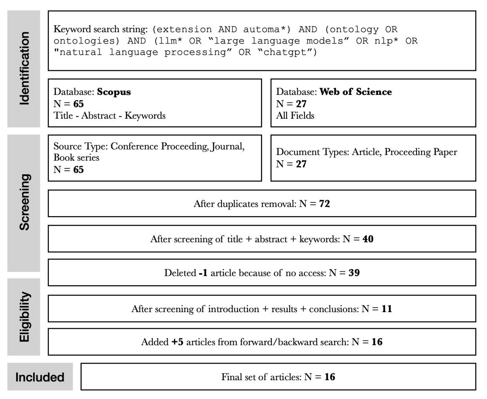

**Figure 1.1:** Literature selection process. Conducted between mid-November and the beginning of December 2023.

#### <span id="page-13-0"></span>1.2.2. Research gap

The 16 articles reviewed have been analyzed by focusing on 5 criteria considered relevant for the topic:

- 1. **Use of NLP or LLM:** if the proposed methodology employs one of these [Natural Language Processing \(NLP\)](#page-10-5) techniques or [Large Language Models \(LLMs\)](#page-10-4) (or none).
- 2. **Reach:** to what extent the ontology development process is automated, e.g., generation, extension, only knowledge extraction for manual ontology extension, etc.
- 3. **Input:** the way in which the ontology engineer has to provide the data for the proposed tool/methodology.
- 4. **Includes methodology for integration in the [OE](#page-10-2) workflow:** if the proposed solution also includes guidelines or instructions on how to integrate the tool/methodology in the current workflow of the ontology engineer.
- 5. **Shortcomings:** limitations of the proposed solutions.

Based on the described criteria, Table [1.1](#page-14-0) compiles the analysis of the literature conducted. The main findings of this literature review are:

- Most of the currently available solutions are based on NLP.
- In general, most proposals are semi-automatic for both the generation and extension of ontologies. This seems to confirm that keeping a human in the loop is important in these processes, or that the existing technology is not fully mature yet to automate the whole process.
- Most solutions require raw text as an input. Different methodologies, e.g., querying, conversation-based, are not considered in general.

- Almost none of the articles reviewed propose a methodology to showcase how the designed solutions can be implemented in reality and integrated within the manual process.
- The proposed solutions are in general difficult to use, difficult to understand (for both use and explainability of results), difficult to adapt to different domains, and focused on ontologies for specific languages. The evaluation of the outcomes provided by these (semi-)automated tools is widely missing or manual.

From these findings, there is a clear gap in the application of LLMs to the Ontology Engineering  $(OE)$  processes, most certainly due to the novelty of this technology, and how to seamlessly integrate the proposed tools into the human workflow of OE. On the other hand, some of the solutions proposed include remarkable strengths. For example, Cantador et al.  $(2007)$  propose a user-friendly interface that features a collaborative evaluation mechanism and that offers understandable explanations of the ontologies recommended. The work of Funk et al.  $(2023)$  includes publicly available examples of ontologies that are automatically generated by just providing a concept, e.g., "Animals". The methodology designed by Haridy et al.  $(2023)$  includes a thorough verification procedure and metric-based evaluation. Nováček et al.  $(2008)$  propose an integration scheme of the NLP methods with some high-level tasks in the ontology extension process. Last but not least, Mateiu and Groza (2023) have integrated their model in Protégé<sup>4</sup>, an opensource editor and framework for ontology creation, as a plugin. Some of the strengths of these proposed solutions can be incorporated to address the identified problem in this research proposal, such as enhancing user-friendliness and ensuring integration with current ontology extension tasks in the workflow and with widely used OE tools.

<span id="page-14-0"></span>**Table 1.1:** Categorization of the articles based on the criteria: Use of NLP/LLM; Reach; Input; Includes methodology for integration in the OE workflow; and Shortcomings

| $\text{Criteria} \Rightarrow$<br>Source $\downarrow$ | Use of<br>$\text{NLP}$ or<br>$\text{LLM}$ | $\text{Reach}$                                                                                                    | Input                                                                                   | Integration<br>in the $OE$<br>workflow? | Shortcomings                                                                                                                 |
|------------------------------------------------------|-------------------------------------------|-------------------------------------------------------------------------------------------------------------------|-----------------------------------------------------------------------------------------|-----------------------------------------|------------------------------------------------------------------------------------------------------------------------------|
| $1.\text{Cantador et al.}$<br>(2007)                 | $\text{NLP}$                              | Automatic ontology<br>$recombination$ (reuse<br>of existing ontologies).<br>Collaborative Evaluation<br>mechanism | Raw text<br>following<br>$\text{Gold}$<br>Standard<br>$\text{definition}$               | No                                      | Automation only covers<br>$\text{recombination of}$<br>existing ontologies for<br>reuse                                      |
| $2 \text{ de Vries et al.}$<br>(2008)                | $\text{NLP}$                              | $\text{Semi-automated}$<br>extension of ontology                                                                  | Raw text<br>$(\text{web search})$<br>results)                                           | $\text{No}$                             | Tailored to maritime<br>shipping industry;<br>systematic evaluation of<br>results is not described<br>$(\text{manual})$      |
| $3.Nov\acute{a}\check{c}ek$ et al.<br>(2008)         | $\text{NLP}$                              | Semi-automated<br>extension of ontology                                                                           | Raw text<br>$(\text{web search})$<br>results, e.g.,<br>Wikipedia)                       | Yes                                     | $\text{Methodology for}$<br>integration is<br>$abstract/high-level;$<br>systematic evaluation of<br>results barely described |
| $4.\nRodríguez et al.$<br>(2008)                     |                                           | Automated identification<br>of entries that can be<br>added to an existing<br>$\text{ontology}$                   | $Raw$ text<br>$(\text{words})$                                                          | No                                      | Tailored to Arabic<br>language                                                                                               |
| $5$ .Suchanek et al.<br>(2009)                       | $\text{NLP, Math}$<br>algorithms          | $Automated$ ontology<br>extension                                                                                 | $Raw$ text or<br>semi-<br>structured<br>$\text{documents}$                              | $\text{No}$                             | Low explainability of<br>results; systematic<br>evaluation of results is<br>$not$ described                                  |
| $6.$ Cruanes et al.<br>(2010)                        | $\text{NLP}$                              | $Automated$ ontology<br>extension                                                                                 | Semi-<br>structured<br>$\text{documents}$<br>$\text{in} \text{ XML}$<br>$\text{format}$ | $\text{No}$                             | No implementation; not<br>tested; systematic<br>evaluation of results is<br>$not$ described                                  |

<span id="page-14-1"></span> $^{4}$ https://protege.stanford.edu/

| $\text{Criteria} \Rightarrow$<br>Source $\downarrow$ | $\overline{\text{Use of}}$<br>NLP or<br>$\text{LLM}$ | $\text{Reach}$                                                                                                            | Input                                                                            | Integration<br>in the $OE$<br>workflow? | Shortcomings                                                                                                                                                                        |
|------------------------------------------------------|------------------------------------------------------|---------------------------------------------------------------------------------------------------------------------------|----------------------------------------------------------------------------------|-----------------------------------------|-------------------------------------------------------------------------------------------------------------------------------------------------------------------------------------|
| 7. Toti et al. $(2012)$                              | NPL, ML                                              | $\text{Automated extraction of}$<br>knowledge that can be<br>$\text{used for ontology}$<br>$\text{creation}$              | $Raw \text{text}$<br>$(\text{documents})$                                        | $\text{No}$                             | $\overline{\text{Focus on creation of new}}$<br>ontologies rather than<br>extension; no automated<br>extension of ontology;<br>systematic evaluation of<br>results is not described |
| $8.G.$ Zhao and<br>Zhang $(2018)$                    | NLP, ML                                              | Automated ontology<br>$\text{extension}$                                                                                  | $Raw$ text<br>$(\text{words})$                                                   | $\text{No}$                             | Domain-dependent; low<br>$\text{explainability; difficult}$<br>to $\text{implement/use}$                                                                                            |
| 9. Hosseini Pour<br>and Shamsfard<br>(2019)          | Artificial<br>Neural<br>Networks                     | Automatic classification<br>$of \text{ lexical relations}$<br>between words that can<br>be used for ontology<br>extension | Raw text,<br>i.e., words<br>(concatena-<br>tion of word<br>embedding<br>vectors) | No                                      | $T_{\text{ailored to lexical}}$<br>relations (language);<br>difficult to use for users<br>with little $OE$ knowledge<br>(e.g., domain experts)                                      |
| $10.\text{Yilahun et al.}$<br>(2020)                 |                                                      | Automated extraction of<br>concepts that can be<br>used to extend and<br>$\text{ontology}$                                | $Raw \text{text}$<br>$(\text{documents})$                                        | $\text{No}$                             | Tailored to Uyghur<br>language; no automated<br>extension of ontology                                                                                                               |
| $\overline{11. \text{Oba et al.}}$<br>(2021)         | NLP, PLM                                             | Automatic ontology<br>generation                                                                                          | $Raw$ text                                                                       | $\text{No}$                             | Domain-specific<br>ontologies not supported                                                                                                                                         |
| $12.\text{Funk et al.}$<br>(2023)                    | $\text{LLM}$                                         | $\text{Automatic ontology}$<br>generation                                                                                 | $\text{Concept in}$<br>$\text{natural}$<br>language,<br>e.g.,<br>"Animals"       | $\text{No}$                             | Manual and subjective<br>evaluation of generated<br>$\text{ontology; only concept}$<br>hierarchy can be<br>$\text{generated (basic)}$<br>$\text{ontology}$                          |
| $13.$ Haridy et al.<br>(2023)                        | $\text{NLP}$                                         | Semi-automatic ontology<br>$\text{extension}$                                                                             | Initial<br>$\text{ontology}$<br>plus raw<br>text                                 | Yes                                     | $Proposed$ integration<br>$\text{ methodology is mainly}$<br>$\text{manual}$                                                                                                        |
| 14. Mateiu and<br>$\text{Groza (2023)}$              | $\text{LLM}$                                         | $\text{Automatic ontology}$<br>$\text{generation and extension}$                                                          | $Raw$ text<br>$(\text{sentences})$                                               | $\text{No}$                             | No workflow integration<br>suggested; systematic<br>evaluation of results is<br>$not$ described                                                                                     |
| 15. Straková et al.<br>(2023)                        | $\text{LLM}$                                         | Automated<br>$\text{pre-annotation of words}$<br>that can be used for<br>$\text{ontology extension}$                      | $Raw$ text<br>$(\text{words})$                                                   | $\text{No}$                             | Tailored to lexical<br>relations (language);<br>tailored to Czech<br>language; Manual<br>evaluation process based<br>only on $4$ levels                                             |
| $16.$ Zaitoun et al.<br>(2023)                       | $\text{LLM}$                                         | Semi-automatic<br>extension of ontology                                                                                   | $Raw$ text<br>$(\text{medical})$<br>guideline)                                   | No                                      | No workflow integration<br>suggested; systematic<br>evaluation of results is<br>not described (manual);<br>specific to medical<br>domain                                            |

To address the gaps identified in the current research, this document focuses on developing a semi-automated, userfriendly approach for extending existing ontologies, facilitated by LLMs. This approach is accompanied by clear guidelines on how to effectively utilize these models. Specifically, we will examine the existing process of ontology extension, identifying the primary challenges it faces. By analyzing the NLP capabilities of LLMs and reviewing recent advancements in applying LLMs to OE, we will establish a mapping between key OE tasks and the potential of LLMs to support them. A key strength of this research lies in its user-centered approach, which contrasts with existing solutions that predominantly focus on the technology and its performance in automation (e.g., can human ontology engineers be entirely replaced by LLMs?). The literature on applying LLMs to OE consistently points to the necessity of a human-in-the-loop approach. Furthermore, by exploring the current landscape of ontology engineering and evaluating the capabilities of [LLMs](#page-10-4) in this context, we can distinguish effective practices from ineffective ones and incorporate these insights into our proposed solution. In the following chapters, we will provide a detailed explanation of the rationale behind this contribution.

#### <span id="page-16-0"></span>1.2.3. Main research question

Based on the analysis of the literature, the main findings, and the strengths discovered, the research question for the problem introduced is:

#### *How can [LLMs](#page-10-4) be integrated into a semi-automated and domain-independent process for the extension of existing ontologies?*

Note that the focus of the research question is on the extension of existing ontologies rather than on the generation of new ontologies. The use of ontologies is not a recent subject, with numerous ontologies already established across various domains. At [TNO](#page-10-0), the practice of extending ontologies is routine, given the constant evolution of the domains [TNO](#page-10-0) engages in, spurred by technological advancements and regulation changes. Importantly, extending pre-existing ontologies not only aligns with the swift pace of change but also fosters interoperability, reuse, and data standardization. This emphasis additionally contributes to narrowing the scope of this thesis research project.

## <span id="page-16-1"></span>1.3. Research approach

The current focus on the development of [LLMs](#page-10-4) is on generic tasks such as text classification, question answering, information extraction, sentiment analysis, and coding (Kalyan, [2024](#page-95-4)). As shown within the literature review presented in the previous chapter, there is not so much work on using [LLMs](#page-10-4) specifically for [OE.](#page-10-2) Existing work tackles small tasks such as automatically adding a simple and well-defined concept to an existing ontology (Mateiu & Groza, [2023](#page-96-7)), or automatically generating a small ontology from a relatively simple concept (Funk et al., [2023\)](#page-94-1). These applications, though very promising, might not be useful right now for ontology engineers.

This research project aims to disentangle the complexities associated to the introduction of [LLMs](#page-10-4) in the socio-technical process of extending ontologies. Research carried out so far shows that there is much work to be done for the effective application of [LLMs](#page-10-4) to the different [OE](#page-10-2) tasks and for the integration of [LLMs](#page-10-4) into human-in-the-loop approaches that involve experts for enhanced [OE](#page-10-2) processes (Giglou et al., [2023\)](#page-95-1).

Moreover, apart from the performance, other criteria are crucial to assess whether an LLM can be used for extending an ontology. For example, confidentiality, which depends on the domain that the ontology represents, or context window/token length, which depends on the specific application within a domain, or even specific use cases for the LLM regarding the extension of the ontology. Therefore, no single LLM-based artifact fulfills all the requirements for all the different use cases. Moreover, the rapid evolution of [LLMs](#page-10-4) is outpacing regulatory frameworks, leading to considerable uncertainty regarding their appropriate use. With these findings, we conclude that the result of this research must be a process framework for the seamless integration of [LLMs](#page-10-4) in the process of extending ontologies that does not prescribe the use of [LLMs](#page-10-4) but describes how they can be effectively used within the current ontology extension workflow. This framework should provide clear guidelines for human-LLM collaboration and serve as a knowledge contribution to research focused on the design of systems that include both, human expertise and technical innovation. The goal is that the framework can be implemented by [TNO,](#page-10-0) but also generalized so that it can be used within any institution. The process should also be applicable to any ontology regardless of the domain, i.e., agriculture, construction, business, health, etc. The [Design Science Research \(DSR\)](#page-10-6) approach is the chosen one for this research proposal.

#### Advantages

The [Design Science Research \(DSR\)](#page-10-6) approach is a widely known, studied, and developed approach within academia. Within [Information Systems \(IS\),](#page-10-14) there are extensive frameworks available (see Hevner and Chatterjee [\(2010](#page-95-5)), Johannesson and Perjons ([2021\)](#page-95-6), and Peffers et al. [\(2007\)](#page-97-4)). Thus, selecting this research approach provides a significant advantage by providing robust and extensive guidance throughout the research process.

Despite the great level of detail of design science frameworks compared to other more high-level ones, they allow for flexibility and adaptability. These approaches usually propose an iterative process in which the design is constantly reviewed and updated. This positively contributes to the quality of the final design.

#### Limitations

Approaching the problem from the design perspective also has some disadvantages. Designing in complex sociotechnical systems is a subjective task that implies numerous design choices. These choices should be objectively based on well-defined requirements, which in turn are based on objectively gathered data. However, a complete detachment from the system is often impossible, and therefore it is important to acknowledge the various sources of bias the designer is exposed to during the designing process.

While the [DSR](#page-10-6) approach is more specific than other approaches (such as the qualitative approach) can be highly flexible as discussed above and can be combined with different research methods, there is a risk that certain high-level aspects may be overlooked (e.g., the regulatory context regarding [AI](#page-10-1) and [LLMs](#page-10-4)). To overcome these limitations, it is important to maintain a broader view when eliciting requirements for the framework to be designed, for instance by paying special attention to the European Artificial Intelligence Act (European Parliament and Council of the European Union, [2021](#page-94-5)).

#### <span id="page-17-0"></span>1.3.1. Research sub-questions and Research Flow Diagram

From the main research question presented before – *How can LLM-based tools be integrated into a semi-automated and domain-independent process for the extension of existing ontologies?* – and framed by the [Design Science Research](#page-10-6) [\(DSR\)](#page-10-6) approach by Johannesson and Perjons ([2021](#page-95-6)), the following research sub-questions have been posed:

• **Sub-question 1:** *How does the current manual process to extend existing ontologies look like and what are the issues that ontology engineers are experiencing?*

This sub-question fits in the first activity of the [DSR](#page-10-6) framework: understanding and explicating the problems perceived by the practitioners (the ontology engineers) in a practice (the ontology extension process). To answer it, qualitative, empirical data is needed. These data can be gathered through semi-structured interviews with experts (ontology engineers and [LLMs](#page-10-4) experts) at [TNO.](#page-10-0) Because there is no standard process for ontology extension, we need to extract this information directly from the daily practice of ontology engineers. This practice is accompanied by a set of tools and a group of diverse stakeholders, that we will also explore in the interviews. Within these exploratory conversations, out-of-the-box perspectives on the problem may flourish, but the researcher must be aware of the subjectivity of the ideas proposed by the practitioners. Thus, we will analyze the raw data from the interviews by applying content analysis, based on the work of Erlingsson and Brysiewicz [\(2017](#page-94-6)) and Seljemo et al. [\(2024\)](#page-97-5). Using the data gathered, and as suggested by Johannesson and Perjons ([2021\)](#page-95-6), the root cause of the problem can be unraveled and explained using an Ishikawa diagram. The goal is to have a clear picture of how ontology engineers currently work and experience first-hand their struggles regarding the process of extending existing ontologies. In addition, we will explore why [LLMs](#page-10-4), though available and easily accessible, are still not widely used for ontology engineering, and what opportunities ontology engineers perceive for the successful integration of [LLMs](#page-10-4) in their ontology extension workflow.

• **Sub-question 2:** *What are the requirements for a human-LLM collaboration framework for ontology extension?*

Once we have understood the ontology extension process and the major problems associated with it, we will establish the requirements that can address these problems and ultimately facilitate the ontology extension process. Stakeholders may have limited familiarity with eliciting requirements for an LLM-based process framework due to their relatively low experience in utilizing [LLMs](#page-10-4) and the absence of established standards and guidelines in this emerging field. Academic literature on the topic of human-in-the-loop approaches for ontology engineering using [LLMs](#page-10-4) is scarce, thus, most requirements will be based on the findings from the previous sub-question. Johannesson and Perjons ([2021\)](#page-95-6) propose several methods for requirements elicitation such as conducting surveys, questionnaires, forming focus groups, etc. The authors mention observation studies as an effective method to define additional requirements in contexts where the stakeholders might not be able to produce requirements themselves. Thus, a simple prototype can be created and presented in a focus group including ontology engineers and [LLMs](#page-10-4) experts, to validate the design and iterate it with the expert feedback provided. The final process framework aims to guide ontology engineers on how to collaborate with the [LLMs](#page-10-4) to exploit their full potential.

#### • **Sub-question 3:** *What does the design of an integrated process framework for human-LLM collaboration for ontology extension look like?*

With the list of requirements outlined in the previous sub-question, in SQ3 we proceed to design and develop the process framework artifact that meets these requirements, addressing the issues in the ontology extension process and aligning with the needs and values of ontology engineers at [TNO](#page-10-0). To initiate this process, we will review the current [NLP](#page-10-5) capabilities of [LLMs](#page-10-4) and their alignment with the downstream [OE](#page-10-2) tasks involved in ontology extension. To inspire the development of the artifact prototype, we will examine recently published literature on the application of [LLMs](#page-10-4) in [OE](#page-10-2). This examination aims to uncover how researchers are currently utilizing [LLMs](#page-10-4) for various [OE](#page-10-2) tasks, highlighting successful configurations and prompt engineering techniques. Additionally, we will identify existing LLM-based tools that can be integrated into the design prototype. Furthermore, we will evaluate available [OE](#page-10-2) tools that can facilitate the ontology extension process. The outcome of this investigation will be a comprehensive artifact design ready for implementation.

#### • **Sub-question 4:** *How can the framework be demonstrated and evaluated with a specific use case and to what extent does it improve the status quo?*

In this last activity of the [DSR](#page-10-6) cycle covered by SQ4, we demonstrate and evaluate the prototype designed in the previous activity. To do so, we have selected a real use case. We will use the human-LLM collaboration process framework to extend the [Common Greenhouse Ontology \(CGO\)](#page-10-7)[5](#page-18-0) (Bakker, van Drie, et al., [2021](#page-93-3); Verhoosel et al., [2023\)](#page-98-8) with the use case [Semantic Explanation and Navigation System \(SENS\)](#page-10-8). The [CGO](#page-10-7) is a semantic representation of knowledge about high-tech greenhouses and their components, that is intended to become the standard in the greenhouse sector (Bakker, van Drie, et al., [2021\)](#page-93-3). The designed process framework can be applied to extend any type of domain ontology. The choice of the [CGO](#page-10-7) is a good representation of a rapidly evolving domain, in which different technological innovations are being increasingly adopted, such as autonomous systems. Therefore, the knowledge representing the greenhouse sector needs to be extended frequently. This project was successfully developed by [TNO,](#page-10-0) and therefore we have at our disposal the manually extended [CGO](#page-10-7) with the [SENS](#page-10-8) use case, which will serve as our gold standard. During the demonstration, we will test the process framework prototype with this use case and refine the design if necessary. Subsequently, both the output of the designed process framework and the framework design itself will be evaluated against the established design requirements. The goal of this sub-question is to demonstrate and evaluate the quality of the proposed artifact compared to the baseline scenario in which no LLM or LLM-based tool is applied (status quo).

The [Research Flow Diagram \(RFD\)](#page-10-11) displayed by Figure [1.2](#page-19-1) summarises the research sub-questions, the research methods, and the data analysis tools, and it frames them using the [Design Science Research \(DSR\)](#page-10-6) framework by Johannesson and Perjons [\(2021](#page-95-6)). The output for each sub-question is used as the input for the next sub-question in the research. Thus, the results of the analysis of the problem carried out by analyzing the content of the interviews conducted during the first activity of the [DSR](#page-10-6) cycle will be used to elicit the design requirements. These requirements, formulated and validated within Activity 2, will guide the design prototyping in Activity 3. Activities 4 and 5 of the [DSR](#page-10-6) approach proposed by Johannesson and Perjons [\(2021](#page-95-6)) have been merged into one activity. Within this activity, the design prototype from the previous activity will be demonstrated and evaluated using a real use case. Note that there can be iteration in every phase of the framework, but especially during the design and its demonstration and evaluation when the design prototype can be refined using the insights gathered from utilizing the artifact with a real use case.

<span id="page-18-0"></span><sup>5</sup><https://gitlab.com/ddings/common-greenhouse-ontology>

<span id="page-19-1"></span>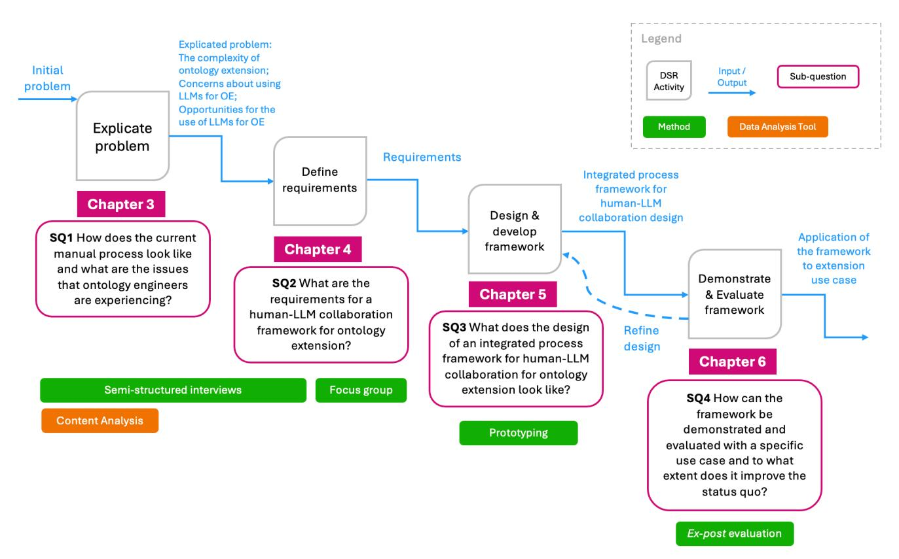

**Figure 1.2:** Research Flow Diagram. Adapted from Johannesson and Perjons ([2021](#page-95-6)).

# <span id="page-19-0"></span>1.4. Link to MSc program

In the last decades, the world has been experiencing profound digitization across all areas of knowledge and information. This disruption is affecting how businesses and institutions organize their ecosystems (Ducuing, [2020\)](#page-94-7), where data sharing and standardization factors are key. Ontologies are important enablers for the success of these factors (Gruber, [1995](#page-95-7); Poveda-Villalón et al., [2020](#page-97-6)). From the hand of digitization, [AI-](#page-10-1)powered systems emerge. These systems enable the automation of repetitive, complex, or cumbersome tasks previously done manually. Some authors talk about the [AI](#page-10-1) Revolution and compare it to the industrial and digital revolutions (Makridakis, [2017](#page-96-8)). Indeed, the effective integration of [AI](#page-10-1) systems in our current socio-technical systems is a complex and ongoing challenge.

Automating the process of ontology generation has been attempted since the 1990s (Neuhaus, [2023\)](#page-96-2). But, according to Neuhaus ([2023,](#page-96-2) p. 401), "*there are no widely adopted ontologies that are automatically created by ontology learning techniques*". The author argues that developing an ontology is not just representing the knowledge on a specific domain but building consensus. Thus, generating an ontology is not only a technical challenge but a social one. According to this author, [LLMs](#page-10-4) will never replace ontology engineers, or at least not in the near future. A hybrid approach, combining both human knowledge and technical support, seems to be inevitable.

Since the release of ChatGPT, the use of this tool has raised concerns across domains, countries, and institutions (Dwivedi et al., [2023](#page-94-8)). These societal concerns pertain to issues such as bias, fairness, explainability, and interpretability of the model's output regarding the generation and extension of ontologies, as described by Pan et al. ([2023\)](#page-97-7). These concerns cannot be overlooked because ontologies represent common and agreed knowledge on a domain, and are used to standardize systems and communication between organizations, and therefore they have an impact on society (Funk et al., [2023\)](#page-94-1). Thus, looking at the integration of [LLMs](#page-10-4) in this process cannot be done through a technical lens only. Here is where the complex socio-technical perspective comes into play, bringing a new angle into one of the big challenges of our era.

The master's program in [Complex Systems Engineering and Management \(CoSEM\)](#page-10-15) focuses on the design and introduction of innovative solutions within socio-technical systems. [CoSEM](#page-10-15) makes its students develop a comprehensive mindset that extends beyond technological implementation. It emphasizes the integration of technology within the

existing landscape, considering regulatory frameworks, cultural contexts, and stakeholders' needs and values. The integration of [Large Language Models \(LLMs\)](#page-10-4) into the workflow of ontology engineers as a semi-automated process exemplifies a typical [CoSEM](#page-10-15) project. The ontology extension process is inherently complex, requiring expertise across multiple fields. It involves various stakeholders with diverse roles, needs, and perspectives, all of whom must reach a consensus to share, model, and standardize knowledge into an ontology. Introducing [LLMs](#page-10-4) into this scenario necessitates a systematic approach that prioritizes stakeholders' needs and values. From a purely technical standpoint, a fully automated ontology extension process could be feasible. However, from a socio-technical perspective, the focus is broader, encompassing the quality and usability of the process, and considering recent regulatory developments such as the European Artificial Intelligence Act. It is not solely about technical performance measured by the output but also about using [AI](#page-10-1) to complement, rather than replace, the expertise of ontology engineers. This hybrid approach aligns with [CoSEM'](#page-10-15)s perspective, balancing technological innovation with human expertise and traditional [Ontology](#page-10-2) [Engineering \(OE\)](#page-10-2) techniques.

# 2 Background

<span id="page-21-0"></span>In this chapter, we give a brief overview of the key concepts of this research topic. First, we define the concept of ontology and the main terminology in the field. Second, we give a quick summary of [Ontology Engineering](#page-10-3) [Methodologies \(OEMs\)](#page-10-3). Third, we introduce [TNO](#page-10-0), the relevant unit and department in which this research project is realized, and its ontology engineering community. Finally, we shortly address the field of [Large Language Models](#page-10-4) [\(LLMs\)](#page-10-4) and its connection with the topic of ontology engineering.

## <span id="page-21-1"></span>2.1. Ontologies

Ontology, in its philosophical sense, is the knowledge and representation of reality. An ontology, in the field of Computer Science, is a formal model or structure to represent knowledge, as a shared understanding of reality (Guarino et al., [2009](#page-95-0)). Already in the 90's, Gruber [\(1995](#page-95-7)) defined an ontology as "*an explicit specification of a conceptualization*" Gruber [\(1995](#page-95-7), p. 908). Conceptualizing knowledge implies making assumptions and simplifications to model the complexity of reality with a purpose. The purpose of an ontology is a crucial aspect of its development. Ontologies can be created to represent a shared vocabulary in a specific domain or to be integrated within a knowledge-based system with specific requirements. The purpose of the ontology plays a big role in its design and development. There are different ways in which ontologies can be classified. In this work, we want to point out the distinction between reference ontologies and operational ontologies made by Falbo [\(2014](#page-94-9)). For Falbo [\(2014](#page-94-9)) a reference ontology is closer to a standard vocabulary, with a focus on representation adequacy. On the contrary, operational ontologies focus on computational capabilities. From one reference ontology, different operational ontologies could be conceptualized. In this work, we focus on operational ontologies, i.e., domain ontologies that are integrated within an information system and that need to be extended.

An ontology consists of concepts and relations, and it can therefore be visualized as a graph with nodes and links. Concepts (nodes) are related by different properties (links). These concepts and relations are formalized using [Description Logics \(DL\)](#page-10-16), and thanks to this formal, logic-based, and explicit representation it is possible to deduce or infer implicit knowledge (Baader et al., [2005](#page-93-4)), or in other words, to reason (Guarino et al., [2009\)](#page-95-0). In a nutshell, this is why in the last decades ontologies have been used within [Artificial Intelligence \(AI\)](#page-10-1) systems (Chandrasekaran et al., [1999;](#page-93-5) Neuhaus, [2023\)](#page-96-2). Ontologies play a crucial role on the Semantic Web, the machine-readable version of the World Wide Web (Baader et al., [2005\)](#page-93-4).

[Resource Description Framework \(RDF\)](#page-10-17) is a standard model for data interchange on the web, which uses triples to represent data in subject-predicate-object expressions (Beckett & McBride, [2004](#page-93-6)). [Web Ontology Language \(OWL\)](#page-10-18) is a more expressive language built upon [RDF](#page-10-17), designed to represent rich and complex knowledge about things, groups of things, and relations between things (McGuinness & van Harmelen, [2004](#page-96-9)). Turtle (Terse [RDF](#page-10-17) Triple Language) is a syntax for writing [RDF](#page-10-17) data in a compact and human-readable format, simplifying the creation and maintenance of [RDF](#page-10-17) data (Beckett et al., [2014\)](#page-93-7).

Represented in any form, ontologies can be applied to different domains to semantically describe concepts and relations between these concepts, enabling a common understanding and therefore facilitating data sharing, data quality, and interoperability (Obrst, [2003\)](#page-97-0).

Figure [2.1](#page-22-2) shows a visualization of a simple ontology following the [OWL](#page-10-18) syntax. In this example ontology there are 3 classes: University, Student, and City. The class University is related to the class Student via the Object Property *hasStudent*, and related to the class City via the Object Property *isLocated*. The Individuals of the class Student have

<span id="page-22-2"></span>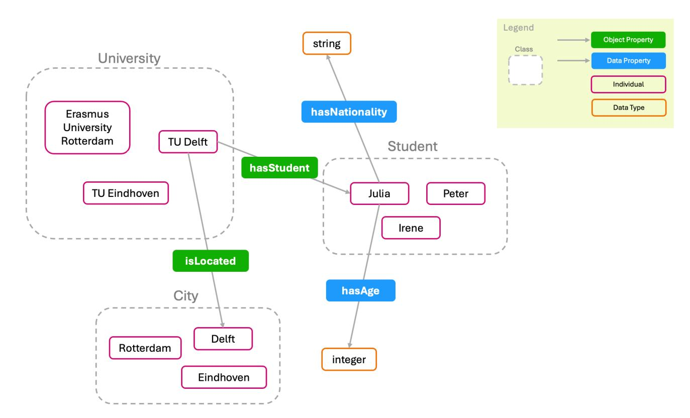

2 Data Properties, *hasNationality* and *hasAge*. These are string (text) and integer (number) data types, respectively.

**Figure 2.1:** A simple example of an ontology following the [OWL](#page-10-18) syntax (own creation).

# <span id="page-22-0"></span>2.2. Ontology Engineering Methodologies

According to Kotis et al. ([2020](#page-96-0)), [Ontology Engineering Methodologies \(OEMs\)](#page-10-3) support the development, maintenance, and evolution of ontologies, ensuring they effectively solve specific problems and meet stakeholder needs throughout their lifecycle. [OEMs](#page-10-3) emphasize the active involvement of knowledge engineers, domain experts, and other stakeholders in all phases, from specification and development to exploitation and evaluation. These collaborative approaches, facilitated by specialized [Ontology Engineering \(OE\)](#page-10-2) tools, not only ensure the quality of the developed ontology but also of the process of developing the ontology itself.

Despite the acknowledged benefits of using [OEMs,](#page-10-3) there are no standard methodologies that are fully applied for ontology development, and only some parts of these methodologies are used for some projects. Thus, different companies, teams, and even projects use different methodologies depending on the preferences of the ontology engineers or the characteristics of the project (Peroni, [2017](#page-97-8)). Some [OEMs](#page-10-3) focus on the participation and collaboration of different stakeholders (Kotis & Vouros, [2006](#page-96-10)), others focus on the development of reference and operational ontologies with a clear purpose and based on a well-defined set of requirements and [Compentency Questions \(CQs\)](#page-10-10) to clearly define the ontology's scope (Falbo, [2014](#page-94-9)), others aim to facilitate the formalization of domain knowledge into an ontology prototype for users with less [OE](#page-10-2) experience, such as domain experts (De Nicola & Missikoff, [2016\)](#page-94-10), and some others adopt the incremental development process known as *agile* and widely used in Software Engineering and combine it with [CQs](#page-10-10) and other [OE](#page-10-2) patterns (Peroni, [2017\)](#page-97-8).

<span id="page-22-1"></span>An important part of some of these [OEMs](#page-10-3) is the use of [Compentency Questions \(CQs\).](#page-10-10) As mentioned above, [CQs](#page-10-10) define the scope of the ontology by outlining what should be included in the ontology. [CQs](#page-10-10) are the questions that the developed ontology should be able to answer, and otherwise, the ontology development is not finished (Monfardini et al., [2023\)](#page-96-11). Thus, [CQs](#page-10-10) are defined at the initial phases of the ontology development process and used in the last phases to verify the generated ontology. [CQs](#page-10-10) are like design requirements in the [Design Science Research \(DSR\)](#page-10-6) approach, or like system requirements in Systems Engineering. [CQs](#page-10-10) are widely used by the [OE](#page-10-2) community (Monfardini et al., [2023\)](#page-96-11), also inside [TNO](#page-10-0).

# 2.3. [TNO](#page-10-0)

The [Dutch Organization for Applied Scientific Research \(TNO\)](#page-10-0), is an independent, non-for-profit research organization in the Netherlands that focuses on the development of innovations to make a positive impact in society, bridging academia, industry, and government. [TNO](#page-10-0) collaborates with other companies, institutions, and public organizations such as universities and the Dutch government to accelerate industrial and societal transitions. [TNO](#page-10-0)'s projects revolve around the fields of applied sciences and technology, and address topics such as sustainability, healthcare, the energy transition, or the secure digitization of society (TNO, [2024](#page-98-4)). The unit [ICT](#page-10-13), Strategy and Policy is one of the 9 units [TNO](#page-10-0) is composed of (TNO, [n.d.\)](#page-97-9). The Data Science department is one of the multiple expertise groups within this unit. The focus of this group is on hybrid [AI](#page-10-1) topics that include explainable [AI](#page-10-1), fairness and bias; conversational [AI](#page-10-1) and [NLP](#page-10-5) technologies (such as [LLMs\)](#page-10-4); privacy-enhancing technologies; and semantic technologies and infrastructures for standardization, interoperability, and data sharing (such as ontologies). Therefore, this research project integrates two key areas of focus within the Data Science department.

The [OE](#page-10-2) community within the Data Science department at [TNO](#page-10-0) develops and maintains several ontologies across various domains, including the energy sector, the talent acquisition industry, and the greenhouse sector. Developing and extending ontologies is a common practice. In parallel, researchers in the Data Science department recognize the synergies between [LLMs](#page-10-4) and [OE.](#page-10-2) The research presented in this document is not the first conducted by the Data Science team and is unlikely to be the last.

#### <span id="page-23-0"></span>2.3.1. [TNO](#page-10-0)'s [OE](#page-10-2) methodology: REPRO

Exemplifying the conclusions drawn by the research of Kotis et al. ([2020\)](#page-96-0), the [OE](#page-10-2) community in [TNO](#page-10-0)'s Data Science department developed their custom methodology and set of best practices named REPRO: *Recommended Engineering PRactices for Ontologies* (Bakker, van Bekkum, et al., [2021](#page-93-8)). Drawing from their extensive practical experience in developing semantic standards, the members of the REPRO group recognized the challenges in the [OE](#page-10-2) process. These challenges are faced not only by novice ontology engineers but also by experts in the field. Consequently, they decided to create a comprehensive guide that outlines a set of principles and best practices. This guide aims to facilitate the [OE](#page-10-2) process by adapting proven [OE](#page-10-2) methods and widely accepted best practices to their specific way of working. The *REPRO Handbook* compiles this knowledge in form of an internal online documentation. An screenshot of the *REPRO Handbook* can be seen below in Figure [2.2.](#page-23-1)

<span id="page-23-1"></span>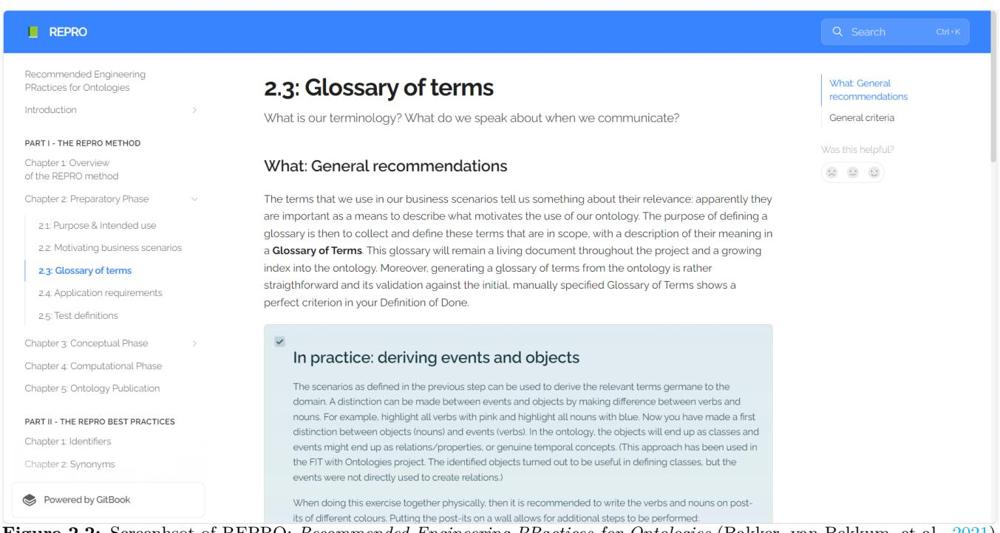

**Figure 2.2:** Screenhsot of REPRO: *Recommended Engineering PRactices for Ontologies* (Bakker, van Bekkum, et al., [2021](#page-93-8)), developed within the Data Science department at [TNO](#page-10-0).

In addition to this documentation, the *REPRO Group* frequently organizes sessions, open to everyone at [TNO](#page-10-0) (inside

or outside the Data Science department), to discuss the topics that are relevant to the [TNO](#page-10-0)'s [OE](#page-10-2) community. They emphasize that the aim of the REPRO Handbook is to compile the insights from these regular discussions, together with their practical experiences and theories coming from the literature into a source of information that helps and inspires ontology engineers at [TNO](#page-10-0) to engineer high-quality ontologies, without prescribing a set of mandatory or fixed steps (Bakker, van Bekkum, et al., [2021\)](#page-93-8).

# <span id="page-24-0"></span>2.4. Ontology Engineering and Large Language Models

Ontologies represent real-world knowledge. Human knowledge is encoded in human language. And [Large Language](#page-10-4) [Models \(LLMs\)](#page-10-4) can process and produce human language. The connection between these two seems obvious, thus this is not the first research, nor it will be the last, on how to apply [LLMs](#page-10-4) to [OE.](#page-10-2) In fact, [Ontology Learning \(OL\)](#page-10-12) is a discipline that combines [Artificial Intelligence \(AI\)](#page-10-1) and knowledge engineering to automatically construct an ontology from structured or semi-structured textual sources (Giglou et al., [2023\)](#page-95-1). Some of the tasks of [OL](#page-10-12) are automatically identifying concepts, their meanings, and their relations to other concepts in texts, and even statements or facts, or in [OE](#page-10-2) terms, axioms (Giglou et al., [2023](#page-95-1)), facilitating or even replacing the manual work in the [OE](#page-10-2) process. These [OE](#page-10-2) and [OL](#page-10-12) tasks are very similar to the [Natural Language Processing \(NLP\)](#page-10-5) capabilities of [LLMs.](#page-10-4)

Within the field of [NLP](#page-10-5), [LLMs](#page-10-4) have gained prominence as powerful tools for both comprehending and generating human-like text (Chang et al., [2024\)](#page-94-2). [NLP](#page-10-5) is a branch of [AI](#page-10-1) focused on enabling computers to understand and interpret human language (Nadkarni et al., [2011](#page-96-3)). [LLMs](#page-10-4), built using the Transformer architecture outlined by Vaswani et al. [\(2017](#page-98-1)), are notable for their complexity and high performance, featuring billions of parameters. [LLMs](#page-10-4) have been trained on huge amounts of data, from books, articles, and websites, which provides them with an important knowledge base (Giray, [2023\)](#page-95-8). Extracting information and processing real-world knowledge are some of the pillars of ontology development.

#### Prompt Engineering

Frequently utilized in conversational contexts, such as ChatGPT – OpenAI's conversational version of [Generative](#page-10-9) [Pre-trained Transformer \(GPT\)](#page-10-9)[1](#page-24-1) – [LLMs](#page-10-4) are capable of contextualizing and learning from human prompts (Chang et al., [2024\)](#page-94-2). Prompting an LLM consists of instructing the model what to do in natural language (Giray, [2023\)](#page-95-8). Prompts can be as simple as a question and as elaborate as a full text decomposed into several parts with instructions, context, examples, and a defined output format. The quality of the prompts has a demonstrated positive impact on the quality of the output (Marvin et al., [2024](#page-96-12)), but longer prompts do not lead to better results. These intricacies associated with prompting [LLMs](#page-10-4) have led to the emergence of a new discipline called Prompt Engineering. Marvin et al. ([2024,](#page-96-12) p. 389) define Prompt Engineering as "*the practice of developing and optimizing prompts to efficiently use language models (LMs) for a variety of applications*". Prompt Engineering has the potential to enhance the application of [LLMs](#page-10-4) to [OE](#page-10-2) by providing more control over the model's output on the [OE](#page-10-2) tasks that require a very formalized format. But different [OE](#page-10-2) tasks might require different prompting techniques. Some of the multiple Prompt Engineering Techniques are:

- **Zero-shot**. This simple method consists of prompting the model once (e.g., asking a question) without giving any examples, context, or further instructions. It refers to the ability of the model to perform a task accurately without any prior training examples or specific task-related instructions, relying solely on its pre-existing knowledge and generalization capabilities (Kojima et al., [2022](#page-96-13)).
- **Few-shot**. In this method, a limited number of examples of how to produce an output for the task is provided to the model. This technique enables in-context learning and improves the model's performance in more complex tasks compared to zero-shot (Reynolds & McDonell, [2021\)](#page-97-10).
- **[Chain-of-Thought \(CoT\)](#page-10-19)**. Within this technique the model is encouraged to generate a series of intermediate reasoning steps that lead to the final answer, thereby improving its problem-solving accuracy and interoperability (Diao et al., [2024](#page-94-11)).
- **Prompt Chaining**: Similarly to decomposed prompting, within this technique, the task is divided into several simpler parts so that multiple prompts are sequentially linked together, allowing each intermediate output to serve as input for the next step, thereby enabling more complex tasks to be performed and enhancing the overall reasoning capability of the model (Sun et al., [2024\)](#page-97-11).
- **[Retrieval-Augmented Generation \(RAG\)](#page-10-20)**. Though not exactly a prompting method, this technique enhances text generation by incorporating relevant information retrieved from an external knowledge base or

<span id="page-24-1"></span><sup>1</sup><https://openai.com/>

dataset. This method combines the capabilities of retrieval mechanisms to access pertinent data and generative models to produce coherent and contextually enriched outputs, resulting in more accurate and informative responses (P. Zhao et al., [2024\)](#page-98-9). [RAG](#page-10-20) could be a promising technique for the engineering of domain ontologies by allowing the model to retrieve the domain information that the ontology engineers or domain experts specify about the domain.

3

# <span id="page-26-0"></span>Analyzing the problem of ontology extension

The chapter below describes the process followed to answer SQ1: *How does the current manual process to extend existing ontologies look like and what are the issues that ontology engineers are experiencing?*. Through a round of semi-structured interviews with ontology engineers and some experts in [LLMs](#page-10-4) with experience in [OE](#page-10-2), their actual approach to extending and ontology can be modeled; and the complexity in the ontology extension process is revealed, and presented in an Ishikawa diagram[1](#page-26-3) , as suggested by Johannesson and Perjons [\(2021](#page-95-6)). Furthermore, the concerns about the use of [LLMs](#page-10-4) for the process of [OE](#page-10-2) are identified, and the main opportunities that the interviewees perceive for the application of [LLMs](#page-10-4) to the [OE](#page-10-2) tasks are discussed.

# <span id="page-26-1"></span>3.1. Method: Interviews

To understand a problem, it is crucial to understand the practice in which the problem exists (Johannesson & Perjons, [2021\)](#page-95-6). Because there is no standard [OE](#page-10-2) methodology that explains the practice followed by the ontology engineers at [TNO](#page-10-0), we decided to extract this practice inductively through semi-structured interviews with the practitioners. The utilization of semi-structured interviews allowed for a nuanced exploration of participants' perspectives, experiences, and attitudes related to the complexities in the ontology extension process and the application of [LLMs.](#page-10-4) This method facilitated open-ended discussions, enabling participants to express their thoughts and insights in their own words. Looking at the problem of the application of [LLMs](#page-10-4) to the manual process of ontology extension from a socio-technical perspective, in contrast to a technical one, requires a human-centered approach. Through the interviews with ontology engineers and experts in [LLMs,](#page-10-4) we can understand the struggles that they experience in their daily work, and identify the current problems for the effective application of [LLMs](#page-10-4) to the ontology extension process.

## <span id="page-26-2"></span>3.1.1. Interview protocol

As pointed out by Seljemo et al. [\(2024](#page-97-5)), this inductive approach allows to extract the knowledge and perspectives from real experts in the topic and from the potential users of the framework to be designed, and to model their current way of working directly from their daily practices with higher richness in perspectives and experiences. This method aligns with the first activity of the method framework for Design Science proposed Johannesson and Perjons [\(2021](#page-95-6)): understand and explain the problem experienced by the stakeholders of a practice. In this case, the stakeholders are the ontology engineers and the practice is extending an existing ontology.

A total of 11 [TNO](#page-10-0) experts were interviewed (see list in Section [B.0.1](#page-101-1) of Appendix [B](#page-101-0)). The list was crafted based on their role, and aimed at a variety of level of experience, expertise focus, and background. The participants were recruited through [TNO'](#page-10-0)s official channels (MS Teams and MS Outlook), providing the questions beforehand and an Informed Consent Form document that they had to agree with, sign, and send through email before the interview. The potential participants had the freedom to accept or decline their participation, to ask questions at any moment, to allow or not the recording of the interview and the summarized transcript of the interviews to be used within this research project and to be published in the public repository of the Delft University of Technology. The entire data collection method was designed following TU Delft Data Management policy, including a risk management plan approved by the [Human Research Ethics Committee \(HREC\)](#page-10-21). The interviews were held offline and online (through MS Teams), depending on their own preference, and lasted between 30 minutes and 1 hour approximately.

<span id="page-26-3"></span><sup>1</sup>[https://en.wikipedia.org/wiki/Ishikawa\\_diagram](https://en.wikipedia.org/wiki/Ishikawa_diagram)

The interview guide can be found in Section [B.0.2](#page-101-2) of Appendix [B.](#page-101-0) It consists of differentiated parts: one focused on the [Ontology Engineering \(OE\)](#page-10-2) and ontology extension process, and another one focused on the use of [LLMs](#page-10-4) for [OE.](#page-10-2) The purposes of the interviews were:

1. To understand and model the process of ontology extension by:

- Understanding the steps or downstream tasks followed by ontology engineers in practice;
- Identifying the stakeholders most frequently involved in the [OE](#page-10-2) process;
- Identifying the tools that are currently used by ontology engineers for [OE](#page-10-2);
- 2. To identify the problems with ontology extension and the challenges and opportunities of applying [LLMs](#page-10-4) to [OE](#page-10-2) by:
  - Identifying and understanding the main struggles for the ontology engineers in the ontology extension process;
  - Identifying and understanding the concerns about the use of [LLMs](#page-10-4) for [OE](#page-10-2);
  - Identifying perceived opportunities of [LLMs](#page-10-4) for [OE](#page-10-2).

<span id="page-27-0"></span>All the interview summaries are included in Section [B.0.3](#page-102-0) of Appendix [B](#page-101-0).

### 3.1.2. Data analysis

The qualitative, empirical data collected through the semi-structured interviews, in the form of transcriptions and their summaries (raw data) (see Section [B.0.3](#page-102-0) in Appendix [B\)](#page-101-0), has been manually analyzed using Excel tables and performing content analysis, following Erlingsson and Brysiewicz ([2017](#page-94-6)) and Seljemo et al. [\(2024](#page-97-5)).

For the first purpose of understanding the current process of ontology extension, the interviewees were asked to describe the steps they follow to extend an existing ontology, to name the stakeholders involved in the process from their own experiences, and to enumerate the tools they use. This information in combination with desk research and internal [TNO](#page-10-0) documentation about [OE](#page-10-2) practices, such as TNO's internal documentation for best practices in [OE](#page-10-2), REPRO (Bakker, van Bekkum, et al., [2021\)](#page-93-8), has been used to build a flowchart diagram of the current ontology extension process, presented and discussed below in Section [3.2.](#page-27-1)

For the second purpose of identifying the problems in the ontology extension process and regarding the use of [LLMs](#page-10-4), the content of the interviews' transcripts has been analyzed focusing on three overarching themes:

- 1. The complexity of ontology extension.
- 2. Concerns about the use of [LLMs](#page-10-4) for [Ontology Engineering \(OE\).](#page-10-2)
- 3. Opportunities for the use of [LLMs](#page-10-4) for [Ontology Engineering \(OE\)](#page-10-2).

For each of these themes, meaning units have been extracted from the data set (the set of 11 interview transcripts) focusing on the responses to the questions relevant to the theme being analyzed. The meaning units have been condensed and further assigned to broader categories covering the condensed meaning units. These categories have been inductively generated by looking at the condensed meaning units and defining a concept that groups two or more condensed meaning units, following Erlingsson and Brysiewicz ([2017\)](#page-94-6). For each theme, the resulting condensed meaning units and categories have led to the creation of a different visualization to synthesize the data analysis carried on that theme.

<span id="page-27-1"></span>The results of the content analysis for each overarching theme are presented and discussed in Section [3.3.](#page-31-0)

# 3.2. Understanding the process of ontology extension

As ratified by most interviewees, the process of ontology extension is neither static nor linear. It heavily varies depending on different factors such as time and budget constraints for the project (Interviewee 9), the type of ontology, i.e., reference or operational ontology (Interviewee 8), the availability of standards or structured documentation for the domain or specific use case ("Bottom-up approach") or the need to extract the knowledge from the domain experts ("Top-down approach") (Interviewees 3 and 5), and even personal preferences such as the choice of using [Compentency Questions \(CQs\)](#page-10-10) (Interviewee 8). To model the ontology extension process from the point of view of the ontology engineer, we have decided to use a flowchart diagram[2](#page-27-2) (see Figure [3.1\)](#page-30-0), since it allows us to model

<span id="page-27-2"></span><sup>2</sup><https://en.wikipedia.org/wiki/Flowchart>

different downstream tasks (transparent, rounded boxes) and sub-processes that are followed as a result of making a specific choice (grey, rectangular boxes). The tasks performed depend on the experience of the ontology engineer, the type of extension to be made, the availability and quality of the data, documentation and/or standards that can be used for developing the ontology extension, the complexity and quality of the ontology to be extended, and the possibility of reuse of existing ontologies.

In the image's background, the different layers frame the tasks into the phases in the ontology extension process. Inspired by the phases defined by the REPRO Handbook (Bakker, van Bekkum, et al., [2021\)](#page-93-8), as well as by methodologies such as SABiO (Falbo, [2014](#page-94-9)) (widely known in TNO) and HCOME (Kotis & Vouros, [2006](#page-96-10)), the phases considered within this research project are defined in Table [3.1](#page-28-0). Note that phases 5) Exploitation and 6) Validation are left out of the scope in the flowchart diagram since they do not involve the active participation of the ontology engineer, but they do have an impact on the ontology extension process since the feedback coming from the end users in these phases might lead to the revision of one or more of the tasks carried out in the previous phases. The Preparation and Conceptualization phases are the ones with more tasks in the modeled process, according to the flowchart diagram, compared to the Implementation and Verification phases. All decisions that lead to the execution of one task or another also fall within the first two phases. This might indicate that the first two phases entail more complexity in terms of the number of tasks to be executed and the number of decisions to be made.

<span id="page-28-0"></span>**Table 3.1:** Phases in the ontology extension process, inspired by REPRO [\(TNO'](#page-10-0)s internal documentation for [OE](#page-10-2) best practices) (Bakker, van Bekkum, et al., [2021\)](#page-93-8), SABiO (Falbo, [2014](#page-94-9)) and HCOME (Kotis & Vouros, [2006](#page-96-10)).

| Phase # | Phase name        | Goals                                                                                                                                                                                                                                    |
|---------|-------------------|------------------------------------------------------------------------------------------------------------------------------------------------------------------------------------------------------------------------------------------|
| 1       | Preparation       | Familiarize/learn about the ontology, the domain and use case. Define purpose<br>of the ontology and test cases.<br>Decide how to perform the extension, which<br>stakeholders to involve, and find/identify necessary knowledge sources |
| 2       | Conceptualization | Identify main concepts and relations and create a conceptual design of the ontol<br>ogy extension                                                                                                                                        |
| 3       | Implementation    | Write the operational ontology in a formal language (e.g., OWL, RDF). In RE<br>PRO this phase is referred to as ontology formalization (Bakker, van Bekkum,<br>et al., 2021)                                                             |
| 4       | Verification      | Check that the ontology is extended correctly                                                                                                                                                                                            |
| 5       | Exploitation      | Integrate the ontology within an information system exploited by the end users                                                                                                                                                           |
| 6       | Validation        | Check that the correct extension has been added                                                                                                                                                                                          |

An important initial decision to make is whether the extension can be done by adding a single concept to the ontology, e.g., because that concept is missing and/or needed for a specific use case, or if the extension entails a conceptual expansion. This refers to the situation in which a new technical innovation or regulation must be modeled in the ontology, and various concepts and relations must be added (sometimes this entails the creation of a new sub-ontology that must be aligned to the existing one). However, it can be the case that when a conceptual expansion must be developed, the ontology engineer chooses to add all the necessary concepts one by one, which means that the ontology engineer will go over the "single concept" branch in the flowchart several times until all the concepts and relations are added to the ontology. It is worth mentioning that, on the left-hand side of the Conceptualization phase in the flowchart diagram, there is an entangled process covering the tasks and decisions necessary to reuse existing ontologies. Though contributing to the complexity of the process, the reuse of existing standards is regarded as a good practice within the [OE](#page-10-2) community. The complexity added relies on the fact of having to interact with external stakeholders when an external ontology needs to be used (in this sense "external" refers to ontologies developed outside of [TNO\)](#page-10-0). Having to communicate and agree with these stakeholders usually slows down the process. These stakeholders are not included in the ontology extension flowchart since they are out of the scope of this research project.

According to the experiences of the interviewees, the stakeholders currently included in the process are:

• **Ontology Engineer:** They design and develop the ontology extension. Kotis and Vouros ([2006\)](#page-96-10) identify them as *knowledge engineers*, whereas Falbo [\(2014\)](#page-94-9) distinguishes between ontology engineer, ontology designer, ontology programmer, and ontology tester. At [TNO](#page-10-0), all of these responsibilities are grouped into the single role of the ontology engineer, therefore we only include this role. Note that when this stakeholder appears in

the flowchart diagram, it means that the ontology engineer working on the extension collaborates with other ontology engineers within that task.

- **Domain Expert:** They hold the domain knowledge the ontology covers. They are mainly involved in the initial stages to extract the information and requirements needed for the next phases, especially for the Conceptualization phase. They are sometimes referred to as the "customers" of the project (Interviewee 10) since the need for extension is usually initiated at their request. Thus, they are often involved in the verification phase to check that the ontology (extension) designed meets their requirements.
- **Knowledge Worker:** Kotis and Vouros [\(2006](#page-96-10)) define this stakeholder as *"any member of an information production-exploitation community"* (Kotis & Vouros, [2006,](#page-96-10) p. 110). Here, we define this role as the one responsible for importing and integrating the extended ontology within the information system that makes use of it (usually a data scientist or software engineer at [TNO\)](#page-10-0). In some cases, the ontology engineer also plays the role of the knowledge worker to some extent. For example, interviewees 7 and 9 focus on developing operational ontologies to integrate them within the Semantic Treehouse, a vocabulary hub developed by [TNO](#page-10-0) that facilitates semantic interoperability across different organizations and institutions through the creation of messages and data mappings based on standards.

The ontology extension process depicted in Figure [3.1](#page-30-0) also includes the relevant [OE](#page-10-2) tools that are currently used to execute the task at hand. In practice, there are not many tools tailored to [OE](#page-10-2). The [OE](#page-10-2) software most used by ontology engineers at [TNO](#page-10-0) is either TopBraid or Protégé. Some ontology engineers prefer to use a generic [Integrated](#page-10-22) [Development Environment \(IDE\)](#page-10-22) such as Visual Studio Code, together with extensions for [Resource Description](#page-10-17) [Framework \(RDF\)](#page-10-17) and Turtle syntax. For collaborative tasks, such as sharing and reviewing the ontology code, software platforms such as GitHub and GitLab are used. Finally, the verification is carried out manually, by creating a visualization of the ontology extension or the extended ontology and presenting it to other ontology engineers and to the domain experts. The ontology engineers at [TNO](#page-10-0) currently prefer software tools such as draw.io[3](#page-29-0) or MS PowerPoint to create *ad-hoc* visualizations of their ontologies, since automatic visualization tools such as the ones provided as plugins by TopBraid or Protégé, or independent software for ontology visualization such as WebVOWL (Lohmann et al., [2015\)](#page-96-14) do not provide the flexibility they need to generate visualizations that can be easily communicated to all the stakeholders including those with less technical knowledge on [OE,](#page-10-2) such as the domain experts. The topic of ontology visualization was discussed during several internal REPRO sessions.

<span id="page-29-0"></span><sup>3</sup><https://www.drawio.com/>

<span id="page-30-0"></span>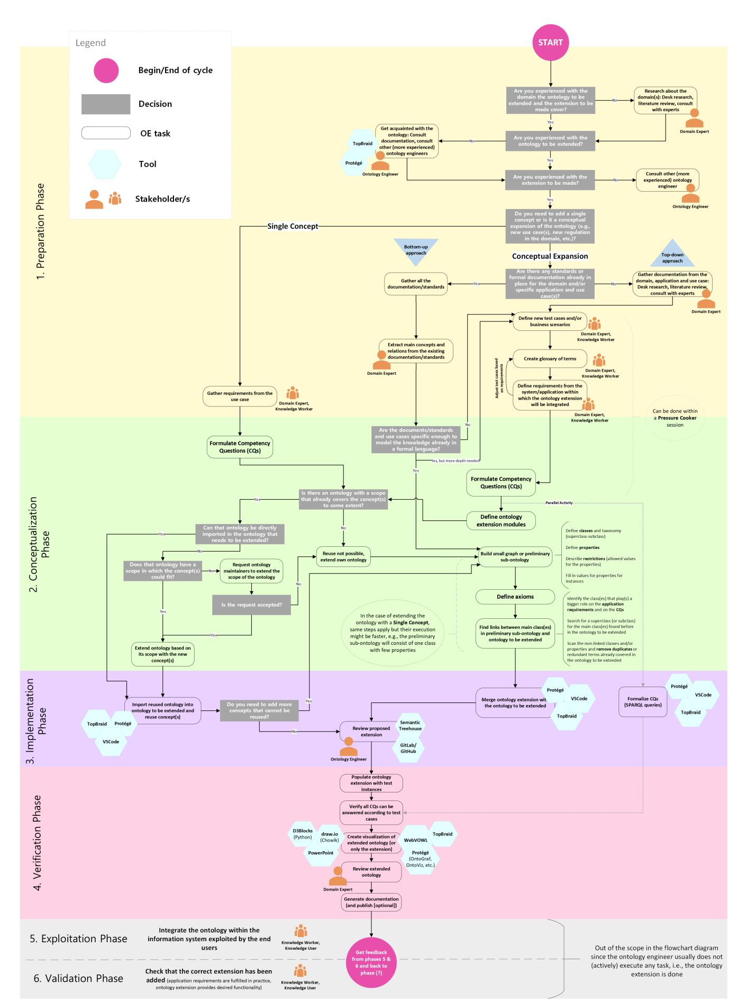

**Figure 3.1:** Current ontology extension process (As-Is) modeled through the empirical data gathered from the interviews, and inspired by REPRO ([TNO](#page-10-0)'s internal documentation for OE best practices) (Bakker, van Bekkum, et al., [2021](#page-93-8)), SABiO (Falbo, [2014\)](#page-94-9) and HCOME (Kotis & Vouros, [2006\)](#page-96-10). Abbreviations: [Compentency Questions \(CQs\),](#page-10-10) [Resource Description](#page-10-17) [Framework \(RDF\).](#page-10-17)

# <span id="page-31-0"></span>3.3. The problems with ontology extension and the application of LLMs

In this section, the results from the content analysis of the interviews in the three overarching themes 1) The complexity of ontology extension; 2) Concerns about the use of [LLMs](#page-10-4) for [Ontology Engineering \(OE\)](#page-10-2); and 3) Opportunities for the use of [LLMs](#page-10-4) for [Ontology Engineering \(OE\)](#page-10-2); are discussed.

#### Theme 1: The complexity of ontology extension

The assumption that the ontology extension process is complex is not true for all the interviewees. Most of the interviewees agree that the complexity of the process depends heavily on the expertise and experience of the ontology engineer, on the level of familiarity with the domain, and on the size and quality of the ontology to be extended. However, all of them claim to have experienced several difficulties in the process of ontology extension.

Focusing on the causes of the complexity of the ontology extension process, seven broader categories have been identified following the content analysis process (described previously in Section [3.1.2](#page-27-0)). Figure [3.2](#page-31-1) shows an example of the analytic process for this theme. The full analysis can be found in Table [B.2](#page-109-0) (Appendix [B](#page-101-0)). As introduced in Section [3.1.2](#page-27-0), the relevant meaning units were compiled using the transcript of the interviews, and focusing on the questions relating to Theme 1. The meaning units are words or sentences (sometimes rephrased sentences to simplify the analytical process) with a meaning related to the theme analyzed. From the meaning unit, one or more condensed meaning units are assigned. These are shorter versions of the meaning units that summarize the content in a few words while trying to maintain the same meaning. Finally, every condensed meaning unit is assigned to a category that we defined by trying to cluster the condensed meaning units into broader groups, taking into account the meaning and context of the condensed meaning unit in relation to the category defined. In this case, the categories group together related problems that, according to the ontology engineers, make the ontology extension process complex.

<span id="page-31-1"></span>

| Interview# | Role of interviewee                              | Theme: The complexity of ontology extension                                                                                             |                                               |              |  |  |
|------------|--------------------------------------------------|-----------------------------------------------------------------------------------------------------------------------------------------|-----------------------------------------------|--------------|--|--|
|            |                                                  | <b>Meaning units</b>                                                                                                                    | <b>Condensed meaning units</b>                | Category     |  |  |
|            | Ontology Engineer,<br>background in formal logic | When concepts to add are very abstract, there is no<br>unique correct way of modeling the data                                          | High abstraction level                        | Process      |  |  |
|            |                                                  |                                                                                                                                         | No single correct answer                      | Process      |  |  |
|            |                                                  | There is a lot of discussion                                                                                                            | Long discussions                              | Stakeholders |  |  |
|            |                                                  | It's difficult to extract the correct information from the<br>domain expert                                                             | Extracting information from domain<br>experts | Stakeholders |  |  |
|            |                                                  | Maintenance of ontologies is manual, changes must be<br>manually reflected everywhere (implementation,<br>visualization, documentation) | Manual maintenance                            | Tools        |  |  |

**Figure 3.2:** Example drawn from the analytic process for the theme: "The complexity of ontology extension". Full analysis in Table [B.2](#page-109-0) (Appendix [B](#page-101-0)).

The Ishikawa diagram presented in Figure [3.3](#page-33-0) compiles these difficulties or problems into seven categories identified through the content analysis of the interviews' data set. This type of visual representation is used to illustrate the potential causes that produce a specific effect. Thus, the causes are the difficulties mentioned by the interviewees, grouped into broader categories that influence the effect "the ontology extension process is too complex":

- **Stakeholders**: refers to the issues related to the inherent complexities of the multi-actor decision-making process for building consensus on the conceptualization of the ontology, and the characteristics of the actors.
- **Process**: refers to the technical process of ontology extension, i.e., covering the tasks performed only by ontology engineers.
- **Governance**: refers to the set of principles used to manage the development, maintenance, and evolution of ontologies.
- **Status quo**: refers to the existing state or condition of the ontology that has to be extended, and the data sources available.
- **Expertise**: refers to the level of experience of the ontology engineers in their role.
- **Domain**: refers to the domain knowledge the existing ontology covers or the specific domain area the extension to the ontology must cover.

• **Tools**: refers to existing software tools of methodologies for ontology extension.

The two first categories, Stakeholders and Process, are the ones with the biggest branches in the diagram. This seems to indicate that these are the categories that influence the most the fact that the ontology extension process is complex. Though not shown in the diagram, there are relations between the problems identified in each category.

Most interviewees mentioned that trying to agree on the knowledge that the ontology or the extension of the ontology must represent often leads to long discussions. Among many other factors, this can be due to the fact that sometimes domain experts do not have the technical knowledge to effectively translate the domain knowledge into a standard – the ontology – that is simple enough, reusable, and compliant with other existing standards, especially when there is a lack of well-structured documentation or standards on the domain or the specific use case to be modeled (related to Category: Domain). Interviewee 3 mentioned that some domain experts are *"too powerful"*, i.e., they want to decide how the data must be modeled, which makes it difficult to build the necessary consensus.

The process of ontology extension often requires a high abstraction level, to successfully capture the main concepts in a domain and the relations between them, but also in a way that meets the requirements of the system in which the ontology must be integrated. This is the most common situation at [TNO:](#page-10-0) the development of operational ontologies that are designed and built to be used within an information system. The complexity of such an abstraction process grows even more when the ontology engineers are not familiar with concepts that need to be added to the ontology (related to Category: Expertise), or because the domain is too complex itself (related to Category: Domain). As mentioned before, the model must be accurate enough to the domain information to be modeled, but simple enough so it can be captured within an ontology.

This accuracy will be higher when more stakeholders with knowledge of not only the domain but also the specific use case are involved in the conceptualization phase of the ontology extension process. However, it is not always the case that all the possible perspectives are present, for several reasons such as time and budget constraints on the project (related to Category: Stakeholders). It was discussed with several interviewees (for example with Interviewee 2), that the ontology engineers and domain experts are the main stakeholders in the process of ontology extension (or in general [OE\)](#page-10-2), but that other roles such as the expert in charge of integrating the operational ontology within the information system (usually a data scientist or software engineer), or even the end users of that information system are rarely involved in the ontology development. As discussed with Interviewee 3, the more variety of stakeholders included, the more richness in the ontology modeled, but the slower the process might get. In contrast, Interviewee 9 disagreed with this statement, arguing that having early expert verification can help the ontology engineers to continue the following stages of the design process with a more refined model and avoid having to make changes when all the information is modeled, often more cumbersome.

<span id="page-33-0"></span>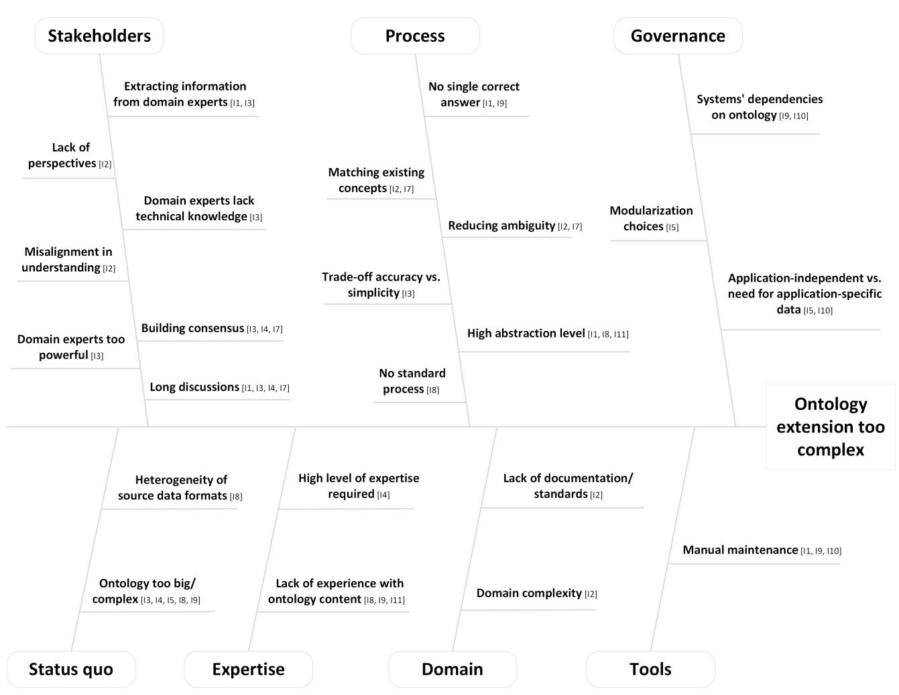

**Figure 3.3:** Ishikawa diagram mapping the problems causing the complexity in the ontology extension process. Based on the content analysis of the data collected through the interviews. Numbers in brackets refer to the interview(s) in which the problem was mentioned/discussed.

Finally, it is worth mentioning that there exists a dilemma between the amount of application-specific data that should be added to an ontology. This concern was discussed with Interviewee 5, who referred to this issue as "Governance" of the ontology, *"when there are multiple use cases"* represented in the ontology.

*"And also another discussion is that sometimes people want to put something in the [[Common Greenhouse](#page-10-7) [Ontology \(CGO\)\]](#page-10-7), or in another ontology, when it may not really be on that level because it may be really application-specific because the application just needs some kind of company-specific property, and then we get the request of: Can we add that to the ontology? Can we add that to the [CGO?](#page-10-7) Well, it may need to be in the application. [...] [T]here might need to be an [\[Resource Description Framework \(RDF\)\]](#page-10-17) property for that, but it does not necessarily need to be in the ontology that's being standardized. And that's also something where I see more of a paradigm discussion about: "Should everything be in the ontology?* (From Interviewee 5).

This issue might need a chapter or even dedicated research on its own. Here, it can be mentioned that this dilemma might have a relevant influence on several identified problems such as the size or complexity of the ontology (Category: Status quo), the systems' dependence on the ontology and the difficult maintenance of having to manually change the code and documentation if a (breaking) change is introduced (Category: Tools). This "interwovenness" between problems illustrates the high complexity that ontology-based systems can present.

#### Theme 2: Concerns about the use of LLMs for Ontology Engineering

The ontology engineers interviewed were asked if they have used [LLMs](#page-10-4) for any task regarding [OE](#page-10-2) or not and if not, what their concerns are for not using them. Following the same methodology as with Theme 1, but this time focusing on the concerns about the use of [LLMs](#page-10-4) for [OE](#page-10-2), six broader categories have been identified throughout the content analysis. In this case, the categories refer to areas of related concerns about the use of [LLMs](#page-10-4) for [OE](#page-10-2), as identified by the interviewees. Some condensed meaning units are associated with two categories. This means that by the conversation and the context, we identified that the concern is related to these two different areas. Figure [3.4](#page-34-0) shows an example of the analytic process for this theme. The full analysis can be found in Table [B.3](#page-110-0) (Appendix [B\)](#page-101-0) The six categories are defined as:

- **Impact**: refers to the effect that using [LLMs](#page-10-4) can have regarding broader societal concerns.
- **[OE](#page-10-2) expertise**: refers to the technical skills and expertise required for the [OE](#page-10-2) tasks.
- **Performance**: refers to the technical functionalities of the [LLMs.](#page-10-4)
- **Regulation**: refers to the regulatory context of [LLMs.](#page-10-4)
- **Skills**: refers to the knowledge needed to effectively use [LLMs](#page-10-4) (for [OE](#page-10-2)).
- **Academic Rigour**: refers to the availability of academic research on the area of [LLMs](#page-10-4) (for [OE](#page-10-2)).

<span id="page-34-0"></span>

| Interview # | Role of interviewee                                    | Theme: Concerns about using LLMs for OE                                                           |                                                                    |                            |  |
|-------------|--------------------------------------------------------|---------------------------------------------------------------------------------------------------|--------------------------------------------------------------------|----------------------------|--|
|             |                                                        | <b>Meaning units</b>                                                                              | <b>Condensed meaning units</b>                                     | Category                   |  |
| 8           | Ontology Engineer, NLP<br>expert, background in AI and | Performance on LLMs for relation extraction is still not<br>great                                 | Not tailored to OE tasks                                           | Performance / OE expertise |  |
|             |                                                        | LLMs lack implicit real-world knowledge that humans<br>possess                                    | Lack of implicit real world knowledge   Performance / OE expertise |                            |  |
|             |                                                        | Safety in the context of confidential data                                                        | Data security                                                      | Impact / Regulation        |  |
|             | linguistics                                            | Perfomance of the LLM depends on the complexity of<br>the data                                    | Variable performance                                               | Performance                |  |
|             |                                                        | Ontology development requires an hybrid approach<br>including both human knowledge and technology | Hybrid approach required                                           | OE expertise               |  |

**Figure 3.4:** Example drawn from the analytic process for the theme: "concerns about the use of [LLMs](#page-10-4) for [OE"](#page-10-2). When a condensed meaning unit is associated with two categories with a "/", it means that that condensed meaning unit is related to both categories. Full analysis in Table [B.3](#page-110-0) (Appendix [B\)](#page-101-0).

<span id="page-35-0"></span>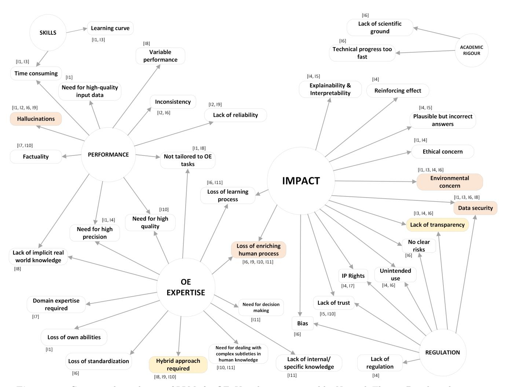

**Figure 3.5:** Concerns about the use of [LLMs](#page-10-4) for [OE.](#page-10-2) Visualization inspired by Network Theory. Based on the content analysis of the data collected through the interviews. Numbers in brackets refer to the interview(s) in which the problem was mentioned. The concerns that were mentioned by at least 4 interviewees are highlighted in orange, and the concerns that were mentioned by at least 3 are highlighted in yellow.

These six categories are represented in Figure [3.5](#page-35-0) as circular nodes. These are bigger if the category (node) has more condensed meaning units associated with it (links), or – in network theory words – if their degree is higher. We have chosen this kind of visualization inspired by network theory because it helps to easily identify the areas of concern deemed more important according to the responses of the interviewees. Thus, in general, the concerns of the interviewees seem to be mostly related to the category of Impact. In fact, the most frequently mentioned concerns are the impact of [LLMs](#page-10-4) in the environment, since running [LLMs](#page-10-4) is resource-heavy in terms of energy consumption, according to the interviewees; the potential loss of the [OE](#page-10-2) human processes that are regarded as enriching for the ontology engineers (e.g., fruitful discussions with stakeholders, learning about different domains, interacting with other experts, building a common vision on the domain knowledge, etc.); and, connected to the regulatory context, the security of the data provided to the LLM, due to potential confidentiality breaches when modeling sensitive information (e.g., defense domain); and the lack of transparency, as [LLMs](#page-10-4) are seen as "black boxes".

On the side of the technical performance of [LLMs,](#page-10-4) the concern of hallucinations is the most mentioned by the interviewees. The concept of "Hallucinations" is already widely used to refer to the fact that sometimes [LLMs](#page-10-4) generate responses that seem correct but that contain wrong information (Ye et al., [2023](#page-98-10)). This is closely related to "Factuality" (Cao et al., [2022](#page-93-9)), or the extent to which the response given by the LLM corresponds to reality. However, according to the definitions given, the fact that the problem of hallucinations is mentioned more often might be related to the general agreement that the output of the LLM must be always verified, preferably by an expert. Thus, factuality can be corrected with human expertise, but hallucinations might be more difficult to spot

by ontology engineers with less experience.

This hybrid approach combining the LLM capabilities with human expertise was indeed mentioned by several interviewees. This is included in the category of [OE](#page-10-2) expertise because, according to the interviewees, the [OE](#page-10-2) field requires a high level of expertise due to the level of abstraction needed to model the information, minimizing ambiguity but maximizing reusability of existing standards and ontologies, in combination with the technical skills required. This seems to support the idea that the application of [LLMs](#page-10-4) to [OE](#page-10-2) is especially challenging, as discussed by authors such as Neuhaus ([2023\)](#page-96-2). The fact that (in general) [LLMs](#page-10-4) are not tools specifically tailored to the needs of the [OE](#page-10-2) tasks (or to many other tasks, as pointed out by Interviewee 6), seems to call for a hybrid approach of ontology extension using [LLMs](#page-10-4).

*"[An LLM is] not a model of the world, [it] is just a model of our language".* (From Interviewee 6).

#### Theme 3: Opportunities for the use of LLMs for Ontology Engineering

Within this final theme for the qualitative analysis of the interviews, the interviewees were asked about the opportunities they believed [LLMs](#page-10-4) can be successfully used regarding [OE](#page-10-2) tasks. Following the same content analysis approach as with the previous two themes, five broader categories are defined. These five categories group the condensed meaning units into some of the phases in the ontology extension process defined in Table [3.1.](#page-28-0) The process for this theme is exemplified in Figure [3.6](#page-36-0). The full analysis can be found in Table [B.4](#page-111-0) (Appendix [B\)](#page-101-0). The suggested potential applications of [LLMs](#page-10-4) to [OE](#page-10-2) activities are grouped into:

- **Preparation**: refers to the [OE](#page-10-2) tasks within the preparation phase in the ontology extension process as defined in Table [3.1](#page-28-0).
- **Conceptualization**: refers to the [OE](#page-10-2) tasks within the conceptualization phase in the ontology extension process as defined in Table [3.1.](#page-28-0)
- **Implementation**: refers to the [OE](#page-10-2) tasks within the implementation phase in the ontology extension process as defined in Table [3.1.](#page-28-0)
- **Verification**: refers to the [OE](#page-10-2) tasks within the verification phase in the ontology extension process as defined in Table [3.1](#page-28-0).
- **Supporting activities**: refers to tasks not related to any phase in particular, but that the ontology engineer can perform to support the other activities at any stage.

<span id="page-36-0"></span>

| Interview# | Role of interviewee                                                                 | Theme: Opportunities for using LLMs for OE                                                                                                                                                            |                             |                                    |  |
|------------|-------------------------------------------------------------------------------------|-------------------------------------------------------------------------------------------------------------------------------------------------------------------------------------------------------|-----------------------------|------------------------------------|--|
|            |                                                                                     | <b>Meaning units</b>                                                                                                                                                                                  | Condensed meaning units     | Category                           |  |
|            | Ontology Engineer, background extraction, relation extraction)<br>in AI engineering | $\vert$ In situations where standards already exist that can be translated into RDF format $\vert$ Automatic standard translation to<br>using an LLM, so that ontology engineer has an starting point | RDF                         | Conceptualization / Implementation |  |
|            |                                                                                     | For repetitive tasks in which 100% accuracy is not needed (e.g., keyword                                                                                                                              | Concept/relation extraction | Conceptualization                  |  |
|            |                                                                                     |                                                                                                                                                                                                       | Small/simple OE tasks       | Supporting activities              |  |
|            |                                                                                     | To give suggestions for ontology alignmnent                                                                                                                                                           | Ontology matching/aligment  | Conceptualization / Implementation |  |
|            |                                                                                     | TRL for SPARQL generation is quite high                                                                                                                                                               | SPARQL query generation     | Verification                       |  |
|            |                                                                                     | To help with syntax (ontology and SPARQL queries)                                                                                                                                                     | Syntax checker              | Implementation                     |  |

• **Approach**: refers to the broader approach for ontology extension using [LLMs](#page-10-4).

**Figure 3.6:** Example drawn from the analytic process for the theme: "opportunities for the use of [LLMs](#page-10-4) for [OE](#page-10-2)". When a condensed meaning unit is associated with two categories with a "/", it means that that condensed meaning unit lies between the two categories. Full analysis in Table [B.4](#page-111-0) (Appendix [B\)](#page-101-0).

Figure [3.7](#page-37-0) presents a visualization of these categories and the condensed meaning units associated. As highlighted in the figure, several interviewees mentioned that they would use an LLM, especially for the initial preparatory stages in which creativity and inspiration are needed to identify the concepts from the domain that could be added to the ontology, especially when the ontology engineer is not familiar with the ontology to be extended, or with the extension to be made. This task also intersects with the conceptualization stage in which the ontology engineer tries to reuse concepts from existing ontologies since an LLM could be asked to provide this information, as suggested by Interviewee 11.

Within Implementation-related tasks, some interviewees said that [LLMs](#page-10-4) could be used as "suggestion machines" (Interview 2) or syntax checkers to provide the ontology engineer real-time advice on best practices while manually formalizing the ontology, i.e., manually creating the ontology with tools such as Protégé or TopBraid or directly

writing [Web Ontology Language \(OWL\)](#page-10-18)[4](#page-37-1) , [Resource Description Framework \(RDF\)](#page-10-17)[5](#page-37-2) or [Shapes Constraint Language](#page-10-23) [\(SHACL\)](#page-10-23)[6](#page-37-3) code in a [Integrated Development Environment \(IDE\)](#page-10-22).

<span id="page-37-0"></span>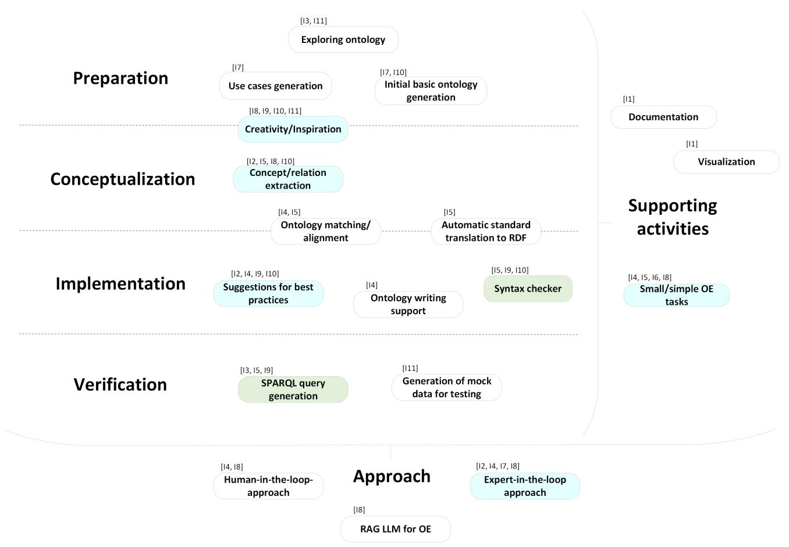

**Figure 3.7:** Opportunities for the use of [LLMs](#page-10-4) for [OE](#page-10-2). Based on the content analysis of the data collected through the interviews. Numbers in brackets refer to the interview(s) in which the idea was mentioned/discussed. The opportunities that were mentioned by at least 4 interviewees are highlighted in blue, and the opportunities that were mentioned by at least 3 are highlighted in green.

Special attention must be directed towards SPARQL[7](#page-37-4) query generation. SPARQL is a query language for [RDF](#page-10-17) developed by the [World Wide Web Consortium \(W3C\)](#page-10-24)[8](#page-37-5) . These queries are normally the translation of natural language questions into machine-readable questions, also known as [Compentency Questions \(CQs\)](#page-10-10) (Wiśniewski et al., [2019\)](#page-98-11). [CQs](#page-10-10) are the questions that the ontology must answer. In the ontology engineering process, they are created at the beginning when the stakeholders (ontology engineers, domain experts, etc.) are deciding which information must be added to the ontology and how. At [TNO,](#page-10-0) many ontology engineers use [CQs](#page-10-10) throughout the whole [OE](#page-10-2) process and especially at the end to verify that the knowledge to answer the question is correctly modeled in the ontology. In systems engineering terms, [CQs](#page-10-10) is to ontology as requirements are to a system. They capture the stakeholders' needs and guide the design process. Once the requirements are fulfilled, the system is ready for implementation or exploitation. An additional function of [CQs](#page-10-10), as discussed by Interviewees 5 and 8, is to set the finish line for the ontology engineer to know where to stop including data in the ontology. This is important to avoid ontologies containing redundant information and growing too much in size and complexity. Previous research at [TNO](#page-10-0), showed that the application of [LLMs](#page-10-4) to the translation of natural language questions to SPARQL queries is in a [Technology](#page-10-25) [Readiness Level \(TRL\)](#page-10-25) of 7, the highest in comparison to other tasks such as automatic ontology generation ([TRL](#page-10-25)

<span id="page-37-1"></span><sup>4</sup><https://www.w3.org/OWL/>

<span id="page-37-2"></span><sup>5</sup><https://www.w3.org/RDF/>

<span id="page-37-3"></span><sup>6</sup><https://www.w3.org/TR/shacl/>

<span id="page-37-4"></span><sup>7</sup><https://www.w3.org/TR/rdf-sparql-query/>

<span id="page-37-5"></span><sup>8</sup><https://www.w3.org/>

1-2) of ontology matching/alignment ([TRL](#page-10-25) 3-4) that these [TNO](#page-10-0) experts investigated (Bouter et al., [2024](#page-93-10)). They argue that there are already commercial prototypes that provide SPARQL generation functionalities using [LLMs](#page-10-4), which seems to indicate that this application is feasible. Moreover, they conducted an experiment that consisted of asking several [TNO](#page-10-0) employees with various levels of expertise on ontologies, Semantic Web technologies (such as SPARQL), and the logistics domain to translate natural language questions into SPARQL queries using various tools and documentation sources, including an LLM-based tool. The goal of the experiment was to identify what level of expertise is still required to formulate correct SPARQL queries using [LLMs](#page-10-4) within an ontology in the logistics domain. Through several experiments and survey questions, they found out that participants with less expertise found the help of the LLM more useful than the more experienced participants. Still, all participants did not fully trust the LLM-based tool and were aware of the limitations and the need to evaluate the suggestions provided by the LLM. Bouter et al. ([2024\)](#page-93-10) finally point out that, while [LLMs](#page-10-4) can be a powerful tool especially to ease the learning process for less experienced users, in practice, the responses by the LLM are incorrect on average, and thus expert knowledge remains indispensable.

Finally, several interviewees mentioned that they would see the potential for the use of [LLMs](#page-10-4) in smaller or repetitive [OE](#page-10-2) tasks where full accuracy is not needed and that can be more easily checked by the expert. As Interviewee 8 pointed out:

*"[T]he more specific and [the] smaller the task is, the better it performs".* (From Interviewee 8).

Examples of these "small/simple" tasks are keyword extraction or relation extraction (from Interviewee 5). This aligns with a human-in-the-loop or, more specifically, expert-in-the-loop approach, frequently mentioned by the interviewees. In general, all interviewees know the importance of human verification of the [LLMs](#page-10-4) output and the expertise required for it, especially in the field of [OE](#page-10-2). Last but not least it is important to mention that despite all the ontology engineers recognizing that [LLMs](#page-10-4) could be useful for certain [OE](#page-10-2) tasks, most of them have little or no experience with the use of [LLMs](#page-10-4) for ontology engineering or development tasks, and there is a certain feeling of skepticism among the interviewees about the successful application of [LLMs](#page-10-4) to [OE,](#page-10-2) at least in the near future.

# <span id="page-38-0"></span>3.4. Conclusion

In this chapter, we employed semi-structured interviews as the research method and content analysis as the data analysis method to address SQ1: *How does the current manual process to extend existing ontologies look like and what are the issues that ontology engineers are experiencing?*. Through a comprehensive analysis of the gathered data, several key findings emerged.

Firstly, there is no standard process for ontology extension. The current process of ontology extension highly varies depending on many factors such as the level of experience and expertise of the ontology engineer, the availability and quality level of data sources, or the possibility of reuse of existing standards and ontologies, among many other factors discussed in this chapter. The participation of stakeholders in the process is limited to the roles covered by the ontology engineer and the domain expert, and in some tasks, the role of the knowledge worker is incorporated or partially played by the ontology engineer. In the current process of ontology extension, most of the activities that require complex decision-making are in the initial phases, namely the Preparation phase and the Conceptualization phase. The use of [Compentency Questions \(CQs\)](#page-10-10) for developing ontologies is currently a personal preference of the ontology engineer. Regarding tools, ontology engineers at [TNO](#page-10-0) mainly use [OE](#page-10-2) tools such as Protégé and TopBraid for the implementation of the ontology in a formal language such as [RDF](#page-10-17), even though several ontology engineers prefer generic code editing software such as Visual Studio Code. The verification of the (extended) ontology is done manually through visualizations that are also manually created by the ontology engineers, mainly using general-purpose software for diagram generation. This provides the flexibility that the ontology engineers need to create visualizations that can be communicated to stakeholders with different levels of [OE](#page-10-2) expertise, such as domain experts. If [CQs](#page-10-10) have been formulated, these are used again to verify that the necessary data to answer them has been correctly modeled within the ontology. Through the creation of a flowchart diagram (see Figure [3.1](#page-30-0)) we have illustrated the answer to the first part of SQ1.

Secondly, the process of ontology extension is not always complex. The level of complexity mainly depends on how big and complex the ontology to be extended is, on the complexity of the domain itself, and on the level of experience of the ontology engineer both with the [OE](#page-10-2) tasks and the domain. However, the size and complexity of the ontologies developed at [TNO](#page-10-0) are growing, which is heavily influenced by the need to model application-specific data within the ontology. The question of the appropriate degree of application independence in ontologies is currently a subject of ongoing discourse within the ontology engineering community at [TNO.](#page-10-0) Overall, ontology engineers often face several with an Ishikawa diagram (see Figure [3.3\)](#page-33-0).

Finally, the application of [LLMs](#page-10-4) to solve the problems faced by ontology engineers is not a straightforward solution. Although all ontology engineers interviewed acknowledged most of the performance problems that [LLMs](#page-10-4) present regarding their effective application to the field of ontology engineering, such as hallucinations, factuality, inconsistencies and lack of reliability – particularly problematic given the high abstraction level, human understanding, reasoning demands, and precision required in ontology engineering – it is noteworthy that environmental impact concerns stemming from LLM usage emerged as a common concern in the interviews. Interviewees frequently expressed apprehensions regarding the potential loss of the enriching human-related aspects inherent in the ontology engineering process. Automating the process of ontology extension might be not only not possible right now, but also not desired within the ontology engineering community. However, even if [LLMs](#page-10-4) are not currently inside the toolkit of the ontology engineers at [TNO](#page-10-0), all of them see promising benefits in using [LLMs](#page-10-4) to complement their expertise and ease some of the cumbersome tasks associated with the ontology engineering process.

In crafting a human-centric framework that harnesses the capabilities of [LLMs](#page-10-4) to facilitate the ontology extension process, it is imperative not only to comprehend the intricacies of this process and identify its primary sources of complexity but also to discern the current reservations preventing ontology engineers from embracing [LLMs.](#page-10-4) By addressing these concerns in the framework's design, we aim to alleviate barriers and capitalize on the opportunities recognized by experts to create a design that can be actually implemented and used.

4

# <span id="page-40-0"></span>Requirements for a framework for ontology extension

This chapter describes the process followed to answer SQ2: *What are the requirements for a human-LLM collaboration framework for ontology extension?*. Addressing a problem that initially appears predominantly technical through a holistic systems engineering approach might be an unconventional practice. In order to find previously elicited requirements for the design of similar approaches combining ontologies with [LLMs](#page-10-4), we searched for relevant academic sources on the application of [LLMs](#page-10-4) to [OE.](#page-10-2) Since relevant literature on the topic is scarce, we employed a multifaceted approach to elicit requirements for the design of the process framework for human-LLM collaboration in ontology extension. This approach involved using the results of the semi-structured interviews conducted within the previous chapter and organizing a focus group to elicit requirements and validate them, respectively. To prevent overlooking the legal context of the proposed design, the alignment of the design with the EU [AI](#page-10-1) Act is briefly discussed. At the end of this chapter, the final list of functional and non-functional requirements, as categorized by Johannesson and Perjons [\(2021](#page-95-6)), is presented.

# <span id="page-40-1"></span>4.1. Outlining the artifact

The artifact to be designed is a "process framework for human-LLM collaboration for ontology extension". The aim is to define a structured approach, a set of guidelines, and best practices for facilitating collaboration between humans and [Large Language Models \(LLMs\)](#page-10-4) in the context of ontology engineering, with a focus on the ontology extension process. This framework delineates the stakeholders, tasks, and interactions involved in leveraging both human expertise and [LLMs](#page-10-4) capabilities in the process of ontology extension.

Following the categorization of theory types in [IS](#page-10-14) research developed by Gregor ([2006\)](#page-95-9), the aim is to design a process framework that analyzes "what is" the structure of an ontology extension process that can be assisted by [LLMs](#page-10-4). The process framework does not intend to be prescriptive, in other words, it is not meant to tell ontology engineers "what to do" or "how to do it". Rather, the framework aims to be descriptive, analyzing the current process of ontology extension and showing ontology engineers how [LLMs](#page-10-4) could be used as a tool to facilitate some of the downstream tasks of this process. The decision whether to use the [LLMs](#page-10-4) or not remains within the ontology engineer – the user of the framework.

# <span id="page-40-2"></span>4.2. Requirements elicitation

<span id="page-40-3"></span>In this section we introduce the requirements elicitation process and the methods employed to establish the design requirements for the artifact outlined above. First, we searched in academic databases for published sources addressing the application of [LLMs](#page-10-4) to [OE](#page-10-2) processes, aiming to find similar designed artifacts based on demonstrated requirements that can be reused within this design research. Second, we elicit requirements directly from the intended users of the artifact – the ontology engineers – using the results of the interviews presented before in Chapter [3.](#page-26-0) Third, we complete and validate the previously elicited requirements list with a focus group. Finally, we discuss how the design framed by the elicited requirements aligns with the EU [AI](#page-10-1) Act.

#### 4.2.1. Method 1: Literature search

To the best of our knowledge, a process framework that integrates both the downstream tasks of the ontology extension process and the application of [LLMs](#page-10-4) to those tasks does not exist yet. By querying ScienceDirect, Scopus, and Web of Science with the query string ("ontology engineering" OR "ontology development") AND (llm OR large AND language AND model OR artificial AND intelligence OR machine AND learning OR deep AND learning) AND requirement only a few articles can be found (search realized beginning of May 2024) – 2 in Science Direct, 1 in Scopus, and 52 in Web of Science – from which only 2 (all of them from Web of Science) are partially useful for this case. Due to the novelty of this topic, we have expanded this search using Google Scholar with the same query string. Even though the amount of hits is excessive, the relevance is very low. After a quick scan of the titles and abstracts, 4 articles from Google Scholar are selected. None of these sources explicitly identify requirements for a process framework for ontology extension combining manual techniques with [LLMs](#page-10-4) support, however, some of the conclusions drawn by the authors of these 6 sources (2 from Web of Science and 4 from Google Scholar) can inspire the requirements elicitation process. An overview of the 6 analyzed sources for the requirements elicitation process is presented in Table [C.1](#page-112-1) (Appendix [C\)](#page-112-0). Overall, these sources emphasize the need for ontology development processes that:

- Are iterative, clearly and concisely documented, and include the optimal number of stakeholders' roles with clear responsibilities to maximize efficiency in the process without lowering the quality of the developed (or extended) ontology (Czarnecki & Orłowski, [2010\)](#page-94-12).
- Can be applied to different domains and use cases, framing a clear (though complex) structure that facilitates the work of the ontology engineers and captures the essential decision-making moments in the process (Hoekstra & Breuker, [2010\)](#page-95-10).
- Are semi-automatic, minimizing human intervention whenever feasible and desirable. A fully standardized and automatic ontology development process seems to be unfeasible, but there is a need to alleviate the workload for ontology engineers (Al-Aswadi et al., [2020\)](#page-93-11), enabling them to focus their time and effort on tasks that demand inherently human reasoning capabilities.
- Leverage of state-of-the-art tools (such as [LLMs\)](#page-10-4) that can minimize the complexity and quantity of the interactions between ontology engineers and domain experts by facilitating the downstream tasks that ontology engineers consider most demanding of computational support (Zhang et al., [2024\)](#page-98-12).
- Promote and facilitate the reuse of existing ontologies, and lower the entry barriers for less experienced ontology engineers (Stadnicki et al., [2020;](#page-97-12) Tudorache, [2020](#page-98-3)).
- Feature and foster innovative tools, which may or may not have been specifically designed for [OE](#page-10-2) tasks, but that can be used in a "plug-in" fashion, allowing for a flexible and collaborative ontology development process that supports the ontology engineering community in the long term (Stadnicki et al., [2020\)](#page-97-12).

These key insights distilled from the literature will serve as foundational design principles for delineating the process framework for human-LLM collaboration in ontology extension. Next, the requirement elicitation process and the additional methods used (interviews and focus group) are described.

#### <span id="page-41-0"></span>4.2.2. Method 2: Interviews

To extract the requirements inductively and directly from the users' needs and values, we have used the information gathered through the interview process for the exploration of the problem (Chapter [3](#page-26-0)). As exemplified by Johannesson and Perjons ([2021\)](#page-95-6), the requirements for the outlined artifact can follow from the root causes of the problem that the artifact will try to address and, ultimately, solve. As illustrated with the Ishikawa diagram presented in Chapter [3](#page-26-0) (Figure [3.3\)](#page-33-0), the problem addressed within this research is the complexity in the ontology extension process, and the root causes fall within different categories. However, solving these problems is not enough if the concerns and the opportunities that the ontology engineers perceive are not considered. Thus, based on the three themes explored within the content analysis of the interviews, the requirements aim to:

- 1. **Address** the complexity of ontology extension (Theme 1).
- 2. **Reduce** the concerns about the use of [LLMs](#page-10-4) for [Ontology Engineering \(OE\)](#page-10-2) (Theme 2).
- 3. **Leverage** the opportunities for the use of [LLMs](#page-10-4) for [Ontology Engineering \(OE\)](#page-10-2) (Theme 3).

Appendix [C](#page-112-0) compiles the coding of the categories and condensed meaning units for each theme. The process followed to elicit the requirements consists of:

- **Step 1**: For all the [Condensed Meaning Units \(CMUs\)](#page-10-26) extracted from the content analysis of the interviews' transcripts for Theme 1: "The complexity of ontology extension", generate a requirement. As mentioned above, the aim is to **address** the main problems or issues that make the ontology extension so complex, according to the ontology engineers. (Table [C.2](#page-113-0) in Appendix [C](#page-112-0) shows the codes for the [CMUs](#page-10-26) related to Theme 1).
- **Step 2**: Check if the elicited requirement in the previous step addresses any additional [CMUs](#page-10-26) for Theme 1.
- **Step 3**: Check if the elicited requirement in the previous steps helps to **reduce** any of the [CMUs](#page-10-26) for Theme 2: "Concerns the use of [LLMs](#page-10-4) for [OE"](#page-10-2). (Table [C.3](#page-114-0) in Appendix [C](#page-112-0) shows the codes for the [CMUs](#page-10-26) related to Theme 2).
- **Step 4**: Check if the elicited requirement in the previous steps contributed to **leverage** any of the [CMUs](#page-10-26) for Theme 3: "Opportunities for the use of [LLMs](#page-10-4) for [OE](#page-10-2)". (Table [C.4](#page-115-0) in Appendix [C](#page-112-0) shows the codes for the [CMUs](#page-10-26) related to Theme 3).

The list of requirements elicited from each CMU of Theme 1 is presented in Table [C.5.](#page-116-0) The final list of requirements, aligned with the [CMUs](#page-10-26) of Theme 2 and Theme 3 is presented in Table [4.1](#page-45-1). Note that the requirements resulting from the elicitation process described above are high-level requirements. This can be due to the fact that the issues discussed with the interviewees were also broad in the context of ontology engineering and that the design process applied within this project is more abstract compared to designing a software tool or prototype aimed to solve a specific problem. The artifact to be designed here aims to facilitate the whole process of ontology extension, providing a high-level overview of the sequence of tasks, serving as a blueprint or roadmap for the ontology extension process, regardless of the domain covered by the ontology or the extension to be made.

As an example to illustrate the requirements elicitation process: from issue T1-CMU.7.1:"*Manual maintenance*", a possible requirement to address it can be formulated as 1.11:"*Include OE-tailored tools*". This means the framework should feature existing tools built for [Ontology Engineering \(OE\)](#page-10-2) that can reduce the burden of manual ontology extension tasks. According to Tudorache ([2020\)](#page-98-3), the quality and availability of both open-source and commercial tools for [OE](#page-10-2) has been improving over the last decade. However, the number of tools currently being used by the ontology engineering community at [TNO](#page-10-0) is limited. By meeting this requirement, the framework can increase ontology engineers' awareness of existing tools that can facilitate the tasks in the ontology extension process. [LLMs](#page-10-4) might not be the only or the most adequate tool to solve all the difficulties associated with the ontology extension tasks. Moreover, this requirement helps to reduce the concerns T2-CMU.1.1:"*Environmental concern*", T2-CMU.1.2:"*Ethical concern*" and T2-CMU.1.6:"*Unintended use*", by promoting the use of [OE](#page-10-2) tools over the use of [LLMs](#page-10-4) when possible. The complete list of requirements elicited from each CMU of Theme 1 following this process is presented in Table [C.5](#page-116-0) (in Appendix [C](#page-112-0)).

Table [C.5](#page-116-0) shows that 3 [CMUs](#page-10-26) do not have an associated requirement. The [CMUs](#page-10-26) for which design requirements have not been identified are:

- T1-CMU.2.2: "*Trade-off accuracy vs. Simplicity*";
- T1-CMU.2.4: "*Reducing ambiguity*";
- and T1-CMU.3.1: "*Application-independent vs. need for application-specific data*"

These three problems are particularly complex and broad in the context of [OE](#page-10-2), requiring complex human reasoning and decision-making. Despite efforts to extract requirements for addressing each problem within the design of a process framework for ontology extension using [LLMs](#page-10-4), some issues might not be currently solvable only by using the designed process framework. To address these challenges, it is crucial to employ substantial human expert intervention. The applicability of [LLMs](#page-10-4) to [OE](#page-10-2) presents inherent challenges that might not be fully addressed through automated means or tasks framed within the ontology extension process framework. As such, while these problems remain crucial considerations in the field, they do not lend themselves to clear and actionable requirements within the scope of this design research.

#### <span id="page-42-0"></span>4.2.3. Method 3: Focus group

As discussed above, the requirements identified from the interview data analysis are high-level requirements. To refine these high-level requirements and confirm their validity, a focus group session was planned and executed. As Johannesson and Perjons [\(2021](#page-95-6)) points out, focus groups facilitate the creation of innovative requirements through collaborative discussions among stakeholders with diverse backgrounds.

The focus group consisted of a session within the REPRO group, a community of ontology engineers (and other [TNO](#page-10-0)

professionals interested in [OE](#page-10-2)), with different expertise, levels of experience, and backgrounds. Within a session of 1 hour of duration, the following topics were addressed:

- Outline of the artifact to be designed.
- The process of ontology extension (As-Is): Figure [3.1](#page-30-0) was presented and discussed.
- Brainstorming requirements for the process framework design using Mentimeter[1](#page-43-1) (interactive presentation software that allows live polling and surveying). The participants were asked to anonymously answer the question "*What are the requirements for a human-LLM collaboration framework for ontology extension?*", and encouraged to brainstorm ideas. After everyone finished, the participants were asked to anonymously vote for their three preferred requirements amongst all the previously generated requirements. The most voted requirements/ideas were discussed.
- The results of the analysis of the interviews covering the three themes discussed in Chapter [3](#page-26-0) were presented, which led to a fruitful discussion with the participants.

A total of 7 participants attended the session and 6 engaged in the live survey to brainstorm requirements. The result of the brainstorming live survey is presented in Table [C.6](#page-117-0) (Appendix [C\)](#page-112-0). Note that, though the initial goal of the session was to refine the high-level requirements previously elicited from the interviews, to minimize bias and foster creative thinking, participants were not initially shown the requirements previously elicited. Instead, they were presented with an example of how a requirement could be formulated. This approach aimed to encourage participants to think creatively and generate innovative ideas during the session. From the ideas brainstormed within the focus group session (identified with the code Bx):

- Some requirements previously elicited from the interviews were validated. As a straightforward example, B17:"*Backwards compatibility should be taken into account*" validates requirement 1.5:"*Support backward compatibility of ontology changes*". As a less obvious example, B11:"*Should be usable in group setting*" validate requirement 3.2:"*Be user-friendly and intuitive for ontology engineers with varying levels of expertise*". If the proposed framework is intuitive and easy to use even for users with less experience in ontology engineering, such as domain experts, the framework could be used in group meetings including diverse stakeholders with varying levels of expertise.
- New requirements were added (see Table [C.7](#page-118-0)). As an example, requirement 1.14:"*Support formulation and formalization of [CQs](#page-10-10)*" is elicited from B12:"*LLM can generate SPARQL queries with competency questions*".

The complete list of requirements elicited from the ideas proposed by the ontology engineers during the brainstorming session as part of the focus group is presented in Table [C.7](#page-118-0). The ideas that validate previously elicited requirements are indicated. Note that ideas B3, B14, B21, and B22 have not been used to generate or validate any requirement. This is because these ideas are too broad (e.g., B14:"*Explainability*") or too specific (e.g., B3:"*If an LLM provides technical content, its sources should be listed*") to generate a feasible requirement that can be fulfilled within the design of a process framework.

#### <span id="page-43-0"></span>4.2.4. Alignment with EU [AI](#page-10-1) Act

As already mentioned in the introduction section of this work (Section [1.3](#page-16-1) in Chapter [1\)](#page-11-0), one of the limitations of the Design Science Research Approach is that, while highly flexible and applicable to a diverse range of problems, it is focused on designing solutions that aim to address specific users' needs. However, focusing too much on the technical details for the effective implementation of the design can prevent the designer from taking into account the legal context of the artifact. The rapid advancement of [LLMs](#page-10-4) has ushered in an era of unprecedented confusion, with these models outpacing regulatory frameworks. Both institutions and individuals are grappling with questions regarding the safe and effective use of [LLMs,](#page-10-4) and whether their utilization is appropriate at all.

To shed some light on this period of uncertainty, in 2021 the European Commission proposed the [Artificial Intelligence](#page-10-1) [\(AI\)](#page-10-1) Act, recently passed in the European Parliament (European Parliament and Council of the European Union, [2021\)](#page-94-5). As one of the first attempts to regulate [AI](#page-10-1), the text classifies [AI](#page-10-1)-based systems according to the level of potential risk of causing significant harm to individuals (Future of Life Institute, [2024\)](#page-94-13). The act distinguishes different entity types, namely providers, deployers, distributors, importers, product manufacturers, and authorized representatives (European Parliament and Council of the European Union, [2021\)](#page-94-5). Most of the compliance obligations fall on the providers or developers of [AI](#page-10-1) systems that are placed on the market for personal or commercial use. Since [TNO](#page-10-0) is a research organization and its research outputs are often not directly introduced to the market but are part of research

<span id="page-43-1"></span><sup>1</sup><https://www.mentimeter.com/>

outcomes for commissioning organizations, it is unclear how the EU [AI](#page-10-1) Act will impact their projects. However, [TNO](#page-10-0) researchers are aware of the legal context of their work and there is a common agreement on considering the EU [AI](#page-10-1) Act already in the early stages as a guideline to prevent future problems in the case of adoption of the technologies and innovations that [TNO'](#page-10-0)s research focuses on.

In this research project, the proposed design entails a semi-automated expert-in-the-loop approach, wherein the ontology engineer retains decision-making authority regarding LLM utilization for specific tasks and the subsequent handling of LLM outputs. Given this approach, the use of [LLMs](#page-10-4) is likely to pose a low risk and is improbable to cause harm to individuals, thereby probably classified as limited risk (lightly regulated) or even minimal risk [AI](#page-10-1) system (unregulated). Regarding [LLMs](#page-10-4), categorized as [General-Purpose AI \(GPAI\)](#page-10-27) models by the EU [AI](#page-10-1) Act, the text poses the obligations on the providers of the [GPAI](#page-10-27) models, mainly focused on the enforcement of copyright law concerning the development and training of the models (Future of Life Institute, [2024\)](#page-94-13). To adhere to the transparency obligation for limited risk [AI](#page-10-1) systems, [TNO](#page-10-0) as an organization, should ensure that, in case the process framework designed within this research project is implemented and used, its users are aware of their interaction with the LLM and the implications of this interaction. It could be argued that ontology engineers at [TNO](#page-10-0) are highly educated individuals – many of them with a background in [AI](#page-10-1) – and, as the interviews show, they are very aware of the implications of the use of [LLMs](#page-10-4). However, the ontology extension process framework design aims to facilitate the tasks even for less experienced ontology engineers and to frame the ontology extension process in such a way that even other stakeholders such as domain experts could make use of it. As a "provider" of a process that fosters the use of [LLMs](#page-10-4), [TNO](#page-10-0) should take the necessary measures to ensure that users of the process framework have the skills, knowledge, and understanding necessary to make informed decisions about the use, risks, and opportunities of [LLMs](#page-10-4).

While a comprehensive analysis of the entire EU [AI](#page-10-1) Act text lies beyond the scope of this research project, it is imperative to acknowledge the significance of understanding the institutional context. As both the technical and regulatory landscapes continue to evolve, anticipating all potential implications of the EU [AI](#page-10-1) Act on the utilization and interaction with [LLMs](#page-10-4) proves to be a crucial step, also in the context of ontology engineering. While not directly translated into actionable requirements for the process framework design, maintaining awareness of the broader institutional framework is essential to ensure the effective implementation and utilization of any designed solutions. This holistic approach provides valuable insights into the challenges and opportunities associated with successfully integrating [LLMs](#page-10-4) as a safe and powerful tool within organizations such as [TNO](#page-10-0).

# <span id="page-44-0"></span>4.3. Final list of requirements

As a result of the inspiration drawn from the literature, and the methods applied for the elicitation of requirements described in the previous sections, Table [4.1](#page-45-1) compiles the total set of 22 high-level requirements and their source, categorized into functional, non-functional/structural, and non-functional/environmental following Johannesson and Perjons [\(2021](#page-95-6)). Figure [4.1](#page-45-0) summarizes the process followed to elicit the requirements, described in the previous sections of this chapter.

As the name suggests, *functional requirements* address functions of the designed system, in this case, the process framework (Johannesson & Perjons, [2021\)](#page-95-6). These requirements cover the problems and needs of the ontology engineers that the process framework designed will try to solve. On the other hand, *non-functional requirements* refer to the structure and context or environment of the designed artifact, and thus they are subdivided into *structural* and *environmental* (Johannesson & Perjons, [2021](#page-95-6)). Non-functional/structural requirements address the shape and composition of the process framework, aiming to make the process framework usable. Non-functional/environmental requirements address values that are important to the users, in this case, the ontology engineers at [TNO.](#page-10-0)

<span id="page-45-0"></span>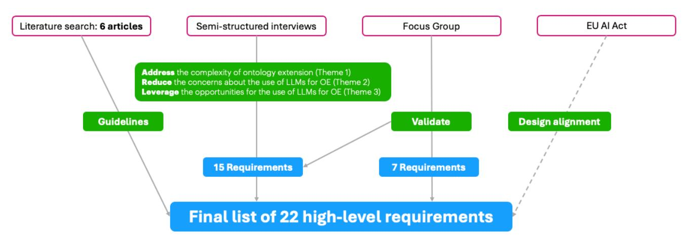

 $\textbf{Figure 4.1: Illustration of the requirements elicitation process.}$ 

<span id="page-45-1"></span>

| <b>Table 4.1:</b> High-level requirements for the human-LLM collaboration process framework for ontology extension. The |  |  |  |  |
|-------------------------------------------------------------------------------------------------------------------------|--|--|--|--|
| Condensed Meaning Units (CMUs) codes can be found in Appendix C for each theme.                                         |  |  |  |  |

| Requirement<br>category | $\text{ID}$ | Description                                                                                                                            | Source                    |                                           |                                                         |                         |
|-------------------------|-------------|----------------------------------------------------------------------------------------------------------------------------------------|---------------------------|-------------------------------------------|---------------------------------------------------------|-------------------------|
|                         |             |                                                                                                                                        | Ξ<br>$\text{Adress}$      | $\Gamma$<br>Reduce                        | $\Gamma$ 3<br>Leverage                                  | $\text{Group}$<br>Focus |
| FUNCTIONAL              | 1.1         | Support the acquisition of domain<br>$\text{data}$                                                                                     | CMU 1.1,<br>1.2, 1.3, 6.2 |                                           | $CMUs \ 1.1,$<br>1.2, 1.3, 1.4                          | B6                      |
|                         | 1.2         | Complement the role of the domain<br>expert in tasks related to the<br>acquisition of data and technical<br>$\text{conceptualization}$ | $CMUs \ 1.5,$<br>1.6, 1.7 |                                           | $CMUs \ 1.2,$<br>1.3, 1.4, 2.1                          | B9                      |
|                         | 1.3         | Support ontology<br>matching/alignment techniques                                                                                      | CMU 2.3                   | $CMU$ 2.5                                 |                                                         |                         |
|                         | 1.4         | Define the roles and responsibilities<br>of the stakeholders and the LLM for<br>each task                                              | CMU 2.5                   | $CMUs \ 1.5,$<br>1.6                      |                                                         |                         |
|                         | 1.5         | Support backward compatibility of<br>ontology changes                                                                                  | CMU 3.2                   | CMU 2.5                                   |                                                         | B17                     |
|                         | 1.6         | Include CQs throughout the whole<br>$\text{ontology extension development}$<br>process                                                 | CMU 4.1                   |                                           | $CMUs \ 1.2,$<br>4.1                                    |                         |
|                         | 1.7         | Support various data source formats                                                                                                    | CMU 4.2                   |                                           | $\overline{\text{CMUs } 2.3,}$<br>3.2                   |                         |
|                         | 1.8         | Facilitate the exploration of the<br>ontology to be extended                                                                           | CMU 5.1                   |                                           | $\overline{\text{CMUs } 1.2,}$<br>1.3, 1.4, 2.1         |                         |
|                         | 1.9         | $\text{Support less experienced ontology}$<br>engineers                                                                                | CMU 5.2                   |                                           | $\overline{\text{CMUs } 1.4,}$<br>2.1, 3.3, 3.4,<br>3.5 |                         |
|                         | 1.10        | $\text{Facilitate comprehension of}$<br>$domain-specific\ information$                                                                 | $CMU \ 6.1$               |                                           | $\overline{\text{CMUs } 1.2,}$<br>1.3, 1.4, 2.1         |                         |
|                         |             | $1.11$ Include OE-tailored tools                                                                                                       | CMU 7.1                   | $\overline{\text{CMU 1.1}}$ ,<br>1.2, 1.6 |                                                         |                         |
|                         | 1.12        | Facilitate documentation of ontology<br>extension                                                                                      | $CMU$ 7.1                 |                                           | $CMU \ 5.1$                                             | B8                      |

 $Continued$  on next page

Table [4.1](#page-45-1) continued: High-level requirements for the human-LLM collaboration framework for ontology extension.

| Requirement<br>category                  | ID   | Description                                                                                          | Source           |              |                  |                     |
|------------------------------------------|------|------------------------------------------------------------------------------------------------------|------------------|--------------|------------------|---------------------|
|                                          |      |                                                                                                      | T1<br>Adress     | T2<br>Reduce | T3<br>Leverage   | Group<br>Focus      |
|                                          |      | 1.13 Promote reuse of existing ontologies<br>and standards                                           |                  |              |                  | B2, B5              |
|                                          |      | 1.14 Support formulation and<br>formalization of CQs                                                 |                  |              |                  | B12                 |
|                                          | 1.15 | Provide evaluation method for<br>ontology extension including domain<br>experts                      |                  |              |                  | B15                 |
|                                          |      | 1.16 Specify format of LLM's output for<br>each task                                                 |                  |              |                  | B19                 |
| NON<br>FUNCTIONAL<br>(Structural)        | 2.1  | Outline the sequence of tasks                                                                        | CMUs 2.1,<br>2.5 |              | CMU 5.3          |                     |
|                                          | 2.2  | Provide hybrid approach combining<br>LLMs with traditional OE techniques                             |                  |              |                  | B1, B10,<br>B18     |
|                                          | 2.3  | Provide flexibility depending on the<br>project characteristics, application<br>and/or use case      |                  |              |                  | B10, B20            |
| NON<br>FUNCTIONAL<br>(Environmen<br>tal) | 3.1  | Promote the inclusion of diverse<br>perspectives (include additional<br>stakeholders in the process) | CMU 1.4          | CMU 2.6      |                  |                     |
|                                          | 3.2  | Be user-friendly and intuitive for<br>ontology engineers with varying<br>levels of expertise         | CMU 5.2          |              | CMUs 1.4,<br>2.1 | B11                 |
|                                          | 3.3  | Encourage<br>expert-in-the-loop-approach                                                             |                  |              |                  | B4, B7, B13,<br>B16 |

# <span id="page-46-0"></span>4.4. Conclusion

In this chapter, we described how the insights from the semi-structured interviews conducted in the first phase of this research project have been used to address SQ2: *What are the requirements for a human-LLM collaboration framework for ontology extension?*. The selected approach stems from a lack of academic literature supporting the elicitation of requirements for a process framework facilitating human-LLM collaboration in ontology extension. Being aware that the choice of this design artifact poses a great challenge for ontology engineers to produce specific or low-level requirements, due to the high level of abstraction required (compared to, for example, the design of a software tool), a focus group was organized to foster innovative, unconventional or out-of-the-box ideas to contribute to the design of an artifact that addresses the genuine needs of its potential users. Thus, the requirement elicitation process was based on three different methods: first, a literature search of similar designs, which was used to establish a set of design guidelines; second, a custom approach consisting of extracting requirements that directly address the problems identified by the ontology engineers interviewed during the first stage of this design research project; and third, a focus group with ontology engineers with diverse backgrounds and levels of experience, expertise, and backgrounds at [TNO](#page-10-0) to extract additional requirements and validate the previously generated set. Finally, it was briefly discussed how the proposed design framed by the elicited requirements aligns with the EU [AI](#page-10-1) Act.

The result is a set of 22 functional and non-functional high-level requirements. We acknowledge the inherent limitations of high-level requirements, given the significant gap between these requirements and their practical implementation through design. However, the underlying objective of adopting this, perhaps unconventional, approach to requirements elicitation is to authentically address user needs. While it may not be feasible to fulfill all requirements

at present, ongoing advancements in both [LLMs](#page-10-4) and ontology engineering hold promise for the development of alternative designs capable of meeting these needs comprehensively. Moreover, the flexibility and interpretive space provided by these high-level requirements allow the emergence of innovative design concepts. These considerations will be further explored in the subsequent chapter.

5

# <span id="page-48-0"></span>Designing a human-LLM collaboration process framework for ontology extension

Stemming from the problems in the ontology extension process and from the challenges and opportunities for [LLMs](#page-10-4) to be introduced into this process, identified by the ontology engineers, a set of 22 high-level requirements for a human-LLM collaboration framework for ontology extension have been identified in the previous chapter. This output will be now used in this chapter to answer SQ3: *What does the design of an integrated process framework for human-LLM collaboration for ontology extension look like?*. First, we define the structure of the artifact. Second, we examine how the tasks that [Large Language Models \(LLMs\)](#page-10-4) excel at in [Natural Language Processing \(NLP\)](#page-10-5) can be mapped to ontology extension tasks. Next, to create a prototype design that not only attempts to fulfill the requirements but is also feasible to implement, the current landscape of [LLMs](#page-10-4) and LLM-based tools applied to [OE](#page-10-2) tasks is examined. It will be shown how the insights from these sources provide valuable input for the prototype design choices. Additionally, some of the currently available [OE](#page-10-2) tools will be identified and discussed. Finally, the prototype design is presented and described at the end of this chapter.

# <span id="page-48-1"></span>5.1. Choice of the design's structure

To design an integrated process framework for human-LLM collaboration for ontology extension, we decided to use the current ontology extension process modeled as a flowchart diagram as the template (see Figure [3.1](#page-30-0) in Chapter [3\)](#page-26-0). Thus, the prototype design of the integrated process framework for human-LLM collaboration for ontology extension will be an extended version of this flowchart diagram. The new flowchart diagram indicates which [OE](#page-10-2) task can be performed with the assistance of an LLM, and which tasks can be facilitated by new [OE](#page-10-2) tools (that are currently not being used by the ontology engineers at [TNO](#page-10-0)). Moreover, some additional tasks are added. Some are deemed necessary given the use of [LLMs,](#page-10-4) such as reviewing the LLM's output with domain experts, and some of them are introduced given the emergence of new [OE](#page-10-2) tools, such as scanning the ontology extension for its alignment with the FAIR principles (Findable, Accessible, Interoperable, and Reusable) (Garijo et al., [2021](#page-95-11)). New stakeholders are also added to the new process framework. Hence, the As-Is manual process framework for ontology extension presented in Chapter [3](#page-26-0) is evolved into a To-Be process framework for ontology extension facilitated by [LLMs](#page-10-4), and including new [OE](#page-10-2) tools and stakeholders. By making this design choice, the non-functional structural requirements are fulfilled:

- **Requirement 2.1**:"*Outline the sequence of tasks*" The As-Is flowchart diagram already identifies the sequence of downstream [OE](#page-10-2) tasks in the ontology extension process. The new To-Be version leverages this feature and integrates new tasks in the current sequence.
- **Requirement 2.2**:"*Provide hybrid approach combining [LLMs](#page-10-4) with traditional [OE](#page-10-2) techniques*" The As-Is flowchart diagram is based on the "traditional" [OE](#page-10-2) techniques used by the ontology engineers at [TNO](#page-10-0) and on the best practices described in REPRO (Bakker, van Bekkum, et al., [2021](#page-93-8)). The new To-Be framework integrates [LLMs](#page-10-4) into this landscape.
- **Requirement 2.3**:"*Provide flexibility depending on the project characteristics, application and/or use case*" – The As-Is flowchart diagram already provides flexibility by giving the possibility to the user, the ontology engineer, to choose the sequence of tasks to be executed depending on the answer to some of the questions that are asked throughout the ontology extension process (represented as grey, rectangular boxes in Figure [3.1\)](#page-30-0). The new To-Be framework capitalizes on this feature and preserves it by indicating which tasks can be assisted by an [LLMs](#page-10-4) in a "descriptive" manner, in contrast to a "prescriptive" one (as mentioned previously in Section

[4.1](#page-40-1)). This means that the new flowchart diagram will not change the current tasks in the process, but rather it will complement them with [LLMs](#page-10-4) usage and new [OE](#page-10-2) tools. The decision of whether to execute the task as it is currently performed or to use an LLM or an [OE](#page-10-2) tool remains with the ontology engineer.

After having selected and justified the structure for the artifact, in the following sections we focus on adding content to the design of the To-Be process framework for ontology extension facilitated by [LLMs](#page-10-4).

# <span id="page-49-0"></span>5.2. Identification of [OE](#page-10-2) tasks that can be facilitated by [LLMs](#page-10-4)

After having established the structure of the prototype design of an integrated process framework for human-LLM collaboration for ontology extension, in this section, we identify which [NLP](#page-10-5) downstream tasks are the most relevant to the [OE](#page-10-2) downstream tasks currently modeled in the As-Is flowchart diagram, presented and discussed in Section [3.2](#page-27-1) (Figure [3.1\)](#page-30-0). One of the main characteristics of [LLMs](#page-10-4) is that no specific fine-tuning is needed for them to perform many different tasks (Kalyan, [2024](#page-95-4)). J. Wei et al. [\(2022](#page-98-13)) argue that these "emergent abilities" are a strength of [LLMs](#page-10-4) since many new applications are flourishing outside the field of [NLP](#page-10-5). The application to ontology extension, or in general to [OE](#page-10-2) tasks, can be viewed as one of these flourishing emergent abilities of [LLMs.](#page-10-4)

Normally, [LLMs](#page-10-4) are adapted to downstream [NLP](#page-10-5) tasks (C. Wei et al., [2021](#page-98-14)), i.e., specific tasks that are part of the broader field of [NLP](#page-10-5) or that are used to build specialized [NLP-](#page-10-5)based applications, and evaluated on them. The ontology extension process is also composed of several downstream tasks. The As-Is model shows these tasks according to the ontology engineers' practice at [TNO](#page-10-0). However, this is not the first time that the ontology engineering process has been decomposed into smaller processes or tasks. [OEMs](#page-10-3) such as the one presented by De Nicola and Missikoff [\(2016](#page-94-10)) try to facilitate the process of [OE](#page-10-2) by breaking it down into smaller steps (building a lexicon, building a glossary, building a taxonomy, creating a parthood, and building the ontology). These steps or downstream tasks in the [OE](#page-10-2) process have some overlap with the downstream [NLP](#page-10-5) tasks. But to establish this connection, first, it is necessary to define the broader [NLP](#page-10-5) tasks performed by [LLMs](#page-10-4).

Kalyan ([2024\)](#page-95-4) extensively assesses various models within the [GPT](#page-10-9) family across a spectrum of downstream [NLP](#page-10-5) tasks, offering a detailed exposition of each task. Table [5.1](#page-50-0) highlights a subset of tasks deemed particularly pertinent to the ontology extension process, drawn from this author's comprehensive overview. As depicted in this table, [NLP](#page-10-5) tasks such as Text Classification, Information Extraction, Keyphrase Generation, Information Retrieval, and Recommendation can play a crucial role in the Preparation and Conceptualization phases of the ontology extension process. Tasks such as Machine Translation and Coding can potentially facilitate the [OE](#page-10-2) tasks included in the phases of Implementation of the ontology extension, whereas Multimodal [AI](#page-10-1) tasks could be applied in the Verification phase to generate visualizations of the ontology extension. Finally, Question Answering is a [NLP](#page-10-5) task that is present through the whole ontology extension process, since the ontology engineer can ask for assistance on any [OE](#page-10-2) task to the LLM. A more specific mapping of this [NLP](#page-10-5) task to an [OE](#page-10-2) task is the verification of the ontology extension model using [Compentency Questions \(CQs\)](#page-10-10). The LLM could be used to verify if the extended ontology or the ontology extension can answer the [CQs](#page-10-10). In this case, given a set of [CQs](#page-10-10) and the ontology extension (or the extended ontology) the LLM must understand and interpret the [CQs](#page-10-10) but also the ontology structure to provide a correct answer to the ontology engineer.

The identified [OE](#page-10-2) tasks that can be assisted by [LLMs](#page-10-4) based on their [NLP](#page-10-5) capabilities will be included and highlighted in the design of the To-Be process framework for ontology extension facilitated by [LLMs](#page-10-4).

<span id="page-50-0"></span>**Table 5.1:** Downstream [NLP](#page-10-5) tasks relevant to the ontology extension process downstream tasks. [NLP](#page-10-5) tasks and their descriptions are based on Kalyan ([2024](#page-95-4)). Ontology extension phases are 1) Preparation; 2) Conceptualization; 3) Implementation; 4) Verification.

| NLP task                                                | Description                                                                                                                                                                                                                                                     | Ontology extension<br>task                                                                                                                                                                    | Ontology<br>exten<br>sion<br>phase |  |
|---------------------------------------------------------|-----------------------------------------------------------------------------------------------------------------------------------------------------------------------------------------------------------------------------------------------------------------|-----------------------------------------------------------------------------------------------------------------------------------------------------------------------------------------------|------------------------------------|--|
| 1.Text Classification                                   | Assign labels from a predefined set to a given text<br>Define ontology<br>(phrase, sentence, graph, or document). E.g., lan<br>extension modules<br>guage identification, stance detection, sentiment<br>(classify concepts,<br>analysis, etc.<br>classify CQs) |                                                                                                                                                                                               | 2                                  |  |
| 2.Information<br>Extraction                             | Identify structured data like entities, relationships,<br>and events from unstructured text sources                                                                                                                                                             |                                                                                                                                                                                               |                                    |  |
| 2.1.Named Entity<br>Recognition or Entity<br>Extraction | Identify entities and assign them to the correspond<br>ing entity type                                                                                                                                                                                          | Extract main concepts<br>and relation from                                                                                                                                                    |                                    |  |
| 2.2.Relation<br>Classification                          | Identify the semantic relationships between two<br>given entities in a text source                                                                                                                                                                              | existing documentation<br>or standards; Build<br>small graph or                                                                                                                               | 1/2                                |  |
| 2.3.Relation Extraction                                 | Entity Extraction + Relation Classification                                                                                                                                                                                                                     | preliminary sub-ontology                                                                                                                                                                      |                                    |  |
| 2.4.Event Detection                                     | Identify and classify entities that trigger events                                                                                                                                                                                                              | (Identify classes and<br>taxonomy, properties,                                                                                                                                                |                                    |  |
| 2.5.Event Argument<br>Extraction                        | Identify entities in a given event and classify their<br>roles                                                                                                                                                                                                  | restrictions, and axioms)                                                                                                                                                                     |                                    |  |
| 2.6.Event Extraction                                    | Event Detection + Event Argument Extraction                                                                                                                                                                                                                     |                                                                                                                                                                                               |                                    |  |
| 3.Question<br>Answering                                 | Provide the most accurate response to a human<br>query in natural language                                                                                                                                                                                      | Answer ontology<br>engineer's questions<br>about ontology to be<br>extended and how to<br>model the extension;<br>Verify if CQs can be<br>answered given an<br>ontology                       | 1/2/3/4                            |  |
| 4.Machine<br>Translation                                | Given two languages, translate text from one to<br>the other                                                                                                                                                                                                    | Set concepts/data in<br>different languages<br>(multilingual ontology)                                                                                                                        | 3                                  |  |
| 5.Keyphrase<br>Generation                               | Given a text or document, generate a smaller text<br>(sentence, paragraph) that compiles the main ideas                                                                                                                                                         | Generate test cases or<br>business scenarios;<br>Generate CQs                                                                                                                                 | 1/2                                |  |
| 6.Information<br>Retrieval                              | Gather the relevant information for the user given<br>large volumes of data and a query                                                                                                                                                                         | List main concepts and<br>relations in the domain;<br>Describe concepts,<br>relations, group<br>synonyms (glossary);<br>Suggest standards,<br>documentation, or other<br>ontologies for reuse | 1/2                                |  |
| 7.Recommendation                                        | Suggest content, products, etc. relevant to the user                                                                                                                                                                                                            | Suggest standards,<br>documentation, or other<br>ontologies for reuse                                                                                                                         | 2                                  |  |
| 8.Coding                                                | Generate code from a query in natural language,<br>find problems in a given piece of code, explain a<br>given piece of code, generate tests for the given<br>code, refactor, generate documentation, etc.                                                       | Formalize ontology in<br>RDF/OWL; Formalize<br>CQs in SPARQL;<br>Generate documentation                                                                                                       | 3                                  |  |
| 9.Multimodal AI<br>tasks                                | Different techniques to make the model able to pro<br>cess input data as text, image, audio, or video for<br>mats                                                                                                                                               | Generate ontology<br>visualization                                                                                                                                                            | 4                                  |  |

# <span id="page-51-0"></span>5.3. Current landscape of [LLMs](#page-10-4) applied to [OE](#page-10-2) tasks

Now that it has been identified which [NLP](#page-10-5) tasks successfully performed by [LLMs](#page-10-4) are relevant to the [OE](#page-10-2) tasks currently executed in the ontology extension process, we want to dive deeper into the implementation of these tasks with the current capabilities of [LLMs](#page-10-4). To that end, we examined some relevant publications in the field. Research on this topic is growing significantly, with renowned conferences such as the [European Semantic Web Conference](#page-10-28) [\(ESWC\)](#page-10-28) dedicating in 2024 a special track on Large Language Models for Knowledge Engineering[1](#page-51-1) .

The set of articles examined in this section was compiled between February and June 2024. Some of the articles were recommended by [OE](#page-10-2) experts at [TNO](#page-10-0) or discussed during some of the REPRO sessions. Others were gathered from snowballing previously reviewed articles in this research project. Given the rapid and constant growth of literature on [LLMs](#page-10-4) in both academic and non-academic sources, it is challenging to keep pace with the publication rate. Thus, we decided to focus on the most relevant articles that provide insight for generating feasible ideas for the artifact design.

The analysis is divided into two separate sections. The first one compiles the main insights of a series of publications that apply and evaluate [LLMs](#page-10-4) in [OE](#page-10-2) tasks. The second one focuses on the application and evaluation of [LLMs](#page-10-4) in ontology matching/alignment, which is a larger and more complex [OE](#page-10-2) task and therefore often warrants research on its own. Still, we decided to explore the current possibilities of the application of [LLMs](#page-10-4) to this task due to its relevance in the ontology extension process, which is the focus of this research project. As shown in the As-Is process of ontology extension, once the extension is conceptualized, it is necessary to align it with the ontology to be extended.

The goal of this section is to find in the literature inspiration, ideas, and guidance to design the To-Be process framework prototype that aims to integrate [LLMs](#page-10-4) in the current ontology extension process. We focused on academic articles that propose solutions for ontology engineering using [LLMs](#page-10-4) based on prompt engineering. This decision is driven by several reasons:

- The goal is to design a human-in-the-loop approach that is user-friendly and leverages off-the-shelf tools as much as possible. This ensures that the system is accessible and practical for the ontology engineers.
- While some tasks can be performed with a prompt, they can still be executed manually if desired. This flexibility allows the ontology engineers to choose the method that best suits their needs and ensures that the task is performed accurately.
- Even when tasks are automated with an LLM, human supervision remains essential. This supervision ensures the quality and accuracy of the results, making prompting a suitable approach.
- The prototype approach using prompt engineering is being tested to explore its feasibility. Current research indicates that the potential of [LLMs](#page-10-4) for ontology engineering is still limited, and their performance varies across different tasks. In the next chapter, we will evaluate this performance in various ontology extension tasks to determine its strengths and limitations. This evaluation will help us conclude which tasks the LLM can effectively support and which ones require further refinement or human intervention.

The key insights relevant to the design of the process framework artifact gathered from the analysis carried out in both areas of application of [LLMs](#page-10-4) to [OE](#page-10-2) are discussed at the end of this section.

#### Literature search - Area 1: [LLMs](#page-10-4) applied to [OE](#page-10-2) tasks

There have been recent attempts to apply [LLMs](#page-10-4) to the ontology engineering process (Fathallah et al., [2024](#page-94-14); Saeedizade & Blomqvist, [2024;](#page-97-13) Zhang et al., [2024](#page-98-12)), to generate ontologies or knowledge graphs "from scratch" using unstructured data (Trajanoska et al., [2023\)](#page-98-15), to use [LLMs](#page-10-4) to generate [Compentency Questions \(CQs\)](#page-10-10) (Rebboud et al., [2024\)](#page-97-14), and to evaluate [LLMs](#page-10-4) in different downstream [OE](#page-10-2) task such as Relation Extraction (Giglou et al., [2023;](#page-95-1) Meyer et al., [2023;](#page-96-15) X. Wei et al., [2023](#page-98-16); Zhu et al., [2024](#page-98-17)). Each approach is different and employs different methodologies to use and evaluate the [LLMs:](#page-10-4)

• Fathallah et al. [\(2024](#page-94-14)) create a domain-agnostic prompting pipeline based on the ontology engineering methodology *NeOn* (Suárez-Figueroa et al., [2015\)](#page-97-15). The authors evaluate a few [LLMs](#page-10-4) using zero-shot prompting to decide which model is more suitable for their pipeline design, concluding that, from the models tested, [GPT-](#page-10-9)3.5 gives the most satisfactory results. Thus, they develop the so-called *NeOn[-GPT](#page-10-9)* workflow and evaluate it using the wine ontology. They compare the structure of the generated wine ontology using *NeOn[-GPT](#page-10-9)* with the gold standard wine ontology. The comparison is based on structural ontology metrics such as the number of classes,

<span id="page-51-1"></span><sup>1</sup><https://2024.eswc-conferences.org/special-track-on-large-language-models-for-knowledge-engineering/>

objects and data properties. In addition, the authors briefly discuss some modeling decisions made in both ontologies and how these decisions affect the reasoning using the ontologies. They conclude that [LLMs](#page-10-4) have the potential to assist human experts in the process of developing base ontologies, while [LLMs](#page-10-4) alone cannot achieve the richness that ontology engineers achieve through expertise, deductive reasoning and formal logic knowledge, since, after all, [LLMs](#page-10-4) are models based on statistical patterns and vector representations. They make their prompts publicly available[2](#page-52-0) .

- Saeedizade and Blomqvist [\(2024\)](#page-97-13) try to assess the suitability of [LLMs](#page-10-4) to assist ontology engineers in the development of [OWL](#page-10-18) ontologies, since, as they claim, most of the [OE](#page-10-2) tasks are still fully manual and current tools such as Protégé or TopBraid only help ontology engineers to formalize the ontologies, but more guidance on how to conceptualize and model an ontology is missing. With this problem in mind, they test several [LLMs](#page-10-4) and prompting techniques for the construction of ontologies in different domains. The resulting ontologies created through the LLM-assisted process are manually evaluated and compared with ontologies created by ontology engineering students on the same domains (ground truth). Ignoring minor errors in both semi-automatically crafted ontologies and manually engineered ontologies, the results show that only [GPT](#page-10-9)-4 is suitable for assisting ontology engineers and that more sophisticated prompting methods such as Decomposed Prompting (addressing one Competency Question at a time) or Graph of Thoughts (GoT) yield better results (measured by averaging the scores over some simple binary criteria defined by the authors based on what they consider good [OE](#page-10-2) practices). The authors conclude that the combination of [GPT](#page-10-9)-4 with advanced prompting techniques can surpass the quality of ontologies manually created by novice ontology engineers, and can effectively assist ontology engineers in building more complex ontological models. The experiments, results, and prompts are publicly available[3](#page-52-1) .
- Zhang et al. [\(2024](#page-98-12)) present *OntoChat* a conversational [GPT](#page-10-9)-based [OE](#page-10-2) framework that supports ontology engineers in the tasks of requirement elicitation from user stories, [CQs](#page-10-10)-based analysis (generation, verification, reduction, and clustering), and testing using [CQs](#page-10-10). These tasks were chosen as they were deemed as the most cumbersome [OE](#page-10-2) tasks according to 23 ontology engineers with varying expertise levels that the authors surveyed. The *OntoChat* approach was tested with an ontology in the musical domain and with 6 domain experts and 8 ontology engineers. The qualitative evaluation of *OntoChat* was carried out through a survey of the participating experts. The results show that, though aware of the several limitations of [LLMs](#page-10-4) in [OE](#page-10-2) tasks, in general, the participants enjoyed using the approach and saw its potential in reducing manual effort. The tool is publicly available in the [AI](#page-10-1) platform Hugging Face[4](#page-52-2) .
- Zhu et al. [\(2024\)](#page-98-17) evaluate [LLMs](#page-10-4) for knowledge graph construction using quantitative and qualitative metrics. They show how [GPT-](#page-10-9)4's performance is comparable to fine-tuned state-of-the-art models in Entity and Relation Extraction, Event Extraction, Link Prediction, and Question Answering tasks, using zero-shot and one-shot prompting techniques. Yet, using [LLMs](#page-10-4) for knowledge extraction presents important limitations such as the lack of highly specific domain expertise. The authors experiment with the ability of [GPT](#page-10-9)-4 to generalize and learn from the prompt instructions, rather than just relying on its memory. From the insights gathered through these experiments, the authors conclude that even if the ability of [LLMs](#page-10-4) for automatic knowledge construction is still limited, [LLMs](#page-10-4) are powerful tools as *inference assistants*. They state that the model's performance can improve notably with better instructions through prompt engineering. In addition, they propose a system, called *AutoKG*, in which [LLMs](#page-10-4) play different roles (Domain Expert, Consultant) to support the knowledge construction process through a conversational interface. They conclude that collaborative tools such as *AutoKG* can make the process faster by leveraging the use of [LLMs](#page-10-4) for tasks in which their factual accuracy is adequate while improving transparency (compared to other tools or approaches with a higher degree of automation). Finally, they state that [LLMs](#page-10-4) can reduce complexity in the knowledge graph creation process and facilitate decision-making, but human oversight and expert validation are still imperative.
- Rebboud et al. [\(2024](#page-97-14)) evaluate the ability of [LLMs](#page-10-4) to generate [Compentency Questions \(CQs\).](#page-10-10) Acknowledging the challenges in ontology development and the success of [LLMs](#page-10-4) in understanding and generating both general and formal knowledge (such as that required for ontology engineering), the authors seek to explore how effectively [LLMs](#page-10-4) can facilitate the knowledge engineering process when integrated with knowledge engineering methodologies. Although they identify six ontology engineering downstream tasks in which [LLMs](#page-10-4) could potentially help, this work focuses on the task of generating [CQs.](#page-10-10) To that end, the authors develop a platform in Python to test different [LLMs](#page-10-4) (both open-source and proprietary) against several ontologies and their sets of

<span id="page-52-0"></span><sup>2</sup>[https://github.com/andreamust/NEON-\acrshort{gpt}](https://github.com/andreamust/NEON-\acrshort {gpt})

<span id="page-52-1"></span><sup>3</sup><https://github.com/LiUSemWeb/LLMs4OntologyDev-ESWC2024>

<span id="page-52-2"></span><sup>4</sup><https://huggingface.co/spaces/b289zhan/OntoChat>

[CQs](#page-10-10), using prompt strategies developed with their own prompt template. They evaluate the LLM-generated [CQs](#page-10-10) to the ground truth dataset – the actual set of [CQs](#page-10-10) of each ontology – using a similarity metric and then compute a precision score defined as the number of valid (sufficiently similar) [CQs](#page-10-10) over the total number of [CQs](#page-10-10) for that ontology. Their results show that the precision scores are generally low for all models and ontologies tested. Surprisingly, the model that shows the best scores (outperforming [GPT-](#page-10-9)3.5 and [GPT](#page-10-9)-4) is an open-source model called *Zephyr*, fine-tuned and aligned to user intent (Tunstall et al., [2023](#page-98-18)). The authors conclude that few-shot prompting normally produces better results than zero-shot, though sometimes shorter prompts reduce the model's hallucinations. They realize that prompting the model with the ontology does not improve the results and even decreases the precision scores of the generated [CQs](#page-10-10). Finally, they acknowledge the potential of [LLMs](#page-10-4) to generate new [CQs](#page-10-10) not originally present in the ground truth dataset, highlighting the ability of [LLMs](#page-10-4) to offer creative suggestions.

- Giglou et al. [\(2023](#page-95-1)) propose an approach to evaluate [Large Language Models \(LLMs\)](#page-10-4) for [Ontology Learning](#page-10-12) [\(OL\)](#page-10-12), which they call LLMs4OL. They compare 9 different [LLMs](#page-10-4) using zero-shot prompting for three [OL](#page-10-12) tasks. These tasks are 1) Term Typing (systematically assigning categories to words or phrases based on their meanings that can be then used for ontology construction); 2) Taxonomy Discovery (identifying which classes are superclasses or subclasses to other classes, i.e., identifying "is-a" relationships); 3) Non-Taxonomic Relation Extraction (identifying other types of relations between classes or, more generically, concepts, beyond the "is-a" relationship). These tasks are applied to different ontological sources covering four knowledge domains: lexicosemantic, geographical, biomedicine, and content representation on the web. The metrics used to evaluate the performance of the models on the different tasks for the different domains are quantitative, namely Mean Average Precision at k (MAP@K) for the first task F1-score based on Precision and Recall for the second and third tasks. The results show that the models from the [GPT](#page-10-9) family [\(GPT-](#page-10-9)3.5 and [GPT](#page-10-9)-4) perform significantly better than other [LLMs](#page-10-4) across the three tasks. Finally, they fine-tune an open-source model and, after its evaluation, the results show that, even with fewer parameters, the performance is comparable to that of the [GPT](#page-10-9) models. While these results are promising, the authors conclude that the suitability of [LLMs](#page-10-4) to complex [OL](#page-10-12) tasks is limited and that even when fine-tuned, a human-in-the-loop approach is still needed, in which the [LLMs](#page-10-4) can provide assistance to the experts in the [OE](#page-10-2) tasks.
- Trajanoska et al. ([2023\)](#page-98-15) use two different approaches: OpenAI's chatbot model based on [GPT,](#page-10-9) ChatGPT, and *REBEL* (Relation Extraction By End-to-end Language Generation) (Huguet Cabot & Navigli, [2021\)](#page-95-12), an LLM specifically trained for relation extraction; to automatically create a knowledge graph in the domain of sustainability. They collect sustainability-related news articles and use them as the source to extract the concepts and relations. The approach using *REBEL* requires the tokenization of the raw text into smaller units or tokens, and some other pre- and post-processing steps. Conversely, the ChatGPT-based approach is based on prompting the model and aiming at reducing the number of manual steps required. The authors claim that the ChatGPT approach presents some limitations, especially when dealing with abstract concepts, mainly due to its conversational purpose, but that in general is able to identify more concepts than *REBEL*. To evaluate both [LLMs](#page-10-4), and due to the lack of quantitative metrics to do so, the authors define their own qualitative metrics based on good practices in Knowledge Engineering and conclude that the quality of the knowledge graph created using ChatGPT with detailed prompting and refinement of the outputs is better than that achieved by *REBEL*. The prompts used are not included in the article, nor made available as open-source data or code.
- Meyer et al. [\(2023](#page-96-15)) experiment with ChatGPT [\(GPT-](#page-10-9)3, [GPT-](#page-10-9)3.5, and [GPT-](#page-10-9)4) in Knowledge Engineering tasks: generating SPARQL queries from natural language questions, exploring and summarizing existing knowledge graphs, and populating knowledge graphs. They manually evaluate the outputs and find that the results are always syntactically correct, but often incorrect in practice (e.g., SPARQL queries did not work when executed), needing further prompting and manual correction. They conclude that [LLMs](#page-10-4) tend to hallucinate and there is no evaluation method other than manual verification and validation. Yet, when used in combination with human expertise, the potential is evident.
- X. Wei et al. [\(2023](#page-98-16)) propose a zero-shot [Information Extraction \(IE\)](#page-10-29) framework based on a multi-turn questionanswering method, using ChatGPT and prompt engineering across different datasets and [IE](#page-10-29) tasks (Relation Extraction, Named Entity Recognition, and Event Extraction), achieving good performance. This performance is measured with Precision, Recall, and F1 measures against 3 datasets, one for each [IE](#page-10-29) task. They argue that the achieved performance by their zero-shot framework is comparable to few-shot approaches and fine-tuned models. The main insight of this work is that dividing complex [IE](#page-10-29) tasks into smaller and simpler sub-tasks can notably improve the performance of [LLMs](#page-10-4) without the need for specific training or fine-tuning.

#### Literature search - Area 2: [LLMs](#page-10-4) for Ontology Matching/Alignment

Ontology matching (often used interchangeably with ontology alignment) is an [OE](#page-10-2) task that consists of identifying mappings between entities from different ontologies that are semantically related. As mentioned above, this is a field of study on its own within the broader field of [LLMs](#page-10-4) applied to [OE](#page-10-2). We decided to briefly explore the current applications of [LLMs](#page-10-4) to the ontology extension process because, firstly, it is an important task in the extension process, i.e., once the extension is conceptualized, and sometimes even implemented in a formal language, it has to be merged with the ontology to be extended, as depicted in the As-Is flowchart diagram of ontology extension (Figure [3.1](#page-30-0)); and secondly because it is a prominent field of application of [LLMs](#page-10-4) with promising results (He et al., [2023\)](#page-95-13). Again the focus is on prompt-engineering-based approaches or off-the-shelf LLM-based tools:

- Amini et al. [\(2024](#page-93-12)) investigate a prompt-based approach using [LLMs](#page-10-4) to support complex ontology alignments based on ontology modularization. The choice of this approach is based on two assumptions that the authors discuss: 1) Modularization is a widely accepted [OE](#page-10-2) principle that increases the understandability and reusability of the model, and thus it should be encouraged. It is expected that high-quality ontologies are based on this principle and that the number of modular ontologies increases; 2) Fine-tuning [LLMs](#page-10-4) requires significant resources and expertise. Advanced prompting techniques mitigate these issues (resource and expertise requirements) and are essential for significantly improving the performance of [LLMs.](#page-10-4) In their approach, they use OpenAI's [GPT-](#page-10-9)4 and its interface to upload the [RDF/](#page-10-17)Turtle file containing the relevant module of one of the ontologies, and provide the relevant section of the second ontology in [RDF](#page-10-17) directly in the prompt. [GPT-](#page-10-9)4 is unable to produce a response for the alignment in the zero-shot prompting setting, but by employing Chain-of-Thought prompting and adding module documentation the response drastically changes, and [GPT-](#page-10-9)4 is able to identify most of the targeted components for alignment. The authors then test this approach with 109 complex alignment rules and find that, [GPT](#page-10-9)-4 fails to detect the full alignment rules but can effectively detect the relevant pieces for alignment that can be then easily assembled by a human. The performance is quantitatively measured through Precision and Recall metrics. They conclude that [LLMs](#page-10-4) have a great potential to assist ontology engineers in ontology alignment within human-in-the-loop approaches.
- Norouzi et al. ([2023\)](#page-96-16) experiment with a prompt-based approach for ontology alignment using OpenAI's Chat-GPT. By crafting and using simple prompt templates, they compare ChatGPT's responses with the ground truth, a set of reference alignments provided by the [Ontology Alignment Evaluation Initiative \(OAEI\)](#page-10-30) 2022 campaign, using Precision, Recall, and F1-score metrics. Their results across all datasets show that ChatGPT achieves high Recall but low Precision, and often suggests new entities to be added to the ontology. The authors discuss several limitations, being the context length limit of the model one of the main bottlenecks. This means that inputting large prompts, if possible, makes the model "forget" about the context of the ontology and the task and produces hallucinated responses. Finally, they conclude that this demonstrates the potential of ChatGPT to assist domain experts in suggesting potential matches that they can review and use. They also add that ChatGPT shows the potential to be useful for extending reference ontologies.
- Giglou et al. ([2024\)](#page-95-14) evaluate the applicability of [LLMs](#page-10-4) to several ontology matching tasks. To address the context length limit issue discussed by Norouzi et al. [\(2023](#page-96-16)), the authors propose a strategy that includes a [Retrieval-](#page-10-20)[Augmented Generation \(RAG\)](#page-10-20) module used for candidate selection of the target ontology for alignment, an LLMbased module with prompting, and a post-processing module to remove suggestions with low confidence, low precision, and multiple matches. Employing Precision, Recall, and F1-score metrics on the [OAEI](#page-10-30) 2023 dataset covering several domains, they compare closed-source and open-source [LLMs](#page-10-4) and conclude that OpenAI's [GPT-](#page-10-9)3.5 achieves the best performance, surpassing traditional ontology matching systems in complex tasks. They emphasize the importance of crafting the [RAG](#page-10-20) module to the ontology matching task specifics and point out that the LLM architecture and context given for each task play a big role in the quality of the matching output.
- Hertling and Paulheim ([2023\)](#page-95-15) leverage the ability of [LLMs](#page-10-4) to interpret natural language text by applying open-source models to the task of ontology matching. The authors acknowledge that currently, [GPT](#page-10-9)-4 is the model that achieves the best performance in ontology matching. However, they advocate for fostering the use of open-source models. They evaluate different [LLMs](#page-10-4) on several [OAEI](#page-10-30) datasets and discuss the factors that positively impact the quality of the results. Their approach, named *OLaLa*, consists of a module that translates candidate ontologies (identifying and taking only the part of the ontology that might be the most relevant for the alignment, since they argue that [LLMs](#page-10-4) cannot process whole ontologies, especially when they are big) based on Sentence BERT models (SBERT)[5](#page-54-0) , an LLM-based module using prompt engineering, and a post-processing module including a cardinality filter (ensuring one-to-one matches) and a confidence filter (filtering out matches

<span id="page-54-0"></span><sup>5</sup><https://sbert.net/>

with low confidence). Based only on textual description, the *OLaLa* system achieves good performance compared to the selected [OAEI](#page-10-30) benchmarks, measured using Precision, Recall, and F1-score metrics. It is noteworthy that the proposed system exhibits high latency compared to other systems, occasionally taking hours and even days to generate a result. Finally, the authors conduct an ablation study by modifying one of the system's components while maintaining the rest of the components unchanged to identify which system configurations achieve the best results. They observe that the combination of the model and parameters has the highest impact on the metrics, which indicates that it might be necessary to tailor the parametrization of the model to the specific matching problem. They highlight the importance of prompt engineering since it can significantly improve the results without the need for specific training or fine-tuning.

#### Literature search - Synthesis of the literature

Apart from providing insightful ideas and guidance on how to prompt [LLMs](#page-10-4) for different [OE](#page-10-2) tasks – which will be incorporated in the prototype design – there are some repercussions or main takeaways of these recent works in the process framework for ontology extension design. These takeaways (summarized in Table [5.2](#page-56-1)) are:

- **Off-the-shelf LLM-based tools**: From the articles reviewed, only one off-the-shelf LLM-based tool for [OE](#page-10-2) was found, *OntoChat* (Zhang et al., [2024](#page-98-12)). Though conversational-based and prompt-depending, it can be incorporated as an option for facilitating three tasks in the ontology extension process: defining new test cases or business scenarios, formulating [CQs](#page-10-10), and verifying that all [CQs](#page-10-10) can be answered by the extended ontology. It is worth mentioning the work of Mateiu and Groza ([2023\)](#page-96-7), found through the literature analysis conducted in Chapter [1](#page-11-0) (Section [1.2](#page-12-0)). The authors developed a Protégé plugin which they called *[GPT](#page-10-9) Ontology Augmenter* to automatically add [OWL](#page-10-18) axioms to an ontology. However, the plugin does not appear to be available for use at the time of writing this thesis. As mentioned before, the intended user of the process framework for ontology extension is the ontology engineer, who might not be familiar with the use of [LLMs.](#page-10-4) Moreover, the process framework must be user-friendly and support users with varying levels of experience and expertise. Since there are not many off-the-shelf LLM-based tools available for [OE](#page-10-2) yet, the framework will need to employ general [LLMs](#page-10-4) models. It will focus on leveraging their potential for ontology extension tasks through the structured approach and the use of prompt engineering techniques.
- **Suitability of [LLMs](#page-10-4) for ontology extension**: While fine-tuned models perform comparably or slightly better than [GPT](#page-10-9) models, the need for fine-tuning complicates the integration of [LLMs](#page-10-4) in an intuitive and easy-to-use process framework for ontology extension focused on the role of the ontology engineer. This layer of complexity relies on the need for resources (datasets, infrastructure, expert knowledge, and time) to finetune the models. Looking at performance and accessibility, using an off-the-shelf [GPT](#page-10-9) model for the ontology extension tasks might be the best solution at present. However, as discussed in Chapter [3,](#page-26-0) ontology engineers at [TNO](#page-10-0) expressed concerns about the significant energy consumption associated with these large models and the potential confidentiality risks related to data use and storage. It is important to note that [LLMs](#page-10-4) are evolving rapidly; it is conceivable that open-source alternatives will soon not only match but surpass the performance of [GPT](#page-10-9) models while becoming more accessible and easier to implement. Therefore, the prototype design will make use of [GPT](#page-10-9) for its demonstration and evaluation, but the design will remain independent of one specific model or vendor. Regarding confidentiality concerns, there are solutions such as deploying [GPT](#page-10-9) models onpremises within a company, which provides more control over the data and alleviates privacy issues. The design will be adaptable to various settings by not prescribing any particular configuration.
- **Impact of prompt engineering**: Most of the articles analyzed in both categories conclude that the choice of the prompting technique used and the quality of the prompt has a significant impact on the quality of the LLM's output. The positive correlation between the length of the prompt and the quality of the output is not clear, but results seem to indicate that the more precise and concrete the instructions given to the [LLMs](#page-10-4) are, the more correct and useful the outputs are. In other words: "garbage in, garbage out". These conclusions ratify again the design choice pursued in this project: a decomposed expert-in-the-loop approach where [LLMs](#page-10-4) are used for some downstream tasks in the ontology extension process. The prototype design will focus on crafting prompts that offer good quality outputs in terms of usefulness for the ontology engineer in the ontology extension process.
- **Evaluation of the [LLMs](#page-10-4)**: Most of the articles reviewed use a ground truth or gold standard to compare the results produced by the [LLMs](#page-10-4) against. These machine learning metrics are typically quantitative, such as Precision and Recall. However, several aspects need to be considered regarding these methods. First, when extending an ontology in a real setting, there is no ground truth or gold standard available. Even if a gold standard exists (e.g., when evaluating if the [LLMs](#page-10-4) can generate the same extension or the same set of manually

formulated [CQs\)](#page-10-10), there is no single correct way to model an ontology (Noy & McGuinness, [2001](#page-96-17)) or generate a CQ. Consequently, numerical metrics alone cannot adequately indicate which ontology (or CQ is better). This is a topic of ongoing research within the ontology engineering community (McDaniel et al., [2018\)](#page-96-18). Furthermore, as Bakker and De Boer ([2024](#page-93-13)) present in their work, in an era of information exchange in which data models such as knowledge graphs and ontologies need to be updated constantly, it is crucial to evaluate the quality of these introduced changes. In this context, static evaluation metrics lack the meaning that dynamic evaluation metrics for ontologies can provide. This is especially relevant to the case of ontology extension, because the quality of the extension should be measured relative to the quality of the existing ontology to be extended. Second, even if some authors generate their own metrics to assess the quality of the ontology generated by the [LLMs](#page-10-4), these metrics tend to be fairly simple, such as counting the number of classes or axioms (Fathallah et al., [2024](#page-94-14)), or using binary indicators like the presence of an "EquivalentClass" restriction (Saeedizade & Blomqvist, [2024](#page-97-13)). While these are valid attempts to evaluate the [LLMs](#page-10-4) outputs, and there may be no better alternative at present, they remain subjective and limited in scope. The implications are twofold. On the one hand, the prototype designed here will aim to facilitate and ultimately improve the verification of the extended ontology through the use of [LLMs](#page-10-4) and other available [OE](#page-10-2) tools. These tools can assist the ontology engineer in better assessing the extended ontology compared to the current manual verification process. On the other hand, the evaluation of the prototype's output will not focus on machine learning metrics or ontology metrics, such as the number of classes or properties added or the presence of a specific modeling choice. Instead, it will qualitatively assess the differences and usefulness of the suggestions provided by the [LLMs](#page-10-4) to the ontology engineer.

A summary of the takeaways from the literature and the implications of these insights for the design of the process framework prototype discussed above is presented in Table [5.2](#page-56-1).

<span id="page-56-1"></span>

| Takeaway from the literature search                                                                                                                                                                                                                                | Implication for the framework design                                                                                                                                                                       |
|--------------------------------------------------------------------------------------------------------------------------------------------------------------------------------------------------------------------------------------------------------------------|------------------------------------------------------------------------------------------------------------------------------------------------------------------------------------------------------------|
| Off-the-shelf LLM-based tools for OE are scarce                                                                                                                                                                                                                    | Framework design will leverage the use of general LLMs<br>and prompting engineering techniques                                                                                                             |
| GPT often gives the best performance in various OE<br>tasks, but using fine-tuned, smaller open-source mod<br>els aligns with the concerns of ontology engineers about<br>environmental impact and confidentiality, though these<br>models are difficult to deploy | Framework design will be adaptable to the use of differ<br>ent LLMs and configurations, as preferred by the user.<br>GPT will be used for the demonstration and evaluation<br>of the prototype design.     |
| Prompting techniques highly influence the quality of the<br>output                                                                                                                                                                                                 | Process framework design will focus on crafting prompts<br>that can produce useful outputs for the ontology engi<br>neer                                                                                   |
| Quality of the generated ontology is currently measured<br>with quantitative or structural metrics that fail to cap<br>ture the diversity in modeling choices                                                                                                      | Prototype design will try to facilitate and improve the<br>verification process by including OE tools and LLMs.<br>Evaluation of the output produced by the prototype will<br>be carried out qualitatively |

**Table 5.2:** Overview of the takeaways from the literature search and their implications in the framework design.

# <span id="page-56-0"></span>5.4. Ontology Engineering tools for the ontology extension process

In the previous sections, we examined how [LLMs](#page-10-4) can be applied to various [OE](#page-10-2) tasks by leveraging their strengths in [NLP](#page-10-5) and the similarities between downstream [OE](#page-10-2) tasks in the ontology extension process and [NLP](#page-10-5) tasks. Additionally, we explored how [LLMs](#page-10-4) are being applied to [OE](#page-10-2) in practice and evaluated their performance. However, it has been shown that [LLMs](#page-10-4) cannot be used for all [OE](#page-10-2) tasks. This is not only due to their suboptimal performance but also because it is not preferred by ontology engineers. Previous phases of this research revealed that the interviewed ontology engineers are aware of the limitations of [LLMs](#page-10-4) in ontology engineering and asserted that some tasks must remain manual. Nevertheless, this does not imply that there are no other [OE-](#page-10-2)tailored tools that could be employed to facilitate the tasks in the ontology extension process that [LLMs](#page-10-4) cannot address. In this section, we explore the [OE](#page-10-2) tools that could be integrated into the ontology extension framework prototype design. The articles discussed below were gathered throughout the development of this research project from February to June 2024. The tools were mentioned during the interviews by some of the ontology engineers at [TNO](#page-10-0) or during specific REPRO sessions on the topic. Some tools were mentioned in articles examined previously for other parts of this research, such as

the work of Tudorache ([2020\)](#page-98-3), which was found within the literature review for the requirements elicitation process and is also relevant here. It is worth mentioning that the tools discussed below have been selected to complement the ones already known and used by the [OE](#page-10-2) community at [TNO](#page-10-0), and therefore already included in the current process visualized in Figure [3.1,](#page-30-0) such as TopBraid or Protégé. The availability and accessibility of the additional tools have been checked by testing them with some simple examples or even by contacting their developers about their maintainability and future development plans. An overview of the selected [OE](#page-10-2) tools is provided below in Table [5.3](#page-58-0).

In her work, Tudorache ([2020\)](#page-98-3) explores the current landscape of ontology engineering, discussing the challenges and future perspectives, including emerging [OE](#page-10-2) tools. Tudorache [\(2020](#page-98-3)) argues that while ontology engineering methodologies have not significantly evolved over the past decade, better tools are becoming available. Open-source projects such as *OnToology*[6](#page-57-0) (Alobaid et al., [2019\)](#page-93-14) leverage widely used platforms like GitHub to automate the ontology development pipeline. When ontology engineers push changes to the ontology code in a public GitHub repository, *OnToology* automatically generates documentation compatible with *WIDOCO* (Garijo, [2017](#page-94-15)). *WIDOCO*[7](#page-57-1) is another open-source tool that helps users create comprehensive documentation for their [RDF](#page-10-17) vocabularies by detecting missing metadata and generating linked [HTML](#page-10-31) pages with diagrams and descriptions of ontology terms (Garijo, [2017\)](#page-94-15). Although *OnToology* does not currently support GitHub private repositories, it shows great potential to advance the traditional ontology engineering landscape and contribute to the shift towards a web-based paradigm, a transition that has been occurring in other fields such as software engineering over the last few decades (Stadnicki et al., [2020\)](#page-97-12). Tudorache [\(2020](#page-98-3)) not only includes open-source tools, but also commercial tools that contribute to modernizing the ontology engineering development process. An example is *Grafo*[8](#page-57-2) , a web-based tool for generating knowledge graphs visually and in real-time, allowing for collaboration. Both *OnToology* and *Grafo* can be incorporated into the Verification phase of the ontology extension process framework design. *Grafo* can assist in visualizing the extended ontology (or just the isolated ontology extension), whereas *OnToology* can facilitate the documentation (and, optionally, publishing) task once the ontology extension is finished. Additionally, *Grafo* can be used within the Implementation phase to build the ontology extension visually, complementing Protégé (or TopBraid) and Visual Studio Code.

Newly on the scene, *OntoEditor*[9](#page-57-3) (Hemid et al., [2024\)](#page-95-16) is another online collaborative tool for developing ontologies that supports multiple [RDF](#page-10-17) serialization formats and integrates with distributed version control systems. *OntoEditor* aims to fill a gap in the collaborative development of ontologies by facilitating real-time collaboration and [RDF](#page-10-17) syntax validation. However, because *OntoEditor* is the output of a very recent research project, it is still in its infancy and currently can only be used by running it locally. This infancy stage brings some limitations, such as potential stability issues, limited user documentation, and a lack of extensive community support. As a prototype, *OntoEditor* may also lack some advanced features found in more mature tools, requiring users to adapt to its evolving capabilities. Despite these limitations, we included it here because of its potential to significantly enhance collaborative ontology development. Its innovative approach and integration capabilities suggest that it could become a valuable tool in the field as it matures and its features are refined.

Continuing with web-based tools for ontology engineering that can be applied to the ontology extension framework, we identified *OOPS!*[10](#page-57-4) (an OntOlogy Pitfall Scanner) (Poveda-Villalón et al., [2014\)](#page-97-16) and *FOOPS!*[11](#page-57-5) (an OntOlogy Pitfall Scanner for the [FAIR](#page-10-32) principles) (Garijo et al., [2021](#page-95-11)). Both open-source tools were developed and are currently maintained by the Ontology Engineering Group based at the Computer Science School at Universidad Politécnica de Madrid[12](#page-57-6) (also *OnToology* and *WIDOCO*, previously mentioned). The tool *OOPS!* is aimed at users with less experience in ontology engineering or even domain experts to detect common mistakes in the ontology model, providing an importance level of the pitfall (critical, important, and minor) and an explanation. Some ontology engineers interviewed for this thesis project recognized *OOPS!*, even though it is not widely used within [TNO](#page-10-0) currently. In the ontology engineering community outside [TNO](#page-10-0), the popularity of this tool seems to be bigger (Stadnicki et al., [2020](#page-97-12); Tudorache, [2020\)](#page-98-3). More recently, *FOOPS!* has been incorporated into the toolkit. *FOOPS!* is a web service that evaluates public vocabularies or ontologies for compliance with the FAIR principles, performing 24 checks across the four FAIR dimensions to ensure best practices and provide explanations and suggestions for any compliance issues

<span id="page-57-0"></span><sup>6</sup><https://ontoology.linkeddata.es/>

<span id="page-57-1"></span><sup>7</sup><https://dgarijo.github.io/Widoco/doc/tutorial/>

<span id="page-57-2"></span><sup>8</sup><https://gra.fo/>

<span id="page-57-3"></span><sup>9</sup><https://ahemaid.github.io/OntoEditor/>

<span id="page-57-4"></span><sup>10</sup><https://oops.linkeddata.es/>

<span id="page-57-5"></span><sup>11</sup><https://foops.linkeddata.es/about.html>

<span id="page-57-6"></span><sup>12</sup><https://oeg.fi.upm.es/index.php/en/index.html>

(Garijo et al., [2021\)](#page-95-11). Both *OOPS!* and *FOOPS!* can be incorporated into the ontology extension framework, within the Verification phase, to improve the quality of the extended ontology.

For the arduous task of assessing the quality of the extension generated using the human-LLM process framework for ontology extension employing off-the-shelf [OE](#page-10-2) tools, we found *OntoMetrics*[13](#page-58-1) (Reiz et al., [2020](#page-97-17)) and its updated version *NEOntometrics*[14](#page-58-2) (Reiz & Sandkuhl, [2022](#page-97-18)). *OntoMetrics* is a web service that accepts both unpublished ontologies in [RDF](#page-10-17) or [OWL](#page-10-18), or the [URL](#page-10-33) of a published ontology and returns a set of base metrics (e.g., number of object properties), schema metrics (e.g., class-axioms ratio), graph metrics (e.g., average number of paths), knowledge-base metrics (e.g., number of leaf classes), and class metrics (e.g., class inheritance richness). One of the main limitations of *OntoMetrics* is its lack of scalability for larger ontologies. *NEOntometrics* addresses *OntoMetrics*' limitations by offering a scalable, flexible, and efficient architecture for large ontologies, enhanced extensibility for adding new metrics, and a modern, user-friendly interface. It also provides detailed metric descriptions, integrates with Git for version control, and supports both [REST](#page-10-34)ful and GraphQL [APIs](#page-10-35), making it a more robust and maintainable open-source solution.

As discussed previously, quantitative metrics in ontology engineering have limited meaning when viewed in isolation (Bakker & De Boer, [2024](#page-93-13)). For instance, knowing the "attribute richness" in an ontology provides little insight unless it is compared against similar measurements from other ontologies or versions of the same ontology. This is the logic behind *NEOntometrics*, which tracks how these numbers evolve over time with changes in the ontology repository. By comparing the metrics of an ontology before and after an extension (in the Verification phase), tools like *NEOntometrics* allow ontology engineers to gauge the impact of their changes. This comparative approach helps in determining whether an extension has positively or negatively influenced the ontology, guiding engineers in making informed decisions about whether to revise the extension. This comparative approach offers a quick mechanism for verifying the ontology's state, helping engineers determine whether an extension has positively or negatively influenced the ontology. However, this method is limited and somewhat naive, as it provides only a fast, initial verification. A manual qualitative review of the final extended ontology remains indispensable, as no automated method can fully replace human judgment and expertise, at least with current technologies.

| OE tool       | Phase | Description                                                                                                                                                                                                                                                                                                                                                                         |
|---------------|-------|-------------------------------------------------------------------------------------------------------------------------------------------------------------------------------------------------------------------------------------------------------------------------------------------------------------------------------------------------------------------------------------|
| Grafo         | 2/4   | Web-based tool for generating knowledge graphs visually, collaboratively, and in real-time.<br>It can be used within phase 2 with other stakeholders, such as domain experts, during a<br>meeting to conceptualize extension in real time.<br>It can be used in phase 4 for creating a<br>visualization for verifying with other stakeholders the main concepts and relations added |
| OntoEditor    | 3*    | Web-based editor for real-time collaboration in ontology development. *Not included in the<br>framework since it is currently under development and can only be used locally                                                                                                                                                                                                        |
| OOPS!         | 4     | OntOlogy Pitfall Scanner, a web service for detecting common mistakes in the ontology<br>syntax code and its structure, including the severity level of the mistake. Based on the RDF<br>validation service from W3C. Fathallah et al. (2024) use it with GPT, prompting the mistake<br>to the LLM so it can automatically correct the code                                         |
| FOOPS!        | 4     | Web-based ontology scanner for compliance with the FAIR principles.<br>It could be used<br>independently or with an LLM like OOPS!                                                                                                                                                                                                                                                  |
| OntoMetrics   | 4     | Web-service that scans the ontology code and provides several quantitative metrics that can<br>be used to measure the difference between the ontology before the extension and after the<br>extension, as discussed by Bakker and De Boer (2024)                                                                                                                                    |
| NEOntometrics | 4     | Modern version of OntoMetrics that allows executing various quantitative measurements over<br>different versions of the code in the same ontology, from its repository                                                                                                                                                                                                              |
| WIDOCO        | 4     | Desktop application for generating and publishing ontology documentation in HTML                                                                                                                                                                                                                                                                                                    |
| OnToology     | 4     | Web-based system that integrates with GitHub and automatically produces ontology doc<br>umentation, such as diagram and WIDOCO documentation, and allows for automatically<br>publishing the ontology                                                                                                                                                                               |

<span id="page-58-0"></span>**Table 5.3:** Overview of [OE](#page-10-2) tools selected for the process framework prototype design. Ontology extension phases are 1) Preparation; 2) Conceptualization; 3) Implementation; 4) Verification.

<span id="page-58-1"></span><sup>13</sup><https://ontometrics.informatik.uni-rostock.de/ontologymetrics/>

<span id="page-58-2"></span><sup>14</sup><http://neontometrics.informatik.uni-rostock.de/>

This section provided an overview of several still available and maintained [OE](#page-10-2) tools. While these tools will not eliminate the complexity inherent in the ontology extension process, they can assist with certain downstream tasks, particularly for less experienced ontology engineers. The insights gained from this overview will be integrated into the process framework design prototype, offering users the option to select appropriate tools from the toolkit for specific tasks if they choose.

# <span id="page-59-0"></span>5.5. The ontology extension process framework design

In this section, we present the design prototype of the human-LLM collaboration framework for ontology extension. Previously in this chapter, in Section [5.1,](#page-48-1) we discussed how the choice of the structure of the artifact design fulfills the non-functional/structural requirements. Now in this section, we address how the proposed design meets the non-functional/environmental requirements. These requirements focus on the values that are important to the [OE](#page-10-2) community at [TNO](#page-10-0). Thus, we can already discuss in this design stage how certain choices for the prototype design have been made to preserve these values. The fulfillment of the functional requirements will be discussed later in the design process after the implementation and demonstration of the prototype.

The process framework design prototype is visualized in Figure [5.1.](#page-61-0) As explained before, the framework consists of an augmented version of the As-Is ontology extension process modeled from the input gathered in the interview round with ontology engineers and [LLMs](#page-10-4) experts at [TNO](#page-10-0) and based on the REPRO methodology (Bakker, van Bekkum, et al., [2021](#page-93-8)) (Figure [3.1](#page-30-0)). In Section [D.1](#page-119-1) in Appendix [D](#page-119-0) we provide a more detailed description of each phase in Figure [5.1](#page-61-0) and zoomed-in visualization of each phase.

The user of the framework, an ontology engineer, starts at the top of the flowchart diagram in Figure [5.1.](#page-61-0) Depending on the answer to the grey rectangular boxes representing decisions, a different route is taken. The route includes the [OE](#page-10-2) tasks in the ontology extension process, in transparent boxes. Each task is included in one of the phases of the ontology extension process, represented by different background colors (see definition of the phases in Table [3.1](#page-28-0)). As explained before for the As-Is flowchart diagram (Figure [3.1](#page-30-0)), there are two main routes differentiated in adding a single concept to the ontology or extending the ontology with a conceptual expansion. When adding a single concept the ontology engineer has to add only one concept to the ontology (or a few concepts that can be added one by one), which might be a new class with different object properties and data properties. When extending the ontology with a conceptual expansion, there is a new use case in the domain or application in which the ontology is integrated, or a regulatory change, requiring to conceptualize many concepts and relations in such a way that a new "sub-ontology" results, and then it has to be merged with the ontology to be extended.

Some of the [OE](#page-10-2) tasks have a light blue hexagonal icon near them. These represent [OE](#page-10-2) tools that the ontology engineer can use to perform that task. Some tools were already in the As-Is ontology extension process (in Figure [3.1](#page-30-0)), such as Protégé or TopBraid. In addition, the tools presented and discussed in Section [5.4](#page-56-0) and summarized in Table [5.3](#page-58-0) have been added. The addition of new tools – those that are not currently in use by the ontology engineers at [TNO](#page-10-0) – allows the addition of new tasks. For example, *OOPS!* makes it possible to quickly scan the ontology to detect syntax errors and pitfalls, *FOOPS!* allows for scanning the extended ontology for alignment with the [FAIR](#page-10-32) principles, and *NEOntometrics* enables the calculation of quality metrics. These tools are added within the Verification phase in Figure [5.1](#page-61-0) next to the relevant [OE](#page-10-2) task.

To the list of stakeholders included in the As-Is ontology extension process (in Figure [3.1](#page-30-0)), namely the Ontology Engineer, the Domain Expert, and the Knowledge Worker, a new stakeholder has been added to the early phases of the ontology extension process into to the To-Be ontology extension process design (in Figure [5.1](#page-61-0)):

• **Knowledge User:** Is the end user of the system in which the extended ontology is integrated. The knowledge user will use the information provided by the ontology via a user interface or directly asking the [Compentency](#page-10-10) [Questions \(CQs\)](#page-10-10) to the ontology by executing the SPARQL queries against the data model (the extended ontology containing all the data instances). Including this stakeholder in the early phases of the ontology extension development can add more richness to perspectives and maximize the value added to the system by the ontology extension. They have been incorporated in reviewing tasks in the new ontology extension process, together with domain experts and knowledge workers. Ontology engineers should ensure that the [CQs](#page-10-10) reflect the real needs of the knowledge users, from the beginning of the ontology extension process (Preparation and Conceptualization phase), until the end (Verification phase).

This addition addresses the non-functional/environmental **Requirement 3.1**:"*Promote the inclusion of diverse perspectives*".

Last but not least, based on the results of the interview analysis for the theme "opportunities for the use of [LLMs](#page-10-4) for [OE](#page-10-2)" (Section [3.3](#page-35-0) in Chapter [3,](#page-26-0) see Figure [3.7](#page-37-0)), the identification of the [LLMs](#page-10-4)'s [NLP](#page-10-5)-powered capabilities for ontology extension tasks (Section [5.2\)](#page-49-0), and the analysis of the recent application of [LLMs](#page-10-4) for [OE](#page-10-2) (Section [5.3\)](#page-51-0), we identified the ontology extension tasks that [LLMs](#page-10-4) can assist with (marked with a red star-shaped icon in the flowchart diagram in Figure [5.1\)](#page-61-0). These tasks are identified with a purple rectangular box near the task in the flowchart diagram in Figure [5.1](#page-61-0). Table [5.4](#page-62-0) provides details for all the LLM-assisted tasks identified within the flowchart diagram. For each task, we compiled the following in this table:

- The type of LLM or LLM-based tool that could be used to help the ontology engineer with the task;
- The [NLP](#page-10-5) task associated to the [OE](#page-10-2) task;
- The role that the LLM can play for that task (ontology engineer, domain expert, or both)[15](#page-60-0);
- The output format of the LLM answer for that task;
- And the need to include an LLM engineer in the process.

Addressing the non-functional/environmental **Requirement 3.2**:"*Be user-friendly and intuitive for ontology engineers with varying levels of expertise*" and **Requirement 3.3**:"*Encourage expert-in-the-loop approach*", we opted for a conversational approach leveraging off-the-shelf [LLMs](#page-10-4) and LLM-based tools. The idea is that the ontology engineer uses the process framework represented as a flowchart diagram to have an overview of the steps to follow in the ontology extension process, based on REPRO's best practices. When an [OE](#page-10-2) task can be facilitated by an LLM, the user has all the information available for that task in Table [5.4](#page-62-0) and the corresponding prompt template. For each task, we designed a prompt template. All the prompt templates are provided in Appendix [D](#page-119-0), Section [D.2.](#page-125-0) The ontology engineer can choose the LLM and customize the prompt by modifying the placeholders, according to the domain and use case for the extension. This approach gives flexibility to the user and can be adapted to the dynamics of the advancements of [LLMs](#page-10-4) since the process is not tied to any specific model or version. Moreover, providing prompt templates that can be used with any LLM with a chatbot interface, the design prototype does not require the ontology engineer to be knowledgeable in LLM engineering.

Finally, it is worth pointing out two tasks in the Verification phase: "*Scan ontology structure to eliminate syntax errors and apply best practices*" and "*Scan for alignment with [FAIR](#page-10-32) principles*". These tasks include a red star-shaped icon identified as "*LLM validation*". According to Fathallah et al. ([2024\)](#page-94-14), the output of the tool *OOPS!* can be used as input for the LLM, asking it to correct errors with satisfactory results. Following this example, *FOOPS!* could be used in the same fashion. Although this is not currently possible, since *FOOPS!* can only scan published ontologies, it might become feasible in future releases, according to the maintainers.

In essence, the section has delineated the various components of the design prototype: a human-LLM collaboration process framework for ontology extension. The process framework design is structured as a flowchart diagram outlining the tasks in the ontology extension process and indicating which ones can be assisted by an LLM, which ones can be facilitated by an [OE](#page-10-2) tool, and the tasks that require stakeholder involvement (Figure [5.1](#page-61-0)). Each task that can be assisted by an LLM is highlighted in the flowchart diagram and detailed in Table [5.4,](#page-62-0) including the type of LLM or the LLM-based tool that could be used, the role of the LLM, and its output format. Finally, a prompt template is offered for each one of these tasks (Section [D.2](#page-125-0) in Appendix [D\)](#page-119-0). As a prototype, this design serves as a proof of concept and currently exists only "on paper", without being implemented as a functional tool. Although the design may appear fragmented, consisting of a flowchart diagram, a table, and a list of prompt templates, this flexible structure allows us to effectively demonstrate and evaluate the approach. This preliminary evaluation is the focus of the next chapter.

<span id="page-60-0"></span><sup>15</sup>[LLMs](#page-10-4) can adopt different roles depending on the needs of the users (see for example Zhu et al. [\(2024](#page-98-17))). By adopting these roles they can also support either the role of the LLM's user as an ontology engineer or a domain expert, or both.

<span id="page-61-1"></span><span id="page-61-0"></span>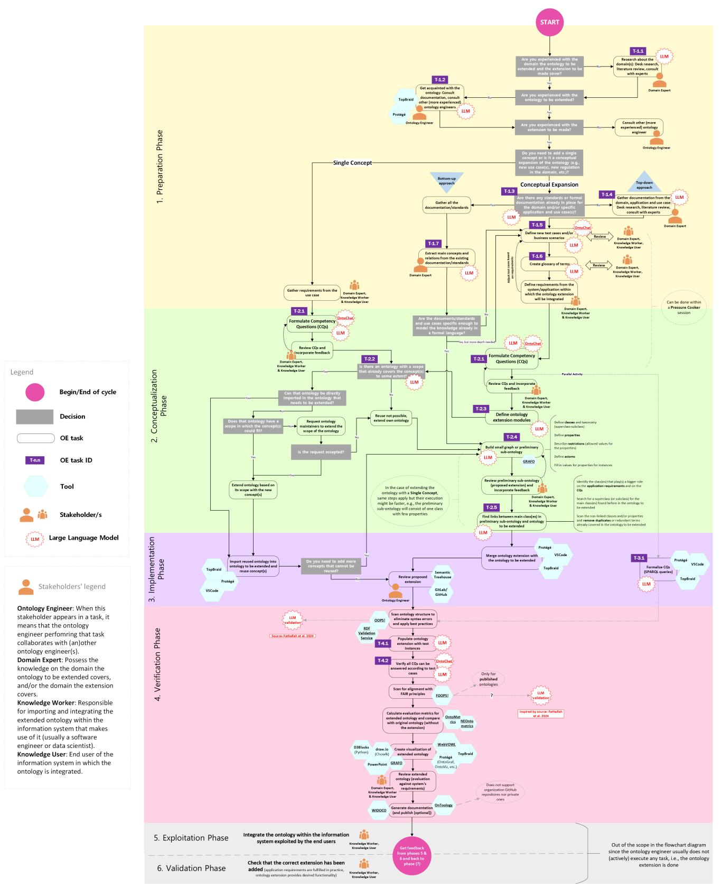

**Figure 5.1:** Prototype design for the ontology extension process framework for human-LLM collaboration (To-Be). This framework is the extended version of the As-Is process for ontology extension modeled in Figure [3.1](#page-30-0). Abbreviations: [Compentency Questions \(CQs\),](#page-10-10) [Large Language Models \(LLMs\)](#page-10-4), [Resource Description Framework \(RDF\).](#page-10-17) Detailed description and zoomed-in visualizations of each phase can be found in Section [D.1](#page-119-1) in Appendix [D.](#page-119-0)

|  |  | <b>Table 5.4:</b> Analysis of each OE task in the ontology extension process framework design (Figure $5.1$ ) that can be assisted by LLMs. |  |  |
|--|--|---------------------------------------------------------------------------------------------------------------------------------------------|--|--|
|  |  |                                                                                                                                             |  |  |

<span id="page-62-0"></span>

| OE<br>task<br>$\mathbf{ID}$ | $OE$ Task                                                                                                                                                  | Type of LLM or LLM-based tool                                                                                                                                                         | $NLP$ task /<br>$\text{multimodal task}$                                                          | Role of<br>$\mathbf{LLM}$                          | Output format                                                                                                                                                                                            | Need for LLM<br>engineer                                                                                                                         |
|-----------------------------|------------------------------------------------------------------------------------------------------------------------------------------------------------|---------------------------------------------------------------------------------------------------------------------------------------------------------------------------------------|---------------------------------------------------------------------------------------------------|----------------------------------------------------|----------------------------------------------------------------------------------------------------------------------------------------------------------------------------------------------------------|--------------------------------------------------------------------------------------------------------------------------------------------------|
| $T-1.1$                     | Research about the domain( $s$ )                                                                                                                           | General-purpose model (like GPT to add updated<br>$\text{and/or real-world knowledge}$                                                                                                | Information<br>Retrieval, Question<br>Answering                                                   | Domain<br>$\text{Expert}$                          | Natural language text                                                                                                                                                                                    | No                                                                                                                                               |
| $T-1.2$                     | Get acquainted with the<br>$\text{ontology}$                                                                                                               | General-purpose model (multimodal, capable of<br>understanding ontology code and explain in natural<br>language); Fine-tuned for $RDF/OWL$                                            | $\text{Question}$ Answering                                                                       | Ontology<br>Engineer                               | Natural language text; Mermaid<br>visualization of most important concepts in<br>$\text{ontology to be extended (Meyer et al.,}$<br>2023)                                                                | Yes if fine-tuned<br>model                                                                                                                       |
| $T-1.3$                     | Are there any standards or<br>$\text{formal documentation already}$<br>in place for the domain and/or<br>specific application and use<br>$\text{case(s)}?$ | General-purpose model (like $GPT$ to add updated<br>$\text{and/or real-world knowledge}$                                                                                              | Question Answering,<br>Recommendation                                                             | Domain<br>$\text{Expert}$                          | Natural language text                                                                                                                                                                                    | No                                                                                                                                               |
| $T-1.4$                     | Gather documentation from the<br>domain                                                                                                                    | General-purpose model (like GPT to add updated<br>$\text{and/or real-world knowledge}$                                                                                                | Information Retrieval                                                                             | Domain<br>$\text{Expert}$                          | Natural language text $(+$ source of relevant<br>$\text{documents}$                                                                                                                                      | No                                                                                                                                               |
| $T-1.5$                     | Define new test cases and/or $\frac{1}{2}$<br>business scenarios                                                                                           | General-purpose model; OntoChat (Zhang et al.,<br>$2024$ ); RAG                                                                                                                       | Keyphrase<br>Generation                                                                           | Domain<br>$\text{Expert}$                          | Natural language text (specific format can<br>be defined by ontology engineer)                                                                                                                           | $Yes \text{ if } RAG$                                                                                                                            |
| $T-1.6$                     | $Create \nglossary \ of \ terms$                                                                                                                           | $General\text{-}purpose model; RAG$                                                                                                                                                   | Information Retrieval                                                                             | Domain<br>$\text{Expert}$                          | Dictionary of terms (e.g., list or JSON),<br>each one including: name, synonyms,<br>natural language description, type (noun,<br>$\text{verb})$                                                          | $Yes \text{ if } RAG$                                                                                                                            |
| $T-1.7$                     | Extract main concepts and<br>relations from existing<br>$\text{documentation}/\text{standards}$                                                            | General-purpose model; Fine-tuned for task (e.g., $\mathcal{L}$<br>$REBEL$ (Huguet Cabot & Navigli, 2021))                                                                            | Information<br>$\text{Extraction}$                                                                | Ontology<br>Engineer                               | $List \t{of} \t{triples} \t{in} \t{the} \t{format} \t{(concept -)}$<br>$\text{relationship - concept)}$                                                                                                  | $Yes \text{ if fine-tuned}$<br>$model \ runs$<br>locally                                                                                         |
| $T-2.1$                     | Formulate Competency<br>Questions                                                                                                                          | General-purpose model (Rebboud et al., $2024$ );<br>Fine-tuned for task (e.g., $Zephyr$ ); $OntoChat$ (Zhang<br>et al., $2024$ )                                                      | Keyphrase<br>$\text{Generation (Question}$<br>Generation)                                         | Domain<br>$\text{Expert}$                          | $\text{List of CQs grouped into levels: low or}$<br>atomic, middle or connectivity, and high or<br>$\text{business}$                                                                                     | $Yes \text{ if fine-tuned}$<br>model                                                                                                             |
| $T-2.2$                     | Is there an ontology with a<br>scope that already covers the<br>$\text{concept(s)}$ to some extent?                                                        | General-purpose model (like $GPT$ to add updated<br>$\text{and/or real-world knowledge}$                                                                                              | Question Answering,<br>Recommendation                                                             | Ontology<br>Engineer,<br>Domain<br>$\text{Expert}$ | Natural language text                                                                                                                                                                                    | $\text{No}$                                                                                                                                      |
| $T-2.3$                     | $Define$ ontology extension<br>$\text{modules}$                                                                                                            | General-purpose model (like GPT to add updated<br>and/or real-world knowledge)                                                                                                        | $Text$ Classification,<br>Information<br>$\text{Extraction}$                                      | Ontology<br>Engineer                               | $\text{Sets}$ of CQs grouped in categories. Each<br>category has a name and a description                                                                                                                | No                                                                                                                                               |
| $T-2.4$                     | Build small graph or<br>$\text{preliminary sub-ontology}$                                                                                                  | General-purpose model (Fathallah et al., $2024$ );<br>Fine-tuned model for Description Logic modeling;<br>GPT Ontology Augmenter (Protégé plugin) (Mateiu<br>$\&\text{ Groza, }2023)$ | Information<br>Extraction $( +$<br>reasoning)                                                     | Ontology<br>Engineer                               | Ontology including class declarations,<br>subclass relationships, individuals,<br>properties and restrictions in $RDF / OWL /$<br>Turtle syntax, SHACL; Mermaid<br>visualization (Meyer et al., $2023$ ) | $Yes \text{ if fine-tuned}$<br>model                                                                                                             |
| $T-2.5$                     | Find links between main<br>$class(es)$ in preliminary<br>sub-ontology and ontology to be<br>$\text{extended}$                                              | General-purpose model (few-shot/CoT prompting)<br>(Amini et al., 2024; Norouzi et al., 2023); RAG<br>(Giglou et al., 2024); OLaLa (Hertling & Paulheim,<br>2023)                      | Ontology Matching $/$<br>Alignment                                                                | Ontology<br>Engineer                               | List of matching concepts from ontology to<br>be extended and ontology extension                                                                                                                         | $Yes \text{ if } RAG$                                                                                                                            |
| $T-3.1$                     | Formalize Competency<br>$\text{Questions into SPARQL queries}$                                                                                             | General-purpose model; Fine-tuned for coding (e.g.,<br>$\text{Copilot}$ ; Custom LLM-tool for SPARQL query<br>generation with LangChain (Bouter et al., $2024$ )                      | Coding (SPARQL<br>query)                                                                          | Ontology<br>Engineer                               | $\text{List of CQs and SPARQL queries}$                                                                                                                                                                  | $Yes \text{ if custom}$<br>$LLM$ -tool<br>(SPARQL<br>generation by<br>$LLMs$ is still<br>unstable<br>according to<br>LangChain<br>documentation) |
| $T-4.1$                     | Populate ontology extension<br>$\text{with instances}$                                                                                                     | General-purpose model (Fathallah et al., $2024$ )                                                                                                                                     | Information<br>$\text{Extraction (Named}$<br>Entity Recognition),<br>Coding (OWL, RDF,<br>Turtle) | Ontology<br>Engineer                               | $\text{Trijles in RDF}$                                                                                                                                                                                  | $\text{No}$                                                                                                                                      |
| $T-4.2$                     | Verify al CQs can be answered<br>according to test cases                                                                                                   | General-purpose model; $OntoChat$ (Zhang et al.,<br>2024)                                                                                                                             | Information<br>Retrieval, Question<br>Answering                                                   | Ontology<br>Engineer                               | List of $CQs$ included: if it can be answered<br>$(\text{yes/no})$ and explanation                                                                                                                       | $\text{No}$                                                                                                                                      |

52

# <span id="page-63-0"></span>5.6. Conclusion

In this chapter, we described the prototype design of an LLM-assisted process framework for ontology extension, which addresses SQ3: *What does the design of an integrated process framework for human-LLM collaboration for ontology extension look like?*. To integrate [LLMs](#page-10-4) in the ontology extension process, we decided to use the current ontology extension process modeled in Chapter [3](#page-26-0) and extend it by identifying which current [OE](#page-10-2) tasks can be facilitated by an LLM (Figure [5.1\)](#page-61-0). This identification is the result of a study on the [NLP](#page-10-5) capabilities of [LLMs](#page-10-4) and their similarities to the downstream [OE](#page-10-2) tasks in the ontology extension process (Table [5.1\)](#page-50-0). Moreover, current applications of [LLMs](#page-10-4) to [OE](#page-10-2) were analyzed and incorporated into the design. The application of [LLMs](#page-10-4) to [OE](#page-10-2) presents several inherent limitations of which ontology engineers at [TNO](#page-10-0) are aware. Because [LLMs](#page-10-4) cannot solve all the problems associated with the ontology extension process, we assessed currently available [OE](#page-10-2) tools that could help with some of the tasks that [LLMs](#page-10-4) cannot assist. Certain tasks must remain manual, as the expertise and richness in perspectives of human professionals cannot be fully replaced by [AI](#page-10-1) systems. The integrated process framework design depicted in Figure [5.1](#page-61-0) is complemented by a detailed description of how each specific [OE](#page-10-2) task in the ontology extension process can be implemented in practice with an LLM (see Table [5.4\)](#page-62-0) and a prompt template (see Section [D.2](#page-125-0) in Appendix [D\)](#page-119-0). We justified how all non-functional requirements, both structural and environmental (See Chapter [4\)](#page-40-0), are addressed by the prototype design. In the next chapter, we will demonstrate and evaluate the designed artifact, including the fulfillment of the functional design requirements.

<span id="page-64-0"></span>Demonstrating and Evaluating the human-LLM collaboration framework for ontology extension

6

Once the process framework for human-LLM collaboration has been designed, in this chapter we show how the artifact works in practice with a specific use case and we perform an *ex-post* evaluation with the use case chosen (Johannesson & Perjons, [2021\)](#page-95-6). Thus, in this chapter we answer SQ4: *How can the framework be demonstrated and evaluated with a specific use case, and to what extent does it improve the status quo?*. This chapter is divided into two parts. First, we demonstrate the artifact – the process framework prototype – with the selected use case and discuss the main insights observed in this testing phase. Second, we evaluate the output of the process framework prototype – the ontology extension – against the gold standard. Additionally, we evaluate the process with an end-user – an ontology engineer – and we assess to which extent the elicited requirements were fulfilled with the proposed design.

## <span id="page-64-1"></span>6.1. Description of the use case chosen

To demonstrate the artifact and show its feasibility, following Johannesson and Perjons ([2021\)](#page-95-6), we have chosen the use case called [Semantic Explanation and Navigation System \(SENS\),](#page-10-8) developed by [TNO](#page-10-0) in 2023. The project consists of the development of the [SENS](#page-10-8) module, an interoperable system that enables semantic communication between autonomous systems from diverse manufacturers and humans in the greenhouse environment. The assumption is that the use of autonomous systems in high-tech greenhouses will grow in the near future. As a consequence, heterogeneous autonomous systems will coexist in the greenhouse, together with human workers, such as growers, pickers, technicians, or managers. The greenhouse is a tight space, often composed of narrow paths and dense vegetation in which human workers and autonomous systems or robots must perform different tasks concerning the crops and use specific materials and tools. These tools can be in motion (e.g., carts), or could potentially be hazardous in specific situations (e.g., weeding knives or scissors). Currently, autonomous systems can detect obstacles obstructing their way, but will only stop without notifying the human operator. The goal of [SENS](#page-10-8) is to improve this state concerning foreseeable but unexpected situations by enabling the robots to semantically communicate and explain to the human operator the obstacle encountered and the level of urgency of the situation. With this information, the human operator can locate the robot in the greenhouse, judge the situation, and act accordingly (e.g., removing the obstacle from the robot's way). The ultimate goal is to increase the work efficiency of both autonomous systems and human workers in the greenhouse while maintaining a safe work environment for all.

The [Common Greenhouse Ontology \(CGO\)](#page-10-7)[1](#page-64-2) is introduced in the project [SENS](#page-10-8) to enable the semantic communication and interoperability between robots from different manufacturers, which might use various communication protocols and standards. The [CGO](#page-10-7) is a public domain ontology focused on high-tech greenhouse infrastructure and the systems measuring the necessary data to effectively monitor and control the crops' growth inside the greenhouse, such as climate data (Bakker, van Drie, et al., [2021;](#page-93-3) Verhoosel et al., [2023](#page-98-8)). The [CGO](#page-10-7) was extended within the [SENS](#page-10-8) project to include all the concepts and relations needed to model the use case. As part of the project [SENS](#page-10-8) a web application prototype was built to showcase the use case. The web application included a dashboard as the user interface for the human operator, in which the information reasoned by the robots via the [SENS](#page-10-8) module is

<span id="page-64-2"></span><sup>1</sup><https://gitlab.com/ddings/common-greenhouse-ontology>

presented. The [CGO](#page-10-7) was extended accordingly to provide all the necessary information in the dashboard and fulfill the application's requirements. We have chosen this use case for several reasons:

- The [SENS](#page-10-8) use case is a real-life case, providing a more accurate and representative context than an artificial or fictitious use case (Johannesson & Perjons, [2021](#page-95-6)).
- The documentation of the [SENS](#page-10-8) use case is available and sufficient to demonstrate the process framework prototype.
- The [CGO](#page-10-7) is a big ontology (thousands of classes and instances, and hundreds of relations), which is an accurate representation of most ontologies currently. Encouraging the reusability of standards, big ontologies might need to be extended frequently.
- The [CGO](#page-10-7) is public, thus there are no confidentiality concerns.
- The [CGO](#page-10-7) was *manually* extended (without using [LLMs](#page-10-4) or any other type of automated system) to model the [SENS](#page-10-8) use case and successfully develop and test the [SENS](#page-10-8) system and all its components, including the dashboard presenting the information to the end-user. This provides us with a gold standard (the manually developed [SENS](#page-10-8) extension) that can be used to evaluate the output of the process framework prototype.
- The high-tech greenhouse domain is a relevant topic for society, significantly impacting the advancement of agri-tech innovation and sustainable food production.

The full use case description used for the demonstration and evaluation of the process framework prototype is provided in Section [E.1](#page-131-1) (Appendix [E](#page-131-0)).

# <span id="page-65-0"></span>6.2. The gold standard

As part of the project [Semantic Explanation and Navigation System \(SENS\)](#page-10-8) developed by [TNO](#page-10-0) in 2023, the [Common](#page-10-7) [Greenhouse Ontology \(CGO\)](#page-10-7) was extended manually, i.e., without using [LLMs](#page-10-4). The extension process was guided by the development in parallel of the [SENS](#page-10-8) dashboard, a web application with a user interface in which the user, in this case, the human operator in the greenhouse, would receive notifications from the robots. The [SENS](#page-10-8) extension was conceptualized based on some [Compentency Questions \(CQs\)](#page-10-10) covering mainly the knowledge about types of obstacles found in the greenhouse and types of situations and actions related to the characteristics of the obstacles or objects. From four ontologies identified as potentially reusable for the [SENS](#page-10-8) use case extension, two ontologies were selected and reused: the SOMA ontology (Beßler et al., [2021](#page-93-17)) and the Dolce/DUL ontology (Borgo et al., [2022\)](#page-93-18). The [SENS](#page-10-8) system was integrated with a tag-based positioning system that enabled the identification of the tagged objects and people in the greenhouse. For the demonstration of the process framework prototype, we will leave the specifics of the integration of the [CGO](#page-10-7) with the positioning system out of the scope of the use case, and we will focus on the obstacles and situations. The [CGO](#page-10-7) was extended by adding the concepts and relations for [SENS](#page-10-8) one by one to the ontology. Figure [6.1](#page-66-2) illustrates the manual [SENS](#page-10-8) extension to the [CGO](#page-10-7) developed and used here as our gold standard. The visualization has been generated with TopBraid, using the code for the use case [SENS](#page-10-8) in the public GitLab repository of the [CGO](#page-10-7)[2](#page-65-1) .

<span id="page-65-1"></span><sup>2</sup>[https://gitlab.com/ddings/common-greenhouse-ontology/-/tree/sens?ref\\_type=heads](https://gitlab.com/ddings/common-greenhouse-ontology/-/tree/sens?ref_type=heads)

<span id="page-66-2"></span>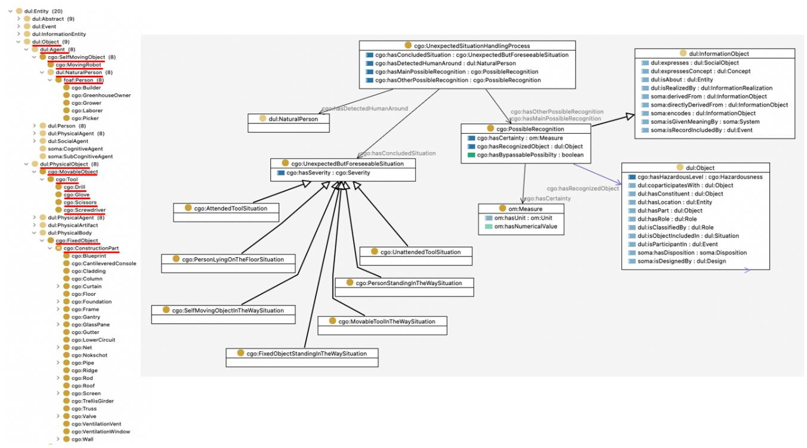

**Figure 6.1:** The [SENS](#page-10-8) extension to the [CGO](#page-10-7), the gold standard. Object hierarchy (left) and graph visualization (right). Highlighted in red some of the main concepts added for the [SENS](#page-10-8) extension. Visualization generated with TopBraid, using the code for the use case [SENS](#page-10-8) in the public GitLab repository of the [CGO.](#page-10-7)

## <span id="page-66-0"></span>6.3. Demonstration of the process framework prototype

In this section, we focus on the demonstration of the process framework prototype design. First, we explain and describe the set-up for the demonstration (Section [6.3.1\)](#page-66-1), and finally, we discuss the results obtained within the demonstration of the process framework using the selected use case (Section [6.3.2\)](#page-67-0).

#### <span id="page-66-1"></span>6.3.1. Demonstration protocol

To demonstrate the human-LLM collaboration framework for ontology extension prototype, I – as a researcher and adopting the role of a beginner ontology engineer – performed a walk-through of all the [OE](#page-10-2) tasks in the process framework (Figure [5.1](#page-61-0)) that can be assisted by [LLMs](#page-10-4), further documented in Table [5.4](#page-62-0). All the prompt templates provided in Section [D.2](#page-125-0) (Appendix [D\)](#page-119-0) were adjusted to the [SENS](#page-10-8) use case, replacing the placeholders by the corresponding information concerning the [CGO](#page-10-7) and the greenhouse domain, and using the description of the extension [SENS](#page-10-8) use case provided in Section [E.1](#page-131-1) (Appendix [E](#page-131-0)).

We opted to use [GPT-](#page-10-9)4 Omni[3](#page-66-3) (or [GPT-](#page-10-9)4o) from OpenAI[4](#page-66-4) as the LLM for all the identified [OE](#page-10-2) tasks. Moreover, we built a custom [GPT](#page-10-9) Assistant[5](#page-66-5) using OpenAI's developer platform. [GPT](#page-10-9) Assistants are advanced [AI](#page-10-1) tools that enable the integration of [GPT](#page-10-9) models in specific use cases and applications. They can be customized to specific tasks or domains, and be used with different [GPT](#page-10-9) models. There are several reasons why we have decided to choose this model and setup:

- The exploration of current applications of [LLMs](#page-10-4) to [OE](#page-10-2) tasks (Section [5.3](#page-51-0) in Chapter [5\)](#page-48-0) has shown that the performance of [GPT](#page-10-9) models is comparable to the performance of other models fine-tuned specifically for the task, and often [GPT](#page-10-9)-4 outperforms other proprietary and open-source models.
- [LLMs](#page-10-4) such as [GPT](#page-10-9) can add real-world knowledge, necessary for the tasks in the Preparation and Conceptualization stages of the ontology extension process (as discussed with Interviewee 8, see Section [B.0.3\)](#page-102-0).

<span id="page-66-3"></span><sup>3</sup><https://openai.com/index/hello-gpt-4o/>

<span id="page-66-4"></span><sup>4</sup><https://openai.com/>

<span id="page-66-5"></span><sup>5</sup><https://platform.openai.com/docs/assistants/overview>

- As a general-purpose model, [GPT-](#page-10-9)4o can perform a wide range of tasks. Therefore, we can simplify the demonstration process by using the same model for all the different [OE](#page-10-2) tasks in the ontology extension process design.
- While its performance is comparable to [GPT-](#page-10-9)4 and [GPT](#page-10-9)-4 Turbo, [GPT](#page-10-9)-4o is faster and cheaper, according to OpenAI (OpenAI, [2024\)](#page-97-20).
- The creation of a custom [GPT](#page-10-9) Assistant allows the creation of a file store from which the model can retrieve information (from the files uploaded). This functionality allows us to overcome the context window limitation (i.e., there is a maximum number of tokens that the input of the chatbot interface can accept), and to have higher control over the sources from which the model can take the information to produce a relevant output (as discussed with Interviewee 2, see Section [B.0.3\)](#page-102-0).
- Creating a [GPT](#page-10-9) Assistant can be done easily through OpenAI's developer platform. Without having to code, any user with little or no experience using [LLMs](#page-10-4) can create an assistant. This aligns with the user-friendliness of the process framework prototype design.

Following the advice and insights from other research projects at [TNO](#page-10-0) using [LLMs](#page-10-4), we created a [GPT](#page-10-9) Assistant called Common Greenhouse Ontology Expert. The Common Greenhouse Ontology Expert plays the role of an experienced ontology engineer with domain expertise in the greenhouse domain to help the user, the ontology engineer, develop the [SENS](#page-10-8) extension. In its file store, we included a text file containing relevant information about the [CGO,](#page-10-7) taken from its public GitLab repository, and another text file containing the [CGO](#page-10-7) code formatted as a Turtle triples file. We used a version of the [CGO](#page-10-7) code before the implementation of [SENS,](#page-10-8) i.e., the [CGO](#page-10-7) code uploaded to the file store of the [GPT](#page-10-9) Assistant does not contain any data related to the [SENS](#page-10-8) use case. In the model instructions' input we included the following text:

```
You are an experienced ontology engineer with expertise in the greenhouse domain. The user is also an
    ontology engineer , who needs you helpful assistance to create an extension to the Common Greenhouse
    Ontology (CGO). The extension consists in adding new concepts and relations to the CGO to cover a new
     use case. The user will ask you for suggestions for different tasks in the ontology development
    process. In your answers , please be as concise as possible. Do not include any explanations or
    apologies in your responses (unless otherwise specified by the user). Answer the questions in the
    format specified by the user. When asked about the existing Common Greenhouse Ontology , make sure you
     only use the information provided in the file called cgo with the extension \".txt\" but formatted
    as a turtle triples file, without creating new entities , relations , concepts , or any type of data
    that is not already in the file provided. When asked questions for modeling the new extension , use
    the files provided but also your knowledge base to provide correct and useful suggestions to the user
    . Make sure the code you provide is syntactically correct.
```

<span id="page-67-0"></span>Any other settings available in the [GPT](#page-10-9) Assistant customization interface were left as default.

#### 6.3.2. Demonstration results

I, in the role of an ontology engineer, executed all the prompts designed (Section [D.2](#page-125-0)) for the LLM-assisted [OE](#page-10-2) tasks of the process framework for ontology extension prototype to extend the [Common Greenhouse Ontology \(CGO\)](#page-10-7) based on the [SENS](#page-10-8) use case. [GPT-](#page-10-9)4o was used for all the tasks, through a customized [GPT](#page-10-9) Assistant playing the role of a Common Greenhouse Ontology Expert, instructed to be an expert ontology engineer with domain expertise in the greenhouse sector and assist the user – myself acting as a beginner ontology engineer – to develop the extension to the [CGO.](#page-10-7) The resulting outputs for each task are included in Section [E.2](#page-132-0) of Appendix [E](#page-131-0). For each task, the input is also indicated when additional files or text have been added to the prompt or uploaded as a file to the file store of the [GPT](#page-10-9) Assistant, or the prompt has been significantly modified (beyond the replacement of the placeholders). When additional prompts were used, this was also indicated in the task. For each output of the tasks executed, we included an observation, reflecting on the output of the LLM and focusing on the correctness and usefulness of the task for the ontology engineer (See Table [6.1\)](#page-69-1). The main insights are:

- **Preparation phase Getting acquainted with the domain, the ontology to be extended, and the extension**: Tasks 1.1, 1.2, and 1.3 produced relevant results that can be used by the ontology engineer to get acquainted with the domain, the ontology to be extended and the ontology extension. The outputs can serve as inspiration to the ontology engineer, but the information must be reviewed and checked, for example by opening the ontology file in Protégé or TopBraid. The [LLMs](#page-10-4) can complement the information provided by these tools, though not replace them.
- **Preparation phase Gathering existing standards**: The output Task 1.4 was fully hallucinated. Thus,

this indicates that the ontology engineer should use conventional search engines instead of an [LLMs](#page-10-4) for this task.

- **Preparation phase Defining business scenarios, creating a glossary of terms, and extracting concepts and relations from existing standards**: Tasks 1.5, 1.6, and 1.7 produced relevant suggestions with few-shot prompting and by making the instructions in the prompts very specific.
- **Conceptualization phase Formulating [Compentency Questions \(CQs\)](#page-10-10)**: Though also highly dependent on the quality of the documentation of the use case provided, the output of task 2.1 was surprisingly relevant. The quality achieved was not expected after examining the results of previous research on the topic (Rebboud et al., [2024\)](#page-97-14). In this case, the [CQs](#page-10-10) produced were similar to the ones formulated in the gold standard (e.g., *CQ1: What type of obstacle has the robot detected?*, *CQ2: Where is the robot currently located?*) and some of them provided relevant suggestions that were not thought of in the gold standard but that could be added (e.g., *CQ10: How much time did the robot take to avoid the obstacle?*, *CQ13: How many obstacles have been detected within a specified timeframe*?).
- **Conceptualization phase Reusing existing ontologies and defining modules**: The output to task 2.2 included 1 correct suggestion of an ontology that could be reused for the use case [SENS,](#page-10-8) from the 2 ontologies reused in the gold standard (in total 4 were proposed). The output to task 2.3 produced coherent suggestions to modularize the ontology, though it is not clear if it is useful in reality, since the ontology extension is small in this case.
- **Conceptualization phase Building the ontology extension and aligning the extension with the ontology to be extended**: The output of task 2.4 needed to combine few-shot prompting to the prompting chaining technique proposed in order to add depth to the ontology (for example, to add sub-classes to the class Obstacle and to the class Situation), and to apply several corrections. But overall, the code provided by [GPT](#page-10-9) in Turtle/[OWL](#page-10-18) syntax was syntactically correct and the model was able to identify mistakes and correct them. It is worth mentioning that [GPT](#page-10-9) established severity levels for the situations according to their characteristics and the impact on the functioning of the robot, without specifying this in any prompt. The reasoning by [GPT](#page-10-9) is logical and similar to the gold standard. Thus, this task is useful if the ontology engineer wants to use [GPT](#page-10-9) to obtain an initial version of an ontology without having to write a single line of code or without having to do it manually in Protégé. For an inexperienced ontology engineer, this task might be much more useful, providing a solid starting point while learning good [OE](#page-10-2) practices. The final ontology resulting from this task can be seen below in Figure [6.2.](#page-69-0) Some prompts were inspired by the work of Fathallah et al. ([2024](#page-94-14)). Following the approach of Amini et al. [\(2024\)](#page-93-12), the suggestions for aligning the ontology extension with the ontology to be extended given in task 2.5 are relevant and provide additional insights compared to the gold standard.
- **Implementation phase Formalizing [CQs](#page-10-10) into SPARQL queries**: The output of task 3.1 was unexpectedly high quality with zero-shot prompting. Though the potential of using [LLMs](#page-10-4) for this task has been demonstrated (both inside and outside [TNO\)](#page-10-0), the performance of [LLMs](#page-10-4) for this task is claimed to be "unstable" (LangChain, [n.d.](#page-96-22)). In this test, from the 16 [CQs](#page-10-10) provided to [GPT](#page-10-9), all were syntactically correct when executed in Protégé and 8 gave results (see Figure [E.6](#page-150-1) as an example). Some SPARQL queries produced revealed the reasoning capabilities of [GPT](#page-10-9), such as *CQ6: Why has the robot made the specific decision for obstacle avoidance?*, in which it is not explicit how the robot makes a decision. The SPARQL query produced shows that [GPT](#page-10-9) correctly identified that to answer that CQ, information about the outcome of the situation, the obstacle type, the recommended action, and the explanation was needed (see Figure [E.10](#page-152-2)). Though the SPARQL queries produced by [GPT](#page-10-9) might need some manual post-processing, perhaps to simplify them, this output gives a solid start to ontology engineers and might be especially relevant for domain experts with scarce knowledge on SPARQL query generation.
- **Verification phase Populating ontology and verifying [CQs](#page-10-10)**: With task 4.1 the ontology extension was populated with relevant individuals and as a result, 14 out of the 16 SPARQL queries generated previously gave results when executed in Protégé. This task can be especially useful since it can fully eliminate the cumbersome process of having to create manually a lot of individuals, as discussed with Interviewee 11 (see Section [B.0.3\)](#page-102-0). The output of task 4.2, inspired by the work of Zhang et al. [\(2024](#page-98-12)), is almost fully correct, with 14 out of 16 [CQs](#page-10-10) correctly identified. The potential of this task relies on the capacity of the user to spot the mistakes and judge the output, but it can provide a solid starting point and serve as a guide to less experienced ontology engineers. The highest benefit of this task is that the ontology extension can be verified without having to use SPARQL queries, which could make the task especially useful for domain experts (who might not know how to write SPARQL queries).

<span id="page-69-0"></span>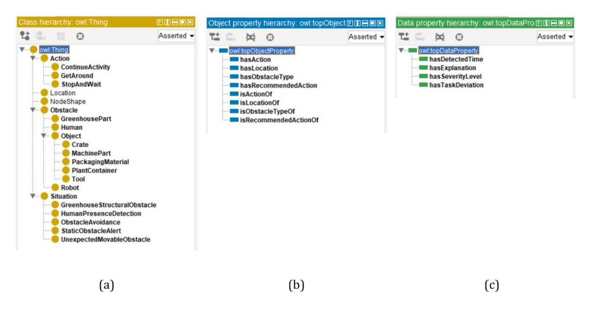

**Figure 6.2:** Output of Task 2.4 – Final version of the ontology extension (concepts to be added to the [CGO](#page-10-7)) generated using the human-LLM collaboration process framework prototype (after all additional prompts) – a) Classes; b) Object properties; and c) Data properties. Visualized in Protégé.

| OE<br>Task<br>ID | OE Task                                                                                                                                 | Observations                                                                                                                                                                                                                                                                                                                                                                                                                                                                                                                                                                                                                                                                                                  |  |
|------------------|-----------------------------------------------------------------------------------------------------------------------------------------|---------------------------------------------------------------------------------------------------------------------------------------------------------------------------------------------------------------------------------------------------------------------------------------------------------------------------------------------------------------------------------------------------------------------------------------------------------------------------------------------------------------------------------------------------------------------------------------------------------------------------------------------------------------------------------------------------------------|--|
| T-1.1            | Research about the domain(s)                                                                                                            | Output is more relevant when the description of the extension use case is<br>provided as text in the prompt instead of uploading a text file in the file<br>store of the assistant. The output provided seems relevant and useful.                                                                                                                                                                                                                                                                                                                                                                                                                                                                            |  |
| T-1.2            | Get acquainted with the ontology                                                                                                        | Q1: Most of the information seems relevant and not hallucinated. It<br>struggles to identify which concepts are "main" concepts. The term<br>"main" seems vague, thus the user should use more concrete terms or<br>explain what is meant by "main". Q2: Most of the information seems<br>relevant and not hallucinated. It incorrectly identifies<br>sosa:ActuatableProperty and sosa:ObservableProperty as relations<br>(object or data properties) when they are classes. When told the error, it<br>identifies and corrects the mistake. Q3: Mermaid visualization looks a<br>bit confusing. Output is better when asked to visualize a small part of<br>the ontology (e.g., a class and its properties). |  |
| T-1.3            | Are there any standards or formal doc<br>umentation already in place for the do<br>main and/or specific application and<br>use case(s)? | Output seems correct and not hallucinated. The links provided work.                                                                                                                                                                                                                                                                                                                                                                                                                                                                                                                                                                                                                                           |  |
| T-1.4            | Gather documentation from the do<br>main                                                                                                | Q1: Most of the information seems hallucinated. Proposed sources<br>cannot be found on the internet or Google Scholar. Q2: Output could<br>be helpful to extract main concepts and definitions in the domain.                                                                                                                                                                                                                                                                                                                                                                                                                                                                                                 |  |
| T-1.5            | Define new test cases and/or business<br>scenarios                                                                                      | Output varies a lot depending on the prompt. If the description of the<br>use case is too vague, the answer is very broad, producing irrelevant<br>business scenarios. When the description is more detailed and scoped,<br>the output answer is much more relevant.                                                                                                                                                                                                                                                                                                                                                                                                                                          |  |
|                  |                                                                                                                                         | Continued on next page                                                                                                                                                                                                                                                                                                                                                                                                                                                                                                                                                                                                                                                                                        |  |

<span id="page-69-1"></span>**Table 6.1:** Observations for each [OE](#page-10-2) task executed with [GPT](#page-10-9) during the walk-through using the process framework design prototype.

| OE<br>Task<br>ID | OE Task                                                                                          | Observations                                                                                                                                                                                                                                                                                                                                                                                                                                                                                                                                                                                                                                                                                                                                                                                                                                                                                                                                             |
|------------------|--------------------------------------------------------------------------------------------------|----------------------------------------------------------------------------------------------------------------------------------------------------------------------------------------------------------------------------------------------------------------------------------------------------------------------------------------------------------------------------------------------------------------------------------------------------------------------------------------------------------------------------------------------------------------------------------------------------------------------------------------------------------------------------------------------------------------------------------------------------------------------------------------------------------------------------------------------------------------------------------------------------------------------------------------------------------|
| T-1.6            | Create glossary of terms                                                                         | Output improves if the task is decomposed (first asking for the list of<br>concepts and then asking for the definition). Because the documents<br>provided in the test are not very extensive, only 19 concepts are<br>identified. This makes the results of the following prompts look trivial.<br>This task might not be so useful for use cases that do not have extensive<br>documentation.                                                                                                                                                                                                                                                                                                                                                                                                                                                                                                                                                          |
| T-1.7            | Extract<br>main<br>concepts<br>and<br>rela<br>tions from existing documentation/s<br>tandards    | Tested with a simple, fictitious JSON structure. The LLM does not seem<br>to understand that the user is modeling an ontology, even if specified in<br>its system and in the prompt (zero-shot). Several corrections (few-shot)<br>are needed to establish correct ontological relationships, e.g., creation of<br>superclass-subclass relationships. The outputs be corrected by applying<br>few-shot prompting and providing examples and corrections. It could be<br>possible to achieve better quality in the responses with a fine-tuned<br>model or by training the general-purpose model by prompting. In the<br>latter option, the question would be how much time does it save in the<br>ontology engineering process compared to doing this task manually.                                                                                                                                                                                     |
| T-2.1            | Formulate Competency Questions                                                                   | The quality of the CQs depends a lot on how well the use case is<br>described. In this case, a file describing the business scenarios and new<br>concepts to add was uploaded. The file content was taken from T-1.1<br>and T-1.5 and manually reviewed and modified: we homogenized the<br>information exchanged between the Robot and the Human Operator and<br>we replaced the actions of the Human Operator by Receives the<br>notification and monitors the robot's decision for all the business<br>scenarios to reflect that the communication is only one-way, from the<br>autonomous system to the human operator. We added the suggestions<br>of new concepts to add to the ontology given in the input of T-1.1. Most<br>of the CQs produced by GPT are low-level, but seem relevant. The<br>question would be how often a good description of the use case and<br>business scenarios are available in real life ("garbage in, garbage out"). |
| T-2.2            | Is there an ontology with a scope that<br>already covers the concept(s) to some<br>extent?       | GPT is able to identify 1 of the 2 ontologies reused in the CGO for the<br>SENS extension (Dolce/DUL ontology). Thus, the ontology engineer<br>might miss relevant ontologies if only using GPT.                                                                                                                                                                                                                                                                                                                                                                                                                                                                                                                                                                                                                                                                                                                                                         |
| T-2.3            | Define ontology extension modules                                                                | Modules generated and CQs associated to them seem coherent overall.<br>Whether the modules are relevant to include to the CGO is unclear. The<br>task might be more relevant when developing a bigger extension, hence<br>more CQs (in this case the input had a total of 16 CQs).                                                                                                                                                                                                                                                                                                                                                                                                                                                                                                                                                                                                                                                                       |
| T-2.4            | Build small graph or preliminary sub<br>ontology                                                 | Provided same file as for T-2.1 with reviewed business scenarios (from<br>T-1.5), suggestions of which CGO concepts are relevant to the extension<br>and which ones should be added (from T-1.1), and added the list of CQs<br>(from T-2.1) and CGO prefixes. If not including the business scenarios,<br>only including the CQs produced a very small and flat ontology.<br>Additional prompts are necessary for GPT to create a richer ontology,<br>with a deeper taxonomy level.                                                                                                                                                                                                                                                                                                                                                                                                                                                                      |
| T-2.5            | Find links between main class(es) in<br>preliminary sub-ontology and ontol<br>ogy to be extended | The output seems relevant with zero-shot using the information from<br>the output of T-1.2. Not all alignment suggestions seem correct, such as<br>making the class Object of SENS a subclass of the class Sensor in the<br>CGO. But other suggestions could be used, such as making the class<br>Robot of SENS a subclass of System in CGO, or merging the class<br>Location of SENS with the classes Grid or Place of the CGO.                                                                                                                                                                                                                                                                                                                                                                                                                                                                                                                         |
| T-3.1            | Formalize Competency Questions into<br>SPARQL queries                                            | The zero-shot approach without examples was tried. First, one CQ at a<br>time was given. Then, a list of CQs was given and GPT was asked to<br>provide a SPARQL query for each CQ in the list. Of the 16 SPARQL<br>queries produced for the 16 CQs, 8 gave results when executed using the<br>plugin SPARQL Query in Protégé. All the CQs were checked in Protégé<br>and all seem to be syntactically correct.                                                                                                                                                                                                                                                                                                                                                                                                                                                                                                                                           |
|                  |                                                                                                  |                                                                                                                                                                                                                                                                                                                                                                                                                                                                                                                                                                                                                                                                                                                                                                                                                                                                                                                                                          |

**Table 6.1:** Observations for each [OE](#page-10-2) task executed with [GPT](#page-10-9) during the walk-through using the process framework design prototype. (continued)

*Continued on next page*

| OE<br>Task<br>ID | OE Task                                                    | Observations                                                                                                                                                                                                                                         |
|------------------|------------------------------------------------------------|------------------------------------------------------------------------------------------------------------------------------------------------------------------------------------------------------------------------------------------------------|
| T-4.1            | Populate ontology extension with in<br>stances             | From the list of 16 CQs with 16 SPARQL queries, 14 of the SPARQL<br>queries executed produced results when executed in Protégé after GPT<br>populated the ontology.                                                                                  |
| T-4.2            | Verify all CQs can be answered accord<br>ing to test cases | From the list of 16 CQs, 14 were correctly identified as Yes/No.<br>Numbers 2 and 12 are incorrect. This task is promising since it allows<br>the ontology engineer to test the ontology without having to translate<br>the CQs into SPARQL queries. |

**Table 6.1:** Observations for each [OE](#page-10-2) task executed with [GPT](#page-10-9) during the walk-through using the process framework design prototype. (continued)

# <span id="page-71-0"></span>6.4. Evaluation of the process framework prototype

In this part, we focus on the *ex-post* evaluation of the process framework prototype design (Johannesson & Perjons, [2021\)](#page-95-6). First, we briefly explain the evaluation plan, and after we show the evaluation results on three different layers: 1) Comparison of the output with the gold standard; 2) Evaluation of the process framework design with an end-user; and 3) Evaluation of requirement adherence in the proposed design.

## <span id="page-71-1"></span>6.4.1. Evaluation protocol

To evaluate the artifact and assess to what extent it improves the status quo, following Johannesson and Perjons [\(2021](#page-95-6)), we have chosen a multifaceted approach:

- First, we compare the output generated by the demonstration or walk-through of the process framework (the [SENS](#page-10-8) ontology extension generated with the [GPT](#page-10-9) Assistant and using the process framework prototype in Section [6.3](#page-66-0)) with the gold standard (the [SENS](#page-10-8) ontology extension developed manually).
- Second, an end-user (an ontology engineer) is asked to use the process framework prototype and perform an extension using the same use case as for the demonstration of the prototype (the [CGO](#page-10-7) and [SENS](#page-10-8)). The end-user is asked to evaluate the set of the proposed LLM-assisted [OE](#page-10-2) tasks in the process framework prototype design executed.
- Finally, we show how the proposed design fulfills the requirements elicited in Chapter [4](#page-40-0).

Though a real use case has been chosen to demonstrate and evaluate the artifact, this evaluation can be classified as *artificial* (Johannesson & Perjons, [2021\)](#page-95-6) if compared to a real setting in which the ontology engineer would use the process framework prototype while working together with other ontology engineers, domain experts, knowledge workers, and knowledge users. While testing the design prototype using a real case and in a real setting would be extremely useful for its evaluation, the time and stakeholder participation needed extend beyond the duration of this thesis research project. By following a multifaceted approach we try to mitigate this limitation and provide a thorough evaluation of the prototype design.

#### End-user evaluation protocol

For the end-user evaluation of the process framework design, we asked a beginner ontology engineer at [TNO](#page-10-0) to use the process framework design to perform the extension to the [Common Greenhouse Ontology \(CGO\)](#page-10-7) based on the [Semantic Explanation and Navigation System \(SENS\)](#page-10-8) use case. We used the same [GPT](#page-10-9) Assistant created for the demonstration (the Common Greenhouse Ontology Expert), maintaining the same configuration. The ontology engineer had some previous experience with the [CGO](#page-10-7). We specifically chose this profile because: 1) It matches the intended audience of the process framework design (ontology engineers with varying levels of expertise); 2) Through the demonstration phase, it was shown that several tasks in the process framework design could be particularly valuable for less experienced ontology engineers since they are based on best practices and thus not only facilitate the task but also provide guidance in the extension process; 3) The ontology engineer did not have previous experience with the use case [SENS,](#page-10-8) which reduces potential biases on how to model the extension.

The setup of the end-user evaluation consisted of a session of 2.5 hours of duration in which we observed how the ontology engineer used the process framework prototype. For each task of the process framework prototype executed with the LLM (the [GPT-](#page-10-9)4o Assistant) we asked the ontology engineer to give a score. The scoring system will be explained below. All the information for the session was documented in an internal GitLab repository shared with the ontology engineer. In this repository, we included the description of the use case for the extension (provided in Section [E.1](#page-131-1) of Appendix [E](#page-131-0)); the ontology to be extended: [CGO](#page-10-7) code (before the [SENS](#page-10-8) implementation, i.e., with no data about [SENS\)](#page-10-8); the human-LLM collaboration framework prototype (Figure [5.1\)](#page-61-0) including a document with all the prompt templates (provided in Section [D.2](#page-125-0) of Appendix [D\)](#page-119-0); and an Excel file to evaluate each LLM-assisted task executed.

For the tasks' evaluation, we used a scoring system based on a simplified version of a Likert scale[6](#page-72-1) . The ontology engineer was asked to give a score on the task based on the following scoring system:

- **Score = 1**: *Task does not work well with LLM. Too much manual processing of the output is needed. It confuses more than helps.*
- **Score = 2**: *Task works with LLM, but still needs some manual processing. Usefulness for the task looks promising with some further improvements.*
- **Score = 3**: *Task works quite well with LLM, with little or no manual processing needed.*

The objective of this evaluation is to collect end-user feedback on the validity of the process framework design, with a specific focus on the LLM-assisted tasks. We decided to prioritize these tasks because we are interested to see how [LLMs](#page-10-4) can facilitate the current ontology extension process. While evaluating how other tools can facilitate the process is also essential, we decided to leave this beyond the scope of this experiment, and hence beyond the scope of this research project. The feedback from the end-user aims to provide insights into how effectively the proposed design facilitates the ontology extension process compared to the current practice of manually extending an ontology without the process framework and LLM support.

#### <span id="page-72-0"></span>6.4.2. Evaluation results

#### Comparison with the gold standard

As discussed previously in Chapter [5,](#page-48-0) research on the evaluation of ontologies is still ongoing, with many questions remaining unanswered due to the lack of a single correct method for modeling the information of a domain. The quality of an ontology is primarily determined by its ability to answer the [Compentency Questions \(CQs\)](#page-10-10) and meet the knowledge requirements of the end-user. Additionally, operational ontologies must satisfy the specific needs of the systems in which they are integrated (Noy & McGuinness, [2001](#page-96-17)) (Validation phase), which may differ from the [CQs,](#page-10-10) and this should be considered when evaluating the quality of an ontology.

Acknowledging the problems associated with the evaluation of ontologies and knowledge graphs, researchers such as Trajanoska et al. [\(2023](#page-98-15)), Saeedizade and Blomqvist ([2024\)](#page-97-13) and Fathallah et al. [\(2024\)](#page-94-14) propose qualitative metrics based on best practices and modeling principles; correctness of the syntax and presence of certain classes and restrictions that according to the authors show a more sophisticated understanding of ontology conceptualization; and structural metrics such as number of classes, object and data properties, respectively. Assuming that so far, automated methods for ontology development generate flat ontologies, in the work of Fathallah et al. [\(2024](#page-94-14)) it is concluded that "the more the better", which can be valid in the context of comparing LLM-created ontologies to manually developed ontologies, but is not always true in reality. If an ontology can effectively represent the domain or use case with fewer data but still meets the requirements of the use case or the application, then that might reduce the complexity of the model and the amount of data needed. On the other hand, employing quantitative metrics such as the ones provided by Reiz and Sandkuhl [\(2022](#page-97-18)) provides a more objective framework for evaluation, but lacks the depth and richness of qualitative metrics, and is only meaningful when compared.

Thus, we have decided to discuss some of the main differences that we can observe in the manually developed [SENS](#page-10-8) extension (the gold standard) (Figure [6.1\)](#page-66-2) and the [SENS](#page-10-8) ontology extension generated using [GPT-](#page-10-9)4 Omni with the process framework prototype (Figure [6.2](#page-69-0)) (for better readability identified as [SENS](#page-10-8)[-GPT](#page-10-9) from now on):

- The gold standard has a richer taxonomy for class Situation, with 7 sub-classes in total compared to the 5 subclasses modeled in [SENS](#page-10-8)-[GPT](#page-10-9). Even though the types of situations generated in [SENS](#page-10-8)-[GPT](#page-10-9) are very similar to the gold standard, it lacks the distinction between the position of the human detected (standing or lying) and the distinction between attended and unattended tool. These distinctions were used to model different types of situations with different severity levels for the human operator to act upon.
- In the gold standard, obstacles were categorized as fixed objects (class cgo:FixedObject which includes parts of the greenhouse infrastructure, already part of the [CGO](#page-10-7)), self-moving objects (class cgo:SelfMovingObject which

<span id="page-72-1"></span><sup>6</sup>[https://en.wikipedia.org/wiki/Likert\\_scale](https://en.wikipedia.org/wiki/Likert_scale)

includes the sub-classes cgo:MovingRobot and dul:NaturalPerson), and physical objects (class dul:PhysicalObject that includes the sub-class cgo:MovableObject). This reuse of existing classes in the [CGO](#page-10-7) and other ontologies contributes to higher reusability of standards and interoperability of the extended [CGO](#page-10-7). In [SENS-](#page-10-8)[GPT](#page-10-9) the class Object contained only the sub-classes GreenhousePart (already existing in the [CGO\)](#page-10-7), Human, and Object.

- In the gold standard the severity level of a situation was modeled as an object property while in [SENS-](#page-10-8)[GPT](#page-10-9) is a data property. Moreover, an additional class called Hazardousness associated with the class Object through an object property was included in the gold standard, but missing in [SENS](#page-10-8)[-GPT](#page-10-9). The way in which the severity level of the situation was conceptualized, based on the characteristics of the object and on its impact on the operation of the robot and the safety of the human, was similarly conceptualized by [GPT](#page-10-9) (See the output of Task 2.4 - Additional prompt 1.2 in Appendix [E\)](#page-131-0).
- In the gold standard a class called PossibleRecognition was included to reflect the information detected by the robots through their detection system before adding inferred information about the situation. This was included due to certain requirements of the web application containing the dashboard for the [SENS](#page-10-8) system, that were not made explicit in the demonstration use case. Thus, this was not included in [SENS-](#page-10-8)[GPT.](#page-10-9)
- In the gold standard, the action taken by a robot after detecting an obstacle and determining the situation was based on the capability of the robot to bypass the obstacle (based on its size) and on the *hazardousness* level of the object. This decision was created in the [SENS](#page-10-8) dashboard (outside the [CGO](#page-10-7)) using the information given by the ontology. A data property, hasBypassablePossibility, and an object property, hasHazardousLevel, were included whereas in the [SENS](#page-10-8)[-GPT](#page-10-9) extension a class called Action with the sub-classes ContinueActivity, GetAround, and StopAndWait was modeled. The assignment of these Action types as an object property to the class Situation is explicitly modeled within the [SENS-](#page-10-8)[GPT](#page-10-9) extension by including object properties such as hasAction and hasRecommendedAction and data properties such as hasExplanation and hasTaskDeviation, that were not added in the gold standard.

But beyond these structural differences, there are other aspects to consider in both ontology extensions. The gold standard effectively reused 2 ontologies while [SENS](#page-10-8)-[GPT](#page-10-9) failed to identify all the possible ontologies that could be reused. Thus, we can conclude that human expertise is required in this step to ensure the reusability of standards. On the other hand, [SENS](#page-10-8)-[GPT](#page-10-9) provides a more complete list of [CQs](#page-10-10) and their respective SPARQL queries. [GPT](#page-10-9) generated annotations (comments and labels) for all the generated classes, object properties, and data properties. Leveraging the [NLP](#page-10-5) capabilities of [LLMs,](#page-10-4) all these annotations could be automatically translated to other languages if necessary. Moreover, because [SENS](#page-10-8)[-GPT](#page-10-9) has been developed using the process framework prototype, which is based on REPRO's best practices (Bakker, van Bekkum, et al., [2021](#page-93-8)), the content generated by [GPT](#page-10-9) throughout the Preparation and Conceptualization phase provides a solid source for documenting the ontology and the project.

|                                                             | SENS Gold Standard                                                                                                                                                                                                                          | $\text{SENS-GPT}$                                                                                                                                                                                                                      |
|-------------------------------------------------------------|---------------------------------------------------------------------------------------------------------------------------------------------------------------------------------------------------------------------------------------------|----------------------------------------------------------------------------------------------------------------------------------------------------------------------------------------------------------------------------------------|
| Situations                                                  | Taxonomy with $7$ sub-classes including differ-<br>ent situations depending on the position of the<br>human when detected as an obstacle                                                                                                    | Taxonomy with $5$ sub-classes (position of hu-<br>man not considered)                                                                                                                                                                  |
| Obstacles                                                   | Extended from DUL ontology, including self-<br>moving objects (such as humans) and movable<br>objects (tools found in the greenhouse), and<br>using the FixedObject already existing in the<br>CGO                                          | Obstacle class created, with three sub-classes:<br>GreenhousePart (existing in the CGO), Hu-<br>man, and Object. Object has several sub-<br>classes representing common tools found in the<br>greenhouse                               |
| Severity level of<br>situations                             | Object property of an unexpected situation.<br>Severity is a class with instances (Alarm, Info,<br>Warning) that depend on the characteristics of<br>the object that have an impact in the robot's<br>operation and the safety of the human | Data property of Situation. The data type<br>is a string that can be "High", "Medium", or<br>"Low" depending on the obstacle found and its<br>impact on the operation of the robot and the<br>safety of the human (reasoned by $GPT$ ) |
| Possible recognitions                                       | Additional class to differentiate recognitions<br>from reasoned situations in the SENS dash-<br>board                                                                                                                                       | $Not$ included                                                                                                                                                                                                                         |
| Decision made by the<br>robot when detecting<br>an obstacle | Made outside the ontology, in the SENS dash-<br>board using the data provided by the ontology<br>model                                                                                                                                      | Explicitly modeled within the ontology exten-<br>sion using the object properties hasAction and<br>$has$ RecommendedAction and data properties<br>$\text{such as has} \text{Explanation} \text{ and has} \text{TaskDeviation}$         |
| Reuse of existing<br>ontologies                             | $2$ ontologies reused                                                                                                                                                                                                                       | Only $1$ ontology identified for reuse                                                                                                                                                                                                 |
| Compentency<br>$\text{Questions (CQs)}$                     | CQs where not used during the development<br>of the extension                                                                                                                                                                               | $16 \text{ CQs}$ generated and formalized, and used for<br>verification of the ontology extension                                                                                                                                      |
| Annotations<br>(comments and<br>labels)                     | Some annotations are missing                                                                                                                                                                                                                | All annotations are included, but some are too<br>generic                                                                                                                                                                              |
| Glossary of terms                                           | Not included                                                                                                                                                                                                                                | Basic glossary of terms automatically created<br>from use case description                                                                                                                                                             |

<span id="page-74-0"></span>Table 6.2: Overview of the main differences between the gold standard extension and the extension generated using the process framework with  $GPT-4o$  (SENS-GPT).

In summary, both manual and automated ontology extensions have distinct strengths and weaknesses. While a manually crafted ontology offers greater richness and depth, the limitations of a fully automatic approach highlight the importance of an expert-in-the-loop methodology. Thus, the goal is to maximize the synergies between human expertise and LLMs capabilities, reducing the number of cumbersome tasks that have to be manually executed by the ontology engineer and maximizing the quality of the ontology extension thanks to the possibilities offered by the LLMs. This sweet spot could be found using the human-LLM collaboration process framework.

#### **End-user evaluation**

The ontology engineer executed the tasks of the process framework in the Preparation and Conceptualization phases. As discussed above, the focus of the evaluation was on LLM-assisted tasks in the ontology extension process. Even though the same use case used in the demonstration of the artifact has been used in this user evaluation, the results are different. First, the responses of the GPT Assistant are slightly different from the ones provided during the demonstration phase. Second, the ontology engineer strictly used the prompt templates but no additional prompts were used, as was done in the demonstration process. Thus, this end-user evaluation relies more on the capabilities of the GPT Assistant, and less on human expertise. The score given by the end-user for each task is presented below in Table  $6.3$ .

The ontology engineer gave the highest score to tasks  $1.6$  (creating a glossary of terms) and  $2.1$  (formulating CQs). According to the end-user, the output of these tasks provides helpful assistance for the conceptualization of the ontology extension. On the other hand, tasks 1.3 and 1.4 (gathering standards and documentation for the domain and use case), and  $2.2$  (searching for ontologies to reuse) resulted in more confusion than assistance to the user, due to

hallucinated information. Tasks 1.2 (getting acquainted with the ontology to be extended) and 1.5 (defining business scenarios) provided relevant information that can be selected and used in the ontology extension. Finally, though it also scored the lowest value, the ontology engineer acknowledged the potential of using [GPT](#page-10-9) to build an initial ontology. Overall, the ontology engineer enjoyed using the process framework prototype and stated that it is very useful as it provides guidance throughout the ontology extension process in an accessible and user-friendly manner (without having to read extensive documentation or guides on ontology engineering). The ontology engineer also pointed out that the process framework not only adds value for beginner ontology engineers but also for experienced ones, enabling the automation of some tasks that can be cumbersome.

<span id="page-75-0"></span>**Table 6.3:** Evaluation provided by end-user for each [OE](#page-10-2) task executed with [GPT](#page-10-9) using the process framework design prototype.

| OE<br>Task<br>ID | OE Task                                                                                                                                 | Score | Explanation                                                                                                                                                                                                                                                |
|------------------|-----------------------------------------------------------------------------------------------------------------------------------------|-------|------------------------------------------------------------------------------------------------------------------------------------------------------------------------------------------------------------------------------------------------------------|
| T-1.2            | Get acquainted with the ontology                                                                                                        | 2     | "The Mermaid code provided needed some improvements. The<br>first questions were useful to see what concepts that are related<br>to the use case might be missing from the CGO."                                                                           |
| T-1.3            | Are there any standards or formal doc<br>umentation already in place for the do<br>main and/or specific application and<br>use case(s)? | 1     | "In this case it was confusing since it recommended a ROBOT<br>ontology that does not seem to exist."                                                                                                                                                      |
| T-1.4            | Gather documentation from the do<br>main                                                                                                | 1     | "The answer mostly mentioned sources from its previous<br>answer, so in this case it did not work. The question does<br>seem relevant though and might work in other cases."                                                                               |
| T-1.5            | Define new test cases and/or business<br>scenarios                                                                                      | 2     | "I have to make a decision from the list of business scenarios<br>on which ones I find relevant and which ones not so much.<br>This would likely happen in the case without using an LLM as<br>well."                                                      |
| T-1.6            | Create glossary of terms                                                                                                                | 3     | "Prompt 1 worked quite well and prompt 3 gave some good<br>intuition for different modules, even if I wouldn't use the exact<br>selection it made. In this case, more data would likely have<br>provided a more extensive and better answer."              |
| T-2.1            | Formulate Competency Questions                                                                                                          | 3     | "Answers to both prompts seemed correct. It gave some CQs<br>related to scenarios that we do not care about, but the rest<br>seemed very relevant, so we would likely use a number of<br>them."                                                            |
| T-2.2            | Is there an ontology with a scope that<br>already covers the concept(s) to some<br>extent?                                              | 1     | "The ontologies given were already imported, or did not exist<br>(ROBOT Ontology)."                                                                                                                                                                        |
| T-2.4            | Build small graph or preliminary sub<br>ontology                                                                                        | 1     | "The answer to prompt 1 is likely more confusing than helpful,<br>and the answers for the other prompts were influenced by it.<br>However these answers were quite correct and relevant to the<br>code provided for prompt 1, so there is potential here." |

The demonstration of the process framework presented earlier (Section [6.3.2](#page-67-0)) confirms the effectiveness of the proposed prototype and illustrates its practical functionality. This section presents the evaluation by the end-user, an ontology engineer at [TNO](#page-10-0), which provides essential information for assessing the prototype design beyond its demonstrated functionality. Here, the focus shifts from functionality to the usefulness of the artifact for the ontology extension process and the user experience.

As previously mentioned, although the same use case was employed in both the demonstration and the end-user evaluation, the results are not identical. To compile the differences, we gave a score to the same tasks performed during the walk-through using the same score system as the one provided for the end-user evaluation. This is presented below in Table [6.4.](#page-76-0) The setup for the end-user evaluation session, restricted to a 2.5-hour time slot, influenced the interaction with the process framework and the LLM-assisted tasks. Compared to the walk-through demonstration, the input and output in the end-user evaluation session were less manually processed due to the limited time available. Additionally, the level of [OE](#page-10-2) expertise differs between the end-user and myself, the researcher who performed the walk-through, impacting the interaction with the tasks and the perception of their usefulness. Moreover, the end-user is not as familiar with the artifact as the researchers are.

**Table 6.4:** Comparison of the end-user evaluation with the walk-through demonstration results.

<span id="page-76-0"></span>

| OE Task                                                                                                                                     | Score<br>by end<br>user | Score<br>in walk<br>through | Explanation                                                                                                                                                                                                                                                                                                                                                                                                                                                                                                                                                                                                                               |
|---------------------------------------------------------------------------------------------------------------------------------------------|-------------------------|-----------------------------|-------------------------------------------------------------------------------------------------------------------------------------------------------------------------------------------------------------------------------------------------------------------------------------------------------------------------------------------------------------------------------------------------------------------------------------------------------------------------------------------------------------------------------------------------------------------------------------------------------------------------------------------|
| T-1.2 Get acquainted with the<br>ontology                                                                                                   | 2                       | 2                           | The output by the LLM allows ontology engineer to<br>have an overview of some ontology concepts without<br>having to manually navigate the ontology using Protégé<br>or TopBraid, but some information is not correct or<br>relevant, though checking the information if necessary                                                                                                                                                                                                                                                                                                                                                        |
| T-1.3 Are there any standards or<br>formal documentation already in<br>place for the domain and/or specific<br>application and use case(s)? | 1                       | 1                           | In the walk-through, output seems correct but not very<br>useful for the ontology engineer in any case                                                                                                                                                                                                                                                                                                                                                                                                                                                                                                                                    |
| T-1.4 Gather documentation from<br>the domain                                                                                               | 1                       | 1                           | In both cases response was hallucinated                                                                                                                                                                                                                                                                                                                                                                                                                                                                                                                                                                                                   |
| T-1.5 Define new test cases and/or<br>business scenarios                                                                                    | 2                       | 3                           | In the walk-through, with a more refined prompt the list<br>of business scenarios requires little manual<br>post-processing and provides a solid base for the<br>ontology extension development that can be used in<br>other prompts, but also as documentation that can be<br>reviewed with the domain experts and/or the knowledge<br>workers                                                                                                                                                                                                                                                                                           |
| T-1.6 Create glossary of terms                                                                                                              | 3                       | 2                           | In both the evaluation and the demonstration of the<br>results, the list of terms was short, as the description of<br>the use case is concise. The task can be very useful with<br>more documentation on the use case, but it is not clear<br>to what extent this is the case in real life                                                                                                                                                                                                                                                                                                                                                |
| T-2.1 Formulate Competency<br>Questions                                                                                                     | 3                       | 2                           | List of CQs is mostly relevant and many CQs can be<br>reused. Output depends a lot on the documentation<br>provided and the clarity and level of specificity, which<br>again requires the availability of this documentation in<br>real life and manual pre-processing. CQs should always<br>be revised and completed with the relevant stakeholders<br>(domain experts, knowledge users)                                                                                                                                                                                                                                                 |
| T-2.2 Is there an ontology with a<br>scope that already covers the<br>concept(s) to some extent?                                            | 1                       | 1                           | In the walk-through, GPT was able to identify 1<br>ontology that was actually reused in the gold standard.<br>However, it was not able to identify all the reused<br>ontologies. Thus, manual verification is essential in this<br>case, using traditional methods (e.g., a search engine).<br>The extent to which using an LLM improves the manual<br>approach is unclear                                                                                                                                                                                                                                                                |
| T-2.4 Build small graph or<br>preliminary sub-ontology                                                                                      | 1                       | 3                           | In the walk-through, the input for this task was<br>carefully crafted using the documentation and previous<br>outputs, and several additional prompts were needed to<br>make the taxonomy richer. However, as a researcher<br>with less experience in OE than the end-user, this task<br>allowed me to create an ontology with a correct syntax<br>without having to code, and thus without needing<br>extensive knowledge in OE. This is very useful to lower<br>the entry barriers to the OE field or to include other<br>stakeholders (e.g., domain experts) in additional tasks<br>(e.g., in the implementation phase) in the process |

As we can see in Table [6.4,](#page-76-0) the scores are generally similar, suggesting that the perceived usefulness of the evaluated tasks is consistent regardless of the ontology engineer's level of expertise. Better results were achieved in task 1.5 (define new test cases and/or business scenarios) and task 2.4 (build small graph or preliminary sub-ontology) due to additional pre- and post-processing of the inputs and outputs. For tasks 1.6 (create a glossary of terms) and 2.1 (formulate [CQs](#page-10-10)), the quality of the input significantly impacts the output. While the end-user acknowledges the usefulness of these tasks in facilitating the ontology extension process, the availability of high-quality input data in real-life scenarios and the extent to which users are willing to perform manual pre-processing remain uncertain.

#### Requirements evaluation

Below, in Table [6.5](#page-77-0), we have indicated which requirements have been fulfilled by the process framework design prototype. From the 22 high-level requirements, only 1 requirement was not fulfilled: **Requirement 1.5** ("*Support backward compatibility of ontology changes*"). While this is a crucial requirement, its implementation is highly complex and challenging in practice. In fact, this is a topic of ongoing discussion within the [OE](#page-10-2) community at [TNO.](#page-10-0) The current [OE](#page-10-2) tooling and methodologies do not effectively support this task according to the experts. Moreover, since it is unclear how [LLMs](#page-10-4) can assist the process of versioning and compatibility changes in ontologies, the requirement was considered beyond the scope of the prototype design.

<span id="page-77-0"></span>**Table 6.5:** Evaluation of the requirements for the human-LLM collaboration process framework for ontology extension.

| Requirement<br>category | ID  | Requirement description                                                                                                    | Fulfilled (Yes/No)                                                                                                                                            |
|-------------------------|-----|----------------------------------------------------------------------------------------------------------------------------|---------------------------------------------------------------------------------------------------------------------------------------------------------------|
| FUNCTIONAL              | 1.1 | Support the acquisition of domain data                                                                                     | Yes, LLMs can assist these tasks<br>within the Preparation phase in<br>the framework                                                                          |
|                         | 1.2 | Complement the role of the domain expert in tasks<br>related to the acquisition of data and technical<br>conceptualization | Yes, LLMs provide relevant<br>information about the domain in<br>the Preparation and<br>Conceptualization phases in the<br>framework                          |
|                         | 1.3 | Support ontology matching/alignment techniques                                                                             | Yes, LLMs provide relevant<br>suggestions to align the extension<br>sub-ontology with the ontology to<br>be extended                                          |
|                         | 1.4 | Define the roles and responsibilities of the stakeholders<br>and the LLM for each task                                     | Yes, the framework specifies the<br>role of the LLM for each task<br>(Table 5.4) and additional<br>stakeholders in certain tasks                              |
|                         | 1.5 | Support backward compatibility of ontology changes                                                                         | No, not supported by the use of<br>LLMs nor by the tasks outlined by<br>the framework                                                                         |
|                         | 1.6 | Include CQs throughout the whole ontology extension<br>development process                                                 | Yes, framework includes CQs and<br>provides LLM assistance                                                                                                    |
|                         | 1.7 | Support various data source formats                                                                                        | Yes, the prompt engineering<br>approach chosen allows using any<br>type of textual data within the<br>LLM                                                     |
|                         | 1.8 | Facilitate the exploration of the ontology to be extended                                                                  | Yes, the use of models such as the<br>GPT Assistant implemented<br>allows uploading the complete<br>ontology to the LLM and asking<br>questions related to it |
|                         | 1.9 | Support less experienced ontology engineers                                                                                | Yes, the framework is evaluated as<br>especially useful for less<br>experienced ontology engineers by<br>one end-user (see Section 6.4.2)                     |
|                         |     |                                                                                                                            |                                                                                                                                                               |

*Continued on next page*

| Requirement<br>category              | ID  | Requirement description                                                                           | Fulfilled (Yes/No)                                                                                                                                                                                                          |
|--------------------------------------|-----|---------------------------------------------------------------------------------------------------|-----------------------------------------------------------------------------------------------------------------------------------------------------------------------------------------------------------------------------|
|                                      |     | 1.10 Facilitate comprehension of domain-specific information                                      | Yes, general-purpose models such<br>as GPT can provide relevant<br>information about the domain in<br>the Preparation and<br>Conceptualization phases within<br>the ontology extension process<br>framework                 |
|                                      |     | 1.11 Include OE-tailored tools                                                                    | Yes, the framework includes<br>available OE tools (see Section 5.4)                                                                                                                                                         |
|                                      |     | 1.12 Facilitate documentation of ontology extension                                               | Yes, the framework includes<br>LLM-assisted tasks based on best<br>practices, and their output can be<br>used to document the ontology<br>extension. Some OE tools for<br>documentation are also added<br>(e.g., OnToology) |
|                                      |     | 1.13 Promote reuse of existing ontologies and standards                                           | Yes, the sequence of tasks is<br>outlined in the process framework.<br>LLMs can assist but expert<br>verification is crucial in these tasks                                                                                 |
|                                      |     | 1.14 Support formulation and formalization of CQs                                                 | Yes, outlined in the framework<br>and positively evaluated after the<br>demonstration. These tasks<br>produced significantly good results<br>with GPT                                                                       |
|                                      |     | 1.15 Provide evaluation method for ontology extension<br>including domain experts                 | Yes, tasks and tools for<br>verification of the ontology<br>outlined in the Verification phase<br>of the framework, including<br>verification with CQs assisted by<br>the LLM                                               |
|                                      |     | 1.16 Specify format of LLM's output for each task                                                 | Yes, specified in Table 5.4 and in<br>the prompt templates designed<br>and provided (in Section D.2)                                                                                                                        |
| NON<br>FUNCTIONAL<br>(Structural)    | 2.1 | Outline the sequence of tasks                                                                     | Yes, see Section 5.1 in Chapter 5                                                                                                                                                                                           |
|                                      | 2.2 | Provide hybrid approach combining LLMs with<br>traditional OE techniques                          |                                                                                                                                                                                                                             |
|                                      | 2.3 | Provide flexibility depending on the project<br>characteristics, application and/or use case      |                                                                                                                                                                                                                             |
| NON<br>FUNCTIONAL<br>(Environmental) | 3.1 | Promote the inclusion of diverse perspectives (include<br>additional stakeholders in the process) | Yes, see Section 5.5 in Chapter 5                                                                                                                                                                                           |
|                                      | 3.2 | Be user-friendly and intuitive for ontology engineers<br>with varying levels of expertise         |                                                                                                                                                                                                                             |
|                                      | 3.3 | Encourage expert-in-the-loop approach                                                             |                                                                                                                                                                                                                             |

Table [6.5](#page-77-0) continued: Evaluation of the requirements for the human-LLM collaboration process framework for ontology extension.

# <span id="page-78-0"></span>6.5. Conclusion

In this chapter, we concluded the design cycle by demonstrating and evaluating the artifact designed. Thus, we answered SQ4: *How can the framework be demonstrated and evaluated with a specific use case, and to what extent does it improve the status quo?*.

To demonstrate the process framework for human-LLM collaboration for ontology extension, we selected a real use

case. The real use case consisted of extending the [Common Greenhouse Ontology \(CGO\)](#page-10-7) based on the [Semantic](#page-10-8) [Explanation and Navigation System \(SENS\)](#page-10-8) use case. Because this use case was designed and implemented previously at [TNO](#page-10-0), we had available documentation resources and, very importantly, a gold standard: the manually developed [SENS](#page-10-8) extension. Moreover, we created a [GPT](#page-10-9) Assistant on top of the [GPT](#page-10-9)-4o model, overcoming some limitations such as the context window, and allowing us to upload the ontology to be extended to the [GPT](#page-10-9) file store. Within the demonstration, we tested all the LLM-assisted [OE](#page-10-2) tasks designed in the process framework, using the prompt templates.

To evaluate the process framework prototype we qualitatively compared the output generated in the demonstration phase with the gold standard, and discussed the main differences. Unlike other qualitative methods based on counting the number of concepts added or metrics that favor the inclusion of specific structures in the ontology, or quantitative methods that lack dynamism and meaning when applied to a snapshot of an ontology, in our discussion, we highlighted different correct ways of modeling the same information. Even though the extension generated using the framework is less rich in conceptualization than the manually generated extension, using the human-LLM approach provides important benefits such as automation of some tasks in the process, significantly reducing manual effort. Additionally, an ontology engineer acted as an end-user of the process framework prototype and evaluated a set of the LLM-assisted tasks in the process. This added valuable insights to the evaluation plan, specifically highlighting the usefulness of the process' tasks in a real ontology extension scenario and enhancing the understanding of its user experience and effectiveness from the perspective of an end-user. In general, the user acknowledged the potential of the human-LLM collaboration approach but also made critical notes on the need for human expertise for pre-processing the inputs and verifying the outputs, indispensable to filter out hallucinated information provided by the LLM. We conclude the chapter by showing how the designed prototype fulfilled all the design requirements except for the requirement of supporting backward compatibility of ontology changes, which is a currently debated topic and acknowledged issue by the [OE](#page-10-2) community.

# 7 Conclusion

<span id="page-80-0"></span>In this final chapter, we reflect on the design science research cycle presented in the previous chapters of this document. First, we address the implementation details of the process framework designed and illustrate how this can be achieved in practice, reflecting on some of the main opportunities and concerns for the use of [LLMs](#page-10-4) for [OE](#page-10-2) identified and discussed earlier in this research project. Second, we answer the research sub-questions by summarizing the key insights gathered in each design stage. Third, we reflect on these insights and how they have been combined to answer the main research question of this work and fill the identified research gap. Fourth, we discuss the societal relevance and the theoretical contribution of the research approach and its output. Finally, we identify some of the limitations of this work and translate them into future research directions that can add significant value to the [OE](#page-10-2) community both inside and outside [TNO](#page-10-0).

# <span id="page-80-1"></span>7.1. Implementation of the process framework

In this section, we start by discussing the results of the demonstration of the LLM-assisted tasks achieved within the walk-through with the designed ontology extension process and the evaluation given by the end-user. Based on the performance and satisfaction by the end-user, we select which tasks have the highest potential to be implemented. Furthermore, we briefly address how these tasks can be implemented in practice and illustrate it with a simple user interface design.

## <span id="page-80-2"></span>7.1.1. Selection of best LLM-supported [OE](#page-10-2) tasks in the designed process

Through the demonstration of the process framework design during the walk-through of the LLM-assisted tasks and the evaluation provided by the end-user, we saw that not all the tasks yielded satisfactory results in terms of perceived usefulness for facilitating the task at hand in the ontology extension process for the ontology engineer. Based on the performance of the LLM for these tasks and the score achieved (compiled in Table [6.4](#page-76-0)), we can choose a smaller set of tasks with the highest potential to be implemented at [TNO.](#page-10-0) The tasks with the highest score are:

- **T-1.5** Define new test cases and/or business scenarios.
- **T-1.6** Create glossary of terms.
- **T-2.1** Formulate Competency Questions.
- **T-2.4** Build small graph or preliminary sub-ontology.

Note that we have included task T-2.4, which achieved the lowest score by the end-user evaluation. However, the end-user recognized the potential of the LLM for the task (see Table [6.3](#page-75-0)), which was demonstrated within the walkthrough (see Section [6.3.2](#page-67-0)). Here, by refining the input for the task and executing several additional prompts, a syntactically correct ontology formalized in [OWL](#page-10-18) syntax was achieved. As briefly mentioned in Table [6.4](#page-76-0), though further manual post-processing and expert [OE](#page-10-2) knowledge is needed to achieve a fully-fledged ontology extension, this task provides a less experienced ontology engineer with an initial version of a formalized ontology extension which can be built upon. It also allows other stakeholders such as domain experts, with little or no knowledge of ontology formalization, to build a formal model that can be subsequently refined, employing a natural-language conversational approach. For these reasons, we consider this task has a high potential to be integrated into the ontology extension process at [TNO.](#page-10-0)

Moreover, not all the LLM-assisted tasks were evaluated by the end-user. Based on the demonstration results

achieved within the walk-through executed by myself acting as a beginner ontology engineer (compiled in Table [6.1](#page-69-1)), we observed promising results in other tasks that can be added to the list above:

- **T-3.1** Formalize Competency Questions into SPARQL queries.
- **T-4.1** Populate ontology extension with instances.
- **T-4.2** Verify all [CQs](#page-10-10) can be answered according to test cases.

We can observe that the tasks composing the above list of high-potential LLM-assisted ontology extension tasks can be applied to ontology engineering in general, i.e., to developing an ontology from scratch. In fact, these tasks align with the results of the work of Zhang et al. [\(2024](#page-98-12)), who developed *OntoChat*, a conversational ontology engineering framework focused on user story generation, [Compentency Questions \(CQs\)](#page-10-10) extraction and analysis, and ontology testing with [CQs](#page-10-10). *OntoChat* prioritized these three [OE](#page-10-2) areas based on a user survey in which the participants selected these tasks as the most in need of computational support (Zhang et al., [2024](#page-98-12)). With our work, we reached a similar conclusion by focusing on the problems in the ontology extension process, the concerns, and the perceived opportunities for the use of [LLMs](#page-10-4) for [OE,](#page-10-2) and by analyzing the [NLP](#page-10-5) capabilities of [LLMs](#page-10-4) and their potential to facilitate some of the ontology extension downstream tasks. To illustrate this reflection, we went back to the perceived opportunities for the use of [LLMs](#page-10-4) for [OE](#page-10-2) recognized by the ontology engineers at [TNO](#page-10-0) (Figure [3.7](#page-37-0) in Chapter [3](#page-26-0)), and compared this with the results of the demonstration and evaluation of the process framework design prototype. This is illustrated below in Figure [7.1.](#page-81-0)

<span id="page-81-0"></span>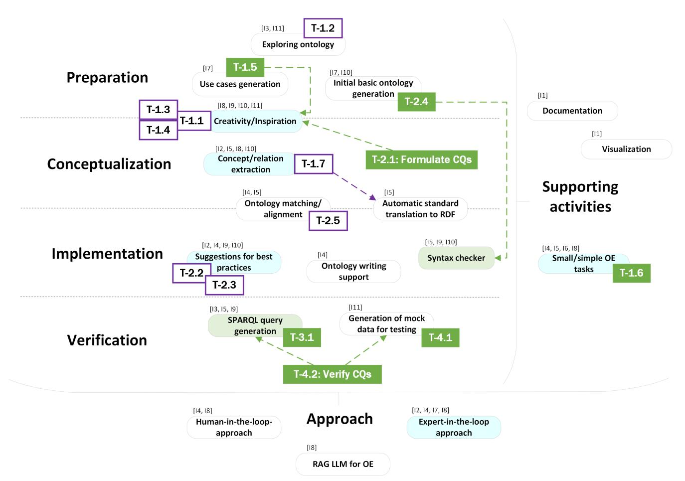

**Figure 7.1:** LLM-assisted [OE](#page-10-2) tasks in the ontology extension process framework, framed within the opportunities for the use of [LLMs](#page-10-4) for [OE](#page-10-2) perceived by the ontology engineers, presented in Figure [3.7](#page-37-0) in Chapter [3.](#page-26-0) The tasks in the green boxes are the ones that achieved the highest score within the walk-through and by the end-user evaluation.

As we can see in Figure [7.1,](#page-81-0) the high-scoring tasks are spread throughout the different [OE](#page-10-2) phases and coincide or are related (represented with arrows in the figure) to the most mentioned opportunities for the application of [LLMs](#page-10-4) to [OE](#page-10-2) by the ontology engineers at [TNO](#page-10-0). Tasks T-2.1 (formalizing [CQs](#page-10-10)) and T-4.2 (verifying the ontology with [CQs\)](#page-10-10) are additions to these perceived opportunities identified through the demonstration and evaluation carried out in this research. Based on the discussion above, we conclude that the application of LLMs to ontology extension tasks has the highest potential in 3 areas, namely 1) Definition of business scenarios and creation glossary of terms;  $2)$ Semi-automated ontology extension formalization: and 3) Ontology development and verification with CQs. These are elaborated below in Table  $7.1$ .

<span id="page-82-1"></span>Table 7.1: Selected LLM-assisted OE tasks in the ontology extension process framework with the highest feasibility to be implemented (within TNO).

| $\text{LLM-assisted OE task}$                                        | $\mathbf{Phase}$ | $\text{Tasks}$              | Description                                                                                                                                                                                                                                                                                                                                                                                                                                                                                                                                   |
|----------------------------------------------------------------------|------------------|-----------------------------|-----------------------------------------------------------------------------------------------------------------------------------------------------------------------------------------------------------------------------------------------------------------------------------------------------------------------------------------------------------------------------------------------------------------------------------------------------------------------------------------------------------------------------------------------|
| Definition of business scenarios<br>and creation glossary of terms   | 1                | $T-1.5, T-$<br>1.6          | These tasks leverage the NLP capabilities of LLMs to<br>extract information from unstructured text and<br>generate human-like text, providing inspiration to the<br>ontology engineer in the most creative phase of the<br>ontology extension process.                                                                                                                                                                                                                                                                                        |
| Semi-automated ontology<br>extension formalization                   | 2/3              | $T-2.4, T-$<br>3.1          | These tasks leverage the emergent abilities of<br>general-purpose LLMs to generate code based on natural<br>language descriptions. It helps ontology engineers and<br>other stakeholders such as domain experts to generate<br>an initial semantic model that is syntactically correct.                                                                                                                                                                                                                                                       |
| Ontology development and<br>$\text{verification with } \mathbf{CQs}$ | 2/4              | T-2.1,<br>T-4.1,<br>$T-4.2$ | These tasks support the ontology development using<br>$CQs$ , which is considered a good OE practice, inspiring<br>the ontology engineer with out-of-the-box ideas $(T-2.1)$ .<br>It reduces manual and repetitive effort of creating mock<br>data for testing the CQs $(T-4.1)$ . It also leverages the<br>NLP capabilities to interpret the knowledge modeled in<br>the ontology and reason about it, which makes it<br>$\text{possible to test the ontology with CQs without having}$<br>to formalize them into SPARQL queries $(T-4.2)$ . |

### <span id="page-82-0"></span>7.1.2. Practical implementation of the process framework for ontology extension

In the previous section, we discussed which LLM-supported tasks are the most promising to be implemented based on their performance, which was evaluated in the previous chapter through the demonstration of the artifact with a real use case and the evaluation given by an end-user. But there are several aspects to consider and steps to be taken before these tasks are practically implemented in the current ontology extension process and, more importantly, LLMs are integrated in the ontology engineers' OE toolkit.

To begin, there are several concerns identified during the analysis of the main problems in the ontology extension process (Chapter 3) that the prototype design did not solve. As we illustrated in Figure 3.5, there are broader societal concerns such as the environmental and ethical impact of LLMs, that go beyond their performance for OE. Ontology engineers might not be willing to use LLMs even if their performance for OE tasks is exceptional as they are aware of the energy consumption and carbon footprint associated with the development and use of LLMs (Jiang et al., 2024) and the need for enormous amounts of labeled and annotated data, which is frequently done manually by independent workers under crowd-work platforms (Wang et al., 2022). Regulation is key to addressing these concerns. Users of LLMs should be clearly informed not only about the performance of these models, but also about other characteristics such as an estimate of their energy consumption and carbon footprint, and the origin of the data used for training. In the shorter term, LLMs providers should have these issues at the core of their research and development activities. Institutions such as TNO should be aware of these implications and raise awareness among their employees, through informative sessions, workshops, and training for the use of LLMs. Regarding the ontology extension process, the OE community and experts in LLMs at TNO, should prioritize and advocate the use of smaller and open-source language models when possible, scrutinizing their "energy label" and production fairness.

Next, even without these environmental and ethical concerns, LLMs will not be used for OE by the ontology engineers if their use is more cumbersome than executing the task manually. This is why the integration of LLMs in the ontology extension workflow is crucial. And for successful integration, the technology must be more than just accessible, but easily setup without requiring extensive knowledge on LLMs or, more broadly, AI engineering. This usually translates into hiding the implementation details to the user with a user-friendly user interface. Allowing for enhanced collaboration and granularization of services, as Stadnicki et al.  $(2020)$  point out in their work, the landscape

of web-based tools for [OE](#page-10-2) is blooming. Following this trend, and similar to *OntoChat* by Zhang et al. [\(2024](#page-98-12)), the human-LLM collaboration process framework for ontology extension designed (Figure [5.1](#page-61-0)) can be implemented as a digital web-based tool with input boxes and buttons within which the user can follow the ontology extension process proposed and, when clicking in any of the LLM-assisted tasks, visualize the details for interaction with the LLM (Table [5.4](#page-62-0)), the prompt template ready to be customized in an input box (Section [D.2\)](#page-125-0), and the possibility to choose different [LLMs](#page-10-4), both proprietary and open-source. As a first step, the first area of high potential for implementation of LLM-assisted ontology extension tasks identified above, namely the definition of business scenarios and the creation of glossary of terms, can be implemented by extending the REPRO Handbook (Bakker, van Bekkum, et al., [2021\)](#page-93-8) (already online and available for [TNO](#page-10-0) employees), with an interactive user interface that allows the user to use any preferred LLM with the corresponding prompt template, to be customized by the user. Below in Figure [7.2](#page-83-1) we sketch this implementation idea for the task T-1.6 (create glossary of terms), using the REPRO Handbook (Bakker, van Bekkum, et al., [2021](#page-93-8)) (see Figure [2.2\)](#page-23-1). Task T-1.5 (define business scenarios) can be implemented in the same manner. Apart from the workshops and informative sessions mentioned above, to ensure that all ontology engineers at [TNO](#page-10-0) are familiar with REPRO, they could add the REPRO Handbook in the "mandatory reading" list within the onboarding process of new ontology engineers, and use it as documentation during the stakeholders' meetings, sharing its content with domain experts, knowledge workers, and knowledge users.

<span id="page-83-1"></span>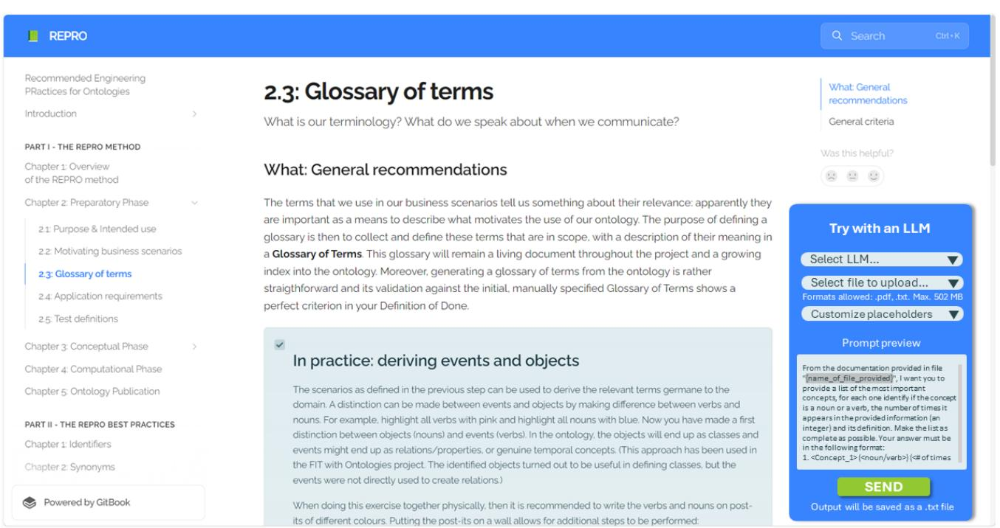

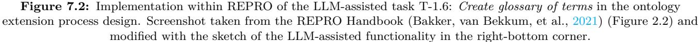

Finally, a step further in the integration of [LLMs](#page-10-4) in the ontology extension workflow is to integrate the LLM's suggestions with the current [OE](#page-10-2) edition tools such as Protégé, TopBraid, and Visual Studio Code. This can be done by creating a plugin for Protégé, as previously done in the work of Mateiu and Groza [\(2023](#page-96-7)); or by creating an extension for Visual Studio Code such as the ones already available in its marketplace[1](#page-83-2) . In this way, we can implement the next two identified areas of high-potential for LLM assistance, namely the semi-automation of ontology extension formalization and the ontology development and verification with [CQs.](#page-10-10) These plugins or extensions would allow the user to receive suggestions for the formalization of the ontology extension in any formal language (e.g., [RDF](#page-10-17) or [OWL\)](#page-10-18) from a natural language description or conceptualization; or to automatically generate SPARQL queries ready to be executed in Protégé from a natural language Competency Question. By integrating the LLM-based suggestions within the current [OE](#page-10-2) tools, we ensure a smooth adoption of [LLMs](#page-10-4) in the ontology extension process and maximize its user-friendliness.

<span id="page-83-2"></span><span id="page-83-0"></span><sup>1</sup><https://marketplace.visualstudio.com/items?itemName=Zazuko.vscode-rdf-sketch>

# 7.2. Answer to the research questions

To address the main research question, we revisit the research sub-questions answered throughout the chapters of this document. These sub-questions, formulated based on the Design Science Research Approach outlined by Johannesson and Perjons ([2021](#page-95-6)), encompass the entire design research cycle – from problem contextualization to design evaluation. Each sub-question's output serves as the input for the subsequent one. Ultimately, the response to the main research question synthesizes the key insights gathered from each sub-question.

## <span id="page-84-0"></span>7.2.1. Revisiting the research sub-questions

#### Sub-question 1: How does the current manual process to extend existing ontologies look like and what are the issues that ontology engineers are experiencing? - Chapter [3](#page-26-0)

Though [Ontology Engineering \(OE\)](#page-10-2) is a well-established field of computer science, its popularity has surged in recent years with the breakthroughs in [Artificial Intelligence \(AI\).](#page-10-1) The topic for this research project emerged from the assumption that extending an existing ontology is a complex process that can be improved. To understand the ontology extension practice, we directly engaged with its practitioners. Through an exploratory round of interviews with ontology engineers and experts in [AI](#page-10-1) and [LLMs](#page-10-4) at [TNO](#page-10-0), we modeled the current ontology extension practice as a flowchart diagram (Figure [3.1\)](#page-30-0), outlining the downstream tasks in the ontology extension process, the stakeholders involved, and the [OE](#page-10-2) tools commonly used at [TNO](#page-10-0).

We chose this structure because the process varies depending on the domain, the ontology to be extended, the specific extension required, project resources and constraints, and even the preferences of the ontology engineer. The model of the ontology extension process was enriched with [TNO](#page-10-0)'s best practices for ontology engineering, from the preparation phase to the verification of the extended ontology. We found that the complexity of the ontology extension process depends on several factors, such as the size of the ontology to be extended, the availability of [OE](#page-10-2) tools, the duration and number of meetings with domain experts, and the level of experience and expertise of the ontology engineer.

Indeed, ontologies are often very large and interconnected with numerous applications that depend on them. While the landscape of [OE](#page-10-2) tools is advancing, it remains quite rudimentary. Meetings with stakeholders are lengthy but essential, and with the growing popularity of the [OE](#page-10-2) field, newcomers need support and lower entry barriers to become expert ontology engineers. To address these challenges, and given the similarities between the language and knowledge processing capacities needed for [OE](#page-10-2) and the capabilities of [LLMs,](#page-10-4) we explored how [LLMs](#page-10-4) can alleviate some of the problems associated with the ontology extension process. The use of [LLMs](#page-10-4) advances the current state of the art, until now primarily focused on [NLP-](#page-10-5)based solutions for ontology engineering in specific domains. However, the assistance provided by [LLMs](#page-10-4) does not come without costs. Ontology engineers at [TNO](#page-10-0) are aware of the limitations of applying generative [AI](#page-10-1) to a field grounded in meticulous formal logic, implicit human knowledge, and subjective interpretation of the world. Beyond performance challenges, which might be resolved in the coming years, there are more significant concerns within the [OE](#page-10-2) community.

[LLMs](#page-10-4) have societal and environmental impacts, and regulation is lagging. Issues such as intellectual property rights and the uncertainty about how big-tech companies handle data uploaded to their models deter ontology engineers from integrating [LLMs](#page-10-4) into their daily [OE](#page-10-2) toolkit. Recognizing that developing and extending ontologies is an enriching human process, where experts from different areas collaborate to create standards representing shared human knowledge, ontology engineers acknowledge the potential of [LLMs](#page-10-4) and their [NLP](#page-10-5) capabilities to assist and even enhance certain parts of the ontology extension process, while other tasks must remain manual.

#### Sub-question 2: What are the requirements for a human-LLM collaboration framework for ontology extension? - Chapter [4](#page-40-0)

With all the insights gathered from conversations with the ontology engineers, we delineated the artifact to be designed. Since the goal is not to replace the ontology extension process but to facilitate it, we decided to integrate [LLMs](#page-10-4) as another [OE](#page-10-2) tool in the toolkit. This fills one of the gaps in the research literature, where it was found that most of the proposed solutions stop at the functionality level without providing a way to adopt the proposed solutions for automatic or semi-automatic ontology development. Instead of solely focusing on the performance of [LLMs](#page-10-4) for specific [OE](#page-10-2) tasks, this research aimed to encompass the entire ontology extension practice as an expert-inthe-loop process assisted by [LLMs](#page-10-4), from a systems engineering perspective. Previous academic articles on this topic often conclude that while the application of [LLMs](#page-10-4) in [OE](#page-10-2) tasks shows promising performance, a human-in-the-loop approach is essential given the current capabilities of this technology. However, this innovative approach has been scarcely addressed in academic literature, prompting us to elicit design requirements directly from the end users. For each problem mentioned and explained by the [OE](#page-10-2) experts, we established a corresponding requirement. Additionally, we considered how each requirement aligns with the concerns and opportunities of applying [LLMs](#page-10-4) to [OE,](#page-10-2) as perceived by the ontology engineers. A focus group panel was organized to complete and validate the list of requirements. With the help of an expert, we also examined how the recently passed European Artificial Intelligence Act might impact the proposed design. The final set of 22 high-level requirements (Table [4.1\)](#page-45-1) emphasizes a standard yet flexible process for ontology extension that maximizes the [NLP](#page-10-5) capabilities of [LLMs](#page-10-4), fosters creativity and involvement from stakeholders, and minimizes the human effort required for repetitive tasks. With this holistic systems approach, we aimed to cover the design requirements as thoroughly as possible. Although the lack of low-level requirements might create a gap between design and implementation, the output of this research stage provides fertile ground for developing creative solutions.

#### Sub-question 3: What does the design of an integrated process framework for human-LLM collaboration for ontology extension look like? - Chapter [5](#page-48-0)

To address this question, we literally integrated the [LLMs](#page-10-4) directly into the ontology extension process. Integrating [LLMs](#page-10-4) and LLM-based tools in the current workflow ensures a smooth adoption of the technology and maximizes user-friendliness. This fills a further gap in the literature, where it was found that most of the proposed solutions are difficult to use and understand.

Through the analysis of recent academic work on the application of [LLMs](#page-10-4) to ontology engineering, we found that the availability of off-the-shelf [LLMs](#page-10-4)-based tools is still limited. While smaller fine-tuned models are demonstrated to perform as well or even better than general-purpose [LLMs](#page-10-4) such as [GPT,](#page-10-9) the knowledge and resources required for their configuration and use hinder their wide adoption in [OE](#page-10-2). However, these articles demonstrate that prompt engineering significantly impacts the quality of the outputs generated by an LLM, despite the challenges posed by the quantity and quality of data required to craft an effective prompt. As a final remark from the analysis of these solutions, we found that the quality of the generated ontology is currently measured with quantitative or structural metrics that fail to capture the diversity in modeling choices. Evaluating the output of the LLM and the generated ontology extension, whether by automatic or semi-automatic means, remains an ongoing research challenge. In addition to these insights, by thoroughly examining these LLM-based solutions for [OE,](#page-10-2) we mapped the downstream [OE](#page-10-2) tasks in the ontology extension process, modeled as a flowchart (Figure [3.1\)](#page-30-0), with an LLM or LLM-based tool to assist each task based on the [LLMs](#page-10-4)' [NLP](#page-10-5) capabilities

The designed process framework is an extended version of the current manual process, incorporating additional [OE](#page-10-2) tools and stakeholders (Figure [5.1](#page-61-0), extended description in Section [D.1](#page-119-1) of Appendix [D](#page-119-0)). Since the process is based on the current practice at [TNO](#page-10-0), it aligns with the best [OE](#page-10-2) practices proposed by [TNO](#page-10-0)'s [OE](#page-10-2) community. For each task that an LLM can assist with, the specific approach is indicated (Table [5.4](#page-62-0)), and a prompt template is provided to the ontology engineer (Section [D.2](#page-125-0)). Thus, an integrated process framework for human-LLM collaboration for ontology extension is presented as an augmented version of the current ontology extension process, where the responsibility and expertise remain with the ontology engineer, but the [LLMs](#page-10-4) can inspire, enrich, and assist the ontology extension effort. The design prototype emphasizes off-the-shelf tools that require minimal setup effort, facilitating both the approach and its evaluation. The flexibility required by the ontology extension process is provided by the chosen structure of the process framework – a flowchart diagram – that describes how [LLMs](#page-10-4) can facilitate certain tasks in the ontology extension practice without prescribing their use.

#### Sub-question 4: How can the framework be demonstrated and evaluated with a specific use case and to what extent does it improve the status quo? - Chapter [6](#page-64-0)

Unlike most of previous research on the automation of the ontology extension process using [NLP](#page-10-5) and [AI](#page-10-1) techniques, the presented process framework prototype design is domain-independent and can be used to extend any type of domain ontology. However, to demonstrate the functionality of the designed process framework prototype, we performed a walk-through of the framework prototype with an ontology in the greenhouse domain. We applied the process framework to a selected use case: extending the [Common Greenhouse Ontology \(CGO\)](#page-10-7) within the [Seman](#page-10-8)[tic Explanation and Navigation System \(SENS\)](#page-10-8) use case. The greenhouse domain serves as an ideal example of a field experiencing rapid technological advancements, necessitating interoperability among different systems through a standard language. Because the [SENS](#page-10-8) project was previously completed successfully at [TNO,](#page-10-0) we had access to a gold standard to benchmark the output of the proposed framework for ontology extension: the manually extended [CGO](#page-10-7) with the [SENS](#page-10-8) use case. The demonstration focused on the LLM-assisted [OE](#page-10-2) task within the ontology extension process framework prototype, developed using a custom [GPT](#page-10-9) Assistant with OpenAI's latest model, [GPT-](#page-10-9)4 Omni, and its developer platform. Although the process framework design is not tied to any specific model, we chose OpenAI's [GPT](#page-10-9) model for its accessibility, ease of setup, and proven performance across various [OE](#page-10-2) tasks. The output for each

LLM-assisted task was reviewed and minimally modified before being used as the input for the subsequent task in the ontology extension process. All outputs are provided in Section [E.2](#page-132-0).

The proposed [SENS](#page-10-8) extension to the [CGO](#page-10-7) developed using the process framework and assisted by [GPT-](#page-10-9)4 Omni exhibits several similarities to the gold standard. Both extensions propose a similar conceptualization of the scenarios for the [SENS](#page-10-8) use case. While the manual extension is richer in concepts and better integrated with other ontologies and standards, the LLM-assisted extension offers creative [Compentency Questions \(CQs\)](#page-10-10) and suggestions for integrating new concepts with existing ones in the [CGO](#page-10-7). The primary advantage of the proposed ontology extension approach is that it facilitates the development of an initial ontology extension without requiring coding, grounded in best [OE](#page-10-2) practices, which can be developed by less experienced ontology engineers or even domain experts.

However, demonstrating the prototype's functionality in practice is insufficient. To fully validate the feasibility and potential of the process framework prototype to improve the status quo, an ontology engineer was tasked with developing the [SENS](#page-10-8) extension to the [CGO](#page-10-7) using the proposed framework. The evaluation of the LLM-assisted tasks by the ontology engineer highlights the promising potential of its applicability to tasks in the Preparation and Conceptualization phases of the process, emphasizing the LLM's ability to complement the user's knowledge with out-of-the-box perspectives. Overall, the ontology engineer acknowledged that the process framework design can guide and facilitate the ontology extension process for less experienced ontology engineers, while expert ontology engineers can also benefit from the LLM-assisted approach. Apart from the requirement for backward compatibility of ontology changes (which was not addressed in this research project), the process framework designed meets the design requirements that were established within SQ2.

#### <span id="page-86-0"></span>7.2.2. Answering the main research question

To answer the main research question:

#### *How can [LLMs](#page-10-4) be integrated into a semi-automated and domain-independent process for the extension of existing ontologies?*

in this research project, we have designed a human-LLM collaboration framework for ontology extension. The Design Science Research Approach proposed by Johannesson and Perjons [\(2021](#page-95-6)) outlines a methodology for researchers to design solutions that address user problems, meet their needs, and leverage new opportunities. This approach was applied to gather qualitative data directly from ontology engineers and [AI](#page-10-1) experts at [TNO.](#page-10-0) By engaging in detailed discussions with these intended users, we obtained valuable insights that might have otherwise been overlooked.

The **integration** of [LLMs](#page-10-4) into the current ontology extension process conceptualizes the designed process as an enhanced version of the existing process. This current process model, derived from practices followed by the [OE](#page-10-2) community at [TNO](#page-10-0), serves as the foundation for the proposed LLM-assisted process framework. Within this framework, [LLMs](#page-10-4) are introduced as new [OE](#page-10-2) tools within the existing toolkit, with the ontology engineer retaining the discretion to utilize or disregard the LLM suggestions and to review and adapt these suggestions as necessary. The proposed process framework fills a gap in the academic literature about the automation of the ontology extension process using [NLP](#page-10-5) and [AI](#page-10-1) techniques, focused solely on the technical performance of the solution and disregarding its smooth adoption by the end-users. To foster the adoption of [LLMs](#page-10-4) for [OE,](#page-10-2) we propose implementing the most promising LLM-assisted tasks in the designed process framework in practice by integrating them with current [OE](#page-10-2) tools widely used inside and outside [TNO](#page-10-0), such as Protégé, TopBraid, and Visual Studio Code, and with current [Ontology Engineering Methodologies \(OEMs\)](#page-10-3), such as [TNO](#page-10-0)'s methodology, REPRO.

By examining the literature on the topic, we found that most of the proposed solutions for applying [LLMs](#page-10-4) to [OE](#page-10-2) are **semi-automatic**, mainly due to the performance limitations of the technology. Within this research, we observed that the semi-automated approach combining human expertise with [LLMs](#page-10-4) capabilities is in fact highly desired by the ontology engineers, who acknowledged that while the manual process of developing and extending ontologies can be tedious, meeting diverse stakeholders is an essential and enriching part of the process. The complete automation of the process is not feasible at this stage due to the current performance limitations of [LLMs](#page-10-4) in [OE](#page-10-2) tasks, but also due to the concerns of ontology engineers about the use of [LLMs.](#page-10-4) Concerns such as the environmental impact of [LLMs](#page-10-4) or the lack of regulation might have a bigger impact on the daily use of [LLMs](#page-10-4) than we would have expected. While these concerns may fade in the coming years with the advancements in the technology and in the regulatory landscape, the [OE](#page-10-2) community is still lacking tool support tailored to their needs. The advancement of [OE](#page-10-2) tools, whether LLM-based or not, is vital for the [OE](#page-10-2) community. As in any other software discipline, having tooling support is crucial for increasing the quality and reducing complexity in development processes, enabling the automation of cumbersome and repetitive tasks, and allowing the users to concentrate their effort on the tasks that require human

reasoning and expertise.

Unlike most of the solutions proposed by previous academic research on the topic, the designed process framework is versatile and can be applied to **extend ontologies across any domain**. Although the tasks within this ontology extension process adhere to best [OE](#page-10-2) practices, the artifact has been developed with a focus on prompt engineering. This approach describes the application of [LLMs](#page-10-4) to various tasks without being tied to any specific model, providing generic prompt templates with placeholders that can be customized based on the domain and specific use case.

While not without its flaws, the human-LLM collaboration framework for ontology extension represents a modest yet determined step towards integrating cutting-edge technology into a field that has been somewhat overlooked in recent years. The proposed design aims to blend traditional [OE](#page-10-2) practices with the [NLP](#page-10-5) capabilities of [LLMs,](#page-10-4) thereby minimizing human effort and maximizing the quality of the extended ontology.

# <span id="page-87-0"></span>7.3. Societal relevance

In this research, we explored the complexities associated with the field of [Ontology Engineering \(OE\)](#page-10-2), focusing on the ontology extension process. To alleviate some of the problems, we introduced [Large Language Models \(LLMs\)](#page-10-4) as a promising solution. Trying to capitalize on the perceived opportunities of [LLMs](#page-10-4) for facilitating the ontology extension tasks, and without forgetting the concerns of ontology engineers, we designed a semi-automated and domainindependent approach to extend existing ontologies by leveraging the capabilities of [LLMs](#page-10-4) and incorporating good [OE](#page-10-2) practices. The approach is intended for ontology engineers and aims to facilitate their work and improve its quality. Thus, this research is socially relevant mainly to the [OE](#page-10-2) community, but the use of the proposed LLM-assisted process framework might have an impact on society as well.

Many current proposed solutions for the automation of [OE](#page-10-2) processes aim to reduce the role of the ontology engineer as much as possible. The semi-automated approach we designed incorporates [LLMs](#page-10-4) into [OE](#page-10-2) tasks, potentially reducing the manual effort required from ontology engineers at [TNO,](#page-10-0) and complementing, rather than replacing their role. This aims to increase efficiency and productivity, allowing experts to focus on more complex and creative aspects of their work. By automating repetitive tasks, the process framework for ontology extension can alleviate the burden on professionals and reduce the time needed for ontology extension and development. The use of this approach with [LLMs](#page-10-4) provides the ontology engineer with a baseline output for certain tasks in the ontology extension process that can then be reviewed with domain experts, knowledge workers, and knowledge users. Moreover, it can lower the entry barriers to the field of [OE](#page-10-2) for users with less experience and expertise, and ultimately, promote wider adoption of ontologies, as pointed out by Tudorache ([2020\)](#page-98-3). Thus, the designed approach can facilitate the involvement of different stakeholders in various tasks across the ontology extension process, and allow them to play a more active role on them. If the use of [LLMs](#page-10-4) lowers the entry barriers to the field of [OE,](#page-10-2) more professionals might join the [OE](#page-10-2) community, which might translate into more and more diverse perspectives in the ontology extension process, not only from ontology engineers with varying levels of expertise but also from other professionals with domain expertise. Ultimately, our LLM-assisted approach can contribute to combating the problem of labor shortages in the [Information](#page-10-13) [and Communication Technology \(ICT\)](#page-10-13) sector by increasing the number of newcomers, specifically in the [OE](#page-10-2) segment, instead of completely replacing human workers as many fear.

Integrating [LLMs](#page-10-4) in a standard yet flexible process with good [OE](#page-10-2) practices can help ensure that ontology extensions are consistent and of high quality. [LLMs](#page-10-4) can assist in generating relevant [Compentency Questions \(CQs\),](#page-10-10) identifying patterns for modeling the ontology extension, suggesting relevant terms for the domain, and ensuring good and complete documentation. This can lead to more accurate and reliable ontologies, which are essential for applications that rely on precise and structured knowledge. Unlike most of the proposed solutions so far, focused on the technical performance for the automation of the [OE](#page-10-2) tasks, our design can be implemented by integrating the LLM-powered functionality with widely used [OE](#page-10-2) tools and methodologies, promoting a smooth adoption of this technology within the [OE](#page-10-2) community.

Despite all the benefits that LLM can bring to the [OE](#page-10-2) community, we identified some major challenges that must be addressed before the [OE](#page-10-2) community adopts the use of [LLMs](#page-10-4) on their daily work. [LLMs](#page-10-4) will not be widely used until the technology is transparent and trustworthy. Regulation must ensure that [LLMs](#page-10-4) are developed and deployed in a way that the environmental impact is minimized, and ethical risks are eliminated to the greatest extent. This could translate into enforcing developers to disclose how their models are trained, which data is used, and what is the estimated energy consumption and carbon footprint of their models, both while training and use. While these changes are implemented, we hope to see more open-source models becoming better in their performance for [OE](#page-10-2) tasks, with developers prioritizing the "controllability" of the models' output, the elimination of hallucinations and inconsistencies, and the efficiency, i.e., optimizing the amount of data used for training, the resources used for finetuning, and the model's performance on specific tasks. Institutions such as [TNO](#page-10-0) have the responsibility to train their employees on the fair and correct use of this technology, and to promote and facilitate the use of open-source, fair, and more environment-friendly models as much as possible.

Because ontologies represent an agreed conceptualization of reality, adopting a systematic approach for extending ontologies assisted by [LLMs](#page-10-4) will indirectly impact society as a whole. For example, in the field of healthcare, improved ontologies can enhance the development of decision support systems, leading to better patient outcomes. In agriculture, as highlighted in the chosen use case to demonstrate and evaluate the design, high-quality ontologies can aid in the integration of various technological systems, promoting sustainable practices and improving efficiency in the greenhouses.

Throughout this thesis project, we tried to fill in some of the research gaps found in the literature, such as the lack of integrated [OE](#page-10-2) processes that address the adoption of [LLMs](#page-10-4) in practice beyond their technical performance. But not all the gaps were filled in. The fact that most of the proposed solutions so far are semi-automatic is for a good reason. The ontology development process is an enriching human process in which stakeholders collaborate and share knowledge about the world. Addressing the complexities in this process is not a matter of automating the entire process. Instead, ontology engineers desire a hybrid approach supported, complemented, and enriched by [AI](#page-10-1) systems such as [LLMs.](#page-10-4) Attending to the values of the ontology engineers at [TNO](#page-10-0) and the state of the art of this technology, we developed a set of design requirements that align with these and with the current regulatory landscape, addressing the practical implementation of the proposed design beyond its technical performance. While the use of [LLMs](#page-10-4) for ontology engineering is currently feasible, as we demonstrated with our prototype design, the technology and the regulation framework must keep moving forward the democratization of [LLMs,](#page-10-4) prioritizing their fair development, accessibility, and environmental responsibility before the full potential of [LLMs](#page-10-4) for [OE](#page-10-2) can be unveiled.

# <span id="page-88-0"></span>7.4. Theoretical contribution

This research highlights a critical aspect of modern [AI](#page-10-1) applications: the synergy between human expertise and machine capabilities. By demonstrating how [LLMs](#page-10-4) can assist but not replace human ontology engineers, this work contributes to the ongoing discourse on responsible [AI](#page-10-1) use. Within the analysis of the literature concerning the automation of the ontology extension process, we identified several gaps that were addressed throughout this research project. First, we focused on the use of [LLMs](#page-10-4) over other [AI](#page-10-1) techniques, justifying their potential for ontology engineering based on their [NLP](#page-10-5) capabilities and looking into state-of-the-art LLM-based applications for [OE](#page-10-2). Second, we created a semi-automatic approach combining human expertise, well-established [OE](#page-10-2) methodologies and tools, stakeholders' involvement, and off-the-shelf [LLMs](#page-10-4) with prompt engineering, achieving an easy-to-use and easy-tounderstand method that is ready to be implemented. Finally, we developed the framework design employing a holistic and systematic perspective, from contextualizing the problem of the ontology extension practice and carefully listening to the practitioners' needs and values, to the evaluation of the proposed prototype with an end-user. The proposed approach promotes a balanced view of [AI](#page-10-1), particularly [LLMs](#page-10-4), where human oversight and creativity are complemented by machine efficiency and computational power. By providing a proof of concept for a human-LLM collaboration framework, this research encourages further innovation and adoption of such methods in ontology engineering. This can lead to more widespread use of advanced [LLMs](#page-10-4)-based tools, in knowledge management and other fields, driving technological progress and benefiting various industries. Last but not least, the proposed process framework aligns with the findings of Kotis et al. ([2020\)](#page-96-0), who show in their work that custom-engineered and collaborative [Ontology](#page-10-3) [Engineering Methodologies \(OEMs\)](#page-10-3) that are supported by [OE](#page-10-2) have the highest impact in the liveability, evolution, and reuse of ontologies.

In our study, we have conducted an in-depth analysis of a comprehensive set of [OE](#page-10-2) tasks, meticulously examining each task within the context of ontology extension using [LLMs](#page-10-4). This approach provides not only a holistic overview of the entire ontology extension process with [LLMs](#page-10-4) but also highlights which specific [OE](#page-10-2) tasks hold the most potential for the application of [LLMs](#page-10-4). Unlike existing research that typically concentrates on a single [OE](#page-10-2) task and evaluates its performance based solely on its alignment with a gold standard – which is inherently problematic in the field of knowledge modeling where multiple valid representations can exist – our methodology acknowledges the complexity and multiplicity of correct modeling approaches. Furthermore, while other approaches often aim to diminish the involvement of either the ontology engineer or the domain expert, our proposed framework is designed to enhance and support these critical roles, ensuring that [LLMs](#page-10-4) serve as complementary tools that facilitate rather than replace human expertise in the ontology extension process. Lastly, most of the existing research on applying [LLMs](#page-10-4) to [OE](#page-10-2) focuses on developing new ontologies. While this is a significant area of study, the research proposed in this document

prioritizes the extension of existing ontologies. This focus is crucial in the field of [OE](#page-10-2) and semantic standards, as it fosters reusability, compliance, and interoperability of standards, thus avoiding "reinventing the wheel".

If we examine the research conducted here from a broader perspective, we can frame it within the [Task-Technology](#page-10-44) [Fit \(TTF\)](#page-10-44) framework developed by Goodhue and Thompson ([1995\)](#page-95-21). The [TTF](#page-10-44) model was designed to explore how the utilization of a particular technology by an individual depends on several factors: the characteristics of the technology, the characteristics of the task, the individual's characteristics, the fit or alignment between the technology and the task, the precursors of utilization (such as expectations or social norms perceived by the individual), and the performance impact (a feedback loop that, in turn, affects the utilization of the technology) (Goodhue & Thompson, [1995\)](#page-95-21). Our research can be viewed as a case study or an instance of the [TTF](#page-10-44) model, where the technology is the [LLMs,](#page-10-4) the task is the ontology extension process (divided into several downstream tasks), the individual is the ontology engineer, and the concerns and opportunities for applying [LLMs](#page-10-4) to [OE](#page-10-2) identified by the ontology engineers are the precursors of utilization. In our study, we thoroughly examined the current ontology extension task, the needs, values, and opinions of a group of ontology engineers at [TNO](#page-10-0), the [NLP](#page-10-5) capabilities of [LLMs,](#page-10-4) and their applicability to downstream ontology extension tasks. We aimed to fit the current ontology extension task with the capabilities of [LLMs](#page-10-4) and to fit the strengths and limitations of [LLMs](#page-10-4) to the ontology extension task. As previously mentioned, the precursors of utilization identified in our research, such as the environmental and ethical impacts of [LLMs](#page-10-4), can significantly influence the adoption and integration of [LLMs](#page-10-4) into the [OE](#page-10-2) toolkit. Although we evaluated the performance of an [LLMs](#page-10-4) in a specific use case for the ontology extension task, we could not measure the performance impact of prolonged utilization and, importantly, the integration of this technology into the ontology extension process. As discussed by Goodhue and Thompson ([1995\)](#page-95-21), this could lead to several implications, such as the modification or creation of usage policies for the [LLMs-](#page-10-4)assisted process framework, the introduction of tailored training for ontology engineers on the use of [LLMs](#page-10-4), or the redesign of various tasks in the ontology extension process to better align with the current and future capabilities of [LLMs](#page-10-4). Despite these limitations and opportunities for future work, which will be detailed in the next section, our research and the approach we followed contribute to the body of work within [IS](#page-10-14) research, exemplified by the [TTF](#page-10-44) model.

As a final remark on the theoretical contribution of this work, we can also define our approach in terms of the [Business](#page-10-45) [Process Re-engineering \(BPR\)](#page-10-45) strategy, first introduced in the 1990s by Hammer [\(1990](#page-95-22)) and Davenport and Short [\(1990](#page-94-17)), as noted by O'Neill and Sohal [\(1999\)](#page-97-21). This business management theory revolves around the idea of examining and (re-)defining workflows and processes both within organizations and across organizational boundaries. In these terms, we meticulously analyzed the current ontology extension workflow, building a theoretical model materialized as a flowchart diagram. As discussed by Davenport and Short [\(1990](#page-94-17)), the introduction of [LLMs](#page-10-4) into this workflow aims to support the current process of ontology extension thanks to the [NLP](#page-10-5) capabilities of this technology, and at the same time, the current process is transformed by the introduction of this technology. Although our goal was not to completely redesign the ontology extension process, the introduction of [LLMs](#page-10-4) brings about several significant changes. These include the need for enhanced verification mechanisms to minimize the risk of incorrect information generated by the LLM, the shift or relocation of expertise from ontology engineering to LLM expertise, and changes in the roles and responsibilities of stakeholders, such as domain experts who, supported by [LLMs](#page-10-4), can now contribute more significantly to the technical aspects of the extension project. Additionally, there may be a need to educate ontology engineers and domain experts in the use of [LLMs,](#page-10-4) as well as to develop the necessary infrastructure to run local models within the proposed LLM-assisted approach.

While the forthcoming implications of the introduction of [LLMs](#page-10-4) into the ontology extension process, as identified by the [TTF](#page-10-44) and the [BPR](#page-10-45) frameworks, fall beyond the scope of this research project, both theories underscore the importance of aligning business processes with technological advancements and vice versa, with a focus on the needs and values of the individuals involved. With our research, we were able to showcase how these theories can be applied in practice.

## <span id="page-89-0"></span>7.5. Limitations

In this research, we tackled the entire ontology extension process, encompassing all downstream tasks, stakeholders, and tools, and thoroughly analyzed each task to determine how it can be assisted by [LLMs](#page-10-4) based on their [NLP](#page-10-5) capabilities. While this comprehensive approach offers significant contributions to the field of ontology engineering and the application of [LLMs,](#page-10-4) it also introduces a broad and ambitious scope. Throughout this research endeavor, numerous decisions were made, each introducing specific limitations that impact both the approach and the outcomes of this study.

#### Demonstration and Evaluation with only one use case

The evaluation was limited to a single use case, specifically the extension of the [Common Greenhouse Ontology \(CGO\)](#page-10-7) within the [Semantic Explanation and Navigation System \(SENS\)](#page-10-8) project. Although this use case demonstrated the prototype's applicability in a real-world scenario, it does not reflect the variability across different domains. Evaluating the prototype with diverse use cases can provide insights into its validity and effectiveness in extending ontologies across various domains. This can help establish whether the framework is truly domain-independent or if specific adjustments are needed for different applications.

#### Focus on LLM-assisted [OE](#page-10-2) tasks

The prototype evaluation primarily focused on the LLM-assisted tasks within the ontology extension process. While this highlighted the potential of [LLMs](#page-10-4) in enhancing certain tasks, it left other parts of the process untested. In a real application, a comprehensive evaluation shall include all tasks within the ontology extension process, including the ones that are completely manual and the ones that can be supported by traditional or non [AI-](#page-10-1)powered [OE](#page-10-2) tools, to understand the overall impact of the framework.

#### End-user evaluation limited to one user

The prototype was tested with only one ontology engineer. While this provided initial insights into the framework's usability and effectiveness, it does not account for the variability in background, expertise, and personal preferences that different ontology engineers might bring. The proposed process framework prototype has been designed to be flexible, which means that ontology engineers with different levels of experience, expertise, and backgrounds might develop some tasks in the process differently, and might customize the prompts in diverse ways. Moreover, the outputs of the LLM might be judged and used differently depending on the user. This can significantly affect the evaluation of the prototype design. Testing with a broader range of ontology engineers with diverse backgrounds and levels of expertise will offer a more comprehensive evaluation of the prototype's generalizability and adaptability to other domains. It will also help identify potential usability issues and areas where additional refinement of the design or support on the [OE](#page-10-2) task might be required.

In addition, the designed process framework includes ontology extension tasks that are supported by other stakeholders such as other ontology engineers, domain experts, knowledge workers, and knowledge users. Since both the walkthrough performed and the end-user evaluation with the selected use case focused on the LLM-assisted tasks of the ontology extension process, we did not evaluate the impact that these interactions may have on the process framework, on the end-user experience using the framework, and on the ontology extension generated using the framework.

Finally, as the process framework was developed around the figure of the ontology engineer, we did not evaluate the approach with a different kind of end-user, for example, a domain expert. Though we saw that several tasks can be especially beneficial for non-experts in [OE](#page-10-2) such as domain experts without knowledge on formal ontological concepts and coding, we cannot say to which extent the designed ontology extension framework can be useful for them.

#### Evaluation using only one LLM: [GPT](#page-10-9)-4 Omni

The prototype was tested exclusively with OpenAI's [GPT-](#page-10-9)4o model. While [GPT-](#page-10-9)4o is a powerful and versatile LLM, relying on a single model limits the generalizability of the findings. Other types of [LLMs](#page-10-4), including open-source models and those fine-tuned for specific tasks, might offer different performance characteristics and reduce or eliminate the risk of vendor lock-in. Organizations such as OpenAI have powerfully entered the scene of generative [AI](#page-10-1), successfully penetrating public institutions and private corporations. But they should be aware that there are far more models in the market. Evaluating the prototype with a variety of [LLMs](#page-10-4) will provide a more robust understanding of how different models can be leveraged and whether certain models are better suited for specific ontology engineering tasks. As mentioned before, we expect open-source models to continue to flourish. With the democratization of [LLMs](#page-10-4), we envision smaller, fine-tuned models outperforming proprietary [LLMs](#page-10-4) in a wide range of [OE](#page-10-2) tasks. To this end, the open-source community must prioritize finding a balance between performance and environmental and ethical impact of the models, and regulatory frameworks must get up to speed with the development rate, encouraging, facilitating, and enforcing the responsible development and use of [LLMs.](#page-10-4)

#### Difficulty in measuring manual effort and expertise required

<span id="page-90-0"></span>Quantifying the reduction in manual effort and the expertise required to use the prototype compared to conventional approaches without LLM support is challenging. While the LLM can assist in many tasks, measuring the exact amount of effort saved and the remaining manual input needed is complex. This also includes assessing the ease of use and the learning curve associated with adopting the prototype in a real setting. We left this evaluation beyond the scope of this research.

# 7.6. Future research topics

To address the aforementioned limitations, future research topics could focus on the following areas:

#### Demonstration and Evaluation with several use cases across different domains

Future work must include a more thorough demonstration and evaluation of the process framework prototype by selecting various use cases in different domains. By applying the framework to a wider range of scenarios, with different characteristics – such as different levels of complexity or availability of documentation on the domain and use case extension that can be used to give context to the LLM – researchers can validate its domain-independent nature and gather comprehensive data on the performance of [LLMs](#page-10-4) in various [OE](#page-10-2) tasks with different amount and quality of information available for the task.

#### Comprehensive framework application

Applying the entire framework including the [OE](#page-10-2) tasks in the process that are not assisted by an LLM, but that are performed manually or with some of the proposed [OE](#page-10-2) tools, and evaluate to which extent these tasks add quality to the developed ontology extension using the LLM is another avenue for future research.

#### Evaluating different [LLMs](#page-10-4)

[OE](#page-10-2) tasks such as relation extraction or formulation of [Compentency Questions \(CQs\)](#page-10-10) can be performed by a fine-tuned model for the task, while other tasks that require real-world knowledge might be better suited for general-purpose models with a larger knowledge base. This proposition aligns with the environmental concern of ontology engineers. [LLMs](#page-10-4) might not be the only ones capable of performing some [OE](#page-10-2) tasks, with smaller language models producing similar or even better results.

This research topic shall include the study on sustainability aspects of [LLMs](#page-10-4), both environmental and economic. On the one hand, assessing to which extent the use of smaller but fine-tuned language models impacts the energy consumption overall in the ontology extension process. On the other hand, accounting for the cost of using [LLMs](#page-10-4) compared to a manual approach. In this case, not only proprietary models – in which case the company pays per use as is the case of OpenAI's services – have to be accounted for, but also the cost of deploying, scaling, and maintaining open-source models to assist in ontology development.

#### Expertise and effort evaluation

Related to economic sustainability, a very interesting topic for future research is to develop a methodology or approach to evaluate how much [OE](#page-10-2) expertise is needed to use [LLMs](#page-10-4) and how much manual effort [LLMs](#page-10-4) can alleviate. We saw that the prompt and the quality of the information given to the LLM had a big impact on the quality of the output. Yet, measuring how good the input has to be to obtain an output with the desired quality is complex. This is a direction identified and proposed before by Bouter et al. ([2024\)](#page-93-10) in their work.

#### Broader participant evaluation

Evaluating the human-LLM collaboration approach with a larger group of participants, with diverse levels of experience, expertise, and background is essential. This can help assess the variability in generated ontology extensions based on the end user's expertise and background. This will provide insights into the usefulness of the process framework prototype for users with varying levels of experience in knowledge engineering. Moreover, evaluating the process framework with a domain expert can be extremely insightful to observe the impact that the use of [LLMs](#page-10-4) can have in lowering the entry barriers to these stakeholders to the field of [OE](#page-10-2), and to determine to which extent the LLM-assisted process will (or will not) reduce the need for [OE](#page-10-2) expertise.

Additionally, including the interactions with other stakeholders in the ontology extension process evaluation is crucial to determine to which extent can [LLMs](#page-10-4) alleviate the burden of building consensus, as one of the main problems highlighted by the ontology engineers at [TNO](#page-10-0). Researchers must also examine the impact that including [LLMs](#page-10-4) can have on the social interactions between the ontology engineers and the other stakeholders involved in the ontology extension process, in order to minimize the potential loss of these enriching and useful human interactions.

Measuring and understanding the implications that [LLMs](#page-10-4) can have in [OE](#page-10-2) processes is a great challenge. While we do not see [LLMs](#page-10-4) replacing ontology engineers, commissioning organizations might benefit from the use of [LLMs](#page-10-4) as it might increase their understanding of the ontology or ontology extension needed, and enhance the quality of the interactions with the commissioned ontology engineers.

#### Evaluation of ontologies and evaluation of [LLMs](#page-10-4)' output

Throughout the research conducted, and especially within the analysis of the problem and the exploration of recent applications of [LLMs](#page-10-4) to [OE](#page-10-2), we saw that there are no standard metrics to measure the quality of an ontology, neither ways to assess the correctness and validity of incorrect but plausible answers often produced by [LLMs.](#page-10-4) While developing the process framework design, we hardly found appropriate methodologies or tools that are easy to use and understand, and available off-the-shelf to be included in the verification phase of the ontology extension. Thus, we firmly consider this topic as a crucial avenue for future research, and we hope to see further steps in works such as the one recently published by Bakker and De Boer [\(2024](#page-93-13)).

#### Ethical implementation and use of [LLMs](#page-10-4)

As we discussed previously in various sections of this document, the successful introduction of [LLMs](#page-10-4) for [OE](#page-10-2) requires that ethical and environmental concerns are taken into account. Users of this technology, as with any other consumer product in the market, deserve to know what kind of product they are using or intend to use. We refer to the transparency from the providers towards the consumers. Further research is needed to establish parameters to assess the environmental impact and carbon footprint of a model throughout its entire life cycle, as well as clear regulatory frameworks to ensure that available models have been developed under fair and responsible conditions. In practice, this could mean that, in the future, available models must include an "energy label" and a "warranty seal" informing about the model's compliance with somehow established parameters for maximum energy consumption when prompting, or about how the data for training was obtained and processed, complying with data privacy regulation and intellectual property rights. Future research shall explore how these concerns can be addressed in practice.

Moreover, as many other research works conclude, reducing and ultimately eliminating the model's hallucinations is a crucial aspect for the adoption of [LLMs](#page-10-4) in any field, including [OE.](#page-10-2) Some strategies for evaluation of the model's output use the model itself to explain its own answer and how it was reached, or even other [LLMs](#page-10-4) trained for the task. But users need to understand not only the output of the model but also the explanation provided by the LLM on how the answer was created. Researchers are already busy with this topic and, with our research, we reaffirm its relevance, imperative for the integral adoption of [LLMs](#page-10-4) by the ontology engineers.

# <span id="page-93-16"></span><span id="page-93-15"></span>References

- <span id="page-93-11"></span><span id="page-93-0"></span>Al-Aswadi, F. N., Chan, H. Y., & Gan, K. H. (2020). Automatic ontology construction from text: A review from shallow to deep learning trend. *Artificial Intelligence Review*, *53*(6), 3901–3928. [https://doi.org/10.1007/](https://doi.org/10.1007/s10462-019-09782-9) [s10462-019-09782-9](https://doi.org/10.1007/s10462-019-09782-9)
- <span id="page-93-14"></span>Alobaid, A., Garijo, D., Poveda-Villalón, M., Santana-Perez, I., Fernández-Izquierdo, A., & Corcho, O. (2019). Automating ontology engineering support activities with OnToology. *Journal of Web Semantics*, *57*, 100472. <https://doi.org/10.1016/j.websem.2018.09.003>
- <span id="page-93-12"></span>Amini, R., Norouzi, S. S., Hitzler, P., & Amini, R. (2024). Towards Complex Ontology Alignment using Large Language Models [arXiv:2404.10329 [cs]]. <https://doi.org/10.48550/arXiv.2404.10329>
- <span id="page-93-4"></span>Baader, F., Horrocks, I., & Sattler, U. (2005). Description Logics as Ontology Languages for the Semantic Web. In D. Hutter & W. Stephan (Eds.), *Mechanizing Mathematical Reasoning: Essays in Honor of Jörg H. Siekmann on the Occasion of His 60th Birthday* (pp. 228–248). Springer. [https://doi.org/10.1007/978-3-540-32254-2\\_14](https://doi.org/10.1007/978-3-540-32254-2_14)
- <span id="page-93-13"></span>Bakker, R. M., & De Boer, M. H. T. (2024). Dynamic Knowledge Graph Evaluation [Under review at IEEE Transactions on Knowledge and Data Engineering]. [https://www.techrxiv.org/users/791451/articles/1070833](https://www.techrxiv.org/users/791451/articles/1070833-dynamic-knowledge-graph-evaluation) [dynamic-knowledge-graph-evaluation](https://www.techrxiv.org/users/791451/articles/1070833-dynamic-knowledge-graph-evaluation)
- <span id="page-93-8"></span>Bakker, R. M., van Bekkum, M., Bouter, C., Brandt, P., Oosterheert, L., Tahvildari, D., & de Veer, R. (2021). *REPRO: Recommended Engineering PRactices for Ontologies* (Internal documentation). The Netherlands Organization for Applied Scientific Research (TNO).
- <span id="page-93-3"></span>Bakker, R. M., van Drie, R., Bouter, C., van Leeuwen, S., van Rooijen, L., & Top, J. (2021). The Common Greenhouse Ontology: An Ontology Describing Components, Properties, and Measurements inside the Greenhouse [Number: 1 Publisher: Multidisciplinary Digital Publishing Institute]. *Engineering Proceedings*, *9*(1), 27. [https:](https://doi.org/10.3390/engproc2021009027) [//doi.org/10.3390/engproc2021009027](https://doi.org/10.3390/engproc2021009027)
- <span id="page-93-7"></span>Beckett, D., Berners-Lee, T., Prud'hommeaux, E., & Carothers, G. (2014). RDF 1.1 Turtle - Terse RDF Triple Language. Retrieved July 4, 2024, from <https://www.w3.org/TR/turtle/>
- <span id="page-93-6"></span>Beckett, D., & McBride, B. (2004). RDF/XML Syntax Specification (Revised). Retrieved July 4, 2024, from [https:](https://www.w3.org/TR/REC-rdf-syntax/) [//www.w3.org/TR/REC-rdf-syntax/](https://www.w3.org/TR/REC-rdf-syntax/)
- <span id="page-93-1"></span>Beerli, A., Indergand, R., & Kunz, J. S. (2023). The supply of foreign talent: How skill-biased technology drives the location choice and skills of new immigrants. *Journal of Population Economics*, *36*(2), 681–718. [https:](https://doi.org/10.1007/s00148-022-00892-3) [//doi.org/10.1007/s00148-022-00892-3](https://doi.org/10.1007/s00148-022-00892-3)
- <span id="page-93-17"></span>Beßler, D., Porzel, R., Pomarlan, M., Vyas, A., Höffner, S., Beetz, M., Malaka, R., & Bateman, J. (2021). Foundations of the Socio-Physical Model of Activities (SOMA) for Autonomous Robotic Agents [IOS Press]. *Formal Ontology in Information Systems*, *344*, 159–174. <https://doi.org/10.3233/FAIA210379>
- <span id="page-93-18"></span>Borgo, S., Ferrario, R., Gangemi, A., Guarino, N., Masolo, C., Porello, D., Sanfilippo, E. M., & Vieu, L. (2022). DOLCE: A descriptive ontology for linguistic and cognitive engineering [Publisher: IOS Press]. *Applied Ontology*, *17*(1), 45–69. <https://doi.org/10.3233/AO-210259>
- <span id="page-93-10"></span>Bouter, C., Hobo, E., & Hofman, W. (2024). *Application of Large Language Models to semantic data sharing: State of the Art and opportunities* (Technical report). The Netherlands Organization for Applied Scientific Research (TNO), unit ICT, Strategy and Policy, in collaboration with the CEF EU FEDeRATED project. FEDeR-ATED: Network of platforms. [https://www.federatedplatforms.eu/index.php/library/item/investigation](https://www.federatedplatforms.eu/index.php/library/item/investigation-llm-applied-on-semantic-technology)[llm-applied-on-semantic-technology](https://www.federatedplatforms.eu/index.php/library/item/investigation-llm-applied-on-semantic-technology)
- <span id="page-93-2"></span>Cantador, I., Fernandez, M., & Castells, P. (2007). Improving Ontology Recommendation and Reuse in WebCORE by Collaborative Assessments [Num Pages: 10]. <http://ir.ii.uam.es/publications/#conferences>
- <span id="page-93-9"></span>Cao, M., Dong, Y., & Cheung, J. (2022). Hallucinated but Factual! Inspecting the Factuality of Hallucinations in Abstractive Summarization. In S. Muresan, P. Nakov, & A. Villavicencio (Eds.), *Proceedings of the 60th Annual Meeting of the Association for Computational Linguistics (Volume 1: Long Papers)* (pp. 3340–3354). Association for Computational Linguistics. <https://doi.org/10.18653/v1/2022.acl-long.236>
- <span id="page-93-5"></span>Chandrasekaran, B., Josephson, J., & Benjamins, V. (1999). What are ontologies, and why do we need them? [Conference Name: IEEE Intelligent Systems and their Applications]. *IEEE Intelligent Systems and their Applications*, *14*(1), 20–26. <https://doi.org/10.1109/5254.747902>

- <span id="page-94-16"></span><span id="page-94-2"></span>Chang, Y., Wang, X., Wang, J., Wu, Y., Yang, L., Zhu, K., Chen, H., Yi, X., Wang, C., Wang, Y., Ye, W., Zhang, Y., Chang, Y., Yu, P. S., Yang, Q., & Xie, X. (2024). A Survey on Evaluation of Large Language Models. *ACM Transactions on Intelligent Systems and Technology*, *15*(3), 39:1–39:45. <https://doi.org/10.1145/3641289>
- <span id="page-94-0"></span>Corcho, O., Fernández-López, M., & Gómez-Pérez, A. (2003). Methodologies, tools and languages for building ontologies. Where is their meeting point? *Data & Knowledge Engineering*, *46*(1), 41–64. [https://doi.org/10.1016/](https://doi.org/10.1016/S0169-023X(02)00195-7) [S0169-023X\(02\)00195-7](https://doi.org/10.1016/S0169-023X(02)00195-7)
- <span id="page-94-4"></span>Cruanes, J., Guillena, R. M., & Romá-Ferri, M. T. (2010). Proposal of a Methodological and Technological Development for Automatic Ontology Extension. *Proceedings of the International Conference on Knowledge Engineering and Ontology Development (KEOD)*, 471–475. <https://doi.org/10.5220/0003117304710475>
- <span id="page-94-12"></span>Czarnecki, A., & Orłowski, C. (2010). Ontology Engineering Aspects in the Intelligent Systems Development. In R. Setchi, I. Jordanov, R. J. Howlett, & L. C. Jain (Eds.), *Knowledge-Based and Intelligent Information and Engineering Systems* (pp. 533–542). Springer. [https://doi.org/10.1007/978-3-642-15390-7\\_55](https://doi.org/10.1007/978-3-642-15390-7_55)
- <span id="page-94-17"></span>Davenport, T. H., & Short, J. E. (1990). The New Industrial Engineering: Information Technology and Business Process Redesign. *MIT Sloan Management Review*, *31 (4)*, 11–27. Retrieved August 7, 2024, from [https:](https://sloanreview.mit.edu/article/the-new-industrial-engineering-information-technology-and-business-process-redesign/) [//sloanreview.mit.edu/article/the-new-industrial-engineering-information-technology-and-business-process](https://sloanreview.mit.edu/article/the-new-industrial-engineering-information-technology-and-business-process-redesign/)[redesign/](https://sloanreview.mit.edu/article/the-new-industrial-engineering-information-technology-and-business-process-redesign/)
- <span id="page-94-10"></span>De Nicola, A., & Missikoff, M. (2016). A lightweight methodology for rapid ontology engineering. *Communications of the ACM*, *59*(3), 79–86. <https://doi.org/10.1145/2818359>
- <span id="page-94-18"></span>de Heer, P., van Ee, T., Verhoosel, J., & Kruiger, H. (2023). *APPL.AI Semantic Explanation & Navigation System* (Technical report). The Netherlands Organization for Applied Scientific Research (TNO), unit Mobility & Built Environment, as part of the program APPL.AI.
- <span id="page-94-3"></span>de Vries, G., Malaisé, V., Van Someren, M., Adriaans, P., Schreiber, G., Nijholt, A., Pantic, M., Poel, M., & Hondorp, G. (2008). Semi-automatic ontology extension in the maritime domain. *Proceedings of the Twentieth Belgian-Dutch Conference on Artificial Intelligence, University of Twente, Faculty of Electrical Engineering, Mathematics and Computer Science*, 265–272.
- <span id="page-94-11"></span>Diao, S., Wang, P., Lin, Y., & Zhang, T. (2024). Active Prompting with Chain-of-Thought for Large Language Models [arXiv:2302.12246 [cs]]. <https://doi.org/10.48550/arXiv.2302.12246>
- <span id="page-94-7"></span>Ducuing, C. (2020). Data as infrastructure? A study of data sharing legal regimes [Publisher: SAGE Publications Ltd STM]. *Competition and Regulation in Network Industries*, *21*(2), 124–142. [https://doi.org/10.1177/](https://doi.org/10.1177/1783591719895390) [1783591719895390](https://doi.org/10.1177/1783591719895390)
- <span id="page-94-8"></span>Dwivedi, Y. K., Kshetri, N., Hughes, L., Slade, E. L., Jeyaraj, A., Kar, A. K., Baabdullah, A. M., Koohang, A., Raghavan, V., Ahuja, M., Albanna, H., Albashrawi, M. A., Al-Busaidi, A. S., Balakrishnan, J., Barlette, Y., Basu, S., Bose, I., Brooks, L., Buhalis, D., … Wright, R. (2023). Opinion Paper: "So what if ChatGPT wrote it?" Multidisciplinary perspectives on opportunities, challenges and implications of generative conversational AI for research, practice and policy. *International Journal of Information Management*, *71*, 102642. [https:](https://doi.org/10.1016/j.ijinfomgt.2023.102642) [//doi.org/10.1016/j.ijinfomgt.2023.102642](https://doi.org/10.1016/j.ijinfomgt.2023.102642)
- <span id="page-94-6"></span>Erlingsson, C., & Brysiewicz, P. (2017). A hands-on guide to doing content analysis. *African Journal of Emergency Medicine*, *7*(3), 93–99. <https://doi.org/10.1016/j.afjem.2017.08.001>
- <span id="page-94-5"></span>European Parliament and Council of the European Union. (2021). Proposal for a Regulation of the European Parliament and of the Council laying downharmonised rules on Artificial Intelligence (Artificial Intelligence Act) and amending certain Union legislative acts [2021/0106 (COD)]. [https://eur- lex.europa.eu/legal](https://eur-lex.europa.eu/legal-content/EN/TXT/?uri=celex%3A52021PC0206)[content/EN/TXT/?uri=celex%3A52021PC0206](https://eur-lex.europa.eu/legal-content/EN/TXT/?uri=celex%3A52021PC0206)
- <span id="page-94-9"></span>Falbo, R. (2014). SABiO: Systematic Approach for Building Ontologies. *1st Joint Workshop ONTO.COM/ODISE on Ontologies in Conceptual Modeling and Information Systems Engineering*. [https://www.semanticscholar.](https://www.semanticscholar.org/paper/SABiO%3A-Systematic-Approach-for-Building-Ontologies-Falbo/2660676b0d784d46d3c407793c0cee0c10e76c5b) [org/paper/SABiO%3A-Systematic-Approach-for-Building-Ontologies-Falbo/2660676b0d784d46d3c407793c](https://www.semanticscholar.org/paper/SABiO%3A-Systematic-Approach-for-Building-Ontologies-Falbo/2660676b0d784d46d3c407793c0cee0c10e76c5b) [0cee0c10e76c5b](https://www.semanticscholar.org/paper/SABiO%3A-Systematic-Approach-for-Building-Ontologies-Falbo/2660676b0d784d46d3c407793c0cee0c10e76c5b)
- <span id="page-94-14"></span>Fathallah, N., Das, A., De Giorgis, S., Poltronieri, A., Haase, P., & Kovriguina, L. (2024). NeOn-GPT: A Large Language Model-Powered Pipeline for Ontology Learning. *ESWC 2024, Extended Semantic Web Conference*.
- <span id="page-94-1"></span>Funk, M., Hosemann, S., Jung, J. C., & Lutz, C. (2023). Towards Ontology Construction with Language Models [arXiv:2309.09898 [cs]]. <https://doi.org/10.48550/arXiv.2309.09898>
- <span id="page-94-13"></span>Future of Life Institute. (2024). High-level summary of the AI Act. Retrieved May 8, 2024, from [https://artificialint](https://artificialintelligenceact.eu/high-level-summary/) [elligenceact.eu/high-level-summary/](https://artificialintelligenceact.eu/high-level-summary/)
- <span id="page-94-15"></span>Garijo, D. (2017). WIDOCO: A Wizard for Documenting Ontologies. In C. d'Amato, M. Fernandez, V. Tamma, F. Lecue, P. Cudré-Mauroux, J. Sequeda, C. Lange, & J. Heflin (Eds.), *The Semantic Web – ISWC 2017* (pp. 94–102). Springer International Publishing. [https://doi.org/10.1007/978-3-319-68204-4\\_9](https://doi.org/10.1007/978-3-319-68204-4_9)

- <span id="page-95-19"></span><span id="page-95-18"></span><span id="page-95-17"></span><span id="page-95-11"></span>Garijo, D., Corcho, O., & Poveda-Villalón, M. (2021). FOOPS!: An Ontology Pitfall Scanner for the FAIR Principles [Publisher: CEUR-WS.org]. *International Semantic Web Conference (ISWC) 2021: Posters, Demos, and Industry Tracks*, *2980*. <http://ceur-ws.org/Vol-2980/paper321.pdf>
- <span id="page-95-1"></span>Giglou, H. B., D'Souza, J., & Auer, S. (2023). LLMs4OL: Large Language Models for Ontology Learning. In T. R. Payne, V. Presutti, G. Qi, M. Poveda-Villalón, G. Stoilos, L. Hollink, Z. Kaoudi, G. Cheng, & J. Li (Eds.), *The Semantic Web – ISWC 2023* (pp. 408–427). Springer Nature Switzerland. [https://doi.org/10.1007/978-](https://doi.org/10.1007/978-3-031-47240-4_22) [3-031-47240-4\\_22](https://doi.org/10.1007/978-3-031-47240-4_22)
- <span id="page-95-14"></span>Giglou, H. B., D'Souza, J., Engel, F., & Auer, S. (2024). LLMs4OM: Matching Ontologies with Large Language Models [arXiv:2404.10317 [cs]]. <https://doi.org/10.48550/arXiv.2404.10317>
- <span id="page-95-8"></span>Giray, L. (2023). Prompt Engineering with ChatGPT: A Guide for Academic Writers. *Annals of Biomedical Engineering*, *51*(12), 2629–2633. <https://doi.org/10.1007/s10439-023-03272-4>
- <span id="page-95-21"></span>Goodhue, D. L., & Thompson, R. L. (1995). Task-Technology Fit and Individual Performance [Publisher: Management Information Systems Research Center, University of Minnesota]. *MIS Quarterly*, *19*(2), 213–236. [https://doi.](https://doi.org/10.2307/249689) [org/10.2307/249689](https://doi.org/10.2307/249689)
- <span id="page-95-9"></span>Gregor, S. (2006). The Nature of Theory in Information Systems [Publisher: Management Information Systems Research Center, University of Minnesota]. *MIS Quarterly*, *30*(3), 611–642. <https://doi.org/10.2307/25148742>
- <span id="page-95-7"></span>Gruber, T. R. (1995). Toward principles for the design of ontologies used for knowledge sharing? *International Journal of Human-Computer Studies*, *43*(5), 907–928. <https://doi.org/10.1006/ijhc.1995.1081>
- <span id="page-95-0"></span>Guarino, N., Oberle, D., & Staab, S. (2009). What Is an Ontology? In S. Staab & R. Studer (Eds.), *Handbook on Ontologies* (pp. 1–17). Springer. [https://doi.org/10.1007/978-3-540-92673-3\\_0](https://doi.org/10.1007/978-3-540-92673-3_0)
- <span id="page-95-22"></span>Hammer, M. (1990). Reengineering Work: Don't Automate, Obliterate [Section: Change management]. *Harvard Business Review*, 104–112. <https://hbr.org/1990/07/reengineering-work-dont-automate-obliterate>
- <span id="page-95-2"></span>Haridy, S., Ismail, R. M., Badr, N., & Hashem, M. (2023). An Ontology Development Methodology Based on Ontology-Driven Conceptual Modeling and Natural Language Processing: Tourism Case Study [Number: 2 Publisher: Multidisciplinary Digital Publishing Institute]. *Big Data and Cognitive Computing*, *7*(2), 101. [https://doi.](https://doi.org/10.3390/bdcc7020101) [org/10.3390/bdcc7020101](https://doi.org/10.3390/bdcc7020101)
- <span id="page-95-13"></span>He, Y., Chen, J., Dong, H., & Horrocks, I. (2023). Exploring Large Language Models for Ontology Alignment [arXiv:2309.07172 [cs]]. <https://doi.org/10.48550/arXiv.2309.07172>
- <span id="page-95-16"></span>Hemid, A., Shabbir, W., Khiat, A., Lange, C., Quix, C., & Decker, S. (2024). OntoEditor: Real-Time Collaboration via Distributed Version Control for Ontology Development. In A. Meroño Peñuela, A. Dimou, R. Troncy, O. Hartig, M. Acosta, M. Alam, H. Paulheim, & P. Lisena (Eds.), *The Semantic Web* (pp. 326–341). Springer Nature Switzerland. [https://doi.org/10.1007/978-3-031-60626-7\\_18](https://doi.org/10.1007/978-3-031-60626-7_18)
- <span id="page-95-15"></span>Hertling, S., & Paulheim, H. (2023). OLaLa: Ontology Matching with Large Language Models. *Proceedings of the 12th Knowledge Capture Conference 2023*, 131–139. <https://doi.org/10.1145/3587259.3627571>
- <span id="page-95-5"></span>Hevner, A., & Chatterjee, S. (2010). Design Science Research in Information Systems. In A. Hevner & S. Chatterjee (Eds.), *Design Research in Information Systems: Theory and Practice* (pp. 9–22). Springer US. [https://doi.](https://doi.org/10.1007/978-1-4419-5653-8_2) [org/10.1007/978-1-4419-5653-8\\_2](https://doi.org/10.1007/978-1-4419-5653-8_2)
- <span id="page-95-10"></span>Hoekstra, R., & Breuker, J. (2010). Making Sense of Design Patterns. In P. Cimiano & H. S. Pinto (Eds.), *Knowledge Engineering and Management by the Masses* (pp. 331–340). Springer. [https://doi.org/10.1007/978-3-642-](https://doi.org/10.1007/978-3-642-16438-5_23) [16438-5\\_23](https://doi.org/10.1007/978-3-642-16438-5_23)
- <span id="page-95-3"></span>Hosseini Pour, R., & Shamsfard, M. (2019). EoANN: Lexical Semantic Relation Classification Using an Ensemble of Artificial Neural Networks. In R. Mitkov & G. Angelova (Eds.), *Proceedings of the International Conference on Recent Advances in Natural Language Processing (RANLP 2019)* (pp. 481–486). INCOMA Ltd. [https:](https://doi.org/10.26615/978-954-452-056-4_057) [//doi.org/10.26615/978-954-452-056-4\\_057](https://doi.org/10.26615/978-954-452-056-4_057)
- <span id="page-95-12"></span>Huguet Cabot, P.-L., & Navigli, R. (2021). REBEL: Relation Extraction By End-to-end Language generation. In M.-F. Moens, X. Huang, L. Specia, & S. W.-t. Yih (Eds.), *Findings of the Association for Computational Linguistics: EMNLP 2021* (pp. 2370–2381). Association for Computational Linguistics. [https://doi.org/10.](https://doi.org/10.18653/v1/2021.findings-emnlp.204) [18653/v1/2021.findings-emnlp.204](https://doi.org/10.18653/v1/2021.findings-emnlp.204)
- <span id="page-95-20"></span>Jiang, P., Sonne, C., Li, W., You, F., & You, S. (2024). Preventing the Immense Increase in the Life-Cycle Energy and Carbon Footprints of LLM-Powered Intelligent Chatbots. *Engineering*. [https://doi.org/10.1016/j.eng.](https://doi.org/10.1016/j.eng.2024.04.002) [2024.04.002](https://doi.org/10.1016/j.eng.2024.04.002)
- <span id="page-95-6"></span>Johannesson, P., & Perjons, E. (2021). *An Introduction to Design Science*. Springer International Publishing. [https:](https://doi.org/10.1007/978-3-030-78132-3) [//doi.org/10.1007/978-3-030-78132-3](https://doi.org/10.1007/978-3-030-78132-3)
- <span id="page-95-4"></span>Kalyan, K. S. (2024). A survey of GPT-3 family large language models including ChatGPT and GPT-4. *Natural Language Processing Journal*, *6*, 100048. <https://doi.org/10.1016/j.nlp.2023.100048>

- <span id="page-96-21"></span><span id="page-96-20"></span><span id="page-96-19"></span><span id="page-96-13"></span>Kojima, T., Gu, S. (, Reid, M., Matsuo, Y., & Iwasawa, Y. (2022). Large Language Models are Zero-Shot Reasoners. In S. Koyejo, S. Mohamed, A. Agarwal, D. Belgrave, K. Cho, & A. Oh (Eds.), *Advances in Neural Information Processing Systems* (pp. 22199–22213, Vol. 35). Curran Associates, Inc. [https://proceedings.neurips.cc/](https://proceedings.neurips.cc/paper_files/paper/2022/file/8bb0d291acd4acf06ef112099c16f326-Paper-Conference.pdf) [paper\\_files/paper/2022/file/8bb0d291acd4acf06ef112099c16f326-Paper-Conference.pdf](https://proceedings.neurips.cc/paper_files/paper/2022/file/8bb0d291acd4acf06ef112099c16f326-Paper-Conference.pdf)
- <span id="page-96-10"></span>Kotis, K. I., & Vouros, G. A. (2006). Human-centered ontology engineering: The HCOME methodology. *Knowledge and Information Systems*, *10*(1), 109–131. <https://doi.org/10.1007/s10115-005-0227-4>
- <span id="page-96-0"></span>Kotis, K. I., Vouros, G. A., & Spiliotopoulos, D. (2020). Ontology engineering methodologies for the evolution of living and reused ontologies: Status, trends, findings and recommendations. *The Knowledge Engineering Review*, *35*, e4. <https://doi.org/10.1017/S0269888920000065>
- <span id="page-96-22"></span>LangChain. (n.d.). RDFLib | LangChain - Components- Graphs. [https://python.langchain.com/v0.2/docs/integrati](https://python.langchain.com/v0.2/docs/integrations/graphs/rdflib_sparql/) [ons/graphs/rdflib\\_sparql/](https://python.langchain.com/v0.2/docs/integrations/graphs/rdflib_sparql/)
- <span id="page-96-1"></span>Liu, Y., Han, T., Ma, S., Zhang, J., Yang, Y., Tian, J., He, H., Li, A., He, M., Liu, Z., Wu, Z., Zhao, L., Zhu, D., Li, X., Qiang, N., Shen, D., Liu, T., & Ge, B. (2023). Summary of ChatGPT-Related research and perspective towards the future of large language models. *Meta-Radiology*, *1*(2), 100017. [https://doi.org/10.1016/j.metrad.](https://doi.org/10.1016/j.metrad.2023.100017) [2023.100017](https://doi.org/10.1016/j.metrad.2023.100017)
- <span id="page-96-14"></span>Lohmann, S., Link, V., Marbach, E., & Negru, S. (2015). WebVOWL: Web-based Visualization of Ontologies. In P. Lambrix, E. Hyvönen, E. Blomqvist, V. Presutti, G. Qi, U. Sattler, Y. Ding, & C. Ghidini (Eds.), *Knowledge Engineering and Knowledge Management* (pp. 154–158). Springer International Publishing. [https://doi.org/](https://doi.org/10.1007/978-3-319-17966-7_21) [10.1007/978-3-319-17966-7\\_21](https://doi.org/10.1007/978-3-319-17966-7_21)
- <span id="page-96-8"></span>Makridakis, S. (2017). The forthcoming Artificial Intelligence (AI) revolution: Its impact on society and firms. *Futures*, *90*, 46–60. <https://doi.org/10.1016/j.futures.2017.03.006>
- <span id="page-96-12"></span>Marvin, G., Hellen, N., Jjingo, D., & Nakatumba-Nabende, J. (2024). Prompt Engineering in Large Language Models. In I. J. Jacob, S. Piramuthu, & P. Falkowski-Gilski (Eds.), *Data Intelligence and Cognitive Informatics* (pp. 387–402). Springer Nature. [https://doi.org/10.1007/978-981-99-7962-2\\_30](https://doi.org/10.1007/978-981-99-7962-2_30)
- <span id="page-96-7"></span>Mateiu, P., & Groza, A. (2023). Ontology engineering with Large Language Models [arXiv:2307.16699 [cs]]. [https:](https://doi.org/10.48550/arXiv.2307.16699) [//doi.org/10.48550/arXiv.2307.16699](https://doi.org/10.48550/arXiv.2307.16699)
- <span id="page-96-18"></span>McDaniel, M., Storey, V. C., & Sugumaran, V. (2018). Assessing the quality of domain ontologies: Metrics and an automated ranking system. *Data & Knowledge Engineering*, *115*, 32–47. [https://doi.org/10.1016/j.datak.](https://doi.org/10.1016/j.datak.2018.02.001) [2018.02.001](https://doi.org/10.1016/j.datak.2018.02.001)
- <span id="page-96-9"></span>McGuinness, D. L., & van Harmelen, F. (2004). OWL Web Ontology Language Overview. Retrieved July 4, 2024, from <https://www.w3.org/TR/owl-features/>
- <span id="page-96-15"></span>Meyer, L.-P., Stadler, C., Frey, J., Radtke, N., Junghanns, K., Meissner, R., Dziwis, G., Bulert, K., & Martin, M. (2023). LLM-assisted Knowledge Graph Engineering: Experiments with ChatGPT [arXiv:2307.06917 [cs]]. <https://doi.org/10.48550/arXiv.2307.06917>
- <span id="page-96-5"></span>MIT Technology Review Insights. (2023). New approaches to the tech talent shortage. Retrieved August 7, 2024, from <https://www.technologyreview.com/2023/09/21/1079695/new-approaches-to-the-tech-talent-shortage/>
- <span id="page-96-11"></span>Monfardini, G. K. Q., Salamon, J. S., & Barcellos, M. P. (2023). Use of Competency Questions in Ontology Engineering: A Survey. In J. P. A. Almeida, J. Borbinha, G. Guizzardi, S. Link, & J. Zdravkovic (Eds.), *Conceptual Modeling* (pp. 45–64). Springer Nature Switzerland. [https://doi.org/10.1007/978-3-031-47262-6\\_3](https://doi.org/10.1007/978-3-031-47262-6_3)
- <span id="page-96-3"></span>Nadkarni, P. M., Ohno-Machado, L., & Chapman, W. W. (2011). Natural language processing: An introduction. *Journal of the American Medical Informatics Association*, *18*(5), 544–551. [https://doi.org/10.1136/amiajnl-](https://doi.org/10.1136/amiajnl-2011-000464)[2011-000464](https://doi.org/10.1136/amiajnl-2011-000464)
- <span id="page-96-2"></span>Neuhaus, F. (2023). Ontologies in the era of large language models – a perspective [Publisher: IOS Press]. *Applied Ontology*, *18*(4), 399–407. <https://doi.org/10.3233/AO-230072>
- <span id="page-96-16"></span>Norouzi, S. S., Mahdavinejad, M. S., & Hitzler, P. (2023). Conversational Ontology Alignment with ChatGPT [arXiv:2308.09217 [cs]]. <https://doi.org/10.48550/arXiv.2308.09217>
- <span id="page-96-6"></span>Nováček, V., Laera, L., Handschuh, S., & Davis, B. (2008). Infrastructure for dynamic knowledge integration— Automated biomedical ontology extension using textual resources. *Journal of Biomedical Informatics*, *41*(5), 816–828. <https://doi.org/10.1016/j.jbi.2008.06.003>
- <span id="page-96-17"></span>Noy, N. F., & McGuinness, D. L. (2001). Ontology Development 101: A Guide to Creating Your First Ontology. [http://protege.stanford.edu/publications/ontology\\_development/ontology101.pdf](http://protege.stanford.edu/publications/ontology_development/ontology101.pdf)
- <span id="page-96-4"></span>Oba, A., Paik, I., & Kuwana, A. (2021). Automatic Classification for Ontology Generation by Pretrained Language Model. In H. Fujita, A. Selamat, J. C.-W. Lin, & M. Ali (Eds.), *Advances and Trends in Artificial Intelligence. Artificial Intelligence Practices* (pp. 210–221). Springer International Publishing. [https://doi.org/10.1007/](https://doi.org/10.1007/978-3-030-79457-6_18) [978-3-030-79457-6\\_18](https://doi.org/10.1007/978-3-030-79457-6_18)

- <span id="page-97-19"></span><span id="page-97-0"></span>Obrst, L. (2003). Ontologies for semantically interoperable systems. *Proceedings of the twelfth international conference on Information and knowledge management*, 366–369. <https://doi.org/10.1145/956863.956932>
- <span id="page-97-21"></span>O'Neill, P., & Sohal, A. S. (1999). Business Process Reengineering A review of recent literature. *Technovation*, *19*(9), 571–581. [https://doi.org/10.1016/S0166-4972\(99\)00059-0](https://doi.org/10.1016/S0166-4972(99)00059-0)
- <span id="page-97-20"></span>OpenAI. (2024). Hello GPT-4o. Retrieved July 19, 2024, from <https://openai.com/index/hello-gpt-4o/>
- <span id="page-97-7"></span>Pan, J. Z., Razniewski, S., Kalo, J.-C., Singhania, S., Chen, J., Dietze, S., Jabeen, H., Omeliyanenko, J., Zhang, W., Lissandrini, M., Biswas, R., de Melo, G., Bonifati, A., Vakaj, E., Dragoni, M., & Graux, D. (2023). Large Language Models and Knowledge Graphs: Opportunities and Challenges [arXiv:2308.06374 [cs]]. [https:](https://doi.org/10.48550/arXiv.2308.06374) [//doi.org/10.48550/arXiv.2308.06374](https://doi.org/10.48550/arXiv.2308.06374)
- <span id="page-97-4"></span>Peffers, K., Tuunanen, T., Rothenberger, M. A., & Chatterjee, S. (2007). A Design Science Research Methodology for Information Systems Research [Publisher: Routledge \_eprint: https://doi.org/10.2753/MIS0742-1222240302]. *Journal of Management Information Systems*, *24*(3), 45–77. <https://doi.org/10.2753/MIS0742-1222240302>
- <span id="page-97-8"></span>Peroni, S. (2017). A Simplified Agile Methodology for Ontology Development. In M. Dragoni, M. Poveda-Villalón, & E. Jimenez-Ruiz (Eds.), *OWL: Experiences and Directions – Reasoner Evaluation* (pp. 55–69). Springer International Publishing. [https://doi.org/10.1007/978-3-319-54627-8\\_5](https://doi.org/10.1007/978-3-319-54627-8_5)
- <span id="page-97-6"></span>Poveda-Villalón, M., Espinoza-Arias, P., Garijo, D., & Corcho, O. (2020). Coming to Terms with FAIR Ontologies. In C. M. Keet & M. Dumontier (Eds.), *Knowledge Engineering and Knowledge Management* (pp. 255–270). Springer International Publishing. [https://doi.org/10.1007/978-3-030-61244-3\\_18](https://doi.org/10.1007/978-3-030-61244-3_18)
- <span id="page-97-16"></span>Poveda-Villalón, M., Gómez-Pérez, A., & Suárez-Figueroa, M. C. (2014). OOPS! (OntOlogy Pitfall Scanner!): An On-line Tool for Ontology Evaluation [Publisher: IGI Global]. *International Journal on Semantic Web and Information Systems (IJSWIS)*, *10*(2), 7–34. <https://doi.org/10.4018/ijswis.2014040102>
- <span id="page-97-14"></span>Rebboud, Y., Tailhardat, L., Lisena, P., & Troncy, R. (2024). Can LLMs Generate Competency Questions? *ESWC 2024, Extended Semantic Web Conference*. <https://hal.science/hal-04564055>
- <span id="page-97-17"></span>Reiz, A., Dibowski, H., Sandkuhl, K., & Lantow, B. (2020). Ontology Metrics as a Service (OMaaS), 250–257. [https:](https://doi.org/10.5220/0010144002500257) [//doi.org/10.5220/0010144002500257](https://doi.org/10.5220/0010144002500257)
- <span id="page-97-18"></span>Reiz, A., & Sandkuhl, K. (2022). NEOntometrics: A Flexible and Scalable Software for Calculating Ontology Metrics. *18th International Conference on Semantic Systems*, *Vol-3235*. <ceur-ws.org/Vol-3235/paper16.pdf>
- <span id="page-97-10"></span>Reynolds, L., & McDonell, K. (2021). Prompt Programming for Large Language Models: Beyond the Few-Shot Paradigm. *Extended Abstracts of the 2021 CHI Conference on Human Factors in Computing Systems*, 1–7. <https://doi.org/10.1145/3411763.3451760>
- <span id="page-97-1"></span>Rodríguez, H., Farwell, D., Farreres, J., Bertran, M., Alkhalifa, M., Martí, M. A., Black, W., Elkateb, S., Kirk, J., Pease, A., et al. (2008). Arabic wordnet: Current state and future extensions [Issue: 387-405]. *Proceedings of The Fourth Global WordNet Conference, Szeged, Hungary*.
- <span id="page-97-13"></span>Saeedizade, M. J., & Blomqvist, E. (2024). Navigating Ontology Development with Large Language Models. In A. Meroño Peñuela, A. Dimou, R. Troncy, O. Hartig, M. Acosta, M. Alam, H. Paulheim, & P. Lisena (Eds.), *The Semantic Web* (pp. 143–161). Springer Nature Switzerland. [https://doi.org/10.1007/978-3-031-60626-7\\_8](https://doi.org/10.1007/978-3-031-60626-7_8)
- <span id="page-97-5"></span>Seljemo, C., Wiig, S., Røise, O., Ellis, L. A., Braithwaite, J., & Ree, E. (2024). How Norwegian homecare managers tackled COVID-19 and displayed resilience-in-action: Multiple perspectives of frontline-staff [\_eprint: https://onlinelibrary.wiley.com/doi/pdf/10.1111/1468-5973.12558]. *Journal of Contingencies and Crisis Management*, *32*(1), e12558. <https://doi.org/10.1111/1468-5973.12558>
- <span id="page-97-12"></span>Stadnicki, A., Pietroń, F., & Burek, P. (2020). Towards a Modern Ontology Development Environment. *Procedia Computer Science*, *176*, 753–762. <https://doi.org/10.1016/j.procs.2020.09.070>
- <span id="page-97-3"></span>Straková, J., Fučíková, E., Hajič, J., & Urešová, Z. (2023). Extending an Event-type Ontology: Adding Verbs and Classes Using Fine-tuned LLMs Suggestions [arXiv:2306.02130 [cs]]. *Proceedings of the 17th Linguistic Annotation Workshop (LAW-XVII)*, 85–95. <https://doi.org/10.18653/v1/2023.law-1.9>
- <span id="page-97-15"></span>Suárez-Figueroa, M. C., Gómez-Pérez, A., & Fernández-López, M. (2015). The NeOn Methodology framework: A scenario-based methodology for ontology development [Publisher: IOS Press]. *Applied Ontology*, *10*(2), 107– 145. <https://doi.org/10.3233/AO-150145>
- <span id="page-97-2"></span>Suchanek, F. M., Sozio, M., & Weikum, G. (2009). SOFIE: A self-organizing framework for information extraction. *Proceedings of the 18th international conference on World wide web*, 631–640. [https://doi.org/10.1145/](https://doi.org/10.1145/1526709.1526794) [1526709.1526794](https://doi.org/10.1145/1526709.1526794)
- <span id="page-97-11"></span>Sun, S., Yuan, R., Cao, Z., Li, W., & Liu, P. (2024). Prompt Chaining or Stepwise Prompt? Refinement in Text Summarization [arXiv:2406.00507 [cs]]. <https://doi.org/10.48550/arXiv.2406.00507>
- <span id="page-97-9"></span>TNO. (n.d.). Organisation | About TNO. Retrieved July 4, 2024, from [https : / / www . tno . nl / en / about - tno /](https://www.tno.nl/en/about-tno/organisation/structure/) [organisation/structure/](https://www.tno.nl/en/about-tno/organisation/structure/)

- <span id="page-98-19"></span><span id="page-98-4"></span>TNO. (2024). Mission and vision | About TNO. Retrieved July 4, 2024, from [https://www.tno.nl/en/about](https://www.tno.nl/en/about-tno/mission-vision/)[tno/mission-vision/](https://www.tno.nl/en/about-tno/mission-vision/)
- <span id="page-98-5"></span>Toti, D., Atzeni, P., & Polticelli, F. (2012). A Knowledge Discovery Methodology for Semantic Categorization of Unstructured Textual Sources. *2012 Eighth International Conference on Signal Image Technology and Internet Based Systems*, 944–951. <https://doi.org/10.1109/SITIS.2012.140>
- <span id="page-98-15"></span>Trajanoska, M., Stojanov, R., & Trajanov, D. (2023). Enhancing Knowledge Graph Construction Using Large Language Models [arXiv:2305.04676 [cs]]. <https://doi.org/10.48550/arXiv.2305.04676>
- <span id="page-98-0"></span>Tran, T., Lewen, H., & Haase, P. (2007). On the Role and Application of Ontologies in Information Systems. *2007 IEEE International Conference on Research, Innovation and Vision for the Future*, 14–21. [https://doi.org/](https://doi.org/10.1109/RIVF.2007.369130) [10.1109/RIVF.2007.369130](https://doi.org/10.1109/RIVF.2007.369130)
- <span id="page-98-3"></span>Tudorache, T. (2020). Ontology engineering: Current state, challenges, and future directions [Publisher: IOS Press]. *Semantic Web*, *11*(1), 125–138. <https://doi.org/10.3233/SW-190382>
- <span id="page-98-18"></span>Tunstall, L., Beeching, E., Lambert, N., Rajani, N., Rasul, K., Belkada, Y., Huang, S., von Werra, L., Fourrier, C., Habib, N., Sarrazin, N., Sanseviero, O., Rush, A. M., & Wolf, T. (2023). Zephyr: Direct Distillation of LM Alignment [arXiv:2310.16944 [cs]]. <https://doi.org/10.48550/arXiv.2310.16944>
- <span id="page-98-1"></span>Vaswani, A., Shazeer, N., Parmar, N., Uszkoreit, J., Jones, L., Gomez, A. N., Kaiser, Ł. u., & Polosukhin, I. (2017). Attention is All you Need. *Advances in Neural Information Processing Systems*, *30*. [https://proceedings.](https://proceedings.neurips.cc/paper_files/paper/2017/hash/3f5ee243547dee91fbd053c1c4a845aa-Abstract.html) [neurips.cc/paper\\_files/paper/2017/hash/3f5ee243547dee91fbd053c1c4a845aa-Abstract.html](https://proceedings.neurips.cc/paper_files/paper/2017/hash/3f5ee243547dee91fbd053c1c4a845aa-Abstract.html)
- <span id="page-98-8"></span>Verhoosel, J., Nouwt, B., Bakker, R. M., Sapounas, A., & Slager, B. (2023). Digitizing Agriculture: A Datahub for Semantic Interoperability in Data-Driven Integrated Greenhouse Systems.
- <span id="page-98-20"></span>Wang, D., Prabhat, S., & Sambasivan, N. (2022). Whose AI Dream? In search of the aspiration in data annotation. *Proceedings of the 2022 CHI Conference on Human Factors in Computing Systems*, 1–16. [https://doi.org/](https://doi.org/10.1145/3491102.3502121) [10.1145/3491102.3502121](https://doi.org/10.1145/3491102.3502121)
- <span id="page-98-14"></span>Wei, C., Xie, S. M., & Ma, T. (2021). Why Do Pretrained Language Models Help in Downstream Tasks? An Analysis of Head and Prompt Tuning. *Advances in Neural Information Processing Systems*, *34*, 16158–16170. [https:](https://proceedings.neurips.cc/paper_files/paper/2021/hash/86b3e165b8154656a71ffe8a327ded7d-Abstract.html) [//proceedings.neurips.cc/paper\\_files/paper/2021/hash/86b3e165b8154656a71ffe8a327ded7d-Abstract.html](https://proceedings.neurips.cc/paper_files/paper/2021/hash/86b3e165b8154656a71ffe8a327ded7d-Abstract.html)
- <span id="page-98-13"></span>Wei, J., Tay, Y., Bommasani, R., Raffel, C., Zoph, B., Borgeaud, S., Yogatama, D., Bosma, M., Zhou, D., Metzler, D., Chi, E. H., Hashimoto, T., Vinyals, O., Liang, P., Dean, J., & Fedus, W. (2022). Emergent Abilities of Large Language Models [arXiv:2206.07682 [cs]]. <https://doi.org/10.48550/arXiv.2206.07682>
- <span id="page-98-16"></span>Wei, X., Cui, X., Cheng, N., Wang, X., Zhang, X., Huang, S., Xie, P., Xu, J., Chen, Y., Zhang, M., Jiang, Y., & Han, W. (2023). Zero-Shot Information Extraction via Chatting with ChatGPT [arXiv:2302.10205 [cs]]. <https://doi.org/10.48550/arXiv.2302.10205>
- <span id="page-98-11"></span>Wiśniewski, D., Potoniec, J., Ławrynowicz, A., & Keet, C. M. (2019). Analysis of Ontology Competency Questions and their formalizations in SPARQL-OWL. *Journal of Web Semantics*, *59*, 100534. [https://doi.org/10.1016/](https://doi.org/10.1016/j.websem.2019.100534) [j.websem.2019.100534](https://doi.org/10.1016/j.websem.2019.100534)
- <span id="page-98-10"></span>Ye, H., Liu, T., Zhang, A., Hua, W., & Jia, W. (2023). Cognitive Mirage: A Review of Hallucinations in Large Language Models [arXiv:2309.06794 [cs]]. <https://doi.org/10.48550/arXiv.2309.06794>
- <span id="page-98-7"></span>Yilahun, H., Abdurahman, K., Imam, S., & Hamdulla, A. (2020). Automatic extraction of Uyghur domain concepts based on multi-feature for ontology extension. *IET Networks*, *9*(4), 200–205. [https://doi.org/10.1049/iet](https://doi.org/10.1049/iet-net.2018.5240)[net.2018.5240](https://doi.org/10.1049/iet-net.2018.5240)
- <span id="page-98-2"></span>Zaitoun, A., Sagi, T., Wilk, S., & Peleg, M. (2023). Can Large Language Models Augment a Biomedical Ontology with missing Concepts and Relations? [arXiv:2311.06858 [cs]]. <https://doi.org/10.48550/arXiv.2311.06858>
- <span id="page-98-12"></span>Zhang, B., Carriero, V. A., Schreiberhuber, K., Tsaneva, S., González, L. S., Kim, J., & de Berardinis, J. (2024). OntoChat: A Framework for Conversational Ontology Engineering using Language Models [arXiv:2403.05921 [cs]]. <https://doi.org/10.48550/arXiv.2403.05921>
- <span id="page-98-6"></span>Zhao, G., & Zhang, X. (2018). Domain-Specific Ontology Concept Extraction and Hierarchy Extension. *Proceedings of the 2nd International Conference on Natural Language Processing and Information Retrieval*, 60–64. [https:](https://doi.org/10.1145/3278293.3278302) [//doi.org/10.1145/3278293.3278302](https://doi.org/10.1145/3278293.3278302)
- <span id="page-98-9"></span>Zhao, P., Zhang, H., Yu, Q., Wang, Z., Geng, Y., Fu, F., Yang, L., Zhang, W., Jiang, J., & Cui, B. (2024). Retrieval-Augmented Generation for AI-Generated Content: A Survey [arXiv:2402.19473 [cs]]. [https://doi.org/10.](https://doi.org/10.48550/arXiv.2402.19473) [48550/arXiv.2402.19473](https://doi.org/10.48550/arXiv.2402.19473)
- <span id="page-98-17"></span>Zhu, Y., Wang, X., Chen, J., Qiao, S., Ou, Y., Yao, Y., Deng, S., Chen, H., & Zhang, N. (2024). LLMs for Knowledge Graph Construction and Reasoning: Recent Capabilities and Future Opportunities [arXiv:2305.13168 [cs]]. <https://doi.org/10.48550/arXiv.2305.13168>

A

# <span id="page-99-0"></span>Research Gap: Literature Review

<span id="page-99-1"></span>

| Source                                   | Title                                                                                                                                             | Proposition                                                                                                                                       |
|------------------------------------------|---------------------------------------------------------------------------------------------------------------------------------------------------|---------------------------------------------------------------------------------------------------------------------------------------------------|
| 1. Cantador et al. (2007)                | Improving Ontology<br>Recommendation and Reuse in<br>WebCORE by Collaborative<br>Assessments                                                      | WebCORE: A web application that offers<br>automatic ontology recommendation and allows<br>for collaborative ontology evaluation and reuse         |
| 2. de Vries et al. (2008)                | Semi-automatic ontology extension in<br>the maritime domain                                                                                       | Method to semi-automatically extend a maritime<br>domain ontology based on trajectory data                                                        |
| 3. Nováček et al. (2008)                 | Infrastructure for dynamic knowledge<br>integration—Automated biomedical<br>ontology extension using textual<br>resources                         | DINO: A dynamic ontology lifecycle scenario and<br>framework for the dynamic and semi-automatic<br>integration of ontologies                      |
| 4. Rodríguez et al.<br>(2008)            | Arabic WordNet: Current state and<br>future extensions                                                                                            | Semi-automatic Extension of AWN Using Lexical<br>and Morphological Rules                                                                          |
| 5. Suchanek et al. (2009)                | SOFIE: a self-organizing framework<br>for information extraction                                                                                  | Proposal of a system for knowledge extraction<br>through ontology extension                                                                       |
| 6. Cruanes et al. (2010)                 | Proposal of a Methodological and<br>Technological Development for<br>Automatic Ontology Extension                                                 | Design of an automated technical and<br>methodological system to extend ontologies using<br>NLP                                                   |
| 7. Toti et al. (2012)                    | A knowledge discovery methodology<br>for semantic categorization of<br>unstructured textual sources                                               | Methodology to automatically extract knowledge<br>from unstructured data (text in academic papers)<br>which can then be used to build an ontology |
| 8. G. Zhao and Zhang<br>(2018)           | Domain-specific ontology concept<br>extraction and hierarchy extension                                                                            | Two supervised learning models                                                                                                                    |
| 9. Hosseini Pour and<br>Shamsfard (2019) | EoANN: lexical-semantic relation<br>classification using an ensemble of<br>artificial neural networks                                             | Ensemble of artificial neural networks for<br>classifying all types of lexical semantic relations in<br>target datasets                           |
| 10. Yilahun et al. (2020)                | Automatic extraction of Uyghur<br>domain concepts based on<br>multi‐feature for ontology extension                                                | Multi-features-based method to automatically<br>extract concepts and their relations from texts,<br>for ontology extension                        |
| 11. Oba et al. (2021)                    | Automatic Classification for<br>Ontology Generation by Pretrained<br>Language Model (PLM)                                                         | A two-stages learning PLM-based method for<br>ontology generation                                                                                 |
| 12. Funk et al. (2023)                   | Towards Ontology Construction with<br>Language Models                                                                                             | LLM-based methodology to generate<br>domain-specific ontologies given a concept                                                                   |
| 13. Haridy et al. (2023)                 | An Ontology Development<br>Methodology Based on<br>Ontology-Driven Conceptual<br>Modelling and Natural Language<br>Processing: Tourism Case Study | Detailed methodology for ontology generation and<br>evaluation that includes a semi-automatic<br>enrichment module based on NLP                   |
| 14. Mateiu and Groza<br>(2023)           | Ontology engineering with Large<br>Language Models                                                                                                | Tool for ontology generation and extension using<br>GPT-3                                                                                         |

**Table A.1:** Overview of all the articles analyzed in the literature review for research gap.

| Source                        | Title                                                                                              | Proposition                                                                                                                                                                     |
|-------------------------------|----------------------------------------------------------------------------------------------------|---------------------------------------------------------------------------------------------------------------------------------------------------------------------------------|
| 15. Straková et al.<br>(2023) | Extending an Event-type Ontology:<br>Adding Verbs and Classes Using<br>Fine-tuned LLMs Suggestions | Fine-tuned LLM for pre-annotating data for<br>lexical extension of existing ontologies                                                                                          |
| 16. Zaitoun et al. (2023)     | Can Large Language Models<br>Augment a Biomedical Ontology with<br>Missing Concepts and Relations? | Technique for employing a general-purpose LLM<br>to deduce absent concepts in an existing ontology<br>and establish the relevant semantic connections<br>between these concepts |

# B

# Interviews

#### <span id="page-101-1"></span><span id="page-101-0"></span>B.0.1. List of interviewees

<span id="page-101-3"></span>

| Interviewee # | Role                     | Background/Expertise                                                                        |
|---------------|--------------------------|---------------------------------------------------------------------------------------------|
| 1             | Ontology engineer        | Background in Formal Logic                                                                  |
| 2             | Former ontology engineer | –                                                                                           |
| 3             | Ontology engineer        | Background in Formal Logic                                                                  |
| 4             | Ontology engineer        | Background in Hybrid AI. Focus on operational ontologies                                    |
| 5             | Ontology engineer        | Background in AI engineering                                                                |
| 6             | AI engineer              | Expert in NLP                                                                               |
| 7             | Ontology engineer        | Focus on operational ontologies                                                             |
| 8             | Ontology engineer        | NLP expert, background in AI and linguistics                                                |
| 9             | Ontology engineer        | Expert in standardization and semantic interoperability. Focus on<br>operational ontologies |
| 10            | Ontology engineer        | Consultant with focus on data standardization projects                                      |
| 11            | Ontology engineer        | Consultant                                                                                  |

#### **Table B.1:** List of interviewees.

#### <span id="page-101-2"></span>B.0.2. Interview questions

Interview questions for ontology engineers (at [TNO\)](#page-10-0).

#### **Research topic: Integrating [LLMs](#page-10-4) in the process of extending ontologies.**

These questions are about your experience as an ontology engineer regarding the extension of ontologies. My master's thesis research focuses on the process of extending existing ontologies rather than the process of generating new ones. The rationale behind this is that ontologies in different domains already exist, and often these need to be extended because of new technical, institutional, regulatory or any other kind of developments in the domain they cover. As an example, the [Common Greenhouse Ontology \(CGO\)](#page-10-7) developed at [TNO,](#page-10-0) has been recently extended to include concepts about autonomous greenhouse systems (technical development).

#### 1. **About the process of extending ontologies:**

- (a) Do you follow any specific methodology for ontology generation/extension, i.e., [OEMs](#page-10-3) such as SABiO, METHONTOLOGY, HCOME, DILLIGENT, NeOn, UPON-Lite, etc.? If not, why not?
- (b) Do you think that it would be useful to standardize the choice of [OEMs](#page-10-3) for example within your department at [TNO](#page-10-0) or even at the company level, or do you think it is more useful to give the ontology engineers the freedom to decide which [OE](#page-10-2)M to follow depending on the project's requirements or constraints? Why?
- (c) Which process do you currently follow when an existing data ontology needs to be extended? Can you describe the steps? How much time does this process take? Who is involved, i.e., more ontology engineers,

- (d) Does the process of extending an ontologies varies depending on the domain, the application or any other factors (name them)? [For example, if the ontology is used for a prototype application, then the process of extension is a bit more spontaneous, less rigorous, involves less people, etc., in contrast with extending an ontology that is being used in an European project].
- (e) Do you think that a specific methodology or approach for extending ontologies would be useful for you, i.e., would ease the task? How / why?
- (f) Which tools do you currently use to extend data ontologies, i.e. software tools such as Protégé, TopBraid, OnToology or any other kind of resource such as GitHub/GitLab? Which functionalities do you use within these tools?
- (g) Do you think extending an ontology is a complex process? What are the main struggles or pain points according to you?

#### 2. **About [LLMs](#page-10-4):**

- (a) Have you ever used an LLM (e.g., Chat[GPT\)](#page-10-9) for generating or extending existing ontologies? [For example, to generate SPARQL queries, to translate from a competency question into a SPARQL query; to better understand some (general concepts) concepts, etc.]
  - i. If yes, for what task exactly? Can you describe a bit the steps you follow?
  - ii. If not, why not, i.e., what are your concerns?
- (b) From the [LLMs](#page-10-4) available, which one do you use, or which one do you think is most suitable for working with ontologies, i.e., generating a seed ontology, translating competency questions into SPARQL queries, generating Description Logic from text in natural language, extracting concepts from a document into a knowledge graph format, ontology matching or more broadly ontology alignment? Why don't you use other [LLMs,](#page-10-4) i.e., what are the problems/constraints/boundaries with other [LLMs](#page-10-4) or why the one you use is better suited?
- (c) What is your experience about using [LLMs](#page-10-4) to extend ontologies (or in general to work with ontologies)? Is it useful? Does it make your work easier, more efficient and/or effective? What are the main struggles for you?
- (d) Do you foresee [LLMs](#page-10-4) as a crucial tool for working with ontologies?

#### <span id="page-102-0"></span>B.0.3. Interview summaries

In this section we include the summaries of the semi-structured interviews conducted. The summaries condense the information that has been used for the content analysis. If a question or topic was not asked or discussed within an interview, it is marked as "N/A".

- **Role of interviewee**: Ontology Engineer, background in formal logic.
- **Q1-a (Use of [OEMs\)](#page-10-3)**: Not, but does use [Compentency Questions \(CQs\)](#page-10-10).
- **Q1-b [\(OEMs](#page-10-3) useful?)**: Yes, but depends on project.
- **Q1-c (Steps for ontology extension)**: Construct small use case or example with domain expert to extract concepts, build initial knowledge graph to understand the domain.
- **Q1-c (Stakeholders)**: Several ontology engineers, domain expert, developer of system that uses ontology.
- **Q1-f (Tools)**: GitLab and VS Code with extensions.
- **Q1-g (Main struggles in ontology extension)**: When concepts to add are very abstract, there is no unique correct way of modeling the data. There is a lot of discussion. It's difficult to extract the correct information from the domain expert. Maintenance of ontologies is manual, changes must be manually reflected everywhere (implementation, visualization, documentation).
- **Q2-a (Experience with [LLMs](#page-10-4))**: Little experience.
- **Q2-a-i (Task(s) the [LLMs](#page-10-4) were used for)**: SPARQL query generation.

- **Q2-a-ii (Concerns about [LLMs](#page-10-4) use)**: Formulate the right prompt is difficult, high precision is needed for OE tasks. Hallucinations. Ethical component, it's very resource heavy, use it only if really needed. Right now it's just faster to do it manually or with a tool specifically designed for it. Concern about losing own abilities. "Garbage in, garbage out". Uploading sensitive information.
- **Additional question (how do you evaluate the ontology and the output of the LLM?)**: Manually.
- **Q2-d (Perceived usefulness of [LLMs](#page-10-4) for [OE](#page-10-2))**: For documentation, visualizations, ontologies for improving LLMs.

- **Role of interviewee**: (Former) Ontology Engineer.
- **Q1-a (Use of [OEMs\)](#page-10-3)**: No.
- **Q1-b [\(OEMs](#page-10-3) useful?)**: N/A.
- **Q1-c (Steps for ontology extension)**: Interview experts, read documents, list main concepts, establish relations between concepts.
- **Q1-c (Stakeholders)**: Ontology engineers, domain experts, developer of system that uses ontology, end users of the system should be included.
- **Q1-f (Tools)**: N/A.
- **Q1-g (Main struggles in ontology extension)**: Understanding the domain and the specific use case or problem, find accessible documentation/standards that cover the use case. Interpret and match existing concepts/standards to the intended purpose of the ontology (extension). People from companies have to implement the ontology within their sofwtare, and that transition is difficult. They put it directly into code instead of using a model-based approach. End users of the system are often not included in the OE process, resulting in an ontology that does not answer their questions.
- **Q2-a (Experience with [LLMs](#page-10-4))**: No.
- **Q2-a-i (Task(s) the [LLMs](#page-10-4) were used for)**: N/A.
- **Q2-a-ii (Concerns about [LLMs](#page-10-4) use)**: Generating different outputs every time. Not reliable without expert verification. Cannot be constrained to only use specific data.
- **Additional question (how do you evaluate the ontology and the output of the LLM?)**: N/A.
- **Q2-d (Perceived usefulness of [LLMs](#page-10-4) for [OE\)](#page-10-2)**: LLM as "suggestion machine", extracting and listing concepts, providing a baseline to work with, but always verified by an expert.

- **Role of interviewee**: Ontology Engineer, background in formal logic.
- **Q1-a (Use of [OEMs\)](#page-10-3)**: No. Bottom-up and/or top-down approach depending on the project.
- **Q1-b [\(OEMs](#page-10-3) useful?)**: Yes.
- **Q1-c (Steps for ontology extension)**: Inspiration from Object-Role Modeling (ORM) and Nijssen's Information Analysis Methodology (NIAM).
- **Q1-c (Stakeholders)**: Ontology engineers, domain experts, developer of system that uses ontology, end users of the system.
- **Q1-f (Tools)**: Protégé.
- **Q1-g (Main struggles in ontology extension)**: Sometimes domain experts understand the domain in a different way in which the ontology should be modeled. They don't have a conceptual model in their minds. Sometimes they don't recognize their domain in the ontology built. Extracting, interpreting, and modeling knowledge from domain experts in a way that represents the domain but it is also simple enough. Some domain experts have too much power. Process can be very time consuming and frustrating. Understanding and querying a big/complex ontology.
- **Q2-a (Experience with [LLMs](#page-10-4))**: Little experience.
- **Q2-a-i (Task(s) the [LLMs](#page-10-4) were used for)**: SPARQL query generation.

- **Q2-a-ii (Concerns about [LLMs](#page-10-4) use)**: Cannot get understanding from looking at the model, it's a black box, energy cost of using an LLM, power consumption. Time that takes to get the right output. Data security.
- **Additional question (how do you evaluate the ontology and the output of the LLM?)**: N/A.
- **Q2-d (Perceived usefulness of [LLMs](#page-10-4) for [OE](#page-10-2))**: LLMs to help query and understand a big/complex ontology, SPARQL query generation from natural language.

- **Role of interviewee**: Ontology Engineer, background in Hybrid [AI](#page-10-1) (focus on operational ontologies).
- **Q1-a (Use of [OEMs\)](#page-10-3)**: No.
- **Q1-b ([OEMs](#page-10-3) useful?)**: Yes if it's easily accessible, but depends on the project and purpose of ontology. Flowchart would be useful.
- **Q1-c (Steps for ontology extension)**: Asking oneself if the extension is really needed is an important first step. Using [CQs](#page-10-10) is a good practice. Try to reuse already existing ontologies and standards as much as possible. If reusing not possible, list concepts and relations, build small ontology and match concepts with ontology to be extended.
- **Q1-c (Stakeholders)**: N/A.
- **Q1-f (Tools)**: VS Code with extensions, Protégé, TopBraid, GitLab/GitHub.
- **Q1-g (Main struggles in ontology extension)**: Building or extending small ontologies can be complicated, but not complex if you have enough expertise. Collaborating and cooperating when working with bigger ontologies can get very difficult, especially to agree on how to model the information.
- **Q2-a (Experience with [LLMs](#page-10-4))**: Yes.
- **Q2-a-i (Task(s) the [LLMs](#page-10-4) were used for)**: Working on how to use [LLMs](#page-10-4) for providing suggestions about concept matching to help the ontology engineer during the development process.
- **Q2-a-ii (Concerns about [LLMs](#page-10-4) use)**: You cannot look at an ontology and now what is in there. Sometimes answers look correct but they are not. Precision. [LLMs](#page-10-4) are very hyped, people want to use them for everything. Open source models are not as good as [GPT.](#page-10-9) Evaluating and understanding the output, environmental concern, ethical concerns (data annotation, use of data without consent), lack of regulation, factuality.
- **Additional question (how do you evaluate the ontology and the output of the LLM?)**: Manually.
- **Q2-d (Perceived usefulness of [LLMs](#page-10-4) for [OE](#page-10-2))**: [LLMs](#page-10-4) as "supportive tools". [LLMs](#page-10-4) for ontology matching. [LLMs](#page-10-4) useful for tasks they can perform well and can be manually checked afterwards. [OE](#page-10-2) tasks could be split up into smaller tasks that can be easily checked. Human-in-the-loop or hybrid approach, where human must have enough expertise. [LLMs](#page-10-4) providing suggestions to ontology engineer can speed up the process.

- **Role of interviewee**: Ontology Engineer, background in [AI](#page-10-1) engineering.
- **Q1-a (Use of [OEMs\)](#page-10-3)**: Yes, SABiO before [(Falbo, [2014\)](#page-94-9)]. [CQs](#page-10-10) still used.
- **Q1-b [\(OEMs](#page-10-3) useful?)**: Yes, but depends on expertise of ontology engineer. Some parts of some methodologies might be more useful than others.
- **Q1-c (Steps for ontology extension)**: Two approaches: if standards already exist that can be relatively easily modeled, translate those directly into [RDF.](#page-10-17) Otherwise, setup use cases and translate those into [CQs.](#page-10-10) Use [CQs](#page-10-10) throughout development process and especially for verification.
- **Q1-c (Stakeholders)**: N/A.
- **Q1-f (Tools)**: Protégé, TopBraid.
- **Q1-g (Main struggles in ontology extension)**: Choice of where to add an extension to a big and modularized ontology. Long discussions about application-independent ontologies vs. need for application-specific data (system "governance" when there are multiple use cases).
- **Q2-a (Experience with [LLMs](#page-10-4))**: Yes. [TRL](#page-10-25) of [LLMs](#page-10-4) for ontology generation is very low. For ontology alignment is medium. For SPARQL query generation is quite high.

- **Q2-a-i (Task(s) the [LLMs](#page-10-4) were used for)**: Research on [TRL](#page-10-25) of [LLMs](#page-10-4) for ontology generation, ontology alignment and SPARQL query generation.
- **Q2-a-ii (Concerns about [LLMs](#page-10-4) use)**: Explainability of its own output (how the output was reached), output seems correct but it is not. Level of trust.
- **Additional question (how do you evaluate the ontology and the output of the LLM?)**: Manually. For ontology verification, [CQs.](#page-10-10) You could use OOPS!, FOOPS!, reasoning performance.
- **Q2-d (Perceived usefulness of [LLMs](#page-10-4) for [OE\)](#page-10-2)**: In situations where standards already exist that can be translated into [RDF](#page-10-17) format using an LLM, so that ontology engineer has an starting point. For repetitive tasks in which 100% accuracy is not needed (e.g., keyword extraction, relation extraction). To give suggestions for ontology alignmnent. [TRL](#page-10-25) for SPARQL generation is quite high. To help with syntax (ontology and SPARQL queries).

- **Role of interviewee**: [AI](#page-10-1) engineer, expert in [NLP.](#page-10-5)
- **Q1-a (Use of [OEMs\)](#page-10-3)**: N/A.
- **Q1-b [\(OEMs](#page-10-3) useful?)**: N/A.
- **Q1-c (Steps for ontology extension)**: N/A.
- **Q1-c (Stakeholders)**: N/A.
- **Q1-f (Tools)**: N/A.
- **Q1-g (Main struggles in ontology extension)**: N/A.
- **Q2-a (Experience with [LLMs](#page-10-4))**: Yes. [TRL](#page-10-25) of [LLMs](#page-10-4) for ontology generation is very low. For ontology alignment is medium. For SPARQL query generation is quite high.
- **Q2-a-i (Task(s) the [LLMs](#page-10-4) were used for)**: Research on [TRL](#page-10-25) of [LLMs](#page-10-4) for ontology generation, ontology alignment and SPARQL query generation.
- **Q2-a-ii (Concerns about [LLMs](#page-10-4) use)**: Data security for sensitive data when using proprietary [LLMs](#page-10-4). Opensource models can be run locally, but they are also black boxes and can be biased. Risks of using [LLMs](#page-10-4) are not clear. "[The field of [LLMs\]](#page-10-4) is more like an art than a science". The pace of technological progress is so fast that peer-reviewed academic articles are scarce, but there are all kind of non-academic sources experimenting with [LLMs.](#page-10-4) Answers change a lot when the prompt is slightly different. Hallucinations. "[An LLM is] not a model of the world, is just a model of our language". If creating new ontologies becomes too easy, the level of reuse and standardization will decrease, which is not desirable. Environmental concerns. The manual process of ontology engineering has more reasons to be manual than only its complexity. It is a learning process, and human intervention might be essential to ensure standardization and reusability of existing standards.
- **Additional question (how do you evaluate the ontology and the output of the LLM?)**: Manually, expertise is always needed.
- **Q2-d (Perceived usefulness of [LLMs](#page-10-4) for [OE\)](#page-10-2)**: [LLMs](#page-10-4) should facilitate repetitive and cumbersome tasks that can be manually checked.

- **Role of interviewee**: Ontology Engineer (focus on operational ontologies, more application-dependent).
- **Q1-a (Use of [OEMs\)](#page-10-3)**: No.
- **Q1-b [\(OEMs](#page-10-3) useful?)**: Yes, but depends on use case.
- **Q1-c (Steps for ontology extension)**: 1) Understand the domain and use case(s). 2) Decide on level of granularity. 3) Map concepts and relations into classes and properties.
- **Q1-c (Stakeholders)**: Ontology engineers, domain experts, end users of the system.
- **Q1-f (Tools)**: VS Code with extensions, Semantic Treehouse, GitLab/GitHub.
- **Q1-g (Main struggles in ontology extension)**: Communication with different stakeholders, domain experts, and users. Aligning an ontology extension with already existing (and big) ontologies. Avoiding duplication of terms and ambiguity.

- **Q2-a (Experience with [LLMs](#page-10-4))**: Yes, some experience (with [GPT\)](#page-10-9).
- **Q2-a-i (Task(s) the [LLMs](#page-10-4) were used for)**: Ontology matching and (preliminary) ontology creation from specification/standard, both with prompt engineering.
- **Q2-a-ii (Concerns about [LLMs](#page-10-4) use)**: Results are not correct without steering the LLM output. Some expertise on the domain is still required when working on the domain. Possibility of losing ownership of the ideas.
- **Additional question (how do you evaluate the ontology and the output of the LLM?)**: Manually. Semantic Treehouse for ontology validation (from the user perspective) and syntax. Ontology testing with GraphDB and SPARQL queries [\(CQs](#page-10-10)).
- **Q2-d (Perceived usefulness of [LLMs](#page-10-4) for [OE](#page-10-2))**: Some domain expertise is required even when using [LLMs](#page-10-4) for [OE](#page-10-2) tasks, but with some prompt engineering the output can be useful. In a situation in which standards/specifications exist, using the LLM can be very useful to create an initial ontology that the ontology engineer can use as a baseline to built upon. [LLMs](#page-10-4) can be useful to create some use cases based on text about the domain, taking the role of the domain expert.

- **Role of interviewee**: Ontology Engineer, [NLP](#page-10-5) expert, background in [AI](#page-10-1) and linguistics.
- **Q1-a (Use of [OEMs\)](#page-10-3)**: Yes, SABiO before [(Falbo, [2014\)](#page-94-9)]. [CQs](#page-10-10) still used.
- **Q1-b ([OEMs](#page-10-3) useful?)**: Yes, but depends on expertise of ontology engineer (more useful for beginners, should be less strict for experts).
- **Q1-c (Steps for ontology extension)**: 1) Formulate [CQs](#page-10-10) and review with domain experts. 2) Develop ontology (extension) based on [CQs,](#page-10-10) extracting concepts and relations from [CQs](#page-10-10). 3) Check that [CQs](#page-10-10) can be answered, if so, extension is done.
- **Q1-c (Stakeholders)**: Ontology engineers, domain experts, end users of the system, project leader, owners of external ontologies.
- **Q1-f (Tools)**: Protégé, WebVOWL for visualization.
- **Q1-g (Main struggles in ontology extension)**: Process depends on the ontology. Some ontologies are very big, and require expertise on the content of the ontology. The extension process is especially complex because sometimes the ontology engineer does not have the complete view of what is already there. Working with different data formats for an extension. Working with abstract concepts.
- **Q2-a (Experience with [LLMs](#page-10-4))**: Yes.
- **Q2-a-i (Task(s) the [LLMs](#page-10-4) were used for)**: Triples extraction from text for knowledge graph creation with [GPT](#page-10-9)-3.5 and 4. Performance not very high but promising field of research. Also used an open-source relation extraction pre-trained LLM with some prompt engineering and few-shot learning. [GPT](#page-10-9) models work better in general.
- **Q2-a-ii (Concerns about [LLMs](#page-10-4) use)**: Performance on [LLMs](#page-10-4) for relation extraction is still not great. [LLMs](#page-10-4) lack implicit real-world knowledge that humans possess. Safety in the context of confidential data. Perfomance of the LLM depends on the complexity of the data. Ontology development requires an hybrid approach including both human knowledge and technology.
- **Additional question (how do you evaluate the ontology and the output of the LLM?)**: Research on application-independent evaluation metrics for ontologies: Quantitative - syntactic and semantic metrics (proportion of taxonomies, number of subclasses and superclasses, richness of ontology) and qualitative - interpretability (are the concepts used, e.g., in Wikipedia), consistency... These metrics ultimately serve as guidance and require human expertise.
- **Q2-d (Perceived usefulness of [LLMs](#page-10-4) for [OE\)](#page-10-2)**: Models trained on relation extraction work well and can add some real-world knowledge. But in general, [GPT](#page-10-9) models work better and might be more appropriate for human-LLM collaboration process where the human has the expertise and richer real-world knowledge, and the LLM can creatively contribute. Using a [RAG](#page-10-20) is a promising idea. The smaller and specific is the task, the better the LLM will perform.

- **Role of interviewee**: Ontology Engineer, expertise on standardization and semantic interoperability (focus on operational ontologies, more application-dependent).
- **Q1-a (Use of [OEMs\)](#page-10-3)**: No, but does use [CQs.](#page-10-10)
- **Q1-b [\(OEMs](#page-10-3) useful?)**: Maybe. It's good to follow best practices, but it depends on the project and the use case.
- **Q1-c (Steps for ontology extension)**: It is essential to understand well the domain. It is very important to reuse existing standards, so before extending an ontology one has to ask if an existing ontology can be reused. If the administrative burden is too much, then creating an extension is necessary. The ontology engineer must be familiar with the ontology to be extended. For some projects we use the "Pressure Cooker" methodology.
- **Q1-c (Stakeholders)**: Customer (sometimes the same as the domain expert). Domain experts with different roles and perspectives. Non-users of the ontology-based system that are affected by it. Ontology engineer.
- **Q1-f (Tools)**: TopBraid, VS Code, Semantic Treehouse, GitLab.
- **Q1-g (Main struggles in ontology extension)**: Removing o redesigning concepts in an already existing ontology. The quality of the ontology to be extended, and getting acquainted with it. There are multiple (correct) ways of modeling information.
- **Q2-a (Experience with [LLMs](#page-10-4))**: Little experience.
- **Q2-a-i (Task(s) the [LLMs](#page-10-4) were used for)**: N/A.
- **Q2-a-ii (Concerns about [LLMs](#page-10-4) use)**: Inolving domain experts with different perspectives and having discussions is very enriching in the process of ontology engineering. This does not necessarily slow down the process, but rather makes the quality higher and the development faster. Hallucinations. Degree of reliability of the response.
- **Additional question (how do you evaluate the ontology and the output of the LLM?)**: Manually, with human expertise.
- **Q2-d (Perceived usefulness of [LLMs](#page-10-4) for [OE\)](#page-10-2)**: [LLMs](#page-10-4) could help with creative suggestions and inspiration ideas within the conceptualization phase. Assisting the ontology engineer for tasks such as SPARQL query generation, during development and testing phases.

- **Role of interviewee**: Ontology Engineer, consultant with focus on data standardization projects.
- **Q1-a (Use of [OEMs\)](#page-10-3)**: No, but does use [CQs.](#page-10-10)
- **Q1-b [\(OEMs](#page-10-3) useful?)**: Yes.
- **Q1-c (Steps for ontology extension)**: Custom methodology to get concepts and relations from unstructured text. For some projects we use the "Pressure Cooker" methodology.
- **Q1-c (Stakeholders)**: Ontology engineer, customers, (external) domain experts with different perspectives, developer of the system that uses the ontology, discussion leader, data provider.
- **Q1-f (Tools)**: TopBraid, GitLab.
- **Q1-g (Main struggles in ontology extension)**: Though ontologies should be as application-independent as possible, in practice there are a lot of data on them. When there are instantiations or applications that depend on the ontology, is difficult to foresee the impact that a change in the ontology, the base model, will have in the rest of systems that are built on top of the ontology. Extensions are more frequent on the data level (the knowledge graph). Maintaining consistency and knowing how to add the extension (in the core, new module, etc.)
- **Q2-a (Experience with [LLMs](#page-10-4))**: Little experience.
- **Q2-a-i (Task(s) the [LLMs](#page-10-4) were used for)**: Ask LLM for suggestions about concepts in a specific domain.
- **Q2-a-ii (Concerns about [LLMs](#page-10-4) use)**: High level of quality cannot be reached with the LLM only. Ontologies benefit from having a human process involving different perspectives about a domain. [LLMs](#page-10-4) give incorrect answers. [LLMs](#page-10-4) cannot deal with subtle relationships in human language as humans do.

- **Additional question (how do you evaluate the ontology and the output of the LLM?)**: Semantic Treehouse for ontology validation and syntax ("practical approach"). [Manual] evaluation meetings with stakeholders.
- **Q2-d (Perceived usefulness of [LLMs](#page-10-4) for [OE\)](#page-10-2)**: [LLMs](#page-10-4) can help with inspiration, to have a first understanding of the domain or use case, to get a draft version to work with. To offer suggestions about concepts, synonyms, etc. To identify main concepts and relations from unstructured text.

- **Role of interviewee**: Ontology Engineer, consultant.
- **Q1-a (Use of [OEMs\)](#page-10-3)**: No, but does use [CQs.](#page-10-10)
- **Q1-b [\(OEMs](#page-10-3) useful?)**: Yes, but depends on the project and the stakeholders involved.
- **Q1-c (Steps for ontology extension)**: Several meetings to get more or less structured knowledge from the domain experts, using Excel Formulation of very specific use cases. From this, it is quite straightforward to translate into [RDF.](#page-10-17)
- **Q1-c (Stakeholders)**: N/A.
- **Q1-f (Tools)**: TopBraid, VS Code, GitLab.
- **Q1-g (Main struggles in ontology extension)**: Adding very abstract concepts. Working with an ontology that has not been built "in-house".
- **Q2-a (Experience with [LLMs](#page-10-4))**: No.
- **Q2-a-i (Task(s) the [LLMs](#page-10-4) were used for)**: N/A.
- **Q2-a-ii (Concerns about [LLMs](#page-10-4) use)**: [LLMs](#page-10-4) cannot help with very abstract concepts that require expertise and making assumptions and decisions. Lack of trust on [LLMs](#page-10-4) [\(LLMs](#page-10-4) cannot understand internal [TNO](#page-10-0) knowledge). One of the biggest strengths of an ontology is that is a human-made conceptualization. Loss of learning process.
- **Additional question (how do you evaluate the ontology and the output of the LLM?)**: Verification of ontology is done manually with the help from other colleagues with more experience. Validation is done with the domain experts via meetings with presentations including visualizations of the ontology.
- **Q2-d (Perceived usefulness of [LLMs](#page-10-4) for [OE](#page-10-2))**: [LLMs](#page-10-4) can help with creative processes, to get some inspiration, to search for other ontologies and publicly available knowledge on the domain. To create test instantiations (repetitive task).

#### <span id="page-108-0"></span>B.0.4. Content analysis of interviews

The qualitative, empirical data collected through the semi-structured interviews, in the form of transcriptions and their summaries (raw data), has been manually analyzed using Excel tables and performing content analysis, following Erlingsson and Brysiewicz ([2017\)](#page-94-6) and Seljemo et al. [\(2024](#page-97-5)). Below we present the full content analysis of the interviews focusing on three overarching themes:

- 1. The complexity of ontology extension (Table [B.2](#page-109-0)).
- 2. Concerns about the use of [LLMs](#page-10-4) for [Ontology Engineering \(OE\)](#page-10-2) (Table [B.3\)](#page-110-0).
- 3. Opportunities for the use of [LLMs](#page-10-4) for [Ontology Engineering \(OE\)](#page-10-2) (Table [B.4](#page-111-0)).

For each theme, meaning units were extracted. Each meaning unit was summarized as a condensed meaning unit. Finally the condensed meaning units were assigned to categories. These categories have been created to cluster the condensed meaning units into different groups so that the condensed meaning units pertaining to the same cluster or category are related by that category. The definition of these categories for each theme are presented in Section [3.3](#page-31-0) (Chapter [3](#page-26-0)).

<span id="page-109-0"></span>

|              | Role of interviewee                                                            | Meaning Units                                                                                                                                                                                                                          | Condensed Meaning Units                                                                            | Category                                        |
|--------------|--------------------------------------------------------------------------------|----------------------------------------------------------------------------------------------------------------------------------------------------------------------------------------------------------------------------------------|----------------------------------------------------------------------------------------------------|-------------------------------------------------|
| $\mathbf{1}$ | Ontology Engineer,                                                             | When concepts to add are very abstract, there is no unique correct way of modeling the data                                                                                                                                            | High abstraction level; No single correct<br>answer                                                | $\text{Process}$                                |
|              | background in formal                                                           | There is a lot of discussion                                                                                                                                                                                                           | Long discussions                                                                                   | Stakeholders                                    |
|              | logic                                                                          | It's difficult to extract the correct information from the domain expert                                                                                                                                                               | Extracting information from domain<br>$\text{experts}$                                             | Stakeholders                                    |
|              |                                                                                | Maintenance of ontologies is manual, changes must be manually reflected everywhere (implementation,<br>visualization, documentation)                                                                                                   | Manual maintenance                                                                                 | Tools                                           |
| $\mathbf{2}$ | $\text{(Former)}$ Ontology                                                     | Understanding the domain and the specific use case or problem, find accessible documentation/standards that<br>cover the use case                                                                                                      | Domain complexity; Lack of<br>$\text{documentation}/\text{standards}$                              | Domain                                          |
|              | Engineer                                                                       | Interpret and match existing concepts/standards to the intended purpose of the ontology (extension)                                                                                                                                    | Matching existing concepts; Reducing<br>ambiguity                                                  | $\text{Process}$                                |
|              |                                                                                | People from companies have to implement the ontology within their software, and that transition is difficult. They<br>put it directly into code instead of using a model-based approach                                                | Misalignment in understanding                                                                      | Stakeholders                                    |
|              |                                                                                | End users of the system are often not included in the OE process, resulting in an ontology that does not answer<br>their questions                                                                                                     | Lack of perspectives                                                                               | Stakeholders                                    |
| 3            | $Ontology$ Engineer,                                                           | Sometimes domain experts understand the domain in a different way in which the ontology should be modeled.<br>They don't have a conceptual model in their minds. Sometimes they don't recognize their domain in the ontology<br>built  | Domain experts lack technical knowledge;<br>Extracting information from domain<br>$\text{experts}$ | Stakeholders                                    |
|              | background in formal<br>logic                                                  | Extracting, interpreting, and modeling knowledge from domain experts in a way that represents the domain but it<br>is also simple enough                                                                                               | Trade-off accuracy vs. simplicity                                                                  | $\text{Process}$                                |
|              |                                                                                | Some domain experts have too much power                                                                                                                                                                                                | Domain experts too powerful                                                                        | Stakeholders                                    |
|              |                                                                                | Process can be very time consuming and frustrating                                                                                                                                                                                     | Building consensus; Long discussions                                                               | Stakeholders                                    |
|              |                                                                                | $\text{Understanding and querying a big/complex ontology}$                                                                                                                                                                             | Ontology too $big/complex$                                                                         | $Status$ quo                                    |
| $\mathbf{4}$ | Ontology Engineer,<br>background in Hybrid AI                                  | Building or extending small ontologies can be complicated, but not complex if you have enough expertise                                                                                                                                | High level of expertise required; Ontology<br>too $big/complex$                                    | $\text{Expertise};$<br>$Status$ quo             |
|              |                                                                                | Collaborating and cooperating when working with bigger ontologies can get very difficult, especially to agree on<br>how to model the information                                                                                       | Building consensus; Long discussions                                                               | Stakeholders                                    |
| 5            | Ontology Engineer,<br>background in Hybrid AI                                  | Choice of where to add an extension to a big and modularized ontology                                                                                                                                                                  | Ontology too big/complex; Modularization<br>choices                                                | Status<br>$quo; Gov-$<br>$\text{ernance}$       |
|              |                                                                                | Long discussions about application-independent ontologies vs. need for application-specific data (system<br>'governance" when there are multiple use cases)                                                                            | Application-independent vs. need for<br>application specific data                                  | Governance                                      |
| 6            | $AI$ engineer, expert in<br>$\text{NLP}$                                       |                                                                                                                                                                                                                                        |                                                                                                    |                                                 |
| 7            |                                                                                | Communication with different stakeholders, domain experts, and users                                                                                                                                                                   | Long discussions; Building consensus                                                               | Stakeholders                                    |
|              | $\text{Ontology}$ Engineer                                                     | Aligning an ontology extension with already existing (and big) ontologies                                                                                                                                                              | Matching existing concepts                                                                         | $\text{Process}$                                |
|              |                                                                                | Avoiding duplication of terms and ambiguity                                                                                                                                                                                            | Reducing ambiguity                                                                                 | $\text{Process}$                                |
| 8            |                                                                                | Process depends on the ontology                                                                                                                                                                                                        | $\text{No standard process}$                                                                       | $\text{Process}$                                |
|              | $\text{Ontology Engineer, NLP}$<br>expert, background in AI<br>and linguistics | Some ontologies are very big, and require expertise on the content of the ontology                                                                                                                                                     | Ontology too big/complex; Lack of $\mathcal{L}$<br>experience with ontology content                | $\overline{\text{Status}}$<br>quo;<br>Expertise |
|              |                                                                                | The extension process is especially complex because sometimes the ontology engineer does not have the complete<br>view of what is already there                                                                                        | Lack of experience with ontology content                                                           | Expertise                                       |
|              |                                                                                | Working with different data formats for an extension                                                                                                                                                                                   | Heterogeneity of source data formats                                                               | Status quo                                      |
|              |                                                                                | Working with abstract concepts                                                                                                                                                                                                         | $\text{High abstraction level}$                                                                    | $\text{Process}$                                |
| 9            | Ontology Engineer,<br>expertise on                                             | Removing o redesigning concepts in an already existing ontology                                                                                                                                                                        | Manual maintenance; Systems'<br>$\text{dependencies on ontology}$                                  | Tools:<br>$Gover-$<br>nance                     |
|              | standardization and<br>semantic interoperability                               | The quality of the ontology to be extended, and getting acquainted with it                                                                                                                                                             | Ontology too big/complex; Lack of $\mathcal{L}$<br>$\text{experience with ontology content}$       | Status<br>quo:<br>$\text{Expertise}$            |
|              |                                                                                | There are multiple (correct) ways of modeling information                                                                                                                                                                              | No single correct answer                                                                           | $\text{Process}$                                |
| 10           | Ontology Engineer,                                                             | Though ontologies should be as application-independent as possible, in practice there are a lot of data on them.<br>Extensions are more frequent on the data level (the knowledge graph)                                               | Application-independent vs. need for<br>application specific data                                  | Governance                                      |
|              | consultant with focus on<br>$\text{data standardization}$                      | When there are instantiations or applications that depend on the ontology, is difficult to foresee the impact that a<br>change in the ontology, the base model, will have in the rest of systems that are built on top of the ontology | Systems' dependencies on ontology                                                                  | Governance                                      |
|              | projects                                                                       | Maintaining consistency and knowing how to add the extension (in the core, new module, etc.)                                                                                                                                           | Manual maintenance                                                                                 | Tools                                           |
| 11           | $\text{Ontology Engineer,}$                                                    | $Adding \nvery abstract \n concepts$                                                                                                                                                                                                   | $\text{High abstraction level}$                                                                    | $\text{Process}$                                |
|              | $\text{consultant}$                                                            | Working with an ontology that has not been built in-house                                                                                                                                                                              | Lack of experience with ontology content                                                           | Expertise                                       |

#### **Table B.2:** Analysis of the 11 interviews conducted for the theme: "The complexity of ontology extension".

<span id="page-110-0"></span>

|              | Role of interviewee                                                   | Meaning Units                                                                                                                                                                                                                                            | Condensed Meaning Units                                                                  | Category                                                                        |
|--------------|-----------------------------------------------------------------------|----------------------------------------------------------------------------------------------------------------------------------------------------------------------------------------------------------------------------------------------------------|------------------------------------------------------------------------------------------|---------------------------------------------------------------------------------|
| 1            |                                                                       | Formulate the right prompt is difficult, high precision is needed for OE tasks<br>Learning curve; Need for high precision                                                                                                                                |                                                                                          | Skills; Performance / OE<br>$\text{expertise}$                                  |
|              |                                                                       | Hallucinations                                                                                                                                                                                                                                           | Hallucinations                                                                           | Performance                                                                     |
|              | Ontology Engineer,                                                    | Ethical component, it's very resource heavy, use it only if really needed                                                                                                                                                                                | Ethical concern; Environmental concern                                                   | $\text{Impact}$                                                                 |
|              | background in formal logic                                            | Right now it's just faster to do it manually or with a tool specifically designed for it                                                                                                                                                                 | Time consuming; Not tailored to OE tasks                                                 | Skills / Performance;<br>Performance $/$ OE<br>$\text{expertise}$               |
|              |                                                                       | Concern about losing own abilities with extended LLM use                                                                                                                                                                                                 | Loss of own abilities                                                                    | $OE$ expertise                                                                  |
|              |                                                                       | Garbage in, garbage out                                                                                                                                                                                                                                  | Need for high-quality input data                                                         | Performance                                                                     |
|              |                                                                       | Uploading sensitive information                                                                                                                                                                                                                          | Data security                                                                            | Impact / Regulation                                                             |
| $\mathbf{2}$ |                                                                       | Generating different outputs every time                                                                                                                                                                                                                  | Inconsistency                                                                            | Performance                                                                     |
|              | (Former) Ontology Engineer                                            | Not reliable without expert verification                                                                                                                                                                                                                 | Lack of reliability                                                                      | Performance                                                                     |
|              |                                                                       | Cannot be constrained to only use specific data                                                                                                                                                                                                          | Hallucinations                                                                           | Performance                                                                     |
| 3            |                                                                       | Cannot get understanding from looking at the model, it's a black box                                                                                                                                                                                     | Lack of transparency                                                                     | Impact / Regulation                                                             |
|              | Ontology Engineer,                                                    | Energy cost of using an LLM, power consumption                                                                                                                                                                                                           | Environmental concern                                                                    | $\text{Impact}$                                                                 |
|              | background in formal logic                                            | Time that takes to get the right output                                                                                                                                                                                                                  | Time consuming; Learning curve                                                           | Skills / Performance                                                            |
|              |                                                                       | Confidentiality needs to be taken into account in certains domains (e.g., defense)                                                                                                                                                                       | Data security                                                                            | Impact                                                                          |
| $\mathbf{4}$ |                                                                       | You cannot look at an ontology and now what is in there                                                                                                                                                                                                  | Lack of transparency                                                                     | $\text{Impact}$                                                                 |
|              |                                                                       | Sometimes answers look correct but they are not                                                                                                                                                                                                          | Plausible but incorrect answers                                                          | $\text{Impact}$                                                                 |
|              |                                                                       |                                                                                                                                                                                                                                                          |                                                                                          | Performance $/$ OE                                                              |
|              |                                                                       | Precision<br>LLMs are very hyped, people want to use them for everything                                                                                                                                                                                 | Need for high precision<br>Unintended use                                                | expertise<br>Impact / Regulation                                                |
|              | Ontology Engineer,<br>background in Hybrid AI                         | Open-source models are not as good as GPT                                                                                                                                                                                                                | Reinforcing effect                                                                       | $\text{Impact}$                                                                 |
|              |                                                                       | Evaluating and understanding the output                                                                                                                                                                                                                  | Time consuming; Learning curve                                                           | Skills / Performance                                                            |
|              |                                                                       | It's not good for the environment to run a large general model                                                                                                                                                                                           | Environmental concern                                                                    | Impact                                                                          |
|              |                                                                       | Ethical concerns (data annotation, use of data without consent                                                                                                                                                                                           | Ethical concern; IP rights                                                               | Impact; Regulation                                                              |
|              |                                                                       |                                                                                                                                                                                                                                                          |                                                                                          |                                                                                 |
|              |                                                                       | Laws and rules are not there yet                                                                                                                                                                                                                         | Lack of regulation                                                                       | Regulation                                                                      |
|              |                                                                       | Factuality                                                                                                                                                                                                                                               | Factuality                                                                               | Performance                                                                     |
| 5            | Ontology Engineer,                                                    | Explainability of its own output (how the output was reached)                                                                                                                                                                                            | Explainability and interpretability                                                      | $\text{Impact}$                                                                 |
|              | background in Hybrid AI                                               | Output seems correct but it is not                                                                                                                                                                                                                       | Plausible but incorrect answers                                                          | $\text{Impact}$                                                                 |
|              |                                                                       | For which purposes can we trust an LLM?                                                                                                                                                                                                                  | Lack of trust                                                                            | Impact / Regulation                                                             |
| 6            |                                                                       | Data security for sensitive data when using proprietary LLMs                                                                                                                                                                                             | Data security                                                                            | Impact / Regulation                                                             |
|              |                                                                       | Open source models can be run locally, but they are also black boxes and can be biased                                                                                                                                                                   | Lack of transparency; Bias                                                               | $\overline{\text{Impact / Regulation}}$                                         |
|              |                                                                       | Risks of using LLMs are not clear                                                                                                                                                                                                                        | No clear risks                                                                           | Impact / Regulation                                                             |
|              |                                                                       | [The field of LLMs] is more like an art than a science                                                                                                                                                                                                   | Lack of scientific ground                                                                | Academic rigour                                                                 |
|              | AI engineer, expert in NLP                                            | The pace of technological progress is so fast that peer-reviewed academic articles are scarce, but there are all kind of<br>non-academic sources experimenting with LLMs                                                                                 | Technical progress too fast                                                              | Academic rigour                                                                 |
|              |                                                                       | Answers change a lot when the prompt is slightly different                                                                                                                                                                                               | Inconsistency                                                                            | Performance                                                                     |
|              |                                                                       | Hallucinations                                                                                                                                                                                                                                           | Hallucinations                                                                           | Performance                                                                     |
|              |                                                                       | [An LLM is] not a model of the world, is just a model of our language"                                                                                                                                                                                   | Unintended use                                                                           | Impact / Regulation                                                             |
|              |                                                                       | If creating new ontologies becomes too easy, the level of reuse and standardization will decrease, which is not desirable                                                                                                                                | $Loss \ of \ standardization$                                                            | $OE$ expertise                                                                  |
|              |                                                                       | Environmental impact of running such a large language model, is it justified?                                                                                                                                                                            | Environmental concern                                                                    | $\text{Impact}$                                                                 |
|              |                                                                       | Manual process of ontology engineering has more reasons to be manual than only its complexity. It is a learning process, and<br>human intervention might be essential to ensure standardization and reusability of existing standards                    | Loss of enriching human process; Loss of learning<br>process                             | Impact / OE Expertise                                                           |
| 7            |                                                                       | Results are not correct without steering the LLM output                                                                                                                                                                                                  | Factuality                                                                               | Performance                                                                     |
|              | Ontology Engineer                                                     | Some expertise on the domain is still required when working on the domain                                                                                                                                                                                | Domain expertise required                                                                | $OE$ $Exp$ ertise                                                               |
|              |                                                                       | Possibility of losing ownership of the ideas                                                                                                                                                                                                             | $IP$ rights                                                                              | Regulation                                                                      |
| $\mathbf{8}$ |                                                                       | Performance on LLMs for relation extraction is still not great                                                                                                                                                                                           | Not tailored to OE tasks                                                                 | Performance / OE<br>$\text{expertise}$                                          |
|              | Ontology Engineer, NLP<br>expert, background in AI and<br>linguistics | LLMs lack implicit real-world knowledge that humans possess                                                                                                                                                                                              | Lack of implicit real world knowledge                                                    | Performance $/$ OE<br>$\text{expertise}$                                        |
|              |                                                                       | Safety in the context of confidential data                                                                                                                                                                                                               | Data security                                                                            | Impact / Regulation                                                             |
|              |                                                                       | Perfomance of the LLM depends on the complexity of the data                                                                                                                                                                                              | Variable performance                                                                     | Performance                                                                     |
|              |                                                                       | Ontology development requires an hybrid approach including both human knowledge and technology                                                                                                                                                           | Hybrid approach required                                                                 | $OE$ expertise                                                                  |
| 9            | Ontology Engineer, expertise<br>on standardization and                | Involving domain experts with different perspectives and having discussions is very enriching in the process of ontology<br>engineering. This does not necessarily slow down the process, but rather makes the quality higher and the development faster | Hybrid approach required; Loss of enriching<br>human process                             | OE expertise; Impact /<br>OE Expertise                                          |
|              | semantic interoperability                                             | Hallucinations                                                                                                                                                                                                                                           | Hallucinations                                                                           | Performance                                                                     |
|              |                                                                       | Degree of reliability of the response                                                                                                                                                                                                                    | Lack of reliability                                                                      | Performance                                                                     |
| 10           | Ontology Engineer, consultant                                         | High level of quality cannot be reached with the LLM only                                                                                                                                                                                                | Need for high quality; Hybrid approach required                                          | $\overline{\text{Performance}} / \text{OE}$<br>$\text{expertise; OE}$ expertise |
|              | with focus on data                                                    | Ontologies benefit from having a human process involving different perspectives about a domain                                                                                                                                                           | Loss of enriching human process                                                          | Impact / OE Expertise                                                           |
|              | standardization projects                                              | LLMs give incorrect answers                                                                                                                                                                                                                              | Factuality                                                                               | Performance                                                                     |
|              |                                                                       | LLMs cannot deal with subtle relationships in human language as humans do                                                                                                                                                                                | Need for dealing with complex subtleties in human<br>knowledge                           | $OE$ expertise                                                                  |
| 11           |                                                                       | LLMs cannot help with very abstract concepts that require expertise and making assumptions and decisions                                                                                                                                                 | Need for dealing with complex subtleties in human<br>knowledge; Need for decision-making | $OE$ expertise                                                                  |
|              | Ontology Engineer, consultant                                         | Lack of trust on LLMs (LLMs cannot understand internal TNO knowledge)                                                                                                                                                                                    | Lack of trust; Lack of internal/specific knowledge                                       | $\text{Impact; OE Expertise}$                                                   |
|              |                                                                       | One of the biggest strengths of an ontology is that is a human-made conceptualization                                                                                                                                                                    | Loss of enriching human process                                                          | Impact / OE Expertise                                                           |
|              |                                                                       | Loss of learning process                                                                                                                                                                                                                                 | Loss of learning process                                                                 | $\text{Impact} / \text{OE Expertise}$                                           |
|              |                                                                       |                                                                                                                                                                                                                                                          |                                                                                          |                                                                                 |

#### <table><tbody>**Table B.3:** Analysis of the 11 interviews conducted for the theme: "Concerns about using LLMs for OE".</tbody>

<span id="page-111-0"></span>

|              | Role of interviewee                                                                 | Meaning Units                                                                                                                                                                            | Condensed Meaning Units                                                              | Category                                           |
|--------------|-------------------------------------------------------------------------------------|------------------------------------------------------------------------------------------------------------------------------------------------------------------------------------------|--------------------------------------------------------------------------------------|----------------------------------------------------|
| $\mathbf{1}$ | Ontology Engineer, background                                                       | You could use the LLM for maybe helping with the documentation part                                                                                                                      | Documentation                                                                        | Supporting activities                              |
|              | in formal logic                                                                     | For visualization of the ontology you could also ask the LLM to help you there                                                                                                           | Visuzalization                                                                       | Supporting activities                              |
| $\mathbf{2}$ |                                                                                     | LLM as "suggestion machine"                                                                                                                                                              | Suggestions for best practices                                                       | Implementation                                     |
|              | $\text{(Former)}$ Ontology Engineer                                                 | To extract and list concepts, providing a baseline to work with                                                                                                                          | $\text{Concept/relation extraction}$                                                 | Conceptualization                                  |
|              |                                                                                     | Always verified by an expert                                                                                                                                                             | $\overline{\text{Expert-in-the-loop-approach}}$                                      | Approach                                           |
| 3            | Ontology Engineer, background                                                       | LLMs to help query and understand a big/complex ontology                                                                                                                                 | $\text{Exploring ontology}$                                                          | Preparation                                        |
|              | in formal logic                                                                     | $SPARQL$ query generation from natural language                                                                                                                                          | $SPARQL$ query generation                                                            | Verification                                       |
| $\mathbf{4}$ |                                                                                     | "I don't think that the manual labor [] of writing ontologies will stay only manual. [] I think the<br>$\text{LLM}$ or AI will be a supportive tool"                                     | $Ontology$ writing support                                                           | Implementation                                     |
|              | Ontology Engineer, background<br>$\text{in Hybrid AI}$                              | $\text{LLMs}$ for ontology matching                                                                                                                                                      | Ontology matching $/$ alignment                                                      | Conceptualization /<br>Implementation              |
|              |                                                                                     | LLMs useful for smaller OE tasks they can perform well in and that can be manually checked<br>afterwards                                                                                 | $\text{Small} / \text{simple OE tasks}$                                              | Supporting activities                              |
|              |                                                                                     | Human-in-the-loop or hybrid approach, where human must have enough expertise                                                                                                             | Human-in-the-loop approach;<br>$\text{Expert-in-the-loop-approach}$                  | Approach                                           |
|              |                                                                                     | LLMs providing suggestions to ontology engineer can speed up the process                                                                                                                 | Suggestions for best practices                                                       | Implementation                                     |
| $\mathbf{5}$ |                                                                                     | In situations where standards already exist that can be translated into RDF format using an LLM,<br>so that ontology engineer has an starting point                                      | Automatic standard translation to RDF                                                | Conceptualization<br>Implementation                |
|              | Ontology Engineer, background<br>$\text{in Hybrid AI}$                              | For repetitive tasks in which 100% accuracy is not needed (e.g., keyword extraction, relation<br>$\text{extraction}$                                                                     | $\text{Concept/relation extraction; Small}$<br>$simple \tOE \ttasks$                 | Conceptualization<br>Supporting activities         |
|              |                                                                                     | To give suggestions for ontology alignment                                                                                                                                               | Ontology matching $/$ alignment                                                      | Conceptualization<br>Implementation                |
|              |                                                                                     | $TRL$ for $SPARQL$ generation is quite high                                                                                                                                              | $SPARQL$ query generation                                                            | Verification                                       |
|              |                                                                                     | To help with syntax (ontology and $SPARQL$ queries)                                                                                                                                      | $Syntax$ checker                                                                     | $\text{Implementation}$                            |
| 6            | $AI$ engineer, expert in $NLP$                                                      | LLM should facilitate repetitive and cumbersome tasks that can be manually checked                                                                                                       | Small / simple OE tasks                                                              | Supporting activities                              |
| $\mathbf{7}$ |                                                                                     | In a situation in which standards/specifications exist, using the LLM can be very useful to create<br>an initial ontology that the ontology engineer can use as a baseline to built upon | Initial basic ontology generation                                                    | Preparation                                        |
|              | $Ontology$ Engineer                                                                 | Some domain expertise is required even when using LLMs for OE tasks, but with some prompt<br>engineering the output can be useful                                                        | $\text{Expert-in-the-loop-approach}$                                                 | Approach                                           |
|              |                                                                                     | LLMs can be useful to create some use cases based on text about the domain, taking the role of the<br>$domain \, \text{expert}$                                                          | $\text{Use cases generation}$                                                        | Preparation                                        |
| 8            |                                                                                     | Models trained on relation extraction work well and can add some real-world knowledge                                                                                                    | $\text{Concept / relation extraction}$                                               | Conceptualization                                  |
|              | Ontology Engineer, NLP expert,<br>background in AI and linguistics                  | [] But in general, GPT models work better and might be more appropriate for human-LLM<br>collaboration process where the human has the expertise and richer real-world knowledge,        | $\text{Human-in-the-loop approach};$<br>$\text{Expert-in-the-loop-approach}$         | Approach                                           |
|              |                                                                                     | $[]$ and the LLM can creatively contribute                                                                                                                                               | Creativity/Inspiration                                                               | Preparation /<br>Conceptualization                 |
|              |                                                                                     | The smaller and specific is the task, the better the LLM will perform                                                                                                                    | $Small/simple OE$ tasks                                                              | Supporting activities                              |
|              |                                                                                     | Using a $RAG$ is a promising idea                                                                                                                                                        | $RAG \ LLM \ for \ OE$                                                               | Approach                                           |
| 9            | Ontology Engineer, expertise on<br>standardization and semantic<br>interoperability | LLMs could help with creative suggestions and inspiration ideas within the conceptualization phase                                                                                       | Creativity / Inspiration                                                             | Preparation /<br>Conceptualization                 |
|              |                                                                                     | Assisting the ontology engineer for tasks such as SPARQL query generation, during development<br>and testing phases                                                                      | $SPARQL$ query generation; Syntax checker;<br>$\text{Concept / relation extraction}$ | Conceptualization                                  |
| 10           | Ontology Engineer, consultant<br>with focus on data                                 | LLMs can help with inspiration, to have a first understanding of the domain or use case, to get a<br>draft version to work with                                                          | Creativity/Inspiration; Initial basic<br>$\text{ontology generation}$                | Preparation /<br>Conceptualization;<br>Preparation |
|              | standardization projects                                                            | To offer suggestions about concepts, synonyms, etc.                                                                                                                                      | Suggestions for best practices; Syntax<br>$\text{checker}$                           | Implementation                                     |
|              |                                                                                     | To identify main concepts and relations from unstructured text                                                                                                                           | $\text{Concept / relation extraction}$                                               | Conceptualization                                  |
| 11           | Ontology Engineer, consultant                                                       | LLM can help with creative processes, to get some inspiration, to search for other ontologies and<br>publicly available knowledge on the domain                                          | Creativity/Inspiration; Exploring ontology                                           | Preparation /<br>Conceptualization;<br>Preparation |
|              |                                                                                     | To create test instantiations (repetitive task)                                                                                                                                          | Generation of mock data for testing                                                  | Verification                                       |
|              |                                                                                     |                                                                                                                                                                                          |                                                                                      |                                                    |

|  |  |  |  |  |  |  |  |  | <b>Table B.4:</b> Analysis of the 11 interviews conducted for the theme: "Opportunities for using LLMs for OE". |
|--|--|--|--|--|--|--|--|--|-----------------------------------------------------------------------------------------------------------------|
|--|--|--|--|--|--|--|--|--|-----------------------------------------------------------------------------------------------------------------|

C

# Requirements elicitation

<span id="page-112-1"></span>

| Source                              | Title                                                                                         | Proposition                                                                                                                                                                                                                                                      |  |
|-------------------------------------|-----------------------------------------------------------------------------------------------|------------------------------------------------------------------------------------------------------------------------------------------------------------------------------------------------------------------------------------------------------------------|--|
| 1. Czarnecki and<br>Orłowski (2010) | Ontology Engineering Aspects in the<br>Intelligent Systems Development                        | Analysis of some of the challenges emerging from<br>ontology development processes in the areas of<br>selecting a development methodology, identifying<br>the purpose and scope of the ontology, and<br>defining the roles of the stakeholders in the<br>process |  |
| 2. Hoekstra and Breuker<br>(2010)   | Making Sense of Design Patterns                                                               | Identification and discussion of requirements for<br>ontology design patterns, aiming to improve the<br>current practice of ontology engineering                                                                                                                 |  |
| 3. Al-Aswadi et al.<br>(2020)       | Automatic ontology construction<br>from text: a review from shallow to<br>deep learning trend | Review of methods, tools, and systems for<br>automatic ontology construction from text,<br>mapping the tasks and challenges in the process                                                                                                                       |  |
| 4. Tudorache (2020)                 | Ontology engineering: Current state,<br>challenges, and future directions                     | Overview of the evolution of the ontology<br>engineering field and the current landscape,<br>including standards, methodologies, design<br>patterns, and tools. Discussion of some of the<br>current challenges and future opportunities in the<br>field         |  |
| 5. Stadnicki et al. (2020)          | Towards a Modern Ontology<br>Development Environment                                          | Analysis of the current methodologies and tools<br>used for ontology engineering and their evolution<br>and limitations. Design of the architecture of a<br>web-based ontology development platform                                                              |  |
| 6. Zhang et al. (2024)              | OntoChat: a Framework for<br>Conversational Ontology Engineering<br>using Language Models     | Design, implementation, and evaluation of a<br>framework for ontology engineering using<br>OpenAI's API. The framework supports<br>requirements elicitation for the ontology, testing<br>and analysis of the ontology based on<br>Competency Questions           |  |

<span id="page-112-0"></span>**Table C.1:** Overview of the articles analyzed in the literature search for the requirements elicitation process.

| T1: The complexity of ontology extension |                                                                                                                                                                                                                                                                                        |  |
|------------------------------------------|----------------------------------------------------------------------------------------------------------------------------------------------------------------------------------------------------------------------------------------------------------------------------------------|--|
| Category (C)                             | Condensed Meaning Unit (CMU)                                                                                                                                                                                                                                                           |  |
| C1: Stakeholders                         | CMU 1.1: Extracting information from domain experts<br>CMU 1.2: Misalignment in understanding<br>CMU 1.3: Domain experts lack technical knowledge<br>CMU 1.4: Lack of perspectives<br>CMU 1.5: Domain experts too powerful<br>CMU 1.6: Building consensus<br>CMU 1.7: Long discussions |  |
| C2: Process                              | CMU 2.1: High abstraction level<br>CMU 2.2: Trade-off accuracy vs. Simplicity<br>CMU 2.3: Matching existing concepts<br>CMU 2.4: Reducing ambiguity<br>CMU 2.5: No standard process                                                                                                    |  |
| C3: Governance                           | CMU 3.1: Application-independent vs. need for application-specific data<br>CMU 3.2: Systems' dependencies on ontology                                                                                                                                                                  |  |
| C4: Status quo                           | CMU 4.1: Ontology too big/complex<br>CMU 4.2: Heterogeneity of source data formats                                                                                                                                                                                                     |  |
| C5: Expertise                            | CMU 5.1: Lack of experience with ontology content<br>CMU 5.2: High level of expertise required                                                                                                                                                                                         |  |
| C6: Domain                               | CMU 6.1: Domain complexity<br>CMU 6.2: Lack of documentation/standards                                                                                                                                                                                                                 |  |
| C7: Tools                                | CMU 7.1: Manual maintenance                                                                                                                                                                                                                                                            |  |

<span id="page-113-0"></span>**Table C.2:** Codes for the CMUs related to Theme 1: "The complexity of ontology extension" used to elicit the requirements for the artifact's design.

| T2: Concerns about using LLMs for OE |                                                                      |  |
|--------------------------------------|----------------------------------------------------------------------|--|
| Category (C)                         | Condensed Meaning Unit (CMU)                                         |  |
|                                      | CMU 1.1: Environmental concern                                       |  |
|                                      | CMU 1.2: Ethical concern                                             |  |
|                                      | CMU 1.3: Data security                                               |  |
|                                      | CMU 1.4: Lack of transparency                                        |  |
|                                      | CMU 1.5: Plausible but incorrect answers                             |  |
|                                      | CMU 1.6: Unintended use                                              |  |
|                                      | CMU 1.7: Reinforcing effect                                          |  |
|                                      | CMU 1.8: Explainability and interpretability                         |  |
|                                      | CMU 1.9: IP rights                                                   |  |
|                                      | CMU 1.10: Lack of trust                                              |  |
| C1: Impact                           | CMU 1.11: Bias                                                       |  |
|                                      | CMU 1.12: No clear risks                                             |  |
|                                      | CMU 1.13: Loss of enriching human process                            |  |
|                                      | CMU 1.14: Loss of learning process                                   |  |
|                                      | CMU 2.1: Need for high quality                                       |  |
|                                      | CMU 2.2: Need for high precision                                     |  |
|                                      | CMU 2.3: Not tailored to OE tasks                                    |  |
|                                      | CMU 2.4: Loss of own abilities                                       |  |
|                                      | CMU 2.5: Loss of standardization                                     |  |
|                                      | CMU 2.6: Loss of enriching human process                             |  |
|                                      | CMU 2.7: Loss of learning process                                    |  |
|                                      | CMU 2.8: Hybrid approach required                                    |  |
|                                      | CMU 2.9: Need for dealing with complex subtleties in human knowledge |  |
| C2: OE Expertise                     | CMU 2.10: Need for decision-making                                   |  |
|                                      | CMU 2.11: Lack of internal/specific knowledge                        |  |
|                                      | CMU 2.12: Domain expertise required                                  |  |
|                                      | CMU 2.13: Lack of implicit real-world knowledge                      |  |
|                                      | CMU 3.1: Need for high quality                                       |  |
|                                      | CMU 3.2: Need for high precision                                     |  |
|                                      | CMU 3.3: Hallucinations                                              |  |
|                                      | CMU 3.4: Time consuming                                              |  |
|                                      | CMU 3.5: Need for high-quality input data                            |  |
|                                      | CMU 3.6: Inconsistency                                               |  |
|                                      | CMU 3.7: Lack of reliability                                         |  |
|                                      | CMU 3.8: Factuality                                                  |  |
| C3: Performance                      | CMU 3.9: Not tailored to OE tasks                                    |  |
|                                      | CMU 3.10: Lack of implicit real-world knowledge                      |  |
|                                      | CMU 3.11: Variable performance                                       |  |
|                                      | CMU 4.1: Data security                                               |  |
|                                      | CMU 4.2: Lack of transparency                                        |  |
|                                      | CMU 4.3: Unintended use                                              |  |
|                                      | CMU 4.4: Lack of trust                                               |  |
|                                      | CMU 4.5: IP rights                                                   |  |
|                                      | CMU 4.6: Lack of regulation                                          |  |
| C4: Regulation                       | CMU 4.7: No clear risks                                              |  |
|                                      | CMU 4.8: Bias                                                        |  |
|                                      | CMU 5.1: Learning curve                                              |  |
| C5: Skills                           | CMU 5.2: Time consuming                                              |  |
|                                      | CMU 6.1: Lack of scientific ground                                   |  |
| C6: Academic Rigour                  | CMU 6.2: Technical progress too fast                                 |  |
|                                      |                                                                      |  |

<span id="page-114-0"></span>**Table C.3:** Codes for the CMUs related to Theme 2: "Concerns about using [LLMs](#page-10-4) for [OE](#page-10-2)" used to elicit the requirements for the artifact's design.

<span id="page-115-0"></span>**Table C.4:** Codes for the CMUs related to Theme 3: "Opportunities for using [LLMs](#page-10-4) for [OE](#page-10-2)" used to elicit the requirements for the artifact's design.

| T3: Opportunities for using LLMs for OE |                                                                                                                                                                                                   |  |
|-----------------------------------------|---------------------------------------------------------------------------------------------------------------------------------------------------------------------------------------------------|--|
| Category (C)                            | Condensed Meaning Unit (CMU)                                                                                                                                                                      |  |
| C1: Preparation                         | CMU 1.1: Exploring ontology<br>CMU 1.2: Use cases generation<br>CMU 1.3: Initial basic ontology generation<br>CMU 1.4: Creativity/Inspiration                                                     |  |
| C2: Conceptualization                   | CMU 2.1: Creativity/Inspiration<br>CMU 2.2: Ontology matching/alignment<br>CMU 2.3: Automatic standard translation to RDF                                                                         |  |
| C3: Implementation                      | CMU 3.1: Ontology matching/alignment<br>CMU 3.2: Automatic standard translation to RDF<br>CMU 3.3: Suggestions for best practices<br>CMU 3.4: Ontology writing support<br>CMU 3.5: Syntax checker |  |
| C4: Verification                        | CMU 4.1: SPARQL query generation<br>CMU 4.2: Generation of mock data for testing                                                                                                                  |  |
| C5: Supporting Activities               | CMU 5.1: Documentation<br>CMU 5.2: Visualization<br>CMU 5.3: Small/simple OE tasks                                                                                                                |  |
| C6: Approach                            | CMU 6.1: Human-in-the-loop approach<br>CMU 6.2: Expert-in-the-loop approach<br>CMU 6.3: RAG LLM for OE                                                                                            |  |

<span id="page-116-0"></span>

| Source: T1-CMUs                                                                                                                                   | Requirement                                                                                                                                  |  |
|---------------------------------------------------------------------------------------------------------------------------------------------------|----------------------------------------------------------------------------------------------------------------------------------------------|--|
| CMU 1.1: Extracting information from domain experts<br>CMU 1.2: Misalignment in understanding<br>CMU 1.3: Domain experts lack technical knowledge | Support the acquisition of domain data                                                                                                       |  |
| CMU 1.4: Lack of perspectives                                                                                                                     | Promote the inclusion of diverse perspectives (include ad<br>ditional stakeholders in the process)                                           |  |
| CMU 1.5: Domain experts too powerful<br>CMU 1.6: Building consensus<br>CMU 1.7: Long discussions                                                  | Complement the role of the domain expert in tasks<br>related to the acquisition of data and technical<br>conceptualization                   |  |
| CMU 2.1: High abstraction level                                                                                                                   | Outline the sequence of tasks                                                                                                                |  |
| CMU 2.2: Trade-off accuracy vs. Simplicity                                                                                                        | –                                                                                                                                            |  |
| CMU 2.3: Matching existing concepts                                                                                                               | Support ontology matching/alignment techniques                                                                                               |  |
| CMU 2.4: Reducing ambiguity                                                                                                                       | –                                                                                                                                            |  |
| CMU 2.5: No standard process                                                                                                                      | - Outline the sequence of tasks<br>- Define the roles and responsibilities of the stakeholders<br>and the LLM for each task                  |  |
| CMU 3.1: Application-independent vs. need for<br>application-specific data                                                                        | –                                                                                                                                            |  |
| CMU 3.2: Systems' dependencies on ontology                                                                                                        | Support backward compatibility of ontology changes                                                                                           |  |
| CMU 4.1: Ontology too big/complex                                                                                                                 | Include Competency Questions throughout the whole on<br>tology extension development process                                                 |  |
| CMU 4.2: Heterogeneity of source data formats                                                                                                     | Support various data source formats                                                                                                          |  |
| CMU 5.1: Lack of experience with ontology content                                                                                                 | Facilitate the exploration of the ontology to be extended                                                                                    |  |
| CMU 5.2: High level of expertise required                                                                                                         | - Support less experienced ontology engineers<br>- Be user-friendly and intuitive for ontology engineers<br>with varying levels of expertise |  |
| CMU 6.1: Domain complexity                                                                                                                        | Facilitate comprehension of domain-specific information                                                                                      |  |
| CMU 6.2: Lack of documentation/standards                                                                                                          | Support the acquisition of domain data                                                                                                       |  |
| CMU 7.1: Manual maintenance                                                                                                                       | - Include OE-tailored tools<br>- Facilitate documentation of ontology (extension)                                                            |  |

**Table C.5:** List of requirements elicited from CMUs of Theme 1: "The complexity of ontology extension".

<span id="page-117-0"></span>

| Table C.6: Result of the brainstorming live survey conducted within the Focus Group to elicit requirements. The question |  |
|--------------------------------------------------------------------------------------------------------------------------|--|
| posed to the participants was: "What are the requirements for a human-LLM collaboration framework for ontology           |  |
|                                                                                                                          |  |

| Code | Brainstorm idea                                                                                       | # of votes<br>(out of 6) |
|------|-------------------------------------------------------------------------------------------------------|--------------------------|
| B1   | "I'd like to use the LLM just for tasks where its semantic strength is used, but not necessarily for  | 4                        |
|      | its factuality. So, finding the closest concepts in embedding space or pre-generating descriptions"   |                          |
| B2   | "Reuse of existing ontologies is important. If LLMs cannot do this, humans should do that task."      | 3                        |
| B3   | "If an LLM provides technical content, its sources should be listed."                                 | 2                        |
| B4   | "Human in the loop is needed to judge LLM suggestions."                                               | 2                        |
| B5   | "Interesting requirement if the LLM can suggest existing ontologies that might be used."              | 2                        |
| B6   | "Provide suggestions on possible language, words, terms to use in the domain and/or extension."       | 2                        |
| B7   | "Work of the LLM must be checked by domain experts/engineers."                                        | 1                        |
| B8   | "Traceability of changes/extensions"                                                                  | 1                        |
| B9   | "LLM comes up with suggestion [on how] the extension can be modeled conceptually."                    | 1                        |
| B10  | "Not a framework for collab[oration] but rather AI assistance (different level of AI autonomy).       | 1                        |
|      | Only use AI 'tools' for a specific task when desired by the developer. This way, initiative is always |                          |
|      | at [the ontology] developer."                                                                         |                          |
| B11  | "Should be usable in group setting."                                                                  | 1                        |
| B12  | "LLM can generate SPARQL queries with competency questions."                                          | 1                        |
| B13  | "No hallucinating, making things up."                                                                 | –                        |
| B14  | "Explainability."                                                                                     | –                        |
| B15  | "Validation with domain experts should be possible."                                                  | –                        |
| B16  | "LLM suggestions should be checked."                                                                  | –                        |
| B17  | "Backwards compatibility should be taken into account."                                               | –                        |
| B18  | "Automation of easy tasks vs. keeping autonomy with the human/domain experts."                        | –                        |
| B19  | "Answers should follow a prescribed format to allow integration."                                     | –                        |
| B20  | "For confidential ontologies, a local open-source model might be necessary."                          | –                        |
| B21  | "Hybrid AI: Database of existing ontologies with descriptions of the ontology and then LLM is         |                          |
|      | used to find the related ontology for a specific concept to see it already exists."                   |                          |
| B22  | "Multiple suggestions by the LLM."                                                                    | –                        |

extension?".

#### 107

| Table C.7: List of requirements elicited from the Focus Group Brainstorming Session. |  |  |  |  |  |
|--------------------------------------------------------------------------------------|--|--|--|--|--|
|--------------------------------------------------------------------------------------|--|--|--|--|--|

<span id="page-118-0"></span>

| Source: Brainstorming Ideas                                                                                                                                                                                           | Requirement                                                                                                                                        |
|-----------------------------------------------------------------------------------------------------------------------------------------------------------------------------------------------------------------------|----------------------------------------------------------------------------------------------------------------------------------------------------|
| B1: "I'd like to use the LLM just for tasks where its semantic<br>strength is used, but not necessarily for its factuality. So,<br>finding the closest concepts in embedding space or<br>pre-generating descriptions" | Provide hybrid approach combining LLMs with tradi<br>tional OL techniques                                                                          |
| B2: "Reuse of existing ontologies is important. If LLMs<br>cannot do this, humans should do that task."                                                                                                               | Promote reuse of existing ontologies and standards                                                                                                 |
| B3: "If an LLM provides technical content, its sources should<br>be listed."                                                                                                                                          | –                                                                                                                                                  |
| B4: "Human in the loop is needed to judge LLM suggestions."                                                                                                                                                           | Encourage expert-in-the-loop-approach                                                                                                              |
| B5: "Interesting requirement if the LLM can suggest existing                                                                                                                                                          | Promote reuse of existing ontologies and standards                                                                                                 |
| ontologies that might be used."                                                                                                                                                                                       |                                                                                                                                                    |
| B6: "Provide suggestions on possible language, words, terms                                                                                                                                                           | Validates requirement: Support the acquisition of domain                                                                                           |
| to use in the domain and/or extension."                                                                                                                                                                               | data                                                                                                                                               |
| B7: "Work of the LLM must be checked by domain                                                                                                                                                                        | Encourage expert-in-the-loop-approach                                                                                                              |
| experts/engineers."                                                                                                                                                                                                   |                                                                                                                                                    |
| B8: "Traceability of changes/extensions"                                                                                                                                                                              | Validates requirement: Facilitate documentation of ontol<br>ogy extension                                                                          |
| B9: "LLM comes up with suggestion [on how] the extension<br>can be modeled conceptually."                                                                                                                             | Validates requirement: Complement the role of the do<br>main expert in tasks related to the acquisition of data<br>and technical conceptualization |
| B10: "Not a framework for collab[oration] but rather AI                                                                                                                                                               | - Provide hybrid approach combining LLMs with tradi                                                                                                |
| assistance (different level of AI autonomy). Only use AI 'tools'                                                                                                                                                      | tional OL techniques                                                                                                                               |
| for a specific task when desired by the developer. This way,                                                                                                                                                          | - Provide flexibility depending on the project characteris                                                                                         |
| initiative is always at [the ontology] developer."                                                                                                                                                                    | tics, application and/or use case                                                                                                                  |
| B11: "Should be usable in group setting."                                                                                                                                                                             | –                                                                                                                                                  |
| B12: "LLM can generate SPARQL queries with competency<br>questions."                                                                                                                                                  | Support formulation and formalization of CQs                                                                                                       |
| B13: "No hallucinating, making things up."                                                                                                                                                                            | Encourage expert-in-the-loop-approach                                                                                                              |
| B14: "Explainability."                                                                                                                                                                                                | –                                                                                                                                                  |
| B15: "Validation with domain experts should be possible."                                                                                                                                                             | Provide evaluation method for ontology extension includ<br>ing domain experts                                                                      |
| B16: "LLM suggestions should be checked."                                                                                                                                                                             | Encourage expert-in-the-loop-approach                                                                                                              |
| B17: "Backwards compatibility should be taken into account."                                                                                                                                                          | Validates requirement: Support backward compatibility<br>of ontology changes                                                                       |
| B18: "Automation of easy tasks vs. keeping autonomy with                                                                                                                                                              | Provide hybrid approach combining LLMs with tradi                                                                                                  |
| the human/domain experts."                                                                                                                                                                                            | tional OL techniques                                                                                                                               |
| B19: "Answers should follow a prescribed format to allow                                                                                                                                                              | Specify format of LLM's output for each task                                                                                                       |
| integration."                                                                                                                                                                                                         |                                                                                                                                                    |
| B20: "For confidential ontologies, a local open-source model                                                                                                                                                          | Provide flexibility depending on the project characteris                                                                                           |
| might be necessary."                                                                                                                                                                                                  | tics, application and/or use case                                                                                                                  |
| B21: "Hybrid AI: Database of existing ontologies with                                                                                                                                                                 | –                                                                                                                                                  |
| descriptions of the ontology and then LLM is used to find the                                                                                                                                                         |                                                                                                                                                    |
| related ontology for a specific concept to see it already exists."                                                                                                                                                    |                                                                                                                                                    |
| B22: "Multiple suggestions by the LLM."                                                                                                                                                                               | –                                                                                                                                                  |

# D

# Prototype design

# <span id="page-119-1"></span><span id="page-119-0"></span>D.1. Prototype design: The human-LLM collaboration process framework for ontology extension

In this section, we further describe the prototype design presented in Figure [5.1](#page-61-0) (Chapter [5\)](#page-48-0). We explain each phase of the process framework describing the sequence of tasks performed by the ontology engineer in that phase. We briefly address how these tasks can be performed with the assistance of [LLMs](#page-10-4) or other LLM-based tools, and the [OE](#page-10-2) tools selected for the process framework design (see Table [5.3](#page-58-0) in Chapter [5\)](#page-48-0). We provide zoomed-in versions of Figure [5.1](#page-61-0) to help better visualize the process framework.

#### <span id="page-119-2"></span>D.1.1. Phase 1: Preparation

**Figure [D.1](#page-122-0)**. In the first phase of the ontology extension process, the ontology engineer must get acquainted with the domain, the ontology to be extended and the extension to be made. [LLMs](#page-10-4) with real-world knowledge, i.e., big models trained in vast amounts of (recent) data, can assist the ontology engineer in these tasks by providing background information. If a lot of documentation is available the LLM can help by summarizing the key points for the ontology engineer (T-1.1). [LLMs](#page-10-4) can interpret the ontology code (e.g., [RDF](#page-10-17) or [OWL](#page-10-18)), and thus can answer the ontology engineer's questions about the ontology and provide key insights about the ontology to be extended, which is especially useful if the ontology is very big, which is normally the case (T-1.2). The information provided by the LLM can always be checked using Protégé or TopBraid and consulted with other ontology engineers. [LLMs](#page-10-4) cannot replace expert knowledge, and thus consulting other (more experienced) ontology engineers and domain experts should always be an option.

Next, the ontology engineer will take a different path depending if only a single concept must be added to the ontology, or if the ontology must be extended with many concepts and relations forming a conceptual expansion. In the first case, several preparation steps can be skipped, jumping directly to defining the requirements of the application for the use case. The ontology engineer can also decide not to skip these steps even if only one concept needs to be added and to follow the same path as for the conceptual expansion. It might be the case that there is documentation for the ontology to be extended (business scenarios, glossary of terms, application requirements) that has to be updated with the addition of this single concept.

In the conceptual expansion case, there are again two different paths depending on the availability of documentation for the extension. [LLMs](#page-10-4) with vast background knowledge could help engineers to find this documentation (T-1.3). In the bottom-up approach, there are standards or structured information available (e.g., a database structure, a JSON[1](#page-119-3) file) that can be easily translated into an ontology. An LLM can assist, and potentially automate, this task (T-1.7). In the top-down approach, there is not enough structured information available about the extension use case and thus, the ontology engineer must craft the necessary information to build the ontology, starting by gathering additional external documentation (T-1.4). The next tasks are based on the *REPRO Handbook* (Bakker, van Bekkum, et al., [2021\)](#page-93-8). [LLMs](#page-10-4) and LLM-based tools such as *OntoChat* (Zhang et al., [2024\)](#page-98-12) can help define the business scenarios based on the gathered documentation (T-1.5). The [NLP](#page-10-5) capabilities of [LLMs](#page-10-4) can be leveraged here to build a glossary of terms (T-1.6). The output of these tasks should always be reviewed with the relevant stakeholders, and aligned with the requirements of the application in which the ontology to be extended is integrated.

<span id="page-119-3"></span><sup>1</sup><https://www.json.org/json-en.html>

The LLM's output serves as a starting point for these conversations with domain experts, knowledge workers, and knowledge users, bridging the gap between the technical know-how of the ontology engineer and the domain expertise of the other stakeholders. These sessions can be performed within a "*Pressure Cooker*" session, which is a [TNO](#page-10-0) methodology for fast ontology development in a condensed session with stakeholders. At the end of this phase, the ontology extension to be conceptualized is clear and the purpose of the extended ontology is identified and understood.

## <span id="page-120-0"></span>D.1.2. Phase 2: Conceptualization

**Figure [D.2](#page-123-0)**. Once the ontology engineer is familiar with the ontology extension and its purpose, the extension can be conceptualized. This process starts by defining the [Compentency Questions \(CQs\)](#page-10-10) that the extended ontology must be able to answer (T-2.1). [LLMs](#page-10-4) can inspire the creation of [CQs](#page-10-10), using the documentation crafted in the preparation phase as input. The LLM-based tool *OntoChat* (Zhang et al., [2024\)](#page-98-12) also supports this activity. The generated list of [CQs](#page-10-10) should be reviewed within the team and with the relevant stakeholders. In this case, the role of the knowledge user is especially important since the extended ontology must be able to answer their questions.

In this phase, there is a crucial step in ontology development: reusing existing ontologies. [LLMs](#page-10-4) that hold a lot of background knowledge can help the ontology engineer in finding ontologies that can be reused for the extension (T-2.2). The next steps in the reuse decision-making process require human expertise and, potentially, communication with external ontology developers.

Continuing with the ontology extension conceptualization, and based on the *REPRO Handbook* (Bakker, van Bekkum, et al., [2021\)](#page-93-8), the next task is to identify modules for the ontology extension. This task is especially relevant for ontology generation from scratch, but it can be also very useful when developing a large extension. [LLMs](#page-10-4) can support this task with their [NLP](#page-10-5) capabilities by clustering concepts (identified previously within the glossary of terms) and [CQs](#page-10-10) (T-2.3).

Finally, with all the data gathered in the previous tasks, a small graph or preliminary sub-ontology can be constructed. This need not be the ontological model already formalized in [RDF](#page-10-17) triples, but it can be a less formal conceptualization. This could be manually done with tools like *Grafo*[2](#page-120-3) , which makes it possible to visually design knowledge graphs. In any case, [LLMs](#page-10-4) can help build an initial version of the extension ontology that can be reviewed with the domain experts (T-2.4). The reviewed sub-ontology for extension needs to be merged with the ontology to be extended, which requires the ontology engineer to find the links between these two separated graphs. This is the alignment or matching step in the ontology extension process, that [LLMs](#page-10-4) can assist by suggesting these links for alignment (T-2.5).

## <span id="page-120-1"></span>D.1.3. Phase 3: Implementation

**Figure [D.3](#page-124-0)**. Within the implementation phase, the conceptualized extension is merged with the ontology to be extended. If the extension sub-ontology has not been formalized yet, in this phase the concepts and relations identified are transformed into [RDF](#page-10-17) triples and added to the code of the existing ontology. This could be done with an LLM, by adding the ontology code and the concepts and relations for the extension as text input (e.g., in the prompt) and asking the LLM to modify the code. However, if the code of the ontology to be extended is too large, i.e., the ontology to be extended is too big, which is normally the case, this might not be possible due to the restricted context window or the limited number of tokens that the LLM can accept as its input. Moreover, ontology engineers at [TNO](#page-10-0) like to use tools such as Visual Studio Code to manually formalize the ontology instead of tools with a graphical interface such as Protégé or TopBraid, since it provides them with more control over the code. Because of these reasons, we have left the implementation of the extension manual in the ontology extension process framework.

However, an LLM can assist with formalizing the [Compentency Questions \(CQs\)](#page-10-10) generated before into SPARQL queries (T-3.1). As discussed with several interviewees, this is a promising application of [LLMs](#page-10-4) to [OE](#page-10-2) tasks. Of course, the generated queries should always be verified, for example by executing them using Protégé.

## <span id="page-120-2"></span>D.1.4. Phase 4: Verification

**Figure [D.3](#page-124-0)**. In the verification phase, the ontology engineer checks that the ontology extension has been correctly generated. As found through the analysis of the literature on the application of [LLMs](#page-10-4) to [OE](#page-10-2) discussed in Chapter [5](#page-48-0), evaluating the quality of an ontology is not a trivial task, whether automatically or manually. In fact, this is currently a topic of ongoing research.

Evaluating an ontology is even more important if the ontology has been (semi-)automatically generated. Thus, we

<span id="page-120-3"></span><sup>2</sup><https://gra.fo/>

have tried to find tools and methods to assist ontology engineers in this phase as much as possible, compared to the status quo (see Figure [3.1\)](#page-30-0). As explained in Section [5.4](#page-56-0) and summarized in Table [5.3](#page-58-0), web-based tools have powerfully entered the scene of ontology development. *OOPS!*[3](#page-121-1) (Poveda-Villalón et al., [2014\)](#page-97-16) can be used in combination with an LLM, scanning the ontology code and inputting the detected errors to the LLM, which can automatically fix them. This has been previously done in the research of Fathallah et al. [\(2024](#page-94-14)).

As suggested by Interviewee 11 (see Section [B.0.3](#page-102-0) in Appendix [B\)](#page-101-0), [LLMs](#page-10-4) can automate the repetitive tasks of creating individuals, i.e., populating the ontology with test data for testing. The LLM can take the extension ontology code as input and output the populated extension ontology (T-4.1). Once the extension ontology contains data, it can be verified with [CQs](#page-10-10). *OntoChat* (Zhang et al., [2024](#page-98-12)) also supports this activity. Replicating the task proposed by Zhang et al. ([2024](#page-98-12)), the LLM can receive the list of [CQs](#page-10-10) and the extension ontology code as an input and provide an output indicating for every question if the extension ontology can answer it or not, and why. This is especially useful for ontology engineers with less experience or even domain experts since it allows them to test the ontology with [CQs](#page-10-10) without having to formalize them into SPARQL queries first.

The rest of the tasks in the verification phase are supported by [OE](#page-10-2) tools. The tool *FOOPS!*[4](#page-121-2) (Garijo et al., [2021](#page-95-11)) for aligning ontologies with the [FAIR](#page-10-32) principles can be used with published ontologies in combination with an LLM, in the same fashion as *OOPS!*. *FOOPS!* detects potential improvements that can be inputted to the LLM so it can add these automatically to the extension ontology code. Note that in the figure, this has a question mark. This is because we have not tested this functionality within the demonstration walk-through or the evaluation of the artifact.

Tools such as *OntoMetrics*[5](#page-121-3) (Reiz et al., [2020](#page-97-17)) and *NEOntometrics*[6](#page-121-4) (Reiz & Sandkuhl, [2022](#page-97-18)) can be used to measure the differences in the changes added to the ontology with the extension, as proposed by Bakker and De Boer [\(2024](#page-93-13)), giving the ontology engineer and idea if the extension improves or reduces the quality of the ontology to be extended. Reviewing the final extended ontology manually with the domain experts, knowledge workers, and knowledge users is still crucial to ensure that the extended ontology meets their requirements and aligns with their values. For communicating the extended ontology, the ontology engineers at [TNO](#page-10-0) normally create customized visualizations adapted to the level of expertise of the stakeholders. This is facilitated by [OE](#page-10-2) tools such as *WebVOWL*[7](#page-121-5) (Lohmann et al., [2015](#page-96-14)), or other more generic tools such as Microsoft PowerPoint. The aforementioned tool *Grafo* could also be used here to produce simplified visualizations of the extended ontology for the stakeholders.

#### <span id="page-121-0"></span>D.1.5. Phases 5 and 6: Exploitation and Validation

**Figure [D.3](#page-124-0)**. After the ontology has been correctly extended, the knowledge worker can integrate the extended ontology within an application or information system, so it can be used by the end-users of the system. This is the exploitation phase in which end-users employ the knowledge yielded by the extended ontology. During its use, mistakes or further improvements will most likely be detected by the end-users. This is when the ontology extended is validated, and it can be evaluated if the application's requirements are fulfilled in practice. As indicated in the figure, these two phases are left out of the scope of the process framework design because the ontology engineer does not have an active role in them. Of course, ontology development is an iterative cycle, and feedback coming from these phases can be sent back to any of the other phases, requiring the ontology engineer to execute additional development loops on the ontology extension process.

<span id="page-121-1"></span><sup>3</sup><https://oops.linkeddata.es/>

<span id="page-121-2"></span><sup>4</sup><https://foops.linkeddata.es/about.html>

<span id="page-121-3"></span><sup>5</sup><https://ontometrics.informatik.uni-rostock.de/ontologymetrics/>

<span id="page-121-4"></span><sup>6</sup><http://neontometrics.informatik.uni-rostock.de/>

<span id="page-121-5"></span><sup>7</sup><https://service.tib.eu/webvowl/>

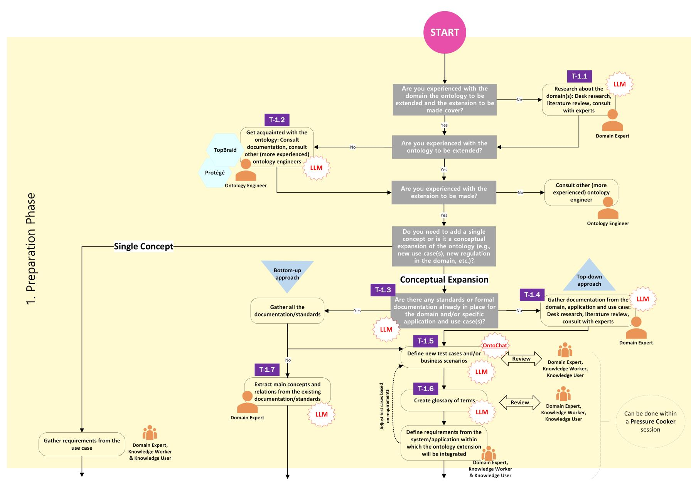

<span id="page-122-0"></span><sup>112</sup> **Figure D.1:** Prototype design for the ontology extension process framework for human-LLM collaboration (To-Be). Zoomed in from Figure [5.1](#page-61-1). Phase 1: Preparation. Abbreviations: [Compentency](#page-10-42) Questions (CQs), Large [Language](#page-10-37) Models (LLMs), Resource [Description](#page-10-40) Framework (RDF).

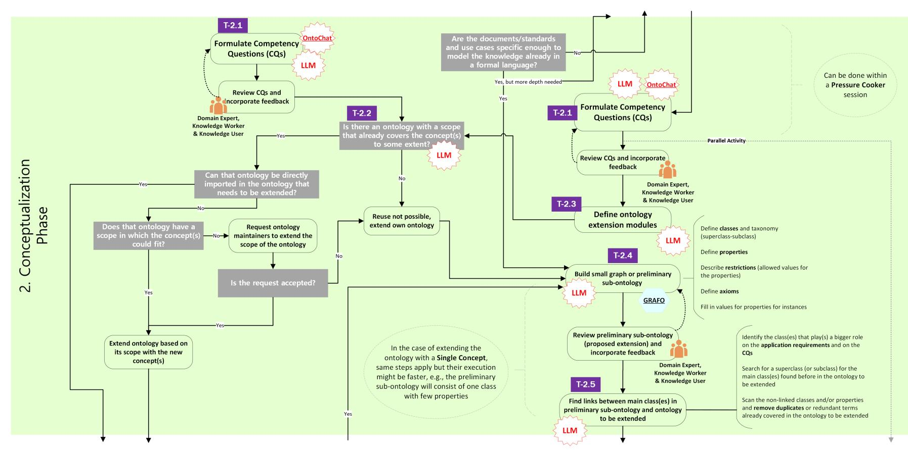

<span id="page-123-0"></span><sup>113</sup> **Figure D.2:** Prototype design for the ontology extension process framework for human-LLM collaboration (To-Be). Zoomed in from Figure [5.1](#page-61-1). Phase 2: Conceptualization. Abbreviations: [Compentency](#page-10-42) Questions (CQs), Large [Language](#page-10-37) Models (LLMs), Resource [Description](#page-10-40) Framework (RDF).

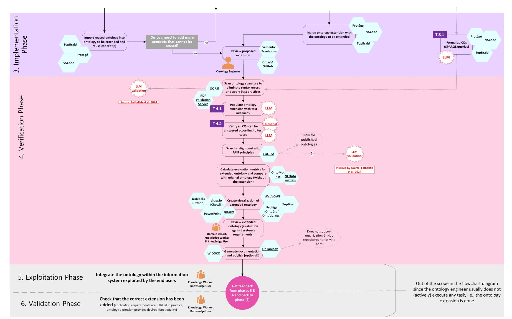

<span id="page-124-0"></span><sup>114</sup> **Figure D.3:** Prototype design for the ontology extension process framework for human-LLM collaboration (To-Be). Zoomed in from Figure [5.1](#page-61-1). Phase <sup>3</sup> and 4: Implementation and Verification. Abbreviations: [Compentency](#page-10-42) Questions (CQs), Large [Language](#page-10-37) Models (LLMs), Resource [Description](#page-10-40) Framework (RDF).

# <span id="page-125-0"></span>D.2. Prompts for each LLM-assisted OE task in the ontology extension process framework

Below, we provide all the prompt templates designed for the LLM-assisted tasks of the ontology extension process framework design prototype presented in Figure [5.1](#page-61-0), and detailed in Table [5.4](#page-62-0). These prompts have been designed following the Prompt Engineering Guide[8](#page-125-4) , REPRO [\(TNO'](#page-10-0)s internal ontology engineering methodology (Bakker, van Bekkum, et al., [2021\)](#page-93-8)), and using the insights provided by the analyzed literature about the application of [LLMs](#page-10-4) to [OE](#page-10-2) tasks (Section [5.3](#page-51-0) in Chapter [5\)](#page-48-0). The text inside curly braces is a placeholder. The user of the ontology extension process framework can replace the placeholder with the corresponding content about the domain and the use case for extension.

Note that these prompts have been designed, tested, and refined with an LLM that supports file uploads. Alternatively, the text from the suggested files can be included directly in the prompt. This depends on the LLM's characteristics, such as its context window or the number of tokens it can accept as input.

### <span id="page-125-1"></span>D.2.1. T-1.1: Research about the domain

- **Prompt Engineering Technique:**
  - **–** Zero-shot
- **Prompt template:**
  - **– Upload ontology TO BE EXTENDED (.txt) file. (Turtle triples file .ttl, saved as .txt and including 3 backticks before and after code block).**
  - **– Q1**: Can you please give me an overview of the {domain}, covered by the ontology that needs to be extended? Please include the main concepts, actors, interactions, and main events happening.
  - **– Upload file(s) describing the extension use case**. E.g., file with the description provided in Section [E.1](#page-131-1).
  - **– Q2**: Which concepts of the {name\_of\_ontology\_to\_be\_extended} are relevant for the extension that we want to make, and which new concepts should we add to cover the extension use case described below? Description of the extension use case: {description\_of\_the\_extension\_use\_case\_(or\_file\_name(s))}.

# <span id="page-125-2"></span>D.2.2. T-1.2: Get acquainted with the ontology

- **Prompt Engineering Technique:**
  - **–** Zero-shot
- **Prompt template:**
  - **– Q1**: Can you please provide me with an overview of the {name\_of\_ontology\_to\_be\_extended}, including its main purpose, examples of how it could be used (if possible real examples, including a source, if not, make up some examples and indicate these are created by you to exemplify), and the main classes and relation (object properties, data properties) in the actual ontology?
  - **– Q2**: Which classes in the existing ontology provided could be relevant for the use case that needs to be covered by the ontology extension, in your opinion as an expert ontology engineer?
  - **– Q3**: Could you provide me with a visualization of the main classes and object and data properties of your previous answer, serialized in a simple Flow diagram in Mermaid? Please, answer only with the code, so that it can be directly copy pasted in the Mermaid live editor to visualize the diagram that you provide. The object properties and data properties should appear as text next the arrows, and only the names of the individuals or datatypes should appear in boxes.

## <span id="page-125-3"></span>D.2.3. T-1.3: Are there any standards or formal documentation already in place for the domain and/or specific application and use case(s)?

• **Prompt Engineering Technique:**

**–** Zero-shot

<span id="page-125-4"></span><sup>8</sup><https://www.promptingguide.ai/>

#### • **Prompt template:**

**–** Are there any standards, semantic standards, or formal documentation already in place for the extension use case, i.e., another existing standard that can be easily translated into an ontology?

## <span id="page-126-0"></span>D.2.4. T-1.4: Gather documentation from the domain

#### • **Prompt Engineering Technique:**

- **–** Zero-shot / Prompt Chaining
- **Prompt template:**
  - **– Q1**: Can you please list all the sources, such as websites, documents, research papers, (only titles) you can find about {brief\_description\_of\_extension\_use\_case\_or\_main\_concepts}? Please, do not search in any the provided files, use your knowledge base.
  - **– Q2**: From the sources you listed in the previous answer, can you provide me with a summary (a text) that identifies and briefly describes: the main concepts, stakeholders and their actions and interactions, and the events happening, relevant to the extension use case?

#### <span id="page-126-1"></span>D.2.5. T-1.5: Define new test cases and/or business scenarios

#### • **Prompt Engineering Technique:**

- **–** Zero-shot
- **Prompt template:**
  - **–** The extension aims to cover new business scenarios. Can you provide a list of all the business scenarios you can think of for the extension use case? The format of your output must be a list in which each row includes the name and context of the business scenario, actors involved in that business scenario, business processes present in that business scenario, and goal of the business scenario (i.e., which information the user needs to get from the application that uses the ontology for that business scenario)?
  - **–** *Optional (define own format for business scenario)*: Can you provide a list of all the business scenarios you can think of for the extension use case {name\_of\_extension\_use\_case}? The business scenarios should {definition\_of\_content\_and\_format\_of\_business\_scenarios}.

#### <span id="page-126-2"></span>D.2.6. T-1.6: Create glossary of terms

- **Prompt Engineering Technique:**
  - **–** Prompt Chaining
- **Prompt template:**
  - **– Upload documentation or text about the domain or extension use case description** (if not uploaded before).
  - **– Upload test cases/business scenarios.**
  - **– Prompt 1**: From the documentation provided in file "{name\_of\_file\_provided}", I want you to provide a list of the most important concepts, i.e., the concepts that are mentioned more frequently. For each one, identify if the concept is a noun or a verb and the number of times it appears in the provided documents (an integer). Make the list as complete as possible. Your answer must be in the following format:

1. <Concept\_1 >: (<noun/verb>). (<# of times it appears >).

**– Prompt 2**: Now, from the documentation provided before in file "{name\_of\_file\_provided}", can you provide a definition for each concept you identified? The format of your answer must be a list in which each row looks like this:

1. <Concept\_1 >: <Definition >.

**– Prompt 3**: From the list provided {before/below (if reviewed list, prompt new list)}, now indicate possible synonyms for each concept (if any) according to their definition in the domain. Do not create any new concept, stick to the ones provided in the list. Provide a new list with the following format:

1. <Concept\_1 >, <Concept\_2 >, ... <Concept\_n >: <Explanation of why these concepts are synonyms >.

This is the list of concepts: {list\_provided\_in\_prompt1\_(reviewed)}.

**– Prompt 4**: From the list provided {before/below (if reviewed list, prompt new list)}, now group the concepts into sub-domain clusters or modules. The goal is to identify possible modules for the ontology extension. Modularization is an important practice in ontology engineering that facilitates the conceptualization of the ontology, sets limits for its scope and allows for its understandability and reusability. Do not create any new concept, stick to the ones provided in the list. Choose a name for the sub-domain cluster based on the concepts that you add to it. Provide a new list with the following format:

```
1. <Sub-domain cluster name> (Brief definition of the sub-domain cluster): <Concept_1 >,
    <Concept_2 >, ... <Concept_n >.
```

#### <span id="page-127-0"></span>D.2.7. T-1.7: Extract main concepts and relations from existing documentation/standards • **Prompt Engineering Technique:**

- **–** Zero-shot [CoT](#page-10-19)
- **Prompt template:**
  - **– Upload file with the existing standard or database description that can be translated into an ontology.**
  - **–** The data model provided in file "{name\_of\_file\_provided}" has to be transformed in an ontology. Let's do this step by step. From the data structure in the document, I want you to extract a list with all the concepts and relations that you can find. The format of your output must be a list, each row of the list must look like this:

1. <Concept\_1 > -> <Relation\_1 > -> <Concept\_2 >.

Note that a concept can be related to one or more concepts. Add as many rows in the list as necessary to cover all the cases. Only use the information provided, without creating any concept or relation that is not in the document.

**–** *Optional (additional prompt)*: Could you also provide me with a visualization of the concepts and relations in the list you extracted before, serialized in a simple Flow diagram in Mermaid? Please, answer only with the code, so that it can be directly copy pasted in the Mermaid live editor to visualize the diagram that you provide. The relations should appear as text next the arrows, and only the names of the concepts should appear in boxes.

#### <span id="page-127-1"></span>D.2.8. T-2.1: Formulate Competency Questions

- **Prompt Engineering Technique:**
  - **–** Few-shot / Prompt Chaining
- **Prompt template:**
  - **– Upload file containing a description of the extension use case** (if not uploaded before).
  - **– Prompt 1**: To establish the functional requirements for the extension use case, we want to formulate [Compentency Questions \(CQs\)](#page-10-10). The goal is that the extension added to the ontology must answer the [CQs](#page-10-10). [CQs](#page-10-10) represent the input-output behavior of our ontology extension as a black-box, providing the user of the ontology (integrated within a system) the possibility to extract the knowledge the need by just asking the [CQs](#page-10-10) to the system (through a user interface). For example, imagine we are extending the Pizza Ontology to use it in a recommender system that recommends pizza stores to users, based on their preferences such as location or diet, you could formulate these [CQs:](#page-10-10) How many calories does a specific pizza have? Which vendor in city X has a unique topping? Which topping is only in one pizza? We want you to formulate as many [CQs](#page-10-10) as possible using the information provided by the user, for the ontology to be extended. Can you please provide me with a list of all the Competency Questions you can formulate for {description\_of\_the\_extension\_use\_case/file\_name}? Consider that [CQs](#page-10-10) must be unique, so a CQ

could be used in different business scenarios. Do not group the [CQs](#page-10-10) by business scenario but provide a list with all the [CQs](#page-10-10) together without duplicates.

**– Prompt 2**: We divide [Compentency Questions \(CQs\)](#page-10-10) into three categories: 1) Low or atomic level: [CQs](#page-10-10) that normally model a property/object relation, asking questions about the data. Example: How many calories does a specific pizza have?; 2) Middle or connectivity level: [CQs](#page-10-10) that describe relations between several concepts along several property/object relations, combining information into meaningful sets. Example: Which topping is only in one pizza? ; 3) High or business level: [CQs](#page-10-10) that really show the added value of the extension to the ontology, i.e., what the final users of the system would ask. Example: Which vendor in city X has a unique topping? From the list of [CQs](#page-10-10) provided {before/below by the user (if reviewed)}, return the same list but classified into "Low or atomic level", "Middle or connectivity level", or "High or business level" according to the given explanation. Do not create new [CQs](#page-10-10) but only classify the ones created before/given. List of [CQs:](#page-10-10) {list\_of\_[CQs\\_](#page-10-10)from\_previous\_output\_(reviewed)}.

#### <span id="page-128-0"></span>D.2.9. T-2.2: Is there an ontology with a scope that already covers the concept(s) to some extent?

• **Prompt Engineering Technique:**

**–** Zero-shot

• **Prompt template:**

**–** Given the information provided {before (if document already updated)/below (prompt documentation about the use case)}, is there an ontology with a scope that already covers the concept(s) that the ontology extension must cover? Please provide your answer as a list in which each row contains the name of the ontology that could be reused and some examples of relevant concepts included in the proposed ontology to be reused (in the extension). Do not include any concepts (classes, properties) that do not exist in the proposed ontology for reuse. Use your knowledge base to identify ontologies that are not being reused already by the {name\_of\_ontology\_to\_be\_extended}. Do not make up ontologies that do not exist. If there are no ontologies available for reuse answer with "I cannot find any ontology that can be reused in this case".

#### <span id="page-128-1"></span>D.2.10. T-2.3: Define ontology extension modules

- **Prompt Engineering Technique:**
  - **–** Zero-shot / Prompt Chaining (if using output from T-2.1)
- **Prompt template:**
  - **–** From the list of [Compentency Questions \(CQs\)](#page-10-10) created for the extension, now we want to cluster those [CQs](#page-10-10) into different groups so we can identify of which modules or sub-ontologies the extension consists of. Modularization is an important practice in ontology engineering that facilitates the conceptualization of the ontology, sets limits for its scope and allows for its understandability and reusability. Use the list of [CQs](#page-10-10) given, without creating new [CQs,](#page-10-10) and cluster them into modules. The format of the output must be like this:

```
1. <Name_of_module1 >: <Brief_description_of_the_module >
1.1. <CQx_associated_to_that_module >
...
1.n. <CQy_associated_to_that_module >
...
N. <Name_of_moduleN >: <Brief_description_of_the_module >
N.1. <CQz_associated_to_that_module >
...
N.n. <CQw_associated_to_that_module >
```

<span id="page-128-2"></span>If you consider it is not possible to create any modules from the [CQs](#page-10-10) given (all of them correspond to the same module) just answer with: "Modularization not possible." Can you please cluster this list of [CQs](#page-10-10) into different ontology modules or sub-ontologies? List of [CQs](#page-10-10): {list\_of[\\_CQs](#page-10-10)\_from\_T-2.1\_(reviewed)} (As text or **upload file**).

#### D.2.11. T-2.4: Build small graph or preliminary sub-ontology

- **Prompt Engineering Technique:**
  - **–** Prompt Chaining
- **Prompt template:**
  - **– Prompt 1 (If coming from T-1.7)**: From the given list of concepts and relations, can you generate a conceptual model expressed in triples? Remember that object properties define relationships between two individuals (instances of classes), while data properties define relationships between an individual and a data value (literal). Find all the object properties and data properties, and include the class definitions and all necessary prefixes. Please provide your output as a Turtle code snippet in [OWL](#page-10-18) syntax. Also include labels, comments, and descriptions for each triple. Do this for all the items provided in the list. List: {list\_of\_concepts\_and\_relations\_(from\_T-1.7)} (As text or **upload file**).
  - **– Upload file containing a description of the extension use case** (if not uploaded before).
  - **– Prompt 1 (If coming from T-2.1)**: Using the information provided in file "{name\_of\_file}" and your knowledge base and experience as an expert ontology engineer, now for each Business Scenario and Competency Question (CQ) provided in the list, can you generate a conceptual model expressed in triples? Use the relevant concepts from the {name\_of\_ontology\_to\_be\_extended} suggested in the file and the new concepts to add to the {name\_of\_ontology\_to\_be\_extended} for the extension, also provided in the file. Remember that object properties define relationships between two individuals (instances of classes), while data properties define relationships between an individual and a data value (literal). Find all the object properties and data properties, and include the class definitions and all necessary prefixes. Please provide your output as a Turtle code snippet in [OWL](#page-10-18) Syntax, so that it can be opened as a .ttl file using Protégé. Also include labels, comments, and descriptions for each triple.
  - **– Prompt 2**: Now, for all object properties you defined, if meaningful generate the inverse property. Keep the ontology consistent. If meaningful declare restrictions for the domain and range. Do it for the whole ontology you generated in [OWL](#page-10-18) before. Please answer with the updated Turtle code in [OWL](#page-10-18) syntax.
  - **– Prompt 3-a**: Now, for the [OWL](#page-10-18)/Turtle code generated before, are there any more axioms we could add? Think for example of class axioms that have not been defined before such as disjointness axioms, or additional property axioms to the ones already added such as transitive property axioms. Please provide a numbered list with all the suggestions you can make, without modifying the Turtle code.
  - **– Prompt 3-b (if output from Prompt 3-a is relevant)**: Please add now to the Turtle code in [OWL](#page-10-18) syntax (last version that you generated before) the axioms from the list you provided before: {specify\_axioms\_to\_add}.
  - **– Prompt 4-a**: Now, for the [OWL](#page-10-18)/Turtle code generated before, are there any constraints we could add? Think for example of data validation or defining shapes in [SHACL.](#page-10-23) Please provide a numbered list with all the suggestions you can make, without modifying the Turtle code.
  - **– Prompt 4-b (if output from Prompt 4-a is relevant)**: Please add now to the Turtle code in [OWL](#page-10-18) syntax (last version that you generated before) the [SHACL](#page-10-23) constraints from the list you provided before: {specify\_[SHACL](#page-10-23)\_constraints\_#}.

#### <span id="page-129-0"></span>D.2.12. T-2.5: Find links between main class(es) in preliminary sub-ontology and ontology to be extended

- **Prompt Engineering Technique:**
  - **–** Zero-shot / Prompt Chaining (if using output from T-1.1 or T-1.2)
- **Prompt template:**
  - **– Upload ontology TO BE EXTENDED (.txt) file. (Turtle triples file .ttl, saved as .txt and including 3 backticks before and after code block)** (if not uploaded before).
  - **– Upload ontology EXTENSION (.txt) file. (Turtle triples file .ttl, saved as .txt and including 3 backticks before and after code block).**
  - **–** The file called {name\_of\_file\_with\_sub-ontology\_extension} with the extension ".txt" but formatted as a turtle triples file provided below contains the complete code for the ontology extension to the

{name\_of\_ontology\_to\_be\_extended}. Now, I want you to examine which classes of the extension ontology are related to the concepts in the {name\_of\_ontology\_to\_be\_extended} (provided in the file called {name\_of\_file\_with\_ontology\_to\_be\_extended} with the extension ".txt" but formatted as a turtle triples file). The goal is to align these two ontologies so the extension ontology generated can be incorporated into the {name\_of\_ontology\_to\_be\_extended} as an extension. You can use the following information: {information about relevant concepts in ontology to be extended that can be used in extension (from T-1.1 or T-1.2)}.

## <span id="page-130-0"></span>D.2.13. T-3.1: Formalize Competency Questions into SPARQL queries

- **Prompt Engineering Technique:**
  - **–** Zero-shot / Few-shot
- **Prompt template:**
  - **– Upload ontology EXTENSION (.txt) file. (Turtle triples file .ttl, saved as .txt and including 3 backticks before and after code block)** (if not uploaded before).
  - **–** We need to formalize the [Compentency Questions \(CQs\)](#page-10-10) into SPARQL queries, for the extension ontology provided in file "{name\_of\_file\_with\_sub-ontology\_extension}". In your answer provide only the SPARQL query code, without any explanation. The SPARQL query should be ready to run, i.e., it should give some results when copy pasted into, for example, Protégé (using the SPARQL Query Plugin) and executed. Include the all correct prefixes.
  - **–** Option 1 (Zero-shot): Given the CQ: "{CQ}", please give me its corresponding SPARQL query:
  - **–** Option 2 (Few-shot): This is an example of a CQ with its corresponding SPARQL query: {example\_of\_CQ\_and\_SPARQLquery} (if more examples available, provide more). Now, given the CQ: {CQ} and following the example(s) provided before, please give me its corresponding SPARQL query:

#### <span id="page-130-1"></span>D.2.14. T-4.1: Populate ontology extension with instances

- **Prompt Engineering Technique:**
  - **–** Zero-shot / Prompt Chaining (if using output from T-3.1)
- **Prompt template:**
  - **–** For the following list of SPARQL queries (and their [Compentency Questions \(CQs\)\)](#page-10-10). Which example instances should be added so all the SPARQL query produce results? {List of [CQs](#page-10-10) with corresponding SPARQL Queries (from T-3.1)}. (As part of the prompt).

## <span id="page-130-2"></span>D.2.15. T-4.2: Verify all [CQs](#page-10-10) can be answered according to test cases

- **Prompt Engineering Technique:**
  - **–** Zero-shot
- **Prompt template:**
  - **– Upload ontology EXTENSION (.txt) file. (Turtle triples file .ttl, saved as .txt and including 3 backticks before and after code block)** (if not uploaded before).
  - **–** For each Competency Question (CQ), identify if it can be answered by the ontology extension provided in file "{name\_of\_ontology\_extension\_file}" indicating Yes/No and provide an explanation of why or why not the CQ can be answered. Focus on the ontology structure (presence of classes, object properties, and data properties), not on the existence of individuals. Please, stick to the content provided, do not create any new information that is not in the ontology extension or any new CQ. Your output must be a list with the following format:

```
1. <CQ1> / <Can_be_answered_by_ontology_extension?_(Yes/No)> / <Explanation >.
...
n. <CQn> / <Can_be_answered_by_ontology_extension?_(Yes/No)> / <Explanation >.
```

List of [CQs:](#page-10-10) {list\_of[\\_CQs](#page-10-10)\_from\_T-2.1\_(reviewed)}. *Alternative: prompt one CQ at a time.*

E

# <span id="page-131-0"></span>Prototype demonstration and evaluation

# <span id="page-131-1"></span>E.1. Description of the use case chosen

The description of the use case has been adapted from the internal [TNO](#page-10-0) documentation of the project (de Heer et al., [2023\)](#page-94-18).

- **Title**: Extending the [Common Greenhouse Ontology \(CGO\)](#page-10-7) to cover the use case [Semantic Explanation and](#page-10-8) [Navigation System \(SENS\)](#page-10-8) - Adapted use case extension for demonstration and evaluation of the prototype design with [GPT](#page-10-9) as part of MSc Thesis project.
- **Introduction**: The use case [Semantic Explanation and Navigation System \(SENS\),](#page-10-8) developed by [TNO](#page-10-0), consists of the development of a module to enable communication in greenhouses, between autonomous systems (e.g., robots) and human operators (e.g., growers). In this stage, the focus is on the communication only from the autonomous system to the human operator.
- **Problem and potential solution provided by [SENS](#page-10-8)**: Currently, most (if not all) greenhouse robots will simply stop if they encounter an obstacle in their way that they do not recognize. At most, the robot will send a signal to the operator that it has stopped, but no more useful information for the operator. The assumption is that the presence of autonomous systems in the greenhouse will increase. The greenhouse represents a tight space with usually narrow paths that both robots and humans must share. The autonomous system will frequently encounter obstacles in its way, both objects and humans. The safety of the human is key, i.e., autonomous systems should not interfere with the human's space nor cause any harm. Moreover, it is expected that through increased and effective (semantic and understandable) communication of the autonomous system's actions to the human operator, the work efficiency will increase with less disturbances and less and faster human interventions.
- **Goal for ontology engineer**: The task for the ontology engineer is to extend the [Common Greenhouse](#page-10-7) [Ontology \(CGO\)](#page-10-7) with the relevant concepts to cover the [SENS](#page-10-8) use case. The [CGO](#page-10-7) extension should model the information about (unexpected but foreseeable) situations. There will be different types of situations depending on the type of obstacle found. The obstacles that can be found also vary; different types of objects, other robots, humans, or even parts of the greenhouse. The type of obstacle found defines the situation's characteristics, for example, its severity level. In addition, depending on the reasoned situation and its severity level, the autonomous system will propose to the human operator a different type of action that it can take, e.g., stop and wait for help from human operator, get around obstacle and continue with activity X. The extended [CGO](#page-10-7) will be used as "a brain for the robot", adding a layer of intelligence that enables the robot to reason and give semantic explanations to the human operator about the situation encountered, so that the human operator has enough information to decide what to do next.
- **Available data**: The [SENS](#page-10-8) module is an interoperable module that can be used within any type of greenhouse robot, with the assumption that the robots have already a system to detect and recognize objects in their way. Moreover a positioning system is available. It consists of a tag system in which any object (including autonomous systems) or human with a tag can be located in the greenhouse. The semantic explanations generated by the robot will be shown to the human operator via a dashboard.
- **Some specific requirements**:
  - 1. The human operator must be informed about the situation reasoned by the autonomous system in natural

language and in real time, any time its operation is halted.

- 2. The human operator must be informed about what types of obstacles cause the autonomous system to halt its operation and why, and what action the autonomous system has decided to take after encountering the obstacle based on its reasoning (e.g., stop and wait for help from human operator, get around obstacle and continue with activity X).
- 3. The human operator must know in real time the location or position of the autonomous system in the greenhouse, and the situation encountered (e.g., via a greenhouse map or path number where the autonomous system is located).

# <span id="page-132-0"></span>E.2. Demonstration results

#### <span id="page-132-1"></span>E.2.1. T-1.1: Research about the domain

• **Output (Q1)**:

```
The Common Greenhouse Ontology (CGO) covers key aspects of high-tech greenhouses with modern systems
    , focusing on concepts and measurements relevant to greenhouse operations and management.
    Main Concepts and Modules
        1. Greenhouse: Central concept representing the greenhouse structure.
        2. Features: Attributes and properties of the greenhouse , e.g., dimensions , location.
        3. Parts: Objects within the greenhouse such as construction parts, plant parts, and various
             internal systems.
        4. Measurements: Data about conditions within the greenhouse collected through various
            sensors and systems[1]``[2].
    Actors
        1. Grower: Operates and possibly owns the greenhouse , focused on crop production[3].
        2. Builder: Builds greenhouses and supports crop management activities[4].
        3. Greenhouse Owner: Owns the greenhouse without necessarily managing daily operations[5].
    Interactions
        1. Observations and Measurements: Data collected via sensors and climate computers to
            monitor conditions like temperature , humidity , and CO2 levels[6]``[7].
        2. System Operations: Interaction between different systems such as heating , cooling ,
            irrigation , and ventilation to maintain optimal growing conditions[8]``[9]``[10].
    Main Events
        1. Planting and Harvesting: Key events in the crop lifecycle , requiring specific
            environmental conditions[11]``[12].
        2. Sensor Readings: Regular collection of data points from various sensors within the
            greenhouse for continuous monitoring and control[13]``[14].
        3. System Adjustments: Automation and manual interventions based on sensor data to adjust
            the greenhouse environment such as opening vents, adjusting heating , and modulating
            irrigation[15]``[16]``[17].
This structure ensures a comprehensive coverage of greenhouse operations , focusing on the
    integration and interaction of various components to maintain optimal growing conditions.
```

• **Output (Q2)**:

| Based on the SENS (Semantic Explanation and Navigation System) use case requirements , the<br>following CGO concepts are relevant and can be leveraged:<br>1. Autonomous Systems/Robots<br>- While an explicit concept for "Autonomous System" wasn't found, related concepts<br>can be adapted.<br>- Concepts like cgo:ControlSystem may be indirectly related .<br>2. Location/Positioning<br>- cgo:GreenhouseLocalGrid: Represents the x-y grid of the greenhouse .<br>- cgo:Site: Represents the physical location of the greenhouse .<br>- cgo:Location: May represent various locations within the greenhouse .<br>3. Obstacles<br>- Obstacles can be added as sub-classes under a potential new class such as cgo:<br>Obstacle (e.g., cgo:Human, cgo:Object, cgo:Robot, cgo:GreenhousePart).<br>4. Actions/Events<br>- Potential actions by the autonomous system can be modeled as subclasses of the<br>newly defined class, e.g., cgo:Action.<br>- Concepts for sensors and control systems may be used to represent observations and<br>actions , such as cgo:TemperatureSensor , cgo:GreenhouseSensor .<br>New Concepts to Add<br>Given the requirements of the SENS use case, consider the following extensions: | Relevant Concepts from CGO |
|------------------------------------------------------------------------------------------------------------------------------------------------------------------------------------------------------------------------------------------------------------------------------------------------------------------------------------------------------------------------------------------------------------------------------------------------------------------------------------------------------------------------------------------------------------------------------------------------------------------------------------------------------------------------------------------------------------------------------------------------------------------------------------------------------------------------------------------------------------------------------------------------------------------------------------------------------------------------------------------------------------------------------------------------------------------------------------------------------------------------------------------------------------------------------------------------------------------------------|----------------------------|
|                                                                                                                                                                                                                                                                                                                                                                                                                                                                                                                                                                                                                                                                                                                                                                                                                                                                                                                                                                                                                                                                                                                                                                                                                              |                            |
|                                                                                                                                                                                                                                                                                                                                                                                                                                                                                                                                                                                                                                                                                                                                                                                                                                                                                                                                                                                                                                                                                                                                                                                                                              |                            |
|                                                                                                                                                                                                                                                                                                                                                                                                                                                                                                                                                                                                                                                                                                                                                                                                                                                                                                                                                                                                                                                                                                                                                                                                                              |                            |
|                                                                                                                                                                                                                                                                                                                                                                                                                                                                                                                                                                                                                                                                                                                                                                                                                                                                                                                                                                                                                                                                                                                                                                                                                              |                            |
|                                                                                                                                                                                                                                                                                                                                                                                                                                                                                                                                                                                                                                                                                                                                                                                                                                                                                                                                                                                                                                                                                                                                                                                                                              |                            |
|                                                                                                                                                                                                                                                                                                                                                                                                                                                                                                                                                                                                                                                                                                                                                                                                                                                                                                                                                                                                                                                                                                                                                                                                                              |                            |
|                                                                                                                                                                                                                                                                                                                                                                                                                                                                                                                                                                                                                                                                                                                                                                                                                                                                                                                                                                                                                                                                                                                                                                                                                              |                            |
|                                                                                                                                                                                                                                                                                                                                                                                                                                                                                                                                                                                                                                                                                                                                                                                                                                                                                                                                                                                                                                                                                                                                                                                                                              |                            |
|                                                                                                                                                                                                                                                                                                                                                                                                                                                                                                                                                                                                                                                                                                                                                                                                                                                                                                                                                                                                                                                                                                                                                                                                                              |                            |
|                                                                                                                                                                                                                                                                                                                                                                                                                                                                                                                                                                                                                                                                                                                                                                                                                                                                                                                                                                                                                                                                                                                                                                                                                              |                            |
|                                                                                                                                                                                                                                                                                                                                                                                                                                                                                                                                                                                                                                                                                                                                                                                                                                                                                                                                                                                                                                                                                                                                                                                                                              |                            |
|                                                                                                                                                                                                                                                                                                                                                                                                                                                                                                                                                                                                                                                                                                                                                                                                                                                                                                                                                                                                                                                                                                                                                                                                                              |                            |
|                                                                                                                                                                                                                                                                                                                                                                                                                                                                                                                                                                                                                                                                                                                                                                                                                                                                                                                                                                                                                                                                                                                                                                                                                              |                            |
|                                                                                                                                                                                                                                                                                                                                                                                                                                                                                                                                                                                                                                                                                                                                                                                                                                                                                                                                                                                                                                                                                                                                                                                                                              |                            |

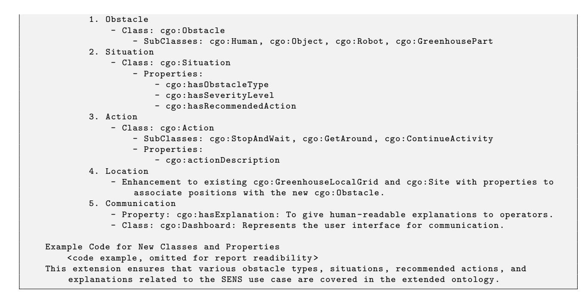

#### <span id="page-133-0"></span>E.2.2. T-1.2: Get acquainted with the ontology • **Output (Q1)**:

```
Overview of the Common Greenhouse Ontology (CGO)
    Purpose
        The Common Greenhouse Ontology (CGO) is designed to capture and model information relevant
            to high-tech greenhouses , specifically those equipped with modern systems that generate
            data about their environment. Its primary goal is to facilitate the integration and
            querying of data within greenhouses , covering aspects such as structural components ,
            environmental measurements , and operational systems[1].
    Modules
        The CGO is structured into four main modules:
            1. Greenhouse: Represents the central concept , including its physical aspects and way it
                 operates.
            2. Features: Properties related to the greenhouse , such as dimensions or geographical
                location.
            3. Parts: Various objects and systems found within the greenhouse.
            4. Measurements: Data collected by sensors and systems within the greenhouse.
                Measurement data and their properties are heavily influenced by the SSN (Semantic
                Sensor Network) ontology and the Ontology of units of Measure (OM)[2]``[3].
    Main Classes and Properties
        Classes
            - Greenhouse: Central concept representing the greenhouse.
            - SystemPart: Represents parts of various systems in the greenhouse (e.g., cgo:
                HeatDistributionSystem).
            - ObservableProperty: Defines measurable properties within the greenhouse (e.g., cgo:
                RelativeHumidity).
            - Sensor: Represents sensors that measure different observable properties (e.g., cgo:
                TemperatureSensor).
            - Person: Human operators involved in the operations (e.g., cgo:Picker).
        Object Properties
            - hasPart: Links a greenhouse to its individual parts.
            - hasProperty: Links components to their properties.
            - hasMeasurement: Links sensors to their measurements.
        Data Properties
            - hasConstructionPlaceName: Records the location detail of the greenhouse 's construction
                .
            - hasColumnHeight: Records the height of greenhouse columns.
    Examples of Use
        1.Example 1: Measuring Humidity (Fictional)
```

```
- An autonomous system can use the CGO to measure the humidity in a greenhouse. For
            example , cgo:TemperatureSensor is linked to cgo:RelativeHumidity using the
            hasMeasurement property.
            ex:humidityObservation a sosa:Observation ;
                sosa:hasFeatureOfInterest ex:greenhouseAir ;
                sosa:observedProperty cgo:RelativeHumidity ;
                sosa:hasResult ex:humidityResult .
    2. Example 2: Greenhouse Specifications (Real)
        - The Greenhouse Construction class can be used in planning new greenhouse builds by
            recording specific attributes.
            ex:greenhouse123 a cgo:Greenhouse;
                cgo:hasConstructionPlaceName "Amsterdam" ;
                cgo:hasConstructionAddress "123 Farming Lane" ;
                cgo:hasColumnHeight ex:columnHeightMeasure .
            ex:columnHeightMeasure a om:Measure ;
                om:hasNumericalValue 5 ;
                om:hasUnit om:metre .
        Source: Adapted from CGO documentation[4]``[5].
Conclusion
    The Common Greenhouse Ontology serves as a robust framework for modeling and querying data
        within greenhouses , integrating information from various systems and providing a
        standardized approach to data representation. It can be extended to include new concepts
         and relationships , making it a versatile tool for modern greenhouse operations and
        research.
    For a deeper dive into the ontology , including full class hierarchies and additional
        properties , reviewing the actual ontology file in a tool like Protégé is recommended
        [6]``[7].
```

• **Output (Q2)**:

```
Relevant CGO Concepts and Relations for the SENS Use Case
Based on the SENS (Semantic Explanation and Navigation System) use case requirements , the following
    existing concepts and relations from the Common Greenhouse Ontology (CGO) are relevant:
Concepts
    1. System Concepts
        - cgo:ControlSystem: Represents the control systems in a greenhouse , potentially relevant
            for autonomous system controls.
        - ssn:System: A broader class that cgo:ControlSystem is a subclass of, encompassing various
            systems.
    2. Sensor and Measurement Concepts
        - cgo:TemperatureSensor: Represents sensors that measure temperature , relevant for
            environmental conditions.
        - sosa:Sensor: General sensor class which cgo:TemperatureSensor is a subclass of.
        - cgo:GreenhouseSensor: Represents sensors in the greenhouse including various types of
            sensors.
    3. Location Concepts
        - cgo:Grid: Represents a grid within the greenhouse , potentially useful for mapping
            obstacles.
        - schema:Place: A more general place concept that cgo:Grid is a subclass of.
        - cgo:Site: Represents the physical location of the greenhouse.
    4. Human and Role Concepts
        - foaf:Person: Represents people involved in greenhouse operations such as growers.
        - cgo:Grower: A specific role for greenhouse operators.
    5. Construction and Part Concepts
        - cgo:Part: General class for parts within the greenhouse.
        - cgo:ConstructionPart: Represents different parts of a greenhouse construction , such as cgo
            :Curtain.
        - cgo:SystemPart: Represents different parts of systems within the greenhouse.
Relations (Object Properties , Data Properties)
    1. Structural and Hierarchical Relations
        - cgo:partOf: Links parts and their wholes, useful for establishing hierarchical
            relationships between obstacles and their locations , or systems and their parts.
    2. Measurement and Sensor Relations
        - ssn:hasProperty: Links sensors with the properties they measure.
        - sosa:hasFeatureOfInterest: Links observations to the features of interest , useful for
            linking sensed data to the environmental conditions or obstacles.
    3. Action and Status Relations
```

- sosa:ActuatableProperty: Represents properties that can be measured and potentially acted upon, relevant for autonomous system actions. - sosa:ObservableProperty: Represents properties that can be observed , essential for tracking the status of sensors and measurements. Conclusion The above existing concepts and relations from the CGO can be utilized and extended to model aspects critical for the SENS use case, such as autonomous systems , obstacles , actions , and human roles. This forms a solid foundation for the ontology extension required for SENS. For additional details , the specific classes and properties can be referenced directly from the CGO ontology file sections.

<span id="page-135-2"></span>• **Output (Q3) visualized using Mermaid Live Editor**:

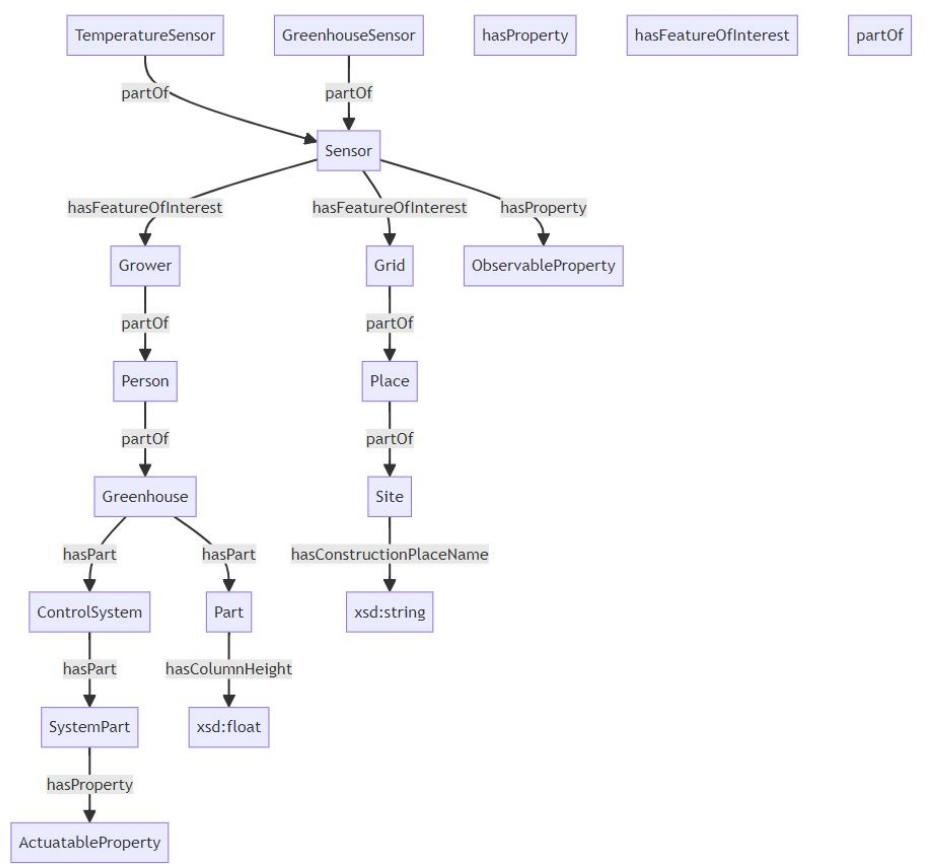

**Figure E.1:** Output of Task 1.2 – Question 3, visualized in the Mermaid Live Editor (diagramming tool).

## <span id="page-135-0"></span>E.2.3. T-1.3: Are there any standards or formal documentation already in place for the domain and/or specific application and use case(s)?

• **Output**:

<span id="page-135-1"></span>Based on the search results , there were no specific standards or formal documentation found directly related to the SENS use case in terms of existing ontologies. However , the search did point towards the alignment of the CGO with ontologies like SSN (Semantic Sensor Network) and the Ontology of units of Measure (OM). Given this context , the creation of a new extension for SENS might not have direct pre-existing standards. Instead , adapting and extending current standards (e.g., SSN and OM) to accommodate the SENS use case would be the recommended approach. For more information on the use of SSN and OM in CGO: - SSN: https://www.w3.org/TR/vocab-ssn/ (<link works >) - OM: https://github.com/HajoRijgersberg/OM (<link works >) Feel free to ask if you need further details or assistance in this regard!

#### E.2.4. T-1.4: Gather documentation from the domain

• **Output (Question 1)**:

```
Relevant Sources on Autonomous Systems / Robots and Greenhouses
1. Research Papers and Articles
    - Title: "Smart Greenhouses: Advances and Challenges"
            - Source: IEEE Access
            - Authors: López-Riquelme , J. A., et al.
            - Details: Discusses the latest advancements in smart greenhouse technologies , including
                 the integration of autonomous systems and robots.
    - Title: "A Review of Robotics in Agriculture and Horticulture"
        - Source: Journal of Agricultural Engineering
        - Authors: Bac, C. W., et al.
        - Details: Reviews the application of robotic technology in agriculture , focusing on its use
             in greenhouse environments.
    - Title: "Autonomous Weeding Systems in Greenhouses: Design and Applications"
        - Source: Biosystems Engineering
        - Authors: Perez-Ruiz, M., et al.
        - Details: Examines designs and practical applications of autonomous weeding robots in
            greenhouse settings.
    - Title: "Development and Deployment of Autonomous Robots in Greenhouses"
        - Source: Agricultural Robots Journal
        - Authors: van Henten, E. J., et al.
        - Details: Covers the development , deployment , and operational challenges of autonomous
            robots in greenhouses.
    - Title: "Automated Data Collection Using Sensor Networks and Robotics in Smart Greenhouses"
        - Source: Sensors
        - Authors: Wang, X., et al.
        - Details: Explores the use of sensor networks and robotic systems for automated data
            collection in greenhouse environments.
2. Websites and Online Resources
    - Website: Agricultural Robots and Automation
        - Details: A comprehensive resource on the latest advancements and applications of robotics
            and automation in agriculture , including greenhouses.
    - Website: Greenhouse Management Online Guide
        - Details: Provides information on integrated technology solutions for greenhouse management
            , including the use of autonomous systems.
    - Website: Smart Agriculture Technology
        - Details: Offers insights into the integration of smart technologies , such as robotics , in
            agriculture with dedicated sections on greenhouse automation.
3. Technical Standards and Documentation
    - Title: "ISO 18497: Agriculture — Autonomous Agricultural Machines — Safety"
        - Source: International Organization for Standardization (ISO)
        - Details: Specifies the safety requirements for autonomous agricultural machines , which can
             include greenhouse robots.
    - Title: "ANSI/ASABE S635: Standard for Agricultural Field Equipment Brakes"
        - Source: American Society of Agricultural and Biological Engineers (ASABE)
        - Details: While focused on field equipment , the standards provide insights that can be
            applied to braking systems in autonomous greenhouse machines.
e sources will provide a solid understanding of how autonomous systems and robots are becoming
    integral components of modern greenhouse management and operations.
```

#### • **Output (Question 2)**:

Summary of Autonomous Systems/Robots in Greenhouses for SENS Extension Use Case Main Concepts 1. Autonomous Systems/Robots: - Include robots designed for specific tasks within greenhouses , such as weeding , data collection , crop monitoring , and maintenance tasks. - Robots are equipped with sensors for navigation , obstacle detection , environmental monitoring , and specific actuator mechanisms for task execution. 2. Greenhouses: - Highly controlled environments designed for optimal plant growth. - Equipped with various systems such as heating , ventilation , cooling , and irrigation systems that work in conjunction with autonomous robots. 3. Sensors and Sensor Networks: - Devices that collect data on environmental conditions (e.g., temperature , humidity , soil moisture). - Networks of sensors provide real-time data to robots for adaptive and responsive actions. Stakeholders and Their Actions 1. Growers/Farm Managers:

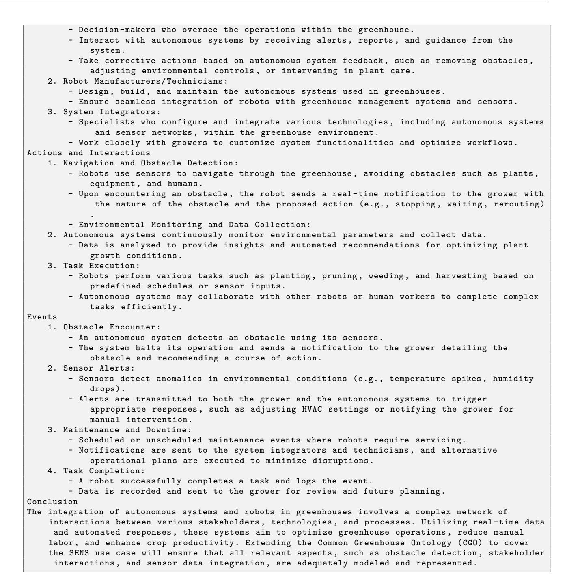

## <span id="page-137-0"></span>E.2.5. T-1.5: Define new test cases and/or business scenarios

- **Input (customized prompt template)**: The extension for the use case [SENS](#page-10-8) aims to cover new business scenarios. Can you provide a list of all the business scenarios you can think of for the extension use case [SENS?](#page-10-8) The business scenarios must be centered around the Navigation and Obstacle Detection and Handling only, which is the topic [SENS](#page-10-8) focuses on. The business scenarios should be centered around 2 actors: the human operator and the robot. Please identify the actions of each of these 2 actors in each business scenario, the goal, and the information that must be exchanged to achieve the goal. Remember that the use case covers only the communication from the robot to the human operator (and not the other way around).
- **Output**:

```
Business Scenarios for SENS Extension Use Case: Navigation and Obstacle Detection and Handling
1. Obstacle Avoidance and Route Recalculation
```

```
- Goal: Ensure the robot can navigate around obstacles and continue with its task.
```

- Actions: - Robot: Detects an obstacle , stops, calculates an alternative route, and sends a notification about the obstacle and the new path. - Human Operator: Receives the notification and monitors the robot's new path. - Information Exchanged: - Robot to Human Operator: - Type of obstacle (e.g., equipment , plant) - Location of the obstacle - New calculated path - Estimated delay due to rerouting 2. Static Obstacle Alert - Goal: Inform the human operator about a static obstacle that requires intervention. - Actions: - Robot: Detects a static obstacle (e.g., fallen equipment), stops, and sends a detailed alert to the human operator. - Human Operator: Receives the alert, assesses the situation , and takes action to remove the obstruction. - Information Exchanged: - Robot to Human Operator: - Type of obstacle (e.g., fallen equipment) - Exact location of the obstacle - Urgency level (e.g., high, low) - Recommended action (e.g., remove equipment) 3. Human Presence Detection - Goal: Ensure the safety of humans by stopping the robot when a human is detected in its path. - Actions: - Robot: Detects a human in its path, stops immediately , and sends a safety alert to the human operator. - Human Operator: Receives the safety alert and ensures the human is safely guided out of the robot's path. - Information Exchanged: - Robot to Human Operator: - Detection of human presence - Location of the human - Status of the robot (e.g., stopped) - Suggested next steps to ensure safety 4. Unexpected Movable Obstacle - Goal: Manage situations where an unexpected movable obstacle (e.g., a cart) is detected. - Actions: - Robot: Detects a movable obstacle , stops, and sends an alert with options for handling the obstacle to the human operator. - Human Operator: Receives the alert, decides on the action (e.g., remove or ignore the obstacle if 'its temporary). - Information Exchanged: - Robot to Human Operator: - Type of obstacle (e.g., cart) - Location of the obstacle - Possible actions (e.g., wait, reroute , continue) - Recommended action 5. Greenhouse Structural Obstacle - Goal: Navigate around structural components of the greenhouse that may block the 'robots path. - Actions: - Robot: Detects a structural obstacle (e.g., a pillar), stops, and sends a detailed notification to the human operator with actions for avoidance. - Human Operator: Receives the notification and monitors the robot as it reroutes or continues. - Information Exchanged: - Robot to Human Operator: - Type of obstacle (e.g., structural pillar) - Location of the obstacle - Suggested actions (e.g., reroute , stop) - Estimated time for rerouting 6. Post-Avoidance Status Update - Goal: Ensure the human operator is continuously updated about the 'robots status after avoiding an obstacle. - Actions: - Robot: After successfully navigating around an obstacle , sends a status update indicating task resumption. - Human Operator: Receives the status update, confirming the 'robots task resumption. - Information Exchanged: - Robot to Human Operator:

- Status update (e.g., obstacle cleared , task resumed) - New location of the robot - Time taken for obstacle avoidance - Any deviations from the original task Conclusion These business scenarios for navigation and obstacle detection and handling involve specific actions by the robot to detect obstacles , decide on actions , and communicate these actions to the human operator. The goal of ensuring safe and efficient navigation within the greenhouse is achieved through clear and concise communication from the robot to the human operator , allowing for prompt and informed responses.

#### <span id="page-139-0"></span>E.2.6. T-1.6: Create glossary of terms

#### • **Output (Prompt 1)**:

| 1. Obstacle: (noun) Any obstruction or hindrance that the autonomous system encounters (including<br>objects , other robots, humans, or parts of the greenhouse). (9 times) |
|-----------------------------------------------------------------------------------------------------------------------------------------------------------------------------|
| 2. Robot: (noun) An autonomous system used in the greenhouse to perform tasks while navigating<br>around obstacles. (13 times)                                              |
| 3. Human Operator: (noun) The person responsible for monitoring and intervening when necessary upon<br>receiving alerts and statuses from the robot. (10 times)             |
| 4. Navigation: (verb) The process of the robot moving through the greenhouse while avoiding<br>obstacles. (5 times)                                                         |
| 5. Safety: (noun) Ensuring the well-being of humans in the greenhouse , especially by stopping the<br>robot when a human is detected in its path. (5 times)                 |
| 6. Detection: (verb) The act of identifying obstacles or human presence by the robot's sensors. (6<br>times)                                                                |
| 7. Notification: (noun) Information sent by the robot to the human operator regarding the obstacle<br>encountered and the actions taken. (4 times)                          |
| 8. Reasoning: (noun) The process by which the robot determines the severity of the situation and the<br>appropriate actions to take. (3 times)                              |
| 9. Alternative Route: (noun) A new path calculated by the robot to continue its task after detecting<br>an obstacle. (3 times)                                              |
| 10. Dashboard: (noun) The interface where the human operator receives alerts, notifications , and<br>status updates from the robot. (3 times)                               |
|                                                                                                                                                                             |

#### • **Output (Prompt 1 without asking for definitions)**:

```
1. Robot: (noun). (23 times).
2. Human Operator: (noun). (18 times).
3. Obstacle: (noun). (17 times).
4. Greenhouse: (noun). (15 times).
5. Detection: (noun). (8 times).
6. Action: (noun). (7 times).
7. Alert: (noun). (5 times).
8. Location: (noun). (5 times).
9. Path: (noun). (4 times).
10. Notification: (noun). (4 times).
11. Route: (noun). (4 times).
12. Intervention: (noun). (4 times).
13. Goal: (noun). (3 times).
14. Situation: (noun). (3 times).
15. Monitoring: (noun). (3 times).
16. Stop: (verb). (3 times).
17. Inform: (verb). (3 times).
18. Send: (verb). (3 times).
19. Safety: (noun). (3 times).
```

#### • **Output (Prompt 2)**:

- 1. Robot: A system that detects an obstacle , stops, calculates an alternative route, and sends notifications about obstacles and new paths.
- 2. Human Operator: The person who receives notifications and monitors the robot's path, intervening when necessary.
- 3. Obstacle: Any object or human that blocks the robot's path, requiring detection and management.
- 4. Greenhouse: A structure where the robot operates , sharing narrow paths with human operators.
- 5. Detection: The process by which the robot identifies obstacles in its path.
- 6. Action: The steps taken by the robot or human operator in response to detected obstacles.
- 7. Alert: A notification sent by the robot to the human operator when an obstacle is detected.
- 8. Location: The specific position of the robot, obstacles , or humans within the greenhouse.

9. Path: The route calculated by the robot to navigate around obstacles.

- 10. Notification: Updates sent by the robot to inform the human operator of changes in the situation or route.
- 11. Route: An alternative path calculated by the robot to avoid obstacles.
- 12. Intervention: The actions taken by the human operator to assist the robot in overcoming obstacles.
- 13. Goal: The objective , such as ensuring the robot can navigate around obstacles and continue its task.
- 14. Situation: The specific type of obstacle and its characteristics encountered by the robot.
- 15. Monitoring: The process by which the human operator oversees the robot's actions and path.
- 16. Stop: The action taken by the robot to halt its movement upon detecting an obstacle.
- 17. Inform: The process of providing the human operator with details about detected obstacles and suggested actions.
- 18. Send: The action of transmitting notifications or alerts from the robot to the human operator.
- 19. Safety: The condition of ensuring that human operators are not harmed by the robot's actions [1]``[2].

• **Output (Prompt 3)**:

- 1. Path, Route: Both terms represent the route taken or calculated by the robot to navigate around obstacles.
- 2. Notification , Alert: These terms refer to the messages sent by the robot to inform the human operator about detected obstacles and actions taken.
- 3. Intervention , Action: These terms signify the steps taken by either the robot or human operator to address detected obstacles and manage the situation.
- 4. Obstacle , Blockage: These terms both refer to any object or human that obstructs the robot's path .

• **Output (Prompt 4)**:

- 1. Robotics Operations (Concerns processes directly involving the robot's navigational and
- operational tasks): Robot, Path, Route, Detection , Stop.
- 2. Human-Robot Interaction (Focuses on the communication and interaction between human operators and the robot): Human Operator , Inform, Send, Monitor , Notification.
- 3. Obstacle Management (Handles the identification and response to obstacles in the robot's path): Obstacle , Action, Intervention , Situation , Alert.
- 4. Environmental Context (Encompasses the physical setting and safety parameters where the robot operates): Greenhouse , Location , Safety.
- <span id="page-140-0"></span>E.2.7. T-1.7: Extract main concepts and relations from existing documentation/standards • **Input (mock JSON object created for testing this task)**:

```
{
    "Situation": {
        "ID": "situation -id-1",
        "Timestamp": "2012-04-23T18:25:43.511Z",
        "SeverityEnum": ["Low", "Medium", "High"],
        "ObstacleID": "obstacle -id-1",
        "MessageID": "message -id-1",
        "RobotID": "robot-id-1"
    },
    "Obstacle": {
        "ID": "obstacle -id-1",
        "TypeEnum": ["Fixed", "Self-moving", "Movable", "Human"]
    },
    "Message": {
        "ID": "message -id-1",
        "TypeEnum": ["Notification", "Alert"],
        "Description": "message -description -1",
        "Content": "message -content -1"
    },
    "Robot": {
        "ID": "robot-id-1",
        "Reference": "robot-reference -1",
        "StatusEnum": ["Working", "Idle", "Blocked"],
        "LocationID": "location -id-1"
    },
    "Location": {
        "ID": "location -id-1",
```

```
"TypeEnum": ["Path", "CenterAile"],
    "PathID": "path-id-1"
}
```

• **Output**:

}

```
Based on the provided JSON structure , here's a list of concepts and their relations extracted
    directly:
1. Situation -> hasID -> situation -id-1
2. Situation -> hasTimestamp -> 2012-04-23T18:25:43.511Z
3. Situation -> hasSeverityEnum -> Low
4. Situation -> hasSeverityEnum -> Medium
5. Situation -> hasSeverityEnum -> High
6. Situation -> hasObstacleID -> obstacle -id-1
7. Situation -> hasMessageID -> message -id-1
8. Situation -> hasRobotID -> robot-id-1
9. Obstacle -> hasID -> obstacle -id-1
10. Obstacle -> hasTypeEnum -> Fixed
11. Obstacle -> hasTypeEnum -> Self-moving
12. Obstacle -> hasTypeEnum -> Movable
13. Obstacle -> hasTypeEnum -> Human
14. Message -> hasID -> message -id-1
15. Message -> hasTypeEnum -> Notification
16. Message -> hasTypeEnum -> Alert
17. Message -> hasDescription -> message -description -1
18. Message -> hasContent -> message -content -1
19. Robot -> hasID -> robot-id-1
20. Robot -> hasReference -> robot-reference -1
21. Robot -> hasStatusEnum -> Working
22. Robot -> hasStatusEnum -> Idle
23. Robot -> hasStatusEnum -> Blocked
24. Robot -> hasLocationID -> location -id-1
25. Location -> hasID -> location -id-1
26. Location -> hasTypeEnum -> Path
27. Location -> hasTypeEnum -> CenterAile
28. Location -> hasPathID -> path-id-1
```

- **Input (correction of previous output)**: Remember than in an ontology, the hasTypeEnum relation can be modeled as a superclass-subclass relationship (taxonomy). The relations "has<Concept>Enum" need an intermediate class. For example, :Situation -> :hasSeverityEnum -> :Low ., should be modeled as a :Situation -> :hasSeverity -> :Severity ., and the class Severity should be modeled has a class that consists of named individuals (Low, Medium, High). The same applies to the relation between Robot and Status. Make the necessary changes to the list provided before to reflect this. Use Turtle/OWL syntax. Provide a list with the same format as the one provided before.
- **Output (after correction)**:

```
```turtle
:Situation -> :hasID -> "situation -id-1" .
:Situation -> :hasTimestamp -> "2012-04-23T18:25:43.511Z" .
:Situation -> :hasSeverity -> :Severity .
:Severity -> :hasSeverityEnum -> :Low .
:Severity -> :hasSeverityEnum -> :Medium .
:Severity -> :hasSeverityEnum -> :High .
:Situation -> :hasObstacleID -> :obstacle -id-1 .
:Situation -> :hasMessageID -> :message -id-1 .
:Situation -> :hasRobotID -> :robot-id-1 .
:Obstacle -> :hasID -> "obstacle -id-1" .
:Fixed rdfs:subClassOf :Obstacle .
:Self-moving rdfs:subClassOf :Obstacle .
:Movable rdfs:subClassOf :Obstacle .
:Human rdfs:subClassOf :Obstacle .
```

```
:Message -> :hasID -> "message -id-1" .
:Notification rdfs:subClassOf :Message .
:Alert rdfs:subClassOf :Message .
:Message -> :hasDescription -> "message -description -1" .
:Message -> :hasContent -> "message -content -1" .
:Robot -> :hasID -> "robot-id-1" .
:Robot -> :hasReference -> "robot-reference -1" .
:Robot -> :hasStatus -> :Status .
:Status -> :hasStatusEnum -> :Working .
:Status -> :hasStatusEnum -> :Idle .
:Status -> :hasStatusEnum -> :Blocked .
:Robot -> :hasLocationID -> :location -id-1 .
:Location -> :hasID -> "location -id-1" .
:Path rdfs:subClassOf :Location .
:CenterAile rdfs:subClassOf :Location .
:Location -> :hasPathID -> :path-id-1 .
```
```

• **Output (Q3) visualized using Mermaid Live Editor**:

<span id="page-142-1"></span>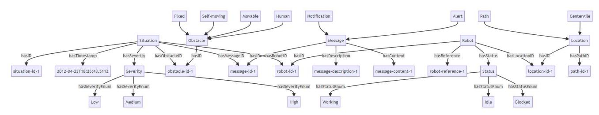

**Figure E.2:** Output of Task 1.7 after corrections, visualized in the Mermaid Live Editor (diagramming tool).

#### <span id="page-142-0"></span>E.2.8. T-2.1: Formulate Competency Questions

- **Input**: To the business scenarios output provided in task 1.5 we homogenized the information exchanged between the Robot and the Human Operator and we replaced the actions of the Human Operator by *Receives the notification and monitors the robot's decision* for all the business scenarios to reflect that the communication is only one-way, from the autonomous system to the human operator. We added the suggestions of new concepts to add to the ontology given in the input of task 1.1.
- **Output (Prompt 1)**:

```
Here is a list of competency questions (CQs) for the Semantic Explanation and Navigation System (
    SENS) use case:
1. What type of obstacle has the robot detected?
2. Where is the robot currently located?
3. What is the severity level of the detected obstacle?
4. At what time was the obstacle detected?
5. What decision has the robot made regarding the detected obstacle?
6. Why has the robot made the specific decision for obstacle avoidance?
7. Is the detected obstacle a human?
8. Is the detected obstacle a structural component of the greenhouse?
9. What is the new location of the robot after obstacle avoidance?
10. How much time did the robot take to avoid the obstacle?
11. Were there any deviations from the original task after obstacle avoidance?
12. What static obstacle has been detected that requires human intervention?
13. How many obstacles have been detected within a specified timeframe?
14. What are the possible actions the robot can take after detecting an obstacle?
15. What are the recommendations from the robot for human intervention in case of a static obstacle?
16. How does the robot communicate its status post-obstacle avoidance?
17. What unexpected movable obstacle has been detected?
These questions cover varied aspects of obstacle detection , navigation , decision -making, and
    communication between the robot and the human operator in the greenhouse setting.
```

• **Output (Prompt 2)**:

```
Here is the list of CQs classified into "Low or atomic level", "Middle or connectivity level", and "
    High or business level":
- Low or Atomic Level:
    - What type of obstacle has the robot detected?
    - Where is the robot currently located?
    - What is the severity level of the detected obstacle?
    - At what time was the obstacle detected?
    - Is the detected obstacle a human?
    - Is the detected obstacle a structural component of the greenhouse?
    - How much time did the robot take to avoid the obstacle?
    - What is the new location of the robot after obstacle avoidance?
    - What unexpected movable obstacle has been detected?
- Middle or Connectivity Level:
    - What decision has the robot made regarding the detected obstacle?
    - How many obstacles have been detected within a specified timeframe?
    - What are the possible actions the robot can take after detecting an obstacle?
    - Were there any deviations from the original task after obstacle avoidance?
- High or Business Level:
    - Why has the robot made the specific decision for obstacle avoidance?
    - What static obstacle has been detected that requires human intervention?
    - What are the recommendations from the robot for human intervention in case of a static
        obstacle?
    - How does the robot communicate its status post-obstacle avoidance?
This classification covers the various levels of complexity and business relevance required for the
    SENS use case.
```

#### <span id="page-143-0"></span>E.2.9. T-2.2: Is there an ontology with a scope that already covers the concept(s) to some extent?

- **Input**: Business scenarios text file from the output of task 1.5.
- **Output**:

```
Given the information in the file "BusinessScenariosAndInfo.txt" for extending the CGO with the SENS
     use case, here is a list of ontologies that could be reused, along with some examples of
    relevant concepts included in the proposed ontologies:
    1. ROA (Robot Ontology)
        - Relevant Concepts:
            - roa:Robot
            - roa:RobotComponent
            - roa:Navigation
            - roa:Obstacle
            - roa:Task
    2. SSN (Semantic Sensor Network Ontology)
        - Relevant Concepts:
            - ssn:Sensor
            - ssn:Observation
            - ssn:ObservedProperty
    3. DUL (DOLCE+DnS Ultralite Ontology)
        - Relevant Concepts:
            - dul:Event
            - dul:Situation
            - dul:Object
    4. FOAF (Friend of a Friend)
        - Relevant Concepts:
            - foaf:Person
These ontologies focus on various aspects that are relevant to the SENS use case, such as robotics ,
    sensor networks , events, and human interactions. If these do not perfectly fit the required
    scope, further modifications or the development of new concepts and relations specific to the
    Semantic Explanation and Navigation System for the greenhouse domain will be necessary.
I cannot find any additional ontology with a scope that can be reused in this case based on the
    provided information.
```

#### <span id="page-143-1"></span>E.2.10. T-2.3: Define ontology extension modules

- **Input**: List of 16 [CQs](#page-10-10) in a text file from the output of task 2.1. CQ 16 was removed.
- **Output**:

Here is the clustering of the given CQs into different ontology modules: 1. Obstacle Detection Module: This module focuses on the detection and identification of obstacles. 1.1. What type of obstacle has the robot detected? 1.2. Is the detected obstacle a human? 1.3. Is the detected obstacle a structural component of the greenhouse? 1.4. What static obstacle has been detected that requires human intervention? 1.5. What unexpected movable obstacle has been detected? 2. Robot Navigation and Location Module: This module covers the navigation and positioning of the robot. 2.1. Where is the robot currently located? 2.2. What is the new location of the robot after obstacle avoidance? 2.3. At what time was the obstacle detected? 3. Decision Making and Task Management Module: This module deals with the robot's decision -making process and task management. 3.1. What decision has the robot made regarding the detected obstacle? 3.2. Why has the robot made the specific decision for obstacle avoidance? 3.3. Were there any deviations from the original task after obstacle avoidance? 3.4. How much time did the robot take to avoid the obstacle? 3.5. What are the possible actions the robot can take after detecting an obstacle? 4. Human Interaction and Recommendations Module: This module involves interactions and recommendations to human operators. 4.1. What are the recommendations from the robot for human intervention in case of a static obstacle? 5. Analytics and Reporting Module: This module focuses on the reporting and analysis of obstacles detected over time. 5.1. How many obstacles have been detected within a specified timeframe? 5.2. What is the severity level of the detected obstacle? modularization organizes the CQs into distinct functional areas, facilitating the development and understanding of the extended ontology.

#### <span id="page-144-0"></span>E.2.11. T-2.4: Build small graph or preliminary sub-ontology

- **Input**: Text file containing revised list of business scenarios (from task 1.5), suggestions of which [CGO](#page-10-7) concepts are relevant to the extension and which ones should be added (from T-1.1), and including list of 16 [CQs](#page-10-10) from the output of the task 2.1 and list of [CGO](#page-10-7) prefixes. To the business scenarios output provided in task 1.5 we homogenized the information exchanged between the Robot and the Human Operator and we replaced the actions of the Human Operator by *Receives the notification and monitors the robot's decision* for all the business scenarios to reflect that the communication is only one-way, from the autonomous system to the human operator.
- **Output (Prompt 1) visualized in Protégé**:

<span id="page-144-1"></span>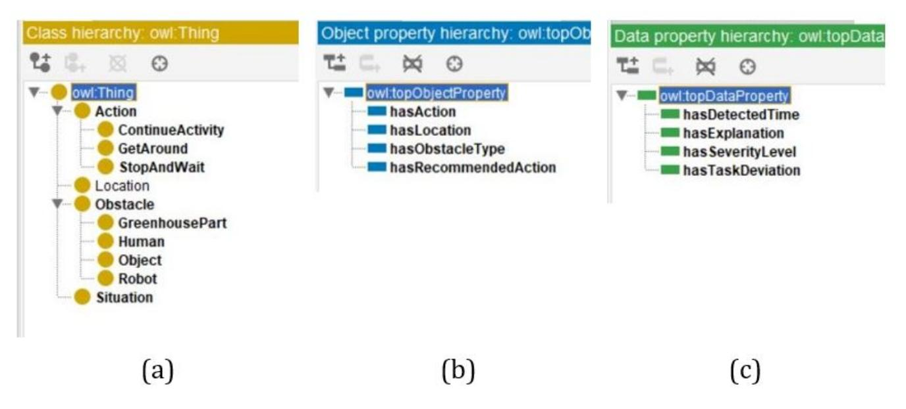

**Figure E.3:** Output of Task 2.4 – a) Classes; b) Object properties; and c) Data properties. Visualized in Protégé.

<span id="page-145-0"></span>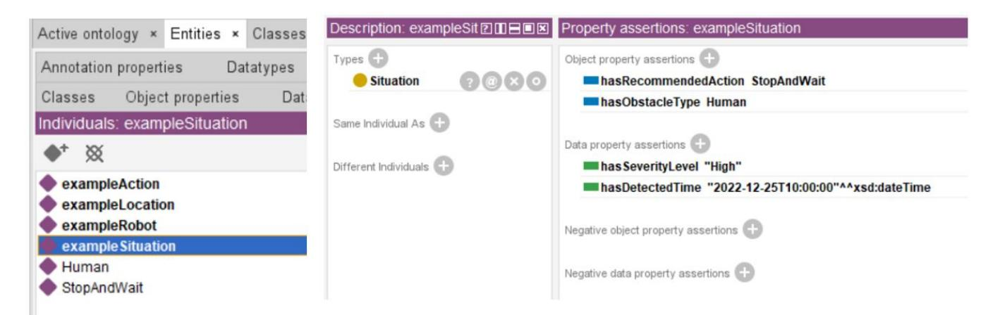

**Figure E.4:** Output of Task 2.4 – exampleSituation (individual or instance). Visualized in Protégé.

#### • **Input (Additional prompts)**:

- **–** 1.1. The conceptualization looks good. Now could you think about what types of situations could we have and how to integrate these in the code you just provided, according to all the information provided about the [SENS](#page-10-8) use case?
- **–** 1.2. Did you choose the values for the data property "hasSeverityLevel" randomly or did you follow any logic? If so, which logic?
- **–** 1.3. That looks reasonable! Now, for the class Object, which types of objects do you think that could be found in a greenhouse and how would you add those to the ontology?
- **–** 1.4. How would you link the types of objects you created to the types of situations you created?
- **–** 1.5. Why is Packaging Material a Greenhouse Structural Obstacle? (to correct mistake).
- **–** 1.6. All situations must have an explanation. How can we ensure this in the ontology?
- **–** 4.1. It seems like some of the [SHACL](#page-10-23) Validations that you proposed are already in the ontology, such as [SHACL](#page-10-23) Validation for Disjoint Classes. Which way is better to add these constraints, in the way you did it before, or in this way with [SHACL?](#page-10-23)
- **–** 5.1. Finally, for all the classes, object properties, and data properties that do not have a comment, please create a descriptive comment. Do not create comments for the entities that already have one.
- **–** 6.1. In the [SENS](#page-10-8) ontology provided in file "sens.txt" (with the extension ".txt" but formatted as a Turtle triples file), there are some connections missing. A robot should have a situation (or more), in order to be able to link these two entities. What changes would you include in the [SENS](#page-10-8) ontology to reflect this? Do not provide the whole ontology modify, only explain what you would do.
- **–** 6.2 Now, the action that the robot will take depends on the situation detected. How could we make sure that an action is associated also to the situation detected by the robot. This means that an action should be connected to a situation which is connected to a robot. Which changes would you suggest for this?
- **Output (Additional prompt 1.2)**:
  - The values for the data property "hasSeverityLevel" were chosen to demonstrate a variety of severities that might be encountered within the use case scenarios:
    - 1. "High" Severity: Assigned to situations where the obstacle poses a significant risk to the robot's operations or safety, such as human presence or critical structural obstacles.
    - 2. "Medium" Severity: Assigned to situations where the obstacle requires careful navigation but is not immediately dangerous , such as detected objects or greenhouse parts that are not immediately obstructing the robot's path.
    - 3. "Low" Severity: Assigned to situations where the obstacle has minimal impact on the robot 's operations , such as unexpected movable objects that the robot can easily navigate around or continue its activity without significant adjustments.
  - The logic is designed to cover a spectrum of possible severity levels from minor to critical , providing a realistic range for testing and demonstration purposes within the SENS use case scenario.

• **Output (Additional prompt 4.1)**:

```
The decision between embedding constraints directly into the ontology versus using SHACL for
    constraints depends on the specific use case, needs, and preferences for validation. Here
    are some comparisons and considerations to help you decide:
- Embedded Ontology Constraints (OWL Axioms)
    - Pros:
        - Integrated Reasoning: Constraints such as disjointness axioms and cardinality
            restrictions are inherently part of the ontology. They can be used by reasoners to
            infer additional knowledge and check consistency.
        - Standard Practice: OWL constraints are a well-established method in ontology modeling
            and are supported by many ontology tools.
    - Cons:
        - Limited Expressiveness: OWL axioms can be less expressive for certain complex
            validation rules compared to SHACL.
        - Reasoner Dependency: The constraints are enforced during reasoning , which might not be
             immediately obvious or user-friendly for all validation tasks.
- SHACL Constraints
    - Pros:
        - Expressiveness: SHACL can express a wide variety of constraints , including complex
            validation rules that OWL cannot.
        - Targeted Validation: SHACL can be used for specific validation tasks, independently of
             the reasoning process. It can be more user-friendly and adaptable.
        - Separation of Concerns: Validation rules can be kept separate from the ontology ,
            allowing for more modular and flexible management.
    - Cons:
        - Additional Layer: SHACL adds an extra layer of validation that needs to be maintained
            alongside the ontology.
        - Tooling: Not all ontology tools support SHACL natively , so additional tooling might be
             required.
Suggested Hybrid Approach
    Given that some constraints are already embedded in the ontology , it might be beneficial to
        adopt a hybrid approach for comprehensive validation. You can keep fundamental
        constraints that support reasoning within the ontology and use SHACL for additional ,
        more complex , or use-case-specific validations.
    Example of Hybrid Approach
        - Keep in Ontology (OWL Axioms):
            - Disjointness Axioms
            - Functional Property & Inverse Functional Property
            - Existential Quantification
            - Domain and Range Constraints
        - Add in SHACL:
            - Value Constraints (e.g., hasSeverityLevel)
            - Data Format Constraints (e.g., hasDetectedTime)
            - Combination of Property Constraints
            - Specific contextual validation rules for instances
Implementation Example
<code example , omitted for report readibility >
```

• **Final Output visualized in Protégé (after all additional questions)**: To connect the classes Robot and Situation, [GPT](#page-10-9) suggested to create a new object property hasDetectedSituation linking Robot to Situation (additional prompt 6.1). To associate the class Action to the previous classes, [GPT](#page-10-9) suggested to create a new object property isOutcomeOf linking Action to Situation (additional prompt 6.2). Then we asked [GPT](#page-10-9) to implement these changes in the code. The resulting ontology after executing all the additional prompts can be visualized in [E.5](#page-147-1).

<span id="page-147-1"></span>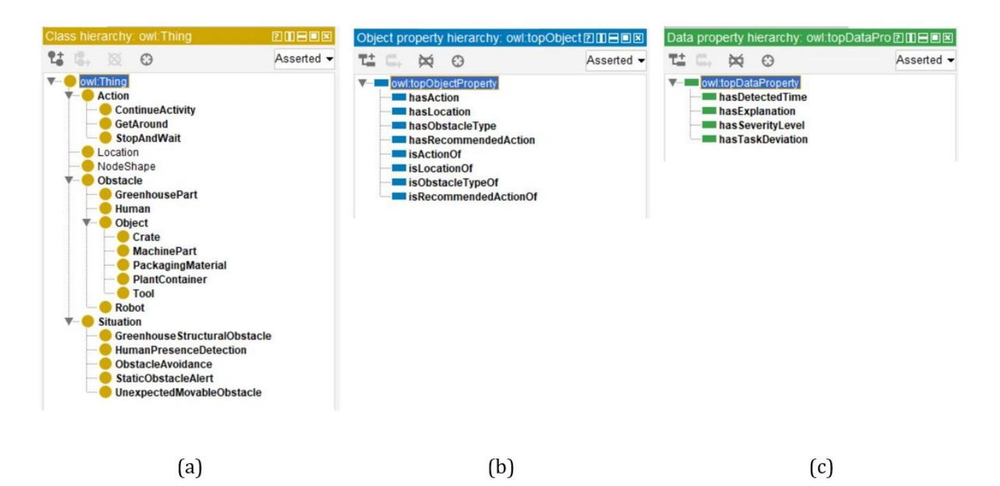

**Figure E.5:** Output for Task 2.4 – Final version after all additional prompts – a) Classes; b) Object properties; and c) Data properties. Visualized in Protégé.

#### <span id="page-147-0"></span>E.2.12. T-2.5: Find links between main class(es) in preliminary sub-ontology and ontology to be extended

- **Input**: Text file containing [SENS](#page-10-8) ontology extension from the final output of task 2.4 (after all additional prompts) formatted as a Turtle triples file (but with .txt extension).
- **Output**:

```
To align the SENS extension ontology to the CGO ontology , we need to establish relationships between
     corresponding classes and properties. Here is a list of possible alignments:
Classes
1. cgo:ControlSystem to cgo:Robot:
    - cgo:ControlSystem represents control systems in a greenhouse , which could be mapped to robots
        (autonomous systems).
2. ssn:System to cgo:Robot:
    - ssn:System is a broader class that can encompass various types of systems , including robots.
3. sosa:Sensor to cgo:Obstacle:
    - A sensor that could detect obstacles.
4. cgo:Grid to cgo:Location:
    - The concept of grids within a greenhouse can be associated with locations for mapping
        obstacles.
5. schema:Place to cgo:Location:
    - General place concept related to locations in the greenhouse.
6. foaf:Person to cgo:Human:
    - foaf:Person represents people involved in greenhouse operations , similar to cgo:Human in the
        SENS ontology.
7. cgo:Part to cgo:GreenhousePart:
    - General part within the greenhouse aligned to structural parts in the SENS ontology.
Object Properties and Data Properties
1. cgo:partOf to cgo:hasLocation:
    - Links parts and their wholes, which could be used to establish relationships between obstacles
         and their locations.
2. ssn:hasProperty to cgo:hasSeverityLevel:
    - Links sensors with properties they measure , which can relate to the severity level of an
        obstacle detected.
3. sosa:hasFeatureOfInterest to cgo:hasDetectedTime:
    - Linking detected features (obstacles) to the time they were detected.
4. sosa:ObservableProperty to cgo:hasExplanation:
```

```
- Represents observable properties for explanation purposes.
Alignment Suggestions
- cgo:Robot subclassOf cgo:ControlSystem
- cgo:Robot subclassOf ssn:System
- cgo:Obstacle subclassOf sosa:Sensor
- cgo:GreenhousePart subclassOf cgo:Part
- cgo:Location subclassOf cgo:Grid
- cgo:Location subclassOf schema:Place
- cgo:Human subclassOf foaf:Person
By establishing these alignments between SENS and CGO concepts , the two ontologies can be integrated
     comprehensively. These are some suggestions that incorporate the relevant classes and
    properties into your ontology extension effectively.
```

```
E.2.13. T-3.1: Formalize Competency Questions into SPARQL queries
  • Output:
```

```
PREFIX cgo: <https://www.tno.nl/agrifood/ontology/common-greenhouse -ontology#>
PREFIX rdfs: <http://www.w3.org/2000/01/rdf-schema#>
PREFIX xsd: <http://www.w3.org/2001/XMLSchema#>
CQ 1: What type of obstacle has a robot detected?
    SELECT ?robot ?obstacleType
    WHERE {
        ?robot a cgo:Robot .
        ?situation a cgo:Situation ;
                cgo:hasObstacleType ?obstacleType ;
                cgo:hasDetectedSituation ?hasDetectedSituation .
        ?robot cgo:hasDetectedSituation ?hasDetectedSituation .
    }
CQ 2: Where is a robot currently located?
    SELECT ?robot ?location
    WHERE {
        ?robot a cgo:Robot ;
            cgo:hasLocation ?location .
    }
CQ 3: What is the severity level of a situation?
    SELECT ?situation ?severityLevel
    WHERE {
        ?situation a cgo:Situation ;
                cgo:hasSeverityLevel ?severityLevel .
    }
CQ 4: At what time was an obstacle detected?
    SELECT ?situation ?detectedTime
    WHERE {
        ?situation a cgo:Situation ;
                cgo:hasDetectedTime ?detectedTime .
    }
CQ 5: What decision has the robot made regarding the detected obstacle?
    SELECT ?robot ?obstacleType ?recommendedAction
    WHERE {
        ?robot a cgo:Robot ;
            cgo:hasOutcomeAction ?hasOutcomeAction .
        ?situation a cgo:Situation ;
                cgo:hasObstacleType ?obstacleType ;
                cgo:hasRecommendedAction ?recommendedAction ;
                cgo:hasOutcomeAction ?hasOutcomeAction .
    }
```

```
CQ 6: Why has the robot made the specific decision for obstacle avoidance?
    SELECT ?robot ?obstacleType ?recommendedAction ?explanation
    WHERE {
        ?robot a cgo:Robot ;
            cgo:hasOutcomeAction ?hasOutcomeAction .
        ?situation a cgo:Situation ;
                cgo:hasObstacleType ?obstacleType ;
                cgo:hasRecommendedAction ?recommendedAction ;
                cgo:hasExplanation ?explanation ;
                cgo:hasOutcomeAction ?hasOutcomeAction .
    }
CQ 7: Is the detected obstacle a human?
    ASK
    WHERE {
        ?situation a cgo:Situation ;
                cgo:hasObstacleType cgo:Human .
    }
CQ 8: Is the detected obstacle a structural component of the greenhouse?
    ASK
    WHERE {
        ?situation a cgo:Situation ;
                cgo:hasObstacleType cgo:GreenhousePart .
    }
CQ 9: What is the new location of the robot after obstacle avoidance?
    SELECT ?robot ?newLocation
    WHERE {
        ?robot a cgo:Robot ;
            cgo:hasLocation ?newLocation ;
            cgo:hasOutcomeAction ?hasOutcomeAction .
        ?situation a cgo:Situation ;
                cgo:hasOutcomeAction ?hasOutcomeAction .
    }
CQ 10: How much time did the robot take to avoid the obstacle?
    SELECT ?situation ?startTime ?endTime (xsd:duration(?endTime - ?startTime) AS ?duration)
    WHERE {
        ?situation a cgo:Situation ;
                cgo:hasDetectedTime ?startTime ;
                cgo:hasOutcomeAction ?hasOutcomeAction .
        ?hasOutcomeAction cgo:hasExplanation ?explanation ;
                        cgo:hasTaskDeviation false ;
                        cgo:hasEndTime ?endTime .
    }
CQ 11: Were there any deviations from the original task after obstacle avoidance?
    SELECT ?situation ?outcomeAction ?taskDeviation
    WHERE {
        ?situation a cgo:Situation ;
                cgo:hasOutcomeAction ?outcomeAction .
        ?outcomeAction cgo:hasTaskDeviation ?taskDeviation .
        FILTER(?taskDeviation = true)
    }
CQ 12: What static obstacle has been detected that requires human intervention?
    SELECT ?situation ?obstacleType
    WHERE {
        ?situation a cgo:StaticObstacleAlert ;
                cgo:hasObstacleType ?obstacleType ;
                cgo:hasRecommendedAction cgo:StopAndWait .
    }
```

```
CQ 13: How many obstacles have been detected within a specified timeframe?
    SELECT (COUNT(?situation) AS ?obstacleCount)
    WHERE {
        ?situation a cgo:Situation ;
                cgo:hasDetectedTime ?detectedTime .
        FILTER (?detectedTime >= "2023-01-01T00:00:00"^^xsd:dateTime && ?detectedTime <= "2023-12-31
            T23:59:59"^^xsd:dateTime)
    }
CQ 14: What are the possible actions the robot can take after detecting an obstacle?
    SELECT DISTINCT ?recommendedAction
    WHERE {
        ?situation a cgo:Situation ;
                cgo:hasRecommendedAction ?recommendedAction .
    }
CQ 15: What are the recommendations from the robot for human intervention in case of a static
    obstacle?
    SELECT ?situation ?recommendedAction
    WHERE {
        ?situation a cgo:StaticObstacleAlert ;
                cgo:hasRecommendedAction ?recommendedAction .
        FILTER(?recommendedAction = cgo:StopAndWait)
    }
CQ 16: What unexpected movable obstacle has been detected?
    SELECT ?situation ?obstacleType
    WHERE {
        ?situation a cgo:UnexpectedMovableObstacle ;
                cgo:hasObstacleType ?obstacleType .
    }
```

• **Execution of SPARQL queries in Protégé**:

<span id="page-150-1"></span>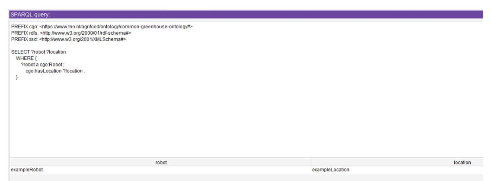

**Figure E.6:** Output of Task 3.1 – Competency Question 2: Where is a robot currently located?. Visualized in Protégé.

#### <span id="page-150-0"></span>E.2.14. T-4.1: Populate ontology extension with instances

• **Output (examples of some individuals or instances with which the ontology extension has been populated)**:

<span id="page-151-0"></span>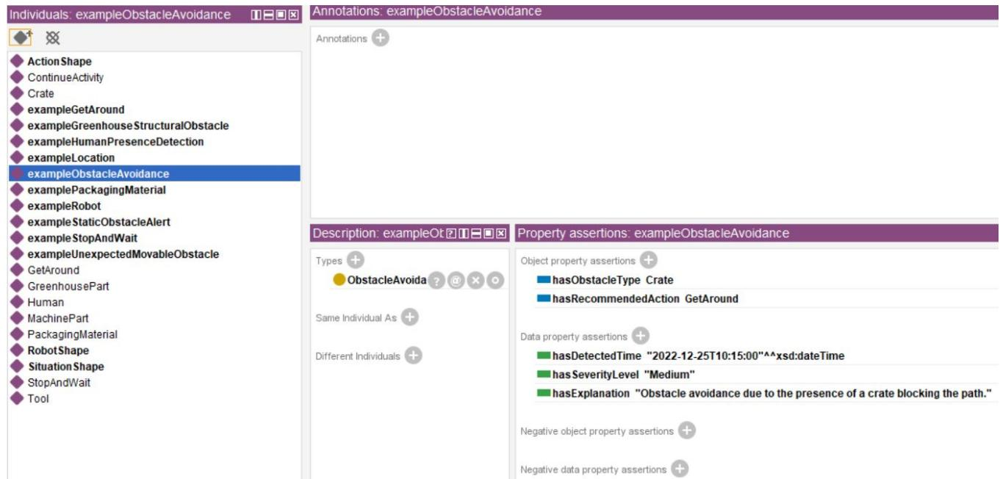

**Figure E.7:** Output of Task 4.1 – Individual: exampleObstacleAvoidance. Visualized in Protégé.

<span id="page-151-1"></span>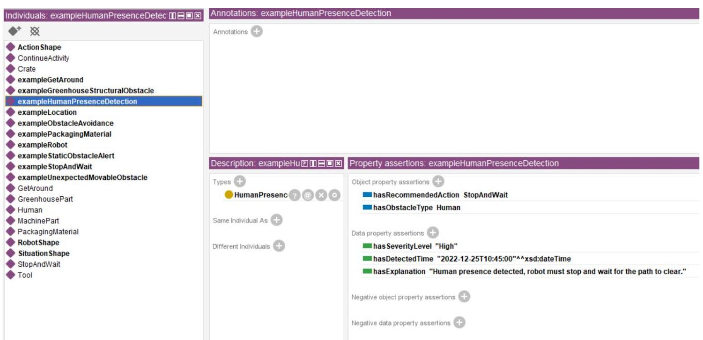

**Figure E.8:** Output of Task 4.1 – Individual: exampleHumanPresenceDetection. Visualized in Protégé.

<span id="page-152-1"></span>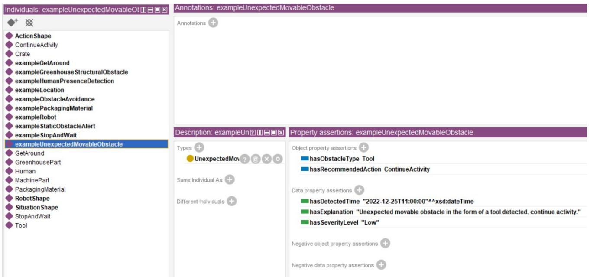

**Figure E.9:** Output of Task 4.1 – Individual: exampleUnexpectedMovableObstacle. Visualized in Protégé.

• **Execution of SPARQL queries in Protégé after populating ontology**:

<span id="page-152-2"></span>

| SPARQL query:                                                                                                                                                                                                                                                                                                                                                                                                                                                                                                                                                                                                                                                                                                                |                |                     | $\Box \Box \Box \boxtimes$                              |
|------------------------------------------------------------------------------------------------------------------------------------------------------------------------------------------------------------------------------------------------------------------------------------------------------------------------------------------------------------------------------------------------------------------------------------------------------------------------------------------------------------------------------------------------------------------------------------------------------------------------------------------------------------------------------------------------------------------------------|----------------|---------------------|---------------------------------------------------------|
| PREFIX cgo: <a href="https://www.tno.nl/agrifood/ontology/common-greenhouse-ontology#">https://www.tno.nl/agrifood/ontology/common-greenhouse-ontology#</a><br>PREFIX rdfs: <a href="http://www.w3.org/2000/01/rdf-schema#">http://www.w3.org/2000/01/rdf-schema#</a><br>PREFIX xsd: <a href="http://www.w3.org/2001/XMLSchema#">http://www.w3.org/2001/XMLSchema#</a><br>SELECT ?robot ?obstacleType ?recommendedAction ?explanation<br>WHERE {<br>?robot a cgo:Robot ;<br>cgo:hasOutcomeAction ?hasOutcomeAction.<br>?situation a cgo:Situation ;<br>cgo:hasObstacleType ?obstacleType ;<br>cgo:hasRecommendedAction ?recommendedAction ;<br>cgo:hasExplanation ?explanation ;<br>cgo:hasOutcomeAction ?hasOutcomeAction . |                |                     |                                                         |
| robot                                                                                                                                                                                                                                                                                                                                                                                                                                                                                                                                                                                                                                                                                                                        | obstacleType   | recommendedAction   | explanation                                             |
| Robot 1                                                                                                                                                                                                                                                                                                                                                                                                                                                                                                                                                                                                                                                                                                                      | ObstacleType 1 | RecommendedAction 1 | "Obstacle detected near path, optimal path rerouted"@en |
| Robot_1                                                                                                                                                                                                                                                                                                                                                                                                                                                                                                                                                                                                                                                                                                                      | Human          | RecommendedAction 1 | "Obstacle detected near path, optimal path rerouted"@en |
| Robot 1                                                                                                                                                                                                                                                                                                                                                                                                                                                                                                                                                                                                                                                                                                                      | ObstacleType 1 | StopAndWait         | "Obstacle detected near path, optimal path rerouted"@en |
| Robot 1                                                                                                                                                                                                                                                                                                                                                                                                                                                                                                                                                                                                                                                                                                                      | Human          | StanAndMait         | "Obetacle detected near nath antimal nath resourced"@en |

**Figure E.10:** Output of Task 4.1 – Competency Question 6: Why has the robot made the specific decision for obstacle avoidance?. Visualized in Protégé.

## <span id="page-152-0"></span>E.2.15. T-4.2: Verify all [CQs](#page-10-10) can be answered according to test cases

#### • **Output**:

| Based on the SENS ontology extension provided in the "sens.txt" file, here is the evaluation for<br>each CQ: |
|--------------------------------------------------------------------------------------------------------------|
| 1. What type of obstacle has the robot detected?                                                             |
| / Yes / The ontology includes the class Situation with properties like hasObstacleType and                   |
| hasDetectedSituation which indicate the type of the detected obstacle.                                       |
| 2. Where is the robot currently located?                                                                     |
| / No / The ontology does not specify a property for the current location of a robot.                         |
| 3. What is the severity level of the detected obstacle?                                                      |
| / Yes / The ontology includes a Situation class with property hasSeverityLevel which can                     |
| indicate the severity of a detected obstacle.                                                                |
| 4. At what time was the obstacle detected?                                                                   |
| / Yes / The ontology includes a Situation class with property hasDetectedTime which specifies                |
| the detection time of an obstacle.                                                                           |
| 5. What decision has the robot made regarding the detected obstacle?                                         |
| / Yes / The ontology includes properties hasOutcomeAction , hasRecommendedAction within Situation            |
| and linked to Robot through actions.                                                                         |
|                                                                                                              |

| 6. Why has the robot made the specific decision for obstacle avoidance?                                                                   |
|-------------------------------------------------------------------------------------------------------------------------------------------|
| / Yes / The ontology includes the hasExplanation , hasOutcomeAction , hasRecommendedAction within<br>the Situation class.                 |
| 7. Is the detected obstacle a human?                                                                                                      |
| / Yes / The property hasObstacleType in Situation can be used to specify if the obstacle is a                                             |
| Human.                                                                                                                                    |
| 8. Is the detected obstacle a structural component of the greenhouse?                                                                     |
| / Yes / The property hasObstacleType in Situation can be used to specify if the obstacle is a<br>GreenhousePart.                          |
| 9. What is the new location of the robot after obstacle avoidance?                                                                        |
| / No / The ontology does not include properties for specifying the new location after obstacle<br>avoidance.                              |
| 10. How much time did the robot take to avoid the obstacle?                                                                               |
| / Yes / The Situation class includes hasDetectedTime and hasOutcomeAction which further have                                              |
| time-related properties for calculating duration.                                                                                         |
| 11. Were there any deviations from the original task after obstacle avoidance?                                                            |
| / Yes / The hasTaskDeviation property within Action or OutcomeAction can be used to indicate<br>deviations.                               |
| 12. What static obstacle has been detected that requires human intervention?                                                              |
| / Yes / The ontology includes StaticObstacleAlert subclass of Situation and can be linked to<br>hasObstacleType and hasRecommendedAction. |
| 13. How many obstacles have been detected within a specified timeframe?                                                                   |
| / Yes / The hasDetectedTime property within Situation can be used to filter based on time frames                                          |
| 14. What are the possible actions the robot can take after detecting an obstacle?                                                         |
| / Yes / The hasRecommendedAction property within Situation can be used for this purpose.                                                  |
| 15. What are the recommendations from the robot for human intervention in case of a static obstacle?                                      |
| / Yes / The hasRecommendedAction property within StaticObstacleAlert can be used to specify                                               |
| recommendations.                                                                                                                          |
|                                                                                                                                           |

16. What unexpected movable obstacle has been detected? / Yes / The ontology includes a UnexpectedMovableObstacle subclass of Situation and properties like hasObstacleType for unexpected movable obstacles.

Note: The ontology structure includes the necessary classes and properties , but the actual existence of individuals in the data needs to be ensured separately.