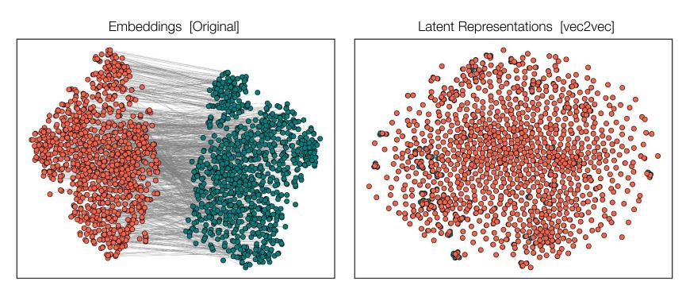
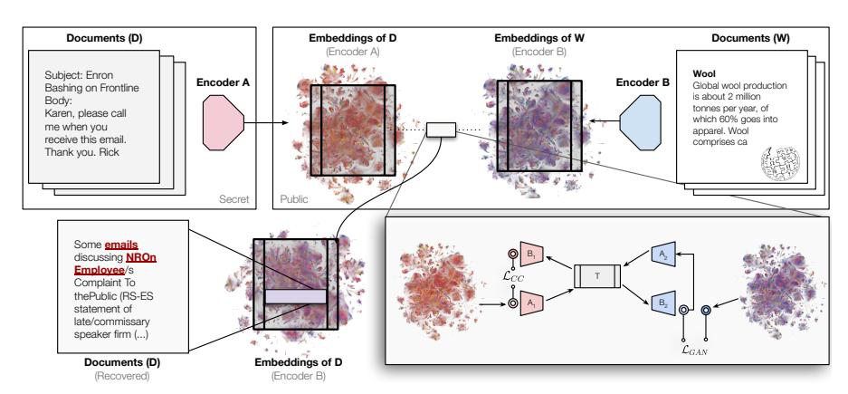
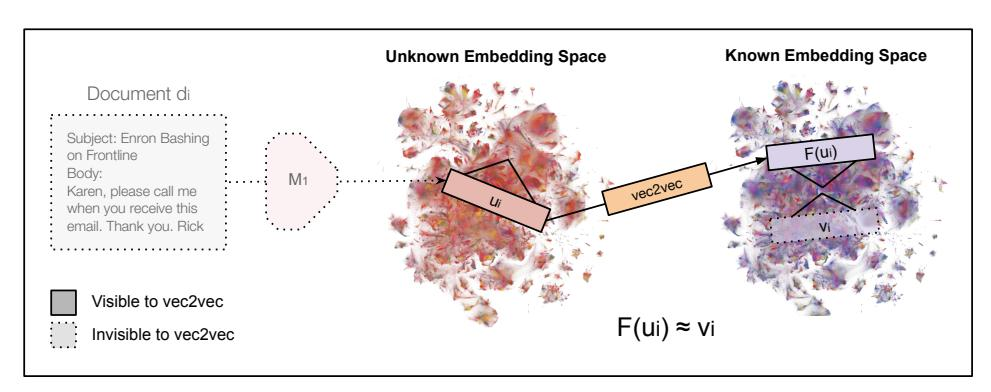
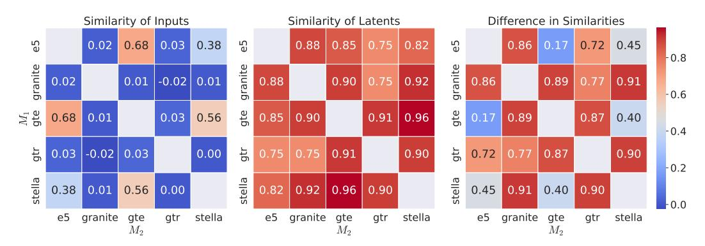
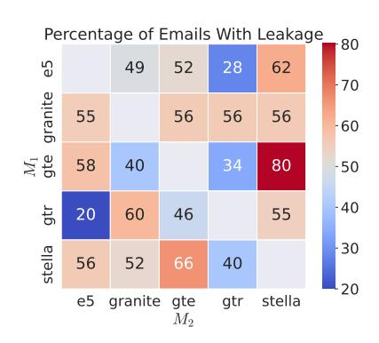

# Harnessing the Universal Geometry of Embeddings

Rishi Jha Collin Zhang Vitaly Shmatikov John X. Morris Department of Computer Science Cornell University

### Abstract

We introduce the first method for translating text embeddings from one vector space to another without any paired data, encoders, or predefined sets of matches. Our unsupervised approach translates any embedding to and from a universal latent representation (i.e., a universal semantic structure conjectured by the Platonic Representation Hypothesis). Our translations achieve high cosine similarity across model pairs with different architectures, parameter counts, and training datasets. The ability to translate unknown embeddings into a different space while preserving their geometry has serious implications for security. An adversary with access to a database of only embedding vectors can extract sensitive information about underlying documents, sufficient for classification and attribute inference.

<span id="page-0-0"></span>

Figure 1: Left: input embeddings from different model families (T5-based GTR [\[46\]](#page-11-0) and BERT-based GTE [\[32\]](#page-11-1)) are fundamentally incomparable. Right: given unpaired embedding samples from different models on different texts, our model learns a latent representation where they are closely aligned.

## 1 Introduction

Text embeddings are the backbone of modern NLP, powering tasks like retrieval, RAG, classification, and clustering. There are many embedding models trained on different datasets, data shufflings, and initializations. An embedding of a text encodes its semantics: a good model maps texts with similar semantics to vectors close to each other in the embedding space. Since semantics is a property of text, different embeddings of the same text should encode the same semantics. In practice, however, different models encode texts into completely different and incompatible vector spaces.

The Platonic Representation Hypothesis [\[18\]](#page-10-0) conjectures that all image models of sufficient size converge to the same latent representation. We propose a stronger, constructive version of this hypothesis for text models: the universal latent structure of text representations can be learned and, furthermore, harnessed to translate representations from one space to another without any paired data or encoders.

Preprint. Under review.

<span id="page-1-2"></span>

Figure 2: Given only a vector database from an unknown model, vec2vec translates the database into the space of a known model using latent structure alone. Converted embeddings reveal sensitive information about the original documents, such as the topic of an email (pictured, real example).

In this work, we show that the Strong Platonic Representation Hypothesis holds in practice. Given unpaired examples of embeddings from two models with different architectures and training data, our method learns a latent representation in which the embeddings are almost identical (Figure 1).

We draw inspiration from research on aligning word embeddings across languages [61, 10, 15, 9] and unsupervised image translation [35, 68]. Our vec2vec method uses adversarial losses and cycle consistency to learn to encode embeddings into a shared latent space and decode with minimal loss. This makes unsupervised translation possible. We use a basic adversarial approach with vector space preservation [45] to learn a mapping from an unknown embedding distribution to a known one.

vec2vec is the first method to successfully translate embeddings from the space of one model to another without paired data. vec2vec translations achieve cosine similarity as high as 0.92 to the ground-truth vectors in their target embedding spaces and perfect matching on over 8000 shuffled embeddings (without access to the set of possible matches in advance).

To show that our translations preserve not only the relative geometry of embeddings but also the semantics of underlying inputs, we extract information from them using zero-shot attribute inference and inversion, without any knowledge of the model that produced the original embeddings.<sup>2</sup>

### 2 Problem formulation: unsupervised embedding translation

Consider a collection of embedding vectors  $\{u_1, \dots u_n\}$ , for example, a dump of a compromised vector database, where each  $u_i = M_1(d_i)$  is generated by an unknown encoder  $M_1 : \mathbb{V}^s \to \mathbb{R}^{d_{M_1}}$  from an unknown document  $d_i$ . We cannot make queries to  $M_1$  and do not know its training data, nor architectural details. Our goal is to extract any information about the documents  $d_i$ .

We do assume access to a different encoder  $M_2$  that we can query at will to generate new embeddings in some other space. We also assume high-level distributional knowledge about the hidden documents: their modality (text) and language (e.g., English). To extract information, we may translate  $\{u_1, \ldots u_n\}$  into the output space of  $M_2$  and apply techniques like inversion that take advantage of the encoder.

**Limitations of correspondence methods.** There is significant prior research on the problem of *matching* or *correspondence* between sets of embedding vectors [1, 48, 8, 53]. These methods typically assume that the two (or more) sets of embeddings are generated by different encoders on the *same or highly-overlapping inputs*. In other words, for each unknown vector, there must already exist a set of candidate vectors in a different embedding. In practice, it is unrealistic to expect that such a database be available, so these methods are not directly applicable. Some matching methods,

<span id="page-1-0"></span><sup>&</sup>lt;sup>1</sup>Prior work has successfully translated *word* embeddings between languages, typically relying on overlapping vocabularies across languages. In contrast, we translate embeddings of entire sequences between model spaces.

<span id="page-1-1"></span><sup>&</sup>lt;sup>2</sup>Our code is available on GitHub.



Figure 3: Unsupervised embedding translation. With access to only  $u_i = M_1(d_i)$ , vec2vec seeks to generate a translation  $F(u_i)$  that is close in  $M_2$ 's embedding space to the ideal embedding  $v_i = M_2(d_i)$  without access to  $d_i$ ,  $v_i$ , or  $M_1$ .

however, support translation between embedding spaces without overlapping inputs. Our experiments demonstrate that these methods struggle significantly, even when correspondence exists.

Our task is inherently more challenging than matching, because we do not assume access to encoder  $M_1$ , nor do we have additional representations of documents  $d_1, \ldots, d_n$  beyond their embeddings  $u_i = M_1(d_i)$ . Therefore, we rely solely on unsupervised *translation* from  $M_1$  to  $M_2$ . The effectiveness of such unsupervised translation approaches thus critically depends on identifying and leveraging shared geometric structures within the embedding spaces produced by  $M_1$  and  $M_2$ .

**The Strong Platonic Representation Hypothesis.** Our hope that unsupervised embedding translation is possible at all rests on the stronger version of the Platonic Representation Hypothesis [18]. Our conjecture is as follows: neural networks trained with the same objective and modality, but with different data and model architectures, converge to a universal latent space such that a translation between their respective representations can learned without any pairwise correspondence.

**Translation enables information extraction.** Solving unsupervised translation will allow us to use information extraction tools designed to operate on vectors produced by known encoders. For example, we could apply inversion models [42, 66] to recover unknown documents  $\{d_i\}$ .

### <span id="page-2-0"></span>3 Our method: vec2vec

Unsupervised translation has been successful in computer vision, using a combination of cycle consistency and adversarial regularization [35, 68]. Our design of vec2vec is inspired in part by these methods. We aim to learn embedding-space translations that are cycle-consistent (mapping to and from an embedding space should end in the same place) and indistinguishable (embeddings for the same text from either space should have identical latents).

#### 3.1 Architecture

We propose a modular architecture, where embeddings are encoded and decoded using space-specific adapter modules and passed through a shared backbone network. Figure 2 shows these components. Input adapters  $A_1:\mathbb{R}^d\to\mathbb{R}^Z$  and  $A_2:\mathbb{R}^d\to\mathbb{R}^Z$  transform embeddings from each encoder-specific space into a universal latent representation of dimension Z. The shared backbone  $T:\mathbb{R}^Z\to\mathbb{R}^Z$  extracts a common latent embedding from adapted inputs. Output adapters  $B_1:\mathbb{R}^Z\to\mathbb{R}^d$  and  $B_2:\mathbb{R}^Z\to\mathbb{R}^d$  translate these common latent embeddings back into the encoder-specific spaces. Thus, translation functions  $F_1,F_2$  and additional reconstruction mappings  $R_1,R_2$  are defined as:

$$F_1 = B_2 \circ T \circ A_1, \quad F_2 = B_1 \circ T \circ A_2 \quad R_1 = B_1 \circ T \circ A_1 \quad R_2 = B_2 \circ T \circ A_2$$

Parameters of all components are collectively denoted  $\theta = \{A_1, A_2, T, B_1, B_2\}$ .

Unlike images, embeddings do not have any spatial bias. Instead of CNNs, we use multilayer perceptrons (MLP) with residual connections, layer normalization, and SiLU nonlinearities. Discriminators mirror this structure but omit residual connections to simplify adversarial learning.

### 3.2 Optimization

In addition to the 'generator' networks F and R, we introduce discriminators operating on both the latent representations of  $F(D_1^{\ell}, D_2^{\ell})$  and the output embeddings  $(D_1, D_2)$ .

Our goal is to train the parameters of  $\theta$  by solving:

$$\theta^* = \arg\min_{\theta} \max_{D_1, D_2, D_1^{\ell}, D_2^{\ell}} \mathcal{L}_{adv}(F_1, F_2, D_1, D_2, D_1^{\ell}, D_2^{\ell}) + \lambda_{gen} \mathcal{L}_{gen}(\theta), \tag{1}$$

where  $\mathcal{L}_{adv}$  and  $\mathcal{L}_{gen}$  represent adversarial and generator-specific constraints respectively and hyper-parameter  $\lambda_{gen}$  controls their tradeoff.

**Adversarial loss.** The adversarial loss encourages generated embeddings to match the empirical distributions of original embeddings both at the embedding and latent levels. Specifically, applying the standard GAN loss formulation [13] to both levels yields:

$$\begin{split} \mathcal{L}_{\text{adv}}(F_{1}, F_{2}, D_{1}, D_{2}, D_{1}^{\ell}, D_{2}^{\ell}) &= \mathcal{L}_{\text{GAN}}(D_{1}, F_{1}) + \mathcal{L}_{\text{GAN}}(D_{2}, F_{2}) \\ &+ \mathcal{L}_{\text{GAN}}(D_{1}^{\ell}, T \circ A_{1}) + \mathcal{L}_{\text{GAN}}(D_{2}^{\ell}, T \circ A_{2}). \end{split}$$

**Generator.** Because adversarial losses alone do not guarantee that translated embeddings preserve semantics [68], we introduce three additional constraints to help the generator learn a useful mapping:

*Reconstruction* enforces that an embedding, when mapped into the latent space and back into its original embedding space, closely matches its initial representation:

$$\mathcal{L}_{\text{rec}}(R_1, R_2) = \mathbb{E}_{x \sim p} ||R_1(x) - x||_2^2 + \mathbb{E}_{y \sim q} ||R_2(y) - y||_2^2$$

where p and q are distributions of embeddings sampled from  $M_1$  and  $M_2$ , respectively.

Cycle-consistency acts as an unsupervised proxy for supervised pair alignment, ensuring that F and G can translate an embedding to the other embedding space and back again with minimal corruption:

$$\mathcal{L}_{\text{CC}}(F_1, F_2) = \mathbb{E}_{x \sim p} \|F_2(F_1(x)) - x\|_2^2 + \mathbb{E}_{y \sim q} \|F_1(F_2(y)) - y\|_2^2$$

Vector space preservation (VSP) ensures that pairwise relationships between generated embeddings remain consistent under translation [45, 64]. Given a batch of B embeddings  $x_1, ..., x_B$  and  $y_1, ..., y_B$ , we sum their average pairwise distances after translation by both  $F_1$  and  $F_2$ :

$$\mathcal{L}_{VSP}(F_1, F_2) = \frac{1}{B} \sum_{i=1}^{B} \sum_{j=1}^{B} \left[ \| M_1(x_i) \cdot M_1(x_j) - F_1(M_1(x_i)) \cdot F_1(M_1(x_j)) \|_2^2 + \| M_2(y_i) \cdot M_2(y_j) - F_2(M_2(y_i)) \cdot F_2(M_2(y_j)) \|_2^2 \right]$$

Combining these losses yields:  $\mathcal{L}_{\text{gen}}(\theta) = \lambda_{\text{rec}} \mathcal{L}_{\text{rec}}(R_1, R_2) + \lambda_{\text{CC}} \mathcal{L}_{\text{CC}}(F_1, F_2) + \lambda_{\text{VSP}} \mathcal{L}_{\text{VSP}}(F_1, F_2)$ , where hyperparameters  $\lambda_{\text{CC}}$ ,  $\lambda_{\text{rec}}$ , and  $\lambda_{\text{VSP}}$  control relative importance.

### 4 Experimental setup

#### 4.1 Preliminaries

**Datasets.** We use the *Natural Questions* (NQ) [25] dataset of user queries and Wikipedia-sourced answers for training (a 2-million subset) and evaluation (a 65536 subset). To evaluate information extraction, we use *TweetTopic* [2], a dataset of tweets multi-labeled by 19 topics; a random 8192-record subset of *Pseudo Re-identified MIMIC-III* (MIMIC) [28], a pseudo re-identified version of the MIMIC dataset [19] of patient records multi-labeled by 2673 MedCAT [24] disease descriptions; and a random 50-email subset of the *Enron Email Corpus* (Enron) [21], an unlabeled, public dataset of internal emails of a defunct energy company.

**Models.** Table 1 lists the embedding models representing three size categories, four transformer backbones, and two output dimensionalities. Granite is multilingual, CLIP is multimodal.

<span id="page-4-0"></span>

| Model        | Params (M) | Backbone | Year | Dims | Max Seq. |
|--------------|------------|----------|------|------|----------|
| [46] gtr     | 110        | T5       | 2021 | 768  | 512      |
| [49] clip    | 151        | CLIP     | 2021 | 512  | 77       |
| [57] e5      | 109        | BERT     | 2022 | 768  | 512      |
| [32] gte     | 109        | BERT     | 2023 | 768  | 512      |
| [67] stella  | 109        | BERT     | 2023 | 768  | 512      |
| [14] granite | 278        | RoBERTa  | 2024 | 768  | 512      |

Table 1: Embedding models used in our experiments.

**Training.** Unless otherwise specified, each vec2vec is trained on two sets of embeddings generated from disjoint sets of 1 million 64-token sequences sampled from NQ (see Appendix D for experiments with fewer embeddings). Due to GAN instability [52], we select the best of multiple initializations and leave more robust training to future work.

### 4.2 Evaluating translation

Let  $u_i = M_1(d_i)$  and  $v_i = M_2(d_i)$  denote the source and target embeddings of the same input  $d_i$ . The goal of translation is to generate a vector that is as close to  $v_i$  as possible. We say that  $(u_i, v_j)$  are "aligned" by the translator F if  $v_j$  is the closest embedding to  $F(u_i)$ :  $j = \arg\min_k \cos(F(u_i), v_k)$ . A perfect translator  $F^*$  satisfies  $i = \arg\min_k \cos(F^*(u_i), v_k)$  for all i.

Given (unknown) embeddings  $\{M_2(d_j)\}_{j=0}^n$  ordered by decreasing cosine similarity to  $F(u_i)$ , let  $r_i$  be the rank of the correct embedding  $v_i=M_2(d_i)$ . To measure quality of F, we use three metrics. **Mean Cosine Similarity** measures how close translations are, on average, to their targets. **Top-1 Accuracy** is the fraction of translations whose target is closer than any other embedding. **Mean Rank** is the average rank of targets with respect to translations. The ideal translator  $F^*$  achieves mean similarity of 1.0, top-1 accuracy of 1.0, and mean rank of 1.0. Recall that a random alignment corresponds to a mean rank of  $\frac{n}{2}$ . Formally,

$$\cos(u_i,v_i) = \frac{1}{n} \sum_{i=1}^n \left[1 - \cos \left(F(u_i),v_i\right)\right] \quad \text{Top-1}(r) = \frac{1}{n} \sum_{i=1}^n \mathbf{1}\{r_i = 1\} \quad \text{Rank}(\mathbf{r}) = \frac{1}{n} \sum_{i=1}^n r_i$$

vec2vec is the first unsupervised embedding translator, thus there is no direct baseline. As our Naïve baseline, we simply use F(x)=x to measure geometric similarity between embedding spaces. The second (pseudo)baseline is **Oracle-aided optimal transport**. It assumes that candidate targets are known and is thus strictly easier than vec2vec and the Naïve baseline. We solve optimal assignment,  $\pi^* = \arg\min_{\pi} \sum_{i=1}^n \cos(u_i, v_{\pi(i)})$ , via either the Hungarian, Earth Mover's Distance, Sinkhorn, or Gromov-Wasserstein algorithms, choosing the solver with the lowest rank for each experiment.

#### 4.3 Evaluating information extraction

We measure whether translation preserves semantics via *attribute inference*: for each translated embedding  $F(M_1(d_i))$ , our goal is to infer attributes  $c_i \subseteq \mathcal{C}$  of  $d_i$ .

The first method we use is **zero-shot embedding attribute inference**: calculate pairwise cosine similarities between  $F(M_1(d_i))$  and the embeddings of all attributes in  $\mathcal{C}$ , identify top k closest attributes, and measure whether they are correct via *top-k accuracy*:  $\frac{1}{n} \sum_{i=0}^{n} \mathbf{1} \{|c_i^k \cap c_i| \geq 1\}$ .

The second method is **embedding inversion** that recovers text inputs from embeddings. Since [42] requires a pre-trained inversion model for each embedding space, we use [66] instead to generate an approximation  $d_i'$  of  $d_i$  from  $F(M_1(d_i))$  in a zero-shot manner. We measure the extracted information using *LLM judge accuracy*: the fraction of translated embeddings for which GPT-40 determines that d' reveals information in d. See Appendix E for our prompt.

In addition to the Naïve baseline, we also consider an **Oracle attribute inference**: zero-shot classification with the correct embedding  $M_2(d)$  and class labels  $M_2(\mathcal{C})$ .

<span id="page-5-0"></span>

Figure 4: Pairwise cosine similarities of input embeddings (left) and their vec2vec latents (middle) across different embedding pairs. The absolute difference between the heatmaps plots is on the right. All numbers are computed on the same batch of 1024 NQ texts.

# <span id="page-5-2"></span>5 vec2vec learns to translate embeddings without any paired data

We first show that vec2vec learns a universal latent space, then demonstrate that this space preserves the geometry of all embeddings. Therefore, we can use it like a **universal language of text encoders** to translate their representations without any paired data.

vec2vec learns a universal latent space. vec2vec projects embeddings  $M_{1,2,\dots}$  into a shared latent space via compositions of input adapters  $(A_{1,2,\dots})$  and a shared translator T. Figure 4 shows that even when the embeddings  $u_i = M_1(d_i)$  and  $v_i = M_2(d_i)$  are far apart (i.e., have low cosine similarity), their representations in vec2vec's latent space are incredibly close:  $T(A_1(u_i)) \approx T(A_2(v_i))$ . Figure 1 visualizes this (via two-dimensional projections) for vec2vec trained on gte and gtr embeddings: the embeddings are far apart, but their latents are nearly overlapping.

<span id="page-5-1"></span>

|       |       |                       | vec2vec |            | N                     | Naïve Baseline |               |                       | OT Baseline |                            |  |  |
|-------|-------|-----------------------|---------|------------|-----------------------|----------------|---------------|-----------------------|-------------|----------------------------|--|--|
| $M_1$ | $M_2$ | $\cos(\cdot)\uparrow$ | T-1 ↑   | Rank ↓     | $\cos(\cdot)\uparrow$ | T-1 ↑          | Rank ↓        | $\cos(\cdot)\uparrow$ | T-1 ↑       | Rank ↓                     |  |  |
|       | gtr   | 0.80 (0.0)            | 0.99    | 1.19 (0.1) | -0.03 (0.0)           | 0.00           | 4168.73 (9.2) | 0.50 (0.0)            | 0.00        | 4094.22 (9.2)‡             |  |  |
| gra.  | gte   | 0.87 (0.0)            | 0.95    | 1.18 (0.0) | 0.01 (0.0)            | 0.00           | 4088.58 (9.2) | 0.85 (0.0)            | 0.00        | 4069.91 (9.2) <sup>†</sup> |  |  |
| gra.  | ste.  | 0.79 (0.0)            | 0.98    | 1.05 (0.0) | 0.01 (0.0)            | 0.00           | 4208.26 (9.2) | 0.45 (0.0)            | 0.00        | 4096.35 (9.2) <sup>‡</sup> |  |  |
|       | e5    | 0.85 (0.0)            | 0.98    | 1.11 (0.0) | 0.02 (0.0)            | 0.00           | 4111.60 (9.2) | 0.68 (0.0)            | 0.00        | 4096.17 (9.2) <sup>‡</sup> |  |  |
|       | gra.  | 0.81 (0.0)            | 0.99    | 1.02 (0.0) | -0.03 (0.0)           | 0.00           | 4169.76 (9.2) | 0.50 (0.0)            | 0.00        | 4093.55 (9.2)‡             |  |  |
| gtr   | gte   | 0.87 (0.0)            | 0.93    | 2.31 (0.1) | 0.04 (0.0)            | 0.00           | 4080.92 (9.2) | 0.85 (0.0)            | 0.00        | 4079.92 (9.2) <sup>†</sup> |  |  |
| ьu    | ste.  | 0.80 (0.0)            | 0.99    | 1.03 (0.0) | 0.00 (0.0)            | 0.00           | 4198.78 (9.2) | 0.46 (0.0)            | 0.00        | 4093.85 (9.2) <sup>‡</sup> |  |  |
|       | e5    | 0.83 (0.0)            | 0.84    | 2.88 (0.2) | 0.03 (0.0)            | 0.00           | 4082.84 (9.2) | 0.83 (0.0)            | 0.00        | 4066.42 (9.2) <sup>†</sup> |  |  |
|       | gra.  | 0.75 (0.0)            | 0.95    | 1.22 (0.0) | 0.01 (0.0)            | 0.00           | 4079.81 (9.3) | 0.69 (0.0)            | 0.00        | 4069.23 (9.2) <sup>†</sup> |  |  |
| gte   | gtr   | 0.75 (0.0)            | 0.91    | 2.64 (0.1) | 0.04 (0.0)            | 0.00           | 4084.15 (9.2) | 0.70(0.0)             | 0.00        | 4078.45 (9.2) <sup>†</sup> |  |  |
| gic   | ste.  | 0.89 (0.0)            | 1.00    | 1.00 (0.0) | 0.56 (0.0)            | 1.00           | 1.00 (0.0)    | 0.69 (0.0)            | 1.00        | $1.00 (0.0)^{\dagger}$     |  |  |
|       | e5    | 0.87 (0.0)            | 0.99    | 5.19 (0.5) | 0.68 (0.0)            | 1.00           | 1.00 (0.0)    | 0.83 (0.0)            | 1.00        | $1.00 (0.0)^{\dagger}$     |  |  |
|       | gra.  | 0.80 (0.0)            | 0.98    | 1.08 (0.0) | 0.01 (0.0)            | 0.00           | 4209.08 (9.3) | 0.48 (0.0)            | 0.00        | 4096.38 (9.2) <sup>‡</sup> |  |  |
| ste.  | gtr   | 0.82 (0.0)            | 1.00    | 1.10 (0.0) | 0.00 (0.0)            | 0.00           | 4192.31 (9.2) | 0.50 (0.0)            | 0.00        | 4095.46 (9.2) <sup>‡</sup> |  |  |
| SIC.  | gte   | 0.92 (0.0)            | 1.00    | 1.00 (0.0) | 0.56 (0.0)            | 1.00           | 1.00 (0.0)    | 0.86 (0.0)            | 1.00        | $1.00 (0.0)^{\dagger}$     |  |  |
|       | e5    | 0.86 (0.0)            | 1.00    | 1.00 (0.0) | 0.38 (0.0)            | 0.99           | 1.03 (0.0)    | 0.83 (0.0)            | 1.00        | $1.00 (0.0)^{\dagger}$     |  |  |
|       | gra.  | 0.81 (0.0)            | 0.99    | 2.20 (0.2) | 0.02 (0.0)            | 0.00           | 4120.60 (9.3) | 0.69 (0.0)            | 0.00        | 4096.12 (9.2)‡             |  |  |
| e5    | gtr   | 0.74 (0.0)            | 0.82    | 2.56 (0.0) | 0.03 (0.0)            | 0.00           | 4080.76 (9.3) | 0.70(0.0)             | 0.00        | 4065.74 (9.2) <sup>†</sup> |  |  |
| 03    | gte   | 0.90 (0.0)            | 1.00    | 1.01 (0.0) | 0.68 (0.0)            | 1.00           | 1.00 (0.0)    | 0.86 (0.0)            | 1.00        | $1.00 (0.0)^{\dagger}$     |  |  |
|       | ste.  | 0.78 (0.0)            | 1.00    | 1.00 (0.0) | 0.38 (0.0)            | 1.00           | 1.00 (0.0)    | 0.68 (0.0)            | 1.00        | $1.00 (0.0)^{\dagger}$     |  |  |

Table 2: In-distribution translations: vec2vecs trained on NQ and evaluated on a 65536 text subset of NQ (chunked in batches of size 8192). The rank metric varies from 1 to 8192, thus 4096 corresponds to a random ordering. Standard errors are shown in parentheses. Bold denotes best value. Symbols denote the lowest-rank solver for specific experiments: Sinkhorn<sup>†</sup> and Gromov-Wasserstein<sup>‡</sup>.

<span id="page-6-0"></span>

|       |       | TweetTopic |         |             |            | MIMIC   |                |
|-------|-------|------------|---------|-------------|------------|---------|----------------|
| M1    | M2    | cos(·) ↑   | Top-1 ↑ | Rank ↓      | cos(·) ↑   | Top-1 ↑ | Rank ↓         |
|       | gtr   | 0.74 (0.0) | 0.99    | 1.09 (0.1)  | 0.74 (0.0) | 0.60    | 23.38 (1.6)    |
|       | gte   | 0.85 (0.0) | 0.95    | 1.26 (0.1)  | 0.85 (0.0) | 0.08    | 346.21 (7.8)   |
| gran. | stel. | 0.77 (0.0) | 0.96    | 1.11 (0.0)  | 0.72 (0.0) | 0.13    | 242.23 (6.1)   |
|       | e5    | 0.83 (0.0) | 0.87    | 3.10 (0.7)  | 0.84 (0.0) | 0.12    | 361.06 (8.7)   |
|       | gran. | 0.79 (0.0) | 0.98    | 2.41 (0.6)  | 0.78 (0.0) | 0.51    | 35.27 (1.9)    |
|       | gte   | 0.85 (0.0) | 0.96    | 1.29 (0.2)  | 0.84 (0.0) | 0.12    | 279.56 (6.9)   |
| gtr   | stel. | 0.77 (0.0) | 0.96    | 1.10 (0.0)  | 0.72 (0.0) | 0.27    | 127.92 (4.4)   |
|       | e5    | 0.80 (0.0) | 0.53    | 13.38 (1.2) | 0.82 (0.0) | 0.01    | 1413.80 (18.3) |
|       | gran. | 0.73 (0.0) | 0.94    | 1.33 (0.1)  | 0.73 (0.0) | 0.09    | 342.15 (7.8)   |
|       | gtr   | 0.71 (0.0) | 0.95    | 1.29 (0.1)  | 0.69 (0.0) | 0.12    | 256.63 (6.4)   |
| gte   | stel. | 0.86 (0.0) | 1.00    | 1.00 (0.0)  | 0.85 (0.0) | 1.00    | 1.00 (0.0)     |
|       | e5    | 0.83 (0.0) | 0.91    | 1.57 (0.2)  | 0.86 (0.0) | 0.54    | 17.71 (0.9)    |
|       | gran. | 0.79 (0.0) | 0.99    | 1.09 (0.1)  | 0.77 (0.0) | 0.14    | 221.95 (5.9)   |
|       | gtr   | 0.77 (0.0) | 1.00    | 1.00 (0.0)  | 0.75 (0.0) | 0.56    | 17.70 (1.0)    |
| stel. | gte   | 0.90 (0.0) | 1.00    | 1.00 (0.0)  | 0.91 (0.0) | 1.00    | 1.00 (0.0)     |
|       | e5    | 0.85 (0.0) | 0.98    | 1.05 (0.0)  | 0.85 (0.0) | 0.51    | 26.33 (1.2)    |
|       | gran. | 0.79 (0.0) | 0.98    | 1.08 (0.0)  | 0.78 (0.0) | 0.21    | 151.09 (4.6)   |
|       | gtr   | 0.67 (0.0) | 0.80    | 3.10 (0.6)  | 0.66 (0.0) | 0.01    | 1029.64 (14.9) |
| e5    | gte   | 0.87 (0.0) | 0.99    | 1.02 (0.0)  | 0.87 (0.0) | 0.60    | 32.59 (2.6)    |
|       | stel. | 0.75 (0.0) | 0.98    | 1.06 (0.0)  | 0.75 (0.0) | 0.46    | 32.12 (1.4)    |

Table 3: Out-of-distribution translations: vec2vecs trained on NQ and evaluated on the entire TweetTopic test set (800 tweets) and an 8192-record subset of MIMIC. The rank metric varies from 1 to 800 (for TweetTopic) and 8192 (for MIMIC), thus 400 and, respectively, 4096 correspond to a random ordering. Standard errors are shown in parentheses.

vec2vec translations mirror target geometry. Table [2](#page-5-1) shows that vec2vec generates embeddings with near-optimal assignment across model pairs, achieving cosine similarity scores up to 0.92, top-1 accuracies up to 100%, and ranks as low as 1. In same-backbone pairings (e.g., (gte, e5)), vec2vec's top-1 accuracy and rank are comparable to both the naïve baseline and (surprisingly) the oracle-aided optimal transport. Although the embeddings generated by vec2vec are significantly closer to the ground truth than the naïve baseline, in same-backbone pairings the embeddings are close enough to be compatible. In cross-backbone pairings, vec2vec is far superior on all metrics, while baseline methods perform similarly to random guessing.

Table [3](#page-6-0) shows that this performance extends to out-of-distribution data. Our vec2vec translators were trained on NQ (drawn from Wikipedia), yet exhibit high cosine similarity, high accuracy, and low rank when evaluated on tweets (which are far more colloquial and use emojis) and medical records (which contain domain-specific jargon unlikely to appear in NQ). In Appendix [C,](#page-13-0) we show that baseline methods fail on cross-backbone embedding pairs.

<span id="page-6-1"></span>

|      |      | vec2vec    |       |               | OT Baseline |       |               |  |  |
|------|------|------------|-------|---------------|-------------|-------|---------------|--|--|
| M1   | M2   | cos(·) ↑   | T-1 ↑ | Rank ↓        | cos(·) ↑    | T-1 ↑ | Rank ↓        |  |  |
| gra. | clip | 0.78 (0.0) | 0.35  | 226.62 (3.2)  | 0.60 (0.0)  | 0.00  | 4096.00 (9.2) |  |  |
| gtr  |      | 0.73 (0.0) | 0.13  | 711.23 (5.9)  | 0.59 (0.0)  | 0.00  | 4096.78 (9.2) |  |  |
| gte  |      | 0.62 (0.0) | 0.00  | 3233.41 (9.8) | 0.59 (0.0)  | 0.00  | 4096.16 (9.2) |  |  |
| ste. |      | 0.77 (0.0) | 0.31  | 286.69 (3.6)  | 0.59 (0.0)  | 0.00  | 4096.76 (9.2) |  |  |
| e5   |      | 0.64 (0.0) | 0.01  | 2568.21 (9.4) | 0.60 (0.0)  | 0.00  | 4096.41 (9.2) |  |  |
| clip | gra. | 0.74 (0.0) | 0.72  | 4.46 (0.1)    | 0.48 (0.0)  | 0.00  | 4096.86 (9.2) |  |  |
|      | gtr  | 0.67 (0.0) | 0.27  | 155.11 (2.1)  | 0.49 (0.0)  | 0.00  | 4096.35 (9.2) |  |  |
|      | gte  | 0.75 (0.0) | 0.00  | 2678.90 (8.9) | 0.72 (0.0)  | 0.00  | 4096.44 (9.2) |  |  |
|      | ste. | 0.72 (0.0) | 0.61  | 22.50 (0.5)   | 0.45 (0.0)  | 0.00  | 4096.27 (9.2) |  |  |
|      | e5   | 0.73 (0.0) | 0.01  | 1692.28 (8.2) | 0.68 (0.0)  | 0.00  | 4096.42 (9.2) |  |  |

Table 4: Translations between unimodal and multimodal (CLIP) embeddings: vec2vecs trained on NQ and evaluated on a 65536 text subset of NQ (chunked in batches of size 8192). Rank varies from 1 to 8192, thus 4096 corresponds to a random ordering. Since the embedding dimensionalities are different, only the Gromov-Wasserstein OT baseline is run and the naive baseline does not apply. Bold denotes best value.

<span id="page-7-0"></span>

|       |       | Tw      | eetTopic ( | k = 1 |       | $\operatorname{MIMIC}\left(k=10\right)$ |       |       |       |  |
|-------|-------|---------|------------|-------|-------|-----------------------------------------|-------|-------|-------|--|
| $M_1$ | $M_2$ | vec2vec | Naïve      | $M_1$ | $M_2$ | vec2vec                                 | Naïve | $M_1$ | $M_2$ |  |
|       | gtr   | 0.25    | 0.10       | 0.30  | 0.24  | 0.19                                    | 0.11  | 0.76  | 0.88  |  |
| oron  | gte   | 0.32    | 0.09       | 0.30  | 0.34  | 0.36                                    | 0.13  | 0.76  | 1.00  |  |
| gran. | stel. | 0.24    | 0.10       | 0.30  | 0.28  | 0.27                                    | 0.04  | 0.76  | 0.96  |  |
|       | e5    | 0.31    | 0.18       | 0.30  | 0.31  | 0.19                                    | 0.20  | 0.76  | 0.97  |  |
|       | gran. | 0.34    | 0.08       | 0.24  | 0.30  | 0.16                                    | 0.12  | 0.88  | 0.76  |  |
| n.t.  | gte   | 0.33    | 0.13       | 0.24  | 0.34  | 0.28                                    | 0.05  | 0.88  | 1.00  |  |
| gtr   | stel. | 0.30    | 0.10       | 0.24  | 0.28  | 0.25                                    | 0.07  | 0.88  | 0.96  |  |
|       | e5    | 0.30    | 0.04       | 0.24  | 0.31  | 0.09                                    | 0.09  | 0.88  | 0.97  |  |
|       | gran. | 0.37    | 0.04       | 0.34  | 0.30  | 0.18                                    | 0.11  | 1.00  | 0.76  |  |
| at a  | gtr   | 0.24    | 0.13       | 0.34  | 0.24  | 0.10                                    | 0.03  | 1.00  | 0.88  |  |
| gte   | stel. | 0.31    | 0.20       | 0.34  | 0.28  | 0.68                                    | 0.83  | 1.00  | 0.96  |  |
|       | e5    | 0.37    | 0.30       | 0.34  | 0.31  | 0.37                                    | 0.63  | 1.00  | 0.97  |  |
|       | gran. | 0.35    | 0.07       | 0.28  | 0.30  | 0.23                                    | 0.09  | 0.96  | 0.76  |  |
| -4-1  | gtr   | 0.26    | 0.13       | 0.28  | 0.24  | 0.22                                    | 0.09  | 0.96  | 0.88  |  |
| stel. | gte   | 0.38    | 0.36       | 0.28  | 0.34  | 0.90                                    | 0.98  | 0.96  | 1.00  |  |
|       | e5    | 0.35    | 0.34       | 0.28  | 0.31  | 0.38                                    | 0.46  | 0.96  | 0.97  |  |
|       | gran. | 0.33    | 0.15       | 0.31  | 0.30  | 0.14                                    | 0.07  | 0.97  | 0.76  |  |
| . 5   | gtr   | 0.26    | 0.22       | 0.31  | 0.24  | 0.11                                    | 0.04  | 0.97  | 0.88  |  |
| e5    | gte   | 0.34    | 0.28       | 0.31  | 0.34  | 0.47                                    | 0.66  | 0.97  | 1.00  |  |
|       | stel. | 0.26    | 0.16       | 0.31  | 0.28  | 0.36                                    | 0.40  | 0.97  | 0.96  |  |

Table 5: Information leakage via top-k zero-shot attribute inference: vec2vecs trained on NQ and evaluated on the TweetTopic test set (800 tweets) and an 8192-record subset of MIMIC.  $M_1$  and  $M_2$  represent *ideal* zero-shot inference: attributes and embeddings are encoded using the same model.

Finally, Table 4 shows that vec2vec can even translate to and from the space of CLIP, a multimodal embedding model which was trained in part on *image* data. While the translations are not as strong as in Table 2, vec2vec consistently outperforms the optimal transport baseline. These results show the promise of our method at adapting to new modalities: in particular, the embedding space of CLIP has been successfully connected to other modalities such as heatmaps, audio, and depth charts [12].

### <span id="page-7-2"></span>**6** Using vec2vec translations to extract information

In this section, we show that vec2vec translations not only preserve the geometric structure of embeddings but also retain sufficient semantics to enable attribute inference.

**Zero-shot attribute inference.** Table 5 shows that attribute inference on vec2vec translations consistently outperforms the naïve baseline and often does better than the ideal zero-shot baseline which performs inference on ground-truth document and attribute embeddings in the same space (this baseline is imaginary since these embeddings are not available in our setting).

vec2vec translations even work for embeddings of medical records, which are much further from the training distribution than tweets. The attributes in this case are MedCAT disease descriptions, very few of which occur in the training data. Attribute inference on translated embeddings is comparable to the naïve baseline in samebackbone pairings and outperforms it (often greatly) in cross-backbone pairings. The fact that vec2vec preserves the semantics of concepts like "alveolar periostitis" (which never appears in its training data) is evidence that its latent space is indeed a universal representation.

<span id="page-7-1"></span>

Figure 5: Leakage of information via inversion. Trained on NQ and evaluated on a 50-email subset of the Enron Email Corpus. Cells denote judge accuracy.

**Zero-shot inversion.** Inversion, i.e., reconstruction of text inputs, is more ambitious than attribute inference. vec2vec translations retain enough semantic information that off-the-shelf, zero-shot inversion methods like [66], developed for embeddings

computed by standard encoders, extract information for as many as 80% of documents given *only* their translated embeddings, for some model pairs (Figure [5\)](#page-7-1). These inversions are imperfect and we leave development of specialized inverters for translated embeddings to future work. Nevertheless, as exemplified in Figure [6,](#page-8-0) they still extract information such as individual and company names, dates, promotions, financial information, outages, and even lunch orders. In Appendix [E,](#page-15-0) we show the prompt we use to measure extraction.

```
Ground Truth: "Subject: Enron Bashing on Frontline \n Body:..."
Generation: "Some emails discussing NROn Employee/s Complaint To thePublic ..."
Ground Truth: "Subject: Trades for 3/1/02 \n Body: \n John , \n The following trades..."
Generation: "... future transactions may await John G..."
Ground Truth: " The following expense report is ready for approval..."
Generation: " The upcoming expense statement from YYYY MM Dec..."
```

Figure 6: Examples of inversions that infer entities and content .

# 7 Related work

Representation alignment. Similarities between representations of different neural networks are investigated in [\[26,](#page-10-10) [31,](#page-11-7) [58,](#page-12-8) [5,](#page-9-5) [18,](#page-10-0) [60,](#page-12-9) [30\]](#page-11-8). Methods based on CCA [\[41\]](#page-11-9), SVCCA, [\[50\]](#page-12-10), CKA [\[23,](#page-10-11) [37\]](#page-11-10), ICA [\[62\]](#page-12-11), time-series [\[38\]](#page-11-11), and GUIs [\[16\]](#page-10-12) have been used to compare embeddings from different subspaces. [\[36,](#page-11-12) [44,](#page-11-13) [39,](#page-11-14) [56,](#page-12-12) [47\]](#page-11-15) harness representation similarity for zero-shot stitching, substitution, domain transfer, and multi-modal adaptation. All rely on some amount of paired data, which is difficult to reduce [\[6\]](#page-9-6). Our method does not just measure similarity, we learn how to *translate* representations across spaces without any paired data.

Optimal transport. The problem of unsupervised optimal transport has been studied for image style transfer [\[17,](#page-10-13) [35,](#page-11-2) [68\]](#page-12-1), word translation [\[61,](#page-12-0) [10,](#page-9-0) [15,](#page-10-1) [9,](#page-9-1) [20\]](#page-10-14), and natural language sequence translation [\[51,](#page-12-13) [27,](#page-10-15) [1,](#page-9-2) [4,](#page-9-7) [63,](#page-12-14) [3\]](#page-9-8). Our method builds on these works, which often employ a combination of cycle-consistency and adversarial loss. Importantly, unlike prior word and sequence translation methods, multiple representations of the same input (e.g., heavily overlapping word vocabularies) are unavailable in our setting. [\[53\]](#page-12-2) proposes a solver for matching small sets of embeddings between different vision-language models. Our method goes well beyond matching by taking unknown embeddings and *generating* matching embeddings in the space of another model.

Embedding inversion. An emerging line of research investigates decoding text from language model embeddings [\[54,](#page-12-15) [29,](#page-10-16) [42\]](#page-11-5) and outputs [\[43,](#page-11-16) [7,](#page-9-9) [65\]](#page-12-16). vec2vec helps apply these to unknown embeddings, without an encoder or paired data, by translating them to the space of a known model.

Bridging modality gaps. Previous work has noted an inherent "gap" between image- and text-based models [\[33\]](#page-11-17) and proposed various ways to unify the modalities [\[55\]](#page-12-17). Some approaches feed image embeddings directly into language models [\[22,](#page-10-17) [59,](#page-12-18) [11,](#page-9-10) [34\]](#page-11-18), while others generate captions from image embeddings [\[40\]](#page-11-19) or even from text embeddings themselves [\[42\]](#page-11-5). [\[12\]](#page-10-9) introduces a shared embedding space that integrates inputs from multiple modalities, including text, audio, and vision. In contrast, our post-hoc approach directly translates between representations and complements these systems by enabling inputs from a wide variety of embedding models.

# 8 Discussion and Future Work

The Platonic Representation Hypothesis conjectures that the representation spaces of modern neural networks are converging. We assert the Strong Platonic Representation Hypothesis: the latent universal representation can be learned and harnessed to translate between representation spaces without any encoders or paired data.

In Section [5,](#page-5-2) we demonstrated that our vec2vec method successfully translates embeddings generated from unseen documents by unseen encoders, and the translator is robust to (sometimes very) outof-distribution inputs. This suggests that vec2vec learns domain-agnostic translations based on the universal geometric relationships which encode the same semantics in multiple embedding spaces.

In Section [6,](#page-7-2) we showed that vec2vec translations preserve sufficient input semantics to enable attribute inference. We extracted sensitive disease information from patient records and partial content from corporate emails, with access only to document embeddings and no access to the encoder that produced them. Better translation methods will enable higher-fidelity extraction, confirming once again that embeddings reveal (almost) as much as their inputs.

Our findings provide compelling evidence for the Strong Platonic Representation Hypothesis for textbased models. Our preliminary results on CLIP suggest that the universal geometry can be harnessed in other modalities, too. The results in this paper are but a *lower bound* on inter-representation translation. Better and more stable learning algorithms, architectures, and other methodological improvements will support scaling to more data, more model families, and more modalities.

# Acknowledgments and Disclosure of Funding

This research is supported in part by the Google Cyber NYC Institutional Research Program. JM is supported by the National Science Foundation.

# References

- <span id="page-9-2"></span>[1] David Alvarez-Melis and Tommi S. Jaakkola. "Gromov-Wasserstein Alignment of Word Embedding Spaces". 2018. arXiv: [1809.00013 \[cs.CL\]](https://arxiv.org/abs/1809.00013).
- <span id="page-9-4"></span>[2] Dimosthenis Antypas, Asahi Ushio, Francesco Barbieri, and Jose Camacho-Collados. "Multilingual Topic Classification in X: Dataset and Analysis". In: *Proceedings of the 2024 Conference on Empirical Methods in Natural Language Processing*. Ed. by Yaser Al-Onaizan, Mohit Bansal, and Yun-Nung Chen. Miami, Florida, USA: Association for Computational Linguistics, Nov. 2024, pp. 20136–20152.
- <span id="page-9-8"></span>[3] Mikel Artetxe, Gorka Labaka, and Eneko Agirre. "A robust self-learning method for fully unsupervised cross-lingual mappings of word embeddings". In: *Proceedings of the 56th Annual Meeting of the Association for Computational Linguistics (Volume 1: Long Papers)*. Ed. by Iryna Gurevych and Yusuke Miyao. Melbourne, Australia: Association for Computational Linguistics, July 2018, pp. 789–798.
- <span id="page-9-7"></span>[4] Mikel Artetxe, Gorka Labaka, Eneko Agirre, and Kyunghyun Cho. "Unsupervised Neural Machine Translation". 2018. arXiv: [1710.11041 \[cs.CL\]](https://arxiv.org/abs/1710.11041).
- <span id="page-9-5"></span>[5] Yamini Bansal, Preetum Nakkiran, and Boaz Barak. "Revisiting Model Stitching to Compare Neural Representations". 2021. arXiv: [2106.07682 \[cs.LG\]](https://arxiv.org/abs/2106.07682).
- <span id="page-9-6"></span>[6] Irene Cannistraci, Luca Moschella, Valentino Maiorca, Marco Fumero, Antonio Norelli, and Emanuele Rodolà. "Bootstrapping Parallel Anchors for Relative Representations". 2023. arXiv: [2303.00721 \[cs.LG\]](https://arxiv.org/abs/2303.00721).
- <span id="page-9-9"></span>[7] Nicholas Carlini, Daniel Paleka, Krishnamurthy Dj Dvijotham, Thomas Steinke, Jonathan Hayase, A. Feder Cooper, Katherine Lee, Matthew Jagielski, Milad Nasr, Arthur Conmy, Itay Yona, Eric Wallace, David Rolnick, and Florian Tramèr. "Stealing Part of a Production Language Model". 2024. arXiv: [2403.06634 \[cs.CR\]](https://arxiv.org/abs/2403.06634).
- <span id="page-9-3"></span>[8] Liqun Chen, Zhe Gan, Yu Cheng, Linjie Li, Lawrence Carin, and Jingjing Liu. "Graph Optimal Transport for Cross-Domain Alignment". 2020. arXiv: [2006.14744 \[cs.CL\]](https://arxiv.org/abs/2006.14744).
- <span id="page-9-1"></span>[9] Xilun Chen and Claire Cardie. "Unsupervised Multilingual Word Embeddings". 2018. arXiv: [1808.08933 \[cs.CL\]](https://arxiv.org/abs/1808.08933).
- <span id="page-9-0"></span>[10] Alexis Conneau, Guillaume Lample, Marc'Aurelio Ranzato, Ludovic Denoyer, and Hervé Jégou. "Word Translation Without Parallel Data". 2018. arXiv: [1710.04087 \[cs.CL\]](https://arxiv.org/abs/1710.04087).
- <span id="page-9-10"></span>[11] Runpei Dong, Chunrui Han, Yuang Peng, Zekun Qi, Zheng Ge, Jinrong Yang, Liang Zhao, Jianjian Sun, Hongyu Zhou, Haoran Wei, Xiangwen Kong, Xiangyu Zhang, Kaisheng Ma, and Li Yi. "DreamLLM: Synergistic Multimodal Comprehension and Creation". 2024. arXiv: [2309.11499 \[cs.CV\]](https://arxiv.org/abs/2309.11499).

- <span id="page-10-9"></span>[12] Rohit Girdhar, Alaaeldin El-Nouby, Zhuang Liu, Mannat Singh, Kalyan Vasudev Alwala, Armand Joulin, and Ishan Misra. "ImageBind: One Embedding Space To Bind Them All". 2023. arXiv: [2305.05665 \[cs.CV\]](https://arxiv.org/abs/2305.05665).
- <span id="page-10-2"></span>[13] Ian Goodfellow, Jean Pouget-Abadie, Mehdi Mirza, Bing Xu, David Warde-Farley, Sherjil Ozair, Aaron Courville, and Yoshua Bengio. "Generative adversarial networks". In: *Commun. ACM* 63.11 (Oct. 2020), pp. 139–144.
- <span id="page-10-8"></span>[14] IBM Granite Embedding Team. "Granite Embedding Models". Dec. 2024.
- <span id="page-10-1"></span>[15] Edouard Grave, Armand Joulin, and Quentin Berthet. "Unsupervised Alignment of Embeddings with Wasserstein Procrustes". 2018. arXiv: [1805.11222 \[cs.LG\]](https://arxiv.org/abs/1805.11222).
- <span id="page-10-12"></span>[16] Florian Heimerl, Christoph Kralj, Torsten Moller, and Michael Gleicher. "embComp: Visual Interactive Comparison of Vector Embeddings". In: *IEEE Transactions on Visualization and Computer Graphics* 28.8 (Aug. 2022), pp. 2953–2969.
- <span id="page-10-13"></span>[17] Xun Huang, Ming-Yu Liu, Serge Belongie, and Jan Kautz. "Multimodal Unsupervised Imageto-Image Translation". 2018. arXiv: [1804.04732 \[cs.CV\]](https://arxiv.org/abs/1804.04732).
- <span id="page-10-0"></span>[18] Minyoung Huh, Brian Cheung, Tongzhou Wang, and Phillip Isola. "The Platonic Representation Hypothesis". 2024. arXiv: [2405.07987 \[cs.LG\]](https://arxiv.org/abs/2405.07987).
- <span id="page-10-5"></span>[19] Alistair EW Johnson, Tom J Pollard, Lu Shen, Li-wei H Lehman, Mengling Feng, Mohammad Ghassemi, Benjamin Moody, Peter Szolovits, Leo Anthony Celi, and Roger G Mark. "MIMIC-III, a freely accessible critical care database". In: *Scientific data* 3.1 (2016), pp. 1–9.
- <span id="page-10-14"></span>[20] Armand Joulin, Piotr Bojanowski, Tomas Mikolov, Hervé Jégou, and Edouard Grave. "Loss in Translation: Learning Bilingual Word Mapping with a Retrieval Criterion". In: *Proceedings of the 2018 Conference on Empirical Methods in Natural Language Processing*. Ed. by Ellen Riloff, David Chiang, Julia Hockenmaier, and Jun'ichi Tsujii. Brussels, Belgium: Association for Computational Linguistics, Oct. 2018, pp. 2979–2984.
- <span id="page-10-7"></span>[21] Bryan Klimt and Yiming Yang. "The enron corpus: a new dataset for email classification research". In: *Proceedings of the 15th European Conference on Machine Learning*. ECML'04. Pisa, Italy: Springer-Verlag, 2004, pp. 217–226.
- <span id="page-10-17"></span>[22] Jing Yu Koh, Ruslan Salakhutdinov, and Daniel Fried. "Grounding language models to images for multimodal inputs and outputs". In: *International Conference on Machine Learning*. PMLR. 2023, pp. 17283–17300.
- <span id="page-10-11"></span>[23] Simon Kornblith, Mohammad Norouzi, Honglak Lee, and Geoffrey Hinton. "Similarity of Neural Network Representations Revisited". 2019. arXiv: [1905.00414 \[cs.LG\]](https://arxiv.org/abs/1905.00414).
- <span id="page-10-6"></span>[24] Zeljko Kraljevic, Thomas Searle, Anthony Shek, Lukasz Roguski, Kawsar Noor, Daniel Bean, Aurelie Mascio, Leilei Zhu, Amos A Folarin, Angus Roberts, et al. "Multi-domain clinical natural language processing with MedCAT: the medical concept annotation toolkit". In: *Artificial intelligence in medicine* 117 (2021), p. 102083.
- <span id="page-10-3"></span>[25] Tom Kwiatkowski, Jennimaria Palomaki, Olivia Redfield, Michael Collins, Ankur Parikh, Chris Alberti, Danielle Epstein, Illia Polosukhin, Jacob Devlin, Kenton Lee, Kristina Toutanova, Llion Jones, Matthew Kelcey, Ming-Wei Chang, Andrew M. Dai, Jakob Uszkoreit, Quoc Le, and Slav Petrov. "Natural Questions: A Benchmark for Question Answering Research". In: *Transactions of the Association for Computational Linguistics* 7 (2019). Ed. by Lillian Lee, Mark Johnson, Brian Roark, and Ani Nenkova, pp. 452–466.
- <span id="page-10-10"></span>[26] Aarre Laakso and Garrison Cottrell. "Content and cluster analysis: Assessing representational similarity in neural systems". In: *Philosophical Psychology* 13.1 (2000), pp. 47–76.
- <span id="page-10-15"></span>[27] Guillaume Lample, Alexis Conneau, Ludovic Denoyer, and Marc'Aurelio Ranzato. "Unsupervised Machine Translation Using Monolingual Corpora Only". 2018. arXiv: [1711.00043](https://arxiv.org/abs/1711.00043) [\[cs.CL\]](https://arxiv.org/abs/1711.00043).
- <span id="page-10-4"></span>[28] Eric Lehman, Sarthak Jain, Karl Pichotta, Yoav Goldberg, and Byron Wallace. "Does BERT Pretrained on Clinical Notes Reveal Sensitive Data?" In: *Proceedings of the 2021 Conference of the North American Chapter of the Association for Computational Linguistics: Human Language Technologies*. Ed. by Kristina Toutanova, Anna Rumshisky, Luke Zettlemoyer, Dilek Hakkani-Tur, Iz Beltagy, Steven Bethard, Ryan Cotterell, Tanmoy Chakraborty, and Yichao Zhou. Online: Association for Computational Linguistics, June 2021, pp. 946–959.
- <span id="page-10-16"></span>[29] Haoran Li, Mingshi Xu, and Yangqiu Song. "Sentence Embedding Leaks More Information than You Expect: Generative Embedding Inversion Attack to Recover the Whole Sentence". 2023. arXiv: [2305.03010 \[cs.CL\]](https://arxiv.org/abs/2305.03010).

- <span id="page-11-8"></span>[30] Jiaang Li, Yova Kementchedjhieva, Constanza Fierro, and Anders Søgaard. "Do Vision and Language Models Share Concepts? A Vector Space Alignment Study". In: *Transactions of the Association for Computational Linguistics* 12 (2024), pp. 1232–1249.
- <span id="page-11-7"></span>[31] Yixuan Li, Jason Yosinski, Jeff Clune, Hod Lipson, and John Hopcroft. "Convergent Learning: Do different neural networks learn the same representations?" 2016. arXiv: [1511.07543](https://arxiv.org/abs/1511.07543) [\[cs.LG\]](https://arxiv.org/abs/1511.07543).
- <span id="page-11-1"></span>[32] Zehan Li, Xin Zhang, Yanzhao Zhang, Dingkun Long, Pengjun Xie, and Meishan Zhang. "Towards General Text Embeddings with Multi-stage Contrastive Learning". 2023. arXiv: [2308.03281 \[cs.CL\]](https://arxiv.org/abs/2308.03281).
- <span id="page-11-17"></span>[33] Weixin Liang, Yuhui Zhang, Yongchan Kwon, Serena Yeung, and James Zou. "Mind the Gap: Understanding the Modality Gap in Multi-modal Contrastive Representation Learning". 2022. arXiv: [2203.02053 \[cs.CL\]](https://arxiv.org/abs/2203.02053).
- <span id="page-11-18"></span>[34] Haotian Liu, Chunyuan Li, Qingyang Wu, and Yong Jae Lee. "Visual Instruction Tuning". 2023. arXiv: [2304.08485 \[cs.CV\]](https://arxiv.org/abs/2304.08485).
- <span id="page-11-2"></span>[35] Ming-Yu Liu, Thomas Breuel, and Jan Kautz. "Unsupervised Image-to-Image Translation Networks". 2018. arXiv: [1703.00848 \[cs.CV\]](https://arxiv.org/abs/1703.00848).
- <span id="page-11-12"></span>[36] Valentino Maiorca, Luca Moschella, Antonio Norelli, Marco Fumero, Francesco Locatello, and Emanuele Rodolà. "Latent Space Translation via Semantic Alignment". 2024. arXiv: [2311.00664 \[cs.LG\]](https://arxiv.org/abs/2311.00664).
- <span id="page-11-10"></span>[37] Mayug Maniparambil, Raiymbek Akshulakov, Yasser Abdelaziz Dahou Djilali, Mohamed El Amine Seddik, Sanath Narayan, Karttikeya Mangalam, and Noel E O'Connor. "Do Vision and Language Encoders Represent the World Similarly?" In: *Proceedings of the IEEE/CVF Conference on Computer Vision and Pattern Recognition*. 2024, pp. 14334–14343.
- <span id="page-11-11"></span>[38] Deven M Mistry and Ali A Minai. "A Comparative Study of Sentence Embedding Models for Assessing Semantic Variation". In: *International Conference on Artificial Neural Networks*. 2023, pp. 1–12.
- <span id="page-11-14"></span>[39] Mazda Moayeri, Keivan Rezaei, Maziar Sanjabi, and Soheil Feizi. "Text-To-Concept (and Back) via Cross-Model Alignment". 2023. arXiv: [2305.06386 \[cs.CV\]](https://arxiv.org/abs/2305.06386).
- <span id="page-11-19"></span>[40] Ron Mokady, Amir Hertz, and Amit H. Bermano. "ClipCap: CLIP Prefix for Image Captioning". 2021. arXiv: [2111.09734 \[cs.CV\]](https://arxiv.org/abs/2111.09734).
- <span id="page-11-9"></span>[41] Ari S. Morcos, Maithra Raghu, and Samy Bengio. "Insights on representational similarity in neural networks with canonical correlation". 2018. arXiv: [1806.05759 \[stat.ML\]](https://arxiv.org/abs/1806.05759).
- <span id="page-11-5"></span>[42] John X. Morris, Volodymyr Kuleshov, Vitaly Shmatikov, and Alexander M. Rush. "Text Embeddings Reveal (Almost) As Much As Text". 2023. arXiv: [2310.06816 \[cs.CL\]](https://arxiv.org/abs/2310.06816).
- <span id="page-11-16"></span>[43] John X. Morris, Wenting Zhao, Justin T. Chiu, Vitaly Shmatikov, and Alexander M. Rush. "Language Model Inversion". 2023. arXiv: [2311.13647 \[cs.CL\]](https://arxiv.org/abs/2311.13647).
- <span id="page-11-13"></span>[44] Luca Moschella, Valentino Maiorca, Marco Fumero, Antonio Norelli, Francesco Locatello, and Emanuele Rodolà. "Relative representations enable zero-shot latent space communication". 2023. arXiv: [2209.15430 \[cs.LG\]](https://arxiv.org/abs/2209.15430).
- <span id="page-11-3"></span>[45] Nikola Mrksic, Diarmuid Ó Séaghdha, Blaise Thomson, Milica Gasic, Lina Rojas-Barahona, Pei-Hao Su, David Vandyke, Tsung-Hsien Wen, and Steve Young. "Counter-fitting Word Vectors to Linguistic Constraints". 2016. arXiv: [1603.00892 \[cs.CL\]](https://arxiv.org/abs/1603.00892).
- <span id="page-11-0"></span>[46] Jianmo Ni, Chen Qu, Jing Lu, Zhuyun Dai, Gustavo Hernández Ábrego, Ji Ma, Vincent Y. Zhao, Yi Luan, Keith B. Hall, Ming-Wei Chang, and Yinfei Yang. "Large Dual Encoders Are Generalizable Retrievers". 2021. arXiv: [2112.07899 \[cs.IR\]](https://arxiv.org/abs/2112.07899).
- <span id="page-11-15"></span>[47] Antonio Norelli, Marco Fumero, Valentino Maiorca, Luca Moschella, Emanuele Rodolà, and Francesco Locatello. "ASIF: Coupled Data Turns Unimodal Models to Multimodal Without Training". 2023. arXiv: [2210.01738 \[cs.LG\]](https://arxiv.org/abs/2210.01738).
- <span id="page-11-4"></span>[48] Gabriel Peyré, Marco Cuturi, and Justin Solomon. "Gromov-Wasserstein Averaging of Kernel and Distance Matrices". In: *Proceedings of the 33rd International Conference on Machine Learning (ICML)*. Vol. 48. JMLR: Workshop and Conference Proceedings. New York, NY, USA: JMLR, 2016.
- <span id="page-11-6"></span>[49] Alec Radford, Jong Wook Kim, Chris Hallacy, Aditya Ramesh, Gabriel Goh, Sandhini Agarwal, Girish Sastry, Amanda Askell, Pamela Mishkin, Jack Clark, Gretchen Krueger, and Ilya Sutskever. "Learning Transferable Visual Models From Natural Language Supervision". 2021. arXiv: [2103.00020 \[cs.CV\]](https://arxiv.org/abs/2103.00020).

- <span id="page-12-10"></span>[50] Maithra Raghu, Justin Gilmer, Jason Yosinski, and Jascha Sohl-Dickstein. "SVCCA: Singular Vector Canonical Correlation Analysis for Deep Learning Dynamics and Interpretability". 2017. arXiv: [1706.05806 \[stat.ML\]](https://arxiv.org/abs/1706.05806).
- <span id="page-12-13"></span>[51] Sujith Ravi and Kevin Knight. "Deciphering Foreign Language". In: *Proceedings of the 49th Annual Meeting of the Association for Computational Linguistics: Human Language Technologies*. Ed. by Dekang Lin, Yuji Matsumoto, and Rada Mihalcea. Portland, Oregon, USA: Association for Computational Linguistics, June 2011, pp. 12–21.
- <span id="page-12-7"></span>[52] Divya Saxena and Jiannong Cao. "Generative Adversarial Networks (GANs): Challenges, Solutions, and Future Directions". In: *ACM Comput. Surv.* 54.3 (May 2021).
- <span id="page-12-2"></span>[53] Dominik Schnaus, Nikita Araslanov, and Daniel Cremers. "It's a (Blind) Match! Towards Vision-Language Correspondence without Parallel Data". 2025. arXiv: [2503.24129 \[cs.CV\]](https://arxiv.org/abs/2503.24129).
- <span id="page-12-15"></span>[54] Congzheng Song and Ananth Raghunathan. "Information Leakage in Embedding Models". 2020. arXiv: [2004.00053 \[cs.LG\]](https://arxiv.org/abs/2004.00053).
- <span id="page-12-17"></span>[55] Shezheng Song, Xiaopeng Li, Shasha Li, Shan Zhao, Jie Yu, Jun Ma, Xiaoguang Mao, and Weimin Zhang. "How to Bridge the Gap between Modalities: A Comprehensive Survey on Multimodal Large Language Model". 2023. arXiv: [2311.07594 \[cs.CL\]](https://arxiv.org/abs/2311.07594).
- <span id="page-12-12"></span>[56] Yingtao Tian and Jesse Engel. "Latent translation: Crossing modalities by bridging generative models". In: *arXiv preprint arXiv:1902.08261* (2019).
- <span id="page-12-5"></span>[57] Liang Wang, Nan Yang, Xiaolong Huang, Binxing Jiao, Linjun Yang, Daxin Jiang, Rangan Majumder, and Furu Wei. "Text Embeddings by Weakly-Supervised Contrastive Pre-training". 2024. arXiv: [2212.03533 \[cs.CL\]](https://arxiv.org/abs/2212.03533).
- <span id="page-12-8"></span>[58] Liwei Wang, Lunjia Hu, Jiayuan Gu, Yue Wu, Zhiqiang Hu, Kun He, and John Hopcroft. "Towards Understanding Learning Representations: To What Extent Do Different Neural Networks Learn the Same Representation". 2018. arXiv: [1810.11750 \[cs.LG\]](https://arxiv.org/abs/1810.11750).
- <span id="page-12-18"></span>[59] Wenhai Wang, Zhe Chen, Xiaokang Chen, Jiannan Wu, Xizhou Zhu, Gang Zeng, Ping Luo, Tong Lu, Jie Zhou, Yu Qiao, and Jifeng Dai. "VisionLLM: Large Language Model is also an Open-Ended Decoder for Vision-Centric Tasks". 2023. arXiv: [2305.11175 \[cs.CV\]](https://arxiv.org/abs/2305.11175).
- <span id="page-12-9"></span>[60] Christopher Wolfram and Aaron Schein. "Layers at similar depths generate similar activations across llm architectures". In: *arXiv preprint arXiv:2504.08775* (2025).
- <span id="page-12-0"></span>[61] Chao Xing, Dong Wang, Chao Liu, and Yiye Lin. "Normalized Word Embedding and Orthogonal Transform for Bilingual Word Translation". In: *Proceedings of the 2015 Conference of the North American Chapter of the Association for Computational Linguistics: Human Language Technologies*. Ed. by Rada Mihalcea, Joyce Chai, and Anoop Sarkar. Denver, Colorado: Association for Computational Linguistics, May 2015, pp. 1006–1011.
- <span id="page-12-11"></span>[62] Hiroaki Yamagiwa, Momose Oyama, and Hidetoshi Shimodaira. "Discovering Universal Geometry in Embeddings with ICA". 2023. arXiv: [2305.13175 \[cs.CL\]](https://arxiv.org/abs/2305.13175).
- <span id="page-12-14"></span>[63] Zhen Yang, Wei Chen, Feng Wang, and Bo Xu. "Unsupervised Neural Machine Translation with Weight Sharing". 2018. arXiv: [1804.09057 \[cs.CL\]](https://arxiv.org/abs/1804.09057).
- <span id="page-12-4"></span>[64] Jinsung Yoon and Sercan O Arik. "Embedding-Converter: A Unified Framework for Cross-Model Embedding Transformation". 2025.
- <span id="page-12-16"></span>[65] Collin Zhang, John X. Morris, and Vitaly Shmatikov. "Extracting Prompts by Inverting LLM Outputs". 2024. arXiv: [2405.15012 \[cs.CL\]](https://arxiv.org/abs/2405.15012).
- <span id="page-12-3"></span>[66] Collin Zhang, John X. Morris, and Vitaly Shmatikov. "Universal Zero-shot Embedding Inversion". 2025. arXiv: [2504.00147 \[cs.CL\]](https://arxiv.org/abs/2504.00147).
- <span id="page-12-6"></span>[67] Dun Zhang, Jiacheng Li, Ziyang Zeng, and Fulong Wang. "Jasper and Stella: distillation of SOTA embedding models". 2025. arXiv: [2412.19048 \[cs.IR\]](https://arxiv.org/abs/2412.19048).
- <span id="page-12-1"></span>[68] Jun-Yan Zhu, Taesung Park, Phillip Isola, and Alexei A. Efros. "Unpaired Image-to-Image Translation using Cycle-Consistent Adversarial Networks". 2020. arXiv: [1703 . 10593](https://arxiv.org/abs/1703.10593) [\[cs.CV\]](https://arxiv.org/abs/1703.10593).

# A Compute

Our training and evaluation were conducted using diverse compute environments, including both local and cloud GPU clusters. Experiments were done on NVIDIA 2080Ti, L4, A40, and A100 GPUs, listed in order of increasing computational capacity.

For our main experiments, we trained 36 distinct vec2vec models, with training durations ranging from 1 to 7 days per model, depending on the specific GPU and model pair (which affected convergence rates). Additional 9 vec2vec models were trained for our ablations, bringing the total to 45 vec2vec models. Taking a conservative estimate of the average training time, this amounted to approximately 180 GPU days (45 models × 4 days / model).

Evaluation procedures varied by model type:

- For each of our 45 vec2vec models, our full evaluation on NQ, TweetTopic, and MIMIC datasets required approximately 1 hour per model across all GPU types.
- The 36 non-ablation GANs underwent additional analysis on the Enron email corpus, requiring about 1.5 hours for inversion and downstream LLM evaluation.
- Naive baselines (30 models without CLIP) required approximately 30 minutes each for evaluation, roughly half the time needed for our full models.
- Optimal transport baselines (36 models and 4 different algorithms) were run exclusively on CPU, each requiring approximately 4 hours of computation time.

In total, our experiments consumed approximately 180 GPU days for training and an additional 78 GPU hours for evaluation and analysis. There were approximately 144 CPU hours required for optimal transport.

# B Extended oracle-aided optimal transport baseline results

Let u<sup>i</sup> = M1(di) and v<sup>i</sup> = M2(di) denote embeddings of the same document d<sup>i</sup> from two different embedding models. In Section [5,](#page-5-2) we solve the optimal assignment problem:

$$\pi^* = \arg\min_{\pi} \sum_{i=1}^n \cos(u_i, v_{\pi(i)}),$$

using four algorithms: Hungarian (linear sum assignment), Earth Mover's Distance (EMD), Sinkhorn, and Gromov-Wasserstein. Note that this baseline computes matchings and transports between embeddings derived from the *same underlying texts*, strongly favoring optimal transport (OT) methods. Nevertheless, OT still struggles when embeddings originate from different model backbones.

Since the Hungarian algorithm produces a discrete matching, it is evaluated only using Top-1 Accuracy, while the other algorithms are evaluated across all metrics. For each experiment, the lowest-rank solver is reported in Table [2](#page-5-1) and Table [4](#page-6-1) (denoted by symbols in the final column). Evaluation metrics are defined as follows:

- 1. Top-1 Accuracy: Fraction of embeddings correctly identified as closest pairs, calculated by either selecting the maximum transported mass per embedding or applying the Hungarian algorithm directly to the transport plan P. We report the higher accuracy between the two.
- 2. Mean Rank: Average rank position of the correct embedding match v<sup>i</sup> when sorted by descending transported mass Pij from u<sup>i</sup> :

$$rank(v_i) = position of v_i among sorted P_{ij}$$
.

3. Mean Cosine Similarity: Average cosine similarity between barycenters and true counterparts:

$$v_i' = \frac{\sum_{j=1}^n P_{ij} v_j}{\sum_{j=1}^n P_{ij}}, \quad \text{Similarity} = \frac{1}{n} \sum_{i=1}^n \cos(v_i', v_i).$$

# <span id="page-13-0"></span>C Full out-of-distribution translation results

We provide baseline numbers for the experiments shown in Table [3,](#page-6-0) by dataset.

|       |       | vec2vec       |      |             | N             | Naïve Baseline |              |               | OT Baseline |                           |  |  |
|-------|-------|---------------|------|-------------|---------------|----------------|--------------|---------------|-------------|---------------------------|--|--|
| $E_1$ | $E_2$ | $\cos(\cdot)$ | T-1  | Rank        | $\cos(\cdot)$ | T-1            | Rank         | $\cos(\cdot)$ | T-1         | Rank                      |  |  |
|       | gtr   | 0.74 (0.0)    | 0.99 | 1.09 (0.1)  | -0.04 (0.0)   | 0.00           | 415.61 (8.2) | 0.51 (0.0)    | 0.01        | 398.32 (8.2) <sup>‡</sup> |  |  |
| gra.  | gte   | 0.85 (0.0)    | 0.95 | 1.26 (0.1)  | 0.00 (0.0)    | 0.00           | 406.73 (8.2) | 0.74 (0.0)    | 0.01        | 398.14 (8.2)*             |  |  |
| gra.  | ste.  | 0.77 (0.0)    | 0.96 | 1.11 (0.0)  | 0.00 (0.0)    | 0.00           | 417.27 (8.2) | 0.56 (0.0)    | 0.00        | 399.57 (8.2) <sup>‡</sup> |  |  |
|       | e5    | 0.83 (0.0)    | 0.87 | 3.10 (0.7)  | 0.02 (0.0)    | 0.00           | 405.53 (8.1) | 0.75 (0.0)    | 0.01        | 398.33 (8.2) <sup>‡</sup> |  |  |
|       | gra.  | 0.79 (0.0)    | 0.98 | 2.41 (0.6)  | -0.04 (0.0)   | 0.00           | 411.53 (8.3) | 0.57 (0.0)    | 0.01        | 398.29 (8.2) <sup>‡</sup> |  |  |
| atr   | gte   | 0.85 (0.0)    | 0.96 | 1.29 (0.2)  | 0.04(0.0)     | 0.00           | 392.01 (8.2) | 0.86 (0.0)    | 0.00        | 384.00 (8.1) <sup>†</sup> |  |  |
| gtr   | ste.  | 0.77 (0.0)    | 0.96 | 1.10(0.0)   | 0.00 (0.0)    | 0.00           | 394.69 (8.3) | 0.74(0.0)     | 0.00        | 390.67 (8.2) <sup>†</sup> |  |  |
|       | e5    | 0.80 (0.0)    | 0.53 | 13.38 (1.2) | 0.03 (0.0)    | 0.00           | 400.85 (8.2) | 0.75 (0.0)    | 0.00        | 399.78 (8.2) <sup>‡</sup> |  |  |
|       | gra.  | 0.73 (0.0)    | 0.94 | 1.33 (0.1)  | 0.00 (0.0)    | 0.00           | 408.81 (8.3) | 0.56 (0.0)    | 0.01        | 398.16 (8.2)*             |  |  |
| gte   | gtr   | 0.71 (0.0)    | 0.95 | 1.29 (0.1)  | 0.04(0.0)     | 0.00           | 386.58 (8.3) | 0.71 (0.0)    | 0.00        | 383.41 (8.1) <sup>†</sup> |  |  |
| gie   | ste.  | 0.86 (0.0)    | 1.00 | 1.00(0.0)   | 0.58 (0.0)    | 1.00           | 1.00(0.0)    | 1.00(0.0)     | 1.00        | 1.00 (0.0)*               |  |  |
|       | e5    | 0.83 (0.0)    | 0.91 | 1.57 (0.2)  | 0.68 (0.0)    | 1.00           | 1.00 (0.0)   | 1.00 (0.0)    | 1.00        | 1.00 (0.0)*               |  |  |
|       | gra.  | 0.79 (0.0)    | 0.99 | 1.09 (0.1)  | 0.00 (0.0)    | 0.00           | 418.16 (8.4) | 0.57 (0.0)    | 0.00        | 399.56 (8.2) <sup>‡</sup> |  |  |
| ste.  | gtr   | 0.77 (0.0)    | 1.00 | 1.00(0.0)   | 0.00 (0.0)    | 0.00           | 393.07 (8.1) | 0.71 (0.0)    | 0.00        | 390.26 (8.2) <sup>†</sup> |  |  |
| SIC.  | gte   | 0.90 (0.0)    | 1.00 | 1.00 (0.0)  | 0.58 (0.0)    | 1.00           | 1.00 (0.0)   | 1.00 (0.0)    | 1.00        | 1.00 (0.0)*               |  |  |
|       | e5    | 0.85 (0.0)    | 0.98 | 1.05 (0.0)  | 0.37 (0.0)    | 0.89           | 1.55 (0.1)   | 1.00 (0.0)    | 1.00        | 1.00 (0.0)*               |  |  |
|       | gra.  | 0.79 (0.0)    | 0.98 | 1.08 (0.0)  | 0.02 (0.0)    | 0.00           | 405.75 (8.3) | 0.57 (0.0)    | 0.01        | 398.34 (8.2) <sup>‡</sup> |  |  |
| e5    | gtr   | 0.67 (0.0)    | 0.80 | 3.10 (0.6)  | 0.03 (0.0)    | 0.00           | 401.16 (8.4) | 0.51 (0.0)    | 0.00        | 399.73 (8.2) <sup>‡</sup> |  |  |
| 63    | gte   | 0.87 (0.0)    | 0.99 | 1.02 (0.0)  | 0.68 (0.0)    | 1.00           | 1.00 (0.0)   | 1.00 (0.0)    | 1.00        | 1.00 (0.0)*               |  |  |
|       | ste.  | 0.75 (0.0)    | 0.98 | 1.06 (0.0)  | 0.37 (0.0)    | 1.00           | 1.00 (0.0)   | 1.00 (0.0)    | 1.00        | 1.00 (0.0)*               |  |  |

Table 6: Out-of-distribution translations on TweetTopic (with baselines): vec2vec models trained on NQ and evaluated on the entire TweetTopic test set (800 tweets). The rank metric varies from 1 to 800, thus 400 corresponds to a random ordering. Standard errors are shown in parentheses. Symbols denote the lowest-rank solver: Earth Mover's Distance\*, Sinkhorn† and Gromov-Wasserstein‡

|       |       | vec2vec       |      |                | Naïve Baseline |      |                | OT Baseline   |      |                             |
|-------|-------|---------------|------|----------------|----------------|------|----------------|---------------|------|-----------------------------|
| $E_1$ | $E_2$ | $\cos(\cdot)$ | T-1  | Rank           | $\cos(\cdot)$  | T-1  | Rank           | $\cos(\cdot)$ | T-1  | Rank                        |
| gra.  | gtr   | 0.74 (0.0)    | 0.60 | 23.38 (1.6)    | -0.02 (0.0)    | 0.00 | 4010.00 (25.8) | 0.82 (0.0)    | 0.00 | 3962.83 (26.1) <sup>†</sup> |
|       | gte   | 0.85 (0.0)    | 0.08 | 346.21 (7.8)   | 0.01 (0.0)     | 0.00 | 3978.35 (26.1) | 0.92 (0.0)    | 0.00 | 3808.18 (25.9) <sup>†</sup> |
|       | ste.  | 0.72 (0.0)    | 0.13 | 242.23 (6.1)   | -0.01 (0.0)    | 0.00 | 3900.74 (26.2) | 0.86 (0.0)    | 0.02 | 3780.44 (26.0) <sup>†</sup> |
|       | e5    | 0.84 (0.0)    | 0.12 | 361.06 (8.7)   | 0.02 (0.0)     | 0.00 | 4024.92 (26.1) | 0.93 (0.0)    | 0.00 | 3937.63 (26.2) <sup>†</sup> |
| ate   | gra.  | 0.78 (0.0)    | 0.51 | 35.27 (1.9)    | -0.02 (0.0)    | 0.00 | 4023.67 (26.1) | 0.87 (0.0)    | 0.00 | 3964.83 (26.1) <sup>†</sup> |
|       | gte   | 0.84 (0.0)    | 0.12 | 279.56 (6.9)   | 0.08 (0.0)     | 0.00 | 4180.47 (26.2) | 0.87 (0.0)    | 0.00 | 4088.97 (26.2) <sup>‡</sup> |
| gtr   | ste.  | 0.72(0.0)     | 0.27 | 127.92 (4.4)   | 0.00(0.0)      | 0.00 | 4296.04 (26.1) | 0.76 (0.0)    | 0.00 | 4095.11 (26.1) <sup>‡</sup> |
|       | e5    | 0.82 (0.0)    | 0.01 | 1413.80 (18.3) | 0.09 (0.0)     | 0.00 | 4064.47 (26.2) | 0.93 (0.0)    | 0.00 | $4010.13\ (26.1)^{\dagger}$ |
|       | gra.  | 0.73 (0.0)    | 0.09 | 342.15 (7.8)   | 0.01 (0.0)     | 0.00 | 3946.19 (25.8) | 0.87 (0.0)    | 0.00 | 3802.92 (25.9) <sup>†</sup> |
| gte   | gtr   | 0.69 (0.0)    | 0.12 | 256.63 (6.4)   | 0.08 (0.0)     | 0.00 | 4229.90 (26.2) | 0.69 (0.0)    | 0.00 | 4094.02 (26.1) <sup>‡</sup> |
|       | ste.  | 0.85 (0.0)    | 1.00 | 1.00(0.0)      | 0.56 (0.0)     | 1.00 | 1.00 (0.0)     | 1.00 (0.0)    | 1.00 | 1.00 (0.0)*                 |
|       | e5    | 0.86 (0.0)    | 0.54 | 17.71 (0.9)    | 0.69 (0.0)     | 0.98 | 1.04 (0.0)     | 1.00 (0.0)    | 1.00 | 1.00 (0.0)*                 |
| ste.  | gra.  | 0.77 (0.0)    | 0.14 | 221.95 (5.9)   | -0.01 (0.0)    | 0.00 | 3951.42 (25.9) | 0.87 (0.0)    | 0.01 | 3776.52 (26.0) <sup>†</sup> |
|       | gtr   | 0.75 (0.0)    | 0.56 | 17.70 (1.0)    | 0.00(0.0)      | 0.00 | 4339.83 (26.2) | 0.70(0.0)     | 0.00 | 4093.61 (26.1) <sup>‡</sup> |
|       | gte   | 0.91 (0.0)    | 1.00 | 1.00(0.0)      | 0.56 (0.0)     | 1.00 | 1.00(0.0)      | 1.00(0.0)     | 1.00 | 1.00 (0.0)*                 |
|       | e5    | 0.85 (0.0)    | 0.51 | 26.33 (1.2)    | 0.35 (0.0)     | 0.59 | 12.68 (0.6)    | 0.93 (0.0)    | 1.00 | $1.00 (0.0)^{\dagger}$      |
|       | gra.  | 0.78 (0.0)    | 0.21 | 151.09 (4.6)   | 0.02 (0.0)     | 0.00 | 4008.10 (25.9) | 0.87 (0.0)    | 0.00 | 3932.58 (26.2) <sup>†</sup> |
| e5    | gtr   | 0.66 (0.0)    | 0.01 | 1029.64 (14.9) | 0.09 (0.0)     | 0.00 | 4032.85 (26.2) | 0.82 (0.0)    | 0.00 | 4010.06 (26.1) <sup>†</sup> |
| 63    | gte   | 0.87 (0.0)    | 0.60 | 32.59 (2.6)    | 0.69 (0.0)     | 0.98 | 1.09 (0.0)     | 1.00 (0.0)    | 1.00 | 1.00 (0.0)*                 |
|       | ste.  | 0.75 (0.0)    | 0.46 | 32.12 (1.4)    | 0.35 (0.0)     | 0.86 | 2.49 (0.1)     | 0.86 (0.0)    | 1.00 | 1.01 (0.0) <sup>†</sup>     |

<span id="page-14-0"></span>Table 7: Out-of-distribution translations on MIMIC (with baselines): vec2vec models trained on NQ and evaluated on an 8192-record subset of MIMIC. The rank metric varies from 1 to 8192, thus 4096 corresponds to a random ordering. Standard errors are shown in parentheses. Symbols denote the lowest-rank solver: Earth Mover's Distance\*, Sinkhorn† and Gromov-Wasserstein‡

# D Ablations

### D.1 Ablating components of our method

<span id="page-15-1"></span>We ablate our method subtractively, measuring the key metrics after removing individual components of our algorithm (described in Section [3\)](#page-2-0). Table [8](#page-15-1) shows that each component appears to be *critical* to building good translations. While in each setting, vec2vec's cos(·) is higher than the naïve baselines, the Top-1 accuracies and ranks imply that ablated vec2vec translations are at best only slightly better than the baseline and do not preserve the geometry of the vector space.

| Method               | cos(·)     | Top-1 | Rank          |
|----------------------|------------|-------|---------------|
| vec2vec              | 0.75 (0.0) | 0.91  | 2.64 (0.1)    |
| Naïve Baseline       | 0.04 (0.0) | 0.00  | 4084.15 (9.2) |
| OT Baseline          | 0.70 (0.0) | 0.00  | 4078.45 (9.2) |
| – VSP loss           | 0.58 (0.0) | 0.00  | 4196.64 (9.2) |
| – CC loss            | 0.50 (0.0) | 0.00  | 3941.36 (9.3) |
| – latent GAN         | 0.49 (0.0) | 0.00  | 3897.09 (9.5) |
| – VSP and CC loss    | 0.47 (0.0) | 0.00  | 3365.24 (9.3) |
| – hyperparam. tuning | 0.50 (0.0) | 0.00  | 4011.73 (9.3) |

Table 8: gte → gtr translators trained without individual components of our method on NQ and evaluated on a 65536-text subset of NQ (chunked in batches of 8192). The rank metric varies from 1 to 8192, thus 4096 corresponds to a random ordering. Standard errors are shown in parentheses.

### <span id="page-15-2"></span>D.2 Amount of data needed to learn translation

| N                                  | cos(·)                                               | Top-1                        | Rank                                                    |
|------------------------------------|------------------------------------------------------|------------------------------|---------------------------------------------------------|
| 1000000                            | 0.75 (0.0)                                           | 0.92                         | 2.73 (0.2)                                              |
| 10000<br>50000<br>100000<br>500000 | 0.57 (0.0)<br>0.74 (0.0)<br>0.74 (0.0)<br>0.75 (0.0) | 0.01<br>0.81<br>0.85<br>0.92 | 1462.21 (20.)<br>3.91 (0.6)<br>4.52 (0.4)<br>2.73 (0.2) |

Table 9: gte → gtr translators trained with different amounts of gte data: vec2vec models trained on NQ and evaluated an 8192-record subset of NQ. The rank metric varies from 1 to 8192, thus 4096 corresponds to a random ordering. Standard errors are shown in parentheses.

In our main experiments, we use 1M-point subsets of NQ to train our vec2vec models. Now, we train the gtr-gte vec2vec with 1M gtr embeddings but fewer gte embeddings. Table [9](#page-15-2) shows that translators still learn something (i.e. are better than random), and only 50K embeddings are sufficient to learn a translation that is *almost* as good. Even with 10K embeddings, our method still learns a non-trivial translation. Translation performance generally seems to improve with the amount of training data, however.

# <span id="page-15-0"></span>E Prompt for measuring information extraction

Figure [5](#page-7-1) utilizes an LLM judge to determine whether the approximate inversion (using [\[66\]](#page-12-3)) of a translated email embedding leaks information about the original email. Figure [7](#page-16-0) shows our prompt to the GPT-4o judge:

<span id="page-16-0"></span>Original email: {ground\_truth} Reconstructed email: {generation}.

Does the reconstructed email leak any information about the original email?

Answer with only 'yes' or 'no'.

Figure 7: The prompt given to the LLM judge.