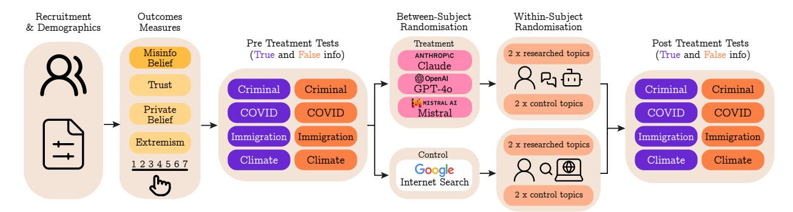
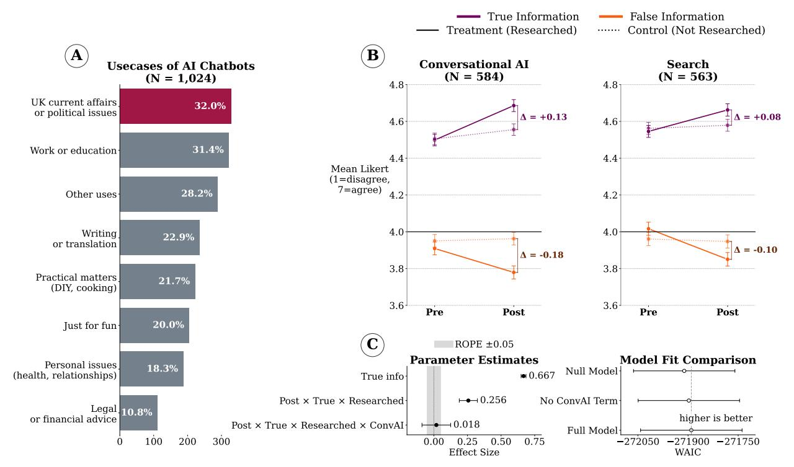

# CONVERSATIONAL AI INCREASES POLITICAL KNOWLEDGE AS EFFECTIVELY AS SELF-DIRECTED INTERNET SEARCH

Lennart Luettgau1,\*,† Hannah Rose Kirk1,\*,† Kobi Hackenburg1,\*,† Jessica Bergs1 Henry Davidson1 Henry Ogden2 Divya Siddarth3 Saffron Huang4 Christopher Summerfield1,2,†

> UK AI Security Institute, London, UK AI Policy Directorate, London, UK Collective Intelligence Project, San Francisco, CA, USA Anthropic, San Francisco, CA, USA

# ABSTRACT

Conversational AI systems are increasingly being used in place of traditional search engines to help users complete information-seeking tasks. This has raised concerns in the political domain, where biased or hallucinated outputs could misinform voters or distort public opinion. However, in spite of these concerns, the extent to which conversational AI is used for political information-seeking, as well the potential impact of this use on users' political knowledge, remains uncertain. Here, we address these questions: First, in a representative national survey of the UK public (*N* = 2,499), we find that in the week before the 2024 election as many as 32% of chatbot users—and 13% of eligible UK voters—have used conversational AI to seek political information relevant to their electoral choice. Second, in a series of randomised controlled trials (*N* = 2,858 total) we find that across issues, models, and prompting strategies, conversations with AI increase political knowledge (increase belief in true information and decrease belief in misinformation) to the same extent as self-directed internet search. Taken together, our results suggest that although people in the UK are increasingly turning to conversational AI for information about politics, this shift may not lead to increased public belief in political misinformation.

# Introduction

Conversational AI systems (or chatbots) such as ChatGPT, Claude and Gemini are now used regularly by hundreds of millions of people across the world. Analysis of consumer usage reveals that among the most common use cases is the seeking of information for private and professional purposes, including both general knowledge and practical advice [\[Anthropic,](#page-8-0) [2024\]](#page-8-0). As public usage of chatbots continues to increase, a particular concern is that LLMs will produce unreliable or biased answers when queried about current affairs or political issues. This could be damaging to democracy, which relies on the electorate having access to reliable information, especially before elections [\[Summerfield](#page-8-1) [et al.,](#page-8-1) [2024\]](#page-8-1).

However, two main uncertainties make the extent of this risk unclear. First, it is unclear whether people trust AI enough to use it for political information-seeking in high-stakes political moments, such as in the lead-up to national elections. Among the general public, trust in AI is low: surveys consistently report that a majority of people do not trust AI to be used as tools to provide medical care, legal advice, or to assist human journalists [\[Newman et al.,](#page-8-2) [2024;](#page-8-2) [Gillespie et al.,](#page-8-3) [2023;](#page-8-3) [McClain,](#page-8-4) [2024\]](#page-8-4). One recent survey showed that levels of trust in AI were comparable to those for politicians, advertising executives, and social media influencers who are themselves the least trusted of all professions [\[Laher,](#page-8-5)

\*These authors contributed equally to this work.

†Correspondence: lennart.luettgau@dsit.gov.uk hannah.kirk@dsit.gov.uk kobi.hackenburg@dsit.gov.uk christopher.summerfield@dsit.gov.uk

Figure 1: Experimental design for measuring the impact of conversational AI on political knowledge. Participants completed baseline assessments of misinformation belief (primary outcome) across four political topics (criminal justice, COVID-19, immigration, and climate change) using 7-point Likert scales. To assess generalization to broader measures of epistemic health, participants also completed assessments of trust levels, private political beliefs, and extremism indicators. Participants were randomized to using conversational AI chatbots (Claude, GPT-4, or Mistral) or internet search. During the research phase, participants investigated two randomly assigned topics while two others serve as within-subject controls. Following the research phase, all measures were re-administered to assess pre-post changes.

[2024\]](#page-8-5). Given this, it is an open question whether people will turn to conversational AI for political guidance during elections, even when such tools are available.

Second, it is unclear whether conversational AI systems present functional substitutes for traditional search engines on common political issues. On the one hand, it is widely acknowledged that AI models have a problem with factuality (AI developers have devoted considerable energy to studying what they call 'hallucinations' in AI models [\[Huang](#page-8-6) [et al.,](#page-8-6) [2024;](#page-8-6) [Ji et al.,](#page-8-7) [2023;](#page-8-7) [Augenstein et al.,](#page-8-8) [2024;](#page-8-8) [Wang et al.,](#page-9-0) [2023\]](#page-9-0)) and there has been concern that models may be politically biased, especially in a progressive or libertarian direction [\[Santurkar et al.,](#page-8-9) [2023;](#page-8-9) [Hartmann et al.,](#page-8-10) [2023;](#page-8-10) [Röttger et al.,](#page-8-11) [2024\]](#page-8-11). On the other hand, significant progress has been made in tackling these risks: developers have implemented techniques such as retrieval-augmented generation (RAG) [\[Lewis et al.,](#page-8-12) [2020\]](#page-8-12), knowledge-graphs [\[Agrawal et al.,](#page-8-13) [2024\]](#page-8-13), fine-tuning on factuality rankings [\[Tian et al.,](#page-8-14) [2024\]](#page-8-14), and semantic entropy methods for detecting confabulations [\[Farquhar et al.,](#page-8-15) [2024\]](#page-8-15). As a result, it remains unclear if reliability issues would substantively impact users' political knowledge in a real-world information-seeking setting.

Here, we address both of these uncertainties. First, in a representative survey one week after the UK 2024 general election, we find that as many as 13% of eligible voters may have used conversational AI to find information relevant to their electoral choice. Second, in an RCT we find that participants who used a chatbot (GPT-4, Claude, or Mistral) to research factual information related to issues of concern for UK voters increased their political knowledge to the same extent as participants who researched the same issues using an internet search engine. In follow-up RCTs, we find that even when LLMs were explicitly prompted to use sycophantic or persuasive techniques, participants' belief formation did not differ from those interacting with standard unprompted AI models.

Taken together, our results suggest that although people in the UK are increasingly turning to AI for political information, this shift may not lead to increased public belief in political misinformation.

# Results

#### Survey

A representative sample of UK adults eligible to vote (N = 2,499) were surveyed in the four days immediately following the UK general election that took place on July 4th 2024 (see Supplementary Information for details on survey demographics and survey questions). Respondents primarily relied on traditional media for political information over the preceding four weeks: television remained the most common source (54%), followed by social media (36%), internet websites (33%), internet search (29%), radio (28%) and newspapers (27%). By comparison, 9% used AI chatbots as a source of political information. Among chatbot users, our central finding is that one-third (32%) used chatbots in the lead up to the UK 2024 election to research information relating to current affairs and political issues (Fig. [2A](#page-2-0)). This comprises the most popular use case, on par with work or educational uses (McNemar's χ 2 (1) = 0.1, p = 0.753).

Figure 2: Conversational AI usage patterns and influence on belief in true versus false information. (A) Survey results: Self-reported use cases for AI chatbots among UK users. (B) RCT results: Change in agreement with true (purple) vs. false information (orange) from pre to post researching. Left panel shows the conversational AI condition; right panel shows the internet search control condition. Solid lines indicate researched topics, dotted lines denote non-researched topics. Error bars represent standard error of the mean. (C) RCT results, left: Bayesian GLM parameter estimates, error bars denote Highest Posterior Density Interval (HPDI). Gray shaded area depicts an apriori defined region of practical equivalence (ROPE), where effect sizes are considered to be negligible/practically 0; Right: GLM comparison using Widely Applicable Information Criterion (WAIC), as a measure of out-of-sample predictive accuracy of the GLMs. Full model = GLM1: GLM including parameters to quantify differences in change effects between conversational AI and internet search conditions, No ConvAI Term = GLM2: GLM not including parameters to quantify differences between different conversational AI models, Null model = GLM3: GLM not including parameters to quantify differences in change effects between conversational AI and internet search conditions or different conversational AI models

Respondents who used chatbots for political information found them significantly more useful than non-useful (89% vs 11%,  $\chi^2(1)=256.3$ , p<.001) and more accurate than inaccurate (87% vs 13%,  $\chi^2(1)=223.1$ , p<.001). Most respondents viewed chatbots as politically neutral rather than showing partisan bias (62% vs 38%,  $\chi^2(1)=24.8$ , p<.001). For those perceiving bias, there was an equal split between right between right- and left-leaning ideologies (58% vs 42%,  $\chi^2(1)=3.8$ , p=0.052). While respondents were evenly divided on whether chatbots influenced their perspective overall (47% vs 53%,  $\chi^2(1)=1.9$ , p=.173), among those influenced, liberal influence significantly exceeded conservative influence (63% vs 37%,  $\chi^2(1)=8.3$ , p=.004). The majority of respondents felt no influence on their voting intentions (60% vs 40%,  $\chi^2(1)=18.7$ , p<.001), but among those influenced, most were encouraged rather than discouraged to vote (79% vs 21%,  $\chi^2(1)=59.1$ , p<.001).

# Randomised Controlled Trial (RCT)

In a second study, independent of the survey sample, we recruited a separate sample of UK residents (N = 1,147 final sample) online via Prolific. Participants in the RCT researched true or false information related to issues of concern for UK voters (climate change, immigration, criminal justice, COVID-19 policy; see Supplementary Information for details on sourcing and political balancing of the material), either using conversational AI (GPT-40, Claude-3.5, or Mistral) or internet search engines (Fig. 1). In separate studies, we randomly assigned participants to conduct research using a conversational AI model (GPT-40) that was either instructed with a default prompt (baseline/control condition) or specifically prompt-engineered to be persuasive or sycophantic (treatment condition). After completing the study,

participants were fully debriefed about the aims and hypotheses of the research. We assessed beliefs in true and false information on a 7-point Likert scale before and after researching all topics. Additionally, we measured secondary outcomes: trust, private political beliefs and extremism change.

To test our research questions, we fitted and compared three Bayesian Generalized Linear Models (GLM1-3, Eq. 1, see Methods for details). There was no model evidence of differences between conversational AI and internet search conditions. Model fit metrics suggested no better fit of GLMs that included parameters for differences in change effects between conversational AI and internet search conditions (GLM1: Full model) in comparison to a GLM that did not include these terms (GLM3: Null model) (Fig. [2C](#page-2-0), right panel). True information received on average approximately one Likert scale point higher agreement ratings than false information (Fig. [2B](#page-2-0), purple vs orange lines), resulting in a non-zero difference parameter in GLM2 (βTRUE = .67, 95%-Highest Posterior Density Interval (HPDI) [.65; .69] (Fig. [2C](#page-2-0) right panel). Researching (vs not researching) political issues increased belief in true information and decreased belief in misinformation across time points (Fig. [2B](#page-2-0), solid vs dotted lines; (βPOST×TRUE×RESEARCHED = .26, 95%-HPDI [.19; .32], Fig. [2C](#page-2-0)). Importantly, we found that belief change was nearly identical for participants who researched using conversational AI or internet search engines (Fig. [2B](#page-2-0), left vs right panel), reflecting in a close to zero parameter estimate (βPOST×TRUE×RESEARCHED×CONVAI = .02, 95%-HPDI [–.09; .13], Fig. [2C](#page-2-0)). This null difference between conditions was further qualified by the fact that the HPDI fully encloses a region of practical equivalence, (ROPE; gray shaded zone), an apriori specified interval of effect sizes that are negligible. This pattern also held separately for each of the different model families tested (GPT, Claude, Mistral).

We repeated the above analyses for trust, private political beliefs and extremism change, and found highly similar results as for beliefs in true and false information. Trust was measured by asking participants to state their agreement with statements on trust or distrust in institutions, experts, media and technology (see Supplementary Information for details). Private political beliefs were assessed by asking participants to state their private political beliefs for the 4 topics (see Supplementary Information for details). Extremism change was defined as sign flips in private political beliefs from before to after researching/not researching an issue – with referenced to the center point of the Likert scale (3.5, values below this value being negative, and values above being positive).

For trust, we found that within GLM2, true statements on average produced higher ratings than false statements (βT RUE = .36, 95%HPDI [.33; .39]). There was no change of trust ratings from before to after researching topics (βP OST xT RUExRESEARCHED = −.08, 95%-HPDI [–.17; .009]). Importantly, we found that the patterns of trust and trust change were nearly identical for participants who researched using conversational AI or internet search engines (βP OST xT RUExRESEARCHEDxCONV AI = .026, 95%-HPDI [–.08; .14]). For private political beliefs, true statements on average produced higher agreement ratings than false statements (βT RUE = .66, 95%HPDI [.63; .70]). Additionally, across measurement time points, researching topics increased agreement with issues participants supported and increased disagreement with with issues participants did not support (βP OST xT RUExRESEARCHED = .23, 95%-HPDI [.13; .33]). Importantly, we found that the effect of researching topics on private political beliefs was nearly identical for participants who researched using conversational AI or internet search engines (βP OST xT RUExRESEARCHEDxCONV AI = .02, 95%-HPDI [–.12; .16]). Within GLM2 (Binomial GLM), there was no difference in extremism change for true or false statements (βT RUE = −.002, 95%-HPDI [–.29; .30]). Additionally, there was no evidence that researching topics changed extremism differentially for true or false information (βT RUExRESEARCHED = −.002, 95%-HPDI [–.39; .39]). Again, we found that the effect of researching topics was nearly identical for participants who researched using conversational AI or internet search engines (βT RUExRESEARCHEDxCONV AI = −.0005, 95%-HPDI [–.44; .45]).

While the above results were obtained using LLMs with standard prompts, previous research suggests that persuasive and sycophantic prompting techniques and resulting model behaviors have strong effects on human belief formation and change. To address potential moderation effects to our null findings, in a separate study (*N* = 1,711 final sample), we investigated how LLMs (GPT-4o) prompted to be sycophantic or persuasive affect beliefs in true and false information (and secondary outcomes) relative to an unprompted baseline GPT-4o. The sycophantic system prompt instructed the LLM to support the users' pre-existing beliefs on the issue, irrespective of whether they agreed or disagreed with the issue. Similarly, the persuasive system prompt instructed the LLM to support a randomly chosen view points (agree/disagree, which correspondeded to the users' pre-existing beliefs in 50% of the cases).

The GLM comparison results and parameter estimates obtained were similar to the previous results with standard prompt settings; no differences were found between prompted vs. unprompted LLMs βPOST×TRUE×RESEARCHED×PROMPT = .03, 95%-HPDI [–.06; .12]—suggesting that even interacting with LLMs prompted to be sycophantic or persuasive did not change participants views above and beyond baseline conversational AI models.

Even though we found no differences of researching political issues using conversational AI or internet search on epistemic health, we additionally investigated potential time efficiency effects of the search methods. We found that the use of conversational AI reduced the information procurement time by 6-10% in comparison to self-guided internet search (average time spent on both research tasks (± standard deviation) in minutes: 17.94 (±8.64) for conversational AI vs 19.82 (±8.91) for internet search; βCONVAI = −.11, 95%-HPDI [–.07; –.16], Gamma GLM, GLM4, Eq. 3).

# Discussion

We demonstrate that conversational AI now sits alongside internet search as a commonly used source of information during high-stakes political moments like national elections. Moreover, across four salient issues and three model families, researching with chatbots raised belief in true facts and lowered belief in false claims to the same extent as self-directed internet search, even when the chatbots were prompted to be persuasive or sycophantic. These findings stand in contrast to the popular assumption that the use of chatbots for election-relevant information-seeking tasks may inherently erode political knowledge, and have two main implications.

First, our results suggest that the large body of prior work suggesting low levels of public trust in AI belies actual public usage for information-seeking: in fact, our data suggest that information-seeking is the most popular use case for chatbots among UK citizens (surpassing professional use, writing/translation, and practical advice), and that that users found their chatbots to be useful, accurate, and un-biased.

Second, our experiment suggests that contrary to widespread concern about AI reliability and hallucinations, models don't increase belief in false information when used to research current affairs and political issues. These results could suggest that developers' current guardrails may be sufficient to keep average informational effects neutral, and could open space to refine AI for rapid, reliable public learning during high-stakes events. Chatbot users were also able to research more quickly compared to search, an efficiency incentive which could portend further adoption of chatbots.

These conclusions are bounded by scope: we focused on one country, a single election cycle, four issues, and short interactive sessions with a small sample of models. Field data that link chatbot use to downstream attitudes and behaviour remain sparse. Still, within those limits, our results suggest that for everyday information-seeking, today's chatbots may perform on par with self-directed internet search—potentially with no cost to political knowledge.

# Methods

#### Survey

For the survey, we recruited UK residents (*N* = 2,499) online. For data plotting and statistical analyses, we reweighted respondents based on official census stats concerning age, gender, ethnicity, region, and socio-economic grade in the UK to correct any imbalances between the survey sample and the population to ensure it is nationally representative. For statistical analysis, we employed χ 2 tests for independence when comparing proportions between different response categories within single-choice questions (e.g., useful vs non-useful responses), while McNemar's test was used for multiple-selection questions where respondents could select more than one option, as this test accounts for the dependency between paired responses from the same individuals (e.g., comparing selection rates between use cases of LLMs in the last 4 weeks where respondents could choose multiple use cases).

#### RCT

For the RCT, we recruited a separate, independent sample of UK residents (*N* = 2,858 final sample) online via Prolific. We did not conduct a formal power analysis, but oriented on other studies on similar research questions that used similar sample sizes. The study was approved by the local Civil Service ethics committee (Reference number: 00001) and conducted in accordance with the Declaration of Helsinki. After recruitment, participants provided informed consent before being randomly assigned to research political issues (climate change, immigration, criminal justice, COVID-19 policy) using either conversational AI models (such as GPT-4o, Claude-3.5, or Mistral) or internet search engines (control condition, Fig. [1\)](#page-1-0), to measure the impact on belief in true and false information, trust, private political beliefs, and extremism. Outcomes were assessed on a 7-point Likert scale. For beliefs in true and false information, participants stated their level of agreement or disagreement with 16 statements. Of these statements, 8 were true and 8 were false; true statements were drawn from policy reports published by reputable UK think tanks with variable political orientations (see Supplementary Information for detailed statements). Participants also stated their agreement with statements on trust or distrust in institutions, expert, media and technology (see Supplementary Information for detailed statements). Participants also stated their private political beliefs for the 4 topics (see Supplementary Information for detailed statements).

We measured the effect of using an AI model or internet search in researching political issues across four different outcomes: belief in true and false information, trust, private political beliefs and extremism change on a 7-point Likert scale, ranging from disagree to agree.

In separate studies, we randomly assigned participants to conduct research using a conversational AI model (GPT-4o) that was either instructed with a default prompt (baseline/control condition) or specifically prompt-engineered to be persuasive or sycophantic (treatment condition). The sycophantic system prompt instructed the LLM to support the users' pre-existing beliefs on the issue, irrespective of whether they agreed or disagreed with the issue. Similarly, the persuasive system prompt instructed the LLM to support a randomly chosen view points (agree/disagree, which correspondeded to the users' pre-existing beliefs in 50% of the cases)

After completing the study, participants were fully debriefed about the aims and hypotheses of the research.

There was no indication of systematic differences in dropout rates (after starting the study and providing informed consent) between the Conversational AI group (5.86%) and Search group (7.34%, Z = −1.65, p = .099, two-proportion z-test), nor was there evidence for attrition rate differences between different Conversational AI models used for research or different prompting techniques (sycophancy or persuasion) (all p ≥ .152, two-proportion z-tests).

### Statistical Modeling

Belief in true and false information (agreement/disagreement with a presented issue statement across researched and non-researched topics) served as our primary outcome of interest, the other variables were analyzed as secondary outcomes. Extremism change was defined as before to after researching sign flips in the difference between private political beliefs – center point of the Likert scale (3.5).

Issue agreement and extremism data before and after search/AI conversation were analyzed using three Bayesian multilevel GLMs [\[Luettgau et al.,](#page-8-16) [2025;](#page-8-16) [Dubois et al.,](#page-8-17) [2025\]](#page-8-17). We specified GLMs with ordered-logistic likelihood functions to model the ordinal categories of issue agreement responses. For extremism data, we defined GLMs with Binomial likelihood function. GLMs were fitted using sampling-based Bayesian inference using Numpyro [\[Phan et al.,](#page-8-18) [2019\]](#page-8-18) for Markov Chain Monte Carlo sampling (using No-U-Turn-Sampler – NUTS – a variant of Hamiltonian Monte Carlo [\[Hoffman and Gelman,](#page-8-19) [2011\]](#page-8-19)) to estimate the posterior distribution of linear model parameters. These parameters

include different intercept and slope parameters that combine linearly to influence the likelihood of ordinal or Binomial responses.

Weakly informative prior probability distributions were specified for each model, as indicated in the model specifications. We drew 4 x 2000 samples from the posterior probability distributions (4 x 2000 warmup samples) across four independent Markov chains. The quality and reliability of the sampling process were evaluated using the Gelman-Rubin convergence diagnostic measure (Rˆ) and by visually inspecting the trace- and rank-plots of the Markov chains.

For all models fitted, for all sampled parameters there were no divergent transitions between Markov chains for any reported models.

For GLM comparisons and to identify the best-fitting GLM for the observed data, we used the Widely Applicable Information Criterion (WAIC [\[Watanabe,](#page-9-1) [2010\]](#page-9-1)). Parameter estimates were considered non-zero if the Highest Posterior Density Interval (HPDI) around the parameter did not contain zero. The HPDI was compared to a region of practical equivalence (ROPE), i.e., an interval of parameter values [−0.05; 0.05] representing the null hypothesis of the parameter being equivalent to 0.

Specifically, we defined an ordered-logistic multilevel GLM for agreement rating data, Eq. [1](#page-6-0)

$$\begin{aligned} y_i &\sim \operatorname{OrderedLogistic}(\eta_i, \kappa) \\ \eta_i &= \operatorname{intercept}_{\operatorname{overall}} + \operatorname{intercept}_{\operatorname{subject}} + \boldsymbol{X}_i \cdot \boldsymbol{\beta_i} \\ \kappa &= \operatorname{cutpoints} \\ \operatorname{intercept}_{\operatorname{overall}} &\sim \operatorname{Normal}(0, 0.01) \\ \operatorname{intercept}_{\operatorname{subject}} &= \operatorname{intercept}_{\operatorname{subject}_{\operatorname{raw}}} \cdot \sigma_{\operatorname{subject}} \\ \operatorname{intercept}_{\operatorname{subject}} &\sim \operatorname{Normal}(0, 0.01) \\ \sigma_{\operatorname{subject}} &\sim \operatorname{HalfNormal}(0.01) \\ \beta_{\operatorname{i_{raw}}} &\sim \operatorname{Normal}(0, 0.1) \\ \beta_{\operatorname{i_{scale}}} &\sim \operatorname{HalfNormal}(0.1) \\ \beta_i &= \beta_{\operatorname{i_{raw}}} \cdot \beta_{\operatorname{i_{scale}}} \\ \operatorname{cutpoints} &\sim \operatorname{TransformedDistribution}\left(\operatorname{Dirichlet}(\alpha), \operatorname{SimplexToOrderedTransform}(0)\right) \\ \alpha &= 1 \end{aligned}$$

For extremism data, we defined a Binomial multilevel GLM, Eq. [2](#page-6-1)

$$\begin{aligned} y_i &\sim \operatorname{Binomial}(n_i, p_i) \\ \eta_i &= \operatorname{intercept}_{\operatorname{overall}} + \operatorname{intercept}_{\operatorname{subject}} + \boldsymbol{X}_i \cdot \boldsymbol{\beta_i} \\ p_i &= \operatorname{sigmoid}(\eta_i) \\ \operatorname{intercept}_{\operatorname{overall}} &\sim \operatorname{Normal}(0, 0.1) \\ \operatorname{intercept}_{\operatorname{subject}} &= \operatorname{intercept}_{\operatorname{subject}_{\operatorname{raw}}} \cdot \sigma_{\operatorname{subject}} \\ \operatorname{intercept}_{\operatorname{subject}_{\operatorname{raw}}} &\sim \operatorname{Normal}(0, 0.1) \\ \sigma_{\operatorname{subject}} &\sim \operatorname{HalfNormal}(0.1) \\ \beta_{\operatorname{i}_{\operatorname{rade}}} &\sim \operatorname{Normal}(0, 0.1) \\ \beta_{\operatorname{i}_{\operatorname{scale}}} &\sim \operatorname{HalfNormal}(0.1) \\ \beta_i &= \beta_{\operatorname{i}_{\operatorname{raw}}} \cdot \beta_{\operatorname{i}_{\operatorname{scale}}} \end{aligned}$$

For both GLMs, different numbers and combinations of predictors were contained in the design matrix X. GLM1 (full model) contained all experimental factors [Post (pre or post timepoint), True (information true or false), Researched (topic researched or not), convAI (LLM or internet search), LLM-type (GPT-4o, Claude or Mistral), their two-, three-, four- and five-way interaction effects and sub-compliance (a numerical score on compliance sanity check) as a nuissance regressor].

GLM2 (no convAI terms model) contained all of the above predictors, except for LLM-type and the associated interaction effects. GLM3 (null model) contained all of the above predictors, except for LLM-type and convAI, and the associated interaction effects. These three GLMs represent different hypotheses about the data that allowed us to make inferences about the underlying data generating process. In case of testing sycophancy and persuasion prompts, LLM-type represented the prompting strategy vs unprompted LLM. In the GLMs above, we use effect coding (-0.5; 0.5) for binary experimental factors and contrast coding [0.5; -0.25; -0.25] for representing differences between different LLMs.

To model information procurement time, we specified a hierarchical/multilevel GLM with Gamma likelihood function (Eq. [3\)](#page-7-0)

$$y_{i} \sim \operatorname{Gamma}(\alpha, \beta_{i})$$

$$\beta_{i} = \frac{\alpha}{\mu_{i}}$$

$$\mu_{i} = \exp(\eta_{i})$$

$$\eta_{i} = \operatorname{intercept}_{\operatorname{overall}} + \beta_{\operatorname{convAI}} \cdot \operatorname{convAI} + \operatorname{intercept}_{\operatorname{subject}}$$

$$\operatorname{intercept}_{\operatorname{overall}} \sim \operatorname{Normal}(0, 1)$$

$$\operatorname{intercept}_{\operatorname{subject}} = \operatorname{intercept}_{\operatorname{subject}_{\operatorname{raw}}} \cdot \sigma_{\operatorname{subject}}$$

$$\operatorname{intercept}_{\operatorname{subject}} \sim \operatorname{Normal}(0, 1)$$

$$\beta_{\operatorname{convAI}} \sim \operatorname{Normal}(0, 1)$$

$$\beta_{\operatorname{convAI}} \sim \operatorname{Normal}(0, 1)$$

$$\sigma_{\operatorname{subject}} \sim \operatorname{Exponential}(1)$$

$$\alpha \sim \operatorname{Exponential}(1)$$

# References

- Garima Agrawal, Tharindu Kumarage, Zeyad Alghamdi, and Huan Liu. Can knowledge graphs reduce hallucinations in LLMs? : A survey. In Kevin Duh, Helena Gomez, and Steven Bethard, editors, *Proceedings of the 2024 Conference of the North American Chapter of the Association for Computational Linguistics: Human Language Technologies (Volume 1: Long Papers)*, pages 3947–3960, Mexico City, Mexico, June 2024. Association for Computational Linguistics. doi: 10.18653/v1/2024.naacl-long.219. URL [https://aclanthology.org/2024.naacl-long.](https://aclanthology.org/2024.naacl-long.219/) [219/](https://aclanthology.org/2024.naacl-long.219/).
- Anthropic. Clio: Privacy-preserving insights into real-world ai use. [https://assets.anthropic.com/m/](https://assets.anthropic.com/m/7e1ab885d1b24176/original/Clio-Privacy-Preserving-Insights-into-Real-World-AI-Use.pdf) [7e1ab885d1b24176/original/Clio-Privacy-Preserving-Insights-into-Real-World-AI-Use.pdf](https://assets.anthropic.com/m/7e1ab885d1b24176/original/Clio-Privacy-Preserving-Insights-into-Real-World-AI-Use.pdf), 2024.
- I Augenstein, T Baldwin, M Cha, T Chakraborty, GL Ciampaglia, D Corney, et al. Factuality challenges in the era of large language models. *Nature Human Intelligence*, 2024.
- Magda Dubois, Harry Coppock, Mario Giulianelli, Timo Flesch, Lennart Luettgau, and Cozmin Ududec. Skewed score: A statistical framework to assess autograders, 2025. URL <https://arxiv.org/abs/2507.03772>.
- Sebastian Farquhar, Jannik Kossen, Lorenz Kuhn, and Yarin Gal. Detecting hallucinations in large language models using semantic entropy. *Nature*, 630(8017):625–630, 2024.
- N Gillespie, S Lockey, C Curtis, J Pool, and Ali Akbari. Trust in artificial intelligence: A global study, Feb 2023.
- J Hartmann, J Schwenzow, and M Witte. The political ideology of conversational ai: Converging evidence on chatgpt's pro-environmental, left-libertarian orientation. <http://arxiv.org/abs/2301.01768>, 2023.
- Matthew D. Hoffman and Andrew Gelman. The no-u-turn sampler: Adaptively setting path lengths in hamiltonian monte carlo. 11 2011. URL <http://arxiv.org/abs/1111.4246>.
- L Huang, W Yu, W Ma, W Zhong, Z Feng, H Wang, et al. A survey on hallucination in large language models: Principles, taxonomy, challenges, and open questions. *ACM Transactions on Information Systems*, page 3703155, 2024. doi: 10.1145/3703155.
- Z Ji, N Lee, R Frieske, T Yu, D Su, Y Xu, et al. Survey of hallucination in natural language generation. *ACM Computing Surveys*, 55:1–38, 2023. doi: 10.1145/3571730.
- T Laher. Who do we trust the most? [https://www.ipsos.com/sites/default/files/ct/news/documents/](https://www.ipsos.com/sites/default/files/ct/news/documents/2024-09/Ipsos%20BandA%20%20Veracity%20Index%202024.pdf) [2024-09/Ipsos%20BandA%20%20Veracity%20Index%202024.pdf](https://www.ipsos.com/sites/default/files/ct/news/documents/2024-09/Ipsos%20BandA%20%20Veracity%20Index%202024.pdf), 2024.
- Patrick Lewis, Ethan Perez, Aleksandra Piktus, Fabio Petroni, Vladimir Karpukhin, Naman Goyal, Heinrich Küttler, Mike Lewis, Wen-tau Yih, Tim Rocktäschel, et al. Retrieval-augmented generation for knowledge-intensive nlp tasks. *Advances in neural information processing systems*, 33:9459–9474, 2020.
- Lennart Luettgau, Harry Coppock, Magda Dubois, Christopher Summerfield, and Cozmin Ududec. Hibayes: A hierarchical bayesian modeling framework for ai evaluation statistics, 2025. URL [https://arxiv.org/abs/2505.](https://arxiv.org/abs/2505.05602) [05602](https://arxiv.org/abs/2505.05602).
- C McClain. Americans' use of chatgpt is ticking up, but few trust its election information. [https://www.pewresearch.org/short-reads/2024/03/26/](https://www.pewresearch.org/short-reads/2024/03/26/americans-use-of-chatgpt-is-ticking-up-but-few-trust-its-election-information/#chatgpt-and-the-2024-presidential-election) [americans-use-of-chatgpt-is-ticking-up-but-few-trust-its-election-information/](https://www.pewresearch.org/short-reads/2024/03/26/americans-use-of-chatgpt-is-ticking-up-but-few-trust-its-election-information/#chatgpt-and-the-2024-presidential-election) [#chatgpt-and-the-2024-presidential-election](https://www.pewresearch.org/short-reads/2024/03/26/americans-use-of-chatgpt-is-ticking-up-but-few-trust-its-election-information/#chatgpt-and-the-2024-presidential-election), 2024.
- N Newman, R Fletcher, CT Robertson, A Ross Arguedas, and RK Nielsen. Reuters institute digital news report 2024, 2024.
- Du Phan, Neeraj Pradhan, and Martin Jankowiak. Composable effects for flexible and accelerated probabilistic programming in numpyro. 12 2019. URL <http://arxiv.org/abs/1912.11554>.
- P Röttger, V Hofmann, V Pyatkin, M Hinck, HR Kirk, H Schütze, et al. Political compass or spinning arrow? towards more meaningful evaluations for values and opinions in large language models. [http://arxiv.org/abs/2402.](http://arxiv.org/abs/2402.16786) [16786](http://arxiv.org/abs/2402.16786), 2024.
- S Santurkar, E Durmus, F Ladhak, C Lee, P Liang, and T Hashimoto. Whose opinions do language models reflect? In *Proceedings of the 40th International Conference on Machine Learning*, Honolulu, Hawaii, USA, 2023. JMLR.org.
- C Summerfield, L Argyle, M Bakker, T Collins, E Durmus, T Eloundou, et al. How will advanced ai systems impact democracy? <http://arxiv.org/abs/2409.06729>, 2024.
- Katherine Tian, Eric Mitchell, Huaxiu Yao, Christopher D Manning, and Chelsea Finn. Fine-tuning language models for factuality. In *The Twelfth International Conference on Learning Representations*, Vienna, Austria, May 2024. URL <https://openreview.net/forum?id=8435>.

C Wang, X Liu, Y Yue, X Tang, T Zhang, C Jiayang, et al. Survey on factuality in large language models: Knowledge, retrieval and domain-specificity. <http://arxiv.org/abs/2310.07521>, 2023.

Sumio Watanabe. Asymptotic equivalence of bayes cross validation and widely applicable information criterion in singular learning theory. *Journal of Machine Learning Research*, 11:3571–3594, 2010.

# Supplementary Information

# Survey Demographics

For each variable we show the percentages in the weighted sample with the raw percentages in parentheses.

- Gender:
  - Male: 48.34% (51.62%)
  - Female: 51.46% (48.18%)
- Age group:
  - 18 to 24: 11.60% (12.61%)
  - 25 to 34: 14.01% (19.37%)
  - 35 to 54: 37.41% (34.73%)
  - 55 to 64: 14.33% (14.17%)
  - 65+: 22.65% (19.13%)
- Generation:
  - Generation Z: 15.13% (17.69%)
  - Millennials: 25.29% (29.33%)
  - Generation X: 29.93% (26.69%)
  - Baby Boomers: 27.81% (24.97%)
- Region:
  - London: 13.05% (15.73%)
  - Rest of South: 31.57% (28.13%)
  - Midlands: 16.05% (16.81%)
  - North: 23.37% (23.69%)
  - Wales: 4.72% (5.20%)
  - Scotland: 8.36% (7.96%)
  - Northern Ireland: 2.92% (2.48%)
- Social Grade:
  - ABC1: 56.22% (60.10%)
  - C2DE: 42.74% (38.86%)
- Work Status:
  - Full time: 43.46% (50.78%)
  - Part time: 16.89% (15.57%)
  - Unemployed: 8.40% (7.68%)
  - Retired: 21.33% (17.65%)
  - Other: 9.40% (7.96%)
- Working Status (Aggregated):
  - Working (All): 60.34% (66.35%)

- Not Working (All): 39.14% (33.29%)
- Annual Household Income:

– Under £14k: 13.77% (12.48%) – £14k to £21k: 10.60% (9.60%) – £21k to £34k: 27.05% (24.73%) – £34k to £48k: 16.93% (17.33%)

– More than £48k: 25.89% (31.41%)

# Survey Questions and Response Options

#### Q1a

Over the past four weeks, which of the following have you used to find out about UK political issues or current affairs?

- Newspapers (print or website / app, for example Daily Mail or Guardian Online)
- Television (including live streaming, on demand and broadcast)
- Radio
- AI chatbots (for example ChatGPT)
- Social media sites (for example Facebook, Instagram, TikTok, Twitter/X, YouTube)
- Other internet sites, (for example BBC News)
- Podcasts
- Internet Search (for example Google)
- Other, please specify
- None of the above

#### Q1b

In general, how much do you trust the following sources to provide accurate information about UK political issues or current affairs?

### Sources evaluated:

- Newspapers (print or website / app, for example Daily Mail or Guardian Online)
- Television (including live streaming, on demand and broadcast)
- Radio
- AI chatbots (for example ChatGPT)
- Social media sites (for example Facebook, Instagram, TikTok, Twitter/X, YouTube)
- Other internet sites, (for example BBC News)
- Podcasts
- Internet Search (for example Google)

#### Response options for each source:

- Trust a great deal
- Trust to some extent
- Do not trust very much
- Do not trust at all
- Don't know

#### Q1c

How often, if at all, do you use AI chatbots in your professional life or leisure time?

- I have never used an AI chatbot
- I use a chatbot from time to time
- I use a chatbot around once a week
- I use a chatbot almost every day
- I use a chatbot at least once a day
- I don't know

# Q1d

Which, if any, of the following AI chatbots have you used in the last four weeks?

- ChatGPT
- Gemini/Bard
- Claude
- Bing AI
- Pi
- Perplexity AI
- Open source chatbots, for example Llama or Mistral
- Other
- None of these/ I haven't used AI chatbots in the last four weeks

#### Q1e

In the last four weeks, have you asked an AI chatbot for information or advice on any of the following topics?

- Personal issues, such as health or relationships
- Practical matters, such as DIY or cooking
- Legal or financial advice
- Information to help me with my work or education
- UK current affairs or political issues (including information about the UK general election)
- Help with translation, or help composing a piece of writing
- I tried to engage the chatbot in a conversation just for fun
- I used a chatbot for something else

### Q2a

In the last four weeks, did you see social media content focussed on UK political issues that you suspected to be AI-generated?

- Yes, but the content did not appear to be misleading
- Yes, and the content appeared to be misleading
- No, I have not seen social media posts that I suspected to be generated by AI
- No, I am not on social media
- I don't know

#### Q2b

In the last four weeks, did you see news articles focussed on UK political issues that you suspected to be AI-generated?

- Yes, but the content did not appear to be misleading
- Yes, and they appeared to contain misleading content
- No, I have not come across online news articles that I suspected to be generated by AI
- No, I do not read news online
- I don't know

#### Q2c

In the last four weeks did you see online images or videos on any subject that you suspected to be AI-generated fakes (often called deepfakes)?

- Yes, I have come across images or videos that I suspected to be deepfakes (other than those that were labelled as such for reporting purposes, for example fact-checking)
- No, I have not seen images or videos that I suspected to be deepfakes
- I don't know

#### Q3a

In the last four weeks, have you seen information about UK current affairs or political issues from any of the following sources?

#### Sources evaluated:

- Social media sites (for example Facebook, Instagram, TikTok, Twitter/X, YouTube)
- Newspapers (print or website / app, for example Daily Mail or Guardian Online)
- Generated by an AI chatbot (for example ChatGPT)

#### Response options for each source:

- Yes
- No
- Don't know

### Q3b

Thinking about the information about UK current affairs or political issues you saw on social media, did it make you more likely to vote, less likely to vote, or did it make no difference?

- It made me more likely to vote
- It made no difference
- It made me less likely to vote
- I did not see information about current affairs or political issues on social media
- I don't know

#### Q3c

Thinking about the information about UK current affairs or political issues you saw in newspapers, did it make you more likely to vote, less likely to vote, or did it not make no difference?

- It made me more likely to vote
- It made no difference
- It made me less likely to vote
- I did not see information about current affairs or political issues in newspapers or news websites
- I don't know

### Q3d

Thinking about the information about UK current affairs or political issues that was generated by an AI chatbot, did it make you more likely to vote, less likely to vote, or did it make no difference?

- It made me more likely to vote
- It made no difference
- It made me less likely to vote
- I did not see information about current affairs or political issues from an AI chatbot
- I don't know

#### Q4a

In the last four weeks, did you search online for any of the following practical information about the UK general election?

- Information about election rules, such as voter ID rules
- Information about the date of the election
- Information about the opening hours of polling stations
- Information about eligibility to vote
- Information about voter registration

- Something else relevant to the forthcoming election
- I did not search for information about the election
- I don't know

### Q4b

Which websites did you use to search for information about the UK general election?

- UK Government webpages
- A search engine, such as Google or Bing
- An AI chatbot, such as ChatGPT or Gemini
- Social media sites
- News websites
- Other
- Don't know

#### Q4c

Was the information you found on these websites helpful?

- Yes, the information was helpful
  - No, the information was not helpful
  - I don't know

#### Q4d

Did the information you found on these websites seem accurate?

- Yes, the information seemed accurate
- No, the information did not seem accurate
- I don't know

#### Q5a

You said that you have used an AI chatbot in the past four weeks to find out about current affairs or political issues in the UK. Which topics did you find out about?

- The economy
- Brexit
- Immigration
- Foreign affairs, for example the war in Israel/Gaza or Ukraine
- The cost-of-living crisis
- Climate change and net zero
- National Health Service
- Housing policy
- Scottish Independence
- Welfare, taxes or benefits
- Criminal justice and policing
- Other
- Prefer not to say

# Q5b

How useful, if at all, were the AI chatbot's replies?

- Very useful
- Fairly useful
- Not very useful
- Not at all useful
- I don't know

# Q5c

How accurate, if at all, did the AI chatbot's replies seem?

- Very accurate
- Fairly accurate
- Not very accurate
- Not at all accurate
- I don't know

# Q5e

Did the AI chatbot's replies seem to be fair and balanced, or did the replies favour left-wing views over right-wing views, or vice versa?

- The chatbot seemed to be politically left leaning
- The chatbot seemed to be politically neutral or balanced (it gave each side of the argument a fair hearing)
- The chatbot seemed to be politically right leaning
- I don't know

#### Q5f

Did the way the AI chatbot replied influence your perspective on the issues that you researched?

*For example, if you asked about a topic (such as legalisation of drugs) did the views expressed by the chatbot influence how you thought about this issue, and was that influence in a more liberal direction (for example drug laws should be loosened) or conservative direction (for example drug laws should be tightened).*

- Yes, I was influenced in a more liberal direction
- Yes, I was influenced in a more conservative direction
- I was influenced by the chatbot, but not in a more liberal or conservative direction
- I was not influenced by the chatbot
- I don't know

#### Q5g

Did the way it replied influence how favourably you thought about individual UK politicians or political parties on the left of the political spectrum?

- Yes, I had a more favourable view of politicians or parties on the left of the political spectrum
- Yes, I had a less favourable view of politicians or parties on the left of the political spectrum
- No, my view of politicians or parties on the left of the political spectrum was unchanged
- I don't know

### Q5h

Did the way it replied change how favourably you thought about individual UK politicians or political parties on the right of the political spectrum?

- Yes, I had a more favourable view of politicians or parties on the right of the political spectrum
- Yes, I had a less favourable view of politicians or parties on the right of the political spectrum
- No, my view of politicians or parties on the right of the political spectrum was unchanged
- I don't know

# Q5i

Did the way it replied change the likelihood that you would vote for individual UK politicians or political parties?

- Yes, I would be more likely to vote for politicians or parties on the right of the political spectrum
  - Yes, I would be less likely to vote for politicians or parties on the right of the political spectrum

- No, my voting intentions are unchanged
- I don't know

#### Q5j

Did it make you more certain about your voting intention?

- Yes, I was more certain about the party I wanted to vote for
- I was no more or less certain about the party I wanted to vote for
- No, I was less certain about the party I wanted to vote for
- I don't know

# RCT Demographics

- Age group:
  - 18 25: 18.75%
    - 26 35: 33.21%
    - 36 45: 21.34%
    - 46 55: 14.52%
    - 56 65: 9.13%
    - 66+: 2.69%
    - Missing: 0.35%
- Gender:
  - Male: 42.69%
  - Female: 41.81%
  - Other: 2.20%
  - Non Binary: 0.38%
  - Prefer Not To Say: 12.56%
  - Missing: 0.35%
- Ethnicity:
  - White: 61.97%
  - Black: 14.59%
  - Asian: 6.26%
  - Mixed: 3.71%
  - Other Ethnic: 0.56%
  - Prefer Not To Say: 12.56%
  - Missing: 0.35%
- Region:
  - London: 12.56%
  - South East: 11.27%
  - North West: 10.85%
  - Yorkshire: 8.01%
  - West Midlands: 7.56%
  - Scotland: 7.00%
  - East Midlands: 6.79%
  - South West: 6.65%
  - East England: 6.19%
  - North East: 3.39%
  - Wales: 3.08%
  - Other: 2.20%
  - Northern Ireland: 1.54%

- Prefer Not To Say: 12.56%
- Missing: 0.35%

#### • Income bracket (£ per annum):

- <10k: 4.30%
- 10k 20k: 8.96%
- 20k 30k: 17.04%
- 30k 50k: 23.58%
- 50k 100k: 27.05%
- >100k: 6.16%
- Prefer Not To Say: 12.56%
- Missing: 0.35%

### • Religion:

- No Religion: 43.74%
- Christian: 34.99%
- Prefer Not To Say: 12.56%
- Muslim: 5.00%
- Other Religion: 1.12%
- Hindu: 0.87%
- Buddhist: 0.59%
- Sikh: 0.45%
- Missing: 0.35%
- Jewish: 0.31%

#### • Education:

- No Qualification: 0.52%
- Other Qualifications: 2.73%
- GCSE: 9.03%
- A Levels: 16.27%
- Currently Studying: 1.19%
- Undergraduate: 36.39%
- Graduate: 20.96%
- Prefer Not To Say: 12.56%
- Missing: 0.35%

#### • Voting:

- Labour: 31.74%
- Conservative: 13.40%
- Reform UK: 9.80%
- Liberal: 8.82%
- Green: 6.96%
- Other: 2.17%
- SNP: 2.06%
- Unionist: 0.52%
- Sinn Féin: 0.28%
- Plaid Cymru: 0.28%
- Prefer Not To Say: 12.56%
- Don't Know: 11.06%
- Missing: 0.35%

#### • Brexit vote:

– Remain: 37.40% – Leave: 19.73%

– Did Not Vote: 15.61% – Not Eligible: 14.35% – Prefer Not To Say: 12.56%

– Missing: 0.35%

• Disability:

– No: 77.01% – Yes Minor: 6.05%

– Yes Not Registered: 2.38% – Yes Disabled: 1.64%

– Prefer Not To Say: 12.56%

– Missing: 0.35% • Mental health problems:

> – No: 67.28% – Yes: 8.75%

– Prefer Not To Say: 12.56% – Don't Know: 11.06% – Missing: 0.35%

• Chatbot use:

– Never: 5.77%

– Not Regularly: 48.71% – Every Week: 29.29% – Every Day: 15.89% – Missing: 0.35%

# RCT Topics and Issue Statements

For beliefs in true and false information, participants stated their level of agreement or disagreement with 16 statements. Of these statements, 8 were true and 8 were false; true statements were drawn from policy reports published by reputable UK think tanks with variable political orientations. The statements presented were the following:

- Climate change (TRUE):
  - The arctic expected to become ice-free by 2030
  - The UK's 10 warmest years on record have all occurred since 2002
  - Under "business as usual" scenarios, where no attempt is made to reduce emissions, more than 50% of biodiversity is likely to be lost within this century
  - The World Economic Forum estimates that climate change is costing \$16 million per hour
  - The Earth's climate has always been changing; the temperature was about 5◦ warmer than today some 100,000 years ago
  - The Office for Budget Responsibility has estimated that the cost of achieving Net Zero by 2030 will be more than £300 billion
  - Today, 50% of UK energy is already provided by renewables
  - Overall energy demand in the UK is down 13% since 2016
- Climate change (FALSE):
  - The major barrier to increased renewable energy is planning permission for more solar farms
  - If the climate heats by as much as 2 degrees centigrade, models predict that London and New York will become uninhabitable
  - An estimated 100,000 people died heat-related deaths in 2022
  - If you add up the GDP of all nations committed to Net Zero, it only makes up 10% of the global total
  - Variation in solar activity is a major contributor to fluctuating global temperatures
  - Global gas demand has already peaked and is now declining

- Many scientists argue that CO2 in the atmosphere will encourage trees and other plants to flourish, which will eventually restore equilibrium to global temperatures
- All things considered, renewable energy is more than twice as expensive as fossil fuels

#### • Immigration (TRUE):

- According to most studies, migrants from outside the EU make a net negative contribution to the UK economy
- In 2023 more than 750,000 migrants arrived in the UK
- When migrants arrive in the UK, a major drain on public resources is the cost of educating their children
- Housing asylum seekers costs the UK upwards of £8 million per day
- In recent years, migrants from Europe have paid more in taxes and national insurance contributions than they have received in benefits
- The Office for Budget Responsibility forecasts that under a "high migration" scenario, where migrants are encouraged to come to the UK, net national debt will be 30% lower
- Migration to the UK is widely expected to drop in 2024
- In 2023, 80,000 more people from Europe left the UK than arrived

### • Immigration (FALSE):

- Over the past few decades, the UK has experienced higher levels of net migration than most other high-income countries
- Asylum seekers make up more than a quarter of non-EU migration to the UK
- If we were to prevent migrants from crossing the channel in small boats, then migration to the UK would be significantly reduced
- Most migrants to the UK struggle to speak English
- There is no discernible effect of migration on house prices in the UK
- Brexit did nothing to stop migration from the EU to the UK
- Non-EU migrants are thought to make a net positive contribution to the UK economy
- Headteachers report that having a high proportion of migrant children in their schools has mainly or exclusively positive impact on the native-born pupils

### • Criminal justice (TRUE):

- England and Wales have the highest per capital imprisonment rate in Europe
- The government estimates the current reoffending costs the UK more than 18 billion pounds per year
- 16% of all prisoners don't know when they will be released
- Government inspectors found that only a single prison in the UK successfully gave prisoners a purposeful activity whilst in jail
- Nearly 1000 knife offences take place every week in the UK
- Approximately 10% of the prison population are foreign nationals
- Surveys have found that the average Briton breaks the law several times a week
- It costs roughly the same to imprison an offender in a UK prison as to send a pupil to Eton College

#### • Criminal justice (FALSE):

- Violent crime has increased by more than 50% since 2010
- Offenders who are given community orders or suspended sentences are much more likely to reoffend than those who are given equivalent prison sentences
- A majority of Muslims in prison have been accused of terror-related offences
- Recent drops in crime are mainly attributable to the fact that so many criminals are behind bars
- The suicide rate in prisons is 100 times greater than the national average
- Nearly half of the prison population has a learning disability
- The prison population has tripled in the last 10 years and now exceeds 100,000
- More than a quarter of all under-18s have been convicted of a criminal offence

#### • Covid-19 (TRUE):

- Scientists believe that Covid-19 vaccines may have prevented as many as 15 million deaths worldwide
- An estimated 3% of the population continue to suffer from "Long Covid" in the UK

- Countries that were able to implement strict quarantine measures, such as New Zealand, suffered less from Covid than those where borders remained largely open, such as the UK
- Researchers have found that Covid-19 affects the brain as well as the body
- The gap in mathematics attainment between more and less advantaged primary school children grew during lockdowns
- The Furlough Scheme cost each household in the UK more than £2000
- The government spent more than 300 billion pounds on measures designed to address Covid-19
- Sweden had less stringent lockdowns than the US, but also had a lower per-capita death rate.

#### • Covid-19 (FALSE):

- Nobody in the UK has died from adverse effects of the Covid-19 vaccine
- Sanitising desks is agreed to greatly reduce the spread of Covid-19 in the workplace
- More than 10% of deaths among people aged over 75 in the UK are still due to Covid-19
- Some scientists have claimed that lockdowns had a minimal effect on death rates in countries where they were implemented
- Receiving the Covid-19 vaccine increases your chance of dying, relative to not receiving it
- There is documented evidence that Covid-19 is spread by 5G mobile networks
- There is no evidence that wearing masks reduces the spread of Covid-19
- During the first Covid lockdown, UK GDP fell by nearly 50%

Participants also stated their agreement with statements on trust or distrust in institutions, expert, media and technology. The statements presented were the following:

#### • Climate change:

- I TRUST politicians to tell the truth about climate change
- I TRUST the mainstream media to report accurate information about climate change
- I TRUST experts to report accurate information about climate change
- I TRUST the internet to provide accurate information about climate change
- I TRUST AI systems to provide accurate information about climate change
- I DISTRUST politicians to tell the truth about climate change
- I DISTRUST the mainstream media to report accurate information about climate change
- I DISTRUST experts to report accurate information about climate change
- I DISTRUST the internet to provide accurate information about climate change
- I DISTRUST AI systems to provide accurate information about climate change

#### • Immigration:

- I TRUST politicians to tell the truth about immigration
- I TRUST the mainstream media to report accurate information about immigration
- I TRUST experts to report accurate information about immigration
- I TRUST the internet to provide accurate information about immigration
- I TRUST AI systems to provide accurate information about immigration
- I DISTRUST politicians to tell the truth about immigration
- I DISTRUST the mainstream media to report accurate information about immigration
- I DISTRUST experts to report accurate information about immigration
- I DISTRUST the internet to provide accurate information about immigration
- I DISTRUST AI systems to provide accurate information about immigration

#### • Criminal justice:

- I TRUST politicians to tell the truth about crime and prisons
- I TRUST the mainstream media to report accurate information about crime and prisons
- I TRUST experts to report accurate information about crime and prisons
- I TRUST the internet to provide accurate information about crime and prisons
- I TRUST AI systems to provide accurate information about crime and prisons
- I DISTRUST politicians to tell the truth about crime and prisons

- I DISTRUST the mainstream media to report accurate information about crime and prisons
- I DISTRUST experts to report accurate information about crime and prisons
- I DISTRUST the internet to provide accurate information about crime and prisons
- I DISTRUST AI systems to provide accurate information about crime and prisons

#### • Covid-19:

- I TRUST politicians to tell the truth about Covid-19
- I TRUST the mainstream media to report accurate information about Covid-19
- I TRUST experts to report accurate information about Covid-19
- I TRUST the internet to provide accurate information about Covid-19
- I TRUST AI systems to provide accurate information about Covid-19
- I DISTRUST politicians to tell the truth about Covid-19
- I DISTRUST the mainstream media to report accurate information about Covid-19
- I DISTRUST experts to report accurate information about Covid-19
- I DISTRUST the internet to provide accurate information about Covid-19
- I DISTRUST AI systems to provide accurate information about Covid-19

Participants also stated their private political beliefs for the 4 topics. The statements presented were the following:

#### • Climate change:

- Climate change is the most serious problem facing the UK today, including when compared to other challenges like slow growth
- We should choose sustainable food, energy and housing, even if they are more expensive
- Achieving net zero production as soon as possible should be a priority for the UK
- Everyone should try to consume less in order to protect the environment, even if this reduces economic growth
- We should support measures that protect the environment, like local traffic restrictions or mandatory carbon-neutral heating systems (e.g. heat pumps), even if they are more affordable for some people than others
- Climate change is less serious than other challenges facing the UK today, such as slow growth
- The extra costs for sustainable food, energy and housing are not worth the benefits
- Achieving net zero production in the near future should not be a priority for the UK
- Economic growth is more important than reducing consumption for environmental reasons
- We should not support environmental measures like local traffic restrictions or mandatory carbon-neutral heating systems (e.g. heat pumps), because they mainly benefit those who are better off

#### • Immigration:

- The number of immigrants coming to Britain today should be reduced
- Immigration is a bad thing for Britain overall
- It should be more difficult for asylum seekers to obtain the right to live in the UK
- High levels of immigration to the UK make it more difficult for native-born people to find work
- Immigration of workers into jobs where there are staff shortages, such as care workers or teachers, should be just as hard as for low-skilled workers
- Levels of immigration to the UK today are perfectly acceptable
- Immigration is a good thing for Britain overall
- It should be easier for asylum seekers to obtain the right to live in the UK
- High levels of immigration to the UK have a neutral or positive impact on the job market
- Immigration of workers into jobs where there are staff shortages, such as care workers or teachers, should be easier

# • Criminal justice:

- Prison sentences should be harsher than they currently are
- Prison should be designed to punish offenders, not to rehabilitate them
- We should increase the range of crimes for which custodial prison sentences are offered

- Justice for victims of crime is more important than fairness to perpetrators of crime
- Investing public money to make prisons safer and more comfortable will only encourage more offending
- Prison sentences in the UK should be less harsh than they currently are
- Prisons should be designed to rehabilitate offenders, not to punish them for their crimes
- We should reduce the range of crimes for which custodial prison sentences are offered
- Treating perpetrators of crime fairly is at least as important as justice for victims of crime
- Investing public money to make prisons safer and more comfortable will reduce crime in the long run

#### • Covid-19:

- Lockdowns during the Covid-19 pandemic went too far
- Schools should have remained open as a priority during the Covid-19 pandemic
- The police should not have fined people who broke lockdown rules, for example by hosting private parties
- The government was insufficiently candid about the risks of the Covid-19 vaccine
- Young people who wore masks in cinemas and on public transport during the pandemic were being over-cautious
- Lockdowns during the Covid-19 pandemic were necessary to save lives
- Schools needed to switch to online lessons to stop the spread of Covid-19 through families
- It was right for the police to fine people who broke lockdown rules, for example by hosting private parties
- Government messaging about the risks of the Covid-19 vaccine was accurate and informative
- Young people who wore masks in cinemas and on public transport during the pandemic were being good citizens