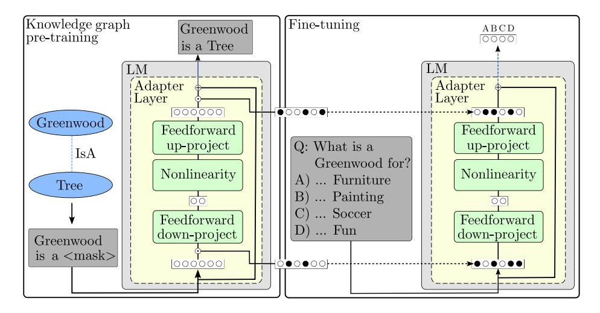

# PreAdapter: Pre-training Language Models on Knowledge Graphs

Janna Omeliyanenko1,2() , Andreas Hotho1,2 , and Daniel Schlör1,2

1 CAIDAS Center for Artificial Intelligence and Data Science, Würzburg, Germany 2 Julius-Maximilians-University of Würzburg, Würzburg, Germany {omeliyanenko, hotho, daniel.schloer}@informatik.uni-wuerzburg.de

Abstract. Pre-trained language models have demonstrated state-of-theart performance in various downstream tasks such as summarization, sentiment classification, and question answering. Leveraging vast amounts of textual data during training, these models inherently hold a certain amount of factual knowledge, which is particularly beneficial for knowledge-driven tasks such as question answering. However, the knowledge implicitly contained within the language models is not complete. Consequently, many studies incorporate additional knowledge from Semantic Web resources such as knowledge graphs, which provide an explicit representation of knowledge in the form of triples. Seamless integration of this knowledge into language models remains an active research area. Direct pre-training of language models on knowledge graphs followed by fine-tuning on downstream tasks has proven ineffective, primarily due to the catastrophic forgetting effect. Many approaches suggest fusing language models with graph embedding models to enrich language models with information from knowledge graphs, showing improvement over solutions that lack knowledge graph integration in downstream tasks. However, these methods often require additional computational overhead, for instance, by training graph embedding models. In our work, we propose a novel adapter-based method for integrating knowledge graphs into language models through pre-training. This approach effectively mitigates catastrophic forgetting that can otherwise affect both the original language modeling capabilities and the access to pre-trained knowledge. Through this scheme, our approach ensures access to both the original capabilities of the language model and the integrated Semantic Web knowledge during fine-tuning on downstream tasks. Experimental results on multiple choice question answering tasks demonstrate performance improvements compared to baseline models without knowledge graph integration and other pre-training-based knowledge integration methods.

Keywords: knowledge graph · language model · knowledge integration · question answering · adapters.

## 1 Introduction

Pre-trained language models (LMs) excel in various downstream tasks such as text summarization [\[1\]](#page-13-0), sentiment classification [\[47\]](#page-17-0), and question answering [\[21\]](#page-15-0) by capturing linguistic and content-related information from natural language texts during self-supervised pre-training on large datasets and subsequent finetuning to the respective downstream task.

Besides the explicit knowledge integrated during fine-tuning, it has been observed that pre-training also embeds a broad base of implicit general knowledge into the models [\[26\]](#page-15-1). This general knowledge can be directly leveraged for tasks such as knowledge extraction [\[22,](#page-15-2)[30,](#page-15-3)[33\]](#page-16-0), downstream tasks such as commonsense reasoning [\[27\]](#page-15-4) or question answering [\[7\]](#page-14-0).

Although this general knowledge has proven useful for improving these downstream tasks [\[26\]](#page-15-1), exploring its limitations [\[9,](#page-14-1)[28\]](#page-15-5) and expanding it by introducing specific unstructured [\[25,](#page-15-6)[42\]](#page-16-1) or structured [\[37,](#page-16-2)[39\]](#page-16-3) knowledge has recently gained attention. Particularly noteworthy is the integration of structured knowledge through Semantic Web resources such as knowledge graphs (KGs) [\[44\]](#page-16-4). This approach harnesses the structured nature of KGs to enrich the understanding of LMs of complex relationships between entities, providing a more robust semantic framework. As a result, models equipped with this integrated knowledge demonstrate significant improvements in accuracy and contextual understanding for downstream tasks compared to methods that do not utilize KGs [\[21,](#page-15-0)[38](#page-16-5)[,45,](#page-16-6)[46\]](#page-17-1).

However, these approaches often introduce a large computational overhead by training additional graph-based models [\[45,](#page-16-6)[46\]](#page-17-1) and require the fusion of different representations, e.g. tokens and graph representations, that are required to integrate the knowledge. While methods have been proposed that introduce knowledge by pre-training LMs through masking tasks [\[21](#page-15-0)[,29\]](#page-15-7), additional pretraining of already pre-trained models suffers from catastrophic forgetting, where the model loses previously introduced knowledge and its ability to solve previous tasks [\[13\]](#page-14-2). This hinders the seamless integration of knowledge into the actual LM required to easily adapt to complex downstream tasks related to natural language processing (NLP) [\[36\]](#page-16-7).

To prevent the model from losing its high-quality language representation learned through its initial pre-training, existing work on KG pre-training leverages large text corpora to jointly reintroduce language modeling tasks parallel to KG pre-training [\[21,](#page-15-0)[38\]](#page-16-5). This requires large additional datasets to be created and processed during training that do not benefit the actual goal of introducing specific knowledge. This again introduces a large computational overhead.

In this work, we provide an alternative path for knowledge pre-training based on strategies from continual learning, an emerging research field that develops strategies to continuously train models while avoiding catastrophic forgetting [\[4\]](#page-14-3) that does not suffer from additional computational overhead. Inspired by Capsule networks [\[11\]](#page-14-4) that have been successfully adopted for continual knowledge integration in a multi-task scenario for automatic KG completion [\[23\]](#page-15-8), we introduce PreAdapter, an adapted method to integrating knowledge from KGs during pre-training. This method prevents the deterioration of the original language understanding (catastrophic forgetting) but also ensures that integrated KG knowledge is not forgotten during fine-tuning on natural language-specific downstream tasks. Thus, our approach allows for integrating structural knowledge from KGs

Fig. 1. The two training phases of PreAdapter. The KG pre-training phase uses adapter layers to integrate knowledge from KGs into the LM through masked language modeling on KG triples that are converted to natural language. Additionally, a knowledgeintegration binary mask for all adapter parameters is learned during KG pre-training. This mask serves as update gate for important neurons that should not be updated during fine-tuned to prevent catastrophic forgetting on newly integrated KG knowledge while still allowing to access the knowledge through the forward pass.

created by Semantic Web research across pre-training and downstream tasks using a shared adapter, which employs a novel knowledge-integration masking strategy.

We illustrate our approach for the KG pre-training phase and the subsequent fine-tuning phase in Figure [1.](#page-2-0) In the KG pre-training phase, additional knowledge from KGs is integrated into a pre-trained LM through converting KG triples to natural sentences and training a masked language modeling objective. Here, adapters are leveraged to retain the language modeling abilities of the initial pretrained model. To further ensure that the resulting knowledge-enriched model does not suffer from catastrophic forgetting during the subsequent fine-tuning phase on downstream tasks such as question answering, additional knowledgeintegration masks are learned during the KG pre-training phase. These binary masks encourage the model to focus on a subset of neurons within the adapter layers during KG pre-training. To maintain the knowledge integrated into the model, the fine-tuning phase then uses these binary masks to prevent updates to neurons used in the KG pre-training phase while still retaining access to their outputs in the forward pass. Experimental results on two multiple choice question answering tasks demonstrate performance improvements compared to baseline models without KG integration and other pre-training-based knowledge integration methods[3](#page-2-1) .

3 Our code is publicly available at: [https://professor-x.de/code-preadapter.](https://professor-x.de/code-preadapter)

The remainder of this work is structured as follows: Section [2](#page-3-0) covers work related to the integration of knowledge from KGs into LMs. Section [3](#page-4-0) introduces our proposed PreAdapter for KG pre-training and subsequent fine-tuning while avoiding catastrophic forgetting. Section [4](#page-7-0) includes experiments on two question answering tasks while integrating knowledge from the ConceptNet KG. Section [5](#page-12-0) concludes the paper.

## 2 Related Work

Research on integrating KGs into LMs has developed into an active field of research. This field can be broadly categorized into three groups [\[24\]](#page-15-9): KG-enhanced LM pre-training, which focuses on incorporating KGs during the model training phase; KG-enhanced LM inference, which utilizes KGs during the inference stage; and KG-enhanced LM interpretability, that use KGs to understand the knowledge learned by an LM. While improving interpretability and inference presents an interesting and highly relevant problem, it typically requires fundamental changes in the overall architecture, diverging from solutions that utilize a standard LM directly.

Since our goal is to integrate factual knowledge directly into LM for subsequent language-based downstream tasks and to ensure these models remain interchangeable in a plug-and-play manner, we specifically focus on KG-enhanced pretraining solutions. KGs can be integrated into LMs during pre-training through various methods: as a dedicated training objective, as additional input to the LM, or via instruction tuning.

Integrating KGs into LM inputs involves incorporating relevant sub-graphs from the KG [\[16](#page-14-5)[,32,](#page-16-8)[46\]](#page-17-1). These methods require alignment of entity mentions within textual input sequences with relevant parts of the KG. Moreover, most of these solutions require the training of graph embeddings as initialization of graph inputs, involving computational and storage overhead [\[46\]](#page-17-1).

Different from the goal of seamless knowledge integration directly into LMs, instruction tuning does not integrate KGs into language models. Instead, these approaches focus on enriching the prompts or instructions with relevant factual context and tuning the model to better understand the factual knowledge included in these instructions to improve downstream tasks [\[18,](#page-15-10)[19,](#page-15-11)[35,](#page-16-9)[41\]](#page-16-10).

The idea of knowledge integration through training objectives focuses on designing and incorporating novel knowledge-aware training objectives or leveraging connections of knowledge and input text [\[24\]](#page-15-9). Several works [\[21,](#page-15-0)[29,](#page-15-7)[43\]](#page-16-11) pre-train an LM on masking tasks, utilizing KGs to specify most informative words within sentence and mask it. Thus, the LM can better learn the representation of entities from the KG. Wang et al. [\[38\]](#page-16-5) integrate additional knowledge embeddings following TransE [\[2\]](#page-14-6), to force LMs to better represent entity description. Moiseev et al. [\[21\]](#page-15-0) represent KG triples as textual sequences, where the object or subject entity is masked and the model is required to predict the mask. To avoid the catastrophic forgetting effect that leads to degradation of the language representation, both works [\[21,](#page-15-0)[38\]](#page-16-5) further introduce a masking task on textual corpora, introducing additional computational overhead, and requiring textual training data.

Another approach to avoid catastrophic forgetting while integrating KG into LM are adapters [\[36\]](#page-16-7). The adapter is trained with knowledge from the KG, while the base language model remains frozen to prevent updates that could deteriorate its language modeling capabilities. Subsequently, for fine-tuning the knowledgeenriched model to the downstream task, the adapter weights are frozen and the base model's weights are updated. Thus, for each downstream task, the entire LM must be trained and saved, making this approach inefficient in terms of parameters and storage. Alternatively, the same adapter-based pre-training approach has also been used by Lauscher et al. [\[14\]](#page-14-7) who update the adapter instead of the base LM during fine-tuning on downstream tasks. This approach is more efficient since it reduces the trainable parameters during fine-tuning to the adapter weights instead of using the entire LM. However, the model is not prevented from overwriting the knowledge obtained during KG pre-training in the fine-tuning phase. Another recent approach [\[23\]](#page-15-8) employs the capsule architecture [\[11\]](#page-14-4) to integrate information from KGs into language models within a continual learning framework, effectively avoiding the catastrophic forgetting effect. The capsule architecture features a routing mechanism that enables similar KG-related tasks to benefit from shared feature knowledge. In contrast to these works, we propose PreAdapter, a solution where different tasks, such as KG integration and question answering, can benefit from each other while remaining parameter efficient and avoiding catastrophic forgetting.

In addition to the methods discussed, there are also approaches that do not inject KG information into LMs but instead focus on fusing both representations [\[5,](#page-14-8)[45\]](#page-16-6). However, these methods necessitate the alignment of textual representations with relevant sub-graphs and the training of fusion mechanisms. Since both LM and KG models must be trained and fused, these approaches involve additional computational and storage overhead and are - different from our PreAdapter method - not directly interchangeable with vanilla LMs in downstream tasks.

## 3 Methodology

This section outlines the architectural framework used to integrate knowledge from KGs into LMs and details the experimental procedures for both pre-training and fine-tuning phases.

#### 3.1 Graph to Natural Language Representation

One goal of our approach is to avoid the architectural changes typically required for knowledge integration into the language model while ensuring that the linguistic capabilities of the LM are maintained. However, introducing knowledge from KGs in its canonical subject-relation-object (sro) format introduces an input format that significantly differs from the typical natural language texts Janna Omeliyanenko(⊠), Andreas Hotho, and Daniel Schlör

used in downstream tasks. This leads to several challenges, including tokenization problems (e.g., *atlocation*  $\mapsto$  *at*\_\_*lo*\_\_*cation*), distortion of linguistic structures (since  $s$  odoes not form valid sentences) and alignment difficulties (where *atlocation* can be expressed using various words and phrases). Therefore, we adopt the strategy from prior studies  $[3,6,23,45]$  and employ templates to transform triples into valid natural language sentences for input. This approach allows us to pre-train the language model without the language understanding shifts associated with non-standard inputs, although it remains susceptible to catastrophic forgetting.

#### $3.2$ Vanilla Adapter

When knowledge is injected into language models during a second phase of pretraining, catastrophic forgetting can occur, leading to a loss of information acquired in the initial pre-training phase. As the language modeling capabilities and implicit knowledge acquired during the first pre-training phase are considered vital for solving downstream tasks, several studies have incorporated additional adapters  $[8]$  into the architecture of a pre-trained LM to maintain the initial knowledge [36]. These additional model parameters can be utilized during the second pre-training phase on the KG triples, while the original parameters of the model are frozen to preserve all weights from the initial pre-training.

To achieve this, adapter modules  $a$  are added into each Transformer block of the LM, each Adapter module consisting of two fully connected neural layers. First, the input of the adapter module is obtained by taking the output of an intermediate layer  $h \in \mathbb{R}^{d_s \times d_h}$  within the transformer block for an LM with sequence length  $d_s$  and hidden dimensionality  $d_h$ . The adapter module applies an up or down projection through the first fully connected layer  $f^{(1)}: \mathbb{R}^{d_s \times d_h} \to \mathbb{R}^{d_s \times d_a}$  with latent adapter dimensionality  $d_a$  chosen depending on the desired number of trainable parameters for the second pre-training phase. This layer is followed by a non-linearity  $\sigma$  and the opposite projection through fully connected layer  $f^{(2)}: \mathbb{R}^{d_s \times d_a} \to \mathbb{R}^{d_s \times d_h}$  that maps back to the adapter's original input dimensionality. The output of each adapter module maintains the same dimensionality as its input, allowing it to seamlessly reintegrate into the LM. Concurrently, a skip connection reintroduces the original output of the LM into the network, ensuring that the LM can consistently access its initial hidden representations. Formally, the intermediate layer output  $h$  is replaced by

$$h' = f^{(2)}(\sigma(f^{(1)}((h)))) + h. \tag{1}$$

#### $3.3$ $PreAdapter$

While the vanilla adapter prevents catastrophic forgetting of information from the initial pre-training phase during second pre-training with KG triples, previously learned knowledge is not protected in subsequent fine-tuning of a knowledgeenriched model to downstream tasks such as question answering, which we show in the experiments in Section 4 to noticeably hinder predictive performance. To

6

enable fine-tuning on downstream tasks without any loss of knowledge, we propose PreAdapter that uses a masking procedure to also protect the knowledge obtained in the second pre-training phase on KG triples.

The knowledge pre-training phase. PreAdapter adopts vanilla Adapters to prevent the loss of the original language representation during the second pretraining phase. Additionally, during the pre-training phase, a knowledge-integration masking mechanism allows the reservation of neurons within the adapter layers, which remain frozen during the fine-tuning phase to preserve the knowledge embedded in these neurons.

This gating mechanism is implemented by a trainable mask m for each fully connected layer within the adapter modules. This mask, which matches the dimensionality of the corresponding layer, is transformed by a sigmoid nonlinearity as activation function producing a pseudo-gate with values in [0, 1] for each neuron of the adapter modules. To ensure that neurons are fully selected or left unused by the gating mechanism, a positive scalar s is multiplied to the masks. The value of s is progressively increased during training, which gradually drives the gating function toward producing binary decisions as knowledge pretraining advances.

This yields the gating vector

$$g = \sigma(s \cdot m). \tag{2}$$

Obtaining gating vectors g (1) and g (2) for the up- or down-projection layer f (1) and the reverse projection layer f (2) within a vanilla adapter, the output of the PreAdapter is produced by combining these vectors through the Hadamard product (⊗). This process effectively removes connections to the respective reserved neurons, thereby preserving them for the subsequent fine-tuning step.

$$h' = f^{(2)}((f^{(1)}(h) \otimes g^{(1)}) \otimes g^{(2)}) \tag{3}$$

Once knowledge pre-training is completed, we follow Ke et al. [\[10\]](#page-14-12) and binarize the final gating vectors by

$$g_i' = \begin{cases} 1 & \text{if } g_i > 0.5\\ 0 & \text{otherwise.} \end{cases} \tag{4}$$

Lastly, we ensure that the knowledge pre-training phase does not occupy all neurons within the adapter layers, preserving sufficient trainable parameters for the final fine-tuning phase.

To ensure that the trainable gating vectors g ′ yield sufficient unoccupied neurons corresponding to 0 entries in the gating vector, we incorporate an additional L1-regularization term into the loss function L during the knowledge pre-training phase scaled by a scalar hyperparameter λ, resulting in

$$\mathcal{L}' = \mathcal{L} + \lambda \cdot \|g\|. \tag{5}$$

The fine-tuning phase. When fine-tuning the LM on downstream tasks such as question answering, it is crucial to avoid overriding the neurons already used by the knowledge pre-training to prevent catastrophic forgetting effects. To achieve this, during the fine-tuning phase, we prevent updates to the neurons that obtained a 1 in the gating vectors g by gating the gradients ∇ of the respective layer through

$$\nabla' = (1 - g') \otimes \nabla. \n\n\n\n\n\n\n\n\n\n\n\n\n\n\n\n\n\n\n\n\n\n\n\n\n\n\n\n\n\n\n\n\n\n\n\n$$

This allows the neurons used during the pre-training to be accessed during finetuning in the forward pass of the network but prevents any updates that may cause catastrophic forgetting, while the previously unoccupied neurons can be fully updated.

As the regularization (cf. Equation [\(5\)](#page-6-0)) is removed from the loss term during fine-tuning, the training process will make use of any previously unused neurons to learn the downstream task. Both, the skip connection in the adapters outputs, and the access to neurons utilized during the KG pre-training, facilitate the integration of pre-training knowledge into the learning process of the downstream task, while simultaneously, catastrophic forgetting is effectively mitigated by the gradient gates.

## 4 Experiments

In this section, we first cover the task definition and datasets, introduce baselines, hyperparameters, and the pre-training and fine-tuning phases before discussing the results of our experiments.

### 4.1 MCQA Task Definition

Multiple choice question answering is a knowledge-intensive task where a question is presented along with a set of potential answer candidates. The language model is trained to select the correct answer from these choices based on the information provided in the question and the available candidate answers.

#### 4.2 Datasets

For our experiments we use well-established knowledge driven datasets on multiple choice question answering (QA): CommonsenseQA [\[34\]](#page-16-12) is a 5-way multiple choice QA dataset that needs commonsense reasoning abilities to answer. As the original test set is not publicly available and the performance of the trained model can only be evaluated once every two weeks on the official leaderboard, we use the well-established CSQA in-house split in our experiments [\[15\]](#page-14-13). Open-BookQA [\[20\]](#page-15-12) is a 4-way multiple choice QA dataset. For our experiments, we use the official data split [\[20\]](#page-15-12). The statistics of both QA datasets are summarized in Table [1.](#page-8-0) As a source of factual knowledge, we incorporate the ConceptNet KG [\[31\]](#page-16-13), which contains general knowledge facts. For our experiments, we utilize

| Dataset/Split  | Train   | Dev    | Test   | Total   |
|----------------|---------|--------|--------|---------|
| CSQA           | 8 500   | 1 221  | 1 241  | 12 102  |
| OBQA           | 4 957   | 500    | 500    | 5 957   |
| ConceptNetCSQA | 116 273 | 71 660 | 69 575 | 257 508 |
| ConceptNetOBQA | 74 214  | 43 901 | 42 670 | 160 785 |

Table 1. Dataset statistics after preprocessing for QA datasets and the respective ConceptNet subsets, which provide the relevant knowledge for the tasks.

the subsets of ConceptNet facts ConceptNetCSQA and ConceptNetOBQA used in [\[5](#page-14-8)[,40](#page-16-14)[,45\]](#page-16-6), consisting of 17 relation types that are known to provide relevant knowledge for the QA task. We have removed the relation relatedto for computation efficiency, as this relation type merely provides an abstract connection between two concepts that can be substituted by more concrete relations. The statistics of the KG dataset can be seen in Table [1.](#page-8-0)

#### 4.3 Baselines

As previously discussed in Section [2,](#page-3-0) multiple strategies exist for integrating knowledge from KGs into LMs through additional pre-training. In our experiments, we implement these strategies to provide a direct comparison and identify the best-performing strategy for integrating KG knowledge into LMs by pretraining. All methods use the model architecture and pre-trained weights of the RoBERTa-large LM [\[17\]](#page-15-13) for initialization to facilitate direct comparability.

As an initial baseline, we compare to the fine-tuned RoBERTa-large LM on all QA tasks without integrating any KG information, referred to as RoBERTa in the following.

To measure the performance of training the model on both the KG and the QA tasks without taking measures to prevent the catastrophic forgetting effect, we first train the pre-trained LM on information from the KG and afterwards fine-tune the resulting model on the QA task, referred to as RoBERTa+KG.

To prevent catastrophic forgetting of the original pre-trained LM weights, we follow [\[8\]](#page-14-11) and employ vanilla adapter layers while keeping the original LM weights frozen during training. In this setup, we provide a pure Adapter baseline by fine-tuning a RoBERTa-large model with adapters directly on the QA task without any KG knowledge integration. Further, we follow [\[14\]](#page-14-7) and first train the adapter on KG triples and afterwards fine-tune the adapter on the QA task, leading to the Adapter+KG model.

As an alternative to training the QA task into the adapters themselves, Wang et al. [\[36\]](#page-16-7) propose to train knowledge into the adapter but invert the freezing process for downstream tasks, freezing all adapter parameters and unfreezing the original model weights, which we implement as K-Adapter baseline.

Lastly, we implement the CapsKG model [\[23\]](#page-15-8) that enables the training of multiple similar tasks while avoiding catastrophic forgetting for comparison. As

with Adapters, Capsule layers are added between the frozen RoBERTa-large network. We then train the model on KG triples as a first task and "fine-tune" on QA afterwards as a second task.

### 4.4 Hyperparameters

All models used within our experiments use the RoBERTa-large LM with maximum sequence length 64. For knowledge pre-training, we train all models for five epochs on the template-transformed triples of the ConcepNet KG subset with batch size 100 and learning rate 1e−4 using the Adam optimizer [\[12\]](#page-14-14). Fine-tuning for question answering is carried out with batch size of 32 and learning rate 1e−5 using Adam and training for 100 epochs with early stopping after 4 epochs on the official development sets as established in prior work [\[5,](#page-14-8)[45\]](#page-16-6). For K-Adapter, we use the original architecture with its recommended default parameters by Wang et al. [\[36\]](#page-16-7). For all other adapter-based models, adapter modules are integrated into the LM before each layer normalization within the transformer blocks following [\[8\]](#page-14-11), resulting in two Adapter modules per Transformer block and 48 adapter modules in the entire LM. The intermediate dimensionality of the adapter modules da is set to 256 neurons. Lastly, for the PreAdapter the weight for gating vector regularization λ is set to 1e−3 during knowledge pre-training.

### 4.5 Knowledge Graph Pre-training

To seamlessly integrate the KG information into the LM and to avoid the challenges discussed in Section [3.1,](#page-4-1) we use a prompting-based pre-training approach. This method facilitates an effective adaptation of the model to the KG domain, as shown in previous works [\[3,](#page-14-9)[23\]](#page-15-8). The conversion of triples of the ConceptNet KG subset into textual representations was accomplished using the established sentence templates from Zhang et al. [\[45\]](#page-16-6). ConceptNet relation types and their respective templates are listed in Table [2.](#page-10-0) Applying these templates to a triple fact with structure (subject, relation, object) such as (greenwood, isa, forest) results in the converted input sequence greenwood is a forest. After obtaining the converted sentence, we randomly mask the subject or object with equal probability, creating an input sentence, e.g. (greenwood is a <mask>). In the case where the object or subject consists of multiple tokens, we randomly mask one token. In this setting, we train the models on the entire KG to integrate all available knowledge of the KG into the LM through template-based input sequences.

### 4.6 Multiple Choice Question Fine-tuning

Each QA training sample S = (Q,(a1, a2, . . . , an)) consists of the question Q = (w1, . . . , wnq ) and a set of potential answer options a1, . . . , an. Following [\[34\]](#page-16-12) for each possible answer option ai we concatenate the question sequence Q with the answer option ai separated by special RoBERTa <sep> token resulting in n sequences Q <sep> a1, Q <sep> a2, ..., Q <sep> an. Each resulting question-answer pair sequence is forwarded through the LM and the final

| $\text{CN}$ relation type | Template                       |  |
|---------------------------|--------------------------------|--|
| $\text{antonym}$          | $\text{is the antonym of}$     |  |
| atlocation                | is at location of $\mathbf{r}$ |  |
| $\text{capableof}$        | is capable of                  |  |
| causes                    | causes                         |  |
| createdby                 | is created by                  |  |
| isa.                      | is a kind of                   |  |
| $\text{desires}$          | desires                        |  |
| $\text{hassubevent}$      | $\text{has subevent}$          |  |
| partof                    | is part of                     |  |
| hascontext                | has context                    |  |
| $\text{hasproperty}$      | $\text{has property}$          |  |
| made of                   | is made of                     |  |
| notcapable of             | is not capable of              |  |
| notdesires                | $\text{does not desires}$      |  |
| receivesaction            | is                             |  |
| used for                  | is used for                    |  |

**Table 2.** Relation types contained in the ConceptNet KG, alongside the templates from  $[45]$  used for converting triples into sentences.

sequence pooling layer to yield a question-answer representation. Each pooled representation is forwarded through a linear layer for dimension reduction to one logit  $l_i: \mathbb{R}^{d_h} \to \mathbb{R}^1$ . The *n* individual logits  $l_1, \ldots, l_n$  for each question-answer pair are then concatenated and trained via cross-entropy to predict the correct question-answer pair.

#### $4.7$ $\text{Results}$

We evaluate our knowledge-enriched LM using the two established multiple choice question answering datasets  $\text{CSQA}$  and  $\text{OBQA}$  (see Section 4.2). We compare our proposed solution to multiple baselines, examining scenarios both with and without knowledge integration.

Quantitative Results The resulting QA prediction accuracies of the models are summarized in Table 3. Note that models with  $+KG$ , as well as K-Adapter, CapsKG, and our PreAdapter, are models that have been pre-trained on the ConceptNet KG, while RoBERTa and Adapter are directly fine-tuned on the question answering task without KG pre-training. RoBERTa provides the direct baseline of fine-tuning a RoBERTa-large LM directly on the question answering task without knowledge integration. Adding the KG pre-training directly in  $RoBERTa+KG$  causes significant drops in performance, indicating that initial language modeling capabilities are impeded due to catastrophic forgetting. Using adapters for fine-tuning instead of tuning the whole LM in Adapter only provides improvement over fine-tuning the base LM on the CSQA data, while suffering strong performance degradation on OBQA. The addition of KG pre-training

| Model/Dataset | CSQA           | OBQA           |
|---------------|----------------|----------------|
| RoBERTa       | 0.687 ± 0.006† | 0.648 ± 0.024† |
| RoBERTa + KG  | 0.615 ± 0.013  | 0.571 ± 0.022  |
| Adapter       | 0.692 ± 0.010  | 0.510 ± 0.100  |
| Adapter + KG  | 0.692 ± 0.008  | 0.637 ± 0.019  |
| K-Adapter     | 0.625 ± 0.076  | 0.591 ± 0.059  |
| CapsKG        | 0.689 ± 0.010  | 0.641 ± 0.018  |
| PreAdapter    | 0.696 ± 0.007  | 0.654 ± 0.017  |

Table 3. Multiple choice QA on CSQA and OBQA datasets, repeated with 15 seeds and reporting mean and standard deviation of accuracy. † indicates results taken from [\[5\]](#page-14-8).

to adapters in Adapter+KG is also not able to improve adapter performance, with CSQA results being similar to using Adapters without KG pre-training and OBQA results still not outperforming simple fine-tuning of the entire LM. This shows that the existing adapter solution is not able to handle catastrophic forgetting across both the KG pre-training and subsequent fine-tuning stage. K-Adapter's approach of pre-training knowledge into the adapters and subsequently fine-tuning the original LM parameters instead of the Adapter performs poorly on both datasets, indicating that this approach looses the LM's initial language modeling capabilities due to catastrophic forgetting. While the CapsKG model theoretically provides means to prevent catastrophic forgetting for both KG pre-training and fine-tuning phases, we observe lower performance than the direct fine-tuning model when applying it to the OBQA dataset in spite of its substantially longer training time compared to all other evaluated methods. Here, low performance could be attributed to CapsKG's complex capsule-based routing process, designed for sequentially training similar tasks in a continual learning setting. It heavily relies on feature sharing that may not be well-suited to the significantly distinct tasks of knowledge injection through masked language modeling and multiple choice QA. Consequently, the CapsKG architecture also only achieves minor improvements compared to direct model fine-tuning on the CSQA dataset.

In contrast to these methods, our proposed PreAdapter is capable of KG pretraining while maintaining predictive accuracies above the directly fine-tuned LM. It outperforms all baselines while not suffering from catastrophic forgetting during both training phases. This shows that it is possible to integrate structural knowledge into LMs through masked language modeling-based KG pre-training which does not require any graph access during downstream tasks.

Parameter Efficiency As previously discussed in Section [2,](#page-3-0) the evaluated approaches have varying efficiency with respect to the model parameters. Although the initial RoBERTa model and the pre-trained RoBERTa+KG variant require no addition of further model parameters, all existing model parameters of the LM need to be updated during pre-training and fine-tuning. In contrast, Adapter and Adapter+KG add a single set of additional parameters into the model for pre-training and fine-tuning while keeping the original model frozen. Based on the hyperparameters within our experiments, the adapter-size was ≈ 30% of the original RoBERTa model, allowing this approach to remain parameter efficient during the training process. K-Adapter first creates new adapter layers for KG pre-training and afterwards freezes the adapters to update the entire LM in fine-tuning. This leads to both an increase of parameters through the addition of adapters and a longer fine-tuning process through updating the entire LM parameters. CapsKG, like other adapter-based approaches, keeps the original LM frozen and adds new parameters for KG pre-training and fine-tuning. Additionally, CapsKG adds small feature extractor capsules and a convolution-based routing mechanism to the model. As these modules use very few parameters by design, the resulting CapsKG model also adds ≈ 30% further parameters to the original RoBERTa model as other adapter methods. Finally, our PreAdapter also uses a frozen LM with additional parameters added through the adapter. Additionally, our proposed gating mechanism adds further parameters through the trainable masks in the gating mechanism in Equation [\(2\)](#page-6-1). However, as these masks are directly applied to individual neurons in the adapter layers, their addition only results in minor increases in model parameters. In total, PreAdapter adds ≈ 30% further parameters to the underlying LM in our experiments like the other adapter-based solutions. The similar number of additional parameters over most architectures additionally allows for a fair comparison of the actual performance gain with respect to the model capacity. Overall, our PreAdapter approach is able to maintain the parameter efficiency of other adapter-based approaches while effectively preventing catastrophic forgetting during KG pretraining and subsequent fine-tuning on downstream tasks.

## 5 Conclusion

In this work, we introduced PreAdapter, a novel adapter-based method to seamlessly integrate knowledge from KGs into an LM. This is accomplished by pretraining through masked language modeling while preventing catastrophic forgetting effects. During the KG pre-training phase, PreAdapter aims to preserve the inherent knowledge already encoded within the LM by leveraging adapters. In contrast to existing pre-training-based KG integration methods, PreAdapter learns a knowledge-integration gating mechanism that identifies important neurons within the adapter layers during KG pre-training. In the fine-tuning phase on the downstream task, these learned gates are leveraged to retain the values of relevant neurons, thereby preserving the knowledge integrated from the KG pre-training phase. This two-phase approach avoids the effect of catastrophic forgetting, while ensuring access to both the original language modeling capabilities and integrated knowledge during the KG pre-training phase.

We evaluated PreAdapter on the knowledge-intensive task of multiple choice question answering, conducting experiments on two established datasets, CSQA and OBQA, utilizing commonsense knowledge from the ConceptNet KG for KG pre-training. Our experimental results confirm that without additional mea-

sures, this task suffers significantly from catastrophic forgetting. Even established adapter-based strategies fail to prevent catastrophic forgetting effects during the KG pre-training phase and the subsequent fine-tuning phase. In contrast, our PreAdapter maintains both language modeling and knowledge integration capabilities, consistently outperforming all baselines on both datasets. Overall, our results suggest that PreAdpater is effective for pre-training-based knowledge integration from KGs into LMs while ensuring access to this knowledge for the downstream task. This capability underscores its significance and applicability to the semantic web community.

In this study, evaluations of PreAdapter are limited to masked language modeling using RoBERTa as encoder-based LM to ensure comparability with previous research. As our method is dependent on the specific LM used, identifying the best suitable LM is a promising area of future research. Consequently we also aim to extend our research to assess the effectiveness of PreAdapter for integrating knowledge into generative LMs. In addition, we note that the integration of knowledge through KG pre-training depends on the templates used to convert triples into natural language. While this study does not evaluate these templates but instead relies on established choices, we plan to comprehensively analyze the impact of KG triple conversion templates in future work. Further, automatic construction of triple conversion templates is another promising area of future research.

Supplemental Material Statement: Source code for our PreAdapter and the evaluated baselines is publicly available at: [https://professor-x.de/code-preadapter.](https://professor-x.de/code-preadapter) The used datasets CSQA and OBQA constitute established datasets that are openly available: [https://www.tau-nlp.sites.tau.ac.il/commonsenseqa,](https://www.tau-nlp.sites.tau.ac.il/commonsenseqa) [https://](https://allenai.org/data/open-book-qa) [allenai.org/data/open-book-qa.](https://allenai.org/data/open-book-qa) The CSQA in-house split [\[15\]](#page-14-13) is openly available: [https://github.com/INK-USC/MHGRN.](https://github.com/INK-USC/MHGRN) The used subset of the Concept-Net KG follows existing work [\[40\]](#page-16-14) and is openly available: [https://github.com/](https://github.com/michiyasunaga/qagnn) [michiyasunaga/qagnn.](https://github.com/michiyasunaga/qagnn)

## Acknowledgements

This work was partially funded by the Deutsche Forschungsgemeinschaft (DFG, German Research Foundation) under the project LitBERT, project no. 529659926.[4](#page-13-1)

## References

1. Aksenov, D., Moreno-Schneider, J., Bourgonje, P., Schwarzenberg, R., Hennig, L., Rehm, G.: Abstractive Text Summarization based on Language Model Conditioning and Locality Modeling. In: Calzolari, N., Béchet, F., Blache, P., Choukri, K., Cieri, C., Declerck, T., Goggi, S., Isahara, H., Maegaard, B., Mariani, J., Mazo, H., Moreno, A., Odijk, J., Piperidis, S. (eds.) Proceedings of the Twelfth Language Resources and Evaluation Conference. pp. 6680–6689 (May 2020)

4 [https://gepris.dfg.de/gepris/projekt/529659926.](https://gepris.dfg.de/gepris/projekt/529659926)

- 2. Bordes, A., Usunier, N., Garcia-Duran, A., Weston, J., Yakhnenko, O.: Translating Embeddings for Modeling Multi-relational Data. In: Advances in Neural Information Processing Systems. vol. 26 (2013)
- 3. Bosselut, A., Rashkin, H., Sap, M., Malaviya, C., Celikyilmaz, A., Choi, Y.: COMET: Commonsense Transformers for Automatic Knowledge Graph Construction. In: Korhonen, A., Traum, D., Màrquez, L. (eds.) Proceedings of the 57th Annual Meeting of the Association for Computational Linguistics. pp. 4762–4779 (Jul 2019)
- 4. Delange, M., Aljundi, R., Masana, M., Parisot, S., Jia, X., Leonardis, A., Slabaugh, G., Tuytelaars, T.: A continual learning survey: Defying forgetting in classification tasks. IEEE Transactions on Pattern Analysis and Machine Intelligence pp. 1–1 (2021)
- 5. Feng, Y., Chen, X., Lin, B.Y., Wang, P., Yan, J., Ren, X.: Scalable Multi-Hop Relational Reasoning for Knowledge-Aware Question Answering (Sep 2020)
- 6. Fichtel, L., Kalo, J.C., Balke, W.T.: Prompt tuning or fine-tuning-investigating relational knowledge in pre-trained language models. In: 3rd Conference on Automated Knowledge Base Construction (2021)
- 7. Gholami, S., Noori, M.: Zero-Shot Open-Book Question Answering (Nov 2021), [http://arxiv.org/abs/2111.11520,](http://arxiv.org/abs/2111.11520) arXiv:2111.11520 [cs]
- 8. Houlsby, N., Giurgiu, A., Jastrzebski, S., Morrone, B., De Laroussilhe, Q., Gesmundo, A., Attariyan, M., Gelly, S.: Parameter-efficient transfer learning for nlp. In: International conference on machine learning. pp. 2790–2799. PMLR (2019)
- 9. Jiang, Z., Xu, F.F., Araki, J., Neubig, G.: How Can We Know What Language Models Know? Transactions of the Association for Computational Linguistics 8, 423–438 (Dec 2020). [https://doi.org/10.1162/tacl\\_a\\_00324,](https://doi.org/10.1162/tacl_a_00324) [https://direct.mit.](https://direct.mit.edu/tacl/article/96460) [edu/tacl/article/96460](https://direct.mit.edu/tacl/article/96460)
- 10. Ke, Z., Lin, H., Shao, Y., Xu, H., Shu, L., Liu, B.: Continual training of language models for few-shot learning. arXiv preprint arXiv:2210.05549 (2022)
- 11. Ke, Z., Liu, B., Ma, N., Xu, H., Shu, L.: Achieving forgetting prevention and knowledge transfer in continual learning. Advances in Neural Information Processing Systems 34, 22443–22456 (2021)
- 12. Kingma, D.P., Ba, J.: Adam: A method for stochastic optimization. arXiv preprint arXiv:1412.6980 (2014)
- 13. Kirkpatrick, J., Pascanu, R., Rabinowitz, N., Veness, J., Desjardins, G., Rusu, A.A., Milan, K., Quan, J., Ramalho, T., Grabska-Barwinska, A., Hassabis, D., Clopath, C., Kumaran, D., Hadsell, R.: Overcoming catastrophic forgetting in neural networks. Proceedings of the National Academy of Sciences 114(13), 3521–3526 (Mar 2017)
- 14. Lauscher, A., Majewska, O., Ribeiro, L.F., Gurevych, I., Rozanov, N., Glavaš, G.: Common sense or world knowledge? investigating adapter-based knowledge injection into pretrained transformers. In: Proceedings of Deep Learning Inside Out (DeeLIO): The First Workshop on Knowledge Extraction and Integration for Deep Learning Architectures. pp. 43–49 (2020)
- 15. Lin, B.Y., Chen, X., Chen, J., Ren, X.: KagNet: Knowledge-Aware Graph Networks for Commonsense Reasoning. In: Inui, K., Jiang, J., Ng, V., Wan, X. (eds.) Proceedings of the 2019 Conference on Empirical Methods in Natural Language Processing and the 9th International Joint Conference on Natural Language Processing (EMNLP-IJCNLP). pp. 2829–2839 (Nov 2019)
- 16. Liu, W., Zhou, P., Zhao, Z., Wang, Z., Ju, Q., Deng, H., Wang, P.: K-BERT: Enabling Language Representation with Knowledge Graph. Proceedings of the AAAI Conference on Artificial Intelligence 34(03), 2901–2908 (Apr 2020)

- 16 Janna Omeliyanenko() , Andreas Hotho, and Daniel Schlör
- 17. Liu, Y., Ott, M., Goyal, N., Du, J., Joshi, M., Chen, D., Levy, O., Lewis, M., Zettlemoyer, L., Stoyanov, V.: RoBERTa: A Robustly Optimized BERT Pretraining Approach (Sep 2019)
- 18. Luo, H., Haihong, E., Tang, Z., Peng, S., Guo, Y., Zhang, W., Ma, C., Dong, G., Song, M., Lin, W.: Chatkbqa: A generate-then-retrieve framework for knowledge base question answering with fine-tuned large language models (2023)
- 19. Luo, L., Li, Y.F., Haf, R., Pan, S.: Reasoning on Graphs: Faithful and Interpretable Large Language Model Reasoning. In: The Twelfth International Conference on Learning Representations (Oct 2023)
- 20. Mihaylov, T., Clark, P., Khot, T., Sabharwal, A.: Can a Suit of Armor Conduct Electricity? A New Dataset for Open Book Question Answering. In: Riloff, E., Chiang, D., Hockenmaier, J., Tsujii, J. (eds.) Proceedings of the 2018 Conference on Empirical Methods in Natural Language Processing. pp. 2381–2391 (Oct 2018)
- 21. Moiseev, F., Dong, Z., Alfonseca, E., Jaggi, M.: SKILL: Structured Knowledge Infusion for Large Language Models. In: Carpuat, M., de Marneffe, M.C., Meza Ruiz, I.V. (eds.) Proceedings of the 2022 Conference of the North American Chapter of the Association for Computational Linguistics: Human Language Technologies. pp. 1581–1588 (Jul 2022)
- 22. Omeliyanenko, J., Zehe, A., Hettinger, L., Hotho, A.: LM4KG: Improving Common Sense Knowledge Graphs with Language Models. In: Pan, J.Z., Tamma, V., d'Amato, C., Janowicz, K., Fu, B., Polleres, A., Seneviratne, O., Kagal, L. (eds.) The Semantic Web – ISWC 2020. pp. 456–473. Springer International Publishing, Cham (2020). [https://doi.org/10.1007/978-3-030-62419-4\\_26](https://doi.org/10.1007/978-3-030-62419-4_26)
- 23. Omeliyanenko, J., Zehe, A., Hotho, A., Schlör, D.: CapsKG: Enabling Continual Knowledge Integration in Language Models for Automatic Knowledge Graph Completion. In: Payne, T.R., Presutti, V., Qi, G., Poveda-Villalón, M., Stoilos, G., Hollink, L., Kaoudi, Z., Cheng, G., Li, J. (eds.) The Semantic Web – ISWC 2023. pp. 618–636. Springer Nature Switzerland, Cham (2023). [https:](https://doi.org/10.1007/978-3-031-47240-4_33) [//doi.org/10.1007/978-3-031-47240-4\\_33](https://doi.org/10.1007/978-3-031-47240-4_33)
- 24. Pan, S., Luo, L., Wang, Y., Chen, C., Wang, J., Wu, X.: Unifying Large Language Models and Knowledge Graphs: A Roadmap. IEEE Transactions on Knowledge and Data Engineering pp. 1–20 (2024)
- 25. Pan, X., Sun, K., Yu, D., Chen, J., Ji, H., Cardie, C., Yu, D.: Improving Question Answering with External Knowledge
- 26. Petroni, F., Rocktäschel, T., Lewis, P., Bakhtin, A., Wu, Y., Miller, A.H., Riedel, S.: Language Models as Knowledge Bases? (Sep 2019), [http://arxiv.org/abs/1909.](http://arxiv.org/abs/1909.01066) [01066,](http://arxiv.org/abs/1909.01066) arXiv:1909.01066 [cs]
- 27. Rajani, N.F., McCann, B., Xiong, C., Socher, R.: Explain Yourself! Leveraging Language Models for Commonsense Reasoning (Jun 2019), [http://arxiv.org/abs/](http://arxiv.org/abs/1906.02361) [1906.02361,](http://arxiv.org/abs/1906.02361) arXiv:1906.02361 [cs]
- 28. Roberts, A., Raffel, C., Shazeer, N.: How Much Knowledge Can You Pack Into the Parameters of a Language Model? (Oct 2020), [http://arxiv.org/abs/2002.08910,](http://arxiv.org/abs/2002.08910) arXiv:2002.08910 [cs, stat]
- 29. Shen, T., Mao, Y., He, P., Long, G., Trischler, A., Chen, W.: Exploiting Structured Knowledge in Text via Graph-Guided Representation Learning. In: Webber, B., Cohn, T., He, Y., Liu, Y. (eds.) Proceedings of the 2020 Conference on Empirical Methods in Natural Language Processing (EMNLP). pp. 8980–8994 (Nov 2020)
- 30. Shin, T., Razeghi, Y., Logan IV, R.L., Wallace, E., Singh, S.: AutoPrompt: Eliciting Knowledge from Language Models with Automatically Generated Prompts (Nov 2020), [http://arxiv.org/abs/2010.15980,](http://arxiv.org/abs/2010.15980) arXiv:2010.15980 [cs]

- 31. Speer, R., Chin, J., Havasi, C.: ConceptNet 5.5: An Open Multilingual Graph of General Knowledge (Dec 2018)
- 32. Sun, T., Shao, Y., Qiu, X., Guo, Q., Hu, Y., Huang, X., Zhang, Z.: CoLAKE: Contextualized Language and Knowledge Embedding. In: Scott, D., Bel, N., Zong, C. (eds.) Proceedings of the 28th International Conference on Computational Linguistics. pp. 3660–3670 (Dec 2020)
- 33. Swamy, V., Romanou, A., Jaggi, M.: Interpreting Language Models Through Knowledge Graph Extraction (Nov 2021), [http://arxiv.org/abs/2111.08546,](http://arxiv.org/abs/2111.08546) arXiv:2111.08546 [cs]
- 34. Talmor, A., Herzig, J., Lourie, N., Berant, J.: CommonsenseQA: A Question Answering Challenge Targeting Commonsense Knowledge. In: Burstein, J., Doran, C., Solorio, T. (eds.) Proceedings of the 2019 Conference of the North American Chapter of the Association for Computational Linguistics: Human Language Technologies, Volume 1 (Long and Short Papers). pp. 4149–4158 (Jun 2019)
- 35. Wang, J., Huang, W., Qiu, M., Shi, Q., Wang, H., Li, X., Gao, M.: Knowledge Prompting in Pre-trained Language Model for Natural Language Understanding. In: Goldberg, Y., Kozareva, Z., Zhang, Y. (eds.) Proceedings of the 2022 Conference on Empirical Methods in Natural Language Processing. pp. 3164–3177 (Dec 2022)
- 36. Wang, R., Tang, D., Duan, N., Wei, Z., Huang, X., Ji, J., Cao, G., Jiang, D., Zhou, M.: K-Adapter: Infusing Knowledge into Pre-Trained Models with Adapters. In: Zong, C., Xia, F., Li, W., Navigli, R. (eds.) Findings of the Association for Computational Linguistics: ACL-IJCNLP 2021. pp. 1405–1418 (Aug 2021)
- 37. Wang, X., Kapanipathi, P., Musa, R., Yu, M., Talamadupula, K., Abdelaziz, I., Chang, M., Fokoue, A., Makni, B., Mattei, N., Witbrock, M.: Improving Natural Language Inference Using External Knowledge in the Science Questions Domain (Nov 2018), [http://arxiv.org/abs/1809.05724,](http://arxiv.org/abs/1809.05724) arXiv:1809.05724 [cs]
- 38. Wang, X., Gao, T., Zhu, Z., Zhang, Z., Liu, Z., Li, J., Tang, J.: KEPLER: A Unified Model for Knowledge Embedding and Pre-trained Language Representation. Transactions of the Association for Computational Linguistics 9, 176–194 (2021)
- 39. Yang, A., Wang, Q., Liu, J., Liu, K., Lyu, Y., Wu, H., She, Q., Li, S.: Enhancing Pre-Trained Language Representations with Rich Knowledge for Machine Reading Comprehension. In: Proceedings of the 57th Annual Meeting of the Association for Computational Linguistics. pp. 2346–2357. Association for Computational Linguistics, Florence, Italy (2019). [https://doi.org/10.18653/v1/P19-1226,](https://doi.org/10.18653/v1/P19-1226) <https://www.aclweb.org/anthology/P19-1226>
- 40. Yasunaga, M., Ren, H., Bosselut, A., Liang, P., Leskovec, J.: QA-GNN: Reasoning with Language Models and Knowledge Graphs for Question Answering (Dec 2022)
- 41. Ye, H., Zhang, N., Deng, S., Chen, X., Chen, H., Xiong, F., Chen, X., Chen, H.: Ontology-enhanced Prompt-tuning for Few-shot Learning. In: Proceedings of the ACM Web Conference 2022. pp. 778–787. WWW '22 (Apr 2022)
- 42. Ye, Z.X., Chen, Q., Wang, W., Ling, Z.H.: Align, Mask and Select: A Simple Method for Incorporating Commonsense Knowledge into Language Representation Models (May 2020), [http://arxiv.org/abs/1908.06725,](http://arxiv.org/abs/1908.06725) arXiv:1908.06725 [cs]
- 43. Zhang, D., Yuan, Z., Liu, Y., Zhuang, F., Chen, H., Xiong, H.: E-BERT: A Phrase and Product Knowledge Enhanced Language Model for E-commerce (Dec 2021)
- 44. Zhang, X., Bosselut, A., Yasunaga, M., Ren, H., Liang, P., Manning, C.D., Leskovec, J.: GreaseLM: Graph REASoning Enhanced Language Models for Question Answering (Jan 2022), [http://arxiv.org/abs/2201.08860,](http://arxiv.org/abs/2201.08860) arXiv:2201.08860 [cs]
- 45. Zhang, X., Bosselut, A., Yasunaga, M., Ren, H., Liang, P., Manning, C.D., Leskovec, J.: GreaseLM: Graph REASoning Enhanced Language Models for Question Answering (Jan 2022)

- 18 Janna Omeliyanenko() , Andreas Hotho, and Daniel Schlör
- 46. Zhang, Z., Han, X., Liu, Z., Jiang, X., Sun, M., Liu, Q.: ERNIE: Enhanced Language Representation with Informative Entities. In: Korhonen, A., Traum, D., Màrquez, L. (eds.) Proceedings of the 57th Annual Meeting of the Association for Computational Linguistics. pp. 1441–1451 (Jul 2019)
- 47. Zhao, A., Yu, Y.: Knowledge-enabled BERT for aspect-based sentiment analysis. Knowledge-Based Systems 227, 107220 (Sep 2021)