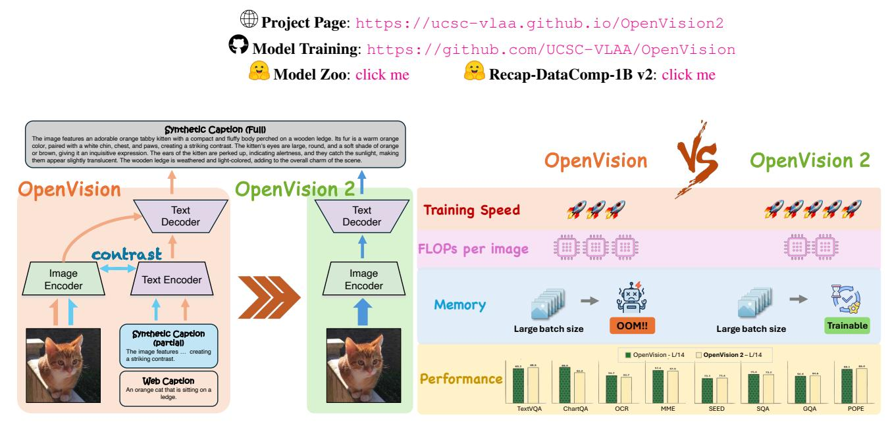

# **OpenVision 2** : A Family of *Generative Pretrained* Visual Encoders for Multimodal Learning

Yanqing Liu1 Xianhang Li1 Letian Zhang1 Zirui Wang2 Zeyu Zheng3 Yuyin Zhou1 Cihang Xie1 1University of California Santa Cruz 2Apple 3University of California Berkeley

Figure 1: Left panel: The changes made in OpenVision 2. Right Panel: The benefits brought by OpenVision 2.

## Abstract

*This paper provides a simplification on OpenVision's architecture and loss design for enhancing its training efficiency. Following the prior vision-language pretraining works CapPa and AIMv2, as well as modern multimodal designs like LLaVA, our changes are straightforward: we remove the text encoder—and therefore the contrastive loss retaining only the captioning loss as a purely generative training signal. We name this new version OpenVision 2. The initial results are promising: despite this simplification, OpenVision 2 competitively matches the original model's performance on a broad set of multimodal benchmarks while substantially cutting both training time and memory consumption. For example, with ViT-L/14, it saves the training time by* ∼ 1.5× *(*i.e*., from 83h to 57h), and memory usage by* ∼ 1.8× *(*i.e*., from 24.5GB to 13.8GB; or equivalently, allowing the maximum batch size to grow from 2k to 8k). This superior training efficiency also allows us to scale far beyond the largest vision encoder used in* *OpenVision, reaching more than 1 billion parameters. We hold a strong belief that this lightweight, generative-only paradigm is compelling for future vision encoder development in multimodal foundation models.*

## 1. Introduction

The visual module in multimodal foundation models has long been dependent on not-fully-open solutions, like OpenAI's CLIP [\[44\]](#page-8-0) or Google's SigLIP [\[62\]](#page-8-1). To mitigate this limitation, OpenVision [\[30\]](#page-7-0) provides a fully open alternative: by building exclusively on the public dataset and codebase, OpenVision offers a family of highly competitive vision encoders, ranging from 5.9M to 632.1M parameters, for building *truly open* multimodal foundation models.

Despite its openness, the original OpenVision recipe is considerably heavier than the vanilla CLIP pipeline. First, its contrastive pairs are doubled: every image is paired with two captions—one web-crawled and one synthetically generated—instead of a single caption. Second, a separate generative loss (hence an extra text decoder) is added that guides the model to predict the synthetic caption given the image and the web caption. Although these additional overheads are largely hidden by adopting CLIPA-style training [\[32\]](#page-7-1) (*i.e*., pretraining on low-resolution images followed by a short high-resolution fine-tune), trimming OpenVision's overall computational footprint remains crucial for broader access, especially for researchers with limited computational resources, as well as for further scaling in data size, training epochs, and model capacity.

In this paper, building on OpenVision, we investigate a far simpler, and much more efficient, training recipe. Specifically, following the prior vision-language pretraining works CapPa [\[53\]](#page-8-2) and AIMv2 [\[14\]](#page-7-2), and the modern multimodal designs like LLaVA [\[36\]](#page-8-3), we embrace a minimalist design principle:

#### *remove the text encoder entirely.*

Crucially, this change also eliminates the associated training signal from contrasting image–text pairs. As a result, the training framework now simply consists of just two parts an image encoder and a text decoder—and learns visual representations generatively through the caption loss alone, effectively collapsing the original multi-branch pipeline into a lightweight two-module architecture and markedly reducing computational overhead.

We name this new version OpenVision 2. Preliminary experiments reveal that its potential is significantly considerable. Across a suite of representative multimodal benchmarks, OpenVision 2 effectively mirrors the performance of the original OpenVision. For example, under the LLaVA-Next [\[35\]](#page-7-3) framework using a ViT-L/14 backbone, the two versions post nearly identical scores on tasks such as TextVQA [\[49\]](#page-8-4) (68.9 *vs*. 68.3), SQA [\[41\]](#page-8-5) (75.2 *vs*. 75.4), and SEED-Bench [\[26\]](#page-7-4) (73.4 *vs*. 73.3), with only minor differences on tasks like OCR [\[38\]](#page-8-6) (537 *vs*. 547). More notably, efficiency emerges as the key differentiator: On ViT-L, OpenVision 2 shortens pretraining time from 83 hours to 57 hours while cutting computational memory from 24.5 GB to 13.8 GB per device; these gains are even more substantial with the larger SoViT-400M backbone, where training time is reduced from 241 hours to 121 hours and memory requirement from 27.4 GB to 14.5 GB per device. Importantly, this enhanced training efficiency makes it feasible to scale the vision encoder beyond 1 billion parameters—a scale that was previously less practical under the original OpenVision setup. These findings altogether indicate that a caption-only generative objective can not only maintain advanced performance but also dramatically reduce computational cost and enable greater scalability.

We hope these findings prompt the community to *seriously* reconsider the long-held common belief that CLIPstyle contrastive learning is indispensable for building scalable, general-purpose vision encoders—a notion that prior studies such as CapPa and AIMv2 repeatedly argued for years. Specifically, in OpenVision 2, we demonstrate that a purely generative, caption-only objective can rival contrastive methods in multimodal performance while substantially lowering computation and memory requirements. To enable deeper and broad exploration, we release the *full training suite and pretrained checkpoints* of OpenVision 2. We invite researchers to build on this resource and further probe the potential of *generative pretraining of vision encoders* for multimodal learning.

## 2. Method

### 2.1. OpenVision: A Review of its Technical Details

OpenVision offers the research community a fully open suite to train advanced vision encoders for building multimodal foundation models. Specifically, compared to the vanilla CLIP setup, OpenVision incorporates three key changes drawn from recent literature:

- *Efficiency (CLIPA [\[32\]](#page-7-1))* Training a CLIP model from scratch is prohibitively expensive. CLIPA mitigates this cost by pre-training on low-resolution images and conducting only a brief fine-tuning stage at full resolution, yielding up to a 33× speed-up. OpenVision adopts this two-stage curriculum to accelerate training.
- *Data Quality (Recap [\[31\]](#page-7-5))* Web-crawled captions are often noisy and incomplete. Recap [\[31\]](#page-7-5) improves label quality by replacing them with model-generated captions. Concretely, a LLaMA-3-powered LLaVA model recaptions the entire DataComp-1B collection; this high-quality synthetic set serves as the training corpus for OpenVision.
- *Optimization (CLIP*S *[\[37\]](#page-8-7))* To better leverage synthetic captions, CLIPS introduces two additional objectives: (i) a *dual* contrastive loss that pairs each image with both web-crawled and generated captions, and (ii) a caption loss that asks the model to predict the synthetic caption given the image and its web caption. OpenVision integrates both losses to enhance training.

Combining these three ingredients enables OpenVision to train advanced, CLIP-style vision encoders entirely from public data with reasonable computational resources. As shown in [\[30\]](#page-7-0), the resulting models rival proprietary counterparts such as OpenAI's CLIP and Google's SigLIP in building multimodal foundation models.

### 2.2. OpenVision 2: What are the CHANGES?

Although the additional usage of high-quality synthetic caption enhances the overall multimodal performance, it also adds substantial computational overhead: (i) the text encoder must now process two captions per image for the dual contrastive objective, and (ii) an additional text decoder is required to autoregressively predict the synthetic caption. Together, these two components substantially increase FLOPs and GPU memory in training.

OpenVision 2 eliminates this computational bottleneck by discarding the text encoder—and, with it, the entire image–text contrastive loss. The training loop therefore simply collapses to two steps (left panel of Figure [1\)](#page-0-0):

- 1. An image is processed by the vision encoder, producing a sequence of visual tokens.
- 2. These tokens are passed directly to a text decoder, which predicts the paired synthetic caption.

Viewed through this lens, OpenVision 2 becomes a purely generative pretraining pipeline, closely mirroring the architecture used during downstream multimodal fine-tuning (*e.g*., LLaVA). This architectural alignment eliminates the objective mismatch between pretraining and downstream finetuning, potentially facilitating smoother knowledge transfer across stages.

On top of this, we introduce one additional efficiency tweak: during pretraining, roughly two-thirds of the visual tokens are randomly masked before they are fed to the text decoder. As confirmed in our empirical findings, the remaining one-third provides sufficient conditioning for caption generation while further reducing the text decoder's computational load.

Differences from CapPa [\[53\]](#page-8-2) OpenVision 2 embraces the caption-only philosophy pioneered by CapPa, yet diverges and improves in the following four aspects:

- 1. *Higher-quality captions.* CapPa is trained on short, often noisy web captions. We instead employ ReCap-DataComp-1B—a Llama-3-powered, fully recaptioned version of DataComp-1B—and *further refine it with an enhanced captioning strategy*[1](#page-2-0) . The resulting captions are longer, more grounded, and therefore better suited to generative supervision (which are empirically confirmed in Table [6\)](#page-5-0).
- 2. *Fusion simplification.* CapPa fuses modalities with cross-attention. We replace this with simple concatenation of visual tokens in the text decoder, following recent multimodal practice (*e.g*., as in LLaVA). We additionally drop a random subset of visual tokens during training, which both regularises the encoder and cuts decoding cost.

- 3. *Scale and evaluation scope.* Compared to CapPa, we further scale the vision encoder size up to 1.01 billion parameter trained on 12.8 B image–caption pairs. Moreover, rather than focusing on image classification and simple retrieval/QA, our vision encoders are evaluated on more advanced and complicated multimodal benchmarks like MME [\[15\]](#page-7-6) and ChartQA [\[42\]](#page-8-8).
- 4. *Decoding strategy.* While CapPa argues that using a mixture of extensive parallel prediction and light autoregressive prediction, we simply use its vanilla format, *i.e*., autoregressive prediction only, in pretraining.

Differences from AIMv2 [\[14\]](#page-7-2) The overall design of our OpenVision 2 is more closed to the more recent AIMv2, but still differs in the following ways:

- 1. *Training signal.* AIMv2 supervises the vision encoder with a multimodal autoregressive decoder that *simultaneously* (i) reconstructs image patches through pixellevel regression and (ii) generates text tokens, blending image-level and text-level objectives. OpenVision 2, in contrast, follows CapPa's caption-only philosophy: textual generation is the only learning signal, and no image-reconstruction loss is introduced.
- 2. *Token-masking scheme.* Compared to AIMv2, Open-Vision 2 randomly masks roughly two-thirds of the visual tokens before passing them to the text decoder. As confirmed in our empirical results, this design enhances both the training efficiency and the multimodal performance.
- 3. *Data composition.* AIMv2 is trained on a mix of human and synthetic captions (∼ 67% real, 33% synthetic). Our corpus is entirely synthetic and produced with the ReCap-DataComp-1B pipeline, yielding richer, more consistent descriptions that better align with a purely generative objective.
- 4. *Vision encoder architecture.* AIMv2 adopts a prefix-ViT [\[10\]](#page-7-7), where the attention mask allows prefix tokens to attend bidirectionally while the remaining tokens are modeled autoregressively. In contrast, Open-Vision 2 simply uses a vanilla ViT backbone without such modifications, keeping the encoder simple and efficient.

## 3. Results

### 3.1. Multimodal Benchmark Performance

Following OpenVision, we evaluate the effectiveness of OpenVision 2 on a range of multimodal downstream tasks, under both the LLaVA-1.5 [\[34\]](#page-7-8) and Open-LLaVA-Next [\[3\]](#page-6-0) frameworks. Specifically, we report results on commonly

1We enhance caption generation by conditioning this LLaMA-3 powered LLaVA on the original alt-text and applying weighted top-k sampling, which encourages more diverse yet grounded captions. We name this new dataset Recap-DataComp-1B v2.

Table 1: Comparison of OpenVision 2 with existing CLIP variants under the LLaVA-1.5 framework. OpenVision 2 consistently outperforms both prior CLIP baselines and OpenVision, with clear gains on OCR-related tasks.

| Method                | Vision Encoder | Params | # Res. | Text VQA | Chart QA | OCR. | MME      | $\mathbf{SEED}$ | SQA  | GQA  | POPE |
|-----------------------|----------------|--------|--------|----------|----------|------|----------|-----------------|------|------|------|
| OpenAI-CLIP [44]      | L/14           | 304M   | 224    | 56.1     | 13.2     | 177  | 1443/306 | 66.0            | 73.4 | 60.8 | 85.0 |
| LAION-2B-CLIP [19]    | L/14           | 304M   | 224    | 54.2     | 12.8     | 165  | 1434/298 | 65.5            | 76.0 | 59.0 | 84.5 |
| DataComp-1B-CLIP [16] | L/14           | 304M   | 224    | 53.0     | 12.3     | 131  | 1382/312 | 62.4            | 74.2 | 57.8 | 83.0 |
| DFN-2B-CLIP [12]      | L/14           | 304M   | 224    | 53.2     | 12.4     | 246  | 1447/306 | 65.6            | 76.3 | 59.1 | 85.0 |
| MetaCLIP-5B [59]      | L/14           | 304M   | 224    | 55.6     | 12.8     | 313  | 1552/315 | 67.4            | 78.0 | 61.3 | 85.4 |
| OpenVision [30]       | L/14           | 304M   | 224    | 57.7     | 13.9     | 315  | 1487/317 | 69.5            | 73.6 | 62.9 | 86.4 |
| OpenVision 2          | L/14           | 304M   | 224    | 59.0     | 13.7     | 327  | 1460/312 | 69.3            | 76.5 | 62.6 | 87.1 |
| OpenAI-CLIP [44]      | L/14           | 304M   | 336    | 59.1     | 13.8     | 201  | 1475/288 | 67.5            | 73.1 | 61.1 | 85.7 |
| OpenVision [30]       | L/14           | 304M   | 336    | 61.2     | 15.7     | 339  | 1525/315 | 70.5            | 75.1 | 63.7 | 87.2 |
| OpenVision 2          | L/14           | 304M   | 336    | 63.0     | 14.5     | 357  | 1486/321 | 70.1            | 77.5 | 63.0 | 87.7 |
| SigLIP [62]           | SoViT-400M/14  | 400M   | 384    | 62.6     | 14.5     | 338  | 1481/347 | 69.4            | 76.7 | 63.3 | 87.0 |
| OpenVision [30]       | SoViT-400M/14  | 400M   | 384    | 62.4     | 16.1     | 357  | 1493/320 | 70.4            | 72.4 | 63.8 | 88.0 |
| OpenVision 2          | SoViT-400M/14  | 400M   | 384    | 64.3     | 15.0     | 387  | 1472/310 | 70.7            | 74.9 | 63.5 | 87.5 |
| OpenVision 2          | H/14           | 632M   | 224    | 60.2     | 13.5     | 340  | 1470/305 | 69.3            | 75.4 | 62.5 | 87.2 |
| OpenVision 2          | H/14           | 632M   | 336    | 63.4     | 16.3     | 391  | 1470/311 | 70.6            | 76.4 | 63.1 | 88.4 |
| OpenVision 2          | H/14           | 632M   | 448    | 65.6     | 18.1     | 416  | 1499/331 | 70.6            | 75.6 | 63.1 | 88.7 |
| OpenVision 2          | g/14           | 1.01B  | 224    | 60.2     | 13.7     | 338  | 1469/290 | 69.3            | 75.0 | 62.6 | 86.9 |

Table 2: Comparison of OpenVision 2 with existing CLIP variants under the Open-LLaVA-Next framework. OpenVision 2 achieves competitive or better results across model scales, surpassing prior CLIP baselines and OpenVision.

| Method                | Vision Encoder | Params | # Res. | Text VQA | Chart QA | OCR. | MME      | SEED | SQA  | GQA  | POPE |
|-----------------------|----------------|--------|--------|----------|----------|------|----------|------|------|------|------|
| OpenAI-CLIP [44]      | L/14           | 304M   | 224    | 62.8     | 60.7     | 459  | 1600/334 | 70.6 | 75.0 | 62.8 | 86.9 |
| LAION-2B-CLIP [19]    | L/14           | 304M   | 224    | 59.4     | 50.8     | 396  | 1533/323 | 70.0 | 72.9 | 62.7 | 86.4 |
| DataComp-1B-CLIP [16] | L/14           | 304M   | 224    | 58.1     | 48.5     | 373  | 1524/348 | 70.2 | 75.6 | 62.3 | 86.2 |
| DFN-2B-CLIP [12]      | L/14           | 304M   | 224    | 57.0     | 42.7     | 303  | 1486/328 | 68.3 | 70.6 | 61.7 | 86.0 |
| MetaCLIP-5B [59]      | L/14           | 304M   | 224    | 63.0     | 62.9     | 493  | 1590/335 | 72.3 | 77.1 | 64.0 | 86.8 |
| OpenVision            | L/14           | 304M   | 224    | 65.7     | 61.5     | 503  | 1567/332 | 73.1 | 73.1 | 64.7 | 87.8 |
| OpenVision 2          | L/14           | 304M   | 224    | 66.1     | 60.4     | 501  | 1577/297 | 73.1 | 68.4 | 64.6 | 87.6 |
| OpenAI-CLIP [44]      | L/14           | 304M   | 336    | 69.4     | 70.0     | 535  | 1591/351 | 73.3 | 76.9 | 64.5 | 87.6 |
| OpenVision            | L/14           | 304M   | 336    | 68.3     | 68.0     | 547  | 1520/310 | 73.3 | 75.4 | 64.4 | 88.1 |
| OpenVision 2          | L/14           | 304M   | 336    | 68.9     | 62.3     | 537  | 1585/278 | 73.4 | 75.2 | 64.6 | 88.4 |
| SigLIP [62]           | SoViT-400M/14  | 400M   | 384    | 68.2     | 61.3     | 494  | 1539/325 | 72.9 | 74.7 | 62.9 | 86.8 |
| OpenVision            | SoViT-400M/14  | 400M   | 384    | 67.4     | 63.1     | 540  | 1500/353 | 72.2 | 73.5 | 63.4 | 87.8 |
| OpenVision 2          | SoViT-400M/14  | 400M   | 384    | 69.0     | 63.4     | 549  | 1521/319 | 72.2 | 72.7 | 63.1 | 87.7 |
| OpenVision 2          | H/14           | 632M   | 224    | 66.4     | 60.2     | 514  | 1597/314 | 73.3 | 76.2 | 64.7 | 88.4 |
| OpenVision 2          | H/14           | 632M   | 336    | 69.9     | 64.8     | 573  | 1572/337 | 73.8 | 74.5 | 64.4 | 87.8 |
| OpenVision 2          | H/14           | 632M   | 448    | 71.9     | 64.9     | 590  | 1542/324 | 74.1 | 75.6 | 64.4 | 88.8 |
| OpenVision 2          | g/14           | 1.01B  | 224    | 67.3     | 62.4     | 514  | 1558/323 | 73.4 | 74.4 | 64.7 | 88.0 |

used multimodal benchmarks, MME [15], GQA [18], ChartQA [42], POPE [33], TextVQA [49], OCR [38], SEED [26], and SQA [41]. The results are summarized in Table 1 and Table 2.

**LLaVA-1.5 results.** As shown in Table 1, OpenVision 2 achieves performance comparable to or better than Open-Vision models, while being significantly more efficient in terms of training time and memory (see Sec.  $3.2$ ). For instance, at the ViT-L/14 resolution-224 setting, OpenVision 2 matches or slightly exceeds OpenVision (59.0 vs. 57.7 on TextVQA, 13.7 vs. 13.9 on ChartQA, and 327 vs. 315 on OCR-Bench), despite reducing the training cost by  $\sim 1.5 \times$ . The same trend holds for larger scales (e.g., SoViT- $400M/14$ , H/14), where OpenVision 2 preserves the strong performance of OpenVision while offering markedly better efficiency. This demonstrates that our efficiency-oriented design does not compromise accuracy, even under more challenging benchmarks such as OCR-related tasks.

Open-LLaVA-Next results. A similar pattern is observed under the Open-LLaVA-Next framework (Table 2). Open-Vision 2 consistently delivers results on par with, or better than, the original OpenVision, while retaining its large efficiency advantage. For example, at the ViT-L/14 resolution-336 setting, OpenVision 2 achieves 68.9 on TextVQA, 537 on OCR-Bench, and 1585 on MME-Perception, closely matching or slightly improving upon OpenVision (68.3, 547, and 1520, respectively). When scaling to SoViT-400M/14 and H/14, OpenVision 2 further strengthens this trend, matching the strong baselines set by OpenVision and in some cases surpassing them (*e.g*., +19 on OCR-Bench over OpenVision with SoViT-400M/14, and new best results on TextVQA, OCR-Bench, and POPE with H/14- 448). These results confirm that efficiency improvements in OpenVision 2 come without sacrificing—and sometimes even enhancing—downstream performance.

Overall trends. These results demonstrate three key takeaways: (i) OpenVision 2 generalizes well across both multimodal frameworks, showing consistent improvements over previous CLIP models. (ii) The advantage is particularly strong on OCR-intensive benchmarks, validating the effectiveness of our synthetic captioning and token masking strategies for enhancing fine-grained text recognition. (iii) The improvements scale smoothly with both model size and input resolution, confirming that OpenVision 2 maintains efficiency and robustness under large-scale settings. (iv) Compared to the first version of OpenVision, our new design achieves these gains while substantially reducing training time and memory footprint (see Sec. [3.2\)](#page-4-0).

### 3.2. Training Efficiency and Scalability

A key advantage of OpenVision 2 lies in its superior training efficiency and scalability. All experiments are conducted on Google Cloud TPUs, with training time measured on v4-512 pods and memory usage on v4-64 pods. We report wall-clock training time, computational cost, and memory footprint across different model sizes in Table [3,](#page-5-1) Table [4,](#page-5-2) and Table [5.](#page-5-3)

Training time and FLOPs. Compared to the first version of OpenVision, our new design significantly reduces the training cost. For example, with ViT-L/14 at resolution 224, training time is reduced from 83h to 57h (∼ 1.5× faster), while the per-image FLOPs drop from 271.8 to 208.9 (∼ 1.3× lower). Similarly, with SoViT-400M/14 at resolution 384, training time drops from 241h to 121h (∼ 2× faster), with per-image FLOPs reduced from 1636.8 to 1017.7. Importantly, these efficiency gains are achieved while maintaining comparable or even stronger performance on multimodal benchmarks (see Sec. [3.1\)](#page-2-1).

Memory Analysis. OpenVision 2 also demonstrates substantial memory savings, enabling much larger batch sizes. As shown in Table [4,](#page-5-2) at the ViT-L/14 resolution-224 setting, the peak memory usage per TPU chip drops from 24.5GB to 13.8GB (∼ 1.8× lower) at batch size 2k. Equivalently, the maximum batch size increases from 2k to 8k, while still remaining within the 32GB memory limit of TPU v4 cores. A similar trend is observed for SoViT-400M/14 at resolution 384, where OpenVision 2 supports batch size 1k, whereas the previous version fails with out-of-memory (OOM).

Effect of CLIPA and token masking. To disentangle the contribution of each optimization, we further compare CapPa [\[53\]](#page-8-2) and our variants in Table [5.](#page-5-3) Both CLIPA optimization and token masking contribute to efficiency improvements individually, while their combination yields the best results. For instance, on ViT-L/14 at resolution 224, the training time reduces from 217h (CapPa baseline) to 190h with masked tokens only, to 67h with CLIPA optimization only, and further to 55h when both strategies are combined. This demonstrates that our design not only improves efficiency, but also scales synergistically when the two optimizations are applied together.

Summary. In summary, OpenVision 2 achieves significant reductions in training time, FLOPs, and memory footprint, enabling efficient scaling to high-resolution inputs and larger batch sizes. These efficiency gains further make it feasible to push vision encoders to the billion-parameter regime. Indeed, we successfully train a OpenVision 2 g/14 model with 1B parameters (see Table [1](#page-3-0) and Table [2\)](#page-3-1), which sets strong new baselines while maintaining costeffectiveness.

## 3.3. Ablation Studies

We conduct ablation studies to better understand the design choices of OpenVision 2. In particular, we focus on the effect of caption supervision and the masking ratio of image tokens. Results are summarized in Table [6](#page-5-0) and Table [7.](#page-5-4)

Effect of caption type. We first analyze the impact of different caption sources used for training. As shown in Table [6,](#page-5-0) models trained on raw alt-text perform the worst, reflecting the noisiness and inconsistency of web annotations. Replacing raw alt-text with synthetic captions generated by MLLMs leads to significant improvements. Both ReCap-DataComp-1B and its variant ReCap-DataComp-1B v2 substantially outperform raw alt-text, with gains of +5.1 on TextVQA and +53 on OCR-Bench. While ReCap-DataComp-1B achieves slightly higher scores on certain benchmarks, we adopt ReCap-DataComp-1B v2 as our default setting. This choice is motivated by two factors: (i) v2 shows stronger performance on OCR-related tasks, which are critical for multimodal benchmarks, and (ii) by conditioning on raw alt-text during caption generation, v2 provides additional diversity and latent knowledge that benefit tasks requiring broader reasoning (*e.g*., ScienceQA [\[41\]](#page-8-5)). These results highlight the effectiveness of large-scale synthetic captioning as a reliable supervisory signal for visionlanguage pretraining.

Effect of image token keep ratio. We further investigate the impact of masking strategy by varying the proportion of vision tokens retained as captioning conditions. Table [7](#page-5-4) shows that keeping all tokens (100%) does not yield the best results; instead, moderate masking ratios lead to stronger performance. In particular, retaining only 25–35% of tokens strikes the best balance, improving OCR-Bench and

| Model           | Backbone      | Resolution | v4-512 Hours | FLOPs / Image |
|-----------------|---------------|------------|--------------|---------------|
| OpenVision [30] | L/14          | 224        | 83           | 271.75        |
| OpenVision 2    | L/14          | 224        | 57           | 208.90        |
| OpenVision [30] | SoViT-400M/14 | 384        | 241          | 1636.75       |
| OpenVision 2    | SoViT-400M/14 | 384        | 121          | 1017.74       |

Table 3: Training efficiency of OpenVision variants on TPU v4-512. OpenVision 2 achieves faster training and lower computational cost across model sizes.

Table 4: Peak memory usage (GB, measured per TPU chip) of OpenVision variants on TPU v4-64 under increasing batch sizes. **OpenVision 2** supports larger batches with significantly lower memory footprint.

| Model                           | Resolution | Batch Size | Peak Memory (GB) |  |
|---------------------------------|------------|------------|------------------|--|
| OpenVision [30] (L/14)          | 224        | 2k         | 24.5             |  |
|                                 | 224        | 4k         | OOM              |  |
|                                 | 224        | 2k         | 13.8             |  |
| OpenVision 2 (L/14)             | 224        | 4k         | 22.1             |  |
|                                 | 224        | 8k         | 28.4             |  |
| OpenVision [30] (SoViT-400M/14) | 384        | 512        | 27.4             |  |
|                                 | 384        | 1k         | OOM              |  |
| OpenVision 2 (SoViT-400M/14)    | 384        | 512        | 14.5             |  |
|                                 | 384        | 1k         | 28.8             |  |

Table 5: Training efficiency comparison on ViT-L/14 @224, measured on TPU v4-64. We report wall-clock training time (hours) and indicate whether CLIPA optimization or masked-token strategy is applied.

| Method                       | CLIPA Opt. | Mask Token Opt.   Training Time (h) |     |
|------------------------------|------------|-------------------------------------|-----|
| CapPa [53] (baseline)        |            |                                     | 217 |
| OpenVision 2 (w/ Mask only)  |            |                                     | 190 |
| OpenVision 2 (w/ CLIPA only) |            |                                     | 67  |
| OpenVision 2 (w/ both)       |            |                                     | 55  |

Table 6: Ablation study of OpenVision 2 trained with different caption types. Alt-text: raw web alt-text; ReCap-DataComp-1B: synthetic captions generated by MLLM without conditioning on alt-text; ReCap-DataComp-1B v2: synthetic captions generated by MLLM with both image and alt-text as input.

| Caption Type         | Text VQA | Chart OA | OCR. | MME      | SEED | SOA  | $\mathbf{GOA}$ | POPE |
|----------------------|----------|----------|------|----------|------|------|----------------|------|
| Alt-text             | 51.8     | 12.3     | 238  | 1306/293 | 58.6 | 75.3 | 55.4           | 82.2 |
| ReCap-DataComp-1B    | 56.9     | 12.9     | 291  | 1426/293 | 67.9 | 74.5 | 61.9           | 86.5 |
| ReCap-DataComp-1B v2 | 56.5     | 13.1     | 303  | 1451/310 | 67.8 | 74.7 | 61.2           | 86.6 |

Table 7: Ablation study of OpenVision 2 with different image token keep ratios. A higher keep ratio retains more vision tokens as captioning conditions, while a lower keep ratio masks more tokens.

| <b>Keep Ratio</b> | Text VQA | Chart QA | OCR. | MME      | SEED | SQA  | GOA  | POPE |
|-------------------|----------|----------|------|----------|------|------|------|------|
| 100%              | 53.8     | 12.2     | 254  | 1409/350 | 65.9 | 73.9 | 60.3 | 84.7 |
| 90%               | 56.3     | 12.4     | 266  | 1461/335 | 67.6 | 74.8 | 61.1 | 85.4 |
| 75%               | 55.8     | 13.1     | 293  | 1438/283 | 68.6 | 73.9 | 61.7 | 86.3 |
| 50%               | 55.4     | 12.8     | 299  | 1429/313 | 68.5 | 73.8 | 61.6 | 86.5 |
| 35%               | 56.9     | 12.9     | 291  | 1426/293 | 67.9 | 74.5 | 61.9 | 86.5 |
| 25%               | 56.7     | 12.5     | 283  | 1430/297 | 67.8 | 76.3 | 61.4 | 86.3 |
| 10%               | 55.6     | 13.0     | 276  | 1412/301 | 66.1 | 75.0 | 61.2 | 85.4 |

TextVOA compared to both extremes ( $100\%$  or  $10\%$ ). This confirms token masking not only reduces training overhead, but also enhances local semantic representations by forcing the model to rely on fewer, more informative visual tokens.

## 4. Related Work

Vision-Language Pretraining. Since CLIP [44] and ALIGN [20], contrastive learning with noisy web alt-text has become the mainstream paradigm for vision–language pretraining. This trend was further reinforced by open datasets such as LAION-400M [\[48\]](#page-8-10). Follow-up works explored more efficient architectures and alignment strategies, including ALBEF [\[29\]](#page-7-15) with momentum distillation and cross-attention, ViLT [\[23\]](#page-7-16) that directly embeds image patches into a Transformer, and Pixel-BERT [\[17\]](#page-7-17) with pixel-level alignment. More recent efforts improved scalability and robustness through data filtering and training strategies, such as EVA-CLIP [\[50\]](#page-8-11), DataComp [\[16\]](#page-7-10) and DFN [\[13\]](#page-7-18). Recent data-centric approaches further improve supervision by refining or synthesizing captions, such as LaCLIP [\[11\]](#page-7-19), VeCLIP [\[24\]](#page-7-20), DreamLIP [\[63\]](#page-8-12), and Liu et al. [\[39\]](#page-8-13). Meanwhile, BLIP [\[28\]](#page-7-21) and BLIP-2 [\[27\]](#page-7-22) incorporated caption filtering and LLM connectors (Q-Former), while PaLI/PaLI-X [\[6,](#page-6-1) [5\]](#page-6-2) and Kosmos-2 [\[43\]](#page-8-14) emphasized multilingual scaling and grounding. OpenVision [\[30\]](#page-7-0) introduced the first fully open and cost-effective family of vision encoders, showing strong results under both LLaVA-1.5 and Open-LLaVA-Next. These advances established contrastive pretraining as a strong paradigm, but left open questions on generative supervision and efficiency at scale.

Generative Pretraining. Generative modeling has become a central paradigm for multimodal learning, inspired by autoregressive language models such as GPT [\[45,](#page-8-15) [46,](#page-8-16) [2\]](#page-6-3). On the vision side, iGPT [\[4\]](#page-6-4) treated pixels as tokens, while SimVLM [\[56\]](#page-8-17) introduced a prefix-LM objective for weakly supervised pretraining. More recent works integrate caption generation as supervision: CoCa [\[61\]](#page-8-18) combined contrastive and generative losses, Flamingo [\[1\]](#page-6-5) connected frozen image encoders with LLMs via cross-attention, and CapPa [\[53\]](#page-8-2) advocated caption-only pretraining. AIMv2 [\[14\]](#page-7-2) further employed multimodal autoregression with Prefix-ViT, while large-scale models such as Emu [\[51\]](#page-8-19), Chameleon [\[52\]](#page-8-20), Unified-IO 2 [\[40\]](#page-8-21), VILA-U [\[57\]](#page-8-22), and related extensions [\[9,](#page-7-23) [8\]](#page-7-24) unified generation across diverse modalities. These generative approaches demonstrate stronger synergy with language modeling, but often increase training cost. Our work follows this line, while simplifying the architecture and emphasizing efficiency.

Image Captioning. In addition to contrastive learning, captioning offers a complementary path for visual–language representation learning, serving both as a benchmark task and a source of pretraining signal. Early works, from encoder–decoder models [\[54,](#page-8-23) [60\]](#page-8-24) to regionlevel and weakly supervised approaches [\[22,](#page-7-25) [21,](#page-7-26) [25,](#page-7-27) [47,](#page-8-25) [7\]](#page-7-28), established the foundations of captioning. More recent models leverage web-scale caption generation within multimodal pretraining, such as GIT [\[55\]](#page-8-26), BLIP [\[28\]](#page-7-21), and Showo [\[58\]](#page-8-27). Recent studies show that captioners themselves can serve as scalable vision learners [\[53\]](#page-8-2), motivating captiononly pretraining as an alternative to contrastive objectives. Our work continues this trajectory by leveraging synthetic captions at scale, demonstrating their effectiveness as the sole supervisory signal.

## 5. Conclusion

This work introduces OpenVision 2, which provides a significant simplification to OpenVision by training solely with the caption loss. Corroborated with prior works, we, once again, challenge the prevailing belief that CLIP-style contrastive learning is indispensable for scalable, generalpurpose vision encoders; instead, we demonstrate that caption-only, generative pretraining is not only viable but often a preferable alternative. To catalyze further work, we release the full OpenVision 2 training code, pretrained checkpoints, and the ReCap-DataComp-1B v2 corpus. We invite the community to build on this resource and to explore the broader design space of generative pretraining paradigm to build vision encoder for multimodal foundation models.

## Acknowledgment

We would like to thank TPU Research Cloud (TRC) program and Google Cloud Research Credits program for supporting our computing needs.

## References

- [1] Jean-Baptiste Alayrac, Jeff Donahue, Pauline Luc, Antoine Miech, Iain Barr, Yana Hasson, Karel Lenc, Arthur Mensch, Katherine Millican, Malcolm Reynolds, et al. Flamingo: a visual language model for few-shot learning. *Advances in Neural Information Processing Systems*, 35:23716–23736, 2022. [7](#page-6-6)
- [2] Tom Brown, Benjamin Mann, Nick Ryder, Melanie Subbiah, Jared D Kaplan, Prafulla Dhariwal, Arvind Neelakantan, Pranav Shyam, Girish Sastry, Amanda Askell, et al. Language models are few-shot learners. *Advances in neural information processing systems*, 33:1877–1901, 2020. [7](#page-6-6)
- [3] Lin Chen and Long Xing. Open-llava-next: An opensource implementation of llava-next series for facilitating the large multi-modal model community. [https://github.](https://github.com/xiaoachen98/Open-LLaVA-NeXT) [com/xiaoachen98/Open-LLaVA-NeXT](https://github.com/xiaoachen98/Open-LLaVA-NeXT), 2024. [3](#page-2-2)
- [4] Mark Chen, Alec Radford, Rewon Child, Jeffrey Wu, Heewoo Jun, David Luan, and Ilya Sutskever. Generative pretraining from pixels. In *International conference on machine learning*, pages 1691–1703. PMLR, 2020. [7](#page-6-6)
- [5] Xi Chen, Josip Djolonga, Piotr Padlewski, Basil Mustafa, Soravit Changpinyo, Jialin Wu, Carlos Riquelme Ruiz, Sebastian Goodman, Xiao Wang, Yi Tay, et al. Pali-x: On scaling up a multilingual vision and language model. *arXiv preprint arXiv:2305.18565*, 2023. [7](#page-6-6)
- [6] Xi Chen, Xiao Wang, Soravit Changpinyo, Anthony J Piergiovanni, Piotr Padlewski, Daniel Salz, Sebastian Goodman, Adam Grycner, Basil Mustafa, Lucas Beyer, et al. Pali: A jointly-scaled multilingual language-image model. *arXiv preprint arXiv:2209.06794*, 2022. [7](#page-6-6)

- [7] Karan Desai and Justin Johnson. Virtex: Learning visual representations from textual annotations. In *CVPR*, 2021. [7](#page-6-6)
- [8] Xingjian Diao, Chunhui Zhang, Tingxuan Wu, Ming Cheng, Zhongyu Ouyang, Weiyi Wu, and Jiang Gui. Learning musical representations for music performance question answering. *arXiv preprint arXiv:2502.06710*, 2025. [7](#page-6-6)
- [9] Xingjian Diao, Chunhui Zhang, Weiyi Wu, Zhongyu Ouyang, Peijun Qing, Ming Cheng, Soroush Vosoughi, and Jiang Gui. Temporal working memory: Query-guided segment refinement for enhanced multimodal understanding. *arXiv preprint arXiv:2502.06020*, 2025. [7](#page-6-6)
- [10] Alaaeldin El-Nouby, Michal Klein, Shuangfei Zhai, Miguel Angel Bautista, Alexander Toshev, Vaishaal Shankar, Joshua M Susskind, and Armand Joulin. Scalable pretraining of large autoregressive image models. *arXiv preprint arXiv:2401.08541*, 2024. [3](#page-2-2)
- [11] Lijie Fan, Dilip Krishnan, Phillip Isola, Dina Katabi, and Yonglong Tian. Improving clip training with language rewrites. In *NeurIPS*, 2024. [7](#page-6-6)
- [12] Alex Fang, Albin Madappally Jose, Amit Jain, Ludwig Schmidt, Alexander Toshev, and Vaishaal Shankar. Data filtering networks. *arXiv preprint arXiv:2309.17425*, 2023. [4](#page-3-2)
- [13] Alex Fang, Albin Madappally Jose, Amit Jain, Ludwig Schmidt, Alexander Toshev, and Vaishaal Shankar. Data filtering networks. *arXiv preprint arXiv:2309.17425*, 2023. [7](#page-6-6)
- [14] Enrico Fini, Mustafa Shukor, Xiujun Li, Philipp Dufter, Michal Klein, David Haldimann, Sai Aitharaju, Victor Guilherme Turrisi da Costa, Louis Bethune, Zhe Gan, et al. Mul- ´ timodal autoregressive pre-training of large vision encoders. *arXiv preprint arXiv:2411.14402*, 2024. [2,](#page-1-0) [3,](#page-2-2) [7](#page-6-6)
- [15] Chaoyou Fu, Peixian Chen, Yunhang Shen, Yulei Qin, Mengdan Zhang, Xu Lin, Jinrui Yang, Xiawu Zheng, Ke Li, Xing Sun, et al. Mme: A comprehensive evaluation benchmark for multimodal large language models. *arXiv preprint arXiv:2306.13394*, 2023. [3,](#page-2-2) [4](#page-3-2)
- [16] Samir Yitzhak Gadre, Gabriel Ilharco, Alex Fang, Jonathan Hayase, Georgios Smyrnis, Thao Nguyen, Ryan Marten, Mitchell Wortsman, Dhruba Ghosh, Jieyu Zhang, et al. Datacomp: In search of the next generation of multimodal datasets. *arXiv preprint arXiv:2304.14108*, 2023. [4,](#page-3-2) [7](#page-6-6)
- [17] Zhicheng Huang, Zhaoyang Zeng, Bei Liu, Dongmei Fu, and Jianlong Fu. Pixel-bert: Aligning image pixels with text by deep multi-modal transformers. *arXiv preprint arXiv:2004.00849*, 2020. [7](#page-6-6)
- [18] Drew A Hudson and Christopher D Manning. Gqa: A new dataset for real-world visual reasoning and compositional question answering. *Conference on Computer Vision and Pattern Recognition (CVPR)*, 2019. [4](#page-3-2)
- [19] Gabriel Ilharco, Mitchell Wortsman, Ross Wightman, Cade Gordon, Nicholas Carlini, Rohan Taori, Achal Dave, Vaishaal Shankar, Hongseok Namkoong, John Miller, Hannaneh Hajishirzi, Ali Farhadi, and Ludwig Schmidt. Openclip. *github*, July 2021. [4](#page-3-2)
- [20] Chao Jia, Yinfei Yang, Ye Xia, Yi-Ting Chen, Zarana Parekh, Hieu Pham, Quoc Le, Yun-Hsuan Sung, Zhen Li, and Tom Duerig. Scaling up visual and vision-language representation learning with noisy text supervision. In *ICML*, 2021. [6](#page-5-5)
- [21] Armand Joulin, Laurens Van Der Maaten, Allan Jabri, and Nicolas Vasilache. Learning visual features from large

weakly supervised data. In *European conference on computer vision*, pages 67–84. Springer, 2016. [7](#page-6-6)

- [22] Andrej Karpathy and Li Fei-Fei. Deep visual-semantic alignments for generating image descriptions. In *Proceedings of the IEEE conference on computer vision and pattern recognition*, pages 3128–3137, 2015. [7](#page-6-6)
- [23] Wonjae Kim, Bokyung Son, and Ildoo Kim. Vilt: Visionand-language transformer without convolution or region supervision. In *International conference on machine learning*, pages 5583–5594. PMLR, 2021. [7](#page-6-6)
- [24] Zhengfeng Lai, Haotian Zhang, Bowen Zhang, Wentao Wu, Haoping Bai, Aleksei Timofeev, Xianzhi Du, Zhe Gan, Jiulong Shan, Chen-Nee Chuah, et al. Veclip: Improving clip training via visual-enriched captions. In *European Conference on Computer Vision*, pages 111–127. Springer, 2024. [7](#page-6-6)
- [25] Ang Li, Allan Jabri, Armand Joulin, and Laurens Van Der Maaten. Learning visual n-grams from web data. In *ICCV*, 2017. [7](#page-6-6)
- [26] Bohao Li, Rui Wang, Guangzhi Wang, Yuying Ge, Yixiao Ge, and Ying Shan. Seed-bench: Benchmarking multimodal llms with generative comprehension. *arXiv preprint arXiv:2307.16125*, 2023. [2,](#page-1-0) [4](#page-3-2)
- [27] Junnan Li, Dongxu Li, Silvio Savarese, and Steven Hoi. Blip-2: Bootstrapping language-image pre-training with frozen image encoders and large language models. In *ICML*, 2023. [7](#page-6-6)
- [28] Junnan Li, Dongxu Li, Caiming Xiong, and Steven Hoi. Blip: Bootstrapping language-image pre-training for unified vision-language understanding and generation. In *ICML*, 2022. [7](#page-6-6)
- [29] Junnan Li, Ramprasaath Selvaraju, Akhilesh Gotmare, Shafiq Joty, Caiming Xiong, and Steven Chu Hong Hoi. Align before fuse: Vision and language representation learning with momentum distillation. *Advances in neural information processing systems*, 34:9694–9705, 2021. [7](#page-6-6)
- [30] Xianhang Li, Yanqing Liu, Haoqin Tu, Hongru Zhu, and Cihang Xie. Openvision: A fully-open, cost-effective family of advanced vision encoders for multimodal learning. *arXiv preprint arXiv:2505.04601*, 2025. [1,](#page-0-1) [2,](#page-1-0) [4,](#page-3-2) [6,](#page-5-5) [7](#page-6-6)
- [31] Xianhang Li, Haoqin Tu, Mude Hui, Zeyu Wang, Bingchen Zhao, Junfei Xiao, Sucheng Ren, Jieru Mei, Qing Liu, Huangjie Zheng, et al. What if we recaption billions of web images with llama-3? *arXiv preprint arXiv:2406.08478*, 2024. [2](#page-1-0)
- [32] Xianhang Li, Zeyu Wang, and Cihang Xie. An inverse scaling law for clip training. In *NeurIPS*, 2023. [2](#page-1-0)
- [33] Yifan Li, Yifan Du, Kun Zhou, Jinpeng Wang, Wayne Xin Zhao, and Ji-Rong Wen. Evaluating object hallucination in large vision-language models. In *The 2023 Conference on Empirical Methods in Natural Language Processing*, 2023. [4](#page-3-2)
- [34] Haotian Liu, Chunyuan Li, Yuheng Li, and Yong Jae Lee. Improved baselines with visual instruction tuning. In *NeurIPS 2023 Workshop on Instruction Tuning and Instruction Following*, 2023. [3](#page-2-2)
- [35] Haotian Liu, Chunyuan Li, Yuheng Li, Bo Li, Yuanhan Zhang, Sheng Shen, and Yong Jae Lee. Llava-next: Improved reasoning, ocr, and world knowledge. *https://llava-*

*vl.github.io/blog/2024-01-30-llava-next/*, January 2024. [2](#page-1-0)

- [36] Haotian Liu, Chunyuan Li, Qingyang Wu, and Yong Jae Lee. Visual instruction tuning. *arXiv preprint arXiv:2304.08485*, 2023. [2](#page-1-0)
- [37] Yanqing Liu, Xianhang Li, Zeyu Wang, Bingchen Zhao, and Cihang Xie. Clips: An enhanced clip framework for learning with synthetic captions. *arXiv preprint arXiv:2411.16828*, 2024. [2](#page-1-0)
- [38] Yuliang Liu, Zhang Li, Mingxin Huang, Biao Yang, Wenwen Yu, Chunyuan Li, Xu-Cheng Yin, Cheng-Lin Liu, Lianwen Jin, and Xiang Bai. Ocrbench: on the hidden mystery of ocr in large multimodal models. *Science China Information Sciences*, 67(12), Dec. 2024. [2,](#page-1-0) [4](#page-3-2)
- [39] Yanqing Liu, Kai Wang, Wenqi Shao, Ping Luo, Yu Qiao, Mike Zheng Shou, Kaipeng Zhang, and Yang You. Mllmsaugmented visual-language representation learning. *arXiv preprint arXiv:2311.18765*, 2023. [7](#page-6-6)
- [40] Jiasen Lu, Christopher Clark, Sangho Lee, Zichen Zhang, Savya Khosla, Ryan Marten, Derek Hoiem, and Aniruddha Kembhavi. Unified-io 2: Scaling autoregressive multimodal models with vision language audio and action. In *Proceedings of the IEEE/CVF Conference on Computer Vision and Pattern Recognition*, pages 26439–26455, 2024. [7](#page-6-6)
- [41] Pan Lu, Swaroop Mishra, Tony Xia, Liang Qiu, Kai-Wei Chang, Song-Chun Zhu, Oyvind Tafjord, Peter Clark, and Ashwin Kalyan. Learn to explain: Multimodal reasoning via thought chains for science question answering. In *The 36th Conference on Neural Information Processing Systems (NeurIPS)*, 2022. [2,](#page-1-0) [4,](#page-3-2) [5](#page-4-1)
- [42] Ahmed Masry, Do Long, Jia Qing Tan, Shafiq Joty, and Enamul Hoque. ChartQA: A benchmark for question answering about charts with visual and logical reasoning. In *Findings of the Association for Computational Linguistics: ACL 2022*, pages 2263–2279, Dublin, Ireland, May 2022. Association for Computational Linguistics. [3,](#page-2-2) [4](#page-3-2)
- [43] Zhiliang Peng, Wenhui Wang, Li Dong, Yaru Hao, Shaohan Huang, Shuming Ma, and Furu Wei. Kosmos-2: Grounding multimodal large language models to the world. *arXiv preprint arXiv:2306.14824*, 2023. [7](#page-6-6)
- [44] Alec Radford, Jong Wook Kim, Chris Hallacy, Aditya Ramesh, Gabriel Goh, Sandhini Agarwal, Girish Sastry, Amanda Askell, Pamela Mishkin, Jack Clark, et al. Learning transferable visual models from natural language supervision. In *ICML*, 2021. [1,](#page-0-1) [4,](#page-3-2) [6](#page-5-5)
- [45] Alec Radford, Karthik Narasimhan, Tim Salimans, Ilya Sutskever, et al. Improving language understanding by generative pre-training. 2018. [7](#page-6-6)
- [46] Alec Radford, Jeffrey Wu, Rewon Child, David Luan, Dario Amodei, Ilya Sutskever, et al. Language models are unsupervised multitask learners. *OpenAI blog*, 1(8):9, 2019. [7](#page-6-6)
- [47] Mert Bulent Sariyildiz, Julien Perez, and Diane Larlus. Learning visual representations with caption annotations. In *European conference on computer vision*, pages 153–170. Springer, 2020. [7](#page-6-6)
- [48] Christoph Schuhmann, Richard Vencu, Romain Beaumont, Robert Kaczmarczyk, Clayton Mullis, Aarush Katta, Theo Coombes, Jenia Jitsev, and Aran Komatsuzaki. Laion-400m: Open dataset of clip-filtered 400 million image-text pairs. *arXiv preprint arXiv:2111.02114*, 2021. [7](#page-6-6)

- [49] Amanpreet Singh, Vivek Natarajan, Meet Shah, Yu Jiang, Xinlei Chen, Dhruv Batra, Devi Parikh, and Marcus Rohrbach. Towards vqa models that can read. In *Proceedings of the IEEE/CVF conference on computer vision and pattern recognition*, pages 8317–8326, 2019. [2,](#page-1-0) [4](#page-3-2)
- [50] Quan Sun, Yuxin Fang, Ledell Wu, Xinlong Wang, and Yue Cao. Eva-clip: Improved training techniques for clip at scale. *arXiv preprint arXiv:2303.15389*, 2023. [7](#page-6-6)
- [51] Quan Sun, Qiying Yu, Yufeng Cui, Fan Zhang, Xiaosong Zhang, Yueze Wang, Hongcheng Gao, Jingjing Liu, Tiejun Huang, and Xinlong Wang. Emu: Generative pretraining in multimodality. *arXiv preprint arXiv:2307.05222*, 2023. [7](#page-6-6)
- [52] Chameleon Team. Chameleon: Mixed-modal early-fusion foundation models. *arXiv preprint arXiv:2405.09818*, 2024. [7](#page-6-6)
- [53] Michael Tschannen, Manoj Kumar, Andreas Steiner, Xiaohua Zhai, Neil Houlsby, and Lucas Beyer. Image captioners are scalable vision learners too. In *NeurIPS*, 2024. [2,](#page-1-0) [3,](#page-2-2) [5,](#page-4-1) [6,](#page-5-5) [7](#page-6-6)
- [54] Oriol Vinyals, Alexander Toshev, Samy Bengio, and Dumitru Erhan. Show and tell: A neural image caption generator. In *Proceedings of the IEEE conference on computer vision and pattern recognition*, pages 3156–3164, 2015. [7](#page-6-6)
- [55] Jianfeng Wang, Zhengyuan Yang, Xiaowei Hu, Linjie Li, Kevin Lin, Zhe Gan, Zicheng Liu, Ce Liu, and Lijuan Wang. Git: A generative image-to-text transformer for vision and language. *arXiv preprint arXiv:2205.14100*, 2022. [7](#page-6-6)
- [56] Zirui Wang, Jiahui Yu, Adams Wei Yu, Zihang Dai, Yulia Tsvetkov, and Yuan Cao. Simvlm: Simple visual language model pretraining with weak supervision. In *ICLR*, 2022. [7](#page-6-6)
- [57] Yecheng Wu, Zhuoyang Zhang, Junyu Chen, Haotian Tang, Dacheng Li, Yunhao Fang, Ligeng Zhu, Enze Xie, Hongxu Yin, Li Yi, et al. Vila-u: a unified foundation model integrating visual understanding and generation. *arXiv preprint arXiv:2409.04429*, 2024. [7](#page-6-6)
- [58] Jinheng Xie, Weijia Mao, Zechen Bai, David Junhao Zhang, Weihao Wang, Kevin Qinghong Lin, Yuchao Gu, Zhijie Chen, Zhenheng Yang, and Mike Zheng Shou. Show-o: One single transformer to unify multimodal understanding and generation. *arXiv preprint arXiv:2408.12528*, 2024. [7](#page-6-6)
- [59] Hu Xu, Saining Xie, Xiaoqing Tan, Po-Yao Huang, Russell Howes, Vasu Sharma, Shang-Wen Li, Gargi Ghosh, Luke Zettlemoyer, and Christoph Feichtenhofer. Demystifying clip data. In *ICLR*, 2023. [4](#page-3-2)
- [60] Kelvin Xu, Jimmy Ba, Ryan Kiros, Kyunghyun Cho, Aaron Courville, Ruslan Salakhudinov, Rich Zemel, and Yoshua Bengio. Show, attend and tell: Neural image caption generation with visual attention. In *International conference on machine learning*, pages 2048–2057. PMLR, 2015. [7](#page-6-6)
- [61] Jiahui Yu, Zirui Wang, Vijay Vasudevan, Legg Yeung, Mojtaba Seyedhosseini, and Yonghui Wu. Coca: Contrastive captioners are image-text foundation models. *arXiv preprint arXiv:2205.01917*, 2022. [7](#page-6-6)
- [62] Xiaohua Zhai, Basil Mustafa, Alexander Kolesnikov, and Lucas Beyer. Sigmoid loss for language image pre-training. In *ICCV*, 2023. [1,](#page-0-1) [4](#page-3-2)
- [63] Kecheng Zheng, Yifei Zhang, Wei Wu, Fan Lu, Shuailei Ma, Xin Jin, Wei Chen, and Yujun Shen. Dreamlip: Languageimage pre-training with long captions. In *ECCV*, 2024. [7](#page-6-6)