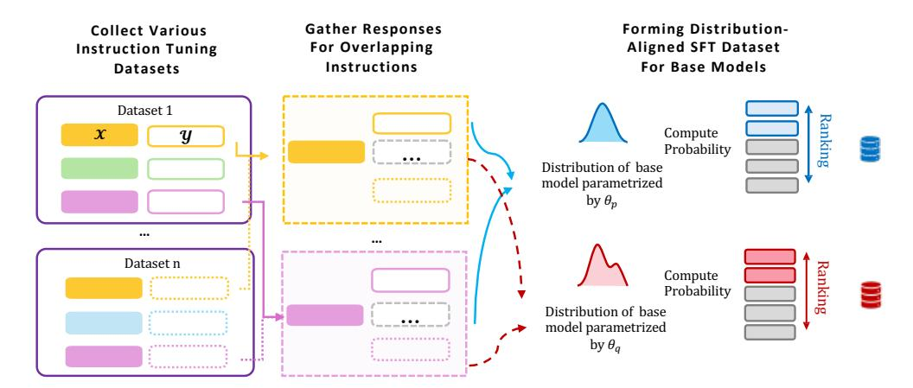
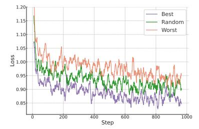
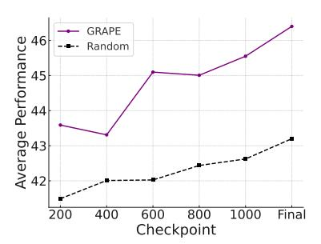

# The Best Instruction-Tuning Data are Those That Fit

Dylan Zhang 1 Qirun Dai 2 Hao Peng 1

# Abstract

High-quality supervised finetuning (SFT) data are crucial for eliciting strong capabilities from pretrained large language models (LLMs). Typically, instructions are paired with multiple responses sampled from other LLMs, which are often out of the distribution of the target model to be finetuned. This, at scale, can lead to diminishing returns and even hurt the models' performance and robustness. We propose GRAPE, a novel SFT framework that accounts for the unique characteristics of the target model. For each instruction, it gathers responses from various LLMs, and selects the one with the highest probability measured by the target model, indicating that it aligns most closely to the target model's pretrained distribution; it then proceeds with standard SFT training. We first evaluate GRAPE with a controlled experiment, where we sample various solutions for each question in UltraInteract from multiple models and finetune commonly used LMs like Llama3.1-8B, Mistral-7B and Qwen2.5-7B on GRAPE-selected data. GRAPE significantly outperforms strong baselines, including distilling from the strongest model with absolute gain up to 13.8% averaging across benchmarks, and training on 3× more data with maximum 17.3% performance improvements. GRAPE's strong performance generalizes to realistic settings. We experiment with the posttraining data used for Tulu3 and Olmo-2. GRAPE can outperform strong baselines with 4.5 times the data by 6.1% and state-of-the-art data selection approach by 3.9% on average performance. Remarkably, using 1/3 data and half number of epochs, GRAPE allows Llama3.1-8B to surpass the performance of Tulu3-SFT by 3.5%.

# 1. Introduction

High-quality, large-scale supervised data is crucial for supervised instruction finetuning (SFT; [Databricks,](#page-9-0) [2023;](#page-9-0) [Kopf](#page-12-0) ¨ [et al.,](#page-12-0) [2023;](#page-12-0) [Zhao et al.,](#page-16-0) [2024a;](#page-16-0) [Zheng et al.,](#page-17-0) [2024\)](#page-17-0). A common practice of data collection involves sampling responses from strong language models, predominantly focusing on expanding the size of the dataset and improving the overall quality of the responses [\(Sun et al.,](#page-15-0) [2023;](#page-15-0) [Taori](#page-15-1) [et al.,](#page-15-1) [2023;](#page-15-1) [Wang et al.,](#page-15-2) [2023;](#page-15-2) [Xu et al.,](#page-16-1) [2024c;](#page-16-1) [Chen et al.,](#page-8-0) [2024\)](#page-8-0). However, recent research suggests that there is more complex dynamics involved [\(Xu et al.,](#page-16-2) [2024d\)](#page-16-2). A plateau effect in synthetic data scaling, where performance either stagnates or even declines as the size of the synthetic data increases beyond a certain point, has been widely observed. This phenomenon arises due to issues such as diminishing diversity [\(Padmakumar & He,](#page-14-0) [2024;](#page-14-0) [Guo et al.,](#page-11-0) [2023\)](#page-11-0) and distortion in the data distribution [\(LeBrun et al.,](#page-13-0) [2021\)](#page-13-0), which ultimately undermine the base model's performance and robustness [\(Alemohammad et al.,](#page-8-1) [2024;](#page-8-1) [Gerstgrasser](#page-10-0) [et al.,](#page-10-0) [2024;](#page-10-0) [Shumailov et al.,](#page-15-3) [2023;](#page-15-3) [Dohmatob et al.,](#page-9-1) [2024;](#page-9-1) [Hataya et al.,](#page-12-1) [2023;](#page-12-1) [Mart´ınez et al.,](#page-14-1) [2023a;](#page-14-1)[b;](#page-14-2) [Bohacek &](#page-8-2) [Farid,](#page-8-2) [2023;](#page-8-2) [Briesch et al.,](#page-8-3) [2023\)](#page-8-3).

Thus, effective instruction tuning requires more than scaling up the data; it often needs "tailoring" the data to the unique characteristics of the target model. Existing works focus on enhancing the model's existing knowledge and capabilities [\(Du et al.,](#page-9-2) [2023\)](#page-9-2) and optimizing the curriculum progression for instruction tuning [\(Zhao et al.,](#page-17-1) [2024b;](#page-17-1) [Lee](#page-13-1) [et al.,](#page-13-1) [2024a;](#page-13-1) [Feng et al.,](#page-10-1) [2023;](#page-10-1) [Setlur et al.,](#page-15-4) [2024\)](#page-15-4). They typically prescribe questions for each model to learn solutions. However, it remains elusive which responses best suit a given base model for fine-tuning. Meanwhile, tailoring the responses to the model has been a crucial ingredient for the success of later phases of LLM development, particularly through on-policy preference learning [\(Tajwar et al.,](#page-15-5) [2024;](#page-15-5) [Zhang et al.,](#page-16-3) [2024c;](#page-16-3)[a;](#page-16-4) [Miao et al.,](#page-14-3) [2024;](#page-14-3) [Gulcehre et al.,](#page-11-1) [2023;](#page-11-1) [Azar et al.,](#page-8-4) [2023a;](#page-8-4) [Tang et al.,](#page-15-6) [2024a;](#page-15-6) [Zhuang et al.,](#page-17-2) [2023\)](#page-17-2), and on-policy/online reinforcement learning [\(Guo](#page-11-2) [et al.,](#page-11-2) [2024b;](#page-11-2) [Liu et al.,](#page-13-2) [2024d;](#page-13-2) [Zhou et al.,](#page-17-3) [2024c\)](#page-17-3).

Inspired by these insights, we hypothesize that SFT can similarly benefit from aligning data with the model, the core idea behind GRAPE. For each instruction, GRAPE gathers and selects response(s) from various sources that are closest to

1University of Illinois Urbana-Champaign 2 Fudan University. Correspondence to: Dylan Zhang <shizhuo2@illinois.edu>.

the target model's pretrained distribution. This is achieved by calculating the probability of each response using the target model and selects the one with the highest probability([§3\)](#page-2-0).After obtaining these in-distribution responses, one can proceed with standard SFT without any modification to the training. Unlike existing datasets that usually contains one-size-fits-all responses for each instruction without customization [\(Yu et al.,](#page-16-5) [2024;](#page-16-5) [Yuan et al.,](#page-16-6) [2024;](#page-16-6) [Lian et al.,](#page-13-3) [2023b;](#page-13-3) [Teknium,](#page-15-7) [2023\)](#page-15-7), GRAPE curates model-dependent SFT datasets that better matches the base model's distribution, better mitigating the risks associated with distribution shift like spurious correlations and catastrophic forgetting, while posing minimum overhead.

To GRAPE's advantage, many existing datasets share overlapping instructions but contain different high-quality responses, e.g., the instructions in Flan [\(Longpre et al.,](#page-14-4) [2023\)](#page-14-4), GSM-8K [\(Cobbe et al.,](#page-8-5) [2021\)](#page-8-5), MATH [\(Hendrycks et al.,](#page-12-2) [2021b\)](#page-12-2), and the post-training recipes that re-use SFT instructions for preference learning [\(Lambert et al.,](#page-12-3) [2024;](#page-12-3) [OLMo et al.,](#page-14-5) [2025\)](#page-14-5). Therefore, GRAPE can directly select, for each model, the best fit(s) among the off-the-shelf responses without producing new responses, which we do in the experiments(§ [5\)](#page-4-0).

We first validate our hypothesis through extensive controlled experiments on a reasoning dataset - UltraInteract-SFT [\(Yuan et al.,](#page-16-6) [2024\)](#page-16-6) and demonstrate the importance of supervising base models with in-distribution responses([§4\)](#page-2-1). We experimented on 4 popular pretrained LMs from Mistral [\(MistralAI,](#page-14-6) [2024c\)](#page-14-6), Llama3.1 [\(Dubey et al.,](#page-9-3) [2024\)](#page-9-3) and Qwen2.5 [\(Hui et al.,](#page-12-4) [2024\)](#page-12-4) families. Notably, models finetuned with GRAPE-selected responses outperform those trained on a 3× larger datasets up to 17.3% absolute gain on average performances, and responses from the strongest model under consideration - LLAMA3.1-405B-INSTRUCT by significant levels. We then experiment in realistic scenarios, collecting responses from post-training data for Tulu3 and Olmo-v2. We demonstrate the effectiveness of GRAPE by outperforming training on all these available data that is 4.5 times the size of data curated by GRAPE by up to 6.1%. Remarkably, GRAPE allows finetuning a Llama3.1-8B base model to exceed the performance of Tulu-8B-SFT using 1/3 data and half number of epochs.

Our results prove GRAPE as a simple but effective and scalable approach to improving supervised fine-tuning by aligning training distribution and that of the pre-trained checkpoint.

# 2. Background and Motivation

An analogy from Reinforcement Learning and Preference Learning The investigation of this work into the distribution match between the pre-trained LM and supervised fine-tuning (SFT) data is inspired by recent findings on policy optimization for LM alignment with RL [\(Ouyang](#page-14-7) [et al.,](#page-14-7) [2022\)](#page-14-7) and preference learning [\(Rafailov et al.,](#page-14-8) [2023;](#page-14-8) [Ethayarajh et al.,](#page-10-2) [2024\)](#page-10-2). While the importance of matching training data distribution with the policy has been well noted in both traditional RL [\(Shi et al.,](#page-15-8) [2023;](#page-15-8) [Fujimoto](#page-10-3) [et al.,](#page-10-3) [2018;](#page-10-3) [Kumar et al.,](#page-12-5) [2019;](#page-12-5) [Peng et al.,](#page-14-9) [2019;](#page-14-9) [Wang](#page-15-9) [et al.,](#page-15-9) [2021;](#page-15-9) [Arora & Goyal,](#page-8-6) [2023;](#page-8-6) [Jiang & Li,](#page-12-6) [2016;](#page-12-6) [Tang](#page-15-10) [& Abbeel,](#page-15-10) [2010\)](#page-15-10) and LM settings [\(Xiong et al.,](#page-16-7) [2024\)](#page-16-7), preference learning algorithms like DPO [\(Rafailov et al.,](#page-14-8) [2023\)](#page-14-8), IPO [\(Azar et al.,](#page-8-7) [2023b\)](#page-8-7) and KTO [\(Ethayarajh et al.,](#page-10-2) [2024\)](#page-10-2) first emerged as off-policy algorithms. However, subsequent research has highlighted the performance gap between onpolicy and off-policy training due to distribution shifts [\(Xu](#page-16-8) [et al.,](#page-16-8) [2024b;](#page-16-8) [Tang et al.,](#page-15-11) [2024b\)](#page-15-11) and proposed various mitigation strategies [\(Zhuang et al.,](#page-17-2) [2023;](#page-17-2) [Zhou et al.,](#page-17-3) [2024c;](#page-17-3) [Zhang et al.,](#page-16-4) [2024a;](#page-16-4) [Xiong et al.,](#page-16-7) [2024;](#page-16-7) [Guo et al.,](#page-11-2) [2024b\)](#page-11-2), showing that training models on data more closely aligned with their policy distribution can significantly improve performance, while failing to do so can yield sub-optimal policies or those that are harder to generalize.

Hypothesis: Supervised Fine-tuning Benefits From Data That Better Matches Base Distribution The base distribution of pre-trained language models—shaped by extensive training on vast and diverse datasets—is inherently robust and generalizable. Therefore, during supervised fine-tuning phase, the pre-trained distribution should be carefully preserved [\(Kumar et al.,](#page-12-7) [2022;](#page-12-7) [Cohen-Wang et al.,](#page-9-4) [2024;](#page-9-4) [He](#page-12-8) [et al.,](#page-12-8) [2023;](#page-12-8) [Yang et al.,](#page-16-9) [2024d;](#page-16-9) [Ding et al.,](#page-9-5) [2023\)](#page-9-5), to best retain the knowledge and capabilities that emerge during pre-training [\(Zhou et al.,](#page-17-4) [2023\)](#page-17-4). If the proximity between the pre-trained distribution and the fine-tuning data is not maintained, the limited number of training examples available during SFT, compared to the vast scale of pre-training data, can increase the risk of distribution distortion. This misalignment can lead to issues such as catastrophic forgetting [\(Aghajanyan et al.,](#page-8-8) [2020;](#page-8-8) [Yang et al.,](#page-16-9) [2024d\)](#page-16-9) and the emergence of spurious correlations [\(Feldman,](#page-10-4) [2021\)](#page-10-4).

The central premise of our work is that by using responses closely aligned to the pre-trained distribution, we can minimize distribution shift during SFT and therefore achieve better data efficiency and stronger performance.

#### From On-Policy Alignment To Distribution-Aligned SFT

We build on principles of on-policy alignment techniques with key distinctions tailored for SFT. Given that SFT reprsents a more primitive stage of post-training than preference learning, strictly sampling responses from the base model itself can introduce risks such as instability, bias reinforcement, knowledge stagnation, and overfitting [\(Herel](#page-12-9) [& Mikolov,](#page-12-9) [2024;](#page-12-9) [Mobahi et al.,](#page-14-10) [2020;](#page-14-10) [Allen-Zhu & Li,](#page-8-9) [2023\)](#page-8-9). To address this, we advocate for an approach that

stays in-distribution while delivering effective supervision to the base model. To this end, we propose to gather and select responses from various sources, and select one that is closest to the target model's pretrained distribution, which we name GRAPE.

# 3. Methodology

We introduce GRAPE, a surprisingly simple yet effective methodology to enhance supervised fine-tuning (SFT) by customizing the training data for the base model. The key idea is to find responses among a candidate pool for each instruction xi such that they align closely with the base model's pretrained distribution πθ0 .

As diagrammed in Figure [3,](#page-3-0) GRAPE consists of two main steps, followed by standard SFT:

- 1. Response Collection ([§3.1\)](#page-2-2) Collect a pool of highquality candidate responses either from existing datasets or sampling from multiple LLMs.
- 2. Customization ([§3.2\)](#page-2-3): For the target model to be finetuned πθ0 , find the response(s), for each instruction, that are closest to the pretrained distribution of πθ0 .

#### 3.1. Collecting Responses from Existing Resources

For instruction-tuning of language models, high-quality instructions are more difficult to collect than responses [\(Xu](#page-16-1) [et al.,](#page-16-1) [2024c;](#page-16-1) [Liu et al.,](#page-13-4) [2024a\)](#page-13-4). Therefore, it is a common practice to reuse existing instruction-tuning prompts while generating diverse responses using various methods tailored to specific requirements. For instance, instructions from Flan [\(Longpre et al.,](#page-14-4) [2023\)](#page-14-4), OpenOrca [\(Lian](#page-13-5) [et al.,](#page-13-5) [2023a\)](#page-13-5), ShareGPT [\(Team,](#page-15-12) [2023\)](#page-15-12), and the training splits of GSM-8K [\(Cobbe et al.,](#page-8-5) [2021\)](#page-8-5), MATH [\(Hendrycks](#page-12-2) [et al.,](#page-12-2) [2021b\)](#page-12-2), and CodeContests [\(Li et al.,](#page-13-6) [2022\)](#page-13-6) are frequently reused in datasets like Olmo [\(OLMo et al.,](#page-14-5) [2025\)](#page-14-5), Tulu [\(Lambert et al.,](#page-12-3) [2024\)](#page-12-3), OpenHermes [\(Teknium,](#page-15-7) [2023\)](#page-15-7), OpenOrca [\(Lian et al.,](#page-13-5) [2023a\)](#page-13-5), MetaMath [\(Yu et al.,](#page-16-5) [2024\)](#page-16-5), MathInstruct [\(Yue et al.,](#page-16-10) [2023\)](#page-16-10), UltraFeedback [\(Cui et al.,](#page-9-6) [2024\)](#page-9-6), and UltraInteract [\(Yuan et al.,](#page-16-6) [2024\)](#page-16-6), whether for SFT or preference learning. The solutions are generated using different models or follow varying styles depending on the specific needs. This naturally leads to a situation where a single instruction with multiple responses becomes a readily available resource. GRAPE therefore leverages these pre-existing response candidates to tailor training dataset that better aligns with the base model's distribution. When such resources are unavailable or insufficient, practitioners can generate new responses and apply GRAPE.

Responses for the i-th instruction are collected from various datasets to form Ri = {y j i : j = 1, . . . , J(i)}, where J (i) denotes the number of responses collected for the ith instruction.

### 3.2. Customize Dataset For Models

We then compute the conditional probability of each response πθ0 (y j i | xi). We rank the responses based on the conditional probability and take those with the highest probability for each instruction.

Notably, GRAPE's selection process requires only a forward pass through the candidates and does not require gradient computation. Its overhead is substantially lower than many model-based data selection algorithms [\(Xia et al.,](#page-15-13) [2024;](#page-15-13) [Yang et al.,](#page-16-11) [2024b;](#page-16-11) [Liu et al.,](#page-13-7) [2024b;](#page-13-7) [Zhao et al.,](#page-16-12) [2021;](#page-16-12) [Zhang et al.,](#page-16-13) [2024b;](#page-16-13) [Pan et al.,](#page-14-11) [2024\)](#page-14-11).

Additionally, it is important to distinguish GRAPE from the other preplexity-based data selection and curriculum planning methods [\(Wu et al.,](#page-15-14) [2024;](#page-15-14) [Li et al.,](#page-13-8) [2024b;](#page-13-8) [Liu et al.,](#page-13-9) [2024c\)](#page-13-9). Existing approaches focus on selecting instructions by using perplexity as a difficulty measure, which differs from GRAPE that uses probability to select for each instruction in a fixed instruction set, responses that better matches with the base model's distribution. Our experiments in [§5](#page-4-0) demonstrate that low-probability responses with fixed set of instructions are detrimental to performance, further emphasizing the fundamental difference in the two processes.

# 4. Preliminary Experiments

In this section, we seek to empirically verify the hypothesis in [§2.](#page-1-0) To evaluate it under a controlled set-up, we consider using instructions from UltraInteract-SFT, and constrain within chain-of-thought reasoning (predominantly for coding, logic and math.) scenario. This allows us to control confounding factors like style and format while ensuring manageable data quality control during data collection. The insights from this experiment will inform the later more realistic setting in [§5.](#page-4-0)

## 4.1. Experimental Setup

We detail our experiment settings below.

### 4.1.1. TRAINING DATA CURATION

In this controlled experiment, we focus on chain-of-thought reasoning [\(Wei et al.,](#page-15-15) [2022;](#page-15-15) [Wang et al.,](#page-15-16) [2024;](#page-15-16) [Luo et al.,](#page-14-12) [2024;](#page-14-12) [Cobbe et al.,](#page-8-5) [2021;](#page-8-5) [Li et al.,](#page-13-10) [2023;](#page-13-10) [Lightman et al.,](#page-13-11) [2023\)](#page-13-11). Different models may follow different reasoning paths to solve a problem, while their final solutions can be easily verified.

We use UltraInteract-SFT [\(Yuan et al.,](#page-16-6) [2024\)](#page-16-6), which contains approximately 80, 800 unique instructions covering

Figure 1. An overview of GRAPE takes multiple off-the-shelf existing datasets and optionally generates new responses, finds overlapping instructions with multiple different responses and selects responses that align with the base model's distribution. This dataset is then used for standard supervised fine-tuning.

Figure 2. The training loss curve of Llama3.1-8B on TULU-3-OLMO-2 combo. **Best** stands for training with highest-probability responses (GRAPE-selected); **Random** stands for randomly chosen responses for each instruction in the pool, **Worst** stands for lowest probability responses in the base model's distribution. Throughout training, **Best** has lower loss than **Random** than **Worst**.

coding, math (chain-of-thought and program-aided) and logic reasoning domains , where each instruction is paired with varying numbers of different responses to contain a total > 280,000 training examples. The responses in the dataset are strictly in step-wise format. For each instruction, we use GRAPE to select the top-ranking responses, ensuring that the number of responses matches the original UltraInteract-SFT dataset for fair comparisons.

Response Generation We collect responses from a diverse set of models of various sizes across model families, including MIXTRAL-7X7B-INSTRUCT (Jiang et al., 2024), CODESTRAL-22B (MistralAI, 2024a), MISTRAL-SMALL (MistralAI, 2024b), LLAMA-3.1-70B-INSTRUCT and LLAMA-3.1-405B-INSTRUCT (Dubey et al., 2024), and QWEN2.5-72B-CHAT (Yang et al., 2024a), resulting in approximately 10x additional responses per instruction. The responses are then filtered based on the answers to ensure their validity following Yuan et al. (2024).

Figure 3. The average performance curve of Llama3.1-8B on TULU-3-OLMO-2 combo. **Best** stands for training with highest-likelihood responses (GRAPE-selected); **Random** stands for randomly chosen responses for each instruction in the pool. The average is taken over all items on table 2 except AlpacaEval2.

#### 4.1.2. BASE MODELS

To demonstrate the generalizability of GRAPE, we evaluate its performance across multiple LLMs, including LLAMA-3.1-8B and LLAMA-3.2-3B from LLAMA-3 (Grattafiori et al., 2024) family, MISTRAL-7B (Jiang et al., 2023) and QWEN2.5-7B (Hui et al., 2024).

#### 4.1.3. EVALUATION

We evaluate the model on coding and math reasoning benchmarks. For coding tasks, we consider HumanEval (Chen et al., 2021), MBPP (Austin et al., 2021), LeetCode (Guo et al., 2024a); for math datasets, we consider MATH dataset (Hendrycks et al., 2021b), GSM-Plus (Li et al., 2024d) and TheoremQA (Chen et al., 2023b) dataset. HumanEval and MBPP are natural-language-to-code benchmarks testing language models' ability to produce functionally correct programs. LeetCode contains interviewlevel programming problems that are more challenging.

MATH contains high-school level math competition problems, whereas GSM-Plus is a more challenging variant of GSM-8k [\(Cobbe et al.,](#page-8-5) [2021\)](#page-8-5) and Theorem-QA contains complex math reasoning problems.

#### 4.1.4. BASELINES

We compare GRAPE with several baselines. Except for Upscaled Dataset which is 3× larger, the rest are controlled for the number of responses per-instruction to be the same as UltraInteract-SFT.

- Original dataset. Performing SFT over the original UltraInteract-SFT dataset as is. The original dataset also contains high-quality, verified responses.
  - We compare GRAPE to directly using a standard, wellcurated dataset. Responses from a powerful model are likely to represent an upper-bound quality of training data, and comparing against this baseline allows us to isolate whether further improvements stem from the strategic response selection performed by GRAPE.
- Responses from the strongest model under consideration. We use responses exclusively from the best model used to generate responses (in our case, LLAMA3.1-405B-INSTRUCT).
- Up-scaled Dataset. The comparison with a larger dataset assesses how well selection improves instruction tuning compared to training on a larger set of diverse correct responses. Each instruction is paired with three times of randomly selected responses from the pool.[1](#page-4-1)

We train all models for 1 epoch with a learning rate of 10−5 .

#### 4.2. Results and Analysis

Table [1](#page-5-0) summarizes the performance of GRAPE across benchmarks. Our approach consistently outperforms the various baselines across the board, including the original UltraInteract-SFT dataset. GRAPE-selected solutions can outperform those directly sampled from the strongest model under consideration (LLAMA3.1-405B-INSTRUCT) up to 13.8% absolute improvement. This implies that customization for base models should be prioritized over identifying the presumably highest-quality responses. This verifies our central premise that being in-distribution with each base model is an important ingredient for the responses we supervise the base models on, to boosting downstream performance. Furthermore, we demonstrate that merely adding more responses does not always lead to continuous improvement in model performance, which aligns with findings in

prior studies [\(Li et al.,](#page-13-13) [2024c;](#page-13-13) [Du et al.,](#page-9-2) [2023\)](#page-9-2). By properly aligning with models' base distributions, GRAPE outperforms those trained with 3x responses with at least 3.6% and up to 17.3% absolute improvement. These results reinforce the notion that scaling data without considering its alignment with the base model's initial distribution risks diminishing returns and, in some cases, even performance degradation.

# 5. GRAPE-Picking From Real-World SFT Datasets

In this section, we leverage the findings from the earlier experiments and demonstrate the effectiveness of GRAPE to customize training data for each base model by selecting from available datasets with overlapping instructions. Here, we do *not* generate any new responses for the instructions; it only selects from existing ones. We evaluate GRAPE on the fully open dataset used in post-training phases of TULU-3 [\(Lambert et al.,](#page-12-3) [2024\)](#page-12-3) and OLMO-2 [\(OLMo et al.,](#page-14-5) [2025\)](#page-14-5). The details are presented below.

### 5.1. Data Mixture Details

TULU-3 [\(Lambert et al.,](#page-12-3) [2024\)](#page-12-3) is a fully open-source collection of post-training recipes, including supervised finetuning and preference alignment data. OLMO-2 [\(OLMo](#page-14-5) [et al.,](#page-14-5) [2025\)](#page-14-5) is a fully open-source language model. Both TULU-3 and OLMO-2 use the same data mixture during the supervised fine-tuning stage, but different data mixtures and source models for generating preference data for different sizes of their models: Tulu-3-8B/70B and Olmo-2-7B/13B. To demonstrate the effectiveness of GRAPE, we collected the overlapping instructions from both models and gather their corresponding responses. From the preference data, we retained only the winning responses. We formed our candidate pool with those instructions with at least two distinct responses, resulting in a dataset of 350.4k unique instructions and about 1.03 million total instruction-response pairs for evaluation with GRAPE. We do *not* apply further processing of these data or any filtering on top of GRAPE.

#### 5.2. Evaluation

We evaluate on a set of commonly used benchmarks spanning over coding, math, knowledge and instructionfollowing. We evaluated on LeetCode [\(Guo et al.,](#page-11-3) [2024a\)](#page-11-3), MATH [\(Hendrycks et al.,](#page-12-2) [2021b\)](#page-12-2), BigBench-Hard(BBH) [\(Suzgun et al.,](#page-15-17) [2022\)](#page-15-17), MMLU [\(Hendrycks et al.,](#page-12-12) [2021a\)](#page-12-12), and AlpacaEval-V2 [\(Dubois et al.,](#page-10-6) [2024\)](#page-10-6). LeetCode, MATH, BBH and MMLU are evaluated the in the same way as in [\(Yuan et al.,](#page-16-6) [2024\)](#page-16-6), where we use zero-shot for MATH and MMLU, 3-shot example for BBH. We use the same AlpacaEval-v2 as in OpenInstruct.

1 For example, if UltraInteract contains 3 different responses for instruction x, we end up including 9 for this setting.

|             |               |      | LC   | MBPP | MATH |      | GSMPlus |      | TheoremQA |      |      | Abs. |
|-------------|---------------|------|------|------|------|------|---------|------|-----------|------|------|------|
| Model       | Data          | HE   |      |      | CoT  | PoT  | CoT     | PoT  | CoT       | PoT  | Avg. | ∆    |
| MISTRAL-7B  | Original-UI   | 46.3 | 15.6 | 50.1 | 21.6 | 32.6 | 45.9    | 45.3 | 16.8      | 20.1 | 32.7 | 3.6  |
|             | Llama3.1-405B | 44.5 | 12.2 | 46.9 | 24.5 | 33.8 | 48.0    | 50.0 | 17.5      | 16.8 | 32.7 | 3.6  |
|             | 3x Data       | 48.1 | 13.3 | 52.8 | 25.1 | 26.1 | 50.0    | 49.4 | 16.8      | 12.4 | 32.7 | 3.6  |
|             | Ours          | 52.4 | 15.6 | 53.4 | 28.9 | 34.6 | 50.5    | 52.8 | 17.8      | 20.6 | 36.3 | -    |
| LLAMA3.1-8B | Original-UI   | 54.3 | 11.1 | 58.9 | 29.7 | 31.0 | 53.7    | 51.6 | 20.0      | 20.8 | 36.8 | 4.7  |
|             | Llama3.1-405B | 56.7 | 15.0 | 60.0 | 34.8 | 38.1 | 51.4    | 55.4 | 16.6      | 21.0 | 38.8 | 2.7  |
|             | 3x Data       | 48.8 | 7.8  | 57.9 | 25.5 | 11.2 | 48.6    | 45.1 | 20.6      | 19.6 | 31.7 | 9.8  |
|             | Ours          | 57.3 | 19.4 | 63.8 | 34.8 | 39.2 | 56.6    | 56.1 | 22.5      | 23.9 | 41.5 | -    |
|             | Original-UI   | 32.9 | 3.9  | 41.6 | 12.8 | 16.1 | 30.8    | 19.5 | 14.6      | 10.5 | 20.3 | 3.8  |
|             | Llama3.1-405B | 31.7 | 5.0  | 43.3 | 6.6  | 6.6  | 30.8    | 20.6 | 15.1      | 10.8 | 18.9 | 5.1  |
| LLAMA3.2-3B | 3x Data       | 42.6 | 6.7  | 42.9 | 8.7  | 5.1  | 17.8    | 19.5 | 14.6      | 12.8 | 19.0 | 5.1  |
|             | Ours          | 42.6 | 13.3 | 44.6 | 16.4 | 17.6 | 34.9    | 20.6 | 15.1      | 11.4 | 24.1 | -    |
| QWEN2.5-7B  | Original-UI   | 67.0 | 41.2 | 60.0 | 51.0 | 38.3 | 64.1    | 59.5 | 14.6      | 10.5 | 45.1 | 11.6 |
|             | Llama3.1-405B | 71.3 | 45.0 | 62.0 | 31.5 | 35.1 | 40.1    | 36.4 | 33.3      | 31.2 | 42.9 | 13.8 |
|             | 3x Data       | 75.6 | 48.3 | 62.9 | 32.8 | 24.5 | 47.1    | 22.8 | 21.6      | 19.0 | 39.4 | 17.3 |
|             | Ours          | 77.4 | 48.9 | 70.7 | 56.4 | 45.3 | 67.7    | 66.3 | 37.4      | 40.1 | 56.7 | -    |

Table 1. Result of synthetic experiment on UltraInteract-SFT. The last column, Abs. ∆ is the absolute improvement of GRAPE over that row.

### 5.3. Baselines

- Responses From The Original SFT on The Subset. In this experiment, we keep the same set of instructions (350.4k) and pair each instruction with the response from the SFT mixture.
- Random Response Candidate From The Pool. Randomly pairing each instruction with a candidate response for that instruction, which may come from either the SFT mixture or a winning response in the preference-learning data.
- Lowest-Probability Response. Instead of taking the highest probability response to each instruction for the base model, we do the opposite on and take the lowest for each.
- Entire SFT Dataset. We train on the entire SFT data mixture of Tulu with 939k instances.
- All Available Responses For The Overlapping Instructions. In this setting, we train on the entire candidate pool for all overlapping instructions, resulting in 103.6k instances.
- S2L [\(Yang et al.,](#page-16-11) [2024b\)](#page-16-11). S2L is a state-of-the-art unsupervised data selection baseline designed to select balanced subsets from large datasets by leveraging training loss trajectories. It first trains a small reference model within the same model family and record loss trajectory for each training example, then applies K-means clustering on the loss trajectory and samples equally from each. We use LLAMA-3.2-1B as reference for LLAMA3.1-8B and QWEN2.5-0.5B for QWEN2.5-7B. For MISTRAL-V0.3-7B, we use itself as reference since no smaller models in the family are

available. For S2L, we select the same number of data from the same pool as GRAPE. Further details in Appendix [B.](#page-18-0)

• All data available for SFT mixture. We train with all the available responses from all these datasets that share prompts with the SFT mixture. Which gives approximately 1.58 million (4.5 times thesize of GRAPEcurated dataset). This is the union of the entire dataset and GRAPE's candidate pool.

### 5.4. Results

As shown in Table [2,](#page-6-0) models fine-tuned on responses selected by GRAPE outperforms the strong baselines we constructed, especially the one that trains over all available data by significant margins across the 3 models. Remarkably, Using roughly 1/6 training computation (Tulu3-8B-SFT was trained for 2 epochs on 3 times of data), our performance exceeds that of TULU3-8B-SFT. Also, GRAPE outperforms state-of-the-art data-selection approaches like S2L, despite its simplicity and efficiency, further highlighting its effectiveness in diverse real-world scenarios and strengthening its overall practicability for large-scale instruction tuning and robust generalization. Without the need to synthesize any new data, one can easily leverage established datasets sourced from the web to customize a dataset for each base model that yields better fine-tuning outcome.

These results feature GRAPE not only as an effective strategy to enhance performances, but a handy approach to improve fine-tuning efficiency.

| Model   | Data               | Num. Instances | Alpac | aEval2 | ВВН  | MMLU | MATH  | LeetCode | Avg. | Abs.     |
|---------|--------------------|----------------|-------|--------|------|------|-------|----------|------|----------|
| Model   | Data               | Num. instances | LC    | WR     | ррп  |      |       |          |      | $\Delta$ |
|         | Highest            | 350.4k         | 10.1  | 6.2    | 68.9 | 63.2 | 22.9  | 13.3     | 30.8 | 5.2      |
|         | Random             | 350.4k         | 12.8  | 10.8   | 68.6 | 63.1 | 27.9  | 13.3     | 32.8 | 3.2      |
|         | SFT-Only           | 350.4k         | 7.1   | 5.5    | 68.9 | 64.1 | 20.2  | 17.2     | 30.5 | 5.4      |
| LLAMA   | Tulu3-SFT          | 939k           | 12.4  | 8.0    | 67.9 | 65.9 | 31.5* | 7.8      | 32.4 | 3.5      |
| 3.1-8B  | All Responses      | 1.03M          | 12.9  | 11.4   | 68.7 | 62.8 | 32.1  | 17.2     | 34.2 | 1.8      |
|         | S2L                | 350.4k         | 8.5   | 7.6    | 68.6 | 63.1 | 26.5  | 16.1     | 31.7 | 4.2      |
|         | All Available Data | 1.58M          | 8.8   | 10.1   | 69.8 | 62.1 | 32.5  | 16.1     | 33.2 | 2.7      |
|         | GRAPE              | 350.4k         | 14.8  | 15.2   | 69.6 | 64.5 | 32.1  | 19.4     | 35.9 | -        |
|         | Highest            | 350.4k         | 7.0   | 5.5    | 58.8 | 56.1 | 15.1  | 10.6     | 25.5 | 6.4      |
|         | Random             | 350.4k         | 10.6  | 9.2    | 60.0 | 57.8 | 19.6  | 11.1     | 28.1 | 3.9      |
|         | SFT-Only           | 350.4k         | 7.1   | 5.3    | 53.9 | 57.0 | 14.4  | 12.0     | 24.9 | 7.0      |
| MISTRAL | Full-SFT-Data      | 939k           | 11.5  | 10.5   | 59.0 | 55.2 | 25.8  | 15.6     | 29.9 | 2.0      |
| -7B     | All Responses      | 1.03M          | 10.5  | 11.5   | 61.0 | 57.9 | 24.2  | 14.4     | 29.9 | 2.0      |
|         | S2L                | 350.4k         | 10.5  | 11.9   | 61.9 | 57.1 | 22.4  | 13.9     | 29.6 | 2.3      |
|         | All Available Data | 1.58M          | 8.0   | 7.0    | 55.3 | 53.7 | 25.4  | 12.3     | 26.9 | 5.0      |
|         | GRAPE              | 350.4k         | 13.6  | 13.9   | 62.3 | 59.2 | 24.2  | 18.3     | 31.9 | -        |
|         | Highest            | 350.4k         | 8.0   | 10.7   | 72.2 | 73.2 | 49.4  | 42.2     | 42.6 | 5.9      |
|         | Random             | 350.4k         | 16.1  | 14.9   | 73.3 | 73.1 | 56.0  | 43.3     | 46.1 | 2.4      |
|         | SFT-Only           | 350.4k         | 9.9   | 7.8    | 71.2 | 74.1 | 51.1  | 46.6     | 43.4 | 5.1      |
| QWEN2.5 | Full-SFT-Data      | 939k           | 9.5   | 7.1    | 71.4 | 73.1 | 47.0  | 48.3     | 42.7 | 5.8      |
| -7B     | All Responses      | 1.03M          | 16.0  | 14.5   | 71.4 | 72.1 | 51.7  | 43.3     | 44.8 | 3.7      |
|         | S2L                | 350.4k         | 13.4  | 14.9   | 72.7 | 73.1 | 53.4  | 40.6     | 44.7 | 3.9      |
|         | All Available Data | 1.58M          | 13.3  | 12.3   | 70.3 | 71.8 | 44.0  | 42.8     | 42.4 | 6.1      |
|         | GRAPE              | 350.4k         | 20.0  | 20.4   | 73.2 | 73.3 | 60.0  | 44.4     | 48.6 | -        |

Table 2. GRAPE on the Tulu-Olmo collection. For Llama3.1-8B base model, we included Tulu3-SFT model's results. The "\*"-marked number for MATH is obtained using 4-shot prompting. We train all the models (except that we took Tulu3-SFT numbers directly) for 1 epoch with a learning rate of  $10^{-5}$ .

| Item     | Metric | Data   | Llama 3.1-8B | Mistral -7B-v0.3 | Qwen 2.5-7B                                                   |
|----------|--------|--------|-----------------|---------------------|---------------------------------------------------------------|
|          |        | Subset | 8.6             | 5.9                 | 7.6                                                           |
|          | LC     | Random | 8.0             | 6.2                 | 9.0                                                           |
| Alpaca   |        | GRAPE  | 11.3            | 8.2                 | 10.8                                                          |
| -Eval2   |        | Subset | 6.2             | 3.9                 | 5.2                                                           |
|          | WR     | Random | 6.4             | 4.8                 | 7.2                                                           |
|          |        | GRAPE  | 9.4             | 7.5                 | 9.6                                                           |
| Truthful |        | Subset | 51.6            | 49.0                | 54.4                                                          |
| -QA      | MC2    | Random | 51.4            | 49.9                | 55.2                                                          |
|          |        | GRAPE  | 52.7            | 51.6                | 7.6 9.0 <b>10.8</b> 5.2 7.2 <b>9.6</b> 54.4 |

*Table 3.* Results on OpenHermes-2.5. The Subset row refers to training exclusively on the SFT responses over the subset.

### 5.5. Further Experiments

We extend our evaluation using OPENHERMES-2.5 (Teknium, 2023), a high-quality, open instruction-tuning dataset containing approximately 1 million distinct instructions. Following a similar strategy to the previous combo experiment, we source responses from additional datasets from Huang et al. (2024) and HuggingFace-H4 (2024). For preference-based datasets, we include only the winning responses, consistent with the methodology in the Tulu-Olmo experiment. This process results in 575K unique instructions and 1.34 million total instruction-response pairs. As shown in Table 3, GRAPE-selected data yields better performances too. The consistent improvement

across models reaffirm our earlier observations: GRAPE serves as an adaptive response selection mechanism that significantly enhances SFT performance that has wide applicability.

5.6. Discussion:GRAPE works if all responses are from the same LM

|    | GRAPE | QWEN2.5 -72B | LLAMA3.1 -405B | Gemma -it-9B |
|----|-------|-----------------|-------------------|-----------------|
| LC | 28.1  | 25.8            | 16.3              | 26.9            |
| WR | 33.1  | 24.3            | 17.0              | 20.2            |

Table 4. Alpaca-Eval2 Results On Magpie-Zoo (Xu et al., 2024d).

In Section 4, we demonstrated how GRAPE enables practitioners to refine model-generated responses for improved training outcomes. Beyond that, GRAPE can optimize responses from a single generator. Using the Magpie-Zoo instruction set (Xu et al., 2024d), we sample 10 responses per instruction from Qwen2.5-72B-Instruct, select in-distribution responses with GRAPE, to train a Mistral-v0.3-7B model. We also compare with training on top-3 reported datasets of Magpie-Zoo. As shown in Table 4, GRAPE-selected responses further boost the performance. Practically, batch sampling of responses cause little latency (Zhong et al., 2024; Zhou et al., 2024d). One therefore can sample batches of responses from a single strong model

and apply GRAPE on top of it to find the response closest to the base model's distribution efficiently.

### 5.7. Discussion: Is In-Distribution A Silver Bullet?

The success of GRAPE verifies our key hypothesis that matching SFT distribution to the base model benefits the performance. Yet, we argue that this cannot be pushed to the limit of SFT using data from the same distribution. By experimenting with training on solutions sampled from a trained version of the same base model, we notice a drastic performance drop from the original model as shown in Table [5.](#page-7-0) We explored this using the MATH [\(Hendrycks et al.,](#page-12-2)

| Model       | Data           | Avg.    |
|-------------|----------------|---------|
|             | Self-Distilled | 28.4(-) |
| MISTRAL-7B  | Original-UI    | 32.7    |
|             | Self-Distilled | 29.4(-) |
| LLAMA3.1-8B | Original-UI    | 36.8    |
|             | Self-Distilled | 15.1(-) |
| LLAMA3.2-3B | Original-UI    | 20.3    |

Table 5. Performance Degradation From Self-Distillation On UI.

[2021b\)](#page-12-2) dataset. A base model was fine-tuned using solutions from stronger models like LLAMA3.1-70B-INSTRUCT or GPT-3.5-Turbo-augmented MetaMathQA [\(Yu et al.,](#page-16-5) [2024\)](#page-16-5). This fine-tuned model then generated new solutions, which were used to further fine-tune another base model instance, simulating iterative on-policy tuning. As shown in Table [6,](#page-7-1)

| Dataset | Model   | Response Generator | N  | Acc.     |
|---------|---------|--------------------|----|----------|
| MATH    | MISTRAL | Llama3.1-70B       | 10 | 18.2     |
| MATH    | MISTRAL | FT-Mistral         | 10 | 15.9 (-) |
| MATH    | LLEMMA  | Llama3.1-70B       | 10 | 26.2     |
| MATH    | LLEMMA  | FT-Llemma          | 10 | 23.6 (-) |
| MATH    | MISTRAL | MM-AnsAug          | -  | 22.3     |
| MATH    | MISTRAL | FT-Mistral         | 10 | 20.6 (-) |
| MATH    | LLEMMA  | MM-AnsAug          | -  | 28.1     |
| MATH    | LLEMMA  | FT-Llemma          | 10 | 21.4 (-) |

Table 6. Effect of self-generation on MATH dataset. FT-MISTRAL refers to the model right above that row finetuned from either MM-AnsAug or Llama3.1-70B-Instruct produced solutions. N stands for the number of responses sampled.

performance declined when solutions were sampled from the fine-tuned model itself. This decline stems from reduced solution diversity, leading to distributional drift and poorer generalization.

These results validate our claim in [§2](#page-1-0) that robust fine-tuning requires more than alignment with the base model—it needs complementary strategies to maintain response diversity and quality.

# 6. Related Works

Data Engineering For Instruction Tuning Data is central to the success of effective instruction tuning, [\(Xu et al.,](#page-16-15) [2023;](#page-16-15) [Xia et al.,](#page-15-13) [2024;](#page-15-13) [Chan et al.,](#page-8-13) [2024\)](#page-8-13), featuring both automated data synthesis [\(Xu et al.,](#page-16-16) [2024a;](#page-16-16) [Zeng et al.,](#page-16-17) [2024;](#page-16-17) [Yu et al.,](#page-16-5) [2024;](#page-16-5) [Wei et al.,](#page-15-18) [2023\)](#page-15-18) and selection [\(Xia et al.,](#page-15-13) [2024;](#page-15-13) [Chen et al.,](#page-8-14) [2023a;](#page-8-14) [Parkar et al.,](#page-14-15) [2024;](#page-14-15) [Li et al.,](#page-13-14) [2024e\)](#page-13-14). Some selection approaches focus on high-quality data by leveraging LLMs [\(Chen et al.,](#page-8-14) [2023a;](#page-8-14) [Parkar et al.,](#page-14-15) [2024;](#page-14-15) [Li](#page-13-8) [et al.,](#page-13-8) [2024b\)](#page-13-8) or employing principled metrics [\(Kang et al.,](#page-12-15) [2024;](#page-12-15) [Mekala et al.,](#page-14-16) [2024;](#page-14-16) [Xia et al.,](#page-15-13) [2024\)](#page-15-13), while others, such as [Yang et al.](#page-16-18) [\(2024c\)](#page-16-18); [Das & Khetan](#page-9-7) [\(2023\)](#page-9-7), aim to identify diversity-optimized subsets for greater efficiency.

Another emerging trend is the customization of training data based on the characteristics of the base models. For instance, [Li et al.](#page-13-13) [\(2024c\)](#page-13-13); [Du et al.](#page-9-2) [\(2023\)](#page-9-2) leverage the base model itself to select a subset of instructions, while [Li et al.](#page-13-15) [\(2024a\)](#page-13-15) introduce a teacher model to guide the selection process. However, these approaches primarily focus on identifying a re-weighted subset of questions for training. In contrast, GRAPE has a different focus, where it aims to find a set of responses from the solution space that not only provide good coverage of the golden distribution but also align closely with the base model's policy.

On-Policy Methods For Language Model Alignment Recent advances in RLHF [\(Ouyang et al.,](#page-14-7) [2022\)](#page-14-7), RLAIF [\(Lee et al.,](#page-13-16) [2024b\)](#page-13-16) and preference learning [\(Rafailov](#page-14-8) [et al.,](#page-14-8) [2023\)](#page-14-8) research have identified the benefits of on-policy data for model alignment [\(Xu et al.,](#page-16-8) [2024b;](#page-16-8) [Tajwar et al.,](#page-15-5) [2024;](#page-15-5) [Zhang et al.,](#page-16-3) [2024c;](#page-16-3) [Guo et al.,](#page-11-2) [2024b;](#page-11-2) [Liu et al.,](#page-13-2) [2024d;](#page-13-2) [Zhang et al.,](#page-16-4) [2024a;](#page-16-4) [Miao et al.,](#page-14-3) [2024;](#page-14-3) [Gulcehre](#page-11-1) [et al.,](#page-11-1) [2023\)](#page-11-1). However, these works primarily emphasize the preference-tuning stage, where models are refined to generate samples from an already reasonable policy. In contrast, less attention is given to the supervised fine-tuning phase, which starts with base models that are not yet well-prepared to generate high-quality answers that align sufficiently with the desired policy for optimization.

# 7. Conclusion

We present GRAPE, a simple yet highly effective approach to improve supervised fine-tuning data building on our empirically-verified hypothesis that instruction tuning data shall better match the base model's distribution to optimize the training outcome. GRAPE is surprisingly simple and efficient, where it customizes response data to supervise each model by taking highest-probability instances. We demonstrated the effectiveness of GRAPE on multiple settings. Remarkably, GRAPE can outperform not only SOTA data selection baselines, but also Tulu3-SFT by using a 1/3 subset of its SFT instructions, and performs better than training on 4.5 times data it selects from. We show GRAPE as a highly scalable and simple approach can be adopted in multiple practical scenarios with minimal overhead.

# References

- Aghajanyan, A., Shrivastava, A., Gupta, A., Goyal, N., Zettlemoyer, L., and Gupta, S. Better fine-tuning by reducing representational collapse, 2020. URL [https:](https://arxiv.org/abs/2008.03156) [//arxiv.org/abs/2008.03156](https://arxiv.org/abs/2008.03156).
- Alemohammad, S., Casco-Rodriguez, J., Luzi, L., Humayun, A. I., Babaei, H., LeJeune, D., Siahkoohi, A., and Baraniuk, R. Self-consuming generative models go MAD. In *The Twelfth International Conference on Learning Representations*, 2024. URL [https://openreview.](https://openreview.net/forum?id=ShjMHfmPs0) [net/forum?id=ShjMHfmPs0](https://openreview.net/forum?id=ShjMHfmPs0).
- Allen-Zhu, Z. and Li, Y. Towards understanding ensemble, knowledge distillation and self-distillation in deep learning, 2023. URL [https://arxiv.org/abs/2012.](https://arxiv.org/abs/2012.09816) [09816](https://arxiv.org/abs/2012.09816).
- Ankner, Z., Blakeney, C., Sreenivasan, K., Marion, M., Leavitt, M. L., and Paul, M. Perplexed by perplexity: Perplexity-based data pruning with small reference models, 2024. URL [https://arxiv.org/abs/2405.](https://arxiv.org/abs/2405.20541) [20541](https://arxiv.org/abs/2405.20541).
- Arora, S. and Goyal, A. A theory for emergence of complex skills in language models. *arXiv preprint arXiv:2307.15936*, 2023.
- Austin, J., Odena, A., Nye, M., Bosma, M., Michalewski, H., Dohan, D., Jiang, E., Cai, C., Terry, M., Le, Q., and Sutton, C. Program synthesis with large language models, 2021.
- Azar, M. G., Rowland, M., Piot, B., Guo, D., Calandriello, D., Valko, M., and Munos, R. A general theoretical paradigm to understand learning from human preferences, 2023a. URL [https://arxiv.org/abs/](https://arxiv.org/abs/2310.12036) [2310.12036](https://arxiv.org/abs/2310.12036).
- Azar, M. G., Rowland, M., Piot, B., Guo, D., Calandriello, D., Valko, M., and Munos, R. A general theoretical paradigm to understand learning from human preferences, 2023b.
- Bhatt, G., Chen, Y., Das, A. M., Zhang, J., Truong, S. T., Mussmann, S., Zhu, Y., Bilmes, J., Du, S. S., Jamieson, K., Ash, J. T., and Nowak, R. D. An experimental design framework for label-efficient supervised finetuning of large language models, 2024a. URL [https://arxiv.](https://arxiv.org/abs/2401.06692) [org/abs/2401.06692](https://arxiv.org/abs/2401.06692).

- Bhatt, G., Chen, Y., Das, A. M., Zhang, J., Truong, S. T., Mussmann, S., Zhu, Y., Bilmes, J., Du, S. S., Jamieson, K., Ash, J. T., and Nowak, R. D. An experimental design framework for label-efficient supervised finetuning of large language models, 2024b. URL [https://arxiv.](https://arxiv.org/abs/2401.06692) [org/abs/2401.06692](https://arxiv.org/abs/2401.06692).
- Bohacek, M. and Farid, H. Nepotistically trained generativeai models collapse, 2023.
- Briesch, M., Sobania, D., and Rothlauf, F. Large language models suffer from their own output: An analysis of the self-consuming training loop, 2023.
- Chan, Y.-C., Pu, G., Shanker, A., Suresh, P., Jenks, P., Heyer, J., and Denton, S. Balancing cost and effectiveness of synthetic data generation strategies for llms, 2024. URL <https://arxiv.org/abs/2409.19759>.
- Chen, J., Qadri, R., Wen, Y., Jain, N., Kirchenbauer, J., Zhou, T., and Goldstein, T. Genqa: Generating millions of instructions from a handful of prompts. *arXiv preprint arXiv:2406.10323*, 2024.
- Chen, L., Li, S., Yan, J., Wang, H., Gunaratna, K., Yadav, V., Tang, Z., Srinivasan, V., Zhou, T., Huang, H., et al. Alpagasus: Training a better alpaca with fewer data. *arXiv preprint arXiv:2307.08701*, 2023a.
- Chen, M., Tworek, J., Jun, H., Yuan, Q., de Oliveira Pinto, H. P., Kaplan, J., Edwards, H., Burda, Y., Joseph, N., Brockman, G., Ray, A., Puri, R., Krueger, G., Petrov, M., Khlaaf, H., Sastry, G., Mishkin, P., Chan, B., Gray, S., Ryder, N., Pavlov, M., Power, A., Kaiser, L., Bavarian, M., Winter, C., Tillet, P., Such, F. P., Cummings, D., Plappert, M., Chantzis, F., Barnes, E., Herbert-Voss, A., Guss, W. H., Nichol, A., Paino, A., Tezak, N., Tang, J., Babuschkin, I., Balaji, S., Jain, S., Saunders, W., Hesse, C., Carr, A. N., Leike, J., Achiam, J., Misra, V., Morikawa, E., Radford, A., Knight, M., Brundage, M., Murati, M., Mayer, K., Welinder, P., McGrew, B., Amodei, D., McCandlish, S., Sutskever, I., and Zaremba, W. Evaluating large language models trained on code, 2021.
- Chen, W., Yin, M., Ku, M., Lu, P., Wan, Y., Ma, X., Xu, J., Wang, X., and Xia, T. Theoremqa: A theorem-driven question answering dataset, 2023b. URL [https://](https://arxiv.org/abs/2305.12524) [arxiv.org/abs/2305.12524](https://arxiv.org/abs/2305.12524).
- Cobbe, K., Kosaraju, V., Bavarian, M., Chen, M., Jun, H., Kaiser, L., Plappert, M., Tworek, J., Hilton, J., Nakano, R., Hesse, C., and Schulman, J. Training verifiers to solve math word problems, 2021. URL [https://arxiv.](https://arxiv.org/abs/2110.14168) [org/abs/2110.14168](https://arxiv.org/abs/2110.14168).

- Cohen-Wang, B., Vendrow, J., and Madry, A. Ask your distribution shift if pre-training is right for you, 2024. URL <https://arxiv.org/abs/2403.00194>.
- Cover, T. M. and Thomas, J. A. *Elements of Information Theory*. Wiley-Interscience, Hoboken, NJ, USA, 2nd edition, 2006. ISBN 978-0-471-24195- 9. URL [https://onlinelibrary.wiley.com/](https://onlinelibrary.wiley.com/doi/book/10.1002/047174882X) [doi/book/10.1002/047174882X](https://onlinelibrary.wiley.com/doi/book/10.1002/047174882X).
- Cui, G., Yuan, L., Ding, N., Yao, G., He, B., Zhu, W., Ni, Y., Xie, G., Xie, R., Lin, Y., Liu, Z., and Sun, M. Ultrafeedback: Boosting language models with scaled ai feedback, 2024. URL [https://arxiv.org/abs/](https://arxiv.org/abs/2310.01377) [2310.01377](https://arxiv.org/abs/2310.01377).
- Das, D. and Khetan, V. Deft: Data efficient fine-tuning for large language models via unsupervised core-set selection. *arXiv preprint arXiv:2310.16776*, 2023.
- Databricks. Databricks dolly-15k, 2023. URL [https://huggingface.co/datasets/](https://huggingface.co/datasets/databricks/databricks-dolly-15k) [databricks/databricks-dolly-15k](https://huggingface.co/datasets/databricks/databricks-dolly-15k).
- Ding, N., Qin, Y., Yang, G., Wei, F., Yang, Z., Su, Y., Hu, S., Chen, Y., Chan, C.-M., Chen, W., et al. Parameterefficient fine-tuning of large-scale pre-trained language models. *Nature Machine Intelligence*, 5(3):220–235, 2023.
- Dohmatob, E., Feng, Y., Subramonian, A., and Kempe, J. Strong model collapse, 2024. URL [https://arxiv.](https://arxiv.org/abs/2410.04840) [org/abs/2410.04840](https://arxiv.org/abs/2410.04840).
- Du, Q., Zong, C., and Zhang, J. Mods: Model-oriented data selection for instruction tuning, 2023. URL [https:](https://arxiv.org/abs/2311.15653) [//arxiv.org/abs/2311.15653](https://arxiv.org/abs/2311.15653).
- Dubey, A., Jauhri, A., Pandey, A., Kadian, A., Al-Dahle, A., Letman, A., Mathur, A., Schelten, A., Yang, A., Fan, A., Goyal, A., Hartshorn, A., Yang, A., Mitra, A., Sravankumar, A., Korenev, A., Hinsvark, A., Rao, A., Zhang, A., Rodriguez, A., Gregerson, A., Spataru, A., Roziere, B., Biron, B., Tang, B., Chern, B., Caucheteux, C., Nayak, C., Bi, C., Marra, C., McConnell, C., Keller, C., Touret, C., Wu, C., Wong, C., Ferrer, C. C., Nikolaidis, C., Allonsius, D., Song, D., Pintz, D., Livshits, D., Esiobu, D., Choudhary, D., Mahajan, D., Garcia-Olano, D., Perino, D., Hupkes, D., Lakomkin, E., AlBadawy, E., Lobanova, E., Dinan, E., Smith, E. M., Radenovic, F., Zhang, F., Synnaeve, G., Lee, G., Anderson, G. L., Nail, G., Mialon, G., Pang, G., Cucurell, G., Nguyen, H., Korevaar, H., Xu, H., Touvron, H., Zarov, I., Ibarra, I. A., Kloumann, I., Misra, I., Evtimov, I., Copet, J., Lee, J., Geffert, J., Vranes, J., Park, J., Mahadeokar, J., Shah, J., van der Linde, J., Billock, J., Hong, J., Lee, J., Fu, J., Chi, J., Huang, J., Liu, J., Wang, J., Yu, J., Bitton, J., Spisak, J., Park, J.,

Rocca, J., Johnstun, J., Saxe, J., Jia, J., Alwala, K. V., Upasani, K., Plawiak, K., Li, K., Heafield, K., Stone, K., El-Arini, K., Iyer, K., Malik, K., Chiu, K., Bhalla, K., Rantala-Yeary, L., van der Maaten, L., Chen, L., Tan, L., Jenkins, L., Martin, L., Madaan, L., Malo, L., Blecher, L., Landzaat, L., de Oliveira, L., Muzzi, M., Pasupuleti, M., Singh, M., Paluri, M., Kardas, M., Oldham, M., Rita, M., Pavlova, M., Kambadur, M., Lewis, M., Si, M., Singh, M. K., Hassan, M., Goyal, N., Torabi, N., Bashlykov, N., Bogoychev, N., Chatterji, N., Duchenne, O., C¸ elebi, O., Alrassy, P., Zhang, P., Li, P., Vasic, P., Weng, P., Bhargava, P., Dubal, P., Krishnan, P., Koura, P. S., Xu, P., He, Q., Dong, Q., Srinivasan, R., Ganapathy, R., Calderer, R., Cabral, R. S., Stojnic, R., Raileanu, R., Girdhar, R., Patel, R., Sauvestre, R., Polidoro, R., Sumbaly, R., Taylor, R., Silva, R., Hou, R., Wang, R., Hosseini, S., Chennabasappa, S., Singh, S., Bell, S., Kim, S. S., Edunov, S., Nie, S., Narang, S., Raparthy, S., Shen, S., Wan, S., Bhosale, S., Zhang, S., Vandenhende, S., Batra, S., Whitman, S., Sootla, S., Collot, S., Gururangan, S., Borodinsky, S., Herman, T., Fowler, T., Sheasha, T., Georgiou, T., Scialom, T., Speckbacher, T., Mihaylov, T., Xiao, T., Karn, U., Goswami, V., Gupta, V., Ramanathan, V., Kerkez, V., Gonguet, V., Do, V., Vogeti, V., Petrovic, V., Chu, W., Xiong, W., Fu, W., Meers, W., Martinet, X., Wang, X., Tan, X. E., Xie, X., Jia, X., Wang, X., Goldschlag, Y., Gaur, Y., Babaei, Y., Wen, Y., Song, Y., Zhang, Y., Li, Y., Mao, Y., Coudert, Z. D., Yan, Z., Chen, Z., Papakipos, Z., Singh, A., Grattafiori, A., Jain, A., Kelsey, A., Shajnfeld, A., Gangidi, A., Victoria, A., Goldstand, A., Menon, A., Sharma, A., Boesenberg, A., Vaughan, A., Baevski, A., Feinstein, A., Kallet, A., Sangani, A., Yunus, A., Lupu, A., Alvarado, A., Caples, A., Gu, A., Ho, A., Poulton, A., Ryan, A., Ramchandani, A., Franco, A., Saraf, A., Chowdhury, A., Gabriel, A., Bharambe, A., Eisenman, A., Yazdan, A., James, B., Maurer, B., Leonhardi, B., Huang, B., Loyd, B., Paola, B. D., Paranjape, B., Liu, B., Wu, B., Ni, B., Hancock, B., Wasti, B., Spence, B., Stojkovic, B., Gamido, B., Montalvo, B., Parker, C., Burton, C., Mejia, C., Wang, C., Kim, C., Zhou, C., Hu, C., Chu, C.-H., Cai, C., Tindal, C., Feichtenhofer, C., Civin, D., Beaty, D., Kreymer, D., Li, D., Wyatt, D., Adkins, D., Xu, D., Testuggine, D., David, D., Parikh, D., Liskovich, D., Foss, D., Wang, D., Le, D., Holland, D., Dowling, E., Jamil, E., Montgomery, E., Presani, E., Hahn, E., Wood, E., Brinkman, E., Arcaute, E., Dunbar, E., Smothers, E., Sun, F., Kreuk, F., Tian, F., Ozgenel, F., Caggioni, F., Guzman, ´ F., Kanayet, F., Seide, F., Florez, G. M., Schwarz, G., Badeer, G., Swee, G., Halpern, G., Thattai, G., Herman, G., Sizov, G., Guangyi, Zhang, Lakshminarayanan, G., Shojanazeri, H., Zou, H., Wang, H., Zha, H., Habeeb, H., Rudolph, H., Suk, H., Aspegren, H., Goldman, H., Damlaj, I., Molybog, I., Tufanov, I., Veliche, I.-E., Gat, I., Weissman, J., Geboski, J., Kohli, J., Asher, J., Gaya,

J.-B., Marcus, J., Tang, J., Chan, J., Zhen, J., Reizenstein, J., Teboul, J., Zhong, J., Jin, J., Yang, J., Cummings, J., Carvill, J., Shepard, J., McPhie, J., Torres, J., Ginsburg, J., Wang, J., Wu, K., U, K. H., Saxena, K., Prasad, K., Khandelwal, K., Zand, K., Matosich, K., Veeraraghavan, K., Michelena, K., Li, K., Huang, K., Chawla, K., Lakhotia, K., Huang, K., Chen, L., Garg, L., A, L., Silva, L., Bell, L., Zhang, L., Guo, L., Yu, L., Moshkovich, L., Wehrstedt, L., Khabsa, M., Avalani, M., Bhatt, M., Tsimpoukelli, M., Mankus, M., Hasson, M., Lennie, M., Reso, M., Groshev, M., Naumov, M., Lathi, M., Keneally, M., Seltzer, M. L., Valko, M., Restrepo, M., Patel, M., Vyatskov, M., Samvelyan, M., Clark, M., Macey, M., Wang, M., Hermoso, M. J., Metanat, M., Rastegari, M., Bansal, M., Santhanam, N., Parks, N., White, N., Bawa, N., Singhal, N., Egebo, N., Usunier, N., Laptev, N. P., Dong, N., Zhang, N., Cheng, N., Chernoguz, O., Hart, O., Salpekar, O., Kalinli, O., Kent, P., Parekh, P., Saab, P., Balaji, P., Rittner, P., Bontrager, P., Roux, P., Dollar, P., Zvyagina, P., Ratanchandani, P., Yuvraj, P., Liang, Q., Alao, R., Rodriguez, R., Ayub, R., Murthy, R., Nayani, R., Mitra, R., Li, R., Hogan, R., Battey, R., Wang, R., Maheswari, R., Howes, R., Rinott, R., Bondu, S. J., Datta, S., Chugh, S., Hunt, S., Dhillon, S., Sidorov, S., Pan, S., Verma, S., Yamamoto, S., Ramaswamy, S., Lindsay, S., Lindsay, S., Feng, S., Lin, S., Zha, S. C., Shankar, S., Zhang, S., Zhang, S., Wang, S., Agarwal, S., Sajuyigbe, S., Chintala, S., Max, S., Chen, S., Kehoe, S., Satterfield, S., Govindaprasad, S., Gupta, S., Cho, S., Virk, S., Subramanian, S., Choudhury, S., Goldman, S., Remez, T., Glaser, T., Best, T., Kohler, T., Robinson, T., Li, T., Zhang, T., Matthews, T., Chou, T., Shaked, T., Vontimitta, V., Ajayi, V., Montanez, V., Mohan, V., Kumar, V. S., Mangla, V., Albiero, V., Ionescu, V., Poenaru, V., Mihailescu, V. T., Ivanov, V., Li, W., Wang, W., Jiang, W., Bouaziz, W., Constable, W., Tang, X., Wang, X., Wu, X., Wang, X., Xia, X., Wu, X., Gao, X., Chen, Y., Hu, Y., Jia, Y., Qi, Y., Li, Y., Zhang, Y., Zhang, Y., Adi, Y., Nam, Y., Yu, Wang, Hao, Y., Qian, Y., He, Y., Rait, Z., DeVito, Z., Rosnbrick, Z., Wen, Z., Yang, Z., and Zhao, Z. The llama 3 herd of models, 2024. URL <https://arxiv.org/abs/2407.21783>.

Dubois, Y., Galambosi, B., Liang, P., and Hashimoto, T. B. Length-controlled alpacaeval: A simple way to debias automatic evaluators, 2024. URL [https://arxiv.](https://arxiv.org/abs/2404.04475) [org/abs/2404.04475](https://arxiv.org/abs/2404.04475).

Ethayarajh, K., Xu, W., Muennighoff, N., Jurafsky, D., and Kiela, D. Kto: Model alignment as prospect theoretic optimization, 2024.

Feldman, V. Does learning require memorization? a short tale about a long tail, 2021. URL [https://arxiv.](https://arxiv.org/abs/1906.05271) [org/abs/1906.05271](https://arxiv.org/abs/1906.05271).

Feng, T., Wang, Z., and Sun, J. Citing: Large language models create curriculum for instruction tuning, 2023. URL <https://arxiv.org/abs/2310.02527>.

Fujimoto, S., Meger, D., and Precup, D. Offpolicy deep reinforcement learning without exploration. In *International Conference on Machine Learning*, 2018. URL [https://api.semanticscholar.](https://api.semanticscholar.org/CorpusID:54457299) [org/CorpusID:54457299](https://api.semanticscholar.org/CorpusID:54457299).

Gerstgrasser, M., Schaeffer, R., Dey, A., Rafailov, R., Korbak, T., Sleight, H., Agrawal, R., Hughes, J., Pai, D. B., Gromov, A., Roberts, D., Yang, D., Donoho, D. L., and Koyejo, S. Is model collapse inevitable? breaking the curse of recursion by accumulating real and synthetic data. In *First Conference on Language Modeling*, 2024. URL [https://openreview.net/forum?](https://openreview.net/forum?id=5B2K4LRgmz) [id=5B2K4LRgmz](https://openreview.net/forum?id=5B2K4LRgmz).

Grattafiori, A., Dubey, A., Jauhri, A., Pandey, A., Kadian, A., Al-Dahle, A., Letman, A., Mathur, A., Schelten, A., Vaughan, A., Yang, A., Fan, A., Goyal, A., Hartshorn, A., Yang, A., Mitra, A., Sravankumar, A., Korenev, A., Hinsvark, A., Rao, A., Zhang, A., Rodriguez, A., Gregerson, A., Spataru, A., Roziere, B., Biron, B., Tang, B., Chern, B., Caucheteux, C., Nayak, C., Bi, C., Marra, C., McConnell, C., Keller, C., Touret, C., Wu, C., Wong, C., Ferrer, C. C., Nikolaidis, C., Allonsius, D., Song, D., Pintz, D., Livshits, D., Wyatt, D., Esiobu, D., Choudhary, D., Mahajan, D., Garcia-Olano, D., Perino, D., Hupkes, D., Lakomkin, E., AlBadawy, E., Lobanova, E., Dinan, E., Smith, E. M., Radenovic, F., Guzman, F., Zhang, F., ´ Synnaeve, G., Lee, G., Anderson, G. L., Thattai, G., Nail, G., Mialon, G., Pang, G., Cucurell, G., Nguyen, H., Korevaar, H., Xu, H., Touvron, H., Zarov, I., Ibarra, I. A., Kloumann, I., Misra, I., Evtimov, I., Zhang, J., Copet, J., Lee, J., Geffert, J., Vranes, J., Park, J., Mahadeokar, J., Shah, J., van der Linde, J., Billock, J., Hong, J., Lee, J., Fu, J., Chi, J., Huang, J., Liu, J., Wang, J., Yu, J., Bitton, J., Spisak, J., Park, J., Rocca, J., Johnstun, J., Saxe, J., Jia, J., Alwala, K. V., Prasad, K., Upasani, K., Plawiak, K., Li, K., Heafield, K., Stone, K., El-Arini, K., Iyer, K., Malik, K., Chiu, K., Bhalla, K., Lakhotia, K., Rantala-Yeary, L., van der Maaten, L., Chen, L., Tan, L., Jenkins, L., Martin, L., Madaan, L., Malo, L., Blecher, L., Landzaat, L., de Oliveira, L., Muzzi, M., Pasupuleti, M., Singh, M., Paluri, M., Kardas, M., Tsimpoukelli, M., Oldham, M., Rita, M., Pavlova, M., Kambadur, M., Lewis, M., Si, M., Singh, M. K., Hassan, M., Goyal, N., Torabi, N., Bashlykov, N., Bogoychev, N., Chatterji, N., Zhang, N., Duchenne, O., C¸ elebi, O., Alrassy, P., Zhang, P., Li, P., Vasic, P., Weng, P., Bhargava, P., Dubal, P., Krishnan, P., Koura, P. S., Xu, P., He, Q., Dong, Q., Srinivasan, R., Ganapathy, R., Calderer, R., Cabral, R. S., Stojnic, R., Raileanu, R., Maheswari, R., Girdhar, R., Patel, R.,

Sauvestre, R., Polidoro, R., Sumbaly, R., Taylor, R., Silva, R., Hou, R., Wang, R., Hosseini, S., Chennabasappa, S., Singh, S., Bell, S., Kim, S. S., Edunov, S., Nie, S., Narang, S., Raparthy, S., Shen, S., Wan, S., Bhosale, S., Zhang, S., Vandenhende, S., Batra, S., Whitman, S., Sootla, S., Collot, S., Gururangan, S., Borodinsky, S., Herman, T., Fowler, T., Sheasha, T., Georgiou, T., Scialom, T., Speckbacher, T., Mihaylov, T., Xiao, T., Karn, U., Goswami, V., Gupta, V., Ramanathan, V., Kerkez, V., Gonguet, V., Do, V., Vogeti, V., Albiero, V., Petrovic, V., Chu, W., Xiong, W., Fu, W., Meers, W., Martinet, X., Wang, X., Wang, X., Tan, X. E., Xia, X., Xie, X., Jia, X., Wang, X., Goldschlag, Y., Gaur, Y., Babaei, Y., Wen, Y., Song, Y., Zhang, Y., Li, Y., Mao, Y., Coudert, Z. D., Yan, Z., Chen, Z., Papakipos, Z., Singh, A., Srivastava, A., Jain, A., Kelsey, A., Shajnfeld, A., Gangidi, A., Victoria, A., Goldstand, A., Menon, A., Sharma, A., Boesenberg, A., Baevski, A., Feinstein, A., Kallet, A., Sangani, A., Teo, A., Yunus, A., Lupu, A., Alvarado, A., Caples, A., Gu, A., Ho, A., Poulton, A., Ryan, A., Ramchandani, A., Dong, A., Franco, A., Goyal, A., Saraf, A., Chowdhury, A., Gabriel, A., Bharambe, A., Eisenman, A., Yazdan, A., James, B., Maurer, B., Leonhardi, B., Huang, B., Loyd, B., Paola, B. D., Paranjape, B., Liu, B., Wu, B., Ni, B., Hancock, B., Wasti, B., Spence, B., Stojkovic, B., Gamido, B., Montalvo, B., Parker, C., Burton, C., Mejia, C., Liu, C., Wang, C., Kim, C., Zhou, C., Hu, C., Chu, C.-H., Cai, C., Tindal, C., Feichtenhofer, C., Gao, C., Civin, D., Beaty, D., Kreymer, D., Li, D., Adkins, D., Xu, D., Testuggine, D., David, D., Parikh, D., Liskovich, D., Foss, D., Wang, D., Le, D., Holland, D., Dowling, E., Jamil, E., Montgomery, E., Presani, E., Hahn, E., Wood, E., Le, E.-T., Brinkman, E., Arcaute, E., Dunbar, E., Smothers, E., Sun, F., Kreuk, F., Tian, F., Kokkinos, F., Ozgenel, F., Caggioni, F., Kanayet, F., Seide, F., Florez, G. M., Schwarz, G., Badeer, G., Swee, G., Halpern, G., Herman, G., Sizov, G., Guangyi, Zhang, Lakshminarayanan, G., Inan, H., Shojanazeri, H., Zou, H., Wang, H., Zha, H., Habeeb, H., Rudolph, H., Suk, H., Aspegren, H., Goldman, H., Zhan, H., Damlaj, I., Molybog, I., Tufanov, I., Leontiadis, I., Veliche, I.-E., Gat, I., Weissman, J., Geboski, J., Kohli, J., Lam, J., Asher, J., Gaya, J.-B., Marcus, J., Tang, J., Chan, J., Zhen, J., Reizenstein, J., Teboul, J., Zhong, J., Jin, J., Yang, J., Cummings, J., Carvill, J., Shepard, J., McPhie, J., Torres, J., Ginsburg, J., Wang, J., Wu, K., U, K. H., Saxena, K., Khandelwal, K., Zand, K., Matosich, K., Veeraraghavan, K., Michelena, K., Li, K., Jagadeesh, K., Huang, K., Chawla, K., Huang, K., Chen, L., Garg, L., A, L., Silva, L., Bell, L., Zhang, L., Guo, L., Yu, L., Moshkovich, L., Wehrstedt, L., Khabsa, M., Avalani, M., Bhatt, M., Mankus, M., Hasson, M., Lennie, M., Reso, M., Groshev, M., Naumov, M., Lathi, M., Keneally, M., Liu, M., Seltzer, M. L., Valko, M., Restrepo, M., Patel, M., Vyatskov, M., Samvelyan, M., Clark, M., Macey,

M., Wang, M., Hermoso, M. J., Metanat, M., Rastegari, M., Bansal, M., Santhanam, N., Parks, N., White, N., Bawa, N., Singhal, N., Egebo, N., Usunier, N., Mehta, N., Laptev, N. P., Dong, N., Cheng, N., Chernoguz, O., Hart, O., Salpekar, O., Kalinli, O., Kent, P., Parekh, P., Saab, P., Balaji, P., Rittner, P., Bontrager, P., Roux, P., Dollar, P., Zvyagina, P., Ratanchandani, P., Yuvraj, P., Liang, Q., Alao, R., Rodriguez, R., Ayub, R., Murthy, R., Nayani, R., Mitra, R., Parthasarathy, R., Li, R., Hogan, R., Battey, R., Wang, R., Howes, R., Rinott, R., Mehta, S., Siby, S., Bondu, S. J., Datta, S., Chugh, S., Hunt, S., Dhillon, S., Sidorov, S., Pan, S., Mahajan, S., Verma, S., Yamamoto, S., Ramaswamy, S., Lindsay, S., Lindsay, S., Feng, S., Lin, S., Zha, S. C., Patil, S., Shankar, S., Zhang, S., Zhang, S., Wang, S., Agarwal, S., Sajuyigbe, S., Chintala, S., Max, S., Chen, S., Kehoe, S., Satterfield, S., Govindaprasad, S., Gupta, S., Deng, S., Cho, S., Virk, S., Subramanian, S., Choudhury, S., Goldman, S., Remez, T., Glaser, T., Best, T., Koehler, T., Robinson, T., Li, T., Zhang, T., Matthews, T., Chou, T., Shaked, T., Vontimitta, V., Ajayi, V., Montanez, V., Mohan, V., Kumar, V. S., Mangla, V., Ionescu, V., Poenaru, V., Mihailescu, V. T., Ivanov, V., Li, W., Wang, W., Jiang, W., Bouaziz, W., Constable, W., Tang, X., Wu, X., Wang, X., Wu, X., Gao, X., Kleinman, Y., Chen, Y., Hu, Y., Jia, Y., Qi, Y., Li, Y., Zhang, Y., Zhang, Y., Adi, Y., Nam, Y., Yu, Wang, Zhao, Y., Hao, Y., Qian, Y., Li, Y., He, Y., Rait, Z., DeVito, Z., Rosnbrick, Z., Wen, Z., Yang, Z., Zhao, Z., and Ma, Z. The llama 3 herd of models, 2024. URL <https://arxiv.org/abs/2407.21783>.

Gulcehre, C., Paine, T. L., Srinivasan, S., Konyushkova, K., Weerts, L., Sharma, A., Siddhant, A., Ahern, A., Wang, M., Gu, C., Macherey, W., Doucet, A., Firat, O., and de Freitas, N. Reinforced self-training (rest) for language modeling, 2023. URL [https://arxiv.org/abs/](https://arxiv.org/abs/2308.08998) [2308.08998](https://arxiv.org/abs/2308.08998).

Guo, D., Zhu, Q., Yang, D., Xie, Z., Dong, K., Zhang, W., Chen, G., Bi, X., Wu, Y., Li, Y. K., Luo, F., Xiong, Y., and Liang, W. Deepseek-coder: When the large language model meets programming – the rise of code intelligence, 2024a.

Guo, S., Zhang, B., Liu, T., Liu, T., Khalman, M., Llinares, F., Rame, A., Mesnard, T., Zhao, Y., Piot, B., Ferret, J., and Blondel, M. Direct language model alignment from online ai feedback, 2024b. URL [https://arxiv.](https://arxiv.org/abs/2402.04792) [org/abs/2402.04792](https://arxiv.org/abs/2402.04792).

Guo, Y., Shang, G., Vazirgiannis, M., and Clavel, C. The curious decline of linguistic diversity: Training language models on synthetic text, 2023.

Hanawa, K., Yokoi, S., Hara, S., and Inui, K. Evaluation

- of similarity-based explanations, 2021. URL [https:](https://arxiv.org/abs/2006.04528) [//arxiv.org/abs/2006.04528](https://arxiv.org/abs/2006.04528).
- Hataya, R., Bao, H., and Arai, H. Will large-scale generative models corrupt future datasets? In *Proceedings of the IEEE/CVF International Conference on Computer Vision (ICCV)*, pp. 20555–20565, October 2023.
- He, G., Chen, J., and Zhu, J. Preserving pre-trained features helps calibrate fine-tuned language models. In *The Eleventh International Conference on Learning Representations*, 2023. URL [https://openreview.net/](https://openreview.net/forum?id=NI7StoWHJPT) [forum?id=NI7StoWHJPT](https://openreview.net/forum?id=NI7StoWHJPT).
- Hendrycks, D., Burns, C., Basart, S., Zou, A., Mazeika, M., Song, D., and Steinhardt, J. Measuring massive multitask language understanding, 2021a. URL [https:](https://arxiv.org/abs/2009.03300) [//arxiv.org/abs/2009.03300](https://arxiv.org/abs/2009.03300).
- Hendrycks, D., Burns, C., Kadavath, S., Arora, A., Basart, S., Tang, E., Song, D., and Steinhardt, J. Measuring mathematical problem solving with the math dataset, 2021b. URL <https://arxiv.org/abs/2103.03874>.
- Herel, D. and Mikolov, T. Collapse of self-trained language models, 2024. URL [https://arxiv.org/](https://arxiv.org/abs/2404.02305) [abs/2404.02305](https://arxiv.org/abs/2404.02305).
- Huang, S. C., Piqueres, A., Rasul, K., Schmid, P., Vila, D., and Tunstall, L. Open hermes preferences. [https://huggingface.co/datasets/](https://huggingface.co/datasets/argilla/OpenHermesPreferences) [argilla/OpenHermesPreferences](https://huggingface.co/datasets/argilla/OpenHermesPreferences), 2024.
- HuggingFace-H4. Openhermes-2.5-preferences-v0 deduped, 2024. URL [https://huggingface.co/](https://huggingface.co/datasets/HuggingFaceH4/OpenHermes-2.5-preferences-v0-deduped) [datasets/HuggingFaceH4/OpenHermes-2.](https://huggingface.co/datasets/HuggingFaceH4/OpenHermes-2.5-preferences-v0-deduped) [5-preferences-v0-deduped](https://huggingface.co/datasets/HuggingFaceH4/OpenHermes-2.5-preferences-v0-deduped).
- Hui, B., Yang, J., Cui, Z., Yang, J., Liu, D., Zhang, L., Liu, T., Zhang, J., Yu, B., Lu, K., Dang, K., Fan, Y., Zhang, Y., Yang, A., Men, R., Huang, F., Zheng, B., Miao, Y., Quan, S., Feng, Y., Ren, X., Ren, X., Zhou, J., and Lin, J. Qwen2.5-coder technical report, 2024. URL <https://arxiv.org/abs/2409.12186>.
- ichi Amari, S. *Information Geometry and Its Applications*, volume 194 of *Applied Mathematical Sciences*. Springer, Tokyo, Japan, 1st edition, 2016. ISBN 978-4-431-55977- 3. doi: 10.1007/978-4-431-55978-0. URL [https://](https://doi.org/10.1007/978-4-431-55978-0) [doi.org/10.1007/978-4-431-55978-0](https://doi.org/10.1007/978-4-431-55978-0).
- Jiang, A. Q., Sablayrolles, A., Mensch, A., Bamford, C., Chaplot, D. S., de las Casas, D., Bressand, F., Lengyel, G., Lample, G., Saulnier, L., Lavaud, L. R., Lachaux, M.- A., Stock, P., Scao, T. L., Lavril, T., Wang, T., Lacroix, T., and Sayed, W. E. Mistral 7b, 2023. URL [https:](https://arxiv.org/abs/2310.06825) [//arxiv.org/abs/2310.06825](https://arxiv.org/abs/2310.06825).

- Jiang, A. Q., Sablayrolles, A., Roux, A., Mensch, A., Savary, B., Bamford, C., Chaplot, D. S., de las Casas, D., Hanna, E. B., Bressand, F., Lengyel, G., Bour, G., Lample, G., Lavaud, L. R., Saulnier, L., Lachaux, M.-A., Stock, P., Subramanian, S., Yang, S., Antoniak, S., Scao, T. L., Gervet, T., Lavril, T., Wang, T., Lacroix, T., and Sayed, W. E. Mixtral of experts, 2024. URL [https://arxiv.](https://arxiv.org/abs/2401.04088) [org/abs/2401.04088](https://arxiv.org/abs/2401.04088).
- Jiang, N. and Li, L. Doubly robust off-policy value evaluation for reinforcement learning, 2016. URL [https:](https://arxiv.org/abs/1511.03722) [//arxiv.org/abs/1511.03722](https://arxiv.org/abs/1511.03722).
- Kang, F., Just, H. A., Sun, Y., Jahagirdar, H., Zhang, Y., Du, R., Sahu, A. K., and Jia, R. Get more for less: Principled data selection for warming up fine-tuning in llms. *arXiv preprint arXiv:2405.02774*, 2024.
- Kopf, A., Kilcher, Y., von R ¨ utte, D., Anagnostidis, S., ¨ Tam, Z. R., Stevens, K., Barhoum, A., Nguyen, D., Stanley, O., Nagyfi, R., ES, S., Suri, S., Glushkov, D., Dantuluri, A., Maguire, A., Schuhmann, C., Nguyen, H., and Mattick, A. Openassistant conversations - democratizing large language model alignment. In Oh, A., Naumann, T., Globerson, A., Saenko, K., Hardt, M., and Levine, S. (eds.), *Advances in Neural Information Processing Systems*, volume 36, pp. 47669–47681. Curran Associates, Inc., 2023. URL [https://proceedings.neurips.](https://proceedings.neurips.cc/paper_files/paper/2023/file/949f0f8f32267d297c2d4e3ee10a2e7e-Paper-Datasets_and_Benchmarks.pdf) [cc/paper\\_files/paper/2023/file/](https://proceedings.neurips.cc/paper_files/paper/2023/file/949f0f8f32267d297c2d4e3ee10a2e7e-Paper-Datasets_and_Benchmarks.pdf) [949f0f8f32267d297c2d4e3ee10a2e7e-Paper](https://proceedings.neurips.cc/paper_files/paper/2023/file/949f0f8f32267d297c2d4e3ee10a2e7e-Paper-Datasets_and_Benchmarks.pdf)-Datasets\_ [and\\_Benchmarks.pdf](https://proceedings.neurips.cc/paper_files/paper/2023/file/949f0f8f32267d297c2d4e3ee10a2e7e-Paper-Datasets_and_Benchmarks.pdf).
- Kumar, A., Fu, J., Soh, M., Tucker, G., and Levine, S. Stabilizing off-policy q-learning via bootstrapping error reduction. In Wallach, H., Larochelle, H., Beygelzimer, A., d'Alche-Buc, F., Fox, E., and ´ Garnett, R. (eds.), *Advances in Neural Information Processing Systems*, volume 32. Curran Associates, Inc., 2019. URL [https://proceedings.neurips.](https://proceedings.neurips.cc/paper_files/paper/2019/file/c2073ffa77b5357a498057413bb09d3a-Paper.pdf) [cc/paper\\_files/paper/2019/file/](https://proceedings.neurips.cc/paper_files/paper/2019/file/c2073ffa77b5357a498057413bb09d3a-Paper.pdf) [c2073ffa77b5357a498057413bb09d3a-Paper](https://proceedings.neurips.cc/paper_files/paper/2019/file/c2073ffa77b5357a498057413bb09d3a-Paper.pdf). [pdf](https://proceedings.neurips.cc/paper_files/paper/2019/file/c2073ffa77b5357a498057413bb09d3a-Paper.pdf).
- Kumar, A., Raghunathan, A., Jones, R., Ma, T., and Liang, P. Fine-tuning can distort pretrained features and underperform out-of-distribution, 2022. URL [https:](https://arxiv.org/abs/2202.10054) [//arxiv.org/abs/2202.10054](https://arxiv.org/abs/2202.10054).
- Lambert, N., Morrison, J., Pyatkin, V., Huang, S., Ivison, H., Brahman, F., Miranda, L. J. V., Liu, A., Dziri, N., Lyu, S., Gu, Y., Malik, S., Graf, V., Hwang, J. D., Yang, J., Bras, R. L., Tafjord, O., Wilhelm, C., Soldaini, L., Smith, N. A., Wang, Y., Dasigi, P., and Hajishirzi, H. Tulu 3: Pushing frontiers in open language model post-training, 2024. URL <https://arxiv.org/abs/2411.15124>.

- LeBrun, B., Sordoni, A., and O'Donnell, T. J. Evaluating distributional distortion in neural language modeling. In *International Conference on Learning Representations*, 2021.
- Lee, B. W., Cho, H., and Yoo, K. M. Instruction tuning with human curriculum, 2024a. URL [https://](https://arxiv.org/abs/2310.09518) [arxiv.org/abs/2310.09518](https://arxiv.org/abs/2310.09518).
- Lee, H., Phatale, S., Mansoor, H., Lu, K. R., Mesnard, T., Ferret, J., Bishop, C., Hall, E., Carbune, V., and Rastogi, A. RLAIF: Scaling reinforcement learning from human feedback with AI feedback, 2024b. URL [https://](https://openreview.net/forum?id=AAxIs3D2ZZ) [openreview.net/forum?id=AAxIs3D2ZZ](https://openreview.net/forum?id=AAxIs3D2ZZ).
- Li, M., Chen, L., Chen, J., He, S., Gu, J., and Zhou, T. Selective reflection-tuning: Student-selected data recycling for LLM instruction-tuning. In Ku, L.-W., Martins, A., and Srikumar, V. (eds.), *Findings of the Association for Computational Linguistics: ACL 2024*, pp. 16189– 16211, Bangkok, Thailand, August 2024a. Association for Computational Linguistics. doi: 10.18653/v1/2024. findings-acl.958. URL [https://aclanthology.](https://aclanthology.org/2024.findings-acl.958) [org/2024.findings-acl.958](https://aclanthology.org/2024.findings-acl.958).
- Li, M., Zhang, Y., He, S., Li, Z., Zhao, H., Wang, J., Cheng, N., and Zhou, T. Superfiltering: Weak-to-strong data filtering for fast instruction-tuning, 2024b. URL [https:](https://arxiv.org/abs/2402.00530) [//arxiv.org/abs/2402.00530](https://arxiv.org/abs/2402.00530).
- Li, M., Zhang, Y., Li, Z., Chen, J., Chen, L., Cheng, N., Wang, J., Zhou, T., and Xiao, J. From quantity to quality: Boosting LLM performance with self-guided data selection for instruction tuning. In Duh, K., Gomez, H., and Bethard, S. (eds.), *Proceedings of the 2024 Conference of the North American Chapter of the Association for Computational Linguistics: Human Language Technologies (Volume 1: Long Papers)*, pp. 7602–7635, Mexico City, Mexico, June 2024c. Association for Computational Linguistics. doi: 10.18653/v1/2024.naacl-long. 421. URL [https://aclanthology.org/2024.](https://aclanthology.org/2024.naacl-long.421) [naacl-long.421](https://aclanthology.org/2024.naacl-long.421).
- Li, Q., Cui, L., Zhao, X., Kong, L., and Bi, W. Gsm-plus: A comprehensive benchmark for evaluating the robustness of llms as mathematical problem solvers, 2024d. URL <https://arxiv.org/abs/2402.19255>.
- Li, Y., Choi, D., Chung, J., Kushman, N., Schrittwieser, J., Leblond, R., Eccles, T., Keeling, J., Gimeno, F., Dal Lago, A., Hubert, T., Choy, P., de Masson d'Autume, C., Babuschkin, I., Chen, X., Huang, P.-S., Welbl, J., Gowal, S., Cherepanov, A., Molloy, J., Mankowitz, D. J., Sutherland Robson, E., Kohli, P., de Freitas, N., Kavukcuoglu, K., and Vinyals, O. Competitionlevel code generation with alphacode. *Science*, 378 (6624):1092–1097, December 2022. ISSN 1095-9203.

- doi: 10.1126/science.abq1158. URL [http://dx.doi.](http://dx.doi.org/10.1126/science.abq1158) [org/10.1126/science.abq1158](http://dx.doi.org/10.1126/science.abq1158).
- Li, Y., Lin, Z., Zhang, S., Fu, Q., Chen, B., Lou, J.-G., and Chen, W. Making language models better reasoners with step-aware verifier. In Rogers, A., Boyd-Graber, J., and Okazaki, N. (eds.), *Proceedings of the 61st Annual Meeting of the Association for Computational Linguistics (Volume 1: Long Papers)*, pp. 5315–5333, Toronto, Canada, July 2023. Association for Computational Linguistics. doi: 10.18653/v1/2023.acl-long.291. URL [https:](https://aclanthology.org/2023.acl-long.291) [//aclanthology.org/2023.acl-long.291](https://aclanthology.org/2023.acl-long.291).
- Li, Z., Hua, Y., Vu, T.-T., Zhan, H., Qu, L., and Haffari, G. Scar: Efficient instruction-tuning for large language models via style consistency-aware response ranking, 2024e. URL <https://arxiv.org/abs/2406.10882>.
- Lian, W., Goodson, B., Pentland, E., Cook, A., Vong, C., and "Teknium". Openorca: An open dataset of gpt augmented flan reasoning traces. [https://https:](https://https://huggingface.co/Open-Orca/OpenOrca) [//huggingface.co/Open-Orca/OpenOrca](https://https://huggingface.co/Open-Orca/OpenOrca), 2023a.
- Lian, W., Wang, G., Goodson, B., Pentland, E., Cook, A., Vong, C., and "Teknium". Slimorca: An open dataset of gpt-4 augmented flan reasoning traces, with verification, 2023b. URL [https://https://huggingface.](https://https://huggingface.co/Open-Orca/SlimOrca) [co/Open-Orca/SlimOrca](https://https://huggingface.co/Open-Orca/SlimOrca).
- Lightman, H., Kosaraju, V., Burda, Y., Edwards, H., Baker, B., Lee, T., Leike, J., Schulman, J., Sutskever, I., and Cobbe, K. Let's verify step by step, 2023. URL [https:](https://arxiv.org/abs/2305.20050) [//arxiv.org/abs/2305.20050](https://arxiv.org/abs/2305.20050).
- Liu, R., Wei, J., Liu, F., Si, C., Zhang, Y., Rao, J., Zheng, S., Peng, D., Yang, D., Zhou, D., et al. Best practices and lessons learned on synthetic data for language models. *arXiv preprint arXiv:2404.07503*, 2024a.
- Liu, W., Zeng, W., He, K., Jiang, Y., and He, J. What makes good data for alignment? a comprehensive study of automatic data selection in instruction tuning, 2024b. URL <https://arxiv.org/abs/2312.15685>.
- Liu, Y., Liu, J., Shi, X., Cheng, Q., Huang, Y., and Lu, W. Let's learn step by step: Enhancing in-context learning ability with curriculum learning, 2024c. URL [https:](https://arxiv.org/abs/2402.10738) [//arxiv.org/abs/2402.10738](https://arxiv.org/abs/2402.10738).
- Liu, Z., Lu, M., Zhang, S., Liu, B., Guo, H., Yang, Y., Blanchet, J., and Wang, Z. Provably mitigating overoptimization in rlhf: Your sft loss is implicitly an adversarial regularizer, 2024d. URL [https://arxiv.org/](https://arxiv.org/abs/2405.16436) [abs/2405.16436](https://arxiv.org/abs/2405.16436).

- Longpre, S., Hou, L., Vu, T., Webson, A., Chung, H. W., Tay, Y., Zhou, D., Le, Q. V., Zoph, B., Wei, J., and Roberts, A. The flan collection: Designing data and methods for effective instruction tuning, 2023. URL <https://arxiv.org/abs/2301.13688>.
- Luo, L., Liu, Y., Liu, R., Phatale, S., Guo, M., Lara, H., Li, Y., Shu, L., Zhu, Y., Meng, L., Sun, J., and Rastogi, A. Improve mathematical reasoning in language models by automated process supervision, 2024. URL [https:](https://arxiv.org/abs/2406.06592) [//arxiv.org/abs/2406.06592](https://arxiv.org/abs/2406.06592).
- Marion, M., Ust ¨ un, A., Pozzobon, L., Wang, A., Fadaee, ¨ M., and Hooker, S. When less is more: Investigating data pruning for pretraining llms at scale, 2023a. URL <https://arxiv.org/abs/2309.04564>.
- Marion, M., Ust ¨ un, A., Pozzobon, L., Wang, A., Fadaee, ¨ M., and Hooker, S. When less is more: Investigating data pruning for pretraining llms at scale, 2023b. URL <https://arxiv.org/abs/2309.04564>.
- Mart´ınez, G., Watson, L., Reviriego, P., Hernandez, J. A., ´ Juarez, M., and Sarkar, R. Combining generative artificial intelligence (ai) and the internet: Heading towards evolution or degradation? *arXiv preprint arxiv: 2303.01255*, 2023a.
- Mart´ınez, G., Watson, L., Reviriego, P., Hernandez, J. A., ´ Juarez, M., and Sarkar, R. Towards understanding the interplay of generative artificial intelligence and the internet. *arXiv preprint arxiv: 2306.06130*, 2023b.
- Mekala, D., Nguyen, A., and Shang, J. Smaller language models are capable of selecting instruction-tuning training data for larger language models. *arXiv preprint arXiv:2402.10430*, 2024.
- Miao, Y., Gao, B., Quan, S., Lin, J., Zan, D., Liu, J., Yang, J., Liu, T., and Deng, Z. Aligning codellms with direct preference optimization, 2024. URL [https://arxiv.](https://arxiv.org/abs/2410.18585) [org/abs/2410.18585](https://arxiv.org/abs/2410.18585).
- Mindermann, S., Brauner, J., Razzak, M., Sharma, M., Kirsch, A., Xu, W., Holtgen, B., Gomez, A. N., Morisot, ¨ A., Farquhar, S., and Gal, Y. Prioritized training on points that are learnable, worth learning, and not yet learnt, 2022. URL <https://arxiv.org/abs/2206.07137>.
- MistralAI. Codestral-22b-v0.1. [https:](https://huggingface.co/mistralai/Codestral-22B-v0.1) [//huggingface.co/mistralai/](https://huggingface.co/mistralai/Codestral-22B-v0.1) [Codestral-22B-v0.1](https://huggingface.co/mistralai/Codestral-22B-v0.1), 2024a. Accessed: 2024-12- 13.
- MistralAI. Mistral-small-instruct-2409. [https://huggingface.co/mistralai/](https://huggingface.co/mistralai/Mistral-Small-Instruct-2409) [Mistral-Small-Instruct-2409](https://huggingface.co/mistralai/Mistral-Small-Instruct-2409), 2024b. Accessed: 2024-12-13.

- MistralAI. Codestral-22b-v0.1, 2024c. URL [https://huggingface.co/mistralai/](https://huggingface.co/mistralai/Codestral-22B-v0.1) [Codestral-22B-v0.1](https://huggingface.co/mistralai/Codestral-22B-v0.1). Accessed: 2024-09-28.
- Mobahi, H., Farajtabar, M., and Bartlett, P. L. Selfdistillation amplifies regularization in hilbert space, 2020. URL <https://arxiv.org/abs/2002.05715>.
- OLMo, T., Walsh, P., Soldaini, L., Groeneveld, D., Lo, K., Arora, S., Bhagia, A., Gu, Y., Huang, S., Jordan, M., Lambert, N., Schwenk, D., Tafjord, O., Anderson, T., Atkinson, D., Brahman, F., Clark, C., Dasigi, P., Dziri, N., Guerquin, M., Ivison, H., Koh, P. W., Liu, J., Malik, S., Merrill, W., Miranda, L. J. V., Morrison, J., Murray, T., Nam, C., Pyatkin, V., Rangapur, A., Schmitz, M., Skjonsberg, S., Wadden, D., Wilhelm, C., Wilson, M., Zettlemoyer, L., Farhadi, A., Smith, N. A., and Hajishirzi, H. 2 olmo 2 furious, 2025. URL [https://arxiv.](https://arxiv.org/abs/2501.00656) [org/abs/2501.00656](https://arxiv.org/abs/2501.00656).
- Ouyang, L., Wu, J., Jiang, X., Almeida, D., Wainwright, C., Mishkin, P., Zhang, C., Agarwal, S., Slama, K., Ray, A., et al. Training language models to follow instructions with human feedback. *Advances in neural information processing systems*, 35:27730–27744, 2022.
- Padmakumar, V. and He, H. Does writing with language models reduce content diversity? In *International Conference on Learning Representations (ICLR)*, 2024.
- Pan, R., Zhang, J., Pan, X., Pi, R., Wang, X., and Zhang, T. Scalebio: Scalable bilevel optimization for llm data reweighting, 2024. URL [https://arxiv.org/](https://arxiv.org/abs/2406.19976) [abs/2406.19976](https://arxiv.org/abs/2406.19976).
- Parkar, R. S., Kim, J., Park, J. I., and Kang, D. Selectllm: Can llms select important instructions to annotate? *arXiv preprint arXiv:2401.16553*, 2024.
- Paul, M., Ganguli, S., and Dziugaite, G. K. Deep learning on a data diet: Finding important examples early in training, 2023. URL [https://arxiv.org/abs/2107.](https://arxiv.org/abs/2107.07075) [07075](https://arxiv.org/abs/2107.07075).
- Peng, X. B., Kumar, A., Zhang, G., and Levine, S. Advantage-weighted regression: Simple and scalable off-policy reinforcement learning, 2019. URL [https:](https://arxiv.org/abs/1910.00177) [//arxiv.org/abs/1910.00177](https://arxiv.org/abs/1910.00177).
- Qin, Y., Yang, Y., Guo, P., Li, G., Shao, H., Shi, Y., Xu, Z., Gu, Y., Li, K., and Sun, X. Unleashing the power of data tsunami: A comprehensive survey on data assessment and selection for instruction tuning of language models, 2024. URL <https://arxiv.org/abs/2408.02085>.
- Rafailov, R., Sharma, A., Mitchell, E., Ermon, S., Manning, C. D., and Finn, C. Direct preference optimization: Your language model is secretly a reward model, 2023.

- Rubin, O., Herzig, J., and Berant, J. Learning to retrieve prompts for in-context learning, 2022. URL [https:](https://arxiv.org/abs/2112.08633) [//arxiv.org/abs/2112.08633](https://arxiv.org/abs/2112.08633).
- Setlur, A., Garg, S., Geng, X., Garg, N., Smith, V., and Kumar, A. Rl on incorrect synthetic data scales the efficiency of llm math reasoning by eight-fold, 2024. URL <https://arxiv.org/abs/2406.14532>.
- Shi, L., Dadashi, R., Chi, Y., Castro, P. S., and Geist, M. Offline reinforcement learning with on-policy q-function regularization, 2023. URL [https://arxiv.org/](https://arxiv.org/abs/2307.13824) [abs/2307.13824](https://arxiv.org/abs/2307.13824).
- Shumailov, I., Shumaylov, Z., Zhao, Y., Gal, Y., Papernot, N., and Anderson, R. The curse of recursion: Training on generated data makes models forget. *arXiv preprint arxiv:2305.17493*, 2023.
- Sun, Z., Shen, Y., Zhou, Q., Zhang, H., Chen, Z., Cox, D., Yang, Y., and Gan, C. Principle-driven self-alignment of language models from scratch with minimal human supervision. *Advances in Neural Information Processing Systems*, 36, 2023.
- Suzgun, M., Scales, N., Scharli, N., Gehrmann, S., Tay, ¨ Y., Chung, H. W., Chowdhery, A., Le, Q. V., Chi, E. H., Zhou, D., and Wei, J. Challenging big-bench tasks and whether chain-of-thought can solve them, 2022. URL <https://arxiv.org/abs/2210.09261>.
- Tajwar, F., Singh, A., Sharma, A., Rafailov, R., Schneider, J., Xie, T., Ermon, S., Finn, C., and Kumar, A. Preference fine-tuning of llms should leverage suboptimal, on-policy data. *arXiv preprint arXiv:2404.14367*, 2024.
- Tang, J. and Abbeel, P. On a connection between importance sampling and the likelihood ratio policy gradient. pp. 1000–1008, 01 2010.
- Tang, Y., Guo, D. Z., Zheng, Z., Calandriello, D., Cao, Y., Tarassov, E., Munos, R., Pires, B. A., Valko, M., Cheng, ´ Y., et al. Understanding the performance gap between online and offline alignment algorithms. *arXiv preprint arXiv:2405.08448*, 2024a.
- Tang, Y., Guo, D. Z., Zheng, Z., Calandriello, D., Cao, Y., Tarassov, E., Munos, R., Avila Pires, B., Valko, M., ´ Cheng, Y., and Dabney, W. Understanding the performance gap between online and offline alignment algorithms, 2024b. URL [https://arxiv.org/abs/](https://arxiv.org/abs/2405.08448) [2405.08448](https://arxiv.org/abs/2405.08448).
- Taori, R., Gulrajani, I., Zhang, T., Dubois, Y., Li, X., Guestrin, C., Liang, P., and Hashimoto, T. B. Stanford alpaca: An instruction-following llama model. [https://github.com/tatsu-lab/](https://github.com/tatsu-lab/stanford_alpaca) [stanford\\_alpaca](https://github.com/tatsu-lab/stanford_alpaca), 2023.

- Team, V. D. Vicuna llm: An open-source chatbot developed by fine-tuning the llama model on user-shared conversations, achieving performance comparable to other advanced chatbots. [https://lmsys.org/blog/](https://lmsys.org/blog/2023-03-30-vicuna/) [2023-03-30-vicuna/](https://lmsys.org/blog/2023-03-30-vicuna/), 2023. Accessed: 2025-01- 27.
- Teknium. Openhermes 2.5: An open dataset of synthetic data for generalist llm assistants, 2023. URL [https://huggingface.co/datasets/](https://huggingface.co/datasets/teknium/OpenHermes-2.5) [teknium/OpenHermes-2.5](https://huggingface.co/datasets/teknium/OpenHermes-2.5).
- Wang, P., Li, L., Shao, Z., Xu, R. X., Dai, D., Li, Y., Chen, D., Wu, Y., and Sui, Z. Math-shepherd: Verify and reinforce llms step-by-step without human annotations, 2024.
- Wang, Y., Kordi, Y., Mishra, S., Liu, A., Smith, N. A., Khashabi, D., and Hajishirzi, H. Self-instruct: Aligning language models with self-generated instructions. In Rogers, A., Boyd-Graber, J., and Okazaki, N. (eds.), *Proceedings of the 61st Annual Meeting of the Association for Computational Linguistics (Volume 1: Long Papers)*, pp. 13484–13508, Toronto, Canada, July 2023. Association for Computational Linguistics. doi: 10.18653/v1/ 2023.acl-long.754.
- Wang, Z., Novikov, A., Zolna, K., Springenberg, J. T., Reed, S., Shahriari, B., Siegel, N., Merel, J., Gulcehre, C., Heess, N., and de Freitas, N. Critic regularized regression, 2021. URL [https://arxiv.org/abs/2006.](https://arxiv.org/abs/2006.15134) [15134](https://arxiv.org/abs/2006.15134).
- Wei, J., Wang, X., Schuurmans, D., Bosma, M., brian ichter, Xia, F., Chi, E. H., Le, Q. V., and Zhou, D. Chain of thought prompting elicits reasoning in large language models. In Oh, A. H., Agarwal, A., Belgrave, D., and Cho, K. (eds.), *Advances in Neural Information Processing Systems*, 2022. URL [https://openreview.net/](https://openreview.net/forum?id=_VjQlMeSB_J) [forum?id=\\_VjQlMeSB\\_J](https://openreview.net/forum?id=_VjQlMeSB_J).
- Wei, Y., Wang, Z., Liu, J., Ding, Y., and Zhang, L. Magicoder: Source code is all you need, 2023.
- Wu, B., Meng, F., and Chen, L. Curriculum learning with quality-driven data selection, 2024. URL [https://](https://arxiv.org/abs/2407.00102) [arxiv.org/abs/2407.00102](https://arxiv.org/abs/2407.00102).
- Xia, M., Artetxe, M., Zhou, C., Lin, X. V., Pasunuru, R., Chen, D., Zettlemoyer, L., and Stoyanov, V. Training trajectories of language models across scales, 2023. URL <https://arxiv.org/abs/2212.09803>.
- Xia, M., Malladi, S., Gururangan, S., Arora, S., and Chen, D. LESS: Selecting influential data for targeted instruction tuning. In *International Conference on Machine Learning (ICML)*, 2024.

- Xiong, W., Dong, H., Ye, C., Wang, Z., Zhong, H., Ji, H., Jiang, N., and Zhang, T. Iterative preference learning from human feedback: Bridging theory and practice for RLHF under KL-constraint. In *Forty-first International Conference on Machine Learning*, 2024. URL [https:](https://openreview.net/forum?id=c1AKcA6ry1) [//openreview.net/forum?id=c1AKcA6ry1](https://openreview.net/forum?id=c1AKcA6ry1).
- Xu, C., Sun, Q., Zheng, K., Geng, X., Zhao, P., Feng, J., Tao, C., Lin, Q., and Jiang, D. WizardLM: Empowering large pre-trained language models to follow complex instructions. In *The Twelfth International Conference on Learning Representations*, 2024a. URL [https:](https://openreview.net/forum?id=CfXh93NDgH) [//openreview.net/forum?id=CfXh93NDgH](https://openreview.net/forum?id=CfXh93NDgH).
- Xu, S., Fu, W., Gao, J., Ye, W., Liu, W., Mei, Z., Wang, G., Yu, C., and Wu, Y. Is dpo superior to ppo for llm alignment? a comprehensive study. In *ICML*, 2024b. URL [https://openreview.net/forum?](https://openreview.net/forum?id=6XH8R7YrSk) [id=6XH8R7YrSk](https://openreview.net/forum?id=6XH8R7YrSk).
- Xu, Y., Yao, Y., Huang, Y., Qi, M., Wang, M., Gu, B., and Sundaresan, N. Rethinking the instruction quality: Lift is what you need, 2023. URL [https://arxiv.org/](https://arxiv.org/abs/2312.11508) [abs/2312.11508](https://arxiv.org/abs/2312.11508).
- Xu, Z., Jiang, F., Niu, L., Deng, Y., Poovendran, R., Choi, Y., and Lin, B. Y. Magpie: Alignment data synthesis from scratch by prompting aligned llms with nothing. *arXiv preprint arXiv:2406.08464*, 2024c.
- Xu, Z., Jiang, F., Niu, L., Lin, B. Y., and Poovendran, R. Stronger models are not stronger teachers for instruction tuning, 2024d. URL [https://arxiv.org/abs/](https://arxiv.org/abs/2411.07133) [2411.07133](https://arxiv.org/abs/2411.07133).
- Yang, A., Yang, B., Hui, B., Zheng, B., Yu, B., Zhou, C., Li, C., Li, C., Liu, D., Huang, F., Dong, G., Wei, H., Lin, H., Tang, J., Wang, J., Yang, J., Tu, J., Zhang, J., Ma, J., Yang, J., Xu, J., Zhou, J., Bai, J., He, J., Lin, J., Dang, K., Lu, K., Chen, K., Yang, K., Li, M., Xue, M., Ni, N., Zhang, P., Wang, P., Peng, R., Men, R., Gao, R., Lin, R., Wang, S., Bai, S., Tan, S., Zhu, T., Li, T., Liu, T., Ge, W., Deng, X., Zhou, X., Ren, X., Zhang, X., Wei, X., Ren, X., Liu, X., Fan, Y., Yao, Y., Zhang, Y., Wan, Y., Chu, Y., Liu, Y., Cui, Z., Zhang, Z., Guo, Z., and Fan, Z. Qwen2 technical report, 2024a. URL <https://arxiv.org/abs/2407.10671>.
- Yang, Y., Mishra, S., Chiang, J. N., and Mirzasoleiman, B. Smalltolarge (s2l): Scalable data selection for finetuning large language models by summarizing training trajectories of small models, 2024b. URL [https://](https://arxiv.org/abs/2403.07384) [arxiv.org/abs/2403.07384](https://arxiv.org/abs/2403.07384).
- Yang, Y., Mishra, S., Chiang, J. N., and Mirzasoleiman, B. Smalltolarge (s2l): Scalable data selection for fine-tuning

- large language models by summarizing training trajectories of small models. *arXiv preprint arXiv:2403.07384*, 2024c.
- Yang, Z., Pang, T., Feng, H., Wang, H., Chen, W., Zhu, M., and Liu, Q. Self-distillation bridges distribution gap in language model fine-tuning, 2024d. URL [https:](https://arxiv.org/abs/2402.13669) [//arxiv.org/abs/2402.13669](https://arxiv.org/abs/2402.13669).
- Yu, L., Jiang, W., Shi, H., YU, J., Liu, Z., Zhang, Y., Kwok, J., Li, Z., Weller, A., and Liu, W. Metamath: Bootstrap your own mathematical questions for large language models. In *The Twelfth International Conference on Learning Representations*, 2024. URL [https:](https://openreview.net/forum?id=N8N0hgNDRt) [//openreview.net/forum?id=N8N0hgNDRt](https://openreview.net/forum?id=N8N0hgNDRt).
- Yuan, L., Cui, G., Wang, H., Ding, N., Wang, X., Deng, J., Shan, B., Chen, H., Xie, R., Lin, Y., Liu, Z., Zhou, B., Peng, H., Liu, Z., and Sun, M. Advancing llm reasoning generalists with preference trees, 2024.
- Yue, X., Qu, X., Zhang, G., Fu, Y., Huang, W., Sun, H., Su, Y., and Chen, W. Mammoth: Building math generalist models through hybrid instruction tuning, 2023. URL <https://arxiv.org/abs/2309.05653>.
- Zeng, W., Xu, C., Zhao, Y., Lou, J.-G., and Chen, W. Automatic instruction evolving for large language models. *arXiv preprint arXiv:2406.00770*, 2024.
- Zhang, D., Diao, S., Zou, X., and Peng, H. PLUM: Improving code lms with execution-guided on-policy preference learning driven by synthetic test cases, 2024a. URL <https://arxiv.org/abs/2406.06887>.
- Zhang, J., Qin, Y., Pi, R., Zhang, W., Pan, R., and Zhang, T. Tagcos: Task-agnostic gradient clustered coreset selection for instruction tuning data, 2024b. URL [https://](https://arxiv.org/abs/2407.15235) [arxiv.org/abs/2407.15235](https://arxiv.org/abs/2407.15235).
- Zhang, S., Yu, D., Sharma, H., Zhong, H., Liu, Z., Yang, Z., Wang, S., Hassan, H., and Wang, Z. Self-exploring language models: Active preference elicitation for online alignment, 2024c. URL [https://arxiv.org/abs/](https://arxiv.org/abs/2405.19332) [2405.19332](https://arxiv.org/abs/2405.19332).
- Zhao, B., Mopuri, K. R., and Bilen, H. Dataset condensation with gradient matching, 2021. URL [https://arxiv.](https://arxiv.org/abs/2006.05929) [org/abs/2006.05929](https://arxiv.org/abs/2006.05929).
- Zhao, W., Ren, X., Hessel, J., Cardie, C., Choi, Y., and Deng, Y. Wildchat: 1m chatGPT interaction logs in the wild. In *The Twelfth International Conference on Learning Representations*, 2024a. URL [https://openreview.](https://openreview.net/forum?id=Bl8u7ZRlbM) [net/forum?id=Bl8u7ZRlbM](https://openreview.net/forum?id=Bl8u7ZRlbM).

- Zhao, Y., Yu, B., Hui, B., Yu, H., Huang, F., Li, Y., and Zhang, N. L. A preliminary study of the intrinsic relationship between complexity and alignment, 2024b. URL <https://arxiv.org/abs/2308.05696>.
- Zheng, L., Chiang, W.-L., Sheng, Y., Li, T., Zhuang, S., Wu, Z., Zhuang, Y., Li, Z., Lin, Z., Xing, E., Gonzalez, J. E., Stoica, I., and Zhang, H. LMSYS-chat-1m: A large-scale real-world LLM conversation dataset. In *The Twelfth International Conference on Learning Representations*, 2024. URL [https://openreview.net/forum?](https://openreview.net/forum?id=BOfDKxfwt0) [id=BOfDKxfwt0](https://openreview.net/forum?id=BOfDKxfwt0).
- Zhong, Y., Liu, S., Chen, J., Hu, J., Zhu, Y., Liu, X., Jin, X., and Zhang, H. Distserve: Disaggregating prefill and decoding for goodput-optimized large language model serving, 2024. URL [https://arxiv.org/abs/2401.](https://arxiv.org/abs/2401.09670) [09670](https://arxiv.org/abs/2401.09670).
- Zhou, C., Liu, P., Xu, P., Iyer, S., Sun, J., Mao, Y., Ma, X., Efrat, A., Yu, P., Yu, L., Zhang, S., Ghosh, G., Lewis, M., Zettlemoyer, L., and Levy, O. Lima: Less is more for alignment, 2023. URL [https://arxiv.org/abs/](https://arxiv.org/abs/2305.11206) [2305.11206](https://arxiv.org/abs/2305.11206).
- Zhou, H., Liu, T., Ma, Q., Yuan, J., Liu, P., You, Y., and Yang, H. Gauging learnability in supervised finetuning data, 2024a. URL [https://openreview.](https://openreview.net/forum?id=KpC3dPumJj) [net/forum?id=KpC3dPumJj](https://openreview.net/forum?id=KpC3dPumJj).
- Zhou, H., Liu, T., Ma, Q., Zhang, Y., Yuan, J., Liu, P., You, Y., and Yang, H. Davir: Data selection via implicit reward for large language models, 2024b. URL [https:](https://arxiv.org/abs/2310.13008) [//arxiv.org/abs/2310.13008](https://arxiv.org/abs/2310.13008).
- Zhou, W., Agrawal, R., Zhang, S., Indurthi, S. R., Zhao, S., Song, K., Xu, S., and Zhu, C. Wpo: Enhancing rlhf with weighted preference optimization, 2024c. URL <https://arxiv.org/abs/2406.11827>.
- Zhou, Z., Ning, X., Hong, K., Fu, T., Xu, J., Li, S., Lou, Y., Wang, L., Yuan, Z., Li, X., et al. A survey on efficient inference for large language models. *arXiv preprint arXiv:2404.14294*, 2024d.
- Zhuang, Z., LEI, K., Liu, J., Wang, D., and Guo, Y. Behavior proximal policy optimization. In *The Eleventh International Conference on Learning Representations*, 2023. URL [https://openreview.net/forum?](https://openreview.net/forum?id=3c13LptpIph) [id=3c13LptpIph](https://openreview.net/forum?id=3c13LptpIph).

# A. Parameter Distance

We measure the L2 norm of model parameter difference between fine-tuned and pre-trained checkpoints, as a signal of how much the distribution has drifted during SFT [\(ichi Amari,](#page-12-16) [2016;](#page-12-16) [Cover & Thomas,](#page-9-8) [2006\)](#page-9-8). We notice that training over well-matched distribution shifts the parameter less than training over those ill-matched.

|       | Mistral-7B-v0.3 | Llama3.1-8B | Qwen2.5 |
|-------|-----------------|-------------|---------|
| GRAPE | 8.006           | 8.196       | 8.426   |
| Worst | 8.029           | 8.202       | 8.467   |

Table 7. Performance comparison across different models

# B. Further Details On S2L

This section details the experimental setup for two unsupervised data selection baseline, S2L applied to the joined pool of Tulu-3 and Olmo-v2 data.

S2L, a state-of-the-art unsupervised data selection baseline, operates through two key steps: training a reference model to capture training dynamics and clustering the resulting trajectories to form a diverse, balanced subset of training data. The reference models used in our setup are specifically selected to enhance S2L's performance, adhering to the theoretical underpinnings from the original paper that training dynamics remain consistent across models of varying sizes within the same family.

For our experiments, we train small reference models corresponding to the final target models. Specifically, we pair Llama-3.1-8B with Llama-3.2-1B, Qwen-2.5-7B with Qwen-2.5-0.5B, and Mistral-v0.3-7B with itself due to the lack of smaller models in the Mistral family. To minimize computational costs, LoRA is applied when training the Mistral reference model. This choice of reference models are better compared to original S2L setup, which employed a Pythia-70M proxy, thereby improving the fidelity of the selected subset.

Following S2L, the reference models are trained on a random 5% subset of the dataset over four epochs. This reduced training requirement is justified by prior work, which demonstrates that only partial data is sufficient for the proxy model to learn meaningful training dynamics. During trajectory collection, we record the training loss of all examples at intervals of 500 iterations. The batch size and learning rate schedules are set as batch size of 128 and a learning rate warmup of 3%, followed by a cosine decay to 2e-5.

We then perform K-means clustering using the Faiss library to efficiently partition the trajectory space into 100 clusters. The number of iterations is set to 20, and we use the Euclidean distance metric to ensure convergence to well-separated clusters. From each cluster, an equal number of examples are sampled to maintain a balanced subset distribution.

# C. Further Training Details

We train our models on a 4-GPU Nvidia-GH200 node, with batch size 256 and micro batch size 2.

# D. Further Ablations on UltraInteract.

# E. Additional Related Works On Model Dependent Data Selection Approaches

#### E.1. 0. Notations

- 1. A training dataset D = {xi} N i=1 of size N; the final language model to be trained on the selected data θ.
- 2. We denote the average cost of one forward pass of model θ on a training example as Fθ. As one backward pass is approximately the cost of two forward passes, the average cost of one "gradient pass" (i.e., one forward + one backward) is thus 3Fθ.
- 3. Another important source of computational cost in data selection comes from the training of additional models. We use C(θ, D, T) to denote the cost of training model θ on dataset D for T epochs (i.e., N · T examples are seen in total).

| Data           |     | Full UI | Closest-1 | Random-1 |
|----------------|-----|---------|-----------|----------|
| Num. Instances |     | 280K    | 80K       | 80K      |
| HumanEval      |     | 46.3    | 42.1      | 41.5 (-) |
| LeetCode       |     | 15.6    | 13.9      | 11.1 (-) |
| MBPP           |     | 50.1    | 52.1      | 49.1 (-) |
| MATH           | COT | 21.6    | 19.2      | 15.5 (-) |
|                | POT | 32.6    | 24.9      | 15.1 (-) |
|                | COT | 45.9    | 44.1      | 35.3 (-) |
| GSMPlus        | COT | 45.3    | 43.2      | 45.2 (-) |
| TheoremQA      | COT | 16.8    | 15.8      | 15.8     |
|                | POT | 20.1    | 12.9      | 15.3     |
| Avg.           |     | 32.7    | 29.8      | 27.1(-)  |

Table 8. Ablations on data selection with MISTRAL-7B-V0.3 by selecting within UltraInteract-SFT (since it contains varying numbers of responses per-instruction). Closest-1 denotes the one closest to the base model's initial distribution. Random-1 is sampled from the entire enlarged dataset formed by both original and generated responses. We use (-) to denote Random-1 underperforming Closest-1.

| Model       | Data           | HE   | LC   | MBPP | MATH |      | GSMPlus |      | TheoremQA |      |      |
|-------------|----------------|------|------|------|------|------|---------|------|-----------|------|------|
|             |                |      |      |      | CoT  | PoT  | CoT     | PoT  | CoT       | PoT  | Avg. |
| Mistral-7B  | Self-Distill   | 46.3 | 13.3 | 49.6 | 17.3 | 18.5 | 43.3    | 33.2 | 16.8      | 17.4 | 28.4 |
|             | Original-UI    | 46.3 | 15.6 | 50.1 | 21.6 | 32.6 | 45.9    | 45.3 | 16.8      | 20.1 | 32.7 |
|             | Ours           | 52.4 | 15.6 | 53.4 | 28.9 | 34.6 | 50.5    | 52.8 | 17.8      | 20.6 | 36.3 |
| Llama3.1-8B | Self-Distilled | 47.6 | 6.7  | 51.7 | 22.9 | 12.7 | 47.2    | 35.3 | 18.8      | 21.5 | 29.4 |
|             | Original-UI    | 54.3 | 11.1 | 58.9 | 29.7 | 31.0 | 53.7    | 51.6 | 20.0      | 20.8 | 36.8 |
|             | Ours           | 57.3 | 19.4 | 63.8 | 34.8 | 39.2 | 56.6    | 56.1 | 22.5      | 23.9 | 41.5 |
| Llama3.2-3B | Self-Distilled | 32.3 | 5.6  | 41.9 | 8.8  | 7.0  | 12.1    | 12.1 | 5.9       | 10.5 | 15.1 |
|             | Original-UI    | 32.9 | 3.9  | 41.6 | 12.8 | 16.1 | 30.8    | 19.5 | 14.6      | 10.5 | 20.3 |
|             | Ours           | 42.6 | 13.3 | 44.6 | 16.4 | 17.6 | 34.9    | 20.6 | 15.1      | 11.4 | 24.1 |

Table 9. The detailed comparison across benchmarks for self-distillation discussed in Section [5.7](#page-7-2)

- 4. Therefore, we unify the computational cost of most data selection approaches into two parts:
  - (a) The training of additional models. For example, gradient-based influence requires training an additional model on part of the training dataset for T epochs to obtain the checkpoints for gradient computation.
  - (b) The computation of per-sample features. For example, for each training example, gradient-based influence requires computing its gradient for each saved checkpoint, which means T gradient passes are needed.
- 5. Note that some algorithms may have additional computational costs other than the two parts above, such as clustering or a greedy algorithm for the final data selection. Since the two parts above constitute the majority of computation for almost all the data selection approaches, we omit the other cost and only focus on these two.

#### 1. TLDR: The Final Table

For GRAPE, we assume that in the training dataset D, various responses to the same instruction are already available, thus no additional cost is incurred in the *Response Collection* step of GRAPE. So the computational cost analysis of GRAPE under our framework is:

- Additional Training: 0, as GRAPE directly evaluates data using the base model.
- Per-sample conditional probability: NFθ, as for a given target model θ, we only need to compute conditional probability for each response (example) once.

The table below shows that our method, GRAPE, achieves superior performance with minimal computational cost compared with other model-based data selection approaches.

|                                 | Additional Training  | Per-Sample Feature Computation |
|---------------------------------|----------------------|--------------------------------|
| GRAPE (ours)                    | 0                    | NFθ                            |
| Gradient-based influence (LESS) | C(θlora, Dwarmup, T) | 3T · NFθ                       |
| In-run gradient-based influence | C(θ, D, 1)           | 0                              |
| Gradient matching               | C(θlora, Dwarmup, T) | 3T · NFθ                       |
| Gradient norm                   | m · C(θ, D, 1)       | 3m · NFθ                       |
| Embedding-based                 | 0                    | NFθ                            |
| Simple uncertainty indicators   | 0                    | NFθ                            |
| Perplexity                      | C(θref, Dref, 1)     | NFθref                         |
| Learnability                    | C(θ, D, 1)           | 2 · NFθ                        |
| Loss trajectory (S2L)           | C(θref, D, T)        | T · NFθref                     |

Table 10. Computational cost comparison of data selection methods.

# 2. Gradient-based Methods

Gradients have long been an important source of information for training data selection, as they directly affect the whole optimization process of language models. Three kinds of model-based gradient-based data selection approaches have been proposed:

- 1. Gradient-based influence
- 2. Gradient matching
- 3. Gradient norm

### 2.1 GRADIENT-BASED INFLUENCE

Gradient-based influence computes the pairwise influence scores between each pair of training and validation examples. Training data with the highest influence are selected, as training on them leads to the theoretically largest decrease in model loss on validation data. LESS [\(Xia et al.,](#page-15-13) [2024\)](#page-15-13) formulates the pairwise influence scores as the cosine similarity between the gradients of training and validation data, and computes these gradient features using the following two steps:

- 1. LoRA-train the final model on part of the whole training dataset, denoted as Dwarmup, for T epochs, and save the T model checkpoints.
- 2. For each data point, compute its LoRA gradient with each of the T checkpoints, and later aggregate these T gradients together in the cosine similarity expression.

Therefore, the computational cost of gradient-based influence is:

- Additional training: C(θlora, Dwarmup, T).
- Per-sample gradient for each checkpoint: NT · 3Fθ = 3T · NFθ.

In order to reduce the cost incurred by per-sample gradient computation, recent work has developed *in-run gradient-based influence* that directly computes the dot product between gradients without the need for separate gradient computations. However, this approach incorporates the dot product computations into the standard training process, which means in order to obtain pairwise influence scores for the whole training set, a full training run has to be done on all the training data. This incurs inefficiency when we do not actually need full dataset training. Moreover, the pairwise scores here only show the model's "dynamic preference": scores computed at the t-th iteration only reflect the model's preference at this specific iteration. It is not theoretically guaranteed that these scores reflect the model's preference from the beginning of training. Thus, the cost of in-run gradient-based influence is:

- Additional Training: C(θ, D, 1).
- Per-sample gradient: 0.

### 2.2 GRADIENT MATCHING

Gradient matching also requires per-sample gradients, but utilizes their information in a different way. It performs clustering based on these gradient features to group similar data, and then applies an iterative greedy selection algorithm. In order to scale to LLM-level gradient computation and clustering, TAGCOS (?) completely follows the warmup training and gradient computation pipeline of LESS (?). As the computational bottleneck here is still the gradient computation instead of clustering or iterative selection, (?) also shares the same computational cost as [\(Xia et al.,](#page-15-13) [2024\)](#page-15-13):

- Additional training: C(θlora, Dwarmup, T).
- Per-sample gradient for each checkpoint: NT · 3Fθ = 3T · NFθ.

## 2.3 GRADIENT NORM

The L2-norms of gradient vectors can also serve as effective indicators for data selection. [\(Paul et al.,](#page-14-17) [2023\)](#page-14-17) proposes GraNd, which obtains a utility score for each training point based on its gradient norm early in the training. More specifically, it starts from m different model weight initializations, trains each model on the whole dataset to obtain per-sample gradient norms, and finally averages the m gradient norms for each training point to obtain the final GraNd score. Therefore, the computational cost of GraNd is shown below:

- Additional training: m · C(θ, D, 1).
- Per-sample gradient for each weight initialization: Nm · 3Fθ = 3m · NFθ.

#### 3. Embedding-based Methods

Embedding-based methods project the whole training set into an embedding space to quantify the information of each data point and their interactions. For model-based embedding-based selection methods, the embeddings are usually computed by the final model θ to align with its preference.

Under a supervised data selection setup where validation data representing target task distributions are available, Representation-based Data Selection (RDS; [\(Rubin et al.,](#page-15-19) [2022;](#page-15-19) [Hanawa et al.,](#page-11-4) [2021\)](#page-11-4)) computes the embedding similarity between training and validation data, and selects training points that are most similar to the target distribution in the embedding space.

For an unsupervised setup where only the embeddings of training data are accessible, geometry-based coreset sampling methods are widely used [\(Qin et al.,](#page-14-18) [2024\)](#page-14-18). Grounded on the intuition that close samples in the embedding space often share similar properties, a diverse subset can be obtained by controlling the minimum distance between any two selected data points. Among them, using K-center greedy sampling to select embedding-based facility locations has been proven especially effective for instruction fine-tuning of LLMs [\(Bhatt et al.,](#page-8-15) [2024a\)](#page-8-15).

These embedding-based approaches share similar computational costs: they do not need any additional model training and can directly extract useful per-sample embeddings using the last-layer hidden states of the pretrained final model θ. Thus, their computational cost is shown below:

- Additional training: 0.
- Per-sample embedding computation: NFθ.

#### 4. LogProb-based Methods

LogProb-based methods also directly utilize the target LLM to evaluate the utility of each training data point.

### 4.1 SIMPLE UNCERTAINTY-BASED INDICATORS

Some simple model-based indicators inspired by the notion of uncertainty have been shown effective for a long time and recently extended to data selection for LLM instruction tuning [\(Marion et al.,](#page-14-19) [2023b;](#page-14-19) [Bhatt et al.,](#page-8-16) [2024b\)](#page-8-16). [\(Bhatt et al.,](#page-8-16) [2024b\)](#page-8-16) demonstrates the effectiveness of various indicators including mean entropy, least confidence, mean margin, etc. These simple indicators do not require additional training and can also be directly obtained with the pretrained final model θ. Their computational cost is shown below:

- Additional training: 0.
- Per-sample per-token logits computation: NFθ.

### 4.2 PERPLEXITY (PPL)

PPL is also a long-standing data selector and has been shown effective for LLM-scale data selection. Typically, a split of the training dataset, Dref, is needed to train θref, a reference model that will be used to compute PPL for the whole training set.

A common approach is to use the final model θ as the reference model θref to ensure the alignment in PPL patterns [\(Marion](#page-14-20) [et al.,](#page-14-20) [2023a\)](#page-14-20), but prior work [\(Ankner et al.,](#page-8-17) [2024\)](#page-8-17) also shows that a reference model much smaller than the final model can also be an effective PPL-based data selector. The computational cost for PPL-based selection is shown below:

- Additional training: C(θref, Dref, 1).
- Per-sample PPL computation: NFθref .

### 4.3 LEARNABILITY

In addition, learnability [\(Mindermann et al.,](#page-14-21) [2022;](#page-14-21) [Zhou et al.,](#page-17-7) [2024a](#page-17-7)[;b\)](#page-17-8) is a more effective metric than pure uncertainty or PPL, as it excludes uncertain but unlearnable points (e.g., noisy or less task-relevant) by considering the decrease in per-sample loss before and after the model is fully trained. More specifically, it trains the final model θ on the full training dataset to obtain a strong reference model θref, and then computes the difference of loss on each training example between θ and θref. In this way, it requires two forward passes for per-sample computation:

- Additional training: C(θ, D, 1).
- Per-sample learnability computation: 2 · NFθ.

#### 4.4 LOSS TRAJECTORY

Moreover, logprob-based methods can also obtain finer-grained information from the training dynamics of LLMs. S2L [\(Yang et al.,](#page-16-11) [2024b\)](#page-16-11) obtains a feature vector for each training point by collecting their training loss trajectories over T-epoch training on a small reference model θref, and then applies K-means clustering to equally sample data points from each trajectory cluster. Prior work shows its superiority over other logprob-based indicators, but it also comes with significant computational cost:

- Additional training: C(θref, D, T). Here the choice of θref is especially important, as prior work [\(Xia et al.,](#page-15-20) [2023\)](#page-15-20) shows that reference models that come from the same model family as the final model tend to have similar loss trajectories of training data, so they can preserve more fidelity in their loss trajectory patterns.
- Per-sample loss trajectory computation: T · NFθref . Note that T here is typically much larger than that in gradientbased influence computation, so the computational cost of this gradient-free approach can be even higher than gradient-based methods.