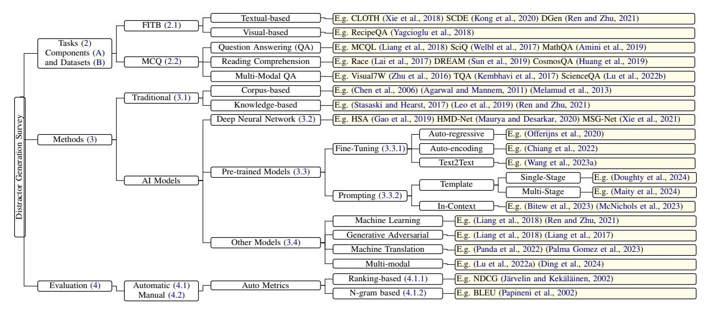
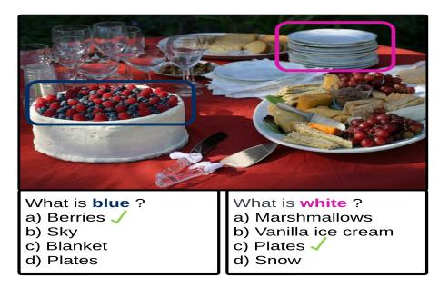
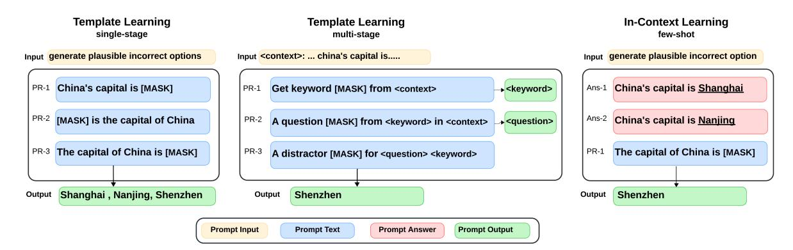
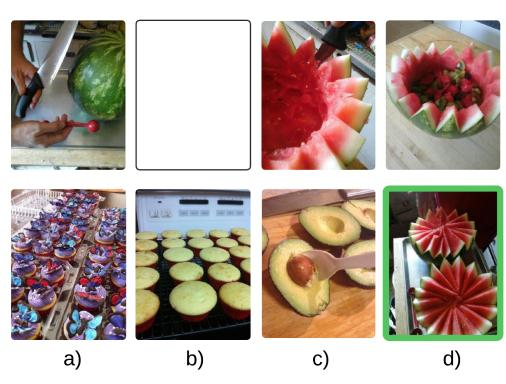

# Distractor Generation in Multiple-Choice Tasks: A Survey of Methods, Datasets, and Evaluation

Elaf Alhazmi1,3 , Quan Z. Sheng1 , Wei Emma Zhang2 , Munazza Zaib1 , Ahoud Alhazmi3

1School of Computing, Macquarie University, Australia 2School of Computer and Mathematical Sciences, The University of Adelaide, Australia 3College of Engineering and Computing in Al-Lith, Umm Al-Qura University, Saudi Arabia elaf.alhazmi@hdr.mq.edu.au, {eafhazmi, aafhazmi}@uqu.edu.sa, {michael.sheng, munazza-zaib}@mq.edu.au,

wei.e.zhang@adelaide.edu.au

# Abstract

The distractor generation task focuses on generating incorrect but plausible options for objective questions such as fill-in-the-blank and multiple-choice questions. This task is widely utilized in educational settings across various domains and subjects. The effectiveness of these questions in assessments relies on the quality of the distractors, as they challenge examinees to select the correct answer from a set of misleading options. The evolution of artificial intelligence (AI) has transitioned the task from traditional methods to the use of neural networks and pre-trained language models. This shift has established new benchmarks and expanded the use of advanced deep learning methods in generating distractors. This survey explores distractor generation tasks, datasets, methods, and current evaluation metrics for English objective questions, covering both textbased and multi-modal domains. It also evaluates existing AI models and benchmarks and discusses potential future research directions[1](#page-0-0) .

## 1 Introduction

Objective questions [\(Das et al.,](#page-10-0) [2021\)](#page-10-0) such as fillin-the-blank and multiple-choice questions require an examinee to select one valid answer from a set of invalid options [\(Kurdi et al.,](#page-11-0) [2020\)](#page-11-0). These types of questions contribute to fair assessment across various domains (e.g., Science [\(Liang et al.,](#page-12-0) [2018\)](#page-12-0), English [\(Panda et al.,](#page-13-0) [2022\)](#page-13-0), Math [\(McNichols et al.,](#page-13-1) [2023\)](#page-13-1), and Medicine [\(Ha and Yaneva,](#page-10-1) [2018\)](#page-10-1)). They are also beneficial for educators in assessing large capacity of students with unbiased results [\(Ch and](#page-9-0) [Saha,](#page-9-0) [2018\)](#page-9-0). However, creating objective questions manually is a laborious task, as it requires selecting plausible false options, known as *distractors*, that can effectively confuse the examinee.

Distractor Generation (DG) [\(Dong et al.,](#page-10-2) [2022\)](#page-10-2) is the process of generating an erroneous plausible

option in objective questions. In automatic generation, various approaches are utilized, including retrieving-based methods [\(Ren and Zhu,](#page-14-0) [2021\)](#page-14-0), learning-based approach [\(Liang et al.,](#page-12-0) [2018\)](#page-12-0) that ranks options according to a set of features, deep neural networks [\(Maurya and Desarkar,](#page-13-2) [2020\)](#page-13-2), and pre-trained language models [\(Chiang et al.,](#page-9-1) [2022\)](#page-9-1). These methods are applied to distractors in fill-inthe-blank [\(Wang et al.,](#page-15-0) [2023a\)](#page-15-0) and multiple-choice questions, including question answering [\(Bitew](#page-9-2) [et al.,](#page-9-2) [2023\)](#page-9-2), reading comprehension [\(Gao et al.,](#page-10-3) [2019\)](#page-10-3) and multi-modal [\(Lu et al.,](#page-12-1) [2022a\)](#page-12-1) domains.

Despite the emerging interest in the DG research, there is no literature review in this field, to the best of our knowledge. Existing relevant surveys focus on generating multiple-choice questions [\(Ch and](#page-9-0) [Saha,](#page-9-0) [2018;](#page-9-0) [Kurdi et al.,](#page-11-0) [2020;](#page-11-0) [Das et al.,](#page-10-0) [2021;](#page-10-0) [Zhang et al.,](#page-16-0) [2021\)](#page-16-0) without discussing DG tasks. A recent work [\(Dong et al.,](#page-10-2) [2022\)](#page-10-2) discussed DG as a subtask of natural language generation (NLG) in the text abbreviation tasks, rather than a subtask in objective questions. We aim to fill the gap and conduct the first survey for DG in objective type of questions. To this end, we collected over 100 highquality papers from top conferences such as ACL, AAAI, IJCAI, ICLR, EMNLP, NAACL, COLING, and AIED and journals such as ACM Computing Surveys, ACM Transactions on Information System, IEEE Transactions on Learning Technologies and IEEE/ACM Transactions on Audio, Speech, and Language Processing.

This paper explores English DG and provides a comprehensive understanding of this research area. Figure [1](#page-1-0) illustrates the DG survey tree. Our main contributions include: conducting a detailed review of the DG tasks (Sec. [2\)](#page-1-1), related datasets, and methods (Sec. [3\)](#page-2-0); summarizing the evaluation metrics (Sec. [4\)](#page-5-0); discussing the main findings, including the analysis of AI models and benchmarks (Sec. [5\)](#page-6-0); discussing future research directions (Sec. [6\)](#page-7-0); and providing concluding remarks (Sec. [7\)](#page-8-0).

1Resources are available at [https://github.com/](https://github.com/Distractor-Generation/DG_Survey) [Distractor-Generation/DG\\_Survey](https://github.com/Distractor-Generation/DG_Survey).

Figure 1: The Survey Tree for DG. The tasks are fill-in-the-blank (FITB) and multiple-choice question (MCQ).

#### 2 Tasks - Distractor Generation

The tasks are categorized into (i) *fill-in-the-blank* and (ii) *multiple-choice questions*. Table 1 summarizes the available datasets2 and categorizes each dataset based on DG tasks. A discussion and analysis of the components and datasets are outlined in Appendix A and Appendix B, respectively.

#### 2.1 Fill-in-the-Blank (FITB)

Cloze queries, also known as fill-in-the-blank, are available in both textual (Xie et al., 2018) and visual (Yagcioglu et al., 2018) formats. DGen dataset, illustrated in example (1), presents a stem sentence with a placeholder and a set of options intended to fill that placeholder. The challenge is to create plausible yet incorrect distractors.

(1) **Stem:** the organs of respiratory system are \_\_\_\_ **Distractors:** a) ovaries, b) intestines, c) kidneys **Answer:** lungs

#### 2.2 Multiple-Choice Question (MCQ)

For decades, research communities have shown interest in generating distractors for MCQ (Mitkov et al., 2003; Bitew et al., 2022). MCQ is divided into (i) *question answering*, (ii) *reading comprehension*, and (iii) *multi-modal question answering*.

**Question Answering:** A standard example of a multiple-choice question-answering task (MC-QA) is shown in example (2) from the SciQ dataset. The example presents a stem question with a set of options, including one correct answer and several in-context, yet incorrect distractors.

(2) **Stem:** What eye part allows light to enter? **Distractors:** a) iris, b) retina, c) eyelid **Answer:** pupil

**Reading Comprehension:** A typical example of a multiple-choice reading comprehension task (MC-RC) is displayed in example (3) from the RACE dataset. The challenge involves generating distractors that are relevant to the given stem and passage, yet distinctly different from the answer.

(3) Passage: My name's Mary. This is my family tree ... That boy is my brother. His name is Tony. This is Susan. She is my uncle's daughter.

Stem: Tony and Mary are Susan's \_\_\_\_\_

Distractors: a) brothers, b) sisters, c) friends

Answer: cousins

Multi-modal Question Answering: An example of a multi-modal question answering task (MM-QA) (Lu et al., 2022a) is illustrated in Figure 2. The distractors include all the options except for the correct answer, which is indicated by a green checkmark. The main challenge is to generate distractors that are relevant to the given question and image but are not correct as an answer.

Figure 2: Multi-modal question answering task.

&lt;sup>2We count sub-datasets (CLOTH, RACE, ARC, MCTest).

| Dataset                              | Task  | Domain         | Source                  | Creation | Corpus (C) | C.Unit              | Availability |
|--------------------------------------|-------|----------------|-------------------------|----------|------------|---------------------|--------------|
| CLOTH (Xie et al., 2018)             | FITB  | English exam   | Educational             | Expert   | 7,131      | Passage             | <b>✓</b>     |
| CLOTH-M (Xie et al., 2018)           | FITB  | English exam   | Educational             | Expert   | 3,031      | Passage             | <b>✓</b>     |
| CLOTH-H (Xie et al., 2018)           | FITB  | English exam   | Educational             | Expert   | 4,100      | Passage             | <b>✓</b>     |
| SCDE (Kong et al., 2020)             | FITB  | English exam   | Educational             | Expert   | 5,959      | Passage             | $\bowtie$    |
| DGen (Ren and Zhu, 2021)             | FITB  | Multi-domain   | Multi                   | Auto     | 2,880      | Sentence            | <b>✓</b>     |
| CELA (Zhang et al., 2023b)           | FITB  | English exam   | Multi                   | Auto     | 150        | Passage             | <b>✓</b>     |
| SciQ (Welbl et al., 2017)            | MC-QA | Science exam   | Educational             | Crowd    | 28         | Book                | V            |
| AQUA-RAT (Ling et al., 2017)         | MC-QA | Math problem   | Web                     | Crowd    | 97,975     | Problem             | <b>✓</b>     |
| OpenBookQA (Mihaylov et al., 2018)   | MC-QA | Science exam   | Educational & WorldTree | Crowd    | 1,326      | WorldTree fact      | <b>✓</b>     |
| ARC (Clark et al., 2018)             | MC-QA | Science exam   | Educational & Web       | Expert   | 14M        | Sentence            | <b>✓</b>     |
| ARC-Challange (Clark et al., 2018)   | MC-QA | Science exam   | Educational & Web       | Expert   | 14M        | Sentence            | <b>✓</b>     |
| ARC-Easy (Clark et al., 2018)        | MC-QA | Science exam   | Educational & Web       | Expert   | 14M        | Sentence            | <b>✓</b>     |
| MCQL (Liang et al., 2018)            | MC-QA | Science exam   | Educational & Web       | Crawl    | 7,116      | Query               | <b>✓</b>     |
| CommonSenseQA (Talmor et al., 2019)  | MC-QA | Narrative      | ConceptNet              | Crowd    | 236,208    | ConceptNet Triplets | <b>✓</b>     |
| MathQA (Amini et al., 2019)          | MC-QA | Math problem   | Web                     | Crowd    | 37,297     | Problem             | <b>✓</b>     |
| QASC (Khot et al., 2020)             | MC-QA | Science exam   | Educational & WorldTree | Crowd    | 17M        | Sentence            | <b>✓</b>     |
| MedMCQA(Pal et al., 2022)            | MC-QA | Medicine exam  | Educational             | Expert   | 2.4K       | Topics              | <b>✓</b>     |
| Televic (Bitew et al., 2022)         | MC-QA | Multi-domain   | Educational             | Expert   | 62,858     | Query               | <b>✓</b>     |
| EduQG (Hadifar et al., 2023)         | MC-QA | Education      | Educational             | Expert   | 13/283     | Book/Chapter        | <b>✓</b>     |
| ChildrenBookTest (Hill et al., 2016) | MC-RC | Story          | Project Gutenberg       | Auto     | 108        | Book                | V            |
| Who Did What (Onishi et al., 2016)   | MC-RC | News           | Gigaword                | Auto     | 10,507     | Book                | $\boxtimes$  |
| MCTest-160 (Richardson et al., 2013) | MC-RC | Children story | Fiction                 | Crowd    | 160        | Story               | V            |
| MCTest-500 (Richardson et al., 2013) | MC-RC | Children story | Fiction                 | Crowd    | 500        | Story               | V            |
| RACE (Lai et al., 2017)              | MC-RC | English exam   | Educational             | Expert   | 27,933     | Passage             | V            |
| RACE-M (Lai et al., 2017)            | MC-RC | English exam   | Educational             | Expert   | 7,139      | Passage             | V            |
| RACE-H (Lai et al., 2017)            | MC-RC | English exam   | Educational             | Expert   | 20,784     | Passage             | V            |
| RACE-C (Liang et al., 2019)          | MC-RC | English exam   | Educational             | Expert   | 4,275      | Passage             | V            |
| DREAM (Sun et al., 2019)             | MC-RC | English exam   | Educational             | Expert   | 6,444      | Dialogue            | V            |
| CosmosQA (Huang et al., 2019)        | MC-RC | Narratives     | Blog                    | Crowd    | 21,866     | Narrative           | V            |
| ReClor (Yu et al., 2020)             | MC-RC | Standard exam  | Educational             | Expert   | 6,138      | Passage             | V            |
| QuAIL (Rogers et al., 2020)          | MC-RC | Multi-domain   | Multi                   | Crowd    | 800        | Passage             | V            |
| MovieQA (Tapaswi et al., 2016)       | MM-QA | Movie          | Movies                  | Crowd    | 408        | Movie               | <b>×</b>     |
| Visual7W (Zhu et al., 2016)          | MM-QA | Visual         | Images                  | Crowd    | 47,300     | Image               | V            |
| TQA (Kembhavi et al., 2017)          | MM-QA | Science exam   | Educational             | Expert   | 1,076      | Lesson              | V            |
| RecipeQA (Yagcioglu et al., 2018)    | MM-QA | Cooking        | Recipes                 | Auto     | 19,779     | Recipe              | V            |
| ScienceQA (Lu et al., 2022b)         | MM-QA | Science exam   | Educational             | Expert   | 21,208     | Query               | V            |

Table 1: Multiple-Choice Datasets. **K**: thousand, **M**: million, **✓**: public available, ∞: available upon request.

#### 3 Methods - Distractor Generation

The methods range from traditional to advanced AI approaches, including deep neural networks and pre-trained language models.

#### 3.1 Traditional Methods

Traditional methods propose retrieving word-level distractors similar to an answer in specific domains.

Corpus-based methods rely on corpus features and syntactic rules in selecting distractors. Chen et al. (2006) used a part-of-speech tagger to transform an answer into various grammatical distractors, such as different verb tenses, in grammar cloze tests. Pino and Eskenazi (2009) generated distractors through phonetic and morphological features. Hill and Simha (2016) utilized n-gram corpus to find potential distractors by filtering out all candidates that fit the context in cloze queries. Sakaguchi et al. (2013) extracted distractors as errorcorrection pairs from a large English as a Second Language (ESL) corpus. Agarwal and Mannem (2011) followed part-of-speech similarity and term frequency to select distractors in biology cloze queries. Zesch and Melamud (2014) explored DG for verb cloze queries using context-sensitive inference rules (Melamud et al., 2013), as it used the rules to filter out semantically similar distractors that are out of the context. Corpus-based features are limited to simple distractors, often lacking plausibility in several domains as they fail to capture the semantic relationships required for contextually appropriate distractors.

Knowledge-based methods retrieve distractors from hierarchical structures representing concepts and their relationships. WordNet (Miller, 1995) and Probase (Wu et al., 2012) as knowledge-base examples are utilized to generate distractors in MC-QA (Mitkov et al., 2003, 2009) and FITB (Pino et al., 2008). Notably, Ren and Zhu (2021) proposed a framework using knowledge-base and contextual information from the question stem and key answer to construct a small set of semantically related distractors, which employs a probabilistic topic model to determine the relevance of concepts to the key within the given stem. Knowledge-base contains static knowledge which may not be appropriate in specialized domains. Thus, an ontology-based method is utilized in distractor retrieving. Stasaski and Hearst (2017) used biology expert-curated concepts to select distractors that share some properties with the correct answer while differing in at least one key relationship to remain plausible but incorrect. [Leo et al.](#page-12-3) [\(2019\)](#page-12-3) utilized ontology in medical domain distractors. [Kumar et al.](#page-11-7) [\(2023\)](#page-11-7) utilized both knowledge-base and ontology as part of a generation system for collecting distractors in the technical education domain. Ontology, a static and domain-independent concept, may not cover all necessary concepts for diverse distractors. It is complex, time-consuming, and requires expert knowledge to ensure accuracy and relevance.

### 3.2 Deep Neural Network Models

Neural networks, including Sequence-to-Sequence (Seq2Seq) [\(Sutskever et al.,](#page-15-5) [2014\)](#page-15-5) models and attention mechanisms [\(Bahdanau et al.,](#page-9-8) [2015\)](#page-9-8), showed success in DG at word and sentence levels in MC-RC task. Seq2Seq models map input sequences such as passage, question, or answer to output sequence, a distractor, through conditional log-likelihood. MC-RC task handles long input sequence (e.g., a passage average token in RACE is 352.8) and requires distractors that are (i) semantically relevant to the passage, (ii) coherent with the question, and (iii) non-equivalent to the answer.

Initially, [Gao et al.](#page-10-3) [\(2019\)](#page-10-3) proposed a hierarchical encoder-decoder (HRED) network [\(Li](#page-12-7) [et al.,](#page-12-7) [2015\)](#page-12-7) with two attention mechanisms. HRED showed superior performance in handling long input sequences tasks such as head-line generation [\(Tan et al.,](#page-15-6) [2017\)](#page-15-6) and summarization [\(Ling and](#page-12-8) [Rush,](#page-12-8) [2017\)](#page-12-8). HRED encodes long given passages into word-level and sentence-level representations. A hierarchical dynamic attention allows both wordlevel and sentence-level attention distributions to change at each decoding time step to only focus on important sentences in the passage. A static attention is proposed to learn the distribution of the sentences that are semantically relevant to the question rather than the answer. In decoding, a special question-based initializer is used instead of encoder's last hidden state to generate a distractor that is grammatically consistent with the question.

Several studies followed HRED network with other attention mechanisms. For example, [Zhou](#page-16-10) [et al.](#page-16-10) [\(2020\)](#page-16-10) utilized co-attention mechanism [\(Seo](#page-14-6) [et al.,](#page-14-6) [2016\)](#page-14-6) to help the encoder better capture the rich interactions between the passage and question to generate relevant distractors. [Shuai et al.](#page-14-7) [\(2021\)](#page-14-7) explored static attention with topic-enhanced multihead co-attention through Latent Dirichlet Allocation (LDA) to calculate the topic-level attention be-

tween question and passage sentences. [Maurya and](#page-13-2) [Desarkar](#page-13-2) [\(2020\)](#page-13-2) implemented the SoftSel operation [\(Tang et al.,](#page-15-7) [2019\)](#page-15-7) combined with a gated mechanism to eliminate answer-revealing sentences. Notably, [Shuai et al.](#page-14-8) [\(2023\)](#page-14-8) incorporate HRED into a question-distractor joint framework while other works mainly focused on DG task.

To generate multiple n-distractors, beam search with Jaccard distance is mainly utilized in several studies while [Maurya and Desarkar](#page-13-2) [\(2020\)](#page-13-2) explored multiple decoders. [Xie et al.](#page-16-1) [\(2021\)](#page-16-1) proposed encoder-decoder multi-selector generation network (MSG-Net) based on mixture content selection [\(Cho et al.,](#page-9-9) [2019\)](#page-9-9) to generate diverse distractors based on n-sentence key selectors. The selected sentences are transformed into distractors using T5 [\(Raffel et al.,](#page-14-9) [2020\)](#page-14-9) as a generation layer.

## 3.3 Pre-trained Models

Pre-trained models, such as word2vec [\(Mikolov](#page-13-14) [et al.,](#page-13-14) [2013\)](#page-13-14), GloVe [\(Pennington et al.,](#page-14-10) [2014\)](#page-14-10), and fastText [\(Bojanowski et al.,](#page-9-10) [2017\)](#page-9-10), have revolutionized static word embedding generation. These models are commonly used in DG tasks like FITB [\(Kumar et al.,](#page-11-8) [2015;](#page-11-8) [Jiang and Lee,](#page-11-9) [2017;](#page-11-9) [Yoshimi](#page-16-11) [et al.,](#page-16-11) [2023\)](#page-16-11) and MC-QA [\(Guo et al.,](#page-10-9) [2016\)](#page-10-9) to select similar answer options using word vector cosine similarity. In the MC-RC task, [Susanti et al.](#page-15-8) [\(2018\)](#page-15-8) utilized word vector cosine similarity to select distractors for English vocabulary meaning.

Pre-trained language models (PLMs) [\(Min et al.,](#page-13-15) [2023\)](#page-13-15) based on Transformer architecture [\(Vaswani](#page-15-9) [et al.,](#page-15-9) [2017\)](#page-15-9) include (i) auto-regressive models such as GPT-models [\(Radford et al.,](#page-14-11) [2019;](#page-14-11) [Brown](#page-9-11) [et al.,](#page-9-11) [2020\)](#page-9-11), (ii) auto-encoding models such as BERT [\(Devlin et al.,](#page-10-10) [2019\)](#page-10-10), and (iii) encoderdecoder (Text2Text) models such as T5 [\(Raffel](#page-14-9) [et al.,](#page-14-9) [2020\)](#page-14-9) and BART [\(Lewis et al.,](#page-12-9) [2020\)](#page-12-9). PLMs utilize *fine-tuning* and *prompting* methods in DG.

### 3.3.1 PLMs with Fine-Tuning

PLMs, pre-trained on large amounts of unlabelled data, can be fine-tuned on specific tasks using small labeled datasets. Table [2](#page-4-1) presents DG studies where PLMs with fine-tuning have been utilized.

In auto-regressive models, [Offerijns et al.](#page-13-6) [\(2020\)](#page-13-6) fine-tuned GPT-2 model trained on the RACE dataset to generate three distractors for a given question and context.

In auto-encoding models, [Chung et al.](#page-9-12) [\(2020\)](#page-9-12) proposed BERT model as auto-regressive iterations with multi-tasking and negative answer regulariza-

Figure 3: DG via prompting LLM. Figure is adapted from (Liu et al., 2023).

tion to generate distractors in MC-RC task. Chiang et al. (2022) explored several PLMs instead of knowledge-base methods (Ren and Zhu, 2021) for generating distractors in FITB task. The models are trained based on naive fine-tuning and answer-relating fine-tuning. Bitew et al. (2022) explored a multilingual BERT encoder to create context-aware neural networks in MC-QA. The model ranks distractors based on relevance to the question stem and answer key through contrastive learning.

In Text2Text models, Wang et al. (2023a) suggested T5 and BART models for FITB task. To boost model performance, candidate augmentation strategy and multi-tasking training techniques are utilized. Yu et al. (2024) applied a retrievalaugmented pre-training (RAP) approach and used knowledge graph triplet for data augmentation. RAP method involves using answers to retrieve relevant sentences and passages from a large corpus such as Wikipedia, masking these answers to create pseudo questions, and utilizing these questions to align T5 and BART models specifically for DG task. Taslimipoor et al. (2024) also proposed using T5 model for DG in MC-QA and MC-RC. The proposed approach utilized a two-step method: initially generating both correct and incorrect answers, and then discriminating between them with a classifier. The generated options are then clustered to remove duplicates and to ensure the diversity of the distractors. T5 has been widely used in DG for MC-QA tasks related to questionnaires (Rodriguez-Torrealba et al., 2022) and personalized exercises (Lelkes et al., 2021; Vachev et al., 2022).

#### 3.3.2 PLMs with Prompting

Prompting (Liu et al., 2023) involves adding text to the input or output to encourage large language model (LLM) to perform specific tasks. Figure 3 illustrates prompting-based learning methods.

| Paper                              | PLMS           | Language      | Task  |
|------------------------------------|----------------|---------------|-------|
| (Yeung et al., 2019)               | BERT (2019)    | Chinese       | FITB  |
| (Chung et al., 2020)               | BERT (2019)    | English       | MC-RC |
| (Offerijns et al., 2020)           | GPT-2 (2019)   | English       | MC-RC |
| (Lelkes et al., 2021)              | T5 (2020)      | English       | MC-QA |
| (Kalpakchi and Boye, 2021)         | BERT (2019)    | Swedish       | MC-RC |
| (Chiang et al., 2022)              | BERT (2019)    | English       | FITB  |
| (Chiang et al., 2022)              | SciBERT (2019) | English       | FITB  |
| (Chiang et al., 2022)              | RoBERTa (2019) | English       | FITB  |
| (Chiang et al., 2022)              | BART (2020)    | English       | FITB  |
| (Vachev et al., 2022)              | T5 (2020)      | English       | MC-QA |
| (Rodriguez-Torrealba et al., 2022) | T5 (2020)      | English       | MC-QA |
| (Foucher et al., 2022)             | T5 (2020)      | English       | MC-QA |
| (Bitew et al., 2022)               | mBERT (2019)   | Multi-lingual | MC-QA |
| (Wang et al., 2023a)               | BART (2020)    | English       | FITB  |
| (Wang et al., 2023a)               | T5 (2020)      | English       | FITB  |
| (Hadifar et al., 2023)             | T5 (2020)      | English       | MC-QA |
| (De-Fitero-Dominguez et al., 2024) | mT5 (2020)     | Spanish       | MC-RC |
| (Taslimipoor et al., 2024)         | T5 (2020)      | English       | FITB  |
| (Taslimipoor et al., 2024)         | T5 (2020)      | English       | MC-RC |
| (Yu et al., 2024)                  | T5 (2020)      | English       | FITB  |
| (Yu et al., 2024)                  | BART (2020)    | English       | FITB  |

Table 2: Fine-tuned PLMs on DG tasks.

Template-based learning uses multiple unanswered prompts at inference time to make predictions and has shown significant capabilities in generating distractors for FITB (Zu et al., 2023) and MC-QA (Doughty et al., 2024) through single-stage prompting. Maity et al. (2024) proposed multi-stage prompting, inspired by the chain of thought method (Wei et al., 2022), to generate distractors for MC-QA based on a given text context.

In-context learning involves providing a few additional answered examples to demonstrate how the LLM should respond to the actual prompt. As shown in Table 3, in-context learning with zero and few-shot examples is also applied in MC-QA. In few-shot learning, examples are selected based on relevant questions retrieved by BERT-based ranking model (Bitew et al., 2022, 2023). Additionally, McNichols et al. (2023) explored k-nearest neighbor (KNN) examples for math distractor and feedback generation, and Feng et al. (2024) asserted that KNN examples outperform fine-tuning and chain-of-thought methods in math distractors.

| Paper                    | LLM     | Method     | Prompting        | Language      | Domain               | Task  |
|--------------------------|---------|------------|------------------|---------------|----------------------|-------|
| (Bitew et al., 2023)     | ChatGPT | In-Context | zero + few shots | Multi-lingual | Open-Domain          | MC-QA |
| (Zu et al., 2023)        | GPT-2   | Template   | single stage     | English       | Language proficiency | FITB  |
| (Tran et al., 2023)      | GPT-3   | Template   | single stage     | English       | Programming          | MC-QA |
| (Tran et al., 2023)      | GPT-4   | Template   | single stage     | English       | Programming          | MC-QA |
| (McNichols et al., 2023) | Codex   | In-Context | zero + few shots | English       | Math                 | MC-QA |
| (McNichols et al., 2023) | ChatGPT | In-Context | zero + few shots | English       | Math                 | MC-QA |
| (Feng et al., 2024)      | GPT-4   | Template   | multi-stage      | English       | Math                 | MC-QA |
| (Doughty et al., 2024)   | GPT-4   | Template   | single stage     | English       | Programming          | MC-QA |
| (Maity et al., 2024)     | GPT-4   | Template   | multi-stage      | Multi-lingual | Open-Domain          | MC-QA |
| (Maity et al., 2024)     | Codex   | Template   | multi-stage      | Multi-lingual | Open-Domain          | MC-QA |

Table 3: Prompting large language models for DG tasks. LLM such as ChatGPT is selected based on OpenAI models such as (gpt-3.5-turbo), Codex (code-davinci-002) and GPT-3 (text-davinci-003) [\(Brown et al.,](#page-9-11) [2020\)](#page-9-11).

### 3.4 Other Models

Other models proposed retrieving distractors from feature-based learning models for FITB [\(Ren and](#page-14-0) [Zhu,](#page-14-0) [2021\)](#page-14-0) and MC-QA [\(Liang et al.,](#page-12-0) [2018\)](#page-12-0). [Sinha](#page-14-13) [et al.](#page-14-13) [\(2020\)](#page-14-13) used a hybrid semantically aware neural network, consisting of a convolutional neural network and bidirectional LSTM, to retrieve distractors in an MC-QA task. These models have shown better performance compared to those using generative adversarial networks [\(Liang et al.,](#page-12-2) [2017\)](#page-12-2). In domain-specific such as English Language test, round trip machine translation methods [\(Panda](#page-13-0) [et al.,](#page-13-0) [2022;](#page-13-0) [Palma Gomez et al.,](#page-13-4) [2023\)](#page-13-4) with alignment computation [\(Jalili Sabet et al.,](#page-11-11) [2020\)](#page-11-11) can generate a variety of distractors. In multi-modal, [Lu et al.](#page-12-1) [\(2022a\)](#page-12-1) utilized reinforcement learning for textual DG, while [Ding et al.](#page-10-4) [\(2024\)](#page-10-4) proposed framework, using encoder-decoder visionand-language model with contrastive learning to jointly generate questions, answers, and distractors.

### 4 Evaluation Methods

Evaluation methods for DG include *automatic* and *manual* approaches that rely on human judgment.

### 4.1 Automatic Evaluation

The automatic metrics are *ranking-based* [\(Valcarce](#page-15-13) [et al.,](#page-15-13) [2020\)](#page-15-13) and *n-gram* [\(Sai et al.,](#page-14-14) [2022\)](#page-14-14) metrics.

### 4.1.1 Ranking-based Metrics

Ranking-based metrics evaluate the model in retrieving relevant distractors across k-top locations.

*Order-unaware* metrics, which do not consider the order, include Precision (P@K), Recall (R@K), and F1-score (F1@K). (P@K) calculates the ratio of correctly identified relevant distractors to the total number of options ranked within the top k positions. (R@K) measures the ratio of correctly

identified relevant distractors to the total number of relevant distractors in the ground truth, and (F1@K) is the harmonic mean of precision and recall.

*Order-aware* metrics, which take the order into consideration, include Mean Reciprocal Rank (MRR@K), Normalized Discounted Cumulative Gain (NDCG@K), and Mean Average Precision (MAP@K). MRR@K focuses on the position of the first relevant item by averaging the reciprocal ranks of this item in the top k distractors across all queries. NDCG@K compares the generated rankings to an ideal order, and MAP@K calculates the mean of average precision scores at k, considering the number and positions of relevant distractors. However, they struggle to identify semantic relatedness, multiple answers, or nonsensical distractors.

## 4.1.2 N-gram Metrics

N-gram metrics evaluate the word n-gram overlap between the hypothesis (i.e., generated distractors) and references (i.e., ground truth distractors). For example, BLUE [\(Papineni et al.,](#page-13-3) [2002\)](#page-13-3) is a precision-based metric calculating the ratio of ngrams between the hypothesis and references to the total n-grams in the hypothesis. Self-BLEU [\(Cac](#page-9-14)[cia et al.,](#page-9-14) [2019\)](#page-9-14) measures lexical diversity between hypotheses. ROUGE [\(Lin,](#page-12-13) [2004\)](#page-12-13) is a recall-based metric calculating the ratio of n-grams between the hypothesis and references to the total n-grams in the reference. ROUGE-L uses F-score, where the precision and recall are computed to measure the longest common subsequence between sentence pairs. METEOR [\(Lavie and Denkowski,](#page-11-12) [2009\)](#page-11-12) is an F-score metric that applies unigram matches, performing exact word mapping, stemmed word matching, and then synonym and paraphrase matching. Lexical mismatch may fail to identify valid distractors, leading to manual evaluation methods.

#### 4.2 Manual Evaluation

The DG evaluation primarily relies on *plausibility* to ensure that distractors are semantically similar to the answer, grammatically correct within the query, and consistently relevant to the context, *reliability* to ensure incorrectness, and *diversity* to reflect the difficulty in identifying the correct answer. Thus, manual methods are utilized in this task.

Comparative method (Gao et al., 2019) selects the distractors based on specific objectives such as **confusion**, assessing the number of times a distractor being chosen as the best option without providing the correct answer, and **non-error** measuring the number of correct answers to a question.

Quantitative method (Maurya and Desarkar, 2020) relies on numerical scales within a specific range to evaluate a given objective. For instance, reliability and plausibility are the most essential metrics and participants use a 3-point scale for plausibility, and a binary mode for reliability for given generated and ground-truth distractors. Also, fluency assesses if a distractor follows proper language grammar, human logic, and common sense, coherence evaluates distractor key phrases for relevance to the article and question, distractibility measures the likelihood of a candidate being chosen as a distractor, diversity measures semantic difference between multiple distractors, and dif**ference** measures the proportion of distractors and answer with the same semantics.

#### 5 Discussions and Findings

This section provides analysis of the current AI models utilized for DG, along with an overview of the existing and emerging benchmarks.

#### 5.1 Analysis of AI Models

Do current models improve the quality of FITB and MC-QA tasks? DG studies primarily focused on plausibility, but the reliability aspect has not been thoroughly studied. Static-based word embeddings like Word2Vec (Jiang and Lee, 2017) as shown in example (1) in Table 4 are prone to generate multiple semantically correct answers, which fail to satisfy reliability. In contrast, dynamic context-based word embeddings like BERT (Devlin et al., 2019) may produce compound names as distractors that are overly technical, which leads to the answer-revealing issue and fails to satisfy diversity. Feature-based learning models (Liang et al., 2018) might predict too easy options. PLMs

are still susceptible to generating nonsense distractors, such as duplicate correct answers, obviously incorrect options, or previously generated distractors as shown in examples (2) and (3) in Table 4 through fine-tuning FITB task. Wang et al. (2023a) utilized data augmentation to reduce these issues. Yu et al. (2024) examined the use of knowledge graph triplets as a data augmentation technique during fine-tuning, noting that it might introduce noise that could interfere with the model generation process. Few-shot examples (Bitew et al., 2023) reduced nonsense distractor rate in open-domain from 50% to 16%. Thus, the quality of DG is still insufficient for reliable and diverse distractors.

| (1) <b>Stem</b> : The main source of energy in your body is —    |                        |                      |  |  |  |  |  |  |
|------------------------------------------------------------------|------------------------|----------------------|--|--|--|--|--|--|
| Answer: carbohydrate                                             |                        |                      |  |  |  |  |  |  |
| Method                                                           | Distractor             | Problem              |  |  |  |  |  |  |
| EmbSim (2017)                                                    | - glucose              | valid answer         |  |  |  |  |  |  |
| BERT (2019)                                                      | - glycosaminoglycans   | too technical        |  |  |  |  |  |  |
| LR+RF (2018)                                                     | - methane              | obviously wrong      |  |  |  |  |  |  |
| (2) <b>Stem</b> : Rural area do not have school, that is not ——- |                        |                      |  |  |  |  |  |  |
| Answer: fair                                                     |                        |                      |  |  |  |  |  |  |
| Method                                                           | Distractor             | Problem              |  |  |  |  |  |  |
| T5 (2023a)                                                       | - fair                 | similar to answer    |  |  |  |  |  |  |
| BART (2023a)                                                     | - unfair               | obviously wrong      |  |  |  |  |  |  |
| (3) <b>Stem</b> : She                                            | let people — more abou | ıt Vietnam           |  |  |  |  |  |  |
| Answer: k                                                        | Answer: know           |                      |  |  |  |  |  |  |
| Method                                                           | Distractor             | Problem              |  |  |  |  |  |  |
| T5 (2023a)                                                       | - think, think , think | previously generated |  |  |  |  |  |  |
|                                                                  | •                      | -                    |  |  |  |  |  |  |

Table 4: DG quality in FITB and MC-QA tasks.

Question: Which of the following statements is true?

(1) Passage: Nuclear power's danger to health ... etc

| Answer: Nuclear radiation can cause cancer in human beings   |                                    |  |  |  |  |  |  |
|--------------------------------------------------------------|------------------------------------|--|--|--|--|--|--|
| Method: HMD-Net (Maurya and Desarkar, 2020)                  |                                    |  |  |  |  |  |  |
| Distractor                                                   | Problem                            |  |  |  |  |  |  |
| - Radiation is harmless,                                     | laviaally differ but               |  |  |  |  |  |  |
| - Radiation can't hurt all over us,                          | lexically differ, but              |  |  |  |  |  |  |
| - Radiation can't kill human beings.                         | semantically similar.              |  |  |  |  |  |  |
| (2) Passage: Most of the time, people wea                    | ar hats to protectetc              |  |  |  |  |  |  |
| Question: which of the women would look most attractive?     |                                    |  |  |  |  |  |  |
| Answer: A short red-haired woman who wears a purple hat      |                                    |  |  |  |  |  |  |
| Method: BDG (Chung et al., 2020)                             |                                    |  |  |  |  |  |  |
| Distractor                                                   | Problem                            |  |  |  |  |  |  |
| - young woman wears a white hat,                             | previously generated               |  |  |  |  |  |  |
| - young woman wears a white hat,                             | and biased options                 |  |  |  |  |  |  |
| - short woman with big, round faces.                         | and brased options                 |  |  |  |  |  |  |
| (3) Passage: About a third of all common cancersetc          |                                    |  |  |  |  |  |  |
| Question: By writing the passage, the                        | author mainly intends to           |  |  |  |  |  |  |
| <b>Answer</b> : Advice people to develop healthier lifestyle |                                    |  |  |  |  |  |  |
| Method: MSG-Net (Xie et al., 2021)                           | Method: MSG-Net (Xie et al., 2021) |  |  |  |  |  |  |
| Distractor                                                   | Problem                            |  |  |  |  |  |  |
| - teach people how to prevent cancers,                       |                                    |  |  |  |  |  |  |
| - advice people to stop smoking,                             | lack difficulty control            |  |  |  |  |  |  |
| - protect people from developing cancer.                     |                                    |  |  |  |  |  |  |
|                                                              |                                    |  |  |  |  |  |  |

Table 5: DG validity in the MC-RC task.

Are current models satisfied validity in MC-RC task? Despite the use of dynamic and static attentions in MC-RC models for plausibility and relia-

bility, there are still shortcomings. The beam search methods [\(Gao et al.,](#page-10-3) [2019;](#page-10-3) [Shuai et al.,](#page-14-8) [2023\)](#page-14-8) in Seq2Seq models fail to generate diverse distractors. Also, multi-decoders [\(Maurya and Desarkar,](#page-13-2) [2020\)](#page-13-2) as demonstrated in example (1) in Table [5](#page-6-3) used a mixture of decoders in decoding stage to generate divers distractors, but distractors are generated from the same input and have identical semantics which leads to options that are lexically diverse, but they are semantically similar. These generation methods cause an answer-revealing issue. PLMs are still vulnerable to answer copying and biased options [\(Chung et al.,](#page-9-12) [2020\)](#page-9-12), as shown in example (2) in Table [5.](#page-6-3) The content selection approach [\(Xie](#page-16-1) [et al.,](#page-16-1) [2021\)](#page-16-1) in example (3) in Table [5](#page-6-3) can generate diverse distractors from different sentences, but further exploration or implicit common sense reasoning is required for difficult controls. Thus, the validity of DG has room for improvement. Quantitative comparisons are detailed for DG tasks in Appendix [C,](#page-20-0) providing performance metrics and results for recent AI models utilized for DG tasks.

### 5.2 Analysis of Benchmarks

Are low-resource datasets explored in DG? Despite the use of English datasets, low-resource datasets remain limited in DG. Pioneering research explored DG in Spanish [\(De-Fitero-Dominguez](#page-10-12) [et al.,](#page-10-12) [2024\)](#page-10-12), Swedish [\(Kalpakchi and Boye,](#page-11-10) [2021\)](#page-11-10), Chinese [\(Yeung et al.,](#page-16-13) [2019\)](#page-16-13), Japanese [\(Anders](#page-9-15)[son and Picazo-Sanchez,](#page-9-15) [2023\)](#page-9-15) and others [\(Maity](#page-13-5) [et al.,](#page-13-5) [2024\)](#page-13-5) including German, Bengali, and Hindi. Typically, small-scale datasets or translated English datasets are used to create these training data. Notably, there are efforts to build non-English multiple-choice datasets in French [\(Labrak](#page-11-13) [et al.,](#page-11-13) [2022\)](#page-11-13), Chinese [\(Sun et al.,](#page-15-14) [2020\)](#page-15-14), Bulgarian [\(Hardalov et al.,](#page-10-14) [2019\)](#page-10-14), Vietnamese [\(Van Nguyen](#page-15-15) [et al.,](#page-15-15) [2020\)](#page-15-15) and a multi-lingual [\(Bitew et al.,](#page-9-6) [2022\)](#page-9-6) datasets. These datasets enable low-resource DG exploration and highlight the need for non-English datasets across various domains and tasks.

Are open-domain datasets emerging in DG? Specific domains such as Science (e.g., SciQ) or English (e.g., CLOTH) are utilized in DG, but there are limited open-domain datasets (e.g., Televic, EduQG) emerging in the field. For example, Televic, which covers multiple subjects and includes multi-lingual content, contributes significantly to DG by posing new challenges, such as generating nonsensical distractors [\(Bitew et al.,](#page-9-6) [2022,](#page-9-6) [2023\)](#page-9-2).

## 6 Future Directions

This section outlines directions for future research.

### 6.1 Trustworthy Generation

AI advancements in DG are improving, but they still face challenges like hallucination issues in PLMs [\(Ji et al.,](#page-11-14) [2023\)](#page-11-14) and a heavy reliance on costly human-annotated labels [\(Qu et al.,](#page-14-15) [2024\)](#page-14-15). To control this task generation [\(Zhang et al.,](#page-16-16) [2023a\)](#page-16-16), reinforcement learning from human feedback (RLHF) [\(Ouyang et al.,](#page-13-16) [2022\)](#page-13-16) and few-shot examples [\(Bitew et al.,](#page-9-2) [2023\)](#page-9-2) may be utilized to improve the trustworthiness of DG. Integrating knowledge-based methods has been proposed [\(Yu](#page-16-12) [et al.,](#page-16-12) [2024\)](#page-16-12) and further improvements may enhance the performance of PLMs. Also, pioneering works can train models to distinguish between valid and invalid distractors through advanced learning approaches such as contrastive learning [\(An et al.,](#page-9-16) [2022\)](#page-9-16) that enables models to differentiate between semantically similar and dissimilar data pairs in the embedding space. This method has shown significant improvement in enhancing representation learning by encouraging models to capture semantic relationships. As a result, it has demonstrated notable success across various NLP tasks, including machine translation [\(Pan et al.,](#page-13-17) [2021\)](#page-13-17), text classification [\(Chen et al.,](#page-9-17) [2022b\)](#page-9-17), and question answering [\(Karpukhin et al.,](#page-11-15) [2020\)](#page-11-15). Additionally, incorporating adversarial learning approaches [\(Li et al.,](#page-12-14) [2023;](#page-12-14) [Zhuang et al.,](#page-16-17) [2024\)](#page-16-17) may enhance the robustness of DG models.

### 6.2 Deployment in Education

Distractor quality is crucial in personalized learning [\(Vachev et al.,](#page-15-11) [2022;](#page-15-11) [Lelkes et al.,](#page-12-11) [2021;](#page-12-11) [Li](#page-12-15) [et al.,](#page-12-15) [2024\)](#page-12-15), but the task remains challenging with current existing approaches [\(Dutulescu et al.,](#page-10-15) [2024\)](#page-10-15) and evaluating their effectiveness in education remains an open research problem. AI models explored LLMs ability to generate multiple-choice questions that meet course learning objectives in the programming domain [\(Doughty et al.,](#page-10-5) [2024\)](#page-10-5) and in various formats [\(Tran et al.,](#page-15-12) [2023\)](#page-15-12). LLMs have shown promise in generating usable multiplechoice questions in different domains and tasks, but their alignment with Bloom's Taxonomy levels still has significant room for improvement [\(Hwang](#page-11-16) [et al.,](#page-11-16) [2024\)](#page-11-16). Controlling the difficulty levels of generated candidates continues to be a major challenge for the NLP community, highlighting the necessity

for additional research to create usable DG models. Thus, instructors in education must ensure the quality of automated DG models by verifying its plausibility, reliability, diversity, alignment with learning objectives, and adherence to ethical guidelines.

### 6.3 Multi-Modal Generation

The novel task [\(Lu et al.,](#page-12-1) [2022a\)](#page-12-1), textual DG in visual question answering, faces two potential challenges. First, there are potential needs in generating distractors for various multi-modal domains as recent studies [\(Ding et al.,](#page-10-4) [2024\)](#page-10-4) mainly used Visual7w as a visual question answering dataset. Multi-modal supported content, such as figures [\(Wang et al.,](#page-16-18) [2021\)](#page-16-18), charts [\(Kafle et al.,](#page-11-17) [2018\)](#page-11-17), and tables [\(Lu et al.,](#page-12-16) [2023\)](#page-12-16), are available and used in different domains, including science [\(Kembhavi](#page-11-2) [et al.,](#page-11-2) [2017\)](#page-11-2) and mathematics [\(Verschaffel et al.,](#page-15-16) [2020\)](#page-15-16) such as math word problem [\(Lu et al.,](#page-12-17) [2021b\)](#page-12-17) and geometry problem solving [\(Chen et al.,](#page-9-18) [2021;](#page-9-18) [Lu et al.,](#page-12-18) [2021a;](#page-12-18) [Chen et al.,](#page-9-19) [2022a\)](#page-9-19). Second, research should focus on visual DG, specifically images, and incorporate videos and audios for new insights. These multi-modal insights could lead to novel applications and challenges in visual DG.

### 6.4 Quality Metrics

Current automatic metrics (e.g., n-gram) showed significant limitations such as excluding acceptable candidates due to lexical mismatching. Although some metrics can perform synonym n-gram matching (e.g., greedy matching [\(Rus and Lintean,](#page-14-16) [2012\)](#page-14-16), embedding average metrics [\(Wieting et al.,](#page-16-19) [2015\)](#page-16-19), and vector extrema [\(Forgues et al.,](#page-10-16) [2014\)](#page-10-16)), they cannot determine if semantic similarity will cause reliability issues such as multiple-answer problems. Self-BLEU cannot ensure diversity, as it measures diversity in terms of lexical differences, which does not guarantee the difficulty of the distractors. Thus, few studies [\(Moon et al.,](#page-13-18) [2022;](#page-13-18) [Raina et al.,](#page-14-17) [2023\)](#page-14-17) proposed systems for the quality of DG even though generalizing quality metrics in DG is still challenging. Also, the assessing for nonsense distractors in open-domain [\(Bitew et al.,](#page-9-6) [2022\)](#page-9-6) still relies on manual metrics such as nonsense distractor rate. Notably, item-writing flaws (IWFs) rubric evaluates the pedagogical value of both questions and options, serving as an essential quality evaluation tool in education. Ongoing research aims to automate this rubric [\(Moore et al.,](#page-13-19) [2023\)](#page-13-19), leading to advancements in automated quality assessment.

## 7 Conclusion

Distractor Generation (DG) is critical in assessment and has received significant attention with advanced AI models. This paper surveys DG tasks, including fill-in-the-blank and multiple-choice question across text and multi-modal domains. It categorizes the tasks within relevant datasets and provides a comprehensive analysis of the components in the available datasets. This paper also provides a detailed discussion of the current methods, summarizes the evaluation metrics, and discusses the main findings, including the analysis of AI models and benchmarks. It also outlines potential future research directions to facilitate further improvements and explorations. To enhance research in distractor generation, this paper also provides a continuously updated reading list available on a GitHub repository at [https://github.com/](https://github.com/Distractor-Generation/DG_Survey) [Distractor-Generation/DG\\_Survey](https://github.com/Distractor-Generation/DG_Survey).

## Limitations

This survey paper focuses on contemporary research in distractor generation problem using advanced AI methods, but it may not cover the entire historical scope and recent advancements that have emerged around the time or after the survey was conducted due to rapid research development. Furthermore, the evaluation of existing models and benchmarks relies on recently collected papers and may not fully represent the state-of-the-art models for distractor generation tasks. However, our survey is the first to comprehensively address distractor generation tasks and methods, providing detailed outlines of current datasets and evaluation methods. It also provides a concise overview of the main findings, challenges, and potential future research directions, making it a valuable resource for scholars in the field.

### Acknowledgments

We would like to express our sincere gratitude to the anonymous reviewers for their constructive feedback and invaluable recommendations. This work was conducted with the collaborative support of Macquarie University and the University of Adelaide in Australia, along with Umm Al-Qura University in the Kingdom of Saudi Arabia. Furthermore, we are thankful for the support and encouragement received from the members of the Intelligent Computing Laboratory in the School of Computing at Macquarie University.

## References

- Manish Agarwal and Prashanth Mannem. 2011. [Auto](https://aclanthology.org/W11-1407)[matic gap-fill question generation from text books.](https://aclanthology.org/W11-1407) In *Proceedings of the Sixth Workshop on Innovative Use of NLP for Building Educational Applications (BEA)*, pages 56–64.
- Aida Amini, Saadia Gabriel, Shanchuan Lin, Rik Koncel-Kedziorski, Yejin Choi, and Hannaneh Hajishirzi. 2019. [MathQA: Towards interpretable math](https://aclanthology.org/N19-1245) [word problem solving with operation-based for](https://aclanthology.org/N19-1245)[malisms.](https://aclanthology.org/N19-1245) In *Proceedings of the 2019 Conference of the North American Chapter of the Association for Computational Linguistics: Human Language Technologies (NAACL-HLT)*, pages 2357–2367.
- Chenxin An, Jiangtao Feng, Kai Lv, Lingpeng Kong, Xipeng Qiu, and Xuanjing Huang. 2022. [Cont: Con](https://proceedings.neurips.cc/paper_files/paper/2022/file/0f5fcf4bff73a3537e0813a38f0d3f76-Paper-Conference.pdf)[trastive neural text generation.](https://proceedings.neurips.cc/paper_files/paper/2022/file/0f5fcf4bff73a3537e0813a38f0d3f76-Paper-Conference.pdf) In *Advances in Neural Information Processing Systems (NeurIPS)*, volume 35, pages 2197–2210.
- Tim Andersson and Pablo Picazo-Sanchez. 2023. [Clos](https://www.mdpi.com/2227-7102/13/12/1203)[ing the gap: Automated distractor generation in](https://www.mdpi.com/2227-7102/13/12/1203) [japanese language testing.](https://www.mdpi.com/2227-7102/13/12/1203) *Education Sciences*, 13(12):1203.
- Dzmitry Bahdanau, Kyung Hyun Cho, and Yoshua Bengio. 2015. [Neural machine translation by jointly](https://arxiv.org/pdf/1409.0473) [learning to align and translate.](https://arxiv.org/pdf/1409.0473) In *International Conference on Learning Representations, ICLR 2015*.
- Iz Beltagy, Kyle Lo, and Arman Cohan. 2019. [SciBERT:](https://aclanthology.org/D19-1371) [A pretrained language model for scientific text.](https://aclanthology.org/D19-1371) In *Proceedings of the 2019 Conference on Empirical Methods in Natural Language Processing and the 9th International Joint Conference on Natural Language Processing (EMNLP-IJCNLP)*, pages 3615–3620.
- Semere Kiros Bitew, Johannes Deleu, Chris Develder, and Thomas Demeester. 2023. [Distractor genera](https://arxiv.org/abs/2307.16338)[tion for multiple-choice questions with predictive](https://arxiv.org/abs/2307.16338) [prompting and large language models.](https://arxiv.org/abs/2307.16338) *arXiv preprint arXiv:2307.16338*.
- Semere Kiros Bitew, Amir Hadifar, Lucas Sterckx, Johannes Deleu, Chris Develder, and Thomas Demeester. 2022. [Learning to reuse distractors to sup](https://ieeexplore.ieee.org/abstract/document/9969921)[port multiple choice question generation in education.](https://ieeexplore.ieee.org/abstract/document/9969921) *IEEE Transactions on Learning Technologies*.
- Piotr Bojanowski, Edouard Grave, Armand Joulin, and Tomas Mikolov. 2017. [Enriching word vectors with](https://aclanthology.org/Q17-1010) [subword information.](https://aclanthology.org/Q17-1010) *Transactions of the Association for Computational Linguistics (TACL)*, 5:135– 146.
- Tom Brown, Benjamin Mann, Nick Ryder, Melanie Subbiah, Jared D Kaplan, Prafulla Dhariwal, Arvind Neelakantan, Pranav Shyam, Girish Sastry, Amanda Askell, et al. 2020. [Language models are few-shot](https://proceedings.neurips.cc/paper/2020/hash/1457c0d6bfcb4967418bfb8ac142f64a-Abstract.html) [learners.](https://proceedings.neurips.cc/paper/2020/hash/1457c0d6bfcb4967418bfb8ac142f64a-Abstract.html) *Advances in neural information processing systems (NeurIPS)*, 33:1877–1901.

- Kevin Burton, Akshay Java, Ian Soboroff, et al. 2009. [The icwsm 2009 spinn3r dataset.](https://ebiquity.umbc.edu/paper/abstract/id/451/%3C/p) In *Proceedings of Third Annual Conference on Weblogs and Social Media (ICWSM 2009)*.
- Massimo Caccia, Lucas Caccia, William Fedus, Hugo Larochelle, Joelle Pineau, and Laurent Charlin. 2019. [Language gans falling short.](https://openreview.net/pdf?id=BJgza6VtPB) In *Proceedings of International Conference on Learning Representations (ICLR)*.
- Dhawaleswar Rao Ch and Sujan Kumar Saha. 2018. [Automatic multiple choice question generation from](https://ieeexplore.ieee.org/abstract/document/8585151/) [text: A survey.](https://ieeexplore.ieee.org/abstract/document/8585151/) *IEEE Transactions on Learning Technologies*, 13(1):14–25.
- Chia-Yin Chen, Hsien-Chin Liou, and Jason S. Chang. 2006. [FAST – an automatic generation system for](https://doi.org/10.3115/1225403.1225404) [grammar tests.](https://doi.org/10.3115/1225403.1225404) In *Proceedings of the COLING/ACL 2006 Interactive Presentation Sessions*, pages 1–4.
- Jiaqi Chen, Tong Li, Jinghui Qin, Pan Lu, Liang Lin, Chongyu Chen, and Xiaodan Liang. 2022a. [UniGeo:](https://aclanthology.org/2022.emnlp-main.218) [Unifying geometry logical reasoning via reformulat](https://aclanthology.org/2022.emnlp-main.218)[ing mathematical expression.](https://aclanthology.org/2022.emnlp-main.218) In *Proceedings of the 2022 Conference on Empirical Methods in Natural Language Processing (EMNLP)*, pages 3313–3323.
- Jiaqi Chen, Jianheng Tang, Jinghui Qin, Xiaodan Liang, Lingbo Liu, Eric Xing, and Liang Lin. 2021. [GeoQA:](https://aclanthology.org/2021.findings-acl.46) [A geometric question answering benchmark towards](https://aclanthology.org/2021.findings-acl.46) [multimodal numerical reasoning.](https://aclanthology.org/2021.findings-acl.46) In *Findings of the Association for Computational Linguistics: ACL-IJCNLP 2021*, pages 513–523.
- Junfan Chen, Richong Zhang, Yongyi Mao, and Jie Xu. 2022b. [Contrastnet: A contrastive learning frame](https://ojs.aaai.org/index.php/AAAI/article/view/21292)[work for few-shot text classification.](https://ojs.aaai.org/index.php/AAAI/article/view/21292) In *Proceedings of the AAAI Conference on Artificial Intelligence (AAAI)*, volume 36, pages 10492–10500.
- Shang-Hsuan Chiang, Ssu-Cheng Wang, and Yao-Chung Fan. 2022. [CDGP: Automatic cloze distractor](https://aclanthology.org/2022.findings-emnlp.429) [generation based on pre-trained language model.](https://aclanthology.org/2022.findings-emnlp.429) In *Findings of the Association for Computational Linguistics: EMNLP 2022*, pages 5835–5840.
- Jaemin Cho, Minjoon Seo, and Hannaneh Hajishirzi. 2019. [Mixture content selection for diverse sequence](https://aclanthology.org/D19-1308) [generation.](https://aclanthology.org/D19-1308) In *Proceedings of the 2019 Conference on Empirical Methods in Natural Language Processing and the 9th International Joint Conference on Natural Language Processing (EMNLP-IJCNLP)*, pages 3121–3131.
- Ho-Lam Chung, Ying-Hong Chan, and Yao-Chung Fan. 2020. [A BERT-based distractor generation](https://aclanthology.org/2020.findings-emnlp.393) [scheme with multi-tasking and negative answer train](https://aclanthology.org/2020.findings-emnlp.393)[ing strategies.](https://aclanthology.org/2020.findings-emnlp.393) In *Findings of the Association for Computational Linguistics: EMNLP 2020*, pages 4390–4400.
- Peter Clark, Isaac Cowhey, Oren Etzioni, Tushar Khot, Ashish Sabharwal, Carissa Schoenick, and Oyvind Tafjord. 2018. [Think you have solved question an](https://arxiv.org/abs/1803.05457)[swering? try arc, the ai2 reasoning challenge.](https://arxiv.org/abs/1803.05457) *arXiv preprint arXiv:1803.05457*.

- Bidyut Das, Mukta Majumder, Santanu Phadikar, and Arif Ahmed Sekh. 2021. [Automatic question genera](https://link.springer.com/article/10.1186/s41039-021-00151-1)[tion and answer assessment: a survey.](https://link.springer.com/article/10.1186/s41039-021-00151-1) *Research and Practice in Technology Enhanced Learning*, 16(1):1– 15.
- David De-Fitero-Dominguez, Eva Garcia-Lopez, Antonio Garcia-Cabot, Jesus-Angel Del-Hoyo-Gabaldon, and Antonio Moreno-Cediel. 2024. [Distractor gener](https://ieeexplore.ieee.org/abstract/document/10418879)[ation through text-to-text transformer models.](https://ieeexplore.ieee.org/abstract/document/10418879) *IEEE Access*.
- Jacob Devlin, Ming-Wei Chang, Kenton Lee, and Kristina Toutanova. 2019. [BERT: Pre-training of](https://aclanthology.org/N19-1423) [deep bidirectional transformers for language under](https://aclanthology.org/N19-1423)[standing.](https://aclanthology.org/N19-1423) In *Proceedings of the 2019 Conference of the North American Chapter of the Association for Computational Linguistics: Human Language Technologies (NAACL-HLT)*, pages 4171–4186.
- Wenjian Ding, Yao Zhang, Jun Wang, Adam Jatowt, and Zhenglu Yang. 2024. [Can we learn question, answer,](https://aclanthology.org/2024.lrec-main.254) [and distractors all from an image? a new task for](https://aclanthology.org/2024.lrec-main.254) [multiple-choice visual question answering.](https://aclanthology.org/2024.lrec-main.254) In *Proceedings of the 2024 Joint International Conference on Computational Linguistics, Language Resources and Evaluation (LREC-COLING 2024)*, pages 2852– 2863.
- Chenhe Dong, Yinghui Li, Haifan Gong, et al. 2022. [A](https://dl.acm.org/doi/10.1145/3554727) [survey of natural language generation.](https://dl.acm.org/doi/10.1145/3554727) *ACM Computing Survey*, 55(8):1–38.
- Jacob Doughty, Zipiao Wan, Anishka Bompelli, Jubahed Qayum, Taozhi Wang, Juran Zhang, Yujia Zheng, Aidan Doyle, Pragnya Sridhar, Arav Agarwal, et al. 2024. [A comparative study of ai-generated \(gpt-4\)](https://ieeexplore.ieee.org/abstract/document/10342898) [and human-crafted mcqs in programming education.](https://ieeexplore.ieee.org/abstract/document/10342898) In *Proceedings of the 26th Australasian Computing Education Conference (ACE)*, pages 114–123.
- Andreea Dutulescu, Stefan Ruseti, Denis Iorga, Mihai Dascalu, and Danielle S McNamara. 2024. [Be](https://link.springer.com/chapter/10.1007/978-3-031-64299-9_18)[yond the obvious multi-choice options: Introducing](https://link.springer.com/chapter/10.1007/978-3-031-64299-9_18) [a toolkit for distractor generation enhanced with nli](https://link.springer.com/chapter/10.1007/978-3-031-64299-9_18) [filtering.](https://link.springer.com/chapter/10.1007/978-3-031-64299-9_18) In *Proceedings International Conference on Artificial Intelligence in Education (AIED)*, pages 242–250.
- Daria Dzendzik, Jennifer Foster, and Carl Vogel. 2021. [English machine reading comprehension datasets: A](https://aclanthology.org/2021.emnlp-main.693) [survey.](https://aclanthology.org/2021.emnlp-main.693) In *Proceedings of the 2021 Conference on Empirical Methods in Natural Language Processing (EMNLP)*, pages 8784–8804.
- Wanyong Feng, Jaewook Lee, Hunter McNichols, Alexander Scarlatos, Digory Smith, Simon Woodhead, Nancy Ornelas, and Andrew Lan. 2024. [Ex](https://aclanthology.org/2024.findings-naacl.193)[ploring automated distractor generation for math](https://aclanthology.org/2024.findings-naacl.193) [multiple-choice questions via large language mod](https://aclanthology.org/2024.findings-naacl.193)[els.](https://aclanthology.org/2024.findings-naacl.193) In *Findings of the Association for Computational Linguistics: NAACL 2024*, pages 3067–3082.
- Gabriel Forgues, Joelle Pineau, Jean-Marie Larchevêque, and Réal Tremblay. 2014. [Bootstrap](https://www.cs.cmu.edu/~apparikh/nips2014ml-nlp/camera-ready/forgues_etal_mlnlp2014.pdf)[ping dialog systems with word embeddings.](https://www.cs.cmu.edu/~apparikh/nips2014ml-nlp/camera-ready/forgues_etal_mlnlp2014.pdf) In *Nips,*

- *modern machine learning and natural language processing workshop*, volume 2, page 168.
- Sébastien Foucher, Damian Pascual, Oliver Richter, and Roger Wattenhofer. 2022. [Word2course: creating](https://www.research-collection.ethz.ch/bitstream/handle/20.500.11850/555954/2/110647.pdf) [interactive courses from as little as a keyword.](https://www.research-collection.ethz.ch/bitstream/handle/20.500.11850/555954/2/110647.pdf) In *Proceedings of the 14th International Conference on Copmputer Support Education (CSEDU)*, pages 105–115.
- Yifan Gao, Lidong Bing, Piji Li, Irwin King, and Michael R Lyu. 2019. [Generating distractors for](https://ojs.aaai.org/index.php/AAAI/article/view/4606) [reading comprehension questions from real exam](https://ojs.aaai.org/index.php/AAAI/article/view/4606)[inations.](https://ojs.aaai.org/index.php/AAAI/article/view/4606) In *Proceedings of the AAAI Conference on Artificial Intelligence (AAAI)*, volume 33, pages 6423–6430.
- Bilal Ghanem and Alona Fyshe. 2023. [Disto: Evalu](https://arxiv.org/abs/2304.04881)[ating textual distractors for multi-choice questions](https://arxiv.org/abs/2304.04881) [using negative sampling based approach.](https://arxiv.org/abs/2304.04881) *arXiv preprint arXiv:2304.04881*.
- Andrew Gordon and Reid Swanson. 2009. [Identifying](https://icwsm.org/2009/data/Gordon-icwsm09-dcw.pdf) [personal stories in millions of weblog entries.](https://icwsm.org/2009/data/Gordon-icwsm09-dcw.pdf) In *Proceedings of the Third international conference on weblogs and social media (ICWSM)*, volume 46, pages 16–23.
- Qi Guo, Chinmay Kulkarni, Aniket Kittur, Jeffrey P Bigham, and Emma Brunskill. 2016. [Questimator:](https://www.ijcai.org/Proceedings/16/Papers/524.pdf) [generating knowledge assessments for arbitrary top](https://www.ijcai.org/Proceedings/16/Papers/524.pdf)[ics.](https://www.ijcai.org/Proceedings/16/Papers/524.pdf) In *Proceedings of the Twenty-Fifth International Joint Conference on Artificial Intelligence (IJCAI)*, pages 3726–3732.
- Le An Ha and Victoria Yaneva. 2018. [Automatic distrac](https://aclanthology.org/W18-0548)[tor suggestion for multiple-choice tests using concept](https://aclanthology.org/W18-0548) [embeddings and information retrieval.](https://aclanthology.org/W18-0548) In *Proceedings of the Thirteenth Workshop on Innovative Use of NLP for Building Educational Applications (BEA)*, pages 389–398.
- Amir Hadifar, Semere Kiros Bitew, Johannes Deleu, Chris Develder, and Thomas Demeester. 2023. [Eduqg: A multi-format multiple-choice dataset for](https://ieeexplore.ieee.org/abstract/document/10051840) [the educational domain.](https://ieeexplore.ieee.org/abstract/document/10051840) *IEEE Access*, 11:20885– 20896.
- Momchil Hardalov, Ivan Koychev, and Preslav Nakov. 2019. [Beyond English-only reading comprehension:](https://aclanthology.org/R19-1053) [Experiments in zero-shot multilingual transfer for](https://aclanthology.org/R19-1053) [Bulgarian.](https://aclanthology.org/R19-1053) In *Proceedings of the International Conference on Recent Advances in Natural Language Processing (RANLP)*.
- Felix Hill, Antoine Bordes, Sumit Chopra, and Jason Weston. 2016. [The goldilocks principle: Reading](https://arxiv.org/pdf/1511.02301) [children's books with explicit memory representa](https://arxiv.org/pdf/1511.02301)[tions.](https://arxiv.org/pdf/1511.02301) In *Proceedings of International Conference on Learning Representations (ICLR)*.
- Jennifer Hill and Rahul Simha. 2016. [Automatic gen](https://aclanthology.org/W16-0503)[eration of context-based fill-in-the-blank exercises](https://aclanthology.org/W16-0503) [using co-occurrence likelihoods and Google n-grams.](https://aclanthology.org/W16-0503) In *Proceedings of the 11th Workshop on Innovative Use of NLP for Building Educational Applications (BEA)*, pages 23–30.

- Lifu Huang, Ronan Le Bras, Chandra Bhagavatula, and Yejin Choi. 2019. [Cosmos QA: Machine reading](https://aclanthology.org/D19-1243) [comprehension with contextual commonsense rea](https://aclanthology.org/D19-1243)[soning.](https://aclanthology.org/D19-1243) In *Proceedings of the 2019 Conference on Empirical Methods in Natural Language Processing and the 9th International Joint Conference on Natural Language Processing (EMNLP-IJCNLP)*, pages 2391–2401.
- Kevin Hwang, Kenneth Wang, Maryam Alomair, Fow-Sen Choa, and Lujie Karen Chen. 2024. [Towards](https://link.springer.com/chapter/10.1007/978-3-031-64299-9_35) [automated multiple choice question generation and](https://link.springer.com/chapter/10.1007/978-3-031-64299-9_35) [evaluation: Aligning with bloom's taxonomy.](https://link.springer.com/chapter/10.1007/978-3-031-64299-9_35) In *Proceedings International Conference on Artificial Intelligence in Education (AIED)*, pages 389–396.
- Masoud Jalili Sabet, Philipp Dufter, François Yvon, and Hinrich Schütze. 2020. [SimAlign: High quality word](https://aclanthology.org/2020.findings-emnlp.147) [alignments without parallel training data using static](https://aclanthology.org/2020.findings-emnlp.147) [and contextualized embeddings.](https://aclanthology.org/2020.findings-emnlp.147) In *Findings of the Association for Computational Linguistics: EMNLP 2020*, pages 1627–1643.
- Peter Jansen, Elizabeth Wainwright, Steven Marmorstein, and Clayton Morrison. 2018. [WorldTree:](https://aclanthology.org/L18-1433) [A corpus of explanation graphs for elementary sci](https://aclanthology.org/L18-1433)[ence questions supporting multi-hop inference.](https://aclanthology.org/L18-1433) In *Proceedings of the Eleventh International Conference on Language Resources and Evaluation (LREC)*.
- Kalervo Järvelin and Jaana Kekäläinen. 2002. [Cu](https://dl.acm.org/doi/10.1145/582415.582418)[mulated gain-based evaluation of ir techniques.](https://dl.acm.org/doi/10.1145/582415.582418) *ACM Transactions on Information Systems (TOIS)*, 20(4):422–446.
- Ziwei Ji, Nayeon Lee, Rita Frieske, Tiezheng Yu, Dan Su, Yan Xu, Etsuko Ishii, Ye Jin Bang, Andrea Madotto, and Pascale Fung. 2023. [Survey of halluci](https://dl.acm.org/doi/abs/10.1145/3571730)[nation in natural language generation.](https://dl.acm.org/doi/abs/10.1145/3571730) *ACM Computing Surveys*, 55(12):1–38.
- Shu Jiang and John Lee. 2017. [Distractor generation](https://aclanthology.org/W17-5015) [for Chinese fill-in-the-blank items.](https://aclanthology.org/W17-5015) In *Proceedings of the 12th Workshop on Innovative Use of NLP for Building Educational Applications (BEA)*, pages 143– 148.
- Zhengbao Jiang, Frank F. Xu, Jun Araki, and Graham Neubig. 2020. [How can we know what language](https://aclanthology.org/2020.tacl-1.28) [models know?](https://aclanthology.org/2020.tacl-1.28) *Transactions of the Association for Computational Linguistics (TACL)*, 8:423–438.
- Kushal Kafle, Brian Price, Scott Cohen, and Christopher Kanan. 2018. [Dvqa: Understanding data visualiza](https://openaccess.thecvf.com/content_cvpr_2018/html/Kafle_DVQA_Understanding_Data_CVPR_2018_paper.html)[tions via question answering.](https://openaccess.thecvf.com/content_cvpr_2018/html/Kafle_DVQA_Understanding_Data_CVPR_2018_paper.html) In *Proceedings of the IEEE conference on computer vision and pattern recognition (CVPR)*, pages 5648–5656.
- Dmytro Kalpakchi and Johan Boye. 2021. [BERT-based](https://aclanthology.org/2021.inlg-1.43) [distractor generation for Swedish reading compre](https://aclanthology.org/2021.inlg-1.43)[hension questions using a small-scale dataset.](https://aclanthology.org/2021.inlg-1.43) In *Proceedings of the 14th International Conference on Natural Language Generation (INLG)*, pages 387– 403.

- Vladimir Karpukhin, Barlas Oguz, Sewon Min, Patrick Lewis, Ledell Wu, Sergey Edunov, Danqi Chen, and Wen-tau Yih. 2020. [Dense passage retrieval for open](https://aclanthology.org/2020.emnlp-main.550)[domain question answering.](https://aclanthology.org/2020.emnlp-main.550) In *Proceedings of the 2020 Conference on Empirical Methods in Natural Language Processing (EMNLP)*, pages 6769–6781.
- Aniruddha Kembhavi, Minjoon Seo, Dustin Schwenk, Jonghyun Choi, Ali Farhadi, and Hannaneh Hajishirzi. 2017. [Are you smarter than a sixth grader?](https://openaccess.thecvf.com/content_cvpr_2017/html/Kembhavi_Are_You_Smarter_CVPR_2017_paper.html) [textbook question answering for multimodal machine](https://openaccess.thecvf.com/content_cvpr_2017/html/Kembhavi_Are_You_Smarter_CVPR_2017_paper.html) [comprehension.](https://openaccess.thecvf.com/content_cvpr_2017/html/Kembhavi_Are_You_Smarter_CVPR_2017_paper.html) In *Proceedings of the IEEE Conference on Computer Vision and Pattern recognition (CVPR)*, pages 4999–5007.
- Tushar Khot, Peter Clark, Michal Guerquin, Peter Jansen, and Ashish Sabharwal. 2020. [Qasc: A dataset](https://ojs.aaai.org/index.php/AAAI/article/view/6319) [for question answering via sentence composition.](https://ojs.aaai.org/index.php/AAAI/article/view/6319) In *Proceedings of the AAAI Conference on Artificial Intelligence (AAAI)*, volume 34, pages 8082–8090.
- Xiang Kong, Varun Gangal, and Eduard Hovy. 2020. [SCDE: Sentence cloze dataset with high quality dis](https://aclanthology.org/2020.acl-main.502)[tractors from examinations.](https://aclanthology.org/2020.acl-main.502) In *Proceedings of the 58th Annual Meeting of the Association for Computational Linguistics (ACL)*, pages 5668–5683.
- Archana Praveen Kumar, Ashalatha Nayak, Manjula Shenoy, Shashank Goyal, et al. 2023. [A](https://dl.acm.org/doi/10.1016/j.eswa.2023.120022) [novel approach to generate distractors for multiple](https://dl.acm.org/doi/10.1016/j.eswa.2023.120022) [choice questions.](https://dl.acm.org/doi/10.1016/j.eswa.2023.120022) *Expert Systems with Applications*, 225:120022.
- Girish Kumar, Rafael Banchs, and Luis Fernando D'Haro. 2015. [RevUP: Automatic gap-fill question](https://aclanthology.org/W15-0618) [generation from educational texts.](https://aclanthology.org/W15-0618) In *Proceedings of the Tenth Workshop on Innovative Use of NLP for Building Educational Applications (BEA)*, pages 154–161.
- Ghader Kurdi, Jared Leo, Bijan Parsia, Uli Sattler, and Salam Al-Emari. 2020. [A systematic review of auto](https://link.springer.com/article/10.1007/s40593-019-00186-y)[matic question generation for educational purposes.](https://link.springer.com/article/10.1007/s40593-019-00186-y) *International Journal of Artificial Intelligence in Education (IJAIED)*, 30:121–204.
- Yanis Labrak, Adrien Bazoge, Richard Dufour, Beatrice Daille, Pierre-Antoine Gourraud, Emmanuel Morin, and Mickael Rouvier. 2022. [FrenchMedMCQA: A](https://aclanthology.org/2022.louhi-1.5) [French multiple-choice question answering dataset](https://aclanthology.org/2022.louhi-1.5) [for medical domain.](https://aclanthology.org/2022.louhi-1.5) In *Proceedings of the 13th International Workshop on Health Text Mining and Information Analysis (LOUHI)*, pages 41–46.
- Guokun Lai, Qizhe Xie, Hanxiao Liu, Yiming Yang, and Eduard Hovy. 2017. [RACE: Large-scale ReAd](https://aclanthology.org/D17-1082)[ing comprehension dataset from examinations.](https://aclanthology.org/D17-1082) In *Proceedings of the 2017 Conference on Empirical Methods in Natural Language Processing (EMNLP)*, pages 785–794.
- Alon Lavie and Michael J Denkowski. 2009. [The me](https://link.springer.com/article/10.1007/s10590-009-9059-4)[teor metric for automatic evaluation of machine trans](https://link.springer.com/article/10.1007/s10590-009-9059-4)[lation.](https://link.springer.com/article/10.1007/s10590-009-9059-4) *Machine translation*, 23:105–115.

- Adam D Lelkes, Vinh Q Tran, and Cong Yu. 2021. [Quiz](https://dl.acm.org/doi/abs/10.1145/3442381.3449892)[style question generation for news stories.](https://dl.acm.org/doi/abs/10.1145/3442381.3449892) In *Proceedings of the Web Conference 2021 (WWW)*, pages 2501–2511.
- Jared Leo, Ghader Kurdi, Nicolas Matentzoglu, Bijan Parsia, Ulrike Sattler, Sophie Forge, Gina Donato, and Will Dowling. 2019. [Ontology-based generation](https://link.springer.com/article/10.1007/s40593-018-00172-w) [of medical, multi-term mcqs.](https://link.springer.com/article/10.1007/s40593-018-00172-w) *International Journal of Artificial Intelligence in Education (IJAIED)*, 29:145–188.
- Mike Lewis, Yinhan Liu, Naman Goyal, Marjan Ghazvininejad, Abdelrahman Mohamed, Omer Levy, Veselin Stoyanov, and Luke Zettlemoyer. 2020. [BART: Denoising sequence-to-sequence pre-training](https://aclanthology.org/2020.acl-main.703) [for natural language generation, translation, and com](https://aclanthology.org/2020.acl-main.703)[prehension.](https://aclanthology.org/2020.acl-main.703) In *Proceedings of the 58th Annual Meeting of the Association for Computational Linguistics (ACL)*, pages 7871–7880.
- Guoyi Li, Bingkang Shi, Zongzhen Liu, Dehan Kong, Yulei Wu, Xiaodan Zhang, Longtao Huang, and Honglei Lyu. 2023. [Adversarial text generation by search](https://aclanthology.org/2023.findings-emnlp.1053) [and learning.](https://aclanthology.org/2023.findings-emnlp.1053) In *Findings of the Association for Computational Linguistics: EMNLP 2023*, pages 15722– 15738.
- Jiwei Li, Thang Luong, and Dan Jurafsky. 2015. [A](https://aclanthology.org/P15-1107) [hierarchical neural autoencoder for paragraphs and](https://aclanthology.org/P15-1107) [documents.](https://aclanthology.org/P15-1107) In *Proceedings of the 53rd Annual Meeting of the Association for Computational Linguistics and the 7th International Joint Conference on Natural Language Processing (ACL-IJCNLP)*, pages 1106–1115.
- Ruijia Li, Yiting Wang, Chanjin Zheng, Yuan-Hao Jiang, and Bo Jiang. 2024. [Generating contextualized math](https://link.springer.com/chapter/10.1007/978-3-031-64315-6_48)[ematics multiple-choice questions utilizing large lan](https://link.springer.com/chapter/10.1007/978-3-031-64315-6_48)[guage models.](https://link.springer.com/chapter/10.1007/978-3-031-64315-6_48) In *Proceedings International Conference on Artificial Intelligence in Education (AIED)*, pages 494–501.
- Chen Liang, Xiao Yang, Neisarg Dave, Drew Wham, Bart Pursel, and C. Lee Giles. 2018. [Distractor gen](https://aclanthology.org/W18-0533)[eration for multiple choice questions using Learning](https://aclanthology.org/W18-0533) [to Rank.](https://aclanthology.org/W18-0533) In *Proceedings of the Thirteenth Workshop on Innovative Use of NLP for Building Educational Applications (BEA)*, pages 284–290.
- Chen Liang, Xiao Yang, Drew Wham, Bart Pursel, Rebecca Passonneaur, and C Lee Giles. 2017. [Distrac](https://dl.acm.org/doi/abs/10.1145/3148011.3154463)[tor generation with generative adversarial nets for](https://dl.acm.org/doi/abs/10.1145/3148011.3154463) [automatically creating fill-in-the-blank questions.](https://dl.acm.org/doi/abs/10.1145/3148011.3154463) In *Proceedings of the Knowledge Capture Conference (K-CAP)*, pages 1–4.
- Yichan Liang, Jianheng Li, and Jian Yin. 2019. [A new](https://proceedings.mlr.press/v101/liang19a.html) [multi-choice reading comprehension dataset for cur](https://proceedings.mlr.press/v101/liang19a.html)[riculum learning.](https://proceedings.mlr.press/v101/liang19a.html) In *Proceedings of the Eleventh Asian Conference on Machine Learning (ACML)*, pages 742–757.
- Chin-Yew Lin. 2004. [ROUGE: A package for auto](https://aclanthology.org/W04-1013)[matic evaluation of summaries.](https://aclanthology.org/W04-1013) In *Text Summarization Branches Out*, pages 74–81, Barcelona, Spain. Association for Computational Linguistics.

- Tsung-Yi Lin, Michael Maire, Serge Belongie, James Hays, Pietro Perona, Deva Ramanan, Piotr Dollár, and C Lawrence Zitnick. 2014. [Microsoft coco: Com](https://link.springer.com/chapter/10.1007/978-3-319-10602-1_48)[mon objects in context.](https://link.springer.com/chapter/10.1007/978-3-319-10602-1_48) In *Proceedings of the 13th European Computer Vision (ECCV)*, pages 740–755.
- Jeffrey Ling and Alexander Rush. 2017. [Coarse-to-fine](https://doi.org/10.18653/v1/W17-4505) [attention models for document summarization.](https://doi.org/10.18653/v1/W17-4505) In *Proceedings of the Workshop on New Frontiers in Summarization*, pages 33–42.
- Wang Ling, Dani Yogatama, Chris Dyer, and Phil Blunsom. 2017. [Program induction by rationale genera](https://aclanthology.org/P17-1015)[tion: Learning to solve and explain algebraic word](https://aclanthology.org/P17-1015) [problems.](https://aclanthology.org/P17-1015) In *Proceedings of the 55th Annual Meeting of the Association for Computational Linguistics (ACL)*, pages 158–167.
- Pengfei Liu, Weizhe Yuan, Jinlan Fu, Zhengbao Jiang, Hiroaki Hayashi, and Graham Neubig. 2023. [Pre](https://dl.acm.org/doi/full/10.1145/3560815)[train, prompt, and predict: A systematic survey of](https://dl.acm.org/doi/full/10.1145/3560815) [prompting methods in natural language processing.](https://dl.acm.org/doi/full/10.1145/3560815) *ACM Computing Surveys*, 55(9):1–35.
- Yinhan Liu, Myle Ott, Naman Goyal, Jingfei Du, Mandar Joshi, Danqi Chen, Omer Levy, Mike Lewis, Luke Zettlemoyer, and Veselin Stoyanov. 2019. [Roberta: A robustly optimized bert pretraining ap](https://arxiv.org/abs/1907.11692)[proach.](https://arxiv.org/abs/1907.11692) *arXiv preprint arXiv:1907.11692*.
- Jiaying Lu, Xin Ye, Yi Ren, and Yezhou Yang. 2022a. [Good, better, best: Textual distractors generation for](https://openaccess.thecvf.com/content/CVPR2022W/ODRUM/html/Lu_Good_Better_Best_Textual_Distractors_Generation_for_Multiple-Choice_Visual_Question_CVPRW_2022_paper.html) [multiple-choice visual question answering via rein](https://openaccess.thecvf.com/content/CVPR2022W/ODRUM/html/Lu_Good_Better_Best_Textual_Distractors_Generation_for_Multiple-Choice_Visual_Question_CVPRW_2022_paper.html)[forcement learning.](https://openaccess.thecvf.com/content/CVPR2022W/ODRUM/html/Lu_Good_Better_Best_Textual_Distractors_Generation_for_Multiple-Choice_Visual_Question_CVPRW_2022_paper.html) In *Proceedings of the IEEE/CVF Conference on Computer Vision and Pattern Recognition (CVPR)*, pages 4921–4930.
- Pan Lu, Ran Gong, Shibiao Jiang, Liang Qiu, Siyuan Huang, Xiaodan Liang, and Song-Chun Zhu. 2021a. [Inter-GPS: Interpretable geometry problem solving](https://aclanthology.org/2021.acl-long.528) [with formal language and symbolic reasoning.](https://aclanthology.org/2021.acl-long.528) In *Proceedings of the 59th Annual Meeting of the Association for Computational Linguistics and the 11th International Joint Conference on Natural Language Processing (ACL-IJCNLP)*, pages 6774–6786.
- Pan Lu, Swaroop Mishra, Tanglin Xia, Liang Qiu, Kai-Wei Chang, Song-Chun Zhu, Oyvind Tafjord, Peter Clark, and Ashwin Kalyan. 2022b. [Learn to explain:](https://proceedings.neurips.cc/paper_files/paper/2022/hash/11332b6b6cf4485b84afadb1352d3a9a-Abstract-Conference.html) [Multimodal reasoning via thought chains for science](https://proceedings.neurips.cc/paper_files/paper/2022/hash/11332b6b6cf4485b84afadb1352d3a9a-Abstract-Conference.html) [question answering.](https://proceedings.neurips.cc/paper_files/paper/2022/hash/11332b6b6cf4485b84afadb1352d3a9a-Abstract-Conference.html) *Advances in Neural Information Processing Systems (NeurIPS)*, 35:2507–2521.
- Pan Lu, Liang Qiu, Kai-Wei Chang, Ying Nian Wu, Song-Chun Zhu, Tanmay Rajpurohit, Peter Clark, and Ashwin Kalyan. 2023. [Dynamic prompt learn](https://openreview.net/pdf?id=DHyHRBwJUTN)[ing via policy gradient for semi-structured mathe](https://openreview.net/pdf?id=DHyHRBwJUTN)[matical reasoning.](https://openreview.net/pdf?id=DHyHRBwJUTN) In *Proceedings of International Conference on Learning Representations (ICLR)*.
- Pan Lu, Liang Qiu, Jiaqi Chen, Tony Xia, Yizhou Zhao, Wei Zhang, Zhou Yu, Xiaodan Liang, and Song-Chun Zhu. 2021b. [Iconqa: A new benchmark for abstract](https://openreview.net/pdf?id=uXa9oBDZ9V1) [diagram understanding and visual language reason](https://openreview.net/pdf?id=uXa9oBDZ9V1)[ing.](https://openreview.net/pdf?id=uXa9oBDZ9V1) In *The 35th Conference on Neural Information*

- *Processing Systems (NeurIPS) Track on Datasets and Benchmarks*.
- Subhankar Maity, Aniket Deroy, and Sudeshna Sarkar. 2024. [A novel multi-stage prompting approach for](https://link.springer.com/chapter/10.1007/978-3-031-56063-7_18) [language agnostic mcq generation using gpt.](https://link.springer.com/chapter/10.1007/978-3-031-56063-7_18) In *Proceedings of European Conference on Information Retrieval (ECIR)*, pages 268–277. Springer.
- Kaushal Kumar Maurya and Maunendra Sankar Desarkar. 2020. [Learning to distract: A hierarchical](https://dl.acm.org/doi/10.1145/3340531.3411997) [multi-decoder network for automated generation of](https://dl.acm.org/doi/10.1145/3340531.3411997) [long distractors for multiple-choice questions for](https://dl.acm.org/doi/10.1145/3340531.3411997) [reading comprehension.](https://dl.acm.org/doi/10.1145/3340531.3411997) In *Proceedings of the 29th ACM international conference on information & knowledge management (CIKM)*, pages 1115–1124.
- Hunter McNichols, Wanyong Feng, Jaewook Lee, Alexander Scarlatos, Digory Smith, Simon Woodhead, and Andrew Lan. 2023. [Exploring automated](https://arxiv.org/abs/2308.03234) [distractor and feedback generation for math multiple](https://arxiv.org/abs/2308.03234)[choice questions via in-context learning.](https://arxiv.org/abs/2308.03234) *arXiv preprint arXiv:2308.03234*.
- Oren Melamud, Jonathan Berant, Ido Dagan, Jacob Goldberger, and Idan Szpektor. 2013. [A two level](https://aclanthology.org/P13-1131) [model for context sensitive inference rules.](https://aclanthology.org/P13-1131) In *Proceedings of the 51st Annual Meeting of the Association for Computational Linguistics (ACL)*, pages 1331–1340.
- Todor Mihaylov, Peter Clark, Tushar Khot, and Ashish Sabharwal. 2018. [Can a suit of armor conduct elec](https://aclanthology.org/D18-1260)[tricity? a new dataset for open book question an](https://aclanthology.org/D18-1260)[swering.](https://aclanthology.org/D18-1260) In *Proceedings of the 2018 Conference on Empirical Methods in Natural Language Processing (EMNLP)*, pages 2381–2391.
- Tomas Mikolov, Kai Chen, Greg Corrado, and Jeffrey Dean. 2013. [Efficient estimation of word](https://arxiv.org/pdf/1301.3781) [representations in vector space.](https://arxiv.org/pdf/1301.3781) *arXiv preprint arXiv:1301.3781*.
- George A Miller. 1995. [Wordnet: a lexical database for](https://dl.acm.org/doi/10.1145/219717.219748) [english.](https://dl.acm.org/doi/10.1145/219717.219748) *Communications of the ACM*, 38(11):39–41.
- Bonan Min, Hayley Ross, Elior Sulem, Amir Pouran Ben Veyseh, Thien Huu Nguyen, Oscar Sainz, Eneko Agirre, Ilana Heintz, and Dan Roth. 2023. [Recent advances in natural language processing via](https://dl.acm.org/doi/abs/10.1145/3605943) [large pre-trained language models: A survey.](https://dl.acm.org/doi/abs/10.1145/3605943) *ACM Computing Surveys*, 56(2):1–40.
- Ruslan Mitkov, Le An Ha, Andrea Varga, and Luz Rello. 2009. [Semantic similarity of distractors in multiple](https://aclanthology.org/W09-0207)[choice tests: Extrinsic evaluation.](https://aclanthology.org/W09-0207) In *Proceedings of the Workshop on Geometrical Models of Natural Language Semantics (GEMS)*, pages 49–56.
- Ruslan Mitkov et al. 2003. [Computer-aided generation](https://dl.acm.org/doi/abs/10.3115/1118894.1118897) [of multiple-choice tests.](https://dl.acm.org/doi/abs/10.3115/1118894.1118897) In *Proceedings of the HLT-NAACL 03 workshop on Building educational applications using natural language processing*, pages 17–22.

- Hyeongdon Moon, Yoonseok Yang, Hangyeol Yu, Seunghyun Lee, Myeongho Jeong, Juneyoung Park, Jamin Shin, Minsam Kim, and Seungtaek Choi. 2022. [Evaluating the knowledge dependency of questions.](https://aclanthology.org/2022.emnlp-main.718) In *Proceedings of the 2022 Conference on Empirical Methods in Natural Language Processing (EMNLP)*, pages 10512–10526.
- Steven Moore, Huy A Nguyen, Tianying Chen, and John Stamper. 2023. [Assessing the quality of multiple](https://link.springer.com/chapter/10.1007/978-3-031-42682-7_16)[choice questions using gpt-4 and rule-based methods.](https://link.springer.com/chapter/10.1007/978-3-031-42682-7_16) In *Proceedings European Conference on Technology Enhanced Learning (ECTEL)*, pages 229–245.
- Jeroen Offerijns, Suzan Verberne, and Tessa Verhoef. 2020. [Better distractions: Transformer-based distrac](https://arxiv.org/abs/2010.09598)[tor generation and multiple choice question filtering.](https://arxiv.org/abs/2010.09598) *arXiv preprint arXiv:2010.09598*.
- Takeshi Onishi, Hai Wang, Mohit Bansal, Kevin Gimpel, and David McAllester. 2016. [Who did what: A large](https://aclanthology.org/D16-1241)[scale person-centered cloze dataset.](https://aclanthology.org/D16-1241) In *Proceedings of the 2016 Conference on Empirical Methods in Natural Language Processing (EMNLP)*, pages 2230– 2235.
- Long Ouyang, Jeffrey Wu, Xu Jiang, Diogo Almeida, Carroll Wainwright, Pamela Mishkin, Chong Zhang, Sandhini Agarwal, Katarina Slama, Alex Ray, et al. 2022. [Training language models to follow instruc](https://proceedings.neurips.cc/paper_files/paper/2022/hash/b1efde53be364a73914f58805a001731-Abstract-Conference.html)[tions with human feedback.](https://proceedings.neurips.cc/paper_files/paper/2022/hash/b1efde53be364a73914f58805a001731-Abstract-Conference.html) *Advances in Neural Information Processing Systems (NeurIPS)*, 35:27730– 27744.
- Ankit Pal, Logesh Kumar Umapathi, and Malaikannan Sankarasubbu. 2022. [Medmcqa: A large-scale multi](https://proceedings.mlr.press/v174/pal22a.html)[subject multi-choice dataset for medical domain ques](https://proceedings.mlr.press/v174/pal22a.html)[tion answering.](https://proceedings.mlr.press/v174/pal22a.html) In *Proceedings of Conference on Health, Inference, and Learning*, pages 248–260.
- Frank Palma Gomez, Subhadarshi Panda, Michael Flor, and Alla Rozovskaya. 2023. [Using neural machine](https://aclanthology.org/2023.acl-long.337) [translation for generating diverse challenging exer](https://aclanthology.org/2023.acl-long.337)[cises for language learner.](https://aclanthology.org/2023.acl-long.337) In *Proceedings of the 61st Annual Meeting of the Association for Computational Linguistics (ACL)*, pages 6115–6129.
- Xiao Pan, Mingxuan Wang, Liwei Wu, and Lei Li. 2021. [Contrastive learning for many-to-many multilingual](https://doi.org/10.18653/v1/2021.acl-long.21) [neural machine translation.](https://doi.org/10.18653/v1/2021.acl-long.21) In *Proceedings of the 59th Annual Meeting of the Association for Computational Linguistics and the 11th International Joint Conference on Natural Language Processing (ACL-IJCNLP)*, pages 244–258.
- Subhadarshi Panda, Frank Palma Gomez, Michael Flor, and Alla Rozovskaya. 2022. [Automatic generation of](https://aclanthology.org/2022.acl-srw.31) [distractors for fill-in-the-blank exercises with round](https://aclanthology.org/2022.acl-srw.31)[trip neural machine translation.](https://aclanthology.org/2022.acl-srw.31) In *Proceedings of the 60th Annual Meeting of the Association for Computational Linguistics (ACL): Student Research Workshop*, pages 391–401.
- Kishore Papineni, Salim Roukos, Todd Ward, and Wei-Jing Zhu. 2002. [Bleu: a method for automatic evalu](https://aclanthology.org/P02-1040)[ation of machine translation.](https://aclanthology.org/P02-1040) In *Proceedings of the*

- *40th Annual Meeting of the Association for Computational Linguistics (ACL)*, pages 311–318.
- Jeffrey Pennington, Richard Socher, and Christopher Manning. 2014. [GloVe: Global vectors for word rep](https://aclanthology.org/D14-1162)[resentation.](https://aclanthology.org/D14-1162) In *Proceedings of the 2014 Conference on Empirical Methods in Natural Language Processing (EMNLP)*, pages 1532–1543.
- Juan Pino and Maxine Eskenazi. 2009. [Semi-automatic](https://www.isca-archive.org/slate_2009/pino09_slate.pdf) [generation of cloze question distractors effect of stu](https://www.isca-archive.org/slate_2009/pino09_slate.pdf)[dents' l1.](https://www.isca-archive.org/slate_2009/pino09_slate.pdf) In *International Workshop on Speech and Language Technology in Education*.
- Juan Pino, Michael Heilman, and Maxine Eskenazi. 2008. [A selection strategy to improve cloze ques](https://www.philippe-fournier-viger.com/ill-defined/Workshop-ITS08-ill-defined.pdf#page=30)[tion quality.](https://www.philippe-fournier-viger.com/ill-defined/Workshop-ITS08-ill-defined.pdf#page=30) In *Proceedings of the Workshop on Intelligent Tutoring Systems for Ill-Defined Domains.*, pages 22–32.
- Zhaopeng Qiu, Xian Wu, and Wei Fan. 2020. [Automatic](https://aclanthology.org/2020.coling-main.189) [distractor generation for multiple choice questions](https://aclanthology.org/2020.coling-main.189) [in standard tests.](https://aclanthology.org/2020.coling-main.189) In *Proceedings of the 28th International Conference on Computational Linguistics (COLING)*, pages 2096–2106.
- Fanyi Qu, Hao Sun, and Yunfang Wu. 2024. [Unsuper](https://aclanthology.org/2024.findings-acl.47)[vised distractor generation via large language model](https://aclanthology.org/2024.findings-acl.47) [distilling and counterfactual contrastive decoding.](https://aclanthology.org/2024.findings-acl.47) In *Findings of the Association for Computational Linguistics ACL 2024*, pages 827–838.
- Alec Radford, Jeffrey Wu, Rewon Child, David Luan, Dario Amodei, Ilya Sutskever, et al. 2019. [Language](https://insightcivic.s3.us-east-1.amazonaws.com/language-models.pdf) [models are unsupervised multitask learners.](https://insightcivic.s3.us-east-1.amazonaws.com/language-models.pdf) *OpenAI blog*, 1(8):9.
- Colin Raffel, Noam Shazeer, Adam Roberts, Katherine Lee, Sharan Narang, Michael Matena, Yanqi Zhou, Wei Li, and Peter J Liu. 2020. [Exploring the limits](https://www.jmlr.org/papers/v21/20-074.html) [of transfer learning with a unified text-to-text trans](https://www.jmlr.org/papers/v21/20-074.html)[former.](https://www.jmlr.org/papers/v21/20-074.html) *The Journal of Machine Learning Research (JMLR)*, 21(140):1–67.
- Vatsal Raina, Adian Liusie, and Mark Gales. 2023. [As](https://doi.org/10.18653/v1/2023.eval4nlp-1.2)[sessing distractors in multiple-choice tests.](https://doi.org/10.18653/v1/2023.eval4nlp-1.2) In *Proceedings of the 4th Workshop on Evaluation and Comparison of NLP Systems*.
- Siyu Ren and Kenny Q Zhu. 2021. [Knowledge-driven](https://ojs.aaai.org/index.php/AAAI/article/view/16559) [distractor generation for cloze-style multiple choice](https://ojs.aaai.org/index.php/AAAI/article/view/16559) [questions.](https://ojs.aaai.org/index.php/AAAI/article/view/16559) In *Proceedings of the AAAI conference on artificial intelligence (AAAI)*, volume 35, pages 4339–4347.
- Matthew Richardson, Christopher J.C. Burges, and Erin Renshaw. 2013. [MCTest: A challenge dataset for](https://aclanthology.org/D13-1020) [the open-domain machine comprehension of text.](https://aclanthology.org/D13-1020) In *Proceedings of the 2013 Conference on Empirical Methods in Natural Language Processing (EMNLP)*, pages 193–203.
- Ricardo Rodriguez-Torrealba, Eva Garcia-Lopez, and Antonio Garcia-Cabot. 2022. [End-to-end genera](https://www.sciencedirect.com/science/article/pii/S0957417422014014)[tion of multiple-choice questions using text-to-text](https://www.sciencedirect.com/science/article/pii/S0957417422014014) [transfer transformer models.](https://www.sciencedirect.com/science/article/pii/S0957417422014014) *Expert Systems with Applications*, 208:118258.

- Anna Rogers, Olga Kovaleva, Matthew Downey, and Anna Rumshisky. 2020. [Getting closer to ai complete](https://ojs.aaai.org/index.php/AAAI/article/view/6398) [question answering: A set of prerequisite real tasks.](https://ojs.aaai.org/index.php/AAAI/article/view/6398) In *Proceedings of the AAAI conference on artificial intelligence (AAAI)*, volume 34, pages 8722–8731.
- Vasile Rus and Mihai Lintean. 2012. [A comparison of](https://aclanthology.org/W12-2018) [greedy and optimal assessment of natural language](https://aclanthology.org/W12-2018) [student input using word-to-word similarity metrics.](https://aclanthology.org/W12-2018) In *Proceedings of the Seventh Workshop on Building Educational Applications Using NLP (BEA)*, pages 157–162.
- Ananya B Sai, Akash Kumar Mohankumar, and Mitesh M Khapra. 2022. [A survey of evaluation met](https://dl.acm.org/doi/abs/10.1145/3485766)[rics used for nlg systems.](https://dl.acm.org/doi/abs/10.1145/3485766) *ACM Computing Surveys*, 55(2):1–39.
- Keisuke Sakaguchi, Yuki Arase, and Mamoru Komachi. 2013. [Discriminative approach to fill-in-the-blank](https://aclanthology.org/P13-2043) [quiz generation for language learners.](https://aclanthology.org/P13-2043) In *Proceedings of the 51st Annual Meeting of the Association for Computational Linguistics (ACL)*, pages 238–242.
- Maarten Sap, Ronan Le Bras, Emily Allaway, Chandra Bhagavatula, Nicholas Lourie, Hannah Rashkin, Brendan Roof, Noah A Smith, and Yejin Choi. 2019. [Atomic: An atlas of machine commonsense for if](https://ojs.aaai.org/index.php/AAAI/article/view/4160)[then reasoning.](https://ojs.aaai.org/index.php/AAAI/article/view/4160) In *Proceedings of the AAAI conference on artificial intelligence (AAAI)*, volume 33, pages 3027–3035.
- Minjoon Seo, Aniruddha Kembhavi, Ali Farhadi, and Hannaneh Hajishirzi. 2016. [Bidirectional attention](https://openreview.net/forum?id=HJ0UKP9ge) [flow for machine comprehension.](https://openreview.net/forum?id=HJ0UKP9ge) In *Proceedings of International Conference on Learning Representations (ICLR)*.
- Ruhi Sharma Mittal, Seema Nagar, Mourvi Sharma, Utkarsh Dwivedi, Prasenjit Dey, and Ravi Kokku. 2018. [Using a common sense knowledge base to auto](https://eric.ed.gov/?id=ED593200) [generate multi-dimensional vocabulary assessments.](https://eric.ed.gov/?id=ED593200) *International Educational Data Mining Society*.
- Pengju Shuai, Li Li, Sishun Liu, and Jun Shen. 2023. [Qdg: A unified model for automatic question](https://link.springer.com/article/10.1007/s10489-022-03894-6)[distractor pairs generation.](https://link.springer.com/article/10.1007/s10489-022-03894-6) *Applied Intelligence*, 53(7):8275–8285.
- Pengju Shuai, Zixi Wei, Sishun Liu, Xiaofei Xu, and Li Li. 2021. [Topic enhanced multi-head co-attention:](https://ieeexplore.ieee.org/abstract/document/9533341) [Generating distractors for reading comprehension.](https://ieeexplore.ieee.org/abstract/document/9533341) In *Proceedings of the 2021 International Joint Conference on Neural Networks (IJCNN)*, pages 1–8. IEEE.
- Damien Sileo, Kanimozhi Uma, and Marie-Francine Moens. 2024. [Generating multiple-choice questions](https://aclanthology.org/2024.lrec-main.675) [for medical question answering with distractors and](https://aclanthology.org/2024.lrec-main.675) [cue-masking.](https://aclanthology.org/2024.lrec-main.675) In *Proceedings of the 2024 Joint International Conference on Computational Linguistics, Language Resources and Evaluation (LREC-COLING 2024)*, pages 7647–7653.
- Manjira Sinha, Tirthankar Dasgupta, and Jatin Mandav. 2020. [Ranking multiple choice question distractors](https://dl.acm.org/doi/abs/10.1145/3340531.3417468)

- [using semantically informed neural networks.](https://dl.acm.org/doi/abs/10.1145/3340531.3417468) In *Proceedings of the 29th ACM International Conference on Information & Knowledge Management (CIKM)*, pages 3329–3332.
- Robyn Speer, Joshua Chin, and Catherine Havasi. 2017. [Conceptnet 5.5: An open multilingual graph of gen](https://ojs.aaai.org/index.php/AAAI/article/view/11164)[eral knowledge.](https://ojs.aaai.org/index.php/AAAI/article/view/11164) In *Proceedings of the AAAI conference on artificial intelligence (AAAI)*, volume 31, pages 4444–445.
- Katherine Stasaski and Marti A. Hearst. 2017. [Multiple](https://aclanthology.org/W17-5034) [choice question generation utilizing an ontology.](https://aclanthology.org/W17-5034) In *Proceedings of the 12th Workshop on Innovative Use of NLP for Building Educational Applications (BEA)*, pages 303–312.
- Kai Sun, Dian Yu, Jianshu Chen, Dong Yu, Yejin Choi, and Claire Cardie. 2019. [DREAM: A challenge data](https://aclanthology.org/Q19-1014) [set and models for dialogue-based reading compre](https://aclanthology.org/Q19-1014)[hension.](https://aclanthology.org/Q19-1014) *Transactions of the Association for Computational Linguistics (TACL)*, 7:217–231.
- Kai Sun, Dian Yu, Dong Yu, and Claire Cardie. 2020. [In](https://aclanthology.org/2020.tacl-1.10)[vestigating prior knowledge for challenging Chinese](https://aclanthology.org/2020.tacl-1.10) [machine reading comprehension.](https://aclanthology.org/2020.tacl-1.10) *Transactions of the Association for Computational Linguistics (TACL)*, 8:141–155.
- Yuni Susanti, Takenobu Tokunaga, Hitoshi Nishikawa, and Hiroyuki Obari. 2018. [Automatic distractor gen](https://telrp.springeropen.com/articles/10.1186/s41039-018-0082-z)[eration for multiple-choice english vocabulary ques](https://telrp.springeropen.com/articles/10.1186/s41039-018-0082-z)[tions.](https://telrp.springeropen.com/articles/10.1186/s41039-018-0082-z) *Research and practice in technology enhanced learning (RPTEL)*, 13:1–16.
- Ilya Sutskever, Oriol Vinyals, and Quoc V Le. 2014. [Se](https://proceedings.neurips.cc/paper_files/paper/2014/file/a14ac55a4f27472c5d894ec1c3c743d2-Paper.pdf)[quence to sequence learning with neural networks.](https://proceedings.neurips.cc/paper_files/paper/2014/file/a14ac55a4f27472c5d894ec1c3c743d2-Paper.pdf) In *Advances in Neural Information Processing Systems ((NeurIPS)*, volume 27. Curran Associates, Inc.
- Alon Talmor, Jonathan Herzig, Nicholas Lourie, and Jonathan Berant. 2019. [CommonsenseQA: A ques](https://aclanthology.org/N19-1421)[tion answering challenge targeting commonsense](https://aclanthology.org/N19-1421) [knowledge.](https://aclanthology.org/N19-1421) In *Proceedings of the 2019 Conference of the North American Chapter of the Association for Computational Linguistics: Human Language Technologies (NAACL-HLT)*, pages 4149–4158.
- Jiwei Tan, Xiaojun Wan, and Jianguo Xiao. 2017. [From](https://doi.org/10.24963/ijcai.2017/574) [neural sentence summarization to headline genera](https://doi.org/10.24963/ijcai.2017/574)[tion: A coarse-to-fine approach.](https://doi.org/10.24963/ijcai.2017/574) In *Proceedings of the Twenty-Sixth International Joint Conference on Artificial Intelligence (IJCAI)*, pages 4109–4115.
- Min Tang, Jiaran Cai, and Hankz Hankui Zhuo. 2019. [Multi-matching network for multiple choice reading](https://ojs.aaai.org/index.php/AAAI/article/view/4690) [comprehension.](https://ojs.aaai.org/index.php/AAAI/article/view/4690) In *Proceedings of the AAAI Conference on Artificial Intelligence (AAAI)*, volume 33, pages 7088–7095.
- Makarand Tapaswi, Yukun Zhu, Rainer Stiefelhagen, Antonio Torralba, Raquel Urtasun, and Sanja Fidler. 2016. [Movieqa: Understanding stories in movies](https://openaccess.thecvf.com/content_cvpr_2016/html/Tapaswi_MovieQA_Understanding_Stories_CVPR_2016_paper.html) [through question-answering.](https://openaccess.thecvf.com/content_cvpr_2016/html/Tapaswi_MovieQA_Understanding_Stories_CVPR_2016_paper.html) In *Proceedings of the IEEE conference on computer vision and pattern recognition (CVPR)*, pages 4631–4640.

- Shiva Taslimipoor, Luca Benedetto, Mariano Felice, and Paula Buttery. 2024. [Distractor generation using gen](https://aclanthology.org/2024.lrec-main.452)[erative and discriminative capabilities of transformer](https://aclanthology.org/2024.lrec-main.452)[based models.](https://aclanthology.org/2024.lrec-main.452) In *Proceedings of the 2024 Joint International Conference on Computational Linguistics, Language Resources and Evaluation (LREC-COLING 2024)*, pages 5052–5063.
- Andrew Tran, Kenneth Angelikas, Egi Rama, Chiku Okechukwu, David H Smith, and Stephen MacNeil. 2023. [Generating multiple choice questions for com](https://ieeexplore.ieee.org/abstract/document/10342898)[puting courses using large language models.](https://ieeexplore.ieee.org/abstract/document/10342898) In *Proceedings of Frontiers in Education Conference (FIE)*, pages 1–8.
- Kristiyan Vachev, Momchil Hardalov, Georgi Karadzhov, Georgi Georgiev, Ivan Koychev, and Preslav Nakov. 2022. [Leaf: Multiple-choice question](https://link.springer.com/chapter/10.1007/978-3-030-99739-7_41) [generation.](https://link.springer.com/chapter/10.1007/978-3-030-99739-7_41) In *Proceedings of European Conference on Information Retrieval (ECIR)*, pages 321–328.
- Daniel Valcarce, Alejandro Bellogín, Javier Parapar, and Pablo Castells. 2020. [Assessing ranking metrics in](https://link.springer.com/article/10.1007/s10791-020-09377-x) [top-n recommendation.](https://link.springer.com/article/10.1007/s10791-020-09377-x) *Information Retrieval Journal*, 23:411–448.
- Kiet Van Nguyen, Khiem Vinh Tran, Son T Luu, Anh Gia-Tuan Nguyen, and Ngan Luu-Thuy Nguyen. 2020. [Enhancing lexical-based approach with ex](https://ieeexplore.ieee.org/document/9247161)[ternal knowledge for vietnamese multiple-choice](https://ieeexplore.ieee.org/document/9247161) [machine reading comprehension.](https://ieeexplore.ieee.org/document/9247161) *IEEE Access*, 8:201404–201417.
- Ashish Vaswani, Noam Shazeer, Niki Parmar, Jakob Uszkoreit, Llion Jones, Aidan N Gomez, Łukasz Kaiser, and Illia Polosukhin. 2017. [Attention is all](https://proceedings.neurips.cc/paper_files/paper/2017/hash/3f5ee243547dee91fbd053c1c4a845aa-Abstract.html) [you need.](https://proceedings.neurips.cc/paper_files/paper/2017/hash/3f5ee243547dee91fbd053c1c4a845aa-Abstract.html) *Advances in neural information processing systems (NeurIPS)*, 30.
- Lieven Verschaffel, Stanislaw Schukajlow, Jon Star, and Wim Van Dooren. 2020. [Word problems in mathe](https://link.springer.com/article/10.1007/s11858-020-01130-4)[matics education: A survey.](https://link.springer.com/article/10.1007/s11858-020-01130-4) *ZDM: The International Journal on Mathematics Education*, 52(1):1–16.
- Hui-Juan Wang, Kai-Yu Hsieh, Han-Cheng Yu, Jui-Ching Tsou, Yu An Shih, Chen-Hua Huang, and Yao-Chung Fan. 2023a. [Distractor generation based on](https://aclanthology.org/2023.findings-acl.790) [Text2Text language models with pseudo Kullback-](https://aclanthology.org/2023.findings-acl.790)[Leibler divergence regulation.](https://aclanthology.org/2023.findings-acl.790) In *Findings of the Association for Computational Linguistics: ACL 2023*, pages 12477–12491.
- Jiayun Wang, Jun Bai, Wenge Rong, Yuanxin Ouyang, and Zhang Xiong. 2023b. [Weak positive sampling](https://link.springer.com/chapter/10.1007/978-981-99-4752-2_62) [and soft smooth labeling for distractor generation](https://link.springer.com/chapter/10.1007/978-981-99-4752-2_62) [data augmentation.](https://link.springer.com/chapter/10.1007/978-981-99-4752-2_62) In *Proceedings of International Conference on Intelligent Computing (ICIC)*, pages 756–767.
- Jiayun Wang, Wenge Rong, Jun Bai, Zhiwei Sun, Yuanxin Ouyang, and Zhang Xiong. 2023c. [Multi](https://ieeexplore.ieee.org/abstract/document/10288270)[source soft labeling and hard negative sampling for](https://ieeexplore.ieee.org/abstract/document/10288270) [retrieval distractor ranking.](https://ieeexplore.ieee.org/abstract/document/10288270) *IEEE Transactions on Learning Technologies*.

- Yingyao Wang, Junwei Bao, Chaoqun Duan, Youzheng Wu, Xiaodong He, Conghui Zhu, and Tiejun Zhao. 2023d. [An efficient confusing choices decoupling](https://link.springer.com/article/10.1007/s00521-023-08795-4) [framework for multi-choice tasks over texts.](https://link.springer.com/article/10.1007/s00521-023-08795-4) *Neural Computing and Applications*, pages 1–13.
- Zichao Wang, Angus Lamb, Evgeny Saveliev, Pashmina Cameron, Jordan Zaykov, Jose Miguel Hernandez-Lobato, Richard E Turner, Richard G Baraniuk, Craig Barton, Simon Peyton Jones, et al. 2021. [Results and](https://proceedings.mlr.press/v133/wang21a.html) [insights from diagnostic questions: The neurips 2020](https://proceedings.mlr.press/v133/wang21a.html) [education challenge.](https://proceedings.mlr.press/v133/wang21a.html) In *Proceedings of the NeurIPS 2020 Competition and Demonstration Track*, pages 191–205.
- Jason Wei, Xuezhi Wang, Dale Schuurmans, Maarten Bosma, Fei Xia, Ed Chi, Quoc V Le, Denny Zhou, et al. 2022. [Chain-of-thought prompting elicits rea](https://proceedings.neurips.cc/paper_files/paper/2022/hash/9d5609613524ecf4f15af0f7b31abca4-Abstract-Conference.html)[soning in large language models.](https://proceedings.neurips.cc/paper_files/paper/2022/hash/9d5609613524ecf4f15af0f7b31abca4-Abstract-Conference.html) *Advances in neural information processing systems (NeurIPS)*, 35:24824– 24837.
- Johannes Welbl, Nelson F. Liu, and Matt Gardner. 2017. [Crowdsourcing multiple choice science questions.](https://aclanthology.org/W17-4413) In *Proceedings of the 3rd Workshop on Noisy Usergenerated Text (WNUT)*, pages 94–106.
- John Wieting, Mohit Bansal, Kevin Gimpel, and Karen Livescu. 2015. [Towards universal paraphrastic sen](https://arxiv.org/pdf/1511.08198)[tence embeddings.](https://arxiv.org/pdf/1511.08198)
- Wentao Wu, Hongsong Li, Haixun Wang, and Kenny Q Zhu. 2012. [Probase: A probabilistic taxonomy for](https://dl.acm.org/doi/abs/10.1145/2213836.2213891) [text understanding.](https://dl.acm.org/doi/abs/10.1145/2213836.2213891) In *Proceedings of the 2012 ACM SIGMOD international conference on management of data*, pages 481–492.
- Jiayuan Xie, Ningxin Peng, Yi Cai, Tao Wang, and Qingbao Huang. 2021. [Diverse distractor generation for](https://dl.acm.org/doi/10.1109/TASLP.2021.3138706) [constructing high-quality multiple choice questions.](https://dl.acm.org/doi/10.1109/TASLP.2021.3138706) *IEEE/ACM Transactions on Audio, Speech, and Language Processing (TASLP)*, 30:280–291.
- Qizhe Xie, Guokun Lai, Zihang Dai, and Eduard Hovy. 2018. [Large-scale cloze test dataset created by teach](https://aclanthology.org/D18-1257)[ers.](https://aclanthology.org/D18-1257) In *Proceedings of the 2018 Conference on Empirical Methods in Natural Language Processing (EMNLP)*, pages 2344–2356.
- Semih Yagcioglu, Aykut Erdem, Erkut Erdem, and Nazli Ikizler-Cinbis. 2018. [RecipeQA: A challenge dataset](https://aclanthology.org/D18-1166) [for multimodal comprehension of cooking recipes.](https://aclanthology.org/D18-1166) In *Proceedings of the 2018 Conference on Empirical Methods in Natural Language Processing (EMNLP)*, pages 1358–1368.
- Chak Yan Yeung, John Lee, and Benjamin Tsou. 2019. [Difficulty-aware distractor generation for gap-fill](https://aclanthology.org/U19-1021) [items.](https://aclanthology.org/U19-1021) In *Proceedings of the 17th Annual Workshop of the Australasian Language Technology Association (ALTA)*, pages 159–164.
- Nana Yoshimi, Tomoyuki Kajiwara, Satoru Uchida, Yuki Arase, and Takashi Ninomiya. 2023. [Distractor](https://aclanthology.org/2023.acl-srw.38) [generation for fill-in-the-blank exercises by question](https://aclanthology.org/2023.acl-srw.38) [type.](https://aclanthology.org/2023.acl-srw.38) In *Proceedings of the 61st Annual Meeting of*

- *the Association for Computational Linguistics (ACL) (Volume 4: Student Research Workshop)*, pages 276– 281.
- Han Cheng Yu, Yu An Shih, Kin Man Law, KaiYu Hsieh, Yu Chen Cheng, Hsin Chih Ho, Zih An Lin, Wen-Chuan Hsu, and Yao-Chung Fan. 2024. [Enhancing](https://aclanthology.org/2024.findings-acl.655) [distractor generation for multiple-choice questions](https://aclanthology.org/2024.findings-acl.655) [with retrieval augmented pretraining and knowledge](https://aclanthology.org/2024.findings-acl.655) [graph integration.](https://aclanthology.org/2024.findings-acl.655) In *Findings of the Association for Computational Linguistics ACL 2024*, pages 11019– 11029.
- Weihao Yu, Zihang Jiang, Yanfei Dong, and Jiashi Feng. 2020. [Reclor: A reading comprehension dataset re](https://openreview.net/pdf?id=HJgJtT4tvB)[quiring logical reasoning.](https://openreview.net/pdf?id=HJgJtT4tvB) In *Proceedings of International Conference on Learning Representations (ICLR)*.
- Torsten Zesch and Oren Melamud. 2014. [Automatic](https://aclanthology.org/W14-1817) [generation of challenging distractors using context](https://aclanthology.org/W14-1817)[sensitive inference rules.](https://aclanthology.org/W14-1817) In *Proceedings of the Ninth Workshop on Innovative Use of NLP for Building Educational Applications (BEA)*, pages 143–148.
- Hanqing Zhang, Haolin Song, Shaoyu Li, Ming Zhou, and Dawei Song. 2023a. [A survey of controllable](https://dl.acm.org/doi/abs/10.1145/3617680) [text generation using transformer-based pre-trained](https://dl.acm.org/doi/abs/10.1145/3617680) [language models.](https://dl.acm.org/doi/abs/10.1145/3617680) *ACM Computing Surveys*, 56(3):1– 37.
- Ruqing Zhang, Jiafeng Guo, Lu Chen, Yixing Fan, and Xueqi Cheng. 2021. [A review on question generation](https://dl.acm.org/doi/abs/10.1145/3468889) [from natural language text.](https://dl.acm.org/doi/abs/10.1145/3468889) *ACM Transactions on Information Systems (TOIS)*, 40(1):1–43.
- Zizheng Zhang, Masato Mita, and Mamoru Komachi. 2023b. [Cloze quality estimation for language assess](https://aclanthology.org/2023.findings-eacl.39)[ment.](https://aclanthology.org/2023.findings-eacl.39) In *Findings of the Association for Computational Linguistics: EACL 2023*, pages 540–550.
- Xiaorui Zhou, Senlin Luo, and Yunfang Wu. 2020. [Co](https://ojs.aaai.org/index.php/AAAI/article/view/6522)[attention hierarchical network: Generating coherent](https://ojs.aaai.org/index.php/AAAI/article/view/6522) [long distractors for reading comprehension.](https://ojs.aaai.org/index.php/AAAI/article/view/6522) In *Proceedings of the AAAI Conference on Artificial Intelligence (AAAI)*, volume 34, pages 9725–9732.
- Yuke Zhu, Oliver Groth, Michael Bernstein, and Li Fei-Fei. 2016. [Visual7w: Grounded question answering](https://openaccess.thecvf.com/content_cvpr_2016/html/Zhu_Visual7W_Grounded_Question_CVPR_2016_paper.html) [in images.](https://openaccess.thecvf.com/content_cvpr_2016/html/Zhu_Visual7W_Grounded_Question_CVPR_2016_paper.html) In *Proceedings of the IEEE conference on computer vision and pattern recognition (CVPR)*, pages 4995–5004.
- Haojie Zhuang, Wei Emma Zhang, Chang Dong, Jian Yang, and Quan Sheng. 2024. [Trainable hard nega](https://aclanthology.org/2024.findings-eacl.110/)[tive examples in contrastive learning for unsupervised](https://aclanthology.org/2024.findings-eacl.110/) [abstractive summarization.](https://aclanthology.org/2024.findings-eacl.110/) In *Findings of the Association for Computational Linguistics: EACL 2024*, pages 1589–1600, St. Julian's, Malta.
- Jiyun Zu, Ikkyu Choi, and Jiangang Hao. 2023. [Auto](https://www.psychologie-aktuell.com/fileadmin/Redaktion/Journale/ptam_2023-1/PTAM__1-2023_3_kor.pdf)[mated distractor generation for fill-in-the-blank items](https://www.psychologie-aktuell.com/fileadmin/Redaktion/Journale/ptam_2023-1/PTAM__1-2023_3_kor.pdf) [using a prompt-based learning approach.](https://www.psychologie-aktuell.com/fileadmin/Redaktion/Journale/ptam_2023-1/PTAM__1-2023_3_kor.pdf) *Psychological Test and Assessment Modeling*, 65(1):55–75.

## A Multiple Choice Components

The fundamental components of a multiple-choice data item consist of (i) a *stem*, the query or question, (ii) an *answer*, the only true option, and (iii) a set of *distractors*, the set of false options. A *supported content* can be a given text, an image, or a video.

## A.1 Stem

A stem can be formed as a complete declarative sentence, a declarative sentence or passage with placeholders, a factoid query such as a deep level (why? how?) or shallow level (who? where?) in Bloom's taxonomy, or other non-factoid queries. It can also be formed as an image or a video in a multi-modal domain.

Fill-in-the-Blank (FITB): selecting an appropriate word, sentence, or an image to complete a given content or a query is known as cloze or FITB. In textual data, CLOTH [\(Xie et al.,](#page-16-5) [2018\)](#page-16-5) in example [\(4\)](#page-17-1) describes stem passage, and DGen [\(Ren and](#page-14-0) [Zhu,](#page-14-0) [2021\)](#page-14-0) in example [\(5\)](#page-17-2) indicates stem sentence while RecipeQA [\(Yagcioglu et al.,](#page-16-4) [2018\)](#page-16-4) data in Figure [4](#page-17-3) outlines a visual stem.

> (4) Stem: *Nancy had just got a job as a secretary in a company. Monday was the first day she went to work, so she was very – 1 – and arrived early. She – 2 – the door open and found nobody ...*

> Distractors -1-: *a) depressed, b) encouraged, c) surprised*

Distractors -2-: *a) turned, b) knocked, c) forced*

Answer -1- : *excited* Answer -2- : *pushed*

(5) Stem: *the organs of respiratory system are \_* Distractors: *a) ovaries, b) intestines, c) kidneys*

Answer: *lungs*

Multiple-Choice Question (MCQ): forming a question as a Wh-Q or declarative sentence is common in the MC-QA task. SciQ [\(Welbl et al.,](#page-16-3) [2017\)](#page-16-3) data in example [\(6\)](#page-17-4) and MCQL [\(Liang et al.,](#page-12-0) [2018\)](#page-12-0) data in example [\(7\)](#page-17-5) illustrate textual factoid and declarative sentence stems, respectively.

> (6) Passage: *All radioactive decay is dangerous to living things, but alpha decay is the least dangerous.*

> Stem: *What is the least dangerous radioactive decay?*

Distractors: *a) zeta decay, b) beta decay, c)*

*gamma decay* Answer: *alpha decay*

Figure 4: Visual Cloze.

(7) Stem: *During dark reactions, energy is stored in molecules of*

Distractors: *a) carbon, b) oxygen, c) hydrogen* Answer: *sugar*

### A.2 Answer

An answer, also known as the correct option, must be unique for each query. It can be formed as a textual short phrase or a sentence. It can also be extractive from a given passage or free-form generated from a supported passage or prior knowledge. It can also be an image as indicated in Figure [4.](#page-17-3)

Short or Long Phrase: MCQL data in example [\(7\)](#page-17-5) describes word-level answer, while RACE [\(Lai](#page-11-3) [et al.,](#page-11-3) [2017\)](#page-11-3) data in example [\(8\)](#page-17-6) demonstrates a long-sentence answer.

(8) Passage: *Homework can put you in a bad mood ... Researchers from the University of Plymouth in England doubted whether mood might affect the way kids learn ...*

Stem: *Researchers did experiments on kids in order to find out \_\_\_ .*

Distractors: *a) how they really feel when they are learning, b) what methods are easy for kids to learn, c) the relationship between sadness and happiness*

Answer: *whether mood affects their learning ability*

Extractive or Free-Form: SciQ in example [\(6\)](#page-17-4) describes an extractive answer type, where the answer is a span from the supported content, while MCQL in example [\(7\)](#page-17-5) features a free-form answer type.

### A.3 Option

All options, also known as distractors or false candidates, must be incorrect candidates to satisfy objectivity. Similar to the answer, options may be formed

as words or sentences, mostly separated with each query but SCDE [\(Kong et al.,](#page-11-5) [2020\)](#page-11-5) introduced shared options across all queries. Figure [4](#page-17-3) shows visual options where (d) is the correct answer and others are image distractors.

Separated or Shared: CLOTH in example [\(4\)](#page-17-1) describes separated options, while SCDE in example [\(9\)](#page-18-1) shows shared options.

(9) Stem: *– 1 – Now it becomes popular and people are dyeing their hair to make it different. Dyeing hair ... Since the base of hair is the scalp, you may have an allergic reaction. – 2 – You can follow them even when you are applying dye to your hair at home. – 3 – ...*

Shared Distractors: *(A) Colorful hair speaks more about beauty, (B) While dyeing your hair it is important to take some safety measures, (C) Don't forget to treat grandparents with respect because they're an essential part of your family, (D) It is better to apply hair dye for a few minutes...*

Answers: *(1-A) (2-B) (3-D)...*

### A.4 Supported Content

Supported content can take either a textual form (e.g., sentence, passage, or any form of text) or a visual form (e.g., image or video). Textual-supported content such as passage in the reading comprehension task is essential for assessing the examinee in real assessment. However, supported text content in datasets like SciQ is not primarily provided for reading comprehension tasks, while AQUA-RAT [\(Ling et al.,](#page-12-5) [2017\)](#page-12-5) provides rationales (i.e., mathematical equation formats) to create mathematical multiple-choice datasets. Table [1](#page-2-2) presents the classification of collected datasets in DG tasks.

Textual Form: OpenBookQA [\(Mihaylov et al.,](#page-13-9) [2018\)](#page-13-9) in [\(10\)](#page-18-2) describes supported sentence text while RACE [\(Lai et al.,](#page-11-3) [2017\)](#page-11-3) in example [\(8\)](#page-17-6) describes passage content.

> (10) Sentence: *the sun is the source of energy for physical cycles on Earth*

Stem: *The sun is responsible for*

Distractors: *a) puppies learning new tricks, b) children growing up and getting old, c) flowers wilting in a vase*

Answer: *plants sprouting, blooming and wilting*

Visual Form: Visual7W data in Figure [2](#page-1-8) shows an image as supported content, while MovieQA [\(Tapaswi et al.,](#page-15-4) [2016\)](#page-15-4) data uses a movie as supported content.

### B Multiple-Choice Datasets

We collected multiple-choice datasets, as shown in Table [1](#page-2-2) for DG tasks. We also summarized dataset properties, including related domain, source of data, generation method, corpus size, and unit. Table [6](#page-19-0) presents an analysis of multiple-choice components, including average token, vocabulary size, and most frequent type of query.

### B.1 Dataset Analysis

We utilized dataset analysis as proposed by [Dzendzik et al.](#page-10-17) [\(2021\)](#page-10-17) to process our heuristic rules and statistics. Using spaCy[3](#page-18-3) tokenizer we determined the average token length and vocabulary size of queries, passages, and options. We determine the most common query type for each dataset, using our proposed heuristic rules[4](#page-18-4) .

### B.1.1 Data Domains

In our collection, 10 of 36 datasets are from English exam sources and 9 from Science exam sources. ReClor is for standardized tests and 4 datasets (i.e., DGen, EduQG, QuAIL, Televic) are for multidomain fields. One dataset from the medicine domain and 2 datasets focus on math word problems. Three datasets are designed for children stories, two datasets for narratives, and one dataset for news. Three multi-modal datasets are domain-specific such as movie, visual answering, and cooking.

## B.1.2 Data Creation

30 out of 36 datasets are created by humans. 18 of them are created by experts and 12 are created by crowd workers. Some datasets are web-crawled such as MCQL and others (i.e., CBT, WDW, RecipeQA, DGen, CELA) are auto-generated.

### B.1.3 Data Corpus

The corpuses of 31 datasets are text-based and 5 are multi-modal. 15 out of 36 corpuses are passages, also known as story, narratives, and dialogue. Five datasets are based on sentence units, two datasets have math word problems, and three datasets are based on queries. Five datasets corpuses are books, chapters, or medical topics, and two datasets are based on WorldTree facts. One dataset is based on the CONCEPTNET triplet (i.e., knowledge graph with commonsense relationships).

3<https://spacy.io/>. 4[https://github.com/](https://github.com/Distractor-Generation/DG_Survey) [Distractor-Generation/DG\\_Survey](https://github.com/Distractor-Generation/DG_Survey)

| Dataset          | Supported Content | Most Query Type | #Passage (P) | #Query $(Q)$ | #Option (O) | $P_{avg}$ | $Q_{avg}$ | $O_{avg}$ | $P_{vcb}$ | $Q_{vcb}$ | $O_{vcb}$ |
|------------------|-------------------|-----------------|--------------|--------------|-------------|-----------|-----------|-----------|-----------|-----------|-----------|
| CLOTH            | Х                 | Passage-Blank   | 7,131        | 99,433       | 4           | 329.8     | Х         | 1         | 22,360    | Х         | 7,455     |
| CLOTH-M          | X                 | Passage-Blank   | 3,031        | 28,527       | 4           | 246.3     | X         | 1         | 9,478     | X         | 3,330     |
| CLOTH-H          | X                 | Passage-Blank   | 4,100        | 70,906       | 4           | 391.5     | X         | 1         | 19,428    | X         | 6,922     |
| SCDE             | X                 | Passage-Blank   | 5,959        | 29,731       | 7           | 248.6     | X         | 13.3      | 21,410    | X         | 12,693    |
| DGen             | X                 | Sentence-Blank  | X            | 2,880        | 4           | X         | 19.5      | 1         | X         | 4,527     | 3,630     |
| CELA             | ×                 | Passage-Blank   | 150          | 3,000        | 4           | 408.5     | X         | 1.3       | 3,500     | X         | 3,716     |
| SciQ             | Text              | Question        | 12,252       | 13,679       | 4           | 78        | 14.5      | 1.5       | 20,409    | 7,615     | 9,499     |
| AQUA-RAT         | Text              | Question        | 97,975       | 97,975       | 5           | 52.7      | 37.2      | 1.6       | 127,404   | 31,406    | 76,115    |
| OpenBookQA       | Text              | Sentence        | 1,326        | 5,957        | 4           | 9.4       | 11.5      | 2.9       | 1,416     | 4,295     | 6,989     |
| ARC              | ×                 | Question        | X            | 7,787        | 4           | X         | 22.5      | 4.6       | X         | 6,079     | 6,164     |
| ARC-Challange    | ×                 | Question        | X            | 2590         | 4           | X         | 24.7      | 5.5       | X         | 4,057     | 4,245     |
| ARC-Easy         | ×                 | Question        | X            | 5197         | 4           | X         | 21.4      | 4.1       | X         | 4,998     | 5,021     |
| MCQL             | ×                 | Sentence        | X            | 7,116        | 4           | X         | 9.4       | 1.2       | X         | 5,703     | 7,108     |
| CommonSenseQA    | ×                 | Question        | X            | 12,102       | 5           | X         | 15.1      | 1.5       | X         | 6,844     | 6,921     |
| MathQA           | Text              | Question        | 37,297       | 37,297       | 5           | 63.3      | 38.2      | 1.7       | 16,324    | 10,629    | 11,573    |
| QASC             | X                 | Question        | X            | 9,980        | 8           | X         | 9.1       | 1.7       | X         | 3,886     | 6,407     |
| MedMCQA          | Text              | Sentence        | 163,075      | 193,155      | 4           | 92.7      | 14.3      | 2.8       | 370,658   | 53,010    | 65,773    |
| Televic          | X                 | *               | X            | 62,858       | >2          | Х         | *         | *         | X         | *         | *         |
| EduQG            | Text              | Multi-Form      | 3,397        | 3,397        | 4           | 209.3     | 16.3      | 4.2       | 21,077    | 5,311     | 8,632     |
| ChildrenBookTest | Text              | Sentence-Blank  | 687,343      | 687,343      | 10          | 474.2     | 31.6      | 1         | 34,611    | 32,912    | 23,253    |
| Who Did What     | Text              | Sentence-Blank  | *            | 205,978      | 25          | *         | 31.4      | 2.1       | *         | 70,198    | 82,397    |
| MCTest-160       | Text              | Question        | 160          | 640          | 4           | 241.8     | 9.2       | 3.7       | 1,991     | 802       | 1,481     |
| MCTest-500       | Text              | Question        | 500          | 2,000        | 4           | 251.6     | 8.9       | 3.8       | 3,079     | 1,436     | 23,34     |
| RACE             | Text              | Sentence-Blank  | 27,933       | 97,687       | 4           | 352.8     | 12.3      | 6.7       | 88,851    | 20,179    | 32,899    |
| RACE-M           | Text              | Sentence-Blank  | 7,139        | 28,293       | 4           | 236       | 11.1      | 5         | 21,566    | 6,929     | 11,379    |
| RACE-H           | Text              | Sentence-Blank  | 20,784       | 69,394       | 4           | 361.9     | 12.4      | 6.9       | 81,887    | 18,318    | 29,491    |
| RACE-C           | Text              | Sentence-Blank  | 4,275        | 14,122       | 4           | 424.1     | 13.8      | 7.4       | 34,165    | 10,196    | 15,144    |
| DREAM            | Text              | Question        | 6,444        | 10,197       | 3           | 86.4      | 8.8       | 5.3       | 8,449     | 2,791     | 5,864     |
| CosmosQA         | Text              | Question        | 21,866       | 35,588       | 4           | 70.4      | 10.6      | 8.1       | 36,970    | 10,685    | 18,173    |
| ReClor           | Text              | Question        | 6,138        | 6,138        | 4           | 75.1      | 17        | 20.8      | 15,095    | 3,370     | 13,592    |
| QuAIL            | Text              | Question        | 800          | 12,966       | 4           | 395.4     | 9.7       | 4.4       | 13,750    | 6,341     | 9,955     |
| MovieQA          | Text + Video      | Question        | *            | 14,944       | 5           | *         | 10.7      | 5.6       | *         | 7,440     | 15,242    |
| Visual7W         | Image             | Question        | X            | 327,939      | 4           | X         | 8         | 2.9       | X         | 12,168    | 15,430    |
| TOA              | Text + Image      | Question        | 1,076        | 26,260       | 27          | 241.1     | 10.5      | 2.3       | 8,304     | 7,204     | 9,265     |
| RecipeOA         | Text + Image      | Sentence-Blank  | 19,779       | 36,786       | 4           | 575.1     | 10.8      | 5.7       | 78,089    | 5,587     | 71,369    |
| ScienceQA        | Text + Image      | Question        | 10,220       | 21,208       | >2          | 41.3      | 14.2      | 4.9       | 6,233     | 7,373     | 7,638     |

Table 6: Dataset analysis of multiple-choice components. X: not available, \*: available upon request.

### **B.1.4** Data Sources

Out of 36 datasets, 22 are from educational materials and 14 are from blogs, stories, movies, images, or recipe sources.

Educational Resources: CLOTH, SCDE, RACE, RACE-C, DREAM are collected from educational public websites in China. SciQ is extracted from 28 textbooks. TQA and ScienceQA are collected from CK-12 foundation website and school science curricula, respectively. MCQL and AQUA-RAT are Web-crawled. OpenBookQA is derived from WorldTree corpus (Jansen et al., 2018). QASC has 17 million sentences from WorldTree and CK-12. ReClor is generated from open websites and books. EduQG, Televic, and MedMCQA are collected from the Openstax website, Televic education platform, and medical exam sources, respectively.

**Multi-Sources**: QuAIL is collected from fiction, news, blogs, and user stories. DGen contents are from SciQ, MCQL, and other websites. CELA is constructed from CLOTH dataset and four autogenerated techniques (i.e., randomized, one feature -part of speech POS (Hill et al., 2016), several features - POS, word frequency, spelling similarity

(Jiang et al., 2020), and neural round trip translation (Panda et al., 2022)).

Other Sources: CBT is built based on Project Gutenberg books, MCTest is crowd sourced, and CommonSenseQA used CONCEPTNET (Speer et al., 2017). CosmosQA uses personal narratives (Gordon and Swanson, 2009) from the Spinn3r Blog Dataset (Burton et al., 2009) and crowd-sourcing to promote commonsense reasoning (Sap et al., 2019). MovieQA, Visual7W, and RecipeQA are built utilizing 408 movies, COCO images (Lin et al., 2014), and cooking websites, respectively.

#### **B.1.5** Data Components

The only dataset introduced as multi-format by labeling and forming a query as cloze and normal is EduQG. Therefore, we used heuristic rules to find the most common query type (i.e., blank, sentence, or question). The average token length and vocabulary size of passages, queries, and options are presented in Table 6. We outline the following:

**Supported Content**: all datasets contain textsupported content except DGen, ARC, Common-SenseQA, MCQL, QASC, and Televic. In multimodal, some datasets such as RecipeQA and TQA contain text and images. Other datasets such as MovieQA contain movies and (Visual7W, ScienceQA) contain images.

Query Size: CLOTH has the largest number of questions among the FITB datasets. In MCQ datasets, the largest number of science questions found in SciQ (14K) and in math dataset is AQUA-RAT (98K). Televic contains (63K) questions, covering open-domain multi-lingual dataset[5](#page-20-1) . Only 198 questions (Qavg14.9, Oavg 1.9 average token) are provided in the GitHub sample. The most usable dataset in the comprehension task is RACE (98K). Visual7W (327.9K) presents the largest number of questions in multi-model.

Number of Options: most datasets have 4 to 5 separated options, but the SCDE average is 7 shared options. QASC contains 8 choices. Televic and ScienceQA start with 2 choices. CBT has 10, DREAM contains 3, and TQA is ranged between 2 to 7.

Component Average Length: queries range from 8.8 to 19.5, and passages from 9.4 to 408 tokens. Word-to-phrase token options have 1 to 4, while sentence-long options have more than 4 tokens. ReClor has the longest option tokens (20.8).

Component Vocabulary Size: The vocabulary for passages ranges from 1.4K to 371K based on the number of unique lowercase token lemmas. The vocabulary for the queries spans from 802 to 70.2K, and the options span from 1.5K to 82.4K.

### B.1.6 Data Usability and Availability

Table [1](#page-2-2) shows the availability of datasets in distractor generation tasks. For example, CLOTH, DGen, SciQ, and MCQL are benchmark datasets in FITB and MC-QA tasks. Televic and EduQG are introduced specifically for distractor generation tasks. RACE is a benchmark dataset in reading comprehension while two other datasets such as CosmosQA and DREAM are utilized in recent studies. Visual7W is the only multi-modal dataset used for textual distractor generation. Other datasets such as MedMCQA, MCTest, CBT, QuAIL and ReClor are utilized in the evaluation stage [\(Sharma Mittal](#page-14-19) [et al.,](#page-14-19) [2018;](#page-14-19) [Wang et al.,](#page-15-18) [2023b](#page-15-18)[,c](#page-15-19)[,d;](#page-16-20) [Ghanem and](#page-10-19) [Fyshe,](#page-10-19) [2023;](#page-10-19) [Sileo et al.,](#page-14-20) [2024\)](#page-14-20) for DG tasks.

The majority of datasets are public except upon request datasets (e.g., SCDE, MovieQA) and upon payment of a license fee to access part of the dataset (e.g., WDW) or the whole dataset (e.g., Televic).

### C Quantitative Results

The summary of quantitative results in DG tasks is detailed in this section.

### C.1 Distractors in FITB and MC-QA

Table [7](#page-21-0) summarizes the state-of-the-art (SOTA) results in DG for both FITB and MC-QA tasks, focusing on word-level distractors. The most commonly used metric, precision P@1, yielded the following observations: (i) retrieval-based methods utilizing feature-based learning outperformed neural networks based on adversarial training [\(Liang](#page-12-0) [et al.,](#page-12-0) [2018\)](#page-12-0) in the SciQ[6](#page-20-2) and MCQL datasets; (ii) context-aware neural networks fine-tuned with BERT [\(Bitew et al.,](#page-9-6) [2022\)](#page-9-6) achieved over 40% relevant distractor retrieval in the Televic opendomain dataset; (iii) SOTA results for the DGen and CLOTH datasets showed that fine-tuning Text2Text models with data augmentation strategies generated over 22% relevant distractors.

### C.2 Distractors in MC-RC

Table [8](#page-21-1) summarizes the SOTA results in MC-RC for DG using deep neural networks, focusing on word-level to sentence-level distractors. The collected studies used a RACE-modified dataset by [Gao et al.](#page-10-3) [\(2019\)](#page-10-3), excluding samples with distractors irrelevant to the passage and questions requiring option filling at the beginning or middle. The most commonly used metric, BLUE, yielded the following observations: (i) The performance of the second and third distractors in beam search and multi-decoders showed a slight drop in BLEU-n scores due to lower likelihoods and a 0.5 Jaccard distance threshold, which enforced the use of different words. This drop was slightly less pronounced in MSG-Net due to its content selection approach. (ii) While the EDGE model achieved SOTA results in uni-gram matching for the three distractors, MSG-Net demonstrated the highest performance in bigram, trigram, and four-gram matching with the ground truth distractors.

In PLMs, [Chung et al.](#page-9-12) [\(2020\)](#page-9-12) fine-tuned the BERT model and achieved uni-gram, bigram, trigram, and four-gram matching scores of 39.81, 24.81, 17.66, and 13.56, respectively. The first distractors in fine-tuning T5 through two-step DG [\(Taslimipoor et al.,](#page-15-10) [2024\)](#page-15-10) achieved uni-gram, bigram, trigram, and four-gram matching scores of 0.31, 0.20, 0.15, and 0.12, respectively.

5 50% Dutch then French and English comes next.

6[Yu et al.](#page-16-12) [\(2024\)](#page-16-12) used ChatGPT to convert SciQ to FITB.

| Paper              | Task  | Dataset | P@1   | NDCG@10 | MRR   |
|--------------------|-------|---------|-------|---------|-------|
| LR+RF (2018)       | MC-QA | SciQ    | 36.8  | 38.0    | 49.3  |
| NN (2018)          | MC-QA | SciQ    | 11.7  | 23.1    | 25.7  |
| RAP-T5 (2024)      | FITB  | SciQ    | 24.30 | —       | 29.98 |
| LR+RF (2018)       | MC-QA | MCQL    | 45.5  | 43.8    | 54.8  |
| NN (2018)          | MC-QA | MCQL    | 22.9  | 34.6    | 36.7  |
| DQ-SIM (2022)      | MC-QA | Televic | 44.9  | —       | 62.8  |
| EmbSim+CF (2017)   | FITB  | DGen    | 8.10  | 16.33   | 13.86 |
| LR+RF (2018)       | FITB  | DGen    | 8.52  | 19.03   | 15.87 |
| BERT (2019)        | FITB  | DGen    | 7.72  | 16.21   | 13.60 |
| CSG-DS (2021)      | FITB  | DGen    | 10.85 | 19.70   | 17.51 |
| CDGP (2022)        | FITB  | DGen    | 13.13 | 34.17   | 25.12 |
| multi-task (2023a) | FITB  | DGen    | 22.00 | —       | 27.15 |
| RAP-T5 (2024)      | FITB  | DGen    | 22.39 | —       | 29.02 |
| CDGP (2022)        | FITB  | CLOTH   | 18.50 | 37.82   | 29.96 |
| multi-task (2023a) | FITB  | CLOTH   | 28.75 | —       | 34.46 |
| two-step (2024)    | FITB  | CLOTH   | 26.57 | 47.29   | —     |

Table 7: Ranking-based metrics for DG in FITB and MC-QA tasks.

| Paper          | Distractors | BLEU-1 | BLEU-2 | BLEU-3 | BLEU-4 |
|----------------|-------------|--------|--------|--------|--------|
| HSA (2019)     | st 1     | 27.32  | 14.69  | 9.29   | 6.47   |
|                | nd 2     | 26.56  | 13.14  | 7.58   | 4.85   |
|                | rd 3     | 26.92  | 12.88  | 7.12   | 4.32   |
| CHN (2020)     | st 1     | 28.65  | 15.15  | 9.77   | 7.01   |
|                | nd 2     | 27.29  | 13.57  | 8.19   | 5.51   |
|                | rd 3     | 26.64  | 12.67  | 7.42   | 4.88   |
| EDGE (2020)    | st 1     | 33.03  | 18.12  | 11.35  | 7.57   |
|                | nd 2     | 32.07  | 16.75  | 9.88   | 6.27   |
|                | rd 3     | 31.29  | 15.94  | 9.24   | 5.70   |
| HMD-Net (2020) | st 1     | 30.99  | 17.30  | 11.09  | 7.52   |
|                | nd 2     | 30.93  | 16.89  | 10.64  | 7.10   |
|                | rd 3     | 29.70  | 15.95  | 9.74   | 6.21   |
| TMCA (2021)    | st 1     | 29.01  | 14.84  | 9.61   | 6.87   |
|                | nd 2     | 28.26  | 13.79  | 8.68   | 6.10   |
|                | rd 3     | 27.18  | 12.55  | 7.64   | 5.04   |
| MSG-Net (2021) | st 1     | 28.96  | 18.15  | 12.31  | 8.87   |
|                | nd 2     | 27.91  | 17.60  | 12.26  | 8.86   |
|                | rd 3     | 27.84  | 17.20  | 11.81  | 8.53   |

Table 8: N-gram metrics for DG using deep neural networks in MC-RC task within RACE dataset.