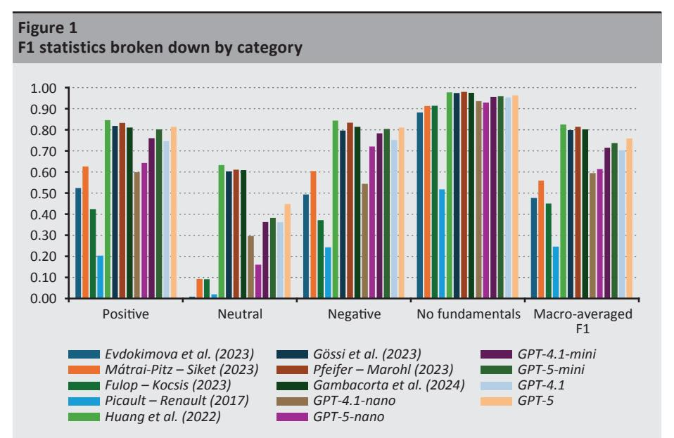
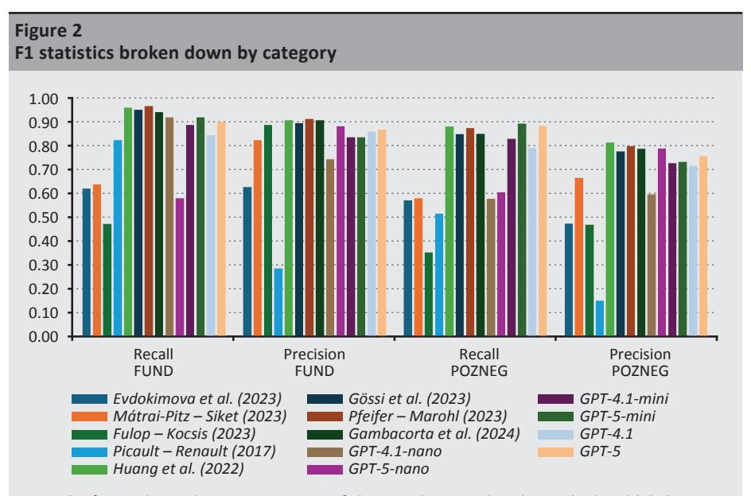
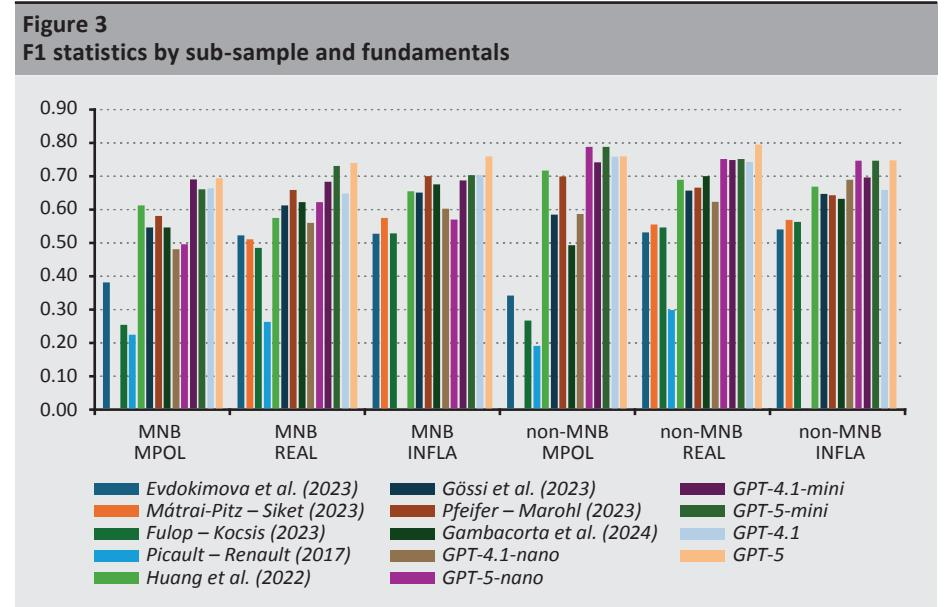

# **Which Text Method to Choose for Analysing Central Bank Communication? A Comparison of Artificial Intelligence and Previous Techniques\***

*[Zalán Kocsis](https://orcid.org/0000-0002-7844-7094) – [Mónika Mátrai-Pitz](https://orcid.org/0009-0008-2576-4193)*

*Our study compares the characteristics of text analysis methods on communications text samples of the US Federal Reserve and four Central and Eastern European central banks. Based on our results, methods based on BERT-type models are the most accurate at capturing the monetary policy, real economic and inflation information contained in central bank texts, outperforming OpenAI GPT-4.1 and GPT-5 models. BERT-type methods are faster than GPT models and can be run offline without a subscription, but their disadvantages are that the models require separate training, which entails hardware and labour costs, and that modifying the method is cumbersome. Conversely, GPT models are more flexible and have proven to be more accurate on new central bank samples. The dictionary-based methods used as benchmarks are significantly less accurate, but their use may be justified in certain cases due to their speed, cost-free operation and the transparency of the method.*

**Journal of Economic Literature (JEL) codes:** C55, C63, E52, E58

**Keywords:** central bank communications, artificial intelligence, text analysis

# **1. Introduction**

Automated analysis of central bank communication texts is becoming increasingly widespread as these methods become more accurate. The primary objective of our study is to answer the naturally arising question: which of the many existing methods should we use under different circumstances? To this end, we compare the most popular text analysis methods currently in use in respect of several characteristics (accuracy, speed, cost). The differences in the effectiveness of the methods may be of interest for the central bank communication literature, for

*Zalán Kocsis: Magyar Nemzeti Bank, Senior Economic Analyst. Email: [kocsisz@mnb.hu](mailto:kocsisz%40mnb.hu?subject=) Mónika Mátrai-Pitz: Magyar Nemzeti Bank, Lead Data Scientist. Email: [pitzm@mnb.hu](mailto:pitzm%40mnb.hu?subject=)*

We would like to thank our colleagues Péter Márk Kovács, Adrienn Lang, Tamás Molnár, Balázs Nagy, Szabolcs Pásztor and Péter Simon, who contributed to the preparation of this study with their helpful comments and manual annotations. The authors bear sole responsibility for any remaining errors.

The first version of the Hungarian manuscript was received on 15 September 2025.

DOI:<https://doi.org/10.33893/FER.24.4.34>

\* The papers in this issue contain the views of the authors which are not necessarily the same as the official views of the Magyar Nemzeti Bank.

example, with regard to which methods are worth using to measure the market impact of communication; for market participants, in terms of which method can be used to interpret central bank communication more accurately; and for central banks themselves, which seek to monitor their own impact and the information available to market participants.

Since the late 1990s, central bank communication has played an increasingly important role in the monetary policy toolkit. Communication explaining the background of decisions and forward guidance disclosing central bank forecasts has served several purposes. First, central bank transparency helps to achieve the central bank's inflation target by anchoring the expectations of economic operators and can mitigate the incorporation of short-term shocks into long-term expectations (*Blinder et al. 2008; Dovern et al. 2012; Eusepi – Preston 2010*). Second, more accurate knowledge of the central bank's forecasts and reaction function coordinates the expectations of market participants (*Ehrmann et al. 2010; Naszódi et al. 2016; Seelajaroen 2019*), which increases the predictability of the economy, reducing market volatility and the term premium of yields (*Poole et al. 2002; Gábriel – Pintér 2006; Horváth et al. 2014*). Third, through communication, the central bank can influence the market yield curve at a broader and more relevant horizon with respect to the real economy than with traditional base rate decisions. This facilitates monetary transmission.2

It is important for market participants to interpret central bank communication as accurately as possible. On the one hand, communication conveys information about the central bank's reaction function, which allows conclusions to be drawn about the variables that the central bank will take into account in its future decisions and the weight it will assign to such variables. On the other hand, communication also contains the central bank's views and forecasts on the state of the economy (the so-called information effect, *Romer – Romer 2000*). The information effect can be useful for market participants, because the central bank can devote relatively more resources to forecasting (e.g. it has a larger and better-prepared professional staff than most market participants). A more accurate interpretation of the information content of communication is valuable to market participants, because more accurate forecasts can provide a competitive advantage (e.g. trading consistent with more accurate interest rate forecasts than those of other participants is likely

&lt;sup>1 Blinder et al. (2008) provide a comprehensive summary of the early international literature on central bank communication. From the domestic literature, we would like to highlight the studies by Csortos et al. (2014), Bihari (2015) and Bihari – Sztanó (2015), which deal with experiences of forward guidance, and the study by Nagy Mohácsi et al. (2024), which compares central bank communication practices in developed and emerging markets.

&lt;sup>2 Empirical analysis of *Gürkaynak et al.* (2005) showed that on the days of the Fed's interest rate decisions the market impact of communication was greater than the impact of traditional interest rate policy decisions, using a sample that mainly covered the 1990s. Later, in the 2010s, when traditional interest rate policy instruments lost much of their significance due to the *zero lower bound*, central bank communication became even more important as a policy tool.

to be a profitable strategy) and can also make their investment decisions more sound in general.

In addition to the literature on central bank communication, our study is also related to the IT literature on automatic text analysis,3 whose methods have also found their way into the economics literature.4 The branch of economic literature on text analysis that is most relevant to us deals specifically with the analysis of central bank communication. Central bank tonality5 analysis was originally dominated by dictionary/rule-based approaches with varying complexity (*Apel – Blix Grimaldi 2012*; *Hansen – McMahon 2016*; *Correa et al. 2017*), but from the mid-2010s, these were joined by simpler supervised learning algorithms (*Tobback et al. 2017*) and unsupervised learning algorithms for topic identification (*Hansen – McMahon 2016*; *Hansen et al. 2018*; *Thorsrud 2018*). From the 2020s onwards BERT-type large language models became increasingly popular6 (*Pfeifer – Marohl 2023*; *Gambacorta et al. 2024*). In the last two to three years, generative artificial intelligence models began to be used (*Fanta – Horváth 2024*; *Hansen – Kazinnik 2024*; *Peskoff et al. 2024*; *Geiger et al. 2025*).

Given the objective of our study, it is most closely related to the segment that also deals with the comparison of text analysis methods. More specifically, our study primarily seeks to assess how effectively these methods can identify three fundamentals (monetary policy, real economic activity, inflation) and assess their tonality (tight/loose in the case of monetary policy and high/low, accelerating/ decelerating in the case of the other two).

Machine text analysis initially sought to automate the steps of traditional linguistic analysis, thus originally followed a rule-based approach. However, the path leading to the models currently in use has moved away from this direction and has led instead toward machine learning, both supervised (i.e. that uses human-annotated samples) and unsupervised. A notable milestone on this path was the application of deep learning algorithms (based on neural networks) to convert words (tokens) of texts into numerical values (Word2Vec: Mikolov et al. 2013, GloVe: Pennington et al. 2014), followed by the transformer architecture (Vaswani et al. 2017), which was better also at capturing the context of words. One of the first truly popular and still widely used large language models based on transformers is BERT, Bi-directional Encoder Representation from Transformers (Devlin et al. 2019), whose internal structure and parameter estimation method enabled it to arrive at a base model (the so-called pre-training phase) with advanced text analysis capabilities on its own, through self-learning instead of human annotation. The reason for the continued popularity of BERT models is that their source code and base model parameters are publicly available, so the model does not require resource-intensive pre-training to be used; it is sufficient to adapt the model to the task-specific application through fine-tuning (which, however, typically still requires human annotation). In the 2020s, development has entailed the creation of increasingly larger language models and the spread of generative models (e.g. GPT: Brown et al. 2020, Llama: Touvron et al. 2023), which have reduced the need for task-specific supervised training. Currently, the most important developments seem to be related to tool use by generative models, including RAG applications (Lewis et al. 2020), which involves effective interactions with knowledge base; code writing and web search capabilities; and more general independent tool use and related optimisation ReACT (Yao et al. 2023), on which artificial intelligence agents and agent systems are based. Another direction of development is to make models more cost- and scale-efficient (e.g. DeepSeek: Li et al. 2024).

 &lt;sup>4 Gentzkow et al. (2019) provide a detailed summary of this development up to the end of the 2010s.
5 Tonality refers to the product of direction (sign) and intensity. For example, a statement relating to monetary policy may be hawkish or dovish in orientation (sign) and it can be less or more so in either direction (intensity).

&lt;sup>6 This also includes other models based on the RoBERTa (Robustly Optimized BERT Approach) of *Liu et al.* (2019) and FinBERT of *Huang et al.* (2022), which, like the original BERT study (*Devlin et al., 2019*), are built upon the architecture presented therein.

Our study is most closely related to the papers of *Kim et al.* (*2024*)*, Gambacorta et al.* (*2024*)*, Pfeifer – Marohl* (*2023*) and *Hansen – Kazinnik* (*2024*), which also deal with different methods of analysing central bank texts and provide comparisons between them. Their comparisons include several BERT-type methods that we also use and GPT models one series earlier than the ones we tested. One of the main differences between these studies and ours is that in our case, we measure the performance of the models on central bank texts from several countries, which allows us to answer the question of how well individual models perform across text samples of different central banks. Another important difference is that our study contains human annotations for three fundamentals separately for each sentence,7 whereas these studies typically study either the general sentiment of the sentences (positive/neutral/negative) or indications of the monetary policy orientation of the sentences (from loose monetary policy to tight monetary policy) without topic breakdown. Topic breakdown naturally highlights the different performance of the methods for each fundamental.

The GPT prompts developed for our study also take steps towards extracting information from central bank communications that go beyond tonality (more detailed topics, level/change, timing, fact/expectation), and in this respect, we connect to the papers of *Byrne et al.* (*2023*), *Evdokimova et al.* (*2023*), *Geiger et al.* (*2025*) and *Yao et al.* (*2025*), which also deal with some of these aspects.

We are publishing our annotated database and a large part of our codebase to support research and analysis in this field.8

# **2. Data and methods**

#### **2.1. Text sample and human annotations**

Our text data comes from three sources, with the policy statements of the Magyar Nemzeti Bank (MNB) accounting for the largest share. The texts of 32 randomly selected statements from the period 2017–2024 comprise a total of 2,465 sentences. As for the other sources, we used texts published by two studies (*Gorodnichenko et al. 2023*; *Niţoi et al. 2023*) that were freely available on the internet, and we used

7 Human annotations (also known as manual or hand-coded labels) are manually performed sentence evaluations. The purpose of these annotations is to serve as a "grading key" with which we can measure the accuracy of automatic text analysis models. Since manual evaluations can also contain errors, the annotations are performed by several (two) analysts as common in the literature. Only matching annotations are taken into account in evaluation exercises. (Human annotations also play a further role in BERT-type models, where they serve as training samples in the supervised learning step.) In our case, the annotations were performed by colleagues from the central bank. It may be argued that central bank analysts can produce higher quality annotations than market analysts, but this is not necessarily the case, as central bank analysts have the same information (the specific sentence or communication they are required to evaluate) as anyone else who analyses this public content.

8 Available on the authors' project page [https://gitlab.com/central\\_bank\\_tonality/kocsis\\_matraipitz\\_2025\\_](https://gitlab.com/central_bank_tonality/kocsis_matraipitz_2025_codes) [codes](https://gitlab.com/central_bank_tonality/kocsis_matraipitz_2025_codes). Note that the paper's disclaimers apply to the supplementary data: published items do not reflect an official view of the MNB.

their annotations as a starting point for creating our own annotations. From the study of *Gorodnichenko et al.* (*2023*), we used the texts of the US Federal Reserve FOMC post-decision statements from 1997 to 2010 – a total of 1,243 sentences – along with their published 3-state (loose/neutral/tight) evaluations. *Niţoi et al.*  (*2023*) published a sample of annotated sentences from the 2007–2022 statement texts of four central banks (Polish, Hungarian, Romanian and Slovak). We filtered out the sentences from the MNB to avoid duplication with our own sample and to prevent the MNB data from becoming even more dominant compared to the other central banks in the sample. As a result, we used a total of 1,398 sentences from the Czech, Polish and Romanian central banks using this source. Our total sample thus contains 5,106 central bank communication sentences, roughly half (48.3 per cent) of which are from the MNB sample.9

For each statement (sentence), we asked two analysts from the MNB staff to evaluate the texts with respect to three macroeconomic fundamentals:

- MPOL (monetary policy):10 (positive) information suggesting a tight, restrictive ("hawkish") monetary policy; (neutral) information that mostly suggests a neutral policy; (negative) information suggesting a loose, expansionary ("dovish") monetary policy; (no fundamentals) no information on the given topic;
- REAL (real economic activity):11 (positive) favourable real economic information indicating a strong economy; (neutral) information that is mostly neutral in terms of the economy; (negative) unfavourable real economic information indicating a weaker economy; (no fundamentals) no information on the given topic;
- INFLA (inflation):12 (positive) information indicating higher or accelerating price dynamics; (neutral) information indicating stagnating and/or long-term average price dynamics; (negative) information indicating lower or slowing price dynamics; (no fundamentals) no information on the given topic.

9 In the case of the MNB, complete statements were included in the database; thus, we know the exact context of the sentences in this sample. However, the texts taken from the two studies contain sentences randomly selected by their authors without precise source references; therefore, the sentence context cannot be used in those cases.

All statement texts used are in English. In the case of the MNB, we used official English-language statements, and the texts used as the basis for the annotations in *Niţoi et al.* (*2023*) are also based on English-language statements. 10 Including interest rate policy, minimum reserve policy, foreign exchange market interventions, central bank

liquidity stimulus programmes, quantitative easing programmes. 11 This includes information on GDP growth, real macroeconomic activity, total income, output, industrial

production, investment, real estate market turnover, consumption, retail turnover, unemployment rate and employment. However, references to exports and fiscal expenditure are only considered relevant if they are explicitly mentioned as components of GDP. 12 This includes consumer and producer prices, wages (unless the reference is to real wages) and property

prices.

Our analysts could take into account the human annotations published by *Gorodnichenko et al.* (*2023*) and *Niţoi et al.* (*2023*) when preparing their own annotations. However, since these were not available in the breakdown by fundamentals that we specified, they had to supplement the original annotations with at least the topic information. In addition, they could override the original tonality annotations if they disagreed with them.

Finally, for every sentence and fundamental (*Table 1*) where the annotations of the two analysts agreed, we saved the annotation, and for annotations that did not agree, we removed the sentence (for that fundamental) from the sample. The annotations did not match in roughly 15–20 per cent of cases, leaving 80– 85 per cent of the sample (4,164, 4,175 and 4,328 sentences out of 5,106 for the three fundamentals, MPOL, REAL and INFLA, respectively).

| Table 1 Distribution of human annotations used |       |                     |       |                      |        |        |  |  |  |
|---------------------------------------------------|-------|---------------------|-------|----------------------|--------|--------|--|--|--|
|                                                   |       | Number of sentences |       | Percentage of sample |        |        |  |  |  |
|                                                   | MPOL  | REAL                | INFLA | MPOL                 | REAL   | INFLA  |  |  |  |
| Positive                                          | 251   | 499                 | 471   | 4.9%                 | 9.8%   | 9.2%   |  |  |  |
| Neutral                                           | 176   | 171                 | 268   | 3.4%                 | 3.3%   | 5.2%   |  |  |  |
| Negative                                          | 400   | 538                 | 344   | 7.8%                 | 10.5%  | 6.7%   |  |  |  |
| No fundamentals                                   | 3,337 | 2,967               | 3,245 | 65.4%                | 58.1%  | 63.6%  |  |  |  |
| Classification mismatch (=invalid)                | 942   | 931                 | 778   | 18.4%                | 18.2%  | 15.2%  |  |  |  |
| Total                                             | 5,106 | 5,106               | 5,106 | 100.0%               | 100.0% | 100.0% |  |  |  |
| Of which: valid                                   |       |                     |       |                      |        |        |  |  |  |
| MNB                                               | 1,993 | 2,018               | 2,048 | 47.9%                | 48.3%  | 47.3%  |  |  |  |
| Fed FOMC                                          | 886   | 943                 | 1,057 | 21.3%                | 22.6%  | 24.4%  |  |  |  |
| CNB                                               | 562   | 537                 | 559   | 13.5%                | 12.9%  | 12.9%  |  |  |  |
| NBP                                               | 364   | 338                 | 348   | 8.7%                 | 8.1%   | 8.0%   |  |  |  |
| NBR                                               | 359   | 339                 | 316   | 8.6%                 | 8.1%   | 7.3%   |  |  |  |
| Total                                             | 4,164 | 4,175               | 4,328 | 100.0%               | 100.0% | 100.0% |  |  |  |

*Note: The table shows the distribution of the human annotation sample used in our study in columns according to fundamentals (MPOL: monetary policy, REAL: real economic activity, INFLA: inflation) and in rows by annotated category values and distribution by central bank. The 'positive'/'negative' classification indicates tightening/easing in the case of MPOL, improvement/deterioration in real economic conditions in the case of REAL and acceleration/deceleration of inflation in the case of INFLA. The 'neutral' value indicates no change or historical average values. The 'no fundamentals' classification indicates when, according to the annotators, there was no information on fundamentals in the sentence. The 'classification mismatch' value indicates sentences where the two annotators' classifications differed; these annotations are considered invalid and are not used in training/testing.*

*Source: Authors' calculations*

# **2.2. Text analysis methods**

# *2.2.1. Rule-based methods*

For 10–15 years, rule-based or dictionary-based models dominated the economic literature and, within that, the literature on text analysis of central bank communication. Many such methods identified the topics and/or tonality of the fundamentals in the text based on whether the expressions corresponding to the rule/dictionary of the given topic/tonality could be found in the text (for example, typically, the words 'base rate' and 'increase' would indicate the MPOL fundamental and a tightening tonality).

We replicated and adapted four such methods for our purposes on our central bank texts.13 The methods of *Evdokimova et al.* (*2023*) and *Mátrai-Pitz – Siket* (*2023*) are very similar applications, both contain word lists on the topics of fundamentals and their tonality, and both deal with pitfalls such as opposing signs in the case of employment/unemployment rates, as well as dilemmas regarding negations. In addition to working with different dictionaries, the main difference between the two methods is that while *Evdokimova et al.* (*2023*) conduct the analysis at the sentence and clause level, *Mátrai-Pitz – Siket* (*2023*) disregard sentence boundaries and apply a window-based, keyword-centred approach. *Mátrai-Pitz – Siket* (*2023*) are available for the REAL and INFLA fundamentals, while *Evdokimova et al.* (*2023*) are available for all three fundamentals.14 The third, rule-based method by *Fulop – Kocsis* (*2023*) 15 differs from the previous two mainly in that it implements regular expressions for topics and tonality expressions, so that instead of individual words, expressions consisting of words at a certain distance from each other identify the fundamentals. This allows for more complex structures. Moreover, this method focuses on fundamental information that is relevant for measuring market effects; thus, the rules only attempt to capture forward-looking information. The fourth method by *Picault – Renault* (*2017*) contains an n-gram dictionary generated from ECB communication texts for the REAL and MPOL fundamentals. Similar to the previous method, this one also allows for longer word combinations and expressions, but here the dictionary of expressions is compiled automatically based on the occurrence of expressions (only neighbouring words) in the sample, rather than manually by human experts.16

13 We preferred newer methods that provided estimates at the sentence level for the fundamentals we examined. An important reference in the literature, *Apel – Blix-Grimaldi* (*2012*), was not included among the selected methods because, on the one hand, it optimised the search method at the statement level rather than at the sentence level, and on the other hand, their hawkish-dovish estimates (and of many

studies that followed) provide a combined estimate of the tonality of the REAL and INFLA fundamentals. 14 The method of *Evdokimova et al.* (*2023*) also divides the REAL and MPOL fundamentals into several

subtopics, which we aggregate as appropriate. 15 Compared to the published version, the code used here also contains rules for the INFLA fundamental,

which follow the same logic as the other fundamentals. 16 We used the authors' lexicon and replicated their method in Matlab to produce EC (economic) and MP (monetary policy) sentiment components, which we aggregate into the REAL and MPOL fundamental tonality classes at the sentence level that matches the output required by our application.

#### *2.2.2. BERT-type supervised learning methods*

Methods based on large language models using transformers can achieve significantly more accurate text analysis performance than rule-based methods. These are also becoming increasingly popular in the field of central bank communication. One approach that relies on domain adaptation typically relies on large language models such as BERT, developed by *Devlin et al.* (*2019*), or similar models such as RoBERTa (*Liu et al. 2019*). These pre-trained base models are sometimes further trained on the language of the specific field. Domain adaptation requires a large amount of text specific to the field's language (in our case, economics/central banking) and significant computational resources.

Finally, the models (whether BERT-type base models or domain-adapted models based on BERT-type base models) must be trained for the specific task (e.g. interpretation and annotation of central bank texts). This step, called fine-tuning, is a supervised learning step. Model fine-tuning requires a training sample, which is typically based on human annotations.

We selected four models from the literature that are most relevant to the current central bank context and whose underlying publications have received the most citations in recent years. One of these is the model published by the authors of the BIS (*Gambacorta et al. 2024*), which domain-adapted the RoBERTa base model specifically for central bank texts (RoBERTa+Sp+Pa).17 The authors used the hawkish/ dovish annotation of Fed communication sentences published by *Gorodnichenko et al.* (*2023*) for fine-tuning. *Pfeifer – Marohl* (*2023*) fine-tuned BERT, RoBERTa and other models on central bank communication texts. Of these their fine-tuned RoBERTa model performed best, published as the CentralBankRoBERTa model. This is the second BERT-type model that we use in our study.18

The third and fourth models are based on FinBERT models. On the one hand, we use the *Huang et al.* (*2022*) FinBERT-tone model, which pre-trained/domainadapted the BERT architecture using 4.9 billion tokens of financial text (corporate announcements, financial analyses, earnings reports).19 On the other hand, we use the *Gössi et al.* (*2023*) FinBERT-FOMC model, which fine-tuned another FinBERT model (a BERT model domain-adapted to Reuters news by *Araci 2019*) using annotations (negative/neutral/positive tonality) from FOMC reports.20

17 Of the models published on [https://bis.org/publ/work1215.htm,](https://bis.org/publ/work1215.htm) we used the version in which speeches

were used for domain adaptation, in addition to research papers. 18 This model therefore does not include domain adaptation, only fine-tuning. However, it may be worthwhile to start with such fine-tuned models for our own fine-tuning in cases where the preliminary fine-tuning is similar to our own application. In this case, the model still contains the information from the previous authors' training sample. The model used is available at [https://huggingface.co/Moritz-Pfeifer/Central-](https://huggingface.co/Moritz-Pfeifer/CentralBankRoBERTa-sentiment-classifier)

[BankRoBERTa-sentiment-classifier](https://huggingface.co/Moritz-Pfeifer/CentralBankRoBERTa-sentiment-classifier). 19 The model used is available at <https://huggingface.co/yiyanghkust/finbert-tone>. 20 The model used is available at <https://huggingface.co/ZiweiChen/FinBERT-FOMC>.

The four selected models were fine-tuned using 3,323 human-annotated sentences for the main results (in the case of the sample split in *Section 3.3,* we used the total MNB and non-MNB subsamples, 2,465 and 2,641 sentences respectively for fine-tuning), of which we used a randomly selected 20 per cent for validation during training. We did not use this part of our annotated database for testing the methods.

When fine-tuning the models of the BERT family, we built an output head above a single encoder that makes independent decisions on the monetary policy, real economic and inflation dimensions consistently with a multi-label layout. The multilabel solution trains a common language representation while making separate decisions for each task, thus better matching the actual content structure and utilising the data more efficiently. The modelled linguistic phenomena (polarity verbs, modifiers, negation, uncertainty expressions) reinforce each other, allowing the model to learn more stable and general patterns from fewer samples. Several robustness elements also support the quality of fine-tuning: (i) weighted loss to highlight rare classes and monetary policy tasks; (ii) handling missing labels; (iii) macro-F1-based model selection and early stopping to avoid overfitting.21

#### *2.2.3. Generative AI methods based on GPT models*

Another popular group of methods based on transformers and large language models turns to the use of generative artificial intelligence. The promise of generative artificial intelligence models, such as OpenAI's GPT models (version 3.5 and above),22 is that, their superiority regarding the model size and large pretraining make them generally suitable for most tasks. Therefore, it is sufficient to describe the specific task in a (well-written) prompt without having to perform the supervised learning and fine-tuning steps described before. This provides savings on human annotation, eliminates the need for computational capacity to run finetuning and calling the model does not require a large computer as GPT models are run on OpenAI's servers. For more complex cases, it is recommended to provide a few input-output examples in the prompt (few-shot learning), and for even more complex cases, the Chain-of-Thought method has become popular (*Wei et al. 2022*), which breaks the task down into smaller, sequential steps (typically also requiring explanations of the sub-tasks), causing the model to devote more time/energy to

21 We applied weighting at two levels in the training. On the one hand, we compensated for the imbalance at the class level – especially in the extreme categories (positive, negative) – so that the model would not skew towards the majority, "no information" direction. On the other hand, at the task level, monetary policy errors were given greater weight in the loss, as the model typically performed worse on learning this task. With partial labelling, sentences where one or two dimensions are missing were also utilised. The loss was the weighted average of the cross-entropies of the tasks, which omits the missing labels, thus ensuring stable learning even with unbalanced annotations. 22 Several other generative artificial intelligence products have emerged alongside GPT models (Google Gemini,

Anthropic Claude, MS Copilot, DeepSeek models). The reason for selecting GPT is that we had a subscription for its API. Among the free generative AI models (e.g. Meta Llama), those that our computing capacity would allow us to use perform significantly worse; therefore, they are not included in the comparison.

the solution. In our case, the use of the Chain-of-Thought method is obvious (for example, topic identification is one step, tonality is another, and the identification of several other types of information are also separate steps, as discussed in *Section 4*).

From 2024 H2, OpenAI is also publishing so-called reasoning models (o1, o3, o4 and then the GPT-5 series), which promise to perform the Chain-of-Thought steps internally. In the study, we used the best available reasoning (GPT-5) and non-reasoning (GPT-4.1) models at the time of writing the study, which OpenAI released in August 2025, running each on three available model sizes (nano, mini and normal). Larger models offer better performance, but require longer runtimes and involve higher costs.

#### 2.3. Evaluation metrics used

To evaluate and compare the methods, we use statistical methods that are best suited to our discrete, multi-class and unbalanced data. In our application, each sentence can take four discrete values (positive, neutral, negative, no fundamentals) for all three fundamentals, of which the "no fundamentals" class is the dominant part of the sample (*Table 1*). In terms of evaluation metrics, we also expect both the recall (which measures what percentage of items belonging to a given label were retrieved and what percentage were missed – type II error) and precision (measuring what percentage of predictions of a given label were correctly identified vs the percentage that were incorrect – type I error) statistical indicators to be addressed by our evaluation. These criteria are best met by the macro-averaged F1 statistics (*Grandini et al. 2020*).23

The macro-averaged F1 statistic is the arithmetic mean of the F1 statistics taken for each value category (i=1,...,K). The F1 statistics for each value category ( $F1_i$ ) are the harmonic mean of the binary recall ( $TruePoz_i/(TruePoz_i+FalseNeg_i)$ ) and binary precision ( $TruePoz_i/(TruePoz_i+FalsePoz_i)$ ) for each category (Takahashi et al. 2022):

$$F1_i = 2 \frac{Precision_i + Recall_i}{Precision_i^{-1} * Recall_i^{-1}}$$
 (1)

$$\overline{F1}_{macro} = \sum_{i=1}^{K} F1_{i} \tag{2}$$

&lt;sup>23 The most popular classification statistic is accuracy (the number of correctly predicted labels divided by the number of items), which has the problem that in the case of unbalanced data, the category with a large number of items (in our case, 'no fundamentals') will determine the statistic. Balanced accuracy corrects for this but is limited to recall, thus ignoring type I errors. Nevertheless, we also calculated balanced accuracy statistics for all our results, which resulted in values similar to the F1 statistics reported.

*Takahashi et al.* (*2022*) developed asymptotic standard errors for the macroaveraged F1 statistics, but we use bootstrap confidence intervals due to the unbalanced sample and low number of elements in some categories.24

The evaluation of the methods is performed on a randomly selected 40-per cent subsample of the entire sample, where in the case of the MNB, we use randomly drawn entire statements, and in the case of the other central banks, we draw 40 per cent of sentences into the test set.

# **3. Results**

## **3.1. Initial evaluation of model classification performance**

Our main findings, the macro-averaged F1 statistics of various methods, are presented in *Table 2*.

Based on the F1 metric, a clear hierarchy emerges among the model families. The highest values for all fundamentals are achieved by BERT-type models. Based on the (bootstrapped 95 per cent) confidence intervals, these models are significantly better than all rule-based models and most GPT models. For the REAL and INFLA fundamentals, even the F1 values of the weakest BERT-type models are significantly higher than the F1 values of the GPT family, with the exception of the GPT-5 model, for which the F1 point estimates are also higher, but the confidence intervals overlap here. GPT-type models have significantly higher F1 statistics than rule-based models for all fundamentals.25

The better predictions of the BERT family may generally be due to the fact that these task-specific fine-tuned models are better suited to the domain and labelling rules than the online, more general-purpose GPT models. The fine-tuned models learn the central bank-specific style of our data, the sentence structures that best fit the annotations (including, ad absurdum, systematic errors in the annotations). In addition, they are characterised by a higher degree of determinism and consistency. By contrast, GPT models are universal-purpose models that are not specifically optimised for a given task, and although their significantly larger model size, taskspecific prompts and CoT reasoning techniques improve their performance on a given task, they still lag behind the fine-tuned models of the BERT family.

24 For this, we used Jacob Gildenblat's code as a basis: <https://github.com/jacobgil/confidenceinterval> 25 We need to emphasise that the original rule-based methods that we used of various authors were developed for different applications (and for different datasets), not specifically the one used in our research, so they needed adaptation to our application output requirements. This represents an 'unfair' disadvantage which may contribute to the weaker performance of these models compared to the BERT-type and GPT-based models, which were created and tuned specifically for these tasks.

These results are largely consistent with those reported in the literature. *Kim et al.*  (*2024*) compared models in identifying positive/neutral/negative sentiments in Fed FOMC reports. Based on their results, BERT-type models had significantly higher F1 values than the rule-based VADER method, and the FinBERT-FOMC model's F1 value also outperformed GPT-4 in their case, although it fell short of the F1 value of the Llama models. *Huang et al.* (*2022*) also reported higher F1 values for BERT-type models compared to other rule-based models. *Gambacorta et al.*  (*2024*) found that regarding monetary policy tonality identification the accuracy of their RoBERTA+Sp+Pa model outperformed the performance of the then-standard GPT models (series 3.5 and 4) and other generative large language models (Llama, Mistral) in most cases.26 Based on the results of *Pfeifer – Marohl* (*2023*), BERTtype models performed better in sentiment classification compared to rule-based machine learning methods.

The differences between model families are generally greater than those within model families. Based on the F1 confidence intervals of BERT-type models, the differences do not reach the usual statistical error threshold, but based on point estimates and the three fundamentals as a whole, the FinBERT-tone model of *Huang et al.* (*2022*) appears to be the best. In the case of inflation, the F1 value is highest for the *Pfeifer – Marohl* (*2023*) CentralBankRoBERTa model.

There are few surprises in the comparisons between GPT models. Increasing model size improves F1 statistics (the difference between nano and mini models is significantly greater than between mini and normal models). Chain-of-Thought models are weaker than Reasoning models. Among the GPT models, the GPT-5 model produces the highest F1 statistics for all three fundamentals.

Among the rule-based models, the method developed by the authors of the MNB (*Mátrai-Pitz – Siket 2023*) stands out from the rest for both fundamentals for which this method is available (REAL, INFLA). The regular expression-based model (*Fulop – Kocsis 2023*) and *Evdokimova et al.* (*2023*) achieve lower but similar statistics to the method of *Mátrai-Pitz – Siket* (*2023*) on these fundamentals. All of the methods produce weaker F values on the MPOL fundamental, which may indicate that the vocabulary of this fundamental is the most complex and that it is the most difficult to establish rule-based identification for it. The weaker performance of the *Picault– Renault* (*2017*) method may be explained by the fact that this method is specifically tailored to ECB communications, which is not part of our sample.

26 The performance order was reversed in special cases: on the one hand, when fine-tuning GPT and Llama models and, on the other hand, when the task was to evaluate the tonality of longer news texts instead of sentences on a smaller training sample.

| Table 2 Macro-averaged F1 statistics |                            |                 |                                 |                 |
|-----------------------------------------|----------------------------|-----------------|---------------------------------|-----------------|
| Authors                                 | Model                      | MPOL            | REAL                            | INFLA           |
| Evdokimova et al. (2023)                | rule-based                 | 0.357           | 0.532                           | 0.540           |
|                                         |                            | [0.334 – 0.383] | [0.511 – 0.551]                 | [0.518 – 0.563] |
| Mátrai-Pitz – Siket (2023)              | rule-based                 | na              | 0.541                           | 0.576           |
|                                         |                            | na              | [0.514. 0.574]                  | [0.550. 0.603]  |
| Fulop – Kocsis (2023)                   | rule-based, regex          | 0.261           | 0.532                           | 0.555           |
|                                         |                            | [0.245 – 0.287] | [0.502 – 0.570]                 | [0.527 – 0.586] |
| Picault – Renault (2017)                | rule-based, n-gram         | 0.204           | 0.285                           | na              |
|                                         |                            | [0.189 – 0.227] | [0.268 – 0.303]                 | na              |
| Huang et al. (2022)                     | BERT-family, FinBERT-tone  | 0.794           | 0.844                           | 0.838           |
|                                         |                            |                 | [0.761 – 0.826] [0.814 – 0.874] | [0.811 – 0.863] |
| Gössi et al. (2023)                     | BERT-family, FinBERT-FOMC  | 0.763           | 0.823                           | 0.809           |
|                                         |                            | [0.727 – 0.795] | [0.791 – 0.853]                 | [0.780 – 0.838] |
| Pfeifer – Marohl (2023)                 | BERT-family, C.B.RoBERTa   | 0.778           | 0.827                           | 0.839           |
|                                         |                            | [0.744 – 0.812] | [0.795 – 0.857]                 | [0.812 – 0.865] |
| Gambacorta et al. (2024)                | BERT-family, CB-LM RoBERTa | 0.754           | 0.830                           | 0.823           |
|                                         |                            | [0.718 – 0.788] | [0.798 – 0.860]                 | [0.795 – 0.851] |
| OpenAI (2025)                           | CoT, GPT-4.1-nano          | 0.516           | 0.604                           | 0.661           |
|                                         |                            | [0.482 – 0.550] | [0.577 – 0.633]                 | [0.631 – 0.692] |
| OpenAI (2025)                           | Reasoning, GPT-5-nano      | 0.584           | 0.646                           | 0.610           |
|                                         |                            | [0.549 – 0.623] | [0.615 – 0.686]                 | [0.582 – 0.644] |
| OpenAI (2025)                           | CoT, GPT-4.1-mini          | 0.712           | 0.733                           | 0.701           |
|                                         |                            | [0.682 – 0.744] | [0.700 – 0.769]                 | [0.669 – 0.733] |
| OpenAI (2025)                           | Reasoning, GPT-5-mini      | 0.716           | 0.748                           | 0.747           |
|                                         |                            | [0.684 – 0.751] | [0.717 – 0.780]                 | [0.716 – 0.777] |

*Note: The table shows macro-averaged F1 statistics and bootstrap confidence intervals for the evaluation of model estimates against human annotations for 14 models and three fundamentals. We used a randomly selected sub-sample of 2,384 sentences from the statements/sentences of five central banks as the test sample. We highlighted the models with the highest F1 statistics for each fundamental. Source: Authors' calculations*

OpenAI (2025) CoT, GPT-4.1 0.711 0.714 0.684

OpenAI (2025) Reasoning, GPT-5 0.738 0.778 0.762

*[0.677 – 0.748] [0.681 – 0.750] [0.652 – 0.719]*

*[0.704 – 0.773] [0.746 – 0.813] [0.730 – 0.792]*

# **3.2. Evaluation of classification performance components**

Next, we examine the background of the differences seen between F1 statistics using the components of the metric. The tables in the *Annex* provide the most detailed breakdown of observations by fundamentals, value categories and hit/ error types.

*Figure 1* analyses the background of the aggregated F1 indicator by value category (but averaged across fundamentals). Based on the figure, all methods are best in identifying the 'no fundamental information' category. Identifying the presence of fundamentals is a topic identification task, and it seems intuitive that this is an easier task than labelling tonality. By contrast, the most difficult task for all methods seems to be identifying the 'neutral' category. This is understandable, on the one hand, because the 'neutral' category is located between the other two tonality categories (swapping positive and negative labels is more difficult than swapping neutral with either of the other two) and, on the other hand, because the 'neutral' category can be most easily confused with cases where the information about the fundamental is also uncertain.

The relative performance differences between the model families are significant. BERT-type models continue to perform the best in all value categories, but their advantage is particularly significant in the recognition of the neutral category compared to other model families. Rule-based models lag behind other methods the most in the 'neutral' category and least in the 'no fundamentals' category.27

27 Based on the tables in the *Annex*, the number of elements in the 'neutral' category is about one-half or onethird of the positive and negative categories, but the hit rates are much lower for all methods. Type II errors are particularly high in rule-based methods (these are false negatives, i.e. when the method categorises a neutral value item in other classes), with fewer than 10 hits out of around 70–100 neutral cases for rulebased methods, while the hit rate for BERT-type methods is well over 50 per cent, and for GPT models it is typically 20–30 per cent. By contrast, for the 'positive' and 'negative' categories, the rule-based (true positive) hit rates are around 30*–*50 per cent, while for BERT and advanced GPT methods, they are typically 70–80 per cent, with little difference between the two families. Based on this, it is primarily the performance in the 'neutral' category that determines the differences in F1 statistics between the model families.

*Note: The figure shows the point estimates of the F1 indicator values by method and label category (positive/neutral/negative/no fundamental) broken down by the average of the three fundamentals. The values can be grouped by fundamentals because the positive/neutral/negative values are most consistent with tight/neutral/loose monetary policy orientation in all three fundamentals.*

*Source: Authors' calculations*

The macro-averaged F1 statistic (2) is the harmonic mean of the macro-averaged recall and precision metrics, which are the unweighted averages of the recall and precision metrics for each value category. *Figure 2* compares recall and precision metrics between methods in terms of both fundamental identification (averages of the 'no fundamental information' category across fundamentals) and the identification of signed tonalities (averages of the 'positive' and 'negative' categories across fundamentals).

Based on the figure, the order previously seen in the model families' performances mostly prevails, but there are some interesting differences compared to the aggregated statistics. On the one hand, in terms of identifying fundamentals, rule-based models generally achieve much better results in terms of precision than recall, with *Mátrai-Pitz – Siket* (*2023*) catching up to the GPT models and *Fulop – Kocsis* (*2023*) surpassing such models in this respect. According to these findings, rule-based models tend to be weak in terms of type I errors (they often miss fundamentals that human annotators find), but they make fewer type II errors (so fundamentals identified are rarely incorrect). An exception in this regard is the model of *Picault – Renault* (*2017*), which, on the contrary, is strong in recall.

However, rule-based models are generally weaker than the other two model families in terms of positive/negative tonality identification, which is consistent with the results shown in *Figure 1*. Tonality is significantly more difficult to capture for all methods, but even more so for fixed dictionaries, because typically several words together specify this content, and the words that make up the components also have many synonyms, making them difficult to list. Large language models, on the other hand, are better at capturing the context of words. GPT models are generally strong at highlighting these information elements, but BERT-type models can adapt even more accurately to a given technical environment or jargon through finetuning (and domain adaptation). GPT models can only outperform BERT models in the tonality recall metric for larger reasoning models (i.e. they can achieve a higher proportion of true positive/negative tonality, but their precision is weaker; therefore, the estimated positive/negative tonality is often inaccurate).

*Note: The figure shows the point estimates of the F1 indicator values by method and label category (positive/neutral/negative/no fundamental) broken down by the average of the three fundamentals. The values can be grouped by fundamentals because the positive/neutral/negative values are most consistent with tight/neutral/loose monetary policy orientation in all three fundamentals.*

*Source: Authors' calculations*

It is also interesting to note that, with regard to the components shown in both figures, the order of the two FinBERT and two RoBERTa-type models (of the point estimates) remains the same (the FinBERT-tone indicators are higher than FinBERT-FOMC, and the CentralBankRoBERTa indicators are higher than those of the RoBERTa+Sp+Pa model), although the differences are not statistically significant.

#### **3.3. Generalisation ability based on central bank split samples**

So far, we have selected the test sample from the entire set at random; thus, these results allow us to predict how accurate different methods could be in terms of unseen central bank text. Next, we split the sample by central bank sources, which allows us to predict how transferable/consistent the model performances are expected to be on the texts of other central banks.

We divided the sample into two parts, with one sub-sample containing only MNB communications and the other containing communications from the four other central banks.28 This time, we trained/fine-tuned the BERT-type models on non-MNB texts before testing them on the MNB test samples, and we used MNB texts for training before testing on the non-MNB test sample. Sub-sample testing can provide an indication of how training with a given central bank text sample will result in classification outcomes for texts from other central banks in the case of fine-tuned models. Similarly, for other methods, this test can indicate whether the rules/ prompts lead to different classification results between different central banks. The sample division also results in an additional test (which cannot be handled separately from the previous ones) in that, while the non-MNB central bank texts are random sentence draws from statements, in the case of MNB texts, our samples treat entire statements together, which may be an advantage for some methods (notably *Fulop – Kocsis 2023* and GPT models, with reasoning models taking into account the entire statement when annotating sentences), and human annotators were also able to take context into account when labelling MNB sentences. MNB texts account for almost one-half of the total sample, leaving a sufficiently large number of elements for testing even rare categories.

28 If we further split up the four other central bank texts, we would not have enough observations in the categories with low numbers of elements.

*Note: The figure shows the point estimates of the F1 indicator by method and by three fundamentals narrowing the test sample to two sub-samples: a sub-sample containing only MNB statements and a sub-sample containing texts from the four other central banks. This time, we trained/fine-tuned the BERT-type models on non-MNB texts before testing them on the MNB test samples, and we used MNB texts for training before testing on the non-MNB test sample.* 

*Source: Authors' calculations*

One important lesson from *Figure 3* is that the classification performance of BERT-type models decreases significantly when the training sample and the test sample come from different central banks. BERT-type models still offer significantly stronger classification performance than rule-based models, but they lag behind the performance of the best GPT models. Therefore, in order to realise the performance advantage of BERT-type models, it is essential to fine-tune them for specific text types and tasks, as they are less suitable for generalisation and efficient performance on data external to training.

For the most part, the order within the previously seen model family remains unchanged, with *Huang et al.* (*2022*) having higher F1 metrics than the other FinBERT-type model, and the *Pfeifer–Marohl* (*2023*) model performing better than the other RoBERTa-type model. Among the rule-based models, *Mátrai-Pitz – Siket* (*2023*) and, in the case of the MPOL fundamental, *Evdokimova et al.* (*2023*) are usually the strongest, while among the GPT series, the GPT-5 model typically produces the highest F1 values. Our preliminary expectation that GPT models (and the *Fulop – Kocsis 2023* rule-based method) will achieve better classification results on MNB texts due to their knowledge of the context of the sentences is not confirmed; in fact, in the case of the MPOL and REAL fundamentals, the F1 values are higher on the non-MNB sample, while the results are mixed for the INFLA fundamental.

In comparisons across fundamentals, in the case of rule-based methods, the MPOL F1 values for both sub-samples lag significantly behind the values achieved for the other two fundamentals. However, this difference is not evident in the case of BERTtype and GPT models. In the MNB sub-sample, most models perform somewhat weaker on the MPOL fundamental, but in the non-MNB sub-sample, the models perform more mixed across fundamentals.

#### **3.4. Speed and costs**

Another consideration when choosing models may be the runtime and the costs of running the models. Our own experiences are presented in *Table 3*. It should be noted that the runtime depends largely on the hardware used for rule-based methods and on-prem BERT-type models but does not matter for GPT models (which run in the cloud). The runtime shown in the table can, of course, be significantly reduced if parallelisation is possible, but where we used parallelisation, we multiplied the experienced runtime by the number of execution threads so that the values shown in the table would be understandable/comparable without parallelisation. The runtime does not include the time required to create the models (in the case of BERT-type models, annotation and model training; in the case of rule-based and GPT models, the creation of rules and prompts).

In terms of costs, it should be noted that we only measured the costs of GPT runs in the table and did not consider the indirect, potentially significant costs associated mainly with BERT-type solutions (costs associated with greater server capacity: labour and energy costs related to hardware procurement, installation and maintenance, human annotation costs).

| Table 3                             |  |
|-------------------------------------|--|
| Runtime and direct costs of running |  |

|                            | Runtime (minutes) |                     |      |  |
|----------------------------|-------------------|---------------------|------|--|
|                            | MNB test sample   | Non-MNB test sample | USD  |  |
| Evdokimova et al. (2023)   | 0.4               | 0.4                 | 0.0  |  |
| Mátrai-Pitz – Siket (2023) | 0.3               | 0.1                 | 0.0  |  |
| Fulop – Kocsis (2023)      | 0.8               | 0.8                 | 0.0  |  |
| Picault – Renault (2017)   | 0.9               | 0.9                 | 0.0  |  |
| Huang et al. (2022)        | 20.3              | 18.4                | 0.0  |  |
| Gössi et al. (2023)        | 16.5              | 16.1                | 0.0  |  |
| Pfeifer – Marohl (2023)    | 21.6              | 15.0                | 0.0  |  |
| Gambacorta et al. (2024)   | 17.9              | 20.2                | 0.0  |  |
| GPT-4.1-nano               | 182.8             | 241.0               | 2.7  |  |
| GPT-5-nano                 | 101.0             | 605.1               | 3.1  |  |
| GPT-4.1-mini               | 211.7             | 275.7               | 12.2 |  |
| GPT-5-mini                 | 129.5             | 766.7               | 7.4  |  |
| GPT-4.1                    | 240.9             | 278.3               | 51.8 |  |
| GPT-5                      | 209.9             | 1,140.7             | 46.8 |  |

*Note: The table shows the runtime and direct execution cost (USD) of the two parts of the test sample (a total of approximately 2,100 sentences) for each method on our server (we adjusted for time savings due to parallelisation; thus, the time requirement shows how many minutes it would have taken to run the test sample on our server with 1 execution thread).*

*Source: Authors' calculations*

Taking these disclaimers into account, we can conclude that in terms of direct runtime, rule-based methods were 10–50 times faster than BERT-type models. There were no significant differences in speed between BERT-type models (within the model family), while CoT GPT models were about ten times slower, and the speed of GPT reasoning models (GPT 5 series) depended largely on the test sample: on the MNB sample (where the model could evaluate the sentences of statements together), it was somewhat faster than the CoT GPT models, but on the non-MNB test sample evaluated sentence-by-sentence, it was three to four times slower than the CoT models. In terms of direct execution costs, there were significant differences between GPT models depending on model size, with a factor of 5 between categories.

# **4. Extensions**

At the end of the study, we would like to briefly discuss research directions that we consider promising based on the literature and our own experiences.

One such direction, which we have seen in a few studies and which we also use in our own codes, is extending the information retrieval of central bank communications in multiple directions. The literature standard continues to be tonality identification on a simple positive/negative or hawkish/dovish scale. Of course, the information contained in communication is much more complex, and its more accurate understanding may help measuring and explaining communication market effects and other central bank applications.

*Yao et al.* (*2025*) attempt to identify macroeconomic causal chains in Fedspeak communication that can be understood behind monetary policy orientation. *Geiger et al.* (*2025*) use a Chain-of-Thought prompt technique to determine the intensity of the tonality after the sign and then evaluate this monetary policy stance in the text together with other information on existing fundamentals (e.g. in light of the staff's inflation forecasts).

Our own GPT prompts go further in the direction of the following layers of information:

- We identify the tonality for three fundamentals separately, but we also identify topics within the fundamentals. We see this elsewhere as well, e.g. *Evdokimova et al.* (*2023*) identify forward guidance and quantitative easing components in the case of the MPOL fundamental and specify labour market activity within real activity. We go further than this, identifying seven topics for the REAL fundamental, six for MPOL and four for INFLA.
- We determine which geographical unit the fundamental information relates to (it matters whether a central bank is talking about its own or global growth prospects).
- We highlight the dynamics of the fundamentals (often, human and machine annotations are confused by contradictory information about levels and changes: e.g. 'unemployment rose moderately but remains at historically low levels').
- We attempt to identify temporal information (whether the tonality of the fundamental refers to the past, present or future). An important contribution in this regard is *Byrne et al.* (*2023*), which documents in detail that temporal information significantly explains surprises in yields.
- Separation of facts/surprises/expectations and upside/downside risks within expectations.
- Finally, for tonality, we ask not only for signs but also for different intensities in the prompt (on a scale from –3 to +3), as many others do.

*Table 4* shows the more detailed output of our GPT prompts by the GPT-5 model for the three FOMC sentences in the sample of *Gorodnichenko et al.* (*2023*).

|                                                                                                                                                 | More detailed outputs of the GPT pro |                      | mpt for selected sentences |                                    |               |                      |          |            |
|-------------------------------------------------------------------------------------------------------------------------------------------------|--------------------------------------|----------------------|----------------------------|------------------------------------|---------------|----------------------|----------|------------|
| Sentence                                                                                                                                        | Topic code                           | Topic text           | GEO                        | Tone text                          | Tone score | Actual v expected | Dynamics | Time frame |
| The Committee will maintain the                                                                                                                 | MPOL_RATE                            | federal funds rate   | United States              | range unchanged                    | 0             | OBSERV               | CHANGE   | CURRENT    |
| target range for the federal funds rate at 0 to 1/4 per cent and                                                                             | MPOL_RATE                            | federal funds rate   | United States              | 0 to 1/4 per cent                  | –3            | OBSERV               | LEVEL    | CURRENT    |
| continues to anticipate that                                                                                                                    | MPOL_FG                              | forward guidance     | United States              | low rates extended period          | –2            | EXPECT               | LEVEL    | FUTURE     |
| warrant exceptionally low levels of economic conditions are likely to the federal funds rate for an extended period.                   | REAL_CYCLE                           | economic conditions  | United States              | weak economic conditions           | –2            | EXPECT               | LEVEL    | FUTURE     |
| Although inflation pressures seem                                                                                                               | REAL_CYCLE                           | resource utilisation | current country            | high level of resource utilisation | 2             | OBSERV               | LEVEL    | CURRENT    |
| likely to moderate over time, the high level of resource utilisation                                                                         | INFLA_CPI                            | inflation pressures  | current country            | likely to moderate                 | –2            | EXPECT               | CHANGE   | FUTURE     |
| has the potential to sustain those pressures.                                                                                                | INFLA_CPI                            | inflation pressures  | current country            | sustain those pressures            | 2             | EXPECT_POSRISK       | LEVEL    | FUTURE     |
| Although economic activity is                                                                                                                   | MPOL_GEN                             | monetary stimulus    | current country            | monetary stimulus                  | –2            | OBSERV               | LEVEL    | CURRENT    |
| likely to remain weak for a time, the Committee continues to                                                                                 | REAL_GDP                             | economic activity    | current country            | likely to remain weak              | –2            | EXPECT               | LEVEL    | MedFUTURE  |
| anticipate that policy actions to                                                                                                               | REAL_GDP                             | economic growth      | current country            | gradual resumption                 | 2             | EXPECT               | CHANGE   | MedFUTURE  |
| institutions, fiscal and monetary stabilise financial markets and                                                                            | REAL_GDP                             | economic growth      | current country            | sustainable                        | 2             | EXPECT               | LEVEL    | MedFUTURE  |
| economic growth in a context of stimulus, and market forces will resumption of sustainable contribute to a gradual price stability. | INFLA_CPI                            | price stability      | current country            | price stability                    | 0             | EXPECT               | LEVEL    | FUTURE     |

*Note: The table shows the results of the GPT-5 model's more detailed outputs (topic, geographical location, tonality, fact/expectation, dynamics: level/change, time frame) based on three selected Fed FOMC statement sentences.* 

*Source: Authors' calculations*

Extracting such diverse information is not feasible for either rule-based (the rule system would be too complex) or BERT-type methods (it would require a huge human-annotated sample to ensure that there are enough elements for each of the many possible value categories); therefore, generative models working with prompts may be the way forward in this area.

Another direction that we consider promising and that is also mentioned in the literature (e.g. *Geiger et al. 2025*) is to use annotations from generative large language models instead of/in addition to costly human annotations for fine-tuning BERT-type models. Based on our previous results, BERT-type models can only deliver truly accurate classification performance if they are specifically fine-tuned to the texts of a given central bank. Since obtaining human annotations can be timeconsuming and costly, it may sometimes be easier to perform labelling with a more powerful online generative model (e.g. OpenAI's large GPT models). BERT-type models trained on a few hundred/thousand sentences can then be run faster than GPT models and without subscription costs to evaluate a broader text database.

# **5. Conclusions**

Our study aims to contribute to the growing body of literature on central bank text analysis by comparing the different characteristics of three model families (rulebased, BERT-type and GPT models) in terms of three macroeconomic fundamentals, using the texts of five central banks. Based on the results, although there are significant differences in their classification performance, all three model families may be justified for use depending on the human, IT and financial resources and time constraints of the given task at hand.

The significantly weaker classification performance of rule-based methods can sometimes be compensated for by the speed (an order of magnitude better than BERT-type models and two orders of magnitude better than GPT models), low cost (no human annotations required, low hardware requirements) and transparency of the methods (no black box nature).

In line with the results in the literature, BERT-type models, with appropriate human annotation, outperform even the most powerful GPT models. BERT-type models are also significantly faster, can be run offline and therefore do not require a subscription. Human-annotated training samples tailored to the specific central bank text is important for the outstanding performance of these models (they lose their advantage over GPT when used on central bank texts other than they were trained on), and they have larger hardware requirements to run than the other two model families.

GPT models perform depending on their size and series, with newer, larger models providing better classification performance at higher execution costs and longer runtimes. A significant advantage of GPT models is that they do not require human annotation, and prompts can be used flexibly, especially in newer reasoning models, to extract a wide range of information from the text. Furthermore, if a newer, better-performing model appears, it can be more easily integrated into our existing processes.

In some cases, it may be advisable to use combinations of model families. For example, it may be worthwhile to use more expensive and slower large GPT models to create smaller annotation samples, which can then be used to train BERT-type models to analyse larger databases more quickly and cost-effectively.

# **References**

- Apel, M. Blix Grimaldi, M. (2012): *The Information Content of Central Bank Minutes*. Working Paper No. 261, Sveriges Riksbank. <https://doi.org/10.2139/ssrn.2092575>
- Araci, D. (2019): *FinBERT: Financial Sentiment Analysis with Pre-Trained Language Models*. arXiv preprint arXiv:1908.10063.<https://doi.org/10.48550/arXiv.1908.10063>
- Bihari, P. (2015): *Odüsszeuszi utazás az előretekintő iránymutatás tapasztalatai* (*An Odyssean journey – experience with forward guidance*). Közgazdasági Szemle (Economic Review), 62(4): 749–766. <https://www.kszemle.hu/tartalom/cikk.php?id=1568>
- Bihari, P. Sztanó, G. (2015): *Sikertörténet vagy sok hűhó semmiért?* (*A success story or much ado about nothing?*). Köz-Gazdaság, 10(2): 23–39. [https://unipub.lib.uni-corvinus.](https://unipub.lib.uni-corvinus.hu/2033/) [hu/2033/](https://unipub.lib.uni-corvinus.hu/2033/)
- Blinder, A.S. Ehrmann, M. Fratzscher, M. De Haan, J. Jansen, D.J. (2008): *Central Bank Communication and Monetary Policy: A Survey of Theory and Evidence*. Journal of Economic Literature, 46(4): 910–945.<https://doi.org/10.1257/jel.46.4.910>
- Brown, T.B. Mann, B. Ryder, N. Subbiah, M. Kaplan, J. Dhariwal, P. et al. (2020): *Language Models are Few-Shot Learners*. Advances in Neural Information Processing Systems, 33: 1877–1901. <https://doi.org/10.48550/arXiv.2005.14165>
- Byrne, D. Goodhead, R. McMahon, M. Parle, C. (2023): *The Central Bank Crystal Ball: Temporal Information in Monetary Policy Communication.* Research Technical Paper Vol. 2023 No. 1, Central Bank of Ireland. <https://ideas.repec.org/p/cbi/wpaper/1-rt-23.html>
- Correa, R. Garud, K. Londono, J.M. Mislang, N. (2017): *Sentiment in Central Banks' Financial Stability Reports.* International Finance Discussion Paper No. 1203. [https://doi.](https://doi.org/10.17016/IFDP.2017.1203) [org/10.17016/IFDP.2017.1203](https://doi.org/10.17016/IFDP.2017.1203)

- Csortos, O. Lehmann, K. Szalai, Z. (2014): *Theoretical considerations and practical experiences of forward guidance.* MNB Bulletin, 2014 July: 45–55. [https://www.mnb.hu/](https://www.mnb.hu/letoltes/csortos-lehmann-szalai.pdf) [letoltes/csortos-lehmann-szalai.pdf](https://www.mnb.hu/letoltes/csortos-lehmann-szalai.pdf)
- Devlin, J. Chang, M.W. Lee, K. Toutanova, K. (2019): *BERT: Pre-training of Deep Bidirectional Transformers for Language Understanding*. In: Burstein, J. – Doran, C. – Solorio, T. (eds.): Proceedings of the 2019 Conference of the North American Chapter of the Association for Computational Linguistics: Human Language Technologies, Volume 1, June, pp. 4171–4186.<https://doi.org/10.18653/v1/N19-1423>
- Dovern, J. Fritsche, U. Slacalek, J. (2012): *Disagreement among Forecasters in G7 Countries*. Review of Economics and Statistics, 94(4): 1081–1096. [https://doi.org/10.1162/](https://doi.org/10.1162/REST_a_00207) [REST\\_a\\_00207](https://doi.org/10.1162/REST_a_00207)
- Ehrmann, M. Eijffinger, S. Fratzscher, M. (2010): *The role of central bank transparency for guiding private sector forecasts,* ECB Working Paper No. 1146. [http://dx.doi.org/10.2139/](https://dx.doi.org/10.2139/ssrn.1532312) [ssrn.1532312](https://dx.doi.org/10.2139/ssrn.1532312)
- Eusepi, S. Preston, B. (2010): *Central Bank Communication and Expectations Stabilization*. American Economic Journal: Macroeconomics, 2(3): 235–271. [https://doi.org/10.1257/](https://doi.org/10.1257/mac.2.3.235) [mac.2.3.235](https://doi.org/10.1257/mac.2.3.235)
- Evdokimova, T. Nagy-Mohacsi, P. Ponomarenko, O. Ribakova, E. (2023): *Central Banks and Policy Communication: How Emerging Markets have Outperformed the Fed and ECB*. Peterson Institute for International Economics Working Paper No. 23–10. [https://doi.](https://doi.org/10.2139/ssrn.4628672) [org/10.2139/ssrn.4628672](https://doi.org/10.2139/ssrn.4628672)
- Fanta, N. Horváth, R. (2024): *Artificial intelligence and central bank communication: the case of the ECB*. Applied Economics Letters, 32(18): 2600–2607. [https://doi.org/10.1080](https://doi.org/10.1080/13504851.2024.2337318) [/13504851.2024.2337318](https://doi.org/10.1080/13504851.2024.2337318)
- Fulop, A. Kocsis, Z. (2023): *News indices on country fundamentals*. Journal of Banking & Finance, 154, 106951.<https://doi.org/10.1016/j.jbankfin.2023.106951>
- Gambacorta, L. Kwon, B. Park, T. Patelli, P. Zhu, S. (2024): *CB-LMs: language models for central banking.* BIS Working Paper No 1215.<https://bis.org/publ/work1215.htm>
- Gábriel, P. Pintér, K. (2006): *The effect of the MNB's communication on financial markets.* MNB Working Papers 2006/9, Magyar Nemzeti Bank. [https://www.mnb.hu/letoltes/](https://www.mnb.hu/letoltes/wp2006-9.pdf) [wp2006-9.pdf](https://www.mnb.hu/letoltes/wp2006-9.pdf)
- Geiger, F. Kanelis, D. Lieberknecht, P. Sola, D. (2025): *Monetary-Intelligent Language Agent (MILA)*. Deutsche Bundesbank Technical Paper No. 01/2025. [https://hdl.handle.](https://hdl.handle.net/10419/316448) [net/10419/316448](https://hdl.handle.net/10419/316448)

- Gentzkow, M. Kelly, B. Taddy, M. (2019): *Text as Data*. Journal of Economic Literature, 57(3): 535–574. <https://doi.org/10.1257/jel.20181020>
- Gorodnichenko, Y. Pham, T. Talavera, O. (2023): *The Voice of Monetary Policy*. American Economic Review, 113(2): 548–584.<https://doi.org/10.1257/aer.20220129>
- Gössi, S. Chen, Z. Kim, W. Bermeitinger, B. Handschuh, S. (2023): *FinBERT-FOMC: Fine-Tuned FinBERT Model with Sentiment Focus Method for Enhancing Sentiment Analysis of FOMC Minutes.* ICAIF'23: Proceedings of the Fourth ACM International Conference on AI in Finance, pp. 357–364.<https://doi.org/10.1145/3604237.3626843>
- Grandini, M. Bagli, E. Visani, G. (2020): *Metrics for Multi-Class Classification: An Overview*. arXiv preprint arXiv:2008.05756.<https://doi.org/10.48550/arXiv.2008.05756>
- Gürkaynak, R.S. Sack, B. Swanson, E. (2005): *The Sensitivity of Long-Term Interest Rates to Economic News: Evidence and Implications for Macroeconomic Models*. American Economic Review, 95(1): 425–436.<https://doi.org/10.1257/0002828053828446>
- Hansen, A.L. Kazinnik, S. (2024): *Can ChatGPT Decipher Fedspeak?.* SSRN, April 11. [https://](https://doi.org/10.2139/ssrn.4399406) [doi.org/10.2139/ssrn.4399406](https://doi.org/10.2139/ssrn.4399406)
- Hansen, S. McMahon, M. (2016): *Shocking language: Understanding the macroeconomic effects of central bank communication*. Journal of International Economics, 99(S1): S114– S133.<https://doi.org/10.1016/j.jinteco.2015.12.008>
- Hansen, S. McMahon, M. Prat, A. (2018): *Transparency and Deliberation Within the FOMC: A Computational Linguistics Approach*. The Quarterly Journal of Economics, 133(2): 801–870. <https://doi.org/10.1093/qje/qjx045>
- Horváth, D. Kálmán, P. Kocsis, Z. Ligeti, I. (2014): *What factors influence the yield curve?*. MNB Bulletin, 2014 March: 28–39. [https://www.mnb.hu/letoltes/horvath-kalman-kocsis](https://www.mnb.hu/letoltes/horvath-kalman-kocsis-ligeti.pdf)[ligeti.pdf](https://www.mnb.hu/letoltes/horvath-kalman-kocsis-ligeti.pdf)
- Huang, A.H. Wang, H. Yang, Y. (2022): *FinBERT: A Large Language Model for Extracting Information from Financial Text.* Contemporary Accounting Research, 40(2): 806–841. <https://doi.org/10.1111/1911-3846.12832>
- Kim, W. Spörer, J. Lee, C.L. Handschuh, S. (2024): *Is Small Really Beautiful for Central Bank Communication? Evaluating Language Models for Finance: Llama-3-70B, GPT-4, FinBERT-FOMC, FinBERT, and VADER*. In: Proceedings of the 5th ACM International Conference on AI in Finance, pp. 626–633. https://doi.org/10.1145/3677052.3698675
- Lewis, P. Perez, E. Piktus, A. Petroni, F. Karpukhin, V. Goyal, N. et al. (2020): *Retrieval-Augmented Generation for Knowledge-Intensive NLP Tasks*. Advances in Neural Information Processing Systems, 33: 9459–9474. [https://proceedings.neurips.cc/paper/2020/file/6b](https://proceedings.neurips.cc/paper/2020/file/6b493230205f780e1bc26945df7481e5-Paper.pdf) [493230205f780e1bc26945df7481e5-Paper.pdf](https://proceedings.neurips.cc/paper/2020/file/6b493230205f780e1bc26945df7481e5-Paper.pdf)

- Liu, Y. Ott, M. Goyal, N. Du, J. Joshi, M. Chen, D. et al. (2019): *RoBERTa: A Robustly Optimized BERT Pretraining Approach*. arXiv preprint arXiv:1907.11692. [https://doi.](https://doi.org/10.48550/arXiv.1907.11692) [org/10.48550/arXiv.1907.11692](https://doi.org/10.48550/arXiv.1907.11692)
- Liu, A. Feng, B. Xue, B. Wang, B. Wu, B. Lu, C. et al. (2024): *DeepSeek-V3 Technical Report.* arXiv:2412.19437. <https://doi.org/10.48550/arXiv.2412.19437>
- Mátrai-Pitz, M. Siket, B. (2023): *Reálgazdasági és inflációs tonalitásindexek* (*Real economic and inflation tonality indices*)*.* Python-kód és dokumentáció. Mimeo.
- Mikolov, T. Chen, K. Corrado, G. Dean, J. (2013): *Efficient Estimation of Word Representations in Vector Space*. arXiv preprint arXiv:1301.3781. [https://doi.org/10.48550/](https://doi.org/10.48550/arXiv.1301.3781) [arXiv.1301.3781](https://doi.org/10.48550/arXiv.1301.3781)
- Nagy Mohácsi, P. Evdokimova, T. Ponomarenko, O. Ribakova, E. (2024): *Emerging Market Central Banking and Communication: The Great Catchup*. Financial and Economic Review, 23(1): 29–49.<https://doi.org/10.33893/FER.23.1.29>
- Naszódi, A. Csávás, C. Erhart, S. Felcser, D. (2016): *Which Aspects of Central Bank Transparency Matter? A Comprehensive Analysis of the Effect of Transparency of Survey Forecasts.* International Journal of Central Banking, 46(4): 147–192. [https://www.ijcb.](https://www.ijcb.org/journal/ijcb16q4a4.pdf) [org/journal/ijcb16q4a4.pdf](https://www.ijcb.org/journal/ijcb16q4a4.pdf)
- Niţoi, M. Pochea, M.M. Radu, Ş.C. (2023): *Unveiling the sentiment behind central bank narratives: A novel deep learning index*. Journal of Behavioral and Experimental Finance, 38, 100809.<https://doi.org/10.1016/j.jbef.2023.100809>
- Pennington, J. Socher, R. Manning, C.D. (2014): *Glove: Global Vectors for Word Representation*. In: Moschitti, A. – Pang, B. – Daelemans, W. (eds.): Proceedings of the 2014 conference on empirical methods in natural language processing (EMNLP), October, pp. 1532–1543. <https://doi.org/10.3115/v1/D14-1162>
- Peskoff, D. Visokay, A. Schulhoff, S. Wachspress, B. Blinder, A. Stewart, B.M. (2024): *GPT Deciphering Fedspeak: Quantifying Dissent Among Hawks and Doves*. arXiv preprint arXiv:2407.19110. <https://doi.org/10.48550/arXiv.2407.19110>
- Pfeifer, M. Marohl, V.P (2023): *CentralBankRoBERTa: A Fine-Tuned Large Language Model for Central Bank Communications.* Journal of Finance and Data Science, 9, 100114. [https://](https://doi.org/10.1016/j.jfds.2023.100114) [doi.org/10.1016/j.jfds.2023.100114](https://doi.org/10.1016/j.jfds.2023.100114)
- Picault, M. Renault, T. (2017): *Words are not all created equal: A new measure of ECB communication*. Journal of International Money and Finance, 79: 136–156. [https://doi.](https://doi.org/10.1016/j.jimonfin.2017.09.005) [org/10.1016/j.jimonfin.2017.09.005](https://doi.org/10.1016/j.jimonfin.2017.09.005)

- Poole, W. Rasche, R.H. Thornton, D.L. (2002): *Market Anticipations of Monetary Policy Actions*. Review-Federal Reserve Bank of Saint Louis, 84(4): 65–94. [http://doi.](http://doi.org/10.20955/r.84.65-94) [org/10.20955/r.84.65-94](http://doi.org/10.20955/r.84.65-94)
- Romer, C.D. Romer, D.H. (2000): *Federal Reserve Information and the Behavior of Interest Rates*. American Economic Review, 90(3): 429–457. <http://doi.org/10.1257/aer.90.3.429>
- Seelajaroen, R. Budsaratragoon, P. Jitmaneeroj, B. (2020): *Do monetary policy transparency and central bank communication reduce interest rate disagreement?.* Journal of Forecasting, 39(3): 368–393.<http://doi.org/10.1002/for.2631>
- Takahashi, K. Yamamoto, K. Kuchiba, A. Koyama, T. (2022): *Confidence interval for micro-averaged F1 and macro-averaged F1 scores*. Applied Intelligence, 52(5): 4961–4972. <https://doi.org/10.1007/s10489-021-02635-5>
- Thorsrud, L.A. (2018): *Words are the New Numbers: A Newsy Coincident Index of the Business Cycle.* Journal of Business & Economic Statistics, 38(2): 393–409. [https://doi.org/10.108](https://doi.org/10.1080/07350015.2018.1506344) [0/07350015.2018.1506344](https://doi.org/10.1080/07350015.2018.1506344)
- Tobback, E. Nardelli, S. Martens, D. (2017): *Between hawks and doves: measuring central bank communication.* ECB Working Paper No. 2085. <https://doi.org/10.2139/ssrn.2997481>
- Touvron, H. Lavril, T. Izacard, G. Martinet, X. Lachaux, M-A. Lacroix, T. et al. (2023): *Llama: Open and Efficient Foundation Language Models*. arXiv preprint arXiv:2302.13971. <https://doi.org/10.48550/arXiv.2302.13971>
- Vaswani, A. Shazeer, N. Parmar, N. Uszkoreit, J. Jones, L. Gomez, A.N. et al. (2017): *Attention Is All You Need*. Advances in Neural Information Processing Systems, 30. [https://](https://doi.org/10.48550/arXiv.1706.03762) [doi.org/10.48550/arXiv.1706.03762](https://doi.org/10.48550/arXiv.1706.03762)
- Wei, J. Wang, X. Schuurmans, D. Bosma, M. Ichter, B. Xia, F. et al. (2022): *Chainof-Thought Prompting Elicits Reasoning in Large Language Models*. Advances in Neural Information Processing Systems, 35, 24824–24837. [https://doi.org/10.48550/](https://doi.org/10.48550/arXiv.2201.11903) [arXiv.2201.11903](https://doi.org/10.48550/arXiv.2201.11903)
- Yao, R. Chai, Q. Yao, J. Li, S. Chen, J. Zhang, Q. et al. (2025): *Interpreting Fedspeak with Confidence: A LLM-Based Uncertainty-Aware Framework Guided by Monetary Policy Transmission Paths*. arXiv preprint arXiv:2508.08001. [https://doi.org/10.48550/](https://doi.org/10.48550/arXiv.2508.08001) [arXiv.2508.08001](https://doi.org/10.48550/arXiv.2508.08001)
- Yao, S. Zhao, J. Yu, D. Du, N. Shafran, I. Narasimhan, K. et al. (2023): *ReAct: Synergizing Reasoning and Acting in Language Models*. In: International Conference on Learning Representations (ICLR), January.<https://doi.org/10.48550/arXiv.2210.03629>

# **Annex**

| Table 5 Detailed results for the test sample (REAL fundamental, observations by category) |     |          |     |    |         |    |     |          |     |       |                 |     |  |
|----------------------------------------------------------------------------------------------|-----|----------|-----|----|---------|----|-----|----------|-----|-------|-----------------|-----|--|
|                                                                                              |     | Positive |     |    | Neutral |    |     | Negative |     |       | No fundamentals |     |  |
|                                                                                              | TP  | FP       | FN  | TP | FP      | FN | TP  | FP       | FN  | TP    | FP              | FN  |  |
| Evdokimova et al. (2023)                                                                     | 160 | 115      | 62  | 0  | 2       | 75 | 122 | 74       | 91  | 1,182 | 162             | 125 |  |
| Mátrai-Pitz – Siket (2023)                                                                   | 127 | 78       | 95  | 7  | 36      | 68 | 96  | 44       | 117 | 1,227 | 202             | 80  |  |
| Fulop – Kocsis (2023)                                                                        | 112 | 82       | 110 | 8  | 16      | 67 | 87  | 32       | 126 | 1,242 | 238             | 65  |  |
| Picault – Renault (2017)                                                                     | 114 | 370      | 108 | 0  | 11      | 75 | 143 | 618      | 70  | 488   | 73              | 819 |  |
| Huang et al. (2022)                                                                          | 199 | 26       | 23  | 41 | 17      | 34 | 197 | 35       | 16  | 1,270 | 32              | 37  |  |
| Gössi et al. (2023)                                                                          | 199 | 33       | 23  | 39 | 19      | 36 | 195 | 58       | 18  | 1,248 | 26              | 59  |  |
| Pfeifer – Marohl (2023)                                                                      | 197 | 30       | 25  | 39 | 21      | 36 | 200 | 51       | 13  | 1,257 | 22              | 50  |  |
| Gambacorta et al. (2024)                                                                     | 206 | 43       | 16  | 39 | 16      | 36 | 195 | 45       | 18  | 1,249 | 24              | 58  |  |
| GPT-4.1-nano                                                                                 | 184 | 163      | 38  | 17 | 101     | 58 | 127 | 48       | 86  | 1,147 | 30              | 160 |  |
| GPT-5-nano                                                                                   | 133 | 45       | 89  | 9  | 8       | 66 | 157 | 26       | 56  | 1,276 | 163             | 31  |  |
| GPT-4.1-mini                                                                                 | 187 | 66       | 35  | 22 | 21      | 53 | 167 | 40       | 46  | 1,251 | 63              | 56  |  |
| GPT-5-mini                                                                                   | 207 | 62       | 15  | 23 | 34      | 52 | 192 | 48       | 21  | 1,223 | 28              | 84  |  |
| GPT-4.1                                                                                      | 183 | 56       | 39  | 19 | 21      | 56 | 168 | 52       | 45  | 1,242 | 76              | 65  |  |
| GPT-5                                                                                        | 206 | 50       | 16  | 26 | 15      | 49 | 184 | 42       | 29  | 1,250 | 44              | 57  |  |

*Note: The table provides a more detailed, case-based presentation of the results in Sub-sections 3.1 and 3.2. For the REAL fundamental, we present the positive counts (TP: true positive), type I errors (FP: false positive, 'false alarm' cases) and type II errors (FN: false negatives, 'missed detection') for each value category (positive, neutral, negative, no fundamentals). The sample contains 1,817 elements (this filters out cases where human annotations do not match from the 2,384-element test sample). For easier interpretation, higher element counts for TP are shown in darker shades of green, while higher element counts for FP and FN are represented with darker shades of red.*

*Source: Authors' calculations*

| Table 6                                                                            |          |    |    |         |     |     |          |    |    |                 |     |    |
|------------------------------------------------------------------------------------|----------|----|----|---------|-----|-----|----------|----|----|-----------------|-----|----|
| Detailed results for the test sample (INFLA fundamental, observations by category) |          |    |    |         |     |     |          |    |    |                 |     |    |
|                                                                                    | Positive |    |    | Neutral |     |     | Negative |    |    | No fundamentals |     |    |
|                                                                                    | TP       | FP | FN | TP      | FP  | FN  | TP       | FP | FN | TP              | FP  | FN |
| Evdokimova et al. (2023)                                                           | 118      | 97 | 58 | 0       | 0   | 107 | 89       | 55 | 54 | 1,361           | 151 | 84 |
| Mátrai-Pitz – Siket (2023)                                                         | 104      | 52 | 72 | 5       | 27  | 102 | 93       | 46 | 50 | 1,395           | 149 | 50 |
| Fulop – Kocsis (2023)                                                              | 99       | 51 | 77 | 4       | 15  | 103 | 77       | 36 | 66 | 1,407           | 182 | 38 |
| Picault – Renault (2017)                                                           | –        | –  | –  | –       | –   | –   | –        | –  | –  | –               | –   | –  |
| Huang et al. (2022)                                                                | 157      | 48 | 19 | 77      | 40  | 30  | 119      | 32 | 24 | 1,389           | 9   | 56 |
| Gössi et al. (2023)                                                                | 154      | 53 | 22 | 62      | 34  | 45  | 123      | 43 | 20 | 1,391           | 11  | 54 |
| Pfeifer – Marohl (2023)                                                            | 157      | 46 | 19 | 73      | 34  | 34  | 120      | 27 | 23 | 1,405           | 9   | 40 |
| Gambacorta et al. (2024)                                                           | 155      | 52 | 21 | 66      | 33  | 41  | 121      | 32 | 22 | 1,400           | 12  | 45 |
| GPT-4.1-nano                                                                       | 127      | 73 | 49 | 55      | 121 | 52  | 71       | 32 | 72 | 1,359           | 33  | 86 |
| GPT-5-nano                                                                         | 105      | 21 | 71 | 8       | 19  | 99  | 87       | 21 | 56 | 1,425           | 185 | 20 |
| GPT-4.1-mini                                                                       | 146      | 89 | 30 | 31      | 31  | 76  | 110      | 46 | 33 | 1,371           | 47  | 74 |
| GPT-5-mini                                                                         | 150      | 62 | 26 | 38      | 39  | 69  | 126      | 58 | 17 | 1,368           | 30  | 77 |
| GPT-4.1                                                                            | 124      | 49 | 52 | 31      | 31  | 76  | 102      | 49 | 41 | 1,394           | 91  | 51 |
| GPT-5                                                                              | 206      | 50 | 16 | 26      | 15  | 49  | 184      | 42 | 29 | 1,250           | 44  | 57 |

*Note: The table provides a more detailed, case-based presentation of the results in Sub-sections 3.1 and 3.2. For the INFLA fundamental, we present the positive counts (TP: true positive), type I errors (FP: false positive, 'false alarm' cases) and type II errors (FN: false negatives, 'missed detection') for each value category (positive, neutral, negative, no fundamentals). The sample contains 1,871 elements (this filters out cases where human annotations do not match from the 2,384-element test sample). For easier interpretation, higher element counts for TP are shown in darker shades of green, while higher element counts for FP and FN are represented with darker shades of red. Source: Authors' calculations*

| Table 7                                                                           |          |     |     |         |     |    |          |     |     |                 |     |     |
|-----------------------------------------------------------------------------------|----------|-----|-----|---------|-----|----|----------|-----|-----|-----------------|-----|-----|
| Detailed results for the test sample (MPOL fundamental, observations by category) |          |     |     |         |     |    |          |     |     |                 |     |     |
|                                                                                   | Positive |     |     | Neutral |     |    | Negative |     |     | No fundamentals |     |     |
|                                                                                   | TP       | FP  | FN  | TP      | FP  | FN | TP       | FP  | FN  | TP              | FP  | FN  |
| Evdokimova et al. (2023)                                                          | 48       | 164 | 64  | 1       | 4   | 88 | 61       | 190 | 90  | 1,202           | 165 | 281 |
| Mátrai-Pitz – Siket (2023)                                                        | –        | –   | –   | –       | –   | –  | –        | –   | –   | –               | –   | –   |
| Fulop – Kocsis (2023)                                                             | 7        | 50  | 105 | 1       | 2   | 88 | 0        | 38  | 151 | 1,480           | 257 | 3   |
| Picault – Renault (2017)                                                          | 13       | 219 | 99  | 1       | 10  | 88 | 112      | 832 | 39  | 571             | 77  | 912 |
| Huang et al. (2022)                                                               | 92       | 29  | 20  | 47      | 33  | 42 | 132      | 39  | 19  | 1,448           | 15  | 35  |
| Gössi et al. (2023)                                                               | 79       | 20  | 33  | 49      | 35  | 40 | 123      | 55  | 28  | 1,446           | 28  | 37  |
| Pfeifer – Marohl (2023)                                                           | 87       | 31  | 25  | 46      | 33  | 43 | 132      | 44  | 19  | 1,448           | 14  | 35  |
| Gambacorta et al. (2024)                                                          | 75       | 16  | 37  | 40      | 21  | 49 | 129      | 61  | 22  | 1,457           | 36  | 26  |
| GPT-4.1-nano                                                                      | 40       | 27  | 72  | 48      | 185 | 41 | 65       | 111 | 86  | 1,319           | 40  | 164 |
| GPT-5-nano                                                                        | 58       | 34  | 54  | 9       | 13  | 80 | 85       | 15  | 66  | 1,441           | 180 | 42  |
| GPT-4.1-mini                                                                      | 95       | 47  | 17  | 31      | 63  | 58 | 129      | 36  | 22  | 1,391           | 43  | 92  |
| GPT-5-mini                                                                        | 99       | 45  | 13  | 21      | 24  | 68 | 131      | 46  | 20  | 1,422           | 47  | 61  |
| GPT-4.1                                                                           | 92       | 47  | 20  | 22      | 25  | 67 | 132      | 54  | 19  | 1,422           | 41  | 61  |
| GPT-5                                                                             | 96       | 43  | 16  | 25      | 20  | 64 | 132      | 43  | 19  | 1,424           | 52  | 59  |

*Note: The table provides a more detailed, case-based presentation of the results in Sub-sections 3.1 and 3.2. For the MPOL fundamental, we present the positive counts (TP: true positive), type I errors (FP: false positive, 'false alarm' cases) and type II errors (FN: false negatives, 'missed detection') for each value category (positive, neutral, negative, no fundamentals). The sample contains 1,835 elements (this filters out cases where human annotations do not match from the 2,384-element test sample). For easier interpretation, higher element counts for TP are shown in darker shades of green, while higher element counts for FP and FN are represented with darker shades of red. Source: Authors' calculations*