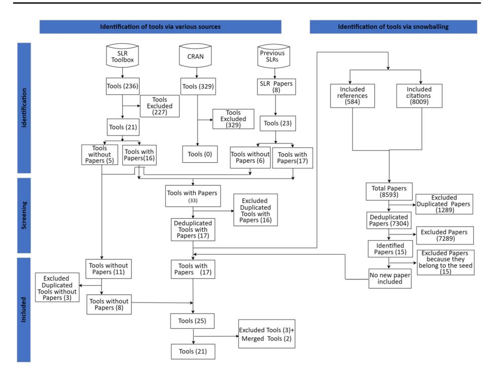
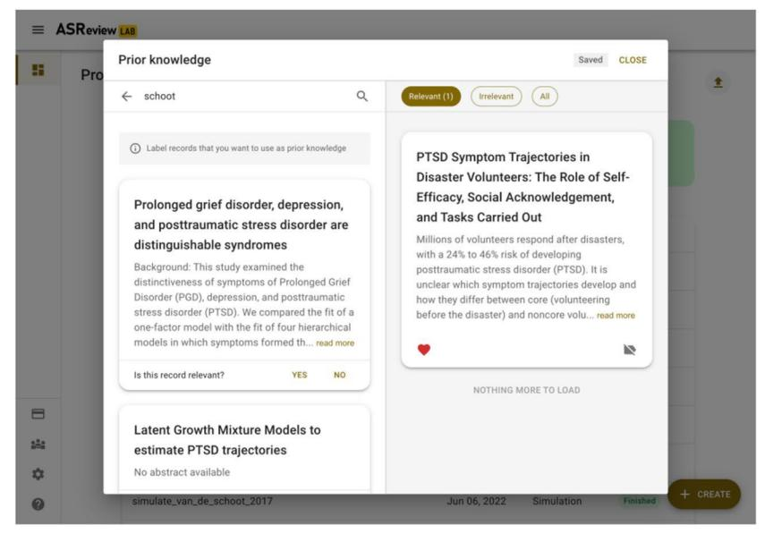
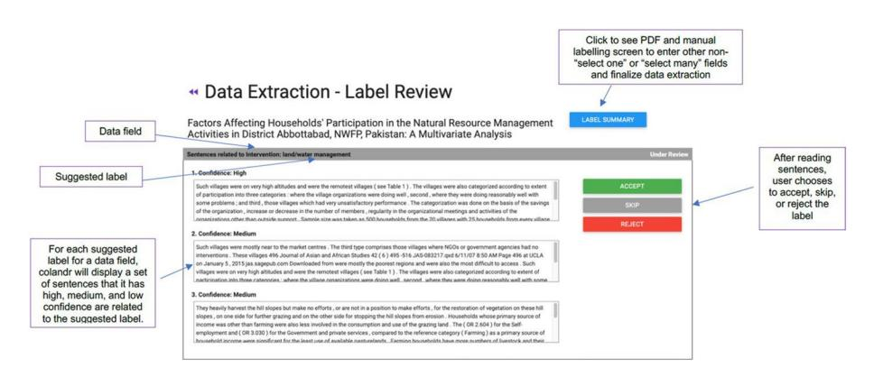
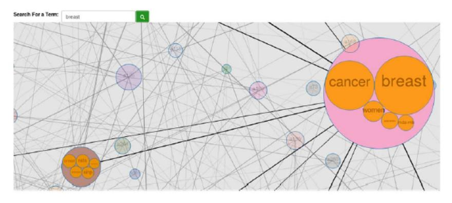
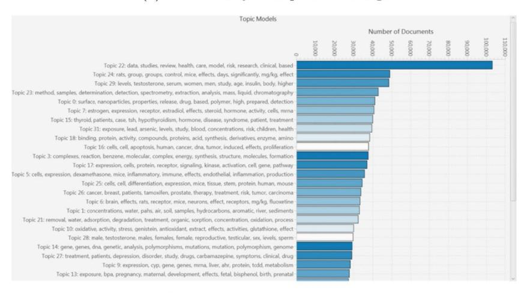
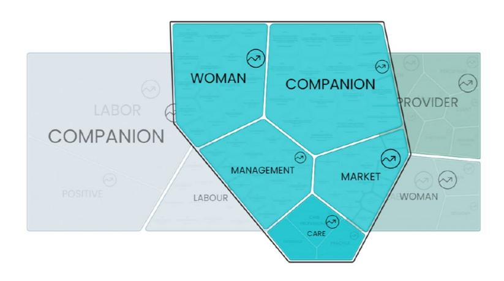
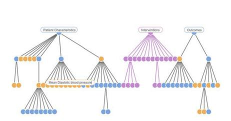
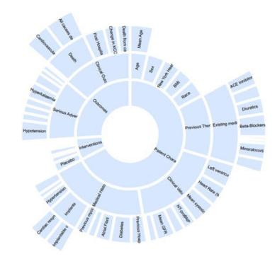
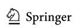
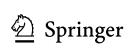

# **Artifcial intelligence for literature reviews: opportunities and challenges**

**Francisco Bolaños1 · Angelo Salatino1 · Francesco Osborne1,2 · Enrico Motta1**

Accepted: 6 August 2024 / Published online: 17 August 2024 © The Author(s) 2024, corrected publication 2025

#### **Abstract**

This paper presents a comprehensive review of the use of Artifcial Intelligence (AI) in Systematic Literature Reviews (SLRs). A SLR is a rigorous and organised methodology that assesses and integrates prior research on a given topic. Numerous tools have been developed to assist and partially automate the SLR process. The increasing role of AI in this feld shows great potential in providing more efective support for researchers, moving towards the semi-automatic creation of literature reviews. Our study focuses on how AI techniques are applied in the semi-automation of SLRs, specifcally in the screening and extraction phases. We examine 21 leading SLR tools using a framework that combines 23 traditional features with 11 AI features. We also analyse 11 recent tools that leverage large language models for searching the literature and assisting academic writing. Finally, the paper discusses current trends in the feld, outlines key research challenges, and suggests directions for future research. We highlight three primary research challenges: integrating advanced AI solutions, such as large language models and knowledge graphs, improving usability, and developing a standardised evaluation framework. We also propose best practices to ensure more robust evaluations in terms of performance, usability, and transparency. Overall, this review ofers a detailed overview of AI-enhanced SLR tools for researchers and practitioners, providing a foundation for the development of next-generation AI solutions in this feld.

**Keywords** Systematic literature reviews · Literature review · Artifcial intelligence · Large language models · Natural anguage processing · Usability · Evaluation framework

\* Francisco Bolaños francisco.bolanos-burgos@open.ac.uk

> Angelo Salatino angelo.salatino@open.ac.uk

Francesco Osborne francesco.osborne@open.ac.uk

Enrico Motta enrico.motta@open.ac.uk

- 1 Knowledge Media Institute, The Open University, Walton Hall, Milton Keynes MK7 6AA, UK
- 2 Department of Business and Law, University of Milano Bicocca, Piazza dell'Ateneo Nuovo, 1, Milan 20126, Italy

**259** Page 2 of 49 F. Bolaños et al.

# **1 Introduction**

A Systematic Literature Review (SLR) is a rigorous and organised methodology that assesses and integrates previous research on a specifc topic. Its main goal is to meticulously identify and appraise all the relevant literature related to a specifc research question, adhering to strict protocols to minimise biases (Higgins [2011](#page-43-0); Moher et al. [2009\)](#page-45-0). This methodology originally emerged within the realm of Evidence-Based Medicine (Sackett et al. [1996](#page-46-0)), and it was subsequently adapted and employed in diverse research disciplines including social sciences (Petticrew and Roberts [2008\)](#page-46-1), engineering and technology (Keele et al. [2007](#page-43-1)), education (Gough et al. [2017](#page-43-2)), environmental sciences (Pullin and Stewart [2006\)](#page-46-2), and business and management (Tranfeld et al. [2003](#page-47-0)).

SLRs are recognised for being time-consuming and resource-intensive. This is due to several factors, including the lengthy process that can extend beyond a year (Borah et al. [2017\)](#page-41-0), the necessity of assembling a team of domain experts (Shojania et al. [2007\)](#page-47-1), signifcant fnancial implications from database subscriptions, specialised software, and personnel remuneration (Shemilt et al. [2016\)](#page-47-2), the growing number of publications (Bornmann and Mutz [2015](#page-41-1)), and the periodic need for updates to maintain relevance (Moher et al. [2007](#page-45-1)).

Over the past decades, numerous tools have been developed to support and even partially automate SLRs, aiming to address these challenges. Many of these tools have adopted Artifcial Intelligence (AI) solutions (van den Bulk et al. [2022](#page-47-3); Kebede et al. [2023\)](#page-43-3), particularly for the screening and data extraction phases. The incorporation of AI into SLR tools has been further propelled by the emergence of more sophisticated AI techniques in Natural Language Processing (NLP), such as Large Language Models (LLMs), which have the potential to revolutionise these systems (Robinson et al. [2023\)](#page-46-3). While a signifcant body of research has examined SLR tools (Carver et al. [2013;](#page-42-0) Feng et al. [2017;](#page-42-1) Napoleão et al. [2021](#page-45-2); Cierco Jimenez et al. [2022](#page-42-2); Jesso et al. [2022;](#page-43-4) Khalil et al. [2022](#page-43-5); Wagner et al. [2022;](#page-48-0) Ng et al. [2023;](#page-45-3) Robledo et al. [2023\)](#page-46-4), relatively few studies have explored the role of AI in this domain (Cowie et al. [2022](#page-42-3); Burgard and Bittermann [2023;](#page-42-4) de la Torre-López et al. [2023;](#page-42-5) Robledo et al. [2023\)](#page-46-4). Furthermore, these studies focused on a limited selection of AI features, as we will discuss in Sect. [4](#page-6-0).

This survey aims to address the existing gap by rigorously examining the application of AI techniques in the semi-automation of SLRs, within the two main stages of application, namely *screening* and *extraction*. For this purpose, we frst conducted an analysis of eight prior surveys and identifed the most prominent features examined in the literature. Next, we defned a framework of analysis that integrates 23 general features and 11 features pertinent to AI-based functionalities. We then selected 21 prominent SLR tools and subjected them to rigorous analysis using the resulting framework. We extensively discuss current trends, key research challenges, and directions for future research. We specifcally focus on three major research challenges: (1) integrating advanced AI solutions, such as large language models and knowledge graphs, (2) enhancing usability, and (3) developing a standardised evaluation framework. We also propose a set of best practices to ensure more robust evaluations regarding performance, usability, and transparency. Finally, we performed an additional analysis on 11 recent tools that utilise the capabilities of LLMs (predominantly ChatGPT via the OpenAI API) for searching the literature and aiding academic writing. Although these tools do not cater directly to SLRs, there is potential for their features to be integrated into future SLR tools. In conclusion, this survey seeks to ofer scholars a thorough insight into the application of Artifcial Intelligence in this feld, while also highlighting potential avenues for future research.

The remainder of this paper is structured as follows. Sect. [2](#page-2-0) includes a description of the SLR stages and their relationship with AI. Section [3](#page-3-0) outlines the methodology we employed to identify the SLR tools discussed in the survey. Section [4](#page-6-0) provides a metareview of previous surveys about SLR tools that analysed AI features. Section [5](#page-9-0) provides an in-depth examination of the 21 tools. Section [6](#page-23-0) discusses the key research challenges and proposes some best practices for the evaluation of AI-enhanced SLR tools. Section [7](#page-30-0) analyses the latest generation of LLM-based systems designed to assist researchers. Finally, Sect. [8](#page-33-0) concludes the paper by summarising the contributions and the main fndings.

# **2 Background**

In this section, we examine the various stages of a SLR and the extent of support they receive from AI in the current generation of tools. Here, the term 'AI' specifcally denotes weak or narrow AI, which includes systems designed and trained for specifc tasks like classifcation, clustering, or named-entity recognition (Iansiti and Lakhani [2020](#page-43-6)). In the context of SLR, these methodologies are predominantly utilised to semi-automate tasks like screening and data extraction (Cowie et al. [2022](#page-42-3); Burgard and Bittermann [2023](#page-42-4)).

The SLR methodology consists of six distinct stages (Keele et al. [2007;](#page-43-1) Higgins [2011\)](#page-43-0): (i) Planning, (ii) Search, (iii) Screening, (iv) Data Extraction and Synthesis, (v) Quality Assessment, and (vi) Reporting. Each stage plays a pivotal role in ensuring the comprehensiveness and rigour of the review process.

The *planning* phase is foundational to the entire review process, as it involves formulating a set of precise and specifc research questions that the SLR seeks to address (O'Connor et al. [2008\)](#page-46-5). A detailed protocol is also developed during this stage, outlining the appropriate methodologies that will be adopted to carry out the review (Fontaine et al. [2022](#page-42-6)). This protocol ensures consistency, reduces bias, and enhances the transparency and reproducibility of the review.

The *search* phase aims to identify relevant papers using search strategies, snowballing, or a hybrid approach. Search strategies are typically implemented by creating a query based on a combination of terms using boolean operators (Team [2007;](#page-47-4) Glanville et al. [2019](#page-43-7)). This query is then executed on designated search engines. In snowballing, the researcher examines the references and citations of an initial group of papers (also known as seed papers) to identify additional articles. This process is iteratively repeated until no new relevant scholarly documents are found (Webster and Watson [2002;](#page-48-1) Wohlin [2014](#page-48-2)). The hybrid approach is the combination of search strategy and snowballing (Mourão et al. [2017;](#page-45-4) Wohlin et al. [2022](#page-48-3)). Traditionally, the search phase had not been signifcantly supported by artifcial intelligence techniques (Adam et al. [2022](#page-41-2)). Nevertheless, there are some emerging tools, which we will examine in Sect. [7,](#page-30-0) that have begun to incorporate LLMs in academic search engines, often within a Retrieval-Augmented Generation (RAG) framework (Lewis et al. [2020\)](#page-44-0). This innovative approach allows for the formulation of precise questions and complex queries in natural language, surpassing the capabilities of traditional keywordbased searches.

The *screening* phase uses a set of inclusion and exclusion criteria to further flter the paper obtained from the search stage. It typically consists of two stages: (i) title and abstract screening and (ii) full-text screening. In the frst step, the reviewers screen the relevant papers according only to the title and abstract (Moher et al. [2009\)](#page-45-0). The second step entails a detailed evaluation of the content of each paper, a task that demands signifcantly

more efort but leads to a more thorough assessment. It is also customary to document the rationale for excluding any given paper during this process. The predominant application of AI in SLR regards this phase. It usually involves employing machine learning classifers, which are trained on an initial set of user-selected papers and then used to identify additional relevant articles (Miwa et al. [2014](#page-45-5)). This process frequently involves iteration, where the user refnes the automatic classifcations or selects new papers, followed by retraining the classifer to better identify further pertinent literature.

In the *data extraction and synthesis* phase, all the pertinent information is systematically extracted from the selected studies. The techniques for data extraction vary greatly depending on the research feld and the objective of the researcher. For example, in the biomedical feld, protocols like PECODR (Dawes et al. [2007\)](#page-42-7) (Patient-Population-Problem, Exposure-Intervention, Comparison, Outcome, Duration, and Results) and PIBOSO (Kim et al. [2011](#page-43-8)) (Population, Intervention, Background, Outcome, Study Design, and Other) are used to identify key elements from clinical studies, while the STARD checklist (Bossuyt et al. [2003](#page-41-3)) supports readers in assessing the risk of bias and evaluating the relevance of the results. Following the extraction, the data is aggregated and summarised (Munn et al. [2014;](#page-45-6) Garousi and Felderer [2017](#page-42-8)). Depending on the nature and heterogeneity of the data, the resulting synthesis might be qualitative or quantitative. This phase is also occasionally supported by AI solutions. Commonly, the relevant tools employ classifers to identify articles possessing specifc characteristics (Marshall et al. [2018\)](#page-44-1) or implement named-entity recognition for extracting specifc entities or concepts (Kiritchenko et al. [2010\)](#page-43-9) (e.g., RCT entities (Moher et al. [2001\)](#page-45-7), entities pertaining environmental health studies (Walker et al. [2022\)](#page-48-4)).

The *quality assessment* phase evaluates the rigour and validity of the selected studies (Project [1998;](#page-46-6) Wells et al. [2000](#page-48-5); Von Elm et al. [2007](#page-48-6); Higgins and Altman [2008\)](#page-43-10). This analysis provides evidence of the overall strength and the level of trustworthiness presented in the review (Zhou et al. [2015;](#page-48-7) Chen et al. [2022](#page-42-9)).

Finally, the *reporting* phase involves presenting the fndings in a structured and coherent manner within a research paper. This presentation typically follows an established format comprising sections like introduction, methods, results, and discussion, but this may difer depending on the journal in which the manuscript will be published (Stroup et al. [2000;](#page-47-5) Page et al. [2021\)](#page-46-7). Historically, this stage did not beneft from the use of artifcial intelligence techniques (Justitia and Wang [2022;](#page-43-11) Li and Ouyang [2022](#page-44-2)). However, as we will discuss in Sect. [7,](#page-30-0) recent advancements have led to the development of tools based on LLMs designed to support academic writing, which can be particularly useful in this phase. These tools typically enable users to draft an initial outline of the desired document and iteratively refne it.

# **3 Methodology**

We adopt the standard PRISMA (Preferred Reporting Items for Systematic Reviews and Meta-Analyses) methodology (Page et al. [2021\)](#page-46-7) for conducting and reporting the systematic review and the meta-analysis. The PRISMA checklist is linked in the supplementary material at the end of the paper.

The primary objective of our analysis was to examine the application of Artifcial Intelligence in the current generation of SLR tools to identify trends and emerging research directions. In order to identify the set of AI-enhanced SLR tools, we frst formulated three

inclusion criteria and two exclusion criteria. Specifcally, the inclusion criteria are the following:

- **IC 1:** The SLR tool must incorporate AI techniques to semi-automate the screening or extraction process, while still maintaining the user's capacity to make the fnal decision (Tsafnat et al. [2014\)](#page-47-6);
- **IC 2:** The tool must possess a user interface that facilitates paper screening or information extraction by the user;
- **IC 3:** The tool should not require advanced technical expertise for installation and execution.

The exclusion criteria are:

- **EC 1:**  The tool is under maintenance;
- **EC 2:** The tool has not been updated in the last 10 years.

The PRISMA diagram, depicted in Fig. [1](#page-6-1) illustrates the main phases of the process. We utilised three main strategies for identifying the tools.

First, we conducted a search of previous survey papers on SLR tools and extracted the tools they analysed. This was accomplished using Scopus,[1](#page-4-0) a leading bibliographic database (Pranckutė [2021](#page-46-8)). We selected Scopus over other alternatives because it is widely recognised as the preferred source for conducting systematic literature reviews due to its high-quality metadata, reliable citation tracking, and extensive coverage of scientifc documents, including journals, conference proceedings, and books (Baas et al. [2020](#page-41-4); Visser et al. [2021\)](#page-47-7). Specifcally, we used the search string: *("Literature Reviews" OR "Systematic Review") AND ("Tools" OR "Automation" OR "Semi-Automation" OR "Semiautomation" OR "Software")*. [2](#page-4-1) Since this feld lacks standardised vocabulary (Dieste et al. [2009;](#page-42-10) Grant and Booth [2009](#page-43-12)), we aimed to maximise recall by using broad terms, planning to refne the results at a later stage. Additionally, we fltered the results by selecting only 'review' as the 'Document type' in the Scopus interface.

The search yielded 356 review papers. From this set, we identifed the surveys focusing on SLR tools. This selection process was conducted in two stages. Initially, the frst author, who has eight years of experience in teaching evidence-based medicine and bibliometric analysis, identifed a preliminary set of 14 papers based on their titles and abstracts. Subsequently, all four authors collaboratively examined the shortlisted papers by reviewing the full texts. Potentially ambiguous cases were discussed among the authors to achieve consensus. This process yields fve survey papers. We then applied a snowballing search (Webster and Watson [2002\)](#page-48-1) to identify additional surveys. This involved examining the references and citations of the fve survey papers. As before, we implemented a two-stage selection process, screening titles and abstracts frst, and followed by a full-text analysis of potentially relevant papers. This resulted in the inclusion of three additional papers. Overall, this procedure yielded a total of 8 survey papers. An analysis of these surveys led to the identifcation of 23 tools. Among these, 17 were associated with academic papers, whereas 6 were not.

2 The reader may notice that this query retrieves also documents about "Systematic Literature Reviews".

1 Scopus -<https://www.scopus.com/>

As a second source, we adopted the Systematic Literature Review Toolbox (Marshall and Brereton [2015\)](#page-44-3), a repository in which SLR tools are published and updated. This platform is highly regarded in the feld and was adopted as a source in fve of the eight previous surveys (Kohl et al. [2018;](#page-43-13) Van der Mierden et al. [2019;](#page-47-8) Harrison et al. [2020](#page-43-14); Cowie et al. [2022](#page-42-3); Robledo et al. [2023](#page-46-4)). Specifcally, we utilised the advanced search functionality to retrieve all tools under the "software" category. The query returned 236 tools that were manually analysed. Similar to the analysis of the papers, this process was conducted in two phases. Initially, the frst author selected a preliminary set of 45 tools based solely on their descriptions in the repository. Next, all authors evaluated these tools by examining their websites, tutorials, and the tools themselves. When necessary, the frst author collected additional information through interviews with the developers. As before, any ambiguous cases were discussed among the authors until a consensus was reached. The analysis identifed a total of 21 tools. Of these, 16 were associated with academic papers, while 5 were not.

As a third source, we adopted the Comprehensive R Archive Network (CRAN),[3](#page-5-0) a wellregarded repository for R packages widely used by the statistical and data science communities. Specifcally, we employed the *packagefnder* library (Zuckarelli [2023](#page-48-8)) and used the query: *("systematic literature review" OR "systematic review" OR "literature review")*. We chose this library due to its proven efectiveness in retrieving relevant applications in various domains, such as ecology and evolution (Lortie et al. [2020](#page-44-4)). This search yielded 329 tools, which we then evaluated using the same two-stage selection process previously applied for the tools produced by searching the SLR Toolbox. However, none of these tools incorporated AI solutions while also providing a visual interface. Consequently, we discarded all of them.

After deduplicating the results from the SLR toolbox and previous surveys, we identifed 17 tools linked to research papers and 8 tools without associated papers. To validate and expand our fndings, we conducted a snowballing search using the 17 papers linked to the tools as the initial seeds. Our aim was to identify additional papers associated with a relevant tool. This search was conducted on Semantic Scholar,[4](#page-5-1) chosen for its extensive coverage in Computer Science, especially for snowballing searches (Hannousse [2021\)](#page-43-15). To facilitate this, we developed a custom script to interface with the Semantic Scholar API, enabling the efcient retrieval of references from seed papers and the papers citing them.[5](#page-5-2) This process led to the identifcation of 584 references and 8,009 papers citing the seeds for a total of 8,593 papers. After removing duplicates, 7,304 papers remained. The authors analysed these papers using the same two-stage selection process that was employed for survey papers. This analysis yielded 15 of the papers included in the initial seeds as well as the 8 previously identifed surveys, but it did not reveal any new tools or papers. The lack of new fndings, despite the comprehensive snowballing process, suggests that the tool section identifed earlier is exhaustive.

In conclusion, the process led to a collection of 17 tools with associated papers and 8 without (Covidence, DistillerSR, Nested Knowledge, Pitts.ai, Iris.ai, LaserAI, DRAGON/ litstream, Giotto Compliance). We then excluded Giotto Compliance, DRAGON/litstream,

5 Code used for the Snowballing search -<https://zenodo.org/records/11154875>

3 CRAN repository -<https://cran.r-project.org/>

4 Semantic Scholar -<https://www.semanticscholar.org/>

**Fig. 1** PRISMA diagram of our SLR about AI-enhanced SLR tools

and LaserAI from our study due to the lack of available information.[6](#page-6-2) We also consolidated RobotReviewer and RobotSearch into a single entry, recognising their shared algorithmic basis. Consequently, the fnal set of tools considered in our study included 21 distinct tools.

Table [1](#page-7-0) lists the 21 selected tools. The majority of them (17) were primarily designed for the purpose of screening. Two tools, namely Dextr and ExaCT, focused exclusively on extraction. The remaining two tools, Iris.ai and RobotReviewer/RobotSearch, had a dual focus on both screening and extraction. In summary, 19 tools can be used for the screening phase and 4 tools for the extraction phase. The majority of the tools (19) are web applications, while only 2, namely SWIFT-Review and ASReview, need to be installed locally. Furthermore, only 4 tools (Colandr, ASReview, FAST2, and RobotReviewer) release their code under an open license.

# **4 Meta‑review of previous surveys**

This section provides a brief meta-analysis of how the previous systematic literature reviews have described the tools in relation to Artifcial Intelligence. We focus on four surveys that analysed AI features (Cowie et al. [2022;](#page-42-3) Burgard and Bittermann [2023;](#page-42-4) de la Torre-López et al. [2023;](#page-42-5) Robledo et al. [2023\)](#page-46-4).

6 Specifcally, there were no associated research papers or comprehensive documentation for these tools, and attempts to contact the developers for further details were unsuccessful.

**259** Page 8 of 49 F. Bolaños et al.

**Table 1** The 21 SLR tools analysed in this survey

| ID | Tool                      | Stage SLR  | Mode    | OS  | References                                                                      |
|----|---------------------------|------------|---------|-----|---------------------------------------------------------------------------------|
| 1  | Abstrackr                 | Screening  | Web     | No  | (Wallace et al. 2012)                                                           |
| 2  | ASReview                  | Screening  | Desktop | Yes | (Van De Schoot et al. 2021)                                                     |
| 3  | Colandr                   | Screening  | Web     | Yes | (Cheng et al. 2018), Cheng and Augustin 2021)                                |
| 4  | Covidence                 | Screening  | Web     | No  | –                                                                               |
| 5  | DistillerSR               | Screening  | Web     | No  | –                                                                               |
| 6  | EPPI-Reviewer             | Screening  | Web     | No  | (Thomas et al. 2010), Machine Learning Functionality in EPPI-Reviewer (2019) |
| 7  | FAST2                     | Screening  | Web     | Yes | Yu and Menzies (2019)                                                           |
| 8  | LitSuggest                | Screening  | Web     | No  | (Allot et al. 2021)                                                             |
| 9  | Nested Knowledge          | Screening  | Web     | No  | –                                                                               |
| 10 | PICOPortal                | Screening  | Web     | No  | Agai (2020), (Minion et al. 2021)                                               |
| 11 | Pitts.ai                  | Screening  | Web     | No  | –                                                                               |
| 12 | Rayyan                    | Screening  | Web     | No  | (Ouzzani et al. 2016)                                                           |
| 13 | Research Screener         | Screening  | Web     | No  | (Chai et al. 2021)                                                              |
| 14 | RobotAnalyst              | Screening  | Web     | No  | (Przybyła et al. 2018)                                                          |
| 15 | SWIFT-Active Screener     | Screening  | Web     | No  | (Howard et al. 2020)                                                            |
| 16 | SWIFT-Review              | Screening  | Desktop | No  | (Howard et al. 2016)                                                            |
| 17 | SysRev                    | Screening  | Web     | No  | (Bozada et al. 2021)                                                            |
| 18 | Dextr                     | Extraction | Web     | No  | (Walker et al. 2022)                                                            |
| 19 | ExaCT                     | Extraction | Web     | No  | (Kiritchenko et al. 2010)                                                       |
| 20 | Iris.ai                   | Both       | Web     | No  | –                                                                               |
| 21 | RobotReviewer/RobotSearch | Both       | Web     | Yes | (Marshall et al. 2017, 2018)                                                    |

*OS* open scource

The features covered by all tools (100%) are highlighted in bold

The previous survey papers characterised AI according to fve main features:

- 1. **Approach:** dentifes the method used for performing a specifc task. This is the most examined feature, receiving attention from four studies (Cowie et al. [2022;](#page-42-3) Burgard and Bittermann [2023;](#page-42-4) de la Torre-López et al. [2023](#page-42-5); Robledo et al. [2023\)](#page-46-4).
- 2. **Text representation**: escribes the processes employed to convert text into suitable input for the algorithm (e.g., BoW (Zhang et al. [2010\)](#page-48-9), *LDA topics (Blei et al.* [2003\)](#page-41-5), word embeddings (Wang et al. [2020\)](#page-48-10)). This feature was analysed by two previous surveys (*de la Torre-López et al.* [2023](#page-42-5)); Burgard and Bittermann [2023](#page-42-4)).
- 3. **Human interaction**: pecifes how users engage with a tool, detailing the operations and options available to them, as well as the characteristics of the user interface. This is among the least explored features with just one previous study (*de la Torre-López et al.* [2023\)](#page-42-5).
- 4. **Input**: pecifes the type of content full-text or just title and abstract) the tool will need to train its model. Alongside *Human interaction*, this is the least explored feature, with just one previous study (*de la Torre-López et al.* [2023\)](#page-42-5).

| ID | Tool                      | Approach | represen- tation Text | Human interac- tion | Input | Output | Papers                                                                                  |
|----|---------------------------|----------|-----------------------------|---------------------------|-------|--------|-----------------------------------------------------------------------------------------|
| 1  | Abstrackr                 | Y        | Y                           | Y                         | Y     | Y      | 2023)) (Cowie et al. 2022), Burgard and Bittermann (2023), (de la Torre-López et al. |
| 2  | ASReview                  | Y        | Y                           | N                         | N     | Y      | Burgard and Bittermann (2023), (Robledo et al. 2023)                                    |
| 3  | Colandr                   | Y        | Y                           | N                         | N     | Y      | (Cowie et al. 2022), Burgard and Bittermann (2023)                                      |
| 4  | Covidence                 | Y        | Y                           | N                         | N     | Y      | (Cowie et al. 2022), Burgard and Bittermann (2023)                                      |
| 5  | DistillerSR               | Y        | Y                           | N                         | N     | Y      | (Cowie et al. 2022), Burgard and Bittermann (2023)                                      |
| 6  | EPPI-Reviewer             | Y        | Y                           | Y                         | Y     | Y      | 2023)) (Cowie et al. 2022), Burgard and Bittermann (2023), (de la Torre-López et al. |
| 7  | FASTREAD                  | Y        | Y                           | Y                         | Y     | Y      | 2023)) Burgard and Bittermann (de la Torre-López et al.                              |
| 8  | Giotto Compliance         | Y        | N                           | N                         | N     | N      | (Cowie et al. 2022)                                                                     |
| 9  | Nested Knowledge          | Y        | N                           | N                         | N     | N      | (Cowie et al. 2022)                                                                     |
| 10 | PICOPortal                | Y        | N                           | N                         | N     | N      | (Cowie et al. 2022)                                                                     |
| 11 | Rayyan                    | Y        | Y                           | N                         | N     | Y      | (Cowie et al. 2022), Burgard and Bittermann (2023), (Robledo et al. 2023)               |
| 12 | Research Screener         | Y        | Y                           | N                         | N     | Y      | Burgard and Bittermann (2023)                                                           |
| 13 | RobotAnalyst              | Y        | Y                           | N                         | N     | Y      | (Cowie et al. 2022), Burgard and Bittermann (2023)                                      |
| 14 | RobotReviewer/RobotSearch | Y        | Y                           | N                         | N     | Y      | (Cowie et al. 2022), Burgard and Bittermann (2023)                                      |
| 15 | WIFT-Active Screener S | Y        | Y                           | N                         | N     | Y      | (Cowie et al. 2022), Burgard and Bittermann (2023)                                      |
| 16 | WIFT-Review S          | Y        | Y                           | N                         | N     | Y      | Burgard and Bittermann (2023), (Robledo et al. 2023)                                    |
| 17 | SysRev                    | Y        | N                           | N                         | N     | N      | (Cowie et al. 2022)                                                                     |

**259** Page 10 of 49 F. Bolaños et al.

5. **Output:** epresents the outcome generated by the trained algorithm, and it has been analysed in three studies (Burgard and Bittermann [2023](#page-42-4); (*de la Torre-López et al.* [2023\)](#page-42-5); Robledo et al. [2023](#page-46-4)).

Table [2](#page-8-0) summarises the analysis of the four systematic literature reviews and shows how 17 tools have been reviewed according to the fve AI features. Only three tools (FASTRED, EPPI-Reviewer, and Abstractr) were actually assessed according to all fve AI features. For ten tools (ASReview, Colandr, Covidence, DistillerSR, Rayyan, Research Screener, Robot-Analyst, RobotReviewer/RobotSearch, SWIFT-Active Screener, and SWIFT-Review) only three features named *approach*, *text representation*, and *output* have been assessed. The remaining tools were assessed by using only one feature (*approach*).

Upon examining the four survey papers, it is apparent that there is a limited exploration of AI features. (*De la Torre-López et al.* [2023](#page-42-5)) provide the most comprehensive analysis, utilising all fve specifed features to examine seven tools. In contrast, (Burgard and Bittermann [2023](#page-42-4)) employed only three features: *text representation*, *approach*, and *output*. (Robledo et al. [2023\)](#page-46-4) focused on just two features: *approach* and *output*. (Cowie's et al. [2022\)](#page-42-3) conducted the most restricted analysis, considering only one feature (*approach*). Furthermore, the fve reported features only ofer a narrow perspective on how AI can support SLRs.

In summary, the previous systematic reviews ofer a relatively limited analysis of the expanding ecosystem of AI-enhanced SLR tools and their characteristics. In the next section, we will address this gap by introducing a comprehensive set of 11 AI features and applying them to evaluate the 21 SLR tools identifed in Sect. [3.](#page-3-0)

# **5 Survey of SLR tools**

We analysed the 21 SLR tools according to 34 features (11 AI-specifc and 23 general) by examining the relevant literature (see Table [1](#page-7-0)), their ofcial websites, and the online tutorials. When necessary, we sought additional information by reaching out to the developers through email or online interviews.

Section [5.1](#page-9-1) describes the full set of features, paying particular attention to the new AI features that we frst introduced for this survey. Section [5.2](#page-10-0) reports the results of the review. Section [5.3](#page-19-0) discusses the most suitable systems for specifc use cases. Finally, Sect. [5.4](#page-21-0) outlines the threats to validity of our analysis.

### **5.1 Features overview**

#### **5.1.1 AI features**

To analyse the extent of AI usage within SLR tools, we considered a total of eleven features. This evaluation included the fve features previously described in Sect. [4](#page-6-0) (approach, text representation, human interaction, input, and output) along with six new features unique to this study. These additional features were identifed through a review of the relevant literature (Cowie et al. [2022](#page-42-3); Burgard and Bittermann [2023](#page-42-4); (*de la Torre-López et al.* [2023\)](#page-42-5); Robledo et al. [2023\)](#page-46-4) and a preliminary analysis of the tools. The six novel features are as follows:

- **SLR Task:** hich categorises the tasks for which the AI approach is used (e.g., paper classifcation, paper clustering, named-entity recognition);
- **Minimum requirement**: hich refers to the minimum number of relevant and irrelevant papers required to efectively train a classifer tasked with selecting pertinent papers;
- **Model execution**: which evaluates whether the models operate in real time (synchronously) or later, typically overnight (asynchronously);
- **Research feld**: hich identifes the research domains in which the tools can be efectively employed;
- **Pre-screening support**: which specifes the application of AI techniques to assist users in manually selecting relevant papers, typically by highlighting key terms or grouping similar papers (e.g., topic maps (Howard et al. [2020](#page-43-16)) based on *LDA topics* (Blei et al. [2003\)](#page-41-5), clustering approaches (Przybyła et al. [2018](#page-46-10)));
- **Post-screening support**: which refers to the application of AI techniques to conduct a fnal review of the screened papers (e.g., summarisation (Shah and Phadnis [2022](#page-47-11))).

Five of the eleven features (minimum requirement, model execution, human interaction, pre-screening support, and post-screening support) are exclusive to the screening phase and will not be considered when analysing the extraction phase.

# **5.1.2 General features**

We analysed the non-AI characteristics of SLR tool based on 23 features. We derived these features from previous studies (Marshall et al. [2014;](#page-44-7) Kohl et al. [2018](#page-43-13); Van der Mierden et al. [2019;](#page-47-8) Harrison et al. [2020;](#page-43-14) Cowie et al. [2022\)](#page-42-3) after a process of synthesis and integration. Table [3](#page-11-0) shows the description of each feature with its category. To facilitate the systematic analysis, we grouped them into six categories: Functionality (F), Retrieval (R), Discovery (Di), Documentation (Do), Living Review (L), and Economic (E).

The *functionality* category includes features for auditing and evaluating the technical aspects of the tools. The *retrieval* category covers features related to the acquisition and inclusion of scholarly documents. The *discovery* category consists of features that facilitate the inclusion, exclusion, and management of references during the screening phase. The *documentation* category includes features that support the reporting of the fndings. The *living review* category captures the ability of tools to incorporate new relevant documents based on AI techniques. Lastly, the *economic* category refects the fnancial considerations associated with the tools.

#### **5.2 Results**

In this section, we present the results of our analysis. Section [5.2.1](#page-10-1) describes the tools for the screening phase through the AI features. Section [5.2.2](#page-16-0) presents the tools for the extraction phase also through the AI features. Finally, Sect. [5.2.3](#page-19-1) describes the full set of 21 SLR tools according to the general features.

#### **5.2.1 The role of AI in the screening phase**

As reported in Table [1](#page-7-0), 19 tools use AI for the screening phase. In the following, we analyse them according to the 11 AI features. To eliminate repetitions, this discussion combines the features *input* and *text representation* into the category *Input Data and Text Representation*.

**259** Page 12 of 49 F. Bolaños et al.

**Table 3** Description of the SLR features #

|    | SLR feature                         | Description                                                                                                                                                   |
|----|-------------------------------------|---------------------------------------------------------------------------------------------------------------------------------------------------------------|
| 1  | Authentication (F)                  | Ability of the tool to authenticate the users involved in the project                                                                                         |
| 2  | Multiplatform (F)                   | Ability of the tool to be run on diferent platforms (e.g., web, desktop)                                                                                      |
| 3  | Multiple user roles (F)             | Ability of the tool to allow the user to have diferent roles (e.g., reviewer, admin) within and between projects                                           |
| 4  | Multiple user support (F)           | Ability of the tool to allow multiple users to work on the same project                                                                                       |
| 5  | Project auditing (F)                | Ability of the tool to track all the changes done in the project                                                                                              |
| 6  | Project progress (F)                | Ability of the tool to determine the overall progress of the annotation with respect to the total number of papers to annotate                             |
| 7  | Status of the software (F)          | The extent to which the tool is actively maintained and has a stable release                                                                                  |
| 8  | Automated full-text retrieval (R)   | Ability of the tool to support full-text retrieval from bibliographic databases                                                                               |
| 9  | Automated search (R)                | Ability of the tool to support literature search through the integration of APIs                                                                              |
| 10 | Manual reference importing (R)      | Ability of the tool to allow the user to enter papers manually, typically via a form                                                                          |
| 11 | Manually inserting full-text (R)    | Ability of the tool to allow the user to manually add full-text papers                                                                                        |
| 12 | Reference importing (R)             | Ability of the tool to import papers using a variety of formats (BibTeX, RIS, CSV)                                                                            |
| 13 | Snowballing (R)                     | Ability of the tool to support the automated retrieval of the citations from bibliographic databases (snow- balling)                                       |
| 14 | Deduplication (Di)                  | Ability of the tool to support the automatic deduplication of the references                                                                                  |
| 15 | Discrepancy resolving (Di)          | Ability of the tool to handle diferences of opinion between screeners, e.g., by allowing comments or assigning the problematic papers to a senior screener |
| 16 | In-/excluding references (Di)       | Ability of the tool to allow the user to comment on reference inclusion and exclusion                                                                         |
| 17 | Reference labelling & comments (Di) | Ability of the tool to allow the user to write additional comments on the references (e.g., 'to double check')                                                |
| 18 | Screening phases (Di)               | Ability of the tool to allow the user to perform the diferent stages screening phase                                                                          |
| 19 | Exporting results (Do)              | Ability of the tool to allow exporting the screened references                                                                                                |
| 20 | Flow diagram creation (Do)          | MA diagram of the SLR process Ability of the tool to provide the PRIS                                                                                      |
| 21 | Protocol (Do)                       | Ability of the tool to provide the user with pre-defned protocol templates (e.g., the Cochrane guidelines)                                                    |
| 22 | Living/updatable (L)                | Ability of the tool to update the screened references by automatically including recent and relevant articles                                                 |
| 23 | Free to use (E)                     | It determines whether the tool is available for free or requires payment                                                                                      |
|    |                                     |                                                                                                                                                               |

Moreover, the *output* feature is discussed within the context of the *SLR Task*, as it is contingent upon the specifc task requirements. The Table in Appendix (Table [6\)](#page-34-0) reports detailed information on how each of the 19 tools addresses the 11 AI features.

**Research feld:** Twelve tools utilise general AI solutions that are applicable across various research felds. The other seven tools employ specifc AI solutions designed to support biomedical studies, typically by identifying Randomised Controlled Trials (RCTs) through the use of dedicated classifers (Noel-Storr et al. [2021](#page-45-9)). Notably, EPPI-Reviewer, PICO-Portal, and Covidence ofer both a general mode and a specialised setting for biomedical studies. Conversely, Pitts.ai, RobotReviewer/RobotSearch, SWIFT-Review, and LitSuggest are exclusively dedicated to the biomedical domain.

**SLR task:** Fifteen tools utilise artifcial intelligence for only one task, most often to classify papers as relevant/irrelevant. The other four tools (Covidence, PICOPortal, and EPPI-Reviewer, Colandr) undertake two AI-related tasks. They all classify papers as relevant/irrelevant, but also execute an additional task, such as identifying a specifc type of paper (e.g., economic evaluation, randomised controlled trials, etc.) or categorising papers according to a set of entities defned by the user. For the sake of clarity, in our discussion of the subsequent features, we will systematically address the frst group (one task) followed by the second group (two tasks). In the frst group, twelve tools focus on selecting relevant papers given a set of seed papers. Typically, each paper is assigned an inclusion probability score, usually ranging from 0 to 1. Of the remaining three, two of them (Pitts.ai and RobotReviewer/RobotSearch) identify RCTs based on a pre-built classifcation model, while the third (Iris.ai) clusters similar papers to build topic maps that assist users in selecting the relevant papers. In the second group, all four systems classify pertinent papers using a set of seed papers as a reference. However, they vary in their secondary AI-driven tasks. Specifcally, Covidence and PICOPortal identify RCTs using a predefned classifcation model. EPPI-Reviewer can identify various types of studies, including RCTs, systematic reviews, economic evaluations, and COVID-19 related studies. Finally, Colandr, in addition to the standard identifcation of relevant papers, enables users to defne their own set of categories (e.g., "water management") and subsequently performs a multi-label classifcation of articles based on them (Cheng et al. [2018](#page-42-11)). It also maps individual sentences to the user-defned categories and provides a confdence score for each classifcation.

**AI approach:** In the group of tools performing one task, the twelve tools focused exclusively on categorising relevant papers employed various types of machine learning classifers. The most adopted approach is Support Vector Machine (SVM) (Hearst et al. [1998](#page-43-18)), which aligns with the fndings of prior studies (Schmidt et al. [2021\)](#page-47-12). Four of the tools (Abstractr, FAST2, Rayyan, RobotAnalyst) exclusively rely on SVM. Distiller supports both SVM and Naive Bayes. ASReview allows the user to select a vast range of methods, including Logistic Regression, Random Forest, Naive Bayes, SVM, and a Neural Networks classifer. Litsuggest use logistic regression, while SWIFT-Review and SWIFT-Active Screener use a method based on log-lineal regression. Pitts.ai and RobotReviewer/ RobotSearch also use an SVM for identifying RCTs (Marshall et al. [2018](#page-44-1)). Finally, Iris. ai identifes and groups similar papers based on the similarity of their 'fngerprint', a vector representation of the most meaningful words and their synonyms extracted from the abstract (Wu et al. [2018](#page-48-13)).

With regards to the four tools that perform two AI tasks, Covidence, EPPI-Reviewer, and PICOPortal also identify relevant papers by using a SVM classifer. In contrast, Colandr employs a method where it identifes papers by searching for keywords that are related to a set of user-defned search terms (Cheng et al. [2018\)](#page-42-11). For instance, it can recognise terms commonly associated with 'Artifcial Intelligence' and select papers containing these

terms. Covidence also implements a machine learning classifer based on SVM with a fxed threshold for the identifcation of RCTs following the Cochrane guidelines (Thomas et al. [2021\)](#page-47-13). EPPI-Reviewer utilises a range of proprietary classifers trained on various databases to identify papers with distinct characteristics.[7](#page-13-0) It uses the Cochrane Randomized Controlled Trial classifer (Thomas et al. [2021\)](#page-47-13) to identify RCTs. It employs a classifer trained with the NHS Economic Evaluation Database (NHS EED) (Craig and Rice [2007\)](#page-42-14) for identifying economic evaluations and another trained on the Database of Abstracts of Reviews of Efects (La Toile [2004\)](#page-44-8) to identify systematic reviews in the biomedical feld. Finally, it uses a classifer trained on the 'Surveillance and disease data on COVID-19'[8](#page-13-1) for identifying research related to COVID. PICOPortal employs instead an ensemble of machine learning classifers, which combines both decision trees and neural networks (Onan et al. [2016\)](#page-46-11). Finally, for the identifcation of the category attributed to the paper by the user, Colandr used a combination of Named Entity Recognition for extracting entities relevant to the categories and a classifer based on logistic regression (Cheng and Augustin [2021\)](#page-42-12).

**Input data and text representation:** The AI techniques employed by these tools take as input the title, abstract, or full text of papers. All the tools analysed need only titles and abstracts as input, with the exception of Colandr, which requires the full text of papers. The tools generate diferent representations of the papers to input into the AI models. Specifcally, of the 15 tools dedicated to classifying relevant papers, the majority (8 out of 15) use a Bag of Words (BoW) approach (Zhang et al. [2010\)](#page-48-9), while the remainder employ various word embedding techniques (Wang et al. [2020](#page-48-10)). Pitts.ai and RobotReviewer/ RobotSearch use SciBERT embeddings (Beltagy et al. [2019\)](#page-41-9). Research Screener employs Doc2Vec embeddings (Le and Mikolov [2014\)](#page-44-9). ASReview ofers multiple options, including Sentence-BERT (Reimers and Gurevych [2019\)](#page-46-12) and Doc2Vec (Le and Mikolo[v2014](#page-44-9)). Iris utilises a unique representation called fngerprint (Wu et al. [2018](#page-48-13)), which is a vector characterising the most meaningful words and their synonyms extracted from the abstract. In the second group, Covidence and EPPI-Reviewer adopt a BoW representation, while PICOPortal uses both BoW and the BioBERT embeddings (Lee et al. [2020](#page-44-10)). Finally, Colandr uses both word2vec (Mikolov et al. [2013](#page-44-11)) and GloVe (Pennington et al. [2014\)](#page-46-13) embeddings. Overall, much like other NLP applications, these tools are evolving from traditional text representations like BoW to a range of more modern word and sentence embeddings.

**Human interaction:** We identifed three main types of interfaces. The *frst* and most typical one, implemented by 16 tools, regards the classifcation of paper as relevant. These graphical interfaces typically feature similar templates that allow users to upload and examine papers. Some tools (Rayyan, SWIFT-Active Screener, SysRev, Covidence, and PICOPortal) also ofer a menu with additional functionalities like ranking or fltering papers based on specifc criteria. A few tools (Rayyan, SWIFT-Active Screener, Research Screener, Pitts.ai, SysRev, Covidence, PICOPortal) also enable multiple users to collaboratively perform this task, allowing them to add comments for discussion about problematic papers or to delegate challenging papers to a senior reviewer. For illustration, Fig. [2](#page-15-0)a and b depict the interfaces used by ASReview and RobotAnalyst, respectively, for selecting relevant papers. The ASReview interface enables users to classify papers as either relevant or irrelevant. In contrast, the RobotAnalyst interface provides options for users to categorise papers as included, excluded, or undecided.

8 COVID surveillance - <https://tinyurl.com/229vcpyd>

7 EPPI-Reviewer Documentation - <https://eppi.ioe.ac.uk/cms/Default.aspx?tabid=3772>

The *second* interface type, ofered by Colandr, enables users to defne specifc categories to assign to the papers. This approach ofers greater fexibility compared to the traditional binary classifcation of relevant or not relevant papers. For instance, in Fig. [3](#page-16-1) Colandr suggests that for the given paper, the shown sentences are classifed with a confdence level of high, medium or low in the category "land/water management", previously defned by the user. The user can accept, skip or reject the suggested classifcation.

The *third* interface type, ofered by Iris.ai, is based on a *topic map*, a visualisation technique that clusters papers based on thematic similarities. The user initiates the search process with a brief description of the user's search intent (typically 300 to 500 words), a title, or the abstract of a paper. The system then clusters the papers according to their topics and generates a topic map, such as the ones depicted in Fig. [4c](#page-17-0). These interactive visualisations enable users to efectively navigate and select papers relevant to their research. The user can iteratively repeat the clustering process until they are satisfed that all pertinent papers have been incorporated into the analysis. Iris.ai also enables users to further flter the papers according to a variety of facets.

**Minimum requirements:** Generally, the accuracy of a classifer improves with an increasing number of annotated papers, but this also increases the time and efort required from researchers. Most methods need between 1–15 relevant papers and typically the same number of irrelevant ones. This is a relatively low number that should allow researchers to quickly annotate the initial set of seed papers. However, the necessary quantity varies a lot across tools. For instance, ASReview, SWIFT-Active Screener, and SWIFT-Review require just one relevant and one irrelevant paper to begin classifcation. Covidence and Rayyan require two and fve papers, respectively. Other tools require a larger number of papers. For example, Colandr needs 10 seed papers, while SysRev requires 30.

**Model execution:** Thirteen tools employ a real-time model execution strategy, wherein the training and classifcation of the model occur immediately after the user selects the relevant and irrelevant paper. Conversely, SysRev and SWIFT-Active Screener adopt a delayed-model-execution approach in which the training and classifcation steps are conducted at predetermined intervals. Specifcally, SysRev executes these operations overnight, whereas SWIFT-Active Screener updates its model after every thirty papers, maintaining a minimum two-minute interval between the most recent and the currently used model.

**Pre-screening support:** Among the 19 tools evaluated, eight implement standard techniques for pre-screening support, such as keyword search, boolean search, and tag search. ASReview, Covidence, DistillerSR, and SWIFT-Active Screener only enable the user to flter the paper by keyword. Rayyan and EPPI-Reviewer enhance this functionality by highlighting keywords in their visual interface. Additionally, Colandr and Abstrackr ofer the feature of colour-coding keywords based on their relevance level. Rayyan incorporates a boolean search feature, allowing users to combine keywords with operators like *AND*, *OR*, and *NOT*. For example, a boolean search such as *"literature review" AND "tools"* will retrieve scholarly documents containing both keywords in their titles or abstracts. Rayyan also provides options to search by author or publication year. EPPI-Reviewer, on the other hand, ofers a tag search function, where users can tag papers with specifc keywords and then search based on these tags.

RobotAnalyst, SWIFT-Review, and Iris.ai also support topic modelling. The frst two use *LDA topics* (Blei et al.[2003](#page-41-5)), which probabilistically assigns a topic to a paper based on the most recurrent terms shared by other papers. RobotAnalyst presents the topics in a network, as shown in Fig. [4](#page-17-0)a in which each node (circle) represents a topic, and its size is proportional to the frequency of the terms that belong to it. SWIFT-Review

**259** Page 16 of 49 F. Bolaños et al.

**Fig. 2** Examples of interfaces for paper classifcation

uses a simpler approach displaying the topics and their terms in a bar chart, as shown in Fig. [4](#page-17-0)b. Iris.ai clusters the papers according to a two-level taxonomy of global topics and specifc topics. For instance, in Fig. [4](#page-17-0)c we can observe a set of global topics in the background, which include 'companion', 'labour', 'provider', and 'woman'. Whereas in the cyan section there are the second-level specifc topics, in this case concerning the 'labor' global topic, such as 'woman', 'companion', 'market', 'management', and 'care'.

**Fig. 3** Examples of the tagging process of Colandr. This fgure is courtesy of Colandr [\(n.d.](#page-43-19))

RobotAnalyst ofers a cluster-based search functionality. This feature employs a spectral clustering algorithm (Ng et al. [2001\)](#page-45-10) to group papers. It also incorporates a statistical selection process for identifying the key terms characterising each cluster (Brockmeier et al. [2018\)](#page-41-10). The resulting clusters are presented to the user, emphasising the most representative terms.

Finally, Nested Knowledge, PICOPortal, Rayyan, and RobotReviewer/RobotSearch provide PICO identifcation, which uses distinct colours to highlight the *patient/population*, *intervention*, *comparison*, and *outcome*. Rayyan also enhances search capabilities by extracting topics and enriching them with the Medical Subject Headings (MeSH) (Lipscomb [2000](#page-44-12)). Furthermore, it enables users to select biomedical keywords and phrases for inclusion or exclusion.

**Post-screening support:** Only two tools ofer support for post-screening: Iris.ai and Nested Knowledge. Specifcally, Iris.ai generates summaries from either a single document, multiple abstracts, or multiple documents. It employs an abstractive summarisation technique (Shah and Phadnis [2022\)](#page-47-11), where the summary is formed by generating new sentences that encapsulate the core information of the original text. The system also provides users with the fexibility to adjust the length of the summary, ranging from a brief twosentence overview to a more comprehensive one-page summary. Nested Knowledge allows users to create a hierarchy of user-defned tags that can be associated with the documents. For instance, in Fig. [5a](#page-18-0), *Mean Diastolic blood pressure* was defned as a sub-tag of *Patient Characteristics*. The user can also visualise the resulting taxonomy as a radial tree chart, as shown in Fig. [5b](#page-18-0).

#### **5.2.2 The role of AI in the extraction phase**

In this section, we describe the four tools that support the extraction phase (Dextr, ExaCT, Iris.ai, and RobotReviewer/RobotSearch) with a focus on the six AI features relevant to the extraction phase. We apply the same feature grouping of Sect. [5.2.1](#page-10-1). The table in Appendix (Table [7\)](#page-36-0) reports how each of the 4 tools addresses the relevant features.

**Research feld:** RobotReviewer/RobotSearch and ExaCT focus on the medical feld, whereas Dextr covers environmental health science. In contrast, Iris.ai can be employed across various research domains.

**259** Page 18 of 49 F. Bolaños et al.

**Fig. 4** Examples of interactive interfaces for pre-screening

**Fig. 5** Examples of interactive interface for the post-screening

**SLR task:** ExaCT, Dextr, and Iris.ai perform Named Entity Recognition (NER) (Nasar et al. [2021](#page-45-11)) to extract various types of information from the relevant articles. Specifcally, ExaCT identifes RCT entities based on the CONSORT statement (Moher et al. [2001](#page-45-7)). It returns the top fve supporting sentences for each extracted RCT entity, ranked according to relevance. Dextr detects data entities used in environmental health experimental animal studies (e.g., species, strain) (Walker et al. [2022\)](#page-48-4). Finally, Iris.ai allows users to customise entity extraction by defning their own set of categories and associating them with a set of exemplary papers. This is done by flling in a form called Output Data Layout (ODL), which is essentially a spreadsheet detailing all the entities that need to be extracted. Finally, RobotReviewer/RobotSearch categorises biomedical articles according to their assessed risk of bias and provides sentences that support these evaluations.

**AI approach:** The tools perform the NER tasks with a variety of algorithms. ExaCT applies a two-step approach (Kiritchenko et al. [2010](#page-43-9)). First, it identifes sentences that are predicted to be similar to those in the pre-trained model, using a SVM classifer. Next, it extracts from these sentences a set of entities via a rule-based approach, relying on the 21 CONSORT categories (Moher et al. [2001](#page-45-7)). Dextr employs a Bidirectional Long Short-Term Memory - Conditional Random Field (BI-LSTM-CRF) neural network architecture (Nowak and Kunstman [2019\)](#page-45-12); (Walker et al. [2022](#page-48-4)). Iris.ai does not share specifc information about the method used for NER. Finally, RobotReviewer/RobotSearch employs an ensemble classifer, combining multiple CNN models (Krichen [2023](#page-43-20)) and soft-margin Support Vector Machines (Boser et al. [1992\)](#page-41-11) in order to categorise articles based on their risk of bias assessment (either low or high/unclear) and concurrently extract sentences that substantiate these judgements. The fnal score for each predicted sentence is the average of the scores obtained from each model.

**Input data and text representation:** The majority of the models accept the full-text document as input, except for Dextr, which utilises only titles and abstracts. The format requirements vary across these tools. Dextr, Iris.ai, and RobotReviewer/RobotSearch, Iris.ai process papers in PDF format. Dextr also supports input in RIS or EndNote formats. ExaCT encodes papers as HTML. The methods for text representation also difer across tools. Dextr encodes text using two pre-trained embeddings: GloVe (Pennington et al. [2014](#page-46-13)) (Global Vectors for Words Representations) and ELMo (Peters et al. [2018](#page-46-14))

(Embeddings from Language Models). Iris.ai utilises the same fngerprint representation (Wu et al. [2018\)](#page-48-13) discussed in Sect. [5.2.1.](#page-10-1) ExaCT uses a simple BoW representation. Finally, RobotReviewer/RobotSearch uses BoW for the linear model and an embedding layer for the CNN model.

# **5.2.3 General features**

Table [4](#page-20-0) provides an overview of the proportion of tools covering each of the 23 features. These features are categorised across the six categories outlined in Sect. [5.1.2](#page-10-2). The Table in Appendix (Table [8](#page-38-0)) provides a more general analysis, detailing how the 21 tools address the 23 features.

The *functionality* category exhibits the highest degree of implementation, with 5 out of 7 features being efectively executed by all the tools. The remaining two features, namely *authentication* and *project auditing*, are implemented by 18 and 9 tools, respectively. The other categories present a more heterogeneous scenario. Within the *retrieval* category, only *reference importing* is implemented by all tools. Interestingly, no tools provide the ability to automatically retrieve the reference of a paper from bibliographic databases. The tools also ofer limited support for the feature within the *discovery* category. Notably, approximately 50% of the tools lack basic functionalities such as reference deduplication, options for manual annotation and exclusion of references, and features for labelling and commenting on the references. Regarding the *documentation* category, only 4 tools (DistillerSR, Nested Knowledge, Rayyan, and Covidence) provide the PRISMA diagram of the entire SLR process or the protocol templates. Signifcantly, LitSuggest stands out as the sole tool providing a *living review*, enabling users to easily update their earlier analyses by automatically adding recent papers that exhibit a high degree of similarity to the previously selected ones. In terms of *economic* aspects, the majority of the tools (13 out of 21) are accessible for free.

In summary, only eight of the evaluated tools implement at least 70% of the designated features. Specifcally, DistillerSR, Nested Knowledge, Dextr, and ExaCT lead with the highest feature coverage at 82%. They are followed by PICOPortal and Rayyan, each with 78%, EPPI-Reviewer with 74%, and SWIFT-Active Screener with 70%. Among the remaining 13 tools, eight cover between 50 and 70% of the features, while the last fve cover between 35 and 50%.

### **5.3 Outstanding SLR tools**

Comparing our results with the previous studies in the literature (Marshall et al. [2014](#page-44-7); Van der Mierden et al. [2019;](#page-47-8) Harrison et al. [2020;](#page-43-14) Cowie et al. [2022\)](#page-42-3), we observed that many SLR tools have undergone signifcant development and advancements in the last few years. Particularly, the features in the *functionality* category have received more attention and are now considered standard functions. These include capabilities for tracking and auditing projects, multiple user support, and multiple user roles. Additionally, the management of references has seen considerable enhancement. As discussed in the previous section, the more complete tools in terms of feature coverage include DistillerSR, Nested Knowledge, Dextr, ExaCT, PICOPortal, and Rayyan. However, in practical scenarios, the selection of these tools should be guided by the user's specifc needs and use cases. In the following, we provide a brief analysis of some tools that our evaluation has identifed as particularly suited to certain scenarios. However, it is important to recognise that there is no single best

**Table 4** Proportion of the 21 tools implementing the 23 generic features

| Category                 | Feature                        | Yes       | No        |
|--------------------------|--------------------------------|-----------|-----------|
| Functionality            | Multiplatform                  | 21 (100%) | 0 (0%)    |
|                          | Multiple user roles            | 21 (100%) | 0 (0%)    |
|                          | Multiple user support          | 21 (100%) | 0 (0%)    |
|                          | Project auditing               | 9 (43%)   | 12 (57%)  |
|                          | Project progress               | 21 (100%) | 0 (0%)    |
|                          | Authentication                 | 18 (86%)  | 3 (14%)   |
|                          | Status of software             | 21 (100%) | 0 (0%)    |
| Retrieval                | Automated full-text retrieval  | 3 (16%)   | 16 (84%)  |
|                          | Automated search               | 8 (42%)   | 11 (58%)  |
|                          | Snowballing                    | 0 (0%)    | 19 (100%) |
|                          | Manual reference importing     | 5 (26%)   | 14 (74%)  |
|                          | Manually inserting full-text   | 8 (42%)   | 11 (58%)  |
|                          | Reference importing            | 21 (100%) | 0 (0%)    |
| Discovery                | Deduplication                  | 8 (42%)   | 11 (58%)  |
|                          | Discrepancy resolving          | 12 (57%)  | 9 (43%)   |
|                          | In-/excluding references       | 13 (68%)  | 6 (32%)   |
|                          | Reference labelling & comments | 10 (53%)  | 9 (47%)   |
|                          | Screening phases               | 19 (100%) | 0 (0%)    |
| Documentation            | Exporting results              | 21 (100%) | 0 (0%)    |
|                          | Flow diagram creation          | 4 (21%)   | 15 (79%)  |
|                          | Protocol                       | 4 (21%)   | 15 (79%)  |
| Living systematic review | Living/updatable               | 1 (5%)    | 18 (95%)  |
| Economic                 | Free to use                    | 13 (62%)  | 8 (38%)   |

The features covered by all tools (100%) are highlighted in bold

solution in this complex landscape. Therefore, we encourage researchers to experiment with these tools and determine which ones best meet their requirements.

In non-biomedical felds, ASReviewer stands out for its comprehensive range of methods for selecting relevant articles, including Logistic Regression, Random Forest, Naive Bayes, and Neural Networks classifers. This makes it a potentially optimal choice for this phase of research. Iris.ai and Colandr are also strong contenders that may enable the greatest fexibility since they allow users to respectively cluster documents based on their semantic similarity, and create specifc categories for paper classifcation. Moreover, they ofer user-friendly interfaces for analysing the resulting data. Both platforms feature userfriendly interfaces that facilitate the analysis of the resulting data. These features are especially benefcial for exploratory studies aiming to progressively deepen understanding of a domain.

In the biomedical feld, Covidence, PICOPortal, EPPI-Reviewer, RobotReviewer/ RobotSearch, and Rayyan are all reliable tools. Covidence, PICOPortal, and EPPI-Reviewer have also the capability to identify Randomised Controlled Trials (RCTs) using a predefned classifcation model. Among these, EPPI-Reviewer ofers the most fexibility, since it can be customised to identify a broader range of studies, including systematic reviews, economic evaluations, and research related to COVID-19. RobotReviewer/ RobotSearch stands out as the only tool that ofers automated bias analysis. This feature

makes it an ideal choice for researchers who require this specifc functionality. Finally, Rayyan ofers a suite of biomedical features, such as PICO highlighting and fltering, the capability to extract study locations, and topic extraction enriched with MeSH terms. It also allows users to defne a set of biomedical keywords and phrases for inclusion and exclusion, which is benefcial for identifying specifc RCTs.

# **5.4 Threats to validity**

This section outlines various threats to the validity of this study. We examined four primary categories of validity threats: internal validity, external validity, construct validity, and conclusion validity (Wohlin et al. [2012](#page-48-14)). We considered and mitigated them as follows.

**Internal validity.** Internal validity in systematic literature reviews concerns to the rigour and correctness of the review's methodology. To ensure the replicability of our review, we meticulously developed a methodologically sound protocol, which incorporated systematic and transparent procedures for the selection of studies and software tools. We also adopted the PRISMA guidelines, known for their robustness and reproducibility (the PRISMA checklist is available in the supplementary material). The protocol for this SLR was developed by the frst author and reviewed by co-authors to establish a consensus before initiating the review process. We identifed relevant tools using two prominent software repositories (the Systematic Literature Review Toolbox and the Comprehensive R Archive Network) supplemented by manually searching relevant surveys for additional tools. Additionally, we employed a snowballing search strategy to further extend and validate our results. The selection process involved multiple stages to ensure rigorous evaluation and minimise selection bias. Initially, the frst author fltered the tools based on the description in the repositories. Next, all authors participated in a more thorough review of the shortlisted tools. In cases where information was unclear or missing, the frst author contacted the tool developers directly through email or online interviews. All related publications were thoroughly reviewed to inform the development of the features. Despite the systematic process, biases could still emerge due to the subjective decisions made by researchers when applying inclusion and exclusion criteria. To mitigate this, we collaboratively reviewed the inclusion or exclusion of the shortlisted tools, thereby reducing the infuence of individual biases. Another potential threat to the internal validity arises from the fact that the SLR Toolbox has been ofine since March 2024. Although the developers have indicated that it will be operational again soon, there is a possibility that the tool may not be available for future surveys. Nevertheless, we believe that including its results remains valuable, given that this system was utilised in fve (Kohl et al. [2018](#page-43-13); Van der Mierden et al. [2019](#page-47-8); Harrison et al. [2020;](#page-43-14) Cowie et al. [2022;](#page-42-3) Robledo et al. [2023\)](#page-46-4) of the eight previous surveys identifed in Sect. [3.](#page-3-0)

In conclusion, while the replication of this study by another research team might yield slight variations in the tools and studies included, the robust, systematic methodology employed and the collaborative nature of the review process lend a high degree of internal validity to our fndings.

**External validity.** External validity refers to the degree to which the fndings of this systematic literature review are generalisable across various environments and domains. To mitigate threats to external validity, we used multiple sources for selecting the SLR tools. Despite these eforts, the selection of search engines and the formulation of search strings might have impacted the completeness of the tool identifcation. It is possible that some tools were missed because they were not described using the selected keywords or

were absent from the targeted repositories and previous surveys. To counteract this limitation, several strategies were implemented. First, search strings were iteratively refned to enhance coverage and ensure a more exhaustive identifcation of potential tools. Second, a thorough snowballing method was employed. Finally, interviews were conducted with developers of several tools to further ensure the inclusiveness of the tool selection.

Concerning the inclusion and exclusion criteria, we identifed two main potential threats to external validity. The frst threat stems from the exclusion of tools that do not feature user interfaces. This criterion was set to focus on tools that are readily adoptable by the average researcher. However, earlier studies involving prototypes without interfaces still align with many of our fndings. For instance, these studies also conclude that most SLR tools employ relatively outdated AI techniques (Schmidt et al. [2023,](#page-47-14) [2023\)](#page-47-15), as we will discuss more in detail in Sect. [6.1](#page-23-1). The second threat concerns the exclusion of tools that were either under maintenance and unavailable for evaluation or had not been updated in the past ten years. This exclusion criterion might have omitted tools that, despite being inaccessible at the time of the review, could otherwise fulfl the inclusion criteria. These exclusions could potentially restrict the generalisability of our fndings.

**Construct validity.** Construct validity concerns the extent to which the operational measures used in a study accurately represent the concepts the researchers intend to investigate. In our systematic literature review, a primary concern is whether the 34 features identifed to evaluate SLR tools cover all relevant characteristics, particularly concerning the integration of Artifcial Intelligence. To address potential gaps identifed from previous studies, we developed a set of 11 AI-specifc features aimed at capturing aspects previously overlooked. Despite these eforts to create a thorough framework for analysis, AI remains a rapidly evolving feld, and our feature set might not encapsulate all current and emerging dimensions. To mitigate this issue, the authors collaboratively developed the feature defnitions, striving to create a comprehensive representation that incorporates both established dimensions identifed in prior surveys and emerging trends noted in recent publications and software developments. Nevertheless, it is acknowledged that some relevant aspects may still be absent from our analysis.

**Conclusion validity.** Conclusion validity in systematic literature reviews refers to the extent to which the conclusions drawn from the review are supported by the data and are reproducible. In our review, we focused on mitigating threats to conclusion validity by employing a systematic process for identifying relevant software tools and extracting pertinent data for analysis. To ensure accuracy and consistency in data collection, we developed a data extraction form based on the general and AI-specifc features identifed during our meta-review and feature analysis. The frst author applied this form to a small subset of tools to test its efectiveness. Subsequently, all authors independently used the same form to extract data for the same subset of tools. Comparative analysis of the extracted data revealed a high degree of consistency among authors, thereby validating the data extraction process. Following this validation, the frst author continued with the data extraction for the remaining tools. Throughout the data analysis and synthesis phases, we engaged in multiple rounds of discussions to refne our categorisation and representation of the features. This collaborative approach aimed to reduce bias and enhance the reliability of our fndings.

A persistent threat to conclusion validity in the context of software tool reviews is the dynamic nature of software development (Ampatzoglou et al. [2019](#page-41-12)). Software tools frequently evolve, acquiring new functionalities that may not be documented in the published literature. To address this, we supplemented our literature review with comprehensive examinations of websites, tutorials, and relevant academic papers. Additionally, we

reached out directly to developers to obtain updated or missing information. This proactive approach frequently provided crucial clarifcations and additions, which we incorporated into our fnal review, thereby strengthening the reliability of our conclusions. However, the feld of AI is evolving rapidly, particularly in areas such as Generative AI (Brynjolfsson et al. [2023\)](#page-41-13) and Large Language Models (Min et al. [2023](#page-45-13)). As a result, it is expected that many tools will soon incorporate new AI features. Therefore, while our fndings ofer a snapshot of the current landscape, they may not fully represent the ongoing advancements.

# **6 Research challenges**

The current generation of SLR tools can demonstrate signifcant efectiveness when utilised properly. Nonetheless, these tools still lack crucial abilities, which hampers their widespread adoption among researchers. This section will discuss some of the key research challenges identifed from our analysis that the academic community will need to address in future work. It is not intended to provide a systematic review like the one in Sect. [5](#page-9-0), but rather to explore some of the most compelling research directions and open challenges, aiming to inspire researchers in this area. Section [6.1](#page-23-1) analyses the current challenges associated with integrating AI within SLR tools and discusses the potential social, ethical, and legal risks associated with the resulting systems. Section [6.2](#page-26-0) addresses usability concerns, which represent a major barrier to the adoption of these tools. Finally, Sect. [6.3](#page-27-0) discusses the challenges in establishing a robust evaluation framework and suggests some best practices.

## **6.1 AI for SLR**

As previously discussed, several SLR tools now incorporate AI techniques for supporting in particular the screening and extraction phases. However, current approaches still suffer from several limitations. Consistent with prior research (Kohl et al. [2018;](#page-43-13) Burgard and Bittermann [2023](#page-42-4); Schmidt et al. [2021\)](#page-47-12), our study reveals that the majority of SLR tools still depend on possibly outdated methodologies. This includes the use of basic classifers, which are no longer considered state-of-the-art for text and document classifcation. Likewise, several tools continue to employ BoW methods for text representation, although some of the most recent ones (Walker et al. [2022;](#page-48-4) Van De Schoot et al. [2021;](#page-47-9) Marshall et al. [2018\)](#page-44-1) have shifted towards adopting word and sentence embedding techniques, such as GloVe (Pennington et al. [2014](#page-46-13)), (ELMo Peters et al. [2018\)](#page-46-14), SciBERT (Beltagy et al. [2019](#page-41-9)), and Sentence-BERT (Reimers and Gurevych [2019](#page-46-12)). Therefore, the frst interesting research direction regards incorporating advanced NLP technologies, particularly the rapidly evolving Large Language Models (LLMs) (Min et al. [2023](#page-45-13)). LLMs represent the state of the art for many NLP tasks and demonstrated remarkable profciency in classifying and extracting information from documents (Dunn et al. [2022](#page-42-15); Xu et al. [2023](#page-48-15)). However, integrating these models presents several challenges (Ji et al. [2023\)](#page-43-21). Firstly, LLMs are trained on general data, resulting in less efective performance in specialised felds and languages with fewer resources. Secondly, LLMs may generate inaccurate or fabricated information, known as "hallucinations". Finally, understanding the decision-making process of LLMs is complex, and their outputs can be inconsistent. A possible solution to these issues is the integration of LLMs with diferent types of knowledge bases that can provide verifable factual information (Meloni et al. [2023\)](#page-44-13). This is typically achieved through the Retriever-Augmented

Generation (RAG) framework (Lewis et al. [2020](#page-44-0)), which allows LLMs to retrieve information from a collection of documents or a knowledge base. For example, the recent CORE-GPT (Pride et al. [2023](#page-46-15)) utilises a vast database of research articles to assist GPT3 (Brown et al., [2020\)](#page-41-14) and GPT4 (OpenAI [2023\)](#page-46-16) in generating accurate answers. In addition, the extraction phase in particular could be enhanced by also incorporating modern information extraction methods such as event extraction (Li et al. [2022](#page-44-14)), open information extraction (Liu et al. [2022](#page-44-15)), and relation prediction (Tagawa et al. [2019](#page-47-16)).

A second interesting research direction regards interpretability. Indeed, current classifcation methods for the screening phase typically operate as 'black boxes', not giving much additional information on why a certain paper was deemed as relevant. One important research challenge here is to improve this step by including interpretability mechanisms such as fact-checking (Vladika and Matthes [2023](#page-48-16)) or argument mining (Lawrence and Reed [2020\)](#page-44-16) to provide further insights. Such techniques would provide deeper insights into the screening process, enhancing the reliability and credibility of the tools. In the feld of explainable AI (Linardatos et al. [2020](#page-44-17)), signifcant research has been conducted to improve our understanding of the processes models use to generate specifc outputs. Specifcally, in the context of LLMs, various prompting techniques have been developed to enhance the models' ability to explain their reasoning and justify their decisions. These techniques include Chain-of-Thought (CoT) (Wei et al. [2023](#page-48-17)), Tree of Thoughts (ToT) (Long [2023;](#page-44-18) Yao et al. [2023\)](#page-48-18) and Graph of Thoughts (GoT) (Besta et al. [2023\)](#page-41-15).

A third promising research direction involves the use of semantic technologies (Patel and Jain [2021\)](#page-46-17), particularly knowledge graphs, to enhance the characterisation and classifcation of research papers (Salatino et al. [2022\)](#page-46-18). Knowledge graphs consist of large networks of entities and relationships that provide machine-readable and understandable information about a specifc domain following formal semantics (Peng et al. [2023\)](#page-46-19). They typically organise information according to a domain ontology, which provides a formalised description of entity types and their relationships (Hitzler [2021](#page-43-22)). In recent years, we saw the emergence of several knowledge graphs that ofer machine-readable, semantically rich, interlinked descriptions of the content of research publications (Jaradeh et al. [2019;](#page-43-23) Salatino et al. [2019;](#page-46-20) Angioni et al. [2021;](#page-41-16) Wijkstra et al. [2021](#page-48-19)). For instance, the latest iteration of the Computer Science Knowledge Graph (CS-KG)[9](#page-24-0) details an impressive array of 24 million methods, tasks, materials, and metrics automatically extracted from approximately 14.5 million scientifc articles (Dessí et al. [2022](#page-42-16)). Similarly, the Open Research Knowledge Graph (ORKG)[10](#page-24-1) provides a structured framework for describing research articles, facilitating easier discovery and comparison (Jaradeh et al. [2019](#page-43-23)). ORKG currently includes about 25,000 articles and 1,500 comparisons. This survey is also available in ORKG (<https://orkg.org/review/R692116>). In a similar vein, Nanopublications[11](#page-24-2) allow the representation of scientifc facts as knowledge graphs (Groth et al. [2010](#page-43-24)). This method has been recently applied to support "living literature reviews", which can be dynamically updated with new fndings (Wijkstra et al. [2021](#page-48-19)). The integration of these knowledge bases ofers signifcant possibilities. It allows for a more detailed and multifaceted analysis of document similarity, and aids in identifying documents related to specifc concepts. For instance, it would enable the retrieval of articles that mention particular technologies or that utilise specifc materials.

9 Computer Science Knowledge Graph -<http://w3id.org/cskg/>

10 <https://www.orkg.org/>

11 <https://nanopub.net/>

Other SLR phases, such as appraisal and synthesis, received relatively little attention. This gap ofers a substantial research opportunity for the application of AI techniques in these areas. In the appraisal phase, incorporating AI-driven scientifc fact-checking tools to evaluate the accuracy of research claims could provide signifcant benefts (Vladika and Matthes [2023\)](#page-48-16). For the synthesis phase, the use of summarisation techniques (Altmami and Menai [2022](#page-41-17)) and text simplifcation methods (Sikka and Mago [2020](#page-47-17)) has the potential to enhance both the efciency of the analysis and the clarity of the fnal output.

Finally, we recommend that the research community participates to scientifc events and initiatives in this feld, such as ICASR[12](#page-25-0) (Beller et al. [2018](#page-41-18); O'Connor et al. [2018](#page-45-14), [2019,](#page-45-15) [2020\)](#page-45-16), ALTAR[13](#page-25-1) (Di Nunzio et al. [2022](#page-42-17)), and the MSLR Shared Tas[k14](#page-25-2) (Wang et al. [2022\)](#page-48-20). These initiatives are focused on discovering the most efective ways in which AI can improve the SLR stages.

#### **6.1.1 AI impact assessment**

The importance of evaluating the impact of AI systems has grown signifcantly, particularly with the recent enactment of the European Commission's Artifcial Intelligence Act, which establishes specifc requirements and obligations for AI providers. In this context, it is crucial to assess the potential impact of AI-enhanced SLR tools, considering both the relevant literature and the new regulatory framework (Renda et al. [2021;](#page-46-21) Ayling and Chapman [2022\)](#page-41-19).

Stahl et al. [\(2023](#page-47-18)) propose an impact assessment model consisting of two main steps: (1) determining whether the AI tool is expected to have a social impact, and (2) identifying the stakeholders who might be afected by the AI system. We can apply this model to the SLR tools discussed in this survey.

Regarding social impact, SLR tools aim to support the identifcation, analysis, and synthesis of fndings that are pertinent to specifc research questions. The information generated by these tools is typically incorporated into research papers and, in some cases, may infuence policy development (Birkland [2019](#page-41-20)). The primary concern here is the dissemination of inaccurate scientifc information and how such information might be used by the community and policymakers.

Regarding potentially impacted stakeholders, we consider three main groups. The frst group consists of authors who use these tools for literature reviews. These individuals face the risk of including incorrect studies and drawing inaccurate conclusions, potentially jeopardising the quality of their work and their careers. To mitigate these risks, it is crucial to use tools that demonstrate high performance and transparency, especially in terms of the datasets used and potential biases. Additionally, these tools should provide mechanisms that allow users to inspect, interpret, and override the tool's choices. The second group includes the readers of these literature reviews. They are primarily at risk of being exposed to and subsequently disseminating incorrect or biased information. In addition to the strategies previously mentioned, the scientifc community itself plays a crucial role in mitigating this risk by reproducing and correcting earlier results (Munafò et al. [2017](#page-45-17)). The third group becomes relevant when policy development is involved. In these instances, targeted

14 Multidocument Summarisation for Literature Review (<https://github.com/allenai/mslr-shared-task>)

12 International Collaboration for the Automation of Systematic Reviews ([https://icasr.github.io/\)](https://icasr.github.io/)

13 Augmented Intelligence for Technology-Assisted Reviews Systems ([https://altars2022.dei.unipd.it/\)](https://altars2022.dei.unipd.it/)

populations might be afected by policies based on incorrect or biased analyses (Young [2005\)](#page-48-21). To mitigate this risk, policymakers shall conduct additional analyses to verify the accuracy of the information and use multiple sources.

In conclusion, while SLR tools carry some inherent risks, these can generally be managed through responsible use and adherence to validation and correction strategies (Myllyaho et al. [2021\)](#page-45-18). A major challenge remains in enhancing the trustworthiness of these tools through robust evaluation mechanisms (O'Connor et al. [2019](#page-45-19)). As we will discuss in Sect. [6.3](#page-27-0), the current landscape lacks high-quality evaluation frameworks.

In the context of the recent EU Artifcial Intelligence Act,[15](#page-26-1) it is important to note that if we classify SLR tools as "specifcally developed and put into service for the sole purpose of scientifc research and development", they would be explicitly exempt from this legislation. Nevertheless, it is still worthwhile to examine how these tools might be categorised under the four risk categories outlined by the AI Act: Unacceptable Risk, High Risk, Limited Risk, and Minimal Risk. After a detailed analysis of the current draft of the legislation, it seems that a typical AI-enhanced SLR tool would most likely be classifed as 'Limited Risk'. This classifcation primarily concerns potential issues regarding transparency (Larsson and Heintz [2020](#page-44-19)), which may become more pronounced as these tools begin to utilise generative (AI Brynjolfsson et al. [2023\)](#page-41-13). According to the AI Act, these systems should be "developed and used in a way that allows appropriate traceability and explainability while making humans aware that they communicate or interact with an AI system as well as duly informing users of the capabilities and limitations of that AI system and afected persons about their rights."

# **6.2 Usability**

The current generation of SLR tools remains underutilised (Marshall et al. [2018\)](#page-44-20). Most researchers continue to depend on manual methods, often supported by software like Microsoft Excel, or reference management tools (Marshall et al. [2015\)](#page-44-21) such as Zotero[16](#page-26-2) and Mendeley.[17](#page-26-3) Recent studies (Van Altena et al. [2019](#page-47-19)), suggest that this limited usage primarily stems from usability issues, in addition to a few other relevant factors: (i) *steep learning curve*, as researchers may be unfamiliar with the tools' functionalities (Scott et al. [2021\)](#page-47-20), (ii) *misalignment with user requirements*, as many of these software deviate from the guidelines set forth by SLR protocols and exhibit limited compatibility with other software systems (Thomas [2013](#page-47-21); Arno et al. [2021\)](#page-41-21), (iii) *distrust*, as there is uncertainty about the reliability and the mechanisms of these tools (O'Connor et al. [2019;](#page-45-19) Haddaway et al. [2020\)](#page-43-25), and (iv) *fnancial obstacles*, predominantly arising from licensing expenses, along with feature restrictions in trial versions (Dell et al. [2021](#page-42-18)). This suggests that usability and accessibility should be prioritised in the design process to encourage wider adoption of these tools (Hassler et al. [2014](#page-43-26), [2016](#page-43-27); Al-Zubidy et al. [2017](#page-41-22)).

The literature has given limited attention to the usability of SLR tools. To the best of our knowledge, only a few studies focused on this aspect. For instance, Harrison et al. (Harrison et al. [2020\)](#page-43-14) conducted an experiment where six researchers were tasked with using

15 EU Artifcial Intelligence Act - [https://www.europarl.europa.eu/RegData/etudes/BRIE/2021/698792/](https://www.europarl.europa.eu/RegData/etudes/BRIE/2021/698792/EPRS_BRI%282021%29698792_EN.pdf) [EPRS\\_BRI\(2021\)698792\\_EN.pdf](https://www.europarl.europa.eu/RegData/etudes/BRIE/2021/698792/EPRS_BRI%282021%29698792_EN.pdf)

16 Zotero -<https://www.zotero.org/>

17 Mendeley - <https://www.mendeley.com/>

six diferent tools in trial projects. Findings indicated that two tools also presented in this study, Rayyan and Covidence, were perceived as the most user-friendly. (Van Altena et al. [2019\)](#page-47-19) conducted a survey involving 81 researchers about the usage of SLR tools and found that the primary reasons cited by participants for discontinuing the use of a tool included poor usability (43%), insufcient functionality (37%), and incompatibility with their workfow (37%). In the same study, a set of SLR tools was assessed using the System Usability Scale (SUS) questionnaire (Lewis [2018\)](#page-44-22). The tools demonstrated comparable usability, with scores ranging from 66 to 77. These scores correspond to a 'C' to 'B' grade, indicating satisfactory but not outstanding performance.

Therefore, a critical challenge in this feld lies in the need for more comprehensive research focused on usability. This involves conducting in-depth studies to understand the various aspects of usability, such as efectiveness, efciency, engagement, error tolerance, and ease of learning (Quesenbery [2014\)](#page-46-22). The goal is to gather empirical data and user feedback that can provide insights into how users interact with tools, identify common usability issues, and understand the specifc needs and preferences of diferent user groups. Based on these fndings, it is essential to develop robust, evidence-based usability guidelines (Schall et al. [2017](#page-47-22)). These guidelines should ofer clear and actionable recommendations for designing user-friendly interfaces and functionalities in future tools.

# **6.3 Evaluation of SLR tools**

A robust evaluation framework is essential for comparing SLR tools and supporting their continuous improvement (National Academies of Sciences [2019](#page-45-20)). In the following subsections, we will frst discuss the shortcomings of existing evaluation methods and then propose a set of best practices as an initial step towards developing a high-quality evaluation framework.

### **6.3.1 Lack of standard evaluation frameworks**

The assessment of SLR tools presents a signifcant challenge due to the absence of standard evaluation frameworks and established benchmarks. Existing literature includes various evaluations of SLR tools that focus on individual phases of the SLR process (Liu et al. [2018;](#page-44-23) Yu et al. [2018](#page-48-22); Burgard and Bittermann [2023\)](#page-42-4). However, these evaluations are not directly comparable due to variations in datasets and evaluation methodologies. Moreover, most SLR tools are tested using small, custom datasets, which may not provide a realistic representation of their performance in typical usage scenarios (Burgard and Bittermann [2023\)](#page-42-4). Additionally, leading commercial providers of SLR tools typically do not make evaluation data available, which complicates comparisons with both existing competitors and new prototypes developed by the research community.

Another concern is related to the performance metrics. Indeed, canonical metrics like precision, recall, and F1-score may not sufce to assess these tools. For instance, for the screening phase, it is critical to minimise the costs of screening while preserving a high recall. For this reason, it was suggested to adopt the F2 score (Sumbul et al. [2021\)](#page-47-23) instead of the F1 score. The F2 score is computed as the weighted harmonic mean of precision and recall. In contrast with the F1 score, which assigns equal importance to precision and recall, the F2 score places greater emphasis on recall compared to precision. The Work Saved over Sampling (WSS) (Van De Schoot et al. [2021\)](#page-47-9) is another metric that proved to be quite efective in assessing the screening phase (Burgard and Bittermann [2023](#page-42-4)).

However, (Kusa et al. [2022\)](#page-44-24) point out that this measure depends on the number of documents and the proportion of relevant documents in a dataset, making it difcult to compare the performance of diferent screening tasks performed over diferent systematic reviews. To address this, they introduced the Normalised Work Saved over Sampling (nWSS) metric (Kusa et al. [2023\)](#page-44-25), which facilitates the comparison of paper screening performance across various datasets.

Another limitation arises from the restricted range of dimensions assessed during the evaluation of SLR tools. *Performance* is only one of several aspects that should be considered. *Usability*, as discussed in Sect. [6.2](#page-26-0), is another crucial factor. Trustworthiness is also a vital dimension (O'Connor et al. [2019\)](#page-45-19). Although trustworthiness is partially reliant on performance, it also involves reliability, transparency, and ethical integrity, all of which can infuence researchers' willingness to use these tools. Indeed, while automation might boost the efciency of the review process, it also carries the risk of introducing errors. These errors could lead to the omission of pertinent studies or the inclusion of inappropriate ones, which could substantially alter the research results. To address these issues, (O'Connor et al. [2019](#page-45-19)) propose two main strategies to enhance trust in SLR tools. The frst strategy is to undertake detailed studies comparing the precision of automated tools with conventional review methods. The second strategy involves encouraging reputable teams or funding agencies to support the use of these tools. (Wang et al. [2023\)](#page-48-23) recommend that creators of AI-driven tools should investigate diferent afordances to enhance user trust. Specifcally, they identify three essential design elements: (i) clear communication about AI capabilities to set appropriate user expectations; (ii) availability of user settings to adjust and tailor preferences related to AI-generated recommendations; and (iii) inclusion of indicators that explain the mechanisms of the underlying models, helping users evaluate the AI's suggestions. (Bernard et al. [2023\)](#page-41-23) further expand on this by advocating for the assessment of fairness, accountability, transparency, and ethics (FATE) aspects. They also explore defnitions, approaches, and evaluation methodologies aimed at developing trustworthy information retrieval systems. A promising avenue for future research is to further explore the application of these concepts to the emerging generation of SLR tools and, more in general, to AI tools designed to support research activities.

In the realm of AI-enhanced SLR tools, *transparency* is one of the greatest challenges in building user trust. This is primarily because most contemporary AI models operate as black boxes, making their internal processes difcult to comprehend (Castelvecchi [2016\)](#page-42-19). Additionally, as shown in Table [2,](#page-8-0) only 4 out of the 21 tools analysed operate under open licenses, which exacerbates the lack of transparency. To mitigate this issue, existing research suggests several approaches. These include making the AI model, its training data, and the corresponding code openly accessible for examination by users and experts of (National Academies of Sciences et al. [2018](#page-46-23); Abbasi [2023\)](#page-40-0). Furthermore, it is recommended that developers ofer thorough evaluations of any potential biases and perform ablation studies to determine common error types (Ntoutsi et al. [2020](#page-45-21)). It is also advised to integrate explainable AI methods (Linardatos et al. [2020](#page-44-17)).

#### **6.3.2 Towards an evaluation framework: best practices**

In this section, we aim to present some best practices to establish a robust evaluation framework for SLR tools, informed by our surveys and subsequent analysis. While developing a comprehensive evaluation framework is beyond the scope of this paper, we aim to contribute to ongoing discussions by proposing an initial theoretical framework.

We propose a set of best practices centred around three critical aspects of SLR systems: *performance*, *usability*, and *transparency*. First, we suggest developing replicable methodologies to assess the performance of various algorithmic components designed to address the tasks outlined in the previous section. Second, we recommend conducting a comprehensive and unbiased assessment of usability. Finally, we emphasise the importance of improving the trustworthiness of these tools by disclosing essential information about their capabilities and limitations, sharing knowledge bases and models, and adopting explainable AI solutions.

We do not claim that this set of principles is exhaustive; rather, it represents an initial efort to introduce a few principles that could make evaluations in this domain more reproducible and transparent. The principles we outline precede specifc implementation decisions and are not tied to any particular technology, standard, or method. It is also important to recognise that these principles are not novel but refect established guidelines used by various communities facing similar challenges (Liu et al. [2018](#page-44-23); National Academies of Sciences et al. [2018;](#page-46-23) O'Connor et al. [2019](#page-45-19); Linardatos et al. [2020;](#page-44-17) Abbasi [2023](#page-40-0); Bernard and Balog [2023;](#page-41-23) Wang et al. [2023](#page-48-23)). However, as noted previously, the community that develops SLR tools does not consistently adhere to these practices, leading to a lack of comparability among these systems.

The proposed best practices are outlined in the following.

**Performance:** All models and algorithms employed by an SLR tool for specifc tasks should undergo formal evaluation. These evaluations must adhere to established benchmarks and best practices recognised by the relevant scientifc community. We thus recommend the following practices.

- 1. *Detailed Documentation*: Provide a comprehensive description of all the algorithms employed for the diferent functions within the system.
- 2. *Standardised Evaluation*: Evaluate these algorithms against standard metrics and benchmarks that are widely accepted within the scientifc community relevant to the tasks being performed.
- 3. *Benchmark Disclosure*: Publicly release the benchmarks used for evaluating these methods to facilitate comparison with alternative approaches.
- 4. *Benchmark Adoption*: Whenever possible, opt to reuse established benchmarks, especially those that are recognised and have previously been used for evaluating SLR tools.
- 5. *Code Availability*: Ensure that the code for both the algorithms and the evaluation process are persistently available on an online repository to promote accessibility and reproducibility.

**Usability:** The evaluation of usability should be comprehensive, replicable, and conducted in environments that closely resemble the diverse settings in which the system will operate, involving various types of potential users. To ensure a thorough assessment, we recommend the following practices.

- 1. *Representative User Participation*: Conduct detailed user studies with participants who accurately represent the system's target user base.
- 2. *Diverse Usability Factors*: The user studies should comprehensively evaluate various usability aspects discussed in the literature such as efectiveness, efciency, engagement, error tolerance, and ease of learning.

- 3. *Standard Questionnaires*: To facilitate comparisons with other systems, the evaluation should also employ established usability questionnaires such as the System Usability Scale (SUS) (Brooke [1996](#page-41-24)), the User Experience Questionnaire (UEQ) (Laugwitz et al. [2008\)](#page-44-26), or the Usability Metric for User Experience (UMUX) (Finstad [2010](#page-42-20)).
- 4. *Accessibility*: Evaluate usability for individuals with diverse disabilities, including visual, auditory, physical, speech, cognitive, language, learning, and neurological. Adopting the Web Content Accessibility Guidelines (WCAG) 2.1, developed by the World Wide Web Consortium (W3C), is recommended to guide this process.
- 5. *Availability of Materials*: Publish all materials related to the usability evaluation in a third-party repository to ensure reproducibility.

**Trasparency:** In line with the AI Act and the necessity of enhancing user trust (O'Connor et al. [2019\)](#page-45-19), transparency is essential for AI-driven SLR tools. It is important to incorporate transparency also in the evaluation process, ensuring traceability and explainability, and clearly defning the tools' capabilities and limitations. Although proprietary systems might emphasise confdentiality to preserve a competitive advantage, it is crucial to balance commercial interests with the broader imperative for accountability and trust in AI technologies. We recommend the following practices to enhance transparency.

- 1. *Availability of Training Data*: Since the training dataset infuences the model's behaviour and can perpetuate biases, ensuring its availability is essential.
- 2. *Availability of Knowledge Bases*: Many systems utilise various knowledge bases, such as taxonomies and vocabularies of research areas, to enhance performance. These resources should be made accessible for user inspection.
- 3. *Availability of Models*: Trained models should be made available to facilitate further analysis of their performance and potential biases.
- 4. *Explainability*: The tool should, wherever possible, provide clear explanations for its decisions, aligning with the principles of explainable AI.
- 5. *Comprehensive Documentation*: All functionalities of the software should be documented clearly and in user-friendly language.
- 7. *Clarify the Limitations*: Developers should clearly communicate the limitations of the software, indicating where the tool is expected to perform well and where it may not meet expectations.

We aim for these best practices to serve as an initial step in establishing a comprehensive evaluation framework. We hope that this efort will be expanded through dedicated theoretical and empirical research, promoting wider implementation of recognised best practices within this feld.

# **7 Emerging AI tools for literature review**

Since 2023, a new generation of AI tools designed to assist researchers has emerged. This development is largely infuenced by the advancements in Large Language Models (Sanderson [2023\)](#page-46-24). Several leading bibliographic search engines are currently

introducing LLM technology. For instance, Scopus and Dimensions[18](#page-31-0) are working on their own chatbot engine and are planning to release them throughout 2024 (Van Noorden [2023;](#page-47-24) Aguilera Cora et al. [2024\)](#page-41-25). Similarly, CORE[,19](#page-31-1) a search engine providing access to 280 million papers, has recently presented the prototype CORE-GPT, an enhanced version that can answer natural language queries by extracting information from these documents (Pride et al. [2023\)](#page-46-15). These LLM-based tools do not directly support specifc SLR phases as the applications that we reviewed in Sect. [5](#page-9-0). Nevertheless, their functionalities can aid researchers in conducting literature reviews and are expected to be integrated into future SLR tools. Therefore, when discussing the advancement of AI-driven SLR tools and identifying research challenges in this domain, it is essential to consider these tools and their features. A comprehensive analysis of emerging LLM-based tools designed to assist with literature reviews and scientifc writing would require an extensive survey. This section aims to present an initial exploratory study that provides insights into how this new generation of LLM-based tools is being used to assist research and what functionalities could potentially be integrated into SLR tools. Since this is an exploratory study rather than a systematic review, we adopted a straightforward search strategy focusing on tools available as online services. Therefore, we excluded tools that are solely described in academic papers and not available for practical use.

We used TopAI Tools[,20](#page-31-2) a renowned search engine indexing more than 11K AI systems and searched for the following relevant terms: "literature review", "systematic review", "scientifc research", "search engine", and "writing assistant". This search returned 164 tools, which were processed using the same two-stage selection process described in Sect. [3.](#page-3-0) We frst screened the tools by using their short descriptions and then all authors performed a thorough examination of 18 candidate tools. This process yielded 11 tools in this domain. Table [5](#page-33-1) reports an overview of these tools.

The eleven systems that we identifed typically employ LLMs (mostly via the OpenAI API[21\)](#page-31-3) often enhanced with a RAG framework (Lewis et al. [2020](#page-44-0)) to integrate knowledge from scientifc and technical documents. As discussed in Sect. [6.1](#page-23-1), the RAG framework enhances LLMs by enabling them to retrieve relevant information from a knowledge base or a collection of documents. This information is then incorporated into the context of the LLMs, allowing them to rely on verifable sources and thereby reducing inaccuracies and hallucinations (Ji et al. [2023\)](#page-43-21).

We classifed the 11 tools into two categories: search engines and writing assistants. Search engines enable users to enter a query using natural language and provide a list of related research papers and their summaries. Their main contribution is the ability to use natural language rather than keywords for searching research papers. On the other hand, writing assistants accept a description of a document, such as "Survey paper about knowledge graphs", and generate pertinent text that can be then iteratively refned by a researcher. Seven tools were categorised as search engines and three as writing assistants. Textero.ai was the only identifed tool ftting into both categories.

21 OpenAI API - <https://openai.com/blog/openai-api>

18 Dimensions-<https://www.dimensions.ai/>

19 CORE -<https://core.ac.uk/>

20 TopAI Tools-<https://topai.tools/>

# **7.1 Search engine tools**

The tools in this category allow users to formulate a natural language query and generate a list of relevant research papers sourced from online repositories. Generally, these tools also provide concise summaries of the most prominent papers. Beyond the natural language query functionality, some tools incorporate additional search features. For instance, EvidenceHunt allows users to locate papers using keywords, medical specialisations, or flters specifc to PubMed searches. Similarly, Scite ofers the capability to conduct keyword searches in titles and abstracts, and uniquely, to search for specifc terms within 'citation statements' (Nicholson et al. [2021](#page-45-22)), i.e., segments of text that include a citation (Ding et al. [2014\)](#page-42-21). Additionally, Scispace and Elicit allow users to automatically extract information from papers based on predefned categories. For instance, a user can request the extraction of all references to 'technologies' within a text. However, the quality of the extracted results can vary signifcantly.

The bibliographic databases employed by these tools difer. Elicit, Consensus, and Perplexity utilise Semantic Scholar.[22](#page-32-0) EvidenceHunt relies on PubMed[.23](#page-32-1) Scite sources its content from Semantic Scholar and a broader array of publishers, such as Wiley, Sage, Europe PMC, Thieme, and Cambridge University Press. The bibliographic databases used by Scispace, Textero.ai, and MirrorThink are not documented. Scite and Consensus process full-text papers, while Elicit and EvidenceHunt only use titles and abstracts.

The majority of the tools (6 out of 8) are versatile and applicable across diferent research felds. EvidenceHunt is specifcally tailored for use in biomedicine, while Elicit is designed to cater to both biomedicine and social sciences.

The specifc details of the implementation for many of these tools remain undisclosed, as they are proprietary commercial products. However, it appears that a majority of them employ the OpenAI API, utilising various prompting strategies and often integrating a RAG framework (Lewis et al. [2020](#page-44-0)) to incorporate text from pertinent articles. Notably, two of the tools explicitly state their models: Elicit and Perplexity; both of which leverage OpenAI's GPT technology.

### **7.2 Writing assistant tools**

These tools enable the user to describe the document they want to generate and then iteratively refne it. Jenni.ai is a highly interactive tool that enables collaborative editing between the user and the AI. Initially, the user provides a step-by-step description of the desired text. Subsequently, the system generates a template for the document and progressively incorporates new sections. These sections can be edited by the user in real-time, facilitating a dynamic and iterative writing process. Textero.ai operates similarly. Users are required to input the title and description of the text they wish to create. They can then request the tool to gather pertinent references for integration and select a citation style, such as MLA or APA. The generated text can be further refned by the user either manually or through various AI functions designed to enhance or summarise sections of the text. Additionally, a panel on the right side provides convenient access to the list of cited references, with each paper accompanied by a brief summary. For this reason, we categorised this tool

22 Semantic Scholar -<https://www.semanticscholar.org/>

23 PubMed -<https://pubmed.ncbi.nlm.nih.gov/>

**259** Page 34 of 49 F. Bolaños et al.

| Table 5 Literature review tools based on LLMs |  |
|-----------------------------------------------|--|
|-----------------------------------------------|--|

| ID | Tool                                                                  | Mode    | Type              | Website                    |
|----|-----------------------------------------------------------------------|---------|-------------------|----------------------------|
| 1  | Scite. [Brody (2021), Rife et al. (2021), Nicholson et al. (2021)] | Web     | Search engine     | https://scite.ai/          |
| 2  | Elicit. [Kung (2023)]                                                 | Web     | Search engine     | https://elicit.com/        |
| 3  | Consensus                                                             | Web     | Search engine     | https://consensus.app/     |
| 4  | EvidenceHunt                                                          | Web     | Search engine     | https://evidencehunt.com/  |
| 5  | MirrorThink                                                           | Web     | Search engine     | https://mirrorthink.ai/    |
| 6  | Perplexity                                                            | Web/App | Search engine     | https://www.perplexity.ai/ |
| 7  | Scispace                                                              | Web     | Search engine     | https://typeset.io/        |
| 8  | Jenni.ai                                                              | Web/App | Writing assistant | https://jenni.ai/          |
| 9  | ResearchBuddies                                                       | Web     | Writing assistant | https://researchbuddy.app/ |
| 10 | Silatus                                                               | Web     | Writing assistant | https://silatus.com/       |
| 11 | Textero.ai                                                            | Web     | Both              | https://textero.ai/        |

also as a search engine. Silatus can operate in four distinct modes: *question answering*, which generates a specifc answer; *research report*, producing a comprehensive explanation of a research topic; *blog post*, creating content suitable for blogs; and *social media post*, tailored for social media platforms. In each mode, the user is prompted to provide a concise initial prompt to initiate text generation. Optionally, the user can instruct Silatus to retrieve and integrate pertinent references into the generated text.

As before, most systems do not disclose their technologies, yet they appear to incorporate diferent versions of the OpenAI API, augmented with specifc prompting techniques. Silatus employs GPT-4, while Jenni.ai uses a combination of GPT-3.5 and its proprietary AI technologies. It remains unclear whether any of them have fne-tuned their models for writing-related tasks.

The quality of the text produced by these systems varies signifcantly, even when using very informative prompts. Presently, these tools may be more benefcial for master's students who are required to write brief essays rather than for researchers. Nonetheless, as the technology continues to evolve, it is anticipated that a new generation of tools will emerge, ofering substantial assistance in academic writing. These AI systems could potentially automate several complex tasks, such as generating comprehensive literature reviews (Hope et al. [2023\)](#page-43-28), recommending citations (Ali et al. [2020;](#page-41-26) Buscaldi et al. [2024](#page-42-22)), and identifying new scientifc hypotheses (Sybrandt et al. [2020;](#page-47-25) Borrego et al. [2022](#page-41-27)).

## **8 Conclusion**

In this survey, we performed an extensive analysis of SLR tools, with a particular focus on the integration of AI technologies in the screening and extraction phases. Our study includes a detailed evaluation of 21 tools, examining them across 11 AI-specifc features and 23 general features. The analysis extended to 11 additional applications that leverage LLMs to aid researchers in retrieving research papers and supporting the writing process. Throughout the survey, we critically discussed the strengths and weaknesses of existing solutions, identifying which tools are most suitable for specifc use cases. We also explored

| Table 6          |               | Screening phase of systematic literature review tools analysed through AI features                                                                                                               |                                                                                                                                                             |                                                      |                                                                                                         |
|------------------|---------------|--------------------------------------------------------------------------------------------------------------------------------------------------------------------------------------------------|-------------------------------------------------------------------------------------------------------------------------------------------------------------|------------------------------------------------------|---------------------------------------------------------------------------------------------------------|
| Tool             | Research feld | SLR task                                                                                                                                                                                         | Text representation                                                                                                                                         | Input                                                | Minimum requirement                                                                                     |
| Abstrackr        | Any           | Classifcation of relevant papers.                                                                                                                                                             | Bag of words.                                                                                                                                               | Title & Abstract                                     | –                                                                                                       |
| ASReview         | Any           | Classifcation of relevant papers.                                                                                                                                                             | Bag of words. Embeddings: SentenceBERT, doc2vec.                                                                                                         | Title & Abstract                                     | Relevant papers: 1. Irrelevant papers: 1.                                                            |
| Colandr          | Any           | Task 2: Identifcation of the Task 1: Classifcation of rel- category attributed to the paper by the user. evant papers.                                                               | Word- Task 2: Embeddings: Glove Task 1: Embeddings: 2vec.                                                                                          | Task 1: Title & Abstract Task 2: Full content     | Task 1: 10 relevant papers and Minimum 50 papers. 10 irrelevant papers. Task 2:                |
| Covidence        | Any           | Task 2: Identifcation of bio- Task 1: Classifcation of rel- medical studies (RCTs). evant papers.                                                                                       | Bag of words for both tasks: ngrams.                                                                                                                     | Task 1: Title & Abstract Task 2: Title & Abstract | Task 1: 2 relevant papers and 2 Task 2: Not Applicable. irrelevant papers.                        |
| DistillerSR      | Any           | Classifcation of relevant papers.                                                                                                                                                             | Bag of words.                                                                                                                                               | Title & Abstract                                     | Relevant papers: 10. Irrelevant papers: 40.                                                          |
| EPPI-Reviewer    | Any           | tematic Reviews, Economic medical studies (RCTs, Sys- Task 2: Identifcation of bio- Task 1: Classifcation of rel- categories, long COVID). Evaluations, COVID-19 evant papers. | Task 1: Bag of words (ngrams). For the other approaches the classifer uses bag of words. information is not available. Task 2: The Cochrane RCT | Task 1: Title & Abstract Task 2: Title & Abstract | Task 1: 5 relevant papers. Num- ber of irrelevant papers not Task 2: Not Applicable available. |
| FAST2            | Any           | Classifcation of relevant papers.                                                                                                                                                             | Bag of words.                                                                                                                                               | Title & Abstract                                     | –                                                                                                       |
| Iris.ai          | Any           | Clustering of Abstracts                                                                                                                                                                          | Embeddings.                                                                                                                                                 | Title & Abstract                                     | Not Applicable                                                                                          |
| LitSuggest       | Biomedicine   | Classifcation of relevant papers.                                                                                                                                                             | Bag of words.                                                                                                                                               | Title & Abstract                                     | –                                                                                                       |
| Nested knowledge | Any           | Classifcation of relevant papers.                                                                                                                                                             | –                                                                                                                                                           | Title & Abstract                                     | –                                                                                                       |
|                  |               |                                                                                                                                                                                                  |                                                                                                                                                             |                                                      |                                                                                                         |

| Tool                      | Research feld | SLR task                                                                                                   | Text representation                                                   | Input                                                | Minimum requirement                                                       |
|---------------------------|---------------|------------------------------------------------------------------------------------------------------------|-----------------------------------------------------------------------|------------------------------------------------------|---------------------------------------------------------------------------|
| PICOPortal                | Any           | Task 2: Identifcation of bio- Task 1: Classifcation of rel- medical studies (RCTs). evant papers. | BioBERT. No information Embeddings for Task 2: regardin Task 1. | Task 1: Title & Abstract Task 2: Title & Abstract | –                                                                         |
| pitts.ai                  | Biomedicine   | Identifcation of biomedical studies (RCTs).                                                             | Embeddings: SciBERT                                                   | Title & Abstract                                     | Not Applicable                                                            |
| Rayyan                    | Any           | Classifcation of relevant papers.                                                                       | Bag of words: ngrams                                                  | Title & Abstract                                     | Relevant papers: 5. Irrelevant papers: 5.                              |
| Research screener         | Any           | Classifcation of relevant papers.                                                                       | Embeddings: paragraph embedding                                    | Title & Abstract                                     | papers: Information not avail- Relevant papers: 1. Irrelevant able. |
| RobotAnalyst              | Any           | Classifcation of relevant papers.                                                                       | Bag of words.                                                         | Title & Abstract                                     | –                                                                         |
| RobotReviewer/RobotSearch | Biomedicine   | Identifcation of biomedical studies (RCTs).                                                             | Embeddings: SciBERT                                                   | Title & Abstract                                     | Relevant papers: NA. Irrelevant papers: NA.                            |
| WIFT-active screener S | Any           | Classifcation of relevant papers.                                                                       | Bag of words.                                                         | Title & Abstract                                     | Relevant papers: 1. Irrelevant papers:1.                               |
| WIFT-review S          | Biomedicine   | Classifcation of relevant papers.                                                                       | Bag of words.                                                         | Title & Abstract                                     | Relevant papers: 1. Irrelevant papers:1.                               |
| SysRev.com                | Any           | Classifcation of relevant papers.                                                                       | –                                                                     | Title & Abstract                                     | Relevant papers: 30. Irrelevant papers: 30.                            |

| Risk of bias classifcation (as endpoints vs experiments. animal models and expo- sures vs experimentas ot Task 2: Relationships of Task 1: Possible animal Low, High, Unclear) Possible RCT entities entities. Output Title and Abstracts Full-text paper. Full-text paper. Input Embeddings: embedding Model. Task 2: Not Applicable. Bag of words: ngrams. Bag of word: ngrams. Task 1: Embeddings: Text representation layer from CNN Mo. GloVe, EL tences regarding a control lineal model and a Convo- ML classifer based Task 2: Rule base detection ML classifer, combining a M with Task 2: Linking according dataset containing manu- network model based on to a customised ontology lutional Neural Network ally annotated sentences M to identify sen- models are trained on a to identify the 21 CON- stating the level of bias. M-CRF) a Conditional Random implementing a neural (CNN) model. These ML Classifer SORT categories. bidirectional LST Field (BI-LST architecture. Approach on SV Task 1: Task 1: trial. Identifes risks of bias: how NER of Randomised Con- Task 2: Entity linking of reliable are the results? Task 1: NER of animal animal studies. trolled Trials SLR task studies. Environmental Research feld Health Sci- Biomedical Biomedical ence RobotReviewer/ RobotSearch ExaCT Dextr Tool | Table 7 | Extraction phase of systematic literature review tools analysed through AI features |  |  |
|---------------------------------------------------------------------------------------------------------------------------------------------------------------------------------------------------------------------------------------------------------------------------------------------------------------------------------------------------------------------------------------------------------------------------------------------------------------------------------------------------------------------------------------------------------------------------------------------------------------------------------------------------------------------------------------------------------------------------------------------------------------------------------------------------------------------------------------------------------------------------------------------------------------------------------------------------------------------------------------------------------------------------------------------------------------------------------------------------------------------------------------------------------------------------------------------------------------------------------------------------------------------------------------------------------------------------------------------------------------------------------------------------------------------------------------------------------------------------------------------------------------------------------------------------------------|---------|-------------------------------------------------------------------------------------|--|--|
|                                                                                                                                                                                                                                                                                                                                                                                                                                                                                                                                                                                                                                                                                                                                                                                                                                                                                                                                                                                                                                                                                                                                                                                                                                                                                                                                                                                                                                                                                                                                                               |         |                                                                                     |  |  |
|                                                                                                                                                                                                                                                                                                                                                                                                                                                                                                                                                                                                                                                                                                                                                                                                                                                                                                                                                                                                                                                                                                                                                                                                                                                                                                                                                                                                                                                                                                                                                               |         |                                                                                     |  |  |
|                                                                                                                                                                                                                                                                                                                                                                                                                                                                                                                                                                                                                                                                                                                                                                                                                                                                                                                                                                                                                                                                                                                                                                                                                                                                                                                                                                                                                                                                                                                                                               |         |                                                                                     |  |  |
|                                                                                                                                                                                                                                                                                                                                                                                                                                                                                                                                                                                                                                                                                                                                                                                                                                                                                                                                                                                                                                                                                                                                                                                                                                                                                                                                                                                                                                                                                                                                                               |         |                                                                                     |  |  |

**259** Page 38 of 49 F. Bolaños et al.

| Table 7 | (continued)   |                                                                                                          |                                                                                                                                                                                                                                                             |                                                                   |                  |                                                                                                                              |
|---------|---------------|----------------------------------------------------------------------------------------------------------|-------------------------------------------------------------------------------------------------------------------------------------------------------------------------------------------------------------------------------------------------------------|-------------------------------------------------------------------|------------------|------------------------------------------------------------------------------------------------------------------------------|
| Tool    | Research feld | SLR task                                                                                                 | Approach                                                                                                                                                                                                                                                    | Text representation                                               | Input            | Output                                                                                                                       |
| Iris.ai | Any           | Task 2: Entity linking of Task 1: NER of entities the identifed entities. selected by the user. | ML classifer. Algo- Task 2: Uses a knowledge entities on the paper or between the entities of relations of within the graph to represent the cal implementation is the table. The techni- rithim is unknown. unknown. Task 1: | Task 1: Embeddings: word Task 2: Not Applicable. embedding. | Full-text paper. | Task 2: Additional semantics on the extracted entities. Task 1: Possible entities based on a confdence interval. |

| Table 8                      |                                |                                       |                          |                                          | Systematic literature review tools analysed based on general features |                  |                                            |                                                  |                         |                                         |                                           |                                                     |                                       |               |                                |                |
|------------------------------|--------------------------------|---------------------------------------|--------------------------|------------------------------------------|-----------------------------------------------------------------------|------------------|--------------------------------------------|--------------------------------------------------|-------------------------|-----------------------------------------|-------------------------------------------|-----------------------------------------------------|---------------------------------------|---------------|--------------------------------|----------------|
| Tool                         | tiple Mul- user roles | tiple Mul- user sup- port | Project audit- ing | full-text retrieval mated Auto- | Automated search                                                   | balling Snow- | Manual import- refer- ence ing | Manu- insert- ally full- ing text | Dedu- plica- tion | resolv- ancy crep- Dis- ing | exclud- ences refer- ing In-/ | ling & Refer- ments label- ence com- | gram Flow crea- tion dia- | Proto- col | updat- Liv- able ing/ | Free to use |
| Abstrackr                    | Sing.                          | 2                                     | Yes                      | No                                       | None                                                                  | No               | Yes                                        | No                                               | No                      | Yes                                     | No                                        | Yes                                                 | No                                    | No            | No                             | Yes            |
| Colandr                      | Sing.                          | 2                                     | No                       | No                                       | None                                                                  | No               | No                                         | No                                               | No                      | Yes                                     | Yes                                       | Yes                                                 | No                                    | Yes           | No                             | Yes            |
| DistillerSR                  | Mult.                          | >1                                    | Yes                      | Yes                                      | Med Pub                                                            | No               | Yes                                        | Yes                                              | Yes                     | Yes                                     | Yes                                       | Yes                                                 | Yes                                   | No            | No                             | No             |
| EPPI-Reviewer                | Mult.                          | >1                                    | Yes                      | No                                       | Med Pub                                                            | No               | Yes                                        | Yes                                              | Yes                     | Yes                                     | Yes                                       | Yes                                                 | No                                    | No            | No                             | No             |
| LitSuggest                   | Sing.                          | No                                    | No                       | No                                       | Med Pub                                                            | No               | No                                         | No                                               | No                      | No                                      | No                                        | No                                                  | No                                    | No            | Yes                            | Yes            |
| Nested Knowl- edge        | Mult.                          | >1                                    | Yes                      | Yes                                      | Med; Europe Pub                                                 | No               | No                                         | Yes                                              | Yes                     | Yes                                     | Yes                                       | Yes                                                 | Yes                                   | Yes           | No                             | No             |
|                              |                                |                                       |                          |                                          | Trials.gov Clinical- DOAJ; MC; P                          |                  |                                            |                                                  |                         |                                         |                                           |                                                     |                                       |               |                                |                |
| Rayyan                       | Mult.                          | >1                                    | Yes                      | No                                       | None                                                                  | No               | Yes                                        | Yes                                              | Yes                     | Yes                                     | Yes                                       | Yes                                                 | Yes                                   | No            | No                             | Yes            |
| RobotAnalyst                 | Sing.                          | No                                    | No                       | No                                       | Med Pub                                                            | No               | Yes                                        | No                                               | No                      | No                                      | Yes                                       | No                                                  | No                                    | No            | No                             | Yes            |
| WIFT-Active Screener S | Mult.                          | >1                                    | Yes                      | No                                       | None                                                                  | No               | No                                         | Yes                                              | Yes                     | Yes                                     | Yes                                       | Yes                                                 | No                                    | Yes           | No                             | No             |
| WIFT-Review S             | Sing.                          | No                                    | No                       | No                                       | None                                                                  | No               | No                                         | No                                               | No                      | No                                      | No                                        | No                                                  | No                                    | No            | No                             | Yes            |
| FAST2                        | Sing.                          | No                                    | No                       | No                                       | None                                                                  | No               | No                                         | No                                               | No                      | No                                      | No                                        | No                                                  | No                                    | No            | No                             | Yes            |
| ASReview                     | Sing.                          | >1                                    | No                       | No                                       | None                                                                  | No               | No                                         | No                                               | No                      | No                                      | Yes                                       | No                                                  | No                                    | No            | No                             | Yes            |
| Screener Research         | Mult.                          | >1                                    | No                       | No                                       | None                                                                  | No               | No                                         | No                                               | Yes                     | Yes                                     | Yes                                       | No                                                  | No                                    | No            | No                             | Yes            |
| pitts.ai                     | Mult.                          | >1                                    | No                       | No                                       | Med Pub                                                            | No               | No                                         | No                                               | No                      | Yes                                     | Yes                                       | No                                                  | No                                    | No            | No                             | No             |
| SysRev.com                   | Mult.                          | >1                                    | Yes                      | No                                       | Med Pub                                                            | No               | No                                         | Yes                                              | No                      | Yes                                     | Yes                                       | Yes                                                 | No                                    | No            | No                             | No             |
| Covidence                    | Mult.                          | >1                                    | No                       | No                                       | None                                                                  | No               | No                                         | Yes                                              | Yes                     | Yes                                     | Yes                                       | Yes                                                 | Yes                                   | No            | No                             | No             |

**259** Page 40 of 49 F. Bolaños et al.

| (continued) Table 8        |                                |                                       |                          |                                          |                                                      |                  |                                            |                                                  |                         |                                         |                                           |                                                     |                                       |               |                                |                |
|-------------------------------|--------------------------------|---------------------------------------|--------------------------|------------------------------------------|------------------------------------------------------|------------------|--------------------------------------------|--------------------------------------------------|-------------------------|-----------------------------------------|-------------------------------------------|-----------------------------------------------------|---------------------------------------|---------------|--------------------------------|----------------|
| Tool                          | tiple Mul- user roles | tiple Mul- user sup- port | Project audit- ing | full-text retrieval mated Auto- | Automated search                                  | balling Snow- | Manual import- refer- ence ing | Manu- insert- ally full- ing text | Dedu- plica- tion | resolv- ancy crep- Dis- ing | exclud- ences refer- ing In-/ | ling & Refer- ments label- ence com- | gram Flow crea- tion dia- | Proto- col | updat- Liv- able ing/ | Free to use |
| RobotReviewer /RobotSearch | Sing.                          | No                                    | No                       | No                                       | None                                                 | No               | No                                         | No                                               | No                      | No                                      | No                                        | No                                                  | No                                    | No            | No                             | Yes            |
| Iris.ai                       | Sing.                          | No                                    | Yes                      | No                                       | US Patent Med; CORDIS Ofce; CORE; Pub | No               | No                                         | No                                               | No                      | No                                      | No                                        | No                                                  | No                                    | No            | No                             | No             |
| PICO Portal                   | Mult.                          | >1                                    | Yes                      | Yes                                      | None                                                 | No               | No                                         | Yes                                              | Yes                     | Yes                                     | Yes                                       | Yes                                                 | No                                    | Yes           | No                             | Yes            |
| Dextr                         | Sing.                          | No                                    | No                       | NA                                       | None                                                 | NA               | NA                                         | NA                                               | NA                      | No                                      | NA                                        | NA                                                  | NA                                    | NA            | NA                             | Yes            |
| ExaCT                         | Sing.                          | No                                    | No                       | NA                                       | None                                                 | NA               | NA                                         | NA                                               | NA                      | No                                      | NA                                        | NA                                                  | NA                                    | NA            | NA                             | Yes            |

the main research challenges and the emerging opportunities that AI technologies present in this feld.

Our fndings paint an exciting picture of the current state of SLR tools. We observed that the existing generation of tools, when used efectively, can be highly powerful. However, they often fall short in terms of usability and user-friendliness, limiting their adoption within the broader research community. Concurrently, a new generation of tools based on LLMs is rapidly developing. While promising, these tools are still in their infancy and face challenges, such as the well-documented issue of hallucinations in LLMs. This highlights the need for the research community to focus on knowledge injection and RAG strategies to ensure the generation of robust and verifable information.

The challenges identifed in our survey represent a vibrant and evolving area of interest for researchers. It is anticipated that in the next fve years, we may see the emergence of a novel generation of AI-enabled research assistants based on LLMs. These AI-enabled research assistants could support researchers by performing a variety of crucial tasks such as generating comprehensive literature reviews, identifying new scientifc hypotheses, and fostering crucial innovation in research practices. The research community bears the crucial task of steering the growth of AI, minimising bias, and upholding strict ethical standards. With the AI revolution impacting many felds, it is essential to remember that human critical thinking and creativity are still vital and remain a core responsibility of the researchers.

# **Appendix A: Systematic literature review tools analysed through AI and generic features**

In this appendix, we report three tables that describe the 21 systematic literature review tools examined according to both generic and AI-based features. In Appendix Tables [6](#page-34-0) and [7](#page-36-0), we present the analysis of the AI features for the screening and the extraction phases, respectively. In Appendix Table [8,](#page-38-0) we report the analysis of the tools according to the generic features. Due to space constraints, only a summarised version of these tables is included here. The full version is available online on both GitHub [\(https://angelosala](https://angelosalatino.github.io/ai-slr/) [tino.github.io/ai-slr/\)](https://angelosalatino.github.io/ai-slr/) and the Open Research Knowledge Graph [\(https://doi.org/10.48366/](https://doi.org/10.48366/R692116) [R692116\)](https://doi.org/10.48366/R692116).

**Acknowledgements** We would like to express our gratitude to the developers of the following tools for providing additional information via email or in personal interviews: Covidence, DistillerSR, Nested Knowledge, Pitts.ai, PICOPortal, Rayyan, SWIFT-Active Screener, SWIFT-Reviewer, and SysRev.

**Open Access** This article is licensed under a Creative Commons Attribution 4.0 International License, which permits use, sharing, adaptation, distribution and reproduction in any medium or format, as long as you give appropriate credit to the original author(s) and the source, provide a link to the Creative Commons licence, and indicate if changes were made. The images or other third party material in this article are included in the article's Creative Commons licence, unless indicated otherwise in a credit line to the material. If material is not included in the article's Creative Commons licence and your intended use is not permitted by statutory regulation or exceeds the permitted use, you will need to obtain permission directly from the copyright holder. To view a copy of this licence, visit [http://creativecommons.org/licenses/by/4.0/.](http://creativecommons.org/licenses/by/4.0/)

### **References**

Abbasi K (2023) A commitment to act on data sharing. BMJ 382 <https://doi.org/10.1136/bmj.p1609>

**259** Page 42 of 49 F. Bolaños et al.

Adam GP, Wallace BC, Trikalinos TA (2022) Semi-automated tools for systematic searches. Meta-Res: Methods Protocols, 17–40 (2022)

- Agai E (2020) A new machine-learning powered tool to aid citation screening for evidence synthesis: Picoportal. Advances in evidence synthesis: special issue. Cochrane Database Syst Rev 9(suppl 1), 172
- Aguilera Cora E, Lopezosa C, Codina L (2024) Scopus AI beta: functional analysis and cases
- Ali Z, Kefalas P, Muhammad K, Ali B, Imran M (2020) Deep learning in citation recommendation models survey. Expert Syst Appl 162:113790
- Allot A, Lee K, Chen Q, Luo L, Lu Z (2021) Litsuggest: a web-based system for literature recommendation and curation using machine learning. Nucleic Acids Res 49(W1):352–358
- Altmami NI, Menai MEB (2022) Automatic summarization of scientifc articles: a survey. J King Saud Univ—Comput Inf Sci 34(4):1011–1028
- Al-Zubidy A, Carver JC, Hale DP, Hassler EE (2017) Vision for SLR tooling infrastructure: prioritizing value-added requirements. Inf Softw Technol 91:72–81
- Ampatzoglou A, Bibi S, Avgeriou P, Verbeek M, Chatzigeorgiou A (2019) Identifying, categorizing and mitigating threats to validity in software engineering secondary studies. Inf Softw Technol 106:201–230
- Angioni S, Salatino A, Osborne F, Recupero DR, Motta E (2021) AIDA: a knowledge graph about research dynamics in academia and industry. Quant Sci Stud 2(4):1356–1398. [https://doi.org/10.1162/qss\\_a\\_](https://doi.org/10.1162/qss_a_00162) [00162](https://doi.org/10.1162/qss_a_00162)
- Arno A, Elliott J, Wallace B, Turner T, Thomas J (2021) The views of health guideline developers on the use of automation in health evidence synthesis. Syst Rev 10:1–10
- Ayling J, Chapman A (2022) Putting AI ethics to work: are the tools ft for purpose? AI Ethics 2(3):405–429
- Baas J, Schotten M, Plume A, Côté G, Karimi R (2020) Scopus as a curated, high-quality bibliometric data source for academic research in quantitative science studies. Quant Sci Stud 1(1):377–386
- Beller E, Clark J, Tsafnat G, Adams C, Diehl H, Lund H, Ouzzani M, Thayer K, Thomas J, Turner T et al (2018) Making progress with the automation of systematic reviews: principles of the international collaboration for the automation of systematic reviews (ICASR). Syst Rev 7:1–7
- Beltagy I, Lo K, Cohan A (2019) Scibert: a pretrained language model for scientifc text. arXiv preprint [arXiv:1903.10676](http://arxiv.org/abs/1903.10676)
- Bernard N, Balog K (2023) A systematic review of fairness, accountability, transparency and ethics in information retrieval. ACM Comput Surv
- Besta M, Blach N, Kubicek A, Gerstenberger R, Gianinazzi L, Gajda J, Lehmann T, Podstawski M, Niewiadomski H, Nyczyk P, Hoefer T (2023) Graph of thoughts: solving elaborate problems with large language models
- Birkland TA (2019) An introduction to the policy process: theories, concepts, and models of public policy making. Routledge
- Blei DM, Ng AY, Jordan MI (2003) Latent Dirichlet allocation. J Mach Learn Res 3:993–1022
- Borah R, Brown AW, Capers PL, Kaiser KA (2017) Analysis of the time and workers needed to conduct systematic reviews of medical interventions using data from the prospero registry. BMJ Open 7(2):012545
- Bornmann L, Mutz R (2015) Growth rates of modern science: a bibliometric analysis based on the number of publications and cited references. J Assoc Inf Sci Technol 66(11):2215–2222
- Borrego A, Dessi D, Hernández I, Osborne F, Recupero DR, Ruiz D, Buscaldi D, Motta E (2022) Completing scientifc facts in knowledge graphs of research concepts. IEEE Access 10:125867–125880
- Boser BE, Guyon IM, Vapnik VN (1992) A training algorithm for optimal margin classifers. In: Proceedings of the ffth annual workshop on computational learning theory, pp 144–152
- Bossuyt PM, Reitsma JB, Bruns DE, Gatsonis CA, Glasziou PP, Irwig LM, Lijmer JG, Moher D, Rennie D et al (2003) Towards complete and accurate reporting of studies of diagnostic accuracy: the stard initiative
- Bozada T Jr, Borden J, Workman J, Del Cid M, Malinowski J, Luechtefeld T (2021) Sysrev: a fair platform for data curation and systematic evidence review. Front Artif Intell 4:685298
- Brockmeier AJ, Mu T, Ananiadou S, Goulermas JY (2018) Self-tuned descriptive document clustering using a predictive network. IEEE Trans Knowl Data Eng 30(10):1929–1942
- Brody S (2021) Scite. J Med Libr Assoc 109(4):707
- Brooke J et al (1996) Sus—a quick and dirty usability scale. Usability Evaluation Ind 189(194):4–7
- Brown T, Mann B, Ryder N, Subbiah M, Kaplan JD, Dhariwal P, Neelakantan A, Shyam P, Sastry G, Askell A et al (2020) Language models are few-shot learners. Adv Neural Inf Process Syst 33:1877–1901
- Brynjolfsson E, Li D, Raymond LR (2023) Generative AI at work. Technical report, National Bureau of Economic Research

- Burgard, T., Bittermann, A.: Reducing literature screening workload with machine learning. Zeitschrift für Psychologie (2023)
- Buscaldi D, Dessí D, Motta E, Murgia M, Osborne F, Recupero DR (2024) Citation prediction by leveraging transformers and natural language processing heuristics. Inf Process Manag 61(1):103583
- Carver JC, Hassler E, Hernandes E, Kraft NA (2013) Identifying barriers to the systematic literature review process. 2013 ACM/IEEE international symposium on empirical software engineering and measurement. IEEE, pp 203–212
- Castelvecchi D (2016) Can we open the black box of AI? Nat News 538(7623):20
- Chai KE, Lines RL, Gucciardi DF, Ng L (2021) Research screener: a machine learning tool to semiautomate abstract screening for systematic reviews. Syst Rev 10:1–13
- Chen Z, He L, Liu S, Liu H, Yu J, Li Y (2022) The grading of recommendations, assessment, development, and evaluation approach was rarely followed and inconsistently applied in pressure injury prevention guidelines development: a cross-sectional survey. J Tissue Viability 31(3):438–443
- Cheng S, Augustin C (2021) Keep a human in the machine and other lessons learned from deploying and maintaining Colandr. Chance 34(3):56–60
- Cheng S, Augustin C, Bethel A, Gill DA, Anzaroot S, Brun JL, Dewilde B, Minnich R, Garside R, Masuda YJ, Miller DC, Wilkie DS, Wongbusarakum S, McKinnon MC (2018) Using machine learning to advance synthesis and use of conservation and environmental evidence. Conserv Biol 32
- Cierco Jimenez R, Lee T, Rosillo N, Cordova R, Cree IA, Gonzalez A, Indave Ruiz BI (2022) Machine learning computational tools to assist the performance of systematic reviews: a mapping review. BMC Med Res Methodol 22(1):1–14
- Cowie K, Rahmatullah A, Hardy N, Holub K, Kallmes K et al (2022) Web-based software tools for systematic literature review in medicine: systematic search and feature analysis. JMIR Med Inform 10(5):33219
- Craig D, Rice S (2007) NHS economic evaluation database handbook. Centre for Reviews and Dissemination, York
- Dawes, M., Pluye, P., Shea, L., Grad, R., Greenberg, A., Nie, J.-Y.: The identifcation of clinically important elements within medical journal abstracts: Patient–population–problem, exposure– intervention, comparison, outcome, duration and results (pecodr). Informatics in Primary care 15(1) (2007)
- de la Torre-López J, Ramírez A, Romero JR (2023) Artifcial intelligence to automate the systematic review of scientifc literature. Computing: 1–24
- Dell NA, Maynard BR, Murphy AM, Stewart M (2021) Technology for research synthesis: an application of sociotechnical systems theory. J Soc Soc Work Res 12(1):201–222
- Dessí D, Osborne F, Reforgiato Recupero D, Buscaldi D, Motta E (2022) Cs-kg: a large-scale knowledge graph of research entities and claims in computer science. In: Sattler U, Hogan A, Keet M, Presutti V, Almeida JPA, Takeda H, Monnin P, Pirrò G, d'Amato C (eds) The Semantic Web—ISWC 2022. Springer, Cham, pp 678–696
- Di Nunzio GM, Kanoulas E, Majumder P (2022) Augmented intelligence in technology-assisted review systems (altars 2022): evaluation metrics and protocols for ediscovery and systematic review systems. European conference on information retrieval. Springer, pp 557–560
- Dieste O, Grimán A, Juristo N (2009) Developing search strategies for detecting relevant experiments. Empir Softw Eng 14:513–539
- Ding Y, Zhang G, Chambers T, Song M, Wang X, Zhai C (2014) Content-based citation analysis: the next generation of citation analysis. J Am Soc Inf Sci 65(9):1820–1833
- Dunn A, Dagdelen J, Walker N, Lee S, Rosen AS, Ceder G, Persson K, Jain A (2022) Structured information extraction from complex scientifc text with fne-tuned large language models. arXiv preprint [arXiv:2212.05238](http://arxiv.org/abs/2212.05238) (2022)
- Feng L, Chiam YK, Lo SK (2017) Text-mining techniques and tools for systematic literature reviews: a systematic literature review. 2017 24th Asia-Pacifc Software Engineering Conference (APSEC). IEEE, pp 41–50
- Finstad K (2010) The usability metric for user experience. Interact Comput 22(5):323–327. [https://doi.](https://doi.org/10.1016/j.intcom.2010.04.004) [org/10.1016/j.intcom.2010.04.004](https://doi.org/10.1016/j.intcom.2010.04.004)
- Fontaine G, Maheu-Cadotte M-A, Lavallee A, Mailhot T, Lavoie P, Rouleau G, Vinette B, García M-PR, Bourbonnais A (2022) Designing, planning, and conducting systematic reviews and other knowledge syntheses: six key practical recommendations to improve feasibility and efciency. Worldviews Evid-Based Nurs 19(6):434–441
- Garousi V, Felderer M (2017) Experience-based guidelines for efective and efcient data extraction in systematic reviews in software engineering. In: Proceedings of the 21st international conference on evaluation and assessment in software engineering, pp 170–179

**259** Page 44 of 49 F. Bolaños et al.

Glanville J, Dooley G, Wisniewski S, Foxlee R, Noel-Storr A (2019) Development of a search flter to identify reports of controlled clinical trials within cinahl plus. Health Info Lib J 36(1):73–90

- Google (n.d.) [https://drive.google.com/fle/d/1gsg8s8WGrTETJxL3dL2eqzPowxbwcr37/view](https://drive.google.com/file/d/1gsg8s8WGrTETJxL3dL2eqzPowxbwcr37/view)
- Gough D, Thomas J, Oliver S (2017) An introduction to systematic reviews. SAGE Publications Ltd, London
- Grant MJ, Booth A (2009) A typology of reviews: an analysis of 14 review types and associated methodologies. Health Inf Libraries J 26(2):91–108
- Groth P, Gibson A, Velterop J (2010) The anatomy of a nanopublication. Inf Serv Use 30(1–2):51–56
- Haddaway NR, Callaghan MW, Collins AM, Lamb WF, Minx JC, Thomas J, John D (2020) On the use of computer-assistance to facilitate systematic mapping. Campbell Syst Rev 16(4):1129
- Hannousse A (2021) Searching relevant papers for software engineering secondary studies: semantic scholar coverage and identifcation role. IET Softw 15(1):126–146
- Harrison H, Grifn SJ, Kuhn I, Usher-Smith JA (2020) Software tools to support title and abstract screening for systematic reviews in healthcare: an evaluation. BMC Med Res Methodol 20:1–12
- Hassler E, Carver JC, Hale D, Al-Zubidy A (2016) Identifcation of SLR tool needs-results of a community workshop. Inf Softw Technol 70:122–129
- Hassler E, Carver JC, Kraft NA, Hale D (2014) Outcomes of a community workshop to identify and rank barriers to the systematic literature review process. In: Proceedings of the 18th international conference on evaluation and assessment in software engineering, pp 1–10
- Hearst MA, Dumais ST, Osuna E, Platt J, Scholkopf B (1998) Support vector machines. IEEE Intell Syst Their Appl 13(4):18–28
- Higgins J (2011) Cochrane handbook for systematic reviews of interventions. version 5.1. 0 [updated march 2011]. The Cochrane collaboration. www. cochrane-handbook. org
- Higgins JP, Altman DG (2008) Assessing risk of bias in included studies. Cochrane handbook for systematic reviews of interventions: Cochrane book series, pp 187–241
- Hitzler P (2021) A review of the semantic web feld. Commun ACM 64(2):76–83
- Hope T, Downey D, Weld DS, Etzioni O, Horvitz E (2023) A computational infection for scientifc discovery. Commun ACM 66(8):62–73
- Howard BE, Phillips J, Miller K, Tandon A, Mav D, Shah MR, Holmgren S, Pelch KE, Walker V, Rooney AA et al (2016) Swift-review: a text-mining workbench for systematic review. Syst Rev 5:1–16
- Howard BE, Phillips J, Tandon A, Maharana A, Elmore R, Mav D, Sedykh A, Thayer K, Merrick BA, Walker V et al (2020) Swift-active screener: accelerated document screening through active learning and integrated recall estimation. Environ Int 138:105623
- Iansiti M, Lakhani KR (2020) Competing in the age of AI: strategy and leadership when algorithms and networks run the world. Harvard Business Press, Boston
- Jaradeh MY, Oelen A, Farfar KE et al (2019) Open research knowledge graph: next generation infrastructure for semantic scholarly knowledge. In: Proceedings of the 10th international conference on knowledge capture, pp 243–246
- Jesso ST, Kelliher A, Sanghavi H, Martin T, Parker SH (2022) Inclusion of clinicians in the development and evaluation of clinical artifcial intelligence tools: a systematic literature review. Front Psychol 13
- Ji Z, Lee N, Frieske R, Yu T, Su D, Xu Y, Ishii E, Bang YJ, Madotto A, Fung P (2023) Survey of hallucination in natural language generation. ACM Comput Surv 55(12):1–38
- Justitia A, Wang H-C (2022) Automatic related work section in scientifc article: Research trends and future directions. 2022 International Seminar on Intelligent Technology and Its Applications (ISITIA). IEEE, pp 108–114
- Kebede MM, Le Cornet C, Fortner RT (2023) In-depth evaluation of machine learning methods for semiautomating article screening in a systematic review of mechanistic literature. Res Synth Methods 14(2):156–172
- Keele S, et al (2007) Guidelines for performing systematic literature reviews in software engineering. Technical report, ver. 2.3 EBSE technical report. EBSE
- Khalil H, Ameen D, Zarnegar A (2022) Tools to support the automation of systematic reviews: a scoping review. J Clin Epidemiol 144:22–42
- Kim SN, Martinez D, Cavedon L, Yencken L (2011) Automatic classifcation of sentences to support evidence based medicine. BMC Bioinformatics 12:1–10
- Kiritchenko S, De Bruijn B, Carini S, Martin J, Sim I (2010) Exact: automatic extraction of clinical trial characteristics from journal publications. BMC Med Inform Decis Mak 10:1–17
- Kohl C, McIntosh EJ, Unger S, Haddaway NR, Kecke S, Schiemann J, Wilhelm R (2018) Online tools supporting the conduct and reporting of systematic reviews and systematic maps: a case study on cadima and review of existing tools. Environ Evid 7(1):1–17
- Krichen M (2023) Convolutional neural networks: a survey. Computers 12(8):151

- Kung J (2023) Elicit (product review). J Can Health Libr Assoc/Journal de l'Association des bibliothèques de la santé du Canada 44(1)
- Kusa W, Lipani A, Knoth P, Hanbury A (2023) An analysis of work saved over sampling in the evaluation of automated citation screening in systematic literature reviews. Intell Syst Appl 18:200193
- Kusa W, Knoth P, Hanbury A (2022) Evaluation of automated citation screening in systematic literature reviews with work saved over sampling: an analysis. In: 1st workshop on augmented intelligence for technology-assisted reviews systems: evaluation metrics and protocols for ediscovery and systematic review systems, pp 1–7
- La Toile Q (2004) Database of abstracts of reviews of efects (dare). Douleurs 5(2)
- Larsson S, Heintz F (2020) Transparency in artifcial intelligence. Internet Policy Rev 9(2)
- Laugwitz B, Held T, Schrepp M (2008) Construction and evaluation of a user experience questionnaire. In: HCI and usability for education and work: 4th symposium of the workgroup human-computer interaction and usability engineering of the Austrian Computer Society, USAB 2008, Graz, 20–21 Nov 2008. Proceedings, vol. 4. Springer, pp 63–76
- Lawrence J, Reed C (2020) Argument mining: a survey. Comput Linguist 45(4):765–818
- Lee J, Yoon W, Kim S, Kim D, Kim S, So CH, Kang J (2020) Biobert: a pre-trained biomedical language representation model for biomedical text mining. Bioinformatics 36(4):1234–1240
- Le Q, Mikolov T (2014) Distributed representations of sentences and documents. In: International Conference on Machine Learning. PMLR, pp 1188–1196
- Lewis JR (2018) The system usability scale: past, present, and future. Int J Hum–Comput Interaction 34(7):577–590
- Lewis P, Perez E, Piktus A, Petroni F, Karpukhin V, Goyal N, Küttler H, Lewis M, Yih W-T, Rocktäschel T et al (2020) Retrieval-augmented generation for knowledge-intensive NLP tasks. Adv Neural Inf Process Syst 33:9459–9474
- Li Q, Li J, Sheng J, Cui S, Wu J, Hei Y, Peng H, Guo S, Wang L, Beheshti A et al (2022) A survey on deep learning event extraction: approaches and applications. IEEE Trans Neural Netw Learn Syst
- Linardatos P, Papastefanopoulos V, Kotsiantis S (2020) Explainable AI: a review of machine learning interpretability methods. Entropy 23(1):18
- Li X, Ouyang J (2022) Automatic related work generation: a meta study. arXiv preprint [arXiv:2201.01880](http://arxiv.org/abs/2201.01880)
- Lipscomb CE (2000) Medical subject headings (mesh). Bull Med Libr Assoc 88(3):265
- Liu J, Timsina P, El-Gayar O (2018) A comparative analysis of semi-supervised learning: the case of article selection for medical systematic reviews. Inf Syst Front 20:195–207
- Liu P, Gao W, Dong W, Huang S, Zhang Y (2022) Open information extraction from 2007 to 2022—a survey. arXiv preprint [arXiv:2208.08690](http://arxiv.org/abs/2208.08690)
- Long J (2023) Large language model guided tree-of-thought
- Lortie CJ, Braun J, Filazzola A, Miguel F (2020) A checklist for choosing between r packages in ecology and evolution. Ecol Evol 10(3):1098–1105
- Machine learning functionality in EPPI-reviewer. https://eppi.ioe.ac.uk/CMS/Portals/35/machine\_learning\_ in\_eppi-reviewer\_v\_7\_web\_version.pdf
- Marshall IJ, Kuiper J, Banner E, Wallace BC (2017) Automating biomedical evidence synthesis: RobotReviewer. In: Proceedings of the conference: association for computational linguistics, meeting, vol. 2017. NIH Public Access, p. 7
- Marshall C, Kitchenham B, Brereton P (2018) Tool features to support systematic reviews in software engineering—a cross domain study. e-Inf Softw Eng J 12(1):79–115
- Marshall IJ, Noel-Storr A, Kuiper J, Thomas J, Wallace BC (2018) Machine learning for identifying randomized controlled trials: an evaluation and practitioner's guide. Research synthesis methods 9(4):602–614
- Marshall C, Brereton P (2015) Systematic review toolbox: a catalogue of tools to support systematic reviews. In: Proceedings of the 19th international conference on evaluation and assessment in software engineering, pp 1–6
- Marshall C, Brereton P, Kitchenham B (2014) Tools to support systematic reviews in software engineering: a feature analysis. In: Proceedings of the 18th international conference on evaluation and assessment in software engineering, pp 1–10
- Marshall C, Brereton P, Kitchenham B (2015) Tools to support systematic reviews in software engineering: a cross-domain survey using semi-structured interviews. In: Proceedings of the 19th international conference on evaluation and assessment in software engineering, pp 1–6
- Meloni A, Angioni S, Salatino A, Osborne F, Recupero DR, Motta E (2023) Integrating conversational agents and knowledge graphs within the scholarly domain. IEEE Access 11:22468–22489
- Mikolov T, Sutskever I, Chen K, Corrado GS, Dean J (2013) Distributed representations of words and phrases and their compositionality. Adv Neural Inf Process Syst 26

Min B, Ross H, Sulem E, Veyseh APB, Nguyen TH, Sainz O, Agirre E, Heintz I, Roth D (2023) Recent advances in natural language processing via large pre-trained language models: a survey. ACM Comput Surv 56(2):1–40

- Minion JT, Egunsola O, Mastikhina L, Farkas B, Hofmeister M, Flanagan J, Salmon C, Clement F (2021) Pico portal. J Can Health Libraries Assoc 42(3):181
- Miwa M, Thomas J, O'Mara-Eves A, Ananiadou S (2014) Reducing systematic review workload through certainty-based screening. J Biomed Inform 51:242–253
- Moher D, Schulz KF, Altman DG (2001) The consort statement: revised recommendations for improving the quality of reports of parallel-group randomised trials. Lancet 357(9263):1191–1194
- Moher D, Tsertsvadze A, Tricco AC, Eccles M, Grimshaw J, Sampson M, Barrowman N (2007) A systematic review identifed few methods and strategies describing when and how to update systematic reviews. J Clin Epidemiol 60(11):10951
- Moher D, Liberati A, Tetzlaf J, Altman DG et al (2009) Preferred reporting items for systematic reviews and meta-analyses: the Prisma statement. Ann Intern Med 151(4):264–269
- Mourão E, Kalinowski M, Murta L, Mendes E, Wohlin C (2017) Investigating the use of a hybrid search strategy for systematic reviews. 2017 ACM/IEEE international symposium on empirical software engineering and measurement (ESEM). IEEE, pp 193–198
- Munafò MR, Nosek BA, Bishop DV, Button KS, Chambers CD, Percie du Sert N, Simonsohn U, Wagenmakers E-J, Ware JJ, Ioannidis J (2017) A manifesto for reproducible science. Nat Hum Behav 1(1):1–9
- Munn Z, Tufanaru C, Aromataris E (2014) JBI's systematic reviews: data extraction and synthesis. AJN Am J Nurs 114(7):49–54
- Myllyaho L, Raatikainen M, Männistö T, Mikkonen T, Nurminen JK (2021) Systematic literature review of validation methods for AI systems. J Syst Softw 181:111050
- Napoleão BM, Petrillo F, Hallé S (2021) Automated support for searching and selecting evidence in software engineering: a cross-domain systematic mapping. 2021 47th Euromicro conference on Software Engineering and Advanced Applications (SEAA). IEEE, pp 45–53
- Nasar Z, Jafry SW, Malik MK (2021) Named entity recognition and relation extraction: state-of-the-art. ACM Comput Surveys 54(1):1–39
- National Academies of Sciences Engineering Medicine (2019) Reproducibility and replicability in science. The National Academies Press, Washington, DC (2019).<https://doi.org/10.17226/25303>
- Ng, J.Y., Maduranayagam, S.G., Lokker, C., Iorio, A., R., Haynes, B., Moher, D. (2023) Attitudes and perceptions of medical researchers towards the use of artifcial intelligence chatbots in the scientifc process: a protocol for a cross-sectional survey. In: medRxiv
- Ng A, Jordan M, Weiss Y (2001) On spectral clustering: analysis and an algorithm. Adv Neural Inf Process Syst 14
- Nicholson JM, Mordaunt M, Lopez P, Uppala A, Rosati D, Rodrigues NP, Grabitz P, Rife SC (2021) Scite: asmart citation index that displays the context of citations and classifes their intent using deep learning. Quant Sci Stud 2(3):882–898
- Noel-Storr A, Dooley G, Afengruber L, Gartlehner G (2021) Citation screening using crowdsourcing and machine learning produced accurate results: evaluation of Cochrane's modifed screen4me service. J Clin Epidemiol 130:23–31
- Nowak A, Kunstman P (2019) Team ep at tac 2018: automating data extraction in systematic reviews of environmental agents. arXiv preprint [arXiv:1901.02081](http://arxiv.org/abs/1901.02081)
- Ntoutsi E, Fafalios P, Gadiraju U, Iosifdis V, Nejdl W, Vidal M-E, Ruggieri S, Turini F, Papadopoulos S, Krasanakis E et al (2020) Bias in data-driven artifcial intelligence systems—an introductory survey. Wiley Interdisc Rev: Data Mining Knowl Discov 10(3):1356
- O'Connor AM, Tsafnat G, Gilbert SB, Thayer KA, Wolfe MS (2018) Moving toward the automation of the systematic review process: a summary of discussions at the second meeting of international collaboration for the automation of systematic reviews (ICASR). Syst Rev 7:1–5
- O'Connor AM, Tsafnat G, Gilbert SB, Thayer KA, Shemilt I, Thomas J, Glasziou P, Wolfe MS (2019) Still moving toward automation of the systematic review process: a summary of discussions at the third meeting of the international collaboration for automation of systematic reviews (ICASR). Syst Rev 8:1–5
- O'Connor AM, Tsafnat G, Thomas J, Glasziou P, Gilbert SB, Hutton B (2019) A question of trust: can we build an evidence base to gain trust in systematic review automation technologies? Syst Rev 8(1):1–8
- O'Connor AM, Glasziou P, Taylor M, Thomas J, Spijker R, Wolfe MS (2020) A focus on cross-purpose tools, automated recognition of study design in multiple disciplines, and evaluation of automation tools: a summary of signifcant discussions at the fourth meeting of the international collaboration for automation of systematic reviews (icasr). Syst Rev 9(1):1–6

- O'Connor D, Green S, Higgins JP (2008) Defning the review question and developing criteria for including studies. In: Cochrane handbook for systematic reviews of interventions: Cochrane book series, pp 81–94
- National Academies of Sciences, Engineering, and Medicine; Policy and Global Afairs; Board on Research Data and Information; Committee on Toward an Open Science Enterprise (2018) Open science by design: realizing a vision for 21st century research. National Academies Press, Washington
- Onan A, Korukoğlu S, Bulut H (2016) Ensemble of keyword extraction methods and classifers in text classifcation. Expert Syst Appl 57:232–247
- OpenAI: GPT-4 technical report (2023)
- Ouzzani M, Hammady H, Fedorowicz Z, Elmagarmid A (2016) Rayyan-a web and mobile app for systematic reviews. Syst Rev 5:1–10
- Page MJ, McKenzie JE, Bossuyt PM, Boutron I, Hofmann TC, Mulrow CD, Shamseer L, Tetzlaf JM, Akl EA, Brennan SE et al (2021) The Prisma 2020 statement: an updated guideline for reporting systematic reviews. Int J Surg 88:105906
- Patel A, Jain S (2021) Present and future of semantic web technologies: a research statement. Int J Comput Appl 43(5):413–422
- Peng C, Xia F, Naseriparsa M, Osborne F (2023) Knowledge graphs: opportunities and challenges. Artif Intell Rev: 1–32
- Pennington J, Socher R, Manning CD (2014) Glove: global vectors for word representation. In: Proceedings of the 2014 conference on empirical methods in natural language processing (EMNLP), pp. 1532–1543 (2014)
- Peters ME, Neumann M, Iyyer M, Gardner M, Clark C, Lee K, Zettlemoyer L (2018) Deep contextualized word representations. ArXiv abs/1802.05365
- Petticrew M, Roberts H (2008) Systematic reviews in the social sciences: a practical guide. John Wiley & Sons, Glasgow
- Pranckutė R (2021) Web of science (WoS) and Scopus: the Titans of bibliographic information in today's academic world. Publications 9(1) (2021). <https://doi.org/10.3390/publications9010012>
- Pride D, Cancellieri M, Knoth P (2023) Core-GPT: combining open access research and large language models for credible, trustworthy question answering. In: International conference on theory and practice of digital libraries. Springer, pp. 146–159
- Project EPHP (1998) Quality assessment tool for quantitative studies. McMaster University, Hamilton, National Collaborating Centre for Methods and Tools
- Przybyła P, Brockmeier AJ, Kontonatsios G, Le Pogam M-A, McNaught J, von Elm E, Nolan K, Ananiadou S (2018) Prioritising references for systematic reviews with RobotAnalyst: a user study. Res Synth Methods 9(3):470–488
- Pullin AS, Stewart GB (2006) Guidelines for systematic review in conservation and environmental management. Conserv Biol 20(6):1647–1656
- Quesenbery W (2014) The fve dimensions of usability. Content and complexity. Routledge, New York, pp 93–114
- Reimers N, Gurevych I (2019) Sentence-Bert: sentence embeddings using Siamese Bert-networks. arXiv preprint [arXiv:1908.10084](http://arxiv.org/abs/1908.10084)
- Renda A, Arroyo J, Fanni R, Laurer M, Sipiczki A, Yeung T, Maridis G, Fernandes M, Endrodi G, Milio S et al (2021) Study to support an impact assessment of regulatory requirements for artifcial intelligence in Europe. Brussels, European Commission
- Rife SC, Rosati D, Nicholson JM (2021) scite: The next generation of citations. Learn Pub 34
- Robinson A, Thorne W, Wu BP, Pandor A, Essat M, Stevenson M, Song X (2023) Bio-sieve: exploring instruction tuning large language models for systematic review automation. arXiv preprint [arXiv:](http://arxiv.org/abs/2308.06610) [2308.06610](http://arxiv.org/abs/2308.06610)
- Robledo S, Grisales Aguirre AM, Hughes M, Eggers F (2023) "hasta la vista, baby''-will machine learning terminate human literature reviews in entrepreneurship? J Small Bus Manag 61(3):1314–1343
- Sackett DL, Rosenberg WM, Gray JM, Haynes RB, Richardson WS (1996) Evidence based medicine: what it is and what it isn't. British Medical Journal Publishing Group
- Salatino AA, Osborne F, Birukou A, Motta E (2019) Improving editorial workfow and metadata quality at springer nature. The Semantic Web—ISWC 2019. Springer, Cham, pp 507–525
- Salatino A, Osborne F, Motta E (2022) Cso classifer 3.0: a scalable unsupervised method for classifying documents in terms of research topics. Int J Digit Libr: 1–20
- Sanderson K (2023) AI science search engines are exploding in number—are they any good? Nature 616(7958):639–640

Schall MC Jr, Cullen L, Pennathur P, Chen H, Burrell K, Matthews G (2017) Usability evaluation and implementation of a health information technology dashboard of evidence-based quality indicators. CIN: Comput Inf Nurs 35(6):281–288

- Schmidt L, Mohamed S, Meader N, Bacardit J, Craig D (2023) Automated data extraction of unstructured grey literature in health research: a mapping review of the current research literature. medRxiv, 2023–06
- Schmidt L, Mutlu ANF, Elmore R, Olorisade BK, Thomas J, Higgins JPT (2023) Previously titled: data extraction methods for systematic review (semi)automation: a living systematic review. https://api.semanticscholar.org/CorpusID:235752381
- Schmidt L, Olorisade BK, McGuinness LA, Thomas J, Higgins JP (2021) Data extraction methods for systematic review (semi) automation: a living systematic review. F1000Research 10
- Scott AM, Forbes C, Clark J, Carter M, Glasziou P, Munn Z (2021) Systematic review automation tools improve efciency but lack of knowledge impedes their adoption: a survey. J Clin Epidemiol 138:80–94
- Shah CA, Phadnis PN (2022) Text summarization using extractive and abstractive techniques. Int J Sci Res Comput Sci Eng Inf Technol
- Shemilt I, Khan N, Park S, Thomas J (2016) Use of cost-efectiveness analysis to compare the efciency of study identifcation methods in systematic reviews. System Rev 5:1–13
- Shojania KG, Sampson M, Ansari MT, Ji J, Doucette S, Moher D (2007) How quickly do systematic reviews go out of date? A survival analysis. Ann Intern Med 147(4):224–233
- Sikka P, Mago V (2020) A survey on text simplifcation. arXiv preprint [arXiv:2008.08612](http://arxiv.org/abs/2008.08612)
- Stahl BC, Antoniou J, Bhalla N, Brooks L, Jansen P, Lindqvist B, Kirichenko A, Marchal S, Rodrigues R, Santiago N, Warso Z, Wright D (2023) A systematic review of artifcial intelligence impact assessments. Artif Intell Rev 56(11):12799–12831.<https://doi.org/10.1007/s10462-023-10420-8>
- Stroup DF, Berlin JA, Morton SC, Olkin I, Williamson GD, Rennie D, Moher D, Becker BJ, Sipe TA, Thacker SB et al (2000) Meta-analysis of observational studies in epidemiology: a proposal for reporting. JAMA 283(15):2008–2012
- Sumbul G, de Wall A, Kreuziger T, Marcelino F, Costa H, Benevides P, Caetano M, Demir B, Markl V (2021) Bigearthnet-mm: a large-scale, multimodal, multilabel benchmark archive for remote sensing image classifcation and retrieval [software and data sets]. IEEE Geosci Remote Sens Mag 9(3):174–180. [https://](https://doi.org/10.1109/MGRS.2021.3089174) [doi.org/10.1109/MGRS.2021.3089174](https://doi.org/10.1109/MGRS.2021.3089174)
- Sybrandt J, Tyagin I, Shtutman M, Safro I (2020) Agatha: automatic graph mining and transformer based hypothesis generation approach. In: Proceedings of the 29th ACM international conference on information & knowledge management, pp 2757–2764
- Tagawa Y, Taniguchi M, Miura Y, Taniguchi T, Ohkuma T, Yamamoto T, Nemoto K (2019) Relation prediction for unseen-entities using entity-word graphs. In: Proceedings of the thirteenth workshop on graph-based methods for natural language processing (TextGraphs-13), pp 11–16
- Team E (2007) Information resources group (IRG) workshop: pushing the frontiers of HTA information management. Evid Based Libr Inf Practice
- Thomas J (2013) Difusion of innovation in systematic review methodology: why is study selection not yet assisted by automation. OA Evid-Based Med 1(2):1–6
- Thomas J, McDonald S, Noel-Storr A, Shemilt I, Elliott J, Mavergames C, Marshall IJ (2021) Machine learning reduced workload with minimal risk of missing studies: development and evaluation of a randomized controlled trial classifer for cochrane reviews. J Clin Epidemiol 133:140–151
- Thomas J, Brunton J, Graziosi S (2010) Eppi-reviewer 4.0: software for research synthesis. EPPI-Centre Software. Social Science Research Unit, Institute of Education, London
- Tranfeld D, Denyer D, Smart P (2003) Towards a methodology for developing evidence-informed management knowledge by means of systematic review. Br J Manag 14(3):207–222
- Tsafnat G, Glasziou P, Choong MK, Dunn A, Galgani F, Coiera E (2014) Systematic review automation technologies. System Rev 3:1–15
- Van Altena A, Spijker R, Olabarriaga S (2019) Usage of automation tools in systematic reviews. Res Synth Methods 10(1):72–82
- Van De Schoot R, De Bruin J, Schram R, Zahedi P, De Boer J, Weijdema F, Kramer B, Huijts M, Hoogerwerf M, Ferdinands G et al (2021) An open source machine learning framework for efcient and transparent systematic reviews. Nat Mach Intell 3(2):125–133
- van den Bulk LM, Bouzembrak Y, Gavai A, Liu N, van den Heuvel LJ, Marvin HJ (2022) Automatic classifcation of literature in systematic reviews on food safety using machine learning. Curr Res Food Sci 5:84–95
- Van der Mierden S, Tsaioun K, Bleich A, Leenaars CH et al (2019) Software tools for literature screening in systematic reviews in biomedical research. Altex 36(3):508–517
- Van Noorden R (2023) Chatgpt-like AIs are coming to major science search engines. Nature 620(7973):258–258 Visser M, Van Eck NJ, Waltman L (2021) Large-scale comparison of bibliographic data sources: Scopus, web of science, dimensions, Crossref, and Microsoft academic. Quant Sci Stud 2(1):20–41

- Vladika J, Matthes F (2023) Scientifc fact-checking: a survey of resources and approaches. arXiv preprint [arXiv:2305.16859](http://arxiv.org/abs/2305.16859)
- Von Elm E, Altman DG, Egger M, Pocock SJ, Gøtzsche PC, Vandenbroucke JP (2007) The strengthening the reporting of observational studies in epidemiology (strobe) statement: guidelines for reporting observational studies. Lancet 370(9596):1453–1457
- Wagner G, Lukyanenko R, Paré G (2022) Artifcial intelligence and the conduct of literature reviews. J Inf Technol 37(2):209–226
- Walker VR, Schmitt CP, Wolfe MS, Nowak AJ, Kulesza K, Williams AR, Shin R, Cohen J, Burch D, Stout MD et al (2022) Evaluation of a semi-automated data extraction tool for public health literature-based reviews: Dextr. Environ Int 159:107025
- Wallace BC, Small K, Brodley CE, Lau J, Trikalinos TA (2012) Deploying an interactive machine learning system in an evidence-based practice center: abstrackr. In: Proceedings of the 2nd ACM SIGHIT international health informatics symposium, pp 819–824
- Wang LL, DeYoung J, Wallace B (2022) Overview of mslr2022: a shared task on multi-document summarization for literature reviews. In: Proceedings of the third workshop on scholarly document processing
- Wang S, Zhou W, Jiang C (2020) A survey of word embeddings based on deep learning. Computing 102:717–740
- Wang R, Cheng R, Ford D, Zimmermann T (2023) Investigating and designing for trust in AI-powered code generation tools
- Webster J, Watson RT (2002) Analyzing the past to prepare for the future: writing a literature review. MIS Quart Wei J, Wang X, Schuurmans D, Bosma M, Ichter B, Xia F, Chi E, Le Q, Zhou D (2023) Chain-of-thought prompting elicits reasoning in large language models
- Wells GA, Shea B, O'Connell D, Peterson J, Welch V, Losos M, Tugwell P et al (2000) The Newcastle–Ottawa Scale (NOS) for assessing the quality of nonrandomised studies in meta-analyses
- Wijkstra M, Lek T, Kuhn T, Welbers K, Steijaert M (2021) Living literature reviews. arXiv preprint [arXiv:2111.](http://arxiv.org/abs/2111.00824) [00824](http://arxiv.org/abs/2111.00824)
- Wohlin C (2014) Guidelines for snowballing in systematic literature studies and a replication in software engineering. In: Proceedings of the 18th international conference on evaluation and assessment in software engineering, pp. 1–10
- Wohlin C, Runeson P, Höst M, Ohlsson MC, Regnell B, Wesslén A (2012) Experimentation in software engineering. Springer
- Wohlin C, Kalinowski M, Felizardo KR, Mendes E (2022) Successful combination of database search and snowballing for identifcation of primary studies in systematic literature studies. Inf Softw Technol 147:106908
- Wu R, Stauber V, Botev V, Elosua J, Brede A, Ritola M, Marinov K (2018) ScithonTM - an evaluation framework for assessing research productivity tools. In: Proceedings of the eleventh international conference on language resources and evaluation (LREC 2018). European Language Resources Association (ELRA), Paris
- Xu, D., Chen, W., Peng, W., Zhang, C., Xu, T., Zhao, X., Wu, X., Zheng, Y., Chen, E.: Large language models for generative information extraction: a survey. arXiv preprint [arXiv:2312.17617](http://arxiv.org/abs/2312.17617) (2023)
- Yao S, Yu D, Zhao J, Shafran I, Grifths TL, Cao Y, Narasimhan K (2023) Tree of thoughts: deliberate problem solving with large language models
- Young J (2005) Research, policy and practice: why developing countries are diferent. J Int Dev 17(6):727–734
- Yu Z, Menzies T (2019) Fast2: an intelligent assistant for fnding relevant papers. Expert Syst Appl 120:57–71
- Yu Z, Kraft NA, Menzies T (2018) Finding better active learners for faster literature reviews. Empir Softw Eng 23:3161–3186
- Zhang Y, Jin R, Zhou Z-H (2010) Understanding bag-of-words model: a statistical framework. Int J Mach Learn Cybern 1:43–52
- Zhou, Y., Zhang, H., Huang, X., Yang, S., Babar, M.A., Tang, H.: Quality assessment of systematic reviews in software engineering: a tertiary study. In: Proceedings of the 19th international conference on evaluation and assessment in software engineering, pp. 1–14 (2015)
- Zuckarelli J (2023) packagefnder: comfortable search for r packages on CRAN directly from the R console. CRAN

**Publisher's Note** Springer Nature remains neutral with regard to jurisdictional claims in published maps and institutional afliations.

