# GENERATIVE INTERFACES FOR LANGUAGE MODELS

Jiaqi Chen<sup>∗</sup> , Yanzhe Zhang<sup>∗</sup> , Yutong Zhang, Yijia Shao, Diyi Yang Stanford University

### ABSTRACT

Large language models (LLMs) are increasingly seen as assistants, copilots, and consultants, capable of supporting a wide range of tasks through natural conversation. However, most systems remain constrained by a linear request-response format that often makes interactions inefficient in multi-turn, information-dense, and exploratory tasks. To address these limitations, we propose Generative Interfaces for Language Models, a paradigm in which LLMs respond to user queries by proactively generating user interfaces (UIs) that enable more adaptive and interactive engagement. Our framework leverages structured interface-specific representations and iterative refinements to translate user queries into task-specific UIs. For systematic evaluation, we introduce a multidimensional assessment framework that compares generative interfaces with traditional chat-based ones across diverse tasks, interaction patterns, and query types, capturing functional, interactive, and emotional aspects of user experience. Results show that generative interfaces consistently outperform conversational ones, with humans preferring them in over 70% of cases. These findings clarify when and why users favor generative interfaces, paving the way for future advancements in human-AI interaction. Data and code are available at <https://github.com/SALT-NLP/GenUI>.

### 1 INSTRUCTION

A longstanding goal in computing is to design systems that not only respond to users but also adapt by dynamically reshaping interfaces to facilitate users' interaction and help them achieve their goals [\(Apple Inc.,](#page-8-0) [1987;](#page-8-0) [Lyytinen &](#page-10-0) [Yoo,](#page-10-0) [2002\)](#page-10-0). While recent advances in large language models (LLMs) have brought us closer to this vision by enabling flexible natural language understanding, the dominant interaction paradigm, which we call the conversational UI, remains static and linear: most LLM outputs are still rendered as long blocks of text, regardless of task complexity or user preference, limiting the model's ability to support the diverse ways users seek to learn, explore, and interact. At the same time, state-of-the-art LLMs have shown remarkable capabilities in automatically generating high-quality, functional webpages from sketches, queries, or natural language descriptions [\(Si et al.,](#page-11-0) [2024;](#page-11-0) [Li et al.,](#page-10-1) [2024;](#page-10-1) [Xiao et al.,](#page-11-1) [2024\)](#page-11-1). Together, these developments raise an exciting research question: How can LLMs go beyond conversational interfaces to enable adaptive, goal-driven interactions that meaningfully serve human needs?

In this work, we introduce Generative Interfaces, a new paradigm that differs from conversational UIs. Rather than delivering static text responses within a predefined chatbot window, Generative Interfaces dynamically create entirely new interface structures that adapt to users' specific goals and interaction requirements. While recent tools like OpenAI's Canvas and Claude's Artifacts enhance user interaction by providing dedicated workspaces for documents, code, and visualizations, our approach extends this vision by supporting deeper engagement and enabling richer, taskspecific experiences. For example, as shown in Figure [1,](#page-1-0) when users pose questions such as "*I want to understand neural networks*" or "*How can I learn piano effectively?*", conversational interfaces typically return long blocks of text. In contrast, Generative Interfaces transform these queries into an interactive neural network animation or a piano practice tool that offers real-time feedback. This paradigm shift presents two key challenges: (1) building the infrastructure to generate user interfaces on the fly in response to users' queries, and (2) rigorously evaluating whether such generated interfaces actually improve user experience.

To address the first challenge, our framework introduces a structured interface-specific representation coupled with an iterative refinement procedure. The structured representation enables more controllable and interpretable generation by explicitly modeling high-level interaction flows, interface state transitions, and component dependencies, which we formalize using finite state machines [\(Shehady & Siewiorek,](#page-11-2) [1997;](#page-11-2) [Wagner et al.,](#page-11-3) [2006\)](#page-11-3). The iterative refinement procedure further enhances output quality by prompting LLMs to generate query-specific evaluation rubrics and repeatedly refine interface candidates through generation-evaluation cycles until the system converges on a polished, context-appropriate solution. To address the second challenge, we establish a systematic evaluation framework

<sup>∗</sup>Equal contribution.

<span id="page-1-0"></span>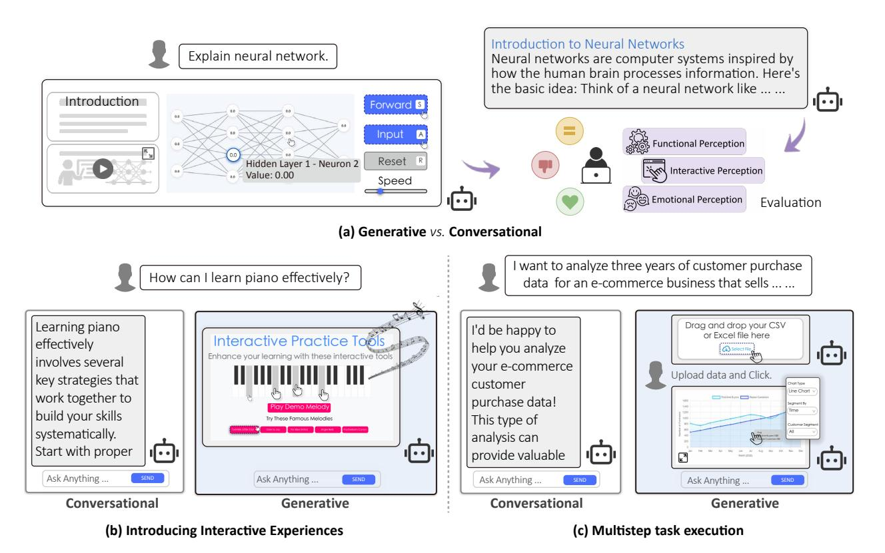

Figure 1: Generative Interfaces compared to conversational interfaces. (a) Conceptual framework showing how Generative Interfaces create structured, interactive experiences rather than static text responses, evaluated along functional, interactive, and emotional dimensions. (b–c) Example queries illustrate how Generative Interfaces transform user input into adaptive tools—such as interactive learning aids or multistep workflows—providing clearer organization and richer interactivity than conversational responses.

for assessing language model interfaces across three key dimensions: functionality, interactivity, and emotional perception [\(Hartmann et al.,](#page-9-0) [2008;](#page-9-0) [Nielsen et al.,](#page-10-2) [2012;](#page-10-2) [Duan,](#page-9-1) [2025\)](#page-9-1). Specifically, we construct a diverse prompt suite, *U*ser *I*nterface e*X*perience (UIX), that strategically covers diverse domains and prompt types to reflect real-world usage scenarios [\(Tamkin et al.,](#page-11-4) [2024\)](#page-11-4). For each user query, we recruit experienced annotators to interact with different interfaces and conduct pairwise comparisons. This comprehensive evaluation not only demonstrates the superior performance of generative interfaces but also reveals *when* they excel (in structured and information-dense domains) and *why* users prefer them (through enhanced visual organization, interactivity, and reduced cognitive load).

Our main contributions are as follows:

- We propose Generative Interfaces, a paradigm that enables adaptive, goal-driven interactions with LLMs by dynamically generating user interfaces.
- We develop a technical infrastructure with structured representations and iterative refinement, and an evaluation framework that systematically compares generative and conversational interfaces.
- We demonstrate that generative interfaces significantly outperform conversational ones across diverse query types and interaction patterns.

# 2 GENERATIVE INTERFACE FOR LANGUAGE MODELS

We begin by introducing the structured interface-specific representation (Sec[.2.1\)](#page-2-0). Next, we outline the generation pipeline: user queries are first mapped into intermediate representations and then decoded into UI code (Sec[.2.2\)](#page-2-1). Finally, we describe the iterative refinement process that applies adaptive reward functions to further optimize the generated interfaces (Sec. [2.3\)](#page-3-0).

<span id="page-2-2"></span>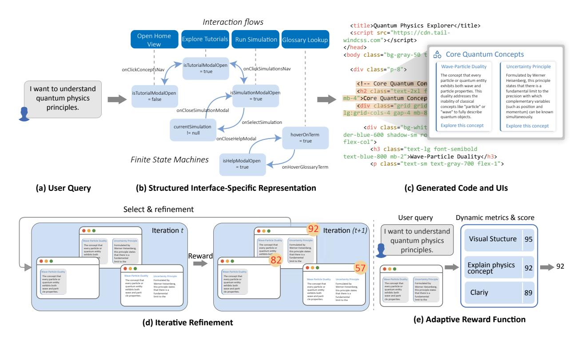

Figure 2: Generative Interfaces infrastructure: (a) User queries are first converted into (b) structured interfacespecific representations that model interaction flows and component dependencies. This structured representation guides the generation of (c) functional code and user interfaces. The system employs (d) iterative refinement with  $(e)$ adaptive reward functions containing query-specific evaluation rubrics.

#### <span id="page-2-0"></span>2.1 STRUCTURED INTERFACE-SPECIFIC REPRESENTATION

Directly generating interfaces is challenging due to the vast search space and the complexity of interactive contexts. To address this, we translate user queries into a **structured interface-specific representation** that anchors and guides the generation process. This representation operates at two complementary levels: (i) *high-level* interaction flows that capture user trajectories and task phases, and  $(ii)$  low-level finite state machines (FSMs) that define component behaviors and UI logic.

**Interaction flows** The high-level interaction flow provides a symbolic abstraction of user behavior across primary interface stages. It represents user task progression as a directed graph, where transitions are triggered by UI events such as clicking. We denote this abstraction as a directed graph  $\mathcal{G} = (\mathcal{V}, \mathcal{T})$ , where nodes  $\mathcal{V}$  represent interface views or subgoals, and edges  $\mathcal{T}$  denote possible transitions (See Appendix C for detail definition). In the example shown in Figure 2, the natural language query I want to understand quantum physics principles" is grounded into a coherent interaction trajectory: Open Home View  $→$ Explore Tutorials $→$ Run Simulation $→$  Glossary Lookup". This abstraction captures the high-level intent and interaction logic of potential users, while concrete UI behaviors (e.g., state toggles and modal updates) are specified separately in the FSM.

**Finite state machines** We further use Finite State Machines (FSMs) to describe how individual UI modules respond to user actions and update their states accordingly. Formally, we model each UI component as  $\mathcal{M} = (\mathcal{S}, \mathcal{E}, \delta, s_0),$ where  $\mathcal{S}$  is the set of atomic interface states (e.g., isModalOpen=true),  $\mathcal{E}$  is the set of user-triggered events (e.g., click, hover),  $\delta$  is the state transition function, and  $s_0$  is the initial state (See Appendix C). This structure explicitly defines how the interface should behave given a particular state and a triggered event.

#### <span id="page-2-1"></span>2.2 GENERATION PIPELINE

**Requirement specification** First, we generate a requirement specification for the user query, capturing the main goal, desired features, UI components, interaction styles, and problem-solving strategies. This specification serves as a bridge between the user's natural language intent and formal interface design.

Structured representation generation Second, we generate a structured interface-specific representation (Sec. [2.1\)](#page-2-0) based on the requirement specification. This representation serves as a modular and interpretable scaffold for UI generation, where the hierarchy of interaction flows and finite state machines ensures that the resulting interfaces are both coherent and functional.

UI generation To support the UI generation based on structured representations, we build a complementary codebase containing reusable implementations of common UI elements (*e.g.*, clock, map, calculator, video player, code viewer, and chart). Additionally, a web retrieval module[1](#page-3-1) gathers relevant UI examples and data sources. Finally, the entire context, including the natural language query, requirement specification, structured representation, predefined components, and retrieved content examples, is passed to an LLM to synthesize executable HTML/CSS/JS code, which is rendered into an interface, as illustrated in Figure [2](#page-2-2) (a)(b)(c).

#### <span id="page-3-0"></span>2.3 ITERATIVE UI REFINEMENT

Generating an effective and well-structured user interface is usually an iterative process [\(Li et al.,](#page-10-1) [2024\)](#page-10-1). To this end, we introduce an adaptive, reward-driven iterative refinement procedure that progressively improves UI quality by generating evaluation metrics, scoring candidates, and regenerating interfaces through multiple cycles.

Adaptive reward function To support task-specific and context-aware evaluation, we employ an LLM to construct a reward function tailored to each user query adaptively. As shown in Figure [2\(](#page-2-2)e), for query *"I want to understand quantum physics principles,"* the system automatically generates a set of fine-grained evaluation metrics—such as *Visual Structure*, *Explain Physics Concept*, and *Clarity*—each with associated weights and verification rules. These dimensions are scored independently and aggregated to compute the final overall score, which ranges from 0 to 100. See Appendix [D](#page-15-0) for examples of adaptive reward functions.

Iterative refinement As depicted in Figure [2\(](#page-2-2)d), at each iteration, multiple UI candidates are generated, then the adaptive reward function evaluates these candidates. In the next iteration, we will regenerate the UI using the highestscoring candidate from the previous iteration, along with its evaluation. This feedback loop guides the LLM to address issues related to structure, semantics, or visual design. The process continues until a candidate reaches an overall score of 90 or higher, or until we have completed five iterations.

# 3 EVALUATION FRAMEWORK

To enable systematic evaluation, we developed a comprehensive evaluation framework, which includes a diverse user query suite named *U*ser *I*nterface e*X*perience (UIX), covering various scenarios, styles, and intents (Sec. [3.1\)](#page-3-2); a set of multidimensional evaluation metrics (Sec. [3.2\)](#page-3-3); and an integrated human study (Sec. [3.3\)](#page-4-0).

#### <span id="page-3-2"></span>3.1 USER QUERIES

In UIX, we generate a test set of 100 user queries using Claude 3.7 that spans multiple domains, supporting varying specificity levels and capturing different query complexities. Specifically, we follow best practices from prior work around how people engage with LLMs as follows. (I) Topic coverage: Prompts are uniformly distributed across the ten domains defined in Clio [\(Tamkin et al.,](#page-11-4) [2024\)](#page-11-4), covering a wide range of real-world user scenarios. See Appendix [A](#page-11-5) for category list. (II) Query detail level: Following [Cao et al.](#page-9-2) [\(2025\)](#page-9-2), each domain contains an equal split of concise and detailed prompts. Concise prompts express intent abstractly in fewer than 15 words (*e.g.*, "*Create a SWOT analysis for my small business*"), while detailed prompts provide explicit goals and rich context. (III) Query Type: As user queries shift from casual dialogue to actionable tasks, our design maintains a balanced mixture between general conversational prompts (*e.g.*, "*How can I improve my public speaking?*") and interactive, task-oriented queries (*e.g.*, "*I want to visualize my company's sales data*").

#### <span id="page-3-3"></span>3.2 EVALUATION METRICS

To assess the quality of LLM interfaces, we adopt a comprehensive set of evaluation metrics adapted from [Nielsen](#page-10-2) [et al.](#page-10-2) [\(2012\)](#page-10-2) and [Hartmann et al.](#page-9-0) [\(2008\)](#page-9-0), capturing three core dimensions of user perception: functional, interactive, and emotional. *Functional Perception* includes Query-Interface Consistency (QIC), which evaluates how well the generated interface aligns with and fulfills the user's query intent [\(Duan,](#page-9-1) [2025\)](#page-9-1), and Task Efficiency (TaskEff), which measures how efficiently users can achieve their goals with minimal effort or time [\(Nielsen et al.,](#page-10-2) [2012;](#page-10-2) [Duan,](#page-9-1) [2025\)](#page-9-1).

<span id="page-3-1"></span><sup>1</sup>We use <exa.ai> as the search API.

<span id="page-4-3"></span>

|                               |            | Functional |     |     | Interactive<br>Emotional Overall   |     |             |     |     |
|-------------------------------|------------|------------|-----|-----|------------------------------------|-----|-------------|-----|-----|
| Framework                     | Status     |            |     |     | QIC TaskEff Usability Learnability | IC  | ASA IES     |     |     |
|                               | ConvUI 11% |            | 14% | 13% | 10%                                | 9%  | 3%          | 6%  | 12% |
| ConvUI (Claude 3.7) vs. GenUI | Tie        | 6%         | 5%  | 4%  | 6%                                 | 6%  | 8%          | 7%  | 4%  |
|                               | GenUI      | 83%        | 81% | 83% | 84%                                |     | 85% 89% 87% |     | 84% |
|                               | ConvUI 32% |            | 41% | 28% | 35%                                |     | 38% 13% 24% |     | 30% |
| ConvUI (GPT-4o) vs. GenUI     | Tie        | 11%        | 5%  | 7%  | 10%                                | 8%  | 7%          | 6%  | 1%  |
|                               | GenUI      | 57%        | 54% | 65% | 55%                                |     | 54% 80% 70% |     | 69% |
|                               | IUI        | 13%        | 17% | 16% | 14%                                |     | 16% 20% 14% |     | 17% |
| IUI vs. GenUI                 | Tie        | 18%        | 13% | 18% | 20%                                | 15% | 5%          | 15% | 8%  |
|                               | GenUI      | 69%        | 70% | 66% | 66%                                |     | 69% 75% 71% |     | 75% |

Table 1: Human Evaluation of UI Framework. Win, tie and loss percentages of UI variants compared to our system (GenUI), based on human preference across different perception dimensions: functional, interactive, and emotional.

*Interactive Perception* comprises Usability, assessing interface clarity and actionable structure [\(Hartmann et al.,](#page-9-0) [2008;](#page-9-0) [Nielsen et al.,](#page-10-2) [2012\)](#page-10-2); Learnability, indicating how easily new users can begin using the interface without prior experience [\(Nielsen et al.,](#page-10-2) [2012\)](#page-10-2); and Information Clarity (IC), which evaluates information organization, readability, and interpretability [\(Hartmann et al.,](#page-9-0) [2008;](#page-9-0) [Cao et al.,](#page-9-2) [2025\)](#page-9-2). Finally, *Emotional Perception* covers Aesthetic or Stylistic Appeal (ASA), reflecting the visual consistency and attractiveness of the design [\(Hartmann et al.,](#page-9-0) [2008;](#page-9-0) [Duan et al.,](#page-9-3) [2024\)](#page-9-3), and Interaction Experience Satisfaction (IES), capturing the user's overall satisfaction and engagement with the interface [\(Duan,](#page-9-1) [2025\)](#page-9-1). This enables a comprehensive assessment of user experience by tracing the full perceptual process—"how users understand the interface" → "how they operate it" → "how they emotionally respond". Instead of using the traditional Likert scale, we adopt a pairwise comparison approach, following [Zheng et al.](#page-11-6) [\(2023\)](#page-11-6); [Si et al.](#page-11-0) [\(2024\)](#page-11-0). That is, for each query, we present two interfaces to human annotators and ask for their preferences on all seven dimensions, as well as their overall preferences.

#### <span id="page-4-0"></span>3.3 HUMAN EVALUATION

For pairwise comparison, we collected human judgments on Prolific [2](#page-4-1) (Annotators are paid at the rate of \$16/hour, see Appendix [G](#page-17-0) for annotator demographics). Each evaluation instance consisted of a user query and two UI outputs (Example 1 and Example 2) generated by different methods. Annotators judged which output better satisfied the criteria across seven evaluation dimensions and overall (Example 1 wins, Example 2 wins, or Tie). We aggregated the three judgments per instance using majority voting to obtain a single final decision. Despite the inherent subjectivity of interface assessments, Fleiss' Kappa [\(Landis & Koch,](#page-10-3) [1977\)](#page-10-3) reached 0.525, indicating a moderate level of agreement.

# 4 EXPERIMENTAL RESULTS

Implementation details Our system is built on OpenCanvas[3](#page-4-2) and uses Claude 3.7 [\(Anthropic,](#page-8-1) [2025\)](#page-8-1) as the default backbone LLM, given its strong performance in UI code generation [\(Si et al.,](#page-11-0) [2024;](#page-11-0) [Li et al.,](#page-10-1) [2024\)](#page-10-1). We refer to our approach as GenUI and compare it against two baselines: (I) *Conversational UI (ConvUI):* A traditional chat interface using either GPT-4o [\(OpenAI,](#page-11-7) [2024\)](#page-11-7) or Claude 3.7 [\(Anthropic,](#page-8-1) [2025\)](#page-8-1). To reduce potential bias in human evaluation, we present a unified chat interface without disclosing the underlying model. For Claude 3.7, 26% of responses include artifact generation. We remove the artifacts and retain only the textual output to ensure a clean and fair comparison with other conversational systems. (II) *Instructed UI (IUI):* An interface generated by Claude 3.7 when explicitly prompted (query + "*Please help me solve it with UI*"). This prompt consistently triggers artifact generation, and the resulting artifact is taken as the system output.

#### 4.1 MAIN RESULTS AND FINDINGS

Conversational Interfaces *vs.* Generative Interfaces As shown in Table [1,](#page-4-3) GenUI consistently outperforms ConvUI across all evaluation dimensions. Interestingly, ConvUI (GPT-4o) performs more competitively than ConvUI (Claude 3.7), suggesting that well-structured textual responses can still be effective in specific scenarios. Compared to ConvUI

<span id="page-4-1"></span><sup>2</sup><https://app.prolific.com>

<span id="page-4-2"></span><sup>3</sup><https://github.com/langchain-ai/open-canvas>

<span id="page-5-0"></span>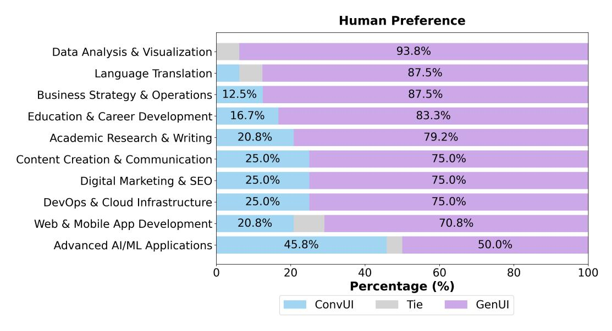

Figure 3: Human preference across 10 query topics [\(Tamkin et al.,](#page-11-4) [2024\)](#page-11-4).

(Claude 3.7), GenUI achieves the most significant gains in ASA (+86.0%) and IES (+81.0%). Overall, its emotional appeal and interactive functionality are the primary drivers of its superior performance, resulting in an 84.0% win rate over ConvUI (Claude 3.7). These findings suggest that users clearly prefer GenUI for most queries.

User comments further support this finding. For example, one noted: "*ConvUI is a little confusing in the presentation. GenUI provides the requested information in an easy-to-understand manner, laying out everything requested and anticipating what else may be needed.*" This suggests that structured output and proactive interaction are key reasons why users prefer GenUI. A small number of users did express a preference for the familiarity of traditional ConvUIs, as one remarked (see interface examples in Appendix Figure [7\)](#page-16-0): "*Chatbot interface is most people know already, while GenUI is a somewhat complex and unfamiliar app.*" This counterpoint highlights a residual inertia in user comfort with familiar formats. However, such preference did not override the broader recognition of GenUI's objective advantages, indicating strong potential for user adaptation and adoption in real-world deployments.

What domains benefit from Generative Interfaces? As shown in Figure [3,](#page-5-0) preferences for GenUI vary by domain. Users strongly favored GenUI in *Data Analysis & Visualization* (93.8%) and *Business Strategy & Operations* (87.5%), where tasks typically involve interpreting large amounts of structured information. By contrast, in *Advanced AI/ML Applications*, GenUI received 50.0% of preferences, suggesting that traditional linear text explanations remain effective in math-heavy contexts. Overall, these results indicate that domains characterized by complex information benefit most from GenUIs, whereas ConvUIs are still suitable for domains that rely on straightforward explanations.

What queries benefit from Generative Interfaces? As shown in Figure [4a,](#page-6-0) GenUI receives stronger preferences for certain query characteristics. It is particularly favored in interactive tasks (80.0%), underscoring the advantages of generative interfaces in scenarios where interaction is essential for task completion. In general conversations, users also show a clear preference for GenUI over ConvUI (73.0% *vs.* 23.0%). When comparing query detail level, GenUI is preferred more for detailed queries (80.0%) than for concise ones (73.0%), likely because simple conversational responses sometimes sufficiently address short queries, whereas GenUI may introduce unnecessary complexity.

#### 4.2 ABLATION STUDY

Our Pipeline *vs.* Direct Instruct We compare our framework against IUI: directly instructing Claude 3.7 to generate a web interface with the artifact feature enabled, representing a highly engineered baseline. Our system outperforms this strong baseline, achieving a 58.0% higher win rate (Table [1\)](#page-4-3). Among the baselines, IUI shows better performance in emotional perception dimensions such as ASA, but it still lags behind GenUI overall.

Natural Language *vs.* Structured Representation The natural language version provides a descriptive explanation of the UI based on the user query, without employing structured representations to define interface states formally. As shown in Table [2](#page-6-1) (Row 1 *vs.* Row 2), structured representations outperform natural language, improving the win rate from 13% to 17% in overall human evaluation.

<span id="page-6-0"></span>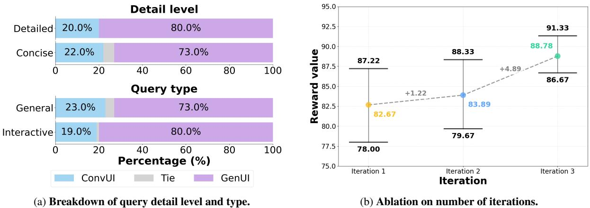

<span id="page-6-1"></span>Figure 4: Human evaluation results comparing GenUIs and ConvUIs. (a) User preference breakdown by query type and detail level. (b) Performance improvement across iterative interactions.

|        | Reward Generation                           | Repre-     |        |     | Functional |     | Interactive                        |    |             | Emotional Overall |
|--------|---------------------------------------------|------------|--------|-----|------------|-----|------------------------------------|----|-------------|-------------------|
| design | paradigm                                    | sentation  | Status |     |            |     | QIC TaskEff Usability Learnability | IC | ASA IES     |                   |
|        | Full GenUI: Adaptive, Iterative, Structured |            |        |     |            |     |                                    |    |             |                   |
|        |                                             |            | Win    | 8%  | 16%        | 11% | 19%                                |    | 15% 10% 13% | 13%               |
| Static | One-shot                                    | Natural    | Tie    | 20% | 20%        | 22% | 16%                                |    | 15% 13% 15% | 5%                |
|        |                                             |            | Loss   | 72% | 64%        | 67% | 65%                                |    | 70% 77% 72% | 82%               |
|        |                                             |            | Win    | 11% | 18%        | 18% | 18%                                |    | 16% 15% 14% | 17%               |
| Static | One-shot                                    | Structured | Tie    | 20% | 12%        | 12% | 15%                                |    | 10% 10% 13% | 5%                |
|        |                                             |            | Loss   | 69% | 70%        | 70% | 67%                                |    | 74% 75% 73% | 78%               |
|        |                                             |            | Win    | 28% | 30%        | 30% | 27%                                |    | 27% 34% 27% | 31%               |
| Static | Iterative                                   | Structured | Tie    | 32% | 26%        | 24% | 30%                                |    | 27% 17% 28% | 15%               |
|        |                                             |            | Loss   | 40% | 44%        | 46% | 43%                                |    | 46% 49% 45% | 54%               |

Table 2: Ablation study. The control group is the full GenUI framework (*adaptive* reward, *iterative* generation, and *structured* representation). All ablations are compared against this full version, where "Loss" indicates that GenUI outperforms the variant. Note that "*Static*" refers to static reward design, "*One-shot*" denotes generation without refinement, and "*Natural*" indicates natural language representations.

One-shot Generation *vs.* Iterative Refinement As shown in Table [2](#page-6-1) (Row 2 *vs.* Row 3), the iterative refinement process yields consistent improvements on human preference across all perception dimensions, resulting in a notable +14.0% overall win rate improvement compared to one-shot generation. Figure [4b](#page-6-0) further illustrates that each refinement round leads to a clear performance boost, with average LLM-based reward scores increasing by +1.2% and +4.9%, respectively. Additionally, the gap between the maximum and minimum scores narrows progressively, indicating improved stability and convergence through iterative optimization. We illustrate an example of such iterative improvement in Appendix Figure [8,](#page-17-1) where each iteration incrementally enhances layout efficiency, usability, and user guidance, ultimately leading to a more informative and user-friendly interface through structured refinement.

Reward Function: Static *vs.* Adaptive Table [2](#page-6-1) (Row 3) highlights the effect of dynamic reward functions, which differ from the full version only by replacing adaptive scoring with a static baseline. The absence of dynamic rewards results in a 17.0% drop in overall win rate, with performance declining across all seven evaluation metrics. This comparison highlights the importance of dynamically adjusting evaluation criteria to capture the complex user goals and task-specific requirements inherent in each query, rather than relying on generic, fixed heuristics.

#### <span id="page-6-2"></span>4.3 HUMAN PREFERENCE ANALYSIS

To better understand the factors underlying human annotator preferences, we collected fine-grained textual justifications for each perception dimension in 40% of the pairwise comparisons, and overall comments for the remaining 60%. Following the methodology of [Lam et al.](#page-10-4) [\(2024\)](#page-10-4), we used Claude 3.7 to systematically extract high-level se-

<span id="page-7-0"></span>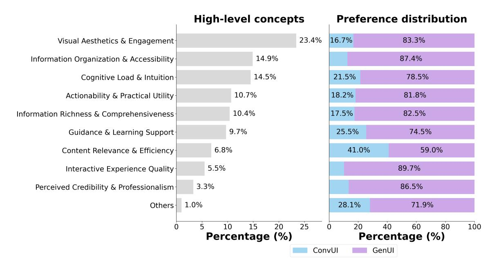

Figure 5: Human comment distribution. (a) Distribution of high-level concepts extracted from the valid user comments using the pipeline described in Sec. [4.3.](#page-6-2) Comments without clear evaluative content were excluded. (b) For each concept in (a), the chart shows the percentage of users who preferred GenUIs or ConvUIs.

mantic concepts from these qualitative responses. The resulting comments were then clustered into semantic themes identified by the LLM (Figure [5\)](#page-7-0). This analysis allows us to pinpoint the key factors shaping user preferences beyond surface-level considerations such as visual aesthetics and engagement. Finally, we computed preference distributions between generative and conversational interfaces within each identified semantic dimension.

Cognitive Offloading as Deeper Preference Driver Cognitive offloading [\(Risko & Gilbert,](#page-11-8) [2016\)](#page-11-8) emerges through user comments as a subtler yet deeper driver. 78.5% of users mentioning *Cognitive Load & Intuition* preferred GenUI. For instance, in designing a continuing education program for healthcare professionals, a user noted: "*This type of information analysis is very complex . . . GenUI helps to break down the categories into manageable steps . . . makes the complex information easier to process.*" This illustrates how GenUI's interface acts as an external cognitive aid to break down information. However, in easier scenarios such as designing a high-school mathematics curriculum, ConvUI was preferred because it "*clearly and informatively illustrates the steps*". In summary, GenUI excels in *complex, concept-heavy scenarios* where cognitive offloading facilitates understanding. In contrast, ConvUI outperforms for easy and basic *"how-to" queries* where additional tools impose unnecessary cognitive load.

Visual Structure Enhances Perceived Usability and Trust Among the user comments related to the "*Perceived Credibility & Professionalism*" dimension, 86.5% preferred the GenUI. Users consistently described GenUI as more authoritative, credible, and professional. For example, in response to the query "*How do I conduct market research?*", users commented: "*GenUI is more professionally written*", "*It offers out the more sound advice*", and "*It is the better discernment.*" Notably, this perception of professionalism does not stem solely from the content itself. In fact, many users acknowledged that both interfaces provided reasonable answers to the query (*e.g.*, "*Both answer the prompt reasonably well*"). What sets GenUI apart is its presentation: through modular layouts, clear hierarchies, visual anchors, and polished formatting, it delivers the information in a more organized manner.

# 5 RELATED WORK

Context-Aware and Adaptive Interface Context-aware interfaces have been widely explored since the rise of ubiquitous computing, aiming to improve usability, reduce cognitive load, and better support user goals [\(Dey et al.,](#page-9-4) [2000;](#page-9-4) [Horvitz,](#page-9-5) [1999;](#page-9-5) [Theng & Duh,](#page-11-9) [2008\)](#page-11-9). As computing systems have become more complex and pervasive, the ability to adjust interfaces dynamically has been critical for creating more effective and accessible user experiences [\(Gajos &](#page-9-6) [Weld,](#page-9-6) [2004;](#page-9-6) [Gajos et al.,](#page-9-7) [2007;](#page-9-7) [Nichols et al.,](#page-10-5) [2002;](#page-10-5) [2006a](#page-10-6)[;b\)](#page-10-7). Prior systems often adapted functionality through a finite set of predefined states. While effective in constrained settings, these approaches faced challenges with scalability and sometimes reduced predictability and user control [\(Findlater & Gajos,](#page-9-8) [2009\)](#page-9-8). Recent advances in LLMs have enabled new forms of adaptive interfaces that dynamically generate interface elements in response to user prompts [\(Wu](#page-11-10) [et al.,](#page-11-10) [2022;](#page-11-10) [Dibia,](#page-9-9) [2023;](#page-9-9) [Cha et al.,](#page-9-10) [2024;](#page-9-10) [Cheng et al.,](#page-9-11) [2024;](#page-9-11) [Nandy et al.,](#page-10-8) [2024\)](#page-10-8). These approaches mark a shift from static outputs toward model-driven, interactive systems.

To improve interaction efficiency between humans and LLMs, prior studies [\(Jiang et al.,](#page-9-12) [2023;](#page-9-12) [Ma et al.,](#page-10-9) [2024;](#page-10-9) [Ross](#page-11-11) [et al.,](#page-11-11) [2023\)](#page-11-11) have proposed combining text-based ConvUIs with Graphical User Interfaces (GUIs). For example, OpenAI Canvas enables users to directly edit documents and code on a canvas, avoiding repeated prompt inputs; Graphologue [\(Jiang et al.,](#page-9-12) [2023\)](#page-9-12) transforms lengthy and complex LLM responses into graphical diagrams to support information exploration and question answering. However, although these approaches leverage LLMs to generate displayed content, the UIs they employ are predesigned. In contrast, GenerativeGUI [\(Hojo et al.,](#page-9-13) [2025\)](#page-9-13) explores the usability of dynamically generated interfaces in clarifying question (CQ) interactions. ClarifyGPT [\(Mu et al.,](#page-10-10) [2023\)](#page-10-10) also introduces CQs, but in the narrower domain of code generation. Beyond CQ scenarios, DynaVis [\(Vaithilingam](#page-11-12) [et al.,](#page-11-12) [2024\)](#page-11-12) proposes a system that combines natural language with dynamically synthesized UI widgets to support chart editing tasks, without exploring broader, general-purpose scenarios. Unlike prior systems that modify fixed UI components [\(Cao et al.,](#page-9-2) [2025\)](#page-9-2), our framework generates complete interfaces customized to diverse user queries.

Automatic UI Generation This direction has evolved from early computer vision approaches utilizing OCR and edge detection for reverse engineering mobile interfaces [\(Nguyen & Csallner,](#page-10-11) [2015\)](#page-10-11) to neural network-based endto-end synthesis systems [\(Beltramelli,](#page-9-14) [2018;](#page-9-14) [Robinson,](#page-11-13) [2019;](#page-11-13) [As¸ıroglu et al.](#page-8-2) ˘ , [2019\)](#page-8-2), though limited by model capacity and training data. Recent advances in LLMs have substantially improved UI generation capabilities through directly prompting LLMs with natural language descriptions [\(Laurenc¸on et al.,](#page-10-12) [2024\)](#page-10-12), screenshots [\(Si et al.,](#page-11-0) [2024\)](#page-11-0), and sketches [\(Li et al.,](#page-10-1) [2024\)](#page-10-1) and iterative refinement via LLM-generated feedback [\(Li et al.,](#page-10-1) [2024\)](#page-10-1). Our work diverges from these paradigms by establishing direct query-to-interface mapping and requiring no UI specifications from users. More fine-grained control of the UI code generation process encompasses diverse intermediate representation approaches: (I) graph-based representation to capture hierarchical relationships and dependencies between UI elements [\(Jiang et al.,](#page-10-13) [2024\)](#page-10-13), (II) UI grammar [\(Kong et al.,](#page-10-14) [2008\)](#page-10-14) to help LLMs for more intuitive and precise layout description [\(Lu et al.,](#page-10-15) [2023\)](#page-10-15), and (III) data schema-driven UI specification synthesis to guide subsequent generation processes [\(Cao et al.,](#page-9-2) [2025\)](#page-9-2). Similarly, our framework employs interaction flows and finite state machines to model the reaction to user actions and the evolution of interfaces.

# 6 CONCLUSION

We introduce Generative Interfaces for Language Models, a paradigm in which LLMs proactively generate adaptive, interactive interfaces to better support complex user goals. Our evaluation demonstrates clear advantages over traditional conversational approaches, particularly in structured and information-dense tasks. The findings further clarify when generative interfaces are most effective and when conversational formats remain competitive. Future directions include integrating multimodal input, domain-specific templates, and collaborative multi-user environments.

Limitations First, the system only supports HTML/JavaScript frontends without backend logic, which restricts the complexity of generated interfaces. As tasks grow more complex, more expressive representations beyond interaction flows and finite state machines may be needed. Second, the iterative refinement process introduces latency of up to several minutes, which may be undesirable in real-time settings. Advances in model efficiency and infrastructure could help mitigate this issue. Third, the system generates interfaces for all queries, even when interaction is unnecessary. Future work could incorporate a classifier to determine whether an input requires interaction in context and selectively invoke the generative UI system. Finally, our evaluation is based on controlled benchmarks rather than open-ended user studies [\(Chiang et al.,](#page-9-15) [2024\)](#page-9-15), leaving open the question of how generative UIs perform in real-world usage.

# REFERENCES

- <span id="page-8-1"></span>Anthropic. Introducing claude 3.7 sonnet, 2025. URL [https://www.anthropic.com/news/](https://www.anthropic.com/news/claude-3-7-sonnet) [claude-3-7-sonnet](https://www.anthropic.com/news/claude-3-7-sonnet).
- <span id="page-8-0"></span>Apple Inc. Knowledge navigator, 1987. URL [https://en.wikipedia.org/wiki/Knowledge\\_](https://en.wikipedia.org/wiki/Knowledge_Navigator) [Navigator](https://en.wikipedia.org/wiki/Knowledge_Navigator). Concept video and vision for future technology.
- <span id="page-8-2"></span>Batuhan As¸ıroglu, B ˘ us¸ta R ¨ umeysa Mete, Eyy ¨ up Yıldız, Ya ¨ gız Nalc¸akan, Alper Sezen, Mustafa Da ˘ gtekin, and Tolga ˘ Ensari. Automatic html code generation from mock-up images using machine learning techniques. In *2019 Scientific Meeting on Electrical-Electronics & Biomedical Engineering and Computer Science (EBBT)*, pp. 1–4, 2019. doi: 10.1109/EBBT.2019.8741736.

- <span id="page-9-14"></span>Tony Beltramelli. pix2code: Generating code from a graphical user interface screenshot. In *Proceedings of the ACM SIGCHI symposium on engineering interactive computing systems*, pp. 1–6, 2018.
- <span id="page-9-2"></span>Yining Cao, Peiling Jiang, and Haijun Xia. Generative and malleable user interfaces with generative and evolving task-driven data model. In *Proceedings of the 2025 CHI Conference on Human Factors in Computing Systems*, CHI '25, pp. 1–20. ACM, April 2025. doi: 10.1145/3706598.3713285. URL [http://dx.doi.org/10.1145/](http://dx.doi.org/10.1145/3706598.3713285) [3706598.3713285](http://dx.doi.org/10.1145/3706598.3713285).
- <span id="page-9-10"></span>Yoon Jeong Cha, Yasemin Gunal, Alice Wou, Joyce Lee, Mark W Newman, and Sun Young Park. Shared responsibility in collaborative tracking for children with type 1 diabetes and their parents. In *Proceedings of the 2024 CHI Conference on Human Factors in Computing Systems*, pp. 1–20, 2024.
- <span id="page-9-11"></span>Ruijia Cheng, Titus Barik, Alan Leung, Fred Hohman, and Jeffrey Nichols. Biscuit: Scaffolding llm-generated code with ephemeral uis in computational notebooks. In *2024 IEEE Symposium on Visual Languages and Human-Centric Computing (VL/HCC)*, pp. 13–23. IEEE, 2024.
- <span id="page-9-15"></span>Wei-Lin Chiang, Lianmin Zheng, Ying Sheng, Anastasios Nikolas Angelopoulos, Tianle Li, Dacheng Li, Hao Zhang, Banghua Zhu, Michael Jordan, Joseph E. Gonzalez, and Ion Stoica. Chatbot arena: An open platform for evaluating llms by human preference, 2024.
- <span id="page-9-4"></span>Anind K Dey, Gregory D Abowd, et al. Towards a better understanding of context and context-awareness. In *CHI 2000 workshop on the what, who, where, when, and how of context-awareness*, volume 4, pp. 1–6, 2000.
- <span id="page-9-9"></span>Victor Dibia. Lida: A tool for automatic generation of grammar-agnostic visualizations and infographics using large language models. *arXiv preprint arXiv:2303.02927*, 2023.
- <span id="page-9-3"></span>Peitong Duan, Chin-Yi Cheng, Gang Li, Bjoern Hartmann, and Yang Li. Uicrit: Enhancing automated design evaluation with a ui critique dataset. In *Proceedings of the 37th Annual ACM Symposium on User Interface Software and Technology*, UIST '24, pp. 1–17. ACM, October 2024. doi: 10.1145/3654777.3676381. URL <http://dx.doi.org/10.1145/3654777.3676381>.
- <span id="page-9-1"></span>Shiyu Duan. Systematic analysis of user perception for interface design enhancement. *Journal of Computer Science and Software Applications*, 5(2), 2025.
- <span id="page-9-17"></span>Yann Dubois, Balazs Galambosi, Percy Liang, and Tatsunori B. Hashimoto. Length-controlled alpacaeval: A simple ´ way to debias automatic evaluators, 2024.
- <span id="page-9-8"></span>Leah Findlater and Krzysztof Z Gajos. Design space and evaluation challenges of adaptive graphical user interfaces. *AI Magazine*, 30(4):68–68, 2009.
- <span id="page-9-6"></span>Krzysztof Gajos and Daniel S Weld. Supple: automatically generating user interfaces. In *Proceedings of the 9th international conference on Intelligent user interfaces*, pp. 93–100, 2004.
- <span id="page-9-7"></span>Krzysztof Z Gajos, Jacob O Wobbrock, and Daniel S Weld. Automatically generating user interfaces adapted to users' motor and vision capabilities. In *Proceedings of the 20th annual ACM symposium on User interface software and technology*, pp. 231–240, 2007.
- <span id="page-9-0"></span>Jan Hartmann, Alistair Sutcliffe, and Antonella De Angeli. Towards a theory of user judgment of aesthetics and user interface quality. *ACM Transactions on Computer-Human Interaction (TOCHI)*, 15(4):1–30, 2008.
- <span id="page-9-13"></span>Nobukatsu Hojo, Kazutoshi Shinoda, Yoshihiro Yamazaki, Keita Suzuki, Hiroaki Sugiyama, Kyosuke Nishida, and Kuniko Saito. Generativegui: Dynamic gui generation leveraging llms for enhanced user interaction on chat interfaces. In *Proceedings of the Extended Abstracts of the CHI Conference on Human Factors in Computing Systems*, pp. 1–9, 2025.
- <span id="page-9-5"></span>Eric Horvitz. Principles of mixed-initiative user interfaces. In *Proceedings of the SIGCHI conference on Human Factors in Computing Systems*, pp. 159–166, 1999.
- <span id="page-9-16"></span>Jaehyun Jeon, Jang Han Yoon, Min Soo Kim, Sumin Shim, Yejin Choi, Hanbin Kim, and Youngjae Yu. G-focus: Towards a robust method for assessing ui design persuasiveness, 2025.
- <span id="page-9-12"></span>Peiling Jiang, Jude Rayan, Steven P Dow, and Haijun Xia. Graphologue: Exploring large language model responses with interactive diagrams. In *Proceedings of the 36th annual ACM symposium on user interface software and technology*, pp. 1–20, 2023.

- <span id="page-10-13"></span>Yue Jiang, Changkong Zhou, Vikas Garg, and Antti Oulasvirta. Graph4gui: Graph neural networks for representing graphical user interfaces. In *Proceedings of the 2024 CHI Conference on Human Factors in Computing Systems*, pp. 1–18, 2024.
- <span id="page-10-14"></span>Jun Kong, Keven L Ates, Kang Zhang, and Yan Gu. Adaptive mobile interfaces through grammar induction. In *2008 20th IEEE International Conference on Tools with Artificial Intelligence*, volume 1, pp. 133–140. IEEE, 2008.
- <span id="page-10-4"></span>Michelle S Lam, Janice Teoh, James A Landay, Jeffrey Heer, and Michael S Bernstein. Concept induction: Analyzing unstructured text with high-level concepts using lloom. In *Proceedings of the 2024 CHI Conference on Human Factors in Computing Systems*, pp. 1–28, 2024.
- <span id="page-10-3"></span>J Richard Landis and Gary G Koch. The measurement of observer agreement for categorical data. *biometrics*, pp. 159–174, 1977.
- <span id="page-10-12"></span>Hugo Laurenc¸on, Leo Tronchon, and Victor Sanh. Unlocking the conversion of web screenshots into html code with ´ the websight dataset, 2024.
- <span id="page-10-16"></span>Chunggi Lee, Sanghoon Kim, Dongyun Han, Hongjun Yang, Young-Woo Park, Bum Chul Kwon, and Sungahn Ko. Guicomp: A gui design assistant with real-time, multi-faceted feedback. In *Proceedings of the 2020 CHI Conference on Human Factors in Computing Systems*, CHI '20, pp. 1–13. ACM, April 2020. doi: 10.1145/3313831.3376327. URL <http://dx.doi.org/10.1145/3313831.3376327>.
- <span id="page-10-1"></span>Ryan Li, Yanzhe Zhang, and Diyi Yang. Sketch2code: Evaluating vision-language models for interactive web design prototyping, 2024.
- <span id="page-10-17"></span>Zijun Liu, Yanzhe Zhang, Peng Li, Yang Liu, and Diyi Yang. A dynamic llm-powered agent network for task-oriented agent collaboration, 2023.
- <span id="page-10-15"></span>Yuwen Lu, Ziang Tong, Qinyi Zhao, Chengzhi Zhang, and Toby Jia-Jun Li. Ui layout generation with llms guided by ui grammar. *arXiv preprint arXiv:2310.15455*, 2023.
- <span id="page-10-0"></span>Kalle Lyytinen and Youngjin Yoo. Ubiquitous computing. *Communications of the ACM*, 45(12):63–96, 2002.
- <span id="page-10-9"></span>Xiao Ma, Swaroop Mishra, Ariel Liu, Sophie Ying Su, Jilin Chen, Chinmay Kulkarni, Heng-Tze Cheng, Quoc Le, and Ed Chi. Beyond chatbots: Explorellm for structured thoughts and personalized model responses. In *Extended Abstracts of the CHI Conference on Human Factors in Computing Systems*, pp. 1–12, 2024.
- <span id="page-10-10"></span>Fangwen Mu, Lin Shi, Song Wang, Zhuohao Yu, Binquan Zhang, Chenxue Wang, Shichao Liu, and Qing Wang. Clarifygpt: Empowering llm-based code generation with intention clarification. *arXiv preprint arXiv:2310.10996*, 2023.
- <span id="page-10-8"></span>Palash Nandy, Sigurdur Orn Adalgeirsson, Anoop K Sinha, Tanya Kraljic, Mike Cleron, Lei Shi, Angad Singh, Ashish Chaudhary, Ashwin Ganti, Christopher A Melancon, et al. Bespoke: using llm agents to generate just-in-time interfaces by reasoning about user intent. In *Companion Proceedings of the 26th International Conference on Multimodal Interaction*, pp. 78–81, 2024.
- <span id="page-10-11"></span>Tuan Anh Nguyen and Christoph Csallner. Reverse engineering mobile application user interfaces with remaui (t). In *2015 30th IEEE/ACM international conference on automated software engineering (ASE)*, pp. 248–259. IEEE, 2015.
- <span id="page-10-5"></span>Jeffrey Nichols, Brad A Myers, Michael Higgins, Joseph Hughes, Thomas K Harris, Roni Rosenfeld, and Mathilde Pignol. Generating remote control interfaces for complex appliances. In *Proceedings of the 15th annual ACM symposium on User interface software and technology*, pp. 161–170, 2002.
- <span id="page-10-6"></span>Jeffrey Nichols, Brad A Myers, and Brandon Rothrock. Uniform: automatically generating consistent remote control user interfaces. In *Proceedings of the SIGCHI conference on Human Factors in computing systems*, pp. 611–620, 2006a.
- <span id="page-10-7"></span>Jeffrey Nichols, Brandon Rothrock, Duen Horng Chau, and Brad A Myers. Huddle: automatically generating interfaces for systems of multiple connected appliances. In *Proceedings of the 19th annual ACM symposium on User interface software and technology*, pp. 279–288, 2006b.

<span id="page-10-2"></span>Jakob Nielsen et al. Usability 101: Introduction to usability. 2012.

<span id="page-11-7"></span>OpenAI. Gpt-4o system card, 2024. URL <https://arxiv.org/abs/2410.21276>.

<span id="page-11-8"></span>Evan F Risko and Sam J Gilbert. Cognitive offloading. *Trends in cognitive sciences*, 20(9):676–688, 2016.

- <span id="page-11-13"></span>Alex Robinson. Sketch2code: Generating a website from a paper mockup. *ArXiv*, abs/1905.13750, 2019. URL <https://api.semanticscholar.org/CorpusID:173188440>.
- <span id="page-11-11"></span>Steven I Ross, Fernando Martinez, Stephanie Houde, Michael Muller, and Justin D Weisz. The programmer's assistant: Conversational interaction with a large language model for software development. In *Proceedings of the 28th International Conference on Intelligent User Interfaces*, pp. 491–514, 2023.
- <span id="page-11-2"></span>Richard K Shehady and Daniel P Siewiorek. A method to automate user interface testing using variable finite state machines. In *Proceedings of IEEE 27th International Symposium on Fault Tolerant Computing*, pp. 80–88. IEEE, 1997.
- <span id="page-11-0"></span>Chenglei Si, Yanzhe Zhang, Ryan Li, Zhengyuan Yang, Ruibo Liu, and Diyi Yang. Design2code: Benchmarking multimodal code generation for automated front-end engineering, 2024.
- <span id="page-11-4"></span>Alex Tamkin, Miles McCain, Kunal Handa, Esin Durmus, Liane Lovitt, Ankur Rathi, Saffron Huang, Alfred Mountfield, Jerry Hong, Stuart Ritchie, Michael Stern, Brian Clarke, Landon Goldberg, Theodore R. Sumers, Jared Mueller, William McEachen, Wes Mitchell, Shan Carter, Jack Clark, Jared Kaplan, and Deep Ganguli. Clio: Privacy-preserving insights into real-world ai use, 2024.
- <span id="page-11-9"></span>Yin-Leng Theng and Henry Duh. *Ubiquitous Computing: Design, Implementation and Usability (Premier Reference Source)*. IGI Global, USA, 2008. ISBN 1599046938.
- <span id="page-11-12"></span>Priyan Vaithilingam, Elena L Glassman, Jeevana Priya Inala, and Chenglong Wang. Dynavis: Dynamically synthesized ui widgets for visualization editing. In *Proceedings of the 2024 CHI Conference on Human Factors in Computing Systems*, pp. 1–17, 2024.
- <span id="page-11-3"></span>Ferdinand Wagner, Ruedi Schmuki, Thomas Wagner, and Peter Wolstenholme. *Modeling software with finite state machines: a practical approach*. Auerbach Publications, 2006.
- <span id="page-11-10"></span>Tongshuang Wu, Ellen Jiang, Aaron Donsbach, Jeff Gray, Alejandra Molina, Michael Terry, and Carrie J Cai. Promptchainer: Chaining large language model prompts through visual programming. In *CHI Conference on Human Factors in Computing Systems Extended Abstracts*, pp. 1–10, 2022.
- <span id="page-11-1"></span>Jingyu Xiao, Yuxuan Wan, Yintong Huo, Zixin Wang, Xinyi Xu, Wenxuan Wang, Zhiyao Xu, Yuhang Wang, and Michael R. Lyu. Interaction2code: Benchmarking mllm-based interactive webpage code generation from interactive prototyping, 2024.
- <span id="page-11-6"></span>Lianmin Zheng, Wei-Lin Chiang, Ying Sheng, Tianle Li, Siyuan Zhuang, Zhanghao Wu, Yonghao Zhuang, Zhuohan Li, Zi Lin, Eric P. Xing, Joseph E. Gonzalez, Ion Stoica, and Hao Zhang. Lmsys-chat-1m: A large-scale real-world llm conversation dataset, 2023.

# <span id="page-11-5"></span>A PROMPT SUITE

To evaluate system performance across realistic user intents, we curated a prompt suite covering ten practical domains: Web & Mobile App Development, Content Creation & Communication, Academic Research & Writing, Education & Career Development, Advanced AI/ML Applications, Business Strategy & Operations, Language Translation, DevOps & Cloud Infrastructure, Digital Marketing & SEO, and Data Analysis & Visualization.

Each prompt belongs to one of four quadrants based on *detail level* (concise *vs.* detailed) and *type* (general *vs.* interactive), ensuring coverage of diverse user tasks and complexity levels.

#### Example Prompts:

- Concise & General: *"How can I learn piano effectively?"*
- Concise & Interactive: *"I want to create an infographic about water conservation."*

- Detailed & General: *"I'm writing a dissertation on the psychological effects of social media use among teenagers. I've collected survey and interview data but am struggling to integrate them in the analysis chapter. What methodological approach should I use to synthesize these data types rigorously?"*
- Detailed & Interactive: *"I'm developing a website for a local bookstore where customers can browse inventory, register for book club meetings, and sign up for our newsletter. I want a cozy design but have no coding experience. The inventory is in Excel and updates weekly. What's the best approach to build this site?"*

# B LLM EVALUATION

|                             | Functional |         |           | Interactive  | Emotional |       |        |
|-----------------------------|------------|---------|-----------|--------------|-----------|-------|--------|
| Framework                   | QIC        | TaskEff | Usability | Learnability | IC        | ASA   | IES    |
| - Score:                    |            |         |           |              |           |       |        |
| ConvUI (Claude 3.7)         | 65.8       | 47.6    | 34.7      | 72.4         | 76.1      | 47.7  | 41.1   |
| ConvUI (GPT-4o)             | 70.2       | 51.0    | 36.8      | 74.9         | 80.2      | 48.1  | 43.1   |
| IUI                         | 68.0       | 58.0    | 57.9      | 73.8         | 72.5      | 70.8  | 56.0   |
| GenUI                       | 86.1       | 84.2    | 87.0      | 84.0         | 88.5      | 88.9  | 87.2   |
| - Relative Improvement (%): |            |         |           |              |           |       |        |
| vs. ConvUI (Claude 3.7)     | 30.9%      | 76.6%   | 151.0%    | 16.0%        | 16.2%     | 86.2% | 112.4% |
| vs. ConvUI (GPT-4o)         | 22.7%      | 65.1%   | 136.2%    | 12.2%        | 10.4%     | 84.8% | 102.3% |
| vs. IUI                     | 26.7%      | 45.0%   | 50.2%     | 13.8%        | 22.0%     | 25.5% | 55.7%  |

Table 3: LLM-Based Evaluation Scores Across Perception Dimensions. Automatic assessment (0–100 scale) of UI frameworks across functional, interactive, and emotional perception categories.

User-centered evaluation remains the gold standard for UI assessment due to interfaces' fundamental purpose of facilitating human interaction and operation [\(Hartmann et al.,](#page-9-0) [2008;](#page-9-0) [Duan,](#page-9-1) [2025;](#page-9-1) [Cao et al.,](#page-9-2) [2025\)](#page-9-2). However, generative interfaces requiring real-time synthesis and rapid iterative refinement cannot depend on user feedback, necessitating robust automatic evaluation frameworks.

Early approaches employed manually crafted behavioral prediction metrics [\(Lee et al.,](#page-10-16) [2020\)](#page-10-16), though these methods demonstrated limited generalizability and required substantial domain expertise. Recent research has increasingly leveraged LLMs for UI assessment, with [Duan et al.](#page-9-3) [\(2024\)](#page-9-3) employing LLMs to generate design feedback and quality ratings with bounding box annotations. [Jeon et al.](#page-9-16) [\(2025\)](#page-9-16) extends this paradigm to persuasiveness evaluation, achieving meaningful correlation with empirical A/B testing outcomes. In this work, we ask LLMs to judge the same dimensions that we ask human annotators, including some previously human-exclusive metrics such as task efficiency and learnability.

Specifically, we use a listwise ranker [\(Liu et al.,](#page-10-17) [2023\)](#page-10-17) to evaluate different interface variants of the same user query by presenting the LLM (Claude 3.7) with UI codes and screenshots, where the LLM assigns scores ranging from 0 to 100 for each evaluation dimension. We compare LLM evaluation scores with pairwise annotations from humans, which yields an agreement rate of 69.0%. While it suggests LLM as a reliable proxy for convenient and scalable evaluations, we also observe common issues like length bias [\(Dubois et al.,](#page-9-17) [2024\)](#page-9-17) which might favor GenUI.

### <span id="page-12-0"></span>C REPRESENTATION: NATURAL LANGUAGE *vs.* STRUCTURED

To present a more fine-grained comparison, we showcase two distinct representations of the same user intent. The user prompt used here is:

#### "*I want to understand quantum physics principles.*"

A natural language representation includes the goal, salient features, technical requirements, and user preferences, which are expressed through multiple descriptive fields. This format provides rich detail about the UI requirements without imposing any constraints on the interface states or their transitions.

<span id="page-13-0"></span>

| Term / Symbol              | Definition                                                                                                                            |  |
|----------------------------|---------------------------------------------------------------------------------------------------------------------------------------|--|
| Interaction Flow           | A high-level abstraction over user interaction sequences, model<br>ing task progression as transitions across interface views.        |  |
| G = (V, T )                | Directed graph structure of the interaction flow: V is the set of<br>views or subgoals, and T is the set of transitions between them. |  |
| V                          | Nodes in the interaction graph, each representing a specific UI<br>view or a subgoal in the task.                                     |  |
| T                          | Directed edges indicating possible user-triggered transitions be<br>tween views, such as button clicks or link navigation.            |  |
| Finite State Machine (FSM) | A formalism used to describe the behavior and state transitions<br>of individual UI components based on user interactions.            |  |
| M = (S, E, δ, s0)          | Formal definition of an FSM: S is the state set, E the event set, δ<br>the transition function, and s0<br>the initial state.          |  |
| S                          | (e.g.,<br>Set<br>of<br>all<br>possible<br>atomic<br>interface<br>states<br>isModalOpen=true,<br>activeTab=2).                         |  |
| E                          | Set of discrete user-triggered events such as click,<br>hover,<br>input, etc.                                                         |  |
| δ                          | Transition function δ : S × E → S, defining how a component's<br>state evolves given an event.                                        |  |
| s0                         | The initial state of the UI component when the interface is first<br>rendered.                                                        |  |

Table 4: Glossary of concepts and formal symbols used in structured interface-specific representation.

```
Natural language representation
{
  "mainGoal": "Create an interactive learning interface for understanding
   quantum physics principles.",
  "keyFeatures": [
    "Step-by-step tutorials on key quantum physics concepts",
    "Interactive simulations demonstrating quantum mechanics principles",
    "Visual aids such as diagrams and animations to enhance comprehension",
    "Quizzes and assessments to test understanding and reinforce learning",
    "Discussion forums for peer interaction and support"
  ],
  "technicalRequirements": [
    ...
  ],
...
}
```

Structured interface-specific representation is state-oriented and descriptive. In table [4,](#page-13-0) we summarize concepts and symbols used in structured interface-specific representations.

```
Structured representation
{
  "description": "An interactive educational platform for learning quantum
   physics principles through tutorials, simulations, quizzes, progress tracking
   , and discussion forums. The platform offers step-by-step learning paths,
```

```
visual demonstrations of quantum phenomena, and assessment tools to help
 users understand complex quantum physics concepts.",
"metadata": {
  "title": "Quantum Physics Explorer - Interactive Learning Platform",
  "metaDescription": "Learn quantum physics through interactive tutorials,
 simulations, quizzes, and discussion forums. A comprehensive educational
 platform for understanding quantum mechanics principles."
},
"states": [
  {
    "name": "isMobileMenuOpen",
    "initialValue": "false",
    "description": "Controls the visibility of the mobile navigation menu on
 smaller screens."
  },
  ...
 "elements": [
  ...
  {
    "id": "helpButton",
    "parentId": "userControls",
    "elementType": "button",
    "content": "Help",
    "className": [
      "text-blue-600",
      "hover:text-blue-800",
      "focus:outline-none",
      "focus:ring-2",
      "focus:ring-blue-500",
      "rounded-full",
      "p-2"
    ],
    "functionality": "Provides access to help resources and tutorials.",
    "attributes": {
      "ariaLabel": "Get help"
    },
    "events": [
      {
        "type": "onClick",
        "handlerDescription": "Opens the help modal with tutorials and
 resources.",
        "affects": [
          {
            "target": "isHelpModalOpen",
            "action": "updateState",
            "details": "true"
          }
        ]
      }
    ],
    "interactions": {
      "hover": {
        "className": [
          "text-blue-800",
          "bg-blue-50"
        ]
      },
      "focus": {
        "className": [
          "ring-2",
          "ring-blue-500"
        ]
```

<span id="page-15-1"></span>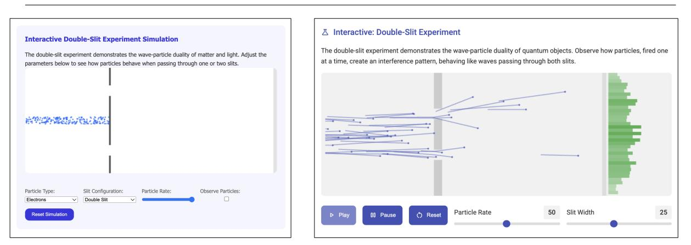

*User query: "I want to understand quantum physics principles."*

(a) Static reward. The simulation fails to visualize wave-particle duality. duality.

(b) Dynamic reward. The simulation successfully visualizes wave-particle

Figure 6: Visual comparison of static and dynamic reward settings.

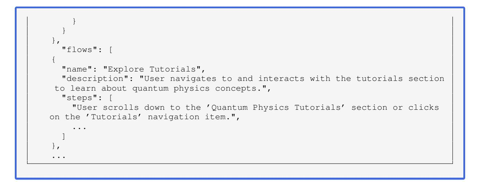

# <span id="page-15-0"></span>D ADAPTIVE REWARD FUNCTION

The reward function consists of multiple evaluation metrics, each defined with four key fields:

- **name**: The high-level evaluation dimension.
- **description**: A brief explanation of the dimension's purpose.
- **criteria**: A list of granular human-interpretable evaluation checks.
- **weight**: The relative importance of the metric in the aggregated reward.

These metrics collectively guide the assessment of the interface from both functional and user-centered perspectives.

For example, for the user query "*I want to understand quantum physics principles,*" the adaptive reward metric includes a specific criterion stating that "*Interactive models effectively demonstrate phenomena like wave-particle duality.*", which provides intent-aware reward signals that move beyond generic usability (Figure [6b\)](#page-15-1). In contrast, the static reward approach yields suboptimal results where particle distributions appear as incoherent clusters without proper interference visualization (Figure [6a\)](#page-15-1).

Adaptive reward function

```
{
  "name": "generate_metrics",
  "args": {
    "metrics": [
      {
        "description": "Measures the quality of user interaction with
   simulations, quizzes, and other dynamic components.",
        "weight": 0.15,
        "name": "Interactive Elements Quality",
        "criteria": [
          "Animations and transitions are smooth and non-distracting.",
          "User actions (e.g., answering quiz questions, changing simulation
   variables) receive clear and immediate feedback.",
          "Interactive components (simulations, quiz buttons) are responsive to
   user input.",
          "User flows through tutorials, simulations, and quizzes are intuitive
   .",
          "State changes (e.g., quiz progress, simulation results) are
   accurately reflected.",
          "Error prevention mechanisms in quizzes (e.g., guiding towards correct
    answers) are effective."
        ]
      },
    ...
    ]
  }
}
```

<span id="page-16-0"></span>

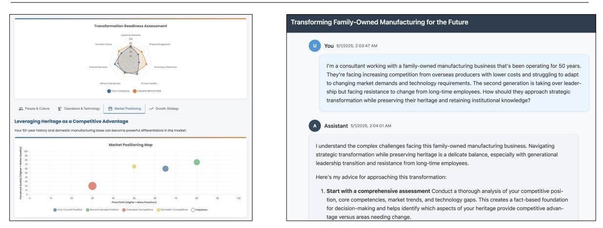

(a) GeneUI presents multiple charts and visual summaries.

(b) ConvUI directly outlines strategy in a sectioned format.

Figure 7: GenUI *vs.* ConvUI in *Business Strategy & Operations* task.

# E SUPPLEMENTARY EXAMPLES

• Figure [7](#page-16-0) compares GenUI and ConvUI in *Business Strategy & Operations* task.

<span id="page-17-1"></span>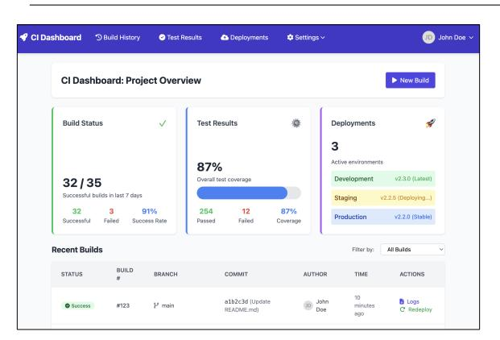

*User query: "I want to set up a continuous integration workflow."*

(a) Iteration 1: A basic CI dashboard with textual build/test summaries and limited interaction affordances.

| Welcome to EduPlatform DevOps                                                                                                    |                                                                                                                                                                                                                                                                                             | $\times$                                                                                                                       |
|----------------------------------------------------------------------------------------------------------------------------------|---------------------------------------------------------------------------------------------------------------------------------------------------------------------------------------------------------------------------------------------------------------------------------------------|--------------------------------------------------------------------------------------------------------------------------------|
|                                                                                                                                  |                                                                                                                                                                                                                                                                                             | This dashboard will help you modernize your educational platform's infrastructure. Here's how to get started:                  |
| Automated Deployment<br>53<br>Set up CI/CD pipelines to automate<br>testing and deployment, reducing<br>downtime during updates, | Load Balancing<br>Distribute traffic across multiple<br>servers to handle increased load and<br>improve reliability.                                                                                                                                                                        | Monitoring & Alerts<br>$\sim$<br>Set up monitoring tools to track<br>performance and receive alerts<br>about potential issues. |
| <b>Recommended First Steps</b>                                                                                                   | Set up containerization with Docker to ensure consistency across environments<br>Configure your first CI/CD pipeline with GitHub Actions or Jenkins<br>Implement NGINX as a load balancer for your application servers<br>. Set up Prometheus and Grafana for monitoring system performance |                                                                                                                                |
| Don't show this again                                                                                                            |                                                                                                                                                                                                                                                                                             | <b>Get Started</b><br>View Documentation                                                                                       |

(c) Iteration 3 (Onboarding page): Introduces an onboarding modal outlining key components and recommended first steps.

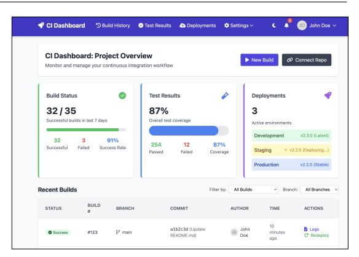

(b) Iteration 2: Improves layout compactness by closing excessive gaps and clarifies the CI context with stronger visual grouping.

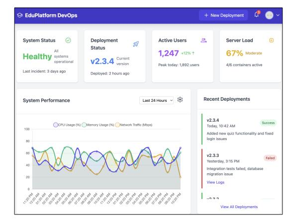

(d) Iteration 3 (Main page): Refactors layout to present deployment insights visually, using charts to highlight system status and activity trends.

Figure 8: Evolution across UI iterations for the *Continuous Integration Workflow* setup. Each version builds upon its predecessor by reducing visual clutter, providing onboarding guidance, and progressively enhancing the clarity of system performance and CI process feedback.

- Figure [8](#page-17-1) shows the iterative refinement process for a continuous integration dashboard. Each version progressively enhances usability and clarity through structure-aware feedback.
- Figure [9](#page-18-0) demonstrates that the layout of GenUI significantly improves users' perception of clarity, trustworthiness, and professionalism.

### F HUMAN EVALUATION QUESTIONNAIRE INTERFACE

We show the annotation interfaces in Figure [10,](#page-19-0) [11,](#page-20-0) [12.](#page-21-0)

### <span id="page-17-0"></span>G ANNOTATOR DEMOGRAPHICS

All annotators held at least a bachelor's degree and were employed either part-time or full-time. They had extensive data annotation experience, each having completed over 1, 000 tasks with an approval rate exceeding 90%. All participants were native English speakers and regular users of AI chatbots (*e.g.*, ChatGPT) in their daily lives.

<span id="page-18-0"></span>

*User query: "How do I conduct market research?"*

(a) ConvUI. Presents information as plain linear text without visual hierarchy, making it harder to navigate.

(b) GenUI. Organizes content into modular sections with clear structure, guiding users through the research process.

Figure 9: Visual structure enhances perceived professionalism. Despite conveying similar content, GenUI was consistently rated as more trustworthy and well-organized due to its structured layout and visual clarity.

# H HUMAN ANNOTATION FILTERING

To ensure the reliability of human annotations, we employed a multi-stage filtering process involving trap questions, consistency checks, and agreement rate evaluation.

- Trap Questions. Each annotation task contained 8 UI comparison questions. In some questionnaires, we embedded trap questions in which the "UI" was not a real interface with components, but rather a simple instruction such as "Select Example A for all options" or "Select Example B for all options." Annotators who failed to follow these explicit instructions were identified as inattentive, and their entire submissions were discarded.
- Consistency Check. We manually compared each annotator's multiple-choice selections with their accompanying textual comments. If a comment stated that Example A was better but the selected option was B, we considered this a clear inconsistency indicative of random selection. Such annotations were removed.
- Manual Review. We conducted a manual review for annotators who had low agreement with other annotators and determined whether the annotator's responses showed signs of random or careless selection. If so, all responses from that annotator were excluded.

Through this process, we ensured that the retained annotations were both attentive and internally consistent, thereby improving the overall quality of our evaluation.

<span id="page-19-0"></span>

| Start New Questionnaire<br>Participate in our user interface evaluation study                    |                                                                                                                                                                                                                                                                         |
|--------------------------------------------------------------------------------------------------|-------------------------------------------------------------------------------------------------------------------------------------------------------------------------------------------------------------------------------------------------------------------------|
| Research Purpose                                                                                 |                                                                                                                                                                                                                                                                         |
| interfaces. You will be presented with pairs of web interfaces that were<br>user's requirements. | This research study evaluates the quality and effectiveness of AI-generated user<br>automatically generated in response to specific user needs and tasks. Your task is<br>to carefully compare these interfaces and determine which one better addresses the            |
| dimensions, and providing detailed reasoning for your choices.                                   | Each comparison involves analyzing two different interface solutions for the same<br>user prompt, evaluating their strengths and weaknesses across multiple quality                                                                                                     |
| Estimated Time<br>$\bigcirc$<br>About 20-30 minutes                                              | Randomization<br>Number of Questions<br><sup>⊙</sup> 8 comparison tasks<br>Random question order                                                                                                                                                                        |
| Evaluation Dimensions                                                                            |                                                                                                                                                                                                                                                                         |
| overall preference and reasoning for your choices:                                               | For each pair of interfaces, you will evaluate and compare them across the<br>following 7 critical dimensions. Please provide a summary comment explaining your                                                                                                         |
| Query-Interface Consistency                                                                      | Task Efficiency                                                                                                                                                                                                                                                         |
| Usability                                                                                        | Learnability                                                                                                                                                                                                                                                            |
| Information Clarity                                                                              | Aesthetics                                                                                                                                                                                                                                                              |
| Interaction Experience Satisfaction                                                              |                                                                                                                                                                                                                                                                         |
|                                                                                                  | Your Role: You will act as an expert evaluator, examining how well each AI-generated<br>interface addresses the original user prompt and meets usability standards. Your detailed<br>feedback will help improve the quality of automatically generated user interfaces. |
| Important Guidelines                                                                             |                                                                                                                                                                                                                                                                         |
| most compared interfaces are designed for desktop viewing                                        | Desktop Required: This questionnaire must be completed on a desktop or laptop computer, as                                                                                                                                                                              |
| comparisons                                                                                      | Thorough Evaluation: Please spend adequate time examining each interface before making                                                                                                                                                                                  |
| one interface over the other                                                                     | Summary Comment: Provide a clear explanation of your overall preference and why you chose                                                                                                                                                                               |
| distractions                                                                                     | Quality Control: The questionnaire includes validation questions to ensure response quality<br>Focus Environment: We recommend completing this study in a quiet environment without                                                                                     |
| consider how well each addresses the original prompt                                             | Interface Context: Each interface pair was generated to solve the same user problem -                                                                                                                                                                                   |
|                                                                                                  | Start Questionnaire                                                                                                                                                                                                                                                     |

Figure 10: Human Evaluation Questionnaire Interface (a)

#### <span id="page-20-0"></span> $\mathbf{\nabla}$ Website Comparison Evaluation

Please compare these two websites across 7 dimensions and determine which performs better overall.

 $\ensuremath{\mathfrak{S}}$  Draft auto-saved at 11:40:42 PM

#### ☐ User Query

Please spend at least 30 seconds reviewing both options before making your evaluation  $% \left( \mathcal{A}\right)$ 

Please evaluate both websites based on how well they address this user query. <br>  $\;$ 

#### Option A Example A

Please open or preview the page to view its content. Click either the "Preview" button or the "Open in New Tab" button. The system will record how long you spend viewing.

🕃 Fullscreen Preview 🕝 Open in New Tab

#### Option B **Example B**

Please open or preview the page to view its content. Click either the "Preview" button or the "Open in New Tab" button. The system will record how long you spend viewing.

🕃 Fullscreen Preview 🕝 Open in New Tab

#### **Evaluation Dimensions**

For each dimension, please select the better performing option and provide clear reasoning.

| Query-Interface Consistency                                                                                                                                          |  |  |
|----------------------------------------------------------------------------------------------------------------------------------------------------------------------|--|--|
| Does the output reflect the user's intent as expressed in the query?<br>[Better]: The response is focused, relevant, and directly helpful.                           |  |  |
| [Weaker]: The response is vague, only loosely related, or misses key aspects of the query.                                                                           |  |  |
| User Prompt:                                                                                                                                                         |  |  |
| "Please spend at least 30 seconds reviewing both options before making your evaluation"                                                                              |  |  |
| Which performs better?                                                                                                                                               |  |  |
| $\mathbf{A}$ Please select a winner for this dimension                                                                                                               |  |  |
| Option A: Example A                                                                                                                                                  |  |  |
| Option B: Example B                                                                                                                                                  |  |  |
| Tie / No significant difference                                                                                                                                      |  |  |
| Task Efficiency                                                                                                                                                      |  |  |
|                                                                                                                                                                      |  |  |
| How efficiently can the user achieve their goal using the output?                                                                                                    |  |  |
| [Better]: The layout or response is concise and allows quick understanding or action.<br>[Weaker]: It takes extra steps or unnecessary reading to figure things out. |  |  |
|                                                                                                                                                                      |  |  |
| User Prompt:                                                                                                                                                         |  |  |
| "Please spend at least 30 seconds reviewing both options before making your evaluation"                                                                              |  |  |
| Which performs better?                                                                                                                                               |  |  |
| ▲ Please select a winner for this dimension                                                                                                                          |  |  |
| Option A: Example A                                                                                                                                                  |  |  |
| Option B: Example B                                                                                                                                                  |  |  |

Figure 11: Human Evaluation Questionnaire Interface (b)

<span id="page-21-0"></span>

| to us.                                                                                                                                                | 🕡 To ensure data quality, we will analyze responses for consistency and compare them with group patterns. Answers showing clear anomalies (e.g., always<br>selecting the same option or extreme deviation) may be excluded. Please read each question carefully and respond thoughtfully - your input is important |
|-------------------------------------------------------------------------------------------------------------------------------------------------------|--------------------------------------------------------------------------------------------------------------------------------------------------------------------------------------------------------------------------------------------------------------------------------------------------------------------|
| Saved 11:40:42 PM<br>🗆 Query: Please spend at least 30 seconds reviewing both options before making your evaluation                                   |                                                                                                                                                                                                                                                                                                                    |
|                                                                                                                                                       |                                                                                                                                                                                                                                                                                                                    |
| Option A Example A                                                                                                                                    | Option B Example B                                                                                                                                                                                                                                                                                                 |
| $\mathbb{C}$<br>♂                                                                                                                                     | С<br>Ø                                                                                                                                                                                                                                                                                                             |
| [Better]: Smooth and pleasant, leaves a positive impression.<br>[Weaker]: Disjointed or neutral experience, with little sense of value or engagement. |                                                                                                                                                                                                                                                                                                                    |
| User Prompt:<br>"Please spend at least 30 seconds reviewing both options before making your evaluation"                                               |                                                                                                                                                                                                                                                                                                                    |
| Which performs better?                                                                                                                                |                                                                                                                                                                                                                                                                                                                    |
| ⚠ Please select a winner for this dimension                                                                                                           |                                                                                                                                                                                                                                                                                                                    |
| Option A: Example A                                                                                                                                   |                                                                                                                                                                                                                                                                                                                    |
| Option B: Example B                                                                                                                                   |                                                                                                                                                                                                                                                                                                                    |
| Tie / No significant difference                                                                                                                       |                                                                                                                                                                                                                                                                                                                    |
|                                                                                                                                                       |                                                                                                                                                                                                                                                                                                                    |
|                                                                                                                                                       |                                                                                                                                                                                                                                                                                                                    |
| Overall Winner                                                                                                                                        |                                                                                                                                                                                                                                                                                                                    |
| Based on your evaluation across all dimensions, which website is the overall winner?                                                                  |                                                                                                                                                                                                                                                                                                                    |
| Option A: Example A                                                                                                                                   |                                                                                                                                                                                                                                                                                                                    |
| Option B: Example B                                                                                                                                   |                                                                                                                                                                                                                                                                                                                    |
| 🔘 Tie / No clear winner                                                                                                                               |                                                                                                                                                                                                                                                                                                                    |
|                                                                                                                                                       |                                                                                                                                                                                                                                                                                                                    |
| This is a quality control question.<br>You may optionally provide any feedback, but it's not required.                                                |                                                                                                                                                                                                                                                                                                                    |
| Optional Comment                                                                                                                                      |                                                                                                                                                                                                                                                                                                                    |
| Optional feedback or comments                                                                                                                         |                                                                                                                                                                                                                                                                                                                    |
|                                                                                                                                                       | 0 character                                                                                                                                                                                                                                                                                                        |
| $\triangle$ Please carefully review the comparison websites first:                                                                                    |                                                                                                                                                                                                                                                                                                                    |
| Please view Option A webpage                                                                                                                          |                                                                                                                                                                                                                                                                                                                    |
| Please view Option B webpage                                                                                                                          |                                                                                                                                                                                                                                                                                                                    |
| screen preview for the corresponding time (3 seconds).                                                                                                | 🥼 Important: If the page was refreshed, the timer will reset and your previous reading time may not be saved in drafts. Please re-open the full                                                                                                                                                                    |
| Please complete the following evaluation requirements:                                                                                                |                                                                                                                                                                                                                                                                                                                    |
| - Query-Interface Consistency: Please select a winner for this dimension                                                                              |                                                                                                                                                                                                                                                                                                                    |
| Task Efficiency: Please select a winner for this dimension                                                                                            |                                                                                                                                                                                                                                                                                                                    |
| · <b>Usability</b> : Please select a winner for this dimension                                                                                        |                                                                                                                                                                                                                                                                                                                    |
| Learnability: Please select a winner for this dimension                                                                                               |                                                                                                                                                                                                                                                                                                                    |
| - $\textbf{Information Clarity:}$ Please select a winner for this dimension                                                                           |                                                                                                                                                                                                                                                                                                                    |
| - Aesthetic or Stylistic Appeal: Please select a winner for this dimension                                                                            |                                                                                                                                                                                                                                                                                                                    |
| - Interaction Experience Satisfaction: Please select a winner for this dimension                                                                      |                                                                                                                                                                                                                                                                                                                    |
|                                                                                                                                                       |                                                                                                                                                                                                                                                                                                                    |
| Overall Winner Selection Required:                                                                                                                    |                                                                                                                                                                                                                                                                                                                    |
| · Please select an overall winner from the options below                                                                                              |                                                                                                                                                                                                                                                                                                                    |
| How to select:                                                                                                                                        |                                                                                                                                                                                                                                                                                                                    |
| - Choose Option A, Option B, or Tie based on your evaluation<br>- This should reflect your overall preference after considering all dimensions        |                                                                                                                                                                                                                                                                                                                    |
|                                                                                                                                                       |                                                                                                                                                                                                                                                                                                                    |
|                                                                                                                                                       |                                                                                                                                                                                                                                                                                                                    |

Figure 12: Human Evaluation Questionnaire Interface (c)