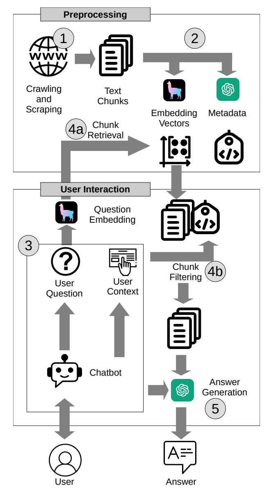
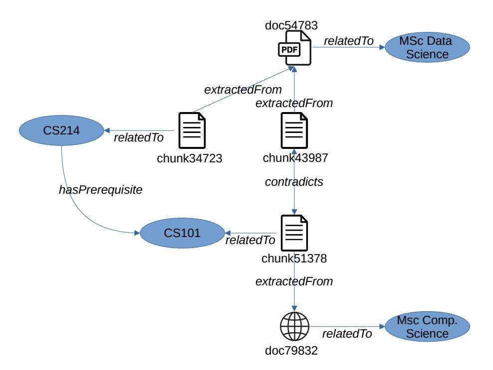

# **Towards Improving a Student Advisory Service Chatbot Using Knowledge Graphs**

Daniel Delev*<sup>1</sup>* , Emmie Schiffer*<sup>1</sup>* , Felix Vogl*<sup>1</sup>* , Andreea Iana*<sup>1</sup>* and Heiko Paulheim*<sup>1</sup>*,<sup>∗</sup>

*<sup>1</sup>University of Mannheim, Data And Web Science Group, Germany*

#### **Abstract**

Student advisory services at universities face a high volume of repetitive inquiries, which can be time-consuming and labor-intensive to address. In this paper, we explore the potential of chatbots to provide personalized support by leveraging university web pages and study regulation documents. Our prototype demonstrates the feasibility of chatbots in identifying relevant information and answering student queries. However, we also identify limitations in handling nuanced cases, particularly cohort-specific regulations. To address these challenges, we propose the integration of knowledge graphs as a potential extension to enhance the dialogue capabilities of the chatbot.

#### **Keywords**

Chatbot, Retrieval Augmented Generation (RAG), Large Language Model, ChatGPT, Knowledge Graph, Dialogue

# **1. Introduction**

Throughout their time at the university, students frequently contact the student advisory service with various questions about planning and conducting their studies. Many of those questions can be answered from information found on university web pages and study regulation documents.

While there is clear evidence that student advisory is helpful and impacts students' success [\[1\]](#page-4-0), the capacity of student advisors is usually limited. At the same time, they spend a substantial amount of time with questions that are trivial enough to be answered directly from publicly available documents, such as university web pages and study regulation documents. In order to decrease the burden of study advisors, chatbots may help answering such simple questions, giving the advisors more time to care about the non-trivial cases.

In this paper, we introduce a prototype of a chatbot based on the Large Language Model ChatGPT [\[2\]](#page-4-1) built with LangChain [\[3\]](#page-4-2), which can be used to answer standard questions about study programs that are often directed to study advisors. There are two main challenges that need to be faced:

- The answers need to be truthful and free from hallucinations [\[4\]](#page-4-3). Especially LLMs trained from large amounts of texts from various sources are likely to have ingested many university Web pages, but should only give answers which are in line with the regulations of the specific university where the chatbot is deployed.
- The answers need to be tailored to the student at hand. The answer to many questions, e.g., whether a student can register for a particular course, may depend on the study program the student is enrolled in, their academic record so far, and other conditions.

The first challenge is addressed by following the Retrieval Augmented Generation paradigm [\[5\]](#page-4-4), providing the LLM with pre-retrieved fragments from study regulation documents and Web pages about study programs. For the second challenge, the current prototype uses a fixed prompt template asking the student for their background and study program. Here, we argue that knowledge graphs could help improving the interaction, making the answers more concise and, at the same time, facilitating a better dialogue and user experience by limiting the amount of unnecessary questions asked upfront.

*Workshop on Retrieval-Augmented Generation Enabled by Knowledge Graphs (RAGE-KG), 2024* <sup>∗</sup>Corresponding author.

Envelope-Open [andreea.iana@uni-mannheim.de](mailto:andreea.iana@uni-mannheim.de) (A. Iana); [heiko.paulheim@uni-mannheim.de](mailto:heiko.paulheim@uni-mannheim.de) (H. Paulheim) GLOBE <https://www.heikopaulheim.com/> (H. Paulheim)

Orcid [0000-0002-7248-7503](https://orcid.org/0000-0002-7248-7503) (A. Iana); [0000-0003-4386-8195](https://orcid.org/0000-0003-4386-8195) (H. Paulheim)

<sup>© 2022</sup> Copyright for this paper by its authors. Use permitted under Creative Commons License Attribution 4.0 International (CC BY 4.0).



<span id="page-1-0"></span>**Figure 1:** Schematic depiction of the prototype

# **2. Prototype**

The prototype introduced in this paper consists of two preprocessing steps: (1) web scraping, and (2) text chunking and augmentation. At the user interaction stage, the chatbot executes a fixed protocol, (3) collecting initial personal information on the candidate, (4a) retrieving and (4b) filtering relevant document chunks, and (5) generating an answer from those chunks. Figure [1](#page-1-0) shows the overall process.

The prototype has been developed and tested for study programs of the School of Business Informatics at the University of Mannheim, but can be applied to other study programs as well.

### **2.1. Data Preparation**

To collect relevant data, we run a web scraper starting from the School of Business Informatics Web page, and following links to Web pages and PDF files (which are the common format to provide documents such study regulations) up to a depth of 3. The final dataset consists of of 668 HTML files (43 MB) and 983 PDF files (1,234 GB).

Not all of the documents are relevant for answering questions in the context of academic advisory (for example, by crawling PDFs from the faculty Web page, academic papers and CVs are also caught, among others). However, manual filtering is infeasible, so we rely on later processing steps and/or automatic filtering to identify the relevant documents for a question at hand.

In order to use texts in a RAG setting, they need to be injected in the prompts (see below). Since there are token limits for prompts (4,096 tokens for ChatGPT-3.5 Turbo, which was used for this project), most of the texts are too large to be used directly. Therefore, they are divided into smaller chunks (using a chunk size of 1,000 characters, with an overlap of 200 characters) before further processing.

Furthermore, each text chunk is augmented with metadata. The prototype uses two metadata fields, i.e., the study program (one of the study programs taught at the School of Business Informatics, or "general"), and a short summary. Both are generated by feeding the corresponding chunk into ChatGPT and making it determine the study program and a summary in a zero-shot setting. An evaluation on a small sample showed that the metadata are correct in 65% of the cases.

For all text chunks, embedding vectors are created using LlamaIndex[1](#page-2-0) . Those are stored in a vector index so that they can be used for passage retrieval.

Note that while the data collection and preparation has been done once for this proof-of-concept prototype, in a productive deployment, it would be re-run periodically in order to always deliver up to date responses.

#### **2.2. User Interactions**

As shown in Fig [1,](#page-1-0) ChatGPT is not used directly, but invoked by the chatbot that interfaces with the user. When collecting the question, it asks for context like the study program the user is enrolled in. In parallel, the user's question is embedded using the same method as for the text chunks, and the text chunks with the closest vectors are retrieved and filtered by the metadata according to the context provided by the user.

The final prompt used to provide an answer to the user which is passed to ChatGPT looks as follows:

```
Use t h e f o l l o w i n g p i e c e s o f c o n t e x t t o answer t h e
q u e s t i o n a t t h e end .
E x e c u t e t h e s e s t e p s :
1 − alwa y s answer i n t h e l a n g u a g e t h e q u e s t i o n was giv e n
i n
2 − r e a d t h e c o n t e x t , do n o t u se i n f o r m a t i o n o u t s i d e o f
t h e c o n t e x t t o answer t h e q u e s t i o n
3 − i f t h e answer i s n o t p r o vi d e d i n t h e giv e n c o n t e x t ,
sa y where more i n f o r m a t i o n can p o s s i b l y be f ound
4 − answer t h e q u e s t i o n
−−−−−−−−−−−−−−−−−−−−−−−−
C o n t ex t : { c o n t e x t }
Q u e s ti o n : I am s t u d y i n g t h e { s t u d y_ p r o g ram } . { q u e s t i o n }
```

where study\_program and context are the study program asked for in the previous dialogue, and the text chunks retrieved, respectively, and question is the question provided by the user.

#### **2.3. Evaluation**

We have evaluated the proposed approach using a set of 23 questions, both in English and German. Each question was tested with two different study programs as a context, leading to an overall set of 46 questions and gold standard answers. The answers given by the chatbot were manually evaluated against the gold standard. The final prototype yields an overall rate of correct answers of 83%.

<span id="page-2-0"></span><sup>1</sup><https://www.llamaindex.ai/>



<span id="page-3-0"></span>**Figure 2:** Example for a Knowledge Graph describing the extracted text snippets

In a preliminary study, we also evaluated PaperQA [\[6\]](#page-4-5) as an out of the box end-to-end solution, but achieved less than 50% correct answers. Therefore, the approach was discarded.

We also evaluated the document chunk retrieval step in isolation for each of the test questions, considering the precision@5 (i.e., the rate of relevant documents among the top 5 retrieved document chunks). The approach achieves a total rate of 87%, i.e., on average, 4.4 out of the top 5 document chunks are relevant for answering the question at hand. Interestingly, without considering the metadata, the rate drops to 63% (i.e., 3.1 out of the top 5 document chunks).

# **3. Potential of Using a Knowledge Graph**

As discussed above, the dialogue currently follows a fixed script. This also means that the same context information is always collected, regardless of whether that information is required or not. However, some questions require no context information (*When do the lectures start in the fall semester?* ), others may require the study program (*How many credits do I need to collect in the fundamentals module?*), others may even require other information on the student's individual track record (*Can I attend the advanced course on software engineering?*, e.g., if this course has specific requirements).

Organizing the collected text information in a knowledge graph, as shown in Fig. [2,](#page-3-0) can help identifying those required pieces of context information in an interative process of retrieving document chunks and narrowing down the set of relevant chunks in an interactive dialogue with the user. The information in the knowledge graph may include the metadata discussed above, but also further information on the curriculum [\[7\]](#page-4-6), like information extracted from a module catalogue (e.g., course prerequisites, as shown in the left part of the figure).

Although the rate of relevant document chunks retrieved is rather good, as discussed above, we often observe the retrieval of contradicting chunks, which then leads to wrong or unspecific answers. This may be the case, e.g., for chunks extracted from documents concerning different study programs, in which different regulations are in place. Detecting such contradictions by means of automatic stance detection [\[8\]](#page-4-7) and explicitly modeling them in the knowledge graph, as shown in the figure, is a good way to both identify those cases, as well as making the chatbot ask specific questions to narrow down the set of retrieved chunks. In the example shown in the figure, retrieving the two contradicting chunks

chunk43987 and chunk51378, the knowledge graph could be traversed to find out that both refer to different study programs, to make the chatbot ask for the user's study program, and ultimately discard non-fitting document chunks before passing them to the answer generation.

Finally, if the knowledge graph becomes deeper and more connected, encompassing more metadata and interlinks inbetween the text chunks, which are represented as nodes in the graph, knowledge graph embeddings [\[9\]](#page-4-8) can be used to improve the retrieval process.

# **4. Conclusion**

In this paper, we have introduced a first prototype for a student advisory chatbot. The chatbot is based on a document collection harvested from the Web, which is preprocessed and enriched using an LLM. The text chunks are then used in the information retrieval block in a retrieval augmented generation (RAG) based chatbot implemented with LangChain and ChatGPT.

In the future, it would be interesting to test the approach in a broader setting, covering more study programs and/or schools. While the approach itself is considered scalable, this will also pose challenges with respect to identifying relevant information if the amount of processed contents is larger.

Moreover, we have discussed how a knowledge graph can help improving the behavior and output of the chatbot. Especially for identifying which context information is required from the user, a knowledge graph may be beneficial and help extending the system from a chatbot following a static script to an interactive bot asking directed questions based on information modeled in the knowledge graph. This will be even more crucial if the approach is used on a broader scale, as discussed above.

# **References**

- <span id="page-4-0"></span>[1] M. Goemans, B. Kapinos, A quantitative study of community college student-advisor appointments and student success metrics, NACADA Journal 44 (2024) 38–54.
- <span id="page-4-1"></span>[2] T. Wu, S. He, J. Liu, S. Sun, K. Liu, Q.-L. Han, Y. Tang, A brief overview of chatgpt: The history, status quo and potential future development, IEEE/CAA Journal of Automatica Sinica 10 (2023) 1122–1136.
- <span id="page-4-2"></span>[3] O. Topsakal, T. C. Akinci, Creating large language model applications utilizing langchain: A primer on developing llm apps fast, in: International Conference on Applied Engineering and Natural Sciences, volume 1, 2023, pp. 1050–1056.
- <span id="page-4-3"></span>[4] V. Rawte, A. Sheth, A. Das, A survey of hallucination in large foundation models, arXiv preprint arXiv:2309.05922 (2023).
- <span id="page-4-4"></span>[5] P. Lewis, E. Perez, A. Piktus, F. Petroni, V. Karpukhin, N. Goyal, H. Küttler, M. Lewis, W.-t. Yih, T. Rocktäschel, et al., Retrieval-augmented generation for knowledge-intensive nlp tasks, Advances in Neural Information Processing Systems 33 (2020) 9459–9474.
- <span id="page-4-5"></span>[6] J. Lála, O. O'Donoghue, A. Shtedritski, S. Cox, S. G. Rodriques, A. D. White, Paperqa: Retrievalaugmented generative agent for scientific research, arXiv preprint arXiv:2312.07559 (2023).
- <span id="page-4-6"></span>[7] M. Zouri, A. Ferworn, An ontology-based approach for curriculum mapping in higher education, in: 2021 IEEE 11th Annual Computing and communication workshop and conference (CCWC), IEEE, 2021, pp. 0141–0147.
- <span id="page-4-7"></span>[8] D. Küçük, F. Can, Stance detection: A survey, ACM Computing Surveys (CSUR) 53 (2020) 1–37.
- <span id="page-4-8"></span>[9] H. Paulheim, P. Ristoski, J. Portisch, Embedding Knowledge Graphs with RDF2vec, Springer Nature, 2023.