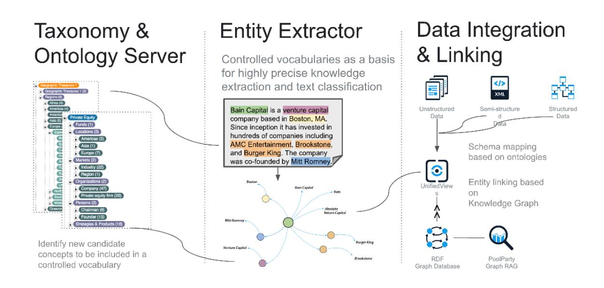
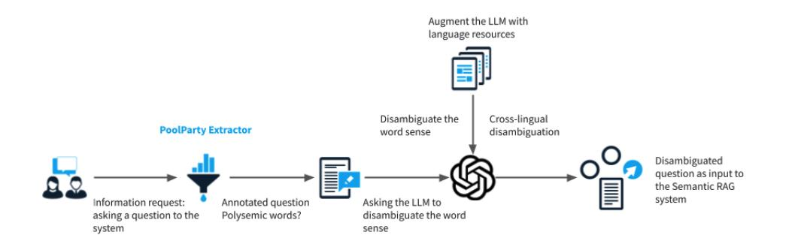

# **Multilingual Word Sense Disambiguation for Semantic Annotations: Fusing Knowledge Graphs, Lexical Resources, and Large Language Models**

Robert David*2,3*,∗,† , Anna Kernerman*1,4*,† , Ilan Kernerman*1*,† , Nicolas Ferranti*3* and Assaf Siani*1*,†

*1Lexicala by K Dictionaries, Israel 2 Semantic Web Company, Austria 3Vienna University of Economics and Business, Austria 4NOVA University Lisbon, Portugal*

#### **Abstract**

Knowledge models, constructed from vocabularies and ontologies, establish a formal basis to enable semantic annotations, which can support retrieval use cases in the context of Retrieval Augmented Generation (RAG) systems. In such a scenario, we face the challenges of word sense disambiguation (WSD), multiword expressions (MWE), and multilinguality (of models and content) in the retrieval process. For WSD and MWE, there is a need for contextual knowledge to differentiate word senses of expressions in the content. For multilinguality, we aim for systems which support content that comes in a mix of languages, as well as querying across languages. To support both goals, we propose a combination of knowledge models, multilingual linguistic data (including lexicographic resources) and large language models (LLMs). Via dictionaries with additional lexical information for multiple languages, we implement cross-language queries, and with the integration of LLMs we use these quality language resources to drive multilingual disambiguation for Graph RAG systems. In this paper, we present research carried out jointly by Semantic Web Company and Lexicala by K Dictionaries, including our approach and methodology along with preliminary results of our experiments on converging language resources, knowledge graphs, and large language models.

#### **Keywords**

word sense disambiguation, Graph RAG, multilingual, knowledge graphs, semantic annotation, language resources, large language models

# **1. Motivation**

The combination of Large Language Models (LLMs) and Generative AI offers a powerful approach to generate text as an answer to a provided input (a prompt), which can be a request or question asked by a user. LLMs are well suited to understand context, even in a situation where there is no or little information which hints at a described situation. Even in the case of translation from a source language to a target language, LLMs, like ChatGPT-3.5, give good results when facing polysemous words as part of the translation process. However, this does not hold for all languages. Some rich-resource language pairs, like English-German, produce high-quality translations, whereas the results are not as good in the case of relatively low-resource pairs, like English-Hebrew. We assume that the data used to train the LLM has not been sufficient to cover ambiguities in translation. Generally, in RAG systems with mixed language content, we face the problem of ambiguities across low-resource language pairs, which can lead to low quality of generated answers because ambiguous terms are misinterpreted.

*Retrieval-Augmented Generation Enabled by Knowledge Graphs: Academic workshop at ISWC 2024, Baltimore, Maryland, USA* ∗Corresponding author.

† These authors contributed equally.

Envelope-Open [robert.david@semantic-web.com](mailto:robert.david@semantic-web.com) (R. David); [anna@lexicala.com](mailto:anna@lexicala.com) (A. Kernerman); [ilan@lexicala.com](mailto:ilan@lexicala.com) (I. Kernerman); [nicolas.ferranti@wu.ac.at](mailto:nicolas.ferranti@wu.ac.at) (N. Ferranti); [assaf@lexicala.com](mailto:assaf@lexicala.com) (A. Siani)

GLOBE <https://www.poolparty.biz/> (R. David); <https://lexicala.com/> (A. Kernerman); <https://lexicala.com/> (I. Kernerman); <https://lexicala.com/> (A. Siani)

Orcid [0000-0002-3244-5341](https://orcid.org/0000-0002-3244-5341) (R. David); [0000-0002-5574-1987](https://orcid.org/0000-0002-5574-1987) (N. Ferranti)

© 2024 Copyright for this paper by its authors. Use permitted under Creative Commons License Attribution 4.0 International (CC BY 4.0).

**Figure 1:** Workflow for Semantic Annotations.

In this paper, we describe our approach to enable WSD in the context of RAG [\[1\]](#page-6-0), specifically Graph RAG systems, where the basis is the retrieval of documents annotated with entities from a knowledge graph (KG), specifically concepts from a taxonomy represented using the Simple Knowledge Organisation System (SKOS) [\[2\]](#page-6-1). These concept annotations can be multilingual, however, there can also be ambiguities introduced in the translation when facing multilingual content in the retrieval process. In the following, we describe the retrieval architecture using components of the PoolParty Semantic Suite product[1](#page-1-0) . In our scenario, the retrieval, based on concept annotations, can face the situation where a concept in English has translation equivalents to several concepts in Hebrew, and vice versa. In such a situation, the multilinguality of a SKOS concept is not sufficient to represent the different senses. Our approach is to use multilingual lexical data afor the representation of polysemous words and include such information in the process of the LLM-based WSD to disambiguate concept annotations. While there has been work on using LLMs for disambiguation tasks [\[3\]](#page-6-2), the specific challenge for Graph RAG presented in this paper has not been addressed so far to the best of our knowledge.

# **2. Methodology**

To implement our approach for multilingual WSD, we design the following workflow for data processing in our Graph RAG architecture. The workflow is based on the PoolParty approach for implementing a semantic retrieval system, here specifically a Graph RAG system, extended with a new step in the workflow for disambiguation of concept annotations based on linguistic data and an LLM. In the following, we first describe the workflow for creating semantic annotations and then explain the disambiguation step used in the retrieval.

### **Workflow for Semantic Annotations**

- 1. Model a SKOS thesaurus representing the knowledge domain for which we want to implement the Graph RAG. The thesaurus contains SKOS concepts (entities + multilingual labels) to annotate the documents. Optionally, additional information from an ontology can be used to extend the thesaurus (Taxonomy & Ontology Server).
- 2. The documents in a corpus are annotated with the concepts from the thesaurus (Entity Extractor).

1<https://www.poolparty.biz/>

**Figure 2:** WSD Architecture.

3. The results of the annotation process are stored, potentially linked to further resources and are used for retrieval in the RAG process (Data Integration & Linking).

The system can now be queried using a user input (question) and retrieves documents based on the semantic annotations. However, the concept annotations can be ambiguous and potentially misinterpreted, especially if the question and (some) documents don't share the same language.

**Word sense disambiguation during retrieval** Our approach combines 3 components: (i) concepts from the KG, (ii) language resources, and (iii) an LLM (specifically, ChatGPT-3.5 is used for our implementation).

- The KGs provide multilingual concepts as a basis for the semantic annotations. However, different concepts can match the same term because they use the (one) same label, and are therefore ambiguous.
- Language resources provide detailed knowledge about concepts, including translation equivalents between different languages, a representation of the different word senses over these languages, and example sentences of their usage.
- The LLM performs the WSD for the concept annotations, augmented by the language resources, which provide the disambiguation options and context information to improve the disambiguation result.

The WSD step in the workflow is shown below, starting from the user asking the system a question, to deciding on the correct word sense. The diagram represents only WSD step in the whole Graph RAG architecture.

- 1. An information request is formulated to the system by a user asking a question as an input to generate an answer based on retrieved documents via semantic annotations.
- 2. The question is annotated with concepts from the thesaurus. However, it might contain polysemous words. Even if this is not the case in the language used to formulate the question, this might still be true for the (target) language of a document.
- 3. In the case of such ambiguous concepts, the system asks the LLM to disambiguate the word sense. A prompt is constructed, which includes the specific information about the word senses from the language resources, including the usage examples, and which helps (to augment) the LLM to perform the disambiguation with higher precision. Because the language resources also contain multilingual representations across languages, the system can perform cross-lingual disambiguation.
- 4. Finally, the disambiguation step returns the correct word sense equivalent (only), to be further used in the retrieval process, thereby increasing precision.

# **3. Experiments**

In our experiment, we tested ChatGPT's translation abilities between Hebrew and English. While it demonstrates near-perfect translation capabilities in high-resource language pairs, this is not always the case for language pairs involving a low-resource language, such as Hebrew. This challenge is particularly evident in out-of-context sentences containing polysemous words, where the correct interpretation may be apparent only to native speakers. The experiment aimed to determine whether ChatGPT's ability to correctly interpret ambiguous words could be improved by providing the relevant dictionary definitions. We found out that in several instances, ChatGPT successfully identified the correct meaning, showcasing the potential of lexicographic content to enhance the performance of LLMs. To illustrate this, we present three examples.

**Example 1** The Hebrew word דב] bad] is polysemous in the meanings of 'fabric' (common use) and 'tree branch' (literary register, not widely common). The following prompt was given: "Translate into English תוריפה וסימעה לע םידבה". The correct translation would be "The fruits weighted down the branches.", yet ChatGPT 3.5 provided the following result: "The fruits weighted down the fabric." In a new ChatGPT conversation, the LLM was provided with the dictionary definition of the word "דב "before being asked to translate the sentence again. It managed to correctly identify the intended meaning out of the eight possible meaning sand translate the sentence correctly despite having no further conversational context.

**Example 2** The Hebrew word רב] baʁ] is polysemous in the meanings of 'bar' (i.e., a pub) and 'wild' (adjective) or 'wilderness' (noun); both are equally used. The following prompt was given: "Translate into English הרימש לע רבה הדמע דקומב ויקוסיע.". The correct translation would be "Guarding the wilderness stood at the center of his activities.", yet ChatGPT 3.5 had the following result: "Guarding the bar stood

at the center of his activities.". Once again, when including the full dictionary entry of 'רב 'in the prompt, and with no additional context, ChatGPT managed to translate the sentence correctly.

**Example 3** The Hebrew word גתמל] le'ma.teg] is polysemous in the meanings of 'to brand' (commonly used) and 'to restrain' (rarely used). The following prompt was given: "Translate into English אוה גתימ תא ףחדה תופצל תושדחב.". The correct translation would be "He restrained the urge to watch the news.", yet ChatGPT 3.5 had the following result: "He branded the urge to watch the news.". Once again, we provided ChatGPT with the Hebrew dictionary entry for the word "גתימ "and it then managed to translate the sentence correctly.

In all three examples, providing ChatGPT with the dictionary entry containing the various meanings of the ambiguous word was sufficient to enhance its translation accuracy, allowing it to correctly interpret the polysemous word.

However, examples with failures were encountered, too. One failed attempt of ChatGPT to produce a good translation is the Hebrew word רבג] ge.veʁ]; this word is widely used in both spoken and written language, mostly with the meaning 'man'. However, it also has the meaning of 'rooster', which is scarcely used and is unknown to many native speakers, since it originated in the rabbinic literature of the Talmud (dated approximately in the 200-500 AD, many centuries before the revival of modern Israeli Hebrew). When given the prompt: "Translate into English רבגה ארק לוקב םע החירזה.) "The rooster called aloud at sunrise.), ChatGPT 3.5 had chosen the common meaning of 'man', which would require a very specific context to make sense and be understood by native speakers. Even with the full dictionary entry including the 'rooster' meaning, it failed to provide a good translation, preferring again the 'man' meaning.

## **4. Conclusions**

The experiments showed that for low-resource languages, Graph RAG can be enhanced in cases of retrieval requiring WSD when provided with additional context from language resources. Our approach helps with cross-language retrieval by resolving ambiguities introduced by translation and thereby avoiding misinterpretations in the generated answers. Also, we can represent the word senses as structured data in the KG and thereby provide a basis to make the retrieval explainable. While our approach showed value in the experiments, it leaves several open questions to be explored in future work.

First, the qualitative experiments presented in this paper do not show the value of our approach on a large scale. Future work needs to expand them to a quantitative study, where we can measure the impact on the quality of the retrieval.

Second, we will look into other low-resource language pairs besides English-Hebrew to determine if our approach is sufficiently generic. Closely associated with this question are experiments on content using more than two languages.

Third, we also face the problem of metaphorical terms, which are more challenging to translate because it is not only necessary to understand the context, but also background knowledge is required for a particular metaphor to be interpreted correctly. Metaphors are distinguished roughly into two types. The first is borrowing, expanding the original meaning of the term in a metaphoric use. For example, the term 'grasp', initially meaning a physical grasp (of an object), had gone through semantic expansion, meaning both a physical grasp and a mental grasp (of an idea or a concept). The second is figurative phrases and terms, which when interpreted literally have no reasonable meaning and can only be understood metaphorically. Metaphors of the first type are ambiguous and, when provided with no additional discursive context, can be interpreted by native speakers in both the literal and the metaphoric meanings. However, in cases of figurative 'fixed' phrases, native speakers would never assign a literal meaning. For example, the Hebrew phrase הסרכ ןיב היניש, literally meaning 'her belly

between her teeth', describes a pregnant woman. Whereas native speakers do not need any additional context and would always interpret it in its metaphoric meaning, LLMs need further context and/or a lexical definition to decipher the metaphor. Besides experiments on low-resource language pairs, we can determine if metaphorical resolution also provides an advantage on high-resource language pairs.

Fourth, we aim to investigate if our approach reduces hallucinations, because it basically prevents some kinds of misinterpretation.

With our work, we contribute to building high-quality Graph RAG systems by providing multilingual WSD based on language resources, KGs, and LLMs.

### **References**

- [1] P. Lewis, E. Perez, A. Piktus, F. Petroni, V. Karpukhin, N. Goyal, H. Küttler, M. Lewis, W.-t. Yih, T. Rocktäschel, S. Riedel, D. Kiela, Retrieval-augmented generation for knowledge-intensive NLP tasks, in: Proceedings of the 34th International Conference on Neural Information Processing Systems, NIPS '20, Curran Associates Inc., Red Hook, NY, USA, 2020.
- [2] D. Allemang, J. Hendler, Semantic Web for the Working Ontologist: Effective Modeling in RDFS and OWL, 2 ed., Morgan Kaufmann Publishers Inc., San Francisco, CA, USA, 2011.
- [3] S. Liu, Y. Fang, Use Large Language Models for Named Entity Disambiguation in Academic Knowledge Graphs, in: 2023 3rd International Conference on Education, Information Management and Service Science (EIMSS 2023), Atlantis Press, 2023, pp. 681–691.