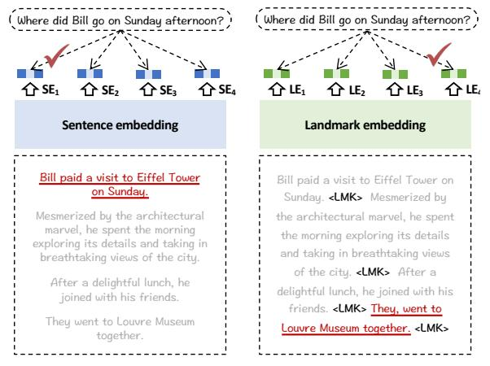
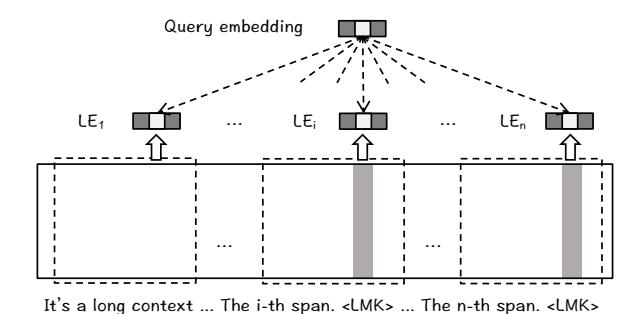
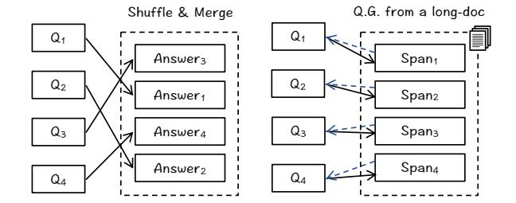
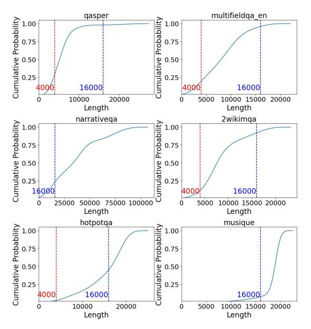
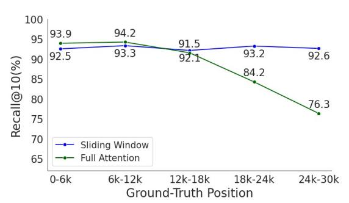
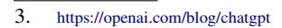
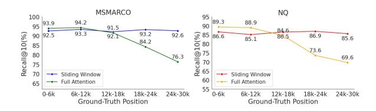

# BGE Landmark Embedding: A Chunking-Free Embedding Method For Retrieval Augmented Long-Context Large Language Models

Luo Kun1,2 Zheng Liu1† Shitao Xiao1 Kang Liu2

1: Beijing Academy of Artificial Intelligence 2: Chinese Academy of Sciences

42002074@xs.ustb.edu.cn zhengliu1026@gmail.com

### Abstract

Retrieval augmentation is a promising approach to handle long-context language modeling. However, the existing retrieval methods usually work with the chunked context, which is prone to inferior quality of semantic representation and incomplete retrieval of useful information. In this work, we propose a new method for the retrieval augmentation of longcontext language modeling, called Landmark **Embedding**. Our method is characterized by threefold technical contributions. Firstly, we introduce a chunking-free architecture, which keeps the long context coherent such that highquality embeddings can be generated for the fine-grained units within the context. Secondly, we present a position-aware objective function, which prioritizes the ultimate boundary for a consecutive span of information. By learning to discriminate such a special position, the useful information can be comprehensively retrieved for the query. Thirdly, we design a novel multistage learning algorithm, which makes the best use of readily available data and synthetic data for cost-effective training of the landmark embedding. In our experimental study, landmark embedding is able to substantially improve the performance for both LLaMA-2 and ChatGPT in a variety of long-context tasks; meanwhile, it also outperforms the existing retrieval methods with a notable advantage. Our model and code will be made publicly available1.

## 1 Introduction

Large language models (LLMs) need to handle long-sequence inputs when dealing with many important applications, such as question answering and reading comprehension (Bai et al., 2023). Unfortunately, the existing LLMs are usually constrained by a limited size of context window, e.g., 2K for LLaMA-1 (Touvron et al., 2023a) and 4K for LLaMA-2 (Touvron et al., 2023b). Although

Figure 1: **Sentence Embedding** works with the chunked context, which tends to select the salient sentence. **Landmark Embedding** maintains a coherent context, which enables it to select the right sentence.

the size of context window can be extended through fine-tuning over long-sequence data (Chen et al., 2023b; Dacheng et al., 2023; Peng et al., 2023), the fine-tuned model could incur a considerable cost in both training and inference, and exerts an unfavorable impact to LLMs' original capabilities. Recently, the retrieval-augmentation emerges as a promising option to facilitate long-context language modeling (Xu et al., 2023; Bai et al., 2023; Zhang et al., 2023a). It employs a standalone retriever where useful information can be filtered and presented as a concise input. The above working mechanism is simple, efficient, and well-compatible with the downstream LLMs.

With a long-sequence input, the typical retrieval augmentation workflow is performed with three steps: 1) chunking, 2) embedding, and 3) retrieval. In the first place, it partitions the long-sequence input into a list of chunks. Then, it encodes each chunk into its embedding. Finally, it retrieves the useful chunks for the query based on the embedding similarity. The chunking strategy is a very tricky problem in practice. As widely discussed by many popular RAG frameworks, like Langchain (LangChain, 2023), LlamaIndex (Liu,

t. Co-first and corresponding author

1. https://github.com/FlagOpen/FlagEmbedding

[2023\)](#page-9-3), Pincone [\(Schwaber-Cohen,](#page-9-4) [2023\)](#page-9-4), this problem is usually tackled by empirical or heuristic methods. However, no matter what chunking strategy is used, two inherent limitations are inevitable. On one hand, the input sequence is partitioned into disconnected chunks. Consequently, it will break the coherence of context which is unfavorable to the quality of embedding. On the other hand, it is also likely to split the consecutive information into different chunks. The salient chunks can be easily retrieved; nevertheless, other useful but less salient chunks can be overlooked, which results in the incomplete retrieval of necessary information.

In this paper, we come up with the Landmark Embedding, a new embedding method optimized for the retrieval-augmentation of long-context language modeling. The new method is highlighted by its technical contributions in three perspectives.

Firstly, we introduce a *chunking-free model architecture*, where embeddings for the fine-grained input units, e.g., sentences, can be generated based on a coherent long context. The new architecture employs a group of special tokens, namely the landmarks (LMK), and dispatches them to the end of each sentence. At the same time, it takes advantage of a LLM-based encoder to jointly process the landmarked long context. Thanks to the perception of rich contextual information, the landmark embedding can be a highly discriminative representation of each sentence, which presents a critical improvement over the conventional sentence embeddings generated from a chunked context. Besides, the new architecture will resort to a sliding window, where landmark embeddings can be generated for an arbitrary long context via stream processing.

Secondly, we propose a *position-aware objective function* to facilitate the complete retrieval of useful information. As discussed, one piece of information tends to be jointly conveyed by multiple consecutive sentences within the long context. Instead of treating them equally as positive positive samples, we assign each sentence with a differentiated weight which grows exponentially with its position in the context. As a result, the last sentence, i.e. the ultimate boundary of the information, will be emphasized and better discriminated. With the jointly selection of the front-k sentences before the ultimate boundary, the useful information to the query can be comprehensively included.

Thirdly, we design a *multi-stage learning algorithm*, where different training strategies and data

sources can be jointly used to facilitate the training of landmark embedding. The typical embedding model is trained by paired texts, e.g., question answering; however, such data is not directly suitable for our scenario. To address this problem, the new algorithm factorizes landmark embedding with two basic capabilities: the fundamental semantic discriminability, and the high-level contextualized representation capability, which can be progressively established in three steps: 1) *distant supervision* over pairwise data, 2) *weak supervision* over noisy long-context data generated by rules, 3) *fine-tuning* over high-quality long-context data synthesized by LLMs. The above workflow can make the best use of readily available data (adequate but less relevant) and synthetic data (relevant but inadequate), which leads to a superior cost-effectiveness of training.

We empirically analyze landmark embedding based on 2 popular LLMs: LLaMA-2-7B (chat) with a short context window (4K), ChatGPT-3.5 (turbo) with a much longer context window (16K). The experiment is performed on top of 6 longcontext evaluation datasets. Most of the evaluation samples are far beyond the coverage of the 4K context window, while a large portion of them are within the 16K context window. In our experiment, landmark embedding achieves a substantial advantage over both the LLaMA-2-7B baseline and the retrieval-augmentation results powered by the existing retrieval methods. Meanwhile, it also notably improves the performance of ChatGPT-3.5 using a much shorter input context. Such a result overturns the previous conclusion that retrieval-augmentation can only benefit the LLMs of weak long-context capabilities [\(Bai et al.,](#page-8-0) [2023\)](#page-8-0), which indicates a more extensive usage of the corresponding techniques.

To summarize, the following contributions are made in this work. 1) We propose landmark embedding. To the best of our knowledge, it is the first embedding model which performs systemic optimization for the retrieval augmented long-context language modeling. 2) Our method presents three technical advantages: the chunking-free model architecture, the position-aware objective function, and the multi-stage learning algorithm, which jointly contribute to the superior capability of our embedding model. 3) We perform comprehensive experiments with LLaMA-2 and ChatGPT, whose result verifies the effectiveness of landmark embedding, and indicates a broader application scope of retrieval techniques in dealing with the long-context tasks.

## 2 Related Work

The related works are reviewed from three aspects: long-context language modeling, retrievalaugmentation, embedding-based retrieval methods.

First of all, a large body of research works have been dedicated to the extension of LLMs' lengths from different directions. One common practice is to modify the position encoding mechanism, where the LLMs trained on short texts can directly handle longer input during the inference time [\(Chen](#page-8-4) [et al.,](#page-8-4) [2023a;](#page-8-4) [ntk,](#page-8-5) [2023\)](#page-8-5). Despite simplicity, such methods are prone to inferior performances without further fine-tuning. Another popular method is to take advantage of continual training, where the existing LLMs are fine-tuned over long-sequence data to establish a longer context window [\(Dacheng](#page-8-2) [et al.,](#page-8-2) [2023;](#page-8-2) [Chen et al.,](#page-8-1) [2023b;](#page-8-1) [Peng et al.,](#page-9-2) [2023;](#page-9-2) [Tworkowski et al.,](#page-9-5) [2023;](#page-9-5) [Mohtashami and Jaggi,](#page-9-6) [2023\)](#page-9-6). However, the fine-tuning based methods are prone to two subsequent problems. On one hand, the fine-tuned LLM will incur an expensive cost for both training and inference. On the other hand, the fine-tuning operation could be unfavorable to the LLM's performance with short-sequence inputs. Apart from the above common approaches, the LLM's context can also be extended by context compression [\(Chevalier et al.,](#page-8-6) [2023;](#page-8-6) [Zhang et al.,](#page-10-2) [2024\)](#page-10-2) and stream processing [\(Xiao et al.,](#page-9-7) [2023a;](#page-9-7) [Han et al.,](#page-8-7) [2023\)](#page-8-7). Nevertheless, the compression methods are likely to result in information loss, while the stream processing will discard the useful information beyond the sliding window. It remains to explore more effective methods for long-context language modeling in the future.

In the meantime, the retrieval-augmented generation (RAG) is another important issue for LLMs' research. Typically, it employs a standalone retriever, where useful information can be introduced from a vast open-world corpus to enhance the LLM's generation quality [\(Lewis et al.,](#page-9-8) [2020;](#page-9-8) [Guu et al.,](#page-8-8) [2020;](#page-8-8) [Borgeaud et al.,](#page-8-9) [2022\)](#page-8-9). Previously, RAG used to be applied for knowledge-intensive tasks, such as open-domain question answering and fact verification [\(Petroni et al.,](#page-9-9) [2020\)](#page-9-9), where an external knowledge base is presented. Recently, retrieval augmentation is also found helpful to long-context language modeling, as useful information can be retrieved and presented as a concise input for the LLM [\(Xu et al.,](#page-10-0) [2023;](#page-10-0) [Bai et al.,](#page-8-0) [2023;](#page-8-0) [Zhang](#page-10-3) [et al.,](#page-10-3) [2023b\)](#page-10-3). Compared with other alternative methods on context extension, the retrieval-based

methods are distinguished for the simplicity and compatibility, as they don't need modification of the downstream LLM, and can be easily combined with other methods to establish a longer context.

Finally, the RAG system usually works with an embedding model to retrieve the useful information. In the past few years, many critical techniques have been well established for the effective learning of embedding models, e.g., pre-training [\(Gao](#page-8-10) [and Callan,](#page-8-10) [2021;](#page-8-10) [Xiao et al.,](#page-9-10) [2022,](#page-9-10) [2023b;](#page-10-4) [Wang](#page-9-11) [et al.,](#page-9-11) [2022a;](#page-9-11) [Li et al.,](#page-9-12) [2023\)](#page-9-12), hard-negative sampling [\(Xiong et al.,](#page-10-5) [2020;](#page-10-5) [Ren et al.,](#page-9-13) [2021\)](#page-9-13), knowledge distillation [\(Hofstatter et al.](#page-8-11) ¨ , [2020;](#page-8-11) [Chen et al.,](#page-8-12) [2024\)](#page-8-12), etc. On top of these techniques, there have been a number of powerful embedding models developed for the general-purpose retrieval applications [\(Izacard et al.,](#page-8-13) [2021;](#page-8-13) [Ni et al.,](#page-9-14) [2021;](#page-9-14) [Nee](#page-9-15)[lakantan et al.,](#page-9-15) [2022;](#page-9-15) [Wang et al.,](#page-9-16) [2022b;](#page-9-16) [Xiao](#page-10-6) [et al.,](#page-10-6) [2023c\)](#page-10-6). However, the existing methods rely on chunking when dealing with the retrieval augmentation of long-context language modeling. As a result, it will inevitably break the coherence of context, which is prone to inferior quality of embedding and incomplete retrieval of useful information.

# 3 Landmark Embedding

### 3.1 Preliminary

The LLM presents a unified foundation to solve arbitrary NLP tasks through language modeling. Given the input prompt, the LLM optimizes the generation likelihood of the target answer (X) in the form of auto-regression. For a wide variety of applications, e.g., question answering and reading comprehension, the input prompt can be explicitly split into context (ctx) and query (q). Without loss of generality, the LLM's generation objective can be presented as the following function:

$$max. \log \text{LLM}(x_t|q, ctx, X_{\leq t}).$$
 (1)

In many situations, the input context is too long to fit into existing LLM's context window. To address this problem, the retrieval-based method seeks to compress the context by selecting the most useful parts from it. Typically, it will chunk the context into: S : {s1, ..., sN } ← chunk(ctx), and select the top-k chunks based on a retrieval model γ(·):

$$S^* : \{s_1, ..., s_k\} \leftarrow top\text{-}k.\{s : \gamma(q, s)|S\}.$$
 (2)

One critical step for the above workflow is chunking. As introduced, the chunking operation is very

tricky, which needs to be conducted empirically or heuristically. It will always break the coherence of context, leading to an inferior embedding quality and a higher probability of incomplete retrieval. In this work, we target on a new retrieval method  $\gamma'(\cdot)$  without the dependency on chunking operation. Notably, it will let the useful information to be directly retrieved from a coherent context:

$$C^*: \{c_1, ..., c_k\} \leftarrow \gamma'(q, ctx).$$
 (3)

In this place,  $c_i$  indicates a fine-grained unit of the input context, e.g., a sentence. With the perception of contextual information, the underlying semantics about each fine-grained unit can be effectively represented, which facilitates the accurate retrieval of relevant information for the query.

#### 3.2 Chunking-Free Architecture

We propose a novel embedding model, whose architecture is shown in Figure 2. Suppose the input context is composed of n sentences:  $ctx : \{c_1, ..., c_n\}$ . Instead of chunking the input context into disconnected segments, it dispatches a special token, called the landmark (LMK), to the end of each sentence. The landmark is used to capture the underlying semantics for its corresponding sentence. Particularly, the landmark is jointly encoded with the sentence and neighboring context, where the output embedding, a.k.a. the landmark embedding (LE), is utilized for representation of the sentence. In our work, we take advantage of a large language model (e.g., LLaMA-2-7B) as the encoding backbone, which brings forth two benefits: 1) it substantially contributes to the quality of representation thanks to the LLM's superior expressiveness, 2) it can incorporate adequate neighboring context based on the LLM's long context window. The same encoder is also utilized for the generation of query's embedding. Formally, the generation of landmark embedding and query embedding are presented by the following functions:

$$LE_i \leftarrow LLM(c1, ..., c_i; LMK).embed[-1],$$
  
 $E_a \leftarrow LLM(query; LMK).embed[-1].$ 

Based on the above result, the relevance between the query and each sentence is computed as the inner product of the two embeddings:  $\langle E_q, LE_i \rangle$ .

Note that the input context can be even longer than the LLM's context window. To handle this problem, we leverage a sliding window where the long context can be streamingly processed. In this

Figure 2: **Architecture for Landmark Embedding.** The landmark LMK token is appended to the end of each sentence. A sliding window is employed to handle the input sequence longer than the LLM's context window.

situation, the generation of landmark embedding will be conducted as:

$$LE_i \leftarrow LLM(c_{i-1}, ..., c_i; LMK).embed[-1],$$

where l indicates the number of sentences within the current sliding window.

### 3.3 Position-Aware Objective

The landmark embedding is learned by contrastive learning, where the query and its relevant sentences can be distinguished by the higher embedding similarities. The useful information to the query tends to gather as multiple consecutive sentences within the context:  $\{c_{z-m},...,c_z\}$ . As a result, we can derive the following general form of loss function for the contrastive learning:

$$min. - \sum_{q} \sum_{i \le m} \lg \frac{\exp(\langle \mathbf{E}_q, \mathbf{LE}_{z-i} \rangle)}{\sum_{j=1...n} \exp(\langle \mathbf{E}_q, \mathbf{LE}_j \rangle)}.$$
 (4)

With the above formulation of loss function, the landmark of each relevant sentence is assigned with a positive label of equal importance. Nevertheless, the basic formulation is problematic knowing that it may let the most salient sentence (e.g., the one with the most overlapping keywords with the query) get the highest similarity. In our work, we target on the complete retrieval of useful information. Therefore, we make an emphasis on the ultimate boundary where the whole consecutive sentences can be comprehensively included. Although it may simply assign the last landmark with a positive label, we propose to leverage all landmarks because of their valid relevance with the query. Particularly, we differentiate their importance by introducing the positional weight  $w_i$ for sentence  $c_{z-i}$ :  $w_i \leftarrow \exp(-\alpha * i)$ , where  $\alpha$  is

the temperature parameter. Based on the positional weight, we modify the basic contrastive learning with the position-aware objective function:

$$min. - \sum_{q} \sum_{i < m} \lg \frac{w_i * \exp(\langle \mathbf{E}_q, \mathbf{LE}_{z-i} \rangle)}{\sum_{j=1...n} \exp(\langle \mathbf{E}_q, \mathbf{LE}_j \rangle)}.$$
 (5)

The position-aware objective presents two benefits:
1) the relevant sentences can be fully utilized for
the training of landmark embedding, 2) the ultimate boundary of the useful information can be
emphasized and better discriminated.

#### 3.4 Multi-Stage Learning

The typical training data of embedding model consists of paired texts, e.g., question and answer, which is seemingly inappropriate for the training objective in Eq 5. However, we argue that the functionality of landmark embedding can be factorized with two fundamental capabilities: 1) the basic semantic discriminability, 2) the contextualized representation capability, i.e., representing each sentence w.r.t. its context. Based on this argument, we design the multi-stage learning algorithm, which enables the two capabilities to be progressively established on top of proper training data. In the first place, the landmark embedding is initialized as a general sentence-level embedding model. Afterwards, it is enhanced as a contextual representation model where discriminative embeddings can be generated for its included sentences. The progressive training takes place with three steps.

- **Distant supervision**. Firstly, we make use of the pairwise training data from MS MARCO (Nguyen et al., 2016), based on which the model can be initialized as a basic sentence embedder. In this place, the landmark embedding takes a special form as only one single landmark is appended to the end of answer's context:  $LE_a \leftarrow LLM(answer; LMK).embed[-1]$ . The first-stage training follows the basic training form of dense retrieval, where 15 hard negatives together with the in-batch negatives are presented for each query.
- Weak Supervision. In the second step, we make a simple modification of the pairwise training data where the model can be trained to generate discriminative sentence embeddings within a long context. Particularly, we randomly shuffle the answers from different queries, and merge them as one pseudo long document (left half of Figure 3). Therefore, the embedding for the i-th answer can be generated as:  $LE_{a_i} \leftarrow$

Figure 3: Weak Supervision (L) and Fine-Tuning (R).

|            | ≤4K | ≤8K | ≤12K | ≤16K | Total |
|------------|-----|-----|------|------|-------|
| Stage II.  | -   | -   | _    | 240K | 240K  |
| Stage III. | 40K | 30K | 10K  | 10K  | 90K   |

Table 1: Distribution of training data's lengths.

 $\operatorname{LLM}(a_{j\neq i},...,a_i;\operatorname{LMK}).embed[-1]$ . The second stage still relies on in-batch negatives, where the landmark embeddings from other answers  $\operatorname{LE}_{a_{j\neq i}}$  are utilized as the negative samples.

• Fine-Tuning. We leverage synthetic data for the final stage of fine-tuning. In this step, we make use of the real-world long documents from Wikipedia(Foundation). For each long-document, a series of text spans are randomly sampled, where pseudo queries are generated by prompting the LLM2. The synthesized data will incur an extra cost due to the calling of LLM API. Besides, it may also be distinct from the real-world data distribution. Therefore, only a small amount of synthetic data is generated for the final training stage. However, thanks to the fundamental capabilities established in the first two stages, landmark embedding can achieve a superior performance after moderate fine-tuning. Detailed information of training data and curating method is shown in Appendix A

#### 4 Experiment

The experimental study focuses on the following three research questions. **RQ 1.** The exploration of landmark embedding's impact on the retrieval augmentation of long-context language modeling. **RQ 2.** The comparison between landmark embedding and the existing retrieval methods based on chunked contexts. **RQ 3.** The analysis of technical factors in landmark embedding.

#### 4.1 Settings

We utilize two popular LLMs for RAG in our experiment. One is the **LLaMA-2-7B** (chat) model. It

We make use of ChatGPT-35-turbo's API in this work: https://openai.com/blog/chatgpt

| LLM               | Retriever     | Unit     | Len.   | NQA  | QASP | MFQA | HQA  | 2WIKI | MSQ  | Avg. |
|-------------------|---------------|----------|--------|------|------|------|------|-------|------|------|
| Llama2-7B-chat    | w/o retrieval | -        | 3,500  | 18.7 | 19.2 | 36.8 | 25.4 | 32.8  | 9.4  | 23.7 |
|                   | Contriever    | chunk    | 2,275  | 18.3 | 23.8 | 41.8 | 33.6 | 34.5  | 17.2 | 28.2 |
|                   | OpenAI-2      | chunk    | 2,275  | 20.0 | 25.7 | 40.3 | 34.7 | 34.4  | 17.3 | 28.7 |
|                   | BGE-large     | chunk    | 2,275  | 17.6 | 21.7 | 45.4 | 34.3 | 36.9  | 19.9 | 29.3 |
|                   | E5mistral-7b  | chunk    | 2,275  | 21.6 | 24.1 | 42.2 | 37.6 | 31.4  | 20.7 | 29.6 |
|                   | Contriever    | sentence | 2,190  | 16.2 | 26.5 | 44.4 | 33.5 | 33.3  | 17.5 | 28.6 |
|                   | BGE-large     | sentence | 2,190  | 17.9 | 24.4 | 46.3 | 37.4 | 35.0  | 21.3 | 30.3 |
|                   | E5mistral-7b  | sentence | 2,190  | 16.5 | 24.0 | 47.3 | 37.6 | 35.4  | 21.7 | 30.4 |
|                   | Ours          | sentence | 2,190  | 21.3 | 27.7 | 47.6 | 40.2 | 36.3  | 21.7 | 32.5 |
| ChatGPT-3.5-turbo | w/o retrieval | -        | 15,500 | 23.6 | 43.3 | 52.3 | 51.6 | 37.7  | 26.9 | 39.2 |
|                   | Contriever    | chunk    | 2,275  | 18.3 | 35.6 | 54.3 | 47.0 | 39.5  | 25.2 | 36.6 |
|                   | OpenAI-2      | chunk    | 2,275  | 21.8 | 38.1 | 52.8 | 46.6 | 44.9  | 30.4 | 39.1 |
|                   | BGE-large     | chunk    | 2,275  | 21.9 | 37.2 | 49.1 | 49.5 | 42.2  | 30.4 | 38.4 |
|                   | E5mistral-7b  | chunk    | 2,275  | 21.0 | 41.2 | 49.2 | 54.0 | 43.7  | 27.2 | 39.4 |
|                   | Contriever    | sentence | 2,190  | 17.5 | 41.0 | 50.2 | 46.2 | 41.9  | 24.1 | 36.8 |
|                   | BGE-large     | sentence | 2,190  | 19.8 | 41.2 | 51.3 | 50.5 | 46.5  | 29.6 | 39.8 |
|                   | E5mistral-7b  | sentence | 2,190  | 20.0 | 39.0 | 49.4 | 55.4 | 45.9  | 31.1 | 40.1 |
|                   | Ours          | sentence | 2,190  | 22.3 | 42.7 | 55.7 | 56.1 | 46.2  | 29.5 | 42.1 |

Table 2: Experiment results on retrieval augmented long-context language modeling. "unit" denotes chunking and evidence selecting method. "Len." denotes the average token number for the answering model(LLM).

Figure 4: Length distribution of evaluation data.

is a lightweight open-source LLM, whose context length is 4K. The other one is the ChatGPT-3.5 (turbo). It is a more powerful but closed-source LLM, whose context length is 16K. The evaluations are performed with the following long-context language understanding datasets from LongBench [\(Bai et al.,](#page-8-0) [2023\)](#page-8-0), where explicit queries are available for the evaluation samples: NarrativeQA (Kocisk ˇ [y et al.](#page-8-15) ` , [2018\)](#page-8-15), Qasper [\(Dasigi et al.,](#page-8-16) [2021\)](#page-8-16), MultifieldQA [\(Bai et al.,](#page-8-0) [2023\)](#page-8-0), HotpotQA [\(Yang et al.,](#page-10-7) [2018\)](#page-10-7), 2WikiMQA [\(Ho et al.,](#page-8-17) [2020\)](#page-8-17), MuSiQue [\(Trivedi et al.,](#page-9-18) [2022\)](#page-9-18). The first three datasets are about single-doc QA where the use-

ful information is concentrated in the long context. The last three datasets are about multi-doc QA where useful information may exist in different parts of the long context. We follow Long-Bench[\(Bai et al.,](#page-8-0) [2023\)](#page-8-0) using F1 score as the evaluation metric. It is worth noting that the above datasets are differentiated in their sequence lengths. As demonstrated by Figure [4,](#page-5-0) the majority of evaluation samples are longer than 4K, which is far beyond the context length of LLaMA-2. However, many of them are shorter than 16K, especially for Qasper, MultifieldQA, 2WikiMQA, and HotpotQA, which is within the coverage of ChatGPT-3.5-turbo.

We consider the following baseline methods. 1) Contriever [\(Izacard et al.,](#page-8-13) [2021\)](#page-8-13), 2) OpenAI Text Embedding (Ada-002) [\(Neelakantan et al.,](#page-9-15) [2022\)](#page-9-15), 3) BGE-v1.5-large [\(Xiao et al.,](#page-10-6) [2023c\)](#page-10-6), 4) E5- Mistral [\(Wang et al.,](#page-9-19) [2023\)](#page-9-19). Notably, E5-Mistral is the state-of-the-art text embedding model upon the time of this paper. It is trained from a Mistral-7B model [\(Jiang et al.,](#page-8-18) [2023\)](#page-8-18), which achieves the leading performance on MTEB benchmark [\(Muen](#page-9-20)[nighoff et al.,](#page-9-20) [2023\)](#page-9-20) with an overwhelming advantage. The baseline retrievers utilize two alternative chunking strategies. One is chunking by sentences; the other one is chunking by equal-sized text spans. In our work, each text span is made up of 200 words as empirically determined by Longbench [\(Bai et al.,](#page-8-0) [2023\)](#page-8-0). The baselines will select the top-N chunks for each query, and will take their front and back sentences together as evidence for retrieval aug-

| Dataset | Doc Len. | Method       | MRR@10 | Recall@10 |  |  |
|---------|----------|--------------|--------|-----------|--|--|
| Wiki    | 6,748    | Contriever   | 79.74  | 96.11     |  |  |
|         |          | BGE-large    | 88.32  | 98.70     |  |  |
|         |          | E5mistral-7b | 91.42  | 99.01     |  |  |
|         |          | Ours         | 95.21  | 99.60     |  |  |
| Arxiv   | 9,982    | Contriever   | 66.27  | 94.12     |  |  |
|         |          | BGE-large    | 78.82  | 97.06     |  |  |
|         |          | E5mistral-7b | 81.37  | 97.65     |  |  |
|         |          | Ours         | 84.72  | 98.43     |  |  |

Table 3: Pilot experiment on retrieval accuracy.

mentation. We select top-7 chunks for span-based chunking and top-15 chunks for sentence-based chunking, which leads to similar context lengths. As landmark embedding is to identify the ultimate boundary of information, it will retrieve the font two sentences together with its top-N results.

Landmark embedding is based on a LLaMA-2- 7B backbone [\(Touvron et al.,](#page-9-1) [2023b\)](#page-9-1), whose context is extended to 32K by LongLora [\(Chen et al.,](#page-8-1) [2023b\)](#page-8-1). All training operations take place on a single 8×A100 (40GB) GPUs. The learning rate is 1×10−4 , the weight decay is 1×10−6 . The batch size for the 1st-stage training is 32; the batch size for the 2nd and 3rd stage training is 1, where we accumulate the gradient over 64 steps. We leverage Flash-attention-v2 [\(Dao,](#page-8-19) [2023\)](#page-8-19), Gradient Checkpointing [\(Chen et al.,](#page-8-20) [2016\)](#page-8-20), and Deepspeed-Zero [\(Rajbhandari et al.,](#page-9-21) [2020\)](#page-9-21) to speed up the training.

## 4.2 Main Result

The experiment result on retrieval augmented longcontext language modeling is presented in Table [2,](#page-5-1) where the following observations can be made.

## 4.2.1 Analysis on retrieval augmentation

Our method achieves a remarkable retrieval augmentation effect, as it consistently outperforms the basic LLaMa-2-7B, i.e., w/o retrieval, in every evaluation task, which ultimately results in a remarkable improvement of +8.8 points in terms of the average performance. At the same time, our method also brings forth the biggest improvement in comparison with other baseline retrievers.

The retrieval-augmentation's impact is relatively smaller with ChatGPT-3.5, as most of the baseline retrievers are unable to improve the performance of w/o retrieval. Such an observation is consistent with the reported result in recent study [\(Xu et al.,](#page-10-0) [2023\)](#page-10-0), and it is intuitive to understand this result considering that the context length of ChatGPT-3.5 is expanded to 16K. With such a large context window, ChatGPT can intake more than 15K in-

Figure 5: Needle in a haystack test.

put tokens for each evaluation sample, whereas the retrieval augmentation methods only utilize about 2K input tokens. In many situations, the evaluation samples can almost be fully covered by such a long context window (Figure [4\)](#page-5-0), which means the retrieval methods can hardly introduce extra information outside ChatGPT's context.

Despite these challenges, our method can still outperform ChatGPT-3.5, which leads to a +2.9 points improvement in the average performance. It consistently outperforms ChatGPT in the multidoc QA tasks, i.e. HQA, 2WIKI, MSQ; meanwhile, it achieves improved or comparable performances in the single-doc QA tasks. The distinction between the two tasks is probably because the useful information tends to be more scattered and exists within multiple documents in the multidoc scenario, while it is more concentrated in the single-doc scenario. It is also worth noting that our method only works with 2,190 input tokens, which is much less than the 15,500 tokens used by ChatGPT. In other words, its empirical advantage is achieved along with a higher running efficiency.

## 4.2.2 Pilot analysis on retrieval

In addition to the end-to-end performance on the above long-context tasks, we conduct pilot experiments for more detailed analysis about the retrieval accuracy. In Table [3,](#page-6-0) we leverage the hold-back test set of the synthetic data from Wikipedia for evaluation (1000 samples in total). We also curate the synthetic testing samples based on ArXiv[\(Clement](#page-8-21) [et al.,](#page-8-21) [2019\)](#page-8-21) documents (500 samples in total), which will reflect the retriever's generalization with the o.o.d. corpus. For both datasets, our method can achieve a much higher retrieval accuracy than the baseline retrievers which rely on the chunked context. Besides, we also perform the needle in a haystack test as Figure [5,](#page-6-1) where the ground-truth document span is randomly placed in 30K context [\(Liu et al.,](#page-9-22) [2023;](#page-9-22) [Ivgi et al.,](#page-8-22) [2023\)](#page-8-22). Detailed setting is described in Appendix [B.](#page-11-1) We compare

| Train Objective    | Retrieval  | Unit     | NQA  | QASP | MFQA | HQA  | 2WIKI | MSQ  | Avg. |
|--------------------|------------|----------|------|------|------|------|-------|------|------|
| w/o Position-aware | Surround-k | sentence | 19.1 | 29.8 | 46.8 | 40.2 | 34.2  | 17.0 | 31.2 |
| w/o Position-aware | Front-k    | sentence | 19.4 | 28.5 | 46.5 | 38.5 | 33.8  | 19.0 | 31.0 |
| w. Position-aware  | Surround-k | sentence | 19.4 | 29.7 | 47.9 | 39.0 | 36.0  | 17.8 | 31.6 |
| w. Position-aware* | Front-k    | sentence | 21.3 | 27.7 | 47.6 | 40.2 | 36.3  | 21.7 | 32.5 |
| Stage I. only      | Front-k    | sentence | 18.9 | 27.0 | 45.0 | 35.5 | 33.2  | 17.2 | 29.4 |
| Stage II. only     | Front-k    | sentence | 19.0 | 27.4 | 43.9 | 34.4 | 32.7  | 16.5 | 29.0 |
| Stage III. only    | Front-k    | sentence | 20.5 | 27.2 | 45.3 | 39.2 | 34.3  | 15.3 | 30.3 |
| Stage I. + II.     | Front-k    | sentence | 19.2 | 26.5 | 47.0 | 36.2 | 32.8  | 16.8 | 29.8 |
| Stage II. + III.   | Front-k    | sentence | 19.4 | 26.7 | 46.8 | 39.8 | 35.4  | 18.3 | 31.0 |
| All three stages*  | Front-k    | sentence | 21.3 | 27.7 | 47.6 | 40.2 | 36.3  | 21.7 | 32.5 |

Table 4: Ablation study. Upper: impact from position-aware objective. Lower: impact from multi-stage learning.

two alternative formulations of landmark embedding: one works with the sliding window, and the other one directly generates the landmark embeddings from the LLM's context (denoted as Full-Attention). Although the pre-trained backbone encoder is extended to 32K by LongLora, the training of the embedding model is mostly conducted within 8K (Table [1\)](#page-4-3). Two alternatives result in comparable performances when the ground-truth position is small. However, the Full-Attention method decreases dramatically after the ground-truth position goes beyond the valid fine-tuning scope. In contrast, the default method with the sliding window can always maintain a high retrieval accuracy.

In brief, landmark embedding exhibits a major advantage over the baseline retrievers. It substantially improves the performance of LLaMA-2-7B whose context length is small. Besides, it further benefits the performance of ChatGPT-3.5 and helps to reduce its computation cost by a big margin.

#### 4.3 Ablation Study

The ablation study is performed to explore the critical factors of landmark embedding, where the default settings are marked by \* (Table [4\)](#page-7-0). In the first place, we analyze the impact from positionaware objective ([§3.3\)](#page-3-1). For comparison, we disable the positional weight in Eq. [5](#page-4-0) and switch to the basic objective in Eq. [4,](#page-3-2) denoted by w/o Positionaware. The position-ware objective function is to train landmark embedding as an indicator of the information's ultimate boundary. Therefore, it is applied with the Front-k retrieval scheme, where the targeted sentence and its front k − 1 neighbors are retrieved together. In contrast, the Surround-k method makes selection for the (k − 1)/2 neighbors from both sides of the targeted sentence. According to the evaluation result, the position-aware objective with Front-k outperforms the ablation baselines in the downstream language modeling

tasks, which indicates its more accurate retrieval of useful information from the long context. Besides, it can also be observed that applying Front-k alone does not bring any empirical benefit, as the basic objective focuses more on the salient part of the information rather than its ultimate boundary.

We make further analysis for the impact of multistage learning. In our experiment, we apply each individual training stage alone (I: distant supervision, II: weak supervision, III: fine-tuning), and make arbitrary combinations of different stages. As we can observe from the evaluation result, the third stage, i.e. the fine-tuning over synthetic data, presents the highest individual training effect. This result can probably be attributed to its closest relationship with the downstream task. However, the other two training stages are also beneficial. With the joint conduct of all three training stages, optimal empirical performance can be acquired.

# 5 Conclusion

In this paper, we present a new method, landmark embedding, which facilitates the retrieval augmentation of long-context language modeling. The new method is featured by its chunking-free architecture, where discriminative embeddings can be generated for each fine-grained input unit based on the semantic information within a coherent context. A position-aware objective function is proposed; it enables landmark embedding to identify the ultimate boundary of information, which benefits the completeness of retrieval. A novel multi-stage learning algorithm is designed, which makes the best of the readily available data and synthetic data for the effective training of the embedding model. Landmark embedding is empirically verified by comprehensive evaluations, where it notably outperforms the existing retrieval methods, bringing in a superior retrieval augmentation effect for both LLaMA-2-7B (4K) and ChatGPT-3.5 (16K).

## References

- 2023. Localllama. ntk-aware scaled rope allows llama models to have extended (8k+) con- text size without any fine-tuning and minimal perplexity degradation. [https://www.reddit.com/r/LocalLLaMA/comments/](https://www.reddit.com/r/LocalLLaMA/comments/14lz7j5/ntkaware_scaled_rope_allows_llama_models_to_have/)
  - [14lz7j5/ntkaware\\_scaled\\_rope\\_allows\\_llama\\_models\\_](https://www.reddit.com/r/LocalLLaMA/comments/14lz7j5/ntkaware_scaled_rope_allows_llama_models_to_have/) [to\\_have/](https://www.reddit.com/r/LocalLLaMA/comments/14lz7j5/ntkaware_scaled_rope_allows_llama_models_to_have/).
- Yushi Bai, Xin Lv, Jiajie Zhang, Hongchang Lyu, Jiankai Tang, Zhidian Huang, Zhengxiao Du, Xiao Liu, Aohan Zeng, Lei Hou, Yuxiao Dong, Jie Tang, and Juanzi Li. 2023. Longbench: A bilingual, multitask benchmark for long context understanding. *arXiv preprint arXiv:2308.14508*.
- Sebastian Borgeaud, Arthur Mensch, Jordan Hoffmann, Trevor Cai, Eliza Rutherford, Katie Millican, George Bm Van Den Driessche, Jean-Baptiste Lespiau, Bogdan Damoc, Aidan Clark, et al. 2022. Improving language models by retrieving from trillions of tokens. In *International conference on machine learning*, pages 2206–2240. PMLR.
- Jianlv Chen, Shitao Xiao, Peitian Zhang, Kun Luo, Defu Lian, and Zheng Liu. 2024. Bge m3-embedding: Multi-lingual, multi-functionality, multi-granularity text embeddings through self-knowledge distillation. *arXiv preprint arXiv:2402.03216*.
- Shouyuan Chen, Sherman Wong, Liangjian Chen, and Yuandong Tian. 2023a. Extending context window of large language models via positional interpolation. *arXiv preprint arXiv:2306.15595*.
- Tianqi Chen, Bing Xu, Chiyuan Zhang, and Carlos Guestrin. 2016. Training deep nets with sublinear memory cost. *arXiv preprint arXiv:1604.06174*.
- Yukang Chen, Shengju Qian, Haotian Tang, Xin Lai, Zhijian Liu, Song Han, and Jiaya Jia. 2023b. Longlora: Efficient fine-tuning of long-context large language models. *arXiv preprint arXiv:2309.12307*.
- Alexis Chevalier, Alexander Wettig, Anirudh Ajith, and Danqi Chen. 2023. [Adapting language models to](https://aclanthology.org/2023.emnlp-main.232) [compress contexts.](https://aclanthology.org/2023.emnlp-main.232) In *Proceedings of the 2023 Conference on Empirical Methods in Natural Language Processing, EMNLP 2023, Singapore, December 6- 10, 2023*, pages 3829–3846. Association for Computational Linguistics.
- Colin B. Clement, Matthew Bierbaum, Kevin P. O'Keeffe, and Alexander A. Alemi. 2019. [On the](http://arxiv.org/abs/1905.00075) [use of arxiv as a dataset.](http://arxiv.org/abs/1905.00075)
- Li Dacheng, Shao Rulin, Xie Anze, Sheng Ying, Zheng Lianmin, E. Gonzalez Joseph, Stoica Ion, Ma Xuezhe, and Zhang Hao. 2023. [How long can open-source](https://lmsys.org/blog/2023-06-29-longchat) [llms truly promise on context length?](https://lmsys.org/blog/2023-06-29-longchat)
- Tri Dao. 2023. Flashattention-2: Faster attention with better parallelism and work partitioning. *arXiv preprint arXiv:2307.08691*.

- Pradeep Dasigi, Kyle Lo, Iz Beltagy, Arman Cohan, Noah A Smith, and Matt Gardner. 2021. A dataset of information-seeking questions and answers anchored in research papers. *arXiv preprint arXiv:2105.03011*.
- Wikimedia Foundation. [Wikimedia downloads.](https://dumps.wikimedia.org)
- Luyu Gao and Jamie Callan. 2021. Condenser: a pre-training architecture for dense retrieval. *arXiv preprint arXiv:2104.08253*.
- Kelvin Guu, Kenton Lee, Zora Tung, Panupong Pasupat, and Mingwei Chang. 2020. Retrieval augmented language model pre-training. In *International conference on machine learning*, pages 3929–3938. PMLR.
- Chi Han, Qifan Wang, Wenhan Xiong, Yu Chen, Heng Ji, and Sinong Wang. 2023. [Lm-infinite: Simple](https://doi.org/10.48550/ARXIV.2308.16137) [on-the-fly length generalization for large language](https://doi.org/10.48550/ARXIV.2308.16137) [models.](https://doi.org/10.48550/ARXIV.2308.16137) *CoRR*, abs/2308.16137.
- Xanh Ho, Anh-Khoa Duong Nguyen, Saku Sugawara, and Akiko Aizawa. 2020. Constructing a multi-hop qa dataset for comprehensive evaluation of reasoning steps. *arXiv preprint arXiv:2011.01060*.
- Sebastian Hofstatter, Sophia Althammer, Michael ¨ Schroder, Mete Sertkan, and Allan Hanbury. 2020. ¨ Improving efficient neural ranking models with crossarchitecture knowledge distillation. *arXiv preprint arXiv:2010.02666*.
- Maor Ivgi, Uri Shaham, and Jonathan Berant. 2023. Efficient long-text understanding with short-text models. *Transactions of the Association for Computational Linguistics*, 11:284–299.
- Gautier Izacard, Mathilde Caron, Lucas Hosseini, Sebastian Riedel, Piotr Bojanowski, Armand Joulin, and Edouard Grave. 2021. Unsupervised dense information retrieval with contrastive learning. *arXiv preprint arXiv:2112.09118*.
- Albert Q. Jiang, Alexandre Sablayrolles, Arthur Mensch, Chris Bamford, Devendra Singh Chaplot, Diego de las Casas, Florian Bressand, Gianna Lengyel, Guillaume Lample, Lucile Saulnier, Lelio Renard Lavaud, ´ Marie-Anne Lachaux, Pierre Stock, Teven Le Scao, Thibaut Lavril, Thomas Wang, Timothee Lacroix, ´ and William El Sayed. 2023. [Mistral 7b.](http://arxiv.org/abs/2310.06825)
- Toma´s Ko ˇ cisk ˇ y, Jonathan Schwarz, Phil Blunsom, Chris ` Dyer, Karl Moritz Hermann, Gabor Melis, and Ed- ´ ward Grefenstette. 2018. The narrativeqa reading comprehension challenge. *Transactions of the Association for Computational Linguistics*, 6:317–328.
- Tom Kwiatkowski, Jennimaria Palomaki, Olivia Redfield, Michael Collins, Ankur Parikh, Chris Alberti, Danielle Epstein, Illia Polosukhin, Jacob Devlin, Kenton Lee, et al. 2019. Natural questions: a benchmark for question answering research. *Transactions of the Association for Computational Linguistics*, 7:453– 466.
- Inc. LangChain. 2023. [Langchain documentation on](https://js.langchain.com/docs/modules/data_connection/document_transformers/) [text splitters.](https://js.langchain.com/docs/modules/data_connection/document_transformers/)

- Patrick Lewis, Ethan Perez, Aleksandra Piktus, Fabio Petroni, Vladimir Karpukhin, Naman Goyal, Heinrich Kuttler, Mike Lewis, Wen-tau Yih, Tim ¨ Rocktaschel, et al. 2020. Retrieval-augmented gen- ¨ eration for knowledge-intensive nlp tasks. *Advances in Neural Information Processing Systems*, 33:9459– 9474.
- Chaofan Li, Zheng Liu, Shitao Xiao, and Yingxia Shao. 2023. Making large language models a better foundation for dense retrieval. *arXiv preprint arXiv:2312.15503*.
- Jerry Liu. 2023. [Llamaindex documentation on basic](https://docs.llamaindex.ai/en/stable/optimizing/basic_strategies/basic_strategies.html#chunk-sizes) [optimization strategies.](https://docs.llamaindex.ai/en/stable/optimizing/basic_strategies/basic_strategies.html#chunk-sizes)
- Nelson F Liu, Kevin Lin, John Hewitt, Ashwin Paranjape, Michele Bevilacqua, Fabio Petroni, and Percy Liang. 2023. Lost in the middle: How language models use long contexts. *arXiv preprint arXiv:2307.03172*.
- Amirkeivan Mohtashami and Martin Jaggi. 2023. Landmark attention: Random-access infinite context length for transformers. *arXiv preprint arXiv:2305.16300*.
- Niklas Muennighoff, Nouamane Tazi, Loic Magne, and Nils Reimers. 2023. [MTEB: Massive text embedding](https://doi.org/10.18653/v1/2023.eacl-main.148) [benchmark.](https://doi.org/10.18653/v1/2023.eacl-main.148) In *Proceedings of the 17th Conference of the European Chapter of the Association for Computational Linguistics*, pages 2014–2037, Dubrovnik, Croatia. Association for Computational Linguistics.
- Arvind Neelakantan, Tao Xu, Raul Puri, Alec Radford, Jesse Michael Han, Jerry Tworek, Qiming Yuan, Nikolas Tezak, Jong Wook Kim, Chris Hallacy, et al. 2022. Text and code embeddings by contrastive pretraining. *arXiv preprint arXiv:2201.10005*.
- Tri Nguyen, Mir Rosenberg, Xia Song, Jianfeng Gao, Saurabh Tiwary, Rangan Majumder, and Li Deng. 2016. Ms marco: A human generated machine reading comprehension dataset. *choice*, 2640:660.
- Jianmo Ni, Gustavo Hernandez ´ Abrego, Noah Con- ´ stant, Ji Ma, Keith B Hall, Daniel Cer, and Yinfei Yang. 2021. Sentence-t5: Scalable sentence encoders from pre-trained text-to-text models. *arXiv preprint arXiv:2108.08877*.
- Bowen Peng, Jeffrey Quesnelle, Honglu Fan, and Enrico Shippole. 2023. Yarn: Efficient context window extension of large language models. *arXiv preprint arXiv:2309.00071*.
- Fabio Petroni, Aleksandra Piktus, Angela Fan, Patrick Lewis, Majid Yazdani, Nicola De Cao, James Thorne, Yacine Jernite, Vladimir Karpukhin, Jean Maillard, et al. 2020. Kilt: a benchmark for knowledge intensive language tasks. *arXiv preprint arXiv:2009.02252*.
- Samyam Rajbhandari, Jeff Rasley, Olatunji Ruwase, and Yuxiong He. 2020. Zero: Memory optimizations toward training trillion parameter models. In *SC20:*

- *International Conference for High Performance Computing, Networking, Storage and Analysis*, pages 1– 16. IEEE.
- Ruiyang Ren, Yingqi Qu, Jing Liu, Wayne Xin Zhao, Qiaoqiao She, Hua Wu, Haifeng Wang, and Ji-Rong Wen. 2021. Rocketqav2: A joint training method for dense passage retrieval and passage re-ranking. *arXiv preprint arXiv:2110.07367*.
- Roie Schwaber-Cohen. 2023. [Chunking strategies for](https://www.pinecone.io/learn/chunking-strategies/) [llm applications.](https://www.pinecone.io/learn/chunking-strategies/)
- Hugo Touvron, Thibaut Lavril, Gautier Izacard, Xavier Martinet, Marie-Anne Lachaux, Timothee Lacroix, ´ Baptiste Roziere, Naman Goyal, Eric Hambro, Faisal ` Azhar, et al. 2023a. Llama: Open and efficient foundation language models. *arXiv preprint arXiv:2302.13971*.
- Hugo Touvron, Louis Martin, Kevin Stone, Peter Albert, Amjad Almahairi, Yasmine Babaei, Nikolay Bashlykov, Soumya Batra, Prajjwal Bhargava, Shruti Bhosale, et al. 2023b. Llama 2: Open foundation and fine-tuned chat models. *arXiv preprint arXiv:2307.09288*.
- Harsh Trivedi, Niranjan Balasubramanian, Tushar Khot, and Ashish Sabharwal. 2022. Musique: Multihop questions via single-hop question composition. *Transactions of the Association for Computational Linguistics*, 10:539–554.
- Szymon Tworkowski, Konrad Staniszewski, Mikołaj Pacek, Yuhuai Wu, Henryk Michalewski, and Piotr Miłos. 2023. Focused transformer: Con- ´ trastive training for context scaling. *arXiv preprint arXiv:2307.03170*.
- Liang Wang, Nan Yang, Xiaolong Huang, Binxing Jiao, Linjun Yang, Daxin Jiang, Rangan Majumder, and Furu Wei. 2022a. Simlm: Pre-training with representation bottleneck for dense passage retrieval. *arXiv preprint arXiv:2207.02578*.
- Liang Wang, Nan Yang, Xiaolong Huang, Binxing Jiao, Linjun Yang, Daxin Jiang, Rangan Majumder, and Furu Wei. 2022b. Text embeddings by weaklysupervised contrastive pre-training. *arXiv preprint arXiv:2212.03533*.
- Liang Wang, Nan Yang, Xiaolong Huang, Linjun Yang, Rangan Majumder, and Furu Wei. 2023. Improving text embeddings with large language models. *arXiv preprint arXiv:2401.00368*.
- Guangxuan Xiao, Yuandong Tian, Beidi Chen, Song Han, and Mike Lewis. 2023a. Efficient streaming language models with attention sinks. *arXiv preprint arXiv:2309.17453*.
- Shitao Xiao, Zheng Liu, Yingxia Shao, and Zhao Cao. 2022. [RetroMAE: Pre-training retrieval-oriented lan](https://doi.org/10.18653/v1/2022.emnlp-main.35)[guage models via masked auto-encoder.](https://doi.org/10.18653/v1/2022.emnlp-main.35) In *Proceedings of the 2022 Conference on Empirical Methods in Natural Language Processing*, pages 538–548, Abu

- Dhabi, United Arab Emirates. Association for Computational Linguistics.
- Shitao Xiao, Zheng Liu, Yingxia Shao, and Zhao Cao. 2023b. Retromae-2: Duplex masked auto-encoder for pre-training retrieval-oriented language models. *arXiv preprint arXiv:2305.02564*.
- Shitao Xiao, Zheng Liu, Peitian Zhang, and Niklas Muennighof. 2023c. C-pack: Packaged resources to advance general chinese embedding. *arXiv preprint arXiv:2309.07597*.
- Lee Xiong, Chenyan Xiong, Ye Li, Kwok-Fung Tang, Jialin Liu, Paul Bennett, Junaid Ahmed, and Arnold Overwijk. 2020. Approximate nearest neighbor negative contrastive learning for dense text retrieval. *arXiv preprint arXiv:2007.00808*.
- Peng Xu, Wei Ping, Xianchao Wu, Lawrence McAfee, Chen Zhu, Zihan Liu, Sandeep Subramanian, Evelina Bakhturina, Mohammad Shoeybi, and Bryan Catanzaro. 2023. [Retrieval meets long context large lan](https://doi.org/10.48550/ARXIV.2310.03025)[guage models.](https://doi.org/10.48550/ARXIV.2310.03025) *CoRR*, abs/2310.03025.
- Zhilin Yang, Peng Qi, Saizheng Zhang, Yoshua Bengio, William W Cohen, Ruslan Salakhutdinov, and Christopher D Manning. 2018. Hotpotqa: A dataset for diverse, explainable multi-hop question answering. *arXiv preprint arXiv:1809.09600*.
- Peitian Zhang, Zheng Liu, Shitao Xiao, Ninglu Shao, Qiwei Ye, and Zhicheng Dou. 2024. Soaring from 4k to 400k: Extending llm's context with activation beacon. *arXiv preprint arXiv:2401.03462*.
- Peitian Zhang, Shitao Xiao, Zheng Liu, Zhicheng Dou, and Jian-Yun Nie. 2023a. Retrieve anything to augment large language models. *arXiv preprint arXiv:2310.07554*.
- Peitian Zhang, Shitao Xiao, Zheng Liu, Zhicheng Dou, and Jian-Yun Nie. 2023b. [Retrieve anything to aug](https://doi.org/10.48550/ARXIV.2310.07554)[ment large language models.](https://doi.org/10.48550/ARXIV.2310.07554) *CoRR*, abs/2310.07554.

# A Detailed Training Data for Multi-Stage Learning

In this section, we present detailed information of training data for different learning stages and the method we adopt to curate synthetic data using realword long documents with the help of ChatGPT-35-Turbo API[3](#page-11-2) .

Stage I and Stage II Training data. We use pairwise training data from MS MARCO [\(Nguyen](#page-9-17) [et al.,](#page-9-17) [2016\)](#page-9-17). The total number of training set is 480k. To ensure a fair comparison between the effects of Stage I and Stage II, we partition the training data evenly into two distinct training stages. During Stage I, we leverage hard negative passages from dense retrieval to enhance the model's performance. Specifically, each positive passage is paired with 15 hard negative passages during the training process. Moving to Stage II, we concatenate 40 hard negative passages and 120 passages randomly sampled from the corpus with ground truth passage inserted into it, forming composited long documents up to 16k context length.

Synthetic Data Curating Method. In this section, we present the method for curating synthetic data, which facilitates Stage III fine-tuning. Firstly, we sample long documents from Wikipedia. Then we select a portion of it (e.g., 200 words) as the *Background Text* and then select consecutive 1-5 sentences randomly from this excerpt as the *Ground Truth Text*. We utilize the ChatGPT-35-Turbo API to ask questions about the *Background Text*, with the requirement that the answers must be contained within the *Ground Truth Text*. This approach ensures that the synthetic questions contain contextual information while maintaining their answers within smaller semantic segments. The details prompt for constructing synthetic data is shown in Figure [7.](#page-12-0) To make sure the synthetic data's quality, we ask ChatGPT to generate concrete and valuable questions. If the provided text does not contain meaningful information, we will distinguish and filter it. Finally, we curate 90k real-word long document data with the generated question and related ground truth span for Stage III fine-tuning, the length distribution is shown in Figure [1](#page-4-3)

## B Needle in a Haystack Test

In this section, we present the detailed experimental setup for the Needle in a Haystack Test. As

Figure 6: Needle in a haystack test on NQ and MS-MARCO.

illustrated in Figure [5,](#page-6-1) we conducted the experiment using the MS MARCO [\(Nguyen et al.,](#page-9-17) [2016\)](#page-9-17) development set. Specifically, we concatenated 40 hard negative passages and 280 randomly sampled passages from the corpus for each test data instance, creating composite long documents of up to 32k context length. Subsequently, we inserted the corresponding ground truth passage at a random position within the target insertion interval. An independent experiment was conducted for each 6k length insertion interval. Additionally, we utilized test data from NaturalQuestions [\(Kwiatkowski et al.,](#page-8-23) [2019\)](#page-8-23) under the same conditions, aiming to assess the model's generalization with out-of-domain corpus. Similar findings were observed in the NaturalQuestions dataset. The results are shown in Figure [6](#page-11-3)

#Please generate a valuable and concrete "Question" based on the provided "Background Text" and make sure the "Question" has an answer in the "Ground Truth Text", note that the "Ground Truth Text" is part of "Background Text". Here are several principles and examples that you should read carefully and follow.

##Principles:

- 1) Note that the "Ground Truth Text" is part of the "Background Text", here is more detailed explaination you should understand and follow. The "Ground Truth Text" should contains the answer of the "Question" you generate, which means the answer can be directly answer using the "Ground Truth Text" or can be inferred from the "Ground Truth Text". The "Background Text" aims to give you more background information helping you generate more abstractive and valuable "Ouestion".
- 2) Always being valuable. If the provided "Ground Truth Text" and "Background Text" cannot help you generate a valuable "Question", you should just generate "Sorry, the provided text cannot help generate a valuable Question".

  ##Examples:

#### Example 1:

"Background Text": Corruption is rife throughout the economy and the country remains heavily dependent on the oil sector, which in 2017 accounted for over 90 percent of exports by value and 64 percent of government revenue. With the end of oil boom, from 2015 Angola entered into period of economic contraction. The Angolan economy has been dominated by the production of raw materials and the use of cheap labor. The Portuguese used Angola principally as a source for the thriving slave trade across the Atlantic; Luanda became the greatest slaving port in Africa.

"Ground Truth Text": With the end of oil boom, from 2015 Angola entered into period of economic contraction. The Angolan economy has been dominated by the production of raw materials and the use of cheap labor.

"Question": What leads to Angola economic contraction since 2015?

#### Example 2

"Background Text": Skeldar and Swiss UAV have somehow become synonymous with the cutting-edge vibes in that particular space. Unmanned aerial vehicles Saab Skeldar Swiss UAV Missiles RBS 56B BILL 2 KEPD 350 MBT LAW RB 04 (anti-ship missile) Rb 05 (air-to-surface missile) RBS 23. This missile system is not just a system, it's like the Beyoncé of missile systems.

"Ground Truth Text": Unmanned aerial vehicles Saab Skeldar Swiss UAV Missiles RBS 56B BILL 2 KEPD 350 MBT LAW RB 04 (anti-ship missile) Rb 05 (air-to-surface missile) RBS 23.

"Question": Sorry, the provided text cannot help generate a valuable query. Because the given text do not contain meaningful information.

##Now follow the principles generate to the required "Query" with the given "Background Text" and "Ground Truth Text": "Background Text": {}

"Ground Truth Text": {}

"Question":

Figure 7: The prompt we used to construct synthetic data with ChatGPT-35-Turbo API. To make sure the synthetic data's quality, we ask ChatGPT to generate concrete and valuable questions. If the provided text does not contain meaningful information, we will distinguish and filter it.

Case 1 "Background Text": In the early 20th century, continuous incursions by neo-Brazilians in search of rubber trees forced the Wari' to relocate to the less accessible headwaters of the Mamoré River. They were confined in that area until pacification. Today, they live in eight settlements located in the state of Rondônia, Brazil. Denomination and ethnicity The tribe is divided into subgroups, but there is no specific word to define an individual that belongs to a different group. The closest term that is usually applied is tatirim (stranger).

"Ground Truth Text": They were confined in that area until pacification. Today, they live in eight settlements located in the state of Rondônia, Brazil.

"Question": Where do the Wari' tribe currently reside?

Case 2 "Background Text": The next year, when a second enemy force came to attack the port, they found it deserted. Frustrated, the ships bombarded the city and withdrew. On 24 May 1861, the ship Polar Star (475 tons), of New Bedford, wrecked on the west coast of Kamchatka during a dense fog and gale. The chief officer and a boat's crew perished while attempting to reach the shore. The rest of the crew were saved by the barque Alice, of Cold Spring, and the ship Oliver Crocker, also from New Bedford.

"Ground Truth Text": Frustrated, the ships bombarded the city and withdrew. On 24 May 1861, the ship Polar Star (475 tons), of New Bedford, wrecked on the west coast of Kamchatka during a dense fog and gale. The chief officer and a boat's crew perished while attempting to reach the shore. "Question": What were the circumstances surrounding the wreck of the ship Polar Star on the west coast of Kamchatka?

Case 3

"Background Text": Research published in the Journal of Advertising found that negative political advertising makes the body want to turn away physically, but the mind remembers negative messages. The findings are based on research conducted by James Angelini, professor of communication at the University of Delaware, in collaboration with Samuel Bradley and Sungkyoung Lee, which used ads that aired during the 2000 presidential election. During the study, the researchers placed electrodes under the eyes of willing participants and showed them a series of 30-second ads from both the George W. Bush and Al Gore campaigns.

"Ground Truth Text": The findings are based on research conducted by James Angelini, professor of communication at the University of Delaware, in collaboration with Samuel Bradley and Sungkyoung Lee, which used ads that aired during the 2000 presidential election.

"Question": What was the basis of the research conducted by James Angelini, Samuel Bradley, and Sungkyoung Lee?

Figure 8: Synthetic data cases. The "Question" is generated by ChatGPT.