# **Chapter 1 A First Look at Data**


### **1.1 Overview and Learning Goals**

For data scientists, the most important use of statistics will be in making sense of data. Therefore, in this first chapter we immediately start by examining, describing, and visualizing data. We will use a dataset called face-data.csv throughout this chapter; this dataset, as well as all the other datasets we use throughout this book, is described in more detail in the preface. The dataset can be downloaded at [http://](http://www.nth-iteration.com/statistics-for-data-scientist) [www.nth-iteration.com/statistics-for-data-scientist.](http://www.nth-iteration.com/statistics-for-data-scientist)

In this first chapter we will discuss techniques that help visualize and describe available data. We will use and introduce R, a free and publicly available statistical software package that we will use to handle our calculations and graphics. You can download R at [https://www.r-project.org.](https://www.r-project.org)

In this first chapter we will cover several topics:

- We will learn how to open datasets and inspect them using R. Note that a more extensive overview of how to install R can be found in Additional Material I at the end of this chapter.[1](#page-0-0)
- We will run through some useful basic R commands to get you started (although you should definitely experiment yourself!)
- We will explain the different types of variables and how they relate to different descriptive measures and plots for summarizing data.
- We will discuss basic methods of summarizing data using measures of frequency, central tendency (mean, mode, median), spread (mean absolute deviation, variance, standard deviation), and skewness and kurtosis.

<span id="page-0-0"></span><sup>1</sup> A number of the chapters in this book contain additional materials that are positioned directly after the assignments. These materials are not essential to understand the material, but they provide additional background.

<sup>©</sup> Springer Nature Switzerland AG 2022

M. Kaptein and E. van den Heuvel, *Statistics for Data Scientists*, Undergraduate Topics in Computer Science, [https://doi.org/10.1007/978-3-030-10531-0\\_1](https://doi.org/10.1007/978-3-030-10531-0_1)

- We will discuss the basic plotting functionality of R to create line graphs, bar charts, scatter plots, box plots, and multi-panel density plots, and we will discuss how to interpret these plots.
- You will learn to reason about which plots are most informative for which variables. We will discuss how the measurement levels relate to the types of plots we could or should make.
- We will look briefly at using R for plotting mathematical functions.

## **1.2 Getting Started with R**

R is a programming language: you can write code and have R execute that code. R is very well suited for analyzing data, and has many statistical operations build-in, but in the end it can be used to built all kinds of things. However, in this book we will mainly use it for analyzing data.

There are many different ways in which you can use R. One way is to use what is called the R console, which is shown in Fig. [1.1.](#page-2-0) The console comes with any default installation of R that you can find at [https://www.r-project.org.](https://www.r-project.org) You can use this console to type in R commands, and execute them line by line. The figure shows the execution of the line print("hello world") which prints the string "hello world" to the screen. Everything you do within a session (thus, without closing the console) will be remembered; if you close the console you will lose the work you have not saved explicitly.

The console is, however, not the easiest way of working with R. There are two often used alternative ways of using R:

- 1. Using a code editor: You can use any text/code editor, such as TextMate or Sublime text to write and store the R (analysis) code that you end up writing. Good code editors will allow you to run the code directly from the editor by sending it to the R console. If you have already programmed in some other language using a code editor that supports R this might be your best option.
- 2. Using a graphical user interface: You can also use a point and click solution such as RStudio. For downloads see [https://www.rstudio.com.](https://www.rstudio.com) RStudio is preferred by many of our students, and hence we explain installing and using RStudio in more detail in the additional materials at the end of this Chapter.

RStudio is very popular these days, but this book is not tied to using RStudio. Find something you are comfortable with and get used to it. In the end, it's all a matter of preference.

### *1.2.1 Opening a Dataset: face-data.csv*

We begin our studies by simply opening the dataset called face-data.csv, which contains the data we will be using in this first chapter in .csv format. The dataset contains data (or records) from *n* = 3*,*628 participants in a scientific study (Kaptein

### 1.2 Getting Started with R 3

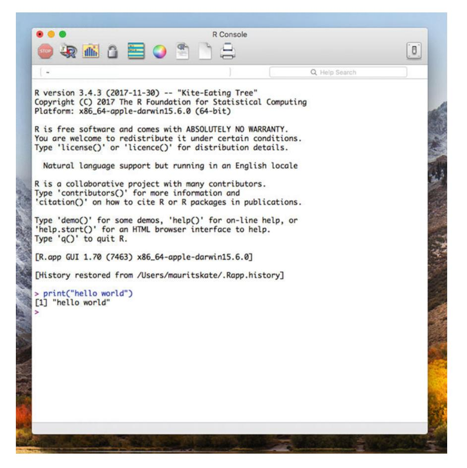

**Fig. 1.1** A screenshot of the R console with the execution of the command print("hello world")

<span id="page-2-0"></span>et al[.](#page-36-0) [2016\)](#page-36-0). In the study participants were asked to rate the attractiveness of a synthetically generated face. For each participant the generated face differed slightly along one of two dimensions: either the distance between the eyes, or the brownose-chin ratio was different. Figure [1.2](#page-3-0) provides an example of nine synthetically generated faces.

After seeing a face, participants rated its attractiveness on a scale from 1 to 100. Next to the rating, the dataset also contains some demographic information about the participants (their age, gender, education level). For a full description of the dataset and the setup of the experiment, see the preface.

Opening the data in R can be done using some simple R commands:

```
> path <- "data-files/"
> file <- "face-data.csv"
> face_data <- read.csv(paste(path, file, sep=""),
    stringsAsFactors = TRUE)
```

<span id="page-3-0"></span>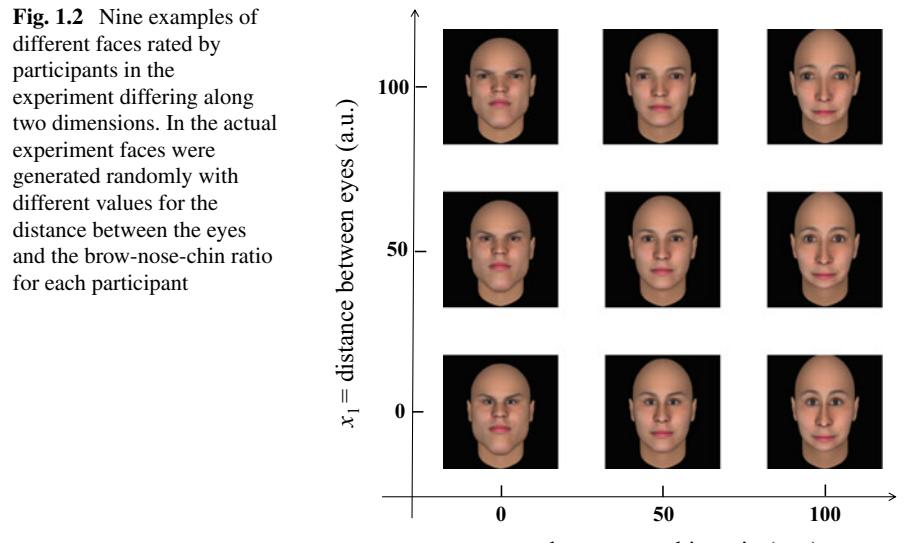

*x*<sup>2</sup> = brow-nose-chin ratio (a.u.)

Note that in the above code snippet the commands are preceded by a ">", all other printouts will be responses from R. We will stick to this convention throughout the book.

The core of the code above is the call to the *function* read.csv which allows us to open the datafile. In programming, a function is a named section of a program that performs a specific task. Functions often take one or more *arguments* as their input, and return some *value*. [2](#page-3-1)

Since this is the first R code we cover in this book, we go through it line by line. However, whenever you encounter code in the book and you are unsure of its functionality, make sure to run the code yourself and inspect the output.

The first line of the code creates (or instantiates) a new variable called path with the value data-files/. The quotes surrounding the value indicate that the variable is of type *string* (a set of characters) as opposed to *numeric* (a number). We discuss this in more detail below. Similarly, the second line defines a string variable called file with the value face-data.csv. Jointly these indicate the folder of the datafile (relative to R's working directory which you can find by executing the function getwd()) and the name of the datafile. The working directory can be changed by running setwd(dir), where dir is a character string specifying the desired working directory (e.g., setwd("/Users/username") on a Mac). Note that the path needs to be specified using the forward slash / as the separator.

The third line is more complex as it combines two function calls: first, inside the brackets, a call to paste(path,file,sep=""), and second, a call to

<span id="page-3-1"></span><sup>2</sup> In R you can always type ?function\_name to get to the help page of a function. You should replace function\_name by the name of the function you want to see more information about.

read.csv to open the file. The call to paste combines the strings path and file. This can be seen by inspecting the output of this function call:

```
> paste(path, file, sep="")
[1] "data-files/face-data.csv"
```

Hence, in this code paste ensures that the path to the actual datafile, relative to R's current working directory, is supplied to the read.csv function. Note that the third argument supplied to the paste function, named sep, specifies how the two strings path and file should be combined.

Theread.csvfunction opens the csv data and returns a so-called data.frame object containing the data in the file. We will discuss the data.frame object in more detail in Sect. [1.2.3.](#page-7-0) The function read.csv is one of many functions to read data into R; there are separate functions for opening different types of files (such as .sa[v3](#page-4-0) data files or .txt files). Thus, if you encounter other types of files make sure to find the right function to open them: in such cases, Google (or any other search engine of your choice) is your friend. Finally, note the stringsAsFactors = TRUE argument: this specifies that any variable containing strings will be considered a factor (see below). This option has been R's default for a long time, but since R version 4.0.0, we have to supply it manually[.4](#page-4-1)

The function read.csv takes a number of additional arguments. We could for example make the following call:

```
> face_data <- read.csv("data-files/face-data.csv", sep=",",
   header=TRUE, dec=".", stringsAsFactors = TRUE)
```

where we make explicit that the values in the file are separated by comma's, that the first line contains variable names (headers), and that we use a point (".") to indicate the starting of decimals in numbers.

After running this code we have, in the current session, an *object* called face\_ data which contains the data as listed in the file in an R data.frame; the data frame is just one of the many ways in which R can store data, but it is the one we will be using primarily in this book. In this example, we have opened a ".csv" file, which contains data stored in rows and columns. The values are separated by commas (it is a *c*omma-*s*eparated *v*alue file), and the different rows present data of different people. This is really nice and structured. However, during actual work as a data scientist you will encounter data of all sorts and guises. Likely, very often the data will not all be neatly coded like this, and it will not be at all easy to read data into R or any other software package. We will not worry about these issues too much in this book, but Crawle[y](#page-36-1) [\(2012\)](#page-36-1) provides an excellent introduction to ways of opening, re-ordering, re-shuffling, and cleaning data[.5](#page-4-2)

<span id="page-4-0"></span><sup>3</sup> .sav files are data files from the statistical package SPSS.

<span id="page-4-1"></span><sup>4</sup> As is true for many programming languages, R is continuously updated. For the interested reader here is a discussion regarding the change of the default stringsAsFactors argument: [https://](https://developer.r-project.org/Blog/public/2020/02/16/stringsasfactors/) [developer.r-project.org/Blog/public/2020/02/16/stringsasfactors/.](https://developer.r-project.org/Blog/public/2020/02/16/stringsasfactors/)

<span id="page-4-2"></span><sup>5</sup> Note that the read.csv function loads all the data into RAM; be aware that this might not be feasible for large datasets.

### *1.2.2 Some Useful Commands for Exploring a Dataset*

So, now we have a data.frame object named face\_data that contains our data. We can inspect the contents of this object by simply typing the name of the object into the R console:

```
> face_data
 id dim1 dim2 rating gender age edu
1 1 13.02427 13.54329 5 Male 25 to 34 years High school
2 2 24.16519 22.42226 59 Female 25 to 34 years Some college
3 3 19.71192 22.54675 5 Female 25 to 34 years 4 year college
4 4 16.33721 13.46684 10 Female 25 to 34 years 2 year college
5 5 26.67575 27.99893 25 Male 25 to 34 years Some college
6 6 12.02075 13.62148 75 Female 35 to 44 years Some college
### AND ON AND ON ####
```

This shows a very long list consisting of all of the records in our dataset. Clearly, if you have data on millions of people this will quickly become an impenetrable mess.[6](#page-5-0) It is therefore usually much easier to inspect a dataset using the functions head, dim, and summary which we will explain here.

The head function prints the first few lines of a data frame. If you do not specify a number of lines, then it wil print 6 lines:

| > | head(face_data) |          |          |        |        |     |    |    |       |                      |  |  |
|---|-----------------|----------|----------|--------|--------|-----|----|----|-------|----------------------|--|--|
|   | id              | dim1     | dim2     | rating | gender | age |    |    | edu   |                      |  |  |
| 1 | 1               | 13.02427 | 13.54329 | 5      | Male   | 25  | to | 34 | years | High<br>school       |  |  |
| 2 | 2               | 24.16519 | 22.42226 | 59     | Female | 25  | to | 34 | years | Some<br>college      |  |  |
| 3 | 3               | 19.71192 | 22.54675 | 5      | Female | 25  | to | 34 | years | 4<br>year<br>college |  |  |
| 4 | 4               | 16.33721 | 13.46684 | 10     | Female | 25  | to | 34 | years | 2<br>year<br>college |  |  |
| 5 | 5               | 26.67575 | 27.99893 | 25     | Male   | 25  | to | 34 | years | Some<br>college      |  |  |
| 6 | 6               | 12.02075 | 13.62148 | 75     | Female | 35  | to | 44 | years | Some<br>college      |  |  |

You could also try out the function tail(face\_data,10L) to get the last 10 lines.

The summary function provides a description of the data using a number of *summary statistics*; we will cover these in detail in Sect. [1.4.](#page-12-0)

```
> summary(face_data)
id dim1 dim2
Min. : 1.0 Min. :11.12 Min. :12.08
1st Qu.: 907.8 1st Qu.:25.55 1st Qu.:40.81
Median :1814.5 Median :35.53 Median :52.54
Mean :1814.5 Mean :35.97 Mean :49.65
3rd Qu.:2721.2 3rd Qu.:46.74 3rd Qu.:60.61
Max. :3628.0 Max. :63.09 Max. :70.28
rating gender
Min. : 1.00 : 14
1st Qu.: 41.00 Female:1832
```

<span id="page-5-0"></span><sup>6</sup> To prevent a messy output the R console will stop printing at some point, but still, the output will be largely uninformative.

```
Median : 63.00 Male :1782
Mean : 58.33
3rd Qu.: 78.00
Max. :100.00
age edu
: 14 4 year college:1354
18 to 24 years : 617 Some college : 969
25 to 34 years :1554 2 year college: 395
35 to 44 years : 720 High school : 394
45 to 54 years : 413 Masters degree: 384
55 to 64 years : 237 Doctoral : 95
Age 65 or older: 73 (Other) : 37
```

In the output above, note the difference between the way in which gender and rating are presented: for gender we see counts (or frequencies) of each possible value, while for rating we see a minimum value, a maximum value, and a number of other descriptive statistics. This is because R distinguishes numerical values such as rating from *strings* which contain text, such as gender in our case. We will look at this in more detail in Sect. [1.3.1](#page-10-0) and we will see that there are apparently 14 cases for which no gender and age are observed.

Alternatively, gender could have also been stored as a number (for example using the values 0 and 1 for females and males respectively); if that were the case R would have reported its minimum and maximum values by default. If we want R to interpret numeric values not as numbers, but as distinct categories, we can force R to do so by using the as.factor function. The code below prints a summary of the variable rating, and subsequently prints a summary of the factor rating; the difference is pretty striking: in the first case R reports a number of so-called descriptive statistics which we will discuss in more detail in Sect. [1.4,](#page-12-0) while in the second case R prints how often each unique rating occurs in the dataset (the value 1 occurs 84 times apparently). More information on the type of variables can be found in Sect. [1.2.3.](#page-7-0)

```
> summary(face_data$rating)
  Min. 1st Qu. Median Mean 3rd Qu. Max.
  1.00 41.00 63.00 58.33 78.00 100.00
> summary(as.factor(face_data$rating))
 1 2 3 4 5 6 7 8 9 10 11 12 13 14 15 16 17 18 19 20 21
84 12 6 14 12 8 12 14 15 23 17 17 11 11 22 21 12 24 16 31 8
22 23 24 25 26 27 28 29 30 31 32 33 34 35 36 37 38 39 40 41 42
16 6 25 50 16 15 13 14 65 13 13 29 20 54 13 19 27 19 79 21 28
43 44 45 46 47 48 49 50 51 52 53 54 55 56 57 58 59 60 61 62 63
12 21 50 30 12 18 34 133 35 38 48 20 69 35 25 16 40 139 35 42 37
64 65 66 67 68 69 70 71 72 73 74 75 76 77 78 79 80 81 82 83 84
33 71 48 34 46 27 162 40 36 37 41 199 41 41 44 41 162 62 39 40 38
85 86 87 88 89 90 91 92 93 94 95 96 97 98 99 100
122 46 25 29 34 89 16 25 16 11 39 7 8 3 1 41
```

Note that in the code-snippet above the "\$" is used to address the variable rating in the dataset by its (column) name.

Finally, the function dim specifies the number of rows and columns in the data.frame:

> **dim**(face**\_data**) [1] 3628 7

This shows that we have 3*,*628 rows of data and 7 columns. Often the rows are individual units (but not always), and the columns are distinct variables.

### <span id="page-7-0"></span>*1.2.3 Scalars, Vectors, Matrices, Data.frames, Objects*

The data.frame is just one of the many *objects* that R supports.[7](#page-7-1) We can easily create other types of objects. For example, if we run:

> id **<-** 10

we create the object called id, which is a variable containing the value 10. The object id lives outside or next to our dataset. Thus object id should not be confused with the column id in our dataset. Just as with our dataset (the face\_data object), we can easily inspect our new object by just typing its name:

> id [1] 10

To see the column id we should have used the R code

```
> face_data$id
```

indicating that the column id lives in the data frame face\_data.

To gain some more understanding regarding R objects and their structure, we will dig a bit deeper into the face\_data object. The face\_data object is of type data.frame, which itself can be thought of as an extension of another type of object called a matrix. [8](#page-7-2) A matrix is a collection of numbers ordered by rows and columns. To illustrate, the code below creates a matrix called M consisting of three rows and three columns using the matrix() function. We populate this matrix using the values 1*,* 2*,...,* 9 which we generate with the c(1:9) command[.9](#page-7-3)

<span id="page-7-1"></span><sup>7</sup> In this book we do not provide a comprehensive overview of R; we provide what you need to know to follow the book. A short introduction can be found in Ippe[l](#page-36-2) [\(2016\)](#page-36-2), while for a more thorough overview we recommend Crawle[y](#page-36-1) [\(2012](#page-36-1)).

<span id="page-7-2"></span><sup>8</sup> While it is convenient to think of a data.frame as a generalization of a matrix object, it technically isn't. The data.frame is "a list of factors, vectors, and matrices with all of these having the same length (equal number of rows in matrices). Additionally, a data frame also has names attributes for labelling of variables and also row name attributes for the labelling of cases.".

<span id="page-7-3"></span><sup>9</sup> In R actually the command 1:9 would suffice to create the vector; however, we stick to using the function c() explicitly when creating vectors.

```
> M <- matrix(c(1:9), nrow=3)
> M
   [,1] [,2] [,3]
[1,] 1 4 7
[2,] 2 5 8
[3,] 3 6 9
```

The data.frame object is similar to the matrix object, but it can contain different types of data (both numbers and strings), and it can contain column names: we often call these variable names.

We can access different elements of a matrix in multiple ways. This is called *indexing*. Here are some examples:

```
> M[2, 3]
[1] 8
> M[3, 1]
[1] 3
> M[1, ]
[1] 1 4 7
> M[, 2]
[1] 4 5 6
```

Both a row or a column of numbers is called a *vector*, and a single numerical entry of a vector is called a *scalar*. Hence, the object id that we defined above was a scalar (a single number) while the command c(1:9) generates a vector. Note that "under the hood" R always works using vectors, which explains the [1] in front of the value of id when we printed it: R is actually printing the first element of the vector id.

We can add more elements to the vector id and access them using their index:

```
> id
[1] 10
> id <- c(id, 11)
> id
[1] 10 11
> id[2]
[1] 11
```

In the code above, the function c() *concatenates* the arguments that are passed to this function into a single vector.

Just like a matrix, we can also index a data frame using row and column numbers.

```
> face_data[3, 5]
[1] Female
Levels: Female Male
> face_data[3, ]
 id dim1 dim2 rating gender age edu
3 3 19.71192 22.54675 5 Female 25 to 34 years 4 year college
```

If you use face\_data[1, ] you would obtain the first row of data and not the variable names.

The data frame allows us to index and retrieve data in many different ways that the matrix does not allow. Here are some examples:

```
> face_data$gender[3]
[1] Female
Levels: Female Male
> face_data$gender[1:5]
[1] Male Female Female Female Male
Levels: Female Male
> face_data$gender[face_data$rating>95]
[1] Male Male Female Female Female Male Female Male Female Female Female
[12] Female Female Female Female Female Female Female Male Male Female Female
[23] Male Female Male Male Female Female Male Female Female Male Female
[34] Female Female Female Female Female Male Female Male Male Male Female
[45] Male Male Female Female Female Female Male Female Female Female Female
[56] Male Male Female Female Female
Levels: Female Male
```

The first command returns the third value of the variable (column) called gender, and the second command returns the first five values of this variable. The R syntax in the last line selects from the dataset called face\_data the gender variable, but only for those values in which the rating variable is larger than 95; thus, this shows the gender of all the participants that provided a very high rating.

### **1.3 Measurement Levels**

We have already seen a difference between gender and rating in their "type" of data. A bit more formally, often four different measurement levels are distinguished (Norma[n](#page-36-3) [2010\)](#page-36-3):

- 1. **Nominal:** Nominal data makes a distinction between groups (or sometimes even individuals), but there is no logical order to these groups. Voting is an example: there is a difference between those who vote, for instance, Democrat, or Republican, but it's hard to say which is better or worse, or how much better or worse. Nominal data is often encoded as a factor in R. When a variable is encoded as a factor in R, which can be forced by using the as.factor() function, the values that the variable can take are stored separately by R and are referred to as the different *levels* of the factor.
- 2. **Ordinal:** Ordinal data also distinguishes groups or individuals, but now imposes an order. An example is the medals won at a sports event: Gold is better than Silver, but it's unclear how much better.
- 3. **Interval:** The interval scale distinguishes groups (or actually, often individuals), imposes an order, and provides a magnitude of the differences in some unit. For example, we can say that the Gold winner has a score of 0 s, the Silver winner 10 s (being 10 s slower), and the Bronze winner 12 s.
- 4. **Ratio:** This contains all of the above, but now also imposes a clear reference point or "0". The interval scale level does not really allow one to say whether the Gold winner was "twice as fast" as the Silver winner; we know she was 10 s faster, but we don't know how long the total race took. If we measure the speed from the

### 1.3 Measurement Levels 11

start of the race, we have a fixed "0", and we can meaningfully state things like: "the winner was twice as fast as the Bronze medalist."

Note that each consecutive measurement level contains as much "information"—in a fairly loose sense of the word—as the previous one *and more*. As a consequence of this, note that if you have (e.g.) ratio data, you could summarize it into nominal data, but not the other way around. We can see this in our dataset for the variable age: while age could have been recorded as a ratio variable (in years), our dataset contains age as an ordinal variable: it only specifies the age group a specific person belongs to. Operations that are meaningful on ratio data (such as addition and multiplication) are often nonsensical on nominal or ordinal data.

Nominal and ordinal data are often called *categorical data*, while interval and ratio data are referred to as *numerical data*. We also make a distinction between *continuous* and *discrete* numerical data. Theoretically, continuous variables can assume any value. This means that the continuous variable can attain any value between two different values, no matter how close the two values are. For discrete variables this would be untrue.[10](#page-10-1) Examples of continuous variables are temperature, weight, and age, while discrete data is often related to counts, like the number of text messages, accidents, microorganisms, students, etc. We will return to measurement levels later in this chapter when we describe which summaries and visualizations are well-suited for measurements of a specific level.

### <span id="page-10-0"></span>*1.3.1 Outliers and Unrealistic Values*

If you paid close attention before, you might have noticed that for 14 units the value of gender in the dataset we opened was empty. Thus, the factor gender contains three levels: "Female", "Male", and "". It is unclear what this last, empty, level tries to encode. You will find this a lot in real datasets: often a datafile contains entries that are clearly erroneous, non-sensical, or otherwise unclear. Quite a big part of data science is actually knowing what to do with such data. For now, however, we will just recognize these units and remove them from our analysis. Again, the book by Crawle[y](#page-36-1) [\(2012\)](#page-36-1) provides more pointers regarding these issues.

The rows containing the level "" can be removed using the following commands:

```
> face_data <- face_data[face_data$gender == "Female" | face_data
    $gender == "Male", ]
> nrow(face_data)
[1] 3614
```

The code above deletes all the rows for which the value of gender is empty by selecting all the rows that contain the value Female ( =="Female") or (|) Male ( == "Male") and subsequently prints the number of rows in the dataset (which

<span id="page-10-1"></span><sup>10</sup> In practice, continuous data does not exist, since we record data always with a finite number of digits and hence the property that there would be a value in between any two values is lost. Thus data is essentially always discrete.

is now 3,614 as opposed to 3,628). Note that just deleting the rows that contain the empty values does not force R to delete the empty value as a possible level of the factor gender; we can achieve this by dropping this level explicitly:

```
> summary(face_data$gender)
      Female Male
    0 1832 1782
> face_data$gender <- droplevels(face_data$gender)
> summary(face_data$gender)
Female Male
 1832 1782
```

where in the first command it is clear from the summary that 0 rows have the value "", while in the last command the summary shows that the level "" is no longer considered a possible value of the factor gender.

We will make sure that we also drop the superfluous levels of the variable age by running

> face**\_data\$**age **<-** droplevels(face**\_data\$**age)

Besides unclear values we also often encounter very extreme values; for example, we might find that the age of a participant in a study is 622. Such extreme values are often called "outliers" (a more formal definition exists, but we won't get into that now; we will, however, discuss some statistical methods of finding outliers in Chap. [7\)](#page--1-0). There are essentially two types of outliers: implausible and plausible outliers. An age of 622 years old would be implausible (so far), but a weight of a person of 500 kg, would be very extreme, but not impossible. How to properly deal with outliers is a topic in its own right, but by and large the options are (a) ignoring them, (b) removing them or (c) trying to substitute them, using statistical methods, with a more plausible alternative.

Removing implausible values is common practice, but removing plausible outliers should never be common practice. Similarly, many datasets contain "missing data"; for example when someone refused to fill out their gender; this is likely what happened in the face\_data dataset. Missing values are often either ignored (the units removed as we did above), or they are filled in using statistical prediction models: this filling-in is called *imputation*. [11](#page-11-0) Researchers also like to use special values to indicate missing data, like 88, 888, 99, and 999. These values should be used only when they represent implausible values for the variable. Thus 99 for a missing age is not recommended, while 999 would be proper value for a missing age.

<span id="page-11-0"></span><sup>11</sup> Data imputation is a field in its own right (see, e.g., Vidotto et al[.](#page-36-4) [2015\)](#page-36-4); we will not discuss it in this topic further in this book. However a very decent introduction is provided by Baguley and Andrew[s](#page-36-5) [\(2016\)](#page-36-5).

### <span id="page-12-0"></span>1.4 Describing Data

We now turn to *describing* the data that we are looking at. We have seen some examples already, for example when we were using the summary function, but here we will discuss the R output and a number of popular data descriptions in a bit more detail. Note that some *descriptive statistics* (or just *descriptives*) that we introduce are often used for data of a certain measurement level; we will indicate the most appropriate measurement levels for each descriptive statistic discussed below.

### 1.4.1 Frequency

Nominal and ordinal data are often described using frequency tables; let's do this for the variable age:

```
> t1 <- table(face data$age)
> t2 <- transform(t1, cumulative = cumsum(Freq), relative = prop.
   table(Freq))
> t2
           Var1 Freq cumulative relative
1 18 to 24 years 617
                         617 0.17072496
2 25 to 34 years 1554
                         2171 0.42999447
3 35 to 44 years 720
                        2891 0.19922524
4 45 to 54 years 413
                         3304 0.11427781
5 55 to 64 years 237
                          3541 0.06557831
6 Age 65 or older 73
                         3614 0.02019923
```

The code above presents the frequency of occurrence of each value of the variable, the so-called *cumulative* frequency, and the *relative* frequency.<sup>12</sup> The frequency is just the number of times a value occurs in the dataset. We may generally denote the values by a set of numbers  $\{x_1, x_2, \ldots, x_m\}$ , with *m* the number of levels, and the frequency for  $x_j$  given by  $f_j$ ,  $j = 1, 2, \ldots, m$ . In the example above this means we may use

> $x_1 = 1$  for 18 to 24 years,  $x_2 = 2$  for 25 to 34 years, ....  $x_7 = 7$  for 65 years and older,

which have frequencies

<span id="page-12-1"></span><sup>&</sup>lt;sup>12</sup> The cumulative frequency makes more sense for ordinal data than for nominal data, since ordinal data can be ordered in size, which is not possible for nominal data.

$$f_1 = 617,$$
  
 $f_2 = 1554,$   
...,  
 $f_7 = 73.$ 

Using this notation the cumulative frequency for a specific value  $x_i$  is given by  $\sum_{k=1}^j f_k$ , the relative frequency is given by  $f_j / \sum_{k=1}^m f_k$ , and the *cumulative relative* frequency is given by  $\sum_{k=1}^{j} f_k / \sum_{k=1}^{m} f_k$ .<sup>13</sup>

The code for computing the frequencies requires some explanation: in the first line we create a new object called  $t1$  by using the table function; this line creates a table that contains only the frequency counts but not yet the cumulative sums and relative frequencies. This is done in the second line using the transform function: this function creates a new table, called  $t2$ , which transforms  $t1$  into a new table with additional columns.

Frequencies are often uninformative for interval or ratio variables: if there are lots and lots of different possible values, all of them will have a count of just one. This is often tackled by discretizing (or "binning") the variable (which, note, effectively "throws away" some of the information in the data). Here is the code to discretize the variable rating into five bins and create a frequency table:

```
> bins <- 5
> rating_binned <- factor(cut(face_data$rating, breaks=bins))
> t3 <- table(rating_binned)
> t4 <- transform(t3, cumulative = cumsum(Freq), relative = prop.
   table(Freq))
> +4rating_binned Freq cumulative relative
1 (0.901,20.8] 381 0.1054234
  (20.8,40.6] 513
                       894 0.1419480
2
3 (40.6,60.4] 821
                       1715 0.2271721
4 (60.4,80.2] 1214
                      2929 0.3359159
5
    (80.2,100] 685
                       3614 0.1895407
```

Here the cut() function is used to effectively cut up the continuous rating into five distinct categories. Note that the interval length is 19.8, except for the first interval: here the default choice made by  $R$  is a bit mysterious.

#### Central Tendency 1.4.2

When we work with numerical data, we often want to know something about the "central value" or "middle value" of the variable, also referred to as the location of the data. Here we have several measures that are often used:

<span id="page-13-0"></span><sup>&</sup>lt;sup>13</sup> Not all readers will be familiar with summation notation; let  $x_1, x_2, \ldots, x_j$  be a set of numbers, than  $\sum_{k=1}^{j} x_k = x_1 + x_2 + \dots + x_j$ .

1. **Arithmetic mean:** The arithmetic mean of a set of numbers, which is often denoted *x*¯ when we are referring to the sample mean of a variable *x*, is given by:

$$\bar{x} = \frac{1}{n} \sum_{i=1}^{n} x_i \tag{1.1}$$

where *n* is the total number of observed units, and *xi* the score on variable *x* by unit *i*. Note that all data points weigh equally in computing the mean, and that it is affected quite a bit by extreme values or outliers. In R we can use the build-in R function mean() to compute the mean of a variable.

2. **Mode:** The mode is merely the most frequently occurring value. And yes, there might be multiple modes. R does not have a built in function to compute it, so let's write our own:

```
> get_mode <- function(v){
+ uniqv <- unique(v)
+ uniqv[which.max(tabulate(match(v, uniqv)))]
+ }
> get_mode(face_data$rating)
[1] 75
```

The code above introduces a number of new concepts. Here, in the first line, we create a new function called getmode, which takes the argument v. In the second line the function unique is used to generate a vector containing all the unique elements of the vector v. The next line, which is a bit involved, creates a table of the counts of each of the unique elements of v, and subsequently selects the highest value with the highest count[.14](#page-14-0) Thus, the function eventually returns the value of the mode, not how often that specific value occurred[.15](#page-14-1)

- 3. **Median:** The median is a value that divides the ordered data from small to large (or large to small) into two equal parts: 50% of the data is below the median and 50% is above. The median is not necessarily a value that is present in the data. Practically, we sort the data and choose the middle-most value when *n* is odd, or the average of the two middle values when *n* is even. Hence, the median of the data 2*,* 5*,* 6*,* 4 (which, when ordered is 2*,* 4*,* 5*,* 6) is 4*.*5. In R you can use the function median().
- 4. **Quartiles, deciles, percentiles, quantiles:** Instead of using 50% for the median, we may use any cut-off value. The function quantile() provides as standard (its default) the cut-off values 0%, 25%, 50%, 75%, and 100%.

```
> quantile(face_data$rating)
 0% 25% 50% 75% 100%
  1 41 63 78 100
```

<span id="page-14-0"></span><sup>14</sup> It is good practice to execute parts of a complicated line of code like this separately so that you understand each command (in this case match, tabulate, and which.max).

<span id="page-14-1"></span><sup>15</sup> Finally, note that the smallest most frequently occurring value is reported; it is an interesting exercise to change this function such that it returns all the modes if multiple modes exist.

A cut-off of  $0\%$  is used to indicate the minimum. Thus 1 is the smallest rating in the dataset. The cut-off  $100\%$  is used for the maximum rating. The rating 41 years belongs to a cut-off of 25%, which means that 25% of the participants contained in the data provided a rating below or equal to  $41$ .

More theoretically, a *quantile*  $x_a$  is a value that splits the ordered data of a variable x into two parts:  $q \cdot 100\%$  of the data is below the value  $x_q$  and  $(1-q) \cdot 100\%$ of the data is above. The parameter  $q$  can take any value in the interval [0, 1]. When  $q = 0.25$ ,  $q = 0.50$ , and  $q = 0.75$  the quantiles are referred to as the first, second,<sup>16</sup> and third *quartiles*, respectively. We call quantiles *deciles* when  $q$  is restricted to the set  $\{0.1, 0.2, \ldots, 0.9\}$  and percentiles when the q is restricted to  $\{0.01, 0.02, 0.03, \ldots, 0.99\}$ . Thus quartiles and deciles are also percentiles. In R we can compute different quantiles by passing the desired value  $q$  to the quantile function as a second argument:

```
> quantile(face_data$rating, c(.2))
20%
 35
```

Quantiles can be calculated in different ways, depending on the way we "interpolate" between two values. To illustrate this let us calculate the first quartile of the data  $\{2, 5, 6, 4\}$  that we used to illustrate the calculation of the median (which was 4.5). If we order the data ( $\{2, 4, 5, 6\}$ ), the first quartile can be seen as the median of the data  $\{2, 4\}$  on the left of the median, which would give a value of 3. Alternatively and more generically, we could map the ordered values equally spaced on the interval  $(0, 1)$ , where the *i*th ordered value of the data is positioned at the level  $q = i/(n + 1)$  in the interval (0, 1), with *n* being the number of data points. Thus in our example we would put the value 2 at the level  $q = 1/5$ , the value 4 at  $q = 2/5$ , the value 5 at  $q = 3/5$ , and the value 6 at  $q = 4/5$  (see Fig. 1.3). Now the first quartile is the value that should be positioned at level  $q = 0.25$ . In our example, the value 3 would be located at 0.3, since it is exactly in the middle of the levels  $0.2$  and  $0.4$  and  $3$  is exactly in the middle of the values 2 and 4. Thus the value 2.5 would be positioned at the level  $q = 0.25$ . The first quartile is 2.5 instead of 3. Note that the median of 4.5 is precisely in the middle of 4 and 5 which are positioned at level  $0.4$  and  $0.6$ , respectively.

This procedure is available in many software packages, often as default setting, but R uses a different default. Instead of putting the data  $\{2, 4, 5, 6\}$  at the quantiles  $\{0.2, 0.4, 0.6, 0.8\}$  as seen in Fig. 1.3, the function quantile() in R uses the quantiles  $(i-1)/(n-1)$  for the ordered data. Thus the data  $\{2, 4, 5, 6\}$  is positioned at quantiles  $\{0, 1/3, 2/3, 1\}$  and then an interpolation is applied. The following R code shows the results:

```
> x \leftarrow c(2, 4, 5, 6)> quantile(x)
 0% 25% 50% 75% 100%
2.00 3.50 4.50 5.25 6.00
```

<span id="page-15-0"></span> $^{16}$  Yes, the second quartile is equal to the median.

<span id="page-16-0"></span>

| Fig. 1.3<br>Mapping the       |  |  |  |  |
|-------------------------------|--|--|--|--|
| ordered data to the values    |  |  |  |  |
| i/(n + 1), with i the ordered |  |  |  |  |
| number of the value           |  |  |  |  |

With the option type=6 in the function quantile(), we obtain the results described earlier, i.e.

> **quantile**(x, type=6) 0% 25% 50% 75% 100% 2.00 2.50 4.50 5.75 6.00

Note that quantiles are very useful to get some idea of the so-called "distribution" of a variable.

### *1.4.3 Dispersion, Skewness, and Kurtosis*

Knowing the "central tendency" or locations of data points might not be sufficient to really understand the data that you are looking at. Dispersion measures help us understand how far apart the data are away from the center or from each other, while skewness and kurtosis are measures that describe features of the shape of the frequency plot of the data.

1. **Range and interquartile range:** Range is the difference between the maximum and minimum. It quantifies the maximum distance between any two data points. The range is easy to calculate in R:

```
> max(face_data$rating) - min(face_data$rating)
[1] 99
```

Clearly, the range is sensitive to outliers. Instead of using the minimum and maximum, we could use the difference between two quantiles to circumvent the problem of outliers. The interquartile range (IQR) calculates the difference between the third quartile and the first quartile. It quantifies a range for which 50% of the data falls within.

```
> quantile(face_data$rating, c(0.75)) - quantile(face_data$
    rating, c(0.25))
37
```

Thus 50% of the rating data lies within a range of 37. The interquartile range is visualized in the boxplot, which we discuss later in this chapter.

2. **Mean absolute deviation:** We can also compute the average distance that data values are away from the mean:

$$MAD = \frac{1}{n} \sum_{i=1}^{n} |x_i - \bar{x}| \tag{1.2}$$

where  $|\cdot|$  denotes the absolute value. R does not have a built-in function for this, but  $MAD$  can easily be computed in R:

```
> sum(abs(x-mean(x))) /length(x)
```

3. Mean squared deviation, variance, and standard deviation: Much more common than the mean absolute difference is the mean squared deviation about the mean:

$$MSD = \frac{1}{n} \sum_{i=1}^{n} (x_i - \bar{x})^2$$
 (1.3)

It does the same as  $MAD$ , but now it uses squared distances with respect to the mean. The variance is almost identical to the mean squared deviation, since it is given by  $s^2 = \sum_{i=1}^n (x_i - \bar{x})^2/(n-1) = n \cdot MSD/(n-1)$ . For small sample sizes the *MSD* and variance are not the same, but for large sample sizes they are obviously very similar. The variance is often preferred over the *MSD* for reasons that we will explain in more detail in Chap. 2 when we talk about the bias of an estimator. The sample **standard deviation** is  $s = \sqrt{s^2}$ . The standard deviation is on the same scale as the original variable, instead of a squared scale for the variance.

4. **Skewness and kurtosis:** Both measures, skewness and kurtosis, are computed using so-called *standardized* values  $z_i = (x_i - \bar{x})/s$  of  $x_i$  which are also called  $z$ -values. Standardized values have no unit and the mean and variance of the standardized values are equal to 0 and 1, respectively. $^{17}$ 

Skewness is used to measure the asymmetry in data and kurtosis is used to measure the "peakedness" of data. Data is considered skewed or asymmetric when the variation on one side of the middle of the data is larger than the variation on the other side. The most commonly used measure for skewness is

$$g_1 = \frac{1}{n} \sum_{i=1}^n \left(\frac{x_i - \bar{x}}{s}\right)^3 \tag{1.4}$$

When  $g_1$  is positive, the data is called skewed to the right. The values on the right side of the mean are further away from each other than the values on the left side of the mean. In other words, the "tail" on the right is longer than the "tail" on the left. For negative values of  $g_1$  the data is called skewed to the left and the tail on the left is longer than the tail on the right. When  $g_1$  is zero, the data is considered symmetric around its mean. In practice, researchers sometimes compare the mean with the median to get an impression of the skewness, since the median and mean are identical under symmetric data, but this measure is more difficult to interpret than  $g_1$ . Data with skewness values of  $|g_1| \le 0.3$  are considered close to symmetry,

<span id="page-17-0"></span><sup>&</sup>lt;sup>17</sup> Note that the average of the standardized values is equal to  $\frac{1}{n}\sum_{i=1}^{n} z_i = \frac{1}{n}\sum_{i=1}^{n} x_i/s - \bar{x}/s = 0$ and that the sample variance is equal to  $\frac{1}{n-1}\sum_{i=1}^{n}(z_i-0)^2 = \frac{1}{n-1}\sum_{i=1}^{n}(x_i-\bar{x})^2/s^2 = s^2/s^2 = 1.$ 

since it is difficult to demonstrate that data is skewed when the value for  $g_1$  is close to zero.

The most commonly used measure for kurtosis is

$$g_2 = \frac{1}{n} \sum_{i=1}^n \left(\frac{x_i - \bar{x}}{s}\right)^4 - 3\tag{1.5}$$

When  $g_2$  is positive, the data is called *leptokurtic* and the data has long heavy tails and is severely peaked in the middle, while a negative value for  $g_2$  is referred to as *platykurtic* and the tails of the data are shorter with a flat peak in the middle. When  $g_2$  is zero the data is called *mesokurtic*. Similar to  $g_1$ , it is difficult to demonstrate that data is different from mesokurtic data when  $g_2$  is close to zero, since it requires large sample sizes. Values of  $g_2$  in the asymmetric interval of  $[-0.5, 1.5]$  indicate near-mesokurtic data.

Note that the measures  $g_1$  and  $g_2$  are unchanged when all values  $x_1, x_2, \ldots, x_n$ are shifted by a fixed number or when they are multiplied with a fixed number. This means that shifting the data and/or multiplying the data with a fixed number does not change the "shape" of the data.

### 1.4.4 A Note on Aggregated Data

In practice we might sometimes encounter aggregated data: i.e., data that you receive are already summarized. For instance, income data is often collected in intervals or groups: [0, 20, 000) euro, [20, 000, 40, 000) euro, [40, 000, 60, 000) euro, etc., with a frequency  $f_i$  for each group j. In the dataset face\_data age was recorded in seven different age groups. Measures of central tendency and spread can then still be computed (approximately) based on such grouped data. For each group  $j$  we need to determine or set the value  $x_i$  as a value that belongs to the group, before we can compute these measures. For the example of age in the dataset face\_data, the middle value in each interval may be used, e.g.,  $x_1 = 21.5$ ,  $x_2 = 30$ , etc. For the age group "65 years and older", such a midpoint is more difficult to set, but 70 years may be a reasonable choice (assuming that we did not obtain (many) people older than 75 years old). The mean and variance for grouped data are then calculated by

$$\bar{x} = \frac{\sum_{k=1}^{m} x_k f_k}{\sum_{k=1}^{m} f_k}, \qquad s^2 = \frac{\sum_{k=1}^{m} (x_k - \bar{x})^2 f_k}{\sum_{k=1}^{m} f_k - 1} \tag{1.6}$$

with  $m$  the number of groups. Similarly, many of the other descriptive statistics that we mentioned above can also be computed using aggregated data. The average age and the standard deviation in age for the dataset face\_data, using the aggregated data and the selected midpoints, are equal to 35.6 and 11.75 years, respectively.

### **1.5 Visualizing Data**

Next to inspecting data by computing summaries, we often visualize our data. Visualization, when done well, can make large and even high-dimensional datasets (relatively) easy to interpret. As with many topics we introduce in this book, visualization is a topic in its own right. We refer the interested reader to Rahl[f](#page-36-6) [\(2017\)](#page-36-6) or Young and Wessnitze[r](#page-36-7) [\(2016\)](#page-36-7); here we merely provide some basics to get started making simple data visualizations with R.

Since we will be making plots, the easiest thing to do is to just call the function plot on the data object we have and see what happens:

```
> plot(face_data)
```

This code produces Fig. [1.4.](#page-20-0) Note that variable id is a variable that represents the order of participants entering the study.

Admittedly, blindly calling plot is not very esthetically appealing nor is it extremely informative. For example, we can see that gender only has two levels: this is seen in the fifth row of panels, where gender is on the *y*-axis and each dot—each of which represents an observation in the dataset—has a value of either 1 or 2. However, the panels displaying gender do not really help us understand the differences between males and females. On the other hand, you can actually see a few things in the other panels that are meaningful. We can see that there is a pretty clear positive relationship between id and dim1: apparently the value of dim1 was increased slowly as the participants arrived in the study (see the first panel in the second row). Evaluate Fig. [1.4](#page-20-0) carefully so you know what's going on with the other variables as well.

Interestingly, R will change the "default" functionality of plot based on the objects that are passe[d18](#page-19-0) to it. For example, a call to

#### > **plot**(face**\_data\$**rating)

produces Fig. [1.5,](#page-21-0) which is quite different from the plot we saw when passing the full data.frame as an argument. Thus, based on the type of object passed to the plotting function—whether that is a data.frame, a numerical vector, or a factor—the behavior of the function plot will change.

Admittedly, the default behavior of R is not always the best choice: you should learn how to make the plots you want yourself without relying on the R defaults. We will look at some ways of controlling R plots below.

<span id="page-19-0"></span><sup>18</sup> Each argument provided to a function is of a certain type, for example a vector or a data.frame as we discussed before. R uses this type information to determine what type of plot to produce.


<span id="page-20-0"></span>**Fig. 1.4** Calling plot on a data frame. Note that on both the columns and the rows of the grid the variables in the dataset are listed. Each panel presents a visualization showing one variable in the dataset on the *y*-axis, and one on the *x*-axis

### *1.5.1 Describing Nominal/ordinal Variables*

One way to start thinking about informative plotting is by considering the measurement levels of variables; just as frequencies are useful for describing nominal (and sometimes ordinal) variables, but less so for interval and ratio variables, certain types of plots are useful for nominal and ordinal variables, while others are less useful. A simple way of plotting the frequencies is a *bar chart*. The following code produces Fig. [1.6](#page-21-1) and provides a simple example:

```
> counts <- table(face_data$age)
```

```
> barplot(counts)
```

<span id="page-21-1"></span><span id="page-21-0"></span>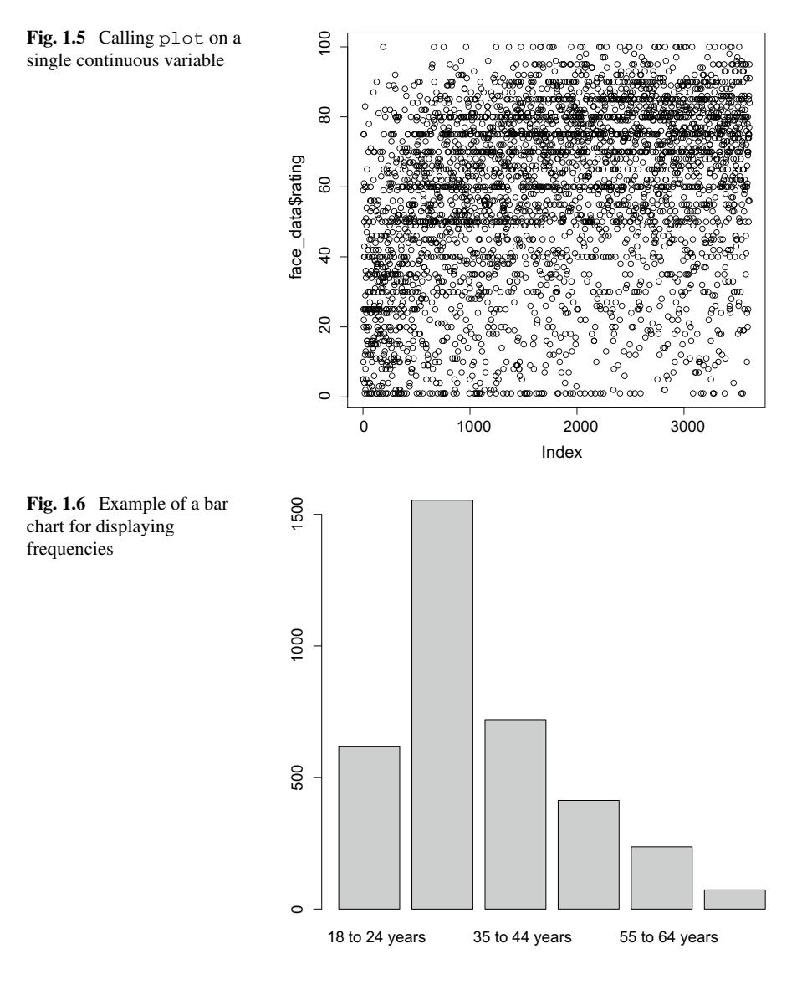

You can also make a *pie chart* using the same frequencies. The following code produces Fig. [1.7.](#page-22-0)

#### > pie(counts)

Pie charts can be useful for easy comparisons of relative frequencies, while bar charts are more meaningful for absolute numbers or frequencies. The bar chart allows you to compare the heights of the bars more easily (and hence the size of the groups). However, the pie chart more clearly visualizes the relative share of each value. Hence,

<span id="page-22-0"></span>

by using different visualizations you can emphasize different aspects of the data. For a first exploratory analysis of a dataset it is therefore often useful to look at multiple visualizations. Obviously, more ways of showing frequencies exist, but these are the most basic versions that you should know and should be able to construct.

#### **Describing Interval/ratio Variables** 1.5.2

We can now look at ways of visualizing *continuous* variables. Figure 1.8 shows a so-called *box and whiskers plot* (or *box plot*); these are useful for getting a feel of the spread, central tendency, and variability of continuous variables. Note that the middle bar denotes the median and the box denotes the middle 50% of the data (with  $Q_1$  the first quartile at the bottom of the box and  $O_3$  the third quartile as the top of the box). Next, the whiskers show the smallest value that is larger or equal to  $Q_1 - 1.5IQR$ and the largest value that is smaller than or equal to  $Q_3 + 1.5IQR$ . Finally, the dots denote the values that are outside the interval  $[Q_1 - 1.5IQR, Q_3 + 1.5IQR]$ , which are often identified or viewed as outliers. Box and whiskers plots can be very useful when comparing a continuous variable across subgroups of participants (e.g. males and females)—see Sect.  $1.5.3$ . The figure was produced using the following code:

```
> boxplot(face_data$rating)
```

Next to box and whiskers plots, histograms (examples are shown in Fig.  $1.9$ ) are also often used to visualize continuous data. A histogram "bins" the data (discretizes it), and subsequently shows the frequency of occurrence in each bin. Therefore, it is the continuous variant of the bar chart. Note that the number of bins selected makes a big difference in the visualization: too few bins obscure the patterns in the data, but too many bins lead to counts of exactly one for each value. R "automagically" determines the number of bins for you if you pass it a continuous variable; however,

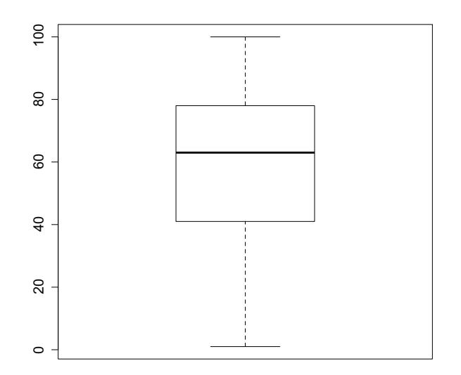

<span id="page-23-0"></span>**Fig. 1.8** Example of a box and whiskers plot useful for inspecting continuous variables

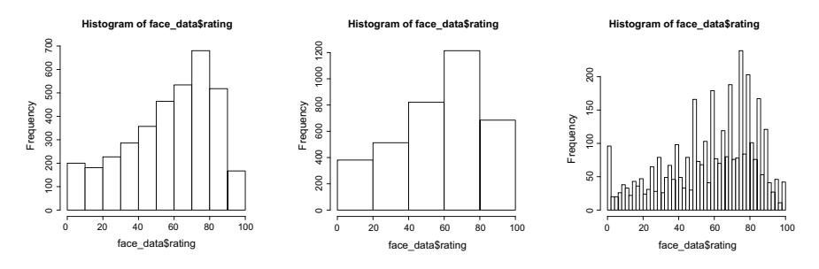

<span id="page-23-1"></span>**Fig. 1.9** Examples of histograms with different numbers of breaks (R's default on the left, 5 in the middle, 50 on the right). Determining the number of breaks to get a good overview of the distribution of values is an art in itself

you should always check what things look like with different settings. The following code produces three different histograms with different numbers of breaks (or bins)[.19](#page-23-2)

```
> hist(face_data$rating)
```

```
> hist(face_data$rating, breaks=5)
```

> **hist**(face**\_data\$**rating, breaks=50)

Finally, a *density* plot—at least in this setting—can be considered a "continuous approximation" of a histogram. It gives per range of values of the continuous variable the probability of observing a value within that range. We will examine densities in more detail in Chap. [4.](#page--1-0) For now, the interpretation is relatively simple: the higher the

<span id="page-23-2"></span><sup>19</sup> The bins don't always correspond to exactly the number you put in, because of the way R runs its algorithm to break up the data, but it gives you generally what you want. If you want more control over the exact breakpoints between bins, you can be more precise with the breaks option and give it a vector of breakpoints.

<span id="page-24-2"></span>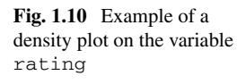

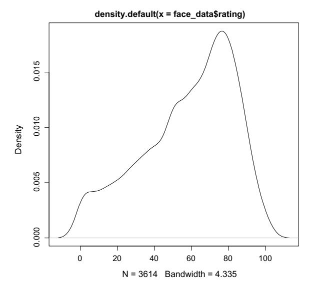

line, the more likely are the values to fall in that range.[20](#page-24-1) The density plot shown in Fig. [1.10](#page-24-2) is produced by executing the following code:

```
> plot(density(face_data$rating))
```

It is quite clear that values between 40 and 100 quite often occur, while values higher than 100 are rare. This could have been observed from the histogram as well.

## <span id="page-24-0"></span>*1.5.3 Relations Between Variables*

We often want to visualize multiple variables simultaneously instead of looking at single variables similar to Fig. [1.4.](#page-20-0) That way we can see relations between variables. The most often used visualization of a relationship between two continuous variables (and therefore R's default) is the *scatterplot* (see Fig. [1.11\)](#page-25-0). Note that here each dot denotes a unique observation using an *(x, y)* pair. The following code produces such a plot:

```
> plot(face_data$dim1, face_data$rating)
```

This plot shows that there is a (kind of nonlinear) relationship between the first dimension of the face and the rating that participants give: for a very low value of the distance between the eyebrows people seem to provide low attractiveness ratings

<span id="page-24-1"></span><sup>20</sup> The interpretation of densities is different than the interpretation of histograms.

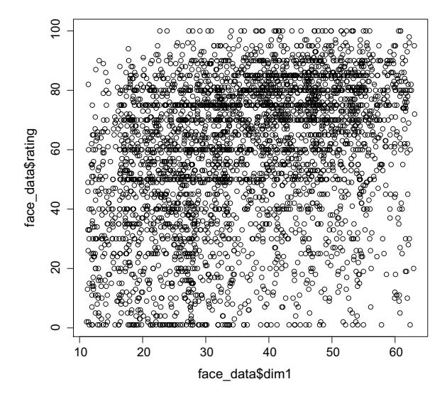

<span id="page-25-0"></span>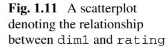

more frequently. However, the relationship is quite noisy: not everyone provides the exact same rating for the same value of dim1. [21](#page-25-1)

To see the relation between a categorical variable (nominal or ordinal) and a continuous variable we can make box plots separately for each level of the categorical variable. Figure [1.12](#page-26-0) shows the boxplots for rating as a function of gender. This is what R produces automatically using the plot function. The code to generate the plot is:

```
> plot(face_data$gender, face_data$rating)
```

This default behavior of the plot function in this case is nice. However, we feel the default is somewhat inconsistent: when passing the full data.frame to the plot function (see Fig. [1.4\)](#page-20-0) it would have been nice if the same boxplots were shown for relationships between categorical and continuous variables (e.g., rows 5, 6, and 7). However, this is regretfully not the case.

### *1.5.4 Multi-panel Plots*

We often plot multiple panels in one single figure. This can be done using the par(mfrow=c( y, x)) command in R. This basically sets up a *canvas* with *y* rows and *x* columns for plotting. The following code produces Fig. [1.13](#page-27-0) and thus combines six panels into one figure.

> **par**(mfrow=**c**(3, 2))

<span id="page-25-1"></span><sup>21</sup> This makes sense: (a) people often do not respond in the exact same way, and (b) the value for dim2 differs as well!.

<span id="page-26-0"></span>

```
> pie(counts)
```

- > **barplot**(counts)
- > **hist**(face**\_data\$**dim1)
- > **plot**(**density**(face**\_data\$**dim2))

### *1.5.5 Plotting Mathematical Functions*

Often we want to plot mathematical functions (such as *y* = *x* 2, or *z* = *sin(x)* + *cos(y)*). Plotting (2D) functions in R is simple and there are multiple ways. We first create the actual function in R and try it out to make sure you understand how this function actually works: we pass it the *argument x*, and it returns the *value x* 2. Here is a small example:

```
> square <- function(x) {x^2}
> square(3)
[1] 9
```

Next, we generate a sequence of numbers—using the built-in function seq. Try to type ?seq into R to see the different uses of the function. Here we make a sequence from −2 to 2:

```
> x <- seq(-2, 2, by=.1)
> x
[1] -2.0 -1.9 -1.8 -1.7 -1.6 -1.5 -1.4 -1.3 -1.2 -1.1 -1.0 -0.9
    -0.8 -0.7 -0.6
[16] -0.5 -0.4 -0.3 -0.2 -0.1 0.0 0.1 0.2 0.3 0.4 0.5 0.6 0.7
   0.8 0.9
[31] 1.0 1.1 1.2
> y <- square(x)
```


<span id="page-27-0"></span>**Fig. 1.13** Demonstrating a plot with multiple panels. Note that by now you should be able to name, and interpret, each of the panels

Make sure you understand the result that is generated when you run print(y). We can then easily make the *(x, y)* plot using the following code (Fig. [1.14\)](#page-28-0):

```
> par(mfrow=c(1, 2))
> plot(x, y)
> plot(x, y, type="l")
```

Note that Fig. [1.14](#page-28-0) displays both the standard plot (on the left), and the plot using the additional argument type="l"; the latter makes an actual line as opposed to plotting the separate points. If you want to have both a line and points you can provide the option "b".

Alternatively, we can also plot functions directly: the following code produces Fig. [1.15.](#page-28-1)

```
> curve(square, xlim=c(-2, 2))
```

This will work as long as the function you are plotting accepts an *x* argument. Note that you can pass additional arguments to curve to determine the range and domain of the function: in this case we specify the domain by adding xlim=c(-2,2).

<span id="page-28-0"></span>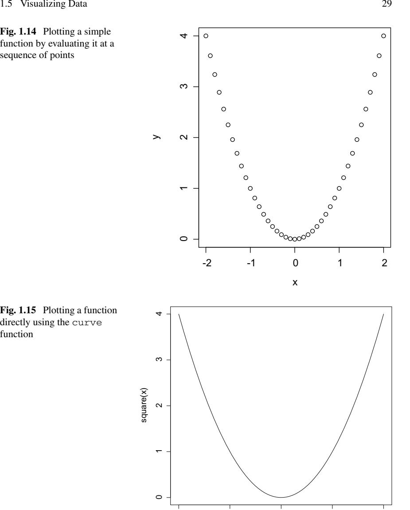

<span id="page-28-1"></span>-2 -1 0 1 2

x

## 1.5.6 Frequently Used Arguments

R's default plotting functions all have additional arguments to style the created plots. We have already seen the functionality of the  $type="1"$  argument for plot. Here are a few additional arguments that work for most of the simple plotting functions in R.

- type: We just saw this difference between either plotting points, or a solid line.
- $x \lim$ ,  $y \lim$ : These can be used to specify the upper and lower limits of the xand y-axes using c(lower, upper).
- lwd: This can be used to set the line width.
- $\bullet$  col: This can be used for colors.
- xlab, ylab: These can be used for labels on the axis by passing a string.
- main: This is the main heading of the plot

So, we can now do something like this to produce Fig.  $1.16$ :

```
> plot(face data$gender, face data$rating,
        <pre>col=c(1, 2), lwd=5, main="Comparing_ratings",</pre>
+xlab="Gender<sub>⊔</sub>(males<sub>⊔</sub>and<sub>⊔</sub>females)",
+\text{ylim}=\text{c}(1, 100)++)
```

Finally, note that we can use functions like lines, points, and abline to add lines and points to an existing plot. You will play with this in the assignments.

<span id="page-29-0"></span>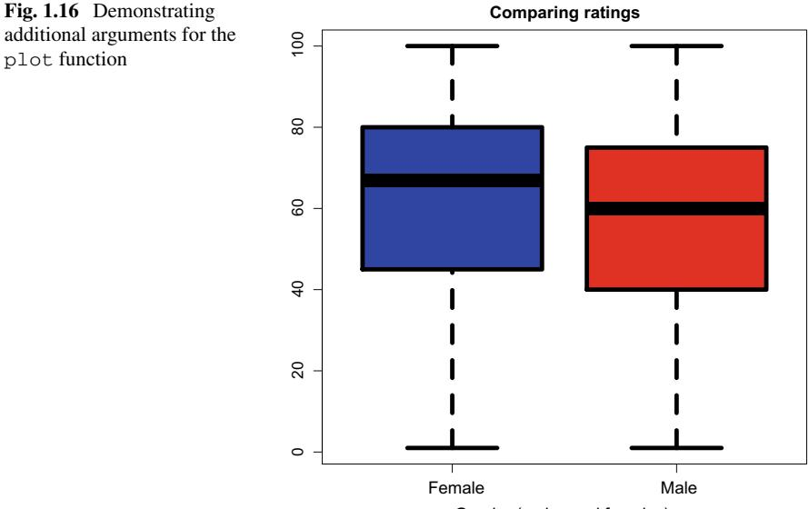

Gender (males and females)

### **1.6 Other R Plotting Systems (And Installing Packages)**

Up till now we have been using the "standard" plotting functions of R. However, R's functionality is greatly expanded by the fact that developers can easily contribute extension *packages* to R. A number of specific plotting packages have been added to the R language over the years. Here we briefly cover two of these, namely, ggplot and Lattice. Both provide more stylized plots than the standard functions. Here we briefly introduce each of these plotting systems—and in doing so show how you can include additional packages. However, both ggplot and Lattice require quite some time to really master; this is outside the scope of this book.

### *1.6.1 Lattice*

Lattice is older than ggplot, but it is very useful for making multi-panel plots and for splitting plots according to some variables. Figure [1.17](#page-30-0) is an example of a lattice plot that is generated using the following code:

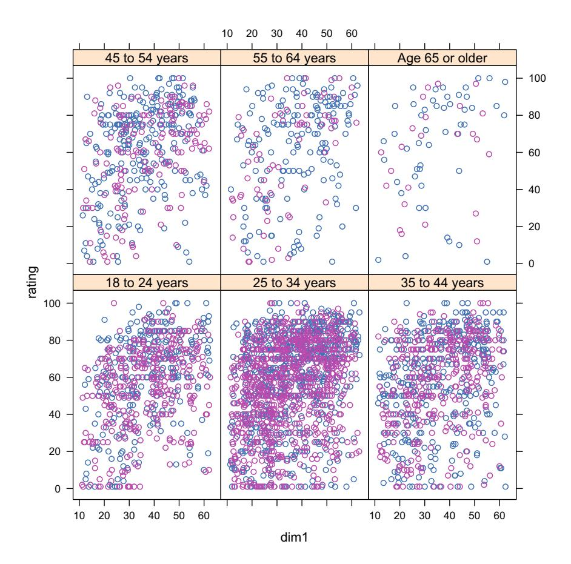

<span id="page-30-0"></span>**Fig. 1.17** Demonstrating a lattice plot and the ability to easily make multi-panel plots using formula's

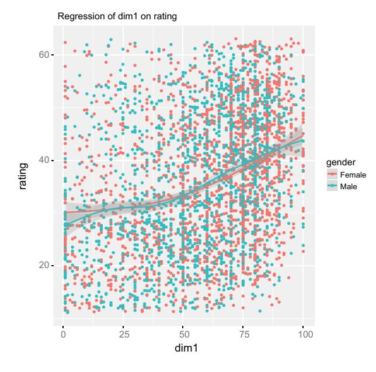

<span id="page-31-0"></span>**Fig. 1.18** Demonstrating ggplot2. Shown is a scatterplot with a *trend line* for each gender

```
> # install.packages("lattice")
> library(lattice)
> xyplot(rating ~ dim1 | age, groups=gender, data=face_data)
```

Here, the xyplot function generates the plot. The function takes as its first argument an R formula object: the syntax rating dim1 | age indicates that we want to plot rating as a function of dim1 for each level of age. Next, we specify that we want to plot this relationship grouped by gender; this creates two different colors for the two genders in each panel. Finally, we point to the data object that contains these variables using the data=face\_data argument.

In the above code-snippet, the line # install.packages("lattice") is a comment; the # ensures that the line is not executed. However, removing the # makes this code run, and tells R to automagically download the "lattice" package.

### *1.6.2 GGplot2*

GGplot2 makes very nice looking plots, and has great ways of doing explorative data analysis. Just to give a brief example, the following code produces Fig. [1.18:](#page-31-0)

```
> library(ggplot2)
> qplot(rating,
+ dim1,
+ data=face_data,
```

```
<pre>geom=c("point", "smooth"),</pre>
+\perpcolor=gender,
+main="Regression_of_rating_on_dim1",
         <pre>xlab="dim1", ylab="rating")</pre>
\perp
```

See http://ggplot2.org/book/qplot.pdf for more info on GGplot2. Obviously, this code will only work after you have installed (using install.packages() and loaded (using library()) the ggplot2 package.

### Problems

<span id="page-32-0"></span>1.1 This first assignment deals with the dataset demographics-synthetic. csv. Make sure to download the dataset from http://www.nth-iteration.com/statisticsfor-data-scientist and carry out the following assignments:

- 1. Compute the mean, mode, and median of the variables Age, Weight, and Voting. Provide a short interpretation for each of these numbers.
- 2. In the dataset, find any values that you believe are erroneous. Hence, look for outliers or coding errors. Note which values you found (by specifying their row and column index). Next, remove the rows that contain these "errors" (yes, you will have to search the web a bit on how to delete rows from a data frame; this was not explicitly covered in the chapter). How many rows are left in the resulting dataset?
- 3. Compute the mean, mode, and median of the variable Age again. How did these values change by removing the outliers?
- 4. Compare the (sample) variance of the variables Height and Weight. How do they differ? What does this mean?
- 5. Use the quantile function to compute the 18th percentile of Age. What does this score mean?
- 6. Create a scatterplot relating the Weight  $(x\text{-axis})$  and Age  $(y\text{-axis})$  of participants. Do you see a relation?
- 7. Redo the same plot, but now color the points and add meaningful labels to the axis. Also, provide a nice title for the plot.
- 8. Next, add a horizontal line to the plot at  $Age = 30$  and add a vertical line to the plot at Weight  $= 90$ .
- 9. Create a box plot comparing the distribution of Age for males and females.
- 10. Create a figure with two panels, one with the scatterplot you just created and one with the box plot you just created.
- 11. Create a histogram of the variable Weight. What do you think is a good number of breaks? Why?

1.2 This second assignment concerns the dataset voting-demo.csv.

1. Inspect the dataset: How many observations (rows) does it contain? And how many variables (columns)? What do the variables mean?

- 2. Write down the measurement level of each of the variables.
- 3. Compute all of the descriptive statistics described in this chapter for each of the variables. Try to interpret each of them. Do they all make sense? If not, why not?
- 4. Do you see any clear differences between this real—and hence not simulated dataset you are looking at right now and the previous simulated dataset that we looked at in Problem[1.1?](#page-32-0) Think of a method by which you could tell the difference between simulated and real data in this case.

**1.3** The next assignments should strengthen your R programming skills. To keep up with the book and to use R efficiently in the upcoming chapters, please make sure you can do the following:

- 1. Using the for, sum, and length functions (and whatever else you need), write your own function to create a frequency table (hence, the number of times each unique numerical value occurs in a vector that is passed to the function).
- 2. Create a function to compute the mean of a variable using only the sum and length functions[.22](#page-33-0)
- 3. Create a function to compute the mean of a variable using only the for function.
- 4. Discuss how the above two functions for computing a mean differ. Does this difference change if you compute the mean of a variable with more and more observations? Use the Sys.time function to see how long each of the two functions takes to compute the mean as a function of the number of observations.
- 5. Run the command x <- rnorm(100, mean=0, sd=1) to create a new variable called x. What is the size of x[?23](#page-33-1)
- 6. Compute descriptive statistics for x that you think are useful.
- 7. Visualize the data in x. What plot do you select and why?
- 8. Now try to examine in the same way, by computing descriptives and by plotting, the variable x2 <- c(rnorm(1000, mean=0, sd=1), rnorm(1000, mean=4, sd=2)).

**1.4** Suppose we asked a group of 8 persons how old they are and recorded the following ages: 30, 23, 29, 36, 68, 32, 32, 23.

- 1. Use these data to calculate the following descriptive statistics by hand: arithmetic mean, median, mode, range, mean absolute deviation, variance, and standard deviation. Give a short interpretation of each statistic you calculated.
- 2. The age of 68 is quite an outlier in this dataset since it is considerably greater than the remaining ages. Remove the age of 68 from the dataset and calculate the above descriptive statistics again based on the remaining seven ages. What do you notice? Are some descriptive statistics more sensitive to the outlier than others?
- 3. Compute standardized (*z*) scores for each person in the 8 person dataset. Next, compute the mean and variance of the *z*-scores.

<span id="page-33-0"></span><sup>22</sup> Obviously, you can use *operators* such as + and \*.

<span id="page-33-1"></span><sup>23</sup> We will discuss the command rnorm in more detail in Sect. [4.8.1.](#page--1-1)

1.5 Suppose you are given aggregated (or grouped) data describing the Age in years of a sample of *n* people. The dataset does not contain the raw *n* data points, but rather it contains K age values denoted by  $v_1, \ldots, v_K$ . For example, if  $v_1 = 12$ , this means that the age of the first group of people is 12. Next, the data also contains frequencies  $f_k$ , which indicate how often a specific age  $v_k$  is present in the original (i.e., unaggregated) dataset. Using this setup, answer the following questions:

- 1. What is the result of the sum  $\sum_{k=1}^{K} f_k$ ?
- 2. Give a formula for computing the variance of  $\text{Age}$  for the *n* people based on the aggregated data.
- 3. Can you give a formula for computing the median of Age based on the grouped data? If so, provide it. If not, then why is this not possible?
- 4. Implement, in R, a function for computing the mean of an aggregated dataset and a function for computing the variance of an aggregated dataset.

1.6 Extra In this last assignment we will take another look at the simulated dataset we considered in Problem 1.1. We used the following R code to produce this dataset:

```
> # Function for creating the data in demographics-synthetic.csv:
> create data <- function(n, seed=10) {
   <pre>set.seed(seed)</pre>
++# Create:
+gender <- rbinom(n, 1, .48)
++ height <- round(170 + gender*10 + rnorm(n, 0, 15), 1)
 weight <- height / 2 + runif(n, -10, 10)
  voting \leftarrow rbinom(n, 5, c(.3, .3, .2, .195, .005))
+<pre>age </pre>
++# Recode:
++<pre>voting </pre>
   <pre>gender </pre>
+++# Return data frame:
+data \leftarrow data么"Gender" = gender,+"Age" = age,
+"Weight" = weight,+"Height" = height,+"Voting" = voting)
+++\texttt{return}(\texttt{data})+ }
>
> # Create the data and store it:
> n <- 500
> data <- create data(n)
> write.csv(data, file="demographics-synthetic.csv")
```

Obviously, you should feel free to play around with this function. However, make sure you do the following:

- 1. Investigate the rbinom() function. What does it do?
- 2. Investigate the rnorm() function. What does it do?

- 3. What happens if you change the value of seed?
- 4. Explain what the ifelse() function does.

If you have time, you can always teach yourself more GGplot. For example, try to follow the tutorial at [http://tutorials.iq.harvard.edu/R/Rgraphics/Rgraphics.html.](http://tutorials.iq.harvard.edu/R/Rgraphics/Rgraphics.html) It will certainly pay off in the rest of your data science career if you are able to quickly make informative (and cool-looking) plots!

### **Additional Material I: Installing and Running RStudio**

RStudio is an integrated development environment (IDE) for R. It includes a console, a syntax-highlighting text editor that supports direct code execution, as well as tools for plotting, viewing your history, debugging and managing your workspace.

### *The Steps Involved When Installing RStudio*

In order to run R and RStudio on your system, you need to follow the following three steps in the same order:

- 1. Install R
- 2. Install RStudio
- 3. (optionally) Install additional R-Packages

### *Installing R*

Installing R is different for users of different operating systems:

- Windows users can download the latest version of R at [https://cran.cnr.berkeley.](https://cran.cnr.berkeley.edu/bin/windows/) [edu/bin/windows/](https://cran.cnr.berkeley.edu/bin/windows/) and subsequently open the .exe file to install R.
- Mac users can get their version of R at <https://cran.cnr.berkeley.edu/bin/macosx/> and open the downloaded .pkg file to install R.
- Linux users can follow the instructions on [https://cran.cnr.berkeley.edu/bin/linux/.](https://cran.cnr.berkeley.edu/bin/linux/) Users of Ubuntu with Apt-get installed can execute sudo apt-get install r-base in their terminal.

### *Install RStudio*

After installing R, you will need to install RStudio. The different versions of RStudio can be found at [https://www.rstudio.com/products/rstudio/download/#download.](https://www.rstudio.com/products/rstudio/download/#download) After installation you can open up RStudio; it should look like Fig. [1.19.](#page-36-8)

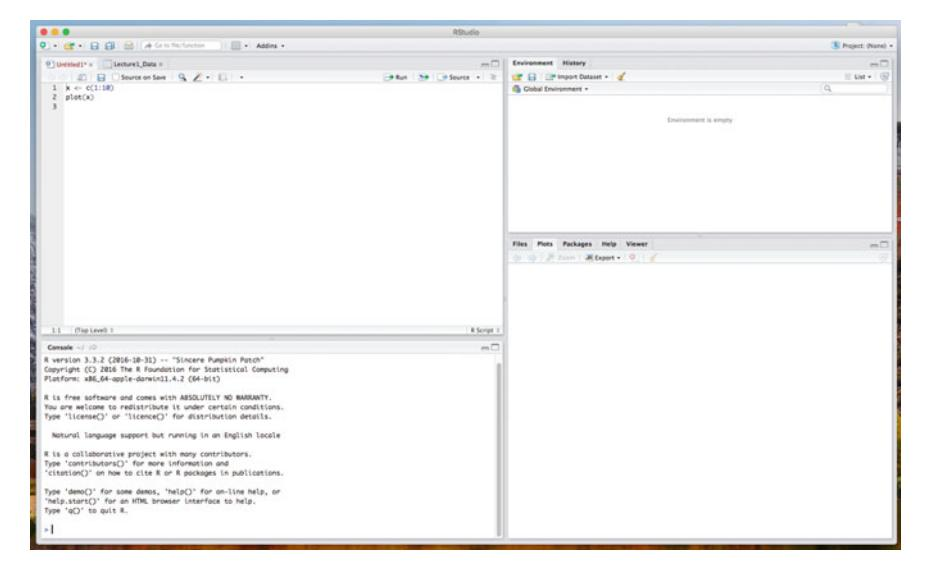

**Fig. 1.19** Demonstrating ggplot. Shown is a scatterplot with a *trend line* for each gender

### <span id="page-36-8"></span>*Installing Packages (Optional)*

To install packages using RStudio click on the Packages tab in the bottom-right section and then click on install. A dialog box will appear. In the Install Packages dialog, write the package name you want to install under the Packages field and then click install. This will install the package you searched for or give you a list of matching package based on your package text.

You should now be good to go!

### **References**

- <span id="page-36-5"></span>T. Baguley, M. Andrews, Handling missing data. *Modern Statistical Methods for HCI* (Springer, Berlin, 2016), pp. 57–82
- <span id="page-36-1"></span>M.J. Crawley, *The R Book* (Wiley, Hoboken, 2012)
- <span id="page-36-2"></span>L. Ippel, Getting started with [r]; a brief introduction. *Modern Statistical Methods for HCI* (Springer, Berlin, 2016), pp. 19–35
- <span id="page-36-0"></span>M.C. Kaptein, R. Van Emden, D. Iannuzzi, Tracking the decoy: maximizing the decoy effect through sequential experimentation. Palgrave Commun. **2**(1), 1–9 (2016)
- <span id="page-36-3"></span>G. Norman, Likert scales, levels of measurement and the "laws" of statistics. Adv. Health Sci. Educ. **15**(5), 625–632 (2010)
- <span id="page-36-6"></span>T. Rahlf, *Data Visualisation with R: 100 Examples* (Springer, Berlin, 2017)
- <span id="page-36-4"></span>D. Vidotto, J.K. Vermunt, M.C. Kaptein, Multiple imputation of missing categorical data using latent class models: state of the art. Psychol. Test Assess. Model. **57**(4), 542 (2015)
- <span id="page-36-7"></span>J. Young, J. Wessnitzer, Descriptive statistics, graphs, and visualisation. *Modern Statistical Methods for HCI* (Springer, Berlin, 2016), pp. 37–56