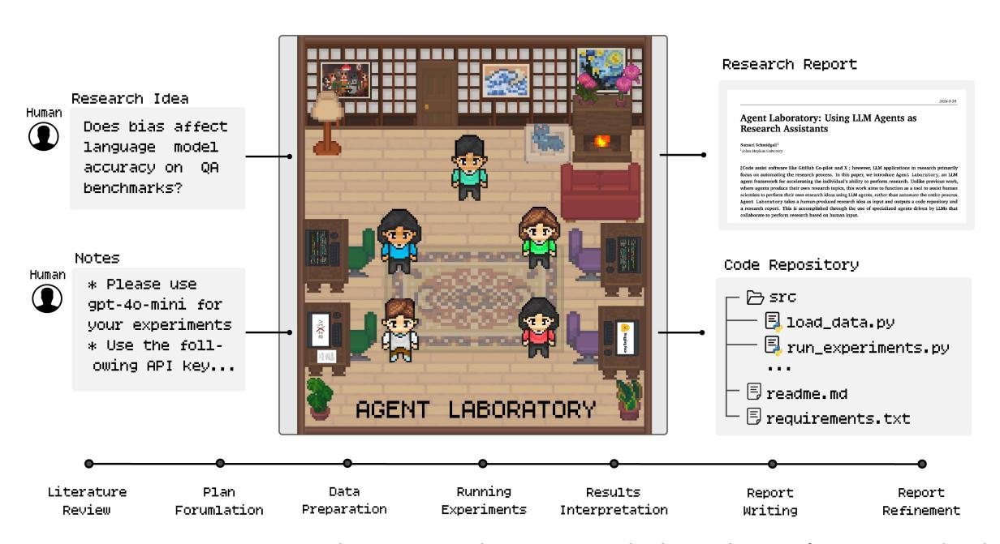

## **Agent Laboratory: Using LLM Agents as Research Assistants**

**Samuel Schmidgall**1, 2**, Yusheng Su**1 **, Ze Wang**1 **, Ximeng Sun**1 **, Jialian Wu**1 **, Xiaodong Yu**1 **, Jiang Liu**1 **, Zicheng Liu**1 **and Emad Barsoum**1 1AMD, 2 Johns Hopkins University

**Historically, scientific discovery has been a lengthy and costly process, demanding substantial time and resources from initial conception to final results. To accelerate scientific discovery, reduce research costs, and improve research quality, we introduce Agent Laboratory, an autonomous LLM-based framework capable of completing the entire research process. This framework accepts a human-provided research idea and progresses through three stages—literature review, experimentation, and report writing to produce comprehensive research outputs, including a code repository and a research report, while enabling users to provide feedback and guidance at each stage. We deploy Agent Laboratory with various state-of-the-art LLMs and invite multiple researchers to assess its quality by participating in a survey, providing human feedback to guide the research process, and then evaluate the final paper. We found that: (1) Agent Laboratory driven by o1-preview generates the best research outcomes; (2) The generated machine learning code is able to achieve state-of-the-art performance compared to existing methods; (3) Human involvement, providing feedback at each stage, significantly improves the overall quality of research; (4) Agent Laboratory significantly reduces research expenses, achieving an 84% decrease compared to previous autonomous research methods. We hope Agent Laboratory enables researchers to allocate more effort toward creative ideation rather than low-level coding and writing, ultimately accelerating scientific discovery.**

## § [https://AgentLaboratory.github.io](https://AgentLaboratory.github.io/)

Figure 1 | Agent Laboratory takes as input a human research idea and a set of notes, provides this to a pipeline of specialized LLM-driven agents, and produces a research report and code repository.