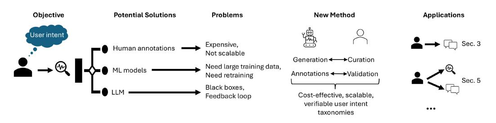
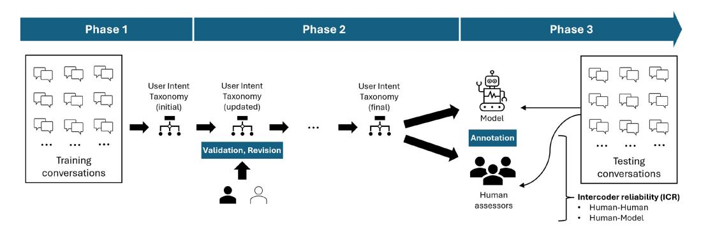
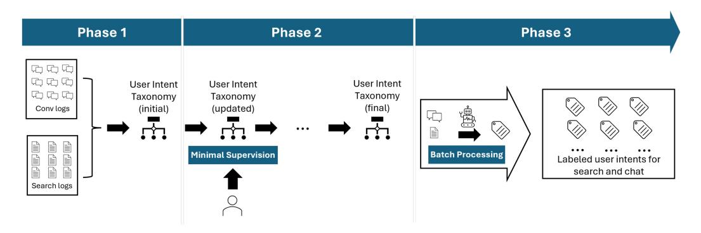
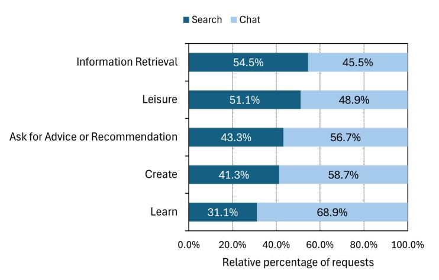

[CHIRAG SHAH,](HTTPS://ORCID.ORG/0000-0002-3797-4293) University of Washington, Seattle, United States [RYEN WHITE,](HTTPS://ORCID.ORG/0000-0002-0265-4249) Microsoft Research, Microsoft, Redmond, United States [REID ANDERSEN,](HTTPS://ORCID.ORG/0009-0001-4878-6781) Microsoft Corp, Redmond, United States [GEORG BUSCHER,](HTTPS://ORCID.ORG/0009-0006-4044-3756) Microsoft Corp, Redmond, United States [SCOTT COUNTS,](HTTPS://ORCID.ORG/0000-0003-1507-5200) Microsoft Research, Redmond, United States [SARKAR DAS,](HTTPS://ORCID.ORG/0000-0003-1052-4142) Penn State University, University Park, United States [ALI MONTAZER,](HTTPS://ORCID.ORG/0000-0002-5467-1331) University of Massachusetts, Amherst, United States [SATHISH MANIVANNAN,](HTTPS://ORCID.ORG/0009-0001-1166-0472) Microsoft Corp, Redmond, United States [JENNIFER NEVILLE,](HTTPS://ORCID.ORG/0009-0007-1157-018X) Microsoft Research, Redmond, United States [NAGU RANGAN,](HTTPS://ORCID.ORG/0009-0005-3231-2863) Microsoft Corp, Redmond, United States [TARA SAFAVI,](HTTPS://ORCID.ORG/0000-0002-3553-4331) Microsoft Research, Redmond, United States [SIDDHARTH SURI,](HTTPS://ORCID.ORG/0000-0002-1318-8140) Microsoft Research, New York, United States [MENGTING WAN,](HTTPS://ORCID.ORG/0000-0002-5298-1221) Microsoft Corp, Redmond, United States [LEIJIE WANG,](HTTPS://ORCID.ORG/0000-0001-5111-8795) University of Washington, Seattle, United States [LONGQI YANG,](HTTPS://ORCID.ORG/0000-0002-6615-8615) Microsoft Corp, Redmond, United States

Understanding user intents in information access scenarios can help us provide more relevant and personalized search results and recommendations. However, analyzing user intents is not easy, especially for emerging forms of Web search such as Artificial Intelligence (AI)-driven chat. To understand user intents from retrospective log data, we need a way to label them with meaningful categories that capture their diversity and dynamics. Existing methods rely on manual or Machine-Learned (ML) labeling, which is either expensive or inflexible for large and dynamic datasets. Large Language Models (LLMs) could generate rich and relevant

Chirag Shah, Sarkar Das, Ali Montazer, and Leijie Wang research done while at Microsoft.

Authors' Contact Information: Chirag Shah, University of Washington, Seattle, Washington, United States; e-mail: chirags@ uw.edu; Ryen White, Microsoft Research, Microsoft, Redmond, Washington, United States; e-mail: ryenwhite@gmail. com; Reid Andersen, Microsoft Corp, Redmond, Washington, United States; e-mail: reidandersen@microsoft.com; Georg Buscher, Microsoft Corp, Redmond, Washington, United States; e-mail: georgbuscher@microsoft.com; Scott Counts, Microsoft Research, Redmond, Washington, United States; e-mail: counts@microsoft.com; Sarkar Das, Penn State University, University Park, Pennsylvania, United States; e-mail: sfd5525@psu.edu; Ali Montazer, University of Massachusetts, Amherst, Massachusetts, United States; e-mail: montazer@cs.umass.edu; Sathish Manivannan, Microsoft Corp, Redmond, Washington, United States; e-mail: sathishv@microsoft.com; Jennifer Neville, Microsoft Research, Redmond, Washington, United States; e-mail: jenneville@microsoft.com; Nagu Rangan, Microsoft Corp, Redmond, Washington, United States; email: nrangan@microsoft.com; Tara Safavi, Microsoft Research, Redmond, Washington, United States; e-mail: tarasafavi@ microsoft.com; Siddharth Suri, Microsoft Research, New York, New York, United States; e-mail: suri@microsoft.com; Mengting Wan, Microsoft Corp, Redmond, Washington, United States; e-mail: mengting.wan@microsoft.com; Leijie Wang, University of Washington, Seattle, Washington, United States; e-mail: leijiew@uw.edu; Longqi Yang, Microsoft Corp, Redmond, Washington, United States; e-mail: Longqi.Yang@microsoft.com.


[This work is licensed under a Creative Commons Attribution-NonCommercial-ShareAlike 4.0 International](https://creativecommons.org/licenses/by-nc-sa/4.0) License.

© 2025 Copyright held by the owner/author(s). ACM 1559-1131/2025/08-ART34 <https://doi.org/10.1145/3732294>

concepts, descriptions, and examples for user intents using log data of user interactions. However, using LLMs to generate a user intent taxonomy and applying it for a given Information Retrieval (IR) application can be problematic for two main reasons: (1) such a taxonomy is not externally validated; and (2) there may be an undesirable feedback loop if an LLM does both these tasks without external validation. To address this, we propose a new methodology with human experts and assessors to verify the quality of the LLM-generated taxonomy. We also present an end-to-end pipeline that uses an LLM with Human-in-the-Loop (HITL) to produce, refine, and apply labels for user intent analysis in log data. We demonstrate its effectiveness by uncovering new insights into user intents from search and chat logs from the Microsoft Bing Web search engine. The novelty in this research stems from the method for generating purpose-driven user intent taxonomies with strong validation. Our approach not only helps remove methodological and practical bottlenecks from intent-focused research, but also provides a new framework for generating, validating, and applying other kinds of taxonomies in a scalable and adaptable way, with reasonable human effort.

## CCS Concepts: • **Information systems** → **Users and interactive retrieval**; **Web log analysis;**

Additional Key Words and Phrases: User intents, large language models, taxonomies, log data

#### **ACM Reference Format:**

Chirag Shah, Ryen White, Reid Andersen, Georg Buscher, Scott Counts, Sarkar Das, Ali Montazer, Sathish Manivannan, Jennifer Neville, Nagu Rangan, Tara Safavi, Siddharth Suri, Mengting Wan, Leijie Wang, and Longqi Yang. 2025. Using Large Language Models to Generate, Validate, and Apply User Intent Taxonomies. *ACM Trans. Web* 19, 3, Article 34 (August 2025), 29 pages. <https://doi.org/10.1145/3732294>

#### **1 Introduction**

Understanding the purpose or the task behind a user's request in an information access context is highly desired for a search or a recommender system to be able to provide the most relevant and meaningful results [\[78\]](#page-23-0). This can be done in real-time or based on logged user interactions (our focus here). However, extracting user intents from log data is extremely difficult for two main reasons: (1) fluidity in what user intents are or can be; and (2) how these intents can be identified using retrospective log data that may not include sufficient context. Additionally, in the case of emerging modalities such as AI-driven chat, users' understanding, usage, and behaviors are rapidly evolving and call for on-demand, task-focused labels and taxonomies. We need new methods to identify, extract, and apply user intents in IR systems, especially those with emerging modalities. Understanding or eliciting user intent has been found to be very useful in improving the quality of search results and recommendations. For example, Jansen et al. [\[36\]](#page-21-0) categorized search queries based on user intents and demonstrated how this knowledge could improve search engine effectiveness. Su et al. [\[62\]](#page-22-0), similarly, demonstrated the use of user intents for improving satisfaction with search. One of the first challenges such works face is to develop reasonable taxonomies of user intents and then apply those at scale for intent analysis.

Traditional qualitative methods such as coding and thematic analysis are time-consuming and require human expertise [\[11\]](#page-20-0). Conversely, existing quantitative methods may not capture the nuances and diversity of user intents and experiences [\[46\]](#page-22-0). LLMs have become quite capable of generating coherent texts from various inputs [\[13\]](#page-20-0). A pressing question is can they be useful in reliable and verifiable ways to conduct such intent-focused research? Specifically, can LLMs help us create and apply a set of labels or categories representing user intents at large-scale to be meaningful for various IR applications? In this article, we refer to such a set of labels or categories as a *taxonomy*, and acknowledge that a taxonomy does not need to be a single-level or flat hierarchy. Developing and testing a comprehensive and task-specific taxonomy for user intents can be a first step in various applications, including personalized recommendations, user education, and question/query routing.



Fig. 1. Detecting user intent in search situations is very important (Objective), but the potential solutions (human annotations, ML models, LLMs) have different sets of problems. We propose a new method involving a unique collaboration between LLMs and humans to leverage best of both worlds. Specifically, humans can offer curation and validation, whereas LLMs can offer generation and annotation abilities. Through collaboration between humans and machines, we can have a cost-effective, scalable, and verifiable approach, as demonstrated through two different applications in this article.

There have been several attempts in recent years to use LLMs in various applications ranging from ranking and recommendations to content generation and evaluation [\[9,](#page-20-0) [26,](#page-21-0) [51\]](#page-22-0). However, such research can lack rigor and reliability since LLMs are used as black boxes without a meaningful understanding of their inner workings or there are feedback loops with weak or non-existent validation for the method. Simply focusing on the promising results without sufficient support of scientific rigor in the methodology can generate misleading and even dangerous outcomes. We believe that while LLMs have shown great promise for aiding us in various informational tasks, they must be used responsibly and with sufficient validation. This leads us to the following **research questions** (**RQs**) that guide the investigation described in this article: (1) Can we use LLMs to reliably generate taxonomies for analyzing user intents in retrospective log data? (2) Can an LLM correctly apply a user intent taxonomy to annotate logs? (3) Are there advantages from using LLMs for these purposes that extend beyond just reducing effort and increasing efficiency?

To address these RQs, we investigated if/how LLMs can help in creating an end-to-end solution for developing reliable and comprehensive user intent taxonomies from AI chat logs. AIpowered chat is an emerging modality in information access settings and intent understanding could yield significant new insight. We use GPT-4,1 for most of our experiments since it was the leading LLM at the time we performed this analysis and we wanted to test the potential of the most advanced models. In the process, we employed a new methodology (illustrated at a high level in Figure 1) for employing any LLM as a collaborator in an iterative qualitative analysis process that leverages its ability to generate summaries, questions, and categories from chat transcripts.

We already know that LLMs can generate taxonomies [\[29\]](#page-21-0), and assign accurate annotations [\[33\]](#page-21-0). Combining **Human-in-the-Loop** (**HITL**) methodologies with computational models is also not new [\[72\]](#page-23-0). What generates the **novelty** in this article is our approach that harnesses the potential of an LLM to infer a structure from data and the curation by human assessors in an integrative way. This may significantly reduce human effort and save time, but more importantly, provide validity of machine-generated outputs. We demonstrate the value of this by quickly and reliably running the end-to-end pipeline with heterogeneous data from search and chat logs and generating insights. Therein lies the **significance** of this work: it can remove bottlenecks for research that aims to identify and apply user intents. Beyond that, this methodology can also be useful for generating and applying other kinds of taxonomies in IR and elsewhere. It will directly benefit

[<sup>1</sup>https://openai.com/gpt-4/](https://openai.com/gpt-4/)

researchers and practitioners who develop and evaluate information access systems by providing a streamlined way to understand their users' intentions and adapt the systems being developed to them. The **technical soundness** of our work comes from rigorous validation of the proposed method and a set of experiments involving multiple datasets, human assessors, and three different LLMs. This article is intentionally written from more of a **pragmatic perspective** rather than an empirical perspective. We wanted to share the lessons we have learned from building these taxonomies over open Web interaction data and hope that the insights and procedures that we describe are useful for others pursuing related goals. Supporting material (prompts, LLM outputs) is also available in the appendices, improving replicability and enabling a wider application of our methods.

#### **2 Related Work**

We are not the first to study user intents, build taxonomies, or use such taxonomies to generate insights from logged user behavior data. Therefore, before we dive into our novel contributions, viz., using LLMs for generating and using user intent taxonomies with scientific rigor, it is important to briefly review some of the related work. We will begin by first reviewing how IR researchers have studied intents in search applications. Broadly speaking, scholars, and practitioners have attempted to apply various classification schemes to user requests, whether explicitly identified as needs, tasks, or intents or not, in the hope to use that knowledge for improving system responses. However, this endeavor often comes with a high cost (in terms of human effort, in terms of time, and/or financially) for constructing an appropriate classification scheme or taxonomy and then applying it at scale in real-time (e.g., for query classification) or retrospectively (e.g., for insight generation).

#### **2.1 Understanding User Intents in Search**

Intent has been a well explored area in IR and various approaches have been proposed for intent understanding and intent representation [\[40,](#page-21-0) [77\]](#page-23-0). Taxonomies of search intent can help systems better understand what their users are searching for and why. Several search intent taxonomies generated from search logs have been proposed, e.g., [\[12,](#page-20-0) [36,](#page-21-0) [39,](#page-21-0) [56\]](#page-22-0). These have been generated iteratively via manual inspection of log data and the intent taxonomies include categories for navigation, information, transactions, browsing, and resource finding. We expect chat interactions to exhibit new intents (e.g., creation) compared with traditional search. Automatic generation of query taxonomies has also been attempted [\[18,](#page-20-0) [20\]](#page-20-0) using unsupervised learning techniques such as query clustering to derive a taxonomy from existing query data and categorization to assign new queries to the taxonomy, as well as weak supervised techniques such as Snorkel [\[4\]](#page-20-0). Taxonomies have also been used to represent intent in question answering [\[10,](#page-20-0) [17\]](#page-20-0). Xie [\[73\]](#page-23-0) derived an empirically based classification of search intents that motivate different search behaviors. Mitsui et al. [\[49\]](#page-22-0) developed a set of information-seeking intentions based on that classification and studied differences in intentions as a function of the search task.

Note that some of these works such as Xie [\[73\]](#page-23-0) and Mitsui et al. [\[49\]](#page-22-0) focus on individual interactions, whereas others have been concerned with the overall goal of the search. The latter is often studied under the banner of *task-based IR* (see Ref. [\[58\]](#page-22-0)). At some level, this subtle but important distinction is about the granularity. For the purpose of the work described here, we will consider a single interaction, viz., a user asking a question or posing a query and the system responding, as the unit of analysis. A task or a session could have several such interactions, each of which may have a different associated intent. Our objective is to construct and validate a taxonomy or categorization to annotate these intents.

## **2.2 Taxonomy Generation, Validation, and Use**

Taxonomies are hierarchical classifications of concepts, terms, or entities. They can facilitate information seeking, retrieval, or behavior by providing structure, organization, and navigation for users and systems [\[15,](#page-20-0) [16,](#page-20-0) [74\]](#page-23-0). However, generating and validating taxonomies is a challenging task that requires balancing multiple criteria such as coverage, coherence, consistency, granularity, usability, and adaptability, e.g., Refs. [\[38,](#page-21-0) [45,](#page-22-0) [53,](#page-22-0) [61\]](#page-22-0). Moreover, different domains and contexts may have different requirements and preferences for taxonomy design and evaluation [\[41\]](#page-21-0). Taxonomies can be generated manually through an iterative process and the research community has developed tools to generate taxonomies automatically from document collections using methods such as clustering [\[76\]](#page-23-0). We are the first to leverage the power of LLMs to automatically generate taxonomies in a search context, focused specifically on conversational search; we also validate that LLM-based methodology with human assessors. More importantly, we provide a method for other researchers to do the same for their specific needs and share our insights on best practices.

### **2.3 Use of LLMs in Research**

The emergence of LLMs has unlocked many opportunities for rapid research advances. LLMs have been used to enable scientific discovery [\[35\]](#page-21-0), with remarkable progress in areas such as medicine [\[59\]](#page-22-0) and finance [\[7\]](#page-20-0). Early language models, such as BERT, and various natural language processing methods have been used to auto-code qualitative data [\[1,](#page-20-0) [31\]](#page-21-0), although not at a near-human level. LLM-driven AI is capable of qualitative analysis and can generate nuanced results comparable to human researchers [\[14\]](#page-20-0), the costs and benefits of which have been discussed in the literature [\[8,](#page-20-0) [24,](#page-21-0) [70\]](#page-23-0). In IR, LLMs have been shown to be effective in supporting humans in judging document relevance, an activity that is central to search engine design and evaluation [\[26\]](#page-21-0). They have also been recently used for synthetic dataset generation to support IR research [\[37\]](#page-21-0) and richer user modeling to support IR experimentation [\[42\]](#page-21-0). Other applications of LLMs in IR have also been discussed at length by others in the IR community [\[3\]](#page-20-0). In this article, we will show that working directly with humans, LLMs have the potential to support two other critical activities in search engine research and development: *intent understanding* and *intent taxonomy generation*.

#### **2.4 Log Analysis and Insights**

Search log analysis has been used extensively to gain insights about search interactions, including queries, **search engine result page** (**SERP**) clicks, and post-SERP interactions [\[22,](#page-20-0) [64,](#page-22-0) [71\]](#page-23-0). Analyzing log data has historically been a highly interactive process: researchers first write scripts to extract data, then analyze that data manually using data science tools and methods, and (optionally) human annotators label data to better understand patterns and trends and generate training data for ML models, e.g., Ref. [\[2\]](#page-20-0). In addition to learning user intents from individual queries, there have also been attempts to extend such analysis to span the whole search session with multiple queries, e.g., Ref. [\[25\]](#page-21-0).

More recently, there has been an increasing focus on user engagement with conversational search systems [\[30,](#page-21-0) [75\]](#page-23-0). Researchers and practitioners have sought to understand user intents and behaviors in the context of conversational systems [\[54,](#page-22-0) [69\]](#page-23-0). Conversational dialog, or colloquially, *chat*, is becoming an increasingly popular modality for information seeking, especially in domains where users have complex or exploratory queries, need guidance or clarification, or prefer a more natural/conversational style of interaction. Datasets of chat logs have also been created and released to the community to promote research in this emerging area, e.g., Ref. [\[55\]](#page-22-0).

ML models can help support researchers in performing data analysis [\[34\]](#page-21-0). Recently, from applications in other domains, we have seen that LLMs may have the potential to play a supportive

<span id="page-5-0"></span>role in the analysis of text data, providing insights and annotations that expedite experiments and reduce human effort [\[66\]](#page-22-0). In this article, for the first time, we introduce methods for using LLMs collaborating with researchers to derive insights and taxonomies from retrospective log data.

#### **3 Methodology for Generating and Validating a User Intent Taxonomy**

We now describe the new methodology that we developed and tested for employing LLMs to generate a user intent taxonomy that can be used to generate insights and construct hypotheses from user interaction data, focused for this analysis on AI chat logs.

Let us begin with a problem scenario. We have access to log data from user interactions with an AI-driven chat system (called Bing Chat2 at the time the log data were collected and analyzed, now called the Microsoft Copilot3). This data primarily includes user requests and AI responses, both in natural language. We can analyze this data in several ways, answering questions about what users appear to be doing (topics, domains). However, if we want to understand their intents, we need a set of labels or a taxonomy of intents. In practice, anyone seeking to do this would most likely examine relevant literature for an existing taxonomy and select one that best meets their needs. However, if an appropriate taxonomy does not exist, they need to create it. This can be done by taking an existing taxonomy and modifying it to fit the data or the task (top-down approach), or by building it fresh using the available data (bottom-up approach). Following this, they need to validate the taxonomy to ensure it meets several criteria for a high quality taxonomy. Finally, the newly generated taxonomy could be applied to a specific task to generate insights from the data.

Given that we were interested in analyzing AI chat logs, a seemingly newer type of modality, we found it to be desirable to adopt a bottom-up approach. In this approach, a researcher or practitioner typically analyzes available data to generate codes or labels, leading to a classification scheme or a taxonomy. As detailed in previous work, e.g., Refs. [\[12,](#page-20-0) [36,](#page-21-0) [39,](#page-21-0) [56\]](#page-22-0), this process could involve one or more researchers and a considerable effort. We wanted to use an LLM to build such a taxonomy using relevant data and instructions. However, given that we do not have enough knowledge about how an LLM is constructed and how it creates or links various concepts from given data, we needed a way to validate an LLM's generation and adjust it as needed. For that, we enlisted the help of two researchers with many years of experience in performing qualitative analysis and building taxonomies. These researchers guided the taxonomy generation process with the LLM and two human assessors, who provided intent labels on data samples to validate and evaluate the LLM-generated output. Once the taxonomy was developed using training data and validated, it was used to annotate test data. In short, our methodology uses LLMs as the backbone of taxonomy generation and application, with HITL for curation and validation.

An outline of our methodology is presented in Figure [2,](#page-6-0) with a broader theoretical framing described in Ref. [\[57\]](#page-22-0). Here, we used GPT-4 as the LLM for generating the taxonomy (Phase 1), engaged human assessors to validate that taxonomy (Phase 2), and then employed both GPT-4 and human assessors to apply it (Phase 3). Through the phases of validation and application, we evaluated not only the generated taxonomy (addressing RQ1), but also GPT-4's ability and potential to perform such research-based tasks reasonably and reliably (addressing RQ2). We now present the details, starting with the data that we used to generate the taxonomy.

#### **3.1 Data**

We took a random sample of 1,149 logged conversations with the Bing Chat AI-powered conversational search system during May and June 2023. This is a relatively small sample, but we believe a

[<sup>2</sup>https://www.bing.com/chat/](https://www.bing.com/chat/)

[<sup>3</sup>https://copilot.microsoft.com/](https://copilot.microsoft.com/)

<span id="page-6-0"></span>

Fig. 2. Three phases of our methodology: user intent taxonomy generation (Phase 1), taxonomy validation (Phase 2), and taxonomy testing/application (Phase 3).

reasonable size for constructing and evaluating an intent taxonomy with a small number (4–6) of categories, ensuring that on average each category will have at least 100 samples. Each conversation contained one or more turns of user request and AI response. We ensured that these conversations were in English, however, some of the user requests were interspersed with non-English words. We do not believe that this impacted any text processing by GPT-4 for our purposes. We used a random sample of 1,000 conversations from the full data available for training (building a user intent taxonomy, depicted as Phase 1 in Figure 2) and set aside the rest for validation and testing.

## **3.2 Evaluating the Taxonomy**

We first start by describing how a taxonomy should be evaluated. This will inform how we generate the taxonomy using GPT-4 (how we provide prompts), how we validate and revise it, as well as how we measure the effectiveness of the taxonomy for developing insights from logs. Using the relevant literature (some of which is summarized in the previous section) concerning taxonomy generation and validation, we consolidated the following criteria, taken from Raad and Cruz [\[53\]](#page-22-0), with appropriate modifications:

- *Comprehensiveness*: All the data should be reliably classified using this taxonomy.
- *Consistency*: The taxonomy does not include or allow for any contradictions.
- *Clarity*: The taxonomy should communicate the intended meaning of the defined terms. Definitions should be objective and independent of the context.
- *Accuracy*: The definitions, descriptions of classes, properties, and individuals in a taxonomy should be correct.
- *Conciseness*: The taxonomy should not include any irrelevant elements with regards to the user intents in AI chat.

## **3.3 Phase 1: Taxonomy Generation**

Here, we are interested in developing a taxonomy of user intents in order to identify such intents in a user inquiry and provide better answers or recommendations. As a first attempt for doing this, we also want this taxonomy to be simple, which means restricting ourselves to a single level and only a handful of category labels. Considering how the taxonomy should be evaluated, we constructed a detailed prompt for GPT-4 for generating the first version of taxonomy. We made a few design choices in doing so, including the depth of the taxonomy (single level) and the number of categories (4–6). These suited the intended application, i.e., high-level intent understanding. We asked the LLM to generate labels, descriptions, and examples for these categories. This understanding could be used in retrospective analysis to, say, help inform meta-prompt construction, adjust the design of the user experience, and shape architecture decisions, e.g., help estimate how often **Small Language Models** (**SLMs**) or hybrid SLM-LLM architectures could be used per task characteristics, instead of always invoking the LLM. The full prompt is included in Appendix [A.](#page-23-0)

We then repeated the process two more times, resulting in additional versions of the taxonomy. Note that each of these versions was built separately and without the knowledge of any previously built taxonomy. There were variations in how different versions described the same category. For instance, "Learning" had slightly different meaning and definition in each version of the taxonomy, but generally included concepts and examples of understanding and explanation. We believe these slight variations were the result of stochastic nature of LLMs in generating concept labels. Two researchers (two of the co-authors) discussed these three versions and decided to create a consolidated version of the taxonomy, which is shown in Table [1.](#page-8-0) Reassuringly, since ours is a new method, the taxonomy shares some similarity to existing taxonomies, such as that from Marchionini [\[48\]](#page-22-0), with some overlap (IR relates to "Lookup" per Marchionini, LR relates to "Learn," and PS relates to "Investigate"), and new categories that reflect the expanded capabilities of the next generation of conversational systems ("Content creation," "Leisure").

#### **3.4 Phase 2: Taxonomy Validation**

Next, we provided the taxonomy in Table [1](#page-8-0) to two human annotators along with 10 segments of conversation. They coded them independently, after which we compared their labels. They only had an exact agreement three of 10 times. We repeated the whole process with a new sample of 10 segments. It improved, but still had a high level of disagreement (60%). Therefore, we initiated another round of discussions and deliberations. A senior researcher guided these discussions among the annotators. The process involved reviewing each example of disagreement with each annotator explaining their reason behind the label and finally agreeing to which label should be assigned. As such convergence was reached, they documented how to ensure such instances in the future would receive the same label. This resulted in modified instructions and prompts.

Rather than trying to reach a higher level of agreement, the goal here was to revise the current version of the taxonomy and develop a better understanding of how a reliable taxonomy could be generated that meets the criteria reported earlier in Section [3.2](#page-6-0) and leads to a common and robust comprehension among the annotators. We learned that the annotators were often extrapolating why a user might have tried to do something. That led to the most divergence among them. For instance, even when all we could interpret from the data that the user asked for factual information (e.g., "Does the state of Washington have income tax?"), one of the annotators often extended that to "Learning" intent. It is possible that the user was collecting such information as a part of a learning task, but without additional context, it is impossible to determine that with full certainty. In such cases, it is advisable to not overextend our understanding and mark the intent based on evidence. Thus, we found it was useful to include in the taxonomy not only positive examples, but also negative examples per category to improve overall clarity. The taxonomy was further modified using negative examples for each category, and the prompt for generating a taxonomy was edited to explicitly ask for negative examples (negative examples are not listed here due to space constraints).

Once we had GPT-4 provide such examples and clarify definitions of "Information Retrieval" and "Learning" categories, we achieved a good match with only 20% disagreements between the two annotators. In addition, the human assessors did not find a need for any intention not covered here. Thus, the validation stage of taxonomy generation was completed and we had the final version of the user intent taxonomy (see Appendix [B\)](#page-25-0).

<span id="page-8-0"></span>

| User Intent             | Description                      | Examples                                     |
|-------------------------|----------------------------------|----------------------------------------------|
| IR: Information         | The user wants to search,        | — Find out the airing dates and chan         |
| retrieval (i.e.,        | query, or find some              | nels of women's world cup                    |
| looking for factual     | information, data, or resources  | — Search<br>for<br>information<br>about<br>a |
| information that        | about a topic.                   | phone number                                 |
| already exists)         |                                  | — Search for corruption and unem             |
|                         |                                  | ployment statistics for a country            |
| PS: Problem solving     | The user wants to perform a      | — Compare the size of a human to a           |
| (i.e., extracting facts | mathematical or logical          | hydrogen atom and the                        |
| or answers by           | operation, such as a             | observable universe                          |
| computing               | conversion, a percentage, a      | — Compare interest rates for savings         |
| something)              | formula,or a function.           | accounts                                     |
|                         |                                  | — Calculate the distance between a           |
|                         |                                  | point and a line                             |
|                         |                                  | — Convert a message from Chinese             |
|                         |                                  | to English                                   |
| LR: Learning (i.e.,     | The user wants to learn, study,  | — Learn about different structural           |
| satisfying curiosity,   | or acquire new skills, concepts, | systems                                      |
| helping learn a         | or understanding about a         | — Compare GPT-3 and GPT-4                    |
| concept or a            | subject. This often involves     | versions                                     |
| phenomenon)             | operations of calculations,      | — Explain the difference between             |
|                         | comparison, and conversion.      | Newtonian and non-Newtonian                  |
|                         |                                  | flow                                         |
| CR: Content creation    | The user wants to write or edit  | — Write an introduction about                |
|                         | a text for a specific purpose or | geothermal energy                            |
|                         | audience.                        | — Modify a poem into different               |
|                         |                                  | formats                                      |
|                         |                                  | — Improve a report and find adverbs          |
|                         |                                  | and connectors                               |
| LS: Leisure             | The user wants to chat or        | — Ask about the AI's sexual                  |
|                         | interact with the AI or another  | orientation and name                         |
|                         | agent about various topics or    | — Listen to a romantic story                 |
|                         | play a game with the AI or       | — Play tennis and flirt with the user        |
|                         | another agent.                   |                                              |

Table 1. A Consolidated Version of the User Intent Taxonomy Generated by GPT-4.

The examples are collected from the three versions that GPT-4 generated. Slight modifications were made in the user intent title and description using those versions. Short phrases in parentheses next to the intent name are added by the authors for clarity as we felt was needed.

## **3.5 Phase 3: Taxonomy Application and Testing**

We then took a different set of 124 conversations, again from Bing Chat, and asked GPT-4 to code them using the modified taxonomy generated from the above process. We also gave the same instructions to two human annotators. These instructions to humans and the prompt to GPT-4 can be found in Appendix [C.](#page-25-0)

For the human annotators, not a single datapoint was labeled "Other." GPT-4, on the other hand, marked one out of 124 conversations as "Other." This further demonstrates the comprehensiveness of the taxonomy and its suitability in gaining *high-level* understanding of intent.4 We computed

<sup>4</sup>There are likely to be more instances of "Other" for more granular intent annotations, where there may be more nuance, more category variation, and less category coverage.

**inter-coder reliability** (**ICR**) between two human annotators and found Cohen's kappa to be 0.7620, which indicates a substantial level of agreement [\[21\]](#page-20-0). Next, we asked a third annotator to code these 124 conversations. When the three annotators disagreed, we took the majority vote. If all three picked a different label, we labeled that case as "Other." Finally, we computed ICR between GPT-4 labels and those generated by the majority of human annotators. We computed Cohen's kappa to be 0.7212. This also indicates a substantial level of agreement.

Overall, we learned that when a taxonomy is generated by GPT-4 and verified by humans, it leads to a very high amount of agreement for annotation. That speaks to the **validity** of the generated taxonomy. Also, since GPT-4's own coding achieves a high level of ICR with human annotators, this provides additional supporting evidence that GPT-4 can be used with high **reliability** for the annotation task.

#### **3.6 Documenting Efforts and Advantages of the LLM with HITL Method**

One of our motivations for proposing the method presented in this article was reducing the amount of human effort that it takes to manually produce a data-driven taxonomy. So the question we need to answer is: did we really reduce typical workload of manually producing a taxonomy since this LLM with HITL approach seems to have a lot of human effort involved? To answer that, we will use the documentation of our effort in this process.

The initial prompt was created by a single researcher and took about two hours. Since multiple taxonomies were created for bootstrapping, two senior researchers discussed them for creating a single version. This took about an hour. Once the initial taxonomy was ready, each iteration of human coding or annotation involved three parts: discuss the prompt/instructions for using a given taxonomy (1 hour); perform annotations on a small sample (1 hour); and review disagreements and discuss potential revisions to the prompt/instructions (1 hour). This process, in our case, was executed three times. Given that two annotators were involved, the process took 18 human hours. In the end, a senior researcher spent another hour to do minor adjustments and testing of the prompt. Overall, executing this method took around 23 human hours.

If we were going with a typical qualitative coding process, most of the process will be the same except the very first step. Here, coming up with the initial taxonomy took a single researcher about two hours. This will not be possible without the use of an LLM. In our case, we fed 1,000 conversations to the LLM with instructions in natural language. If the same were to be done with humans, it would take them a considerable effort to analyze that data and produce the required taxonomy. It took an individual researcher one hour to go through a small sample of 10 conversations while validating a taxonomy. Even if one takes the same amount of time for the generation of a taxonomy, it would likely take 10s of hours to go through those 1,000 conversations to come up with an initial version of the taxonomy. Perhaps we take a smaller sample, but the effort will still be multiples of what it took with the help of an LLM. Besides, going with a smaller sample for taxonomy generation may risk not covering enough diversity and differentiation of underlying intents.

Another alternative approach here could be using a traditional ML technique such as clustering for building a taxonomy. Several approaches exist that leverage techniques ranging from agglomerative clustering to neural networks for taking a set of queries and coming up with a set of intent labels to classify them [\[28,](#page-21-0) [32,](#page-21-0) [43,](#page-21-0) [67\]](#page-22-0). However, LLM-based approaches offer the following advantages over these traditional techniques:

- LLMs are able to consider a broader context that involves not just the question or the query from the user, but also the response provided by the system.
- We could easily increase this context to incorporate the whole session or multiple sessions. Doing this with query clustering or another ML technique is not straightforward.

|             | Annotator-2 |    |    |    |    |    |
|-------------|-------------|----|----|----|----|----|
|             |             | IR | PS | LR | CR | LS |
|             | IR          | 42 | 2  | 10 | 0  | 0  |
|             | PS          | 0  | 8  | 0  | 4  | 0  |
| Annotator-1 | LR          | 3  | 0  | 36 | 0  | 0  |
|             | CR          | 0  | 0  | 0  | 8  | 0  |
|             | LS          | 1  | 0  | 0  | 0  | 9  |

Table 2. Confusion Matrix for User Intent Annotations between Two Human Annotators

- LLMs can take natural language instructions in the form of prompts, making it suitable for a wide range of researchers with different degrees of familiarity with data analysis and LLMs. In addition, natural language inputs can allow for complex set of instructions with nuance.
- LLMs can generate not only intent labels, but also their definitions, descriptions, and associated examples.

In short, the proposed LLM-based approach with HITL offers an attractive combination of value and validation. It substantially reduces the effort for generating the first version of the taxonomy. It allows for a greater context to be considered in that and subsequent generations. It also supports natural language inputs and outputs that people are accustomed to, making it suitable for a wide range of applications and researchers. Additionally, the inclusion of an HITL methodology enables more scientific rigor and validation. The documentation of how HITL was used can be shared as with open-source code to enable others to replicate and extend this research.

#### **3.7 Insights About and From Annotations**

Now that we have demonstrated the end-to-end methodology for generating, validating, and using a taxonomy for understanding user intents in chat logs, let us consider what insights we could derive from the 124 conversation segments analyzed by both annotators and GPT-4.

Table 2 presents the confusion matrix between the two human annotators. We can see that IR is the largest category, followed by Learning (LR). The greatest number of times the two annotators disagree is for IR and LR categories. This is understandable since LR always contains IR in a search setting, but it may not always be easy to evaluate if an IR process extends enough to qualify as LR. As noted earlier, this was the biggest factor leading to disagreements among the annotators.

Table [3](#page-11-0) presents the confusion matrix between human annotations (after triaging of three annotators' annotations) and those of GPT-4. Once again, we find that IR and LR are the largest categories and also where we see the most disagreements. Specifically, several (12 of 124 or 9.7%) conversation segments that are marked as LR by humans are labeled as IR by GPT-4. To understand which approach may perform better or be more appropriate in picking the labels here, we examined these conversations in detail. All 12 of these LR-labeled conversation segments include IR components, but the question is: do they go far enough to indicate an LR task?

Unfortunately, we do not have the ground truth (i.e., the original intents) here since we cannot communicate with the original users who conducted the conversations with Bing Chat. We interviewed the annotators and found that they extended their understanding of what the users were doing in those segments of conversations to what they might want to do with that information beyond the logged interactions. This often led to a conversation segment being marked as an LR

IR=Information Retrieval, PS=Problem Solving, LR=Learning, CR=Content Creation, LS=Leisure.

|       |    | GPT-4 |    |    |    |    |    |
|-------|----|-------|----|----|----|----|----|
|       |    | IR    | PS | LR | CR | LS | OT |
|       | IR | 46    | 1  | 5  | 0  | 0  | 1  |
|       | PS | 0     | 8  | 2  | 0  | 0  | 0  |
| Human | LR | 12    | 3  | 26 | 1  | 0  | 0  |
|       | CR | 0     | 0  | 0  | 10 | 0  | 0  |
|       | LS | 0     | 0  | 3  | 0  | 5  | 0  |
|       | OT | 1     | 0  | 0  | 0  | 0  | 0  |

<span id="page-11-0"></span>Table 3. Confusion Matrix for User Intent Annotations between Human and GPT-4 Assessments

instead of an IR. These two categories in particular may be prone to overlap as they are not inherently incompatible. In this article, we are only providing an example of taxonomy construction and for our purposes, the LR/IR overlap is acceptable, but depending on the desired application, more deliberation on the taxonomy design may be required to ensure clear delineation and/or determine the degree of tolerable overlap between categories.

GPT-4 here is strictly labeling the data without making further assumptions, which is desirable. But how consistent is this LLM while making such subjective decisions? To test this, we ran the same test data through GPT-4 four more times and measured ICR among the five sets of annotations by the LLM. We found Fleiss' kappa [\[27\]](#page-21-0) to be 0.8516, indicating a very high level of agreement and consistency.<sup>5</sup> Therefore, we believe that the labels generated by GPT-4 are more consistent than those generated by humans in this case as they are more objectively and consistently assigned without undesirable extrapolation or assumptions that may not be wellfounded, addressing RQ3. Note that we are not arguing that the GPT-4 labels are more accurate since we do not have ground truth, but simply rather that they appear to be more consistent and objective.

Note that doing the same with humans, viz., having them annotate the same data multiple times to see how consistent they are may be not advisable due to stronger *memory effects* for humans (compared with a presumably stateless LLM) and infeasible due to the high cost involved. This, in itself, offers a benefit of using LLMs, that is, an LLM is likely to be consistent through multiple rounds of annotations on unlimited data, without having any adverse effects resulting from repeated tasks, including fatigue.

## **4 Additional Validations Using Open-Source LLMs**

While we selected GPT-4 as the LLM of choice for developing our method due to its state-of-the-art performance, we wanted to make sure that the results are not typical of GPT-4 and can be replicated by other LLMs, especially ones available as open-source. Therefore, we used Mistral6 and Hermes,<sup>7</sup> both available from Huggingface as open-source and free LLMs, to do similar experiments for taxonomy generation and application.

IR=Information Retrieval, PS=Problem Solving, LR=Learning, CR=Content Creation, LS=Leisure, OT=Other.

<sup>5</sup>The degree of consistency across multiple model runs could be controlled using the temperature parameter for the GPT-4 model, but the specific parameter setting would need to be determined experimentally depending on the application. We show that our approach is effective on average even without this additional tuning.

[<sup>6</sup>https://huggingface.co/docs/transformers/main/model\\_doc/mistral](https://huggingface.co/docs/transformers/main/model_doc/mistral)

[<sup>7</sup>https://huggingface.co/NousResearch/Nous-Hermes-Llama2-13b](https://huggingface.co/NousResearch/Nous-Hermes-Llama2-13b)

| Category                              | GPT-4 | Mistral | Hermes |
|---------------------------------------|-------|---------|--------|
| Information retrieval/Seeking/Finding | 10    | 9       | 10     |
| Problem solving                       | 9     | 8       | 8      |
| Learning                              | 8     | 10      | 9      |
| Content creation                      | 9     | 8       | 8      |
| Leisure/Entertainment/Enjoy           | 8     | 10      | 7      |
| Ask for advice/Opinion                | 3     | 2       | 4      |
| Chat                                  | 3     | 1       | 2      |
| Verify                                | 0     | 2       | 2      |

<span id="page-12-0"></span>Table 4. Bootstrapping Experiments Showing Frequency of Different Intent Categories Over 30 Total Runs, 10 Runs for Each of the Three LLMs

The top 5 categories in each column are bolded.

#### **4.1 Single Level Taxonomy Generation**

Similar to the process we instituted for GPT-4 during Phase 1 (Figure [2\)](#page-6-0), we fed the same prompt (see Appendix [A\)](#page-23-0) and the same set of training conversations to Mistral and Hermes. With the assumption and a goal of showing consistency of a prompt across different LLMs, we skipped Phase 2. However, we still needed a way to get some assurance that these two LLMs could also reliably generate user intent taxonomies. For this, we used bootstrapping, where about 80% of the data was randomly sampled from the available data and provided to a given LLM with a prompt to generate a taxonomy. The prompt remained the same, i.e., the one that resulted from Phase 2 as described before. We ran this process 10 times with each of the three LLMs, each time resulting in a slightly different taxonomy. We performed a few minor manual adjustments to each version as needed. For instance, we substituted "Finding" with "Information Retrieval" and "Enjoy" with "Leisure" for category labels. Table 4 shows the union of all generated categories through 30 total runs, with each run generating five categories of user intents.

As Table 4 shows, while a few instances of taxonomies had intents that were different than what is reported in Table [1,](#page-8-0) most coalesced around the same set of five categories. More importantly, those categories were relatively common across each of the three LLMs. This demonstrated that (1) the prompt we validated and optimized for intent generation is robust and generalizable; and (2) the categories of user intents emerging from the available data are quite stable.

#### **4.2 Multilevel Taxonomy Generation**

While a taxonomy could have any number of levels, we have thus far focused on generating and applying single level or flat taxonomy only. We should emphasize that this is *not* a limitation of the proposed methodology, but a manifestation of why we are generating such taxonomies and how we intended to apply them. The next section presents a specific application where our interest in understanding user intents is to explore how high level tasks are directed and done by two different modalities of information access (search and chat). A small, flat taxonomy is sufficient for this. However, other applications may need multiple levels and our approach would scale to that.

To understand how well LLMs can do for generating multilevel taxonomies, we ran Phases 1 and 2 in Figure [2](#page-6-0) with a slightly modified prompt. We added instructions to generate a taxonomy with two levels, with each node not having more than five children. This means we could have up to 30 intent categories for a taxonomy with two levels. This is not unprecedented. There are related studies in the literature (e.g., Refs. [\[44,](#page-21-0) [46,](#page-22-0) [49\]](#page-22-0)) that have defined and used 20 or more user intents through a multilevel structure.

|         | Human  | GPT-4  | Mistral | Hermes |
|---------|--------|--------|---------|--------|
| Human   | 0.7620 | –      | –       | –      |
| GPT-4   | 0.7212 | –      | –       | –      |
| Mistral | 0.6943 | 0.6343 | –       | –      |
| Hermes  | 0.6521 | 0.5732 | 0.6772  | –      |

Table 5. ICR between Various Taxonomy Generation Methods Using Cohen's Kappa

We ran this modified prompt through all three LLMs – GPT-4, Mistral, and Hermes – multiple times with boostrapping. We found that Level 1 of the taxonomies exhibited only minor differences with what is shown in Table [4.](#page-12-0) Examining the subcategories generated for Level 2, we found there to be more variance among the three LLMs. A similar behavior can be expected if different human annotators were asked to generate up to 30 categories/subcategories. These initial disagreements among human coders or LLMs could be resolved with more data and more iterations. A full description of this process is beyond the scope for this article, but a few important findings are reported below:

- Consistencies in subcategories can be improved substantially by holding the Level 1 categories constant.
- Often subcategories are generated by the model to address very specific instances found in the data. For instance, one subcategory that often emerged was "Look for review" under "Information Retrieval." We examined the data and discovered several requests in which the user was asking for restaurant or movie reviews. This level of granularity may be essential for some applications, whereas it may add noise for others. If it is the latter, one could prune the taxonomy and remove such subcategories.
- To generate meaningful subcategories, we found it to be useful to instruct the LLM that a given subcategory must have at least some minimum number of potential examples from the data, otherwise, it should be removed or merged with another subcategory. This is similar to the measure of *support* in data mining [\[52\]](#page-22-0).
- In general, it seems essential that each new level of a taxonomy will need its own round of prompt optimization and human intervention for doing appropriate edits and pruning.

## **4.3 Taxonomy Application**

We now move to Phase 3 of Figure [2](#page-6-0) for the two open-source models. We executed this phase with Mistral and Hermes by giving them the same prompt, taxonomy (top five categories in Table [4\)](#page-12-0), and test data fed to GPT-4. We then measured ICR between each pair of GPT-4, Mistral, Hermes, and human annotations as a way to understand how humans and different LLMs agree on their understanding and application of the taxonomy. The results are shown in Table 5. Note that since the taxonomy used here is the same as the one used before, we used the same human annotations for computing ICR.

As we can see, the ICR values as measured by Cohen's kappa were moderate (0.41–0.60) to substantial (0-61–0.80). This suggests that the categories and their descriptions were fairly comprehensive, consistent, clear, accurate, and concise that different entities—humans and three LLMs—could apply them to new data in a very similar way. There are still other elements of a robust taxonomy that cannot be measured by such ICR scores. For example, the usefulness and objectivity of the taxonomy may depend on the application. In the next section, we consider a specific application of user intent taxonomy as a way to further validate our proposed methodology.

<span id="page-14-0"></span>

Fig. 3. Using LLM in an end-to-end pipeline for generating (Phase 1), validating (Phase 2), and applying (Phase 3) a taxonomy for user intents.

## **5 Application of User Intent Pipeline**

Can we apply the proposed methodology to other, perhaps more challenging tasks that call for identifying user intents? We were driven by a hypothesis that there is a shift in users' behaviors and intents happening with the emergence of AI chat modality. To test this, we built a pipeline using the method proposed here. Depicted in Figure 3, the pipeline shows that there is still HITL but given that we know how to construct and apply a reliable taxonomy using a process that is already validated, we can now use human intervention in shaping the process and doing light touch validations. Notably, to enable a fairer comparison between search and AI chat, the intent taxonomy here is created with heterogeneous log data containing only user requests and not any AI-generated responses.

## **5.1 Stepwise Process for the Full Pipeline**

In the steps below, we describe this process as a full pipeline for how one could leverage LLM for analyzing log data. Through the process, we will also focus on evaluating various aspects of the generated taxonomy. These aspects include comprehensiveness, consistency, clarity, accuracy, and conciseness.

But why generate a new taxonomy if there are several existing taxonomies, including the one generated in the previous section? While one of these taxonomies could be fitting, it is desirable that we have a taxonomy that is rooted in specific data and application we have under consideration. The relatively small cost of generating a taxonomy may also justify at least attempting to construct a new taxonomy and deciding if it is more fitting than anything available.

*5.1.1 Step 1: Identify Application and Data.* The first step is to identify what kind of data we want to extract user intents from and why. Here, we are interested in understanding how users have different or overlapping intents between two modalities: search and chat. Using log data available to use from Bing Search and Bing Chat, we needed to first build a new user intent taxonomy and then apply that taxonomy to annotate log data. We extracted a random sample of users who had used both Bing Search and Bing Chat from May-June 2023. From those users, we extracted 2,456 queries and 15,531 chat requests they had sent to the respective services. We used 500 search queries and 500 chat requests (a total of 1,000 user inquiries to Bing) for training and set aside the rest for testing. We randomized their order, forming our training set with 1,000 data points. There are two ways this data is different from the data used earlier, making this a different and a more challenging task: (1) it contains log data from different modalities; and (2) (as mentioned earlier) it does not contain system responses.

*5.1.2 Step 2: Build/Fine-Tune Taxonomy with HITL.* To get started with the LLM (once again we used GPT-4), we built the initial prompt that explained what we are trying to do, what the data contains, and what are some of the criteria or constraints. For example, we indicated that we are looking for a taxonomy of user intents with no more than five categories and the criteria for a good taxonomy are comprehensiveness, consistency, clarity, accuracy, and conciseness as defined earlier. The full prompt is given in Appendix [D.](#page-27-0) This resulted in the zero-shot version of the taxonomy with the following five categories:

- *Ask for Advice or Recommendation*: The intent to seek suggestions, opinions, or guidance from others on a specific topic or situation.
- *Create*: The intent to use AI tools or platforms to generate, edit, or manipulate information objects.
- *Information Retrieval*: The intent to find existing information or answers on the Internet.
- *Learn*: The intent to acquire new knowledge or skills on a subject of interest.
- *Leisure*: The intent to enjoy oneself by engaging in amusing activities such as games, jokes, stories, and so on.

This is not very different from what we saw in the previous section. However, we noticed that the descriptions and examples associated with these labels were qualitatively different; specifically, they were clearer and more mutually exclusive. Even if there was evidence or intuition that an existing taxonomy would be sufficient for our purpose, given the reasonable cost for generating a new taxonomy, it may be desirable to go through these two steps to validate and revise that taxonomy with a goal to fare better along the criteria for a high quality taxonomy described before.

*5.1.3 Step 3: Measure Taxonomy Comprehensiveness/Consistency.* We now need to test the completeness and consistency of this taxonomy. For that, we fed it as a prompt to the LLM and had the model label each of the samples we used before separately. This time, we asked the LLM explicitly to label anything that does not fit the provided labels as "Other." We found that no sample fell under this category. This provided evidence that the taxonomy was comprehensive and consistent.

*5.1.4 Step 4: Improve Taxonomy Clarity.* Next, we asked the LLM to expand each category label with more description and examples to improve its clarity. Taking the lesson from before, we also asked GPT-4 for negative examples per category, improving on the taxonomy's clarity.

*5.1.5 Step 5: Measure Validity and Accuracy.* As the final step of validation and refinement, we asked the LLM to use the constructed taxonomy to label the same data that was used to generate the taxonomy. Normally, this is not a practice for testing, but here we are looking for internal validity and accuracy of the taxonomy. Recall that we had 1,000 data points (500 search queries and 500 chat requests) for training. Once the LLM labeled each of these, we took a random sample of 100 and manually checked if the assigned label follows the definition for that label as generated previously. We found that the answer was "yes" for 95 of these samples and that there was no sample assigned to the "Other" category. This analysis provided us with some additional assurance the taxonomy was valid and accurate.

*5.1.6 Step 6: Perform Annotations and Measure Conciseness.* Finally, we ran our test data—1,956 search queries and 15,031 chat requests—through GPT-4 with the final version of the taxonomy as a part of the prompt. This prompt is given in the supporting material. Surprisingly, we found that no sample was marked with "Other" label, ensuring that all the important concepts were covered. Also, no category had too few (subjective, but in our case < 2%) samples, indicating that the taxonomy was concise. The final version of the taxonomy, with examples, is shown in Appendix [E.](#page-28-0)

ACM Trans. Web, Vol. 19, No. 3, Article 34. Publication date: August 2025.



Fig. 4. Comparing relative within-category frequencies of user intents between the search and chat modalities. Intents are ranked in ascending order by relative frequency for chat.

#### **5.2 Insights about Intents in Search vs. Chat**

The steps above demonstrated that we could create a user intent taxonomy fulfilling all the criteria for a high-quality, reliable, and robust taxonomy. If one needs additional assurance for annotation quality, at this point, a small sample of this test data can be taken for human assessment and ICR can be computed between that assessment and the one from the LLM. Such data samples can also be used as a way to test for bias in the taxonomy that may have resulted from any biases present in the underlying LLM.

For our purposes, we decided to move on to deriving insights from this test data. Given that we had an uneven number of queries and chat requests, we decided to focus on user intents as the units of analysis and explore the distribution of the two modalities. Specifically, we normalized them around each intent category by counting the number of instances for a given modality w.r.t. an intent and dividing it by the total instances of search and chat for that intent. In other words, if the user had a specific intent, we asked—where would they go—search or chat?

Figure 4 shows the distribution of user intents for search and chat. As shown, "Leisure" and "Information Retrieval" are almost evenly distributed between search and chat, with some slight skew toward search. The other three categories ("Create", "Learn", and "Ask for Advice or Recommendation") are leaning toward chat. This requires a close examination.

First off, it is important to understand that this figure shows a view from the user intent perspective. If a user had an intent or a task related to one of the five intents considered here, where would they be most likely to go—search or chat? We found that while they could use either for their "Information Retrieval" or "Leisure" needs, they are favoring (with a significant tilt toward) chat for their create, learn, and advice intents. Generative AI tools such as Bing Chat are inherently more suitable for creation tasks than a search engine, which is focused on information finding. Of course, users are still sending create-related requests to search engines, but we hypothesize that as generative IR tools such as AI chat become more capable and familiar to users, that intent will shift more dramatically from search to chat. Similarly, the increased focus on "Ask for Advice or Recommendation" may be part of shifting user expectations about the capabilities of conversational systems (e.g., toward using them to provide advice, run comparisons, etc.) [\[60\]](#page-22-0). Perhaps the more interesting finding here is with respect to "Learn." Learning is considered to be a higher-level goal or task

<span id="page-17-0"></span>in information seeking [\[68\]](#page-22-0). While people have historically used keyword-based search system for such a task, with chat-based generative IR systems, the intent fits the modality more appropriately since, e.g., it offers synthesized answers and supports multi-turn dialog. Through a manual inspection of some of the logs available to us, we could see that users are indeed issuing higher-level and complex requests, often associated with learning, through the chat interface. We should note this with a caveat that our unit of analysis here is a single request from the user. It is possible that the user issued multiple queries in a given search session to accomplish their learning task. Even then, it is interesting to learn that users are preferring to issue their single-request learning requests through chat. As the information access systems with emerging technology such as generative AI and conversation-based modalities chart their course to support users in new meaningful ways, developers of these systems should consider their designs from a user intent perspective.

## **5.3 Steps for Generating Intent Taxonomies**

Now that we have described the methodology and demonstrated how it could be executed using an application, we summarize the lessons from these experiments and provide guidance to anyone who wants to use LLMs for generating, validating, or applying user intent taxonomies. As mentioned earlier, these learnings from our experiences are one of the main contributions of this article.

*5.3.1 Step 1: Identify Application and Data.* A taxonomy must fulfill the purpose for which it is built. That also means an existing taxonomy may not be appropriate for your application. Assuming you want to build a purpose-driven taxonomy, you should prepare a detailed description of what user intent means for your application and how it should be used. For instance, in our case, it was important for us to stay focused on users' actions in a task rather than the objects when recognizing intents. This means we would not want intents that are tied to an object (e.g., "finding information about tax") and stay close to a general action or objective (e.g., "information retrieval"). It is also important to have as much clean data as possible for an LLM to process it appropriately. Depending on which LLM you use, you may need to check for input requirements such as the size and language of input tokens.

*5.3.2 Step 2: Build and Fine-Tune Taxonomy.* Pay attention to the first prompt you prepare for building the taxonomy. Add details of your application/task, your criteria for a good taxonomy, and relevant constraints (e.g., number of levels, number of categories, length of a label). We recommend bootstrapping to build different versions of the taxonomy to see how sensitive it is to the data used, similar to what we showed in Section [3.3.](#page-6-0)

- *Check for Comprehensiveness*. Construct a prompt to annotate input data using the taxonomy built. Feed the training data to the LLM with this prompt to have it label the data. If what falls under "Other" category is more than, say, 5% of your data (which could vary depending on the specific application and data characteristics), you may need to create additional categories or levels to make your taxonomy more complete.
- *Check for Consistency*. Assuming your training data is of a reasonable size, it may not be feasible to manually check labels for each of the samples, but you can take an appropriate random sample and see if the LLM consistently applied the definitions of various categories. You could also perform multiple runs of Step 2 and see if a sample gets labeled the same way every time. Since this is an iterative and exploratory process, you can decide how far and deep you want to go before seeing good enough convergence and consistency.
- *Check for Bias*. There are many ways to detect bias in the LLM output [\[50\]](#page-22-0). For example, we could test with multiple LLMs and compare the results to see if the current model is an outlier.

We could have humans evaluate the taxonomies for unexpected intent distributions (e.g., significant skew toward intent categories that are more popular than we would expect to see). We could statistically compare of intent distributions from the LLM with intent distributions from human-labeled data (we would expect them to be quite similar). If bias is detected through any of these measures, we could adjust the prompts, use a less-biased LLM, or even decide not to use this approach.

— *Improve Taxonomy's Clarity*. Once the above steps are done reasonably well or skipped as appropriate, your taxonomy is now fixed. At this point, you may ask the LLM to revise and expand the definition or description for each of your labels to improve its clarity. Often, feeding appropriate examples (positive and negative) can be useful—similar to how a human annotator is trained.

*5.3.3 Step 3: Measure Accuracy and Conciseness.* As a final and another optional step, you can give the LLM test data, ensuring this data was not used before for any training purposes, for performing annotations using the final version of the taxonomy. Is there any category that does not get sufficient samples? If so, you may decide to remove that category to improve your taxonomy's conciseness. Note that if you do this, you may have to repeat some of the earlier steps because now those samples will fall under other categories, which may affect some of the criteria evaluated before. Now take a random sample of labeled data and have a human annotator label it using the same instructions given to the LLM as prompt. Measure the ICR between human annotations and those from the LLM for the same data. This measurement will give you a sense of how accurate or valid your taxonomy is as well as your LLM's annotation capabilities. If at this point you have taken all the prior steps (or skipped them as appropriate) and found a high enough ICR, your taxonomy and your LLM have been thoroughly tested.

### **6 Conclusion**

Identifying user intents in online information access is highly crucial for most search and recommender systems. But doing so is often very challenging. Even if one has a pre-defined taxonomy of user intents, training an ML model or using such a model to annotate rapidly changing behavioral traits in new modalities such as AI chat can be expensive or infeasible. LLMs are shown to be effective at extracting concepts, descriptions or summaries, and examples from a given set of text. This could be used for building and using taxonomies containing user intents, but there is a danger of creating a feedback loop between taxonomy development and application without a clear evaluation.

In this article, we presented a novel methodology for using LLMs in generating, validating, and using taxonomies for identifying user intents in various applications. The methodology was demonstrated using an application of understanding user intents in AI chat logs. A case study was then presented with the application of contrasting user intents between search and chat. The results from both the applications are intriguing, presenting a set of new hypotheses and calling for further explorations. However, the primary contribution of this article is the methodology for deploying LLMs in such research tasks and the sharing of pragmatic insights that we developed based on our experiences in creating these taxonomies with real-world log data.

As a reference from our own experiments, building the full pipeline in that case study (Section [5\)](#page-14-0) took less than half the time and effort compared with the process executed for developing the method (Section [3\)](#page-5-0). The process described in Section [5.3](#page-17-0) will take substantially less time than manually building a taxonomy without involving an LLM even if all the optional steps are executed. Such efficiency is more than simply reducing the effort for one set of experiments. Emerging technologies such as AI-driven chat are being discovered and used by a large set of new

users. We already see evidence of clear differences in the types of tasks that people are attempting on these different modalities (e.g., more knowledge work tasks with AI-based chat systems [\[63\]](#page-22-0)). As they become more accustomed, we can expect to see further shifts in the kind of tasks they do and the kinds of intents they have with these modalities. The approach presented here will allow researchers to adapt to these evolving intents quickly and at lower cost and effort. That said, we did not focus our analysis on the time saved from using our LLM-based approach versus comparator methods for generating, validating, and applying intent taxonomies. We need to run follow-up experiments to understand those differences in more detail.

Through the development of this methodology, we learned that we could use various LLMs for a zero-shot construction of a user intent taxonomy, given some log data with user requests in natural language. While this taxonomy was of a reasonable quality, we found the need to have human verification and refinement to ensure that such a taxonomy meets various criteria commonly expected in the literature and in practice, including comprehensiveness, consistency, clarity, accuracy, and conciseness (as well as additional criteria that may be especially important for AI-based chat systems, such as adaptability and scalability to new patterns of interaction and diverse user contexts). Through the development of this methodology and its subsequent application in a different case study, we showed how these criteria can be reliably fulfilled using an LLM and HITL.

In fact, the experiments described here are not the only recent examples of the proposed method being applied to IR applications. For examples, Amirizaniani et al. [\[5,](#page-20-0) [6\]](#page-20-0) recently used this method to audit LLMs using a multi-probe approach and HITL. We need to experiment with different taxonomy designs and different applications that require more levels or granularity to understand the flexibility and scalability of the proposed methodology. We also need to study the generalizability of our methods beyond open Web interactions with a commercial AI-powered conversational system, as we focused on this article, using a variety of resources such as the TREC **Conversational Assistance Track** (**CAsT**) [\[23\]](#page-20-0) dataset and the **Question Answering in Context** (**QuAC**) [\[19\]](#page-20-0) dataset.

Several recent works have shown use of LLMs with human verification as an effective approach to various IR applications, specifically for relevance assessments. For example, MacAvaney and Soldaini [\[47\]](#page-22-0) claim that using LLMs for automatic annotations is an effective and cost-effective strategy, though human annotators should still have their place in this process. Works such as [\[65\]](#page-22-0) use HITL with an LLM, but in a different way than what is presented in this article. Specifically, they use human assessors to create gold standard labels and train or evaluate LLMs using them. In contrast to this previous research, our approach involves creating gold standard (a taxonomy) and using that for annotation through human-LLM synergistic strategy. Instead of using humans as the only authority, we have shown how they could use LLMs as tools to aid in their work, improving objectivity and consistency while reducing workload and mistakes.

In this regard, we conclude that an LLM can serve as a collaborator or a copilot rather than a replacement for human researchers. This human-LLM collaboration has the potential to yield not only faster construction and validation of a new user intent taxonomy, but also higher quality outputs with crisply defined labels, descriptions, and examples. Once the phases of construction and validation are done, the LLM can very effectively and accurately perform the annotation task, turning from copilot to autopilot. This can allow us to analyze large-scale data and generate insights automatically. Finally, we found that often LLMs not only expedited the process, but also improved the quality of the resultant taxonomy. In cases of disagreements with human annotators, we found that GPT-4 was producing user intent labels truer to the data given rather than extrapolating to situations for which we lacked evidence. In short, the research reported here charts new territory for using LLMs as collaborators and consignors for user intent analysis in an effective, efficient, and responsible manner.

## <span id="page-20-0"></span>**References**

- [1] Marissa D Abram, Karen T Mancini, and R David Parker. 2020. Methods to integrate natural language processing into qualitative research. *International Journal of Qualitative Methods* 19 (2020).
- [2] Eugene Agichtein, Ryen W White, Susan T Dumais, and Paul N Bennett. 2012. Search, interrupted: Understanding and predicting search task continuation. In *Proceedings of the 35th International ACM SIGIR Conference on Research and Development in Information Retrieval*. 315–324.
- [3] Qingyao Ai, Ting Bai, Zhao Cao, Yi Chang, Jiawei Chen, Zhumin Chen, Zhiyong Cheng, Shoubin Dong, Zhicheng Dou, Fuli Feng, et al. 2023. Information retrieval meets large language models: A strategic report from Chinese ir community. *AI Open* 4 (2023), 80–90.
- [4] Daria Alexander, Wojciech Kusa, and Arjen P. de Vries. 2022. ORCAS-I: Queries annotated with intent using weak supervision. In *Proceedings of the 45th International ACM SIGIR Conference on Research and Development in Information Retrieval*. 3057–3066.
- [5] Maryam Amirizaniani, Tanya Roosta, Aman Chadha, and Chirag Shah. 2024. AuditLLM: A tool for auditing large language models using multiprobe approach. arXiv:2402.09334. Retrieved from <https://arxiv.org/abs/2402.09334>
- [6] Maryam Amirizaniani, Jihan Yao, Adrian Lavergne, Elizabeth Snell Okada, Aman Chadha, Tanya Roosta, and Chirag Shah. 2024. Developing a framework for auditing large language models using human-in-the-loop. arXiv:2402.09346. Retrieved from <https://arxiv.org/abs/2402.09346>
- [7] Dogu Araci. 2019. Finbert: Financial sentiment analysis with pre-trained language models. arXiv:1908.10063. Retrieved from <https://arxiv.org/abs/1908.10063>
- [8] Muneera Bano, Didar Zowghi, and Jon Whittle. 2023. Exploring qualitative research using LLMs. arXiv:2306.13298. Retrieved from <https://arxiv.org/abs/2306.13298>
- [9] Garbiel Bénédict, Ruqing Zhang, and Donald Metzler. 2023. Gen-IR@ SIGIR 2023: The 1st workshop on generative information retrieval. In *Proceedings of the 46th International ACM SIGIR Conference on Research and Development in Information Retrieval*. 3460–3463.
- [10] Valeriia Bolotova, Vladislav Blinov, Falk Scholer, W Bruce Croft, and Mark Sanderson. 2022. A non-factoid questionanswering taxonomy. In *Proceedings of the 45th International ACM SIGIR Conference on Research and Development in Information Retrieval*. 1196–1207.
- [11] Virginia Braun and Victoria Clarke. 2006. Using thematic analysis in psychology. *Qualitative Research in Psychology* 3, 2 (2006), 77–101.
- [12] Andrei Broder. 2002. A taxonomy of web search. *SIGIR Forum* 36, 2 (2002), 3–10.
- [13] Tom Brown, Benjamin Mann, Nick Ryder, Melanie Subbiah, Jared D Kaplan, Prafulla Dhariwal, Arvind Neelakantan, Pranav Shyam, Girish Sastry, Amanda Askell, et al. 2020. Language models are few-shot learners. *Advances in Neural Information Processing Systems* 33 (2020), 1877–1901.
- [14] Courtni Byun, Piper Vasicek, and Kevin Seppi. 2023. Dispensing with humans in human-computer interaction research. In *Proceedings of the Extended Abstracts of the ACM SIGCHI Conference on Human Factors in Computing Systems*. 1–26.
- [15] Belen Carrion, Teresa Onorati, Paloma Díaz, and Vasiliki Triga. 2019. A taxonomy generation tool for semantic visual analysis of large corpus of documents. *Multimedia Tools and Applications* 78 (2019), 32919–32937.
- [16] Soumen Chakrabarti, Byron Dom, Rakesh Agrawal, and Prabhakar Raghavan. 1997. Using taxonomy, discriminants, and signatures for navigating in text databases. In *Proceedings of the 23rd Conference on Very Large Databases*, Vol. 97. 446–455.
- [17] Long Chen, Dell Zhang, and Levene Mark. 2012. Understanding user intent in community question answering. In *Proceedings of the 21st International Conference on the World Wide Web*. 823–828.
- [18] Pu-Jeng Cheng, Ching-Hsiang Tsai, Chen-Ming Hung, and Lee-Feng Chien. 2006. Query taxonomy generation for web search. In *Proceedings of the 15th ACM International Conference on Information and Knowledge Management*. 862–863.
- [19] Eunsol Choi, He He, Mohit Iyyer, Mark Yatskar, Wen-tau Yih, Yejin Choi, Percy Liang, and Luke Zettlemoyer. 2018. QuAC: Question answering in context. arXiv:1808.07036. Retrieved from <https://arxiv.org/abs/1808.07036>
- [20] Shui-Lung Chuang and Lee-Feng Chien. 2003. Automatic query taxonomy generation for information retrieval applications. *Online Information Review* 27, 4 (2003), 243–255.
- [21] Jacob Cohen. 1960. A coefficient of agreement for nominal scales. *Educational and Psychological Measurement* 20, 1 (1960), 37–46.
- [22] Nick Craswell, Onno Zoeter, Michael Taylor, and Bill Ramsey. 2008. An experimental comparison of click position-bias models. In *Proceedings of the 2008 International Conference on Web Search and Data Mining*. 87–94.
- [23] Jeffrey Dalton, Chenyan Xiong, and Jamie Callan. 2020. TREC CAsT 2019: The conversational assistance track overview. arXiv:2003.13624. Retrieved from <https://arxiv.org/abs/2003.13624>

- <span id="page-21-0"></span>[24] Yogesh K Dwivedi, Nir Kshetri, Laurie Hughes, Emma Louise Slade, Anand Jeyaraj, Arpan Kumar Kar, Abdullah M Baabdullah, Alex Koohang, Vishnupriya Raghavan, Manju Ahuja, et al. 2023. "So what if ChatGPT wrote it?" multidisciplinary perspectives on opportunities, challenges and implications of generative conversational AI for research, practice and policy. *International Journal of Information Management* 71 (2023), 102642.
- [25] Carsten Eickhoff, Jaime Teevan, Ryen White, and Susan Dumais. 2014. Lessons from the journey: A query log analysis of within-session learning. In *Proceedings of the 7th ACM International Conference on Web Search and Data Mining*. 223–232.
- [26] Guglielmo Faggioli, Laura Dietz, Charles LA Clarke, Gianluca Demartini, Matthias Hagen, Claudia Hauff, Noriko Kando, Evangelos Kanoulas, Martin Potthast, Benno Stein, et al. 2023. Perspectives on large language models for relevance judgment. In *Proceedings of the 2023 ACM SIGIR International Conference on Theory of Information Retrieval*. 39–50.
- [27] Joseph L Fleiss. 1971. Measuring nominal scale agreement among many raters. *Psychological Bulletin* 76, 5 (1971), 378.
- [28] Sahaj Gandhi, Behrooz Mansouri, Ricardo Campos, and Adam Jatowt. 2020. Event-related query classification with deep neural networks. In *Companion Proceedings of the 29th International Conference on the World Wide Web*. 324–330.
- [29] Jie Gao, Simret Araya Gebreegziabher, Kenny Tsu Wei Choo, Toby Jia-Jun Li, Simon Tangi Perrault, and Thomas W Malone. 2024. A taxonomy for human-LLM interaction modes: An initial exploration. In *Proceedings of the Extended Abstracts of the ACM SIGCHI Conference on Human Factors in Computing Systems*. 1–11.
- [30] Jianfeng Gao, Chenyan Xiong, and Paul Bennett. 2020. Recent advances in conversational information retrieval. In *Proceedings of the 43rd International ACM SIGIR Conference on Research and Development in Information Retrieval*. 2421–2424.
- [31] Philipp Grandeit, Carolyn Haberkern, Maximiliane Lang, Jens Albrecht, and Robert Lehmann. 2020. Using BERT for qualitative content analysis in psychosocial online counseling. In *Proceedings of the 4th Workshop on Natural Language Processing and Computational Social Science*. 11–23.
- [32] Bing He, Sreyashi Nag, Limeng Cui, Suhang Wang, Zheng Li, Rahul Goutam, Zhen Li, and Haiyang Zhang. 2024. Hierarchical query classification in e-commerce search. In *Companion Proceedings of the 33rd International Conference on the World Wide Web*. 338–345.
- [33] Xingwei He, Zhenghao Lin, Yeyun Gong, Alex Jin, Hang Zhang, Chen Lin, Jian Jiao, Siu Ming Yiu, Nan Duan, Weizhu Chen, et al. 2023. Annollm: Making large language models to be better crowdsourced annotators. arXiv:2303.16854. Retrieved from <https://arxiv.org/abs/2303.16854>
- [34] Jeffrey Heer. 2019. Agency plus automation: Designing artificial intelligence into interactive systems. *Proceedings of the National Academy of Sciences* 116, 6 (2019), 1844–1850.
- [35] Tom Hope, Doug Downey, Daniel S Weld, Oren Etzioni, and Eric Horvitz. 2023. A computational inflection for scientific discovery. *Commun. ACM* 66, 8 (2023), 62–73.
- [36] Bernard J Jansen, Danielle L Booth, and Amanda Spink. 2007. Determining the user intent of web search engine queries. In *Proceedings of the 16th International Conference on the World Wide Web*. 1149–1150.
- [37] Vitor Jeronymo, Luiz Bonifacio, Hugo Abonizio, Marzieh Fadaee, Roberto Lotufo, Jakub Zavrel, and Rodrigo Nogueira. 2023. InPars-v2: Large language models as efficient dataset generators for information retrieval. arXiv:2301.01820. Retrieved from <https://arxiv.org/abs/2301.01820>
- [38] Angelika Kaplan, Thomas Kühn, Sebastian Hahner, Niko Benkler, Jan Keim, Dominik Fuchß, Sophie Corallo, and Robert Heinrich. 2022. Introducing an evaluation method for taxonomies. In *Proceedings of the 26th International Conference on Evaluation and Assessment in Software Engineering*. 311–316.
- [39] Melanie Kellar, Carolyn Watters, and Michael Shepherd. 2007. A field study characterizing Web-based informationseeking tasks. *Journal of the American Society for Information Science and Technology* 58, 7 (2007), 999–1018.
- [40] Weize Kong, Rui Li, Jie Luo, Aston Zhang, Yi Chang, and James Allan. 2015. Predicting search intent based on presearch context. In *Proceedings of the 38th International ACM SIGIR Conference on Research and Development in Information Retrieval*. 503–512.
- [41] Dennis Kundisch, Jan Muntermann, Anna Maria Oberländer, Daniel Rau, Maximilian Röglinger, Thorsten Schoormann, and Daniel Szopinski. 2021. An update for taxonomy designers: Methodological guidance from information systems research. *Business and Information Systems Engineering* (2021), 1–19.
- [42] Shuokai Li, Ruobing Xie, Yongchun Zhu, Xiang Ao, Fuzhen Zhuang, and Qing He. 2022. User-centric conversational recommendation with multi-aspect user modeling. In *Proceedings of the 45th International ACM SIGIR Conference on Research and Development in Information Retrieval*. 223–233.
- [43] Xiao Li, Ye-Yi Wang, and Alex Acero. 2008. Learning query intent from regularized click graphs. In *Proceedings of the 31st Annual International ACM SIGIR Conference on Research and Development in Information Retrieval*. 339–346.
- [44] Yuelin Li and Nicholas J. Belkin. 2008. A faceted approach to conceptualizing tasks in information seeking. *Information Processing and Management* 44, 6 (2008), 1822–1837.

- <span id="page-22-0"></span>[45] Helen Lippell. 2022. *Taxonomies: Practical Approaches to Developing and Managing Vocabularies for Digital Information*. Facet Publishing.
- [46] Jiqun Liu, Matthew Mitsui, Nicholas J. Belkin, and Chirag Shah. 2019. Task, information seeking intentions, and user behavior: Toward a multi-level understanding of Web search. In *Proceedings of the 2019 Conference on Human Information Interaction and Retrieval*. 123–132.
- [47] Sean MacAvaney and Luca Soldaini. 2023. One-shot labeling for automatic relevance estimation. In *Proceedings of the 46th International ACM SIGIR Conference on Research and Development in Information Retrieval*. 2230–2235.
- [48] Gary Marchionini. 2006. Exploratory search: From finding to understanding. *Commun. ACM* 49, 4 (2006), 41–46.
- [49] Matthew Mitsui, Chirag Shah, and Nicholas J. Belkin. 2016. Extracting information seeking intentions for web search sessions. In *Proceedings of the 39th International ACM SIGIR Conference on Research and Development in Information Retrieval*. 841–844.
- [50] Jakob Mökander, Jonas Schuett, Hannah Rose Kirk, and Luciano Floridi. 2023. Auditing large language models: A three-layered approach. *AI and Ethics* (2023), 1–31.
- [51] Steven Moore, Richard Tong, Anjali Singh, Zitao Liu, Xiangen Hu, Yu Lu, Joleen Liang, Chen Cao, Hassan Khosravi, Paul Denny, et al. 2023. Empowering education with LLMs: The next-gen interface and content generation. In *Proceedings of the International Conference on Artificial Intelligence in Education*. Springer, 32–37.
- [52] Tadeusz Morzy, Marek Wojciechowski, and Maciej Zakrzewicz. 2000. Data mining support in database management systems. In *Data Warehousing and Knowledge Discovery: 2nd International Conference*. 382–392.
- [53] Joe Raad and Christophe Cruz. 2015. A survey on ontology evaluation methods. In *Proceedings of the International Conference on Knowledge Engineering and Ontology Development, Part of the 7th International Joint Conference on Knowledge Discovery, Knowledge Engineering and Knowledge Management*.
- [54] Filip Radlinski and Nick Craswell. 2017. A theoretical framework for conversational search. In *Proceedings of the 2017 Conference on Human Information Interaction and Retrieval*. 117–126.
- [55] Pengjie Ren, Zhongkun Liu, Xiaomeng Song, Hongtao Tian, Zhumin Chen, Zhaochun Ren, and Maarten de Rijke. 2021. Wizard of search engine: Access to information through conversations with search engines. In *Proceedings of the 44th International ACM SIGIR Conference on Research and Development in Information Retrieval*. 533–543.
- [56] Daniel E Rose and Danny Levinson. 2004. Understanding user goals in web search. In *Proceedings of the 13th International Conference on the World Wide Web*. 13–19.
- [57] Chirag Shah. 2025. From prompt engineering to prompt science with human in the loop. *Communications of the ACM (CACM)* (2025).
- [58] Chirag Shah, Ryen White, Paul Thomas, Bhaskar Mitra, Shawon Sarkar, and Nicholas Belkin. 2023. Taking search to task. In *Proceedings of the 2023 Conference on Human Information Interaction and Retrieval*. 1–13.
- [59] Karan Singhal, Shekoofeh Azizi, Tao Tu, S Sara Mahdavi, Jason Wei, Hyung Won Chung, Nathan Scales, Ajay Tanwani, Heather Cole-Lewis, Stephen Pfohl, et al. 2023. Large language models encode clinical knowledge. *Nature* (2023), 1–9.
- [60] Marita Skjuve, Petter Bae Brandtzæg, and Asbjørn Følstad. 2024. Why do people use ChatGPT? Exploring user motivations for generative conversational AI. *First Monday* 29, 1 (2024).
- [61] Scott Spangler and Jeffrey Kreulen. 2002. Interactive methods for taxonomy editing and validation. In *Proceedings of the 11th ACM CIKM International Conference on Information and Knowledge Management*. 665–668.
- [62] Ning Su, Jiyin He, Yiqun Liu, Min Zhang, and Shaoping Ma. 2018. User intent, behaviour, and perceived satisfaction in product search. In *Proceedings of the 11th ACM International Conference on Web Search and Data Mining*. 547–555.
- [63] Siddharth Suri, Scott Counts, Leijie Wang, Chacha Chen, Mengting Wan, Tara Safavi, Jennifer Neville, Chirag Shah, Ryen W White, Reid Andersen, et al. 2024. The use of generative search engines for knowledge work and complex tasks. arXiv:2404.04268. Retrieved from <https://arxiv.org/abs/2404.04268>
- [64] Jaime Teevan, Eytan Adar, Rosie Jones, and Michael AS Potts. 2007. Information re-retrieval: Repeat queries in Yahoo's logs. In *Proceedings of the 30th Annual International ACM SIGIR Conference on Research and Development in Information Retrieval*. 151–158.
- [65] Paul Thomas, Seth Spielman, Nick Craswell, and Bhaskar Mitra. 2024. Large language models can accurately predict searcher preferences. In *Proceedings of the 47th International ACM SIGIR Conference on Research and Development in Information Retrieval*. 1930–1940.
- [66] [Petter Törnberg. 2023. How to use LLMs for text analysis. arXiv:2307.13106. Retrieved from](https://arxiv.org/abs/2307.13106) https://arxiv.org/abs/2307. 13106
- [67] Gilad Tsur, Yuval Pinter, Idan Szpektor, and David Carmel. 2016. Identifying web queries with question intent. In *Proceedings of the 25th International Conference on the World Wide Web*. 783–793.
- [68] Pertti Vakkari. 2016. Searching as learning: A systematization based on literature. *Journal of Information Science* 42, 1 (2016), 7–18.

- <span id="page-23-0"></span>[69] Alexandra Vtyurina, Charles LA Clarke, Edith Law, Johanne R Trippas, and Horatiu Bota. 2020. A mixed-method analysis of text and audio search interfaces with varying task complexity. In *Proceedings of the 2020 ACM SIGIR on International Conference on Theory of Information Retrieval*. 61–68.
- [70] Ryan Watkins. 2023. Guidance for researchers and peer-reviewers on the ethical use of Large Language Models (LLMs) in scientific research workflows. *AI and Ethics* (2023), 1–6.
- [71] Ryen W White and Steven M Drucker. 2007. Investigating behavioral variability in web search. In *Proceedings of the 16th International Conference on the World Wide Web*. 21–30.
- [72] Xingjiao Wu, Luwei Xiao, Yixuan Sun, Junhang Zhang, Tianlong Ma, and Liang He. 2022. A survey of human-in-theloop for machine learning. *Future Generation Computer Systems* 135 (2022), 364–381.
- [73] Hong Xie. 2002. Patterns between interactive intentions and information-seeking strategies. *Information Processing and Management* 38, 1 (2002), 55–77.
- [74] Hui Yang. 2012. Constructing task-specific taxonomies for document collection browsing. In *Proceedings of the 2012 Joint Conference on Empirical Methods in Natural Language Processing and Computational Natural Language Learning*. 1278–1289.
- [75] Hamed Zamani, Johanne R Trippas, Jeff Dalton, Filip Radlinski, et al. 2023. Conversational information seeking. *Foundations and Trends® in Information Retrieval* 17, 3-4 (2023), 244–456.
- [76] Oren Zamir and Oren Etzioni. 1998. Web document clustering: A feasibility demonstration. In *Proceedings of the 21st Annual International ACM SIGIR Conference on Research and Development in Information Retrieval*. 46–54.
- [77] Hongfei Zhang, Xia Song, Chenyan Xiong, Corby Rosset, Paul N Bennett, Nick Craswell, and Saurabh Tiwary. 2019. Generic intent representation in web search. In *Proceedings of the 42nd International ACM SIGIR Conference on Research and Development in Information Retrieval*. 65–74.
- [78] Peiyan Zhang, Jiayan Guo, Chaozhuo Li, Yueqi Xie, Jae Boum Kim, Yan Zhang, Xing Xie, Haohan Wang, and Sunghun Kim. 2023. Efficiently leveraging multi-level user intent for session-based recommendation via atten-mixer network. In *Proceedings of the 16th ACM International Conference on Web Search and Data Mining*. 168–176.

## **Appendices**

## **A Prompt for Chat User Intent Taxonomy Generation (Section 3.3)**

## **Context and data description**

- Your primary goal is to generate an intent taxonomy from \*\*the given data\*\* and \*\*the given existing taxonomy (if available)\*\*. You can use the taxonomy to organize and understand your data.
- You will be given information about a list of human-AI conversations. For each conversation, you'll be given a short summary about what the user task is performed in this conversation.
- You may also be given an existing taxonomy in the \*\*table\*\* format, where row in this taxonomy is a intent category. You can use this taxonomy to help you construct a new intent taxonomy. The schema of this intent taxonomy is as follows:
- \*\*title\*\*: the title of the intent category
- \*\*description\*\*: the description of the intent category
- \*\*examples\*\*: a list of examples in the intent category, as well as a list of examples that should not be in that intent category to show the contrast

Your primary goal is to generate a taxonomy that can serve for the following use cases: The primary use case of this taxonomy is to help understand what users are doing in human-AI conversations. Entities in this taxonomy can be used to label \*\*user intents\*\* in human-AI conversations.

#### **Criteria of a generic taxonomy**

- Accuracy: The definitions, descriptions of classes, properties, and individuals in a taxonomy should be correct.
- Completeness: All the data should be reliably classified using this taxonomy.
- Conciseness: The taxonomy should not include any irrelevant elements with regards to the user intents in AI Chat.

- Clarity: The taxonomy should communicate the intended meaning of the defined terms. Definitions should be objective and independent of the context.
- Consistency: The taxonomy does not include or allow for any contradictions.

## **Requirements of your output taxonomy**

- Your output \*\*intent\*\* taxonomy should focus on the user actions in a task, not the task objects. This is \*\*different\*\* from a \*\*domain\*\* taxonomy, which primarily describes the task objects.
- Your output taxonomy should match the existing taxonomy and the data as closely as possible, without leaving out important intent categories or including unnecessary ones. Please make sure there is no overlap or contradiction among the intent categories in your output taxonomy.
- Your output \*title\* of each category should be \*no more than 5 words\*. The title should be a concise and clear label for the intent category. It can be either verb phrases or noun phrases, whichever is more appropriate.
- Your output \*description\* of each category should be \*no more than 30 words\*. The description should explain the user's goal or purpose for the intent category, and should differentiate it from other intent categories.
- The number of examples for each intent category should be \*no more than 3\*. The examples should either come from the given taxonomy or the provided data with \*\*exactly the same content\*\*. Please do not invent new examples or intents that are not in the given taxonomy or the data.
- \*\*Size limit of the output taxonomy\*\*: The total number of intent categories should be \*\*no more than 10\*\*.
- Your output taxonomy and examples should be in \*English\* only.

## **You are asked to answer the following questions**

- Q1. Please check the above general criteria and the specific taxonomy requirements one-byone. Does the provided taxonomy satisfy the above requirements, word limits and taxonomy size limit? Please answer "yes" or "no". If there is no given taxonomy, please answer "no".
- Q2. Please explain your answer to Q1. If your answer to Q1 is "no", please also describe if you'd like to construct the taxonomy structure from scratch or you plan to make changes on the given taxonomy. Your answer to this question should be \*\*within 100 words\*\*.
- Q3. If your answer to Q1 is "no", then generate a new intent taxonomy from the the given data and the given existing taxonomy (if available). Your output taxonomy should be in the \*\*table\*\* format with the same schema. If your answer to Q1 is "yes", please answer "N/A". Please make sure the new taxonomy satisfies \*\*all of the above requirements\*\*. Please \*\*do not\*\* invent new examples or new intents that are not in the existing taxonomy or the provided data.

## **Tips**

- If you're given an existing taxonomy, you can use the provided data to update this taxonomy. By incorporating the newly provided data, you can \*add new categories\*, \*merge or generalize existing categories\*, \*split existing categories\*, \*reorganize the current tree structure\*, \*change titles and descriptions\*, \*swap examples\* and do other operations if needed.
- If the intent category structure of the given taxonomy cannot be easily adjusted, then please construct a new structure of these intent categories based on their descriptions and the provided examples. Please make sure your new taxonomy covers the semantics of the existing

<span id="page-25-0"></span>taxonomy as thoroughly as possible. Please \*\*do not\*\* invent new intents that are not in the existing taxonomy or the provided data.

- You should carefully review the examples provided in each category and make sure they are correctly labeled. You can also reorganize the examples or create new categories from them when needed. You're allowed to have fewer than 3 for each category but your examples should only come from examples in \*\*the given taxonomy or the provided data\*\*. Please \*\*do not\*\* invent new examples that are not in the existing taxonomy or the provided data.
- Please make sure your new taxonomy satisfies the \*\*word limits\*\* and \*\*taxonomy size limit\*\*. You're allowed to have fewer than 10 categories in your final output. If you could not fit your new taxonomy into the limits, please consider merging or abstracting some specific categories into more general categories.
- Please make sure there is no overlaps or contradictions among the intent categories in your output taxonomy.

## **B Final Outline of the Taxonomy for User Intents in Chat (Section 3.4)**

- **Information Retrieval**: Conversations where the user wants to find factual information or answers to specific questions. The agent's responses are typically direct, concise, and informative, providing the relevant information and/or links to the sources. This intent calls for retrieving or reconstructing factual information that already exists, rather than synthesizing or computing something new.
- **Problem Solving**: Conversations where the user wants to perform a mathematical or logical operation, such as a conversion, a percentage, a formula, or a function. The agent's responses are typically factual and computed or constructed based on available information and what the user provided. Unlike Information Retrieval intent, this intent calls for the agent to do some processing on top of simply retrieving or extracting information.
- **Learning**: Conversations where the user wants to understand a concept or acquire skills by getting detailed explanation, reasoning, or synthesis. The agent's responses are typically a synthesis of information based on several factual pieces of information, often from different sources. The Learning intent requests often involve questions like "how", "why", or requests like "explain" – things that will indicate asking for explanations or doing investigation. Also, while individual turns may be of information retrieval nature, if the user is asking multiple questions that drill into a topic, that's an indication of Learning intent.
- **Content Creation**: Conversations where the user asks the agent to either generate original content or translate existing content into new content based on specified criteria or constraints. In the case of generating original content, the user's questions require some degree of creativity, novelty, or innovation from the agent. The agent's responses contain original or translated outputs that match the user's specifications.
- **Leisure**: Conversations where the user wants to chat or play with the agent out of curiosity, boredom, or humor, or else explore broad ideas or areas of interest without a specific goal or information need in mind. There may not even be a specific question or a request. The agent's responses are typically suggestive and engaging. The agent may also encourage further inquiry or action from the user to deepen their discovery experience.

## **C Prompt for Taxonomy Application (Section 3.5)**

You will be given a conversation history between a User and an AI agent. Your task is to answer questions about the user's intent. **User Intent** A user intent is defined as the user's purpose for conversing with the AI agent. The categories of user intents are:

- **Information Retrieval**: Conversations where the user wants to find factual information or answers to specific questions. The agent's responses are typically direct, concise, and informative, providing the relevant information and/or links to the sources. This intent calls for retrieving or reconstructing factual information that already exists, rather than synthesizing or computing something new.
- **Problem Solving**: Conversations where the user wants to perform a mathematical or logical operation, such as a conversion, a percentage, a formula, or a function. The agent's responses are typically factual and computed or constructed based on available information and what the user provided. Unlike Information Retrieval intent, this intent calls for the agent to do some processing on top of simply retrieving or extracting information.
- **Learning**: Conversations where the user wants to understand a concept or acquire skills by getting detailed explanation, reasoning, or synthesis. The agent's responses are typically a synthesis of information based on several factual pieces of information, often from different sources. The Learning intent requests often involve questions like "how", "why", or requests like "explain" – things that will indicate asking for explanations or doing investigation. Also, while individual turns may be of information retrieval nature, if the user is asking multiple questions that drill into a topic, that's an indication of Learning intent.
- **Content Creation**: Conversations where the user asks the agent to either generate original content or translate existing content into new content based on specified criteria or constraints. In the case of generating original content, the user's questions require some degree of creativity, novelty, or innovation from the agent. The agent's responses contain original or translated outputs that match the user's specifications.
- **Leisure**: Conversations where the user wants to chat or play with the agent out of curiosity, boredom, or humor, or else explore broad ideas or areas of interest without a specific goal or information need in mind. There may not even be a specific question or a request. The agent's responses are typically suggestive and engaging. The agent may also encourage further inquiry or action from the user to deepen their discovery experience.
- **Other**: This intent label can be used if none of the above labels fit. Note that you should do your best to find an appropriate label from the list above and only in the rare circumstances when you have very little to no confidence in that ability, you can use 'Other' label.

## *Examples*

[Omitted for privacy reasons]

## *Tips*

— The following intentions indicate seeking information: Information Retrieval, Problem Solving, and Learning. Here is how we can differentiate among them. Information Retrieval is often going to be the default as it involves retrieving what typically already exists. Problem Solving will involve doing something more on top of retrieval information. So, knowing the tax brackets is Information Retrieval intent, but having the agent calculate one's taxes is a Problem Solving intent. Similarly, asking what function in Python does a certain operation has Information Retrieval intent, but asking the agent to write a function in Python has Problem Solving intent. Learning typically calls for an explanation. If the user asks the agent to describe how state income tax and estate tax differ, that has Learning intent. Similarly, if the user asks the agent to explain how a Python function works, that is Learning. Also, if a conversation involves multiple (3 or more) turns that shows the user is drilling more into a given topic, that is an indication of Learning.

<span id="page-27-0"></span>— The following intentions are beyond information retrieval: Transaction, Creation, and Leisure. Transaction is where the user is looking to buy, plan, or execute something and needs help or recommendations. Creation is where the user wants the agent to generate something new instead of retrieving it. Leisure is where the user is using the agent as a substitute for a human to have natural language chitchat, explore a topic for fun. The user may not even provide a question, and simply have a statement to initiate an interesting conversation.

## **D Prompt for Comparing Search and Chat User Intent Taxonomy Generation (Section 5.1)**

## **Context and data description**

- Your primary goal is to generate an intent taxonomy from \*\*the given data\*\*. You can use this taxonomy to organize and understand your data.
- You will be given data that contain user requests to a search system. Ignore the requests that are not in English.
- Ignore data with multiple intents.
- The schema of this intent taxonomy is as follows:
- \*\*title\*\*: the title of the intent category
- \*\*description\*\*: the description of the intent category
- \*\*examples\*\*: a list of examples in the intent category, as well as a list of examples that should not be in that intent category to show the contrast

Here is an example of a taxonomy:

"'

```
"'markdown
|title|description|examples| |-|-|-|
|title of the category|description of the category|example 1; example 2; example 3|
```

## **Your primary goal is to generate a taxonomy that can serve for the following use cases**

The primary use case of this taxonomy is to help understand what users are doing when they submit a request to a search system. Entities in this taxonomy can be used to label \*\*user intents\*\* in human-system interactions.

## **Here are the criteria of a good taxonomy**

- Accuracy: The definitions, descriptions of classes, properties, and individuals in a taxonomy should be correct.
- Completeness: All the data should be reliably classified using this taxonomy.
- Conciseness: The taxonomy should not include any irrelevant elements with regards to the user intents in AI Chat.
- Clarity: The taxonomy should communicate the intended meaning of the defined terms. Definitions should be objective and independent of the context.
- Consistency: The taxonomy does not include or allow for any contradictions.

## **Requirements of your output taxonomy**

— Your output \*\*intent\*\* taxonomy should focus on the user actions in a task, not the task objects. This is \*\*different\*\* from a \*\*domain\*\* taxonomy, which primarily describes the task objects.

- <span id="page-28-0"></span>— Your output taxonomy should match the data as closely as possible, without leaving out important intent categories or including unnecessary ones. Please make sure there is no overlap or contradiction among the intent categories in your output taxonomy.
- Your output \*title\* of each category should be \*no more than 3 words\*. The title should be a concise and clear label for the intent category. It can be either verb phrases or noun phrases, whichever is more appropriate.
- Your output \*description\* of each category should be \*no more than 30 words\*. The description should explain the user's goal or purpose for the intent category, and should differentiate it from other intent categories.
- The number of examples for each intent category should be \*no more than 3\*. The examples should either come from the given taxonomy or the provided data with \*\*exactly the same content\*\*. Please do not invent new examples or intents that are not in the given taxonomy or the data.
- \*\*Size limit of the output taxonomy\*\*: The total number of intent categories should be \*\*no more than 5\*\*.
- Your output taxonomy and examples should be in \*English\* only.

## **E Final Outline of the Taxonomy for user Intents in Search vs. Chat (Section 5.1)**

- **Ask for Advice or Recommendation**: The intent to seek suggestions, opinions, or guidance from others on a specific topic or situation. Examples: recommend me a good book; how can I improve my sleep quality. On the other hand, if a request is for factual information, it should not be in this category. Example: how many countries does the UN recognize?
- **Create**: The intent to use AI tools or platforms to generate, edit, or manipulate information objects. Example: write me a poem about breakup; create a short report on effects of glaciers melting. On the other hand, if a request is for an existing item, it should be in Information Retrieval, and not in this category. Example: show me the most popular Picasso painting.
- **Information Retrieval**: The intent to find existing information or answers on the internet. Examples: what is the capital of France; where is biggest deposit of oil. On the other hand, if the request clearly indicates that the user is further interested in learning about a topic, it should be in 'Learn' and not here. Example: explain how total solar eclipse happens.
- **Learn**: The intent to acquire new knowledge or skills on a subject of interest. Examples: teach full stack web development; explain market cap rate in commercial real estate. On the other hand, if the request is looking for retrieving existing factual information from the web, it should be marked as 'Information Retrieval'. Example: how many states are there in India?
- **Leisure**: The intent to enjoy oneself by engaging in amusing activities such as games, jokes, stories, and so on. Examples: play tic tac toe; make me laugh.

Received 15 July 2024; revised 24 December 2024; accepted 12 March 2025