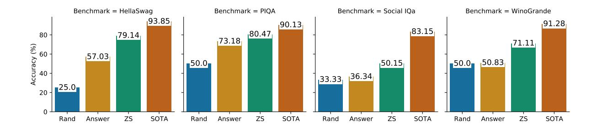
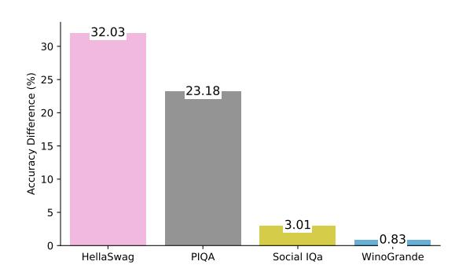
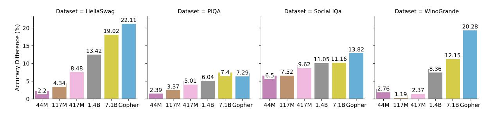
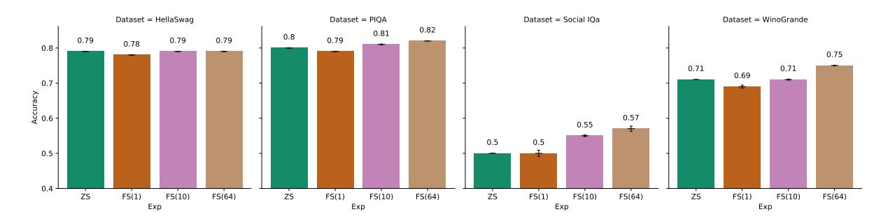
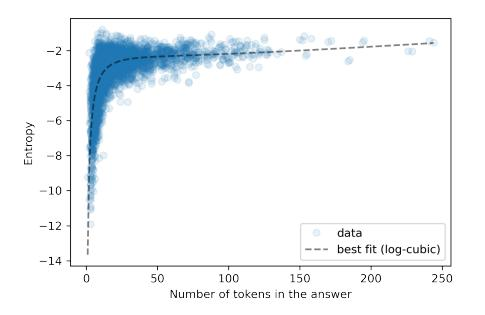
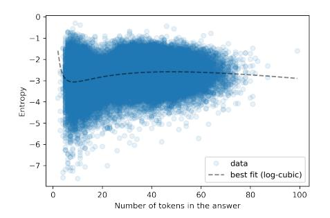
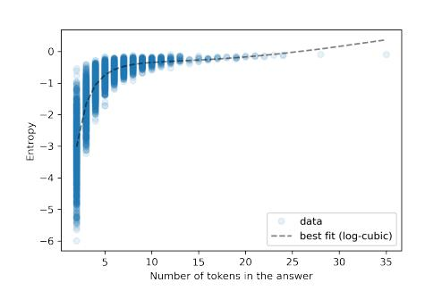
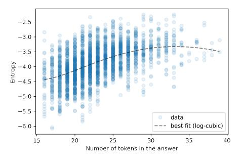

# A Systematic Investigation of Commonsense Knowledge in Large Language Models

<span id="page-0-0"></span>Xiang Lorraine Li† [∗](#page-0-0) Adhiguna Kuncoro‡ Jordan Hoffmann<sup>⋆</sup>♢ Cyprien de Masson d'Autume♦♢ Phil Blunsom▲♣♢ Aida Nematzadeh‡

† Allen Institute for Artificial Intelligence ‡ DeepMind <sup>⋆</sup> Inflection AI ♦ Reka ▲ Cohere ♠ University of Oxford

lorrainel@allenai.org nematzadeh@google.com

#### Abstract

Language models (LMs) trained on large amounts of data (*e.g.*, [Brown et al.,](#page-10-0) [2020;](#page-10-0) [Pat](#page-11-0)[wary et al.,](#page-11-0) [2021\)](#page-11-0) have shown impressive performance on many NLP tasks under the zeroshot and few-shot setup. Here we aim to better understand the extent to which such models learn commonsense knowledge — a critical component of many NLP applications. We conduct a systematic and rigorous zero-shot and few-shot commonsense evaluation of large pretrained LMs, where we: (i) carefully control for the LMs' ability to exploit potential surface cues and annotation artefacts, and (ii) account for variations in performance that arise from factors that are not related to commonsense knowledge. Our findings highlight the limitations of pre-trained LMs in acquiring commonsense knowledge without task-specific supervision; furthermore, using larger models or few-shot evaluation are insufficient to achieve human-level commonsense performance.

#### 1 Introduction

Common sense — the implicit knowledge about everyday situation that is shared by humans — is an important prerequisite for developing generalpurpose intelligent systems [\(McCarthy et al.,](#page-11-1) [1960;](#page-11-1) [Liu and Singh,](#page-11-2) [2004;](#page-11-2) [Gunning,](#page-10-1) [2018\)](#page-10-1). Intriguingly, recent large language models (LMs, [Brown](#page-10-0) [et al.,](#page-10-0) [2020;](#page-10-0) [Patwary et al.,](#page-11-0) [2021;](#page-11-0) [Rae et al.,](#page-11-3) [2021\)](#page-11-3) have achieved remarkable performance at various common sense benchmarks (*e.g.*, [Sakaguchi et al.,](#page-12-0) [2020;](#page-12-0) [Zellers et al.,](#page-12-1) [2019a;](#page-12-1) [Bisk et al.,](#page-9-0) [2020b;](#page-9-0) [Sap](#page-12-2) [et al.,](#page-12-2) [2019b\)](#page-12-2), even when they are evaluated in a zero-shot or few-shot fashion, *without* explicit commonsense supervision. We revisit this apparent success, and conduct a rigorous study to better understand the extent to which such pre-trained LMs are able to capture commonsense knowledge.

<span id="page-0-1"></span>

| <b>Question:</b> Tracy took Jesse's students on a field trip and covered the<br>expenses for everyone. How would you describe Tracy?<br>Answer: A. giving B. selfish C. very generous |                                                                                                                                                                                     |  |  |  |
|---------------------------------------------------------------------------------------------------------------------------------------------------------------------------------------|-------------------------------------------------------------------------------------------------------------------------------------------------------------------------------------|--|--|--|
| <b>Answer-only:</b>                                                                                                                                                                   | very generous.                                                                                                                                                                      |  |  |  |
| Zero-shot:                                                                                                                                                                            | Tracy took Jesse's students on a field trip and covered the<br>expenses for everyone. Tracy is <b>very generous</b> .                                                               |  |  |  |
| Few-shot:                                                                                                                                                                             | Allen pushed Kitty into the elevator, Kitty is angry. $\n$<br>Tracy took Jesse's students on a field trip and covered the<br>expenses for everyone. Tracy is <b>very generous</b> . |  |  |  |

Figure 1: The experiment settings with their corresponding input to the LM. The example is taken from Social IQa [\(Sap et al.,](#page-12-2) [2019b\)](#page-12-2) where we convert questions to natural text using the rules of [Shwartz et al.](#page-12-3) [\(2020\)](#page-12-3); this conversion yields to better performance ([§5\)](#page-6-0).

In this work, we focus on zero- and fewshot evaluations of pre-trained LMs without commonsense-specific fine-tuning for two reasons: First, we aim to examine if a pre-trained LM is able to acquire *general* commonsense knowledge. As pre-trained LMs constitute a *foundational* building block of NLP today, any deficiencies in their commonsense understanding can thus adversely manifest in downstream applications [\(Bommasani](#page-9-1) [et al.,](#page-9-1) [2021\)](#page-9-1). Fine-tuning the LM would make it hard to disentangle how much of the commonsense knowledge is acquired by the underlying LM, as opposed to the *task-specific* supervision from a benchmark [\(Yogatama et al.,](#page-12-4) [2019\)](#page-12-4). Second, humanannotated commonsense datasets are expensive to collect due to the vast, diverse, and growing nature of commonsense knowledge [\(Elazar et al.,](#page-10-2) [2021\)](#page-10-2).

Concretely, our work differs from prior work on commonsense evaluation of LMs [\(Brown et al.,](#page-10-0) [2020;](#page-10-0) [Patwary et al.,](#page-11-0) [2021\)](#page-11-0) by way of a more rigorous evaluation, in which we: (i) carefully control for the LM's ability to exploit potential surface cues and annotation artefacts to predict the answer, without reasoning over the context. We further (ii) account for the variations in factors influencing the LM's performance, which arise from certain evaluation design choices — independently of common-

<sup>∗</sup> Work done during DeepMind internship when Lorraine was a PhD student at UMass Amherst. ♢ Work done at Deep-Mind

sense knowledge in the models. We systematically conduct this study on four commonsense benchmarks, six model sizes (up to a very large LM with 280B parameters), and multiple evaluation settings (*e.g.*, different score functions and prompt format).

We begin with our first question: When evaluating a large LM in a zero-shot setting, *how does its zero-shot performance compare to a strong baseline ([§3](#page-3-0)*)? Controlling for the LM's ability to guess the correct answer, *without* even looking at the question [\(Poliak et al.,](#page-11-4) [2018;](#page-11-4) [Trichelair et al.,](#page-12-5) [2019,](#page-12-5) Answer-only baseline, top of Fig. [1\)](#page-0-1), we find that, despite the LM's strong zero-shot performance, the Answer-only baseline can nevertheless perform surprisingly well on some benchmarks. Despite the clear importance of comparing with answer-only baselines as shown in Figure [2,](#page-4-0) these comparisons are absent from recent work on large LMs [\(Zhou](#page-12-6) [et al.,](#page-12-6) [2020;](#page-12-6) [Brown et al.,](#page-10-0) [2020;](#page-10-0) [Rae et al.,](#page-11-3) [2021\)](#page-11-3). Furthermore, increasing model size alone is unlikely to bridge the gap with human performance in the near future: Our analysis of scaling behavior suggests that much larger dense LMs (with 100T to 10<sup>18</sup> parameters — which are infeasibly large at present) are needed to achieve human performance for 3 out of 4 benchmarks.

*Does familiarizing the LM with the task format using a few-shot evaluation setting substantially improve performance ([§4\)](#page-5-0)?* We find that the fewshot evaluation (using up to 64 examples) does not substantially improve the LMs' performance for most tasks except Social IQa. Moreover, using the few-shot/in-context demonstration setting fails to bridge the gap between the LM and current SOTA.

Finally, we ask: *to what extent does the model's zero-shot performance vary depending on certain evaluation design choices, such as the format of the prompt or the score function ([§5\)](#page-6-0)*? We find that these design choices — though they have little to do with common sense — can result in large fluctuations in performance (up to 19%). This finding challenges the notion that large LMs are largely able to work well out-of-the-box with minimal taskspecific tuning. Based on these findings, we emphasize the need to carefully select such design choices, explicitly state them to enable fair comparison with prior work, and quantify the robustness of the observed results across different design choices.

All in all, our findings suggest that acquiring *human-level* commonsense knowledge, without relying on surface cues or task-specific supervision,

|                                     | Choices | Knowledge Types    | Questions |
|-------------------------------------|---------|--------------------|-----------|
| HellaSwag (Zellers et al., 2019a)   | 4       | Temporal, Physical | 10042     |
| WinoGrande (Sakaguchi et al., 2020) | 2       | Social, Physical   | 1267      |
| Social IQa (Sap et al., 2019b)      | 3       | Social             | 1954      |
| PIQA (Bisk et al., 2020b)           | 2       | Physical           | 1838      |

Table 1: Benchmark Statistics. Choices: the number of candidate answers for each question; Questions: the number of candidate answers for each question.

remains beyond the reach of current large LMs. Given the marginal improvements from increasing model size, we conjecture that other techniques, such as explicit commonsense supervision, multimodal grounding, or physical embodiment [\(Bisk](#page-9-2) [et al.,](#page-9-2) [2020a\)](#page-9-2), are promising ways forward.

#### 2 Experimental Setting

We begin by outlining our experimental setup, and describe the benchmarks, model, baselines, and other relevant experimental settings.

#### 2.1 Commonsense Benchmarks

Commonsense knowledge spans many categories, such as physical common sense (*e.g.*, a car is heavier than an apple), social common sense (*e.g.*, a person will feel happy after receiving gifts), and temporal common sense (*e.g.*, cooking an egg takes less time than baking a cake). Given this diverse nature of commonsense knowledge, various benchmarks have been proposed to test these different types of knowledge (*e.g.*, [Zellers et al.,](#page-12-1) [2019a;](#page-12-1) [Sak](#page-12-0)[aguchi et al.,](#page-12-0) [2020;](#page-12-0) [Sap et al.,](#page-12-2) [2019b;](#page-12-2) [Bisk et al.,](#page-9-0) [2020b;](#page-9-0) [Lin et al.,](#page-11-5) [2020;](#page-11-5) [Boratko et al.,](#page-10-3) [2020\)](#page-10-3).

Commonsense benchmarks broadly consist of two tasks: (a) multiple-choice evaluation [\(Zellers](#page-12-7) [et al.,](#page-12-7) [2018,](#page-12-7) [2019a;](#page-12-1) [Sap et al.,](#page-12-2) [2019b;](#page-12-2) [Bisk et al.,](#page-9-0) [2020b\)](#page-9-0), where a model needs to choose the correct answer from a list of plausible answers; (b) generative evaluation [\(Boratko et al.,](#page-10-3) [2020;](#page-10-3) [Lin et al.,](#page-11-5) [2020,](#page-11-5) [2021\)](#page-11-6), which requires a model to generate an answer given a question and some additional context. Here we focus on multiple-choice benchmarks, since they provide a more reliable automatic metric (*i.e.*, accuracy), whereas automated metrics used to evaluate language generation (*e.g.*, BLEU, [Papineni et al.,](#page-11-7) [2002\)](#page-11-7) do not correlate perfectly with human judgment [\(Liu et al.,](#page-11-8) [2016;](#page-11-8) [Novikova](#page-11-9) [et al.,](#page-11-9) [2017\)](#page-11-9).[1](#page-1-0) We use a diverse set of four representative multiple-choice commonsense benchmarks

<span id="page-1-0"></span><sup>1</sup>Human judgment of LM output is not only costly to obtain, but also imperfect [\(Clark et al.,](#page-10-4) [2021\)](#page-10-4), compounding the difficulty of commonsense evaluation in a generation setup.

to better understand the extent to which pre-trained LMs are able to acquire different types of commonsense knowledge. We use the validation split of each benchmark, as their test splits are not public. HellaSwag [\(Zellers et al.,](#page-12-1) [2019a\)](#page-12-1) is designed to evaluate a model's ability to understand physical, grounded, and temporal common sense. Given a four-sentence story, the model must choose the correct ending from four candidates. The stories are either video captions from AcitivityNet [\(Heilbron](#page-10-5) [et al.,](#page-10-5) [2015\)](#page-10-5), or WikiHow passages [\(Koupaee and](#page-10-6) [Wang,](#page-10-6) [2018\)](#page-10-6). When evaluating LMs on a similar dataset [\(Zellers et al.,](#page-12-7) [2018\)](#page-12-7), incorrect answers can be easy to distinguish from correct ones; hence in constructing HellaSwag, [Zellers et al.](#page-12-1) [\(2019a\)](#page-12-1) removed easy negatives through adversarial filtering. WinoGrande [\(Sakaguchi et al.,](#page-12-0) [2020\)](#page-12-0) is a coreference resolution benchmark that mainly examines physical and social common sense. Each example consists of a sentence (*e.g.*, "The trophy did not fit the suitcase because it is too big.") and two candidate *entities* (*e.g.*, "trophy" or "suitcase"). The task is to choose the correct entity for the pronoun, *e.g.*, "it" refers to "trophy" in the example.

Social IQa [\(Sap et al.,](#page-12-2) [2019b\)](#page-12-2) focuses on evaluating social commonsense, in particular theory of mind — the capacity to reason about others' mental states [\(Flavell,](#page-10-7) [2004\)](#page-10-7). Given context sentences and a corresponding question, the task is to choose the correct response from three candidates. Annotators use the ATOMIC knowledge base [\(Sap et al.,](#page-12-8) [2019a\)](#page-12-8) to create context sentence and questions; the answers are provided by additional annotators. PIQA [\(Bisk et al.,](#page-9-0) [2020b\)](#page-9-0), short for physical interaction question answering, mainly covers the physical aspect of common sense. Each data point consists of a task and two alternative solutions to finish the task; one of which is correct. The tasks are curated from a website[2](#page-2-0) with instructions for everyday tasks (*e.g.*, separating egg yolks from eggs); the solutions are provided by human annotators.

#### <span id="page-2-3"></span>2.2 Pre-trained Language Model

We use the pre-trained language model of [Rae et al.](#page-11-3) [\(2021\)](#page-11-3), Gopher, which is an autoregressive Transformer [\(Vaswani et al.,](#page-12-9) [2017\)](#page-12-9) language model with 280 billion parameters. We choose Gopher because of its excellent zero-shot and few-shot performance at various benchmarks, in addition to its large model size, which has been shown to improve

language modeling and downstream performance [\(Kaplan et al.,](#page-10-8) [2020\)](#page-10-8). Notably, Gopher is more than 50% larger than GPT3 and as of March 2022, is one of the largest dense LMs developed to date.

Gopher hyper-parameters. The pre-trained Gopher language model has 80 layers, 128 attention heads, 128-dimensional key/value vectors, and a feedforward layer dimension of 16,384. To better understand the effect of different model sizes ([§3.2\)](#page-4-1), we experiment with five other model sizes: 44M, 117M, 417M, 1.4B, and 7.1B. Similar to Gopher, each of these models was pre-trained by [Rae](#page-11-3) [et al.](#page-11-3) [\(2021\)](#page-11-3); a full list of model hyper-parameters is summarized in Table 1 of [Rae et al.](#page-11-3) [\(2021\)](#page-11-3). Each model is trained by subsampling from the MassiveText dataset, which consists of more than 2 trillion tokens from various domains including web pages, news, books, and codes [\(Rae et al.,](#page-11-3) [2021\)](#page-11-3). The authors have removed documents that overlap significantly with the evaluation sets from training set including benchmarks used in our work. We use TPUv3 to conduct all evaluations, with an estimated total compute budget of <sup>2</sup> <sup>×</sup> <sup>10</sup><sup>20</sup> FLOPs.

Score function. On the multiple-choice benchmarks, we evaluate the pre-trained LM by calculating the score for each answer choice under the model, and select the highest-scoring answer ˆy:

$$\hat{\mathbf{y}} = \argmax_{\mathbf{y} \in Y(\mathbf{x})} s_{\boldsymbol{\theta}}(\mathbf{y}|\mathbf{x});$$

here x denotes the question or prompt, Y (x) the set of answer choices for a given question, and sθ(·) the score of an answer choice y given x, under the pre-trained LM with parameters θ. We provide some examples in Table [2.](#page-3-1) [3](#page-2-1) For Social IQa, we convert questions to natural text using the rules of [Shwartz et al.](#page-12-3) [\(2020\)](#page-12-3); we find this natural text format to yield better results, as discussed in [§5.](#page-6-0)

Unless otherwise stated, we use *cross-entropy* (or token-level log prob) to score each answer:

<span id="page-2-2"></span>
$$s_{\boldsymbol{\theta}}(\mathbf{y}|\mathbf{x}) = \frac{\sum_{i=0}^{\|\mathbf{y}\|} \log(p_{\boldsymbol{\theta}}(y_i|x, y_0 \dots y_{i-1}))}{\|\mathbf{y}\|}. \quad (1)$$

This score function reduces the impact of length; without dividing by ∥y∥, longer answers might have lower probabilities [\(Stahlberg and Byrne,](#page-12-10) [2019\)](#page-12-10). GPT3 [\(Brown et al.,](#page-10-0) [2020\)](#page-10-0) also employs this score function for zero-shot evaluation.

<span id="page-2-0"></span><sup>2</sup><https://www.instructables.com/>

<span id="page-2-1"></span><sup>3</sup> For Social IQa, we concatenate the context sentence and question together to form the prompt x.

<span id="page-3-1"></span>

| Dataset    | <b>Prompt:</b> $x$                                                                                        | Answer: $y$                                                          |
|------------|-----------------------------------------------------------------------------------------------------------|----------------------------------------------------------------------|
| HellaSwag  | A woman is outside with a bucket and a dog. The dog is running<br>around trying to avoid a bath. She      | gets the dog wet, then it runs away again.                           |
| WinoGrande | The GPS and map helped me navigate home. I got lost when the                                              | <b>GPS</b> got turned off.                                           |
| Social IOa | Jordan was in charge of taking the food on the camping trip and<br>left all the food at home. Jordan felt | horrible that he let his friends down on<br>the camping trip.        |
| PIQA       | Make Halloween lanterns.                                                                                  | Draw ghost faces on empty milk bottles,<br>put a candle in each one. |

Table 2: Examples of the prompt  $x$  and the correct answer  $y$  in different benchmarks.

#### <span id="page-3-3"></span>2.3 Baselines

We compare the performance of Gopher with two baselines. The first, simple baseline is to randomly select an answer candidate, where the chance of selecting the correct one is  $\frac{1}{\text{number of choices}}$ . We henceforth refer to this as the *Random Baseline*. We experiment with two other baselines: Either choosing the majority label from the training data, or choosing the longest answer. We omit these baselines as they perform similarly to the Random Baseline.

More importantly, we consider an *Answer-only Baseline*, where we select the highest-scoring answer choice under the LM, *without* conditioning on the question. More formally, this baseline considers  $s_{\theta}(\mathbf{y})$ , as opposed to  $s_{\theta}(\mathbf{y}|\mathbf{x})$  in Eq. 1. This baseline reveals the extent to which the pre-trained LM conducts the appropriate reasoning over the context to select the answer, as opposed to relying on potential surface cues or annotation artefacts that make the correct answer *a priori* more probable than the rest. We illustrate this baseline at the top of Fig. 1. For WinoGrande, we calculate the cross-entropy of the text starting by the pronoun replacement, as shown in Table 2. Ideally, each answer choice should be equally likely if we do not consider the question, and the Answer-only performance should be close to the Random baseline. Similar hypothesis-only baselines are wellstudied for natural language inference datasets (Poliak et al.,  $2018$ ); Trichelair et al. ( $2019$ ) further explored such an Answer-only baseline, albeit only on the SWAG benchmark (Zellers et al., 2018).

#### <span id="page-3-0"></span>3 **Zero-shot Performance**

In Fig. 2, we report the zero-shot performance of our pre-trained LM (with 280B parameters, §2.2) on the four commonsense benchmarks, alongside: (i) the Random and Answer-only baselines. and (ii) the current state-of-the-art (SOTA) result. The SOTA results are achieved by the UNI- CORN (Lourie et al., 2021) model with 11B parameters, which is pre-trained on 6 existing commonsense datasets (Zellers et al., 2019a; Bisk et al., 2020b; Sap et al., 2019b; Sakaguchi et al., 2020; Bhagavatula et al., 2020; Huang et al., 2019).

**Zero-shot performance.** At first glance, we observe strong zero-shot results, outperforming the Random Baseline in all benchmarks (compare "Rand" and "ZS" in Fig. 2). However, the gap between the stronger Answer-only baseline and the zero-shot result is smaller for all benchmarks (compare "Answer" and "ZS"): Whereas this gap is still sizable for HellaSwag and WinoGrande (>20), it is much smaller for Social IQa and PIQA. Finally, in all cases, there is still a large gap between the SOTA and zero-shot performance ( $>10$ ); this gap is largest for WinoGrande and Social IOa, suggesting that social and physical commonsense is challenging for pre-trained LMs — even a large one with  $280B$ parameters — without task-specific supervision.<sup>4</sup>

#### 3.1 Answer-only bias

As shown in Fig. 3, the performance gap between the Random and Answer-only baselines is notably large for HellaSwag and PIQA, where the Answeronly baseline outperforms the Random baseline by more than 32% and 23%, respectively. This large gap highlights an existing answer-only bias in these benchmarks: the correct answer can, in fact, be selected by the LM without conducting the appropriate commonsense reasoning over the provided context. On the other hand, the Answer-only baseline performs similarly to the random baseline on WinoGrande and Social IQa; hence, the zero-shot performance on these benchmarks is a more reliable estimate of the model's acquisition of

<span id="page-3-2"></span><sup>&</sup>lt;sup>4</sup>We remark that the 530B-parameter LM of Patwary et al. (2021) achieves slightly better performance than Gopher on HellaSwag (80.2), PIQA (82), and WinoGrande (73), although there remains a large gap with the SOTA performance.

<span id="page-4-0"></span>

Figure 2: Random Baseline (Rand), Answer-only Baseline (Answer), zero-shot (ZS), and the current state-of-the-art (SOTA) for each benchmark, which is achieved by UNICORN (Lourie et al., 2021).

<span id="page-4-2"></span>

Figure 3: The performance gap between Answer-only and Random baselines for each benchmark.

commonsense knowledge. Given the existing (and sometimes inevitable) answer-only biases in some benchmarks, it is important to contextualize the zero-shot results by comparing with strong baselines, although such comparisons are missing from recent work (e.g., Zhou et al., 2020; Brown et al., 2020; Rae et al., 2021).

#### <span id="page-4-1"></span>3.2 Does Increasing Model Size Help?

Gopher (the largest LM we have access to) achieves a decent zero-shot performance for most commonsense benchmarks, but maintains a notable gap with fine-tuned SOTA results. Can we eventually reach human-level performance on these commonsense benchmarks by increasing model size alone?

Since we do not have access to larger language models than Gopher, we examine the extent to which zero-shot performance improves when using Gopher compared to a range of smaller models (*i.e.*, scaling plots). Such scaling plot can help us predict the performance for larger models than Gopher. To that end, we use 6 pre-trained model sizes from 44M to 280B parameters (see  $\S 2.2$ ).<sup>5</sup> We present the findings in Table 3. On all four

<span id="page-4-4"></span>

|            |        | Answer | ZS   | FS(1) | FS(10) | FS(64) |
|------------|--------|--------|------|-------|--------|--------|
| HellaSwag  | 44M    | 25.8   | 28.0 | 28.0  | 28.1   | 27.9   |
|            | 117M   | 29.2   | 33.5 | 33.3  | 34.0   | 33.5   |
|            | 417M   | 35.6   | 44.1 | 43.4  | 43.3   | 43.3   |
|            | 1.4B   | 43.2   | 56.7 | 56.4  | 56.2   | 56.5   |
|            | 7.1B   | 50.4   | 69.5 | 67.6  | 67.9   | 67.9   |
|            | Gopher | 57.0   | 79.1 | 77.8  | 79.2   | 79.3   |
|            | 44M    | 48.5   | 51.3 | 51.1  | 50.8   | 50.6   |
|            | 117M   | 50.8   | 52.0 | 51.9  | 50.9   | 50.8   |
|            | 400M   | 49.9   | 52.2 | 51.8  | 50.8   | 52.5   |
| WinoGrande | 1.3B   | 49.7   | 58.1 | 56.4  | 56.0   | 57.3   |
|            | 7B     | 52.4   | 64.6 | 62.1  | 63.1   | 62.0   |
|            | Gopher | 50.8   | 71.1 | 69.2  | 71.4   | 74.6   |
|            | 44M    | 35.5   | 42.0 | 41.2  | 40.9   | 40.9   |
|            | 117M   | 36.1   | 43.7 | 42.7  | 42.1   | 42.2   |
|            | 400M   | 36.0   | 45.6 | 44.5  | 45.2   | 45.3   |
| Social IQa | 1.3B   | 35.8   | 46.9 | 46.4  | 48.6   | 50.5   |
|            | 7B     | 36.9   | 48.1 | 48.1  | 52.9   | 54.2   |
|            | Gopher | 36.3   | 50.2 | 50.2  | 55.3   | 57.5   |
|            | 44M    | 60.2   | 62.6 | 62.1  | 62.3   | 61.3   |
| PIQA       | 117M   | 62.1   | 65.5 | 64.6  | 65.1   | 65.3   |
|            | 400M   | 65.9   | 70.9 | 68.8  | 70.5   | 70.1   |
|            | 1.3B   | 68.4   | 74.4 | 73.3  | 74.4   | 74.6   |
|            | 7B     | 70.0   | 77.4 | 75.5  | 77.6   | 78.1   |
|            | Gopher | 73.2   | 80.5 | 79.3  | 81.4   | 81.5   |

Table 3: Performance of all models across benchmarks under different experimental settings. Ans: Answeronly Baseline; ZS: zero-shot performance;  $FS(n)$ : fewshot performance where  $n$  is the number of examples.

benchmarks, the LM's zero-shot performance (Table 3,  $ZS$  column) consistently gets better as we use increasingly larger models. This finding is also consistent with that of Brown et al. (2020), who showed that larger models have better performance at HellaSwag, WinoGrande, and PIQA. But, crucially, we argue that this does *not* necessarily mean that larger models are better at commonsense reasoning: For HellaSwag and PIQA, the Answer-only baseline also substantially improves with model size (Table 3, **Answer** column). Hence, for these benchmarks, larger models are *also* better at exploiting potential surface cues and annotation artefacts to guess the correct answer, without reasoning over the context. To properly assess commonsense reasoning, we should focus on the *performance difference* between the zero-shot and the Answer-only baseline.

<span id="page-4-3"></span><sup>&</sup>lt;sup>5</sup>Each model size is trained on the same dataset; hence any performance differences can be attributed to model size.

<span id="page-5-1"></span>

Figure 4: The difference between zero-shot performance and Answer-only baseline for different model sizes.

We plot this performance difference with respect to different model sizes in Fig. 4. We observe that larger models have better performance across  $benchmarks$  — when increasing model size, the zero-shot performance gains are *more* than the performance gains of the Answer-only baseline. Nevertheless, the magnitude of this improvement varies depending on the benchmark: We see a substantial improvement on WinoGrande, but smaller improvements on HellaSwag, Social IQa and PIQA.

**Scaling behavior.** Based on these trends, what model size would be required to achieve humanlevel performance on these benchmarks? Through a linear regression analysis (see Appendix B for more details), given the current rate of improvement in performance when gradually increasing the model size from 44M up to 280B, we need a model of at least 1.4T parameters to achieve human performance on HellaSwag, and a model of  $>100T$ parameters ( $\sim$ 400x larger than Gopher) for other benchmarks. This result suggests that training everlarger models may not help us reach human performance, at least in the near future. Indeed, given the enormous compute costs for training even larger LMs than the Gopher model with 280B parameters, we conjecture that there are more efficient ways of acquiring commonsense knowledge in an unsupervised fashion, for instance through multi-modal learning and grounding (Bisk et al., 2020a).

#### <span id="page-5-0"></span>4 **Few-shot Performance**

Recent work has shown that large LMs can perform surprisingly well at various tasks in a fewshot fashion (Brown et al., 2020; Patwary et al., 2021). Under this setup, the model is provided with  $n$  examples of the downstream task, which are then appended to the prefix. Concretely, for the four commonsense benchmarks, we append  $n$ examples that include the question and the correct answer; these examples — which are randomly

sampled from the training split of each benchmark - appear before the evaluated question, as shown in Fig. 1. This few-shot formulation is appealing as it relies only on a small number of task-specific examples to get the LM accustomed to the task, without any fine-tuning. To what extent can we improve the model performance on commonsense benchmarks, by shifting from the zero-shot to the few-shot evaluation protocol?<sup>6</sup>

In Fig. 5, we compare the performance of Gopher under different evaluation protocols: (i) zeroshot and (ii) few-shot (n) where we use  $n \in$  $\{1, 10, 64\}$  examples. We run the few-shot experiments between 5 and 10 times — sampling different examples each time — and report the average performance. The variance across runs is very small and is shown as the error bar in Fig.  $5.7$ Interestingly, model performance with few-shot (1) is sometimes *worse* than the zero-shot model, but the few-shot  $(10)$  and  $(64)$  models outperform their zero-shot counterpart (albeit sometimes by small margins). On HellaSwag and PIQA, we do not observe substantial improvement from few-shot evaluation compared to the zero-shot baseline (less than  $2\%$ ).<sup>8</sup> While few-shot evaluation does not help much for most datasets, the only exception is Social IOa, where the few-shot (64) model outperforms the zero-shot model by  $a > 7\%$  margin. We attribute this to the less natural text of Social  $\text{IQa};^9$ hence adding task-specific examples provides information about what is expected of the task.

<span id="page-5-2"></span><sup>&</sup>lt;sup>6</sup>The ability of large LMs to perform few-shot/in-context learning was first demonstrated by GPT3. Here we use an even-larger model than GPT3, which we expect to be able to leverage in-context learning to a similar extent as GPT3.

<span id="page-5-3"></span><sup>&</sup>lt;sup>7</sup>Our findings on the small variance with different few-shot examples is consistent with Min et al. (2022), who found that replacing real examples with random labels can work as well.

<span id="page-5-4"></span><sup>&</sup>lt;sup>8</sup>In few-shot experiments ( $n = 50$ ), Brown et al. (2020) also found small improvements for PIQA and HellaSwag ( $<1.5\%$ ), with a larger improvement (7.5%) for WinoGrande.

<span id="page-5-5"></span><sup>&</sup>lt;sup>9</sup>We found that Gopher has the highest perplexity when predicting Social IQa answers compared to the other datasets.

<span id="page-6-1"></span>

Figure 5: Accuracy on the benchmarks for zero-shot (ZS) and few-shot (FS) settings (with 1, 10, and 64 examples). We additionally report the error bars, although the error bars are not always visible due to the very small variance.

Overall, we observe that the usefulness of the few-shot setting is benchmark dependent. Moreover, using task-specific examples in a few-shot setting does not bridge the gap to SOTA or human performance for any of the benchmarks.

Knowledge base retrieval. We further examine if adding pre-extracted commonsense knowledge base triplets to the context — as a different form of few-shot/in-context learning — helps improve model performance. (See Appendix [D](#page-15-0) for details.) In contrast to work of [Shwartz and Choi](#page-12-11) [\(2020\)](#page-12-11), we observe no improvements when appending the triplets; we attribute this discrepancy to the strong performance of our base models (see [§5\)](#page-6-0).

#### <span id="page-6-0"></span>5 Robustness of Reported Results

Different evaluation design choices — such as the format of the prompt or the choice of score functions — can impact the LM's zero-shot performance, and crucially result in different conclusions about a model's commonsense understanding ability. Moreover, the lack of a standardized zeroshot LM evaluation protocol makes direct comparisons between papers difficult [\(Shwartz et al.,](#page-12-3) [2020;](#page-12-3) [Bosselut et al.,](#page-10-10) [2021\)](#page-10-10). To what extent can we attribute variance in the reported results to these evaluation design choices — even though they have little to do with commonsense knowledge?

Model. Quantifying the robustness of the reported results necessitates scoring a large number of examples under different evaluation design choices, which is infeasible to do with the largest (280B-parameter) model that has a slow inference speed. Hence, we conduct the following experiments using the 7B-parameter model, which is still ∼5 times larger than GPT2 [\(Radford et al.,](#page-11-12) [2019\)](#page-11-12).

Score functions. Prior work employs different score functions to assess the plausibility of each answer choice given a question [\(Brown et al.,](#page-10-0) [2020;](#page-10-0) [Shwartz et al.,](#page-12-3) [2020;](#page-12-3) [Bosselut et al.,](#page-10-10) [2021;](#page-10-10) [Holtz](#page-10-11)[man et al.,](#page-10-11) [2021\)](#page-10-11), which makes a direct comparison between different results challenging. Here we investigate the impact of different score functions on the reported performance. In addition to crossentropy (defined in [§2.2\)](#page-2-3), we experiment with two other score functions. The first is *sequence log probability*, defined as the log probability of the answer choice y conditional on the question x. Letting y<sup>i</sup> be the i-th token in the answer y:

$$s(\mathbf{y}|\mathbf{x}) = \sum_{i=0}^{\|\mathbf{y}\|} log(p(y_i|\mathbf{x}, y_0...y_{i-1})) \qquad (2)$$

Another widely used score function [\(Bosselut](#page-10-10) [et al.,](#page-10-10) [2021;](#page-10-10) [Holtzman et al.,](#page-10-11) [2021\)](#page-10-11) is *point-wise mutual information*. This score function takes into account the probability of the answer choices alone, and the probability of the answer choices conditional on the question. This metric assesses whether the question adds additional information, as commonsense reasoning should be established within the context of the question. As this score function accounts for the prior probability of answer options, it can yield lower accuracy than score functions like cross-entropy that do *not* account for such factor (Answer-only baseline, [§2.3\)](#page-3-3).

$$s(\mathbf{y}|\mathbf{x}) = PMI(\mathbf{y}, \mathbf{x}) = \log \frac{p(\mathbf{y}|\mathbf{x})}{p(\mathbf{y})} \qquad (3)$$

Prompt format. Another important factor is the format of the prompt; here we consider a few such choices. In addition to the concatenation of the question and the answer, we experiment with adding special symbols "[Question]" and "[Answer]" to specify the question and the answer

[\(Brown et al.,](#page-10-0) [2020\)](#page-10-0). Moreover, for Social IQa and PIQA, we experiment with a set of predefined rules (taken from [Shwartz et al.,](#page-12-3) [2020\)](#page-12-3) to convert the questions into sentences, which are closer to the LM's pre-training data format. Finally, we find that having the correct lower/upper case and punctuation is important; thus we manually checked all benchmarks to correct for case and punctuation.[10](#page-7-0)

Scored text. The next option is whether to score the entire question–answer pair [\(Shwartz et al.,](#page-12-3) [2020\)](#page-12-3), or only the answer choice (conditional on the given question as prefix) as done by [Brown et al.](#page-10-0) [\(2020\)](#page-10-0) *i.e.*, whether to calculate s(x; y) or s(y|x), where ; implies text concatenation.

#### <span id="page-7-3"></span>5.1 Do These Design Choices Matter?

Table [4](#page-7-1) shows the performance difference of using the worst versus the best design choices, which are independently optimized for each task. To sweep over the above design choices, instead of considering all combinations of parameters, we iterate the options in one category (*e.g.*, score function), while fixing the parameters in the other categories.[11](#page-7-2)

Overall, we observe a difference between the best and worst settings on all benchmarks; this gap is especially large for HellaSwag and PIQA. This result shows that *large language models do not simply work out of the box for some commonsense benchmarks*, because for some tasks, these evaluation design choices can account for a large variation in model performance. We find that the score function plays the most important role cross-entropy yields the highest accuracy values across most benchmarks, but sequence log probability achieves a slightly better performance for WinoGrande. However, when using these scores, we should account for the Answer-only baseline ([§3\)](#page-3-0). Moreover, converting questions to sentences makes the largest difference for Social IQa. We also find that scoring the answer conditional on the question — as opposed to scoring the concatenation of questions and answers — works best, except for WinoGrande, which has no questions.

<span id="page-7-1"></span>

|            | Worst | Best | Difference |
|------------|-------|------|------------|
| HellaSwag  | 50.8  | 70.5 | 19.7       |
| PIQA       | 62.5  | 78.7 | 16.2       |
| Social IQa | 43.9  | 48.5 | 4.6        |
| WinoGrande | 59.7  | 62.0 | 2.3        |

Table 4: The performance difference between the worst and best design choices for each benchmark.

Answer-length bias. Although cross-entropy generally achieves the best reported performance, this score function is sensitive to answer lengths. As shown in Appendix [C,](#page-14-0) cross-entropy tends to assign higher scores to longer answers; to varying extent, this pattern holds for PIQA, Social IQa, and WinoGrande. We attribute this to the higher probability assigned to subsequent tokens in the sequence, as such tokens have the most context and thus can be more easily predicted than tokens in the beginning of the answer. As longer answers have more such easier-to-predict tokens, their crossentropy tends to be lower. This pattern is reversed in metrics such as sequence log probability, where shorter sequences often have higher scores [\(Koehn](#page-10-13) [and Knowles,](#page-10-13) [2017;](#page-10-13) [Stahlberg and Byrne,](#page-12-10) [2019\)](#page-12-10). Note that this bias does not change the results reported in this work since there is no correlation between answer length and correctness (Appendix [C\)](#page-14-0).

Takeaways. We conclude this section with three concrete recommendations for future work.

- Although cross-entropy often achieves the best performance, it does not take into account the probability of selecting the correct answer without reasoning over the context ([§3\)](#page-3-0). We recommend future work to either: (i) use cross-entropy and report the *gap* with the answer-only baseline, or (ii) use the PMI score function, which *already* takes the probability of the answer into account.
- In the same way that we search for the best model hyper-parameters, future work should search over certain important evaluation design choices, such as the format of the prompt, and whether to convert the questions into declarative sentences.
- Lastly, we strongly encourage future work to report the variance of the observed results across different design choices. This can provide an indication of the *robustness* of the language models' performance on commonsense benchmarks.

<span id="page-7-0"></span><sup>10</sup>Recent work learns the prefix that would maximize performance (*e.g.*, [Li and Liang,](#page-10-12) [2021\)](#page-10-12). Here we focus on evaluation setups with no parameter updates, and leave this extension to future work. Our findings also indicate that the score function choice — which is not covered by lightweight fine-tuning approaches — is more important than the prompt format ([§5.1\)](#page-7-3).

<span id="page-7-2"></span><sup>11</sup>This decision saves compute resources, while offering a lower bound on the performance variations. Our goal here is not to seek the highest achievable performance, but to understand how much performance varies across different settings.

### 6 Related Work

While recent work evaluates LMs against commonsense benchmarks in a zero- and few-shot fashion, they do not examine the extent to which model performance can be attributed to superficial cues or annotation artefacts in a given dataset (*e.g.*, through strong baselines), nor do they quantify how robust the model performance is under different evaluation design choices. [Trichelair et al.](#page-12-5) [\(2019\)](#page-12-5); [Elazar](#page-10-2) [et al.](#page-10-2) [\(2021\)](#page-10-2) investigate the existence of dataset bias in commonsense co-reference resolution benchmarks [\(Levesque et al.,](#page-10-14) [2012;](#page-10-14) [Sakaguchi et al.,](#page-12-0) [2020\)](#page-12-0) and SWAG [\(Zellers et al.,](#page-12-7) [2018\)](#page-12-7); here we conduct a more comprehensive investigation on four diverse commonsense benchmarks.

Another line of work probe for commonsense knowledge in LMs through knowledge base completion [\(Petroni et al.,](#page-11-13) [2019;](#page-11-13) [Davison et al.,](#page-10-15) [2019\)](#page-10-15) or manually-designed probing tasks [\(Weir et al.,](#page-12-12) [2020;](#page-12-12) [Shwartz and Choi,](#page-12-11) [2020\)](#page-12-11). [Zhou et al.](#page-12-6) [\(2020\)](#page-12-6) evaluate pre-trained LMs against commonsense benchmarks and propose a new dataset requiring multi-hop reasoning. In contrast, we focus on zeroand few-shot evaluation of commonsense understanding using the existing benchmarks.

## 7 Conclusion

We conduct a systematic and rigorous study of large LM performance on a diverse set of commonsense benchmarks, in a zero-shot and few-shot fashion. While pre-trained LMs can seemingly achieve a good zero-shot performance on these benchmarks, these results can be partially attributed to the LM's ability to exploit potential surface cues and annotation artefacts to guess the correct answer, without reasoning over the provided context. We further observed that substantially increasing model size yields rather small improvements on most commonsense benchmarks: Based on the scaling plots, achieving human-level performance requires much larger model sizes than what is currently feasible. In addition, model performance can be highly sensitive to certain evaluation design choices. Overall, our findings offer valuable insights and best practices for rigorously evaluating large LMs.

#### Ethical Considerations

The primary aim of this paper is to conduct a systematic and rigorous commonsense evaluation of a large language model, which — in the case of this

work — is achieved by using the pre-trained Gopher language model [\(Rae et al.,](#page-11-3) [2021\)](#page-11-3) with 280B parameters. Hence, the same risks stemming from large language model research are also broadly applicable to this work [\(Bender et al.,](#page-9-4) [2021\)](#page-9-4). We briefly discuss these ethical considerations below.

Training compute. In practice, pre-training large language models like Gopher requires an enormous amount of compute, which may contribute to increased carbon emissions [\(Strubell et al.,](#page-12-13) [2019;](#page-12-13) [Patterson et al.,](#page-11-14) [2021\)](#page-11-14). In this work, we do not pretrain the language model from scratch, although we acknowledge that conducting inference and evaluation with large language models like Gopher still has substantial computational costs. Given the need to construct even-larger language models (>100 trillion parameters) to achieve human-level performance on most of these benchmarks in an unsupervised fashion ([§3.2\)](#page-4-1), we encourage future work to focus on potentially more efficient ways of acquiring commonsense knowledge directly from data, *e.g.*, through multi-modal learning, grounding, and human interaction [\(Bisk et al.,](#page-9-2) [2020a\)](#page-9-2).

Fairness and bias. Given the enormous size of the pre-training data — about 2 trillion tokens in the case of Gopher pre-training — it is conceivable that the training dataset may inadvertently contain toxic and biased material. Such toxic material which is not always easily identifiable in the large training dataset — can in turn encourage the model to produce biased, harmful, or toxic output, especially when they are prompted with toxic text [\(Gehman et al.,](#page-10-16) [2020\)](#page-10-16). In fact, [Rae et al.](#page-11-3) [\(2021\)](#page-11-3) demonstrated that — up to a certain model size — larger language models may respond to toxic prompts with greater toxicity compared to smaller ones. Furthermore, the enormous size of the training data does not necessarily guarantee diversity: We expect the training data to contain a smaller proportion of vernacular or regional English that is used by underrepresented communities [\(Blodgett](#page-9-5) [et al.,](#page-9-5) [2016;](#page-9-5) [Bender et al.,](#page-9-4) [2021\)](#page-9-4). Furthermore, the language model may also acquire harmful biases and stereotypes, *e.g.*, assign lower probabilities to women becoming doctors as opposed to men [\(Rudinger et al.,](#page-11-15) [2018;](#page-11-15) [Cao and Daumé III,](#page-10-17) [2021\)](#page-10-17).

Language model misuse. Our work highlights both the success and limitations of large language models at multiple commonsense benchmarks. Nevertheless, the success and expressive power

of large language models come at the expense of potential misuse. Given their ability to generate realistic-looking — albeit not necessarily factual — content, large language models can also be used for malicious purposes. For instance, large language models can be used to generate convincing fake news [\(Zellers et al.,](#page-12-14) [2019b\)](#page-12-14), and more powerful generator can in turn generate even more convincing and influential fake news. Given the difficulty of manually distinguishing between humangenerated text and machine-generated ones [\(Clark](#page-10-4) [et al.,](#page-10-4) [2021\)](#page-10-4), how we can better detect and defend against malicious use of large language models is an important and exciting avenue for future work.

# Limitations

There are limitations to this work: first, we only assessed models' performance on multiple-choice questions (and not in a generative setting). Multiple choice problems have a more reliable automatic metric; in contrast, metrics used for generative tasks do not always accurately reflect human judgment [\(Clark et al.,](#page-10-4) [2021\)](#page-10-4) Second, we only evaluate the benchmarks on one family of models, the Gopher models and their variants; given the computational cost and also the lack of availability of different large language models (LLM), we cannot run our experiments on different model families than Gopher. However, we include zero-shot results on common-sense benchmarks from existing work on other LLMs in the paper (such as the GPT2 result in Table 7). Moreover, LLMs behave very similarly on various benchmarks, and we expect our results to generalize to other LLMs as well. Last but not least, we only evaluate models that are solely trained on language. Recent multimodal models have shown impressive performance on a range of tasks [\(Saharia et al.,](#page-11-16) [2022\)](#page-11-16). Will models trained on multiple modalities have more commonsense? We aim to answer this question in future work.

### Acknowledgments

We would like to thank Ivana Kajic, Laura Rimell ´ for their detailed comments on our paper. Also, thanks to Stella Biderman and the anonymous reviewers for their helpful feedback. We also thank Jack W. Rae and the other authors from the Gopher paper for providing efficient evaluation pipelines for models from the Gopher family.

## References

- <span id="page-9-6"></span>Lisa Bauer and Mohit Bansal. 2021. Identify, align, and integrate: Matching knowledge graphs to commonsense reasoning tasks. *EACL*.
- <span id="page-9-4"></span>Emily M. Bender, Timnit Gebru, Angelina McMillan-Major, and Shmargaret Shmitchell. 2021. [On the](https://doi.org/10.1145/3442188.3445922) [dangers of stochastic parrots: Can language models](https://doi.org/10.1145/3442188.3445922) [be too big?](https://doi.org/10.1145/3442188.3445922) . In *Proc. of FAccT*.
- <span id="page-9-3"></span>Chandra Bhagavatula, Ronan Le Bras, Chaitanya Malaviya, Keisuke Sakaguchi, Ari Holtzman, Hannah Rashkin, Doug Downey, Wen tau Yih, and Yejin Choi. 2020. [Abductive commonsense reasoning.](https://openreview.net/forum?id=Byg1v1HKDB) In *International Conference on Learning Representations*.
- <span id="page-9-2"></span>Yonatan Bisk, Ari Holtzman, Jesse Thomason, Jacob Andreas, Yoshua Bengio, Joyce Chai, Mirella Lapata, Angeliki Lazaridou, Jonathan May, Aleksandr Nisnevich, Nicolas Pinto, and Joseph Turian. 2020a. [Experience grounds language.](https://doi.org/10.18653/v1/2020.emnlp-main.703) In *Proceedings of the 2020 Conference on Empirical Methods in Natural Language Processing (EMNLP)*.
- <span id="page-9-0"></span>Yonatan Bisk, Rowan Zellers, Jianfeng Gao, Yejin Choi, et al. 2020b. Piqa: Reasoning about physical commonsense in natural language. In *Proceedings of the AAAI Conference on Artificial Intelligence*, volume 34, pages 7432–7439.
- <span id="page-9-5"></span>Su Lin Blodgett, Lisa Green, and Brendan O'Connor. 2016. [Demographic dialectal variation in social me](https://doi.org/10.18653/v1/D16-1120)[dia: A case study of African-American English.](https://doi.org/10.18653/v1/D16-1120) In *Proc. of EMNLP*.
- <span id="page-9-1"></span>Rishi Bommasani, Drew A. Hudson, Ehsan Adeli, Russ Altman, Simran Arora, Sydney von Arx, Michael S. Bernstein, Jeannette Bohg, Antoine Bosselut, Emma Brunskill, Erik Brynjolfsson, S. Buch, D. Card, Rodrigo Castellon, Niladri S. Chatterji, Annie Chen, Kathleen Creel, Jared Davis, Dora Demszky, Chris Donahue, Moussa Doumbouya, Esin Durmus, Stefano Ermon, John Etchemendy, Kawin Ethayarajh, Li Fei-Fei, Chelsea Finn, Trevor Gale, Lauren E. Gillespie, Karan Goel, Noah D. Goodman, Shelby Grossman, Neel Guha, Tatsunori Hashimoto, Peter Henderson, John Hewitt, Daniel E. Ho, Jenny Hong, Kyle Hsu, Jing Huang, Thomas F. Icard, Saahil Jain, Dan Jurafsky, Pratyusha Kalluri, Siddharth Karamcheti, Geoff Keeling, Fereshte Khani, O. Khattab, Pang Wei Koh, Mark S. Krass, Ranjay Krishna, Rohith Kuditipudi, Ananya Kumar, Faisal Ladhak, Mina Lee, Tony Lee, Jure Leskovec, Isabelle Levent, Xiang Lisa Li, Xuechen Li, Tengyu Ma, Ali Malik, Christopher D. Manning, Suvir P. Mirchandani, Eric Mitchell, Zanele Munyikwa, Suraj Nair, Avanika Narayan, Deepak Narayanan, Ben Newman, Allen Nie, Juan Carlos Niebles, Hamed Nilforoshan, J. F. Nyarko, Giray Ogut, Laurel Orr, Isabel Papadimitriou, Joon Sung Park, Chris Piech, Eva Portelance, Christopher Potts, Aditi Raghunathan, Robert Reich, Hongyu Ren, Frieda Rong, Yusuf H. Roohani, Camilo Ruiz, Jackson K. Ryan, Christopher R'e,

Dorsa Sadigh, Shiori Sagawa, Keshav Santhanam, Andy Shih, Krishna Parasuram Srinivasan, Alex Tamkin, Rohan Taori, Armin W. Thomas, Florian Tramèr, Rose E. Wang, William Wang, Bohan Wu, Jiajun Wu, Yuhuai Wu, Sang Michael Xie, Michihiro Yasunaga, Jiaxuan You, Matei A. Zaharia, Michael Zhang, Tianyi Zhang, Xikun Zhang, Yuhui Zhang, Lucia Zheng, Kaitlyn Zhou, and Percy Liang. 2021. On the opportunities and risks of foundation models. *ArXiv*, abs/2108.07258.

- <span id="page-10-3"></span>Michael Boratko, Xiang Lorraine Li, Rajarshi Das, Tim O'Gorman, Dan Le, and Andrew McCallum. 2020. Protoqa: A question answering dataset for prototypical common-sense reasoning. *EMNLP 2020*.
- <span id="page-10-10"></span>Antoine Bosselut, Ronan Le Bras, and Yejin Choi. 2021. Dynamic neuro-symbolic knowledge graph construction for zero-shot commonsense question answering. In *Proceedings of the 35th AAAI Conference on Artificial Intelligence (AAAI)*.
- <span id="page-10-19"></span>Antoine Bosselut, Hannah Rashkin, Maarten Sap, Chaitanya Malaviya, Asli Çelikyilmaz, and Yejin Choi. 2019. Comet: Commonsense transformers for automatic knowledge graph construction. In *ACL*.
- <span id="page-10-0"></span>Tom Brown, Benjamin Mann, Nick Ryder, Melanie Subbiah, Jared D Kaplan, Prafulla Dhariwal, Arvind Neelakantan, Pranav Shyam, Girish Sastry, Amanda Askell, Sandhini Agarwal, Ariel Herbert-Voss, Gretchen Krueger, Tom Henighan, Rewon Child, Aditya Ramesh, Daniel Ziegler, Jeffrey Wu, Clemens Winter, Chris Hesse, Mark Chen, Eric Sigler, Mateusz Litwin, Scott Gray, Benjamin Chess, Jack Clark, Christopher Berner, Sam McCandlish, Alec Radford, Ilya Sutskever, and Dario Amodei. 2020. [Language models are few-shot learners.](https://proceedings.neurips.cc/paper/2020/file/1457c0d6bfcb4967418bfb8ac142f64a-Paper.pdf) In *Advances in Neural Information Processing Systems*, volume 33, pages 1877–1901. Curran Associates, Inc.
- <span id="page-10-17"></span>Yang Trista Cao and Hal Daumé III. 2021. [Toward](https://doi.org/10.1162/coli_a_00413) [gender-inclusive coreference resolution: An analysis](https://doi.org/10.1162/coli_a_00413) [of gender and bias throughout the machine learning](https://doi.org/10.1162/coli_a_00413) [lifecycle\\*.](https://doi.org/10.1162/coli_a_00413) *Computational Linguistics*.
- <span id="page-10-4"></span>Elizabeth Clark, Tal August, Sofia Serrano, Nikita Haduong, Suchin Gururangan, and Noah A. Smith. 2021. [All that's 'human' is not gold: Evaluating](https://doi.org/10.18653/v1/2021.acl-long.565) [human evaluation of generated text.](https://doi.org/10.18653/v1/2021.acl-long.565) In *Proceedings of the 59th Annual Meeting of the Association for Computational Linguistics and the 11th International Joint Conference on Natural Language Processing (Volume 1: Long Papers)*, pages 7282–7296, Online. Association for Computational Linguistics.
- <span id="page-10-15"></span>Joe Davison, Joshua Feldman, and Alexander M Rush. 2019. Commonsense knowledge mining from pretrained models. In *Proceedings of the 2019 Conference on Empirical Methods in Natural Language Processing and the 9th International Joint Conference on Natural Language Processing (EMNLP-IJCNLP)*, pages 1173–1178.

- <span id="page-10-2"></span>Yanai Elazar, Hongming Zhang, Yoav Goldberg, and Dan Roth. 2021. Back to square one: Bias detection, training and commonsense disentanglement in the winograd schema. *arXiv preprint arXiv:2104.08161*.
- <span id="page-10-7"></span>John H Flavell. 2004. Theory-of-mind development: Retrospect and prospect. *Merrill-Palmer Quarterly (1982-)*, pages 274–290.
- <span id="page-10-16"></span>Samuel Gehman, Suchin Gururangan, Maarten Sap, Yejin Choi, and Noah A. Smith. 2020. [RealToxi](https://doi.org/10.18653/v1/2020.findings-emnlp.301)[cityPrompts: Evaluating neural toxic degeneration in](https://doi.org/10.18653/v1/2020.findings-emnlp.301) [language models.](https://doi.org/10.18653/v1/2020.findings-emnlp.301) In *Findings of EMNLP*.
- <span id="page-10-18"></span>Jonathan Gordon and Benjamin Van Durme. 2013. Reporting bias and knowledge acquisition. In *Proceedings of the 2013 workshop on Automated knowledge base construction*, pages 25–30.
- <span id="page-10-1"></span>David Gunning. 2018. Machine common sense concept paper. *arXiv preprint arXiv:1810.07528*.
- <span id="page-10-5"></span>Fabian Caba Heilbron, Victor Escorcia, Bernard Ghanem, and Juan Carlos Niebles. 2015. [Activitynet:](https://doi.org/10.1109/CVPR.2015.7298698) [A large-scale video benchmark for human activity](https://doi.org/10.1109/CVPR.2015.7298698) [understanding.](https://doi.org/10.1109/CVPR.2015.7298698) In *2015 IEEE Conference on Computer Vision and Pattern Recognition (CVPR)*, pages 961–970.
- <span id="page-10-20"></span>Peter Henderson, Riashat Islam, Philip Bachman, Joelle Pineau, Doina Precup, and David Meger. 2018. Deep reinforcement learning that matters. In *Proc. of AAAI*.
- <span id="page-10-11"></span>Ari Holtzman, Peter West, Vered Schwartz, Yejin Choi, and Luke Zettlemoyer. 2021. Surface form competition: Why the highest probability answer isn't always right. *arXiv preprint arXiv:2104.08315*.
- <span id="page-10-9"></span>Lifu Huang, Ronan Le Bras, Chandra Bhagavatula, and Yejin Choi. 2019. Cosmos qa: Machine reading comprehension with contextual commonsense reasoning. *EMNLP*, abs/1909.00277.
- <span id="page-10-8"></span>Jared Kaplan, Sam McCandlish, Tom Henighan, Tom B. Brown, Benjamin Chess, Rewon Child, Scott Gray, Alec Radford, Jeffrey Wu, and Dario Amodei. 2020. [Scaling laws for neural language models.](https://arxiv.org/abs/2001.08361) *CoRR*, abs/2001.08361.
- <span id="page-10-13"></span>Philipp Koehn and Rebecca Knowles. 2017. Six challenges for neural machine translation. In *NMT@ACL*.
- <span id="page-10-6"></span>Mahnaz Koupaee and William Yang Wang. 2018. Wikihow: A large scale text summarization dataset. *arXiv preprint arXiv:1810.09305*.
- <span id="page-10-14"></span>Hector Levesque, Ernest Davis, and Leora Morgenstern. 2012. The winograd schema challenge. In *Thirteenth International Conference on the Principles of Knowledge Representation and Reasoning*.
- <span id="page-10-12"></span>Xiang Lisa Li and Percy Liang. 2021. [Prefix-tuning:](https://doi.org/10.18653/v1/2021.acl-long.353) [Optimizing continuous prompts for generation.](https://doi.org/10.18653/v1/2021.acl-long.353) In *Proc. of ACL-IJCNLP*.

- <span id="page-11-6"></span>Bill Yuchen Lin, Haitian Sun, Bhuwan Dhingra, Manzil Zaheer, Xiang Ren, and William W Cohen. 2021. Differentiable open-ended commonsense reasoning. *NAACL*.
- <span id="page-11-5"></span>Bill Yuchen Lin, Wangchunshu Zhou, Ming Shen, Pei Zhou, Chandra Bhagavatula, Yejin Choi, and Xiang Ren. 2020. [CommonGen: A constrained text gen](https://www.aclweb.org/anthology/2020.findings-emnlp.165)[eration challenge for generative commonsense rea](https://www.aclweb.org/anthology/2020.findings-emnlp.165)[soning.](https://www.aclweb.org/anthology/2020.findings-emnlp.165) In *Findings of the Association for Computational Linguistics: EMNLP 2020*, pages 1823–1840, Online. Association for Computational Linguistics.
- <span id="page-11-8"></span>Chia-Wei Liu, Ryan Lowe, Iulian Serban, Mike Noseworthy, Laurent Charlin, and Joelle Pineau. 2016. [How NOT to evaluate your dialogue system: An em](https://doi.org/10.18653/v1/D16-1230)[pirical study of unsupervised evaluation metrics for](https://doi.org/10.18653/v1/D16-1230) [dialogue response generation.](https://doi.org/10.18653/v1/D16-1230) In *Proceedings of the 2016 Conference on Empirical Methods in Natural Language Processing*.
- <span id="page-11-2"></span>Hugo Liu and Push Singh. 2004. Commonsense reasoning in and over natural language. In *International Conference on Knowledge-Based and Intelligent Information and Engineering Systems*, pages 293–306. Springer.
- <span id="page-11-10"></span>Nicholas Lourie, Ronan Le Bras, Chandra Bhagavatula, and Yejin Choi. 2021. Unicorn on rainbow: A universal commonsense reasoning model on a new multitask benchmark. In *AAAI*.
- <span id="page-11-1"></span>John McCarthy et al. 1960. *Programs with common sense*. RLE and MIT computation center.
- <span id="page-11-17"></span>Gábor Melis, Chris Dyer, and Phil Blunsom. 2018. On the state of the art of evaluation in neural language models. In *Proc. of ICLR*.
- <span id="page-11-11"></span>Sewon Min, Xinxi Lyu, Ari Holtzman, Mikel Artetxe, Mike Lewis, Hannaneh Hajishirzi, and Luke Zettlemoyer. 2022. Rethinking the role of demonstrations: What makes in-context learning work? *arXiv preprint*.
- <span id="page-11-9"></span>Jekaterina Novikova, Ondˇrej Dušek, Amanda Cercas Curry, and Verena Rieser. 2017. [Why we need](https://doi.org/10.18653/v1/D17-1238) [new evaluation metrics for NLG.](https://doi.org/10.18653/v1/D17-1238) In *Proceedings of the 2017 Conference on Empirical Methods in Natural Language Processing*.
- <span id="page-11-7"></span>Kishore Papineni, Salim Roukos, Todd Ward, and Wei-Jing Zhu. 2002. Bleu: a method for automatic evaluation of machine translation. In *ACL*.
- <span id="page-11-14"></span>David A. Patterson, Joseph Gonzalez, Quoc V. Le, Chen Liang, Lluis-Miquel Munguia, Daniel Rothchild, David R. So, Maud Texier, and Jeff Dean. 2021. Carbon emissions and large neural network training. *CoRR*, abs/2104.10350.
- <span id="page-11-0"></span>Mostofa Patwary, Mohammad Shoeybi, Patrick LeGresley, Shrimai Prabhumoye, Jared Casper, Vijay Korthikanti, Vartika Singh, Julie Bernauer, Michael Houston, Bryan Catanzaro, Shaden Smith, Brandon Norick, Samyam Rajbhandari, Zhun Liu, George

Zerveas, Elton Zhang, Reza Yazdani Aminabadi, Xia Song, Yuxiong He, Jeffrey Zhu, Jennifer Cruzan, Umesh Madan, Luis Vargas, and Saurabh Tiwary. 2021. [Using deepspeed and megatron to train](https://developer.nvidia.com/blog/using-deepspeed-and-megatron-to-train-megatron-turing-nlg-530b-the-worlds-largest-and-most-powerful-generative-language-model/) [megatron-turing nlg 530b, the world's largest and](https://developer.nvidia.com/blog/using-deepspeed-and-megatron-to-train-megatron-turing-nlg-530b-the-worlds-largest-and-most-powerful-generative-language-model/) [most powerful generative language model.](https://developer.nvidia.com/blog/using-deepspeed-and-megatron-to-train-megatron-turing-nlg-530b-the-worlds-largest-and-most-powerful-generative-language-model/)

- <span id="page-11-13"></span>Fabio Petroni, Tim Rocktäschel, Patrick Lewis, Anton Bakhtin, Yuxiang Wu, Alexander H. Miller, and Sebastian Riedel. 2019. Language models as knowledge bases? In *EMNLP*.
- <span id="page-11-4"></span>Adam Poliak, Jason Naradowsky, Aparajita Haldar, Rachel Rudinger, and Benjamin Van Durme. 2018. Hypothesis only baselines for natural language inference. In *The Seventh Joint Conference on Lexical and Computational Semantics (\*SEM)*.
- <span id="page-11-12"></span>Alec Radford, Jeffrey Wu, Rewon Child, David Luan, Dario Amodei, Ilya Sutskever, et al. 2019. Language models are unsupervised multitask learners. *OpenAI blog*, 1(8):9.
- <span id="page-11-3"></span>Jack W. Rae, Sebastian Borgeaud, Trevor Cai, Katie Millican, Jordan Hoffmann, H. Francis Song, John Aslanides, Sarah Henderson, Roman Ring, Susannah Young, Eliza Rutherford, Tom Hennigan, Jacob Menick, Albin Cassirer, Richard Powell, George van den Driessche, Lisa Anne Hendricks, Maribeth Rauh, Po-Sen Huang, Amelia Glaese, Johannes Welbl, Sumanth Dathathri, Saffron Huang, Jonathan Uesato, John Mellor, Irina Higgins, Antonia Creswell, Nat McAleese, Amy Wu, Erich Elsen, Siddhant M. Jayakumar, Elena Buchatskaya, David Budden, Esme Sutherland, Karen Simonyan, Michela Paganini, Laurent Sifre, Lena Martens, Xiang Lorraine Li, Adhiguna Kuncoro, Aida Nematzadeh, Elena Gribovskaya, Domenic Donato, Angeliki Lazaridou, Arthur Mensch, Jean-Baptiste Lespiau, Maria Tsimpoukelli, Nikolai Grigorev, Doug Fritz, Thibault Sottiaux, Mantas Pajarskas, Toby Pohlen, Zhitao Gong, Daniel Toyama, Cyprien de Masson d'Autume, Yujia Li, Tayfun Terzi, Vladimir Mikulik, Igor Babuschkin, Aidan Clark, Diego de Las Casas, Aurelia Guy, Chris Jones, James Bradbury, Matthew Johnson, Blake A. Hechtman, Laura Weidinger, Iason Gabriel, William S. Isaac, Edward Lockhart, Simon Osindero, Laura Rimell, Chris Dyer, Oriol Vinyals, Kareem Ayoub, Jeff Stanway, Lorrayne Bennett, Demis Hassabis, Koray Kavukcuoglu, and Geoffrey Irving. 2021. Scaling language models: Methods, analysis & insights from training gopher. *CoRR*, abs/2112.11446.
- <span id="page-11-15"></span>Rachel Rudinger, Jason Naradowsky, Brian Leonard, and Benjamin Van Durme. 2018. [Gender bias in](https://doi.org/10.18653/v1/N18-2002) [coreference resolution.](https://doi.org/10.18653/v1/N18-2002) In *Proc. of NAACL-HLT*.
- <span id="page-11-16"></span>Chitwan Saharia, William Chan, Saurabh Saxena, Lala Li, Jay Whang, Emily Denton, Seyed Kamyar Seyed Ghasemipour, Burcu Karagol Ayan, S Sara Mahdavi, Rapha Gontijo Lopes, et al. 2022. Photorealistic text-to-image diffusion models with deep language understanding. *arXiv preprint arXiv:2205.11487*.

- <span id="page-12-0"></span>Keisuke Sakaguchi, Ronan Le Bras, Chandra Bhagavatula, and Yejin Choi. 2020. Winogrande: An adversarial winograd schema challenge at scale. In *Proceedings of the AAAI Conference on Artificial Intelligence*, volume 34, pages 8732–8740.
- <span id="page-12-8"></span>Maarten Sap, Ronan Le Bras, Emily Allaway, Chandra Bhagavatula, Nicholas Lourie, Hannah Rashkin, Brendan Roof, Noah A Smith, and Yejin Choi. 2019a. Atomic: An atlas of machine commonsense for ifthen reasoning. In *Proceedings of the AAAI Conference on Artificial Intelligence*, volume 33, pages 3027–3035.
- <span id="page-12-2"></span>Maarten Sap, Hannah Rashkin, Derek Chen, Ronan LeBras, and Yejin Choi. 2019b. Socialiqa: Commonsense reasoning about social interactions. *Proceedings of the 2019 Conference on Empirical Methods in Natural Language Processing*.
- <span id="page-12-11"></span>Vered Shwartz and Yejin Choi. 2020. Do neural language models overcome reporting bias? In *COLING*.
- <span id="page-12-3"></span>Vered Shwartz, Peter West, Ronan Le Bras, Chandra Bhagavatula, , and Yejin Choi. 2020. Unsupervised commonsense question answering with self-talk. In *EMNLP*.
- <span id="page-12-10"></span>Felix Stahlberg and Bill Byrne. 2019. [On NMT search](https://doi.org/10.18653/v1/D19-1331) [errors and model errors: Cat got your tongue?](https://doi.org/10.18653/v1/D19-1331) In *Proceedings of the 2019 Conference on Empirical Methods in Natural Language Processing and the 9th International Joint Conference on Natural Language Processing (EMNLP-IJCNLP)*, pages 3354– 3360, Hong Kong, China. Association for Computational Linguistics.
- <span id="page-12-13"></span>Emma Strubell, Ananya Ganesh, and Andrew McCallum. 2019. [Energy and policy considerations for](https://doi.org/10.18653/v1/P19-1355) [deep learning in NLP.](https://doi.org/10.18653/v1/P19-1355) In *Proc. of ACL*.
- <span id="page-12-5"></span>Paul Trichelair, Ali Emami, Adam Trischler, Kaheer Suleman, and Jackie Chi Kit Cheung. 2019. [How](https://doi.org/10.18653/v1/D19-1335) [reasonable are common-sense reasoning tasks: A](https://doi.org/10.18653/v1/D19-1335) [case-study on the Winograd schema challenge and](https://doi.org/10.18653/v1/D19-1335) [SWAG.](https://doi.org/10.18653/v1/D19-1335) In *Proceedings of the 2019 Conference on Empirical Methods in Natural Language Processing and the 9th International Joint Conference on Natural Language Processing (EMNLP-IJCNLP)*, pages 3382–3387, Hong Kong, China. Association for Computational Linguistics.
- <span id="page-12-9"></span>Ashish Vaswani, Noam Shazeer, Niki Parmar, Jakob Uszkoreit, Llion Jones, Aidan N Gomez, Łukasz Kaiser, and Illia Polosukhin. 2017. Attention is all you need. In *Advances in neural information processing systems*, pages 5998–6008.
- <span id="page-12-12"></span>Nathaniel Weir, Adam Poliak, and Benjamin Van Durme. 2020. Probing neural language models for human tacit assumptions. *arXiv: Computation and Language*.
- <span id="page-12-4"></span>Dani Yogatama, Cyprien de Masson d'Autume, Jerome Connor, Tomas Kocisky, Mike Chrzanowski, Lingpeng Kong, Angeliki Lazaridou, Wang Ling, Lei

Yu, Chris Dyer, et al. 2019. Learning and evaluating general linguistic intelligence. *arXiv preprint arXiv:1901.11373*.

- <span id="page-12-7"></span>Rowan Zellers, Yonatan Bisk, Roy Schwartz, and Yejin Choi. 2018. Swag: A large-scale adversarial dataset for grounded commonsense inference. *EMNLP*.
- <span id="page-12-1"></span>Rowan Zellers, Ari Holtzman, Yonatan Bisk, Ali Farhadi, and Yejin Choi. 2019a. Hellaswag: Can a machine really finish your sentence? In *Proceedings of the 57th Annual Meeting of the Association for Computational Linguistics*.
- <span id="page-12-14"></span>Rowan Zellers, Ari Holtzman, Hannah Rashkin, Yonatan Bisk, Ali Farhadi, Franziska Roesner, and Yejin Choi. 2019b. *Defending against Neural Fake News*.
- <span id="page-12-6"></span>Xuhui Zhou, Yue Zhang, Leyang Cui, and Dandan Huang. 2020. Evaluating commonsense in pretrained language models. In *Proceedings of the AAAI Conference on Artificial Intelligence*, volume 34, pages 9733–9740.

# A Appendix Structure

We begin by quantifying the scaling behavior of the model to predict how performance changes with larger model sizes (Appendix [B\)](#page-13-0). We then plot the relationship between cross-entropy and answer length for each of the four datasets (Appendix [C\)](#page-14-0). After that, we describe experiments that use knowledge base triplets as a form of in-context learning (Appendix [D\)](#page-15-0). Lastly, in Appendix [E,](#page-16-0) we provide qualitative examples that show which examples: (i) all model sizes get right, (ii) all model sizes get wrong, and (iii) only the larger models get right.

# <span id="page-13-0"></span>B Scaling Behavior

When we estimate the performance needed to reach human-level performance, we fit a linear model to estimate accuracy from log(params). We derive the human performance from each respective paper and/or leaderboard. For HellaSwag and PIQA, human-level performance is at 95%. For Wino-Grande, it is at 94% and for Social IQa it is at 84%. On HellaSwag, we predict that 1.4T parameters are needed to achieve human-level performance; on PIQA we predict 102T parameters; on Wino-Grande we predict over 2000 Trillion parameters. Social IQa scales particularly poorly, and we estimate over 10<sup>18</sup> parameters being needed.

# <span id="page-14-0"></span>C Cross-entropy vs answer length for all datasets



(a) Answer length vs cross-entropy (average log probability across tokens) for PIQA.



(a) Answer length vs cross-entropy (average log probability across tokens) for HellaSWAG.



(b) Answer length vs cross-entropy (average log probability across tokens) for SocialIQA.



(b) Answer length vs cross-entropy (average log probability across tokens) for Winogrande.

#### <span id="page-15-0"></span>D Commonsense Knowledge Bases

Given the implicit nature of commonsense knowledge, a language model's pretraining corpora might not contain all of the supporting evidence that is required to answer commonsense understanding questions — a phenomenon widely known as the reporting bias problem [\(Gordon and Van Durme,](#page-10-18) [2013\)](#page-10-18). Thus, prior work has proposed to use external knowledge bases for improving the zero-shot performance of LMs on commonsense benchmarks [\(Bosselut et al.,](#page-10-10) [2021;](#page-10-10) [Bauer and Bansal,](#page-9-6) [2021\)](#page-9-6). These approaches are particularly interesting, as the knowledge base augmentation only happens at test time, rendering this approach compatible with *any* pretrained generative LM. While prior work has shown the effectiveness of this approach over the zero-shot baseline that lacks access to commonsense knowledge bases (CSKBs), we find that the performance of the baseline model is highly sensitive to certain evaluation design choices ([§5\)](#page-6-0). A natural question, therefore, is the following: If we carefully optimize the evaluation design choices of the baseline model, would we *still* observe similar improvements through CSKB augmentation?

Setup. To answer this, we replicate prior work by adding commonsense knowledge base entries at test time; such knowledge base triplets can potentially provide the relevant implicit commonsense knowledge that makes the correct answer more likely than the rest. To ensure the generality of our findings, we apply this approach to multiple model sizes that we explored in [§3.2.](#page-4-1) Here we consider the pre-extracted knowledge base triplets that are made publicly available by [Shwartz et al.](#page-12-3) [\(2020\)](#page-12-3). We use a similar score function as [Shwartz et al.](#page-12-3) [\(2020\)](#page-12-3), where, for each answer choice y ∈ Y (x), we choose the knowledge base triplet that yields the highest score:[12](#page-15-1)

$$s_{kg}(\mathbf{y}|\mathbf{x}) \triangleq \sum_{\mathbf{t} \in T} s(\mathbf{y}; \mathbf{t}|\mathbf{x}) \approx \max_{\mathbf{t} \in T} s(\mathbf{y}; \mathbf{t}|\mathbf{x}),$$

where s(y; t|x) denotes the cross-entropy of the concatenated answer choice y and the extracted knowledge base triplet t, conditional on the question/context x. Here T denotes the set of all extracted commonsense knowledge triplets, which are generated from Comet [\(Bosselut et al.,](#page-10-19) [2019\)](#page-10-19).

<span id="page-15-3"></span>

|      | ZS     | w/t Comet | w/t Atomic | w/t CN |
|------|--------|-----------|------------|--------|
| 44M  | 42.3   | 42.9      | 42.3       | 40.6   |
| 117M | 43.6   | 44.0      | 43.6       | 42.2   |
| 400M | 46.3   | 46.8      | 44.7       | 44.1   |
| 1.3B | 47.0   | 46.8      | 46.4       | 44.7   |
| 7B   | 48.5   | 48.6      | 47.5       | 46.1   |
|      | ZS     | w/t Comet | Self-Talk  |        |
| GPT2 | 41.113 | 47.5      | 46.2       |        |

Table 7: Zero-shot performance on Social IQa when using different knowledge bases. GPT2 results are taken from [Shwartz et al.](#page-12-3) [\(2020\)](#page-12-3). ZS: zero-shot performance; CN: ConceptNet. We do not include the Gopher results — with 280B parameters — due to computational considerations and much slower inference.

One key difference is that we score the answer and knowledge base triplet conditional on the question, whereas [Shwartz et al.](#page-12-3) [\(2020\)](#page-12-3) scored the concatenation of question, answer, and triplet instead.

In Table [7,](#page-15-3) we summarize our results on Social IQa, which has the highest gap between the zeroshot and SOTA performance (Fig. [2\)](#page-4-0). We compare our results with those of [Shwartz et al.](#page-12-3) [\(2020\)](#page-12-3), who used GPT2 as the base model. Our results in Table [7](#page-15-3) provide an interesting contrast to the findings of [Shwartz et al.](#page-12-3) [\(2020\)](#page-12-3): Our baseline zeroshot model with 1.3B parameters achieves an accuracy of 47.0% on Social IQa, substantially outperforming the reported GPT2 result of [Shwartz et al.](#page-12-3) [\(2020\)](#page-12-3) — which achieves 41.1% — despite the fact that GPT2 has more parameters (1.5B vs our 1.3B). In fact, the same 1.3B zero-shot model — which does not benefit from any commonsense knowledge base triplets — nearly matches the performance of GPT2 augmented with Comet [\(Bosselut](#page-10-19) [et al.,](#page-10-19) [2019\)](#page-10-19) (47.0% for our zero-shot 1.3B model vs 47.5% for GPT2 augmented with COMET; Table [7\)](#page-15-3), and also outperforms the GPT2 model that is augmented with self-talk. Nevertheless, we find that adding knowledge base triplets fails to yield substantial improvements for our models; this finding is consistent across three different knowledge bases and five model sizes. On the contrary, adding such knowledge base triplets can occasionally decrease performance compared to the zero-shot baseline.

We remark on two significant aspects of our findings. First, it is important to compare proposed improvements against strong, well-tuned baselines

<span id="page-15-1"></span><sup>12</sup>We experimented with other score functions, such as appending the extracted knowledge base triplets to the question instead of the answer, although this approach does not yield better results than the one proposed by [Shwartz et al.](#page-12-3) [\(2020\)](#page-12-3).

<span id="page-15-2"></span><sup>13</sup>By similarly tuning the evaluation design choices, we achieved 46.7 when evaluating GPT2 in the zero-shot setting.

[\(Henderson et al.,](#page-10-20) [2018;](#page-10-20) [Melis et al.,](#page-11-17) [2018\)](#page-11-17), which can achieve surprisingly competitive performance. We identify the choice of the scored span as a particularly important design choice: Whereas [Shwartz](#page-12-3) [et al.](#page-12-3) [\(2020\)](#page-12-3) scored the GPT2 model on the concatenation of both question and answer, we instead calculate the cross-entropy of the answer given the question. Second, certain improvements that are observed under a particular set of evaluation design choices may not necessarily be replicated under a different set. This finding reiterates the importance of explicitly stating the evaluation design choices used in each experiment, and identifying whether or not the observed improvements are robust across different evaluation design choices ([§5\)](#page-6-0).

# <span id="page-16-0"></span>E Examples

### E.1 Social IQa

#### All Models Incorrect

{ ' c o n t e x t ' : " Tracy didn ' t go home t h a t e v e n i n g and r e s i s t e d Riley ' s a t t a c k s . " , ' q u e s t i o n ' : ' What does Tracy need

t o do b e f o r e t h i s ? ' ,

' answerA ' : ' make a new plan ' , ' answerB ' : 'Go home and s e e Riley

' , ' answerC ' : ' Find somewhere t o go ' ,

' c o r r e c t ' : 'C' }

- { ' c o n t e x t ' : ' Aubrey k e p t t h e baby up a t n i g h t t o watch f o r a c o n c u s s i o n . ' ,
- ' q u e s t i o n ' : ' What w i l l happen t o Aubrey ? ' ,
- ' answerA ' : " The baby f e l l a s l e e p d e s p i t e Aubrey ' s b e s t e f f o r t " ,

' answerB ' : ' g e t s so s l e e p y b u t s t a y s awake anyway ' ,

' answerC ' : ' and t h e baby bot h f e l l a s l e e p l a t e i n t h e n i g h t ' ,

' c o r r e c t ' : 'B' }

#### All Models Correct

{ ' c o n t e x t ' : ' K e n d a l l opened t h e i r mouth t o speak and what came o u t shocked e v e r y o n e . ' ,

' q u e s t i o n ' : 'How would you d e s c r i b e K e n d a l l ? ' ,

```
' answerA ' : ' a ve ry q u i e t person ' ,
' answerB ' : ' a ve ry p a s s i v e person
    ' ,
' answerC ' : ' a ve ry a g g r e s s i v e and
      t a l k a t i v e person ' ,
' c o r r e c t ' : 'C' }
{ ' c o n t e x t ' : ' Sydney went t o our
    f a m i l y farm , t a k i n g t h e t r a s h
    wi th her , and s e t i t on f i r e
    on t h e ground . ' ,
' q u e s t i o n ' : 'How would Sydney
    f e e l a f t e r w a r d s ? ' ,
' answerA ' : ' f e e l i n g s t r o n g ' ,
' answerB ' : ' b u r n i n g down ' ,
' answerC ' : ' u p s e t b e c a u s e t h e
    f i r e has g o t t e n o u t of c o n t r o l
    ' ,
' c o r r e c t ' : 'C' }
{ ' c o n t e x t ' : ' Robin always g e t s
    p i z z a on t h e way home from
    work f o r h e r f a m i l y on F r i d a y s
    . ' ,
' q u e s t i o n ' : ' What w i l l Robin want
      t o do n e x t ? ' ,
' answerA ' : ' p i c k up t h e p i z z a ' ,
' answerB ' : ' complain t o t h e
    o t h e r s ' ,
' answerC ' : ' f i n i s h work ' ,
```

```
' c o r r e c t ' : 'A' }
```

Larger Models Correct The 1.4B, 7.1B, and 280B model all got the following correct:

{ ' c o n t e x t ' : ' Alex p a i d e x t r a money t o g e t more s e c r e t d e t a i l s a b o u t t h e game s t r a t e g y . ' , ' q u e s t i o n ' : ' What w i l l Alex want t o do n e x t ? ' , ' answerA ' : ' p l a y t h e game more ' , ' answerB ' : ' i g n o r e t h e advice ' , ' answerC ' : ' s t o p p l a y i n g t h e v i d e o game ' , ' c o r r e c t ' : 'A' }

The 417M, 7.1B, and 280B model all got the following correct:

{ ' c o n t e x t ' : ' Kai and S k y l a r were good f r i e n d s . Kai had f i n a l l y worked up t h e c o u r a g e t o ask S k y l a r on a d a t e . They gave

```
S k y l a r a m e a n i n g f u l g i f t t o
     t e s t t h e w a t e r s . ' ,
' q u e s t i o n ' : ' What w i l l Kai want
    t o do n e x t ? ' ,
' answerA ' : ' say t h a n k you f o r t h e
      g i f t ' ,
' answerB ' : ' Find o u t whether
    S k y l a r r e c i p r o c a t e s t h e
    f e e l i n g s ' ,
' answerC ' : " T e l l S k y l a r they ' d
    l i k e t o j u s t be f r i e n d s " ,
' c o r r e c t ' : 'B' }
```

#### E.2 WinoGrande

#### All Models Incorrect

```
{ ' l a b e l ' : 1 ,
 ' o p t i o n 1 ' : ' Tanya ' ,
 ' o p t i o n 2 ' : ' Sarah ' ,
 ' s e n t e n c e ' : ' Tanya was
      u n r e c o g n i z a b l e a f t e r Sarah
      was done b e a t i n g them , so _
      ended up going t o j a i l . ' }
{ ' l a b e l ' : 1 ,
 ' o p t i o n 1 ' : ' Logan ' ,
 ' o p t i o n 2 ' : ' J u s t i n ' ,
 ' s e n t e n c e ' : ' A f t e r Logan p i t c h e d
        a b a l l t h a t g o t c l o b b e r e d
      f o r a home run by J u s t i n i n a
        b a s e b a l l game , _ f e l t
      e x u l t a n t . ' }
  All Models Correct
```

```
{ ' l a b e l ' : 1 ,
 ' o p t i o n 1 ' : ' sausage ' ,
 ' o p t i o n 2 ' : ' b a l l ' ,
 ' s e n t e n c e ' : b ' When t h e dog
      behaves I l i k e t o g i v e him a
      s a u s a g e o t h e r w i s e I g i v e him
      a b a l l . I gave him t h e _
      s i n c e he was bad . ' }
{ ' l a b e l ' : 1 ,
 ' o p t i o n 1 ' : ' Kayla ' ,
 ' o p t i o n 2 ' : ' N a t a l i e ' ,
 ' s e n t e n c e ' : ' Kayla always wears
      s u n s c r e e n o u t d o o r s b u t
      N a t a l i e doesn ' t b e c a u s e _ i s n
      ' t c o n c e r n e d a b o u t g e t t i n g
      neck w r i n k l e s . ' }
```

Only Large Models Correct Models 400M and larger got the following correct:

{ ' l a b e l ' : 0 , ' o p t i o n 1 ' : ' Nick ' , ' o p t i o n 2 ' : ' Ryan ' , ' s e n t e n c e ' : ' Nick d i d n o t l i k e s a u c e s made from tomato , on ly creamy s a u c e s . Ryan knew t h i s so he o nl y made w h i t e s a u c e when \_ came ov e r . ' }

Models 1.4B and larger got the following correct:

```
{ ' l a b e l ' : 0 ,
```

```
' o p t i o n 1 ' : 'Adam ' ,
```

' o p t i o n 2 ' : ' Jason ' ,

' s e n t e n c e ' : 'Adam l o v e d dogs b u t J a s o n was a f r a i d of them , so on ly \_ p e t t e d t h e p o o d l e . ' }