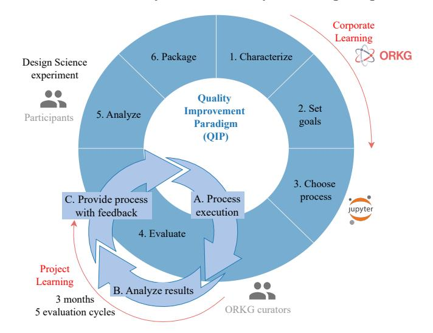
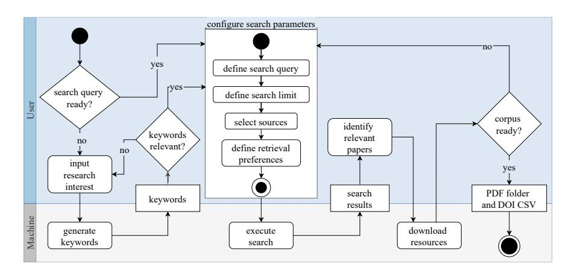
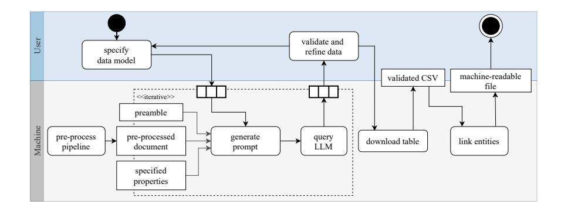
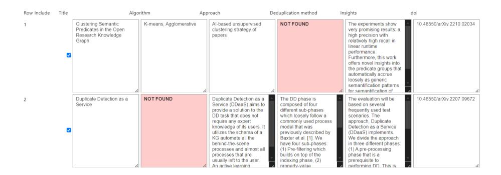
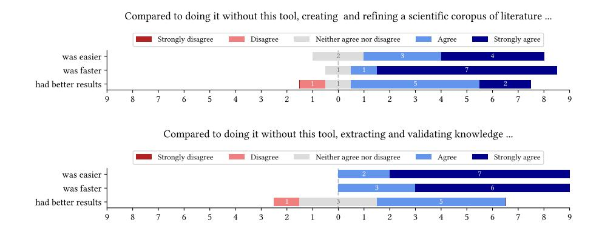
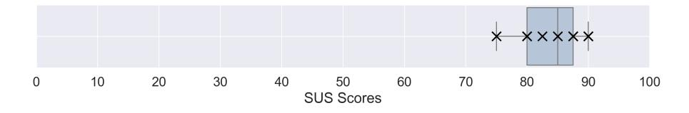
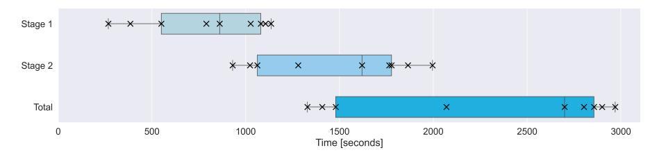

# Human-In-The-Loop Workflow for Neuro-Symbolic Scholarly Knowledge Organization

Lena John1[0009−0007−2097−9761], Ahmed Malek Ghanmi2 , Tim Wittenborg3,4[0009−0000−9933−8922], Sören Auer1,3,4[0000−0002−0698−2864], and Oliver Karras1[0000−0001−5336−6899]

1 TIB - Leibniz Information Centre for Science and Technology, Hannover, Germany {lena.john, soeren.auer, oliver.karras}@tib.eu

2 Leibniz University Hannover, Hannover, Germany

3 L3S Research Center, Leibniz University Hannover, Hannover, Germany

{tim.wittenborg, soeren.auer}@l3s.de

4 Cluster of Excellence SE²A – Sustainable and Energy-Efficient Aviation, Technische Universität Braunschweig, Germany

Abstract. As the volume of scientific literature continues to grow, efficient knowledge organization is an increasingly challenging task. Traditional structuring of scientific content is time-consuming and requires significant domain expertise, increasing the need for tool support. Our goal is to create a Human-in-the-Loop (HITL) workflow that supports researchers in creating and structuring scientific knowledge, leveraging neural models and knowledge graphs, exemplified using the Open Research Knowledge Graph (ORKG). The workflow aims to automate key steps, including data extraction and knowledge structuring, while keeping user oversight through human validation. We developed a modular framework implementing the workflow and evaluated it along the Quality Improvement Paradigm (QIP) with participants from the ORKG user community. The evaluation indicated that the framework is highly usable and provides practical support. It significantly reduces the time and effort required to transition from a research interest to literature-based answers by streamlining the import of information into a knowledge graph. Participants evaluated the framework with an average System Usability Scale (SUS) score of 84.17, an A+ – the highest achievable rating. They also reported that it improved their time spent, previously between 4 hours and two weeks, down to an average of 24:40 minutes. The tool streamlines the creation of scientific corpora and extraction of structured knowledge for KG integration by leveraging LLMs and userdefined models, significantly accelerating the review process. However, human validation remains essential throughout the extraction process, and future work is needed to improve extraction accuracy and entity linking to existing knowledge resources.

Keywords: HITL · Knowledge Graph · Literature Review · LLM · Modular framework · Knowledge Organization

## 1 Introduction

Conducting literature reviews is indispensable for scientific research. This task is inherently challenging, as it requires a significant amount of time and effort to gain an overview of the existing research and knowledge on a specific topic, helping to support methodology, contextualize research, or identify gaps in knowledge [\[33\]](#page-17-0). With the rapid growth in scientific discovery and distribution of knowledge, it has become even more difficult to produce high-quality reviews [\[23\]](#page-16-0). Recent advancements in artificial intelligence (AI), particularly the rise of large language models (LLMs) and AI-based Literature Reviews (AILR) [\[39\]](#page-17-1), offer promising opportunities to streamline and automate repeatable and time-consuming processes [\[29\]](#page-17-2). However, despite their growing popularity, AI models face significant limitations, primarily the tendency to produce hallucinations, resulting in inconsistencies and confusion [\[28\]](#page-16-1). Combining AI capabilities with a consistent knowledge base, called neuro-symbolic AI, mitigates these risks by leveraging reliable knowledge representations to alleviate AI's unreliability [\[3\]](#page-15-0). The knowledge bases need to be Findable, Accessible, Interoperable, and Reusable (FAIR) [\[40\]](#page-17-3) to address the requirements of the scholarly domain and AI technology [\[2\]](#page-15-1). Such solutions already exist, like the Open Research Knowledge Graph (ORKG)[5](#page-1-0) and its neuro-symbolic service Ask [\[3\]](#page-15-0), offering a novel approach by representing scientific information in a structured format, providing both human- and machine-readability. However, organizing knowledge at scale reintroduces the original challenge of requiring human oversight, leading to manual work and a circular dependency. To address this issue, an iterative, Human-in-the-Loop (HITL), AI-assisted knowledge organization approach is needed, constantly improving scholarly knowledge representation.

Our contributions include 1) A HITL workflow, combining LLM support with Natural Language Processing (NLP) techniques to assist users by streamlining, automating, and formalizing tasks of literature reviews. 2) A modular framework implementing this workflow to build a scientific corpus of literature and transform information into structured knowledge, ready for integration into knowledge graphs. 3) An iterative evaluation with nine researchers over 4 months, developing and validating the frameworks' capacity to ensure greater efficiency while allowing users to maintain oversight of the automated processes.

This work is structured as follows: In [section 2](#page-2-0) we give an overview of the background and related work in the HITL context. Our approach is described in [section 3](#page-3-0) , followed by an outline of the implementation in [section 4.](#page-7-0) We evaluate the developed solution in [section 5](#page-10-0) and discuss the results in [section 6.](#page-13-0) We conclude our work in [section 7.](#page-14-0)

5 <https://orkg.org/>

## 2 Background and Related Work

This section explores Knowledge Graphs (KGs), AI-driven automation, and HITL systems in scholarly knowledge organization, highlighting their roles in literature reviews and knowledge integration.

Knowledge Organization. Knowledge Graphs (KGs) are designed to represent and interconnect information in a structured, machine-readable format [\[36\]](#page-17-4), like the scientific knowledge graph (SKG) Semantic Scholar [\[38\]](#page-17-5). Manually preparing data for KGs, particularly SKGs, is time-consuming and lacks scalability, as it requires domain specialists to search, interpret, and structure scientific literature [\[12\]](#page-15-2). Without domain experts, there is a higher risk of integrating incorrect, incomplete, or outdated information into the SKG, reducing its reliability and quality [\[15\]](#page-16-2). The quality of SKGs heavily depends on their construction method, with significantly different results between manual and automated creation methods [\[13\]](#page-15-3). The ORKG is a versatile scientific knowledge platform that uses crowdsourcing to organize and link scientific knowledge across various topics and domains [\[3\]](#page-15-0). Karras et al. [\[18,](#page-16-3)[19,](#page-16-4)[20\]](#page-16-5) demonstrated how the ORKG can enhance and ensure FAIR [\[40\]](#page-17-3) literature reviews, highlighting their importance in providing research with structured, long-term available data. The ORKG Assistant for Scientific Knowledge (Ask) [\[3\]](#page-15-0) applies a neuro-symbolic approach using semantic search, LLMs, and KGs. It exemplifies a next-generation scholarly search and exploration system, combining semantic knowledge representation with AI.

Artificial Intelligence (AI). AI and NLP techniques can automate content generation and assignment [\[10\]](#page-15-4), but these methods often lack transparency and accountability while struggling with semantic context [\[21\]](#page-16-6). Fully relying on AIsupported technologies poses significant risks, making human supervision and validation indispensable [\[30\]](#page-17-6). The study conducted by Danler et al. [\[9\]](#page-15-5) demonstrates that, while AI-generated outputs can be of high quality, " relying solely on AI-generated outputs for crafting a scientific paper is not advisable" [\[9,](#page-15-5) p. 207]. Bacinger et al. [\[5\]](#page-15-6) present Litre Assistant, a machine-learning-based solution to determining a corpus of scientific papers as the initial task of the Systematic Literature Review (SLR) process. Their work introduces a system that allows users to iteratively select desired papers as a set of training data for machine learning (ML) algorithms for an automated classification process. Ye et al. [\[43\]](#page-17-7) propose a hybrid, "human-oriented", but AI-based workflow to support specific steps of an SLR. Their workflow screens full-text articles to extract relevant data and allows the user to perform inclusion and exclusion decisions, resulting in a spreadsheet of LLM-generated data. The work of Alshami et al. [\[1\]](#page-15-7) introduces a method where humans review ChatGPT-generated data for literature setup, abstract screening, data extraction, and analysis. However, relying solely on ChatGPT restricts access to real-time data, limiting the research scope to the model's training data and reducing its applicability.

Human-in-the-Loop (HITL). Several previously mentioned works incorporate human oversight in selection, classification, processing, and representation to achieve more accurate results [\[1,](#page-15-7)[3,](#page-15-0)[5,](#page-15-6)[43\]](#page-17-7). Consequently, research increasingly recognizes the value of HITL approaches [\[22\]](#page-16-7). Through providing iterative feedback, users validate outputs as well as refine and enhance the performance system over time to bridge the gap between efficiency and contextual relevance [\[8\]](#page-15-8). Schatz et al. [\[32\]](#page-17-8) developed a workflow for curating a biomedical KG (DRKG) [\[14\]](#page-16-8), that integrates HITL components. Their approach is particularly relevant as it addresses HITL usability aspects in the context of curating and enriching KGs. The work by Tsavena et al. [\[35\]](#page-17-9) builds on the automated pipeline for curating SKGs introduced in SCICERO [\[11\]](#page-15-9). They propose a HITL validation module as a solution to incorporate human decision-making into the curation process. This module, one of two proposed validation mechanisms, establishes a hybrid approach that integrates human expertise to enhance the curation process. The authors report a significant improvement in the accuracy of automated KG generation, demonstrating an improvement in both precision and recall. SWARM-SLR by Wittenborg et al. [\[41\]](#page-17-10) establishes a literature review workflow implemented by a modular framework that utilizes several AI-based tools to fulfill 65 requirements derived from SLR guidelines. While many requirements can be supported or even fulfilled by AI, the overall workflow still requires human expert intervention at several stages of the literature review, particularly for knowledge extraction and validation. Users remain crucial for guiding and validating tasks where automated approaches lack accuracy or contextual understanding [\[25\]](#page-16-9).

Our work builds on the discussed approaches, emphasizing the role of HITL in the context of AI-assisted knowledge graph construction. In this spirit, we aim to develop a solution that supports transforming completely unstructured input into knowledge graph representations, with a focus on efficiency and usability. These knowledge graphs will then provide the human- and machine-readable context required by neuro-symbolic AI to sustainably address the challenge of scholarly knowledge organization.

## 3 Approach

We adopt the Quality Improvement Paradigm (QIP) [\[7\]](#page-15-10) to guide the iterative development of a modular framework, implementing a HITL workflow, for transforming scientific corpora into structured knowledge. The approach was developed in close collaboration with ORKG curators, researchers from diverse domains funded through grants to create structured comparisons, a key content type presenting tabular overviews of state-of-the-art research in the ORKG [\[26\]](#page-16-10). While their financial affiliation may introduce some bias, their interest in improving tools that support their contributions fosters practical, needs-driven feedback. An overview of the development process is shown in [Figure 3,](#page-4-0) with detailed tasks in [Table 1.](#page-4-1) The Project Learning cycle focused on short-term usability improvements based on curator feedback, while the Corporate Learning cycle addressed long-term enhancements to ORKG infrastructure beyond the project.

Fig. 1. Application of the Quality Improvement Paradigm (QIP) methodology with ORKG curators. Derived from [\[27\]](#page-16-11).

| Step              | Description                                                                                                                                                                                                                                                                                                                                             |
|-------------------|---------------------------------------------------------------------------------------------------------------------------------------------------------------------------------------------------------------------------------------------------------------------------------------------------------------------------------------------------------|
| 1. Characterize   | In the first phase, we examined research workflows, includ ing topic selection, corpus retrieval, and structured overview creation. Collaborating with ORKG curators, we identified key content and technical requirements, resulting in a mod ular, adaptable framework for diverse SKG use cases.                                         |
| 2. Set goals      | We defined functional and non-functional requirements to set the tool's scope, ensuring it addresses key pain points like time-consuming corpus creation and limited support for structured output (cf. subsection 3.1).                                                                                                                       |
| 3. Choose process | We selected external ORKG curators as a focus group due to their research diversity and active involvement in literature based knowledge graph curation. Using an iterative partic ipatory design approach with bi-weekly meetings, we co developed modular Jupyter Notebooks tailored to flexible workflow stages (cf. subsection 3.2). |
| 4. Execute        | In this phase, we implemented and iteratively refined the framework with ongoing feedback. Over three months in five meetings, we made key design choices, including abstract only publication support and splitting the workflow into two notebooks (cf. section 4).                                                                       |

| 5. Analyze | We finalized the framework by incorporating feedback and     |
|------------|--------------------------------------------------------------|
|            | evaluating its effectiveness through a design science experi |
|            | ment. This revealed usability issues, guided feature refine  |
|            | ments, and validated alignment with real-world curation      |
|            | needs (cf. section 5).                                       |
| 6. Package | Finally, we compiled reusable artifacts, including framework |
|            | components, evaluation metrics, and key insights, to support |
|            | broader adoption. We also assessed ORKG's infrastructure     |
|            | to enable sustainable integration (cf. sections 5 and 6).    |
|            |                                                              |

### 3.1 Requirements

To define functional and non-functional requirements (see [Table 2\)](#page-5-1) for our HITL framework, we drew inspiration from the work of Wittenborg et al. [\[41\]](#page-17-10), who specified requirements for the typical phases of an SLR. While our framework does not aim to fully replicate or enforce the rigor of a formal SLR, we adopt this process-oriented perspective to ensure relevance and alignment with realworld research workflows. In collaboration with the curators and domain experts behind SWARM-SLR, we adapted these ideas to guide the design of our system requirements and to support a more lightweight, customizable process for literature exploration. Our goal is to offer a modular framework that enables the generation and processing of a literature corpus without imposing the complexity of a full SLR pipeline. To ensure modularity and usability, we divide the workflow into two main stages, each addressing a distinct set of user needs. The framework is designed to allow users to begin directly with the second stage if a relevant corpus has already been assembled.

Table 2: Functional (FR) and non-functional (NR) requirements

| Functional Requirements (FR)                                      | Fulfillment |
|-------------------------------------------------------------------|-------------|
| FR1: The framework should suggest relevant keywords based on a    |             |
| user-defined research interest.                                   | Yes         |
| FR2: The framework must allow a user to manually input and modify |             |
| a search query to retrieve relevant literature.                   | Yes         |
| FR3: The framework must support integration with external litera  |             |
| ture databases.                                                   | Yes         |
| FR4: The framework must provide options to configure search pa    | Yes         |
| rameters.                                                         |             |
| FR5: The framework should present retrieved search results in an  |             |
| interactive format.                                               | Yes         |
| FR6: The framework must enable a user to select and download      |             |
| relevant papers to create a literature corpus.                    | Yes         |
| FR7: The framework must allow a user to use an existing corpus to | Partial     |
| proceed with knowledge extraction.                                |             |

| FR8: The framework must provide an interface to define a customiz able data model, specifying the properties to extract from each pub lication. | Partial     |  |
|-------------------------------------------------------------------------------------------------------------------------------------------------------|-------------|--|
| FR9: The framework must extract information according to the user                                                                                     | Yes         |  |
| defined data model from the provided literature corpus.                                                                                               |             |  |
| FR10: The framework should flag properties that cannot be ex                                                                                          | Yes         |  |
| tracted or are missing to alert users.                                                                                                                |             |  |
| FR11: The framework must present the extracted data in an editable                                                                                    |             |  |
| format to allow user refinement and approval.                                                                                                         | Yes         |  |
| FR12: The framework will support entity linking on the extracted                                                                                      | No          |  |
| and validated content for seamless KG-integration.                                                                                                    |             |  |
| Non-Functional Requirements (NR)                                                                                                                      |             |  |
|                                                                                                                                                       | Fulfillment |  |
| NR1: The framework must be implemented in a modular way, sup                                                                                          |             |  |
| porting the integration of new data sources or processing steps.                                                                                      | Yes         |  |
| NR2: The framework should offer an interactive user interface.                                                                                        | Yes         |  |
| NR3: The framework must unify data returned from various data                                                                                         |             |  |
| sources into a consistent internal schema to support comparison.                                                                                      | Yes         |  |
| NR4: The framework should be capable of handling literature cor                                                                                       |             |  |
| pora of varying sizes without significant loss in performance.                                                                                        | No          |  |
| NR5: The framework should be well-documented, follow clean code                                                                                       |             |  |
| principles, and be openly available to support long-term mainte                                                                                       | Yes         |  |

### 3.2 Workflow

In the following, we detail how our workflow is designed to address the defined requirements outlined above. While not aiming to fully replicate the SLR process, the two workflow stages are broadly inspired by its typical phases and serve as a practical structure for supporting key tasks. Our proposed HITL workflow blends automation with human validation, allowing users to apply their expertise where it's most valuable, especially in interpreting and refining scientific content. To reduce the manual burden, we focus on automating the most time-consuming steps, while still giving users control over key decisions. Because the workflow can begin with any research interest, no pre-structured input is needed, making the process flexible and adaptable to a wide range of review scenarios.

Stage 1: Creating a scientific corpus of literature. The first stage of the workflow is dedicated to creating a corpus of scientific publications relevant to the user's research interest, as depicted in [Figure 2.](#page-7-1) Users begin by defining a research interest, which can be used by the LLM to suggest relevant keywords, though this step is optional. The user then manually formulates a search query, which is used to search selected sources. Search parameters, such as output size and the inclusion of only openly accessible full texts, can be further configured, as a subset of users prefers a broader range of materials and does not prioritize

full-text access. The retrieved papers are then reviewed and selectively chosen by the user, forming the input for Stage  $2$ .

Fig. 2. Activity diagram for Stage 1: Creating a scientific corpus of literature, demonstrating user-machine interaction in the scientific literature corpus building process.

Stage 2: Knowledge extraction and validation. The second stage processes the knowledge within the corpus, as shown in Figure 3. The user begins by defining the properties of the data model to be extracted from each paper. The LLM agent then parses and interprets the corpus, generating output based on the specified properties. If any information is not found, the LLM flags this to mitigate the risk of hallucination. The user can manually refine, revise, and modify the results to ensure accuracy, ultimately validating the output. The final results are formatted, and optionally, entity extraction is performed to create output that is suitable for KG integration.

#### Implementation $\mathbf{4}$

We implement the described functions as a modular framework in two Jupyter Notebooks using Python (NR5). These notebooks include automated modules, visualizations, and browser-based interactive control elements  $(NR2)$ . We leverage the interactive HTML widgets from the Python package ipywidgets as well as the IPython toolkit for abstracting complex code interactions and enhancing the usability and interactivity. Users can interact with UI elements like input fields and checkboxes for easy configuration. They can also extend functionality by adding query sources or modifying the UI, cells, and behavior as needed  $(NR1).$ 

The **first stage** is designed to retrieve relevant papers based on a user-defined search query (FR2). Prior to this, the framework can suggest relevant keywords based on the user's research interest (FR1) to support the formulation of an

Fig. 3. Activity diagram for Stage 2: Knowledge extraction and validation, showing the tasks executed by both the user and machine to extract knowledge from the corpus.

effective query. We utilize multiple APIs, including SemanticScholar, ArXiv and the SerpApi wrapper. Accessing diverse scholarly databases enables real-time search across various databases  $(FR3)$  based on user search preferences  $(FR4)$ . These platforms return JSON objects with different data schemas, which we unify to ensure consistency (NR3). Most relevant elements, such as title, abstract, authors, publication date, and links to full texts are then displayed within the notebook in expandable accordions (FR5), as shown in Figure 4. Based on these

| Query and Display                                                                                                                         |                                                                                                                                                                                                                                                                                                                                                                                                                                                                                                                                                                                                                                                                                                                                                                                                                                                                                                                                                                                                                                                                                                                                                                                                                                                                                                                                                                                                                                                                                                                                                                                                                             |                                                                                                                                      |  |  |
|-------------------------------------------------------------------------------------------------------------------------------------------|-----------------------------------------------------------------------------------------------------------------------------------------------------------------------------------------------------------------------------------------------------------------------------------------------------------------------------------------------------------------------------------------------------------------------------------------------------------------------------------------------------------------------------------------------------------------------------------------------------------------------------------------------------------------------------------------------------------------------------------------------------------------------------------------------------------------------------------------------------------------------------------------------------------------------------------------------------------------------------------------------------------------------------------------------------------------------------------------------------------------------------------------------------------------------------------------------------------------------------------------------------------------------------------------------------------------------------------------------------------------------------------------------------------------------------------------------------------------------------------------------------------------------------------------------------------------------------------------------------------------------------|--------------------------------------------------------------------------------------------------------------------------------------|--|--|
| Searching for: 'duplicate predicates in knowledge graphs' in ['Arxiv', 'Semantic Scholar'] Querving Arxiv Querving Semantic Scholar |                                                                                                                                                                                                                                                                                                                                                                                                                                                                                                                                                                                                                                                                                                                                                                                                                                                                                                                                                                                                                                                                                                                                                                                                                                                                                                                                                                                                                                                                                                                                                                                                                             |                                                                                                                                      |  |  |
| Following papers from Anxiv                                                                                                               |                                                                                                                                                                                                                                                                                                                                                                                                                                                                                                                                                                                                                                                                                                                                                                                                                                                                                                                                                                                                                                                                                                                                                                                                                                                                                                                                                                                                                                                                                                                                                                                                                             |                                                                                                                                      |  |  |
| $\sqcap$                                                                                                                                  |                                                                                                                                                                                                                                                                                                                                                                                                                                                                                                                                                                                                                                                                                                                                                                                                                                                                                                                                                                                                                                                                                                                                                                                                                                                                                                                                                                                                                                                                                                                                                                                                                             | Trust from the past: Bayesian Personalized Ranking based Link Prediction in Knowledge Graphs                                         |  |  |
| 7                                                                                                                                         |                                                                                                                                                                                                                                                                                                                                                                                                                                                                                                                                                                                                                                                                                                                                                                                                                                                                                                                                                                                                                                                                                                                                                                                                                                                                                                                                                                                                                                                                                                                                                                                                                             | Uncovering Hidden Semantics of Set Information in Knowledge Bases                                                                    |  |  |
|                                                                                                                                           |                                                                                                                                                                                                                                                                                                                                                                                                                                                                                                                                                                                                                                                                                                                                                                                                                                                                                                                                                                                                                                                                                                                                                                                                                                                                                                                                                                                                                                                                                                                                                                                                                             | Uncovering Hidden Semantics of Set Information in Knowledge Bases                                                                    |  |  |
|                                                                                                                                           | Authors: Shrestha Ghosh. Simon Razniewski. Gerhard Weikum                                                                                                                                                                                                                                                                                                                                                                                                                                                                                                                                                                                                                                                                                                                                                                                                                                                                                                                                                                                                                                                                                                                                                                                                                                                                                                                                                                                                                                                                                                                                                                   |                                                                                                                                      |  |  |
|                                                                                                                                           | Date: 2020-03-06                                                                                                                                                                                                                                                                                                                                                                                                                                                                                                                                                                                                                                                                                                                                                                                                                                                                                                                                                                                                                                                                                                                                                                                                                                                                                                                                                                                                                                                                                                                                                                                                            |                                                                                                                                      |  |  |
|                                                                                                                                           | 1 Abstract: Knowledge Bases (KBs) contain a wealth of structured information about entities and predicates. This paper focuses on set-valued predicates, i.e., the relationship between an entity and a set of entities. In KB this information is often represented in two formats: (i) via counting predicates such as numberOfChildren and staffSize. that store aggregated integers, and (ii) via enumerating predicates such as parentOf and worksFor, t store individual set memberships. Both formats are typically complementary: unlike enumerating predicates, counting predicates do not give away individuals, but are more likely informative towards the true set size, thus this coexistence could enable interesting applications in question answering and KB curation. In this paper we aim at uncovering this hidden knowledge. We proceed in two steps. (i) We identify set-valued predicates from a given KB predicates via statistical and embedding-based features. (ii) We link counting predicates and enumerating predicates by a combination of co-occurrence, correlation and textual relatedness metrics. We analyze the prevalence of count information in four prominent knowledge bases, and show that our linking method achieves up to 0.55 F1 score in set predicate identification versus 0.40 F1 score of a random selection, and normalized discounted gains of up to 0.84 at position 1 and 0.75 at position 3 in relevant predicate alignments. Our predicate alignments are showcased in a demonstration system available at https://counger.mpi-inf.mpg.de/spo. |                                                                                                                                      |  |  |
|                                                                                                                                           | Link: Read more                                                                                                                                                                                                                                                                                                                                                                                                                                                                                                                                                                                                                                                                                                                                                                                                                                                                                                                                                                                                                                                                                                                                                                                                                                                                                                                                                                                                                                                                                                                                                                                                             |                                                                                                                                      |  |  |
| $\sqcap$                                                                                                                                  |                                                                                                                                                                                                                                                                                                                                                                                                                                                                                                                                                                                                                                                                                                                                                                                                                                                                                                                                                                                                                                                                                                                                                                                                                                                                                                                                                                                                                                                                                                                                                                                                                             | > LGM: Mining Frequent Subgraphs from Linear Graphs                                                                                  |  |  |
| Following papers from Semantic Scholar                                                                                                    |                                                                                                                                                                                                                                                                                                                                                                                                                                                                                                                                                                                                                                                                                                                                                                                                                                                                                                                                                                                                                                                                                                                                                                                                                                                                                                                                                                                                                                                                                                                                                                                                                             |                                                                                                                                      |  |  |
|                                                                                                                                           |                                                                                                                                                                                                                                                                                                                                                                                                                                                                                                                                                                                                                                                                                                                                                                                                                                                                                                                                                                                                                                                                                                                                                                                                                                                                                                                                                                                                                                                                                                                                                                                                                             | > Theory and applications of models of computation : 4th International Conference, TAMC 2007, Shanghai, China, May 22-25, 2007 : pro |  |  |

Fig. 4. Visualization of query results, where each paper is presented within an expandable accordion, providing access to detailed information relevant to the paper.

suggestions, the user iteratively creates the corpus by selecting and downloading relevant papers (FR6). For reproducibility, the corresponding DOIs can be stored in a  $\text{CSV file.}$ 

The second stage involves processing the corpus with the assistance of an LLM. While tools such as [Ollama](https://ollama.com/) offer local access to multiple LLMs, we opted for a cloud-based solution that avoids reliance on local resources. We selected the [Mistral-large-2 model,](https://mistral.ai/news/mistral-large-2407/) accessible via Mistral's API and currently free of charge. This choice also enables specifying output formats as JSON, improving structure and compatibility with downstream processes. The tool prompts the LLM iteratively with separate instructions, including the defined properties by the user (FR8), and the pre-processed text extracted from each PDF in the corpus. The pre-processing pipeline begins by extracting raw text from each PDF using [pdfminer.](https://pypi.org/project/pdfminer/) To avoid including external or irrelevant material in the prompt, the references section and appendices of each paper are identified and removed. Additionally, we apply regex-based heuristics to format and reconstruct the sentences and paragraphs, ensuring proper context is preserved for further processing. The generated output (FR9) is displayed to the user using a datagrid (FR11) shown in [Figure 5.](#page-9-0) This allows users to review, edit, and decide which entries to include in the final CSV file. They can also refine the data model and initiate a new extraction process. However, previously generated extractions may be altered or lost, as the model reprocesses the data.

Fig. 5. Visualization of LLM-generated information. If a property is not found in the text, the tool renders a label "NOT FOUND" and displays it in red (FR10).

We have begun to integrate entity linking (FR12) into our workflow as a step toward semantic enrichment. Following validation, the LLM-generated text is processed for entity extraction using [Falcon 2.0](https://labs.tib.eu/falcon/falcon2/) [\[31\]](#page-17-11), a rule-based system capable of identifying and linking entities to knowledge graphs such as DBpedia [\[4\]](#page-15-11) and Wikidata [\[37\]](#page-17-12). At this stage, we use Falcon 2.0 primarily for entity extraction. Further steps, such as full entity linking and seamless integration into a KG, are planned for future work to support more machine-readable enrichment of the extracted content. Previous work [\[17\]](#page-16-12) addressed semantification of tables by aligning entities and structuring content during KG import.

## 5 Evaluation

The framework is evaluated through a design science experiment involving prospective users to assess its practical usability and real-world applicability. To contextualize this evaluation, we consider the ORKG as a representative environment for scientific content creation. Following the goal definition template by Wohlin et al. [\[42\]](#page-17-13), we define the experiment's objective as follows:

Research goal: Analyze the developed HITL tool with the purpose of supporting systematic content creation for scientific KGs in terms of usability (effectiveness, efficiency, satisfaction) from the perspective of potential future users familiar with the ORKG in the context of the Open Research Knowledge Graph.

The goal leads to the research question:

Research question: How does the developed HITL tool impact the usability of systematic content creation for scientific knowledge graphs, from the perspective of potential future users familiar with the ORKG?

The experiment aims to assess the practical usability of the developed HITL tool for creating scientific content for knowledge graphs. To this end, we collaborated with ORKG curators who have previously created comparisons as part of literature reviews. Each participant will first subjectively assess the time they spent on manually creating one of their existing comparisons, reflecting state-of-theart research in a specific domain. They will then recreate the same comparison using the HITL tool, without reviewing the original version to avoid bias.

The developed framework is the independent variable, while effectiveness, efficiency, and satisfaction are the dependent variables for usability. Effectiveness is measured by participants' perception and objectively by the number of identified papers, along with the accuracy of extracted data compared to the established comparison. Efficiency is assessed through participants' perception and objectively by the time taken to create the comparison. Satisfaction is evaluated subjectively after each stage and overall using the System Usability Scale (SUS) [\[24\]](#page-16-13) at the experiment's conclusion.

With particpants' consent, both screen and audio were recorded during the sessions to enable detailed post-analysis. The experiment is described in a document [\[16\]](#page-16-14) provided to participants at the start, outlining the study context and presenting title and description of their most recent comparison. The [HITL tool](https://gitlab.com/TIBHannover/orkg/hitl-litrev-kg.git) runs locally on a computer provided by the experimenter. Sessions are conducted either in person or remotely via TeamViewer, ensuring a consistent experience. A [questionnaire](https://survey.uni-hannover.de/index.php/428288?lang=en) collects demographic data, ORKG usage frequency, and consent. Participants rate their agreement with statements regarding the tools' usefulness and user experience using a Likert scale. The SUS is administered at the end of each session, alongside open-ended questions for additional qualitative feedback.

The target group consists of individuals familiar with the ORKG who have created at least one comparison. Participants were recruited through an open

call and convenience sampling, with participation being voluntary. Each session lasts approximately 60 minutes and follows a structured procedure:

- 1. Introduction to the workflow, questionnaire, and experiment document.
- 2. 5-10 minutes for participants to read the provided document.
- 3. Completion of initial questionnaire pages, collecting demographic information and baseline data.
- 4. Participants proceed through the two stages of the workflow, responding to related questionnaire items while engaging in the Think-Aloud method [\[34\]](#page-17-14).
- 5. Completion of the SUS and provision of general feedback.

Results. The raw data [\[16\]](#page-16-14) is published on Zenodo. Nine participants, including external curators and internal members, took part in the experiment, primarily from Semantic Web technologies or neuro-symbolic AI fields. Participants reported varied ORKG usage frequencies, ranging from weekly to monthly, with experience spanning from a few months to several years, reflecting different levels of expertise with the system. [Figure 6](#page-11-1) presents the participants' responses regarding subjective efficiency and effectiveness, showing strong agreement that the tool makes corpus creation and knowledge extraction 'faster' and 'easier', and a weaker agreement to its ability to render 'better results'.

Fig. 6. Participants' agreement to statements for Stage 1 (above) and 2 (below).

[Figure 7](#page-12-0) represents the resulting SUS scores. We achieve an overall SUS score of 84.17 (min = 75, max = 90, σ = 4.86), regarded as A+ score – the highest usability rating [\[24\]](#page-16-13). Participants expressed general satisfaction with the tool, with comments like "The workflow should be integrated to ORKG as soon as possible. I will like to use it" and "Very helpful system!!!". Specific feedback highlighted features like the "Keywords extraction option is an amazing idea". Suggestions for improvement included adding "Properties should have descriptions (for more accurate extraction)" and "focus could be on extracting entities that align with the similar papers already available in the ORKG".

Fig. 7. SUS scores and boxplot distribution, scoring an average of 84.17 (A+ according to the Lewis and Sauro benchmarks [\[24\]](#page-16-13)).

The reported durations for the participants' original comparison varied significantly, with the fastest comparison taking approximately 4 hours to complete, while the longest required around 2 weeks. Completing the workflow with our framework – from defining a research interest based on their original comparison to successfully creating a new ORKG comparison – took an average of 1,480 seconds (24:40 minutes), with a minimum of 1,023 seconds (17:03 minutes) and a maximum of 1,996 seconds (33:16 minutes), as detailed in [Figure 8.](#page-12-1)

Fig. 8. Visualization of the time spent by participants across two workflow stages.

We also assess the tool's ability to replicate the original comparison by evaluating the number of publications it identifies against those included in the original set. The newly generated comparisons contained an average of 5 papers (min = 1, max= 8, σ = 2.2), whereas the original comparisons had an average of 11 papers. Overall, 98% of the newly created comparisons differed from the originals, with only 2% showing overlapping results. Since the majority of the retrieved papers did not match the original set, it was difficult to objectively assess the quality of the information generated by the tool.

QIP. The QIP methodology showed that curators are a valuable user group for guiding tool development. To improve CSV-based integration of literature tables, enhanced semantification is currently being developed to better align entities within the ORKG [\[17\]](#page-16-12).

Threats to Validity. Based on Wohlin et al. [\[42\]](#page-17-13), we identify potential threats to the validity of our experiment. Conclusion Validity. Participants may subconsciously replicate elements from their original ORKG comparison. To reduce this risk, we did not inform them that the task was based on their previous work. Participants came from diverse research fields but worked on their own

prior content, minimizing the impact of disciplinary differences while supporting broader generalizability. Internal Validity. Participants may have been predisposed to emphasize the tool's benefits in comparison to doing it without the tool, particularly ease and speed. As part of the participants were ORKG curators, their financial affiliation could have introduced a bias toward favorable feedback, given the tool's relevance to their ongoing work. Construct Validity. To capture genuine reactions and difficulties, we applied the Think-Aloud Method [\[34\]](#page-17-14), encouraging participants to verbalize thoughts during each task. This helped ensure feedback reflected actual experiences with the tool. External Validity. With only nine participants, generalizability is limited. Nonetheless, the range of disciplinary backgrounds offers insight into the tool's broader applicability. Future evaluations should involve more diverse and numerous participants to strengthen external relevance.

## 6 Discussion and Future Work

Experiment. We interpret the mean SUS score using Bangor et al.'s [\[6\]](#page-15-12) adjective scale, where the tool's score of 84.17 ranks at the upper boundary of "Good", and an A+ in the Lewis and Sauro's benchmarks [\[24\]](#page-16-13), indicating a positive user experience. Participants described the tool as intuitive, easy to navigate, and effective for task execution. The tool significantly reduced the time needed to create content in the ORKG compared to participants' prior methods. While this shows strong potential for streamlining workflows, it does not automatically ensure higher-quality outputs. Participants appreciated the simplified corpus creation and extraction process but expressed concerns about accuracy and over-reliance on automated suggestions. Those who invested more time refining the corpus reported better outcomes, suggesting deeper engagement improves quality. Still, not all agreed the tool consistently produced better results, exposing a gap between automation and human expectations. This disparity points to a key challenge in HITL systems: balancing automation with human judgment to ensure both efficiency and high-quality, contextually relevant results. Addressing this requires enhancing the extraction process and incorporating iterative feedback loops to refine accuracy. Although the experiment aimed to replicate a prior comparison, measuring replication quality through the number of identified papers proved unfeasible as an indicator of replication quality, underscoring the challenge of replicating structured research output in a HITL system. Unlike automated systems, our approach relies on user insights and interpretations, making the process subjective and context-dependent.

Requirements. The tool satisfies most core requirements defined for the HITL framework. It guides users from defining a research interest to extracting and editing data, with CSV export for seamless integration into scholarly KGs like the ORKG. The modular pipeline supports extensibility, adaptability, and long-term semantic preservation. However, key limitations remain. Entity linking (FR12) is not yet implemented, leaving extracted entities disconnected from existing KG resources. Incorporating entity alignment and exporting in formats like JSON-LD or RDF would improve semantic interoperability. Support for processing existing corpora (FR7) is also insufficient. Currently, users must manually import PDFs and resolve potential errors independently. Integration with tools like Zotero could streamline corpus handling and reduce user friction. Additionally, performance degrades with large datasets (NR4), as processing occurs sequentially per document. Future work should focus on performance optimization and parallelization strategies. Participants also requested more control over the data model (FR8). Allowing users to define domain-specific properties and extraction instructions would improve precision and adaptability across fields. This aligns with feedback on the need for more customizable and explainable outputs. Crucially, while automation accelerates literature processing, LLM-based extractions still require human validation (FR10, FR11). Without critical oversight, there's a risk of misinterpreting or blindly trusting generated results. This underscores the ethical implications of AI-assisted research, especially risking the loss of genuine understanding and knowledge internalization.

Future Work. Future development should allow storing and refining outputs with customizable data models, enabling users to iteratively improve extraction accuracy. Users can selectively re-run extractions on specific cells while preserving high-quality results, enhancing the HITL process. Semantic structuring, like linking content to knowledge graph entities and supporting interoperable formats, will strengthen the system's utility. Ongoing improvements in reference manager integration, scalability, and model configurability will stabilize and enrich the tool. Lastly, research should focus on user guidance for validating and interpreting extractions, e.g., by highlighting source passages in PDFs, ensuring human oversight in AI-driven workflows.

## 7 Conclusion

Our work presents a semi-automated solution for structuring scientific content specifically for integration into the ORKG. Aligned with the quality improvement (QIP) paradigm, we designed a HITL workflow consisting of two stages, Creating a scientific corpus of literature and Knowledge extraction and validation. Our modular framework implemented this workflow in a Jupyter notebook environment and assists in identifying relevant publications, extracting key information, and structuring knowledge into reusable formats for integration into scientific knowledge graphs, exemplified by the ORKG.

By automating repetitive tasks and allowing researchers to interactively refine outputs, the tool reduces the manual effort typically involved in processing large volumes of literature, moving towards making large-scale literature reviews more efficient and enabling researchers to keep pace with the expanding body of scientific knowledge. While the evaluation results showed the tool is highly usable and accelerates the process, we identified areas for improvement. Additional support is needed to engage users in the knowledge extraction process, alongside additional feedback loops to enhance the quality of extracted information.

## References

- 1. Alshami, A., Elsayed, M., Ali, E., et al.: Harnessing the Power of ChatGPT for Automating Systematic Review Process: Methodology, Case Study, Limitations, and Future Directions. Systems 11(7), 351 (2023). [https://doi.org/10.3390/](https://doi.org/10.3390/systems11070351) [systems11070351](https://doi.org/10.3390/systems11070351)
- 2. Auer, S., Barone, D.A., Bartz, C., Cortes, E.G., Jaradeh, M.Y., Karras, O., Koubarakis, M., Mouromtsev, D., Pliukhin, D., Radyush, D., et al.: The SciQA Scientific Question Answering Benchmark for Scholarly Knowledge. Scientific Reports 13(1), 7240 (2023)
- 3. Auer, S., et al.: Open Research Knowledge Graph: A Large-Scale Neuro-Symbolic Knowledge Organization System. In: Handbook on Neurosymbolic AI and Knowledge Graphs. IOS Press (2025)
- 4. Auer, S., Bizer, C., Kobilarov, G., et al.: DBpedia: A Nucleus for a Web of Open Data. In: The Semantic Web. pp. 722–735. Springer, Berlin, Heidelberg (2007). [https://doi.org/10.1007/978-3-540-76298-0\\_52](https://doi.org/10.1007/978-3-540-76298-0_52)
- 5. Bacinger, F., Boticki, I., Mlinaric, D.: System for Semi-Automated Literature Review Based on Machine Learning. Electronics 11(24), 4124 (2022). [https:](https://doi.org/10.3390/electronics11244124) [//doi.org/10.3390/electronics11244124](https://doi.org/10.3390/electronics11244124)
- 6. Bangor, A., Kortum, P., Miller, J.: Determining what individual SUS scores mean: adding an adjective rating scale. J. Usability Studies 4(3), 114–123 (May 2009)
- 7. Basili, V.R., Caldiera, G., Rombach, H.D.: Experience Factory. In: Encyclopedia of Software Engineering. John Wiley & Sons, Ltd (2002). [https://doi.org/10.1002/](https://doi.org/10.1002/0471028959.sof110) [0471028959.sof110](https://doi.org/10.1002/0471028959.sof110)
- 8. Dalvi Mishra, B., Tafjord, O., Clark, P.: Towards Teachable Reasoning Systems: Using a Dynamic Memory of User Feedback for Continual System Improvement. In: Proceedings of the 2022 Conference on Empirical Methods in Natural Language Processing. pp. 9465–9480. Association for Computational Linguistics, Abu Dhabi, United Arab Emirates (Dec 2022). [https://doi.org/10.18653/v1/2022.emnlp-main.](https://doi.org/10.18653/v1/2022.emnlp-main.644) [644](https://doi.org/10.18653/v1/2022.emnlp-main.644)
- 9. Danler, M., Hackl, W.O., Neururer, S.B., Pfeifer, B.: Quality and Effectiveness of AI Tools for Students and Researchers for Scientific Literature Review and Analysis. In: dHealth 2024, pp. 203–208. IOS Press (2024). [https://doi.org/10.](https://doi.org/10.3233/SHTI240038) [3233/SHTI240038,](https://doi.org/10.3233/SHTI240038)<https://ebooks.iospress.nl/doi/10.3233/SHTI240038>
- 10. Dessì, D., Osborne, F., Reforgiato Recupero, D., et al.: Generating knowledge graphs by employing Natural Language Processing and Machine Learning techniques within the scholarly domain. Future Generation Computer Systems 116, 253–264 (Mar 2021).<https://doi.org/10.1016/j.future.2020.10.026>
- 11. Dessí, D., Osborne, F., Reforgiato Recupero, D., et al.: SCICERO: A deep learning and NLP approach for generating scientific knowledge graphs in the computer science domain. Knowledge-Based Systems 258, 109945 (Dec 2022). [https://doi.](https://doi.org/10.1016/j.knosys.2022.109945) [org/10.1016/j.knosys.2022.109945](https://doi.org/10.1016/j.knosys.2022.109945)
- 12. Hofer, M., Obraczka, D., Saeedi, A., et al.: Construction of Knowledge Graphs: Current State and Challenges. Information 15(8), 509 (2024). [https://doi.org/10.](https://doi.org/10.3390/info15080509) [3390/info15080509](https://doi.org/10.3390/info15080509)
- 13. Huaman, E., Fensel, D.: Knowledge Graph Curation: A Practical Framework. In: Proceedings of the 10th International Joint Conference on Knowledge Graphs. pp. 166–171. IJCKG '21, Association for Computing Machinery, New York, NY, USA (Jan 2022).<https://doi.org/10.1145/3502223.3502247>

- 14. Ioannidis, V.N., Song, X., Manchanda, S., et al.: DRKG - Drug Repurposing Knowledge Graph for Covid-19 (2020),<https://github.com/gnn4dr/DRKG/>
- 15. Jain, N.: Domain-Specific Knowledge Graph Construction for Semantic Analysis. In: The Semantic Web: ESWC 2020 Satellite Events. pp. 250–260. Springer International Publishing (2020). [https://doi.org/10.1007/978-3-030-62327-2\\_40](https://doi.org/10.1007/978-3-030-62327-2_40)
- 16. John, L.: Human-in-the-loop workflow for neuro-symbolic scholarly knowledge organization - experiment material [data set]. Zenodo (2025). [https://doi.org/https:](https://doi.org/https://doi.org/10.5281/zenodo.15228337) [//doi.org/10.5281/zenodo.15228337](https://doi.org/https://doi.org/10.5281/zenodo.15228337)
- 17. John, L., Farfar, K.E., Auer, S., Karras, O.: SciMantify - A Hybrid Approach for the Evolving Semantification of Scientific Knowledge. In: 25th International Conference on Web Engineering (ICWE) 2025 (2025). [https://doi.org/10.15488/](https://doi.org/10.15488/19006) [19006,](https://doi.org/10.15488/19006) accepted at ICWE 2025. Proceedings to appear.
- 18. Karras, O.: KG-EmpiRE: A Community-Maintainable Knowledge Graph for a Sustainable Literature Review on the State and Evolution of Empirical Research in Requirements Engineering. In: 2024 IEEE 32nd International Requirements Engineering Conference (RE). pp. 500–501 (2024). [https://doi.org/10.1109/RE59067.](https://doi.org/10.1109/RE59067.2024.00063) [2024.00063,](https://doi.org/10.1109/RE59067.2024.00063) iSSN: 2332-6441
- 19. Karras, O.: Research Knowledge Graphs for Sustainable Literature Reviews in Software Engineering and Beyond. In: Software Engineering 2025–Companion Proceedings. pp. 10–18420. Gesellschaft für Informatik, Bonn (2025)
- 20. Karras, O., Budde, L., Merkel, P., Hermsdorf, J., Stonis, M., Overmeyer, L., Behrens, B.A., Auer, S.: Organizing Scientific Knowledge from Engineering Sciences Using the Open Research Knowledge Graph: The Tailored Forming Process Chain Use Case. Data Science Journal (Nov 2024). [https://doi.org/10.5334/](https://doi.org/10.5334/dsj-2024-052) [dsj-2024-052](https://doi.org/10.5334/dsj-2024-052)
- 21. Khalid, M., Khattak, H.A., Ahmad, A., et al.: Explainable Prediction of Medical Codes through Automated Knowledge Graph Curation Framework. In: 2022 19th International Bhurban Conference on Applied Sciences and Technology (IBCAST). pp. 331–336 (Aug 2022). [https://doi.org/10.1109/IBCAST54850.2022.9990551,](https://doi.org/10.1109/IBCAST54850.2022.9990551) iSSN: 2151-1411
- 22. Kommineni, V.K., König-Ries, B., Samuel, S.: From human experts to machines: An LLM supported approach to ontology and knowledge graph construction (Mar 2024). [https://doi.org/10.48550/arXiv.2403.08345,](https://doi.org/10.48550/arXiv.2403.08345) arXiv:2403.08345 [cs]
- 23. Larsen, K.R., Hovorka, D., Dennis, A., West, J.: Understanding the Elephant: The Discourse Approach to Boundary Identification and Corpus Construction for Theory Review Articles. Journal of the Association for Information Systems 20(7) (Jul 2019).<https://doi.org/10.17705/1jais.00556>
- 24. Lewis, J.R., Sauro, J.: Item Benchmarks for the System. Journal of Usability Studies 13(3) (2018)
- 25. Mosqueira-Rey, E., Hernández-Pereira, E., Alonso-Ríos, D., et al.: Human-in-theloop machine learning: a state of the art. Artificial Intelligence Review 56(4), 3005–3054 (Apr 2023).<https://doi.org/10.1007/s10462-022-10246-w>
- 26. Oelen, A., Jaradeh, M.Y., Farfar, K.E., Stocker, M., Auer, S.: Comparing research contributions in a scholarly knowledge graph. International Confrence on Knowledge Capture (2019).<https://doi.org/https://doi.org/10.15488/9388>
- 27. Oliveira, K.M.d.: Software Quality Assurance by means of Methodologies, Measurements and Knowledge Management Issues. thesis, Université de Valenciennes et du Hainaut-Cambrésis (Jun 2014),<https://hal.science/tel-01094776>
- 28. Perković, G., Drobnjak, A., Botički, I.: Hallucinations in LLMs: Understanding and Addressing Challenges. In: 2024 47th MIPRO ICT and Electronics Conven-

tion (MIPRO). pp. 2084–2088 (2024). [https://doi.org/10.1109/MIPRO60963.2024.](https://doi.org/10.1109/MIPRO60963.2024.10569238) [10569238](https://doi.org/10.1109/MIPRO60963.2024.10569238)

- 29. Rathi, H., Malik, A., Behera, D.C., Kamboj, G.: P21 A Comparative Analysis of Large Language Models (LLM) Utilised in Systematic Literature Review. Value in Health 26(12), S6 (Dec 2023).<https://doi.org/10.1016/j.jval.2023.09.030>
- 30. Ren, M., Chen, N., Qiu, H.: Human-machine Collaborative Decision-making: An Evolutionary Roadmap Based on Cognitive Intelligence. International Journal of Social Robotics 15(7), 1101–1114 (Jul 2023). [https://doi.org/10.1007/](https://doi.org/10.1007/s12369-023-01020-1) [s12369-023-01020-1](https://doi.org/10.1007/s12369-023-01020-1)
- 31. Sakor, A., Singh, K., Patel, A., Vidal, M.E.: Falcon 2.0: An Entity and Relation Linking Tool over Wikidata. In: Proceedings of the 29th ACM International Conference on Information & Knowledge Management. pp. 3141–3148. CIKM '20, Association for Computing Machinery, New York, NY, USA (Oct 2020). <https://doi.org/10.1145/3340531.3412777>
- 32. Schatz, K., Korn, D., Tropsha, A., Chirkova, R.: Workflow for Domain- and Task-Sensitive Curation of Knowledge Graphs, with Use Case of DRKG. In: 2022 IEEE International Conference on Big Data (Big Data). pp. 3692–3701 (Dec 2022). [https:](https://doi.org/10.1109/BigData55660.2022.10020536) [//doi.org/10.1109/BigData55660.2022.10020536](https://doi.org/10.1109/BigData55660.2022.10020536)
- 33. Snyder, H.: Literature review as a research methodology: An overview and guidelines. Journal of Business Research 104, 333–339 (Nov 2019). [https://doi.org/10.](https://doi.org/10.1016/j.jbusres.2019.07.039) [1016/j.jbusres.2019.07.039](https://doi.org/10.1016/j.jbusres.2019.07.039)
- 34. van Someren, M.W., Barnard, Y.F., Sandberg, J.a.C.: The think aloud method: a practical approach to modelling cognitive processes. LondenAcademic Press (1994), <https://dare.uva.nl/search?identifier=7fef37d5-8ead-44c6-af62-0feeea18d445>
- 35. Tsaneva, S., Dessì, D., Osborne, F., Sabou, M.: Enhancing Scientific Knowledge Graph Generation Pipelines with LLMs and Human-in-the-Loop. Baltimore (2024),<https://ceur-ws.org/Vol-3780/paper1.pdf>
- 36. Vahdati, S., Palma, G., Nath, R.J., et al.: Unveiling Scholarly Communities over Knowledge Graphs. In: Digital Libraries for Open Knowledge. pp. 103– 115. Springer International Publishing, Cham (2018). [https://doi.org/10.1007/](https://doi.org/10.1007/978-3-030-00066-0_9) [978-3-030-00066-0\\_9](https://doi.org/10.1007/978-3-030-00066-0_9)
- 37. Vrandečić, D., Krötzsch, M.: Wikidata: a free collaborative knowledgebase. Commun. ACM 57(10), 78–85 (Sep 2014).<https://doi.org/10.1145/2629489>
- 38. Wade, A.D.: The semantic scholar academic graph (s2ag). Companion Proceedings of the Web Conference 2022 (2022), [https://api.semanticscholar.org/CorpusID:](https://api.semanticscholar.org/CorpusID:251597885) [251597885](https://api.semanticscholar.org/CorpusID:251597885)
- 39. Wagner, G., Lukyanenko, R., Paré, G.: Artificial intelligence and the conduct of literature reviews 37(2), 209–226 (2022). [https://doi.org/10.1177/](https://doi.org/10.1177/02683962211048201) [02683962211048201](https://doi.org/10.1177/02683962211048201)
- 40. Wilkinson, M.D., Dumontier, M., Aalbersberg, I.J., et al.: The FAIR Guiding Principles for scientific data management and stewardship. Scientific Data 3(1), 160018 (Mar 2016).<https://doi.org/10.1038/sdata.2016.18>
- 41. Wittenborg, T., Karras, O., Auer, S.: SWARM-SLR - Streamlined Workflow Automation for Machine-Actionable Systematic Literature Reviews. In: Linking Theory and Practice of Digital Libraries. pp. 20–40. Springer Nature Switzerland, Cham (2024). [https://doi.org/10.1007/978-3-031-72437-4\\_2](https://doi.org/10.1007/978-3-031-72437-4_2)
- 42. Wohlin, C., Runeson, P., Höst, M., et al.: Experimentation in Software Engineering. Springer Publishing Company, Incorporated (May 2012)
- 43. Ye, A., Maiti, A., Schmidt, M., Pedersen, S.J.: A Hybrid Semi-Automated Workflow for Systematic and Literature Review Processes with Large Language

Model Analysis. Future Internet 16(5), 167 (May 2024). [https://doi.org/10.3390/](https://doi.org/10.3390/fi16050167) [fi16050167,](https://doi.org/10.3390/fi16050167) number: 5 Publisher: Multidisciplinary Digital Publishing Institute