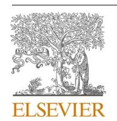
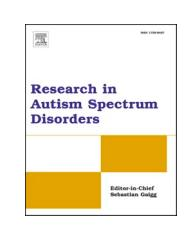
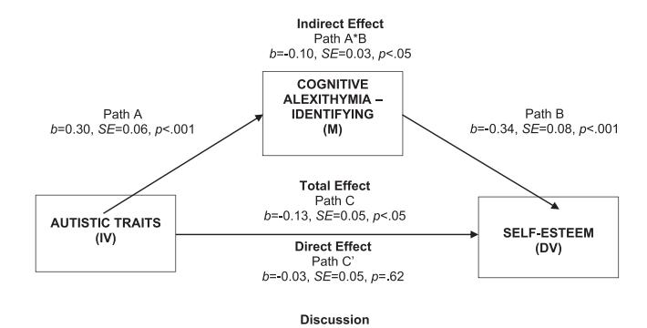

Contents lists available at ScienceDirect

## Research in Autism Spectrum Disorders

journal homepage: www.elsevier.com/locate/rasd

# The relationship between alexithymia and self-esteem in autistic adolescents

Melissa Strang , Caitlin M. Macmillan , Claire M. Brown , Merrilyn Hooley , Mark A. Stokes  $^*$ 

School of Psychology, Healthy Autistic Life Lab, Deakin University, VIC, Australia

#### ARTICLE INFO

Keywords: Autism Self-esteem Cognitive Alexithymia Affective Alexithymia Adolescence

#### ABSTRACT

Background: Research suggests autistic adolescents experience lower self-esteem and higher cognitive alexithymia than non-autistic adolescents. Heightened cognitive alexithymia has been associated with lower self-esteem in non-autistic adolescents but remains unexamined in autistic populations. This study aimed to examine whether autism diagnosis and alexithymia subscales significantly predicted self-esteem.

*Method:* Data were collected from 102 participants (53 autistic and 49 non-autistic adolescents) using the Rosenberg Self-Esteem Scale, Bermond-Vorst Alexithymia Questionnaire, and the Autism Quotient.

Results: Our results found that compared to non-autistic adolescents, autistic adolescents report lower self-esteem ( $F_{(1,\ 99)}=8.79,\ p<.005,\ \eta^2=.08$ ), and higher cognitive alexithymia ( $F_{(1,\ 99)}=22.51,\ p<.001,\ \eta^2=.19$ ), but not affective alexithymia ( $F_{(1,\ 99)}=.50,\ p=.481,\ \eta^2<.01$ ). Additionally, we found evidence that autism diagnosis ( $b=-2.86,\ SE=0.99,\ p=.005$ ) and cognitive alexithymia ( $b=-0.30,\ SE=0.10,\ p=.003$ ), but not affective alexithymia, predicted lower self-esteem. The addition of cognitive alexithymia to the model removed the significance of diagnosis ( $b=-1.31,\ SE=1.02,\ p=.201$ ). This model accounted for 26% of variance ( $R^2=.26,\ F_{(7)}=4.77,\ p<.001$ ). Exploratory mediation analysis revealed that cognitive alexithymia significantly mediated the relationship between autistic traits and self-esteem ( $b=-0.10,\ SE=0.03,\ CI[-0.16,\ -0.49],\ p<.001$ ), accounting for 22.93% of variance, and removing any direct effect. Conclusion: The results suggest that autistic adolescents experiencing difficulties identifying emotions are more likely to have lower self-esteem than autistic adolescents that report less difficulty identifying emotions. Assessing autistic adolescents for alexithymia and providing support to identify emotions may result in more effective support for low self-esteem.

## 1. The relationship between alexithymia and self-esteem in autistic adolescents

The median global prevalence of people with autism spectrum conditions (hereafter autism) is 65 in 10,000 people (Zeidan et al., 2022), with similar numbers reported by the Global Burden of Disease (Global Burden of Disease 2019 Mental Disorders Collaborators, 2022), including an estimate of 82 in 10,000 Australians (Australian Bureau of Statistics, 2019). Autism is a complex, lifelong neuro-developmental condition characterised by difficulties with social communication and interaction, as well as restricted,

\* Correspondence to: School of Psychology, Healthy Autistic Life Lab, Deakin University, 1 Gerringhap Street, Geelong 3220, VIC, Australia. E-mail address: mark.stokes@deakin.edu.au (M.A. Stokes).

repetitive patterns of behaviour, interests, and activities ([American Psychiatric Association, 2013; Bloch et al., 2021\)](#page-8-0).

Approximately 1 in 44 eight-year-old children in 8 states sampled in the USA (Arizona, Arkansas, California, Georgia, Maryland, Minnesota, Missouri, New Jersey, Tennessee, Utah, and Wisconsin) were identified with autism, in one surveillance study from the US Centres for Disease Control, with 69% presenting as lower support needs ([Maenner et al., 2021\)](#page-9-0). Given the prevalence of autism, it is important to broaden understanding of the unique characteristics of autistic adolescents1 to better inform support strategies during this critical developmental period. The current study focused exclusively on individuals with lower support needs and defined adolescence from 10- to 24-years-of-age [\(Sawyer et al., 2018](#page-9-0)). We sought to evaluate the relationship between self-esteem and alexithymia given the importance of self-esteem in adolescent development ([Robins et al., 2002](#page-9-0)).

Self-esteem is the individual's positive or negative attitude toward their identity ([Rosenberg, 1965a](#page-9-0)) resulting from the evaluation of their overall thoughts, feelings, and beliefs about themselves. Higher levels of self-esteem, typically seen in childhood, begin to decrease as biopsychosocial changes occur during adolescence ([Robins et al., 2002; Sawyer et al., 2018\)](#page-9-0). These changes include the development of self-evaluation processes [\(Harter, 2012](#page-8-0)), the impact of the onset of puberty (12 to 13-years; [Sawyer et al., 2012\)](#page-9-0), and the transition from primary school to high school [\(Simmons et al., 1973\)](#page-9-0).

Psychosocial theory suggests that adolescents seek an independent identity, a strong sense of self, and to avoid social isolation [\(Erikson, 1994](#page-8-0)). The differences associated with autism (e.g., difficulty with social and communicative interactions) may interfere with autistic adolescents' ability to develop a strong sense of identity and impair healthy self-esteem development [\(Cresswell](#page-8-0) & Cage, [2019\)](#page-8-0). Lower self-esteem has been associated with physical, psychological, and social consequences that negatively impact successful adolescent development, including reduced mental health with conditions such as depression, anxiety, eating disorders [\(Brown](#page-8-0) & [Stokes, 2020; Button et al., 1996\)](#page-8-0) and suicide ([Hedley et al., 2021a; b](#page-8-0)).

Despite limited literature on self-esteem in autistic adolescents, there is evidence that self-esteem levels decrease significantly between the ages of 6 and 16 years in autistic youth with lower support needs ([Nomura et al., 2012\)](#page-9-0), with autistic adolescents reporting significantly lower self-esteem than non-autistic adolescents (*d*=0.48 – 0.84; [Goddard et al., 2017](#page-8-0); Jamison & [Schuttler, 2015](#page-9-0); [McCauley et al., 2019](#page-9-0); [van der Cruijsen](#page-9-0) & Boyer, 2021). Other studies have not found lower self-esteem in autistic adolescents (e.g., [Bauminger et al., 2004](#page-8-0); [Harter, 1985](#page-8-0); [Williamson et al., 2008\)](#page-10-0). It is possible that because Bauminger et al., Harter, and Williamson et al. each used tools requiring that individuals compare themselves to others as a basis of measurement, that autistic participants had greater difficulty given fewer experiences with peers [\(McCauley et al., 2019\)](#page-9-0). Importantly though, low self-esteem and a weak sense of self are established risk factors for suicide in autistic adolescents (Arwert & [Sizoo, 2020; Ramgoon et al., 2006\)](#page-8-0). Suicide is the leading cause of premature death in autistic youth [\(Hirvikoski et al., 2016\)](#page-9-0), with this group being seven times more likely to attempt suicide [\(Chen et al., 2017](#page-8-0)), and 3.3 times more likely to die by suicide (Hedley et al., 2022; Kolves ˜ [et al., 2021; Santomauro et al., 2023](#page-8-0)) than non-autistic youth. Low self-esteem also predicts co-occurring depression ([McCauley et al., 2019](#page-9-0)) among autistic individuals. Importantly, self-esteem can be modified [\(McClure et al., 2010](#page-9-0)) making self-esteem a potential leverage point to improve mental health and reduce the elevated burden of suicide among autistic adolescents.

Alexithymia, originates from the Greek language, meaning "no words for emotions" ([Sifneos, 1973\)](#page-9-0), and has been defined as a limited or absent ability to: identify feelings and distinguish between feelings and the somatic sensations of emotional arousal; describe feelings to others; and fantasise due to limited imaginal processes. There is also an inclination to disregard internal emotional states and fixate on external stimuli (Nemiah et al., 1976; Taylor & [Bagby, 2000; Taylor et al., 1997\)](#page-9-0).

Primary alexithymia, has been defined as a stable personality trait that may lead to psychosomatic illness, and is considered developmental due to genetic predisposition (e.g., genetic variation of the 5-HT transporter-linked promoter region; [Kano et al., 2012](#page-9-0)), childhood trauma [\(Krystal, 1979\)](#page-9-0); and/or attachment issues with primary caregivers [\(Wearden et al., 2003](#page-10-0)). Meanwhile, secondary alexithymia is thought to occur later in life as a result of psychological or physical trauma (e.g., chronic disease, brain trauma), not occurring in childhood, that may directly or indirectly impair brain regions responsible for awareness and processing of emotion [\(Messina et al., 2014\)](#page-9-0).

Alexithymia has been defined across two dimensions. The first, cognitive alexithymia, involves the inability to *identify* (i.e., define emotional arousal states), *verbalise* (i.e., describe or communicate), or *analyse* (i.e., interest in seeking out explanations for emotional reactions) one's emotions. The second, affective alexithymia, includes the inability to *fantasise* (engage in daydreams/imaginative thoughts) and *emotionalise* (amount a person is aroused by emotional events; [Morera et al., 2005;](#page-9-0) [Vorst, 2001\)](#page-9-0).

Alexithymia in an adolescent population should be considered with regard to the developmental context and potential plasticity of the condition, given emotion regulation is still being developed [\(Parker et al., 2010\)](#page-9-0). [Muzi et al. \(2023\)](#page-9-0) found that alexithymia decreased with age in a study of 12–19-year-old adolescents, while [Di Trani et al. \(2016\)](#page-8-0) found that in younger children ability to fantasise increased from the 4-year-old group to the 7-year-old group. They also found that there were significant differences in reported ability to identify and describe both simple and complex emotions between age groups. Interestingly, Di Trani et al. also found a significant positive relationship between the ability to fantasise and the ability to identify and describe emotions.

Alexithymia within autism has been the subject of considerable research and is thought to be particularly relevant in understanding the emotional processing difficulties in autistic populations [\(Kinnaird et al., 2019\)](#page-9-0). Alexithymia was reported in 55% of autistic adolescents compared to 16% of non-autistic adolescents [\(Milosavljevic et al., 2016](#page-9-0)), and a meta-analysis of 15 studies, including 366 autistic individuals and 348 non-autistic individuals, found autistic people are 6.5 times more likely to score above the cut-off for alexithymia than non-autistic people [\(Kinnaird et al., 2019\)](#page-9-0). [Bird and Cook](#page-8-0)'s (2013) *alexithymia hypothesis* of autism proposes that the

1 In conforming with the current preference of the autistic community, we use identity-first language (Bury, Jellett, et al., 2020; Kenny et al., 2016).

emotion-processing difficulties associated with autism result from co-occurring alexithymia as opposed to being a core feature of autism. Some support of this hypothesis has been reported, with evidence indicating that emotional-processing difficulties, including poor recognition of emotional facial expressions, is better predicted by alexithymia than by autism (Cook et al., 2013; Ola & Scott, 2020).

Research on alexithymia in autistic adolescents does not often consider the breadth of alexithymia. Many studies do not consider sub-factors of alexithymia, but rather report only on total scores, obscuring issues surrounding differences in cognitive versus affective alexithymia (cf. Vaiouli et al., 2022). The use of subfactors in alexithymia research is recommended as it provides a clearer understanding of the specific concerns associated with emotion processing (Luminet et al., 2021). Research has also predominately focused on cognitive alexithymia, as it is the only factor included in the oft-used Toronto Alexithymia Scale (TAS-20; Bagby et al., 1994; Huggins et al., 2021b). A recent review of eleven studies using the TAS-20, focusing predominately on adults, revealed significant differences between autistic individuals (n = 292) and non-autistic individuals (n = 275) on difficulty identifying feelings (identifying; d = 1.28), difficulty describing feelings (verbalising; d = 1.29), and externally-oriented thinking (analysing; d = 0.50; Kinnaird et al., 2019). However, as the TAS-20 does not measure affective alexithymia, it is recommended that this measure is not used in isolation (Kooiman et al., 2002; Taylor et al., 1997). An alternative instrument is the Bermond-Vorst Alexithymia Questionnaire (BVAQ; Vorst & Bermond, 2001), which measures both cognitive and affective alexithymia, and while it has not yet been validated for adolescents (Vaiouli et al., 2022), it has been validated for use by autistic individuals (Berthoz & Hill, 2005). Utilising the BVAQ, studies established that autistic adults reported significantly higher cognitive alexithymia than non-autistic groups (d = 0.79; Dijkhuis et al., 2016), with significant differences for the subscales verbalising (d = 0.75) and identifying (d = 0.46; Berthoz & Hill, 2005). However, no significant group differences for the analysing subscale, or affective alexithymia were found (Berthoz & Hill, 2005) Dijkhuis et al., 2016).

Cognitive alexithymia significantly increases in autistic individuals during adolescence (Huggins et al., 2021a), a period when self-esteem is also observed to decrease (Nomura et al., 2012). Several studies have confirmed negative associations between elevated alexithymia and suppressed self-esteem in the general population (Ayhan et al., 2020; Dentale et al., 2010; Sasai et al., 2011; Yelsma, 1995), with Sasai et al. (2011) reporting significantly lower self-esteem in female adolescent general population participants with alexithymia (n = 86) compared to those without (n = 214; d = 0.77). However, this relationship has not been tested in autistic adolescent populations.

Establishing the nature of the relationship between self-esteem and alexithymia in autistic adolescents could lead to the development of targeted treatments to support both self-esteem and emotional well-being, resulting in positive clinical outcomes. As such, the present study aimed to examine the relationships between cognitive and affective alexithymia and global self-esteem in both autistic and non-autistic adolescents. Based on previous research, it was hypothesised first, there would be no significant difference in affective alexithymia between autistic and non-autistic adolescents; second that autism diagnosis would negatively predict self-esteem; and third, that cognitive alexithymia subscales would differ between autistic and non-autistic adolescents and negatively predict self-esteem.

#### 2. Method

#### 2.1. Participants

Autistic and non-autistic adolescent participants aged 10- to 22-years-old were recruited via convenience sampling using posters and brochures distributed through communities in Victoria, Australia by the university laboratory, social media, and word-of-mouth. To be included in the study autistic participants had to have a formal diagnosis of autism (with lower support needs), and an IQ > 70, provided by licenced practitioners independent of this study. Participants assessed as having high support needs or an IQ < 70 were excluded. Diagnosis was verified by parents being asked to confirm that a formal diagnosis had been provided and they were also asked to provide the name and role of the diagnosing practitioner. For participants under 18 years-of-age, a primary caregiver provided written informed consent, and participants provided verbal assent. Participants over 18 years-of-age provided written informed consent. Two cases (autistic; i.e., 1.92%) were removed listwise due to insufficient data provided to answer the research question (<60% RSES, n=1; <72% BVAQ, n=1). The final sample consisted of 102 participants, which included 53 autistic adolescents ( $M_{age}$ =13.79, SD=3.13, 66.0% male) and 49 non-autistic adolescents ( $M_{age}$ =14.04, SD=3.21, 57.1% male), with no significant difference found between groups for age ( $t_{(100)}$ = 0.40, p=.693), or gender ( $t_{(100)}$ =0.85, t=0.356). The sample was primarily Australianborn (93%). Other than this, more specific data concerning participant race and socioeconomic status were not recorded.

#### 2.2. Power analysis

To determine the required sample size, an a priori power analysis was conducted using G-Power 3.1 (Faul et al., 2009). Power was set at.80, with the experiment-wise error rate set at.05, and models set to be two-tailed. Effect sizes were set as small (partial  $\eta^2$  =0.10), to ensure the highest sensitivity for all models tested. Using one independent variable and an effect size of 0.10, modelling established that a sample size of 73 was required for a between subjects' effect in ANCOVA analyses. Using these same assumptions and testing for a random model multiple regression using seven predictor variables (diagnosis, age, cognitive alexithymia variables [identifying, verbalising, analysing], & affective alexithymia variables [emotionalising, & fantasising]), and a small effect size of 0.15 a sample of 102 was found to be sufficient.

#### **3. Materials**

## *3.1. Rosenberg Self-Esteem Scale*

The Rosenberg Self-Esteem Scale (RSES; [Rosenberg, 1965b\)](#page-9-0) is a 10-item self-report measure of global self-esteem that evaluates the participant's overall attitude toward themself. Originally constructed for adolescents, the scale includes five positive and five negative statements, with example items: *"On the whole I am satisfied with myself"* and *"At times I think I am no good at all*". Respondents rate each statement on a four-point Likert scale, including 4 (*strongly agree*), 3 (*agree),* 2 (*disagree)* and 1 (*strongly disagree*). Negatively worded items are reverse scored. The sum of all items provides a global self-esteem score ranging from 10 to 40. The score indicates that self-esteem was low (10− 25), medium (26− 29), or high (30–40; ([García et al., 2019](#page-8-0)). The RSES has been used to compare autistic and non-autistic children and adolescents, with excellent internal reliability established for the autistic group (*α* = 0.90) and good internal reliability for the non-autistic group (*α* = 0.80; [van der Cruijsen](#page-9-0) & Boyer, 2021). The current study reported good internal reliability for the autistic (*α* = 0.83) and non-autistic (*α* = 0.82) groups. Previous studies have reported test-retest reliability coefficients of *r* = .80 (Ackerman & [Donnellan, 2013\)](#page-8-0), concurrent validity with the *Global Self-Worth* subscale of the Self Perception Profile for Adolescents [\(Harter, 1988](#page-8-0)) of *r* = .76 [\(Hagborg, 1993\)](#page-8-0) and divergent validity with the depression subscale of the Depression Anxiety Stress Scales (Lovibond & [Lovibond, 1995\)](#page-9-0) of *r* = − .62 ([Sinclair et al., 2010](#page-9-0)).

## *3.2. Bermond*–*Vorst Alexithymia Questionnaire*

The Bermond–Vorst Alexithymia Questionnaire (BVAQ; Vorst & [Bermond, 2001\)](#page-10-0), a 40-item self-report measure of cognitive and affective alexithymia, includes eight items for each of the five subscales: emotionalising *("When my friends argue violently, I get upset"*); fantasising (*"I often use my imagination"*); identifying (*"I do not know what is on my mind")*; analysing (*"I hardly ever think about my feelings");* and verbalising (*"I like to tell others about how I feel")*. Respondents rate statements on a five-point Likert scale from 1 (*definitely*) to 5 (*no way*) and negatively worded items are reverse scored. Higher scores indicate higher alexithymia, with scores ranging from 8 to 40 for each of the five subfactors (16 to 80 for affective alexithymia, and 24 to 120 for cognitive alexithymia). Affective alexithymia scores (high ≥43, medium 30–42, low ≤29) are the summed total scores of emotionalising and fantasising, with higher scores indicating less emotional arousal to emotion-inducing stimuli, and/or difficulty fantasising or daydreaming. Cognitive alexithymia scores (high ≥62, medium 43–61, low ≤42) are the summed total scores from the identifying, analysing, and verbalising subscales, with higher scores indicating difficulty with cognitive abilities accompanying emotions [\(de Vroege et al., 2018\)](#page-8-0). As cognitive and affective alexithymia are orthogonal factors, a total alexithymia score is not calculated. de Vorege et al. (2018) found good internal reliability for analysing (*α* = .80), verbalising (*α* = .83), and fantasising (*α* = .82), and acceptable internal reliability for identifying (*α* = .79), and emotionalising (*α* = .75) in the general population. To retain reliability, de Vorege et al. (2018) recommends using the five individual subscales as opposed to cognitive and affective scores. Therefore, when considering if alexithymia predicts low self-esteem, all subscales were included in the model, which also allows for more clinically relevant information by identifying which subscale presents the biggest problem for autistic adolescents. [Berthoz and Hill \(2005\)](#page-8-0) reported good test-retest reliability for the BVAQ for verbalising (*r* = .82), acceptable for analysing (*r* = .72), and questionable for fantasising (*r* = .66), identifying (*r* = .63), and emotionalising (*r* = .62) in a small sample of autistic adults (n = 19). Discriminant validity was supported with the Autism Quotient [\(Baron-Cohen et al., 2001](#page-8-0)), *r* = 0.14, indicating the scales measure separate attributes in the general population. Significant large correlations with the TAS-20 ([Bagby et al., 1994](#page-8-0)) in autistic (*r* = .77) and non-autistic samples (*r* = 0.70; [Bird et al., 2010](#page-8-0)) indicate concurrent validity. As assessed in the current study, internal reliability ranges from fair to good, as detailed in Table 1.

**Table 1**  Means, Standard Deviations and Cronbach's Alpha for Age, Self-Esteem, Cognitive Alexithymia and Affective Alexithymia for autistic and non-autistic adolescents.

|                           | Autistic participants n = 53 |       |     | Non-Autistic participants n = 49 |       |     |
|---------------------------|---------------------------------|-------|-----|-------------------------------------|-------|-----|
|                           | M                               | SD    | α   | M                                   | SD    | α   |
| Age                       | 13.79                           | 3.13  |     | 14.04                               | 3.21  |     |
| Autism Quotient           | 28.88                           | 7.79  | .84 | 14.08                               | 6.12  | .78 |
| Self-Esteem* *            | 28.06                           | 5.30  | .83 | 30.92                               | 4.58  | .82 |
| Cognitive Alexithymia* ** | 69.57                           | 16.82 | .89 | 55.08                               | 13.58 | .88 |
| Identifying               | 22.13                           | 6.63  | .79 | 17.49                               | 5.35  | .80 |
| Verbalising               | 26.34                           | 7.76  | .82 | 20.39                               | 6.09  | .81 |
| Analysing                 | 21.09                           | 6.14  | .72 | 17.20                               | 5.50  | .81 |
| Affective Alexithymia     | 39.83                           | 11.73 | .84 | 41.35                               | 9.31  | .77 |
| Emotionalising            | 21.25                           | 6.14  | .70 | 21.92                               | 4.89  | .64 |
| Fantasising               | 18.58                           | 7.69  | .85 | 19.43                               | 6.81  | .82 |

Note: \* *p <* .05, \* \* *p <* .01, \* \*\* *p <* .001, α: Cronbach's alpha

#### *3.3. Autism Quotient*

The Autism Quotient (AQ; [Baron-Cohen et al., 2001](#page-8-0)) was completed by all respondents in this study to measure the expression of autistic traits in our sample. The AQ is a 50-item, untimed, self-report questionnaire measuring five domains of autism (social skills, communication, attention switching, imagination, & attention to detail). Each domain includes 10 questions, with half reversed-scored to reduce bias. Participants respond on a 4-point Likert scale, ranging from 1 (*definitely agree*) to 4 (*definitely disagree*), with high AQ scores indicating more autistic traits ([Baron-Cohen et al., 2001](#page-8-0)).

The AQ has demonstrated high internal consistency (α = 0.79), including consistency across items in each of the five domains ranging from α = .66 to .88, and has been validated for use with autistic adolescents ([Baron-Cohen et al., 2006\)](#page-8-0). The AQ has also reliably distinguished autistic and non-autistic individuals ([Baron-Cohen et al., 2006](#page-8-0)).

## **4. Procedure**

Prior to data collection, which was undertaken between 2013 and 2022, ethical approval was obtained from the overseeing university, consistent with the Declaration of Helsinki and the National Statement on Ethical Conduct in Human Research outlined by the National Health and Medical Research Council of the Government of Australia. Participants who expressed interest by email were followed-up with by a research team member to schedule a time and location (participants' home or university laboratory) for data collection. One researcher undertook data collection with the participant while the other observed or collected demographic data from the participant's caregiver. Small rewards specifically targeted toward participant's interests (e.g., discussions of movies, football, horses, etc.) established beforehand, were provided, when necessary, to encourage participants to complete tasks. These involved allowing a period of time to talk about these interests. All instruments were completed following standardised protocols, though participants were given further explanation on items if they believed them unclear. Breaks were offered and provided if participants required. Data entry was completed by a third researcher, checked against a random sample (10%) of data re-entry by a separate researcher, and found to correlate fully with the original data entry. Data were analysed using IBM SPSS (version 28).

## *4.1. Community involvement statement*

It is important to acknowledge that none of the authors identify as autistic, limiting our understanding of the lived experiences of autistic individuals. However, we each have research, clinical, practical, or familial experience with autism.

## **5. Statistical analysis**

A cross-sectional design was used to examine the relationships between self-esteem, alexithymia, and autism diagnosis. An independent samples *t*-test was used to examine differences in mean age of the autistic and non-autistic groups. Additionally, a chisquare analysis was undertaken to examine differences between gender in the autistic and non-autistic groups. Age was used as a covariate in all analyses. A series of ANCOVAs were undertaken, to examine differences between autistic and non-autistic adolescents on the dependent variables of self-esteem, cognitive alexithymia, and affective alexithymia. Hierarchical multiple regression was undertaken to examine predictors of self-esteem. Predictors included alexithymia subscales to allow for more clinically relevant information.

## **6. Results**

The data were assessed for normality, linearity, homogeneity of variance, and homogeneity of regression. No violations of the normality, linearity, or homogeneity of variance were detected. Homogeneity of regression was established prior to ANCOVA models being undertaken, with no violation detected. Residuals were independent as evaluated by Durbin-Watson test. Homoscedasticity was within acceptable limits. There was no evidence of multicollinearity. Three Mahalanobis distance outliers were identified in the data, but as these cases were not associated with excessive leverage values they were retained because they provided valid measures of participant experience. Data were bootstrapped with 1000 resamples.

Participant gender distribution is presented in Table 2. The data included 18 autistic (*Mage*=13.06, *SD*=3.21) and 21 non-autistic females (*Mage*=14.57, *SD*=3.08), and 35 autistic males (*Mage*=14.17, *SD*=3.07) and 28 non-autistic males (*Mage*=13.64, *SD*=3.30). Gender was collected through an open-ended question, and no participants identified as non-binary. There was no significant difference in age between diagnostic groups, *t*(99)= − .395, *p* = .694. However, our overall sample was biased toward younger

**Table 2**  Summary of Participants by Gender and Diagnosis.

|              | Female |      | Male |      | Total |       |
|--------------|--------|------|------|------|-------|-------|
|              | n      | %    | n    | %    | n     | %     |
| Autistic     | 18     | 33.9 | 35   | 66.0 | 53    | 52.0  |
| Non-Autistic | 21     | 42.9 | 28   | 57.1 | 49    | 48.0  |
| Total        | 39     | 38.2 | 63   | 61.8 | 102   | 100.0 |

 Table 3

 Hierarchical Multiple Regression Predicting Self-Esteem from Diagnosis (Autistic / Non-Autistic), Cognitive Alexithymia subfactors, and Affective Alexithymia Subfactors.

|                | $R^2$ | Adjusted R 2 | $\Delta R^2$ | b          | SE   | sr    | 95% CI        |
|----------------|-------|-------------------------|--------------|------------|------|-------|---------------|
| Model 1        | .08   | .07                     | .08          |            |      |       |               |
| Constant       |       |                         |              | 30.92 * ** | 0.71 |       | 29.51, 32.33  |
| Diagnosis      |       |                         |              | -2.86 * *  | 0.99 | -0.28 | -4.82,91      |
| Model 2        | .09   | .08                     | .02          |            |      |       |               |
| Constant       |       |                         |              | 33.77 * ** | 2.31 |       | 29.20, 38.35  |
| Diagnosis      |       |                         |              | -2.91 * *  | 0.98 | -0.28 | -4.86, - 0.96 |
| Age            |       |                         |              | -0.20      | 0.16 | -0.12 | -0.51, 0.11   |
| Model 3        | .24   | .20                     | .14          |            |      |       |               |
| Constant       |       |                         |              | 40.27 * ** | 3.12 |       | 34.07, 46.47  |
| Diagnosis      |       |                         |              | -1.31      | 1.02 | -0.12 | -3.32, 0.71   |
| Age            |       |                         |              | -0.23      | 0.16 | -0.13 | -0.54, 0.08   |
| Identifying    |       |                         |              | -0.30 * *  | 0.10 | -0.28 | -0.49,- 0.11  |
| Verbalising    |       |                         |              | -0.02      | 0.09 | -0.02 | -0.19, 0.15   |
| Analysing      |       |                         |              | -0.03      | 0.10 | -0.03 | -0.22, 0.17   |
| Model 4        | .26   | .21                     | .03          |            |      |       |               |
| Constant       |       |                         |              | 38.78 * ** | 3.29 |       | 32.25, 45.30  |
| Diagnosis      |       |                         |              | -0.96      | 1.03 | -0.08 | -3.01, 1.08   |
| Age            |       |                         |              | -0.27      | 0.16 | -0.15 | -0.58, 0.05   |
| Identifying    |       |                         |              | -0.29 * *  | 0.10 | -0.27 | -0.49, 0.10   |
| Verbalising    |       |                         |              | -0.03      | 0.08 | -0.04 | -0.20, 0.13   |
| Analysing      |       |                         |              | -0.07      | 0.11 | -0.06 | -0.28, 0.14   |
| Emotionalising |       |                         |              | 0.04       | 0.10 | 0.04  | -0.15, 0.24   |
| Fantasising    |       |                         |              | 0.11       | 0.07 | 0.14  | -0.03, 0.24   |

Note: \* p < .05, \* \* p < .01, \* \*\* p < .001

participants, around 13 to 14 years of age. A chi-square test of goodness-of-fit revealed that there were significantly more males (n = 63) than females (n = 39,  $\chi^2_{(1, N=102)} = 5.65$ , p = .017), as would be anticipated in an autistic sample. The gender ratio for autistic individuals was significantly different from 4:1 ( $\chi^2_{(1, N=54)} = 7.31$ , p = .007), but not from 3:1 ( $\chi^2_{(1, N=54)} = 3.65$ , p = .06) or 2:1 ( $\chi^2_{(1, N=54)} = 0.08$ , p = .77). The gender ratio among cases from the general population was 1:1.4 ( $\chi^2_{(1, N=54)} = 1.33$ , p = .25). Participants' demographics by gender and diagnosis are presented in Table 2.

A sequence of three ANCOVAs were undertaken to determine the influence of autism diagnosis (autistic/non-autistic), while controlling for age, on self-esteem, cognitive alexithymia, and affective alexithymia. Autistic individuals were found to be significantly lower on self-esteem ( $F_{(1, 99)} = 8.79$ , p < .005,  $\eta^2 = .08$ ), higher on cognitive alexithymia ( $F_{(1, 99)} = 22.51$ , p < .001,  $\eta^2 = .19$ ), and not to differ on affective alexithymia ( $F_{(1, 99)} = .50$ , p = .481,  $\eta^2 < .01$ ; see Table 1).

A hierarchical multiple regression, controlling for age, was run to determine if the addition of cognitive alexithymia subscales and then affective alexithymia subscales improved the prediction of self-esteem over and above diagnosis (autistic/non-autistic) alone (see Table 3).

Model 1 revealed diagnosis alone significantly accounted for nearly 8% ( $R^2$ =.08, p=.005) of variance in self-esteem. Diagnosis predicted self-esteem to be 2.86 units lower for autistic adolescents than that predicted for non-autistic adolescents. The addition of age did not improve the model. The addition of the cognitive alexithymia subscales (*identifying*, *verbalising*, and *analysing*) improved the prediction of self-esteem (Model 3) with a significant increase in  $R^2$  ( $R^2$ =.24,  $\Delta R^2$ =.20, p<.001), accounting for 23.6% of variation in self-esteem. Importantly, the addition of cognitive alexithymia subscales saw diagnosis lose significance as a predictor of self-esteem. The only significant predictor was the identifying subscale. The further inclusion of affective alexithymia variables (emotionalising & fantasising; Model 4) raised the  $R^2$  value only marginally and not significantly, accounting for 26.2% of variation in self-esteem ( $R^2$ =.262, p=.198, adj.  $R^2$ =.207), with no change in predictive variables.

#### 7. Exploratory analysis

To examine whether cognitive alexithymia mediated the relationship between strength of autistic symptoms and self-esteem an exploratory mediation analysis was undertaken using data from the AQ. The mediation analysis included autism traits as the IV, cognitive alexithymia subscale *identifying* emotions as the mediator, based upon the present results, and self-esteem as the DV. The exploratory mediation analysis revealed that autistic traits significantly predicted *identifying* emotions, accounting for 22.93% of variance. As shown in Fig. 1, a significant indirect effect of autism traits on self-esteem through *identifying* emotions was found, b = -0.10, BCa CI [-0.16, -0.49], p < .001, indicating that the cognitive alexithymia subscale *identifying* contributes to the relationship between autism traits and self-esteem.

**Fig. 1.** The Mediating Role of Cognitive Alexithymia–Identifying Between Autism and Self-Esteem.

## **8. Discussion**

This study aimed to examine whether autism diagnosis and alexithymia subscales predict self-esteem. This is the first study to consider the relationship between alexithymia and self-esteem in autistic adolescents using a comparison group. Understanding this relationship could lead to the development of targeted treatments to support both insight into emotional well-being and more effective support for low self-esteem, yielding positive clinical outcomes.

Our hypothesis, that there would be no significant difference in affective alexithymia between autistic and non-autistic adolescents, was supported. Furthermore, our hypothesis, that cognitive alexithymia subscales would differ between autistic and non-autistic adolescents, was also supported. Our findings are consistent with [Berthoz and Hill \(2005\),](#page-8-0) [Dijkhuis et al. \(2016\)](#page-8-0) and [Hill et al.](#page-9-0) [\(2004\)](#page-9-0) who also established significant differences between cognitive, but *not* affective alexithymia when comparing autistic and non-autistic young adults and adults. With similar results found in an adolescent population it is possible that autistic individuals experience a particular alexithymic type involving challenges with cognitive, rather than affective factors ([Dijkhuis et al., 2016\)](#page-8-0). [Vorst](#page-10-0) [and Bermond \(2001\)](#page-10-0) classified this as Bermond's type II alexithymia, which is characterised by usual or heightened emotional awareness but difficulties with the expression and regulation of emotions.

Our hypothesis, that autism diagnosis would negatively predict self-esteem was partially supported. Diagnosis predicted lower selfesteem, when tested alone, for autistic adolescents than that predicted for non-autistic adolescents. However, diagnosis became nonsignificant once cognitive alexithymia was entered. This result is consistent with [Goddard et al. \(2017\)](#page-8-0), [McCauley et al. \(2019\),](#page-9-0) and [van der Cruijsen and Boyer \(2021\)](#page-9-0) who also found significantly lower self-esteem in samples of autistic adolescents, with similar mean ages to the current study's sample. Conversely, our findings did not support [Bauminger et al. \(2004\)](#page-8-0), [Harter \(1985\),](#page-8-0) and [Williamson](#page-10-0) [et al. \(2008\)](#page-10-0). These latter authors found no significant difference in self-esteem between autistic and non-autistic participants using instruments requiring participants to compare themselves with others. We suggest that autistic adolescents responding to these measures may find peer comparisons more challenging [\(McCauley et al., 2019\)](#page-9-0), given difficulties in social communication ([Bauminger](#page-8-0) [et al., 2004](#page-8-0)). Hence, our use of the RSES may account for our different findings.

Finally, our hypothesis that cognitive alexithymia would negatively predict self-esteem was supported, however only difficulties in identifying emotions predicted lower self-esteem. This finding extends existing literature which has found negative associations between alexithymia and self-esteem in non-autistic female adolescents [\(Sasai et al., 2011\)](#page-9-0) and university students [\(Dentale et al., 2010](#page-8-0)).

Interestingly, the addition of the cognitive alexithymia subscales in later parts of our analysis saw diagnosis become nonsignificant, supporting [Bird and Cook](#page-8-0)'s (2013) broader *alexithymia hypothesis* of autism*.* Bird and Cook hypothesise that the emotion processing difficulties often seen in autism are the result of co-occurring alexithymia, as opposed to being a characteristic of autism. Exploratory analysis revealed that the cognitive alexithymia subscale *identifying* mediated the relationship between strength of autistic symptoms and self-esteem, indicating that the negative relationship between autistic traits and self-esteem is greater with co-occurring alexithymia.

Extending on [Bird and Cook](#page-8-0)'s (2013) *alexithymia hypothesis* and Bermond's type II theory (Vorst & [Bermond, 2001](#page-10-0)), the overall findings of this study suggest the possibility of high-alexithymic and low-alexithymic type of autism, each with specific negative outcomes such as lower levels of self-esteem. Importantly, our results show that self-esteem issues are potentially more prominent in adolescents with high-alexithymic autism.

#### **9. Strengths, limitations and future recommendations**

This study had several strengths. It is the first to test the association between alexithymia and self-esteem in autistic adolescents. We also tested both cognitive and affective alexithymia, providing greater insight into the type of alexithymia experienced by autistic adolescents. Additionally, the inclusion of a comparison group (non-autistic adolescents) allowed us to identify differences in selfesteem and alexithymia specific to the autistic adolescents in our sample. The use of the RSES allowed for ease in comparison with other studies and will support the replication of this study. Furthermore, the sample size was determined sufficient and to have good power to reduce the potential for Type II errors. Mean comparisons were undertaken on the alexithymia cognitive and affective factors, and not subfactors, reducing the risk of Type I error. While a strength of this study, comparing alexithymic factors did limit our understanding of the differences between diagnostic groups on subfactors, which may have provided clearer clinical implications. The cross-sectional design allowed us to collect data from a sufficient sample size and identified important associations between cognitive alexithymia subscales and self-esteem in autistic adolescents. Contributing important clinical information, in that assistance identifying emotions may be required in some autistic adolescents as a part of treatment for low self-esteem.

Several limitations have also been identified including confounding biases, whereby autism may not be the only shared characteristic of the group. For example, studies have shown that autistic youth with low self-esteem also experience increased depressive symptoms [\(van der Cruijsen](#page-9-0) & Boyer, 2021), however this study did not consider this variable. Finally, this study's requirement for autistic adolescent participants with lower support needs, and the bias in the sample to participants 13 to 14 years of age, may limit generalisability to other subgroups, such as those with higher support needs and/or older or younger age groups.

Future research should consider replicating and extending the current study's findings by considering mean comparisons at the subfactor level of alexithymia, to further understand the role of alexithymia in autism. It is also recommended that future research considers autism traits, instead of the binary of autism diagnosis, to further enhance understanding of the autism phenotype. It is also recommended that the findings of the exploratory analysis be considered as the basis for future research, using an experimental design, ascertaining whether sub-groupings of autism, (i.e., high alexithymic autism and low alexithymic autism), can be established. We propose that besides the BVAQ, alexithymia could be measured using adaptations of picture-based emotion recognition tests ([Bird](#page-8-0) & [Cook, 2013\)](#page-8-0). These tests, which currently assess difficulties in emotion recognition in others, could be adapted to test difficulties in the recognition of one's own emotion, and further our understanding of the role of alexithymia on self-esteem in autistic populations.

## **10. Implications**

The results of this study have implications for both researchers and clinicians. Future research considering the impact of alexithymia on the emotional well-being of autistic adolescents should continue to examine alexithymic subfactors to enhance the body of knowledge around the specific difficulties in emotion processing impacting this group. Regarding clinical implications, our results suggest that clinicians should assess autistic adolescent clients for alexithymia to inform treatment plans. For example, autistic adolescent clients with high cognitive alexithymia may require support in identifying their own emotions before interventions to increase self-esteem can be effective.

#### **11. Conclusions**

Results suggest difficulties identifying emotions suppress autism diagnosis as a predictor of low self-esteem. This supports the *alexithymia hypothesis*, that emotional difficulties in autistic individuals are attributable to co-occurring alexithymia, as opposed to being core characteristics of autism. This research contributes to existing knowledge in several ways: First, it extends the limited existing knowledge base regarding autistic adolescents' self-esteem. Second, it initiates formal investigation of the association between alexithymia and self-esteem in autistic adolescents, which may lead to further research and targeted therapies aimed at increasing the self-esteem of autistic adolescents, and other positive life outcomes. Finally, this research identifies future research recommendations into high-alexithymia and low-alexithymia subcategories of autism.

## **Author Contributions**

All authors contributed to the written work presented in this paper and approved of the final manuscript. MAS & MH conceptualised this project and data collection. MS conceptualised the specific questions and hypotheses and drafted the manuscript. CM, CB, MH, and MAS critically edited and contributed to the drafting of this manuscript. MS undertook the analysis under supervision of MAS, MH, CM, & CB. All authors were involved in the conceptual design of the study and the review of the study findings.

### **Community Involvement**

Autistic family members, community providers, agency leaders were involved in developing the research questions, study designs, implementation, and interpretation and dissemination of the findings. MAS was involved in all aspects of this manuscript, and is a family member of autistic individuals, is a community provider to the autistic community, and is a leader of an autistic relevant agency.

## **Funding**

The author(s) received no financial support for the research, authorship, and/or publication of this article.

#### **CRediT authorship contribution statement**

**Hooley Merrilyn:** Supervision. **Stokes Mark A.:** Supervision. **Macmillan Caitlin M.:** Supervision. **Brown Claire M.:** Supervision. **Strang Melissa:** Writing – original draft, Writing – review & editing.

#### **Declaration of Competing Interest**

The authors declare that they have no known competing financial interests or personal relationships that could have appeared to influence the work reported in this paper.

#### Data availability

The data that has been used is confidential.

#### References

- Ackerman, R. A., & Donnellan, M. B. (2013). Evaluating self-report measures of narcissistic entitlement. *Journal of Psychopathology and Behavioral Assessment, 35*(4), 460-474. https://doi.org/10.1007/s10862-013-9352-7
- American Psychiatric Association. (2013). Diagnostic and statistical manual of mental disorders (5th ed.). https://doi.org/10.1176/appi.books.9780890425596.

  Arwert, T. G., & Sizoo, B. B. (2020). Self-reported suicidality in male and female adults with autism spectrum disorders: Rumination and self-esteem. *Journal of Autism and Developmental Disorders*, 50(10), 3598–3605. https://doi.org/10.1007/s10803-020-04372-z
- Australian Bureau of Statistics. (2019, October 24). Autism in Australia. https://www.abs.gov.au/statistics/health/disability/disability-ageing-and-carers-australia-summary-findings/latest-release#autism-in-australia.
- Ayhan, G. M., Seven, H., Ozturk, A. H., Kirci Ercan, S., Demirel, B., & Eren, İ. (2020). Alexithymia and self-esteem in a sample of opioid dependent males: A controlled study. *International Journal of Mental Health and Addiction, 18*(4), 968–979. https://doi.org/10.1007/s11469-018-9998-1
- Bagby, R. M., Taylor, G. J., & Parker, J. D. A. (1994). The twenty-item Toronto Alexithymia Scale: II. Convergent, discriminant, and concurrent validity. *Journal of Psychosomatic Research*, 38(1), 33–40. https://doi.org/10.1016/0022-3999(94)90006-X
- Baron-Cohen, S., Hoekstra, R. A., Knickmeyer, R., & Wheelwright, S. (2006). The Autism-Spectrum Quotient (AQ) Adolescent version. *Journal of Autism and Developmental Disorders*, 36(3), 343–350. https://doi.org/10.1007/s10803-006-0073-6
- Baron-Cohen, S., Wheelwright, S., Skinner, R., Martin, J., & Clubley, E. (2001). The Autism-Spectrum Quotient (AQ): Evidence from Asperger syndrome/high-functioning autism, males and females, scientists and mathematicians. *Journal of Autism and Developmental Disorders*, 31(1), 5–17. https://doi.org/10.1023/a: 1005653411471
- Bauminger, N., Shulman, C., & Agam, G. (2004). The link between perceptions of self and of social relationships in high-functioning children with autism. *Journal of Developmental and Physical Disabilities*, 16(2), 193–214. https://doi.org/10.1023/B:JODD.0000026616.24896.c8
- Berthoz, S., & Hill, E. (2005). The validity of using self-reports to assess emotion regulation abilities in adults with autism spectrum disorder. *European Psychiatry*, 20 (3), 291–298. https://doi.org/10.1016/j.eurpsy.2004.06.013
- Bird, G., & Cook, R. (2013). Mixed emotions: The contribution of alexithymia to the emotional symptoms of autism. *Translational Psychiatry*, 3(7), Article e285. https://doi.org/10.1038/tp.2013.61
- Bird, G., Silani, G., Brindley, R., White, S., Frith, U., Silani, G., & Singer, T. (2010). Empathic brain responses in insula are modulated by levels of alexithymia but not autism. *Brain: A Journal of Neurology*, 133(5), 1515–1525. https://doi.org/10.1093/brain/awq060
- Bloch, C., Burghof, L., Lehnhardt, F., Vogeley, K., & Falter-Wagner, C. (2021). Alexithymia traits outweigh autism traits in the explanation of depression in adults with autism. *Scientific Reports*, 11(1). https://doi.org/10.1038/s41598-021-81696-5
- Brown, C. M., & Stokes, M. A. (2020). Intersection of eating disorders and the female profile of autism. Child and Adolescent Psychiatric Clinics of North America, 29(2), 409–417. https://doi.org/10.1016/j.chc.2019.11.002
- Button, E. J., Sonuga-Barke, E. J., Davies, J., & Thompson, M. (1996). A prospective study of self-esteem in the prediction of eating problems in adolescent schoolgirls: Questionnaire findings. The British Journal of Clinical Psychology, 35(2), 193–203. https://doi.org/10.1111/j.2044-8260.1996.tb01176.x
- Chen, M. H., Pan, T. L., Lan, W. H., Hsu, J. W., Huang, K. L., Su, T. P., Li, C. T., Lin, W. C., Wei, H. T., Chen, T. J., & Bai, Y. M. (2017). Risk of suicide attempts among adolescents and young adults with autism spectrum disorder: A nationwide longitudinal follow-up study. *The Journal of Clinical Psychiatry*, 78(9), 1174–1179. https://doi.org/10.4088/JCP.16m11100
- Cook, R., Brewer, R., Shah, P., & Bird, G. (2013). Alexithymia, not autism, predicts poor recognition of emotional facial expressions. *Psychological Science*, 24(5), 723–732. https://doi.org/10.1177/0956797612463582
- Cresswell, L., & Cage, E. (2019). 'Who am I?': An exploratory study of the relationships between identity, acculturation and mental health in autistic adolescents. Journal of Autism and Developmental Disorders, 49(7), 2901–2912. https://doi.org/10.1007/s10803-019-04016-x
- Dentale, F., San Martini, P., De Coro, A., & Di Pomponio, I. (2010). Alexithymia increases the discordance between implicit and explicit self-esteem. *Personality and Individual Differences*, 49(7), 762–767. https://doi.org/10.1016/j.paid.2010.06.022
- de Vroege, L., Emons, W., Sijtsma, K., & van der Feltz-Cornelis, C. M. (2018). Psychometric properties of the Bermond-Vorst Alexithymia Questionnaire (BVAQ) in the general population and a clinical population. *Frontiers in Psychiatry*, 9. https://doi.org/10.3389/fpsyt.2018.00111
- Dijkhuis, R. R., Ziermans, T. B., Van Rijn, S., Staal, W. G., & Swaab, H. (2016). Self-regulation and quality of life in high-functioning young adults with autism. *Autism: The International Journal of Research and Practice, 21*(7), 896–906. https://doi.org/10.1177/1362361316655525
- Di Trani, M., Renzi, A., Tambelli, R., Furlan, J., Solano, L., Piperno, F., Sogos, C., Ferruzzi, G., & Granato, I. (2016). Alexithymia in developmental age: Theoretical considerations and construction of a new instrument for children from 4 to 8 years old. *Rassegna di psicologia*, 33(2), 13–36. Erikson, E. H. (1994). *Identity and the Life Cycle*. United States: W. W. Norton
- Faul, F., Erdfelder, E., Buchner, A., & Lang, A. G. (2009). Statistical power analyses using G\*Power 3.1: Tests for correlation and regression analyses. Behavior Research Methods, 41, 1149–1160. https://doi.org/10.3758/brm.41.4.1149
- García, J. A., Y Olmos, F. C., Matheu, M. L., & Carreño, T. P. (2019). Self-esteem levels vs global scores on the Rosenberg Self-Esteem Scale. Heliyon, 5(3), Article e01378. https://doi.org/10.1016/j.heliyon.2019.e01378
- Global Burden of Disease 2019 Mental Disorders Collaborators. (2022). Global, regional, and national burden of 12 mental disorders in 204 countries and territories, 1990-2019: A systematic analysis for the Global Burden of Disease Study 2019. *The Lancet Psychiatry*, 9(2), 137–150. https://doi.org/10.1016/S2215-0366(21)
- Goddard, L., O'Dowda, H., & Pring, L. (2017). Knowing me, knowing you: Self defining memories in adolescents with and without an autism spectrum disorder.

  \*Research in Autism Spectrum Disorders. 37, 31–40. https://doi.org/10.1016/j.rasd.2017.02.002
- Hagborg, W. J. (1993). The Rosenberg Self-Esteem Scale and Harter's Self-Perception Profile for adolescents: A concurrent validity study. *Psychology in the Schools, 30* (2), 132–136. https://doi.org/10.1002/1520-6807(199304)30:2<132::AID-PITS2310300205>3.0.CO;2-Z
- $Harter, \, S. \, (1985). \, \textit{The Self-Perception Profile for Children}. \, Unpublished \, Manual, \, University \, of \, Denver, \, Denver. \, Children \, Children \, Children \, Children \, Children \, Children \, Children \, Children \, Children \, Children \, Children \, Children \, Children \, Children \, Children \, Children \, Children \, Children \, Children \, Children \, Children \, Children \, Children \, Children \, Children \, Children \, Children \, Children \, Children \, Children \, Children \, Children \, Children \, Children \, Children \, Children \, Children \, Children \, Children \, Children \, Children \, Children \, Children \, Children \, Children \, Children \, Children \, Children \, Children \, Children \, Children \, Children \, Children \, Children \, Children \, Children \, Children \, Children \, Children \, Children \, Children \, Children \, Children \, Children \, Children \, Children \, Children \, Children \, Children \, Children \, Children \, Children \, Children \, Children \, Children \, Children \, Children \, Children \, Children \, Children \, Children \, Children \, Children \, Children \, Children \, Children \, Children \, Children \, Children \, Children \, Children \, Children \, Children \, Children \, Children \, Children \, Children \, Children \, Children \, Children \, Children \, Children \, Children \, Children \, Children \, Children \, Children \, Children \, Children \, Children \, Children \, Children \, Children \, Children \, Children \, Children \, Children \, Children \, Children \, Children \, Children \, Children \, Children \, Children \, Children \, Children \, Children \, Children \, Children \, Children \, Children \, Children \, Children \, Children \, Children \, Children \, Children \, Children \, Children \, Children \, Children \, Children \, Children \, Children \, Children \, Children \, Children \, Children \, Children \, Children \, Children \, Children \, Children \, Children \, Children \, Children \, Children \, Children \, Children \, Children \, Children \, Children \, Children \, Children \, Children \, Children \, Children \, Children \, Children \, Children \, Children \, Children \, Children \, Childre$
- Harter, S. (1988). The Self-Perception Profile for Adolescents: Manuals and questionnaires. University of Denver.
- Harter, S. (2012). The Self-Perception Profile for Adolescents: Manuals and questionnaires. University of Denver.
- Hedley, D., Stokes, M. A., & Troller, J. (2022). Suicide by young Australians, 2006-2015: A cross-sectional analysis of national coronial data. *Medical Journal of Australia*, 216(1), 53. https://doi.org/10.5694/mja2.51359
- Hedley, D., Hayward, S. M., Denney, K., Uljarević, M., Bury, S., Sahin, E., Brown, C., Clapperton, A., Dissanayake, C., Robinson, J., Trollor, J., & Stokes, M. A. (2021a). The association between COVID-19, personal wellbeing, depression, and suicide risk factors in australian autistic adults. *Autism Research*, 14(12), 2663–2676. https://doi.org/10.1002/aur.2614

- Hedley, D., Uljarevi´c, M., Cai, R.Y., Bury, S.M., Stokes, M.A. & Evans, D.W. (2021b). Domains of the Autism Spectrum Disorder Phenotype, Cognitive Control, and Rumination as Transdiagnostic Predictors of DSM-5 Suicide Risk. *PLoS ONE*. <https://doi.org/10.1371/journal.pone.0245562>.
- Hill, E., Berthoz, S., & Frith, U. (2004). Brief report: Cognitive processing of own emotions in individuals with autistic spectrum disorder and in their relatives. *Journal of Autism and Developmental Disorders, 34*(2), 229–235. <https://doi.org/10.1023/b:jadd.0000022613.41399.14>
- Hirvikoski, T., Mittendorfer-Rutz, E., Boman, M., Larsson, H., Lichtenstein, P., & Bolte, ¨ S. (2016). Premature mortality in autism spectrum disorder. *British Journal of Psychiatry, 208*(3), 232–238. <https://doi.org/10.1192/bjp.bp.114.160192>
- Huggins, C. F., Donnan, G., Cameron, I. M., & Williams, J. H. (2021a). Emotional self-awareness in autism: A meta-analysis of group differences and developmental effects. *Autism, 25*(2), 307–321.<https://doi.org/10.1177/1362361320964306>
- Huggins, C. F., Cameron, I. M., & Williams, J. H. G. (2021b). Autistic traits predict underestimation of emotional abilities. *Journal of Experimental Psychology General, 150*(5), 930–942. <https://doi.org/10.1037/xge0000784>
- Jamison, T. R., & Schuttler, J. O. (2015). Examining social competence, self-perception, quality of life, and internalizing and externalizing symptoms in adolescent females with and without autism spectrum disorder: A quantitative design including between-groups and correlational analyses. *Molecular Autism, 6*(1), Article 53. <https://doi.org/10.1186/s13229-015-0044-x>
- Kano, M., Mizuno, T., Kawano, Y., Aoki, M., Kanazawa, M., & Fukudo, S. (2012). Serotonin transporter gene promoter polymorphism and alexithymia. *Neuropsychobiology, 65*(2), 76–82. <https://doi.org/10.1159/000329554>
- Kinnaird, E., Stewart, C., & Tchanturia, K. (2019). Investigating alexithymia in autism: A systematic review and meta-analysis. *European Psychiatry: The Journal of the Association of European Psychiatrists, 55*, 80–89. <https://doi.org/10.1016/j.eurpsy.2018.09.004>
- Kolves, ˜ K., Fitzgerald, C., Nordentoft, M., Wood, S. J., & Erlangsen, A. (2021). Assessment of suicidal behaviors among individuals with autism spectrum disorder in Denmark. *JAMA Network Open, 4*(1). <https://doi.org/10.1001/jamanetworkopen.2020.33565>
- Kooiman, C., Spinhoven, & Trijsburg, R. (2002). The assessment of alexithymia: A critical review of the literature and a psychometric study of the Toronto Alexithymia Scale-20. *Journal of Psychosomatic Research, 53*(6), 1083–1090. [https://doi.org/10.1016/S0022-3999\(02\)00348-3](https://doi.org/10.1016/S0022-3999(02)00348-3)
- Krystal, H. (1979). Alexithymia and psychotherapy. *American Journal of Psychotherapy, 33*(1), 17–31.<https://doi.org/10.1176/appi.psychotherapy.1979.33.1.17> Lovibond, P. F., & Lovibond, S. H. (1995). The structure of negative emotional states: Comparison of the depression anxiety stress scales (DASS) with the beck
- depression and anxiety inventories. *Behaviour Research and Therapy, 33*(3), 335–343. [https://doi.org/10.1016/0005-7967\(94\)00075-U](https://doi.org/10.1016/0005-7967(94)00075-U)  Luminet, O., Nielson, K. A., & Ridout, N. (2021). Cognitive-emotional processing in alexithymia: An integrative review. *Cognition and Emotion, 35*(3), 449–487. <https://doi.org/10.1080/02699931.2021.1908231>
- Maenner, M. J., Shaw, K. A., Bakian, A. V., Bilder, D. A., Durkin, M. S., Esler, A., Furnier, S. M., Hallas, L., Hall-Lande, J., Hudson, A., Hughes, M. M., Patrick, M., Pierce, K., Poynter, J. N., Salinas, A., Shenouda, J., Vehorn, A., Warren, Z., Constantino, J. N., & Cogswell, M. E. (2021). Prevalence and characteristics of autism spectrum disorder among children aged 8 years - Autism and Developmental Disabilities Monitoring Network, 11 Sites, United States, 2018. *2002 Morbidity and Mortality Weekly Report Surveillance Summaries, 70*(11), 1–16.<https://doi.org/10.15585/mmwr.ss7011a1>.
- McCauley, J. B., Harris, M. A., Zajic, M. C., Swain-Lerro, L. E., Oswald, T., McIntyre, N., Trzesniewski, K., Mundy, P., & Solomon, M. (2019). Self-esteem, internalizing symptoms, and theory of mind in youth with autism spectrum disorder. *53 Journal of Clinical Child and Adolescent Psychology, 48*(3), 400–411. [https://doi.org/](https://doi.org/10.1080/15374416.2017.1381912) [10.1080/15374416.2017.1381912](https://doi.org/10.1080/15374416.2017.1381912).
- McClure, A., Tanski, S., Kingsbury, J., Gerrard, M., & Sargent, J. (2010). Characteristics associated with low self-esteem among U.S. adolescents. *Academic Pediatrics, 10*(4), 238–244. <https://doi.org/10.1016/j.acap.2010.03.007>
- [Messina, A., Beadle, J. N., & Paradiso, S. \(2014\). Towards a classification of alexithymia: Primary secondary and organic.](http://refhub.elsevier.com/S1750-9467(24)00009-6/sbref44) *Journal of Psychopathology, 20*(1), 38–49. Milosavljevic, B., Carter Leno, V., Simonoff, E., Baird, G., Pickles, A., Jones, C. R., Erskine, C., Charman, T., & Happ´e, F. (2016). Alexithymia in adolescents with autism spectrum disorder: Its relationship to internalising difficulties, sensory modulation and social cognition. *Journal of Autism and Developmental Disorders, 46*  (4), 1354–1367. <https://doi.org/10.1007/s10803-015-2670-8>
- Morera, O. F., Culhane, S. E., Watson, P. J., & Skewes, M. C. (2005). Assessing the reliability and validity of the Bermond-Vorst Alexithymia Questionnaire among U.S. Anglo and U.S. Hispanic samples. *Journal of Psychosomatic Research, 58*(3), 289–298. <https://doi.org/10.1016/j.jpsychores.2004.09.001>
- Muzi, S., Di Trani, M., Renzi, A., & Pace, C. S. (2023). Can alexithymia be assessed through an interview in adolescents? The Toronto Structured Interview for Alexithymia: Reliability, concurrent validity, discriminant validity, and relationships with emotional-behavioral symptoms. *Frontiers in Psychiatry, 13*, Article 1055946. <https://doi.org/10.3389/fpsyt.2022.1055946>
- Nomura, K., Tsujii, M., & Beppu, S. (2012). Loneliness in children with high functioning pervasive developmental disorders. *Japanese Journal of Special Education, 49*, 645–656. <https://doi.org/10.6033/tokkyou.49.645>
- Ola, L., & Gullon-Scott, F. (2020). Facial emotion recognition in autistic adult females correlates with alexithymia, not autism. *Autism: The International Journal of Research and Practice, 24*(8), 2021–2034.<https://doi.org/10.1177/1362361320932727>
- Parker, J. D., Eastabrook, J. M., Keefer, K. V., & Wood, L. M. (2010). Can alexithymia be assessed in adolescents? Psychometric properties of the 20-item Toronto Alexithymia Scale in younger, middle, and older adolescents. *Psychological Assessment, 22*(4), 798. <https://doi.org/10.1037/a0020256>
- Ramgoon, S., Bachoo, S., Patel, C., & Paruk, Z. (2006). Could a healthy ego identity serve as a protective factor against suicidal tendencies? A pilot study. *Journal of Child and Adolescent Mental Health, 18*(2), 49–54. <https://doi.org/10.2989/17280580609486623>
- Robins, R. W., Trzesniewski, K. H., Tracy, J. L., Gosling, S. D., & Potter, J. (2002). Global self-esteem across the life span. *Psychology and Aging, 17*(3), 423–434. <https://doi.org/10.1037/0882-7974.17.3.423>
- [Rosenberg, M. \(1965\). Rosenberg self-esteem scale \(RSE\): Acceptance and commitment therapy \(a\)](http://refhub.elsevier.com/S1750-9467(24)00009-6/sbref53) *Measures Package, 61*, 52.
- Rosenberg, M. (1965b). *Society and the Adolescent Self-image*. Princeton University Press.
- [Simmons, R. G., Rosenberg, F., & Rosenberg, M. \(1973\). Disturbance in the self-image at adolescence.](http://refhub.elsevier.com/S1750-9467(24)00009-6/sbref54) *American Sociological Review, 38*(5), 553–568.
- [Santomauro, D. F., Hedley, D., Sahin, E., Brugha, T. S., Vos, T., Whiteford, H. A., Ferrari, A. J., & Stokes, M. A. \(2023\). in submission\). The global burden of suicide](http://refhub.elsevier.com/S1750-9467(24)00009-6/sbref55) [among people on the autism spectrum: A systematic review, meta-analysis, and extension of estimates from the Global Burden of Disease Study 2020.](http://refhub.elsevier.com/S1750-9467(24)00009-6/sbref55) *The Lancet [Psychiatry](http://refhub.elsevier.com/S1750-9467(24)00009-6/sbref55)*.
- Sasai, K., Tanaka, K., & Hishimoto, A. (2011). Alexithymia and its relationships with eating behavior, self- esteem, and body esteem in college women. *Kobe Journal of Medical Sciences, 56*, 231–238. [https://doi.org/10.1016/S2352-4642\(18\)30022-1](https://doi.org/10.1016/S2352-4642(18)30022-1)
- Sawyer, S. M., Afifi, R. A., Bearinger, L. H., Blakemore, S. J., Dick, B., Ezeh, A. C., & Patton, G. C. (2012). Adolescence: A foundation for future health. *The Lancet, 379*  (9826), 1630–1640. [https://doi.org/10.1016/S0140-6736\(12\)60072-5](https://doi.org/10.1016/S0140-6736(12)60072-5)
- Sawyer, S. M., Azzopardi, P. S., Wickremarathne, D., & Patton, G. C. (2018). The age of adolescence. *The Lancet Child & Adolescent Health, 2*(3), 223–228. [https://doi.](https://doi.org/10.1016/S2352-4642(18)30022-1) [org/10.1016/S2352-4642\(18\)30022-1](https://doi.org/10.1016/S2352-4642(18)30022-1)
- Sifneos, P. E. (1973). The prevalence of 'alexithymic' characteristics in psychosomatic patients. *Psychotherapy and Psychosomatics, 22*(2-6), 255–262. [https://doi.org/](https://doi.org/10.1159/000286529) [10.1159/000286529](https://doi.org/10.1159/000286529)
- Sinclair, S. J., Blais, M. A., Gansler, D. A., Sandberg, E., Bistis, K., & LoCicero, A. (2010). Psychometric properties of the Rosenberg Self-Esteem Scale: Overall and across demographic groups living within the United States. *Evaluation & the Health Professions, 33*(1), 56–80.<https://doi.org/10.1177/0163278709356187>
- [Taylor, G. J., & Bagby, R. M. \(2000\). An overview of the alexithymia construct. In R. Bar-On, & J. D. A. Parker \(Eds.\),](http://refhub.elsevier.com/S1750-9467(24)00009-6/sbref61) *The handbook of emotional intelligence: Theory, [development, assessment, and application at home, school, and in the workplace](http://refhub.elsevier.com/S1750-9467(24)00009-6/sbref61)* (pp. 40–67). Jossey-Bass/Wiley.
- Taylor, G.J., Bagby, R.M., & Parker, J.D. A. (1997). *Disorders of affect regulation: Alexithymia in medical and psychiatric illness*. Cambridge University Press.
- Vaiouli, P., Luminet, O., & Panayiotou, G. (2022). Alexithymic and autistic traits in children and adolescents: A systematic review of the current state of knowledge. *Autism: The International Journal of Research and Practice, 26*(2), 308–316. <https://doi.org/10.1177/13623613211058512>
- van der Cruijsen, R., & Boyer, B. E. (2021). Explicit and implicit self-esteem in youth with autism spectrum disorders. *Autism, 25*(2), 349–360. [https://doi.org/](https://doi.org/10.1177/1362361320961006)  [10.1177/1362361320961006](https://doi.org/10.1177/1362361320961006)
- Vorst, H. C. M. (2001). Validity and reliability of the Bermond—Vorst Alexithymia Questionnaire. *Personality and Individual Differences, 30*(3), 413–434. [https://doi.](https://doi.org/10.1016/S0191-8869(00)00033-7) [org/10.1016/S0191-8869\(00\)00033-7](https://doi.org/10.1016/S0191-8869(00)00033-7)

Vorst, H.C. M., & Bermond, B. (2001). Bermond–Vorst Alexithymia Questionnaire: Form AB [Database record]. PsycTESTS. https://doi:10.1037/t10949–000. Wearden, A., Cook, L., & Vaughan-Jones, J. (2003). Adult attachment, alexithymia, symptom reporting, and health-related coping. *Journal of Psychosomatic Research, 55*(4), 341–347. [https://doi.org/10.1016/S0022-3999\(02\)00635-9](https://doi.org/10.1016/S0022-3999(02)00635-9)

Williamson, S., Craig, J., & Slinger, R. (2008). Exploring the relationship between measures of self-esteem and psychological adjustment among adolescents with Asperger syndrome. *Autism: The International Journal of Research and Practice, 12*(4), 391–402. <https://doi.org/10.1177/1362361308091652> Yelsma, P. (1995). Self-esteem and alexithymia. *Psychological Reports, 77*(3), 735–738. <https://doi.org/10.2466/pr0.1995.77.3.735>

Zeidan, J., Fombonne, E., Scorah, J., Ibrahim, A., Durkin, M. S., Saxena, S., Yusuf, A., Shih, A., & Elsabbagh, M. (2022). Global prevalence of autism: A systematic review update. *Autism Research, 15*(5), 778–790. <https://doi.org/10.1002/aur.2696>