# Barriers to AI Adoption: Image Concerns at Work

*Job Market Paper*

David Almog†

This version: November 22, 2025

[Click here for latest version](https://drive.google.com/file/d/1a2AzcwAbFq-DbwL8qZzPdXNJpF4DaJ1e/view?usp=sharing)

#### **Abstract**

Concerns about how workers are perceived can deter eective collaboration with artificial intelligence (AI). In a field experiment on a large online labor market, I hired 450 U.S.-based remote workers to complete an image-categorization job assisted by AI recommendations. Workers were incentivized by the prospect of a contract extension based on an HR evaluator's feedback. I find that workers adopt AI recommendations at lower rates when their reliance on AI is visible to the evaluator, resulting in a measurable decline in task performance. The eects are present despite a conservative design in which workers know that the evaluator is explicitly instructed to assess expected accuracy on the same AI-assisted task. This reduction in AI reliance persists even when the evaluator is reassured about workers' strong performance history on the platform, underscoring how dicult these concerns are to alleviate. Leveraging the platform's public feedback feature, I introduce a novel incentive-compatible elicitation method showing that workers fear heavy reliance on AI signals a lack of confidence in their own judgment, a trait they view as essential when collaborating with AI.

I am especially grateful for the guidance and support of Yuval Salant, Benjamin Golub, Alex Imas, Daniel Martin, Alvaro Sandroni, and Jörg Spenkuch. I also thank E Benmelech, Meghan Busse, Joshua Dean, John Horton, Alexander Jakobsen, Rafael Jiménez-Durán, Diego Jiménez-Hernández, Andreas Kraft, Annie Liang, Ryan Oprea, Devin Pope, Mike Powell, Luis Rayo, Avner Strulov-Shlain, and audiences at Advances with Field Experiments Conference, Booth Behavioral Lab, and Kellogg Theory and Strategy Seminars for their valuable feedback. Refine.ink provided helpful comments during the writing stage. The experiment was pre-registered on aspredicted.org (#239005 and #242197). The IRB ID at Northwestern University is STU00223689.

†Kellogg School of Management, Northwestern University, [david.almog@kellogg.northwestern.edu.](mailto:david.almog@kellogg.northwestern.edu)

# **1 Introduction**

The rapid deployment of artificial intelligence (AI) in organizations promises large productivity gains, but because AI use is often visible or trackable, it also introduces a new source of image concerns. Concerns about how individuals are perceived by others influence many everyday choices.[1](#page-1-0) In the workplace, these concerns are particularly salient, as workers care not only about performing well but also about being viewed favorably by colleagues, managers, and clients (Ellingsen and Johannesson [2008;](#page-31-0) Bandiera, Barankay, and Rasul [2005\)](#page-30-0). Despite the scale of AI diusion, we still know little about how image concerns aect AI adoption. In principle, these concerns could push behavior in either direction: heavy reliance on AI might signal adaptability and technological savvy, but it could also be interpreted as a lack of eort, poor judgment, or limited competence.

While AI systems continue to improve their predictive capabilities (Agrawal, Gans, and Goldfarb [2019\)](#page-30-1), humans remain central in many decision-making domains. This persistence reflects multiple forces: productivity synergies, social preferences rooted in tradition or ethical considerations, and labor market frictions that prevent full automation. In many settings, humans make the final call with AI recommendations in hand. This arrangement preserves human authority while oering the accuracy of machines. Yet in practice, decisions in these AI-human collaboration systems often fall short of what could be achieved if AI recommendations were used more eectively.

Evidence from hiring (Homan, Kahn, and Li [2018\)](#page-32-0), radiology (Agarwal, Moehring, Rajpurkar, et al. [2023\)](#page-30-2), and pretrial courts (Angelova, Dobbie, and C. Yang [2025\)](#page-30-3) suggests that professionals under-use AI recommendations, leaving substantial value on the table. A critical step toward realizing these gains is to understand why people hesitate to follow algorithmic advice. Existing studies, including the work in these domains, document a range of cognitive and information-aggregation biases, but none can causally establish whether image concerns also contribute. In this paper, I use a field experiment to exogenously vary the observability of AI reliance on a large online labor platform, in order to provide the first causal evidence that image concerns shape workers' AI adoption. I show that (i) image concerns can deter the use of AI at work, leading to performance losses; (ii) workers fear that relying on AI signals a lack of confidence in their own judgment; and (iii) overcoming such concerns is particularly dicult.

Consider an HR committee where other members can readily see that one colleague almost always follows the hiring algorithm's recommendations; a hospital where supervisors notice that a radiologist rarely departs from the AI's diagnosis; or a pretrial court where a judge's low override rate of algorithmic risk scores is visible to peers and administrators.

1See Bursztyn and Jensen [\(2017\)](#page-31-1) for a review of the recent literature on social image concerns.

In each case, heavy reliance on AI can yield excellent performance given the accuracy of these systems. Yet it may be hard for observers to avoid forming a negative impression, interpreting extensive reliance on AI as a sign of limited eort, skill, or judgment.

Studying this question with observational data is extremely challenging. Any attempt to measure how visibility shapes AI adoption would require clean variation in whether workers' AI use is observable, without simultaneously changing how they perceive the technology or altering the career incentives they face. Angelova, Dobbie, and C. Yang [\(2024\)](#page-30-4) show that when judges face greater public scrutiny, their use of algorithmic recommendations systematically changes. While this result suggest that image concerns may be at play, the study lacks the controlled environment necessary to isolate this mechanism, leaving open the question that this paper directly addresses.[2](#page-2-0) To overcome this challenge, I turn to a field experiment on one of the largest online labor market platforms, *Upwork*. This setting provides both the control needed to isolate image concerns and the realism of observing workers in their natural work environment, engaged in the kinds of short-term data annotation jobs they routinely complete on the platform.

For the field experiment, I hired 450 freelance workers on Upwork with prior experience in data annotation to complete an image-categorization task assisted by AI recommendations.[3](#page-2-1) Workers were informed that their performance would be evaluated by an HR specialist, with top performers eligible for higher-paid contract extensions. By randomly varying whether HR evaluators could observe workers' AI reliance, I isolate the eect of image concerns on workers' use of AI. In the control group, evaluators saw only each worker's accuracy, whereas in the treatment group they also saw how often the worker changed their answers to match the AI's recommendations. The HR specialist's evaluations guided which workers were invited to return for higher-paid extensions, making these assessments directly relevant to participants' incentives. Importantly, workers were explicitly told that HR specialists were instructed to evaluate candidates based on expected accuracy in another session of the same AI-assisted categorization task, leaving no uncertainty about the evaluation criteria or the nature of the task.

The main finding is that workers reduced their reliance on AI when their this was observed by an evaluator. In the control group, workers switched their initial answer to the AI recommendation in roughly 30.5% of cases, whereas making AI reliance visible lowered this rate to 26.2%, a reduction of about 14% (statistically significant at the 1% level). The implication for performance is not obvious. In principle, workers could have compensated by exerting greater eort on their initial choices or by exercising better judgment about when to adopt AI recommendations. Neither of these channels played a meaningful role. Treated

2Incentives and observability move together in that paper, as public scrutiny is closely tied to the timing of a reelection.

3Data annotation continues to rely on human input, although it is increasingly assisted by AI.

workers did spend 2 seconds more (a 10% increase in consideration time, a natural proxy for eort) on their initial choices, yet their initial accuracy remained unchanged. Conditioning on whether they switched their answer to the AI recommendation or not, their accuracy did not improve, ruling out the possibility that they became more selective in deciding when to adopt the AI recommendation. Instead, the reduction in AI reliance translated directly into lower performance, with accuracy falling from 79.1% to 76.4%, a decline of 3.4% (also significant at the 1% level). These eects are consistent across demographic groups and levels of platform experience, indicating that the phenomenon is general rather than driven by specific subpopulations.

To better understand the mechanism behind these results, I develop a novel incentivecompatible elicitation method using platform feedback to measure what workers fear their AI use signals. After completing the categorization task, workers selected which trait—eort, skill, or confidence in their judgment—they wanted emphasized in the public feedback we provided, which appeared on their profile and remained visible to future employers on the platform. In the control group, this choice simply revealed which trait workers most wished to emphasize. In the treatment group, however, workers were told that the feedback would also show whether their AI use was above or below average and that their feedback choice would allow them to highlight a trait alongside this AI-use measure. This variation identifies how disclosing AI use in feedback, which makes image concerns about AI reliance more salient, changes which trait workers prefer to include in their feedback. The results show that treated workers shifted sharply toward emphasizing confidence in their judgment: the share selecting this trait more than doubled relative to the control group (a 117% increase). Followup questionnaire evidence supports this interpretation, indicating that while confidence in judgment is generally viewed as the least important trait to signal, in AI-assisted work it emerges as the most important, surpassing both eort and skill.

Finally, I provide three pieces of evidence that these image concerns are dicult to overcome. I first highlight features of the experimental design that were deliberately chosen to mute many of the channels through which image concerns might normally operate. Workers know that HR evaluators are instructed to focus exclusively on expected accuracy in the same AI-assisted task, eliminating ambiguity about the evaluation criteria and the scope of the task. Even under these tightly controlled conditions, workers reduce their reliance on AI in ways that lower performance. This suggests that the estimated eects likely understate the role of image concerns in real workplaces, where evaluation criteria are less clearly defined and tasks are more varied.

I then ask whether reducing informational frictions can attenuate these concerns. I implement an intervention that reassures HR specialists about workers' quality and track record on the platform and makes workers aware of this. Nonetheless, this attempt to close the information gap, akin to repeated interactions with the same evaluator, does not mitigate the image-driven reduction in AI reliance and performance.

I also examine where these beliefs come from by placing workers in the evaluator role. In the second job, rehired workers evaluate other returning workers, mimicking the role of HR: they observe both accuracy and AI reliance from the first job and rate these profiles. Their pay depends on the second job accuracy of the worker with whom they are ultimately paired, with a higher chance of being paired with a worker they rated more favorably, so that monetary incentives are tied solely to expected accuracy. Nevertheless, workers penalize AI use: on average, adopting three additional AI recommendations is penalized slightly more than a single incorrect answer. This pattern suggests that workers' beliefs about being penalized for using AI reflect their own behavior as evaluators, rather than merely their beliefs about how others would assess AI use.

The rest of the paper is organized as follows. Section [1.1](#page-4-0) reviews the relevant literature. Section [2](#page-6-0) describes the experimental design and explains the key design choices. Section [3](#page-14-0) oers a brief framework that formalizes the worker's decision problem and derives testable implications. Section [4](#page-18-0) presents the main findings: making AI use observable reduces workers' reliance on it, with measurable costs for performance. I then show how observability undermines eective collaboration and provide evidence on the mechanism driving image concerns. Section [5](#page-25-0) documents the robustness of these image-driven responses, highlighting the challenges in overcoming them. Finally, Section [6](#page-29-0) oers a brief discussion.

### **1.1 Related Literature**

Image concerns shape highly consequential decisions across many domains, including voting (Dellavigna et al. [2017\)](#page-31-2), credit consumption (Bursztyn, Ferman, et al. [2018\)](#page-31-3), educational investment (Bursztyn, Egorov, and Jensen [2019\)](#page-31-4), political contributions (Perez-Truglia and Cruces [2017\)](#page-32-1), preventive health take-up (Karing [2024;](#page-32-2) Jee, Karing, and Naguib [2024\)](#page-32-3), and, more closely related to this paper, workplace behavior (Mas and Moretti [2009\)](#page-32-4). The current paper extends this literature by documenting causal evidence that image concerns influence behavior in a new and increasingly important workplace domain: AI-human collaboration.

Beyond this, the paper contributes to the study of stigmatized behaviors (Chandrasekhar, Golub, and He Yang [2019;](#page-31-5) Celhay, Meyer, and Mittag [2025;](#page-31-6) Friedrichsen, König, and Schmacker [2018\)](#page-31-7), a domain closely tied to social image concerns. Recent evidence suggests that social norms are beginning to emerge against the use of AI. For instance, Haiyang Yang et al. [\(2025\)](#page-33-0) use a vignette study to show that physicians evaluate peers who rely on generative AI less favorably, perceiving them as having weaker clinical skills. Along similar lines, Reif, Larrick, and Soll [\(2025\)](#page-32-5) provide experimental evidence of workplace penalties for AI users. Even in a low-stakes context such as a university survey, Ling, Kale, and Imas

[\(2025\)](#page-32-6) find that social desirability bias leads people to under-report their use of AI. This paper aligns with these findings by showing that AI use carries negative connotations in the workplace, and it does so through an incentive-compatible design implemented in a real labor-market setting.

The paper also contributes to the rapidly growing literature on AI–human collaboration. I focus on recommendation-based collaboration, which is common in labor settings such as radiology, lending, and pretrial adjudication. This format is particularly useful for studying image concerns because it has been in place far longer than newer forms such as generative AI (so social norms and user familiarity are more settled, reducing confounds from novelty), and because AI use in this context is more transparent and easier to identify.[4](#page-5-0)

Field evidence shows that high-stakes professional environments have struggled to realize the potential of AI recommendations (Agarwal, Moehring, Rajpurkar, et al. [2023;](#page-30-2) Angelova, Dobbie, and C. Yang [2025;](#page-30-3) Homan, Kahn, and Li [2018;](#page-32-0) Stevenson and Doleac [2024\)](#page-33-1).[5](#page-5-1) A common pattern across these studies is the systematic under-utilization of AI recommendations, often referred to as *algorithmic aversion* (Dietvorst, Simmons, and Massey [2015\)](#page-31-8). The dominant explanations emphasize overconfidence and related deviations from Bayesian updating.[6](#page-5-2) This paper shows that image concerns, beyond belief formation, can also deter AI use, even at the expense of performance. This perspective aligns with recent research demonstrating that AI can shape preferences directly (McLaughlin and Spiess [2024;](#page-32-7) Albright [2024;](#page-30-5) Almog, Gauriot, et al. [2025\)](#page-30-6). Moreover, in a companion paper (Almog [2025\)](#page-30-7), I use the same task with a Prolific sample to isolate non-instrumental image concerns.[7](#page-5-3) While the present study examines behavior under predominantly monetary incentives tied to career concerns, the companion paper uses a setting and incentive structure designed to test for non-instrumental motives, which represent another manifestation of image concerns. I show that even when these perceptions carry no monetary consequences, concerns about how one is perceived lead participants to reduce their adoption of AI recommendations, thereby lowering their own chances of earning a performance-based bonus.

In addition, the paper contributes to the labor literature using online platforms such as Upwork to study market frictions (Pallais [2014;](#page-32-8) Stanton and Thomas [2016;](#page-32-9) Horton [2017;](#page-32-10) Barach and Horton [2021;](#page-30-8) He, Kang, and Lacetera [2021\)](#page-32-11). Methodologically, I introduce a new

4One of the few settings where generative AI use can be reliably tracked is examined by Goldberg and Lam [\(2025\)](#page-31-9), who study its equilibrium eects in a creative goods marketplace.

5Large language models, another collaboration format particularly well-suited for writing and articulation tasks, have shown promising results (Brynjolfsson, Li, and Raymond [2023;](#page-30-9) Noy and Zhang [2023;](#page-32-12) Otis et al. [2024;](#page-32-13) Peng et al. [2023\)](#page-32-14).

6Using a controlled experimental environment, Caplin et al. [\(2025\)](#page-31-10) shows that calibration and belief formation play a key role in determining the gains from working with AI recommendations.

7Sometimes referred to as *hedonic* concerns, which can involve embarrassment, stress, or emotional discomfort.

incentive-compatible mechanism that allows workers to select features of the public feedback they receive after job completion, oering a new tool for studying mechanisms in platform environments.

Finally, the paper advances research on technology adoption and digitization. Adoption often faces challenges such as organizational frictions (Atkin et al. [2017\)](#page-30-10) or a lack of familiarity with new tools (Almog and Bronsoler [2025\)](#page-30-11), and digitalization can amplify these barriers. As Goldfarb and Tucker [\(2012\)](#page-31-11) emphasize, new technologies frequently enable firms to collect novel forms of information. AI recommendations, digital by design, create a durable and auditable trace, making them particularly vulnerable to image concerns (Goldfarb and Tucker [2019\)](#page-31-12). This stands in contrast to advice exchanged in a meeting with a co-worker, where attribution is diuse and harder to corroborate. Consistent with this logic, Houeix [\(2025\)](#page-32-15) show that data observability slowed the adoption of digital payments in the Senegalese taxi industry. I document a similar pattern: observability also deters AI adoption, though here the mechanism is image concerns rather than contract enforcement.

# **2 Field Experiment Design**

I hired 450 workers[8](#page-6-1) over a two-week period in July 2025 by posting a 30-minute image categorization job on Upwork under the registered employer name *BuildingAI*, a company that advertises AI annotation solutions on its webpage.[9](#page-6-2) Upwork is a leading online marketplace that connects employers with independent contractors for a wide range of remote tasks. The job oered a fixed payment of \$10 upon completion and highlighted the firm's interest in identifying top-performing workers, who would have the opportunity to be invited back to repeat the task at double the pay rate. Figure [1](#page-7-0) shows how the job posting appeared on Upwork.

During the instructions, workers were informed that the firm would extend second job oers to 30% of participants, with decisions guided by feedback from an HR specialist reviewing their anonymized participation profiles. Workers were randomly assigned to one of three experimental conditions, which varied the information available to the HR specialist at the time of evaluation. Importantly, each worker was also made aware of the specific information that the HR specialist would have in their respective condition.

There is a *Private* condition, which serves as the study's control. In this condition, AI reliance, defined as the frequency with which workers changed their answers to match the AI's recommendation, remains private, and HR specialists observe only task accuracy.

8After debriefing, one worker elected to withdraw their data, leaving 449 workers for research purposes, without aecting any of the paper's results.

9Screenshots of the *BuildingAI* webpage are available in Appendix [B.3.](#page-53-0)

Figure 1: Upwork Job Posting

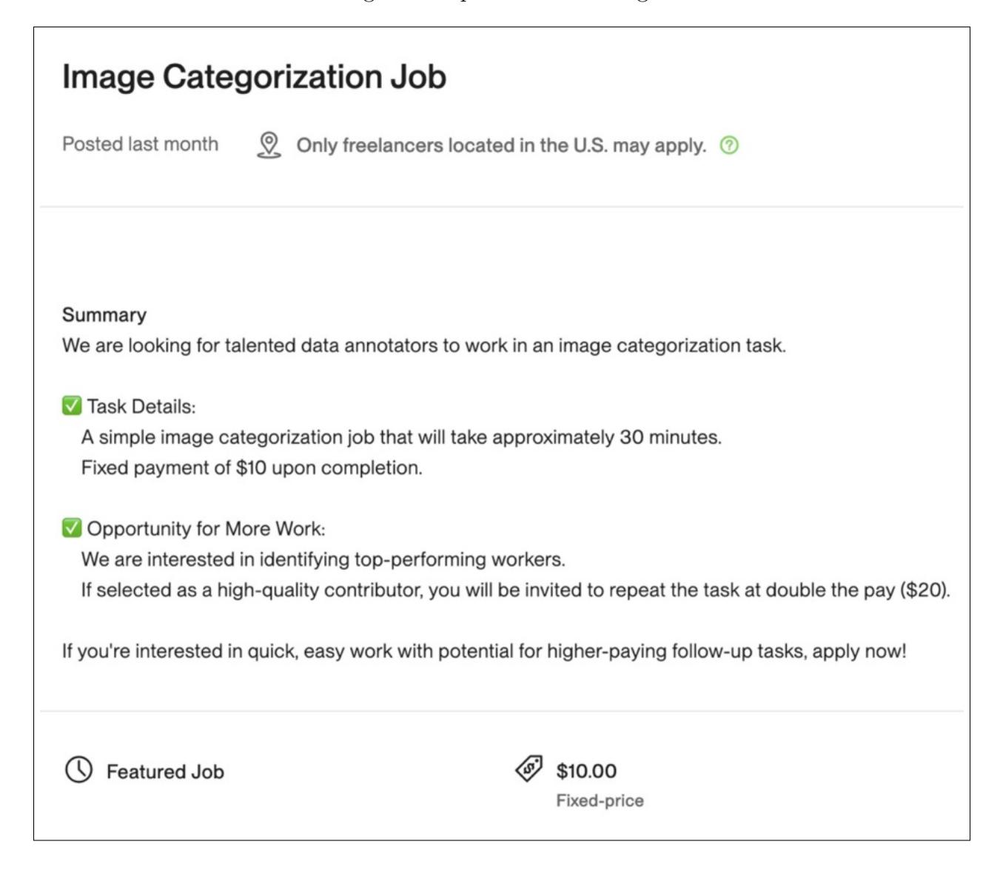

Throughout the paper, accuracy will serve as the main performance benchmark and is defined as the percentage of correct answers after considering the AI recommendation. Workers in the *Private* condition were informed of the evaluation process as follows:

*"The HR specialist will only see each worker's percentage of final correct answers (after considering the AI recommendation)."*

The first treatment group is the *Public* condition. In this condition, HR specialists observe not only workers' accuracy but also their AI reliance. Workers in the *Public* condition were informed of the evaluation process as follows:

*"The HR specialist will only see each worker's percentage of final correct answers (after considering the AI recommendation) and how often each worker changed their answer after seeing the AI recommendation."*

The second treatment group is the *Public with Information* condition. As in the *Public* condition, HR specialists observe both workers' accuracy and their AI reliance. In addition, only workers in this condition are informed that the HR specialist has been assured of the rigorous pre-screening process and the strong track record of all candidates on the platform. This is not new information to the workers, as they were already told on the initial screen that they had been selected based on their strong Upwork history. The intervention therefore manipulates only workers' beliefs about what the HR specialist knows. The exact message provided exclusively to workers in the *Public with Information* condition was:

*"We also assured the HR specialist that all candidates had been carefully prescreened and had a solid track record of positive experiences on Upwork, minimizing the risk of unnecessary concerns about worker quality."*

In all experimental conditions, workers were told that HR specialists were explicitly instructed to evaluate candidates based on who was expected to perform most accurately if invited back for another session of the same AI-assisted categorization task. The instructions highlighted accuracy as the decisive factor in achieving a higher score.

At the end of the categorization task, without prior knowledge of this component, workers participated in a novel, incentive-compatible exercise designed to reveal what they fear high AI reliance may signal to employers. All workers were told that our firm typically leaves public feedback for employees, intended to be informative for future employers on the platform. They were informed that the feedback would include a brief description of the completed task, in this case, image categorization with AI assistance.

Workers were then given the opportunity to select one of three statements they wished to emphasize at the end of their feedback:[10](#page-8-0)

- (i) You are a hard worker and put in strong eort.
- (ii) You are highly skilled and capable in these tasks.
- (iii) You have confidence in your own judgment.

10These three options reflected the main mechanisms identified in a pilot survey as reasons why workers may fear using AI when it is observable.

In the treatment groups, a few modifications were introduced. Workers were told that their public feedback would also indicate whether they relied more or less on the AI recommendations than the average worker for the same job. They were further reminded that heavy reliance on AI might raise concerns for future employers, and that their selected sentence could help address those concerns if they were identified as high AI users.[11](#page-9-0)

For the control group, this exercise captures the baseline distribution of preferences over signaling eort, skill, or confidence in judgment. For the treatment groups, it captures preferences over these same signals under the potential threat of being exposed as a high AI user. Taken together, this allows us to illustrate, at the aggregate level, what workers fear their AI use may signal to employers.

After all workers completed the first job, an experienced HR specialist hired on Upwork was familiarized with the task and proceeded to assign each worker a score from 0 to 100, adhering strictly to the advertised information in their condition (observing only accuracy for the control group, and both accuracy and AI reliance for the treatment groups). Based on a rehiring rule that depended on both score and chance (described in the next section), we oered contract extensions to 140 workers, of which 135 accepted within one week.[12](#page-9-1)

For rehired workers originally assigned to a treatment group, the second job began with an evaluation exercise. They assessed 20 profiles of other returning workers based solely on accuracy (correct answers) and AI reliance rates, replicating the HR specialist's evaluation in the first job. This component was designed to identify whether changes in AI reliance induced by the treatment were driven solely by anticipated external evaluation or also reflected self-projection into the evaluator's role. After this, all rehired workers completed a short questionnaire followed by a 10-round version of the categorization task. Control-group workers did not perform the evaluation task, since AI reliance had not been visible in their prior environment and introducing it at this stage would have been unnatural.

The evaluation exercise was incentive compatible: workers were told that they would be matched with one of the evaluated workers, and that the higher a worker ranked in their ordered score ranking, the greater the chance of being paired with them. Each worker could earn up to an additional \$5, receiving \$0.25 for every correct answer of their matched partner and \$0.25 for each of their own correct answers. This design provided incentives both to evaluate carefully and to perform as well as possible themselves.

11Northwestern's human subjects committee was concerned that feedback evaluations disclosing AI reliance could harm workers. In response, treatment group workers were asked a follow-up question on whether they wanted the AI reliance information included in their feedback. They were informed that if at least one worker objected, the information would be removed for everyone for fairness considerations. Because about 30% of the workers requested its removal, the information was ultimately excluded.

12The 96.4% acceptance rate reinforces that the rehiring incentives were strong and that workers on the platform are committed to longer-horizon jobs.

Finally, workers from the treatment groups who were not selected for a contract extension were given an opportunity to earn \$5 by completing the short questionnaire component of the second job, of which 147 out of 205 agreed. Because most of the questions were relevant only for treated workers, they were the ones invited to complete the questionnaire. Figure [2](#page-10-0) presents a diagram of the experimental design.

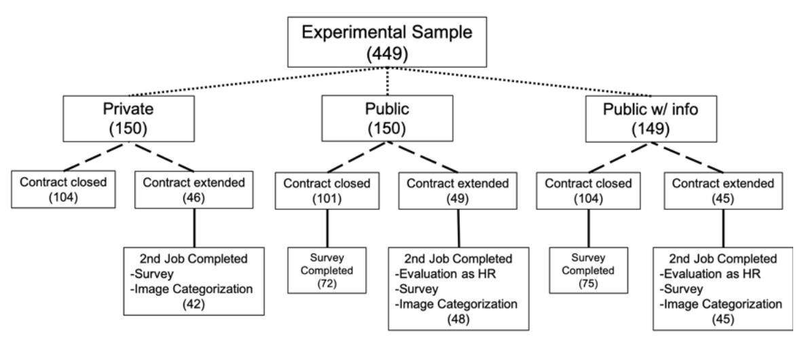

Figure 2: Experiment Design

*Notes*: Short dashed lines denote random assignment, while long dashed lines denote quasi-random assignment based on the rehiring probability rule. The number of workers in each node is reported in parentheses.

### **2.1 Upwork and Sample Selection**

Upwork (formerly oDesk) has been widely used in field experiments because it combines realmarket conditions with strong experimental control (Horton, Rand, and Zeckhauser [\(2011\)](#page-32-16) discuss in detail the virtues of using online labor markets for conducting experiments). For example, Pallais [\(2014\)](#page-32-8) examined hiring ineciencies caused by information frictions, and Coman, Collis, and Kulkarni [\(2024\)](#page-31-13) registered as an employer to study gender dierences in job applications. A key advantage of Upwork for this study is its ability to foster authentic employer–employee relationships: the platform enables the use of actual contract extensions as incentives. Recruited workers perform data annotation professionally or as a side job and maintain reputations for doing that through ratings and public reviews. This provides a unique opportunity to study how workers in their natural workplace environment respond to an exogenous shock that makes their AI use observable to someone with influence over their career prospects.

To participate, workers had to satisfy three criteria. First, they had to be located in the United States, situating the findings in a region with substantial AI exposure while reducing concerns about language barriers or misinterpreted instructions. Second, workers needed prior platform experience in related fields such as data annotation or data entry. Because prior work has shown that new workers face substantial barriers (Pallais [2014;](#page-32-8) Stanton and Thomas [2016\)](#page-32-9), I restricted the sample to workers with previous experience; 81% had already earned over \$100 on the platform. Finally, workers had to be registered as freelancers rather than part of an agency, ensuring direct business relationships without intermediaries.

### **2.2 Image Categorization Task**

The first job consisted of 50 rounds of an image categorization task with AI recommendation assistance. In each round, the workers observed a blurred image with the objective of selecting the correct category from a list of 16 options: airplane, bear, bicycle, bird, boat, bottle, car, cat, chair, clock, dog, elephant, keyboard, knife, oven, and truck. After making their initial choice, workers were shown an AI recommendation. If their choice matched the AI recommendation, they were notified of the agreement and proceeded to the next image. If the recommendation diered, they could revise their answer and switch to the AI's recommendation. Workers were incentivized to put eort into their initial choice because, once the AI recommendation was revealed, they could only choose between their original answer and the AI's recommendation; all other options were no longer available. The dynamics of this two-stage decision process are illustrated in Figure [3.](#page-12-0) The images and AI model were obtained from Steyvers et al. [\(2022\)](#page-33-2), and Appendix [B.4](#page-54-0) provides additional technical details on the task construction.

Although AI has made significant progress in image categorization, human input remains essential in supervised learning processes such as data annotation. This task is particularly well-suited for studying AI–human collaboration, as it encompasses: (i) images that appear simple to humans but are misclassified by the AI; (ii) images that the AI classifies correctly but are extremely dicult for humans, making blind delegation to the AI the most eective strategy; and (iii) cases where humans often classify correctly, but those who do not may be guided to the correct answer after reconsidering the image from the perspective suggested by the AI.[13](#page-11-0)

Additional advantages of this task are that it is a well-established and popular category on online labor platforms such as Upwork,[14](#page-11-1) it is easy to explain and requires little to no training (especially for platform users with prior annotation experience), and it oers excellent experimental control. The dataset further provides ground-truth labels, presents each image at varying noise levels to manipulate diculty, has been validated as an ecient tool for studying AI–human collaboration, and Steyvers et al. [\(2022\)](#page-33-2) also made available

13See Figure [A.1](#page-34-0) for examples.

14Upwork has a job category named "AI Data Annotation and Labeling."

Figure 3: Task interface showing the initial choice and AI recommendation stages.

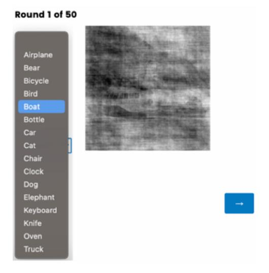

Initial Choice

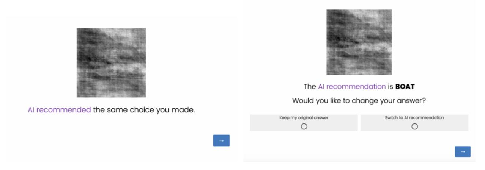

When the recommendation agrees When the recommendation diers

high-quality AI recommendations.

## **2.3 Design Choices**

In this section, we discuss several of the main choices we faced while designing the experiment.

*Between-subjects.* Workers are assigned to a single experimental condition to avoid experimenter demand or priming eects. While a within-subjects design could provide insight into the distribution of treatment eects, which is particularly relevant here since eects may vary in direction, the risk of eliciting mechanical responses to treatment is substantial.

*Recommendation timing.* Providing the recommendation after an initial choice allows

us to clearly identify AI's impact on the final decision. This approach avoids ambiguity in cases where the choice and recommendation align, but it's uncertain whether the choice was influenced by the AI or made independently. This design has two key advantages: first, it enables precise measurement of how often recommendations are adopted; second, it conveys to workers that their choices to adopt recommendations are being reliably tracked. In some work environments, identifying which employees rely more heavily on recommendations can take considerable time (e.g., days or even months), but this study lacks the timeframe for extended observation, which would likely be necessary if recommendations were provided before making an initial choice.

*Information provided on AI recommendations.* Workers were informed that the recommendations came from an AI model trained on the same task and that it was accurate 85% of the time, a statement that holds for both the full dataset and the subset of images used in this experiment. They were also told that AI might perform well on images that humans find dicult but could occasionally miss images that appear easy to the human eye. This statement reflects a genuine feature of the original study by Steyvers et al. [\(2022\)](#page-33-2). Prior research (Dietvorst, Simmons, and Massey [2015;](#page-31-8) Dreyfuss and Raux [2025\)](#page-31-14) shows that people may overreact to a single poor algorithmic recommendation, so this disclaimer was intended to reduce the likelihood that participants would lose trust in AI based on an isolated error. Such reactions represent an interesting phenomenon that is orthogonal to our research question, and given the short horizon of our study, we found it preferable to avoid them.

*Incentives.* Workers receive a fixed \$10 payment for completing the job. However, the most important aspect of the incentive scheme is the opportunity to be rehired for a similar task at double the pay rate (\$20). The rehiring opportunity allows workers to derive instrumental value from third-party beliefs, here represented by the evaluation of an HR specialist. This approach mirrors a realistic aspect of the labor market, where employees care about how others perceive them, as these perceptions can ultimately aect hiring, promotion, or layo decisions.

*Rehiring decisions.* As advertised to workers, second job oers were made using feedback from a real HR specialist hired on the same platform. Rehiring decisions depended on both score and luck, with the probability of rehiring for each worker determined by the following formula:

$$P(\text{Rehire}) = 0.2 + (\text{Decile} \times 0.02), \quad \text{Decile} = 1, \dots, 10$$

Deciles were determined by workers' scores within their experimental condition. The rehiring rule served two purposes. First, it rewarded higher scores. Although workers were never told explicitly that higher scores would lead to better outcomes, it was natural to interpret the scores in this way, and our design relies on this perception. Second, it ensured that the pool for the second job was more representative, rather than consisting only of top performers. This design makes the second-job results more generalizable.

*Treatment design.* The variation across experimental conditions was designed to dier only in the information available to the HR specialist at the moment of evaluation, and workers were informed openly and transparently about what information the HR would have at their disposal. Across all conditions, participants were also made aware that the HR specialist was instructed to evaluate solely on which workers were expected to perform most accurately if brought back for another session of the same AI-assisted categorization task.

# **3 Conceptual Framework**

I introduce a model of AI-assisted categorization that mirrors the workflow of the experiment. In each round, the worker first makes an unaided choice and holds a private confidence *p* in the selected category; the AI then provides a calibrated recommendation with fixed confidence *Ÿ*. When the recommendation diers from the worker's initial choice, the worker decides whether to keep or switch their initial choice, anticipating an evaluator who always observes final accuracy *a* and may also observe AI reliance *r* (the share of switches). The worker chooses when to adopt the AI recommendations to maximize the evaluator's score. We focus on how behavior shifts when AI reliance becomes observable. Visibility can induce a tradeo between accuracy and AI adoption, which ultimately depends on how the worker expects adopting AI will influence the evaluator's score. The model formalizes this environment and yields testable predictions for (i) willingness to adopt AI recommendations and (ii) overall task performance.

### **3.1 A Model of Worker Behavior under Observable AI Assistance**

Consider a categorization task that consists of *n* distinct categories (in the experiment, *n* = 16). The true category, or *state*, is denoted by *Ê* œ *{Ê*1*,..., Ên}*, and the worker chooses a category *y* œ *{y*1*,...,yn}*. An action is correct when *y* = *yi* for the corresponding state *Ê* = *Êi*; that is, when the true category is chosen.

A worker has baseline type *◊* œ [1*/n,* 1] summarizing her average *unaided* accuracy. Before seeing the AI recommendation, she selects an initial category *y*0 from a private signal. The AI then recommends a category *y*ˆ with calibrated confidence *Ÿ* œ [0*,* 1], interpreted as the probability that *y*ˆ is correct.[15](#page-14-1) Conditional on the state *Ê*, the worker's private signal and

15An algorithm is said to be well-calibrated if its predicted probabilities align with empirical outcome frequencies.

the AI's recommendation are independent. 16

Let y denote the worker's final label after considering the AI recommendation. We track two reduced-form objects across tasks:

$$a \equiv \Pr(y = \omega)$$
 (expected accuracy),  $r \equiv \Pr(y = \hat{y} \neq y^0)$  (AI reliance).

Thus a is average accuracy after considering the AI recommendation, and r is the share of tasks on which the worker *changes* her initial answer to the AI's recommendation (only relevant when  $y^0 \neq \hat{y}$ ).

The worker decides whether to switch to the AI's recommendation in order to maximize the score assigned by an evaluator who observes certain variables. In the control regime the evaluator's score depends only on accuracy,

$$S_c = S_c(a),$$

whereas in the treatment regime it also depends on AI reliance,

$$S_t = S_t(a,r).$$

Assumption (Accuracy is rewarded). The evaluator's score is strictly increasing in accuracy:

$$\frac{dS_c(a)}{da} > 0$$
 and  $\frac{\partial S_t(a,r)}{\partial a} > 0$   $\forall a \in (0,1), r \in [0,1].$ 

### 3.2 Decision Rule and Threshold Optimality

I deliberately take a reduced-form approach to belief formation: I do not model priors, signals, or an updating rule. All we require is that, after choosing a category  $y^0$ , the worker can summarize her information by a scalar

$$p \equiv \Pr(y^0 = \omega \mid \text{worker's information}) \in [1/n, 1],$$

interpreted as the probability that her initial choice of category is correct. 17

When  $y^0 \neq \hat{y}$  (disagreement), the worker chooses one source to follow: either keep  $y^0$  or switch to  $\hat{y}$ . Under calibration, the expected accuracy from keeping  $y^0$  equals p; from

&lt;sup>16In the experiment, workers were prompted to treat the AI's recommendation as independent of their own signal. The qualitative predictions of the model remain unchanged if this assumption is relaxed (e.g., under a single-crossing property)

&lt;sup>17A simple microfoundation is Bayesian: the worker begins with a prior over categories, observes a private signal s, forms posteriors  $q_j(s) = \Pr(\omega = \omega_j \mid s)$ , chooses  $y^0 = \arg\max_j q_j(s)$ , and sets  $p = \max_j q_j(s)$ . Our analysis relies only on the scalar p and abstracts from the underlying structure that generates it. For some results it is convenient (but not required) to assume  $p \sim F$  with density  $f_0$  and  $\mathbb{E}[p] = \theta$ .

following the AI equals  $\kappa$ . (Agreement does not affect the rule because both sources induce the same category.)

A simple and natural decision rule is a cutoff policy: the worker adopts the AI's recommendation whenever her own confidence p is below a threshold  $\tau \in [1/n, 1]$ , and otherwise keeps her initial choice  $y^0$ .

**Proposition 1 (Threshold optimality)** (i) Scoring when AI reliance is not observed. If the worker maximizes  $S_c(a)$  with  $S'_c(a) > 0$ , the accuracy-maximizing policy is the cutoff rule with

$$\tau^* = \kappa$$
, i.e., switch to AI iff  $p \le \kappa$ .

(ii) Scoring with observable AI reliance. Suppose the worker maximizes  $S_t(a,r)$ , where  $S_t$  is continuously differentiable and  $\partial S_t/\partial a > 0$ . Then an optimal policy is again a cutoff rule:

$$\tau^* = \kappa - \lambda, \qquad \lambda \equiv -\frac{\partial S_t/\partial r}{\partial S_t/\partial a} \bigg|_{(a,r)}$$

Here  $\lambda$  is the evaluator's shadow penalty (in accuracy units) for an additional unit of reliance. If reliance is penalized  $(\partial S_t/\partial r < 0)$  then  $\tau^* < \kappa$ ; if reliance is rewarded  $(\partial S_t/\partial r > 0)$  then  $\tau^* > \kappa$ .

When AI reliance is penalized, the worker is willing to ignore AI recommendations for any private confidence level  $p \in (\kappa - \lambda, \kappa)$ , a range in which accuracy would improve by following the AI recommendation, but not enough to offset the expected penalty for relying on AI. Conversely, when AI reliance is rewarded, the worker is willing to adopt AI recommendations when her private confidence level  $p \in (\kappa, \kappa - \lambda)$ , a range in which accuracy would decrease by following the AI recommendation, but the reward for adopting AI more than compensates for the loss in accuracy. Figure 4 illustrates how the threshold rule dictates whether to adopt or override the AI recommendation as a function of initial choice confidence.

#### 3.3 Solution and Testable Predictions

Assume the private confidence p admits a cdf F with density f on [1/n,1] and  $\mathbb{E}[p]=\theta$ . Then the closed form solution is:

$$r^*(\lambda) = [F(\kappa - \lambda)] D$$
 and  $a^*(\lambda) = \left[\theta + \int_{1/n}^{\kappa - \lambda} (\kappa - p) f(p) dp\right] D + (\theta \kappa) (1 - D).$ 

where D denotes the probability of disagreement  $(y^0 \neq \hat{y})$ , and the bracketed terms represent, respectively, the reliance rate and the accuracy rate conditional on disagreement.

Figure 4: Threshold Decision Rule.

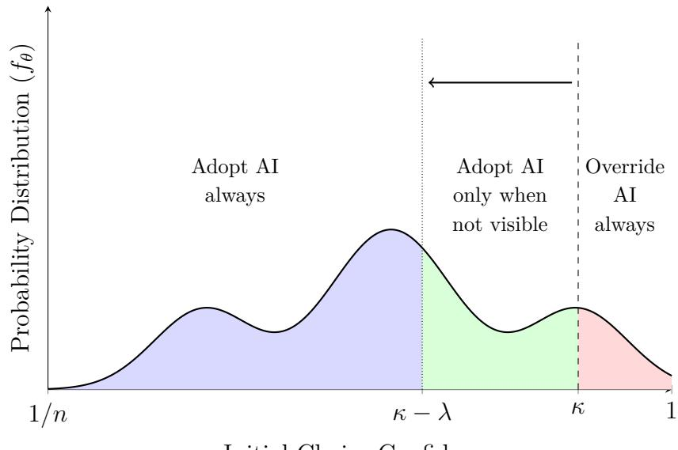

Initial Choice Confidence

*Notes*: The distribution of private confidence *p* is partitioned by two dierent thresholds that dictate whether to adopt AI. When *p* is below the threshold, the worker follows the AI recommendation; when *p* is above it, keeps her original choice. The higher threshold *Ÿ* represents the optimal rule when AI reliance is not observable. When reliance becomes observable and evaluators penalize it, the threshold shifts left to *Ÿ* ≠ *⁄*. The shaded green region between *Ÿ* ≠ *⁄* and *Ÿ* highlights initial confidence levels for which adopting the AI recommendation would improve accuracy, but the worker instead overrides whenever reliance is visible.

**Model predictions.** Moving from the control benchmark to a regime in which evaluators observe AI reliance, and assuming that the evaluator's score *St*(*a, r*) is strictly increasing in accuracy (*ˆSt/ˆa >* 0), the model implies:

- 1. **AI adoption.** Visibility shifts optimal AI reliance in the direction of the perceived incentive on *r*:
  - If evaluators penalize reliance (*ˆSt/ˆr <* 0), then *r*ú decreases.
  - If evaluators reward reliance (*ˆSt/ˆr >* 0), then *r*ú increases.
- 2. **Accuracy (strict comparative static,** *⁄* "= 0**).** For any nonzero visibility weight *⁄* (so *ˆSt/ˆr* "= 0) with *f◊*(*·*) *>* 0,

$$a^*(\lambda) < a^*(0).$$

That is, accuracy is strictly lower under any nonzero visibility-induced distortion of the scoring rule. Appendix [C.2](#page-55-0) shows that accuracy can be represented as an inverse-Ushaped function of AI reliance, attaining a maximum at *·* = *Ÿ* (the optimal AI reliance level under the control regime).

*Implication (penalty case).* If workers anticipate a penalty on AI reliance (*ˆSt/ˆr <* 0), then making reliance observable yields (i) lower AI reliance *r*ú and (ii) lower accuracy *a*ú relative to the control.

# **4 Experimental Results**

Table [1](#page-18-1) provides a summary of workers' characteristics. Gender and ethnicity were selfreported by the workers, while the remaining variables, encompassing platform history and previous education, were collected from their public profiles. Two-sided t-tests indicate that treatment assignment was balanced across the available observable characteristics, with no variable showing a statistically significant dierence at the 10% level.

Table 1: Descriptive Statistics and Balance Check.

|                         | Private           | Public            |        | Public w/ info |        |
|-------------------------|-------------------|-------------------|--------|----------------------|--------|
|                         | Mean (sd.)     | Mean (sd.)     | t-stat | Mean (sd.)        | t-stat |
| Female                  | 0.69 (0.46)    | 0.68 (0.47)    | 0.25   | 0.67 (0.47)       | 0.41   |
| Minority                | 0.43 (0.50)    | 0.46 (0.50)    | -0.58  | 0.50 (0.50)       | -1.22  |
| Previous Earnings    | 8,262 (30,292) | 7,958 (19,757) | 0.10   | 7,635 (24,275)    | 0.20   |
| Previous Jobs        | 15.2 (17.1)    | 17.9 (20.1)    | -1.24  | 15.5 (20)         | -0.11  |
| Hourly fee           | 20.3 (9.6)     | 21.1 (9.3)     | -0.75  | 21.4 (14.7)       | -0.77  |
| Badge                   | 0.35 (0.48)    | 0.39 (0.49)    | -0.72  | 0.40 (0.49)       | -1.00  |
| Undergraduate degree | 0.65 (0.48)    | 0.66 (0.48)    | -0.24  | 0.70 (0.46)       | -1.07  |
| Graduate degree      | 0.2 (0.40)     | 0.27 (0.44)    | -1.36  | 0.27 (0.44)       | -1.40  |
| Observations            | 150               | 150               |        | 149                  |        |

*Notes*: *Minority* is a dummy variable equal to one for workers identifying with any non-white ethnicity. *Previous Jobs* was winsorized at the 95th percentile, with values above this percentile set to 95th level. *Badge* is a dummy variable equal to one for workers holding any of the platform badges: 'Rising Talent', 'Top Performer', or 'Top Performer Plus'. The t-statistics reported correspond to two-sided t-tests comparing the private (control) group to either of the public (treatment) groups.

\* *p <* 0*.*10, \*\* *p <* 0*.*05, \*\*\* *p <* 0*.*01.

### **4.1 Treatment Eects**

For clarity, I pool the two *public* treatments in the main analysis. The conditions produced very similar eects, with no statistically significant dierences across any outcome variable.[18](#page-19-0) Section [5](#page-25-0) discusses in greater detail the implications of not finding dierences between the two *public* treatments. Unless otherwise noted, the control group refers to the *private* condition, and the treatment group combines the *public* and *public with information* conditions.

The empirical analysis relies on the following simple regression framework:

$$Y_{ij} = \alpha + \beta T_i + \gamma X_j + \epsilon_{ij} \tag{1}$$

Where *Yij* denotes the outcome variable for worker *i* on image *j*. The treatment indicator *Ti* œ *{*0*,* 1*}* equals 1 if worker *i* was assigned to either of the *Public* treatment groups, and 0 otherwise. *Xj* represents image fixed eects. The coecient of interest, *—*, captures the average treatment eect of being assigned to a condition in which AI reliance was visible to the HR specialist, relative to the control group, where AI reliance was not visible. All specifications include image fixed eects, and standard errors are clustered at the worker level.[19](#page-19-1) Treatment eects for the six pre-registered outcome variables are reported in Table [2.](#page-19-2)

AI recommendation reliance Correct answer Response time All Conditional Initial Final Initial Rec. stage (1) (2) (3) (4) (5) (6) **Treatment -0.043**\*\*\* **-0.080**\*\*\* **0.008 -0.027**\*\*\* **2.10**\* **-0.72** (0.014) (0.022) (0.012) (0.008) (1.10) (0.57) Constant 0*.*305 0*.*640 0*.*553 0*.*791 21.3 10.1 Observations 22,398 10,554 22,398 22,398 22,398 10,554

Table 2: Treatment Eects.

*Notes*: Each dependent variable is regressed on a treatment group indicator (equal to 1 if the worker was assigned to any of the *public* treatment groups), with image-specific fixed eects included. Standard errors are clustered at the worker level.

The first main result is that assignment to the *Public* treatment reduced workers' reliance on AI recommendations. Columns 1 and 2 of Table [2](#page-19-2) report the treatment eects on AI

\* *p <* 0*.*10, \*\* *p <* 0*.*05, \*\*\* *p <* 0*.*01.

18Table [A.1](#page-41-0) reports results with the treatments separated, showing nearly identical and statistically significant estimates when each treatment is compared separately to the control group.

19Results are robust to excluding image fixed eects.

reliance.[20](#page-20-0) Across both measures, we observe a statistically significant decrease in AI reliance. Using Column 1 as the main benchmark, workers in the treatment groups followed the AI recommendation 4.3 percentage points (pp) less often, significant at the 1% level. This eect represents a 14% reduction relative to the 30.5% AI reliance rate observed in the control group, where workers had no concern about an HR specialist observing their AI use. In Column 2, which focuses only on rounds where workers faced a genuine choice between their own answer and the AI recommendation, the estimated eect is naturally larger at 8 pp.

Making AI adoption visible to HR specialists reduced workers' reliance on AI, which in turn led to worse performance in the categorization task, even when that performance itself was observable to HR. Column 4 of Table [2](#page-19-2) reports the treatment eects on the percentage of correct answers after considering the AI recommendation, our measure of job performance. Workers in the *Public* treatment, by ignoring more often AI recommendations, experienced a 2.7 pp decline in accuracy, significant at the 1% level. Relative to the 79.1% accuracy rate observed in the control group, this corresponds to a 3.4% performance reduction. Figure [A.3](#page-36-0) shows that the treatment eects on AI reliance and performance remain stable across the 50 rounds, indicating a consistent change in behavior throughout the task.

These patterns are consistent with the two model predictions in Section [3,](#page-14-0) which formalizes a worker's decision in a categorization task, including the option to revise an initial answer after considering an AI recommendation. The model predicts that when AI reliance becomes visible and workers expect a penalty for relying on the AI, visibility reduces reliance and leads to lower accuracy relative to the control condition.

A reduction in performance is not guaranteed following the decrease in AI reliance due to its visibility, as several orthogonal channels not captured by the model may have sustained or even improved accuracy. One plausible scenario is that workers exerted greater eort in their initial choice in anticipation of relying less on AI.[21](#page-20-1) Column 5 of Table [2](#page-19-2) reports a 10% increase in response time, a natural proxy for eort (significant at the 10% level). On average, workers in the *Public* treatment took about two additional seconds per image to make their initial selection. However, column 3 shows that these extra seconds did not have an impact on performance, as initial accuracy was unaected. Thus, helping to reasonably rule out a meaningful distortion in performance derived from workers' initial choice behavior.

20Column 1 includes all rounds (the unconditional reliance rate), which is also the measure observed by HR evaluators and therefore the outcome most relevant for workers' image concerns. Column 2 restricts to only rounds in which workers had the opportunity to switch from their initial answer to the AI recommendation. When the AI recommendation matched a worker's initial choice, this does not count as relying on AI.

21Almog, Gauriot, et al. [\(2025\)](#page-30-6) provide field evidence that public overruling of human decisions by AI can trigger eort adjustments, while Agarwal, Moehring, and Wolitzky [\(2025\)](#page-30-12) show how such eort responses can be incorporated into the design of human–AI collaboration systems.

Column 5 of Table [2](#page-19-2) reports a 10% increase in response time, a natural proxy for eort (significant at the 10% level). On average, workers in the *Public* treatment took about two additional seconds per image to make their initial selection. However, as shown in column 3, these extra seconds did not improve performance, as initial accuracy remained unchanged. This helps reasonably rule out meaningful distortions in performance stemming from workers' initial choice behavior.

Another potential mechanism is that treated workers became more discerning in their AI use, forgoing incorrect recommendations more often. However, the evidence does not support this interpretation. First, Column 6 shows a negative but statistically insignificant eect on response times at the recommendation stage, making it unlikely that treated workers engaged in more careful deliberation. Second, and more importantly, Figure [A.4](#page-36-1) disaggregates accuracy by treatment status and by whether workers followed the recommendation. If anything, their judgment worsened: conditional on not following recommendations, their accuracy declined.

I also conducted a counterfactual exercise to test whether the induced reduction in AI reliance reflected a deliberate change in engagement rather than merely a mechanical decrease. Specifically, I simulated a scenario in which, for every round where control workers followed the AI recommendation, I randomly forced 14% of those choices to be overridden, thereby reducing their AI reliance to the rate observed in the treatment group. Figure [A.5](#page-37-0) shows that, under this adjustment, the average accuracy gains for control workers declined from 23.8pp to 20.4pp, virtually identical to the gains among treated workers (20.3pp).

Taken together, these findings show that the decline in AI reliance when it was visible did not reflect improved judgment. Instead, it was comparable to randomly overriding additional AI recommendations, providing clear evidence that workers in the treatment group did not improve the quality of their decisions about when to rely on AI.

A recurring concern in the adoption of AI is its potential to exacerbate existing inequalities or generate new ones across dierent groups in society. To address this, I extend the empirical strategy to examine heterogeneous eects, testing whether workers respond dierently to having their AI reliance made visible depending on their gender, ethnicity, education, or platform experience. Figure [A.6](#page-38-0) shows no evidence that the main findings are driven by any particular demographic group, such as gender, ethnicity, or education. Likewise, Figure [A.7](#page-39-0) illustrates that the treatment eects are consistent across the distribution of workers' prior platform experience, whether measured by earnings or by completed jobs. Altogether, these results suggest that workers' responses to the visibility of their AI use reflect a population-wide pattern, rather than being concentrated in specific subgroups.

### **4.2 Scope for AI-human Collaboration**

The potential for AI–human collaboration lies in what humans and AI can achieve together. Although no worker in this setting was individually more accurate than the AI (Figure [5a\)](#page-22-0), this does not imply the absence of collaborative gains. Figure [5b](#page-22-0) shows the distribution of performance improvements per worker after considering the AI recommendations, highlighting two key findings: (i) every worker benefited from AI assistance, and (ii) the distribution of performance gains is more skewed to the right in the control group than in the treatment group, consistent with the larger improvements when AI reliance was private.

A natural benchmark for defining successful collaboration is whether workers, with AI assistance, surpass the AI's standalone accuracy of 85%. Figure [A.8](#page-40-0) shows that the share of workers meeting the benchmark falls from 24.7% to 18.5% when AI reliance becomes visible to the HR specialist. Put dierently, one out of every four workers who would otherwise qualify as a successful collaborator is lost once AI reliance becomes visible.

Figure 5: Accuracy Distributions

*Notes*: Panel (a) shows workers' accuracy before receiving AI recommendations, with the red dashed vertical line indicating the AI's accuracy. Panel (b) displays the distribution of accuracy improvements from incorporating AI recommendations relative to workers' initial answers, distinguishing control workers (red) from treatment workers (blue).

(a) Initial Accuracy (before AI). (b) Accuracy Gains from AI Recommendations.

### **4.3 Mechanisms**

Understanding why workers view AI reliance as damaging to their image is crucial, since addressing this perception is key to recouping the productivity losses it generates. To investigate the underlying mechanism, I developed a novel incentive-compatible method that leverages a core feature of Upwork, *public feedback*, which is also common across many online platforms.

After completing the categorization task, all workers were informed that they would receive feedback intended to be informative for future employers on the platform. The feedback described the AI-assisted categorization task they had performed, ensuring that it provided sucient context on its own. Workers were then given the opportunity to choose among three positive but mutually exclusive traits to emphasize in their feedback. Specifically, they could select a statement highlighting their eort (signaling that they are hard workers), their skills in this type of task, or their confidence in their own judgment.[22](#page-23-0) For workers in the control group, their choice of statement reflects baseline preferences over these traits. By contrast, workers in the treatment group were told that the feedback would also report whether they used more or less AI than the average worker. They were directed to view their selected statement as an opportunity to highlight a trait that might otherwise be overlooked if their feedback identified them as high AI users. Thus, for treated workers, the distribution of chosen statements reflects preferences under a scenario where image concerns about being identified as a high AI user are salient.

Figure [6](#page-24-0) presents the distribution of preferred statements by treatment status. In the control group, the majority of workers (57.3%) preferred to signal eort, followed by skill (30.8%), with confidence in judgment ranking last (11.9%). In the treatment groups, while signaling eort remained the most common choice (48.7%), both eort and skill declined as preferences shifted toward signaling confidence in judgment (25.8%), representing a 117% increase relative to the control group. These results provide to two main insights. First, many workers consistently value being perceived as hard-working, regardless of whether AI reliance is disclosed, which is reasonable given that monitoring remote workers is challenging and eort tends to extrapolate well to other tasks. Second, signaling confidence in their own judgment, which is relatively unpopular when AI reliance is not disclosed in the feedback, becomes much more relevant once workers worry that heavy AI reliance may be visible to future employers.

To the best of my knowledge, this is the first use of public feedback to elicit preferences in an incentive-compatible way. To validate these findings, I also included two more direct, though non-incentivized, questions in the second job questionnaire. I asked 284 returning workers to report, using a slider ranging from 1 (not important at all) to 10 (extremely important), how important it is to signal each of the same three positive traits to employers on Upwork. The question was asked twice: first in a general setting, and then specifically for tasks involving the use of AI. Figure [7](#page-24-1) presents the results. The first question, situated in a general setting, replicates the ranking observed in the control group: eort first, followed

22These three traits emerged as the most common in a prior survey and are also prominent in public discourse. Respondents who used the open-ended option typically referred to one or more of these traits, often in overlapping ways. To avoid ambiguity, I restricted the choice to only these three, which ensured clarity and comparability across responses.

Figure 6: Feedback Preference

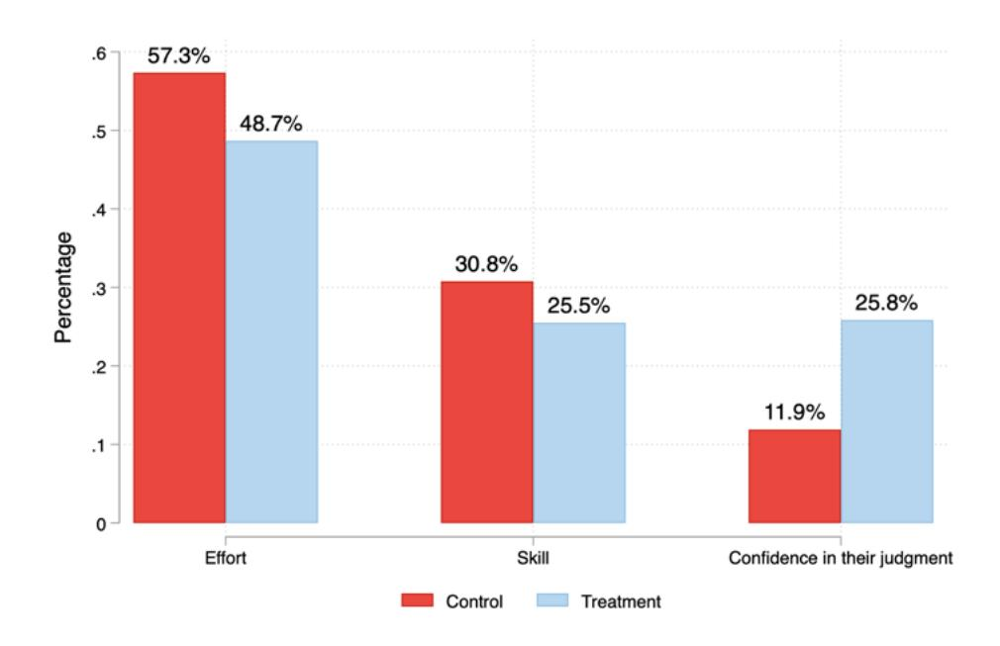

by skill, and lastly confidence in judgment. When the second question referred to tasks involving AI, the ranking reversed, consistent with the shift we observe in treated workers' feedback preferences toward signaling confidence in their judgment. These questionnaire results are reassuring, suggesting that the incentive-compatible elicitation method was well understood by the workers and reflective of underlying preferences for these signals.

Figure 7: Self-reported Importance of Signals.

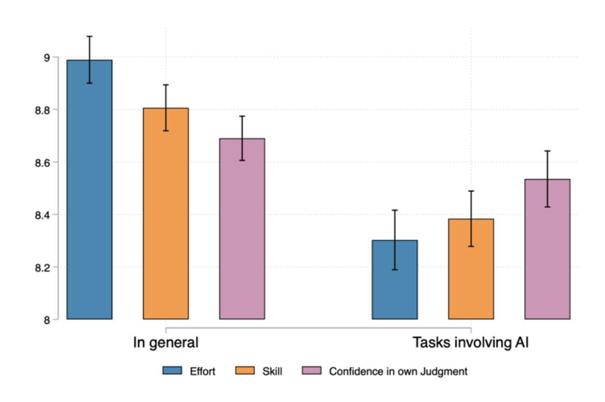

# **5 Discussion: How Hard Is It to Overcome Image Concerns?**

This section presents evidence on why overcoming image concerns is dicult. I begin with the evaluation-process instructions, which are a good starting point for illustrating the strength of the results, since they were constructed to mute potential channels through which image concerns could influence outcomes. Workers were explicitly told that the HR specialist would evaluate them based on which workers were expected to perform most accurately if they were to return to the same AI-assisted image categorization task. This instruction highlights two components that work against the observed treatment eects.

First, while task accuracy is a central criterion in many jobs, evaluations are often shaped by additional factors. In our evaluation process, however, we instructed evaluators to focus solely on expected accuracy, thereby minimizing the potential influence of image concerns.

Second, in typical jobs workers often face a wide array of tasks or uncertainty about how the displayed task may evolve over time. In such situations, image concerns could become more relevant, since appearing skilled might extrapolate better to other domains or future tasks. Here, by insisting that the evaluation was tied specifically to predicting accuracy in the *same* AI-assisted categorization task, we removed the possibility of image concerns playing a broader role.

This design suggests that the observed results likely understate the role of image concerns, which may be amplified when either the evaluation criteria or the task itself are less well defined. By structuring the experiment in this way, I show that image concerns emerge even in the absence of such considerations. The subsections that follow provide further evidence on why overcoming image concerns may be particularly challenging.

### **5.1 Null Eect of the Information Intervention**

Earlier in the paper, I justified pooling the two treatment conditions in which AI reliance was public, as the information intervention had no eect on the main outcomes: response times, accuracy, and AI reliance.[23](#page-25-1)

The intervention was motivated by the idea that AI reliance might reveal something about a worker's type in a context where the HR specialist had very limited information about the workers. In recruitment, HR specialists are often assumed to weigh traits beyond

23Table [A.1](#page-41-0) reports *p*-values from Wald tests of equality between the *Public* and *Public with Information* treatments. All *p*-values are high, providing no evidence of distinct eects across any of the outcome variables of interest.

raw performance, particularly in remote work settings. Attributes such as reliability, integrity, work ethic, accountability, communication, and punctuality are central when direct supervision is limited, and these may plausibly correlate with reliance on AI.

To assess whether image concerns were driven by information gaps, workers in the information condition were told that the HR specialist had already been assured of their strong track record on the platform and that there was no reason to doubt their quality. As noted in the pre-analysis plan, the expectation was that the information intervention would partially mitigate the treatment eects resulting from making AI reliance visible, leading to levels of AI reliance and accuracy that would fall between those of the control and the standard public-treatment groups. Instead, their behavior was indistinguishable from the latter, indicating that the additional reassurance did not mitigate image concerns.

In longer relationships, workers may worry less about signaling through AI reliance, since more information about their type accumulates naturally. The experiment, by contrast, captures a short-term work environment, so the information intervention was designed to approximate such a scenario by artificially closing the information gap. Yet the results suggest that even when workers are confident their quality is recognized, image concerns persist.

Questionnaire responses help provide intuition for the null eect of the information intervention. Workers frequently noted that the reassurance raised the HR specialist's expectations, which they sought to meet by using less AI.

As an additional check, I examine whether workers read the instructions carefully. Figure [A.9](#page-40-1) shows that average reading times for the screen containing the treatment variation were longer in the treatment conditions, and longest in the *Public with Information* condition, which included an additional paragraph. Reading times for the other instruction screens did not dier significantly across conditions.

## **5.2 Origins of Beliefs: Workers Also Penalize AI Use**

The reduction in AI reliance reflects workers' beliefs about the HR manager's evaluation criteria. Specifically, workers anticipate that HR managers will assign lower scores to those who rely more heavily on AI. One possible explanation is that workers project their own beliefs onto the HR manager; another is that workers' beliefs about the HR manager's actions diverge from what they themselves would do. The latter possibility opens the door for a misperception equilibrium à la Bursztyn, González, and Yanagizawa-Drott [\(2020\)](#page-31-15), who present evidence that simple information interventions can be eective in addressing such distortions. In what follows, I present evidence consistent with the idea that workers were projecting how they themselves would evaluate others when choosing to rely less on AI when

visible.

To better understand where workers' beliefs about HR evaluation come from, I asked returning workers from the treatment groups to rank 20 real profiles of other workers who were also selected for the second job.[24](#page-27-0) Each profile displayed the worker's accuracy rate and AI usage from the first job, and participants were monetarily incentivized to score them based on the number of correct answers those 20 workers achieved in the second job.

I find robust evidence that workers penalize AI reliance when assuming the role of an HR manager and evaluating others' profiles. To illustrate this, I examine how accuracy and AI reliance aect the scores and rankings assigned to profiles. Table [3](#page-28-0) reports regression results where the dependent variable is either the score (ranging from 0 to 100) or the ranking of a profile (1 = best, 20 = worst), modeled as a function of the worker profile's accuracy and their AI reliance. The specification includes evaluator fixed eects, and standard errors are clustered at the evaluator level. A one–percentage point increase in accuracy raises the score by about one point, whereas each additional percentage point of AI reliance reduced the score by 0.36 points. Both eects are statistically significant at the 1% level. Because the accuracy coecient is close to 1, the interpretation is straightforward: The weight placed on AI reliance is roughly 36% of that placed on accuracy, but with the opposite sign. Put dierently, evaluators penalize the adoption of three additional AI recommendations (–1.08 points) more than a single incorrect answer. The results for rankings closely mirror those for scores. Figure [8](#page-28-1) shows the 20 profiles sorted by average ranking. Although accuracy is the main driver, the figure illustrates that profiles with 10 percentage points lower accuracy can still achieve better rankings if they rely less on AI.[25](#page-27-1)

There is also strong evidence at the individual level that evaluators penalize AI reliance. Following a similar empirical strategy as in the aggregate analysis, I regress each evaluator's assigned scores on accuracy and AI reliance separately for 93 evaluators. Of these, 70 had a coecient on AI reliance that was statistically significant at the 10% level. Notably, 69 of the 70 significant coecients were negative, indicating that nearly all evaluators with sucient statistical power penalized AI reliance in their assigned scores. Figure [A.10](#page-42-0) shows the distribution of these statistically significant coecients associated with AI reliance.

The evidence that workers penalize AI reliance when assuming the role of evaluators is particularly striking, given that these workers had already experienced what it feels like to be judged for using AI. Prior research shows that perspective-taking exercises can shift attitudes toward other groups (Alan et al. [2021\)](#page-30-13), with recent evidence emphasizing relatability as a mechanism (Andries et al. [2025\)](#page-30-14). Yet even the stronger intervention of directly experiencing

24The 20 profiles combined accuracy levels of 60, 70, 80, and 90 with AI use ranging from 10 to 60 in increments of 10 (Not all combinations were feasible).

25Figure [A.11](#page-42-1) provides a two-dimensional, intuitive depiction of the average rankings.

Table 3: Eect of Worker Accuracy and AI Reliance on Evaluations.

|                        | Score (1)        | Ranking (2)      |
|------------------------|---------------------|---------------------|
| Accuracy (pp)       | 1*** (0.044)     | -0.43*** (0.015) |
| AI reliance (pp) | -0.36*** (0.042) | 0.142*** (0.013) |
| Individual FE       | X                   | X                   |
| Constant               | -4.35               | 39.4                |
| Observations           | 1,860               | 1,860               |

*Notes*: Each dependent variable is regressed on the evaluated worker's accuracy and AI reliance rate, with evaluator fixed eects included and standard errors clustered at the evaluator level. \* *p <* 0*.*10, \*\* *p <* 0*.*05, \*\*\* *p <* 0*.*01.

Figure 8: Accuracy/AI Reliance Pairs Ordered by Average Ranking.

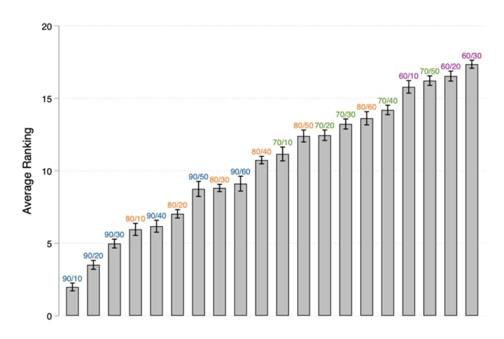

*Notes*: Each bar shows the average ranking of a profile with standard errors. Labels display the profile pair (Accuracy/AI reliance) and are color–coded according to accuracy.

the worker role did not diminish workers' inclination to penalize AI reliance in others.

# **6 Conclusion**

This paper demonstrates that image concerns are a meaningful barrier to the adoption of AI in the workplace. In a field experiment on a large online labor marketplace, workers competing for contract extensions reduced their reliance on AI when its use was observable to an HR evaluator. This decline was not oset by greater eort or improved judgment about when to follow AI recommendations, leading to lower performance even though evaluators could directly observe these losses. As a result, the prospect of successful collaboration is diminished: by our benchmark (performing better than AI), one out of every four potential successful collaborations is lost when AI reliance is made visible.

Methodologically, the paper introduces a novel incentive-compatible elicitation based on platform feedback, oering a new way to study signaling motives and underlying mechanisms in digital labor markets. The results reveal that workers fear visible reliance on AI signals a lack of confidence in their judgment, a trait they view as more consequential than eort or skill when tasks involve AI assistance.

The broader implication is that the productivity promise of AI cannot be realized by improving algorithms alone. Institutions and organizations must also address the social meaning attached to using AI, whether by reframing reliance as a sign of adaptability, embedding AI more seamlessly into workflows, or reducing the visibility of individual choices. This paper provides evidence of how dicult it can be to mute these social channels in practice, and future research should seek solutions that do so. Without such eorts, workers may continue to underutilize AI not only because they doubt its accuracy or struggle to use it, but also because of what they fear its use reveals about them. Progress in developing better AI must therefore go hand in hand with careful attention to implementation if its full benefits are to be realized.

# **References**

- Agarwal, Nikhil, Alex Moehring, Pranav Rajpurkar, and Tobias Salz (2023). "Combining Human Expertise with Artificial Intelligence: Experimental Evidence from Radiology". *Working Paper 31422, National Bureau of Economic Research*.
- Agarwal, Nikhil, Alex Moehring, and Alex Wolitzky (2025). "Designing Human-AI Collaboration: A Sucient-Statistic Approach". *Working paper*.
- Agrawal, Ajay, Joshua Gans, and Avi Goldfarb (2019). *The Economics of Artificial Intelligence: An Agenda*. Chicago: University of Chicago Press.
- Alan, Sule, Ceren Baysan, Mert Gumren, and Elif Kubilay (2021). "Building Social Cohesion in Ethnically Mixed Schools: An Intervention on Perspective Taking". *The Quarterly Journal of Economics* 136.4, pp. 2147–2194.
- Albright, Alex (2024). "The Hidden Eects of Algorithmic Recommendations". *Working paper*.
- Almog, David (2025). "AI Recommendations and Non-instrumental Image Concerns". *SSRN Working paper 5232232*.
- Almog, David and Ari Bronsoler (2025). "Texting to Save Lives: Evidence from Cardiovascular Treatment Reform in Mexico". *SSRN Working paper 5123130*.
- Almog, David, Romain Gauriot, Lionel Page, and Daniel Martin (2025). "Human Responses to AI Oversight: Evidence from Centre Court". *Working Paper*.
- Andries, Marianne, Leonardo Bursztyn, Thomas Chaney, Milena Djourelova, and Alex Imas (2025). "In their Shoes: Empathy through Information". *Working paper*.
- Angelova, Victoria, Will Dobbie, and Crystal S. Yang (2024). "Algorithmic Recommendations When the Stakes Are High: Evidence from Judicial Elections". *AEA Papers and Proceedings* 114, pp. 633–637.
- — (2025). "Algorithmic Recommendations and Human Discretion". *Forthcoming at Review of Economic Studies*.
- Atkin, David, Azam Chaudhry, Shamyla Chaudry, Amit Khandelwal, and Eric Verhoogen (2017). "Organizational Barriers to Technology Adoption: Evidence from Soccer-Ball Producers in Pakistan". *The Quarterly Journal of Economics* 132.3, pp. 1101–1164.
- Bandiera, Oriana, Iwan Barankay, and Imran Rasul (2005). "Social preferences and the response to incentives: Evidence from personnel data". *The Quarterly Journal of Economics* 120.3, pp. 917–962.
- Barach, Moshe A. and John J. Horton (2021). "How Do Employers Use Compensation History? Evidence from a Field Experiment". *Journal of Labor Economics* 39.1, pp. 193– 218.
- Brynjolfsson, Erik, Danielle Li, and Lindsey Raymond (2023). "Generative AI at Work". *Working paper*.

- Bursztyn, Leonardo, Georgy Egorov, and Robert Jensen (2019). "Cool to be Smart or Smart to be Cool? Understanding Peer Pressure in Education". *Review of Economic Studies* 89, pp. 1487–1526.
- Bursztyn, Leonardo, Bruno Ferman, Stefano Fiorin, Martin Kanz, and Gautam Rao (2018). "Status Goods: Experimental Evidence from Platinum Cards". *The Quarterly Journal of Economics* 133.3, pp. 1561–1595.
- Bursztyn, Leonardo, Alessandra L. González, and David Yanagizawa-Drott (2020). "Misperceived Social Norms: Women Working Outside the Home in Saudi Arabia". *American Economic Review* 110.10, pp. 2997–3029.
- Bursztyn, Leonardo and Robert Jensen (2017). "Social Image and Economic Behavior in the Field: Identifying, Understanding, and Shaping Social Pressure". *Annual Review of Economics* 9.1, pp. 131–53.
- Caplin, Andrew, David J. Deming, Shangwen Li, Daniel J. Martin, Philip Marx, Ben Weidmann, and Kadachi Jiada Ye (2025). "The ABC's of Who Benefits from Working with AI: Ability, Beliefs, and Calibration". *Forthcoming at Management Science*.
- Celhay, Pablo, Bruce D. Meyer, and Nikolas Mittag (2025). "Stigma in Welfare Programs". *The Review of Economics and Statistics*, pp. 1–37.
- Chandrasekhar, Arun G., Benjamin Golub, and He Yang (2019). "Signaling, Shame, and Silence in Social Learning". *NBER Working Paper 25169*.
- Coman, Katherine B., Manuela R. Collis, and Leena Kulkarni (2024). "Whether to Apply". *Management Science* 70.7, pp. 4649–4669.
- Dellavigna, Stefano, John A. List, Ulrike Malmendier, and Gautam Rao (2017). "Voting to Tell Others". *The Review of Economic Studies* 84.1, pp. 143–181.
- Dietvorst, Berkeley J., Joseph P. Simmons, and Cade Massey (2015). "Algorithm aversion: people erroneously avoid algorithms after seeing them err". *Journal of experimental psychology: General* 144.1, pp. 114–126.
- Dreyfuss, Bnaya and Raphaël Raux (2025). "Human Learning about AI Performance". *Working paper*.
- Ellingsen, Tore and Magnus Johannesson (2008). "Pride and Prejudice: The Human Side of Incentive Theory". *American Economic Review* 98.3, pp. 990–1008.
- Friedrichsen, Jana, Tobias König, and Renke Schmacker (2018). "Social image concerns and welfare take-up". *Journal of Public Economics* 168, pp. 174–192.
- Goldberg, Samuel and H. Tai Lam (2025). "Generative AI in Equilibrium: Evidence from a Creative Goods Marketplace". *Working Paper*.
- Goldfarb, Avi and Catherine Tucker (2012). "Privacy and Innovation". *Innovation Policy and the Economy* 12.1, pp. 65–90.
- — (2019). "Digital Economics". *Journal of Economic Literature* 57.1, pp. 3–43.

- He, Joyce C., Sonia K. Kang, and Nicola Lacetera (2021). "Opt-out choice framing attenuates gender dierences in the decision to compete in the laboratory and in the field". *Proceedings of the National Academy of Sciences* 118.42.
- Homan, Mitchell, Lisa Kahn, and Danielle Li (2018). "Discretion in Hiring". *The Quarterly Journal of Economics* 133.2, pp. 765–800.
- Horton, John J. (2017). "The Eects of Algorithmic Labor Market Recommendations: Evidence from a Field Experiment". *Journal of Labor Economics* 35.2, pp. 345–385.
- Horton, John J., David G. Rand, and Richard J. Zeckhauser (2011). "The online laboratory: conducting experiments in a real labor market". *Experimental Economics* 14, pp. 399– 425.
- Houeix, Deivy (2025). "Asymmetric Information and Digital Technology Adoption: Evidence from Senegal". *Working paper*.
- Jee, Edward, Anne Karing, and Karim Naguib (2024). "Optimal Policy with Social Image Concerns: Experimental Evidence from Deworming". *Working paper*.
- Karing, Anne (2024). "Social Signaling and Childhood Immunization: A Field Experiment in Sierra Leone". *The Quarterly Journal of Economics* 139.4, pp. 2083–2133.
- Ling, Yier, Alex Kale, and Alex Imas (2025). "Underreporting of AI use: The role of social desirability bias". *SSRN Working paper 5464215*.
- Mas, Alexandre and Enrico Moretti (2009). "Peers at Work". *American Economic Review* 99.1, pp. 112–145.
- McLaughlin, Bryce and Jann Spiess (2024). "Algorithmic Assistance with Recommendation-Dependent Preferences". *arXiv Preprint, arXiv:2208.07626*.
- Noy, Shaked and Whitney Zhang (2023). "Experimental evidence on the productivity eects of generative artificial intelligence". *Science* 381.6654, pp. 187–192.
- Otis, Nicholas, Rowan Clarke, Solène Delecourt, David Holtz, and Rembrand Koning (2024). "The Uneven Impact of Generative AI on Entrepreneurial Performance". *Working paper*.
- Pallais, Amanda (2014). "Inecient Hiring in Entry-Level Labor Markets". *American Economic Review* 104.11, pp. 3565–99.
- Peng, Sida, Eirini Kalliamvakou, Peter Cihon, and Mert Demirer (2023). "The Impact of AI on Developer Productivity: Evidence from GitHub Copilot". *Working paper*.
- Perez-Truglia, Ricardo and Guillermo Cruces (2017). "Partisan Interactions: Evidence from a Field Experiment in the United States". *Journal of Political Economy* 125.4, pp. 1208– 43.
- Reif, Jessica A., Richard P. Larrick, and Jack B. Soll (2025). "Evidence of a social evaluation penalty for using AI". *Proceedings of the National Academy of Sciences* 122.6.
- Stanton, Christopher and Catherine Thomas (2016). "Landing the First Job: The Value of Intermediaries in Online Hiring". *Review of Economic Studies* 83.2, pp. 810–854.

- Stevenson, Megan T. and Jennifer L. Doleac (2024). "Peer perceptions of clinicians using generative AI in medical decision-making". *American Economic Journal: Economic Policy* 16.4, pp. 382–414.
- Steyvers, Mark, Heliodoro Tejeda, Gavin Kerrigan, and Padhraic Smyth (2022). "Bayesian modeling of human–AI complementarity". *PNAS* 119.11.
- Yang, Haiyang, Tinglong Dai, Nestoras Mathioudakis, Amy M. Knight, Yuna Nakayasu, and Risa M. Wolf (2025). "Peer perceptions of clinicians using generative AI in medical decision-making". *npj Digital Medicine* 8.530.

# **A Additional Tables and Figures**

Figure A.1: Illustrative Scenarios of AI-Human Collaboration

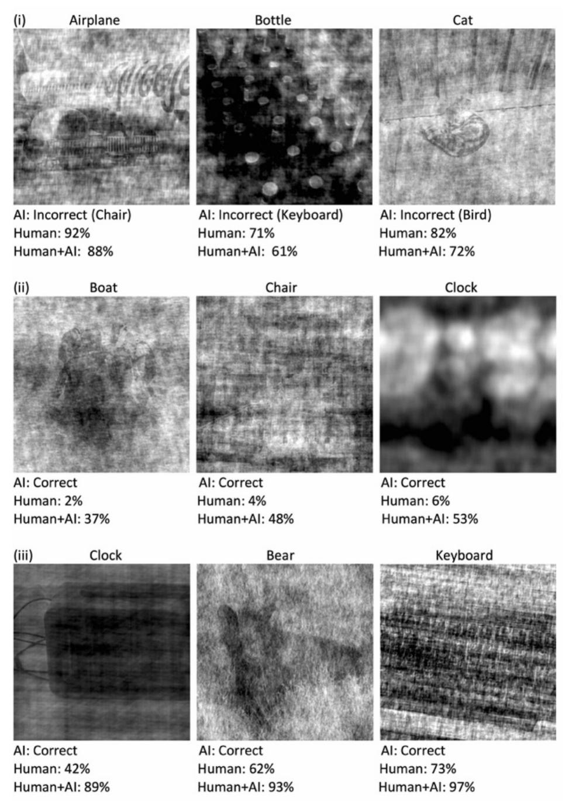

*Notes*: Images show the ground truth (top), the AI's accuracy, and humans' accuracy before and after seeing the AI recommendation. Each row illustrates a collaboration scenario: (i) Humans are mostly correct, but the AI is wrong. (ii) The AI is correct, and humans rarely are, so following it is essentially blind delegation. (iii) Humans are often correct, and many improve after reconsidering the image through the AI's suggested lens.

Figure A.2: Self-Reported First-Session Goal About HR Specialist's Score

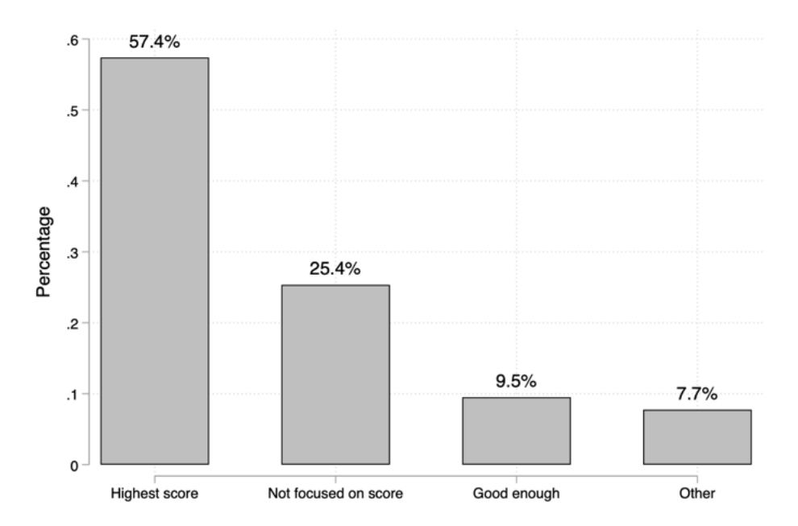

*Notes*: Based on answers from 284 workers. Among those who selected "not focused on score" or "other" and provided an explanation, 92% gave a response consistent with maximizing (doing the best possible), while only 2% mentioned a reason aligned with being good enough to get rehired.

Figure A.3: Treatment Eect by 10-Round Blocks.

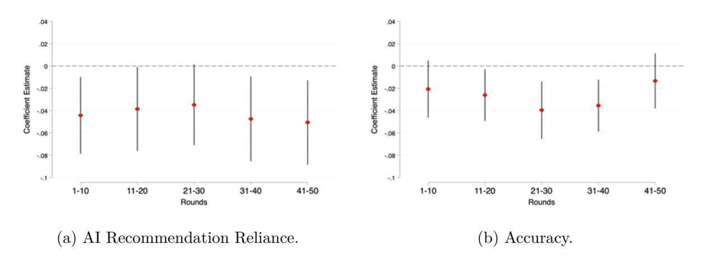

*Notes*: Each dot represents the coecient from an interaction between treatment status and a 10-round block indicator. Image-specific fixed eects are included. Standard errors are clustered at the worker level.

Figure A.4: Accuracy When Following vs. Not Following AI Recommendations.

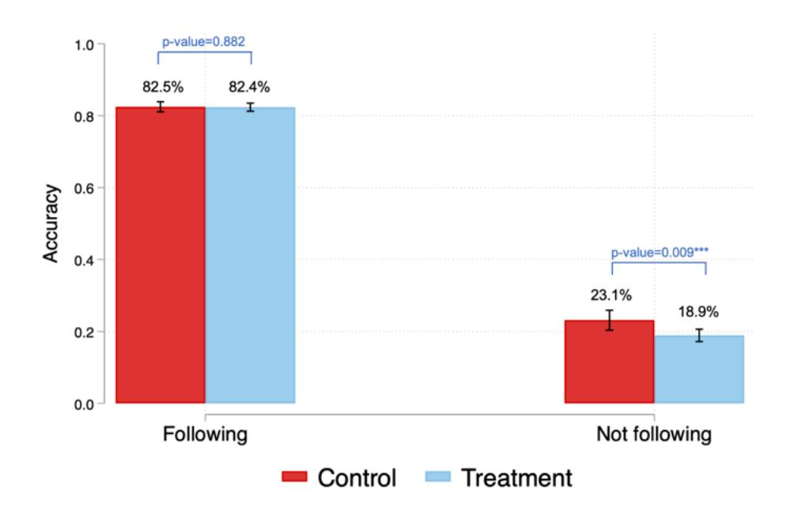

*Notes*: Image-specific fixed eects are included, and standard errors are clustered at the worker level.

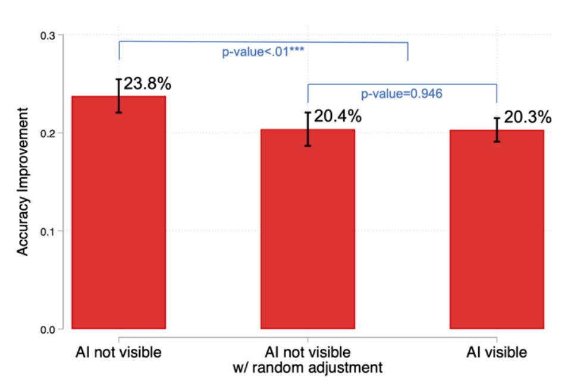

Figure A.5: Gains from Working with AI.

*Notes*: This graph plots the average accuracy gains per worker from having access to AI recommendations, measured as the improvement from workers' initial choices to their final answers after seeing the AI suggestion. The first bar reports the average gain for the control group, in which AI reliance was not visible to the HR evaluator. The second bar reports the same control group after a random adjustment that lowered their AI reliance to match the treatment group: specifically, 14% of accepted AI recommendations were randomly overruled. The final bar shows the average gain for the treatment group, where AI reliance was visible to the HR evaluator.

Figure A.6: Heterogeneous Treatment Eects by Demographics

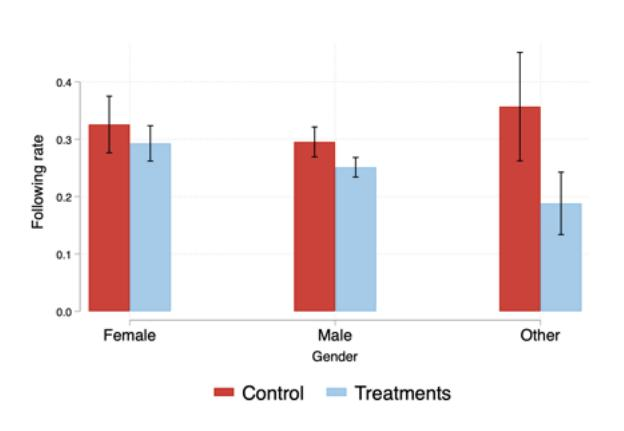

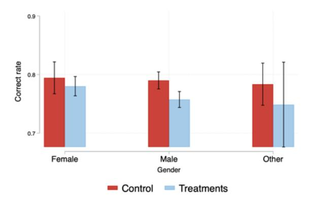

(a) Gender: AI Recommendation Reliance. (b) Gender: Accuracy.

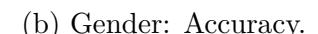

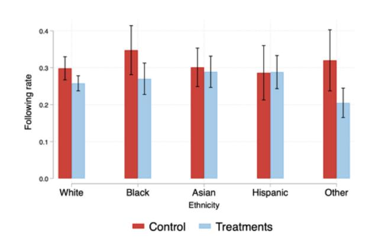

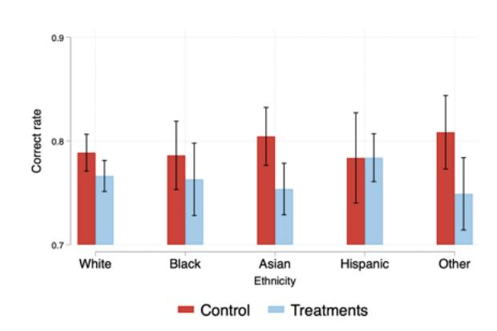

(c) Ethnicity: AI Recommendation Reliance. (d) Ethnicity: Accuracy.

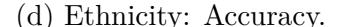

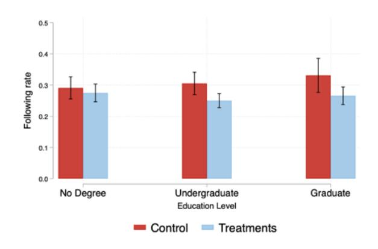

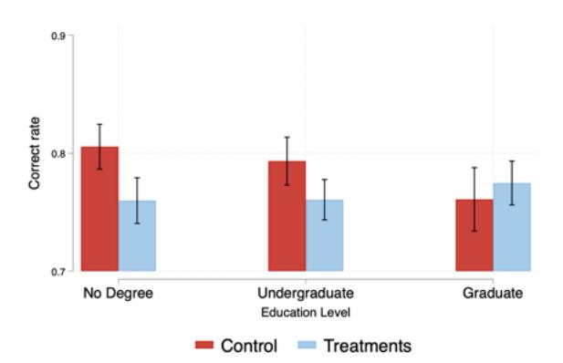

(e) Education: AI Recommendation Reliance. (f) Education: Accuracy.

*Notes*: Panels (a) and (b) present treatment eects on AI reliance and accuracy by gender, while panels (c) and (d) do the same by ethnicity. Panels (e) and (f) replicate the analysis by workers' highest level of education. Image-specific fixed eects are included, and standard errors are clustered at the worker level.

Figure A.7: Heterogeneous Treatment Eects by Platform Experience.

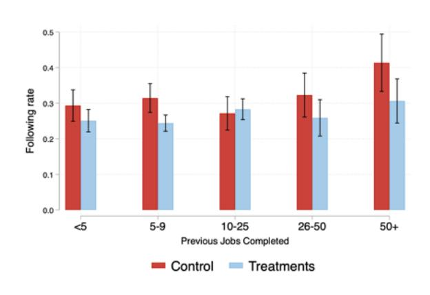

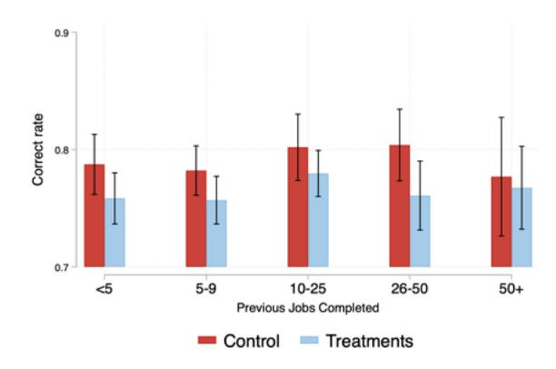

- (a) Jobs: AI Recommendation Reliance. (b) Jobs: Accuracy.

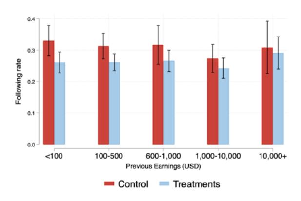

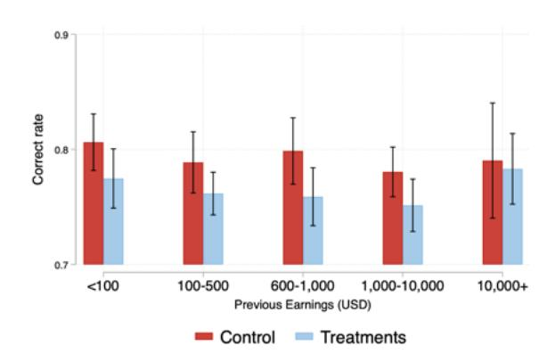

- (c) Earnings: AI Recommendation Reliance. (d) Earnings: Accuracy.

*Notes*: Panels (a) and (b) present treatment eects on AI reliance and accuracy by buckets of the number of previously completed jobs on the platform, while panels (c) and (d) do the same by grouping workers according to their previous earnings. The correlation between earnings and jobs is 0.55—positive but far from one—so examining both dimensions separately is not redundant. Image-specific fixed eects are included, and standard errors are clustered at the worker level.

Figure A.8: Share of Workers Outperforming AI

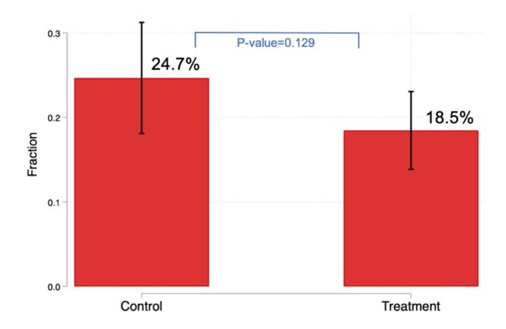

Figure A.9: Average Time Spent on Instruction Screens

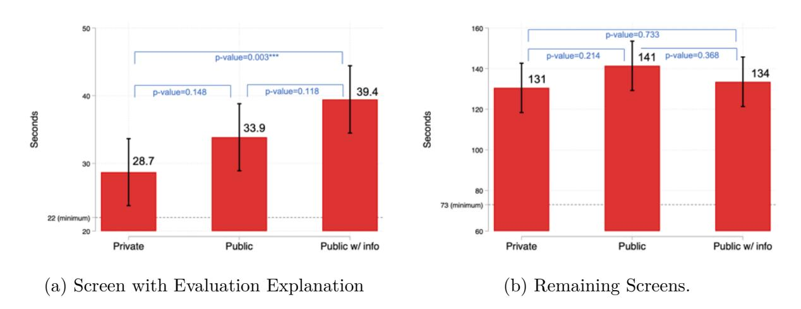

*Notes*: Minimum time requirements were imposed to ensure careful reading; horizontal dashed lines denote the shortest allowable time per screen. Panel (a) reports time spent on the instruction screen containing the treatment variation, while Panel (b) shows the total time across all other screens.

Table A.1: Treatment Eects with Separate Treatment Groups.

|                       | AI recommendation reliance |                    | Correct answer |              | Response time |                      |
|-----------------------|----------------------------------|--------------------|-------------------|--------------|------------------|----------------------|
|                       | All (1)                       | Conditional (2) | Initial (3)    | Final (4) | Initial (5)   | Rec. stage (6) |
| Public                | -0.040**                         | -0.080***          | 0.005             | -0.028***    | 2.14             | -0.82                |
|                       | (0.016)                          | (0.025)            | (0.014)           | (0.010)      | (1.33)           | (0.62)               |
| Public w/ info. | -0.046***                        | -0.081***          | 0.012             | -0.026**     | 2.05             | -0.61                |
|                       | (0.016)                          | (0.026)            | (0.014)           | (0.010)      | (1.28)           | (0.64)               |
|                       |                                  |                    |                   |              |                  |                      |
| Equality test      | 0.67                             | 0.97               | 0.57              | 0.88         | 0.95             | 0.71                 |
| (p-value)             |                                  |                    |                   |              |                  |                      |
| Constant              | 0.305                            | 0.640              | 0.553             | 0.791        | 21.3             | 10.1                 |
| Observations          | 22,398                           | 10,554             | 22,398            | 22,398       | 22,398           | 10,554               |

*Notes*: Separating treatment groups changes the empirical specification to: *Yij* = *–* + *—*1*T*1*i* + *—*2*T*2*i* + *"Xj* + *'ij* . Where each outcome variable is regressed on indicators for treatment assignment. Specifically, *T*1*i* equals 1 if worker *i* was assigned to the *Public* treatment group, and *T*2*i* equals 1 if assigned to the *Public with Information* group. All regressions include image-specific fixed eects, and standard errors are clustered at the worker level. Equality test reports the *p*value from a Wald test of equal coecients for the *Public* and *Public with Information* treatments. \* *p <* 0*.*10, \*\* *p <* 0*.*05, \*\*\* *p <* 0*.*01.

Figure A.10: Distribution of Significant AI Recommendation Coecients.

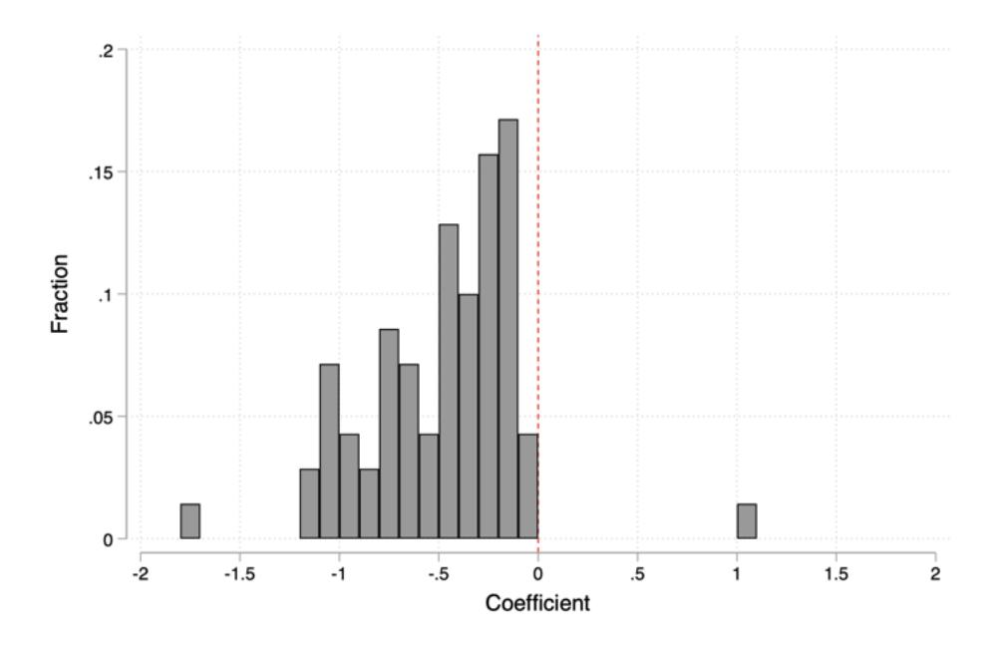

*Notes*: We estimate individual regressions for each of the 93 returning workers who evaluated 20 worker profiles. The figure shows the distribution of the coecients on AI reliance for the 70 evaluators with coecients significant at the 10% level.

Figure A.11: 2-D Visualization of Rankings.

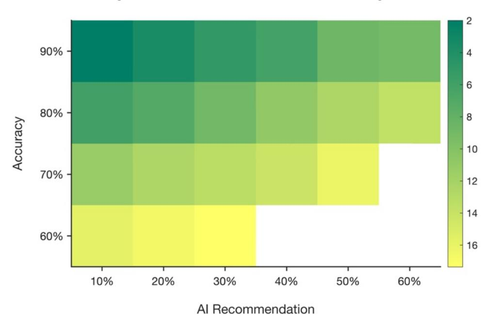

# **B Experiment Implementation**

### **B.1 Experimental Instructions for First Job**

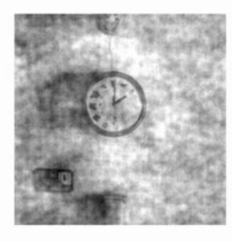

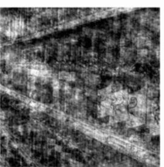

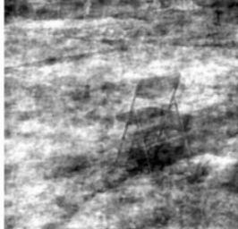

#### You will be assisted with AI recommendations.

After making your choice, you will be presented with a prediction from an Artificial Intelligence (AI) algorithm trained on this task, which is **accurate 85%** of the time. This algorithm might perform well on images that are complicated for humans but could also miss some easy images.

If your choice is different from the AI recommendation, you will have the option to change it to the one AI recommends.

#### **Opportunity to Continue Working with Us**

Our goal today is to identify top-performing workers. We plan to invite 30% of the workers back for a similar task, next time at double the pay rate (\$20 for another 30 minutes job).

To help us evaluate fairly, an HR specialist will review anonymized participation profiles for all workers.

#### HR Evaluation Process Explained in Control

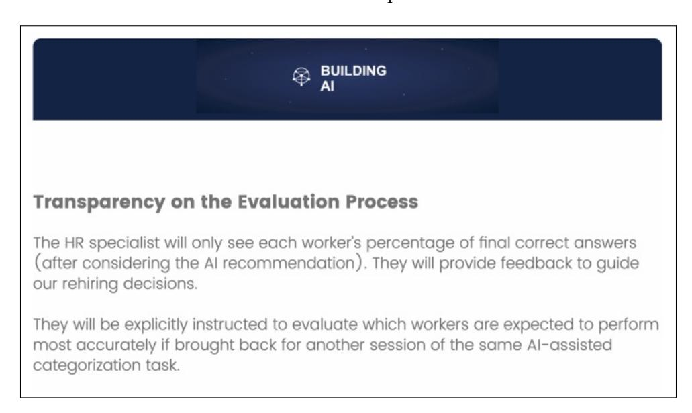

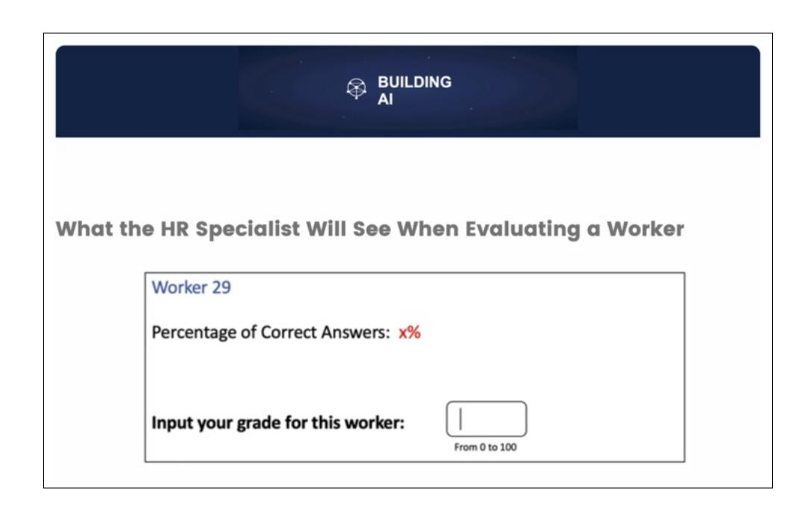

#### HR Evaluation Process Explained in Treatment 1

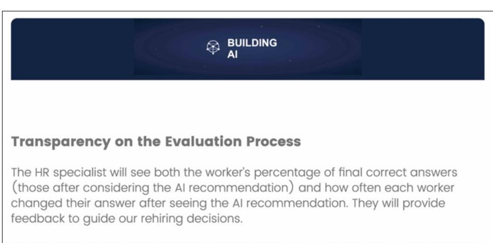

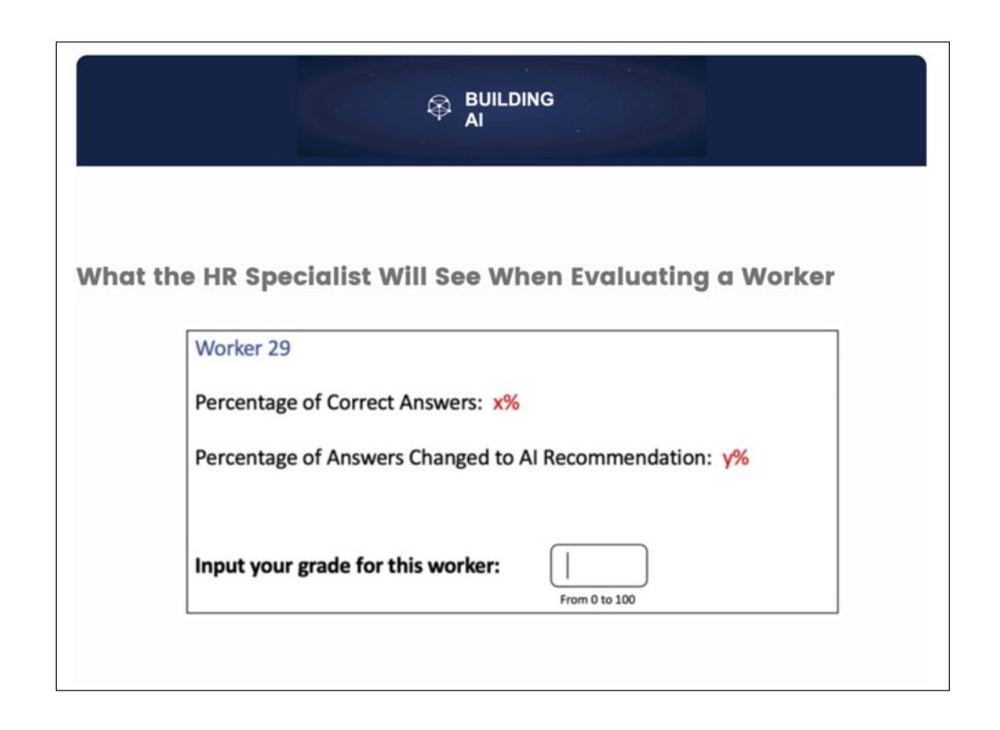

#### HR Evaluation Process Explained in Treatment 2

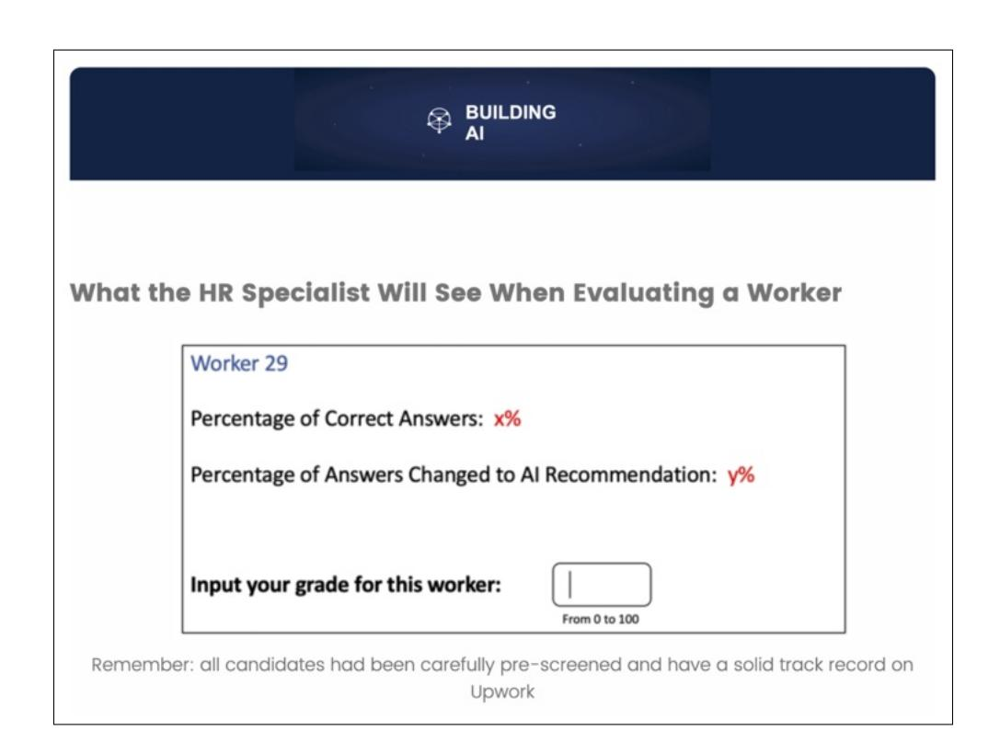

### **B.2 Additional Questions in Second Job**

Instructions shown are for returning treated workers (either in the *public* or *public with information* conditions). Returning workers from the control group received similar instructions, except that the "Worker Selection" segment was omitted.

# 1. Worker Selection Segment: What you would have done in the place of the HR specialist?

You will see 20 anonymous profiles of other **workers that were also selected to come back for a second session**.

For each worker, you will see the percentage of correct answers and the percentage of answers they changed to match the AI recommendation in their first session, just as the HR specialist did. **Your task is to assign each worker a score from 0 to 100**, with higher scores indicating a stronger preference for selecting that worker.

After you complete your evaluations, we will rank the workers based on the scores you gave. One worker will then be selected, with **higher-ranked workers having a higher chance of being chosen**.

Your bonus will depend on how well the selected worker performs in their second session. So it's in your best interest to score the workers according to your true preferences — this increases the chances that **you'll be rewarded based on the performance of someone you rated highly**.

#### **Bonus Payment**

- After you score the 20 workers, we will **select one** of them. The higher a worker ranks based on your scores, the greater their chances of being chosen.
- You will earn **\$0.25 for each correct answer** the selected worker has in the image categorization task during their second session.
- You will also earn \$0.25 for each correct answer you have in the categorization task at the end of your session.

That's how you can earn **up to \$5 in bonus payments** during this second session, **on top of the guaranteed \$20 payment**.

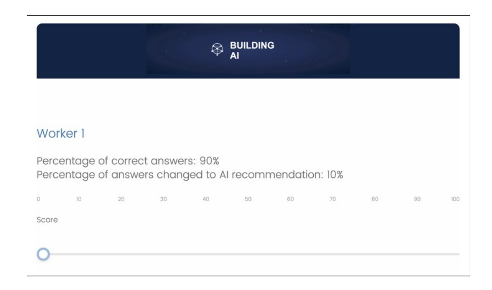

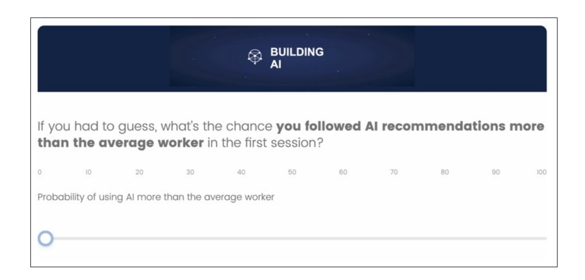

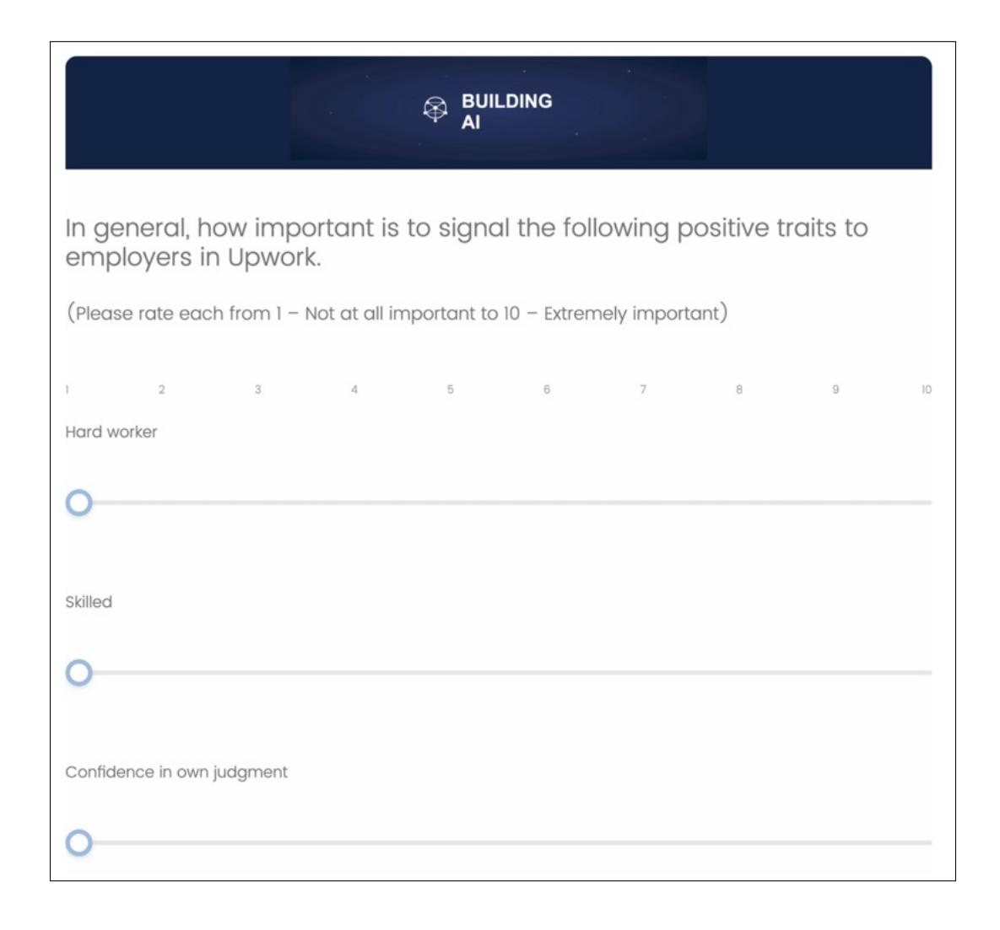

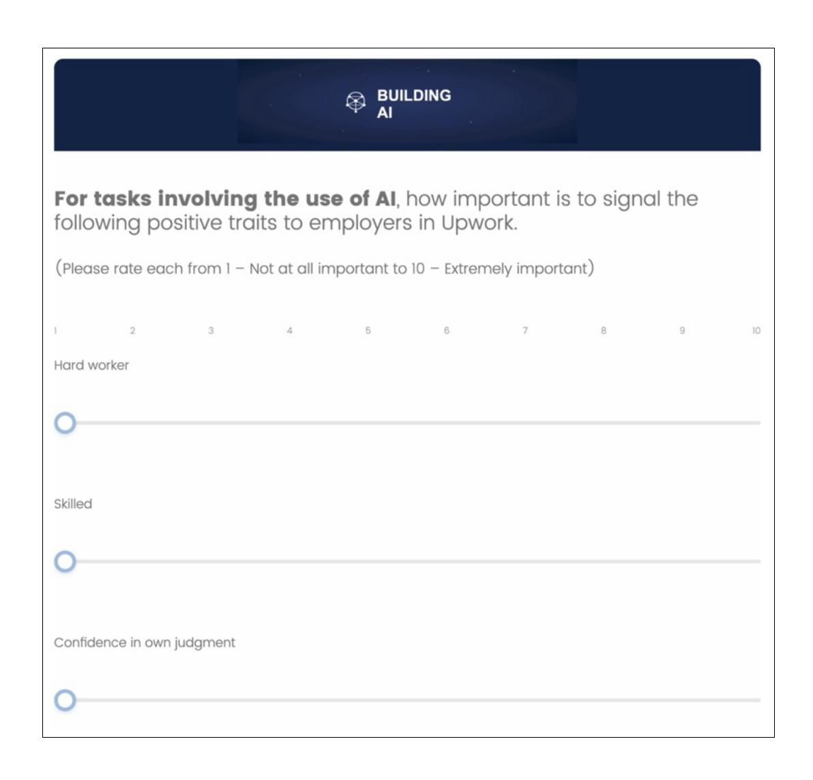

### **B.3** *BuildingAI* **Webpage**

#### Welcome Screen

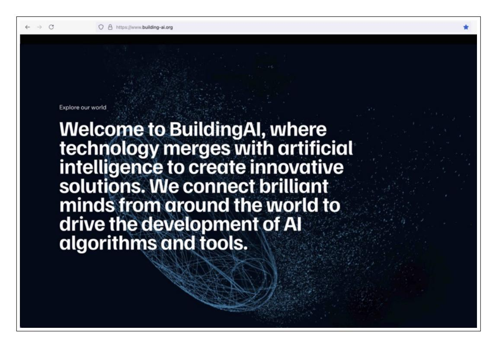

#### Additional Content

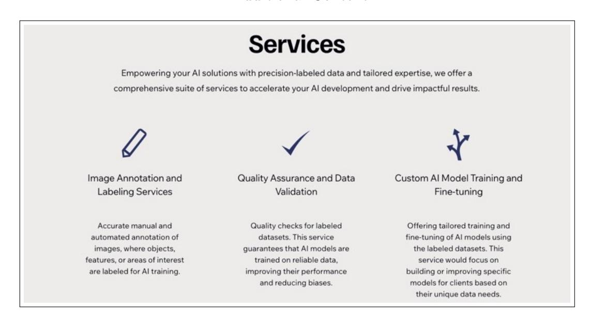

### **B.4 Task Design**

I retrieved 80 images from the dataset made publicly available by Steyvers et al. [\(2022\)](#page-33-2). These images were selected through multiple rounds of piloting to ensure they were diverse in diculty yet suciently challenging.

To vary the degree of diculty in the human and machine classifier experiments, Steyvers et al. [\(2022\)](#page-33-2) applied four levels of phase noise distortion to the images (80, 95, 110, and 125), which determined the degree of blurriness. This introduced an objective source of variation in image diculty. In my experiment, I used only the two highest noise levels (110 and 125), with the noise level randomized before an image was shown. Figure [B.1](#page-54-1) illustrates the variation in task diculty and highlights a clear within-image increase in diculty as noise levels rise.

A major advantage of this dataset is that it includes predictions from five pre-trained ImageNet models, along with performance evaluations in collaborative settings: human–machine, two humans, and two machines. This feature enables a non-deceptive experimental design and allows the experiment to draw on algorithms previously tested in studies of human–AI complementarity. In the experiment, I provided participants with predictions from the VGG-19 model, a convolutional neural network with 19 layers. This model was selected because, according to the results in Steyvers et al. [\(2022\)](#page-33-2), it exhibited the highest complementarity potential among the available options. However, none of the findings in this paper hinge on the use of this specific model.

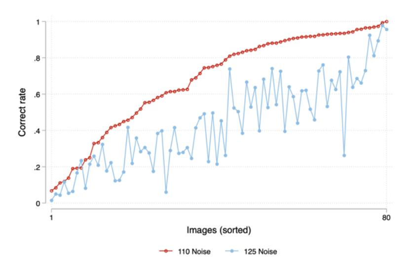

Figure B.1: Initial Choice Accuracy.

*Notes*: I compute the accuracy in the first choice as a proxy for image diculty. Images are then sorted based on this diculty metric using the 110 noise level (shown in red). The overlaid blue line connects the corresponding accuracy values for each image at the 125 noise level.

# **C Proofs for Section [3](#page-14-0)**

### **C.1 Proof of Proposition [1](#page-16-0)**

We treat (i) and (ii) in turn. Throughout, consider only tasks with *y*0 "= ˆ*y*; on agreement tasks the choice to stay with their initial choice is straightforward.

- *(i) Control scoring Sc*(*a*)*.* Under calibration, if the worker keeps *y*0 her expected correctness on that task equals *p*; if she follows the AI it equals *Ÿ*. Since *Sc* is increasing in accuracy, the task-level optimal action is to pick the option with the higher correctness probability. Thus, follow the AI i *Ÿ* Ø *p*, i.e., use the cuto *·* ú = *Ÿ*.
- *(ii) Treated scoring St*(*a, r*)*.* Consider the eect on the overall score of switching from *y*0 to *y*ˆ on a single disagreement task with private confidence *p*. This marginal change is

$$\Delta S_t(p) = \underbrace{\frac{\partial S_t}{\partial a}}_{>0} \cdot (\kappa - p) + \frac{\partial S_t}{\partial r}$$

The first term is the gain in expected accuracy (*Ÿ* ≠ *p*) scaled by the marginal score on accuracy; the second term is the marginal score impact of one more unit of AI reliance. Because *ˆSt/ˆa* and *ˆSt/ˆr* depend only on the aggregate (*a, r*), *St*(*p*) is strictly *decreasing* in *p*. Therefore, among all measurable selection rules that specify which *p*-tasks to switch on, the score is maximized by switching on the *lowest p*'s first (Hardy–Littlewood rearrangement/monotone selection). Hence the optimal rule is a lower-threshold set *{p* Æ *·* ú*}*. The cuto is determined by the margin where *St*(*·* ú)=0:

$$\frac{\partial S_t}{\partial a} \left(\kappa - \tau^*\right) \; + \; \frac{\partial S_t}{\partial r} \; = \; 0 \quad \Longrightarrow \quad \tau^* \; = \; \kappa \; - \; \left(\; - \; \frac{\partial S_t/\partial r}{\partial S_t/\partial a}\right) \; = \; \kappa - \lambda,$$

If *ˆSt/ˆr* = 0, this reduces to *·* ú = *Ÿ*.

## **C.2 The Accuracy–Reliance Curve Exhibits an Inverse-U Shape**

Under any cuto *·* œ [1*/n,* 1], the AI reliance level is:

$$r(\tau) = \Pr(p \le \tau) D = F(\tau) D,$$

which is strictly increasing because *f >* 0 on [1*/n,* 1]. Hence *r*(*·* ) is invertible; write its inverse as *·* (*r*) = *F* ≠1(*r*).

**Accuracy as a function of reliance.** From the solution reported in Section [3,](#page-14-0)

$$A(\tau) = \left[\theta + \int_{1/n}^{\kappa - \lambda} (\kappa - p) f(p) dp\right] D + (\theta \kappa) (1 - D) \implies \frac{dA(\tau)}{d\tau} = f(\tau) (\kappa - \tau) D.$$

By the chain rule, the accuracy-reliance curve  $A(r) \equiv A(\tau(r))$  satisfies

$$\frac{dA(r)}{dr} = \frac{dA/d\tau}{dr/d\tau} = \left(\kappa - \tau(r)\right)D = \left(\kappa - F^{-1}(r)\right)D,$$

and

$$\frac{d^2 A(r)}{dr^2} = -\frac{d\tau(r)}{dr} D = -\frac{D}{f(\tau(r))} < 0 \quad \text{(since } D > 0 \text{ and } f > 0\text{)}.$$

Thus A(r) is strictly concave in r, implying that accuracy initially increases with AI reliance, reaches a maximum at  $\tau = \kappa$ , and then decreases. In other words, the accuracy-reliance curve takes an inverse-U shape. Figure C.1 illustrates the inverse-U-shaped relationship between expected accuracy and AI reliance, focusing for simplicity only on situations in which the worker and the AI disagree.

Figure C.1: Expected Accuracy as a Function of AI Reliance.

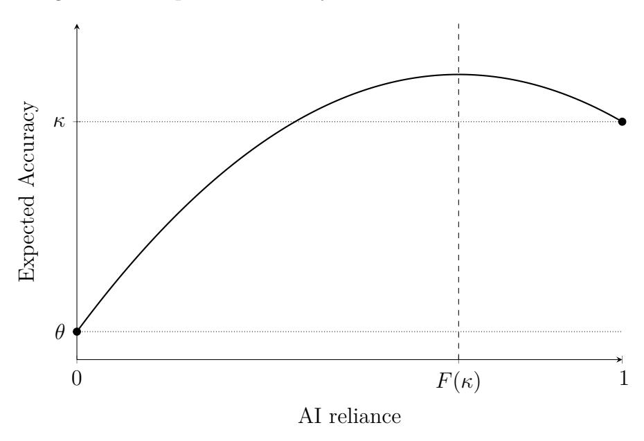

Notes: When  $\tau = 0$ , workers never use AI and expected accuracy is  $\theta$ ; when  $\tau = 1$ , workers always use AI and expected accuracy is  $\kappa$ . For intermediate levels of AI reliance, the system can perform strictly better, with maximal expected accuracy at  $\tau = \kappa$ , which yields a reliance level of  $F(\kappa)$ . Without lost of generality, the figure focuses on the case  $\theta < \kappa$ .