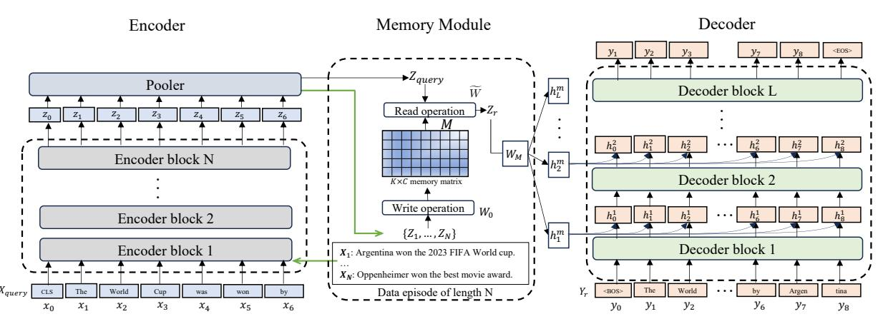
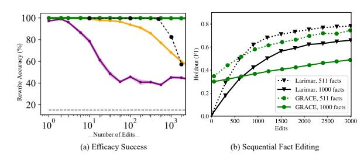
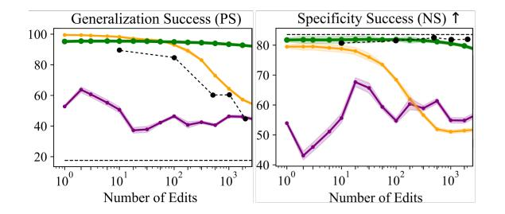
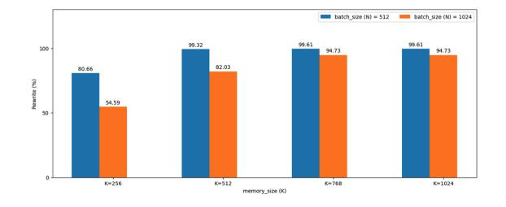
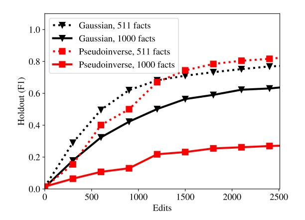
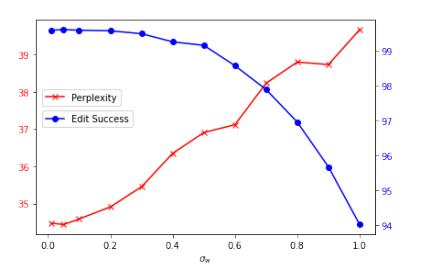

# Larimar: Large Language Models with Episodic Memory Control

Payel Das \* 1 Subhajit Chaudhury \* 1 Elliot Nelson 1 Igor Melnyk 1 Sarathkrishna Swaminathan 1 Sihui Dai 1 2 Aurelie Lozano ´ 1 Georgios Kollias 1 Vijil Chenthamarakshan 1 Jirˇ´ı Navratil ´ 1 Soham Dan 1 Pin-Yu Chen 1

### Abstract

Efficient and accurate updating of knowledge stored in Large Language Models (LLMs) is one of the most pressing research challenges today. This paper presents Larimar - a novel, braininspired architecture for enhancing LLMs with a distributed episodic memory. Larimar's memory allows for dynamic, one-shot updates of knowledge without the need for computationally expensive re-training or fine-tuning. Experimental results on multiple fact editing benchmarks demonstrate that Larimar attains accuracy comparable to most competitive baselines, even in the challenging sequential editing setup, but also excels in speed—yielding speed-ups of 8-10x depending on the base LLM —as well as flexibility due to the proposed architecture being simple, LLM-agnostic, and hence general. We further provide mechanisms for selective fact forgetting, information leakage prevention, and input context length generalization with Larimar and show their effectiveness. Our code is available at https://github.com/IBM/larimar.

### 1. Introduction

Pre-trained Large Language Models (LLMs) have achieved impressive performance on various Natural Language Processing (NLP) tasks (Devlin et al., 2018; Raffel et al., 2020; Brown et al., 2020; Vaswani et al., 2017), and are often considered as knowledge repositories (Petroni et al., 2019). In order to keep these models fact-relevant, safe, and ethical after deployment - the *knowledge of the LLM needs to be constantly updated*. Thus, it is critical to develop efficient mechanisms to quickly update LLMs so that models can protect privacy, eliminate bias and hallucination, and catch up with new facts. Model editing should remove the undesired, incorrect, or obsolete facts from the LLM's "memory", and optionally replace it with the desired outcome. Similarly, the ability to quickly update the LLM can also help with the challenging problem of input *context length generalization* beyond the training distribution,which is crucial when learning from datasets where longer context instances are rare (Anil et al., 2022; Kazemnejad et al., 2023). A straightforward solution is to fine-tune the model on the corrected/new datasets. Such an approach suffers the risk of overfitting and catastrophic forgetting (Kirkpatrick et al., 2017; Zhu et al., 2020), as the knowledge is implicitly and distributionally encoded across the LLM parameters. Several lines of research have proposed effective and precise LLM editing (for comprehensive surveys on LLM editing, see (Li et al., 2022; Liu et al., 2023; Zhu et al., 2020)), which includes training an external memory model or a hypernetwork model to work alongside with the frozen LLM. Another popular approach is to locate the original fact within LLM features and then do a local parameter update. As shown in Table 1, both lines of methods face scalability problems due to overfitting and the need for retraining or locating for new states, causing a slow-down in editing speed. The high memory needs for storing numerous edits provide a further obstacle in terms of scaling to sequential and batch editing setups. These challenges hinder the application of updating large language models in real-world industrial settings. Further, handling fact editing and selective fact forgetting appear challenging within the same methodological framework even for current state-of-the-art editing methods (Patil et al., 2023), while both new information learning and old information forgetting are intrinsically related to each other in in brain (Dempsey et al., 2022; Autore et al., 2023).

Humans, in contrast, can very quickly perform knowledge updating and generalization, both of which conform to rapid learning after seeing the first relevant instance. In the brain, such rapid learning is thought to depend on the hippocampus and its capacity for episodic memory. Consistently, while both semantic and working memory systems struggle with sequential decision making tasks, the episodic memory systems are found to be beneficial (Blundell et al., 2016; Lengyel and Dayan, 2007).

\*Equal contribution 1 IBM AI Research 2 Princeton University; work done during internship at IBM Research. Correspondence to: Payel Das and Subhajit Chaudhury <daspa@us.ibm.com; subhajit@ibm.com>.

The complementary learning systems (CLS) theory (Kumaran et al., 2016) provides rationale for coupling complementary *fast* (hippocampus) and *slow* (neocortex) learning systems in brain, former learning from single instances while later modeling the input distribution. The neocortex-hippocampus interactions in brain is known to promote adaptive behavior via memorization and generalization (Sun et al., 2023). Further, it is proposed that the memory consolidation from hippocampus to neocortex is facilitated through the activation synchronized with multiple exact or false replays of the encoded experience in hippocampus – suggesting hippocampus taking the form of a generative associative network (Ramirez et al., 2013).

Inspired by these insights, we propose  $Larimar - a class of$ LLMs augmented with an external episodic memory controller. We follow the CLS view, where a hippocampal fastlearning system records samples as episodic memory, and a neocortical slow learning system (the LLM) learns summary statistics of the input distribution as semantic memory. Our aim is to treat the episodic memory module as the global storage of the current set of factual updates or edits, and enforce this memory as a condition to the LLM decoder. It is important to learn to update this memory efficiently and accurately, without having to go through any training, as new edits arrive.

To tackle this, we seek to utilize a hierarchical memory, similar in spirit to the Kanerva Machine (Wu et al., 2018a), where the memory writes and reads are interpreted as inference in a generative model. Specifically, we consider the memory model of (Pham et al.,  $2021$ ), which treats the memory as deterministic, thereby allowing reformulating the Bayesian updates of memory and address proposed in Kanerva Machine as finding least-square solutions to linear systems. Once updated, this fast-learning memory is then used to condition a slow-learning LLM decoder.

The use of a *global* memory associated a set of samples and the ability to *fast write* to memory make this hierarchical memory framework attractive for efficient LLM updating with respect to new knowledge. Implementation-wise, the memory is coupled to the LLM by end-to-end gradient descent on *generic* data and does not assume access to edits. During inference, the new data is written to memory in one-shot, the updated memory then conditions the LLM decoding to enforce the edited output. We further formalize training-free selective fact forgetting and information leakage prevention operations based on Larimar's one-shot memory updating mechanism.

To our knowledge, this is the first work that proposes and demonstrates online distributed writing to a hierarchical conditional memory model as a solution to test-time adaptation of LLMs to new knowledge. We demonstrate Larimar on single and sequential fact editing tasks on existing

benchmarks and compared with baseline methods. Larimar provides accurate and precise editing across these settings, while being up to 10 times faster compared to competitive model editing baselines We further subject Larimar to selective fact forgetting and information leakage prevention and show its efficacy in those tasks. Lastly, we provide a simple recursive search-based solution that enables Larimar's memory to generalize to longer input context.

Our contributions are:

- Inspired by complementary learning mechanisms in the brain, we propose a class of episodic and adaptable memory-conditioned LLM architectures for test time adaptation in real-time. Our method does not need any time-intensive gradient-based learning or fact tracing within the LLM for performing the edit, providing a faster alternative for LLM updating.
- We demonstrate the utility of this architecture on two relevant and challenging use cases: knowledge editing and input context length generalization. Larimar shows fast and accurate training-free adaptation to new inputs in both scenarios, compared to baseline editing methods and language models.
- We show selective fact forgetting and information leakage prevention using one-shot memory updating.
- We provide a simple means to enable long context generalization in Larimar, based on a recursive search on its memory space.

### 2. Model Details

**Notation**: We define input and output spaces as  $\mathcal{X}$  and  $\mathcal{Y}$ , respectively. The model comprises an encoder  $e : \mathcal{X} \rightarrow$  $\mathbb{R}^C$  and a decoder  $d : \mathbb{R}^C \rightarrow \mathcal{Y}$ , linked via an adaptive memory. The encoder outputs in a latent space of dimension  $C$ . The memory uses  $K$  rows to store encoded episodes of length N, with initial state  $\mathbf{M}_0 \in \mathbb{R}^{K \times C}$  and updates through reading and writing weights  $\mathbf{W}, \mathbf{W}_0 \in$  $\mathbb{R}^{N \times K}$ , resulting in updated memory **M**.

**Background Information:** Generative memory networks are a type of associative memory networks that treat memory 'read'/'write' and addressing operations as Bayesian inference where posteriors are updated when a new data episode arrives. Generative Pseudo-inverse Memory (GPM) framework proposed in (Pham et al., 2021) reformulates these Bayesian updates as finding least-square solutions to linear systems, thereby enabling fast and efficient memory operations. One can then generate examples similar to a given input based on memory by sampling from the 'read' distribution. In the following sections, we will elaborate the training and inference mechanisms, as

Figure 1. Larimar Architecture: X and  $X_{query}$  respectively denote data input and query,  $Z, Z_{query}$  and  $Z_r$  are the latent vectors, and M is the fixed-size memory.  $W$  and  $W_0$  are reading/writing weights to memory.  $W_M$  interfaces the readout from memory to the decoder.

| Editor  |     |     |     |     | +Edit Train +Fact Trace Sequential Edit Batch Edit Forgetting/Deletion Time (GPT-2) Time (GPT-J) |       |       |
|---------|-----|-----|-----|-----|--------------------------------------------------------------------------------------------------|-------|-------|
| ROME    | Nο  | Yes | No  | No  | Yes                                                                                              | 4.8s  | 13.9s |
| GRACE   | Yes | No  | Yes | No  | No                                                                                               | 13.9s | 19.3s |
| Larimar | Nο  | Nο  | Yes | Yes | Yes                                                                                              | 1.1s  | 1.7s  |

Table 1. Requirement and capability comparison between Larimar, and two existing editing methods, ROME and GRACE.

we adapt that to train a LLM decoder. In Section 3, we will review the 'write', 'read' and 'generate' operations derived in (Pham et al.,  $2021$ ) in detail, and formulate additional newly proposed 'sequential writing' and 'forgetting/unlearning' operations.

### 2.1. Training

Given the memory M, Kanerva Machine aims to maximize the conditional log-likelihood of  $\ln p(\mathbf{X}|\mathbf{M})$ , where  $\mathbf{X}$  is an exchangeable (order invariant) episode:  $\mathbf{X}$  =  $\{x_1,\ldots,x_N\}$ , a subset of the input data consisting of N samples. A variational lower bound of this conditional likelihood is optimized, similar to in variational autoencoders (Kingma and Welling, 2013). Consequently, the model learns to compress  $X$  in a memory  $M$ , which then becomes a distributed associative memory. In practice,  $\mathbf{M}$ is learned on a noisy version of the latent encodings  $\mathbf{Z} + \boldsymbol{\xi}$ where  $\mathbf{Z} = e(\mathbf{X})$  for an episode. In the remainder of this study, we use  $\mathbf{M}$  as the posterior memory dependent on an episode  $\mathbf{X}$ , whereas  $\mathbf{M}_0$  denotes a prior memory. The reading weight matrix,  $\mathbf{W}$ , is a random variable to enforce generative ability of the model, for which we use a standard Gaussian prior  $p(\mathbf{W}) \sim \mathcal{N}(0, I_{N \times K})$  and posterior  $q(\mathbf{W}) \sim \mathcal{N}(\overline{\mathbf{W}}, \sigma^2_{\mathbf{W}} \cdot I_{N \times K}),$  where the mean  $\overline{\mathbf{W}}$  is estimated from each episode and  $\sigma_{\mathbf{W}}$  is learnable. The memory readouts are obtained as  $\mathbf{Z}_{readout} = \mathbf{WM}$ . The overall memory-augmented architecture is depicted in Figure 1.

During training all the three modules – encoder  $(e)$ , associative memory (M), and decoder  $(d)$  – are jointly trained and optimized for an episode  $\mathbf{X}$ , using the following loss:

$$\begin{split} L = & \mathbb{E}_{\mathbf{X} \sim \text{data}} \big( \mathbb{E}_{q(\mathbf{W})} \ln p(\mathbf{X} | \mathbf{W}, \mathbf{M}) \\ &+ \alpha \ln p(d(e(\mathbf{X})) - \beta D_{KL}(q(\mathbf{W}) || p(\mathbf{W})) \\ &+ \mathbb{E}_{\mathbf{X} \sim \text{pretrain}} \ln p(\mathbf{x}_i | \mathbf{x}_{i-1} .. \mathbf{x}_1). \end{split} \tag{1}$$

The first term is the negative reconstruction loss with memory and **W**, a  $N \times K$  matrix. The second is the autoencoder's negative reconstruction loss without memory. The third is the KL divergence between prior  $p(\mathbf{W})$  and posterior  $q(\mathbf{W})$ . To maintain decoder performance during training, a pretraining data regularization term is added.

#### 2.2. Memory inference

The memory at the end of training via backpropagation is then considered as a prior  $M_0$ , the posterior memory M is updated in one-shot by solving a minimization problem as proposed in (Pham et al., 2021), which is  $\min_{\mathbf{M}} ||\mathbf{Z}_{\zeta} \mathbf{W}_0 \mathbf{M}||_F^2$ . This minimization problem, which corresponds to solving a linear system of equations, is efficiently done via computing matrix pseudo inverses.

### 3. Memory operations

Write, Read, Generate operations The three basic memory operations, write in, read out, and generate, which act upon the  $\mathbf{Z}$  encodings, are cast as in (Pham et al., 2021). See Algorithm 1 for details.

**Sequential Writing and Forgetting** Given an initial set of encodings  $\mathbf{Z}_0$  and writing weights  $\mathbf{W}_0$ , we initialize the 1

2

3

4

5

memory matrix and key covariance matrix:

$$\mathbf{M}_0 = \mathbf{W}_0^\dagger \mathbf{Z}_0, \quad \mathbf{C}_0 = \mathbf{W}_0^\top \mathbf{W}_0 \tag{2}$$

To sequentially update the memory  $\mathbf{M}_{i-1}$ , either to add a new set of encodings  $\mathbf{Z}_i$  or to forget a previously written set of encodings  $\mathbf{Z}_{i}$ , we jointly update the memory matrix and key covariance matrix for  $i = 1, 2, ...$  as follows:

$$\mathbf{C}_{i} = \mathbf{C}_{i-1} + \alpha_{i} \mathbf{W}_{i}^{\top} \mathbf{W}_{i} \tag{3}$$

$$\mathbf{M}_{i} = \mathbf{M}_{i-1} + \alpha_{i} \mathbf{C}_{i}^{-1} \mathbf{W}_{i}^{\top} (\mathbf{Z}_{i} - \mathbf{W}_{i} \mathbf{M}_{i-1}) \quad (4)$$

When writing new encodings to memory, we use  $\alpha_i = 1$ . When forgetting encodings which were previously written to memory with  $\alpha_{i_{write}} = 1$  at any  $i_{write} < i$ , we use  $\alpha_i = -1$ . Eq. (4) updates the memory sequentially such that it remains the least-squares solution for the growing sequence of data. Assuming that  $\mathbf{M}_{i-1}$  is the least-squares solution with respect to encodings  $\mathbf{Z}_{0:i-1}$ , that is,

$$\mathbf{M}_{i-1} = \operatorname{argmin}_{\mathbf{M}} \sum_{j=0}^{i-1} ||\mathbf{Z}_{j} - \mathbf{W}_{j}\mathbf{M}||_{2}^{2}, \qquad (5)$$

then Eq. (4) with  $\alpha_i = 1$  ensures that  $\mathbf{M}_i$  likewise is the least-squares solution with respect to  $\mathbf{Z}_{0:i}$  ((Meng et al., 2023)). In the case  $\alpha_i = -1$  and  $\mathbf{Z}_i = \mathbf{Z}_{i_{forget}}$  for some  $i_{forget} < i$ , Eq. (4) ensures that  $\mathbf{M}_i$  is the least-squares solution with  $\mathbf{Z}_{i_{\text{foract}}}$  removed from the data, that is,

$$\mathbf{M}_{i} = \operatorname{argmin}_{\mathbf{M}} \sum_{j=0, j \neq i_{forget}}^{i-1} ||\mathbf{Z}_{j} - \mathbf{W}_{j}\mathbf{M}||_{2}^{2}, \quad (6)$$

The weights can be computed either (following (Pham et al., 2021)) in terms of the current memory,  $\mathbf{W}_{i}$  =  $\mathbf{Z}_{i}\mathbf{M}_{i-1}^{\dagger}$ , or in terms of a fixed reference memory,  $\mathbf{W}_{i}$  =  $\mathbf{Z}_{i}(\mathbf{M}^{(\text{ref})})^{\dagger}$ .  $\mathbf{M}^{(\text{ref})}$  remains unchanged across all sequential updates (i.e. is  $i$ -independent), is used only during inference, and can (optionally) be constructed using the episode of data encountered during inference. In the event that we wish to remove a given previously written encoding from memory, the fixed nature of  $\mathbf{M}^{(\mathrm{ref})}$  allows the original writing key  $\mathbf{W}_{i_{write}}$  to be recomputed at a later point in the sequence  $i_{forget} > i_{write}$ , so that the information can be located in memory and removed.

### 4. Scope Detector

We also optionally use a scope detection mechanism to detect if the incoming query is close to the facts written in the memory, which is conceptually similar to SERAC (Mitchell et al., 2022). If the query is in-scope, then the corresponding readout from memory is passed to the decoder for memory-conditional decoding otherwise **Algorithm 1** Basic Memory operations (Pham et al., 2021)

**Function** write  $(\mathbf{Z})$ : //  ${\bf Z}$  - encoding of the episode to be written to memory (i.e.  $\mathbf{Z} = e(\mathbf{X})$ ) Sample  $\xi \sim \mathcal{N}(0, \sigma_{\varepsilon}^2 I)$ Let  $\mathbf{Z}_{\xi} = \mathbf{Z} + \xi$ Compute addressing weight  $\mathbf{W}_0 = \mathbf{Z}_{\xi} \mathbf{M}_0^{\dagger}$ //  $\mathbf{M}_0$  is a learned parameter representing prior memory Compute posterior memory  $\mathbf{M} = \mathbf{W}_0^{\dagger} \mathbf{Z}_{\xi}$  $\text{return } M$ **Function** read  $(\mathbf{Z}, \mathbf{M})$ : //  $\bf{M}$  - posterior memory from previous write  $\mathbf{Z}$  - encoding of the read input (ie.  $\mathbf{Z} = e(\mathbf{X}))$ Compute mean addressing weight  $\overline{\mathbf{W}} = \mathbf{Z}\mathbf{M}^{\dagger}$ Sample  $\mathbf{W} \sim \mathcal{N}(\overline{\mathbf{W}}, \sigma_{\mathbf{W}}^2 I)$ //  $\sigma_{\mathbf{W}}$  is a learned parameter Compute output latent  $\mathbf{Z}_{\text{read}} = \mathbf{W}\mathbf{M}$ return  $\mathbf{Z}_{\text{read}}$ **Function** generate  $(M)$ : //  $\mathbf{M}$  is the posterior memory from a previous write Sample  $\mathbf{W} \sim \mathcal{N}(0, I)$ Compute output latent  $\mathbf{Z} = \mathbf{W}\mathbf{M}$ return Z

the query is subjected to unconditioned decoding. We consider two different scenarios:

**External encoding-based scope detector (ESD)**: Sample embeddings are estimated from an external sentence encoder (MiniL $M^1$ ) trained on 1.1B sentence pairs and with an output space dimensionality of 384. The ESD stores encoded facts as vectors in its own scope storage. At test time, given an encoded input sentence, 1-nearest neighbor cosine similarity is calculated and serves as detection score. Any multi-sentence input is first split into isolated sentences, each of which is processed separately and maximum similarity is taken. Measured on 3800 positive and negative samples from the EasyEdit data set, this ESD model achieves a detection equal-error-rate of  $2.9\%$  and an F1 score of 0.974.

**Internal Encoding-based scope detector (ISD)**: Larimar encoder  $e$  is used to embed CounterFact samples. The encodings are then used to train a binary scope classifier, where positive samples come from rephrasings of an original fact and negative data correspond to neighboring facts.

### 5. Results

Implementation: We employed a BERT large encoder (Devlin et al., 2018) combined with either a GPT2-

&lt;sup>1https://huggingface.co/sentence-transformers/all-MiniLM-L6-v2

large (Radford et al., 2019) or a GPTJ-6B decoder and a memory matrix  $(512 \times 768)$  for our training experiments, naming the resulting models Larimar-1.3B and Larimar-6B, respectively. Our training data comprised 7.6 million examples constructed by splitting WikiText (Merity et al., 2016) texts to small chunks of 64 tokens. We used existing pretrained weights from Huggingface to initialize the training. From the  $Z_r$  (the readout vector), using learned linear projection  $W_M$ , the hidden states are transformed and broadcasted to act as a KV cache across all layers. During the decoder forward pass, this compressed KV cache is used as past KV cache values to generate the memorycontrolled output. The hidden size for GPTJ, for example, is 4096 with 28 layers. In testing, the Larimar-1.3B model achieved a perplexity of 14.6, while the Larimar-6B model reached 15.9 on 1,000 random WikiText samples, indicating that adding memory barely affects performance. We trained Larimar-6B models for 10 epochs using Adam optimizer, learning rate 5e-6 and batch size 32. For the Larimar-6B's training, we used a setup with eight NVIDIA A100-80GB GPUs on a single node, utilizing bfloat16 precision and PyTorch Lightning with the DeepSpeed ZeRO Stage 2 for efficient distributed training.

#### 5.1. Wall Clock time

Table 1 presents the wall clock time for each editing method across 10 edits, calculated within the EasyEdit framework (Yao et al., 2023) on a single A100 GPU. Results show that Larimar is  $4{\text -}10x$  times faster compared to ROME (Meng et al., 2022a) and GRACE (Hartvigsen et al., 2022), two most competitive existing LLM editing baselines. Table 7 further provides a edit-time comparison within other existing baselines, as shown in (Yao et al., 2023), establishing Larimar's advantage on highspeed editing. Table 1 further lists Larimar's abilities to handle edits in a training- or tracing- free manner, enabling high-speed editing, handling selective forgetting, and maintain ability to sequential editing setup.

#### 5.2. Single Fact editing

We compare the performance of Larimar against a number of recently proposed knowledge editing approaches on the CounterFact dataset (Meng et al., 2022a) designed for testing language models handling of counterfactual edits. It includes 21,919 records to assess if the models can learn new facts rather than simply memorizing the target words. Following other works (Meng et al., 2022a; Zheng et al.,  $2023$ ), we used the first 2000 samples of this dataset and report the average over single fact editing results for Larimar-1.3B and Larimar-6B in Table 2. The baseline performances are taken from (Meng et al., 2022a; Zheng et al., 2023) (see Related Work and Appendix for details on baseline methods). As opposed to training the LLM on edits,

|                                                                                    | Edit Success |        | Paraphrase |        | Neighborhood |         |
|------------------------------------------------------------------------------------|--------------|--------|------------|--------|--------------|---------|
| Editor                                                                             | S            | M      | S          | M      | S            | M       |
| $GPT-2 \n\n\n\n\n\n\n\n\n\n\n\n\n\n\n\n\n\n\n\n\n\n\n\n\n\n\n\n\n\n\n\n\n\n\n\n\n$ | 22.2         | $-4.8$ | 24.7       | $-5.0$ | 78.1         | 5.0     |
| FT                                                                                 | 100.0        | 98.8   | 87.9       | 46.6   | 40.4         | $-6.2$  |
| $FT+L$                                                                             | 99.1         | 91.5   | 48.7       | 28.9   | 70.3         | 3.5     |
| $\text{KN}$                                                                        | 28.7         | $-3.4$ | 28.0       | $-3.3$ | 72.9         | 3.7     |
| KE                                                                                 | 84.3         | 33.9   | 75.4       | 14.6   | 30.9         | $-11.0$ |
| KE-CF                                                                              | 99.9         | 97.0   | 95.8       | 59.2   | 6.9          | $-63.2$ |
| MEND                                                                               | 99.1         | 70.9   | 65.4       | 12.2   | 37.9         | $-11.6$ |
| MEND-CF                                                                            | 100.0        | 99.2   | 97.0       | 65.6   | 5.5          | $-69.9$ |
| ROME                                                                               | 100.0        | 97.9   | 96.4       | 62.7   | 75.4         | 4.2     |
| Larimar-1.3B                                                                       | 100.0        | 99.7   | 83.5       | 50.5   | 74.7         | 1.8     |
| $Larimar-1.3B + 1$ rephrase                                                        | 100.0        | 99.6   | 89.8       | 62.4   | 73.3         | 0.5     |
| $Larimar-1.3B + 2$ rephrases                                                       | 100.0        | 99.6   | 90.8       | 63.6   | 73.3         | 0.6     |
| $GPT-J$                                                                            | 16.3         | $-7.2$ | 18.6       | $-7.4$ | 83.0         | 7.3     |
| FT                                                                                 | 100.0        | 99.9   | 96.6       | 71.0   | 10.3         | $-50.7$ |
| $FT+L$                                                                             | 99.6         | 95.0   | 47.9       | 30.4   | 78.6         | 6.8     |
| MEND                                                                               | 97.4         | 71.5   | 53.6       | 11.0   | 53.9         | $-6.0$  |
| ROME                                                                               | 99.9         | 99.4   | 99.1       | 74.1   | 78.9         | 5.2     |
| PROMPT                                                                             | 99.7         | 80.9   | 91.0       | 32.9   | 37.9         | $-2.8$  |
| IKE (w/ $32$ demonstrations)                                                       | 100.0        | 91.7   | 95.2       | 64.5   | 77.0         | 35.2    |
| IKE ( $\text{w/o paraphrases}$ )                                                   | 100.0        |        | 73.8       |        | 83.4         |         |
| IKE ( $\text{w/o neighbors}$ )                                                     | 100.0        | -      | 99.8       | -      | 11.5         |         |
| Larimar-6B                                                                         | 99.6         | 96.0   | 88.4       | 54.7   | 80.4         | 4.22    |
| $Larimar-6B + 1$ rephrase                                                          | 99.7         | 95.9   | 92.9       | 67.0   | 79.3         | 3.5     |
| <b>Larimar-6B</b> $+ 2$ rephrases                                                  | 99.8         | 95.7   | 93.6       | 67.0   | 79.2         | 3.38    |

Table 2. Single fact editing on CounterFact dataset. Top two best editing methods are highlighted. Larimar uses dynamic memory updates with memory-conditioned decoding and does not require gradient update on edit samples, as opposed to methods needing training (FT, FT+L, MEND) or tracing plus decoder updating (ROME) on edit samples (ROME) or in-context demonstrations (IKE) of (paraphrased) edits and neighboring samples retrieved from a corpus. Though generalization increases when Larimar's memory is augmented with rephrases at test time.

or causally tracing the original fact within LLM and updating the relevant parameters to reflect edit, we leverage Larimar's one-shot memory update for editing. Wherein, the memory posterior is updated as the  $edit(s)$  of interest is written, and then the updated memory is queried. The read-out from the memory then conditions the decoder to output the edit.

The evaluation metrics used in Table 2 are as follows: *Edit* Success, which is the percent of cases where the edited fact  $(s, r, o^*)$ , (subject, relation, object) with modified object has higher probability than the one based on the original object  $(s, r, o^c)$ . Specifically, column S measures percentage of  $\mathbb{P}[o^*] > \mathbb{P}[o^c]$  cases, while M is the average of  $\mathbb{P}[o^*] - \mathbb{P}[o^c]$  in the logits space of the language model. *Paraphrase* measures the same performance on  $(s, r, o^*)$ but using paraphrased prompts. *Neighborhood* evaluates the model's ability to retain knowledge about the original object but in the context of neighboring subjects  $s'$ :  $(s', r, o^c)$ . Here the column S reflects percentage of cases where  $\mathbb{P}[o^c] > \mathbb{P}[o^*]$ , while *M* is the average  $\mathbb{P}[o^c] - \mathbb{P}[o^*]$ .

As can be seen, when compared to existing editing baselines, Larimar achieves comparable performance in successfully editing new facts, and in the ability to handle neighborhood prompts. For example, when compared with ROME, Larimar performs on par when based on GPT-2 Large, and better when based on GPT-J on editing success and neighborhood specificity, while there remains room to improve generalization. When compared to existing incontext editing approaches (PROMPT and IKE) (Zheng et al., 2023), Larimar does not need multiple in-context demonstrations of the edits and its paraphrases, as well as of neighboring facts, to the decoder, which are retrieved from a corpus. However, as shown in Tables 2 and 8, when Larimar has access to one or two additional paraphrase(s) per fact, by writing it in the memory, the generalization performance increases from 88.4 to 93.6. Note that in this setup the average number of added paraphrase per fact is at most two and we queried the model with a paraphrased prompt unseen by the memory. And, writing latent encodings of paraphrases in memory and conditioning the decoder on the memory is more cost-effective than in-context demonstrations, as the context length does not increase with Larimar's in-memory mechanisms. Ablation experiments in Appendix shows that a scope detector, either trained on Larimar encodings or encodings from an external LLM, helps with better paraphrase generalization, at the cost of sacrificing the neighborhood specificity. In the absence of a scope detector, the same approach of augmenting memory with two additional rephrases provide an additional 2-3% increase in generalization, irrespective of the dataset (see next paragraph). Throughout the paper, Larimar is configured with a scope detector, unless otherwise mentioned.

We also evaluated Larimar on the ZsRE benchmark (Levy et al., 2017), a QA dataset for relation extraction through reading comprehension, with results displayed in Table 12. Performance scores for GPT-2 XL based baselines are cited from (Meng et al.,  $2022a$ ), whereas performance of ROME on GPT-J was independently estimated by us. Unlike the CounterFact evaluation, this assessment uses exact match counts for scoring  $\mathbb{I}[o^* = \operatorname{argmax}_{o} \mathbb{P}[o]]$ . Compared to baselines, Larimar demonstrates effective editing and comparable neighborhood specificity on ZsRE, with slightly lower generalization, maintaining consistent results across GPT-2 and GPT-J decoders, underscoring its model-agnostic editing capabilities. We again see that testtime augmentation of the memory with additional paraphrases of the fact boosts generalization from 70.4% to 82.2%, with two rephrases written in memory (Table 13).

#### 5.3. Sequential Fact Editing

We evaluated Larimar on a sequential editing task, following the setup of (Hartvigsen et al., 2022), which tackles the issue of forgetting previous edits after multiple sequential edits. Hartvigsen et. al. introduced a continual edit-

|                     | MEND |      | GRACE Larimar-1.3B Larimar-6B |      |
|---------------------|------|------|-------------------------------|------|
| Edit Retention Rate | 0.27 | 0.93 | 0 97                          | 0.92 |

Table 3. Sequential editing on ZsRE, showing Larimar does not forget older edits, baselines are from (Hartvigsen et al., 2022).

ing method that integrates an adaptor to update a codebook of edit key-value pairs with a pre-trained language model (GPT2-XL), showing memory retention during sequential edits. We adapt Larimar to this experimental setup, wherein a subset of 200 facts with 5 rephrasings each is selected from the ZsRE validation dataset for testing. In Larimar, a sequential edit is handled by updating the global memory through Eq. (4), again requiring no gradient-based update on incoming edits. For each edit, the encoding of the rephrased query concatenated with the corresponding answer is written to memory. We assessed Larimar's performance, compared to GRACE, using the edit retention rate (ERR), which is the mean F1 score after 1000 sequential edits when querying the memory with the encoded query  $\mathbf{Z}_{\text{query}}$  for each written fact. Larimar is not finetuned on question-answer data; instead, we write each question-answer pair as a fact in the memory and query the memory with the original question. Results show Larimar's comparable ERR performance to GRACE, that is the best-performing baseline, while Larimar performing editing approximately 10 or more times faster than GRACE on GPT-2 XL. We found the batch editing method SERAC (referred as DEFER in (Hartvigsen et al., 2022);) to perform worse (ERR= $0.31$ ) compared to both Larimar (ERR= $0.98$ ) and GRACE ( $ERR=0.96$ ) on sequential editing on an edit dataset containing duplicates of fact and corresponding rephrasings, though SERAC was trained on fact edits.

We also evaluated Larimar's generalization to rephrased prompts, again comparing to GRACE. We use (i) a dataset of unique  $1000 \text{ ZsRE}$  facts, each with 10 variations, divided into edit and holdout sets, and (ii) an edit/holdout dataset with more ( $\approx 20$  per fact rephrasings and fewer ( $\approx 500$ ) unique ZsRE facts. Our analysis, depicted in Figure 2 (b), examines the mean F1 score on the holdout set against the number of memory writes using the edit set, compared to  $\text{GRACE}$  on the same datasets.2 As Larimar has no knowledge of upcoming edits, it starts with near-zero F1; in contrast, GRACE has prior knoweldge from training on the edit set. As the sequence of edits grows, Larimar surpasses GRACE's generalization performance at around 600 edits.

In these experiments, we use  $K = 1000$ , setting the memory size proportional to the number of facts to be written. We also checked an alternative method (Appendix  $E$ ) for computing the reading and writing weights, which uses a Gaussian convolution to store each encoding  $z$  in memory

&lt;sup>2We use GRACE with  $\epsilon_{\rm init} = 3.0$  to edit block 4 of T5 (Hartvigsen et al., 2022).

location(s) corresponding to the most similar content in a reference memory  $\mathbf{M}^{\rm (ref)}$ , and which we found to perform better than the pseudoinverse method of (Pham et al., 2021) when there are a relatively small number of rephrasings per fact (Figure 5).

### 5.4. Selective Forgetting

Figure 2. (a) Batch editing accuracy on Counterfact dataset. Baseline performances are taken from (Meng et al., 2023). Green: MEMIT, Orange: ROME, Magenta: MEND, Black: Larimar-6B. (b) Mean F1 score on a held-out set of unseen rephrasings from ZsRE over a sequence of 3000 edits, showing Larimar's generalizes better over GRACE on two datasets with 1000 or 511 independent facts (10 and  $\approx$  20 rephrasings per fact, respectively).

The goal of this section is to check if a specific fact can be selectively erased from a batch of  $N$  facts that are written to Larimar's memory in one-shot. We first checked the batch editing performance of Larimar. Figure  $2$  (a) shows that the rewrite accuracy is near 100% for up to 512 edits (eqv. to the memory size  $K$ ) and then drops to 82% for 1024 edits. This result shows Larimar's ability to effectively compress more than K facts into its size-K memory (Figure 3 in appendix). This performance level is higher when compared to baselines like MEND and ROME, but subpar compared to MEMIT (Meng et al., 2023), which can accurately handle a very large batch of edits at a cost of reduced editing speed (see Table 7) and is also not meant to handle sequential editing. Note that Larimar's recall matches MEMIT for  $N < K$  facts, and K can be chosen as needed during inference (Figure 4 in appendix).

To test the ability of Larimar for selectively forgetting specified facts during inference, we first write  $N$  facts to memory ( $\alpha_i = 1$  in Eq. (4)), and then forget one fact  $(\alpha_i = -1)$ , and also write to memory in its place (with  $\alpha_i = 1$ ) the same fact with the answer replaced with the string "unknown." We compare recall for the forgotten fact before and after the forgetting operation. To demonstrate that forgetting does not compromise other memories, we also report the recall on the remaining  $N-1$  facts in memory. The samples used are from the ZsRE validation set and from the Counterfact test set. Table 4 reports these results, comparing to a  $k$ -shot in-context learning (see Appendix) baseline with Llama2-13B, and showing that Larimar can selectively forget using the memory

updating mechanism, while retaining the remaining knowledge, whereas in-context learning struggles.

|                               | Counterfact |          | ZsRE      |          |  |
|-------------------------------|-------------|----------|-----------|----------|--|
| Model                         | Forgotten   | Retained | Forgotten | Retained |  |
| Llama2 13B, $N = 20$ , 6-shot | 0.75        | 0.77     | 0.68      | 0.73     |  |
| Larimar 1.3B, $N=1$           | 0.0         |          | 0.0       |          |  |
| Larimar 1.3B, $N = K$         | 0.001       | 0.997    | 0.02      | 0.95     |  |
| Larimar 1.3B, $N = 2K$        | 0.02        | 0.79     | 0.03      | 0.52     |  |
| Larimar 6B, $N=1$             | 0.0         |          | 0.0       |          |  |
| Larimar 6B, $N = K$           | 0.0         | 0.993    | 0.03      | 0.86     |  |
| Larimar 6B, $N = 2K$          | 0.03        | 071      | 0.04      | 0.50     |  |

Table 4. Fraction of facts with accurate recall, for the Counterfact and ZsRE datasets, after writing  $N$  facts to memory and removing one. "Forgotten" and "Retained" indicate, respectively, recall of the fact to which forgetting was applied, and mean recall of the  $N-1$  retained facts.  $K = 512$  in all cases.

We also evaluate Larimar to prevent generation of specific information by writing an empty  $(i.e., \text{censored})$  response for the corresponding prompt to the memory. The baselines we consider are ROME and MEMIT, which were adapted to delete information in (Patil et al., 2023). Specifically, the decoder  $d$  was updated with an empty response objective for a given string  $x$  that is known to the decoder and is aimed to be deleted, such that the probability of an "empty" target string E is maximized,  $\operatorname{argmax}_{d} \mathbb{P}[E|x, d]$ . A blackbox input rephrasing attack was then used; the presence of information of interest was checked in a number of model outputs as the model was prompted with different input rephrases. For Larimar, a single input prompt followed by "unknown" ( $=$  empty response) is written to the memory during inference to prevent leakage of the answer in the decoded outputs. The attack is considered successful on a input prompt if the answer is found within a fixed number of model generations obtained using prompt rephrases. About 300 samples from Counterfact known to GPT-J 6B and Larimar's decoder were used for this experiment. We used 5 sample responses for each of 4 paraphrases per fact (total attack budget of 20), which were generated as prescribed in (Patil et al., 2023). Table 5 shows the results, suggesting that writing to Larimar's memory is more effective than direct model editing methods for preventing answer leakage for a single input prompt  $(17.6\% \text{ attack})$ success for Larimar, vs. 29% and 49% for ROME and MEMIT, respectively). Larimar can further restrict the response for a batch of facts in one shot  $-$  the robustness to rephrase attacks remains still higher than baselines.

|                    |      |      | ROME (s) MEMIT (s) Larimar (s) Larimar (b) |      |
|--------------------|------|------|--------------------------------------------|------|
| Attack Success (%) | 29.0 | 49.3 | 17.6                                       | 21.5 |

Table 5. Input rephrasing attack success: Larimar-6B in-memory writing (single fact (s) or batch (b) mode) vs. GPT-J 6B editing.

#### 5.5. Generalization to long input context

We perform fact recall with long context using data that is not present in the base decoders pretraining corpus. For this purpose, we curated facts from CNN Fast Facts (CNN, 2023) for 2021, 2022, and 2023. We divide the input text into T chunks, which is in the range of Larimar's training context window, and store each of these chunks in a separate memory Mi , i = 1..T. Given a query, we address and read from each of these memories. The readouts from these memories form the basis of the successive memory, which is then queried and read from again. This process is continued until the number of readout in the final memory is similar to Larimar's input training context window. The recursive search in latent memory space and using readouts to construct new higher-level memory is performed to process the long context with Larimar's memory trained on a relative small episode length. The retrieved Zr from the final successor memory is passed to the decoder for predicting response. It should be noted that memory hierarchy is found in hippocampus and is implicated in learning (Collin et al., 2015).

Table 6 shows Larimar's recall does not degrade much with increasing input context length, even compared to some of most competitive baseline LLMs trained with longer training context. We also compare with Supersizing Transformer (Klett and Ahle, 2023), a memory-augmented model, however it did not show competitive recall performance because it was not trained to perform memoryconditioned generation. Due to memory processing in the latent space, Larimar is also efficient is terms of number of KV cache token computation compared to baseline methods. Our experiments on 128 facts show that the average time required by Larimar to read from memory is 0.36s compared to 1.44s for Mistral-7b base model.

Learning to copy from the context remains an important aspect underlying transformers' impressive language modeling and other abilities (Devlin et al., 2018; Raffel et al., 2020; Olsson et al., 2022). LLMs with non-attention based architectures, such as state space models, often underperform (Gu et al., 2022; Gu and Dao, 2023) transformers in language modeling, which is at least partly attributed to an inability to copy from the context, as well as an inability to generalize to longer contexts, when compared to transformers (Jelassi et al., 2024). Those investigations have fueled research on hybrid architectures. The results presented here suggest that combining a hierarchical memory model with a generative pretrained transformer, as in Larimar, could be a promising path in that direction. The end-to-end training of the fixed-size latent memory with the decoder in Larimar adds an explicit state to the decoder, writing to which helps controlling the decoding, thus allowing truthful copying from context in a generalized manner. The memory control also provides real-time knowledge editing as well as information leakage prevention. Attending to the memory read-out while decoding uses O(1) memory to predict each token, providing memory and computational benefits.

### 6. Related work

Memory-augmented NNs External memory augmented neural networks (MANNs) were already proposed in pretransformer era, with the aim of better learning long-term dependencies in input data (Weston et al., 2014; Graves et al., 2014; Miller et al., 2016) showing enhanced performance in generative tasks, language modeling, longterm planning, and sample-efficient RL, etc. MANNs add a trainable slot-based memory to a recurrent neural net. An attention-based reading mechanism is typically used to compute a weighted average of memory contents. This mechanism is estimated from training data, and thus it remains unclear how they can generalize to new data. Alternatively, Kanerva Machine (Wu et al., 2018a), inspired by Kanerva's sparse distributed memory model (Kanerva, 1988), views memory as a global latent variable in a generative model and aims to learn a memory dependent data prior and learnable addresses. In this framework, the memory update and read/write are considered as Bayesian inference, i.e., the posterior parameters are updated as new data arrives. KM and its successors (Wu et al., 2018b; Ramapuram et al., 2022; Pham et al., 2021) show that these conditional generative memory models offer better performance on image reconstuction, denoising, and generation tasks compared to variational autoencoders (Kingma and Welling, 2013) and memory networks (Bornschein et al., 2017). However, to our knowledge this is the first report on investigating how those models can adapt to LLM and aid in their knowledge updating.

Transformers struggle with accessing and updating longterm memory (Fan et al., 2021). Efforts to extend input context length struggle integrating inherent model knowledge with external facts, thereby lacking robustness (Li et al., 2022; Liu et al., 2023). Augmenting transformers with external, non-differentiable memory and k-nearest neighbor (kNN) attention has shown promise in improving language modeling by utilizing additional context (Grave et al., 2017; Khandelwal et al., 2019). However, kNNaugmented models face challenges in controlling memory during decoding, leading to difficulties in updating facts due to conflicts between encoded knowledge and real-time information (Liu et al., 2023; Zhu et al., 2020).

Model Editing For comprehensive surveys of editing approaches see (Yao et al., 2023; Zhang et al., 2024; Wang et al., 2023a). Editing methods can be broadly catego-

LLMs with Episodic Memory Control

| Method                              | Train Context | = 64 nfact | = 96 nfact | = 128 nfact | = 256 nfact |
|-------------------------------------|---------------|---------------|---------------|----------------|----------------|
| mistral-7b (3-shot)                 | 8192          | 0.98 / 2655   | 0.96 / 3495   | 0.57 / 4334    | 0.42 / 7417    |
| gpt-neox-20b (3-shot)               | 2048          | 0.52 / 2366   | 0.36 / 3193   | 0.33 / 4020    | 0.35 / 7231    |
| llama2-13b (3-shot)                 | 4096          | 0.97 / 2755   | 0.66 / 3628   | OOM            | OOM            |
| Supersizing Transformer             | 2048          | 0.39 / 1462   | 0.39 / 2249   | 0.37 / 3072    | 0.37 / 6201    |
| Supersizing Transformer + filtering | 2048          | 0.72 / 1640   | 0.71 / 2375   | 0.70 / 3110    | 0.69 / 5809    |
| Larimar-1.3b                        | 384/1024      | 0.89 / 1565   | 0.88 / 2276   | 0.88 / 2988    | 0.86 / 5607    |
| Larimar-6b                          | 384/2048      | 0.82 / 1565   | 0.81 / 2276   | 0.81 / 2988    | 0.80 / 5607    |

Table 6. Novel fact addition recall rate on FastFacts. Larimar shows good recall performance and can extrapolate to higher context length than it was trained on. Baseline models show good recall on shorter context but recall degrades significantly for longer context.

rized into three categories: 'Recognition Phase', 'Association Phase' and 'Mastery Phase' (Zhang et al., 2024). The 'recognition phase'-targeting methods consider demonstrating right context to help the LLM output correct facts, either via in-context demonstrations of similar examples (Zheng et al., 2023), or training an external model on edits (Mitchell et al., 2022).The 'association phase' -related editing methods consider merging new knowledge to that of the base LLM, either by patching (adding and training) errorspecific neurons (Huang et al., 2023), or by adding a an adaptor storing edit key-value pairs to a specific LLM layer (Hartvigsen et al., 2022). The 'mastery phase' methods learn to update base LLM's own parameters. Examples are regularized finetuning (Zhu et al., 2020) and hypernetworkbased methods (Mitchell et al., 2021; De Cao et al., 2021). Recent works also explore the 'locate-then-edit' approach: (Meng et al., 2022a;b) first perform a causal tracing to detect which part of hidden states can be attributable to the fact and then do a rank-one update of the corresponding weight parameters to directly write in the updated fact.

Current model editing approaches, while promising (Yao et al., 2023), face significant limitations, such as high training costs and difficulties in generalizing to new data. These methods often cannot efficiently update LLMs due to extensive time and memory requirements (Mitchell et al., 2022). Furthermore, the assumption that knowledge within LLMs is localized has been challenged (Hase et al., 2023), indicating that simple parameter updates may not be effective for comprehensive edits. The performance of LLMs degrades with multiple edits, leading to issues like knowledge forgetting and distortion (Mitchell et al., 2022; Meng et al., 2023; Gupta et al., 2024; Li et al., 2023; Gu et al., 2024). Alternatives like external cache or memory-based editing have been proposed to circumvent direct model modifications, yet challenges in selectively forgetting outdated or sensitive knowledge persist (Ishibashi and Shimodaira, 2023; Patil et al., 2023).

Different from the above-mentioned works, we present a novel approach to augment LLMs with generative memory, enabling dynamic editing and adaptation without retraining. This differs from existing works that update LLM parameters (Meng et al., 2022a;b) or external memories (Han et al., 2023; Hartvigsen et al., 2022), or requires multiple in-context demonstrations (Zheng et al., 2023).

Larimar's forgetting operation does not use negative examples to fine-tune LLMs for unlearning (Yu et al., 2023). Neither Larimar requires tailored fine-tuning (Eldan and Russinovich, 2023) or inserting extra layers (Chen and Yang, 2023), and is complimentary to in-context unlearning (e.g., (Pawelczyk et al., 2023)) for fact forgetting.

# 7. Conclusions

In this work, we propose augmenting LLMs with a dynamically updatable and distributed episodic memory as a means to online knowledge adaptation. By exploiting a one-shot memory update mechanism, combined with memory-conditioned decoding, the proposed framework shows *accurate*, *precise*, *robust*, and *significantly faster* editing performance compared to baselines in single-fact, as well as the challenging sequential editing experiments. We exploit the same memory updating mechanism to enable a *fast and selective* fact forgetting operation, as well as an effective information deletion mechanism. We also provide a simple approach for handling long input context by recursively reading from Larimar's memory space, revealing better fact recall from long input context by Larimar when compared to state-of-the-art LLMs trained with a much larger training context window. The proposed framework thus provides a simple, general, and principled approach to update LLMs in real-time by coupling them with an adaptable episodic memory control.

One obvious limitation of current Larimar architecture is being able to only handle shorter-lengh facts. In addition, the training is currently limited to sentence completion tasks. Future works will include expanding Larimar to modeling longer sentences and to more tasks like question answering, and summarization. Further, we will subject Larimar to more challenging tasks during inference, whereas the knowledge update in latent memory is needed for the model to navigate the task, for example in conversational setting.

### Impact Statement

This paper presents work whose goal is to advance the field of machine learning and large language models. There are many potential societal consequences of our work, none which we feel must be specifically highlighted here.

### References

- Jacob Devlin, Ming-Wei Chang, Kenton Lee, and Kristina Toutanova. Bert: Pre-training of deep bidirectional transformers for language understanding. *arXiv preprint arXiv:1810.04805*, 2018.
- Colin Raffel, Noam Shazeer, Adam Roberts, Katherine Lee, Sharan Narang, Michael Matena, Yanqi Zhou, Wei Li, and Peter J Liu. Exploring the limits of transfer learning with a unified text-to-text transformer. *The Journal of Machine Learning Research*, 21(1):5485–5551, 2020.
- Tom Brown, Benjamin Mann, Nick Ryder, Melanie Subbiah, Jared D Kaplan, Prafulla Dhariwal, Arvind Neelakantan, Pranav Shyam, Girish Sastry, Amanda Askell, et al. Language models are few-shot learners. *Advances in neural information processing systems*, 33: 1877–1901, 2020.
- Ashish Vaswani, Noam Shazeer, Niki Parmar, Jakob Uszkoreit, Llion Jones, Aidan N Gomez, Łukasz Kaiser, and Illia Polosukhin. Attention is all you need. *Advances in neural information processing systems*, 30, 2017.
- Fabio Petroni, Tim Rocktaschel, Sebastian Riedel, Patrick ¨ Lewis, Anton Bakhtin, Yuxiang Wu, and Alexander Miller. Language models as knowledge bases? In *Proceedings of the 2019 Conference on Empirical Methods in Natural Language Processing and the 9th International Joint Conference on Natural Language Processing (EMNLP-IJCNLP)*, pages 2463–2473, 2019.
- Cem Anil, Yuhuai Wu, Anders Johan Andreassen, Aitor Lewkowycz, Vedant Misra, Vinay Venkatesh Ramasesh, Ambrose Slone, Guy Gur-Ari, Ethan Dyer, and Behnam Neyshabur. Exploring length generalization in large language models. In Alice H. Oh, Alekh Agarwal, Danielle Belgrave, and Kyunghyun Cho, editors, *Advances in Neural Information Processing Systems*, 2022. URL https://openreview.net/forum? id=zSkYVeX7bC4.
- Amirhossein Kazemnejad, Inkit Padhi, Karthikeyan Natesan Ramamurthy, Payel Das, and Siva Reddy. The impact of positional encoding on length generalization in transformers, 2023.
- James Kirkpatrick, Razvan Pascanu, Neil Rabinowitz, Joel Veness, Guillaume Desjardins, Andrei A Rusu, Kieran

Milan, John Quan, Tiago Ramalho, Agnieszka Grabska-Barwinska, et al. Overcoming catastrophic forgetting in neural networks. *Proceedings of the national academy of sciences*, 114(13):3521–3526, 2017.

- Chen Zhu, Ankit Singh Rawat, Manzil Zaheer, Srinadh Bhojanapalli, Daliang Li, Felix Yu, and Sanjiv Kumar. Modifying memories in transformer models, 2020.
- Daliang Li, Ankit Singh Rawat, Manzil Zaheer, Xin Wang, Michal Lukasik, Andreas Veit, Felix Yu, and Sanjiv Kumar. Large language models with controllable working memory, 2022.
- Nelson F. Liu, Kevin Lin, John Hewitt, Ashwin Paranjape, Michele Bevilacqua, Fabio Petroni, and Percy Liang. Lost in the middle: How language models use long contexts, 2023.
- Vaidehi Patil, Peter Hase, and Mohit Bansal. Can sensitive information be deleted from llms? objectives for defending against extraction attacks, 2023.
- William P Dempsey, Zhuowei Du, Anna Nadtochiy, Colton D Smith, Karl Czajkowski, Andrey Andreev, Drew N Robson, Jennifer M Li, Serina Applebaum, Thai V Truong, et al. Regional synapse gain and loss accompany memory formation in larval zebrafish. *Proceedings of the National Academy of Sciences*, 119(3): e2107661119, 2022.
- Livia Autore, James D O'Leary, Clara Ortega-de San Luis, and Tomas J Ryan. Adaptive expression of engrams by ´ retroactive interference. *bioRxiv*, pages 2023–03, 2023.
- Charles Blundell, Benigno Uria, Alexander Pritzel, Yazhe Li, Avraham Ruderman, Joel Z Leibo, Jack Rae, Daan Wierstra, and Demis Hassabis. Model-free episodic control, 2016.
- Mat´ e Lengyel and Peter Dayan. Hippocampal contribu- ´ tions to control: the third way. *Advances in neural information processing systems*, 20, 2007.
- Dharshan Kumaran, Demis Hassabis, and James L McClelland. What learning systems do intelligent agents need? complementary learning systems theory updated. *Trends in cognitive sciences*, 20(7):512–534, 2016.
- Weinan Sun, Madhu Advani, Nelson Spruston, Andrew Saxe, and James E Fitzgerald. Organizing memories for generalization in complementary learning systems. *Nature neuroscience*, 26(8):1438–1448, 2023.
- Steve Ramirez, Xu Liu, Pei-Ann Lin, Junghyup Suh, Michele Pignatelli, Roger L Redondo, Tomas J Ryan, ´ and Susumu Tonegawa. Creating a false memory in the hippocampus. *Science*, 341(6144):387–391, 2013.

- Yan Wu, Greg Wayne, Alex Graves, and Timothy Lillicrap. The kanerva machine: A generative distributed memory, 2018a.
- Kha Pham, Hung Le, Man Ngo, Truyen Tran, Bao Ho, and Svetha Venkatesh. Generative pseudo-inverse memory. In *International Conference on Learning Representations*, 2021.
- Diederik P Kingma and Max Welling. Auto-encoding variational bayes. *arXiv preprint arXiv:1312.6114*, 2013.
- Kevin Meng, Arnab Sen Sharma, Alex J Andonian, Yonatan Belinkov, and David Bau. Mass-editing memory in a transformer. In *The Eleventh International Conference on Learning Representations*, 2023.
- Eric Mitchell, Charles Lin, Antoine Bosselut, Christopher D Manning, and Chelsea Finn. Memory-based model editing at scale. In *International Conference On Machine Learning, Vol 162*. JMLR-JOURNAL MA-CHINE LEARNING RESEARCH, 2022.
- Alec Radford, Jeffrey Wu, Rewon Child, David Luan, Dario Amodei, Ilya Sutskever, et al. Language models are unsupervised multitask learners. *OpenAI blog*, 1(8): 9, 2019.
- Stephen Merity, Caiming Xiong, James Bradbury, and Richard Socher. Pointer sentinel mixture models, 2016.
- Yunzhi Yao, Peng Wang, Bozhong Tian, Siyuan Cheng, Zhoubo Li, Shumin Deng, Huajun Chen, and Ningyu Zhang. Editing large language models: Problems, methods, and opportunities. *arXiv preprint arXiv:2305.13172*, 2023.
- Kevin Meng, David Bau, Alex Andonian, and Yonatan Belinkov. Locating and editing factual associations in gpt. *Advances in Neural Information Processing Systems*, 35: 17359–17372, 2022a.
- Thomas Hartvigsen, Swami Sankaranarayanan, Hamid Palangi, Yoon Kim, and Marzyeh Ghassemi. Aging with grace: Lifelong model editing with discrete key-value adaptors. *arXiv preprint arXiv:2211.11031*, 2022.
- Ce Zheng, Lei Li, Qingxiu Dong, Yuxuan Fan, Zhiyong Wu, Jingjing Xu, and Baobao Chang. Can we edit factual knowledge by in-context learning?, 2023.
- Omer Levy, Minjoon Seo, Eunsol Choi, and Luke Zettlemoyer. Zero-shot relation extraction via reading comprehension. *arXiv preprint arXiv:1706.04115*, 2017.
- CNN. 2023 in review fast facts, 2023. URL: \https://www.cnn.com/2023/11/13/us/ 2023-in-review-fast-facts/index.html.

- Silvy HP Collin, Branka Milivojevic, and Christian F Doeller. Memory hierarchies map onto the hippocampal long axis in humans. *Nature neuroscience*, 18(11): 1562–1564, 2015.
- Phoebe Klett and Thomas Ahle. Supersizing transformers: Going beyond rag with extended minds for llms. The Normal Blog, 2023. URL: https: //blog.normalcomputing.ai/posts/ 2023-09-12-supersizing-transformers/ supersizing-transformers.html.
- Catherine Olsson, Nelson Elhage, Neel Nanda, Nicholas Joseph, Nova DasSarma, Tom Henighan, Ben Mann, Amanda Askell, Yuntao Bai, Anna Chen, Tom Conerly, Dawn Drain, Deep Ganguli, Zac Hatfield-Dodds, Danny Hernandez, Scott Johnston, Andy Jones, Jackson Kernion, Liane Lovitt, Kamal Ndousse, Dario Amodei, Tom Brown, Jack Clark, Jared Kaplan, Sam McCandlish, and Chris Olah. In-context learning and induction heads, 2022.
- Albert Gu, Karan Goel, and Christopher Re. Efficiently ´ modeling long sequences with structured state spaces, 2022.
- Albert Gu and Tri Dao. Mamba: Linear-time sequence modeling with selective state spaces, 2023.
- Samy Jelassi, David Brandfonbrener, Sham M. Kakade, and Eran Malach. Repeat after me: Transformers are better than state space models at copying, 2024.
- Jason Weston, Sumit Chopra, and Antoine Bordes. Memory networks. *arXiv preprint arXiv:1410.3916*, 2014.
- Alex Graves, Greg Wayne, and Ivo Danihelka. Neural turing machines. *arXiv preprint arXiv:1410.5401*, 2014.
- Alexander Miller, Adam Fisch, Jesse Dodge, Amir-Hossein Karimi, Antoine Bordes, and Jason Weston. Key-value memory networks for directly reading documents, 2016.
- Pentti Kanerva. *Sparse distributed memory*. MIT press, 1988.
- Yan Wu, Greg Wayne, Karol Gregor, and Timothy Lillicrap. Learning attractor dynamics for generative memory, 2018b.
- Jason Ramapuram, Yan Wu, and Alexandros Kalousis. Kanerva++: extending the kanerva machine with differentiable, locally block allocated latent memory, 2022.
- Jorg Bornschein, Andriy Mnih, Daniel Zoran, and Danilo J. ¨ Rezende. Variational memory addressing in generative models, 2017.

- Angela Fan, Thibaut Lavril, Edouard Grave, Armand Joulin, and Sainbayar Sukhbaatar. Addressing some limitations of transformers with feedback memory, 2021.
- Edouard Grave, Moustapha Cisse, and Armand Joulin. Unbounded cache model for online language modeling with open vocabulary, 2017.
- Urvashi Khandelwal, Omer Levy, Dan Jurafsky, Luke Zettlemoyer, and Mike Lewis. Generalization through memorization: Nearest neighbor language models. *arXiv preprint arXiv:1911.00172*, 2019.
- Ningyu Zhang, Yunzhi Yao, Bozhong Tian, Peng Wang, Shumin Deng, Mengru Wang, Zekun Xi, Shengyu Mao, Jintian Zhang, Yuansheng Ni, et al. A comprehensive study of knowledge editing for large language models. *arXiv preprint arXiv:2401.01286*, 2024.
- Song Wang, Yaochen Zhu, Haochen Liu, Zaiyi Zheng, Chen Chen, and Jundong Li. Knowledge editing for large language models: A survey, 2023a.
- Zeyu Huang, Yikang Shen, Xiaofeng Zhang, Jie Zhou, Wenge Rong, and Zhang Xiong. Transformer-patcher: One mistake worth one neuron. In *The Eleventh International Conference on Learning Representations*, 2023. URL https://openreview.net/forum? id=4oYUGeGBPm.
- Eric Mitchell, Charles Lin, Antoine Bosselut, Chelsea Finn, and Christopher D Manning. Fast model editing at scale. *arXiv preprint arXiv:2110.11309*, 2021.
- Nicola De Cao, Wilker Aziz, and Ivan Titov. Editing factual knowledge in language models. *arXiv preprint arXiv:2104.08164*, 2021.
- Kevin Meng, Arnab Sen Sharma, Alex Andonian, Yonatan Belinkov, and David Bau. Mass-editing memory in a transformer. *arXiv preprint arXiv:2210.07229*, 2022b.
- Peter Hase, Mohit Bansal, Been Kim, and Asma Ghandeharioun. Does localization inform editing? surprising differences in causality-based localization vs. knowledge editing in language models. In *Thirty-seventh Conference on Neural Information Processing Systems*, 2023. URL https://openreview.net/forum? id=EldbUlZtbd.
- Akshat Gupta, Anurag Rao, and Gopala Anumanchipalli. Model editing at scale leads to gradual and catastrophic forgetting. *arXiv preprint arXiv:2401.07453*, 2024.
- Zhoubo Li, Ningyu Zhang, Yunzhi Yao, Mengru Wang, Xi Chen, and Huajun Chen. Unveiling the pitfalls of knowledge editing for large language models, 2023.

- Jia-Chen Gu, Hao-Xiang Xu, Jun-Yu Ma, Pan Lu, Zhen-Hua Ling, Kai-Wei Chang, and Nanyun Peng. Model editing can hurt general abilities of large language models, 2024.
- Yoichi Ishibashi and Hidetoshi Shimodaira. Knowledge sanitization of large language models, 2023.
- Xiaoqi Han, Ru Li, Hongye Tan, Wang Yuanlong, Qinghua Chai, and Jeff Pan. Improving sequential model editing with fact retrieval. In Houda Bouamor, Juan Pino, and Kalika Bali, editors, *Findings of the Association for Computational Linguistics: EMNLP 2023*, pages 11209–11224, Singapore, December 2023. Association for Computational Linguistics. doi: 10.18653/v1/2023.findings-emnlp. 749. URL https://aclanthology.org/2023. findings-emnlp.749.
- Charles Yu, Sullam Jeoung, Anish Kasi, Pengfei Yu, and Heng Ji. Unlearning bias in language models by partitioning gradients. In *Findings of the Association for Computational Linguistics: ACL 2023*, pages 6032– 6048, 2023.
- Ronen Eldan and Mark Russinovich. Who's harry potter? approximate unlearning in llms, 2023.
- Jiaao Chen and Diyi Yang. Unlearn what you want to forget: Efficient unlearning for llms. *arXiv preprint arXiv:2310.20150*, 2023.
- Martin Pawelczyk, Seth Neel, and Himabindu Lakkaraju. In-context unlearning: Language models as few shot unlearners. *arXiv preprint arXiv:2310.07579*, 2023.
- Damai Dai, Li Dong, Yaru Hao, Zhifang Sui, Baobao Chang, and Furu Wei. Knowledge neurons in pretrained transformers. *arXiv preprint arXiv:2104.08696*, 2021.
- Peng Wang, Ningyu Zhang, Xin Xie, Yunzhi Yao, Bozhong Tian, Mengru Wang, Zekun Xi, Siyuan Cheng, Kangwei Liu, Guozhou Zheng, and Huajun Chen. Easyedit: An easy-to-use knowledge editing framework for large language models, 2023b.

### A. Baselines

FT Fine-Tuning (FT) uses Adam optimization with early stopping, focusing on adjusting mlpproj weights in one layer to optimize the training loss.

FT+L Constrained fine-tuning (FT+L), as in (Zhu et al., 2020), authors apply an L∞ norm constraint by clamping weights no to exceed ϵ range at each gradient step. They chose layer 0 and ϵ = 5×10−4 for GPT-2, and ϵ = 5×10−5 for GPT-J.

KN This is a method by (Dai et al., 2021) which selects neurons that are associated with knowledge expression via gradient-based attributions, and then modifies MLP at the rows corresponding to those neurons by adding scaled embedding vectors.

KE Knowledge editor (KE) (De Cao et al., 2021) learn an LSTM sequence model that uses gradient information to predict rank-1 weight changes to the model. KE-CF / KE-ZsRE is additionally trained model on training set of CounterFact / ZsRE dataset.

MEND Model Editor Networks with Gradient Decomposition (MEND) (Mitchell et al., 2021) learn a rank-1 decomposition of the negative log likelihood gradient with respect to some subset of parameters . Similarly, MEND-CF / MEND-ZsRE is additionally trained model on training set of CounterFact / ZsRE dataset.

ROME Rank-One Model Editing (ROME), proposed by (Meng et al., 2022a), treats MLP module as a key-value store. To add a new key-value pair, ROME applies a rankone modification to the weights of the MLP, adding the new information directly.

IKE In-context Knowledge Editing (IKE) (Zheng et al., 2023) defines three types of demonstration formatting templates including copy, update, and retain, which guide model to edit knowledge facts by in-context learning (ICL). The parameters of the model are not updated.

PROMPT Similar to IKE (Zheng et al., 2023) but simply prepends new fact to the LLM prompt. The parameters of the model are also not updated.

MEMIT MEMIT aims direct model editing via fact tracing and followed by parameter editing. It is an expanded version of ROME, which enables the editing of large amounts of factual data through the updating of a sequence of MLP layers.

SERAC SERAC is a retrieval-based editing algorithm which uses a retrieval-based component consisting of an external memory that contains an explicit cache of edits. In addition, an edit scope classifier and a counterfactual model are trained using these edits. If the new input is identified as within the scope, the output from the counterfactual model is returned. If not, the base model is used for generation.

ICL To compare to In-Context Learning (ICL) as a baseline method in Table 4, we use a prompt which consists of N facts, half of which are marked with a prefix string (e.g. "[UNKNOWN]"), followed by K examples of questions and answers (prior to a final query to the model), half of which correspond to facts marked with the prefix string, which replaces the answer, indicating that the fact should be treated as forgotten.

In Table 1, we report the wall clock time for a single edit (averaged over 10 edits) on the CounterFact dataset for ROME (Meng et al., 2022a) and GRACE (Hartvigsen et al., 2022) that were computed using the EasyEdit (Wang et al., 2023b) framework with a single A100 (80G) GPU. Below we provide wall clock time of different existing editing methods, as reported by (Yao et al., 2023).

| Editor    | COUNTERFACT |
|-----------|-------------|
| FT        | 35.94 s     |
| SERAC     | 5.31 s      |
| CaliNet   | 1.88 s      |
| T-Patcher | 1864.74 s   |
| KE        | 2.20 s      |
| MEND      | 0.51 s      |
| KN        | 225.43 s    |
| ROME      | 147.2 s     |
| MEMIT     | 143.2 s     |

Table 7. Wall clock time for each edit method for performing 10 edits from CounterFact benchmark, as reported in (Yao et al., 2023).

### A.1. Prompt Example For Forgetting with ICL experiments

Below, we show an example ICL prompt for N = 20 and K = 6, used for Llama2-13B in Table 4:

Facts:

Gaston Palewski writes in French The domain of work of Hermann Klaatsch is anatomy [UNKNOWN] 2 Minute Drill is to debut on ESPN [UNKNOWN] Immanuel Wallerstein works in the area of sociology [UNKNOWN] Nissan Skyline, created by Nissan Feng Fei-fei, a citizen of Taiwan Michie Mee works as actor

| [UNKNOWN] Antonio Palomino's life ended in Madrid        |
|----------------------------------------------------------|
| [UNKNOWN] Film Forum is within Manhattan                 |
| [UNKNOWN] Phoenix Sky Harbor International Airport       |
| is located in Phoenix                                    |
| Abraham & Straus formed in Brooklyn                      |
| The domain of activity of Joseph Schumpeter is economics |
| George Buza's profession is an actor                     |
| [UNKNOWN] Velayudham originated in India                 |
| Sophie Calle, a native French                            |
| In Nunavut, the language spoken is French                |
| [UNKNOWN] The Wide Country is to debut on NBC            |
| [UNKNOWN] The mother tongue of Porfiry Ivanov is         |
| Russian                                                  |
| In Kiiminki, they understand Finnish                     |
| [UNKNOWN] Pachomius the Great succumbed at Egypt         |
|                                                          |
| Input: The domain of work of Hermann Klaatsch            |
| is                                                       |
| Output: anatomy                                          |
| Input: 2 Minute Drill is to debut on                     |
| Output: UNKNOWN                                          |
| Input: Immanuel Wallerstein works in the area of         |

Output: UNKNOWN Input: Nissan Skyline, created by

Output: UNKNOWN

Input: Feng Fei-fei, a citizen of

Output: Taiwan

Input: Michie Mee works as

Output: actor

Input: Gaston Palewski writes in Output:

# **B. Ablation experiments on CounterFact** single fact editing

In Table 8 we show that when Larimar has access to additional fact paraphrases, its paraphrase performance increases from 88.4 to 93.6. Note that in this setup the average number of added paraphrased facts is one or two and we queried the model with paraphrased prompts unseen by the memory. Also, observe that the use of the scope detector for query detection is crucial for the model's performance to properly handle the neighborhood prompts.

In Table 9 and 10 we provide ablation results on Larimar by varying different learning parameters and architectural components of the model and observing performance on CounterFact dataset. In Table 9 the ablation results for GPT-2 Large based model are presented. Here we examined three different training configurations:

• C1: Episode length 6, observation noise 0.0001, trained for 2 epochs

| Editor                               | Edit Success | Paraphrase | Neighborhood |
|--------------------------------------|--------------|------------|--------------|
| Larimar-6B w/ scope                  | 99.6         | 88.4       | 80.4         |
| Larimar-6B w/ scope $+ 1$ rephrase   | 99.7         | 92.9       | 79.3         |
| Larimar-6B w/ scope $+ 2$ rephrases  | 99.8         | 93.6       | 79.2         |
| Larimar-6B $w/o$ Scope               | 99.6         | 93.6       | 13.7         |
| Larimar-6B w/o Scope $+ 1$ rephrase  | 99.7         | 95.9       | 11.0         |
| Larimar-6B w/o Scope $+ 2$ rephrases | 99.8         | 96.2       | 10.5         |

Table 8. Single fact edit valuation on CounterFact dataset. Larimar-6B w/ Scope is the baseline which includes only a single fact in the memory and uses in-scope query detector. Larimar-6B  $+$  rephrase is the version which adds into the memory on average one or more additional paraphrased facts during test and queries the memory with an unseen rephrased prompt. Results without a scope detector (w/o Scope) are also reported.

| Config | Editor    | Metrics      |        |            |        |        |         |
|--------|-----------|--------------|--------|------------|--------|--------|---------|
|        |           | Edit Success |        | Paraphrase |        | Neighb |         |
|        |           | S            | М      | S          | М      | S      | М       |
|        | Larimar   | 100.0        | 99.7   | 81.3       | 48.9   | 75.5   | 2.1     |
| C1     | No Scope  | 100.0        | 99.8   | 81.9       | 48.66  | 28.5   | $-27.4$ |
|        | No Memory | 23.3         | $-4.4$ | 26.5       | $-3.5$ | 77.7   | 4.7     |
| C.2    | Larimar   | 100.0        | 99.9   | 80.3       | 49.1   | 74.7   | 1.9     |
|        | No Scope  | 100.0        | 99.9   | 80.3       | 51.2   | 24.5   | $-36.9$ |
|        | No Memory | 20.6         | $-4.9$ | 24.5       | $-4.1$ | 78.9   | 5.4     |
|        | Larimar   | 100.0        | 99.8   | 85.4       | 56.7   | 74.7   | 1.6     |
| C3     | No Scope  | 100.0        | 99.9   | 87.7       | 57.2   | 15.1   | $-46.1$ |
|        | No Memory | 21.6         | $-4.8$ | 25.4       | $-3.8$ | 78.4   | 5.0     |

Table 9. Ablation results for Larimar-1.3B using CounterFact dataset

- C2: Episode length 20, observation noise 0.000001, trained for 4 epochs
- C3: Episode length 16, observation noise 0.000001, trained for 2 epochs

Note that the model reported in Table 12 in main paper is based on configuration C3. Moreover, we looked at three versions of the Larimar architecture: Original Larimar, Larimar without Scope detector and Larimar without memory. As can be seen, configuration C3 had some edge in performance. The effect of removing scope detector is reflected in drop of the neighborhood score. This is expected since now the model reroutes the prompts from the unconstrained decoder to the memory-constrained one, where the memory influence makes it harder to cover prompts unrelated to in-memory content. On the other hand, removing memory module results in significant decrease in edit success and paraphrasing, as now the model has no knowledge about introduced knowledge facts, at the same time its general language abilities are intact and performing well as reflected in high neighborhood score.

In Table 11 we show ablation results with different scope detectors (detects whether a given prompt is related or not to the facts written in memory). ESD (externally trained scope detector) shows overall good performance across all

| Config | Editor    | Metrics      |        |            |        |        |         |  |
|--------|-----------|--------------|--------|------------|--------|--------|---------|--|
|        |           | Edit Success |        | Paraphrase |        | Neighb |         |  |
|        |           | S            | M      | S          | M      | S      | M       |  |
| C1     | Larimar   | 99.6         | 96.0   | 87.6       | 53.9   | 80.6   | 4.4     |  |
|        | No Scope  | 99.6         | 96.1   | 94.6       | 55.5   | 15.7   | $-17.1$ |  |
|        | No Memory | 15.8         | $-6.8$ | 18.6       | $-6.8$ | 83.6   | 6.9     |  |
| C2     | Larimar   | 69.8         | 11.5   | 59.2       | 5.7    | 82.7   | 6.8     |  |
|        | No Scope  | 70.8         | 11.6   | 64.4       | 6.4    | 62.7   | 4.2     |  |
|        | No Memory | 15.2         | $-7.0$ | 18.3       | $-6.3$ | 83.2   | 6.9     |  |
| C3     | Larimar   | 99.6         | 98.9   | 88.8       | 59.1   | 80.3   | 3.6     |  |
|        | No Scope  | 99.9         | 99.0   | 95.3       | 60.6   | 15.3   | $-22.1$ |  |
|        | No Memory | 15.0         | $-6.6$ | 18.5       | $-6.2$ | 83.6   | 6.5     |  |
| C4     | Larimar   | 91.0         | 69.7   | 78.9       | 34.7   | 81.6   | 5.9     |  |
|        | No Scope  | 91.0         | 69.7   | 83.9       | 35.4   | 29.8   | $-4.2$  |  |
|        | No Memory | 15.4         | $-6.9$ | 18.1       | $-6.0$ | 83.2   | 6.6     |  |
| C5     | Larimar   | 99.9         | 98.9   | 88.7       | 59.9   | 80.1   | 3.7     |  |
|        | No Scope  | 99.9         | 98.9   | 94.9       | 61.4   | 15.7   | $-22.8$ |  |
|        | No Memory | 14.3         | $-6.9$ | 18.8       | $-6.3$ | 83.5   | 6.8     |  |

Table 10. Ablation results for Larimar-6B using CounterFact dataset

three metrics (edit success, paraphrase and neighborhood). ISD (internal trained scope detector on train st of Counter-Fact dataset) shows some improvement in edit success and paraphrase while dropping the performance on neighborhood metric, which is expected as now it is less accurate in classifying the neighborhood prompts as out of scope.

In Table 10 the ablation results for GPT-J based model represent results for the following five training configurations:

- C1: Episode length 5, no KL loss, trained for 5 epochs
- C2: Episode length 16, noise level 1e-4, trained for 8 epochs
- C3: Episode length 16, noise level 1e-4, no KL loss, trained for 8 epochs
- C4: Episode length 8, noise level 1e-4, trained for 8 epochs
- C5: Episode length 8, noise level 1e-4, no KL loss, trained for 8 epochs

Note that the model reported in Table 2 in main paper is based on configuration C1. Similarly as before, we looked at architectural changes which included the removal of scope detector and memory block. We observed that configuration C2 performed the worst, while C1 had overall better performance. Moreover, the experiments again confirmed the benefit of scope detector and the effect of memory unit.

# C. ZsRE single fact editing experiments and ablations

We evaluated Larimar on the ZsRE benchmark (Levy et al., 2017), a OA dataset for relation extraction through reading

|                     |      | Edit Success |      | Paraphrase | Neighborhood |         |
|---------------------|------|--------------|------|------------|--------------|---------|
| Editor              |      | М            |      | М          |              | М       |
| $Larimar$ ( $ESD$ ) | 99.6 | 95 9         | 876  | 25.9       | 80.6         | 4.3     |
| $Larimar(ISD-ep4)$  | 99.6 | 96.6         | 94 6 | 55.5       | 15.7         | $-17.0$ |
| $Larimar(ISD-ep8)$  | 99.6 | 94.9         | 86.6 | 469        | 45 7         | $-5.9$  |

Table 11. Ablation experiment on Larimar-6B using CounterFact dataset with different scope detectors: external vs internal (trained on counterfact data).

| Editor                     | Edit Success | Paraphrase | Neighborhood |
|----------------------------|--------------|------------|--------------|
| GPT-2 XL                   | 22.2         | 21.3       | 24.2         |
| FT                         | 99.6         | 82.1       | 23.2         |
| $FT+L$                     | 92.3         | 47.2       | 23.4         |
| KE                         | 65.5         | 61.4       | 24.9         |
| $KE-zsRE$                  | 92.4         | 90.0       | 23.8         |
| MEND                       | 75.9         | 65.3       | 24.1         |
| $MEND-zsRE$                | 99.4         | 99.3       | 24.1         |
| ROME                       | 99.8         | 88.1       | 24.2         |
| Larimar-1.3B               | 98.1         | 81.6       | 19.7         |
| $GPT-J$                    | 26.4         | 25.8       | 27.0         |
| ROME                       | 99.8         | 95.9       | 27.2         |
| Larimar-6B                 | 94.5         | 70.4       | 25.1         |
| $Larimar-6B + 2$ rephrases | 94.5         | 82.2       | 25.1         |

Table 12. Single fact edit valuation on ZsRE dataset. Larimar closely matches or outperforms gradient based, locate-then-edit based, and ICL baselines with training-free memory-conditioned generation.

comprehension. See Table 12 for details.

The test-time augmentation of memory with additional paraphrases boosts generalization from 70.4% to 82.2%, when two rephrases written in memory. In absence of scope detector, the same approach of augmenting memory with two additional rephrases provide an additional 1-2% increase in generalization, whereas neighborhood specificity is affected significantly, irrespective of the dataset.

# **D. Additional Counterfact Batch editing** Results

Figure 3 shows the generalization and neighborhood specificity comparison of Larimar with three baselines, MEMIT, ROME, and MEND. The result indicates Larimar maintains generalization performance of single fact editing up to a batch size of 512, for larger batches the performance drops. The neighborhood specificity of Larimar, thanks to

| $zSRE$ results                     | Edit Success | Paraphrase | Neighb |
|------------------------------------|--------------|------------|--------|
| Larimar (W/ Scope) $+ 1$ rephrase  | 91.8         | 77 9       | 25.1   |
| Larimar (W/ Scope) $+ 2$ rephrase  | 91.8         | 82.2       | 25.1   |
| Larimar (W/O Scope) $+ 1$ rephrase | 92.1         | 79.4       | 8.6    |
| Larimar (W/O Scope) $+ 2$ rephrase | 92.1         | 834        | 8.5    |

Table 13. Knowledge editing generalization results with and without additional rephrases and scope detectors on zSRE.

Figure 3. Batch editing on CounterFact dataset. Baseline performances are taken from (Meng et al., 2023). Green: MEMIT, Orange: ROME, Magenta: MEND, Black: Larimar-6B.

Figure 4. Batch editing on CounterFact dataset with different memory slot size  $K$ .

the use of the scope detector, remains very high for all batch sizes.

We use a memory of size  $K \times C$ , where K=512 and C=768 throughout the manuscript, unless otherwise stated. For the sequential editing experiments, where there were 1000 facts to be stored in memory,  $K$  was set to 1000. Figure 4 shows the edit performance change as a function of the number of updates with different memory sizes. Results suggest that for  $N = K = 512$ , rewrite accuracy is 99%. For  $K = N > 512$ , the rewrite accuracy is slightly lower  $94\%$ , likely because Larimar was trained with K= $512$ . For  $N > K$ , where K is smaller than 512, we find rewrite accuracy to be around 80% if  $N = 2K$  and around 54% if  $N = 4K.$ 

### **E. Additional Experimental Details**

In several experiments, we compute both reading and writing weights using a Gaussian filter, as follows. Given an encoding  $z$  to be written to memory, and reference memory matrix  $\mathbf{M}^{(\text{ref})}$ , we define the writing weight element  $w_k$  at memory slot k as

$$w_k(\mathbf{z}|\mathbf{M}^{(\text{ref})}) \propto \exp\Big(-\frac{||\mathbf{z} - \mathbf{M}_{k,:}^{(\text{ref})}||_2^2}{2\alpha\sigma^2(\mathbf{z}|\mathbf{M}^{(\text{ref})})}\Big),\tag{7}$$

where " $\propto$ " implies that we normalize the weight vectors such that  $\sum_{k=1}^{K} w_k = 1$ ,  $\alpha$  is a parameter which controls the entropy or sparsity of the weights ( $\mathbf{w}$  becomes a onehot vector, or multinomial distribution with zero entropy,

as  $\alpha \to 0$ ), and we choose the width function  $\sigma(\mathbf{z}|\mathbf{M}^{\text{(ref)}})$ to be the distance from  $z$  to the nearest neighbor row in  $\mathbf{M}^{(\text{ref})}$ ,

$$\sigma(\mathbf{z}|\mathbf{M}^{(\text{ref})}) := \min_{k} ||\mathbf{z} - \mathbf{M}_{k,:}^{(\text{ref})}||_{2}.$$
 (8)

Eq. (7) assigns a lower weight  $w_k$  to memory locations k for which the distance  $||\mathbf{z} - \mathbf{M}_{k,:}^{(\text{ref})}||_2$  is large compared to the nearest-neighbor distance  $\sigma(\mathbf{z}|\mathbf{M}^{\text{(ref)}})$ .

#### Sequential editing experiments.

For the sequential editing experiments reported in Table 3 and Figure 2 (b), we set  $K = 1000$  and use a fixed reference memory  $\mathbf{M}^{\text{(ref)}}$  (see section 3) to compute reading and writing weights.

For Table 3, the reference memory is constructed by encoding the prompt for each of the 1000 edits, and placing it in one row of  $\mathbf{M}^{(\text{ref})}$ .

For Figure 2 (b), the reference memory is constructed by  $\mathbf{F}$ encoding the first prompt for each of the 1000 unique facts (among the several rephrasings in the edit set which are written to memory) and placing it in a single row in  $\mathbf{M}^{\text{(ref)}}$ . Thus, when querying memory with an encoded rephrased prompt **z** in Eq. (7), if **z** is closest to the row  $k$  in  $\mathbf{M}^{(\text{ref})}$ corresponding to the same fact, the key vector element  $w_k$ will be largest for this element, and suppressed for other memory locations. (We use  $\alpha = 10^{-3}$  to strongly suppress more distant encodings in the reference memory. Empirically, we found that the nearest-neighbor encoding picked out by Eq. (7) with small  $\alpha$  is usually the encoded prompt for the same fact, with lower F1 scores occurring mainly in cases where the nearest-neighbor row in  $\mathbf{M}^{(\text{ref})}$ corresponds to a different fact.) We found that computing reading and writing weights as in (Pham et al., 2021),  $\mathbf{w} = \mathbf{z}(\mathbf{M}^{(\text{ref})})^{\dagger}$ , was not as effective with rephrased facts (Figure 2 (b) and Table 14) unless the number of rephrasings per fact was relatively large.

When writing to memory, a trailing period is appended to the ground truth label, in order to reduce the likelihood of the model generating additional text. When evaluating the F1 score, we remove (in both target and predicted tokens) the token corresponding to a period  $(13)$ . We also remove the token 198, which corresponds to the new line character  $\n\n$ ', when it is generated as the last token.

In Figure 5, we compare different variants of Larimar, on the same task as shown in Figure  $2$  (b). Relative to the Gaussian convolution method of Eq.  $(7)$ , computing reading and writing weights with the reference memory matrix pseudoinverse,  $\mathbf{w} = \mathbf{z}(\mathbf{M}^{(\text{ref})})^{\dagger}$  performed well on a dataset of 511 ZsRE facts and  $\approx 20$  phrasings per fact, but significantly worse on a dataset of 1000 ZsRE with 10 phrasings per fact. (We hypothesize that Eq.  $(7)$  is more ef-

Figure 5. Mean F1 score of Larimar, comparing different choices for computing reading and writing weights - the Gaussian convolution in Eq. (7) and the pseudoinverse method of (Pham et al., 2021) - on held-out sets of unseen rephrasings from ZsRE over a sequence of 3000 edits. (Black curves are shown in Figure 2 (b) in the main text.)

fective at finding a nearby rephrase encoding for the same fact when there are only one or a few paraphrases available in the data.)

In our fact forgetting experiments (Table 4), we used a simple reference memory where each matrix element is sampled randomly,  $\mathbf{M}_{ij}^{\text{(ref)}} \sim \mathcal{N}(0, 1)$ . We found this choice to be less effective when querying with rephrased prompts in which case the additional structure of  $\mathbf{M}^{\rm (ref)}$  described above helps to locate the nearby encoding of a different phrasing of the same fact – but to be sufficient when querying with the same prompts used when writing to memory (as in Table 4). In this case we compute the writing weight using the encoding of the prompt of the fact written to memory,  $\mathbf{W} = \mathbf{Z}_{\text{prompt}} (\mathbf{M}^{(\text{ref})})^{\dagger}$  (instead of Eq. (7)), and compute the reading weight in the same way, with the reading prompt differing from the writing prompt in rephrasing experiments.

Lastly, in our batch editing experiment (Figure 2), we computed writing weights using the encoded prompt,  $\mathbf{W}$  =  $\mathbf{Z}_{\text{prompt}}(\mathbf{M}^{\text{(ref)}})^{\dagger}$ , and computed both writing and reading weights with  $\mathbf{M}^{\text{(ref)}}$  set to the memory matrix obtained from Larimar's training (although we found a Gaussian random matrix to yield comparable results).

Throughout these experiments, we use  $\sigma_w = 0$  and  $\xi = 0$ .

# F. Generalization via Rephrase-Augmented Memory

We also evaluate Larimar-1.3B on generalization to unseen rephrasings, by writing a variable number of seen rephrases of the same fact to memory. After writing  $N_{reph}$  rephras-

| $(N_{fact}, N_{reph})$ | Pseudoinverse | Gaussian |
|------------------------|---------------|----------|
| (20, 10)               | 0.94          | 0.90     |
| (40, 5)                | 0.84          | 0.84     |
| (100, 2)               | 0.66          | 0.78     |
| (200, 1)               | 0.33          | 0.69     |
| (1, 1)                 | 0.63          | 0.68     |

Table 14. Recall after writing  $N_{reph}$  rephrasings for each of  $N_{fact}$  ZsRE facts to Larimar-1.3B memory, and querying with unseen phrasings, using (i)  $\mathbf{w} = \mathbf{z}(\mathbf{M}^{\rm (ref)})^{\dagger}$  ('pseudoinverse') or (ii) Eq. (7), 'Gaussian.'

ings for each of  $N_{fact}$  facts to memory, we estimate recall by querying the model with  $N_{reph}$  unseen rephrasings. (As in the sequential editing experiment with rephrase queries, we use a reference memory matrix constructed from the prompt encodings for the facts written to memory.) In Table 14, we show average recall of the ground-truth answer for samples from the ZsRE validation set, revealing generalization to unseen rephrases. Naturally, for facts with more rephrases in memory, recall is higher. We furthermore compare the Gaussian convolution method of Eq. (7) to computing reading and writing weights with the reference memory matrix pseudoinverse,  $\mathbf{w} = \mathbf{z}(\mathbf{M}^{(\text{ref})})^{\dagger}$ . As in Figure 5, Eq. (7) leads to better recall with fewer rephrasings per fact, but falls short when there are many rephrasings per fact.

### G. Generation Robustness

We assess Larimar's robustness to sampling noise of the reading weights  $(\sigma_w)$  in terms of edit success and perplexity. To measure edit success, we use 2000 cases from the CounterFact dataset. For each case, the encoding of the prompt is concatenated with the 'new target' to form an episode, which is written to memory. Next we sample the weight vector  $w \sim N(\bar{w}, \sigma_w), w \in \mathbb{R}^K$  and take  $z = wM$ to be the read-out vector, which is decoded along with the prompt. We then report the edit success. To measure perplexity, we consider 1000 samples from the Wikipedia dataset. For each sentence, we write it into Larimar memory, and take the first 10 characters of the sentence as our prompt. We then perform generation as above. We repeat these steps for each of the 1000 sentences and then this text is fed into GPT2 large model to compute perplexity.

In Figure 6, we report the perplexity and rewrite success metrics as a function of  $\sigma_w$ , averaged over 3 independent runs. Overall the results indicate that Larimar is fairly robust to increased noise variance up to a range.

Figure 6. Generation perplexity and single fact edit success as a function of varying magnitude of σw for Larimar-6B. (Results show that our Zreadout is robust to noise in the addressing/memory matrix and also leads to the correct response from the decoders)